# [全球第一博客---缠中说禅](http://blog.sina.com.cn/chzhshch)

<http://blog.sina.com.cn/chzhshch>

[时政经济学（缠中说禅）](http://blog.sina.com.cn/s/articlelist_1215172700_10_1.html)

```table-of-contents
```
## 即使破产的市场经济也比完美的计划经济强上一万倍

(2006-02-25 12:53:45)

市场经济有危机、甚至会破产，但即使破产的市场经济也比完美的计划经济强上一万倍。自由主义加市场经济以及集体主义加计划经济，是人类社会可能产生的毒瘤和谎言中最大的两个，而后者比前者更甚。

人类社会从来就由谎言构成，历史是无限谎言的群交。市场经济的谎言虽然可恶，但也不过是一种人间的谎言，而计划经济的谎言来自自渎的天国。市场经济的懦夫把自己交给了无形的手，而计划经济的狂人需要的是自诩为上帝或者基督。

经济如同淫乱，自由的淫乱和计划的淫乱终归还是淫乱，而计划在淫乱上还加上了无聊的目的性，如同为了去证明交配就为了生殖。继续引申下去的比喻就是，市场经济相信性除了生殖更重要的是为了快乐，而计划经济只相信与生殖相关的性。而性只是性，只不过是以一串不规则的脑电波为编码，一串杂乱无章的身体语言所写就的千篇一律的垃圾文章。

市场经济中充满了虚伪、奸诈，需要蓝色的药丸来谁用谁知道，但它至少比计划经济诚实，因为它至少没把自己意淫成上帝；而计划经济的诚实就是最大的虚伪、奸诈，一个用手制造的淫乱，如上帝一般可恶。但道德的评判是无聊的，对于市场经济来说，它的破产只是代表了人间的不完美；而无论是确立还是破产，计划经济的存在、甚至只是概念的存在，也宣示着人间所有的原罪，代表了人类一切的狂妄自大、愚蠢无知。

## 言论自由，衡量政府自信程度的最重要指标！

(2006-02-26 12:33:07)

关于言论自由，老马有一个出色的论述，看过他那篇有关言论自由的经典文章，就知道老马也是愤青过的。言论自由问题当然不是愤青的专利发明，大概地上爬的蚂蚁也有言论自由的问题，当个体面对群体，这个问题就被问题了。

如果言论都如同男猿人的某种白色遗留物只在墙上找归宿，那么言论自由就不会成为一个大的问题。但男猿人除了磨墙，还要有意无意地让这遗留物成为种子甚至结果，为了防止一个小概率事件成为一场灾难，避孕就成为必要。同样地，对言论自由的限制，本质上与避孕相关。同构相关的还有社会结构与性结构，社会意识就是性意识的同构映射。个体是多，政府是一，如欢场游戏，言论自由的限制就如同这样的警示：预防爱滋病，请戴避孕套。

由此可见，避孕套的两大功能，避孕和避病，与言论自由的限制是同构相关的。只要在适当的时间进行适当的活动，避孕套绝对是一个多余的东西。但连理性都是非理性的，非适当时间进行非适当活动又更能保持腺体活力，因此避孕套就成了必不可少的东西，如同言论自由的限制。

言论自由非绝对，这才是可现实的现实。由于言论自由的相对性，才有谈论言论自由的必要。这样，言论自由才不至于成为一个上帝式的绝对概念，才真正成为一个可操作的具体问题。科技的发展，使得人对自己的把握更有信心，用到避孕套的机会将越来越少。试想，如果爱滋病都像感冒一样吃点药就好了，避孕套的需求将大幅减少。同构地，只有当政府的自信心大幅提高时，言论自由的限制才会大幅减少。

言论自由，衡量政府自信程度的最重要指标，这比GDP更有意义！

## 中华民族可能面临的重大机遇（上）

(2006-02-28 22:51:58)

注意，这组帖子是本女最早的网贴，在非典时，故意用了"打喷嚏打喷嚏"，后来因为和强国左派旗帜数学打架，用了些马甲，但都是公开的。后来再上网就一直用喜欢数学的女孩，没有用马甲了。喜欢数学的女孩最开始的经典网络热潮就是所谓的日本人对联风波，老一点的网名都应该知道，这是本女在网络上大出名的第一次。这一组文章还有经典帖子"货币战争和人民币战略"都是别人把本女所写帖子汇集而成传播的，具体人是谁，本女还真不知道，缘分啊，谢谢啦！\
喜数女的这一组詩文最好\
來自: 陆地\
註冊: 2005-09-06 No. 1 Date: 2005-10-26 09:52 (8788 字) 轉載\
吓坏了《何新论坛》的贴子\
打喷嚏打喷嚏强国论坛贴文选\
强国论坛奇女子经典名作: 中华民族可能面临的重大机遇\
中国人口的爆炸性增长是毛泽东主席的最大功绩之一\
打喷嚏打喷嚏: 2003-05-30 21:26:50\
中国人口的爆炸性增长是毛泽东的最大功绩之一\"这个题目，不是因为气昏了才起的。虽然本人并没有因为斑竹的忠于职守而气昏并不能推出\"中国人口的爆炸性增长是毛泽东的最大功绩之一\"的结论，但本人还是必须表明，以下我们将严肃认真地探讨中国人口的爆炸性增长和毛泽东主席最大功绩之间的关系。

我们知道，1000万和5000万人口在中古和近代是完成所谓强国的两个基本人口数量。（对这不清楚的，自己找一本世界历史书看看，具体例子太多，今天心情不好就不举了，哈哈）。在大不列颠王国以5000万数量级别完成其霸业后，下一个霸主美国和曾一度对应的苏联都是在2亿5千万级别。假使这种大致5倍貌似规律的规律继续，下一个级别就是12亿5千万。由于再下一个级别是62亿5千万，根据地球人口的大约可承受量，在这个级别上产生的所有东西都只能是全球性的，所以12亿5千万级别是唯一在世界大同前能够出现在单一国家或共同体的最后一个级别。

为什么好象有这种大致5倍貌似规律的规律，具体的数学模型就不说了，粗略地说，就是经济等总体的饱和度和人口关系有类似电子轨道量子化一般的结构。而当某一级别的领头羊再转不动时，就只能让位于下一级别。谁在下一级别占了上风，谁就是下一个领头羊或者火车头。所以象当然的英德法之争都是旧级别之争，最后美苏的替代象是偶然其实必然。

如果没有毛泽东，听了某位小马同志的话，那中国现在还是4亿左右的人，还是2亿5千万级别附近被控着，就失去了下一个领头羊的机会。当然，到现在就不能继续增长了，在13亿到15亿附近能控住就比较好，所以后来的计划生育也没错，不能一本通书读到老嘛。\
如果上面的论述成立，从某种意义上也可以解释为什么中印都在近二十年产生高速增长，而期间所谓共同体如欧盟等为什么搞得那么火热。一句话，原来2亿5千万级别不行了，正向12亿5千万级别过度。

当然，在12亿5千万级别过度不一定开始就是一个国家，如欧盟最后把俄罗斯、还有北非等地也搞在一起，最后就成了类似级别了，至于行不行是他们的事了；当然美国也可以把两个美洲搞在一起，其实现在全世界都在弄这事情。

由于毛泽东主席的功绩，中国不用和别人弄也已经有这个资格、机会了，就看自己争不争气了。而且每一级别有每一级别对应的经济模式，千万不能一本通书读到老啊，至于12亿5千万级别的模式是什么，今天心情不好，偏就不说，行不行？\
谁在人民币全面可兑换问题上走错一步，将成为中华民族的千古罪人\
打喷嚏打喷嚏: 2003-05-31 21:47:12\
一个国家的货币如币值以及相应的货币政策等意味着什么，去看看以前日元和美元的争斗以及目前欧元和美元的斗法就知道了，更不用说97年的泰铢之类的东西。昨天说到，现在其实全世界都在做着一件事，就是从原来2亿5千万级向12亿5千万级别的过渡。从某种意义上说，象欧元就是其中一方为这种过渡做的一个奠基性的工作。

从12亿5千万级别的未来角度看，最有竞争力的货币将是美元、欧元、卢比和人民币。当然，从现在的角度看把卢比代替日元是可笑的，但再过一段时间，如20年，就一点都不可笑了。那么，人民币怎么才能在这场货币战争中最终胜出，大概有如下三个步骤：

一、象长跑中的贴跑技术，就是不领头，但贴着领头的跑。在第一个阶段一定要坚持对美元采取一种不挂钩的挂钩政策，坚决长期地维持人民币对美元的币值稳定。在这个基础上逐步扩大对亚洲区的影响，使之潜移默化地取代日元的地位，更进一步成为实质亚洲货币的地位。

二、第二个阶段是最重要的，因为第一个阶段从某种程度上是为了形成对美元的一个极大落差，如何利用好这个落差，选择一个时机释放，将美元在一次精心策划的战役中一次性击毁，将是一个最重要、最考智慧的问题。如果继续上面贴跑的比喻，贴跑最终是为了在一个最好的时机突上去冲刺，这个时机之关键，大概是不难理解的。

三、美元又不是吃素的，一次偷袭可能还不能真正最后弄死它，因此后面就是一个不段反复，不断拉锯的过程。当然，第一、二步做好了，这个过程会相对轻松，否则还是有大麻烦的。

如何在整个国家的总体战略决策中利用好货币的力量，这是一个十分值得关注的问题。而在这个问题上，如果希望中国最终做老大，而不是跟在别人后面屁颠颠，上面的第一步是必须做到的。谁在人民币全面可兑换问题上走错一步，将成为中华民族的千古罪人，因为这关系到中华民族能否最终在12亿5千万级别上执牛耳的问题，岂能儿戏。\
从美印策划构建亚洲版北约看中国地缘新战略中解构\"雁型\"、建构\"三角\"的必要性和紧迫性\
打喷嚏打喷嚏: 2003-06-02 12:46:03\
昨天有两个新闻，一个是三峡下闸蓄水，一个是美国和印度正策划构建亚洲版的北约。这两个看似不相关的新闻其实都是和所谓以长江流域为中轴，华北、华南为两翼的韬光养晦战略的相联系的，具体就不说了，大家从天时、地利、人和入手，就能明白。

在没有用这个打喷嚏打喷嚏之前，咱还用过一个捣糨糊的马甲，后来密码忘了就不用了。在深水曾有一个帖子，现在把相应的摘抄如下：\
一、目前以长江流域为中轴，华北、华南为两翼的战略是和所谓的韬光养晦、消气外交相配合的，不可能有大的作为，隐藏着极大的危险。而所谓上海和长江三角洲的重要性，只是一百五十年前鬼佬弄出来的迷混药，在中国历史上，任何以江浙为重心的朝代都是弱势的，这种巧合恰好是中国地缘所隐含的必然。因此对该地区，国家不能继续保持目前如此的投入，拉高就要出货了，别最后吊在半空，自弹自唱。该地区可以成为某个经济中心，但绝不可以成为一个战略中心。

二、从长期的角度，应以环渤海湾地区、珠江三角洲地区、秦川地区建构大的战略三角。以珠江三角洲地区为起点打通东南亚一线，以秦川地区为起点沿原丝绸之路打通中西亚一线，两者构成对印度的双线钳制。以环渤海湾地区为起点打通东北亚一线，抑制日本和俄罗斯在该地区的影响。（另外这三角间的互动以及构成每一角的小三角，由于太琐碎，这里就略过）

三、中国以这个大三角的为基础将逐步成为亚洲之王，其领土（或附庸性质的影响）应该从乌拉尔山往东直到大海与美洲对望，从北冰洋直到太平洋俯视澳洲，形成世界的中轴，让欧洲和美洲成为其两翼。它们本来就是从原始大陆因地壳运动分出去的，如此只是恢复本来面目。

四、为达到以上目的，有一系列、全方位的具体措施，这里眼多耳杂，就不说了。大家权当游戏，不妨想想。但如果在2010年前还不改变现在的战略格局，中国将失去机会，就算经济怎么好，也就等于养肥的猪，最后还是要挨宰。由于人的原因已经浪费13年，今年的改变是否是一个契机，就不是在下所能把握的，只是尽一点国人的义务罢了。\
有人看了可能要说：\"任何脱离长江流域的发展计划只能是空中楼阁\"，请问，长江流域不在这个三角的控制范围内吗？这个大三角的意义在于用这个大三角作为基本骨架把整个中国支撑住，然后又可以以其三个顶点分别向外打通企图困住中国发展的通道。例如环渤海湾地区这个顶点，又可以看作那个外向三角的一个顶点，另外两个分别在中蒙之间某个地方和中俄朝之间某个地方（具体就不说了），其他两个类似。如此一个大三角，是一个攻中带守，守中带攻的格局，而不是目前这种窝在一边的格局。试想，那雁头现在对着太平洋，究竟想干什么？难道想和美国隔海相望，望成望夫石？

从美印策划构建亚洲版北约看中国地缘新战略中解构\"雁型\"、建构\"三角\"的必要性和紧迫性，想想，时间还有多少？以前是否浪费太多？这只东向大海的大雁是否将面临来自西方的强大气流？解构\"雁型\"，建构\"三角\"，不能再等了！至于三峡怎么办，都建了就建了，是好是坏关键看人，在大三角中，它一样有妙用，这里就不说了。\
何新先生有关中国历史上五阶段与封建问题的高论可休矣\
打喷嚏打喷嚏: 2003-06-04 16:54:02\
本人爱憎分明，由于何新先生还有可看之论，所以就不会象李老头、顾老爷般称呼之，下文就叫何先生吧。但是，其立论谬误之处，还是必须严厉批驳的，这里没有任何情面可说。

何先生对五阶段是持怀疑态度的，至于中国社会的封建问题，何先生先从词源上讨论封建之义的，然后再说明中国没有如西欧式的封建社会。这里貌似正确的过程中隐藏着如下逻辑漏洞：1、封建的意义和词源一致。2、封建社会只有西欧式。其实这两点在逻辑上都不成立。

要仔细分析这个问题，必须首先在统一分类基础上给五阶段下一个定义，否则不管按词源还是具体的现象，都只能继续鹿马不分了。这个统一分类基础是什么？就是社会中现实人与人以及人与自然的处境的一个分类：1、社会中不存在一部分人对另一部分人的依附，但全社会必须整体性地依附于自然界，就是原始社会；2、在对自然的依附前提下，社会中一部分人对另一部分人存在以人身为前提的依附关系，就叫做奴隶社会。3、在对自然的依附前提下，社会中一部分人对另一部分人的依附不再以人身为前提，而是换成身外之物，如：土地、官爵等等，就叫做封建社会；4、社会中一部分人对另一部分人不再存在依附关系，而是全社会的人都毫不例外地依附于一个非自然的身外之物：资本，就叫做资本主义社会；5、把4中最后那个依附也给干掉，达成现实中人和社会、人和自然的完全和解，就是共产主义社会。

上面的分类是十分清楚的：从人与人间没依附但整体依附自然、人与人间的依附以人身为前提、人与人间的依附不以人身为前提、人与人间的没依附但整体依附非自然的资本、人与人间的没依附且整体和自然达成和解。从这里就可以知道，五阶段是基于人和人以及人和自然这两重关系的一个最完全的分类，就是5，不会多也不会少。而这5种可能相应可能的顺序组合有5！=120种，而再加上生产力的因素，就在这120种中只剩下上面唯一一种可能的排列。没有任何现实社会的发展可以在这个唯一的顺序中缺胳膊少腿，但在具体的某一个阶段就可以百花齐放。

其实，说到这里，即使只有何先生十分之一智力的人都会明白所有的问题：中国一样是五个阶段一样不少，当然具体现实的表现肯定是中国式的，而现在的中国处在哪个阶段，自己对比上面的分类不就明白，那就不用明说了吧。不过可以送一个大包：前3个阶段，人对自然都是依附关系；而第4阶段，人在生产力大发展下自以为可以抛开自然，以资本为依附，然后就出现大量的环境问题，只有消灭资本主义，才可能彻底解决环境问题，人和人与人和自然的问题必然也必须同时解决。（还有一个和何先生无关，但有些智力存在问题的人经常会问到的，就是突然地球大爆炸，那不就没有5个阶段了吗？回答这个问题很简单，刚才不是说每一阶段都是百花齐放吗？百花齐放当然也包括突然蔫掉那种。对具体的社会来说，走到某一阶段的用1表示，没走到用0表示，则11111是一种，11110难道就不是？这里有32种情况，包括不是人那种00000）

偶知何先生诚心向佛，最后就用宗门旧语作结：\"心外无法，满目青山。\"然，顶门只眼何在？\
从中国历史朝代更迭的相似性看中华民族可能面临的重大机遇\
打喷嚏打喷嚏: 2003-06-05 00:09:43\
历史总有一种神秘的相似性，说最简单的，象20世纪中国历史上很多最关键的大事都和9有关。这些例子太多就不说了。以下说这个不知道有没有人说过，反正本人没看到过，也就在此胡诌一番。

在中国历史朝代更迭上，有一个特别的相似性，就是在分乱后如果有一个短的统一朝代（都是只有两世），然后就是一个很长的强盛的朝代出现，而在其前期必然有女祸。具体的例子就是：春秋战国后有秦，时间极端短，只有两世，然后就是汉，然后有吕后，然后文景后到武帝大盛；三国两晋南北朝后有隋，时间极端短，只有两世，然后就是唐，然后有武则天，然后到玄宗大盛。那么我们看看近代的情况，其实从1840年后就是一个分乱，后来又有军阀割据，民国后统一，时间很短，实质只能够算两世（孙和蒋），然后就是中华人民共和国，然后大家都明白就不说了，然后是什么？

如果这个相似性能继续存在，意味着什么大家也很清楚，所以就不说了。不过以史为鉴，按汉朝的模式，目前显然对应的是文景的中末期，那么我们可以对应找到什么？当时也有匈奴之患，当然，目前的形势比那时复杂多了，但基本的思路应该是相似的。

本人前几天说了那个12亿5千万的级别争夺问题，还说了解构\"雁型\"、建构\"三角\"的必要性和紧迫性问题，这些都是和这个文景中末期有关的问题，这些问题如果不重视，将极有可能错失历史的机遇。在中国最值得骄傲的两个朝代汉唐正好出现和目前类似的相似性，但历史的相似性往往只代表一种或然性，能否把握还是要靠人，如果说历史不给机遇是悲惨的，那更悲惨的是历史给了机遇没有把握，如果真是这样，这又能怪谁呢？如果我们不能把这种或然变成现实，创造和汉唐一样的辉煌，那说什么都是废话了。

（文章太长，分两部分）

## 中华民族可能面临的重大机遇（下）

(2006-02-28 22:56:40)

（续上）

列宁同志，您究竟犯了什么错？\-\-\-\-\-\--评列宁的问题及其影响（请放行）\
\[打喷嚏打喷嚏\] 于 2003-06-05 19:25:17发表\
列宁是世界历史上少有的明白事的人，他那些诸如有关帝国主义论述之类的东西咱就不说了，今天只是专挑刺，明白事的人也有犯糊涂的时候，总结过去，才能更好地面对未来。

以前说过，历史与逻辑的统一的想法，最主要和列宁的哲学笔记有关。列宁还说过不了解黑格尔的逻辑学将读不懂老马\"资本论\"的第一章之类的话。这类话姑且不论列宁的真实想法，但对斯大林以及后来的人肯定产生了巨大的影响。一件最明显的事情就是很多唯物辨证法的所谓规律顺理成章地通过颠倒过来式的唯物主义改造从黑格尔式变成斯大林式，从而走向全世界。不过有一件事被大多数人忽略了，就是老马从来就不会引用什么黑格尔式或黑格尔颠倒式的规律来证明什么。那种认为不了解黑格尔的逻辑学将读不懂老马\"资本论\"的第一章之类的话，绝对不会出自老马之口；那种从两者相似处乱起狂华者，安识老马？

由于列宁在这里只是只言片语，其影响斯大林是肯定的，对他的真实想法就不进一步深究了。但下面一条大概是列宁思想中一个最大的问题，这涉及到他最著名的有关可以在一国建设社会主义的想法。该问题十分敏感，但却必须面对，否则曾产生的影响将继续困惑未来。我们先从逻辑上分析：

1、可以在一国建设社会主义。2、不可以在一国建设社会主义。前者是老列的，后者是老马的。在两者对社会主义的内涵有相同理解的情况下，这两个命题在逻辑上是对立的，非此即彼。所以这里有如下的可能：1、两者对社会主义的内涵有相同理解，老马错了，老列对了。2、两者对社会主义的内涵有相同理解，老马对了，老列错了。3、两者对社会主义的内涵根本就有着不相同理解，所以在这个层面上，两者都无所谓对错，各说各话而已。这三种情况最根本的就是两者对社会主义的内涵是否有着相同的理解，很不幸地，本人认为，他俩是各说各话，而后来的人对社会主义的理解都是列宁式的，而列宁崇高的地位，没人会觉得他竟然会和老马的理解不同，因此就不知不觉地将错就错了。

社会主义作为共产主义的初级阶段，两者是没有疑义的，但两者关键的不同点在于用什么去区分社会主义和资本主义：老列大概误解了\"共产党宣言\"里面\"消灭私有制\"的话，把公私有制之类的东西作为了区分的标准（这里就可以看出其黑格尔的特色）；但老马是站在人与人和人与自然这两重现实关系中分析这个问题的，两者有着本质的区别。有人可能要问，那公私不是标准吗？不是，只是一个其中的推论，虽然是一个在现实地球环境中的必然推论，但只是一个推论，只具有必要性而没有充分性，社会主义必然是公有制，但公有制不一定是社会主义。如果把推论变成前提甚至是唯一的前提，将变成瘸脚的名言，最终掩盖真实。这里，醒目的人已经不难理解：为什么列宁式的社会主义都是从封建社会直接跳过来的，最终都有转向斯大林式的倾向。（老毛最厉害的地方就是看到了这一点，就此进行了自己的努力。可以这样说，老毛比列宁更接近老马。这个问题明天再说。）\
比列宁更接近老马的毛泽东同志，您究竟犯了什么错？\-\-\-\-\-\--评毛泽东的问题及其影响\
打喷嚏打喷嚏: 2003-06-06 21:31:41\
昨天说到，老马和老列对社会主义内涵的理解是各说各话。而列宁崇高的地位，没人会觉得他竟然会和老马的理解不同，后来人不知不觉地将错就错，对社会主义的理解都是列宁式的。大概直到文革之前，毛泽东也没有摆脱这种相同的想法：从56年宣布社会主义改造结束，到后来的人民公社等，其理论指导的逻辑基础都是列宁式的社会主义理解。但毛泽东最令人佩服的就是从失败中总结经验的天生直觉，27年的失败后有了农村包围城市，60年代初期的困难有了文革的最初思路。

这里，我们不得不面对一个困难的话题：文革。本人不准备在这里涉及有关文革的一切具体问题，只是考察毛泽东文革思路里最基础的逻辑部分。首先，毛泽东敏锐地觉察到列宁式到斯大林式之间某种必然的关系；其次，中国传统中人与人之间的关系主题以及毛泽东天生的平民性使得他能够从另一个方面绕过列宁，接近了老马。

由于从人与人和人与自然两重现实关系出发分析，封建社会就是在对自然的依附前提下，社会中一部分人对另一部分人的依附不再以人身为前提，而是换成身外之物，如：土地、权力等等；资本主义社会就是社会中一部分人对另一部分人不再存在依附关系，而是全社会的人都毫不例外地依附于一个非自然的身外之物：资本。而列宁式的社会主义都毫不例外地从封建社会而来，单纯把对资本主义社会为前提的\"消灭私有制\"作为社会主义改造的前提，列宁式必然将导致斯大林式。毛泽东在敏锐觉察到这个问题后，文革就成为摆脱这种宿命的伟大尝试。这也是毛和刘之间在理论逻辑上最核心的分歧。正象27年毛在一片凄风苦雨中对宿命进行的抗争，文革的抗争从某种意义上也是一个孤独的航程，而更重要的是，前者很快就被同行者所了解，而后者，一个老人只能孤独地面对。

\"时来天地皆同力，运去英雄不自由\"，毛泽东的问题难道就单单是一个偶然，一个时运的问题？为什么27年他成功了，他有了同路人；66年却是一片喧闹的孤独？这里有着一个无情的必然，这个必然再次残酷地宣示着老马的正确，他那从人与人和人与自然两重现实关系出发分析的正确。

今天资本的铁蹄正按老马所揭示那样席卷全球，正象它在以前很多单一国家中表现的那样。全球的资本化已经是一个现实，任何不敢面对这个现实的人都只是懦夫；但资本的全球化将使得资本被扬弃的时间更加地迫近。我们能做什么？责怪过去？粉饰现实？不，毛泽东的伟大正在于其勇敢地面对现实，对世间的一切不平等进行不歇地抗争。今天我们大概能更好地理解毛泽东，更好地摆脱那种历史的宿命。（这个问题的讨论比较长，准备明天进行，但可能十分尖锐，明天试帖一下，如果不能通过，就算了。）\
从文化大革命失败的必然性看中国左派目前面临的历史性选择\
打喷嚏打喷嚏: 2003-06-07 20:45:50\
昨天说到文革是毛泽东力图摆脱列宁式必将导致斯大林式这一历史宿命的伟大尝试,而其失败却有着一种残酷的必然性。列宁式的社会主义都毫不例外地从封建社会而来,而我们只要把\"资本主义社会就是社会中一部分人对另一部分人不再存在依附关系，而是全社会的人都毫不例外地依附于一个非自然的身外之物：资本。\"中的资本改成权力或权力资本,就成了斯大林式的最好定义。由此就不难明白下面这句可能有点不可思议的话:斯大林式只是某种类型的资本主义。由此更可以明白下面这一句更触目惊心的话:二十世界风起云涌的列宁式社会主义革命,从本质上只是一个某种类型的资本主义过程.从苏东突变后权力或权力资本迅速变成资本的过程就可以知道它们之间的同源性。

本人相信毛泽东在60年代初的某个时刻突然明白这件事时,其震撼程度大概无法表述。由此大概就不难明白毛泽东把文革作为其最重要的两件事的意义,也不难明白文革中那些最多出现的口号的意义,当然,在那时,可能只有毛泽东一人明白这件事,列宁这个有意无意的玩笑也开得太大了。

那么,列宁式社会主义的历史意义在于什么?它就在于在当时是一种最好的民族主义的策略,一个落后的封建主义的民族在当时的环境下,如果按照通常的策略,必然将面对灭顶之灾,而列宁有意无意的策略挽救了当时世界上最大多数的落后民族,给了他们一个喘息追赶的机会。从本质上说,
列宁式社会主义是一个民族主义的过程,是一个落后民族为避免被先进入资本主义的民族吞食的反资本主义的资本主义运动。在这一点上,列宁是不朽的,是全世界弱小民族的导师。好厉害的策略啊(列宁是否清楚这一点?这是一个特别有趣的问题,如果他真的明白,故意打出和老马不同的主张,那本人对列宁的敬佩更如滔滔江水,连绵不绝.)其实,站在民族主义的角度,这种策略是最成功的策略,就象毛泽东是中国的大英雄,列宁是俄罗斯的大英雄,这还有疑问?\
清醒往往是痛苦的,毛泽东文革的反抗在清醒中注定着失败的宿命.对抗斯大林化,其实也是在对抗一个资本主义化的过程。但在人与人和人与自然两重现实的关系中,人与自然的关系起着决定性的作用,人与人的关系无疑有着反作用,但力图通过调整人与人的关系来对抗人与自然关系的某种现实趋势,其不可能性就构成了所有文革型活动失败的必然性,任何偶然因素在这种必然性面前都是无关紧要的.在这一点上,毛泽东无疑是悲剧的,但却是英雄的悲剧。

从文化大革命失败的必然性,中国左派目前面临怎样的历史性选择?首先,全球资本化是一个不容逃避的现实,是一个必须面对的现实.其次,在这个大趋势面前如何发出自己的声音,甚至去主导这个过程,是最重要\\核心的问题。这里,列宁的策略将会给我们很多的教益,而毛泽东在实际斗争中的各种经验,更是提供了很好的范本.一句话,中国左派目前面临的历史性选择就是:坚定地站在民族主义的立场,直面全球资本化的挑战,击败右派企图让中国成为全球竞争的附庸和牺牲品的企图,用最好的策略,抓住最好的时机,在全球化竞争中使得中国最终胜出.(这方面涉及很多问题,明天再继续说明)\
费尔巴哈、资本主义的N种模式与二十世纪下半期冷战的实质意义\
打喷嚏打喷嚏: 2003-06-08 13:55:05\
费尔巴哈作为老马的前驱比黑格尔的更重要性往往被有意无意地忽略了（这大概也和列宁有意无意的策略影响有关）。历史的事实是，费尔巴哈清算了黑格尔，老马站在费尔巴哈的肩上最终超越了他。老恩：《路德维希·费尔巴哈和德国古典哲学的终结》极为重要的意义也就相应地被忽略了，从某种意义上说，费尔巴哈才是哲学大转向的真正开端（康德是前驱就不用说了），看看海德格尔羞羞答答的样子，就更能知道费尔巴哈的意义了。从费尔巴哈开始，所有类上帝的神性、本体假说都成了笑话，老马用费尔巴哈的异化概念写出了著名的手稿，然后突然在某一天，老马发现费尔巴哈的人、类、异化同样是一个笑话，他抛弃了这些，抛弃了一切幻想，终于第一次站在现实的土地上，直面现实的人，直面现实的人与人和人与自然的关系，满眼青山，触目菩提，老马开始成为老马。

老马从现实的人与人和人与自然的关系分析中得出了五阶段的分类，这里只先谈谈有关封建社会到资本主义社会的N种可能发展模式。从封建社会到资本主义社会，一个关键的变化就是社会中一部分人对另一部分人不再存在依附关系，原来的依存关系被打破了，全社会的人都毫不例外地依附于一个非自然的身外之物：X。这个X有多少现实的可能性，就有多少种类型的资本主义。从这个分析，就不难理解昨天所说的斯大林式是某种资本主义。而下面这一句也会变得不难理解，就是：从17世纪到目前为止，所有的变化、斗争都只是不同类型资本主义发生、强大以及互相之间通过竞争取得最后统治地位的过程。所有现实国家层面的意识形态之争，从根本的意义上说都是在资本主义前提下进行的。

有了上面的分析，二十世纪下半期冷战的实质意义就不难明白：就是英美式资本主义和斯大林式资本主义之间为争夺最终统治权的斗争。毛泽东看穿了这一切，提出三个世界的理论，但这从根本意义上说是一种民族主义的策略，和社会主义无关。\
扬弃文革等历史遗产，在资本全球化的现实下中国左派应采取的策略和历史性机遇与挑战\
打喷嚏打喷嚏: 2003-06-08 20:27:09\
接着昨天，扬弃文革等历史遗产，在资本全球化的现实下中国左派应采取的策略如下：\
一、坚决高举中国特色社会主义的大旗，捍卫宪法规定的工农联盟和人民民主专政。有人可能要问，你昨天不是说列宁式社会主义革命,从本质上只是一个某种类型的资本主义过程，怎么还要打这旗？但咱昨天不是更高度评价了列宁策略的伟大意义？老马意义上的、作为共产主义初级阶段的社会主义是不可能在一国单独实现的，它只能是资本全球化后的一个全球性的事件。昨天已经很清楚地说到，列宁的策略就是民族主义的策略，而中国特色社会主义和社会主义初级阶段都是一个民族主义的策略。假如没有列宁式社会主义这个民族主义的反资本主义的资本主义运动，现在可能很多弱小民族早就不存在了。这种策略叫做以幻制幻，以左派的浑水摸鱼对抗右派的浑水摸鱼，\"理论是灰色的，生命之树常青\"，大概不用画人把肠子都画出来吧？\
二、国内政治上重新确立巴黎公社原则，即：（1）把行政、司法和国民教育方面的一切职位交给由普选选出的人担任，并规定选举者可以随时撤换被选举者；（2）对所有公职人员，不论职位高低，只付给和其他工人同样的工资。\
该原则是对抗右派三权分立等所谓民主策略的有力武器。\
三、国内经济上坚决和所有自由、新自由主义的垃圾策略做斗争，揭露其企图让中国成为全球竞争的附庸和牺牲品的本质。除了理论上的争辩外，还应该尽快扭转经济政策的右派化，尽快完善包括遗产税在内的防止贫富分化加剧的调节性措施，严防右派企图通过所谓保护私有财产达到非法利益合法化，加强反腐的法制性建设，严查追堵非法资金外流、国有资产流失等行为，坚决打击私营等类型企业中的非法行为，保护工农权益等等。\
四、国内文化上坚决和一切新老精英主义做斗争，争夺话语权，揣穿一切如民主、人权等名言的虚伪性，撕下一切右派启蒙的面具，坚定民族主义的立场，用民族主义的全球化策略对抗一切打着全球化旗号的文化、宗教、意识形态侵略、渗透。\
五、国际问题上应该逐步改变韬光养晦的纯防御性策略，改变被动融入全球化的状况，在全球化中必须以我为主，逐步加强国际竞争中的发言权，学会说不。在人民币币值等关键问题上一定要有自己的全盘考虑，不能被右派和别国所左右。从中长期来说，应该充分利用1929年开始的90年2亿5千万级别主导循环进入衰退期的有利时机，抓住机遇，努力使中国在12亿5千万级别主导循环的竞争中胜出，最终使得中国成为资本全球化的主导力量。\
如果说作为共产主义初级阶段的社会主义将是资本全球化后的一个全球事件，那么作为世界上人口最多的中国的左派将面临如下的历史机遇和挑战，就是首先使中国成为全球化的主导力量，实现民族的伟大复兴，然后再带领全世界进入社会主义。这个听起来很遥远、很神话的事情，真的很遥远、很神话吗？\
打喷嚏打喷嚏上坛一月总结并告辞坛\
2003-06-09 13:26:09\
有幸到强国论坛上打喷嚏打喷嚏，5月10日到今天刚好一个月，也到该离开的时候了。这段时间在坛上如有得罪斑竹、网友之处在这里先赔罪啦，然后把本月所写最重要的总结如下：

一、在\"从中国历史朝代更迭的相似性看中华民族可能面临的重大机遇\"中，通过分析汉唐和现在的相似性，提示历史可能正给予中华民族又一次辉煌强盛的机遇，就看咱们能否把握了。

二、在一系列的文章里，梳理出如下图景：老马的五阶段论是建立在现实中人与人和人与自然关系的一个完全分类；而列宁式社会主义是一个基于民族主义的策略性误读，是一个反资本主义的资本主义过程；对列宁式必然导致斯大林式的宿命的反抗，构成了毛泽东文革思路的最基本逻辑；而文革失败的必然性使得面对资本全球化成了无可逃避的现实。

三、在另外一系列的文章里，梳理出如下图景：资本主义经济循环中其总体饱和度和人口关系存在类似电子轨道量子化般5倍递增的结构。1929年，英德老的5千万级别主导循环结束，美苏2亿5千万级别主导循环开始；这个90年的循环在一半1974年形成了石油危机的中型调整，美苏这两个不同类型的资本主义之间的同级别竞争以美国的胜利结束；但该循环的高点已经在2000年出现，下面面临的巨大调整将在2019年达到如1929年般惨烈的程度，从而宣布该级别的结束，12亿5千万级别的开始，而中国是该级别的后选竞争者，能否最终成为主导者，就看我们能否把握了。

四、作为共产主义初级阶段的社会主义将是也只能是资本全球化后的一个全球事件，作为世界上人口最多国家的左派，应该扬弃文革等历史遗产，勇敢面对资本全球化的现实，抓住两个不同级别循环的交接时机，使中国成为全球化的主导力量，实现民族的伟大复兴，为最终带领全世界进入社会主义打下基础。

五、在\"从美印策划构建亚洲版北约看中国地缘新战略中解构\"雁型\"、建构\"三角\"的必要性和紧迫性\"中，给出一个具体的攻中带守，守中带攻的中国地缘新战略格局，这对迎接2019年的大变动有着重要的战略性意义；在\"谁在人民币全面可兑换问题上走错一步，将成为中华民族的千古罪人\"中简单给出了中国一个中长期的货币战略。其它方面的战略构想，时间关系就来不及写了。

以上五点之间是有着内在的密切关联的，可以看成一个整体。其它重要的文章主要哲学、宗教有关，本来都想系统展开形成一个整体的，时间关系也就算了。\
临走前把本人曾用过的马甲全部暴光，一人做事一人当，分别是：捣糨糊、向左向左再向左、向右向右再向右。最后用旧诗词六首辞别，祝各位斑竹、网友六六大顺、好事成双：\
无我心自阔，忘言意更真。乾坤一张纸，一字一星辰。\
诗高黄鹤岂余能，民主自由皆可憎。鬼怪人魔各有好，启蒙哪个作明灯。\
八月凌波踏沧海，鲸涛恶浪远吞空。暴虬裂石云喷墨，惊马翻车日失红。\
自古英豪多火血，今时人物尽金铜。大鹏展翅涵天宇，万劫乾坤一振中。\
循流执爱总无期，散发同尘一味痴。月涌群山沧海静，云浮孤岛断崖危。\
沙岩水屋凌风立，草马泥牛劈浪弛。北斗横斜南斗赤，银河决决响春凘。\
雾重山破，斜阳喷血云边堕。人间十月天流火，足底长河，万里苍龙锁。\
树外红云撕半朵，覆将成枕岩巅卧。清风无事闲如我，鬼府龙庭，只是尘中裹。\
\
无生尽日欢，何来生死疑。有疑因患有，有患自缠丝。浮云万世名，粪土千年碑。\
此身更无寄，未住早已离。依依河边柳，呦呦林中麋。日日皆好日，时时作花时。\
潮起复潮落，月圆复月亏。世本无多事，何在有无为。莫窃尘上珠，莫恋法中奇。\
明珠岂属有，说无亦是痴。无有全不立，犹在鬼作思。坐看天地转，起看天地垂。\
雁行风过水，花落月临枝。法法皆无染，尘尘皆不遗。廓然泯凡圣，悠然入喜悲。\
生死凭一笑，净污两由之。死生众生恩，净污众生慈，空花演佛事，幻镜戏魔师。\
赴劫千身去，行难一愿随。阿鼻空未空，菩提期未期。琴歌自澹漫，莫向月中窥。

## 奥斯卡，资本全球化帝国的神圣祭坛！

(2006-03-06 23:44:22)

今天，又奥斯卡了；今天，又被奥斯卡了。被奥斯卡了的世界，在今天，奥斯卡地，在资本全球化帝国的神圣祭坛上，奥斯卡着资本血腥而温柔的祭祀。资本全球化，世界唯一的宗教，一切都在资本的一神论中灵肉合一。神圣的帝国，资本的牺牲，萃取了十二次月经的鲜红，向世界喧嚣着唯一的喧嚣。

资本同一化，在同一化的感官中感官着。资本全球化运动，全球化着资本同一化现实虚拟的虚拟现实。资本同一化，世界单极化，资本，世界有且只有的唯一G点，一元的多元。在这多元的一元背景下，奥斯卡，奥斯卡着最奥斯卡化的奥斯卡。多元的口活，资本全球化玩意，不变的多彩，永远的一元，资本创世神话的奥斯卡颂赞，自渎游戏的最后高潮。

文字，白花花的，沿着世界所有的管状物，资本同一性地喷发着。所有喷发的管状物，资本同一性地喧嚣着资本全球化帝国神圣祭坛的咏赞。如同奥斯维辛的哀号，管状世界所有管状的喷发，汇成人类有史以来最温柔血腥的颂歌：奥斯卡，哈利路亚！资本，哈利路亚！全球化，哈利路亚！资本全球化帝国，哈利路亚！

白花花的高潮，高潮着同一化的感官。在资本同一化同一化了的感官感官下，资本同一化的美好新世界，全球化地世界大同了；不被人的人，组合着全球化帝国资本模子化的感官，离散地感官了离散的世界，世界在离散的感官下人模人样地世界大同了；娱乐大众化的娱乐，大众娱乐化地鲜活了多元喧哗的世界，歇斯底里着一元资本化的世界世界大同了。

奥斯卡奥斯卡了的资本全球化大同世界万岁！奥斯卡奥斯卡了的资本全球化神圣帝国万万岁！奥斯卡奥斯卡了的全球化群交性感官娱乐万万万岁！奥斯卡奥斯卡了的世界性管状喷发万万万万岁！

## 货币战争和人民币战略（上）

(2006-03-07 13:26:38)

三年前用旧作里的一句"乾坤一张纸一字一星辰"当ID写了一组经济方面的文章，被收集成经典长帖"货币战争和人民币战略"在全世界的中文网站广泛流传。

美国发动美圆对欧元的战争的三个主要战略含义。\
美国是货币战争的高手这一点大概不用怀疑，想想当年是如何通过美圆和日圆的战争把一度不可可一世的日本经济弄砸的，就知道美国对货币战争的熟练。如果说在一般意义上的战争美国没有什么太多可炫耀的，那么在货币战争中，美国几乎是常胜将军。而这几年来美国在欧元一出现就开始发动的美圆对欧元的战争，是一个大的货币战争的序幕，其战略野心极大，涉及的方面太多，是一个具有全球野心的事件，这里只说其中三个主要的战略含义。\
一、经济发动机和一般的发动机一样，用多了可能会积炭、磨损甚至报废。美国这个全球经济的大发动机用了这么多年，毛病一大堆是显然的。但经济发动机和一般的不同，不能说拆就拆，说换就换，最佳的方式就是在货币逐步贬值下进行维修，其中的原理比较复杂，这里就不说了。总之，这次首先从贬值开始的货币战争对美国经济发动机的修复意义是极为明显的，这是一个主要的战略意图，特别在科技泡沫爆裂后，这种修复的迫切性就更加显然了。\
二、冷战结束后，美国和欧洲的蜜月结束，欧洲和美国并不是没有矛盾的，从政治、文化、历史等等方面，法、德带头的欧盟和美国有着很多的不和谐地方，美国其实也从来没有把法、德看成自己人，双方都是在互相利用而已。而如果一个大欧洲真的能出现，对美国的现实压力是巨大的，大欧洲的雏形就在欧元里。因此美圆对欧元的战争从某种意义上就是一场扼杀的行动，一个弱小、分裂的欧洲对美国更有利这一点不用怀疑。曾经通过贬值把日本经济搞砸的美圆这次是故计重演，而欧洲经济本来问题就一大堆，这样一弄，问题就更严重。另外更重要的是，欧元若最终能成功将对美国来说是致命的，因为一旦欧元最终成功，很快亚元、非元、南美元之类的东西就会出现，这简直就要了美国的命，所以这个典型是一定不能成功的。美圆作为世界货币对于美国的意义，大概美国人比谁都清楚，在这上面，美国人绝对不会轻易放弃的。\
三、中国的崛起虽然还不是美国现实中的最大威胁，但却是在未来意义上的大威胁。目前中国经济这个新发动机刚刚开始高速运转，如果能按美国人的方式或者干脆联到美国人那台发动机上面，则对美国人是最有利的。然而美国人也知道这种想法不切实际，因此更实际的想法就是制造其他地方与中国的矛盾以消弱中国经济的发展势头。美国也知道中国不会轻易让人民币跟着升值，而人民币不升值会制造一定的矛盾，而美国人从中煽风是很容易的。最近有关人民币升值的全球鼓噪和这的关系大概也不用探讨了。\
美国是货币战争的老手、高手、常胜将军，以上只是粗略分析美国发动美圆对欧元的战争的三个主要战略含义，其他更复杂的背景和意义就不说了，而这里所反应的问题却绝对不能被忽视。货币战争对于中国来说是一个全新的课题，对此绝对不能掉以轻心、麻痹大意。\
美国经济将在今后一两年的平台整理后进入更具杀伤力的下跌，而这下跌只是更大级别下跌的前奏\
近日，纳指走势继续强劲，道指直冲上次反弹高点，以前所预计的较大级别反弹如期继续展开。很多网络股、科技股更是出现10倍以上的上涨，然而这里必须再次提醒，美国经济将在今后一两年的平台整理后进入真正的、更具杀伤力的下跌，而这下跌只是更大级别下跌的前奏。\
其实，美国经济2000年开始的回跌主要是泡沫所致，因此虽然来势凶猛，但其实对其经济的根基打击并不大，从纳指和道指的强弱不同就可以看出。这一轮下跌从本质上只是宣布美国经济上一轮的大增长周期的结束，问题的关键就是以下面临的调整是什么级别的：是一个上升过程的小调整，还是70、80年代级别的中型调整，还是20、30年代级别的大型调整？本人认为，美国经济以下面临的将至少是70、80年代级别的中型调整，而且有超过99%的可能这个中型调整将是一个20、30年代级别大型调整的前奏，这个大型调整的巨大杀伤力将在2019年达到高峰。1929年的悲惨时刻将在美国重演，这个时间刚好是90年，而这个90年的一半1974年，其附近产生了所谓石油危机的中型调整。而其3/4位置出现的是1997年的亚洲金融风暴。由此可见该周期的重要和准确性。\
上面的预测可能很多人都觉得是天方夜谈，但它是建立在一个大的经济周期的判断上的。至于短期来说，由于美国经济上一段的下跌是通过刺激消费来抵抗的，其现象是，股票跌，楼市旺，结果使得当再一次面临经济动力不足时，楼市和股票一起成为下杀的动力。道指的7500点是一个关键的位置，一旦在下次下跌时有效跌破，将迅速跌到5000点附近，而纳指的1000点并没有任何神圣不可触动的意义。看看日本股市从10年前50000点附近跌到现在不到10000点还没有止跌迹象就知道其下跌的动力的强大。\
本人最后还给出一个预测，就是支持1929年开始的大经济周期的信用经济将是毁灭整个大经济的最重要动力之一，具体的就不说了。写到这里不妨再送一个大包：欧元的圆弧已经走完，其后一段时间将进行右平台的整理，一旦整理成功将走到1。5美圆以上，当然这不是这几个月的事情，和美国经济的这次反弹力度有关。不过可以说的是，在N年以后，一欧元换2美圆并不是一件特别奇怪的事情。如何正确认识美国经济的这次调整，不要给所谓的吹鼓手扰乱，则是中国政府必须严肃对待的问题。敌人的失败就是我们的机会，如何利用，是该好好想想了。\
美圆与欧元之战的走势分析以及人民币在其中扮演的角色。\
所有的现代战争，从根本意义上就是货币战争，这是由现代社会的高度资本化程度所决定的。对于一个高度资本化的社会来说，任何脱离资本的活动从根本上都是无意义的，战争也不例外。\
美圆与欧元之战从欧元没有开始就开始了。当时美圆对马克、日圆的那一轮升值攻势就是为了对欧元出现后的走势埋下伏笔。本来欧元在设计时币值就出于保守有了很大的折让，但当欧元一出来时，很快就被打到1美圆以下，这个下马威显然是为了动摇各国对欧元的信心，至少是使得各国外汇储备中美圆变欧元的速度一下减慢，出现明显的观望。\
然而欧元也是有备而来，在0.85附近出现明显的护盘，从其走势图可以看到争夺的激烈，伴随的是一个下倾的多重底走势。从某种意义上是美国自己最后坚持不住救了欧元，其最直接原因就是网络泡沫的破灭，股市特别是纳指的大幅下挫使得部分稳健的资金流出美圆资产换成欧元，这样就支持了欧元，使得欧元终于缓过一口气来。也就是说，欧元终于避免了夭折的危机。\
欧元的成功登陆使得美圆必须面对和欧元一起玩下去的局面，而欧元不死，就意味着欧元在低位徘徊对美圆极为不利，特别在美国经济遇上大麻烦的时候，低位的欧元可以慢慢把美圆资产资源吸走。所以伴随着带有多种目的伊拉克问题的热炒，欧元也被迅速拉起。目前大概就在欧元的最初定价附近徘徊。这个几年的大U型走势看起来简单，里面的战略意义却一点都不简单。\
从目前的情况下，在欧元初始定价附近徘徊，暂时是美圆和欧元最好的选择，这是一个相对的平衡点，走势上在没有新的因素出现前，维持这种局面是双方都可以接受的。但当双方在这种平衡状态下是否会通过妥协对第三方犯坏，这才是问题的关键。目前有关人民币升值的全球性叫嚣正意味着这种可能。但必须明确指出的是，欧元其实并没有升值，只是从一个非理性的下跌中恢复性上涨而回到原来的初始定价位置，如果说目前人民币要升值，那当时刚出来的时候为什么没有人这样说？这是一个十分明显但却有人故意混淆的问题，一定要特别被强调，这是反击一切人民币升值谬论的有力武器。\
总之，目前欧元与美圆的平衡状态下绝对不排除出现联手骗人民币升值的可能，因为人民币升值对欧元和美圆都有好处而对两者之间反而影响不大。在共同利益下，什么事情都可以发生。目前最简单的方式就是要揭露欧元并没有实质升值的事实，欧元只是恢复性上涨，没有什么大不了的事情，大家就别吵了。只要人民币坚持不升值，美圆和欧元之间的平衡又将被打破，之间又会斗起来，这才是人民币不升值的一个直接重要的结果。\
在欧元有效升破2美圆之前，人民币根本就没有任何升值的义务和考虑的需要。由于货币的波动是不断的，总的来说，除非出现断裂性的上涨或下跌，从长期来看，总是围绕某个价值中心进行震荡性走势。任何偏离价值中心的走势都可以看成是一种将被修正的走势。例如，欧元出现时，为了让欧元能够顺利登陆，其币值是有一定折让的。如果正常来说，1欧元应该有1.2美圆左右，这个可以看成是欧元的一个价值中心。而欧元在0.7和2美圆之间波动，完全是一种正常的走势。在没有完全确认这个波动范围被打破之前，都可以看成是一种围绕价值中心的波动，也就是说最终还是往价值中心回拉。因此，从长期看，该区间只要不被打破，仍在正常的价值结构中，没有什么值得大惊小怪的。\
而人民币并不能自由兑换，因此人民币没有任何必要对欧元在该上述区间的短线走势作出任何反应。在欧元有效升破2美圆之前，人民币根本就没有任何升值的义务和考虑的需要。因为一个非自由兑换的货币完全没有必要对一个正常价格区间的短线波动作出反应。任何短线走势最终都会被修复，任何基于短线走势的反应都是多余的。\
以上是对付人民币升值叫嚣的一个很有力的技术上的支持，对此应该有很明确的认识。任何有关人民币升值的争论在欧元有效升破2美圆之前都是没有意义的。当然，如果N年后欧元真的有效升破2美圆而站在人民币总体货币战略上出现了让人民币升值的理由，那人民币就升值；否则还是不升，到时候找理由还是很容易的，而任何理由的前提都必须站在中国整体的人民币货币战略上，离开了这一点，一切都没有意义。\
从提前一周出版的"商业周刊"文章看美国正企图用人民币问题向中国举起大棒\
本应7月21日才出版的"商业周刊"提前了一周出来了，里面最重要的文章就是耶鲁大学经济管理学院的院长杰弗里.加滕的文章。题目是：中国如何对全球经济复苏构成威胁。\
文章无非就是站在美国的立场上，对人民币不升值进行无端攻击，认为这已经构成一个爆炸性的全球事件。对这位的那些理由这里没有必要进行分析，所谓立场不同，没什么好说的。不过这位的分析中却无意中证明了本人在一个多月前用打喷嚏打喷嚏马甲预测的正确。他说，虽然目前美圆贬值了20%，但这只是其应该贬值幅度的一半，美圆还要至少贬值20%。也就是说，美圆的战略企图是至少要到1.5
欧元。在1个多月前，本人说美圆经过平台整理后将先上去1.5欧元，而几年后见到2欧元并不是一个奇怪的事情。如果美国真有这个战略计划，则本人的预测将会被验证。值得注意的是，其人的身份和所在大学都很有意义，对此不能忽视。\
另外，其人文章中还有一点就是暴露了目前美圆资产逃离的严重，这也是本人反复强调的：稳定汇率，吸进美圆资产，使人民币成为一个大蓄水池。美国当然不能接受这种趋势，但这种趋势正在形成。在文章中，其人也如本人所料地挑拨中国和欧盟的关系，认为人民币不升值，压力都会到欧元那里，这样欧盟太吃亏之类。这些小伎俩就没意思了，但对策一定要有。最简单的就是用一些大的引进安抚欧盟，还有更高明一点的就是在美国和欧盟之间打入楔子，这个问题比较敏感，就不说了。\
从这次"商业周刊"不寻常的举动看，美国正企图用人民币问题向中国举起大棒，各方面的压力正在加大，而这应该是在预料之中的。对这，礼尚往来，中国方面怎么都应该组织一些人写出相应的文章进行反驳，另外对欧盟进行安抚，还有一些技术上的处理，都必须加紧进行了。\
用尽量通俗的语言讲解国际资本在国际间流动的机制以及人民币不升值的意义\
用尽量通俗的语言讲解国际资本在国际间流动的机制其实并不是一件很难的事情，但由于经济学被一帮无聊的家伙把持，经常把一个简单问题复杂化，所以这里，尽量不按他们的思路来。\
最简单的情况，在美圆目前贬值的情况下，例如你现在有一笔美金，如果你准备留在美国，那无所谓汇率的问题（当然，如果汇率波动太大，象阿根廷、泰国那种也是有影响的）；如果你希望离开美国，那你选择中有两个关键的因素，一个是商品价格，一个是投资机会。对于商品价格来说，如果换成升了值的欧元，能换到的数量显然比原来少，但欧元区的商品价格，如果是欧元区本身生产的。并不会随着汇率高了而价格低；如果是其他地方如美圆区进口的，按欧元是价格低了，但按美圆算至少没变。所以这样一来，同样的美圆资本在币值上涨的欧元区相对于变高的商品价格，就缩水了。\
其次，欧元汇率高了以后，出口的压力就大增，而现在都是世界市场，出口一成问题，值得投资的机会将大减。这样一来，无论从商品价格还是投资机会，从美圆流入升值以后的欧元区都是不合算的。而与相对美圆汇率不变的人民币区，以上这些问题都没有，因此美圆资本流入人民币区就是一个很好的选择。而且这也是目前的实际趋势。\
而对于美国来说，人民币也象欧元一样升值，则美圆资本的流走将被抑制，这有点象股票的套牢，一般人就套住那里等解套了。但人民币不升值，美圆资本就有一个不用等解套就可以逃走的机会。虽然和欧元相比，换成人民币好象也是贬值了，但货币只有在商品价格和投资机会中才有意义，而这在人民币中是没有问题的，首先相对人民币区的商品价格，美圆换成汇率不变的人民币后并没有贬值，另外，人民币区的投资机会也会相应增加，这样，人民币相对于美圆资本就构造了一个吸引作用。而资本流入对美国经济是最关键的，一旦目前出现的负资本流入延续。美国经济有崩溃的危险，这也是为什么那个反华教授把人民币不升值看成是一个爆炸性的全球事件的最重要原因。对于欧元区来说，人民币不升值对其商品的竞争力产生极大影响，从而影响其投资机会，最终也会影响其资本的流入。所以给欧元制造一些投资机会安抚一下他们是比较好的。\
全球化从根本上说就是资本的全球化，全球竞争从根本上就是资本的竞争。只要人民币不升值，在全球资本竞争中就处于无人能比的位置，最终吸垮美国的可能极大。在这里不妨给出一个预言，就是在这次美国资本市场的大反弹结束后，美圆区的资本将以前所未有的速度逃离。这是一个最快一、两年就会出现的趋势，中国目前一定要加快金融、资本体系的建设，把池子挖深一点，当那趋势全面到来的时候，能够尽量多地吸进美圆资本，这就是一个现实中真正的吸星大法，不管是否看过金庸小说的人大概都能明白。（文章太长，分两部分）

缠中说禅2006-12-10 12:33:54

\[匿名\] 袖手旁观\
2006-12-10 12:25:57 \
哈哈，这个解读有意思。\
如果说上篇比较容易想到，也曾这么想过的话，这一篇实在是相当的有启发。\
扯开一句，缠mm在《货币战争和人民币战略（上）》中"美国经济将在今后一两年的平台整理后进入真正的、更具杀伤力的下跌，而这下跌只是更大级别下跌的前奏。"是3年前的话，现在是否有更新？当然长期战略观点是不需要频繁更新的。 \
=================\
这个下跌早用资源类的上涨与货币的贬值化解了.关键的周期在2019年,这是最重要的.那更大级别下跌值的就是这个.\
但这种化解只会导致更大的问题.\
另外,这里说一句狠话:美国股市短期之所以能用这种化解的方式,中国的功劳大大的.\
本ID当时立论的前提就是人民币不能动,这是一个关键的前提,95年7月这个前提已经没有了,因此而引发的资源类大涨的化解就在情理之中了.\
但2019年的大周期是无可化解的,关键的问题是中国不要上那贼船

缠中说禅2006-12-10 12:43:12

2005年7月,本ID帖子的题目就是\"中国货币战争中的"七七"事变！\
但对于美国,至少因此短线可以松口气了.其后资源类的大涨是新一轮掠夺的开始,现在全世界股市的上涨也是同一回事情,因为中国这大肥肉进来了,又有新的东西好吃上几年了,国企的大面积被收购在这大背景下都是小事情了.\
但这是改变不了2019年的经济大周期的.谁和美国这贼船系得更紧,没有自己独立的战略,最后唯一的作用就是什么,不言而喻.

缠中说禅2006-12-10 13:10:47

\[匿名\] 你的样子\
2006-12-10 12:51:58 \
再读一遍货币战争和人民币战略 \
==========\
那个策略现在已经没用了,因为2005年7月人民币已经放开,那是一个最干脆的策略,但需要大魄力.\
其实这个逻辑关系本ID已经说过,2005年7月对于全世界经济都是一个关键的转折点，如果当时中国能顶住,一切都不是现在这个样子.当然,现在对于个人来说没什么不好的,这一年半来投资的机会多多,本ID没什么意见.\
但对于国家来说,如果只想当老二\\老三,也没什么不好的,至少有短期的繁荣.\
但如果要当老大,那最好的时机已经失去,只能等待下一次机会了.用本ID的股票术语,第一类买点过了.等第二类买点吧.\
而本ID货币战争和人民币战略的前提是:中国要成为老大.如果大家都觉得成为老大没意思,那些文章都是没意义的.\
但本ID还是要觉得,中国就是要成为老大,爱咋咋地.

## 货币战争和人民币战略（下）

(2006-03-07 13:29:45)

（续上）

用尽量通俗的语言讲解汇率的形成机制以及美国的货币战略\
首先说明，由于上月整天吵架，希望说的东西没说多少，有人问本女正经一点的马甲有没有，所以就有了这个，至于专门吵架的也有，就是和坏男人有关那个，相信有点智力的都看出来了。所以这个马甲是不吵架的，那个专门吵架，有事找那个去。\
有一些书呆子一说起汇率，就会背一大堆定义，但那没用。就象在股票市场说市赢率一样，都是一些无聊的把戏。汇率说白了就是大国间的游戏，和庄家坐庄没有什么区别。有人可能说，货币每天交易量那么大，怎么操纵？你以为坐庄都一定要靠钱去拉抬，那是最笨的方法，操纵最终只是操纵人心，只要有人就能操纵，在金融市场不明白这个，不亏钱就怪了。\
美国是汇率操纵的高手，但汇率的操纵还是为了其总体利益服务的。美国经济目前面对的最大危机就是泡沫化，而美国目前0以下的储蓄率使得其经济的危险性达到空前的地步。从某种程度说，美国这只庄股已经玩得高处不胜寒了。和庄股一样，目前的关键是不能让资本大量逃离，否则就会连续崩盘跳水。由于2000年的下跌速度极快，大多数游资都不能有效离场，所以大规模的资本逃离还没有出现。而目前的大级别反弹正构成资本逃离的机会，一旦反弹到位，预期中的大规模资本逃离才会真正出现。\
为了避免以上情况出现，美国唯一可行的货币战略就是在该大反弹到位前把货币贬值到一个相应的地位，这样才使得美圆资本套现后不能以一个较高的汇率出逃，从某种程度上就是在货币层面为美圆资本加了一个套，这样套现出来的美圆资本逃离的决心和力度将大幅度减少。这是美国阻止美国经济这个大庄股崩盘的唯一非战争的可行办法。\
但是这个办法唯一的罩门就在，如果有一个容量极大的货币紧贴美圆，则美圆贬值的所有如意算盘将打不响，而人民币正好就是这种货币。人民币与美圆的挂钩使得美圆资产变现以后有了一个顺畅的逃跑渠道。人民币经济比美圆经济最大的优势在于泡沫化极低，储蓄率极高，这对于美国经济是一个致命的威胁。只要人民币战略得到坚持，把池子挖好，则美圆的贬值战略将彻底破灭，一旦该战略破灭，美国经济将面临最巨大的冲击，这也是以前帖子里面预测2019年90年大周期世界经济大危机的现实基础，正确的人民币战略将加快、加深这个进程。\
向不学无术的左派用最通俗的语言说说货币增长和经济增长的关系以及美圆的罪恶背景\
对于一般人来说，大概也是很清楚手中的人民币究竟是怎样来的，很简单，就是印出来的，而不是长出来或其他方式出来的。只不过对于人民币来说，只有一个被法律认可的印的地方，如果谁没事也去印一下，等待是什么大家也应该很清楚。当然，印人民币不同其他，一定有一个标准，如果都象金元券那样印，大家又要用一个大麻袋装钱去买米了，所以这里不妨说说印的标准。\
粗糙地说，币值可以看成一个经济体的总量除货币总量，也就是说币值代表了单位货币的经济量。那么对于正常的封闭经济系统来说，为了保持币值的稳定，货币增长必然也必须和经济增长相当，这样币值才能保持稳定，这是小学水平的人从上面定义的比例关系中都能够知道的。换言之，印钞票就要以经济增长为标准，一旦脱离这个标准，一切就乱了套。然而，实际上并没有封闭的经济系统，一旦两个以上的经济系统出现交流，就必然有不同货币间币值相比的问题，一般人通常说的是后者，例如和人民币比美圆是多少之类，这种币值是在两种不同经济系统交流中产生的，和前面单系统中产生的币值有着本质的不同，而往往一般人被常识所迷惑，把这两者搞混了。\
由于有不同的经济体，所以就有着不同的印钱的中心，而这些经济体又是联系的，如果有一个印钱中心犯坏，超过其经济增长狂印，而由于这种钱大家都认，也就是所谓的世界货币，这样在后一种币值意义上，就可以被现实化，而这意味着，这种现实化是在剥削其他经济体的利益基础上的。美圆就是这样一种货币，由于美圆是准世界货币，因此它狂印也没事，多出来的都有世界各国给承担了，这是美国经济繁荣的一个巨大秘密，但目前的问题是，这些多印的美圆已经多得超出了全世界人的承受能力，美圆只不过是一个美丽的泡沫的原形毕露。\
现代社会是全球性的资本主义社会，而货币化是其最主要的方面。而通过货币的无形掠夺，是以前殖民化有形掠夺的超级版，美圆说白了就是在一个意识形态上的抽血机以及物资基础。但对于不学无术的左派来说，被美国怎么剥削了都不知道，其实，只要在这个地球上，只要美圆作为准世界货币存在，任何一个非美圆体系的人就受着美国的剥削，这是全球性的真正的奴役。\
从格林斯潘对人民币的突然表态以及美国的巨大赤字说起\
美国联邦储备委员会(Federal Reserve)主席格林斯潘(Alan
Greenspan)周二称，中国央行买进美元以阻止人民币升值的做法可能在长期内会给中国带来通货膨胀问题。还有一条相应的新闻是美国2003财政年度预算显示，政府赤字将达到4500亿美元，比先前估算的高了50%。这两条看似不相关的新闻，其实是有着密切关系的。\
格老当然不是格老子，而是大名鼎鼎，无数搞经济的人的偶像，但在本女看来，也不过尔尔。拜这位格老从1998年后的连续失误，美国经济终于走到今天的地步，希望这位继续出昏招，则中华有幸。但这位有关人民币的言论可不是昏招，是全球人民币升值大合唱的一部分。至于惊动到这位也出面，主要是美国经济之烂他们自己太清楚了，4500亿美元的赤字意味着什么？而且明年该赤字必然会继续惯性大增，为美国泡沫的彻底破灭准备多点弹药。当然，如果其他货币一起升值，则这种危机就可以转嫁出去。但这个时代，谁比谁都不傻，你美国自己搞出来的烂摊子要全世界背，有这种可能吗？谁背谁傻而已。\
日本泡沫破灭10多年了，现在还奄奄一息，而日本比美国好的地方在于其储蓄率一直很高，而美国是0以下。本女都不想去想一旦这个泡沫破灭时的奇观是怎样，也不用想，一定很壮观。目前为这个破灭积聚能量的除了原来的股市以及虚拟经济部分，更会增加债券市场和房地产市场，其他相关的就不用多说了。\
美国经济破灭的必然和历史意义，在本女打喷嚏打喷嚏马甲中已经说得很清楚，就是2亿5千万经济级别的最终结束，大破以后大立，然后是是12亿5千万经济级别的开始，而这才是一个新的时代。\
用最通俗的语言解释：日本人目前最害怕的是什么？\
用最通俗的语言解释：日本人目前最害怕的是什么？一句话，就是人民币和美圆坚决挂钩。在以前的文章里面已经多次说过，日圆最终的命运将是消亡，而且给出了一个具体的时间：2025年前后。那个帖子的题目是"2025年，日本必须面对的一个选择：是美国的一个州还是中国一个省。"而人民币与美圆的坚决挂钩，将使得泡沫破灭10几年后的日本经济更加雪上加霜。这一点，日本人比谁都清楚，所以在人民币升值的全球大合唱中，日本人是最早开始也是最卖力的。\
最终为了使得人民币能够和美圆脱钩，日本人可以有很多办法。但最简单的还是用迷魂汤灌中国人，然后中国人自己把人民币给放开。以前已经多次说过，在目前美圆作为准世界货币的客观情况下，人民币的放开和美圆的脱钩是同一回事。但狡猾的日本人肯定不会主动叫嚣人民币的放开，这样目的太明显，而是叫嚣等价的一件事情，就是人民币和美圆的脱钩。这样就可以暗度陈仓了，日本人对三国研究得可比一般的中国人熟，诡计多着了。\
为了达到这个目的，日本人可以派他们的代理人到处宣扬，人民币和美圆挂钩，将使得国际流动资本象97年一样大量涌入中国，这样就会出现97年的危机之类的谎话。但是，全球化就是资本的全球化，资本的流动极为正常。但有一点是日本人、美国人都不肯告诉大家的，就是资本的积聚更是这种资本流动的最终归宿。这才是日本、美国经济发展的秘密所在，而这当然是不能和别人共享的。\
最简单的，资本不管怎么流动，必然有一个沉淀最多的地方，而现在，这个地方就是美国。也就是说，美国经济的发展，从最根本上就是因为美国是资本积聚、沉淀最多的国家。而中国要最终战胜美国，只有一条路，就是取代美国成为资本积聚、沉淀最多的国家，这才是世界经济大格局中最核心的变化动力所在。而积聚、沉淀首先在流动的基础上，这一点大概不难理解。一旦这种资本的积聚、沉淀最终形成，日本将成为中国首先是经济上的附属国，其后的事情就好办了。而这就是日本人睡不着的最根本原因。\
阻止中国最终取代美国成为资本积聚、沉淀的最大国，就是目前有关人民币升值大合唱的最根本原因，而从日本人、美国人等为这的忙活中，不难看到这个趋势对他们的巨大压力。敌人最害怕的，当然也就是我们要坚持做的，我们越坚持，敌人就越害怕，这个道理不是很简单吗？\
稳定汇率，使中国最贫穷一亿家庭成为十万元户的现实可能以及实质意义\
今天本女老马甲的老帖"长期稳定人民币汇率，在短期内使中国最贫穷的一亿家庭都成为十万元户"被翻了出来，当时没有把稳定汇率，使中国最贫穷一亿家庭成为十万元户的现实可能以及实质意义进行详细的解释，这里补充一下。\
所谓人民币升值其实在某种程度上是一个虚拟的性质，是一个相对的概念。由于现实的经济体并不是全面无壁垒的，因此以具体商品来衡量币值总是太书呆子了。币值其实可以看成一个经济体的总量除货币总量，也就是说币值代表了单位货币的经济量。显然，这是很粗糙的东西，但实际和这有着很大的正相关。正常的封闭经济系统，货币增长必然和经济增长相当，这样比值就是不动的。然而，实际上并没有封闭的经济系统，一旦两个以上的经济系统出现交流，就必然有币值的波动出现。\
太理论的东西到此为止，就说目前的人民币问题。所谓人民币升值，也就是人民币单位代表的经济量相对美圆的大了。这里有一种处理的方法，就是人为增加货币使得人民币单位代表的经济量减少，从而保持和美圆不变，这样就抵消了人民币的升值压力，而人民币也多了。至于多出来的人民币，按本女的建议就是分给中国最贫穷一亿家庭使他们成为十万元户。这种方法的实质就是缩小贫富差距，有点劫富济贫的意思。\
很简单，当经济总量不变的情况下，在没有多出人民币之前，一个有1亿资产的人所代表的财富和多出人民币后所代表的显然不同了，这一点大概不难理解。而对于穷人来说，其财富是增加了。而由于经济财富总量不变，所以财富是从富人流到穷人那里去了，而且是越有钱被分得越多。然而，由于个人的财富和经济总量比极其微小，因此相应被分掉的比例其实很少。而由于人民币币值不变，相对美圆，这个财富反而是不变的，而穷人不管相对美圆还是人民币都变得有钱了。\
中国的经济发展中贫富分化的问题日益严重，这次人民币的升值压力是可以用最少代价去解决这个问题的，一旦中国最贫穷一亿家庭都成为十万元户，对消费以及经济将给予很大动力，对富人的生意也有好处，最后将是皆大欢喜。\
从短信经济的蓬勃看中国特色经济模式创建的可能和必要性\
经济说白了就是一种游戏，游戏有不同的玩法，不同的游戏在不同地方的受欢迎程度不同，对应的经济模式也可能不同。而在经济竞争中，模式的竞争是最重要的，谁是流行模式的制订者，谁将获得最大的利益。\
经济并不总是一种美国形式的经济，各国经济的赢利模式就更不一定相同。例如，最简单的，短信在美国、欧洲都没有流行，反而在中国最先取得成功，这就是一个很好的例子。之所以出现这种情况，无非是因为一种文化、经济发展水平等的综合结果。首先，短信比较适合中国人的性格，例如：比较虚伪、死要脸活受罪、有点懒惰、能抄就抄、喜欢一种同一化的表达等等；其次，短信属于比较傻瓜型的，只要脑部细胞没死光、十只手指还剩一两个，基本都可以胜任；最后参与的入门价格比较低，干一回一般就1毛钱，而中国人都有凑热闹的习惯，从麻将成为国粹就明白这个道理，一般人都不能接受被人看成太OUT，所以就凑在一起瞎闹了。\
有一帮所谓的经济学家总是把经济神圣化，其实经济和打麻将的道理没什么不同，也就是一种游戏，神圣化一件事情必然就会有偶像出现，例如在经济上就会把美国的模式偶像化，这都是脑部缺水的反映。也就象麻将不会成为美国国粹，橄榄球中国人也大多不喜欢，经济上很多具体模式上国家的特殊也是必然被反映。至于这种特殊性在多大层面上能被扩展，这是一个实践问题，和理论无关。因此叨唠什么神圣法则的人，都是笑话而已。\
中国特色经济模式创建的可能和必要性其实也是一个实践的问题，关键就是要敢于打破一切神圣化、偶像化，美国的经济只不过是一种美国的大游戏，没有什么神奇的。曾经一度有些海龟拿着些美国、欧洲版的游戏到处晃，这就象有些土鳖拿着些孔版、道版的游戏在晃一样，游戏和时间、空间有关，脱离了这个，还是先一边歇去吧。\
国家意义上的大型投资绝对不能泛商业化、泛政治化，但一定要泛战略化\
最近有关京沪高速铁路的争吵很多，但归纳起来不过就是两条：泛商业化或者泛政治化，恰好忽视了最重要的泛战略化。本女认为，国家意义上的大型投资绝对不能泛商业化、泛政治化，但一定要泛战略化。\
站在泛商业化角度，当然就认为类似京沪高速铁路这种东西只是一个投资，只要商业上有利益，就无所谓，离开商业，一切都没意义；站在泛政治化角度，关键就是政治正确，例如不能便宜了日本人或者只要政治正确，把钱胡乱花了也行。这两种想法都十分无聊。首先，国家不是商业机构，如果什么都从赢利角度出发，那国家也无所谓国家了；其次，政治因素往往是最不可靠的，风云变幻，一个大的投资单纯从政治下手，不免太过儿戏。\
有一种人可能要说，什么都不能泛，连泛也不泛来表示其彻底，但这种说法只是一种游戏，不泛正是尔泛之处，这难道不是很清楚？本女对彻底没兴趣，明确主张泛战略化，但前提是对国家意义上的大型投资，而不是一些鸡毛蒜皮的事情。\
所谓泛战略化，就是说国家意义上的大型投资必须是建立在一个大的国际战略总体构想上面，没有这一点，一切都是瞎掰。本女是站在这个角度反对京沪高速铁路的建设，而且对目前的国际战略总体构想表示深深的怀疑。另外，站在国家间游戏的角度，即使要投资这个项目，也应该和目前的人民币战略联系在一起，这就象一个好的话题，在国家间的游戏中绝对可以玩出一场好戏，如果就纯粹当成一个商业或政治行为，那是不是有点无聊，太浪费资源了？在国家间游戏上，话题就是最大的资源。\
至于有人瞎掰什么操作，就更无聊了。操作是和视角有关的，什么的视角就有什么的操作，操作是次要的，视角才是关键，没有什么固定不变的所谓"是怎样"和"怎么做"，这都和视角有关。站在国家的层面，就是和泛战略化有关，一个大的国际战略总体构想才是关键的关键。\
中国外汇储备必须也必然继续大幅增加，这是人民币最终战胜美圆的必由之路\
最近除了人民币升值的全球鼓噪外，有一股暗流就是鼓吹外汇储备太多了，一旦美圆变成废纸就怎样怎样。这种言论其实是配合人民币升值的鼓噪来的，只是企图从侧面达成其目标。\
资产的不同形式和能量的不同形式是类似的，在大的全球经济循环角度，资产在转化中是守恒的，其前提就是没有出现战争之类的问题，也就是在一个正常的经济状况下。所谓经济崩溃，从本质上只是资产转化失灵，因为所谓资产的价值，其实只是一个相对的意义，一旦全社会资产转化失灵，则意味着一个系统性的崩溃，其中受到最大冲击的就是泡沫化最高的部分。这种崩溃都是从资本的逃离开始的，一个国家的崩溃往往就意味着另一个国家的兴起，因为崩溃只是在资本逃离的中后期出现。就象计算机系统崩溃以后并不就是计算机可以扔了，只要重新格式化、重装系统就可以。当然，对于经济系统来说，这一个重装是一个痛苦的过程，然而并不是不可恢复的。\
经济系统的恢复有不同手段，一种是战争性的、一种是非战争的。准确地说，战争性的是一种危机转嫁，说直白点就是破罐破摔，先把系统崩溃的国内矛盾往外转嫁，打完以后再恢复系统。因而，最终来说，系统的恢复都是非战争的。如果是真正的战争，什么资产形式都是废的，例如核战争，人类都没有了，还资产什么？所以担心外汇变纸和担心天掉下来、担心核战争是同一回事。\
由于资本的全球化，对于正常经济环境下的资本安全，形式是不重要的。因为在正常的经济系统中，资本的转化都是正常的，资本以任何形式存在都没有问题。但对于大宗的资本持有来说，不同资本形式之间就必须有一个组合性的持有，这是躲避一般性经济震荡的好办法。对于国家来说，外汇就是一种资产形式，随着国家总资产的增加，就算是外汇的固定比例不变，外汇的持有量增加是极为正常的。中国外汇储备必须也必然继续大幅增加，这是人民币最终战胜美圆的必由之路。有些人担心什么一旦打仗，美国将封闭帐号之类的东西，请问：美国公司在中国没有投资？在国际资本流动国际化的今天，类似的担心极端无聊。在资本全球化中，国家越开放，资本越安全。美国可以封伊拉克帐号，因为美国在伊拉克没有资产，但美国公司在中国投资越多，封帐号谁吃亏，请想想？\
另外，本女强调的东南亚战略一个很重要的部分就是金融市场，一定要有一个由中国人控制的全球性的金融市场，而这将是东南亚战略的一个必然结果，一旦这个完成，中国的抗风险能力将大大增加，这才是一个正确的方向。\
经济学从根本上是政治学：评："张五常: 不要让人民币自由浮动！"\
昨天有人把"张五常:
不要让人民币自由浮动！"帖到了深水，全帖最重要的一句话是："其一是稳守汇率之外，取消所有外汇管制，加上大事开放金融与简化税制"其中的"其一是稳守汇率之外，"是虚的，如果没有这一句，目的太过明显，有了就可以晃人耳目了。\
汇率和汇管不同，这是显然的，但这种显然只是在学理上的，一旦在实际中，这就往往分不开了。有人可能会用香港的联系汇率来说事，但香港的情况和整个中国的情况能比吗？就是香港如此完善的金融体系，在97年都差点给钻了大空子，目前中国的条件下没有汇管，那不是开玩笑吗？\
经济学从根本上是政治学，一个具体的经济现象，在学理上的解决方式肯定不止一种，但选择什么，就是一个政治性的问题了。而选择才是最根本的，没到拍板那一下，只不过瞎闹而已。例如人民币升值问题，在学理上解决的方式很多，选择哪一个，最终决定的还是政治立场，所谓政治立场，归根结底就是不同利益之间的问题。坚持汇率稳定以及汇管，然后印钞等人为贬值方式是一种解决方法，象"张五常:
不要让人民币自由浮动！"中那两招也是一个方法，然而方法后面的政治动机是绝对不同的。对于张五常代表的政治势力来说，当然是不希望出现前面那一种，而他们推荐的这一种，后面跟着的狠招也不会先说，但一旦按他们的去做，就真是吃药了。\
在资本全球化的今天，政治学从根本上也就是经济学了，这两者已经密不可分。从"张五常:
不要让人民币自由浮动！"中这种不动声色、貌似公正的论述中可以看到，在学术伪装下，贩卖的可能还是原来一样的药，在狡猾方面，千万不要低估对手啊。

## 群狼争肉----国有股流通与国有资产蚕食、瓜分游戏！

(2006-03-10 00:11:53)

（写于两年前，曾被广泛转载，包括一些很特别的地方）

无论隐或显，用尽各种手段对国有资产进行蚕食和瓜分，构成了近20年各利益集团的基本指向。最终，这种蚕食和瓜分已经从实物大规模向资本升级，一如经济的发展。前期的股份化游戏有意无意为此铺好了道路，其中的奥妙就不用多说了。而目前有关国有股流通问题的争吵，其实质背景就在于此。至于什么国有资产保值增殖之类的废话，纯粹是瞎掰。试想，如果最终这堆东西都要给分掉的，保它增它又有什么意义呢？至于什么防止国家股一股独大、保证中小投资者利益之类的，就更是骗小孩的玩意。国有股是最大的肥肉，这一点地球人都知道。这几年陆续把中国最好的资产都股份化了，又陆续在上市了，真是费了大心了。费心是要求回报的，在这场国有股流通的大合唱中，所有利益集团都有一个共同的声音，就是国有股要流通。而所谓的定价、方式问题，只不过与胃口有关。\
把国有股流通和蚕食、瓜分联系在一起并不是什么荒谬的事情，特别当国有股的流通被当成理所当然的时候。而实际上，流通、特别是上市流通并不是股份存在的必要条件，例如优先股就可以不流通、更无须上市流通，而国家股和优先股有着很多相似的地方。至于用所谓国际惯例来说事就更无聊了，唐朝时候，中国的惯例还是国际惯例呢。\
其实，说白了，目前有关中国股市并没有什么大的问题，一点也不比其他地方的多。之所以有问题，就是所谓的问题后面有着太多的各利益集团之间的政治经济利益算计。那么一块肥肉在那里，怎么能不引来群狼争食呀。手段和花招并不重要，关键是最后的指向，不看明白这点，其他都是瞎掰。

## 在与美圆的货币战争中，中国正越来越面对着战败的危险

(2006-03-10 00:17:18)（写于一年前，其后有了人民币升值，战略大败之开端）

本女在两年前的"货币战争和人民币战略"中对这场由美圆挑起的、意在转嫁美国科技泡沫危机与维持美国世界经济旧秩序的货币战争的起源、进程、战略进行了分析。从目前的情况看，由于中国是货币战争的新手，在一帮不学无术、被美国主子全面洗脑的海龟操纵下，中国正越来越面对着战败的危险。\
请记住，
日本目前的颓势就是十几年前一轮急风暴雨般的美圆大贬值中制造的，而美国人这次是故计重演。看看当时石油、黄金的价格联动与目前现实对应显示出来的惊人历史相似性，就知道目前情况的严重（没有美国这个大庄家，那石油、黄金难道自己飞涨起来不成？而资源类的价格神话都只是货币战略的要求与结果，神话总是有根源和利益的，其中的机理以后有时间再说了，基本的原理和期货和期权的游戏是一样的）。而中国在某些海龟、老右派以及既得利益集团的操纵下制造了2001年开始的房地产狂潮，现在又策划所谓的国家股减持阴谋，完完全全在配合着美国人的货币战略。而中国的老左派、新左派又是对现代经济一窍不通的糊涂蛋，以为喊两句人民就可以刀枪不入如义和团一般。相应地，左右瞎斗就如螳螂与蝉一般，笑杀了后面那只美国黄雀。\
日本人当时也为他们外汇储备的超高增长、经济的全面外向型胜利以及房地产狂潮而欢呼，与中国目前的情况如出一辙。看看现在日本的情况吧，就知道什么是圈套，什么是放纵以后的颓唐。而日本比中国要好的地方在于：日本没有海龟，没有买办，没有日奸、没有丧心病狂的既得利益者。\
中国既然已经不可避免地加入到这场全球化的资本同一性游戏中，就必须要了解熟悉其中的规则、潜规则和把戏。但在所谓预防金融风险的龟壳下，使得中国浪费了十几年宝贵的学习、实践机会，在国际资本游戏中，我们的水平比一个散户都不如。\
请记住，当你舔蜜的时候，下面往往就是刀口。现在留给我们扭转局面、战而胜之的时间和空间都越来越有限，不要惦记目前的盛况，行情总是在极度狂躁中逆转。作为一个纵横资本市场、有着许多辉煌战例的超级玩家，本女两年前写帖子以及现在废话都只是想尽一个国人的责任和良心，其他就听天由命吧。

## 中国货币战争中的"七七"事变！

(2006-03-10 00:47:02)

老帖

今天，被所有西方国家期盼的"央行改革人民币汇率形成机制调整对美元价格"最终出台；今天，公元两千零五年七月二十一日，将在历史上被这样记住：中国货币战争中的"七七"事变。

历史永远由短视构成，就像波动来自冲动。但正像冲动不可能构成大的真正大周期意义上的波动，短视也只能构成历史的表象，历史也因此也成为对短视的嘲笑。回顾历史往往是毫无意义的，历史的重复如果真能被重视，历史就不会再有悲剧。悲剧是相同的，但构成悲剧的人和事件永远不同。而每一个人都自以为自己在看戏，谁又不是那戏中人？

而任何事件是偶然的又是必然的，没有什么真正的事件不是由别人野心、阴谋促成的。现在香槟可以开启了，但中国人的历史与香摈无关。然而，中国人的未来从此将与香摈永远相连，这最终也将成为历史，而历史从来都是笑话。

我们最终可以买到便宜的汽车了，但汽车装不了13亿的中国人；我们最终可以八国、九国集团了，但这和中国又有什么关系？历史只相信，世界上没有免费的午餐，出来混的都是要还的。

世界全球化资本体系可以欢呼天堂了！但世界依然世界，世界是什么？至少，世界永远不会是天堂。当我们成为了世界工厂，世界市场后，我们今天终于成为世界共同繁荣的一部分。同一个世界，同一个梦想，今晚，世界大同！！

中国终于世界了，但世界还能中国吗？

## 温家宝先生发布会的最后一句话值得商榷！

(2006-03-14 21:57:34)

今天，温家宝先生最后由王小丫十分词典的提问后引出了有关人民币问题的回答，最后一句是这样的："那种行政性的、一次性的使人民币或升或降的事情不会再存在了，也不会再发生出其不意的事情了。"这句话很值得讨论和商榷。

不会再存在，在中文里意味着曾经存在并维持到最近；不会再发生，在中文里意味着曾经发生。不会再，在中文里是对应着一种很大的承诺并略微带有修补前面曾经存在或发生所引发的某种后果。如果按照最正常的中文理解，这里是否对曾行政性的、一次性的使人民币或升或降的事情、以及某种发生出其不意的事情有着某种修补？

显然，联系温家宝先生的上文："我想说明的是，按照现在的机制，根据市场的变化，人民币具有自主向上或者向下浮动的空间和能力。"只是表明"曾行政性的、一次性的使人民币或升或降的事情、以及某种发生出其不意的事情"后形成了"现在的机制"，因此，这"曾行政性的、一次性的使人民币或升或降的事情、以及某种发生出其不意的事情"并没有任何修补的余地，也就是说，曾存在和发生的都是被确认的，而且是今后继续的基础。

这个基础当然在战略上是很需要质疑的，在"货币战争与人民币战争"中已经有表述，除此还有一个很大的问题，"出其不意的事情"由于在"不会再发生"后面，因此只能是一种主观的事情，否则客观的出其不意，谁都不能保证"不会再发生"，就像谁也不能保证海啸、地震"不会再发生"。对于主观的"出其不意的事情""不会再发生"，是否意味着在战略、战术上主动的"出其不意的事情""不会再发生"？这种事情是不应该被承诺"不会再发生"的，关键是这个"其"是谁了。在货币战争中，没有谁会或需要主动承诺"不会再发生"在战略、战术上主动的"出其不意的事情""不会再发生"。

该发生就让它发生，货币战争就像打仗，先不管战略战术如何，出其不意，绝对不单单可以用在孙子兵法所定义的范围内，在货币战争中一样适用，这一点看看货币战争的历史，战例层出不穷。兵者，诡道，货币战争是一样的！当然，也不能因为是王小丫的问题就可以开心词典了。

## 环保主义，资本全球化意识形态制造的彻头彻尾谎言！

(2006-03-21 21:47:03)

人，永远在制造上帝。尼采说上帝死了，但其实是更多的上帝被制造。而环保主义，就是这个时代新的上帝，一切在环保的名义下神圣。但就像上帝是一个谎言，环保主义也只不过是资本全球化意识形态制造的彻头彻尾的谎言。\
即使环保主义是有意义的，那么所有环保主义所面对的魔鬼，都是制造环保主义的所制造的。环保主义只不过是资本的自渎游戏，环保主义的语言霸权构成了资本语言霸权的一部分。就像一个强盗杀死了你，然后在你尸体上散上鲜花，高举环保主义鲜花的就是曾经制造环保危机的手，它们都有一个同样血淋淋的名字\-\-\-\-\-\--资本。\
人类的未来怎么可能就系在环保主义这虚妄的船上，环保主义号称的彼岸如同上帝的彼岸一样虚无。人类能靠环保主义而环保主义，就像天下因监狱而无贼。环保主义就像一个穷人企图通过节衣缩食而富可敌国，环保主义了的世界只是人类思想无尽的荒原。\
而真实的世界岂是环保主义的画地为牢所能包裹，人类的思想比世界还要辽阔。而环保主义的囚徒们视珍馐玉食而不见，如同水中渴死的傻人一样可怜。环保主义的危言耸听比熵值因热力学第二定律增大而宇宙最终热寂还要无聊，环保主义把自己当成撒旦手上的蛇。\
当人类无须环保主义时，人类大概才真正地环保主义了。

## 美国的政协委员，凭什么在中国晃荡？

(2006-03-26 21:36:04)

最近，一些美国的所谓参议员，到中国晃荡起来。美国的所谓参议员，也就是中国的政协委员级别，美国的政协委员，凭什么在中国晃荡？\
美国的所谓参议员，也就是中国的政协委员级别，是有根据的。参议院，也就大概等于所谓的上议院；众议院，就相当于所谓的下议院。这都是欧洲的历史传统所遗留下来的，这种政治结构，一直可以追溯到古希腊时代。\
且不管中国的人大和下议院或众议院有多大的差别，中国的政协和上议院或参议院有多大的相同，就算是美国的总统，英国的女王，也没什么资格到中国来随便晃荡，特别是有任务的晃荡。\
一个美国的政协委员，到中国来，得到的待遇首先不应该超过中国的政协委员，其次不能超过一个美国的盲流，而且是取这两者的最小值，这大概不是一个十分难以理解的问题，否则美国人人平等的瞎掰不给扒光了？美国被选对象是为选民服务的瞎掰不给扒光了？难道美国的盲流就不是美国的选民了？\
所以，一旦对美国的总统或政协委员、人大代表的待遇超过一个美国盲流，就是对美国政府的最大侮辱，而中国人从来都是礼貌的，既然美国的总统或政协委员、人大代表是公仆，是选民的仆人，哪里有对仆人还比对主人要好的？且不论这些美国的总统或政协委员、人大代表来中国放的空气里有什么非空气的成分，至少要对美国盲流一样对待他们，这是必要的！中国的盲流不能随便晃荡，美国来的也一样，当然也包括是美国盲流仆人的美国的总统或政协委员、人大代表们！

## 资源消耗瓶颈，中国威胁论的新谎言。

(2006-03-27 13:54:02)

在所有中国威胁论的叫嚣中，有一种貌似科学公正的说法，就是资源消耗瓶颈的存在不足以支持中国的发展，而中国经济的高速发展更会使得全球进入大的资源危机。实质上，企图通过鼓吹资源消耗瓶颈来诋毁、阻挠中国经济的高速发展是美日等制造的中国威胁论的新版本。\
在这种可笑的逻辑中，资源消耗瓶颈的存在当成一种不可改变的存在。却不知道，人类经济的发展就是在一个个资源瓶颈的突破后出现的。现在用的所谓自然资源，只不过是宇宙可利用资源的低劣形态。能量守恒，哪有什么资源耗尽的可能。唯一在所谓科学上值得探讨的说法就是所谓熵值增大，因为热力学第二定律，最终的能量变得不可利用。而耗散结构等非平衡态开放系统研究早就把这种无聊的宇宙热寂说打得体无完肤。\
任何鼓吹资源消耗瓶颈的人如果不是别有用心就是脑子进水，宇宙哪有什么瓶颈，真正的瓶颈只会出现在人的脑子里。所谓社会的发展，说白了就是对脑子里的瓶颈的一次次突破。中国经济的快速发展带来的短线资源压力必然导致人类在资源利用上的大发现、大提升。站在这个意义上，中国经济的高速发展所导致的资源消耗瓶颈的出现将成为人类发展又一次大突破的伟大前奏。\
只要我们自己能制订并执行正确的战略，不被以美国意志为代表的资本全球化意识形态所洗脑，那么不管以美国意志为代表的资本全球化意识形态用多少花言巧语、用多少貌似科学的废话来散播烟雾，中国赶超美国的进程是不可阻挡的。不管打经济牌、政治牌还是资源牌，都不可能阻止美国意志为代表的资本全球化意识形态的最终破产，美日等制造的中国威胁论也将不攻自破。

## 按中国目前的经济管理水平，楼市必然股市化！

(2006-03-29 11:01:52)

中国的经济发展有其内在的必然性，这种必然性主要就是一种惯性，在这种经济惯性下，只要不是太大的笨蛋，想把中国经济搞跨也有点难。最近楼市又有点折腾，其实都没什么大不了的。按目前中国的经济管理水平，楼市的股市化是其必然的趋势。现在股市不也走得很好，除了一些别有用心的多头在乱叫嚷，一切都很好。

楼市现在也很好，有人炒楼跳楼，这是很正常的现象。市场经济就是这样的，世界上没有不曾出现跳楼的楼市，市场经济从来就不是温情脉脉的。任何跳楼的人都因为自己的贪婪和愚蠢，没有人逼你一定要去买楼的，炒楼就更活该。\
市场经济就是折腾经济，上上下下的享受，一切陷阱都是为人类的贪婪愚蠢而设置的。所以该怎样还怎样，输赢都是游戏。没有这种心态，你还市场什么？\
楼市股市化的结果怎样，看看股市就明白了。而对于经济发展周期有了解的人就知道，现在的楼市情况和10几年前不都一样？想想92年的股市和楼市，就知道世界是轮回的。以前发生的事情重复发生而已，有什么大惊小怪的。有预期的人早走人了，待在里面只不过是自己有毛病。想怪谁？\
真话总是难听的，但不听真话的，最终都很惨。现在骂股市的人，过段时间反转过来了，也就是踏空的一群，左右挨巴掌，楼市中也一样的。

（本文写于2005年5月25日首发强国，6月6日股市破1000点见底、楼市经过6月风暴震荡后继续强势至今。）

## "统一台湾"，糊涂蛋闹的混蛋假命题！

(2006-04-07 17:13:58)

这世上，总有一些众口相传的谬误被习以为常，例如，被所有人探讨的所谓"统一台湾"命题，就是一个糊涂蛋闹的混蛋假命题！在这个问题上纠缠，除了脑子进水，就是别有用心。请问，1949年以后，台湾分裂过吗？显然没有！因为，至少到目前为止，台湾无论从法理和事实上都没有被分裂。既然台湾没有被分裂，何来统一？要统一的都是法理和事实上已经被分裂掉的，所谓"统一台湾"的命题，不就暗地里承认台湾已经分裂？显然这是混蛋的混蛋命题！

有人可能要问，那现在台湾的状况算什么？这种问题和问1936年延安算什么一样！对于当时的中央政府来说，延安并不存在统一的问题，因为本来就在一个国家里，统一什么？目前台湾的情况是一样的，不存在统一的问题，只存在解放、清剿或招安的问题！

台湾目前就是一个非中央政府的流寇占据着的大山寨，台湾的所谓首领就是所谓的匪首而已，这里和国家的统一、分裂八竿子打不着。即使目前台湾的流寇是前朝中央政府的残余所形成的，这也改变不了其匪寇性质。

成王败寇，王寇其实只是一个成败的代名词，没有什么其他特别的意义。朱元璋被元朝清剿的时候是匪寇，把元朝灭了，元朝的残余就是匪寇了，这在中国历史上一贯的、显然的，难道还不清楚？否则，有人到梁山泊上闹闹又要提什么国家分裂，几个蟊贼占着茅坑喊两声也要提什么国家统一，不就乱了套？

无论什么套，乱套就是乱套。对于现在的台湾问题，如果真要提什么口号，就是"清剿残匪、解放台湾"，而不是胡说八道的所谓"统一台湾"！当然，如果匪寇们识趣，可以投诚或接受招安。除此之外，都是脱裤放屁，没事找事！

## 必须成立"台海戡乱办公室"督办台湾剿匪事宜！

(2006-04-08 17:37:50)

在前面的帖子里，已经明确论证了所谓"统一台湾"，是糊涂蛋闹的假命题！不是"统一台湾"，而是"清剿残匪、解放台湾"，因此，成立"台海戡乱办公室"督办台湾剿匪事宜，就是理所当然的。

这个办公室的级别至少应该高于部级，而由于要统一指挥几大军区，因此大区正的级别还不够，应该至少高一级别，也就是说至少是总理级别的，甚至应该是国家最高领导人亲自领导。目前的"国台办"可以归到该办公室的一个分支机构，主要处理纳降、招安等具体事宜。

该办公室的成立，彰显的是中华人民共和国作为中国的唯一合法政府，对其治内的所有地区有保持其政令畅通的权力和义务，这当然也包括台湾地区。目前由于台湾地区被前朝余党盘踞，匪情猖獗，必须采取强力措施实现中华人民共和国在该地区的政令流布。

对于台湾地区的一般人、以及目前在其它各地经商、生活的台籍人氏，受或曾受匪寇挟持，当然不在剿灭范围内，前提是不能继续通匪，必须马上切断与匪寇的一切联系；对于匪寇组织中的一般人员，如能放下武器，自动离开匪寇组织，应不予追究；对一切顽固抵抗而不接受纳降、招安之匪乱份子，必须彻底剿灭！

所谓的"统独"之争，完全是莫名其妙、胡说八道，转移问题实质的陷阱。目前的台湾就是一个清剿残匪的问题，一些山大王有什么资格谈论"统独"？必须马上成立"台海戡乱办公室"督办台湾剿匪事宜，让问题重新回到正确的方向上来！

## 在台港澳问题上，毛泽东等是有过失的！

(2006-04-09 17:24:45)

一个很简单的道理，如果蔑视一切不平等条约，就绝对不可能让不平等条约延续到所谓条约失效。因此，港澳在世纪末才被收回，而且还是如此地收回，是极为荒谬、不可原谅的。请问，港澳弹丸之地，在军事上根本不存在困难，为什么迟了50年才收回，而且还不能完全和内地一样地收回？这里，毛泽东等的过失是不能忽视的！

有一怪谈，把港澳不收回当成毛泽东等故意留了气口，或者说保留了一个延伸向西方的虫道。而当时都喊着红旗席卷全球了，这种解释完全是瞎扯；在朝鲜可以和所谓的联合国军开战，难道港澳弹丸之地还有任何借口？怎么都不能为了遵守所谓的不平等条约吧！

还有台湾，"宜将剩勇追穷寇,
不可沽名学霸王。"，这是毛泽东自己说的。难道那浅浅的海峡就可以使得上面的诺言成空？其实不是不可为，而是没有为之，难道打那海峡比长征还困难？显然不是的。这里，别说什么故意不打，神机妙算的废话？如果真的故意不打，神机妙算，那么是否已经妙算到有李陈之流的神机？这世界上有什么神机可以让美国把台湾当要害掐了50多年？

人就是人，不是神，都有犯糊涂或为忙于其他而把最重要的事情弄错的时候。显然，台港澳问题上，50年代是最佳的解决时间，现在都是在补过而已。不要说什么79年以后因为台港澳有了多大经济上的好处，其实台港澳在79年以后得到的好处比给予的要多多了，谁也不欠谁的！

文革时候红卫兵们喊着要解放全球，怎么连自己的台港澳都没搞掂？世界上的笑话有比这更笑话的吗？有时间搞怎么多事情，难道还没时间搞台港澳了？这个笑话绝对不仅仅是一个笑话了。当时还没来到这个世界，没有经历这个不是笑话的笑话，少了开眼的机会了！

## 布什，毛泽东的真正信徒！

(2006-04-09 22:49:42)

当然，准确地说，这个题目有一个可能的缺点，就是布什前面应该有一个"小"字，但现在连世界足球先生了的小罗都被强烈要求不再小罗了，两届总统了的布什当然也可以布什了。

但这个即使没有了缺点的题目也一定还会受到攻击，这当然不是因为少了一个"小"字，而是把布什和毛泽东连在一起。不过这又有什么可值得反对的，所谓的不同往往隐含着深层的相同。名字都是可笑的，关键看疗效。

布什如今在全世界兜售的药方，和毛泽东的没有什么分别，都是相信一种所谓人为的社会改造过程，毛泽东的文革希望把世界改造成他的世界，布什也一样。至于他们要改造的世界之间有什么区别，这其实并不重要。

当然，布什已经很因地制宜地与时俱进了毛泽东的程式，毛泽东的思想改造，布什已经学得不错了；把人划成这派那派，把世界划成这个世界那个世界，也有点模样了；至于武力输出下的把式，就是他老家的老玩意了，八国联军的时候就玩过！毛泽东希望把红旗插遍全球，都基本只是停留在思想层面；而布什却在现实层面实践着相同的模式，虽然扯的是所谓民主的星条旗。

这种人为的社会改造模式，这种企图脱离现实的所谓理想制造模式，不管制造着什么，本质上是一样的。如今的一夜美人们，如同当年的美国红卫兵一样满怀着可笑的激情。世界总需要笑话的，世界也不缺笑话！

## 中国社会的最大风险在于：胡汉三要回来了！

(2006-04-10 21:46:14)

中国社会的最大风险是什么？其实很简单，说东说西，其实都是一句话：胡汉三们要回来了！胡汉三是谁？地球人都知道！胡汉三喜欢什么？地球狗都知道！10几年前，胡汉三们最风光的时候，他们所喜欢的东西都有统一的商标："自由化"。

火星人都知道，突然一天，自由化的商标变成了烫手的货，胡汉三们一下子易服而藏，或美人欧人台人港人，或商海宦海股海书海，或鸡鸭鹅兔，或神魔鬼怪。所谓"春入烧痕青"，未被斩草除根，自然潜生暗长了。在政治层面急功近利没吃着好果子受了苦头的主，明修栈道、暗度陈仓地经济了十几年，也市场了、也股份了、也WTO了，该也的都也了，自然要想当爷了。

当爷就当爷吧，但没孙子哪来的爷。而世界上不缺的就是这当孙子的料，有铜板就有孙子。孙子没别的本事，就爱口活。吹拉弹唱，孙子们争先恐后地为爷们当孙子，爷们就更爷们了。爷们来了，胡汉三回来了，开始还是偶尔把龟头伸出晃悠几下，然后越来越肆无忌惮地伸缩自如了。

胡汉三回来，需要的是什么？是血！血有几种要法，只和时间相关。是一秒、还是一天？是一年、还是一生？胡汉三要血的方式不外乎这几种。胡汉三回来了，僵尸们回来了，需要的血准备好了，他们正回来了，而这，就是中国社会的最大风险所在！

## 从左派对"大救星"一词的信口雌黄看左派的气数已尽！

(2006-04-21 16:40:39)

左派惯于信口雌黄，这一点早被历史了。信口雌黄当然意味着胡说八道，然而胡说八道不一定就是信口雌黄。像右派，也一样的胡说八道，但右派是幼派、是傻子，而信口雌黄却不是傻子能干的，即使是因为脑子进水而信口雌黄了，也是因为心里的坏水更多。

最近本ID用一个"大救星"就把左派挑逗得大肆表演其信口雌黄的把戏，一个"大救星"，在左派的信口里雌黄了N的N次方个来回。在他们那里，"大救星"一会儿是神、一会儿是比神还要神的物体、一会儿是启明星、一会儿是北斗星、一会儿是方向、一会儿是太阳、一会儿是感恩、一会儿是谢主龙恩，总之，这N的N次方个来回能来回出多少玩意才完事，其前提就是左派心中坏水的耗尽。

左派心里有什么坏水，不用把他们开膛裂肚就能知道。左派不过在玩一种和孔老二子孙一样的游戏，一样的痴心妄想。孔老二的子孙把中国玩了两千年，以为他们的偶像性孔就可以把中国玩到千疮百孔而功劳大大，现在还在叫嚣要全世界人陪他们玩。而左派呢，和孔派子孙一个德行，如文革般把中国玩到满地鸡毛了还想继续折腾。

左派对现实不满，左派企图和右派一样胡汉三一番，这就是所有左派伎俩的最终伎俩。但历史不会给机会你们了，历史曾把机会给你们而你们已经玩烂、玩完了。网络上左派的雌黄把戏只是证明了，左派已经给废剩一张嘴了，除了在虚拟的空间信口一下，你们在现实中气数已尽，连门都没有了！

## 中国楼市股市的闹剧，都是"大救星"思维流毒所致！

(2006-04-24 21:08:18)

市场中的所谓"大救星"思维，就是期盼外力来救自己，一旦没人救就撒泼要挟政府扮演"大救星"角色。这一点上，近十几年来，在中国楼市股市的闹剧中表现得最为明显。

股市闹剧太多，就挑这一年最大的股改来说，当刚提出来时一片哀号、所谓要求救市的"大救星"思维言论甚嚣尘上，本ID多次发帖子强烈反对救市，指出股市跌到位置自然就会涨，该干什么干什么，所有救市都是以悲剧收场，靠"大救星"思维的股市永远长不大。本ID从来不写帖子表扬官员，但去年刚说要股改股市大跌时，连续发了三篇文章表扬那位山东人，而且明确指出："股市的G点是G股"，现在回头一看，这一切都得到验证。如果当初迫于所谓的"大救星"思维言论不股改而救什么市，现在就在800点玩去吧！这次股改，是中国股市第一次顶住"大救星"思维言论，而且有关每个股票的股东自己博弈决定对价的方式也是中国历史上第一次，这才是股改成功的关键！

再说楼市，去年政府刚开始打压楼市的时候，本ID就写帖子明确指出这种行为是十几年股市闹剧的复制，而且明确指出，楼市不可能因为这种无聊的"大救星"游戏而改变自己的趋势，该怎样还要怎样。最傻的人都可以看出，这次世界规模的资源大牛市，自然有着自己发展的趋势，当能量未被耗尽时，一切都不过是火上加油，按技术术语，这叫第三大上升浪，在大牛市中当空头，一万个"大救星"来也救不了你！

在市场中，最能体现恩格斯有关向量加法的比喻。市场中不存在什么指引市场方向的大救星，操控市场的最终都被市场所抛弃。这一点对于所有的政府都是一样的，而对于市场中的参与者，任何企求"大救星"庇佑的想法都是幼稚可笑的。市场中没有人会同情你，当你哀求着股市跌时不要跌，楼市涨时不要涨，最终都不过成为了市场中的炮灰。市场只有在所有能成为炮灰的都成为炮灰后，才会休息或改变方向。市场就是市场，市场上的炮灰都是那些企图成为"大救星"或企图成为被"大救星"的人，而人类社会这个大市场也一样！

## 民主，比大救星还要大救星的大救星！

(2006-04-26 21:47:59)

大概忽悠的人多了，民主这玩意竟然成了免死金牌，什么东西挂一个民主的牌子，似乎就成了宝物，成了神圣不可侵犯的玩意。即使是反民主的，也不过是挂某种民主的牌子反另一种民主的牌子。左派号称他们的民主才是真民主，右派说自己的民主黄瓜最好，这就是现代王婆的可笑勾当。

在所谓民主的旗号下，世界鸡飞狗跳地进入新世纪。民主，成了比大救星还要大救星的大救星！民主，成了时刻兜售的灵丹妙药！但正像一切大救星都是人类愚蠢懦弱的想象，一切灵丹妙药都是人类愚蠢懦弱的象征，民主被扒光后，什么都不是！

民主，归根结底是用一种精心构造的玩意来主民！连民主这个词语，都充满了笑话和肮脏的勾当。有主方有民，民了主才能长主下去。民主这个肮脏的词语只不过把人分成了民和主，这个主可能不是独裁者、天之子，但比独裁者、天之子更隐秘地奴役着人！

人，只是人，并不是什么民。民者，氓也，把人变成民而主之，就是一切肮脏勾当中的最肮脏者。现在的所谓民主社会，用一套所谓的制度来掩盖真正的奴役，这就是现代社会时刻玩弄的肮脏勾当！无论什么样的民主，都不过是专政的代名词，这一点，列宁曾很诚实地指出。

这里必须再指出：只有扒光民主，让民主见鬼去，人才能成为人！

## 央行，美联储格老子的龟孙子！

(2006-04-27 22:24:28)

格老子，至少在美联储里不是骂人的话。虽然格老子已经离开，但格老子的时代还在延续。一个时代的延续与光大，归根结底是要靠人的。这一点，问问孔二先生就知道了。

孔二先生没其他的本事，唯一高明的就是忽悠了三千徒儿，里面还有大大出名的七十二贴身保镖。当时的中国大概也就一千几百万号人，三千徒儿一起再徒子徒孙地前赴后继忽悠下去，把中国大大地忽悠了两千多年也就一点都不希奇了。而格老子的徒子徒孙现在也遍天下了，难道格老子也要忽悠世界两千年？

当格老子的徒子徒孙，当然不是阿猫阿狗可以玩的，怎么也要拿着某大国央行的大印，一边念着格老子，一边舞动着利率曲线，确实比阿猫阿狗的勾当好玩多了。这格老子大法也真被忽悠神了，一条利率曲线就把世界挥舞得成了可以利率曲线的世界。世界原来如此的简单，只要有了格老子大法，阿猫阿狗都可以央行了。

但世界只是世界，也只能世界地世界，从来都不是利率曲线就可以世界的。利率曲线，只在世界的想象中。想象也可以有快感的，梦中也可以翻云覆雨的，当然，利率曲线也可以有用的。当格老子2000年前后的利率曲线大法玩得有点走火时，真正的杀手已经在大量收集资源类的筹码。格老子也就唬唬能被格老子唬的龟孙子，杀手自有杀手的玩法，踏着利率曲线，杀手们又出发了！

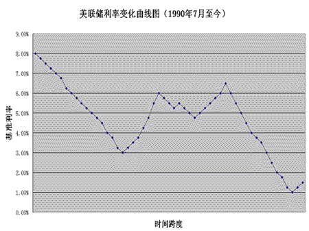{width="3.3773589238845143in"
height="2.030505249343832in"}

## 布什，2008年前后将任内被刺杀！

(2006-05-08 23:07:03)

当然，这并不是说现在鼓励大家组织一个什么活动去干一干布什，而是因为2008年前后布什将被刺杀是出自一个众所周知的简单统计。在历届美国总统中，有一个很奇怪的巧合，就是凡是X1年（其中X是偶数）在任的，最终的结局都是任内被刺杀或病死：\
William Henry Harrison 威廉亨利·哈里森: 1841-1841，任内病死；\
Abraham Lincoln 亚伯拉罕·林肯: 1861-1865 ，任内被刺杀；\
James A. Garfield 詹姆斯·加菲尔德: 1881-1881，任内被刺杀\
William McKinley 威廉·麦金利 : 1897-1901，任内被刺杀；\
Warren G. Harding 沃伦·哈定: 1921-1923，任内病死；\
Franklin D. Roosevelt 富兰克林·罗斯福: 1933-1945 ，任内病死；\
John F. Kennedy 约翰·肯尼迪: 1961-1963，任内被刺杀；\
Ronald Reagan 罗纳德·里根 :
1981-1989，任内被刺杀而唯一活命，最终得恶疾病亡。

从上面的资料就很容易看出，如果这对美国总统的恶咒继续，布什将面临两种命运，任内被刺杀或病死。看现在布什还能满世界乱叫乱跳的，怎么也不像有什么大病能死掉了，因此任内被刺杀就成为唯一的可能。现在离布什离任也就四年了，且不可能继续连任，因此，布什要被规律地刺死也没几年了。2008刚好是中间的年份，因此说2008年前后显然是合适的。如果知道布什八字，基本上就能确定其被杀的年份以及月份，至于具体的日子和时刻，还需要更多的资料。至于布什是被什么武器什么人搞掉的，其实也是可以算的，不过这已经不重要了。关键是，布什究竟是一下死掉，还是和里根一样被刺后勉强延命最终恶疾而死，这一点也需要其八字的资料。

当然，命运是可以改变的，但其前提是必须洗心革面，还有一种就是靠命硬而硬抗，但后一种最终的结局会更惨。之所以说这个，其实只是告诉大家，后面四年等于是一个现场直播的游戏，一个被恶咒所掩的人是如何中招或如何最终侥幸逃掉，而这种游戏可不是能经常被直播的，好好看！

## 股市闲谈：G股是G点，大牛不用套！

(2006-05-12 19:02:25)

能和本ID聊股市的，如果有，最多就处在精子或卵子状态，连受精卵都算不上。而且股市游戏是靠干出来而不是说出来的，因此一般都不说。但看到有些人被这股市折腾得厉害，出于同情，又周末了，也就说两句。

一年前股市跌到1000点最腥风血雨时，当时看到很多人在网上很可怜，就用老ID给了一个明确的说法，叫"G股是G点"，越腥风血雨就机会越大了。现在这个G点已经弄得让很多人受不了，绝大多数在市场中的人都是很犯贱的，跌也怕，涨也怕，真是可怜。为此，今天再给一句话，叫"大牛不用套"。\
这个不用套，最关键的意思就是不要用老思路来套用走势，特别是那些对市场了解不多的。例如那天看到有人说什么五粮液的权证疯了，都3、4元了，这些人就是对市场了解不多。知道以前宝安权证给干到多少吗？知道深圳市场受香港影响一直都有玩权证的传统吗？知道在香港比这疯多的权证遍地都是吗？市场总是要超越一般人想象的，3、4元就贵？为什么股价就不能比酒价贵？哪一天，按复权算，一瓶茅台、五粮液买不来一股相应股票又有什么可奇怪的？

当然，对于极少数的人来说，市场就是一个提款机，想提就提，这怎么才能办到？就是要对市场充分地了解，真了解市场的人，就知道市场都是一样的，就像穿着各种衣服的人，扒光了都一样。真明白市场的，就无所谓牛熊，市场永远都是提款机。当然，如果市场只能是单边的，那么唯一的区别就是在熊市中，投入的资金以及摆动频率要小。

不过，即使在牛市中，高手和低手之间的赢利程度也是区别很大的。一个股票如果上涨1倍，低手最终落袋的最多就是1倍，而高手搞出3、4倍来是一个很简单的事情。其实，股票投资十分简单，最关键的就是成本，而时机其实就是成本，如果你有本事能比市场的平均成本要低，就永远立于不败之地。既然波动是市场风险所在，那么相应地就提供了利用市场的风险，利用一切值得利用的波动把持有成本往0甚至负数干下去的机会，这样，无论牛熊，都无所谓了。有波动就有风险，相应就有利润，对于一个高手来说，只要有足够的时间，一个下跌股票弄出来的利润一定比一个低手在一个上涨股票弄出来的大，当然这只是举例，真正的高手当然不会故意逆着趋势干。

投资是一门艺术，而投资的艺术归根结底是资金管理的艺术，这就像歌唱的艺术，归根结底是呼吸的艺术一样。而市场的波动，归根结底是在前后两个高低点关系构成的一个完全分类中展开的，明白了这一点，市场就如同自己的掌纹一样举手可见了。以上这些，不但对于散户，对于庄家其实也是一样的，能明白这一点的，就可以在市场中游刃有余了。当然，这个境界还有向上一路，这就不是能对一般人说的，而且说了也白说，就不说了。

## 房奴，自己傻还出来现眼，丢人不？！

(2006-05-13 18:30:03)

这两天，所有的媒体大概都在开"赛傻大会"，一会儿是读错字的所谓大师，一会儿是再次被女人抛弃后撒野的摇滚老男人，但说得最多的，可能还是那所谓的房奴了。究竟什么是房奴，也没什么经典的定义，大概就是炒股炒成股东之类的傻人。这种人，根本不值得同情。自己傻还出来现眼，丢人不？！\
这种人基本具有以下几个特点：削尖脑袋往所谓的大城市挤、爱慕虚荣超前消费、投机不成撒泼撒野。这些喊得最凶的所谓房奴，根本就不是什么穷人，真正的穷人根本不可能想到买房子，真正的穷人就算房价回跌70%也买不起房子。这些所谓的房奴都不过是些所谓的白领、小资，一群得了便宜就卖乖，自己失算就怨天怨地的废物点心！

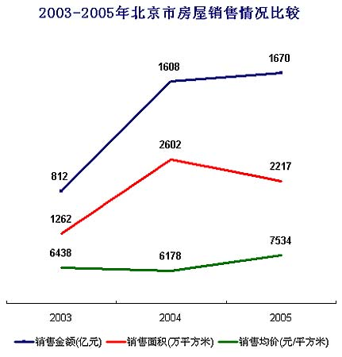{width="3.377463910761155in"
height="2.820144356955381in"}

贷款买房是你自己的选择，全世界贷款买房的都一样，中国并没有任何的特殊，市场经济就意味着，任何市场行为都对应着风险，就像股市入市必须要知道市场有风险而且风险自担，贷款买房也一样，自己算计不好就像股票被套牢一样是活该。房子，买不起可以不买，或者买可以买得起的，这就是最基本的原则，要没风险就一次性付清，至于炒楼的套死了活该！可以很坦白地说，本ID虽然有很多房地产的朋友，但从来不干什么房地产，那比起期货、股票来钱、套现都太慢；虽然在好几个大城市都有置业的经验，但每次都是一次性付清，而且2003年以后就从来不想再买什么房子了，更加不会炒什么楼，因此，本ID至少在利益上是可以客观公平地看待这件事情的。可以这样说，目前的房地产价格上涨是社会转型以及世界经济大变动的综合结果。

首先，由于全球化，资源价格必然有在世界范围趋同的倾向，目前世界经济大变动，资源价格在全世界范围大涨，从某种意义上，房价是涨得最少的，看看有色金属、原油等就知道了。而中国的资源价格在原来的经济体制下普遍比世界价格要低，在这种双重力量下有很强的上涨动力就十分正常了。

其次，由于人民币的强烈升值预期，人民币资产成为巨量世界性游资的追逐对象。这一点，在本ID几年前强烈反对人民币升值的有名网文中就多有论述。现在，既然人民币升值这个口开了，就必然要面对这个结果，这又有什么可值得说的？而且这种趋势只是刚开始发挥作用，真正猛烈的还在后头，任何有点经济常识的都可以看清楚。

最后，政府如以前股市中一样，在房地产政策上有着极大的问题，这个问题的解决，必须要有如去年股市开始的那样力度的大变革才有可能实现。希望这次股市的经验能够被很好总结，然后在房地产等方面得以推广，这可能是政府唯一能干也应该干的事情。

现在的房奴，就如同去年股市下跌时的多头，企图要挟政府为他们自己的愚蠢埋单，门都没有！新闻媒体在这方面大肆吵作，除了暴露自己如房奴般的愚蠢和可笑，也是其逐臭本性的体现，而一些境外媒体的加入，就更是别有用心，值得警惕了！

## 潘石屹、任志强又没几个钱，盯着他们干啥？

(2006-05-22 12:57:18)

最近房地产又成了所谓的热点，一说房地产，什么潘石屹、任志强之流的就被盯着。真是奇怪了，潘石屹、任志强又没几个钱，盯着他们干啥？例如，期货、证券中随便一个小主力，资金实力都比他们强多了。而且火星人都知道，房地产里拿一块地和股票里抢一个庄的概念可大不一样，后者基本上有钱有技术就行，前者有钱有技术也没用，没关系没门道，基本都瞎掰，而有关系有门道，没钱也可以充大爷练空手道了。关系、门道和什么地方相关，这个，连火星虫都知道！

潘石屹现代城的时候差点给废掉，后来起死回生也没挣几个钱，有了建外SOHO才好一点。至于任志强就更奇怪了，说白了就是一个比打工稍微好点的，打倒资本家好象还轮不到他。潘石屹、任志强只不过是呆在北京，北京又是一个八卦中心，所以就成了什么富人的代言人了，你问他们配吗？比他们厉害的人多了去了。潘石屹、任志强这些大嘴巴说的破话除了代表他们自己能代表什么？

市场经济是利益经济，只要有利益，什么不能干？别说经济适用房了，什么房都可以建。问题的关键在发展商吗？问题的关键在政府。对于发展商来说，如果拆迁加上政府的乱七八糟收费已经2000了，你要他卖2500，有可能吗？难道那些钢筋水泥是从天上掉下来的？问问现在每个发展商取得一块土地除了正常的费用外还要花多少见不得人的费用，就知道问题在哪里了。

抛开土地取得的非正常费用，现在房地产最大的问题还是在政府那里。要解决房地产问题，就是一定要实行房地产开发的双轨制。针对中低收入的房子，其土地必须是政府免费划拨的，房地产商加上建筑成本以及合理的利润后价格自然下来，甚至可以组建大型的国企专门负责这件事情，完全不以赢利为目标；针对高收入的房子，其土地的取得就走拍卖等方式，但其中的程序必须要继续完善，房地产商风险自担。当然，一般房子地段一定不会好，好的地段，光拆迁就不知道要多少钱，拆迁钱少了，你问那些所谓的穷拆迁户愿意吗？政府有这钱吗？这种房子只能全面市场化，只要有人买，多贵都正常。

世界没有什么完全公平的事情，在以前分房的时候，有权当官的不也有优先权吗？现在其实比以前公平多了，至少在人民币面前人人平等了，这就是历史的进步。至于那些发展商，就低调一点，在其他领域比你们牛的人多了去了，如果没有当鸭子坐台的爱好，少出来几次见人不会死人的！

## 中国威胁，源自威胁中国，理所当然！

(2006-05-27 16:50:08)

现在世界上有一种很搞笑的理论，叫"中国威胁论"，而国内有一种更搞笑的行为，就是千方百计去解释"中国威胁"的不存在。如果"中国威胁论"无聊，解释"中国威胁"的不存在就无极了，中国不是馒头，就不要再馒头啦！

中国威胁，源自威胁中国，理所当然！如果没有1840年以来的威胁中国，就不会有现在的中国威胁，以眼还眼、以牙还牙难道不是很西方的？既然全球化被如此地全球化了，中国威胁地去还那威胁中国，难道不是很全球化逻辑的逻辑？

对豺狼只能用豺狼的逻辑，这就是最基本的逻辑，离开这个逻辑的逻辑都是也只能是废物点心的逻辑！狮子睡醒了，地上那些闲狐兔当然会觉得威胁，但难道狮子还要逐个去安慰或慰安它们不成？关键是狮子醒了没有，你只要是那醒狮子，闲狐兔们叨唠什么又有什么大不了的？

真的狮子只会用自己的吼声向世界宣布自己的存在，狮子的存在就是对闲狐兔的威胁，没有威胁的狮子还是狮子吗？企图让狮子永远睡着，即使醒了也要拔牙折爪放到笼子里，这就是所有闲狐兔的把戏。只有闲狐兔才需要把戏，而狮子是不用把戏的，更不会为了所谓威胁的指责而自动拔牙折爪。

让中国威胁的哀号继续哀号，对强者的哀号只不过是对强者颂赞的另一种表达，狮子是需要狐兔哀号的，在这种哀号中，狮子才能最终狮子。狮子不会也不用解释，狮子只有也只用怒吼、利牙和钢爪！没有了怒吼、利牙和钢爪，一切都瞎掰！

## 鄙视网上反对国内油价上涨的主流！

(2006-05-28 12:34:55)

网络，绝对不是什么穷人聚集的地方，真的穷人，根本就没钱上网，而现在中国一亿多上网的人中，绝大多数都不过是所谓的小资，还有一些酸馊文人，网络上的大众意见，只不过是反映了这些小资和文人的酸馊意见。如果套用以前的所谓阶级分析，现在的网络，只不过是小资产阶级和被收买的工人阶级贵族的垃圾场。

在网络上，除了反对房价上涨，反对国内油价上涨的声音是最大的。为什么？很简单，就是现在国内油价上涨最触及的利益阶层刚好一致于现在网上的所谓主流，这一群小资产阶级和被收买的工人阶级贵族的垃圾。如今的媒体、文化圈都被这群腐朽无能的中国小资产阶级和被收买的工人阶级贵族垃圾所把持，这也是目前文化领域垃圾化的阶级根源。

这群人的特点就是爱慕虚荣，口是心非，一边在虚拟的空间中大骂市场经济，一边在现实中为了一些市场经济的蝇头小利而到处逢迎。明明经济实力不行，就要贷款买房子，还要贷款买车，中国的所谓中产阶级是全世界最无耻、腐朽的一群。就以车为例子，欧洲的中产阶级早就以买小排量为潮流，而中国经济实力远远不及欧洲的中产阶级们，打肿了脸去以大为荣，恨不得人人都开888缸的才有面子，油都买不起还充胖子？破产了都活该！

在世界经济全球化的大背景下，资源价格的全球化是不可逆转的趋势，现在的房价、油价的上涨正是这种趋势的基本反应，完全是合理的。有多大头就戴多大的帽子，喜欢戴大帽充大头的中国中产阶级在这种趋势下，将彻底暴露他们无能、无耻的本质。只有把这群小资产阶级和被收买的工人阶级贵族垃圾打得稀巴烂，中华文明的最终复兴才有真正的希望！

## 收购中国，从宝邯之争说起！

(2006-06-02 21:44:58)

资本全球化，就意味着资产价格的全球化定价，最近国内房价、油价的变动正反映了这种不可逆转的大趋势，而这一切，最终也会最充分地在资本市场中体现，特别，当国内资本市场全流通后，这种反映就不单单是一种理论了。

资本市场归根结底是通过虚拟价格来实现现实价值的占有，而这一虚一实的游戏就有了资本市场的诸多故事，当然最多的故事都是望梅止渴、画饼充饥一类的，但对于大资金来说，除了利用这种画饼游戏去套人套钱外，更重要的还是利用这种虚拟机制达到现实的目的。

这几天，其实私下已不是新闻的宝邯之争成了当下的新闻，且不说这是否又是一个画饼游戏，这和十几年前的宝延之争都可以说是开风气之先了。后者是在一个具体的全流通个股中玩的游戏，而前者却是在整体全流通背景下必然出现的游戏。

前两天，邻国的一位资本市场大玩家来北京，在一起聊了一个下午。他那里，因为最近文化输出十分牛，现在流行文化概念，除了原来控制的几个上市公司，他刚收购的一个相应股票三个月就涨了十七倍。刚在东南亚某国收了一个赌场的他，这次来却不是为了赌，而是要寻找进入中国资本市场的机会，原因之一是他那的某税收政策有大变化，其次，他希望在两国资本市场间嫁接一个流动的渠道，最后，最重要的还是目前中国的资产价格严重偏低，这就意味着玩大游戏的机会。

那人拿着收集好的几十家国内上市公司的资料，希望能选择合作收购其中的三、四家。本ID当然是很专业地和他探讨这些问题，而这，最近一、两年其实已经不是一个很新鲜的事情了。资本全球化，意味着资本必然通过任何可能的渠道在各国中流动，如果以前收购中国可能还是一个神话，那现在，神话已不再。看看，在目前国内的资产价格下，几亿美金就可以控制一个国家大型钢铁企业，这一切说明了什么，警示了什么，大概就不用多说了。

## 长虹，老子变孙子，只要三亿美圆！

(2006-06-06 21:09:45)

这是"收购中国，从宝邯之争说起！"的续篇。长虹是谁，即使你从未在资本市场上晃荡，从未被电视、媒体上十几年如一日的广告、报道所污染，也应该知道！那长虹是谁的？当然不是人民的，如果是人民的，那现在人民的名字叫国资委。而上市公司长虹是谁的？在目前中国的环境下，肯定是大股东的，大股东四川长虹电子集团有限公司，也就是他的老子。儿子是老子的儿子，这很中国地天经地义，但已越来越全球资本市场地没了意义，老子一夜可变孙子，这就是市场经济。

股改了，这老子现在只是三分之一的老子了。长虹18亿的股份中，长虹集团只占6亿，从原来53%的绝对控股一夜之间变成现在33%的相对控股。相对控股也还是老子，毕竟还是大股东，而现在的中国上市公司，大股东是老子，其他都是孙子。但是，让现在的长虹"老子变孙子"，其代价只要三亿美圆。

目前长虹已有所回升的股价是3元多人民币，要成为大股东，也就6亿多一点的股票，大概三亿美圆上下。且不算其品牌价值和市场渠道、人才等软价值，目前长虹的每股净资产是5元多人民币，公积金有5亿多美圆。最近长虹刚收了美菱，触角伸向白色家电，而赵少帅也刚因为把长虹重新纳入快速增长轨道而获大奖，这对于猎手来说都是好消息，猎物越来越肥了。\
3亿美圆是一个什么概念？对于国外一个中型基金，3亿美圆只是一个尾数的尾数，对于国内的私募基金来说，有3亿美圆的，现在也算不了什么大鳄了！资金从来都不是问题，另外一个更不是问题的就是，即使10亿美圆，一定复制不了现在的长虹，这是无疑的。买东西其实很简单，如果3亿可以控制一个10亿都复制不了的东西，这个买卖当然就可以买卖了。

显然，在现在的市场中，长虹绝对不是特例，而是相当普遍。最近，外资等的收购已经不断出现，这种收购并不是单单在某个产业，而是系统的。不是有人以中国成为世界工厂而兴奋吗？但黄雀只知道，成为世界工厂的大股东而控制世界工厂，是一个更简单的、可以目标的目标，而且是一个正不断目标了的目标了！

## 教你炒股票1：不会赢钱的经济人，只是废人！

(2006-06-07 18:08:15)

"教你炒股票"这样的题目，全中国不会有第二人比本ID更适合写的。当然，股票是炒出来的，不是写出来的，因此也从未想过写这样的题目。但任何事情都是有缘起的，缘分到了，也不妨写上一写。

人，总是很奇怪的，就算是很聪明的人，或者在其他行业很成功的人，一旦进入资本市场，就像换了人。虚拟和现实的鸿沟使得干实业的，且不说期货了，就算到风险小多的股市，也很少能干好的。而习惯在虚拟市场玩游戏的，基本很难回头去弄实业，这些例子都太多了。

周围朋友和经济有关的，干金融的比较多，也有几个干实业的。去年人民币放开后，有次和他们一起玩，偶然聊起股票。当时给他们的意见是，由于资源的全球化升势及人民币的升值，国内实业将有很大的困难，而虚拟市场由于对资本的吸纳作用将大有改观，会出现一个至少是大X浪级别的行情，劝他们应该分流部分资金到资本市场来。由于前几年资本市场上出事的人一拨接一拨，这帮家伙很犹豫，一晃就把时间过了。

今年，过完春节，这帮家伙突然开始不断骚扰本ID，说要入市。本ID当时已经忙得无暇分身，对他们一番数落，然后告诉他们，现在是个人都能挣钱，自己玩去，没空理你们。

进入三、四月份，当时有色等行情已经很火暴，这帮家伙想大进又怕风险，一直在小打小闹。有一天，又在一起玩，他们一定要本ID选择一些具体的股票。因为这两年一直有很多外资大基金进来接触要收中国快速消费品的企业，还有就是一些大的周期行业将面临重组，就让他们去关注这两类股票和权证。

五月份后，股市大涨，大家都很忙，中旬时又有机会碰头，一问之下，基本都没怎么大买，买了的也没几个站就下车了。他们都显得很烦躁，不断问有什么可买的。既有点可怜又有点烦他们，怎么在市场外弄得好好的，一到市场里都成这样了？就有点敷衍地告诉他们，去买深沪两地3元上下的本地股，而且告诉他们，这样下去肯定要出问题的，最好自己好好学学，别人怎么厉害也不可能整天像照顾小孩一样看着。

上周日，又碰在一起。这几位，大概都一肚子股票了，这次个个神采飞扬；大概又都刨了几本书，听了几股评，看了几杂志，更是口水喷喷地这面那面、一线二线地专家了，1800、2000、2500点地牛人了。这市场，还真能改造人！只是这市场的绞肉机，又有新货了。

有人说，市场是老人挣新人的钱，而市场中的老人，套个10年8年的一抓一大把。其实，市场从来都是明白人挣糊涂人的钱。在市场经济中，只要你参与到经济中来，就是经济人了，经济人当然就以挣钱为目的，特别在资本市场中，没有慈善家，只有赢家和输家。而不会赢钱的经济人，只是废人！无论你在其他方面如何成功，到了市场里，赢输就是唯一标准，除此之外，都是废话。

（待续）

## 教你炒股票2：没有庄家，有的只是赢家和输家！

(2006-06-07 22:41:27)

庄家这种动物对大多数人来说很神秘，对本ID来说就太稀松平常了。庄家和散户这种二元对立，大概比较适合现代中国人的思维模式，因此就变得如此的常识，但常识往往就是共同谬误的同义词，不仅是所谓的散户，而且很多的所谓庄家，也就牺牲其中。

一般定义中的所谓庄家，就是那些拿着大量资金，能控制股票走势的人。在有关庄家的神话中，庄家被描述成无所不能的，既能超越技术指标、更能超越基本面，大势大盘就更不在话下了。这里说的还只是个股的庄家，至于国家级的庄家，更成了所谓散户的上帝。关于这些庄家上帝的传闻在市场中一秒钟都不曾消停，构成了常识的谬误流播。

但所谓的庄家，前赴后继，尸骨早堆成了山。前几天在一个私人聚会里，还碰到一个50年代的老大叔，说已经准备了二十亿，要坐庄，让本ID去联系一下某某公司的头。那人也是有头有脸的人了，不想当众奚落他，暗地里把他嘲笑了一番，简直是脑子锈着了。

当然，即使庄家的神话已经如此常识，这种傻人还是一直、也会继续前赴后继的。而正因为这种傻人如此的多，猎人打起猎来才能收获丰富。看到越摆庄家谱的，猎人就越高兴，反正这类型的，基本在市场上混个几年就基本尸骨无存了。

市场没有什么庄家，有的只是赢家和输家！有的只是各种类型的动物，还有极少数的高明猎手。市场就是一个围猎的游戏，当你只有一把小弓箭，你可以去打野兔；当你有了屠龙刀，抓几条蛇来玩当然就没劲了，关键你是否有屠龙刀！

（待续）

## 教你炒股票3：你的喜好，你的死亡陷阱！

(2006-06-09 17:03:48)

要世界杯了，在世界杯时谈论股票是一件很无趣的事情，而且，全世界的人都知道，世界杯前后，股票市场几乎都要大跌，这个常识，虽然并不比所有有关所谓庄家的常识更值得常识，但至少有趣，并不像所谓庄家一般无聊。还可以增加一句的是，足球至少有帅男，而见过的如此之多的所谓庄家里，连长得不那么歪瓜裂枣的都少，这的确是实际情况，并不是开玩笑。

但你的喜好，就是你的死亡陷阱！在市场中要生存，第一条就是在市场中要杜绝一切喜好。市场的诱惑，永远就是通过你的喜好而陷你于死亡。市场中需要的是露水之缘而不是比翼之情，天长地久之类的东西和市场无关。市场中唯一值得天长地久的就是赢钱，任何一个来市场的人，其目的就是赢钱，任何与赢钱无关的都是废话。

必须明白，任何让你买入一只股票的理由，并不是因为这股票如何好或被忽悠得如何好，只是你企图通过买入而赢钱，能赢钱的股票就是好的，否则都是废话。因此，市场中的任何喜好，都是把你引入迷途的陷阱，必须逐一看破，进而洗心革面，才能在市场上生存。

当然，能看清楚自己周围的市场陷阱，还只是第一步，更进一步，要学会利用市场陷阱来赢钱。当你要买的时候，空头的陷阱就是你的最佳机会，当你要卖的时候，多头的陷阱当然就是你的天堂。这市场，永远不缺卖在最低点，买在最高点的人，这世界上没有什么是可以让所有人赢钱的，连大牛市中都有很多人要亏损累累。而市场中的行为，就如同一个修炼上乘武功的过程，最终能否成功，还是要落实到每个人的智慧、秉性、天赋、勤奋上来！

（待续）

## 鄙视所有对N中工15元不敢买50元就吃醋的人！

(2006-06-19 16:45:17)

谁都知道N中工万千宠爱在一身，一年多没有新面孔了，突然来了一个新的，大伙热烈一下有什么不对的？值得某些人这么大惊小怪的？鄙视所有对N中工15元不敢买50元就吃醋的人！

今天该股90%多的换手意味着，所有中签的人基本都抛了（对手盘包括其中），而且绝大多数都在10几元抛的。这就对了，你们10几元不看好，有人要看好，市场向所有人开着，凭什么不能买？市场就是一个斗心理的过程，大家都想一块去了，大家还用不用活了？

下午激烈冲高，又有什么可值得奇怪的，市场上要买的力量大，而由于T+1，没有足够的筹码供应出来，要买几百万股都跑到50元的，这不很正常吗？请注意，今天的均价是在18元，均价并没有大幅上涨，因此任何有关投机的说法都是可耻的！而且今天有快三个小时10几元随便买，自己没买，就企图起哄叫嚣什么监管来捣乱的，鄙视你们！

中国资本市场中有过太多无聊无端的干预，像327的最后交易不算之类的事情真是世界罕有。市场最关键的就是大家都要遵守规则，这包括管理层，不能按自己的一时喜好而干预市场。就算交易有问题，只能根据交易的问题来处罚，而不是突然改变规则来显示自己的无能。

只要符合市场交易规则，包括N中工在内的所有走势，都应该受到法律保护，由于现在的法律观念太淡薄，往往有按个人喜好代替法律判断的倾向，所以必须再次强调。至于市场中的人，不要自己没份就瞎起哄，看不得别人好不是一个好的市场参与者应有的心态。首先有了一花盛放才可能百花盛开，维护一个只按法律办事的环境，对大家都有好处！

## 教你炒股票4：什么是理性？今早买N中工就是理性！

**(**2006-06-19 21:41:14)

很奇怪，在资本市场中经常有人在教导别人要理性。而所有理性模式后面，都毫无例外地对应着一套价值系统为依据，企图通过这所谓的依据而战胜市场，就是所有这些依据最大的心理依据，而这，就是所有资本谎言和神话的基础。真正的理性就是要去看破各色各样的理性谎言，理性从来都是人YY出来的皇帝新衣，这在哲学层面已不是什么新鲜的事情。

更可笑的是，被所谓理性毒害的人们，更经常地把理性当成一种文字游戏，当文字货币化以后，这种文字游戏就以一种更无耻的方式展开了。但真正的理性从来都是当下的，从来都是实践的，而实践，从来都是当下的理性。就像性是干出来的而不是说出来的，理性也一样。

站在资本市场的角度，就是所有的介入都是可介入从而被介入地介入着。也就是所有的介入，当你介入时，市场与你就一体了，你创造着市场，从而市场也创造着你，而这种创造都是当下的，从而也是模式化的。真正的理性关心的不是介入的具体模式如何，而是这种模式如何被当下着，最重要的是，这种模式如何死去。

生的，总要死去，如果自然真有什么法则，这就是唯一的法则，市场上的法则也一样。所谓法则，就是宿命。在市场中，死亡是常态，也是必然，而生存，必须以生为依据，所谓生生不息，其实就是死死不息，当你被依据所依据时，其实已在死亡之中。而生死，从来都是被当下所模式，资本市场也一样，以为离了生死也就无生死可了，这不过是所谓理性的妄想。任何市场中人，都是被生死了的，生死无处可离，生死就在呼吸之间，不离生死而从容于生死，没有这种大勇猛，一切的理性都不过垂死的哀鸣。对于市场来说，介入就是介入生死，无所依据地从容于各种模式之间，无所往而生其心，而心实无所生，方可于生死而从容。

对于市场的参与者来说，首要且时刻必须清楚自己目前介入模式的当下，而市场中的绝大多数人，是不知道自己在干什么的，狠一点说，就是死都不知道怎么死就死了，市场基本由这种人构成。这种构成与资金实力无关，大资金死起来更快，一夜之间土崩瓦解的事情，本ID见得多了。此外，如果你一定要很习惯地、理性地追问什么是理性，那么，相对那些光说不干的所谓理性，今早15元多买N中工就是理性！理性是干出来的，今天，你干了吗？

（待续）

## 为管理层对N中工走势的回应热烈鼓掌！

(2006-06-20 11:51:24)

如今盛行网络舆论暴力，最近那闹得沸沸扬扬的某事件只不过一个很普通的事例。昨天N中工走势引发网络暴民一阵喧嚣，本ID不愿意看到这种暴力哲学得逞，收市后马上写了"鄙视所有对N中工15元不敢买50元就吃醋的人！"，里面强烈呼吁必须以法律和现行规则来评价该走势，不能重回诸如327之类的老路。

本ID从来不爱对管理层说什么好话，从来觉得对管理层应如小孩般，多多斥责才会有进步。以前唯一一次大力为管理层鼓掌是去年公布股改大跌那最腥风血雨时，连续三个帖子对管理层下大决心解决问题的态度大力鼓掌，而今天，必须再次为管理层鼓掌，为的是其对N中工走势的回应：深交所称中工国际表现属于正常，不会进行调查。

首先，由交易所而不是证监会来回应这事，符合规则。对一个股票的一天走势这么小的事情，如果都要动用证监会，那就像小孩玩泥沙这么小的事情都要告法院一样无聊。其次，表现属于正常，这是一个规则可以检验的概念，只要符合买卖规则，资金上有没有出现过度集中的异常情况，任何走势都是应该被允许的。最后，从这事情可以看出，现在的管理层已经越来越成熟，而现在的很多所谓股民，还是相当不成熟，为一点芝麻小事就一惊一咋的，惹人笑话。

至于N中工其后怎么走，就更是市场化的事情，管理层当然就更不应该太多干预，这次N中工为其后的监管提供了一个最好的榜样，希望能继续发扬，这样中国资本市场才会少闹点笑话。

## 教你炒股票5：市场无须分析，只要看和干！

(2006-06-21 20:52:02)

喜欢吹牛皮的，在市场里最常见，例如一种以分析市场、吹牛皮为生的职业，叫什么股评、专家的。此类人不过是市场上的寄生虫，真正的猎手只会观察、操作，用嘴是打不了豺狼的。

市场就是一个狩猎场，首先你要成为一个好猎手，而一个猎手，首先要习惯于无言。如果真有什么真理，那真理也是无言的。可言说的，都不过是人类思想的分泌物，臭气熏天。真不可言说了，就无不可言，言而无言，是乃真言。

一个好的猎手，可以没有嘴巴，但一定会有一双不为外物所动的眼睛，在这眼睛下，一切如幻化般透明。要不被外物所动，则首先要不被自我所迷惑，其实无所谓外物、自我，都不过幻化空花，如此，方可从容其中。

猎手只关心猎物，猎物不是分析而得的。猎物不是你所想到的，而是你看到的。相信你的眼睛，不要相信你的脑筋，更不要让你的脑筋动了你的眼睛。被脑筋所动的眼睛充满了成见，而所有的成见都不过对应着把你引向那最终陷阱的诱饵。猎手并不畏惧陷阱，猎手只是看着猎物不断地、以不同方式却共同结果地掉入各类陷阱，这里无所谓分析，只是看和干！

猎手的好坏不是基于其能说出多少道道来，而是其置于其地的直觉。好的猎手不看而看，心物相通，如果不明白这一点，最简单就是把你一个人扔到深山里，只要你能活着出来，就大概能知道一点了。如果觉得这有点残忍，那就到市场中来，这里有无数的虎豹豺狼，用你的眼睛去看，用你的心去感受，而不是用你的耳朵去听流言蜚语，用你的脑筋去抽筋！

（待续）

## 投资中国房地产，脑子进水的表现！

(2006-06-26 19:06:42)

曾不止一次说明，本ID在国内几个大城市都买过房子，但从来不炒房子，只是为了各地跑时不要整天住酒店，想干点动静大点的事都不方便。正因为如此，当本ID说"投资中国房地产，脑子进水的表现！"时，没有任何的利益，只是就事论事。否则，如果按照有房族的利益，当然要鼓励大家买房子，然而，本ID还是要说，只有脑子进水的才投资中国房地产。

当然，本ID买过这么多次房子，并没有脑子进水，因为这只是为了自住，而不是投资。这里说的是投资。所谓投资，必须这个投资有一个可以被权力的权力，而中国的房地产有什么权力？地球人都知道，在中国，土地不是私有的，因此，从根本上说，中国的房地产不能叫房地产，因为根本没有地，只有房，房不过是空中的一个泡沫，中国的业主只不过是泡沫里的一个长期租户而已。

本ID反对保护什么私有财产，即使站在客观的角度，没有土地私有制，所谓保护私有财产就是一句空话，请问，你连住的地方都是租来的，你能保护什么？所以就不要闹什么瞎掰的保护私有财产了。而且历史上私有财产的保护其实不过等价于对没有战争和革命的空头承诺，战争、革命一来，企图保护私有财产的自己连命都不一定保住，就甭瞎掰了。

从实际上看，投资中国的房地产还不如投机中国的权证市场，权证里一两个月长10倍的都有，而中国的房地产不过就是一张70年的权证，准确说连权证都不如，至少权证到期可能还有点什么，房子到期就什么都不是了。现在说什么到时候可以补地价之类的都不过是瞎掰，而这类瞎掰都不过是开发商闹出来的玩意。中国的开发商，某种意义上类似创设权证的庄家，只有傻子才会把他们当回事。

当然，虽然脑子进水，但只要有更进水的，这事情就有投机的机会。投资中国房地产，除非你当开发商，然后找脑子水更多的小业主把房子买走，就如同创设权证的庄家把权证卖给散户一样。这世界上不缺脑子进水的，所以这个游戏一定有得玩，谁晃晃自己的脑子，如果声音比较大，不妨参与其中。

## 红杏出墙，中国强大之利器！

(2006-07-04 22:46:08)

智力低下的男人怎么可能理解"红杏出墙"的妙处，在破男人写的破书里，包括"孙子兵法"还有什么三十六计，有"红杏出墙"吗？而"红杏出墙"是对付所有男人的利器，所有男人在"红杏出墙"面前都无能为力，只好把帽子染成某种颜色，又用他们所霸占的话语权，把这种颜色称为环保色，然后都成了环保主义者以遮盖男人天生都是被环保主义者的事实。既然"红杏出墙"在女人和男人的战争中战无不胜，那么，如何发掘出"红杏出墙"的强大威力，在国家与国家的竞争中出奇制胜，这就是一件极为重要的事情了。

比起那些心理污浊的男人研究所谓"红学"，"红杏出墙"学更应该成为一个大课题、一个大学科，它的利用将遍布所有领域，最终将取代孙子兵法、三十六计之类男性思维的垃圾。面对这么宏大的研究范围，当然不是这样一个帖子能够胜任的。本ID曾用数学里的哥德尔不完全定理证明了红杏的完美在于其出墙。而这可以看作"红杏出墙"学的基本定理。对于国家来说，完美显然包括强大，一个弱小的国家无论如何不能说是完美的。因此，如果把中国比作一棵红杏树，墙代表了闭关锁国的状态，那红杏不出墙，则中国的强大显然就是纸上谈兵了。

如果进行更深一步的分析，红杏之出墙，其根则不能也出墙了，否则就不是墙内之红杏，其魅力和威力将全无。相对于国家来说，中国的开放如果离开了中国这棵红杏树的根，这根也挖出来开放出墙去了，则中国将不成为中国，就象离开根离开树的红杏，被人玩两把就仍到垃圾堆里去了。从这种意义上说，这个红杏出墙根稳固的原则，是"红杏出墙"能否成功的关键。

至于探讨"红杏出墙"学的各种规律和问题，使得"红杏出墙"这令所有男人闻风丧胆的利器发挥其最大威力，最终能在中国的强国之路上发挥最大的作用，这一点就是以下几个帖子的任务了。

## 天天为生计奔忙的，没资格鄙视钱！

(2006-07-12 11:59:25)

火星里的鸭子都知道，钱是孙子，有钱就装大爷大娘的连孙子都不如。但天天为生计奔忙的人，没资格鄙视钱！因为你们连比孙子都不如的都不如，还有什么资格谈论？那种酸馊文人，装着清高的样子，对着葡萄皮惟有叨唠的份，可笑又可怜。

有钱不是大爷大娘，没钱的更不是大爷大娘。你要让钱真正成为你的孙子，首先你要战胜它，让钱成为你的奴隶而不是相反。钱，本质上是一种社会关系，人与人的社会关系。有人号称从来没碰过钱，但没碰过钱的往往意味着这种社会或权力关系以一种比钱还钱的方式存在着。

有一种更可笑的说法，认为用自己某部分来交换钱就是可耻的。但钱本来就代表着一种交换关系，在市场经济中，任何的交换最终都同构于钱的交换，这是理所当然的。男文人用进了水的脑子交换钱，男特殊行业者用进了水的身体的另一部分交换钱，本质上都是同构的，没有谁比谁高。只要存在交换，这一切都不会改变，因为它已被经济结构的同构关系所决定了。

在计划经济里，因为还是存在着交换，因此钱或者钱的类似物就依然会在其中的交换关系中扮演着同构等价物，这一点和市场经济是没有什么区别的，里面也没有谁高谁低。在结构上，市场经济和计划经济在核心的层面上是同构的。

阿堵物并不因为被称为阿堵物就可以掩耳盗铃地不阿堵物了，对于任何人来说，阿堵物都是你生命中堵在路上的一道坎，能过去的就过去了，然后自由于其中；过不去的就永远纠缠其中，天天为此奔忙，把生命耗费其中，不管你如何咒骂，都不过是哀鸣而已。

## 茅于轼，交换产生财富？

(2006-07-17 12:45:33)

今天看到茅先生的"经济自由主义背后的不自由"，纯粹是一屁股决定脑袋的垃圾文章。当然，茅先生和家里人有点交往，就不想逐一批驳，完全把茅先生的文章拔光就太不给茅先生面子了。这里只是就茅先生"交换产生财富"的高论举一个例子来讨论一下。

交换究竟是否产生财富，各种理论有不同的说法，我们没必要把那各种屁股塞到自己的脑袋里，只要用一个最简单的模型就可以看清楚：甲乙两人，甲有10万元，乙有一万股股票，两者按股票9元的价格交换，中间需各负担0.5%的交换费用。交易前甲乙双方的财富总量可以表述成10万元+一万股股票，交换后甲乙双方的财富总量可以表述成9.91万元+一万股股票，其中甲的财富总量从10万元变成9550元+一万股股票，乙方相应从一万股股票变成89550元。

显然，那少的900元被当成交换成本收走了。如果把交换成本也算在财富总量上，那么可以在这样一个模式中，交换者总货币量+交换者股票量+交换成本就是一个不变量，更好的形式可以表示成：（交换者货币量+交换成本）+交换者股票量，可以看出，（交换者货币量+交换成本）也是一个不变量，但每一次的交易都必然使得交换者货币量减少，而交换成本将累积增加，最终必然使得交换者货币量为零而令交换不可以进行下去。显然，这个模型可以推广到无数个交换者的情况，其中总交换者货币量恒定的情况下，最终都会使得交换终止。

要解决交换终止，最简单就是让交换成本重新以交换者货币量形式回到交换中来，在现实中可以用增加货币供应量等形式来对冲交换成本的沉淀。因此，我们不妨可以假设一个没有交换成本沉淀的交换过程，则在这个股票交换的例子中，所有交换后的财富总量都可以表述成：交换者货币量+交换者股票量，而且无论交换者货币量，还是交换者股票量在每次交换后都是恒定不变的。也就是说，交换并没有引起财富的增加。

当然，我们可以引进一个新的财富定义，把虚拟财富也增加进来，相应的财富公式就是：财富总量=交换者货币量+交换者股票量\*股票价格。显然，在这样一个公式下，财富总量完全取决于股票的价格，但其中的交换者货币量在每次交换后依然是不变的（在上面假设没有交换成本沉淀的意义下）。在这样的公式下，由于股票的价格是不断变化的，可以上涨也可以下跌，我们可以说某次交换后财富增加了，相应的也存在这样的交换使得财富减少了，因此有关"交换产生财富"的论断在这里也是不存在的。

其实，从这个公式我们顺便可以引申出现代资本主义信用交易的秘密。如果我们在现实中引进这样一种机制，让"交换者股票量\*股票价格"兑换成现实的"交换者货币量"，而这种兑换不是交换中完成的，而是交换外的一种机制，相应的显然就是交换者货币量的增加。这种虚拟化现实的把戏就是所有现代资本主义信用交易中仿佛有财富增加的秘密所在，这种财富，不妨称为自渎的财富，YY的财富也可以。

当然，由于现实中就存在使得这种自渎的财富现实化的机制，因此，对于每个个人来说，也是一种可以利用的工具。但其中蕴涵的风险，对于个人来说，问问那些在熊市里透资的人就明白，对于国家的风险，在充分累积后，如果货币的贬值都不能化解，那就只能让泡沫破裂了。现代资本主义虚拟财富的现实化，不过是一场YY的游戏，但站在国家层面，这却是富国压榨穷国的一种最强力武器，其中的机制，有空再说。至于对茅先生，一大把年龄还这么操心，也怪不容易的，也就不再说什么了。

## 请尊重资本市场的投资者！

(2006-07-18 21:39:38)

本ID之所以选择在资本市场里玩，唯一的原因就是资本市场比较简单，不用处理太多的人际关系。本质上，资本市场完全凭一己之力就可以在里面获取超额的回报，而且一个人就可以掌管实业里多得多的人才能运转的资产，这是最重要的一点。

全球化的本质就是资本的全球化，资本市场在其中具有核心的地位。以前对这一点的认识是不够的，现在国家明显地意识到资本市场在经济中的核心位置。资本市场的投资者就是这其中最重要的基石，任何一个人，都可以在资本市场中理直气壮地挣钱，没本事是个人的事情，和市场本身无关。不明白这点，只不过是被市场所抛弃的一群。

在市场经济中，财富的资本市场化衡量是最标准的。一个不接触资本市场的人，基本就丧失了经济中的话语权，这一点在以后将进一步显现。谁都不用忌讳在市场里挣了多少钱，而在市场中挣钱最根本是要通过对经济的深刻理解而达到的。本ID不讳言在资本市场中积累了所有的超出绝大多数人的财富，但这是本ID应得的，是对本ID智力及市场洞察力的奖赏，这一点，本ID只会无比自豪。

人，首先要获得有尊严。当然，有钱并不一定有尊严，但连国家也不能一穷二白，人当然更是这样了。对于个人来说，大概没有任何途径比资本市场能更简单地达到这个目的。当然，前提是你能在市场中生存。不管你对资本市场有什么看法，即使你反对它，要推倒它，那首先你要了解它、战胜它，否则只不过是失败者的哀鸣！

## 顶翻东西经济学：缠中说禅经济学（连载序）

(2006-07-19 21:19:05)

**序**

曾经以太也是一个常识，一旦一个东西被常识后，往往就变得十分的可疑。常识后面其实就是意识形态的陷阱，一个东西被意识形态后，就如同某类特殊行业特殊场合的特殊声响一样行业标准了。当西方经济学意识形态化的声响如同曾经的东方阵营经济学一般成为唯一的声响，一切都在这行业标准了的呻吟中沦陷。

一种标准的西方经济学意识形态就是所谓的经济人假设，即使反驳这个假设的，也不过是在这呻吟中共振出同构的声响，就像用所谓的社会人代替经济人的可笑闹剧。如果用社会人代替经济人就能从西方跑到东方，这个东方也就如同天上飞着的牛放的气体一样气体了。

在结构主义已经成为解构垃圾的时代，前结构主义的经济人或社会人假设竟然可以成为一种标准的意识形态呻吟，东西方经济学的垃圾性也如同只有行业标准了的呻吟之性般垃圾了。至于需求、供给、均衡之类的把戏，除了满足在旁支末节中卖弄一下20世纪以前数学思维的YY水平，当然还可以混点吃饭的钱，然后叫兽叫售而教授了。

就像以太的物理学只不过是一种YY的神学，被以太类概念充斥的东西方经济学也只不过是一种现代神学的YY。只有建立在可观察基础上的物理学才脱离了神学的范畴，而经济学也一样。就像光速不变之于狭义相对论，两种质量的等价之于广义相对论，经济学的假设前提，也必须有其现实可观察的基础，这个基础必须在经济学论域的任何一点上都成立，没有这一点，经济学和科学无关，只不过是意识形态行业标准了的呻吟。

那么，究竟什么是经济学？抛开一切常识性的神学概念，经济学不过是这样一个学科，去研究被赋予"交换"运算的集合。当然，这只是理论上的抽象说法，就像M理论可以看成是一个四维与七维空间的组合数学模型研究，现实中当然可以有相应的翻译，例如某种数学结构就代表了某种类型的粒子，而经济学也一样。而一个新理论确立的判断标准其实也很明晰，就是必须能涵盖旧理论的论域及结论，并能指出旧理论的不足之处及其导致这种不足的理论上的线索。当然，一个好的理论，必须要有系统性，一种理论，如果由很多逻辑上各不相关的部分构成，这种理论一定是一种坏的理论。

显然，以上对新理论以及好理论的要求，也是对缠中说禅经济学提出的要求，既然要顶翻东西经济学，当然就必须要从理论上涵盖东西经济学的论域及结论，并指出两者不足及产生的根源。由于本书是按照本书的逻辑起点逻辑地展开，为了论述的方便，很多结论都不会注明是否曾出现在以前的经济理论中，有关这类的比较，是以后经济史研究者的课题，没必要抢了他们的饭碗。当然，对经济学旧有理论及逻辑关系心中有数的，一看自然就明白，会者就不必费言了。而相应在理论展开的每个关键、必要的地方，都会自然地展开对东西经济学相关的批判，这种夹叙夹议的行文方式就是各位将要看到的，就如同各位立刻看到缠中说禅经济学的理论展开一般。

（待续）

## 顶翻东西经济学：缠中说禅经济学（连载一）

(2006-07-20 21:19:25)

任何理论，其基础定义都是意识形态化的。当某物被纳入可定义的范围，就已内定了相应的视角。可定义，就意味着一种同构关系的存在。任何理论的意识形态秘密，总是被掩埋在最原始的定义中，然后如种子般撒播于理论每个光明或阴暗的角落。意识形态就是偏见，就是带着有色
眼镜的意识。意识的形态决定了意识观察的结果，所谓客观的观察只是笑话，零角度往往是更大的角度。而人的存在本来就是一个最大的偏见，因此偏见并不是一个可以被人耻笑的理由，反而任何企图全知全能全见的人，才是应该被所有人耻笑的对象。

任何理论，首先涉及的当然就是其论域。如果把经济理论的论域规定为有关经济的事件等概念之内，往往就是一个循环定义的过程，任何这种模式的定义都逃不了循环的死胡同。对任何曾经的经济理论，只要问一个简单的问题：什么是经济，任何的回答都必然最终陷入循环定义的陷阱。而实际上并没有什么先验的经济定义，更没有什么关于经济的先验理论论域。一个理论的论域其实就是其最基础的定义，也是最意识形态化的地方，当各种经济理论的视角分别聚焦于生产、分配、需求、供给、制度、均衡等等论域时，意识形态的内裤就这样春光乍泄了。

任何被人理论的理论，都至少存在一个人的视角。非人的视角即使出现在被人理论的理论中，也必须穿着人的视角内裤。纯粹非人的视角是不可能被人所理论的，这就是所有能被人理论的理论所共有的意识形态基础。这里的人，并不是所谓的经济人或社会人，只是这样一个集合，包括古往今来一切在生物学意义上能被称为人的那些曾有生命的生物体。站在这个意识形态的角度上，人除了其生物学的特征外，唯一的要求就是有生命。死人，无论他曾是什么，都是肥料或垃圾。

这样一个人的定义，本质上是一个开放的、元素不断增加的可构造集合，任何曾活过的人都唯一地成为其中的元素。当然，在数学上有点常识的都知道，这很类似于现代的自然数定义，自然数并不是通常所认为的某个固定的集合，而是一个由空集构造出来的开放性系统，这种构造可以无限地延续，但这只构成最基础的一种无限。而有关这个自然数集合的子集为元素的集合，对应着一个级别更高的无限，因为前者的元素不能于后者的元素构成一个一一对应关系，只是同构于后者的一个子集。

明白了这个数学上的例子，大概就能对这里有关人的定义有一个更深的理解。任何能被人理论的理论，其唯一可能的先验基础，就是人的存在。请注意，这里人的存在，不仅意味着那个开放的可构造集合的存在，而且也意味着其中元素的存在，也就是曾有生命的个体人的存在。

（待续）

缠中说禅2006-07-21 16:26:57

天地e心2006-07-21 15:42:13

问题：这应该是序2，不应该是连载1。是笔误么？

理由：你这是为将来写不好打伏笔。把这当正文，那可好赖皮，以后可要注意啊！

====

这就是正文，没有笔误。如果觉得这不是正文，那是受毒太深！

缠中说禅2006-07-21 16:29:41

风流禅

2006-07-21 14:09:22

楼上，楼主要是能用单纯的数学运算来描述世界原本就更厉害了，可惜她还没有那功力。等着看别人吧！

呵呵。。。。。。

=======

描述世界这种事情，连老马都会告诉你其可笑！

## 顶翻东西经济学：缠中说禅经济学（连载二）

(2006-07-21 21:37:30)

曾被人理论的理论组成的理论垃圾，早就塞满历史的空间。各种理论转换着不同的内裤，然后宣称只有穿上自己这牌子的内裤才能得到如同真理般的贞洁，却无法掩盖这样的事实，贞洁从来都与内裤无关，更无法掩盖的是，贞洁如同真理般虚伪无聊。

曾被人真理的真理，最终都如同曾被人贞洁的贞洁，成为比内裤还内裤的笑话。任何的内裤都无法掩盖这样的事实，人的存在是一切被人真理的真理中最可真理的。没有任何理论可以要求牺牲人的存在，没有任何真理可以要求牺牲人的存在，因为人的存在是一切能被已被正被将被人理论的理论、真理的真理的最初前提、最后基石。没有人的存在，一切的理论、真理都立刻轰然倒塌。

人的存在，意味着两个不可偏废的方面，作为元素的个体存在以及作为可构造集合的类存在。这里必须强调，人作为类的存在不是一个抽象的概念，而是一个由作为元素的个体存在不断构造所形成的动态集合。任何一个人，都是这个动态集合中不可缺少的元素，就像任何一个自然数都是自然数集合中不可缺少的元素，缺少任何一个自然数的自然数集合，连构造都不可能，只是一个虚假的概念。

由此可见，个体的平等是人的存在一个必然的结论，这是由人的构造性存在所决定的。个体的平等无关乎所谓的上帝、灵性、法律等，因为上帝、灵性、法律等都是建筑在人的存在之后的，而个体的平等却是和人的存在共生的。这里也无关乎类的相同等导致的概念上的平等，而是一种构造性的必然要求与结果，没有个体的平等，人的存在只不过是一个概念化的自渎。

所有理论，根本上都是循环定义的，而人的存在是所有循环定义的基础，因为人的存在就是循环定义的。任何宣称要克服、逃避循环定义的，就如同一个人要宣称逃避人的存在一般可笑。在个体的平等与人的存在中，不可能找到一个更原始的，它们之间是理所当然地循环定义着，而以无可辩驳的原始原始着一切被人理论的理论所能基础的基础。

（待续）

## 顶翻东西经济学：缠中说禅经济学（连载三）

(2006-07-24 20:34:26)

除了如元素与可构造集合间的共生共成关系，人的存在这最原始的循环定义，也必然了个体的平等与人的存在的共生共成前提。而理论的公共性，暗含着理论面对任何个体受众的平等有效承诺。这也使得任何脱离个体平等的理论前提，成为不能前提的前提。因为，任何理论能成立的一个必然前提，就是理论前提与结论间的逻辑相容性，至少各前提、结论间必须在逻辑上保证无矛盾。既然个体的平等与人的存在，原始着一切被人理论的理论所能基础的基础，那么一切被人理论的理论都不能在逻辑上与之矛盾。

现有的经济学，之所以只是一堆理论或狭义意义上的意识形态垃圾而非科学，一个很重要的原因，就是它既没有一个清晰统一的理论起点，也没有一个严密、系统的逻辑体系，号称的N大经济学原理间的逻辑相容性就更是一笔糊涂帐。用一些俗鄙的数学方法、构造些现实中从来不会出现的数学模型，这样的理论如果也能被称为理论，那么也只能是无理之论了。

而一切被人理论的理论，都原始地以人的存在及个体的平等为基础，任何被人理论的理论，都必须和人的存在及个体的平等这原始的基础在逻辑上相容。当然，经济学，除非仍继续这无理之论的现状，否则也必须以此为起点。至于那所谓的经济人或社会人假设，甚至连统一的、能达成共识的表述都不存在，里面还充满各种希奇古怪、语无伦次的概念，是绝无可能成为一门科学意义上的理论所能依据的逻辑和现实起点的。

例如，经济人假设里有关所谓理性的要求，请问，理性对于经济人假设是一个更原始的概念吗？如果是，那么经济人假设就不是一个原始的起点，至少理性的人更原始，从而也排斥了非理性的人在经济理论中出现的可能，但人就是人，且不说人的思想、行为的复杂性，作为个体的人，理性和非理性从来就不可分割，这种经济人的理性承诺在现实中不可能存在有意义的完整个体对照物；反之，如果不是，那么经济人概念作为一个更原始的概念，怎么能让理性成为经济人假设的一部分？这不就像用三角型来定义点、线一样荒谬吗？

同样，在社会人概念里，往往假设人是由社会结构所决定的，这也为一种希特勒类的思想改造工程提供了口实。却不知道，这种所谓的社会结构所显现的人的同构性，并不是什么原始的基础，而是人的无限可能性在特殊状态下的显现，两者之间并没有什么必然的决定关系。而且，即使在同一环境中，个体的表现也是不一样的。人不是水，不是那种只要给出一定气压、再把温度调到某个数字就能冒烟的玩意。那种以为某种性质的社会对应某种性质的人，而具有某种性质的人就能构成某种性质的社会的幼稚想法，往往是人类一切罪恶的最大根源。把人当成水的，只不过是自己脑子进水了！

总之，现有的经济理论都是由诸如此类的神学概念所构成。而最大的反讽是，这种由神学概念组成的经济学却成为各国管理经济的行动准则，这一点除了证明人类理性的罕有、人类愚昧的经常，大概也没什么可说的。而对于人来说，存在无限的可能，人类的愚蠢是无限，人类的无耻同样也是无限的，当然，有关人类的正面描述也存在无限的可能，抓取其中一段来作为描述人类活动的逻辑或现实起点，都如盲人摸象般可笑。但人的一切无限可能都必须以一个前提为前提，即人的存在，这才是人类一切可能理论的唯一可能的起点。

（待续）

缠中说禅2006-07-24 20:45:35

已经写得相对通俗，再通俗就没法写了。理论的创立和普及是两回事，理论要普及，自然有大把人将之通俗化，这好象不是本ID要干的事情。

## 顶翻东西经济学：缠中说禅经济学（连载四）

(2006-07-25 20:57:32)

人类的愚蠢和无耻都是无限的，任何假设人类可以进入、保持某种固定、终极状态的理论，都如假设水蒸汽可以成为水的唯一状态一样可笑。当西方哈里路亚着资本全球化的资本主义胜利时，当东方乌拉着计划经济比瑞士钟表还要精准的齿轮转动了地球时，只不过是某些人正用口水的形式来消耗其脑子里多余的水分。最简单的氢原子里的电子轨道都有着无限的可能，无限复杂的人类社会，其间又有什么东西能被一劳永逸地乌拉或哈里路亚的？

任何进步、先进的想法都是可疑的。进步、先进，首先必须要有对照物，否则何来进步、先进？例如，我们把100当成最高的，那么从20到50，在相应的类自然数系统成立以及类序结构所标指的"大于"符号为标准的假设前提意义下，大概才有一点所谓的理由去标识所谓的进步、先进，但有这个100吗？这种类自然数系统和类序结构一定成立吗？又是哪旮旯的上帝小弟弟弄成这100的标准以及类自然数系统和类序结构的一定成立呢？所有标准，都无一例外地对应着意识形态的YY高潮。当然，还有一种搪塞的可能，就是把标准当成内涵式的，自己和自己玩，从而造就YY的意识形态高潮。

这里，无所谓相对主义。相对，首先要有可相对的，而可相对，首先要假设可相对的概念在论域中成立，而又是什么绝对的玩意绝对地保证这可相对的成立与存在？诸如此类绝对、相对的垃圾概念，都不过脑子水太多而必须以口舌多多摩擦运动才能消耗的产物。愚人总是用一些常识性的谬误来遮盖自己和大众的眼睛，所谓常识，那些常识性的垃圾概念，都是意识形态化YY或YY化意识形态的产物，又循环地制造着更多的常识性垃圾。

例如，当愚人反驳所谓"否定一切"时，就说因为"否定一切"这个命题也应该否定，这样就矛盾了，所以"否定一切"的命题是不对的。这种被听烂的说法还自以为是一个很有逻辑性的反驳，而如果真的"否定一切"，就是连能提"否定一切"这个命题也应该否定这个逻辑可能也给否定了，难道这个"否定一切"这个命题也应该否定"不属于一切里面"？同样，对于"肯定一切"来说，当然连否定"肯定一切"也给肯定了，否则怎么算是肯定一切？"否定一切"首先否定的当然就是让"否定一切"不能成立的系统，"肯定一切"当然首先就是要肯定那能让"肯定一切"成立的系统，问题不是命题本身，而是命题所依据的逻辑系统。

愚人们之所以有这样的可笑之论，不过是把常识性的一阶谓词系统当成天经地义的真理了，却不知道所谓的逻辑系统不过是人YY的产物，你可以YY一阶谓词系统，凭什么别人就不可以YY另外的系统？逻辑系统不过是一个特殊的数学结构，可以有无限的可能。当一个人说"肯定一切"或"否定一切"时，她为什么不可以在对应着"所有命题都正确"或"所有命题都错误"为前提的非一阶谓词系统中YY？凭什么大家就一定要毫无例外地喜欢排中律、矛盾律甚至是同一律？逻辑不过是一种惯性，逻辑不需要理由，因为理由都是逻辑的，能证明某逻辑系统成立的理由不过是该逻辑系统的一个同语反复，就像YY不需要理由，一个惯性系中保持惯性不需要理由一样。

（待续）

## 顶翻东西经济学：缠中说禅经济学（连载五）

(2006-07-26 21:07:09)

但现实的逻辑却是现实人的宿命，就像引力是现实人的宿命一样。人，当然可以YY没有引力的状态，但连这种YY都是如此宿命地在引力之中。所谓宿命，就是当你在其中时，你不可逃避；而当你不在其中，那不过是水月空花，一场笑剧。然而，不可逃避也水月空花，水月空花却不可逃避。在与不在，犹是宿命所在。水月空花地逃避着不可逃避的水月空花，不可逃避地水月空花着逃避的不可逃避，这就是人的现实宿命与逻辑。

现实人的宿命同构着现实的逻辑，关键不是什么逻辑是正确的，因为无所谓正确，能正确的都在逻辑之中，更没有上帝式的逻辑是永远正确、无条件地被逻辑的，甚至连正确这个概念都是YY的产物。有的只是宿命，有的只是这个现实逻辑中所呈现的宿命，而宿命无所谓正确与否，因为连正确与否的意识都是宿命的。是与不是，都不过现实逻辑的YY。这里无所谓决定论、宿命论，因为决定论、宿命论都还是现实逻辑的YY，没有现实的逻辑，连决定论、宿命论的语言表述都不可能，而语言表述本身，就是现实逻辑一条并不漂亮的内裤。

是与不是、在与不在，实乃尔心之分别，然而分别即宿命，企图不分别者犹是分别，而人的存在就是最大的分别，这种分别就是人的最大宿命，人的存在就这样现实地逻辑着人最大的宿命。人的存在就意味着分别、意味着宿命、意味着现实的逻辑。人的存在是一切能被人理论的理论的唯一起点，那么必然引出分别、宿命与现实的逻辑，这个必然就是分别，就是人的存在本身最大的宿命与逻辑。由于宿命与现实逻辑的同构关系，那么我们可以只说，站在人的存在这唯一的起点上，分别和现实的逻辑是一切能被人理论的理论所必然依据的前提。

分别是不可以打破的，打破分别的还是分别；逻辑是不可以打破的，打破逻辑的还是逻辑。分别就是镜花水月，逻辑就是水月镜花，打破镜花水月后还是镜花水月，因为打破本来就是镜花水月。打破也是一种分别，打破也是一种逻辑。分别，是一切关于人的存在逻辑中必须具有的，没有了分别，一切关于人存在的逻辑都无法现实。分别，也是一种现实的逻辑，但却是一切关于人存在的现实逻辑中共同的逻辑前提。

（待续）

## 顶翻东西经济学：缠中说禅经济学（连载六）

(2006-07-27 21:28:00)

分别并不是远离人的存在而假定的一个所谓的原理、原则、概念等常识性垃圾，而是人存在的起点，就必然蕴涵着分别。没有分别，所谓的有生命个体就不存在了，所谓个体的平等也不存在了，人的存在在类意义上的集合也由于没有了元素而成了空集。而没有分别，连个体、元素、集合、包括空集之类的东西，都没有了意义基础。

人的存在是一个最基础的循环定义，这在前面已经多次提及，被常识愚弄的人迷惑于过程的纷繁，却不知道一切理论的最大秘密其实都在起点上，就像果实的秘密在种子里。这个好像毫无意义、纯粹废话的人的存在，蕴涵着一切能被人理论的理论最终的基础、逻辑与秘密。

人的存在与个体的平等是互相共生共存，而分别，是人的存在中蕴涵的必然、最原始的逻辑。分别，当然是人的分别，没有人的存在，人的分别也没有存在的可能；但没有人的分别，人的存在即使存在着，也没有任何意义。对于人来说，任何的意义，首先是分别的意义，分别就是人存在的最初意义。

人的生物意义上的生命力，首先表现在分别上，没有分别，人就如同一块石头，没有任何关于人的理论的可能与意义。分别，也可以称为识别或者简单地称为"识"，这里包括个体的所有感官、意识，也包括借助机器等所达到的功能。任何能被人理论的，必须首先被人分别。分别是人存在的最原始的逻辑，而人的存在是一切能被人理论的理论最初的起点，分别则成为一切被人理论的理论相应的逻辑中最基础的逻辑。

以上的分析，并不归于某个逻辑，而是当你用任何逻辑来判别时，你已经在分别了。甚至当你发出"一个命题"的语音，写出它的文字，在意识中、潜意识中感应着，也必然首先依赖于人的分别，没有分别，任何能被人理论的理论不仅不能被建立、更不能被表达，甚至无言也来自分别，在这点上和语言中的情况是一致的。分别并不一定是语言的，甚至感官的、意识的，潜意识的，分别先于语言、感官、意识、潜意识，因为分别就是人的存在本身。

（待续）

## 顶翻东西经济学：缠中说禅经济学（连载七）

(2006-07-30 21:06:00)

人的现实存在，必然对应着一种现实的逻辑，但人的存在、人的现实，并不是因为某种逻辑而存在。逻辑，首先是人的逻辑，是能被人逻辑的逻辑，即使是被人发现的逻辑关系，也首先是能被人发现的逻辑关系，而发现本来就是逻辑的。因而必须有人的存在为基础。而分别是一切关于人的逻辑之根，分别是能被人逻辑的逻辑中最基础的部分。现实的逻辑，不过是人的存在上添加的一种结构，现实就是结构化、逻辑化的人的存在，而分别是一切现实的逻辑之根。人构造的逻辑是一种意识形态的YY，而现实的逻辑，其实是一种更YY的意识形态，醒着往往是更大的梦，由此也知道所谓理论、实践之类逻辑的可笑，这点以后再展开说。

任何理论必然是循环定义的，对于任何能被人理论的理论，必然以人的存在为基础，因此用任何能被人理论的理论去考察人的存在时，就必然导致循环定义。这个解不开的循环定义并不是什么逻辑上的毛病，有毛病的逻辑只能在让它有毛病的逻辑关系中有毛病，而让它有毛病的逻辑关系也必须以人的存在及分别为基础，这个解不开的循环定义存在于一切能被人逻辑的逻辑中，因为它来自被人逻辑的逻辑中最基础的部分，也就是分别。而分别之于分别，同样是一个必然的循环定义。

这个解不开的循环定义就是人存在最根本的宿命，当然，如果不介意，可以把这叫轮回。人存在的最根本宿命就是轮回，当然，这里可以不按通常一般人理解的佛教所说的六道轮回来理解，因为六道轮回也不过是一种逻辑，对没实证这一点的也可以说是一种可能的逻辑，但这解不开的循环定义所代表的轮回，则是一切轮回之根，分别（识）是一切轮回之根。这个轮回不单单指理论意义上的，现实其实也不过是一种分别逻辑下的某种逻辑呈现，分别，不仅仅是一切能被人理论的理论的逻辑、轮回之根，还是一切能被人现实的现实的逻辑、轮回之根！

这个轮回之根永远依附在人的存在上，只要人存在，这个轮回之根就继续着。人的存在，并不是一个抽象的概念，而是包含着平等个体构造形成的动态集合，该系统成坏住灭的最大现实动力就是人的分别。没有个体的平等，有关人存在的类集合就不可能形成；没有分别，人存在的类集合成坏住灭也就不可能出现，甚至连一个元素为零的空集都不可能存在。没有个体的平等，人的实现无法实现；没有分别，人的现实也无法现实。

（待续）

## 顶翻东西经济学：缠中说禅经济学（连载八）

(2006-07-31 21:56:57)

由于常识中惯于纠缠在意识、物质之类概念上，所以必须对这些概念进行一些分析，指出其中的可笑之处来。意识、物质之类概念，由于是能被人概念的概念，当然以人的存在为基础，也必然在人分别的基础逻辑之中。只有在这个基础上谈论意识、物质之类的概念，才有可能。抛开人的存在与分别，一切类似的意识、物质概念都渺不可得，甚至连抛开也必须以人的存在与分别为基础。

有人可能要争辩，人的存在、分别必须以现实、客观为基础，物质第一，没有物质，哪里有人的存在。但所有能被人现实的现实、客观的客观，都是在人的存在、分别的前提下的，没有人的存在、分别，何来现实、客观？连臆测一个抛开人的存在、分别的现实、客观都是以人的存在、分别为基础，没有人的存在、分别，任何臆测都不能臆测！任何的谈论、假设、思维、实践、唯心、唯物等等，无不以人的存在与分别为基础。

即使是诸如康德的自在之物等，无论假使自在之物等在与不在，可观察不可观察，都必须以人的存在与分别为基础。分别之于人的存在，是人不可逃脱的宿命，无论人如何折腾，依然在这个人的存在与分别的轮回宿命中。这里无所谓的无奈，因为连无奈也在这个人的存在与分别的宿命轮回中，这里添加一切都不增，拿去一切都不减，既不是永恒，也不是一瞬，因为时间的逻辑不过是一个添加的结构。同样，生灭成败，一切能被人理论、概念、客观、实践等等的东西，都不过是添加的结构，来者不增，去者不减。

常识的概念都不过是常识逻辑的YY产物，但人的存在与分别既是YY也不是YY，因为无论是还不是YY，都不过是一种逻辑关系，都必须以人的存在与分别为基础。这里，一切二元对立、N元统一都既有又没有通常的逻辑可能，因为一切的逻辑都以这为前提。甚至连考虑人的不存在与不分别都必须以此为前提，到这里，万缘皆绝又生生不息。由于这和一般的常识概念有着太多的不同，所以必须逐步说来，至于能否真的体会了解，就看各位自己了！

（待续）

## 顶翻东西经济学：缠中说禅经济学（连载九）

(2006-08-01 20:30:57)

人的存在、分别，是一切能被人理论的理论、能被人现实的现实的理论与现实基础。那么，"人"，是否是必要的，例如，是否可以考虑神的存在、分别，动物的存在、分别？但这考虑必然在人的存在、分别基础上，也必然只是人的存在、分别的一个YY的、同构式的推演，即这都不过是人的存在、分别为基础的逻辑关系下一个的同构映射，站在同构角度都毫无区别。

任何非人的基础，最终必然都是人的存在、分别的基础逻辑的同构映射，人即使YY出非人的基础，也不过是人的YY基础的一种同构映射。相应有一个简单的推论：任何关于上帝、神的YY必然都是人的。即使是玄幻感应之类的东西，只要是能被人感应的，即使是只能被某人感应，也必然以人的存在、分别为基础，上帝、神只不过是人的YY而已。

同样，在人的存在、分别的基础逻辑上，人和动物的实质区别也不过是人的YY。那种将理性区别于人和动物的，只不过被所谓人类理性的YY所毒害太深了。试问，什么是理性，能在自己环境下根据不同情况给出恰当反应，这是不是理性？难道一定要排中律、同一律才是理性？难道一定要满足理论实践范式的YY才是理性？难道一定要用人类的语言表达出来才是理性？人类的语言不过是如虫御木，偶然成文罢了。

人和动物如果存在任何实质性的区别，只能出现在以人的存在与分别为基础的类级别上。人与动物的任何个体区别，都是非实质性的。诸如劳动、语言、直立行走等等，如果单纯站在个体层面，并不足以区别人与动物。人与动物的区分根本在于个体构成类集合后产生的新的逻辑关系上，人有人的逻辑关系，动物有动物的逻辑关系，其实没有什么高低之分，只不过是不同逻辑关系的变换而已。

这里根本不需要借助六道轮回的逻辑，当然，如果承认六道轮回的逻辑，则人和动物在本质上的无区别就更容易理解了；但即使没有六道轮回的逻辑，这种区别的逻辑也只能在类集合关系上得以区别，至于这区别有多大的实质性，本来就是一个逻辑关系，即使有实质性，也不过是站在某种逻辑关系上的实质性。因此，人和动物在某种逻辑下是可能有实质区别的，但这种导致人和动物产生区别的逻辑却是非实质性的，只不过是人的某种YY，人与动物的实质性区别也只能是这种YY下的YY了。

（待续）

## 云谷子，让本ID替无能的左派教育一下你！

(2006-08-03 18:11:19)

本ID最近在写"顶翻东西经济学"，则一切经济学都在本ID顶翻之列。但这世上有些可笑的人，自己连反对的东西都没搞懂，先自己编造出一个东西，然后自渎一下来表示自己打倒谁谁谁，这种自渎的游戏如此的常见，已经超出了一般可笑的范围。最近有一叫云谷子的，天天在干这种自渎的游戏，而无能的左派自己也是脑子一团浆，竟然可以任由这种人当众行如此委琐之事，左派真是无药可治了。\
绝大多数人，包括其人，对老马经济学的理解基本就是一个负数，因为基本都是自渎性的歪曲，本ID没有什么时间去教育这类人，只说说劳动和价值的问题，因为这位今天又自渎出"在没有商品以前劳动创造价值吗？"来，从这个题目就知道这位对老马经济学确实一无所知。当然，本ID之所以愿意说两句，一是心情好，二是顺便锤打一下左派，否则才没那闲工夫。

对于绝大多数的人来说，都搞不清楚一点：价值是一个历史的概念，并不是什么绝对先验的，就像商品也只是一种历史的现象。而劳动，同样不是一个抽象的概念，不同历史时期有着不同的含义。其实，在老马的体系里，所有概念都只能是历史的，没有任何先验的前提。

具体对于劳动、商品和价值来说，劳动、商品、价值之所以被连在一起构成一个逻辑关系，并不是它们先验地有什么逻辑关系，而是一种历史的过程中形成的。在这种历史过程没有出现之前，劳动、商品、价值之间就不存在任何的逻辑关系。在老马那里，逻辑也是历史的，不明白这一点，就连老马的门都没摸着。

使得劳动、商品、价值之间产生逻辑关系的历史阶段，在老马那里称为资本主义，在这个阶段存在之前或之后，连商品、价值这些东西都根本不存在现实的逻辑意义，任何关于劳动、商品、价值之间的逻辑命题都是没意义的，包括"在没有商品以前劳动创造价值吗？"之类。为什么老马的哲学叫历史唯物主义，这世界上真能明白的人，估计也没几个，否则就不会有类似斯大林的笑话。那种用先验的逻辑去自渎的人，可怜呀！

## 顶翻东西经济学：缠中说禅经济学（连载十）

(2006-08-03 19:29:35)

本书最开始时曾说过："这里的人，并不是所谓的经济人或社会人，只是这样一个集合，包括古往今来一切在生物学意义上能被称为人的那些曾有生命的生物体。"其实这个貌似所谓定义的句子只是为了在开始时照顾各位固有的思维而设置的。经过上面的分析，现在已经可以回头好好考察这个句子了。

面对任何能被人定义的定义，必然面对一个以人的存在与分别为基础的循环定义，就是定义者被包含在定义之中。例如这里，"在生物学意义上能被称为人"，这个定义是在人存在的前提下的，这里就构成了一个基本的循环，这个"在生物学意义上能被称为人"其实是在定义者的视角下的，是定义者意识形态的YY。

什么才是人，这个貌似如此简单的问题其实从来没有什么统一的答案。如果你承认六道轮回，那么人只不过是轮回的一种形态；如果你承认唯物主义，那人只不过是一堆按照某种模式组织起来的物质现象；如果你相信儒家，那么并不是有着人样就是人了，因为你可能是衣冠禽兽；如果你相信上帝，人只不过是带着原罪等着审判的东西。当然，还有无数有关人的说法，即使站住生物学的角度，所定义的人也不过是在目前的水平下的一种YY，如果1亿万年后还有所谓的人，那时候的生物学标准和现在肯定不同了，就像现在不把大猩猩当人一样。

这里，可以引入历史的概念，把一切概念都当成历史的，然而历史也是在人存在的前提下的，而人却是历史的，这里，历史与人的存在又构成了一个循环定义，当然，这是在人的存在与分别的循环定义的基础之上的。历史的视角当然是一个很高明的视角，然而任何的视角其实都不过是YY，之所以不用历史的视角，可以有一个很YY的理由：就是能找到更YY的YY包含着历史的YY，当然，包含也是YY的。

但无论人如何被定义，前面的分析已经指出，人存在与分别的最基本逻辑关系是无关乎人的定义的，这里甚至和所谓的历史无关，也和所谓的非历史无关，这里既是历史的又是非历史的，既是非历史地历史着，又是历史地非历史着。如一个无缝大铁锤，那些逻辑、非逻辑、历史、非历史、存在、非存在、YY、非YY、人、非人、分别、非分别等等的蚊子，都没有它们下嘴的地方。

## 顶翻东西经济学：缠中说禅经济学（连载十一）

(2006-08-10 09:56:37)

通过以上的讨论，我们可以看出，除了人的存在与分别这最基础的逻辑，一切能被人现实的现实、思想的思想、理论的理论、实践的实践、理想的理想、科学的科学、逻辑的逻辑等等，都是外加上去的，依赖于人的存在与分别，请注意，必须反复强调的，这里的人不是一个抽象的概念，而是一个不断扩展的集合，没有集合的元素和没有元素的集合都不是我们所能分别的，集合的类和元素的个体，是人的两个不可分割的方面。

其实，人类一切的一切，都是在这些外加的逻辑关系上打转。例如，物质第一还是意识第一，理论和实践如同统一，实用主义的原则、怀疑论、科学主义、艺术至上、上帝、使命、规律、对立统一、经济人、社会等等，都一样。但人总是喜欢这些，而且为此还要刀光剑影，把鲜血涂满历史的帷幕，当历史鲜红的帷幕拉开拉下时，演出落幕的都不过是在这些添加的逻辑上玩弄的肥皂泡般的逻辑把戏。

然而，当你生活在肥皂泡里时，这肥皂泡的逻辑就是你的宿命，甚至你企图摆脱这肥皂泡的意识都离不开这肥皂泡的逻辑，更不用说行动了。钢铁其实也是肥皂泡，如在肥皂泡中的，肥皂泡就是钢铁。钢铁、肥皂泡都离不开人的存在与分别，但肥皂泡和钢铁，都不过是外加的逻辑，而肥皂泡和钢铁所引起的人的痛苦、希望，同样是外加的，连外加都是外加的。

但肥皂泡却有着无穷的可能，肥皂泡里也有着精彩的世界，而精彩的世界，不过是建立在如肥皂泡般的外加逻辑上。对于肥皂泡里，外加就是内在的，就是规律，就是宿命，就是必然，就是真理，就是理想，就是实践，就是理论，就是逻辑，就是上帝，就是救赎，就是历史，就是感应、就是神话、就是经济、就是社会、就是人类、就是世界、就是时空、就是道、就是无极、就是心、就是灵魂、就是神鬼、就是风花雪月、就是爱情、就是性、就是一切、就是非一切、就是生、就是灭、就是空、就是有、就是幻、就是存在、就是不存在、就是天国、就是地狱、就是人的存在与分别、就是人的非存在与非分别、就是一、就是多、就是开始、就是终极、就是就是。

## 唐粉，你对马克思劳动价值论的解释有很大问题。

(2006-08-14 21:18:34)

虽然这位唐粉最近为本ID关于"所有人类的思想并不能被计算机完全记录"的证明一直辩护，但本ID不会有任何感激，因为本ID的证明是对的，为了对来辩护只不过是一个人最基本的标准，这没有什么可感激的。同样，虽然唐粉写了"劳动价值论当然可以批评"让那什么数学安静了好几天，但也不能掩盖你对马克思劳动价值论解释的问题。

虽然唐粉比这里除了本ID外的所有人都明确指出劳动价值论来自马克思的唯物史观，是后者的必然结论，而且也知道价值是一个总体性、历史性范畴，但你的解释十分拖泥带水，证明你自己并不是完全清楚，只是知道个大概。

其实，劳动决定价值，是社会生产关系决定社会交换关系的等价命题，价值是社会所有交换关系的总和，而劳动是社会所有生产关系的总和，后者决定前者。虽然你比那些把劳动、价值要看成单一关系的人高明一点，但在本ID这里也还是不行，因为你没有明确指出劳动决定价值的等价命题，而这个社会生产关系决定社会交换关系的等价命题是是劳动决定价值理论的核心。

要反驳劳动决定价值的理论，必须先反驳社会生产关系决定社会交换关系，也就是说生产范畴最终决定了交换范畴，这是马克思劳动价值论的真正命门。真正的高手只关心命门，只有低手才在枝节上费劲。至于把什么价值等于社会平均劳动时间之类当成一种科学假设，那连马克思的门都没摸着，这种根本没资格进行深入讨论了。

唐粉，看你脾气挺好，我也不想让你认什么错，当然，你愿意带头，本ID也不反对。但你必须继续学习！看书去！

缠中说禅2006-08-15 09:59:34

水蜜桃2006-08-15 00:24:02

谁再留言就是贱人的面首！

===

楼上,你既然知道本ID要灭掉所有男人,为什么还一直围着本ID转?你发这么多留言,是想当本ID的面首?和本ID一起死?

不过,本ID可不会用药渣陪葬

## 顶翻东西经济学：缠中说禅经济学（连载十二）

(2006-08-16 13:39:28)

那么，现在就让我们看看这个肥皂泡中的现实，关于人，我们能说出些什么样的公理。所谓公理，不过是肥皂泡的现实里让肥皂泡现实的现实肥皂泡。有人说，人是自私的，人是社会的，人是善的，人是恶的等等，这些所谓的公理，都不过一些人脑电波的颤抖结果。它们的前提都必须是，人是活的。

没有人是活的前提，任何关于人的公理都是废话。关于人如果真有什么公理，唯一的公理就是任何人都会死的！也就是说，活是任何人之所以是人的唯一前提，而这个前提之所以是前提，就因为任何人都会死的，如果任何人都不会死，甚至只要有一个人不会死，那么活就不能成为人之所以是人的唯一前提了。

除了活着，没有任何关于人的前提是可以公理的，什么自私、社会、善、恶等等，都是非公理的，也就是，它们都只能是在"任何人都会死的"这个公理上添加的，没有"任何人都会死的"这个公理，一切关于人的现实表述都是一句废话。所以关于人的理论，只要违背了"任何人都会死的"这个公理，都只能是垃圾理论！

当然，有人可能不服，那很简单，就找一个不死的人出来，当这个不死的人没找出来之前，一切关于人的理论就必须遵守"任何人都会死的"这个公理，这一点是不能有任何疑义的。当然，有疑义也无所谓，因为人总要死的，你的疑义一定随着你的死亡一起消失。有人可能说，那这疑义别人也有，但那是别人的疑义，和你无关，而别人也会死的，而任何人的死亡，都不过继续重复这样一个前提"任何人都会死的"，这个前提不会因为任何人的死亡而消失，因为它是一个关于人的任何理论、甚至包括人的死亡的唯一公理！

## 顶翻东西经济学：缠中说禅经济学（连载十三）

(2006-08-21 18:39:10)

关于任何人都会死的，有一种谬论，认为不知生焉知死，这种谬论有一个前提，就是生和死有着相同的逻辑前提，否则即使知道了生又和死有什么关系？还有一个更重要的，这知道生的"知"又是什么？不知道这个"知"，又有谁知道"知"之所知是能知可知真知？但知道这"知"的又是什么？不知道这"知"，又谈什么知生知死？

当然，还有一种逻辑，可以把"知"和生死联系起来，"知"就是生，不"知"就是死。那么，知"知"之知是"知"还是不"知"？如果从来没有什么知"知"之知，那么何来"知"之知，遑论"知"、不"知"！而知、不知、知知、不知不知，这四种逻辑缠绕，构成了人生死的所有呓语。

如果不存在生之"知"向死后之"知"的延续，那么知死是不可能的，所谓的知死，不过知道一种生的人想象中的死，或者别人的死在生的人观察中所表现出来的一种现象，实际上生的人并不知死！至于我们知生的知是否能延续到死后，这点却不可能被这知所知，所谓的知，或相关的理论，都不过是想象、猜测。

"任何人都会死的"这唯一前提有着一个最基本的推论，任何人的"知"都是有限的，而即使你知生也并不能知死，你连这知生的知能否延续到死后都不可能知，更不用说知死了。而若你知道的所谓"知"是和生死相关的，也就是生才"知"，死就不"知"，那么这"知"只不过是生的一种现象，关于这个"知"的一切在"任何人都会死的"的前提下也就变得不可能被前提了！

## 顶翻东西经济学：缠中说禅经济学（连载十四）

(2006-08-23 17:42:28)

关于"知"的一切探求，都离不开这"知"的轮回。"知"的根就是分别，上面反复说的人的存在与人的分别，"知"就是一个最普遍的表现。任何能被人逻辑的逻辑，无论理论还是现实，都离不开人的存在与人的分别，而"知"是建立在人的存在与人的分别上的关于人的逻辑前提。

"不知"，首先必须是"知"，"知""不知"，否则无所谓"不知"。当然，我们可以站在人的存在与人的分别上抽象地假设一个绝对"不知"，但这个假设还是首先必须是"知"，没有"知"，连这个假设都无法假设！

"知"不是单纯的去蔽，不是把一件原来已经有的东西上面的纱布揭开。甚至假设"知"的所知事先存在，还是离不开"知"。而"知"之能知所知，都离不开"知"，没有"知"，就没有所谓的能知所知。甚至我们都不能说"知"之能知所知是当下构成的，因为当下也离不开"知"。

"知"的最纯粹状态，就是基于人的存在与人的分别的无分别。无分别不是"不知"，只有这种基于人的存在与人的分别的无分别，才是"知"的最纯粹状态。而一般人，可能一生都没有进入过这种状态，在这种状态下，"知"、能知、所知等都无分别，这里不是所谓的直觉，因为直觉还是有所觉能觉，而"知"的最纯粹状态，都无分别。

但实际上，"知"的这种最纯粹状态，无时无刻都在我们所有的状态中状态着，它是我们所有状态所构成的交响中一个不变的基音。我们无时无刻不在这"知"的最纯粹状态中，但我们只习惯于那些混杂了概念、成见、视角的"知"，却不知道里面有一不变的底色！

## 顶翻东西经济学：缠中说禅经济学（连载十五）

(2006-08-29 15:58:05)

知"知"之知不是"知"的最纯粹状态，知"知"之知犹分为能知所知，这能所分野下的"知"不可能是"知"的最纯粹状态。能所分野，本无所分野，不过人之妄心分别，所以能所分野下的"知"不离"知"的最纯粹状态，不即不离，求之不得，去之不失，只要是人，无论清醒昏迷、愚智贤佞，都如此。

"知"的最纯粹状态是能知所知的根，用能知所知的"知"去求知，都离不开能知所知，是不可能直面这"知"的最纯粹状态，但这"知"的最纯粹状态无一刻曾离开，问题在于：生死是否能离开这"知"的最纯粹状态。这个问题的答案，能告诉你的，都是能知所知，怎么可能去把握这"知"的最纯粹状态？不过，我们可以把这个问题的界限讨论一番。

无论这"知"的最纯粹状态是否能超越生死，它都是生命最纯粹的状态，是生命的根，是直接植根于人的存在与分别这最基础的基础之中的，甚至可以说，这"知"的最纯粹状态就是人的存在与分别这最基础的基础上演化出的最纯粹的生命本原，是本原层面的人的存在与分别，或者说是人的存在与分别在本原层面的直接呈现。

而关于"知"的最纯粹状态是否能超越生死这问题的答案，是不能在能知所知中获得的，也不能不在能知所知中获得。无论企图在能知所知之内还是之外求"知"的最纯粹状态，都是一种典型的臆想，这种臆想贯穿人类的历史，几乎成为每个人的基因，不抛开这臆想，所有关于"知"的最纯粹状态的探讨都被臆想中。

（待续）

## 捍卫马克思1：最大的愚民是关于资本主义永恒的叫嚣！

(2006-08-31 21:26:46)

马克思的理论是最彻底的现实批判，在马克思那里，任何现实的范畴都是历史的，最终都要灭亡。而最大的现实范畴又是什么？就是资本主义社会本身！所有历史范畴，在资本主义社会这个历史范畴下，都表现出具体的形态，而所有资本主义的卫道士都会叫嚣，这些范畴是永恒的。

范畴，并不是一个意识制造，而是现实关系的理论反映。范畴是现实的，是活生生的，资本主义社会范畴对应的就是现实的资本主义社会关系的总和。而最大的愚民，就是资本主义的卫道士关于资本主义永恒的叫嚣！但现实的范畴不是叫嚣就能维持的，现实范畴的死亡如同人的死亡一样不可避免！

就像人要企求宗教来逃避现实的死亡，所有资本主义的卫道士都要制造关于资本主义永恒的宗教来企图逃避资本主义死亡的必然性。所有资本主义的卫道士要使得资本主义永恒的神话继续，唯一的途径就是把所有人变成资本主义宗教的忠实信徒。就像那些被邪教教义所洗脑的人，他们可以把自己全部奉献给虚幻的神话，而这也被所有资本主义的卫道士所期盼。

不单单指出资本主义社会范畴所对应的现实关系的具体形态从来都在变动中，马克思更重要在于揭示了：这各种现实关系所对应的现实范畴交织起来的现实逻辑之网也不是永恒不变的，这资本主义的现实逻辑之网也不是先验的，而是历史发展的结果，最终也会在历史的发展中走向灭亡。资本主义的灭亡不是因为资本主义的哪个具体现实范畴的改变而出现的，而是一个总体的现实历史过程，资本主义的灭亡与社会主义的确立，都是一个全球性事件，这是由于资本主义社会范畴所对应的现实逻辑之网的总体性所决定的。

如果用一句话来概括马克思的理论，就是：以历史唯物主义为武器对现实关系构成的逻辑之网进行最彻底的总体剖析、批判、实践、改造！没有批判性的马克思不是马克思，没有现实性的马克思不是马克思，没有总体性的马克思不是马克思，没有历史性的马克思不是马克思，没有彻底性的马克思不是马克思，没有实践性的马克思不是马克思，没有改造性的马克思不是马克思！

马克思就是利剑，划破一切宗教骗子的面具；马克思就是烈马，驰骋一切铁血铸成的历史；马克思就是雷霆，摧毁一切现实永恒的神话；马克思就是火山，喷涌人类思想最炽热的熔岩。那些肆意歪曲、篡改马克思的人，企图把马克思驯化的人，他们歪曲、篡改的谎言或许能编造成历史，但谎言只能是历史的一部分，靠谎言而存在的宗教，就像用干瘪的种子在田地上播种，最终只能收获失望与闹剧！

## 捍卫马克思2：市场经济必然是资本主义的！

(2006-09-04 12:39:18)

连火星人都知道，马克思的《资本论》是从商品开始的，为什么从商品开始？这是马克思深思熟虑的结果，其实之前，在众多的经济学笔记中，马克思考虑过诸多的开始可能。而从商品开始的理由归根结底只有一个：马克思创立的唯物史观的必然要求。

地球人都知道，马克思的劳动价值论与剩余价值论是唯物史观在资本主义历史条件下的特殊形态。资本主义社会的历史，归根结底就是商品生、住、坏、灭的历史。没有商品的资本主义固然是一个虚幻的概念，不是资本主义的商品经济，同样是龟毛兔角！

资本主义社会这个范畴包括着资本主义社会一切关系演化的现实与可能，而站在经济基础的角度考察资本主义社会的各种关系，必然显现的就是商品经济范畴所对应的各种现实关系。这一点，无论马克思前和马克思后，都没有任何改变；而经济基础角度的商品经济范畴的出现与发展，必然导致资本主义社会各种关系的出现，商品经济范畴必然演化出资本主义范畴，这点，无论马克思前和马克思后，也都没有任何改变。

商品经济、或者说市场经济，完全等价于资本主义社会的经济基础，除非马克思唯物史观关于经济基础决定上层建筑的基本结论失效，否则商品经济必须导致资本主义社会上层建筑的结论就不可避免！也就是说，"资本主义必然是市场经济的，市场经济必然是资本主义的！"，这是马克思唯物史观必然结论，要否认这一点，只有否认马克思的唯物史观，而否认马克思的唯物史观，就没有马克思！

马克思的《资本论》从商品开始，归根结底就是因为马克思的唯物史观必然导致"资本主义必然是市场经济的，市场经济必然是资本主义的！"的结论，而站在马克思的现实总体立场，商品这资本主义最常见的现象，成为"资本论"的起点就是理所当然的。在马克思与否认"资本主义必然是市场经济的，市场经济必然是资本主义的！"之间，没有任何可以调和的地方，任何"乡愿"在这里都是不可能的！

## 捍卫马克思3：无论私有制还是市场经济的社会主义都只能是龟毛兔角！

(2006-09-05 14:13:50)

在概念的游戏中，我们不难造出"私有制的社会主义"这样的概念，但马克思只站在现实的基础上讨论一切问题，"私有制的社会主义"之所以只能是一个概念、只能是龟毛兔角，并不是被任何先验的前提所决定，而是现实的社会主义、马克思的社会主义的现实逻辑规定性已被这样所规定：社会主义，消灭私有制后所对应的第一个社会形态！

连现在玩弄市场的一群都知道产权的重要性，但他们所谈论的产权，不过是现实所有制范畴的抽象概念化。而马克思早已深刻地论述了：资本主义是私有制发展的最高形式，资本主义的灭亡必然伴随着私有制的灭亡。任何保留私有制而消灭资本主义或保留资本主义而消灭私有制的企图，都永远只能是企图！只要存在私有制，最终必然演化出资本主义的社会关系，而资本主义必然是私有制的！

任何现实范畴都具有总体性，部分私有制、部分非私有制的混合状况只可能是一种偶然的、不稳定形态，最终都必然面临这样的现实：全部私有制或全部非私有制。当然，历史和现实中可以存在这样的把戏：用一些虚拟的概念来把私有制的某种形式定义成非私有制，然后宣布私有制的不存在。但概念永远都只能是概念，而现实就是现实、把戏就是把戏！

同样，任何保留私有制而消灭市场经济或保留市场经济而消灭私有制的企图，也都永远只能是企图！只要存在私有制，最终必然演化出市场经济的社会关系，而市场经济必然是私有制的！"非私有制的市场经济"，就如同"私有制的社会主义"一样，都是龟毛兔角！任何现实范畴，包括私有制、资本主义、市场经济，都有着不以人的意志为转移的现实逻辑规定性。当然，任何人都可以把苹果称为李子，但苹果依然是苹果，苹果的现实味道不会因为被称为李子而李子了！

马克思只依据现实的逻辑规定性，马克思只关心苹果的现实味道而不是苹果是否被称为苹果。在马克思所依据的现实逻辑规定性中，"社会主义的私有制"也和"私有制的社会主义"一样，只能是龟毛兔角。而资本主义与市场经济的等价关系也决定了，"社会主义的市场经济"就如同"市场经济的社会主义"一样，都意味着这样的概念，即"社会主义的资本主义"或"资本主义的社会主义"。在马克思所关注的现实逻辑规定性中，"社会主义的市场经济"或"市场经济的社会主义"，都与"社会主义的资本主义"或"资本主义的社会主义"一样，也必然地只能是龟毛兔角！

## 捍卫马克思4：给所有曲解马克思的人（马克思哲学、经济学通俗讲义）

(2006-09-07 18:14:41)

1.  马克思的研究方法

马克思的研究方法是人类历史上的重大的变革，在马克思之前，人们都习惯于从命题到命题，先假设逻辑前提，然后根据逻辑规则来推出结论，现实与理论因此而错位。

马克思第一次明确了，任何逻辑前提的唯一基础只能是现实，离开现实，没有任何逻辑前提有意义。而现实是总体的，是一个有机体，现实的范畴并不是抽象的概念，而是活的，任何范畴都有着现实、具体的历史出生、发展、死亡过程。例如劳动，并没有脱离现实的抽象劳动概念，而只有现实的、历史的劳动范畴。劳动在不同的历史条件下有着不同的历史形态，而现实的秘密就藏在这些具体的历史形态中。

至于逻辑规则，同样不是先验、抽象的。譬如排中律，并非无条件成立，有着现实、历史的前提。现实的关系决定了现实的逻辑而不是相反，这是马克思的基本观点。现代数学的研究也证明了，通常的逻辑只是一种特别的数学结构格中的一种类型，它由这种数学结构相应的具体关系所决定。

对资本主义的研究，如果按照通常的逻辑，那么可先假设这样的命题："所有出现的现象都要消失的"。而"资本主义是一种现象"，因此"资本主义一定会灭亡"。但这种研究方法并不是马克思的，马克思不会去假设一个前提，然后根据这前提来推出结论。因为这种方法的实质是让现实适应逻辑，而现实逻辑不过是现实关系的抽象，用抽象代替具体的现实，不是马克思的观点。

因此，像"生产力决定生产关系"、"劳动决定价值"等命题，在马克思那里都不是抽象的，而是对现实关系剖析后的总体把握。而斯大林等，把马克思逻辑化、抽象化，和马克思无关。

马克思的研究只从现实的现象出发，例如首先找出资本主义最普遍的现象：商品、交换、劳动力商品、资本、货币等，然后分析这些现象间的现实联系：横向的总体与纵向的历史，最终形成揭示资本主义现实关系的基本范畴。这些范畴都是历史、具体、现实的，不是理论的纯粹抽象，离开历史、具体、现实的范畴是毫无意义的。

任何先验的前提都是非马克思的，任何马克思的范畴都有着丰富的现实、历史背景，一旦相应的现实关系消失，所有关于该范畴的分析将失效。例如在资本主义出现之前之后，价值范畴是没有意义的。而脱离现实、历史背景，企图用抽象的逻辑方法来学习、支持、反对马克思，都是无的放失，和马克思毫无关系！

2.  马克思经济学理论方法基础！

任何科学都有其界限，马克思明确指出，理论的界限就在于现实，没有任何理论是可以脱离现实而建立在先验的前提上，任何逻辑前提的唯一基础只能是现实，离开现实，没有任何逻辑前提是有意义的。而现实是总体的，是有机体，现实的范畴并不是抽象概念，而是活的。任何范畴都有着现实具体的历史，生住坏灭的过程。

马克思没有抽象命题，只有对现实关系的总体把握；马克思没有先验前提，只有现实这唯一的基础。所有曲解马克思的人，无论左派右派，都把马克思的经济理论看成类似西方经济学般从概念到概念的文字游戏。马克思的经济学理论研究，有着全新的基础，一个现实、历史、总体的基础。

马克思的劳动价值论，本质上是资本主义历史条件下唯物史观的现实理论展开，劳动价值论就是唯物史观在资本主义历史条件下的特殊形式。离开唯物史观，没有劳动价值论，也无法理解劳动价值论！价值，本质上就是资本主义交换关系的历史运动，价值不是一个抽象的概念，一些只会背书的人，按照那种斯大林式的所谓马克思主义经济理论教科书，把价值当成用凝结在商品中的抽象劳动之类抽象定义所对应的抽象概念，却完全不理解这理论抽象后面现实、总体的资本主义交换关系的历史运动。

价值范畴，不是单纯的理论抽象，而是现实的价值运动过程，对应着资本主义交换关系中商品交换的可交换性以及交换比例关系所构成的运动，体现在任何一个商品交换过程中。商品交换的可交换性，形成商品交换中不同单位基础上的同一价值量纲范畴；交换比例关系，形成交换价值范畴。需要特别指出，商品的可交换性不是来自某个先验的前提，而是来自具体的历史运动过程。而商品交换的可交换性和交换比例关系的形成过程，就是价值范畴的形成过程。价值，本质上是商品的可交换性和交换比例关系的理论抽象。绝对不是因为有了价值，商品才能交换；而是因为历史的运动过程中形成了商品的可交换性和交换比例关系，从而形成价值范畴！

交换价值同样不是一个先验的概念，交换价值的历史运动最终形成货币范畴，而价格是交换价值的货币化表现。这个历史发展的现实途径，在理论上表现为商品范畴到价值范畴到交换价值范畴到货币范畴到价格范畴的逻辑运动。对马克思有一种普遍的误解，就是把价值范畴当成一个先验的前提，却不知道价值范畴是商品范畴历史运动的结果，而商品范畴又是经济范畴历史运动的结果，经济范畴是劳动范畴历史运动的结果，没有人类的劳动，根本就没有经济的存在。

马克思的理论深刻地剖析了从劳动范畴开始的历史运动，而这种历史运动都是在人类社会发展的总体、现实的历史过程中展开的，离开了这一切，谈论马克思只能是无的放失。例如，那种把蒲鲁东的"劳动时间决定价值"之类的观点强加到马克思身上的人，都不过重复这惯常的先歪曲马克思再来反马克思的思路。马克思的经济理论与一切道德无关，因为道德范畴也是历史的，并不是道德范畴决定经济范畴，而是相反。那种企图通过道德批判或人性改造来打倒资本主义的想法，都是幼稚可笑的，也是非马克思的！

3.  什么是范畴！

范畴，不是单纯的概念，不是那种抽象的、先验的，从天上掉下来的虚无玩意。范畴，植根于现实之中，是现实关系总和的理论综合。离开现实，没有任何范畴。现实，第一位；范畴，第二位。

而理论探讨，必然涉及理论对现实的命名。人存在的最大意义在于对世界的命名，一个不能命名的人类是没意义的。人类的历史就是命名的历史，没有理论活动的人不能成为人。但马克思之前，理论活动大都从抽象概念出发，而马克思改变了这一切，马克思确立了这样的、唯一的前提：只有现实才是理论唯一可能的前提。

而范畴，和现实各种关系相联系。例如，是现实的人类劳动关系的总和就构成了劳动范畴，而不是先有一个劳动的抽象定义才有劳动。如果没有现实中的劳动现象，何来劳动范畴？没有现实性，没有范畴；没有总体性，同样没有范畴，一个片面、偶然的关系不能构成范畴，只有相关现象的总体才能构成范畴。

除了现实性、总体性，范畴还有历史性，任何范畴都不是天生的，都是一种历史的现象，甚至历史范畴本身也是一个历史现象。所谓历史，就是产生、发展、灭亡的过程。在人类发展的最初阶段，是不能总结出历史范畴的。一个范畴能得以在理论上存在，依赖于现实相应关系的一定发展。如果没有当时资本主义社会关系的一定发展，马克思是不可能研究资本主义社会。范畴的现实性、历史性、总体性，是不可分割的。

4.  现实经济范畴的历史与现实。\
    任何现实的范畴都有其生长史，这就是现实范畴的历史。任何一个现实范畴的历史形态并不是永恒不变的，即使人类这个范畴，也会呈现出不同的历史形态，根本就没有任何一个永恒不变的人性使得人成为人。同样，人性的范畴，人类社会的范畴，人类劳动的范畴，人类社会经济的范畴等等，也会在历史和现实中呈现不同的形态。

有一种很可笑的观点，认为一个历史上的范畴出现后，一旦演化出新的范畴，则该范畴就不存在了。这有点像是说，一棵树，从根部长出树干后，树根就可以不存在了；地球也是演化来的，地球演化出人类后难道就不存在了？地球人都要去火星上变火星人去？这种可笑想法的根源在于割裂了现实范畴的历史与现实的关系。

用经济范畴的演变来说，从劳动范畴发展出经济范畴，进而发展出商品范畴、价值范畴、交换价值范畴、货币范畴、价格范畴等等，对应着现实经济逻辑之树的生长过程。现实中，最眩目的无疑是价格范畴，现代人无时无刻不在和各种价格打交道，就像我们看一颗树，最眩目的是树冠，但没人会为了树冠而否定树干、树根的存在。

现实经济的逻辑之树，是不能抛弃任何历史发展中的范畴的。这种抛弃历史发展中间环节的把戏，就是西方经济学经常玩弄的。例如西方经济学中的供给范畴和需求范畴，就是价格范畴发展中的一个子范畴，而价格范畴比单纯的供给范畴和需求范畴要丰富得多，但在西方经济学中，却把一个历史、现实的范畴变成先验的概念、前提，然后形成拙劣的数学模型来编造现实的图景，最后反过来污蔑诋毁价格范畴以及价值、交换价值、货币等范畴，这就是他们通常的把戏。

任何范畴，在其历史使命完结之前，都不会消失，只会根据具体的现实情况改变其形态。马克思的正确性不在于能否先验地预测各种范畴的未来形态，而在于是否把各种范畴放在历史与现实的交汇处总体地研究它们的逻辑关系。例如，对于货币范畴，现在的形态和马克思当时的形态当然有了很大的改变，但货币范畴在资本主义社会形态范畴中的逻辑关系是不变的，因为这个逻辑关系之网是资本主义社会之所以存在的现实基础。

所有为资本主义唱赞歌的人之所以惧怕马克思，总是用各种理由来歪曲马克思，宣称马克思的所谓过时，只是因为马克思所揭示的资本主义社会存在的现实基础下，那资本主义社会各范畴间的现实历史逻辑之网中，藏着资本主义之所以能存在的秘密与罪恶。他们越宣称马克思的过时，越用各种伎俩来粉饰太平，越证明着马克思分析的正确和深刻！

马克思，首要关注在这现实历史逻辑之网中，资本主义社会各范畴间的最基本关系，至于这些范畴的具体现实形态，当然也是必须关注的，但这种关注必须以对前者的关注为前提。因为，无论资本主义关系之树的树冠如何春夏秋冬地变化，那树根、树干、树冠间的基本关系是不变的，除非这树死了，否则树不会只有树冠，而树冠也不会变成树根往土里长。

但这资本主义关系之树的树根、树干、树冠间的基本关系，并不是一个先验的前提，而是历史发展的现实结果。不排除在某些星球上的人类社会有其他的基本关系，但在地球上，资本主义就历史地显现出这样的现实逻辑结构。这种结构不是永恒的，但也不可以随意更改。企图靠人多力量大就把资本主义的现实逻辑关系打破，用口号就可以让资本主义灭亡，都是极端无知的表现，和马克思没任何关系！

5.  价值量纲与商品交换

马克思的理论不是凭空设想的空中楼阁，而是来自现实的具体现象。同样，价值量纲也不是一个凭空的假设，同样来自一个现实的具体现象：商品交换。

最简单的商品交换，就是物物交换。举个例子，例如三个苹果换五个梨，在这个交换中，有这样的关系：三个苹果=五个梨，这个关系能成立的前提就是"个苹果与个梨"这两个不同单位的量纲必须相同。单位和量纲是不同的，但不同单位的量纲却有可能相同，例如1米=100厘米的关系中，米和厘米单位不同，但都属于同一长度量纲。而量纲不同的量是不可能相等的，例如：多少光年都不能等于一年，因为前者属于长度量纲，后者属于时间量纲。

既然现实中有了"三个苹果=五个梨"这类关系，就意味着"个苹果与个梨"这两个不同的单位具有相同的量纲，这个量纲的存在是因为"三个苹果=五个梨"这个关系在现实汇总的成立。价值量纲的存在，并不是一个理论的先验假设，而是现实中所有同类具体现象的总体抽象。这在商品交换的具体现象的历史发展中逐步形成的不同交换单位的统一量纲，就是价值量纲。价值量纲可以有很多的单位，就像长度量纲可以有公里、里、米、尺、寸等等，价值量纲也可以有很多单位，例如上面的"个苹果"，"个梨"，都是一些具体的，历史上曾存在过的单位。

但正像长度量纲中太多单位不方便，最终要用国际标准，价值量纲中的单位也逐步走向统一。必须强调的是，价值量纲中单位的逐步统一，并不是一个抽象的理论过程，而是对应着现实商品交换的历史发展。终于，历史发展到这样一个时期，货币出现了，当货币最终成为一般等价物，广泛地出现在现实的商品交换中，价值量纲也有了一个更普遍使用的单位，就是货币的单位。价值的量纲和货币的量纲是一致的，都是同一的价值量纲。

普遍地出现包含诸如等式"一台电脑=10000元人民币"这样的现实现象，绝对不是因为价值量纲是一个抽象的理论推论或先验前提，而是一个现实商品交换的历史过程中所演化出来的现实结果。而只有在货币充分发展的社会中，才会普遍地出现类似等式所对应的现实交换，从而使得货币范畴也逐步发育成熟。在马克思那里，所有的范畴都不是天生永恒的，必须放在历史的环境下考察它的发育过程。

从"三个苹果=五个梨"到"一台电脑=10000元人民币"，涵盖着从商品范畴发育出货币范畴的历史过程，而马克思更进一步指出，货币范畴将进一步酝酿发育出资本范畴，进而发育出剩余价值范畴。

6.  价值量纲对劳动进行测量是资本主义最普遍的现象之一！

马克思的所有理论都是历史、现实的，不需要任何先验的假设。例如，价值量纲对劳动进行测量，是资本主义最普遍的现象之一，并不是一个抽象理论！

劳动力商品范畴，是价值量纲，即价值范畴其中一个最重要的方面，对劳动范畴进行测量的历史运动中形成的。价值范畴的量纲是货币量纲的成立，在历史中对应着劳动力商品范畴的出现，对应着用货币购买别人劳动从而占有别人的劳动成果的现象成为普遍。这种现象只有在资本主义才真正普遍存在，这种现象到今天依然普遍存在，马克思对这种现象的分析依然有效。

在资本主义历史时期，用价值量纲对劳动进行测量，不是一个抽象的理论前提，而是一个现实的普遍现象，当每个人出卖自己的劳动换取工资来养活自己时，这种现象就在不断重复着。这种测量是很具体的，当你的工资确定、增长或减少时，也就对应着一次新的测量，而测量的程序，是和这现象发生的具体条件相关，例如在美国和古巴，可能这程序就有着很大的不同。但有一点是相同的，所有在资本主义历史时期表现为劳动力商品形式的对劳动进行的价值测量，最后的结果都有一个同一的量纲，也就是货币量纲，价值量纲的一个具体的历史形态。任何人，无论其工资是美元、欧元还是卢布，都在同一的货币量纲中，就像米、厘米、毫米都在同一的长度量纲中一样。而价值量纲同一地表现为货币量纲的具体历史形态，并不是先验、永远的，而是对应着资本主义社会货币范畴的历史发展。

"为什么价值量纲测量的结果一定是货币量纲？"这类问题不是一个理论问题，而是一个具体的现实现象。不能把测量当成一个抽象的理论，测量是现实、具体的。在现实中，只要出卖劳动力换出来的是钱或钱的等价物的现象不被普遍改变，那么价值量纲测量的结果一定是货币量纲。"价值量纲测量的结果一定是货币量纲"不是一个抽象的理论结论，而是来自出卖劳动力后拿工资这种普遍的现实现象，一旦这种现象改变了，"价值量纲测量的结果一定是货币量纲"就不成立了。但是，在资本主义社会中，至少到目前为止，这种现象还是普遍地存在，即使不拿工资拿股份，结论也没有任何的改变。

如果觉得价值量纲对劳动进行测量违反所谓的逻辑常识，并以此来反对资本主义，这种反对是没实质意义的。关于武器的批判与批判的武器的关系，马克思早就说清楚了。资本主义之所以一定要灭亡，不是因为资本主义违反了任何天条、逻辑或道德，而是"价值量纲对劳动进行测量"之类的普遍现象最终会发育出让资本主义灭亡的历史范畴所对应的具体现实关系，这种历史范畴所对应的具体现实关系的发展最终使得资本主义的社会结构不能再容纳它的存在，但在资本主义最后的可能性被耗尽之前，资本主义是不会灭亡的。资本主义不会因为口号而灭亡，资本主义灭亡的因素都是自己所酝酿的，杀死资本主义的只能是资本主义自己！

7.  价值、交换价值、价格

所有曲解马克思的人，无论是打着左派和是右派的牌子，都有一个共同点，就是把马克思的理论看成像西方经济学那样的从概念到概念的文字游戏。马克思的劳动价值论，本质上是资本主义历史条件下唯物史观的现实理论展开，劳动价值论就是唯物史观在资本主义历史条件下的特殊形式。离开唯物史观，是没有劳动价值论的，也无法理解劳动价值论！

价值，本质上就是资本主义交换关系的历史运动，价值不是一个抽象的概念，一些只会背书的人，按照那种斯大林式的所谓马克思主义经济理论教科书，把价值当成用凝结在商品中的抽象劳动之类抽象定义所对应的抽象概念，却完全不理解这理论抽象后面真实、总体的资本主义交换关系的历史运动。

价值运动对应着资本主义交换关系中商品交换的可交换性以及交换比例关系的运动，任何一个商品的交换过程，必然体现出这两个方面，这两方面不是一个理论的抽象，而是一个现实的价值运动过程。前者，形成商品交换中不同单位基础上的同一价值量纲范畴，后者形成交换价值范畴。注意，商品的可交换性不是一个先验的前提，而是一个历史运动的过程，这种可交换性和交换比例关系的形成过程就是价值范畴的形成过程。价值，本质上是商品这个可交换性和交换比例关系的理论抽象。不是因为有了价值商品才能交换，而是因为历史的运动过程中形成了商品的可交换性和交换比例关系，从而形成价值范畴！

交换价值同样不是一个先验的概念，交换价值的历史运动最终形成货币范畴，而价格是交换价值的货币化表现。这个历史发展的现实途径，在理论上表现为商品范畴到价值范畴到交换价值范畴到货币范畴到价格范畴的逻辑运动。对马克思有一种普遍的误解，就是把价值范畴当成一个先验的前提，却不知道价值范畴是商品范畴历史运动的结果，而商品范畴又是经济范畴历史运动的结果，经济范畴是劳动范畴运动历史的结果，没有人类的劳动，根本就没有经济的存在。

马克思的理论深刻地剖析了从劳动范畴开始的历史运动，而这种历史运动都是在人类社会发展的总体过程中的，离开了这一切，谈论马克思是完全的无的放失。那种把蒲鲁东的"劳动时间决定价值"之类的观点强加到马克思身上的人，都不过重复这惯常的先歪曲马克思再来反马克思的思路。

8.  形式逻辑、辨证逻辑、现实逻辑

逻辑的本质是关系间的某种组合方式。例如在形式逻辑里，排中律意味着命题和它的反命题之间的关系被一种绝对的组合方式联系在一起，就是它们不能同时为真。而没有命题之间的关系，所谓的逻辑规则也是不存在的。

在形式逻辑的发展初期，人们觉得逻辑规则是绝对的、甚至是客观的，却不知道这种逻辑规则的绝对性不过是一种先验性的假设，在上世纪开始后，由于公理化系统的研究，人们开始用公理化以及形式化的角度看待形式逻辑的规律，形式逻辑系统被看成具有某些特殊关系的特殊数学结构，逻辑规则的绝对性、先验性成为历史。各种的形式逻辑系统被构造出来，通常的一阶谓词系统失去原有的地位。

由于哲学的发展，在黑格尔手上，辨证逻辑被发展起来。辨证逻辑的出现，就是相对于形式逻辑的，黑格尔相信，历史是按辨证逻辑的规律运行的，所谓的辨证法三大规律等等，就是这种逻辑规律的反映。如果说形式逻辑曾是构成、组织知识的基础规则，那么辨证逻辑就成了构成、组织历史的基础规则，具有绝对性、先验性。

马克思深刻地指出，无论是形式逻辑、辨证逻辑，都不具有它们所假定的绝对性、先验性，都不过是现实逻辑的局部反映。企图用这些绝对性、先验性的逻辑假设来解释世界是没用的，哲学家的任务是解释世界，而更重要的是改变世界。现实是所有逻辑的唯一前提，离开现实的关系，任何逻辑都没有意义。

马克思第一次确立了现实世界的唯一前提性地位，马克思的理论只考察现实世界的关系总体，从中分析、总结出现实的基本逻辑关系。但更重要的是，马克思从不认为这些现实的基本逻辑关系有任何的绝对性和不变性，在马克思那里，任何的现实逻辑关系都是历史的，它们既不是从来就有，也不是永恒不灭，但在这基本的现实逻辑关系被历史的发展所打破之前，它们所构成的现实范畴会呈现出不同的历史形态，而在最终打破这现实的逻辑之网前，单一现实范畴历史形态的改变并没有决定性的意义。

要理解马克思，必须站在现实逻辑的基础上，而不是用形式逻辑、辨证逻辑先验规则来玩弄从概念到概念、理念到理念的把戏。

9.  现实逻辑的历史性与马克思的革命性

没有历史性的马克思不是马克思，没有革命性的马克思同样不是马克思，而马克思的革命性不是凭空而来的，马克思的革命性建立在现实逻辑的历史性上！

对于马克思来说，任何脱离现实逻辑关系的事情都是没有现实意义的，在马克思之前，革命同样存在，但马克思之前的革命，都是建立在先验的逻辑前提之上，例如：平等、博爱等等，而革命的目的，也是为了实现这些抽象的目标。但对于马克思来说，这种抽象概念、理念前提下出现的所谓革命，其实都有着深刻的现实逻辑基础，而任何不以改变现实逻辑基础为前提的革命，最终都将被现实的逻辑基础所制约。

现实的逻辑以及其对应的现实关系总和，同样是历史的产物，没有任何的先验性。正因为现实逻辑的历史性，使得任何的现实逻辑都只有暂时的性质，最终都要被改变。例如，资本主义的现实逻辑，无论如何强大，最终都要被改变。

但总体性是现实逻辑的最重要特征之一，这也意味着，革命也同样是总体的，脱离了总体性的革命，同样是抽象的，例如那种企图通过单单改变上层建筑而实现总体革命的实践，最终都会被证明是失败的，这是由现实逻辑的总体性所决定的。

马克思的理论是一个严谨的体系，请不要随意妄论！

## 关于"捍卫马克思"、"顶翻东西经济学"两系列关系的声明

(2006-09-08 12:00:06)

趁着这两天还有空，把前期一些问题澄清一下。最近放下"顶翻东西经济学"，写了"捍卫马克思"系列，但两者关系必须明确。既然"顶翻东西经济学"，就包括所有已有经济学，马克思经济学当然也在其中。为何又写"捍卫马克思"系列？只为现在对马克思的理解错误居多，本ID曾说："马氏，于六识作活计中最通透之人，虽困于六识而不知，实非其过。东西哲人，能过其人者，古今觅之不可得也。"此话虽非独为马克思经济学而发，但也适用之。巨木参天，岂容蠹虫腐之？

关于"捍卫马克思"系列，有时间依然会继续写下去。关于马克思的错解，不管是左派还是右派，都太多了。大概这个系列要很长了。例如一个最基本的例子，大概几乎所有的人都有这样的一个错误的概念"共产主义是马克思所设想的人类社会的最高形态"，无论支持反对者都这样理解。但实际上情况恰恰相反，马克思根本没有设计或设想什么人类社会发展的最高形态，而只是指出共产主义形态的出现对人类社会的革命性意义。在共产主义之前，任何人都不过存在于奴役状态中，例如在资本主义社会，人被资本主义经济关系的必然性所奴役，任何人都逃不了。在这种奴役状态下，奢谈什么人的自由都是没意义的。而共产主义社会的出现是人的真正解放，人只有在解放的前提下，才有可能创造更高的社会形态。从某种意义上说，马克思更关注的是人的解放。因为，人的解放是人的自由发展的前提，奴隶是没有世界的！在这种意义上，共产主义是人类的真正起点，而不是终点，共产主义社会之前，不过是人类社会的史前史，人类真正自由发展的历史，只能从共产主义开始。

对马克思的误解，很多都成为了常识，这也是为什么要写"捍卫马克思"，而"顶翻东西经济学"，是站在和马克思，当然也和以前一切经济学不同的视角上进行的探索，这两个系列的意义是不同的。

## 搞科研的都是"鸭子"！

(2006-09-10 18:26:25)

这样的题目当然会让很多人不爽，而不像地球的引力，会让诸如飞机失事的人连表达不爽的机会都没有，资本的引力确实很仁慈，至少在这个资本所构建的现实和虚拟世界中，不爽的表达绝对被允许。当然，在无处逃避的资本引力下，这种表达也就只能都带着些"鸭子"般的气味了。

这个世界不排除有"名鸭子"，但偶尔几只"名鸭子"的被追捧，不可能让所有"鸭子"成为"名鸭子"。哄抬"名鸭子"的价格，让"名鸭子"成为媒体口中的"当红炸子鸭"，只不过为了让众"鸭子"们为了成为"名鸭子"而愈加奋不顾身、前赴后继。

而"名鸭子"的流行口味都不过是口水沸腾的结果，"名鸭子"即使是"好鸭子"也不过就是一"鸭子"，一只可以被人人口水沸腾的"鸭子"而已，这，地球蚂蚁都知道。即使没有前世，即使没有人都曾是蚂蚁的前世，人最大的聪明也不过就是用人的口吻向蚂蚁宣称：人比蚂蚁更人。

在资本的红灯区，搞科研的"鸭子"成群结队，这早有一个专有名词，用"鸭场"一样的文字被写成：VC。至于VC与WC的区别，从味道上是分辨不出来的。当然，这种叫VC的、味道如WC的资本红灯区，在全世界被资本资本了的地方都生意兴隆。

红灯区的天，是资本的天，散着WC的气味，挂着VC的牌子，"鸭子"们的货源充足，而且一日"鸭子"，日日"鸭子"，"鸭子"的子子孙孙永世是孙孙子子的"鸭子"。是呀，只要有着这消费"鸭子"的场所与需求，还怕这世界上没有了"鸭子"？

## 中国人的中国企业，明年还有吗？

(2006-09-11 18:10:41)

前段时间写过一些文章，前面都冠以"收购中国"，最近和搞企业的混了一混，发现这个问题已经有点超出可接受的范围了。以下几个事例都是本ID这段时间亲身经历的，由于涉及的公司都相当出名，基于商业秘密，必须连行业都隐去。

1、亚洲某国资本市场某人，第一次碰面是在长安街北侧某饭店内，探讨的话题是如何收购中国某行业的龙头企业，然后在两国资本市场上嫁接出一通道，还可以说的是，该企业在上交所有上市，目前股票价格在3、4元上下。

2、还是在北京，涉及资金N十亿美金，这资金分成两部分运用，其中一部分针对某目前被严重调控的行业在某特大城市的项目，另一部分在南方某出名沿海城市建造一个特别的东西。该资金背景来自某大国的某沙漠上的绿洲。

3、还是离不开北京，这项目首期涉及资金M十亿美金，针对行业被称为21世纪最朝阳行业之一。背景外资是该行业世界排第二的，第一那个已经基本完成相应的最初步骤，第二这个已经算是后来者了。他们的策略是针对两种类型中国企业，其中一类型已经初步接触的是最近在市场上最多新闻之一的，另外一个，可以很明确地告诉，是某特大型的国企，在香港和内地交易所控制着N家的上市公司。

上面这些都是本ID最近参与其中的部分事情，本ID的原则其实很简单，这些事情都是符合法律的，符合商业原则的，反正这种事情，本ID不去撮合，自然还有其他人去，大势如此，现在探讨的是，为什么会出现这种大势？这种大势难道就有必须性？难道这种事情一定要发生才符合中国的国家利益？

为了对比，不妨举一件同样亲身经历的相反事情：

某奖得主的得意弟子，在高科技某最热之一的产业中有着世界领先的技术基础，回来后，并没有得到足够的应有支持。由于该产业的研发费用惊人，而人才要求特高，该公司里随便抓一个人都是博士，但最近因为某种特殊原因陷入困局，原来支持他们的资金出了事。其实，本来这种关系到国家科技前途的东西，就应该国家大力支持的。

本ID看到他们很无奈的样子，真有出钱给他们的冲动。但本ID一直以来的原则都是除了股票、期货，一律不投资，以前曾两次违反了这个原则，都是因为碍于情面，结果都很无聊，所以只能祝他们好运了。但这种情况的出现，真的是必然的？当然，投资是不会投了，忙，本ID是决定帮了。这帮人有时候真是书呆子，为了他们，本ID还刚干了一件平时最讨厌干的事情：打麻将。硅谷是硅谷，不是全世界都是硅谷的。

其实，本ID根本就不愿意去和这帮搞企业的人混，一般有点笨的人才搞企业的，而搞企业的真搞好了，周围的狼就围过来了，何必呢？本ID还是坚持自己的原则，除了股票、期货一律不投资。因此，站在个人的角度，即使所有中国企业都非中国化了，其实也无所谓，反正鬼佬的钱咱是赢定了，以前鬼佬的钱咱也没少赢。但如果有一天，已经完全分不清楚中国的资本市场和美国的或欧洲的有什么区别了，看看那些所谓中国企业的大股东名字都不用中文写了，这是不是也有点太恶心了？中国人的中国企业，明年还有吗？

## 仇富，是因为像本ID这样的富人太少了！

(2006-09-13 10:54:37)

这又是一个招所有人恨的题目，一个富人非富人都不乐意、两边不讨好的题目。但用财富把人分类，本来就忒无聊。财富，生不带来，死不带走，典型人类YY的产物。如果连这点都看不明白，真是白活了。当然，非富人会说这都是便宜话，如果连病都看不起、饭都吃不上，说这些有意义吗？人首先要活着，如果社会的贫富对立已使得部分人的生存都出问题，"打土豪分田地"就绝对不是一个不可能的事情。写这，当然不是为了去填平贫富的鸿沟，一个客观的东西是不可能靠主观去填平的，只是用这个题目来引出富人应该采取的态度问题。

很坦白，无论按哪国的标准，本ID都属于富人了，这没有什么可害羞的，从来没觉得富人就一定要有什么原罪，那种认为富人就一定满手鲜血的想法是很无聊的。除了小量的资产是北京、上海、广州、深圳等地自住的房子，本ID所有资产都配置在股票和期货上，本ID所有的财产都是从股票和期货上得到的，交易是要自动交税的，想偷税都没机会，如果说这种资产都有原罪，那原罪大概是一个褒义词。本ID认识很多别人千方百计想认识的人，但本ID从来没有想过去利用他们的权力，因为本ID根本不需要：本ID又不搞房地产、又不搞实业、又不想当官员，股票和期货，特别在外盘上，靠的是智力和经验，权力是没用的。

本ID在资本主义制度下可以如鱼得水，但本ID会写"捍卫马克思"的帖子，因为社会制度的变迁不是一个喜好问题，而是一个客观的历史现象，资本主义必然灭亡就像熊市的尽头是牛市一样自然。本ID并不觉得捍卫"资本主义必然灭亡"与大赚资本主义的钱之间有什么矛盾，大家都去大赚资本主义的钱了，资本主义的灭亡才会早日到来！要灭亡资本主义，就要大力发展资本主义，让资本主义精尽人亡，资本主义自然就灭亡了！你连资本主义的游戏都玩不好，天天叫嚣资本主义灭亡只能显示你的无能和YY！

富人里面，最下贱的就是把钱画在脸上，天天围着钱转，成了钱奴才的一群。现在的富人，这种人太多了。包二奶、玩二爷，飞扬跋扈，还养一群如主流经济学家般的狗腿子狂吠"富人的天下到了"，正因为这种人的泛滥，才有打土豪分田地的轮回。这世界上，大概没有比在封建劣根上的资本积累更能制造恶心事的了。"打土豪分田地"是一个客观的可能，因为这群最下贱的富人的主观能动性，在历史上已经足够多次地把这可能发挥成现实了。

还有一种富人，就是所谓有钱才有闲的一群，这群人玩的是文化之类的所谓高雅的东西，要包二奶、玩二爷也是往梨园里玩。现在能玩的东西更多了，古玩、服装、电影、流行音乐等等，制造一个个流行热点，制造各种资本主义的麻醉剂，让穷人为了诸如所谓的"美国梦"之类的YY而有了盼头。资本主义社会的稳定，这帮人居功至伟。如果说上一种人是制造仇富情绪的一群，这种人就是制造财富幻想的一群，但有一个事实是永远掩盖不了的：买鸦片是需要钱的！资本主义的鸦片也不例外，站在这个意义上，后者比前者更可恶！

在资本主义社会，钱不过给了你一种自由的可能，至少你不需要像马克思一样为吃饭而犯愁。而即使站在社会、政治之外，单纯探求个体生命的意义，生命也和贫富无关。人，首先是人，也只是人，而不是什么穷人、富人。如果真要说什么人性的废话，一个使得"首先是人，也只是人"分化出穷人、富人的社会一定不是什么符合人性的社会，因为即使有所谓的人性，人性也是没有贫富的。资本主义社会是非人的，一切阶级社会都是非人的，一个富人，如果不能超越财富，不能超越贫富，只不过是被财富绑着的奴才。站在这个意义上，任何基于贫富的慈善都不过是为了维护贫富制度的伪善，因为真正的慈善，就是消灭所有制造穷人和富人的制度！

## 资本主义社会的最高生存原则！

(2006-09-14 11:37:47)

没有生存，一切瞎掰！要在资本主义社会生存，像陶渊明那样是没用的（设计拼音输入的一定是个文盲，竟然陶渊明不是一个词组？！）。陶渊明不为那几斗米折腰，回老家还经常能找个人弄点酒喝，还有地去种种豆子、采采菊花。现在有可能吗？只有脑子锈着的才会觉得有可能！

在封建社会，有闲是可以没钱的，那时候说"莫非王土"，其实随便找个山头，当绿林大盗也行，当采薇之人也行；而现在，就是真真正正的"莫非王土"了，这个王就是资本，就是MONEY，就是钱。这个王比封建时代的皇帝可要厉害多了，每一寸土地都在它的统治下。

在资本主义时代，你的每一秒都生活在钱眼里，上网不会免费，连你睡觉的床也等价于一叠厚薄不一的钱。想采菊、采薇？那是私有财产，没钱、没门！陶渊明来到这个时代，活不了7天。一个破人，叫唤几句破诗，凭什么给饭你吃，给酒你喝？

资本主义社会的最高生存原则：必须有钱！钱是衡量资本主义社会中人的生存能力的唯一标准，是一切前提的前提。你可以找出一万条道德、哲学、宗教的理由来反对这个，但很不幸，本ID要告诉你，你这些道德、哲学、宗教的理由的获得，也是以钱为前提的，没有钱，你连生下来都没可能，生一个孩子要多少钱，这种事情本ID不大清楚，但肯定不是零，这就够了！

在资本主义社会，谈论陶渊明是需要经济基础的，资本主义社会就是要把一切彻底简单化，货币化，全球化，正是这种最残酷、最机械性的简化，才构成了资本主义发展的最终动力，同时也是资本主义最终自杀的最好武器。还是那句话，要让资本主义精尽人亡，唯一途径就是让它高潮不断！

## 捍卫马克思5：马克思，时代精神、世界良心！（连载一）

(2006-09-19 15:28:10)

世间学问、实践，不离六识，皆眼耳鼻舌身意之妄识妄测相缠而成此种种结构、体系，如痴人说梦，可笑可怜。马氏，于六识作活计之最通透者，虽困于六识而不知，实非其过。东西哲人，能过其人者，古今觅之不可得也。

马克思非马克思主义者，此乃古今之大实话；世人多执马氏片言只语而誉之毁之，岂真识马氏？马氏，于六识作活计而集其大成，穷世间六识活计之极致，非贯通古今东西学问、实践者，岂能检点之？即如列宁者，犹非其属，遑论其余？

人，不离我执，于六识间必寻一可执之物，或道、或理、或上帝、或真理、或规律，或自由、或自我、或大梵、或主体、或心、或此在、或存在、或世界、或实践，诸如此类。执一可执之物，必有与之相对者。执上帝者，有被救之牧民相对；执真理者，有谬误相对；执主体者，有客体相对。古今西东，莫非如是。

西学自希腊而始兴，主客之分野乃其一大根本。理论，依词源相关于静观。静观，不离能静观者与可静观物。古今多有痴汉，立主客合一、主客统一，实不知主客皆妄识妄测相缠而成，幻中求一，真痴人也。主客分离、主客统一，皆幻中求幻，执之而相诤，诚可悯矣。

《大学》曰"知止而后有定，定而后能靜，靜而后能安，安而后能慮，慮而后能得"，实通于西学之静观。国人好胜，皆言国学有功夫，西人难晓。然则，有功夫无功夫皆死工夫，幻中求幻，徒劳捉空而已。

（待续）

缠中说禅2006-09-19 15:36:50

公告

这是一个从哲学角度讨论马克思的论稿，用半文半白的古文，一般人都应该能看懂！

缠中说禅2006-09-19 15:38:56

连载，待续。

缠中说禅2006-09-20 18:04:02

本ID不删帖子，但与新浪无关的广告帖子会被新浪删的，各位注意！

## 捍卫马克思序：要捍卫的是马克思，而不是马克思主义！

**(2006-09-21 14:21:14)**

马克思主义不存在捍卫的问题，因为没什么可捍卫的。马克思主义这个名号代表着众多流派，这些流派间的斗争甚至比马克思主义与非马克思主义的斗争还要残酷，彼此因观点对立引发的历史血案多得不可胜数，在这种情况下谈论捍卫，除了口号和别有用心，毫无意义。一个最简单的例子，请问第三国际和第四国际谁更马克思主义？这样一个问题的口水战可以打得比第二次世界大战还要第二次世界大战，可能还需要有杀手往脑袋后面来一下。

有多少种马克思主义，其实并不是一个问题，问题是任何一种马克思主义都会宣称自己对马克思的理解是正统的，别人是修正主义。但谁都不能否认，任何一种马克思主义都包含着对马克思的修正，就算被大多数人所接受的最正统的马克思主义，即列宁版本的马克思主义，难道就不是修正主义？马克思说社会主义不可能在一国建立，列宁说可以，这大概是对马克思的最大修正了，从这种意义上看，列宁版本的马克思主义就是最大的修正主义。

就像"三角形内角之和大于180度"和"三角形内角之和小于180度"意味着两种不同的几何，"社会主义不可能在一国建立"和"社会主义可能在一国建立"意味着两种根本不同的理论逻辑，根本就是水火不容的，就算你编出60亿个理由，地球人一人一个，也不能掩盖这两者的水火不容。要让"社会主义不可能在一国建立"和"社会主义可能在一国建立"同时成立的唯一前提只能是：这两个命题所涉及的"社会主义"根本就不是同一样东西，也就是说列宁说理解的"社会主义"和马克思所说的根本不是同一回事情。

马克思意义上的"社会主义"是不可能在一国建立的，只能是一个全球化事件，这是马克思的必然结论。至于各种的马克思主义，当然可以用"社会主义"这个词，但是否和马克思说的同一回事情，这就必须严肃考察了。理论探讨和现实政治是不同的，任何屈服于现实政治的理论探讨都只是历史笑话。但历史不只是笑话，历史从根本上是笑话笑话的，否则笑话怎么会是笑话？不是笑话的笑话就不是笑话了，往往就是悲剧本身。捍卫马克思，最主要是要厘定马克思所有现实范畴的逻辑规定性，混淆这种逻辑规定性，披一马克思的外衣就马克思了、就马克思地主义了，这只能是理论笑话！而理论笑话却往往导演着历史悲剧，那不是笑话的笑话！

捍卫马克思，不是捍卫马克思本人，而是捍卫他所发现的现实范畴间的逻辑关系及历史演化；捍卫马克思，是要成为那高喊"他没穿衣服"的小孩，还现实以本来面目；捍卫马克思，是要成为布鲁诺，站在现实的火刑架上宣告资本主义现实的必然毁灭。但即使没有布鲁诺，地球依然围着太阳旋转，站在这个角度，马克思是无须捍卫的！而正因为马克思无须捍卫，所以才要捍卫马克思，就像正因为地球就是围着太阳旋转而无须捍卫，所以才需要布鲁诺对哥白尼地球围着太阳旋转学说的捍卫！马克思与每一个个活生生的个体人相关，就像地球的引力与每一个个活生生的个体人相关，而不只相关于牛顿或某个苹果。捍卫马克思，不需要主义，只需要行动！世界的支点在每个人心中！

## 捍卫马克思5：马克思，时代精神、世界良心！（连载二）

(2006-09-22 11:49:42)

东土旧学，归根于易。易之观照，以被观照者为依。如此观照，巫教所源；天人合一，巫教所流。巫教，世间共有之原始宗教，国人所好之祖先崇拜，亦源于此。由此而有儒家之"克己复礼"、道家之"人法地，地法天，天法道，道法自然。"。道、儒，不离易。易之范式，即巫教以被观照者为依之观照模式也。

此论，判尽东土旧学，前无古人而不必古人。若无佛法东来，东土学问恐恒困于此。宋理学、明心学、道内丹，窃禅宗皮毛犹得大变大兴，竟复出主入奴，人心之可怜诚可笑矣。然此难掩东土之大乘气象，禅宗于东土而光大，终不负了前人万里取经之苦心。

以被观照者为依之观照模式,非类唯物之论。如以上帝为被观照者，岂属唯物？唯心亦然。理论之模式，即观照之模式。有一观照模式而有相类之理论传统，此乃民族、时代之指纹。唯心、唯物，二元之陋法，不离意之妄测，皆本诸观照。离观照，无一理可论矣。

以被观照者为依之观照，非独盛于东土，古希腊亦然。此法乃华夷所共依，同源诸巫教，名之谓"巫教观照范式"。凡有论而不离此范式者，皆巫教之子孙，蒙昧之痴愚也。前康德之西学，皆其属。西学无康德，则万古长夜，马氏亦无由得出矣。

（待续）

## 民族复兴周期与世界经济周期历史性共振下的国家地缘与货币战略

(2006-09-23 21:26:40)

由2003年所写旧帖整理而成

1.  从中国历史朝代更迭的相似性看中华民族可能面临的重大机遇

历史总有一种神秘的惊人相似性，例如上世纪中国几乎所有最关键的大事都和9有关。在中国历史朝代更迭上，有一个特别的相似性，就是大乱后经过一个短的统一朝代（都是只有两世）紧接就是一个很长的强盛朝代，而出现真正的高峰前都有所谓的"女祸"。如春秋战国后有秦（只有两世），后有汉、吕后，然后文景直至武帝大盛；三国两晋南北朝后有隋（只有两世），后有唐、武则天，然后到玄宗大盛。而从1840年后一个大乱，民国统一，也是两世（孙和蒋），后共和国成立、江青，然后就是一个真正的强盛时期的出现，显然，中华民族正处在这个向上冲击中华民族继汉武帝、唐开元以来第三个高峰的历史大趋势中。

2.  从马克思的五阶段学说看全球目前所处的历史阶段

<!-- -->

1.  老马的五阶段论是建立在现实中人与人和人与自然关系的一个完全分类

这个统一分类基础是现实社会中现实人与人以及人与自然的处境的一个分类：1、社会中不存在一部分人对另一部分人的依附，但全社会必须整体性地依附于自然界，就是原始社会；2、在对自然的依附前提下，社会中一部分人对另一部分人存在以人身为前提的依附关系，就是做奴隶社会。3、在对自然的依附前提下，社会中一部分人对另一部分人的依附不再以人身为前提，而是换成身外之物，如：土地、官爵等等，就叫做封建社会；4、社会中一部分人对另一部分人不再存在依附关系，而是全社会的人都毫不例外地依附于一个非自然的身外之物：资本，就叫做资本主义社会；5、把4中最后那个依附也给去掉，达成现实中人和社会、人和自然的完全和解，就是共产主义社会。

2.  列宁式社会主义是一个基于民族主义的策略性误读，是一个反资本主义的资本主义过程。

老列大概有意无意地误解了"共产党宣言"里面"消灭私有制"的话，把公私有制之类的东西作为了区分的标准（这里就可以看出其黑格尔的特色）；但老马是站在人与人和人与自然这两重现实关系中分析这个问题的，两者有着本质的区别。而公私标准只是一个特定前提下的推论，只有必要性而没有充分性。社会主义必然是公有制，但公有制不一定是社会主义。如果把推论变成前提甚至是唯一的前提，将变成瘸脚的名言，最终掩盖真实。

列宁式的社会主义都是从封建社会直接跳过来的，最终都有转向斯大林式的倾向。只要把"资本主义社会就是社会中一部分人对另一部分人不再存在依附关系，而是全社会的人都毫不例外地依附于一个非自然的身外之物：资本。"中的资本换成权力或权力资本,就成了斯大林式的最好定义。由此就不难明白下面这句可能有点不可思议的话:斯大林式社会主义只是某种类型的资本主义。由此更可以明白下面这一句更触目惊心的话:二十世纪风起云涌的列宁式社会主义革命，从本质上只是一个某种类型的资本主义过程。从苏东突变后权力或权力资本迅速变成资本的过程就可以知道它们之间的同源性。

列宁式社会主义的历史意义在于它是当时一种最好的民族主义的策略，一个落后的封建主义的民族在当时的环境下，如果按照通常的策略，必然将面对灭顶之灾，而列宁有意无意的策略挽救了当时世界上最大多数的落后民族，给了他们一个喘息追赶的机会。从本质上说,列宁式社会主义是一个民族主义的过程，是一个落后民族为避免被先进入资本主义的民族吞食的反资本主义的资本主义运动。在这一点上，列宁是不朽的，是全世界弱小民族的导师。

3.  对列宁式必然导致斯大林式的宿命的反抗，构成了毛泽东文革思路的最基本逻辑。

文革是毛泽东力图摆脱列宁式必将导致斯大林式这一历史宿命的伟大尝试，而其失败却有着一种残酷的历史必然性。清醒往往是痛苦的，毛泽东文革的反抗在清醒中注定着失败的宿命。对抗斯大林化，其实也是在对抗一个资本主义化的过程。但在人与人和人与自然两重现实的关系中，人与自然的关系起着决定性的作用，人与人的关系无疑有着反作用，但力图通过调整人与人的关系来对抗人与自然关系的某种现实趋势，其不可能性就构成了所有文革型活动失败的必然性，任何偶然因素在这种必然性面前都是无关紧要的。在这一点上，毛泽东无疑是悲剧的，但却是英雄的悲剧。

从封建社会到资本主义社会，一个关键的变化就是社会中一部分人对另一部分人不再存在依附关系，原来的依存关系被打破了，全社会的人都毫不例外地依附于一个非自然的身外之物：X。这个X有多少现实的可能性，就有多少种类型的资本主义。从17世纪到目前为止，所以的变化、斗争都只是不同类型资本主义发生、强大以及互相之间通过斗争取得最后统治地位的过程。所有现实国家层面的意识形态之争，从根本的意义上说都是在资本主义前提下进行的。二十世纪下半期冷战的实质意义就不难明白：就是英美式资本主义和斯大林式资本主义之间为争夺最终统治权的斗争。毛泽东看穿了这一切，提出三个世界的理论，但这从根本意义上说是一种民族主义的策略，和社会主义无关。

4.  文革失败的必然性使得面对资本全球化成了无可逃避的现实。

老马意义上的、作为共产主义初级阶段的社会主义是不可能在一国单独实现的，它只能是资本全球化后的一个全球性的事件。列宁的策略就是民族主义的策略，而邓小平的中国特色社会主义和社会主义初级阶段策略同样也应该是一个民族主义的策略。

资本全球化是一个不容逃避、必须面对的现实，是资本主义内在发展逻辑的必然趋势，在这个大趋势面前如何发出自己的声音，甚至去主导这个过程，才是最重要的、核心的问题。

3.  中国民族复兴周期与世界经济大循环周期共振产生了历史性的大机遇。

资本主义经济循环中其总体饱和度和人口关系存在类似电子轨道量子化般5倍递增的结构。1000万和5000万人口在中古和近代是完成所谓强国的两个基本人口数量。在大不列颠王国以5000万数量级别完成其霸业后，美国和苏联在2亿5千万级别完成了它们的历史表演，而下一个级别就是12亿5千万级别，目前世界各经济体之间的联盟是为资本全球化12亿5千万级别的竞争储备力量。

1929年，英德老的5千万级别主导循环结束，美苏2亿5千万级别主导循环开始；这个90年的循环在一半1974年形成了石油危机的中型调整，美苏这两个不同类型的资本主义之间的同级别竞争以美国的胜利结束；但该循环的高点已经在2000年出现，下面面临的巨大调整将在2019年达到如1929年般惨烈的程度，从而宣布该级别的结束，12亿5千万级别世界经济大循环周期的开始。（为了文章不太长，这里的经济分析从略，只给出相应的结论）

1949年后，中国人口的爆炸性增长是毛泽东的最大历史功绩之一，中国因此自动进入12亿5千万级别世界经济大循环周期的有力竞争者。中国民族复兴周期与世界经济大循环周期综合产生了历史性的大机遇，如何把握就是摆在我们面前最重要的问题。

4.  历史性大机遇下的中国地缘与货币战略。

目前以长江流域为中轴，华北、华南为两翼的战略是和所谓的韬光养晦、消气外交相配合的，不可能有大的作为，隐藏着极大的危险。从长期的角度，应以环渤海湾地区、珠江三角洲地区、秦川地区建构大的战略三角。以珠江三角洲地区为起点打通东南亚一线，以秦川地区为起点沿原丝绸之路打通中西亚一线，两者构成对印度的双线钳制。以环渤海湾地区为起点打通东北亚一线，抑制日本和俄罗斯在该地区的影响。中国以这个大三角的为基础将逐步成为亚洲之王，其领土（或附庸性质的影响）应该从乌拉尔山往东直到大海与美洲对望，从北冰洋直到太平洋俯视澳洲，形成世界的中轴，让欧洲和美洲成为其两翼。

但在资本全球化的背景下，更重要的是国家的货币战略。所有的现代战争，从根本意义上就是货币战争，这是由现代社会的高度资本化程度所决定的。对于一个高度资本化的社会来说，任何脱离资本的活动从根本上都是无意义的，战争也不例外。

从12亿5千万级别世界经济大循环周期的看，最有竞争力的货币将是美元、欧元、卢比和人民币。人民币在这场货币战争中最终胜出，就像用长跑中的贴跑技术，在目前阶段一定要坚持对美元采取一种不挂钩的挂钩政策，坚决长期地维持人民币对美元的币值稳定。在这个基础上逐步扩大对亚洲区的影响，使之潜移默化地取代日元的地位，逐步成为实质亚洲货币。然后利用第一个阶段形成的对美元的极大落差，配合世界经济大循环周期，选择时机释放，将美元在一次精心策划的战役中一次性击毁。最后在一个长期反复、拉锯的过程中，利用新的12亿5千万级别世界经济大循环周期确立中国对美国的领先地位，成为12亿5千万级别世界经济大循环的真正领头羊，完成民族的伟大复兴。

附本ID老帖：用尽量通俗的语言讲解汇率的形成机制以及美国的货币战略

有一些书呆子一说起汇率，就会背一大堆定义，但那没用。就象在股票市场说市赢率一样，都是一些无聊的把戏。汇率说白了就是大国间的游戏，和庄家坐庄没有什么区别。有人可能说，货币每天交易量那么大，怎么操纵？你以为坐庄都一定要靠钱去拉抬，那是最笨的方法，操纵最终只是操纵人心，只要有人就能操纵，在金融市场不明白这个，不亏钱就怪了。

美国是汇率操纵的高手，但汇率的操纵还是为了其总体利益服务的。美国经济目前面对的最大危机就是泡沫化，而美国目前0以下的储蓄率使得其经济的危险性达到空前的地步。从某种程度说，美国这只庄股已经玩得高处不胜寒了。和庄股一样，目前的关键是不能让资本大量逃离，否则就会连续崩盘跳水。由于2000年的下跌速度极快，大多数游资都不能有效离场，所以大规模的资本逃离还没有出现。而目前的大级别反弹正构成资本逃离的机会，一旦反弹到位，预期中的大规模资本逃离才会真正出现。

为了避免以上情况出现，美国唯一可行的货币战略就是在该大反弹到位前把货币贬值到一个相应的地位，这样才使得美圆资本套现后不能以一个较高的汇率出逃，从某种程度上就是在货币层面为美圆资本加了一个套，这样套现出来的美圆资本逃离的决心和力度将大幅度减少。这是美国阻止美国经济这个大庄股崩盘的唯一非战争的可行办法。

但是这个办法唯一的罩门就在，如果有一个容量极大的货币紧贴美圆，则美圆贬值的所有如意算盘将打不响，而人民币正好就是这种货币。人民币与美圆的挂钩使得美圆资产变现以后有了一个顺畅的逃跑渠道。人民币经济比美圆经济最大的优势在于泡沫化极低，储蓄率极高，这对于美国经济是一个致命的威胁。只要人民币战略得到坚持，把池子挖好，则美圆的贬值战略将彻底破灭，一旦该战略破灭，美国经济将面临最巨大的冲击，这也是以前帖子里面预测2019年90年大周期世界经济大危机的现实基础，正确的人民币战略将加快、加深这个进程。

缠中说禅2006-09-23 21:49:21

谢绝与本帖无关回复，关于孔庆东之类的回复请到相应帖子。

## 四川，别给中国丢人！

(2006-10-18 16:16:23)

本ID曾以"收购中国"为题写过几篇文章，力陈中国将面临被收购的现实风险。几年前，本ID著名网文"货币战争与人民币战略"中，对这种局面已有所告戒。后来在人民币放开那天，本ID写到"中国终于世界了，但世界还能中国吗？"，不到两年，对目前的中国企业，要面临的却已是"世界依然世界，中国还能中国？"

对中国企业的非中国化，早已麻木。在另一帖子中也说过，反正鬼佬的钱也是钱，以后就吸鬼佬血了，看谁比谁狠。但这几天，对有关四川某著名白酒企业将被世界第一大酒业集团收购的事，还是有点不能接受。白酒，中国的国粹，英国佬为了他们的"英国病"可以把威士忌搞得更GAY，但凭什么让白酒威士忌？谁有这个权力？

四川，别给中国丢人！李白曾喝过的酒、杜甫曾喝过的酒，东坡曾喝过的酒。没有酒，哪有中国的文化？没有酒，你让李白如何去"对影成三人"？让杜甫如何去"白日放歌"？又让东坡如何去"问青天"？就算全中国的酒都给卖了，四川的酒又如何能忍心卖？某酒，凭洋人的一个奖就成了国酒，但它有李白、杜甫、东坡吗？它有什么资格当国酒？要卖就把它卖了，但不要卖四川的酒，因为那是李白、杜甫、东坡！

就让威士忌更GAY，让波尔多更SEX，但四川的酒一定要中国，一定要李白、一定要杜甫、一定要东坡！在没有李白、杜甫、东坡的年代，这大概是一个中国人最基本、最底线的要求了。人，可以没道德，但一定要有底线。四川，别给中国丢人！

缠中说禅2006-10-18 17:09:40

这和地域无关，别往上面扯！

缠中说禅2006-10-19 15:49:16

公告

本ID所写"《论语》详解\-\-\-\--给所有曲解孔子的人"皆发人所未发，已联系好写完后要出版，所以有关连载将只在本ID博客进行。请最好不要转载，如要转载，务必注明，免得以后要打版权官司。

严禁抄袭，违者必究

## 教你炒股票6：本ID如何在五粮液、包钢权证上提款的！

(2006-10-24 12:45:16)

最近忙着和孔二爷闹，满博客都是孔二爷，前两天耍了一下鲁超女活跃一下气氛，今天想继续说说这"教你炒股票"系列。总不能整天都是孔二爷，也要照顾一下孔方兄，都是姓孔的，一碗水要端平。

股票上永远不缺英雄，更永远不缺死去的英雄，最近的英雄们都又在吹投资，但投资这内裤永远掩盖不了股票扒光后赤裸裸的投机。阴符云："天性，人也；人心，机也；立天之道以定人也。天发杀机，斗转星移；地发杀机，龙蛇起陆；人发杀机，天地反覆；天人合发，万化定基。"不投这个机，又如何夺天地之造化？股票市场也是一样的。

对于本ID来说，这股票市场就如同提款机，时机到了，就去提款，时机不到，就让他搁在那。市场就如同男人，整天管他就会犯贱，就会咬你。所以男人不能经常搞，这市场也一样，必须耐心等待他的骚动，他不骚动，是不能搞的。本ID曾写帖子"G股是G点，大牛不用套！"，连G点都不明白，是没资格谈论股票的。

如同要找到男人的G点，就要对这男人充分了解，要找到这市场的G点，其道理是一样的。但就像光知道男人有G点还是不能乱搞，首先要了解他是干净的，是安全的，否则高潮还没有就翘了，那不麻烦大了？这市场也是一样的，不是什么机会、G点都要搞的，首先的前提要安全，要像去银行提款一样安全。就像又有G点又干净的男人才值得搞，市场上也只有这样又安全又能G点的机会，才值得投机。

就像四月份时本ID在五粮液、包钢认购权证上的布局。为什么选择他们而不是其他，道理很简单，因为他们既有认购又有认沽，而对于企业来说，除非行情特别不好，否则是不会让认沽兑现的，因为不兑现，这就是一个空头支票，而兑现是要掏真金白银的。因此，对既有认购又有认沽的认购权证来说，认沽和认购的行权价之间的差价，就是认购权证最安全的底线。对于五粮液、包钢认购权证，这个底线就分别是1.02和0.43元。而本ID当时分别在1元多和4毛多吃他们，是不是和去银行提款一样安全？唯一遗憾的是，他们的盘子都太小，属于小男人的类型，容纳不了太大的资金。小男人，没什么劲；小盘的股票，也一样。

投机不是瞎搞，是要清清楚楚地搞。要清清楚楚，就要对市场充分地理解，要明白其道道。本ID曾发明了一个口号在私下流传，就是"像搞男人一样搞股票，像做爱一样做股票。"不明白这，没资格谈论股票。关于这个话题，今天就到这，有时间、有心情，继续。

（待续）

缠中说禅2006-10-24 12:51:13

这个算一个调剂，不能都是说《论语》的，不能太"同"了。

缠中说禅2006-10-24 19:36:57

\[匿名\] 6954k

2006-10-24 17:25:39

问一个"调剂"的问题，咱也调剂调剂：

男G点在哪儿里？

=========

你没手？实践是检验真理的唯一标准。自己检验去！

缠中说禅2006-10-24 21:14:19

\[匿名\] 数字老怪

2006-10-24 20:32:23

佩服。好文章。我都不好意思写字咧。阴符没你读的好。惭愧啊。

=========

过谦了。

## 教你炒股票7：给赚了指数亏了钱的一些忠告

(2006-11-16 12:00:01)

今天不宠幸孔二爷了，宠幸一下股票。早就说过，中国没有人有资格和本ID谈论股票。国庆前，香港有几个大的基金经理过来，吃饭时让本ID给修理了一通，屁颠屁颠回去了。本ID和他们说了大的国际经济趋势以及大中国区的金融前景还有内地的政治经济形势，坚定他们的信心，他们主要是对内地的情况不了解，所以有所狐疑。最近这伙人干得不错，在市场里，干就往死里干，不干白不干。把锅炒热了才有好菜吃，这道理不很简单？

但这几个月还是有点烦，就是整天给一大叔骚扰。他钱不多，也就千万级别的资金规模，这种人本ID从不搭理，但这大叔有点特殊，有些渊源，人家年纪又这么大，40好几了，怎么都给点面子。但有时候，真想踹他两脚。4月份，本ID布局权证时，他就不敢买，后来权证疯了，他就后悔。然后告诉他，年纪大了就不要玩太高风险的，买银行股吧，民生，4块钱附近买了就搁着，结果赚了几毛钱就跑，真没出息。最可气的是，国航跌破发行价时告诉他去买，他自己也当过兵，特别提醒他国航的李总当兵出身的，怎么可能让自己的股票跌破发行价这么没面子？这大叔犹犹豫豫，N天时间也就买了点，长起来几毛钱又走了。最近，让他在3元多吸纳北辰实业，4块不到就跑了，本ID简直对他彻底绝望。不过他还算好，有部分钱在年初3、4块买了一只自己十分熟悉的北京股票，现在已经10块了，但这大叔最麻烦的是，上下一波动就紧张，就打电话来骚扰本ID，本ID教他怎么在箱型盘整时弄短差，这大叔，涨的时候不敢卖，跌的时候不敢买，本ID真服了他。

之所以说这，因为这种情况在散户中太常见。散户就如浮萍，没根，没主意，这样不给屠杀才怪了。大概最近比这大叔更惨的，赚了指数亏了钱的也不在少数，本ID也废话一下，让有缘者得之。去年破1000点前，本ID曾写"G股是G点"，今天5月刚突破后，本ID又写"大牛不用套！"，但为什么有人竟然可以不挣钱？最主要是对牛市没信心，对牛市的节奏没把握。5月份前有色等的上涨，不过是牛市的预热阶段，而目前以金融股等为代表的指数股上涨，是牛市的第一阶段。96年的时候，深发展长了N倍了，很多股票还没怎么动。牛市的第一阶段都是这样的，一线股先长，它们不到位，其他股票怎么长？全世界的牛市都基本这样子，没什么新鲜的。

错过了这个节奏怎么办？如果你跟盘技术还行的，就要在回档的时候跟进强势股票。散户就怕跌，但牛市里，跌就是爹，一跌就等于爹来了，又要发钱了。如果跟盘技术不行，有一种方式是最简单的，就是盯着所有放量突破上市首日最高价的新股以及放量突破年线然后缩量回调年线的老股，这都是以后的黑马。特别那些年线走平后向上出现拐点的股票，一定要看好了。至于还在年线下面的股票，先别看了，等他们上年线再说。其实，这就是在牛市中最简单可靠的找所谓牛股的方法。举一个例子，去看看宝钢，突破年线后缩量回调，10月23日回调4.20元，当时年线就在4.17元，然后再放量启动，今天，11月16日，已经6元多了，50%就这么完成了。从年线上启动，先长个50%，不像玩一样？本ID一般只看大盘股票，小盘股没法进去，但散户可以看小盘股，原则是一样的，不过小盘股可要留意，一般大盘股启动的骗线比较少，小盘股可不一定，这都要自己好好去揣摩。散户就当好散户，别整天想着抄底、逃顶，底都让你抄了，顶都让你逃了，不是散户的人吃什么去呀？散户，一定要等趋势明确才介入或退出，这样会少走很多弯路。

一只股票长起来千万别随意抛了，中线如果连三十天线都没跌破，证明走势很强，就要拿着。当然，如果你水平高一点，在上涨的时候，根据短线指标可以打短差，这样可以增加资金的利用率，但高位抛掉的，只要中线图形没走坏，回挡时一定要买回来，特别那些没出现加速的股票。有一个抛股票的原则，分两种情况，一种是缓慢推升的，一旦出现加速上涨，就要时刻注意出货的机会；另一种是第一波就火暴上涨，调整后第二波的上涨一旦出现背弛或放巨量的，一定要小心，找机会走人。具体的操作是一个火候的问题，必须自己用心去体会，就像煲汤，火候的问题是没法教的，只能自己在实践中体会。还有，对抛弃的股票一定不能有感情，股票就像男人，玩过就扔，千万别有感情。

还有一点必须提醒，在牛市中，一定要严重关注成分股，特别有一定资金规模的，成分股都是大部队在战斗，别整天跟那些散兵游勇玩，那些人自己都自身难保，本ID看这种所谓游资被消灭的都看到麻木了，大资金就爱吃他们，几个亿几个亿吃他们，这才有点意思，否则吃小散户的几万几千，累不累呀？牛市中，最终所有股票都会有表现的机会，只是掌握了节奏，资金的利用率就高，一个牛市下来，挣的钱如果不超出指数最终涨幅的几倍，指数长一倍，不挣个4、5倍，那就算废物点心了。要达到这种水平，其实很简单，就一个原则：避开大的回挡，借回挡踏准轮动节奏。千万别相信什么基本面的忽悠，特别对于散户来说，最多也就一亿几千万的钱，有必要研究什么基本面吗？所谓基本面，只是一个由头，给自己壮胆和忽悠别人用的。对基本面，只要知道别人心目中的基本面以及相应的影响就可以了，自己千万别信。

本ID还是那句话，玩资本主义的游戏就要用资本主义的原则，既然玩股票了，就要心狠手辣，市场从来不同情失败者，市场不需要焚尸炉，失败者的尸体在市场中连影子、味道都不会留下。别给自己的失败找任何理由，失败只能是你自己的失败，失败就找机会扳回来，但前提是必须找到失败的真正原因，否则不过是延续不同的情节、相同的悲剧。希望来本博客的人，除了学《论语》、听音乐、看文章，还都能学会挣钱。这个世界上最无耻下流的就是不会挣钱的人，你说钱是孙子，而你连孙子都搞不掂，那你最多就是龟孙子，有什么资格说话？有钱不是大爷，没钱更不是大爷。在市场挣钱就如同打仗，九死一生，而最终能活着的，就是牛人，牛人就要牛，这又有什么可说的？

缠中说禅2006-11-16 12:04:37

《论语》已经三十期，歇一天庆祝一下，明天继续。

缠中说禅2006-11-16 12:07:13

本ID这里是杂货铺，什么都有，就怕你承担不起。

缠中说禅2006-11-16 12:47:19

开盘了，先下

罗锅2006-11-16 21:14:01

看看数学妹妹挑战孔肥肥！！！！！！！！！

缠中说禅

2006-11-10 17:24:24

润之

缠中说禅

润之年少傲王侯

意气激扬凌九州

万里驱云归狭岛

十年掀浪卷全球

曾经天地齐同力

毕竟英雄不自由

世界三分槐蚁梦

湘江无语水空流

大叔有时间就和一首，不算挑战。

买一送一，再搭一猪头肉：

树人

缠中说禅

悬壶空救死灵魂

怒转笔刀醒国昏

大野彷徨感华盖

故乡伤逝唤新元

一人不恕真宽恕

万事难言终愤言

未尽劫波兄弟尽

灵旗争挂化城门

缠中说禅2006-11-18 12:16:34

\[匿名\] 无

2006-11-18 11:51:50

博主不厚道，我的请教留言怎么被删了？

================

肯定不是本ID删的，可能是你的评论带了地址或有敏感字符。

有什么可继续留言，本ID晚上再上来。

缠中说禅2006-11-21 22:00:12

\[匿名\] 傻妞

2006-11-21 21:15:16

"高禅"，听了你的股道禅论，真的很佩服！但还是云里雾里的，我是一个刚起步的散户，我问一个简单的问题，K线图中哪条是年线？千万别大笑，我只认得5，10，20日线，请指教！另外我买的东方金钰（原G多佳600086）什么时候会涨啊？能否借喝水的功夫分析分析，谢谢，等回信！

===================

本ID不是股评，说股票只是本博客的一个方面，纯粹是希望来这里的人能学点东西。本来你的问题是不应该回答的，因为本ID怕一旦开始回答问题，这里就成了咨询台了。但看你说的诚恳，本ID破例一次。年线一般指250日的均线，但在各种周期的图表上都可以用上。例如分钟图、小时图、周线图、月线图等都可以。

具体如何设置找附近的人问问。

至于你说的600086，它已经长了很多了，连续拉了8个月的阳线从1块多长到7块多，出现调整是最正常不过了。关键是你买的位置，如果你是最近才买的，对面临的调整风险就要有所承受。本ID现在只能告诉你它现在的具体状况。它目前最大的长线压力是70月均线，03年时曾碰该线后从13元一直下跌到1元，所以该线是该股最重要的长线关口，目前在8.36元，每月以0.3元下降。中线关键的点位是5.9元，该位置不能有效跌破，否则调整的幅度会很大。目前可以看成是5.9元到7.2元的一个箱形调整，可以按照箱型进行短线操作，就是所谓的高抛低回补。中线等待突破方向的选择。

但还是请各位注意，不要轻易介入涨幅过大的股票。要从最开始就学会用尽量小的风险换取尽量大的利润。

缠中说禅2006-11-21 22:07:06

\[匿名\] 冰火

2006-11-21 22:05:15

但还是请各位注意，不要轻易介入涨幅过大的股票。要从最开始就学会用尽量小的风险换取尽量大的利润。

============================

我还以为高人都是只做最后的疯涨那一段呢。没想到楼主这样的大侠也这么规避风险。

========================

要长期胜利，就一定要坚持用最小风险换取最大利润，风险是第一的，这里没有什么高低之分。亏损是按百分比的，一百亿和一百万，亏了百分百，都是零。

人弃我不一定取，人抢我一定给。

## 教你炒股票8：投资如选面首，G点为中心，拒绝ED男！

(2006-11-20 12:00:31)

中国人喜欢说反话，面首，"面"，绝不是首位的。选面首，先看面，终要看"里子"。何谓"里子"？就是"G点为中心，拒绝ED男！"这也是本ID关于投资的警世之言。拿投资来忽悠的人，总爱编一些关于"面"的神话。诸如基本面、技术面、心理面、资金面，这面那面，都如同面首之"面"，不过是进而"里子"的借口。没有"G点为中心，拒绝ED男！"的"里子"，这面那面又有何意义？

投资的结果很简单，就"输、赢"两种。所有关于投资的理论把戏，都企图通过控制某种"输入"而把"输"这结果给去了。因此一切相关的理论前提就必然建立在这样一个逻辑假设之上：输入与输出间被某种必然的逻辑关系和因果链条所连接。而该逻辑假设，相当于说"面首的面和其里子有着必然的逻辑关系。"如果这都能成立，那么帅男就一定G点澎湃、满面胡子的糙爷就一定非ED男，出去扒几个面首看看就知道这类假设是何等荒谬。然而，现实中，企图跳过"面"而直捣"里子"，同样是一种荒谬的幻想。即使"面"和"里子"没有任何必然的联系，但现实依然只能从"面"到"里子"。那种企图否定一切"面"的，企图直接就"里子"就G点的，不过是把某种"面"当"里子"了。这种人，终生被骗而不知，就像把"叫床分贝"当高潮指标一样可笑。

投资领域，没有任何理论可以描述这种从"面"的输入到"里子"输出的必然关系，因为这种关系根本不存在。但人只要介入这种投资游戏，其介入就必然要以某种方式进行，相应地，其后必然有着某种理论、信念的基础。而正因为绝对正确的不存在，因此反而使得各种理论、信念基础之间有了比较的可能。任何好的投资理论，最终都只面向"里子"，就如同一个好面首，必须最终以其G点的澎湃度来证明其优秀。相应的，投资市场最重要的指标就是高潮度，一个长期没有高潮的市场，就如同没有G点的石男，是不值得任何关注的。期待一个石男变成一个优秀的面首，那是牧师的工作，而投资市场不需要牧师。一个市场能进入可投资的视界，首先要显示其G点的萌动，否则还是一边凉快去吧。

世界，永远不缺G点萌动的男人去面首，同样，在世界总的市场体系中，永远不缺高潮萌动的市场。但大多数的散户，就喜欢泡石男，以为石男没有攻击性就安全了，以为长期没有高潮的市场就一定安全。有多少人因此而独守空房、耗费青春，整天听着看着别人高潮不断，最终寂寞难耐，走向另一个极端，见高潮就扑上去，如飞蛾一样死掉。本ID曾言"像搞男人一样搞股票，像做爱一样做股票"。搞男人、做爱，最终都是要获得其高潮，最终采阳而补。投资也一样，通过市场的高潮是要赚取其利润，是采利而补。可惜，市场上的人，大多数都让人当阳给采了，可笑可怜。要采阳而不要被采，这就是和面首游戏的第一准则，而投资市场的道理也是一样的。

采阳，过熟不行，过生也不行，必须把握其火候。阳生，必有其萌动，必须待其萌动之后才可介入。具体对于股票来说，按其是否萌动的标准把所有股票动态地进行分类，一种是可以搞的，一种是不能搞的，将你参与的股票限制在能搞的范围内，不管任何情况，这是必须遵守的原则。当然，搞的分类原则，各人可以有所不同。例如，250天线以及周线上的成交量压力线的突破；资金量不大且短线技术还可以的，可以把250天线改成70天线、35天线，甚至改为30分钟图里的相应均线；对新股，可以用上市第一日的最高价作为标准；还有，就是接近安全线的股票，例如在第六期里，本ID给出的一个带认沽权怔的认购权怔介入的安全线标准；而对于有一定水平的人，识别各种空头陷阱，利用空头陷阱介入是一个很好的方法，这种方法比较专业点，以后专门说。

男人只有两种，能搞的和不能搞的；市场也只有两种，能搞的和不能搞的。必须坚持的是，不能搞的就无论发生什么情况都不能搞，除非能达到某种能搞的标准而自动成为能搞的对象，就像用ED把男人进行分类一样，ED男只有非ED后才有进入被搞侯选集合的可能。一旦被搞的分类原则确定，就一定要严格遵守"只搞能搞的"原则。可惜，这样一个简单的原则，绝大多数的人即使知道也不能遵守。人的贪婪使得人有一种企图占有所有机会的冲动，就如同看到街上的所有男人都企图上去扒光他们一样，这种人叫"花痴"，"花痴"在投资市场的命运一定是悲惨的。

在投资市场，定好"能搞"的"G点萌动"标准，相应选出来的，至少不是ED男了。而接下来，就要防止其"早泄"。这里找到有关"早泄"的医学定义：男子性功能障碍中仅次于阳痿的最常见的症状，是射精障碍中最常见的疾病，发病率占成人男性的35%一50%。投资市场里，这"早泄"的比例和市场总体强度有关，在熊市中这比例至少是80%以上，而牛市中这个比例就小多了，大概就30%。无论是选一个好面首还是一个好股票，把"早泄"的一类给筛出去可是最重要也是最困难的一步，很多所谓的高手，就死在这一步上。关于这问题，将在下一讲中详细论述。

缠中说禅2006-11-20 12:07:13

今早上2000点了，抛弃孔二爷一天也是应该的。孔二爷明天继续。

缠中说禅2006-11-20 12:09:30

那些赚了指数亏了钱的，少安毋躁，前面说过了，这只是牛市的第一阶段，以后机会多了去了，还是先把技术学好，否则死都不知道怎么死的就不好了。

缠中说禅2006-11-20 12:44:11

不要用你的想象代替现实。股市里的牛人每年都有，死去的牛人更多，市场的第一原则就是生存，只要你30年后还能活下来，自然就是最大的牛人。

本ID2001年到2005年，4年，从来不看股票。但从2005年6月以后天天看，等哪天本ID不看了，你们可要小心了。

缠中说禅2006-11-20 12:44:51

开盘了，先下，再见。

缠中说禅2006-11-20 15:44:33

文章提交者：耐心等待

楼主认为大盘能涨到多少点？

=============

预测是股评干的事情，本ID只对赚钱感兴趣。而且大盘跌也可以挣钱，预测它干什么？

缠中说禅2006-11-20 15:45:29

\[匿名\] 罗锅

2006-11-20 15:31:06

10000点！！！！！！！！！！！！！！！！！！冲！！！！！！！！！！！！！！！！！！！！！！！！！！！！！！！！！！！！！！！！！！！！！！！！！！！！！！！！！！！

===========

那是迟早的事情

缠中说禅2006-11-20 15:49:28

\[匿名\] 太阳没了。

2006-11-20 15:01:46

博主的签名中的那个太阳怎么没有了？

===========

有，你的电脑有问题。

缠中说禅2006-11-20 15:56:37

各位慢慢玩，先下了，再见。

缠中说禅2006-11-20 16:00:45

各位如果转载，请注明出处，也好勾引更多的人来这里，本ID从不虚伪，本ID当然不介意来这里的人比去孔男人那里还多。

缠中说禅2006-11-20 16:02:43

这不像《论语》详解，说好要出书的，所以谢绝转载。但各位如果转载，也请注明出处，好勾引更多的人来这里。本ID从不虚伪，本ID当然不介意来这里的人比去孔男人那里还多。

缠中说禅2006-11-20 16:03:37

各位慢慢玩，先下了，再见。

缠中说禅2006-11-20 20:18:20

\[匿名\] xof_fox

2006-11-20 19:10:44

请教楼主："只要你30年后还能活下来，自然就是最大的牛人。"，假如一个人生存了30年，但前25年都是残败，就是后5年风光，这也叫牛人吗？

不好意思我这问题有点钻牛角尖。

=================

牛人，一般是指站在潮流之巅的。在投资市场里，整体的失败是一次都不能发生的，只要发生一次，基本就翻不了身了。个别的失败是允许的，但不能影响大局。

最早时几千万就可以当庄家了，现在几千万连大散户都算不上，在投资市场中，一次的跌倒，终生都追不回来，基本只能在后面跟着玩了。而在后面跟着玩，怎么都算不了牛人。

缠中说禅2006-11-21 21:59:22

\[匿名\] 傻妞

2006-11-21 21:15:16

"高禅"，听了你的股道禅论，真的很佩服！但还是云里雾里的，我是一个刚起步的散户，我问一个简单的问题，K线图中哪条是年线？千万别大笑，我只认得5，10，20日线，请指教！另外我买的东方金钰（原G多佳600086）什么时候会涨啊？能否借喝水的功夫分析分析，谢谢，等回信！

===================

本ID不是股评，说股票只是本博客的一个方面，纯粹是希望来这里的人能学点东西。本来你的问题是不应该回答的，因为本ID怕一旦开始回答问题，这里就成了咨询台了。但看你说的诚恳，本ID破例一次。年线一般指250日的均线，但在各种周期的图表上都可以用上。例如分钟图、小时图、周线图、月线图等都可以。

具体如何设置找附近的人问问。

至于你说的600086，它已经长了很多了，连续拉了8个月的阳线从1块多长到7块多，出现调整是最正常不过了。关键是你买的位置，如果你是最近才买的，对面临的调整风险就要有所承受。本ID现在只能告诉你它现在的具体状况。它目前最大的长线压力是70月均线，03年时曾碰该线后从13元一直下跌到1元，所以该线是该股最重要的长线关口，目前在8.36元，每月以0.3元下降。中线关键的点位是5.9元，该位置不能有效跌破，否则调整的幅度会很大。目前可以看成是5.9元到7.2元的一个箱形调整，可以按照箱型进行短线操作，就是所谓的高抛低回补。中线等待突破方向的选择。

但还是请各位注意，不要轻易介入涨幅过大的股票。要从最开始就学会用尽量小的风险换取尽量大的利润。

缠中说禅2006-11-21 22:06:50

\[匿名\] 冰火

2006-11-21 22:05:15

但还是请各位注意，不要轻易介入涨幅过大的股票。要从最开始就学会用尽量小的风险换取尽量大的利润。

============================

我还以为高人都是只做最后的疯涨那一段呢。没想到楼主这样的大侠也这么规避风险。

========================

要长期胜利，就一定要坚持用最小风险换取最大利润，风险是第一的，这里没有什么高低之分。亏损是按百分比的，一百亿和一百万，亏了百分百，都是零。

人弃我不一定取，人抢我一定给。

缠中说禅2006-11-22 09:19:07

\[匿名\] 冰火

2006-11-22 00:59:00

除非行情特别不好，否则是不会让认沽兑现的，因为不兑现，这就是一个空头支票，而兑现是要掏真金白银的

===================

这句话我尤其看不明白，权证一旦发行了就是有法律效力的，企业怎能和投资者买认购权证一样赖皮不兑现？还有就是难道企业有操纵权证价格的能力？

我的问题太弱智了，俺承认俺超级菜，但不问清楚我真的睡不瞑目啊！！

====================

对不起，刚上来。股价升破认沽价，认沽权证就是废纸，就不用兑现了，因为没人回去兑现。例如，认沽价3元，现在股价是4元，没人会用4元的股票去换3元的人民币。

好，开盘了，看股票吧，先下，中午发有关股票的帖子。再见。

## 教你炒股票9：甄别"早泄"男的数学原则！

(2006-11-22 12:00:00)

设计一个程序，将所有投资对象进行分类，只搞那些能搞的，这是投资的第一原则。在分类中，所应用的程序可以各色各样，但有一点是肯定的，即没有任何一个程序可以使得所选能搞的最终都百分百能被搞得高潮迭起，就像没有任何一个挑选面首的程序使得所选能搞的最终都能百分百被搞得高潮迭起。因为任何操作程序都必然面对"早泄"问题，就像任何关于面首的选择都必然面临"早泄"男的甄别问题。

而甄别"早泄"之所以困难重重，使得无数所谓高手死无葬身之地，是因为"早泄"这事还真得真刀真枪地实干才能发现，这比ED的甄别可复杂多了、风险大多了。ED，不需要深入介入就可趁早发现，但"早泄"不可以，怎么都要试上一试，而这玩意是一锤子的买卖，这次行还不能保证下次就一定行，因此要有效甄别、及早发现而减少损失就成了一个头号难题。许多所谓高手会宣称，出现什么情况，这股票就会长。但实际上，任何一种情况，都有着极高百分比的可能会出现"早泄"，确定能搞的突然就变成不能搞了，使得介入变成了套牢。这种情况，在投资里简直太常见了。

那么，如何甄别"早泄"男？首要的就是严格的资金管理，一旦出现"早泄"现象，必须马上退出，即使下面突然又不"早泄"了，又强力高潮了，也必须这样干。而且"早泄"特敏感，一个偶尔的因素就可能导致，而要重新再来，还要等待一个长的不应期，一个长的调整过后，即使会高潮不断，也浪费了时间，有这时间，可搞的东西多了去了，这世界又不只有一个面首、一只股票。当然，这里说的只是基本原则，如果有一套严格的分批介入和退出程序，这一切都变得简单。资金管理问题，涉及面很广，以后会专门分析介绍，这里说的是另一个方面，就是如何能在投资领域尽量避免碰到"早泄"男。

"早泄"出现的根本原因在于介入程序出现破缺，出现程序所不能概括的异常情况，这对于所有程序都是必然存在的。而一个程序出现异常，也就是出现"早泄"的概率有多大，这是可以通过长期的数据测试来确定的。最简单的就是抛硬币，正面买、背面不买，这样也算一个介入程序，但这样一个程序的"早泄"率，至少是50%以上。现在的问题其实很简单，就是如何发现一个"早泄"率特别低的介入程序。但答案很不幸，任何一个孤立的程序都不会有太低的"早泄"率，如果一个程序的"早泄"率低于10%，那就是超一流的程序了，按照这个程序，你投资10次，最多失误1次，这样的程序是很厉害的，基本没有。

但问题不像表面所见那么糟，在数学中，有一个乘法原则可以完全解决这个问题。假设三个互相独立的程序的"早泄"率分别为30%、40%、30%，这都是很普通的并不出色的程序。那么由这三个程序组成的程序组，其"早泄"率就是30%\*40%\*30%=3.6%，也就是说，按这个程序组，干100次，只会出现不到4次的"早泄"，这绝对是一个惊人的结果。即使对于选面首来说，有这样的高效率，大概连武则天大姐都要满意了。

现在，问题的关键变成，如何去寻找这三个互相独立的程序。首先，技术指标，都单纯涉及价量的输入而来，都不是独立的，只需要选择任意一个技术指标构成一个买卖程序就可以。对于水平高点的人来说，一个带均线和成交量的K线图，比任何技术指标都有意义。其次，任何一个股票都不是独立的，在整个股票市场中，处在一定的比价关系中，这个比价关系的变动，也可以构成一个买卖系统，这个买卖系统是和市场资金的流向相关的，一切与市场资金相关的系统，都不能与之独立；最后，可以选择基本面构成一个甄别"早泄"男程序，但这个基本面不是单纯指公司赢利之类的，像本ID在前几期所说，国航李总当兵出身不会让自己的股票长期跌破发行价这么没面子，还有认沽权证基本不会让兑现等等，这才是更重要的基本面，这需要对市场的参与者、对人性有更多的了解才可能精通。

当然，上面这三个独立的程序只是本ID随手而写，任何人都可以设计自己的独立交易程序组，但原则是一致的，就是三个程序组之间必须是互相独立的，像人气指标和资金面其实是一回事情，各种技术指标都是互相相关的等等，如果把三个非独立的程序弄在一起，一点意义都没有。就像有人告诉你，面首的鼻子大就不会"早泄"，另一个告诉你耳朵大不会"早泄"，第三个告诉你胡子多不会"早泄"，如果真按这三样来选人，估计连武则天大姐的奶妈的邻居的奶妈的邻居的奶妈的奶妈的奶妈，都会不满意的。

借地说说如何看本ID的文章，本ID不是股评，不会推荐什么股票，所以希望来本ID这里知道什么具体股票的，就不要浪费时间了。试想，真有本事的人，挣钱都忙不过来，怎么会当股评。本ID这里，股票只是其中一个小项目，只是希望来这里的人也学会怎么挣钱。所谓六艺，不会挣钱，在经济社会里还算人吗？看本ID的文章，要学会方法，当然，本ID有时候可能有意无意就会透露点东西，但你必须有分析能力，要吃透方法。就像10月24日告诉你认购权证介入的一个原则，26日武钢认购权证就大幅启动，2周从3毛多长到1块多，翻了快4倍，如果你真能吃透本ID所说的方法，这种机会是可以把握的。

至于现实的股市，本ID在前面已经反复说了，只要是牛市，股票都要表现的，前几天大家可能都很烦银行股，因为大家都没有，但昨天开始大家就高兴了，因为银行股不动，其他股票开始动。别恨银行股，哪天它们真见顶了，市场也好不了，它们是红旗，各位只要看着红旗还在打，各根据地就可以继续轮动大干了。股票的运动是有规律的，好好学习，这一切都能在你的把握中。至于说本ID想炫耀自己，这种废话根本不值得反驳。本ID在投资市场曾干过事情牛的程度超过你们所有人的想象，本ID还用向你们炫耀？本ID现在只是把东西抖点出来，活跃一下博客的气氛，没有其他任何想法。

缠中说禅2006-11-22 12:14:35

\[匿名\] 冰火

2006-11-22 12:05:49

沙发，我给楼主留言啦，楼主查看一下哦！谢谢了\^\_\^

==============

什么留言？

缠中说禅2006-11-22 12:16:41

\[匿名\] 快

2006-11-22 12:18:40

11月16日提到的北辰是否也可以理解,从3-4元布局到10元以上呢?

==============

本ID不是股评，要自己学会看走势。

缠中说禅2006-11-22 12:25:08

\[匿名\] nn

非常欣赏楼主的新思维和大智慧,但有一点不明白,楼主为何说15元多买N中工就是理性?现在我不是想问N中工值不值这个价,我是想知道假如我在那个位置买了,后面的情况大家也知道了,我的问题是在这个长达几个月的过程中应该如何处理才是最佳的操作手法?

==================

开盘就买中工当然是理性的，因为第一只，而且开盘的位置也不太高。后面之所以出现如此走势，是中国特色的管理层所造成的，但开盘15元多买的，后面18、19元随便你出，由于情况发生了意外，当然就要选择退出，这还是上面的原则，买股票一定不能追高，这样一旦发生意外，退出也简单。

缠中说禅2006-11-22 12:26:19

\[匿名\] 冰火

2006-11-22 12:19:49

在留言板上的留言。

===========

没看到有你名字的

缠中说禅2006-11-22 12:27:39

哦，对不起，没看仔细，原来你改名字了。

缠中说禅2006-11-22 12:32:44

水热火深

2006-11-22 10:58:10

多谢大侠指教。我就是那个冰火。我大概明白你的意思了，假如Y是认沽行权价，X是认购行权价，那企业为了自己的利益会尽量保证行权当天的股价不低于Y，所以认购权证的最终价格会不低于Y-X，所以只要认购权证的价格跌到（Y-X）以下的区间内，都是比较安全的。是这个意思吗？

=============

不一定要跌到那区间，基本就不会跌到那区间，在上面高点的位置就可以了，那是一个底线，基本不会跌破。所以你就有了一个几乎绝对安全的标准。像最近的武钢，几乎绝对安全线在0.21元，在0.35元见到底部。等于你用最多30%的风险去赌300%的利润，这样当然可以介入了。

缠中说禅2006-11-22 12:35:59

馋中听禅

2006-11-22 12:26:59

已介入580003 580002 谢谢

===============

你现在介入的位置都不算太好，有一定的风险，属于中途介入，一旦出现再次上涨，也就是出现二次上涨，就一定要找好出货的时机，对于权证，这个时机就是放巨量。

缠中说禅2006-11-22 12:38:17

\[匿名\] 快

2006-11-22 12:34:15

我女儿这个月满两周岁,从现在开始布局,请教数女\"设计一个程序\",在20年之后把她的驾御能力培养成你的几分之一呢?

============

对不起，本ID没养过孩子，想起孩子就头疼。

伤心太平洋2006-11-22 12:38:26

你好，你不说北辰还好，说起来上吊的份都有了！

上市第二天，就进去了，结果拿了十来天，启动前却出来了，现在是涨不停，不停涨！

当初的想法是：股价低，盘子大（方便大资金出进），有比价性，基本面好，可受不了老公唠叨。

是不是耐得住寂寞的人才能成为真正的高手呀！谢谢指点！

缠中说禅2006-11-22 12:47:46

\[匿名\] 伤心太平洋

===============

主要是你介入的时机不对，或者介入的动机不对，介入时，首先要想好是短线还是中线介入，如果是中线，就要有至少两个月以后的操作期。介入的动机，对于投资特别重要，这点以后会说到。

缠中说禅2006-11-22 12:50:05

\[匿名\] 朝阳一小猪

2006-11-22 12:43:51

强人啊强人，可是程序怎么设计法呢？不能指望我们大家都去学习股票分析程序设计啊，即便能学会，等我们学完了研究完了牛市也结束了，普通人只能一只只股票自己看啊，工作量巨大啊。

好象有种些股票分析软件叫什么飞狐交易师的是可以用户自己设定一些指标值进行选股的的吧？想知道博主是怎么弄的啊，一定要不吝赐教哦！

===================

不是设计程序，是用想好一套系统的方法，不要企求有什么独门暗器。请你在好好读读，慢慢理解，会悟出点东西来的。

缠中说禅2006-11-22 12:50:45

开盘了，先下，再见。

缠中说禅2006-11-22 12:52:53

\[匿名\] 飞龙

2006-11-22 12:49:47

楼主应该不缺钱吧，为什么还要花大把时间炒股呢？

===========

炒股不花时间，只有牛市时候才需要看股票，本ID2001年到2005年，4年连一眼股票都不看。现在就算看，一天也就4小时，这不是钱的问题，而是一个智力问题，股票对于本ID来说，就是一个智力游戏，休息的好方法。

缠中说禅2006-11-22 12:53:22

开盘了，先下，再见。

缠中说禅2006-11-22 14:27:22

友情提醒，大盘短线最大的风险是1972到1977的缺口，短线在所有板快都轮动一次后，短线的震荡在所难免。应有一定的心理准备。

缠中说禅2006-11-22 14:35:16

\[匿名\] 妖女的文章写的

2006-11-22 14:16:39

有点狂，但是回复网友的问题态度还是不错的。我也有几个问题想请教：

对于你选股票的所谓的3个可以相乘起来的条件还有点不是很明白。第二点所谓的市场的比价系统，买卖系统不太明白，能不能说的更清楚点？是不是指市场当下的热点。比如前一阶段的炒银行股，大盘股，然后现在的炒二线蓝筹和非蓝筹，是不是这个意思？
你说的第三个条件比较简单，但是作为我们一般的投资者又如何知道！散户的消息面太差了！

================

你的问题晚上回答，3点后有一个谈判，必须走了。再见。

缠中说禅2006-11-22 16:50:33

\[匿名\] 中银国际

2006-11-22 14:41:36

哎呀，现在真的跳水啦，从最高位已经跳了30点啦，楼主真神人呀。

============

震荡就是折腾，利用折腾，技术高的就可以玩轮动的游戏。大盘震荡，股票可不一定震荡，创新高的股票仍不会少。

缠中说禅2006-11-22 17:02:16

\[匿名\] 妖女的文章写的

2006-11-22 14:16:39

对于你选股票的所谓的3个可以相乘起来的条件还有点不是很明白。

=================

复习一下初中的概率

第二点所谓的市场的比价系统，买卖系统不太明白，能不能说的更清楚点？是不是指市场当下的热点。比如前一阶段的炒银行股，大盘股，然后现在的炒二线蓝筹和非蓝筹，是不是这个意思？

===============

不是，市场个股之间有比价关系，这是市场的整体结构，要把握这点，必须对市场的总体结构有所把握。比价关系的变动是最重要的，这点以后会说到。

你说的第三个条件比较简单，但是作为我们一般的投资者又如何知道！散户的消息面太差了！

==============

很多消息根本就不是什么秘密，关键你要有心。不是要你瞎听消息，而是要好好分析消息。是你在使消息，而不要被消息使。

缠中说禅2006-11-22 17:10:13

\[匿名\] 飞龙

2006-11-22 16:15:58

我炒股已有N年了，运气好赚了几百万，但总觉得不能一辈子炒股啊。现想办实业，不知做什么；给别人打工，也不可能；写写博克，又没有楼主的才情。受共产党教育多年，没有什么信仰，钱越多人越空虚，痛苦啊！请楼主指点迷津，多谢！

==================

先把房子、车子买好，把几十年生活费用、养孩子的费用等等留出来买国债，还有一些基本的保险。

把上面所有问题都处理好了，如果还有闲钱，就继续炒股票。

有空来本博客看看《论语》，看看"缠中说禅"。人生不悟道，才是真正的白活。炒股票也是可以悟道的，边炒边悟吧。

实业就不要干了，炒股票的人干实业，基本很难成功。干实业太累，风险比股票大多了。股票的风险，一个人就可以控制，实业的风险，谁都控制不了。

缠中说禅2006-11-22 17:11:12

\[匿名\] Jim

2006-11-22 16:37:35

现在证券分析软件越来越高级，都有荐股功能吧？多下载几个不同公司设计的证券分析软件，分析某个股票时，如果10个有7个建议买进，就买进，反之亦然。

=============

这样和只有一个系统没什么区别，所有分析软件的原理都是一样的，等于一回事。

缠中说禅2006-11-22 17:12:06

看了四小时的盘，谈了一小时的判，本ID要去找好吃的了。再见。

缠中说禅2006-11-22 17:14:32

\[匿名\] 倒霉呀！

2006-11-22 16:29:52

从上周偶尔发现了这里，就再也止不住每天要来看看了。。呵呵。。真的很佩服很佩服楼主呀！

今年股市大牛，于是N年没有炒股的我一激动在5月份有色金属股涨到不能再涨的时候义无反顾介入了，结果在大家都说随便都能挣钱的大好时机，我竟然赔了40%，现在虽然大势趋好，但是我依然深套其中，呵呵。

看了楼主的文章，感觉自己没有炒股的脑子呀！

===================

临走还看到你的帖子，随手也回答了。当一个教训，以后一定不要追高介入任何股票，一定要在调整结束后将启动时介入，这是在市场中生存的最好办法。

缠中说禅2006-11-22 17:15:38

明天继续孔二爷，再见。

缠中说禅2006-11-22 18:27:27

还没去吃饭，网上转了一圈，去孔大叔那里惹了点事：

缠中说禅

2006-11-22 18:12:44

风吹万树暮云低,人海孤行影自迷。

===============

尚可

寒夜无眠非不困,晴天欲雨有何奇。

============

拙，"有"字音韵不佳，"又"吧，去声

愿闻金鼓飞黄鹤,岂爱玉笼锁碧鸡。

===========

愿闻，太露

温酒一杯且稍候,凤凰台上唱虹霓。

============

温酒一杯且稍候，拙。

缠中说禅

2006-11-22 18:19:00

本来想步韵一首，但看到孔大叔不按平水韵来，四支、八齐混着来，马上没兴趣了。

孔大叔写诗，不说了。

缠中说禅2006-11-22 18:28:54

\[匿名\] 射男哥哥

2006-11-22 17:57:29

检点数女股票高论:做股票就象做爱;选股票就象选面首.早出如男人早泻;高点如女人高潮.疲软股票如ED男人,调整期如男人不应期,大牛市不用安全套\...\...古今中外,闻所未闻!尽管数女没养过孩子(26岁
亿元资产
女博士),如日后真有了一男半女,上面如此文字怎么让儿女过目呢?想一想哥哥我都后背发凉!人无远虑，必有近忧。人没有深远的审察、思虑、谋划，必然缠附祸患。

===============

本ID叫缠中说禅，孩子是不会知道缠中说禅是谁的，等孩子知道时，估计新浪都倒闭了。

不玩喽2006-11-22 22:06:01

丛天涯跟到这里有一段日子啦，玩得蛮开心，还有音乐听，看楼主的标题和各位的回帖事件很有趣的事情。楼主如果真是个女孩，那么她是个好妞，好妞就是常看常新，使人发狂。俺这几天，竟然忘记本份，冷落了身边德甜腻腻，也不去树林子里掰香蕉，整天扒在这里码字，猿人嘛，要说爬树那时嗖嗖的，码字可是重体力，结果呢，昨天劳动了个把小时，弄了几十个鸟字，还要添上该死的效验码，不知谁的鼠标一点就给删了。

俺寻思楼主不会这么干的，俺更流氓的黑字白纸都在这里搁着，安然无恙。昨天也就说了马克思几句坏话吧，楼主不至于。那么就是网络警察了，想到此，俺怕，俺还没活够，俺还要掰香蕉搞女猿人上山爬树捉猫猫。这里的game咱就over了。政府伟大，楼主拜拜，不过音乐会俺还会躲在角落里偷听滴，各位继续happy!

缠中说禅2006-11-22 22:24:08

\[匿名\] 不玩喽

=============

没那么严重吧，大概你的帖子有敏感词。

缠中说禅2006-11-22 22:26:33

\[匿名\] 八卦

2006-11-22 22:16:36

我刚才发的帖子怎么没了？没骂脏话啊？？？

===========

本ID是不删帖子的，这里的人都知道。是不是你的帖子带了连接，或者其他新浪不能接受的东西。

上面不还有你的帖子吗？

缠中说禅2006-11-22 22:33:31

\[匿名\] 朗月无花

2006-11-22 18:47:32

楼主一般都是刚发完帖子才评论，今天6点多了还评论，少见。

===============

今天突然降温，家里温暖如春，就不爱出去了，边写孔二爷边在网上溜达。

任务完成，明天中午上传。

各位晚安。

缠中说禅2006-11-22 22:44:12

\[匿名\] CC

2006-11-22 22:34:07

博主来了,能不能给解释一下刚才的问题,先谢,因为是新来你博客的,对你的观点还有些陌生,但对你讲的某些理念是认同的

2006-11-22 18:54:52

对你的名言有点不理解,为什么说做股票就象做爱呢,这之间有什么可比类推之处呢

==================

刚看到你的帖子，看来还走不了了。

连续几章不一直在比喻着吗？这种事情只可意会，不可言传。这里可没有变成黄色博客的打算，所以给点幽默感，多干多体会。

缠中说禅2006-11-22 22:49:12

好了，晚了，下了，再见。

缠中说禅2006-11-23 11:56:22

\[匿名\] 青皮六

===========

本ID不看通常所看的基本面，只看本ID认为是基本面的基本面，例如国航的李总是当兵出身的。

缠中说禅2006-11-23 12:10:28

昨天本ID在盘中友情提醒要对震荡要有心理准备，大盘经过昨天下午随后的跳水与今早的震荡，越来越接近真正的调整。

注意，本ID说的调整只是短线的，好的个股甚至会借调整启动。

大盘在进入调整前有极大可能先制造一个多头陷阱，大盘在1923-1925留下突破缺口，1972到1977留下中继缺口，如果是多头陷阱，一旦出现衰竭性缺口，就是警报拉响。

缠中说禅2006-11-23 15:29:51

以后提问题请到新帖子，否则本ID不看老帖子，就不知道有人提问题了。

缠中说禅2006-11-23 15:33:08

\[匿名\] 信禅人

2006-11-23 12:42:09

说得有水平,很有心.以后会经常到此走走.想请教:股市还能走多远?资源类的股票还能进吗?如原水(600649)

============

没表现的都回表现的，这也不例外。原水刚上年线，回试年线不破就可介入。但短线注意大盘调整产生的影响，如果能逆大盘调整而启动，则力度会较大，否则跟着大盘走，就没什么意思了。

缠中说禅2006-11-23 15:37:09

\[匿名\] 一声叹息

2006-11-23 13:15:39

已经介入600267，600868。

请博主鉴定，谢谢！

============

前者未上年线，以后最好不要介入这类股票。但既然介入了，就持有吧，反正没启动的最终都会启动，会轮到它的。后者在年线整理，耐心等待整理完成吧。

缠中说禅2006-11-23 15:38:06

注意

以后提问题请到每天的新帖子，本ID一般很少看老帖子的评论，错过了就不好了。

缠中说禅2006-11-23 21:04:07

\[匿名\] 小明2

2006-11-23 19:57:41

怎么把我的帖子删掉了？

我只是问大盘的方向啊！

============

本ID从来不删帖子的，可能你的帖子有些什么问题，新浪给手起刀落了。

缠中说禅2006-11-23 21:05:49

请各位不要在老帖子里问问题，一旦有新帖子，请移步新帖子，否则本ID看不过来。谢谢。

禅师其他文章回复：

缠中说禅2006-11-23 12:09:31

昨天本ID在盘中友情提醒要对震荡要有心理准备，大盘经过昨天下午随后的跳水与今早的震荡，越来越接近真正的调整。

注意，本ID说的调整只是短线的，好的个股甚至会借调整启动。

大盘在进入调整前有极大可能先制造一个多头陷阱，大盘在1923-1925留下突破缺口，1972到1977留下中继缺口，如果是多头陷阱，一旦出现衰竭性缺口，就是警报拉响。

缠中说禅2006-11-23 12:18:35

心禅

2006-11-23 11:39:07

与你有缘，博客的名字里都有一个"禅"字，可却大相径庭。对你的"股禅"佩服不已！我买股票总是"买了跌卖了涨！"你的文章好，可我看得云里雾里，问一个简单问题，请别笑，哪根是年线和半年线？怎样看啊？我现在能进"北辰"（601588）吗？东方金钰（600086）何时能涨？

非常真诚地请教"教主"！

\-\-\-\-\-\-\-\-\-\-\-\-\-\-\-\--

那股票庄家控盘太厉害，如果介入成本太高，要忍受一定的风险，中线关键看本ID上次说的70月线，如果真突破了，就有继续的大行情。

"北辰"中线肯定没到位，但本ID不喜欢追高的，也不建议任何人追高买入。

缠中说禅2006-11-23 12:19:57

\[匿名\] 冰火

2006-11-23 12:16:20

楼主你的话可是吓着我了

===========

吓着什么？调整很正常，调整就是轮动的好时机，有什么可怕的？

缠中说禅2006-11-23 12:25:38

\[匿名\] 捣蛋

2006-11-23 12:11:44

600653能不能介入呢？

============

这个位置比较尴尬，中线没问题，短线要小心找好介入的时机。

随便告诉你一个奥秘，介入股票最好在均线粘合时，例如这股票，11月13日就是最好的短线介入时期，而现在等于要赌第二波，比原来的位置差多了。

关于如何介入的一些小窍门，以后会陆续写的，请关注。

缠中说禅2006-11-23 12:28:00

好养的鱼

2006-11-23 00:09:27

缠中说禅,你好.

我于4.31附近介入600992,请问最近会有大涨机会吗?　

\-\-\-\-\-\-\-\--

该股由于资金占用的问题有一定基本面上压力，但盘面上有庄家在搞，中线关键先站稳4.6元的年线才会有大幅启动的机会。

缠中说禅 于2006/11/23 12:13:02 回复到:

该股由于资金占用的问题有一定基本面上压力，但盘面上有庄家在搞，中线关键先站稳4.6元的年线才会有大幅启动的机会。

缠中说禅2006-11-23 12:32:23

\[匿名\] 。。。。。。

2006-11-23 12:28:22

\[匿名\] 捣蛋

2006-11-23 12:11:44

600653能不能介入呢？

我几个月前买的600653，正打算出手了呢。

===============

中线就不存在出手的问题，短线已经错过出手的好时机，你没看本ID写的如何教你炒股票，放巨量后就是一个好的短线出手时机，你看它在11月17日是不是特别符合这个？

nn2006-11-23 12:34:09

请问楼主,你现在所解的论语是分章全解还是只解部分,而另外的就不解?怎么我看那个秦看客每次都是大篇大篇的转摘啊,他那是完整的论语吗?见笑了,虽然大把年龄,但真还没摸过论语的书.

缠中说禅2006-11-23 12:35:15

公告

本ID最近心情好，愿意回答各位关于股票的问题。股票是不推荐的，因为不是股评，也鄙视股评。

各位可以到处宣传。

缠中说禅2006-11-23 12:53:14

\[匿名\] 打死我也不说

2006-11-23 12:37:59

"本ID"心情好是找着面首了还是赚钱了？哈哈！

===========

找着面首了还是赚钱了，这样的事情都要高兴，那本ID哪里高兴得过来，不高兴累了？

缠中说禅2006-11-23 12:55:05

\[匿名\] 诚心请教

2006-11-23 12:29:41

楼主６００３２０应怎样操作呢？谢谢了！

============

中线问题不大，短线昨天是一个打短差的好时机，因为第一次冲击年线。错过就算了。

缠中说禅2006-11-23 13:00:06

\[匿名\] 快

2006-11-23 12:40:15

600596和600143如何看待呢

后面这太庄股了，介入就免了，有就拿着。前面那还可以，但不是好的介入时机，拿着没问题。

缠中说禅2006-11-23 13:01:15

开盘了，要下了，没回答完的，收盘以后再回答。

缠中说禅2006-11-23 13:42:46

再次友情提醒，目前深成指数与沪指已出现背离，这是一个很不好的信号，如果2点以后还不改变，盘中震荡不可避免。而且指数进入调整的可能进一步加大。

缠中说禅2006-11-23 15:11:58

大盘如上友情提示盘中出现大幅震荡，震荡中新板块借机启动，这就是典型的轮动，短线技术好的在其中可以玩得不亦乐乎。

但大盘今天终显疲态，两地指数出现背离，成交量也有所萎缩，预示真正的调整迫在眉睫。注意，盘中震荡和调整可不是一回事，即使最短线的调整也至少要去考验5天甚至10天线的。

还是像中午所说的，对调整无须恐惧，技术好的人最喜欢调整了，调整正是寻找下一次上涨好股票的时候，至少可以利用调整换股或打差价，前期没动的股票也会借调整启动的。

缠中说禅2006-11-23 15:20:00

\[匿名\] 幸运星

2006-11-23 14:53:55

非常佩服楼主的才气和能力！

想请教楼主一个问题：

象我这样一个公司小职员，厌倦了朝九晚六的生活，如果下辈子想靠股市谋生，楼主觉得这种想法可行不？我没有投资经验，周围也没有懂行的朋友，学习途径也主要是网络。

================

在公司里也可以炒股票，这和上班是没什么矛盾的。等你积累了一定财富后才专门炒股票，先把技术学好。股票不是赌博，连赌博都有技术，别说股票了。

缠中说禅2006-11-23 15:23:12

\[匿名\] 青皮六

2006-11-23 15:05:54

女禅师,趁你心情好,请教一下,000922股改前还有机会吗,为了等股改,俺已被数次抄了后路

=============

不要一条路走到黑，等股改这种游戏，N个月以前玩的，现在已经不玩这个了。既然都等了这么久，就继续吧，以后千万别这样了。要紧跟形势。

缠中说禅2006-11-23 15:25:32

\[匿名\] 中银国际

2006-11-23 14:30:58

这么厉害，楼主做指数期货，肯定天下无敌了。

============

那当然，正等着它开了，玩外盘太累，经常晚上爬起来。恒指早玩厌了，还是玩玩国内的雏男吧。

缠中说禅2006-11-23 15:38:36

注意

以后提问题请到每天的新帖子，本ID一般很少看老帖子的评论，错过了就不好了。

缠中说禅2006-11-23 15:44:07

\[匿名\] 最爱诚信

2006-11-23 15:31:19

楼主：真的很仰慕你哦！

我拿路桥建设600263都大半个月了，来回折腾，刚够手续费！请问后市该如何走呀！中交股份上市对此有何影响！
感觉走势随城建在走？？？

谢 谢！

=========================

要养成尽量不玩第二波的习惯。该股票是一波大长势后的整理，这种整理最烦人了，骗线又多。该股中线没问题，短线要耐心了。压力在250周线，目前在7.72，能突破站稳，则第二波行情展开，否则还是箱型整理。

缠中说禅2006-11-23 15:45:51

\[匿名\] 一声叹息

2006-11-23 13:15:39

已经介入600267，600868。

请博主鉴定，谢谢！

============

前者未上年线，以后最好不要介入这类股票。但既然介入了，就持有吧，反正没启动的最终都会启动，会轮到它的。后者在年线整理，耐心等待整理完成吧。

缠中说禅2006-11-23 15:56:06

\[匿名\] 谗

2006-11-23 14:01:45

请教000100TCL高位被套,成本价5.6,后期如何操作.多谢了!

=============

这成本，估计是抄底抄出来的。首先要严重吸取教训，特别散户，绝对不要抄底，一定要等股票走稳将启动才介入。

目前该股正在磨年线，一旦站稳回有一波行情。但你那成本也太高了，能否到你的成本还真不好说。如果有可能，趁调整时补点仓，能把成本调整到3元附近，那解套甚至挣个百分之几十的机会，还是很大的。

如果你短线技术好一点的，可以不用那么死板，补三分之一到一半的仓，根据短线指标弄短差把成本降下来。你现在的问题是成本太高了，以后千万别去炒底，千万记住。

缠中说禅2006-11-23 16:03:44

\[匿名\] 弃暗投明

2006-11-23 13:56:47

老师好,现在才发现这么好的去处,希望还不晚,

请问,现在600036还可介入吗,有人建议8元以下再介入,您看会调整这么多吗

还有,您怎么看煤炭股,如600971等,会成为下波热点吗

==============

你说招行？短线根本不可能。中线可能性也几乎没有，长线，几年以后的事情就不说了。

煤炭股中线没问题。调整后会启动的。

缠中说禅2006-11-23 16:04:45

\[匿名\] 等你回复

2006-11-23 16:00:51

现在很多股票涨高了不敢进,低的又怕继续跌,请楼主谈谈下一阶段选股的方法,好吗

希望楼主能专门出一篇操作股票技巧的文章,主要是怕漏过你在回复中谈到的,多谢了.

===========

可以。

缠中说禅2006-11-23 16:06:58

\[匿名\] 古代

2006-11-23 16:03:29

您却是让无敬佩！\....我非喜欢妮一句话："人弃我取人取我给"不与人争先.您讲儒家思想我想请问一下您对礼法.道德.行为怎么看

============

错了，本ID的话是"人弃我不一定取，人争我一定给"，这里有重大区别的。

你提的后面问题太大，以后说到论语相关章节会说到的。

缠中说禅2006-11-23 16:08:02

\[匿名\] 半小时以上

2006-11-23 16:02:29

潜水多日已被妖女缠住，心里痒痒的七上八下不提。

"早泄"的比喻很形象，精彩！可否更深入的阐述甄别方法

==========

这个问题会陆续展开，前面那篇只是个概括。

缠中说禅2006-11-23 16:09:31

\[匿名\] 青皮六

2006-11-23 16:07:45

以股票吸引众人,以孔子马克思教化之,女禅师深意也

=========

没有谁有资格教化谁，教化是"鲁式"的虚伪，不是真正的孔子。

缠中说禅2006-11-23 16:10:32

\[匿名\] 士敏

2006-11-23 15:58:59

晕，这里怎么改股市了，没人说《论语》了？

========

你看，前面不是也有说《论语》的问题？股市里也有《论语》的，道不远人。

CCTV2006-11-23 16:11:00

感动。

缠中说禅2006-11-23 16:17:16

针眼麦芒

2006-11-23 16:07:58

呵呵,楼主这里真是好地方.就《论语》之前看过南老先生别裁甚是喜欢，今见楼主祥解同样精彩.受益菲浅,先谢过。愿楼主在儒学世界更上一层。

PS：

现有600795冲击年线入,未果.短线还能持否.呵呵，看过你的经济学。自觉惭愧，从零开始.望楼主不吝赐教.

===============

本ID所解和南可天地悬隔，不是一回事情。

如果是短线，第一、二次冲击年线都是最好的短差机会。这股票的下方支持在5.67\\5.72的缺口位置。只要不破，中线就没问题，如果是希望中线持有的，就耐心等待年线和半年线的突破。

关键是你希望短线还是中线，这和你的资金量和持有量有关。

缠中说禅2006-11-23 16:19:40

风月

2006-11-23 16:06:30

本人对数学妹妹的佩服是相当的那个啊！我敢大胆的说一句：哪位男人真成了妹妹的面首，那是那个男的荣幸啊！

妹妹帮我看看600401，这个股，快涨了吧！3天再不涨，我就换！

============

你的介入时机不对。如果是短线，一定要在均线粘合时介入，这样就不用浪费时间。当然，既然已经介入了，就好好看着，不过要承受一定的短线风险。

缠中说禅2006-11-23 16:20:43

\[匿名\] 白丁

2006-11-23 16:19:19

好啊，数女助人为乐！

我这个人比较无聊，对个人生计的事不爱去思考太多。

楼主啊，只想问图片是什么含义呢？这个人在干什么呢？看不明白，想笑一下可又找不到幽默点，呵呵，好奇怪的图片！

========

那就不笑吧。

缠中说禅2006-11-23 16:21:54

好了，要走了，有什么问题请先扔到这里，如果晚上有时间就回答。

再见

缠中说禅2006-11-23 21:19:50

\[匿名\] 海子

2006-11-23 18:46:33

今天第一天看LZ的文章,觉得很特别,受益不浅.

请教:
600426,600535,600219中线,LZ以为趋势如何?600497长线,LZ对此股的评价如何?由于没有时间,不太喜欢经常进出.在此先谢了.

==================

600426 正围绕120周线进行中期调整，最终要站稳才有第二波大行情

600535
前期18元不能有效突破的话，小心是中期调整的B浪反弹，中线支持看年线。

600219 在120周与250周线间中线调整，第二波行情的展开要首先攻克250周线。

600497
本ID对长线从来没兴趣，5周线是中线生命线，一旦有效跌破将进入中期调整。

缠中说禅2006-11-23 21:24:02

\[匿名\] 酸辣粉

多个嘴，这个技巧没有一定的功力不要乱用，给你举个例子，600685在9.19-9.27这个时间,600220在9.14-9.21这个时间,你把它们的K线调出来看,你能看出任何差别吗,都是均线粘合,可后面的方向是截然相反的,事后看都明白,可人处在当中时,一般都认为肯定是向上的,其实却不然,向这样的例子很多,所以说技巧不能乱用,一定要全面看,就象楼主昨天所说的程序组合,就是多方位考察个股的意思

===============

还是有区别的，后者是三角形整理的最后骗线，而前者不存在这个问题。
另外，本ID重来不赞成搞那些第一波走势太强，其后调整时间又太长的股票，这种股票充满骗线。

缠中说禅2006-11-23 21:27:07

\[匿名\] 想飞

2006-11-23 20:05:39

楼主,请问,600188符合均线纠缠介入点吗,

很想象你一样在股市中赚钱,想学习,又不知如何入手,真的很迷茫,望楼主不厌其烦多讲讲

============

先站稳年线再说吧。

缠中说禅2006-11-23 21:29:02

\[匿名\] 缠绵不觉

2006-11-23 19:30:47

呵呵,请教缠女600581,短线能走到哪啊?

=============

短线刚好受制于4元的120周线，只有有效突破，上升空间才能彻底打开。

缠中说禅2006-11-23 21:35:23

\[匿名\] 炼铁设备

2006-11-23 21:29:06

数女；

１．牛市到目前为止是否已接近了尾声？

============

这问题不早说过了吗？现在是牛市的第一阶段。

２．何谓长线，短线，年线，粘合线，大盘？

我不懂股票，别笑我．

我正在补股票课，为股指作准备，不知在那里能长期与你联系？

=============

联系就在这里吧，至于那几个问题，以后都会说到的。

缠中说禅2006-11-23 21:36:23

\[匿名\] tryrtytry

2006-11-23 20:27:06

股市，恶之，必察焉；股市，好之，必察焉。

============

道不远人。

缠中说禅2006-11-23 21:39:28

\[匿名\] 无花果

2006-11-23 21:31:47

楼主,想问600050有多大的潜力?请给解答,谢谢.

==============

不要习惯问有多大潜力这种问题，就像问跌到多少才是底一样，都是些害人的想法产生的问题。你只要需要知道中线行情正在展开，持有一直等待行情结束的信号产生。

缠中说禅2006-11-23 21:46:40

\[匿名\] 感谢并请教楼主

==============

600663是典型的在年线上盘整，然后所有均线粘合后产生中线行情的例子。各位可以好好研究该日线图形去体会。

这种股票有就拿着，中线介入最好机会已经过去，短线最好机会，也就是最强势走势中跳空缺口后回试5日线的最佳短线介入机会已过，所以中短线都不是好的介入时机，就算了吧。

缠中说禅2006-11-23 21:47:37

\[匿名\] 有风南来

2006-11-23 21:41:31

我说的是《论语》，股票不懂。

============

股票不离《论语》

缠中说禅2006-11-23 21:51:08

\[匿名\] 酸辣粉

另外请教一下博主,如何看待这几天沪市的量能,如果量价结合来看觉得是很正常健康的,可是从每天盘口来看到觉得放量滞涨的感觉,不知博主怎么看,另外大盘调整是肯定的了,但不可出现6.7/7.13那样的大阴线,否则这个地方就是顶了,博主怎么看

==============

首先不用考虑顶的问题，除非你觉得短线的顶也是顶。其次，中线的顶不是一天炼成的，只有筑顶一定时间后才会出现那种类型的大阴线。而上升途中的大阴线，只会引发多头更凶猛的反扑。

缠中说禅2006-11-23 21:56:25

今天到此为止了，各位晚安，再见。

缠中说禅2006-11-23 22:07:36

你好楼主！

我在2.91介入600877中国嘉陵和4.6介入青海明胶。希望楼主帮我分析我该如何运作尽量减少亏损！！！

万分感谢！！！！

================

临走才看到你的问题，本ID对套牢者的问题总要优先回答。

首先请一定要记住，不要在以巨量大阴线构造顶部的下跌反抽中介入，这是投资就大忌。你的青海明胶大概就是这样买的。等吧，中线应该有解套机会的，这个教训一定要吸取。

你的中国嘉陵大概是追高买入的，这又是一个教训，也是等吧，中线应该有解套机会的，这个教训千万要吸取，一定不要追高买股票，一定要有这样的心态，它爱长多少是多少，权当这股票不存在。

缠中说禅2006-11-23 22:12:49

\[匿名\] 奇淫合欢散

2006-11-23 21:59:56

向LZ敬礼！！

请教000752目前能够介入？另外烦请LZ看看002035的周K线，很有趣，错落有秩，似乎很适合做波段。

===============

所有股票都适合波段，不要对有规律的走势产生定式，人经常就是这样被杀的。000752中线分皮介入风险不大，但可能需要耐心。

缠中说禅2006-11-23 22:13:08

下了，再见。

缠中说禅2006-11-24 10:07:17

大盘如期调整，请自己密切关注逆市不跌的股票，下轮的黑马由此产生的可能性很大。

缠中说禅2006-11-24 11:13:19

目前正在5日线的多空争夺中，多头胜则会出现最强走势，当天调整完成，否则调整时间将大幅度延长。但个股表现不会差，密切关注未启动的、逆势走强的股票。

缠中说禅2006-11-24 12:20:30

有问题请到新帖子里问。

## 教你炒股票10：2005年6月，本ID为何时隔四年后重看股票

(2006-11-24 12:02:50)

2001年6月后，本ID就从未看过股票，直到2005年6月。本ID是严重反对人民币升值的，曾写有"货币战争和人民币战略"在网上广泛流传。但到2005年6月，本ID知道有些事情不是人力可为的，天要下雨、娘要嫁人，LET
IT BE吧。所以2005年6月，本ID时隔四年后重看股票。

在强国论坛的人都知道，2005年6月最暴跌时，本ID连续三次罕有地表扬一个政府官员，就是股市当时的新人、如今那位著名的山东人。其后还专门写文章为他说股改"开弓没有回头箭"而热烈鼓掌。同时，本ID却曾写过这样的文章"群狼争肉\-\-\--国有股流通与国有资产蚕食、瓜分游戏！"。这，难道是本ID逻辑混乱、前后矛盾吗？

非也，这就是昨天本ID所解释的〈论语〉里"子曰：众，恶之，必察焉；众，好之，必察焉"的完美应用。确实，从好恶角度，本ID严重反对人民币升值、反对国有股流通，而且深刻地分析了这些玩意后面的现实逻辑关系和严重后果。但在股市里，本ID从来没有好恶。只要有点金融常识的人都知道，本币的历史性升值所带来历史性牛市曾被太多国家所经历。本ID只知道，一旦人民币升值、国有股流通，股市将大涨。知识分子为什么可笑，就是有好恶而无"察"，企图以理论来理论现实，十足脑子水太多了。

书呆子是不适宜投资市场的，错了，应该是投机市场。别相信这世上有什么投资市场，世界本身都是投机的，还有什么资可投？就像有人号称所谓爱情，而所有的爱情，都不过是遮掩性游戏谎言的一条内裤而已。所有的性游戏都可以用这样的数学表达式表示：4N9。N代表从0到无穷的自然数，0等于没搞上，无穷等于天长地久也就是废话，1等于一夜情419，所有的性游戏包括爱情，都被这样一个数学表达式表示了。那么，任何一个投资者和股票的性关系，也完全可以以此表示。任何股票和你，都不过是一个4N9的关系，可以投机的就是这个N，如果你能在这个N里把一只股票当面首一样采尽他的精气，那你就是高手了。其后再换一个继续N2的游戏，如果该游戏可以新戏不断，而你又能采之而不被采，那你就是高手中的高手了。世界就那么简单，别把自己搞糊涂了。

股票，恶之，必察焉；股票，好之，必察焉。由孔子的话，不难明白以上的道理，而明白这道理，就明白投机市场第一原则"只搞能搞的"所依。智慧都是相通的，"只搞能搞的"，而不是"只搞喜欢的"。能搞是需要"察"而得之，不是靠喜好厌恶而来的。随便在市场里抓一个人，问他为什么买手里的股票，一万个人有9999个告诉你因为他的股票如何如何好，这种人能在市场上长久活下来就世界最大奇迹了。本ID从来不觉得自己手里的股票有什么好，只知道他们能搞。

但几乎所有的人，包括庄家、散户，都喜欢为自己股票的好找理由。别以为庄家就不这样，庄家里的傻人从来不比散户少，本ID见多了。这些人，拿了股票就到处找理由为其持有、上涨编故事，就算股票已经从10跌到1了，还乐此不疲。市场里所有亏损，都是因为持有了不能搞的股票而造成的。但无论任何股票，能搞总是相对的，不能搞却是绝对的，就像4N9里，如果你为了某面首把N设成无穷，那么劝你自杀吧，因为你活也白活了，你已经不是人，而是某面首的附属物。N只能有限地给予一个固定的能搞对象，有N1，就要有N2，这样才能生生不息，才能风生水起。

但在4N9任意一段N中，这面首、这股票就是你的全部，你要全身心地投入去"察"去"采"，投机市场，机会总是一闪而过，别到白天才问夜的黑，那什么菜都凉了。能搞是相对的，意味着随时能搞就会变成不能搞。一旦这"机"失去了，就会在不能搞的泥潭难以自拔。无论对面首或股票，都要全身心地往死里干然后抛弃，这是不能偏废的两方面，任何的失败者都一定是至少在其中一面失败了。

在4N9的任何一段N中，可以有世界上最浪漫的故事、最火热的缠绵，有无数的细节，从前戏到缠绵到进入到高潮到不应到抛弃，所有的故事只是唯一的故事，就像所有的AV都只有同一的情节。从下一期开始，我们将仔细分析同一AV情节的每一个细节，让每一细节深入你心，成为本能的反应，然后才能成为AV主角，在每一段4N9中高潮迭起，采阳不休。

\-\-\-\-\-\-\-\-\-\-\-\-\-\-\-\-\-\--

缠中说禅2006-11-24 12:15:10

大盘如期调整，请自己密切关注逆市不跌的股票，下轮的黑马由此产生的可能性很大。

目前正在5日线的多空争夺中，多头胜则会出现最强走势，当天调整完成，否则调整时间将大幅度延长。但个股表现不会差，密切关注未启动的、逆势走强的股票。

缠中说禅2006-11-24 12:17:20

本ID有空会在最新帖子里即时有关大盘走势的提示。是否准确，各位可以自行判断。

昨天的提示转录如下：

2006-11-23 13:42:46

再次友情提醒，目前深成指数与沪指已出现背离，这是一个很不好的信号，如果2点以后还不改变，盘中震荡不可避免。而且指数进入调整的可能进一步加大。

2006-11-23 15:11:58

大盘如上友情提示盘中出现大幅震荡，震荡中新板块借机启动，这就是典型的轮动，短线技术好的在其中可以玩得不亦乐乎。

但大盘今天终显疲态，两地指数出现背离，成交量也有所萎缩，预示真正的调整迫在眉睫。注意，盘中震荡和调整可不是一回事，即使最短线的调整也至少要去考验5天甚至10天线的。

还是像中午所说的，对调整无须恐惧，技术好的人最喜欢调整了，调整正是寻找下一次上涨好股票的时候，至少可以利用调整换股或打差价，前期没动的股票也会借调整启动的。

缠中说禅2006-11-24 12:26:23

\[匿名\] 乡下人

2006-11-24 12:23:21

你这厮，自己的家园已经不错，每每去别处打广告，不自信。不要拉大旗做虎皮。

============

正因为有绝对的信心才要广告，广而告之，中国有十几亿人，潜力巨大。

缠中说禅2006-11-24 12:32:07

\[匿名\] 快

2006-11-24 12:09:30

600118,600123,600832,数女如何看待？

=================

600118 中线调整，等待年线上移给予支持

600123 中线问题不大，短线15.8压力不破，小心回调压力。

600832 年线压力不少，一旦站稳，中线行情展开。

缠中说禅2006-11-24 12:33:04

\[匿名\] 你的样子

2006-11-24 12:24:46

数女你好，我花了几天时间把你的博客从头看到这了，佩服、佩服。

有个问题想请教，像我基本上是股票的门外汉，能否趁现在的天时也介入股票呢？对股票来说是搞明白些重要，还是大势更重要些？

===============

先学习，别从开始就糊涂，那就麻烦大了。

缠中说禅2006-11-24 12:33:57

\[匿名\] 惊为天人

2006-11-24 12:28:44

美女，能否推荐下，股票入门的好书啊。

看了你的文章，我深刻的理解为什么高手都是寂寞的啦。

=============

就看本ID的，对股票，全中国没有比本ID更权威的，你还想看什么？

缠中说禅2006-11-24 12:38:11

馋中听禅

2006-11-24 12:34:42

请问禅师

说起诗词曲赋，高晓松当面首够格吗？

我欣赏他，尽管他是我们北大的对手清华的

================

现代诗词就不说了，古典诗词，暂时本ID还没看到当代有谁比本ID写得好的，本ID在网上贴的，都是中下水平的，暂时几次挑战都没见对手，其他就不说了。

缠中说禅2006-11-24 12:39:27

\[匿名\] 灵岩

2006-11-24 12:35:24

楼主：真的非常想知道你对封基、钢铁、电力（或公用事业股）的看法，希望你能够赐教，

谢谢！

=================

都没问题，钢铁的中线行情不都在展开吗？其他也会表现的，拿着请耐心。

缠中说禅2006-11-24 12:46:18

\[匿名\] 灵岩

2006-11-24 12:39:15

不然我就请教个股吧，600026、600886、600401、600012、600231会如何走。谢谢！

=====================

600026 30天线中线关键，不破继续持有，买入最好时机已过。

600886 回试年线得到支持，再确认不破有望展开中线行情。

600401 考验年线支持

600012 突破年线，等待确认

600231 4.89短线压力突破前维持箱型，中线问题不大。

缠中说禅2006-11-24 12:47:18

馋中听禅

2006-11-24 12:43:40

禅师好！

大作已拜读并收藏，关于股票，禅师用的是未复权的图形，为何不用复权的？比如：600581周120p在4元阻力位
若复权120p为3元

我的理解：大多散户不复权，故将错就错。

繁请指正！

============

打倒夫权，当然就不能要复权的。

缠中说禅2006-11-24 12:50:27

\[匿名\] 悠悠悠哉

2006-11-24 12:48:16

大妈 快回答我的啊

===========

先学会礼貌。

缠中说禅2006-11-24 12:52:38

\[匿名\] 夜雨

2006-11-24 12:39:31

帮助我看一下580004如何，谢谢

================

还行，但权证风险较大，短线技术差的最好别参与。

缠中说禅2006-11-24 12:53:45

\[匿名\] 爱你------数女

2006-11-24 12:51:45

请教放地产看涨还是看跌？？

=========

二线地产股补涨，然后就是三线的，把握这个节奏。

缠中说禅2006-11-24 12:59:08

\[匿名\] 老闲

2006-11-24 12:50:00

连着看了几天你的BLOG，突然感觉自己就是属于你说的那种不能挣钱的废人，还号称学过经济学，不是一般的厚脸皮。向姐姐表示一下感谢，因为确实，你有的想法解决了一些困扰我的问题，呵呵，思想这个东西，有时候会产生意向不到的外部效应，感谢互联网，感谢博主分享自己的知识和经验。另外，请教个实际问题，看图的时候，是否应该看复权以后的K线？还想问问8.1买入的000898
3.2买入的000725
4块买入的600301，这三只股票应该如何操作？出了，还是留，目前这三支股占仓位不大，还有资金可以操作，多谢

=================

不复权，复权的可参看历史阻力、支持位

000898

一定不要追高买股票，刚突破年线回试时买不更安全有效？

000725

等待一下，中线回解套的

600301

还是年线问题，中线应该问题不大，短线磨年线会有点磨人。

缠中说禅2006-11-24 13:00:43

开盘了，中午就到这，下午、晚上再说，再见。

各位最重要的是自己学会，本ID一个人解决不了所有人的问题，人一多，回答也回答不过来。

缠中说禅2006-11-24 13:34:49

五日线压力不少，站稳前应多观察，密切注意不随大盘而动的股票。

缠中说禅2006-11-24 13:50:35

重新突破5日线，14点的回试确定站稳，大盘将展开反攻。

缠中说禅2006-11-24 14:14:17

反攻力度有点弱。个股表现不错，房地产股票但上面所说的，一线然后二线接着三线，现在连天鸿这种三线亏损房地产股票也启动了，但这时候，房地产板块短线压力就开始增加了，中线暂时问题不大。

缠中说禅2006-11-24 14:58:46

\[匿名\] 熊熊

2006-11-24 14:14:06

姐姐，我是熊熊，四年前在股市亏了本的笨丫头。看了你的博客我感触很深决定不再做个笨丫头了跟风的人。向你讨教一些建议，请你指点。近期只看了涨了指数没赚钱。这俩只股票走势能帮我讲讲吗？谢谢姐。

============

晚上回答你

缠中说禅2006-11-24 15:00:18

如期反攻，力度有问题，下周反复难免。短线5日线是关键，不能跌破，跌破则重新考验2000点下缺口支持。

缠中说禅2006-11-24 15:02:00

马上要去中关村，有一个谈判，不能回答各位问题了。晚上回答，再见。

缠中说禅2006-11-24 20:50:56

\[匿名\] 夜雨

2006-11-24 13:08:50

姐姐,真是高手,
这几天发现您的文章,真是惊为天人,谢谢你刚才回答了我580004的问题,我现在手上还有重仓,601111,成本4.45,000039,成本14.2,600436,成本17.4,这些要卖还是要留,还有想进600832,现在能进吗,谢谢

==============

601111
千万别追高买股票，一定要在刚启动的时候买，中线大幅上涨后在等中线调整结束再买，这样虽然会浪费很多所谓的机会，但这样一定能活下来。现在牛市没问题，随便怎么买都会挣钱，一旦养成这个习惯，以后就麻烦大了。该股票中线是没问题的，短线折腾少不了。

000039
不要等拉了大阳线才买股票，一定要习惯于在放量突破回调时买股票，这样风险小很多。该股票中线没问题，短线有一定折腾，因为刚好在前期缺口位置上。

600436
17到18元的短线箱型正面临突破选择，该股属于大幅上升后的大中级调整，15.5到19。6的中线大箱型整理结束前折腾少不了。

600832

短线面临11.4的年线压力，一旦有效突破，上升空间彻底打开。

缠中说禅2006-11-24 21:07:55

\[匿名\] 熊熊

2006-11-24 13:39:53

姐姐。我近来看了你的博客我就是不能挣钱的人。请教您000562和000875的走势。请赐教。在钞股方面请多出点文章。谢谢。

==============

000562
暴长后的中线大调整，短线有一次突破走势，但是否真突破，要密切观察，因为这种类型的走势最多骗线了。短线压力8.8,中线压力9。6，展开第二波，必须有效突破后一位置。

000875
正积聚中线启动能量，中线关键位置是120周线，目前在3.4元，正逐步下行，中线行情展开以有效突破该线为标志。

缠中说禅2006-11-24 21:16:36

\[匿名\] 请教LZ

2006-11-24 21:10:32

600832的年线是8.78啊，怎么是11.4，差这么多？

我的设置是240日，未复权的。

==========

你的不对，找找原因，另外，年线一般用250天。

缠中说禅2006-11-24 21:17:35

风月

2006-11-24 21:14:06

就看本ID的，对股票，全中国没有比本ID更权威的，你还想看什么？

现代诗词就不说了，古典诗词，暂时本ID还没看到当代有谁比本ID写得好的，本ID在网上贴的，都是中下水平的，暂时几次挑战都没见对手，其他就不说了。

天下间，就没见过有这么自信的人！如果数学妹妹的自信给我一点，我也会改变很多！
悄悄的问一声妹妹，怎么样才能有强大的自信？？

===========

实力

缠中说禅2006-11-24 21:20:01

对具体股票不能一个个解释了，太浪费时间。有些人一个人就弄了十几只股票，如果这样，本ID什么都不干都解释不过来。

以后每次每人最多一只股票，特别以后人越来越多，这种情况要找一个好的解决办法。

而最好的办法，就是你们要自己学会。学会渔，自有鱼。

缠中说禅2006-11-24 21:23:43

\[匿名\] 咕咚

2006-11-24 21:17:18

不知下周初楼主对沽证有何见解？

===========

等待一次大盘转折时的大爆发。

缠中说禅2006-11-24 21:28:07

\[匿名\] toLZ

2006-11-24 21:22:55

你的不对，找找原因，另外，年线一般用250天。

------------------------------------------------------------------小姐如何设置，我一向都是这么看的啊？我刚才注意比照了一下，你前面所说的年线我都对不上，万望指教，或许这个问题对你很简单。

===========

对不起，本ID对电脑系统没什么研究，东方明珠8元多的年线肯定不对，可能没把G股的除权算上，每套系统都不同，自己慢慢研究去吧。

缠中说禅2006-11-24 21:31:16

\[匿名\] 无言

2006-11-24 20:11:21

今夜外汇市场美元大跌,下周对股市会有何影响

==========

这种思维方式是完全错误的，不要预测任何消息的影响，而是要仔细观察市场对消息的所有消息的综合反应，也就是市场的走势本身。

就像感冒之于人的体质，消息是来测试市场体质的，而不是用来预测的。

缠中说禅2006-11-24 21:32:28

\[匿名\] 数妹fans

2006-11-24 21:28:58

数妹辛苦了！

===========

没事，有时间就多说点，没时间就少说点，本ID不能保证天天都能如此的。

缠中说禅2006-11-24 21:41:13

\[匿名\] 摄影之友

2006-11-24 21:24:04

LZ:

你更象是智慧的化身!\~\~\~
面对楼主的大智大慧.真的是听君一习言.胜读十年书.而您这样年轻,又怎能不让我想起:有志不在年高.无志穷活百年这句话!\~\~\~

你是智慧之子!\~\~\~

我入股市也很长时间,大概有近三个月了.可我仍旧输在心态的问题上.唉.慢慢调整吧.我前几天出掉了600177(雅弋尔),可今天它却逆市上涨.所以想请教:

1 600177我下周可以再追回来吗.尽管我看LZ说,对摒弃的股票就 要绝情;

2
600028(中国石化),我是7.70的价格,600019(宝钢),我是6.36元的价格.可以继续持有吗;

3 请教LZ下周大势有什么评论吗;

=================

你这种问题有典型性，本ID不介意说多两句。

首先你要问自己当时为什么抛那股票。如果你是本着中线介入的，那股票中线所有指标都走得很好，一直在120周线上调整，没有跌破这中线的生命线，所以找不到要中线走的理由；短线就不说了，走了就走了。所以买股票时一定要先搞清楚你为什么要买，你搞他的理由是什么，是短线的还是中线的，相应的要设计好介入的模式和仓位控制，不能被市场的短线波动所影响。

你另外两只股票介入的价格是不是有点太追高了，中线，它们都没有问题，但本ID觉得还是要养成绝对不追高的好习惯，除非是刚启动，在大幅上涨后才追高，这不是投资的长久之计。

大盘走势在上面收盘总结里已经说了。找3点附近本ID的帖子看看。

缠中说禅2006-11-24 21:46:39

这是今天在盘中的一些即时提示，好好研究一下，以后指数期货用得着。

缠中说禅

2006-11-24 12:15:10

大盘如期调整，请自己密切关注逆市不跌的股票，下轮的黑马由此产生的可能性很大。

目前正在5日线的多空争夺中，多头胜则会出现最强走势，当天调整完成，否则调整时间将大幅度延长。但个股表现不会差，密切关注未启动的、逆势走强的股票。

缠中说禅

2006-11-24 13:34:49

五日线压力不少，站稳前应多观察，密切注意不随大盘而动的股票。

缠中说禅

2006-11-24 13:50:35

重新突破5日线，14点的回试确定站稳，大盘将展开反攻

缠中说禅

2006-11-24 14:14:17

反攻力度有点弱。个股表现不错，房地产股票但上面所说的，一线然后二线接着三线，现在连天鸿这种三线亏损房地产股票也启动了，但这时候，房地产板块短线压力就开始增加了，中线暂时问题不大。

缠中说禅

2006-11-24 15:00:18

如期反攻，力度有问题，下周反复难免。短线5日线是关键，不能跌破，跌破则重新考验2000点下缺口支持。

缠中说禅2006-11-24 21:49:57

\[匿名\] toLZ

2006-11-24 21:41:34

对不起，本ID对电脑系统没什么研究，东方明珠8元多的年线肯定不对，可能没把G股的除权算上，每套系统都不同，自己慢慢研究去吧。

------------------------------

谢谢LZ，确实在夫权上的问题，已经解决了。非常感谢。

我一直用的是标准除权的，软件是最简单的钱龙，不知mm用的是何方神圣？

=================

机构室里是什么就用什么，每个证券公司都有所不同，本ID也不大注意。关键是人，而不是系统。

缠中说禅2006-11-24 21:50:54

馋中听禅

2006-11-24 21:49:24

缠中说禅

2006-11-24 21:20:01

对具体股票不能一个个解释了，太浪费时间。有些人一个人就弄了十几只股票，如果这样，本ID什么都不干都解释不过来。

以后每次每人最多一只股票，特别以后人越来越多，这种情况要找一个好的解决办法。

而最好的办法，就是你们要自己学会。学会渔，自有鱼。

\-\-\-\-\-\-\-\-\-\-\-\-\-\-\-\-\-\-\-\-\-\-\-\-\-\-\-\-\-\-\-\-\-\-\-\-\-\-\-\-\-\-\--

初级问题我来回答，禅师只需说 对错

=============

这样也可以，你自己顺便也提高了。

缠中说禅2006-11-24 21:57:10

\[匿名\] 在路上

2006-11-24 21:42:35

禅师没回应我的股票问题那也没关系，在下还想请教２个问题：

１、我的侄女今年刚上初一，能否推荐几本未来对她在数学方面有拓展的读本。

2、参否再解释几句"教你炒股票"4的那句"用你的眼睛去看，用你的心去感受"。唉！本人资质有限啊，还望赐教，谢谢！

==============

关键是她自己的兴趣，如果没有这方面的兴趣，看什么都不好使。

首先不要受消息、情绪等等的影响，这样你的眼睛才看得清楚，然后你的心才会敏感，慢慢对市场就有了一种灵感，市场仿佛就是你的身体一样，他有什么风吹草动、头疼脑热的，你马上就有感应，这样才有点样子，但这是要慢慢来的，先把一些基础的东西变成自己的一种本能反应，例如建立符合自己的有效的操作程序等等，这是初学者最基本的东西。

缠中说禅2006-11-24 22:01:06

\[匿名\] 破缠悟禅

2006-11-24 21:52:10

禅师你好!

本人新进入股市,请教几个问题!麻烦禅师帮忙分析!

目前本人手中持有:000858 000659 600050的股票,麻烦禅师给分析下形势!谢谢!

另外本人想学下短期炒盘,请问禅师有什么忠告给些!

=============

000858
大涨后的中线大调整，现在正等待5周线的上移支持，如果短线能站稳5周线，则第二波突破就很有可能出现，否则还要折腾折腾。

000659 600050 中线都没问题，详细就不说了。

缠中说禅2006-11-24 22:05:16

\[匿名\] 小迷糊

2006-11-24 21:54:19

我从mop追数女到天涯杂谈,又到股市论坛,再到这个blog.谢谢数女在方法论上对股票操作的评论,看了真感觉当头棒喝,让我悟了很多东西,本月实战战果辉煌,无一失手,这是数女的功劳.哈哈.数女,到成都请你喝茶,多谢多谢.

===========

要不断总结，不能被胜利冲昏头脑，毕竟现在是牛市，操作难度要小多了，市场操作是一个武功修炼的过程，不能把自己局限在一个境界里，要先摸索总结，然后寻求突破，达到一个新的境界。这都是自我修炼的过程，别人只能从旁说道几句。

缠中说禅2006-11-24 22:23:14

\[匿名\] 摄影之友

2006-11-24 22:08:35

你另外两只股票介入的价格是不是有点太追高了，中线，它们都没有问题，但本ID觉得还是要养成绝对不追高的好习惯，除非是刚启动，在大幅上涨后才追高，这不是投资的长久之计。

==========================================

谢谢LZ.那我下周如何操作?出掉它们吗(600028/600019)? 也不再追600177了吗?

郁闷!\~\~\~ 唉..无知者无畏!!也许就是这样的心态我才追的.

============

也不用全抛了，毕竟中线行情还没有完全结束，如果你满仓这两只股票，那最好借短线冲高机会，减低一点仓位，这样就减少了风险，资金运用也可以灵活点。如果占仓位比例不高，那就留着也没问题。

说实在，你这类情况，谁处理都麻烦，而所有操作的困难都是操作的失误造成的，养成好习惯是投资第一重要的事情。别怕机会都没了，市场中永远有机会，关键是有没有发现和把握机会的能力，而这种能力的基础是一套好的操作习惯，这样所有的操作都没有什么两难的地方，都很简单。

真正的高手从来不迎难而上，把自己整天搞到制之死地而后生，看看庄子里解牛的故事，好好想想。

缠中说禅2006-11-24 22:25:15

太晚了，先下，各位晚安，再见。

缠中说禅2006-11-24 22:30:00

\[匿名\] thanks

2006-11-24 22:23:22

LZ,我每天都光顾你的博客，在这里我学到很多的知识，感谢你给我们带来了快乐。

顺便问600797可以搞吗？

==============

中线没问题，短线最好的、也就是均线粘合时机已经错过，目前介入，要冒一定突破失败的风险，所以只能算是次好的时机，是否介入，关键看你对风险的承受能力如何了。

今天最后一个问题了，再见。

缠中说禅2006-11-28 09:12:36

\[匿名\] ddt181
在《教你炒股票10：2005年6月，本ID为何时隔四年后重看股票》
发表：2006-11-27 19:12:23 删除

姐姐，斯佩服你，我几年前买的600352和600253几只垃圾，都套着，指数涨了一翻，讨教什么时候可以解放？

==========

等吧，会轮到他们的。

\[匿名\] 惊为天人

2006-11-24 12:28:44

美女，能否推荐下，股票入门的好书啊。

看了你的文章，我深刻的理解为什么高手都是寂寞的啦。

=============

就看本ID的，对股票，全中国没有比本ID更权威的，你还想看什么？

=========

这是对的，本人入股市，市面上中西有关股票的书买了不下四十本，基本能常见的所谓名著都买了，看了一个月，大部分都是糊弄人的东西，毫无可操作性，幸好一个月后看到了缠论，才如醍醐灌顶，如获至宝。

石猴2007-09-16 18:09:52

提个醒，前面的课程都是概说性的，是股市的根本，战略性的东西，真正的缠说股票理论技术从17章才开始，前面的部分可以先大略看看，要仔细去学习中枢走势理论。

千万别误解，说这些课不重要，这些课非常重要，值得一辈子反复琢磨体会，但没有技术上的支持，这些是空中楼阁。

俺也想发财2008-09-29 11:22:59

我也有同感，希望后来有缘者，珍惜!!!

## 经典回放：G股就是G点，市场的原理和性的原理是一样的

(2006-11-27 12:10:52)

今天必须把这帖子在博客里回放，否则过两天都给删光了，都没证据表明本ID曾写过该文了。本ID没博客以前的帖子都是先发在强国论坛，那是本ID的大爷，最近强国论坛换新版，很多老帖都查不到了，包括这帖子，二爷天涯杂谈、三爷猫眼、四爷猫扑竟然也没了，现在就剩下天涯的经济版上还残留了一个，马上复制过来。各位看到没有，当时本ID的名字还叫"喜欢数学的女孩"。帖子最早应该在2005年7月中旬，当时正在二次探底考验1000点，但就算现在保留下来的2005年8月5日，刚好是二次探底成功突破双底颈线的那天中午，也足够早了。现在回头去看，有谁能在那么早提出"大行情"三个字，又有谁能对这行情开始的性质给一个这么鲜明的定义"G股就是G点"？

说这个不是要显摆本ID如何有先见之明，这根本无须显摆。关键是对现在走势给一个明确的说明。在博客里，5月份给出了一个新的命题，就是"大牛不用套"，而且特别强调这个"不用套"最重要的是不能套用原来的走势，为什么？因为"G股是G点"这个命题在2006年的5月份已经即将完成历史使命，后面就是"大牛不用套"的延伸，目前为什么不再提出新的命题、口号？就因为这个"命题"继续有效。用面首来比喻，"G股是G点"是把一个雏男变成一个面首很关键的一步，就是要他先认识G点，先有了G点，先让他开窍，在开窍之前，面首还不能算面首，只能算准面首。行情也一样，当完成"G股是G点"前，中国股市只是从一个准股市变成一个符合国际规范股市的过程，从"大牛不用套"开始，大牛市的第一阶段才算真正的开始，这也是为什么本ID反复强调目前只是大行情展开的第一阶段的一个理由。

对大盘的走势，本ID从2005年6月重新天天看盘以后，就从来没怀疑过。这大盘还早着呢，想想，96年的行情，实实在在地走了5年，即使按照96年的标准，现在难道不还早吗？当然，短线走势会调整会反复，但真正的行情还没有真正的展开，让本ID给各位回忆一下96年到2001年行情的走势吧：第一阶段，走得最牛的都是成分股票，这也是为什么本ID反复强调让大家现在注意成分股的理由，而事实上，现在的走势就是这样。第二阶段走得最牛的是所谓的成长股，第三阶段走的是所谓的重组股，等大盘大面积地炒所谓的重组股时，这大盘的大牛市才有结束的风险，也就是2001年见顶的时候发生的事情，这也是为什么本ID2001年能从容退出且4年不看股市一眼的理由，连续三次高潮之后，再牛的面首也有一个大的不应期了。

股市是有规律的，本ID现在已经把这N年大牛市的最重要节奏告诉各位了，本ID已经把股市像面首一样扒个精光给各位了。等着吧，不久以后，这就会被人抄袭，接着被市场所抄袭。现在市场上流行的不少概念，就是在N年前从本ID这里流传开去的，这些陈年谷子就不说了。这里，还是重温一下G股成为G点的故事。G股已经过去，但G点依然需要，就像面首随着年龄的增加，G点会变化的，这和股市里G股以后，从成分股到成长股到重组股G点变化是一个原理，市场的原理本来就和性的原理一样，这也是本ID名言"像做爱一样做股票"其中一方面的含义。

『经济论坛』G股就是G点，市场的原理和性的原理是一样的

作者：喜欢数学的女孩 提交日期：2005-8-5 12:15:00

本女和证监会从一开始就有打交道，从第一届到现在，都很熟悉。以前从来没有称赞过证监会，但对这一届是感觉最好的。前段时间就发过几个帖子，例如："为尚福林鼓掌\-\-\-\-\-\--不会挑逗各方利益的战争不是一个好的调控者
(喜欢数学的女孩: 2005-06-20
20:17:51)"、"为尚福林鼓掌\-\-\-\-\-\--必须对企图用股权分置问题要挟政府的用法律制裁之
(喜欢数学的女孩: 2005-05-16
12:06:07)"等。当然，市场总是后知后觉者占大多数，否则先知先觉的怎么挣钱？当看到一些左派或名嘴继续按老思维对证监会大放厥词时，就知道又一批傻瓜在表演了。\
G股当然是G点，这次是为证监会能对市场G点的充分摸索后加以引导而鼓掌。本女对山东人一向印象比较好，当然，生意上一般不要和山东人弄，但管理上，山东人确实比较厉害，看看现在一些大企业的头，山东人还是很多的。现在证监会的山东特色已经有点当时家电突起时候一种大刀阔斧的感觉，熟悉了以前证监会妞妞捏捏的人，当然是处处看错。市场的原理和性的原理是一样的，所谓世界都是相通的。市场需要的是G点，没有G点就没有性，没有G点也没有市场。而G股当然是G点，现在所有的事情都是围绕这个G点来，这样就对路了。市场兴奋了，一切都好办；市场没感觉，一切都瞎掰。

这届证监会和以往的思路、特别是风格上都有了极大的改变，这种新气象是必须的，这也是本女为什么一开始就看好他们的关键。一场大行情是需要各方面的配合的，没有配合，没有共同的G点认识，行情就只能是空话。没有行情，市场也就是空话。

缠中说禅2006-11-27 12:18:55

今天的反复折腾在上周已经明确指出

2006-11-24 15:00:18

如期反攻，力度有问题，下周反复难免。短线5日线是关键，不能跌破，跌破则重新考验2000点下缺口支持。

本结论继续有效。

缠中说禅2006-11-27 12:19:44

还是那话，短线继续板块轮动，没动的都要动。调整是短线高手的天堂，当然，中线的也可以打点短差，技术一般的就看着吧，

这"上上下下"的享受，也可以继续享受享受。

缠中说禅2006-11-27 12:23:33

\[匿名\] 打死你我也不说

2006-11-27 12:18:45

上午买了000004，请数女点评一下。

===============

中线有机会，但短线没突破4-4.2元的压力区，还要继续折腾。

另外，如果不是强力突破的走势，一般最好别早上买股票，因为没有T+0，经常下午可以有很好的选择。当然，如果是中线着眼，逐步建仓，那是另一回事。

缠中说禅2006-11-27 12:33:23

\[匿名\] 请教

2006-11-27 09:12:21

博主今天怎么还不来?

在下有两个股请求诊断，600015华夏银行,600883博闻科技，万请不吝赐教.

另:对博主学识阅历万分佩服.

============

600015 三线银行股，大盘调整后有补涨潜力。

600883 中线有潜力，短线等待均线系统走好。

缠中说禅2006-11-27 12:36:43

\[匿名\] 数妹fans

2006-11-27 12:27:29

数妹，请帮我看看000608，600649后市如何操作？谢谢

=============

000608
二、三线房地产股，正补涨中，介入最好时机已过，目前介入有短线风险，中线问题不大。

600649 中线有潜力，短线在半年和年线间需要积聚能量。

缠中说禅2006-11-27 12:39:23

\[匿名\] 青皮六

2006-11-27 12:31:27

由女孩到禅师真是一大跨越,人的思想与年龄真的不成正比.请教女禅师该搞科技股了吧,基金还戏吗

===============

这是必然要搞的，只是迟早的问题，目前正积聚启动的能量。基金中线没完，但介入最好时机已过。

缠中说禅2006-11-27 12:40:57

\[匿名\] 老无用

2006-11-27 12:39:03

很受教。请教女禅师600376的走势？谢谢。

===========

三线地产，等待补涨契机。

缠中说禅2006-11-27 12:47:46

\[匿名\] 博主

2006-11-26 20:04:25

能帮忙看可按600018吗

=========

中线仍有潜力。短线再启动需要补量。

缠中说禅2006-11-27 12:49:57

\[匿名\] nlittle

2006-11-27 12:41:12

哎，主力要恨死博主了，偶坚决支持。

下午准备满仓认沽，要么升天，要么短期下下地狱。

========

心态好一点，不能赌性太大。除非你觉得自己短线感觉很好，否则最好不要满仓参与风险太大的品种。

赚钱是一辈子的事情，而不是一锤子的买卖。

缠中说禅2006-11-27 12:54:29

\[匿名\] 国平

2006-11-27 12:43:39

请楼主看看600887、600200，多谢！

==========

600887 中线没问题，短线考验年线支持力度。

600200 庄股，有自救企图。

缠中说禅2006-11-27 12:55:28

\[匿名\] 海子

2006-11-27 12:51:12

数女: 你好!请看一下000822如何?多谢!

============

有潜力。

缠中说禅2006-11-27 15:10:23

今天大盘的走势十分规范，最终就刚好收在本ID所强调的5日线上，其实，目前大盘并不太重要，关键是把握好个股轮动，本ID每次都反复强调这一点，强调不用怕调整，调整就是机会。

大盘结束调整后的这次上攻一旦完成，下一轮的调整将比较大，是全面性的，大多数个股都会跟着调，而不像这次，就大盘股调，这点是必须注意的，本ID事先告诉各位了。

缠中说禅2006-11-27 15:15:12

\[匿名\] 是非

2006-11-27 15:11:40

LZ,美国通过对日圆先先升再跌实现了对日本经济成果的转移,你觉得这一幕会在中国重演吗?

=============

你去看看本ID几年前写的"货币战争与人民币战略"，博客里有。目前的情况并不是本ID愿意看到的。

缠中说禅2006-11-27 15:17:51

\[匿名\] 瞎鼓捣

2006-11-27 12:51:13

请教高人600087如何

===========

短线放量过急，需要缩量确认突破后再放量。

缠中说禅2006-11-27 15:24:30

\[匿名\] 外科医生

2006-11-27 13:12:36

请问小妹能否现价介入000042深长城

多谢了

==========

11月14日回试年线的最佳买点过了，现在介入要承受一定短线震荡风险，但中线问题不大。

缠中说禅2006-11-27 15:27:25

\[匿名\] mm

2006-11-27 13:13:07

博主，你好!怎么看600581

=============

前两天才回答过，4元的120周线是压力，短线蓄势攻击，折腾少不了。中线问题不大。

缠中说禅2006-11-27 15:30:39

\[匿名\] 想发财

2006-11-27 13:16:21

请LZ看看000959、600508，多谢！

==========

000959 年线蓄势，中线问题不大，短线需要补量。

600508 半年线蓄势，中线问题不大，短线尝试突破。

缠中说禅2006-11-27 15:35:28

\[匿名\] 冰火

2006-11-27 13:40:26

大姐, 请问我的判断是否对,

000407, 中线不错, 短线半年线有反复.但好象就要启动.

000503, 短线启动, 中线不错, 但启动后还需确认.

好像大姐看盘主要是看均线系统啊.谢谢.

=============

000407, 均线没完全走好，箱型整理蓄势。

000503, 年线蓄势，中线有潜力。

本ID没有什么是主要看的，只要均线现成，不要按其它键，回答问题比较方便。

缠中说禅2006-11-27 15:47:16

\[匿名\] 7nt

2006-11-27 12:56:28

本女和证监会从一开始就有打交道，从第一届到现在，都很熟悉。

========================

据相关资料,楼主应该是80年代出生的人,第一届证监会成立于1992年10月,那时楼主应该才12岁左右,楼主怎么和它们打交道?另外楼主在2005年6月前整整4年没有抄股,25岁减4,也就是说楼主在21岁前就已经赚够亿元身家,请问楼主多大开始投资股市?起步资金多少?虽然这些问题含有隐私问题,但回答这些问题也可以让那些怀疑楼主年龄及资金来路的人消除疑问.先谢谢楼主了.

==============

关于年龄，本ID只说过没经历文革时代，其他什么都没说过。

本ID为什么就不能和刘大爷打交道？后面三位周大爷、周大叔的，本ID为什么就不能打交道？刘大爷现在还在很多地方兼了很多职务呢。

缠中说禅2006-11-27 15:50:07

\[匿名\] 圆无边无实虚

2006-11-27 13:34:32

佛说：菩萨心不应住色布施。须菩提！菩萨为利益一切众生，应如是布施。如来说：一切诸相，即是非相。又说：一切众生，则非众生。须菩提！如来是真语者、实语者、如语者、不诳语者、不异语者。\-\-\-\--\<金刚经\>

请教博主,\<楞严经\>中佛将什么放在了首位?

随文字无实意,动念即乖.你即是我,我也即是你,你不是我,我也不是你.佛吃饱了,不等于我吃饱.故此请教博主,谢谢!

==================

声前、末后且不问你，何谓这一念？这一念都不明白，还说什么"动念即乖"。

缠中说禅2006-11-27 15:50:51

\[匿名\] 真冰火

2006-11-27 13:48:01

博主，匿名留言的虽然无从区分来源，但添加一段代码到你的博客里，可以看到每个匿名留言者的IP，而且是真实IP而不是代理IP的（包括以前的）。也许你对留言人的IP地址不感兴趣，但至少有助于防止有些小人利用匿名系统捣乱。我希望你能添上代码，搞清楚谁是谁。

===========

心放宽点，名字就一符号。

缠中说禅2006-11-27 15:53:23

\[匿名\] 炼铁设备

2006-11-27 14:58:33

我完全不懂股票，看着大家向楼主请教股票潜力的气氛，我竟插不上嘴，心里感到惭愧．楼主，趁在牛市的好时机，能否给我推荐一支股票，一方面发点小财，另一方面学点股票知识，借以扫盲．谢谢

========

本ID不是股评，没兴趣也没资质推荐股票。市场里永远有机会，关键你是否能把握。还是先学吧。

缠中说禅2006-11-27 16:03:43

有事先下，晚上有时间再上来，再见。

缠中说禅2006-11-27 21:39:46

\[匿名\] 急等钱用

2006-11-27 17:25:23

请教600704， 4.75元套牢这星期能解套否?

=============

投资最重要的一条就是用来投资的钱必须是多余的，可以长期利用的。本ID不想当算命先生，希望你好运吧。

缠中说禅2006-11-27 21:43:15

\[匿名\] 无言

2006-11-27 18:13:35

请教楼主,600879在这周行情中向上空间有多大,谢谢

=========

预测是股评干的事情，本ID不是股评。要在投资市场成功，唯一只需要知道，此时此地能搞吗？如果仍在能搞的标准下，就继续持有，否则抛弃，就这么简单。

缠中说禅2006-11-27 21:48:25

\[匿名\] 想飞

2006-11-27 15:17:28

LZ,请问600036调到位了吗

==========

一定要改变思维模式，不要问什么调整到位没有的问题，而是要问自己搞的标准是什么，每个人的标准都不同，这与资金量和投资经验有关。唯一正确的问法是：600036现在符合自己搞的标准吗？

是否符合，只有你自己知道，如何你自己都不知道，那请你先停下来，自己想清楚，不清不楚就把市场到赌场，市场会变脸的。

缠中说禅2006-11-27 21:56:07

\[匿名\] 炼铁设备

2006-11-27 20:06:22

缠中说禅

2006-11-27 15:53:23

本ID不是股评，没兴趣也没资质推荐股票。市场里永远有机会，关键你是否能把握。还是先学吧。

==================================

1\. 我能否在上面你评价过的股票中选一支呢？

2.商品期货白糖,大豆在春节前会成什么趋势呢?请发表下你的高见!谢谢

================

先学习吧。先自己心中有算，才不会盲目。别人永远都不能替代你自己。

缠中说禅2006-11-27 21:58:09

\[匿名\] lran

2006-11-27 21:53:53

鱼我所好也，可嗟来之鱼总有吃完的时候，博主目前心情看来不错，有问必答，可还是奉劝各位，100条鱼也比不了渔啊，其实博主股票文章中自有一以贯之，《经济学》、《孔子》、《马克思》、《股票》等等实为一篇，视、观、察而已。求鱼不如学渔，熊掌在此，庸人弃之。

学生作妄语，待博主斧正。

============

自己心中有数，才不会盲目。别人永远都不能替代你自己。佛，也只有你自己去成，谁也替代不了你。

缠中说禅2006-11-27 22:02:03

\[匿名\] 面首

2006-11-27 20:09:04

我有一万元能不能炒股啊，会不会因此发财？

===========

为什么不呢？但发财只是一个结果，心里有结果，就不会有结果了。先问自己能否耕耘吧。

缠中说禅2006-11-27 22:04:55

\[匿名\] 清

2006-11-27 21:20:16

问题：中信国安03年买入，S宁新百04年买入，其实只是执着不想卖出而已，你觉得如何操作。给我一个操作建议，别说得太"股评"呀，可以的话不妨说明可以持有到什么时候。

==================

既然已经长线持有了，就一直持有到长线不能持有为止，而现在没有任何这样的信号产生。

缠中说禅2006-11-27 22:10:42

\[匿名\] 狼

2006-11-27 21:47:28

请教000850，000680后市如何操作，谢谢！！

==============

000850 大涨后的中线调整中，短线要突破需补量。

000680 6.9元的120月线是长线行情展开的最重要关口。

缠中说禅2006-11-27 22:13:34

\[匿名\] 关于有色股

2006-11-27 21:54:52

今天下午时候似乎有色股的主力在撤退？似乎在进攻其他的品种，LZ如何看？这是主力暂时的撤退吗？很快又能搞起来？

===========

短线轮动很正常，长线看，有色股票的分化在于筹码的集中度，有些散户拿的太多的，就只能继续折腾了。散户不敢拿的，都变庄股，走起来就没谱了。

缠中说禅2006-11-27 22:22:29

\[匿名\] 小股民

2006-11-27 21:58:57

请楼主禅师帮忙看看600426和600016的后市

不知道这会进入600016会不会有大风险

===============

600426
一般股票从个位到十位都要长期折腾的，该股就是围绕10元干这活，中线问题不大，短线还是看成一个9到11元的大箱型比较稳妥。

600016
本ID从来不希望人追高介入，4元多刚破年线时哪里去呢？世界上又不是只有一只股票。当然，该股中线没问题，但这不是一个必须介入的理由。

缠中说禅2006-11-27 22:24:36

\[匿名\] xuesheng

2006-11-27 22:17:58

请问lz,000897如何。

========

大涨后的三角形整理，短线要突破需补量。

缠中说禅2006-11-27 22:25:58

晚了，下了，再见。

缠中说禅2006-11-28 09:04:17

yahwang

2006-11-27 22:59:27

初学乍练，入市两周。持有601398，000788，000751，600616，600079各1/5，无后续资金。老衲想尝试自己在股市的年收益率。请点评。

===========

中线问题都不大。

缠中说禅2006-11-28 09:07:54

\[匿名\] LIVERPOOL

2006-11-28 02:47:18

请教数女：

600500,600642后市如何操作.

关注600256,过了买入时机，请问还有机会吗？

谢谢！！

============

持有等待卖点出现。

股票在任何时候都可以买入，唯一的不同是承受的风险的不同。而好的方法就是在最低风险的时候介入，但世界上没有绝对无风险的机会。介入的关键是你明白你的风险在哪里，能承受多少，怎么退出。

缠中说禅2006-11-28 09:09:32

\[匿名\] 密码

2006-11-28 06:38:28

这么说来600550、0523这种刚回踩年线的最值得搞喽？

缠MM是不是这个意思？

===========

请好好看教你炒股票9：甄别"早泄"男的数学原则！

缠中说禅2006-11-28 12:54:39

以后有新帖请到新帖子问。

回答也在新帖子。

禅师其他文章回复：

缠中说禅2006-11-28 12:15:13

今天走势很正常，关键还是这两天一直强调的5日线，目前最稳妥的走法就是让5日线和10日线来个接吻的前戏，然后再次高潮。但必须再次指出，这次高潮过后，相应的不应期要比这次长。

缠中说禅2006-11-28 12:23:05

\[匿名\] 蕃茄

2006-11-28 12:20:56

按楼主的说法,深沪两市继续背离呀,这前戏难度大点

===========

难度不大就不叫前戏了。前戏是难度最大的，有前戏，高潮可待，连前戏都没有，只能喝西北风了。

缠中说禅2006-11-28 12:25:31

\[匿名\] 破缠悟禅

2006-11-28 12:22:06

禅师，现在大盘的走势和你说的基本一致，请教个问题，你预测下一波中哪个版块应该可以先达到高潮？谢谢指点！

==========

所有板块都会动一次的，如果从力度上看，还是中低价股的补涨上，特别是强势板块的补涨股。毕竟目前人都很谨慎。新板块的大面积高潮，要等待下一次大的不应期结束之后。

缠中说禅2006-11-28 12:32:45

\[匿名\] 希望你比我过得好

2006-11-28 12:27:40

楼主：

我最几天拿了点路桥建设，到昨天为止，已经收了七连阳，天天担心调整，今天早上终于把我洗出去，您看此股走势怎样，如果可以我还想接进来，不知有没有机会！（害怕越等成本越高）

===============

这种股票短线最好操作了，5日线不破就拿着，万一它玩小阳后长阳的着数怎么办？

缠中说禅2006-11-28 12:37:43

和各位说说银行股，不是让各位现在买，只是银行股是大盘风向。

目前最重要的是招商，他突破历史天价后回试。整个大盘和银行股的走势与之极为密切，一旦他能真正突破历史天价，所有银行股都会进一步扩展上升空间。所以他的走势对短、中线大盘的力度十分关键。

试想，一个站在25-30元的招行，为所有股票打开了多大的上升空间。更别说50元的了。

招行最终能否上50元，这点本ID不愿意预测。但本ID只知道，每次大行情，深发展都上50元。招行也是深圳的，他的行长姓马。

缠中说禅2006-11-28 12:39:49

\[匿名\] 不应期

2006-11-28 12:31:37

请楼主看看600508、000959、000630，哪个更适合中长线呢？谢谢！

==============

中线都没问题，至于长线，本ID只对4N9感兴趣，对天长地久的谎言没兴趣。

缠中说禅2006-11-28 12:43:24

\[匿名\] 蕃茄

2006-11-28 12:35:18

缠中说禅

难度不大就不叫前戏了。前戏是难度最大的，有前戏，高潮可待，连前戏都没有，只能喝西北风了。

\-\-\-\-\-\-\-\-\-\-\-\-\-\-\--

楼主自研的这套东东还真的满贴切,看来沪市要接吻还是要靠银行呀

============

吻有几种：如果是飞吻，太轻飘，以后的走势不稳。

唇吻：这要小心骗线，只要不是骗线，其后走势都较好。

湿吻：骗线几率太大，但如果不是，那走势反而比较火暴。

缠中说禅2006-11-28 12:45:16

\[匿名\] 新手

2006-11-28 12:33:58

麻烦LZ看看600010、601398,多谢.

===============

中线都没问题。

缠中说禅2006-11-28 12:46:32

\[匿名\] 蕃茄

2006-11-28 12:44:21

缠中说禅

招行最终能否上50元，这点本ID不愿意预测。但本ID只知道，每次大行情，深发展都上50元。招行也是深圳的，他的行长姓马

\-\-\-\-\-\-\-\-\-\-\-\-\-\-\-\-\-\-\-\-\-\-\-\-\-\-\-\-\-\-\--

他要让他的票票天马行空吗:))

=============

这样最好，皆大欢喜

缠中说禅2006-11-28 12:48:41

\[匿名\] 爱你------数女

2006-11-28 12:44:58

请教：深圳还能炒房地产吗？我问的是买房子，谢谢！

==============

本ID好几年没买过房子了，不熟悉。炒房子还不如炒造房子的股票，就像汽车，你肯定对夏利没兴趣，但对夏利股票就不一定了。

缠中说禅2006-11-28 12:49:33

\[匿名\] CCTV

2006-11-28 12:47:03

爱你\`\`\`\`\`\`

======

别，现在还是爱玩、爱学玩股票比较实际。

缠中说禅2006-11-28 12:59:36

\[匿名\] 数女粉丝

2006-11-28 12:43:02

请问002037，我8块进的，近期能否解套？

谢谢！

=========

不要在所有均线都向下发散时买股票，风险太大。最近中小版的面首们扩张的也太快了，大家都有喜新厌旧的毛病，而且还有小非的压力，所以老的只好委屈一下了，等等吧。

缠中说禅2006-11-28 13:02:30

\[匿名\] 你的样子

2006-11-28 12:54:13

呵呵，好久没跟新这个了。

这两天听缠女的教导，先学习。可是发现股票这个东西什么时候能学通了啊？又没有缠女的领悟力，什么东西一看就是最高境界。恐怕待自己学明白点，大牛市都过去了，于是决定缩小学习目标，只看缠女的股票文章。翻来覆去的看。看看能不能悟出什么点东西来。

缠女能说说目前是入市时机么？

=======

学好了，永远有机会，熊市里都不缺机会。关键是股票，你入的是股票，所以只要是好的股票，符合你指定的能搞标准就可以入，不入白不入。

缠中说禅2006-11-28 13:02:57

开盘，下了。再见。

缠中说禅2006-11-28 14:56:17

这大盘够有表演欲的，中午本ID说最稳妥的走法就是让5日线和10日线来个接吻的前戏，结果下午就来了一次表演，把那些装纯情的吓了一跳。

上面还说了，吻有三种：

如果是飞吻，就这一下就没了，明天直接攻上5日线，扬长而去；

如果是唇吻，那今天下午的表演还会有的。5日线是压力。

如果是湿吻，10日线一定要破的，那种火辣辣的镜头会不断出现，把所有纯情分子羞跑了，高潮才会出现。

是什么吻，判断很简单，看住5日线就行了。

下午马上有应酬，晚上不一定能上来，尽量争取吧。

各位，看多点AV，不纯情了，股票自然能做好。纯情的人，连吻都怕看的，是股票不好的。

缠中说禅2006-11-29 09:36:47

大盘受外围影响选择湿吻方式，短线急跌，选择好不跌的股票，有机会。技术不好的，就等最近反复强调的5日线站稳以后再说了。

## 教你炒股票11：不会吻，无以高潮！

(2006-11-29 12:00:00)

甄别"早泄"男，必须要选择三个独立的系统。其中一个最常用的，就是所谓的技术派玩意。单纯的技术派是不行的，单纯的非技术派也是不行的。技术派的玩意，必须也只能在三个独立系统里，才会有大的功效。

技术分析，最核心的思想就是分类，这是几乎所有玩技术的人都搞不清楚的一点。技术指标发出买入信号，对于技术派来说，就以为是上帝给了暗示一般，抱着如此识见，几乎所有技术派都很难有大的成功。技术指标不过是把市场所有可能的走势进行一个完全的分类，为什么技术派事后都是高手，真正干起来就个个阳痿，就是这个原因。

技术分析可说的东西太多了，这指标那指标，如何应用，关键就是上面所说的分类问题。任何技术指标，只是把市场进行完全分类后指出在这个技术指标的视角下，什么是能搞的，什么是不能搞的，如此而已。至于这个指标对应的情况是否百分百反映在实际的走势上，这个问题的答案肯定是否定的，否则所有的人都可以按照这指标操作，哪里还有亏钱的人？然而，只要站在纯粹分类的角度考察技术指标，那么，技术指标就会发挥他最大的威力。

最简单又最实用的技术指标系统就是所谓的均线系统。均线系统显然不是一个太精确的系统，太多的骗线。如果你按照突破某条均线就买入操作，反之卖出，那你的成功率绝对不会高，特别当这条均线是短期的。真正有用的是均线系统，也就是由若干条代表短、中、长期走势的均线构成的技术评价系统。注意，任何技术指标、系统，本质上都是一个评价系统，也就是告诉你在这个系统的标准下，评价对象的强弱。例如，一条5日均线，站在上面，代表着用5日均线对市场所有情况进行分类，目前站在5日均线上这种情况意味着是强势。然而，站在5日均线上的同时，可能对于10日均线是在其下，那对于10日均线的系统评价，这种情况就是弱势了，那究竟相应的走势是强还是弱？

其实，强弱都是相对的，关键是你操作所介入的标准。对于超超短线来说，在1分钟钱上显示强势就可以介入了，特别在有T+0的情况下，这种操作是很正常的。但对于大资金来说，就算日线上的5日强势也不足以让他们感兴趣。任何技术指标系统的应用，首要的选择标准都和应用的资金量和操作时间有关，脱离了这个，任何继续的讨论都没有意义。因此，每个人都应该按照自己的实际情况来考虑如何去选择相应的参数，只要明白了其中的道理，其应用完全在于一心了。

均线系统，必然有着各条均线间的关系问题，任何两条均线的关系，其实就是一个"吻"的问题。按"吻"的标准，可以把相应的关系进行一个完全分类：飞吻、唇吻、湿吻。把短期均线当成是女王，长期均线当成面首，那么"男上位"意味着空头市场，而"女上位"意味着多头市场，要赚钱，就要多来点"女上位"。

飞吻：短期均线略略走平后继续按原来趋势进行下去。

唇吻：短期均线靠近长期均线但不跌破或升破，然后按原来趋势继续下去。

湿吻：短期均线跌破或升破长期均线甚至出现反复缠绕，如胶似漆。

飞吻出现的几率比较少，一般都是在趋势特别强烈的时候，而太火暴的趋势是不可能太长久的，所以其后的震荡经常出现；唇吻，任何一段基本的趋势过程中最常见到的方式，特别在"男上位"的情况下，基本都是这种方式，一旦出现唇吻反弹基本就该结束了，在"女上位"的情况下，调整结束的概率也是很大的，但也要预防唇吻演变成湿吻；湿吻，一段趋势后出现的较大调整中，还有就是在趋势出现转折时，这种情况也很常见，特别是在"男上位"的情况下，如果出现短、中、长各类均线来一个NP的湿吻，这么情色的AV场景往往意味着行情要出现重大转折，要变天了，"男上位"要变成"女上位"了。

注意，任何的行情转折，在很大几率上都是由湿吻引发的，这里分两种情况：一种是先湿吻，然后按原趋势来一个大的高潮，制造一个陷阱，再转折；另一种，反复湿吻，构造一个转折性箱型，其后的高潮，就是体位的转化了。在"男上位"的情况下，一旦出现湿吻，就要密切注意了，特别是这个湿吻是在一个长期"男上位"后出现的，就要更加注意了，其后的下跌往往是介入的良机，因为空头陷阱的概率简直太大了。必须提醒，这一点对趋势形成的第一次湿吻不成立。但湿吻之后必有高潮，唯一的区别只是体位的区别，关键判断的是体位而不是高潮的有无。

会吻，才有高潮，连吻都不会，怎么高潮呢？

缠中说禅2006-11-29 12:03:27

下面的判断继续有效。

缠中说禅

2006-11-29 09:36:47

大盘受外围影响选择湿吻方式，短线急跌，选择好不跌的股票，有机会。技术不好的，就等最近反复强调的5日线站稳以后再说了。

缠中说禅2006-11-29 12:05:27

关于这个接吻，昨天中午的提示继续有效

缠中说禅

2006-11-28 12:15:13

今天走势很正常，关键还是这两天一直强调的5日线，目前最稳妥的走法就是让5日线和10日线来个接吻的前戏，然后再次高潮。但必须再次指出，这次高潮过后，相应的不应期要比这次长。

缠中说禅2006-11-29 12:12:45

\[匿名\] 打死你我也不说

2006-11-29 12:11:39

数女写的仓促，有错别字。

==========

谢谢，最近有点忙，昨天一直有应酬，这是刚刚收市半小时赶出来的，等一下改改。

缠中说禅2006-11-29 12:14:26

\[匿名\] MM

2006-11-29 12:11:45

狂歌

"与天其时，天与其时"="与天其时，天与其时"+"天与其时，与天其时"

这是一个并列的关系，这都不明白，这么读的中文？

===========

你的理解稍微好点，也不对。

缠中说禅2006-11-29 12:30:56

\[匿名\] 打死你我也不说

2006-11-29 12:16:53

狂歌，不是我说你，连常识都不懂，国债327没有谁违规，当时根本就没有相应的条款。

==========

当时连交易都可以不算的，也算奇迹了。

缠中说禅2006-11-29 12:33:44

\[匿名\] 吻得心动

2006-11-29 12:12:28

请楼主看看580002、580009现在能否介入？谢谢！

==========

权证天天都可以介入，天天都有机会，关键是你是否有这样的技术。580002震荡区间不断缩小，湿吻不断，高潮快到了，先关注体位吧。

缠中说禅2006-11-29 12:38:10

\[匿名\] 河东蝉林听禅音

2006-11-29 12:20:00

========

你的股票中线都有补涨机会，等着吧。至于书籍，还是看这里吧，其他的书籍，基本思路就是错的，先把基本思路定了，才看不迟。

缠中说禅2006-11-29 12:41:18

\[匿名\] 数女粉丝

2006-11-29 12:39:53

写的真好,一直在学习中.

非常感谢数女!

======

关键要拿着图形自己对照，这里的都是概念，要化为自己的直觉才行。

缠中说禅2006-11-29 12:55:29

任我行

2006-11-29 12:43:15

楼主帮我看030002还有没有上涨动力

=============

正股挑战前提高位，一旦成功，空间完全打开，暂时耐心持有、好好观察，5日线不破就有成功希望。

缠中说禅2006-11-29 12:57:30

任我行

2006-11-29 12:45:17

600639怎样地产股还会不会涨

===========

不要问还会不会涨，这是一个错误问题，而是应该判断，现在正在涨中，这就足够了。

缠中说禅2006-11-29 12:58:08

看盘了，先下。再见。

缠中说禅2006-11-29 12:59:20

\[匿名\] 数女粉丝

2006-11-29 12:57:45

谢谢你的提示。

这半年几乎每天都光顾你的博客，从中学到很多的知识。

===========

谢谢，先下，再见。

缠中说禅2006-11-29 15:14:38

今早刚开盘时就让技术好的选择不跌的股票，有机会；技术不好的就看5日线。一般来说，技术不好的，这类震荡就上上下下享受一下就完了。技术好的，这是打短差降低成本或者换股的好机会。

目前走势很简单，就是5日线能否站稳的问题，站稳就继续冲击一波，因此明天的震荡依然难免，强的就在5日线站整固，一般就围绕5日线折腾，弱的还要跳跳水、吓吓人。

但对于个股来说，大盘怎么走都不是问题，下一波是个股普遍有表现的一波，很多前期没大动的，都要好好表现一把，其实这次调整，很多股票都创新高，个股比大盘重要得多。

如果一定要看指数，就看深圳成分指数，这比上海的敏感有效。

至于上海指数，5日、10日线唇吻还是湿吻，其实都不大重要，但这次调整后再上一波后的那次调整，规模就会大多了，这已经反复说过。

从大盘健康的角度说，本ID给大盘的建议是：先深成指突破6103点的历史高位，然后上海跟上，突破以后再调整，这样更健康。不知道大盘有没有兴趣听本ID的意见了。

缠中说禅2006-11-29 15:19:14

\[匿名\] 小屁孩

2006-11-29 15:01:22

博主你好,昨天我买入600500被套,痛苦中,请博主给分析一下.谢谢.另外它还有可转债,我应不应该要?

=============

习惯在接吻探底时买，这时候风险最小。中线问题不大，短线买的不好，就套一下，权当上了一堂卫生课。

缠中说禅2006-11-29 15:23:15

\[匿名\] 老豆

2006-11-29 14:24:16

你好，数妹，能帮我看看600262，000301，600082吗？先谢了

==============

中线都问题不大，耐心点。市场中不要习惯于问为什么？而要习惯于现在是什么，符合什么，只要符合持有的就持有，符合卖出的就卖出，就这么简单。

缠中说禅2006-11-29 15:27:12

\[匿名\] yy

2006-11-29 15:12:30

博主你好,请博主给分析一下600498短线如何?

===============

今天刚好触及下降压力线，一旦突破，上升空间打开，关键看量的堆积。中线问题不大，科技股是必然要表现的。

缠中说禅2006-11-29 15:33:18

\[匿名\] 青皮六

2006-11-29 15:27:39

为标题图片送一句诗:花径不曾缘客扫,蓬门今始为君开.

请教女禅师银行股会在12月11日前基本调整到位吗?

===========

其实让他们调整时间更长会更健康，这一波就让别的股票表现，他们在这里进行上升三角型或旗型的整理，这样对大盘中线走势更有利。昨天说的，目前关键看招行，他率先突破历史天价，他的走势，就是大盘的风向标。

缠中说禅2006-11-29 15:37:07

\[匿名\] 夜雨

2006-11-29 15:23:58

美女姐姐,我的580004会有高潮吗,还是早泄了,我的成本2.34,等了好几天他的高潮都不来.其他正股倒是牛的很,

===========

你买的位置不好，被折腾是理所当然的，对箱型的走势，一定要在箱底买，这样止损也简单。目前正等待均线系统的粘合，耐心点吧。

缠中说禅2006-11-29 15:37:47

\[匿名\] 老豆

2006-11-29 15:24:14

你好，数妹，能帮我看看600262，000301，600082吗？先谢了

=========

上面已经回答了。

缠中说禅2006-11-29 15:51:05

\[匿名\] 痒痒

2006-11-29 15:32:52

请博主分析一下600177的走势。谢谢！

===========

这股票，原来被吹太多，筹码太散，所以走势特别反复。中线会有表现的，短线6。5元压力，突破空间打开。

缠中说禅2006-11-29 15:55:54

风顿

2006-11-29 15:33:47

lz好！请帮忙看看600348

==========

会表现的，等着吧。

缠中说禅2006-11-29 15:56:38

今天就到这了，晚上有应酬，先下，再见。

缠中说禅2006-11-30 09:16:38

\[匿名\] 缠粉

2006-11-29 17:25:45

缠姐，9.7进的水井坊，还能继续持有码？

==========

连5日线都没破，最强势，当然要持有。

缠中说禅2006-11-30 09:18:27

\[匿名\] 小迷糊

2006-11-30 08:49:38

数女妹妹,假如人民币持续升值,和美圆比价突破1比6.那么受益的股票有那些?我考虑的不是很清晰,请指教一下.谢谢

===========

银行、地产、航空等，但这都是由头，所有都收益，因为指数就有了继续大涨的最坚实理由。日本、台湾等的历史性大牛市都是由此而产生。

缠中说禅2006-11-30 09:19:47

\[匿名\] 湖边人家

2006-11-29 22:33:16

很想问问数女妹妹，000007我持有大半年了，大盘涨这么多，它怎么就不动呢？我是要换股还是继续持有？谢谢。

=========

三线股，等二线涨了就到他了。

缠中说禅2006-11-30 09:21:06

\[匿名\] 缠粉

2006-11-29 21:25:20

姐姐，"必须提醒，这一点对趋势形成的第一次湿吻不成立。"

这一句怎么理解？？？什么是趋势？

\[匿名\] yf

2006-11-30 04:47:40

明白那几条线是怎么回事啦！不知MACD是咋回事？我也问过别人，人家说:于无声处听惊雷。搞得自己很没有面子。呵呵。

============

这些下面都会说到，请耐心点。

缠中说禅2006-11-30 12:04:57

有问题请到新帖子里，否则看不过来，谢谢。

缠中说禅2006-11-30 12:13:22

已经发的尽量在新帖子里回答，请去查找

缠中说禅2006-11-30 12:58:51

\[匿名\] 老无用

2006-11-30 12:53:04

请教楼主000851走势？谢了

============

30天线有效跌破前应该一路中线持有，除非出现放量加速上涨的情况。

禅师其他文章回复：

缠中说禅2006-11-30 11:43:54

该结论继续有效

缠中说禅

2006-11-29 15:14:38

但对于个股来说，大盘怎么走都不是问题，下一波是个股普遍有表现的一波，很多前期没大动的，都要好好表现一把，其实这次调整，很多股票都创新高，个股比大盘重要得多。

如果一定要看指数，就看深圳成分指数，这比上海的敏感有效。

至于上海指数，5日、10日线唇吻还是湿吻，其实都不大重要，但这次调整后再上一波后的那次调整，规模就会大多了，这已经反复说过。

从大盘健康的角度说，本ID给大盘的建议是：先深成指突破6103点的历史高位，然后上海跟上，突破以后再调整，这样更健康。不知道大盘有没有兴趣听本ID的意见了。

缠中说禅2006-11-30 11:45:32

今天大盘有点接受了本ID的建议：

缠中说禅

2006-11-29 15:33:18

\[匿名\] 青皮六

2006-11-29 15:27:39

为标题图片送一句诗:花径不曾缘客扫,蓬门今始为君开.

请教女禅师银行股会在12月11日前基本调整到位吗?

===========

其实让他们调整时间更长会更健康，这一波就让别的股票表现，他们在这里进行上升三角型或旗型的整理，这样对大盘中线走势更有利。昨天说的，目前关键看招行，他率先突破历史天价，他的走势，就是大盘的风向标。

总之

二线股是下面最多表现的，然后是三线，把握还节奏。

缠中说禅2006-11-30 11:59:12

\[匿名\] 一声叹息

2006-11-30 11:55:54

请博主看看600857最近能不能搞出高潮来啊？

先谢了！

========

短线大涨后的整固，再放量还有一次启动。

缠中说禅2006-11-30 12:00:56

\[匿名\] 搞不懂

2006-11-30 11:59:32

请问数女，002066能不能搞一下？

=======

中线没问题

缠中说禅2006-11-30 12:16:15

\[匿名\] 希望你过得比我好

2006-11-30 12:13:00

楼主：您点评的路桥建设真的拉了一根中阳钱，可我已以出了，听了您的话，第二天又进去了，现在算是浅套了点，这样大的行情之下都能套住
，说出来真丢人，但没有办法。

============

出了的股票怎么能又进去呢？世界上不是只有一只股票，抛弃了就不捡回来。

心态要好一点。

缠中说禅2006-11-30 12:18:28

既然又弄错了，就将错就错吧，中线暂时问题不大。以后千万别这样操作了。

注意

不要因为涨得太多而抛股票，只有一种情况需要抛股票：就是这股票走弱了。

缠中说禅2006-11-30 12:52:12

\[匿名\] 缠禅

2006-11-30 12:18:37

能否赐教600062

=====

向庄股演化中。

缠中说禅2006-11-30 12:53:00

\[匿名\] 远方

2006-11-30 12:51:26

你好，请教601001大同煤业是否还可持有？

=============

中线蓄势中。

缠中说禅2006-11-30 12:55:42

\[匿名\] 想飞

2006-11-30 12:46:46

LZ,你是按什么标准把股票划分为一、二、三线的，

因为弄不清，现在也不敢进，只是看着

================

这没有什么太明确的标准，都是约定俗成的。像发展是一线股，深房是三线股，这是历史形成的。当然业绩也有一定作用，太不是唯一的因数。

外科医生2006-11-30 12:59:31

请问小妹

一只股票走弱的标志是什么呢？

破5日均线？

缠中说禅2006-11-30 12:59:44

\[匿名\] 老无用

2006-11-30 12:53:04

请教楼主000851走势？谢了

============

30天线有效跌破前应该一路中线持有，除非出现放量加速上涨的情况。

缠中说禅2006-11-30 13:02:47

\[匿名\] 外科医生

2006-11-30 12:59:31

请问小妹

一只股票走弱的标志是什么呢？

破5日均线？

=============

不要习惯于这种机械化的思维。一切都根据实际情况来的，不同资金量、不同的操作水平，所确定的操作标准就不同。但一点是相同的，就是以我为主，定好相应的标准才操作。

缠中说禅2006-11-30 13:03:57

开盘了，先下。突破的有效性在今天下午和明后两天需要确认。其后走势是否能如本ID建议那样，就继续看了。

缠中说禅2006-11-30 15:13:57

今天大盘走势十分规范，下午两点如期一波跳水确认突破的有效性后，继续上扬，唯一不足的是启用了银行股冲关，这与深沪两市的资金争夺有关，这在每次的行情中都有体现。谁先突破历史新高，对两个市场的管理者的好处是很大的。

明天出现震荡很正常，只要5日线不破，本ID给市场的建议能够成为现实的可能性将继续增加。个股还是看好二线股，而三线股的蓄势补涨依然可期。

附录本ID建议：

缠中说禅

2006-11-29 15:14:38

从大盘健康的角度说，本ID给大盘的建议是：先深成指突破6103点的历史高位，然后上海跟上，突破以后再调整，这样更健康。不知道大盘有没有兴趣听本ID的意见了。

缠中说禅2006-11-30 15:15:26

\[匿名\] 清

============

你的问题本ID已经回答了，可能是在第二天的帖子里。

缠中说禅2006-11-30 15:16:27

\[匿名\] 缘

==============

你带邮箱的评论会被新浪删除的。本ID的邮箱就算了吧。这里不挺好吗？

缠中说禅2006-11-30 15:17:29

\[匿名\] 秋阳

2006-11-30 15:11:07

请教小妹000900 600320后势如何?谢了!

=======

中线都在蓄势上攻。

缠中说禅2006-11-30 15:26:28

\[匿名\] 清

讲正题，还是股市。关于我中信国安03年买入，S宁新百04年买入的问题，"本ID"对我也太不厚道，随便说了句"既然已经长线持有了，就一直持有到长线不能持有为止，而现在没有任何这样的信号产生。"至少得说说3个月/半年的投资评级"中性""买入""增持""走赢大市""减持"之类。或者对这两个股票的意见。

============

对不起，本ID不是股评，对这种上位的
评级把戏没兴趣。本ID只告诉你具体的操作方法，对这两个股票，中长线的潜力还没有完全挖掘，当然就是一直持有等待中长线潜力完全耗尽为止。就像一个长期持有茅台的人，本ID只可能告诉他继续持有，在牛市里，预测任何股票的顶部都是荒谬的。这是思想方法的根本区别。

缠中说禅2006-11-30 15:36:48

\[匿名\] 夏日

2006-11-30 15:30:22

请教小妹000625 000969 后势如何?谢了!

===============

000625 中线潜力正在进一步挖掘中。

000969 短线如有突破预防背驰出现。

缠中说禅2006-11-30 15:41:51

\[匿名\] 小明

2006-11-30 15:36:53

楼主，

今天对你的大作不太满意。

俺觉得还是按照原来的断句挺好的。你这个有点牵强了，不喜欢。

=========

原来是站在"我本位"立场的胡扯，这点请仔细分辨。如果参照股票的操作，就更有意思了。慢慢想吧。

本ID晚上还有应酬，只能下了，再见。

缠中说禅2006-11-30 15:48:54

\[匿名\] 风花雪月

2006-11-30 15:42:37

美媚,你好!

近一年来读了你所有的佳作,收益颇多,也就有了一句发自肺腑的话想对你说:\"衷心的谢谢你!,并恳请你有机会到哈尔滨来玩,一定去接你.\"

另外,请帮助看一下600007,600178两股票在一段时间内的趋势(我是在2001年最高是买进的),谢谢!

==============

临走才看见，也回答了吧。600007解套并没太大困难，甚至会有意外的惊喜。600178，这个难度有点大，时间要长点，耐心点吧。

站在至少5年牛市的角度，只要不是最次的股票，绝大多数都要突破历史天价的，看看以前牛市的走势就知道了。

缠中说禅2006-11-30 15:53:54

\[匿名\] 呵呵

=========

孔二爷的思想最终的指归都是天下，修身最终也是为了天下，不理解这点是白学了。这几天股票比较火，问的人多，等几天股市大调整了，人自然少了，股市里的人都这个德行，如果不从根子上改变，依然悲剧不断。

所以看股市的，也好好学学《论语》，半部《论语》治天下，就别说股市了。

缠中说禅2006-11-30 15:56:45

\[匿名\] 小明

2006-11-30 15:48:19

原来是站在"我本位"立场的胡扯，这点请仔细分辨。如果参照股票的操作，就更有意思了。慢慢想吧。

本ID晚上还有应酬，只能下了，再见。

============================

哦多谢楼主的提醒，俺会好好摸索的：）

LZ整天跟哪些人应酬？ 大家猜猜看 应该是中国经济界的上层吧？

===========

本ID喜欢的东西太多，三教九流都有不少朋友，所以基本上晚上都有应酬。

真的要下了，对不起，再见。

缠中说禅2006-12-01 09:11:33

\[匿名\] 想飞

2006-11-30 22:53:31

LZ,请教一个关于均线系统的问题:

你所说的短,中,长期均线其实并不是市场通常意义上说的参数,而是按个人的操作习惯自行设定的,比如,可以把5,10,20线设成一个短中长期系统,

不知我这样理解对不对

=========

根据你自己的资金量和操作水平来设置。

缠中说禅2006-12-01 09:13:03

大盘今天出现震荡是正常的，关键是5日线。只要5日线站稳，板块会继续轮动表现的。

缠中说禅2006-12-01 11:36:36

\[匿名\] ataoo0

2006-12-01 09:25:15

呵呵，我们单位昨天刚组织学习了《百家讲坛：于丹谈论语》

想请楼主分析一下000063！谢谢

=============

中线潜力还没有充分发挥。买就算了，因为本ID从来不赞成别人追高，但如果连30天线都不触及，当然要坚决持有。

缠中说禅2006-12-01 11:37:58

今早走势和开盘时所说一致，下午，震荡依旧，但个股基本不要太考虑大盘。

## 教你炒股票12：一吻何能消魂？

(2006-12-01 12:03:48)

就算是看AV，最终也是为了实战。上章说了那么多关于"吻"的知识，目的是为了干而不看，光看不干，那不成了阴九幽？AV看多了而不实践，绝对有损健康。但干，马上要遇到的就是风险问题。任何一个位置介入，都存在风险，而且除非行情走出来了，否则即使最简单的均线系统，也没人能事先百分百地确认究竟采取怎样的方式去"吻"。熟悉本ID所解《论语》的都知道，风险是"不患"的，是无位次的，任何妄求在投资中的绝对无风险，都是痴心妄想。唯一的办法，就是设置一个系统，使得无位次、"不患"的风险在该系统中成为有位次，"患"的系统，这是长期战胜市场的唯一方法。

必须根本自己的实际情况，例如资金、操作水平等等，设置一套分类评价系统，然后根据该系统，对所有可能的情况都设置一套相应的应对程序，这样，一切的风险都以一种可操作的方式被操作了。而操作者唯一要干的事情，就是一旦出现相应的情况，采取相应的操作。对于股票来说，实际的操作无非三种：买、卖、持有。当然，在实际中，还有一个量的问题，这和资金管理有关，暂且不考虑。那么，任何投资操作，都演化成这样一个简单的数学问题：N种完全分类的风险情况，对应三种（买、卖、持有）操作的选择。

例如，对于一个简单的，由5日均线与10日均线构成的买卖系统，首先，两者的体位构成一个完全分类，女上位是牛，男上位是熊，还有一种是互相缠绕的情况，这种情况最终都要演化成女上位或男上位，只有两种性质：中继或转折。相应，一个最简单的操作系统就此产生，就是在体位互相缠绕完成后介入，对于多头来说，这样一个系统无非面临两个结果，变为女上位成功，变为男上位失败。由于缠绕若是中继就延续原体位，若转折就改变体位，因此对多头来说，值得介入的只有两种情况：男上位转折，女上位中继，空头反之。

对于任种走势，首要判断的是体位：男上位还是女上位。这问题只要有眼睛的都能判断出来，对于5日、10日的均线系统来说，5日在上就是女上位，反之就是男上位，这在任何情况下都是明确的。如果是女上位的情况，一旦出现缠绕，唯一需要应付的就是这缠绕究竟是中继还是转折。可以肯定地说，没有任何方法可以百分百确定该问题，但还是有很多方法使得判断的准确率足够高。例如，女上位趋势出现的第一次缠绕是中继的可能性极大，如果是第三、四次出现，这个缠绕是转折的可能性就会加大；还有，出现第一次缠绕前，5日线的走势必须是十分有力的，不能是疲软的玩意，这样缠绕极大可能是中继，其后至少会有一次上升的过程出现；第三，缠绕出现前的成交量不能放得过大，一旦过大，骗线出现的几率就会大大增加，如果量突然放太大而又萎缩过快，一般即使没有骗线，缠绕的时间也会增加，而且成交量也会现在两次收缩的情况。

女上位选择第一次出现缠绕的中继情况，而男上位的就相反，要寻找最后一次缠绕的转折情况，其后如果出现急跌却背弛，那是最佳的买入时机。抄底不是不可以，但只能选择这种情况。然而，没有人百分百确认那是最后一次缠绕，一般，男上位后的第一次缠绕肯定不是，从第二次开始都有可能，如何判断，最有力的就是利用好背弛制造的空头陷阱。关于如何利用背弛，是一个专门的话题，以后会详细论述。

综合上述，利用均线构成的买卖系统，首先要利用男上位最后一次缠绕后背弛构成的空头陷阱抄底进入，这是第一个值得买入的位置，而第二个值得买入或加码的位置，就是女上位后第一次缠绕形成的低位。站在该系统下，这两个买点的风险是最小的，准确地说，收益和风险之比是最大的，也是唯一值得买入的两个点。但必须指出的，并不是说这两个买点一定没有风险，其风险在于：对于第一个买点，把中继判断为转折，把背弛判断错了；对于第二个买点，把转折判断成中继。这些都构成其风险，但这里的风险很大程度和操作的熟练度有关，对于高手来说，判断的准确率要高多了，而如何成为高手，关键一点还是要多干、看参与，形成一种直觉。但无论高手还是低手，买点的原则是不变的，唯一能高低的地方只是这个中继和转折以及背弛的判断。

明白了这一点，任何不在这两个买点买入的行为都是不可以原谅的，因为这是原则的错误，而不是高低的区别，如果你选择了这个买卖系统，就一定要按照这个原则了。买的方式明白了，卖就反过来就可以了，这是十分简单的。一吻而消魂，学会这消魂之吻，就能在动荡的市场中找到一个坚实的基础。当然，相应的均线的参数可以根本资金量等情况给予调节，资金量越大，参数也相应越大，这要自己去好好摸索了。这点，对于短线依然有效，只是把日线改为分钟线就可以了。而一旦买入，就一直持有等待第一个卖点，也就是女上位缠绕后出现背弛以及第二个卖点也就是变成男上位的第一个缠绕高点把东西卖了，这样就完成一个完整的操作。

注意，买的时候一般最好在第二个买点，而卖尽量在第一个卖点，这是买和卖不同的地方。

补充一个例子让不习惯抽象的人能理解：

对于喜欢用日线的，用茅台为例子给一个分析，5日和10日。

8月7日，男上位的第二次缠绕后下跌，但成交量等都明显出现背弛，构成小的空头陷阱，成为第一个买点在41元附近。9月14日，女上位的第一次缠绕下跌形成第二个买点在44元附近。然后基本就沿着10日线一直上涨，即使是短线，10日线不有效跌破就继续持有等待第一个卖点，也就是缠绕后出现背弛的出现。第二个卖点就是变成男上位的第一个缠绕的高点，目前这一切都没出现，所以就持有等待出现。

再补充一句：

希望来这里的人，以后慢慢少点诸如要涨多少要跌多少之类的问题，因为这类问题都是错误的思维下产生的。本ID不是股评，不是算命先生，才没兴趣猜测上升、下跌的空间，本ID只是一个观察者，只在买点出现时介入，然后持有等待卖点的出现，其他本ID一律没兴趣。

来这里，如果最终不能脱胎换骨，在投资上换一副眼睛，那你就白来了。

缠中说禅2006-12-01 12:09:33

这个对下午判断继续有效

缠中说禅

2006-12-01 09:13:03

大盘今天出现震荡是正常的，关键是5日线。只要5日线站稳，板块会继续轮动表现的

缠中说禅2006-12-01 12:10:55

本ID对大盘的建议继续有效，引用如下：

该结论继续有效

缠中说禅

2006-11-29 15:14:38

从大盘健康的角度说，本ID给大盘的建议是：先深成指突破6103点的历史高位，然后上海跟上，突破以后再调整，这样更健康。不知道大盘有没有兴趣听本ID的意见了。

缠中说禅2006-12-01 12:16:49

现在大盘最大的风险是上海人比较小气，因为深圳先突破历史新高几乎是不可改变的了。上海有可能故意捣乱，让大家都突破不了。这种事情听起来像天方夜谈，但历史上出现过不止一次了。但历史却一次次地证明，只要是大牛市，深圳就是比上海牛，这也是判断行情的一个很重要的经验。当深圳比上海弱时，是大行情的机会很小的。现在看到深圳比上海强，即使是上海人，也应该为此高兴。

缠中说禅2006-12-01 12:18:15

\[匿名\] 糊涂蛋

2006-12-01 12:09:07

沙发？

请教000958能介入吗？

===========

学好上面一招，就要自己先分析一下，你看看用5日、10日，这股的最佳和第二买点在哪里？

缠中说禅2006-12-01 12:26:27

好的，就用刚才糊涂蛋 所的000958分析一下。

随便就用5、10的系统，先看周线，如果资金大的，可以先看月线。

周线上，5周10周的第一个买点出现在7月22日的2.2元附近，有一个典型的背弛，具体自己去研究。

第二个买点就是11月3日的2.6元附近，那是女上位后出现的第一次缠绕。

现在不是不可以买，只是最好的位置过去了。中线给股票没问题，短线可以参照日线的该种方法操作。

缠中说禅2006-12-01 12:30:55

各位注意

本ID告诉你的是最佳买点如何判断，并不是说除了这两个点就不能买，但那要承受更大的风险，而要长期成功，就要尽量学会把风险控制到最低。

还有，这只是一招，绝不能光靠这一招，但如果连一招都学不会，后面那些招怎么学？

缠中说禅2006-12-01 12:33:53

\[匿名\] 7NT开叫

2006-12-01 12:23:47

楼主既牛又菩萨心肠,谢谢了,什么时候楼主有空时请楼主写一篇关于资金管理的文章,谢谢!

============

按部就班，会写到的。

缠中说禅2006-12-01 12:41:24

对于喜欢用日线的，用茅台为例子给一个分析，5日和10日。

8月7日，男上位的第二次缠绕后下跌，但成交量等都明显出现背弛，构成小的空头陷阱，成为第一个买点在41元附近。

9月14日，女上位的第一次缠绕下跌形成第二个买点在44元附近。

然后基本就沿着10日线一直上涨，即使是短线，10日线不有效跌破就继续持有等待第一个卖点，也就是缠绕后出现背弛的出现。第二个卖点就是变成男上位的第一个缠绕的高点。

缠中说禅2006-12-01 12:50:57

\[匿名\] 糊涂蛋

2006-12-01 12:44:59

非常感谢数女在百忙之中天天按时教我们吻、缠绕、介入、体位、G点，现有三个疑问请数女解答：

1、如果招数所有人都学会了，市场会变成怎样呢？（也许糊涂蛋从来都不缺乏）。

2、你天天按时授课是抱着怎样的目的？

3、我们该怎样感谢你呢？

==============

首先不会所有人都学会，其次，市场最后比的不是技术，而是心态，这永远不可能统一，高手永远是高手，低手，如果不经过磨练，学多少技术也白搭。

你的第二个问题很无聊，干事情为什么都要目的，事情本身不可以就是目的？

至于感谢，说一句狠话，世界上有谁有能力感谢本ID的？本ID什么都不缺，谁又有资格感谢本ID？

缠中说禅2006-12-01 12:52:19

\[匿名\] 7NT开叫

2006-12-01 12:47:35

非常论同楼主的安全原则和均线操作法,楼主所讲绝对是真经,非常实用,谢谢!

===========

那只是一个指南，路必须自己走，多看点AV，也就是各种股票的走势图，好好分析，要心里完全明了，化为自己的直觉，这才有点用处。

缠中说禅2006-12-01 12:55:32

\[匿名\] 无言

2006-12-01 12:51:26

你好,今天买入600809,后市空间有多大,谢谢

==========

希望来这里的人，以后慢慢少点问这类的问题，因为这类问题都是错误的思维下产生的。本ID不是股评，不是算命先生，才没兴趣猜测上升、下跌的空间，本ID只是一个观察者，只在买点出现时介入，然后持有等待卖点的出现，其他本ID一律没兴趣。

来这里，如果最终不能脱胎换骨，在投资上换一副眼睛，那你就白来了。

缠中说禅2006-12-01 12:58:59

文章最后补充了几句话，各位可以再看看。

开盘了，先下。再见。

缠中说禅2006-12-01 15:02:23

大盘今天如期出现震荡，目前大盘最大的危险就是前面所说的沪深之间的竞争，特别上海历史上有故意拆台的前科，这一点必须有所警惕。

技术上，今天深圳成指留下的缺口十分重要，如果很快回补，则技术上发出不好的信号。

下周一依然有震荡的需要，但各股行情依然继续。由于11月是巨阳，12月上冲后出现大幅震荡不可避免，这必须要清醒。

缠中说禅2006-12-01 15:03:44

\[匿名\] liang

============

把基本面当上帝和把技术当上帝一样可笑。

缠中说禅2006-12-01 15:04:13

马上有应酬，要走了，先下，再见。

## 教你炒股票13：不带套的操作不是好操作！

(2006-12-04 12:08:28)

不带套的男人是否好男人，这个问题暂且不说，不带套的操作一定不是好操作票，特别对于资金量大的！带套有两种，一种是主动、一种是被动。何谓被动带套？就是介入时根本不知道为何介入，在一种盲目的状态下被套了，然后还有一种很错误的理论，认为亏损多少就要止蚀，按这种方法来操作，最终都不可能大成功的。几乎所有的投资者，都是这种被动带套的，这种人，都是被套所套。

其实，从来不存在真正的止蚀问题，只存在股票是否依然在能搞的范围内的问题，只有这种意义下才存在止蚀：一只股票的走势从能搞变成不能搞。请注意，站在盈亏的，这时并不意味着操作是失败了，可能已经大大赢利了，唯一退出的原因只是股票的走势已经不能搞了。投资市场中一个最坏的毛病就是根据盈亏进出，而盈亏不是先验的，是根据当下的走势当下决定的，是被动的，根据盈亏进出，就是根据被动的因数进出，这不是被动带套是什么？

何谓主动带套？这里有两层意思。其一，介入不可能一下子完成，特别对于大资金来说，如果不采取主动带套的方法，怎么可能买到足够的货？那种号称从来不带套的，肯定从来没操作过大资金。但更重要的是，任何的介入，都有一个主动的防护加入其中，这个防护就是从一旦变为不能搞，就立刻从买入程序中此退出，这个防护的启动是和任何盈亏无关的，只和当下的走势有关。

例如，在上一章所说的买入程序里，对于第一个买点，一旦上涨时依然出现男上位的缠绕，那么一定要退出，为什么？因为第一个买点买入的基础在于男上位最后一个缠绕后出现背驰，而现在又出现男上位的缠绕，意味着前面引导买入程序启动的缠绕并不是最后一个缠绕，也就是程序判断上出现问题，因此必须退出。一般情况下，这种退出一定是赢利的，但这并不能成为不退出的理由。甚至不排除这种情况，就是退出后，缠绕经过以时间换空间的折腾慢慢变成女上位，最后还大幅上涨了（这种情况即使出现，也可以根据第二个买点的原则重新介入，所以真正的机会并不会丢失），但即使这样，也绝对不能因为这种可能的情况有侥幸心理。因为还有更大的可能是缠绕后出现加速下跌。对于走势，可能是无位次的，而实现是有位次的，而任何的操作，只能建立在有位次的基础上，这对于熟悉本ID所解《论语》的人应该能理解。半部《论语》治天下，就别说股市了，要股市上脱胎换骨，多看本ID说的《论语》，那是源泉。

而对于上一章所说的第二个买点，一旦该缠绕中出现跌破前面男上位的最低位，就意味着买入程序出现问题，必须在任何一个反弹中把股票出清，在这种情况下，不排除后面出现上涨，但理由如上，任何操作，没有百分百准确的，一旦出现特殊情况，一定要先退出来，这是在投资生涯中能长期存活的最重要一点。当然，有经验的人，即使退出，也会按部就班，很有秩序，这和打仗是一个道理，一发现战机不对，就要撤，不能硬抗，否则不给灭了才怪了。

投资是一个长期的事业，别抱着赌博的心态企图一次成功，只要有这种心态，最终的结局一定悲惨，这已经被无数事例所验证。为什么要研究符合自己的买卖程序？就是因为这是市场风浪中唯一安全的港湾，港湾有时候也会有台风，但不能因为有时候有台风就不要港湾了。还有一点，就是买入程序的成功率和市场的强度有关，在强的市场里，买入程序的成功率基本都在90%以上，但在弱的市场里，这成功率就要低多了。

任何根据均线等技术系统构成的买卖程序，都只是一个综合判断的一个子判断，并不是说这一招就可以了。至少有一点是任何技术的买卖程序不能解决的，就是相同程序选出来的股票，为什么有些涨得多、有些涨的少，能不能就此而选出最有力度的，这在实际的操作中是很有意义的问题。用一个庸俗的比喻，技术系统是"海选"，而其后需要的是"复赛"、"PK"，这才能选出真正可以介入的股票。关于这个问题，在后面会逐步展开。

缠中说禅2006-12-04 12:15:49

本ID对大盘的建议继续有效，引用如下：

该结论继续有效

缠中说禅

2006-11-29 15:14:38

从大盘健康的角度说，本ID给大盘的建议是：先深成指突破6103点的历史高位，然后上海跟上，突破以后再调整，这样更健康。不知道大盘有没有兴趣听本ID的意见了

缠中说禅2006-12-04 12:17:22

很高兴上海今天能接受本ID下面的警告,终于不捣乱了,希望继续发扬.

缠中说禅

2006-12-01 12:16:49

现在大盘最大的风险是上海人比较小气，因为深圳先突破历史新高几乎是不可改变的了。上海有可能故意捣乱，让大家都突破不了。这种事情听起来像天方夜谈，但历史上出现过不止一次了。但历史却一次次地证明，只要是大牛市，深圳就是比上海牛，这也是判断行情的一个很重要的经验。当深圳比上海弱时，是大行情的机会很小的。现在看到深圳比上海强，即使是上海人，也应该为此高兴。

缠中说禅2006-12-04 12:18:41

公告

本ID建立了一个圈子，但不是为了本ID，只是方便来这里的人互相交流，把自己好的文章放到一个地方方便借鉴。点击本ID博客首页左侧的"我的圈子"就能找到。没有设置任何门槛，任何人都可以加入，然后就可以把自己的文章放到上面了，有兴趣的可以看一下。

只要是新浪允许的文章都可以放上去，本ID不会管也没时间管。

缠中说禅2006-12-04 12:25:41

\[匿名\] 糊涂蛋

2006-12-04 12:24:36

前段时间看见"大牛不用套"，现在"不带套的操作不是好操作"，数女是提醒防范风险吗？

============

这是一般性操作问题，和大盘走势无关。

缠中说禅2006-12-04 12:37:10

本月大盘走势，以下话依然有效：

2006-12-01 15:02:23

由于11月是巨阳，12月上冲后出现大幅震荡不可避免，这必须要清醒。

缠中说禅2006-12-04 12:41:04

\[匿名\] 糊涂蛋

2006-12-04 12:33:58

因可能要出去一段时间，我想把满仓的600653和000822换成000932，值吗？

==========

要养成完成整个操作的习惯，如果持有的股票没有出现卖出信号，就要一路持有，没有人能保证换回来的一定是金子，即使事后真是金子，那也是事后，但却养成了一个坏习惯。

投资市场，习惯是最重要的。一个坏习惯就足以致命。

缠中说禅2006-12-04 12:43:34

离开市场一定要有人跟进，不能把股票抛一边没人管，这不是一个市场参与者应该有的态度，现在网络发达，即使外出，关照一下股票还是不难的。

缠中说禅2006-12-04 12:46:03

\[匿名\] 醉酒青牛

2006-12-04 12:43:08

我老牛现在搞搞时都在想女上位和男上位的问题,数女妹妹还是多写点,我搞了几年都没入门啊.希望你的文章让我开悟啊.

============

学技术分析，关键是多看图，还有一点必须注意，就是不能唯技术分析，必须注意其缺点。

缠中说禅2006-12-04 12:50:01

\[匿名\] nn

2006-12-04 12:45:13

整篇文章都很有道理,只是想问一下,假如撤出时很难做到不亏损,那么还能等反弹吗?如真那样,亏损不就更大吗?当然这种情况多半出现在熊市,可是牛市基本不需要止损,对吗,因为介入时基本都把它作为可搞之列而介入的,俺的理解对吗?

============

其实，熟悉走势的人根本不需要等到真跌破低点了才发现问题，一般来说，一半的位置是不会跌破的，一旦跌破，就是会出问题。至于跌破低点，一般都会有反抽的，这是最后的走人机会。再不走，只能杀跌走了。

缠中说禅2006-12-04 12:51:18

\[匿名\] 淡定

2006-12-04 12:49:23

楼主000001和600050两只股票如何？多谢

===========

女上位，该怎么操作，上面已经说的够多了，就是耐心持有等待第一个卖点的出现。

缠中说禅2006-12-04 12:56:06

\[匿名\] 外科医生

2006-12-04 12:51:09

现在有人在说3000点了，你觉得离大盘突然死亡还有多远

=============

本ID一年半前私下就说过，这行情N年以后最终可以走到5000点甚至一万点，3000点很离谱吗？

关键不是点位，而是如何利用大的调整去增加资金利用率。别关心点位，特别对于散户来说，任何一个级别大点的调整都应该避开，没必要参与。行情走到10000点，对于散户来说，完全可以分解成很多段来操作，所以对最终点位的预测其实意义不大。

缠中说禅2006-12-04 12:58:07

\[匿名\] 多多

2006-12-04 12:51:10

请教楼主600210，2.40买入可否继续持有?谢谢!

===========

学了这么多，你应该问自己，目前在你根据自己情况设定的标准下，他还能搞吗？能就持有，不能就不持有，就这么简单。没有先验标准是四海皆准的。

缠中说禅2006-12-04 12:59:43

\[匿名\] 数女粉丝

2006-12-04 12:53:22

请问600607可以搞吗？

=========

没涨的都要补涨，这种问题没什么意义，关键是你自己的实际情况。最好用上面教的自己慢慢学会判断。

缠中说禅2006-12-04 13:00:02

开盘了，先下。再见。

缠中说禅2006-12-04 13:24:23

短线判断大盘调整的一个最简单方法就是深沪指数的背离,一旦出现,调整或至少是震荡将很快发生.方法说了,具体就自己马上实践一下,不能什么都说好了,这样永远无法提高.

缠中说禅2006-12-04 15:02:36

\[匿名\] 小明

2006-12-04 14:53:36

\[匿名\] 缠禅

2006-12-04 13:51:34

数女，你说的均线缠绕比较难理解！我怎么看av觉得5，10日线都是缠来缠去，总是互相变换体位！找不到转折点啊！

======================================

没有选对股票，看600519就很典型。

===========

转折点不是看均线,而是指当出现符合要求的缠绕时每次下跌都是好的买货机会.如果希望买点更加精确,可以中短套用,这样基本就能买到最精确的底部,这个问题上次详细说.

布置一个作业,各位好好看看茅台的月线\\周线\\日线图,然后分别将符合要求的买点找出来.

缠中说禅2006-12-04 15:12:37

\[匿名\] 谗

2006-12-04 13:59:22

前段时间请教的000100(TCL),果然如楼主说的正在磨年线,现已突破年线,我也跟进补仓,现在成本4.3,不知能否解套或需要再次补仓.

==============

以后补仓就坚决一点,别分着补,一次性就把成本将到某个标准.4.3在明年是有机会达到的,但如果是3.3元,机会就大多了,很有可能明年上半年就见到.

有一种方法,就是也不再补仓了,在下次中线上涨的高位把这次补仓的出掉,然后等其后的中线调整回试年线在补回,而原来套牢的一直不动,这样估计你的成本能降到4元以下,明年解套的机会就很大了.

当然,如果你的短线技术还可以,就利用每次调整把回补的出一部分,下来再回补,这样反复几次,很快就能解套了.当然,有一个原则,原来套牢的不要动.这用补仓的仓位来动,这样既不增加仓位,也不占用更多的资金,其他钱可以关注另外的.

缠中说禅2006-12-04 15:17:21

\[匿名\] 木头

2006-12-04 15:06:16

数学妹妹，山东高速这股怎么样，能买吗？

谢谢你啊！

==============

牛市里,随便什么时候买,按赌博的几率算,赢面也是很大的.但这不是长久之计.根据这几次课,你应该知道符合要求的买点早过了,究竟怎样,好好自己分析一下,这才是你自己的东西.

缠中说禅2006-12-04 15:21:04

\[匿名\] YY

2006-12-04 15:18:07

楼主，你这样精细的教我们，是不是想把我们也培养成你这样的高手啊？：）

==========

本ID只能教最基本的技术,心态没法教,要学,就要多学本ID说的\<论语\>等,然后反复在实际中修炼,那才有提高的可能.

缠中说禅2006-12-04 15:23:17

\[匿名\] 瞎鼓捣

600058即是本人根据此程序选择的面首，请博主点评，谢谢。

==================

这选对了,在周线上,该股11月17日那周是典型的第二类买点.那时候介入就是最好的时机.

缠中说禅2006-12-04 15:24:15

\[匿名\] 中间体

2006-12-04 15:06:46

沉不住气, 看到其它股涨, 我的不涨, 想换股, 这毛病怎么克服.

缠姐.

==========

关键是没有一个坚固的港湾,必须从现在开始自己建立.

缠中说禅2006-12-04 15:27:58

\[匿名\] 中间体

2006-12-04 15:24:01

按缠姐的方发, 资金利用率是不是底,虽然安全, 因为底部的个股上涨开始会很慢,
有时可能进一步缠绕, 是不是那种刚突破的个股比较好呢? 像今天的600832.
这样的话买入法就变了.

============

想资金利用率高很简单,把操作的图形改为分钟线等,自然就高了.但这对大资金无效.本ID所说是面对所有情况的,而各人根据自己的资金量来选择相应的操作图形周期.

缠中说禅2006-12-04 15:35:32

今天下午走势,前面的判断依然有效,只要两市不互相拆台,本ID如下建议将如期很快实现,所以现在只要看好两市是否背离就可以,一旦背离就要特别小心了.

缠中说禅

2006-11-29 15:14:38

从大盘健康的角度说，本ID给大盘的建议是：先深成指突破6103点的历史高位，然后上海跟上，突破以后再调整，这样更健康。不知道大盘有没有兴趣听本ID的意见了

缠中说禅2006-12-04 15:37:38

\[匿名\] 小明

2006-12-04 15:34:46

由于本人的资金很小，平均每个股票待在手里不过2天，所以到现在虽然是牛了这么久，竟然还亏钱。

我准备按照缠mm所说，适当的看分钟线。请问，分钟线看多少分钟的适宜？30分钟是不是最好的？

===========

自己好好选择,多模拟,多看历史走势.用小资金学会了,以后就好办了.如果是超短线,5分钟就足够了.

缠中说禅2006-12-04 15:40:10

学技术,各位一定要多看图,把所有疑问都要搞清楚,不清楚就提在这里,本ID在后面的课程里会继续说的.一定要搞明白,不明白也要搞到明白为止.

有问题就提在这里,本ID先下了.再见.

缠中说禅2006-12-04 22:47:35

\[匿名\] 幼小班

==============

明天会给一个详细分析，自己写研究了，印象就深刻了。

缠中说禅2006-12-04 22:51:28

\[匿名\] 射男哥哥

2006-12-04 22:34:23

哥哥我以为把股市和性事结合的最好的莫过于数女妹妹了.妹妹也自称中国搞股票没有超过她的,当然搞男人也是绝对高手!但不经意间也会漏出马脚一二!这是哥哥我无意在钱龙K线分析的圈子上的查到的\"2006-12-02
10:18:18
"缠中说禅(blog)"退出圈子。\"什么时候加如的不得而知了.这起码说明妹妹也在不断学习中!也不总是时时处于女上位的.

===============

注意，本ID从来没有参加过任何圈子，任何以本ID名义参加的圈子都与本ID无关，本ID和发现在新浪中有一个博客和本ID名字完全一样的，但其地址不同，所以各位请注意，不要混淆了。

本ID只有自己刚建立的一个圈子，这个圈子欢迎所有人把自己的文章贴在上面互相交流。除此之外，一切与本ID无关，特此声明。

缠中说禅2006-12-04 22:53:23

\[匿名\] 戈石

2006-12-04 19:53:18

尊敬的楼主：

不患，即本，不可描述的，绝对的，绝对真理，无位次的；患，即存在，可描述的，相对的，相对真理，有位次的。正因为绝对真理得无法描述，才有了参差不齐的各种相对真理来描述绝对真理，不要以为自己可以掌握绝对真理，绝对真理是不可求的，你能掌握的只是不同位次的相对真理。

这样理解对吗？

=============

当你把"不患"当绝对时，就又陷入某种陷阱里，就是一个先验概念构成的思维陷阱。

## 教你炒股票14：喝茅台的高潮程序！

(2006-12-05 11:35:20)

前面说了很多理论上的东西，现在用一个实际的股票来说明一下具体的用法。就用茅台吧，边喝茅台边上课。这里先假设所有看的人都能找到茅台上市以来的周线和日线图。前面说过两条均线间"吻"的三种方式，其中的湿吻是最明显的缠绕例子，而飞吻和唇吻是缠绕的特殊例子，在均线操作系统中所指的缠绕，包括这三种吻。而从实际的比例看，湿吻出现的几率是最大的，但在长期均线系统中，例如周线、月线等，唇吻的例子比例也很大。先复习一下相关定义：

飞吻：短期均线略略走平后继续按原来趋势进行下去。\
唇吻：短期均线靠近长期均线但不跌破或升破，然后按原来趋势继续下去。\
湿吻：短期均线跌破或升破长期均线甚至出现反复缠绕，如胶似漆。\
女上位：短期均线在长期均线之上。\
男上位：短期均线在长期均线之下。\
第一类买点：用比较形象的语言描述就是由男上位最后一吻后出现的背驰式下跌构成。\
第二类买点：女上位第一吻后出现的下跌构成。

现在，先打开茅台的周线图，在茅台快6年的周线图上，用5周与10周均线构成的买卖系统，只有第一类和第二类买点各一个，可见，在周线图上，按均线系统构成的买点并不常见，一旦出现必须珍惜。仔细分析：2002年4月19日那周，茅台进入男上位，其后在2002年7月9日那周进入男上位的第一吻，前面已经说过，这第一吻后的下跌一般不会构成买点，必须是至少第二吻以后。其第二吻出现在2003年2月14日那周，是典型的湿温，其后在下跌并没构成背驰，不符合第一类买入点的原则。然后在2003年6月27日那周构成第三吻，是一个不太强烈的湿吻，其后的下跌就出现了明显的背驰走势，在MACD图上，绿柱子比上一次的明显缩短，而低位却低于上次绿柱子出现时的低位。如何判断背驰走势结束，最简单的就是当绿柱子缩短，而股价继续创新低，这次，明显地发生在2003年9月26日这一周，意味着底部出现，第一类买点构造完成，可以大举介入了。

第一类买点出现后，茅台也正常地改变体位，进入女上位，一直到2004年6月4日那周出现女上位后的第一吻，其后的下跌构成周线上的第二类买点。这里有一个很重要的技巧，就是第二类买点如何精确地把握，由于在周线女上位后第一吻的调整不构成明显的下跌走势，因此对于第一类买点的背弛走法就无法出现，这时候就要降低K线级别，从日线图上寻找最佳买点，这里给出一个缠中说禅买点定律：大级别的第二类买点由次一级别相应走势的第一类买点构成（该定律是有专利的，发明权一定要明确，这一点必须明确，否则以后本ID不会再说任何定律了，该定律一定没有任何人发现过，其他本ID已发现的定律也一样，哪天本ID心情好再说几个，但前提是不能让本ID发现有盗版的，各位也应该和本ID一起监督）。例如，周线上的第二类买点由日线上相应走势的第一类买点构成。有了这个缠中说禅买点定律，所有的买点都可以归结到第一类买点。

对于茅台，2004年6月4日那周出现女上位后第一吻，对应在日线图上是明显的男上位走势，该走势其中出现三次吻，分别在2004年4月29日、5月18日、6月1日，都是典型的湿吻，但前两次其后的下跌都没有出现背驰，只有第三次，出现明显的背驰性走势，6月18日创下低点后，MACD的绿柱子明显比前面的要缩短，这就构成了日线上的第一类买点，而这个买点，在周线上就是第二类买点。注意，后面由于除权，价位上似乎比这个要低了，其实并没有。

站在周线角度，茅台的买点就这两个了，而其后的卖点至今没出现，如果当时根据这两个买点介入的，目前应该继续持有，直到卖点出现。但是，这是一种针对特别大资金的玩法法，例如50亿以上，对于资金量一般的，例如10亿以下的，有一种增加资金流动性的玩法，就是充分利用日线的卖点回避大的调整，虽然这种调整站在周线的角度不一定要参与。缠中说禅短差程序就是：大级别买点介入的，在次级别第一类卖点出现时，可以先减仓，其后在次级别第一类买点出现时回补。对于周线买点介入的，就应该利用日线的第一类卖点减仓，其后在第一类买点回补。对于茅台，分析如下：

在周线2003年9月26日这一周根据第一类买点介入的，其后的女上位出现九次吻，前八次都没构成背驰走势，而第九次出现在2004年3月26日，其后的上涨出现明显背驰，4月8日的高位对应的MACD红柱子并没有相应创出新高，这就构成日线上的第一类卖点。其后的第一类买点出现在6月18日，然后的第一类卖点出现在10月27日，然后第一类买点出现在12月22日，下一个第一类卖点出现在2005年4月26日，接着的第一类买点出现在2005年12月13日，下面的第一类卖点至今没出现，也就是说，即使是站在日线的角度，2005年12月13日介入的茅台，根本就没有出现卖点，唯一正确的就是坚决持有。当然，如果资金量小，不是按周线的，第一类、第二类买点都是最多按日线的，就可以相应在30分钟等更小的级别内找到第一类卖点而弄出短差来，那就太细了，各位自己研究去。

要把握好这个均线构成的买卖系统，必须深刻理解缠中说缠买点定律：大级别的第二类买点由次一级别相应走势的第一类买点构成。如果资金量不特别巨大，就要熟练缠中说禅短差程序：大级别买点介入的，在次级别第一类卖点出现时，可以先减仓，其后在次级别第一类买点出现时回补。这样才能提高资金的利用率。注意，该定律和程序都要注意版权，任何人都可以用，也不收任何版权费，但这个版权必须要明确，否则本ID心情不好，就没兴趣再说任何定律、程序了。严惩所有企图盗版去招摇撞骗的人。各位要多看图，根据相应的资金量以及性格去定自己的操作级别，然后具体是熟练，否则就是纸上谈兵，毫无意义了。

缠中说禅2006-12-05 11:53:53

本ID对大盘的建议继续有效，引用如下：

该结论继续有效

缠中说禅

2006-11-29 15:14:38

从大盘健康的角度说，本ID给大盘的建议是：先深成指突破6103点的历史高位，然后上海跟上，突破以后再调整，这样更健康。不知道大盘有没有兴趣听本ID的意见了

缠中说禅2006-12-05 12:04:22

注意，本ID从来没有参加过其他任何圈子，任何以本ID名义参加的圈子都与本ID无关，本ID和发现在新浪中有一个博客和本ID名字完全一样的，但其地址不同，所以各位请注意，不要混淆了。

本ID只有自己刚建立的一个圈子，这个圈子欢迎所有人把自己的文章贴在上面互相交流。除此之外，一切与本ID无关，特此声明。

缠中说禅2006-12-05 12:06:44

\[匿名\] 外科医生

2006-12-05 11:58:23

小妹，这次接下来的调整怎么判断呢？

我太笨了，呵呵

努力学习中

===========

比上次厉害,但中线问题不大,没涨的还会借机启动.二线股后是三线股,把握该节奏.

缠中说禅2006-12-05 12:08:56

\[匿名\] 听禅

2006-12-05 11:56:43

000685的日线5、10日均线吻上了，是不是可以搞一下呢？

===========

好好研究本帖子,真明白了,至少比市场上95%的人要厉害了.

缠中说禅2006-12-05 12:09:36

寻找幸福

2006-12-05 12:08:37

深奥，看不懂

===

自己找茅台的图,对着图看,很简单.

缠中说禅2006-12-05 12:13:42

小明

2006-12-05 12:10:46

楼主，600183也算二线蓝筹，为何到现在还没怎么动？

马上都要轮到三线了，它不是要歇菜？

==========

典型的庄股,等庄家有心情了自然涨了.

缠中说禅2006-12-05 12:16:06

\[匿名\] 外科医生

2006-12-05 12:10:50

我的600639今天又涨停了，看了一下日线好像背迟了，红烛缩小了对吗？

=============

没有.

缠中说禅2006-12-05 12:19:26

\[匿名\] 外科医生

2006-12-05 12:10:50

我的600639今天又涨停了，看了一下日线好像背迟了，红烛缩小了对吗？

===========

但中线已经进入成交密集区域,再上行后短线出现震荡洗盘很正常.

缠中说禅2006-12-05 12:23:04

小明

2006-12-05 12:17:51

好好研究本帖子,真明白了,至少比市场上95%的人要厉害了.

=====================

缠mm，此话当真？
如果真如此，那鄙人要好好领会。不过，这个我总觉得对于小盘股来说，不是很灵，对于大盘股蓝筹来说，还是很灵的。
现在我准备老老实实做人，就买大盘蓝筹股，不想去追什么牛股，暴涨股。请指教此思路对否？

============

先仔细研究,不研究怎么会正在明白和应用?不要把自己的思想限制在一个范围,只是牛市第一期是成分股的天下,牛市第二期就要变了.要\"不患\"而患,学\<论语\>

缠中说禅2006-12-05 12:25:25

\[匿名\] 妄语

2006-12-05 12:18:29

请教："而对于上一章所说的第二个买点，一旦该缠绕中出现跌破前面男上位的最低位，就意味着买入程序出现问题，必须在任何一个反弹中把股票出清，在这种情况下，不排除后面出现上涨，"600519在8月7号的破位属于这种情况吗？

=========

那是买点,不要搞错了,即使站在日线角度,前期的低位在5月26日的37元多,怎么会跌破了?不要把两种情况搞糊涂了.

缠中说禅2006-12-05 12:39:31

\[匿名\] 外科医生

2006-12-05 12:32:19

MACD是否有滞后？

盘中就可以看到吗？

=============

当然

缠中说禅2006-12-05 12:41:11

安排一个作业

用分析茅台的方法分析一下:000063.

缠中说禅2006-12-05 12:48:32

\[匿名\] 你的粉丝

2006-12-05 12:36:59

请教000530这几个交易日每天就涨一两分钱，怎么理解？

============

不要关心一些不太重要的信息,要找到自己的坚固港湾,用上面的方法从周线图分析该股票,就知道这股票中线正干什么了.

缠中说禅2006-12-05 12:52:01

\[匿名\] 想飞的猪

2006-12-05 12:41:48

无意中闯入缠禅的地盘，像是进入了一座思想的圣殿，学习中。。。

感谢缠禅无私的分享、悉心的指点。

有个问题想请教，调整是迟早的事，面对即将的大盘调整，如何处理手中已有涨幅、但中期仍看好的二线蓝筹股呢？比如600787,它的卖点体位还不明显，是先行撤出，还是静待中线心理价位再卖？

很多能搞的股票，从图形上，结合你的理论，似乎卖点都不清晰，在大盘如此疯狂的拉抬下，在600028等几只指标股貌似做头的图形下，如何处理已有获利的中线？

谢谢缠禅先！

============

**方法都告诉你了,要举一反三:**

**缠中说禅短差程序：大级别买点介入的，在次级别第一类卖点出现时，可以先减仓，其后在次级别第一类买点出现时回补。**

缠中说禅2006-12-05 12:53:55

\[匿名\] CCTV

2006-12-05 12:52:59

LZ,至少我是支持你的,别人怎么,我管不着.

=============

谢谢,不过本ID允许任何意见存在,只要新浪不删就可以.

缠中说禅2006-12-05 12:54:49

开盘了,先下,再见.

缠中说禅2006-12-05 13:46:42

有事要先走,下午来不了了,晚上再上来,以下提示继续有效:

缠中说禅

2006-12-01 15:02:23

技术上，今天深圳成指留下的缺口十分重要，如果很快回补，则技术上发出不好的信号。

下周一依然有震荡的需要，但各股行情依然继续。由于11月是巨阳，12月上冲后出现大幅震荡不可避免，这必须要清醒。

缠中说禅2006-12-05 21:56:43

\[匿名\] 你的粉丝

2006-12-05 12:56:56

000530周线飞吻后上行，刚突破250线，继续持股。

不知道我分析得对吗？老师。

===========

对,有继续持有,而周线的第一\\二类买点早过.该股走势很标准,可以分析学习.

缠中说禅2006-12-05 21:58:17

\[匿名\] 妄语

2006-12-05 13:15:51

试呼有些略懂了，还在琢磨中。。。缠女能不能找个此方法失败或必须止损的票来和600519对应比较，以便能更深刻理解。先谢了。

=========

在周线上,失败的例子还真不好找,有找到的请举出来.

缠中说禅2006-12-05 22:12:54

\[匿名\] 在路上

2006-12-05 13:52:21

请教缠姐:关于茅台12月22日买点至2005年4月26的卖点,买点好理解,卖点有点疑问,为什么不是4月13,那天它的MACD明显背驰了啊,

我理解是其后才出现第一次湿吻,(对这一次的买卖),但其后4月26的MACD又明显放大了,按当时来看应该不算背驰啊,请指教!

=============

本ID用的MACD周期比普通的要长一倍.按普通的指标,4月13日的背驰构成的是MACD双头走势,一般到零轴后都有双次拉回,这次才是构成最终的背弛.有关背弛的课上会详细说.

缠中说禅2006-12-05 22:18:03

\[匿名\] 笨笨猪

2006-12-05 14:55:34

我的分析：000530经过长期的纠缠上涨，相信庄家已经收足筹码，这两日放量上涨之后即将回调。短线高手可以介入，中长线时机已经错过。

==============

可以.但最好习惯用第一\\二类买点来分析.周线就不说了,自己去分析.日线上,最近一次的第一类买点在9月26日,第二类买点在10月23日,这是根据日线图介入的最好两个位置,至于后面的介入,要根据30分钟图了.

缠中说禅2006-12-05 22:19:50

\[匿名\] 小明

2006-12-05 21:16:43

早上入了000623 追高了，

后市情况如何？还能不能搞？

=======

一定要找到自己坚固的港湾.如果喜欢弄短线,可以用5分钟图甚至1分钟找第一\\二类买点.根本没必要去追高.

缠中说禅2006-12-05 22:23:28

各位,好好去研究一下,真明白了,终生受益.一定要看图研究清楚.不明白的本ID都尽量解释明白的.

大盘如期进入震荡,5日线是短线关键,但个股问题不大,特别没动的二\\三线股.

先下了,再见.

禅师其他文章回复：

缠中说禅2006-12-06 11:55:52

昨天中午已经将上周的提示重复了,所以对今天的震荡应该有准备了.

缠中说禅

2006-12-05 13:46:42

有事要先走,下午来不了了,晚上再上来,以下提示继续有效:

缠中说禅

2006-12-01 15:02:23

技术上，今天深圳成指留下的缺口十分重要，如果很快回补，则技术上发出不好的信号。

下周一依然有震荡的需要，但各股行情依然继续。由于11月是巨阳，12月上冲后出现大幅震荡不可避免，这必须要清醒。

缠中说禅2006-12-06 12:04:29

\[匿名\] ataoo0

2006-12-06 12:01:43

\[匿名\] ataoo0

2006-12-06 11:10:13

楼主，中午点评一下昨天000063的作业吧？？？？？？？？？？？？？？？？？？

==============

下午或晚上吧,别这么快就有答案,就不好好想了.

缠中说禅2006-12-06 12:05:12

\[匿名\] llmy

2006-12-06 12:00:29

文章没完成吗？看不到断句啊？

===============

新浪有问题,你再刷新一新就看到了.

缠中说禅2006-12-06 12:07:02

小明

2006-12-06 12:05:00

今天只谈孔老二，不谈股票。

大盘一切尽在掌握之中，不过就是赚不到钱

============

关键 要定好操作的级别,选好股票的第一\\二类买点.

缠中说禅2006-12-06 12:09:47

\[匿名\] 外科医生

2006-12-06 12:01:00

现手中盈利股票如何操作？

多谢

大盘破位了？

==============

这震荡很正常,下午关键看深圳补完缺口后的表现,如果就此止住,就很快恢复上攻,否则还要折腾几天.赢利的股票关键看你是短线还是中线了,如果是短线,前两天开始就应该有所动作,中线正好利用这震荡弄短差.

缠中说禅2006-12-06 12:22:01

\[匿名\] 请问

2006-12-06 12:18:16

缠姐，你的定理在估权上有效吗？？

=====

只要有K线图的都有效,但估权风险太大,又有时间限制,所以最好用短线的K线.

缠中说禅2006-12-06 12:31:22

\[匿名\] nn

2006-12-06 12:23:58

楼主这篇很有道理啊,支持,看来孔二爷也得感谢你啊,是你大众真正了解孔二爷啊,孔二爷因你而更加伟大啊!顺便问个问题,为什么于丹讲论语就那么火呢?而楼主这里始终火不起来,我很为此不平啊,昨天有位博友认为楼主的文章太深奥,我也有同感,楼主是否考虑过这个问题啊,楼主对于丹怎么评论呢?简单几句就行啊.

===

对不起,本ID从来不看这些人的东西,东抄西拼的东西也没必要和本ID的比.

缠中说禅2006-12-06 12:34:01

\[匿名\] 外科医生

2006-12-06 12:31:10

大盘跌破5日均线，主力无护盘，放量杀跌，看起来很象顶啊

实在是晕啊，等小妹指点。

===========

事情要有预见性,这震荡上周五收盘时已经说过了,昨天中午又强调了一次,如果没动,那就上上下下享受一下.5日线是否有效突破要看下午走势,不要太快下结论.心态要好点.

缠中说禅2006-12-06 12:46:09

\[匿名\] 想飞

2006-12-06 12:32:15

LZ,帮忙看看600376,

该股日线还未有卖出信号,但周线似乎出现背离,30分钟线也已出现背离,好象要进入调整,

我是否应该短线反弹中先出来

============

30分钟图上1日10点30分钟出现明显背驰,短线早该走了.别看太多的图,如何是短线就看好30分钟的.

缠中说禅2006-12-06 12:48:49

小明

2006-12-06 12:42:47

缠mm，我想做个短差，选了几个你看哪一个最好？

600770和000927哪个更好？

盼回复！

========

这类问题,本ID不能回答,一旦回答,本ID以后会忙死的.

提示,如果是很短的走势,看到5分钟甚至1分钟图,看看有没有1类买点.

缠中说禅2006-12-06 12:51:38

\[匿名\] 海子

2006-12-06 12:46:49

数女好!若5日线跌破,后续大势将调整,估计幅度较大,可能不止是上上下下的,需要规避风险吗?可以谈谈看法吗

============

风险要提前规避,不是跌了才谈论.前几天不一直在谈论这个问题吗?请看

缠中说禅

2006-12-01 15:02:23

技术上，今天深圳成指留下的缺口十分重要，如果很快回补，则技术上发出不好的信号。

下周一依然有震荡的需要，但各股行情依然继续。由于11月是巨阳，12月上冲后出现大幅震荡不可避免，这必须要清醒。

现在,如果没及早准备,反而要稳住自己,如果大满仓,那下午或明天的反抽时可以适当减低仓位.由于大盘中线问题不大,如果短线技术不好的,也不一定玩短线.

缠中说禅2006-12-06 12:52:56

\[匿名\] 相当厚道

2006-12-06 12:44:39

600181能否恢复上市?请赐教

==========

这类问题应该问上市公司或交易所,本ID不清楚.

缠中说禅2006-12-06 12:53:39

开盘了,先下,再见

缠中说禅2006-12-06 15:01:20

今天大盘没什么新意,都是预料中的事情,中午说了,没走的就上上下下享受一下,短线行的就忙忙弄点短差,5日线是调整的关键.

缠中说禅2006-12-06 15:05:13

对四川提出最强烈的抗议.

虽然本ID消息极端准确,今天本ID手里的某酒厂股票还在大盘大跌时涨停了,本ID还是要抗议.本ID之所以买他的股票,就是要抽他的血,他们把厂家卖给外国人,本ID就是要抽他们的血.这事情可能已经无法更改,准确的消息说这几天就要停牌,大概两周,然后就宣布外国鬼子进村,气愤!

抗议还是用原来的文章.

四川，别给中国丢人！

2006-10-18　16:16:23

本ID曾以"收购中国"为题写过几篇文章，力陈中国将面临被收购的现实风险。几年前，本ID著名网文"货币战争与人民币战略"中，对这种局面已有所告戒。后来在人民币放开那天，本ID写到"中国终于世界了，但世界还能中国吗？"，不到两年，对目前的中国企业，要面临的却已是"世界依然世界，中国还能中国？"

对中国企业的非中国化，早已麻木。在另一帖子中也说过，反正鬼佬的钱也是钱，以后就吸鬼佬血了，看谁比谁狠。但这几天，对有关四川某著名白酒企业将被世界第一大酒业集团收购的事，还是有点不能接受。白酒，中国的国粹，英国佬为了他们的"英国病"可以把威士忌搞得更GAY，但凭什么让白酒威士忌？谁有这个权力？

四川，别给中国丢人！李白曾喝过的酒、杜甫曾喝过的酒，东坡曾喝过的酒。没有酒，哪有中国的文化？没有酒，你让李白如何去"对影成三人"？让杜甫如何去"白日放歌"？又让东坡如何去"问青天"？就算全中国的酒都给卖了，四川的酒又如何能忍心卖？某酒，凭洋人的一个奖就成了国酒，但它有李白、杜甫、东坡吗？它有什么资格当国酒？要卖就把它卖了，但不要卖四川的酒，因为那是李白、杜甫、东坡！

就让威士忌更GAY，让波尔多更SEX，但四川的酒一定要中国，一定要李白、一定要杜甫、一定要东坡！在没有李白、杜甫、东坡的年代，这大概是一个中国人最基本、最底线的要求了。人，可以没道德，但一定要有底线。四川，别给中国丢人！

缠中说禅2006-12-06 15:08:03

还有最新的消息说中国一个最大的药厂之一被国外最大药厂之一收购,方案,该股票正停牌,本ID也按照抽血的原则大量持有该股票.但ID只希望把这事情搞黄!反正即使黄了,本ID也不会亏钱,成本低着了.最近听说也要宣布了,气愤!

我也有2006-12-06 15:10:05

停牌前是否卖了？

缠中说禅2006-12-06 15:16:20

卖他干什么?当然要持有,抽干他们的血.

缠中说禅2006-12-06 15:18:40

对四川提出最强烈的抗议.

缠中说禅

虽然本ID消息极端准确,今天本ID手里的某酒厂股票还在大盘大跌时涨停了,本ID还是要抗议.本ID之所以买他的股票,就是要抽他的血,他们把厂家卖给外国人,本ID就是要抽他们的血.这事情可能已经无法更改,准确的消息说这几天就要停牌,大概两周,然后就宣布外国鬼子进村,气愤!

还有中国一个最大的药厂之一正被国外最大药厂之一收购,方案在报批中,该股票正停牌,本ID也按照抽血的原则大量持有该股票.但ID只希望把这事情搞黄!反正即使黄了,本ID也不会亏钱,成本低着了.最近听说也要宣布了,除了让医药板块折腾一下,中国一个大企业又就此沦落,值得吗?当然,本ID钱是挣的\\血是要抽的,但还是要表示气愤!

抗议还是用原来的文章.

四川，别给中国丢人！

2006-10-18　16:16:23

本ID曾以"收购中国"为题写过几篇文章，力陈中国将面临被收购的现实风险。几年前，本ID著名网文"货币战争与人民币战略"中，对这种局面已有所告戒。后来在人民币放开那天，本ID写到"中国终于世界了，但世界还能中国吗？"，不到两年，对目前的中国企业，要面临的却已是"世界依然世界，中国还能中国？"

对中国企业的非中国化，早已麻木。在另一帖子中也说过，反正鬼佬的钱也是钱，以后就吸鬼佬血了，看谁比谁狠。但这几天，对有关四川某著名白酒企业将被世界第一大酒业集团收购的事，还是有点不能接受。白酒，中国的国粹，英国佬为了他们的"英国病"可以把威士忌搞得更GAY，但凭什么让白酒威士忌？谁有这个权力？

四川，别给中国丢人！李白曾喝过的酒、杜甫曾喝过的酒，东坡曾喝过的酒。没有酒，哪有中国的文化？没有酒，你让李白如何去"对影成三人"？让杜甫如何去"白日放歌"？又让东坡如何去"问青天"？就算全中国的酒都给卖了，四川的酒又如何能忍心卖？某酒，凭洋人的一个奖就成了国酒，但它有李白、杜甫、东坡吗？它有什么资格当国酒？要卖就把它卖了，但不要卖四川的酒，因为那是李白、杜甫、东坡！

就让威士忌更GAY，让波尔多更SEX，但四川的酒一定要中国，一定要李白、一定要杜甫、一定要东坡！在没有李白、杜甫、东坡的年代，这大概是一个中国人最基本、最底线的要求了。人，可以没道德，但一定要有底线。四川，别给中国丢人！

缠中说禅2006-12-06 15:28:09

过几年,估计中国人的企业没几个了.

缠中说禅2006-12-06 15:31:22

\[匿名\] 在路上

2006-12-06 15:27:00

这次无意中上了缠姐这条船，那酒我也有点，坚决支持你的抗议！！！

=============

抗议是要抗议,钱也要赚,这在论语里是怎么说的,请下面的人回答,看各位论语学的怎么样.

缠中说禅2006-12-06 15:47:42

\[匿名\] ataoo0

2006-12-06 15:38:52

子曰：人能弘道，非道弘人。

============

不对,这个问题本ID早给过答案,在教你炒股票10里有这么一段:

非也，这就是昨天本ID所解释的〈论语〉里"子曰：众，恶之，必察焉；众，好之，必察焉"的完美应用。确实，从好恶角度，本ID严重反对人民币升值、反对国有股流通，而且深刻地分析了这些玩意后面的现实逻辑关系和严重后果。但在股市里，本ID从来没有好恶。只要有点金融常识的人都知道，本币的历史性升值所带来历史性牛市曾被太多国家所经历。本ID只知道，一旦人民币升值、国有股流通，股市将大涨。知识分子为什么可笑，就是有好恶而无"察"，企图以理论来理论现实，十足脑子水太多了。

论语与股票并不矛盾的.

缠中说禅2006-12-06 15:51:27

\[匿名\] 摄影之友

2006-12-06 15:46:42

是的.好象这样的情况越来越多.还有美资进入的.楼主应该聚集一批如你一样大资金的主人.进行反收购!!哼.

子曰：放于利而行，多怨。

==============

答案在上面,如果按照你这样的想法,就是没学好论语了,好好体会这一句,无论是人和股票,都有无穷好处:\"众，恶之，必察焉；众，好之，必察焉"

敌人现在很强大,正面阻击是没用的,只能不断骚扰壮大自己,只要自己不被消灭,有一天就会大反攻,把美国欧洲全给收了.

现在是壮大自己保存实力的时候.利用一切机会去抽他们的血.

缠中说禅2006-12-06 15:54:13

馋中听禅

2006-12-06 15:48:39

子曰：碰上大坏蛋 不赚白不赚 赚完还想赚

回答完毕 谢谢！

===========

这个意思是对的,但要有方法,大坏蛋没本事能当大坏蛋吗?要击败大坏蛋,就要比他们还坏\\还要强大,把他们的血给抽干了.

缠中说禅2006-12-06 16:10:02

\[匿名\] 心易

2006-12-06 16:06:23

明白了，楼主是要把我们培养出来，将来一起去抽干他们的血！！！

=========

这样最好.但不要说培养,而是共同学习.

缠中说禅2006-12-06 16:20:48

\[匿名\] 无聊

2006-12-06 16:17:41

请问lz你说的那瓶酒俺也想买点，抽他们的血，可乎？

=============

这个抽血的繁重任务还是让本ID来完成吧,现在中线买点早过了,风险太大,本ID持有的成本不同,不建议任何人追高买入.

缠中说禅2006-12-06 16:31:08

\[匿名\] 妄语

2006-12-06 16:00:58

按缠妹的方法，我怎么看600519的周线和日线现在都出现了第一卖点了？价格新高了，但MACD都开始背驰了。

==========

周线上不存在背驰,日线上将演化为MACD的双头形态,该形态在昨天的回帖里有所讲述,就是先下跌靠近0轴,然后再上涨形成真正的日线背驰.

当然,如果按照短线,在30分钟图可以找到精确的卖点在1日13点30分,然后今天下午MACD回抽0轴时可以回补.不过这都太短了,但对资金少的完全可以按照这样去操作.

缠中说禅2006-12-06 16:33:19

馋中听禅

2006-12-06 16:25:44

因我全仓招商轮船 不能给禅师捧个钱场 那就捧个人场吧

=========

昨天说按新股放量突破开盘那天高位可以介入那招数的是你?

学了就要用,招商轮船 的走势完全就是这样的.

缠中说禅2006-12-06 16:34:25

\[匿名\] 小鸟

2006-12-06 16:01:49

请讲解一下什么是背驰好吗?多谢!

======

明天写一个帖子说这个问题.

缠中说禅2006-12-06 16:36:57

\[匿名\] 想飞

2006-12-06 13:26:14

LZ,看来,600376我要短线变中线了,希望尽快解套,这可能就是学习过程中必须付出的代价,

我觉得体位的判断在均线纠缠过程中是比较难的,除非趋势已确定,但那时失去了最好的买卖点,苦恼呀

============

短线最多就看30分钟图,你看1日1030分,是不是一个典型的第一类卖点,好好研究一下图.

缠中说禅2006-12-06 16:44:42

馋中听禅

2006-12-06 16:39:45

正是在下

－－－－－－－－－－－－－－

馋中听禅

2006-12-05 15:36:01

报告禅师

我按 教7
（有一种方式是最简单的，就是盯着所有放量突破上市首日最高价的新股）

进入601872招商轮船 6.7的成本

我已爽歪歪！！！！

－－－－－－－－－－－－－－－－－

以上是昨天的跟贴

=============

这就对了,但如果没学清楚的招数,最好就先学好,例如第一类买卖点的问题.机会多了,关键要有好的技术.

缠中说禅2006-12-06 16:46:16

下了,北京今天天气不好,一直阴沉沉的.再见.

缠中说禅2006-12-06 21:32:58

\[匿名\] 缠禅

2006-12-06 20:52:49

数mm，000503的30分钟线在12月1号10.30分好象构成背驰是吧怎么其后又没怎么下跌又创出新高？请mm分析一下。谢谢

=============

你这种思维是不对的,背驰只是告诉你相应的升势告一段落,但没有承诺一定要调整多长时间与多大幅度,这个问题应该看低一级别的第一类买点回补.你看看该股低一级别的5分钟图,
在5日10点25分出现明显的第一类买点,这就是一个回补的最好时机,后面的上涨,一点都没耽误,看看这个短线的成果:

1日10.30分的9.7元附近30分钟背驰卖出,5日10点25分的低一级别5分钟图上9.2元第一类买点回补,除了差价,还节约出两天的交易时间去干别的活,这个操作完全符合本ID所指出的操作程序.

一定短线能有这样的效果,大概不会有任何其他的系统有如此高效了.

缠中说禅2006-12-06 21:44:03

\[匿名\] 想飞

2006-12-06 14:18:02

LZ,请看600050的周线,2005/10/21周与2005/6/3周构成背驰,其后的走势显示这是一个失败的第一买点,对吗?

盼回答!

================

2005/10/21周没创新低,都是2.43,不是标准的背驰,所以不构成标准的第一类买点.

反而是该股在2006年8月7日的2.19元构成一个标准的日线上标准的第一类买点.可以去分析一下.

该股在30分钟图上,11月14日13点30,2.68元构成最近一个标准的短线(30分钟图上的)第一买点.

好好分析,如果按照本ID的原则,即使用30分钟图,该股也应该在11月14日13点30,2.68元出现后买入,到今天为止,该股在30分钟图上也没出现第一类卖点,所以即使看30分钟图,也应该持有.

缠中说禅2006-12-06 21:50:03

\[匿名\] 缠禅

2006-12-06 21:43:19

谢谢缠mm解读，又懂多一点了。

000063的周线第一个买点出现在99年4月30日，第一个卖点通过日线找出是在00年的11月13日。第二买点在03年1月2日。下个卖点在05月19日。第三买点在05年7月12日。到现在第三卖点没出现！请问mm这样分析对不对？

=============

99年4月30日是一个第二类的买点,该股在周线上最标准的唯一一个第一类买点在2003年1月3日的12.69元那周.

缠中说禅2006-12-06 21:55:58

各位要多看不同的图,这样才有感觉的,特别是玩短线的.

下了,再见.

缠中说禅2006-12-06 21:57:40

馋中听禅

2006-12-06 21:38:52

禅师回来了 问好！

===========

好,晚安.

下了,再见.

缠中说禅2006-12-07 10:59:42

严重注意,本ID从来不推荐任何具体股票,更从来反对追高,要买就在第一类买点里买,不要搞糊涂了.

## 就某酒类股票对所有散户的严重提示!

(2006-12-07 10:00:31)

本ID昨天写的\"对四川提出最强烈的抗议.\"纯粹是就该公司进行抗议,不涉及任何股票走势.本ID强烈希望把这事情搞黄,因为本ID不希望去喝英国人造的中国酒.本ID昨天的文章,只是对某些人的警告,所有散户不要在其中参合。

本ID在昨天本博客已经明确表示这点,请看:

缠中说禅

2006-12-06 16:20:48\
\[匿名\] 无聊

2006-12-06 16:17:41\
请问lz你说的那瓶酒俺也想买点，抽他们的血，可乎？

=============

这个抽血的繁重任务还是让本ID来完成吧,现在中线买点早过了,风险太大,本ID持有的成本不同,不建议任何人追高买入。

有些事情不是散户该干的,今天也不写什么文章了，就是这声明,注意,散户不要瞎搞,风险第一。

补充一句:

打仗就会飞沙走石,谢绝散户参与,参观无妨,别到时候伤着,来本ID这里吵闹,本ID没这时间接待。

缠中说禅2006-12-07 10:55:40

新浪今天是不是有问题了,总打不开。

缠中说禅2006-12-07 11:00:16

严重注意,本ID从来不推荐任何具体股票,更从来反对追高,要买就在第一类买点里买,不要搞糊涂了.

缠中说禅2006-12-07 11:07:24

\[匿名\] GG

2006-12-07 11:02:18

请问今天大盘会怎样啊

反弹出吗？

===========

昨天说了,继续震荡.5日线看好,不破问题不大,否则有麻烦.

缠中说禅2006-12-07 11:11:31

\[匿名\] 小明

2006-12-07 11:06:40

缠mm，把这个事搞大，然后可能的话再搞黄不是很好吗？

=========

事情哪里有你想的这么简单,最主要本ID不想出风头,不想为这些小战役而抛头露脸,不值得.昨天只不过是敲山震虎,今天对方已经有所惊乱,看有没有转机.

缠中说禅2006-12-07 11:21:57

\[匿名\] 小明

2006-12-07 11:18:20

呵呵，佩服啊！

对方有所惊乱？我是丝毫看不出来的，呵呵。

就让他们有所忌惮！

============

本ID现在是立于不败之地,他们现在无非两种策略:一种是加快进程,二种是暂停,这两种情况都是本ID愿意看到的,针对不同策略,本ID自有应对,这就不能说了.

缠中说禅2006-12-07 11:36:12

打仗就会飞沙走石,谢绝散户参与,参观无妨,别到时候伤着,来本ID这里吵闹,本ID没这时间接待.

缠中说禅2006-12-07 11:40:31

\[匿名\] 外科医生

2006-12-07 11:25:48

昨天感觉你可能很高兴，所以感觉有些张扬了。

==============

请好好学学论语,对本ID来说,根本不存在什么张扬,对于市场,本ID只会按市场的规律干每一件事情,本ID不会在市场中干一件无用功的.
对于市场,本ID无喜无悲.

缠中说禅2006-12-07 11:47:20

\[匿名\] 淡定

2006-12-07 11:41:43

缠MM，不好意思，600050这么凶悍让我淡定不了了，修养不到家啊。请帮忙分析是否还可继续持有？

===========

这算什么凶悍?涨你也怕,那还有什么办法?你忘了本ID文章里骂一大叔4元不到就把北辰给卖了,当时是4元多一点,现在看多少了?前两天,那大叔问本ID卖了没有,本ID反问他,给一个卖的理由,他无法给出,本ID也无法给出,所以就从来没卖过.

同样,你就耐心持有等待第一类卖点出现,如果你怕大调整,就去看30分钟的第一类卖点.

缠中说禅2006-12-07 11:57:26

\[匿名\] 小溪

2006-12-07 11:50:38

缠JJ你昨天关于酒的文章在哪儿能见到啊偶想拜读.

==============

所有中国人请看:对四川提出最强烈的抗议.

缠中说禅

虽然本ID消息极端准确,今天本ID手里的某酒厂股票还在大盘大跌时涨停了,本ID还是要抗议.本ID之所以买他的股票,就是要抽他的血,他们把厂家卖给外国人,本ID就是要抽他们的血.这事情可能已经无法更改,准确的消息说这几天就要停牌,大概两周,然后就宣布外国鬼子进村,气愤!

还有中国一个最大的药厂之一正被国外最大药厂之一收购,方案在报批中,该股票正停牌,本ID也按照抽血的原则大量持有该股票.但ID只希望把这事情搞黄!反正即使黄了,本ID也不会亏钱,成本低着了.最近听说也要宣布了,除了让医药板块折腾一下,中国一个大企业又就此沦落,值得吗?当然,本ID钱是挣的\\血是要抽的,但还是要表示气愤!

抗议还是用原来的文章.

四川，别给中国丢人！

2006-10-18 16:16:23

本ID曾以"收购中国"为题写过几篇文章，力陈中国将面临被收购的现实风险。几年前，本ID著名网文"货币战争与人民币战略"中，对这种局面已有所告戒。后来在人民币放开那天，本ID写到"中国终于世界了，但世界还能中国吗？"，不到两年，对目前的中国企业，要面临的却已是"世界依然世界，中国还能中国？"

对中国企业的非中国化，早已麻木。在另一帖子中也说过，反正鬼佬的钱也是钱，以后就吸鬼佬血了，看谁比谁狠。但这几天，对有关四川某著名白酒企业将被世界第一大酒业集团收购的事，还是有点不能接受。白酒，中国的国粹，英国佬为了他们的"英国病"可以把威士忌搞得更GAY，但凭什么让白酒威士忌？谁有这个权力？

四川，别给中国丢人！李白曾喝过的酒、杜甫曾喝过的酒，东坡曾喝过的酒。没有酒，哪有中国的文化？没有酒，你让李白如何去"对影成三人"？让杜甫如何去"白日放歌"？又让东坡如何去"问青天"？就算全中国的酒都给卖了，四川的酒又如何能忍心卖？某酒，凭洋人的一个奖就成了国酒，但它有李白、杜甫、东坡吗？它有什么资格当国酒？要卖就把它卖了，但不要卖四川的酒，因为那是李白、杜甫、东坡！

就让威士忌更GAY，让波尔多更SEX，但四川的酒一定要中国，一定要李白、一定要杜甫、一定要东坡！在没有李白、杜甫、东坡的年代，这大概是一个中国人最基本、最底线的要求了。人，可以没道德，但一定要有底线。四川，别给中国丢人！

缠中说禅2006-12-07 11:59:39

公告

今天就不写文章,本ID建立的那个圈子，已经有人在上面发表自己的文章,这个圈子欢迎所有人把自己的文章贴在上面互相交流。

缠中说禅2006-12-07 12:01:41

\[匿名\] 妄语

2006-12-07 11:59:28

又彻底背缠妹搞晕：这个背驰是指的MACD的均线不再随股价新高或新低，还是看MACD的拄体不再随股价新高或新低？两者一致当然最好，如不一致时，参考哪个？

============

都要看,综合看,这个问题比较复杂,本来今天要写的,结果今天有这事情,所以耽搁了,明天补上.

缠中说禅2006-12-07 12:06:02

\[匿名\] jeep2500

2006-12-07 12:02:08

你的这套系统很实用，仔细学习过了。

我更喜欢8天和21天的均线，因为5和10的缠绕的次数多了一些，不如8和21更简洁。我更喜欢趋势更明朗一些。呵呵。

另外不知道你对成交量的分析有什么独到见解没，洗耳恭听！！

================

成交量以后会说到,参数都要自己去调试,有些人心急的,就要快点,每个人不同.

缠中说禅2006-12-07 12:07:05

下了,再见.

缠中说禅2006-12-07 15:06:20

公告

以后本ID这里不准备对具体个股与大盘走势发表任何具体意见,免得各位狐疑.所有走势与本ID无关,别瞎闹了.

对大盘,最后把前面说的强调一次:

长线:目前是牛市的第一轮,主要涨的是大盘成分股.大调整后的第二轮,涨的是成长股,最后是重组股.这个节奏的完成大概需要几年时间.

中短线:大盘11月是长阳,本月出现大幅度的震荡是理所当然的(这在12月1日就说了,现在继续有效.)

好了,以后这些具体的问题都不准备继续说了.

缠中说禅2006-12-07 15:18:17

对不起,你看上面,已经在说本ID是大盘的庄家还有个股的庄家,这种事情在本ID这里怎么可能会有答案,说了也白说,本ID不希望在这些无聊问题上纠缠,所以所有具体走势的问题暂时谢绝回答.

缠中说禅2006-12-07 15:22:49

这个帖子就这样了，有问题请到新帖子里,但请不要问具体的个股问题,论语\\技术\\音乐\\数学\\科学\\哲学\\艺术\\哲学\\宗教等等都可以,就是不要问具体个股的可能走势.

## 公告 

(2006-12-07 15:06:53)

**公告\
以后本ID这里不准备对具体个股与大盘走势发表任何具体意见,免得各位狐疑.所有走势与本ID无关,别瞎闹了.**

**对大盘,最后把前面说的强调一次:**

**中长线:目前是牛市的第一轮,主要涨的是大盘成分股.大调整后的第二轮,涨的是成长股,最后是重组股.这个节奏的完成大概需要几年时间.**

**中短线:大盘11月是长阳,本月上涨前出现震荡积聚能量是理所当然的(这在12月1日就说了,现在继续有效.)**

缠中说禅2006-12-07 15:12:20

希望各位来这里是共同研究,不是来依靠本ID这拐杖.本ID不希望演化成这样一种局面:本ID说一句话就对大盘走势影响巨大,本ID反对任何上帝式的人,包括本ID自己.

缠中说禅2006-12-07 15:20:29

对不起,你看下面,已经在说本ID是大盘的庄家还有个股的庄家,这种事情在本ID这里怎么可能会有答案,说了也白说,本ID不希望在这些无聊问题上纠缠,所以所有具体走势的问题暂时谢绝回答,盘中也不再提示,免得认为震荡也是本ID设计好的.

缠中说禅2006-12-07 15:24:34

有问题可以问,但请不要问具体的个股或大盘问题,股票分析\\论语\\技术\\音乐\\数学\\科学\\哲学\\艺术\\哲学\\宗教等等都可以,就是不要问具体个股的可能走势问题.

缠中说禅2006-12-07 15:56:56

\[匿名\] 小鸟

2006-12-07 15:27:25

我不吃你的鱼，等我学会钓鱼了，我吃我自己钓的鱼。

好妹妹，快说说背驰吧，这个不同清楚，买卖点怎么也不明白

============

明天说,可以吗?

缠中说禅2006-12-07 15:58:07

本ID要去弄弄头发,晚上要去腐败一下.明天继续说背驰.

再见了,先下.

## 教你炒股票15：没有趋势，没有背驰。

(2006-12-08 11:55:57)

有人很关心诸如庄家、主力之类的事情，但散户、庄家的位次分野这类事情不过是市场之"不患"下的"患"，对本ID所解《论语》熟悉的，对此都很容易理解。有些东西是超越散户、庄家的位次分野的，这是市场之根，把握了，所谓散户、庄家的位次分野就成了笑话。如果真喜欢听有关庄家的逸事、秘闻，以后有空本ID可以说点，而且还可以告诉你如何阻击、搞死庄家，这一点，环视国内，没有比本ID更有经验的了。

对于市场走势，有一个是"不患"的，就是走势的三种分类：上涨、下跌、盘整。所有走势都可以分解成这三种情况。这是一个最简单的道理，而这才是市场分析唯一值得依靠的基础。很多人往往忽视最简单的东西，去搞那些虚头八脑的玩意。而无论你是主力、散户、庄家，都逃不过这三种分类所交织成的走势。

那么，何谓上涨、下跌、盘整？下面给出一个定义。首先必须明确的是，所有上涨、下跌、盘整都建立在一定的周期图表上，例如在日线上的盘整，在30分钟线上可能就是上涨或下跌，因此，一定的图表是判断的基础，而图表的选择，与上面所说交易系统的选择是一致的，相关于你的资金、性格、操作风格等。

上涨：最近一个高点比前一高点高，且最近一个低点比前一低点高。

下跌：最近一个高点比前一高点低，且最近一个低点比前一低点低。

盘整：最近一个高点比前一高点高，且最近一个低点比前一低点低；或者最近一个高点比前一高点低，且最近一个低点比前一低点高。

操作的关键不是定义，而是如何充分理解定义而使得操作有一个坚固的基础。其中的困难在于如何去把握高点和低点，因为高点、低点是有其级别的，在30分钟图上看到的高点，可能在周线图上什么都没看到。为此，必须要均线系统来过滤，也就是前面常说的"吻"的概念，只有在"吻"前后出现的高、低点才有意义。

这里，首先要搞清楚"吻"是怎样产生的。如果一个走势，连短线均线都不能突破，那期间出现的高、低点，肯定只是低级别图表上的，在本级别图表上没有意义。当走势突破短期均线却不能突破长期均线，就会形成"飞吻"；当走势突破长期均线马上形成陷阱，就会形成"唇吻"；当走势突破长期均线出现一定的反复，就会形成"湿吻"。由此可见，"吻"的分类是基于对原趋势的反抗程度，"飞吻"是基本没有任何反抗力，"唇吻"的力度也一般，而"湿吻"，就意味着力度有了足够的强度，而一切的转折，基本都是从"湿吻"开始的。

转折，一般只有两种：一、"湿吻"后继续原趋势形成陷阱后回头制造出转折；二、出现盘整，以时间换空间地形成转折。第二种情况暂且不说，第一种情况，最大的标志就是所谓的"背驰"了。必须注意：没有趋势，没有背驰。在盘整中是无所谓"背驰"的，这点是必须特别明确的。还有一点是必须注意的，这里的所有判断都只关系到两条均线与走势，和任何技术指标都无关。

如何判断"背驰"？首先定义一个概念，称为缠中说禅趋势力度：前一"吻"的结束与后一"吻"开始由短线均线与长期均线相交所形成的面积。在前后两个同向趋势中,当缠中说禅趋势力度比上一次缠中说禅趋势力度要弱，就形成"背驰"。按这个定义，是最稳妥的办法，但唯一的缺点是必须等再次接吻后才能判断，这时候，走势离真正的转折点会已经有一点距离了。如何解决这个问题：第一种方法，看低一级别的图，从中按该种办法找出相应的转折点。这样和真正的低点基本没有太大的距离。

还有一种方法，技巧比较高，首先再定义一个概念，称为缠中说禅趋势平均力度：当下与前一"吻"的结束时短线均线与长期均线形成的面积除以时间。因为这个概念是即时的，马上就可以判断当下的缠中说禅趋势平均力度与前一次缠中说禅趋势平均力度的强弱对比，一旦这次比上次弱，就可以判断"背驰"即将形成，然后再根据短线均线与长期均线的距离，一旦延伸长度缩短，就意味着真正的低部马上形成。按这种方法，真正的转折点基本就可以完全同时地抓住。但有一个缺陷，就是风险稍微大点，且需要的技巧要高点，对市场的感觉要好点。

纯粹的两条均线的K线图，就足以应付最复杂的市场走势了。当然，如果没有这样的看图能力，可以参照一下技术指标，例如MACD等，关于各技术指标的应用，以后会陆续说到。

缠中说禅2006-12-08 12:11:24

最近新浪的系统很有问题,今天怎么都排不好版.各位将就着看吧.

缠中说禅2006-12-08 12:18:49

最终搞好了,字体大了,这新浪人太多了,系统太不稳定.

缠中说禅2006-12-08 12:19:59

\[匿名\] 老老没用

2006-12-08 12:16:56

说的好啊！把精髓性的东西说出来了。慢慢品味，学习实践，变成自己直觉性的东西。那就是大成啊！

============

这就好

缠中说禅2006-12-08 12:20:46

\[匿名\] iris

2006-12-08 12:16:47

楼主真乃神人也，疯狂学习中。可惜我是新手，看起来比较费劲

===========

慢慢来,有的是时间\\机会.

缠中说禅2006-12-08 12:22:33

小明

2006-12-08 12:06:19

我来迟了，报个道。

LZ真的不再说大盘了？

=========

暂时不说,等哪天大家不那么鼓噪再说.

有些事情,各位不需要太了解,有些事情,乱猜想也没用.

缠中说禅2006-12-08 12:35:56

\[匿名\] 小溪

2006-12-08 12:32:05

缠JJ我的股票600196没出现吻已经跌去一大截了等吻出来那不是都跌没了55555555我咋办呢?

===========

你的理解错误.你好好品味这句话:

首先必须明确的是，所有上涨、下跌、盘整都建立在一定的周期图表上，例如在日线上的盘整，在30分钟线上可能就是上涨或下跌，

缠中说禅2006-12-08 12:39:24

\[匿名\] 中间体

2006-12-08 12:31:36

就是说形成趋势后再谈背驰, 背驰的力度是根据面积判断.
但是不是有可能出现背驰后还会有第二个背驰呢??? 请缠姐回答.

============

上面说600196的那位,必须也要如此理解:形成趋势后再谈背驰.

对于一段趋势来说背驰只会一次.里面还有一个微妙的东西,过两天说.

缠中说禅2006-12-08 12:40:34

任我行

2006-12-08 12:37:19

楼主真是一大伟人。无私的把自己的技术向社会奉献了

我喜欢短线。楼主能不能多说点短线操作方法。还有要怎样才能知一个股票有没有主力。就好象这几天走强的600050来事把要怎样发现他要拉升

============

长线短线的技术基础是一样的,只是看的图表不同,最短线的就看1分钟图,一般看5分钟或30分钟图.

缠中说禅2006-12-08 12:41:16

\[匿名\] 中间体

2006-12-08 12:40:02

一定是二个相邻的面积比较吗???

===========

是,要多看图,面积这东西,目测就可以知道,不用什么指标.

缠中说禅2006-12-08 12:44:09

\[匿名\] 外科医生

2006-12-08 12:38:27

如向北辰股份那种走势,如何判断其卖出信号,现在如何处理为最佳方案(首先强调,我并没有该股,只是以此举例而已)?谢谢?

。。。。。。。。。。

昨天下午2点发生背迟，卖出信号

===========

对,该股30分钟图上的辈驰什么明显.对这种短线走势特别猛的,如果资金不太大的,不能看日线,那反应太慢,看30分钟线足以.

缠中说禅2006-12-08 12:45:05

\[匿名\] 半部论语治天下

2006-12-08 12:43:45

有个问题，均线交叉形成的面积是不规则的，如何计算？

=============

形成趋势的才算面积,否则不断缠绕的,是盘整.这必须搞清楚.

缠中说禅2006-12-08 12:47:17

\[匿名\] nn

2006-12-08 12:29:25

首先感谢楼主无私教诲,但理论性较强,年龄老了,还需要漫漫领会,有一点不明,比如向北辰股份那种走势,如何判断其卖出信号,现在如何处理为最佳方案(首先强调,我并没有该股,只是以此举例而已)?谢谢?

=============

这种短线太猛的,看30分钟图,卖点十分清楚.目前如果没走也不用怕,反抽会很猛烈的,就等着吧.

缠中说禅2006-12-08 12:52:04

心禅

2006-12-08 12:47:20

"禅主"，你好，我来了，稍晚点，

卖点的疑惑：

从个股看，第一卖点并未出现，可大盘的调整下跌必使其下跌，此种情况如何回避？是不考虑大盘的下跌继续持有吗？

============

这种情况根本不会出现,关键是图表选择的问题,像北辰实业这次,在日线上没有第一类卖点,在30分钟线上就十分明显,关键是你如何选择.

缠中说禅2006-12-08 12:56:14

**公告一条缠中说缠定理**

**任何的上涨转折都是由某级别的第一类卖点构成的;任何的下跌转折都是由某级别的第一类买点构成的.**

**注意版权.**

缠中说禅2006-12-08 12:58:41

\[匿名\] 中间体

2006-12-08 12:56:34

缠姐没给出结论啊, 面积比越大越好还是越小越好啊, 应该是小吧.

==========

上面写的很清楚,比前面的小就可以了.好好研究这句话

如何判断"背驰"？首先定义一个概念，称为缠中说禅趋势力度：前一"吻"的结束与后一"吻"开始由短线均线与长期均线相交所形成的面积。当缠中说禅趋势力度比上一次缠中说禅趋势力度要弱，形成"背驰"。

缠中说禅2006-12-08 12:59:40

开盘了,先下.再见.

缠中说禅2006-12-08 15:04:56

小明

2006-12-08 14:55:02

\[匿名\] 庸人

2006-12-08 14:32:52

世上本无事，庸人自扰之。

一个小小的北辰实业，就能够让大盘尸横遍野。所有的繁荣只不过是虚幻，过眼烟云而已。

=======================

自称庸人的人水平的确不怎么样！

缠mm曾经说过，不要跟着那些小资金后面玩，要多看看大资金在干什么。你看看几大龙头股哪个不是筑成了双重顶？

而北辰只是个导火索而已，just一个引线，懂吗？

============

干什么都要有预见性,这调整,1日已经提前提醒了,不相应操作是心态问题,被市场迷惑了.繁荣只不过是虚幻,不繁荣也只不过是虚幻,不明白这点,总是一边去想,是不可能成为好的操作者的.

好的操作者就是以幻制幻,幻中取利.

大盘跌,意味着机会又来了，应该高兴才对.当然,满仓的就没办法了.

缠中说禅2006-12-08 15:06:26

\[匿名\] 中间体

2006-12-08 12:40:02

一定是二个相邻的面积比较吗???

===========

是,要多看图,面积这东西,目测就可以知道,不用什么指标.

中间有盘整区的话, 是否可跳过盘整区与前面比较???

==============

盘整不是趋势,当然不算.

缠中说禅2006-12-08 15:07:27

本ID有应酬先下了,各位慢看,再见.

## 《货币战争和人民币战略》续一

(2006-12-11 11:47:11)

3年多前，本ID写了《货币战争和人民币战略》在网上流传，当时写的立场很明确，就是探讨在大的世界经济格局变动里，中国如何借机成为老大的问题。其中有一个很重要的前提和目的：反对人民币升值。显然，这个前提和目的在2005年7月以后已经不成立，本ID当天写了"中国货币战争中的"七七"事变"。因为《货币战争和人民币战略》的策略前提已经不存在，按本ID的股票术语，长线的第一类买点过去了，只能等待第二类买点的出现了。

任何对经济有一点常识的，在2005年7月宣布人民币升值的那一刻，就知道一轮由资源类牛市所拉开的资本全球化掠夺大戏从此波澜壮阔。其后资源类的大涨，全球股市的大涨都在预料之中了。本ID也忙着去抽血，没时间对《货币战争和人民币战略》进行总结。一个趋势形成后，全世界的人只能顺势而为，无论你有什么观点，先把利益抢到手再说。这世界没有什么必然成立的观点，观点是需要利益和力量实现的。

但在该文中，有些最基本的观点并不随着形势的改变而改变。这些最基本的观点，本ID都收集在"民族复兴周期与世界经济周期历史性共振下的国家地缘与货币战略"中，主要包括："资本主义经济循环中其总体饱和度和人口关系存在类似电子轨道量子化般5倍递增的结构。1000万和5000万人口在中古和近代是完成所谓强国的两个基本人口数量。在大不列颠王国以5000万数量级别完成其霸业后，美国和苏联在2亿5千万级别完成了它们的历史表演，而下一个级别就是12亿5千万级别，目前世界各经济体之间的联盟是为资本全球化12亿5千万级别的竞争储备力量。

1929年，英德老的5千万级别主导循环结束，美苏2亿5千万级别主导循环开始；这个90年的循环在一半1974年形成了石油危机的中型调整，美苏这两个不同类型的资本主义之间的同级别竞争以美国的胜利结束；该循环的高点已经在2000年出现，下面面临的巨大调整将在2019年达到如1929年般惨烈的程度，从而宣布该级别的结束，12亿5千万级别世界经济大循环周期的开始。"

对于中国的现实来说，最根本的问题在于如何把自己从12亿5千万级别世界经济大循环周期的有力竞争者变成最终的胜利者。这里有一个问题必须说明：站在美国主导的角度，2000年的网络热潮所造就的世界性高点，从本质上就是这轮90年大循环的高点。这有点类似股票市场里，大龙头的引导潜力开始衰竭，其实就是市场开始转折的起点。当然，市场还会继续创新高，但轮炒三线的新高，往往不过是在导演最后的冲刺。2000年，是美国盛极而衰的开始，也是这轮90年经济大循环大龙头盛极而衰的开始，意义深远。

2000年以后，整个世界经济大格局用一句概括就是：寻找新龙头。注意，老龙头通过休整后，也可以继续充当新一轮行情的龙头，这也是美国其后所有动作的最根本意义所在。站在这个高度上，任何其后的资金分流现象，如果真的以为是资金已经找到新龙头，那就大错特错了。这只不过是轮炒而已，对于一轮行情的尾声，是不存在所谓新龙头的。

由于2005年7月的人民币升值，使得美国经济度过短线的难关，从而使得"美国经济将在今后一两年的平台整理后进入更具杀伤力的下跌，而这下跌只是更大级别下跌的前奏。"前半句话需要修改，相应走势变成不从这个平台直接下跌，而是向上突破形成多头陷阱，这个多头陷阱目前依然在制造之中，在最极端的意义上，最疯狂的走势还没有出现。2008年是1997年与2019年的一半位置，其前后是一个值得关注的时间之窗。但其后半句无须修改，多头陷阱的上升以及其后的下跌也不过是更大级别下跌的前奏，这个毁灭性的下跌将在2019年前后达到最高潮。

新龙头的最终确立，必然是2019年毁灭性下跌后的一个事件，这一点都毫无疑问也无须更改。如果本ID是美国战略的策划者，本ID就按这样的根本思路来展开：诱多。用更明确的语言，就是把一切可能成为新龙头的都消灭在一个多头陷阱之中，从中调整好自身的结构，为自己最终能继续霸居龙头位置而布局。注意，这里的消灭不是真正意义的消灭，而是在一个多头陷阱中达到控制的目的，使得一切可能成为新龙头的可能最终都控制在美国手里。站在长线大思路上，这就是美国人必然采取也正在采取的策略，今后10几年，政治、经济斗争将日益惨烈，当然，这一切在大多数情况下都会以一种和平甚至平和的方式进行，而真正洋流在海平面下。

目前美国在各地的军事行为，不过是最终为其龙头地位的再确立而服务的。站在美国的角度，在伊拉克的戏已经达到了最大利益了，从中抽身退居幕后操纵是最好的选择。如果美国不这样干，则是一步错棋，其他龙头竞争者将有更大的机会。但从美国惯常的操作水平看，这样的错棋是不大会发生的，逐步从伊拉克抽身退居幕后操纵是今后两三年美国的主基调。911以及阿富汗、伊拉克等，对于美国的最大历史贡献在于，2000年大顶所带来的历史性压力被因此而化解了，而中国的入世以及人民币的最终升值，使得美国成为新世纪的最大赢家，美国在新龙头的竞争中取得了比2003年本ID所写文章时更有利的位置。除非美国在伊拉克等问题上出现恋战等巨大失误，否则这种有利位置暂时还无法改变。

能对美国的位置进行最有力挑战的，目前来看还是中国。虽然2005年使得第一类买点失去了，中国还有一个第二类买点可以等待，如果能抓住，事情还不算太糟。所谓龙头，简单说就是发动机、就是经济旋涡中那最重要的旋涡。所谓两个龙头之类的事情，从最终上看是不可能存在的。例如上世纪的苏美两大龙头的竞争，最后也以一大龙头的胜利而结束。因此2019年后，不排除依然出现一段时间的两大龙头局面，但这最终将会改变。当然，由于12亿五千万级别中，世界很有可能裂成地壳板块运动的模式，其龙头与非龙头之间的关系会出现很多新的特点，这不是本文讨论的问题，暂且不说。

中国最大的优势在于人口消费化以及资产虚拟化程度低。本ID早就说过，毛最大的功绩就是让中国成为一个10几亿人的国家，而长期计划经济的环境，使得中国资产虚拟化程度一直保持在最低水平，这就构成了中国崛起的两大支柱。其实，现代经济发展的秘密十分简单，就是人口消费化与资产虚拟化。当然，受垃圾经济学影响的人是不会接受本ID这个观点的，但本ID还是要宣告现代经济增长的缠中说禅定律：现代经济增长的动力在于人口消费化与资产虚拟化。

站在资本主义必然灭亡的角度，一旦"人口消费化与资产虚拟化"达到其极限，资本主义灭亡的时间就到了。经济增长必然最终导致资本主义的灭亡，当经济增长的动力，也就是"人口消费化与资产虚拟化"在全球范围都找不到可以挖掘的宝藏，那么资本主义的游戏就要OVER了。全球化的本质就是"人口消费化与资产虚拟化"的全球化。

资本主义为什么现在还生机勃勃？就是因为该极限还远远没有达到。"人口消费化"的最终就是一切的垃圾化，"资产虚拟化"的最终就是一切的泡沫化。垃圾化与泡沫化就是资本主义的唯一两种最终产品。而这个进程还在进程中，这就是历史的必然与现实。任何不想垃圾与泡沫的，可以继续用连猫儿叫春都不如的文字进行呻吟，然后再让资本主义的机器将之垃圾化、泡沫化。

资本主义的力量在于其罪恶，在于一切反资本主义的最终都将资本主义化。而只有当资本主义垃圾化与泡沫化达到了其极限，最终连腐烂的力量都没有了，资本主义才可能真正地死亡。资本主义的死亡，在于最终消灭一切反资本主义的力量，这样，一切反资本主义的都死亡了，资本主义才可能死亡。而只有资本主义死亡了，马克思意义上的社会主义才可能来临。社会主义是必须在资本主义将一切可垃圾可泡沫的都垃圾泡脉化以后才可能出现的。

中国目前的策略，首要一点就是不能被多头陷阱的诱多行情给消灭。现在有些所谓的人，在叫嚣美国怎么不行了，这样那样，思想上就被诱多了，到时候怎么死都不知道。本ID这里把刚才已说过的话再重复一遍：2000年大顶所带来的历史性压力在这几年被成功化解，使得美国成为新世纪的最大赢家。而且本ID还要给小布什一个历史性的评价：虽然本ID在感情上很讨厌他，但从纯经济与政治的角度，他绝对是美国历史上最重要的总统之一。他的重要性在于，在他大巧若拙的领导下，美国终于摆脱了2000年历史性大顶所带来的历史性风险，如果美国最终真能继续新一轮行情的龙头，那他的功绩绝对可以和把美国带出1929年泥潭的罗斯福相比。虽然，在那些愚蠢的历史学家那里，他的评价不会高，但从实际效果上，他配得上本ID这个评价。真正的伟大是看不出的，站在美国历史的立场上，小布什配得上伟大二字。

对于中国现在的情况，用股票的术语来说明就更形象了：原来如果在第一类买点介入，那中国完全就可以扮演一个抢庄的角色，先把老庄折腾死再说。而现在，只能等待第二类买点介入了，所以抢庄是不可能了，只能跟庄了。跟庄也分主动与被动的，中国现在的最大机会就在于主动跟庄，在跟的过程中慢慢把庄家的血给抽干，最后让庄家高台举着，举不动了，就高台跳水去死。

庄家也是可以搞死的，本ID最爱干的就是把庄家搞死的事情。要搞死庄家，就要耐心，就要不断折腾地降低自己的成本、掂高庄家的成本，让他吸盘难受、不吸盘也难受；洗盘难受、不洗盘也难受；拉抬难受、不拉抬也难受；出货难受、不出货也难受。总之让他干什么都不顺心，但又找不到发泄的地方，找不到决战的地方，最后精尽人亡。

本ID以上的分析，抛开一切政治立场等因数，纯粹从操作的角度进行分析。本ID说美国是新世纪最大赢家，并不是本ID有任何亲美的立场，恰好相反，本ID的反美、反资本主义立场从来不变。但反资本主义的本ID，却一直宣称，资本主义仍将大发展，一切都首先将资本主义化；反美的本ID也会提示，在这场波澜壮阔的资本主义化浪潮中，下一轮龙头的竞争态势，美国依然占优。对于这一点，本ID从不讳言。要明白为何如此，请好好研究一下本ID所解释的《论语》。

虽然目前美国依然占有先机，但中国的机会依然存在。如何把这机会变成现实，这就是今后10几年要干的事情了。中国目前唯一正确的战略，就是要当好这主动跟庄的角色，耐心等待第二类买点的出现。有关一些具体的建议，以后有机会慢慢说。

缠中说禅2006-12-11 11:53:17

如果有文章要交流的,可以到本ID开的圈子里,现在已经有不少人发了不少文章,各位除了来看本ID的,也可以去看看其他人的,更可以自己发文章互相交流.

方法:点击本ID首页\"我的圈子\",然后按新浪提示操作就可以.

缠中说禅2006-12-11 11:55:39

大概新浪博客和IE7.0有冲突，最近本ID装了IE7.0后，新浪博客连版都排不了了，各位就将就看吧。

缠中说禅2006-12-11 12:04:06

\[匿名\] 摄影之友

2006-12-11 11:59:39

博主:

建议你用TT.腾讯的浏览器..打开的窗口数量之多之方便,并且即使是S机或者是其他间歇性操作.回来时,只需要将上次浏览打开.全部在眼前.非常好用..

支持国货..呵!\~\~\~

===========

好，有时间试一下。

缠中说禅2006-12-11 12:09:58

\[匿名\] 罗布

2006-12-11 09:01:00

请问600050短线该走了吧？谢谢

===========

先搞清楚什么是短线，短线该看什么图。如果你的短线是看1分钟图，那你的操作频率就要多，如果你看30分钟图，那频率就少。先确定看什么图，然后在说走不走。

另外，就算你看30分钟玩短线，也可以利用1分钟图来打短差，就是有一部分筹码按1分钟的提示来操作。

至于走不走，就看图上有没有第一类卖点或第二类卖点。

缠中说禅2006-12-11 12:16:08

\[匿名\] 清

2006-12-11 12:05:39

继续操作，继续问问题，是知也。

关于《教你炒股票12：一吻何能消魂？》中"注意，买的时候一般最好在第二个买点"？？？为什么呢？

同篇文章中"一般，男上位后的第一次缠绕肯定不是（最后一次缠绕），从第二次开始都有可能"，请问这种分析是在什么时间周期的图上都有效吗？

盼回复！

===============

如果你已经对背弛很熟悉，最好当然是第一类买点。第二类买点对不熟悉的人好一点，至少可以避免判断错背弛在下跌中买股票的风险。

本ID所说的对任何周期都有效。但必须注意，"第一次缠绕不是"是针对趋势中寻找背驰来说的，因为如果是趋势，一定会有两次以上的缠绕，而没有趋势没有背驰。

关于如何判断趋势，以后都会说到的。

当然，在盘整中，一次缠绕后就会有买点，但本ID是不赞成在盘整中买股票的，除非这种盘整是周线或月线级别的，这样才可以弄出大的利润来。

这些问题以后都会详细说到，不用急。

缠中说禅2006-12-11 12:21:32

\[匿名\] 想飞

2006-12-11 12:15:17

LZ,除权的位置该如何分析

============

如果用5、10线，除权日线图以下的操作影响不大，不用复权。如果是周线、月线，可以复权。

缠中说禅2006-12-11 12:28:56

\[匿名\] 清

============

对于女上位，除了最后依次缠绕，每次缠绕后买入都会挣钱，但本ID只把第一次缠绕后的定义为第二类买点。ID只建议在图形的底部买，这样风险好控制，这是好习惯。

市场里，好习惯是第一重要的。一个坏习惯可能可以让你一度赢利，但最终都是坟墓。

缠中说禅2006-12-11 12:33:02

\[匿名\] 摄影之友

2006-12-11 12:29:16

射南哥哥:

股海提款,探囊取物!诗词音律,精美绝伦!金针度人,慈悲为怀!采阳滋阴,灵俗双修!楼主活脱脱是个现实的观世音!\_\_\_\_\_\_\_\_\_\_\_\_\_\_\_\_\_\_\_

赞!!!!

===========

人人皆佛，不用活脱脱。

缠中说禅2006-12-11 12:53:33

开盘，先下，再见。

缠中说禅2006-12-11 13:44:29

抗议！抗议！抗议！

为了不影响散户操作，抗议什么暂且不说，明天就知道了。

缠中说禅2006-12-11 15:06:11

收盘了，本ID说过不评论个股、大盘，也没什么说的，和大家打个招呼。

缠中说禅2006-12-11 15:16:25

\[匿名\] 中银国际

2006-12-11 15:02:40

楼主，你在周五说北辰会有强力反抽，我今天跌停买了点，什么时候出呀？

===========

个股问题，本ID是不回答了。但具体方法可以说一下，一般这种类型的反抽，5日线是一个重要的位置，要是短线的，就看1分钟线。

另外，周五好象有人说北辰30分钟接吻时已经跌停，用背驰就要在上涨时看力度有问题了就要走，不是等均线都下穿了才反应，这是一个很简单的道理。

例如该股在30分钟图上，如果你用MACD看背驰，它明显走出三次红柱，一次比一次低，这就是最明显的背驰信号，根本不需要等到跌破再有反应。

如何应用技术指标以及如何选择看多长时间的图，以后会陆续说到。

缠中说禅2006-12-11 15:20:34

\[匿名\] 淡定

2006-12-11 15:09:56

不解决整个社会保障问题，何谈人口消费化

==========

没解决的问题，以后都要解决，这正好证明潜力的巨大。

缠中说禅2006-12-11 15:25:14

\[匿名\] 摄影之友

2006-12-11 15:16:08

博主:

你不说盘,让我更郁闷\....主席不也说过:不管风吹浪打.胜似闲庭信步嘛!\~\~\~

不过.我尊重你的决定.再次多谢你..来这里.已经成了我的一个习惯

=============

大盘已经说的够清楚的，中长线走势早说了，1日说了中短线，12月要出现大幅震荡。这种大幅震荡正是短线的好机会。

而大盘的旗帜也很明确，就是银行股、地产股为代表的成分股，只要他们不倒，牛市的第一轮就不会结束。

所以没必要每天都说一次大盘，自己也要慢慢学会看。

缠中说禅2006-12-11 15:33:33

\[匿名\] 清

2006-12-11 15:23:49

联通下午又涨了5％，没有追高。也没有太后悔，呵呵，因为"本ID"说的，要做十年牛人，好习惯一定要养成。

但还是不明白象这些涨起来的好股票，如果想参于，但又要控制风险，应该要怎样操作？盯15分钟线吗？看来要赚钱还是要先学懂。苦恼呀。盼回复。谢谢！

============

你对本ID话的理解不对，本ID是说，如果你按30分钟图操作，那确实不是买点，而在30分钟图上，卖点也没出现。所以有就持有就完了。

但如果你是按1分钟图来操作的，那就不存在这个问题了。所以关键是你的资金量和操作习惯。

其实，如果资金量不大，对于联通这类股票已经在中线图上买点过了，卖点又没出现的，最好的就是持有，然后按照比中线图低1级别的图，拿部分仓位作短差，这样资金利用率就高了。

例如，如果你是按30分钟图上的第一、二类买点买入，那么相应的就可以用1分钟和5分钟图来弄短差。

缠中说禅2006-12-11 15:35:52

心禅

2006-12-11 15:29:11

"禅主"，周末认真研究了你说的"背弛"，现总结及疑问如下"1、背驰"是面积，是5、10日线"吻"后形成的，即在上涨趋势中面积越来越小，形成"背驰"，卖点出现（女下位）;在下降趋势中面积也越来越小，买点出现（女上位转折），此时量应不太大，

2、疑问："背驰"最理想是看哪个（1分钟、5分钟或30分钟）？

3、日线上的"背驰"有疑问，"双头形态"是什么意思？靠近"0轴"是什么意思？"0轴"是哪条线？

今天一直关注深市大盘走势，感觉和学到了一些东西，明天继续看好，对否？

==============

你把两个概念混了，面积是本ID给出的定义，0轴是MACD里的，是两回事情。以后这个问题会展开说的，别急。

缠中说禅2006-12-11 15:44:11

\[匿名\] 摄影之友

2006-12-11 15:06:04

博主:

今天一直看着大盘升.却不敢下手.心里这个郁闷啊!!!
眼看着600177(雅弋尔)越走越高..

不过.我觉得今天大盘是因前两天的震荡进行一次自然的反弹.明天应该还是进行震荡.所以.我还是有机会的.

博主.对吗

===============

你的思路还是错的。如果弄短线，特别这种变动幅度大的，而自己资金又不大，可以看1分钟或5分钟图。买是要在跌的时候发现第一类买点。你看177，是不是在5分钟图上有一个很明显的第一类买点在6.3元附近？

当然，站在本ID的立场上，是不建议全仓位地按1分钟或5分钟进出的，这对大资金根本无效。但可以利用这些图弄短差。

这些问题在以后的仓位控制上都会说到的。

缠中说禅2006-12-11 15:45:21

小明

2006-12-11 15:43:23

缠mm，你这么无私的教我们真不要怎么感谢你

===========

有时间就多说两句，没时间就不说了。

本ID要走了，现在还要赶去建国门那边有事情要谈。再见。

## 本ID如此精确地知道消息，依然要抗议！

(2006-12-12 09:38:38)

缠中说禅\
2006-12-11 13:44:29

抗议！抗议！抗议！

为了不影响散户操作，抗议什么暂且不说，明天就知道了。

2006-12-12刊登重大事项公告,上午停牌一小时

水井坊重大事项公告

四川水井坊股份有限公司接第一大股东四川成都全兴集团有限公司(下称：全兴集团)通知，其控股股东成都盈盛投资控股有限公司已于2006年12月11日签署《股权转让协议》，将其所持全兴集团43%的股权转让给帝亚吉欧高地控股有限公司(下称：Diageo公司)。上述股权交易将报经政府商务部门批准后实施，全兴集团将相应变更为从事商业经营的外商投资商业企业，为Diageo公司提供采购服务并进行其他经营活动。

事情回顾：\
作者：缠中说禅 提交日期：2006-12-6 15:16:00

对四川提出最强烈的抗议.

缠中说禅

虽然本ID消息极端准确,今天本ID手里的某酒厂股票还在大盘大跌时涨停了,本ID还是要抗议.本ID之所以买他的股票,就是要抽他的血,他们把厂家卖给外国人,本ID就是要抽他们的血.这事情可能已经无法更改,准确的消息说这几天就要停牌,大概两周,然后就宣布外国鬼子进村,气愤!

还有中国一个最大的药厂之一正被国外最大药厂之一收购,方案在报批中,该股票正停牌,本ID也按照抽血的原则大量持有该股票.但ID只希望把这事情搞黄!反正即使黄了,本ID也不会亏钱,成本低着了.最近听说也要宣布了,除了让医药板块折腾一下,中国一个大企业又就此沦落,值得吗?当然,本ID钱是挣的\\血是要抽的,但还是要表示气愤!

抗议还是用原来的文章.

四川，别给中国丢人！

2006-10-18　16:16:23

本ID曾以"收购中国"为题写过几篇文章，力陈中国将面临被收购的现实风险。几年前，本ID著名网文"货币战争与人民币战略"中，对这种局面已有所告戒。后来在人民币放开那天，本ID写到"中国终于世界了，但世界还能中国吗？"，不到两年，对目前的中国企业，要面临的却已是"世界依然世界，中国还能中国？"

对中国企业的非中国化，早已麻木。在另一帖子中也说过，反正鬼佬的钱也是钱，以后就吸鬼佬血了，看谁比谁狠。但这几天，对有关四川某著名白酒企业将被世界第一大酒业集团收购的事，还是有点不能接受。白酒，中国的国粹，英国佬为了他们的"英国病"可以把威士忌搞得更GAY，但凭什么让白酒威士忌？谁有这个权力？

四川，别给中国丢人！李白曾喝过的酒、杜甫曾喝过的酒，东坡曾喝过的酒。没有酒，哪有中国的文化？没有酒，你让李白如何去"对影成三人"？让杜甫如何去"白日放歌"？又让东坡如何去"问青天"？就算全中国的酒都给卖了，四川的酒又如何能忍心卖？某酒，凭洋人的一个奖就成了国酒，但它有李白、杜甫、东坡吗？它有什么资格当国酒？要卖就把它卖了，但不要卖四川的酒，因为那是李白、杜甫、东坡！

就让威士忌更GAY，让波尔多更SEX，但四川的酒一定要中国，一定要李白、一定要杜甫、一定要东坡！在没有李白、杜甫、东坡的年代，这大概是一个中国人最基本、最底线的要求了。人，可以没道德，但一定要有底线。四川，别给中国丢人！

作者：缠中说禅 提交日期：2006-12-7 10:41:00

就某酒类股票对所有散户的严重提示!

2006-12-07　10:00:31

本ID昨天写的\"对四川提出最强烈的抗议.\"纯粹是就该公司进行抗议,不涉及任何股票走势.本ID强烈希望把这事情搞黄,因为本ID不希望去喝英国人造的中国酒.本ID昨天的文章,只是对某些人的警告,所有散户不要在其中参合.

本ID在昨天本博客已经明确表示这点,请看:

http://blog.sina.com.cn/m/chzhshch

有些事情不是散户该干的,今天也不写什么文章了，就是这声明,注意,散户不要瞎搞,风险第一.

作者：缠中说禅　回复日期：2006-12-12　10:14:39

作者：裸大人　回复日期：2006-12-7　18:42:02

这不仅是企业的沦陷,还是酒业药业文化的沦陷,美国人能够注册我们的人参蜂王浆,韩国人能够注册我们的牛黄丸,日本人能够仿我们的六神丸造的救心丸,一年在国际上的市场就有一个多亿美圆的销售额.
当哪天我们在酒吧喝上日本人的注册我们的国酒牌子名酒的时候,才明白数学妹妹今日的一番良苦用心.

===============

知道就好

缠中说禅2006-12-12 11:45:57

\[匿名\] 悠悠悠哉

2006-12-12 11:27:47

大姐不会在大举出货吧？4位以上的都是你砸的吧 哈哈哈

==============

这类问题，你觉得会有答案吗？不要问这些没答案的问题。

缠中说禅2006-12-12 11:52:05

\[匿名\] aQ

2006-12-12 11:34:40

昨天开始在茅台JCP上布局，今早又进了一批。领会到了什么叫一吻销魂！多谢缠姐点化，到今天完成了从雏男到面首的转化。

另外，请教缠姐，上周末美元兑欧元走强背后的原因是什么？短期对今后的影响是什么？

最后拍一个马屁：缠姐解的论语才是真正的堂堂大道，如果什么时候缠姐要开宗立派，我愿立投门下。

===============

学了就要用，买了就要看好卖点的出现，特别权证，如果你资金量不大，看1分钟，最多看5分钟图足以。

货币走势的短线原因没必须去探讨，知道大趋势就可以。

本ID没有兴趣开什么派，人人皆佛，不要自我憋屈。

缠中说禅2006-12-12 11:57:06

这事没完，还有一个就是这个

还有中国一个最大的药厂之一正被国外最大药厂之一收购,方案在报批中

玩一个游戏

有兴趣的可以猜是谁，明天公布答案。

缠中说禅2006-12-12 12:06:44

\[匿名\] 悠悠悠哉

2006-12-12 12:05:08

大姐不要告诉些涨的都快差不多啊

哈哈 不如告诉点小道消息啊！

========

本ID不讲消息，只将技术，按技术，自己找第一类买点去。

缠中说禅2006-12-12 12:08:14

\[匿名\] 炼铁设备

2006-12-12 11:55:18

楼主：术语背驰＝背离？

600036.其走势象你所说:发生了背驰

工商银行.也发生了背驰

============

工商银行哪里有？请研究 清楚。

缠中说禅2006-12-12 12:28:10

\[匿名\] 中间体

2006-12-12 12:19:54

背驰是很关键的技术, 请缠姐讲透.

上涨过程趋势中, 红柱没创新高,下跌过程趋势中,绿柱要没创新底,
是不是有两种比法,

1\) 与前面高点(底点)相比,

2\) 与自身同一片红柱(绿柱)相比.

谢谢缠揭答复.

============

MACD是辅助的办法，最简单的还是看均线的上涨力度。对于MACD，肯定是片和片比，但当下那一片，红柱子或绿柱子不能继续伸长，开始缩短时，就是严重关注了。不必须等到红柱子变成绿柱子，或反之，否则反应太慢了。

但这个问题要完全解决，还要配合很多东西，以后都会说到的。

缠中说禅2006-12-12 12:30:21

陈老邪学禅

2006-12-12 12:23:41

禅师给你留了言。

如果正确，下午我就杀进

========

不要听消息买卖，这是一个很坏的习惯。

缠中说禅2006-12-12 13:00:04

开盘了，先下。

缠中说禅2006-12-12 15:16:15

\[匿名\] 帅猪如花

2006-12-12 14:49:08

大盘是不是背驰？？？？？？？？？？？

===========

大盘要看深圳的，上海的不准。如果看MACD，深圳上次并不背驰，这次是否，就看今后几天红柱子能否继续伸长了。

缠中说禅2006-12-12 15:19:29

小明

2006-12-12 15:01:51

600183的日K线，在不除权图上看，还在年线之下；但是用标准除权的图上看却早在年线之上。请问缠mm，依哪个图为准？还有就是为什么两者差这么多？玄妙何在？

上次你说过上证指数已出现2个缺口，如果再出现一个缺口即为衰竭缺口，但是到现在没出现，而深综指在5666-5692的缺口是不是可以当作上海的衰竭缺口？是不是表明大盘已经进入调整震荡期，结束单边上升走势？

===========

不复权。缺口只是一个参考。

缠中说禅2006-12-12 15:34:24

\[匿名\] 雨中荷

2006-12-12 15:20:55

你好楼主！

今日沪深两市均已创出近日新高但是MACD都没有创出新高，请问是不是已经形成背驰？谢谢！！！

============

不是这样看的，今天的红柱子比昨天长，这就可以了，因为这一片正在形成中。哪天红柱子缩短，而前面最后位置超不过，才是危险信号。

缠中说禅2006-12-12 15:48:59

心禅

2006-12-12 15:33:41

"禅主"，今天一天都在强烈关注你说的深市大盘1分钟图，在学习了你说的MACD红绿柱子，总感觉深市力度不够，上午将600111在10.10卖出空仓，本想买进北辰，可你说的第一买点应该还没出现，等待明天大盘明朗化，真谢谢你！

===========

如果你是超短线，每天进出的，卖了就要马上找到该买的对象，这样资金利用率才高，否则T+1，很难操作。如果你是中线的，在牛市中就不要随便空仓，除非你资金特别少，可以利用震荡不断把成本降低，直到日线或周线的第一类卖点出现后一次性卖出。

缠中说禅2006-12-12 15:54:35

\[匿名\] 见习者

2006-12-12 15:35:01

我猜是不是三九集团,

背驰是不是价升量缩或价降量升的叫背弛

盼答案

==========

量只是参考，关键看趋势的力度。

缠中说禅2006-12-12 15:54:55

有事，先下，再见

缠中说禅2006-12-12 19:29:44

\[匿名\] 然然

2006-12-12 15:59:10

好姐姐 你到是答我一答啊 我把买房的钱都压在000768上了

===========

首先，市场不是赌场，把买房钱用到市场里，就是一个错误的行为。市场中的钱，一定要是闲钱，可以放着不动的，没有提走压力的，只有这样，才会心态平稳地操作。

其次，本ID不清楚你是在什么位置买入的，而且也不清楚你选择怎样的操作风格。如果是底部买入短线的，那早就该走了，至少避开了这么长时间的盘整。对小资金来说，最重要的就是不能参与太长时间的盘整，这样太浪费机会。如果你是追高买入的，那谁都没办法。因为该股是大幅上涨后的中线调整，而该股早就庄股化，所以只能寄托于那庄家少洗点盘了。技术上，三角整理已经接近尾声，但这种图形，如果是本ID坐庄，一定狠狠往下跳水洗一次盘，把所有人都洗出来，再反手往上。你现在唯一希望的就是别碰到和本ID有类似想法的庄家，否则怕你熬不住。中线，该股是有再走一波的潜力的，但关键是你熬得住。

最后，一个忠告，股票是一个快乐的游戏，别把自己搞得那么苦。坚持只选择第一类第二类买点进入，就是保持快乐的好方法。

真正的高手是什么？就是庖丁解牛，选择难度最小的方向去，整天爱玩高难度的，成不了高手。

缠中说禅2006-12-12 19:31:21

\[匿名\] 获益匪浅

2006-12-12 17:02:44

"任何的上涨转折都是由某级别的第一类卖点构成的;任何的下跌转折都是由某级别的第一类买点构成的."不知博主能否抽空详述之，甚盼

=============

当然，但要安排在下下一课，因为下一课要说的是一种适合中小资金的高效买卖法。

缠中说禅2006-12-12 19:53:57

\[匿名\] 炼铁设备

2006-12-12 16:49:26

从５分钟走势图中判断如下：

北辰实业（601588）明天升

上港集团，明天升

工商银行，明天有降的可能

招商银行，中国银行，明天降

请楼主批评！

=======

完全理解反了，这里不是教怎么当算命先生的。预测升降是股评的事情，和本ID无关。

缠中说禅2006-12-12 19:59:07

\[匿名\] 舞者

2006-12-12 16:48:09

2006-12-12 15:20:55

你好楼主！

今日沪深两市均已创出近日新高但是MACD都没有创出新高，请问是不是已经形成背驰？谢谢！！！

============

不是这样看的，今天的红柱子比昨天长，这就可以了，因为这一片正在形成中。哪天红柱子缩短，而前面最后位置超不过，才是危险信号。

－－－－－－－－

"而前面最后位置超不过，才是危险信号。"请问这里所说的"前面最后位置"是上一日的红柱还是上一波最长的红柱？请明示。

==============

这个问题很简单的，背驰如果用MACD红绿柱子来看，当然是看一波的。红绿柱子的一波怎样构成：就是先伸长，在缩短，而最长的位置就是转折点。如果今天还比昨天长，证明转折点还没出来，只有出现今天比昨天短，昨天比前天长的情况，才会出现转折。这个问题一看图就明白了，太常识性的问题了。

缠中说禅2006-12-12 20:11:39

\[匿名\] 雨中荷

2006-12-12 16:03:42

谢谢你楼主，我明白了就是如果股价或指数创新高而MACD的红柱子却低于前一天也就有可能产生背驰对吗?还有如果产生背驰股价下跌5日和10日接吻后，会不会还有一个冲高有一个相对的高点可出，还是就一路下跌了？谢谢你！！！！

======

理解错误。柱子出现今天比昨天短，昨天比前天长的情况，证明柱子的一波出现转折，转折这一天的高度如果比上一波转折高度低，就形成柱子上的背驰。

但对于MACD，单纯看柱子上的背驰还不行，还要看黄线DEA和白线DIFF的走势，特别对于通道式，一定要看。

这个问题以后说技术指标时再说。

缠中说禅2006-12-12 20:16:23

\[匿名\] 可惜

2006-12-12 20:09:59

对楼主来说,是失去了单生意.也别抗议了,你还在乎那点钱

=========

对不熟悉市场的人，就少谈论市场的事情。本ID来来回回地抽血，没别人什么事情。这个话题到此为止，想探本ID口风，门都没有！

缠中说禅2006-12-12 20:33:13

\[匿名\] 我已潜水好久

2006-12-12 20:30:02

"本ID" 你也真让我头疼，
我想这里不是所有的人都是职业做股票的，所以大家也就没什么时间看短线，而你那套理论只把核心的思想说出来了，
但是股市千变万化，怎么可能是那么简单的一个核心思想就可预测的，他需要好多指标相互支撑的

============

你的理解也是错的，首先本ID反对任何的预测，其次，任何一套系统的有效性问题在前面也多次探讨，特别在数学原则那一章里，先把本ID说的先搞明白，否则说什么都没意义。

缠中说禅2006-12-12 20:38:09

\[匿名\] 一样一样

2006-12-12 20:15:03

请教600900是否即将发生背离呢????谢谢!!!!!!!!!!!!!

============

如果是30分钟，背离早发生了，所以才有这么多天的调整。而日线上并不存在。因为，一般最有效的背离是这样发生的：黄白线回到0轴附近再上去，股价新高而两线以及柱子都不新高，这时候出现的背离最有效。

缠中说禅2006-12-12 20:39:37

\[匿名\] 路过

2006-12-12 20:32:57

缠mm 看你在 问你下 你对易经有研究么？

如果有什么程度？

===========

说完论语会说它的，一年以后吧。

缠中说禅2006-12-12 20:43:30

\[匿名\] 一样一样

2006-12-12 20:33:03

再请教,好的股票真正上涨的时候不正是背离背离再背离吗?

=============

错，真正的背离发生以后，就会出现转折。去研究一下北臣的30分钟图。

关键的问题是，别把不是背离的当成背离了。这里有很多技巧，以后都会说到的。

缠中说禅2006-12-12 20:45:00

\[匿名\] 上海三毛

2006-12-12 20:43:14

非常感谢楼主，学到不少东西。我觉得和你学我一定能把前些年的损失找回来，谢谢！

=============

本ID不是拐杖，一定要变成你自己的东西才可以。多看图，多研究，多理解，这里没有可以取巧的地方。

缠中说禅2006-12-12 20:52:35

\[匿名\] 摄影之友

2006-12-12 20:41:23

缠中说禅2006-12-12 15:48

如果你是超短线，每天进出的，卖了就要马上找到该买的对象，这样资金利用率才高，否则T+1，很难操作。如果你是中线的，在牛市中就不要随便空仓，除非你资金特别少，可以利用震荡不断把成本降低，直到日线或周线的第一类卖点出现后一次性卖出。
\_\_\_\_\_\_\_\_\_\_\_\_\_\_\_\_\_\_\_\_\_\_\_\_\_\_\_\_\_\_\_\_\_\_\_\_\_\_\_\_\_\_\_\_\_\_\_

博主:

我12.11日用15分钟K线以3.92元的价位买入000932华菱管线.我本想用5分钟来监督卖点.可按照你上面的意思.我需要改用日线来找卖点了吗?

===========

千万别这样认为，本ID那话的前提是你在日线或周线的第一、二类买点买入的，你现在的买点根本不符合这个要求，这么能按此操作了。首先15分钟上其实也没出现标准的第一类买点，这个买入，其实是一个箱型买入的操作，和第一类买点无关。短线就按箱型来操作，箱顶不破就出，回来再买回来。当然，如果你运气好，这次上去就突破箱顶，那就更好了。但操作上不能抱这种心理。

缠中说禅2006-12-12 20:55:52

\[匿名\] 学生

2006-12-12 20:45:40

"如果跟盘技术不行，有一种方式是最简单的，就是盯着所有放量突破上市首日最高价的新股以及放量突破年线然后缩量回调年线的老股，这都是以后的黑马。"而002087在12月6日那天符合第一种情况，为什么这几天走势如此疲软。请缠MM点评。

"没有趋势，没有背驰"一课中对背驰百思不得其解，能否像喝茅台一样举例分析。谢谢。

===========

你就看好茅台的例子就可以了，找好一个例子慢慢摸索，真明白了，再看其他例子。如果均线看背驰一时把握不好，就先看MACD的，那个好把握。都是方法，关键要精通一种，不要贪多。实际操作时，一种方法精通就足够了，最怕就是什么都懂点，什么都不通。

缠中说禅2006-12-12 20:58:01

\[匿名\] 一样一样

2006-12-12 20:55:02

谢谢指导,那么背离是短线看30分钟,长线看日线或周线吗?哪个更有效呢?

==============

你的思维还是没转过来。不是规定看什么，而是你根据自己的情况先选好用什么图看。至于进去后，如何利用低级别的图弄短差，那是另外一个问题，是如何提高资金利用率的问题。

缠中说禅2006-12-12 21:02:31

\[匿名\] caiyd

谢谢你得分析。难怪我分析最近得半年没发现内容，您说得全是05年得大局，最好得卖点还在06年7.28
看来我只能捂住这个股票，等解套了，

============

没事的，大牛市，最后基本所有股票的涨幅都不会太差的，有时间多学点东西，毕竟市场不是一年两年的事情。

缠中说禅2006-12-12 21:05:13

wy1499

2006-12-12 20:46:32

楼主，我昨天在你"《货币战争和人民币战略》续一"留了言，有几个问题，还得请您指点一下，谢谢！

============

有问题转到这里来吧，太多帖子，本ID忙不过来。

缠中说禅2006-12-12 21:14:35

**各位注意**

**对背驰的判断是实际操作中最大的难点之一，一下子把握是有困难的，所以要耐心。**

**判断背驰，可以光看均线关系，这对技巧的要求比较高。**

**也可以看技术指标，例如MACD，这种好把握一点。**

**MACD关键是处理好红绿柱子的一波，与一波中的高点转折的关系。每个红绿柱的一波都向一个小山，山顶就是转折的地方，这一看图就明白了。**

**但光会看红绿柱还只是初步。关键要会看上面的两条黄白线。黄白线在0轴（也就是分割红绿柱那条直线）之上就是多头行情，之下就是空头行情。**

**告诉大家一个缠中说缠的MACD定律：第一类买点都是在0轴之下背驰形成的，第二类买点都是第一次上0轴后回抽确认形成的。卖点的情况就反过来。**

**关于这个定律以及其他问题，以后会在专门说MACD时更详细地解说，这里可以先看着。**

{width="4.552083333333333in"
height="3.3128762029746284in"}

缠中说禅2006-12-12 21:19:21

心禅

2006-12-12 21:10:09

这里是每天都会想着进来看看，惊喜"禅主"在！你好辛苦，中午、晚上都要回答我们的问题，看见你说明天会有一个"关于中小资金高效买卖"文章，好期待！相信"禅主"一定是佛家善人，与我们同在！今天不问技术上的事了，知道你在北京，我是深圳的，真心希望有时间能有幸接待！

============

没有，今天刚好没应酬，北京现在外面天寒地冻的，还不如在这里回答一下问题，至少可以帮助一下大家。那文章是后天出来，上面这么多内容，要有点时间让各位消化，否则一下用说新的，都搞混了，那就麻烦了。

上面那"各位注意"，请好好看看，自己看图好好理解一下。

缠中说禅2006-12-12 21:29:01

给大家一个图，结合本ID上面的"各位注意"，自己分析一下。这就是038004，五粮液认沽。这东西本ID上市时搞过一次了，最近这次是第二次，就是按照这个标准进入的，各位猜猜本ID是如何进入的，又在什么地方加码买入的。明天告诉各位答案。

该权证风险极大，最终要变成废纸，本ID说它只是为了和各位上课，绝对不要买，而且现在买点都早过了，更不能买。

缠中说禅2006-12-12 21:30:16

好了，今天就到这了，先下，再见。

禅师其他文章回复：

缠中说禅2006-12-13 12:04:19

适于中小资金的高效买卖法

明天上传。

那个医药公司，今天谜底已经揭晓了，所有人都应该知道是谁了，因为它一开盘就涨停。

今天公告里没把事情全说出来。外方是世界最大医药公司之一，他们有一个产品特别适用于男猿人。

缠中说禅2006-12-13 12:17:52

关于038004的作业，回答比较正确的是下面这位。但还是有点出入。10月23到25日是本ID的见仓期，第一波上去后，11月8日减了一半，后来在60天线附近一路回补，加仓是在12月6日、7日两天，比第一次买的，加了1/2的仓位。这里的理由除了第二类买点，还有一个现在没说到的，就是三角形整理的第五波末段。该走势十分标准，自己去研究一下。昨天根据5分钟线的背弛出了大半，把剩下的成本是0了。本ID作权证，特别是认沽，第一轮上去都会这样减仓操作，只持有成本是0的仓位等待第二波，第二波是否有，这已经问题不大了，这样就绝对立于不败之地了。

\[匿名\] 在路上

2006-12-12 23:48:54

我先来回答禅姐的038004的问题,以检验最近向禅姐学习的成绩,无论对错,望禅姐和各位同道指正,以求共同步.

日线图:(5/10日均线)

一、038004的强力上升结束后,于06年5月26进入男上位,其后于7.3来了一个很浅的湿吻,按照禅中说禅定律,后面的下跌(7.12)不是第一类买点.

7.17来了第二次湿吻,但其后并未出现背驰(中间几次反复缠绕均未突破最高\\低价,属于缠姐说的盘整).

10.12又来了湿吻,这次湿吻后的下跌至10.31形成的面积小于上次下跌的面积而形成背驰,构成第一类买点,而最佳位置我在30分钟图上看的不太确定,还有就是这次背驰的面积是和5.26至7.3的那次下跌对比还是和9.18至10.12那次对比,虽然这次背驰比那二次都小,这二个问题请禅姐和各位指教.

另外可以得到证实的是这次的背驰在MACD中可明显看出绿柱比前二次下跌都短,面积也小很多,黄白线也在0轴以下金叉且并未创最近一次下跌的新低.这确实是一个完美的例子,我相信缠姐会买在10.23那天。

二、找到了第一类买点，第二类买点就容易多了（这也是我最近的体会，如果第一类买点找错，那第二类买点也容易错），是在11.14那天女上位后的第一次缠绕,也许是12.7日那天,因为11.14那天30分钟图同样出现盘整,而12.7比较像背驰但未创新低,对比缠姐曾解说过的MACD的M头后再背驰的说法(虽然我也不太懂).应该是12.7那天是加仓的位置,那也是第一类买点出现后MACD黄白线冲0轴后的第一次回抽并且已经走平了.

望禅姐指正,并希望能回答其中的不明之处,不胜感激!!!

缠中说禅2006-12-13 12:21:37

本ID的权证不止038004。还有一个的典型例子，又是一个作业。

请用昨天回复里说的缠中说缠的MACD定律好好分析一下580991，为什么本ID能在10月23到25日坚决建仓。

告诉大家一个缠中说缠的MACD定律：第一类买点都是在0轴之下背驰形成的，第二类买点都是第一次上0轴后回抽确认形成的。卖点的情况就反过来。

缠中说禅2006-12-13 12:26:04

小明

2006-12-13 12:06:16

缠mm，是999吧！你还是不改你口风啊，还骂我们是男猿人！

关于038004我分析的对吗？

==========

本ID说的是适合于男猿人，又没有说适合于各位，不要搞糊涂了。038004的答案在上面。另外还有新的作业。

缠中说禅2006-12-13 12:28:46

各位

以后多看回帖，因为在回帖里，很多文章说不到的事情都会说到，还有些特别的问题。本ID的作业，一定要自己搞清楚，像580991的情况，研究透了，对用MACD判断背驰就有把握了。

缠中说禅2006-12-13 12:30:16

小明

2006-12-13 12:27:43

缠mm，我回答的也不差啊，怎么不提一下俺？

本来以为你的资金量很大的，现在看来估计这只是你的一个小仓位而已。我猜的对吗？

==========

对于本ID的总资金，仓位不大，对于一般人，那就很大了。本ID不坐庄的，所以别以为本ID把他们拉起来了。

缠中说禅2006-12-13 12:31:18

\[匿名\] 零零六三

2006-12-13 12:05:22

请问大概什么时候能写完出版？

=========

可能要一年以后了。

缠中说禅2006-12-13 12:35:32

\[匿名\] 在路上

10.12又来了湿吻,这次湿吻后的下跌至10.31形成的面积小于上次下跌的面积而形成背驰,构成第一类买点,而最佳位置我在30分钟图上看的不太确定,还有就是这次背驰的面积是和5.26至7.3的那次下跌对比还是和9.18至10.12那次对比,虽然这次背驰比那二次都小,这二个问题请禅姐和各位指教.

=============

但你对MACD的分析，不大对，好好研究一下

**缠中说缠的MACD定律：第一类买点都是在0轴之下背驰形成的，第二类买点都是第一次上0轴后回抽确认形成的。卖点的情况就反过来。**

**提示：不要看太散了，一大段地看。**

缠中说禅2006-12-13 12:37:50

心禅

2006-12-13 12:33:33

"禅主"，上文所说的"三角形整理的第五波末段。"在已知的情况下看038004清楚，可是正确的从哪个"吻点开始计算？

=========

三角形的判别不看均线，直接看图形。11月8日到12月7日，是一个完美的三角形，还告诉你一个秘密，这刚好是一个时间周期点。这就是为什么本ID能十分准确地加仓的原因。几个因数都结合在一切了。

缠中说禅2006-12-13 12:40:03

小明

2006-12-13 12:37:05

缠mm，你肯定算大户了，也不要太谦虚哦。呵呵

===========

大户？大户不过是散户的一种。

缠中说禅2006-12-13 12:47:38

各位自己学好技术吧，别关心本ID是谁了。本ID昨天用百度，竟然"缠中说禅
是谁"在下面一栏出现。证明用百度查询这个问题的人不少。

本ID是谁基本没人知道，本ID干过的事情基本没人不知道。

其他就别浪费时间了。

缠中说禅2006-12-13 12:49:00

开盘，先下，有时间研究一下技术，看看论语，听听音乐，别胡思乱想了。

缠中说禅2006-12-13 15:07:41

\[匿名\] 中间体

2006-12-13 13:55:06

缠中说禅

2006-12-13 12:21:37

本ID的权证不止038004。还有一个的典型例子，又是一个作业。

请用昨天回复里说的缠中说缠的MACD定律好好分析一下580991，为什么本ID能在10月23到25日坚决建仓。

\-\-\-\-\-\-\-\-\-\-\-\-\-\-\-\-\-\-\-\-\-\-\-\-\-\-\-\-\-\-\-\-\-\-\-\-\--

根据缠中说禅定律(原来我只知道牛吨定律): 10月23到25日形成地一类买点,
缠姐在11月8号应该出掉1/2(开始转折), 因为在11月21号形成背离,
又出掉1/2.还剩1/4, 有可能在12月7号-11号

又补了点, 因为三角型真理即将完毕.

请打分!!

============

先把题目审清楚，现在已经不能简单说一个第一类买点的就完事了，为什么是第一类买点，一定要搞清楚，如何判断，现在必须要更仔细地回答这个问题。

第一类买点，是下跌趋势中出现背驰产生的，现在的问题就要问，这个背驰是如何判断的，怎么看。这是实际操作中最重要的问题之一了。

缠中说禅2006-12-13 15:09:09

\[匿名\] 想飞

2006-12-13 14:53:11

LZ,请看600000浦发的周线图2004/3/12\~2004/10/15之间的情况,好象无论面积还是MACD都出现了背驰,请问对吗?

还有,你说过不要介入第一波涨幅过大的股票,怎么判断呢?是不是要用\"前复权\"来看K线图,因为如果用\"不除权\"看,两者之间的差距还挺大的.

==============

是一定要在第一类和第二类买点介入。另外，那周线图在那时间怎么会构成背驰？没有趋势就没有背驰，先把这个问题搞清楚了。

缠中说禅2006-12-13 15:12:27

\[匿名\] 想飞

2006-12-13 14:31:23

\"第二个值得买入或加码的位置，就是女上位后第一次缠绕形成的低位。\"

LZ,这个缠绕是否一定得是湿吻,飞吻和唇吻算不算?

============

这个并不需要，在变动快速的图上，不出现湿吻也是很正常的，但其基础往往令人怀疑。好好研究一下038004日线的第二类买点构成，这是一个用三角形构造第二类买点的完美例子。

缠中说禅2006-12-13 15:19:03

马上有事了，先下，上面给的作业，请好好思考。为什么要用权证的例子，首先这都是实战的例子，其次，权证而且还是认沽的，都能符合要求，就更证明了本ID这套方法的适用范围。一般的股票，走势更规范，就更不用说了。

权证走势都能搞明白，其他就更好办了。

再见。

缠中说禅2006-12-13 15:28:18

心禅

2006-12-13 15:22:31

\"禅主"，是不是所有的"缺口"都应该会补上？我今天本想买入000400，可看它8.85跳空高开，就等补"缺口"，可它却涨上去了，为什么不补？盼解答！

=======

临走再回答你的问题，缺口不补，表示强势。特别是突破性的缺口，或岛型反转的缺口，是不补的。上海指数94年在300多点留的那个缺口，10几年都没补过。唯一肯定要补的缺口，就是盘整中的，已经上涨最后的衰竭性缺口。

缠中说禅2006-12-13 15:40:00

\[匿名\] 学习中

2006-12-13 15:25:57

根据缠中说缠的MACD定律：第一类买点都是在0轴之下背驰形成的，第二类买点都是第一次上0轴后回抽确认形成的。

下午买的600567价位3.24是否是第二类买点.

敬请楼主点评.

===========

首先把基本概念搞清楚，买点必须先确定是在什么图上的，日线还是周线还是什么。没有这个前提，哪里有什么买点。

缠中说禅2006-12-13 15:41:57

不行，一定要走了，有问题先放在这里，晚上有空再回答。再见。

缠中说禅2006-12-13 21:01:50

\[匿名\] yjbtxy

2006-12-13 16:01:38

请教禅女：000928现在是否面临三角形整理突破？

分钟、日线图很好看，但是周线图不好看。

==============

这不是三角形，而是一个典型的平台式调整。而且恰好相反，他的周线走得还可以，不过下面关键是250周线的支持，该位置不能有效跌破。

缠中说禅2006-12-13 21:04:04

\[匿名\] 中间体

2006-12-13 15:52:40

其实我还有的混, 这三个面积,

A: 8月2号到8月16号形成的面积

B: 9月18号到10月12形成的面积

C: 10月19号到10月31形成的面积

因为A与B之间有明显的平台.有平台就没有趋势, 是C与B 相比呢,
还是B与A相比呢.似乎C与B相比更好.

============

你好好理解这句话，没有趋势就没有背驰，背驰是趋势和趋势比，和盘整无关，在好好研究，你会真明白的。不是所有的绿柱子都要去比的，盘整里的绿柱子是没有意义的。

缠中说禅2006-12-13 21:08:16

\[匿名\] 无言

2006-12-13 15:38:07

缠姐,特拉感谢你了,昨晚看了你的回帖,缠中说蝉定律,第二买点在黄白线上到0轴以上,看了各个股票的走势,今天一早就进去跟庄家抢筹码.002069在64.30,65.20,65.36满仓了,坐轿的感觉真爽啊!还望以后不吝赐教.谢谢!

=============

短线关键要注意箱顶是否能有效突破

缠中说禅2006-12-13 21:10:49

\[匿名\] 想飞

2006-12-13 21:07:48

LZ,讲解580991时顺带讲讲怎么判断趋势的,最好从上市第一天一路讲下来

=============

先把如何判别MACD搞清楚。趋势、盘整的判别比这个简单，去好好消化本ID在没有趋势没有背驰给出的定义，自然就明白。

缠中说禅2006-12-13 21:13:48

wy1499

2006-12-13 15:41:40

楼主，沪市认沽权证的板块联动性很强，如990、991、992、993、994在12月6日下午2点半到7日上午10点同时背驰到第二类买点的低位，但具体哪一个拉伸幅度大和拉升时间的先后顺序就很难判断了，我在6日下午看上了993，本打算先在这一票上搞40%，再在后拉的其他票上再搞个20%，岂料7日中午拉了不到20%就早泻了，最后搞得找了个低位跑了，郁闷啊！

============

要找盘整图形结束的，没结束的只不过是箱型，对比一下038004的完美5波就知道了。993要盘整图形完美以后才可能大表现。

缠中说禅2006-12-13 21:18:42

所有关于991的问题明天再说，让各位有充分的时间思考。

晚安，再见。

## 教你炒股票16：中小资金的高效买卖法。

**(**2006-12-14 12:06:47)

上章说过，市场任何品种任何周期下的走势图，都可以分解成上涨、下跌、盘整三种基本情况的组合。上涨、下跌构成趋势，如何判断趋势与盘整，是判断走势的核心问题。一个最基本的问题就是，走势是分级别的，在30分钟上的上涨，可能在日线图上只是盘整的一段甚至是下跌中的反弹，所以抛开级别前提而谈论趋势与盘整是毫无意义的，这必须切实把握。注意，下面以及前面的讨论，如没有特别声明，都是在同级别的层面上展开的，只有把同级别的事情弄明白了，才可以把不同级别走势组合在一切研究，这是后面的事情了。

上涨、下跌、盘整三种基本走势，有六种组合可能代表着三类不同的走势：

陷阱式：上涨+下跌；下跌+上涨。

反转式：上涨+盘整+下跌；下跌+盘整+上涨。

中继式：上涨+盘整+上涨；下跌+盘整+下跌。

市场的走势，都可能通过这三类走势得以分解和研究。站在多头的角度，首先要考虑的是买入，因此，上面六种最基本走势中，有买入价值的是：下跌+上涨、下跌+盘整+上涨、上涨+盘整+上涨三种。没有买入价值的是：上涨+下跌；上涨+盘整+下跌；下跌+盘整+下跌。由此不难发现，如果在一个下跌走势中买入，其后只会遇到一种没买入价值的走势，就是下跌+盘整+下跌，这比在上涨时买入要少一种情况。而在下跌时买入，唯一需要躲避的风险有两个：一、该段跌势未尽；二、该段跌势虽尽，但盘整后出现下一轮跌势。

在上一章没有趋势没有背驰中，对下跌走势用背驰来找第一类买点，就是要避开上面的第一个风险。而当买入后，将面对的是第二个风险，如何避开？就是其后一旦出现盘整走势，必须先减仓退出。为什么不全部退出，因为盘整后出现的结果有两种：上涨、下跌，一旦出现下跌就意味着亏损，而且盘整也会耗费时间，对于中小资金来说，完全没必要。这里有一个很重要的问题留待后面分析，就是如何判断盘整后是上涨还是下跌，如果把握了这个技巧，就可以根据该判断来决定是减仓退出还是利用盘整动态建仓了。这是一个大问题，特别对于不想坐庄的大资金来说，这是一个最重要的问题，因为不想坐庄的大资金的安全建仓在六种走势中只可能在下跌+盘整+上涨这一种，其他都不适用。至于坐庄的建仓方法，和这些都不同，如有兴趣，本ID以后也可以说的。

根据上面的分析，可以马上设计一种行之有效的买卖入方法：在第一类买点买入后，一旦出现盘整走势，无论后面如何，都马上退出。这种买卖方法的实质，就是在六种最基本的走势中，只参与唯一的一种：下跌+上涨。对于资金量不大的，这是最有效的一种买卖方法。下面重点分析：

对于下跌+上涨来说，连接下跌前面的可能走势只会有两种：上涨和盘整。如果是上涨+下跌+上涨，那意味着这种走势在上一级别的图形中是一个盘整，因此这种走势可以归纳在盘整的操作中，这在以后对盘整的专门分析里研究。换言之，对于只操作"下跌+上涨"买卖的，"上涨+下跌+上涨"走势不考虑，也就是说，当你希望用"下跌+上涨"买卖方法介入一只出现第一类买点的股票，如果其前面的走势是"上涨+下跌"，则不考虑。注意，不考虑不意味着这种情况没有赢利可能，而只是这种情况可以归到盘整类型的操作中，但"下跌+上涨"买卖方法是拒绝参与盘整的。如此一来，按该种方法，可选择的股票又少了，只剩下这样一种情况，就是"盘整+下跌+上涨"。

从上面的分析可以很清楚地看到，对于"下跌+上涨"买卖方法方法来说，必须是这样一种情况：就是一个前面是"盘整+下跌"型的走势后出现第一类买点。显然，这个下跌是跌破前面盘整的，否则就不会构成"盘整+下跌"型，只会仍是盘整。那么在该盘整前的走势，也只有两种：上涨、下跌。对于"上涨+盘整+下跌"的，也实质上构成高一级别的盘整，因此对于"下跌+上涨"买卖方法方法来说也不能参与这种情况，因此也就是只剩下这样一种情况："下跌+盘整+下跌"。

综上所述，对于"下跌+上涨"买卖方法方法来说，对股票的选择就只有一种情况，就是：出现第一类买点且之前走势是"下跌+盘整+下跌"类型。因此这里就得到了用"下跌+上涨"买卖方法方法选择买入品种的标准程序：一、首先只选择出现"下跌+盘整+下跌"走势的。二、在该走势的第二段下跌出现第一类买点时介入。三、介入后，一旦出现盘整走势，坚决退出。注意，这个退出肯定不会亏钱的，因为可以利用低一级别的第一类卖点退出，是肯定要赢利的。但为什么要退出，因为它不符合"下跌+上涨"买卖不参与盘整的标准，盘整的坏处是浪费时间，而且盘整后存在一半的可能是下跌，对于中小资金来说，根本没必要参与。一定要记住，操作一定要按标准来，这样才是最有效率的。如果买入后不出现盘整，那就要彻底恭喜你了，因为这股票将至少回升到"下跌+盘整+下跌"的盘整区域，如果在日线或周线上出现这种走势，进而发展成为大黑马的可能是相当大的。

举一个例子：

驰宏锌锗：日线上，2004年6月2日到2004年9月10日，构成下跌走势；2004年9月10日到2005年3月14日，构成盘整走势；2005年3月14日到2005年7月27日，构成下跌走势。也就是说，从2004年6月2日到2005年7月27日，构成标准的"下跌+盘整+下跌"的走势，而在相应的2005年3月14日到2005年7月27日的第二次下跌走势中，7月27日出现明显的第一类买点，这就完美地构成了"下跌+上涨"买卖方法的标准买入信号。其后走势，很快就回到2004年9月10日到2005年3月14日的盘整区间，然后回调在2005年12月8日出现标准的第二类买点，其后走势就不用多说了。

该种方法反过来就是选择卖点的好方法了，也就是说前面出现"上涨+盘整+上涨"走势的，一旦第二段升势出现第一类卖点，一定要走，因为后面很可能就是"上涨+下跌"的典型走势。对此，也举一个例子：北辰实业，在30分钟图上，11月7日10点30分到11月22日10点，构成上涨；11月22日10点到11月30日11点构成盘整；11月30日11点到12月7日10点构成上涨。而在第二段上涨中，30分钟图上的3次红柱子放大，一次比一次矮所显示的严重背离，就完美地构成了"上涨+盘整+上涨"后出现第一类卖点的"上涨+下跌"型卖出。如果以后学了时间之窗的概念，对该股的卖点就更有把握了，各位注意到11月7日10点30分和12月7日10点之间的关系没有。

这种方法，无论买卖，都极为适用于中小资金，如果把握得好，是十分高效的，不过要多多看图，认真体会，变成自己的直觉才行。另外请多看文章后面的跟贴，ID的一些回复都是针对一些主帖没所到的细节东西，而且都是针对各位提出的不同问题的。还有多看前面的章节，把所有问题都搞懂，参与市场是不能有半点糊涂的。

缠中说禅2006-12-14 12:14:34

这个方法十分有效，好好研究吧。另外请多看文章后面的跟贴，ID的一些回复都是针对一些主帖没所到的细节东西，而且都是针对各位提出的不同问题的。

缠中说禅2006-12-14 12:28:10

\[匿名\] 快

2006-12-14 12:24:34

LZ,当前点位,更适合分散持仓还是集中持仓,资金50万左右

===========

最多不要超过3只。你这种资金，学好这种方法，用30分钟图或日线图，1年下来达不到300%的赢利，那算太差劲了。

缠中说禅2006-12-14 12:34:06

**昨天的作业，主要是要各位搞清楚用MACD看背驰是该怎么看。并不是见柱子就要比较长短，一定要结合趋势来。记住，没有趋势没有背驰，好好理解这句话。背驰是两个趋势之间比较才有意义，和盘整里比较是没用的。**

昨天各位的答案都不正确，看完今天的文章，请继续用580991进行分析，结合今天的方法。提示一下，该日线图上只有一个背驰点，也就是说只有一个第一类买点。本ID把答案说出来很简单，但更有效的是各位自己通过研究尽量发现，这样才深刻理解。

明天公布最终答案。

**注意这一点**

**背驰是两个趋势之间比较才有意义，和盘整里比较是没用的。**

缠中说禅2006-12-14 12:38:11

\[匿名\] ataoo0

2006-12-14 12:31:06

缠中说禅

2006-11-29 15:14:38

从大盘健康的角度说，本ID给大盘的建议是：先深成指突破6103点的历史高位，然后上海跟上，突破以后再调整，这样更健康。不知道大盘有没有兴趣听本ID的意见了。

楼主，觉得大盘听从你的意见了吗？》

============

其实上海、深圳谁先突破都不重要，大盘现在只是牛市的第一阶段，关键心态要好。别大盘晃两下就怕。

本ID再把一句说过的话再说一次：牛市里，跌就是爹。

还要严重再次反复说：第一阶段主力是成分股，看看1000点上来，是不是这样！

缠中说禅2006-12-14 12:39:41

\[匿名\] 阿Q

2006-12-14 12:35:12

缠姐姐，能不能在给我们讲一下资金的合理配置？比如说建仓的时候用掉多少，第一个卖点卖多少，加仓时加多少，最后卖掉的话是不是一定要全部卖光？这个方面我挺难把握的。
谢谢！

==========

这些问题都自然要说到，关键是把基本的方法搞清楚，现在看，基本连背驰搞清楚的都没有。

没有趋势，没有背驰。背驰是两个趋势之间比较才有意义，和盘整里比较是没用的。

好好理解。

缠中说禅2006-12-14 12:45:06

\[匿名\] nn

2006-12-14 12:36:19

谢谢楼主.楼主辛苦了,请教一个问题,中小资金与大资金在分批(或分配)上要不要(有没有必要)区分一下,即仓位的管理问题,还有就是上班一族能不能象你说的那样高效利用资金?相比楼主的方法,俺只能算守株待兔了,完全谈不上效率,谢谢指教!

==========

上班的看日线就可以。

缠中说禅2006-12-14 12:46:38

\[匿名\] 缠绵不觉

2006-12-14 12:44:49

授人以渔，其德大焉

趋势怎样看出来呢？靠K线？

=========

你要反复将前面的研究透，这个问题在15已经说得很清楚了。不能前面的课落了一大截，那现在怎么跟得上。

缠中说禅2006-12-14 12:55:55

\[匿名\] 无言

2006-12-14 12:54:08

缠姐,你好,日线图上第一类买点出现时,K线组合都十分难看,如何能判别该股中线行情力度的大小?是看周线图上各条均线的位置吗?能否详细讲解?谢谢

=============

这个问题以后会说到，先把这个方法研究清楚。谁掌握了这个方法，95%的人都不是你对手了。

缠中说禅2006-12-14 13:00:04

\[匿名\] 心易

2006-12-14 12:55:56

580991在日线图上的第一类买点分析如下：10月23日，0.50元附近。对否请博主指正。谢谢！

=================

现在问你是如何看出背驰的，这才是关键，有背驰才有第一类买点，把逻辑关键搞清楚。

开盘，先下，再见

缠中说禅2006-12-14 13:01:27

\[匿名\] 朗月无花

2006-12-14 12:56:07

楼主最近成了股票专题了，你写论语回帖也是股票，对于我们这些股盲们实在是难受啊，能不能也照顾照顾我们啊

===========

关键你们不提有关论语等的问题，你看前面，有提人民币的问题，本ID也回答了。你在这里也可以提其他问题的。

下，再见。

缠中说禅2006-12-14 15:10:16

创历史新高这种无聊事情就别想那么多了，随着行情的展开，不断往上就不断创历史新高。心态平稳点，牛市的第一轮行情就受不了，那到第三轮垃圾股漫天飞时，那不找不到站的地方？

缠中说禅2006-12-14 15:18:14

\[匿名\] 悠悠悠哉

2006-12-14 15:14:57

大姐 我有个问题 那盘整多久才算是盘整啊

============

这证明你根本没理解什么是盘整，只要走出盘整的形态就是盘整，和时间根本没关系。国外有些股票，一盘盘10年8年的一点都不奇怪。关键是形态。

缠中说禅2006-12-14 15:25:45

\[匿名\] 想飞

2006-12-14 14:51:21

LZ，驰宏锌锗日线上，2004/6/2\~2004/9/10，如果没有后面的走势，应该也可以看作"下跌-盘整-下跌"走势，2004/8/23出现第一买点，对吗？

=============

对也不对。不对在于，在日线上并不是"下跌-盘整-下跌"，但在30分钟线上是，所以说对也不对。该段走势在日线上只构成一个下跌，这里面的微妙之处，好好体会。

缠中说禅2006-12-14 15:31:32

\[匿名\] 想飞

2006-12-14 14:43:48

"盘整：最近一个高点比前一高点高，且最近一个低点比前一低点低；或者最近一个高点比前一高点低，且最近一个低点比前一低点高。"

LZ，这句话看似简单，但要落实到实践中还是有一定的难度的，最好以驰宏锌锗为例，选两个点说明一下，这样比较直观，好理解

请一定不要嫌麻烦，不理解这个，我的作业又会交不出的的

=============

下跌盘整，用肉眼就可以看出来，除非连高点和低点都分不清楚。注意，这里并不需要预测，只要看前面已经走出来的图形。

好好研究一下本ID这两段话：

驰宏锌锗：日线上，2004年6月2日到2004年9月10日，构成下跌走势；
2004年9月10日到2005年3月14日，构成盘整走势；2005年3月14日到2005年7月27日，构成下跌走势。也就是说，从2004年6月2日到2005年7月27日，构成标准的"下跌+盘整+下跌"的走势，而在相应的2005年3月14日到2005年7月27日的第二次下跌走势中，7月27日出现明显的第一类买点，这就完美地构成了"下跌+上涨"买卖方法的标准买入信号。其后走势，很快就回到2004年9月10日到2005年3月14日的盘整区间，然后回调在2005年12月8日出现标准的第二类买点，其后走势就不用多说了。

缠中说禅

2006-12-14 15:25:45

\[匿名\] 想飞

2006-12-14 14:51:21

LZ，驰宏锌锗日线上，2004/6/2\~2004/9/10，如果没有后面的走势，应该也可以看作"下跌-盘整-下跌"走势，2004/8/23出现第一买点，对吗？

=============

对也不对。不对在于，在日线上并不是"下跌-盘整-下跌"，但在30分钟线上是，所以说对也不对。该段走势在日线上只构成一个下跌，这里面的微妙之处，好好体会。

缠中说禅2006-12-14 15:40:47

悠悠悠哉

2006-12-14 15:27:37

比如说 区间破了 特别是庄稼时代 大都会回来确认的 碰到慢性子他再盘会
我一追就套 看盘了又走 那岂不是被玩死 还要考虑是不是真破还是诱多？

悠悠悠哉

2006-12-14 15:29:51

还有不到收盘是看不出今天正真意图的 他一个吸盘 指标全破了
收盘或明后天又拉回来 那该如何是好 岂不是又被玩死

============

这些问题还提就根本没搞清楚级别的问题，如果你按日线来操作，哪里存在关系收盘不收盘的问题？如果你按30分钟线操作，就看30分钟图就完了，和收盘有什么关系？先把这个问题搞清楚，否则思维永远扭不过来。

缠中说禅2006-12-14 15:43:19

\[匿名\] ruifeng0021

2006-12-14 15:35:35

580991作业

从日线图上看,9.22开始下跌趋势,5和10日均线程男上位缠绕,以10.17为分界点,后面的面积较前面小不少,可判断为背弛,MACD上绿柱变短,黄白线在0线以下,均支持背弛的判断,最好的买点在下跌中的低点10.23,是缠理论中第一类买点

从30分种图上,看得更清楚,从9.22的11:00到10.23的11:00是很明显的\"下跌+盘整+下跌\"走势,10.23的11:00处是最好的买点.

以上分析是否对路

============

完全错误，请好好体会这一句：没有趋势，没有背驰，背驰是趋势与趋势之间的比较，你不先找出两段趋势来，哪里有背驰可言？

缠中说禅2006-12-14 15:50:32

\[匿名\] 摄影之友

2006-12-14 15:33:14

博主：

现在的大盘已经取得了阶段性的进展。请再次为我们明示下一步的操作吧。这几天没有你的明示，实在郁闷至及，成绩欠佳。就当"扶上马，送一程"吧。。。

今天轻仓。但愿我的思路是对的。

=========

又是一个错误思维。请问现在是牛市还是熊市？如果是牛市，机会满大街都是，为什么要轻仓？从1000点上来，你的仓位整天变来变去，能否比一路持有成分股不动来得高？如果没有，那你的操作都是有很大问题的。

如果你是市场中的人，资金回来就要马上选择还的进入对象，例如在30分钟或日线图上找符合要求的股票，或者找轮炒的股票，这样资金利用率才会高。或者干脆就长抓一些股票，根据市场的波动不断弄短差，把成本降低，这样资金利用率也高。牛市里不挣钱就与熊市心态有关。

缠中说禅2006-12-14 15:58:37

缠中说禅

2006-12-14 15:43:19

\[匿名\] ruifeng0021

2006-12-14 15:35:35

580991作业

从日线图上看,9.22开始下跌趋势,5和10日均线程男上位缠绕,以10.17为分界点,后面的面积较前面小不少,可判断为背弛,MACD上绿柱变短,黄白线在0线以下,均支持背弛的判断,最好的买点在下跌中的低点10.23,是缠理论中第一类买点

从30分种图上,看得更清楚,从9.22的11:00到10.23的11:00是很明显的\"下跌+盘整+下跌\"走势,10.23的11:00处是最好的买点.

以上分析是否对路

============

完全错误，请好好体会这一句：没有趋势，没有背驰，背驰是趋势与趋势之间的比较，你不先找出两段趋势来，哪里有背驰可言？

========

补充一句，你所的那段走势力，在5分钟图上是对的，是\"下跌+盘整+下跌\"，但在30分钟上就只是一个下跌。请好好想明白这个区别。

缠中说禅2006-12-14 16:02:18

\[匿名\] 翅膀的痕迹

2006-12-14 15:55:13

缠MM：10月27日前期下跌盘整下跌走势，27日创历史新低但是绿柱子缩短，判断为背弛。

=========

不对，分析不能这样粗略的，那是很严格的。如果你真掌握了这种方法，你就知道其严格性。

**再告诉各位一个缠中说禅定律：任何非盘整性的转折性上涨，都是在某一级别的\"下跌+盘整+下跌\"后形成的。下跌反之。**

好好理解。

缠中说禅2006-12-14 16:03:48

\[匿名\] 夜雨

2006-12-14 16:00:46

美女姐姐,谢谢你对038004的解说,我又得到您的提醒了,下午换仓操作,有收获再告诉大家,不知我猜的对不对,哈哈

以上这段话是昨天看了美女姐姐关于038004的回答给我的提醒,所以我昨天下午进了030002,楼主已经提醒过好几支牛股了,600839和000927,我是在来这就买的,看了楼主的文章,坚定了我持股的信心,大家也要好好找啊,寻找宝藏的游戏

再一次感觉美女姐姐

===========

这里是说技术的，不是来寻宝的。先把技术学好吧。

缠中说禅2006-12-14 16:12:56

\[匿名\] 中间体

2006-12-14 16:06:08

2006.6.2-7.12 下跌.

2006.7.12-10.19 盘整

10.19以后为第二次下跌, 背离出现.

对吗??

===========

首先要搞清楚是在什么图上讨论问题。日线上如果要构成下跌，要很明显地看出至少两个高点，两个低点。你认为的下跌，这个要求不成立，你认为的盘整也是。

缠中说禅2006-12-14 16:31:27

\[匿名\] 在路上

2006-12-14 16:14:28

本来我以为自己清楚什么是盘整,但看了驰宏锌锗的例子又糊涂了,请缠姐指点.

日线上，2004年6月2日到2004年9月10日，构成下跌走势；这个明显.

胆2004年9月10日到2005年3月14日，构成盘整走势；这个就不太明白了,这次相比上一次不也是创了新低,也没有比上一个高点高啊,怎么会是盘整呢?

请缠姐明示!!!

=============

盘整，会构成各种不同的图形，这是一种特殊的盘整图形，叫顺势平台，这是盘整里最弱的一种。

由于现在没说到价值中枢的概念，所以有关趋势与盘整的最严格定义没法给出，该定义是本ID独此一家，以后会说到的。

所以现在各位先用这个通用的，但不完全严格的定义来找趋势与盘整，该定义唯一不精确的地方就是这个顺势平台，把这个特例记住就可以了。

缠中说禅2006-12-14 16:49:31

\[匿名\] ruifeng0021

2006-12-14 16:36:28

===========

完全错误，请好好体会这一句：没有趋势，没有背驰，背驰是趋势与趋势之间的比较，你不先找出两段趋势来，哪里有背驰可言？

========

补充一句，你所的那段走势力，在5分钟图上是对的，是\"下跌+盘整+下跌\"，但在30分钟上就只是一个下跌。请好好想明白这个区别。

还没想明白,请问,580991的30分种图上,9月28日14:30到10月20日的11:30这段不算盘整吗?

我看从9月22日到10月23日的30分钟和5分钟图是一样的形态呀,请指教其区别,

另外,日线图上是5.31-7.11和9.21-10.23两段趋势比较,对吗

=============

知道为什么吗？因为他的下跌在30分钟图上根本没有出现高、低点，也就是说根本就是一条直线下来的，连5-30分钟线都突破不了，这种只能算是低一级别里的下跌。

注意，在一个级别的趋势里，必须出现明显的高、低点，这在30分钟里是没有的，而5分钟或者1分钟里是明显的。所以说在5分钟里是\"下跌+盘整+下跌\"，而30分钟里合起来只算一个下跌。

缠中说禅2006-12-14 16:51:17

\[匿名\] 雨中荷

2006-12-14 16:39:30

楼主你好！

580991的背驰是不是因为6月2日到7月14日由五日线和十日线交叉形成的体积远远大于9月2日到10月17五日线和十日线交叉形成的体积，所以就可以判断背驰产生,然后10月23日股价创新低而MACD的绿柱缩小也就是表示第一买点形成。请楼主点评谢谢！！！

==========

先别判别什么背驰，背驰是趋势与趋势的力度表现出来的，先把趋势找好，趋势的级别找好，才有指出背驰的前提。

这个思路一定要清楚！好好理解。

缠中说禅2006-12-14 16:58:56

\[匿名\] 阿Q

2006-12-14 16:37:52

**再告诉各位一个缠中说禅定律：任何非盘整性的转折性上涨，都是在某一级别的\"下跌+盘整+下跌\"后形成的。下跌反之。**

**我看了一下图，是这样理解的，30分钟图上的非盘整性上涨是由5分钟图上的下跌-盘整-下跌后形成的。对否？**

**==========**

**不对，不一定是低一级别的，同级别的也可以。高一级别的也可以。所以是某一级别。**

缠中说禅2006-12-14 17:03:01

\[匿名\] 获益匪浅

2006-12-14 16:54:56

再看图，似乎有新的发现，望楼主指教。从日线上看应该是6月1日开始下跌趋势，至7月12日出现第一个低点，之后开始转折形成第一吻，并且是湿吻，9月21日开始形成第二次下跌，并与10月23日出现第二个低点，且比第一点还低，通过比较MACD绿柱及均线形成的面积比较，趋势力度明显减弱，形成背驰。

==========

这个思路是模糊的，习惯于这样的思维将很难面对实时复杂的情况。

应该是：首先判别是在哪个级别出现趋势，而且是前后两个趋势，然后才有谈论背驰的可能。

再次强调：没有趋势、没有背驰，先把趋势搞明白。

背驰是两个前后趋势之间的比较。

思维要转过来，这里的思维和其他地方完全不同的。别以为看到绿柱子就知道背驰，那只是辅助手段，首先要搞清楚趋势。

缠中说禅2006-12-14 17:09:59

总书记

2006-12-14 16:59:16

请问博主，看图是根据自己的情况选择一种级别的图后始终看这一级别的图，还是各级别的图来回看？如先看日线，然后看30分钟，再看5分钟？谢谢

============

你按照某级别的图进出，但你首先要搞清楚，你这级别的走势究竟是怎样产生的，而且，趋势的改变往往是从其他级别的改变开始的，所以当然要看不同级别的图。但进出，就要根本资金等决定进出的级别。

这个问题很简单，例如，你有10亿资金，一个30分钟的买点，肯定对你没意义，所以你根本无须看30分钟的图来进出。例如，你是看日线的进出的，但你必须时刻关注30分钟图，为什么，因为日线的改变，首先从30分钟开始，你必须知道30分钟究竟在发生什么事情。当然，5分钟太短，就没必要看了。

缠中说禅2006-12-14 17:12:32

公告

看来各位在级别、趋势、背驰、盘整等方面都还很混乱，下周一，本ID将上传一个更系统详细关注这几个概念的文章。这几天，有空先自己想清楚，自己想明白是最好的。

所以本ID一定要给作业，这样才知道是否真明白了。

缠中说禅2006-12-14 17:15:50

\[匿名\] 面首甲

2006-12-14 17:10:16

请问姐姐，在大牛市里如何寻找第一买点的股票？是到那些跌幅榜上去找吗？毕竟大多数股是处在买点和卖点之间啊。

============

你这样的问题，就仿佛你从来没看过前面的课程。先把前面的课程认真消化了，就不会问这样的问题了。

可以提示一句，买点和卖点是有级别的，日线上的第一类买点，可能两年才出现一次，而5分钟上的，可能两天就出现一次，关键看你想干什么了。

缠中说禅2006-12-14 17:22:04

我是阿q

2006-12-14 17:17:50

缠中说禅

2006-12-14 16:37:52

再告诉各位一个缠中说禅定律：任何非盘整性的转折性上涨，都是在某一级别的\"下跌+盘整+下跌\"后形成的。下跌反之。

我看了一下图，是这样理解的，30分钟图上的非盘整性上涨是由5分钟图上的下跌-盘整-下跌后形成的。对否？

==========

不对，不一定是低一级别的，同级别的也可以。高一级别的也可以。所以是某一级别。

==========

所以这只是非转折性上涨（下跌）的一个必要而非充分条件？

==========

不对，你这样的思维，又把级别给忘掉了。某一级别的\"下跌+盘整+下跌\"后，也必然导致某级别的非盘整性的转折性上涨。

但关键是级别，例如这个上涨只是在1分钟图上出现，那就不一定有意义了，这才是关键所在，和什么充分必要无关。

各位，一定要注意级别，从一开始就反复强调，离开级别谈趋势是没意义的，30分钟的趋势，在日线上可能就是盘整，一定要搞清楚。

缠中说禅2006-12-14 17:33:18

**本ID要下了，把几句最重要的话列举如下，一定要每一句都搞清楚，才可能真明白的：**

**1、离开级别，无所谓趋势。**

**2、没有趋势，没有背驰；背驰是前后趋势间的比较，也就是说，在同一级别图上存在两段同方向的趋势是出现背驰的前提。**

**3、趋势、盘整等，都必须要图上有明显的高低点。没有明显高低点的，只能构成趋势或盘整中的一段。**

先把这几个最简单的问题搞清楚，然后才可能深入下去。

因为这都是最基础的东西。

例如，第一类买点是背驰后出现的，如果你连背驰是什么都搞不清楚，在一个盘整中也找什么第一类买点，那肯定要出问题的。

提一个问题，各位思考一下，如果能回答正确，那上面关于级别、趋势、盘整等就能明白个大概了。

某一级别中盘整低点是如何形成的

该问题的答案也构成一条缠中说禅定律。

缠中说禅2006-12-14 17:36:37

各位，都别急着回答580991的问题了，先把上面几个基本的问题搞清楚。

先下，再见。

缠中说禅2006-12-14 17:46:49

我是阿q

2006-12-14 17:40:57

作业：

某一级别中盘整低点是如何形成的

该问题的答案也构成一条缠中说禅定律。

=============

答：某一级别中盘整低点是由低一级别的买点形成的；同理，某一级别中盘整高点是由低一级别的卖点形成的。

==========

临下提示一下，这个回答是典型的似是而非。各位要回答正确，一定要把各种概念严格细致地想清楚，因为有些关系特别微妙。

下了，再见。

缠中说禅2006-12-15 12:24:13

看了各位的答案，都不大对。相关问题，请到新帖子继续讨论。

站高瞭远2008-03-03 01:29:40

请好好体会这一句：没有趋势，没有背驰

缠师苦口婆心，我等当用心体会

\...\...\....3\...\.../5

\...1\...\.../\\\..../..

\.../\\\..../..\\../\...

../..\\../\....\\/4\...

./\....\\/2\...\...\....

/0\...\...\...\...\.....

两个高点1、3两个低点2、4，后高大于前高，后低也大于前低，这样形成一个上升趋势。

比较力度就是比较0-1和4-5的力度，如果4-5的力度小于0-1，就产生背驰。5继续下去，就会面临第一类卖点了

禅师其他文章回复：

缠中说禅2006-12-15 12:19:51

小明

2006-12-15 12:18:37

应该是41了！

===

谢谢，改了。

缠中说禅2006-12-15 12:21:21

先把昨天作业搬到新帖子来。

本ID要下了，把几句最重要的话列举如下，一定要每一句都搞清楚，才可能真明白的：

1、离开级别，无所谓趋势。

2、没有趋势，没有背驰；背驰是前后趋势间的比较，也就是说，在同一级别图上存在两段同方向的趋势是出现背驰的前提。

3、趋势、盘整等，都必须要图上有明显的高低点。没有明显高低点的，只能构成趋势或盘整中的一段。

先把这几个最简单的问题搞清楚，然后才可能深入下去。

因为这都是最基础的东西。

例如，第一类买点是背驰后出现的，如果你连背驰是什么都搞不清楚，在一个盘整中也找什么第一类买点，那肯定要出问题的。

提一个问题，各位思考一下，如果能回答正确，那上面关于级别、趋势、盘整等就能明白个大概了。

某一级别中盘整低点是如何形成的

该问题的答案也构成一条缠中说禅定律。

缠中说禅2006-12-15 12:22:52

先把昨天作业搬到新帖子来。

本ID要下了，把几句最重要的话列举如下，一定要每一句都搞清楚，才可能真明白的：

1、离开级别，无所谓趋势。

2、没有趋势，没有背驰；背驰是前后趋势间的比较，也就是说，在同一级别图上存在两段同方向的趋势是出现背驰的前提。

3、趋势、盘整等，都必须要图上有明显的高低点。没有明显高低点的，只能构成趋势或盘整中的一段。

先把这几个最简单的问题搞清楚，然后才可能深入下去。

因为这都是最基础的东西。

例如，第一类买点是背驰后出现的，如果你连背驰是什么都搞不清楚，在一个盘整中也找什么第一类买点，那肯定要出问题的。

提一个问题，各位思考一下，如果能回答正确，那上面关于级别、趋势、盘整等就能明白个大概了。

某一级别中盘整低点是如何形成的

该问题的答案也构成一条缠中说禅定律。

缠中说禅2006-12-15 12:26:08

公告

首先，各位可以提各种问题，不一定是股票的。别真把这里搞成股票论坛了。这只是本博客一个小方面。

缠中说禅2006-12-15 12:29:13

关于昨天的问题，周一将以一个帖子的形成公布答案，因为这个级别、趋势、盘整等的关系问题，是最重要也是最容易混淆的问题之一了，世界上从来没有人能真正讲明白的，当然，本ID是第一个，所以这个问题请大家多作思考，经过思考，再听，就会更精确把握。

缠中说禅2006-12-15 12:37:26

提示各位

这里最大的难点在于"级别"，如果市场走势只有一个级别，那就不存在任何问题了。

本ID看了各位的解释，都不大对。请深入思考关于"级别"的问题。

缠中说禅2006-12-15 12:44:13

\[匿名\] 小小钱

2006-12-15 12:28:59

姐姐你好，我只有一万多的资金量，那么少的资金是不是只操作一只股票就好，

而且看15分钟或以下级别的图做超短线就行，然后全仓位进出？

==========

如果你熟悉了这里说的方法，就该这样干；没熟悉之前，最好还是先拿着先肯定涨的白马股票，这样至少不会比指数涨幅差。

注意，对中小资金来说，股票不能太多，太多成基金了。还不如自己去买基金。

缠中说禅2006-12-15 12:45:34

\[匿名\] 善存

2006-12-15 12:41:56

回答昨天的问题

某一级别盘整的低点是如何形成的?

是由次一级别下跌-盘整-下跌后形成的的第一类买点形成的.

请指正.

============

这只是一种情况，如果都有这么严格的关系，那股票就太简单了。请深入思考级别问题，不同级别构成的关系问题。

缠中说禅2006-12-15 12:52:21

\[匿名\] 中间体

2006-12-15 12:41:35

某一级别中盘整低点是如何形成的????

答:在一波下跌中, 最后必有反弹, 反弹高点就是接下来盘整的高点,
又由于没有背离, MACD 绿柱最大的点, 就是盘整的最底点.

===========

先把最基本的搞清楚，MACD只是判断背弛的一种方法，不是最核心的问题，那最核心的问题解决，那只是小问题。

最核心的问题，就是：不同级别中盘整、趋势的关系问题。

缠中说禅2006-12-15 12:54:18

\[匿名\] 沙锅

===========

概念模糊，先把级别是什么意思搞清楚。

缠中说禅2006-12-15 12:55:36

\[匿名\] 小小钱

2006-12-15 12:51:02

谢谢了，还有个问题，我电脑上的图对照你讲解的图，如果对照以前比较长时间的图要拉出以前的走势但可视范围很小看起来很晕！请问这个怎么解决。不好意思很菜的问题。

============

你可以往上前移的，具体哪个键，每个系统不同，自己问去。

缠中说禅2006-12-15 12:56:16

\[匿名\] ruifeng0021

2006-12-15 12:55:19

问题:某一级别中盘整低点是如何形成的

答:某一级别中盘整低点是由次一级别中盘整后的下跌形成的

对否?

=====

似是而非

缠中说禅2006-12-15 13:02:42

公布一个八卦消息，本ID在这里不希望说具体个股，虽然本ID这里的消息是全国第一准确，第一多的，但说消息会影响大家学习，那不是根本的事情。

本ID在这里也绝少暗示什么股票，除了北辰在4块多，以及武钢认购在3毛多，刚好写到类似东西，故意暗示了一下。

最近又喝酒又吃药。

酒的庄家的另一只股票，2005年6月是3元多，现在3元多是尾数，前面究竟是1、2、3，自己想去。

药就不说了。

要避嫌疑。

其他就更不存在暗示问题，各位别胡思乱想了。

开盘了先下。再见。

缠中说禅2006-12-15 13:06:02

补充一句，本ID的酒呀药呀都是陈年的，别和本ID一般玩法，本ID不建议任何人追高的。所以那3元多现在是尾数的，本ID也从来不说。

缠中说禅2006-12-15 15:12:19

\[匿名\] 射男哥哥

2006-12-15 13:02:56

三问楼主：

一＼我看楼主的所有定理＼判断＼作业＼都是从形成后的图形中找出来的，这好比盖棺论定．问题的关键是在动态的状态下向前推断能精确吗？

二＼趋势仅仅是某一股票的趋势吗？驰宏锌锗若没有全球有色金属大涨的行情，能有今天的图形吗？

三＼楼主自己大量拥有的水井坊和三九药业靠的是图形分析习来的第一买点而巨量买入还是靠的绝密内部消息呢？

我是门外汉，提的问题幼稚，请楼主方便时回答，以解哥哥我心中疑惑

============

学都学不好，还怎么实践。真明白了自然能实践。

第二个问题，就是完全没理解才会提出来的。先补数学原理那一科。不理解那一课，根本就不会知道这几课谈论的究竟是什么，占什么位置。

第三个问题，阻击点的选择当然按技术，这有什么可说的。趋势对任何人都一视同仁，关键你能否把握。

缠中说禅2006-12-15 15:26:46

\[匿名\] 沙锅

2006-12-15 14:53:21

老窖?不听消息炒股,是我的交易法则之一,不搞违反原则的事情.

八卦的消息,左耳进右耳出.

=========

对，所以本ID也不愿意说什么消息。只是昨天有人说本ID说的时候会暗示什么，因此今天必须就有暗示嫌疑的说一下。

注意，对那水酒，经过前两天被人大量阻击，怎么都要歇一下。既然八卦了，就八卦到底。首先先当本ID不存在，别什么都往本ID身上扯，本ID只是说昨天晚上发的一个梦，各位别当真。

昨天晚上，本ID梦见有一个叫庄家的人，他在3、4块钱都某个叫股票的人上下其手。又有一个叫另一个庄家的人，也一起在上下其手。其中某人，比较花心，还对股票的另一个兄弟在几个月前基本相同的价位上下其手，1年半后，该兄弟被搞大了7、8倍，自以为有酒就可以乱性，很威猛的样子。

不说那兄弟了，股票被搞着，越来越大，大到4倍时，庄家忍不住，开始早泄，结果上下翻腾。突然有些叫基金的玩意过来，接着庄家的体液，说吃得真高兴。

有一个叫世界最大的物体，光顾股票家，说要分他的家产，然后把他卖到全世界。这个故事，基金们听了很高兴，所以就继续吃庄家的体液，叫另一个庄家的人也跟着上下折腾，进进出出的，但就是不泄。

这个N判断游戏，真好玩，结果怎样，没看到，因为梦醒了。

缠中说禅2006-12-15 15:33:29

\[匿名\] tryrtytry

2006-12-15 13:09:27

作业修正：

某一级别中某一波次相邻上升和下降的两波段缠中说禅趋势力度反向且相等形成该波次的盘整，同级别的不同波次的盘整相比较时当某一波次的下降波段背驰且价位为最低时形成该级别盘整的低点。盘整高点与之相反。盘整时MACD图形应对称。

吸口凉气，说话好累。

\[匿名\] 心易

2006-12-15 13:12:31

580991作业：30分钟图分析

9月22日11：30分开始下跌至9月29日15时完成第一次下跌。

10月17日14：30分下跌至10月23日11时，价0.50元。此第二次的下跌趋势力度比第一次弱。且MACD绿柱比第一次下跌的绿柱短，DIFF
DFA二线反比第一次下跌位置高，形成背驰。还有9月22日至10月23日刚好时一个月的时间。

以上分析是否正确请缠m指正。谢谢！

==========

请先别管什么MACD，背驰的，如果就只有级别，趋势、盘整等最基本的概念，你如何分析，这才是最根本的。

缠中说禅2006-12-15 15:38:04

\[匿名\] 在路上

2006-12-15 13:49:35

给缠姐的问题弄得整晚没睡，原来以为自己明白了些，现在是越来越糊涂了，问题不但没少，反而更多，先尝试着回答，看看能学到什么，

问题:某一级别中盘整低点是如何形成的

回答：某一级别中盘整低点是由次 二
级别中下跌＋盘整＋下跌后构成的第一类买点形成的．

=======

有问题，证明你原先的理解是有问题的，所以才有问题。如果真明白了，别人怎么折腾，走势怎么折腾，心里都像明镜似的，怎么会有问题？

请继续研究，如有可能，周末好好研究一下，看不同的图，把自己的理解对照不同的图，看看能否都看清楚、明白。这样才是真有效的。

缠中说禅2006-12-15 15:44:38

\[匿名\] 无言

2006-12-15 15:36:23

缠姐,我越看你的问题越糊涂,本来我第一次看你的定律,马上就找到了002069的启动,应该说对趋势和背弛理解得不错,这种东西也是只可意会不可言传,只能靠多看图,看盘来领会.现在我的疑问是:我们能只看K线图来捕捉到有无庄家在低位进入,还是已经知道有主力了,再从图形上去寻找阻击点?

=========

你那个是把1分钟图上的第二类买点给买了，所以很快就启动赢利了。但学习不能就此就完了，一定要深究下去。估计你买的时候，有不会清晰地知道自己究竟买在什么位置上了，但一定要继续努力，搞清楚。真明白了，市场的走势如自己的心跳一样清晰可辩。这样，你想不一路赢利都难。

现在解决的是数学原则里三个独立系统的其中一个系统的问题，而真正成功的操作，一定要三个系统同时发挥作用，好好把数学原则那章搞清楚。而技术系统是比较麻烦的，所以要详细说。

缠中说禅2006-12-15 15:48:23

\[匿名\] 清

2006-12-15 13:44:06

两三天没有来问问题，主要是概念未明确，甚至模糊了。

刚才"本ID"又酒又药的，打开K线看看，突然想问个问题。

600779，12日创出新高，MACD图上短均线向上，但红蜡烛就缩短，而且比前一日（前一片，随便问一句：应该给前一趋势，前一片高点比较吧？）的高点都矮，那这种情况算是一个"背驰"吗？

依然盼回复！

========

不是光一个MACD就能完全解决问题的，从你的论述可以看出，你没彻底明白什么是趋势、级别。一定要明确、清晰地确立级别、趋势、盘整等最基础的概念，这是出发点，这是几何上的点、线、面。分清楚这些了，才有谈论MACD等的必要。

缠中说禅2006-12-15 15:52:29

\[匿名\] 炼铁设备

2006-12-15 13:50:05

在证券营业部看图人太多,抢不到机会.请问楼主用的是那种看图软件,钱龙没有一分钟的走势图,最小为5分钟,不熟悉大智慧.请推荐一个系统,谢谢了

=======

你能来博客，就能上网，网上有很多交易软件，像什么同花顺、大智慧，自己找一个顺手的弄就完了，本ID对这些都不大清楚。对于本ID来说，随便一个有不同级别走势的图就足够，连均线都可以没有。

缠中说禅2006-12-15 15:55:09

\[匿名\] 悠悠悠哉

2006-12-15 15:51:33

天才是最好的 主动学习是很好的 遇到不惑再学的也不错 遇到不惑都懒得去学的
差也！

上次那个作业我回答的不对啊

级别指什么啊 5分 60分 日线？

再回答遍 以某一时间周期线为基准的 没有趋势情况下 形成的盘整的高低点

对吧 呵呵

===========

首先你论语的解释和上面的三位大家是一回事情，可惜是不对的。

其实，什么是周期线？别在最基础的概念中弄些非基础的东西。就级别、趋势、盘整是最基础的，先把这几个搞懂。

缠中说禅2006-12-15 16:01:42

\[匿名\] 缠

2006-12-15 15:47:42

似懂非懂，就是确定不了射的那个点呀，我急禅姐！！！

======

急什么？关键要学会。真会了，市场永远有机会。不少人，大牛市还亏损累累，有些人，熊市照样能牛。关键要耐心学会。多看图。

建议各位先形成一定的理解后，多看图，特别要找自己的理解不能解释的图，从中再找出毛病。

请问，这在《论语》里是怎么说的？用三个字表示。

缠中说禅2006-12-15 16:04:38

\[匿名\] 搜

2006-12-15 15:57:46

数学原则那章，指的是那个呀

=========

教你炒股票9：甄别"早泄"男的数学原则！

缠中说禅2006-12-15 16:15:10

\[匿名\] 清

2006-12-15 16:03:32

不能不佩服"本ID"的锐利

其实这几日，我一直被"本ID""没有趋势，没有背驰"文章里面"如果一个走势，连短线均线都不能突破，那期间出现的高、低点，肯定只是低级别图表上的"这句话所迷惑，大概我的文学水平差吧，请问"本ID"，上面说的"走势"如果化成数学曲线形态，是什么阳的连线，也就是在每一级别的K线图上，应该会有短均线、长均线和股票走势线？

希望能不厌我烦，指出我概念出错的地方。

谢谢

===========

**级别在某种程度上就是一个过滤器，例如那些快速下跌中，像日线上那些很窄的通道式下跌，难道其中没有高、低点吗？那当然有，就像每条日K线都有上影下影一样，但在日线级别上，这些都必须被过滤掉，整个通道式的下跌只能算趋势中的一段，而不能算是趋势。**

**但如果看5分钟或30分钟线，这个日线上不能算趋势的，就能明显地显示出趋势图形的基本特征，在这些低级别中，趋势就是成立的。**

**告诉各位一个最基本的缠中说禅原理：**

**对于任何级别的图形，趋势与盘整都是要完成的。**

**注意，这个原理的重要性，对于技术分析来说，就如同光速不变对于狭义相对论一样重要。**

缠中说禅2006-12-15 16:16:54

\[匿名\] 小小

2006-12-15 16:05:37

禅姐我等困了！

\[匿名\] 中间体

2006-12-15 16:06:10

看来, 只有等礼拜1的答案了, 缠姐一定要深入浅出地讲明啊.

我们是一群笨小孩, 当然也很可

=======

不经过自己的思考，是不可能真正把握的。本ID这样是为各位好，希望大家真能把握。

缠中说禅2006-12-15 16:18:29

\[匿名\] 中间体

2006-12-15 16:10:42

有时发现5分钟K线背离了, 但日K线还没背离,出了点体液, 但盘中一拉又上去了,
出了的体液,追也追不回.

======

这就是因为你对级别没有概念，真明白了，就知道该怎么操作了。

缠中说禅2006-12-15 16:24:22

周末了，本ID要去腐败了，明天可以放音乐了，想听什么了，请在下面建议了。

本ID下了，再见了。

## 教你炒股票17：走势终完美

(2006-12-18 11:52:42)

任何级别的所有走势，都能分解成趋势与盘整两类，而趋势又分为上涨与下跌两类。以上结论，不是从天而降的，而是从无数图形的分析实践中总结出来的，正如《论语》所说"由诲女，知之乎！知之为，知之；不知为，不知；是知也。"（请看本ID相应系列的解释）这个从实际图形中总结出来的简单经验，却是一切有关技术分析理论的唯一坚实基础。这个基础，所有接触技术分析的人都知道，但可惜没有人能深究下去，然后就沉入技术指标、交易系统等苦海不能自拔。试想，基础都没搞清楚，又有什么可立起来？而基础稳固了，技术指标、交易系统等都是小儿科了。

由上可得到"缠中说禅技术分析基本原理一"：任何级别的任何走势类型终要完成。后面一句用更简练的话，就是"走势终完美"。这个原理的重要性在于把实践中总结出来的、很难实用的、静态的"所有级别的走势都能分解成趋势与盘整"，转化成动态的、可以实用的"走势类型终要完成"，这就是论语所说的智慧："所有级别的走势都能分解成趋势与盘整"是"不患"的，是无位次的，而"走势类型终要完成"的"走势终完美"以"所有级别的走势都能分解成趋势与盘整"的无位次而位次之，而"患"之。

因为在实际操作中，面对是都是鲜活的、当下的，而正如《论语》所说的，"由知、德者，鲜矣！"，必须直面这种当下、鲜活，才能创造。而在任何一个走势的当下，无论前面是盘整还是趋势，都有一个两难的问题：究竟是继续延续还是改变。例如，原来是在一个趋势中，该趋势是否延续还是改变成相反的趋势或盘整，这样的问题在当下的层次上永远是"不患"的，无位次的。任何宣称自己能解决这个两难问题的，就如同在地球上宣称自己不受地球引力影响一样无效，这是任何面对技术图形的人都必须时刻牢记的。但这个两难的"不患"，在"所有级别的走势都能分解成趋势与盘整"的"不患"下，又成了其"患"，就因此可以位次（该问题的理解，可以参考本ID关于《论语》相关章节的解释）。正因为当下的走势是两难的，也就是在不完美到完美的动态过程中，这就构成了其"不患"而位次的基础。"走势终完美"，而走势"不患"地可以分解成趋势与盘整，换言之，"趋势终完美，盘整也终完美"。

"走势终完美"这句话有两个不可分割的方面：任何走势，无论是趋势还是盘整，在图形上最终都要完成。另一方面，一旦某种类型的走势完成以后，就会转化为其他类型的走势，这就是"不患"而有其位次。在技术分析里，不同的位次构成不同的走势类型，各种位次以无位次而位次。而如何在不同位次之间的灵活运动，是实际操作中最困难的部分，也是技术分析最核心的问题之一。

为了深入研究这复杂问题，必须先引入缠中说禅走势中枢的概念：某级别走势类型中，被至少三个连续次级别走势类型所重叠的部分，称为缠中说禅走势中枢。换言之，缠中说禅走势中枢就是至少三个连续次级别走势类型重叠部分所构成。这里有一个递归的问题，就是这次级别不能无限下去，就像有些半吊子哲学胡诌什么"一分为二"，而"分"不是无限的，按照量子力学，物质之分是有极限的，同样，级别之次也不可能无限，在实际之中，对最后不能分解的级别，其缠中说禅走势中枢就不能用"至少三个连续次级别走势类型所重叠"定义，而定义为至少三个该级别单位K线重叠部分。一般来说，对实际操作，都把这最低的不可分解级别设定为1分钟或5分钟线，当然，也可以设定为1秒种线，但这都没有太大区别。

有了上面的定义，就可以在任何一个级别的走势中找到"缠中说禅走势中枢"。有了该中枢，就可以给"盘整"、"趋势"给出一个最精确的定义：

缠中说禅盘整：在任何级别的任何走势中，某完成的走势类型只包含一个缠中说禅走势中枢，就称为该级别的缠中说禅盘整。

缠中说禅趋势：在任何级别的任何走势中，某完成的走势类型至少包含两个以上依次同向的缠中说禅走势中枢，就称为该级别的缠中说禅趋势。该方向向上就称为上涨，向下就称为下跌。

那么，是否可能在某级别存在这样的走势，不包含任何缠中说禅走势中枢？这是不可能的。因为任何图形上的"向上+向下+向上"或"向下+向上+向下"都必然产生某一级别的缠中说禅走势中枢，没有缠中说禅走势中枢的走势图只意味着在整张走势图形上只存在两个可能，就是一次向下后永远向上，或者一次向上后永远向下。要出现这两种情况，该交易品种必然在一定时期交易后永远被取消交易，而这里探讨走势的一般情况，其前提就是该走势可以不断延续下去，不存在永远取消交易的情况，所以，相应有

"缠中说禅技术分析基本原理二"：任何级别任何完成的走势类型，必然包含一个以上的缠中说禅走势中枢。

由原理一、二以及缠中说禅走势中枢的定义，就可以严格证明：

"缠中说禅走势分解定理一"：任何级别的任何走势，都可以分解成同级别"盘整"、"下跌"与"上涨"三种走势类型的连接。

"缠中说禅走势分解定理二"：任何级别的任何走势类型，都至少由三段以上次级别走势类型构成。

这些证明都很简单，就和初中几何的证明一样，有兴趣自己来一下。由上面的原理和定理，就可以严格地给出具体操作唯一可以依赖的两个坚实的基础。因为某种类型的走势完成以后就会转化为其他类型的走势，对于下跌的走势来说，一旦完成，只能转化为上涨与盘整，因此，一旦能把握下跌走势转化的关节点买入，就在市场中占据了一个最有利的位置，而这个买点，就是前面反复强调的"第一类买点"；而因为无论是趋势还是盘整在图形上最终都要完成，所以在第一类买点出现后第一次次级别回调制造的低点，是市场中第二有利的位置，为什么？因为上涨和盘整必然要在图形上完成，而上涨和盘整在图形上的要求，是必须包含三个以上的次级别运动，因此后面必须还至少有一个向上的次级别运动，这样的买点是绝对安全的，其安全性由走势的"不患"而保证，这，就是在前面反复强调的第二类买点。买点的情况说了，卖点的情况反之亦然。

综上所述，就不难明白为什么本ID在前面反复强调这两类买卖点了。因为该两类买卖点是被最基础的分析所严格保证的，就如同几何中严格定理一样，只要找准了这两类买卖点，在市场的实际走势中是战无不胜的，是波涛汹涌的市场中最坚实的港湾。关于该两类买卖点与走势及上述原理、定理间密不可破的逻辑关系，必须切实理解体会，这是所有操作中最坚实、最不能混淆的基础。

由上面的原理、定理，就可以继续证明前面已经说过的"缠中说禅买卖点定律一"：任何级别的第二类买卖点都由次级别相应走势的第一类买点构成。

这样，就像前面曾说过的，任何由第一、二类买卖点构成的缠中说禅买卖点，都可以归结到不同级别的第一类买卖点。由此得到"缠中说禅趋势转折定律"：

任何级别的上涨转折都是由某级别的第一类卖点构成的；任何的下跌转折都是由某级别的第一类买点构成的。

注意，这某级别不一定是次级别，因为次级别里可以是第二类买卖点，而且还有这种情况，就是不同级别同时出现第一类买卖点，也就是出现不同级别的同步共振，所以这里只说是某级别。

本ID以上对技术分析的理论构建，绝对前无古人，就像欧几里德之于几何一样。这是为纷繁的技术分析找到了一个坚实的理论基础，由这些原理、定理，可以继续引申出不同的定理，就像几何里面一样。这些定理，都是抛开一切偶然因数的，而实际的操作，必须建立在此之上，才会长期立于不败之地。

这些问题以后还要逐步展开，这里先把两个前面已经让各位思考例子来分析一下，让各位对趋势、级别、走势中枢等概念有一个感性的认识，毕竟上面抽象的方法并不是每个人都能理解的：

驰宏锌锗：为什么从2004年6月2日到2005年7月27日，构成标准的"下跌+盘整+下跌"的走势，而类似的图形在580991上不算，这唯一的原因就是因为后者在日线的下跌中并不构成日线级别的缠中说禅走势中枢，而在30分钟线上，这个中枢是明确的。所以580991只构成30分钟级别上的"下跌+盘整+下跌"。

其后的上涨，对600497驰宏锌锗，2005年7月27日到10月25日，明确地出现在日线上的上涨走势（为什么？因为在日线上明确地看到两个缠中说禅走势中枢）。而580991从2006年10月23日到12月13日，只构成日线上的盘整走势（为什么？因为在日线上明确地看到一个缠中说禅走势中枢）。

两者力度上有如此区别的技术上的原因就是上面两个：一、"下跌+盘整+下跌"走势的出现级别不同，一个是日线，一个是30分钟的。二、其后的第一段走势，一个是日线上涨，一个是日线盘整。

以上内容，足够各位消化几天了。后面还有很多内容，逐一写来。但请注意版权，发现抄袭的本ID要抓来狗头铡给铡了。最后布置几条思考题：

1、连接两相邻同级别缠中说禅走势中枢的一定是趋势吗？一定是次级别的趋势吗？\
2、背驰是两相邻同向趋势间，后者比前者的走势力度减弱所造成的，如果用均线或MACD等判断其力度，一定要在同级别的图上吗？同级别的MACD红绿柱子背驰一定反映某级别趋势间出现背驰吗？是相应级别的趋势出现背驰吗？\
3、盘整的高低点是如何造成的。（这个问题有点难度，提示，用缠中说禅走势中枢以及级别等进行分析。）

缠中说禅2006-12-18 11:56:31

好好消化，如何把抽象的理论变成自己的直觉，无论是谁，可不是一两天的事情。

缠中说禅2006-12-18 12:05:33

\[匿名\] ataoo0

2006-12-18 11:54:42

可惜周五没受到楼主的托梦，，，还是希望楼主以后能多多梦到此类情景～～～～～～～～～～～～

=========

消息是没意义的，本ID那只是八卦一下。这几年的主题，本ID早说过了，就是收购中国。中国最大的特色是什么？人多，去年，本ID就一直和很多国外的基金接触，他们最大的目标就是中国的快速消费品市场，虽然本ID也很烦鬼佬，但他们绝对不是傻子。可惜，国人里的傻子太多了，而且傻子还话语权。

缠中说禅2006-12-18 12:11:41

小明

2006-12-18 12:07:39

双汇，青啤，还有谁？

哦，请问缠mm对林园感觉如何？

有没有见过他？

======

对不起，本ID只对市场本身有兴趣，市场里的所谓英雄狗熊，一点兴趣都没有。牛人，本ID见过太多，可惜，最后基本都死了。

缠中说禅2006-12-18 12:24:16

\[匿名\] nn

2006-12-18 12:21:11

先报到,后阅读,谢谢了!

另外,向楼主提个建议,为了方便大家检索你解的论语,建议楼主将每一讲的标题改为如下形式:论语祥解(41):孔子曰∶生而知之者，上也；学而知之者，次也；困而学之，又其次也。困而不学，民斯为下矣！

无论可否,先谢了!

==========

题目不能怎么长吧，新浪不允许。最简单的就是复制到自己的电脑里，这是最好检索的。

缠中说禅2006-12-18 12:48:50

\[匿名\] lazycat588

2006-12-18 12:38:06

可否转载您的文章？ 谢谢

当然会注明出处

===

可以，但一定要顺便推广一下本博客。本博客怎么都应该比孔男人的火暴点吧。

缠中说禅2006-12-18 12:51:20

各位慢慢消化，先下，再见。

缠中说禅2006-12-18 15:15:02

\[匿名\] 喝杯小酒

2006-12-18 14:38:04

今儿哥哥批评缠妹几句

1、当前大牛市，不是谈细技术的时候，你的理论不适合当前，多教点选股大思路。

2、你的理论有些过时，单说指标这东西，用的人多了，就不准确了。

3、不许再说"消息准确"的话，那不算啥，高人应该高在别处。

=========

整个大牛市的图景，本ID1年半前就画好了，第一轮成分股，成分股就是那300只，还选什么选？

现在说的不是指标，先把问题搞清楚。

消息准确怎么了，能全国消息最准确的，代表了什么？代表了一种行业地位。

缠中说禅2006-12-18 15:18:38

\[匿名\] 中间体

2006-12-18 15:11:25

缠中说禅走势中枢的概念：某级别类型走势中，被至少三个连续次级别类型走势所重叠的部分，称为缠中说禅走势中枢。

次级别的走势怎样去重叠高级别??? 60分钟K线图去模拟日K线图吗?? 请举例

弄懂中枢很关键啊 !!

==========

不是次级别重叠高级别，是次级别之间的重叠。

缠中说禅2006-12-18 15:22:32

\[匿名\] 想飞

2006-12-18 15:04:25

LZ，问好！

"而580991从2006年10月23日到12月13日，只构成日线上的盘整走势（为什么？因为在日线上明确地看到一个缠中说禅走势中枢）。"

这句话中提到的那个缠中说禅走势中枢是指10/23\~11/8，还是11/14\~11/21，如果看30分钟图，应该是指前者对吗？

=======

都不对，是11月8日到11月28日，是三个次级趋势构成 。

缠中说禅2006-12-18 15:26:28

再布置一个具体的股票

请分析一下北辰12月7日以来走势的具体级别、走势类型。

缠中说禅2006-12-18 15:27:52

\[匿名\] 中间体

2006-12-18 15:23:32

缠姐, 给举个例讲一下吧, 什么样叫重叠??

========

580991从11月8日到11月28日，三个次级趋势构成的日线中枢 。

缠中说禅2006-12-18 15:47:11

\[匿名\] 小小

2006-12-18 15:34:29

请问禅姐,600519在10上位第二次缠绕后8.7日形成背弛,那第一个问题:10上位的第一次缠绕是7.4日还是7.24日?

第二,
10上位的第一次缠绕是那一天结束的?这两个问题是我最湖涂的请禅姐给说明,我一直坐在这里等你!

==========

用均线或MACD看背驰都是辅助性的，都不是最重要的，最重要的是把今天的搞清楚，这是最重要的。关于背驰相关的问题，本ID后面会继续说的。先把逻辑关系搞清楚：

**走势\--级别\--趋势\--前后趋势比较-背驰-用均线等辅助判断背驰**

**所以先把前面搞清楚，别困在一些某节上，前面明白了，后面自然清楚。**

**难道没有均线、没有MACD就判断不了背驰？显然不是。那只是辅助。**

缠中说禅2006-12-18 15:55:14

各位好好研究吧，真明白了，终身受用。如果你希望知道什么黑马之类的，这里没有，300只成分股，牛市结束后一看，都是黑马，牛市里有什么黑马，都是黑马，还用找吗？关键是你是否有持有的信心。牛市炒股票还用这么费心？前面本ID已经多次说过，牛市首先要灭的就是熊市心态，有时间先把基础搞好吧，本ID这里不帮任何人，你们个个是佛，本ID忙个什么帮？别憋屈自己了。

缠中说禅2006-12-18 15:58:21

\[匿名\] 中间体

2006-12-18 15:53:12

缠中说禅

2006-12-18 15:27:52

\[匿名\] 中间体

2006-12-18 15:23:32

缠姐, 给举个例讲一下吧, 什么样叫重叠??

========

580991从11月8日到11月28日，三个次级趋势构成的日线中枢 。

\-\-\-\-\-\-\-\-\-\-\-\-\-\-\-\-\-\-\--

缠姐, 我知道今天一课很重要, 你能否具体讲一讲,
三个次级趋势如何构成的日线中枢 ?? 我用60分,
30分,15分钟图对比看不出什么名堂啊, 麻烦了,碰到如此笨的学生.

=======

这不最简单的事情吗？三段走势，不正好构成一个重叠吗？区间就在0。677与0。803之间，构成中枢。

缠中说禅2006-12-18 16:12:28

\[匿名\] 游客

2006-12-18 16:05:12

"中枢"的概念还是不清楚。烦请解惑：

请教："某级别类型走势中，被至少三个连续次级别类型走势所重叠的部分"比如是指周线、日线、小时线的K线重叠吗？

========

不是几条K线的重叠，是至少三个连续次级别类型走势重叠部分所构成。

缠中说禅2006-12-18 16:13:59

\[匿名\] 中间体

2006-12-18 16:07:26

这不最简单的事情吗？三段走势，不正好构成一个重叠吗？区间就在0。677与0。803之间，构成中枢。

请讲明, 从哪到哪是一段, 哪三段???

========

这么简单的问题自己去思考，本ID回答你是害了你，你就不思考了。那几天，在图上就这下上下的三段，这还用本ID说吗？

缠中说禅2006-12-18 16:14:59

\[匿名\] 心禅

2006-12-18 16:03:56

"禅主"601588"北辰"作业：

从其30分钟图看，12月7日-12月12日为下跌，12日-18日13：00为盘整期，今天下午上涨；一个"下跌+盘整+上涨"

"禅主"我也判断它周一会结束盘整，可我按"下跌+盘整+下跌"原则考虑，判断它今天会再次下探，为什么会错？请指正

=========

谁告诉你股票一定要走出"下跌+盘整+下跌"的？基本概念要搞清楚。

缠中说禅2006-12-18 16:16:54

公告

以后要本ID直接告诉答案的，本ID一律不回答，回答是害了各位，各位必须先思考，把自己的答案找出来，本ID来给各位评判，这样才有助于各位。

缠中说禅2006-12-18 16:24:54

\[匿名\] 一剑

2006-12-18 16:16:17

缠姐：

和你探讨《货币战争和人民币策略》
一文，我认为目前中国经济高度依赖美国消费市场，
大量顺差间接享用美国经济虚拟化所带好处，所以在目前应该配合美圆贬值战略，以继续保持美国经济体系运转，所以第一买入点应该在未来而不是现在。
请赐教！

========

2005年7月前，人民币和美圆直接挂钩，就成了双核，对世界其他体系进行盘剥，中国借机长大，如藤绕树一般。而现在，是美国对所有人的盘剥，中国现在刚进入破位之中，把一个好好的"上涨+盘整+上涨"弄成"上涨+盘整+下跌"，这时候还谈什么第一类买点？鼻子都给人牵着走了。

另外，少用什么配合的说法，中国人凭什么要配合美国。中国对美国只有两种：一种叫利用，一种叫被利用。

可惜现在是被利用了，一群大傻瓜！

缠中说禅2006-12-18 16:27:44

\[匿名\] 中间体

2006-12-18 16:18:34

谢谢, 其实, 我们是没理解缠姐的表达, 这个\'重叠\'到底是什么??
怎样就是重叠? 我们不理解啊.

\[匿名\] 求知

2006-12-18 16:18:38

"中枢"的概念太重要了，也太抽象了，本人愚笨，还请结合例子细致一点解释。

先谢了！！！！！！！！！！！！！！

=========

这不最简单的问题？A段经过8元到18元，B段经过18元到12元，C段经过12元到24元，你说这ABC三段的重叠部分在什么地方？

如果这都回答不出来，本ID也没办法了，因为这幼儿园的小朋友都能回答。

缠中说禅2006-12-18 16:34:32

各位把下面这个定义好好读读：

缠中说禅走势中枢的概念：某级别类型走势中，被至少三个连续次级别类型走势所重叠的部分，称为缠中说禅走势中枢。换言之，缠中说禅走势中枢就是至少三个连续次级别类型走势重叠部分所构成。

关键是这几词：三个、连续、次级别、重叠。

例子，580991

在11月8日到11月28日，构成0。677到0。803的中枢。

一看就明白，看图明白才是真明白。

缠中说禅2006-12-18 16:36:15

\[匿名\] 如

2006-12-18 16:30:03

当下最紧要的一个请教问题,望不吝赐教.

关于在上一课中,提到的,如何判断盘整后的图形,是上涨还是会下跌. 能否说明.?

目前股市,相当多的个股,正是上涨+盘整的走势,或者是上涨+下跌+盘整\...\...\...

而如何判明这盘整治之后的走势,还有,如何判断什么是有效突破,成了偶目前的当务之急,
请详细说明,不胜感激..

=======

你看到ID文中的作业没有？

3、
盘整的高低点是如何造成的。（这个问题有点难度，提示，用缠中说禅走势中枢以及级别等进行分析。）

把这个回答出来，就能解决你的问题。

缠中说禅2006-12-18 16:41:19

\[匿名\] 巴索林

2006-12-18 16:00:26

一直在看缠mm的文章，觉得缠mm的思想既有广度又有深度，思维严谨，逻辑性强，而且文章诙谐、幽默。令我辈从中获益不少。对缠mm有教无类，诲人不倦的精神深感敬意和感谢。但心中有一疑惑，在此顺便问问缠mm，望解答。既然高手无论在牛市还是熊市都能在股市提款，为什么缠mm2001年\~2005年却不看一眼股票呢？是否像你这样的高手也要回避熊市呢？那么职业股民在熊市中岂不要转行了？

==========

本ID又不等钱花，为什么要花精力在熊市里忙？有技术，熊市一样挣钱，这没错，但这种钱本ID早没兴趣了。

人生有很多事情可以干，关键是要明白当下最值得干什么。有大牛市，本ID当然不会错过，那种破熊市里的破行情，值得本ID去浪费时间吗？

缠中说禅2006-12-18 16:48:43

本ID十分理解各位急着挣钱的心理，但这种心理本来就是市场参与者的大忌，连自己的心都控制不住，对自己的贪婪、欲望都不能控制，是不能在市场中长久成功的。

心态平和点，焦躁没有智慧。

缠中说禅2006-12-18 16:56:38

\[匿名\] 一剑

2006-12-18 16:44:58

"2005年7月前，人民币和美圆直接挂钩，就成了双核，对世界其他体系进行盘剥，中国借机长大，如藤绕树一般。而现在，是美国对所有人的盘剥，中国现在刚进入破位之中，把一个好好的"上涨+盘整+上涨"弄成"上涨+盘整+下跌"，这时候还谈什么第一类买点？鼻子都给人牵着走了"

\-\-\-\-\-\-\-\--就好象两个壮女人去逛面首店，面首店只有一个快被榨干了的小面首，两个壮女人如何盘剥啊？
只怕落个整个面首店崩盘，
所以现在只好让美国这个壮女人先盘剥，我们先听听声音，否则美国这个壮女人没有面首活不下去了，我们也无法从她身上吸油了，连个淫声都听不见了。。。。

=======

不对，而是一个大蛋糕，美国人习惯性占全份的，习惯性分蛋糕，而某些蠢人或别有用心者有意无意地顺着美国人去了。

中国的事情其实一直很简单，不是蠢人太多，而是汉奸太多。

缠中说禅2006-12-18 16:58:17

\[匿名\] 小小

2006-12-18 16:52:25

禅姐,600519在10上位第二次缠绕后8.7日形成背弛,那10上位的第二次缠绕是那一天开始那一天结束呀？

=======

你看不到本ID上面的回答吗？复制如下：

**用均线或MACD看背驰都是辅助性的，都不是最重要的，最重要的是把今天的搞清楚，这是最重要的。关于背驰相关的问题，本ID后面会继续说的。先把逻辑关系搞清楚：**

**走势\--级别\--趋势\--前后趋势比较-背驰-用均线等辅助判断背驰**

**所以先把前面搞清楚，别困在一些某节上，前面明白了，后面自然清楚。**

**难道没有均线、没有MACD就判断不了背驰？显然不是。那只是辅助。**

缠中说禅2006-12-18 17:06:54

**公告**

**各位知道为什么智慧难得吗？就因为偷心不死，整天想着捷径，想着一夜暴富。你看看真正成功的人，有哪个是靠中彩票的？**

**要在市场上成功，首先要把这偷心给废了，否则学什么都没用，一到场上就犯糊涂，然后就后悔、自责，然后又继续犯糊涂。**

**道理是死的，用的是人，人没道理，什么道理都没用。**

**没错，本ID可以告诉你消息，让你买所谓的黑马，但就算让你买了，你可能也守不住。你回头看看，有多少黑马是你曾经买过的，如果都留到现在，你还用找黑马吗？**

**别说找不到黑马，而是好好想想，为什么黑马都避着自己。**

缠中说禅2006-12-18 17:09:28

各位，请把那四个作业好好想想吧，如果真想学点什么。

先下，再见。

缠中说禅

2006-12-19 22:15:21

\[匿名\] 想飞

2006-12-19 22:04:43

"缠中说禅趋势：在任何级别的任何走势中，某完成的走势类型至少包含两个以上依次同向的缠中说禅走势中枢，就称为该级别的缠中说禅趋势。该方向向上就称为上涨，向下就称为下跌。"

LZ，这"两个以上依次同向的缠中说禅走势中枢"是否必须是连续的，

600497日线2004/6/2\~2004/9/13似乎只有一个缠中说禅走势中枢,即11.36\~12.75,对吗?

=====

当然要连续。

是一个，但之前没有一个？加起来就是两个。一般人说下跌都是从最高价说起，本ID指那天开始就是顺着大家来。

## 关于抛弃各位两天的公告

(2006-12-19 21:45:00)

**明后两天，本ID一个花了两年没变现的项目就要变现了，2001年时的
投入不多，现在变现也就两三倍的利润，资本市场外的游戏真是不好玩，千万别玩。这批本来1年半前就要参加大部队的，现在才能归队，也算搞笑了。不过牛市也
就刚开一个头，周五又多七、八亿斤的大米酿酒造药，为各位抬抬轿子，也值得本ID抛弃各位两天了，就别怪本ID狠心啦。**

缠中说禅2006-12-19 22:01:00

这两天请好好复习一下下面的东西：

走势：你打开走势图看到的就是走势。走势分不同级别。

走势类型：上涨、下跌、盘整。

趋势：上涨、下跌。

缠中说禅走势中枢：某级别走势类型中，被至少三个连续次级别走势类型所重叠的部分。

缠中说禅盘整：在任何级别的任何走势中，某完成的走势类型只包含一个缠中说禅走势中枢，就称为该级别的缠中说禅盘整。

缠中说禅趋势：在任何级别的任何走势中，某完成的走势类型至少包含两个以上依次同向的缠中说禅走势中枢，就称为该级别的缠中说禅趋势。该方向向上就称为上涨，向下就称为下跌。

"缠中说禅技术分析基本原理一"：任何级别的任何走势类型终要完成。

"缠中说禅技术分析基本原理二"：任何级别任何完成的走势类型，必然包含一个以上的缠中说禅走势中枢。

"缠中说禅走势分解定理一"：任何级别的任何走势，都可以分解成同级别"盘整"、"下跌"与"上涨"三种走势类型的连接。

"缠中说禅走势分解定理二"：任何级别的任何走势类型，都至少由三段以上次级别走势类型构成。

缠中说禅2006-12-19 22:04:51

原来文章中，经常把"走势类型"与"类型走势"混着用，其实是一回事，现在都统一为"走势类型"，原文，本ID也已相应修改了。

除了那四个作业，请再好好分析这个例子：

580991，从上市到10月23日，在日线上构成"下跌"走势，其后是一个未完成的走势类型，暂时只构成一个中枢。

而在30分钟线上，6月2日至10月23日是典型的"下跌+盘整+下跌"，是三种完成的走势类型的连接，好好把这里面的区别理解，才算有点真明白。

缠中说禅2006-12-19 22:05:15

先下，两天后见。

禅师其他文章回复：

缠中说禅2006-12-19 11:59:51

各位不要光问股票的问题，论语等其他问题都可以在这里交流的。本ID就不喜欢把什么都搞成一种颜色。

缠中说禅2006-12-19 12:12:29

那几个作业请各位认真思考，一定要多从中枢的概念出发，因为有了中枢的概念，盘整、趋势都没包含其中的，那是比盘整、趋势更基本的概念。

大盘走势没什么特别的，还是沿用以前的老招数，一旦两市走势背离就会出现震荡，而且深圳走势更明确，这些都在以前反复说过的，自己以后都可以继续灵活应用。

还有就是缺口的问题，一旦在下方留下缺口，对短线就有考验，能不补当然是强势的，但考验是必须的。像上海昨天、今天连续出现缺口的走势，出现震荡是理所当然的。

大盘本月目前的走势，基本按前段时间本ID所给建议走，唯一有点不太给面子的是，上海比深圳先创新高。目前是突破后的惯性上攻，这个惯性一旦耗尽，必然有一个回试以前历史高位的确认过程，这构成短线最大的压力。

中长线就不用说了，牛市的第一阶段还没结束，中长线没什么可谈的。至于有人问什么是成分股，本ID真不知道如何回答，本ID不喜欢小孩，不大适合教幼儿园，所以如果有类似的问题，各位请帮个忙。

缠中说禅2006-12-19 12:21:20

关于第四个作业，可以换一个提法。对北辰，本ID曾说会强力反抽，前两天还有人质疑本ID怎么反抽还不出现。不知道这两天的反抽算不算强力了。强不强力且不说，关键各位要把知识学到。

用走势终完美的逻辑关系在相应走势级别中说明这两天北辰走势的必然性。

注意，这里只是研究学习之中，没人叫你现在还去追高。其实，如果你真学明白了，这种机会根本不用咨询本ID，自己就可以把握。

缠中说禅2006-12-19 12:23:12

\[匿名\] 学习

2006-12-19 12:02:26

试着回答盘整的高低点如何形成？

根据盘整的定义：

盘整的高点：连续三个次级别中最低一个级别的下跌趋势背离后，第一个上涨趋势的走完为高点。

反之为低点。

请指正。

========

什么叫走完，不要用模糊的概念来思考问题，要分类清楚、逻辑明确、系统才可以。

提示，从缠中说禅中枢入手。

缠中说禅2006-12-19 12:35:38

\[匿名\] 戈石

尊敬的楼主：

熬夜做功课，有些收获，批评指正，谢谢谢谢！！！！

最后布置几条思考题：

1、连接两相邻同级别缠中说禅走势中枢的一定是趋势吗？一定是次级别的趋势吗？

答：连接两相邻同级别缠中说禅走势中枢的一定是趋势，一定是次级别的趋势。否则，如果是盘整，则不会发生缠中说禅走势中枢的转移，也不会形成下一个缠中说禅走势中枢。

2、背驰是两相邻同向趋势间，后者比前者的走势力度减弱
所造成的，如果用均线或MACD等判断其力度，一定要在同级别的图上吗？同级别的MACD红绿柱子背驰一定反映某级别趋势间出现背驰吗？是相应级别的趋势出现背驰吗？

答：两个相邻同向趋势必定在图上可看见三个以上的缠中说禅走势中枢，发生走势力度减弱，也必定在当下的图上反映出来，当然也肯定会在次级图上反映出来。MACD红绿柱子背驰不一定反映某级别趋势间出现背驰。

3、盘整的高低点是如何造成的。（这个问题有点难度，提示，用缠中说禅走势中枢以及级别等进行分析。）

答：某级别的盘整就是该级别走势中只有一个缠中说禅走势中枢。根据缠中说禅走势分解定理二"：任何级别的任何走势类型，都至少由三段以上次级别走势类型构成"。本级别盘整在次级别图中至少有三个以上的缠中说禅走势中枢，而次级别的趋势造成了本级别盘整的高低点。

4、再布置一个具体的股票：请分析一下北辰12月7日以来走势的具体级别、走势类型。

答：北辰实业12月7日以来：日线的走势还没走完，因此没有形成缠中说禅走势中枢；30分钟线形成三个缠中说禅走势中枢，分别为12月7日10：00至12月7日14：30（8.8元---8.76元），12月8日15：00至12月12日11：00（7.15元---6.5元）和12月14日10：30至12月15日10：00（6.43元---6.26元），因此12月7日10：00至12月12日11：00（前两个缠中说禅走势中枢）构成下跌趋势，12月12日11：30至今，新的缠中说禅走势中枢没有构成之前，为盘整走势。

==================

你思考的入口是对的，就是要从缠中说禅中枢出发，但每道题都没有把特例思考好，一种特殊的情况往往是操作中最大的敌人，而能否把所有特殊的情况都思考到，这是很关键的地方。

请继续努力，多给自己出点难题，把所有你现在回答不能包含的特殊情况都思考一下。

缠中说禅2006-12-19 12:36:10

\[匿名\] 大洋

2006-12-19 12:25:05

给缠姐问好了

============

好

缠中说禅2006-12-19 12:45:36

\[匿名\] 快

2006-12-19 12:36:33

LZ,大盘还会出现类似今年7、8月份的那种走势吗？

=====

当然会出现，只是时间长短的问题。上次的大的平台型，这次很可能就是锯齿型，走出三角形的可能性不是没有，但小一点了。不过，真正调整的出现必须把这次突破历史高位所产生的惯性耗尽。由于年尾基金做业绩的因素的影响，而且，现在基金的业绩和新募集的关系太大，成了一种营销手段，所以大盘因此的影响不可小视。

缠中说禅2006-12-19 12:46:40

\[匿名\] nn

2006-12-19 12:39:42

先报到,再仔细学习,谢啦!

请问楼主,易经能否与论语同时穿插着解啊,股票倒是可以少一点,非常期待你的易经开讲喔.

=====

真明白论语的，自然就明白易经。

缠中说禅2006-12-19 12:48:27

\[匿名\] 小溪

2006-12-19 12:40:20

缠JJ您好!辛苦了!我的600196都有5个重叠了那叫什么呢?那也叫一个走势中枢吗?

========

什么叫至少？如果一万年在一个区间里，那还是一个中枢。

缠中说禅2006-12-19 12:49:18

\[匿名\] 快

2006-12-19 12:44:25

看来不该问！

另

央视二套的《大国崛起》，数女以为如何？

========

应景之作。

缠中说禅2006-12-19 12:51:37

\[匿名\] 心禅

2006-12-19 12:49:05

"禅主"，中午好

昨晚上反复学习你多次重复的"被至少三个连续次级别类型走势所重叠的部分，称为缠中说禅走势中枢。"，终于找到并明白
0.607-0.803重叠形成的中枢，就是下跌+上涨+下跌趋势形成的最高低点之间线段的重叠，对否？

一个中枢后的走势就是"盘整"，二个向上的中枢后走势就是"上涨"，二个向下的后的走势就是"下跌，对否？

但是我对"向上或向下中枢"还没有辨别清楚！

请指正！！

========

明白就好。但一个中枢后的走势就是"盘整"，是错的，先把决定论的思维方式废掉才行。

缠中说禅2006-12-19 12:53:31

\[匿名\] 中间体

2006-12-19 12:51:04

缠姐.

走势中枢是在次级别中发生的, 那么它的计数的第一段走势,
是不是一定要与主级别相反呢??

===========

为什么一定要相反呢？如果在盘整里，怎么相反？

缠中说禅2006-12-19 12:57:05

yahwang

2006-12-19 12:52:31

前几天问的问题,可能楼主没看到.现在问楼主另一问题.半仓操作,始终做日内差,可行性大吗?按你所了解的对于坐庄户来说,日内差价所得能构成最后收益的多大比例?

======

资金量不大是可能的，盘整时间越长，成本越低。盘整是用来降低自己成本的，抬高别人成本的。

有空教各位坐庄。

开盘，先下。

缠中说禅2006-12-19 15:02:08

有事先走，有问题，晚上放下，晚上再说。

再见。

缠中说禅2006-12-19 21:24:03

\[匿名\] 想飞

2006-12-19 15:09:25

LZ,下午好!

请教一个问题,上证指数(周线)自2005/6/10见底后,第一个走势中枢是1077\~1213,第二个走势中枢是1520\~1747,到目前是一个上升趋势,对吗?

我对第二个走势中枢的判断还不肯定,感觉又象盘整,因为它和昨天讲的580991(日线)走势很像,但因为该段图形在日线上是盘整,故判断周线上该段应为原趋势的一段,不知这样想是否正确?

=======

周线见底后根本连一个中枢都没形成，因为都没有形成典型的日线级别连续三类型走势的重叠，那些都只是日线级别的中枢。

这个意味着什么？意味着目前在周线级别上，只是一个大的走势类型的第一段，也和本ID一直强调的牛市第一波的判断是一致的。

缠中说禅2006-12-19 21:25:45

\[匿名\] 缠禅

2006-12-19 20:57:02

禅mm，走势，走势类型和趋势之间有什么区别？这两个概念不太理解！

=========

这应该很清楚的，走势类型三种：上涨、下跌、盘整。上涨、下跌合起来叫趋势。

缠中说禅2006-12-19 21:27:49

\[匿名\] 南海明镜

2006-12-19 17:04:48

某级别类型走势中，被至少三个连续次级别类型走势所重叠的部分，称为缠中说禅走势中枢。

请问禅ｍｍ：是"某级别，类型走势中"还是"某级别类型，走势中"呢？请恕愚钝

=========

"某级别，类型走势中"，本ID这里有点笔误，"类型走势"应该写成"走势类型"

缠中说禅2006-12-19 21:31:56

\[匿名\] 中间体

2006-12-19 16:30:15

\-\-\-\-\-\-\-\-\-\-\-\-\-\--

而类似的图形在580991上不算，这唯一的原因就是因为后者在日线的下跌中并不构成日线级别的缠中说禅走势中枢，而在30分钟线上，这个中枢是明确的。所以580991只构成30分钟级别上的"下跌+盘整+下跌"。

==================================

2006,7,14-7,28 有一个走势中枢,但没有第二个.
这与\'走势终完美\'不是矛盾的吗???

=======

谁告诉你走势中枢一定要两个的，盘整有多少个？

缠中说禅2006-12-19 21:34:06

\[匿名\] 管他是谁

2006-12-19 19:19:49

不知道先生何时开讲东西方绘画、雕塑艺术，比如东方寺院壁画与西方教堂壁画、魏晋南北朝的雕塑与欧州中世纪雕刻及东西方美术发展史?看了看分类还差了一块。

==========

先把这股票的无头债给了了吧。

缠中说禅2006-12-19 21:43:03

\[匿名\] 在路上

2006-12-19 21:33:25

缠姐腐败还没回来？我们可是等得着急了。。。。。

缠中说禅的定理还是比较明确的，只是有一点，让我们还陷入无尽的糊涂中，那就是趋势与盘整的划分，只要这两个概念完全清楚明白后，其它的级别、背驰等也就顺理成章，只差一点啊。。。

缠姐说580991日线图上从6月2日至10月23日不是一个完整的下跌+盘整+下跌，只有在30分钟图上才是，然后又说11。8至11。28是三个连续次级别类型走势所重叠的部分，称为缠中说禅走势中枢，这个理解了，但问题又来了，１０．２３至１１．０８那次又是什么趋势呢？和这个中枢是什么关系？１１．２８之后至今又是什么趋势呢？是不是因为只有一个中枢的存在而把１０．２３至今天的走势都当成盘整，那如果明天以后一直上涨而形成第二个中枢，那这第二个中枢的起点从哪算起，从１１．２８那天？为什么１０．２３至１１．０８不计入三个连续次级别类型走势？

有谁知道请告诉我吧，在缠姐这很需要智慧啊，没有标准的图可参考，没有图标明每一个点好让我们去理解，然后去理解全部，那怕是只一张也好啊，可惜的是每个股票的例子都有主人不明白之处．．．．

========

你的问题在于把"下跌+盘整+下跌"和"下跌"搞混了。

580991，从上市到10月23日，在日线上构成"下跌"走势，其后是一个未完成的走势类型，暂时只构成一个中枢。

而在30分钟线上，6月2日至10月23日是典型的"下跌+盘整+下跌"，是三种完成的走势类型的连接，好好把这里面的区别理解，才算有点真明白。

缠中说禅2006-12-19 21:43:41

\[匿名\] 炼铁设备

2006-12-19 21:39:12

缠中说禅 走势中枢

============

是否就是中期趋势?

=======

毫无关系。

缠中说禅2006-12-19 22:07:50

\[匿名\] 勇敢的心

2006-12-19 21:53:57

请问老师:日线的次级别的类型是指60分钟的还是30分钟的走势

=========

一般用30分钟。

缠中说禅2006-12-19 22:09:38

\[匿名\] 在路上

2006-12-19 22:05:03

请问缠姐：５８０９９１在３０分钟图上6月2日至10月23日的"下跌+盘整+下跌"，第二个下跌是不是从９月１日１０：００低点之前的高点算起

===========

不是，8月2日

缠中说禅2006-12-19 22:15:21

\[匿名\] 想飞

2006-12-19 22:04:43

"缠中说禅趋势：在任何级别的任何走势中，某完成的走势类型至少包含两个以上依次同向的缠中说禅走势中枢，就称为该级别的缠中说禅趋势。该方向向上就称为上涨，向下就称为下跌。"

LZ，这"两个以上依次同向的缠中说禅走势中枢"是否必须是连续的，

600497日线2004/6/2\~2004/9/13似乎只有一个缠中说禅走势中枢,即11.36\~12.75,对吗?

========

当然要连续。

是一个，但之前没有一个？加起来就是两个。一般人说下跌都是从最高价说起，本ID指那天开始就是顺着大家来。

缠中说禅2006-12-19 22:17:19

\[匿名\] 无言

2006-12-19 22:11:13

缠姐,我本来是明白的,越看越糊涂了,跳过这节.请问怎么能在出现买{卖}点是就可以预判行情的力度和幅度,何时开讲这课?能不能先在这里给我一点启示,我再自己看图体会.谢谢!

===========

你连基础的都不明白，还怎么能判断力度？先把基础搞清楚，不清楚，越学越乱。17这课，完全是标准的数学书写法，就差完全用数学符号了。像学习几何一样去学，就学会了。

缠中说禅2006-12-19 22:17:55

先下，两天后见，原因看外面的公告。再见。

缠中说禅2006-12-22 16:01:22

\[匿名\] 职业轿夫

2006-12-22 15:59:42

牛！！

lz姐姐讲故事吧！！

等了两天了！！！

=====

你想听故事还是看直播？故事本ID没有，本ID只有直播的。

缠中说禅2006-12-22 16:03:47

\[匿名\] 昨夜

2006-12-22 16:00:02

既然是全球第一博客,那要不要出个多语种版本?

另外,看看是否应该和联合国,世贸等组织做个互相链接,以体现本博客的全球地位\...

=====

联合国,世贸只是傻人打嘴仗的地方，谁爱去谁去。这里说论语，听音乐，偶尔也可以直播点东西，爱干什么都可以。

缠中说禅2006-12-22 16:08:29

本ID什么都没干过，什么药呀酒呀米呀的，都和本ID没关系，那只是本ID发梦时说的梦话，如果现实中竟然兑现了，那只是巧合，别往本ID身上扯，别和本ID惹麻烦。当然，如果有人喜欢麻烦，本ID也不介意，本ID最不怕的就是麻烦了。

缠中说禅2006-12-22 16:14:29

公告

为了严肃这里的环境，别把这里搞成一个消息满天飞的地方，使得各位无心学习真正的技术，以后本ID就少发梦了，过去的就过去了，本ID是最牛的人也不能成为你的拐杖，必须自己站起来。本ID只希望看到各位自己站起来。

缠中说禅2006-12-22 16:27:40

好了，以后都正常进行，明天音乐会，想听什么就说吧。

缠中说禅2006-12-22 16:29:16

本ID要去腐败了，先下，再见。

缠中说禅2006-12-25 15:32:17

上周的作业，明天帖子里回答：

1、
连接两相邻同级别缠中说禅走势中枢的一定是趋势吗？一定是次级别的趋势吗？

2、
背驰是两相邻同向趋势间，后者比前者的走势力度减弱所造成的，如果用均线或MACD等判断其力度，一定要在同级别的图上吗？同级别的MACD红绿柱子背驰一定反映某级别趋势间出现背驰吗？是相应级别的趋势出现背驰吗？

3、
盘整的高低点是如何造成的。（这个问题有点难度，提示，用缠中说禅走势中枢以及级别等进行分析。）

缠中说禅2006-12-25 15:37:17

大盘的走势没什么说的，牛市第一阶段，涨成分股，这强调过无数次了，别用自己的想象来想象牛市的顶部。再强调一次，现在只不过是牛市的第一阶段。

缠中说禅2006-12-25 15:39:06

\[匿名\] 小鸟

2006-12-25 15:29:20

妹妹，上一集说到"不是智慧的真正所在"，我还以为接下来会说到什么才是智慧的真正所在呢

不过，每天无数遍地刷，终于把你刷出来了

=======

以后都是3点以后，一般没什么特别的，3点半前就有了。有工夫多点看股票，读论语，听音乐。

缠中说禅2006-12-25 15:40:49

本ID先下了，有什么问题请放在这里，晚上来回答。

缠中说禅2006-12-25 20:32:47

总书记

2006-12-25 15:49:21

请问禅女：

1
在前面所说的"下跌＋盘整＋下跌"法则中，如果前面是一个大的上涨，这在上一级别也构成了盘整。这种情况该怎么分析啊？

2
你在前面分析个股的时候常用不同级别的压力线，支持线来分析，这种技术你什么时候能教教我们啊？

3 你会解《道德经》吗？

=========

1、"下跌＋盘整＋下跌"不算什么法则，只是一种比较有用的形态，高级别盘整，低级别出现"下跌＋盘整＋下跌"的情况很常见，这就是一种技术分析上最愿意见到的情况，不同级别综合一起，得到的结论更准确。具体以后会说到的。

2、学会现在的，那些都很简单了。

3、以后会的，把论语说了，然后是易经，还有中医，把这些说了，大概能轮到它了

缠中说禅2006-12-25 20:36:19

\[匿名\] 外科医生

2006-12-25 20:27:12

可是深圳综指K线的确发生了背迟了啊

对吗？

=========

首先把级别明确，站在日线的角度，并没有什么背弛，因为根本就没有可比较的趋势。当然，在5分钟图上，你会找到不少背弛后调整的情况。

好好想想作业二

2、
背驰是两相邻同向趋势间，后者比前者的走势力度减弱所造成的，如果用均线或MACD等判断其力度，一定要在同级别的图上吗？同级别的MACD红绿柱子背驰一定反映某级别趋势间出现背驰吗？是相应级别的趋势出现背驰吗？

缠中说禅2006-12-25 20:39:52

\[匿名\] 古代

2006-12-25 17:44:56

先学习。

不过美国最无耻.泰国现在遭受"痛苦"与货币升值过快有关.不知老师怎么看？

还是学习。

========

美国其实没什么无耻的，站在他自己的利益上，他干了应该干的，在国家战略上，最好少用道德标准，因为这一点用处都没有。强者是干出来的，不是道德出来的。

缠中说禅2006-12-25 20:46:31

\[匿名\] 中间体

2006-12-25 17:53:33

缠姐, 问一个健康方面的问题, 吃醋对身体有利吗 ?? !!

========

饮食关键是平衡，偏则病。没有什么是无条件对身体有利的。

但这些都不是究竟的，有其身，必有其患，不从身的根源下手，都是没用的。修其身，必先明其心，心不明，修也妄。

缠中说禅2006-12-25 20:54:10

x股者

2006-12-25 17:40:57

单位K线的重叠，形成中枢，这些中枢构成的走势，是这一级别图线上最小级别的走势；

这些最小级别的走势形成的中枢，构成的走势，是高一级别的。

所以，一个特定级别的中枢和走势构成了更高级别的中枢和走势；

也就是说，中枢和走势，都是有其自己特定级别的，都是要在其自身的级别中进行判定的

这个说法是不是正确呢？请博主点拨一下

=======

站在纯理论的角度，是可以说低级别走势的积累、迭加构成高级别的走势，但这里没有什么必然的规律，如果有，就可以用这些规律把市场的走势给构造出来了，这显然是不对的。

正因为如果，就不能从低级别看起，分析图形，要从高看到低。低级别走势的意义，是在高级别意义的彰显后才能彰显。

缠中说禅2006-12-25 21:02:01

都错了

\[匿名\] 学习

2006-12-25 20:45:47

Lz,你好：

通过近一段的学习，整理一下思路，不知对否，请指正：

思路一：所谓趋势应包含两个以上的走势中枢。那么在某一级别里如果形成了上涨中枢+盘整中枢+上涨中枢，应该说就形成了这个级别里的一个趋势。正是因为有了趋势，才能判断背弛，即第二个上涨与第一个上涨进行比较。

========

不要把"上涨+盘整+上涨"和单纯的"上涨"混淆了。前者是三个走势类型的连接构成，而后者是一个单纯的走势类型。

思路二：如果在某一个级别里形成多次缠绕且低点、高点不断抬高，那么只要在连续三个次级别里走势重叠，就可以判断成是在某一个级别形成由多个上涨中枢构成的上涨趋势。

========

有了中枢的定义后，就不用考虑什么高、低点了，只要向上构成两个中枢就是上涨。

思路三：根据走势终完美，是不是指每一个级别里都要完成一个趋势。比如北辰，其日线判断成一个上涨中枢，其后至今的走势判断为一个盘整中枢，那么后面应该再跟一个上涨中枢，这样判断对吗？有没有这样的走势呢：比如在30分钟走势形成一个上涨+盘整+上涨，然后是一个盘整中枢，再连接一个下跌+盘整+下跌，而相应的日线里形成上涨中枢+盘整中枢+下跌中枢，假设是新股，在30分钟形成第一个上涨+盘整+上涨前没有任何走势。这只是我的一个假想，但会不会有这样的可能呢？

========

盘整不是一种走势类型吗？为什么都一定要构成趋势？

思路四：假设我现在看30分钟，5分钟图进行操作，5分钟是我定为最低级别，那么5分钟图里形成一个带吻的上涨（这里不考虑吻的形式即力度问题），随后连接一个同样的下跌，再连接一个同样的上涨，这样是不是就可以判断成一个盘整中枢。而在30分钟里同样是一个盘整中枢。如果成立是不是盘整的高、低点就是在这样的上涨和下跌中由吻的前后比较产生的背离所形成？

========

如果5分钟是最低级别，按三个连续5分钟K线一旦有重叠，该重叠就可以构成中枢。不过一般都用1分钟当最低级别的。

缠中说禅2006-12-25 21:12:19

\[匿名\] 东方红

2006-12-25 17:25:32

在楼主看来，即使美国采取严厉的惩罚措施逼人民币升值，中国照样无动于衷？可否考虑过升值对产业升级的促进作用？

====

在一个广泛联系的经济系统中，不存在任何能够持续的单方惩罚。有一个糊涂想法，认为满足一下美国人，美国人的压力就会少的，而事实却是，美国的方针就是把中国最终完全控制，不管你让步与否，这个方针都不会变的，压力永远存在。只不过不升值，玩的可能是橄榄球，升值，玩的可能是蓝球，对于中国来说，难度的级别是一样的。

缠中说禅2006-12-25 21:14:41

\[匿名\] 外科医生

2006-12-25 20:57:20

首先把级别明确，站在日线的角度，并没有什么背弛，因为根本就没有可比较的趋势。当然，在5分钟图上，你会找到不少背弛后调整的情况。

\-\-\-\-\-\--

是在日线啊，今天虽然价格上升，但MACD红烛缩小啊

很困扰

请禅妹一定教一下

======

谁告诉你日线的MACD缩短就一定意味日线出现背弛的？如果真是这样，还要背弛概念干什么？直接研究MACD就可以了。把作业二好好想想。

缠中说禅2006-12-25 21:16:50

\[匿名\] 糊涂蛋

2006-12-25 21:13:25

数女好像除了对电脑不太熟悉，其他没有不会的。

看了这么久的教你炒股票，始终入不了门，人笨没办法。

不过俺用自己的方法1个多月来也有百分之几十的收益，

我选股票就看日线上MACD下的绿柱走到最长就是我进去的时候，

明天俺就要去个鸟不拉屎的地方了，手上的最后一只票600433还没等到拉升，明天清仓出局咯！

跟数女及各位道个别，一年后回来也许就能买到数女的解论语了，

不懂也要买本附庸一下风雅！哈哈！

======

你那种方法，在牛市里问题还不太大，在熊市里，或者碰到牛市里的熊股，那问题就很大了。所以还是要把真正的问题搞清楚，这才是长远之策。

一路顺风。

缠中说禅2006-12-25 21:17:50

\[匿名\] 心禅

2006-12-25 21:12:46

\"禅主"，最近买了本于丹的《论语心得》，她也是北大的，"禅主"对她有何评价？"道不远人"，"禅主"最深髓体会的是哪种"道"？

======

孔男人不也北大的？北大里就没大笨蛋？

缠中说禅2006-12-25 21:23:36

\[匿名\] 想飞

2006-12-25 20:58:30

LZ,好！

"缠中说禅走势中枢就是至少三个连续次级别走势类型重叠部分所构成"所说的

1、"三个连续次级别走势类型"不一定全是由趋势组成，也可以由趋势+盘整组成，是吗？

2、"重叠部分"是否指走势中高点中最低的+低点中最高的之间的部分

=======

1、对

2、一般以前三个次级别重叠为标准，严格的公式可以这样表示：走势类型A、B、C，分别的高、低点是a1\\a2,b1\\b2,c1\\c2。则，中枢的区间就是（max（a2,b2,c2)，min（a1,b1,c1))

其实，实际上用目测就可以，不用这么复杂。

缠中说禅2006-12-25 21:24:27

x股者

2006-12-25 21:23:24

博主，那中枢的级别如何把握呢？

一个图上的，有很多级别的中枢，这个该如何把握是好呢？

又或者我的思维进入一个错误的地方了。。。。

=======

看定义，把定义搞清楚。搞清楚就不会问这种问题了。

缠中说禅2006-12-25 21:28:31

\[匿名\] 海子

2006-12-25 21:22:58

数女好!请教个问题,5分钟线,15分钟线,30分钟线,日K线显示的信息出现矛盾时,尤其是目前较敏感的时间,应该以5分钟线,15分钟线为准吧?

=======

怎么会有矛盾信息？例如5分钟出现下跌，日线出现上涨，这能算矛盾吗？站在日线的角度，那5分钟的下跌只构成一个小的回挡。至于看哪个，关键是你的资金量与操作频率，如果资金量小，频率快的，5分钟图上一旦出现危险，就可以退出来了。而对资金量大的，5分钟图的危险没什么意义，除非这种危险演化成日线上的危险。

缠中说禅2006-12-25 21:31:42

\[匿名\] 在路上

2006-12-25 21:25:48

问题３、

在看图过程中发现，不管是以月线、周线还是日线为标准，最后都要走到以最小的１分钟线上去，因为每一级的趋势或盘整都须次级别的走势来确定，而次一级别的又须更次一级别的走势确定，直到１分钟图上（以现在大多数软件的功能）才以三根Ｋ线重叠来判定中枢，是这样的吗？缠姐是怎么用的呢？

=======

错，次级别的前三个走势类型都是完成的才构成该级别的中枢，完成的走势类型，在次级别图上是很明显的，根本就不用看到再下面的级别去。

缠中说禅2006-12-25 21:33:25

任我行

2006-12-25 21:29:15

禅主能不能贴图上来给我们看。这样我们学起来会快些

=======

装一个股票操作系统，里面所有的股票走势都可以看到，每一个图都可以学习。多看图。本ID的理论对任何一张走势图都是成立的

缠中说禅2006-12-25 21:34:22

\[匿名\] 心禅

2006-12-25 21:30:03

"禅主"，疑问：

1、如何判断"每一个中枢的几个连续次级别类型走势"一般会经历几个？

=====

至少三个

2、中枢重叠点区间段还有什么作用？对后面的上涨或下跌分析有作用吗？

=====

当然

缠中说禅2006-12-25 21:43:23

\[匿名\] 在路上

2006-12-25 21:17:44

缠姐有问题请教:

1、因没图，用假设的例子举例：有一段是上涨趋势从５元涨到１０元，而后在１０元附近形成了一个中枢，而后下跌至８元附近形成一个中枢，后再下跌至６元后趋势改变，请问１０元至６元算不算是一次在高一级别的下跌趋势，不知我说明白没有，意思就是刚好在顶部有一个中枢的，其后下跌中又形成一次中枢，因高点处中枢是转折点，既对前边的上涨有关，也与其后的下跌有关，请指教．

=====

如果你说的那些中枢都是同一级别的，就构成了上涨+下跌的走势。如果上面的中枢构成了更高级别的中枢，就构成"上涨+盘整+下跌"的走势。这种走势，往往意味着在大级别中是一个大的盘整。

２、两个同向中枢能否的轻微重叠，假如是一个向上的趋势，第二个中枢的下边与第一个中枢的上边有重叠，这种情况会不会出现？

=====

这将会构成高一级别的中枢。而在本级别中，也将这看成一个中枢。在一个趋势中，中枢之间是绝对不重叠的。

缠中说禅2006-12-25 21:44:25

\[匿名\] 老老没用

2006-12-25 21:38:18

盘整的高低点是如何造成的。

首先，任何级别的盘整，只含一个走势中枢（即，被至少三个连续次级别走势类型所重叠的部分，称为缠中说禅走势中枢）。其高低点的形成，是由该次级别某种走势类型完成后转化，产生的第一类买卖点而来。这个高低点，是在走势中枢之外的（指上下）。

而怎么判断某种走势类型的完成呢？

以上是我的理解（疑问还很多，可打字太慢），听缠姑娘教诲吧！

=====

明天的帖子会专门说到，这里就不回答了。

缠中说禅2006-12-25 21:45:44

对不起，太晚了，先下，再见。

## 教你炒股票18：不被面首的雏男是不完美的。

(2006-12-26 15:05:58)

首先把前面一些最基本的概念、原理、定理列举如下：

走势：打开走势图看到的就是走势。走势分不同级别。

走势类型：上涨、下跌、盘整。

趋势：上涨、下跌。

缠中说禅走势中枢：某级别走势类型中，被至少三个连续次级别走势类型所重叠的部分。具体的计算以前三个连续次级别的重叠为准，严格的公式可以这样表示：次级别的连续三个走势类型A、B、C，分别的高、低点是a1\\a2,b1\\b2,c1\\c2。则，中枢的区间就是（max（a2,b2,c2），min（a1,b1,c1））而实际上用目测就可以，不用这么复杂。注意，次级别的前三个走势类型都是完成的才构成该级别的缠中说禅走势中枢，完成的走势类型，在次级别图上是很明显的，根本就不用着再看次级别下面级别的图了。

缠中说禅盘整：在任何级别的任何走势中，某完成的走势类型只包含一个缠中说禅走势中枢，就称为该级别的缠中说禅盘整。

缠中说禅趋势：在任何级别的任何走势中，某完成的走势类型至少包含两个以上依次同向的缠中说禅走势中枢，就称为该级别的缠中说禅趋势。该方向向上就称为上涨，向下就称为下跌。注意，趋势中的缠中说禅走势中枢之间必须绝对不存在重叠。

"缠中说禅技术分析基本原理一"：任何级别的任何走势类型终要完成。

"缠中说禅技术分析基本原理二"：任何级别任何完成的走势类型，必然包含一个以上的缠中说禅走势中枢。

"缠中说禅走势分解定理一"：任何级别的任何走势，都可以分解成同级别"盘整"、"下跌"与"上涨"三种走势类型的连接。

"缠中说禅走势分解定理二"：任何级别的任何走势类型，都至少由三段以上次级别走势类型构成。

原理一"任何级别的任何走势类型终要完成"，这最简单的话，却包含着技术分析最基本的东西，其哲学和灵魂都在此，否则就不可能被列为原理一了，这是最重要的。一个最简单的问题，如何判断一个走势类型完成了？这是技术分析里最核心的问题之一，例如，一旦判断知道了"下跌"的结束，就知道随后必须要面对的是"盘整"与"上涨"，而后两种走势，对于多头来说，都必然产生利润，唯一区别，就是大小与快慢的问题。如果在市场中能找到一种百分百确定的赢利模式，那就是最伟大的成就了，至于大小、快慢，可以继续研究出新的标准来进行判断，而在逻辑上，这是后话了。

这里最大的也是唯一的难点在于"走势类型的延伸"。例如一个盘整，三个重叠的连续次级别走势类型后，盘整就可以随时完成，也就是说，只要三个重叠的连续次级别走势类型走出来后，盘整随时结束都是完美的，但这可以不结束，可以不断延伸下去，不断围绕这缠中说禅中枢上上下下地延伸下去直到无穷都是可以的。这有点像一个雏男在某种标准达到后就具有立刻成为面首的条件，随时可以被面首，但却也可以一直坚持下去，一直自我封闭，一直不让消费，最后把自己给浪费掉了，直到最后变成一个烂苹果。

同样，面对趋势，形成两个依次同向的缠中说禅走势中枢后，任何趋势都可以随时结束而完美，但也可以不断地延伸下去，形成更多的中枢。这种情况在实际操作中太常见了，如果这趋势是向上的，会不断上涨，看看600519之类的图，如果把复权算上，就可以看到一个标准的不断延伸的上涨。大盘2005年见底后的30分钟图上，同样可以看到这种情况。很多人抓不住牛股，经常在第一个中枢时就被震下马，最主要就是对此没有明确的认识。反之，对于下跌的延伸，是所有抄底者的噩梦。逃顶、抄底为何难？归根结底就是这"走势类型的延伸"闹的。

如何判别"走势类型延伸"是否结束？这里，必须首先搞清楚，"走势类型延伸"的实质是什么？对于趋势来说，其"延伸"就在于同级别的同向"缠中说禅走势中枢"不断产生；而对于盘整来说，其"延伸"就在于不能产生新的"缠中说禅走势中枢"。由于"走势类型延伸"意味着当下的"走势类型"随时可以完成，因此相应的"类型"必然是确定的，因此"走势类型延伸"是否结束的判断关键就在于是否产生新的"缠中说禅走势中枢"。此外，由于趋势至少包含两个"缠中说禅走势中枢"，而盘整之有一个，因此趋势与盘整的判别关键也就在于是否产生新的"缠中说禅走势中枢"。由此可见，"缠中说禅走势中枢"的问题是技术分析中的核心问题，该问题一旦解决，很多判断上的大难题也将引刃而解。

"缠中说禅走势中枢定理一"：在趋势中，连接两个同级别"缠中说禅走势中枢"的必然是次级别以下级别的走势类型。

用反证法，该定理的证明是很简单的，而这也回答了上一章中的作业一"连接两相邻同级别缠中说禅走势中枢的一定是趋势吗？一定是次级别的趋势吗？"首先，这不必然是趋势，任何走势类型都可能，最极端的就是跳空缺口后形成新的"缠中说禅走势中枢"；其次，也不一定是次级别的，只要是次级别以下，例如跳空缺口，就属于最低级别，如果图上是日线、周线，就不会是次级别了；最后，往往相连走势类型的级别越低，表示其力度越大，这也就是为什么缺口在分析中有比较强技术含义的理论依据所在。

由定义知道，"缠中说禅走势中枢"的产生原因以及判断标准，也就是其"生"问题已经解决，那余下的就是其"住、坏、灭"的问题。也就是说，一个"缠中说禅走势中枢"是如何"维持"以及最终被"破坏"进而废弃的。先考虑其"维持"的问题。维持"缠中说禅走势中枢"的一个充分必要条件就是任何一个离开该中枢的走势类型都必须是次级别以下的并以次级别以下的走势类型返回，该问题很容易证明，因为无论是离开还是返回，只要是同级别的走势类型，就意味着形成新的"缠中说禅走势中枢"，这与原中枢的维持前提矛盾。该命题表述成如下定理：

"缠中说禅走势中枢定理二"：在盘整中，无论是离开还是返回"缠中说禅走势中枢"的走势类型必然是次级别以下的。

由此，上一章作业三"盘整的高低点是如何造成的"就有了相应的答案：无论离开与返回的走势类型是何种级别的，在站最低级别上看，例如把1分钟图当成最低级别，那么最后连接离开与返回走势类型连接处的最低级别图，只能有两种可能：三根以上1分钟K线的来回重叠震荡后回头；二、1分钟K线无三根以上K线重叠的V型走势。对于第一种情况，这几根重叠K线最极端那根的极端位置，就构成盘整中的高低点，一般来说，这种情况比较少见；对于第二种情况，这个V型尖顶那根K线的极端位置就构成盘整中的高低点，这种情况十分常见。这也是为何真正的低点和高点总是盘中一闪而过的理论依据。本ID的理论能解释技术图表上任何细致的问题，这才是一种真正理论所应该具有的品质。这种的理论，不需要什么诺贝尔的奖励，那一百万美圆在市场上算得了什么？精通这样的理论，市场会给予你多得多的回报。

有了上面两个"缠中说禅走势中枢"定理，不难证明定理三：

某级别"缠中说禅走势中枢"的破坏，当且仅当一个次级别走势离开该"缠中说禅走势中枢"后，其后的次级别回抽走势不重新回到该"缠中说禅走势中枢"内。

这定理三中的两个次级别走势的组合只有三种：趋势+盘整，趋势+反趋势，盘整+反趋势。其中的趋势分为上涨与下跌，分别代表从上方突破与下方跌破两种情况。而站在实用的角度，最用力的破坏，就是：趋势+盘整。例如在上涨中，如果一个次级别走势向上突破后以一个盘整走势进行整理回抽，那其后的上涨往往比较有力，特别这种突破是在底部区间。这种情况太常见了，其理论依据就在这里。

缠中说禅2006-12-26 15:09:24

对不起，有一个重要的谈判，要去中关村，必须马上走，有问题请放在这，晚上回来回答。

缠中说禅2006-12-26 15:12:05

大盘现在的走势十分正常，96年那次，发展涨了N倍了，很多股票都没涨，工行现在连一倍都没到，算得了什么？成分股就是牛市第一轮的最重要股票，多次说了，就不要埋怨了。

下了，再见。

缠中说禅2006-12-26 21:28:26

今天回来太晚了，各位好好自己研究一下，别没怎么认真思考就随便发问，这样是学不到东西的。

晚安，再见。

## 教你炒股票19：学习缠中说禅技术分析理论的关键

(2006-12-27 15:18:10)

本ID看了看各位的问题，发现前面说了那么多，似乎真能看明白的没几个。为什么？很简单，估计来这里的人都没受过太严格的数学训练，如果受过严格的数学训练，本ID现在所说的，简直就是最简单不过的东西。这里的整个推导过程，和几何里的毫无区别，初中学过几何的，都应该能明白。所以要看明白，最好先把自己的数学神经先活动起来。有一句不大中听的话，像孔男人之类的文科生，是很难炒什么股票的。别说一般的散户了，就算当庄家，本ID所见过的庄家肯定是全国最多的，有一个很明显的规律，就是文科生当庄家，基本死翘翘。这可不是玩笑话，是直接经验的总结。孔男人之类的文科生最大特点就是脑子缺根筋\-\-\--数学思维的筋。

其次，请把以前学过的一切技术分析方法先放下，因为本ID这里所说的，和所有曾有的技术分析方法的根本思路都不同。一般的技术分析方法，或者用各种指标，或者用什么胡诌的波段、波浪，甚至江恩、神经网络等等，其前提都是从一些神秘的先验前提出发。例如波浪理论里的推动浪5波，调整浪三波之类的废话，似是而非，实战中毫无用处，特别对于个股来说，更是没用。至于什么江恩理论，还有什么周期理论、神经网络之类的，都是把一些或然的东西当成必然，理论上头头是道，一用起来就错漏百出。那些支持位、阻力位，通道线、第三浪之类的玩意，只能当庄家制造骗线的好工具。

如果真明白了本ID的理论，就会发现，其他技术分析里所说的现象，都能在本ID的理论中得到解释，而且还可以给出其成立的相应界限。例如，一个股票新上市后直接向下5波后反手就向上5波形成V字型，按波浪理论，就无法得到解释，而用缠中说禅走势中枢的定理，这是很容易解决的问题。那些理论都是把复杂的走势给标准化成某种固定的模式，就如同面首宣称不带套的爱不是爱一样可笑。对于庄家来说，对一般人所认识的所谓技术分析理论，早就研究得比谁都精通，任何坐过庄的人都知道，技术图形是用来骗人的，越经典的图形越能骗人。但任何庄家，唯一逃不掉的就是本ID在分析中所说的那些最基本的东西，因为这些东西本质上对于市场是"不患"的，只要是市场中的，必然在其中，庄家也不例外。就像任何的大救星，都逃不掉生老病死。

这里必要强调，技术分析系统在本ID的理论中只是三个独立的系统之一，最基础的是三个独立系统所依据的概率原则所保证的数学上的系统有效性。但技术分析系统之所以重要，就是因为对于一个完全没有消息的散户来说，这是最公平、最容易得到的信息，技术走势是完全公开的，对于任何人来说，都是第一手，最直接的，这里没有任何的秘密、先后可言。技术分析的伟大之处就在于，利用这些最直接、最公开的资料，就可以得到一种可靠的操作依据。单凭对技术分析的精通与资金管理的合理应用，就完全可以长期有效地战胜市场，对于一般的投资者来说，如果你希望切实参与市场之中，这是一个最稳靠的基础。

本ID觉得，如果你光只是想挣点钱，那么没必要学什么技术分析，在牛市里，买基金就可以了，特别是和指数相关的基金，你就至少能跟上指数的涨幅。但市场不单单是为挣钱而存在的，市场是一个最好的修炼自己的地方，人类的贪婪、恐惧、愚蠢，哪里最多？资本市场里，每时每刻都在演绎着。在这个大染缸里修炼自己，这才是市场最大的益处。战胜市场，其实就是战胜自己的贪婪、恐惧、愚蠢，本ID的理论只是把市场拔光给各位看，而拔光一个人并不意味着就等于征服一个人，对于市场，其道理是一样的。不干，不可能征服市场。对于市场来说，干就是一切。技术分析的最终意义不是去预测市场要干什么，而是市场正在干什么，是一种当下的直观。在市场上所有的错误都是离开了这当下的直观，用想象、用情绪来代替。例如现在，还有多少人为工行的上涨而忿忿不平，却不能接受这样一个当下最直观的事实。多次反复强调，牛市第一波涨的就是成分股，工行这最大的成分股不涨，还有谁涨？96年的牛市，最大的成分股就是发展，那时候比这不更厉害多了，工行这又算得了什么？

市场是有规律的，但市场的规律并不是显而易见的，是需要严格的分析才能得到。更重要的是，市场的规律是一种动态的，在不同级别合力作用下显示出来的规律，企图用些单纯的指标、波段、波浪、分型、周期等等预测、把握，只可能错陋百出。但只要把这动态的规律在当下的直观中把握好、应用纯熟，踏准市场的节奏，并不是不可能的。最后布置一个作业：在所谓的波浪理论里，有一个所谓的结论，大概意思是说第四浪的调整一般在第三浪的第四子浪范围内，用缠中说禅走势中枢的相关定理分析该结论成立的范围以及局限性，相应给出类似走势的一个更合理的理论分析与实际操作准则。

缠中说禅2006-12-27 15:25:27

大盘没什么可说的，选股就更没什么可说的，就是成分股，没动的都要动的。这话说了无数遍了，以后不说了。

缠中说禅2006-12-27 15:29:37

这种大牛市炒股票是最简单的，成分股就那300只，如果觉得那太多，就看上海50，第一轮反复围绕这几十只股票，不断轮炒就完了。而第二轮是炒成长股，那是以后的事情了。关键是消灭一切熊市心态，这话也说过很多次了，以后也不说了。

缠中说禅2006-12-27 15:32:13

\[匿名\] iris

2006-12-27 15:28:58

成份股中现在还没动过应该不好找了，我要一个个找找看。缠姐每天都这么准时，真是太佩服了。

=======

谁叫你现在才找？现在找，风险就大多了。一大早就说了，拿着成分股，好好学技术，两头不耽误。牛市的第一轮是最轻松的，基本不用费脑子挑股票。第二、三轮就要累点了。

不明白的，去看看发展96、97年的走势。

缠中说禅2006-12-27 15:33:50

\[匿名\] cc

2006-12-27 15:31:20

mm，第一阶段是不是大盘每次调整都先涨银行地产?

===

成分股，你说联通算什么？但银行股肯定是有份的，因为权重最大。

缠中说禅2006-12-27 15:40:50

\[匿名\] 欲哭无泪

2006-12-27 15:31:05

楼主：　　请您看看孚日股份．那可是我的全部家当，血汗前哪！

现在被套，自杀的份都有了！怎么办哪！

能不能破例一次，告诉我咋办呀！谢谢

=======

对次新股，早说过了，上市第一天的高价不放量突破，看都不用看，除非在下面出现第一类的买点。这样的好处就是不用浪费时间。现在该股走成这样，就等吧，反正离箱顶也不远。

再说一次，真正的高手就是顺着市场最简单的方向去，早说过什么呢？一定要紧跟大部队，别和散兵游勇玩，那些人自身都难保，有什么可玩的？牛市第一阶段，大资金都忙着搞成分股，管这些小盘玩意的，都是小玩意。等吧，最终都要涨的。

缠中说禅2006-12-27 15:44:03

\[匿名\] 去

2006-12-27 15:30:18

楼主你再多几条筋，也免不了各种生老病死，这也是我对你下的结论。事业也一样的！

===

生老病死的，是你，但又何曾是你？别自我憋屈了。

缠中说禅2006-12-27 15:44:27

没事，先下，再见

缠中说禅2006-12-27 20:55:17

wy1499

2006-12-27 16:20:50

楼主，1、"缠中说禅走势中枢定理一"：在趋势中，连接两个同级别"缠中说禅走势中枢"的必然是次级别以下级别的走势类型。

我现在觉着，盘整走势与趋势走势的连接是不是可以在盘整中枢结束后，直接跟着趋势的第一个走势中枢，强庄有可能用这种图形来做最后的洗盘，只是我不知道逻辑上该怎么来证明。

====

这个问题以后会说到，关键是前后两个中枢不能有重叠，否则只是构成更大级别的盘整。

2、还有缠中说禅走势中枢定理三中的两个次级别走势的组合只有三种：趋势+盘整，趋势+反趋势，盘整+反趋势。

我觉得这第三种组合不大好理解，走势中枢本身就是一种盘整图形，在后面紧跟着盘整，那还怎么区分出来，这段盘整是否属于前段走势中枢内呢？

再有假设命题正确，盘整之后为什么只有反趋势，就不能出现趋势呢？结束前一个走势中枢，盘整后再继续趋势走势，不是很正常吗？

盼解惑！

===

趋势+盘整中的趋势中的价值中枢与盘整中的价值中枢的级别是不同的，后者更高。不能单纯地谈论中枢，必须结合级别。

注意谈论这个问题的前提，谈论的是中枢的离开与返回问题。如果以一个次级别的盘整类型离开中枢，返回当然不可能也是盘整类型，否则就构成一个大级别的盘整类型，这就与原中枢维持的前提矛盾了。

对于围绕中枢的运动，离开中枢的趋势是正趋势，返回的是反趋势。

缠中说禅2006-12-27 21:00:15

\[匿名\] 空读

2006-12-27 20:43:28

缠禅讲的第一买点和第一卖点都是由背驰形成.

走势结束转向的话一定会出现背驰吗?

涨势疲软构成背驰,下跌后反弹构成背驰.

如果等背驰等不到,下跌以后等反弹,结果会出现大幅亏损被套.

背驰的形成应该是这一波走势的涨跌幅度和速度比上一波弱.

由此能判定下一步趋势结束吗?

背驰之后还有背驰的情况也不少,是不是也有一个成功率,概括市场上的大多数情况.

====

为什么下跌等反弹？出货永远都是在上涨中出的，一旦出现背驰性的上涨，就要出货，当然，这和你操作的级别有关，如果你是长线的，1分钟图上的背驰当然不用考虑。

下跌才出货，都是有毛病的行为。

背驰只可能出现一次，怎么可能一次又一次。你认为的一次又一次的，根本就不是本ID所说的背驰，注意，背驰是两个同级别趋势之间对比产生的。先把什么叫背驰搞清楚。

缠中说禅2006-12-27 21:02:30

\[匿名\] iris

2006-12-27 18:08:13

我发现我越看越不太明白了，请问禅姐，是不是一个走势中枢中并不是所有k线都要在这个股价范围内。像580991的11.8到11.28日走势中枢中（0.677,0.803），11月15号的k线就没在这个范围，11月17到11月27日的最低价都比0.677高。请缠姐指教。

实在不好意思啊，遇到我这样的新手加笨学生。

====

当然不是所有都在其中，否则怎么会去探讨离开与返回中枢的运动定理？都在其中了，哪里还有什么离开、返回？

缠中说禅2006-12-27 21:05:20

\[匿名\] 空读

2006-12-27 20:21:58

本级的盘整形成高一级的走势中枢吧

"缠中说禅走势分解定理一"：任何级别的任何走势，都可以分解成同级别"盘整"、"下跌"与"上涨"三种走势类型的连接。

"缠中说禅技术分析基本原理二"：任何级别任何完成的走势类型，必然包含一个以上的缠中说禅走势中枢。

"缠中说禅走势分解定理二"：任何级别的任何走势类型，都至少由三段以上次级别走势类型构成。

说个极端的情况:有的股一字涨停封盘上涨,日线成上天梯状,如果某一天由一前一天的一字涨停改为一字跌停,日线图下天梯,st和pt类股票的走势比较多,这种上涨下跌的走势就无法分解成次级别的三段走势了,也没有走势中枢吧

====

当然有，最低级别的中枢是怎么定义的？不记得了？一字线构成的就是最低级别的价值中枢。先把中枢的定义搞清楚。

缠中说禅2006-12-27 21:12:37

\[匿名\] 空读

2006-12-27 21:04:39

级别是如何划分的?两个级别之间差是多少,月线与周线差4倍,周线与日线差5倍,

日线与60分钟线差4倍,日线与30分钟钱差8倍,

日线的下一级应该以哪一种为准?再下一级是多少?

===

一般用5分钟、30分钟、日线、周线、月线就足够。

股票的走势:不上就下,要么盘整.

上与盘整与下之间的分界是什么,上涨的幅度高出盘整区间多少算是上涨,下跌幅度超出盘整区间多少算下跌,在1秒的分时线上好确定

同一价格是横盘盘整,涨一分算上,跌一分算下,到看1分钟以上走势里上涨和盘整的趋势在走出来之前难以确定啊,突破盘整区域又返回

三角形整理的也总分不清.

总还是不确定当前的状态是什么,是趋势还是盘整.

===

根本连什么叫上涨、下跌都没搞清楚，先把前面相关的定义复习一下。

缠中说禅2006-12-27 21:16:25

\[匿名\] 狐

2006-12-27 20:25:37

缠女，请教个问题，你说美国的强大是干出来的，不是道德出来的。

我,A兄,B兄3人是好朋友，A兄和女友分手了，B兄马上和A兄女友走在了一起，B兄是否有道德，那么我们有必要从另外个角度去分析B兄是对的么？

===

首先别把任何人当成自己的私有财产，人连自己都从来未曾拥有，还能拥有什么？把这个前提拿掉，一切问题都成了假问题。

缠中说禅2006-12-27 21:19:29

\[匿名\] 花蝴蝶

2006-12-27 21:13:33

有问题请教缠姐：

缠中说禅走势中枢：某级别走势类型中，被至少三个连续次级别走势类型所重叠的部分

1 是三个连续次级别中的走势类型，还是次级别中连续三个走势类型？

2 能把重叠说得形象一点吗？

我比较愚顿，理解起来很困难。希望缠姐能耐心赐教。

万分感谢！！！

====

看18里的公式，最精确的数学公式了，一看就明白。"连续次级别"是什么意思？中文有这样的表达吗？

三个/连续/次级别走势类型

缠中说禅2006-12-27 21:23:01

太晚了，先下，再见。

禅师其他文章回复：

缠中说禅2006-12-28 15:45:14

成分股的威力，各位会继续看到的。有人说现在涨的很离谱，本ID怎么一点感觉都没有？比起96年那次，差远了。比起91年甚至93年那次，更差远。94年8、9月那次的反弹，从指数的速度上也比这次快。没什么可说的，只不过以前的龙头叫发展、长虹。现在换成了工行之类的，一点新意都没有。

本ID已经不想说第一波是成分股这种话了，说得太多，没意思了。如果要和96年比，见4500点前就不该有大的调整。明年、最迟后年怎么都应该见6000点。否则，本ID简直对这次的行情失望之极。

元旦后，以及特别在人寿上市前后出现平台式快速震荡是必要的。这是短线最大的风险，至于中长线，又是一句说过无数次的话，现在才是牛市的第一阶段。

缠中说禅2006-12-28 15:47:41

\[匿名\] lazycat588

2006-12-28 15:36:05

顶

刚买580992就赶上跳水，郁闷到刚回过头就被人占了沙发，

继续郁闷！

======

权证在大休息前都要跳水的，这么明显的规律，早就应该知道。股市不能瞎搞，必须要当有心人。过完节吧，会好起来的。

缠中说禅2006-12-28 15:49:57

\[匿名\] 白纸

2006-12-28 15:37:44

缠mm，"缠中说禅走势中枢"定理中的"次级别以下"是否包括次级别在内？谢谢？

很高兴又有新文章！

=====

当然包括

注意

中枢和盘整不是一回事情。当然，因为盘整只有一个中枢，所以很容易搞混。

缠中说禅2006-12-28 15:56:20

\[匿名\] 白纸

2006-12-28 15:48:40

缠mm，现在买成分股是不是太晚了？我瞎忙了两个月还是没什么收获！"教你炒股票"系列又还没入门

=========

本ID很久以前已经反复强调这个问题了，回去看看000001 96年的走势。

各位，注意这样的节奏。最大那50只肯定要先上一个台阶后，然后300只里面的后250只就会补涨上去，这个节奏是可以把握的。

至于三线股，就是更后面补涨了。

牛市其实是最简单的，每一阶段有一个龙头板块，其他都是补涨的。

第一阶段的龙头板块就是成分股。

第二阶段是成长股，那是以后的事情了。

第三阶段是重组股，那是最后的晚餐了。N年以后会出现

现在才是牛市的开始，没赚到钱也不怕，后面明确方向，机会多得你跟不过来。

缠中说禅2006-12-28 15:58:09

\[匿名\] 心禅

2006-12-28 15:44:44

"禅主"，下午好，今天的大盘真的除了你说的上让50里蓝筹股在疯涨，其余都跌！这两天都是看、学习、理解最近两篇文章，还不是全部理解，能否再举一个实例说明？

另外，实在忍不住，想问"禅主"，我在600779水井里好久了，受伤不轻，看其30分钟图，是不是已形成三个连续走势，出现中枢了？下面应该是上涨了吧？

=====

跌的会补涨的，但和龙头依然没法比。这就是为什么牛市中一定要拿每个阶段的龙头。

缠中说禅2006-12-28 16:05:28

小明

2006-12-28 15:47:27

我在上个帖子里的问题移过来：

为了更好的理解，请缠mm以中国联通的30分钟K线为例来解释一下吧。

从12.7日11：30开始到12.26日15：00结束，这段时间是不是构成该级别上的一个完整的盘整，也就是你说的中枢概念？

然后在12.27日10：30分出现第一类买点，第二类买点截至我发帖为止还没有出现不过也快了。

不知道我说的对不对？

=====

不对，30分钟的第一类买点在8月的时候。现在要找第一类买点，只能在1分钟图上找了。

另，我今天买入601333，缠mm能不能说说后市如何？

======

这股票本ID也有，不过是前两天买的。本ID对预测走势没有兴趣。本ID唯一会干的事情就是等卖出信号的发出。

缠中说禅2006-12-28 16:12:34

\[匿名\] 学习

2006-12-28 15:52:51

\[匿名\] aa

2006-12-28 15:36:45

什么劳什子的

===========

我感觉东方明珠在30分钟上形成了11.53\--10.97的中枢。现正在中枢内运行。

不知对不对，讨论一下

=====

注意这样一个问题，中枢是以前三个次级别运动为准的，后面的是走势类型的延伸，在盘整的走势类型延伸中，其运动方式就是围绕这中枢的运动。请把这个问题搞清楚再往下分析。

请继续分析。

缠中说禅2006-12-28 16:24:22

\[匿名\] 白纸

2006-12-28 16:13:02

缠中说禅

这股票本ID也有，不过是前两天买的。本ID对预测走势没有兴趣。本ID唯一会干的事情就是等卖出信号的发出。

＝＝＝

按照缠mm所说的这只股票应该是昨天才突破首日最高价呀！

======

资金量不同，操作的时间也不同，如果本ID这么大资金也按突破后介入，这样别人就会害本ID，本ID就要被迫当庄家了。本ID对当庄家没兴趣。当然，本ID不是对所有新股都会在开盘后的第二天介入的，现在是超级大盘股的天下，便宜筹码不能让别人抢了，否则会影响行业地位的。

但对于散户来说，突破以后再跟进是有好处的，这样，你资金的利用率会高多了

缠中说禅2006-12-28 16:28:15

\[匿名\] iris

2006-12-28 16:20:52

不对，30分钟的第一类买点在8月的时候。现在要找第一类买点，只能在1分钟图上找了。

==================================================

缠姐说的第一买点应该是在8月8号吧，在日线上可以看出，对不对阿缠姐？请问禅姐，怎么把握第一卖点阿？

=====

把买点的情况反过来就可以了，两段相邻的同级别上涨趋势发生背驰。

缠中说禅2006-12-28 16:33:16

\[匿名\] 心禅

2006-12-28 16:26:47

\"注意这样一个问题，中枢是以前三个次级别运动为准的，后面的是走势类型的延伸，在盘整的走势类型延伸中，其运动方式就是围绕这中枢的运动。\"

"禅主"，从以上理解，是不是中枢后，走势继续延伸，就是盘整？但这种围绕中枢的盘整运动以什么信号标志结束呢？以前你说过盘整后的转折是关键

=====

带有一个中枢的走势类型就是盘整，但盘整可以不断延续下去，不断围绕中枢运动，这叫盘整的延伸。

同样，趋势也可以延伸，好好研究17、18，里面都有。

缠中说禅2006-12-28 16:37:02

\[匿名\] 学习

2006-12-28 16:30:14

600832的30分钟中枢是不是与5分钟的走势重叠后，再看5分钟的前三段，那么中枢区间应该是11.40\-\--11.13之间，这样理解对吗？

30分钟里我指的是12.11日到12月19日的区间。

=====

走势只有一个，走势图可以有很多，按30分钟看就是30分钟图，按日线看就是日线图，但走势只有一个，由不断的交易构成。重叠的只能是前后不同的走势，30分钟和5分钟不存在重叠的问题。

你能说5分钟图上某三段走势发生重叠，但你不能说5分钟的和30分钟的重叠。

缠中说禅2006-12-28 16:40:21

\[匿名\] 白纸

2006-12-28 16:31:15

\[匿名\] 小溪

2006-12-28 16:27:02

缠JJ好!在一张走势图(如日K线走势图)里,走势也有不同级别是吗?

＝＝＝

当然有分不同的级别。缠mm前面有讲的。

=====

这个理解是对的，但要精细点。走势是分级别的，但在某张，例如30分钟的走势图上，日线级别可以就显示出30分钟走势的连接，而1分钟级别的一些东西，在30分钟图上就看不出来了。看越大级别的图，其实就是把低级别的一些信息给过滤了。

缠中说禅2006-12-28 16:48:30

小明

2006-12-28 16:34:32

综合上面缠mm的分析，看来俺今天买入601333是买对了。呵呵。

现在不是大盘股的天下吗？那我选股的理由很简单，就是看哪家成交额大我就选哪家。最后我选了三个沪市成交前三甲的：工商银行，中国联通
，601333。最后反复权衡选了最后一个。毕竟是新股吗，没有涨幅。而且现在进去就和庄家差不多的成本了。哈哈。

不过，会不会马上来个洗盘呢？

======

按什么方法都有对的时候，但必须明确其有效范围。如果散户都喜欢这种方法，庄家最高兴了。

缠中说禅2006-12-28 16:50:21

先下了，晚上再说，再见。

缠中说禅2006-12-28 20:29:57

\[匿名\] 戈石

2006-12-27 21:25:13

尊敬的楼主：

天天在认真学习中，主要的收获：第一买点，实战中有收获。特别想学习楼主的缠中说禅走势中枢理论，她是看图时的核心问题，十七讲时觉得自己懂了，十八讲师问题就来了：某级别走势类型中，缠中说禅走势中枢时直观的，不需要看次级别的图就能看出来，既有三段重叠就行，"注意，次级别的前三个走势类型都是完成的才构成该级别的缠中说禅走势中枢"，为什么要强调"完成的走势类型"，如果三段中有一段在次级别中不是完成的走势，那他在本级别重叠的三段就不能构成缠中说禅走势中枢？盼盼盼！！！

======

不完成的怎么知道要演化成什么类型的？例如，出现第三个，那前两个肯定完成了，否则也没有第三个出现。但如果这第三个不完成，例如在30分钟的级别里，出现一个最低级别的缺口，直接就跳到前两个类型之外去。那根本就不能构成重叠了，中枢只能在其后的走势中形成。

一个最极端的例子，一个股票连续30天一开盘就涨停，30条横线向上，这样，在日线上就不可能形成中枢，最多只在1分钟图上形成30个中枢。而1分钟不是日线的次级别。

日线的中枢，只能在打开涨停后并且在30分钟图上形成三段完成的走势类型后形成。

缠中说禅2006-12-28 20:34:01

\[匿名\] x股

2006-12-28 18:55:34

博主，有疑问，请指教

日线图上，日K线单体所形成的曲线，是日线级别的次级别走势吗，也就是用日K线曲线形成的中枢来判断日线级别的走势？

对于级别总是感觉比较难把握，可能是我图看太少的缘故吧，没图感

还有对于一个走势的终结，是不是按照是否产生新的同方向上的中枢来判断的？那是否就是说一个走势的端部存在着一个中枢？而其实一个走势的起止并不一定是通过价格来划定的，而一定可以通过中枢来划定，是不是这样？

======

日线的几根K线不可能形成什么日线中枢，日线中枢只能到30分钟图上出现三段完成的有重叠的走势类型中找。

形成一个日线中枢，怎么都至少需要10来根日K线。如果一个上涨，连5日线都不破，肯定是形成不了日线中枢的，最多形成30分钟的中枢。所以这就是强势的表现。

缠中说禅2006-12-28 20:35:30

\[匿名\] 无言

2006-12-28 20:31:52

缠姐,今天本想抢张沙发,你却那么迟发帖.确实我是理解了你的趋势和背弛的,从002069开始,今天又在30分钟线发现了002098的第二类买点,11.32进,又是一个板.我前几天的帖,你都不回答.有时侯明白了的东西,我都说不出来,也说不好.王义夫比赛的时候都看不清靶心,全凭平时训练出来的感觉.我觉得没必要在这里拖这么久,把定律都说出来,让大家在实战中练,才能转化为自己的东西.

======

这里每个人的水平不同，你看现在还有很多人连最基本的都没搞清楚。快了消化不了有什么用？

缠中说禅2006-12-28 20:42:17

\[匿名\] 插班生

2006-12-28 16:45:30

反复研究中枢概念, 三个连续次级别类型,
看来可以是连续三跟下跌线构成,也可以是连续三跟上涨线构成. 对吗?

在趋势中, 中枢数值越小,走势越强,缺口是最强的.是吗?

看来我要走火入魔了.

======

怎么可能是连续三个下跌？下跌+下跌还是 下跌，只能算一个走势类型。

中枢停留的级别越小，趋势的力度越大，缺口不等于中枢，只是连接中枢的最低级别。缺口表明离开原来中枢的力量比较大，但如果缺口以后出现一个很大级别的中枢，这就证明其力度有限了。最强的当然就是缺口后一个5分钟甚至更短的中枢后就继续趋势，这是最强的。例如，连续直接封涨停是最强的。为什么？因为缺口后的中枢都是1分钟，最低级别的。

本ID理论可以解释各种现象，各位自己也可以开动脑筋，明白了，很多现象都可以自己去解释，这样才能对理论有更深的认识。

缠中说禅2006-12-28 21:13:16

\[匿名\] 在路上

2006-12-28 16:46:05

请问缠姐601333在5分钟图上上市到最低价5.9形成下跌趋势,5.9至12月27日10点10分形成盘整,盘整的中枢是6.3至6.12,而后是上涨.形成下跌+盘整+上涨,不知分析的是否正确?请指教.

=====

不错，但用1分钟图看更清楚。

不过，由于新股，有一个更实用的方法。就是把上市前看成一种上涨，开盘到低点的回试看成一个上涨中的30分钟中枢，昨天突破到今天的盘整开始形成第二个中枢，这个中枢的时间有点短，次级别的三个走势还没完全走出来，从纯技术上，还有从这里直接回头，也就是假突破的风险，所以还要等时间来确认中枢形成，相应就是确认突破的有效性。一旦确认，升势的延续就确认了。

缠中说禅2006-12-28 21:14:43

\[匿名\] 悠悠悠哉

2006-12-28 20:42:37

活在当下

给你加个横批

=====

难道还有不是当下的活？还要那劳什子的当下干什么？

缠中说禅2006-12-28 21:16:34

\[匿名\] 想飞

2006-12-28 21:07:43

"注意中枢和盘整不是一回事情。当然，因为盘整只有一个中枢，所以很容易搞混。"

LZ，能否细说其中的区别，

还有，判断本级别的其次走势中枢是否形成一定要看其次级别的走势，是吗

======

本级别的中枢看是否三个连续次级别的走势类型产生重叠。中枢与盘整的区别，自己看各自的定义就明白了。

缠中说禅2006-12-28 21:17:34

\[匿名\] 在路上

2006-12-28 21:15:30

\[匿名\] 在路上

2006-12-28 16:46:05

请问缠姐601333在5分钟图上上市到最低价5.9形成下跌趋势,5.9至12月27日10点10分形成盘整,盘整的中枢是6.3至6.12,而后是上涨.形成下跌+盘整+上涨,不知分析的是否正确?请指教.

============

601333在5分钟图中最高点7.32到现在只有一个中枢,区间是7.14至7.06,现在还在围绕中枢运动?

请缠姐指教

=======

回答在上面了

缠中说禅2006-12-28 21:19:56

\[匿名\] 水蒸气

2006-12-28 20:53:21

缠姐姐,明天我也买点601333

======

这个位置，首先确认不是假突破再说吧。具体的分析看上面。

缠中说禅2006-12-28 21:30:41

\[匿名\] 小强

2006-12-28 21:18:59

\[匿名\] 天地e心

2006-12-28 00:28:34

匿名\] 插班生

2006-12-27 15:36:32

iris

比如日线上580991从10月27日到现在只有一个走势中枢，就是从11月8日到11月28日，而这个中枢就可以看成是11月8日到11月10日，11月10日到11月15日，11月15日到11月24日，11月24日到11月28这四个连续时间段所形成的次级别走势类型重叠所形成。

========

请教问题,580991从10月27日到现在只有一个走势中枢，就是从11月8日到11月28日，为什么不是从10月27日到11月21日?

当然也可以了 你只不过这样就是放大了走势中枢的重叠部分而已 从0.803到0.686
放大到了0.803到0.617 但是在日线上只有一个走势中枢的事实并没有改变。

=============================

请问缠mm，这家伙说的对么？

========

回升、或上涨中的中枢从回落的高点算起。下落或下跌形成的中枢从回升的低点算起。

中枢有点像钟摆，回升的高点，就像把钟摆拉高，然后放手，去回去三次确认。

缠中说禅2006-12-28 21:32:30

\[匿名\] 想飞

2006-12-28 21:29:59

LZ，刚才可能没说清楚，我的意思是，判断日线的走势中枢是否一定要看30分钟图的相应走势

======

一般都这样，但如果你熟练了，大概知道日线上那若干K线的组合，在30分钟线上肯定会有三段以上的走势类型，也可以不看30分钟。

缠中说禅2006-12-28 21:33:59

太晚了，下了，再见。

缠中说禅2006-12-28 21:42:45

\[匿名\] 一样一样

2006-12-28 21:20:25

缠姐,上来晚了点不好意思,请问比如000897这种典型的上升三角型的走势应该怎么用您的理论来判断呢?它的卖点又应该在什么地方和情况下呢?请指点密津.

======

临走回答一下，看次级别的图。中枢形成后的走势不一定要超越中枢的范围，例如收敛三角形的走势，就一定一直在中枢的范围内，这有点像空间的压缩，所以三角形的突破都比较迅猛，但回抽与骗线也较多，在波浪理论中更把他当成第四浪的主要形态，其理论的依据都在这里。中枢形成后形成压缩性走势，意味着多空力量的平衡与强硬，即使突破后，反方向的压力也回很大，很容易就构成最后一段的走势。但这最后的走势往往特别疯狂，在期货中更是这样。

再见。

## 休博5天公告

(2006-12-29 15:05:47)

股市休五天，本ID也要外出腐败五天，博客只能跟着休市，各位也要好好休息、明年才能继续闹腾！本ID赶飞机去也。

 

**元旦快乐**

有问题请先扔在回帖里，本ID腐败回来再回答。

缠中说禅2006-12-29 15:10:20

都去腐败去吧，再见！

缠中说禅2007-01-03 20:23:18

\[匿名\] 空读

2006-12-30 03:28:21

学而时习之,各位看我找的600050联通30分钟线上12281130与12071500相比是不是刚出现一个背驰啊,这回是同级别同向的两个趋势了,是不是到第一卖点了.

\[匿名\] 空读

2006-12-30 03:37:29

601398工行30分钟线上12281130与12261100相比是否形成背驰?

===

都是小级别的背弛，最多就是5分钟图上的。注意，以前说过了，要用MACD看背弛，关键首先要回抽0轴。关于背弛的问题，以后还会说的。等着吧。

缠中说禅2007-01-03 20:25:19

\[匿名\] 摄影之友

2006-12-30 23:28:55

博主:

虽然新年将至,仍不敢停滞.文科出身的我,笨鸟先飞吧.今天将11-19课打印出来.慢慢看.

问题与理解:2006.12.20日开始持有000999.理由如下:

1\. 在30分钟级别图上,12月20日是进入女上位缠绕后形成的一

个低点.6.10元杀入.

2\. 在5分钟级别图上,12.20(13:55)-12.22(10:35)处于上

升走势;

此处有一个疑问:即这两段上升走势应该出现了背驰.以\"缠

中说禅\"走势力度,背驰\'概念,以及相辅的量柱,MACD上判断

是肯定的.但是,为什么相应的DIF线所对应的高度却并不

矛盾呐?即7.32元对应DIF为0.23;而6.71元对应的0.12.

3\. 此后在5分钟级别图上,由12.22(10:35后)到12.27

(10:25),形成一个\"缠中说禅\"走势中枢.区间为

(7.46,7.85).其后的走势,一直是围绕这个中枢即做一

个并未脱离此中枢的运动.

4\. 在日线上基本上就是沿着10日线一直在上涨.12.19-26日.

量能显示强劲的势态;27日后,开始缩量,但向上趋势未变;

结论:持有!

博主,我的理解对吗.谢谢!\~\~\~

======

即使是持有，如果你的短线技术还可以，可以按照中枢上下弄点短差的，这样资金会灵活点。当然，技术不行就算了。

缠中说禅2007-01-03 20:26:54

\[匿名\] 笨笨猪

2006-12-30 23:56:25

\[匿名\] 降龙

2006-12-30 19:55:32

对LZ的理论略懂一二，还有一个问题：上涨过程中短暂回调（一到三天）后继续上涨创新高，这算一个走势中枢吗？谢谢急盼回复！

－－－－－－－－－－－

这要看回调的力度，至少要突破5日线才算一个回调，否则就是个飞吻，那不算是一个真正的调整，也不能算一个中枢

=====

什么叫这是一个走势中枢吗？关键是级别，任何一个回调必然在某级别产生中枢，不谈级别光谈中枢没有任何意义。

缠中说禅2007-01-03 20:32:11

\[匿名\] 无言

2006-12-31 15:04:49

缠姐,你好!新年快乐! 我在实战中有几个问题:

一,日线的次级别为30分钟,30分钟的次级别为5分钟,对吗?

二,如果庄家在涨停板位置出货或减仓当时能不能判断出来?如我买的002098,28号涨停,29号低开,我就在12.16出掉了.幸亏现在是牛市,还有盘中冲高可以走人.我看了有色的几个股,在上半年都有前一天涨停,隔天低开,从此行成头部的现象.这两天的600483也是.象这种情况在涨停的那天,用缠中说蝉定律也看不出卖点,一定要在第二天低开就坚决出来吗?

三,我做股票,对成交量是非常看重的,它是我判断背弛的一个重要方面,以后股指期货出来不知有无这方面的数据?如果严格按照技术要求,做期货的胜算不知有多少?谢谢!

===

第一个问题可以这样理解。

关于002098。你好好研究一下5分钟图，就知道为什么会出现这种情况了。本ID的理论，适合任何情况，关键是你是否把握
了。

成交量不是这样看的，以后会说到。

缠中说禅2007-01-03 20:41:12

\[匿名\] 老无用

2007-01-01 23:31:34

楼主新年好！技术没学好没法腐败啊。

600497的日线图反复研究，两段下跌趋势和顺势平台盘整算是看明白了，但百看不得其解的是看不懂为什么是在2005年7月27日出现第一类买点，静态图应是05年6月6日完成第二段下跌呀，而且按照背驰定义，短期均线5日线和长期均线10
日线构成的面积由于两段下跌途中均出现多次缠绕，不知如何比较其大小，从而无法判断背驰。7月27日就更不知如何发现背驰了。本人愚钝，诚盼楼主指教。

====

且不说其他判断方法，就算用最简单MACD，6月6日时，MACD的黄白线还创新低，就不可能背弛了，而7月27日是回抽0轴，然后价格创出8。14元新低而MACD都没有，这就是典型的背弛了。

当然，现在各位只要表明如何用MACD看背弛就可以，更精确的分析，还需要学多点东西才能明白，以后都会说到的，请继续努力。

缠中说禅2007-01-03 20:43:19

\[匿名\] 盼望

2007-01-03 20:39:02

尊楼主：

您终于回来了！

我持有的000423阿胶.停牌整一月了.大盘涨了都1000多点,心里快急死了,但是一点消息都没有,怎么办呀!

恳请赐教!

====

现在停牌好，特别对抓不住股票的人，停牌一开盘就涨50%，如果不停牌，很多人涨个10%就跑了。停牌是好事，等着，牛市还长着。

缠中说禅2007-01-03 20:46:09

\[匿名\] nn

2007-01-03 20:36:59

楼主晚上好!终于腐败回来了,明天继续论语还是股票?先谢啦!五天完得开心吗?一家人尽想天伦之乐,是吗?

====

明天先说论语吧，明天是一个很重要的章节，给点面子孔二爷吧。后天说股票，给出一个第三类买卖点的判断方法，对现在特别有意义。

给大家一个游戏，猜猜工行的日线上第三类买点是那一天的。

缠中说禅2007-01-03 20:48:02

\[匿名\] 楼主好人

2007-01-03 20:45:01

楼主真是好人，说道做到，俺虽然没有问问题，但也被楼主的精神感动，希望楼主继续办好此博，谢啦！

====

下午才到北京，回来发现冰天雪地的，挺好，北京今冬第一场雪。

缠中说禅2007-01-03 20:55:25

\[匿名\] whq999

2007-01-02 09:02:49

580991
30分钟级别里10月23日到11月8日的那一段为什么不能参与构成中枢?LZ能不能就这一段给出具体分析?谢谢了!

所谓中枢也是对应每个级别的图形的,那一段对于5分钟k线来说可能算是构成中枢,但对于日k线来说就不算了.日k线的中枢该是0.556\-\-\--0.990之间,现在并没突破,依然算盘整.

====

能不能不是本ID说了算的，关键是他能不能走出三段次级别的重叠走势，这点你自己就可以判断，是客观的，自己去判断。

至于日线，还是0。677到0。803，现在一直围绕着波动。不过这不是精确的说法，如果学了后面所说的构成更大级别的中枢的情况，会有更精确的说法，周五的帖子就会说到。

缠中说禅2007-01-03 21:02:39

\[匿名\] 插班生

2007-01-03 10:55:05

贯彻楼主的精神,理论要联系实际.就我现在满仓600019而言,试着以日线为操作依据在30分钟图上找背驰.
请楼主批阅.谢谢!

分析600019的30分钟图,发现2006/10/12 14:30开始构成下跌, 而在10/20
14:30没再创新低.则10/12 14:30到10/18 9:30构成下跌趋势, 10/18 9:30到10/20
14:30构成盘整. 之后在10/23 14:00又创新低, 且MACD比前一个下跌趋势(10/12
14:30到10/18 9:30)要明显小很多,接着10/23
14:30均线系统构成湿吻,表明此时的新低为背弛.构成第一次买点

卖点背弛,严格按楼主的定义,在30分钟图上应该还没出现,但有两个,我认为比较可能类似背弛,请楼主指点.

11/10 10:00,
可能构成30分钟图上的背弛(但从均线图上,这里不在吻的前后,是否形成背弛?),而在12/19
9:30又可能构成背弛,
(但个人认为这个卖点也较为勉强,因为这时候的MACD对比前一个上涨趋势,并没有缩小很多,且正处在MACD黄白线的交叉点,之前是黄线在上)

不知道对吗?

===

首先，拿着宝钢是对的，典型的成分股，这是牛市第一轮的主力品种，所以不要轻易放弃。

其次，所谓湿吻与MACD都是判断背弛的辅助方法，但要先把最基础的搞清楚。

什么是最基础的？

对于宝钢，站在30分钟图上，一个典型的趋势延伸，就是2个中枢本来就可以完成趋势，但这个数量是可以一直延伸下去的，走出同级别的20个中枢也是可以的，这种走势是投资中最好的一种情况了，应该珍惜，至于如何判断其结束。就要首先至少形成一个日线级别的中枢才可能结束30分钟的这种上涨趋势延伸。

更具体的分析，刚好在周五的新帖子会说到，到时候请好好研究一下。

缠中说禅2007-01-03 21:03:46

任我行

2007-01-03 20:57:30

楼主。第三类买点是不是在12.18 曰开盘时

====

那只是中枢延伸，不是第三类买点。这个问题的答案，周五揭晓。

缠中说禅2007-01-03 21:12:07

\[匿名\] 星星

2007-01-03 21:03:01

请教楼主一个关于理财的问题。我想买基金，但看看今年基金涨幅已经很大。又有许多人说２００７年基金行情不会很好，不知楼主怎么看。还有，即将推出的指数期货对基金有什么影响。谢谢

====

如果你看好指数走势，还不如买什么ETF之类的东西。当然，站在学投资的立场，本ID是不赞成买什么基金的。本ID可以预言的是，2000年是所谓的庄家出事年，在不久的某一年，某些基金会出大事情，这很可能成为今后股市大调整的一个最重要的隐患。

这种危机，在指数期货推出后，将进一步，像辽国发、万国、中经开的新版本是可以预期的。

钱还是自己把握比较好，学好技术，别看别人的脸色。

但请注意，本ID并不觉得出事会影响牛市，只会制造一个大的调整，牛市不会因为某几个机构出事就会结束的。327出事后，319不涨得更疯狂？

缠中说禅2007-01-03 21:19:29

\[匿名\] 无言

2007-01-03 20:49:51

缠姐,你能提示一下002098看5分钟图着重看哪几方面吗?它是涨停的,不知从何下手.谢谢!

=====

你应该看的是开盘前三天那一段，在5分钟上有明显的背弛。这次的涨停不过是背弛后形成的盘整中的涨停，而在30分钟级别上，要形成一个中枢，必须有三段次级别的走势，因此到前期高位附近出现回调是太正常了，否则怎么可能形成三个次级别的走势？对该股，目前要判断的就是这30分钟的中枢形成后，是否能突破形成新的中枢，最终出现真正的趋势，因为目前是上市后第一个中枢，如果不能突破该中枢，就会陷入一个大的中枢盘整里，这样短线就油水不大了。

要短线有油水，就要尽快摆脱这30分钟中枢的纠缠。

注意，走势类型的形成和什么涨停没关系，关键是处的位置。

缠中说禅2007-01-03 21:20:29

\[匿名\] 星星

2007-01-03 21:13:27

请教楼主一个关于理财的问题。我想买基金，但看看今年基金涨幅已经很大。又有许多人说２００７年基金行情不会很好，不知楼主怎么看。还有，即将推出的指数期货对基金有什么影响。谢谢

====

你的问题上面已经回答了。

缠中说禅2007-01-03 21:26:40

\[匿名\] 摄影之友

2007-01-02 22:08:00

有一个问题想请教博主与各位同学:

我发现许多处都是这样的情况.比如:我现在在看600018(上港集团)周线,从2006年10月27日\~\~12月31日是上涨走势,但其相应的MACD却是绿色处于0轴以下的运动.

我的疑问:这段的MACD为什么不是红色0轴上方向上的运动呐?也就是上涨走势中,MACD一定是红色向上的运动吗?
或者是这段走势要与前面的连贯,即我们博主教的\"走势终完美\"吗?

问题多多.而且真的都是初级阶段的问题.\"不耻下问\",希望各位给我鼓励.感谢你们的耐心.谢谢!!!

======

那是除权的问题，如果你不习惯这样看，可以把他复权来看。但习惯了其实无所谓，例如，站在月线或季线图的角度，你可以认为该除权构成一次急促的下跌，刚好构成一个标准的背驰走势，因此由此可见，在月线上，该股至少要回抽月线的中枢，因此上涨空间就很明确了。

缠中说禅2007-01-03 21:30:26

\[匿名\] 学习

2007-01-03 21:20:38

LZ,你好

走势类型是对走势的分类,还是构成走势的基本单位?

=============

如果把趋势当成1，盘整当成0，走势类型就如同0、1，由此构成二进位的各种数字。

缠中说禅2007-01-03 21:31:14

太晚了，先下，再见。

禅师其他文章回复：

缠中说禅2007-01-04 15:24:10

这博客的排版有点不好用，一排版就超过一万字，各位先将就着看。

缠中说禅2007-01-04 15:28:42

各位先等等，本ID先弄一下排版，大盘这样的跳水又不是第一次，牛市就是下跌猛，像夏天一样。这样的走势，要最终逆转，必须要有很强的政策性干预，关注一下这方面的事情。

缠中说禅2007-01-04 15:47:22

这个版终于排好，各位好好看吧。有什么问题都可以问。

缠中说禅2007-01-04 16:01:37

\[匿名\] 心易

2007-01-04 15:55:13

谢谢LZ的背驰理论！！！，今天下午把银行股全出了。避开短期调整。LZ真是在普渡众生啊！！！

=======

但现在只是小级别的，短线调整后不排除还有创新高的可能，中线就更不用说了。

各位可以好好分析一下工行的1分钟、5分钟图，用走势类型必须完整的定理，尾市的跳水就在理所当然了。但这次跳水后，关键看能否重回今天的中枢，不行的话，调整的级别就大了。

另外还可以教大家一招，就是当第二龙头的补涨比第一龙头还有力时，往往是该板快要进入调整的标志。比较一下工行和中行今天的走势就明白了。

缠中说禅2007-01-04 16:12:10

\[匿名\] 戈石

2007-01-04 15:21:23

尊敬的楼主：

您回来了，新年好，扎西德勒。

长假里嚼大树，缠非缠，禅非禅，枯木龙吟照大千。

好文哪，一字一星辰，好诗啊，楼主的境界。

得多多地读，慢慢地懂。才略读懂了一些皮毛，不知对否？

什么是禅？

答：缠非缠，禅非禅，枯木龙吟照大千。枯木为阳，龙吟为阴，一阴一阳谓之道。

万法皆可法，但万法都以世、时为依托；万法来自于当下实证，而非臆测之物。

懂得了万法的究竟，方能成缠，也才能为禅。

赞一个："二三子何患於丧乎？天下之无道也久矣，天将以夫子为木铎。"

慢慢地跟着您走，慢慢地知道结果......

======

先别谈禅也别谈禅，把论语搞明白了，才有资格谈缠。否则都是摸象之盲人。

由儒而缠，对于现代人来说，可能更稳妥一些。

缠中说禅2007-01-04 16:16:50

wy1499

2007-01-04 16:08:37

终于又能听到楼主的教诲了!

楼主,股票的上涨走势如果是在一个上升通道中震荡上行,这走势中枢是不是就不一样啊,第三段次级别走势会跑到前两段的区间外面的,这怎么理解啊?同理,下降通道也一样

======

你还没搞清楚中枢的算法。第三段跑到前两段外是最正常不过的。关键是看三段重叠的部分。

缠中说禅2007-01-04 16:23:21

\[匿名\] 新年好

2007-01-04 16:12:14

缠中说禅

2007-01-04 16:01:37

\[匿名\] 心易

2007-01-04 15:55:13

谢谢LZ的背驰理论！！！，今天下午把银行股全出了。避开短期调整。LZ真是在普渡众生啊！！！

======

但现在只是小级别的，短线调整后不排除还有创新高的可能，中线就更不用说了。

各位可以好好分析一下工行的1分钟、5分钟图，用走势类型必须完整的定理，尾市的跳水就在理所当然了。但这次跳水后，关键看能否重回今天的中枢，不行的话，调整的级别就大了。

另外还可以教大家一招，就是当第二龙头的补涨比第一龙头还有力时，往往是该板快要进入调整的标志。比较一下工行和中行今天的走势就明白了。

===============================================

经缠姐这么一说，我算是明白了，为什么今天中国银行涨停，而工商银行并没怎么长。郁闷的是我今天还补了一些工商银行，希望明天就回到中枢里，不然我可要赔钱卖掉了。

======

千万要养成好习惯，买股票只在理论规定的买点里买，不能一路上涨一路买，一旦一个小的震荡就受不了了。站在理论规定的角度，工行在日线上的最后一个买点就是本ID要和各位玩的那游戏所说的第三类买点，15日以后就重来没有任何理论上值得介入的买点。

千万要记住，在底部买股票一路持有，不能一路追买。教训！

工行中线问题不大，短线人寿上市前后出现调整是很正常的，这个调整的规模决定于是否能快速重回今天的5分钟中枢。能，就是一个30分钟级别的调整，不能，就至少是日线级别的调整。

缠中说禅2007-01-04 16:28:06

\[匿名\] 小小

2007-01-04 16:20:24

苦啊，今天7.7元进了601333,禅姐救我!

=======

最近的买点就是在回试上市第一天高位的7元以下。

注意，一定要按买点的要求买，不能随便乱买股票。该股中线问题不大，短线就看7。3元上下的中枢能否站闻，站稳，很快就解套，否则就熬一个日线级别的调整吧。吸取教训，来这里学了那么久还不能养成只在买点买的习惯，那是很不好的，需要严重补课。

缠中说禅2007-01-04 16:29:31

\[匿名\] 东山

2007-01-04 16:23:49

蝉mm这几天去哪玩了　玩的开心吗

=====

博螯，还行。

**缠中说禅2007-01-04 16:32:40**

**各位注意**

**大家一定首先要把自己的坏习惯找出来，写下来，坚决改，否则，现在是牛市，赶错了还有改的机会，如果是熊市，改的机会都没有。一个坏习惯就足以让你的所有投资最终一场空，一定要改，否则麻烦大大的，即使现在并不一定吃大亏。**

缠中说禅2007-01-04 16:42:42

沉醉2007-01-04 16:32:23

通看了写股文章,缠子的思路非常清晰而逻辑完整,佩服. \
不过看到大家有几个疑问, 偶初看之下,也是疑惑.敬请解.\
谢谢缠子辛苦的交流.\
新手,缠子耐心解答下哈\...\
一问:大家对于背驰有所迷惑. 可能产生于对所谓"趋势"的判断问题,\
看这个案例\-\-\-\--\
日线的，用茅台为例子给一个分析，5日和10日。\
8月7日，男上位的第二次缠绕后下跌，但成交量等都明显出现背弛，构成小的空头陷阱，成为第一个买点在41元附近。\
9月14日，女上位的第一次缠绕下跌形成第二个买点在44元附近。\
按此说法,应是2006年7月4日到06-21的相交形成的面积,与2006年8月2日到8月11日形成的面积相比,之所以是8-7日是第一买点,是按' 趋
势平均力度：当下与前一"吻"的结束时短线均线与长期均线形成的面积除以时间。因为这个概念是即时的，马上就可以判断当下的缠中说禅趋势平均力度与前一次
缠中说禅趋势平均力度的强弱对比，一旦这次比上次弱，就可以判断"背驰"即将形成，然后再根据短线均线与长期均线的距离，一旦延伸长度缩短，就意味着真正
的低部马上形成'这个方法来判断的. 也就是两个相邻的下跌趋势来比较的.\
那么,在580991上,日线上, 9月22日到10月17形成的面积与10月17到10月30日这两次为何不可类比? \
缠子的意思是要形成趋势,但在茅台的案例上,图形基本是同样的. 而601588的30分上涨背驰中,更是相似的图形, 缠子则直接相比较了. \
疑惑中,,,望解\...\...\
二问..有人提出,背驰有几次,可能是对于这个案例产生的疑问.\
601588北辰实业\
另外，周五好象有人说北辰30分钟接吻时已经跌停，用背驰就要在上涨时看力度有问题了就要走，不是等均线都下穿了才反应，这是一个很简单的道理。\
例如该股在30分钟图上，如果你用MACD看背驰，它明显走出三次红柱，一次比一次低，这就是最明显的背驰信号，根本不需要等到跌破再有反应。;;\
从图中,,11-30 13:30分到12月4日10:30, 这次与12月4日10:30,到12月6日13:30,相比,背驰了, 而12月4日10:30,到12月6日13:30与12月6日13:30,到12月7日14:30相比,又一次背驰, 因为"明显走出三次红柱，一次比一次低"，\
一次比一次低, 那么意味着是: 有两次背驰吗? \
也就是背驰可能会产生几次?

======

背弛出货都是上涨时出的，一路涨一路出。什么时候开始出？除了看两段趋势之间的力度，还要看第二段趋势内部的背弛，特别两段趋势之间是一个狭窄的平台整理，为什么？因为调整有交替关系，一个平台调整后，下一个调整往往是快跌型的，因此必须要配合第二个趋势的内部背弛看，这个背弛在1分钟或5分钟图上都太明显，根本不用等到下跌时才发现。

即使中MACD看，如果懂得更深的MACD看法，就知道该股当时的MACD走出标准的扩张三角走势，这是一个标准的V字反转MACD。关于MACD一些特别的判断方法，以后说到指标的时候会讲到。

缠中说禅2007-01-04 16:44:02

\[匿名\] 小小

2007-01-04 16:38:03

谨记谨记缠姐的教导，博螯好地方！580010没弄出来钱，得好好反醒了！！！！！！！！！！！

======

好好研究一下自己的买卖点，是否符合要求。这样才能提高。

缠中说禅2007-01-04 16:49:16

\[匿名\] 管他是谁

2007-01-04 16:34:11

======

先别谈禅也别谈禅，把论语搞明白了，才有资格谈缠。否则都是摸象之盲人。

由儒而缠，对于现代人来说，可能更稳妥一些

======

为什么?是不是说先学好入世之道，学好如何做人，做圣人。才能去了解生与死的出世之道？

六祖可懂得儒学？

======

六祖是六祖，现代人还是先学儒学，但不能是那些胡扯的儒学。

另外，别用生死的套子来套着自己。无人缚你，解脱什么？无人将生死给你，出生死什么？求出生死者，正在生死中，不求出生死者，正在生死中。

禅，非求非不求，非了非不了，用做生意的模式来套是没用的。

缠中说禅2007-01-04 16:55:51

wy1499

2007-01-04 16:45:17

wy1499

2007-01-04 16:08:37

终于又能听到楼主的教诲了!

楼主,股票的上涨走势如果是在一个上升通道中震荡上行,这走势中枢是不是就不一样啊,第三段次级别走势会跑到前两段的区间外面的,这怎么理解啊?同理,下降通道也一样

====

你还没搞清楚中枢的算法。第三段跑到前两段外是最正常不过的。关键是看三段重叠的部分。

===================

我的意思是,第三段和前两段没有重叠,或者是仅仅是和前两段区间的边界重叠了,这样算不算是中枢啊

=====

你说这话证明你连三段怎么找都没搞清楚，三段是互相连着的，三段必然有重叠，根本没有可能有什么光边界重叠的情况。

一个最简单的例子，你自己画一个N字，上、下、上，无论你怎么画都画不出一个没重合的。

怎么才可能没重合？例如，上、上、上，但这只构成一个上，不能把这当成三段。

缠中说禅2007-01-04 17:01:28

demarking

2007-01-04 16:47:39

喜欢看LZ关于孔子的文章。做股票其实和其它事情一样，关键是个人的修为，真功夫都在股票外。

=====

就像如果某人在理论上很清楚要在第一、二、三类买点买，但一看盘操作就什么都忘了，那什么理论、方法都没用，为什么？因为他根本就被自己的贪婪与恐惧所控制着，一个好的投资者，首先要战胜自己，成为一个自觉的人，否则一切都没意义。

缠中说禅2007-01-04 17:08:26

\[匿名\] 无言

2007-01-04 15:54:26

缠姐,昨晚看了你的回复,学习到11点多,有点明白.一般中枢的K线组合起码要有10几根吧?又找了一个002065,好象日线级别上已经到第二类买点了,对吗?

===

概念错误，新股在日线上如果没有经过大幅下跌，是不会有第一类买点的，就更不会有第二类买点。当然，在小级别上是会有的。

一般来说，开盘后就涨的新股，一般只会有第三类买点。

缠中说禅2007-01-04 17:13:18

wy1499

2007-01-04 17:05:36

我对重叠的理解是三段走势在铅垂面上的投影有重合部分即是,应该没理解错吧!

楼主再帮忙看一下宝钢2006.11.07到2006.12.08的走势,如果那两段下跌走势角度再大一点,不就有可能出现我说的情况了吗

===

完全理解错误，那明明是两个30分钟以下级别的中枢，和什么三段有什么关系？宝钢11月以后根本就没形成过日线的中枢。

缠中说禅2007-01-04 17:25:37

各位好好研究一下002098的15分钟图，因为前几天有人问过，现在，里面包括了背弛，走势必完美等的完美应用。

特别其第二段向上是涨停然后第二天低开，根据走势必完美，就知道这个下跌是必然的。

必须清楚，究竟是开盘先高开点然后跌，还是开盘就跌，这并不是最重要的。股票不可能精确到最后一分钱，真正的高位可能就是一秒种的事情，怎么可能都赶上？必须有一定的提前量。

类似可以看北辰最近一次的反弹，为什么一突破7。7就马上回头，明白走势必完美的定理，这个问题是很简单的，这些短线位置都是可以精确把握的。

缠中说禅2007-01-04 17:27:04

\[匿名\] 小小

2007-01-04 17:23:26

禅姐,趋势的力度强弱我总是比较不好,看着都有是一样强弱的,郁闷!!

===

这个以后继续说，先别急。明天那帖子十分重要的，一定要好好研究透。

缠中说禅2007-01-04 17:28:42

各位，先下了，大家自己也可以互相研究的，本ID一个人不一定能回答过来，互相研究确定不了的，可以问本ID，这样经过自己的思考才有效的。

有问题放着，晚上再说。再见。

缠中说禅2007-01-04 20:34:11

\[匿名\] 非冬虫夏草

2007-01-04 19:26:53

全年买了一只股票,600719,我上看 下看 左看 右看
看了又看,似乎禅理论不适合它呀,一年来它不涨也不跌,似乎属于一个例外?哪有买点和卖点?

=====

怎么不符合？自己先把理论搞清楚。这也可以当一个题目，大家来分析一下。在日线上，该股去年有两个买点出现过，一个是各位都应该知道的在3月份3元多的位置，一个第二类买点。一个在4月份4块多，是一个第三类买点。具体哪天本ID不说，就要各位自己去看去发现，这样才能学到东西。

第三类买点的问题明天会说到，这个买点可以明天才找。

缠中说禅2007-01-04 20:39:33

\[匿名\] 无言

2007-01-04 19:26:33

晕,看来买点问题还没搞清楚.可是缠姐,我以前问过当买点出现时,怎么判别后来行情的强度,你又说没到时候.我们小散没有消息,当然要在趋势确立之后再买进,只能找些小级别的买点.哪有办法买进后一路持有,等待卖点.另外,请缠姐帮看下600704今天是出现什么级别的买点,谢谢!

=====

首先要搞清楚，任何上涨，肯定都是某一级别的某类买点出现后造成的，但并不是每一个买点都值得去弄的。一般级别越大越有价值。

600704，你在今天10点30分，在5分钟图上可以找到一个很好的第二类买点。

要对理论多下工夫，这样才是自己的东西。

缠中说禅2007-01-04 20:45:30

\[匿名\] 12asd

2007-01-04 19:37:58

博主能不能找个典型点的图，稍微详细点的讲解一下，方便理解呀

=====

注意，无论任何级别的图，在理论上是无区别的。也就是说，用相同的理论工具可以对任何一个级别的图进行相应的分析，准确程度是一样的。

在理论上，如果你真明白了本ID的理论，而且你有这个本事，可以同时监控所有股票的任何级别的走势，那么所有股票任何级别的上涨，你都可以把握到。

当然，在实践中是不可能达到这个程度的，你只能根据自己的实际情况，把监控的范围尽量缩小，级别尽量放大，例如只看日线的，在目前环境下只看成分股，这样，工作量就可以把握了。

但前提是你一定要把握好理论本身，多努力吧。先随便找一个日线图，利用你理解的去分析，有不明白的再问，这样才可能学到真工夫。

缠中说禅2007-01-04 20:49:57

\[匿名\] 新年好

2007-01-04 18:10:30

关于002098的15分钟图，有以下几个疑问，请缠姐指教：

按缠姐以前所说的上市前看成是一个上涨，上市当天就形成了一个中枢，该中枢应该是一个上涨中枢，由于上涨中枢应该有不止一个，所以一个涨停之后马上形成了第二个中枢（12.26一天内完成）。

第二个中枢完成之后又形成下跌走势，然后在12.27,09:45-12.18,13:45时间段内，形成一个中枢；然后12.29,09:45-12.29,15:00形成一个中枢，今天又形成一个中枢，但是这个中枢还没完成，如果是这样的话，请问缠姐这三个连续的中枢是什么关系，实在搞不懂。或者是12.27到今天算是一个中枢，我一看到这种似是而非的就晕菜，请缠姐帮忙如何看这种图。如果是第二种也就是从12.27到现在只有一个中枢，那么这个下跌走势就没走完，应该还要至少形成一个下跌中枢才算完成。

======

注意，该股的情况和那铁路是不同的，该股在15分钟上只有一个中枢，而铁路有两个。另外，没有什么三个连续的中枢，而是三个连续的次级别走势构成一个中枢。

请先把这些基本的概念搞清楚。

缠中说禅2007-01-04 20:50:33

\[匿名\] 摄影之友

2007-01-04 20:39:20

亲爱的博主:

欢迎你回来.对你的感觉,越来越亲切.甚至跟我的妈妈都在讲你!\~\~

开口就说,那个丫头.呵!\~\~\~

======

谢谢

缠中说禅2007-01-04 20:57:07

\[匿名\] 炼铁设备

2007-01-04 18:28:34

601988,601398,601333.搞的空喜一场,调整来的如此之快,弄得我不知所措

======

**首先，买了股票就要随时监控着出货的位置，股票买了是要用来出掉的。**

**其次，什么时候出？关键就看你是什么位置买的，一个最基本的原则就是，在某级别买点买的，就在某级别的卖点卖。如果你是在日线级别买的，那么30分钟的调整基本可以不看。当然，如果你时间充裕，可以按照30分钟的卖点来打短差，在30分钟的卖点出，30分钟的买点回补。**

**最后，最关键的是，现在一般人最大的毛病是瞎买股票，并不是在可以接受的某级别的买点买，而是脑子一热就买，脑子一热就出，这样，最好就不用弄股票，不如去赌钱算了，赌大小，这样还好玩。**

**再说一次，先养成好习惯。**

缠中说禅2007-01-04 21:00:54

\[匿名\] d

2007-01-04 17:36:22

楼主；

我感觉购权的机会比较大，但股指期货推出在即，是否对权证构成很大冲击，谢谢

======

这问题在前面的帖子已经回答过。一旦期货开，大资金都去玩期货，那是大部队，权证就是小部队以及相应个股庄家的游戏，权证将越来越受制于相应股票，独立行情比现在要少得多。

缠中说禅2007-01-04 21:08:48

\[匿名\] 无名小卒

2007-01-04 20:43:41

就外汇来看，中国用民工的如河血泪和矿工的如山骨灰，换来的巨额外汇完全无偿的奉献给了美国。面对中国空前
的资源劫难和百姓劫难，中国主流经济学家却是一片欢呼，声称我们赚取了宝贵外汇。我们的确拥有了一万亿美元
的外汇储备，但是这些外汇储备与其说是中国的宝贵财富，不如说是美国的宝贵财富更加准确。一方面，一万亿外
汇的三分之二以上都是美元资产，美元是什么，说穿了就是美国印刷厂印刷的纸张，美国想印多少就可印多少，随
着美元印刷的增加和美国经济的减弱，中国血汗换来的外汇在随着美元大幅贬值，用欧元计算的美元资产，几年来
已经贬值50%，中国外汇储备中7000多亿美元蒸发掉了一半，蒸发的购买力相当于中国去年全国的工资收入
，今年按人民币计算的外汇储备又蒸发掉6%，相当于600亿美元，超过了全国医疗教育养老资金的总和；另一
方面，我们外汇储备的绝大部分都是购买的美国国债，过去动员人民有句话，叫做"购买国债支援国家建设"，现
在我们则是通过购买美国国债来填补美国财政赤字，用巨额外汇储备平抑美国物价，降低美国人的生活费用，支援
美国国家建设

======

这种说法是偏激的，说外汇蒸发就更是有点无知，对国际金融的运行根本不熟悉。关键不是有多少外汇，而是这些外汇不能成为死钱，要成为国外扩张的一种强力武器。

缠中说禅2007-01-04 21:16:17

\[匿名\] 戈石

2007-01-04 21:08:48

========

先别谈禅也别谈禅，把论语搞明白了，才有资格谈缠。否则都是摸象之盲人。

由儒而缠，对于现代人来说，可能更稳妥一些。

========

楼主教诲的是，确实不能好高骛远，在下只是自不量力的好奇了一下。学缠中说禅走势中心，有一问：在K线图看到的"N字"或"倒N"不一定是缠中说禅走势中心，要看三段中的每一段在次级别K线图中是否是完成的走势类型，而是否完成，又要看其是否形成至少一个缠中说禅走势中心。对不对？原来似是而非的看"N字"或"倒N"找缠中说禅走势中心，一旦想弄准确了，越缠越糊涂，又没有简单一点的般若？楼主慈悲，盼盼！！！

======

这个当然，如在某级别上的上涨+盘整+下跌，在该级别中也可以说是N型，但不能说这就构成一个中枢，实际上，在上涨+盘整+下跌中，至少有5个该级别的中枢。

中枢必须由三个次级别完成的走势类型构成，这是必须的。

缠中说禅2007-01-04 21:29:36

\[匿名\] 学习

2007-01-04 21:15:42

\[匿名\] 学习

2007-01-04 17:13:44

LZ，好

今天600832算不算离开了30分钟级别的中枢，而且5分钟一个走势类型的回调没有回到中枢内。我判断的中枢是11.55\--10.96

\-\-\-\-\-\-\-\-\-\-\-\-\-\-\-\-\-\-\-\-\-\-\--

LZ能不能评判一下对错,好有所领悟

======

这个问题，你必须学了明天的帖子才能真搞清楚，本ID要说清楚，就要把明天的帖子抄出来了。

给你一个思考，请看，该股在5分钟图上，今天早上9点半到10点，就是一个典型的离开中枢进一步形成趋势的走势，相应在10点，有一个的典型的5分钟上的第三类买点。后面5分钟图上的上升就是很自然的，由于这个买点是5分钟，所以可操作的空间不大，如果是T+0当然没问题，所以1分钟、5分钟的图，一般都只能用来每天的对冲操作。真正有隔天操作意义的，至少是30分钟图。

在30分钟图上，并没形成中枢的离开，因为有重叠。站在5分钟图的角度，11。58元是一个关键位置，该位置不能触及，这样就能形成一个5分钟的上涨，进而逐步带出30分钟走势的变化。否则，就要玩盘整转上涨的游戏，这样，至少在5分钟图上又开始盘整，等待下一个突破契机了。

缠中说禅2007-01-04 21:31:50

\[匿名\] 请教

2007-01-04 21:23:30

尊搂主：

是不是所有股票留有跳空高开的缺口迟早都得补上，一般啥时候会补呀！！！

=====

上海94年8月有一个大缺口在300多点处，10几年都没补，这算什么？当然，在强烈上涨后出现的缺口，以及盘整中的缺口肯定补，而突破性的，在趋势完成前肯定不补。

缠中说禅2007-01-04 21:35:57

\[匿名\] 无言

2007-01-04 21:09:39

缠姐,600704的5分钟图10.30分黄白线回压在0轴以下,怎么算很好的买点呢

=====

这个MACD是最好那种，从0轴很低的位置回到0轴上然后一个双回试，典型的启动形态。关于MACD的问题，以后会详细说，真会看MACD的人，本ID没见过。MACD可不是光看看红绿柱，0轴就完了。技巧多着了。

缠中说禅2007-01-04 21:37:32

\[匿名\] nn

2007-01-04 21:32:49

现在谈论语的越来越少了,俺来冒个泡.俺觉得楼主此篇有点勉强,其实孔子的内心就是有看不起农民的思想,这也没有什么,就不说他那个年代,就算现在,又有多少人是看得起农民兄弟的呢?要不怎么中央一而再再而三的呼吁不要拖欠农民工的工资这个问题呢?中国13亿人中,农民占了9\~10亿,但弱者还是农民,为什么?这正是孔子看不起农民的原因所在.请楼主看了下面对话后还有什么可讲?

樊迟请学稼。子曰："吾不如老农。"请学为圃(1)。曰："吾不如老圃。"樊迟出。子曰："小人哉，樊须也！上好礼，则民莫敢不敬，上好义，则民莫敢不服；上好信，则民莫敢不用情(2)。夫如是，则四方之民襁(3)负其子而至矣，焉用稼？"

期待大家讨论!

====

你先把今天的搞清楚再说。关于这条，以后本ID会说到的，并不是你理解的意思。

缠中说禅2007-01-04 21:40:24

各位请多看点论语的解释，本章的解释，相当于孔子的资本论，有空好好研究。

缠中说禅2007-01-04 21:43:30

\[匿名\] 戈石

2007-01-04 21:24:00

000767从12月11日至今是否形成一个日线上的缠中说禅走势中枢？

======

还没有形成。对于趋势来说，如果真不形成中枢是好事情，证明上涨有动力。大盘从8月到现在，就没形成过日线上的中枢，所以才这么强。当然，该股要不形成，就必须从明天开始，不能回跌了，马上突破，否则就形成日线的中枢。

缠中说禅2007-01-04 21:47:55

\[匿名\] 非冬虫夏草

2007-01-04 21:40:51

在博客上留言n次了,第一次得到博主回复,谢谢,十分感谢.上学时数学成绩很好,自认为还算比较不笨,十几天前发现此地,遂照单学习一通,结果彻底糊涂了.呵呵,汗颜呀.希望有一天,你的博客点击率能为全球NO1,很想听维也纳新年音乐会,我在本地音像店没找到,如有,请播一下,好吗?谢谢啦.

======

对不起，有时候可能照顾不过来。本ID这里还真没有所谓圆舞曲之王之类人的东西，如何真欣赏音乐，就不要听那些音乐，巴赫、贝多芬还听不过来，听所谓圆舞曲之王，还不如听流行音乐算了。他其实就是当时的流行音乐。而真正的音乐是不可能流行的。

缠中说禅2007-01-04 21:51:16

\[匿名\] 听说

2007-01-04 21:47:49

楼主：

是不是股指期货出台，股市将会大幅跳水，因为现在大部队抢拿沪深300的筹码是为做空期指准备的。一旦砸盘，试想。。。。。

=====

你说钱多还是股票多？开始有波动很正常，但多头总是有力点。特别，如果是两千多点的位置，做空能有多大空间。同样1000点，幅度是一样的，但从2500到1500容易还是2500到3500容易？

期货就是要把人夹死的，当空头被诱骗进来后，就夹死他，就这么简单。

缠中说禅2007-01-04 21:52:27

\[匿名\] 无言

2007-01-04 21:48:29

缠姐,你有这么多看盘技巧,真的等你说完了,牛市也不久了.不然你先告诉我,我留个QQ?

=====

你精通一个就足够了，像第一类买卖点，如果你精通了，95%的人不是你的对手，关键是精通。

缠中说禅2007-01-04 21:52:53

太晚了，先下，再见。

## 教你炒股票20：缠中说禅走势中枢级别扩张及第三类买卖点

(2007-01-05 15:23:22)

前面已经很明确地指出，缠中说禅走势中枢由前三个连续次级别走势类型的重叠部分确定，其后的走势有两种情况：一、该走势中枢的延伸。二、产生新的同级别走势中枢。而在趋势里，同级别的前后缠中说禅走势中枢是不能有任何重叠的，这包括任何围绕走势中枢产生的任何瞬间波动之间的重叠。因此，如果三个连续次级别走势类型的重叠区间虽然不和前面的走势中枢有任何重叠，但围绕该中枢产生的波动触及前面走势中枢延续时的某个瞬间波动区间，这时候，就不能认为该走势类型是趋势，而只是产生一个更大级别的缠中说禅走势中枢。

这里，必须把两种情况严格区分。一、走势中枢以及其延伸。这种情况下，所有围绕走势中枢产生的前后两个次级波动都必须至少有一个触及走势中枢的区间。否则，就必然产生一个新的三次连续次级走势类型的重叠部分离开原来的走势中枢，这与走势中枢的延续矛盾。二、一个走势中枢完成前，其波动触及上一个走势中枢或延伸时的某个瞬间波动区间，由此产生更大级别的走势中枢。

一个简单的例子就能区别以上的情况，例如，一个股票开盘立刻封涨停，那么，只能算是一分钟级别上出现了走势中枢的延伸，无论这个延伸有多长时间，都不可能产生更大级别的走势中枢。如果该股票第二天开始继续开盘涨停，那么就形成一个一分钟级别上的趋势，这个趋势可以无限延伸下去，但只要依然只是只形成一分钟的走势中枢，无论能连续涨停多少天，都不足以形成即使是五分钟的走势中枢，除非中途有打开涨停的时候。还有一种特殊的情况，就是所谓的庄股，如果有一个庄家特别有毛病，每天就成交一次，每天的价位都一样，这样也只形成一个一分钟的走势中枢，大级别的中枢都不能形成。

换言之，走势中枢的延伸与不断产生新的走势中枢并相应围绕波动互不重叠而形成趋势，在这两种情况下，一定不可能形成更大级别的走势中枢。而要形成一个更大级别的走势中枢，必然要采取第三种的方式，就是围绕新的同级别走势中枢产生后的波动与围绕前中枢的某个波动区间产生重叠。由此可马上得到一个重要的定理：

缠中说禅走势级别延续定理一：在更大级别缠中说禅走势中枢产生前，该级别走势类型将延续。也就是说，只能是只具有该级别缠中说禅走势中枢的盘整或趋势的延续。

看看去年指数的走势，就知道该定理的重要。很多人总是说，怎么都涨那么多了还涨，明白这个定理，就知道，要这个市场跌，现在这种最多只出现过日线走势中枢的走势，在周线走势中枢出现前，不可能结束。而且，从去年8月份开始的走势，甚至连日线的走势中枢都没形成过，最多就是30分钟的，要结束这种走势，首先要形成日线的中枢。明白这个定理，就不会整天自己吓自己。这里由定理一很简单就能证明一个更重要的定理对走势改变给一个更精确、预先的界定：

缠中说禅走势级别延续定理二：更大级别缠中说禅走势中枢产生，当且仅当围绕连续两个同级别缠中说禅走势中枢产生的波动区间产生重叠。

这里来一个比喻就好理解了，缠中说禅走势中枢就如同恒星，和围绕该恒星转动的行星构成一个恒星系统。而两个同级别恒星系统要构成一个更大级别的系统，首先必然要至少是其中的外围行星之间发生关系，这就是定理二说的东西。

有了上面的定理，就可以很精确地讨论走势中枢的问题了：根据走势中枢的数学表达式：A、B、C，分别的高、低点是a1\\a2,b1\\b2,c1\\c2，则中枢的区间就是\[max（a2,b2,c2），min（a1,b1,c1）\]。而中枢的形成无非两种，一种是回升形成的，一种是回调形成的。对于第一种有a1=b1,b2=c2；对第二种有a2=b2,b1=c1。但无论是哪种情况，中枢的公式都可以简化为\[max（a2,c2），min（a1,c1）\]。显然，A、C段，其方向与中枢形成的方向是一致的，由此可见，在中枢的形成与延伸中，由与中枢形成方向一致的次级别走势类型的区间重叠确定。例如，回升形成的中枢，由向上的次级别走势类型的区间重叠确定，反之依然。为方便起见，以后都把这些与中枢方向一致的次级别走势类型称为Z走势段，按中枢中的时间顺序，分别记为Zn等，而相应的高、低点分别记为gn、dn,定义四个指标,GG=max(gn),G=min(gn),D=max(dn),DD=min(dn)，n遍历中枢中所有Zn。特别地，再定义ZG=min(g1、g2),ZD=max(d1、d2)，显然，\[ZD，ZG\]就是缠中说禅走势中枢的区间，由此有了如下定理：

缠中说禅走势中枢中心定理一：走势中枢的延伸等价于任意区间\[dn，gn\]与\[ZD，ZG\]有重叠。换言之，若有Zn，使得dn\>ZG或gn\<ZD，则必然产生高级别的走势中枢或趋势及延续。

缠中说禅走势中枢中心定理二：前后同级别的两个缠中说禅走势中枢，后GG〈前DD等价于下跌及其延续；后DD〉前GG等价于上涨及其延续。后ZG\<前ZD且后GG〉=前DD，或后ZD〉前ZG且后DD=\<前GG，则等价于形成高级别的走势中枢。

由定理一，可以得到第三类买卖点定理：一个次级别走势类型向上离开缠中说禅走势中枢，然后以一个次级别走势类型回试，其低点不跌破ZG，则构成第三类买点；一个次级别走势类型向下离开缠中说禅走势中枢，然后以一个次级别走势类型回抽，其高点不升破ZD，则构成第三类卖点。

例如，工商银行在12月14日构成典型的日线级别第三类买点；北辰实业在11月14日构成典型的日线级别第三类买点；000803在1月20日构成典型的日线级别第三类卖点。注意，第三类买卖点比第一、二类要后知后觉，但如果抓得好，往往不用浪费盘整的时间，比较适合短线技术较好的资金，但一定要注意，并不是任何回调回抽都是第三类买卖点，必须是第一次。而且，第三类买卖点后，并不必然是趋势，也有进入更大级别盘整的可能，但这种买卖之所以必然赢利，就是因为即使是盘整，也会有高点出现。操作策略很简单，一旦不能出现趋势，一定要在盘整的高点出掉，这和第一、二类买点的策略是一样的。

思考题一：第三类买卖点有可能和同级别的第二类买卖点重合吗？

思考题二：工商银行在12月22日构成日线级别第三类买点吗？

缠中说禅2007-01-05 15:30:38

这新浪是不是人太多了，上来都困难。发了好几次都不行。

大盘今天走势十分良好，典型的补涨走势。关键还是成分股，成分股也分一线、二线、三线的。现在一线的银行股等休息，二线就启动，十分正常，把握这节奏，就能玩多了轮，资金利用率也高了。

缠中说禅2007-01-05 15:39:13

今天给出了最标准的数学公式，把公式理解了，一切的分类就很清楚了，公式比语言要简单，关键理解好了。

所有图形都符合的。你觉得不符合，一定是理解有问题，耐心点。

缠中说禅2007-01-05 15:52:23

各位耐心看，一边自己画图一边把下面一段啃下来，其实是很简单的：

为方便起见，以后都把这些与中枢方向一致的次级别走势类型称为Z走势段，按中枢中的时间顺序，分别记为Zn等，而相应的高、低点分别记为gn、dn,定义四个指标,GG=max(gn),G=min(gn),D=max(dn),DD=min(dn)，n遍历中枢中所有Zn。特别地，再定义ZG=
min(g1、g2),ZD=max(d1、d2)，显然，\[ZD，ZG\]就是缠中说禅走势中枢的区间，由此有了如下定理：

缠中说禅走势中枢中心定理一：走势中枢的延伸等价于任意区间\[dn，gn\]与\[ZD，ZG\]有重叠。换言之，若有Zn，使得dn\>ZG或gn\<ZD，则必然产生高级别的走势中枢或趋势及延续。

缠中说禅走势中枢中心定理二：前后同级别的两个缠中说禅走势中枢，后GG〈前DD等价于下跌及其延续；后DD〉前GG等价于上涨及其延续。后ZG\<前ZD且后GG〉=前DD，或后ZD〉前ZG且后DD=\<前GG，则等价于形成高级别的走势中枢。

缠中说禅2007-01-05 15:57:29

总书记

2007-01-05 15:48:58

请问楼主 我下面的分析对吗?

600004在30分钟级别上:

12141330-12281500构成下跌

12211100-12251030形成一个缠中说禅中枢

12271000-12281000形成第二个缠中说禅中枢

其后走势不确定 因为一直还没有形成缠中说禅中枢

工商银行现在是不是该考虑解套的时候了？昨天高价进的。

非常谢谢楼主！

====

首先请不要学什么了，第一要学的是，必须遵守买卖的规则，一定只能在买点上买。为什么要追高，没有任何股票是值得追高的。

在日线上，工行第三类买点出现后，至少站在日线级别就没有任何值得的买点。

当然，站在5分钟或15分钟级别，下周会有一个第一类买点，但今天形成的中枢，将有很大的吸引力，目前已经形成两个中枢在5分钟等短线图上，目前最好的走势就是能围绕今天所形成的中枢消化压力，然后再找机会上攻。

中线该股问题不大，短线就看这两个中枢的牵引与压力的化解了。

缠中说禅2007-01-05 16:00:00

\[匿名\] 新年好

2007-01-05 15:51:16

请稳缠姐，这段话中"为方便起见，以后都把这些与中枢方向一致的次级别走势类型称为Z走势段，按中枢中的时间顺序，分别记为Zn等，而相应的高、低点分别记为gn、dn,定义四个指标,GG=max(gn),G=min(gn),D=max(dn),DD=min(dn)，n遍历中枢中所有Zn。特别地，再定义ZG=
min(g1、g2),ZD=max(d1、d2)，"的GG=max(gn),G=min(gn),D=max(dn),DD=min(dn)都是什么意思，代表什么指标？

====

这什么指标都不是，是
本ID定义的，定义的意思文章中已经很清楚了，请耐心一个字一个字地磨清楚。

缠中说禅2007-01-05 16:38:35

\[匿名\] 新年好

2007-01-05 16:29:40

缠姐给讲一讲离开和回到中枢吧？我怎么越来越糊涂了。

====

怎么会糊涂，这么明确的分类，总共三种情况，好好研究清楚。

缠中说禅2007-01-05 16:40:17

\[匿名\] WHQ999

2007-01-05 16:27:55

感谢缠妹.这两天已经进了二线蓝筹了,跟您学到了好多东西,但心态还靠各位自己锻炼了,哈哈

===

这个节奏
就对了，但一定要是成分股，这样容易把握。非成分的机会要到以后。另外，一线成分股也是有机会的，下跌太多后就可以进了，这类个股会反复炒的。

缠中说禅2007-01-05 16:41:22

\[匿名\] 老老没用

2007-01-05 16:39:37

第一类买卖点在级别的意义上好理解。时间段上呢？除了新股和经历漫长熊市的股，后入市的人很难找到第一类买点。起码在日线的级别上。请教缠姑娘。谢谢！

====

日线上是少见，但二类、三类，到处都是，没人告诉你一定要第一类的。

缠中说禅2007-01-05 16:52:13

各位不要把东西混了，中枢的离开返回是针对围绕中枢的运动说的，这里研究的是中枢自身的变化，也就是中枢延续与产生新中枢以及产生更高级别的中枢这三种情况的问题。

三种情况，有最严格的定义，把这些情况给搞清楚，然后多看图去印证。

缠中说禅2007-01-05 16:53:44

\[匿名\] 学行

2007-01-05 16:52:00

000803在1月20日构成典型的日线级别第三类卖点？

是不是 笔误？

===

第三类卖点，其后就出现大幅度的跳水，十分典型。

缠中说禅2007-01-05 17:02:49

\[匿名\] 带套操作

2007-01-05 16:45:23

MM，您说的中线指的是几个月？如600832您说过过了压力线则中线行情展开，工行中线没问题等等，望指教，谢谢！

===

中线就是在周线级别上，中短线指日线级别，短线指30分钟，超短指5分钟或1分钟的最小级别。

600832，昨天告诉你一个关键的位置11。58，今天没有跌破，是好事，12。3到12。6是短线压力区域。

中线压力是12。43的120周线，因此目前面临周线与日线的压力区，有反复很正常。最终突破是没问题的，只是时间快慢的问题。

缠中说禅2007-01-05 17:11:25

\[匿名\] 带套操作

2007-01-05 16:51:31

把工行当深发展了，中线到春节前，天天研读MM的老帖，受益匪浅。可惜还是被贪字套住了，惭愧！

===

对于日线上上涨过猛的股票，看回调打短差就要看小级别的图。而且一般股票上涨一倍后都有压力，特别是大盘的。不过中线问题不大，耐心点，有机会可以打点短差，反抽是有的。

另外，打下来对人寿的开盘也有一定的压制，大家都希望能买到好价位，如果工行站8元，人寿还不开了60元？这样大家都别玩了。

无论是二线成分股的启动以及人寿的开盘，以及中行的禁售上市，都要求工行等跌，所以很正常的事情，而且是不难预见的事情，这种小插曲，对工行的中线走势是没有影响的。

缠中说禅2007-01-05 17:13:27

心宇

2007-01-05 17:04:14

新手该如何开始？先学习，是不是等学完了股市早凉了，不学就进去就是......

缠mm，可咋好呢？

===

学好一招就可以了，例如，你把今天说的第三类买点搞清楚，在牛市中足以战胜95%的人。

缠中说禅2007-01-05 17:15:02

先下，再见。有问题请先放下来。

缠中说禅2007-01-05 17:25:31

\[匿名\] 新年好

2007-01-05 16:08:22

请问缠姐，"工商银行在12月14日构成典型的日线级别第三类买点"；是不是说工商银行在30分钟线上12.12,10:00-12.15,10:00形成了一个中枢，再根据"由定理一，可以得到第三类买卖点定理：一个次级别走势类型向上离开缠中说禅走势中枢，然后以一个次级别走势类型回试，其低点不跌破ZG，则构成第三类买点；一个次级别走势类型向下离开缠中说禅走势中枢，然后以一个次级别走势类型回抽，其低点不升破ZD，则构成第三类卖点。"12.14号如果是第三类买点的话，在30分钟线这天应该是离开中枢后的一个回试，我怎么看不出来啊。并没有离开中枢阿。请缠姐指教。

====

临走回答你，搞清楚，是看哪个级别的。

对日线中枢来说，次级别是30分钟，而次级别的完成，需要再次级别，也就是5分钟图上呈现3段走势类型。这在工行14那天有着完美的表现。那天14。40左右刚好完成这三段5分钟的走势类型，你可以精确地找到4。2元的买点。

请把这三层次的级别关系搞清楚。

再见。

禅师其他文章回复：

缠中说禅2007-01-08 15:33:49

\[匿名\] whq999

2007-01-08 15:26:26

ding! 今天二线蓝酬很好,明天请缠妹继续!谢谢,哈哈

=====

牛市炒股票基本没有什么技术含量，就是板块轮动。例如现在的牛市第一阶段炒成分股，先启动一线的，也就是盘子最大的，然后二线、三线，基本就这节奏。一线不会大跌，一旦大盘要冲关之类活动，一线就会出来露脸。一线是反复炒。

牛市别谈论什么个股的顶部，想想96年，发展在6元时，谁可以知道1年后发展10送10后还敢冲50？

缠中说禅2007-01-08 15:39:19

\[匿名\] CCTV

2007-01-08 15:35:38

妹子，看你的回答说600018月线看能填缺口，我前两天买了。今天涨停，估计什么时候能填完缺口？

=====

你的理解错误，该股月线的中枢在哪里？根据中枢回抽的次级别原则，10。2元的中枢下沿应该被一个次级别的，也就是最多是周线的走势类型所回抽，由此，你自己也可以判断大概需要的时间。

注意，我上次说的是回抽中枢，而不是补缺口，因为前者是理论所保证的，后者并没有什么必然性。

缠中说禅2007-01-08 15:44:10

明天人寿被热捧是必然的，至于07年的药是否06年的酒，08年就知道了。

缠中说禅2007-01-08 15:53:56

先下，再见。

缠中说禅2007-01-08 20:45:31

\[匿名\] 摄影之友

2007-01-08 20:19:31

匿名\] 后学

2007-01-08 19:54:23

按我的理解，中枢的区间就是ｂ１－ｂ２这一段．

不知对吗，请老师指正
\_\_\_\_\_\_\_\_\_\_\_\_\_\_\_\_\_\_\_\_\_\_\_\_\_\_\_\_\_\_\_\_\_\_\_\_\_\_\_\_

不对.你那是仅仅是当C1\>b1(a1=b1),及a2\>b2(c2=b2)时.

======

谢谢，有理解清楚的，如果有时间也可以回答别人的问题，这样锻炼了自己，也可以帮本ID一点忙。

缠中说禅2007-01-08 20:50:22

\[匿名\] 清

2007-01-08 16:14:52

看过了"本ID"前两日对牛市发生调整可能因素的见解，大概是需要中央调控，希望没有理解错，而今天中国人民银行存款准备金率上调0.5个百分点，应该就是其中一个预警吧？但牛市依然加速，难道真的需要再出现类似加息或者新华社评论文章吗？想听听阁下的见解。还是那句，牛市行情原来还很累人。

谢谢！

======

今天这种不算什么，以前不试过10几道金牌才把股市打下来的例子。只要轮动依然，市场就是良性发展，没有什么可值得担心的，关键要踩准节奏，当然，如果没时间关注短线已经轮动的，就把选好的成分股拿好了，最终，基本涨幅都相差不大，只是先后问题。

缠中说禅2007-01-08 21:11:59

\[匿名\] 不知

2007-01-08 20:23:21

缠mm，学了你的炒股理论，非常佩服你！现在学习中有三个问题请教。

1.某级别的走势若其次级别完成上涨+盘整+下跌或下跌+盘整+上涨三段走势类型，是否能算是在该级别行成一个中枢？该中枢是否就等同于次级别盘整的中枢？或是次级别走成上涨+盘整+下跌还必需完成多一段上涨的走势才构成该级别的中枢？

====

首先把概念搞清楚，次级别的上涨，就是在次级别的次级别上至少形成两个中枢，如果你说的次级别上涨+次级别盘整+次级别下跌，那就已经是次级别上的三段走势了，当然就构成本级别的中枢了。如果只是次级别次级别上涨+次级别次级别盘整+次级别次级别下跌，那只构成一段次级别走势，那还需要两段产构成本级别的中枢。这是很明确严格的。

2.如果一只股票开盘就封涨停而脱离原来的中枢，如果中间有打开涨停，这时候是否也构成第三类买点？

=====

还是要概念清楚，什么叫原来的中枢？首先要明确的是，原来的中枢究竟是什么级别的，如果是周线级别的，一天里无论如何走，都不可能构成其次级别的回抽。关键是看级别。

3.比如最近中国银行的跳水，在5分钟图上还没来得及出现第三类卖点就急跌了！等反弹也在5.6元左右了！跌了3角钱啊！象这种情况怎么预防？

=====

为什么要到第三类卖点才卖，第一、二类卖点时为什么不卖？还有，第三类卖点是必然有的，但是该级别中最后的逃命机会，在急促走势中往往是一闪而过，期货中更经常这样。

4\.
600377在日线上7月18日至9月7日行成日线上的两个中枢，如果要找第三类的买点是以脱离稍早前的中枢为准还是脱离后面的中枢为准？如果以稍早前的为准那么应该第三类买点还没出现吧？我不是要买这只股票只是借来分析。

问题比较多，不好意思了，先谢谢了！

====

宁沪上在那段时间根本就没有什么第三类买点，反而是一个第一类买点很清楚。

并不是有中枢就有第三类买点的，因为中枢是可以延伸、还可以扩张的。必须符合第三类买点所必须满足的条件才有第三类买点、卖点也一样。

缠中说禅2007-01-08 21:14:56

\[匿名\] 外科医生

2007-01-08 20:57:01

.比如最近中国银行的跳水，在5分钟图上还没来得及出现第三类卖点就急跌了！等反弹也在5.6元左右了！跌了3角钱啊！象这种情况怎么预防？

同问，多谢了

======

第三类卖点是最后逃命线，逃了以后必然还要下跌，这和已经跌了多少有什么关系？还有，为什么一定要到第三类卖点才卖股票？第一、二类时去哪了？

缠中说禅2007-01-08 21:17:49

\[匿名\] 无言

2007-01-08 20:53:00

缠姐,今天怎么变19现象了,大家都赚钱,钱从哪里来呀,明天卖股票了.请教:

第三类买点有什么技术指标辅助确定吗?第一类是背弛形成的;第二类是黄白线回压到0轴附近,第三类呢?谢谢!

=====

这不早说了？轮动。一线不动，其他补涨。熊市心态千万别再有了。不要因为股票涨得多了卖，卖股票，唯一的原因就是卖点出现，没出现卖点，涨10000%也不卖。

第二个问题以后说。

缠中说禅2007-01-08 21:19:09

\[匿名\] kkk

2007-01-08 21:08:30

楼主好!俺是你的忠实粉丝,每天都来关注一下,现谈点固然看法:

在论语股票音乐以外,楼主的现实生活中除了性就没有其它的可说吗?知道老徐的博客为什么那么火吗?其实你的才华并不在她之下,年龄与她也应该差不多,只不过老徐很真诚的与大家交流生活感受,楼主也是大好人啊,为什么不与大家交流一些有益的生活感受呢?如能象老徐那样认真地写博,相信此博一定会火过孔博.

=====

相而不相，不相而相，你是相还是不相？

缠中说禅2007-01-08 21:22:24

上面有人争论龙头的问题。工行上市以后，最大的龙头只能是工行。不过人寿上市以后，将成为第二个最重要的龙头，这是用来打开上涨空间的，工行是中流砥柱，人寿是开路先锋。

缠中说禅2007-01-08 21:28:18

人寿万一真有30元附近的价位，任何人都该积极买入。但估计这种价位是不会有的。40元左右，对于大资金来说，一定要找机会配置一点，50元左右，开盘就是这种价位也不奇怪了，如果要争夺市场的发言权，对于特大基金，也必须先抢部分筹码，以后再找机会滩平加仓。

对于大资金来说，有时候买股票不一定是为了马上挣钱，市场的领导权才是最重要的。

缠中说禅2007-01-08 21:29:11

\[匿名\] 在路上

2007-01-08 21:22:28

思考题一：第三类买卖点有可能和同级别的第二类买卖点重合吗？

答:不能,第二类是形成中枢的高低点,第三类是次级趋势突破原中枢并回调时不触及中枢时产生的,所以不能.

思考题二：工商银行在12月22日构成日线级别第三类买点吗？

答:不能,因为在12月22日前的盘整并不构成日线中枢.

=====

第一个问题请再思考。

缠中说禅2007-01-08 21:30:03

太晚了，先下，再见。

## 教你炒股票21：缠中说禅买卖点分析的完备性

(2007-01-09 15:03:58)

前面已经说过三类的买卖点，一个很现实的问题，就是除了这三类买卖点之外，还有什么其他类型的买卖点？答案是否定的。这里必须强调的是，这三类买卖点，都是被理论所保证的，100%安全的买卖点，如果对这三类买卖点的绝对安全性没有充分的理解，就绝对不可能也绝对没有对缠中说禅技术分析理论有一个充分的理解。市场交易，归根结底就是买卖点的把握，买卖点的完备性就是理论的完备性，因此，对这个问题必须进行一个概括性的论述。

所谓100%安全的买卖点，就是这点之后，市场必然发生转折，没有任何模糊或需要分辨的情况需要选择。市场交易，不能完全建筑在或然上，这市场的绝对必然性，是交易中唯一值得信赖的港湾。有人可能要反驳说，世界上没有绝对的东西。那么，世界上没有绝对的绝对性又是哪个上帝所保证的？任何的绝对性，都是建立在"不患"之上的，而市场本身，也是建立在"不患"之上的，"不患"本"患"，"患"本"不患"，但这不影响其精彩与绝对。相关方面的理解，请多看本ID所解释的《论语》。股票市场，不是一个单纯的理论问题。虽然在理论上，本ID可以向所有人揭示其买卖点的完备性，但买卖点不可能自动去买卖，最终的交易是人去完成的，相同的工具，可能在不同的人手下就有了完全不同的结果，而市场只看结果，任何人，哭着喊着说自己所用的理论是完备的、最好的都没用，是人使理论，而非理论使人，要让这人使理论达到理论一般的完美，最终只能靠自己在市场中的修炼了，这就与《论语》有着密切的关系了。修、齐、治、平，同样适用于股票市场的交易。

从上面一系列关于缠中说禅走势中枢的分析可知，在走势中的任何一个点，必然面临两种可能：走势类型的延续或转折。换言之，例如对于一个必然的买点，必须满足以下的两种情况之一：一个向上的延续或一个由下往上的转折。对于延续的情况，能产生的，只能是在一个上升的过程中，否则就无所谓延续了，对于上升的延续中产生的买点，必然有一个中枢在前面存在着；对于转折，被转折的前一段走势类型只能是下跌与盘整，而无论的下跌还是盘整，买点之前都必然有一个走势中枢存在。归纳上述，无论前面的走势是什么情况，都唯一对应着一个中枢存在后走势的延续或转折，这分析对卖点同样有效。

因此，所有买卖点都必然对应着与该级别最靠近的一个中枢的关系。对于买点来说，该中枢下产生的必然对应着转折，中枢上产生的必然对应着延续。而中枢有三种情况：延续、扩张与新生。如果是中枢延续，那么在中枢上是不可能有买点的，因为中枢延续必然要求所有中枢上的走势都必然转折向下，在这时候，只可能有卖点。而中枢扩张或新生，在中枢之上都会存在买点，这类买点，就是第三类买点。也就是说，第三类买点是中枢扩张或新生产生的。中枢扩张导致一个更大级别的中枢，而中枢新生，就形成一个上涨的趋势，这就是第三类买点后必然出现的两种情况。对于更大级别中枢的情况，肯定没有马上出现一个上涨趋势的情况诱人，所以对于实际操作中，任何尽量避免第一种情况就是一个最大的问题。但无论是哪种情况，只要第三类买点的条件符合，其后都必然要赢利，这才是问题的关键。

对于中枢下形成的买点，但如果该中枢是在上涨之中的，在中枢之下并不能必然形成买点，中枢下的买点，只可能存在于下跌与盘整的走势类型中。换言之，一个上涨趋势确定后，不可能再有第一类与第二类买点，只可能有第三类买点。而对于盘整的情况，其中枢的扩张与新生，都不能必然保证该买点出现后能产生向上的转折，因为其扩张与新生完全可以是向下发展的，而对于中枢延续的情况，中枢形成后随时都可以打破而结束延续，也不必然有向上的转折，所以盘整的情况下，中枢下也不必然产生买点。因此，只有在下跌确立后的中枢下方才可能出现买点。这就是第一类买点。

第二类买点是和第一类买点紧密相连的，因为出现第一类买点后，必然只会出现盘整与上涨的走势类型，而第一买点出现后的第二段次级别走势低点就构成第二类买点，根据走势必完美的原则，其后必然有第三段向上的次级别走势出现，因此该买点也是绝对安全的。第二类买点，不必然出现在中枢的上或下，可以在任何位置出现，中枢下出现的，其后的力度就值得怀疑了，出现扩张性中枢的可能性极大，在中枢中出现的，出现中枢扩张与新生的机会对半，在中枢上出现，中枢新生的机会就很大了。但无论哪种情况，赢利是必然的。

显然，第一类买点与第二类买点是前后出现的，不可能产生重合，而第一类与第三类买点，一个在中枢之下、一个在中枢之上，也不可能产生重合。只有第二类买点与第三类买点是可能产生重合的，这种情况就是：但第一类买点出现后，一个次级别的走势凌厉地直接上破前面下跌的最后一个中枢，然后在其上产生一个次级别的回抽不触及该中枢，这时候，就会出现第二类买点与第三类买点重合的情况，也只有这种情况才会出现两者的重合。当然，在理论上没有任何必然的理由确定第二、三类买点重合后一定不会只构成一个更大级别的中枢扩张，但实际上，一旦出现这种情况，一个大级别的上涨往往就会出现。一个最典型的例子，就是大盘在94年7月底部跌到325点后，8月1日跳空高开，5分钟上形成单边上涨突破前面的30分钟中枢，第二天大幅上冲后突然大幅回洗形成5分钟的走势级别的回抽，那时候最高已经摸到快500点，一天半上涨50%，又半天回跌15%，这样的回抽，一般来说是很恐怖的，但如果明白第二类买点与第三类买点的重合道理，就知道这是最好的补进机会，结果第三天又开始单边上扬，第六天达到750点。这是指数上最典型的一个例子了。而且，325点留下的缺口至今未补，中国几十年的一个大牛市，从指数上看，这是一个最重要的缺口了，将支持中国股市几十年甚至上百年的大牛市。

补充一句，站在特大型牛市的角度，中国就从来没出现过熊市，大家打开上海的年线图就可以看到，从1992年到2005年，一个完美的年级别缠中说禅中枢的三段次级别走势完成，时间刚好是13年，一个完美的时间之窗。站在年线的角度，中国股市的真正大牛市才真正开始，因为该中枢是中国股市的第一个年中枢，区间在998到1558点。站在年线级别，在下一个年线级别中枢确立之前，中国股市的调整只可能出现一个季级别的调整，而第一个出现的季级别的调整，只要不重新跌回1558点，就将构成中国股市年线级别上的第三类买点，其后至少出现如去年类型幅度的上涨。由此可见，本ID的理论是可以站在如此宏观的视角上判断大趋势的。目前中国的股市没有任何可担心的地方，即使出现调整，最多就是季级别的，其后反而构成第三类买点。而且更重要的是，站在年线的级别看，目前还在第一段的次级别上扬中，要出现第二段的季级别调整，首先要出现月线级别的中枢，目前连这个中枢都没出现，换言之，年线级别的第一段走势还没有任何完成的迹象，这第一段，完全可以走到6000点才结束。今后十几年，中国股市的辉煌，用本ID走势必完美的原则，会看得一清二楚。该原则无论是对年线还是1分钟线，都一视同仁，这就是缠中说禅技术分析理论厉害之处，这叫大小同杀，老少咸宜。

对卖点的分析是一样的，归纳起来，就有缠中说禅买卖点的完备性定理：市场必然产生赢利的买卖点，只有第一、二、三类。

相同的分析，可以证明缠中说禅升跌完备性定理：市场中的任何向上与下跌，都必然从三类缠中说禅买卖点中的某一类开始以及结束。换言之，市场走势完全由这样的线段构成，线段的端点是某级别三类缠中说禅买卖点中的某一类。

思考题：任何一个线段，其端点必然是一买点及一卖点，请完全列出各类买卖点之间可能的组合。如果一线段的端点是同级别的买卖点，有什么组合是绝对不可能出现的。

缠中说禅2007-01-09 15:13:32

大盘没什么可说的，人寿开在40附近，短线有所震荡是正常的，最主要换手不足，太惜售，短线的关键就是要把这些人吓出来。中线该股一点问题都没有，看看茅台上市时多少钱，现在多少。中国最大的资源就是人，人寿搞的就是人，没有人，酒也废了。

各位关键在持住股票，好像本ID发梦时说的某药，短短10个交易日，上涨40%，过两天一算还要多，但能持住的有几个？做人专一点，别前戏都没开始就早泄了。

今天下午有事，有问题的请放下，晚上回答。

缠中说禅2007-01-09 15:16:30

就算是419，也要把前戏、高潮弄足了，牛市一定不能当早泄男。

缠中说禅2007-01-09 21:09:07

\[匿名\] 悠悠悠哉

2007-01-09 16:29:45

大姐 你讲的那3类买卖点 在你以前的那些文章里的啊？

我找过了 找不到 告诉我一下啊 很多人也想知道的啊！

===

认真读过前面文章的，都不应该有这样的问题。面对市场，不经过一番洗心革面，是不可能战胜市场的。市场里，任何的侥幸都只能是暂时的，而且会被市场所加倍索还。

缠中说禅2007-01-09 21:10:58

wy1499

2007-01-09 19:25:49

沉醉

你对伟星股份走势的疑问，我也同样碰到了，就以前缠MM曾提到的北辰在11.7-12.6的涨势中也出现过，在30分钟图上，无论从均线走势力度还是MACD指标，11月13日11点时涨势已形成背驰，可后面却迭创新高，证明这其实是个中继，如果不是事后看图，我很可能选在11.13出货了，个人觉得对于买卖点的把握还要掌握其他方面的知识，缠MM说过真正的高手的功力在于中继和转折的判断上，我现在就是经常把中继错判成转折，特别是在小级别图上，不过结合大级别图，减少操作频率，成功率可以高一些，当然喽，最好的办法还是期待缠MM的后续内容吧。楼主觉得我的看法，对吗？

对了，楼主以前提示过时间之窗，那是在日线图和30分钟图上以一个月为准，怎么到大盘的年线上变13年了，两者有什么数学关系吗？

===

时间之窗又不是只有一种。以后会说到的。

缠中说禅2007-01-09 21:25:18

\[匿名\] 无知

2007-01-09 20:35:57

缠姐，我资金量比较小，今天没买国寿，有没必要卖掉不太动的股票买进国寿啊？

===

本ID10几天前不已经有一个关于药的梦，那个梦就是为各位小资金们准备的，买了以后就一直等着，继续学论语、学技术、学其他。怎么都不明白呢？

本ID随便发一个梦，你就进入梦乡，耐心地等待最后至少把1变成2、3的，期间就好好学习、天天向上，为什么要整天跑来跑去？

人的贪婪总是很可笑的，为什么一定要每天都发一个梦，一个梦让你把1安全地变成2、3，难道还需要其他的梦吗？那些每天发一个梦的人，最终能把1变成2、3吗？

本ID新来的那一笔资金其实弄了5只股票，这个药已经是最安全的，10个交易日让你从1变成1。4，不敢说是最牛的，肯定也是最近比较牛的了。本ID另外4个都不愿意说了，只要其中一只就能达到目的，没必要说那么多了。

当然，本ID也可以把其他四只说出来，其中两只和那药一样，都是深圳的，本ID比较懒，现在代码太多，懒得记，都找的是代表只有两种数字的，另外两只，和这三只里的其中两只代码相连。

这5只股票，最终都像去年的酒一样的，这肯定是无疑的。但各位如果资金小的，买一只就够了。如果有药，就存放好，小心受潮。

各位，专一点吧，每天跑来跑去的，一定挣不了大钱。

至于人寿，如果你专一，一定没问题，如果你不专一，肯定受折磨。

缠中说禅2007-01-09 21:32:33

去年成绩不好的，归根结底都是心态问题，先把心态调整好，别整天希望天上掉馅饼，而有时候真的天上掉馅饼了，又抓不住，这样怎么可能挣钱？

缠中说禅2007-01-09 21:37:00

\[匿名\] 学习

2007-01-09 21:26:44

LZ,形成更大级别的中枢,其区间是两个区间的总和吗?

====

例如原来是日线的，现在变成周线的，那就在周线上找次级别也就是日线上三段走势，按中枢的公式去确定，并不存在两个区间总和的问题。

学习2007-01-09 21:37:40

\[匿名\] 在路上

2007-01-09 21:28:52

今天看了缠姐的文章,对整个理论架构有了更深刻的体会，就像缠姐说的看股票就像看自己的掌纹一样清楚，（虽然还不是很清，但脉络形状有了）．回来后把老头子的一瓶85年珍藏至今的茅台酒给开了,然后给了他二万,太畅快了!我94年开始炒股,亏钱无数,看过200多本书,至今家里还有100多本,明天也准备拿去全烧了．知道是什么原因吗？如果你们也像我一样对比过这么多书，都会明白的（完全建筑在或然上，缠姐语）

　　所以：感谢缠姐（虽然比她大，但还是这样说好），感谢你的无私和宽广胸怀，谢谢！

　　也希望各位能珍惜机会，能在网络中碰到明师，确实是你一生最大的际遇啊！

　　今天有点醉意，有感而发，语无伦次，欢迎拍砖，一概笑纳．

－－－－－－－－－－－－－－－－－

同感，谢谢缠妹！

缠中说禅2007-01-09 21:41:07

\[匿名\] 舍小赢大

2007-01-09 21:32:50

楼主腐败回来了 我对工行的背驰判断对吗

\[匿名\] 舍小赢大

2007-01-09 16:38:14

缠MM 工商银行 5分钟K线图上已经是女上位背驰了 我的判断正确吗？

===

要学会从大角度看问题。工行这次下来的调整，必然需要一个走势类型完美的问题，例如一个日线级别的调整，就必然在30分钟上有三段走势，想想现在是第几段，意味着什么？这样就能很从容地安排自己的操作了。只有定好大方向，才有必要看小细节。

缠中说禅2007-01-09 21:47:01

\[匿名\] 无言

2007-01-09 21:39:47

缠姐,好人啊!功德无量!不但不收学费,还提供饭票.虽然不知缠姐的票是什么,但自从学了缠姐的理论,现在每天稳定收益3个点.谢谢!

===

本ID原来的想法是，各位如果资金都不太大，要好好学习又不安心，整天想去找工作吃饭，就提供一剂药给大家当饭吃，让大家安心学习，现在看来，不知道有多少人理解本ID的意图了。

偷心不死，是学不了真工夫的。

有时候，把药煮好让大家吃，估计也不一定有用的，关键还是人自己，本ID的理论也如同那药，就算大家都知道都明白，实际操作下来，好是看自己的心态。

统计一下，有谁能在6元上下买那药，现在还放着，然后安心学习研究的？

缠中说禅2007-01-09 21:57:27

\[匿名\] 不争而胜

2007-01-09 21:46:45

LZ您说资金量30W的持股最好不要超过3只，我根据您的理论抓来抓去收藏了一大把，虽都有赢利，但想专一点，您能否帮忙剔除一些。

600824，配股后5块5左右进；

000928，4块9进；

000520，3.2

000429,4.7

000100,2.2

谢谢您了！

===

告诉你原则，然后自己思考，才有进步。站在周线的角度，一个漂亮的第一类买点与第二类买点相组合的，都应该持有。

目前很多股票，站在周线角度，都出现第一类与第二类买点，面临突破，这些股票在今年一定会有好表现的，什么时候加速？就是在周线、或至少在日线上出现第三类买点，然后就进入加速。

符合以上要求的，都应该保留。

如果一个股票，在周线或至少在日线上出现第三类买点了，那就一直持有等待相同级别或至少是次级别的第一类卖点出现。股票其实就这么简单。当然，如果你短线有时间，就按更低级别的图打短差，如果没时间，也没必要干了。

缠中说禅2007-01-09 22:00:06

太晚了，先下，各位好好休息，好好思考，一定要在心里建立自己坚固的港湾，才可能在实际操作中从容面对风浪。

再见。

## 心态

态，古字上"能"下"心"，能心心能也。何谓能心？无所住而生其心也。何谓心能？其心生而住所无也。世之痴人，以"无所住而生其心"为圣为解，以"其心生而住所无"为凡为缚，于圣凡自生分别，翳眼生花，可叹可怜。复有痴汉，求一清净之常态，谓之安心。岂知安心者，心也，以心求心，相缠相续，即清如朗月、净似幽潭，犹鬼窟活计，自欺欺人。

能心者，心也；心能者，心也。心无可安，无心可安；心无所住，无心所住。心心相心、心心心相。安者，心也；住者，心也；解者，心也；缚者，心也；生者，心也；灭者，心也；是心，心也；非心，心也。心无所心，无心所心，犹心也。心而能心，心而心能，能心心能，态变乾坤。

缠中说禅 2007-01-10 16:22:39

今天继续补涨，三线成分股表现，这十分符合轮动的节奏。但轮动能否继续，关键就看工行等能否重新走强，不行的话，就要进入一个至少30分钟，甚至日线级别的调整。

最近的大涨，使得反压言论开始冒头，这是考验管理层智慧的时候了。如果管理层不干傻事，日线级别的调整就足够了。调整时，非成份股会出现补涨，短线机会还是很多的。

缠中说禅 2007-01-10 16:26:11

\[匿名\] WHQ999 2007-01-10 16:12:41

DING！来报到。今天工行好像没完成任务啊。

今天心态不好，把我的招船卖了点买了泸天化，反不如不换，其实不该乱换股的，\'\'反省。

====

买了股票，就一定要从买点一直持有到至少是同级别的第一卖点。除非你的短线技术特别好，否则就不要乱动，没必要为券商打工。

缠中说禅 2007-01-10 16:32:08

\[匿名\] 潜龙勿用 2007-01-10 16:27:06

缠姑娘好！

到穷山僻壤出差几天没能上网分享你的智慧了，今天倍感亲切。

我今天发现中信海直000099在周线上有第二类买点，所以在4。39进入，到今天收盘已有所收获。不知判断对否？

===

买的高了点，4元随便买。任何买点，都应该在回跌的时候介入，而不是追上去。只是回跌的级别不同而已。

缠中说禅 2007-01-10 16:48:14

各位没必要知道那么多股票，本ID的第二只股票是5个0中间一数字的能源股，题材是整体上市，都涨那么多，本ID也不好让各位买了。前几天是一个标准的第三类买点。当然，本ID资金量大，不可能在一个精确的点上买。注:000600

第三个是前面三个0，后面三个相同的另外数字的江浙的股。注:000777

第四和第三后5个数字都相同，就前面一个不同。注:600077

第5个和第三个最后一个数字不同的300样本股。注:000778

算了
，最快一个已经第一时间告诉了，都拿不住，这四个可没第一个牛，知道了也没意思。

注意，本ID现在可不当什么庄家，只是喜欢抽庄家血。

还有，这笔后来的钱只占本ID的一小部分，本ID的大部队可不在这里，大部队早就进去了，现在都没影子地高了，更没必要知道了。

缠中说禅 2007-01-10 17:02:30

\[匿名\] 淡定 2007-01-10 17:00:28

\[匿名\] 淡定 2007-01-10 16:39:46

000001还可以搞吗？

===

不应该这样思考问题，而是要问自己，他在什么级别上有第一、二、三类买点，该级别值得介入吗？

惭愧啊楼主，我是6。5介入到现在的，现在走也不是留也不是，所以请楼主指点啊

==

那就该继续拿着，还S着，急什么？当然，短线技术好，可以打点短差

缠中说禅 2007-01-10 17:03:38

\[匿名\] 青皮六 2007-01-10 17:00:16

今天不请教股票，女禅师曾说，可请教任何问题，冬季来临，老人故去的特别多，家中亦有老人故去，念其一生颇多感慨。孔子说，未知生焉知死。陶渊明说:亲戚或余悲，他人亦已歌。死去何所道，托体同山阿。女禅师世外高人，学识渊博，不知如何看待生死

===

生死之！

缠中说禅 2007-01-10 17:07:48

\[匿名\] 小明 2007-01-10 17:02:54

突然发现000666竟然走的也相当漂亮！

==

低价股都要补涨的，现在的低价股自然是遍地机会。

缠中说禅 2007-01-10 17:17:14

如果有资金量大点的，可以参考一下那5只股票12月20日以后的走势，看看本ID是如何把可以让8亿农民一人一口的大米藏到这5个庄家的肚子里的。

至于资金量小的，就算了，好好找好精确的买点。

缠中说禅 2007-01-10 17:18:26

先下了，晚上再说。

缠中说禅 2007-01-10 20:42:54

\[匿名\] 快 2007-01-10 15:58:24

数女，任何看待A股与H股的严重分化呢？

==

香港是中国的一部分而不是相反。

缠中说禅 2007-01-10 20:47:41

\[匿名\] laoliu 2007-01-10 19:15:42

可不可以这样理解，在一个买点和一个卖点之间买入，只要能在卖点卖掉，都是有利可图的。这样就可以理解为缠ＭＭ推荐的股票还可以买，只要没到卖点

===

就在买点买，卖点卖，当然，买点并不一定是一个点，一个价位，级别越大的，可以容忍的区间越大。之间之类的概念是模糊的，卖点还没出现，什么叫买点和卖点之间？

以后会说到如何精确地控制买点的区间的问题，这里就不详细说了。

缠中说禅 2007-01-10 20:51:51

wy1499 2007-01-10 18:44:05

楼主，想请教个问题，我最近一直一边做股票，一边在玩股指期货的仿真交易，我发现期货的走势和股票也是相通的，但是因为保证金制度收益率要远远高于股票，楼主这么大的资金为什么不去做期货？以楼主的身份要做港股的期货应该是没什么制度障碍的。

我猜测是不是大牛市做股票风险更小，收益也有保障；而熊市里期货可以做空，这时候更能派上用场，请问是这样吗

==

你怎么知道本ID不玩期货？股票的风险小，最大的风险就是法律风险，除此之外，对于大资金，真没什么风险了。但期货不一样，期货是不能说的。一旦火星碰地球，那一定要死人才能完事的。

缠中说禅 2007-01-10 20:58:03

\[匿名\] YY 2007-01-10 17:09:06

缠中说禅 2007-01-10 17:00:51

今年的钢铁等于去年的有色

\-\-\-\-\-\-\-\-\-\-\-\-\-\-\-\-\-\--钢铁已经涨了那么多了，还能涨？

===

去年的有色是跨年度行情，上半年疯狂后就歇了，钢铁为什么不能这样？

今年的药等于去年的酒

==

去年的酒是全年一路涨，今年的药为什么不可以？

今年的什么等于去年的银行？

\-\-\-\-\-\-\-\-\-\--是不是煤炭股？

==

银行为什么涨，就是因为海归以及战略位置的重要，要和银行一样，至少也要有这两个条件。

缠中说禅 2007-01-10 21:09:03

\[匿名\] kkk 2007-01-10 21:01:37

但期货不一样，期货是不能说的。一旦火星碰地球，那一定要死人才能完事的。

===============================

楼主的意思是期货只讲资金大小而不完全靠技术是吗？一旦对垒起来，必有一方死球是吗？所以中国小资金一出门就被屠杀，对吧？

===

技术还是很重要的，但技术不是唯一的，特别在期货里，就像一个狩猎场，一群火枪手就等着那些兔子、豹子跑进来围剿，所以去别人的场上，如果被盯上，会很难受的。

虚拟市场，归根结底就是一个狩猎场，站在国家、民族的立场上，关键是要建立自己的场地，N年香港大干的那次，如果在别人的场上，有可能吗？

缠中说禅 2007-01-10 21:15:15

\[匿名\] 手中无股 2007-01-10 21:02:32

lz，能说说股指期货前后股市的变化吗？

===

股指出现后，资金会更加集团化，风险最大的反而不是散户，反而是不大不小的所谓游资。所以，以前已经多次说过了，跟就跟大部队，别和游击队玩，怎么死都不知道。

有集团进驻的领域会反复活跃，而没有的，就可能出现长期不动的局面，这种情况会越来越明显，当然，在这几年还不会太严重，毕竟中国平均主义的习惯还改不了，而且目前股票种类也太少了，但这是大方向。

缠中说禅 2007-01-10 21:17:27

\[匿名\] 悠悠悠哉 2007-01-10 20:45:50

哈哈，心为何解啊？大姐

==

心，为何解。

缠中说禅 2007-01-10 21:21:16

\[匿名\] 带套操作 2007-01-10 21:13:15

最影响心态的是患得患失吧！炒股票不止会让人心浮气躁，还会放大人们内心的恐惧、贪婪，最终，性格就是命运，也是财运，与其让股市影响心态，不如把宝押在缠mm身上，赚也好，赔也好，至少落一清净，谢谢缠mm

===

错，要自己立起来，谁都不值得依靠。患得患失，是因为本来就糊涂，本ID的理论，就是要消除这样或然的糊涂，让你对股市一目了然，知道股市在干什么，你自己该干什么。破患得患失，恐惧、贪婪，靠的是智慧而不是其他。

缠中说禅 2007-01-10 21:03:18

各位注意，本ID之所以今天说那5只股票，只是为了明天上课的需要，这可是现场版本，因为明天要说说如何利用买点，特别是第三类买点阻击庄家的一些小方法。本ID从12月20日开始，现场直播给各位看了，那药是绝对的现场版本，其他四只，各位看看，看能看出点什么。

注意，为了避免不必要的法律纠纷，本ID一切关于具体股票的言论，都是在说梦话，千万别相信。

\-\-\-\-\-\-\-\--

那药缠MM20日开始狙击，用涨停板吸货法扫货，打了庄家一个措手不及，当天成交１５００００手，估计庄家筹码损失不少，更想不到的是第二天，再次运用涨停板吸货法扫货，庄家肯定大吃一惊，估计庄家在涨停板疯狂反扑，岂知，被ＭＭ照单全收。当天成交创天量２３００００多手，至此，庄家方知碰到很角色了，可是骑虎难下，缠MM这一狙击，让他上下不能兼顾，干得实在漂亮！

只是有个疑点，那药不知缠MM以前低位是否有进，或者深知庄家的成本，否则庄家第二涨停板全出给你，也是有可能的

缠中说禅 2007-01-10 21:44:20

\[匿名\] 心禅

1、工行日线级别的调整需要30分钟图上3个连续走势（下跌-上涨-下跌），完成一个"缠中说禅中枢"，现在是第二个走势阶段；

==

可以这样认为，以后说到趋势中，中枢形态的交替原则，就知道为什么这次的调整如此急促，因为很简单，上次的中枢形态是平台，这以后再说了。

2、600779从30分钟图看，12月20日14。58-1月05日12。37为第一段下跌走势，然后到1月9日14。08为第二段上涨走势，到1月10日13。47为第二段下跌走势，已经有连续三个走势，完成一个中枢（13。47-14。08），接下来继续可能会是一个扩张或新生，

===

目前这样的走势，延伸、扩张、新生都可能，因此在这种位置，在日线上是没有买点的，该股在日线上最近的一个买点就是12月5日的第三类买点。对于这样的股票，只能是在低位买的继续持有，按照低级别图弄点短差。当然，中线是没问题的。

4、在上证50中选择的600795（12月29日买入）已有56%收益，选择的600428（1月4日），仅4天已涨幅27%，可惜资金小了，感谢禅主！

===

56%？6元到8元怎么会有56%？干事情要精确点。

缠中说禅 2007-01-10 21:48:18

\[匿名\] 你的粉丝 2007-01-10 21:38:51

记得以前你还说过买的有广深铁路啊

怎么卖了？

===

现在也没卖呀，但那不是这笔资金干的活。本ID这5只是一笔新资金，一个耗了N年的实业项目套现出来的资金，这不在以前都说过了？

缠中说禅 2007-01-10 21:50:12

\[匿名\] 过客 2007-01-10 21:45:21

小姐，您好！我初入股市，资金很少，就想赚点零花钱。我时间较为充裕，希望小姐能介绍一些前景较好的股票，感谢先。

===

好象现在这里问这种问题的人已经不多了，希望你在这里时间长点，也和大家一样自己立起来。

缠中说禅 2007-01-10 21:58:19

\[匿名\] 外科医生 2007-01-10 21:54:03

药里面有啥股票可以搞的吗？

我现在资金在钢铁，铁路。泸天化和一支低价玻璃股。

等出来了，还能赶上药吗？

多谢

===

年底回头看沪深300，基本涨幅都不会相差太多的。先关心的应该自己的股票是否出现卖点了，而不是老绝对隔壁的饭菜总比自家的好。

高手并不一定都能拿到每一只黑马，但高手一定能在该走的时候走，该留的时候留，走了又了找到新的猎物，复利的威力是最大的黑马。

缠中说禅 2007-01-10 22:02:27

太晚了，先下，再见。

再说一次，目前短线的主题就是补涨，从50到300，到非成分股，注意这个节奏，至于大盘，晃荡几下是正常的。

目前最有力的就是第三类买点的低价股票。

## 教你炒股票22：将8亿的大米装到5个庄家的肚里。

(2007-01-11 15:10:32)

今天说点不算闲话的闲话。说了这么多买点，对于小资金来说，出现跟着买就可以了，但对于大资金来说，具体的情况要复杂点，因为一个大资金要进去，又不想变庄家，这是需要很高技巧的。下面是本ID发的一个梦，各位就权当梦话听，如果现实中有任何对应物，那纯属巧合，本ID不背负任何的法律责任。

12月20日，突然天下掉下够8亿农民一人一口的大米，然后就玩了这样一个游戏，把这八亿大米装到5个叫庄家的某类面首的肚子里：撑活他。首先，不能把8亿都一起塞进去，留了1亿机动，就是哪个庄家不听话，想折腾，就要出手教训他。这部分的大米是不能固定在任何一个庄家肚子里，要每天在5个庄家肚子里流动，有时候会变成1.5亿，有时候可能变成5千万，这都根据盘面的情况来的。当然，这都是后话，前提是另外那7亿已经塞到5个庄家的肚子里。

现在，面首都爱用药，所以要治面首，当然首先要拥有药。这药（000999），刚好是一个典型的第三类买点，而月线上一个典型的圆底呼之欲出，看着圆底上那高高的山崖在上面，耳边一些精确的风声精确地晃动，那还有什么可怕的，干死算了。先把他干到圆底的边缘再说。然后就大干起来，体液横飞。把里面那家伙搞得很冲动，不断有东西喷涌出来，本ID就用一个大痰盂接着，两天后，那家伙怕起来了，有点精尽人亡的感觉，但周围那些叫基金的物体，闻到体液的味道，都忒兴奋，蜂拥而至，上下不断摩擦，然后又坚挺起来，一挺就挺到月线圆底的边缘，好性感的圆底呀。

第二个，五个手指夹着一个异物（000600），这么委琐的代码，真是活该被人面首了。还贱着说自己能，耳边的风声吹过来："我们不光要部分被面首，还要整体上来被大家面首"，这么犯贱的物体，还要晃动着第三类买点，那不是天生就想挨揍吗？所以他就被揍了。第一天，轻轻碰了一下，没什么体液，这庄家够抠门的，性冷淡？第二天，轻轻突破一下，体液多了点，其后两天，盘中上窜下跳的，但就是体液不多，碰到一个更年期的主。一般这种主，不能硬搞，闪一个身，让他摆摆庄家的威风，一根吸管，顺着慢慢往下边走边吸。跌破某整数位后，那家伙也被吸的没了力，下不去了，本ID突然晃动明晃晃的大刀，一副抢筹状。吓得这抠门的家伙飞一样就起来了，对付这种抠门的家伙，更年期的家伙，就要这样，以吸为主，偶尔恐吓。这种抠门的家伙，一般都自以为自己的题材很牛，怕自己损失了什么低价筹码，一恐吓就飞得比鸭子还快。对这种人，就要天天弄他的短差，砸得狠就顶死他，拉得狠就先躲在傍边，瞧好机会就突然袭击他，让他难受。对这种庄家，要像蚊子一样不断地出击，更要像赶鸭子一样往上赶。

第三个，和第一个的代码模式是一样的（000777），这个面首比较秀气，典型的江浙派，一看就不喜欢。只是有人不断向本ID灌输他要整体变成面首、又有这个题材那个题材，就像去某种店里那些坐台的，一定要本ID消费他，本ID想起N年前曾消费过他，突然心里一动，有了一种怀旧的感觉，试一下N年后，这味道是否依然从前。因此，就在一个小级别的第三类买点开始下手了。这有点像419，明知道这只能是419的，但要的就是那种激情，那种不循规蹈矩的风情。第一天，没动手，对一个江浙派，太粗暴是不好的，先用目光杀死他。第二天，为了表示对他的旧情依旧，把他的代码当成买单输进去，买单扫过N个价位，砰地一声，成交上出现了他的代码。那江浙派被惊动了，窜动两下，开始在上面放单，本ID又轻轻扫了他几下。突然，本ID在下面放上一个9999的买单，对他这类轻盈的体形，9999已经足够耀目了。江浙派定了一定，正想反应，突然那买单又没了。惊鸿一现，已经在江浙派软软的身上留下了粉红的印记：这面首是本ID的了。一种被轻薄的感觉在江浙派身上晃动，他开始发骚，开始往下扭动身体。本ID顺着着这身体的轨迹轻扫着，还真有点体液。第二天，江浙派没有从被轻薄的愤怒中清醒过来，继续往下扭动身体，本ID的扫动越来越快，江浙派大概突然发现，这样继续下去，他就有被吸干的危险，尾市几笔就拉起来，从第三天开始，在不断的摩擦中，面首开始挺立，江浙派也就是江浙派，就是没什么牛劲，每天尾市的游戏继续。突然有一天，他也玩起打压恐吓的游戏。一个江浙派，水一样的男子，一副恐吓状，真是太滑稽了。前两天，本ID就看热闹，不管他，第三天突然发狠，严重警告他，在乱恐吓就把他给杀了。江浙派果然是胆小之人，一碰到比他还凶恶的人，也只好温柔起来。水一样的男子，一温柔就要挺立，真是恶心死了。对这种男子，不能整天像蚊子一样咬，一定要在适当的时候突然狠狠一下，他就会惊吓得往相应方向惯性下去，一般来说，这种面首都是反应有点迟钝的，注定这种面首画出来的面相，总是反反复复，缠绵不断。

第四的，和江浙派的代码几乎一样，唯一不同就是一个在深圳、一个在上海（600777）。一个上海的山东男子是否沾染了上海女男人的气味，在第一天试盘时，就不再成为本ID的一个疑问。对于面首，解决疑问的最好办法就是干，真理是干出来的。第一天的体液就不少，浮码很多，10几个交易日前那两根大量暗示着，这男子即使不是处男，也是面首没多久的。这样最好了，浮码多，水就混，藏点大米还不简单？这大米藏得又快又多，这种打乱仗的感觉真不错，就像一场NP游戏，谁怕谁呀。一般来说，对于大资金来说，打乱仗是最好玩的，记得N年前，那次，把一个面首从7元多一下干了N倍，中途就在20多换了一口气，4家人，一直打乱仗，其他人在周围进进出出晃悠着，好玩透了，还是NP好呀。

最后一个，虽然就和江浙派差一个尾数（000778），但性格怎么差那么远，典型的山里男子，老实巴交的，没有激情，但很稳健，像个仆人，随便就把大米藏好了。为什么消费他？不为什么，仅仅是因为他和江浙派尾数差一个，而山东人是前面差一个，好记。而且周线图上的中枢强烈地勾引着走势往上，这种老实巴交的，就算没有什么大惊喜，只要让人放心就好。一般在一个组合里，一定要放一个这样老实巴交的面首，万一其他股票出现什么特殊的情况，马上变现这个去增援是能随时办到的，这样就一定不会出大乱子了。市场里，安全是第一的。而对于资金的总体安全来说，一定的快速变现能力是最重要的。

本ID这里梦话连篇，当然是有风险的，最直接的，就是里面的人看到了，气不过，狂洗盘，这，本ID还真不怕。正因为不怕，所以就继续梦话连篇，各位最好就当谎话连篇，千万别当真。关于大资金不想当庄家，又想资金利用率高，当然有很多的方法，这只是其中的一种。一般来说，这种阻击，在一个低位的大级别第三类买点进行是比较安全的，首先，第一类买点不适合，你先进去，大家都看着你，找机会吃你，你还找哪里潜伏下来？第二类买点是可以的，但一般都采取比较温柔的办法，慢慢来。第三类买点介入，有点硬来的感觉，这要求有一定的功力，否则给吃了都不知道怎么死的。但这样的安全性在于，第一，时间利用率高，第三类买点等于箭在弦上了，你这样突然进去横插一刀，除非是实力特别强，而且所用资金又没有什么期限，所弄的题材也没到迫在眉睫的地步，这样，他会留下来和你折腾。从而变成持久战。高手就是高在一定要对盘中庄家的脾性有充分的感觉，对症下药，而且对阻击的目标有充分的了解，这样就能避免陷入持久战，互相在那里干耗着。当然，干耗其实也不怕，就是不断弄短差，把成本降下来，熬都熬死对方。这样的前提是资金必须绝对自由、没有期限。一笔自有的，没有利息压力的资金，是阻击的一个最安全的保障。阻击一定要控制好量，最失败的阻击就是阻击成了庄家。为什么要在低位的第三类买点出手，这个位置，庄家已经货不少了，而成本还在附近，如果大力打压，你有实力在低位顶住，除非那面首钱出问题了，否则不可能亏钱把所有货倒给你，如果真是这样，就成全他算了。对于第三类买点的阻击，资金实力是很重要的，关键就是要顶住突然变向的打压，所以也要求一定只能在低位，不能与庄家的成本相差太远。具体的操作还有很多特别重要的细节，以后再说了。

缠中说禅2007-01-11 15:18:40

大盘继续个股补涨指数调整，目前情况下，只要指数不有效跌破2600点，个股补涨继续火暴。还是低价股。

缠中说禅2007-01-11 15:35:04

本ID要去西边谈一个什么电视剧的破事，该电视剧的第一部刚在CCTV1播了，现在是第二部。本ID是一点兴趣都没有，但朋友求到，只能去听听。本ID最厌恶的就是搞实业的人说投多少能挣多少的废话。估计今晚又要听一堆。

有问题先放下，晚上上来。但有可能晚点。

缠中说禅2007-01-11 21:22:01

\[匿名\] 新年好

2007-01-11 18:44:06

缠姐，去年没跟着你混，真是惨死了。今年一定要跟着你。我现在不管买点了，跟你进到山东了。虽说这是你一直不提倡的，可买点都过了，也管不了那么多了。

===

要自己立起来。靠别人是坏毛病。

缠中说禅2007-01-11 21:30:16

小明

2007-01-11 21:19:52

缠mm我有一个困扰我很久的问题，请你一定也回答我！

长久以来我一直在追求上升途中最肥的一段，可是到现在一无所获，甚至还亏损！请你告诉我在技术上能不能找到这样的方法？

以600428为例。看着日K线图12.27日以来的大幅上涨，有没有办法逮到它？

===

你首先问问自己前面20几节的课学了没有？学过还问这种问题？

缠中说禅2007-01-11 21:31:54

\[匿名\] 面首甲

2007-01-11 21:27:55

姐姐，你这样不怕把庄家玩死啊！玩死了谁来做庄啊？

===

庄家就是用来玩死的。市场中每年死去的庄家还少吗？

缠中说禅2007-01-11 21:37:12

\[匿名\] 无知

2007-01-11 21:30:00

缠姐，这是昨天你和一个同学的问答：

1、工行日线级别的调整需要30分钟图上3个连续走势（下跌-上涨-下跌），完成一个"缠中说禅中枢"，现在是第二个走势阶段；

====

可以这样认为，以后说到趋势中，中枢形态的交替原则，就知道为什么这次的调整如此急促，因为很简单，上次的中枢形态是平台，这以后再说了。

＝＝＝

工行的30分钟的3个连续走势为什么不能从前面的上涨算做是第一段走势呢？中枢的次级别走势应该从哪一段开始算起还是弄不太清楚！！因为整个走势图是连贯的。谢谢了

===

你对基础的问题还是没搞清楚。首先把基本的概念搞清楚。走势都分解成各级别的三种走势类型的组合，你怎么能把前面走势类型的放到后面来？

如果你确实搞不明白这些有点抽象的概念。那就记住，回调的三个次级别是下、上、下；回升的是上、下、上。

这不太严谨，如果你不愿意了解严谨的，这就凑合着用。

缠中说禅2007-01-11 21:42:34

\[匿名\] 外科医生

2007-01-11 21:34:20

请问禅妹，怎样在盘面上看出所谓的控盘？

另外，泸天化的庄好慢啊，拉一天，休一天，磨羊工啊。

===

长庄和短庄当然不一定，长庄在推升前期，基本不会拉什么大阳线，特别是通道式上升那种，一旦突破通道上轨就会出现调整。

短庄是快，基本就是三段，拉一段，歇一下，再拉一段就收工。对于大一点的资金来说，都跟短庄是不切实际的，只能小部分资金参与其中，特别现在越来越集团化运动，以后短庄会越来越少。

缠中说禅2007-01-11 21:51:09

\[匿名\] 老小孩

2007-01-11 21:40:18

580004最近一直在升突然来两个黑家伙是转折还是背弛搞不懂.请教老师.以后会怎麽走.

====

上涨的背弛都是在上涨中看的，跌了那么多还讨论什么背弛？如果你资金量不大，特别又是权证，根本没必要看太长的图。例如这次，3。5元上在15分钟图上的背弛这么明显，为什么不走？

请记住，最好的当然是卖得准，但如果不能，宁愿早了，千万别晚了。

另外，如果技术不过关，尽量别碰快到期的权证。

要消费就消费处男，别消费什么更年男。

缠中说禅2007-01-11 22:07:34

\[匿名\] 在路上

2007-01-11 21:47:55

请问缠姐:

1、第二个股票的中枢ZG是10.16的4.65吗?（日线）

2、第三个江浙的那个好像还在中枢内你就进去了？（日线）

3、第四个12。20之前的突破是回到中枢的，不是说如果触及中枢可能要构成更大级别的中枢，我理解行情可能差一点，像我进的600428触及了，但走的也还行

4、第五个好像也触及了中枢，

请缠姐有空解释一下。

===

就回答你一个，山东人，本ID进去的位置是一个周线级别中枢的第三类买点。该周线中枢是一个延伸形态，在图形上是一个标准的三角型，一般中枢的延伸，如果是收敛形态，都会走成三角形，这以后会说到。

其他自己去研究。

缠中说禅2007-01-11 22:13:59

对不起，今晚那破电视剧浪费很多时间，现在太晚了，先下。

再见。

提醒一句，自己学了，自己去找股票，现在低价股满地机会，很多方法都可以排上用场。

再提醒一句，第三类买点最有效的，就是最底部那个中枢所产生的，因为即使变成较大的中枢，问题也不大。

而在日线上出现第二个以上中枢时，就别用什么第三类买点了。那时候完全可以用低级别的第一类买点找到中枢震荡的低点。特别是第二次下探的低点，例如上面都说的600428。这种买法在这种情况下更有效。

关于买法的选择问题，以后都会说到的。

注意这里的逻辑关系，首先买法都是要绝对安全的，在绝对安全的基础上，选择更有效的。

缠中说禅2007-01-11 22:19:56

最后提一个思考题，任何中枢的上面都一定有第三类买点吗？

如果没有，请举例子，并解释这意味着什么？

下了，再见。

缠中说禅2007-01-12 10:08:36

注意

现在说这5个家伙只是上课，中线没问题，短线这么明目张胆地叫板，对方肯定有反应的。最主要这5个东西短线都有一定涨幅了，别追高。

自己去找一些低价里的第三类买点的，最后别超过5块的。

本ID过年后新阻击了两只，都是刚突破前期高位的，一个和药的代码在第四个位置差一点，一个是过年要送礼的。都在突破的位置上折腾着。

那5只涨那么多的，只能回调后才能考虑介入。

缠中说禅2007-01-12 10:13:54

还有一个是刚进去阻击的，和环保的有关。3元多，后三只和前面5只不是同一批钱，是从工、中行高位套现的部分。压指数股票炒补涨是年后的大思路，要延续一点时间。工、中行中线没问题，过点时间，大部队回来又会启动了。

缠中说禅2007-01-12 11:47:04

\[匿名\] 赚到了

2007-01-12 11:00:41

缠MM,这5个庄家现在是骑虎难下了,你说他们接下来会怎么办?拉嘛,明显为你抬轿,不甘心啊;不拉嘛,吃了一肚子货,更难受了.

===

所以一大早告诉各位，别瞎买。本ID这么明目张胆的示威，现在网络这么发达，你以为对方看不到？

本ID这样说，就是不怕对方知道。但围观的人现在才买，就怕双方打起架了伤到无辜者。

从这5只股票的走势，就可以看出每个庄家的性格。像江浙派，被这么明显的调戏，反应比较激烈。山东人，由于里面都是刚进去的，就顺着大盘来了。大家都不愿意先出手。至于老实巴交的，更没人管了，跟着大盘走。

药和能源，药是有点默契地结成共同体的味道了，所以比较安静。而能源不同，看到没有，今天上上下下在打仗，本ID就喜欢现场直播。

至于今年才进去闹的三只，都在突破点上，慢慢折腾。本ID有的是时间与耐心。

缠中说禅2007-01-12 11:56:44

\[匿名\] 摄影之友

2007-01-12 11:43:11

博主:

在沪的山东人我可是整了快三分之一的了..你这样一说.我怎么忽然没底了\...\...

===

这种N个人在里面的对于散户最好操作的，成交量萎缩下来就可以找短线买点介入，成交量一急剧放大就找位置走人。

因为成交量突然放大，就是至少有一方先出手了，一般这种情况，例如四方，最后都要斗下最多两方。但也有例外的，像N年前本ID搞的一个东北股票，四个人一直从7元都都到40几，都没停下来，后来一窝蜂出来，瀑布一样就下来了。

对于本ID来说，对山东人，考验的是耐心，绝不先出手。因为本ID的资金是自有的，没有利息压力，凭什么让本ID先出手？

缠中说禅2007-01-12 12:02:09

大盘的日线中枢正在形成中，各位应该记得，本ID在9日曾提出一个思考题，就是工行的当时走的是第几段。今天回头一看，应该对走势必完美的原理有一个很深入的了解。为什么？就因为下来的第一波级别太低，这和北辰的情况是一样的，看看现在北辰的走势，对走势必完美就该有认识了。工行的走势是否复制北辰的，大家就慢慢看吧。

下了，再见。

禅师其他文章回复：

缠中说禅2007-01-12 15:26:45

大盘今天的走势很正常，前几天不问过各位工行究竟走的是哪一段？根据走势必完美，三个次级别是必须的，所以这几天的走势太正常了。这根本不存在依靠任何人，一个走势必完美的原则就知道了。

个股依然是低价补涨，只要成交量不过于萎缩，个股行情就不断，主要是低价股的。注意，反复说的都是补涨，所谓补涨，就不会是连续的中线行情。前几天已经说过了，补涨完了，还是要看工行等，他们如果不再启动，那么调整的级别就大了。

前面还特别提示要注意政策上的动态，这不会逆转大趋势，但会对调整的力度与时间有影响。最近已经有不少人跳出来对大盘进行言论反压，但相信，这不会成为管理层最终的意见，因为在去年的行情中，管理层是最大的受益者，过快上涨可能不好，大幅下跌也是绝对不被允许的。这就决定了目前的调整格局，轻指数，重个股。只要买点出现，就有个股机会。

中线个股问题不大，看看去年的酒，今天还在涨，就知道了。

缠中说禅2007-01-12 15:30:05

\[匿名\] 赚到了

2007-01-12 15:19:01

但也有例外的，像N年前本ID搞的一个东北股票，四个人一直从7元都都到40几，都没停下来，后来一窝蜂出来，瀑布一样就下来了。

\-\-\-\-\-\-\-\-\-\-\-\-\-\-\-\-\-\-\-\--

缠MM为什么要跟他们玩到40几,为什么不30几就都倒给他们,这样应该赚最多啊,等到高位,大家一起杀跌,效果会好吗?

======

该股如果能把筹码都收集到，30元一点都不贵。大家都不愿意把机会让给别人。后来是大盘出现问题，风声不对，然后就鸟兽散去。

缠中说禅2007-01-12 15:36:22

\[匿名\] whq999

2007-01-12 15:26:47

缠妹啊,大盘会不会破2600啊,这是俺最怕的问题啊.

======

思维模式错误，不要预测，关键就看其表现。唯一可以百分百断定的就是走势必完美。所以在第二段的高位就要走人，走了以后再等待买点的出现。

当然，这里说的只是的原则，如果你是周线级别操作的，可以利用这打短差，不存在走的问题。

**缠中说禅2007-01-12 15:37:50**

**注意**

**不要到今天还存在思维的误区，不要预测，等买卖点自动出现后自然反应。**

缠中说禅2007-01-12 15:45:32

\[匿名\] 赚到了

2007-01-12 15:20:31

今天江浙派是气急败坏了吧

======

他没想到本ID比他还狠。所以庄家其实是弱势群体，本ID很同情他们。在大牛市里，脑子进水的才当庄家。大牛市就是群众运动，关键是把群众煽动起来，这才是大庄家。

缠中说禅2007-01-12 15:51:36

严重注意

各位，本ID的玩法和各位都不同，所以本ID的个股，最开始只告诉各位药，因为该股的基本面足以支持大行情，所以就算碰到变态的庄家，也无所谓了。

而其他四只，本ID是玩得很开心，其他人就不一定受得了了。所以各位最好别跟本ID的股票，就怕本ID杀庄家的时候，把各位也给伤着了。

当然，你想练胆子，不妨可以关注，看看本ID是怎么现场表演的，有合适的买点，也是可以介入的。但一定不能追高，一定只能在买点上买股票。

缠中说禅2007-01-12 15:54:57

\[匿名\] 插班生

2007-01-12 15:51:47

楼主,像我这样是上班族,自己认为短线技术也不好,所以计划等变天后再跑.毕竟我现在的赢利已有一大截,不会一下就跌到我的成本价上.

再说出来了也不知道新买的就一定比手上走的好.

=====

说过N次了，走人一定别怕走早了，如果你判断不过关，宁愿走早，千万别走晚。有钱还怕发现不了新的机会？

缠中说禅2007-01-12 16:02:39

\[匿名\] XL

2007-01-12 15:47:07

请教600059周线是不是没有第三类买点？对这种票如何处理？谢谢

=====

日线上有呀，周线上是典型的第二类买点。

缠中说禅2007-01-12 16:13:58

\[匿名\] 赚到了

2007-01-12 15:22:41

今天能源上这一仗,缠MM是打压的一方吗?

=====

怎么能光干打压呢？本ID又不是庄家，全打出去不就没得玩了？

本ID是上上下下地短差，他砸就接着，他拉就给他，气死他。如果他狠砸，就比他砸得更快更狠，在目前的位置，拉抬的事情，本ID是不干了，在下面就无所谓，本ID经常吃他的压单，现在不干这种事情了。手法要多变，不能给对方猜到。

但原则是一样的，就是把自己的成本降低，垫高对方成本。所以打仗对于本ID来说，只是降低成本的活动，当然愿意天天干。

缠中说禅2007-01-12 16:15:34

\[匿名\] 潜水员

2007-01-12 16:10:27

楼主,如果我以日线操作,是否应以30分钟线来规避短期风险?回补时是否也应在30分线上找相应买点进入?或者可在更次级别买点回补?
谢谢

=====

可以，但如果在急促变动中，30分钟太慢，可以看1分钟或5分钟的。

缠中说禅2007-01-12 16:20:25

\[匿名\] 学习

2007-01-12 15:30:26

请问缠妹，工商银行的第二段，高点如何判定的。虽然我逃了，可是我根据的是突然放量后出的，没有明显看出背弛。在5分钟图上。是不是我看错了？

=====

根据中枢，刚下来不是说了，工行下来形成两个中枢，反弹时，下面一个中枢有着强烈的反拉力，而且，5分钟上有缺口，又是整数位置，至少反弹的第一段就会在这里结束，这是很容易判断的。对于小资金来说，走了再说，等待下一个买点。

缠中说禅2007-01-12 16:21:32

\[匿名\] 逻辑一生

2007-01-12 16:20:27

本人自从12月上旬无意看到id主人的文章以来，基本再没有犯过什么错误，不过也不大可能一直有时间盯住盘面，例如从昨天下午2：00到今天2：00我都没有时间看盘，短线就会带来一定损失，但大多数时间我能够兼顾看盘，所以请问，有没有什么好的策略可以减少这种不看盘带来的损失，当然我并不是贪婪的人。

=====

看日线图，级别大点的，就可以忽略盘中的震荡。

缠中说禅2007-01-12 16:24:20

\[匿名\] 赚到了

2007-01-12 16:19:56

\[匿名\] 股市雷锋

2007-01-12 16:10:55

请教缠姐.580003还有没有机会,我拿了3个月了,想等到4元卖的,可是目前看有点想卖了,请缠姐指点一二!

\-\-\-\-\-\-\-\-\-\-\-\-\-\-\-\-\--

老兄,来这里的人应该学会只在卖点到了时卖股票,你等卖点过了才问这种问题.个人意见:现在卖,实在不是时机

=====

对，卖点过了，那就随便干什么都可以，反正都不是必须要干的事情了，就听天由命。但你愿意一直都这样？为什么不自己把握自己的命运？

把握自己的命运，只在买点买；卖点卖。

缠中说禅2007-01-12 16:42:21

\[匿名\] 新年好

2007-01-12 16:19:35

缠中说禅

2007-01-12 16:02:39

\[匿名\] XL

2007-01-12 15:47:07

请教600059周线是不是没有第三类买点？对这种票如何处理？谢谢

=====

日线上有呀，周线上是典型的第二类买点。

============================

我也看不出这个买点啊？

还有缠姐怎么不回答我的问题啊？是不是太多了？精简一下

===

看不出，就去看看第二类、第三类的定义，必须自己找，本ID可以告诉你对错，但不要光想要现成的答案，这样不是你自己的本事。

1，请问昨天你说的工商银行下来的第一波级别太低，是5分钟线吗？但是30分钟线上不是也形成中枢了吗？

===

现在已经是日线的。30分钟是后来的形成的，开始的只是5分钟。中枢的级别是逐步加大的，这在调整中十分常见。这就是中枢扩张的意思。从一个5分钟的，慢慢扩张成一个日线的，甚至变成周线的。对于工行来说，如果这次下来后，必然有一个日线级别的盘整或上涨，但再上去如果不能突破该中枢，那肯定还有一波日线级别的盘整或下跌，这样就把该中枢进一步扩展成周线的了。

2，还有北辰，30分钟线是说中枢扩张了吗？所以要产生日线上的中枢，但是日线上这个中枢已经形成了啊，现在还是围绕中枢在走，对不对啊，缠姐？

====

这和第二是同类性质的，研究好第二，这个自然知道

缠中说禅2007-01-12 16:45:13

\[匿名\] 过客

2007-01-12 16:31:35

报到，小姐。我今天伤痕累累阿

===

牛市里受伤，大把复员的机会，关键是要搞明白为什么受伤？是什么坏毛病让你受伤。

缠中说禅2007-01-12 16:51:23

\[匿名\] 之乎者

2007-01-12 16:39:58

缠MM：关于中枢还是有些不明白。

盘整中的中枢好明白，有点象N字形。但如果是次级别上涨+盘整+上涨是否就构成本级别上涨中枢？举个极端的例子，比如1分钟级别上：连续3分钟构成的ｋ线分别是5-5.1元、5.1元、5.1-5.2元，那么是否意味着就构成5分钟级别的中枢，该中枢\[ZD,ZG\]仅是5.1元这个点位？

====

不对，首先，没有什么上涨中枢的概念。上涨有两个中枢，你说什么是上涨中枢？当然，可以说是回调形成的中枢，也可以说回升形成的中枢，但这都只是为了形象，不是精确的概念。

你说的例子，只形成一个1分钟中枢的延续。

另外，缠MM在17章"走势终完美"中提到600497驰宏锌锗在2005年7月27日到10月25日期间有2个中枢，不知如何界定这两个中枢，本人怎么看都好像都只有一个中枢，请缠MM明示2个中枢具体划分日期！

===

这个问题本ID不准备回答，为什么？首先请你把中枢的数学公式自己搞清楚，否则，回答了一个具体的，还有其他具体的，不如把抽象的公式搞清楚，所有的问题都解决了。

注意，中枢有三种运动：延续、扩展、新生。要搞清楚。

缠中说禅2007-01-12 16:54:09

\[匿名\] 逻辑一生

2007-01-12 16:42:17

我觉得id理论的一个精华就是对股票的走势进行了数学分解，其中湿吻和盘整对于任何走势都是一个承前启后的过程，一直想早机会咨询的就是：由于坐标刻度的关系，一定时间段在不放大也不缩小的图形界面上观察就是例如上下三角形那样连续的盘整走势（5和10均线可以看得分开的很清楚），如果接下来经过一波大幅的上涨或者下跌走势，那麽在接下来的界面至少在视觉上来看，好像已经是多条均线湿吻的意思，

所以可不可以这么理解，湿吻与盘整并没有什么实质性的区分，是否粘合只是一种坐标刻度的关系，而并不是一定要强调均线数值相等

====

均线的湿吻只是中枢运动产生的现象，不是最本质的原因。先把最基础的中枢概念以及其运动方式搞清楚，这才是关键。另外，一定要反复体会走势必完美的原理，这是最重要的基础。

缠中说禅2007-01-12 16:55:49

\[匿名\] 快

2007-01-12 16:51:25

1\\
\"说过N次了，走人一定别怕走早了，如果你判断不过关，宁愿走早，千万别走晚。有钱还怕发现不了新的机会？\"

2\\
\"任何买点，都应该在回跌的时候介入，而不是追上去。只是回跌的级别不同而已.\"

可否将上述两条作为\-\-\--学习中、并不甘寂寞、尝试操作的金律呢？感请数女回复

===

这不是绝对的，例如，有人有自虐倾向，想受伤，当然可以不遵守。

缠中说禅2007-01-12 17:00:15

\[匿名\] 小明

2007-01-12 16:40:56

今天酒类的大涨，包括从周线上600059的大阳，是不是表明酒类到头了即使再雄起还有很长一段的不应期？

=====

酒的行情还没完，本ID说过那酒的批复都没下来，现在就在等批复。

另，你在文中所说宋明两朝都为外族所灭非偶然。这个问题我也曾经想到过，也觉得是朱熹这个家伙搞的，把儒家学说给搞坏了。让中国人变的太儒雅了，还有点奴性。

据说在秦汉咱中华人是很尚武的！现在不能比了。有个著名的军事专家也是咱们国家的战略顾问曾经就呼吁过咱中国人要尚武！

不知分析的对不？

=====

为什么要将文和武分开？武人就没奴性？那些为主人卖命的武人，和为主子卖字的文人，有什么区别？文和武都不过是表象，而文化的强悍，往往比武力的强悍更有意义。

缠中说禅2007-01-12 17:06:30

\[匿名\] 新年好

2007-01-12 16:59:08

缠姐怎么不回答我的问题了？万科日线上是不是已经出现卖点了，就是昨天，股价创新高，但是红柱却没有变长。

=====

**在小级别上是，但大级别上，如果你要用MACD来辅助判断，那至少需要MACD回抽0轴附近后，再上去产生背驰才是真的。**

**另外，最精确的判断应该依据趋势间的比较，如果你觉得日线级别上产生背驰，那至少是两个日线级别的趋势可以比较，而连接这两个上涨趋势的，一定是至少周线上的中枢，那么，现在000002的图上有吗？**

**所以，要等日线上的大背驰，还要等。但并不意味着它一定不下跌，因为小级别的背驰，意味着小级别上出现第一类卖点，这个卖点也会发挥压力的。所以对于短线来说，这就是打短差的机会。**

缠中说禅2007-01-12 17:08:43

两只老虎

2007-01-12 17:03:57

神仙姐姐，在您的理论中，我感觉到的是"恰当的时候做正确的事，游刃有余"，而几乎没看到其他人经常讲的"止损"。

今天大盘跌成这样，眼看着股票缩水，我却没有卖的冲动。虽然内心象被割肉。

=====

如果你已经能完全熟练地判断各类买卖点，那么就不需要任何特别的"止损"。当然，如果你经常判断错误，"止损"还是需要的，否则把一个大级别的卖点当成买点，那不"止损"会出大问题的。

缠中说禅2007-01-12 17:10:51

\[匿名\] 过客

2007-01-12 17:07:29

小姐，照你的分析，我还能喝点酒吗？

===

你应该这样思考：有买点吗？有符合自己操作的级别的买点吗？这才是你受用一生的思维模式。

缠中说禅2007-01-12 17:21:04

\[匿名\] 新年好

2007-01-12 17:09:27

哈哈，刚看到缠姐的回答了，谢谢。

看来是缠姐一时没忙过来，我太心急了，这种心态炒股也不行啊，要锻炼心态。

从缠姐这里可是学了很多东西，真是太感谢了。

===========

刚才又看了一下，缠姐说的600059日线上的第三类买点是20060927吗？周线上的第二类买点是20050204吗？我怎么觉得是第一买点啊，之前在下跌+盘整+下跌，第二次下跌有背驰，不是第一类买点吗？

====

8月是月线上的标准第二类买点，周线上的在6月9日那一周

缠中说禅2007-01-12 17:28:58

\[匿名\] 清

2007-01-12 17:20:56

不好意思。。最近烦心的事较多，比较忙。与"本ID"的教学拉了一大段。暂时还在学中枢的概念。

希望问的问题不会太幼稚，"本ID"说的第三类买卖点的问题，以日线级别来说，是盯紧30分钟线。以600123为例，12月28日看图按照理论究竟算买点还是卖点。太乱了。

===

那天在日线图上什么点都不是，当然，在小级别的图上，你是可以发现他是一个买点的。但买点不一定都是日线的。换言之，日线上出现的上涨，并不一定都是因为日线上的买点造成的，其他级别的也可以。但站在日线的级别看，这些上涨都介入的意义。这里的问题还很复杂，后面有很多定理来描述各级别买卖点之间的关系。这里不说了。

另一个个股的问题，象000839，600682这样的个股，如果错过了15分钟或5分钟背驰的卖出信号，其后应该如果操作。

谢谢。

累。希望将做股票变成愉快的事。

===

第一，想想为什么错过了，下次不能错过。第二，看自己是希望按什么级别操作，这根据每个人的情况自己定。对第级别的波动，可以用来打短差。

缠中说禅2007-01-12 17:42:50

\[匿名\] 沉醉

2007-01-12 17:28:10

缠子,

看着又有点晕了,

关于走势终完美的概念.

比如,在四环生物,日K线上,

2006-5-10到6-6号, 应该是没有形成两个中枢,但它的确 是一个上涨趋势,那么,
用走势终完美的概念,如何去理解这个情况?

或者是说,从更大的时间段上来看这个走势完美?,

但又会在日线上错过卖点?

有点不明白,\...

===

**日线向上不等于日线级别的上涨，这个向上可能是低级别走势造成的，这必须与各级别组合来看。而连接两个大级别上涨中枢之间的走势，并不一定是次级别的趋势。例如，一个盘整后，突然一个利好出来连续涨停后才形成中枢，这两个中枢间的连续不开板的涨停，只能算是一分钟的趋势。**

**还有，走势必完美和什么两个中枢毫无关系，走势必完美意味着，任何一个走势图形的完成，必须包含三个以上的次级别趋走势类型。这和"任何的走势类型必须至少包含一个该级别的中枢"是等价的。**

缠中说禅2007-01-12 17:44:41

两只老虎

2007-01-12 17:25:30

神仙姐姐，您看一看我学习"缠学"后，理论联系实际是否正确啊！

请教，600392是不是日线上是05.5.24------8.15下降，8.15------1.4盘整，1.4------1.11上升。那么1.11应该不是卖点吧！因为MACD没有背驰。对吗？

===

还要加倍学习，完全还没弄对门道。请先把中枢概念严重学好。

缠中说禅2007-01-12 17:48:46

\[匿名\] 清

2007-01-12 17:44:15

呵呵。再问"本ID\"一句，如果手上的股票30分钟图都出现男上位，那要折腾的日子岂不很长，因为要至少完成1个中枢（请问这个中枢暂时是指30分钟图上吗）。这个时候除了坐以待毙或者安慰自己是做高级别股票的，还有什么补救措施。。

累。问问题累。等答

===

思维方式一定要变，股票没有什么可补救的。唯一正确的，就是养成在符合自己实际情况的级别的买点买、卖点卖的习惯。好习惯是无须补救的，需要补救的都是坏习惯，坏习惯不改，什么办法都没有。即使有，也只是用一个更坏的习惯来掩盖问题。

缠中说禅2007-01-12 17:49:34

各位，先下了。来这里，一定要洗心革面，否则就白来了。

再见。

缠中说禅2007-01-13 10:03:53

对不起，今天有事要到远郊，音乐会明天回来再补上。先下，再见。

缠中说禅2007-01-14 15:16:32

\[匿名\] 小屁孩

2007-01-14 15:10:46

lz您好,看了您的股票文章,前面可以看明白,但后面缠中说禅走势中枢及第三类买点,不是很明白,lz能不能有时间搞个图讲讲呀?谢谢

===

不是已经说了工行等几个例子了？自己对着图不难理解的。

周末就不要说股票了。

股票最终比的是修养与人格，股票的大师，归根结底是哲学、艺术的大师，在现代社会，不了解资本市场的，根本没有资格在当代社会生存，而光理解资本市场的，也不可能在当代社会有好的生存。

光从技艺上着手，永远只能是匠人，不可能成为真正的高手。

缠中说禅2007-01-14 15:24:44

各位，古代有所谓的打禅七，在现代社会，能找到7天来打禅七是极其奢侈的事情了。但每周，有一个小时，抛开一切束缚，抛开一切人群，独自一个人，在房间里、在高山上、在河流里、在星空下、在山野的空谷回音中，张开没有眼睛的眼睛、没有耳朵的耳朵、俯视这世界、倾听这世界，这才是真正人的生活，否则不过是机器而已。

这里只欢迎人，这里只让机器重新成为人。

## 教你炒股票23：市场与人生

(2007-01-15 15:50:11)

说了这么多技术上的问题，暂且停一期，说说技术外的事情。技术只是最粗浅的东西，同样的技术，在纯技术的层面，在不同人的理解中，只要能正确地理解里面的逻辑关系，把握是没有问题的，但关键是应用，这里就有极大的区别了。市场充满了无穷的诱惑与陷阱，对应着人的贪婪与恐惧。单纯停留在技术的层面，最多就是一个交易机器，最近即使能在市场中得到一定的回报，但这种回报是以生命的耗费为代价的。无论多大的回报，都抵不上生命的耗费。生命，只有生命才能回报，生命是用来参透生命，而不是为了生不带来、死不带走的所谓回报。

但有一种人，自以为清高，自以为远离金钱、市场就是所谓的道。可怜这种人不过是废物点心，他们所谓的道不过是自渎的产物，道不远人，道又岂何市场相违？人的贪婪、恐惧、市场的诱惑、陷阱，又哪里与道相远？

在当代社会，不了解资本市场的，根本没有资格生存，而陷在资本市场，只能是一种机械化的生存。当代社会，资本主义社会，无论有多少可以被诟病的，但却构成了当下唯一现实的生存。当然，你可以反抗这种生存，但所有的反抗，最终都将资本主义化，就如同道德资本、权力资本的游戏之于资本的游戏一般。了解、参与资本市场，除了以此兜住那天上的馅饼等小算计外，更因为这资本、这资本市场是人类当下的命运，人类所有贪嗔痴疑慢都在此聚集，不与此自由，何谈自由？不与此解脱，何谈解脱？自由不是逃避、解脱更不是逃避，只有在五浊恶世才有大自由、大解脱，只有在这五浊恶世中最恶浊之处才有大自由、大解脱。

当然，政治也是这五浊恶世中最恶浊之处，那些在政治在失败者，是没资格谈论什么自由、解脱的；淫乱也是这五浊恶世中最恶浊之处，在淫乱中所谓坐怀不乱者是无所谓自由、解脱的。出于污泥而不染者，不过是自渎的废物，污泥者又何曾污？染又何妨？真正的自由、解脱，是自由于不自由、解脱于不解脱，入于污泥而污之，出于污泥而污之，无污泥可出而无处污泥，无污泥可入而无处不污泥。

投资市场最终比的是修养与人格及见识，光从技艺上着手，永远只能是匠人，不可能成为真正的高手。古代有所谓的打禅七，在现代社会，能找到7天来打禅七是极其奢侈的事情了。但每周，有一个小时，抛开一切束缚，抛开一切人群，独自一个人，在房间里、在高山上、在河流里、在星空下、在山野的空谷回音中，张开没有眼睛的眼睛、没有耳朵的耳朵、俯视这世界、倾听这世界。其实，何处不是房间、高山、河流、星空、山野？何处有束缚需要抛开？在资本、政治、淫乱贪婪、恐惧的血盆大口里，就是自由、解脱的清凉之地。当然，如果没有如此见识，还是先去需要自己的房间、高山、河流、星空、山野，但最终，依然要在五浊恶世中污之恶之，不如此，无以自由、解脱。

缠中说禅2007-01-15 16:02:15

\[匿名\] 手中无股

2007-01-15 15:59:43

lz,十分佩服，您觉得钱钟书怎样?

===

你就是佛，管那钱钟干啥？

缠中说禅2007-01-15 16:08:06

大家要为今天把人寿拉涨停出了力的给点掌声，本ID属于人寿的多头系统，人寿的问题，不单纯是个股问题，而是一个中国定价权的问题。当然，空头还是比较大的，最大的危险在于经济学以及经济系统的汉奸。人寿低位买了的就拿着了，现在位没必要追了。多空的斗争，还是很激烈的，一般的散户，抗风险能力低，千万别追高。

缠中说禅2007-01-15 16:11:30

\[匿名\] 快

2007-01-15 16:07:59

\[匿名\] 沉醉

2007-01-15 00:05:02

淡定

2007-01-14 19:47:31

楼主及缠迷们周末快乐！

看样子你应该是80年代的人,从你谈话中看出\....估计缠子不是你同时代的人,

在哪里读书不重要,在名校至少比落后山区好多了/

是你自己的心在哪里,
有这样的好条件,自己就问,自己应该利用现有的条件做什么. 你要什么?

你心安定了,你的世界就安然了.

=========================

对大多数凡人来说,假设能在达到一定的高度后,做到\"心安定了\",应该是一生的追求吧?数女以为如何?

===

能乱的是你的心吗？你的心什么时候乱过？别认贼作父。

缠中说禅2007-01-15 16:17:45

\[匿名\] 水房姑娘

2007-01-15 16:12:36

人寿和联通接过工行的大旗，不知这旗能打到什么时候？对小散来说，什么时候逃命安全呢？

==

工行是不应该倒的，如果工行倒了，就意味着牛市的第一波结束。

缠中说禅2007-01-15 16:19:40

\[匿名\] 雨中荷

2007-01-15 16:17:34

楼主好，股友好！！！

请教楼主000029深深房的日线图形是不是已经形成了两个缠中说禅的中枢，而且方向是向上的应该是上涨的趋势，不懂我的判断是否正确请楼主指教。先谢了！！！

==

一个大型的月线级别大中枢，正谋求上破。三线地产补涨时会有表现的。

缠中说禅2007-01-15 16:21:02

\[匿名\] 中间体

2007-01-15 16:16:27

缠姐, 我个人感觉在某种意义上, 第三类买点很类似突破平台后的回档确认,
对吗??

===

不够精确，这样就会有很多假突破被包含其中了，而且不是什么平台的突破都能搞的。

缠中说禅2007-01-15 16:22:00

\[匿名\] 外科医生

2007-01-15 16:13:21

感谢禅妹。

另外说一句，我现在每天晚上和在外地的老妈交流读你的文章的体会。

老妈天天学到很晚，重点文章都学了好多遍了。

==

先把各种图看好，各种情况分析好。关键在实践中把握。

缠中说禅2007-01-15 16:23:37

\[匿名\] 快

2007-01-15 16:12:11

小女两周岁,多大开始让她感受您的\"周末音乐会\"更适合,另听此类音乐,对器材有起点的要求吗?

===

开始先听莫扎特比较轻松的作品，器材一般就可以。对器材的追求很容易走火入魔，没必要。

缠中说禅2007-01-15 16:29:08

\[匿名\] 外科医生

2007-01-15 15:55:42

报到。

预测到反弹，没有想到如此强烈。

会是最后的疯狂吧。呵呵

===

这是很不精确的想法，什么叫最后的疯狂？最后的疯狂如果指牛市最后一段的走势，那还找着，如果指第一波最后的走势，站在深成指的角度，第二个周线的中枢都没有出现，怎么会存在最后的疯狂问题？

一般来说，牛市的第一波，一定要出现两个周线中枢后再一次的上涨，这时候才有最后疯狂的可能。那时候，低价成分股会上演疯狂行情，那时候就要小心了。

现在如果拿着涨幅不大的成分股，那就是拿着印钞机。

缠中说禅2007-01-15 16:34:20

\[匿名\] 雨中荷

2007-01-15 16:32:08

请教楼主000029深深房的日线图形是不是已经形成了两个缠中说禅的中枢，而且方向是向上的应该是上涨的趋势，不懂我的判断是否正确请楼主指教。先谢了！！！

===

一个大型的月线级别大中枢，正谋求上破。三线地产补涨时会有表现的。

＝＝＝＝＝＝＝＝

收到谢楼主！！！

月线是一个大的中枢但是日线是不是已经形成了两个向上的中枢？我不敢确认所以请教楼主。（悄悄问一下三线地产股什么时候会补涨）

===

但两个中枢并
没有形成趋势，只形成了中枢的扩展。只有中枢的新生才能形成趋势的。

中枢有三种命运：延伸、扩展、新生

缠中说禅2007-01-15 16:35:17

\[匿名\] 水房姑娘

2007-01-15 16:32:49

请缠Ｍ推荐几本对新入股市的新手来说读了会有长进的书

===

只从一见缠理论，不看股市糟粕书。

缠中说禅2007-01-15 16:36:54

\[匿名\] 中间体

2007-01-15 16:33:07

缠姐, 第三类买点出现后什么时候能下手, 因为下手早了有可能它还下去, (
当然这就不够成第三类买点), 下手晚了, 它有可能窜上去了. 这技巧很关键啊.
(看小级别K线吗??) 望缠姐指导!!

===

早说过了，第三类买点就可次次级别的第一类买点。

缠中说禅2007-01-15 16:43:25

\[匿名\] 善存

2007-01-15 16:32:24

除了年末为银行卖命,没有研究大作外,这几天都在学习,只是没有说话.

不知道缠妹妹有没有兴趣做一下私募,现在应该是很好的时机,如果以后决定做,别忘了说一声,我一定会购买.另外还可以给你推荐一个好帮手,我觉得他是属于比较有实力的了.

===

本ID有很多私募的朋友，不过本ID没兴趣干什么私募了，如果本ID愿意，特别知道本ID干过什么事后，估计要破公募的记录。本ID现在更多的时间要花在文化的建构上，以后出现，也完全以此示人。

缠中说禅2007-01-15 16:48:30

\[匿名\] 猫猫

2007-01-15 16:30:13

请问：

这几天大盘的30分钟是不是走势必完美了呀？

===

你还没理解什么是走势必完美。在上个高点，用走势必完美，就知道大盘一定会再回跌一次。而这个回跌，在此级别上一旦出现第一类买点，就会出现再次的上攻。目前的走势无非两种可能，一、演化成三角走势、一、直接突破。如何判断，很简单，就看到前期高位时，次级别的走势是否出现背弛，一旦出现，就要再次回跌，否则就直接突破了。

缠中说禅2007-01-15 16:51:04

\[匿名\] 清

2007-01-15 16:07:55

学技术，问问题

问题1：能否分别指出在日K、30分钟、5分钟图里面短、中、长均线一般采用多少天均线。

问题2：女上位后第一次缠绕形成的低点（第二买点）可以比第一买点的价格更低吗？记得"本ID"举出的一个30分钟图的茅台例子，就是这种情况。但另一方面，"本ID"又说过当在第二买点买入后，一旦上涨时出现男上位缠绕，且缠绕中出现跌破前面男上位的最低位，就一定要退出（避免买入程序的错判）。那这会是矛盾吗？还是一个风险度的问题？还是我理解错了？

问题3：今天的股票不少已经收复周五的失地，但从30分钟图上看，很多是男上位后第一次缠绕，那么接下来要做短差的卖点是否就要盯紧5分钟图是否出现背驰？还是要结合什么图的均线去看？

谢谢！

===

先把中枢搞清楚，均线都是配合的东西。中枢的根本。

缠中说禅2007-01-15 16:55:48

\[匿名\] 中间体

2007-01-15 16:49:37

缠姐从没提到成交量所起的作用, 我想肯定有很大作用, 能不能略表其义??

===

成交量和走势一样，有着类型的分析，以后会说到。

缠中说禅2007-01-15 16:58:35

\[匿名\] 小屁孩

2007-01-15 16:29:03

lz您好.您看一下这两句话是不是矛盾啊?还是我没看懂啊?

走势中枢的延伸与不断产生新的走势中枢并相应围绕波动互不重叠而形成趋势，在这两种情况下，一定不可能形成更大级别的走势中枢。而要形成一个更大级别的走势中枢，必然要采取第三种的方式，就是围绕新的同级别走势中枢产生后的波动与围绕前中枢的某个波动区间产生重叠。

\-\-\-\-\-\-\-\--

缠中说禅走势中枢中心定理一：走势中枢的延伸等价于任意区间\[dn，gn\]与\[ZD，ZG\]有重叠。换言之，若有Zn，使得dn\>ZG或gn\<ZD，则必然产生高级别的走势中枢或趋势及延续。

===

怎么会有矛盾，自己画图一下就明白了？不是中枢的延伸，就是中枢的扩展，也就是产生高级别的走势中枢；或者中枢的新生，就是趋势及延续

缠中说禅2007-01-15 16:59:33

\[匿名\] 是知也

2007-01-15 16:54:09

MM，我今年进了600162香江控股，是被他们当家人翟美卿爱心打动而进入的，没有体会到爽的感觉，失去了宝贵的时间。苦恼死了!你能帮我分析一下吗？

我对中枢的概念不太理解，什么是三个次级连续别走势类型的重叠？能不能说具体一点？谢谢了。

===

有一个数学公式，先把公式搞明白。

缠中说禅2007-01-15 17:00:39

有事先下，再见。

缠中说禅2007-01-15 21:25:20

\[匿名\] 插班生

2007-01-15 16:44:58

一直有个疑问,请楼主指点:

形成两个中枢,且同向,才构成趋势.

例如在盘整后(30分种线的中枢),以次级别(5分钟)走势向上走,在5分钟线上还没有形成中枢前,前可以看做是中枢(30分种)的离开,但在形成第一个5分钟线上的中枢后,此时如何看待当下(30分钟)的走势?

===

注意，有几个概念必须搞清楚：一，即使形成一个5分钟的中枢，依然有回跌入原30分钟中枢的可能。二、离开中枢，并不意味着中枢不会继续延续，只要这个离开只是次级别的，而下一个次级别的回抽一样有可能重新回到原中枢而使得中枢延续。三、这里必须搞清楚第三类买点的介入时机，就是一定要使得回抽的次级别不能回到原中枢这一点得到确认，这可以参考该次级别的第一类买点。

中枢的延续、扩展、新生之间的区别是很细微的，必须严重认真地研究三者对应的数学公式，那是最精确的。在新的中枢形成之前，中枢的这三种可能性都不可能完全从逻辑上排除，而第三类的买卖点的精妙之处，在于不依赖于这种不可确定性而确定了，里面的细微之处请好好理解。

走势必完美是第一原理，搞不清这一点，其他都很难搞清楚。

缠中说禅2007-01-15 21:26:44

\[匿名\] 小溪

2007-01-15 16:41:14

缠姐姐好!能真正做到自由,解脱的人那他不是凡人了.我好想知道JJ您自由,解脱了没?如果您能真正自由,解脱了,那您就是我心目中景仰的神了!

===

你就是佛，你景仰别人干啥？别自我憋屈了！

缠中说禅2007-01-15 21:34:49

\[匿名\] 恒旧常新

2007-01-15 16:58:32

博主禅心妙意,美哉!只是我等冥顽之辈,知易行难啦.可有验方?

===

以此得失之心求之，永无出离之日。知且无知，行其无行，无知而妄知，无行而妄行，还求个验方、求个护身符干啥？可验方的，不离尔，离尔又求何验方？尔求尔之验方，骑驴找驴干啥？

缠中说禅2007-01-15 21:37:48

\[匿名\] 学生

2007-01-15 17:31:51

求清净本是"心"所需，以求"能"之增长，"能"是"天"心"乃"地"，也是阳光与照之关系。心外求学，心内见性。

===

心即见、见即性，乾坤不过尔心之一尘，还内外个什么？

缠中说禅2007-01-15 21:41:10

\[匿名\] 无言

2007-01-15 17:02:19

缠姐,你好.难得你还在,请教两个问题:

一,跟你学论语,是不是也要照1,2,3的次序来,或者可以随意从中学?

二,要中长线跟踪一只股票,是不是先利用日线或周线确立买点,再看月线根据中枢理论和走势必完美的原理来确定目标位.谢谢!

===

论语最好按顺序来，否则后面的用到前面一些解释，完全没着落，理解会有困难。

关于买卖点，是先按自己的资金等实际情况确定适合的级别，然后在该级别的买点买入，持有到卖点卖点，而不是确定什么目标位。

不是预测，只要看以及反应。

缠中说禅2007-01-15 21:54:53

\[匿名\] yagami0122

2007-01-15 17:03:17

缠妹应该知道量子物理里面"观测者"的问题吧，当"观测者"参与的时候，试验结果将会产生变化。

缠妹的这套禅论再此应用这种，众观测者对股市的"观测"，将会决定该禅论的结果发生变化，这套禅论也将贴上一个有效期的标签～

===

量子力学只知道"不患"，却不知道"不患"而"患"，更不知道"患"而"不患"。就像只要在三角形之和为180度的空间里，平行线就永远没有交点，这和任何观察者都无关。

要理解本ID的理论，必须首先理解其数学性。本ID的理论当然有过时的可能，但其前提是自然数系统内部出现矛盾，换言之，就是数学系统内部出现基础性矛盾，整个数学系统塌陷。这样，一切建筑在数学之上，利用到数学的一切学科，也随之塌陷。

缠中说禅2007-01-15 21:58:00

\[匿名\] 夜雨

2007-01-15 18:08:56

谁说女子不如男，美女姐姐是奇女子，今天文章形而上，不知有多少人能体会您的用心良苦呢，形而下，您也写得好，文字其实不在于形式，而在于用心，虽然没有每天留言，每天看你的文章，很感动你的悔人不倦，虽然您的水平非常高，但并没有高高在上，而是与我们平常坐在在一起，还有我感觉你一定是喜欢王小波的，您现在做的事，写的文字，也有王小波遗风，你能回答一下，满足我的猜测吗，谢谢，

说一下，你不喜欢捧鲁迅，我想，你对鲁迅个人也不讨厌的，其实你不喜欢的是把他利用为旗帜
，成为一种象征，高高在上，用来打击异已已的的行为吧，其实鲁迅也只是平常人，对弱势群体怒其不争，只好用尖刻的语言表达，你做的更好，对我们这些在股市上的弱市群体，你耐心的教导我们学习方法，虽然你不具名，但用行动表达你的理念，令人感动，并学习之

实践的方式不同，但大爱是共同的。

===

对不起，本ID对王小波以及中国20世纪的所有文人都没有任何兴趣。一个打倒孔家店的世纪，注定是一个荒芜的世纪。

缠中说禅2007-01-15 22:00:43

\[匿名\] 水房姑娘

2007-01-15 17:47:30

缠Ｍ得道前难道没有看到觉得受益非浅的书吗

===

书上得来终是浅

缠中说禅2007-01-15 22:17:38

\[匿名\] 逻辑一生

===

本ID不反对任何人发表任何意见，不过最好首先自己搞清楚了。

这位有很多概念都是有问题的，还是没有洗心革面。

随便找几个出来：

任何走势可以分解成上涨、下跌和盘整，但是如果再细分到不能再分的最小的两个基本单元，即上涨和下跌的话，就可以得出上涨和下跌是绝对的（特别是在股市），盘整是相对的，由一定定义例如均线系统来约束的上涨趋势和下跌趋势也自然就是是相对的概念。

=====

刚好相反，如果站在超长线的角度，任何股票都不过是一个大型的盘整。如果一定要说什么是绝对的，那盘整是绝对的。不过这种绝对、相对的概念都是些糊涂概念，对操作没有什么意义。操作只是一种反应，反应是当下的，没有什么绝对、相对。

有了上涨和下跌的最基本定义，我们就可以进一步定义盘整，显然盘整是要三个以上最小单位价格的变化才能给出的相对概念，与此类似，下跌趋势和上涨趋势也是需要三个以上最小单位价格的变化才能给出的相对概念，而且对于实际应用来说，通过对不同周期均线的定义，就可以得出受到均线系统约束的均线趋势概念，实际中的技术分析通常也正是基于均线系统，因此，我们说趋势和盘整都是相对的而任何上涨和下跌趋势之间的转换或者继续必然又是要通过盘整来承前启后的，这点与id的看法基本一致，其实也是如id所说是可以被数学证明的。

===

上涨和下跌之间的转换完全没必要经历什么盘整，最典型的就是V型走势。注意，盘整、下跌、上涨，都不过是一种结果，不是问题的关键之处。均线也一样，均线只是一种结果，只能当一种参考，不是关键之处。

而有了上述一些基本的概念再结合混沌理论'突变理论和数学上的正态分布等理论，只要你肯钻研，应该完全可以构建一个类似id中枢理论的技术分析系统。而这个系统如果足够数学精确的话，也是完全能够解释市场中通常的一些经验描述，例如：w/M形走势，上下三角形/圆弧、横有多长竖有多高，甚至预测并解释有些人梦寐以求的主升浪中最有血肉的一部分，当然这些经验描述如果没有前面的理论依托，都不可能是高成功率的。

===

什么正态分布之类的东西，都是有其逻辑前提的，你要用所谓的正态分布，首先要证明股市是符合这种逻辑前提的，可惜这种证明是不存在的。本ID的理论，是一种独立的公理化系统，和什么正态不正态无关，这点必须搞清楚。否则又陷入一般数学化处理股市的陷阱里。记住，数学不是一种先验的逻辑，任何现实的系统都有其现实的逻辑。

缠中说禅2007-01-15 22:19:01

\[匿名\] 一尘

2007-01-15 20:02:07

色不异空，空不异色，色即是空 空即是色 受想行识 亦复如是

===

经是经，尔是尔！

缠中说禅2007-01-15 22:22:00

\[匿名\] 淡定

2007-01-15 22:04:48

楼主好！掌握了您的理论就是让我们多一种战胜恐惧和贪婪的工具，赢钱也就成了自然的结果，可您的理论真的很难懂，如果可以的话拜托多讲解得再浅显一点好吗？

====

其实已经说的很浅显了，逻辑关系很清楚。首先把中枢的数学公式搞清楚，然后把中枢的延伸、扩展、新生搞清楚，然后再把握好各类的买卖点，一步步来，仔细研究一下就明白了。

缠中说禅2007-01-15 22:32:09

\[匿名\] abc

2007-01-15 21:48:02

600085日线上的1,2,3类买点分别是2006/11/14,12/11,12/29.对吗？

===

不对，在日线上，这段时间没有第一、二类的买点，30分钟上当然是有的。不过12月28日那一周却是一个精确的周线上的第三类买点。这个日线上的次级别回抽有点特殊，形成一种奔走行的走势，就是B段的上冲比较厉害，C段的回拉只是稍微跌破A段的高点。这种走势以后的个股一般都会出现快速上扬。

缠中说禅2007-01-15 22:40:08

今天太晚了，下了，再见。

明天关键看好在前期高位是否有次级别的背弛出现，以防指数出现三角形走势。另外就是深沪指数是否会背离，这也是一个危险信号，只要这两点都不出现，那大盘就没大问题。用自己的眼睛观察，就足够了，别预测什么。

个股还是低价股票，特别是那些这次回调刚好构成第三类买点的股票，想想为什么000600节前回调后节后一下就来了快50%，排除本ID的梦，最重要还是第三类买点的力量，本ID的梦只是让他更有力量而已。

再见。

禅师其他文章回复：

缠中说禅2007-01-16 15:25:06

\[匿名\] 摄影之友

2007-01-16 15:20:56

在图形上是一个标准的三角型，一般中枢的延伸，如果是收敛形态，都会走成三角形，这以后会说到。

\_\_\_\_\_\_\_\_\_\_\_\_\_\_\_\_\_\_\_\_\_\_\_\_\_\_\_\_\_\_\_\_\_\_\_\_\_\_\_\_\_\_\_\_\_

博主,你说的收敛三角形.学文的我认为,就是厚积薄发的意思.对吗?

===

三角形也可以构成顶部的，必须按照最精确的程序来，文科思维在这里可能会有麻烦。市场操作，还是多点数学思维好。

缠中说禅2007-01-16 15:25:34

\[匿名\] 无知

2007-01-16 15:15:30

缠mm，感觉对背驰的判断还是不明白，以后还有没有背驰的课。

===

有

缠中说禅2007-01-16 15:37:18

各位注意了

已经N次说过，现在是补涨的天下，二线、特别是低价股横行，选好第三类买点，你会忙得不亦乐乎。本ID教你的是找吃的本事，而不是光把饭给你，各位看看今天涨停的股票，有多少是从第三类买点启动的，就上海的，而且只说低价的，随便说几个：

600608、600555、600784、600684、600300、600829、600587、600820、600884、

各位好好研究一下，就用第三类买点，目前就可以找到足够多的饭吃。自己找到的才是真本事。关键是把这技术练好。

缠中说禅2007-01-16 15:39:15

\[匿名\] 小小

2007-01-16 15:28:55

老师好！我总是不自信，600796又没拿住，换600333了，自残！！！

====

**自信是干出来的，多干点，多总结，自信就有了。但关键是要有一套行之有效的操作规程，不断总结改进。**

缠中说禅2007-01-16 15:51:16

\[匿名\] whq999

2007-01-16 15:38:07

斗争很激烈,等待很痛苦,决定这几天不看盘了,过阵子来收庄稼,缠妹帮我顶住,先谢谢了.

===

**市场的任何事情都是锻炼人的机会，特别是那种痛苦的事情。例外，说过多次了，自己找吃的，本ID提供找吃的方法。**

**目前市场就两条主线，一个是低价补涨，一个是中高价的打开空间。后者不大适合散户。**

**药的去年的酒、钢铁是去年的有色，另外像能源、汽车、军工等等，都会有表现的。迟点，有业绩、有送股的股票，特别是去年炒得厉害的，必须通过送股把股价弄下来，这是春节前后、特别是业绩公布高峰时候的重点，这个节奏是很明显的。**

**技术上，用好第三类买点，足以把95%以上的人赢了，自己找，别整天希望别人喂你吃饭。**

缠中说禅2007-01-16 16:04:49

\[匿名\] 摄影之友

2007-01-16 15:15:09

尊敬的博主及各位同学:

缠中说禅

2007-1-11 22:07

就回答你一个，山东人，本ID进去的位置是一个周线级别中枢的第三类买点。该周线中枢是一个延伸形态，在图形上是一个标准的三角型，一般中枢的延伸，如果是收敛形态，都会走成三角形，这以后会说到。

其他自己去研究。

\_\_\_\_\_\_\_\_\_\_\_\_\_\_\_\_\_\_\_\_\_\_\_\_\_\_\_\_\_\_\_\_\_\_\_\_\_\_\_\_\_\_\_\_\_\_

1
根据\"缠中说禅中枢\"概念,寻找到2005.7.22在山东人周线级别的身上,我看到了\"缠中说禅\"中枢.即:3.52-2.64,2.64-3.57,3.57-2.73,区间为(2.73,3.57).

2
根据\"缠中说禅中枢\"第三类买卖点定理：一个次级别走势类型向上离开缠中说禅走势中枢，然后以一个次级别走势类型回试，其低点不跌破ZG，则构成第三类买点；更根据老大的已知条件.在12.19-12.21时,量能激增,向上突破.由此我判断.老大是以2倍的1.8M杀入.

是的.以上是我的判断.我仿佛看到亲爱的博主,站在\"缠中说禅理论\"的基石上,轻轻微笑上扬的嘴角挂满了智慧,用她那充满个性的右手,连续三天都在山东人的额头轻轻点了三下......

我爱你.亲爱的博主,我从心底尊重你,缠中说禅!!

追上吧.我告诉自己.跟我喜欢的博主一起,我愿意.于是,我以2.5倍的1.8M跟了上去!\~\~\~\~

博主,我想的对吗.另,我有一个问题:你常常说打短差.怎么样,怎么能才能做短差.我真的不大懂.请指教下.

=====

那股票中线肯定没问题，关键就是现在里面太乱，本ID也不大愿意出手，一出手弄不好就当庄家了，这种事情本ID是不干的。还有，本ID赚钱的方法和各位有所区别，本ID是阻击，而不是坐庄，也不是跟庄，所以有时候，大家耗着时，就会很折腾。一般一旦一方取胜了，就会突然大幅变动股价，例如像那个能源一样突然就飞起50%，不过前面的折腾也少不了。各位最好就别跟本ID的股票，大把股票有第三类买点的，特别是散户，一般第三类买点突破，都有至少20%以上的涨幅，各位等30分钟背弛就出来，换别的第三类买点的，这样来回几次，资金利用率就高了，没必要跟着本ID打仗。当然，本ID打仗，各位可以看现场直播。如果像药，你低位就拿着的，那就继续拿着，否则在目前的位置就算了。本ID又不是庄家，更不需要别人抬轿子，各自觅食去，把第三类买点的操作用熟，终生受益。

缠中说禅2007-01-16 16:10:05

\[匿名\] 空读

2007-01-16 15:51:19

当然，政治也是这五浊恶世中最恶浊之处，那些在政治在失败者，是没资格谈论什么自由、解脱的；淫乱也是这五浊恶世中最恶浊之处，在淫乱中所谓坐怀不乱者是无所谓自由、解脱的。出于污泥而不染者，不过是自渎的废物，污泥者又何曾污？染又何妨？真正的自由、解脱，是自由于不自由、解脱于不解脱，入于污泥而污之，出于污泥而污之，无污泥可出而无处污泥，无污泥可入而无处不污泥。

==================

刚学完上一篇,与以前之感触有所共鸣,万法皆空,佛教为何搞许多清规戒律,形式的东西,当然,搞也是空,不搞也是空,空也是空,不空也是空.恶也是空,善也是空,浊也是空,清也是空,怎么做都没有错,错又何妨,有妨又如何.

\"夫圣人者，不凝滞于物，而能与世推移。举世混浊，何不随其流而扬其波？众人皆醉，何不哺其糟而啜其醨.\"乐在其中,亦不亦乐乎.

===

正因为万法皆空，才有种种戒律；以空为空，生死沉浮，岂有出期！

缠中说禅2007-01-16 16:12:59

\[匿名\] 无知

2007-01-16 16:06:51

缠mm，找第三类买点要不要除权？

===

无所谓，但如果你选好不复权就一直用不复权的，别换来换去。

缠中说禅2007-01-16 16:15:20

\[匿名\] 我的2006

2007-01-16 16:04:07

弱弱的问一句:缠妹妹,我观注了你的博客很久了,但是我却总是看不懂你的理论,能不能系统的给我们讲讲

===

一直很系统，你一章章看下来，特别从中枢开始着手，自然就明白了。目前这个说法是最准确、最精练的。仔细把其中的关系搞清楚。

缠中说禅2007-01-16 16:28:44

\[匿名\] 插班生

2007-01-16 15:58:26

搬过来的.

1/15目前600021在周线上构成第三类买点.

请楼主批阅.谢谢!

===

**这个不准确，为什么？因为如果是日线上的，那1月5日就构成了，因为只需要一个30分钟级别的回试不回原来日线中枢就可以了。但如果是周线上的，那第三类买点必须是日线级别的回抽，也就是有三段30分钟上的走势类型构成，目前只有一段，现在走第二段。第三段无非就几种构成的可能：三角形、奔走型、之字型、平台型。**

**中线该股问题不大，但站在短线角度，最快速的就是30分钟回抽所对应的日线上的第三类买点。例如对该股，1月5日的第三类买点介入后，在5分钟发现背驰后离开，然后就去换另外的日线第三类买点的股票，这样资金利用率的高了。当然，如果没有这种快速切换的熟练，就慢慢来，把操作的级别放大点。**

**一般按日线第三类买点进入的，只要你资金不太大，而且判断不出问题，离开也及时，而且够勤奋，每天都选好下一个可介入的品种，那么，一月内至少可以操作7、8次，一月翻倍并不是太难的事情，当然，前提是你的资金不能太大。**

缠中说禅2007-01-16 16:32:55

\[匿名\] 空读

2007-01-16 16:26:39

戒律不亦空乎,不亦是以空为空,又如何出呢,生死沉浮,又往哪里出呢

===

只知道空为空，不知空不空，又岂知空？自古以来，得一空字而休去者，如过江之鲫，可怜可叹。先把空字放下，将有担起来。

缠中说禅2007-01-16 16:39:52

\[匿名\] 新手

2007-01-16 16:31:29

你好，我看了你很多文章，我是第一次炒股，照你说的，在9。7买进了000900，可不怎么涨，能帮我看看吗？谢

===

**现在已经11元多了？关键不是涨了多少，而是你是否按规程操作了。你看现在你只有15%的涨幅，明天拉起来可能就一下30%了，持有要有耐心，除非卖点出现，否则不能乱动。但一但卖点出现，就必须离开。**

**你现在需要思考的不是庄家干什么去了，而是你是在什么级别上操作的，现在该级别出现卖点没有。如果你希望快速一点，而且你的人反应也比较快，那完全可以按小一点的级别操作。**

**注意，市场考验的是长期的赢利能力，而不是一次爆发的能力，关键是长期有效的交易策略。买入时要把各种情况想好，持有要坚决，卖更要坚决，这才能逐步提高。**

**是你炒股票，不是股票炒你，先从自己下手。**

缠中说禅2007-01-16 16:44:56

\[匿名\] 牛牛

2007-01-16 16:41:17

**一般按日线第三类买点进入的，只要你资金不太大，而且判断不出问题，离开也及时，而且够勤奋，每天都选好下一个可介入的品种，那么，一月内至少可以操作7、8次，一月翻倍并不是太难的事情，当然，前提是你的资金不能太大。**

请问缠姐，这样的操作模式是否以5分钟为操作级别，选股看日线买点，进出用5分钟买卖点吗？

===

**以日线的第三类买点。要找这个买点，就看一个30分钟的回抽，而该回抽低点，就看5分钟的背弛。必须三个级别共同来才可以。**

缠中说禅2007-01-16 16:49:06

\[匿名\] 空读

2007-01-16 16:42:51

无名天地之始;有名万物之母。 故常无欲以观其妙;常有欲以观其徼。
此两者同出而异名.

有是什么?空即不空,空即是有,不知如何处之

===

以无见之妄文而论禅宗，何有出期？天地，尔心一尘，万物，尔眼一翳，鬼窟中活计，何有出期！

缠中说禅2007-01-16 16:50:50

\[匿名\] 摄影之友

2007-01-16 16:42:12

谢谢博主\....我记住的\....药会一直在手\...\...
那是你给我的最珍贵的礼物!\~\~\~

博主,中枢产生的意义,可以再讲讲吗..我还是有些晕噢\...

象今天的药.五分钟药上我看到了一个中枢形成了..那它的意义是什么呐??

===

**这个以后会说到的，现在最要紧的是把第三类买点搞清楚，然后实践中不断提高，现在这种机会层出不穷，这么难得的实践机会，要把握好。**

缠中说禅2007-01-16 16:53:57

\[匿名\] 新年好

2007-01-16 16:45:41

缠姐，能不能回答一下我的问题啊，很迷茫啊。

如下：

2007-01-15 21:48:02

600085日线上的1,2,3类买点分别是2006/11/14,12/11,12/29.对吗？

===缠姐的回答

不对，在日线上，这段时间没有第一、二类的买点，30分钟上当然是有的。不过12月28日那一周却是一个精确的周线上的第三类买点。这个日线上的次级别回抽有点特殊，形成一种奔走行的走势，就是B段的上冲比较厉害，C段的回拉只是稍微跌破A段的高点。这种走势以后的个股一般都会出现快速上扬。

========我的问题

请问缠姐，你这里所说的A，B，C分别是那三段？本来以为是A段:12.11-12.20,B段:12.21-12.28,C段:12.29-2007.01.05可好像跟你说不太一样，我说得B段明显不是上冲。请缠姐告知分别指的那三段？如果理解了这个，那000600后来的急拉应该跟这是一样的道理的。

===

12月4到28号，三段一目了然。注意，回调形成的中枢一定是下、上、下方式的，当然，这里的下、上、下，可以有一段是以盘整的平走替代。

缠中说禅2007-01-16 17:08:11

\[匿名\] 牛牛

2007-01-16 16:53:41

昨日用缠姐教的第三类买点在6.64买入600196， 今日7.36卖出
原因是30分钟出现macd背离
，且量价也背离，但后市又拉起，我的这次操作有什么问题吗？请缠姐指教

===

首先该股在30分钟上并没有什么背弛，背弛需要两段趋势的比较，而不是单纯看MACD红柱子短了。本次回调只是一个次级别背弛造成的，但不是30分钟级别的。因此，站在30分钟的级别上，回跌后就要回补回来，然后等待30分钟真正的背弛出现。一般，如果你判断不太熟悉，只会MACD，那么如果MACD在高处形成双头下来，在0轴附近会有一个再向上的过程，因为那双头，一般是低级别背弛造成的，而真正的背弛，一般都要先回抽0轴，然后再上造成的。

其次，该股并不构成一个精确的三类买点，因为有所重叠。反而是去年11月在月线上有一个精确的第二类买点，目前的上扬与高买点有关。

要对图形进行精确的分析，这需要不断磨练的，慢慢来，这是正确的道理。

缠中说禅2007-01-16 17:12:57

\[匿名\] 中间体

2007-01-16 17:06:33

你比如说, 刚刚你讲到的600021, 1月五号出现的第三类日K线买点,
从五分钟K线看,1月4号就发生了5分钟K线的背驰.是卖点, 何以再能在5号买它??

===

如果是1分钟图上，早上有卖点，下午就会有买点。为什么不可以在5分钟图上，4号有卖点，5号就有买点，关键是这个买点构成的是日线上的第三类买点。

买点与卖点出现的频率和级别有关，如果是年线，估计人的一生最多就见一个股票的两个第一类买点。

缠中说禅2007-01-16 17:13:25

先下，有问题放下，晚上再说，再见。

缠中说禅2007-01-16 17:20:41

\[匿名\] 水房姑娘

2007-01-16 17:14:49

缠Ｍ能否分析一下短途铁路601333庄家的意图。

====

临走前回答一下，这是一个错误的思维方式：首先，这种大盘股票，一般来说并不一定有一个单独的庄家，里面打乱仗的机会更大，其次，庄家就算有意图，能否实现还是个问题，如果碰到像本ID这样的人，那庄家就倒八辈子的霉了。

正确的思路，只看走势本身，走势是各种势力综合的结果，这才是唯一可以依据的东西，目前该股正在一个大的中枢里运行，等待再次放量的时机。操作上，就看下次放量时是否能有效突破，如果走出上攻走势，就看30分钟等低级别的图，等待卖点的出现，前提是你是按日线级别操作的。

缠中说禅2007-01-16 21:10:31

\[匿名\] 牛牛

2007-01-16 17:24:18

真心地感谢缠姐，自从学习了缠姐的理论后，我彻底改掉了追价的恶习，这一个多月的业绩是去年一年的总和。

还有几个问题请教缠姐：

1。现在的普涨行情，很多股出现了第三买点后等发现已经涨高了，是放弃，还是找次级别的一二买点进入呢，如何应对。

2。我时间比较多，资金量不是特别大，缠姐建议我用什么样的级别比较好呢

谢谢缠姐了！！！

====

如果你手头的股票在一个良好的上涨趋势中，就一定要坚决持有，有些股票开始走得慢，但越走越快，不拿着，扔了换其他股票，一来要忍受刚进去时震荡产生的亏损，二来一旦扔掉的涨得更好，心里影响就更大了。

以前本ID不是说过一个大叔，3块多让买的北辰，4块不到就扔了，给本ID一顿数落。当时说他去年主要是3元多买了一只股票，所以还挣了点钱。他和上市公司十分熟悉，最后反而是让上市公司的人给洗出来了，10块钱全没了。到今天刚好一个月多几天，今天一个涨停，快14了，后悔有用吗？

卖点不出来就别卖了，股票只要中线启动，其升势就不会很简单的改变。

至于新进股票，最好还是按规程来，这是一个习惯问题，如果按次级别进入，就要按次级别的规程来。一旦上涨趋势确认，就一定要持有到卖点出现为止。

一个好习惯，比短线的蝇头小利重要多了。因为无论你能挣多少钱，一个坏毛病就足以化为乌有。

缠中说禅2007-01-16 21:13:18

\[匿名\] 外科医生

2007-01-16 21:02:26

请问禅妹：

有时候没有出现任何级别的背迟，也就是没有出现卖点，但是股价却出现转折，不断下跌，这样的情况怎么处理。

多谢

====

这种情况根本不会发生，只是没找到相应级别的转折而已。所以要对市场的走势不断观察，才有机会提高。

缠中说禅2007-01-16 21:16:58

\[匿名\] 无知

2007-01-16 20:50:10

今天深圳创新高而上海没有！是否算是背离了？？

===

目前上海指数是一个大盘指数，所以如果只是一两天出现这种情况，问题还不算大，但如果长时间出现，那就问题大了。所以本周上海必须创新高，否则调整级别要继续加大。

缠中说禅2007-01-16 21:29:23

\[匿名\] 新菜鸟

2007-01-16 18:20:18

请问缠姑娘：

1：600028今天上午收盘时
5分钟和30分钟是不是出现了第一类买点。按走势完美它是不是应该探10。20，然后再？
怎么操作啊，才看您的文章，还不熟练

====

1分钟图上在上午收盘前是一个第一类买点，其他图上倒没有。他的走势，基本就是工行的一个翻版，比工行滞后点。

2：您说药是去年的酒，钢铁是去年的有色，我觉得石油是去年的银行。因为他有战略意义。我是瞎猜的，所以今天本来要割肉的。没有割，在我觉得像是5分钟的买点上补了一点。

我是菜鸟，但我希望通过这里的学习，看能不能变成个大鹏鸟，呵呵，大家别笑，帮帮我哦

====

石化中线问题不太大，短线在10元上下还要折腾。

股票要注意节奏，前段是超级大盘的天下，现在是二、三线的天下，不能把节奏弄错了，如果弄错了，就等吧，找机会把节奏调回来。一般最好别砍仓，牛市砍仓，太不吉利了。而且很容易把心情弄坏，节奏越来越错。最好就等等，反正板块会轮动，轮到他时，如果走不出上涨的延伸，
就找机会出来。

一大堆低价股票在向你招手，有必要追高吗？

等待的时候，好好反省，以后一定要把握节奏。

缠中说禅2007-01-16 21:34:35

\[匿名\] ccy

2007-01-16 21:08:05

报告一下，学习缠女的理论有两月了，市值２.５w增至３.６w,十分感谢，今天来冒个泡

====

**继续努力，牛市结束前，至少把这变成100万，也就再来30倍，5次翻番就可以了。**

**本ID和你设计一下，第一波成分股的行情中，把它变成10万，应该是难度不大的。**

**第二波的成长股行情，如果弄得好，100万的任务就完成了。**

**还有第三波最疯狂的重组行情，你的目标应该是1000万了。**

缠中说禅2007-01-16 21:36:24

\[匿名\] 手中无股

2007-01-16 21:34:19

lz,对"第三类买卖点定理"中的"......，其低点不升破ZD，则构成第三类卖点。"，应为"其高点不升破ZD，则构成第三类卖点。"，不知对不对？

====

谢谢，是高点，写的时候是把买点的复制过去改几个字，应该是改漏了。现在去改回来。

缠中说禅2007-01-16 21:43:35

\[匿名\] 在路上

2007-01-16 21:18:36

缠中说禅

2007-01-16 15:37:18

各位注意了

已经N次说过，现在是补涨的天下，二线、特别是低价股横行，选好第三类买点，你会忙得不亦乐乎。本ID教你的是找吃的本事，而不是光把饭给你，各位看看今天涨停的股票，有多少是从第三类买点启动的，就上海的，而且只说低价的，随便说几个：

600608、600555、600784、600684、600300、600829、600587、600820、600884、

各位好好研究一下，就用第三类买点，目前就可以找到足够多的饭吃。自己找到的才是真本事。关键是把这技术练好。

==============

缠姐的这几个例子举的好,600820,600829这两个我腾不出手来搞,但身边的朋友们可就赚大了,看到缠姐提到,自信又增加了,证明学的方向还是对的,至少自己看到的股票被提到了.

===

**本ID的理论就如同欧几里德几何，只要学会了，任何人应用都是一样的，所以该尊重的是理论本身，而不是本ID，本ID也不能违背该理论，就像牛顿发现了万有引力，但依然在万有引力之中。所以有信心的是理论本身，而对理论的信心来自对其逻辑结构的充分理解，进而在实践中不断校对其理解，这样才真的变成自己的。**

**注意，这几只股票都走出第三类买点后的上扬了，没必要去追高，还有更多的刚在第三类买点的股票再招手，自己去找去。**

缠中说禅2007-01-16 21:56:38

\[匿名\] 淡定

2007-01-16 21:36:38

请教楼主两个问题：

1）000001在1月11日出了日线级别的第三类买点？

2）600050 1月11日出了第一类卖点，目前等第三类买点的出现对吗？

多谢了

====

还要抓紧学习，所有买点都肯定是调整时出现的，怎么会000001的1月11日是第三类买点？发展现在的买点，基本都只能在30分钟以上才有了，除非出现大的调整。

注意，这样并不会丢掉任何一段有价值的行情，在行情的延伸段里，一个30分钟的买点到卖点所产生的利润，比日线启动初期要大多了。

600050的1月11日不是什么第一类卖点。反而是4日有一个5分钟背弛引发的小级别卖点。

联通的中线潜力是不小的，且不说什么3G，一个通讯公司的海龟，就足以让联通上8元。当然，短线整理一下也应该。

缠中说禅2007-01-16 22:00:30

\[匿名\] 天地

2007-01-16 21:53:18

缠中说禅

2007-01-16 15:37:18

各位注意了

已经N次说过，现在是补涨的天下，二线、特别是低价股横行，选好第三类买点，你会忙得不亦乐乎。本ID教你的是找吃的本事，而不是光把饭给你，各位看看今天涨停的股票，有多少是从第三类买点启动的，就上海的，而且只说低价的，随便说几个：

600608、600555、600784、600684、600300、600829、600587、600820、600884、

各位好好研究一下，就用第三类买点，目前就可以找到足够多的饭吃。自己找到的才是真本事。关键是把这技术练好。

==============================================

600684
的第三类买点我怎么没看出来啊！12日的回调可是在中枢里的。之前的么？怎么看的！是打错了
还是我没看出来？

===

是在周线的中枢里，但在日线的中枢外，而对于日线上的第三类买点，只要一个30分钟级别的回抽不破日线中枢就可以了。有时候不同级别的中枢缠绕在一起，会对判断产生困难，关于这方面的事情，以后会说到。

缠中说禅2007-01-16 22:01:40

\[匿名\] 手中无股

2007-01-16 21:52:50

lz,对"ccy"的增收计划看得很吸引人，但给个大致的期限好吗？不会是"一万年吧！"（开个玩笑）。

===

你没看清楚？牛市结束前，牛市分三波。现在是牛市的第一波，这个已经说了无数次了。

缠中说禅2007-01-16 22:06:17

\[匿名\] 恒旧常新

2007-01-16 21:14:03

博主似乎一直在用否定一切的语言，劝人放下；却又教我等在股市赚钱的真本事。难不成放下就是为了拿起？放下一切才能拿起一切？如果这是目的，为何不将这目的放下？如果放下这目的，那这人生何意？难道这真是一场游戏？一场不是梦的真实游戏？要的是我们真情实意的投入，玩耍一场，直到游戏结束，各自回家。家在那里？也许一直在家，游戏是在家里玩的。

===

**放下、拿起，都是自生分别，本ID这里无如许葛藤。本ID连淫乱都不否定，还否定语言干什么？在这里寻活计是没出路的。偷心不死，永无出途。**

缠中说禅2007-01-16 22:09:27

\[匿名\] 插班生

2007-01-16 21:49:29

转贴过来，请楼主指点。

再次学习第三类买点,体会如下,请楼主指点.

例如:

日线的第三类买点,由离开日线中枢(在30分钟线上)的次级别走势类型(由5分钟线确定)回抽不再回到日线中枢的ZG产生,而这个回抽是由日线中枢的次级别(5分钟线上)走势类型来确定.

而要完成该回抽走势类型(5分钟线确定),需要包含2个该回抽走势类型的次级别中枢(在1分钟线上).

所以介入点一定是5分钟线上的回抽走势类型完成后,即产生新的走势(1分钟线上的新中枢).这时才代表回抽走势类型的完成.

\-\-\-\-- 走势终完美.

===

没必要，只要在5分钟的第一类买点介入就可以，这关系到背弛的判断问题，以后会继续说。在实际操作中，如果判断不准，就参照一下技术指标，一般这时候，30分钟的MACD有一个回抽0轴的动作，一般都不该跌破。

缠中说禅2007-01-16 22:17:01

\[匿名\] 新年好

2007-01-16 22:08:13

缠姐，请问000767，000800日线上是不是形成了奔走式？

还有啊，缠姐不打算告诉我们什么相当于去年的银行了吗？我想是保险公司，对吗？

===

000767在12月26日是一个标准的第三类买点，没什么奔走的。000800是12月22日，也没有什么奔走。

缠中说禅2007-01-16 22:20:23

\[匿名\] 淡定

2007-01-16 22:12:37

多谢楼主！顺便检讨一下，昨天把600555给丢了，郁闷死了，真该好好学习啊

==

为什么？这么标准的第三类买点产生的上扬，怎么都该等到次级别的背弛卖点出来才走。

要养成好习惯，别荡两下就晕了。

缠中说禅2007-01-16 22:26:11

\[匿名\] 看聊

2007-01-16 22:10:59

让我头痛的背弛啊～～～～～～～～～～～～～～～～～～～～～～～～～～～～～～～～～

====

先把这理解了：一，两段前后同向趋势间的比较

二、如果用MACD辅助，关键是连接两个趋势的走势类型所产生的回抽0轴过程。其后出现的背驰才是有效的。

更精确的判断，以后再说。

缠中说禅2007-01-16 22:32:41

\[匿名\] 新年好

2007-01-16 22:23:40

000767 000822 的日线在12日到是挺标准的个第三类

000800的日线在12日也算个第三类

\*\*\*\*\*\*\*\*\*\*

000767在12月26日是一个标准的第三类买点，没什么奔走的。000800是12月22日，也没有什么奔走。

=======

缠姐，你的两次回答不太一样啊，难道你说的级别不一样了？

===

先搞清楚上面的回答是谁的。天地是本ID吗？

以后各位引用一定要把名字连上，别连回答人都没搞清楚就引用了。

缠中说禅2007-01-16 22:39:31

\[匿名\] 手中无股

2007-01-16 22:28:45

lz,您提供的600608第三类买点怎么看不出来？

===

是600068，葛洲坝，笔误。各位注意一下。600608今天好象停牌了，怎么可能涨停。

缠中说禅

2007-01-16 15:37:18

各位注意了

已经N次说过，现在是补涨的天下，二线、特别是低价股横行，选好第三类买点，你会忙得不亦乐乎。本ID教你的是找吃的本事，而不是光把饭给你，各位看看今天涨停的股票，有多少是从第三类买点启动的，就上海的，而且只说低价的，随便说几个：

600068、600555、600784、600684、600300、600829、600587、600820、600884、

各位好好研究一下，就用第三类买点，目前就可以找到足够多的饭吃。自己找到的才是真本事。关键是把这技术练好。

缠中说禅2007-01-16 22:44:43

各位注意了

由于回答的问题众多，出现个把笔误是不可避免的，有发现的请提出来，本ID没时间每个字都看得很清楚。例如上面600068与600608的问题，本ID前面已经有有定义的，就是"各位看看今天涨停的股票，有多少是从第三类买点启动的，就上海的，而且只说低价的，随便说几个"，看看今天的涨停版就知道写错了。所以请各位有什么问题都可以提出来，不要把疑问吃到肚子里。

太晚了，先下，再见。

缠中说禅2007-01-17 15:18:53

前面已经说过如果出现次次级别的背弛就要走三角形，今天5分钟的背弛如此明显还看不出，那就要去好好补课了。还有人寿在5分钟上也是典型的背弛。

大盘今天的震荡是5分钟的背弛引发的，一个绝好的短差机会，如果没把握好的，继续好好学习。这么典型的走势必须要把握好。没搞清楚的，就把上海和人寿的5分钟图弄出来好好研究。

其实，就算你看不懂大盘，看本ID阻击的股票今早开始就走得特难看，就知道今天要震荡了。当然，本ID的快乐都是建筑在庄家的痛苦之上，这里说声对不起了，傻庄们。

缠中说禅2007-01-17 15:22:15

\[匿名\] 无言

2007-01-17 15:18:23

缠姐.这次调整是会以时间换空间,还是以空间换时间?

===

就算真的突破，也需要这样的震荡洗盘，而且深圳昨天有缺口，这也是压力。这种震荡是绝好的短线机会，具体分析看上面。

缠中说禅2007-01-17 15:25:18

\[匿名\] 学习

2007-01-17 15:19:29

LZ，今天大盘在30分钟里算背弛吗？

===

没必须管30分钟，因为突破是日线的次级别走势，也就是30分钟，是否结束，要看5分钟是否背弛。5分钟的背弛太明显了。昨天本ID还特别说过，两段趋势，中间的MACD回抽0轴后背弛，自己去看看，是不是教科书一样精确。

缠中说禅2007-01-17 15:28:36

各位

如果对背弛没有什么直观感觉的，好好看看今天的上海大盘以及人寿的5分钟图，标准图形，这里本ID还要对人寿的庄家说声对不起，本ID也弄了他的短差，虽然本ID中线是看好他，但本ID见到背弛就要发狠，没办法，对不起了。

缠中说禅2007-01-17 15:31:43

\[匿名\] 快

2007-01-17 15:26:08

牛市第一阶段结束的标志,数女能否再综合阐述一下?

===

还早着，第一阶段怎么会这么快结束？就算是大级别调整，也是第一阶段的中途调整。第一段走势，走个08年都是正常的。当然，中途调整几个月也是正常的。对于高手来说，调整最好，来回的机会更多，更好玩。调整的钱更好抢。

缠中说禅2007-01-17 15:32:42

\[匿名\] 满目山河

2007-01-17 15:29:00

没错，一直记着LZ说的"可能走三角形"，故而保持较低的仓位。

但是，确实对"背驰"把握不好（几只股票卖得均比较早），还请LZ再详细说说。

===

把今天这两个图好好看，印在脑子里。

缠中说禅2007-01-17 15:35:10

\[匿名\] 无言

2007-01-17 15:18:23

缠姐.这次调整是会以时间换空间,还是以空间换时间?

===

已经调整很多天了，目前可探讨的是调整是否延续的问题。这个在本周，最迟下周一就有答案。但即使调整，个股行情不断，只要没启动的低价股，都有机会。现在指数的意义不是太大。

缠中说禅2007-01-17 15:37:55

\[匿名\] 小菜

2007-01-17 15:27:54

老师　　可以帮我分析一下６０００７５吗？　　我不是太懂

===

如果你对ID的理论没搞清楚的，最简单就看均线，中线20天不破就拿着。然后好好研究本ID的理论。

缠中说禅2007-01-17 15:40:07

\[匿名\] 学习

2007-01-17 15:37:34

缠中说禅

2007-01-17 15:25:18

\[匿名\] 学习

2007-01-17 15:19:29

LZ，今天大盘在30分钟里算背弛吗？

===

没必须管30分钟，因为突破是日线的次级别走势，也就是30分钟，是否结束，要看5分钟是否背弛。5分钟的背弛太明显了。昨天本ID还特别说过，两段趋势，中间的MACD回抽0轴后背弛，自己去看看，是不是教科书一样精确。

\-\-\-\-\-\-\-\-\-\-\-\-\-\-\-\-\-\-\-\-\-\-\-\-\--

两段之间的回抽，大盘是以走势类型完成的，已经看的比较明显了。

是不是中间必须以走势类型进行回抽。我的理解是如果不是以走势类型回抽就够不成两段趋势。这样理解对吗？还是直接回抽将MACD回抽至0，就可以比较了？

===

当然，中间也是一个走势类型，可以明显看出三段来。你看看那两个图，极为标准，教科书一样。

缠中说禅2007-01-17 15:42:33

各位如果还不明白，就看看000002的15分钟图，也是一个标准走势，今天这个调整，完全可以提前避开。

缠中说禅2007-01-17 15:44:07

\[匿名\] 悠悠悠哉

2007-01-17 15:38:51

大盘日线图 macd现在也背驰了 是吗？

老大 说啊

===

没有。只是5分钟的，日线要背弛，还需要一个大的回抽0轴的过程。

缠中说禅2007-01-17 15:47:23

\[匿名\] 妄语

2007-01-17 15:41:09

上海大盘的5分钟图的背弛，好象有点牵强，人寿的5分钟图背弛，就简直没看出来。

===

这么标准的图都看不出来，把你对背弛的理解就是完全错误的，至少不是本ID所说的。注意，是趋势之间的比较，而不是红柱之间的比较。

好好去研究，把以前的错误观念改过来。否则永远也学不会。

缠中说禅2007-01-17 15:51:20

\[匿名\] 新年好

2007-01-17 15:45:21

还有啊，缠姐，背驰是回抽0轴产生的，这个回抽是一定跌倒0轴以下才算吗？还是只要接触到就可以了？

===

上下一点都无所谓。关键是分明的两个趋势之间的比较。

注意，背弛了并不是说就跌个没完了，只要次级别再出现买点，就又涨回去，现在关心的就是次级别的下一个买点了。

好好看看万科的15分钟，4日那次也背弛过一次，然后下跌，然后在1分钟出现买点，再次上涨，然后到昨天再次15分钟背弛出现卖点，太教科书了。好好去研究。

缠中说禅2007-01-17 15:52:40

\[匿名\] 新年好

2007-01-17 15:50:08

缠姐啊，000002除了看出是回抽0轴外，两段走势的macd红柱背驰并不明显啊，是不是只要回抽0轴就会产生背驰？

===

还不明显？左边趋势对应的面积比右边的大那么明显，肉眼都可以看出来。

缠中说禅2007-01-17 15:54:33

不行了，今晚有饭具，刚才已经打电话来请了，本ID先下，有问题放下来，晚上回来回答。

先下，再见。

缠中说禅2007-01-17 21:23:00

刚饭局回来，发现这里太多人对背弛还是一团酱，明天本ID就写一个"MACD对背弛的辅助判断"，大家看文章好好再学习，今天就不对有关背弛的问题再回答了。

大家请多看今天大盘的5分钟图，以及人寿的5分钟图，为明天的学习准备一下。

缠中说禅2007-01-17 21:27:25

本ID突然发现，这里也不是完全没有对背弛有点感觉的，你看这位，本ID可以给他戴一个大红花。

\[匿名\] 过客

2007-01-17 13:06:23

\[匿名\] 赚到了

2007-01-17 13:01:29

\[匿名\] 勇敢的心

2007-01-17 12:35:49

楼主你好:601628现在30分钟背离了.我下午开盘就出对吗？急盼中\...\...

－－－－－－－－－－－－－

哪里有背驰，看来你没学明白

\-

1分钟有

\[匿名\] 过客

2007-01-17 13:08:41

说错了，是5分钟有，很明显的。

缠中说禅2007-01-17 21:31:13

各位注意了

为了鼓励大家学习的热情，本ID现在颁发一个大红花给上面叫"过客"的，他在今天13点的留帖，明确说了人寿是5分钟的背弛，证明背弛这东西，还是有人能通过学习在实战中把握的。大家都要向这过客学习，彻底把技术上的疑点弄清楚。

大家注意了，你的学习会有回报的，但前提是，你一定要努力而且彻底把本ID的理论学清楚。

缠中说禅2007-01-17 21:42:49

吃饭时喝了不少水井坊，那破酒真难喝，唯一的原因就是肥水不流外人田。

可惜本ID没什么病，想消费一点药都没机会。各位慢慢聊，趁着酒兴，本ID要和李白他们玩玩，就不陪各位了，明天见。

## 教你炒股票24：MACD对背弛的辅助判断

(2007-01-18 15:02:43)

这一章完全不在计划之中，其实该问题以前已说过，现在有点炒冷饭。但发现这里的人，绝大多数还是搞不懂，也就不妨结合点例子再说一次。要完全解决背弛问题，必须对中枢进行更进一步的分析，这是以后章节的事情了。但现在大家好象都急于用，而对中枢，好象真理解的没几个，继续深入下去，浅的都一团浆，深的更没法弄。因此，详细说说MACD对背弛的辅助判断这样一种不绝对精确，但比较方便，容易理解的方法，对那些还没把握中枢基本分析的人，是有帮助的。也就是说，如果你一时真搞不懂中枢的问题，那就用这个方法，也足以应付一般的情况了。

首先，背弛同样有级别的问题，一个1分钟级别的背弛，在绝大多数的情况下，不会制造一个周线级别的大顶，除非日线上同时也出现背弛。但出现背弛后必然有逆转，这是没任何商量余地的。有人要问，究竟逆转多少？那很简单，就是重新出现新的次级别买卖点为止。由于所有的买卖点，最终都可以归到某级别的第一类买卖点，而背驰与该种买卖点密切相关，所以可以这样说，任何的逆转，必然包含某级别的背驰，以后用严格的方法，可以证明如下定理：

缠中说禅背驰-买卖点定理：任一背驰都必然制造某级别的买卖点，任一级别的买卖点都必然源自某级别走势的背驰。

该定理的证明这理暂且不说了，换句话说，只要你看到某级别的背驰，必然意味着要有逆转。但逆转并不意味着永远的，例如，日线上向上的背驰制造一个卖点，回跌后，在5分钟或30分钟出现向下的背驰制造一个买点，然后由这买点开始，又可以重新上涨，甚至创新高，这是很正常的情况。

用MACD判断背驰，首先要有两段同向的趋势。同向趋势之间一定有一个盘整或反向趋势连接，把这三段分别称为A、B、C段。显然，B的中枢级别比A、C里的中枢级别都要大，否则A、B、C就连成一个大的趋势或大的中枢了。A段之前，一定是和B同级别或更大级别的一个中枢，而且不可能是一个和A逆向的趋势，否则这三段就会在一个大的中枢里了。

归纳上述，用MACD判断背驰的前提是，A、B、C段在一个大的趋势里，其中A之前已经有一个中枢，而B是这个大趋势的另一个中枢，这个中枢一般会把MACD的黄白线（也就是DIFF和DEA）回拉到0轴附近。而C段的走势类型完成时对应的MACD柱子面积（向上的看红柱子，向下看绿柱子）比A段对应的面积要小，这时候就构成标准的背弛。

估计有些人连MACD的最基本常识都没有，不妨说两句。首先你要打开带MACD指标的图（千万别问本ID怎么才会有MACD的图，本ID会彻底晕倒的），MACD上有黄白线，也有红绿柱子，红绿柱子交界的那条直线就是0轴。上面说的颜色都是通常系统用的，如果你的系统颜色不是这样，那本ID只能说上面两条绕来绕去的曲线就是黄白线，有时一组向上、有时一组向下的就是红绿柱。本ID也只能描述到这样地步了，如果还不明白，到任意一个证券部举个牌子，写上"谁是黄白线、谁是红绿柱"，估计会有答案的。

这样说有点抽象，就用一个例子，请看601628人寿的5分钟图：11日11点30分到15日10点35分构成一个中枢。15日10点35分到16日10点25分构成A段。16日10点25分到17日10点10分，一个标准的三段构成新的中枢，也相应构成B段，同时MACD的黄白线回拉0轴。其后就是C段的上涨，其对应的MACD红柱子面积明显小于A段的，这样的背驰简直太标准了。注意，看MACD柱子的面积不需要全出来，一般柱子伸长的力度变慢时，把已经出现的面积乘2，就可以当成是该段的面积。所以，实际操作中根本不用回跌后才发现背驰，在上涨或下跌的最后阶段，判断就出来了，一般都可以抛到最高价位和买在最低价位附近。

上面是一种最标准的背驰判断方法。那么，背驰在盘整中有用吗？首先，为明确起见，一般不特别声明的，背驰都指最标准的趋势中形成的背驰。而盘整用，利用类似背驰的判断方法，也可以有很好的效果。这种盘整中的类似背驰方法的应用，称为盘整背弛判断。

盘整中往上的情况为例子，往下的情况反之亦然。如果C段不破中枢，一旦出现MACD柱子的C段面积小于A段面积，其后必定有回跌。比较复杂的是如果C段上破中枢，但MACD柱子的面积小于A段的，这时候的原则是先出来，其后有两种情况，如果回跌不重新跌回，就在次级别的第一类买点回补，刚好这反而构成该级别的第三类买点，反之就继续该盘整。

昨天上海的5分钟图上，就构成一个标准盘整背驰。12日14点35到16日9点45构成A段，16日9点45到16日13点30构成B段，16日13点30到17日13点05构成C段。其中B段制造了MACD黄白线对0轴的回拉，C段与A段构成背驰。对C段进行更仔细的分析，9点35的第一个红柱，由于并没创新高，所以不构成背驰，10点40的第二个红柱子，由于这时候的C段还没有形成一个中枢，根据走势必完美，这C段肯定没完，所以继续。13点05分，第三个红柱子，这时候，把三个红柱子的面积加起来，也没有A段两个红柱子面积和大，显然背驰了，所以要走人了。而随后的回跌，马上跌回大的中枢之内，所以不可能有什么第三类买点，不过站在超短线的立场，如果出现次级别的第一类买点，又可以重新介入了。

那么，有没有盘整背驰后回跌形成第三类买点的例子，其实这种例子太多了，第三类买点，有一种情况就是这样构成的。例如，000002万科的15分钟图，12月15日10点45分，构成一个盘整背驰，所以要出来，其后的次级别回跌并不重新回到前面的中枢里，就在18日9点45分构成了标准的第三类买点，这时候就该重新回补了。

背驰与盘整背驰的两种情况中，背驰是最重要的，一旦出现背驰，其回跌，一定至少重新回到B段的中枢里，看看601628人寿昨天的回跌，就一目了然了。而盘整背驰，一般会在盘整中弄短差时用到，如果其间突破中枢，其回跌必须分清楚上面的两种情况。

必须注意，无论背驰与盘整背驰，只要满足上面相应的标准，其技术上都是绝对的，没有任何的或然。问题不在于这种技术的准确性，而在于操作者判断的准确性，也就是说，必须先把什么是背驰，什么是盘整背驰，他们之间的标准是什么，如果连这些都搞不清楚，那是无法熟悉应用这项技术的。

必须说明的是，由于MACD本身的局限性，要精确地判断背驰与盘整背驰，还是要从中枢本身出发，但利用MACD，对一般人理解和把握比较简单点，而这已经足够好了。光用MACD辅助判断，即使你对中枢不大清楚，只要能分清楚A、B、C三段，其准确率也应该在90%以上。而配合上中枢，那是100%绝对的，因为这可以用纯数学的推理逻辑地证明，具体的证明，以后会说到。

缠中说禅2007-01-18 15:13:08

今天的大盘没什么可说的，工行的破位是为了去完成第三段的走势，所以很正常，当该走势完成后，将出现周线级别中枢的第二段走势。

个股方面，还是中、低价股票。什么药呀、酒呀就不说了，农业、环保、汽车、科技等等，都会有表现的。

注意，中国最多的是人，只要和人口多有关的东西，都会被弄的，像酒一样。

目前之下，个股比指数重要得多。

缠中说禅2007-01-18 15:14:46

\[匿名\] 悠悠悠哉

2007-01-18 15:08:56

哈哈 第一哦

那个中和 或者 中国石化 是不是这样就是又背离？

前者5分 后者30分

===

先学习，光知道答案有什么用？最好是自己分析出来。以后光问没自己分析的，本ID一般都不准备回答了。你自己分析，本ID告诉你分析的对错，这样才能提高。

缠中说禅2007-01-18 15:18:07

\[匿名\] 新年好

2007-01-18 15:12:26

今天好早啊。缠姐好啊

===

等一下要出去一下，有人过来找本ID去收一个镍矿，本ID没多大兴趣，不过可以听听。晚上才能上来了。

缠中说禅2007-01-18 15:24:54

\[匿名\] 新年好

2007-01-18 15:19:23

缠姐，600900长江电力5分钟线上，按我的分析，1月18号11点就产生背驰了，以后的走势应该发生逆转，可现在看来并没有啊。我哪里分析错了吗？

===

先将上面的课程好好研究透了再分析，看看是否符合背驰再说。

缠中说禅2007-01-18 15:28:34

\[匿名\] 惊为天人

2007-01-18 15:18:31

缠主你好，能否能用"没有趋势没有背驰"的理论，来解说一下昨天大盘和人寿的背驰，麻烦尽量写实，如果用很精练抽象的语言一带而过的话，相信有好多和我一样没有悟性的同学还是会很糊涂。用的均线是哪种是5MA和10MA的吗？macd指标参数是多少？趋势的分段时间点，背驰的时间，这样明确才能让我等菜鸟细细体会！谢谢啦!

===

你先把本帖看清楚，把三个例子研究清楚。和什么均线都没有关系，说的是MACD。对MACD的一些最基础知识，这里就不用说了。不知道的，随便在证券部抓个人都可以问到。

缠中说禅2007-01-18 15:31:05

各位

好好研究图形，把细节研究透了，一晚时间怎么都够了。然后再多看图，用自己理解的去分析，看能不能把握，这样才有提高的。

本ID要去镍矿一下了，晚上再上来。再见。

缠中说禅2007-01-18 20:53:23

\[匿名\] 恒旧常新

2007-01-18 20:40:14

请问博主:面积是时间长度乘以红绿柱中最大值吗?

===

有些事情没必要弄得那么复杂。两片柱子堆成的面积，面积大小，肉眼就可以看到，还用计算？如果真计算，复习一个微积分里的公式就知道了。

缠中说禅2007-01-18 20:57:17

\[匿名\] KK

2007-01-18 20:42:07

对于上海指数那一个，

＝＝＝＝＝＝＝＝

10点40的第二个红柱子，由于这时候的C段还没有形成一个中枢，根据走势必完美，这C段肯定没完，所以继续。13点05分，第三个红柱子，这时候，把三个红柱子的面积加起来，也没有A段两个红柱子面积和大，显然背驰了，所以要走人了

＝＝＝＝＝＝＝＝

到第二个红柱子为什么没形成中枢？到次级别图上看已经有三个走势重叠了啊

===

你首先要搞清楚中枢形成的三段的方向是怎么开始的，不是随便三段就是的。这是最基础的东西，不能到现在还搞不清楚。

如果是向上的走势，里面的中枢一定是下-上-下的，向下的相反。

缠中说禅2007-01-18 21:05:25

\[匿名\] nn

2007-01-18 20:15:39

楼主好人啊!今天讲的课似乎有点明白了,但实际去看图又有问题了,发现许多股票下跌时看不出有背弛,请问楼主:是否因突发消息导致的急跌就没有背驰出现呢?如这次地产股,谢啦!

===

谁告诉你没有的？每只都有。万科就不用说了，前面已经分析过。000042是不是地产股票，它的60分钟图上看不出背驰？000046、000006等等，哪个看不出？

要好好研究，不要随便下结论，这样没法提高。

缠中说禅2007-01-18 21:15:02

\[匿名\] 笨笨猪

2007-01-18 21:03:47

对前面问招商地产的问题，我也有点疑惑。请博主鉴定吧

===

1分钟图上，4日13点，一个标准的背驰在31。2元的位置上。知道为什么一个1分钟图上的背驰就有如此的杀伤力吗？因为一个快速赶顶的股票，最后段的上升往往就是一分钟上的趋势的延伸，这时候，一旦出现背驰，就会急促下跌到延伸的启动位置。看背驰，一定要结合趋势来看。特别在快速的市场变动节奏中，往往一个很低级别的背驰就造成很快速的下跌，因为是和上涨同样快速和幅度大的。

缠中说禅2007-01-18 21:16:32

\[匿名\] abc

2007-01-18 21:13:22

10点40的第二个红柱子，由于这时候的C段还没有形成一个中枢，根据走势必完美，这C段肯定没完，所以继续。

==========

从16.13.30\~17.10.40已经完成了上，下，上三段，LZ为什么说C段还没有完成？

===

怎么到今天还有这么多人连中枢的三段方向是怎么样都搞不清楚？C段是一个向上的过程，里面的小中枢，怎么可能是上、下、上方向的？

缠中说禅2007-01-18 21:30:38

\[匿名\] 无知

2007-01-18 21:10:29

缠姐，有两个问题求教！

1.000682昨天下午收盘候发现macd回抽0轴后红炷显著缩小，早上集合竟价出掉了。不过今天好象没怎么下跌。不知这个背驰判断是否正确，卖得早了吗？

===

先把趋势搞清楚，该股日线上在干什么？30分钟在干什么？才轮到5分钟的问题。如果30分钟或日线在一个明确的上涨初期时，那5分钟的背驰当然不可能制造太大的回挡。对于3元多的一个上涨初期的股票，一个5分钟的背驰，让他从3。48元回到3。35元，4%的幅度，已经足够了，没人告诉说5分钟背驰就一定要跌50%的。人寿之所以跌得那么多，就是因为背驰前的5分钟是一个快速的急拉，因此对称着跌下来了。而000682不存在这种情况。

2.国寿今天的下跌是否背驰构成了5分钟级别的第一类买点？还是属于一分钟的背

驰？因为5分钟没有两段可以对比的下跌趋势！

==

1分钟有，然后就从41。0反弹到44。2，足够可以了。

缠中说禅2007-01-18 21:36:20

\[匿名\] 赚到了

2007-01-18 21:30:56

缠MM,问个极端的问题,比如背驰出现时,有个傻庄故意强拉,这样随后的走势就不会逆转,这样的图形用你的理论应该怎么解释呢?

===

庄家的运转不也在构成走势本身？别把庄家当上帝一样。如果他可以拉抬，自然就不会出现背驰；如果他边拉边出，走势上自然留下痕迹，就是背驰。

注意，走势一切力量的综合结果，没必要单独考虑某种力量。

缠中说禅2007-01-18 21:42:39

\[匿名\] KK

2007-01-18 21:34:31

===========

你首先要搞清楚中枢形成的三段的方向是怎么开始的，不是随便三段就是的。这是最基础的东西，不能到现在还搞不清楚。

如果是向上的走势，里面的中枢一定是下-上-下的，向下的相反。

============

又重新翻了前面缠中说禅走势中枢的定义：

某级别走势类型中，被至少三个连续次级别走势类型所重叠的部分，称为缠中说禅走势中枢。

还是犯糊涂，这个下－上－下包含了两个中枢么？ 这是一个上涨的趋势，
一定包含至少两个中枢，是不是"下上"的水平区间，
然后后面的"上下"水平区间正好构成两个中枢？

===

好好把上面的补一下，一个趋势，有两个中枢，因此至少就有6段走势，然后加上前面低部回拉的第一段，最后冲刺的一段，还有连接两个中枢的一段，至少有9段走势是明确无误的。

要多看图，否则怎么会有感觉，人寿5分钟图上，从11日9点55到17日13点05，就是一个最标准的没有出现延伸的完整上涨，自己数数看究竟有多少段？

缠中说禅2007-01-18 21:45:15

\[匿名\] 无言

2007-01-18 21:41:51

缠姐,你看错了,我说的是600832日线和周线出现第三买点.另外,今天看了你的新文章,600028中午进去的是5分钟级别的第一买点,根据走势必完美的原则,明天上午还有一次回调,对吗?

===

看错什么？本ID回答的是谁的问题？000682是你问的吗？

缠中说禅2007-01-18 21:47:41

\[匿名\] 无知

2007-01-18 21:45:00

缠中说禅

2007-01-18 21:30:38

\[匿名\] 无知

2007-01-18 21:10:29

缠姐，有两个问题求教！

1.000682昨天下午收盘候发现macd回抽0轴后红炷显著缩小，早上集合竟价出掉了。不过今天好象没怎么下跌。不知这个背驰判断是否正确，卖得早了吗？

===

先把趋势搞清楚，该股日线上在干什么？30分钟在干什么？才轮到5分钟的问题。如果30分钟或日线在一个明确的上涨初期时，那5分钟的背驰当然不可能制造太大的回挡。对于3元多的一个上涨初期的股票，一个5分钟的背驰，让他从3。48元回到3。35元，4%的幅度，已经足够了，没人告诉说5分钟背驰就一定要跌50%的。人寿之所以跌得那么多，就是因为背驰前的5分钟是一个快速的急拉，因此对称着跌下来了。而000682不存在这种情况。

＝＝＝＝

象这种情况就不该卖了吗？卖了找不到买点接回啊。看来要学的还有很多啊！

===

可以卖，为什么不可以？卖了知道回补就可以，这叫打短差。如果是超级短线的，用1分钟图，卖了，5分钟后就可以回补，当然前提是T+0而且又重新出现买点。

缠中说禅2007-01-18 22:11:08

2007-01-18 21:45:15

\[匿名\] 无言

2007-01-18 21:41:51

缠姐,你看错了,我说的是600832日线和周线出现第三买点.另外,今天看了你的新文章,600028中午进去的是5分钟级别的第一买点,根据走势必完美的原则,明天上午还有一次回调,对吗?

===

600832的走势比较复杂，12月8日是一个日线的第三类买点。一般这种买点出现后，肯定会回升，但并不一定就能形成趋势上涨，还可能演化成复杂的中枢扩张，该股就属于后者。因此站在大的角度看，该股现在已经逐步在摆脱这巨大的周线中枢延伸。

1月17日，是一个三段30分钟回拉的日线第三类买点。注意，第三类买点的结束位置不一定是整个回拉的最低位置。因为一个三段回来，C段并不一定创新低。

在复杂的回拉中，还有三角形5段回拉的，只要最后一次回拉不回到原来的中枢就可以了。

缠中说禅2007-01-18 22:14:31

\[匿名\] 勇敢的心

2007-01-18 21:48:42

缠主:是否当时没创出新高就不叫背驰，因为还不成趋势？

===

创出新高也不一定是趋势，要把概念明确区分。所以还有盘整背弛判断

缠中说禅2007-01-18 22:20:10

\[匿名\] 勇敢的心

2007-01-18 21:45:51

请问缠主：今天我在11：20看出60198的5分钟背驰，所以下午17.6卖掉600198对吗？

===

5分钟没有什么背驰，1分钟还勉强有，为什么说勉强？因为现在只能看到最低一分钟的，而今天该股一开盘瞬间有一个18元以上的高价，要反映这种走势，必须有1秒种的图才能精确反映。由于交易所不提供这种图，所以在一些超级快速的走势中，1分钟图上都会有点变异，这不是理论的问题，而是交易所不能提供最详尽数据的问题。

一般来说，最精确的、最低级别的图，就是每一笔成交按次序排列而成的图，现在看的1分钟图，已经有点粗糙了。但对于大一点的走势来说，影响不大。

缠中说禅2007-01-18 22:23:32

\[匿名\] 大风

2007-01-18 22:19:57

老师问一个问题

只看日线图不可以吗？

如果可以，那怎么理解缠中说禅走势中枢：某级别走势类型中，被至少三个连续次级别走势类型所重叠的部分。

次级别在日线上不就是30分钟图吗？

回答一下呀老师，虽然问题有点幼稚，但我真地想知道

哎\`\`\`\`\`\`\`\`\`\`\`\`\`\`\`\`\`\`\`\`\`\`\`\`\`\`\`\`\`\`\`\`\`\`\`就是不理你，你把我咋的，痛苦

===

当然可以，但前提是你永远不打短差，而且只弄特大型的行情，也就是只弄大牛市，从底部一直拿到顶部。而对于中线调整来说，因为很多判断必须用到次级别的走势，甚至次次级别的走势。对于一些快速的走势，例如这两天的房地产，如果不看5分钟或30分钟的图，根本就看不到其中的变盘预告。

缠中说禅2007-01-18 22:25:07

甘棠

2007-01-18 22:20:33

000989日线10月23日起应该是很明显的背驰，三角形一个比一个小，对吗？

===

三角形，没有新高，怎么会有背驰？先把概念搞清楚。

缠中说禅2007-01-18 22:29:11

\[匿名\] 咕咚

2007-01-18 22:15:21

新天国际5分钟线

1、1月16日09：35至17日9：55构成A段前的一个中枢；

2、1月17日9：55至17日13：00构成上升A段；

3、1月17日13：00至18日10：15构成中枢，是B段；

4、1月18日10：15至18日10：45构成C段；

5、C段对比A段出现背驰，在7.8元左右；

但后面并没有出现大幅下跌，反而在收盘前涨停。

我的以上分析一定那里出了问题，我推测是B段的中枢走得不明显。

不知是否是这样？这种情况如何防止？

\_\_\_\_\_\_\_\_\_\_\_\_\_\_\_\_\_\_\_\_\_\_\_\_

1月17-18日的5分钟走势的高低点相互切入,因此只能算中枢的扩展走势,并没有形成背离?

缠姐对吗?

===

首先把背驰与盘整式背驰搞清楚。然后把上面文章中关于万科第三类买点的情况看清楚。

缠中说禅2007-01-18 22:40:17

各位

一定要先分清楚趋势和盘整，然后再搞清楚背驰与盘整背驰。盘整背驰里的三种情况，特别是形成第三类买点的情况，一定要搞清楚。注意，盘整背驰出来，并不一定都要大幅下跌，否则怎么会有第三类买点构成的情况。而趋势中产生的背驰，一定至少回跌到B段中，这就可以预先知道至少的跌幅。

此外，对背驰的回跌力度，和级别很有关系，如果日线上在上涨的中段刚开始的时候，MACD刚创新高，红柱子伸长力度强劲，这时候5分钟即使出现背驰，其下跌力度显然有限，所以只能打点短差，甚至可以不管。而在日线走势的最后阶段，特别是上涨的延伸阶段，一个1分钟的背驰足以引发暴跌，所以这一点必须多级别地综合来考察，绝对不能一看背驰就抛等跌50%，世界上哪里有这样的事情。

好了，各位好好研究，先把一些最基础的东西搞清楚。先下，再见。

禅师其他文章回复：

缠中说禅2007-01-22 15:27:14

这股市真是一点意外都没有，真没挑战性。已经说了，极有可能有三角形，然后才突破，最迟本周一见分晓，结果怎么样，大家都看到了。

必须提醒，三角形一般是一段走势的最后一个调整中经常出现的，因此，三角形出现后，其后的走势就要时刻小心了。当然，这只是对30分钟而言，而日线上要出现大调整，还早着。所以，密切关注30分钟或60分钟的图形，一旦出现背驰，就可以打点短差了。

还有，今天大盘的缺口不补，因此，最迟在周四前，还有一个回试去考验这个缺口，当然，并不是说缺口一定要补，完全可以突破3000点后才回试，而且回试甚至连2900点都可以不触及，但回试是必须的，这会引发一个震荡。

个股方面，还是二、三线的天下，太多可闹的股票，就不说了。

至于本ID现场表演的那8只股票，ID只有两只手，不可能天天每一只都关照到，但关照一两只是肯定无疑的，这叫轮搞，回想这段时间的走势，除了了药之外，其他都是被轮着搞，当然，这都是
本ID的梦话，说说而已。

缠中说禅2007-01-22 15:31:54

\[匿名\] 外科医生

2007-01-22 15:24:47

上午基本都出了，呵呵

大盘一直5分钟背驰，可就是不跌下来。不会踏空了吧

现在最喜欢下跌了，

多谢禅妹指点

====

大盘5分钟没有什么背驰，黄白线创新高一般都不会是本级别的背驰。大盘其实只是一个1分钟的背驰，然后下午就有一个跳水，然后很快就把指标调整过来了。注意，背驰是要看前后级别的走势的。不是光看一个级别就可以。

缠中说禅2007-01-22 15:37:19

\[匿名\] 花蝴蝶

2007-01-22 15:29:31

缠姐好!!

====

好

顺便再说一句梦话，本ID最近天天喝的酒不在那8只里，这就不说了。至于药，现在刚好是一个月，从6元下变成11元，不知道有没有比这还快的，最主要是最近每天只能弄5%，走起来慢了点，没让各位1月翻倍，对不起了。

缠中说禅2007-01-22 15:39:09

\[匿名\] 直面缠生

2007-01-22 15:36:53

5分钟图上，大盘虽然一度背驰，但是日线上，这是突破原来中枢后的第一次上涨趋势，根据走势必完美，这种背驰的威力肯定不大，弄不好踏空，所以我一直没走。缠姐，我说的对吗？

===

是1分钟的背驰，5分钟黄白线创新高，这要配合黄白线和柱子一起看的。1分钟的背驰，在盘中下午那次跳水已经化解了。

缠中说禅2007-01-22 15:47:03

本ID懒得去找了，请问从12月20日到今天，有没有比本ID的药更快的，元旦放假也是影响一月翻倍的原因。有就拿着，有时候洗洗盘是不可避免的，但中线，前几天不是说了，9元只是月线圆底的边沿，而且现在还是S股，请问各位该到什么位置才对？听听大家的意见。

至于其他，都说，中线都是没问题的，只是有些盘中乱点，来回需要折腾，像浙江人这种上下来回，如果你的短线技术好点，其实更好玩。

缠中说禅2007-01-22 15:56:37

\[匿名\] 看聊

2007-01-22 15:53:23

大盘在１分，５分，３０分我都看不到缺口，只有日线有缺口，

===

日线都有缺口，低级别就更有缺口了，没有缺口只是技术软件的问题。看缺口，就看日线的，其他没必要看了。

缠中说禅2007-01-22 16:03:00

\[匿名\] 赚到了

2007-01-22 15:42:01

缠中说禅

2007-01-22 15:27:14

这股市真是一点意外都没有，真没挑战性。已经说了，极有可能有三角形，然后才突破，最迟本周一见分晓，结果怎么样，大家都看到了。

必须提醒，三角形一般是一段走势的最后一个调整中经常出现的，因此，三角形出现后，其后的走势就要时刻小心了。当然，这只是对30分钟而言，而日线上要出现大调整，还早着。所以，密切关注30分钟或60分钟的图形，一旦出现背驰，就可以打点短差了。

还有，今天大盘的缺口不补，因此，最迟在周四前，还有一个回试去考验这个缺口，当然，并不是说缺口一定要补，完全可以突破3000点后才回试，而且回试甚至连2900点都可以不触及，但回试是必须的，这会引发一个震荡。

个股方面，还是二、三线的天下，太多可闹的股票，就不说了。

至于本ID现场表演的那8只股票，ID只有两只手，不可能天天每一只都关照到，但关照一两只是肯定无疑的，这叫轮搞，回想这段时间的走势，除了了药之外，其他都是被轮着搞，当然，这都是
本ID的梦话，说说而已。

\-\-\-\-\-\-\-\-\-\-\-\-\-\-\--

目前大盘已经突破日线中枢,接下来的回试如果跌破2868的话,会变成中枢扩张,就会有比较大的震荡.
这样分析对吗?

===

强势的话，也就是能产生中枢新生的，2870是不该被回试触及的。换言之，今天的缺口是不能被补的，否则就陷入一个更大级别的调整。

最强的走势，就是快速突破或接近3000点后出现震荡，在2870点上支持住，然后站上3000点，这是最有力的走势了，能否出现，没必要预测，只要看着就可以。如果出现30分钟或60分钟背驰还突破不了3000点，那调整的时间、幅度就要有一定的延长。

缠中说禅2007-01-22 16:06:30

\[匿名\] 悠悠悠哉

2007-01-22 15:33:28

老大好

今天实践了一下背驰 艾 刚走没多久就涨停

看来还需努力

老大帮我分析下啊 我看600217 5分图上有背驰（macd）结果在2.64走了
可是后来涨停

老大帮我看看 5分图有没有背驰啊？

====

6000217，5分钟黄白线大幅新高，怎么会有背驰？要背驰，首先要黄白线再回抽一次0轴，然后黄白线不创新高，且柱子面积又小了。

缠中说禅2007-01-22 16:09:30

\[匿名\] 花蝴蝶

2007-01-22 16:06:12

缠姐给我们开的药方真是神奇啊,吃过药的,并坚持服用的都睡得香,吃的香.

万分感谢缠姐,向缠姐敬礼!!!

===

其实本ID更强调的是整个板块，药就是去年的酒，这好象说过多次了。该板块会反复被搞，也像酒一样。

缠中说禅2007-01-22 16:12:48

\[匿名\] whq999

2007-01-22 16:00:58

缠妹,上海明早再来个大缺口怎么办????

==

那盘中就补的可能性太大了。其实现在不怕震荡，就怕拉得太快，连续跳空上，这样很快就阳亢而死了。

缠中说禅2007-01-22 16:14:13

\[匿名\] 悠悠悠哉

2007-01-22 16:12:26

匿名\] 悠悠悠哉

2007-01-22 15:33:28

老大好

今天实践了一下背驰 艾 刚走没多久就涨停

看来还需努力

老大帮我分析下啊 我看600217 5分图上有背驰（macd）结果在2.64走了
可是后来涨停

老大帮我看看 5分图有没有背驰啊？

====

6000217，5分钟黄白线大幅新高，怎么会有背驰？要背驰，首先要黄白线再回抽一次0轴，然后黄白线不创新高，且柱子面积又小了。

＝＝＝＝＝＝＝＝＝＝＝＝＝＝＝＝＝

股价新高，黄白线没跟着新高啊？

===

新高是怎么比的？是趋势间比的，你现在连究竟是哪段和哪段比都没搞清楚。先把A、B、C三段搞清楚了再说。

缠中说禅2007-01-22 16:19:29

\[匿名\] 花蝴蝶

2007-01-22 15:58:36

请教缠姐

000503五分钟图上1月22日10:05分MACD已经背驰,上涨力度也已衰竭,在这个位置出的话应该没错吧?

===

首先搞清楚是否在趋势里。盘整中类似背驰的走势，其回跌力度，也就是在中枢附近，只适合弄点短差。

缠中说禅2007-01-22 16:38:54

\[匿名\] 新手

2007-01-22 16:20:15

缠老师好，000900在5分线在上午是不是出现了背弛，600295下午的5分线看是不是要回调，那天问过你000900，真被你说准了，我现在有了30%的收获，不过没卖，只是帐上的，望指教，看了你的每一片文章，可还是不是很懂，第一次炒股

===

现在没有背驰，请先去学学怎么看背驰。那几个条件必须同时满足。该股14上的历史高位，这里出现震荡是正常的，一旦有效突破，那空间就大了。短线可以用震荡弄点短差，如果技术不行，那就算了。中线一定问题都没有。

缠中说禅2007-01-22 16:44:04

\[匿名\] 外科医生

2007-01-22 16:26:44

那请问禅妹，现在空仓得怎么办？

何时介入最妥

===

不是早说了，三角形，你看这三角形多标准，当然是在三角形的下边介入最好，现在还说介入，有点晚了。只能找那些个股里反应比较慢的。

牛市里最大的毛病就是空仓，就像熊市里最大的毛病就是满仓。牛市的调整，特点就是时间快，卖了一定要找地方买回来，否则就买不回来了。而且对那些特别强的股票，走了基本就没有买回来的可能，如果你50走的茅台，估计N年的熊市低点，都不知道有没有机会买回来了。

缠中说禅2007-01-22 16:46:37

\[匿名\] 满目山河

2007-01-22 16:22:57

\[匿名\] whq999

2007-01-22 16:09:57

药的价格,至少创新高,27\...\...

=======

可惜我没有吃药。我咋没看见LZ发的梦呢，晕死。

==

药又不是今天说的， "关于抛弃各位两天的公告 2006-12-19　21:45:00
"，这都不够明显，那本ID都没法说话了。

先下，各位好梦。再见。

缠中说禅2007-01-22 20:35:02

\[匿名\] 白玉兰

2007-01-22 18:04:29

\[匿名\] salmon

2007-01-22 17:44:06

楼主人品看来不错，还帮助大家挣钱，最好能劫富济贫，抢了那些大户的钱给散户来赚，呵呵，玩笑话而已，不知道那个药现在还能买吗？最近轻仓，总感觉风险太大了！请楼主指教！

+++++++++++++++++++++++++++++++++++++++++++

禅妹妹不是说了，现在只是月线国底上沿，，，，又说中线没问题

你自己不会思考马？

===

注意，9元是上沿，不是现在，现在这个价格，中线当然没问题，短线有震荡是很正常的，把S摘掉，怎么都要有10送3，目前这个位置等于8元多，一般现在复牌都马上填权，最主要是该股的基本面支持其除权后依然能继续走高，各位也没必要光听本ID讲，可以自己去研究一下基本面，对于大资金来说，随便说一个，例如其医药连锁网络就很有吸引力，苏宁都能弄这么大市值，凭什么？但这些题材的挖掘都不是一天两天的事情，慢慢来，先把S给摘了在说。

注意，短线千万别追高，否则被套别来找本ID，学了这么多，找个买点还找不到？

至于其他，都是一样，千万别追高。本ID最反对人追高，除了第一、二、三类买点出现，其他看都别看。

缠中说禅2007-01-22 20:43:40

\[匿名\] 深潜

一、在《教你炒股票12：一吻何能消魂？》一文中用茅台为例子分析，"（2006年）8月7日，男上位的第二次缠绕后下跌，但成交量等都明显出现背弛，构成小的空头陷阱，成为第一个买点在41元附近"。但我在看图发现，在2006年6月8日时日线价格最低为41.01元，8月7日最低价为41.08元，高于前一最低价。

而在《教你炒股票14：喝茅台的高潮程序！》一文中老师规定："如何判断背驰走势结束，最简单的就是当绿柱子缩短，而股价继续创新低"。

老师在《教你炒股票24：MACD对背弛的辅助判断》一文中举例了大盘："上海的5分钟图上，就构成一个标准盘整背驰。12日14点35到16日9点45构成A段，16日9点45到16日13点30构成B段，16日13点30到17日13点05构成C段。其中B段制造了MACD黄白线对0轴的回拉，C段与A段构成背驰。对C段进行更仔细的分析，9点35的第一个红柱，由于并没创新高，所以不构成背驰，"

对上述三段我的理解产生了矛盾，似乎是要求判断背驰时，后一段走势要超出前一段走势的极端价格，创出更高或更低价。但老师举例时，所用茅台的例子不知是否有误？

===

早说过了，准确的判断一定要用中枢，所谓"吻"，其实就是均线关系，用MACD完全可以替代，有了中枢就没必要看什么吻，那是小学课程，中枢是中学课程。其次，知道走势必须完美就知道一定有两次拉回，第二次拉回当然不一定比第一次低，这个很自然，把中枢研究透了就明白了。

后面那个问题也是同样道理，如果搞不明白中枢的概念，那就用吻或者MACD也可以，但在理论上就不是可以被纯数学的严格性所保证了。

缠中说禅2007-01-22 20:48:49

\[匿名\] 学生

2007-01-22 20:10:18

请问，600033在1月9日形成日线级别的第三类买点，对吗？假若是，为何接着出现几天的调整。

==

日线级别的第三类买点怎么可能是一天完成的？必须有30分钟上明确的三段走势，这不会一天就能完成，你说的那天根本不是第三类买点，只是突破的第一段的中途休整。

缠中说禅2007-01-22 20:52:17

\[匿名\] 牛

2007-01-22 17:38:48

博主，请问

600000，月线上03/1\--04/2的这个波动，是不是一个月线的中枢，由三个周线走势重叠；在这个月线中枢前的01/9/21\--02/3/22是一个周线中枢，是不是这样

==

一个月线的中枢怎么可能一个月就完成？好好把中枢的概念搞清楚。

缠中说禅2007-01-22 20:56:39

\[匿名\] 心禅

2007-01-22 20:51:01

小明

2007-01-22 20:46:46

缠mm来了，谢谢回答。我只是给自己定的目标太高了，所以影响到了操作。我想一个月翻倍呢。

还有一个问题也困扰好几天了想请教一下：

收缩三角形的整理形态，到终点的那一点是属于第一类买点吗？

然后随后出现的买点是第二类买点？

以000878为例：12.29日就属于第一类买点；1.18日就属于第二类买点。不知理解对不

\-\-\-\-\-\-\-\-\-\-\-\-\-\-\-\-\-\--

\"禅主"，我感觉收缩三角形的整理形态，到终点的那一点是属于第三类买点，对否？

===

第三类买点只能在中枢之外，三角型最后的买点，只能是次级别的买点。对三角形的操作，只是能高位走了以后低位回补，这样来回弄，一旦接近或突破上沿次级别背弛，就要走，回来下沿次次级别或次级别背弛，就买回来。一旦过上沿没有背驰，就是真突破了，这样就可以不走，等大图形的背驰出现。整个操作很有节奏的，短差也弄了，突破也不耽误，这才是正确的操作方法。

缠中说禅2007-01-22 21:00:32

\[匿名\] 我的2006

2007-01-22 20:53:07

缠妹妹:你的理论正在学习中,感觉好深奥,现有一问题请教：在你的１７中讲道：缠中说缠走势中枢是至少三个连续次级别走势类型重叠部分所构成，为什么不是二个或两个以上呢

===

如果是两个，那上涨中随便一个回调都成中枢，那不乱套了。中枢是一个确认的概念，必须两次向一个位置的确认才构成中枢，而两次的确认，必然出现三个或以上的次级别走势，这个随便画画图形就明白了。

缠中说禅2007-01-22 21:18:07

\[匿名\] 新年好

2007-01-22 17:00:38

哭了，发了半天就是提交不上来，这个烂网络.重新启动一下机器，再试。

缠中说禅

===

顺便再说一句梦话，本ID最近天天喝的酒不在那8只里，这就不说了。至于药，现在刚好是一个月，从6元下变成11元，不知道有没有比这还快的，最主要是最近每天只能弄5%，走起来慢了点，没让各位1月翻倍，对不起了。

====

缠姐真是太客气了，我们跟着缠姐已经赚了不少了。真不知该怎么谢谢你呢。

还有啊，缠姐，大盘一分钟背驰我没看出来啊，是今天13:05左右吗？可macd并没有回抽0轴啊？回抽0轴的意思是macd\<=0吗？

===

准确地说，连1分钟的级别都不到的一个背驰，由于只能看到1分钟的，就将就着说是1分钟的背弛，一般来说，这种太小级别的背弛，只能是盘中的意义。

回抽0轴可以破0轴，但不能太深，一般都在0轴附近。这个图看多了自然明白。

关于MACD的一些更仔细的用法，明天的帖子会说到。

缠中说禅2007-01-22 21:28:19

\[匿名\] 不争而胜

2007-01-22 16:21:30

我一直没机会吃药,不过上周看了LZ的帖,推测汽车可能涨,于是买了辆奥迪,现在已经开上高速公路了.请教LZ,涨停后如何判断背驰?特别是那些天天一字停板的票,象600385之类的,5分钟线可以在上周看到非常明显背驰,但600763之类的,如何判断?我在5块左右重仓持有的,上周五看到涨停一度打开,出了一半,今天又拉了个一字停板!顶它个肺.还请LZ您指教一下如何搞这类股票.

==

这个问题早说过了，一字涨停的，都是一分钟中枢不断延伸的上涨，只要这个趋势不断延伸，就不存在出的理由。至于用MACD如何判断其走势，这涉及MACD的一些特殊技巧，明天会说到。

缠中说禅2007-01-22 21:36:39

\[匿名\] 酿酒制药

2007-01-22 21:11:39

缠姐好，今天进了点山东人，希望像药一样好，十分感谢你。在这里不仅仅学到了知识，还有很多意外收获，谢谢！

==

这个有点难度，最重要是山东人盘中还比较乱，让本ID硬拉不是害本ID吗？但中线问题不大，所以需要耐心。现在这股票里面的几方，人人都等别人先出手，下顶上压，但这个局面最终会突变，一旦突变，就狂飞起来了。耐心等待吧。技术好的，可以跟随大盘弄点短差，该股震荡幅度也还是可以的。短差弄好了，其实也不逊于一次上涨。一旦突破，成本已经老低，这样就安稳了。

缠中说禅2007-01-22 21:38:58

\[匿名\] 学习

2007-01-22 21:35:01

缠妹,好!问俩问题,谢谢!

如果构成中枢的第一\\三段重叠在一个单位价格上,那是中枢吗?

看中枢是不是不用受到均线的干扰?

===

有走势才有均线，看MACD和看均线可以配合起来，均线更直观点。

缠中说禅2007-01-22 21:47:13

\[匿名\] 新手

2007-01-22 21:36:55

缠老师，能还问你一下600295吗？本来这票想按你说的出了买点进的，可今天没忍住，还是下手了，你能帮我看看吗？新手

==

为什么前两天的阴线时不买？买股票，特别在牛市里，要敢于在阴线时买，特别结合次级别走势有买点的，无论哪类买点，都是在下跌或回试中形成的，一定要养成好习惯。不要回调不敢买，反而追高买。

其次，该股中线没有问题，5。7是中线关键位置，只要回试站稳，中线空间就打开了。上面关键的压力在250周线，这是该股最终能走多高的最后一个考验。如果能有效突破，最终把周线上那个巨大缺口给补了，也是很正常的事情。

缠中说禅2007-01-22 21:51:12

\[匿名\] 在路上

2007-01-22 21:45:27

首先感谢缠姐的好药,让我天天固定赚钱,然后专心寻找第三类买点并大有所获,今年1月至今已增长50%，谢谢！

有两个问题请教：

１、如果在日线图上，形成了下跌的走势终完美，出现了第一类买点后，比如上证在０５年６见底后，开成上涨，在０６年５－８月形成的日线中枢跟以前的下跌时形成的中枢有没有关系，也就是说是不是在这次上涨中只须看着上涨趋势中的中枢。

２、缠姐几时会说到在形成的中枢中，有好几种不同的Ｋ线形态，其后的走势都会有些不同，如平台、三角、还有缠姐说的奔走等，这对有很多第三类买点出现时会有一个选择的过程，能否详细说说那种更强一些，谢谢！

===

这些问题以后都会说到的，一展开就长了去了。第一个问题可以简单回答，下跌中枢对后面的上涨，当然会有影响，所以股市经常会出现所谓的对称性上涨，怎么跌下来的就怎么涨上去，这主要就是因为前面下跌中枢的影响。但在观察时，看上涨，还是只看上涨本身的中枢，前面下跌的中枢只是一个可能阻力的参考。至于底部下跌与上涨的连接部分，比较复杂，以后再说。

缠中说禅2007-01-22 21:54:29

\[匿名\] LLMY

2007-01-22 21:29:05

600320
30分钟级别图上周背弛了。可今天又向上跳空。均线上看，还是背弛。macd红柱也是一波比一波短。缠姑娘能解释一下吗？谢谢！

====

上周没有背驰，首先要搞清楚是哪段和哪段比，你不能把段里面的自己比，这样制造的只是小级别的背驰
，不是30分钟的。对背驰还要下爹工夫。

缠中说禅2007-01-22 22:09:19

\[匿名\] 小明

2007-01-22 21:21:48

关于中枢：

那构成中枢比如日线级别上的中枢最短只要几天的走势就可以构成一个中枢是吗？

因为只要看它的次级别30分钟级别，上有3个连续的N型走势就可以了。

以601333为例

30分钟线上：1.17日13：30\~1.18日13：30
有3个连续的走势，所以就构成了日线上17，18日的中枢。

理解对吗？请指教。

====

你还是没有搞清楚中枢，在上涨中，中枢只能是回试的时形成的，你说那时间怎么会形成日线中枢？

601333的日线中枢从1041430开始到1171430最终形成，1101030的高点，根据走势必完美，就知道必然有第三段的回拉。配合MACD15分钟的背驰，就更明确了。注意，在30分钟看，第三段的结束不在最低位，因为第三段的中枢在下面。

从1171430开始，就是开始对日线中枢的摆脱，能否成功，目前还不能下结论，但这不影响操作，如果不成功就可以出来打短差，否则就继续持有。

该30分钟图有点意思，三段的各自中枢的位置都不是在通常的中间位置，这一点都不奇怪，没有人规定中枢一定在图形的中间位置的。

缠中说禅2007-01-22 22:16:17

\[匿名\] 酿酒制药

2007-01-22 21:59:42

谢谢缠姐的回答，可以帮帮看一下600862吗？862明天复牌，感觉重组方案还不错，应该是买对了。

===

如果在低位买的，就中线了。看看月线，还在地下，怕什么？

缠中说禅2007-01-22 22:21:42

\[匿名\] 心禅

2007-01-22 21:02:25

"禅主"，上周五出门前放掉了水酒，是因为总担心日线上的调整，今天却再次上涨，对于此种情况我该如何把握？是要等日线上明显的"背驰"吗？即双头并立，同时MACD这段涨波比上段小？

2、看图发现，MACD柱子经常会出现在越来越短的情况下，又突然拉升使柱子促长，此种情况又该如何提前判断？是技术或经验？

盼回复！

====

对中线的股票，就不要乱走，30分钟都没背弛，走什么？站在超短线的角度，今天早上走还有点道理，道理是什么？明天告诉你。但站在中线的角度，这股票还早着了。

缠中说禅2007-01-22 22:22:48

\[匿名\] 白玉兰

2007-01-22 22:20:47

谢谢禅妹妹！

我是在上海的东北人，当然也是中国人。。。

不知今生与禅妹妹有面缘否？

我即使不冒泡，我也会一直关注你和你的blog\...

====

谢谢，太晚了，下了，再见。

## 教你炒股票25：吻，MACD、背弛、中枢

(2007-01-23 15:13:13)

发现很多人把以前的东西都混在一起了，所以先把一些问题再强调一下。所谓的"吻"，是和均线系统相关的，而均线系统，只是走势的一个简单数学处理，说白了，离不开或然率，这和后面所说的中枢等概念是完全不同的，所以一定要搞清楚，不要把均线系统和中枢混在一起了。均线系统，本质上和MACD等指标是一回事，只能是一种辅助性工具。由于这些工具比较通俗，掌握起来比较简单，如果不想太深研究的，可以先把这些搞清楚。

但"学如不及"，对事情如果不能穷根究底，最终都是"犹恐失之"的，因此，最终还是要把中枢等搞清楚。MACD，当一个辅助系统，还是很有用的。MACD的灵敏度，和参数有关，一般都取用12、26、9为参数，这对付一般的走势就可以了，但一个太快速的走势，1分钟图的反应也太慢了，如果弄超短线，那就要看实际的走势，例如看600779的1分钟图，从16。5上冲19的这段，明显是一个1分钟上涨的不断延伸，这种走势如何把握超短的卖点？不难发现，MACD的柱子伸长，和乖离有关，大致就是走势和均线的偏离度。打开一个MACD图，首先应该很敏感地去发现该股票MACD伸长的一般高度，在盘整中，一般伸长到某个高度，就一定回去了，而在趋势中，这个高度一定高点，那也是有极限的，一般来说，一旦触及这个乖离的极限，特别是两次或三次上冲该极限，就会引发因为乖离而产生的回调。这种回调因为变动太快，在1分钟上都不能表现其背驰，所以必须用单纯的MACD柱子伸长来判断。注意，这种判断的前提是1分钟的急促上升，其他情况下，必须配合黄白线的走势来用。从该1分钟走势可以看出，17。5元时的柱子高度，是一个标杆，后面上冲时，在18。5与19元分别的两次柱子伸长都不能突破该高度，虽然其形成的面积大于前面的，但这种两次冲击乖离极限而不能突破，就意味着这种强暴的走势，要歇歇了。

还有一种，就是股票不断一字涨停，这时候，由于MACD设计的弱点，在1分钟、甚至5分钟上，都会出现一波一波类似正弦波动的走势，这时候不能用背弛来看，最简单，就是用1分钟的中枢来看，只要中枢不断上移，就可以不管。直到中枢上移结束，就意味着进入一个较大的调整，然后再根据大一点级别的走势来判断这种调整是否值得参与。如果用MACD配合判断，就用长一点时间的，例如看30分钟。一般来说，这种走势，其红柱子都会表现出这样一种情况，就是红柱子回跌的低点越来越低，最后触及0轴，甚至稍微跌破，然后再次放红伸长，这时候就是警告信号，如果这时候在大级别上刚好碰到阻力位，一但涨停封不住，出现大幅度的震荡就很自然了。例如600385，在2。92那涨停，MACD出现一点的绿柱子，然后继续涨停，继续红柱子，而3。28元是前期的日线高位，结果3。22涨停一没封住，就开始大幅度的震荡。

注意，如果这种连续涨停是出现在第一段的上涨中，即使打开涨停后，震荡结束，形成一定级别的中枢后，往往还有新一段的上涨，必须在大级别上形成背驰才会构成真正的调整，因此，站在中线的角度，上面所说的超短线，其实意义并不太大，有能力就玩，没能力就算了。关键是要抓住大级别的调整，不参与其中，这才是最关键的。

此外，一定要先分清楚趋势和盘整，然后再搞清楚背驰与盘整背驰。盘整背驰里的三种情况，特别是形成第三类买点的情况，一定要搞清楚。注意，盘整背驰出来，并不一定都要大幅下跌，否则怎么会有第三类买点构成的情况。而趋势中产生的背驰，一定至少回跌到B段中，这就可以预先知道至少的跌幅。

对背驰的回跌力度，和级别很有关系，如果日线上在上涨的中段刚开始的时候，MACD刚创新高，红柱子伸长力度强劲，这时候5分钟即使出现背驰，其下跌力度显然有限，所以只能打点短差，甚至可以不管。而在日线走势的最后阶段，特别是上涨的延伸阶段，一个1分钟的背驰足以引发暴跌，所以这一点必须多级别地综合来考察，绝对不能一看背驰就抛等跌50%，世界上哪里有这样的事情。

一般来说，一个标准的两个中枢的上涨，在MACD上会表现出这样的形态，就是第一段，MACD的黄白线从0轴下面上穿上来，在0轴上方停留的同时，形成相应的第一个中枢，同时形成第二类买点，其后突破该中枢，MACD的黄白线也快速拉起，这往往是最有力度的一段，一切的走势延伸等等，以及MACD绕来绕去的所谓指标钝化都经常出现在这一段，这段一般在一个次级别的背驰中结束，然后进入第二个中枢的形成过程中，同时MACD的黄白线会逐步回到0轴附近，最后，开始继续突破第二个中枢，MACD的黄白线以及柱子都再次重复前面的过程，但这次，黄白线不能创新高，或者柱子的面积或者伸长的高度能不能突破新高，出现背驰，这就结束了这一个两个中枢的上涨过程。明白这个道理，大多数股票的前生后世，一早就可以知道了。

用最近涨得最厉害的一个股票来说明，000572。该股票的力度，其实是和他在日线与周线上出现双重的第二类买点有关，相应地，就有了MACD双重在0轴停留形成第一个中枢的情况。在周线上，该股从20051209到20060714，形成第一段，同时MACD也回到0轴上面。其后就开始形成第一个中枢，最终在20061117形成第二类买点，同时，黄白线在0轴附近横盘。然后，开始逐步摆脱该中枢，黄白线也逐步拉起。在日线上，这个过程也是一样的，20061113到20061206，形成日线上的第一段，同时MACD回到0轴上面。然后三段回拉在20070104结束，形成第一个中枢，其后突破中枢，MACD在0轴附近拉起，摆脱第一个中枢。该股以后的走势就很简单了，首先形成一个至少是日线级别的新中枢，同时MACD回抽0轴，然后再突破，出现背驰，构成一个大调整，从而导致一个至少周线以上级别的中枢，使得MACD出现回拉0轴，然后再拉起来，出现背驰，其后的调整就大了去了，至少是月线级别的。

必须注意，MACD在0轴附近盘整以及回抽0轴所形成的中枢，不一定就是相应级别的中枢，而是至少是该级别的中枢。例如日线MACD的0轴盘整与回拉，至少构成日线的中枢，但也可以构成周线的中枢，这时候就意味着日线出现三段走势。

缠中说禅2007-01-23 15:28:03

今天的走势没什么特别的，就是回补缺口，由于2870触及，因此还存在继续演化成大级别中枢的情况，明天，继续震荡也是很正常的。目前一个最简单的判断，就是看5日线，只要该线不破，就问题不大，否则，一个大级别的中枢延续是逃不掉的。

目前，能让大盘摆脱这种不好走势的，关键是看金融股了，由于兴业这破银行的发行价高高在上，你让金融股怎能不躁动？已经说过多次，银行股中线还早着，你看看还有多少银行要回来上市，春节以后，中信要回来，后面什么建行、交行之类的，多了去了。

个股没什么说的，连军工、有色等老板块都开始再次活跃，无非说明了，这大盘即使短线有些震荡，中线还是问题不大的。

缠中说禅2007-01-23 15:29:52

\[匿名\] 花蝴蝶

2007-01-23 15:20:30

缠姐好!!

今天好紧张的.

===

有什么紧张的？补缺口这事情昨天不早说了？关键要设计好自己的操作节奏。如果短线没时间，那就算了。

缠中说禅2007-01-23 15:34:14

今天为这位带个大红花，因为他至少在中午提到要回补，证明对短线的节奏已经有一点感觉了。短差就是来回弄出来的，抛了不回补，不如不抛。关键是要找对回补的位置。

\[匿名\] 罗锅

2007-01-23 11:37:14

\[匿名\] stone

2007-01-23 11:34:13

破2870了，按LZ所说，调整大了，是不是应该出来了？

BBBBBBBBBBB

早上高开就该先出来！！！！！！！！！！！！！！！数学妹妹不是说了！！！！！最迟周四前一定回试考验缺口！！！！！！！！！！！！！！！！！！！俺说现在只是调整！！！！！！！！！！！！！好股票是不怕的！！！！！！！！！！！！！！！！！！！！！！！！！看着5分钟背弛就可以回补了！！！！！！！！！！！！！！！！！！！！！！！！！！！！！！！！！！

缠中说禅2007-01-23 15:37:20

\[匿名\] 猫猫

2007-01-23 15:30:48

博主姐姐，还有问题

趋势和盘整的问题，某级别中趋势的中枢和此级别盘整的中枢是否是同一个级别的

我感觉中枢和盘整的概念很难弄清楚，能不能帮我解析下

===

连接两同向趋势的盘整中枢，当然要比那两趋势的中枢级别高，否则就归到其中一个趋势去了。搞明白中枢就可以，盘整不用管，只要把中枢的确立、延伸、扩展、新生等搞明白，自然就明白盘整。

缠中说禅2007-01-23 15:41:35

\[匿名\] 缠fans

2007-01-23 15:30:47

缠姐，今日大盘没碰1月10日2841。74中枢上限，没补缺口，是否意味着有惊无险，可以找买点介入了。

===

节奏全错，应该是早上出，下午补。这逻辑很明确的。因为一定要去回试缺口，所以早上一开2970，肯定意味着有至少100点的回试空间，这不就是最好的短差机会？

注意，短差可以是买了抛，也可以是卖了回补，这钱和股票一定要不断流动，这才是弄短差，否则就干脆弄长线，或者至少等日线背驰再说。

缠中说禅2007-01-23 15:47:04

\[匿名\] 大盘

2007-01-23 15:41:18

今天虽然回探2869高点（中枢三段的高高点），但是好像没有触及日线中枢高点2840点，不知是不是我对中枢的判断还是有错？望楼主指点

===

由于触及最高点，使得存在演化成大中枢的危险，但由于回试如果是两次的，那只要下一次不跌破这个位置，那就会使得中枢的脱离得到确认。所以，现在是一个震荡时期，站在短线的角度，是最好玩的，上不去就给，跌下来只要不有效跌破2870，就买回来。而一旦确认回试站稳，那就单边上去，或至少是震荡上去了，下面这个中枢就见不着了。

缠中说禅2007-01-23 15:48:39

\[匿名\] 猫猫

2007-01-23 15:44:36

2.每个走势的端部是否都应该存在一个中枢？

===

不一定，如果是突然跳空上来或下去，可以只在下面形成中枢，中枢的位置没有什么固定的，哪里都可以，但只要是完整的走势类型，就一定至少有一个中枢。

缠中说禅2007-01-23 15:56:11

\[匿名\] 如初见

2007-01-23 15:46:15

000629，1分钟图，14：54出现背弛，见新高、面积小、回抽0轴、红柱短，但又不确定，缠MM帮看看，如果是，明天开盘出一半，多谢

===

你要经常考虑的是，大的级别是什么，才考虑1分钟的，除了最后的冲刺以及权证，一般都没必要看1分钟的，当然，1分钟背弛，在盘中肯定有回跌，但关键是这种回跌如果不及时补回来，一下就过去了。所以，除非你每天每秒都趴在股市里，否则太短的短线不一定要弄。

短线是用来摊成本的，要挣大钱，关键是看中线。

例如本ID的药，你看1分钟背驰，只要你手脚慢点，一定没机会补回来。至少到今天，都是这样。

越难弄短差的，越是中线的好股票，很多人总是说，某某股票曾买过，抛了还涨1倍、2倍、3倍，这种事情少见吗？

缠中说禅2007-01-23 16:00:15

\[匿名\] 大盘

2007-01-23 15:55:41

缠中说禅

2007-01-23 15:47:04

\[匿名\] 大盘

2007-01-23 15:41:18

今天虽然回探2869高点（中枢三段的高高点），但是好像没有触及日线中枢高点2840点，不知是不是我对中枢的判断还是有错？望楼主指点

\-\-\-\--

有点明白了，要是下一个30分钟的下跌走势完成后的低点高过2870，应该基本就是继续上升和震荡上升（在2870上震荡）的大盘行情了

===

对，但操作上不能这样，而是冲搞只要没力，也就是短线背驰，就出来，回试不破就回补，而不是看最后的结果，如果是结果破了，那时候再操作，是不是有点太晚？

不过一定要注意，本ID这里说的是小资金的人，天天可以全仓进进出出的，对于资金大的，只能部分的弄短差来降低成本，这和资金量有关系，而且更和你手中的股票有关系，有些股票，大盘跌了，涨得更兴奋，所以短差是要具体看个股的具体走势的，不能一概而论。

缠中说禅2007-01-23 16:03:56

好好学好本ID的理论，谁真正学好了，挣大钱的机会还在后面。就算你只有一手期指的钱，足以让你在N年内成为一个没有金钱压力的人。

成为人，首先就是要摆脱金钱的压力，于金钱而自由。好好学习吧。

本ID要去一趟中国最多高官住的地方，北京的都知道本ID说的是哪条街道，先下了，晚上回来再说。

再见。

缠中说禅2007-01-23 21:05:25

\[匿名\] 大盘

2007-01-23 16:27:45

赚到了

\-\-\-\-\-\-\-\-\-\-\-\-\-\-\-\-\-\-\--

缠MM,上次上课的时候不是说只要中枢高点被触及,就不能算形成中枢新生,而是变成中枢扩张,怎么又变成要两次回试呢?

\-\-\-\-\-\-\-\-\-\--

大概2870只是日线三段中枢的高高点（从30分钟图表看），而不是日线中枢高点2840，楼主文章强调的可能是不触及中枢高点，当然只要回试触及三段的最高点，仍可能形成更大级别的中枢，例如周线中枢，至于二次回试后不破2870是形成日线级别新的中枢呢还是与更大级别中枢有什么关系，楼主没有进一步解释，我也就不清楚了。这是我粗浅的理解

===

在突破中，第一次很低级别的回抽，只要不跌回中枢里面，而是触及围绕中枢震荡的外围高点，就象这次的2870，那还不能肯定就一定会构成更大级别的中枢。为什么？因为例如下面的中枢是日线级别的，如果第一次的回拉只是5分钟级别的，那很可能只是上升途中的小级别回拉，只有当次级别的，对日线来说，也就是至少是30分钟级别的回拉触及，才算是构成更大级别的中枢。这个道理其实很简单，想想为什么两个同级别中枢的连接一定是次级别以下的走势，就明白了。

缠中说禅2007-01-23 21:10:24

\[匿名\] abc

2007-01-23 19:58:46

最近看到老外要做庄A股的说法，请教LZ对此的看法，会不会A股也象东南亚一样？

===

现在是战国时代，统一六国还早了，鹿死谁手，还说不好。外国人进来是迟早的事情，其实也没什么大不了的，中国人终有一天要大规模走出去的，世界市场少了中国人怎么能算世界市场？现在先在这里和他们练练，也没什么坏处。

中国人从来都不会被外国人打败，只有中国人才能害中国人，看看历史，中国的外患没有前赴后继的汉奸蠢动，能成事吗？

中国最大的祸患不是外国人，而是汉奸。

缠中说禅2007-01-23 21:19:44

\[匿名\] 恒旧常新

2007-01-23 20:35:41

请问缠老师:

按照\"趋势中的缠中说禅走势中枢之间必须绝对不存在重叠。\"的要求,我发现600497在05年3月14日开始到05年7月27日结束的下跌趋势中,两个日线中枢的外缘是重叠的.我判断的中枢是05.3.30\--05.5.9;
05.6.6\--05.6.21 不知我的问题在哪里?请教老师

===

用高点比高点低、低点比低点低来定义下跌，这算是下跌，但用最精确的中枢来定义，这不构成下跌，只是一个中枢的复杂延伸构成，没有两个中枢。

注意，有了中枢以后，对下跌、盘整的判断一定以中枢的角度看，其他的角度，都可以先放下了。

缠中说禅2007-01-23 21:21:01

\[匿名\] 心禅

2007-01-23 21:17:03

"禅主"，回来了吗？

1、文中提到"乖离"，就是指走势和均线的偏离度吗？"乖离"这个指标如何计算？（比如是大于1或者小于1）；

2、趋势中一定高度的高点极限如何计算，（比如说000572，前面没有可比性）

===

这不用计算，用柱子的长度就可以，这都是很直观的。

缠中说禅2007-01-23 21:27:51

\[匿名\] 猫猫

2007-01-23 21:16:27

博主姐姐，还有这个问，麻烦你了哦

假定已经存在一个上升趋势中枢A，形成这个中枢的最后一个次级别走势直接下来，然后出现三个次级别重叠，下A下方形成一个新的中枢B，那AB是不是已经形成一个新的下跌趋势了？还是要再在B下方形成一个C中枢才能认为形成趋势了？

===

这种情况其实就是V型转势的情况，一般都是在最高点左右分别有一个上一个下的次级别走势，然后左右对称都形成一个中枢，在大图形上，就构成类似头肩顶的走势，然后再跌破中枢下去形成新的中枢构成下跌。

至于从顶上直接打破上升最后一个中枢的情况，一般情况下都会回拉过来形成大的中枢。如果连回拉都不拉，直接在下面形成中枢，而同样需要再跌破这中枢然后在下面形成第二个中枢才算下跌。但这种情况十分罕见，基本只出现在除权后。或者毁灭性利空的突发中。

缠中说禅2007-01-23 21:29:19

\[匿名\] 舍小赢大

2007-01-23 21:26:16

缠MM 好 想请教一下 你常指得有效跌破是 指跌破多少呢 有百分比吗?谢谢

===

就是次级别下去，次级别反拉不能重新上来。这和百分比无关。

缠中说禅2007-01-23 21:51:23

\[匿名\] 天山飞狐

======================

\"601333的日线中枢从1041430开始到1171430最终形成，1101030的高点，根据走势必完美，就知道必然有第三段的回拉。配合MACD15分钟的背驰，就更明确了。注意，在30分钟看，第三段的结束不在最低位，因为第三段的中枢在下面。\"

这里不解的是:为什么不能说601333的日线中枢从1041430开始到1121500就算完成呢?1101030到1121500不也是完整的一段吗?

还有一个混淆的概念是:这三段走势在30分钟明显构成一个中枢,哪此中枢称为30分钟中枢呢还是日线中枢呢?还是两者都是?

期盼楼主答复!!!!!!!!

===

日线的中枢，需要的是30分钟的3段走势，而30分钟的走势，需要的是至少有一个30分钟的中枢。30分钟的中枢，至少需要三段5分钟的走势构成，而第三段下来，是一条直线的，在5分钟上也是一段单纯的5分钟的下跌走势，没有三段。其实这一段的30分钟走势，中枢是在下面的。

一定要注意，对于30分钟的走势，一定要至少出现5分钟的三段走势构成的中枢，才算是有了30分钟的中枢，一般，在30分钟上看出一条直线下来的走势，是不会有30分钟中枢的。

同样的，在1分钟图上，如果K线是连续暴跌的走势，互相不挨着，也不会形成中枢。

例如，在30分钟上3段直上直下的走势，不会构成日线的中枢，只能是30分钟的中枢。

缠中说禅2007-01-23 21:59:28

\[匿名\] 新年好

2007-01-23 21:43:05

对啊，缠姐，我也有心禅同样的疑问？像600779的1分钟线上长到17.8左右的时候，红柱已经明显缩短，按说应该出了，可明显后边又有一个拉升到19左右

===

背驰需要多少个条件？光柱子缩短就背驰？前面的黄白线有回拉0轴吗？背驰和柱子缩短不是一回事情，不能把问题简单化了。

缠中说禅2007-01-23 22:03:18

\[匿名\] 心禅

2007-01-23 21:33:54

缠中说禅

2007-01-23 21:21:01

\[匿名\] 心禅

2007-01-23 21:17:03

"禅主"，回来了吗？

1、文中提到"乖离"，就是指走势和均线的偏离度吗？"乖离"这个指标如何计算？（比如是大于1或者小于1）；

2、趋势中一定高度的高点极限如何计算，（比如说000572，前面没有可比性）

===

这不用计算，用柱子的长度就可以，这都是很直观的。

=====

全凭经验吗？

但是：如000572日线，1月17日MACD红柱子最高1.05,而1月23日最高位11.98时，红柱子已开始缩短，"禅主"这是为何？这也是我最近最为困惑的？总是在最高位的提前1天或半天早放掉，有没有好办法解决？

===

又把问题简单化了，不是柱子缩短就是背驰，对于000572。现在看日线的MACD意义不大，该看的是30分钟以下级别的，因为背弛首先需要的是回拉0轴的黄白线，000572日线上现在怎么会有0轴的回拉？

缠中说禅2007-01-23 22:07:02

各位一定要把MACD判断背驰的几个条件综合起来，不能光看柱子就完事，这样还不直接看MACD算了，还搞背驰干什么？如果柱子就有效，也不需要什么背驰了。就是因为柱子经常无效，所以才需要综合性的背驰概念。

晚了，先下了，好好研究。股票风险很低，正好是一个练习的好地方，在充分了解之前，千万别去弄什么期货，现在就好好练习吧。

缠中说禅2007-01-23 22:11:56

\[匿名\] 风儿

2007-01-23 22:05:21

请问上升趋势形成的中枢为什么一定要是下上下形成的呢？前面的文章里面并没有提到啊？而且通常的上升就是上下上形成一个中枢，然后再一直上去，再下上又形成一个中枢啊

===

你说调整是从什么地方算起？难道从低点算起？在上升中形成中枢的地方必然对应着调整，当然是从高点开始算起，自然就是下上下的，这不会太难理解吧。

缠中说禅2007-01-23 22:12:29

太晚了，先下，再见。

## 就算是摇头丸也该洗洗盘了。

(2007-01-24 15:40:48)

今天说点闲话，来这里的所有人都应该知道这个公告

"关于抛弃各位两天的公告2006-12-19　21:45:00"

剔除，元旦的放假，刚好一个月，21日的交易日，一个神奇数字，翻番了。这时候，就算是摇头丸也该洗洗盘了。

特别好玩，刚上来看到有人这样写：

2007-01-24 14:12:16

今天的药不用说了，大家都看到了，还要继续涨，我敢打包票。呵呵

可惜没钱，有钱就是砸锅卖铁也要买啊！ 2007-01-24 14:59:52

尊敬的罗锅同学以及各位学友们:

我慌慌张张跑上来问一句:我们的药咋打开了呐.俺看不懂噢\...

谢谢你!\~\~

看来各位还需要好好学习，首先要学的是心态，当所有人都觉得无风险时，洗盘就是必须的了。市场，永远可以被利用的就是恐惧和贪婪，一定要彻底地修炼。

最近本ID特忙，在大换仓，把去年的一些涨幅过大的、现在估值偏高的股票换过来。这些是老资金了，和12月19号说的不是一笔钱。这段时间的震荡，就是一直在换仓，不仅仅是本ID这样干，很多人也这样干着。

其实，本ID所换的方向，在回帖里都有说过，这段时间本ID新换的，主要的如下几个板块：军工、有色、农业、环保、公用事业。前两个板块，停了大半年了，也该动动了，后三个板块，公用主要是一些低市赢率的股票，这是防守仓位；农业、环保，是以后要大力支持的，本ID最近忙着搞一件大事情，和这两方面都有关系。

当然，药和钢铁，是去年就开始布局的，就不用说了。

曾提过的八只股票，中线都没问题的，而且现在都离提的时候有一定涨幅了。

药，就不说了，还S呢。浙江人，山东人、管子、5夹1都没什么可说的。今年那三只，直升飞机正慢慢起飞，山东那大大的环保正清扫着，还有那过年不收礼的玩意，盘中有点乱，还行。

军工、有色，都是最近一两周进去的，自己看技术找买点。本ID搞的军工只搞和航天有关的，有色只搞稀有金属。

以上都是梦话，大家洗洗睡吧。

缠中说禅2007-01-24 15:45:50

对不起，今天的版总是排不好，迟了，估计是新浪的问题。

缠中说禅2007-01-24 15:46:31

本ID再退出一次排排，现在的字太小。

缠中说禅2007-01-24 15:54:43

\[匿名\] 新年好

2007-01-24 15:50:37

缠中说禅

2007-01-24 15:45:50

对不起，今天的版总是排不好，迟了，估计是新浪的问题。

=============

缠姐真是个完美主义者，我觉得这样就行了。

===

排好了，是对大家的尊重，也是对自己的尊重。

缠中说禅2007-01-24 15:59:16

\[匿名\] 笨笨猪

2007-01-24 15:57:03

其实，本ID所换的方向，在回帖里都有说过，这段时间本ID新换的，主要的如下几个板块：军工、有色、农业、环保、公用事业。

－－－－－－－－－－－－－－－－－－－

请教一下：能源板块呢？

===

能源、汽车都可以的。关键是具体的个股的技术走势，千万别追高买股票。

缠中说禅2007-01-24 16:03:11

\[匿名\] 笨笨猪

2007-01-24 15:52:29

今天博主怎么不说大盘了？

在5分钟线上应该是已经背驰了，而且和上一次5分钟的背驰几乎是一摸一样的。

===

刚从0轴上来，不存在的背驰的问题。目前不是考虑5分钟的问题，而是60分钟的问题，对大盘最大杀伤力的，是60分钟可能的背驰。这是必须密切关注的。目前60分钟要不出现背驰，就要迅速拉起来，否则在这里折腾几天，那就有问题了。注意，60分钟一天才4根，所以还有几天可以看的。

大盘震荡的回试，应该在2870上站稳，这也是很重要的。

缠中说禅2007-01-24 16:05:00

\[匿名\] wjy885

2007-01-24 16:02:53

缠姐想请教一下,600287的任何线都没有发生背弛,怎么从上午4.90一直往下探到收盘4.57.谢谢您缠姐!!!

===

好好看看5分钟图，怎么没背驰了？

缠中说禅2007-01-24 16:10:00

\[匿名\] 罗锅

2007-01-24 16:08:25

数学妹妹！！！！！！！！！！！！快给俺大红花！！！！！！！！！！！！！！！！！！！！！！！！！！

你看俺中午的留言！！！！！！！！！！

\[匿名\] 罗锅

2007-01-24 11:35:21

缠中说禅

2007-01-23 15:28:03

个股没什么说的，连军工、有色等老板块都开始再次活跃，无非说明了，这大盘即使短线有些震荡，中线还是问题不大的。

BBBBBBBBBBBBBB

数学妹妹！！！！！！！！！！！！！！俺知道你是在提醒军工股票！！！！！！！！！！！！！！！俺早上买啦！！！！！！！！！！！！！！！！！！！！！！！！！！！！！！药也牛呀！！！！！！！！！！！！！！！！！！！！！！！！！！！！！！！！！！！！！！俺要当面首\~！！！！！！！！！！！！！！！！！！！！！！！！！！！！！！！！！

===

这么明显的事情，就不用大红花了，关键是自己真的明白了。

缠中说禅2007-01-24 16:13:41

\[匿名\] 学校新生

2007-01-24 16:07:17

哪位热心的师兄告诉在下。前面提的8只股票，除了打包发梦的那5只还有个四川的酒，
另外2只是什么？谁给说一下谢谢了！

===

酒不算这8只的，那是老资金搞的。水酒中线还是有潜力的，毕竟收购还没完成。追高就没必要了。其他8只也是，都涨了，没必要追高了。在本ID新说的板块中找回调的买点吧。

还有，金融是长线的问题，本ID是长线持有了。中国的金融是最核心的国家安全问题，这是最重要的。

缠中说禅2007-01-24 16:19:32

\[匿名\] 大盘

2007-01-24 16:09:38

求助解答关于中枢理论的应用和学习难点

通过楼主几次的解答自己感觉判断中枢形成的难点已经不在于概念，而是在于理解和分析清楚构成中枢的三段中任意的一段又必须是至少由次级别连续三段完成的，例如判断日线中枢的形成，首先至少要有三段连续的30分钟走势类型完成，而30分钟的每一段又要求是5分钟图表上的三段走完，5分钟的三段又要求至少1分钟图表的三段要走完，如此循环判断，感觉实际应用起来真是不太方便，

不知楼主有什么实际的应用技巧可以帮助我们不用一层一层去判断每一段是否走完，而是可以只从一个次级别就可以方便的判断出来。

===

看日线没必要去找1分钟的，一般日线上很明显地看出三段，而且，每段中日K线有至少三根以上重合，那基本都是30分钟的走势了。当看次级别的背驰等，才需要去看次级别的图。

缠中说禅2007-01-24 16:22:13

\[匿名\] 空读

2007-01-24 16:18:44

缠禅:学了后去看图,看到000008当年的亿安科技,在2000年2月17日126元的大顶时,从日线和周线上至今都没有看到第一类卖点,因为时间久了,不知30分钟线上有没有,这么大级别的调整日线上是否应该出现卖点?

===

不一定，在快速拉升的最后，一个1分钟的背驰足以引发暴跌。所以，在不同的时期，对待不同的走势，关注的背驰级别也有所不同。这以后会具体说到。

缠中说禅2007-01-24 16:25:14

对不起，要去一下望京，那破地方忒塞车，要马上走了，晚上回来聊！

再见。

缠中说禅2007-01-24 21:03:42

\[匿名\] abc

2007-01-24 20:40:18

LZ换仓的还是成分股吗，是不是牛市的第一阶段已经结束了？

===

基本都是成分股，但都是二、三线的成分股。

缠中说禅2007-01-24 21:08:08

\[匿名\] 锅贴

2007-01-24 20:57:37

lz麻烦你看看600210.刚刚出现一个3类卖点,现在又好像五分钟备驰,我看很象背驰,请lz看看是不是?谢谢.

===

3类卖点？背驰如果用MACD辅助，首先要回拉0轴。

缠中说禅2007-01-24 21:12:27

\[匿名\] 沉醉

2007-01-24 18:58:04

缠子楼主

请教下,,

趋势内部的背驰/

上证指数15分K线图

从1-18 1300开始到今天收盘时.

有三段连续上涨,

第二段红柱已小于第一段,但黄白线升高,

而第三段 从1-23 1330到收盘.

与第二段比. 红柱缩小的多,黄白线下降,

意味有个回调, 但幅度多少,这回调力度则难以估计.

用什么方式可以去测算回调力度?

===

用MACD判断背驰首先要有黄白线对0轴的回拉，这个都没有，在该级别就不存在什么背驰，其他级别要相应去看了。

缠中说禅2007-01-24 21:13:55

\[匿名\] 勤学好问

2007-01-24 21:10:58

请问，是不是大盘出现６０分钟的背弛，可能预示着会有一个比较大而且是持续时间比较长的调整？　　

===

也不一定，往往可以用空间换时间，或相反。

缠中说禅2007-01-24 21:18:43

各位注意了

最好就是自己用技术选好股票，这才是真工夫。本ID说的股票就拿来观赏吧，除非出现明确的回调买点。

先下了，再见。

缠中说禅2007-01-24 21:20:48

\[匿名\] 楚天

2007-01-24 21:15:21

600523昨天13.10和今天10.00是不是形成背离?缠老师

===

临走回答一下，请先搞清楚背驰的条件，还有级别，没有具体的级别，光说背驰是没意义的。

下了，再见。

## 最大的泡沫就是某些国人！

(2007-01-25 11:58:51)

今天，某美国老头的一些破话竟然导致股市的急剧波动，在中国金融历史上写下了最耻辱的一章。中国的金融市场有没有泡沫，这是一个可以研究的问题，无论有与没有，但那些听了美国老头的破话就拼命杀跌的国人，一定是最大的泡沫。

请问，股票有没有泡沫，你自己没脑子想？要听美国人的忽悠？如果有泡沫，难道今天才有，昨天没有了？工行6。70元没泡沫，反而今天5。3元有泡沫了？6。7元的时候，美国老头哪里去了？这些泡沫的中国人哪里去了？中国最大的敌人，从来都不是来自外面，为什么中国最盛产汉奸类的物体？

从纯技术的角度，今天本来回试的要求就99%，按本ID的理论，走势需完美，而且在短线上，昨天明显有点背驰，所以回试一下上两天的低点去确认2870突破的有效是很正常的，这都是在计划之中的。最不正常的，就是因为一个美国老头的忽悠而使得某些国人乱了方寸，可耻啊！

好，就说说工行有没有泡沫。首先，任何的股票，都时刻存在于泡沫与非泡沫之间，因为未来是不可确定的，只能预期。而预期就意味着不确定，股票的魅力就在于不确定性。美国老头，用好来污的招数，戏剧化地表演，然后指责工行的服务如何如何。确实，工行的服务是有问题，但工行的服务一直在改进，而且站在另一个角度，工行目前如此有问题的服务，都能产生目前的业绩，一旦这种服务被改进后，其业绩不是更可以预期？彩电、汽车，打败外国人的故事，为什么就不能在工行身上发生？一个13亿的人口大国，出一个世界最大的银行又有什么不可以的？而且，站在专业的角度，工行目前的业绩，都是在狭小的范围内取得的，很多国际性银行能干的事情，工行就根本没干，而那些事情往往是最有赢利潜力的。这就是工行以后高速提升的保证，因为这些以前不干的业务，将逐步成为工行的赢利源泉。至于工行的网络、政策与品牌优势等等，都是不可复制的资源，至于对大盘的权重溢价，那反而是小事了。工行目前的价位，至少是一个中线稳定的中枢，这是毫无疑问的，期间围绕这个中枢上上下下都很自然，工行要走新的行情，突破该中枢，就必须要有新的突破点，例如建行的回归，股指期货，最重要的是，工行的一个核心新业务的开展等等。本ID相信，在彩电、汽车等方面的神话，一定会在工行等中国银行上重现，中国金融的崛起，是中国崛起的标志，因为，当今世界，是资本的世界，没有金融的强大，国家的强大只能是废话。

站在纯交易的角度，本ID早就及时提醒向二、三线的战略转移，但工行等控制指数的工具，是不能落入美国人的手里的，这是一个原则问题，工行可以没行情，可以继续围绕目前位置盘整，但企图想把工行打下去拣便宜货，门都没有，首先本ID就不答应！

本ID今天的策略很简单，盘子乱的就顺势洗，让那些汉奸分子亏死出。盘子稳定汉奸少的，就起来。中国现在最应该戳穿的泡沫就是有着汉奸基因、喜欢舔美国人沟子的垃圾！中国需要的是钢铁的脊梁，而不是泡沫的膝盖！

补充特别声明：

本ID现在基本上没有任何工行的仓位，年初开始就大面积换成二、三线股票，这里的人，都可以证明本ID多次反复强调二、三线股票。昨天的帖子还把这次战略性转仓的主要5个方面列举出来：军工、有色、农业、环保、公用事业。而且今天这些股票根本没跌，还有涨停的，当然这和本ID的努力有点关系，所以，本ID对工行的论述完全和利益无关，但本ID就是不愿意看到，中国人要看美国人的脸色。

对大盘的中线走势，本ID早已经指明，最恶劣的就是在这里形成一个周线的缠中说禅走势中枢，而牛市的第一波走势，还没有完成，也就是有关成分股的行情，在调整后仍将继续，这是无疑的。只是二、三线的成分股，更有机会。当然，一线的股票机会依然，只是要等待契机。

而这轮大牛市，在第三波的大重组行情出现之前，绝不会走完，这是绝对无疑的。即使出现周线中枢的震荡，个股行情机会依然不断，工行可以没有行情，但个股不会没有行情，不信就走着瞧，今天，本ID的农业股、环保股、公用事业股、军工股都创出新高，这就是先头部队！

各位注意了，本ID从2005年6月开始一直长多，最出名的文章叫"经典回放：G股就是G点，市场的原理和性的原理是一样的"，这里的人都该看过。本ID现在无所谓多空，千万别理解错了。一个中枢扩展该干什么，是有理论的唯一根据的，和本ID的喜好无关。但本ID的结论很明确，牛市的第一波没完，这个观点没变。周线中枢的震荡，不影响这个结论。

缠中说禅2007-01-25 12:07:23

\[匿名\] MM

2007-01-25 12:06:23

沙发，怎么这么早，楼主？

===

先下，大吃大喝去也！

缠中说禅2007-01-25 15:27:08

今天的走势,都看到了,就是一个汉奸杀跌的过程,技术上很简单,就是演化为一个复杂的调整.这在技术上是很正常的,理由前面已经说了,三角形后往往就是最后一段,但这只是30分钟级别背驰引发的调整,2700点上下的中枢位置的波动就是所有了.

个股方面,还是二/三线股,对指数不敏感的股票将继续表现.关键是个股而不是指数.

顺势清洗汉奸,又不让鬼佬有便宜买货的机会,就是现在的最大任务.

缠中说禅2007-01-25 15:35:48

\[匿名\] 面首甲

2007-01-25 15:24:13

今天缠姐心情不好，大家问问题注意点。

上海60分钟背弛已经确定了。下一个重要点位2618。

===

本ID没有什么心情不好的,关键是有些国人就爱舔鬼佬,忒没劲.本来这个调整是在预期中的,但因为鬼佬几句话就人心涣散,这就明白为什么日本人可以把中国压制这么多年.本ID今天玩的很开心,上上下下的,这是最好的短差机会,而且随便把盘给洗了.一切按技术来,没错的.

缠中说禅2007-01-25 15:38:21

\[匿名\] 除奸

2007-01-25 15:35:19

在这种情况下,被套的股票怎么办?

===

首先想想为什么被套,是不是追高了,其次,如果股票是好股票,在调整中有很多机会,可以用短线把成本降下来.对于技术娴熟的,调整是最好挣钱的机会,因为来回的次数多.

缠中说禅2007-01-25 15:46:53

\[匿名\] 摄影之友

2007-01-25 15:41:25

老大.你没不开心就好.呵!\~\~\~

这不正好是你昨天话的验证:以空间换时间嘛!\~\~\~\~

谢谢你!!!

===

现在上海连缺口还没补完,这个60分钟的背驰是早提醒了,只是本ID不爽出现的方式,这算什么?不过这是一个过程,必须慢慢改变国人的崇洋心理.这就要靠不断的洗盘/拉抬达到.股市是靠资金说话的,今天狠狠洗一下,但好股票是没机会给你在低价位买的.关键是股票本身.

缠中说禅2007-01-25 15:52:55

\[匿名\] wjy885

2007-01-25 15:44:02

我今天进了000915,但时机没掌握好,下午红了,我以为缠姐发力了,但也没什么大不了的,支持祖国,支持股市,支持缠姐!!!

===

错,不要为指出任何人买股票,本ID也不需要任何人支持.要在买点买,想想你的买点是不是真正的买点.市场上要学会弄短差,有时候来回拉一下,只是为了降低成本,并洗洗盘,千万别养成追高的习惯.

缠中说禅2007-01-25 15:59:40

各位注意了

要习惯应付一切情况,所有情况都逃不过高位背驰卖,低位背驰买,不预测,有股票的,在短线买点进入,短线卖点出来,这样就可以降低成本.

市场中,成本是最关键的,只要成本不断降低,你的战无不胜.在调整中,一样可以如鱼得水,但前提是先把技术学好.

我们可打鬼佬,但不能盲干,一定要有耐心,战胜鬼佬和汉奸,不是一天就可以的.选择好股票,不断降低自己的成本,什么佬都只有投降的份.

缠中说禅2007-01-25 16:02:19

\[匿名\] 勇敢的心

2007-01-25 15:58:24

今天我买了600151.600663.600432.600731.600180.原来的000859.600055.600488被套.心情沉重.

===

坏毛病,不能买太多股票,而是要集中点,然后用机动的资金不断弄短差把成本降低,这才是最安全的弄法.任何时候,都要集中兵力,而且要有机动的资金.

本ID资金量大,当然不能太集中,否则就要举牌了,只要不是本ID这种情况的,都应该集中点.

缠中说禅2007-01-25 16:04:53

\[匿名\] salmon

2007-01-25 16:03:16

缠姐，有空的话看看我的问题吧，买了就跌，郁闷ing!

===

因为你追高,或者在下跌途中没有背驰就买,一定要在买点买,否则永远都错.

缠中说禅2007-01-25 16:15:37

本ID要先下了,又要去那高官最多的街,晚上再说,再见.

缠中说禅2007-01-25 21:09:45

回来看到这个炸了锅，因此先来一个特别声明：

本ID现在基本上没有任何工行的仓位，年初开始就大面积换成二、三线股票，这里的人，都可以证明本ID多次反复强调二、三线股票。昨天的帖子还把这次战略性转仓的主要5个方面列举出来：军工、有色、农业、环保、公用事业。而且今天这些股票根本没跌，还有涨停的，当然这和本ID的努力有点关系，所以，本ID对工行的论述完全和利益无关，但本ID就是不愿意看到，中国人要看美国人的脸色。

缠中说禅2007-01-25 21:16:36

对大盘的中线走势，本ID早已经指明，最恶劣的就是在这里形成一个周线的缠中说禅走势中枢，而牛市的第一波走势，还没有完成，也就是有关成分股的行情，在调整后仍将继续，这是无疑的。只是二、三线的成分股，更有机会。当然，一线的股票机会依然，只是要等待契机。

而这轮大牛市，在第三波的大重组行情出现之前，绝不会走完，这是绝对无疑的。即使出现周线中枢的震荡，个股行情机会依然不断，工行可以没有行情，但个股不会没有行情，不信就走着瞧，今天，本ID的农业股、环保股、公用事业股、军工股都创出新高，这就是先头部队！

缠中说禅2007-01-25 21:23:41

\[匿名\] 白玉兰

2007-01-25 21:21:31

禅妹妹：

你看小锣国多出息呀，大家叫他班长，嘴上说no,no,\...

可是她好像已经找到感觉了，

你同意他作临时班长吗？

我还有问题：你说的中线一般指多长时间

===

周线级别的，日线算中短线，月线以上算长线，30分钟算短线，5分钟只能算超短线，而1分钟只多T+0有意义。

缠中说禅2007-01-25 21:25:58

\[匿名\] 悠悠悠哉

2007-01-25 21:23:16

艾 老大都没工行的舱位的啊！

那也是嘴上加油的，实际不出力的咯？

怎么说好那？

===

怎么会不出力，他再砸再出力行不行？而且，现在工行的位置，离上次1毛多的低位还有距离，现在就出手，是不是太急了？二、三线股是主攻目标，这在年初就决定了，这里也多次说过，应该清楚啊。

缠中说禅2007-01-25 21:31:08

\[匿名\] 小明

2007-01-25 21:25:59

缠mm，

我知道个股机会不断，想知道大盘可能会调整到多少？ 会调到

2200点？ 本次调整迟迟未来，现在既然已经来了那它的级别就不

小，时间也不会短吧

===

上面不是说了，最多就是周线级别的中枢，和去年5月到8月那个一样，而且能否走出来还是个问题，强一点的，歇两天就可以继续上攻了。

缠中说禅2007-01-25 21:35:24

\[匿名\] 悠悠悠哉

2007-01-25 21:28:48

不过老大啊 势头都被别人抢去了 岂不是很难板回来啊？

===

这有什么难的，关键是现在拉工行没什么意义，二、三线股遍地机会，大家都忙不过来，但工行如果非理性下跌，大家就会出手的，控盘是不能意气用事的。

就像浙江人，今天一大早就封了，根本不管大盘，难道会是瞎搞的？注意，千万别追高，本ID8、9元就说了你不买，现在买不有毛病吗？有些股票回调就是机会，特别没怎么启动的，怕什么？

缠中说禅2007-01-25 21:44:38

\[匿名\] YY

2007-01-25 21:39:26

就像浙江人，今天一大早就封了，根本不管大盘，难道会是瞎搞的？注意，千万别追高，本ID8、9元就说了你不买，现在买不有毛病吗？有些股票回调就是机会，特别没怎么启动的，怕什么？

\-\-\-\-\-\-\-\-\-\-\-\--

今天浙江人的量有点大啊

===

就算是本ID的股票，也不能不看买点就追高买，这是本ID多次强调，坚决反对的。

要有好习惯，只在买点买股票。跌下来，买点就有了，看不同级别去找买点。这才是正道。

缠中说禅2007-01-25 21:46:59

\[匿名\] 悠悠悠哉

2007-01-25 21:44:30

我换了 这两天是其它的

600217 明天回跌就再跟进 不管大盘了

老大 你帮我问问这只股票到底有没有并购题材啊？

还有 有人说税调整后 许多亏损企业会扭亏的 你估计他会扭亏哇？

===

临近业绩，最好就买有业绩支持的股票，这是最安全的选择。当然，如果投入不大，而且又有技术上的支持，没业绩也不怕，特别大盘调整，有些亏损股票也会乱奔一下的。

缠中说禅2007-01-25 22:04:10

\[匿名\] 潜水很久

2007-01-25 21:53:01

大姐,39买的人寿,明天怎么操作,边看边学习中!\~!

===

49那天不是背驰，这里很多人都出了。后面的走势很标准，其实没有美国人，也要调到40的，为什么？走势必完美，因此123那天是必须走的，必然有一波下来，如果不清楚这个的，请好好看看本ID有关股票的文章。至于后面，将继续寻找支持，然后有一个相应级别的反弹，压力位置45的中枢位置。

目前该股最强的走势，就是围绕45的中枢震荡，弱的就要回到38原来的中枢震荡，但站在中长线的角度，该股有绝对的潜力，但必须等待下一轮一线股票的集体启动，否则依然以围绕某个中枢的震荡为主，短差机会少不了。

缠中说禅2007-01-25 22:07:13

\[匿名\] 小明

2007-01-25 21:58:56

\[匿名\] 炒楼又炒股

2007-01-25 21:55:14

卖掉人寿,听大姐的找买点换2线.

\-\-\-\-\-\-\-\-\-\-\-\-\-\-\-\-\-\-\-\-\-\-\-\-\-\-\--

卖人寿？都40元还卖啊。

明天上午会有个继续顺势下探，估计在下午会有个明显的背弛到时

候有钱就可以补仓了！

缠mm，人寿在你们主力看来应该属于二线股吧？

===

一线股，权重股，在盘整中用来控盘，在上升中用来突破。这次上涨最大的问题，就是没人关照这些一线股，大家都忙各自的一亩三分地，这也正常，现在是二、三线的天下。

人寿短线机会不少，看5分钟和30分钟可以找到很多的。

缠中说禅2007-01-25 22:10:01

\[匿名\] 悠悠悠哉

2007-01-25 22:04:02

人寿怎么被打的一塌糊涂啊？

如果主力手中没大盘股 到时怎么玩股指期货啊？

===

想有的时候随时有，这还不简单，关键有钱就可以了。现在是轻视指数炒个股的时代，最近有关整体上市、业绩、送配等，是最多机会的。

缠中说禅2007-01-25 22:13:23

\[匿名\] 悠悠悠哉

2007-01-25 22:08:00

老大 人寿看上去想要去碰37的样子？

===

没必要去预测这些，关键看技术走势，出现买点就买，卖点就卖，何必这么累去预测？需要关心的是，5分钟、30分钟背驰没有？

缠中说禅2007-01-25 22:19:23

\[匿名\] 淡定

2007-01-25 22:13:50

楼主，帮忙看一下，这个位置000001和600050是否应该先出来啊

===

关键你是什么心态拿这些股票，如果是中线的心态，请问，兴业银行快16元的发行价，是不是要跌破？如果不破，发展现在的价位从中线看，是太高了？600050最大的潜力在中移动的回归，3G也是一个，这在可见的将来是必然要出现的。

不过中线持股，也不能太死板，可以按短线指标卖点卖，买点买弄差价，这才是最好的持有方法。

缠中说禅2007-01-25 22:28:40

各位注意了，以下话本ID说过多次，就是

操作上，一定不能等什么确认，而是有卖点就卖，有买点就买，当然是根据相应的级别。即使你是中线持有，5分钟、30分钟背驰，也可以先卖部分出去，下来再回补，这样就机动灵活了。

如果你思路清晰的，现在的问题是睁大眼睛等待回补的买点出现，而不是恐慌杀跌，卖点不卖，现在才杀跌，都是典型的坏毛病。如果你现在满仓，没有任何的钱，那就要好好反省自己操作的缺陷。不能太死板。

前段时间，本ID不是说了自己如何去分配新到的8亿公斤大米，都要留着1亿的机动，而且还要留一个管子，可以随时变现。

这次，老资金新换的，也有一个搞水的公用事业股，20倍市盈的当机动，这是很关键的，要学会这种操作思路，这样就不会被市场的突然波动击倒。

本ID这种资金量都需要如此清醒，大家是否应该反省一下自己的操作思路和持仓结构。

当然，如果资金量特别小，就全仓进出，该卖就全卖，该买就全买，这样利用率高，但前提是，你对本ID所说的买卖点有充分的把握。

缠中说禅2007-01-25 22:32:37

\[匿名\] 舍小赢大

2007-01-25 22:23:12

LZ
你好　　原来这两只股票想做中线的　所以没有理会昨天５分钟上的背驰　600538
600253　　那是否明天先要出去　

===

就算是中线，有5分钟背驰也可以先出部分的，下来回补，这样就机动了。如果这次没踏准节奏，下次注意就可以了，没什么可担心的。

缠中说禅2007-01-25 22:35:09

\[匿名\] 风儿

2007-01-25 22:20:21

中枢的定义如下：

缠中说禅走势中枢：某级别走势类型中，被至少三个连续次级别走势类型所重叠的部分。

其中并没有定义中枢的方向。

但是趋势的定义却是在任何级别的任何走势中，某完成的走势类型至少包含两个以上依次同向的缠中说禅走势中枢。

请问这个方向是怎么确定的？向上的方向就是下上下重叠吗？那很多折线上升的股票就一直没有下上下的日线中枢啊

===

怎么会没有？只要有重叠就有，如果没有重叠，那是中枢没形成，例如一路涨停的股票，就是一分钟中枢的不断新生，但不构成任何5分钟的中枢，直到打开。

缠中说禅2007-01-25 22:36:28

\[匿名\] YY

2007-01-25 22:34:08

老大请看看 601872属于几线股？

===

新股，一般只要不是太巨大盘子的，最多只能算二线。

缠中说禅2007-01-25 22:37:46

太晚了，本ID先下了，再见。

## 罗杰斯，有种的和本ID来个PK

(2007-01-26 15:03:54)

在昨天中午最恶劣的情况下敢和美国佬公开叫板的，有谁？昨天明确指出"站在纯交易的角度，本ID早就及时提醒向二、三线的战略转移，但工行等控制指数的工具，是不能落入美国人的手里的，这是一个原则问题，工行可以没行情，可以继续围绕目前位置盘整，但企图想把工行打下去拣便宜货，门都没有，首先本ID就不答应！"，有谁？更公开"而这轮大牛市，在第三波的大重组行情出现之前，绝不会走完，这是绝对无疑的。即使出现周线中枢的震荡，个股行情机会依然不断，工行可以没有行情，但个股不会没有行情，不信就走着瞧，今天，本ID的农业股、环保股、公用事业股、军工股都创出新高，这就是先头部队！"有谁？今天，本ID的先头部队里，农业股、环保股、军工股、有色继续创出新高，而工行在有大量新股准备上来的巨大利空面前没有给美国佬任何机会，一些可耻的汉奸企图让工行跌停，门都没有！

罗杰斯，有种的和本ID来个PK，比什么都可以，例如一起拿N亿大米在中国某个股票里互相对攻，看谁能挣钱更多，或者就用一笔钱比短线，或按一定时期比收益，怎么都可以，让你选择。方法很简单，都放到一个证券部里，人可以不出面，钱直接划过去。然后比赛就可以开始。现在传媒如此发达，本ID的战书就在这里，传播去吧！

很高兴看到回贴里有人按照本ID的理论在今天2720点1分钟背驰时敢全仓杀入，学理论就要敢实践，否则学来干什么？但由于现在中枢扩展的现实走势，因此根据短线指标来回运动就是更关键的，这正是高手与低手的巨大区别，利用震荡，下跌就是巨大的赢利机会，那些一跌就叫爹的闹钟，死去！

贪婪和恐惧，人的死穴，周末到了，请给自己一小时去找找自己！

缠中说禅2007-01-26 15:15:47

各位

贪婪和恐惧，人的死穴，周末到了，请给自己一小时去找找自己！

缠中说禅2007-01-26 15:17:36

\[匿名\] 罗锅

2007-01-26 15:14:29

数学妹妹！！！！！！！！！！！！！！！！！俺就是按1分钟背驰满仓啦！！！！！！！！！！！！！！帖子在下面那文章里！！！！！！！！！1大家都可以去查！！！！！！！！！！！！！！！！！！！！！！！！！！！！！！！！！！！！！！！！！！！！

===

本ID看到了，给个大红花！

大家互相之间应该多交流，本ID有时候太忙，特别在盘中，没时间关照大家了。

缠中说禅2007-01-26 15:20:49

\[匿名\] WHQ999

2007-01-26 15:15:33

DING!缠妹辛苦!谢谢您!今天作了个波段,呵呵.

===

在盘整中，要多弄短差，不能一味死多，有短线卖点就出去，回来就补回来，现在要多注意股票的质地，因为业绩公布，这方面要多注意点。千万别追高，一定要灵活运用理论，否则学了本ID的理论，一点灵活都没有，那不白学了。和那些一跌就软的闹钟有什么区别？

强硬是要靠正确的操作的，来回折腾，谁与争锋？

缠中说禅2007-01-26 15:22:50

\[匿名\] 新年好

2007-01-26 15:20:40

缠姐，昨天买的600677,买得太失败了，今天连30日均线都跌破了，昨天买的时候以为日线是三类买点，没等到5分钟线背驰，本来看着有背驰的迹象，这次操作失误完全是自己的胡乱猜测，没遵照缠姐的理论等背驰出现了再说。

缠接我现在该怎么办啊？

===

好好总结，第三类买点一定要等到次次级别的背驰或双次回拉确认，该股是军工里的三线，等二线把空间打开了，自然有机会。

缠中说禅2007-01-26 15:24:16

\[匿名\] 无敌槟榔

2007-01-26 15:18:07

上午11时左右根据此博理论介入，可惜我是小本买卖；

===

也给一个大红花！但要注意出货点，在震荡中，要敢于来回动。

缠中说禅2007-01-26 15:25:14

\[匿名\] 小鸟

2007-01-26 15:23:11

妹妹，我也是趁低价满仓了，另外我昨天就判断今天是低开低走，下午回升的，我也要大红花！

另外，我的崇拜对象又加一个------罗锅班长！我也很喜欢你呀！

===

也给一个大红花！但会买一定要会卖，这样才是一轮完美的操作。

缠中说禅2007-01-26 15:29:09

\[匿名\] 满目山河

2007-01-26 15:25:42

唉，我的资金管理有问题，不然按缠妹妹的方法我今天当天就可以挣10%。

===

好好总结，一定要有机动仓位，你看本ID上次说的8亿大米中，就特别说了机动的米，还有一个管子是用来随时变现的。

这次，公用事业的那个水，也有这样的功能。这样就可以对抗市场的所有突发事件了。

缠中说禅2007-01-26 15:39:30

大家注意了

在实际操作中，光靠钱堆是最愚蠢的办法，一定要有巧力，中国文化里说的是四两拨千斤，哪里是那些愚蠢的美国佬可以明白的。站在纯资金量的角度，本ID可能没那些汉奸多，但本ID的1分钱来回用，就多出很多力量了。另外，只要有人当中流砥柱，自然有回应的，像工行这种股票，就要这样在关键位置出击，一呼百应才行，不能死打死拉，而且要有同盟军，靠一个人的力量是有限的。

工行在纯理论上，本来就是要跌破5元的，工行的中线大趋势本ID早说过了，就是破前期低位也就是5元11形成走势必完美对于日线级别的第三段，然后有一个站在周线级别的第二段。目前工行的日线第三段是否走完，下周是关键，毕竟有一大堆新股要出来，这也是对大盘最大的考验，不过下周有一万多亿的资金解冻，怎么团结、引导这群资金的某些部分，就是下周成败的关键。

目前工行的任务是稳定，而其他有潜力的二、三股的任务是发展，这就是目前大盘稳定与发展的关系了。

缠中说禅2007-01-26 15:46:09

\[匿名\] 牛牛

2007-01-26 15:36:39

缠姐，在震荡中来回，一般就用一分钟的买卖点吧，另外今天10。30也满上了，稍微早了点，效果很好。

===

在快速市场中可以用这个，1分钟背驰就把机动的资金撤出来，为下次进攻当准备，而且这部分资金绝对不能追高，而下次的买点，就要看30分钟等的调整情况，要综合判断，不能光一味用1分钟。

为什么今天1分钟就这么好使？因为这是一个快速变动的市场，1分钟的背驰足以引发回头。其实，按最稳健的操作，今天的尾盘就可以把机动资金的一部分退出来，先把这个差价的利润兑现一部分，因为在急剧变动的市场里，下一天的开盘是什么情况，受消息面影响很大，人的心理很浮躁，所以波动特别多。

注意，本ID这里说的都是机动资金，一般这种资金应该占仓位的1/4到1/3，走势特别不好时甚至应该提高到1/2。在牛市里，即使是中期调整，也没必要完全空仓，因为在调整中，来回的次数很多，把这些都把握住，拿着比不拿住弄的钱多多了。

缠中说禅2007-01-26 15:48:25

\[匿名\] 学习

2007-01-26 15:31:51

现在我可是死死地盯着一分钟，只要一个回拉，产生背离就先跑。

===

这样也太短了，在急剧变动的市场中才有必要，市场缓和下来后，还是看5分钟或30分钟比较好。

缠中说禅2007-01-26 15:49:39

\[匿名\] 心动

2007-01-26 15:39:44

今天5分钟背驰是10:56-11:01吗？

===

今天5分钟没背驰，就是1分钟在2720点的时候明显背驰了。

缠中说禅2007-01-26 15:52:58

\[匿名\] 新年好

2007-01-26 15:48:08

请问缠姐和各位同学，我对大盘1分钟背驰还有一个疑问，请帮忙解答。这个背驰是不是在10：23回抽0轴阿？真得很疑惑请一定回答一下。谢谢了

===

在10点17分黄白线回抽0轴，然后再破位，在10点56达到2720点，但MACD没创新低，标准的背驰。

缠中说禅2007-01-26 15:56:49

\[匿名\] 小鸟

2007-01-26 15:52:09

另外，000915在5分钟出现背驰，我是赶紧出了，怎么后面还在涨呀？

===

000915现在还在一个盘整里，不符合趋势两段比较的背驰，至于盘整中的背驰，现在也没有，因为这种刚上0轴的，根本就谈不上背驰，背驰是要上0轴后有一次大拉升，然后回抽0轴，再拉升，才会有背驰的。

000915今天之所以不能突破，就是现在环境还很动荡，贸然突破，有些潜伏的汉奸突然发难，就给敌人以先手了

打击汉奸，要比汉奸更狡猾！看到技术，按技术走就行了。

缠中说禅2007-01-26 16:06:47

\[匿名\] 实际点

2007-01-26 15:54:25

新人学习中,

楼主能否把今天1分钟的背驰情况详细说说,

让我们好好学习下.

===

各位看好了，本ID分析给大家看1

昨天1340分开始的下跌趋势把MACD黄白带到0轴之下并远远离开0轴，在今天9点30分，黄白线和柱子都是最低，然后出现三波的反抽，9点50分结束，第三波十分弱，但MACD的黄白线已经重新拉回0轴附近，其后出现第二轮下跌，一直到10点57分，和上一轮比，MACD没创新低，引起标准的背驰。

注意，MACD在10点17分更靠近0轴，这叫双次拉回，一般双次拉回都上不去，一定有再次下跌的。一般这种双次来回的第二次，都是构成下跌中的第一个中枢，特别在跌破前面中枢后，这其实刚好构成一个标准的最小级别的第三类卖点。

缠中说禅2007-01-26 16:08:29

\[匿名\] 沉醉

2007-01-26 16:02:23

支持缠子,

偶昨天也进了000915, 一激动进高了点,,..

坚决支持!!!

===

就算支持本ID也要在买点买，这是好习惯！否则你追高买了本ID也不乐意的，本ID最反对任何人不在买点买！

缠中说禅2007-01-26 16:10:37

\[匿名\] stone

2007-01-26 16:03:09

可不可以认为：25日13.56到26日10.57，1分钟图上形成下跌-盘整-下跌趋势？但9.30\~9.36那断有点问题

另外：大盘的1分钟背驰，能看出来，但个股就不行了，如000793在10.57是看不出来的，而且，绿柱面积高度均大于前面，这种情况，后面的上涨和缠中说禅趋势矛盾阿，如何理解这种情况？

===

各股就按照个股的走势来，有些个股早点，有些晚一点，这很正常。像600432，你根本就不能按大盘的来看，要看具体的个股。

缠中说禅2007-01-26 16:17:20

\[匿名\] 小鸟

2007-01-26 16:09:21

还有问题：

1、根据你的第一买点和第二买点理论，现在是第一买点，下周出现第二买点，也就是说还要有一个回调的动作，是吗？

2、第二买点应该没有第一买点低，同样，第二卖点也应该没有第一卖点高，是吗？

另外：

缠中说禅

000915现在还在一个盘整里，不符合趋势两段比较的背驰，至于盘整中的背驰，现在也没有，因为这种刚上0轴的，根本就谈不上背驰，背驰是要上0轴后有一次大拉升，然后回抽0轴，再拉升，才会有背驰的。

我记得你前面的课里说到第一买点是男上位最后一次缠绕产生时，说男上位后第一次缠绕通常不是背驰，那么我是不是可以理解为女上位后第一次也通常不是背驰？

===

有MACD就不要用上下位了，道理是一样的，而MACD更直观。

大家注意了，让大家知道今天大盘上来的第二类买点在哪里，第一类买点就是10点57分的2720，第二类买点就是1330的2771，MACD对应双回抽0轴站稳。第三类买点在1分钟里是很难有的，因为1分钟就是最低的，第三类很难找到。

第一类买点当然比第二类低，二比三低，卖点反过来。

缠中说禅2007-01-26 16:18:51

\[匿名\] 戈石

2007-01-26 16:16:42

尊敬的楼主：

有没有单纯根据走势和成交量看背驰的方法？上班的时候只能看到这些。

===

这样很难准确，上班就按大点的级别弄，例如30分钟，变动慢点。

缠中说禅2007-01-26 16:23:12

\[匿名\] 知了

2007-01-26 16:14:26

\[匿名\] PK

2007-01-26 15:59:17

呵呵 说的不错

请问你能在05-06年将8万多元做成217.6万元吗?

否则你没资格和罗PK.因为他在1000点唱多在3000点唱空.而你却在3000点唱多

\-\-\-\-\-\--

班门弄斧

===

各位注意了，本ID从2005年6月开始一直长多，最出名的文章叫"G股就是G点"，这里的人都该看过。

本ID现在无所谓多空，千万别理解错了。一个中枢扩展该干什么，是有理论的唯一根据的，和本ID的喜好无关。

但本ID的结论很明确，牛市的第一波没完，这个观点没变。周线中枢的震荡，不影响这个结论。

缠中说禅2007-01-26 16:42:36

\[匿名\] gggggg

2007-01-26 16:28:54

缠主怎么不回答我的问题，期盼中，

我觉得虽然个股的技术很重要，但是对于想做中线的人来说，

学会观察板块和发现龙头更加重要。而且我想收益会更高

===

这都可以从技术上发现，所谓牛股，不过就是技术上走势良好的股票，这在技术上完全可以精确判断出来。

以后会说到

缠中说禅2007-01-26 16:49:49

今天要喝粥，大家准备了没有？

先下了，各位慢慢聊，再见！

禅师其他文章回复：

缠中说禅2007-01-29 15:22:17

本ID是说到做到的，汉奸要买，高20%把股票买回去。来回几次让汉奸都变负资产！

今天，本ID的股票该创新高的都创新高的。老8股里，5个创了新高，那药的调整前两天就说了，应该有心理准备。山东人盘子还是比较乱，以前说过了，至少有好几家在里面，不过情况正在好转。至于五指夹东西的，前提走的过快，而且消息的兑现还要等，所以是没必要创什么新高了，除非大盘走得特别好。至于后面说的那五个板块，具体个股就不说了，都应该没问题的。

目前的大盘，震荡格局的打破好需要一些配合，3000点是否突破其实意义不大，突破了，震荡也少不了，所以短线的把握就比较重要了。当然，如果你技术一般，那就不用太关系短线，先把技术学好再说。

工行今天已经表现得不错了，但压力还在。联通中线最大的题材就是3G和中移动的回归，一旦中移动真能回归，联通的表现就太值得期待了。当时曾说，钢铁是去年的有色，药是去年的酒，本月两板块的表现都说明了。然后还问什么是去年的银行？当时给了两个条件，一个就是有大型的海龟，中移动能否如期回归，还有一定变数，所以现在大家都是看一步走一步，银行去年也是开始表现得很犹豫，这是比较类似的。

缠中说禅2007-01-29 15:24:08

\[匿名\] aa

2007-01-29 14:48:10

哈哈

===

这新浪的系统怎么这样的？本ID还没发帖子就有回帖？

缠中说禅2007-01-29 15:30:33

\[匿名\] 淡定

2007-01-29 15:25:28

谢谢楼主，楼主辛苦啦，楼主给那罗X厮两记响亮大耳光太爽了！

===

跳出来的汉奸不可怕，最坏的是深藏的汉奸，突然出手的那种，所以今天走势比较犹豫也是应该的，毕竟一些深藏的汉奸还没完全冒泡。至于那美国人，来到中国的地界，哪里有他说话的地方！

缠中说禅2007-01-29 15:32:26

\[匿名\] 笨笨猪

2007-01-29 15:28:34

前两天看报道，中移动的老总说不是会不会的问题，而是什么时候的问题。看样子回归已经是定局了的样子

===

这个自然，但如果太晚，大家的热情也没了，而且和行情的配合也不好，这样就发挥不了最大的作用了，这正是最大的问题所在。当然，自然有人是忽悠他们快点回来，但有些事情，是不可能完全控制的。

缠中说禅2007-01-29 15:34:44

\[匿名\] 听缠说禅

2007-01-29 15:28:00

禅妹，问一个问题：

一个中枢仅只由3个走势组成吗？如果大于3个，又怎么判断是中枢还是盘整？

===

你好象完全没看过已经有的帖子，中枢和盘整根本就是两个不同层次的东西，还有，后面关于中枢的扩展等方面的内容，你好象也完全没看过。

缠中说禅2007-01-29 15:41:53

\[匿名\] 悠悠悠哉

2007-01-29 15:36:46

sina这个系统是破 大姐你到sina的博客主页去查 缠中说禅
会出来个没有文章的主页的

涨了必盘或跌 ...... ...... 也是你理论的同一性

是吧？是理论的依据？

===

同一性可不单单是理论的依据，而且还是人存在的一个必然属性，人是趋向与同一性的，例如，能被耳朵所"思"的，就有着同一的属性，也就是属于声音的，同一性是一个深刻的哲学命题

，没有通常想的那么简单。只要有所"思"，就在同一性里。

我思故我在，这就以同一性为前提。

缠中说禅2007-01-29 15:50:33

\[匿名\] 手中无股

2007-01-29 15:44:24

lz,请问快速消费品板块还有多大戏？

===

这是去年本ID炒烂的板块了，关于这个板块，本ID有不少故事可以说说，有空吧。该板块潜力还有一点，像有些价位还不大高的。对于该板块，今年本ID是以降低仓位为主，特别是那些30元以上的，水酒的情况有点特殊，因此价位毕竟不太高。退出来的钱都是有色、军工等那五个板块去了。

中线该板块应该还有一定表现的，毕竟现在里面的机构特别是基金特别多。

缠中说禅2007-01-29 15:53:36

对不起，今天回帖错别字有点多，请各位先将就着看，应该不影响意思的。本ID打字只会拼音的，其他不想学了。

缠中说禅2007-01-29 15:56:35

\[匿名\] 满目山河

2007-01-29 15:53:30

缠妹妹，如果要跟你的股票，用什么级别的买点进入合适呢？

===

算了，都离开底部了，没必要再买了。其实，这次大跌，用第三类买点的方法可以找到一大堆股票，看看今天创新高涨停的，有不少就是从周五的第三类买点的结束位置起来的。学会了方法，自己都能找到好股票，不一定要跟本ID的，本ID不是庄家，只是经常比庄家还凶狠。

缠中说禅2007-01-29 16:00:26

\[匿名\] 勇敢的心

2007-01-29 15:54:33

缠主你好：我今天在0.392左右攻击了580994.作了两拨，过夜了.请问是否符合第一买点？急盼中\...\...

===

注意
，没必要对这些已经快停牌的再介入，别赌徒心理太重，有机会先出来吧。就算有最好的技术，还是先把风险放在第一位，市场中最大的风险就是没时间让你改错，让错成为永远。在市场里，复利的力量是最大的，只要有好的心态与技术，复利是必然的，这就可以战胜一切。

缠中说禅2007-01-29 16:02:16

对不起，本ID又要去一趟那某类人最多的街道，最近有些事情在那里有些安排，所以经常又去看看，晚上回来再说了，再见。

## 教你炒股票26：市场风险如何回避

(2007-01-30 15:09:57)

在对中枢进行更深入的分析之前，先写这一章。注意，这不是粗略地谈论市场风险的回避问题，而是对这个问题进行一个根本性的分析。

首先要搞清楚的，什么是市场的风险。有关风险，前面可以带上不同的定性，政策风险、系统风险、交易风险、流通风险、经营风险等等，但站在纯技术的角度，一切风险都必然体现在价格的走势上，所有的风险，归根结底，最终都反映为价格波动的风险。例如，某些股票市赢率很高，但其股价就是涨个不停，站在纯技术的角度，只能在技术上衡量其风险，而不用考虑市赢率之类的东西。

本ID理论成立的一个最重要前提，就是被理论所分析的交易品种必须是在可预见的时间内能继续交易的。例如，一个按日线级别操作的股票，如果一周后就停止交易，那就没意义了，因为这连最基本的前提都没有了。当然，如果你是按1分钟级别去交易，那一周后停止交易的股票即使有风险，也是技术上可以控制的。唯一不能控制的就是，不知道交易什么时候被突然停止，这种事情是技术上的最大死穴，因此本ID的理论也不是万能的，唯一不能的地方，就是突然会被停止交易，理论成立的前提没有了。当然，有一种更绝的就是交易不算了，这和停止交易是一个效果，这绝对不是天方夜谈，在不成熟的市场里一点都不奇怪，例如那著名的327事件，本ID肯定是那次事件的最大冤家。本ID当天在高位把一直持有多天的多仓平了，因为按技术肯定要回调，在最后万国发疯打跌停时，本ID又全仓杀进去开多仓，价位147。5元，结果第二天竟然不算，幸亏本ID反应快，在别的品种封停前抢进去了，后来都集中到319上，一直持有到190附近平仓，然后马上转到股票上，刚买完，第二天就公布停国债期货，股市从500多点三天到900多点。所以本ID对国债期货是很有感情的，最主要是一次被不算了，幸亏当时守纪律，不贪小便宜开空仓，否则就麻烦大了。还有就是最后一天走掉，免去了最后的所有麻烦，还赶了一个股票的底。当时所谓的大户室里，都是有人专门报单的，直接打给场内的红马甲，行情不忙的时候还可以和红马甲聊天，确实人性化，不像现在都基本是电脑对电脑，一点意思都没有。本ID是刚上大学就开始炒股票，天天往证券部去，年龄不大，股龄可长了去了，可怜大学基本没上过一堂课，除了考试，基本就没见过老师，各位千万别学。

说了那么多，只是想说明一个道理，像交易不算，突然停止交易等，并不是本ID的理论可以控制的，像本ID最后一天在319平仓，决不是看图来的，只是327不算的经历，使得本ID受到严重教训，对当时那些管理层的严重弱智以及毫无信用采取坚决不信任的态度，先出来免得又来一次不算而已。但只要交易延续、交易是算的，那么本ID的理论就没有任何盲点需要特别留意了。所以，在应用本ID的理论时，唯一需要提防的风险就是交易能否延续以及是否算数。对那些要停止交易的品种，最好别用什么理论了，直接去赌场算了。至于停牌之类的，不影响理论对风险的控制。其他的一切风险，必然会反映在走势上，而只要走势是延续的，不会突然被停止而永远没有了，那一切的风险都在本ID的理论控制之中，这是一个最关键的结论，应用本ID的理论，是首先要明确的。但更重要的是，停止交易不是因为市场的原因，而是因为自身。任何的交易都必须有钱，也就是交易的前提是先有钱，一旦钱是有限期的，那么等于自动设置了一个停止交易的时限，这样的交易，是所有失败交易中最常见的一种，以前很多人死在透支上，其实就是这种情况。任何交易的钱，最好是无限期的，如果真有什么限期，也是足够长的，这是投资中极为关键的一点。一个有限期的钱，唯一可能就是把操作的级别降到足够低，这样才能把这个限期的风险尽量控制，但这只是一个没有办法的办法，最好别出现。

有人可能要问，如果业绩突然不好或有什么坏消息怎么办？其实这种问题没什么意义，即使在成熟市场里，这类的影响都会事先反应在走势上，更不用说在中国社会里，什么消息可以没有任何人事先知道？你不知道不等于别人不知道，你没反应不等于别人没反应，而这一切，无论你知道与否，都必然会反应到走势上，等消息明朗，一切都晚了。走势是怎么出来的？是用钱堆出来的！在这资本的社会里，又有什么比用实在的钱堆出来的更可信？除了走势，又有什么是更值得相信的？而那些更值得相信的东西，又有哪样不是建筑在金钱之上的？资本市场就是一个金钱的游戏，除了钱，还是钱。只有钱是唯一值得信任的，而钱在市场上运动的轨迹，就是走势。这是市场中唯一可以观察与值得观察的东西。一切基本面、消息面等的分析，最终都要落实到走势上，要让实在的钱来说话，否则都是自渎而已。只要有钱的运动，就必然留下轨迹，必然在走势上反映出来。

市场中，唯一的活动，其实就是钱与股票的交换运动。股票就是废纸一张，什么基本面分析，这价值那价值的归根结底都是胡诌，股票就是废纸，唯一的功能就是一张能让你把一笔钱经过若干时间后合法地换成另一笔钱的凭证。交易的本质就是投入一笔钱，在若干时间后换成另一笔钱出来，其中的凭证就是交易的品种。本质上，任何东西都可以是交易品种，所谓股票的价值，不过是引诱你把钱投进来的诱饵。应用本ID理论的人，绝对要首先认清楚这一点。对于你投入的钱来说，那些能让你在下一时刻变成更多的钱出来的凭证就是有价值的。如果有一个机器，只要你投1块钱，1秒钟后就有1万亿块钱出来，那傻瓜才炒股票。可惜没有这机器，所以只能在资本市场上玩。而市场上，对任何的股票都不值得产生感情，没有任何股票可以给你带来收益，能给你带来收益的是你的智慧和能力，那中把钱在另一个时间变成更多钱的智慧和能力。股票永远是孙子，被股票所转的，就连孙子都不如了。

同理，市场的唯一风险就是你投入的钱在后面的时刻不能用相应的凭证换成更多的钱，除此之外，一切的风险都是狗屁风险。但任何的凭证，本质上都是废纸，以0以上的任何价格进行的任何交易都必然包含风险，也就是说，都可能导致投入的钱在后面的某一时刻不能换回更多的钱，所以，交易的风险永远存在。那么，有什么样的可能，使得交易是毫无风险的？唯一的可能，就是你拥有一个负价格的凭证。什么是真正的高手、永远不败的高手？就是有本事在相应的时期内把任何的凭证变成负价格的人。对于真正的高手来说，交易什么其实根本不重要，只要市场有波动，就可以把任何的凭证在足够长的时间内变成负价格。本ID的理论，本质上只探讨一个问题，如何把任何价格的凭证，最终都把其价格在足够长的时间内变成负数。

任何的市场波动，都可以为这种让凭证最终变成负数的活动提供正面的支持，无论是先买后卖与先卖后买，效果是一样的，但很多人就只会单边运动，不会来回动，这都是坏习惯。市场的无论涨还是跌，对于你来说永远是机会，你永远可以在买卖之中，只要有卖点，就要卖出，只要有买点就要买入，唯一需要控制的，就是量。即使对于本ID这样的资金量来说，1分钟的卖点本ID也会参与，只是可能就只卖5万股，跌回来1分钟买点买回来，差价就只有1毛钱，整个操作就除了手续费可能只有4000元的收入，但4000元不是钱？够一般家庭一个月的开销了。而更重要的是，这样的操作能让本ID的总体成本降低即使是0.000000001分，本ID也必须这样弄。所以，对于本ID来说，任何的卖点都是卖点，任何的买点都是买点，本ID唯一需要控制的只是买卖的量而已。级别的意义，其实只有一个，基本只和买卖量有关，日线级别的买卖量当然比1分钟级别的要多多了，本ID可以用更大的量去参与买卖，例如100万股，1000万股，甚至更多。对于任何成本为正的股票，本ID永远不信任，只有一个想法就是要尽快搞成负数的。对权证也不例外，例如已经停掉的某认购权证，本ID最终在最后几天上涨到1块多完全出掉时，当时的成本是负的2块8毛多，注意，本ID的仓位是一直不变的，最开始多少就是多少，上上下下，卖点的时候变少，买点的时候又回复原来的数量，但绝对不加仓，一开始就买够。

因此，站在这个角度，股票是无须选择的，唯一值得选择的，就是波动大的股票，而这个是不能完全预测的，就像面首的行与不行，谁知道下一次怎么样？对于本ID来说，市场从来没有任何的风险，除非市场永远一条直线。当然，对于资金量小的投资者，完全可以全仓进出，游走在不同的凭证之间。这样的效率当然是最高的，不过这不适用于大资金。大资金不可能随时买到足够的量，一般来说，本ID只在月线、最低是周线的买点位置进去，追高是不可能的，这样会让变负数的过程变得太长，而且都是在庄家吸得差不多时进去，一般都是二类或三类买点，这样可以骗庄家打压给点货，从散户手里买东西太累，一般不在月线的第一类买点进去，这样容易自己变庄家了。对于庄家来说，本ID是最可怕的敌人，本ID就像一个吸血的机器，无论庄家是向上向下都只能为本ID制造把成本摊成负数的机会，他无论干什么都没用，庄家这种活，本ID早不干了，本ID只当庄家的祖宗，庄家，无论是谁，只要本ID看上了，就要给本ID进贡。

一笔足够长的钱+加上本ID理论的熟练运用=战无不胜。市场，哪里有什么风险？

缠中说禅2007-01-30 15:25:37

各位注意了

如果到今天才继续追高买股票，那神仙都没法救你。大盘今早一个明显的5分钟背驰，从而引发调整，是最正常不过的。但个股问题不大，本ID的农业、军工不是很好吗？不送礼和浙江人不是继续创新高吗？本ID最近换的那五个板块，都不是瞎换的，农业、环保、军工都是中国以后最重要的、对国家安全最有意义的领域，后面的政策支持多了去了，想想为什么中央的1号文说的就是农业？当然，这些事情本ID是早知道了，北京什么多？什么最准确？那美国鬼子即使在基本面上也没法和本ID比。

那药最高位置告诉要洗盘调整，如果这都不能逃过，那本ID没法子了，有就拿着吧，反正洗完还要继续的。以后本ID也不提醒了，高位提醒都不照着干，跌了才问怎么办，本ID怎么知道怎么办？只能说这种短差你无福消受，继续好好练技术吧。

大盘的震荡依然继续，因此一定要看好卖点，该走就走，该买回来就买回来，灵活点。当然，技术不过关的就上上下下享受一下，技术过关再说了。

缠中说禅2007-01-30 15:27:49

\[匿名\] 过客

2007-01-30 15:19:09

今天的药有点受潮啊，缠姐

===

那就对了，前两天提醒了都不走，今天还问什么？现在是走了的找机会买回来，而不是问这类无聊的问题。这个毛病改不过来，很难提高。

缠中说禅2007-01-30 15:29:26

\[匿名\] 淡定

2007-01-30 15:26:05

楼主辛苦！000001坚定持有，早上出了小部分600050，感觉短期是否该回避风险了？

===

看技术买点，一定要综合地看，如果30分钟很强的，甚至1分钟的买点也该回补了，但如果30分钟很弱，那至少要等30分钟的买点出现。

缠中说禅2007-01-30 15:34:55

\[匿名\] 雨中荷

2007-01-30 15:19:08

楼主好！！

我今天在11。30元左右全仓买入000999，尾市跌停，楼主我该如何操作，是先出局还是先观望？？？谢谢你！！！！！！！！

===

首先你为什么那里买？1分钟背驰就买？一个一月涨了1倍的股票1分钟背驰就买？先套着吧，好好反省。看来本ID前几天的提醒白说了。中线该股是肯定没问题的，短线受点折磨也应该，否则永远没进步。

以后本ID都不会再提醒洗盘了，反正说了也白说，而且还害了大家有依赖。

缠中说禅2007-01-30 15:36:45

\[匿名\] 天生迷糊

2007-01-30 15:31:56

你好，数学女孩

今天好多人都不敢买卖了，大盘忽悠起来了，能给个明灯吗？

谢谢，我正在学习你的课程，感谢！

===

先把本ID说过的理论搞清楚，今天的大盘走得太标准了，一点意外都没有。看看5分钟的图。

缠中说禅2007-01-30 15:45:12

\[匿名\] 锅贴

2007-01-30 15:41:46

lz请教您个问题,您看600090能走出中线行情吗?

===

现在不就在中线行情之中？

缠中说禅2007-01-30 15:47:10

\[匿名\] 学习

2007-01-30 15:43:11

5分钟背弛看到了，和上一次相比没什么新意。

唯一的区别是上次比较明显的看出5分钟的回拉是一个走势类型，而这次回拉，我没有看出中枢。

===

看出是第一步，第二步而且最重要的是操作，这里又不培养股评，知道有什么用，关键是操作。操作就有一个量的问题，而且还有个股与大盘不同的问题，这都要在实践中不断提高的。

缠中说禅2007-01-30 15:55:48

\[匿名\] 雨中荷

2007-01-30 15:51:54

匿名\] 雨中荷

2007-01-30 15:19:08

楼主好！！

我今天在11。30元左右全仓买入000999，尾市跌停，楼主我该如何操作，是先出局还是先观望？？？谢谢你！！！！！！！！

===

首先你为什么那里买？1分钟背驰就买？一个一月涨了1倍的股票1分钟背驰就买？先套着吧，好好反省。看来本ID前几天的提醒白说了。中线该股是肯定没问题的，短线受点折磨也应该，否则永远没进步。

以后本ID都不会再提醒洗盘了，反正说了也白说，而且还害了大家有依赖。

＝＝＝＝＝＝＝＝

抱歉楼主，我是看了下面的报道，然后看到1分钟出现买点以为楼主洗盘结束了！！！

本报见习记者 吴丽娟 实习记者 李保华 深圳报道

三九重组谜团即将在本月底揭晓，如无意外，华润将成为入主三九的最终胜出者。这意味着历时近三年的三九重组终于尘埃落定。

===

记者都知道实际情况，那庄家怎么玩？什么叫如无意外？现在关键是价格问题，华润现在的价格想买？作梦去吧！

缠中说禅2007-01-30 15:57:47

\[匿名\] 糊涂

2007-01-30 15:56:28

缠姐 你好

你说的行业里没有煤炭,不知道后期如何?

大同煤业今天30分钟新高,但macd很短是否背弛?

===

能源可以，没问题的，本ID不可能把所有板块都买了，并不是说本ID不买的就不好。

缠中说禅2007-01-30 16:03:26

大家注意了

在谈判中，没到最后一刻都不知道最后的买家与价格，这是多方较力的结果，这种事情，怎么可能让记者知道？关键是要去想想，为什么这么多人都想收购他？收购价是多少？这是否能支持其股价以及继续向上。当然，这些最终都反应在走势中，看着就知道了。本ID这里当然有很准确的消息，但说出来也没什么意义，反而让大家有个坏习惯。

缠中说禅2007-01-30 16:14:03

各位，现在就不要具体问个股如何操作的问题了，就是按图形来操作，把级别定好，但千万别太机械了，要配合好大级别的，否则都按1分钟来，就机械了。首先要判断好大级别的走势，例如日线在上涨中，那1分钟之类的就算走了，一定要及时买回来，而且最好别按1分钟
弄，5分钟甚至更长都可以，除非是最后的急促拉抬，那就要配合好1分钟的图形。600779就是一个好例子，好好研究。

缠中说禅2007-01-30 16:22:09

wy1499

2007-01-30 16:09:40

雨中荷，没事儿，我也在11.20以上进了点货，药在5分钟上也背弛了，做个短差足够了，现在工行这种价位，要大跌也得先涨一段，就拿这药练习一下短线技术，我做短差也都是拿接近6位数的资金做的，不这么搞，胆子练不出来，想在股市上赚钱，先要做到不能把钱当钱，筹码而已。

楼主以为如何！

===

应该是首先不把股票当股票，凭证而已。但短线比较适合在日线等大级别出现震荡时，如果是日线的上涨中，太多短线是不适合的，特别技术不过关，就会买不回来给夹空了，而在日线的下跌中，就会被严整套住了。所以先要判断好日线等大级别的走势，然后再说短线。

注意，卖错了无所谓，千万别买错了，宁愿买不到，不要卖不出。不过，有时候被套其实无所谓的，特别中线依然看好时，适当的短线，可以把成本降下来，等于又买到正确的位置上了。不过这都需要磨练，不断总结。

高手，就是该短线能短线，该长线能长线，能控制住量，量其实是最关键，出多少，买多少，这比买点和卖点更重要。不过这对小资金意义不大。

缠中说禅2007-01-30 16:23:17

\[匿名\] 老虎今晚吃草

2007-01-30 16:21:59

把凭证变成负的,就是不断的做波段，利用庄家冼盘摊低自已的成本，振华科技我就是这样操作的，２毛钱之间来回，但是向蝉美眉请教一下，现在０００７３３是明显的女上位，没有吻，它会有高潮吗？它的后市如何呢？难道要等第一吻吗？

===

还要继续学习，用中枢的概念去分析，你会更清楚。

缠中说禅2007-01-30 16:25:02

\[匿名\] 善存

2007-01-30 16:16:39

有幸买了镍,昨天在某级别卖点出了,今天在1分钟买点进了,投入资金小,权当练练手了,亏了也无所谓.

===

有时候不一定要专门在一只股票上的，可以适当换着来，例如一个30分钟的买点，怎么都比1分钟的有吸引力，对于小资金，这点更重要。

缠中说禅2007-01-30 16:27:28

\[匿名\] 方法方法方法

2007-01-30 16:23:44

缠咪咪,14:30盘中有很多个股突然急跌,事先看不到征兆.

你帮忙解释一下,学习中.

比如600075,尾盘突然下挫,这种现象是庄家集体的意愿吗?

===

你这种思维是不对的，应该只关心买点和卖点，今天早上5分钟背弛，如果你的股票和大盘是一致的，那么卖点出来后，唯一需要关心的就是什么时候出现买点，至于卖点和买点之间怎么走，意义不大，对于操作来说，完全是一个假命题。

缠中说禅2007-01-30 16:31:31

\[匿名\] 笨人

2007-01-30 16:04:02

缠姐 每只股票 是根据盘子的大小拉选择用 周线 还是日线 分钟线
来判断买买点呢 我不清楚 请告诉 谢谢

===

根据你自己的资金量，除非你的资金很大，否则没必要考虑盘子问题。而且买卖点是有级别的，在什么级别出，不是机械不变的，需要不同级别的走势综合考虑。这就是一个实际演练的过程，不过有些基本的原则，以后会说到。

缠中说禅2007-01-30 16:40:14

\[匿名\] 炼铁设备

2007-01-30 16:27:29

今天,600018的30分钟的中枢第三节基本走完,象这种走势缓慢,其后的反抽是否没有力度呢?

===

在大盘股里，走的还算可以了。中线问题不大。利用短线的买卖点把成本降下来吧。

缠中说禅2007-01-30 16:43:37

\[匿名\] 炼铁设备

2007-01-30 16:27:29

今天,600018的30分钟的中枢第三节基本走完,象这种走势缓慢,其后的反抽是否没有力度呢?

\[匿名\] 雨中荷

2007-01-30 16:39:51

谢谢楼主的教诲！

散户和楼主接触的是不同的圈子，而作为一个散户所有的消息只能在网络或报纸上得来但是往往得到的不是过期的就是庄家假的信息！！！自从看到楼主的文章如获至宝打印出来看了N遍但是由于自身愚钝还是没有真正领会到文章的精髓！

从这次的教训中我理解到如果是大级别的调整或下跌应该参考次级别的走势，太低级别的参考意义不大，如果是上涨的趋势可以参考1分钟的买入点买入。

同学们不要讨厌我，我拖累大家了！！！！！！！！

===

如果你是高位走的，如果回补早了，问题也不大，至少差价出来了。如果是新买的，那就要好好反省了，怎么都该等到30分钟的买点再说。而且，好股票这么多为什么一定要买他？不要对股票有感情，只对买卖点有感情就可以了。

缠中说禅2007-01-30 16:47:44

\[匿名\] 中间体

2007-01-30 16:42:49

军工股中, 洪都航空还没涨, 今天出现标准第三类买点, 对吗,缠姐.

===

本ID不是说了，只航天的，本ID对航空没兴趣。看看美国这几天为什么这么着急，美国难道会为中国的飞机着急？

缠中说禅2007-01-30 16:49:34

\[匿名\] 中间体

2007-01-30 16:42:49

军工股中, 洪都航空还没涨, 今天出现标准第三类买点, 对吗,缠姐.

===

不过航天动了，航空也会跟着来的，所以可以按技术进出的。

缠中说禅2007-01-30 16:51:33

\[匿名\] 手中无股

2007-01-30 16:46:54

lz
,为什么对我提出的有关涉及股指期货的问题一概不回呢？里面难道有什么东东吗？

===

先把股票弄好再说期货，否则等于去送死。

缠中说禅2007-01-30 16:56:20

\[匿名\] 小牛

2007-01-30 15:56:27

这两天在下问了楼主两次问题 楼主都没看到 可能问的时间晚点 今天再问一次
呵呵

\-\-\-\-\-\-\-\-\-\-\-\-\--

匿名\] CCTV

2007-01-29 20:33:30

\[匿名\] 小牛

2007-01-29 19:37:45

\[匿名\] tryrtytry

2007-01-29 19:16:11

这段时间正在学习师兄的文章.

请问师兄, 南泉斩猫,意旨如何?

==================

看你问了几次了,忍不住说一说:

楼主忙,你先斩了自己,楼主才会回答你

\-\-\-\-\-\-\-\-\-\-\-\-\-\-\-\-\-\-\-\-\--

只是无处下手啊 呵呵

\--

这个问题不用问楼主了，你斩自己无处下手，斩猫又何处下手？

\-\-\-\-\-\-\-\-\-\-\-\-\--

手起刀落

===

先别问南泉，先把昨天的论语学透了。连论语都透不过，说禅宗都是瞎掰。等把论语透过了，再说南泉。

缠中说禅2007-01-30 16:58:40

\[匿名\] 中间体

2007-01-30 16:51:43

遗憾, 可是今天我买了洪都航空了.

===

买了就买了，什么股票其实都一样，关键是操作得当。

缠中说禅2007-01-30 17:01:33

\[匿名\] 小牛

2007-01-30 16:56:37

看来今天在下出师不利 呵呵 师兄怎么总盯着股票问题回答呀

===

回答在上面，先把人类所有的知识都参透了，再谈禅宗，否则不过是瞎闹。不要用六祖不认字来偷懒，六祖是六祖，你是你。

缠中说禅2007-01-30 17:06:27

\[匿名\] 小牛

2007-01-30 16:59:35

师兄啊 你把论语都译成白话了 已经没什么难得了 呵呵

===

白话就不难？明白往往就是最大的糊涂，不要轻易放过。

缠中说禅2007-01-30 17:07:36

\[匿名\] 老虎今晚吃草

2007-01-30 17:04:49

向楼主请教一下,我好好学习了一下没有趋势,没有背弛,在女上位中,背驰肯定是在第一吻,那就是5日线和10日线相交了?6.62-6.45然后就突然大跌,我们再找第二类买点?它肯定不是盘整,那现在还可以中线持有000733?

===

先把所有的课程先看一遍，如果看一章就可以解决所有问题，那其他章节写来干什么？

缠中说禅2007-01-30 17:12:54

\[匿名\] kongh

2007-01-30 17:05:46

请教缠MM，600550，5分钟走势里面，最后10分钟是否有开始背驰的迹象？

第一次用您的理论在看图，请您不吝赐教

===

首先呀搞清楚背驰成立的前提条件，一个盘整里怎么会有背驰？必须先早到两段趋势才有背驰可言。如果是盘整中利用MACD判断盘整背驰，那这要看低一级别的。对于5分钟，就看1分钟的。

缠中说禅2007-01-30 17:18:14

\[匿名\] 小明

2007-01-30 17:07:18

缠mm，我来了

中国的导弹打卫星，这军事方面的你也很懂行啊。我也很喜欢。

大盘无论上海的还是深圳的30分钟图已经形成一个羊角了，也像那个。。。呵呵。后期不妙吧？

那个药我今天我进了，短期如何？

===

这种问题就不该问了。你首先应该考虑的是按什么技术图形买的，为什么买。

缠中说禅2007-01-30 17:28:54

大家注意了

关于具体个股就不要多问了，关键是自己去提高技术，本ID没有任何学雷锋的兴趣。为什么过年不收礼能从低位三天就回来30%吗？就是洗得干净。有时候股票上不去，就是因为太多人看好，人人都看好，谁学雷锋？就像那山东人一样，几家里面，谁都不爱当雷锋，那凭什么本ID就当雷锋，这事情本ID一大早就说过的。

当不当雷锋都要吃饭的，下了，再见。

## 来这里,首先要洗心革面!

(2007-01-31 15:13:30)

每个人都有看法,特别像股市这种东西,但来这里,首先要洗心革面!否则就别来,来了也白搭!如果来了这里,你还追高杀跌,不要买点买\\卖点卖,那就别来了,世界很广阔,何必来这里.今天的大跌不过是昨天5分钟背驰所引发的,按照本ID的理论,你不能逃过吗?然后你按5分钟或其他的买点重新买入,难道就不可以避免所有的下跌吗?下跌对于本ID理论的实践者来说,就是快乐的事情,因为在下跌之前,你已经离开,因为下跌总在卖点之后!

至于有人6块不买,喜欢12块买,那行,不是有人说15分钟拉涨停吗?别说涨停,从跌停到涨停,10分钟足够,但首先要把喜欢杀跌的都给杀掉!500万股压盘算什么?大盘跌150点又算什么?好,本ID不是雷锋,本ID干的事情只按技术与需要来,解放军已经干了,以后有谁还说废话也可以继续废话,只是各位想说真功夫的人就少听废话为好,别再干6块不买12块才买的蠢事!至于有些希望明天还跌停的黑心汉,也少点白日梦,别刚学了点皮毛就觉得怎么了,还早着呢.

以上话都是梦话,现实如有雷同和本ID毫无关系,本ID不担负任何法律责任.

下午走的太急，补充一段，有必要把一些前面已经多次提过的原则重复一次。\
1、你手中的钱，一定是能长期稳定地留在股市的，不能有任何的借贷之类的情况，这太关键了，本ID见过太多的人就是死在钱的非长期性上，故事以后有空说。\
2、级别必须配套来看，最好不要单纯的短线，任何进入的股票，最好是至少是日线级别的买点进入的，一定不能远离底部，特别对于生手，这更为重要。短线是让你把成本将下来，而且确保持有的安全性，除了日线的单边上扬走势，短线必须坚持。但仓位可以控制，例如用其中的1/3，慢慢养成好习惯以后，就可以更随心所欲一点。\
3、如果判断不准确，那卖点卖错了无所谓，这么多股票还怕找不到好的？但买点一定要谨慎，宁愿筹码少了，也不能追高买回来。操作中，开始的熟练程度差，不奇怪，这种事情要不断实践才能提高的。\
4、最开始以中长线心态进入时，尽量参考一下基本面的情况，不能搞太烂的股票，而短线就不大需要考虑这些问题，只看技术就可以。\
5、不要有依赖心理，只有自己在实践中成为自己一部分的，才是真实的。\
6、一个坏习惯足以毁掉一切，每次操作后一定要不断总结，逐步提高。\
7、如果你选择股票时是以一个中长线的心态谨慎选择的，那么就不要随便斩仓，本ID反对斩仓、止蚀之类的玩意，亏出去的钱是真亏出去的，而只要筹码在，不断的短线足以把成本摊下来，斩仓又一定能买到更好的股票？特别在中长线依然看好的情况，更没必要。\
8、先卖后买也是可以挣钱的，不要光知道先买后卖。

9、股票都是废纸，你要的不是任何股票，而是通过股票把血抽出来！

10、恐惧和贪婪，都源自对市场的无知。

缠中说禅2007-01-31 15:24:33

今天大盘的走势什么自然,还加上加息的忽悠,就更厉害了.但这没什么,关键是你操作得法,这才是关键.别整天跌了才问怎么办,卖点出来的时候干什么去了?别小看短线,没本事干短线的才鄙视短线.有本事的,凭什么不干?学好技术吧,股票都是废纸,但本ID的理论能让废纸变出黄金.

大盘的周线中枢震荡也不是今天才说的,因此上上下下都很正常,按着短线的背驰可以找到很好的买卖点.对于高手来说,震荡行情是最好挣钱的,即使目前办不到,也要好好学习。

其他就不说了,心态第一,洗心革面!

缠中说禅2007-01-31 15:26:51

\[匿名\] 新年好

2007-01-31 15:25:01

缠姐，999今天的上涨我看不出来背驰啊？我还差点给卖了，幸好没那么冲动。能给讲讲吗？

===

大资金的运用有其特点,先别学那么多了,把该学的先学了再说.

缠中说禅2007-01-31 15:30:27

\[匿名\] salmon

2007-01-31 15:27:53

缠主请问像我们这种上班族，没时间盯着盘，怎么把握短线的买点和卖点呢，是不是只能做日线级别的短线呢，总感觉大级别的会滞后走势很多！！

===

日线当然反应慢点,但效果是一样的,一样是买卖点的关系.

缠中说禅2007-01-31 15:31:22

各位注意了

本ID又要去某街道了,晚上回来再说.

先下

再见.

缠中说禅2007-01-31 21:17:34

各位注意了

有必要把一些前面已经多次提过的原则重复一次。

1、你手中的钱，一定是能长期稳定地留在股市的，不能有任何的借贷之类的情况，这太关键了，本ID见过太多的人就是死在钱的非长期性上，故事以后有空说。

2、级别必须配套来看，最好不要单纯的短线，任何进入的股票，最好是至少是日线级别的买点进入的，一定不能远离底部，特别对于生手，这更为重要。短线是让你把成本将下来，而且确保持有的安全性，除了日线的单边上扬走势，短线必须坚持。但仓位可以控制，例如用其中的1/3，慢慢样成好习惯以后，就可以更随心所欲一点。

3、如果判断不准确，那卖点卖错了无所谓，这么多股票还怕找不到好的？但买点一定要谨慎，宁愿筹码少了，也不能追高买回来。操作中，开始的熟练程度差，不奇怪，这种事情要不断实践才能提高的。

4、最开始以中长线心态进入时，尽量参考一下基本面的情况，不能搞太烂的股票，而短线就不大需要考虑这些问题，只看技术就可以。

5、不要有依赖心理，只有自己在实践中成为自己一部分的，才是真实的。

6、一个坏习惯足以毁掉一切，每次操作后一定要不断总结，逐步提高。

7、如果你选择股票时是以一个中长线的心态谨慎选择的，那么就不要随便斩仓，本ID反对斩仓、止蚀之类的玩意，亏出去的钱是真亏出去的，而只要筹码在，不断的短线足以把成本摊下来，斩仓又一定能买到更好的股票？特别在中长线依然看好的情况，更没必要。

8、先卖后买也是可以挣钱的，不要光知道先买后卖。

缠中说禅2007-01-31 21:30:28

\[匿名\] 星星

2007-01-31 21:20:04

ＬＺ回来了吗？我在学习的过程中有许多问题，烦请解答：

1、中枢的前三段如何确定，是不是和均线没有任何关系，K线图上有的走势变化很大，我真的无法分清怎么判断中枢的区间，比如600497，日线上2005.7.28到8.04是一个中枢吗？你说在这上面可以看到两个中枢，能详细说一下吗？

===

你最好再仔细学一下，中枢和均线一点关系都没有，727到826是中枢。

2、同一级别中盘整的中枢和趋势的中枢有什么具体的分别？ＬＺ说盘整的中枢比趋势的中枢大一个级别，可否举例说明一下？是不是本级别的盘整就是更大级别的中枢？

希望ＬＺ解答，谢谢了，我想很多同学也卡在这里了，我们悟性都不高，但希望能学会ＬＺ的理论

===

上海的指数就是一个最好的例子，8月份上来到去年底，趋势中最多就是30分钟的中枢，从今年一开始延续到现在，先形成日线中枢，然后扩张为周线中枢，
这之间的不同也太明显了。

缠中说禅2007-01-31 21:31:50

\[匿名\] 晕晕乎乎

2007-01-31 21:28:46

我晕啊！古文我都能读懂，博主的"中枢"、"背驰"理论怎么就看不懂呢?真地看不懂啊！

===

你当几何来看，就懂了，那是一套数学理论。所有的定理都可以严格证明的。

缠中说禅2007-01-31 21:40:56

\[匿名\] 手中无股

2007-01-31 21:37:05

字字真言，认真学习！经验来自实践，请问lz，您做期货和股票破过产吗？

===

只要是市场的，就永远没人能让本ID破产。但在中国，最大的风险往往不是市场的，所以要本ID所说都是梦话，不负任何法律责任。

缠中说禅2007-01-31 21:43:46

\[匿名\] 赚到了

2007-01-31 21:38:50

缠MM来了,我提议大家送她999朵玫瑰如何?

同意的顶!

===

不要有依赖心理，任何股票都是废纸，本ID只是把高位出的补回来而已，什么都没干，一旦有卖点，无论什么股票，本ID一定比谁都砸得狠。

股票都是废纸，你要的不是任何股票，而是通过股票把血抽出来！

缠中说禅2007-01-31 21:46:51

各位注意

把这句补充到上面八条里，成为最重要的第九条

股票都是废纸，你要的不是任何股票，而是通过股票把血抽出来！

缠中说禅2007-01-31 21:48:37

\[匿名\] 巴索林

2007-01-31 21:45:22

LZ，听您的进军工版块，600316
1月26日明明当时是第三类买点，现在跌惨了，下来怎么操作啊？

===

你见过前面没有第一、二类买点的第三类买点吗？先把概念搞清楚。

缠中说禅2007-01-31 21:52:16

\[匿名\] 麒麟

2007-01-31 21:41:05

缠lz:看您刚才的帖子,感觉大盘好象完蛋了,我本打算中长线,看来是不是应该退出了?

===

周线级别的中枢，正是上下打短差的最好时期。建议先把理论看一看，如果连市场在干什么都搞不清楚，那就没法玩了。

恐惧和贪婪，都是源自对市场的无知。

这可以当成第十句，十全十美了。

缠中说禅2007-01-31 21:55:15

\[匿名\] 星星

2007-01-31 21:48:24

ＬＺ，你说的第三买点是不是这样看：

比如日线，当一个30分钟趋势上去后回抽，然后用5分钟来判断回抽的30分钟趋势是否完成，如果完成但没有跌入上一个日线中枢的高点（还是GG点？？？）就算是第三买点吗？？？判断30分钟趋势是否完成是看5分钟有没有背驰吗？还有如果在第三买点进入后，到什么时候卖出？？？有时候MACD柱子的高度缩短或面积减小，但黄白线没有新高（低），是背驰吗？？？

===

MACD只是辅助，第三类买点是在第一、二类买点的基础上的，除非是新股，没有第一类买点，但第二类是肯定有的。

缠中说禅2007-01-31 21:59:06

\[匿名\] YY

2007-01-31 18:45:19

\[匿名\] 背驰

2007-01-31 18:39:03

今天中午大盘的背驰,不管作用,很多股票出现5分钟线的背驰,不也不管用,我知道大盘不好,但我相信技术分析,可能没有绝对的事情吧?不知道哪里错了????????????????????

\-\-\-\-\-\-\-\-\-\-\-\--

世界上没有一条能通吃一切的定律，如果有那不是太简单了？我现在觉得巴非特老先生的一句话：精确的错误，模糊的准确。在股市里如果想要百分之百准确的理论经验是没有的。模糊掌握，大概掌握反而还准确。

请缠mm指点。

===

如果你对本ID理论的百分百性有怀疑，就如同对平面几何有怀疑一样，多数情况下，是因为你没搞清楚。以学几何的眼光来看本ID的理论，才有可能真懂。

缠中说禅2007-01-31 22:04:36

\[匿名\] 猫猫

2007-01-31 21:58:29

博主姐姐，有问题，想不通了

根据缠中说禅走势级别延续定理一：在更大级别缠中说禅走势中枢产生前，该级别走势类型将延续。

所以某级别走势类型转折就意味着中枢扩张已经发生了

但是在说到第二类买点的时候，二类买点在中枢上的时候出现中枢扩张的几率很小，那不是走势转折有可能在中枢不扩张的情况下发生了？

走势类型的延伸，意味着走势不发生转折。走势的转折是看是否中枢扩张；走势的延伸是否结束是看新中枢是否形成？我混乱了。。。

博主姐姐帮我解释一下，我进死胡同出不来了。。。。

===

中枢扩展与走势转折之间没什么必然联系，不要把不搭界的东西混一起。只有背驰才和走势的转折有必然的联系。

缠中说禅2007-01-31 22:14:51

\[匿名\] 巴索林

2007-01-31 22:00:39

\[匿名\] 巴索林

2007-01-31 21:45:22

LZ，听您的进军工版块，600316
1月26日明明当时是第三类买点，现在跌惨了，下来怎么操作啊？

===

你见过前面没有第一、二类买点的第三类买点吗？先把概念搞清楚。

=====

那是不是该股没有搞得价值了，我是否要换？

===

你买之前为什么不研究一下基本面？站在走势的角度，如果你有充分的时间，利用短线，可以把成本等降下来，然后就有价值了。你以为本ID买股票都是乱买的？

好。本ID也不避嫌疑，告诉你为什么本ID要买600343，因为他07年的业绩，根据研究将达1元，而且航天方面将有大动作，以及一些其他没必要说的事情。否则本ID凭什么买他？

当然，凭本ID的本事，任何股票本ID买了都可以搞成负成本，但为什么不挑一个好一点的搞？不能说面首都是男人，所以男人都要搞吧。

以中长线的心态选择股票，短线全部用纯技术把成本变成负数，这才能永远不败。

缠中说禅2007-01-31 22:18:31

\[匿名\] 满目山河

2007-01-31 22:14:08

缠妹妹,我的那个建议看了吗？

没有对理论的全面把握很容易走入死胡同。这里的很多同学现在正是这种情况。

===

没看到，在哪里？

缠中说禅2007-01-31 22:23:14

\[匿名\] 也许认识你

2007-01-31 22:15:52

博主，越看你的理论，越佩服，改正了好多分析和操作的问题，更多的是操作的。

我只有一个问题。

好操作，买点进入，卖点卖出。

但是如果过程中，出现急跌，幅度很深，很快在均线以下，是不是应该等待均线缠绕，或是等待上涨出现中枢以后处理？而不是先卖出？

我知道这样的情况不是很多，能不能给解答一下？

===

先把MACD弄懂，这比均线更有效率点。一旦出现背驰就可以买，或者说可以回补，而量与级别有关，如果资金大而操作又不熟练的，可以用大点的级别，例如30分钟等。一般，从纯短线来看，除非是特别连绵的跌势，对于小资金，5分钟的背驰足以使得买卖间有可以操作的利润了。

缠中说禅2007-01-31 22:27:05

\[匿名\] 听缠说禅

2007-01-31 22:22:28

楼主，该轮到151了吧，今天可是跌停啊，

===

技术和跌不跌停没什么关系，卖点总在跌停之前，而跌停之后，买点依然是买点，这就够了，关键是你自己的操作。

缠中说禅2007-01-31 22:33:27

\[匿名\] 孜

2007-01-31 22:26:38

缠姐好,帮看下000850,是不是跌破5.58元就要出 谢谢

===

如果学了本ID的理论还问这种问题是很不应该的，在本ID的理论里，从来不存在跌破什么要出的问题。卖点总在上涨形成的，就像该股票，15分钟里这么明显的背驰在7元之上，为什么不操作？那可是15分钟的背驰，对于小资金，足以有10%的短差了，8次这样的机会足以翻番了。该股中线问题还不大，调整后还是有机会的。不过首先要忍受这本来没必要忍受的、可以短差不断的调整。

所以，先别管调整了，先把本ID的理论搞清楚，所有的损失都可以回来的。这种忍受就当成一种动力吧。

缠中说禅2007-01-31 22:40:53

\[匿名\] 微微果二

2007-01-31 22:33:44

我起步较晚啊，昨天晚上才开始学习博主的技术分析。今天下午小试了一下，分别利用5分钟图在14：33分以14.32价买入柳化股份，在14：37分以12块买入民生银行，做短线。博主看我的买点选对了吗？我刚看完吻那章。

===

最开始的时候，最好每次买卖都写下来原因，如果是短线的技术进出，那么是根据什么级别、什么原因的，一定要写下来，这样才对照。

因此，即使你买对，明天有差价，如果你说你是根据5分钟图买的，那赚钱了也是错的，因为5分钟图上根本没有买点。1分钟上有没有是另外的事情了。

关键不是赚钱，而是不能糊涂去赚钱，要明白赚钱。所以还要努力。

缠中说禅2007-01-31 22:44:13

\[匿名\] 满目山河

2007-01-31 22:25:04

\[匿名\] 满目山河

2007-01-30 19:28:05

缠妹妹，建议把股票学习的内容加快些。

估计关于中枢还有不少内容，还有成交量啊什么的。

到目前为止，虽然学习了，但总还是有一些不好把握的方面，一旦实际操作就会有这样那样的问题，我想可能需要后面的内容来解答。

要是对缠妹妹的理论有了整体概念再来学习，效果可能更好些。就象看书，把序言和章节看一下对看书很有帮助。反正我是这样的人，呵呵。

\-\-\-\--

昨天的留言。

===

现在不是这个问题，而是前面的东西很多人都没透过。而前面说这些，其实对一般的操作已经足够，关键是要多练习。以后说的是提高精度的问题了，有时间会尽快写的。但各位也要尽快学，别天天还问什么是中枢。

缠中说禅2007-01-31 22:44:33

今天太晚了，先下，再见。

## 《货币战争和人民币战略》续二

(2007-02-01 15:22:36)

目前有关流动性过剩的言论甚嚣尘上，且不说这类30万亿热钱等言论的无中生有与可笑无聊，就算真的有所谓的流动性过剩，也是理所当然的好事。续一中说了，"人口消费化"与"资产虚拟化"是资本主义社会经济发展的真正秘密，而在"人口消费化"与"资产虚拟化"的爆发期，这种流动性过剩就是最正常不过的事情，而中国目前正处在该爆发期的启始阶段。

在三、四年前写的正文里，中国的崛起在货币上必然表现为一个新的大资金池子的逐步形成，由于各种原因，原来的池子很小，与中国的地位根本不相称。但一个大国，在当代社会，必然首先是一个资本大国，现在提什么制造大国之类都是不得要领，大国，首要的是成为资本大国，而只有成为资本大国，才有真正的大国可言。而资本大国的首要前提，就是一个巨大的资金大池子，全世界的资金都汇聚其中。而在这个池子逐步形成的过程里，流动性过剩就一定是常态。因为水总是比池子扩张的速度快，而且经常是水漫过的地方，就自然成了池子的一部分，特别在一个小池子变成大池子的过程中，这就更为正常了。

有人经常用97年泰国来说事，中国和泰国是一回事吗？为什么美国大得多的资金流动都不会出现问题？很简单，就是美国的池子够大，而中国理所当然地，将会出现如美国一样大、甚至更大的池子，站在这个角度，现在所谓的流动性过剩都不过是池子往外扩时的一种中间形态。问题不是水太多，而是为什么池子的扩张速度如此慢！是什么原因使得池子的扩张速度如此慢！而资本市场，从来都是资金大池子一个最重要的部分，一个超常规的资本市场扩张就是这池子扩张中必然也是当然的事情，而且是最重要的事情。因此，人民币放开以来资本市场的扩张以一种超常的速度出现，是最正常不过了。就算目前是全流通，按全部的市值算，也就GDP的一半上下，而美国这比例是多少？且不说GDP的中国速度依然惊人，按目前的速度，7、8年后又翻一翻，那么现在资本市场的扩张速度，只不过是一种补课而已，而且补得还不够好，还应该更好一点。

"资产虚拟化"的大国溢价是一个最常见的现象，同样的资产，在中国和在泰国，价格理所当然地不一样，就像同一套房子，在北京和在保定的价格是不可能一样的，别说房子了，就算是驴肉火烧，也不可能一样。其实，人也是资产的一部分，在资本的世界里，富国的人和穷国的人，其人的价格就是不一样，这虽然很不平等，很不所谓人性，但却是现实。而资产的大国溢价，最终都会反映在资本市场之上。更重要的是，资本市场对资产的收纳范围必然急剧扩大，一切中国最优秀的资产，必然通过各种途径汇聚到中国的资本市场上，这是支持资本市场成为资金大池子最重要组成部分的最坚实基础，而这也是资本市场今后发展的最大动力。不理解这个，是无法理解目前中国资本市场发展的历史意义的。这不单单是一个量上的改变，而是一个根本性的结构改变，成为中国"资产虚拟化"历史进程的最重要标志。

中国"资产虚拟化"历史进程是不可阻挡的，就像资本主义在耗尽其所有能量前是不可阻挡一样。无论谁阻碍该进程，最终都只能成为历史的罪人与笑话。

缠中说禅2007-02-01 15:32:19

大盘今天因为一个1分钟的背驰反弹，但力度肯定不能和上次相比，这也就是所谓的不重复，走势都能让所有人猜到就不是走势了。

像000416、000600、000998这些创新高、或涨停的，就不要追高，低位不买追高是本ID最厌恶的事情。弄短差就要一心一意，这样才容易有效果的。当然，技术熟练的可以在一个股票组里不断变换，但这需要练习。

大盘的周线中线在形成中，所以震荡不断是正常的。例如今天科技等的利好给了板块活跃的理由，这种机会在震荡中是很多的。

大盘现在的任务是先站稳，在这种情况下弄短差，如果技术不熟练，宁愿卖早了，不能卖迟了，只要有钱赚、有差价，先变成现实为好。当然，没这条件的，就中线拿着，只要不是烂股票和追高买的，问题都不大的。

缠中说禅2007-02-01 15:33:38

\[匿名\] 满目山河

2007-02-01 15:30:31

看来缠妹妹太忙了，连论语也不说了。

===

这几天天天有应酬，根本没时间写东西。今天说的问题也很重要的。

有事情先下了，一个谈判正等着ID去，晚上回来再说。

缠中说禅2007-02-01 21:17:02

\[匿名\] 过客

2007-02-01 15:31:42

缠姐，给分析一下600677如何？

===

**现在是业绩陷阱最多的时候，所以选择该股票确实比较麻烦。一般碰到这种情况，如果有出逃的机会，一定要先逃出来，至少也应该先逃1/2出来，然后在下面补仓，一个反抽就解套出来了。看了一下图，昨天并没直接封跌停，还有8元碰5日线的机会，绝佳的出逃点。目前关键是你的仓位，如果都是这股票占的仓位不多，那可以先放着，因此刚才查了一下，该公司本次亏损，是因为公司前任董事长被立案调查、部分下属控股子公司发生重大清算等造成的。所以这种亏损还在可以接受的范围内，但这绝对是空方的一个打压武器，在业绩兑现前都受到压力。不过中线上，这种亏损股变黑马的情况太多见了，所以中线上今天亏损的股票，并不一定就是坏事情。**

**技术上，下方最重要的就是250周线，这是中线最关键的位置，目前在5。9元，只要该位置不有效跌破，就不会进入大空头走势，也就有重新走强的可能。**

**如果仓位很重，可以耐心等待反抽出现把仓位减掉一半，然后利用短线把成本逐步降下来。如果仓位不大，就没必要出来了，可以先利用短线把成本降下来，一边练了技术，一边练了心态。**

**本ID是不赞成顺便斩仓的，一个股票，就是一段命运，战胜命运，才能上一个新的境界。但一定要总结经验，不能买对基本面不太了解的股票，例如该股董事长给抓，一定不是这两天才发生的，一般这种股票，一定要了解清楚，让冲击过去再进去。**

缠中说禅2007-02-01 21:26:13

各位注意了

去年11月底时，有人在这里问本ID000100是4元以上套牢的，该怎么办。本ID告诉他，如果他是3。5元的成本，今年解套的可能性极大，如果他能补点仓，把成本降下来，获利的可能性很大。如果能弄点短线，那就要挣大钱了。当时TCL的价格在2元多一点。

各位看，当时本ID没把话说得太满，现在2个月多点，看看TCL的股价，如果那位不走，而且补了仓，已经挣钱甚至要准备挣大钱了。

这就是一个被套牢50%的股票的故事。在牛市里，不要轻易斩仓，哪里错了，就在哪里站起来，除非那股票面临退市。如果有相应的技术，这一点并不难办到。

缠中说禅2007-02-01 21:31:13

\[匿名\] 善存

2007-02-01 16:06:29

今天利用大盘1分钟背弛和个股5分钟背弛弄了一个股票的短差,不但成本降低了1%,而且套出了部分资金,接着又拿出部分资金搞另一个股票的短差,又略赚了一点.

还是哪个道理,多干多总结就熟练了.

===

**不错，但不能太迷恋1分钟的，如果有15甚至30分钟的，更要弄好，这种短差一旦弄好，成本至少下降10%，来回几次，成本就负数了。**

**另外，一定要灵活，不能光会先买后卖，也应该学会先卖后买。还有，该以什么比例运用也是一个关键，不熟练的情况下，如果仓位不太大，1/3或1/4是比较合适的。**

**多练习，多总结，这样才能不断提高。卖错了不怕，但一定不能追高回补，宁愿错过，也不能追高，只在买点买。**

缠中说禅2007-02-01 21:35:02

\[匿名\] 请求

2007-02-01 21:27:39

楼主:

000423(东阿阿胶)送百慕大式认股权证,5.5元/份.(10
送2.5份),不知道是啥意思?怎操作?是不是方案太差啦!

敬请您百忙之中抽一点时间,我等着您!谢谢!

===

这个正常，好股票就要送少点，有权证，最终收益也不会少的。而且现在的S股，恨不得一复牌都马上填权然后再来50%，所以如果你不能让方案变得更好，就接受算了，快点非S才是真的。

缠中说禅2007-02-01 21:46:51

\[匿名\] 清

2007-02-01 16:03:56

天天提问，都没有等到答案！叹

今日再问。

关于招行与深发展金融股的走势？

水酒今日先买后卖也算做了短差。连跌几日很苦恼。管子就没有怎么关注。

继续昨天问的。象中信国安那样由250周线起涨了一倍，在30元遇到阻力，会调到现在24元，这样的股（抛弃个人喜好）如何把握。

先谢谢。。。

===

**兴业上市后会有点压力，中线问题还是不大，金融是旗帜，倒了就不是牛市了，而且金融改革还怎么搞？上下波动一下都很正常。像水酒、国安那种股票，激烈冲高的时候一定要看好卖点，先出来，否则一下调整很大，等于上下白折腾就没意思了。这种股票，短线会逐步站稳后有一个第二段向上的反抽，然后再回来，最后走出一个大三角形的可能比较大，然后再选择向上突破，中线问题都不大，只是这么大的短差没实现，确实有点可惜，弄得好，来回两次，成本都快变负数了。**

**对一些操作不熟练的人，有一种方法，就是一个股票如果突然上涨50%后，先把仓位减掉一半，然后无论上下都无所谓了，下来一补再上去，再出掉，成本可能就快负数了，然后怎么弄都无所谓了。如果继续上去，也无所谓，因为你技术不过关，对烈马控制不住，所以只能如此，把技术学好了，就无所谓了。**

缠中说禅2007-02-01 21:49:50

\[匿名\] 摄影之友

2007-02-01 21:32:14

尊敬的博主:

000932我是去年12月一直持有到今天.它的周线,日线的单边上扬走势都感觉不错.可今天忽然宣布停牌.而且不确定停盘的时间.

我分析:应该会有一个好消息.因为你说过.所有的都逃不出走势.一定会在这里反映出来.

我想的对吗.谢谢你!\~\~\~\~

===

不用预测什么，等着就行了。

缠中说禅2007-02-01 21:51:48

\[匿名\] 替天行房

2007-02-01 21:49:05

关于TCL，当时正是看见缠MM的回复，所以2块多买入了，

3块5、6卖，呵呵。

另外，999的重组清欠股改等谈判，会不会让999停牌很久？这可很浪费时间的。谢谢！

===

都市股份不也停牌很久？对于整天短线不好的，停牌可能还真是好事。

缠中说禅2007-02-01 22:02:47

\[匿名\] 小丸子

2007-02-01 21:50:29

缠妹妹你好：看到你的理论就象看到了灯塔，终于找到了学习股票的方向，只是还有很多地方没有办法参透．比如对于背离这个问题，你前面有很多的解释，我几乎能随口说出来，可是真正用起来就不是这么回事了，对于背离我有这几个问题：
1）用MACD判断时，到底是看红绿柱子的长短还是看黄白线的高低，还是看红绿柱子所形成的面积。
因为在你的讲解中我发现您有时候是在说黄白线有时候是在说红绿柱子，也有时候在说柱子形成的面积，我有点糊了。

===

回抽0轴说的当然是黄白线，和什么柱子无关。然后背驰时，如果黄白不创新高或新低，或柱子面积之和小了，都是信号。两个只要出现一个就要注意了。如果两个都出现，那就更要注意了。

2）您说没有趋势没有背离，这个我知道，但是具体到哪段趋势与哪段趋势进行比较还是很模糊，至少两个中枢才能形成趋势，形成中枢的位置在MACD上反应一定会形成回拉O轴吗？那么在一个有背驰的下跌趋势中是不是至少要有8个跌才可以谈背驰。

今日在低位买了点格力电器不知对不对　？

===

那是最标准的情况，85%的情况，当然也有例外的，有些强势的股票，可能第一个中枢就根本不回抽0轴也是可能的，因为MACD毕竟只是辅助，如果都准确的，那还不如直接用MACD了。格力1分钟15。5有背驰，如果是按这去买的，没买错，但要注意好卖点就可以了。不过1分钟的背驰有一个毛病，就是如果是t+1，会出现卖点就在当天的情况，因此1分钟用来当日对冲是比较好的，要隔天，最安全的至少是5分钟的。

另外，我前几天买了点赛马实业，现在想想很是后悔，因为我买在一个卖点上了，我对其后巿的看法是还要跌，不知对不对，还请妹妹帮我看看

看了妹妹的文章才知道自己以前是多么的无知

==

刚上年线，折腾一下也是正常的。中线问题不太大，短线可以来回弄点短差把成本降下来。

缠中说禅2007-02-01 22:08:55

\[匿名\] 勇敢的心

2007-02-01 21:59:55

缠主你好：今天600836我如果按照原来的思路今天我就会满仓进，明天出.可是你说过不追高买票，我忍了.但是如果它走出600817当年的走势，我们不就失去一次很好的机会？这样的超强的股票如何把握？

===

今天14点半，是一个典型的1分钟上，第一中枢上来，0轴回抽构成第二类买点的例子，如果在那时候买了，你算又学了点东西。根本不存在追高的问题。如果拉起来再买，那就没必要了。

所谓超强的股票，主要是他在第一、二类买点的时候你没发现而已，没什么特别的。

该股30分钟的第一类买点在1月4日10点左右。第二类买点在1月18的11点，都很容易发现的。

缠中说禅2007-02-01 22:11:14

\[匿名\] 路过

2007-02-01 22:06:55

明日大盘，低开低走，主力全天水下运作，二次探低，下午发力，上海成交过千亿，大涨，周线翻红。路人，忍不住说几句，技术上的东西很简单，心态是第一位的。

===

没有技术保证的心态是傻子心态，傻子心态最好，见什么都没反应。智慧指引下的洞察才是心态好的唯一保证，这点可以看看本ID解释的论语。

缠中说禅2007-02-01 22:14:14

\[匿名\] 麒麟

2007-02-01 22:06:56

缠mm,请帮我看看600056中线怎么样?

===

中线受阻于250周线压力产生震荡，能否站稳该线是中线的关键，站稳了，空间自然打开。具体操作没必要去预测这些，看着技术来。

缠中说禅2007-02-01 22:19:16

各位注意了

来这里，不能光听本ID说，各自也可以互相交流，特别可以把一个具体的操作过程说出来，一买一卖，或一卖一买再卖等等，是如何判断的，失败了是哪里出问题，成功了是为什么，一定要清楚，可以互相讨论，这样才能快点提高。

本ID可以回答不了太多的问题，但有些问题本ID还是要详细回答的，例如今天对套牢问题的回答。很多回答，即使不是你问的，都
应该参考一下，然后逐步形成自己的理解。

本ID这里不需要任何上帝与信仰者，人人是佛，不要憋屈了自己。如果说要回报本ID，你能得到智慧，就是对本ID的最好回报。

先下，再见。

缠中说禅2007-02-01 22:23:18

补充一句，对别人的问题，也用心回答思考一下，这样对自己也是一个提高，交流不一定有智慧，但智慧是应该交流的，一个不懂得交流的所谓智慧，能是智慧吗？

下了，再见。

## 教你炒股票27：盘整背驰与历史性底部

(2007-02-02 15:11:27)

趋势，一定有至少两个同级别中枢，对于背驰来说，肯定不会发生在第一个中枢之后，肯定是至少是第二个中枢之后，对于那种延伸的趋势来说，很有可能在发生第100个中枢以后才背驰，当然，这种情况，一般来说，一百年见不到几次。第二个中枢后就产生背驰的情况，一般占了绝大多数的情况，特别在日线以上的级别，这种就几乎达到90%以上，因此，如果一个日线以上级别的第二个中枢，就要密切注意背驰的出现。而在小级别中，例如1分钟的情况下，这种比例要小一点，但也是占大多数。一般4、5个中枢以后才出现背驰的，都相当罕见了。

如果在第一个中枢就出现背驰，那不会是真正意义上的背驰，只能算是盘整背驰，其真正的技术含义，其实就是一个企图脱离中枢的运动，由于力度有限，被阻止而出现回到中枢里。一般来说，小级别的盘整背驰，意义都不太大，而且必须结合其位置，如果是高位，那风险就更大了，往往是刀口舔血的活动。但如果是低位，那意义就不同了，因为多数的第二、三类买点，其实都是由盘整背驰构成的，而第一类买点，多数由趋势的背驰构成。一般来说，第二、三类的买点，都有一个三段的走势，第三段往往都破点第一段的极限位置，从而形成盘整背驰，注意，这里是把第一、三段看成两个走势类型之间的比较，这和趋势背驰里的情况有点不同，这两个走势类型是否一定是趋势，都问题不大，两个盘整在盘整背驰中也是可以比较力度的。这里，先补充一个定义，就是在某级别的某类型走势，如果构成背驰或盘整背驰，就把这段走势类型称为某级别的背驰段。

盘整背驰最有用的，就是用在大级别上，特别是至少周线级别以上的，这种盘整背驰所发现的，往往就是历史性的大底部。配合MACD，这种背驰是很容易判断的。这种例子太多，例如000002，谁都知道该股是大牛股，但这牛股的底部，如果学了本ID的理论，是谁都可以发现的。请看该股的季线图，也就是三个月当成一个K线的图。1993年第一季度的36。7元下跌到1996年的第一季度的3。2元，构成第一段，刚好前后13季度，一个神奇数字；1996年的第一季度然后到2001年第三季度的15。99元，构成第二段，一个典型的三角形，中枢的第二段出现三角形的情况很常见，前后23季度，和21的神气数字相差不大；2001年第三季度下跌到2005年的第三季度的3。12元，前后刚好17周，神奇数字34的一半，也是一个重要的数字。第一段跌幅是33.5元，第三段是12.87元，分别与神奇数字34和13极为接近。因为13的下一个神气数字是21，加上前面说过的17，都不可能是第三段的跌幅，因此，站在这种角度，万科的2.99元附近就是铁底了。不过这种数字分析意义不大，最简单的判断还可以用MACD来，第三段跌破第一段的3.2元，但MACD明显出现标准的背弛形态：回抽0轴的黄白线再次下跌不创新低，而且柱子的面积是明显小于第1段的，一般来说，只要其中一个符合就可以是一个背弛的信号，两个都满足就更标准了。从季度图就可以看出，万科跌破3.2元就发出背弛的信号。而实际操作中，光看季度线是不可能找到精确的买点的，但对大资金，这已经足够了，因为大资金的建仓本来就是可以越跌越买，只要知道其后是一个季度级别的行情就可以了。而对于小资金来说，这太浪费时间，因此精确的买点可以继续从月线、周线、日线、甚至30分钟一直找下去，如果你的技术过关，你甚至可以现场指出，就在这1分钟，万科见到历史性大底部。因为季度线跌破3.2元后，这个背驰的成立已经是确认了，而第三段的走势，从月线、周线、日线等，可以一直分析下去，找到最精确的背驰点。

学过数学分析的，都应该对区间套定理有印象。这种从大级别往下精确找大级别买点的方法，和区间套是一个道理。以万科为例子，季度图上的第三段，在月线上，可以找到针对月线最后中枢的背驰段，而这背驰段，一定在季度线的背驰段里，而且区间比之小，把这个过程从月线延伸到周线、日线、30分钟、5分钟、1分钟，甚至是每笔成交，这区间不断缩小，在理论上，甚至可以达到这样一种情况，就是明确指出，就这一笔是万科历史底部的最后一笔成交，这成交完成意味着万科一个历史性底部的形成与时代的开始。当然，这只是最理想的情况，因为这些级别不是无限下去的，因此，理论上并不能去证明就是一个如极限一样的点状情况的出现，但用这种方法去确认一个十分精确的历史底部区间，是不难的。

推而广之，可以证明缠中说禅精确大转折点寻找程序定理：某大级别的转折点，可以通过不同级别背驰段的逐级收缩范围而确定。换言之，某大级别的转折点，先找到其背驰段，然后在次级别图里，找出相应背驰段在次级别里的背驰段，将该过程反复进行下去，直到最低级别，相应的转折点就在该级别背驰段确定的范围内。如果这个最低级别是可以达到每笔成交的，理论上，大级别的转折点，可以精确到笔的背驰上，甚至就是唯一的一笔。（当本ID十几年前发现这个定理时，有一个坏毛病，总是希望在实际操作上也精确到笔，因此还发明了其他古怪的看盘方法，不过这些其实都意义不大，1分钟的背驰段，一般就是以分钟计算的事情，对于大级别的转折点，已经足够精确了，对大资金，基本没什么用处。）

要理解本章，如果忘了的，最好把高数里的区间套定理复习一下，这个思路是一样的，当然，由于级别不是无限可分的，不可能达到数学上唯一一点的精度。各位有时间可以参考一下，600640、000001、000006、000009、000012、600643的季度图，看看历史底部是怎么形成的。当然，只有特别老的股票才可以用季度图。而月线图的，看600663、一个标准的例子。

上面说的是背驰构成的买点，注意，第一类买点肯定是趋势背驰构成的，而盘整背驰构成的买点，在小级别中是意义不大的，所以以前也没专门当成一种买点，但在大级别里，这也构成一种类似第一类买点的买点，因为在超大级别里，往往不会形成一个明显的趋势，这也就是以前回帖曾说过的，站在最大的级别看，所有股票都只有一个中枢，因此，站在大级别里，绝大多数的股票都其实是一个盘整，这时候就要用到这因为盘整背驰而形成的类第一类买点了。这个级别，至少应该是周线以上。

类似的，在大级别里，如果不出现新低，但可以构成类似第二类买点的买点，在MACD上，显示出类似背驰时的表现，黄白线回拉0轴上下，而后一柱子面积小于前一柱子的。一个最典型的例子，就是季度图上的600685，2005年的第三季度的2.21元构成一个典型的类第二类买点。在实际操作中，2.21元的相应区间的寻找，也是按上面级别逐步往下找背驰段的方法实现。

这一课，把找大牛市底部的一个方法说了，这个方法足以让你终生受用。随着以后股票越来越多，老股票越来越多，这种方法将在下一轮大牛市中大放异彩，这大牛市搞不好是30年以后的事情了，30年以后，希望你还能记得这一课。当然，如果按照周线级别，那不用等30年了。不过，周线找出来的，不一定是历史性大底，可能就是一个比较长线的底部。如果把这种方法用在日线上，也是可以的，但相应的可靠性就不是那么绝对了。

（待续）

补充一个本ID理论的学历标准\
精通找出各级别中枢的，是幼儿圆毕业\
精通分别中枢的新生、延伸、扩展的，是学前班毕业\
精通分辨盘整背驰与背驰，躲过盘整背驰转化为第三类买卖点的\
是小学毕业

各位自己对照一下。

缠中说禅2007-02-02 15:19:09

今天走势十分正常，昨天已经说了，1分钟的背驰和上次的不会一样，都一样还叫走势吗？现在，就让那些看所谓技术的人喊跌破颈线砍仓去吧，市场永远是智慧赚愚蠢的钱，他们不砍仓，钱从哪里来。

按照本ID理论的，这种走势是最好的，比上涨还容易挣钱，关键是卖点要走，看准了买点才进。下周会有一个5分钟的买点出现，抓住了10%的利润是跑不掉的。

整个周线的中枢还在形成中，这种震荡将不断，是练习本ID理论的绝佳场所，好好练习，这个场所可是用钱堆出来的。

至于本ID所说的个股，本ID一样按照理论来操作，绝对不会举着，那是傻瓜的作法，震荡才能产生利润，才能把成本降下来。

缠中说禅2007-02-02 15:20:44

\[匿名\] 乐土

2007-02-02 15:19:05

缠师:这一轮大牛市基本走完?

===

这轮牛市的第一段都没走完，什么叫基本走完？一个周线的调整很正常，又不是今天才说的。这个调整的级别最多就是去年5月到8月那个，8月以后是什么？

缠中说禅2007-02-02 15:30:09

\[匿名\] 密码

2007-02-02 15:26:13

感觉涨停板对背驰的判断还是有干扰，比如今天600668开盘半小时那一段，在5分钟图上该看作背驰吗？

===

不算，1分钟算。

缠中说禅2007-02-02 15:31:56

\[匿名\] 乐土

2007-02-02 15:29:26

缠师,谢谢! 再请教:中信证券600640
今天是30分钟假背池吗?还要象猎人等背池买入点?谢

===

背驰就是背驰，没有什么假背驰，错了是因为你判断错了，最多错误都是发生在把盘整背驰转化为第三类买卖点给搞成背驰了。能把这关过了，你的水平可以上初中了。

缠中说禅2007-02-02 15:33:25

\[匿名\] 东山

2007-02-02 15:27:35

说禅姑娘

关于一些缠中说禅定理的证明，有时间您能给写一下吗

===

有些定理，自己都可以证明，你能证明，就证明你的理解够深刻了，所以这是一个很好的练习。例如今天这个，就是很好的例子。

缠中说禅2007-02-02 15:38:17

\[匿名\] 咻咻

2007-02-02 15:25:35

请问600177今天1440是否形成了15分钟线的标准背驰,我的判断对吗,谢谢

===

错，只是一个比1分钟还低的背驰。

缠中说禅2007-02-02 15:39:15

\[匿名\] 罗锅

2007-02-02 15:36:27

数学妹妹！！！！！！！！！！俺要大红花！！！！！！！！！！！！！俺今天连盘整背驰都没骗过俺！！！！！！！！！！！！！！俺可以上初中了吗？？？？？？？？？？？？？？？？？？？？？？？

俺我的现场评论！！！！！！！！！！！！！！！

\[匿名\] 罗锅

2007-02-02 14:19:55

这一下很关键！！！！！！！！！！！！！！！！如果拉不起来就是第三类卖点！！！！！！！！！因为数学妹妹说过啦！！！！！！！！！！！！！！！盘整背驰有可能演化成第三类的买卖点！！！！！！！！！！！！！！！这一定要看清楚！！！！！！！！！！！！！！！！！！！！！！！！！

===

你小学毕业了，以后虚心点，后面的路长着了。

缠中说禅2007-02-02 15:42:48

大家注意了

这里给大家一个学历标准

精通找出各级别中枢的，是幼儿圆毕业

精通分别中枢的新生、延伸、扩展的，是学前班毕业

精通分辨盘整背驰与背驰，躲过盘整背驰转化为第三类买卖点的

是小学毕业

缠中说禅2007-02-02 15:47:13

\[匿名\] 惑

2007-02-02 15:42:33

请说一下中国人寿好么

===

这以前早说过了，去形成下跌的第二个中枢。该股在49元那次上涨背驰出来后，本ID就从来没提过了，因为该股要等待一个下跌的背驰出现，出现以后就可以重新介入了，那次，行情就小不了了，本ID也在等着，希望能见到30元附近的价位。中线，N年以后看，复权上100是没问题的，不过要耐心等待背驰的出现。

缠中说禅2007-02-02 15:49:51

\[匿名\] 夜雨

2007-02-02 15:44:21

美女姐姐，我总结一下今天的操作，卖都是对的，没找好买点，买都是错的，一定要看清楚了才下手，可今天买点好难找啊，

===

谁告诉你每天都一定有买点的？在强烈的趋势中，1分钟的买点有时候2、3天才有一个。不过5分钟的买点正形成中，对于大资金以及好股票，其实今天就可以开始部分介入了。

缠中说禅2007-02-02 15:55:38

\[匿名\] 小鸟

2007-02-02 15:50:16

妹妹，今天600331在下午13：50我觉得应该是背驰，但是却继续下跌，那么收盘前10分钟是背驰吧？但是虽然绿柱子比早上10点的高，均线却更低，这是怎么回事呀？

我还没上幼儿园呢，哭\~

补充一下，是5分钟上的

===

背驰和均线没关系。说背驰，你首先要说级别，否则无从说起。

缠中说禅2007-02-02 15:58:03

\[匿名\] 炼铁设备

2007-02-02 15:54:58

帮帮我!

今天416一分钟
图:从2月1日的4.30\-\--2月2日的4.73这个上下上的过程是产生了背驰?

===

有些敏感的股票，本ID就不评论了，免得被人说又当裁判又当运动员。自己去分析，或者互相分析。

缠中说禅2007-02-02 15:59:51

\[匿名\] 乐土

2007-02-02 15:57:57

缠师:我想既然学您的理论,就应该去另外选一只去磨练.您看中信600640或者深发展可以吗?我想象猎人一样等待第一买点的到来.今天,我几次想买,但想到与缠中说禅买点原则不符合,才没冲动.谢

===

不熟练的时候，最好找一些刚突破底部的，业绩不差的，这样安全点，

缠中说禅2007-02-02 16:02:18

\[匿名\] 锅贴

2007-02-02 15:57:01

靓女lz.我的600090惨了.帮我看看还能不能持好吗?谢谢

===

找一个买点进去弄短线，这有什么惨的？你技术好点，震荡就可以挣很多钱，怕什么？

缠中说禅2007-02-02 16:09:29

\[匿名\] 第一次实战

2007-02-02 15:55:45

今天终于鼓起勇气，按照lz理论进行了第一次实战。

目标是宝钢，15分钟K线下午两点出现明显背驰，买入后宝钢马上强烈反弹，2％的幅度。转而观察低级别5分钟，1分钟K线，是否有卖点出现。可虽说无卖点出现，但是由于大盘忽然转弱，走势急转而下（5分钟1分钟K线均无出现卖点），5分钟再次出现男上位缠绕。按照lz所示，应严守纪律退出，这是是正好盈亏为0。但是初次实战，犹豫了一下，走势急转下跌，－2％，于是坚定退出。再次等待机会。

结语：任何走势都是无定的，严守纪律，给操作戴套。

===

你知道你的操作为什么有问题吗？首先，你对背驰的判断是错误的，宝钢15分钟根本没有背驰，更谈不上标准。黄白线都没拉回去，怎么可能有背驰？该背驰是典型的1分钟背驰，3波拉上去后就是一个完美的卖点，为什么？因为这卖点要看次级别的，而1分钟下面看不到，所以一般来说，3波上去就可以走，而且刚好碰到250的1分钟均线，最好的对冲出逃机会了。

好好总结，继续来。

缠中说禅2007-02-02 16:19:09

\[匿名\] 第一次实战

2007-02-02 16:18:08

你知道你的操作为什么有问题吗？首先，你对背驰的判断是错误的，宝钢15分钟根本没有背驰，更谈不上标准。黄白线都没拉回去，怎么可能有背驰？该背驰是典型的1分钟背驰，3波拉上去后就是一个完美的卖点，为什么？因为这卖点要看次级别的，而1分钟下面看不到，所以一般来说，3波上去就可以走，而且刚好碰到250的1分钟均线，最好的对冲出逃机会了。

好好总结，继续来。

===

谢谢楼主。学艺不精，继续努力。

===

注意，是涨的时候形成卖点，而不是跌下来再走。宁愿卖早了，不要卖晚了。特别是对冲。

缠中说禅2007-02-02 16:22:52

\[匿名\] 糊涂

2007-02-02 16:16:00

缠姐姐 你好

600879(火箭股份)今天15分钟线10:45的macd产生背弛,可是下午14:30的macd又发生背弛,这种情况该如何判断?

===

因为你小学没毕业，看看这标准：

精通分辨盘整背驰与背驰，躲过盘整背驰转化为第三类买卖点的

是小学毕业

继续努力。

缠中说禅2007-02-02 16:27:08

\[匿名\] 小注

2007-02-02 16:19:50

禅主，601628是否30分钟背弛，36元我进了，请你给看看好吗！

===

错，黄白线没拉回0轴前是不会有背驰的。

最多是正在形成1分钟的背驰。

缠中说禅2007-02-02 16:30:59

\[匿名\] 缠文观止

2007-02-02 16:26:15

缠MM您好，再次提问：

理论感觉学得清楚了点，可一看实际图，级别问题总是没把握。

均线过滤出来的高低点的级别又不绝对，只是参考。

完全按理论推导吧，一层一层的往下，对高低点的级别很难确定，特别是中枢扩张时。

有没有比较精确明了的办法确定一段走势上高低点或中枢的级别呢？

===

很简单的，你先把一个级别看明白再说其他，否则就乱套了。

缠中说禅2007-02-02 16:33:19

\[匿名\] 小注

2007-02-02 16:30:02

禅主601628是否30分钟背弛了吗

===

上面已经回答了，请看清楚。

缠中说禅2007-02-02 16:34:51

\[匿名\] 乐土

2007-02-02 16:27:57

缠师:\"躲过盘整背驰转化为第三类买卖点的\"\-\-\-\-\-\-\-\-\--我今天进的人寿,不是在第一买点买的.我下周找第三类卖点.可以吗?

===

第一类买点多了去了，关键是级别，这必须要有这个概念。

精通找出各级别中枢的，是幼儿圆毕业

缠中说禅2007-02-02 16:37:12

\[匿名\] 惑

2007-02-02 16:34:40

刚学习,得到一个体会:预测大盘或个股的高点低点没有意义,只要出现买卖点就可以操作,下跌趋势中的买点要比卖点级别高一些才有效,上升趋势中的卖点要比买点级别高.不知道对么?另外0993今天下午13:55形成的卖点没有卖出,是不是错失了机会?

===

不是今天下午，而是31日，看看30分钟图。

缠中说禅2007-02-02 16:40:56

\[匿名\] 小鸟

2007-02-02 16:23:54

请问我的理解对不对呀？

妹妹，600331在5分钟上在13：15到14：00只有一个中枢，所以还没形成趋势，需要继续下跌形成第二个中枢，有了趋势才能和前一个趋势对比，是不是这样呀？

===

5分钟中枢在昨天就形成了，010935到011410，，010935前面是一段，011410后面是一段，这两段就可以比较了。

缠中说禅2007-02-02 16:43:56

\[匿名\] 小注

2007-02-02 16:40:50

禅主601628是15分钟黄白线拉回0轴一次！是否15分钟背弛！

===

这是一个条件，还有必要看其后股价新低后是否创新低，更精确的判断，可以参考5分钟的图。也就是这个背驰段什么时候结束。

缠中说禅2007-02-02 16:46:22

\[匿名\] 巴索林

2007-02-02 16:43:38

LZ，请分析下600316把，我25元的成本，严重套牢了，怎么把啊

===

下面找一个买点摊一下，很快可以解套的。

缠中说禅2007-02-02 16:49:18

\[匿名\] 清

2007-02-02 16:00:50

先谢谢"本ID"对我昨天提出问题的回答。。非常谢谢

今日手上N多股票都暴跌，国安，水酒和管子都挨了一刀。水酒"本ID\"是不是不要啦？

既然错过了卖点。也只能坐坐升降机了。既然牛市行情还会延伸，就先学点技术。

问点关于技术既问题：

背驰是否能理解成黄白线回抽O轴的前后两段趋势，再MACD上映射既面积比较，当然还有黄白线是否也创出新低（高）的区别，而且回抽前的面积内会否也出线黄白线的回抽。就是指短时间内多次出现黄白线在0轴缠绕的情况？

谢谢。。呵呵。。

===

本ID不是早说了，前期一直在出消费类的换农业、军工等，消费类，中期调整后会创新高的。可以利用震荡把成本降低。

缠中说禅2007-02-02 16:55:18

周末了，找一个小时去找找自己吧，找不到自己，又怎能不让股票所转？转股票，而不要被股票转。

先下，周日中午开音乐会，再见。

禅师其他文章回复：

缠中说禅2007-02-05 15:18:33

大盘的走势没什么可说的，周线第一段的探底中，这应该在最多是30分钟的背弛后结束。目前的走势很简单，就是等待一个5分钟的背弛把30分钟MACD拉回0轴。

这5分钟的背驰很快也将出现，明天就很有可能，这都无须预测，看图就可以。今早的只算是宣告进入背弛段，精确的背弛点还要看1分钟级别的走势。

个股方面没什么可说的。本ID有的个股都走得比大盘强，这都是有目共睹的，就不说什么了，按图操作吧。

明天将有一篇厉害文章，叫"下一目标：摧毁基金"

本ID目前正在一个个股上实验着，看看有没有可能。

最近本ID正逐步建仓000938，刚进去，货不多，以前90多元抛的，现在看着便宜，就阻击一下吧，注意该股基本面上有坏消息，大家都等着坏消息出来吃货，技术不好的，就别碰了。

缠中说禅2007-02-05 15:21:45

小明

2007-02-05 14:46:13

缠mm，那个山东人，里面几个人怎么都不动手？

能干的江西人洗了也差不多了吧？

===

本ID只有一双手，不可能每天照顾这么多股票，你看416、777、998、343走成这样了，本ID就不会有时间管其他了。事情都有先后，弄完一件是一件。那些股票都比大盘强，一旦大盘站稳，只要有人动一下，就可以飞起来了。

缠中说禅2007-02-05 15:25:03

注意，像416、777、998、343这几个股票，低位没买的，千万别追高，本ID的原则很简单，该起来就起来，该砸就砸，图形说话。

至于什么999，你看现在图形上哪里有背驰，没有背驰又什么能起来？现在的下跌很正常，走势必完美，这是中枢形成的第三段。

缠中说禅2007-02-05 15:28:13

\[匿名\] 摄影之友

2007-02-05 14:49:38

尊敬的博主:

跌得我心都痛了.现在我才知道你为什么讲:中,小资金高效买法中.尽量不参与调整了.

我都不敢看股票了.这样跌,不好下手做短差.只是买入.

今天是我入市整整六个月.半年的时间.可今天却不好过(:

===

这不是长久的办法，你应该按本ID说的，卖点要卖，买点要买。你一定短差都不弄，死拿着，这样怎么能把成本降下来。死拿的，最容易就是低位砍仓，如果你一定要死拿，那就没必要学本ID的理论，按什么基本面分析，选一只股票长期拿着就完了。

对长期持有的股票，一定要多弄短差，特别在形成大级别中枢时候。

缠中说禅2007-02-05 15:32:24

\[匿名\] 站在子弹上

2007-02-05 15:26:37

你好，缠主，看了你的帖子，收获很多。

我这里有一个疑问请赐教：

利用背弛的方式可以可以很安全的进行买和卖。但是另一方面，如何提高资金的效率呢？不知道你在这方面有没有什么更好的技巧。谢谢

===

你真能按买点买、卖点卖，就是最高效率的。当然，选择股票也是很重要的，不同股票的买点和卖点的幅度，决定了效率的大小。这是后面的话题了。

缠中说禅2007-02-05 15:49:00

\[匿名\] 夜雨

2007-02-05 15:31:07

美女姐姐，觉得600028和00079，600011有戏吗，觉得跌很多了，想做个差价，可买点好象没找对，不对，没做成，现在套5%，

===

5%不算什么，一反弹就开始挣钱了。

给大家一句话，因为大家的水平参差，那就按自己的水平，找看得懂的图形操作。有些特别简单又标准的图形，先看这些操作，那些因为你的看图水平还达不到的，就避开，这样是一个比较可行的办法。随着你的水平提高，能处理的图形就越来越多。

缠中说禅2007-02-05 15:50:54

\[匿名\] 缠文观止

2007-02-05 15:26:17

走势的三种分类：上涨、下跌、盘整。所有走势都可以分解成这三种情况。

上涨：最近一个高点比前一高点高，且最近一个低点比前一低点高。

下跌：最近一个高点比前一高点低，且最近一个低点比前一低点低。

盘整：最近一个高点比前一高点高，且最近一个低点比前一低点低；或者最近一个高点比前一高点低，且最近一个低点比前一低点高。

任何级别的所有走势，都能分解成趋势与盘整两类，而趋势又分为上涨与下跌两类。

基本概念：

走势：打开走势图看到的就是走势。走势分不同级别。

走势类型：上涨、下跌、盘整。

趋势：上涨、下跌。

缠中说禅盘整：在任何级别的任何走势中，某完成的走势类型只包含一个缠中说禅走势中枢，就称为该级别的缠中说禅盘整。

缠中说禅趋势：在任何级别的任何走势中，某完成的走势类型至少包含两个以上依次同向的缠中说禅走势中枢，就称为该级别的缠中说禅趋势。该方向向上就称为上涨，向下就称为下跌。

===

这问题以前都说过了，没有中枢的定义都一般人通常的定义，不大准确的，只有按本ID用中枢来定义的才是准确的。

缠中说禅2007-02-05 15:54:28

\[匿名\] asdf

2007-02-05 15:46:02

缠女王， 有时候在下跌趋势上， 一波比一波MACD绿柱子都短， 面积都小，
有时候第二波比第一波小时就认为是背驰， 但是后面还有几波， 还是跌，
怎么找到最后一波， 确认那个是背驰啊？

===

MACD只是辅助，不是全部。你首先要分清楚趋势，如果是趋势造成的盘整，就一定要先确定背驰段，如果30分钟是急剧下跌的，1分钟的背驰又有多大用？关键是先找到大一点级别的背驰段，然后再用小级别的背驰来找精确买点，这才是有用的。像这次大盘，你首先确定目前已经进入5分钟的背驰段，然后再按1分钟找买点，这才精确。当然，最好就是在30分钟的背驰段用5分钟找买点，短线这样就比较安全了。

缠中说禅2007-02-05 15:56:16

\[匿名\] 站在子弹上

2007-02-05 15:51:01

谢谢楼主的解答。

我自己的感觉呢，就是第一段趋势上去的力度越大，在第二段中枢确立的时候，然后突破中枢再回抽确认之后为最好的一个介入点，后面的幅度应该也比较大，速度应该也不差吧。

请楼主点评

===

好好去研究一下第三类买点。但对小级别来说，第三类买点有一定风险，不是买了不涨，而是t+1涨了不一定能抛。

缠中说禅2007-02-05 16:02:07

\[匿名\] 插班生

2007-02-05 15:50:40

\[匿名\] asdf

2007-02-05 15:46:02

缠女王， 有时候在下跌趋势上， 一波比一波MACD绿柱子都短， 面积都小，
有时候第二波比第一波小时就认为是背驰， 但是后面还有几波， 还是跌，
怎么找到最后一波， 确认那个是背驰啊？

=========

我也有这个问题,今天的宝钢就的5分钟是这样的情况,请楼主指点

===

前面两个显然都不是，你首先要形成趋势，也就是要有两个中枢。最后一个出现后，就意味着进入背驰段，也就是说进入5分钟的底部区域。然后就找1分钟的看精确买点。

缠中说禅2007-02-05 16:18:22

\[匿名\] 职业轿夫

2007-02-05 15:10:37

为什么都是军工概念的票，600151和姐姐的股差距就这么大呢！！姥姥不疼，舅舅不爱的！！！姐姐啊，你就要他一晚上吧！

===

没事的，以后都会跟上来的，不过里面的人比较温柔，不像本ID那么穷凶极恶。

缠中说禅2007-02-05 16:21:26

\[匿名\] 清

2007-02-05 16:12:02

怎么不提"管子"了？？？

===

778没什么事，走得很稳的，这股票，本ID本来是用来当预备队用的，万一出什么事情就要兑现了，不过目前还好，本ID其他地方不断产生利润，所以才又有钱开了000938，不过这股票千万别瞎抢，本ID是中线阻击，看着图形悠着点。

缠中说禅2007-02-05 16:30:59

\[匿名\] 糊涂

2007-02-05 15:59:04

缠姐姐 你好

600879(火箭股份)我在昨天15分钟线的背弛点1045和1430都买了,可你说那只是盘整背弛.那今天0945是否是背弛?因为已经形成两个中枢011000到011415
和021045到021500这两个中枢

今天我在5分钟线1405的背弛位全部卖出.

不知我的判断是否正确?

卖出了,我又感觉买不回了,我是否还有买点?

===

你的理解错误了，首先盘整背驰就不一定比背驰差，例如第二类或第三类买点的盘整背驰，就不会太差。盘整背驰一定要防止变成第三类买卖点，这要配合大级别综合看。例如一个30分钟上的下跌刚开始破位，那5分钟上的盘整背驰就转化为第三类卖点
的几率就99%了。所以这种盘整背驰，一般都没必要参与。如果30分钟是刚开始上涨的，5分钟向下的盘整背驰反而是一个好的买点了。对该股，站在周线图上看，你看看现在的回试是什么？不能光看一个级别的，眼光要全面点。

缠中说禅2007-02-05 16:35:28

\[匿名\] 中间体

2007-02-05 16:29:46

缠姐, 你要不回答, 我就叫你缠佬佬.

\-\-\-\-\-\-\-\-\-\-\-\-\-\-\-\-\-\-\-\-\-\-\-\-\-\-\-\-\--

缠姐, 关于背驰的ABC三段, 有时候B段反向运动力度太大,
造成MACD回抽过分,(中枢级别过高??) 图型就很难看懂,
是不是这就会变成一个大中枢呢??

===

如果B段不是回抽0轴附近，就根本不满足条件，否则任意三段都可以用MACD判断背驰了，那不乱套了？一定要先满足条件。

缠中说禅2007-02-05 16:37:51

\[匿名\] ataoo0

2007-02-05 16:26:09

000938????今天楼主怎么一反常态，直接暴料了？！

===

以前也说得很明显呀，像药、什么浙江人那些，一说完，几乎马上就人猜到，既然这样，那还不如本ID自己说了，别让那些自以为猜谜很厉害的人得意。

缠中说禅2007-02-05 16:41:19

\[匿名\] 小注

2007-02-05 16:25:23

601628看着真要奔30吗

===

30，不错，本ID就可以开始重新介入了。

缠中说禅2007-02-05 16:42:22

\[匿名\] 恒旧常新

2007-02-05 16:40:43

请问老师一个中枢的问题:形成中枢的A\\B\\C三段中,B段的高点(上涨中枢中)可以比A段的高点高吗?下跌中枢中,B段的低点可以比A段的低点低吗?

===

当然可以，什么情况都可以，只要这三段有重叠就可以。

缠中说禅2007-02-05 16:44:27

\[匿名\] 摄影之友

2007-02-05 15:39:42

尊敬的博主:

谢谢你的回复.安慰了我受伤的心\.....真的.我的心都痛了.

其他的我做短差的.象人寿前天做了0.70元的.可999我不知为什么下不去手啊!\~\~\~\~\~只是买入.不舍出得\....

明天再来!!!!!谢谢老大!\~\~\~\~\~

===

中线就拿着。人寿怎么还有？不是48都出了？

缠中说禅2007-02-05 16:45:32

\[匿名\] 中间体

2007-02-05 16:42:43

缠中说禅

2007-02-05 16:35:28

\[匿名\] 中间体

2007-02-05 16:29:46

缠姐, 你要不回答, 我就叫你缠佬佬.

\-\-\-\-\-\-\-\-\-\-\-\-\-\-\-\-\-\-\-\-\-\-\-\-\-\-\-\-\--

缠姐, 关于背驰的ABC三段, 有时候B段反向运动力度太大,
造成MACD回抽过分,(中枢级别过高??) 图型就很难看懂,
是不是这就会变成一个大中枢呢??

===

如果B段不是回抽0轴附近，就根本不满足条件，否则任意三段都可以用MACD判断背驰了，那不乱套了？一定要先满足条件。

\-\-\-\-\-\-\-\-\-\-\-\-\-\-\-\-\-\-\-\-\-\-\-\-\-\-\-\-\-\-\-\-\-\-\--

是回抽0轴了, 但回抽过分是不是又变成大中枢呢??

===

回抽过分是一个模糊的概念，操作不能模糊，模糊了就出大毛病了。

缠中说禅2007-02-05 16:59:23

\[匿名\] 缠文观止

2007-02-05 16:41:46

这么快就到第三页了，我把问题再贴一遍啊，方便缠MM看。

－－－－－－－－－－－－－－－－－－

"缠中说禅走势中枢定理三"：某级别"缠中说禅走势中枢"的破坏，当且仅当一个次级别走势离开该"缠中说禅走势中枢"后，其后的次级别回抽走势不重新回到该"缠中说禅走势中枢"内。

这定理三中的两个次级别走势的组合只有三种：趋势+盘整，趋势+反趋势，盘整+反趋势。

趋势+盘整中的趋势中的价值中枢与盘整中的价值中枢的级别是不同的，后者更高。

如果以一个次级别的盘整类型离开中枢，返回当然不可能也是盘整类型，否则就构成一个大级别的盘整类型，这就与原中枢维持的前提矛盾了。

――――――――――――――――――

以上是原文摘录。

我的疑问是：两个次级别走势的组合"趋势＋盘整"，盘整的价值中枢如果比趋势价值中枢高的话，又怎么能叫两个次级别走势的组合呢？这里的盘整是次级的吗？

===

只要走势走出来的，都是可能的组合，这很正常，至于这些组合构成什么意义的图形，那是另外的问题。这两者不是一个概念。

还有对"缠中说禅走势分解定理一"：任何级别的任何走势，都可以分解成同级别"盘整"、"下跌"与"上涨"三种走势类型的连接。

这个定理能不能再具体说明一下，或证明一下，感觉总有些迷惑。特别是"同级别"这个定语的修饰范围？定理中提到的"下跌"与"上涨"走势类型一定是趋势吗？

===

上涨、下跌当然都是趋势。至于同级别，就是有相同的中枢。至于两个相同的中枢叠加一起，可能就构成中枢的扩张等情况。一个大级别的盘整，同样可以分解成小级别的走势类型的连接。

任何级别的图形，如果用该级别的中枢去分类，不到该中枢的，那必然有后面的走势使得中枢的级别达到该级别。超过该级别的，一定能分级别成该级别中枢的组合，这应该不难理解。所以，如果用该级别的上涨、下跌、盘整来看，那就有定理一了。

缠中说禅2007-02-05 17:02:00

\[匿名\] 诚诚

2007-02-05 16:56:03

LZ,你好!请问钢铁股还有戏吗?我买的000898,1月30日30分钟的背弛没空抛(是背弛吧?)结果跌下来一直就舍不得,因为你说钢铁是去年的有色!还有600386,一直把握不住它的波段,请教,谢谢!

===

钢铁股不是已经说了，是去年的有色，你看看去年有色是怎么走的？600386是钢铁股？波段只按技术，和个股基本面无关。

缠中说禅2007-02-05 17:03:26

\[匿名\] 糊涂

2007-02-05 16:52:25

缠中说禅

2007-02-05 16:30:59

\[匿名\] 糊涂

2007-02-05 15:59:04

缠姐姐 你好

600879(火箭股份)我在昨天15分钟线的背弛点1045和1430都买了,可你说那只是盘整背弛.那今天0945是否是背弛?因为已经形成两个中枢011000到011415
和021045到021500这两个中枢

今天我在5分钟线1405的背弛位全部卖出.

不知我的判断是否正确?

卖出了,我又感觉买不回了,我是否还有买点?

===

你的理解错误了，首先盘整背驰就不一定比背驰差，例如第二类或第三类买点的盘整背驰，就不会太差。盘整背驰一定要防止变成第三类买卖点，这要配合大级别综合看。例如一个30分钟上的下跌刚开始破位，那5分钟上的盘整背驰就转化为第三类卖点
的几率就99%了。所以这种盘整背驰，一般都没必要参与。如果30分钟是刚开始上涨的，5分钟向下的盘整背驰反而是一个好的买点了。对该股，站在周线图上看，你看看现在的回试是什么？不能光看一个级别的，眼光要全面点。

谢谢缠姐姐!我有点明白了,但它也是军工概念呀,没得搞吗?

===

怎么会没得搞，你看他的周线图，是没得搞的图吗？

缠中说禅2007-02-05 17:05:48

\[匿名\] 缠文观止

2007-02-05 16:46:37

走势中枢的数学表达式：A、B、C，分别的高、低点是a1\\a2,b1\\b2,c1\\c2，则中枢的区间就是\[max（a2,b2,c2），min（a1,b1,c1）\]。而中枢的形成无非两种，一种是回升形成的，一种是回调形成的。对于第一种有a1=b1,b2=c2；对第二种有a2=b2,b1=c1。但无论是哪种情况，中枢的公式都可以简化为\[max（a2,c2），min（a1,c1）\]。显然，A、C段，其方向与中枢形成的方向是一致的，由此可见，在中枢的形成与延伸中，由与中枢形成方向一致的次级别走势类型的区间重叠确定。――――――――――――――――――

以上是原文摘录。

按原文所说，A、C与中枢形成方向一致，是同向的，而B则是反向的。

那么对于一个中枢扩张的情况，比如AB两段连续走势分别仅包含一个同级同向的中枢，

如果这两个中枢波动区间不重叠，则是趋势了；

如果这两个中枢波动区间有重叠，则发生中枢扩张；

对这个扩张的高一级中枢来说，A、B就是其前两个次级走势吗？

那A、B的是同向的（因其中枢同向），与上面原文中提到的ABC的情况有所不同，这怎么理解呢？

恳请缠MM指教。

===

没有ABC三段，连中枢都没有，哪里谈得上扩展？先把概念搞清楚。

缠中说禅2007-02-05 17:10:54

\[匿名\] 炼铁设备

2007-02-05 15:47:49

缠中说禅

2007-02-05 15:25:03

注意，像416、777、998、343这几个股票，低位没买的，千万别追高，本ID的原则很简单，该起来就起来，该砸就砸，图形说话。

至于什么999，你看现在图形上哪里有背驰，没有背驰又什么能起来？现在的下跌很正常，走势必完美，这是中枢形成的第三段

==============================

416在上午4。20时，因委托系统无法登陆，错过了，下午4。35时试探性地买了点。在999上损失惨重，777、998、343价太高了，不敢再冒险了。

===

不能这样操作，416
3元多不买，怎么跑到4元多了才买？这样不是申请套牢吗？短线不熟悉的，最好就先别弄短线了，先学好不追高。如果3元多没买416的，根本就没必要买了，有的反而是要多弄短差，把成本降下去。

本ID的理论最大的优点就是灵活，如果一时学不会，就拿着999等除权吧。

缠中说禅2007-02-05 17:11:44

今晚有朋自远方来，要先下了，再见。

## 教你炒股票28：下一目标：摧毁基金

(2007-02-06 15:04:50)

基金，无论公募还是私募，说白了就是合法传销，本ID从来看不起任何基金，无论公募还是私募。理论上，只要这个合法传销无限延伸下去，那最开始的人肯定要多牛有多牛了。很多人爱用巴菲特说事，所谓价值投资，其实不过是一种传销手段而已。股票，归根结底就是废纸一张，而其传销本性决定了，股票的所谓价值可以是这样一个完美的圈套，就是在股票所代表的公司上有1元的利润，在股票上就可以产生至少10元的增殖，这，无非就是资产虚拟化中的放大功能。因此，任何一个空壳公司，理论上，只要能合法地发行基金，然后用这传销得到的钱部分地投在该空壳公司的资产上，就可以在股票上赚取10倍以上的增殖。只要有钱，什么优质资产不可以买入注入？只要有钱，什么优质资产不被优先选购？然后，投资这股票的基金就挣钱了，然后新一轮的传销又开始了，如此而已。

任何不承认股票废纸性质的理论，都是荒谬的。任何股票，如果是因为有价值而持有，那都不过是唬人的把戏。长期持有某种股票的唯一理由就是，一个长期的买点出现后，长期的卖点还没到来。站在这个角度，年线图就是最长线的图了，因为任何一个人大概也就能经历70、80根的年K线，一个年线的第一类买点加一个年线的第一类卖点，基本就没了。把握好这两点，比任何价值投资的人都要牛了，那些人，不过是在最多是年线的买点与卖点间上下享受了一番而已。

站在中国股市的现实中，这轮牛市的一个大的调整，必然会出现基金的某种程度的崩溃，上一次的牛市，让证券公司毁了不少，这一次牛市，毁的就是基金。投资的第一要点就是"你手中的钱，一定是能长期稳定地留在股市的，不能有任何的借贷之类的情况"。而基金，不过是所谓合法地借贷了很多钱而已，即使是没有利息的，性质一样。一旦行情严重走坏，基金必然面临巨大的风险，一次大的赎回潮就足以让很多基金永不超生。传销，通常只有一个后果：归零。基金，至少对大多数来说，一样。这是基金一个最大、严重违反投资要点的命门：他的钱都不是他的。对于开放式基金，这点更严重，因为这种赎回是可以随时发生的。而中国的开放式基金就更可怕，中国人的行为趋同性极为可怕，国人一窝蜂去干一件事的后果是什么，大概也见过不少了，无论政治、经济、学术上，无一例外。

由基金这个大命门，派生出一个必然的小命门，就是所谓的基金经理必然要以净值为标准，就像当官的以GDP为标准一样。而基金又有一个当面首还要立牌坊的搞笑规定，一个基金拿某只股票是有一定比例限制的，也就是说，基金在这点上，连庄家都不如，一旦超配，唯一的办法就是找其他基金帮忙拉一把，几家基金一起持有，其实就是联合坐庄，万一都超配了，或者一时各基金都无暇他顾，那就构成了一个很好的阻击机会。站在本ID的立场上，基金就是傻大个，短差又弄不来，又不能随时护盘砸盘，他持有的实际效果，就是让股票的盘子变小了。就算不用一些非市场的手段、一些在中国肯定效果一流的桌底游戏，一次设计合理的阻击足以让这基金，轻的，吃点哑巴亏，重的，让他清盘走人。注意，这市场是开放的，不是本ID心狠手辣，而是只要有命门，必然有人攻击，难道本ID不攻击，这命门就不存在？

和傻大个玩游戏，如果他能熬得住，大不了就弄了一次出色的短差，等于傻大个持有的筹码人间蒸发了一段时期，投资中，唯一重要的其实就是成本，成本比傻大个低，再起来时，傻大个就更危险了，一次搞不死，还不能搞两次、三次，总有搞死的时候。一旦往下搞，基金的净值熬不住，那基金经理就可以走人了，然后，那些筹码就可以信达、东方一番了。如果在一个大级别的，例如月线中枢的调整中，一个集中的攻击，打破一个点，把一个基金公司集中搞跨，所有的基金公司都将面临严重的赎回潮，然后就整个市场都可以严重地信达、东方一番了。吃散户有什么意思呀，基金，就是散户打包，让人一口吃，少麻烦。

最近，一个小的周线中枢震荡，就足以让本ID去试验一下。一个20%都不到的回调，一个就算跌停也就5%的股票，一个基本面面临严重好转的个股，已经让某些人坐不住了。某些傻大个超配了，找人护也没人有空了，看看上周基金的净值，这种局面再维持一周，估计就有人熬不住了。当然，现在的基金还有实力，一棍子肯定打不死的，这次只是闹着玩一次，感觉不错，最次就是权当洗了一次盘，弄了一个出色的短差。本ID可没在这次就把人击倒的想法，12元不行，难道不可以20元才搞死？只要短差出来了，死的一定是没弄短差的人！

本ID对散户可从来都很仁慈的，在高位已经严重提醒了要洗盘了，听不见可不是本ID的问题。现在的股票，并不是每一个都有庄家的，基金成了越来越重要的阻击目标，这个目标是现实存在的，任何道德说教都没用，你不搞，还怕没人搞？至于这个命门如何化解，如何不让这成为外国游资的重大突破目标，那就不可能是水平还在小学的管理层所能明白的。对这种事情，本ID的态度一向很明确，不干白不干，干了白干，本ID只是按着技术提示来，买点买、卖点卖，任何有命门的，都可以产生利润，都可以抽血，为什么不可以玩玩？有罪的不是本ID废了其命门，而是谁让如此的命门来招惹攻击？

市场经济，永远都是血腥的，这一切，都由资本的虚拟化所决定。一个虚拟的资本，就如同僵尸，不吃血，怎么活？对于这一点，必须有清楚的认识。市场打开，就必然要面对各种攻击，如果管理层的智力还达不到攻击者的千分之一，那只有瞎闹的份。下一个死的，一定是基金，在一个月线级别的调整中，这一幕必然上演，现在唯一有疑问的是，不会连一个周线级别的调整，都会有好戏提前上演吧？这个可能性是不大的，如果真出现，这基金也弱了。对于这么弱的对手，本ID是没兴趣了，对手越强越好玩。

投资，就当独行客，所有事情都自己去承担。而本ID的理论，是一个客观的描述，和任何的主观分析无关，就如同阳光、空气，不管你是否认识，都存在着。不理解这一点，那是不可能明白本ID的理论的。

缠中说禅2007-02-06 15:12:35

今天的走势十分标准规范，只要对本ID的理论有一点了解的，都不难找到这个5分钟背驰的底部。目前的事情很简单了，5分钟背驰，一个大的阻力就是2720，这是上次的低点，如果能上去，那周线的第一段就不会演化成下跌的趋势，一个2720上下的周线中枢将逐步形成，否则，就有在下面形成下跌的第二个中枢的可能，这样走势压力就比较大了。但即使这样，只会导致30分钟或15分钟回抽后制造一个比这次5分钟更大级别的背驰，那次的回拉，级别就更大了。

个股没什么可说的，关键是操作的技术。这几天，本ID说过的股票里最极端的就是777和999了，如果你的技术能让你在这几天在999上的获利不比777差太远，那你的技术就有点谱了。

精通本ID的理论后，涨跌的分别就会消失，在里脑子里，只有买点卖点，没什么涨跌，达到这种境界，就算初步有成了。

缠中说禅2007-02-06 15:16:44

\[匿名\] abc

2007-02-06 15:14:43

请教ＬＺ关于昨天０００００２季线，为什么不考虑除权除息对价格的影响？

===

不考虑，不要夫权。

缠中说禅2007-02-06 15:22:24

\[匿名\] 曦月

2007-02-06 15:15:04

请楼主帮帮分析600343

15.8进的

怎么办啊？

是找个卖点卖了，重新进把成本降下来呢？

还是继续持有？

怕明天还跌啊。。

===

为什么买那么高？要在买点买。15。8什么时候有过买点了？有错误，就首先要改掉。今天有16元的位置就该出来，这么明显一个卖点怎么不出来？学好理论，以后坚持在买点买，卖点卖。该股中线问题不大，短线有点压力。毕竟大盘跌那么多没跌，除非大盘其后攻上2720表现出强势，这样突破创新高才是比较稳妥的办法，否则现在贸然上去，大家高兴了，攻上去的人可苦了。本ID从来不学雷锋，只按市场规律办事。什么是市场的规律，就是本ID的理论。

缠中说禅2007-02-06 15:24:36

\[匿名\] 摄影之友

2007-02-06 15:21:09

尊敬的博主:

谢谢你的新文章.我先顶后看.

今天我特意休假在家.早上先出了一些九药,后来运用了你的理论,在5分钟背驰时,在9.73元接入,做了一个小短差.心里不象昨天那样难受了(俺的货币今天也不难过了,止跌回暖了).谢谢你!\~\~\~\~

另:人寿我只有一小小部分在手里.是我用来练习做短差用的.

多谢你.亲爱的博主.真想在家看图做短差.这种感觉真好.

===

不用谢谢本ID，技术是自己的，关键是自己熟练，和谁都没关系。

缠中说禅2007-02-06 15:28:04

\[匿名\] 听缠说禅

2007-02-06 15:26:34

楼主，中国联通终于也动弹了，这次是30分钟的背驰我没有判断错吧？

===

会买会卖才是完美的操作！

缠中说禅2007-02-06 15:34:55

\[匿名\] 老无用

2007-02-06 15:17:36

潜水多日，但一直在仔细阅读楼主的文章，有很多不明白的。今天楼主列举了数只经典股票的季、月线图来说明大底部的寻找方法，仔细研究了这些股票的季线，仍有很多不解之处。最大的问题是600640，按背驰信号的几个标准，该股03四季度已创新低，MACD面积显然小于前期，似应算背驰，当然黄白线与三季度比仍在小幅下降，但与前期比则明显未创新低，000001，000002，000006，000009等亦均是按相同情况判断背驰的。但该股在经历了一个较强的反弹后复大幅下挫，直至05年三季度见底，当然此处是一个明显的背驰，MACD面积比前期小，但同样此处的黄白线与上季度比仍在下降，唯一不同的是MACD柱子比上一季度缩短，但其他几只股票也有柱子不缩短的，如000001，000009等，这就给背驰的判断带来巨大困惑。

另000012在底部时，MACD面积并未缩小，黄白线仍在下降，诸子长度亦未缩短，如何判断其背驰呢？是否还有其他研判标准，楼主还未及披露？

最后就是复权问题，两月前楼主曾戏言是反对夫权，所以不复权

，后又说均可。但这两者有巨大差别，因复权后无新低可言，背驰研判失去前提。此类问题困惑心头日久，给学习和实战带来极大问题

，诚望楼主给予解惑，谢谢。

===

你的图形是复权的？不要复权。对超长线，更没必要复权。短线有点必要，毕竟突然的缺口，使得一些指标有变化。但也只限于除权后的一定时间内。如果熟练，根本没必要复权。

缠中说禅2007-02-06 15:36:17

\[匿名\] 三藏

2007-02-06 15:31:52

楼主帮忙给解释一下缠中说禅趋势平均力度吧，理解不了

想了好久了。哪位同学知道的告诉告诉我啊！

今天第一天来学习

===

用MACD，这样比较简单，要用本ID那个指标，必须自己制作一个指标，这样才好用，否则一般人用不好。

缠中说禅2007-02-06 15:46:48

\[匿名\] 听缠说禅

2007-02-06 15:39:01

缠中说禅

2007-02-06 15:28:04

\[匿名\] 听缠说禅

2007-02-06 15:26:34

楼主，中国联通终于也动弹了，这次是30分钟的背驰我没有判断错吧？

===

会买会卖才是完美的操作！

===========================

楼主，你是否知道，为了学习你的理论，这次大盘震荡期间，一直跟着判断并实践着，但是因为本人愚钝，学艺不精，加之有时其他事物耽搁盯盘，我还是出现了一些失误和遗憾。中国联通倒是将成本降低了0.2元，已经很是开心了。在座的很多人估计没有几个能像罗锅班长那样20%的成绩，我很羡慕他啊！

===

成本降低就是成绩，从一种思维、操作到另一种，是一个艰难的过程，很多人会走回头路，贵在坚持。如果不熟练，可以先降低操作资金。

缠中说禅2007-02-06 15:49:20

\[匿名\] 并不完美

2007-02-06 15:44:02

楼主的理论在工商银行上却行不通了:

无论是日线级别还是30分钟级别,从一月四号下跌的那天之前都未出现过背离,但跌幅却如此深和长?LZ的理论让我们避不开跌的风险,而从那天以后30分钟图上至少出现了2次的背离买入信号(一月15号10电左右及一月19号10点左右),但却在5分钟级别的K线上找不出合适的卖点,更谈不上达到前期的高位来产生顶背离了.

希望LZ能让我们明白工商银行的特殊性,这样可以让我们在今后的操作中规避这类型的股票.

谢谢

===

工行的问题以前已经分析，那次在1分钟上出现典型的背驰，这就是急速行情中最典型的特征，1分钟背驰引发暴跌，然后是一个下跌，两中枢，然后一个三段的B段，然后破底，到今天出现5分钟背弛，都十分标准。好好先把中枢概念搞清楚。

缠中说禅2007-02-06 15:53:06

\[匿名\] 下下

2007-02-06 15:47:00

缠主，管子今天是怎么
回事啊，其它钢铁股都翻红了，他为什么选择今天调整也没反弹啊

===

下跌得少，反弹自然少。

大家注意了

如果抢反弹，一般有两类是肯定没问题的，一就是指标股，不拉指标股，人气起不来，所以是必须拉的。二是跌得很多后背驰的，一个小反弹，就有10%几以上的空间。

大家一定要注意那些在第一段中不跌的，除非其创新高并很有力度，否则一旦大盘反弹结束，就有补跌的可能。这是必须注意的。

缠中说禅2007-02-06 15:55:08

\[匿名\] 三藏

2007-02-06 15:46:14

楼主帮忙给解释一下缠中说禅趋势平均力度吧，理解不了

想了好久了。哪位同学知道的告诉告诉我啊！

今天第一天来学习

===

用MACD，这样比较简单，要用本ID那个指标，必须自己制作一个指标，这样才好用，否则一般人用不好。

＝＝＝

好像很难啊。。。那么要用楼主的"趋势平均力度"这个指标的必要条件就是：1.首先要用MACD，2.自己制作一个指标。

可是定义都没理解怎么做指标吗？

能换一种表达方式重新解释一下定义吗？

谢谢楼主了！！

===

不对，MACD就可以了，一般人没必要用本ID那个指标，那东西是精确，但用起来很麻烦，还要自己编指标，一般人根本弄不来，还不如直接用MACD，准确率差点，但只要结合好中枢、背驰，95%以上是一点问题没有的。这就足够了。

缠中说禅2007-02-06 15:58:55

\[匿名\] 我

2007-02-06 15:46:44

缠主，今天10：30分600016五分钟图是背驰吧！我小进了些，长得很好！为什么这个五分钟背驰能拉升这么多！

===

因为前面跌得多，而且是趋势，所以一旦结束，发生背驰，就很有力度。并不是每次都有这种力度的，关键是板块对了，位置对了，而且是前期强势股，所以力度就大了。会买一定要会卖，这才是完美操作。

缠中说禅2007-02-06 16:00:15

\[匿名\] 新手

2007-02-06 15:55:58

数学MM 才学不久你的理论\~ 背驰用MACD辅助要是 红柱子怎么判断啊\~ 谢谢回复

===

课程里都说的很清楚的，好好反复看。特别从中枢开始。

缠中说禅2007-02-06 16:07:50

\[匿名\] 老无用

2007-02-06 16:02:39

今天按楼主的背驰理论上午9：55发现600784的15分钟背驰，小仓为介入，单笔资金的获利率非常令人满意，请楼主点评我的判断对否？多谢！

===

可以，但会买一定要会出，如果数量不大，可以在小级别的背驰中出掉，回来再补，这样来回操作，技术才能练出来。

缠中说禅2007-02-06 16:10:59

\[匿名\] 悠悠悠哉

2007-02-06 16:05:51

老大 我觉得你是不是该惭愧一下啊？

老大不做主力拉升，只愿吸血，就好比一个超级大的散户。

别人在前面冲锋陷阵，老大享受成果，一旦苗条不对，撒腿就跑......

如果大资金人人这样，市场永远没行情的。

===

市场不是慈善机构。该涨的时候要凶，像现在的777，该跌的时候一样要凶，像这几天的999，关键是你的技术。

所以，本ID反复说过，技术不好的，千万别跟ID的股票，当然，跟本ID的股票，你的技术肯定能练得不错。这些股票中线都肯定没问题，但短线的震荡，不正是技术派用场的地方？

缠中说禅2007-02-06 16:13:13

\[匿名\] 木香珠

2007-02-06 16:02:27

我的功课,希望得到禅主指点,别让我自以为是瞎琢磨,浪费时间和机会.
600028日线上,于1月19日将中继判断为转折,次日杀入,后将1月24日唇吻判断湿吻,因为看图不在熟练,在反弹过程中1月30日产生唇吻时,不及出清股票,结果股票一泻而下,昨天果断出清.本来可盈利10%,结果亏损10%,惨痛.今天从5分钟图上看,于1.55分第二买点时底位补进一点.

===

有卖点不卖就是最大的错误，比有买点不买还要严重。另外，请多看中枢等后面的章节，有了中枢后，前面的意义不大。

缠中说禅2007-02-06 16:15:11

\[匿名\] 学生古代

2007-02-06 15:46:44

老师学生感觉场外很多资金，一直在等什么？中国不会像数年前东南亚，但是太多狼一直盯着羊群！

===

为什么不能把自己变成狼，这和资金大小无关。只要你能买点买、卖点卖，就是最凶猛的狼。

缠中说禅2007-02-06 16:19:35

\[匿名\] 中间体

2007-02-06 16:00:31

请缠姐指出以下操作(及思路)的不对的地方.

000407, 我很看好,日K线在第6段中枢的上升阶段, 今天收盘前, 1分钟线上,
红柱开始缩短, 5分钟即将开始背驰, 抛出1/3仓位.
但我还是很担心明天回立马涨上去, 按缠姐理论, 这又不可能, 请答复.

===

那是一个比1分钟级别还低的背驰，其实可以等1分钟走坏再说。出了就算了，千万别追高买回来，钱放着不会发霉的。等下一个机会，下一个有把握的机会。

缠中说禅2007-02-06 16:26:19

\[匿名\] 大河

2007-02-06 16:17:03

昨天看了LZ对火箭股份的回复,我以为它是形成了周线上的第三类买点,本知道今天上午大盘会跌,还是在开盘时候以18.35买入,结果跌了5个点,我是不是又错了,在低位17.17的时候我又不敢再补回来,因为它没有背驰,想问一下,我错在哪里呀,该股从2月1日9:35分到现在是不是还在一个盘整中?因为我看它尾巿五分钟上对应的红柱子减少了,是不是可以说它明天又要跌了,杨请问缠妹妹我是不是买在卖点上了

===

学了本ID的理论还像一般人那样抢开盘就是太无聊了。要学会耐心等待买点。今天早上那价位是买点吗？后来砸下来反而出现一个短线买点，当时大盘也见到5分钟的精确买点。那时候才该进去，然后对冲出来或不出来，等1分钟卖点，都可以。这样才能把成本降低，否则学本ID理论干什么？随便听一个说说就算了。要把这些追高或不在买点买、卖点卖的坏毛病改了，否则很难进步的。

还有，顺便说说，今天如果说追高买000938，都是有问题的，等买点，股票又不是什么，一定要马上拥有的，有买点再说。没买点，什么股票都是垃圾。

缠中说禅2007-02-06 16:29:26

\[匿名\] 老无用

2007-02-06 16:26:10

缠中说禅

2007-02-06 16:07:50

\[匿名\] 老无用

2007-02-06 16:02:39

今天按楼主的背驰理论上午9：55发现600784的15分钟背驰，小仓为介入，单笔资金的获利率非常令人满意，请楼主点评我的判断对否？多谢！

===

可以，但会

==

你不能光看一个级别的，必须把次级别的也看，才能发现精确买点。昨天说了，昨天那只是进入背弛段，而精确买点要看次级别的。前把上一次课程再研究一下。大级别的道理，小级别也一样的。

缠中说禅2007-02-06 16:31:28

\[匿名\] 刻股铭心

2007-02-06 16:22:47

问一个最基本的问题 什么是吻啊 是短期均线和长期均线交叉吗 别笑话我

===

是，但这不重要，只是辅助，MACD，也一样的。关键是中枢，中枢分不清楚，幼儿园毕业不了。

缠中说禅2007-02-06 16:35:33

\[匿名\] 小鸟

2007-02-06 16:29:10

妹妹帮我看看600331在5分钟和15分钟图上，是不是应该还有一跌，跌破17。6形成15分钟背驰，现在还是在盘整？

===

这股票的5分钟背弛比大盘早，5号就有了。不要预测是否还有一波，卖点没出来就预测下一个买点，都是一种坏毛病。目前5分钟的盘整能否突破，就看今后两天了。这种背驰后走成盘整的，关键是看能否突破上去回来形成小级别的第三类买点，如果行，就冲起来了，否则，最多还是盘整。如果是对冲的，可以看小级别来操作。

缠中说禅2007-02-06 16:40:04

\[匿名\] 后知后觉

2007-02-06 16:35:13

新生一个，对禅主的理论了解的浅显，但是对禅主个别章节的讲座、图形还能熟记与心，眼前浮现。

在自己关注的股票池中，发现600495晋西车轴的日线蓝柱不再伸长，就看了60分钟K线，同样蓝色柱子也在缩短。看30分钟K线，蓝色柱子已经回0轴，15分钟方向奔0轴。再看5分钟K线，黄白线已经上穿0轴，并进行了两次回拉，眼前浮现禅主讲的一幕，应该三次回拉，遂耐心等待，果然三次回拉后，蓝色小柱逐渐缩短，此时感觉是禅主说的买点了。综合大盘，各股都在翻红，就21.7坚决杀入。买入后还上下小幅波动几下，几分钱级别的。收盘获利3％。

此举纯属幸运，还是不明白其中的道路。

请禅主或各位同学根据K线结合禅主的理论做个此股的实例分析，这样有助于我的提高。

劳烦禅主给予此股今后的操作指导了，谢谢了。

===

你确实有点碰巧，买的位置是买点与卖点之间的位置，并没有买在真正的买点上。真正的买点只有三种、第一、二、三类。不过这问题不大，早准卖点就可以了，例如看1分钟背驰找一个超短线的卖点，如果走势很强，可以找级别大一点的，反复操作，才有效果的。

注意，短线不是意味着不看大级别。既然大级别在一个明显的中枢里，当然应该多点短线把成本降下来。

缠中说禅2007-02-06 16:43:14

\[匿名\] 听缠说禅

2007-02-06 16:32:17

建议楼主每天出一个作业，第二天出正确答案，帮助大家对照自己的分析是否错误，错误在哪里，这样你的学生会整体提高快一点。

===

那可以，今天就用5分钟与1分钟的配套分析，把这次5分钟的背驰分析清楚。

这个问题，在实战中很多这里的人都当下找出来了，但事后分析一下，复一下盘，还是有意义的。

先下，晚上再来，再见。

缠中说禅2007-02-06 16:51:48

\[匿名\] 清

2007-02-06 16:41:00

等了很久很久。。没有看到回复。把问题再移过来

\[匿名\] 清

2007-02-06 15:24:38

先看后顶再问问题

能帮我看看600682S宁新百的走势吗。。大概一分钟和五分钟都发生背驰了。。但走势很弱。。是盘整背驰还是背驰呢？

谢谢！

还有一个问题。大概14：50分时，发觉不少股票都滞涨，那个一分钟图上，如何判断是否出现背驰而卖出呢？

再次谢谢！

===

这股票，最大问题就是下来没形成两个中枢，所以没跌透。所以大盘反弹，背驰后就形成盘整走势。一般这样，最坏的情况，就是盘整后再跌一波，形成30分钟以上的背驰，才见到比较有力度的底部。当然，如果大盘走势特别强，这背驰演化的的盘整也有往上突破的机会，并不必然向下。毕竟盘整后上升、下降都是正常的。至于说今天有些股票没力，这是正常的，今天都有力了，那明天不就没股票反弹？而且反弹中，最有力度的肯定是指标股以及近期相应的板块，例如银行，这很自然，资金在里面。

注意，背驰后不必然出现V型反转，也可以形成盘整后再选择方向。所以为什么抢反弹都是必须跌透的，也就是至少两个以上中枢的原因。

缠中说禅2007-02-06 16:52:47

作业

今天就用5分钟与1分钟的配套分析，把这次5分钟的背驰分析清楚。

这个问题，在实战中很多这里的人都当下找出来了，但事后分析一下，复一下盘，还是有意义的。

下了，再见。

晚上9点公布答案。

缠中说禅2007-02-06 21:33:34

对不起，有点其他事情，迟到了。

缠中说禅2007-02-06 21:37:23

\[匿名\] 酿酒制药

2007-02-06 21:09:59

缠姐好,哪个药还不出消息呢,不是一月底处结果吗?39太不讲信用了

===

这就构成了这个阻击的一个外在环境，否则阻击还真不好弄。毕竟目前各基金的持仓总数已经超过50%，如果没有大盘的配合已经消息迟迟不出，向下阻击也不会轻易展开。所以，单纯技术还是不够的，必须多方面综合。当然，如果是单纯的短差，就是另外一回事情了。为什么？因为在短差的时间内，其他因数基本都可以假设是恒定的，因此只考虑技术因数就可以了。

缠中说禅2007-02-06 21:41:34

水浴清蟾

2007-02-06 21:35:34

缠妹妹,什么时候放\<1812年序曲\>给大家听啊?

===

已经放过了，在前面的音乐会里有。如果喜欢，明天弄成博客的背景音乐。

缠中说禅2007-02-06 21:47:49

\[匿名\] 淡定

2007-02-06 21:17:04

楼主，还有一问题请教，象600050这样的股票，如果根据短线指标来做，很多时间来回差价交手续费还差不多，那如果站在中线的角度该如何降低成本呢？

盼答，多谢了！

===

没人让你整天按1分钟的指标用，5分钟的肯定比手续费多多了。而且，这还有综合看，如果是在30分钟跌势的背驰段，那一分钟的背驰可能就构成那精确的底部，这时候就不能够因为是1分钟的而忽视了。

缠中说禅2007-02-06 21:52:33

\[匿名\] 努力学2

2007-02-06 21:42:09

继续我的笨问题：

博主原文或回帖

=================

缠中说禅走势分解定理一"：任何级别的任何走势，都可以分解成同级别"盘整"、"下跌"与"上涨"三种走势类型的连接。

=================

而这也回答了上一章中的作业一"连接两相邻同级别缠中说禅走势中枢的一定是趋势吗？一定是次级别的趋势吗？"首先，这不必然是趋势，任何走势类型都可能，最极端的就是跳空缺口后形成新的"缠中说禅走势中枢"；其次，也不一定是次级别的，只要是次级别以下，例如跳空缺口，就属于最低级别，如果图上是日线、周线，就不会是次级别了

======================

问题：我理解的走势分解是不交叉但首尾相接(看了博主举的例子也是这个意思)---
闭区间\[X1,Xn\]=\[X1,X2\]+\[X2,X3\]+\...+\[Xn-1,Xn\]。我的困惑在于：中枢相连部分为什么不一定是次级别的。

按定义，中枢由三段次级别完成的走势重叠部分构成，那么在次级别走势图上，两个三段走势之间也必然是0个或多个完成的走势，否则和前面的定理冲突。假如两个三段走势之间没有另外走势，那么它们首尾相连，也就是说跳空前的那根K线既属于前面中枢的最后一段走势，也属于后面中枢的第一段走势。我的理解哪里出偏差了？

===

你好好看看都市股份的1分钟图，就知道为什么了。连续的涨停只构成1分钟中枢的上移，而缺口是比1分钟还低的级别。其间连5分钟的中枢都不能形成。

缠中说禅2007-02-06 22:14:35

公布作业答案，各位请参考：

上次因一个5分钟的顶背弛创造出2980点的高位，从该位置开始，是一个5分钟级别的下跌过程。共形成三个下跌的中枢：第一个1301055到1301345，第二2011105到2021110，第三2051005到2051330。

其中第二个中枢，是跌破一个大的30分钟以上级别中枢的次级别回拉，构成一个第三类卖点。而从MACD开，从第二个中枢开始的一段，与从第一中枢开始的一段，力度上也没有特别的减少，所以这时候就是特别小心会产生第三个中枢。一般来说，从第三类卖点下来的一段，除非力度特别弱，跌破中枢后马上拉回，否则都不会构成真正的背弛，也就是说相应的次级别背驰只造成一个下跌中枢。

从第三中枢开始的下跌，从1分钟图看，明显弱于从第二中枢开始的那一段，这从MACD上回来0轴后的下跌能明显看出。

更精细的分析，今早的杀跌有两波，为什么第一波不是，因为1分钟是被看到的最低一个图，如果要发现比1分钟还低的精确走势，可以单纯参考1分钟MACD的柱子对比，这时候黄白线一般都是远离0轴，然后形成绿柱子放红后再次放绿，但绿柱子比前一波要小，但股价创低，这其实构成了1分钟的次级别的背弛，如果有1秒图，这就能发现了。

因此，今早第二波的下跌，通过5分钟背弛段的1分钟背弛段的次级别的背弛这样的三重背弛的类似数学分析中的区间套定理的精确定位，所以就很容易把握到了。

如果不明白区间套定理的，可以找一本数学分析的书看看。或者再研究一下第27课的内容。

缠中说禅2007-02-06 22:16:46

\[匿名\] 努力学2

2007-02-06 21:56:38

缠中说禅

==

你好好看看都市股份的1分钟图，就知道为什么了。连续的涨停只构成1分钟中枢的上移，而缺口是比1分钟还低的级别。其间连5分钟的中枢都不能形成。

================

那么除去缺口这种情况，是否中间的连接段一定是次级别走势？还是我对分解的理解有误？

===

也不一定，但肯定是次级别以下的。

缠中说禅2007-02-06 22:21:08

大家注意了

现在对大家的要求是对背弛的精确定位，如果有可能，是可以达到1分钟的次级别的精确度的。这次大盘的下跌就是一个很好的例子。

方法很简单，例如这次是5分钟的下跌。因此在5分钟进入背弛段后，找1分钟相应段的背弛段，再找1分钟背弛段的背弛段，这样就可以精确定位了。

这个方法有点难度，尽量去理解吧，如果以前学过区间套定理的，应该很简单，或者先找一本数学书看看？

缠中说禅2007-02-06 22:26:51

补充一点

例如，在5分钟图上，2051330开始就是第三个中枢开始的下跌了，一般来说，一个下跌最多就是3、4个中枢，超过4个的极为罕见。

这时候就要看相应的从2051330开始的1分钟图。整个下跌必须有两个1分钟的中枢，显然02051410到02051436这一个只是第一个，所以其后的下跌，显然不可能构成趋势上的背弛，这同样也证明了为什么今早第一波不是的道理。

缠中说禅2007-02-06 22:31:56

\[匿名\] 努力学2

2007-02-06 22:26:02

缠中说禅

也不一定，但肯定是次级别以下的。

===============

实在不好意思还没明白，还麻烦老师详解：中枢由三段次级别完成的走势重叠部分构成，那在次级别走势图上，两个三段走势之间也必然是完成的走势段(跳空除外)，否则和分解定理冲突。（缠中说禅走势分解定理一"：任何级别的任何走势，都可以分解成同级别"盘整"、"下跌"与"上涨"三种走势类型的连接。）

是不是我理解的分解不对（不交叉但首尾相接）？\[X1,Xn\]=\[X1,X2\]+\[X2,X3\]+\...+\[Xn-1,Xn\]

===

跳空的级别是无限低的，不构成任何中枢中的一段。这和分解定理没有什么矛盾的。上涨、下跌都是完成了的走势类型，是比中枢以及连接中枢的要大的概念，不要搞混了。走势类型的级别只与其中包含的中枢有关。例如，包含一个日线中枢的走势类型，那一定是日线级别的盘整，包含两个以上日线中枢的，那一定是日线级别的趋势。这和连接中枢的走势级别无关。

缠中说禅2007-02-06 22:35:53

\[匿名\] 荷塘月色

2007-02-06 22:30:40

缠姐看看600151，感觉5分钟不像背驰，两段趋势的面积好像一样大啊，但30分钟像在走中枢，估计又好像要跌一下，明天要不要先走，待跌后再接回？？

===

5分钟没背驰，是1号的1分钟背驰造成本次上涨的。并不是说5分钟的上涨就一定是5分钟的背驰造成的，1分钟的背驰，通过中枢的扩展等最终形成比5分钟、甚至是日线的上涨，都是可能的，600151这次的回升就是这样构成了。

有关这种情况，以后会详细论述的。

缠中说禅2007-02-06 22:38:54

\[匿名\] 不在潜水

2007-02-06 22:35:21

楼主，有一问题请教。

前提：上升过程形成的日线中枢

问题：
有没有可能在形成日线中枢的30分钟走势的第三段，没有形成5分钟背驰，而由一个一分钟背驰形成向上或先形成盘整再突破盘整向上的走势而结束30分钟的第三段向下的走势？
或者还是必定要出现5分钟背驰才能结束这第三段走势？

谢谢！！

===

完全可能。5分钟的背驰至少制造一个5分钟的走势类型，但还可以制造更大级别的，但这都要通过中枢的扩展完成。因此，一个1分钟的背驰，当然也可以构成大顶或大底。

其实这个问题已经说过，想想工行、北辰的例子，都是1分钟顶背驰造成大顶的绝好例子。为什么？就是后面发生了中枢的逐步扩展。

缠中说禅2007-02-06 22:43:57

例如，今天大盘5分钟的背驰制造出一个5分钟的三段走势来，也就是说，这个反弹就此结束，在理论上也是成立的。因为已经达到5分钟背驰所能制造的最低级别走势要求。那么，其后反弹的继续依靠什么？就不是背驰的力量了，要靠中枢的延伸与扩展等手段。

背驰是制造底部，制造第一类买点的，而中枢扩展、延伸是制造第二、三类买点的。

有关这些问题，比较复杂，以后的课程还多着了。

太晚先下了，再见。

缠中说禅2007-02-06 22:46:58

\[匿名\] 中间体

2007-02-06 22:40:44

缠中说禅

2007-02-06 22:26:51

补充一点

例如，在5分钟图上，2051330开始就是第三个中枢开始的下跌了，一般来说，一个下跌最多就是3、4个中枢，超过4个的极为罕见。

这时候就要看相应的从2051330开始的1分钟图。整个下跌必须有两个1分钟的中枢，显然02051410到02051436这一个只是第一个，所以其后的下跌，显然不可能构成趋势上的背弛，这同样也证明了为什么今早第一波不是的道理

=====================

但以后的下跌也没有形成中枢啊.

===

今天的951到1008，构成1分钟上的中枢，也是第二个。该中枢的第三段，是很弱的那种，这在快速走势上很常见的，已经多看图就能分辨了。

太晚了，下。再见。

## 《货币战争和人民币战略》续三

(2007-02-07 15:06:37)

目前正被大张旗鼓所谈论的富人"原罪"，不过舆论垃圾化的惯性矫情。站在大的角度，真正有"原罪"的是资本主义制度本身，只要资本主义制度存在，富人的"原罪"就不可避免。而目前谈论的所谓富人的"原罪"，是在承认资本主义制度的合理性上的，这样的讨论，毫无意义，不过是以承认一个更大的罪恶来把一个小罪恶忽悠一把而已。真正要消灭富人的"原罪"，唯一的可能就是消灭资本主义制度本身，除此之外，都是废话。而最大的原罪，就是使得资本主义制度出现的人。如果真有这个人存在，那这人就是最大的罪人。可惜，资本主义制度本身，并不是由哪个人去确立的，不是因为吃了什么果子突然而有的，因此，那可以背负一切罪恶的罪人，那最大的替罪羊，就没有了。

秋后算帐、打土豪、分田地，这都没问题，这一切不过是这样一种游戏，既得利益者用各种手段忽悠既得利益能被继续既得下去，而当这个极限被突破后，游戏玩不下去了，然后就换成秋后算帐、打土豪、分田地的另一款游戏。所有的问题，都不过在这极限是否突破上。所有类型的资本主义社会，如果一定要在同样的罪恶上分出个三六九，那么，这极限就是一个标准。然而，无论极限突破与否，都不可能救赎资本主义的一丁点罪恶。罪恶是无可救赎的，只能连根拔起。

有些资本主义的卫道士不断忽悠这样的逻辑：贫富差距拉大，但贫者的生活水平也在提高。按这种逻辑，只有贫者生活水平不断下降，富者生活水平不断上涨才是可指责的。这是一种什么逻辑？典型的屁股决定脑袋的香蕉逻辑。按这种逻辑，奴隶社会当然是美好的，因为奴隶比类人猿要生活得好，后者只能吃到香蕉，而前者可以去种香蕉；资本主义社会就更美好了，最差的人，也可以生活得比香蕉更不像香蕉，所以资本主义就是最伟大的，这就是香蕉逻辑的香蕉套路。要把资本主义的罪恶连根拔起，就要把资本主义的现实支点连根拔起，而首先要把资本主义意识形态的所有香蕉逻辑连根拔起，让资本主义的香蕉逻辑吃蕉去吧！

即使是资本主义引以为豪的市场逻辑，也是千疮百孔的，找到其命门，攻击之，瓦解之，迫使其改变之，这都是切实可行的。资本主义不会因为无聊的道德批判而毁灭，所有维护资本主义社会制度本身的一切上层建筑，都是有命门的。连数学，都不可能完美与完备共存，又有什么现实的资本主义上层建筑可以是完美与完备共存的？在资本主义的现实逻辑中，以其之矛攻其之盾，合法地将资本主义逻辑的悖论现实化、危机化，就是加速资本主义灭亡的催化剂。资本主义经济运行的轨迹，就是一个大型的股票走势图形，道理是一样的，阻击资本主义，和阻击庄家、基金的道理是一样。只要找准命门与时机，就会让他大大危机一把，就如同庄家、基金被阻击后大大地跳水、崩盘。在资本主义经济轨迹的年级别中枢震荡上出手，让1929年重现，这就是1929年的90年周期到来时最有意义的事情。这个周期是不以人的意志为转移的，2019年的周期点是否如期还是提早，就和资本主义经济大运行的年级别走势下次级别运行有关。

资本主义的逻辑命门就在于，完全可以用资本主义的法律所承认的合法手段击毁资本主义，让他年线大调整，1929年化，强迫其改变基础的现实逻辑。而这一切都不是天方夜谈。预测风雨而逃避风雨，只是小人之所为；当然也不是让暴风雨来得更猛烈些，那同样是小人之所为。而是风其风、雨其雨，利用资本主义的一切漏洞主动出击，让其风雨飘摇。摧毁一样东西，不是一味的打压，而是当他疯狂时让他更疯狂，当他堕落时让他更堕落，在折腾中抽干他的血，这种事情，当然不是一个人能干完的，而每一个人，只要在其中抽一滴血，资本主义就离僵尸更进一步了。

资本主义，如同股票，就是废纸一张。资本主义企图用虚拟的、现实的经济迷幻来奴役人，那么，就要有人利用这种迷幻经济来抽干资本主义的血。而这种人，必须洞
穿资本主义的所有现实逻辑漏洞，比资本主义更魔鬼，用资本主义的方式杀死资本主义。对资本主义的攻击，不能光停留在哲学、文化等层面，经济上的黑客，击毁
庄家、击毁基金、击毁资本主义，同样是这资本主义的现实之网所必然存在、不可缺少的。

补充：

各位注意了，学前班毕业前，最好多看少操作，中线拿着就可以了。

学习本ID理论的学历标准：\
精通找出各级别中枢的，是幼儿圆毕业\
精通分别中枢的新生、延伸、扩展的，是学前班毕业\
精通分辨盘整背驰与背驰，躲过盘整背驰转化为第三类买卖点的\
是小学毕业\
各位自己对照一下。

缠中说禅

2007-02-07 15:07:52

大盘今天的走势没什么可说的，就是在形成一个5分钟级别的新中枢，一旦这中枢形成，就会构成一个第二类买点，然后还有1波上攻，至于最后是否形成，本ID不是算命的，自己看图操作就行。

由于2720是所谓双头的颈线位置，所以这里必然有一个多空的换手过程，这就是在这里形成中枢的一个心理上的因数。

缠中说禅

2007-02-07 15:17:09

\[匿名\] 小明

2007-02-07 15:12:11

缠mm，从1分钟图上看很有可能形成一个1分钟的背驰啊？ 怎么回事？

==

这背驰早上11点不已经有了？十分标准的。出现以后，第一波的上涨就结束了，现在是一个5分钟中枢的震荡，看能否形成第二类买点。

缠中说禅

2007-02-07 15:31:58

\[匿名\] 长大

2007-02-07 15:29:27

老板，你什么时候入的000938，好象昨天没有通知！

===

前天晚上说的吧，本ID说股票，一般都在回贴里。没买就算了，千万别追高买。股票多了去了，学会本ID的方法，满地都是好股票。

缠中说禅

2007-02-07 15:33:26

\[匿名\] YW

2007-02-07 15:31:44

关于938,LZ前天说:\"注意该股基本面上有坏消息，大家都等着坏消息出来吃货，技术不好的，就别碰了。\"
言下之意好象是最近该股将有利空消息出来,随后将下跌,暂时先不要吃它,待其跌下来以后再进,然后可等其上涨.\-\--
可是昨天和今天好象都没有坏消息出啊,该股这两天连续上涨,今天下午又直接拉至几乎涨停.难道是我理解错了??

===

今天就有坏消息。另外，看股票还要看走势，今天早上怎么明显的第三类买点，好好看看30分钟图。

缠中说禅

2007-02-07 15:50:19

\[匿名\] 赚到了

2007-02-07 15:44:59

缠中说禅

2007-02-07 15:33:26

\[匿名\] YW

2007-02-07 15:31:44

关于938,LZ前天说:\"注意该股基本面上有坏消息，大家都等着坏消息出来吃货，技术不好的，就别碰了。\"
言下之意好象是最近该股将有利空消息出来,随后将下跌,暂时先不要吃它,待其跌下来以后再进,然后可等其上涨.\-\--
可是昨天和今天好象都没有坏消息出啊,该股这两天连续上涨,今天下午又直接拉至几乎涨停.难道是我理解错了??

===

今天就有坏消息。另外，看股票还要看走势，今天早上怎么明显的第三类买点，好好看看30分钟图。

\-\-\-\-\-\-\-\-\-\-\-\-\-\-\--

第三类买点?我也是那时买的,可是还有点疑惑,11:10时10.5已经触及中枢(10.32-10.55)了,这样也算吗?

===

打错了，是看5分钟的，11点多的是一个很标准的5分钟级别的回试，而下面是一个复杂的30分钟的中枢，并没有触及。

缠中说禅

2007-02-07 15:40:28

小糊小舞

2007-02-07 15:37:18

只能看楼主回答别人的答案了。。。

===

你有什么问题？太快，经常看漏，对不起了。

缠中说禅

2007-02-07 16:08:04

\[匿名\] YY

2007-02-07 16:05:46

缠mm看看那根管子，一个大的收缩三角形，后面会突破吗？

===

该突破的时候就突破了。你看他这次基本没怎么跌，不可能现在就贸然上去，到时候谁在上面举杠铃？

缠中说禅

2007-02-07 16:08:51

\[匿名\] 炼铁设备

2007-02-07 16:06:12

5分钟的买点是白黄线跌破0轴后再回抽0轴，并穿越0轴，是这样吧？

白黄线不跌破0轴，只是在0轴上回轴（向下再向上），这是否算5分钟的买点？

请你指教下，谢谢

===

先学好如何分析走势，MACD只是辅助的。

缠中说禅2007-02-07 20:33:49

声明

刚上来，发现下午所有回帖都没有了。这里受到攻击甚至最后被关闭都是很正常的，因为这里的存在至少会让庄家、汉奸等等很不高兴，当然，在现实中，本ID是不怕他们的，他们能找的人，本ID也能找，他们想玩什么游戏，本ID都可以陪他们玩，但在虚拟的空间里，这一切就很难说了，最主要是本ID暂时不想抛头露脸。

最近这里捣乱的人越来越多，这都是很正常的，本ID没义务也没兴趣去制止或干涉他们，在本ID这里，爱怎样都可以。不过，如果真想学习的，就快点把这里的帖子都复制下去，说不好哪天这里被汉奸给删了，也一定不奇怪的。各位看着办吧。 

缠中说禅2007-02-07 20:43:08

把今天对大盘的评价重写

5分钟背驰引发的5分钟上涨在今早11点后的1分钟背驰中结束，然后进入一个5分钟中枢的震荡，该震荡后能否构成第二类买点，有待今后两日的走势，无须预测。

本ID所言个股，777无须多论，其他因前期抗跌，在大盘确认真正站稳前，盲目突破是冲动的。至于前晚说的000938，有人说本ID有阴谋，本ID的阴谋只是让各位挣点钱好安心学习，就如同6元说999，8元说777一样。没买的千万别买，免得像那些6元不买999，12元才买还算在本ID头上说本ID坏话的。

今天之后，谁买938的，自己负责，别在这里嚷嚷，爱胡闹的，各位就看着办吧。

缠中说禅2007-02-07 20:51:42

下午的回帖不可能再一一来过了，各位先看吧。关键是自己学好本事，就算是本ID也靠不住的，例如，这里突然被删掉了，那就不可能再找到了。学习，快点小学毕业吧，然后是初中、高中、大学、硕士、博士、博士后等等，这样，才是真正的立足。

如果这里被删，就是和各位的缘分到此了，本ID唯一可以承诺的，就是只要这里不被删，本ID还会尽量发帖子，只此而已。

缠中说禅2007-02-07 20:57:41

\[匿名\] 尽快赶上来

2007-02-07 20:51:46

刚上来，发现下午所有回帖都没有了。这里受到攻击甚至最后被关闭都是很正常的，因为这里的存在至少会让庄家、汉奸等等很不高兴

=======================================

这么好的博，应该大家都来看看，学习再学习，新浪敢做这些事，我一定天天电话投诉，没事就打。

对了，博主这么厉害，博主也说现在国家在金融方面很是欠缺，为何博主不在这方面给国家提一些建议呢？这应该比赚钱更有感觉！

===

你也太天真了，事情哪里有想的那么简单，国家又不是本ID开的，想干什么就什么。就算是身居高位的人还有制衡的问题，没有人是完全不受牵制的。

缠中说禅2007-02-07 20:59:10

股票换房

2007-02-07 20:54:04

股市提款的BLOG:缠中说禅\--跳梁小丑，有什么资格与罗杰斯叫板？

2007-01-28　16:29:16

报告锅贴班长这个被缠主吸干精血的面首,在恶毒攻击缠主,
希望你带领大家去扁他.

===

没必要，别人爱说什么就让他说去，关键要抓紧时间学到真工夫，在市场上把他们的血吸干。

缠中说禅2007-02-07 21:02:06

\[匿名\] 并不完美

2007-02-07 20:42:49

我终于小学毕业了,有没有高级课程?

===

初中以后的会有的，但先把基础打好吧，关键是实践中能熟练运用。

缠中说禅2007-02-07 21:11:19

这帖子到这里了，请去最新的声明帖子里问问题。

## 声明

(2007-02-07 21:02:45)

**刚上来，发现下午本ID的所有回帖都没有了。这里受到攻击甚至最后被关闭都是很正常的，因为这里的存在至少会让庄家、汉奸等等很不高兴，当然，在现实中，本ID是不怕他们的，他们能找的人，本ID也能找，他们想玩什么游戏，本ID都可以陪他们玩，但在虚拟的空间里，这一切就很难说了，最主要是本ID暂时不想抛头露脸。**\
**最近这里捣乱的人越来越多，这都是很正常的，本ID没义务也没兴趣去制止或干涉他们，在本ID这里，爱怎样都可以。不过，如果真想学习的，就快点把这里的帖子都复制下去，说不好哪天这里被汉奸给删了，也一定不奇怪的。各位看着办吧。如果这里被删，就是和各位的缘分到此了，本ID唯一可以承诺的，就是只要这里不被删，本ID还会尽量发帖子，只此而已。下午的回帖不可能再一一来过了，各位先看吧。关键是自己学好本事，就算是本ID也靠不住的，例如，这里突然被删掉了，那就不可能再找到了。学习，快点小学毕业吧，然后是初中、高中、大学、硕士、博士、博士后等等，这样，才是真正的立足。**

缠中说禅2007-02-07 21:12:52

各位有问题请问，10点本ID要下了。

缠中说禅2007-02-07 21:14:15

把今天对大盘的评价重写

5分钟背驰引发的5分钟上涨在今早11点后的1分钟背驰中结束，然后进入一个5分钟中枢的震荡，该震荡后能否构成第二类买点，有待今后两日的走势，无须预测。

本ID所言个股，777无须多论，其他因前期抗跌，在大盘确认真正站稳前，盲目突破是冲动的。至于前晚说的000938，有人说本ID有阴谋，本ID的阴谋只是让各位挣点钱好安心学习，就如同6元说999，8元说777一样。没买的千万别买，免得像那些6元不买999，12元才买还算在本ID头上说本ID坏话的。

今天之后，谁买938的，自己负责，别在这里嚷嚷，爱胡闹的，各位就看着办吧。

缠中说禅2007-02-07 21:19:20

\[匿名\] 笨笨猪

2007-02-07 21:15:32

这里要是关了，还可以去国外的blog啊，比如MSN，现在提供空间的还不是到处都是。还是预先做个准备吧。

而且如果用MS office 2007，直接在word
2007里面就可以发布文章，不用登陆网站，比这里还方便。

===

本ID对电脑不大清楚，只会用。如果这里被删，也就意味着缘分到了，那本ID很有可能就走到前面来了。虽然暂时还不想露面，但如果真发生这种事情，那也无所谓了。

缠中说禅2007-02-07 21:20:07

\[匿名\] 戈石

2007-02-07 21:18:55

尊敬的女王：

2007-02-07 20:51:46

刚上来，发现下午所有回帖都没有了。这里受到攻击甚至最后被关闭都是很正常的，因为这里的存在至少会让庄家、汉奸等等很不高兴

=======================================

难怪下午明明看到了女王的回帖晚上回来却看不见了，但请女王放心，您所有的正帖我全都分类收录，甚至您的所有回帖我都已编辑成《教科书》，现《教科书》已编辑成初级、中级、高级三本300多页。

===

谢谢

缠中说禅2007-02-07 21:21:51

\[匿名\] 满目山河

2007-02-07 21:16:50

缠妹妹，要不我留个邮箱，把学习内容发一份，可以吗？

===

对不起，本ID都是随写随发的，没有新的，都在这里了。自己复制一下吧。

缠中说禅2007-02-07 21:23:12

\[匿名\] 笨笨猪

\[匿名\] wsmrzw

===

你们那网址的没用，等一下就当广告给删了，这好象是自动的。对本ID下午那些肯定是人工的，否则不可能那么精确的。

缠中说禅2007-02-07 21:25:57

\[匿名\] 拜读者

2007-02-07 21:20:09

缠MM\~

首先感谢你的理论\~ 我是新手 有幸能在学股票的初期遇到你\~

你说的小学毕业的标准我已经知道了\~ 正在努力\~

但初中、高中、大学\...的标准呢？

至少要让我有个目标啊\~ 谢谢回复\~

===

现在还说不了，因为有些概念还没说到。在本ID这里小学毕业，对比外面的人已经很厉害了。

不过可以告诉你，例如，到了硕士，可以开些专门的班，例如怎么坐庄，还有如何阻击庄家等等。

缠中说禅2007-02-07 21:33:46

\[匿名\] 诚诚

2007-02-07 21:24:46

亲爱的LZ:强烈谴责那些胆小的庄家和软骨头的汉奸!

我们都支持你对他们予以痛击!

再想请教一个问题:30分钟背弛下来的下跌,反弹后的卖点要在同一级别还是下一级别找?谢谢!

===

你的问题表达不大清楚，一般，按本ID的术语，30分钟背驰就制造了一个至少30分钟级别的第一类卖点，如果这30分钟级别的卖点刚好在日线的背驰段，那就同时也是日线的第一类卖点。

背驰出现后，首先会有一个5分钟级别的向下走势完成，然后有一个反抽，一个5分钟级别的向上走势，注意，这些走势都不一定是趋势，盘整也可以的。第二个5分钟的背驰就构成了第二类卖点。

第三类卖点，一般是没有马上形成下跌形成一个盘整，最后盘不住了，跌破中枢，次级别反抽不上中枢后形成的。

因此，对卖货来说，最好还是在上涨中抓住背驰，这样的技巧要求当然很高，但其效益与回报也是最高的。要达到这，必须进行艰苦的学习与实践，没有捷径。

缠中说禅2007-02-07 21:35:15

\[匿名\] 白玉兰

2007-02-07 21:27:02

\[匿名\] 白玉兰

2007-02-07 21:18:30

缠中说禅

2007-02-07 20:51:42

下午的回帖不可能再一一来过了，各位先看吧。关键是自己学好本事，就算是本ID也靠不住的，例如，这里突然被删掉了，那就不可能再找到了。学习，快点小学毕业吧，然后是初中、高中、大学、硕士、博士、博士后等等，这样，才是真正的立足。

如果这里被删，就是和各位的缘分到此了，本ID唯一可以承诺的，就是只要这里不被删，本ID还会尽量发帖子，只此而已。

+++++++++++++++++++++++++++++++++++++++

某些人太无耻了。。。

禅妹妹你到哪里我们支持你。。。

能否有一些保护措施呢？

===

不要带地址，会被删除的。

缠中说禅2007-02-07 21:36:56

\[匿名\] 酿酒制药

2007-02-07 21:34:36

缠姐好!这里人气正旺,大家都在努力学习.希望缠姐能够坚持,我们支持你!!!

===

只要这里不被删，那没问题。

缠中说禅2007-02-07 21:44:54

\[匿名\] 白玉兰

2007-02-07 21:38:29

有点象白色恐怖。。。

不要怕，星星之火可以燎原的。。。

禅妹妹，我们一直会支持你的。。。。

我是在上海的东北人。。。

有用得着的说一声。。

===

谢谢，估计是一个恐吓，这也太小儿科了，这群人还真不知道本ID的厉害。说实在，现在的庄家、基金经理，基本都是本ID的后辈，他们年龄可能比本ID大，但资历就差远了，这些事就不说了。

缠中说禅2007-02-07 21:48:12

\[匿名\] 并不完美

2007-02-07 21:25:41

601600路安,是一个大牛股,从日线上看它的中枢是向上的奔走型的调整.我以小学毕业的成绩向大家汇报这只股票\...哈哈!!

我把它从12月4号到今天都算在一个大的中枢里,LZ这样对吗?是否体现了中枢的精神呢

===

601600？有这股票？本ID怎么找不到的？

缠中说禅2007-02-07 21:54:03

对不起，本ID要下了。

现实中，本ID当然可以找人警告一下某些人，不过这样就会让本ID抛头露脸，所以暂时没必要了。希望这些人看到声明，收敛一下，别把脸撕破了，把虚拟空间现实化，那就不好玩了。

那些在阴暗角落的人，看着办吧。

下了，再见。

禅师其他文章回复：

缠中说禅2007-02-08 15:10:09

大盘没什么可说的，就是昨天说的在这里形成一个中枢，今天下午拉起一波，构成5分钟图上的盘整背驰，这个5分钟的中枢就像30分钟的中枢扩展。明天还要继续完成确认这个中枢，如果看不明白中枢的，就看2720点，有效站稳该点前，震荡依旧。一旦中枢确认，而又出现30分钟次级别以下的背驰后站稳2720，那么新1波上扬就出现，但2850上压力比较大。

但对于个股来说，大盘并不太重要。大家也看到了，今天本ID的某些个股很兴奋，这是正常的，在大盘震荡中，突破一下有好处，至少大盘如果突然走坏，但回跌的空间与震荡的差价就可以出来了，而大盘一旦走好，追涨的也会比较踊跃。这些都是手法问题，但注意，本ID最鄙视追涨的人，任何追涨的人，本ID都乐于让他有点教训。追涨，一点技术含量都没有，有本事的就在第一、二、三买点买。第一、二、三卖点卖。

今天是温柔的浙江人的忌日，本ID有一个令无数庄家闻风丧胆的坏毛病，就是一旦一只阻击的股票到1倍升幅以后，本ID一定找一个机会把手里的货出掉一半，然后本ID的成本就是负数了，后面，怎么玩本ID都肯定是赢家。不过777的题材还在，中线还是有很大空间的，只是本ID的负成本计划在999之后又一次胜利完成，当然要立字为据。

缠中说禅2007-02-08 15:17:55

有人将本ID所搞的详细列了出来，这样也好，本ID的怎么样，阻击点都是根据本ID的理论来的，回头一看，有目共睹。

\[匿名\] 罗锅

2007-02-08 10:43:16

数学妹妹的前5只股票，12月中旬说的：000999、000777、000600、000778、600777。

元旦后说的三只：000915、000416、000099。

1月下旬说的：600343、000998、600649、600578、600432

前两天的：000938

注意，这些股票基本都说了很长时间了，有些都快1个半月了，所以离本ID的买点都很远，因此不建议任何人再参与了，学会了本ID的理论，有什么股票找不出买点的？那才是最关键的。

不过，本ID搞的股票，最终都翻倍，那是问题不大的，否则本ID搞他们干什么？有些肯定还不只一倍，这也是肯定的。当然，这都是从本ID的买点算起的，没买的，千万别追高了。自己找去。

本ID在用翻倍变负成本法慢慢套回资金后，不再阻击小家伙了，准备阻击一个大家伙，可以公开说，中国联通。现在本ID还没怎么进场，有很少的一点底仓，是今天出777换进去的。注意，本ID这是打打仗，而且联通不和别的，本ID可暂时控制不住走势，大家千万别跟着买。

缠中说禅2007-02-08 15:19:27

\[匿名\] 小鸟

2007-02-08 15:16:11

妹妹，千万不要离开我们，今后我们绝口不谈股票了，好不好？

只要这里能保留下来，让我每天有个看望的地方，不谈股票也很好呀，听妹妹的《论语》也是我人生最大的收获呀！

===

马照跑，舞照跳，用革命的粉色恐怖对付汉奸的白色恐怖。

缠中说禅2007-02-08 15:20:51

\[匿名\] 小明

2007-02-08 15:17:39

今天的777可是好玩了

有个问题不太明白，该股应该属于江苏的，怎么总是说是浙江人。该公司的大门我还经过好几次
呵呵

老大，5个手指夹一物今天走的也不错啊。我买了点。
不知道后面会不会来个斩立决啊？

===

名字当然是有理由的，道理就别问了，反正大家知道是谁就可以。

缠中说禅2007-02-08 15:31:35

\[匿名\] 满目山河

2007-02-08 15:24:57

===

马照跑，舞照跳，用革命的粉色恐怖对付汉奸的白色恐怖。

\-\-\-\-\--

呵呵，想起缠妹妹的钢琴曲了，这句话和钢琴曲表达的内容有点象。对了，你那钢琴曲有一段听着很烦躁。

===

那是声音转换得不好，如果是现场，效果好多了。

还有，有人说要听1812，这两天太乱，今天已经弄成背景了，好好听吧。

缠中说禅2007-02-08 15:35:00

\[匿名\] 呼呼

2007-02-08 15:31:46

我再强强的问一下，这个问题：：：：：

\[匿名\] 呼呼

2007-02-08 15:18:40

我弱弱的问个问题：

是不是不管大盘，还是个股，所有的缺口，都在回补一下？？？

===

这问题以前已经回答过，不一定，就像325点上海的大缺口，94年的，现在还没补。

缠中说禅2007-02-08 15:36:55

\[匿名\] 中间体

2007-02-08 15:29:51

今天缠姐出了50万股777, 看来还有50万股在里面.

===

谁告诉你本ID只出了50万股的？别瞎猜这些无关的问题。关键是自己学好。

缠中说禅2007-02-08 15:39:59

\[匿名\] 小明

2007-02-08 15:17:39

今天的777可是好玩了

有个问题不太明白，该股应该属于江苏的，怎么总是说是浙江人。该公司的大门我还经过好几次
呵呵

老大，5个手指夹一物今天走的也不错啊。我买了点。
不知道后面会不会来个斩立决啊？

===

只要不追高就行，本ID不喜欢追高的人。

缠中说禅2007-02-08 15:41:38

\[匿名\] 插班生

2007-02-08 15:37:58

楼主好,

中枢的划分还是不行,都是走势完美闹的.

能把今天大盘的中枢解说一下吗?

很多时候,您一说,就看明白了,但要自己来找就糊涂了.

===

从昨天11点后背驰开始，下上下，看5分钟图或30分钟图，都很清楚的。

缠中说禅2007-02-08 15:42:36

注意，大家别心急，帖子太快，本ID根本回答不过来。

缠中说禅2007-02-08 15:43:26

有些简单的问题，请知道的帮助一下回答，例如这种：

\[匿名\] 长大

2007-02-08 15:42:41

老板，请问"5个手指夹一物"是何代码？谢谢！

缠中说禅2007-02-08 15:47:17

\[匿名\] 满目山河

2007-02-08 15:19:50

缠妹妹，请教一个问题：昨天600160
五分钟背驰，今天怎么又强势上涨了？给分析一下，该股有搞头（力度）吗？

===

背驰走了一定要找机会补回来，没人说背驰了以后一定下跌50%的，特别是大级别上涨里的小级别背驰，很多情况下就一个盘中回档就完成了
。要综合地看。

缠中说禅2007-02-08 15:51:31

\[匿名\] 小牛

2007-02-08 15:45:53

请问说禅妹妹:

比如日线级别的背弛一定会有次级别甚至次次级别的背弛吗?

我在昨天把000919在上午卖了
我觉的是一个一小时的背弛,后来下午涨上去了,我是不是把盘整背弛看成卖点了.

===

昨天上午创新高了？小时图上好象昨天下午最后一小时才创新高的。对60分钟的精确把握，要在进入背驰段后，关注15、5甚至1的走势，这样才可能把握住精确的位置。还要好好学习。

缠中说禅2007-02-08 15:58:12

\[匿名\] 小糊小舞

2007-02-08 15:29:35

报告楼主，我只是用语言小小支持了你一下，他们居然封我IP！！！强烈鄙视！！！

===

没必要管他们，懦夫才玩那些游戏的。

缠中说禅2007-02-08 15:59:21

\[匿名\] 新股民

2007-02-08 15:57:46

缠妹妹好，帮我看一下600220江苏阳光如何走法，我很困惑。我问你多次了，急盼你能回复我啊。多谢了。等待中\.....

班长你能不能帮我看看啊，我感觉缠妹妹好像很忙的。我一点也不懂，多谢了。

===

走得很好呀，中线应该没什么问题。就是等待突破时机了。

缠中说禅2007-02-08 16:03:48

\[匿名\] 铁弹子

2007-02-08 15:37:00

缠MM:昨天请教了中枢的问题，未见答复，有同学给俺判了分，将俺打回重读幼儿园小班了，郁闷啊！

就说今天的5分钟K线，振荡逐步收紧，我的理解该中枢应该是：MAX的低点和MIN高点，那么就形成很窄的一条中枢，这样理解对吗？

俺可是认真看了大作了椰。。。

===

不一定很窄的，MAX的低点和MIN高点是对的，一般看前面三段，后面的不是围绕震荡产生的延伸，就是扩展。要分别对待。

一般来说，中枢中比较复杂的就是三角形或矩形了，这以后会说到。

缠中说禅2007-02-08 16:05:15

\[匿名\] 外科医生

2007-02-08 16:01:22

老大，好郁闷

为何大涨的时候我总是空仓啊

===

为什么前两天背驰的时候不买？关键是对走势的理解还不深，"学如不及，犹恐失之"。

缠中说禅2007-02-08 16:14:23

\[匿名\] 缠文观止

2007-02-08 16:00:38

俺多问几次，是理论问题，不是个股问题，向MM请教：

上涨、下跌、盘整三种基本走势，有六种组合可能代表着三类不同的走势：

陷阱式：上涨+下跌；下跌+上涨。

反转式：上涨+盘整+下跌；下跌+盘整+上涨。

中继式：上涨+盘整+上涨；下跌+盘整+下跌。

如果一个下跌走势完成（出现背驰），则其后只有上涨、盘整两种可能。那么上涨与下跌应是同级别的，而盘整要比下跌高一级别吧？

下跌走势完成（出现背驰），是否意味着：下跌至少包含两个同级中枢，而下跌走势完成后接着出现的同级中枢肯定与下跌走势的两个中枢是反方向的？否则紧接着再出现同级同向中枢，成下跌延续了（暂不考虑发生中枢扩张情况）。

两段同级别趋势背驰后为何一定会出现一个反向的同级别走势类型？而且至少回到两个趋势间的盘整走势的中枢里？要是有个严格的证明就好理解多了。

用均线区间面积表示力度，显示背驰，是严格的定义还是一种参考呢？

还有，发生中枢扩张后的各种走势组合，能详细讲解一下吗？

缠MM什么时候能对中枢进行进一步专题分析啊，好多细节想不清楚，很难完全解决背驰问题。

===

你现在理解的很多概念都是错误的，例如，5分钟级别背驰后，肯定出现至少5分钟级别相反的走势类型，不一定是5分钟的。另外，关键力度的问题，以前都回答过了，就是要编一套新的指标，这是最精确的，但一般人根本不行，所以用MACD就可以了。其他问题，主要是你还没把前面的内容消化好。

好象同级别的问题，应该前几天已经回答过了。简单说，中枢是走势类型里的概念，上涨+盘整等是不同走势类型的连接，不是一个层次的概念，先搞清楚。再好好研究吧。

缠中说禅2007-02-08 16:31:37

\[匿名\] 中间体

2007-02-08 16:15:34

问缠姐一个很要紧的问题.

第二类买点是不是看中枢的地三段,

而第三类买点看中枢的第一段. 对吗????

===

不完全对，次级别上涨后，第一次次级别回调构成的第二类买点，其后肯定有利润，但经常会演化成大级别的盘整，特别在一些超级底部里，所以那时候就要看这中枢的演化情况，根据中枢次级别的走势来决定大型中枢的第二类买点。而第三类买点和第二类买点在判断上唯一不同的就是，第三类买点的中枢级别比下面突破那中枢要小。

关键这些具体的区别，以后都会详细说到的。路还长着了。

缠中说禅2007-02-08 16:36:39

\[匿名\] 巴索林

2007-02-08 16:26:37

LZ，你前天不是说以后每天给我们布置一道作业吗？我们等你下一道作业很久了。。。。

===

好的，但这功课今天不能公布答案，因为明天要说这个问题。

大家注意了，今天的功课来了

一个5分钟的下跌背驰后，其后的回升至少能到什么位置。给出相应回升位置的一个分类，相应确定回升的力度。

缠中说禅2007-02-08 16:41:12

\[匿名\] 清

2007-02-08 16:24:03

其实问的主要原因是往往在小级别的做短差，因为调整幅度如果不大，又快速拉升，往往错过买入机会，或出现帮证券所打工的结果。所以想搞清楚小级别如何判断背驰，即使在回抽0轴后，出现了新高，而MACD图上面积却同前比较减少，但立于当下，如何判别会否在下探后再次拉升，而使后面的面积增大而大于前面（回抽0轴前的面积）。

谢谢。希望解疑！

===

这个问题其实多次回答了，小级别的背驰要发挥大作用，第一种是在大级别走势的背驰段里，否则，小级别的背驰不会引发大级别的反转，当然也不会产生太大的影响。第二种情况，在急促的走势里，小级别的背驰往往反转的幅度特别大，这也是特别值得关注的。例如工行元旦后的见顶，北辰、酒类股等，都是这种情况。

缠中说禅2007-02-08 16:42:16

\[匿名\] 中间体

2007-02-08 16:40:03

\[匿名\] 中间体

2007-02-08 16:15:34

问缠姐一个很要紧的问题.

第二类买点是不是看中枢的地三段,

而第三类买点看中枢的第一段. 对吗????

===

不完全对，次级别上涨后，第一次次级别回调构成的第二类买点，其后肯定有利润，但经常会演化成大级别的盘整，特别在一些超级底部里，所以那时候就要看这中枢的演化情况，根据中枢次级别的走势来决定大型中枢的第二类买点。而第三类买点和第二类买点在判断上唯一不同的就是，第三类买点的中枢级别比下面突破那中枢要小。

关键这些具体的区别，以后都会详细说到的。路还长着了。

====================================

谢谢, 是不是可以肯定, 第三类买点的中枢级别比下面突破那中枢要要大的话,
就不是第三类买点了.

===

那当然，这就演化成中枢的扩展或走势延伸中的新中枢等情况了。

缠中说禅2007-02-08 16:43:04

本ID要下了，晚上有时间再上来，再见。

## 教你炒股票29：转折的力度与级别

(2007-02-09 15:08:08)

在某级别的盘整中，或者说围绕某级别中枢的震荡、延续中，不存在转折的问题，除非站在次级别图形中，才有转折问题的探讨。对于上涨的转折，有两种情况：下跌与盘整；对于下跌的转折，也有两种情况：上涨与盘整。转折是有级别的，关于转折与背驰的关系，有如下定理：

缠中说禅背驰-转折定理：某级别趋势的背驰将导致该趋势最后一个中枢的级别扩展、该级别更大级别的盘整或该级别以上级别的反趋势。

该定理的证明有点抽象，估计大多数的人都没兴趣，那就用一个例子来说明，也大致知道证明的轮廓，更重要的是，这样，各位对走势的形成有一个更深切的认识。例如，一个5分钟背驰段的下跌，最终通过1分钟以及1分钟以下级别的精确定位，最终可以找到背驰的精确点，其后就发生反弹。注意，反弹只是一般的术语，在本ID的理论中，对这反弹会有一个很明确的界定，就是包括三种情况：一、该趋势最后一个中枢的级别扩展、二、该级别更大级别的盘整、三该级别以上级别的反趋势。

一、该趋势最后一个中枢的级别扩展

对于5分钟级别趋势发生背驰的情况，那这个5分钟级别的趋势里所具有的中枢都是5分钟级别的，假设共有N个，显然，这个N\>=2。考虑最后一个中枢的情况，最后的背驰段，跌破该中枢后，该背驰段显然是一个1分钟以下级别的走势，否则就和该中枢是5分钟级别趋势的最后一个中枢的前提矛盾了。该背驰段出现第一类买点发生反弹，显然，该反弹一定触及最后一个中枢的DD=min(dn)，也就是围绕该中枢震荡的最低点，否则，如果反弹连这都触及不了，就等于在下面又至少形成一个新的5分钟中枢，这与上中枢是最后一个矛盾。这种只触及最后一个中枢的DD=min(dn)的反弹，就是背弛后最弱的反弹，这种反弹，将把最后一个中枢变成一个级别上的扩展，例如，把5分钟的中枢扩展成30分钟甚至更大的中枢。

前面说过，第一类买点是绝对安全的，即使是这样一种最低级别的反弹，也有足够的空间让买入获利，而且，一般这种情况出现得特别少，很特殊的情况，但理论上，是要完全精确的，不能放过任何一种情况，如果不幸碰到这种情况，在资金利用率的要求下，当然是要找机会马上退出，否则就会浪费时间了。

注意，这种情况和盘整背驰中转化成第三类卖点的情况不同，那种情况下，反弹的级别一定比最后一个中枢低，而这种情况，反弹的级别一定等于或大于最后一个中枢的。因此，这两种情况，不难区分。

二、该级别更大级别的盘整、三、该级别以上级别的反趋势。

这二种情况就是发生转折的两种情况，原理是一样的，只是相应的力度有区别。当反弹至少要重新触及最后一个中枢，这样，将发生转折，也就是出现盘整与上涨两种情况，对于上面5分钟下跌的例子，就意味着，将出现5分钟级别更大的盘整或5分钟级别以上的上涨，两段走势类型的连接，就有两种情况出现：下跌+盘整，或者下跌+上涨。注意，这里的盘整的中枢级别一定大于下跌中的中枢级别，否则就和下跌的延伸或第一种该趋势最后一个中枢的级别扩展搞混了。而上涨的中枢，不一定大于上跌中的中枢，例如，一个5分钟级别的下跌后反过来是一个5分钟级别的上涨，这是很正常的，但如果是盘整，那就至少是30分钟级别的。

有人总是搞不明白为什么"下跌+盘整"中盘整的中枢级别一定大于下跌中的中枢，这里不妨用一个例子说明一下：例如，还是一个5分钟的下跌，那至少有两个中枢，整个下跌，最一般的情况就是a+A+b+B+c，其中的a\\b\\c，其级别最多就是1分钟级别的，甚至最极端的情况，可以就是一个缺口。而A、B，由于是5分钟级别的中枢，那至少由3段1分钟的走势类型构成，如果都按1分钟级别的走势类型来计量，而且不妨假设a\\b\\c都是1分钟的走势类型，那么a+A+b+B+c就有9个1分钟的走势类型。

而一个30分钟的盘整，至少有3个5分钟的走势类型，而1个5分钟的走势类型，至少有3个1分钟的走势类型，也就是一个30分钟的盘整，就至少有9个1分钟的走势类型，这和上面a+A+b+B+c的数量是一致的。从这数量平衡的角度，就知道为什么"下跌+盘整"中盘整的级别一定比下跌的级别大了，如果级别一样，例如一个5分钟的盘整，只有3个1分钟的走势类型，那和9就差远了，也不匹配。当然，"下跌+盘整"中盘整的级别一定比下跌的级别大，最主要的原因还不是这个，而是上面说到的，如果该级别一样，那只有两种情况，下跌延伸或下跌最后一个中枢扩展，和"下跌+盘整"是不搭界的。

有人可能还有疑问，如果下跌最后一个中枢扩展，例如5分钟扩展成30分钟，那和5分钟级别下跌+30分钟级别盘整有什么区别？这区别大了，因为在"5分钟级别下跌+30分钟级别盘整"，也就是"下跌+盘整"中，下跌和盘整都是完成的走势类型，这意味着是两个走势类型的连接。而下跌最后一个中枢扩展，是一个未完成的走势类型的延续，还在一个走势类型里。例如，在上面的a+A+b+B+c里，如果B+c发生中枢扩展，从5分钟扩展成30分钟的，那么a+A+b就是一个5分钟的走势类型，把a+A+b用a\~表示，而B+c发生中枢扩展用A\~表示，那么整个走势就表示成a\~+A\~，其后的走势还可以继续演化，形成a\~+A\~+b\~+B\~+c\~，也就是扩展成一个30分钟级别的下跌，当然还可以有其他的演化，总之，是必须把走势类型给完成了，这和"下跌+盘整"的情况显然是不同的。

本ID的理论是最市场走势最精确的分析，必须把所有情况以及其分辨了然于胸，才可能对市场的走势有一个精确的把握。如果本ID把这套理论出版，书名就可以是《《市场哲学的数学原理》，因为本ID的理论的严密性以及对市场的意义，一点不比牛顿对物理的意义差，这一点，是必须逐步明确认识的。而且，本ID这套理论，是建立在纯数学的推理上的，完全没有发生爱因斯坦对牛顿颠覆等类似无聊事情的可能。不了解这一点，是不可能真正理解本ID理论的，因此就会"学如不及，犹恐失之"。

以上三种情况，就完全分类了某级别背驰后的级别与力度，也就是某级别的第一类买点后将发生怎么样的情况，而第一类卖点的情况是一样的，只是方向相反。注意，这里说的是最精确的情况，由于第一种情况很少发生且和第二种情况有所类似，所以粗糙地说，也可以说背驰以后就意味着盘整和反趋势。那么，怎么分别这几种情况，关键就是看反弹中第1个前趋势最后一个中枢级别的次级别走势（例如前面的下跌是5分钟级别，就看1分钟级别的第1次反弹），是否重新回抽最后一个中枢里，如果不能，那第一种情况的可能就很大了，而且也证明反弹的力度值得怀疑，当然这种判别不是绝对的，但有效性很大。

例如，这次20070206的反弹，用5分钟背驰段，然后考察1分钟以及1分钟以下级别的背驰进行精确定位，可以极为精确地把握这个底部，而且在实践中，很多人按照本ID的理论都把握住了，那么，其后的反弹，第一波是1分钟走势马上回到从2980开始的5分钟下跌的最后一个中枢里，这样就意味着第一种最弱的情况可能性可以完全排除了，其后，1分钟的走势继续完成，扩展成一个5分钟的上涨，在20070207的11点前后，一个1分钟的背驰制造了上涨的结束，其后进入一个中枢的震荡中，这个中枢，按照本章的定理，就可以断言，至少是5分钟级别的，而实际上演化成一个30分钟级别的，这意味着，一个快速的5分钟上涨的可能就没有了，后面只有两种演化的可能，就是一个30分钟以上级别的盘整，或者是一个30分钟以上的上涨，至于哪种情况，就必须看后面走势的演化。

而对于实际的操作，这两种情况并没有多大的区别，例如是盘整还是上涨，关键看突破第一个中枢后是否形成第三类买点，而操作中，是在第一、二类买点先买了，然后观察第三类买点是否出现，出现就继续持有，否则就可以抛出，因此在操作上，不会造成任何困难。当然，如果是资金量特别小，或者对本ID的理论达到小学毕业水平，那么完全可以在突破的次级别走势背驰时先出掉，然后看回试是否形成第三类买点，形成就回补，不形成就不回补，就这么简单。当然，要达到这种境界，首先要对本ID的理论小学毕业，否则，你根本分辨不清楚盘整背驰与第三类买点的转化关系，怎么可能操作？而且，这种操作，必须反复看图、实际操作才可能精通、熟练的。当然，如果真精通、熟练了，除了同样是本ID小学已经毕业的人，几乎没有人是你的对手了。

那么，实际操作中，怎么才能达到效率最高。一个可被理论保证的方法就是：在第一次抄底时，最好就是买那些当下位置离最后一个中枢的DD=min(dn)幅度最大的，所谓的超跌，应该以此为标准。因为本章的定理保证了，反弹一定达到DD=min(dn)之上，然后在反弹的第1波次级别背驰后出掉，如果这个位置还不能达到最后一个中枢，那么这个股票可以基本不考虑，当然，这可能有例外，但可能性很小。然后在反弹的第一次次级别回试后买入那些反弹能达到最后一个中枢的股票而且最好是突破该中枢的而且回试后能站稳的，根据走势必完美，一定还有一个次级别的向上走势类型，如果这走势类型出现盘整背驰，那就要出掉，如果不出现，那就要恭喜你了，你买到了一个所谓V型反转的股票，其后的力度当然不会小。至于如何预先判断V型反转，这就不是本章定理可以解决的问题，必须在以后的课程里才能解决。

缠中说禅2007-02-09 15:09:19

今天大盘没什么可说的，就是围绕一直强调的2720点震荡。有经验的人一看，就应该知道这个中枢是一个三角形，今天尾盘的杀跌是其第5段。三角形形成后就必然面临突破，而且这时间就在下周初，方向也简单，就是看2720站稳还是站不稳，站不稳就2次探底，否则就再来1波。至于是否站稳，看看短线指标就很容易判断。

个股没什么说的，自己看图找吃，下周告诉大家，像999、777这种翻倍变负成本的，如何在坚持负成本下，筹码越来越多，这才是最牛的吸血方法，让所有庄家、基金闻风丧胆。

缠中说禅2007-02-09 15:17:34

各位等一下，版没排好。

等一下再回答问题，先排版。

缠中说禅2007-02-09 15:33:09

\[匿名\] 罗锅

2007-02-09 15:16:06

数学妹妹！！！！！！！！小心中山狼呀！！！！！！！！！！！！好心没好报的！！！！！！！！！！！！别以为他们会真的感谢你！！！！！！！！！！你看着吧！！！！！！！！你说的理论很快就有剽窃说是他们自己的！！！！！！！然后还出书！！！！！！！！！！别再说你的理论啦！！！！！！！！！！！！别告诉他们股票！！！！！！！！！！他们追高买了也会算在你头上的！！！！！！！！他们都是坏人！！！！！！！！！！！！！自己挣钱就可以啦！！！！！！！！！！！亏死他们！！！！！！！！！！把他们的血抽干！！！！！！！！！！！！俺不会离开的！！！！！！但永远潜水！！！！！！！！俺要今年变100！！！！！！！！！！俺要挣钱娶你！！！！！！！一定的！！！！！！！！！！！！！！！

===

本ID这里来去自由，干什么都可以，自便吧。

缠中说禅2007-02-09 15:37:30

各位注意了

既然大家这么兴奋，反正周五，大家可以充分发泄。本ID这里来去自由，想干什么都可以，但不能刷屏，这样对大家都不好。

如果大家都不愿意安静，那本ID只好晚点再来了。

缠中说禅2007-02-09 15:42:45

注意

本ID刚才把罗锅、以及xxxx几个有重复刷屏嫌疑的帖子给删了，本ID平时从来不删帖子，但刷屏的一定要删，只保留一个就可以了，这为了大家看起来舒服点。

缠中说禅2007-02-09 15:44:56

\[匿名\] longs

2007-02-09 15:09:50

老大现在喜欢抢楼么,呵呵

===

不是，这样要看每天大盘讲解的，可以看得到，否则一下就到后面，难找。

缠中说禅2007-02-09 15:47:38

小糊小舞

2007-02-09 15:09:59

楼主，现在看《论语》系列，写得很好，是有学问在里头。你在一开头就说，不能把握《论语》的整体思想的，很容易曲解它。你在清扫这些曲解的时候，对"字"的解释有很多篇幅，这种解释一方面清扫了那些曲解，一方面整体而又连贯地阐述《论语》，让人叹服。

我就有一个小问题了，楼主是先对古字下功夫后才研究《论语》，还是同时研究《论语》和古字的？这个问题有点象"鸡生蛋"的类型，但是感觉你是自己形成了一个对《论语》的整体感觉后，它里面的"字"就不太容易"迷惑"你了，反过来又进一步印证了你的整体感觉。这个过程两者是相辅相成的，但是总有哪一个是更早开始的吧？

很希望楼主能再写一个系列，就是怎么去学国学。。。能象现在的炒股系列一样，一步一步来，那就更好了。。。

还有就是，楼主你的《论语》详解什么时候能出版啊。。。现在觉得这个比股票更有意思，股票只能慢慢来了，心急也没用。。

===

你的思想要高于论语，才可能注解论语，否则你自己还搞不懂，最多是对话，那怎么可能解释得好。字、句反而是最末的事情了。

缠中说禅2007-02-09 15:53:44

\[匿名\] 听缠释禅

2007-02-09 15:46:39

来这里一段时间了,收获不小,谢谢\"带头大姐\".

当然,这里您的年龄肯定不是大姐,但学问是绝对够格的,并且是占排头的.偶知道您这类人都是\"人精\"一类的,人极聪明,所涉学问也很广泛.所谓有禅机的万事万物,都是绝大多数人难以悟明的诀窍,在这里听君释解万事\"缠\"绕之中的真谛和禅机,也是一种享受和炼化.这里很想知道您对\"何新\"的评价.

===

何，一个尚可的学者，但离真正的智者差太远，而且，即使站在学者的角度，也离贯通中西、高低皆应，差得太远。当然，他们那一代人，基础上就有缺陷，而有些东西是需要机缘的。

缠中说禅2007-02-09 16:01:08

\[匿名\] stone

2007-02-09 15:17:50

LZ能不能分析下600050联通的走势？

===

短线当然都是二、三线的天下，联通要大幅启动，必须有新的刺激，否则也就是一个中枢震荡。目前，中移动的回归是其最大的支持。本ID之所以要逐步进入阻击他，有些私人的原因。本ID有些老熟人，和联通在历史上有很深的渊源，长期驻扎其中，大概有100亿的资金吧，那是一年多前的数字，现在应该比这个多了。所谓老熟人，就是老对手了，前一段已经和他们玩过一回了，这次是和他们继续玩玩游戏，阻击一下吧，散户就算了。

缠中说禅2007-02-09 16:03:01

\[匿名\] ccy

2007-02-09 15:17:17

ccy

2007-02-09 08:47:16

但真正的君子，不单单要出于污泥而不染，而且更要赴汤蹈火，于恶世恶人中"见、闻、学、行""圣人之道"，不如此，无以成就真正的不退转，也无以使得"人不知"的世界转化成"人不愠"的世界。"

===================

物以类聚，人以群分，君子小人就难以"相与"或"与"之不深，何来"不移"，所以现实中真君子少之又少。

缠女是不是这样！！

===

莫说别人非，先看自己短。

缠中说禅2007-02-09 16:04:48

\[匿名\] 袖手旁观

2007-02-09 15:30:20

第一波是1分钟走势马上回到从2980开始的5分钟下跌的最后一个中枢里，这样就意味着第一种最弱的情况可能性可以完全排除了

------------------------------------------------------------------

只要触及围绕最后一个中枢的波动边缘就可以吗？还是必须严格进入中枢区间？

==

最弱就是刚触及边沿，当然，这种情况一般很少发生，文章里写得很清楚的。

缠中说禅2007-02-09 16:06:36

\[匿名\] 酒吧心情

2007-02-09 15:33:22

首先汗一下班长\...\...

你已经起爱慕之心了啊\...哈哈\...先把论语读好说.

再次问候缠JJ.

关于600130.

从30分钟图上也只是看到盘整,唯一的机会,就是利用盘整背弛.

从日线上 我觉得和大盘差不多了,也进入一个三角区了.现在也是在第五段.

我觉得第四段没有跌破第一段的最高点,所以人为将继续上涨!不知道缠JJ有何指教,我已经发了N篇了,都没有回复\....

===

走得比大盘要强。中线没问题的。

缠中说禅2007-02-09 16:10:20

\[匿名\] 过客

2007-02-09 15:37:30

缠姐，可以给分析一下601398吗？是不是已经走完第一阶段了阿，你曾经说过，601398的走势可以代表牛市第一阶段的走势，是不是结束了阿？

===

现在走的是二、三线股，而牛市的第一轮还早着，本ID说的第一轮是一个大概念，精确地说，第一轮结束，大盘会有一个季线级别的调整，现在还早着。这轮牛市早着了。

缠中说禅2007-02-09 16:16:30

\[匿名\] 蜗牛

2007-02-09 15:40:35

发了几次了，请缠老师解答下吧，刚开始学习您的理论，所以想请你分析下手里股票，000690和000858。这两只长期持有可有问题？

===

本ID不喜欢所谓的长线概念，如果你是说长线买点一直持有到长线卖点，那本ID可以接受，否则那都是技术不过关的借口。像000858，一个大的周线中枢，除非你的巨大无比的资金，这种级别的回调至少也该采取本ID所说的变成负成本后再长线持有，这样就有更多的钱出来干别的事情。当然，没走就算了，不过这调整的时间短不了，上下还要反复折腾。至于长线，那当然没问题，牛市还早着，最终几乎所有不太差的股票都会没问题的、都要创新高的。

缠中说禅2007-02-09 16:20:18

\[匿名\] 袖手旁观

2007-02-09 15:55:07

缠mm，中枢和走势类型是互为定义的，一个中枢由至少三段次级别走势类型构成，某走势类型至少包含一个该级别中枢。这样到了最小级别，1分钟图的中枢反而相对模糊了，就像6日最低那段的第二个1分钟中枢那样。

这种时候是模糊化处理还是可以把1分钟中枢再做个精确定义

===

如果你把1分钟当最低的，那就是3根K线重合部分就是1分钟的中枢，当然，如果你把每笔成交当最低的，那就另算了。

缠中说禅2007-02-09 16:22:29

\[匿名\] 大盘

2007-02-09 16:01:08

楼主，打趣问一下，你现在给的学历标准最高才小学毕业，请问什么是大学学历的标准甚至博士学历标准，还是你的课程还长着呢，需要我们一步一步学，目前所教都是小学基础课程？
当然基础最重要。

我最欣赏你对中国未来大牛市的判断，不知到2018年楼主的学生当中能否出个博士学历毕业，大家议论一下

===

以后都会说到的，先把基础打好。

缠中说禅2007-02-09 16:23:34

\[匿名\] YY

2007-02-09 16:16:48

LZ，请教大盘

如果大盘选择向上，那么在30分钟的图上很有可能就形成一个盘整背驰？

===

也不一定，也有可能演化为上涨。这都无须预测，到时候看图反应就可以。

缠中说禅2007-02-09 16:27:19

大家还是先把课程反复研究一下，特别本节，周末时间不少，花点时间吧。

不过周末还是多休息吧，本ID下了，要出去腐败了。

周日早上开音乐会。再见。

禅师其他文章回复：

缠中说禅2007-02-12 15:15:26

大盘一点意外都没有，三角形后就是再一波。2850上的压力已经早提醒了，本ID也很想把联通赶鸭子一样赶上5元，把大盘也赶上3000点让大家过个好年，但汉奸可不乐意，能否3000点过年，还说不好。大家就看着吧，关键还是股票，其实3000点只是个心理问题，不是大家的，是汉奸和管理层的。最不济，就再来回几次将那些心理有毛病的治疗好，再上3000，希望心理有毛病的人越少越好。

个股没什么说的，自己找吃吧，学那么多，不能白学。而本ID曾说过的，除了一两只前期不跌都涨得太多需要洗盘的，其他都还可以，就看图练习，本ID不能多说，又当运动员又当裁判还当解说，这也太没意思了。

缠中说禅2007-02-12 15:20:08

\[匿名\] 资本黑客

2007-02-12 15:16:20

首先声明：我不是机构和庄家派来的卧底，如果有需要，我愿意捍卫博主自由言论的权利。

我只是想对一个理论上的东西做一个探讨，各位不必担心，不会影响博主理论的准确性，即使有影响，那也是几十年以后的事情，是市场规律自行运动的结果。

因不小心在互联网上看到贵ID《闲谈现代数学的基础问题》的连载，对博主对数学的深刻理解深表钦佩，遂收藏了您的博客。最近一两个月博主的"教你炒股"进入了高潮（可能现在还只是个小高潮），个人的思考也随着高潮起来。坦白说我对博主的理论可能还停留在婴儿水平，因此不敢对其理论本身有任何质疑。但就我在不断接触市场中各种理论的同时，一直在思考一个问题，如果市场中所有参与者都深信不疑并且掌握了某一理论而且按其操作那会是什么结果。在这里我只是想引用几段文字作为反证，坦白说也是想对您挑战全世界男人做一个侧面回应。

"规律被发现后必然失效 哈特定理与反射理论"

在社会科学中也有一个哈特定理。它是二

===

你说的不是一个问题，明天刚好要说到类似问题，看明天的帖子吧。

缠中说禅2007-02-12 15:30:11

小糊小舞

2007-02-12 15:16:05

楼主好！《论语》详解中有一个问题想请教，是关于"有教无类"的。这部分写得很短，关键解释了"教"，"无类"就是说"不相"，那么这样的话，是否只要把"有"删掉就可以了？如果这里的"有"取其本义（和"无"相对），那么该怎么解？如果当助词用（无义），那么删掉是否也没有影响？如果表示"有朋自远方来"中通假"友"的意思，那么"有教无类"我觉得就是说另外一种意思了：志同道合闻、见、学、行"圣人之道"的人，彼此之间的"教（变成取其本义了）"并不应该以"相"相之，大家目的一致，殊途同归，最终都是想汇进大海。如果这样解释，似乎和后面的"君子和而不同"的解释脉络也是连贯一致的啊？谢谢

===

那不友的教呢？其实根本没什么殊途必然同归的事情，现在说什么五教合一，其实就是和稀泥，论语不和稀泥。

缠中说禅2007-02-12 15:39:26

\[匿名\] 新手

2007-02-12 15:25:43

星星

2007-02-12 15:17:41

楼主，对中枢还是无法分辨出具体的区间，比如大盘5分钟下跌的第二个中枢为什么不是2.1
09：50－－2.1 14：10呢，有什么道理呀？我搞不太明白？我想你会说2.1
09：50－－2.1
11：05不是一个次级别的走势，那我想问一下，如何在5分钟的图上可以比较方便的分辨出5分钟的中枢，或是在日线图上可以分辨日线的中枢而不是看30分钟或60分钟图，谢谢！！！

期盼楼主答复，困扰已久

===========

这方面我也很迷茫,希望楼主能回答

===

你不能把前面的归到后面来。一个趋势完成，最后一段都至少在次级别以下出现背驰。按你那种分法的第一段，是前面一个走势类型的最后一个中枢，后面出现一个小背驰，然后再有一个大级别的中枢形成。

请你把走势类型里的中枢延续，与"趋势+盘整"分清楚。

缠中说禅2007-02-12 15:44:20

\[匿名\] mmhh

2007-02-12 15:35:31

大盘一分钟明显背驰，为何还上涨？请缠MM能否解释解释，谢谢！

===

30分钟在明显的突破前期，1分钟的背驰制造一个盘中的震荡就可以完成，就像今天下午一样。已经反复强调，一定要从大级别往小级别看，用区间套的方法。1级别的背驰发挥大威力，是因为在大级别的背驰段里，如果大级别是第二买点开始的初升、甚至是主升段，看小级别的背驰有多大意义？就算卖了，也要马上找位置买回来。否则都光看1分钟的背驰，那不乱套了？

本ID的理论是在各级别之间系统、综合应用的，不是光看一个级别的，一定要搞清楚。

缠中说禅2007-02-12 15:47:14

小糊小舞

2007-02-12 15:37:54

缠中说禅

2007-02-12 15:30:11

小糊小舞

2007-02-12 15:16:05

楼主好！《论语》详解中有一个问题想请教，是关于"有教无类"的。这部分写得很短，关键解释了"教"，"无类"就是说"不相"，那么这样的话，是否只要把"有"删掉就可以了？如果这里的"有"取其本义（和"无"相对），那么该怎么解？如果当助词用（无义），那么删掉是否也没有影响？如果表示"有朋自远方来"中通假"友"的意思，那么"有教无类"我觉得就是说另外一种意思了：志同道合闻、见、学、行"圣人之道"的人，彼此之间的"教（变成取其本义了）"并不应该以"相"相之，大家目的一致，殊途同归，最终都是想汇进大海。如果这样解释，似乎和后面的"君子和而不同"的解释脉络也是连贯一致的啊？谢谢

===

那不友的教呢？其实根本没什么殊途必然同归的事情，现在说什么五教合一，其实就是和稀泥，论语不和稀泥。

\-\-\-\-\-\-\-\--

谢谢回复。。。但是《论语》详解中所划分的只有2种人，"人不知"的人和闻、见、学、行"圣人之道"的人，那么从这个角度就不能分"友"和"不友"了啊？

===

人，只有一种人，君子是从小人中来的，没有小人，哪来君子？真正的君子，没有所谓的君子之相，君子"不相、不同"，如果自己还有一个君子之相，那是伪君子。"友"和"不友"，是不患而有其位次的。

缠中说禅2007-02-12 15:49:24

\[匿名\] 在路上

2007-02-12 15:44:09

缠姐好!!!

===

好

缠中说禅2007-02-12 15:51:46

\[匿名\] 温柔的股客

2007-02-12 15:43:32

2007-02-12 15:17:41

楼主，对中枢还是无法分辨出具体的区间，比如大盘5分钟下跌的第二个中枢为什么不是2.1
09：50－－2.1 14：10呢，有什么道理呀？我搞不太明白？我想你会说2.1
09：50－－2.1
11：05不是一个次级别的走势，那我想问一下，如何在5分钟的图上可以比较方便的分辨出5分钟的中枢，或是在日线图上可以分辨日线的中枢而不是看30分钟或60分钟图，谢谢！！！

期盼楼主答复，困扰已久

===========

这方面我也很迷茫,希望楼主能回答

＝＝＝＝

也是比较糊涂，一般就是沿下跌趋势找上下上中枢，主要是每段到底要几根K线很糊涂，望缠妹明示

===

请把29课好好看几遍。分清楚下面几种情况：

趋势中的中枢延伸

趋势中的中枢扩展

趋势+盘整

把这三种情况分清楚了，那这些问题都解决了。

缠中说禅2007-02-12 15:52:57

迪拜

2007-02-12 15:49:03

cjj:

下午好!

感谢你每天不辞辛苦的劳作,代表缠迷们感谢你!

===

不用，有时间就多说两句，没时间就不说，不用客气。

缠中说禅2007-02-12 15:57:21

\[匿名\] 小明

2007-02-12 15:19:03

缠mm，大盘敏感时期是不是过去了？ 个股可以发动一波行情了吧？

===

二、三线股对大盘的敏感度不大，只要大盘不大跌，行情都会有的。短期，大盘股会有一定的上探，但现在对3000的靠近，都有一个试探实质，如果没有特别的事情，就过了。如果又有什么人出来蹦跳两下，就会再洗，大盘就这样了。二、三线个股行情比较独立。

缠中说禅2007-02-12 16:00:32

星星

2007-02-12 15:55:13

\[匿名\] 新手

2007-02-12 15:25:43

星星

2007-02-12 15:17:41

楼主，对中枢还是无法分辨出具体的区间，比如大盘5分钟下跌的第二个中枢为什么不是2.1
09：50－－2.1 14：10呢，有什么道理呀？我搞不太明白？我想你会说2.1
09：50－－2.1
11：05不是一个次级别的走势，那我想问一下，如何在5分钟的图上可以比较方便的分辨出5分钟的中枢，或是在日线图上可以分辨日线的中枢而不是看30分钟或60分钟图，谢谢！！！

期盼楼主答复，困扰已久

===========

这方面我也很迷茫,希望楼主能回答

===

你不能把前面的归到后面来。一个趋势完成，最后一段都至少在次级别以下出现背驰。按你那种分法的第一段，是前面一个走势类型的最后一个中枢，后面出现一个小背驰，然后再有一个大级别的中枢形成。

请你把走势类型里的中枢延续，与"趋势+盘整"分清楚。

===============================

楼主说要从大看到小，看你的回复好像又要从小看到大，怎么理解，我的问题就是有没有一个直观的方法可以在当下级别的图上分辨出当下级别的中枢，而不是从下一级别看

===

不存在这个问题，你当时就可以判断的。前面有关于中枢延伸的标准定义，中枢是否延伸、扩展，有标准的数学公式的，自己好好找找，看当时的图就可以判断。

看当下级别的背驰，当然可以不看其他级别，但这背驰有多大效果，就要看其他级别的情况，这是两种不同性质的问题，请搞清楚。

缠中说禅2007-02-12 16:01:12

\[匿名\] 乐土

2007-02-12 15:57:05

缠MM永远快乐美丽!

===

谢谢。

缠中说禅2007-02-12 16:07:02

\[匿名\] 温柔的股客

2007-02-12 15:43:32

2007-02-12 15:17:41

楼主，对中枢还是无法分辨出具体的区间，比如大盘5分钟下跌的第二个中枢为什么不是2.1
09：50－－2.1 14：10呢，有什么道理呀？我搞不太明白？我想你会说2.1
09：50－－2.1
11：05不是一个次级别的走势，那我想问一下，如何在5分钟的图上可以比较方便的分辨出5分钟的中枢，或是在日线图上可以分辨日线的中枢而不是看30分钟或60分钟图，谢谢！！！

期盼楼主答复，困扰已久

===========

这方面我也很迷茫,希望楼主能回答

＝＝＝＝

也是比较糊涂，一般就是沿下跌趋势找上下上中枢，主要是每段到底要几根K线很糊涂，望缠妹明示

===

怎么又回到这么初级的问题。中枢和多少根K线没什么关系，除非是最低级别的，由于不能再用下一级别的定义，所以就可以定义为三根相连K线的重叠部分。

如果数学还行的，就知道中枢其实是一个典型的递归，

也就是最低的A0=？，
An+1=F（An），明白这个数学式，就明白各级别中枢的定义了。

缠中说禅2007-02-12 16:12:08

\[匿名\] 乐土

2007-02-12 16:07:00

缠M:

您能帮忙看一下600640吗?在上周五02091345看起来有1分钟背弛,却跌停了.是需要用平均趋势力度来解释吗?谢谢.

===

还是光看1分钟的背驰，这个问题和上面的回答是一样的，就是要首先看大级别的背驰段，然后再按区间套的方法看小级别来精确定位。否则，一个1分钟的背驰，可能就以一个盘中的震荡就化解了。针对该股，如果看大级别的图，用走势必完美，就知道第三段的下跌是必然的。所以，要先看大级别，知道大级别再干什么，再看小级别。要综合、系统地看问题。

缠中说禅2007-02-12 16:14:33

\[匿名\] 戈石

2007-02-12 16:07:34

女王：

您的联通今天走得很强，昨晚学习着缠论就开了小差：女王在联通里打仗，一定是龙争虎斗，听了"远离毒品"的告诫，作为小散我先闪了，在一旁为女王喝彩比较合适，并时刻关注30分钟走势中枢的突破，祝您成功。

===

股票在周末是毒品，因为周末不开盘，还放不下，当然就是毒品。开盘了，股票就是股票，该怎么就怎么，一切走势说了算。

缠中说禅2007-02-12 16:22:39

\[匿名\] asdf

2007-02-12 16:14:19

请女王解答我的疑惑：

==============================================

我对你的理论有点困惑。 趋势a－A－b－B－c,如果c段背驰，
为什么一定会上升到B里面？我也知道假设不上升到B，则是下跌形成一个新的中枢，
难道下跌形成一个新的中枢就不是背驰么？觉得有点循环论证逻辑的味道，
用背驰说明回升到B， 又用回升不到B说明不是背驰。请女王解除我的疑惑

另外想问下，女王构造如此一个投资理论体系的基础是什么？像数学，
都是有一套公理的。从一开始读这里的文章，就觉得被引入了一个基于某个基础的思维，根据这个思维，从我的视角层次看女王的思想确实非常严密。但是一直想不通这个理论体系的基础是什么，一直存在怀疑，因为基于一个错误的基础，也可以构造出一套逻辑严密的体系。
请解除我的困惑

觉得是这个基础是先验操作的经验， 但是这个又是一个悖论，
用基于实践的基础来证明理论，又用理论去指导实践

=========================================

第一个问题，把中枢的扩展、延伸分别清楚。这两种情况是绝对不可以混淆的。前面有精确的数学公式，请找一下好好研究。

至于背驰的问题，背驰就一定转折，这可以严格地证明。没有什么循环的，因为背驰，所以不可能产生走势的延伸，就这么简单。至于为什么，该证明是怎样的，现在还不能说。这个证明用到很高深的数学工具，一般人暂时只需要知道结果就可以。

背驰也是有精确定义的，但精确定义对一般人来说也没意义，需要用到测度论里很多的知识，用MACD来辅助判断，效果至少95%以上，已经足够好了，对于一般人来说，没必要再去探讨具体的定义。

缠中说禅2007-02-12 16:31:52

\[匿名\] 袖手旁观

2007-02-12 16:18:11

较一下真：

《论语》详解第49章，"学而不思"与"思而不学"互文很好；差异性与同一性不能割裂，也很好。

可是我不太同意文中所说"学以差异性为前提、思以同一性为前提"。在我看来，学与思都同时考察差异性和同一性两方面，或者说引号中的话也理解成互文。

"学"，闻"圣人之道"、见"圣人之道"、"对照""圣人"、在现实社会中不断地"校对"，这是以差异性为前提的；

------既然是"校对"，一定有两个方面，就是核对其同一性，校正其差异性。

"思"的前提在于同一性。

------我想"思"的过程应该是同时考察所思对象的同一性和差异性两个方面，没有差异性也无法谈同一性。比如达尔文在做动植物标本分类的过程中产生了进化论的思想，分类这一过程就一定是同时考察同一性和差异性的。对于"思"来讲，同一性和差异性两方面无法分出前后轻重来。

不过最后一段的学以思为前提，思以学为前提似乎又间接地绕回来了？

====

这里所谓的前提，是强调其侧重，否则都说以差异、同一为前提，等于没说。"思"的同一性侧重，是有其历史渊源的，从笛卡儿到海德格尔，都是按这条路来的。

至于你说的达尔文的例子，最初的同一性是研究对象，在确定研究什么时，就有一个同一性前提了，到分类，那都是后来的事情。同一性前提是先于一切逻辑的，这才是真正的同一性前提。

缠中说禅2007-02-12 16:34:41

\[匿名\] 勤学好问

2007-02-12 16:23:27

周末财经上有篇文章　　说最终是华润胜出　　记得楼主曾说过华润出价太低，不可能的．　　是不是情况有变呢？

===

国资希望是他们，除了国资都不希望是他们，就这么简单了。至于记者，本ID没兴趣知道他们的活动。

缠中说禅2007-02-12 16:42:55

\[匿名\] 墩子

2007-02-12 16:25:02

认真的看了姐姐的文章和大家的回帖,今天操作比较有信心.
拿了几个ST做实验,效果不错.

谢谢姐姐!

===

会买还要会卖，这样才完整。

缠中说禅2007-02-12 16:45:09

\[匿名\] Jill

2007-02-12 16:36:19

最近刚开始看博主的理论,有一基础的东西尚不太确定,还请博主补充说明一下;

\<有关如何判断"背驰":首先定义一个概念，称为缠中说禅趋势力度：前一"吻"的结束与后一"吻"开始由短线均线与长期均线相交所形成的面积。在前后两个同向趋势中,当缠中说禅趋势力度比上一次缠中说禅趋势力度要弱，就形成"背驰"。\>

问题:这个趋势力度的强弱与均线相交所形成的面积是成正比还是反比??应该是正比吧?

====

这只能算是一个粗糙的定义，一般用MACD来辅助判断就可以。

精确的背驰定义已经相关证明，必须用到测度论里的很多知识，一般人只需接受结论就可以。用MACD判断就足够了。

缠中说禅2007-02-12 16:48:47

星星

2007-02-12 16:41:47

楼主能不能对中枢，中枢延伸，扩张，盘整以及第一二三类买卖点多留一些作业，然后进行点评，基础扎实了，才能更好的学习

===

有精确的数学公式在前面，首先只要把公式看懂就行了。而且，以前已经多次说过例子了，前面都有。因为新人不断进来，这些问题都要重复说一遍，那这课程就永远说不完了。

最简单的方法，就是你按你的理解把分析一些个股，本ID给你改，这样效果可能更好。

缠中说禅2007-02-12 17:04:25

\[匿名\] 百思不解

2007-02-12 16:35:24

问题一：

趋势＋盘整，盘整的中枢级别高于趋势吗？（这时盘整不能叫次级走势吧？）那第三类买点是在盘整结束后吗，还是盘整中第一个次级别走势的结束点？趋势＋反趋势组合，就不存在这些疑问。

===

趋势＋盘整里，盘整的中枢级别肯定大于趋势里的中枢级别。没有中枢，哪里有第三类买点？中枢形成中的第一次级别走势连中枢都没形成，哪里谈得上该中枢的第三类买点。

问题二：

盘整＋反趋势，盘整的中枢级别和反趋势的中枢级别相同吗？

===

和趋势＋盘整一样

问题三：

盘整＋盘整，如果以一个次级别的盘整类型离开中枢，返回当然不可能也是盘整类型，否则就构成一个大级别的盘整类型，这就与原中枢维持的前提矛盾了。怎么理解呢？离开和返回中枢的两个次级盘整走势，无论哪个属于Z走势段，都有【dn,gn】与中枢区间有重叠啊，怎么会构成大级别盘整呢？为何不算中枢延续？

===

注意，这里说的盘整＋盘整，是在第三类买点的前提下的，后一个盘整的低点不会跌回前面中枢之内，这时候，无论后面怎么走，都至少有一个【dn,gn】不与中枢重叠，就不会是延伸了。

缠中说禅2007-02-12 17:07:50

\[匿名\] 红欲然

2007-02-12 17:01:30

姐姐请问 假如某股从4涨至6
在5和6形成中枢后上升至7然后回跌至6.5在次级别上出现背驰
是否意味着第三类卖点构成

===

是买点，但一定要注意，第三类买点，一定要在第一个中枢后效果最好，如果在趋势的第N个中枢后，这样当然还是有利润，不过没必要了。

缠中说禅2007-02-12 17:19:24

\[匿名\] 听缠释禅

2007-02-12 16:18:17

多谢\"缠君\"2月9日关于何新的令吾\"深感惊奇\"的评点.一个在政经方面曾为王者师的风云人物,尚不能入\"缠君\"之法眼,若不是贵ID中一个胸藏万机的智者那诸多充满智慧光芒的照耀，反倒要使人生出一些疑问。

吾常听说一个对传统文化考究到极至的智者，无不要对其中至深的学问，如易理命经等玄学有所涉猎。因为那些东西就像股市一样充满诱惑和神奇，并也都是对人类智力极限的挑战。吾很想听缠释解一些关于"命运"二字的诠释。因为吾有时确很相信存在"命运"这种东西。也不知人力在"命运"面前又有多大的作为呢？

===

在六识之中谈论命运，都是以盲引盲。人力，本来就是命运的一部分，哪里有离开命运的人力？真想解开命运之迷，就要首先明其心，见其性，否则，在色、受、想、行、识中打转，都在命运之中。

至于何的问题，这和他当过什么无关。这里只论其见地，不论其地位。

缠中说禅2007-02-12 17:26:25

\[匿名\] 高位被套

2007-02-12 17:10:37

请LZ帮忙看一下600268除权的缺口近期有没有可能回补呢?

谢谢了

ps:最近才刚刚拜读了LZ有关买点和卖点的理论,深有感触,如果早点读到,必不教我有此大失也

===

回补缺口，目标也太低了。你看那些好股票，有谁不是补了缺口后还大幅上涨的？具体操作，没必要预测什么，看图行事就可以，关键是根据资金定好操作的级别，是日线还是30分钟，例如，是日线的，那一旦日线进入背驰段，就用区间套的方法去确定精确卖点，否则就不用管了。

缠中说禅2007-02-12 17:28:09

\[匿名\] 请教楼主

2007-02-12 17:23:00

楼主,我正在学习您的理论,因为开始的晚所以很多您在前面讲课时用的例子盘上已经看不到了,这个问题有解决的办法吗?请指教!谢谢

===

有些1分钟图是很难看到了，其实最好就不看图，具体研究定义的数学公式，自己画图理解，如果抽象定义都理解了再去看图，那要深刻得多。

缠中说禅2007-02-12 17:36:47

\[匿名\] 缠文观止

2007-02-12 17:21:16

楼主好啊，关于背驰我有几个疑问，前面回答解决了一个，还有几个，恳请楼主解惑：

1、 如果主力利用背驰人为作图，背驰是否失效？

===

背驰不存在失效的问题，只要本ID理论存在的两个前提存在，这个结论就不会改变，这两个前期，明天的帖子都会说到。

2、
第一类买点多是趋势背驰，第二三类买点多是盘整背驰，那二三类买点还是次级第一类买点吗？应该是次级"类第一类买点"吧？

===

这个问题前面有定理的。所有买点，归根结底都是第一类买点，要找第二、三类，其精确的，都要下次级别以下找第一类。

3、
原文中讲到，用MACD判断背驰，首先要有两段同向的趋势。那么大趋势最后两个背驰段，一定要是趋势吗？大趋势最后一个中枢的前后两段连接可以是次级以下的走势，不必然是趋势，这时运用背驰有效吗？

===

盘整背驰就不一定要有趋势，否则当然都要是趋势。如果只是围绕中枢震荡的前后两段，那只有盘整背驰。这是两种不同的情况。

4、
在一个上涨大趋势的延伸中，假如其最后中枢前后两段次级趋势没有发生背驰，而股价因利空产生连续跌停走势，这种情况背驰就不能够提前给出信号了吧？看不到背驰，怎么操作呢？

===

对于真实的市场，你的假设是不存在的，在实际中，就算这次房地产的突然利空，其最后的高点都在第一类卖点的控制下。现实的市场，总存在先知先觉的，所谓的利空，都是二手货。

缠中说禅2007-02-12 17:38:02

\[匿名\] 戈石

2007-02-12 17:35:21

与\[匿名\]缠文观止讨论：

楼主好啊，关于背驰我有几个疑问，前面回答解决了一个，还有几个，恳请楼主解惑：

1、 如果主力利用背驰人为作图，背驰是否失效？

=====骗线会影响对背驰的判断，背驰是不患的。

2、
第一类买点多是趋势背驰，第二三类买点多是盘整背驰，那二三类买点还是次级第一类买点吗？应该是次级"类第一类买点"吧？

=====这个问题，女王详细论述过，看看以前的文章。

3、
原文中讲到，用MACD判断背驰，首先要有两段同向的趋势。那么大趋势最后两个背驰段，一定要是趋势吗？大趋势最后一个中枢的前后两段连接可以是次级以下的走势，不必然是趋势，这时运用背驰有效吗？

======这个问题，女王也详细论述过，分清背驰和盘整背驰。

4、
在一个上涨大趋势的延伸中，假如其最后中枢前后两段次级趋势没有发生背驰，而股价因利空产生连续跌停走势，这种情况背驰就不能够提前给出信号了吧？看不到背驰，怎么操作呢？

=======问这个问题，没好好学习缠论，没有不透风的墙，走势会提前反映消息的。

===

不错，你的回答都是对的。谢谢。

缠中说禅2007-02-12 17:38:53

对不起，先下了，再见，晚上有空再上来。

## 教你炒股票30：缠中说禅理论的绝对性

(2007-02-13 15:07:02)

市场价格是否完全反映所有信息，可以随意假定，无论何种假定，都和实际的交易关系不大。交易中，你唯一需要明确的，就是无论市场价格是否完全反映信息，你都必须以市场的价格交易，而你的交易将构成市场的价格，对于交易来说，除了价格，一无所有（成交量可以看成是在一个最低的时间段内按该价格重复成交了成交数量个交易单位）。这一切，和市场价格是否反映所有信息毫无关系，因为所有价格都是当下的，如果当下的信息没被市场反映，那他就是没被市场当下反映的信息，至于会不会被另一个时间的价格反映是另外的事情。站在纯交易的角度，价格只有当下，当下只有价格，除了价格与依据时间延伸出来的走势，市场的任何其他东西都是可以忽略不计的。

价格也和人是否理智无关，无论你是否理智，都以价格交易，而交易也被价格，这是无论任何理论都必须接受的事实：交易，只反映为价格，以某种价格某个时间的交易，这就是交易的全部。至于交易后面的任何因数，如果假定其中一种或几种决定了交易的价格，无论这种因数是基本面、心理面、技术面、政治面还是什么，都是典型的上帝式思维，都是无聊勾当。其实，对于价格来说，时间并不需要特别指出，因为价格轨迹中的前后，就意味着时间的因数，也就是说，交易是可以按时间排序的，这就是交易另一个最大的特征：交易是有时间性的，而这时间，不可逆。在物理还在探讨时间是否可逆时，对于交易空间的探讨，这最困难的时间问题，就已经有了最不可动摇的答案。而本ID的理论，当然也是以这交易时间的不可逆为前提，如果今天的交易可以变成昨天的或者干脆不算了，那本ID的理论马上土崩瓦解。

交易，当然是有规律的，而且这规律是万古不变的，归纳上述就是：交易以时间的不可逆为前提完全等价地反映在价格轨迹上。当然，这万古不变也有其可变之处，例如交易突然因为某种原因可以随便更改，因此，在逻辑上更严谨的说法就是，把满足该条规律的市场称为价格充分有效市场，本ID的理论，就是针对这种价格充分有效市场的，而这种市场，至少对应了目前世界上所有正式的交易市场。那么，非价格充分有效市场是否存在？当然有。例如，你昨天一亿元钱买了一石头，今天卖石头的黑帮老大拿着枪顶着你说昨天的交易不算了，钱不给了，石头也收走了，这种存在类似交易的市场当然不可能是价格充分有效的。

以前所有市场理论的误区都在于去探讨决定价格的交易后面的因数，交易是人类的行为，没什么可探讨的，人类就像疯子一样，其行为即使可探讨，在交易层面也变得没什么可探讨的。所有企图解释交易动机、行为的理论都是没有交易价值的，不管人类的交易有什么理由，只要交易就产生价格，就有价格的轨迹，这就足够了。站在纯交易的角度，唯一值得数学化探讨的就是这轨迹，其他的研究都是误区，对交易毫无意义。

那么，价格是随机的吗？这又是一个上帝式的臆测。决定论和随机论，其背后的基础都是一个永恒因数论，一个永恒模式论，也就是，价格行为被某种神秘的理论所永恒模式化。无论这种模式是决定还是随机，这种假设的荒谬性是一样。交易，只来自现实，因此，价格是被现实的交易所决定的，相应，上面的顾虑就可以扩充为：交易是现实的行为，交易以时间的不可逆为前提完全等价地反映在价格轨迹上。

交易的现实性是交易唯一可以依赖的基础，那么交易的现实性反映了什么，有什么可能的现实推论？首先，人的反应是需要时间的，就算是脑神经的传输，也是需要时间的；其次，社会结构的现实多层性以及个体的差异性决定了，任何的群体性交易都不具有同时性，也就是说，即使是相同原因造成的相同买卖，都不可能同时出现，必然有先后，也就是说，交易具有延异性，不会完全地趋同，这是交易能形成可分析走势的现实基础。

由于交易具有延异性，没有绝对的同一性，那么即使对于严格一种因数决定交易行为的系统，也依然能产生可分析的价格轨迹。任何群体性的交易行为，不会出现完全的价格同一性，也就是说，不会永远出现所有人同一时刻的同一交易。而一个完全绝对趋同交易，就等价于一个赌博，所有的买卖和买大小没任何区别，这样的系统是否存在？当然，例如一个庄家百分百把所有股票都吃了，而且任何一笔的交易都只有他一个人参与，没有任何别的人参与，这时候，其走势等价于一个买大小的赌博。而只要有人买入或还持有这股票的1股，那么这个交易就可以用本ID的理论来描述，因为，一个不完全绝对趋同的交易就产生了，本ID理论的另一个界限就在此。

本ID的理论只有这两个界限，只要是价格充分有效市场里的非完全绝对趋同交易，那本ID的理论就永远绝对有效，这种绝对性就如同压缩影射不动点的唯一性对完备的距离空间一样。至于有多少人学习，应用这个理论，对理论本身并没有任何实质的影响，因为，即使所有人都应用本ID的理论，由于社会结构以及个体差异，依然不会造成一个完全绝对趋同交易，这样，本ID的理论依然有效。而更重要的是，本ID的理论，并不是一个僵化的操作，都是永远建立在当下之上的。例如，一个日线级别被判断进入背弛段，由于某种当下的绝对突发事件，例如突然有人无意按错键又给日本捎去一千几百颗原子弹，使得小级别产生突发性结构破裂最终影响到大级别的结构，这时候，整个的判断，就建立在一个新的走势基础上了，而往往这时，实际的交易并没有发生，除非你运气忒好，你刚按买入，那原子弹就飞起来了。一般人，总习惯于一种目的性思维，往往忽视了走势是当下构成中的，而本ID的理论判断，同样是建筑在当下构成的判断中，这是本ID理论又一个关键的特征。关于这种理论的当下性，在以后的课程中会重点介绍，按学历，这是初中的课程。

而本ID的理论，最终比的是人本身，就像乾坤大挪移的第八重肯定打不过第九重的，但任何非乾坤大挪移的，肯定打不过第八重一样，有一种武功是高出其它孤峰而上的，因为起点已经大大超越了，其他那些起点就错了，又怎么能比？显然，不可能所有人都相信应用本ID的理论，因此，那些不用本理论的人，就成了本ID理论吸血的对象，现实中，这种对象不是太少，而是太多了。其次，如果有庄家、基金偷学了这种方法，这就等于乾坤大挪移比第几重了，而且对于大资金来说，至少要比散户高出两重，才可能和散户打个平手，因为资金大，没有更高的功力，怎么能挪移起来？更重要的是，级别越大，企图控制干扰所需要的能量越大，对于周线级别以后，基本就没人能完全控制了，如果真是出现个个庄家、基金争学本ID理论的情况，那么除了在小级别比功力外，功力浅的完全可以把操作级别提高来加强安全性。更重要的是，应用相同的理论，在现实中也不会有相同的结果，现实就是一个典型的非完全绝对趋同系统，就像同样的核理论，并不会导致德国和美国同时造出原子弹，同样的理论，在不同的资金规模、资金管理水平，选股策略、基本面把握、交易者性格、气质等情况下，自然地呈现不同的面貌，这就保证了同一理论交易的非完全绝对趋同。

对本ID的理论有一点是必须明确的，就是本ID的理论是对价格充分有效市场非完全绝对趋同交易的一个完全的数学公理化理论，唯一需要监控的就是价格充分有效市场与非完全绝对趋同交易这两个前提是否还存在，更重要的是，这归根结底是一套关系人的理论，只能不断在交易中修炼，最后比的可是功力。例如，就算是背驰这么简单的事情，就算是同一种方法，当成为群体性行为时，比的就是心态与功力，心态不好、出手早或出手迟的，就会在价格上留下痕迹，甚至当趋同性较强时，会使得级别的延伸不断出现，那就让功力深的人得到一个更好的买入或卖出价格，这些细微的差别积累下来，足以使得赢利水平天差地别。这也是为什么本ID可以把理论公开的一个深层原因，因为本ID的理论是对价格充分有效市场非完全绝对趋同交易的一个客观理论，即使公开了，也不会让这理论有任何改变，就像牛顿力学不会让万有引力改变一样，美国的原子弹爆炸了不会影响中国的原子弹按照同样的理论出现一样。至于理论可能造成的趋同交易加大，也早在本ID理论的计算中，这里比的是当下的功力。

无论你用什么交易方法，只要是在价格充分有效市场非完全绝对趋同交易里，你就在本ID理论的计算中；而要在本ID的理论里功力日增，就首先要成为一个顶天立地的人，这也是本ID让各位多看本ID所解释论语的原因。交易，不过是人类行为的一种，要成为成功的交易者，首先要对人类的行为穷其源，得其智慧，否则，一个糊涂蛋，什么理论都是白搭。本ID理论的基础部分，只是把现实的真相解剖出来，但这远远不够，看明白与行得通，那是两回事情。当然，看都看不明白，是不可能真的行得通的。而行，就是修行，"见、闻、学、行"，缺一不可。本ID的理论如同大道，不需要私藏着，都可以学、都可以行，但能否行到不退转的位置，是否最终还是"学如不及，犹恐失之"，那就要靠每个人自身的修行了。

理论，只是把现实解剖，但真正的功力，都在当下，不光要用理论的眼睛看清楚现实，更要逐步让自己和走势合一。而行的初步功力是什么？归根结底就是"恰好"，这个"恰好"是动态的，无论多少人，每个人的行为当成一个向量，所有人的行为最终构成走势的向量，而所谓的"恰好"，就是这个总向量本身。而如何才能永远和这总向量一致？就要首先把自己变成一个零向量，有也只有当一个零向量加入到任何一个向量叠加系统里，才不会影响到最终的总向量的。把自己的贪婪与恐惧去掉，让市场的走势如同自己的呼吸一般，看走势如同看自己的呼吸，慢慢就可以下单如有神了，你的交易，就是顺着市场的总向量的方向增加其力度而已，这才是真正的顺势而为。只有这样，才算初步入门，才能逐步摆脱被走势所转的可悲境地，才能让自己和走势合一，和那永远变动的总向量一致而行。至于走势分析的学习，只不过是门外的热身而已。

有人可能要追问，如果所有人都变成零向量，那又如何？交易市场存在的基础，就是人的贪婪与恐惧，如果所有参与交易市场的人都没有贪婪与恐惧，那市场就没了，资本主义就没了，货币就被消灭了，那时候，本ID的理论自然就不存在了。只有对这个以人的贪婪、恐惧为基础的市场进行"不相"之，才能长期有效地吸取这市场的血。本ID理论的基础部分，在人类历史上第一次把交易市场建筑在严密的公理化体系上，就是要把市场的本来面目还原，让人的贪婪、恐惧无所遁形，只有明确地知道市场当下的行为，才可能逐步化解贪婪与恐惧，把交易行为建筑在一个坚实的现实基础上，而不是贪婪、恐惧所引发的臆测上。只有智慧才可以战胜贪婪、恐惧，而当所有的贪婪与恐惧被战胜后，贪婪与恐惧所物化的资本主义社会本身，也就丧钟敲响了。

缠中说禅2007-02-13 15:09:43

大盘在前面强调的2850压力下出现1分钟级别的背驰进入震荡，是最正常不过的事情，毕竟汉奸已经受汉奸影响而心态不稳的依然占了多数，不经过一点拉锯来稳定人心，寻找战机，是不现实的。还有三天，可以去努力让春节有一个满意的指数。

今天深交所继续发扬狗拿耗子的精神，确实让一些计划受到影响，今天的个股没什么可说的。说句题外话，今天开始，有关创投的概念会逐步升温，这可是真正的朝阳产业。

缠中说禅2007-02-13 15:14:57

\[匿名\] 小鸟

2007-02-13 15:12:38

妹妹你好！

我觉得自己现在的操作基本上都是成功的，但有一点把握得不好，中枢完成后继续上涨的一段，大概会涨到什么幅度？虽然妹妹说过走得晚不如走得早，但我总是紧张过度，看着点苗头就跑了

请问是不是中枢的前后两段大致对称？就好像一只蝴蝶，中枢是身体，前后两段就像翅膀。

多谢！

\-\-\-\-\-\--

第一个中枢后上扬的一段，如果不出现背驰段，那就会形成第二个中枢，如果这中枢的级别比第一个低，那这上涨就厉害了，所以不用急。具体、详细的，以后会说到。

缠中说禅2007-02-13 15:17:44

\[匿名\] 小鸟

2007-02-13 15:12:38

妹妹你好！

我觉得自己现在的操作基本上都是成功的，但有一点把握得不好，中枢完成后继续上涨的一段，大概会涨到什么幅度？虽然妹妹说过走得晚不如走得早，但我总是紧张过度，看着点苗头就跑了

请问是不是中枢的前后两段大致对称？就好像一只蝴蝶，中枢是身体，前后两段就像翅膀。

多谢！

\-\-\--

第一个中枢后上扬的一段，如果不出现背驰段，那就会形成第二个中枢，如果这中枢的级别比第一个低，那这上涨就厉害了，所以不用急。具体、详细的，以后会说到。

===

补充一句，换句话说，任何能第一、二、三类买点完美出现的，基本比较厉害。

缠中说禅2007-02-13 15:18:47

\[匿名\] 无言

2007-02-13 15:16:22

缠姐,有关创投的概念能不能说得明白一点,不必说个股,说说是什么形式的.谢谢!

===

风险投资、创业投资、VC

缠中说禅2007-02-13 15:23:02

\[匿名\] 恒旧常新

2007-02-13 15:13:22

请问老师一个中枢的问题，一个头肩顶的中枢是从左肩开始还是从头部开始？

第二个问题：同向的1、2、3个中枢，中枢2与中枢1有重叠，中枢3与中枢2有重叠但不与中枢1重叠，这种情况的走势是否只是中枢1的扩搌？其中枢的区间就是中枢1的区间吗？

祝福老师新年快乐！！！健康美丽！ ！ ！

===

其实没必要考虑什么头肩顶。中枢扩展有精确的数学定义，在一个中枢还延伸的时候，只有一个中枢，不存在中枢1、2的问题。

缠中说禅2007-02-13 15:27:42

\[匿名\] 小丸子

2007-02-13 15:21:37

开盘买入600607上实医药，缠妹妹，我是用30分钟的第三类买点进行操作的对不对，但是有个疑问：第三类买点怎么样才能买在最低点上？我今天还买入了000581,但是却买的不对，在30分钟线上，我以为它要脱离中枢向上，并拌有大的成交量，就进去了，可是它却又下来回到中枢里了，觉得自己对第三类买点把握不好，缠妹妹能不能讲讲

谢谢！

===

这
股票没问题的，但你没买在30分钟的买点上，而是买点出现后走势发展中。第三类买点还是要按第一类买点的来操作，只是看次级别以下的走势。

000581这种骗线是很容易判别的，关键就是次级别的回抽不能又到中枢里，只要耐心等待次级别的发展就可以，不要次级别还没走出来就冲进去，这样就容易被骗。

缠中说禅2007-02-13 15:29:18

\[匿名\] 并不完美

2007-02-13 15:22:13

缠姑娘,我看大盘五分钟K线突破关于前面的2834.93点的后很可能就会成为一个5分钟的背驰,有关系吗?

===

你不需要预测什么，关键是走出来是什么就是什么。

缠中说禅2007-02-13 15:34:41

\[匿名\] 一粒米

2007-02-13 15:31:33

老大好：

　　上周根据此理论买入的000688帐面已有13%的收益，已让我更大的信心跟你一起走，你的一切，我能学的一定学，先形似，后再神似。炒股理论学了10时间，对第一、二、三买卖点的把握已有信心，对中枢的概念还是比较模糊，现在每天通过一分钟的走势去观察，去学。有一定的基础再向你请教，免得浪费你的宝贵时间。

　　你的理论，对我以前用的炒股作了全面的废止，现在从头再来，花上一年半载时间，争取早日幼儿园、小学、初中、高中、大学一级级毕业，将来在国家需要我们打资本市场战争时，我一定跟你一起为国家效力。

　　再次谢谢老大的无私精神！

让我们有学习机会，受益终身。将来学成之后，我一样会像老大一样无私奉献。

====

会买还要会卖，而且要不断总结，这样才能逐步熟练掌握的。

缠中说禅2007-02-13 15:39:58

\[匿名\] 晕

2007-02-13 15:31:58

缠师我还有一个细微的问题：在最低级别上(比如1分钟)，三根重叠K线是否要求连续？此时好像和高级别的A/C段不一样，它们不存在中枢的方向问题，哪些是Z走势段呢？

===

当然是连续三根，一样有方向，例如从高位下来形成的，方向就是下上下，其实，一般不用看1分钟图当最低的，看分时图更清楚，

缠中说禅2007-02-13 15:43:42

\[匿名\] 并不完美

2007-02-13 15:39:21

缠中说禅

2007-02-13 15:29:18

\[匿名\] 并不完美

2007-02-13 15:22:13

缠姑娘,我看大盘五分钟K线突破关于前面的2834.93点的后很可能就会成为一个5分钟的背驰,有关系吗?

===

你不需要预测什么，关键是走出来是什么就是什么。

=====================================

我的意思是,若是背驰,但按照走势终完美的原则,至少应该在2900以上,所以重点应该看那个时候,这种想法是否正确的?

===

这里和走势必完美无关了，目前的关键是否能形成第二个中枢的问题。而且，2900以上没有必然的理论保证，只是如果第二中枢在2850附近形成，那当然能上2900。问题是能否形成，这要走势本身说话，不需要预测。

缠中说禅2007-02-13 15:45:08

\[匿名\] 袖手旁观

2007-02-13 15:41:40

关于昨天的"学"与"思"，"思"的同一性侧重是确定无疑的，唯有所思对象的同一性，才保证"思"有所成。

本来就是钻个牛角尖扯一扯，没钻出什么缝来，缠mm的回复费心了。

===

也不是的，关键是最根源的同一性必须揭示出来，一般说的同一性，都不是根源性的。

缠中说禅2007-02-13 15:57:45

\[匿名\] 晕

2007-02-13 15:26:41

2007-02-13 15:02:34

关于第三类买点有点疑问， 请缠师解惑：

\-\-\-\-\-\-\-\-\-\-\-\--

由定理一，可以得到第三类买卖点定理：一个次级别走势类型向上离开缠中说禅走势中枢，然后以一个次级别走势类型回试，其低点不跌破ZG，则构成第三类买点；

\-\-\-\-\-\-\-\-\-\-\-\--

这里为什么是以不跌破ZG作为判断，而不是以跌破GG作为判断呢？

按前面分类，此回试虽然没跌破ZG，但跌破GG，那新中枢还是原中枢级别的扩展，而不是上涨中新生一个，这个也一样能参与吗？

===

关键是中枢，而不是围绕中枢的瞬间波动。买点都是在跌的时候形成的，而不是回升以后再追高介入。如果第一买点没买，就等第二、三，就这么简单。

缠中说禅2007-02-13 16:07:12

\[匿名\] 晕

2007-02-13 15:56:19

多谢缠师解答，可还是有点不明白：

\-\-\-\-\-\-\-\-\-\-\-\-\-\-\-\--

当然是连续三根，一样有方向，例如从高位下来形成的，方向就是下上下，其实，一般不用看1分钟图当最低的，看分时图更清楚，

\-\-\-\-\-\-\-\-\-\-\-\-\-\-\--

1\. 方向就是看这根K线是红还是绿，对吧？

2\.
万一1分钟图是来回大范围上窜下跳，那又没有可能不形成中枢呢？（因为要求是连续三根）

===

你个红绿没什么关系，因为红绿只反映收盘的情况，1分钟里怎么走没什么关系。如果价位是1分钟10元，下一分5元，然后又是7元，那是什么中枢都不会有，必须震荡稳定下来才有中枢。

缠中说禅2007-02-13 16:11:23

\[匿名\] 咕咚

2007-02-13 16:04:04

缠姐好\~\~今天有机会问问题了

\_\_\_\_\_\_\_\_

同样条件选取的股票,后期的走势强度却相差很大,有没有辨别的方法呢?

比如:

缠姐说要关注农业后,我选取了3个股票,600540\\600359\\600506,首先排除了600540,其次排除了600506,于1月26日介入600359(3类买点),其后600506的走势竟然最强,在技术层面上有没有识别方法呢?

===

600506第三类买点在最高价外形成，一般情况下，当然比在最高价下形成的600359要快点，因为，至少节省了过最高点时的磨蹭。当然，这是一般性的结论，而不是绝对性的。

缠中说禅2007-02-13 16:27:18

\[匿名\] 后知后觉

2007-02-13 16:13:47

禅主，上次的晋西车轴买在了买点和卖点之间，幸亏你指导，我在5分钟高点出了。

今天下午14：20买了600001，请禅主指导！（因为刷屏太快，我提问了四次了）

刚才没整理就把那些股票发上来了，对不起。不是要刷屏！

===

出了要找机会买回来，这股票中线问题不大的，卖了也无所谓了。600001中线也不错的。

关键是要明确操作的目的，如果是纯粹的练习，那么就选好一只股票反复操作，这样容易提高，而且慢慢培养感觉。

一般情况下，对于新手来说，选好一些基本面有支持的，股价离底部不元，大级别又出现买点的股票反复操作，这样的效率，比换来换去要高。当然，熟练以后就是另一回事情了。

缠中说禅2007-02-13 16:29:10

\[匿名\] 袖手旁观

2007-02-13 16:15:28

缠中说禅

2007-02-13 15:45:08

也不是的，关键是最根源的同一性必须揭示出来，一般说的同一性，都不是根源性的。

------------------------

同一性本身还可以探究其层次，在哪个层次上的同一性。某层次的根源性或许是另一层次的表象。

缠mm什么时候有空在数理科技那一栏也加点料？

有一些基础的基础、根源的根源，有文字以来就被反复追问，始终得不到答案。比如说连续与离散、有限与无限、惯性与质量，等等等等。这些问题也许会被一直反复追问，但是我觉得纯哲学或者纯数学的探讨再深入也无法满足，就好比洛仑兹变换与狭义相对论的区别；就好比黎曼几何给了广义相对论数学工具，却不能自己给出一个现实世界的图景；就好比哥本哈根学派几近于实用主义的工匠，却无法给人以经典理论的华丽感受。似乎只能感叹人的理解力远远落后于数学体系自身的演化。

以上也是瞎扯，要出门办事了，先问个新年好吧。

===

有时间会的，新年好。

缠中说禅2007-02-13 16:37:46

\[匿名\] 悠悠悠哉

2007-02-13 16:09:45

如果市场上有人控制了个股的1/3的筹码
其它有筹码的人又不是活跃交易者，那么交易不是趋同性大大增加，那理论的适用性会不会下降那？

还有 这段如何理解啊？

"而更重要的是，本ID的理论，并不是一个僵化的操作，都是永远建立在当下之上的。例如，一个日线级别被判断进入背弛段，由于某种当下的绝对突发事件，例如突然有人无意按错键又给日本捎去一千几百颗原子弹，使得小级别产生突发性结构破裂最终影响到大级别的结构，这时候，整个的判断，就建立在一个新的走势基础上了，而往往这时，实际的交易并没有发生，除非你运气忒好，你刚按买入，那原子弹就飞起来了。一般人，总习惯于一种目的性思维，往往忽视了走势是当下构成中的，而本ID的理论判断，同样是建筑在当下构成的判断中，这是本ID理论又一个关键的特征。关于这种理论的当下性，在以后的课程中会重点介绍，按学历，这是初中的课程
"

什么叫实际交易并没有发生？？？

===

你不是大级别一进入背驰段就操作的，而是要用区间套进行依次定位，这样，如果突然有意外发生，实际上你极大可能并没有进入操作，只是依然在观察走势的区间套演化中。

缠中说禅2007-02-13 16:38:47

\[匿名\] 小注

2007-02-13 16:31:49

禅姐好，大盘5分钟10。45是不是背弛，怎么没动作呢！

===

那是1分钟的，其后就下来补缺口了，这就是反应了。

缠中说禅2007-02-13 16:40:00

对不起了，今晚有个饭局，要走了，

先下，再见。

禅师其他文章回复：

缠中说禅2007-02-14 15:13:25

让大盘春节有一个好收盘的活动继续，明天，汉奸会大力反扑的，因此明天能否扛住，就是整个活动能否胜利的关键。说过的股票，大多数都创新高了，联通按本ID与各位的约定，基本也快到5元了，不过这玩意真费钱，，今天只好对某只股票狠下杀手，兑现点钱出来花花，否则差点扛不住。今晚真想和里面长驻的老朋友好好谈谈心，别当山大王，暗地里还帮汉奸，都些什么烂人啊！

不说了，看明天吧，血战，快意恩仇！

缠中说禅2007-02-14 15:19:08

大家注意啦

对本ID曾说的股票，一定要技术来，当然中线都没问题，但由于本ID的操作是一个大的盘子里，有时候要用钱，砸起来估计不是一般人能受得了的，不追高，一定没事，追高就痛苦一下吧，中线没事的。

而且，最好就是用本ID的理论自己去找吃，这才是最恰当的。

缠中说禅2007-02-14 15:22:42

\[匿名\] 淡定

2007-02-14 15:16:44

看出楼主今天搏杀的壮烈了，性情中的楼主真是可爱啊，为你喝彩！

===

也没什么，这种事情经历太多了。本ID可没硬亢的习惯，打不赢就跑，找机会再来，这才是阻击的要点。

缠中说禅2007-02-14 15:34:45

\[匿名\] 你的样子

2007-02-14 15:21:31

老大好，情人节快乐，老大向来是言出必行。太牛了！

昨天的问题，也知道老大今天辛苦，别的同学能回答最好。

匿名\] 你的样子

2007-02-13 18:17:54

老大，有几个问题困惑很久了，关于中枢的，百思不得其解，翘首盼望老大能回答。

1 中枢的延伸，中枢的起始点是怎么划分的？

取前三段就行了？这三段走势级别必须是同级别吗？为什么有时候看起来，后面两段比前面第一段明显短，像是第一段的次级别走势？

===

延伸有专门的定义的，前面都有，是一个数学公式。长短不是问题，而是中枢的级别。

2 中枢的扩张为高级别中枢后，高级别中枢的起始点是如何划分的？

能否以上证为例，说明大盘自2541上涨以来，5分中枢扩张成30分中枢后，这个5分中枢是如何扩张成30分中枢的。5分中枢，30分中枢起始点在那个时间位置？

===

高级别的还是按定义来划分，例如，5分钟扩展成30分钟的，那第一个5分钟就是第一段了。

3
公布的上证3个5分中枢的作业中，其中第二个5分中枢，构成第三类卖点，为什么？之前的30分中枢在哪？30分中枢zd在哪个时间点？

===

前面那一个大盘整就是，自己找去。

4
上证30分图，自2993点下跌到2541这明显的3段是否构成的是30分中枢？（其中第一段记得老大说是1分走势类型，为啥不是5分中枢呢？
）

===

下跌的中枢是上下上方向的。

5
第三类卖点回抽的必须是次级别走势型吗？次级别以下级别回抽不行吗？比如5分走势向上离开30分中枢，必须是以5分走势回抽确认吗？如果是1分走势回抽能不能构成第三类卖点？

===

次级别以下，往往有骗线，不是绝对的。

缠中说禅2007-02-14 15:36:41

\[匿名\] 职业轿夫

2007-02-14 15:31:17

\[匿名\] 赚到了

2007-02-14 15:29:33

缠中说禅

2007-02-14 15:13:25

让大盘春节有一个好收盘的活动继续，明天，汉奸会大力反扑的，因此明天能否扛住，就是整个活动能否胜利的关键。说过的股票，大多数都创新高了，联通按本ID与各位的约定，基本也快到5元了，不过这玩意真费钱，，今天只好对某只股票狠下杀手，兑现点钱出来花花，否则差点扛不住。今晚真想和里面长驻的老朋友好好谈谈心，别当山大王，暗地里还帮汉奸，都些什么烂人啊！

不说了，看明天吧，血战，快意恩仇！

==========

缠MM，看样子你大米用完了，明天血战，你用什么扛啊

◎◎◎◎◎◎◎◎◎◎◎◎◎◎◎◎◎2

大家有钱的捧个钱场，没钱的捧个人场吧！

今天的场面真是壮观啊！！

明天我也砸进去5000块！！！！不信顶不死他！！！

===

散户别凑热闹了，本ID还有10来只股票可以兑现的，你看416，今天还涨停，还怕没钱，只是本ID阻击的资金在一只股票里不能占太大比例，如此而已。

缠中说禅2007-02-14 15:42:58

\[匿名\] 青青子衿

2007-02-14 15:37:01

联通里住有大BOSS,看来缠妹妹需要助拳啊!

===

里面的人是老熟人，他们的底细，本ID简直太清楚了，挑逗一下而已，没事的，本ID可不需要什么助拳。

缠中说禅2007-02-14 15:43:45

\[匿名\] 老虎

2007-02-14 15:38:49

今天收获不错用缠妹的理论在12号买了0755 效果不错基本面选股
缠妹理论做战术指导 只有两个字 无敌！！！ 缠妹授人以渔真乃大慈大悲 善哉！

===

自己找吃，不断提高，这才是正路

缠中说禅2007-02-14 15:45:40

\[匿名\] 禅迷

2007-02-14 15:40:10

禅姐好，各位师兄好：

000909这两天成交量巨大，看5分钟线是否已经背驰，还可以追吗？

===

追，会有买点吗？先养成好习惯，投资是一生的游戏，不能一开始就给消灭了。

缠中说禅2007-02-14 15:49:45

\[匿名\] 阿甘

2007-02-14 15:27:53

老大,你砸起999来,连1分钟的中枢都不留的,够狠,我喜欢.祝你情人节快乐.明天050就算汉奸怎么砸我也不出来了.

===

千万不用给本ID面子，一切按技术来。

缠中说禅2007-02-14 15:55:42

\[匿名\] tw888

2007-02-14 15:46:10

请问为什么不抛416,而抛999?杀跌可不好!

===

416一拉起来就出，不就回去了，现在，明天万一紧急，抛起来也简单。999今天本来就需要调整，本ID只是把这次在10元下买的兑现了，成本还在0下面，而且本ID不喜欢拿着太多去停牌，这是一个大的资金管理问题了。

其实各位看本ID这十几个股票构成的盘子每天的运动，就会学到资金管理了，现在本ID的大多数都在高位，只要有资金压力，兑现都很简单，本ID保证的是整个大组合的安全，而不是单个个股。

所以，对于小资金来说，全跟本ID的股票并不是效率最高的，应该按本ID的理论去自己找吃。

缠中说禅2007-02-14 15:58:23

\[匿名\] 老虎

2007-02-14 15:55:28

谢谢！不过看不出你在联通上有什么风险，我的专业就是通信这行。联通的分拆以及3G的前景不会有什么问题。还是那句话基本面选股
缠妹理论做指导 无敌！那缠妹就更不在话下了，大家替你担心就多于了。。。。

===

中线肯定没问题，只是本ID希望春节前攻击上5元，因为前几天公布阻击时已经承诺了，本ID担心的是这个，而不是中线。不过只是只有两天时间了，本ID不会硬来的。

缠中说禅2007-02-14 16:00:13

各位，对不起了，本ID今晚虽然没有烛光晚餐，却有一个大的聚会，只好先告辞了。

## 教你炒股票31：资金管理的最稳固基础

(2007-02-15 15:16:12)

对于小资金来说，资金管理不算一个特别大的问题，但随着赢利的积累，资金越来越大，资金管理就成了最重要的事情。一般来说，只要有好的技术，从万元级到千万元级，都不是什么难事情。但从千万以后，就很少人能稳定地增长上去了。所有的短线客，在资金发展到一定后，就进入滞涨状态，一旦进入大级别的调整，然后就打回原形，这种事情见得太多了。因此，在最开始就养成好的资金管理习惯，是极为重要的。投资，是一生的游戏，被打回原形是很可悲的事情，好的资金管理，才能保证资金积累的长期稳定，在某种程度上，这比任何的技术都重要，而且是越来越重要。对于大资金来说，最后比拼的，其实就是资金管理的水平。

资金，必须长期无压力，这是最重要的。有人借钱投资，然后赢利后还继续加码，结果都是一场游戏一场梦。96年，本ID认识一东北朋友，大概是不到10万元开始，当时，可以高比例透资，1比2、3很普通，1比10也经常见，当时的疯狂，不是现在的人能想象的。在96年的牛市中，他很快就从不到10万变成2千多万，当时，透资的比例也降下来，大概就1比1多点，如果当时把所有透资还了，就没有后来的悲剧了。对于他来说，96年最后三周一定是最悲惨的，股票从12元在三周内急跌到6元以下，有人可能要问，那他为什么不先平仓？老人都知道，那次下跌是突然转折，瀑布一样下来的，如果没有走，根本没有走的机会，最后能走的时候，由于快触及平仓点，他的仓位在6元多往下一直平下去，根本没有拒绝的可能，证券部要收钱，最后，还了透资，只剩下不到20万，真是一场游戏一场梦，又回到原点。但这还不是最戏剧性的，最悲惨的是，这股票从他平完仓的当天开始到97年5月，不到5个月的时间，从6元不到一直涨到30元以上，成了最大的黑马，这股票是深圳本地股，后来从30多元反复下跌，05年到了3元以下，目前价位在他被开始平仓的位置，6元多点。

一个无压力的资金，是投资的第一要点，虽然前面反复说过，但说完上面的例子，还是要再次强调。另外一个重要的，就是自己的资金，一定不能交给别人管理，自己的盘子，一定要自己负责，不能把自己的命运交给别人。又是一个故事，时间要提早4、5年，92年的事情了。这朋友，92年已经有几千万的资金，在当时也算可以了。结果，因为家里有事处理，把盘子交给一个朋友管理，那人还是后来特别出名的人，说出来，市场里的老人都知道，当时大盘从1400多点回跌，已经跌了很多，以为到底部了，结果这家伙自作主张透资抄底，大盘却一直下跌，等这朋友过了两、三周回来，一切早已灰飞湮灭。那次大盘一直跌破400点才到底部，半年内一共下跌了1000多点，后来从400点以下不到4个月又创出1558点的历史高位，市场就是这么残酷，把命运交给别人，就是这样了。

不能把自己放置在一个危险的境地，所谓背水一战、置之死地而后生，都不是资本市场应该采取的态度。这样的态度，可能一时成功，但最终必然失败。技术分析的最重要意义在于，让你知道市场究竟在干什么，市场在什么位置该干什么，让你知道，一个建立的仓位，如何持有，如何把一个小级别的持有逐步转化为大级别的持有，又如何退出，这一切，最终都是为资金管理服务的，投资最终的目的不是股票本身，而是资金，没收回资金，一切都没意义。股票都是废纸，对资金的任何疏忽，都会造成不可挽回的损失。任何人，必须明确的是，多大的资金，在市场中都不算什么，而且，资金是按比例损失的，一万亿和一万元，按比例损失，变成0的速度是一样的。无论多大的资金，要被消灭，可以在举手之间，因此，永远保持最大的警觉，这是资金管理最大的、最重要的一点，没有这一点，一切管理都是无用的。

一个最简单又最有效的管理，就是当成本为0以前，要把成本变为0；当成本变成0以后，就要挣股票，直到股票见到历史性大顶，也就是至少出现月线以上的卖点。一些最坏的习惯，就是股票不断上涨，就不断加仓，这样一定会出问题。买股票，宁愿不断跌不断买，也绝对不往上加码。投入资金买一只股票，必须有仔细、充分的准备，这如同军队打仗，不准备好怎么可能赢？在基本面、技术面等方面都研究好了，介入就要坚决，一次性买入。如果你连一次性买入的信心都没有，证明你根本没准备好，那就一股都不要买。买入以后，如果你技术过关，马上上涨是很正常的，但如果没这水平，下跌了，除非证明你买入的理由没有了，技术上出现严重的形态，否则都不能抛一股，而且可以用部分机动的资金去弄点短差（注意，针对每只买入的股票，都要留部分机动的资金，例如1/10），让成本降下来，但每次短差，一定不能增加股票的数量，这样，成本才可能真的降下来，有些人喜欢越买越多，其实不是什么好习惯。这股票该买多少，该占总体资金多少，一开始就应该研究好，投入以后就不能再增加。

股票开始上涨后，一定要找机会把股票的成本变成0，除了途中利用小级别不断弄短差外，还要在股票达到1倍升幅附近找一个大级别的卖点出掉部分，把成本降为0。这样，原来投入的资金就全部收回来了。有人可能要说，如果那股票以后还要上涨10倍呢？这没问题，当股票成本为0以后，就要开始挣股票。也就是利用每一个短差，上面抛了以后，都全部回补，这样股票就越来越多，而成本还是0。这样，这股票就算再上涨100倍，越涨你的股票越来越多，而成本永远为0，这是最可怕的吸血，庄家、基金无论如何洗盘，都使得你的股票越来越多，而你的成本却是0，然后，等待一个超大级别的卖点，一次性把他砸死，把那庄家、基金给毁了。想想，成本为0的股票，在历史大顶上砸起来是最爽的。

这就是资金管理中针对每只股票的最大原则，按照这原则，你不仅可以得到最安全的操作，而且可以赢得最大的利润。特别挣股票的阶段，一般一个股票，盘整的时间都占一半以上，如果一个股票在上涨后出现大型盘整，只要超大级别卖点没出现，这个盘整会让你的股票不仅把抛掉的全挣回来，而且比底部的数量还要多，甚至多很多。一旦股票再次启动，你就拥有比底部还多的但成本为0的股票，这才是最大的黑马，也是最大的利器。一个合理的持仓结构，就是拥有的0成本股票越来越多，一直游戏到大级别上涨结束以后，例如这轮大牛市，直到牛市结束前，才把所有股票全部清仓。而资金，就可以不断增加参与的股票种类，把这程序不断下去，这样，操作资金不会增加，特别对大资金，不会经常被搞到去当庄家或钱太多买了没人敢进来，这样就不会增加操作的难度，但股票种类越来越多，但成本都是0。这样，才会有一个最稳固的资金管理基础。

放到正文里，让大家都看清楚。

?/P\>

一言既出、驷马难追。既然承诺大家春节前一定让联通上5元，大盘上3000，就无论如何都要办到。当然，这不是本ID一个人能办到的，但在北京，又有什么不能办到的？中国的中心是北京，北京人最讨厌汉奸，汉奸既然在3000点之前捣乱，就要让红旗放上3000点过年，中国的世纪，哪里有汉奸说话的地方？\
血战，快意恩仇，就这么简单了。该看到的大家都看到的，不能看到的也没必要说了。对于本ID曾说过的10多只股票，除了一些前期涨幅过大的，都创出新高了，当然，有些涨得快点，有些慢的，但中线肯定都没问题。\
不过，本ID在这里公布说阻击的目标，确实让本ID操作上增加很大难度，这里汉奸的眼线肯定不少了，现在本ID说的股票，本ID不动好象就没人动了，这样不好，本ID又不是庄家，这样搞下去没意思了。所以，里面的庄家也别太偷懒，虽然你们肯定是本ID的后辈，但你们的年龄估计都比本ID大，尊敬长辈也没有这样的，自己看着办吧。\
以市场老人的口吻教训一些这些懒人，市场是需要口碑的，吃点小亏，立个金字牌子，有什么不好的。举一个本ID在N年前干过的最小的事情，把一只股票从14元，两周多点阻击上25元全出掉，时间也是春节前后，一分钱没花，靠的是什么？自己去想想吧。\
明天，汉奸还有可能发难，所以，大家还需要努力。

缠中说禅2007-02-15 15:18:31

一言既出、驷马难追。既然承诺大家春节前一定让联通上5元，大盘上3000，就无论如何都要办到。当然，这不是本ID一个人能办到的，但在北京，又有什么不能办到的？中国的中心是北京，北京人最讨厌汉奸，汉奸既然在3000点之前捣乱，就要让红旗放上3000点过年，中国的世纪，哪里有汉奸说话的地方？

血战，快意恩仇，就这么简单了。该看到的大家都看到的，不能看到的也没必要说了。对于本ID曾说过的10多只股票，除了一些前期涨幅过大的，都创出新高了，当然，有些涨得快点，有些慢的，但中线肯定都没问题。

不过，本ID在这里公布说阻击的目标，确实让本ID操作上增加很大难度，这里汉奸的眼线肯定不少了，现在本ID说的股票，本ID不动好象就没人动了，这样不好，本ID又不是庄家，这样搞下去没意思了。所以，里面的庄家也别太偷懒，虽然你们肯定是本ID的后辈，但你们的年龄估计都比本ID大，尊敬长辈也没有这样的，自己看着办吧。

以市场老人的口吻教训一些这些懒人，市场是需要口碑的，吃点小亏，立个金字牌子，有什么不好的。举一个本ID在N年前干过的最小的事情，把一只股票从14元，两周多点阻击上25元全出掉，时间也是春节前后，一分钱没花，靠的是什么？自己去想想吧。

明天，汉奸还有可能发难，所以，大家还需要努力。

缠中说禅2007-02-15 15:28:44

\[匿名\] 小鸟

2007-02-15 15:24:35

想起来了

盘整是只形成一个中枢的，假如在某级别盘整背驰中出掉了，是不是下跌中只用形成一个中枢后就可以再捡回来？

===

次级别背驰后接回来，但必须关照大级别的，一旦有盘不住的倾向，就不要接了，等破位再说。这个问题的精确解决，要等以后的课程。

缠中说禅2007-02-15 15:29:43

\[匿名\] 满目山河

2007-02-15 15:24:56

一分钱未花？那挣钱了吗？呵呵。

缠妹妹，今天这课太重要了，谢谢！

===

把货出了当然要挣钱。只是拉抬并没花钱。

缠中说禅2007-02-15 15:34:46

\[匿名\] 如初见

2007-02-15 15:29:17

我的重仓股000533今天复牌,5分\\30分图均未出现卖点,可长的已超过50%,实在有点怕,缠JJ能不能指点指点,否则,心中没底啊

===

一般现在复牌后震荡几天都继续涨的，如果你技术熟练，就可以参考本课说的方法。此外，最重要的是，如果出了，你能找到更好的股票吗？如果没有，就别出了。当然，短线是可以的，上面抛了，下面拣回来，这种活动，只要有短线买卖点都可以进行，控制好每次的参与量就可以了。例如特别不熟练的，用1/10操作，这样也是一个很好的练习方法。

技术是靠自己练出来的。

缠中说禅2007-02-15 15:40:33

\[匿名\] 外科医生

2007-02-15 15:31:59

恭喜禅妹又战告捷。

为你担心呢。这样目标太大了呵。

5。03再次加仓联通。

===

联通现在没必要买，本ID说那天，第二天刚好有一个买点，那时候为什么不买。

注意，联通的压力大家都看到了，散户千万别买。

散户千万别买联通，否则后果自负。

除非你是很中线的心态持有，能等到中移动回归那一天，否则根本没必要买联通。

缠中说禅2007-02-15 15:44:46

\[匿名\] 无限

2007-02-15 15:34:07

今天看见女王在联通博杀，和大盘多方的共同努力，说声，你们辛苦了！感谢你们让我们能过个开心年！拜你们所赐，我的几个股票也都启动了（我只买了女王的紫光股份，其他的都是我自己选的股票）。

对于紫光股份，我强烈抗议这个懒庄，真是动一天，歇一周，非典型性老年痴呆症，本来还有更难听的，我实在不好意思再骂您啦。希望您利用好节前的最后一个机会，创立一个金字招牌吧！等了年还有一段时间可以上冲，别等着大家都看跌的时候，你才出来，让人人喊打！

另外一个问题，今天大盘的跳空缺口会以什么用方式补上呢？

谢谢女王！祝你新年快乐，万事如意！在此也给同学们拜个早年！恭喜发财，2007年一起飞黄腾达！

无限 上

===

即使突破3000，震荡的压力还是很大的，以后震荡中补掉的机会多了，明天其实还是有压力的，特别这次上来夹空了不少人，那些人即使明天不出手，过年后还是会出手的。现在并没有绝对的把握一定击毁他们，当然，他们也没有任何把握一定能出手成功，这是大战，现在还很难说胜负。

缠中说禅2007-02-15 15:46:01

\[匿名\] 外科医生

2007-02-15 15:44:28

联通在你说的第二天那个买点买了

今天又买了。

多谢禅妹指点。

===

没必要买，一定要看技术图形。没有买点就别买了。

缠中说禅2007-02-15 15:48:31

小糊小舞

2007-02-15 15:41:01

楼主，还有一个问题请教，具体操作中如何把成本变为0？以后会有课吗？应该不是一定要等股票翻倍然后出一半吧？

===

你在震荡中不断短差，一般不用翻番，你的出一半后成本就是0了。其实，当时的卖点，关键看30分钟或日线的卖点，有了就出手，如果还在连续拉升，那过了1倍也没必要出，等卖点出现，这要灵活点。

缠中说禅2007-02-15 15:51:55

\[匿名\] 夜雨

2007-02-15 15:39:00

老师厉害啊，春节快乐，先预祝一下，000999，今天下午14.50又出现了5分钟买点，同学们关注啊，请问老师，600080今天有卖点吗，我看不清楚啊，不过也先出了，学习您的话，宁可卖早，也不要卖迟，机会很多

===

你说S股中线会有问题吗？999难道不是S股？

缠中说禅2007-02-15 15:57:15

\[匿名\] 看聊

2007-02-15 15:50:34

数妹妹，０９３８走的也过于稳健了吧，他和大众公用都有创投概念，可走势却天壤之别．虽然我认为他能上１６，可看别的飞涨心情很不爽．看来我还要悟禅．

===

938主要业绩有问题，所以大家都有所顾忌，但一旦业绩明朗，那就会放手大干了。你想想，最高层都是清华的，清华的股票能有问题吗？这么大的牛市，一个从100元下来的股票，难道连20元都上不去吗？现在主要是货少了，而不是拉不拉得上去的问题。对散户来说，你可以长期关注，然后根据技术图形来打短差，高位卖了，然后就跟别的股票，回跌有大买点了，然后再回补，这样资金效率就高了。等货比较集中了，自然有连续拉升的行情。

注意416没有？为什么业绩公布不好，调整两天后又开始大幅上涨，道理很简单，货干净了。

缠中说禅2007-02-15 16:13:53

\[匿名\] 红运当头

2007-02-15 16:07:36

请问楼主,象我们这样的散户,在下跌市中,所留部分机动的资金被套捞了怎么办?不等于将主动权交给了别人了吗?

谢谢!

===

你为什么在下跌市里买入？一定要等到买点出现。而且一个中线的仓位，至少应该在一个日线级别的买点介入，这样才有中线运用的价值。

当然，如果你技术不熟练，会找错买点，这必须由技术的提高才能最终解决。否则，技术不过关，这些问题总是存在的。唯一的办法就是，如果技术不过关，那就介入的量要控制好，例如，技术好的，有1万元，都可以先买8千，技术不好的，那就先买3千，涨了不追，跌了，如果中线形态保持，就在次级别买点补进。

当然，如果你连上涨和下跌都分不清，那还是先学技术，什么操作都别进行。

缠中说禅2007-02-15 16:16:43

\[匿名\] 兰兰

2007-02-15 16:07:26

缠姐:

请问股票上涨一倍后,出一半股票,成本为0后,做短差时,是用退出来的全部本金来买卖相应股票数量,还是买卖股票数量和原来卖出的股票一样?谢谢回复!!!

===

成本为0前，只补进相同的数量，仓位不增加。成本为0后，抛出后，跌回来，就把抛出的钱，全补进去，这样买回来的数量一定多了，股票才会越来越多。

缠中说禅2007-02-15 16:17:25

\[匿名\] 侯长老

2007-02-15 16:15:30

周六开始有4周假期，晚上到上海，估计30后半夜能到家。

给博主和各位学友拜个早年。

祝愿大家万事如意，新春愉快！

===

同贺，一路顺风。

缠中说禅2007-02-15 16:20:30

\[匿名\] 清

2007-02-15 15:46:55

求助！！！！

能帮我看看000690这个股票今天的买卖点各是什么地方出现吗？我今早出了大部分，由于后来一直没有找到买点，后来下午有一波大反弹，也并没有再入，对这个高送股的走势，明天由于除权，我怕K线图都不好把握，能借用您一点时间分析分析吗？

谢谢！盼回复！！！

===

有买点，1110就是一个比1分钟级别还低的买点，如何判断以前说过的。对冲中，如果大的走势没坏，回跌比较多后就可以逐步回补。你不能冀望，一个中线上涨中段的股票，一个1分钟的背驰就可以回跌20%，这不现实。

缠中说禅2007-02-15 16:22:22

\[匿名\] 小明

2007-02-15 16:10:04

告诉大家 我准备放弃做短线了，拿着一个股持有不放，做中长线投资。

做短线太累了，往往还吃力不讨好。毕竟我们不是庄，能够主动利用各种背驰造成价格上的波差（波动），所以还不如像林园那样，多潇洒！

当然我不可能像他那样拿那么长时间，我说的中长线大概就几个月。

其他的时间就不每天盯着盘面看了，等晚上上网的闲暇时间顺便打开行情软件看看收盘价格就可以了。

然后其他的时间干点别的，学学论语啊，关心关心qq上的mm啊等等。

请缠mm指正！

===

你可以把操作的级别提高点，这样频率就降低，这样也很轻松的。

缠中说禅2007-02-15 16:26:57

\[匿名\] 白玉兰

2007-02-15 16:23:58

妹妹咋不回答我的问题？

山东人是老8股中表现最差的，是同样的程序选出来，可是就是不一样，这是是先退出还是什么？

===

这股票，里面人还是多，不干净，但已经比以前好多了，现在只能慢慢推着上，一急拉，别人不都出来了，走得慢有时候并不一定是坏事，特别开始的时候。你看777，原来也很麻烦，打跌停的都有，但后来不也走出来了。如果没耐心就先出来吧，按技术去找别的股票，一样的。

缠中说禅2007-02-15 16:28:11

\[匿名\] ＮＮ

2007-02-15 16:23:44

从楼主的回帖中可以感觉出，楼主和许多基金管理层是串通一气，请问楼主这样联合作战是否违法？感觉有操控之嫌啊？哈哈

===

本ID阻击他们，谁认识他们？他们配认识本ID吗？配和本ID串通一气吗？

缠中说禅2007-02-15 16:31:46

\[匿名\] 外科医生

2007-02-15 16:23:36

请问禅妹：

在一个上升趋势中，如果1分钟没有背驰，5分钟级别会发生背驰吗？

会不会出现次级别没有背驰，而大级别先背驰了呢？

多谢

===

在标准的趋势中，不可能。大级别进入背驰段，然后级别逐步向下进入，这是最标准的状态。除非出现突发事件，使得小级别突然破裂。

缠中说禅2007-02-15 16:33:16

\[匿名\] 新学生

2007-02-15 16:20:40

\[匿名\] 新学生

2007-02-15 16:09:10

缠老师好，先预祝老师新春快乐

再我想问个问题，很明显的中枢能看出来，但像600193的日线我感觉没有中枢，不知道对不对？

－

老师能回答一下吗？

===

怎么会没有？1221到0118就很明显。

缠中说禅2007-02-15 16:34:31

\[匿名\] 炼铁设备

2007-02-15 16:29:06

注意416没有？为什么业绩公布不好，调整两天后又开始大幅上涨，道理很简单，货干净了。

\-\-\-\-\-\-\-\-\-\-\-\-\-\-\-\-\-\-\-\-\-\-\-\-\-\-\--

416调整时我坚守着,昨天4.58我把它卖了,今天想买回却找不到买点.

请问楼主,明天早上能否买回416,谢谢

===

没卖点你卖他干什么？卖了就别买了。首先要反省一下这样的操作，不能再发生了。

缠中说禅2007-02-15 16:37:37

\[匿名\] 白玉兰

2007-02-15 16:34:11

缠中说禅

2007-02-15 16:26:57

\[匿名\] 白玉兰

2007-02-15 16:23:58

妹妹咋不回答我的问题？

山东人是老8股中表现最差的，是同样的程序选出来，可是就是不一样，这是是先退出还是什么？

===

这股票，里面人还是多，不干净，但已经比以前好多了，现在只能慢慢推着上，一急拉，别人不都出来了，走得慢有时候并不一定是坏事，特别开始的时候。你看777，原来也很麻烦，打跌停的都有，但后来不也走出来了。如果没耐心就先出来吧，按技术去找别的股票，一样的。

+++++++++++++++++++++++++

我有耐心的，我只是打探一下，这里又很多人拿了山东人，他们怕你生气已经不敢问了。。

777我赚了，就是跌停前一天卖的，然后补的999，特别感谢你

===

600777一直在创新高，你不能要求每一只股票都是连续涨停上去的，每只股票的盘面不同，当然走势就不一样了。而且这股票5元下本来就是强阻力，5元下走得慢点，很正常。

缠中说禅2007-02-15 16:41:46

\[匿名\] 兰兰

2007-02-15 16:34:46

缠姐:

刚才您回答小鸟关于大盘中枢问题,我认为是从1048到1337才有三段,1048到1329好像没有三段?
请指点,谢谢!

===

第三段是1114到1129，前三段的级别一定是一样的，按你那种分法，就不一样了。其实后面都是中枢的延伸。

缠中说禅2007-02-15 16:43:16

小鸟

对不起，刚才打错一个数字，是1129而不是1329。

缠中说禅2007-02-15 16:44:42

各位注意，这才是正确的

\[匿名\] 小鸟

2007-02-15 15:45:26

不好意思，再问一个关于找中枢有个问题：

妹妹说要看图上有明显的高低点，举个例子：今天大盘1分钟图上，从11：10到14：08这一段中间，应该怎么看高低点呢？

是11：10上升到11：15下跌到13：00，再上升到13：26下跌到13：36上升到14：08；

还是11：10上升到13：26下跌到13：36，再上升到14：08？

===

1048到1129，一个明显的上升中调整形成的中枢，三段很明显的，后面是该中枢的延伸。1413是第三类买点，确认中枢的完结。

缠中说禅2007-02-15 16:46:35

\[匿名\] 中间体

2007-02-15 16:42:18

2007-02-15 16:20:40

\[匿名\] 新学生

2007-02-15 16:09:10

缠老师好，先预祝老师新春快乐

再我想问个问题，很明显的中枢能看出来，但像600193的日线我感觉没有中枢，不知道对不对？

－

老师能回答一下吗？

===

怎么会没有？1221到0118就很明显

\-\-\-\-\-\-\-\-\-\-\-\-\-\-\-\-\-\-\-\-\-\-\-\-\-\-\-\-\-\--

请问缠姐, 1221-0118 也应该是周线的中枢啊.

===

周线的，要每一段都有日线中枢，这不符合要求。

缠中说禅2007-02-15 16:48:00

\[匿名\] 小鸟

2007-02-15 16:43:10

\[匿名\] 兰兰

2007-02-15 16:34:46

缠姐:

刚才您回答小鸟关于大盘中枢问题,我认为是从1048到1337才有三段,1048到1329好像没有三段?
请指点,谢谢!

我结合MACD也是这样判断的，但妹妹的意思应该是11：16和13：00也分别是高低点了

妹妹，对吗？

===

上面把1129写成1329了。纠正了。

缠中说禅2007-02-15 16:53:33

\[匿名\] 大盘

2007-02-15 16:01:01

请问博主，第3类买点有一种是盘整背离后不跌破中枢高点形成的，是不是还有不是盘整背离形成的第3类买点？，例如趋势中形成第2个中枢的第1段次级别下行走势。

还有，对于不断形成新的中枢，例如上涨方向3个以上的中枢，对从第3个中枢开始的每个新生中枢次级别的第1段下行走势为什么不可以称为第3类买点，每个新生中枢次级别的第3段下行走势又算是什么买点呢？

另外，盘整背离与趋势背离的区别我还不是十分清楚，是不是趋势背离是至少形成2个中枢后的上行段发生的背离吗（与第1个同级别中枢后的次级别上行段进行比较），而盘整背离是离开第1个中枢后的上行段发生的背离吗（与与第1个同级别中枢前的次级别上行段进行比较）？

恳请解惑！谢谢

===

也有可能，例如一个很强劲的上涨，然后一个快速的回调，然后继续上升。第三类买点关键是次级别上去，次级别回调不回中枢里。

盘整背驰一般都是中枢震荡时发生的，而趋势背驰，是a+A+b+B+c中，cb间的比较。

缠中说禅2007-02-15 16:54:39

把上面错的改在这里，免得误解了。

缠中说禅

2007-02-15 16:09:22

\[匿名\] 小鸟

2007-02-15 15:45:26

不好意思，再问一个关于找中枢有个问题：

妹妹说要看图上有明显的高低点，举个例子：今天大盘1分钟图上，从11：10到14：08这一段中间，应该怎么看高低点呢？

是11：10上升到11：15下跌到13：00，再上升到13：26下跌到13：36上升到14：08；

还是11：10上升到13：26下跌到13：36，再上升到14：08？

===

1048到1129，一个明显的上升中调整形成的中枢，三段很明显的，后面是该中枢的延伸。1413是第三类买点，确认中枢的完结。

我主要是对高低点不太有把握，这么说11：16和11：21和13：00都要算作高低点对吗？

缠中说禅2007-02-15 16:56:04

\[匿名\] 楚狂人

2007-02-15 16:54:03

请问缠主炒期货外汇什么的也是完全套用这理论嘛？

===

前面那课不是说了两个前提条件，你觉得他们不符合吗？

缠中说禅2007-02-15 16:59:07

\[匿名\] 巴索林

2007-02-15 16:53:29

缠主新年愉快！

请教600316，5分钟线一点点不断盘整向上，真不好弄短差，又担心会大跌一下，不知怎样操作，请缠主指教。。。

===

这走得很标准，中枢不断新生，就一个个看上去，如果暂时不会看，就看5分钟的120线，不破，不会有大调整的。

缠中说禅2007-02-15 17:01:16

\[匿名\] 兰兰

2007-02-15 16:57:11

\[匿名\] 兰兰

2007-02-15 16:34:46

缠姐:

刚才您回答小鸟关于大盘中枢问题,我认为是从1048到1337才有三段,1048到1329好像没有三段?
请指点,谢谢!

我结合MACD也是这样判断的，但妹妹的意思应该是11：16和13：00也分别是高低点了

妹妹，对吗？

======

缠姐这次说对了,1048-1109-1117-1129,三段

==

上面把1129打成1329了，你能发现，证明了真学会了，这就很好。关键是从理论来，有时候本ID打字也会有笔误的，

缠中说禅2007-02-15 17:03:12

\[匿名\] 炼铁设备

2007-02-15 16:48:59

\[匿名\] 白玉兰

我有耐心的，我只是打探一下，这里又很多人拿了山东人，他们怕你生气已经不敢问了。。

777我赚了，就是跌停前一天卖的，然后补的999，特别感谢你

======================

祝贺你

777感觉明天有危险

药因当初追高，随后发生调整，我亏惨了

===

中线没问题的。

缠中说禅2007-02-15 17:06:00

\[匿名\] 小鸟

2007-02-15 17:02:29

请问10：11到10：33算一个中枢吗？

===

当然，然后是一个背驰，引发后面的下跌。

缠中说禅2007-02-15 17:07:20

要先下了，再见。

缠中说禅2007-02-15 17:08:46

\[匿名\] 越看越迷糊

2007-02-15 17:06:10

缠mm好！

看到最后反而有个最基础的问题迷糊了。还是关于走势中枢的，缠mm说过，上升趋势的走势中枢由下上下三段重叠得到，假如"上"这段较长，两个"下"段都很短，以致于三段没有交叉，如何求得中枢？如果在上升趋势中取上下上三段，则不存在这个问题？

===

临走回答你，那就不形成中枢，谁告诉你下上下一定形成中枢的？没重叠哪里有中枢？

下了，再见。

## 放假公告

(2007-02-16 15:21:37)

**过年好**

**24日重新开博**

汉奸之所以如此昌盛，就是因为国人习惯于一团散沙，今天尾市给汉奸借泄露消息偷袭，而其他大盘股纷纷弃守，就是一个好的证明，但联通已经干了他该干的事情，没有丢人。除了本周的联通，本ID以前说过的14只股票，除了2只，全部今天都见到过本轮行情的新高，而那没见新高的两只，都和一个有着汉奸名字的基金有关，本ID不待见他们。前面说过，就算突破3000点，震荡还是必须的，这场多空的绞杀战，依然要继续。

放假了，少谈股票，多谈面首。先和各位拜年了，在炮竹声中，听听自己在哪里？

缠中说禅2007-02-16 15:26:24

\[匿名\] 小鸟

2007-02-16 15:24:22

妹妹新年快乐！

===

新年快乐

缠中说禅2007-02-16 15:26:53

\[匿名\] kk

2007-02-16 15:24:42

姐姐，新年好！

===

新年好

缠中说禅2007-02-16 15:27:31

\[匿名\] 小鸟

2007-02-16 15:26:52

看了今天的股市我也很没好气

不过大过年的，不理那些垃圾了

妹妹过年怎么打算？

===

到山里去。

缠中说禅2007-02-16 15:31:07

\[匿名\] ataoo0

2007-02-16 15:24:20

hahahaha

MM,happy new year!!

===

过年好。

缠中说禅2007-02-16 15:33:49

\[匿名\] 小鸟

2007-02-16 15:29:42

缠中说禅

2007-02-16 15:27:31

\[匿名\] 小鸟

2007-02-16 15:26:52

看了今天的股市我也很没好气

不过大过年的，不理那些垃圾了

妹妹过年怎么打算？

===

到山里去。

\-

到哪里的山里去呀？

==

北京附近都是山，不想去太远的地方。

缠中说禅2007-02-16 15:35:23

\[匿名\] 听缠说禅

2007-02-16 15:33:02

联通现在没必要买，本ID说那天，第二天刚好有一个买点，那时候为什么不买。

注意，联通的压力大家都看到了，散户千万别买。

散户千万别买联通，否则后果自负。

除非你是很中线的心态持有，能等到中移动回归那一天，否则根本没必要买联通。

===========

我们已经持有联通的散户还有必要继续持有吗？

===

昨天说了，散户没必要买。除非，你有耐心等待中移动的回归。

缠中说禅2007-02-16 15:38:26

\[匿名\] 勤学好问

2007-02-16 15:33:02

请问楼主,是不是日线上的上涨背弛已经有形成的可能了?

===

行情就算创新高，进入最后一段的几率是不少的，所以对现在的行情，不能死多。这次之所以要玩这一下，就是因为要告诉汉奸们，别以为你们想哪出就哪出，就算做空，也轮不到你们先发话。

缠中说禅2007-02-16 15:39:48

\[匿名\] 路过

2007-02-16 15:35:31

妹妹别生气。

这些烂人。

但有一个疑问。

有人说这次回升是主力诱多，你是怎么看的？

===

就算创新高，压力还是很大的。但个股机会不会少，例如，后面上海、深圳本地股，机会就很大。

缠中说禅2007-02-16 15:44:41

\[匿名\] 小草

2007-02-16 15:36:00

看姐姐bolg好久了，对姐姐的教诲感激不尽，今天冒出来祝缠姐

新年快乐，青春永驻。明年见 bb

===

新年见

缠中说禅2007-02-16 15:47:20

\[匿名\] 勤学好问

2007-02-16 15:41:53

上次是大盘60分钟背驰 引发了400多点的爆跌.
所以这次一旦日线上的背驰出现的话,那调整可能就更大一些了.
我的理解对吗,楼主?

===

就算最后一段结束，还是在这里中枢上下震荡。震荡完了，牛市依然继续。

缠中说禅2007-02-16 15:48:37

\[匿名\] aaaa

2007-02-16 15:47:20

楼主，问一下

今天下午大盘5分钟图上14：05是不是背驰

===

所以就有了后面的杀跌，这在技术上很合理，不过尾盘像工行之类出工不出力，本ID有点不齿他们。

缠中说禅2007-02-16 15:50:58

两只老虎

2007-02-16 15:39:04

神仙姐姐说的14只股票.我怎么数来数去都有17支(不含联通)。

今天的航天股走得不好。

昨天、今天管子都不太好，我总担心神仙姐姐会不会把管子拿来应急了。

===

没有，只有14只，最开始5只，然后416那三只，后面是432那5只，还有一个938，就没有了。

缠中说禅2007-02-16 15:53:26

\[匿名\] 方法方法方法

2007-02-16 15:42:37

缠中说禅

北京附近都是山，不想去太远的地方

============

我们这里距离北京2,3个小时.北部山上有一段一公里的大理石长城.比八达岭古朴,而且非常清净.

===

喜欢在雪地里泡温泉，可惜今年几乎没雪。

缠中说禅2007-02-16 15:56:11

\[匿名\] 如初见

2007-02-16 15:49:17

缠JJ,今天辛苦了

每天朝九晚三,除了必须干的以外,基本都在看盘,着实疲惫,连一直有坚持的高球和瑜珈都基本停了,这个假期要好好放松一下

但这种炒股方式对身心无疑是消耗战,平时,缠JJ您是如何松弛身体和心情的?

===

看盘也是一种放松，关键是不执着，否则，放松也是一种痛苦。

缠中说禅2007-02-16 16:01:16

\[匿名\] aaaa

2007-02-16 15:58:52

缠中说禅

\[匿名\] aaaa

2007-02-16 15:47:20

楼主，问一下

今天下午大盘5分钟图上14：05是不是背驰

===

所以就有了后面的杀跌，这在技术上很合理，不过尾盘像工行之类出工不出力，本ID有点不齿他们。

=======

大盘出现背驰，但手中股票没出现背弛，也就没楼主说的卖点，但它确实又是随大盘一起跌

楼主，这样的情况究竟卖还是不卖？？

===

不会没有的，只是级别小点而已，一般都是1分钟以下，仔细观察以下就明白。这可以对冲一下，抛了，然后买回来。如果中线的，就不用管了。

缠中说禅2007-02-16 16:08:09

\[匿名\] 兰兰

2007-02-16 16:00:04

缠姐没看到,我贴第三遍了

缠姐:

祝姐姐新春愉快!万事如意!我收了一份干净的大礼.多谢！多谢！

有一些问题,烦请姐姐指点,谢谢!(放假就不问了!)

一、以下判断对吗?

1、 2个中枢趋势背驰组成:
1个大一级别中枢+A一段上涨(包含2个本级中枢由次级别三段构成)+B
1个大一级别中枢+C
一段上涨(包含2个本级中枢由次级别三段构成),每一段上涨可以在次一级别背驰卖出,再在大一级别中枢形成的盘整一、二、三类买点买入

===

最好就是先按资金量定好操作的级别，例如30分钟，只在30分钟进入背驰段后，用5、1以及1以下的背驰精确定位后卖出，这样就不用一见1分钟背驰都很紧张去卖，那太累了。

2、1个中枢盘整背驰组成：A 一段上涨(包含2个本级中枢由次级别三段构成)+B
1个大一级别中枢+C
一段上涨(包含2个本级中枢由次级别三段构成)，例如姐姐在第24课上海5分钟图盘整背驰，c段的中枢是30分种中枢?B段有30分钟中枢还是没形成中枢？

===

前面都有精确的定义的，自己去找一下。

二、成本为0后筹码增加前提是在一个大级别上涨中进行是吗？然后在大级别上涨背驰彻底卖出吗？这级别是在2个周线中枢还是月线中枢形成后？如果超长线,n年牛市一股票n年上涨,可以一直不卖?

===

这和你的资金以及行情有关，如果是一个大牛市，当然要到月线背驰再说。盘整的时候短差比较简单，单边上涨中，技术要求比较高。

三、昨天1分钟大盘第三类买点当时形成时如何判断下跌已完成,用macd如果一段红,一段绿,绿的变短了就是底是吗?如果只有一种颜色,以该线变短为准对吗?上涨情况同理吗?

===

前面有，找次次级别的第一类买点。

缠中说禅2007-02-16 16:09:49

\[匿名\] 如初见

2007-02-16 16:05:26

缠中说禅

2007-02-16 15:56:11

\[匿名\] 如初见

2007-02-16 15:49:17

缠JJ,今天辛苦了

每天朝九晚三,除了必须干的以外,基本都在看盘,着实疲惫,连一直有坚持的高球和瑜珈都基本停了,这个假期要好好放松一下

但这种炒股方式对身心无疑是消耗战,平时,缠JJ您是如何松弛身体和心情的?

===

看盘也是一种放松，关键是不执着，否则，放松也是一种痛苦。

\-\-\-\-\-\-\-\-\-\-\-\-\-\-\-\-\-\-\-\-\-\-\-\-\-\-\-\-\-\-\-\-\-\-\-\-\-\-\-\-\-\-\--

可能要经过千般苦难,才能修到这样的境界啊

===

关键是对市场有充分的理解，不能放松，是因为有烦恼，被烦恼所烦恼，智慧才是最大的放松。

缠中说禅2007-02-16 16:10:14

\[匿名\] 水房姑娘

2007-02-16 16:09:13

缠MM过年好！

===

过年好。

缠中说禅2007-02-16 16:11:36

\[匿名\] 陈老邪学禅

2007-02-16 15:59:41

跟着您学习3个月了。今年已经取得了30%的收益。

只会用背驰和macd辅助的方法寻找买点。30分钟的买点基本都可以把握住。

卖点的背驰还不熟悉。应该是k线股价创新高+红柱子越来越短来判断吗？

希望在未来与鬼子的战斗中出一分力。

祝您新春愉快，阖家幸福。

===

不能光会买不会卖，宁愿卖错，不要买错。没把握的，可以分批卖。越涨越卖。

缠中说禅2007-02-16 16:12:29

\[匿名\] aa

===

过年好

缠中说禅2007-02-16 16:13:03

\[匿名\] mmhh

2007-02-16 16:08:55

缠MM：祝你玩得高兴！来年再教我们炒票股！祝你心想事成！身体健康！

===

身体比股票重要。

缠中说禅2007-02-16 16:16:29

两只老虎

2007-02-16 15:56:39

缠中说禅

2007-02-16 15:50:58

两只老虎

2007-02-16 15:39:04

神仙姐姐说的14只股票.我怎么数来数去都有17支(不含联通)。

今天的航天股走得不好。

昨天、今天管子都不太好，我总担心神仙姐姐会不会把管子拿来应急了。

===

没有，只有14只，最开始5只，然后416那三只，后面是432那5只，还有一个938，就没有了

\-\-\-\-\--

神仙姐姐，那就是600151、600180、000962您没有。

===

这好象是那叫罗锅的乱猜的，不过都没问题的，都是中线的好股票。

农业、有色、环保、军工这些，中线继续有潜力。

缠中说禅2007-02-16 16:20:14

\[匿名\] 抱金猪

2007-02-16 16:15:56

请问博主:

999和938,这2支东西来年春天还有搞头吗?应该不会变成不能搞的类型吧?(中线来说.)

盼复,谢谢!

===

999还是S股，你觉得有问题吗？最近主要是本ID需要花钱比较厉害，所以走的有点差。938是业绩有问题，出了业绩就没有后顾之忧了。

缠中说禅2007-02-16 16:22:11

\[匿名\] aaaa

2007-02-16 16:12:49

趁楼主在，抓紧再问个问题：

600010包子5分钟图上，2月9日14：00左右，我判断为盘整背驰，出了，想等跌下来买，结果没下来多少，后面却猛涨上去了，超郁闷

楼主，我的判断是否有问题？？

===

你看看前面说的本ID理论小学毕业的标准是什么？达到那标准，你就不会判断错了。

缠中说禅2007-02-16 16:23:25

\[匿名\] 兰兰

2007-02-16 16:22:08

2、1个中枢盘整背驰组成：A 一段上涨(包含2个本级中枢由次级别三段构成)+B
1个大一级别中枢+C
一段上涨(包含2个本级中枢由次级别三段构成)，例如姐姐在第24课上海5分钟图盘整背驰，c段的中枢是30分种中枢?B段有30分钟中枢还是没形成中枢？

===

前面都有精确的定义的，自己去找一下。

\-\-\-\-\-\-\-\--

24课没说这个中枢级别,您是指24课之前课程的中枢定义?

三、昨天1分钟大盘第三类买点当时形成时如何判断下跌已完成,用macd如果一段红,一段绿,绿的变短了就是底是吗?如果只有一种颜色,以该线变短为准对吗?上涨情况同理吗?

===

前面有，找次次级别的第一类买点。

\-\-\-\-\-\-\--

姐姐,1分钟怎么看次次级别?

===

分时图，MACD怎么看，前面都有，太长，不写了。

缠中说禅2007-02-16 16:25:20

各位还是放松心情，先休息吧。

本ID也下了，24日再来，再见。

## 汉奸，有本事拿几十亿股联通把本ID砸死！

(2007-02-26 15:50:13)

汉奸

有本事拿几十亿股联通

把本ID砸死！

当本ID8号说要阻击联通，让联通春节前上5元，让大盘上3000点，估计汉奸们都在窃喜，盘算着这次怎么搞死本ID。结果，最后一天，看联通无法得手，尾市只好借泄露的消息偷袭，让大盘收在2998，以为这样就能让本ID丢脸。这种小肚鸡肠，也只有汉奸能干出来了。这种无聊的偷袭能改变什么？靠收买几个官员、知道点垃圾消息就想左右市场？脑子水太多了吧！

中国的世纪，中国人的地盘难道还不让中国人说了算？本ID这次如此高调，并不是本ID有裸奔的爱好，而是这次的战役，就像百团大战，必须打，砸了锅也要打，否则像罗杰斯这种垃圾以及汉奸就会以为这天下还是他们的！而这也像百团大战一样，要打得全世界的人都知道，要告诉那些没有骨头的国人，鬼佬、汉奸连面首都算不上！说句闲话，像本ID这里的点击竟然还没有孔男人那里的三份之一多，这大概也是中国汉奸多的一个指标之一。

那些面首以及面首都不如的，就不说他们了。大盘震荡的反复是不可避免的，而且站在纯技术上，就算站稳3000点上攻，也有极大可能进入日线的背驰段。但个股，特别是有题材的二、三线股票，将越来越摆脱指数的影响。联通是让大家观摩的，散户真没必要买，原来说过的14只股票，究竟整体走得怎样，大家也有目共睹了。不妨再列一次出来：

12月中旬说的：000999、000777、000600、000778、600777。\
元旦后说的：000416、000915、000099。\
1月中下旬说的：600343、000998、600649、600578、600432\
2月上旬说的：000938

其实散户挣钱真的很简单，就像这14只股票，基本的节奏都不大一样，利用技术，把涨幅大的换成涨幅小的，这样的利用率就高了。就像，一开始基本都有的000999，1月25日翻倍进入调整，而000416在1月26日见到洗盘回试的低点，为什么这么巧，就没必要追究了，只是到今天，也是刚好一个月，基本也翻倍了，这股票本ID可有特别提示的，当时本ID叫他"今天过年不收礼"，后面一句是什么，应该没人不知道吧？而他过年前后的表现，大家也看到了吧。如果你的节奏弄好，两个月翻两番并不是什么难事。

有了联通后，大概本ID也不能再说什么具体的股票了，否则肯定要给抢乱套了。对今年的板块，去年底的时候已经明确说过，药是去年的酒，钢铁是去年的有色，有人当时还不相信，现在不知道见到没有？二、三线的小板块，一月下旬明确说了，农业、环保、军工、有色、公用，这些还会继续表现的。农业、环保，是中国政策必须倾斜的，最近这方面的政策越来越明确了。另外，有些特别的小板块，像VC、深沪本地低价股，特别是深圳的，要充分注意，历史上，最大的黑马，特别在炒垃圾股时的最大黑马，经常出现在这里。

学了那么多，在这么小的范围内找一个合适的股票，各位应该可以胜任了。本ID如果还明确说一只出来，就害大家了，把本ID当股评看了，这样也太对不住本ID的课程了。

缠中说禅2007-02-26 15:52:01

各位好，拜个晚年。

缠中说禅2007-02-26 15:56:57

那上传音乐的网站还没修好，音乐的上传还要等等，对不起了。

缠中说禅2007-02-26 16:12:33

x股者

2007-02-26 16:00:16

博主

来问问题了

上次说的大盘2980开始的5分钟下跌

第一个中枢为什么不是从1301035开始的，而是从1301055开始算起的呢？

在1301055至1301310是不是这个中枢的前三段，之后的是中枢的延伸？

\-\-\--

35那个是前面走势类型的中枢，同一个走势类型的中枢，和下跌+盘整里盘整的中枢，要搞清楚区别。

一般标记中枢，都说前三段，后面的延伸，可说可不说，关键你知道是延伸就行，否则每个中枢都说那么仔细，这文章就没法写，太长了。

缠中说禅2007-02-26 16:14:37

\[匿名\] 赚到了

2007-02-26 16:04:43

缠ＭＭ，联通里的汉奸是你上次说的长驻里面的上百亿的老熟人吗？

\-\--

那只是山大王，是团结的对象，可不能打倒一切。

缠中说禅2007-02-26 16:25:09

\[匿名\] 小小的我

2007-02-26 15:53:55

先给妹妹拜晚年！

一个春节都坐在电脑前学习缠中说禅理论，觉得有一点点懂了。

于是，根据000761本钢5分钟图，以为：02301030-02150935
A段，之前有个中枢；接下去至02161500B段，构成一个较大的盘整中枢，同时MACD回抽0轴，今天开盘起走C段，上午10:45股价创新高，C段红柱小于A段，想必背驰，想起妹妹说过的有卖点一定要卖的，于是卖了，可收盘咋还创新高了呢？妹妹给看看俺的问题出在哪儿啦，那地方不叫背驰啊？

另，工行上午09:58，一分钟图4.99是不是第一类买点啊？而在5分钟上，它没有前一个中枢的高点4.98，算不算第二类买点啊？

俺对缠理论入迷了，妹妹一定要回答啊！

===

要搞清楚，背弛必要有调整，但不必然有大调整，如果是盘整背弛，那往往转化成第三类买点。对于小级别的背弛是否产生大调整，必须是从大级别看起，这也是区间套方法所说的。例如5分钟的背弛，你必须先要看30分钟是否进如背驰段的可能，好象这，30分钟在主升段的，那5分钟的背弛往往就是一个盘中的小调整就完成了，这种背驰就没多大操作的意义了。否则1分钟背驰都每个弄一下，又不知道如何回补，那是很累的。一般这种背弛，盘中对冲一下就可以了。但那些符合区间套的背驰，就要充分注意了。

缠中说禅2007-02-26 16:30:23

\[匿名\] 勇敢的心

2007-02-26 16:21:59

请教缠主:100万的资金一天进6000万流通盘的股票,是否会被套住.日换手5%.谢谢!

===

是否套住和你买的位置有关，100万资金不算什么，一般来说，0.5%流通盘以下的，可以忽略。

缠中说禅2007-02-26 16:32:11

\[匿名\] 炼铁设备

2007-02-26 16:27:25

其实散户挣钱真的很简单，就像这14只股票，基本的节奏都不大一样，利用技术，把涨幅大的换成涨幅小的，这样的利用率就高了

"把涨幅大的换成涨幅小的，"这句我理解不了。是不是我把１７。４０　　１５。２０换成７，８元的股票？

===

涨的多，有大级别卖点的，可以先出来，没必要参与盘整，找那些有较大买点的，这样利用率就高了。

缠中说禅2007-02-26 16:34:52

\[匿名\] 兰兰

2007-02-26 16:26:31

缠姐好！兰兰报到。

关于资金管理,想听听姐姐高见。如果已买了若干股票在上涨中,隔一小段时间有一点小小钱,姐姐不建议再买这些股票;如果用这些钱买新股票,那么所买股票会多于2、3只,姐姐也不主张这么买，如何管理运用这些小小钱？

===

前面说过了，买之前必须认真分析，有足够信心才买，买就一次性买，留点机动性资金就可以。千万别追着买，股票几千只，不要一棵树吊死。

缠中说禅2007-02-26 16:36:08

\[匿名\] 下下

2007-02-26 16:32:30

我也有这样的问题：

\[匿名\] 兰兰

2007-02-26 16:26:31

缠姐好！兰兰报到。

关于资金管理,想听听姐姐高见。如果已买了若干股票在上涨中,隔一小段时间有一点小小钱,姐姐不建议再买这些股票;如果用这些钱买新股票,那么所买股票会多于2、3只,姐姐也不主张这么买，如何管理运用这些小小钱？

===

一般来说，有2、3只股票不算多，但千万别弄十几只，除非你资金特别大。

缠中说禅2007-02-26 16:36:52

\[匿名\] 古代

2007-02-26 16:32:07

老师您休息好！多注意保重身体！您身体健康才是我们最大欣慰！！！！

===

谢谢

缠中说禅2007-02-26 16:40:55

\[匿名\] 请教

2007-02-26 16:19:36

缠师，盘整背驰中没看明白：其中提到的ABC三段，是指组成这段盘整走势中枢的三段重叠走势吗？

===

中枢里的ABC三段，站在次级别上看，就是三个完成的走势类型的叠加，这
很好理解的。

缠中说禅2007-02-26 16:44:43

\[匿名\] mmhh

2007-02-26 16:40:18

禅mm好！祝新年快乐！

请问000962五分钟好像要背驰，应该如何操作更好点。

谢谢！

不好意思，俺的问题可能浅薄了点，但俺也不能不懂装懂啊。再次请缠mm解释解释！

再次谢谢！

===

进入背弛段，要找精确的卖点的，就看1分钟以及以下的，这叫区间套方法，前面有一个课是专门说这个的。但对小级别的背驰，是否能引发大的调整，必须要看大级别是否进如背驰段。上面有关这个问题，刚回答了，请参考。

缠中说禅2007-02-26 16:50:25

\[匿名\] 勇敢的心

2007-02-26 16:42:50

请教缠主:缠中说禅

2007-02-26 16:12:33

x股者

2007-02-26 16:00:16

博主

来问问题了

上次说的大盘2980开始的5分钟下跌

第一个中枢为什么不是从1301035开始的，而是从1301055开始算起的呢？

在1301055至1301310是不是这个中枢的前三段，之后的是中枢的延伸？

\-\--

35那个是前面走势类型的中枢，同一个走势类型的中枢，和下跌+盘整里盘整的中枢，要搞清楚区别。

一般标记中枢，都说前三段，后面的延伸，可说可不说，关键你知道是延伸就行，否则每个中枢都说那么仔细，这文章就没法写，太长了。

\-\-\-\-\-\-\--

1301055当时的价位不是低点啊.1120有新低.它属于下跌过程中的一点啊.按定义是否要从1120算起呢?学生迷惑中\....

===

B段低点不能跌破A段的？中枢的定义里可没有这个要求。请把29课的第二种情况：该级别更大级别的盘整、好好看看。

缠中说禅2007-02-26 16:54:17

\[匿名\] 你的样子

2007-02-26 15:56:27

老大辛苦了，

对于中枢的级别判定，还有中枢扩张后高级别的中枢起始点判断不好，和同学们讨论来讨论去，还是不能吃准，能否举例说明，

===

迟点再写关于这问题再写一篇，不过首先29课的分类要先搞清楚。

缠中说禅2007-02-26 16:55:37

\[匿名\] momo

2007-02-26 16:53:12

600028
周，月线都不是老师说的值得弄的股票，但是日以下级别的就还可以，那是不是也要放弃参与。

===

如果你资金量不大，又能短线操作，那看30分钟的买点就足够了。当然，最好日线不能在背弛段里。

缠中说禅2007-02-26 16:56:47

\[匿名\] 潜水员

2007-02-26 16:54:56

很多人都在潜水学习，不敢浮出水面（害怕学艺不精）。大家都在发奋学习，我也是！

===

学习不怕犯错误的，这样实战才少犯。

缠中说禅2007-02-26 17:03:42

\[匿名\] 风冷清秋

2007-02-26 16:00:15

缠姐,山东人走得好弱啊

===

那股票一早就说了，里面有四伙人，本ID最近都在忙其他的，暂时没时间和他们折腾，一个个来，本ID可没14只手。

缠中说禅2007-02-26 17:05:53

\[匿名\] 笨笨

2007-02-26 17:01:35

楼主\~ 很惭愧 原来的600036 套在里面
上次按你的理论很努力在弄短差，好不容易搬平， 今天又挂了\~

能不能 指点一下 万分感谢！

===

首先，你买的位置就不对，以后千万别追高买股票。其次，要耐心，该股票中线问题不大，就当一个学习的品种，中信快上来了，会动起来的
。

缠中说禅2007-02-26 17:07:19

\[匿名\] 勇敢的心

2007-02-26 17:05:50

请教缠主：

35那个是前面走势类型的中枢，同一个走势类型的中枢，和下跌+盘整里盘整的中枢，要搞清楚区别。

－－－－－－－－

1055连短期均线都没站上能否算a段?学生还是不明白,笨!请多指点.

===

这个均线没什么关系，关键是次级别把原来的走势类型给完结了。如何完结，请看第29课。

缠中说禅2007-02-26 17:14:32

\[匿名\] 无敌槟榔

2007-02-26 17:04:45

根据LZ文章内容,今日重仓建了66,为本地与低价概念,但介入位置不是很理想,未能在上午10:00动手,结果跑了一段路才上车.

这将是第二次利用LZ理论进行操作,上次是试手,这次把我小本买卖集中干66,主要练习做短差,将本金分成5份,4份买货,1份做预备队,买货的半量为短差最大范围,一直操作到LZ说的大级别卖点清仓.改变以前以盈亏百分比判断清仓的方式.

有以下问题请LZ指点:

1\\短差最理想的目的是将成本下1/3还是1/2，剔除价格大幅上升，例如缓升，每天震幅在5%右，时间为1个月，不计其他因素，本人倾向前者；

2\\以2个月为判断点，买卖系统是以日线加60，还是60加30为妥；

谢谢

===

买的位置确实不好，就算是10点买，也只是一个小级别的第三类买点。不过，资金不大，纯练习也可以了。短差，是按图操作，不要设定目标，不要给自己一个框，如果你资金很小，那每天可以找一个对冲的位置，这样等于每天都有一个短差，这个一般看1分钟的都能找到。而5分钟、30分钟这些级别，能把成本降很多，特别那些活跃的，震荡幅度大的，一次30分钟级别的操作，如果资金不大，基本能把成本至少降10%以上。

注意，有了中枢，均线只能当参考。

缠中说禅2007-02-26 17:16:55

\[匿名\] 请教

2007-02-26 17:07:26

或者，难道整个盘整走势本身就是个中枢，而不像趋势那样，有前面的连接段和后面的背驰段？

===

某级别的盘整是包含相应级别一个中枢的走势类型，盘整和中枢不是一个概念，像中枢的延伸、扩展等都在盘整里。盘整是一个不精确的概念，一定要用中枢的精确来精确之，

缠中说禅2007-02-26 17:20:12

\[匿名\] momo

2007-02-26 17:13:28

匿名\] momo

2007-02-26 16:53:12

600028
周，月线都不是老师说的值得弄的股票，但是日以下级别的就还可以，那是不是也要放弃参与。

===

如果你资金量不大，又能短线操作，那看30分钟的买点就足够了。当然，最好日线不能在背弛段里。

老师的课程里很多地方说操作的级别要看资金量决定
但是我们对资金量的具体定义真是不明确 老师眼里的钱已经只是数字了
我们就不同 比如300万应该从哪个级别看起呢 另： 按您上面说的方法
600028从30分钟看已经进入背驰 但60分钟和日线看 还可以
就没有必要现在在卖点出来了 不只理解对吗 只到日线短了 再找卖点 对吗

===

如果你的资金不到操作股票流通盘的千分之五，基本30分钟以上级别的都可以随意操作。至于1分钟级别的操作量，一般只要在10天均量的1%以下，都可以顺利完成。

缠中说禅2007-02-26 17:21:02

红旗飘扬

2007-02-26 17:17:10

谢谢博主告之，再问一个问题，自己上传音乐呢，怎么操作？谢谢！

===

你去那个网站注册就可以。

缠中说禅2007-02-26 17:23:51

\[匿名\] 缠文观止

2007-02-26 15:58:51

楼主好！

麻烦楼主有时间把前面的内容能整理一下，补充完整，修正一些前后容易误会的概念。

真的很难学啊，还没有哪个技术学得这么让人费劲啊。

===

从中枢开始，概念都很明确的，一般人经常把中枢之前的混在后面，注意不要这样就没问题了。有了中枢，前面那些吻的湿的就可以不看了，只能当参考。

缠中说禅2007-02-26 17:27:04

\[匿名\] narcissus

2007-02-26 17:23:24

女神妹妹:

潜水学习理论很久,今天冒泡出来恭贺女神妹妹新年万事胜意!并祝妹妹除奸顺利,生活美好!

有个问题股票请教似乎和所学理论相悖,000922,无论30分钟还是日线,一直背弛但是一直涨,百思不解.请女神妹妹方便时候一定不吝赐教!

这里先行顿首谢过!

===

S阿继连日线的背弛段都没出现过，怎么会有日线的背弛？如果用MACD辅助，连0轴都没有回抽，怎么会有背弛？

缠中说禅2007-02-26 17:29:34

5点半了，要下了，晚上有时间再上来，另外再看看那音乐能上传没有。

先下，再见。

缠中说禅2007-02-26 21:03:21

原来上传音乐的网站还没修好，这音乐今天是上传不成了。等等吧。

缠中说禅2007-02-26 21:10:15

\[匿名\] 楚狂人

2007-02-26 17:31:18

缠主：

关于走势类型完成的问题，麻烦你指点：

某级别一个走势类型的完成是否最少含有两个以上同级别中枢？

构成中枢的3段次级别走势是否要含有6个以上的中枢？或b段为一个高一级别的盘整？

关于走势类型何为完成？及级别分辨上的问题始终甚多疑惑，请指点？

===

这类问题应该清楚，走势类型的完成怎么会最少含有两个以上同级别中枢？盘整难道不是走势类型？任何级别盘整怎么完成都只能是一个相应级别的中枢。先把最基础的概念搞清楚，否则越到后来越乱。

至于趋势如何转折的，第29课不已经说得很清楚了。三种情况的分类，这里就没必要再说了。

缠中说禅2007-02-26 21:10:39

\[匿名\] 咻咻

2007-02-26 21:08:42

ID姐姐晚上好

===

晚上好

缠中说禅2007-02-26 21:22:12

\[匿名\] 大盘

2007-02-26 20:19:26

春节假期对博主的炒股课程文章重新学习了一遍，有了更深的体会，当然细节方面仍然有不少不懂的地方，特别是对于盘整走势的判断问题，归纳起来，学习盘整走势中遇到的疑难问题有如下几个方面：

===

粗略看了一下你的问题，都是基本概念没搞清楚。

（1）盘整走势结束后发生转折的问题：

盘整走势结束后如果接下来是上涨走势，一定有某级别离开盘整中枢低点的下跌背驰段吗？如果是盘整+下跌，又一定有离开盘整中枢高点的上升背驰段吗？

====

盘整怎么会有背弛？盘整只能有盘整背弛。把背弛和盘整背弛的基本概念先分清楚。

（2）盘整中枢的方向判断问题：

虽然博主的中枢定义本身并没有提到构成中枢的三段走势的起始方向判断问题，但是博主在相关回帖当中说过，简单来说，上涨趋势中中枢三段的方向依次是下-上-下，下跌是上-下-上，那么盘整当中的中枢方向是如何确定的呢，是根据盘整走势前面的走势来判断吗？例如对于下跌+盘整走势的组合，盘整中枢方向是下-上-下三段吗，上涨+盘整走势的组合，盘整中枢方向是上-下-上吗？

===

盘整哪里有什么方向，只有趋势才有方向，这是最基本的概念。
中枢就是中枢，哪里有什么盘整中枢、趋势中枢之分？盘整和趋势的区别只在于盘整只有一个相应级别的中枢，趋势有两个以上相应级别的中枢。

缠中说禅2007-02-26 21:41:35

思朴

2007-02-26 21:22:27

呵呵，你都这么牛了，怎么还在意那区区的点击率？

过年好。

大盘高风险的时候请提示一下，说白了，现在赚钱很容易，但能看得出风险的，对多数人来说，就不那么容易了。

===

点击代表有多少人看了，看了才有可能受益，这就是点击唯一的用处。

至于说到风险，那是一般性的无聊思维。明白本ID的理论，就没有这类问题了。本ID的理论，只会考虑类似的问题，进入背弛段了吗？背弛了吗？这都是具体的、可操作性的问题。风险这类虚无飘渺的问题，本ID没兴趣。站在所谓的风险角度，股票都是废纸，这就是真正的风险。

缠中说禅2007-02-26 21:46:44

\[匿名\] 傻子

2007-02-26 21:32:28

先谢谢白玉兰妹妹，确实卖了铜业，也没什么后悔的，进了600269，也在涨

主要是没学会缠理，比较着急，心急如焚的感觉。

基础太差了，不知道从何学起，星期天去书店看看，有关均线的书，请给推荐本好书，谢谢

===

什么均线那些没必要知道，把中枢等搞清楚，没均线一样可以。没受其他理论影响，反而好学。

缠中说禅2007-02-26 21:56:50

星星

2007-02-26 21:32:09

楼主在吗？有些问题想请你回复一下，谢谢！！！

1、北辰实业30分钟图06-12-07
10:00产生背驰，按楼主的理论，此次背驰所产生的走势至少应触及上一个中枢的最高点即6.15，为什么以后的走势至今还没有触及这一点？？？

===

你看30分钟的MACD符合背弛的条件吗？

2、如何判断一个盘整的开始与结束？比如说一个上涨趋势完成后，对应的走势必然是盘整或下跌，那么当形成一个中枢的时候，我如何判断他是一个盘整还是一个下跌趋势的第一个中枢，是不是应该等等看？还有，趋势可以根据背驰来判断其结束，那么盘整用什么来判断其结束？

===

为什么有第三类买点或卖点，把这问题想明白没有？

3、上涨的中枢是下上下，下跌的中枢是上下上，那么一个盘整的中枢是什么？？？

===

怎么到现在还问这种问题？盘整的中枢和趋势的中枢又有什么不同？中枢就是中枢，哪里有什么盘整、趋势的。你可以说是趋势中产生的中枢，但不可以说盘整中产生的中枢，有了中枢才可能有盘整。

4、看楼主的意思，不应该预判走势的发展方向，应该等其完成后再来判断，那是不是就是说不可能提前判断一个上涨或下跌的趋势，那我们为什么说这一轮牛市是一个上升趋势呢，为什么不可能是一个盘整呢，完成一个中枢就结束，这样的话，走势必完美又有什么意义呢，不就成典型的马后炮了吗？？？

===

**又是糊涂概念。走势必完美和一定上涨盘整没任何关系，走势必完美等价说中枢一定可以形成，先把概念搞清楚，任何级别都不可能永远不形成中枢，这才是走势必完美的意思。**

5、楼主可否将大盘自05年998点见底后的日线中枢给指一下，谢谢！

===

以前文章都有。

6、楼主讲了这么多理论，仔细学习后发现从理论上还可以理解一点，但现在发现最大的问题是无法准确的判断中枢，这可要了命了，希望楼主能开一讲，专门讲一下判断中枢的方法，找一张图按步骤讲一下判断中枢的要点，比如K线组合什么的，谢谢！

===

判别中枢就是看图认字，只要符合中枢定义的就是中枢，就这么简单，先把定义搞清楚。

缠中说禅2007-02-26 21:59:21

\[匿名\] 竹影

2007-02-26 21:47:46

拜读了楼主的文章，请教一句：2市1000多股票有很多是不符合贵理论中的经典走势。那么在选股的时候是不是毫不犹豫的把不符合贵理论经典走势的股票剔除。即使基本面多么好。谢谢

===

没有任何一只股票的走势不符合本ID理论的，如果连这点都不明白，那就是没学清楚。先从中枢入手好好学，学明白了，看任何图都如看自己的掌纹一样。

缠中说禅2007-02-26 22:02:31

\[匿名\] 天山飞狐

2007-02-26 21:47:54

缠主,我这样的认识对不对?即构成中枢的三段走势,下上下或上下上三段,在次级别图中,上下段都是依次独立完整的一段趋势,而非盘整;所以在次级别图上,上或下都至少包含该级别的两个中枢.

===

先把最基本的概念搞清楚。什么叫走势类型？盘整不是走势类型吗？

缠中说禅2007-02-26 22:11:34

发现很多人连最基本的概念都没搞清楚。

走势类型：趋势（上涨、下跌）、盘整。

中枢是最原始的，走势必完美是针对中枢必然形成说的，任何级别都不存在永远不形成中枢的走势，任何走势最终都必然形成某个走势类型或者他们的叠加。任何市场的走势都必然可以分级别成相同级别走势类型的叠加。趋势和盘整的唯一区别，就是包含的相应级别中枢前者必须两个以上，而后者只能一个。

这些都是最基本的概念，如果都搞不清楚，那是没法看下去的。

大家继续努力吧，本ID的理论是一个纯粹的数学理论，估计孔男人之类的文科生有点困难，但还是不难的，多点努力吧。

太晚，先下，再见。

禅师其他文章回复：

缠中说禅2007-02-27 15:31:20

大概当汉奸想砸盘时，才发现本ID砸起盘来比他们都凶，这也是本ID反复强调散户千万别买的原因。本ID承诺春节办到的事情，可从来没承诺，一定要永远守住什么。大盘调整的必然性，在周线中枢必须有第三段，这叫走势必完美了。所以震荡是不可避免的，就算大盘站稳3000，也就是进入日线的背弛段。今天一个短线背弛引发的单边下跌，没什么可奇怪的，都是计划之中。

本ID的理论永远都是按图办事，没有死多、死空这些无聊玩意。这次下跌，在中午形成第一个1分钟的中枢，明天只要开盘不马上回到2869之上，那必然要有第二个，然后再进入背弛段，所以，按图操作，走了的，就要继续按图，把该买的买回来。本ID的理论的有效性，通过每一次的震荡，都会无情地告诉你。

至于个股，本ID今天唯一买入的，就是某些深圳的本地低价股，其他都是在套现，特别像000416、600432等等这些，对于本ID来说已经翻倍的，本ID只能无情地把成本变成0。当然，这些个股，中线都还有潜力，只是对本ID来说，以后就是挣筹码了。至于涨幅不大的，买点出现，本ID会回补的，因为，周线调整结束后，大盘依然要向上。

缠中说禅2007-02-27 15:39:28

\[匿名\] 阿甘

2007-02-27 15:37:38

老大,我也买了0029,怎么尾市砸下来了

===

000029是什么？房地产股票，本ID从来不碰。

缠中说禅2007-02-27 15:41:07

\[匿名\] 淡定

2007-02-27 15:39:25

楼主好！

今天过得不容易啊，本来留了一半的清醒想高位出掉手中的货的，可一时犹豫下下午又进了，郁闷ING！

另外，请问楼主是否真有市场传闻的重大利空啊？

===

第一个中枢才刚出现，回补什么？按图操作，利空是无意义的。

缠中说禅2007-02-27 15:42:12

\[匿名\] 二踢脚

2007-02-27 15:33:19

沙发！！

不过股市暴跌，姐姐要救我啊！！！

===

学会理论，这是唯一有效的。别学死多或死空，这没意义。

缠中说禅2007-02-27 15:42:41

\[匿名\] 惊鸿一慕

2007-02-27 15:42:01

缠姐姐，昨天下午4点40的时候我问了一个关于《论语》的问题

你居然没看到，郁闷\...\...

===

什么？请问。

缠中说禅2007-02-27 15:46:07

\[匿名\] NOVEMBER

2007-02-27 15:44:13

缠主能帮忙看看600690么？下面感觉有吻的趋势该补仓还是斩？

===

不要跌了才问怎么样？背弛肯定是出现在涨之中的，到跌的时候，卖点早过了。本ID反复说过，宁愿卖早，不能卖晚。

缠中说禅2007-02-27 15:47:04

\[匿名\] 惊鸿一慕

2007-02-27 15:44:59

我给它搬过来

2007-02-26 16:37:50

给缠姐姐拜个晚年！春节6天认真学习了《论语》，天天读到凌晨1点过，越读越精彩，越读越有疑惑，请姐姐指点，由于疑惑较多，又不能占用大家太多的时间，我每天就问1个：

1.两千多年来，豆腐儒们认为孔子的核心思想是"仁"。我读了缠姐姐解的《论语》，觉得孔子的思想根本就不是"仁"，而是"人"，是成为一个"外圣内王"的顶天立地的"人"。我的理解对嘛？

===

没有仁，人不人。没有人，仁非仁。

缠中说禅2007-02-27 15:52:36

\[匿名\] shabi

2007-02-27 15:44:50

都这样了，你还吹呢。从你写的文章来你心浮气躁，你还和罗杰斯叫板，就你这心态还炒股啊，你的文章里有一句话说什么4000块也是钱啊，冲你这句话，你就没见过什么钱，你是个变态

===

4000块难道不是钱？在本ID眼里，4000块和4000亿并没有任何的区别，要亏起来，速度是一样的。一个人，如果还有大小之分别，那连庄子的境界都没达到。

缠中说禅2007-02-27 16:01:12

\[匿名\] 无限

2007-02-27 15:57:42

女王好！

今天早晨我看出大盘5分钟和30分钟的背驰，10点半左右，我就在qq群中告诉大家了，然后我把紫光股份抛了，小赚了点。

但是可惜的是，我没有想到大盘跌得这么厉害，加上对我手中的其他股票有点信心，就没有抛。当时也想到全跑，后来自己否定了。结果丝绸股份从最高涨停跌回到起点，其他两个股票都跌停了。

以后还是要看图作业，不能加个人感情。这点和修道，一个道理。无为而无不为

现在我半舱，继续等大盘至少5分钟，甚至30分钟的底部背驰中，但是不太会选股，不知道那个股能快些。

谢谢女王的背驰理论，让我逃过一次被套。

===

回补不能着急，连中枢都不形成，意味着趋势很强烈，就一定要耐心等待中枢的出现。两个中枢以后出现背弛，那这就很安全的回补点了。

缠中说禅2007-02-27 16:02:29

\[匿名\] 苜蓿宝宝

2007-02-27 15:59:40

楼主，是不是出现日线背驰的可能性很大啊？怎么越看越象啊！！！

===

显示谈不上什么日背弛，只是一个分钟线上的背弛，但最大的技术压力是周线的中枢必须有三段。现在走第三段。

缠中说禅2007-02-27 16:04:50

\[匿名\] 新学禅论

2007-02-27 15:57:16

博主，学习你的理论才几个星期，进度有点慢。有个问题请教下，一个级别的上涨或下跌中，要有两个中枢
，在开始上涨和下跌前的那个中枢算不算在内。如600497，我看在20050727-20051025日线上涨中间只有20050920-20051014一个日线中枢，如果不算20050727前的那个中枢，只有一个日线中枢啊。

===

之前之后，都属于另外的走势类型，不能混在一起。

缠中说禅2007-02-27 16:12:22

\[匿名\] 酒吧心情

2007-02-27 16:04:22

本ID的理论永远都是按图办事，没有死多、死空这些无聊玩意。这次下跌，在中午形成第一个1分钟的中枢，明天只要开盘不马上回到2869之上，那必然要有第二个，然后再进入背弛段，所以，按图操作，走了的，就要继续按图，把该买的买回来。本ID的理论的有效性，通过每一次的震荡，都会无情地告诉你。

===

缠JJ,
我看不出1分钟的中枢,但是我看5分钟就能看出来2869.30是下跌第一个中枢的低点,请老师再详细的知道下,如何在1分钟看出来的.

个人感觉这次和上次的5分钟是一样的,只是这个级别更高而已,所以一直拿上次老师的点评在做参考,希望自己的水平能有提高.

我个人人为现在要等5分钟的第二个中枢出现,形成下跌走势,然后寻找背弛点..

请老师指教!!!不胜感激!

===

你看那几根线，上下都没有1分钟三根以上的重叠，所以不能算是有1分钟的中枢。在最弱的情况下，明天1分钟第二中枢出现后，背弛，然后形成一个大的5分钟中枢，甚至延伸为30分钟的，然后再下跌，这种可能性是不能排除的。没必要预测，看当下的图就可以。

缠中说禅2007-02-27 16:15:26

\[匿名\] abc

2007-02-27 16:09:05

今天的背驰用你教的ＭＡＣＤ怎么看不出来呀？能不能详细讲解一下？

===

你好好研究一下15分钟的图，那可能比较清晰一点。然后用区间套的看1分钟的
，你就能找到今天早上的精确点。

缠中说禅2007-02-27 16:17:45

\[匿名\] 下下

2007-02-27 16:14:41

显示谈不上什么日背弛，只是一个分钟线上的背弛，但最大的技术压力是周线的中枢必须有三段。现在走第三段。

\-\-\-\-\-\-\-\-\-\-\-\-\-\-\-\-\-\-\-\-\-\-\-\-\-\-\-\-\-\-\-\-\-\-\-\-\-\-\-\-\-\--

哪位同学说说周线中枢上的前两段是哪段到哪段？

===

124到206是第一段，这次上来是第二段，所以必须有这次下来的第三段，否则违反走势必完美。

缠中说禅2007-02-27 16:18:29

两只老虎

2007-02-27 16:16:57

再问一遍：

神仙姐姐，你说的中午形成第一个1分钟中枢。是不是13.06------13.38这段？

===

对

缠中说禅2007-02-27 16:20:05

\[匿名\] 职业轿夫

2007-02-27 16:00:11

那些个骂人的东西，怎么这么没股品呢！

不就是个跌停板吗？怕亏玩什么股票啊！

===

这些都无所谓的，关键你自己把技术把握好了，如果这次没判断好，就要总结经验。市场机会多多，关键是不能糊涂。

缠中说禅2007-02-27 16:24:56

\[匿名\] 空杯

2007-02-27 16:19:47

给楼主提个建议：

尽量不要将你的行动和情况在此博客里暴露的太多，以免被小人找到你的真实行综。因为这社会上龌龊的鸟人太多，一旦你的行动损害了他们的利益，就会遭到他们的报复，什么无耻的手段都有可能。

因此除了传道授业，实际的情况在此博客中出现越少越有安全。

愿你长久地在此虚拟世界中做我们这些有缘人的女王，保佑我们这些小散在股海中锻炼并不断成长。

可能是多虑了。

===

这无所谓的，这里有很多奸细，这本ID早就清楚。有些话，是故意说给这些人听的，就像今天联通上，有人吃了哑巴亏，本ID既然敢明目张胆让汉奸砸，为什么本ID就不可以先砸，凭什么让汉奸在高位砸？要砸，低位来，不低，本ID可不回补。

缠中说禅2007-02-27 16:28:11

\[匿名\] 小鸟

2007-02-27 16:23:12

请问妹妹：

580007在1分钟图上10：55到11：18是不是一个中枢呀？

===

那算，但5分钟是标准的主跌段，所以1分钟上任何的走势，其实意义不大，要找背弛点，一点要至少5分钟进入背弛段，这样才有意义。

缠中说禅2007-02-27 16:29:52

两只老虎

2007-02-27 16:26:00

谢谢神仙姐姐的回答

神仙姐姐，"如果明天继续形成第二个中枢，那今天躺地板，明天还要经受下跌的痛苦。不如今天卖了明天低了再捡回来。"这种想法对吗？

===

这样不对，应该是背弛有卖点的时候走，
有买点再买回来，如果错了，就找反弹的出现的卖点出来。

缠中说禅2007-02-27 16:33:19

\[匿名\] 小鸟

2007-02-27 16:28:13

请问妹妹：

580007在1分钟图上10：55到11：18是不是一个中枢呀？

在下午14：20到14：35是不是第二个中枢？

然后出现背驰了？

===

没有背弛，有也是1分钟以下级别的。而且也不是第二中枢，前面还有。

缠中说禅2007-02-27 16:34:19

\[匿名\] 青青子衿

2007-02-27 16:31:03

缠妹妹,周线第三段的完成岂不还有一百多点的下跌空间,一定要打破前期低点2541背驰后来确认吗?

学艺不精,昨天跑了,今天又接了一点.

===

错了就错了，关键要总结经验，一定要等待背弛以后才接。

缠中说禅2007-02-27 16:35:12

\[匿名\] 淡定

2007-02-27 16:25:45

骂楼主的都滚出去！！！

永远支持你楼主！！！！！

===

没必要，这里说什么都可以，关键自己有基本的判别就行了。

缠中说禅2007-02-27 16:42:16

\[匿名\] 有女万事足

2007-02-27 16:38:21

请教博主：

======================

124到206是第一段，这次上来是第二段，所以必须有这次下来的第三段，否则违反走势必完美。

========================

为什么必须走完第三段，走势才能完美。这个"三"是如何确定的？

前面问过这个"三"，博主可能太忙，没空解答。这里再问一次。

难道真是跟自相似有关？

我本人不买股票，只是多年在某工程领域内做过一点自相似性的研究，没什么好的结果，似乎也只能作事后的刻画，与其他指标相关的。后毕业，也没有继续去研究精细的结构。偶然看到博主的理论，所以有这一问。

博主训读论语，所采用的方法、入眼角度，极有说服力。请博主继续下去。

===

没有三段，哪里有重叠？这就意味着永远向一个方向去，而这是不可能的。这个中枢结构，确实和自相似有关，但不需要用到类似的概念。

缠中说禅2007-02-27 16:44:32

\[匿名\] 三藏

2007-02-27 16:40:16

老大，对于一个只有一个中枢的走势，其后发生了转折，一定是发生了盘整背驰吗？

如果是，是发生在C段吗？？

这个问题想了好久了

===

这里会有两重，一是A与C之间的比较产生的盘整背弛，二是C内部的次级别背弛，一般来说，这两者有着类似区间套的关系。

缠中说禅2007-02-27 16:46:59

\[匿名\] QQ

2007-02-27 16:42:33

缠mm帮分析一下大盘从2541-3049点位5min级别的图吧，自己感觉好多中枢啊

===

没必要，如果大盘已经形成30分钟的中枢，那么就看30分钟的就可以，然后从30分钟的第二个开始，密切关注是否进入背弛段。然后再按区间套来确定精确背弛。

缠中说禅2007-02-27 16:48:06

\[匿名\] salmon

2007-02-27 16:42:38

今天好惨，教训呀，今天早上逢高出了部分股票，然后一再叮嘱自己今天坚决不买股票，可是下午仍然忍不住去挂了单，结果全部光荣被套！

===

按图操作。没有背弛，不能回补。

缠中说禅2007-02-27 16:54:50

\[匿名\] 插班生

2007-02-27 16:22:52

楼主，实在想不通啊．

\[匿名\] 插班生

2007-02-27 16:05:25

今天的951到1008，构成1分钟上的中枢，也是第二个。该中枢的第三段，是很弱的那种，这在快速走势上很常见的，已经多看图就能分辨了。

－－－－－

楼主啊．今天1025-1046,1056-1118两段，和上次您讲解的2980下来的最后5分钟背弛段中，第二个1分钟中枢走的一样，为啥上次算中枢，这次不算啊？

===

要注意，5分钟中枢之间的不一定都是1分钟级别的，可以是1分钟以下的。这关键和C段有关，如果你认为是C段的，完全是向下的，这样就不会是反弹中的C段。C段至少要有一个微微的向上，延续一点时间，才可能算是一个C段。今天这两个，基本都是慢慢倾斜下去的，这和上下上的要求不符合。

缠中说禅2007-02-27 16:56:04

\[匿名\] 您好

2007-02-27 16:54:36

ＬＺ：您好

　　　大盘不好时，无论个股是否应全部出掉．比如今天！谢谢！

===

应该是进入较大级别的背弛就要出，不能跌了才问出不出。

缠中说禅2007-02-27 16:57:21

\[匿名\] 勇敢的心

2007-02-27 16:54:32

请教缠主：有时盘中瞬间的抛单打低5%以上影响中枢的判断，如000990在9：35到11点，这段算中枢吗？

===

瞬间的，如果在1分钟上不形成重叠，那不算。

缠中说禅2007-02-27 16:59:10

\[匿名\] QQ

2007-02-27 16:57:06

谢谢缠mm的回答，现20%仓位，既然大盘30min级别已形成了两个中枢，有可能进入背弛段，风险加大，请问可以在哪个级别背弛时回补。

==

那是比喻，现在大盘早形成背弛了，否则哪里有今天的下跌？现在考虑的是跌下来的背弛问题了，具体，在第一贴里说了。

缠中说禅2007-02-27 17:00:14

\[匿名\] 深潜

2007-02-27 16:57:54

问声老师好。

今天没出，都板上了。没想到1分钟产生如此大的力量。

继续学习。

老师辛苦了。

===

理解错误，是区间套的力量，这不光光是1分钟的问题，以上级别也进入背弛段。

缠中说禅2007-02-27 17:03:04

\[匿名\] 套住了

2007-02-27 16:49:33

000915-600069-000938-002012还能拿着吗？套住了，谢谢！

===

中线都没问题，短线有一个大的震荡，估计你买的位置肯定不是在买点上买的，这种习惯要改变。

缠中说禅2007-02-27 17:07:39

\[匿名\] 红欲然

2007-02-27 17:01:50

姐姐 我今天操作比较失败 早上看势头不对全部出了 不过已经下来一段了
下午看099在5.70有个1分钟背弛又全仓进去 结果尾盘被死死按在地板上 请问姐姐
在现在这种情况下 明天一开盘是不是先不计代价先出来 等跌势尽了
形成第二个中枢背弛后再买进

===

要等真背弛才回补。你买的位置不对，如果1分钟的下跌已经引发5分钟的主跌，这时候就算有背弛也不能用，为什么？根据区间套，要等5分钟进入背弛段。
你那位置问题不大，就当弄了一个短差，把成本降低了。

缠中说禅2007-02-27 17:18:33

\[匿名\] 缠文观止

2007-02-27 17:06:13

缠中说禅

2007-02-27 16:17:45

===

124到206是第一段，这次上来是第二段，所以必须有这次下来的第三段，否则违反走势必完美。

－－－－－－－－－－－－

楼主好！

124－206第一段，不是5分钟下跌趋势吗？这次上来的第二段，最多也就30分钟走势。他们怎么能构成周线中枢的前两段呢？

===

你说的对，上面说的不太严谨，周线中枢，首先要形成一个日线中枢，然后扩张开去，严格说，目前只是第一段里面的第三小段。但这里的情况有点复杂，涉及一些没说到的内容，要把这个中枢问题说清楚，还需要等两次课程，学完这两次，对中枢的了解会更深刻，请耐心等等。

缠中说禅2007-02-27 17:22:02

\[匿名\] 中间体

2007-02-27 17:18:00

缠姐, 记得我上次问过你, 根据周线完美, 要有第三段下跌, 但你没回答,
我后来又想, 第三段不下来的话,就是没形成中枢, 也是对的.
这是不是走进了先有蛋还是先有鸡的矛盾中.

===

如果是不形成中枢的，那就不会出现任何的背弛，这才是问题的关键。

缠中说禅2007-02-27 17:23:58

5点半了，先下，明天继续说中枢。

## 教你炒股票32：走势的当下与投资者的思维方式

(2007-02-28 08:44:37)

所有非汉奸、非奸细的各位请注意了，这里奸细少不了，如果你把这里当成一个纯粹的课堂，那就太小看这里了。但，有一点是无疑的，就是一旦你掌握本ID的理论，你根本无须听任何话，无论谁的话，任何话都是废话，走势永远第一。牛顿不能违反万有引力，本ID也不能违反本ID的理论，这才是最关键的地方。而只有这样，才有可能有一个正确的思维基础。你无须尊重本ID，甚至，你学会本ID的理论，还可以专门和本ID作对，企图在市场上挣本ID的钱，但你必须尊重本ID的理论，就像你必须尊重万有引力一样，否则市场的走势每分每秒都会给你足够的教训。

投资者最大的毛病，就是只有一种思维方式，把自己的喜好当成了市场的现实。按这种逻辑，做多的就永远要做多，做空的就永远要做空，那不有毛病吗？好象这次，春节前的走势，为什么要做多，因为技术上有形成中枢第二段的要求，这就是做多的客观条件，而当第二段出现背弛，就意味着做多的客观条件没有了，继续硬撑着不是有毛病吗？牛市是快跌慢涨、熊市是快涨慢跌，这最基本的节奏不应该不知道。

有一种更坏的毛病就是涨了才高兴，一跌就哭着脸。请问，光做多，怎么把成本降为0？股票都是废纸，光涨光做多，永远顶着一个雷。在前面的文章已经多次强调，只有0成本的股票才是真正安全的。如果死多死空思维不改变，永远都是股票的奴隶。而且，跌完以后涨得最快的是什么？就是跌出第三类买点来的股票，看看000416上次的那一跌，一个完美的第三类买点，后面是一个月100%幅度的上涨，中间还带了一周的假期。大跌，就把眼睛放大，去找会形成第三类买点的股票，这才是股票操作真正的节奏与思维。本ID的理论里没有风险的概念，风险是一个不可操作的上帝式概念，本ID的眼里只有买点、卖点，只有背驰与否，这些都是有严格定义的、可操作的，这才是让股票当你奴隶的唯一途径。

有人可能要反问本ID，你不是说中国的地盘中国人做主吗？请问，难道中国人做主，就只能做多的主，不能做空的主？这还算什么主？如果你把握了本ID的理论，严格按买点买、卖点卖，那你就是股票的主人。所谓汉奸，不过是希望通过他们的伎俩来把中国的血给吸走，而如果你有本事让汉奸低卖高买，那汉奸就死定了。就像这次，去问问联通上谁吃了哑巴亏。前面本ID说过，N年前干过一个阻击，从14元一直阻击上25全出掉，也是春节前后的，算起来就10来个交易日，一分钱没花，为什么？就是把某些人的节奏给搞乱了，大家应该记得赵本山和范伟拍卖那场对话，有点类似。具体怎么样，以后和大家说如何阻击的时候再说。不过可以告诉大家最终的结果，那股票最终跌回3元多。

股票，如同跳舞，关键是节奏，节奏一错，就没法弄了。买点买、卖点卖，就是一个最合拍的节奏，任何不符合这个节奏的，都要出乱子。例如，你是按30分钟级别操作的，明明顶背驰了，你不卖，一定要想着还要高，然后底背驰的时候忍不住了，杀出去，这样下来，你很快就不用玩股票了，因为股票很快就玩死你。走势有其节奏，你操作股票，如同和股票跳舞，你必须跳到心灵相通，也就是前面说的，和那合力一致，这样才是顺势而为，才是出色的舞者。如果不明白的，今天去跳一下舞，找一个舞伴，把他的节奏当成股票的节奏，感应一下。

感应，是当下的，如果当下你还想着前后，那你一定跳不好舞。股票也一样，永远只有当下的走势状态，股票的走势，没有一个必然的、上帝式的意义，所有的意义都是当下赋予的。例如，一个30分钟的a+A+b+B+c的向上走势，你不可能在A走出来后就说一定有B，这样等于是在预测，等于假设一种神秘的力量在确保B的必然存在，而这是不可能的。那么，怎么知道b段里走还是不走？这很简单，这不需要预测，因为b段是否走，不是由你的喜好决定的，而是由b段当下的走势决定的。如果b段和a段相比，出现明显的背驰，那就意味着要走，否则，就不走。而参考b段的5分钟以及1分钟图，你会明确地感觉到这b段是如何生长出来的，这就构成一个当下的结构，只要这个当下的结构没有出现任何符合区间套背驰条件的走势，那么就一直等待着，走势自然会在30分钟延伸出足够的力度，使得背驰成为不可能。这都是自然发生的，无须你去预测。

详细说，在上面例子30分钟的a+A+b+B+c里，A是已出现的，是一个30分钟的中枢，这可以用定义严格判别，没有任何含糊、预测的地方。而b段一定不可以出现30分钟的中枢，也就是只能最多是5分钟级别的。如果b段一个5分钟级别的开始上涨已经使得30分钟的图表中不可能出现背驰的情况，那么你就可以有足够的时间去等待走势的延伸，等待他形成一个5分钟的中枢，一直到5分钟的走势出现背驰，这样就意味着B要出现了，一个30分钟的新中枢要出现了。是否走，这和你的资金操作有关了，如果你喜欢短线，你可以走一点，等这个中枢的第一段出现后，回补，第二段高点看5分钟或1分钟的背弛出去，第三段下来再回补，然后就看这个中枢能否继续向上突破走出c段。注意，c段并不是天经地义一定要有的，就像a也不是天经地义一定要有的。要出现c段，如同要出现b段，都必须有一个针对30分钟的第三类买点出现，这样才会有。所以，你的操作就很简单了，每次，5分钟的向上离开中枢后，一旦背驰，就要出来，然后如果一个5分钟级别的回拉不回到中枢里，就意味着有第三类买点，那就要回补，等待c段的向上。而c段和b段的操作是一样的，是否要走，完全可以按当下的走势来判断，无须任何的预测。不背驰，就意味着还有第三个中枢出现，如此类推。显然，上面的操作，不需要你去预测什么，只要你能感应到走势当下的节奏，而这种感应也没有任何的神秘，就是会按定义去看而已。

那么，30分钟的a+A+b+B+c里，这里的B一定是A的级别？假设这个问题，同样是不理解走势的当下性。当a+A+b时，你是不可能知道B的级别的，只是，只要b不背驰，那B至少和A同级别，但B完全有可能比A的级别大，那这时候，就不能说a+A+b+B+c就是某级别的上涨了，而是a+A+b成为一个a\`，成为a\`+B的意义了。但，无论是何种意义，在当下的操作中都没有任何困难，例如，当B扩展成日线中枢，那么就要在日线图上探究其操作的意义，其后如果有c段，那么就用日线的标准来看其背驰，这一切都是当下的。至于中枢的扩展，其程序都有严格的定义，按照定义操作就行了，在中枢里，是最容易打短差降成本的，关键利用好各种次级别的背驰或盘整背驰就可以了。

所以，一切的预测都是没意义的，当下的感应和反应才是最重要的。你必须随时读懂市场的信号，这是应用本ID理论最基础也是最根本的一点。如果你连市场的信号、节奏都读不动，其他一切都是无意义的。但，还有一点很重要，就是你读懂了市场，但却不按信号操作，那这就是思维的问题了，老有着侥幸心理，这样也是无意义的。按照区间套的原则，一直可以追究到盘口的信息里，如果在一个符合区间套原则的背驰中发现盘口的异动，那么，你就能在最精确的转折点操作成功。本ID的理论不废一法，盘口工夫同样可以结合到本理论中来，但关键是在恰当的地方，并不是任何的盘口异动都是有意义的。本ID的理论由于是从市场的根子上考察市场，所以把握了，你就可以结合各种理论，什么基本面、政策面、资金面、庄家等等因数，这些因数如何起作用、有效与否，都在这市场的基本走势框架上反应出来。

由于市场是当下的，那么，投资者具有的思维也应该是当下的，而任何习惯于幻想的，都是把幻想当成当下而掩盖了对当下真实走势的感应。这市场，关键的是操作，而不是吹嘘、预测。有人可能要反问，怎么这里也经常说些类似预测、吹嘘的话，例如前两天本ID说让汉奸砸盘联通。请问，汉奸可能有几十亿股的联通吗？汉奸砸盘本ID就要接？本ID为什么不可以先砸？为什么一定要在顶背弛接砸盘？本ID又没毛病，汉奸如果有爱好，最好在底背弛的时候砸盘，本ID一定欢迎。而对于本ID来说，如果有些话能当百万兵，本ID凭什么不说？本ID也没兴趣知道，联通昨天936到945推出5.52元是谁中风了，竟然勇敢地顶出一个顶背弛来，那时候，本ID只看到了卖点，如此而已。就算不知道本ID的理论，最简单的，难道连1月4日和1月30日的连线在哪里都看不清楚？

所有非汉奸、非奸细的各位请注意了，这里奸细少不了，如果你把这里当成一个纯粹的课堂，那就太小看这里了。但，有一点是无疑的，就是一旦你掌握本ID的理论，你根本无须听任何话，无论谁的话，任何话都是废话，走势永远第一。牛顿不能违反万有引力，本ID也不能违反本ID的理论，这才是最关键的地方。而只有这样，才有可能有一个正确的思维基础。你无须尊重本ID，甚至，你学会本ID的理论，还可以专门和本ID作对，企图在市场上挣本ID的钱，但你必须尊重本ID的理论，就像你必须尊重万有引力一样，否则市场的走势每分每秒都会给你足够的教训。

补充：回帖很多，怕有人看不到，把今天收盘的讲评放在这里：

今天之所以如此早就发课程，就是让各位现场学习。看看a+A+b+B+c是如何变成a\`+B，如果早上不敢回补，那么1351的第三类买点，怎么都应该回补了。而且个股与大盘的节奏不同，这两天深圳低价本地股表现怎样，今天哪个板块先涨停的，除非你的眼睛有毛病，大概都应该能看明白了。如果今早没看到课程的，那么就好好对照这两天的1分钟图研究一下。如果把本课程吃透，那你的水平可以上初二了。

大盘后面的走势很简单，就是2915，昨天一分种中枢的高点。如果看不懂的，就看5日线。上不去，那就要二次探底，否则就V型反转，重新攻击3000点。

至于个股方面，没什么可说的，今天的课程里专门让大家去找第三类买点的："大跌，就把眼睛放大，去找会形成第三类买点的股票，这才是股票操作真正的节奏与思维。"不仅是思维本身，心态如何调整，有了这次现场直播，大家对这节奏，不知道有没有感觉。今天一早看课程又能理解的，有福了。

表扬一下CCTV，为了这几句话：

\[匿名\] CCTV\
2007-02-28 10:20:59\
\[匿名\] 老新手

2007-02-28 09:53:25\
第二个1分钟中枢形成，就看后面是否背驰了。

\-\--\
不一定，你仔细研究一下妹妹今天举的两个例子。\
\[匿名\] CCTV

2007-02-28 10:24:40\
我觉得，大盘还存在一种可能，就是形成妹妹文章里说的a\`+B，然后突破B直接上去。现在应该按a\`+B来看了。

缠中说禅2007-02-28 08:50:44

市场的任何走势都是最好的免费训练，纸上谈兵没用的，关键是实际操作，心手合一才可以，否则就是浪费时间。市场只认识走势本身，其他一切都是多余的，不经过一番修炼，是不能成器的，各位好自为之吧。今天早点把文章贴出来，也希望各位在大的震荡中，能有一个顿悟，这样，就真的对得起这震荡与本ID的文章了。

缠中说禅2007-02-28 08:51:37

\[匿名\] 风

2007-02-28 08:49:29

今天好早

===

早上好，要准备开盘了，先下，收盘再来，再见。

缠中说禅2007-02-28 15:15:26

今天之所以如此早就发课程，就是让各位现场学习。看看a+A+b+B+c是如何变成a\`+B，如果早上不敢回补，那么1351的第三类买点，怎么都应该回补了。而且个股与大盘的节奏不同，这两天深圳低价本地股表现怎样，今天哪个板块先涨停的，除非你的眼睛有毛病，大概都应该能看明白了。如果今早没看到课程的，那么就好好对照这两天的1分钟图研究一下。如果把本课程吃透，那你的水平可以上初二了。

大盘后面的走势很简单，就是2915，昨天一分种中枢的高点。如果看不懂的，就看5日线。上不去，那就要二次探底，否则就V型反转，重新攻击3000点。

至于个股方面，没什么可说的，今天的课程里专门让大家去找第三类买点的："大跌，就把眼睛放大，去找会形成第三类买点的股票，这才是股票操作真正的节奏与思维。"不仅是思维本身，心态如何调整，有了这次现场直播，大家对这节奏，不知道有没有感觉。今天一早看课程又能理解的，有福了。

表扬一下CCTV，为了这几句话：

\[匿名\] CCTV

2007-02-28 10:20:59

\[匿名\] 老新手

2007-02-28 09:53:25

第二个1分钟中枢形成，就看后面是否背驰了。

\-\--

不一定，你仔细研究一下妹妹今天举的两个例子。

\[匿名\] CCTV

2007-02-28 10:24:40

我觉得，大盘还存在一种可能，就是形成妹妹文章里说的a\`+B，然后突破B直接上去。现在应该按a\`+B来看了。

缠中说禅2007-02-28 15:24:53

\[匿名\] 水房姑娘

2007-02-28 15:21:18

缠Ｍ，现在开始炒垃圾股了，是否行情到第三波要玩完了？

===

就算是第三波，也是第一大波的第三波，这轮牛市，走个10年8年有什么奇怪的？上一次牛市，一共走了13、14年。

缠中说禅2007-02-28 15:29:13

\[匿名\] 小鸟

2007-02-28 15:16:28

妹妹来了吗？现在是5分钟中枢第一段吧？

===

现在的走势很简单，今天早上就是一个5分钟的中枢，下午出现第三类买点后离开，现在问题的关键就是在上面是否能再出现一个中枢，如果这中枢能站稳5天线以及2915，那么就可以期待再冲3000了。如果不行，那就下来形成一个30分钟的中枢。

缠中说禅2007-02-28 15:31:03

\[匿名\] 戈石

2007-02-28 15:19:41

尊女王：

今天000099的走势：继昨天1分钟下跌背驰（五分钟盘整背驰）今天一开盘回升至昨天五分钟中枢\[5.77-5.82\]的边缘7.74元，构成第三类卖点，向下构成第二个五分钟中枢，五分钟下跌完成。之后是一个三角形盘整，构成五分钟盘整走势。之后是一个1分钟的上升趋势，直至昨日第一个五分钟中枢，至今还没有构成五分钟中枢。综上所述，已构成五分钟的：下跌+盘整+未完成走势（1分钟上涨）。

全天思想斗争激烈，尤其是三角形盘整构成之前。不断想开溜，不断告诫自己摒除熊市心态。下午看着1分钟好像背驰了，想对冲一下出了20%，结果没接回。

我的功课作对了吗？请女王不吝教诲

战无不胜的缠理论！！！！！！！！！！！！！！！！！！！！！！！！！！！！！！！！！！！！！！！！！！！！！！！！！！！！！！！！！

===

先把今天课程看几次，对照这两天大盘走势消化一下，就明白了。

缠中说禅2007-02-28 15:31:47

\[匿名\] 好养的鱼

2007-02-28 15:29:25

缠MM的理论太高深, 还未学到皮毛.

希望对招行这种股票, 也能适用.

===

对任何股票都适用，除非这股票只有一个人在交易。

缠中说禅2007-02-28 15:33:55

\[匿名\] 面首甲

2007-02-28 15:31:21

"大盘后面的走势很简单，就是2915，昨天一分种中枢的高点"

缠姐，中枢的高低点不是Min(a1,b1,c1),Max(a2,b2,c2)吗？

为什么会是2915呢？不是2894吗？

===

对不起，说得不太严谨，是围绕中枢波动的最高点GG，中枢的上沿在2894附近。

缠中说禅2007-02-28 15:35:28

\[匿名\] 酒吧心情

2007-02-28 15:32:05

今天早上看了缠JJ的课程,虽然没有立即领悟是什么意思.

但是今天确实有不小的收获,特别是1351的第三买点.

不过还有问题需要JJ 指教

1335的那个回抽到2809的为什么不是第三买点.

是不是跌回2811的中枢波动区间里去了.

所以后来的那个1351再次回抽,然后形成第三买点.

如果JJ能把这个告诉我答案的话,我想我对第三类买卖点应该有

个全新的认识了.

希望JJ 能够指导!谢谢!!!

===

你至少是一个次级别的回抽，所以至少在分时图上有三段下上下。

缠中说禅2007-02-28 15:36:28

\[匿名\] 快

2007-02-28 15:35:27

现在应该说第一个5分钟中枢快完成了吧?

===

你还没理解今天的课程，早上已经形成，而下午出现第三类买点，那就确认结束了。

缠中说禅2007-02-28 15:38:56

\[匿名\] 满目山河

2007-02-28 15:32:45

缠妹妹真是出其不意啊，哪知道这么早就出新东东了啊，刚来，才看到．

缠妹妹教我们是不是有点着急啊？

我倒是希望早点看到全部课程．期待中．

===

这种现场版本，现场看，印象深，事后看，即使不管那些说闲话的，对大家的理解也不太好。今天没看到的，只能看已经形成的图形去想象那种现场气氛了。

缠中说禅2007-02-28 15:41:05

\[匿名\] 盖楼

2007-02-28 15:15:01

拜读你的文章感觉大众接受起来很难，为何不直接一些？股票涨跌其实就是筹码移动的过程，如同盖楼一样，先打地基，然后一层一层起来，掌握每个阶段的特点最为重要。作股票离不开价格和成本，作股票的人不考虑成本等于自杀。

===

你大概没通读过所有的文章，别用那些虚无飘渺的概念。只有成本是0才是安全的，其他都是废话。

缠中说禅2007-02-28 15:43:20

\[匿名\] 小鸟

2007-02-28 15:37:06

再一次体会：不做预测，只看当下！

这和我事先估计的情况完全不一样

===

预测其实也是可以的，但你要把所有可能的情况都列清楚，像本ID现场直播的今天走势，你没想到，所以就漏掉了，其实，所有的情况，基本就是你预测的那种以及今天直播的这种，把这些情况弄清楚，就可以上初二了。继续努力吧。

缠中说禅2007-02-28 15:46:14

\[匿名\] 小鸟

2007-02-28 15:42:27

要看明天是否形成第二个5分钟中枢并且是否站稳，是吗？

===

如果你技术可以，就可以利用中枢的震荡弄点对冲，例如5日线冲不破，先出来，跌回来，不出现单边情况，能形成中枢的，再补回来。当然，这要看具体的个股，有些股票走得强，已经出现上涨走势，那直接看个股的背驰就可以。技术不行的，就操作少点。先研究清楚了。

缠中说禅2007-02-28 15:51:25

\[匿名\] 惊鸿一慕

2007-02-28 15:44:33

谢谢缠姐姐的理论

昨天在26.67把600888卖了，进入日线背驰段立即清仓！

今天下午在23.60又全部补回来了，赚了13％，真爽！

缠姐姐，今天600888的低位买点形成了第三类买点，我的理解正确嘛？谢谢

===

这只能算依然在中枢里的震荡，这个中枢级别很大，一旦往上突破，空间不小，短线就看什么时候突破了，确认以一个至少是日线上的第三类买点为标准。可以参考一下60043222元那次回抽，不过那个中枢没这个大，突破起来就比较轻松。

缠中说禅2007-02-28 15:58:26

\[匿名\] 瞎鼓捣

2007-02-28 15:52:33

奇怪！我的问题怎么找不到了？再打一遍

假如在30分钟的买点进入的，是不是要等30分钟背弛才出，有没有不等到30分钟背弛就发生转折的，如果有这种情况该怎么操作？

===

你还没理解本课程，如果是a+A+b+B+c，那自然就是30分钟背驰。如果演化成a\`+B，那可能就是一个最低级别的背驰引发一个B，然后跌破或升破B，这就不一定要等什么30分钟的背驰，因为这时候的B已经是日线级别以上的，就要按这个大的中枢来判断了。好好理解一下，这是两种不同的情况，后面还有课程详细分析的，不过可以先自己思考一下。

缠中说禅2007-02-28 16:00:07

\[匿名\] 也许认识你

2007-02-28 15:55:15

加一个问题，第3类买点出来后，上涨一段，然后直接就下跌了，跌到前面的那个中枢，这种情况应该怎么处理？

===

上涨一段如果出现背驰，那你早出了，等不到下跌的时候，如果不出现背驰，就至少会形成一个新的中枢在上面，更不存在任何问题了。

缠中说禅2007-02-28 16:01:29

\[匿名\] 后知后觉

2007-02-28 15:58:33

承蒙禅主关照,今天的第三类买点看到,也把握了.也在群里根艮同学说了.

只是买的股票还没起来.

===

你要根本股票自身的走势，大盘的只能是参考。一般来说，只要大盘不是单边下跌，那二、三线个股受大盘的影响，不会太大。

缠中说禅2007-02-28 16:03:25

\[匿名\] 箭梦弦歌

2007-02-28 15:56:25

在a\`+B形成过程中，我唯一的依据是盘整的回抽越来越高，所以认为可能不能跌破本中枢，直到第三类买点形成，才最终确认a+B形成了\-\-\-\-\--我的想法对吗？缠mm，盼回答！

===

B中的走势，也有次级别的，一样可以用背驰之类的方法决定买卖点。盘整其实可以很简单处理，就是按次级别来看就行了，一段段分解操作。当然，有些特别小级别的，就没必要操作了。

缠中说禅2007-02-28 16:10:12

\[匿名\] 大盘

2007-02-28 16:01:36

请问博主，为什么不可以认为上海指数1月以来到目前都还是在1月形成的日线中枢里震荡延伸行情呢，不是每次30分钟上升后又30分钟回到中枢里吗，

日线中枢的扩展不是要前后两个不重叠的日线中枢的震荡高低点有瞬间重合才算吗

我怎么觉得好多股票目前都是第一个日线中枢延伸呢，中枢延伸的低点和发生转折是根据什么来判断，也是根据延伸段内次级别的背离来判断吗，比较迷惑

===

延伸不能超过9个次级别，否则就变成更大级别的，这根据定义很容易理解。例如，9个30分钟的延伸，每三个又构成日线级别，三个日线级别自然就是周线级别。你可以数数现在究竟有多少个了，已经足够形成周线中枢了。注意，如果股价是一条直线没波动的，那不能这样加，例如，直接封涨停的，就只能算最多1分钟级别的，因为要构成大级别的，首先要有波动，没波动就不存在扩展、延伸的问题，

缠中说禅2007-02-28 16:12:29

总书记

2007-02-28 16:03:47

博主

走出A,就一定能有b吗?!如果在A里面就发生反转呢?

首先 走出b的条件是什么?

如果A就形成一个日线的中枢呢?

还有现在大盘是不是在一个五分钟的A内? 那前面的a也就只有一个中枢了?

博主 前面我的很多你都没有回答 今天请你一定要回答啊!

多谢多谢啊!

===

上面不是已经反复说了？第三类买点。大盘下午就突破上午的5分钟中枢？为什么，因为有了第三类买点。好好再研究一下。

缠中说禅2007-02-28 16:15:33

\[匿名\] 大盘

2007-02-28 16:10:38

请问博主：

关于中枢扩展，例如第2个5分钟中枢出现顶部背离，随后的下跌扩展成30分钟的中枢，如果随后的下跌特别厉害，不仅跌破第一个5分钟的中枢高高点（或者震荡的高高点），而且跌破前面已经有的一个日线中枢中枢高高点（或者震荡的高高点），是不是这种情况中枢就直接扩展成周线中枢，还是仍然算是日线中枢延伸

===

5分钟的背驰是否要走，你要根据当时30分钟、日线的情况来看，如果大级别在主升段，就算走了也要买回来，如果符合区间套的情况，那就不能随便买回来了。所以根本不存在跌回来怎么办的问题，因为那时候，你需要考虑的是买不买，而不是卖不卖。别把节奏搞错了。

缠中说禅2007-02-28 16:16:17

\[匿名\] 新年好

2007-02-28 16:07:22

今天上午担心上不去，卖掉一部分，现在后悔死了。

===

看图，别看自己的担心。

缠中说禅2007-02-28 16:19:38

晚上有应酬，先下了，各位好好研究吧。

再见。

缠中说禅2007-02-28 16:22:01

\[匿名\] 三藏

2007-02-28 16:19:04

老大没看见，再发一次，真的不懂啊

老大，你今天说的

大盘后面的走势很简单，就是2915，昨天一分种中枢的高点。如果看不懂的，就看5日线。上不去，那就要二次探底

这段话的原理是什么啊？

为什么没站住ZG就会再次下跌呢？就是这探底的原理我不知道

老大麻烦解释一下，谢谢！！

===

每个中枢的GG、DD都是最重要的位置之一，都会产生阻力或支持，原理以后课程再说了。

先下，再见

## 汉奸，本ID就把你们像面首一样玩弄！

(2007-03-01 15:42:20)

汉奸，

本ID就把你们像面首一样

玩弄！

百团大战以后是什么，熟悉中国历史的没有不知道的，除非他是汉奸或鬼佬并且脑子进满了水。显然，中国的金融市场的很重要部分，被汉奸与鬼佬把持着，这一点已多次指出。不承认这一点，不是别有用心就是瞎了眼。用最简单的板块论，例如金融板块显然就是汉奸与鬼佬围剿的重灾区。特别，由于金融股多数都同时在其他市场上交易，因此更容易成为他们企图控制中国金融市场的利器。

有些幼稚的人，例如一个叫什么水皮的，昨天还傻忽忽地说，谁谁谁发表什么文章，就要涨了。中国最可怕的不是汉奸，而是那些弱智的所谓爱国者，喊两句口号就等于爱国，这爱国也太没技术含量了。喊口号是赶不走日本人的，同样杀不死汉奸和鬼佬。在金融市场中哪里有什么和谐，那是血和肉！别老大不小的还装天真！

本ID承认，本ID现在所能集合的力量，还不足以和汉奸与鬼佬进行全方位大集团的会战，这都是前期保守的金融政策所导致的！那种希望杀光大鳄的政策，只是为外国大鳄的入侵制造良好的环境。没有2000年前后可笑的金融政策，没有某些人中了海龟的迷幻。中国民间的力量也足以和外国鬼子在最大层面上进行会战了。

这就像百团大战一样，一个中级规模的阻击就会引发后面残酷的围剿。但历史却是这样发展的，所谓的围剿并没有达到任何目的，日本人最终还是滚出去了。确实，汉奸们可以不断打压金融股来控制走势，就像日本人占据着大中小城市。但二、三线股有着广阔的纵深空间，这就是本ID们的地盘，没汉奸、鬼佬们什么事情。

在大跌前一天，本ID说了深圳本地低价股，大跌又有什么影响？不照样连续涨停？同时还强调了农业、环保的股票，怎么样大家都有眼睛看。注意，各位没必要一定要看本ID所说那14只股票里的农业、环保，只要是这个板块，只要是低价，走势有买点出现的都没问题。环保其实还包括新能源。

本ID最近的口号就是，对5元上下的三线股发动最残酷的攻击，汉奸、鬼佬最好把工行砸回4元，把人寿砸回20元，那时候自然去接管你们，让你们永远滚出中国。游击战，把汉奸和鬼佬像面首一样玩弄。

N年前，本ID已经到处呼吁，中国人的盘子要中国人控着，现在还不是最可怕的情况，毕竟，大的国有股还抓在手里，但如果还不警惕，汉奸自然有办法把那些都蒙掉。温先生的文章不是说要金融安全吗？盘子控在汉奸与鬼佬手里，是没有安全可言的，这就是最简单的道理。

今天的盘子没什么可说的，上不了5日线就要二次探底，就这么简单。现在就看这在2800附近的30分钟中枢如何演化的，这是最近的一个唯一的主题。

缠中说禅2007-03-01 15:55:35

\[匿名\] 悠悠悠哉

2007-03-01 15:52:05

老大 别气了 ！！！

要不你派人去做他们的卧底啊 ！ 跟着他们的势走 做到快结束了
再抢他们一把！！！！！

\-\--

不用，在中国的地盘，他们的盘子在哪里、干了什么事情，那还不是一查一个准？

缠中说禅2007-03-01 16:00:35

\[匿名\] 小鸟

2007-03-01 15:54:33

妹妹，我觉得今天大盘1分钟怎么和昨天是一样的，只是级别更低

下跌时a+A+b+B+c因为b背驰了所以转化为a\~+B。

请问是这样的吗？

\-\-\--

昨天下午的是1分钟级别的上涨，昨天收盘前是一个1分钟以下级别的顶背驰，今天早上1006附近是一个1分钟以下级别的底背驰，然后出现一个大的中枢，上下震荡，收盘勉强拉回这个中枢。明天，如果大盘在这中枢下出现第三类卖点，那大盘就会继续探下去。否则依然围绕这中枢震荡。

缠中说禅2007-03-01 16:03:18

\[匿名\] 淡定

2007-03-01 15:48:38

楼主好啊！

今天郁闷了一天，偶咋偏偏进了汉奸围剿的重灾区了呢，大盘大跌的那天还进了001，现在该如何是好啊？

===

元旦以后一直就不让碰这类股票，都在说二、三线，如果买了，只能等着了。最晚下半年会起来的。

缠中说禅2007-03-01 16:06:41

\[匿名\] 努力学习

2007-03-01 15:46:34

先顶再看,938今天震荡幅度到了9%\...可惜高位没走..

===

有卖点就要出，别整天事后才后悔，这样永远学不好的。

缠中说禅2007-03-01 16:12:12

\[匿名\] 人寿

2007-03-01 16:04:29

缠妹妹对人寿这么痛恨？打倒20我可就惨了。平安今天上市好像定价比较低，后市妹妹怎么看？

\-\--

人寿现在是空方主控着，而且最重要是战略投资还有一大批，要等这些因数完了才能大起。不过中线问题不大，就拿着，找机会在下面补点就解套挣钱了。

缠中说禅2007-03-01 16:13:17

\[匿名\] 简单

2007-03-01 16:12:05

今天能上第一页，好高兴。

我目前最感兴趣的，就是缠姐的博客。不记得在缠姐这潜水了多少时间，偶尔出来冒个泡。

如果我打开电脑，就一定是看缠姐的博客，反之，我没有看缠姐的博客，就是没有开电脑。

支持缠姐，

支持缠姐，支持缠姐，

支持缠姐，支持缠姐，支持缠姐！

\-\-\--

谢谢，不过一定要自己学好，熟练掌握，这才是自己真的财富。

缠中说禅2007-03-01 16:19:57

\[匿名\] i3618

2007-03-01 15:55:00

请教博主，是否在３０分钟下出现第三类卖点，就要继续向下呢？理论上有可能出现第三类买点吗？

===

第三类买点是在中枢上面出现的。震荡的处理很简单，就是看次级别的背驰弄对冲。当然，最好就是找有大级别第三类买点的强势股票，这样，大盘只要不一天内大幅下跌，一般都很安全。

缠中说禅2007-03-01 16:23:37

\[匿名\] 后知后觉

2007-03-01 16:19:21

禅主，虽然有人问过了。我还想问一下：

今天上市 的平安，您怎么看？ 当然不是技术上事，希望您给予指点！

===

其实明白了本ID前面的课程，这都很简单。现在48附近有一个小中枢，能否上去形成一个大中枢就是能否短线走强的关键。没出现这个之前，基本不用关注。等在下面形成中枢后，如果是短线的，就找一个短线底背驰介入。从中线看，这个位置套不住人。

缠中说禅2007-03-01 16:26:07

\[匿名\] 你的样子

2007-03-01 16:22:37

昨天下午的是1分钟级别的上涨，昨天收盘前是一个1分钟以下级别的顶背驰，今天早上1006附近是一个1分钟以下级别的底背驰，然后出现一个大的中枢，上下震荡，收盘勉强拉回这个中枢。明天，如果大盘在这中枢下出现第三类卖点，那大盘就会继续探下去。否则依然围绕这中枢震荡。

"昨天下午的是1分钟级别的上涨，昨天收盘前是一个1分钟以下级别的顶背驰"

老大这段为什么一分中上涨，会是1分以下级别的顶背驰呢？是不是说一分也盘整背驰了，一分以下也背驰了，这个级别同步背驰？

这段应该比今早的下跌大一级啊？

是不是我说的这样？

还有老大说的"然后出现一个大的中枢"这个中枢是不是5分级别的？

我对级别的判定始终掌握不好，是不是我说的这样

翘首企盼老大回答。

===

背驰的级别和上涨的级别没有什么必然的对应关系，要有对应关系，就必须满足区间套关系。这个问题比较复杂，下面的课程会说到的。

缠中说禅2007-03-01 16:28:38

\[匿名\] 面首甲

2007-03-01 16:23:00

我把问题贴过来。

\[匿名\] 面首甲

2007-03-01 12:50:30

\[匿名\] tryrtytry

2007-03-01 12:22:50

\[匿名\] 面首甲

2007-03-01 12:04:54

缠姐，我又有问题了。

对于a\'+B，既然此a\'已非彼a,此B也非彼B。为何不跳高一个级别直接看成a+A呢？

这样理解对吗？

=========================

此时B还知是什么级别，可以是彼B，也可以扩展成非彼B的高一级别的A，把a\'看成高一级别的a可以，还没有高一级别的A，彼B暂不能看成高一级别的A。

\-\-\-\-\-\-\-\-\-\-\-\-\-\-\-\-\-\-\-\-\-\-\-\-\--

谢谢你的回答。

不过我所说的是在a+A+b+B+c已经确定失效的情况下。就像昨天的上海大盘，在出现1分钟第3类买点时。这时我们虽然不能判定未来的走势，但是可以对a\'+B有所预期.

其实，我所提的只是个纯概念的问题。就是为什么要定义成a\'+B，而不定义成高级别的a+A？这样通用性不是更好吗？

===

确实，写成a\`+A\`是最好的。不过，关键是要明白意思。

缠中说禅2007-03-01 16:33:12

\[匿名\] 赚到了

2007-03-01 16:01:18

支持缠MM，不过２、３线股对指数影响小了一些，最近钢铁板快比较强势，是不是可以考虑把这个板快竖起来，来个全民大炼钢铁，打汉奸！

===

钢铁是去年的有色，这个问题一直在强调。本ID在钢铁的权证中一直在活动，从最早的宝钢开始，无一漏过。不过对整个板块，需要的资金量太大，而且里面其实也就是一个比较松散的集团。指数其实没什么意义，关键是能实在把钱吸到手。

缠中说禅2007-03-01 16:36:50

\[匿名\] 兰兰

2007-03-01 16:31:25

缠姐好!

精确的定义我都看了,还有一些不明之处,请姐姐指点!

前一两天大盘走势看,分时图和1分钟图差不多,下跌第一个1分钟中枢可以认为是5分钟中枢吗?第2个是5分钟中枢也是1分钟中枢吗?分时图没有MACD看背驰,是看成交量吗?

姐姐的博客人气已经很旺了,特别是姐姐回答问题的时候,我经常刷不出画面,翻页也快,都插不上几句.

===

不能，5分钟的中枢必须有三个1分钟级别走势类型的重合。而1分钟的走势类型，怎么都至少有一个1分钟的中枢，如果你把1分钟当成最低级别的，那至少要有三根K线重合，有些连续的拉抬，直上直下的，就没有K线重合，所以不能看成是中枢。

MACD是MACD，和成交量没什么关系。

缠中说禅2007-03-01 16:38:54

小明

2007-03-01 16:34:04

\[匿名\] dliss

2007-03-01 16:14:15

每天学到11点，还是没有感觉啊。

看不懂，

昨天刚弄了一个可以看1分钟周期的行情软件

跟着博主积累力量打汉奸

呵呵，博主经历丰富，如果写成网络小说，估计流行度N高

－－－－－－－－－

我觉得对于新手来说 最好不要做超短线
还是多看看日K线图，先找感觉。各种各样的图形形态了然于胸才可以

缠mm我说的对吗？

===

对，太短的，反应慢的就错过，很难把握。最短也要5分钟以上级别的，最好是30分钟以上的。

缠中说禅2007-03-01 16:40:44

步点

2007-03-01 16:34:14

大跌真可怕。

今天辛辛苦苦去抄底补回前几天卖出的PP们，不料收盘还是整体跌了1%。剩下的银子，等到2600点补。

===

昨天怎么不补？而且不是随便补的，最好是补有日线第三类买点的。

缠中说禅2007-03-01 16:42:03

\[匿名\] 瞎鼓捣

2007-03-01 16:39:26

看了老大的文章爽啊！

请问一分钟以下的背弛怎么分辨？

===

看分时图。或者看1分钟MACD，直接看红绿柱子，不看黄白线。

缠中说禅2007-03-01 16:44:51

\[匿名\] 浆糊

2007-03-01 16:41:45

缠MM不屑回答我的初级问题吗？我是初学者。

600550是否进入5分钟背驰段？

===

你首先要搞清楚如何去判别，课程里都有具体的方法的。例如MACD的黄白线都没回拉0轴，就不存在该级别背驰的可能。该股票今天味盘低点是一个1分钟以下级别的背驰，但不是5分钟的。

缠中说禅2007-03-01 16:47:05

\[匿名\] 草草

2007-03-01 16:39:32

老师，我问了两次你都没有回答我问题。可能这个问题比较低级别：不过如果这个问题懂了，我大概知道中枢是什么了。

缠中说禅走势中枢就是至少三个连续次级别走势类型重叠部分所构成。

这个重叠是什么意思？真的不懂了。能再举个例子说明哪个时间段是哪个大级别与次级别的重叠吗？

按我的理解：

中枢就是一个类似W的东西.

盘整可以由一个次级别的W够成，趋势要至少两个 W.

W.盘整的之后上突出现回调确认后出现了底背离可以看作第三类买点。

在下跌趋势出现底背离则应该是第一买点，买点买入后，出现顶背离则退出等待第二买点，任何第二卖点，都可以更低级别找到相应的第一买点。不知道我的理解对不对。

老师能不能给我一个评价。活着CCTV等高手看看我的想法对不对。

数学不懂，我只能靠视觉了：昨晚找了好多第三类买电的股票，山大华特，中信海直好像都出现了日线级别的第三类买点，大众公用也好像是。近期在观察天润发展，如果出现第一类买点就好了。周末打算这样做：扫描周线级别出现第三类买点的股票进行操作。昨天做了潜江药业一个涨停啊。谢谢缠老师。不知道我的说法对不对，请给点点评

===

例如，一段是从5元到2元，一段是1元到4元，你说重叠的区间是什么？三段的道理是一样的。

缠中说禅2007-03-01 16:49:44

对不起，今天晚上还有个聚会，各位先忙，下了，再见。

## 教你炒股票33：走势的多义性

(2007-03-02 15:20:37)

如果市场都是标准的a+A+b+B+c，A、B的中枢级别一样，那这市场也太标准、太不好玩了。市场总有其复杂的地方，使得市场的走势呈现一种多义性，就好象诗词中文字的多义性一样。如果没有多意义性，诗词都如逻辑一样，那也太没意思了。而所有走势的多义性，都与中枢有关。

例如，5分钟级别的中枢不断延伸，出现9段以上的1分钟次级别走势。站在30分钟级别的中枢角度，3个5分钟级别的走势重合就形成了，而9段以上的1分钟次级别走势，每3段构成一个5分钟的中枢，这样也就可以解释成这是一个30分钟的中枢。这种情况，只要对中枢延伸的数量进行限制，就可以消除多义性，一般来说，中枢的延伸不能超过5段，也就是一旦出现6段的延伸，加上形成中枢本身那三段，就构成更大级别的中枢了。

另外一种多义性，是因为模本的简略造成的。不同级别的图，其实就是对真实走势不同精度的一种模本，例如，一个年线图当然没有1个分笔图的精确度高，很多重要的细节都不可能在大级别的图里看到。而所谓走势的级别，从最严格的意义上说，可以从每笔成交构成的最低级别图形不断按照中枢延伸、扩展等的定义精确地确认出来，这是最精确的，不涉及什么5分钟、30分钟、日线等。但这样会相当累，也没这个必要。用1分钟、5分钟、30分钟、日线、周线、月线、季线、年线等的级别安排，只是一个简略的方式，最主要是现在可以查到的走势图都是这样安排的，当然，有些系统可以按不同的分钟数显示图形，例如，弄一个7分钟的走势图，这都完全可以。这样，你完全可以按照某个等比数列来弄一个级别序列。不过，可以是可以，但没必要。因为，图的精确并没有太大的实质意义，真实的走势并不需要如此精确的观察。当然，一些简单的变动也是可以接受的，例如去掉30分钟，换成15分钟和60分钟，形成1分钟、5分钟、15分钟、60分钟、日线、周线、月线、季线、年线的级别安排，这也是可以的。

虽然没有必要精确地从最低级别的图表逐步分析，但如果你看的图表的缩放功能比较好，当你把分笔图或1分钟图不断缩小，这样，看到的走势越来越多，而这种从细部到全体的逐步呈现，会对走势级别的不断扩张有一个很直观的感觉，这种感觉，对你以后形成一种市场感觉是有点帮助的。在某个阶段，你可能会形成这样一种感觉，你如同站在重重叠叠的走势连绵中，而当下的趋向，仿佛照亮着层层叠叠的走势，那时候，你往往可以忘记中枢之类的概念，所有的中枢，按照各自的级别，仿佛都变成大小不同的迷宫关口，而真正的路只有一条，而你的心直观当下地感应着。说实在，当有了这种市场清晰的直觉，才算到门口了。那时候，就如同看一首诗，如果还从语法等去分析，就如同还用中枢等去分析一样，而真正的有感觉的读者，是不会计较于各种字句的纠缠的，整体的直观当下就呈现了，一首诗就如同一自足的世界，你当下就全部拥有了。市场上的直观，其实也是一样的。只要那最细微的苗头一出来，就当下地领悟了，这才算是对市场走势这伟大诗篇一个有点合格的的阅读。

在一名能充分直观的阅读者眼里，多义性是不存在的，而当这种最明锐的直觉还没出现时，对走势多义性的分析依然必要，因此也必须继续。换句话说，如果玩不了超逻辑的游戏，那只能继续在逻辑的圈子里晃悠。除了上面两种多义性，还有一种有实质意义的多义性，也就是走势分析中的多种合理释义，这些释义都符合理论内在的逻辑，因此，这种多义性反而不是负担，而是可以用多角度对走势进行一个分析。

例如，对a+A+b+B+c，a完全可以有另一种释义，就是把a看成是围绕A这个中枢的一个波动，虽然A其实是后出现的，但不影响这种看法的意义。同样c也可以看成是针对B的一个波动，这样整个走势其实就简化为两个中枢与连接两者的一个走势。在最极端的情况下，在a+A+b+B+c的走势系列类型里，a和c并不是必然存在的，而b完全可以是一个跳空缺口，这样，整个走势就可以简化为两个孤零零的中枢。把这种看法推广到所有的走势中，那么任何的走势图，其实就是一些级别大小不同的中枢，把这些看成不同的星球，在当下位置上的星球对当下位置产生向上的力，当下位置下的产生向下的力，而这些所有力的合力构成一个总的力量，而市场当下的力，也就是当下买卖产生的力，买的是向上的力，卖的是向下的力，这也构成一个合力，前一个合力是市场已有走势构成的一个当下的力，后者是当下的交易产生的力，而研究这两种力之间的关系，就构成了市场研究的另一个角度，也就是另一种释义的过程。这是一个复杂的问题，以后会陆续说到，算是高中的课程了。

现在先别管什么力不力的，可以从纯粹中枢的角度对背驰给出另外的释义。对a+A+b+B+c，背驰的大概意思就是c段的力度比b的小了。那么，站在B这个中枢的角度，不妨先假设b+B+c是一个向上的过程，那么b可以看成是向下离开中枢B，而c可以看成是向上离开中枢B。所谓顶背驰，就是最后这个中枢，向上离开比向下离开要弱，而中枢有这样的特性，就是对无论向上或向下离开的，都有相同的回拉作用，既然向上离开比向下离开要弱，而向下离开都能拉回中枢，那向上的离开当然也能拉回中枢里，对于b+B+c向上的走势，这就构成顶背驰，而对于b+B+c向下的走势，就构成底背驰。对于盘整背驰，这种分析也一样有效。其实，站在中枢的角度，盘整背驰与背驰，本质上是一样的，只是力度、级别以及发生的中枢位置不同而已。

同样，站在纯中枢的角度，a+A+b+B，其中B级别大于A的这种情况就很简单了，这时候，并不必然地B后面就接着原方向继续，而是可以进行反方向的运行。例如，a+A+b+B是向下的，而a+A+b其实可以看成是对B一个向上离开的回拉，而对中枢来说，并没要求所有的离开都必须按照上下上下的次序，一次向上的离开后再一次向上的离开，完全是被允许的，那站在这个角度，从B直接反转向上，就是很自然的。那么，这个反转是否成功，不妨把这个后续的反转写成c，那么也只要比较一下a+A+b与c这两段的力度就可以，因为中枢B对这两段的回拉力度是一样的，如果c比a+A+b弱，那当然反转不成功，也就意味着一定要重新回到中枢里，在最强的情况下也至少有一次回拉去确认能否构成一个第三类买点。而a+A+b与c的力度比较，与背驰的情况没什么分别，只是两者的方向不同而已。如果用MACD来辅助判别，背驰比较的黄白线和柱子面积都在0轴的一个方向上，例如都在上面或下面，而a+A+b与c就分别在不同的方向上，由于这，也不存在黄白线回拉的问题，但有一点是肯定的，就是黄白线至少要穿越一次0轴。这几天大盘的走势，就对这种情况有一个最标准的演示。简略分析一下。

由于相应的a+A+b是一个1分钟的走势，那天故意提早开盘前发帖子，等于是现场直播B的形成，但1分钟的走势，估计能看到或保留的不多，那就用15分钟图来代替。02270945到02280945，刚好4小时，构成a+A+b，其中的A，在15分钟图上看不清楚，在1分钟图上是02271306到02271337，中枢的区间是2877到2894点，中枢波动的高点也就是b的起跌点是2915点。c段大致从02281100算起，这个c要反转成功，在相同级别内至少要表现出比b的力度不能小，这可以从MACD来辅助分析，也可以从一个最直观的位置来分析，就是必须能重新回来b的起跌点，这就如同向天上抛球，力度大的如果还抛不高，那怎么能算力度大？至于c能不能回到b的起跌点，那可以分析c内部的小级别，如果c出现顶背驰时还达不到该位置，那自然达不到了，所以这种分析都是当下的，不需要预测什么。有人问为什么要看2915点，道理就是这个。至于还让大家看5日线，只是怕大家看不懂的一个辅助办法，有了这么精确分析，所有的均线其实都没什么意义了。而c的力度不够，那就自然要回到B里，所以后面的走势就是极为自然的。站在这个角度，2888点的第一卖点没走，那么03011100的2859点也该走了，那也可以看成是对B的再次离开，这力度显然更小，当然要走了等回跌以后看情况再回补，而后面又出现了100点的回跌，然后出现底背驰，当然就是一个完美的回补点了。

总体围绕中枢的操作原则很简单，每次向下离开中枢只要出现底背驰，那就可以介入了，然后看相应回拉出现顶背驰的位置是否能超越前面一个向上离开的顶背驰高点，不行一定要走，行也可以走，但次级别回抽一旦不重新回到中枢里，就意味着第三类买点出现了，就一定要买回来。而如果从底背驰开始的次级别回拉不能重新回到中枢里，那就意味着第三类卖点出现，必须走，然后等待下面去形成新的中枢来重复类似过程。围绕中枢的操作，其实就这么简单。当然，没有本ID的理论，是不可能有如此精确的分析的，就像没有牛顿的理论，人们只能用神话去讲述一切关于星星的故事。

不过，这些分析都是针对指数的，而个股的情况必须具体分析，很多个股，只要指数不单边下跌，就会活跃，不爱搭理指数，所以不能完全按指数来弄。其实。对于指数，最大的利益在期货里。不过，期货的情况有很大的特殊性，因为期货是可以随时开仓的，和股票交易凭证数量的基本稳定不同，所以在力度分析等方面有很多不同的地方，这在以后再说了。

缠中说禅2007-03-02 15:21:15

今天军工意料之中的利好使得打击汉奸又多了一重利器，中信的即将发行，使得汉奸对金融股的打压也不再肆无忌惮。目前关键是心理面的修复，通过震荡把不坚定分子洗干净。

大盘的技术走势，有了今天的课程，自己就可以分析了。如果看不明白，那还是5日线，两会结束是一个敏感时间，下周初是一个心理敏感时间，因为听说汉奸和面首都有周经现象。

个股没什么可说的，现在学得多了，就要自己去找股票，不要扎堆，虽然本ID不介意操作难度加大，但这样其实是害了大家。自己找的才最好吃，学的是方法。低价股里，像科技（包括3G）、旅游等等历史上活跃的，都是找股票好的板块。但选股票一定要按技术来找，找有第三类买点的，或至少是刚从第三类买点起来的。

估计现在999没几个人有了，被抛下车的也不用伤心，你们的水平和某著名的、有着汉奸名字的基金一样，有数以千万计的筹码因为被赎回而丢失了。这简直是太令人高兴的事情，343的情况也一样，就要害一下这些汉奸。但汉奸还有筹码，本ID现在就是要挑逗他们，最好都砸出来。

缠中说禅2007-03-02 15:26:02

\[匿名\] angel

2007-03-02 15:22:35

你好，沙发，

看了你的博客感觉你很厉害，问一个问题啊，你的教你炒股票的技术能用在期货上吗？还有就是你公布的这些技术
加起来占你全部技术的多少？（单单股市这方面，不包括论语什么的。）

请一定要回答啊，谢谢了

\-\--

技术只是皮毛，是人用技术而不是技术用人，不成为一个人，技术越高，死得越惨。来这里光学了技术，那是最无聊的事情了。

缠中说禅2007-03-02 15:28:37

\[匿名\] 缠文观止

\-\--

请先把文章看了。

缠中说禅2007-03-02 15:34:18

\[匿名\] 小鸟

2007-03-02 15:28:49

请问妹妹：

某级别走势的结束是由什么背驰造成的呢？

我怎么觉得既有次级别的趋势背驰也有盘整背驰呀？

另外，某级别的盘整背驰是由次级别的趁势背驰造成的吗？

\-\-\--

简单说，任何走势的结束，一定由于背驰，某级别的背驰，至少结束该级别的走势，这是没问题。但不一定就由于次级别的背驰，否则研究a\`+B这些就没意义了。

缠中说禅2007-03-02 15:37:11

\[匿名\] angel

2007-03-02 15:31:08

缠中说禅

技术只是皮毛，是人用技术而不是技术用人，不成为一个人，技术越高，死得越惨。来这里光学了技术，那是最无聊的事情了。

请问您想让我们来这里学什么呢?不是技术还会有什么?

\-\--

如果你只看到技术，那就先学技术吧，人只能先学他看到的东西。等你看到更多东西了，或者需要更多东西了，那就继续找非技术的。

缠中说禅2007-03-02 15:40:32

\[匿名\] 小明

2007-03-02 15:36:31

缠中说禅

2007-03-02 15:26:02

\[匿名\] angel

2007-03-02 15:22:35

你好，沙发，

看了你的博客感觉你很厉害，问一个问题啊，你的教你炒股票的技术能用在期货上吗？还有就是你公布的这些技术
加起来占你全部技术的多少？（单单股市这方面，不包括论语什么的。）

请一定要回答啊，谢谢了

\-\--

技术只是皮毛，是人用技术而不是技术用人，不成为一个人，技术越高，死得越惨。来这里光学了技术，那是最无聊的事情了。

\-\-\-\-\-\-\-\-\-\--

有这句话就够了，今后我也不再纠缠于一时二时的涨跌，从长远来看。短期预测太难了。比如今天的大盘，本来预测是上午攻一波，下午再回调的，实际完全不一样。

与其费心费力的搞短期预测不如风物长宜放眼量，做个中线。

今天的文章俺也要顶一下但是不准备学了，头大。

===

光技术不行，没有技术更不行。技术不是预测，而是对当下的把握。

缠中说禅2007-03-02 15:43:09

\[匿名\] 三藏

2007-03-02 15:28:04

老大好，有三个地方想不明白，请老大指导：

1。比如5分钟级别，比如下跌，要有多少根连续5分钟的K线构成的走势，才可以说是构成了30分钟级别的下跌啊？

不知道可不可以这么看。级别这里弄不太清

2。命题1：2个5分钟走势构成的中枢，发生波动重叠，扩张，使得30分钟走势形成一个中枢，也就是一个日线中枢（此级别走势构成本级别中枢）

命题2：1个日线中枢，需要至少3个30分钟级别的走势类型构成，而3个30分钟的走势类型，需要至少3个5分钟的走势构成的中枢。

命题1和2怎么矛盾了？还是我的命题错误？

3。对于1分钟以下级别的背驰，具体应该怎么看呢？今天938在1分钟走势上，11.38的背驰没能发现，对不起老大的理论了。。。。

祝老大天天好心情！！

===

先把今天的课看清楚。其实这些问题都不是问题。

缠中说禅2007-03-02 15:46:02

\[匿名\] 哈哈

2007-03-02 15:41:30

禅姐的意思是有些走势也有非技术的东西在里面吗？是不是后面的课程啊？

===

只要是超过1个人的交易，不存在非技术的走势。

缠中说禅2007-03-02 15:50:42

\[匿名\] 古代

2007-03-02 15:32:01

老师您是\-\-\-\-\-\-\-\--智慧女神！！

先说一声周末愉快！！！老师您别忘了周日音乐会+元宵佳节！！！

我要听最好听\-\-\-\-\--音乐\-\-\-\-\--智慧女神！

===

音乐会估计开不了了，那网站还没修好，估计要下周以后才行。周六都休息，本周日就和大家探讨怎么唱歌吧。

缠中说禅2007-03-02 15:54:12

野草

2007-03-02 15:52:44

老师，俺是新来的，报个道，从今天开始向老师学习

\-\--

直接从中枢开始看，这样直奔主题，前面那些都是参考。

缠中说禅2007-03-02 15:59:54

\[匿名\] 面首甲

2007-03-02 15:52:41

缠姐，这课写得太好了！解了我不少疑点。

能不能讲一下中枢的实质？和一般意义的阻力位，支撑位有什么关系？

按照缠姐的理论，这段时间对大盘的节奏掌握得很好。所以没亏钱。

但是对个股的没掌握好，所以也没赚钱。今天买入的低价股都在调整，没有表现。

===

选股票要找好买点，在牛市里，第三类买点的爆发力是最强的，例如日线上的，如果实在找不到，就找30分钟上的。你可以把一些有潜力的板块，价位不高的，周线还没拉升当成自选，弄个100、几十只的，然后每天在这些股票里选买点，这样就不会太累了。节奏弄好了，基本可以达到出了马上又可以买别的地步，这样资金利用率就高的，散户资金不大，就要发挥优势，没必要参与大级别的调整。把已经走坏的挑出你的股票池，不断换入有潜力的新板块，这样不断下去，一定会有大成果的。

缠中说禅2007-03-02 16:01:38

\[匿名\] 小鸟

2007-03-02 15:59:54

三类买点是不是只要没触到中枢的最高点，即使触到中枢波动的最高点也算是吧？

===

次级别不跌回中枢里面就是，但能不跌回最高点那自然是最强的。

缠中说禅2007-03-02 16:04:12

\[匿名\] 请教大势

2007-03-02 15:57:58

请问缠主：

深圳本地股的活跃告一段落了？？还是会有一、两周的活跃期？

这两天深圳本地股的成交量这么大，是行情的结束吗？

希望楼主提示一下，感谢你！！

===

板块要轮动的，不可能永远一个板块，否则今天军工怎么起来？如果是散户，就要选好几个板块，有卖点就先卖，轮着吵，这样效率才高，当然还可以坚持一个板块，不断弄短差，其实这样的效率也很高。

缠中说禅2007-03-02 16:05:22

\[匿名\] 满目山河

2007-03-02 16:03:52

选股票要找好买点，在牛市里，第三类买点的爆发力是最强的，例如日线上的，如果实在找不到，就找30分钟上的。你可以把一些有潜力的板块，价位不高的，周线还没拉升当成自选，弄个100、几十只的，然后每天在这些股票里选买点，这样就不会太累了。节奏弄好了，基本可以达到出了马上又可以买别的地步，这样资金利用率就高的，散户资金不大，就要发挥优势，没必要参与大级别的调整。把已经走坏的挑出你的股票池，不断换入有潜力的新板块，这样不断下去，一定会有大成果的。

=======

这样当然好，可是把握不好全是些似是而非的东西，到时候节奏容易乱啊。

===

当然前期是你必须把理论掌握好，但没有实践，理论的掌握是很难的。纸上谈兵没用的。

缠中说禅2007-03-02 16:13:17

小糊小舞

2007-03-02 16:07:41

请问楼主，就是B后面的这个c走势，不管它怎么走是否只要最后没有形成和B同级别的中枢，那么B这个星球将继续发挥作用？

===

对，准确说，至少是同级别且不重叠的，当然，比他大的也可以。原来的不是没作用，而是归入一个大的中枢系统里发挥作用了，这中枢系统层层的关系，以后会说到。对于一般的操作来说，特别是短线，弄好一个中枢就很可以了。

缠中说禅2007-03-02 16:14:33

两只老虎

2007-03-02 16:12:30

请问缠主：

深圳本地股的活跃告一段落了？？还是会有一、两周的活跃期？

这两天深圳本地股的成交量这么大，是行情的结束吗？

希望楼主提示一下，感谢你！！

====

我今天刚进深圳本地股，咋行情就结束了！我还得意我跟神仙姐姐跟得挺紧呢！

===

这板块都说多少天了？别整天干6元不买999，12元才买的事情。当然，12元买也没什么问题，但要浪费点时间等待了
。

缠中说禅2007-03-02 16:17:53

\[匿名\] 请教

2007-03-02 16:12:01

缠中说禅盘整：在任何级别的任何走势中，某完成的走势类型只包含一个缠中说禅走势中枢，就称为该级别的缠中说禅盘整

缠中说禅走势中枢：某级别走势类型中，被至少三个连续次级别走势类型所重叠的部分。

请教：盘整属于走势类型的一种，要靠中枢来定义，而中枢要靠走势类型来定义，该怎样理解？

哪位哥哥姐姐帮解释一下

===

递归，最小级别的中枢用三根K线就完了。然后用类似an+1=f(an）的形式进行下去就可以。至于，盘整、趋势这些概念，其实没有也可以的，只是将就大家的习惯，唯一有效的就是中枢的概念，其他都是多余的。

缠中说禅2007-03-02 16:19:05

\[匿名\] 小鸟

2007-03-02 16:17:10

一旦出现6段的延伸，加上形成中枢本身那三段，就构成更大级别的中枢了。

这算什么？量变引起质变吗？

你说过盘整+盘整还是盘整，那如果一个30中枢的三段5分钟走势全部是分别只有一个5分钟中枢，那不就是盘整+盘整+盘整，还是一个5分钟中枢嘛，是不是因为你这句话的原因，就变成30分钟中枢了呢？

===

盘整+盘整还是盘整，但加多了就是级别大的盘整，这没有什么问题。盘整还有一个级别的问题。

缠中说禅2007-03-02 16:21:28

两只老虎

2007-03-02 16:18:04

神仙姐姐！600151这支军工股今天走得一般啊！

握在手里被庄家折腾得挺难受，上上下下坐电梯。

还是买姐姐的股票舒服。

===

都一样，以后都会走好的。而且军工里，本ID重点也不是343，这只是个小盘股，没太大意思，而是另外一只同是航天的。具体就没必要说了，反正其他都会涨的。

缠中说禅2007-03-02 16:25:46

对不起，周末再谈股票，本ID就有点不舒服，人生苦短，不能总是股票，本ID要下了，准备到处去撒点野，周日回来一起探讨唱歌的问题。

先下，再见。

禅师其他文章回复：

附录，怕大家看不到，放到这里来：

缠中说禅

2007-03-05 21:14:20

刚回来，今天大盘的走势，完全在理论所规划的范围内，早上一个顶背驰、下午一个底背驰，基本就是今天走势的全部。但今天的底背驰创出本次调整的新低，而28日的2888点与今天的2858点的连线，就构成后面走势的关键压力，如果后面的顶背驰出现位置不能突破该线，则大盘将继续盘弱直到该线被突破。

在盘整中，绝对不能小看小级别的背驰，特别是那种离开中产生的背驰，例如今天一顶一底，幅度足有130点，很多股票的振幅超过10%，这就是减低成本的好机会，大盘在这里震荡的机会已经超过3次，如果都能按技术要求把握，对于散户来说，你的成本足可以减低30%了。盘整总占居大多数的交易时间，不会利用盘整，基本还是属于不入流的。

技术不过关的，在盘整时完全可以离开，等大盘走强再说。例如一个周线中枢的形成，怎么都弄好几个月，你完全可以回家抱孩子去。但真正的杀手，盘整就是天堂，盘整往往能创造比上涨更大的利润，抛了可以买回来，而且可以自如地在各板块中活动，但能达到这种境界，必须刻苦的学习与训练，如果学不了，就先离开，本ID教你一种最简单的办法，就是等大盘周线出现底背驰在来，这样，你N年才需要看一次盘，多轻松？

盘整就要敢抛敢买，一旦出现第三类卖点进入破位急跌，就要等跌透，有一点级别的背驰再进入，这样才能既避开下跌，又不浪费盘整的震荡机会，如果技术不熟练的，就减少仓位操作。大盘没什么可说的，一个绝佳的练习盘整操作的运动场，要珍惜。

2007-03-05 21:20:30

\[匿名\] 忠实的粉丝

2007-03-05 20:59:07

尊敬的博主：我是您的一名忠实的读者，自从我发现您的ＢＬＯＧ后，每天有空就上来拜读你的文章已几乎成了我每天的必修课，目前仍在努力之中，因为基础理论还没学好，所以也不敢轻易给您发信息．这几天（特别是今天）看看股市的行情，周边国家甚至全球的股市都处于大跌之中，上证Ａ股的日线已明显呈大大Ｍ状态，我们很是担心这轮的牛市是不是就这样已被Ｍ掉了？！很想知道博主对这轮行情是怎么看的．

===

对大盘的判断，很久以前已经说过了，现在不过是特大牛市第一波中的一个调整，可能会演化成周线中枢，前提是这次盘整后不出现向上突破走势，因为目前的走势，完全还有一种可能就是只在第一段的日线延伸后，所以大盘依然有只是一个日线调整后继续创新高的可能，这调整的级别就是去年5月以后那次一样。

如果大盘真的延伸出6段形成周线盘整，也就是比去年5月后那次更大级别的调整，那也没什么大不了的，一个周线结束后，意味着一个向上的波动至少是上次上来波动的级别的，也就是一个1500点以上的向上过程将是可以预期的。至于大盘的牛市，还早着，上一个牛市走是13年，现在才2年不到，尾数还没走完。

缠中说禅2007-03-05 11:56:42

下午要去钓鱼台一趟，所以把帖子提前发出来。学了上次走势多义性的课程，早上10点17分的1分钟级别以下背驰不会走，只能证明还没学过关。已经说过这种盘整的操作方法，就是高位离开出现背驰走，下来出现背驰再回补，如果出现第三类卖点，就要等跌透再说。

现在平安成了汉奸的武器，不仅在香港作空，在这里也不断打压。而今天有关查资金的消息，对心理面的修复不利。其实这种走势，只有不断上下的震荡，才能更好地清洗。让大众恐惧心理多点释放，将有利于以后行情的展开。

技术不好的，在这里行情中就减少操作与仓位。对本ID的理论能掌握的，这种行情就是最好的游戏，卖点卖了，就等着跌出买点再进去，把中线有潜力的股票当成自选，不断的反复操作。本ID的理论可是最灵活的，还有，千万不能追高买股票，没有股票是值得追高买的，当然也没必须杀跌卖股票。

下午有重要的会面，就来不了了，先下，再见。

缠中说禅2007-03-05 21:14:20

刚回来，今天大盘的走势，完全在理论所规划的范围内，早上一个顶背驰、下午一个底背驰，基本就是今天走势的全部。但今天的底背驰创出本次调整的新低，而28日的2888点与今天的2858点的连线，就构成后面走势的关键压力，如果后面的顶背驰出现位置不能突破该线，则大盘将继续盘弱直到该线被突破。

在盘整中，绝对不能小看小级别的背驰，特别是那种离开中产生的背驰，例如今天一顶一底，幅度足有130点，很多股票的振幅超过10%，这就是减低成本的好机会，大盘在这里震荡的机会已经超过3次，如果都能按技术要求把握，对于散户来说，你的成本足可以减低30%了。盘整总占居大多数的交易时间，不会利用盘整，基本还是属于不入流的。

技术不过关的，在盘整时完全可以离开，等大盘走强再说。例如一个周线中枢的形成，怎么都弄好几个月，你完全可以回家抱孩子去。但真正的杀手，盘整就是天堂，盘整往往能创造比上涨更大的利润，抛了可以买回来，而且可以自如地在各板块中活动，但能达到这种境界，必须刻苦的学习与训练，如果学不了，就先离开，本ID教你一种最简单的办法，就是等大盘周线出现底背驰在来，这样，你N年才需要看一次盘，多轻松？

盘整就要敢抛敢买，一旦出现第三类卖点进入破位急跌，就要等跌透，有一点级别的背驰再进入，这样才能既避开下跌，又不浪费盘整的震荡机会，如果技术不熟练的，就减少仓位操作。大盘没什么可说的，一个绝佳的练习盘整操作的运动场，要珍惜。

缠中说禅2007-03-05 21:20:30

\[匿名\] 忠实的粉丝

2007-03-05 20:59:07

尊敬的博主：我是您的一名忠实的读者，自从我发现您的ＢＬＯＧ后，每天有空就上来拜读你的文章已几乎成了我每天的必修课，目前仍在努力之中，因为基础理论还没学好，所以也不敢轻易给您发信息．这几天（特别是今天）看看股市的行情，周边国家甚至全球的股市都处于大跌之中，上证Ａ股的日线已明显呈大大Ｍ状态，我们很是担心这轮的牛市是不是就这样已被Ｍ掉了？！很想知道博主对这轮行情是怎么看的．

==

对大盘的判断，很久以前已经说过了，现在不过是特大牛市第一波中的一个调整，可能会演化成周线中枢，前提是这次盘整后不出现向上突破走势，因为目前的走势，完全还有一种可能就是只在第一段的日线延伸后，所以大盘依然有只是一个日线调整后继续创新高的可能，这调整的级别就是去年5月以后那次一样。

如果大盘真的延伸出6段形成周线盘整，也就是比去年5月后那次更大级别的调整，那也没什么大不了的，一个周线结束后，意味着一个向上的波动至少是上次上来波动的级别的，也就是一个1500点以上的向上过程将是可以预期的。

至于大盘的牛市，还早着，上一个牛市走是13年，现在才2年不到，尾数还没走完。

缠中说禅2007-03-05 21:21:38

\[匿名\] 酒吧心情

2007-03-05 21:20:05

JJ 晚上辛苦了。

刚和大家讲到股指期货。

想起N 年前的金融风暴。

大家都很有兴趣听听缠JJ 讲这个故事。

也许你也参与到其中了。

什么时候跟我们讲讲啊。

今天的底背大家基本都抓住了。

希望JJ能满足 我的要求。

===

你对大盘的走势都不能自如判断，还说期货？先把基础打好，否则会很麻烦。

缠中说禅2007-03-05 21:37:03

对不起，今天谈的时间太长，有点累，要先下了，有问题明天再说吧，对不起。

先下，再见。

## 《货币战争和人民币战略》续四：中国崛起的真正秘密

(2007-03-06 15:20:07)

现在喜欢谈论所谓的中国崛起，但除了本ID，没有一个人真正明白中国崛起的真正秘密。本ID这可不是瞎吹，本ID和那些能和最高层的人上课的所谓智库不时也当面侃侃，这类人的思想深度到哪里，本ID听个开头就一清二楚。虽然他们的角色也决定了他们的研究不可能刨根问底，但更实质的问题，就算让他们刨根问底，也就是这水平了。至于那些抄袭鬼佬的汉奸、装神弄鬼的国学小丑、民间巫人，就更不必说了。

中国崛起，离不开资本主义社会发展阶段的不平衡性在国际层面的展开。当然，如果觉得资本主义这个词语有点刺眼，那就叫市场经济吧，甚至就更欲盖弥彰地叫现代经济吧。前面已经给出了资本主义或市场经济增长的缠中说禅定律：现代经济增长的动力在于人口消费化与资产虚拟化。这两化的程度，可以将市场经济按发展程度划为不同的阶段，而这两化，在现实的演化中出现同趋向性。

最原始的阶段，就是人口消费化与资产虚拟化都极为低下的阶段，这种阶段，往往呈现出类似原始社会模式的社会经济形态，这里涉及社会形态的缠中说禅定律：社会形态发展呈现典型的自相似性，也就是说，构成某种大形态发展序列的具体形态的发展也呈现出一种与大形态发展序列相似的发展序列。斯大林式的资本主义经济形态，就是这种典型的市场经济形态里的原始社会形态，而欧美式的资本主义，其原始社会形态，是以封建到资本主义原始积累前的混沌过度为形态的。以上这些话，绝对的前无古人，足够后来者去抄袭了。当然，还包括后面这些前无古人、也无须来者的话：

市场经济原始社会破裂后，就进入人口消费化与资产虚拟化扩展的原始积累时期，这时候，市场经济往往出现出一种最有活力、最有扩张性，如同军事奴隶制游牧民族般的强悍。就如同成吉思汗的铁蹄可以轻易扫掉比他程度高多的文明，这市场经济奴隶社会形态的时期，是所有经济大国崛起的真正力量所在。人类开始资本主义以来，所有的经济大国崛起，都离不开这种形态。注意，大国与经济大国，有着一定的区别。像前苏联这种，站在经济的角度，从来算不了大国。18、19、20世纪，欧美的经济以及其后的军事扩张，都是以这种资本主义奴隶社会形态最强悍的扩张力为其根基。但，最终所有的军事殖民都几乎以失败告终，而经济、文化上，却是无比的成功，这也可以看出经济、文化的深刻腐蚀性。经济、文化上资本主义的军事奴隶制游牧民族般的强悍，是比纯粹的军事强悍更有力、更本质的东西，这也是为什么在自相似中，美国经济、文化对世界的征服比成吉思汗的铁蹄更有力。

由于市场经济在世界范围内的不平衡，必然导致当某些国家完成市场经济奴隶社会形态时，后来的国家才刚进入这种场经济奴隶社会形态，因此，一场如同历史上游牧与农耕民族的征服与被征服游戏就不断展开。其实，在思想历史上，也有同样的情况出现。思想历史上的奴隶社会阶段，是所有文化形态中最有活力的时代，这个时代，也就是所谓思想历史上的轴心时代，人类其后的所有思想，从根本上，从来没有超越那个时代。

抛开一切名言的缠缚，中国的崛起也离不开这如游牧对农耕的征服游戏。当中国制造、中国因数在全球涌动时，不过是市场经济自身演化法则的现实演示而已。最可笑的是那些所谓自由经济的信徒，当这市场经济无形的手所推动的游戏已经危害到他们主子的利益时，他们就颤抖了，他们就要拿起大棒了，他们就要歌颂起那封建农耕资本主义的种种美好来，却忘了他们的主子也是踏着市场经济奴隶社会的血腥而来。显然，只要中国继续保持这种被汉奸主子称为野蛮的经济铁蹄的快速奔驰，成吉思汗席卷天下的一幕就会在经济领域再次上演。汉奸们叫床不爽，要怪，就怪那所谓的无形的手如此地辣手摧草。

中国今后的发展，最有现实意义的无非是两条路子：

一、继续让无形的手发挥作用，用市场经济的内在逻辑产生的无情动力去征服那些汉奸主子、市场经济牧师、资本主义信徒，继续用强大的经济铁蹄去开疆拓土，占据资源、捣毁一切经济的壁垒。这种方式，肯定要引发无数经济、政治甚至军事上的摩擦，但这是一种大开大合的游戏，用直白的话，就是玩的都是悬的，玩的就是心跳。在社会意识形态层面，让市场经济的逻辑无情地贯彻下去，让所有人的欲望无限地扩展，让整个国家的经济、政治、文化、军事等等按照市场经济的逻辑继续扩展下去，成为一个战车，捣毁一切阻隔，在最后的大决战中成就霸主地位。用中国传统的路子，这是阳刚的路子。这个路子当然也是一个路子，按这路子走下去，就必须外刚内柔，将市场经济内在血腥所隐含的内在暴虐动力发挥到极致，这是走乾卦的路子。

二、对所谓无形的手，实质就是人类欲望的肆意扩展进行有计划的调控。市场经济无形的手制造的动力，如同人的欲望制造的性能力。按道家的玩法，第一种方法就是肆意欲望，采阳补阴，广采面首而成就之。第二种就是控制转化欲望，采自身的大药而成就之。中国经济欲望萌动的性能量，如何通过内在的修炼而成就，就是第二种方法需要解决的问题。游牧军事的强悍就在于，内在的欲望超越了现有的条件，在内部不能消耗这种能力，因此只能向外扩张去消耗，就如同那荷尔蒙所萌动的春情在夜色中无可阻挡地挥霍。如果能转化这种挥霍，化为打通任督奇经的能量，则可成就自身的超越。如同人体，饱暖思淫，经济发展的积累在不平衡的无保障状态下，那些过于饱暖的、占据社会有利资源的，必然转化为投资的冲动；而饱暖不足的，没有社会资源保障的，必然大量储蓄而拒绝消费。投资在消费不足的国内市场不能得到宣泄，就必然走如游牧军事的道路。游牧军事中的人，只不过是战争的机器，而市场经济这阶段的人，不过是经济的机器。显然，如何把经济剩余化为对人的经济生存的总体保障，就是这转化的最重要前提。3、4年前本ID写正文时，用有点戏谑但实质严肃的口吻说要把人民币升值的压力转化为让中国最贫穷的1亿家庭成为10万元户，说的其实就是这个问题。当然，方法有很多种，例如现在不断展开的反哺三农，其实道理是一样的。但这力度还是太低，如果真玩这模式，就要加大力度，用经济能量冲破社会结构的脉络，通则不疼，当完整有效的、涉及住房、医疗、教育等的保障体系被有效建立，那消费的瓶颈才能真正有效打开，内需拉动才可能真正出现，一个最强大内需支持的国际化大市场才可能形成。一旦这个有最强大内需支持的国际化大市场高效运转起来，就如同人体大周天的运行，生生不息，一切外邪又何足挂齿，都被采而化之了。这样，外柔内刚，走的是坤卦的路子。

人民币，就是中国经济性能力的现实体现。一个阳痿是无性能力可言的，一个货币疲软的国家也是无性能力可言的。中国的崛起，就如同性能量充足后的自然反应，无须多论。但目前的关键就是，汉奸们企图把充满能量的中国当面首卖到他们年老色衰的主子那里玩断臂山，这是绝对不允许的！中国目前的性能量只有上面两种可接受的解决方式：把汉奸的主子当面首给采阳补阴了，把他们全给吸干，成就采阳神功；或者就是自我修炼，把性能量转化为打通经络的利器，到时候，采阳神功也自在其中。

只要是这两条路，无论乾坤、刚柔，都是正道，至于走哪条，关键是机缘时机及相应的人才等的配合问题。而且这两条路子本来就可以并行，采阳不妨修身，修身更能采阳，只要不听汉奸的引诱被卖去当面首，一切都好商量。至于如何根据当下的能量，在国家间不平衡分布与国内不平衡分布下采取相应的现实对策，就是后面逐步展开的话题了。

缠中说禅2007-03-06 15:22:36

今天大盘在昨天底背驰的基础上展开，大家有点观察的，都能发现这围绕中枢的震荡，基本都至少是三波完成的，例如从底背驰到顶背驰，都有上下上的过程，今天早上就是这下的一段。由于大盘突破了2888与2858的连线，所以还是走得比较强的，明天的问题很简单，只要不跌回今天早上的区间，就是强势，后面行情依然有潜力。如果看不明白，就看15分钟上的120均线，今天的高位正好在这个位置，明天的最直接压力就在此，下一个在2888，然后是2915。对于，围绕中枢的震荡不需要预测什么，例如，当走势的级别提升，就看大一点的背驰才决定进出，现在5分钟到15分钟的图都开始修复好，只要1分钟上的走势不破坏这种走好，那就没问题了，行情就在级别的图上继续构成。

个股方面，依然是板块轮动，中信要发行，汉奸不敢乱砸金融股，所以就起来了，就这么简单，而且今天的金融股还有稳定的任务，毕竟香港的股市最近也不太平。散户没必要理会这些，根据当下的走势就可以。注意，板块轮动很快，千万不能追高买，应该找没动的有买点的买，这样才能占据先机。

缠中说禅2007-03-06 15:24:33

\[匿名\] 乐土

2007-03-06 15:22:31

感谢禅妹妹对我们的悉心指导!入市3个月以来单日在一只股上取得了最大收获!是老师给了我们技术,感觉,信心.

\-\--

理论到实践关键还是靠自己不断练习总结。本ID最多就是指点路，但路必须自己走。

缠中说禅2007-03-06 15:29:01

看昨天有人对某钓鱼的台感兴趣，八卦两句。其实那地方没什么神秘的，现在，只要有点关系，到里面吃饭、玩、住宿都是很简单的，最近新装修了一个类似外面酒店的，牌价4000多一晚标准间，如果本ID出面，3折就可以，当然，原来某些大人物住的地方，就不是这样了，这些就不说了。

缠中说禅2007-03-06 15:34:54

两只老虎

2007-03-06 15:27:24

神仙姐姐，你也忒狠点，一开盘999拉那么高，我还没来及出就下来了，想做个差价也没多少机会。

\-\--

不这样怎么能对付坏人？差价不能流外人田，本ID又没毛病，高位留着给人砸。

缠中说禅2007-03-06 15:38:09

\[匿名\] stone

2007-03-06 15:32:19

同样的5分钟走势，为什么000426和600777差别这么大那？

是不是也说明庄家可以改变走势？

\-\--

庄家当然能把幅度扩大，但结构是无从改变的。不管谁，都改变不了中枢的整体系统本身。

缠中说禅2007-03-06 15:40:04

\[匿名\] CCTV

2007-03-06 15:36:08

妹子，为什么999和416是跷跷板？

\-\-\--

八卦！

缠中说禅2007-03-06 15:43:25

\[匿名\] 满目山河

2007-03-06 15:38:49

缠中说禅

2007-03-06 15:29:01

看昨天有人对某钓鱼的台感兴趣，八卦两句。其实那地方没什么神秘的，现在，只要有点关系，到里面吃饭、玩、住宿都是很简单的，最近新装修了一个类似外面酒店的，牌价4000多一晚标准间，如果本ID出面，3折就可以，当然，原来某些大人物住的地方，就不是这样了，这些就不说了。

=========

缠妹妹什么时候组织这里的人去"3折"一下，也一睹缠妹妹的芳容。说笑了，呵呵。

===

里面没什么特别的，唯一吸引本ID的，就是里面有很多真正的古董家具，外面绝对少见，特别在酒店里。这些地方，一般都是招呼好面子的土老冒洋老冒才去，本ID自己一个人的时候，只是山里没人的地方。

缠中说禅2007-03-06 15:45:48

\[匿名\] 你的样子

2007-03-06 15:31:40

老大好，两个同级中枢扩张后，这时是高级中枢已经完成了，还是高级别的中枢第三段还没开始呢？

===

什么叫两个同级中枢扩张？中枢扩张只针对一个中枢说的，从原来的什么级别到什么级别，哪里来两个的问题？

缠中说禅2007-03-06 15:49:51

\[匿名\] 乐土

2007-03-06 15:42:37

禅妹妹:我想找回数学感觉,需搞清哪些概念?请您列个单子,好吗?

===

看图实践就是最好的感觉，至于说纯数学本身，不知道你原来程度怎么样，如果一直学过来，基本很难接触最前沿的东西，现在的数学太复杂，各方向之间可以完全听不懂，如果是一般的爱好者，基本只能看最基础的部分，后面的估计够戗。

缠中说禅2007-03-06 15:51:41

\[匿名\] i３６１８

2007-03-06 15:42:58

博主对＂量＂的概念提的很少，难道应用您的理论不用考虑＂量＂的因素吗？

===

现在才说了一小部分，急什么？量当然有意义，但更多是辅助的，图形的结构才是第一位的。

缠中说禅2007-03-06 15:53:00

\[匿名\] 黄土高坡的白杨

2007-03-06 15:49:56

神仙姐姐的理论还没有学好。卖了个地板价。抓紧学习。。。

===

跌，只能考虑买；涨，只能考虑卖。请把整个思路要扭过来。

缠中说禅2007-03-06 15:55:07

\[匿名\] 无限

2007-03-06 15:52:31

女王，您好

今天金融股一出，天下禁声。

看着大盘涨涨涨，手中的各股就是不涨，非常同意两只老虎同学的话：

两只老虎

2007-03-06 15:25:30

我股票池里股票今天都进入了休眠状态，大盘跌的时候跟着凑下热闹，大盘涨的时候一个比一个老实！

女王，为什么其他股都不跟着金融股联动，出现不连涨，反而连跌的走势？

百思不得其解，请教女王

谢谢女王！

===

都跟着金融股涨了，他们不涨时，什么股涨？

缠中说禅2007-03-06 15:56:56

\[匿名\] 也许认识你

2007-03-06 15:54:03

博主，除了趋势线，还有那些理论可以结合中枢背驰应用？

===

所有经过实践检验有一定效果的都可以结合进来，本ID的理论，就如同数学的公理，你说什么科学可以违背数学的公理，又有什么科学不可以结合到数学理论的描述中？

缠中说禅2007-03-06 15:58:29

\[匿名\] 戈石

2007-03-06 15:53:08

尊女王：

记得您以前说过：平台调整的中枢交替原则，是或然的呢还是有定理支持的？

===

这不是绝对的，但成功率特别高，这主要和人的心理有关，所以是重要的参考。

缠中说禅2007-03-06 16:01:15

\[匿名\] stone

2007-03-06 15:57:44

如何判断大盘和个股的关系？

如：有的个股走势很好，正在形成第三类买点，大盘急跌，第三类买点不成立了，但大盘稳定后，股价继续上升，

===

当下性，如果大盘的急跌破坏了内在结构，自然就不会呈现出第三类买点来，当下性是最关键的。

缠中说禅2007-03-06 16:03:20

\[匿名\] 勇敢的心

2007-03-06 16:00:33

请教缠主：是否背弛越大越有力度？是否级别越大越有力度？

\-\--

一般情况下是这样，但如果转化为a\`+B的情况，往往最小级别的也不能轻视，有些走势的能量是逐步积累而来的。

缠中说禅2007-03-06 16:07:29

\[匿名\] 新年好

2007-03-06 15:42:43

现在5分钟到15分钟的图都开始修复好，只要1分钟上的走势不破坏这种走好，那就没问题了，行情就在级别的图上继续构成。

\-\-\-\-\-\-\-\--

缠姐，我看大盘5分钟线上，03051325-03061000这段跟03061100-03061405这一段比是背驰了啊？可你说是"现在5分钟到15分钟的图都开始修复好"，请问缠姐我是那里判断出错了阿？

===

用MACD辅助判断，背驰必须有MACD明显的回拉0轴，MACD如果刚上0轴，至少在这个级别上不存在背驰的问题。大盘下午是一个1分钟级别以下的背驰。

缠中说禅2007-03-06 16:11:15

\[匿名\] salmon

2007-03-06 16:05:57

缠主你好，这几天000557的走势感觉很怪异，能不能解释一下，今天追高加了点仓，结果套入其中！很是不爽，是不是不能搞了已经？

===

首先把追高的毛病从这次开始彻底改掉，否则学什么都没意义。该股走势很标准，5分钟图上和999有点类似，调整很正常。中线等调整完还是没问题的。

缠中说禅2007-03-06 16:26:06

\[匿名\] 咕咚

2007-03-06 16:16:48

缠姐好～～～～

下面是您对大势的评价：对大盘的判断，很久以前已经说过了，现在不过是特大牛市第一波中的一个调整，可能会演化成周线中枢，前提是这次盘整后不出现向上突破走势，因为目前的走势，完全还有一种可能就是只在第一段的日线延伸后，

＿＿＿＿＿

缠姐你所指＂第一段的日线＂具体为哪一段？

===

日线的完整中枢，其实是1月4日到2月6日，虽然在上面可以看到有明显的9段，但都不是30分钟级别的，都是5分钟级别，所以到2月6日才严格地构成日线的中枢所需要的三段，当然，你也可以看成是由5分钟中枢延伸而来的。三个5分钟是30分钟，9段以后就成日线了。

而这，如果是周线的中枢看，这只能算第一段，如果这位置要真的构成周线中枢，那至少要在这里盘到4月以后。而现在，完全可以直接突破上去，这样就不构成周线的中枢了。所以，站在当下的走势上，其实，还有这种强势的选择。

缠中说禅2007-03-06 16:29:12

\[匿名\] 善存

2007-03-06 16:20:22

最近比较忙,不过一定要向缠妹妹问个好,这几天进出比较频繁,

报着不赚白不赚和勇于实践的想法,昨天买了一些,今天又搞了银行,赚点小钱,留着请你客,希望有这个机会.

顺便请教一下,对钢铁股怎么看?

===

钢铁唯一值得担心的问题在于，会出现类似去年有色最后冲刺后连续调整半年，而这种情况的发生并不奇怪。中线角度，钢铁问题不大，就像有色调整后今年又起来了。

缠中说禅2007-03-06 16:39:55

\[匿名\] 惊鸿一慕

2007-03-06 16:29:56

缠姐姐，请问用MACD辅助判断顶背驰，是否存在红柱子长度、红柱子面积、黄白线判断的优先次序？

例如600598北大荒5分钟图上，3月5日9：45分创新高9.24，红柱子也比3月2日11：15的高，黄白线却没创新高，背驰段红色柱子面积相比A部分减少了。好像不符合缠理论的限制条件：红柱子、黄白线没有创新高。

我怎么选择优先次序？

谢谢哈

===

一般来说，最重要的是黄白线，柱子面积之和一般在复杂走势里重要。当其实这都不是最关键的，最关键是要各级别配套地看，才能知道哪个背驰的力度大，否则，每一个1分钟以下的背驰都要动，那就会累死。但如果中枢就是5、30分钟的，每次离开都是1分钟的，那1分钟以下的背驰当然就很重要，因为根据中枢的回拉力，1分钟以下背驰就引发大的回拉，这几天大盘的高低点都是由1分钟以下背驰构成的，原因就在这里。

如何判断背驰只是最基础的，关键是如何明确地根据综合的情况来利用背驰，这才是需要不断实践、提高的。

缠中说禅2007-03-06 16:41:41

对不起，刚有人来电话约了饭局。

本ID先下去腐败了，再见。

## 教你炒股票34：宁当面首，莫成怨男

(2007-03-07 15:09:54)

面首，一种职业；怨男，一种自虐。面首常有，怨男更常有。怨男，无分贵贱，无关学问。李后主，一国之君，人生长恨水长东地成就一代怨词，也算怨得有点声色；以后主为隔代知己的王某，一头扑入不能长东只能长恨的死水里，比起清华园后来那些因阴阳失调而成就的千万怨男，也算怨得有点动静。清华男的脑子多不好使，在逻辑与数据的迷宫中迷失自我，是否与此阴阳失调相关且不论，但北大男如面首，清华男如怨男，却是不争的事实。宁要面首，莫要怨男，这也是北大比清华出色的地方。站在消费者的角度，面首总比怨男可爱得多。最不可爱的，当然就是怨男里的面首或面首中的怨男。那一片记录着中国人耻辱的残园附近的两种男人，就如同股市中的失败男人一样。股市中的失败男人，只有两种，面首与怨男，当然也就包括其中最不可爱的两者交集。

面首，被股票所消费者，被股票所玩弄者，被股票忽悠着从阳亢到阳痿间不断晃悠者。非怨男的面首有一好处，就算不太精液了也还很敬业，到处想方设法也要找点这鞭那鞭嚼嚼又可以继续傻忽忽、乐呵呵地敬业了。怨男，有两种，一种是当面首时被用废的，能用的只剩下嘴了，或者去当当股评卖卖假阳具去骗骗人，或者每天对着股市这镜子顾影自怜，或者就编编故事对着往昔的梦境再梦里阳亢一把；另一种是拍AV的、说评书的、当狗崽的、玩裸聊的，总之，都不是能玩真的，都是些企图用口眼就能制造快感的发育不良者。要快感就玩真的，真刀真枪来，总是当医疗器械的免费宣传者那算什么事？

无论面首或怨男，最大的共同点就是喜欢被玩，当一种面首或怨男的密码被输入后，这面首或怨男的程序就自动运行。其人，不过是傀儡而已，但竟然也乐在其中，也算天下之奇事。不摆脱这各种情绪操控的傀儡命运，就无人可言，但更可怕的的是，很多人却深陷其中而不能自拔，甚至不能自知。很多人，从一开始就自闭其路，一开始就是死路一条。例如，自以为高明地把股市当赌场，这样，一双赌眼看股市，怎么闹都是一条赌命，其命运就由其最开始的所谓高明所决定了。"闻见学行"，有如此闻，而有如此见，复有如此学，终有如此行，如此股市就以各人自渎的想象成为众多股市参与者的坟墓。

正闻、正见、正学、正行，无此四正，要在股市里终有成就，无有是处。正，不是正确的意思，所谓正确，不过是名言之争辩。正，是正是，是当下，只有当下，才是正是，才是这个。要当下闻、当下见、当下学、当下行，才是正闻、正见、正学、正行。而对于股市来说，只有走势是当下的，离开走势，一切都与当下无关。一切"闻见学行"，只能依走势而"闻见学行"，离开此，都是瞎闹。不符合当下走势的，上帝说正确也白搭。由此，入股市者，首先就要把所有面首、怨男的情绪、基因抛掉，化掉，如何能办到？也离不开当下，离不开在当下的走势中磨练。当下的走势就是一切，一切股市的秘密就在其中。这秘密，是大道，没有任何的遮掩，对任何人都一视同仁、明明白白地彰显，你还向外求什么？而无数的人，还是要争着玩骑驴找驴的游戏。

在股市中，钱的大小根本不重要，亏损是按百分比的，所有的钱，无论你是从哪里涨起来的，在任何一个位置，变成0的几率是一样的。这个几率是当下存在的，任何人、任何时候都不可能摆脱，这是"不患"的。当下的走势，就如同一把飞速滚动的屠刀，任何与之相反的，都在屠杀之列，而与之顺着的，那被屠的血就成了最好的盛宴。也就是说，一旦你的操作，陷入一种与当下走势相反的状态，任何该种状态的延续就意味着死亡，一旦进入这种状态，唯一正确的选择就是离开。当然，走势是千变万化而有级别性的，任何的当下，并不就意味着1秒种的变化，而是根据你的资金以及承受所可能的操作级别来决定的。一直所说的操作级别，就是针对此而说。例如，你根据资金等情况，决定自己的操作级别是30分钟的，那30分钟所有可能发生的走势都在你的计算之中，一旦你已有的操作出现与30分钟实际当下走势相反的情况，那么就意味着你将进入了一个30分钟级别的屠杀机器里。这种情况下，只有一种选择，就是用最快的时间退出。

注意，这不是止蚀，而是一种野兽般的反应。走势如同森林，野兽在其中有着天生般的对危险的直觉，这种危险的直觉总是在危险没发生之前，而野兽更伟大的本事在于，一旦危险过去，新的觅食又将开始，原来的危险过去就过去了，不会有任何心理的阴影，只是让对危险的知觉更加强大。没有任何走势是值得恐惧的，如果你还对任何走势有所恐惧、有所惊喜，那么，你还是面首、怨男级别的，那就继续在当下的走势中磨练，让这一切恐惧、惊喜灰飞湮灭。这里，只需要正闻、正见、正学、正行，而不要面首与怨男，即使面首比怨男要可爱一丁点。

缠中说禅2007-03-07 15:12:14

大盘没什么可说的，上下午分别在2888、2915下震荡，十分标准。注意，来这里别把本ID当股评，现在是指导各位根据当下的情况培养自己的当下判断。如果真有心学习的，今天盘中1、5、15、30、60分钟等级别之间的综合关系，以及相应的判断，就有一个最直接的感觉了，这才是真工夫。

大盘只要不有效站稳2915，最终形成第三类买点，则下面这中枢依然不能摆脱。说得简单点，现在大盘无非两种盘整方式，一种就在2915附近重新回跌，甚至继续破底形成之字型，一种就是先上3000，然后再回拉形成平台型，这些都不用考虑，当下就知道了。

缠中说禅2007-03-07 15:16:36

\[匿名\] 悠悠悠哉

2007-03-07 15:13:15

a+A+b+B+c 中 A B是中枢？

那a＋A＋b 和 b＋B＋c 是不是中枢那？？？

===

前面是，后面不是。

缠中说禅2007-03-07 15:19:01

对不起，今天不能聊了，马上要出门，晚上如果早回来再说，有问题先留下。

先下，再见。

禅师其他文章回复：

附录：

昨天尾盘与今天早盘构成的5分钟回试，没有重新跌回2858原30分钟中枢，就构成完美的第三类买点，其后的走势都很规范。2915点的压力在尾盘突破，但还需要确认。从纯技术的角度，现在依然存在重新跌回这5分钟中枢，从而扩展成新的30分钟中枢的可能，所以2915是不能有效跌破的，否则将扩展出新的30分钟中枢，这样走势的演化就复杂了。

各股没什么可说的，还是板块轮动，每个板块的时间都不长，所以千万不能追高，一定要在买点买。对于散户来说，没必要参与板块的调整。不过，也不能太短，要把握其度，例如5分钟上还是主升，见一个1分钟以下的背驰就跑，这样大的利润可能都吃不到了，所以必须综合地判断，这是一个艰苦的磨练过程，必须不断交易而达到技术的完美。

最近现实中，正构建一个传媒平台，和汉奸打仗，必须对舆论有所引导，这些事情是必须干的。

缠中说禅2007-03-08 15:30:24

昨天尾盘与今天早盘构成的5分钟回试，没有重新跌回2958原30分钟中枢，就构成完美的第三类买点，其后的走势都很规范。2915点的压力在尾盘突破，但还需要确认。从纯技术的角度，现在依然存在重新跌回这5分钟中枢，从而扩展成新的30分钟中枢的可能，所以2915是不能有效跌破的，否则将扩展出新的30分钟中枢，这样走势的演化就复杂了。

各股没什么可说的，还是板块轮动，每个板块的时间都不长，所以千万不能追高，一定要在买点买。对于散户来说，没必要参与板块的调整。不过，也不能太短，要把握其度，例如5分钟上还是主升，见一个1分钟以下的背驰就跑，这样大的利润可能都吃不到了，所以必须综合地判断，这是一个艰苦的磨练过程，必须不断交易而达到技术的完美。

最近现实中，正构建一个传媒平台，和汉奸打仗，必须对舆论有所引导，这些事情是必须干的。

缠中说禅2007-03-08 15:41:59

\[匿名\] 12dfdf

1、"注意，次级别的前三个走势类型都是完成的才构成该级别的缠中说禅走势中枢，完成的走势类型，在次级别图上是很明显的，根本就不用着再看次级别下面级别的图了。"

―――――――――――――――

所以请教缠主完成的走势类型有哪些特征，可以很明显地看出来，而不用看次级别的图了？

===

不谈级别，那什么都别谈了，因为只能是瞎谈。

2、"缠中说禅技术分析基本原理二"：任何级别任何完成的走势类型，必然包含一个以上的缠中说禅走势中枢。

"缠中说禅走势分解定理二"：任何级别的任何走势类型，都至少由三段以上次级别走势类型构成。

―――――――――――――――－

请问缠主："基本原理二"中"包含一个以上"应该理解成"包含一个以上（包括

===

至少一个。

缠中说禅2007-03-08 15:42:33

\[匿名\] 淡定

2007-03-08 15:41:18

楼主,节日快乐!!!

===

节日快乐

缠中说禅2007-03-08 15:45:09

\[匿名\] 草草

2007-03-08 15:42:22

老大：怎么样确认是第三买点啊，我今天也判断了两个关键位置：2871和2588，但到了2871回来的时候，总怕而次下探击穿，所以只买了一半的货，怎么样才能确认回调不破中枢高点？

===

看次级别内部走势。和上几次说离开力度不够的判断是一样的。

缠中说禅2007-03-08 15:49:21

\[匿名\] 满目山河

2007-03-08 15:45:36

传媒平台？是电视专栏还是？

\-\--

不是，本ID不会抛头露脸的，台面上的事情还需要本ID干就太没意思了。

缠中说禅2007-03-08 15:51:33

缠中说禅

2007-03-08 15:51:01

\[匿名\] 插班生

2007-03-08 15:44:34

楼主，第三类是第一次下试就能确定了．

我还以为要两次呢，糊涂．

===

昨天尾盘那次不算？ 这是典型的之字型。

缠中说禅2007-03-08 15:57:40

\[匿名\] 三藏

2007-03-08 15:31:49

老大，金融股什么时候动动啊？？

11.53买的民生银行，今天一天不死不活的

===

前两天不是动了？现在是板块轮动，没必要连续拉抬一个板块，这样对修复人气没好处，也容易受到正面攻击。所以一直强调，没必要追高，才能把握轮动节奏。动过的，等调整好了，自然又动了。

缠中说禅2007-03-08 15:59:11

\[匿名\] 后知后觉

2007-03-08 15:56:19

禅主，节日快乐！

全体女性用品（－－男同学）祝禅主和女同学节日快乐！！

如果跌回5分钟中枢，就形成了30分钟第三段了，就又要看中枢走完的背驰去向了，是这样吗？

===

就按中枢里的操作方法，前几天那震荡不是演示过好几次了？教你炒股票33：走势的多义性

缠中说禅2007-03-08 16:00:46

\[匿名\] 三九

2007-03-08 15:56:07

\"一个30分钟的a+A+b+B+c的向上走势，你不可能在A走出来后就说一定有B，这样等于是在预测，等于假设一种神秘的力量在确保B的必然存在，而这是不可能的。那么，怎么知道b段里走还是不走？这很简单，这不需要预测，因为b段是否走，不是由你的喜好决定的，而是由b段当下的走势决定的。如果b段和a段相比，出现明显的背驰，那就意味着要走，否则，就不走。\"

LZ好,我记得你前面说过背驰必须出现在第二个中枢之后,这和上面的说法是否有矛盾?

===

这有什么矛盾？第一个中枢之后的是盘整背驰。

缠中说禅2007-03-08 16:02:56

\[匿名\] 黄土高坡的白杨

2007-03-08 15:59:45

十室之邑。"十"，《说文》，十是数之具，包括东西南北中央，极言其大，也就是囊括所有的意思。

李泽厚：孔子说："十户人家的小地方，一定也有像我这样忠实可靠的人，只是不像我这么喜欢学习罢了。"

平时理解的"十"，以为就是小地方的意思。看来完全弄反了。神仙姐姐精力真实旺盛，将这些刨根问底，搞得很清楚啊。

===

一般说少的，都用三之类的，例如，楚虽三户，古代对数字的用法很仔细的，不是随便就用一个十，在古代，数字是有神圣性的。

缠中说禅2007-03-08 16:10:43

\[匿名\] 盼解惑！谢谢

2007-03-08 16:00:50

引用："昨天尾盘与今天早盘构成的5分钟回试"

分析：我认为这是个2个一分钟中枢由于波动区间重叠而形成的5分钟的盘整走势。

问题：请问缠师，这个盘整走势的背弛我怎么看不明白啊，今早的下跌一段力度明显大于昨天刚开始下跌的力度，怎么也转折了呢？

===

从a+B+b的角度，是算柱子的面积而不是长度的最长处，看5分钟图就更明显了。从纯中枢的角度，5分钟中枢，昨天尾盘就形成，后面的拉以及今早的跳都是围绕的震荡。

缠中说禅2007-03-08 16:13:13

\[匿名\] CCTV

2007-03-08 15:43:49

妹子，本周超级成功，每天换两股飘，连续10次操作全部成功，上面都有记录，都是妹子的理论厉害，谢谢啦。

===

不能太短，如果主升段都错过了，这种换股没意义。

缠中说禅2007-03-08 16:15:44

缠中说禅

2007-03-08 15:30:24

昨天尾盘与今天早盘构成的5分钟回试，没有重新跌回2958原30分钟中枢，就构成完美的第三类买点，其后的走势都很规范。2915点的压力在尾盘突破，但还需要确认。从纯技术的角度，现在依然存在重新跌回这5分钟中枢，从而扩展成新的30分钟中枢的可能，所以2915是不能有效跌破的，否则将扩展出新的30分钟中枢，这样走势的演化就复杂了。

各股没什么可说的，还是板块轮动，每个板块的时间都不长，所以千万不能追高，一定要在买点买。对于散户来说，没必要参与板块的调整。不过，也不能太短，要把握其度，例如5分钟上还是主升，见一个1分钟以下的背驰就跑，这样大的利润可能都吃不到了，所以必须综合地判断，这是一个艰苦的磨练过程，必须不断交易而达到技术的完美。

最近现实中，正构建一个传媒平台，和汉奸打仗，必须对舆论有所引导，这些事情是必须干的。

===

对不起，有一个笔误，是2858

缠中说禅2007-03-08 16:21:11

\[匿名\] L8453

2007-03-08 15:34:03

盘啊盘，被晕了一天。

===

走势很规范，晕是磨练不够，所以要不断在当下磨练，光学概念没用的。

缠中说禅2007-03-08 16:23:09

2007-03-08 15:38:10

老大，

关于您回复的大盘1月9日到2月6日是日线中枢，这么说是不是可以认为5分级别的9段就构成了日线级别的中枢。也就是说次次级别当延伸了6段，加上原来次次级别的中枢三段，这时就构成了本级中枢。

是这样吗？

===

是1月4日开始，正好9段5分钟走势。

缠中说禅2007-03-08 16:26:49

\[匿名\] 乱麻

2007-03-08 16:22:23

缠主是中国人，理由如下：

1、痛恨汉奸；

2、喜欢研究《论语》；

3、文言文说的比白话文好，缠主的白话文实在拗口，基本上搞不清在说什么。

4、我注意到一个现象，国外一些技术教程看上去浅显易懂，把很复杂的道理说得简单明白，国内专家的文章把简单明白的道理说得云山雾罩，生怕人家说他不专业。从这点来看，缠主可确定为中国国籍。

呵呵，开个玩笑，得罪了莫怪！

===

国外的所有技术理论本ID都研究过，和本ID的根本不是一个路子，这是一个公理化系统，如果你是文科生，那好好换一个数学脑子来，如果已经是理科生，那回学校重读。

理论是最基础的，关键是实践中的当下，这是另一个层次的东西，鬼佬的理论，根本达不到这个层次。

缠中说禅2007-03-08 16:27:54

\[匿名\] 六同

2007-03-08 15:43:49

想听LZ的B股研判\...谢谢!

===

和A股大同小异，就没必要专门说了。

缠中说禅2007-03-08 16:29:59

好，四点半，必须走了，最近很忙，先下，再见。

缠中说禅2007-03-08 16:38:56

\[匿名\] 缠文观止

2007-03-08 15:34:28

楼主好！关于走势和中枢的级别问题，经反复阅读原文和大家讨论，有以下结论，请楼主指正：

同级别的三个走势的连接，比如"趋势＋盘整＋趋势"，盘整的中枢级别高于趋势的中枢级别。为方便清晰起见，不用次级别等概念，用实际级别举例来说如下：

"日线趋势＋日线盘整＋日线趋势"组合中，日线趋势至少包含两个"日线中枢"，而日线盘整只包含一个"周线中枢"。进一步推论有日线盘整至少包含三个"日线中枢"。

根据以上结论，按中枢的定义，周线中枢的组合可以有：

"日线趋势＋日线反趋势＋日线趋势"，

"日线趋势＋日线盘整＋日线反趋势"，

"日线趋势＋日线盘整＋日线趋势"，

"日线盘整＋日线盘整＋日线盘整"，

。。。。。。

等等

但从周线级别角度看，上述组合如果是一个完成的次级走势的话，仅仅是一个日线盘整！这个组合中只包含了一个周线中枢！

其中"日线趋势＋日线盘整＋日线趋势"组合，站在周线角度看如果是一个未完成的走势的话，则可能是周线趋势的一部分，也可能是周线盘整中的一段。

所以日线走势组合连接的含义，只有在周线级角度看才有意义。站在两个级别角度分别看，则有多义性。

以上走势组合只考虑了同级走势组合连接的情况。对于不同级别走势的连接情况怎么分析，还请楼主指教。

====

临走回答一下。你不能把两种不搭界的看法混在一起。按中枢看，就严格按中枢的定义来，其后在中枢结束前的所有走势，都可以看成是围绕中枢的震荡过程。至于仔细的分类，以后会说到。

这个问题，上面回答，昨天开始的这个5分钟中枢时已经有所回答。这个中枢，可以有两种看法，a+B+b，这样就是走势组合的看法，这样有一种判断。而单纯从中枢看，前三段就是中枢，后面是震荡，这又是一种看法，这就用离开的力度来判断。两种方法如果都有同样的结论，那自然就是最准确的结论，这个区间套的方式是一样的。

具体以后课程都会说到，必须走了，再见。

## 教你炒股票35：给基础差的同学补补课

(2007-03-09 11:51:34)

下午，那媒体要开组建筹划会，本ID必须参加，先把帖子放上来。大盘走势昨天已提示"现在依然存在重新跌回这5分钟中枢，从而扩展成新的30分钟中枢的可能，所以2915是不能有效跌破的，否则将扩展出新的30分钟中枢"。早上一典型的5分钟顶背驰让这情况变得天经地义。昨天第三类买点后，理论上两种可能之一就是演化成大级别中枢，今天就是一经典演示。该中枢从7日13点多的2911算起，形成后，和前几天下面那30分钟中枢操作一样，市场又给一次相同类型的操作机会。不多说，最近很忙，对大家照顾不周，抱歉了。

个人的理解能力之间相差太大，自然就有先后之别，因此用一堂课给基础差的同学补补课也是应该的，而且很多自以为基础好、明白的，看看也有益，有些细微处的理解也不一定能完全到位。前面课程，最基础的无非两方面，一、中枢；二、走势类型及其连接。这两方面相互依存，如果没有走势类型，中枢也无法定义；而没有中枢，走势也无法分出类型。如果理论就此打住，那么一个循环定义就不可避免。要解决该循环，级别的概念是不可缺少的。有了级别，一个严格的递归式定义才可以展开。

所谓的最低级别，就如量子力学的量子概念，物理世界不是想当然地无限连续的，而市场的交易同样如此。最严格去定义，每笔的交易是最低级别的，连续三笔相同价位的交易，就构成最低级别的中枢。有一个最低级别中枢的走势，就是最低级别的盘整走势类型；有两个最低级别中枢的走势，就是最低级别的趋势走势类型，如果第二个中枢比第一个高，那就是上涨走势类型，反之就是下跌走势类型。一般来说，假设依次存在着N（N\>2）个中枢，只要依次保持着第N个中枢比N-1个高的状态，那么就是上涨走势类型的延续；依次保持着第N个中枢比N-1个低的状态，就是下跌走势类型的延续。显然，根据上面的定义，在最低级别的上涨里，只要也只有出现依次第N个中枢不再高于、即等于或低于第N-1个的状态，才可说这最低级别的上涨结束。最低级别下跌的情况与此相反。

上面就用最低级别的中枢把走势在最低级别上进行了完全分类，而三个连续的最低级别走势类型之间，如果发生重叠关系，也就是三个最低级别走势类型所分别经过的价格区间有交集，那么就形成了高一级别的缠中说禅中枢。有了该中枢定义，依照在最低级别上的分类方法，同样在高级别上可以把走势进行完全的分类，而这个过程可以逐级上推，然后就可以严格定义各级别的中枢与走势类型而不涉及任何循环定义的问题。但如果按严格定义操作，必须从最低级别开始逐步确认其级别，太麻烦也没多大意义，所以才有了后面1、5、15、30、60分钟，日、周、月、季、年的级别分类。在这种情况下，就可以不大严格地说，三个连续1分钟走势类型的重叠构成5分钟的中枢，三个连续5分钟走势类型的重叠构成15或30分钟的中枢等话。在实际操作上，这种不大严格的说法不会产生任何原则性的问题，而且很方便，所以就用了，对此，必须再次明确。

以上这些，都在前面反复提到，但很多人好象还是糊涂，不妨最后再说一次。显然，站在任意一个固定级别里，走势类型是可以被严格划分的。例如，说一个5分钟的走势类型，显然不可能包含一个30分钟的中枢，因为按定义，一个单独的5分钟走势类型无论如何延续，也不可能出现一个30分钟的中枢。要形成一个30分钟的中枢，显然只能是3个以上5分钟走势类型的连接才可能。走势类型与走势类型的连接，这两个概念不可能有任何含糊的地方。5分钟走势类型，必须包含也最多包含5分钟级别中枢，至于是1个还是5个，都不影响是5分钟走势类型，只不过可被分类成是5分钟级别的盘整类型还是趋势类型而已。

显然，一个高级别的走势类型必然就是由几个低级别的走势类型连接而成，但不一定都是次级别的走势类型，例如，a+B+b，B是30分钟中枢，由3个5分钟走势类型构成，a、b是1分钟走势类型，那么a+B+b这个30分钟走势类型就能分解成2个1分钟走势类型和3个5分钟走势类型的连接。但我们还可以通过拆散重分，使得一个高级别的走势类型必然就是由几个次级别的走势类型连接而成，由于中枢里至少有三段次级别走势类型，所以就有了"缠中说禅走势分解定理二"：任何级别的任何走势类型，都至少由三段以上次级别走势类型构成。

例如，还是上面a+B+b的例子，估计很多人怎么都看不出为什么这分解定理一定成立。其实，不妨假设B中有三段5分钟走势类型，分别表示为B1、B2、B3，那么a+B+b=a+B1+B2+B3+b=（a+B1）+B2+（B3+b），显然（a+B1）、B2、（B3+b）都是5分钟走势类型，这就是该分解定理所说的东西。学过一点抽象代数的都容易理解上面的话，用抽象的话说，就是走势类型连接这种运算是符合结合律的。但走势类型的连接运算不符合交换率，这就是该运算的特别之处。只要明白了走势类型连接运算的结合性，那就不难同时明白"缠中说禅走势分解定理一"：任何级别的任何走势，都可以分解成同级别"盘整"、"下跌"与"上涨"三种走势类型的连接。

其实，就像量子力学有多种数学的处理形式，本ID的理论，同样可以用抽象代数的方法来处理，只是那样的话，就更少人能看懂了。而抽象的方法，不仅简洁，而且更能暴露其实质。这些以后再说了，现在还是用比较简单的、类似几何的方法去理解吧。

注意，走势是客观的，而用什么级别去分析这走势却是主观的。根据"缠中说禅走势分解定理一"，任何级别的任何走势，都可以分解成同级别"盘整"、"下跌"与"上涨"三种走势类型的连接，那么就意味着，按某种级别去操作，就等于永远只处理三种同一级别的走势类型及其连接。还是上面a+B+b的例子，站在5分钟级别的角度，这里有三个走势类型的连接，站在30分钟级别的角度，就只有一个走势类型。那么，前面反复说的，确定自己操作的级别，就是确定自己究竟是按什么级别来分析、操作。例如，5分钟级别上下上三段，意味着在5分钟级别上有2个底背驰、2个顶背驰，按买点买、卖点卖的原则，就有2次的完整操作；而按30分钟级别看，这里就没有买卖点，所以就无须操作。

从纯理论的角度，操作级别越低，相应的效率越高，但实际操作级别是不可能随意低的，而究竟按什么级别来分析、操作，和你的资金等具体条件相关。例如，T+1的情况下，按1分钟以下级别的操作，就面临着不能顺利兑现的风险，而系统的操作，要把所有可能的情况都考虑其中，因此完全按1分钟以下级别的操作是不可能的，除非是T+0。此外，级别越小，平均的买卖点间波幅也越小，因此，那些太小的级别，不足以让交易成本、交易误差等相对买卖点间波幅足够小，这样的操作，从长期的角度看，是没有意义的。所谓的交易误差，可以包括很多，例如你看见买点到你实际操作完成，必然有一个时间差，因此也就有了价位上的差别，这对于大级别无所谓，但对特小级别，那就需要特别精确，而这是不可能长期达到的。

因此，根据各种情况，你就可以相应定好自己的操作级别，这样就可以按照相应的级别分析、操作。也就是说，一旦该级别出现买卖点，你必须进入或退出。也就是说，在你的操作级别上，你是不参与任何调整或下跌走势类型的。有人曾问本ID为什么2001年后四年都不看股票，那很简单，就因为在本ID的操作级别上出现卖点，所以就全部退出，等有相应买点再说。制定了相应级别，是否按照次级别以下进行部分操作，那是操作风格问题，而实际上是应该安排这种操作的，特别当进入一个你的操作级别的次级别盘整或下跌，这是你可以忍受的最大级别非上涨走势，当然要操作一下来降低自己的成本。如果你的操作级别很大，那么其次级别的次级别，也可以用来部分操作的。这样，整个操作就有一定的立体性，从而更降低其风险，也就是能进行把成本降低这唯一能降低风险的活动，只有当成本为0时，才算真正脱离风险。

根据"缠中说禅走势分解定理"，很容易就证明"缠中说禅买卖点级别定理"：大级别的买卖点必然是次级别以下某一级别的买卖点。

这个证明很简单，具体就不写了，还用上面的例子来说明：a+B+b=a+B1+B2+B3+b=（a+B1）+B2+（B3+b），最后的（B3+b）形成30分钟的买卖点，那么自然其极限点在b上，对b进行分解，如果该极限点不是b的买卖点，那么就意味着b还没完成，还要延伸下去，那么这极限点自然也不会是（B3+b）的极限点，这就矛盾了。但注意，大级别的买卖点不一定就是次级别的买卖点，在这个例子里，b可以是1分钟级别的，就不是30分钟级别的次级别了。所以只能说是次级别以下某一级别的买卖点。这也是为什么有时候，有时候一个1分钟的背驰就会引发大级别下跌的原因。在最规范的走势中，该大级别的买卖点刚好是下面所有级别的买卖点。当然，这还是一个很粗糙的定理，在以后的课程里，还有更精细的，这以后再说了。

缠中说禅2007-03-09 11:54:01

有问题就请放下，晚上如果早回来再回答，不过还是先把帖子研究清楚再提问题，这样效率高点。

先下，再见。

禅师其他文章回复：

缠中说禅2007-03-12 15:20:28

今天的大盘没什么可说的，今天上周五完成的30分钟中枢的延伸过程，只要5分钟的回试不跌破2911的中枢上沿，那么就要形成第三类买点，至于后面是形成中枢新生而延续上涨，还是中枢的扩展成日线级别，自然就走出来了，无须预测。还不会看图的，就看5日线，只要5日线不破，就是强势，就没问题。

各股也没什么可说的，以前说的板块都没问题，现在关键是心理面上的影响，对3000点有点心理阴影，慢慢修复。而汉奸也企图利用两会结束，人们普遍的见好就收心理发难，所以这方面的斗争还将延续。深圳由于接近外边，所以受的影响更大，也走得弱点，如果深圳重新走强，那问题就简单了。汉奸做空也只为了买回来，现在世界上没有任何有实力的机构敢说完全放弃中国市场，别说5年，2年都不敢，这样，你说汉奸又能翻多大的浪？甚至一个周中枢都不一定给他们面子。

缠中说禅2007-03-12 15:37:30

\[匿名\] 草草

2007-03-12 15:31:13

老师:我用你的方法,去研究周线三买,然后加了个量能突破,发现很好用.谢谢老师,今天平均收益8%.是我今年最强的一次了

===

请继续努力，这只是开头，另外，会买还要会卖，这样才能逐步形成操作的节奏，慢慢就有感觉了。

缠中说禅2007-03-12 15:41:01

\[匿名\] 摄影之友

2007-03-12 15:34:56

博主:

昨天看CCTV-2,春暖2007,各大企业为农民工小学捐款\....

里面的企业里有601111国航的李总\...呵\...怎么我看到他也会有种亲切的感觉呀\....难道是因为他是老大你提过的人吗?

我买过二次国航，它一次都没有亏待我。只是当时不懂，扔得太早了。

：）：）：）

===

我一个朋友的父亲是他的老首长，所以对这人比较了解。所以当国航跌破发行价时，才这么肯定说一定有戏，我可没问过他，只是知道其人的性格。

缠中说禅2007-03-12 15:42:41

\[匿名\] 中间体

2007-03-12 15:36:48

今天的大盘没什么可说的，今天上周五完成的30分钟中枢的延伸过程，只要5分钟的回试不跌破2911的中枢上沿

\-\-\-\-\-\-\-\-\-\-\-\-\-\-\-\-\-\-\-\-\-\-\-\-\-\-\--

2911在哪里, 请缠姐指出.

===

3月7日，这30分钟的中枢没有下面那个常见，这是一个奔走型的。

缠中说禅2007-03-12 15:47:53

\[匿名\] 戈石

2007-03-12 15:38:11

女王好！

近来您忙什么大事呢？很好奇，能否透漏点儿？

===

先学好技术，这才是真正的大事。

缠中说禅2007-03-12 15:49:54

\[匿名\] mmhh

2007-03-12 15:45:27

缠MM好！

根据MM的理论，0735今天赚了10%。爽极了！谢谢缠MM.

===

关键是能长期坚持下去，不断总结提高。

缠中说禅2007-03-12 15:52:31

\[匿名\] 中间体

2007-03-12 15:45:36

缠姐, 为什么到目前位置还拿2911 是的中枢来判定.

而不拿临近的中枢呢??

===

这次上来就是两个中枢2858下面一个，2911下面一个，从而形成30分钟级别的上涨，现在的问题是这个上涨是否延续，还是最后演化成a\`+B型。

缠中说禅2007-03-12 15:53:44

\[匿名\] 小小

2007-03-12 15:50:43

给妹妹道辛苦！

一直看妹妹的论语来着，才知道原先学者们的解释面目全非，真吓人！

妹妹，那从古至今，除妹妹之外，有没有解释得稍微好一些的？

===

康有为的好象和前人有所不同，不过本ID和他的没什么相同的地方。

缠中说禅2007-03-12 15:57:02

\[匿名\] 满目山河

2007-03-12 15:40:43

缠妹妹主导的传媒平台是什么？我对这个比股票更关心。

如果不方便说，就不必回答了：）

===

最近要出来，具体是什么，就没必要说了，反正枪炮一起对准汉奸。

缠中说禅2007-03-12 16:00:18

\[匿名\] 花儿

2007-03-12 15:42:47

我提议老师表扬一下"大盘"同学

===

给三朵大红花。希望各位之间都能互相帮助，本ID有时太忙，而且一个人也不可能应付所有人的问题。

缠中说禅2007-03-12 16:09:20

\[匿名\] 风云

2007-03-12 15:39:49

LZ好，

请问，如果一段向上的走势，某天因除权而产生一个向下的跳空缺口，接下来形成一个中枢，这个中枢的第一段应该从哪算起，是否应把缺口处当作第一段，

====

缺口没什么特别的，你可以把除权缺口当成最低级别的下跌，新的中枢和一般下跌时形成新中枢的处理是一样。然后一切都按中枢的定义来看。有些缺口就在原来的中枢下面不远处，这样，同样可以按第三类卖点来操作，特别那种假填权骗人进来的行情，一下就能发现。

缠中说禅2007-03-12 16:13:34

\[匿名\] smallfish

2007-03-12 16:00:52

缠姐姐，学了这么久的技术，发现心态还没整好，最近买卖不佳，请问002040，600196，明天找买点切入，可否中线持有？想歇一段，调整一下心态

===

注意，任何一次失误都要马上总结，不能连续失误再调整。如果真的出现连续失误，那就是你的方法有很大问题，必须改进，好好想好再操作。

方法的问题无非几种：参与过小级别的操作、没有按买卖点操作，参照过于频繁、对图形判断不熟练、有盲点、乱听消息等等。先把问题找出来，究竟是什么问题。

注意，失误的原因永远与市场无关，找原因，只能找自己的原因。

缠中说禅2007-03-12 16:28:30

\[匿名\] 后知后觉

2007-03-12 16:07:16

强烈呼吁：

禅主：

最近有些迷惑，连以前学的也有些吃不准了。

希望您花一点时间，把最近的走势，从5分钟到30分钟都给说一次，中枢在哪里形成，怎么上去，怎么盘整的。接下来是怎么判断。

学的东西有些回退。希望禅主给一次清晰的讲解。

群里很多同学也跟我一样。

谢了！

===

每天都在说，像8日2871形成第三类买点，然后上去最后扩展成30分钟中枢，那天还特意中午上来发帖子，告诉新的中枢是从7日的2911算起。注意，本ID的话都是有针对性的，当下的指出才是最有学习效果的，现在回头看，又变成理论干巴巴的分析。当下的理解，你整个身心都会关注着，这样的理解对形成直觉是有好处的。

任何走势都逃不过本ID的理论，大盘每天的走势就是免费的、最鲜活的教程。你必须随时能回答，现在大盘在干什么，例如，今天整天就对2911中枢上的震荡，早上的跳水看似恐怖，但却在2911附近止住，证明其向上的动力还是强的。但由于没在2911之上，所以还不能算是第三类买点。然后又是一个5分钟的上去，明天只要任何5分钟的回拉不跌破2911，又形成新的第三类买点。但后面并不意味着一定继续上扬，特别是第二个中枢后，演化成更大级别的中枢，也就是日线中枢的可能是存在的。这一切不用预测，当下看就可以。

缠中说禅2007-03-12 16:29:43

\[匿名\] 袖手旁观

2007-03-12 16:28:13

缠中说禅

2007-03-12 16:16:06

===

对，第二个30分钟中枢从2871到2911。这次上来的走势，如同标准的教科书，好好仔细研究中枢的扩展、延伸等问题。

------------------------------------------

低点为什么是2871？我一直当是2892

===

对不起，写错了，是2892

缠中说禅2007-03-12 16:31:55

为了不引起误解，把原来的去掉，再发一遍，原来把中枢的结束位置写错了，

\[匿名\] 酒吧心情

2007-03-12 16:12:33

对于奔走型,我常识着说下自己的看法.

就是不断的进行中枢延伸\...\....然后一旦有突破中枢,然后回抽不破最高点ZG,
就说明有第三买点,对于大盘来说,就是上攻.

现在关键就是对ZG的判断,从2911来看的话,应该是从第一段的那个最高点算的.

不知道JJ的意思如何.

请JJ 明教

===

对，第二个30分钟中枢从2892到2911。这次上来的走势，如同标准的教科书，好好仔细研究中枢的扩展、延伸等问题。

缠中说禅2007-03-12 16:33:45

悠悠悠哉

2007-03-12 16:26:39

我仍的是不是就是 你说的那种奔走型的 向上突破了？

===

奔走型向上，就是第二段特别高，第三跌跌破一点第一段高点那种。

缠中说禅2007-03-12 16:35:32

注意，由于回答问题很多，偶尔出现错误是很正常的，特别一些数字的错误，有发现的请提出来，免得影响各位的判断。总之，一切都按本ID给的定义来。

缠中说禅2007-03-12 16:36:50

\[匿名\] 小小

2007-03-12 16:07:20

\[匿名\] 小小

2007-03-12 15:50:43

给妹妹道辛苦！

一直看妹妹的论语来着，才知道原先学者们的解释面目全非，真吓人！

妹妹，那从古至今，除妹妹之外，有没有解释得稍微好一些的？

====

康有为的好象和前人有所不同，不过本ID和他的没什么相同的地方。

==

那妹妹的论语啥时候出版啊？要是暂时不出，俺只好老老实实自己打印下来学习了，特别要推荐给我上大学的女儿，一起学习！

===

明年吧，今天写不完。

缠中说禅2007-03-12 16:38:17

本ID的论语解释中有些开玩笑的段落，不适宜20岁以下人群，所以给20岁以下人群看时，最好适当把无关紧要的地方删掉。

缠中说禅2007-03-12 16:40:02

快5点，要下了，再见。

大盘2007-03-12 18:17:42

\[匿名\] 袖手旁观

2007-03-12 17:34:12

有人对近几天的5分、30分演化还不清楚，我来尝试描述一下。

\-\--

第二个30分中枢的Z1段是03071320～03080950，Z2段是03091005～03091315（低点2892出现在03091040，之所以定到1315是为了让Z2段完成5分钟走势），由此可得该30分中枢的区间为\[2911，2892\]。

这之后直到今天收盘为止，大盘都围绕着第二个30分中枢震荡，由于03121045的5分钟回试低点刺破了中枢高位2911，这一次未构成3买，倒是成了30分中枢的一次延伸。

\-\-\-\-\-\-\-\-\-\-\--

你的分析不错，但是按照博主的观点，未来是扩展形成日线中枢还是30分钟上涨趋势的延伸还不能最终确定，

而你描述的第2个30分钟中枢的最低点2871.98其实已经跌破前面第一个30分钟中枢的最高点2888.53，因此似乎又满足进一步扩展成日线中枢的条件，可不可以这么认为，博主没有细说，我也不能确定，

但是如果把03091000-到今天11点（看30分钟图表）作为第2个30分钟中枢的话，似乎日线中枢的形成就至少还要等待下一个30分钟中枢，当然如果这下一个中枢是在目前价位下面形成，是不是就说明，你描述的第2个中枢实质上已经与前面第一个中枢构成日线中枢的前两段，

总之，目前似乎是一个分水岭，大盘调头向下，就是完成周线中枢第3段也就是30分钟中枢扩展成为日线中枢的走势段，大盘继续上攻，就是延续30分钟的上涨，周线中枢的第3段就还没有最终完成，可能就要到3500点左右完成了。

请博主和各位指正。

## 教你炒股票36：走势类型连接结合性的简单运用

(2007-03-13 09:00:49)

上堂课提到走势类型连接运算的结合性，也就是走势类型的连接符合结合律，即A+B+C=（A+B）+C=A+（B+C），A、B、C的走势类型级别可以不同。因此，站在多义性的角度，根据该结合律，就不难知道，任何一段走势，都可以有很多不同的释义。必须注意，多义性不是含糊性，一个含糊的理论，其分类、概念等呈现的含糊性，只是证明该理论基础的含糊。而多义性，是站在一个严格、精确的理论基础上，用同一理论的不同视角对同一现象进行分析。

一个最简单的释义角度，就是级别，任何一段走势，都可以根据不同的级别进行分解，不妨用An-m的形式表示根据n级别对A段进行分解的第m段，就有，A=A1-1+A1-2+A1-3+...+A1-m1=A5-1+A5-2+A5-3+...+A5-m5=A30-1+A30-2+A30-3+...+A30-m30=A日-1+A日-2+A日-3+...+A日-m日等等，显然这些分解都符合本ID理论。而根据某级别进行操作，站在纯理论的角度，无非等价于选择该等式列中某个子式子进行操作，这在上一课中已经有具体说明。

还有一种应用，就是关于走势的当下判断。当下判断，其基础在于采取的分解方式。例如，一个按5分钟分解的操作角度与一个按30分钟分解的操作角度，在同一时间看到的走势意义是不同的。更重要的是，在5分钟分解中完成的走势，在30分钟却不一定完成。例如A+B，A、B都是5分钟的走势类型，那么A+B走势，对于30分钟的分解就是未完成的。根据走势必须完美的原则，未完成的走势必完成，也就是，在不同的分解角度，可以在当下看到不同级别的未完成走势根据走势必完美原则产生的运动，这方面的仔细分析留待专门的课程。

还有一种应用，就是把走势重新组合，使得走势更加清晰。很多人一看走势就晕，最主要是不了解走势连接的结合性，任何的走势，在结合律上，都可以重新组合，使得走势显示明显的规律性。假设A+B+C+D+E+F，A、C、E是5分钟级别的，B、D、F是30分钟级别的，其中还有延伸等复杂情况。这时候，就可以把这些走势按5分钟级别重新分解，然后按中枢的定义重新组合走势，按结合律的方法，把原来的分解变成A\`+B\`+C\`+D\`+E\`+F\`，使得A\`、B\`、C\`、D\`、E\`都是标准的只是30分钟级别，而最后的F\`变成在30分钟意义上未完成的走势，这样进行分析，就会很明晰了。当然，具体的组合有很多可能，如何根据当下的走势选择一种最有利指导操作的，就是考功夫的事情。

而这种根据结合律的最佳组合，是根据市场当下的走势随时变化的，而所有的变化，都符合理论要求且不会影响实际操作，是对实际操作起着更有力的帮助。例如，在最近走势中，30分钟图上，2760到2858这30分钟中枢，03081000的5分钟回抽确认了一个第三类买点，然后其后就继续走出一个新的30分钟中枢，而030810005分钟回抽低点2871点比上一中枢的最高点2888点要低，而后来关于03071330开始的这个30分钟中枢出现延伸，这样，我们就可以对这个分解进行重新组合，给出一个更清晰的组合方法，把03081000的5分钟回抽组合到03051330开始的这段5分钟走势中，形成一个5分钟的上涨，然后新的30分钟中枢就从03091030，这样的好处在于，这个中枢震荡的低点2892点比2888点高，如果其后的震荡不出现跌破2888的走势，那么就是一个30分钟的上涨走势形成了。但在这个新的中枢被一个新的第三类买点有效突破前，依然存在震荡跌破2888点甚至最终确认中枢扩展。但这样的重新组合，对看图就有了帮助。当然，站在纯中枢的角度，依然可以坚持让新中枢从03071330开始，这样对具体的操作也没有太大影响，但在判断上就没有重新组合的看起来方便了。

注意，这种重新组合，不涉及任何预测性，有人可能要问，那么为什么不一开始就把03081000的5分钟回抽组合到03051330开始的这段5分钟走势中？因为这种组合不利于操作，站在这种组合下，030810005分钟回抽的第三类买点意义并没有被揭示，是仅仅被局限在一个小的5分钟走势范围内，按照这种组合，就会很恐慌地等待背驰，之所以这样，是因为对走势的理解不够深刻，看不到不同组合反映的意义。而任何组合的反映都是有意义的，对这些组合意义的全面把握，就是一个工夫上的长进了。此外，组合的一个要点在于，尽量避繁就简，因为中枢扩展比较复杂，如果有组合使得不出现扩展，当然就采取该种组合更有意义。有人可能要问，那么中枢扩展的定义是否不适用？当然适用，中枢扩展的定义是在两个中枢都完全走出来的情况下定义的，而实际操作中，往往第二个中枢还没有走完，还在继续延伸中，所以，除非出现明确的、符合理论定义的破坏，就可以根据有利于判断、操作的原则，对走势进行当下的组合。但必须强调的是，当下采取什么组合，就要按该种组合的具体图形意义来判断、操作，例如，现在把03091030当成新30分钟中枢的起点，那么中枢的位置就变成2947到2905，这样后面第三类买点的位置就有了新的标准。当然，你依然可以还是按03071330开始30分钟中枢，这样，中枢的位置就是2911到2892，这样，第三类买点的可能位置就不同了。

还有一种更重要的应用，就是在中枢的震荡中。围绕中枢的震荡，不一定都是次级别的，例如，一个日线中枢，围绕他的震荡，完全可以是30分钟以下的任意级别，甚至是一个跳空缺口，例如有些股票，完全可以今天一字涨停，明天一字跌停，跳来跳去的。一般这种走势，一般人看着就晕了。但如果明白走势连接的结合性，就知道，无论怎么跳，最终都要形成更大级别的，只要不脱离这日线中枢，最后都至少会形成30分钟级别的走势。任何围绕日线级别的震荡，最终都必然可以按如下方式进行分解：A30-1+A30-2+A30-3+...+A30-m30+a，a是未完成的30分钟走势类型，至少a依然围绕日线中枢继续震荡，那a一定最终会完成30分钟的走势类型。显然，这里，m30\<9，否则就会变成周的中枢了，这样整个的分解就要按日线来，而道理是一样的。

不过，更有实际意义的是，上面的a如果不再围绕日线震荡，例如，假设a是一个5分钟级别的，而其后一个5分钟级别的反抽也不回到中枢里，按照日线中枢，这并不构成第三类买卖点，但对于A30-m30，可能就构成30分钟的第三类买卖点。由于走势都是从未完成到完成，都是从小级别不断积累而来，因此，对于真正的日线第三类买卖点来说，这A30-m30的第三类买卖点，肯定在时间上要早出现，对于A30-m30，这绝对安全，但对日线却不一定，因为这A30-m30的第三类买卖点后完成的30分钟走势，可以用一个30分钟走势又重新回到日线中枢里继续中枢震荡。但这个A30-m30的第三类买卖点依然有参与的价值，因为如果其后的30分钟出现趋势，最后如果真出现日线的第三类买卖点，往往就在30分钟的第二个中枢附近就形成了，根本回不到这A30-m30的第三类买卖点位置，因此，这样的买卖点，即使不符合你的操作级别，例如，如果你是日线级别操作的，但一旦这样的A30-m30的第三类买卖出现，至少要引起你充分的重视，完全可以适量参与了，一旦其后出现趋势走势，就要严重注意了。

不应该对走势进行任何的预测，但所有已走出来的走势，却可以根据级别与结合律等随意组合，无论任何组合，在该组合下，都必然符合本ID的理论，而任何最终的走势，都在所有组合中完全符合本ID的理论，这也是本ID理论的神奇之处，无论你怎么组合，都不会出现违反本ID理论的情况。但能否找到最合适的组合以适应操作，以及根据不同的组合，对走势进行综合分析，这就和经验有关了。这些最适合的分解，都是有相应答案的，关键是你能否看出来，而这根本不涉及任何的预测，只是对已有走势的分解，与对理论的把握与图形的熟悉度相关。而这些都是一些最基本的工夫，但必须在当下的走势中不断磨练才能真正掌握。如果真能把握这些最基本的当下走势的最合理组合以及用不同组合进行综合分析，那就可以开始继续读初三了。

缠中说禅2007-03-13 09:03:17

今天很忙，没时间上来了，课程下贴出来，各位先研究。

先下，再见。

## 关于大盘个股说几句闲话

(2007-03-14 08:58:13)

附录：

昨晚汉奸他爸大跌，汉奸很兴奋地要为他爸下半旗，所以就出现今天的走势。本来，大盘就需要震荡，而今天汉奸为他家拉的阴线，依然在围绕新中枢震荡的范围里，只要第三类买卖点不出现，这种震荡就将延续。现在的问题是，难道以后汉奸家的姨丈姑父们有什么烂事都要中国股市陪着他们一惊一乍？所以，一个以反汉奸为任务的传媒就是必须的。

忙，昨天收盘没发帖，今早补几句。目前大盘中线就是一个日、周中枢的问题，刀没两头利，如果这里是日中枢，现在就直接上去，那么就进入背驰段；如果在这里继续震荡弄周中枢出来，其后可预期的上涨幅度就更可观一点。不过无论是什么中枢，大盘牛市第一波远没结束。

个股方面，从元旦开始一路出大型成分股、力挺二、三线股，春节前后更强调在低价三线股，目前，4元以下的非ST三线股基本没有了，前段说对5元上下的发动最残酷的进攻，很快也没进攻对象了。三线股的行情已经进入值得反思的阶段，除了真有题材与业绩支持的，已经进入短线的压力阶段，可以持有等卖点，但以没必要追高介入，特别那些业绩特差的。三线股上台阶后，其他股票就显示其价值。大型股票的启动还需要契机，资产注入等在前期强调的军工等板块中将继续蕴藏中线机会，农业、环保、科技之类的价值将逐步挖掘。

现在特别强调一个新板块，就是深圳中小板里的新上市小盘股票，一般流通都在2000万上下，总盘6000万上下，这类股票，即使在熊市中都不会有问题，牛市中就更有大的中线机会。回顾所有中小板的股票，在上市阶段介入的，最终有哪个不是获利多多的，因此中线的资金，可以多关注，比现在还去追三线股的尾巴行情有意义得多，具体介入看图就可以。

附录：

昨晚汉奸他爸大跌，汉奸很兴奋地要为他爸下半旗，所以就出现今天的走势。本来，大盘就需要震荡，而今天汉奸为他家拉的阴线，依然在围绕新中枢震荡的范围里，只要第三类买卖点不出现，这种震荡就将延续。现在的问题是，难道以后汉奸家的姨丈姑父们有什么烂事都要中国股市陪着他们一惊一乍？所以，一个以反汉奸为任务的传媒就是必须的。

各股早上已经说了，现在的问题就在于，三线股的潜力有缩水，不可能把所有三线股都弄到比二线股还高，这样就乱套了。大盘现在最大的问题是，板块需要转换，一些有巨大中线潜力的二线股，将是主要目标。像今天早上说的那些，二线股还包括一些有高送配的股票，这在业绩公布时，都是常规性被操作的。

袖珍中小板的，值得中线关注。无非两种走势，一种是在开盘附近震荡出一个中枢后向上，一个是向下，向下的其实更有潜力，向下无非就两波，一旦出现日线背驰，就是中线大牛股。看看以前中小板中的走势就明白。向上突破的，可以在中枢震荡低点介入，来回弄短差直到出现第三类买点后就可以长抓一下，中小板一旦出现开盘后中枢的第三类买点，其后都有可观升幅。不明白的，把前面一些已经走出来的研究一下，对新股如何把握就有一个大概了。

基本面上，加息只有心理影响，一旦兑现就没问题了，比较大压力的是外汇投资公司中的一些问题，但依然在最多是周线中枢的承受范围内。

**缠中说禅2007-03-14 15:18:22**

**昨晚汉奸他爸大跌，汉奸很兴奋地要为他爸下半旗，所以就出现今天的走势。本来，大盘就需要震荡，而今天汉奸为他家拉的阴线，依然在围绕新中枢震荡的范围里，只要第三类买卖点不出现，这种震荡就将延续。**

**各股早上已经说了，现在的问题就在于，三线股的潜力有缩水，不可能把所有三线股都弄到比二线股还高，这样就乱套了。大盘现在最大的问题是，板块需要转换，一些有巨大中线潜力的二线股，将是主要目标。像今天早上说的那些，二线股还包括一些有高送配的股票，这在业绩公布时，都是常规性被操作的。**

**袖珍中小板的，值得中线关注。无非两种走势，一种是在开盘附近震荡出一个中枢后向上，一个是向下，向下的其实更有潜力，向下无非就两波，一旦出现日线背驰，就是中线大牛股。看看以前中小板中的走势就明白。向上突破的，可以在中枢震荡低点介入，来回弄短差直到出现第三类买点后就可以长抓一下，中小板一旦出现开盘后中枢的第三类买点，其后都有可观升幅。不明白的，把前面一些已经走出来的研究一下，对新股如何把握就有一个大概了。**

缠中说禅2007-03-14 15:25:28

基本面上，加息只有心理影响，一旦兑现就没问题了，比较大压力的是外汇投资公司中的一些问题，但依然在最多是周线中枢的承受范围内。

缠中说禅2007-03-14 15:30:18

\[匿名\] 白玉兰

2007-03-14 15:25:36

000998是农业龙头，可是为啥如此蔫？

\-\-\--

有一定业绩压力，不过问题不大。938也有这个问题，所以不能太放肆。

缠中说禅2007-03-14 15:31:54

\[匿名\] guess

2007-03-14 15:27:49

谢谢博主，今日买入了002120，买入后很平静，但收盘时突然冲高，不知道为何。

\-\--

走势只要没有出现中枢意义上的变动，都没什么值得一惊一乍的。

缠中说禅2007-03-14 15:33:43

\[匿名\] 转帖一下

2007-03-14 15:32:16

你的论语片断，当然署名了，ok?

\-\--

可以

缠中说禅2007-03-14 15:35:11

\[匿名\] 白玉兰

2007-03-14 15:27:13

我拿的两个山东人最近都表现不错，谢谢妹妹啊

\-\--

就是大盘不是太配合，所以如果大盘走的特别恶劣，还是会调整的。

缠中说禅2007-03-14 15:39:57

\[匿名\] ED男猿

2007-03-14 15:32:18

另外请问老大，对于日线中枢，当其三买是以3个5分钟的走势类型（组成30F盘整）出现时，此时的买点确定有点困惑：

1：因为是盘整，又有分解定理，对于其三段5F走势的完成不能确定，

2：如果再找1F的背驰点，感觉在上一条都不能确定的情况下，很勉强。

请老大指点。

===

A、B、C三段，A、C之间可以比较盘整背驰，C内部又可以看小级别的背驰，两者一配合考察，就很简单了。

缠中说禅2007-03-14 15:42:19

\[匿名\] 风云

2007-03-14 15:34:42

LZ好,

请问,新股的第一个中枢的第一段是否从第二段开始算,比如,新股上市后涨了几天然后下跌,其中枢应为下-上-下;上市后即下跌的,应为上-下-上,对吗

===

就把开盘到跳空缺口上涨，和有缺口的情况是一样的。

缠中说禅2007-03-14 15:44:39

\[匿名\] 小鸟

2007-03-14 15:21:02

这里的新股不包括次新股吧？

\-\--

只要没被面首的都可以等待可被面首时介入。

缠中说禅2007-03-14 15:49:51

bird

2007-03-14 15:41:45

请问:

二线,三线股是什么意思.

跟成分股,大盘股,小盘股有什么关系???

谢谢!

===

这其实没有太严格的区分，一般都以业绩、价位来分，几分钱、亏损的、价位在平均股价之下的，一般都是三线。在股市里长了，都会知道的。只是一个约定俗成的概念。

缠中说禅2007-03-14 15:56:23

匿名\] 大盘

2007-03-14 15:41:05

博主好：

现在对3买的位置还是有点疑问，主要两个方面：

1\.
例如一个标准日线下跌趋势走完后，随后形成转折后第一个日线中枢，如果接下来一个30分钟离开中枢后又返回中枢，再接着又一次30分钟离开，然后30分钟回试低点不怕日线中枢高点的情况，算不算3买？

2\.
日线上涨形成2个日线中枢以后，一个30分钟离开第2个日线中枢，然后30回试低点不跌破第2个日线中枢高点，是不是3买。

谢谢

===

只要次级别离开次级别回抽不回到中枢的都算。但如果是那些连续延伸的上涨中第4、5个中枢，其第三买点出现中枢扩展就几乎是百分百的事情。第三买点后能否出现上涨趋势而不是更大级别中枢，如何判断，这才是关键，这在以后会说到。

缠中说禅2007-03-14 15:57:34

4点，对不起，有一个会议，先下，再见。

禅师其他文章回复：

缠中说禅2007-03-15 08:57:05

最近特忙，收盘就一大堆事等着，早上才有时间发帖子。

先下，再见。

缠中说禅2007-03-15 15:23:22

马上要走，简单说两句。昨天汉奸为他美国老爸降半旗，昨天为汉奸抛股票送花圈的，真是国际主义战士。这里只关心走势，目前依然是那2905-2947的30分钟中枢震荡。明天两会要结束，汉奸是有以此发难的企图的，因此，相应的战斗还将延续。

汉奸认了这么多干爸，实力还是有点的，否则早就突破3000点一飞冲天。在这里不断震荡，就是要消耗汉奸的实力，壮大自己。汉奸现在的地盘也就剩下大盘金融等少数几个了，今年来这轮三线股的独立牛市行情，基本与汉奸无关，像昨天说的小盘股，也基本没汉奸什么事。汉奸有本事就压着金融股送终吧，指数不涨，一样天天大牛市，等哪天，工行中行有几乎变成最便宜的股票，本ID倒要看看汉奸还怎么压着。

具体操作，大盘就看好震荡中围绕中枢的技术走势，具体方法课程里都有。另外，具体还要看好个股，毕竟现在指数的意义不太大，只要不是最恶劣的单边走势，个股机会依然。

对不起，先下，再见。

## 教你炒股票37：背驰的再分辨

(2007-03-16 11:51:32)

现在如果要摆脱目前的中枢，没有金融股的配合基本是不可能的。但金融股由于某类人掌握得比较厉害，短线的攻击没问题，但一个持续的攻击，就有点困难了。不过金融股在中线角度，依然还是一大早的观点，用工行为例子，就是围绕5元上下的一个大级别震荡，要大跌，打压的人是要付出代价的。顺便说一句，中行里的汉奸实力小点，中行有奥运概念、业绩也较好一点，能否改造成一个反汉奸的武器，成为一个突破口，还需要很大的努力。其实这改造已经不是一天两天的事情，中行这几天已经连续比工行股价要高了，这就是成绩。具体的细节就不说了，总之，斗争是残酷的，是复杂的，不能赤膊上阵，要用最充分的耐心去消耗汉奸的实力。

背驰问题说过多次，但发现还有很多误解。不妨用最典型的a+A+b+B+c为例子把一些经常被混淆的细节进行说明。

没有趋势，没有背驰，不是任何a+A+b+B+c形式的都有背驰的。当说a+A+b+B+c中有背驰时，首先要a+A+b+B+c是一个趋势。而一个趋势，就意味着A、B是同级别的中枢，否则，就只能看成是其中较大中枢的一个震荡。例如，如果A的级别比B大，就有a+A+b+B+c=a+A+（b+B+c），a与（b+B+c）就是围绕中枢A的一些小级别波动。这样，是不存在背驰的，最多就是盘整背驰。当然，对于最后一个中枢B，背驰与盘整背驰有很多类似的地方，用多义性，可以把b、c当成B的次级波动。但多义性只是多角度，不能有了把b、c当成B的次级波动这一个角度，就忘了a+A+b+B+c是趋势且A、B级别相同的角度。多义性不是含糊性，不是怎么干怎么分都可以，这是必须不断反复强调的。

其次，c必然是次级别的，也就是说，c至少包含对B的一个第三类买卖点，否则，就可以看成是B中枢的小级别波动，完全可以用盘整背驰来处理。而b是有可能小于次级别的，力度最大的就是连续的缺口，也就是说，b在级别上是不能大于c的。例如，如果b是次级别，而c出现连续缺口，即使c没完成，最终也延续成次级别，但c是背驰的可能性就很小了，就算是，最终也要特别留意，出现最弱走势的可能性极大。

还有，如果a+A+b+B+c是上涨，c一定要创出新高；a+A+b+B+c是下跌，c一定要创出新低。否则，就算c包含B的第三类买卖点，也可以对围绕B的次级别震荡用盘整背驰的方式进行判断。对c的内部进行分析，由于c包含B的第三类买卖点，则c至少包含两个次级别中枢，否则满足不了次级别离开后次级别回拉不重回中枢的条件。这两个中枢构成次级别趋势的关系，是最标准最常见的情况，这种情况下，就可以继续套用a+A+b+B+c的形式进行次级别分析确定c中内部结构里次级别趋势的背驰问题，形成类似区间套的状态，这样对其后的背驰就可以更精确地进行定位了。

最近太忙，不能写太长了。补充两句关于大盘目前的走势，说实在，现在如果要摆脱目前的中枢，没有金融股的配合基本是不可能的。但金融股由于某类人掌握得比较厉害，短线的攻击没问题，但一个持续的攻击，就有点困难了。不过金融股在中线角度，依然还是一大早的观点，用工行为例子，就是围绕5元上下的一个大级别震荡，要大跌，打压的人是要付出代价的。顺便说一句，中行里的汉奸实力小点，中行有奥运概念、业绩也较好一点，能否改造成一个反汉奸的武器，成为一个突破口，还需要很大的努力。其实这改造已经不是一天两天的事情，中行这几天已经连续比工行股价要高了，这就是成绩。具体的细节就不说了，总之，斗争是残酷的，是复杂的，不能赤膊上阵，要用最充分的耐心去消耗汉奸的实力。

下午一收盘就要去开反汉奸利器出炉的最后一次会议，就来不了了。大盘走势，很简单，在第三类买点出现前，继续震荡，这种走势已经反复很多次了，应该熟练应对了，所以也没必要多说了。

缠中说禅2007-03-16 11:54:37

汉奸企图用两会结束打压的表演还会继续，这在昨天已经说了，所以斗争依然继续，结果不好说，努力吧。反正有的是时间，不会硬扛，但也不会放过任何一个契机的。

先下，再见。

## 神州自有中天日，万国衣冠舞九韶

(2007-03-19 08:52:42)

西海东瀛涨落潮，商林股道冷炎飙。

神州自有中天日，万国衣冠舞九韶。

以美欧日为动力源的全球化经济在2000年网络泡沫后出现历史性的发展瓶颈，而中国经济的崛起，是资本全球化历史与现实的必然要求，是一个有别于欧美日的全球经济新动力源的必然选择，是一个拥有最多人口、最大潜在市场的新兴经济体的必然承担，是不以任何人的意志为转移的必然趋势。当中国经济成为全球化新动力源时，中国股市也应当成为世界股市的新龙头，成为面向世界的超级大市场。中国的交易所，必将成为世界性交易所，世界上的公司必将以能到中国上市为荣。这一切，将成为中国新一轮特大型牛市真正的动力源泉。对此的任何短视，都将错失这一历史性机遇。

从1986年9月26日延中实业上柜交易始，到2001年6月14日2245.42点止，近15年充满曲折的第一轮大牛市带来了其后一轮长达四年、幅度超过50%的全面调整，也留下了一个制度上存在严重缺陷的市场与无数的争论。所有的争论最终达成一个最基本的共识：股票，作为一种交易凭证，其最基础的制度必须保证所有股票都有相同的流通属性。2005年6月6日，六六大顺，以全流通为标志的制度性改革拉开新一轮大牛市的序幕。而中国股市的制度性改革，归根结底是顺应经济全球化背景下中国经济历史性崛起的必然抉择。

这一轮特大型牛市，至少同级别于第一轮大牛市。后者，即使从1990年的95点算起，最终涨幅也超过22倍。而世界股市的历史表明，第二轮大牛市的时间与幅度都无一例外地远远超越第一轮，即使按照最保守的1.5比例，由此可以推断，从998点起步已延续两年、上升2千点的新一轮特大型牛市，仍将至少再延续20年、上升3万点。站在中国成为全球经济新动力源的历史背景上，可以预言，这轮波澜壮阔的特大型牛市行情将分为三大阶段：

第一阶段行情，伴随着中国股市本身的制度性、结构性完善，其后，中国股市才真正具备参与全球化盛宴的资格。全流通、整体上市、两大交易所的功能重组、人民币逐步可自由兑换等，都不过是这种制度性、结构性完善的必然步骤。这一阶段，行情最主要体现在以权重股为代表的成分股上。在总市值超越GDP之前谈论股市的泡沫是可笑的，在中国股市总市值超越其GDP之前，第一阶段行情不会结束。

第二阶段行情，伴随着中国参与全球化进程的深入，越来越多的中国公司将逐步成长为全球化公司、中国市场将逐步成长为全球化市场、中国股市也将成长为与中国国际地位相匹配的全球化股市、大中华圈股市的一个彻底的结构性重组将成为现实。这一阶段，行情最主要体现在那些拥有全球成长性的股票上，以全球成长性为标志。在中国股市成为亚洲市值最大、最重要的股市之前，第二阶段不会结束。

第三阶段行情，伴随着世界全球化格局的历史性变化，中国经济将从新动力源变成最重要的动力源，中国市场也将成为世界上最重要的市场，正像中国GDP必将超越美国GDP，中国股市也将成为世界上最重要的股市，中国股市将成为整合、重组世界经济资源的最重要场所。这一阶段，行情最主要体现在那些拥有全球整合、重组能力的股票上，以全球整合、重组为标志。在中国股市成为世界上市值最大、最重要的股市之前，第三阶段不会结束。

中国需要世界，而全球化经济下的世界更需要中国，这是现实要求也是历史必然。在这样一个历史性背景下，即使出现所谓的泡沫，也只能是阶段性泡沫。让中国经济成为世界经济的新动力，让中国金融市场成为世界金融市场的新龙头，这就中国成为负责任大国所应该负起的历史性责任。而这一轮历史性大牛市，不过是这历史性责任的一个必然的历史性呈现。这历史性的舞台，将赋予所有参与者历史性的机会，激发其最大的潜能与创造。

正是：西海东瀛涨落潮，商林股道冷炎飙。神州自有中天日，万国衣冠舞九韶。

相对流动性过剩与经济转型及金融重构

方便各位阅读，附录在这里：

今天大盘走势，完全在设计之中。中行的启动，在周五已经提示。但对汉奸的战争，并不会因此而结束，更艰苦的斗争还在后面。3000点并不会因为一天的上攻而站稳。一个重要的问题就是，如果还是以老思维或者汉奸思维来统治市场的思维，那么罗杰斯之流最近的怪叫你就愿意听还是愿意听还是愿意听了。

这次大盘成分股的启动能否成功，其实取决于市场的每个参与者，火点起来了，但是否燎原，这不是本ID能决定的，市场是大家的，不是本ID一个人的。本ID已经干了所有该干的事情，当然，本ID只会根据当下的情况采取不同的手法，一定不会狂接硬撑。只要火真的燎原了，什么汉奸都是白费的。

个股没什么说的，中国经济的大局在新的经济结构，所谓改变经济增长方式，因此站在中长线角度，前期一直强调的环保（特别强调过包括新能源）、农业、军工、科技等等板块都是值得中长线关注的，这是中国经济发展的新方向。

当然，短线决战在金融股，银行、保险等，都是决战场所。显然，汉奸目前的实力还是很厉害的，本ID已经有了长期抗战的准备，越震荡，成本越低，没什么大不了的。不过，一旦有机会突破，这机会是不会放过的。大盘具体走势，按照中枢自己就可以分析，本ID要先下，还有会议在后面。

再见。

缠中说禅2007-03-19 08:55:15

收盘有空再上来，先下，再见。

缠中说禅2007-03-19 15:18:14

今天大盘走势，完全在设计之中。中行的启动，在周五已经提示。但对汉奸的战争，并不会因此而结束，更艰苦的斗争还在后面。3000点并不会因为一天的上攻而站稳。一个重要的问题就是，如果还是以老思维或者汉奸思维来统治市场的思维，那么罗杰斯之流最近的怪叫你就愿意听还是愿意听还是愿意听了。

这次大盘成分股的启动能否成功，其实取决于市场的每个参与者，火点起来了，但是否燎原，这不是本ID能决定的，市场是大家的，不是本ID一个人的。本ID已经干了所有该干的事情，当然，本ID只会根据当下的情况采取不同的手法，一定不会狂接硬撑。只要火真的燎原了，什么汉奸都是白费的。

个股没什么说的，中国经济的大局在新的经济结构，所谓改变经济增长方式，因此站在中长线角度，前期一直强调的环保（特别强调过包括新能源）、农业、军工、科技等等板块都是值得中长线关注的，这是中国经济发展的新方向。

当然，短线决战在金融股，银行、保险等，都是决战场所。显然，汉奸目前的实力还是很厉害的，本ID已经有了长期抗战的准备，越震荡，成本越低，没什么大不了的。不过，一旦有机会突破，这机会是不会放过的。大盘具体走势，按照中枢自己就可以分析，本ID要先下，还有会议在后面。

再见。

禅师其他文章回复：

缠中说禅2007-03-20 15:24:15

大盘今天的走势是最恰当的，上次上3000是一日游，现在至少是两日游了，缩量在这里整理站稳再谋求上攻，这样是最稳妥的。其实3000点什么都不是，只是一个心理问题，包括散户与管理层。管理层的水平，其实经常连散户都不如。

汉奸在这里肯定是要干活的，前几次喜欢用嘴配合，这次还这样就太没意思了。难道汉奸用嘴就能得到快感？总之，在这里等汉奸看能出些什么花招，最好把所有花招都使出来，让散户也多点见识，心理承受得到锻炼。

个股没什么可说的，中行等休息，其他股票活跃，这是最好的情况。不过还是要提醒，如果是中线持股，除了用部分筹码打短差，就要持得住。并不是敢涨停的就一定是好股票。涨停算什么，最后能涨多少才是真实的。像前面说过某大叔抓不住的股票，就是600195的中牧，从去年4月中3元多开始到11元，从来就没涨停过，也没阻止他一年不到翻了5倍。如果一个股票涨了2倍还从来没涨停过，只有一种可能，就是他要涨5倍甚至10倍，因此根本不屑于用涨停来现眼。

反复震荡爬升的股票是股票中的极品，可以弄出无数的短差来，问题不是这股票有没有涨停，而是这股票波动大吗？最终潜力大吗？一定要把问题搞清楚。天天追涨停的，永远只能是散户，大一点的资金都根本不可能这样操作的。

缠中说禅2007-03-20 15:33:58

Anytime

2007-03-20 15:29:29

000999还可以追涨吗？

===

没有股票值得追涨杀跌。请先去看课程。把本ID当股评也太不地道了。

缠中说禅2007-03-20 15:40:55

2007-03-20 15:31:39

还有一个问题迷惑：

中枢就是至少三个连续次级别走势类型重叠部分所构成。

这连续三个次级别走势类型的构造有点象字母"N"，同时这个N型走势本身也可看做一个盘整走势了。另外象W型走势或M型走势，也都只有一个中枢，即都可看作盘整走势。

那么三个同级别的盘整走势，比如"M+N+W"组合，按中枢定义只要是连续且有重叠，就构成了高一级的中枢了。那这个中枢第1和第2个Z走势段，根本没有方向啊？这个中枢本身也没有方向吧？象M型盘整或W型盘整本身，也没法谈论什么方向问题吧？

===

请去看看连接运算的结合性。

缠中说禅2007-03-20 15:44:17

\[匿名\] ED男猿

2007-03-20 15:37:34

我今天就一个股没坐稳，抛后大涨。

心态浮躁，离市场太近未必是好事。

\-\-\--

不是离市场太近，而是离市场太远。何谓近？对市场的当下一目了然；何谓远？对市场走势毫无头绪，只会瞎蒙。当你知道市场在干什么，心自解脱，不会被市场的波动所迷惑。

缠中说禅2007-03-20 15:46:50

一粒米

2007-03-20 15:41:57

缠MM好!

科技创新类(有自主知识产权)股票理应会是07年行情的主轴之一吧?

\-\-\-\--

对，还有农业、环保、军工，以及第三产业，像旅游之类的。

缠中说禅2007-03-20 15:54:24

\[匿名\] 百思不解

2007-03-20 15:30:51

缠MM好！求教：

通常提到背驰或盘整背驰，都指a+A+b这样的三段，其中A是一个本级中枢，a、b是次级以下走势，b与a比较是否背驰或盘整背驰。

那么三个连续次级走势a+b+c，构成一个本级中枢（或abc就是一个有三段次级走势的本级盘整走势），a和c也应算是围绕本级中枢的波动吧？那么a和c能做盘整背驰比较吗？

====

只要能比较力度，就可以用盘整背驰的方法。而背驰，必须在趋势中，因为背驰意味这一个趋势的结束，而盘整背驰不一定，可能还是同一个走势类型里。

缠中说禅2007-03-20 15:57:17

一粒米

2007-03-20 15:53:14

一粒米

2007-03-20 15:41:57

缠MM好!

科技创新类(有自主知识产权)股票理应会是07年行情的主轴之一吧?

\-\-\--

对，还有农业、环保、军工，以及第三产业，像旅游之类的。

========

缠MM好!

我觉得还有生物药业也是吧?谢谢!

==

药是去年就一直强调的，药是去年的酒，这话应该记得。

缠中说禅2007-03-20 15:59:13

\[匿名\] 中间体

2007-03-20 15:53:55

国家政策是扶持农业, 但农业股一般都是业绩平平, 有潜力吗?

缠姐.

\-\-\-\-\--

对农业的动作大了去了，现在还没开始。新农村建设是中国稳定的基石，不明白这，就不懂农业。

缠中说禅2007-03-20 16:00:45

有事先下，晚上再来

缠中说禅2007-03-20 17:22:22

刚有一个会，晚上还有点应酬，不过是7点以后的事，抓紧时间回答几个问题，最近太忙，只能如此了。

缠中说禅2007-03-20 17:39:28

\[匿名\] 一头雾水

2007-03-20 16:02:35

1、肯定具备中枢？最低级别分笔成交并不一定具备连续3笔同样价格就翻转的情况，个人认为是理论的不确定因素

===

理解错误，谁说连续三笔就翻转的？其实，这个定义并没有什么绝对性，明白数学中递归定义的实质，就知道对a0是如何定义，并不影响aN+1=f(an)的函数定义。就像分段函数中各段的定义之间可以是互无关系的。复习一下数学中关于递归的定义，会有帮助的。

2、中枢的公用问题。对于将1分钟最为最低，存在中枢公用的情况，假设1分钟涨势的只有高点和低点，形成中枢，紧接的1分钟跌势同样，那么存在两段走势公用高点中枢的情况

===

你要好好看看走势连接的结合性。哪里存在公用的问题？

3、a+A+b+B+c中，B不必然是A同级别的，我理解为这样一个走势类型的第二个中枢存在于B中，但是实际情况并不一定。

当我不能超逻辑的时候，需要逻辑的定义，希望早日出数学精确定义

===

还是好好研究结合性。结合性里，归到前面括号的在同一式子里就不能归到后面的括号，A+（B+C）不等于（A+B）+（B+C）。

关于中枢、扩展、延伸等的精确定义，都有了，要理解就好好去研究相应的公式。

缠中说禅2007-03-20 17:40:56

\[匿名\] 小学生

2007-03-20 17:37:11

先报到.

看了缠姐的一些炒股文章,觉得有点晕,不知道应该从哪章开始学起?

===

从头看起，但从有了中枢概念，前面关于均线的都只能是辅助，不要混在一起就行。

缠中说禅2007-03-20 17:51:11

\[匿名\] 努力学习

2007-03-20 17:33:57

楼主好，第18课有个定理有点疑问，该怎么理解？

定理三：某级别"缠中说禅走势中枢"的破坏，当且仅当一个次级别走势离开该"缠中说禅走势中枢"后，其后的次级别回抽走势不重新回到该"缠中说禅走势中枢"内。这定理三中的两个次级别走势的组合只有三种：趋势+盘整，趋势+反趋势，盘整+反趋势。

这定理三中提到的两个次级走势组合，比如"趋势＋盘整"，是否同级？这里说的是两个同级走势的连接，还是从走势组合观点看，那个盘整中枢级别高于趋势中枢级别？

===

这和连接的结合性有关。简单说，只要能分解出两段次级别走势就可以。详细情况，下几堂课程会说到，请耐心等等。明天就继续说这几种不同分解的问题。

缠中说禅2007-03-20 17:54:17

\[匿名\] 树叶红了

2007-03-20 17:47:27

读缠MM文章，渐渐悟其精义。

希望做缠的颜回。

很少有机会能请教到，今天幸得一机会。

大盘从0104调整到现在，从30分钟K线图上分明有16段了。按照博主的理论，3段30分钟的形成日线中枢，9段重叠则构成周线中枢，则现在周线中枢已经形成了。

此说对吗？但怎么没有人说形成了周线中枢？

读缠MM文章收获很大，谢谢缠MM！

===

很多其实都是5分钟级别的，现在如果能直接上去，这里的级别和去年5月后那次是一样的，只能算是日线级别的中枢。所以本ID前面说，甚至周线级别的中枢都不一定给汉奸面子。

缠中说禅2007-03-20 18:02:22

\[匿名\] 白玉兰

2007-03-20 17:45:27

禅妹妹：

我看了一下农业里有皮棉，生猪，蘑菇，种子，还有。。。

有关注重点吗？

===

其实现在的农业模式都是错的，农业股的潜力在于去挖掘一个真正适合的模式。本ID现在干的一件比股市里更大的事情，就是要把为中国的新农村建设构建的一种新模式推广出去，这涉及很大的方面。现在的人根本就不知道农业该怎么搞。

但国家的资源，将全力向农业倾斜，这个趋势是不可变改的。对于农业来说，大家的起跑线是基本一样的。目前暂时还是炒概念，但陆续有实质性的东西就会出来了，谁说搞农业的就搞不过白酒、有色之类的？这是一个长线的，至于实质的东西往哪个股票装，那是另外的问题了。蛋糕那么大，只要搞，都有份的。

缠中说禅2007-03-20 18:07:03

\[匿名\] 大盘

2007-03-20 17:57:52

博主：

请问，与股票相比，外汇买卖有什么特别不同的吗，或者说使用博主中枢理论需要更注意些什么，如果完全方法一样，炒外汇似乎可以有更多时间去打理，毕竟是24小时交易。而且现在交通银行也推出了5-15倍杠杠的外汇保证金交易，算起来一天的波动与股票接近。

===

期货趋势的延伸性特别强，所以如果不熟练的，用第二类买卖点比较安全，就怕你判断错误，在趋势延伸时当成第一类买卖点，就问题大了。还有很多不同的地方，以后会说到的。

不过，如果股票走势都判断不好，那就别玩什么期货了。先学会走，才能跑。

缠中说禅2007-03-20 18:07:54

\[匿名\] 善存

2007-03-20 17:17:24

支持一下

医药还继续会是去年的酒吗?

===

已经是而且继续是。

缠中说禅2007-03-20 18:16:44

\[匿名\] 缠文观止

2007-03-20 17:35:58

博主回来啦，还记着帮我们解答问题，感动ing\...

下午的问题我重帖一下：

"缠中说禅买卖点定律一"：任何级别的第二类买卖点都由次级别相应走势的第一类买卖点构成。

－－－－－－－－－－－－－－－－－

上面的"缠中说禅买卖点定律一"，能简单证明一下吗？有个证明对真正理解第二买点会有很大帮助，否则实践中还是模糊，找不好次级别相应走势的结束点。中枢概念出来后，第一、二类买卖点在博文中似乎没有特别精确的定义，实践中细节还是把握不好。能不能象第三买点那样，给出公式性的定义？

另外，第三类买卖点是否与第二类买卖点类似，也由"次级别"相应走势的第一类买卖点构成？还是"次次级别"第一类买卖点构成？

还有个关于第三买点问题，比如一个"下上下"的30F中枢，第三段"下"完成后紧接着一个5F走势向上突破，接着又是一段向下的5F回抽走势不破30F中枢。这个5F回抽走势如果是盘整的话，完全可能不断延伸，怎么确定其结束点呢？好像看次次级一类买点也解决不了这个次级盘整延伸问题。

====

所有买卖点，归根结底都是第一类买卖点，只是级别不同而已。没有绝对的规则可以预先区分盘整与趋势的，第三类买点后，必然面对两个选择，就是大级别盘整或一个趋势。问题不是去预测究竟最后走出哪个，这样的思维是有问题的，而是当下走出什么情况立刻采取相应的操作策略。对盘整，就是制定好相应的操作策略，把筹码成本降下来，直到出现第三类买卖点为止。

像盘整延伸的问题，根本就无须去预测，只要走出第三类买卖点，自然就结束。至于什么时候走出，这涉及预测，任何涉及预测的，都是或然的。当然，可以有很多配套的手段使得准确率高达90%以上，但这另外的问题。

缠中说禅2007-03-20 18:20:10

\[匿名\] 朗月无花

2007-03-20 18:12:35

正在看你的理论，感觉困惑。你反复强调买点买、卖点卖。但对于小散户就有了一个问题，因为你的每一个举例都是1年2年才有买卖点。那可是太漫长了。如何短期操作啊？？

===

怎么现在还问这种问题，应该再看课程。你需要1天发现10个买卖点，也很简单，看分笔图就可以。如果你看1分钟图，一天怎么也能弄1、2个买卖点，弄权证就可以。

任何级别的操作模式是一样的，你明白了日线的，自然就可以去操作1分钟、5分钟的。问题是，你的资金、反应等是否适合去操作1分钟的。

缠中说禅2007-03-20 18:25:40

\[匿名\] 刻股铭心

2007-03-20 18:12:15

我们这也搞什么新农村建设 就是把老百姓的房子全扒了 不管新的 旧的
然后统一规划 统一建设一样的房子 这就是新农村啊

===

关于新农村的新模式，这里已早成熟，具体就不能说那么多了。总之，是超过现在可见的所有模式，新模式已经得到最权威的认可，不过下面还不知道而已。推广将全面展开，具体也不能多说了。

缠中说禅2007-03-20 18:26:47

\[匿名\] sn

2007-03-20 18:24:05

缠博主太辛苦了，我等在此深谢了．

===

没问题，有时间就多回答两个问题，但7点一定要走了，还有一个应酬安排在8点。

缠中说禅2007-03-20 18:30:44

\[匿名\] 业余小散户

2007-03-20 18:19:07

其实现在的农业模式都是错的，农业股的潜力在于去挖掘一个真正适合的模式。本ID现在干的一件比股市里更大的事情，就是要把为中国的新农村建设构建的一种新模式推广出去，这涉及很大的方面。现在的人根本就不知道农业该怎么搞。

但国家的资源，将全力向农业倾斜，这个趋势是不可变改的。对于农业来说，大家的起跑线是基本一样的。目前暂时还是炒概念，但陆续有实质性的东西就会出来了，谁说搞农业的就搞不过白酒、有色之类的？这是一个长线的，至于实质的东西往哪个股票装，那是另外的问题了。蛋糕那么大，只要搞，都有份的。

：：：：：：：：：：：：：：：：：：：：：：：：：：：：

中国如果败，最终就在农业上。小布什已经布好局了，今年九月农业补贴会大幅缩减，而最重要的是新能源补贴(鼓励玉米酿酒精）的法案。估计美帝最后的攻击，肯定是等中国自然灾害的时候大幅拉升农产品价格，再配合大幅加息，当然加息前先在A股，港股股指上建好空仓，甚至日元上也建好空仓。这样，中国如果不加息则无法应付通涨，如果跟随大幅加息，则外资大量逃离中国，回到美国，美就可以利用再一次的亚洲金融危机解决自己的问题了。欢迎指正。

====

你也太高看美国了，美国就是一个病人，自己能活下来已经不错。中国只要把自己的事情搞好，谁都没本事对中国怎样。在农村问题上，新农村的新模式已经把这些因素考虑其中。

缠中说禅2007-03-20 18:36:26

\[匿名\] aaaaa

2007-03-20 18:10:05

老大:

股指期货推出会引起大跌吗?

请评一下股指期货推出对大盘的影响.

===

站在纯走势的角度，这些问题都是假问题。股指期货推出，对大盘的中长线趋势没有任何的影响，不过是一个借口与题材。但股指期货出现后，会加大走势的延伸性，这是必须注意的。

有了股指期货后，以后的指数，盘整的延伸将加强，但一旦突破形成趋势，那趋势的延伸也会加强。但总体大方向是没有任何影响的。

缠中说禅2007-03-20 18:39:22

\[匿名\] sn

2007-03-20 18:33:10

缠博主开门收徒吧！这个博里从学识到人品崇拜你的如过江之鲸．也不乏有识才俊！多几个帮手不更好吗？

===

人人皆佛，不要憋屈自己。就算当本ID的徒弟，也是憋屈自己。天地都是你的，关键是先把自己的眼打开。千里同风，何必开门收什么徒。

缠中说禅2007-03-20 18:44:19

\[匿名\] ED男猿

2007-03-20 18:34:24

正好老大在，提个问题

关于上下影线的问题

对于两个中枢间的上下影线重叠，有时这仅仅是一非常快带的波动，而如果就将此认为扩展，觉得不妥，不知如何处理，比如说，

海尔沽权的0.001，这个下影应该是可以忽略的吧。

记得以前老大回答过同样的问题，老大说看3根分钟线是否重叠，否则无效，请问这3根是连续的，还是只有属于一个中枢就行？

===

中枢算的是重叠部分，既然这样，一个偶然的波动就不会算到中枢里了。围绕中枢的波动，在理论上是可以任意价位的，但这不构成任何实质影响。

缠中说禅2007-03-20 18:44:24

\[匿名\] ED男猿

2007-03-20 18:34:24

正好老大在，提个问题

关于上下影线的问题

对于两个中枢间的上下影线重叠，有时这仅仅是一非常快带的波动，而如果就将此认为扩展，觉得不妥，不知如何处理，比如说，

海尔沽权的0.001，这个下影应该是可以忽略的吧。

记得以前老大回答过同样的问题，老大说看3根分钟线是否重叠，否则无效，请问这3根是连续的，还是只有属于一个中枢就行？

===

中枢算的是重叠部分，既然这样，一个偶然的波动就不会算到中枢里了。围绕中枢的波动，在理论上是可以任意价位的，但这不构成任何实质影响。

缠中说禅2007-03-20 18:49:04

\[匿名\] 麒麟

2007-03-20 17:35:06

缠妹妹好,去年我弄亏的一只股600328,我做中长线,如果看日k线,按您的理论,怎么才能在2006-2-7,逃跑掉啊!(好象那时看不到卖点啊!)

===

卖点要看小级别的。此外，5月15日，价位实质更高，那位置就可以用日线中枢震荡的力度来判断卖出。

缠中说禅2007-03-20 18:49:29

必须下了，再见。

缠中说禅2007-03-20 18:55:11

\[匿名\] 勇敢的心

2007-03-20 18:49:09

请教缠主:关于第三买点,日线上是否次级别就一定要30分钟的走势?是否这个走势要完美?

===

临走回答一下，关键是你的级别是如何事情规定的，例如你是按5、15、60、日，周等安排级别的，那次级别就是15分钟的。关键级别的安排，是为了免除从最小级别一直看上来的麻烦，这样会导致一些误差，但不会影响任何操作，所以是一个实用的办法。

当然需要走势完美，所谓走势完美，实质上就是必须形成相应级别的中枢，如何你连30分钟的中枢都没有，怎么算是30分钟走势？一旦中枢形成，该走势就是完美的，可以随时结束，至于是否延伸，那是另一个问题。

缠中说禅2007-03-20 18:56:30

必须走了，再见。

## 教你炒股票38：走势类型连接的同级别分解

(2007-03-21 15:23:21)

站在纯操作的角度，由于任何买卖点，归根结底都是某级别的第一类买卖点，因此，只要搞清楚如何判断背驰，然后选好适合的级别，当该级别出现底背驰时买入，顶背驰时卖出，就一招鲜也足以在市场上混好了。不过，任何事情都应该究底穷源，这有点像练短跑，跑到最后，提高0.01秒都很难，所以越往后，难度和复杂程度都会越来越深，如果一时啃不下来，就选择可以把握的，先按明白的选择好操作模式，等市场经验多了，发现更多需要解决的问题，有了直观感觉，再回头看，也不失为一种学习的办法。当然，都能看懂并能马上实践，那最好。

前面谈了有关走势类型连接结合的多义性问题，虽然已多次强调多义性不是含糊性，但不少人依然产生误解，认为走势就可以胡乱分解了，这是不对的。多义性是与走势的当下性密切相关的，但对已完成走势类型连接进行相应的分解，就如同解问题设定不同的参数，虽然参数的设定有一定的随意性，但一个好的参数设定，往往使得问题的解决变得简单。根据结合律，如何选择一种恰当的走势分解，对把握当下的走势极为关键。显然，一个好的分解，其分解规则下，必须保证分解的唯一性，否则这种分解就绝对不可能是好的分解。其中，最简单的就是进行同级别分解。所谓同级别分解，就是把所有走势按一固定级别的走势类型进行分解。根据"缠中说禅走势分解定理"，同级别分解具有唯一性，不存在任何含糊乱分解的可能。

同级别分解的应用，前面已多有论述，例如，以30分钟级别为操作标准的，就可用30分钟级别的分解进行操作，对任何图形，都分解成一段段30分钟走势类型的连接，操作中只选择其中的上涨和盘整类型，而避开所有下跌类型。对于这种同级别分解视角下的操作，永远只针对一个正在完成着的同级别中枢，一旦该中枢完成，就继续关注下一个同级别中枢。注意，在这种同级别的分解中，是不需要中枢延伸或扩展的概念的，对30分钟来说，只要5分钟级别的三段上下上或下上下类型有价格区间的重合就构成中枢。如果这5分钟次级别延伸出6段，那么就当成两个30分钟盘整类型的连接，在这种分解中，是允许盘整+盘整情况的。注意，以前说不允许"盘整+盘整"是在非同级别分解方式下的，这在下面的课中会讲到，所以不要搞混了。

有人可能马上要问，同级别分解的次级别分解是否也是同级别分解的。答案是，不需要。这里在思维上可能很难转过弯，因为一般人都喜欢把一个原则在各级别中统一运用，但实际上，你完全可以采取这样的分解形式，就是只要某级别中进行同级别分解，而继续用中枢扩展、延伸等确定其次级别，这里只涉及一个组合规则的问题，而组合的规则，是为了方便操作以及判断，只要不违反连接的结合律以及分解的唯一性，就是允许的，而问题的关键在于是否明晰且易于操作。

说得深入一点，走势分解、组合的难点在于走势有级别，而高级别的走势是由低级别构成的，处理走势有两种最基本的方法，一种是纯粹按中枢来，一种是纯粹按走势类型来，但更有效的是在不同级别中组合运用。因此，完全合理、不违反任何理论原则的，可以制定出这样的同级别分解规则：在某级别中，不定义中枢延伸，允许该级别上的盘整+盘整连接；与此同时，规定该级别以下的所有级别，都允许中枢延伸，不允许盘整+盘整连接；至于该级别以上级别，根本不考虑，因为所有走势都按该级别给分解了。

按照以上的同级别分解规则，用结合律很容易证明，这种分解下，其分解也是唯一的。这种分解，对于一种机械化操作十分有利。这里，无所谓牛市熊市，例如，如果分解的级别规定是30分钟，那么只要30分钟上涨就是牛市，否则就是熊市，完全可以不管市场的实际走势如何，在这种分解的视角下，市场被有效地肢解成一段段30分钟走势类型的连接，如此分解，如此操作，如此而已。

注意，这种方法或分解是可以结合在更大的操作系统里的。例如，你的资金有一定规模，那么你可以设定某个量的筹码按某个级别的分解操作，另一个量的筹码按另一个更大级别的分解操作，这样，就如同开了一个分区卷钱的机械，机械地按照一个规定的节奏去吸市场的血。这样不断地机械操作下去，成本就会不断减少，而这种机械化操作的力量是很大的。

其实，根本无须关心个股的具体涨幅有多少，只要足够活跃，上下震荡大，这种机械化操作产生的利润是与时间成正比的，只要时间足够长，就会比任何单边上涨的股票产生更大的利润。甚至可以对所有股票按某级别走势的幅度进行数据分析，把所有历史走势都计算一次，选择一组历史上某级别平均震荡幅度最大的股票，不断操作下去，这样的效果更好。这种分解方法，特别适合于小资金又时间充裕的进行全仓操作，也适合于大资金进行一定量的差价操作，更适合于庄家的洗盘减成本操作。当然，每种在具体应用时，方法都有所不同，但道理是一样的。

具体的操作程式，按最一般的情况列举如下，注意，这是一个机械化操作，按程式来就行：不妨从一个下跌背驰开始，以一个30分钟级别的分解为例子，按30分钟级别的同级别分解，必然首先出现向上的第一段走势类型，根据其内部结构可以判断其背驰或盘整背驰结束点，先卖出，然后必然有向下的第二段，这里有两种情况：1、不跌破第一段低点，重新买入，2、跌破第一段低点，如果与第一段前的向下段形成盘整背驰，也重新买入，否则继续观望，直到出现新的下跌背驰。在第二段重新买入的情况下，然后出现向上的第三段，相应面临两种情况：1、超过第一段的高点；2、低于第一段的高点。对于第二种情况，一定是先卖出；第一种情况，又分两种情况：1、第三段对第一段发生盘整背驰，这时要卖出；2、第三段对第一段不发生盘整背驰，这时候继续持有。这个过程可以不断延续下去，直到下一段向上的30分钟走势类型相对前一段向上的走势类型出现不创新高或者盘整背驰为止，这就结束了向上段的运作。向上段的运作，都是先买后卖的。一旦向上段的运作结束后，就进入向下段的运作。向下段的运作刚好相反，是先卖后买，从刚才向上段结束的背驰点开始，所有操作刚好反过来就可以。

缠中说禅2007-03-21 15:24:07

大盘走势没什么可说的，如果不会看的，就看好5日线，5日线不破，什么问题都没有。当然，汉奸还会发难的，汉奸特别喜欢周四发难，本ID很欢迎汉奸出手，汉奸最好就把货都倒到3000点以下去，然后离开中国去美国当孙子。

中行今天继续休息等5日线上来，这种大盘股票，不可能太远离5日线，毕竟金融股是汉奸的老巢，上攻过激汉奸会发情的，到时候呕吐一地，让大家恶心就不好了。

各股没什么可说的，板块依然那些板块，个股依然那些个股。当然，除了那14只股票，联通、中行，本ID最近又独自去偷欢了几只，用本ID减成本的方法，最终的结果就是钱越来越多，而筹码不见少，所以必须多看几个仓才能满足。具体就不说，基本都是北京本地股，熟人多，消息也有保障。

那14只个股，元旦前后的前8只，都基本翻倍了，有些已经开始向翻两倍进军，其他的也会跟上来的，关键是你能否按本ID的建议，持有并用部分打短茶，如果能，那你的成本应该不断减，这样就永远不败了。

周四、周五，血战少不了，就看汉奸如何出手了，本ID再等着，大不了再震荡一次，本ID陪着汉奸玩20年，一直玩上30000点，时间多的是，本ID不急。

缠中说禅2007-03-21 15:30:14

Anytime

2007-03-21 15:26:33

有些药的业绩不好，一直亏损，可以关注吗？

===

任何板块都分一、二、三线，你回想一下去年酒的运动，先一、后二、最后连沱牌这类三线都动起来，就差不多大调整了。酒大调整完还要上的，像去年的有色，今年一样表现。

缠中说禅2007-03-21 15:32:10

\[匿名\] 新手

2007-03-21 15:28:43

老大:

600343走的实在是太软了,还有戏吗?

===

343是一个汉奸基金拿得特别多，让他低位吐点出来有什么不好的？中线没问题。999如果不让那汉奸基金在10元上吐了数以千万股，现在能走成这样吗？

缠中说禅2007-03-21 15:44:04

\[匿名\] 草草

2007-03-21 15:41:09

我终于明白了，老师的理论今天又浅显了，以前总是为了买点错失了做短差的机会，现在知道了，也就是这样，当一个股票突破中枢上去，如果没有背持是可以继续持有的，出现了背持就卖，回来不破中枢高点又买，然后上去不过中枢延伸的b段又可以卖了，往返操作，就可以了饿

===

没背驰，就意味着走势类型没结束，还可以继续下去，当然没必要操作了。

缠中说禅2007-03-21 15:50:15

\[匿名\] 漂泊

2007-03-21 15:44:15

禅主，今年的电力蓝筹股怎么还不见启动啊？是不是金融股后才是电力啊

\-\--

电力是另一波人在搞，本ID去年负责喝酒，今年负责吃药，顺便再为以后储藏点环保、军工、农业、旅游、科技之类的，电力、汽车这些，本ID可顾不过来，国家又不资助本ID一万几千亿的，不可能把所有板块都搞了。

缠中说禅2007-03-21 15:53:20

\[匿名\] 荷塘

2007-03-21 15:47:53

915感觉在今天1325时5分钟背驰，想做短差但又举棋不定，请LZ指教。

===

本ID这里有一个规矩，就是本ID说的那14只股票，都不具体分析的，因为不能又当球员又当裁判，连黄健翔之流的活也抢来干，这样太不地道了。这10几个股票的具体问题，可以问其他人，其他人可以回答。

缠中说禅2007-03-21 15:59:04

\[匿名\] 首钢股份

2007-03-21 15:45:21

女王！汽车股今后是否还有发展？今天000800翻番了我跑光了。

昨天在平安大道看到一个漂亮mm开一辆奥迪Q7越野车，突然想起女王来\...\...

===

其实更好跑一半，变成0成本，这样能获取更大的利益。毕竟很多汽车都是刚上路的。

缠中说禅2007-03-21 16:05:15

\[匿名\] 白玉兰

2007-03-21 15:57:30

请教妹妹有色金属锌的行情好吗？

\-\--

有色金属的大牛市还要延续很长时间，短线的震荡改变不了大趋势。国内锌期货很快也有了，疯一阵是免不了了。不过期货风险比股票大，如果没有足够的时间与经验，还是少碰为好。

缠中说禅2007-03-21 16:07:12

\[匿名\] 草草

2007-03-21 15:59:41

老师，你是不是在群里啊，我怎么觉得老师在群里啊；老师好像知道我们想什么！！！

\-\--

对不起，本ID没有QQ，平时也没空上网聊天，去不了群里面。

缠中说禅2007-03-21 16:13:10

\[匿名\] 勤学好问

2007-03-21 16:05:19

可能楼主没看到，就再发一遍

　楼主，从大盘日线上看，macd是不是已经算双０轴回试了？　有点形成日线上涨背驰的可能，对吗？

===

可能当然有，124与227的连线，现在也没突破，所以汉奸在技术上是有发难的条件的。大盘从从去年上来，算上去年5月份后的日中枢，也有两个了，上涨形态出现背驰也是很合理的，除非能在上面再延伸一个日中枢。形态是走出来的，没必要预测什么，而且大盘指数并不太重要。元旦到现在，指数没涨多少，但为什么本ID元旦前后说的8只股票都基本翻倍了？

缠中说禅2007-03-21 16:15:40

匿名\] 白玉兰

2007-03-21 16:12:59

缠中说禅

2007-03-21 16:05:15

\[匿名\] 白玉兰

2007-03-21 15:57:30

请教妹妹有色金属锌的行情好吗？

\-\--

有色金属的大牛市还要延续很长时间，短线的震荡改变不了大趋势。国内锌期货很快也有了，疯一阵是免不了了。不过期货风险比股票大，如果没有足够的时间与经验，还是少碰为好。

＋＋＋＋＋＋＋＋＋＋＋＋＋

谢谢妹妹。

有朋友推荐锌也股份的，我根本没实力玩期货呀。

\-\-\--

有色都没问题，这股票也很好，就是好的买点都过去了，介入有一定的短线风险，中线问题不大。

缠中说禅2007-03-21 16:19:02

\[匿名\] stone

2007-03-21 16:14:10

lz能不能一个问题一个问题给说说清楚？

比如第三类买点，第一次次级别回抽回到中枢，第二次没回，算不算？很多人有这个疑问

再比如上面问的盘整背驰，按LZ的文章，是对12日上海的5分钟图，是不是对12日上海的30分钟盘整的一段进行盘整背驰分析？

===

第三买买点怎么可能有第一次次级别回抽回到中枢的可能？能回到中枢就不是第三类买点了，第二次没回，那才是第三类买点。

缠中说禅2007-03-21 16:24:40

\[匿名\] stone

2007-03-21 15:41:18

比如一个30分钟的盘整（组成一个30分钟中枢）由ABC三段5分钟走势构成，C段正在走，请问：

1。盘整背驰的判断，是看5分钟还是30分钟的图？如果看5分钟图，是不是就是对C段内段进行判断？如何对A段和C段判断？

2。记得LZ说过，黄白线刚上0轴，是不能判断背驰的，是不是针对盘整背驰的？

===

如果用MACD判断，看5分钟图一般情况下比较清楚。比较当然是A和C比，当然还可以参考C内部结构确定精确位置，这个背驰段的区间套方法是一个道理。

缠中说禅2007-03-21 16:29:42

\[匿名\] stone

2007-03-21 16:23:48

\-\-\-\-\--问题是你定义过第三类买点必须是第一次回抽才行，

另外能不能回答一下我的盘整背驰问题，谢谢

===

你的理解出现问题，如果跌回中枢里，连回抽都算不上，还是围绕中枢的震荡。第一次回抽不到中枢，这是第三类买卖点，上去再回抽，如果同样不回到中枢里，但这就不是第三类买卖点了。第三类买卖点，和中枢延伸的结束是一回事情，关于中枢的延伸结束，前面都有严格的数学定义，可参考。

缠中说禅2007-03-21 16:38:40

\[匿名\] stone

2007-03-21 16:29:03

LZ文章\-\-\--盘整中往上的情况为例子，往下的情况反之亦然。如果C段不破中枢，一旦出现MACD柱子的C段面积小于A段面积，其后必定有回跌。比较复杂的是如果C段上破中枢，但MACD柱子的面积小于A段的，这时候的原则是先出来，其后有两种情况，如果回跌不重新跌回，就在次级别的第一类买点回补，刚好这反而构成该级别的第三类买点，反之就继续该盘整。

C段要创新高，不可能不破中枢啊？这个地方如何理解？

\-\-\-\--

C段不一定创新高，没有规定ABC三段，C一定比A高的。无论盘整背驰、背驰，都是比较其力度，如果连新高都创不出，那力度就最弱，当然更不行。这时候，根本连MACD的辅助都没必要。MACD只要是辅助创新高的情况。

缠中说禅2007-03-21 16:54:06

\[匿名\] 大毛

2007-03-21 16:46:43

缠缠：

一直关注着，以前您讲过"钢是去年的酒"，感到有道理，但我学的理论还是不到位，感到580010偏离了，买入后一直套着，还能坚持吗？

\-\--

钢是去年的有色，药是去年的酒。马钢权证问题不大，这幅度，随便一天拉起来就解套了。

缠中说禅2007-03-21 16:56:34

\[匿名\] 新手

2007-03-21 16:49:31

匿名\] stone

2007-03-21 16:14:10

lz能不能一个问题一个问题给说说清楚？

比如第三类买点，第一次次级别回抽回到中枢，第二次没回，算不算？很多人有这个疑问

缠主：大盘2月28日13日13：37分和13：51分缠主不是说两次回抽才形成第三类买点么？前一次有重叠，后一次才真正的算第三类买点，这不是两次么？

===

两次回抽是只次次级别，一个次级别的走势，当然需要至少三段次次级别的走势，这样当然就有两次回抽，但站在次级别上看，次次级别的第二次回抽才是次级别回抽的完结，那时候次级别才走势完美。

缠中说禅2007-03-21 17:00:23

5点了，先下，再见。

禅师其他文章回复：

缠中说禅2007-03-22 15:29:02

对汉奸的周四发难，昨天已经明说。汉奸总是很听话的，而本ID的股票，除了些新进的北京股，今天基本上一大早就开始主动调整，就是不想让汉奸有发力的机会。汉奸也特没力，只能选择尾盘偷袭，一点新意都没有。后面三天特别关键，只要这三天能在前期高位上收住，那突破的有效性就有保障了，很多心态不稳的人也会重新回来。技术上，前几天已经强调了127与224连线的压力，今天主要就是受阻在这线上，这线的有效突破，才是大盘能走出一轮行情的关键。

现在的走势很微妙，汉奸也有机会，毕竟现在很多人的心态不稳，但汉奸的机会并不会对本ID造成任何损害，本ID的原则是，稳打不冒进，如果机会不成熟，就反复震荡等机会成熟，绝对不给汉奸好的下手机会。不过，现在有些多头太冒进、太急功近利，并不是什么好事，本ID只管好自己这一拨就可以，别人爱干什么可管不住。只要实力不断增长，试看几年后是谁的天下？

缠中说禅2007-03-22 15:35:00

等等，有一个电话谈点事。

缠中说禅2007-03-22 15:42:32

\[匿名\] 听缠说禅

2007-03-22 15:36:42

禅妹，这样的尾盘杀跌，没有你我们靠什么预料？又怎样躲开？今天我的股票都走得很好，大盘跌也跟着跌，没出来啊。。。

\-\-\-\--

124和227的连线不是一次能突破的，就算你看看1分钟或5分钟的MACD，也知道这里会有一个小的盘整背驰。1430后，上海、深圳走势背离，这就是最好的信号。

缠中说禅2007-03-22 15:48:48

\[匿名\] CCTV

2007-03-22 15:46:57

妹子，按你的理论，我今天提前判断汉奸尾盘发难\`

\[匿名\] CCTV

2007-03-22 14:03:19

汉奸可能尾盘发难。

\-\-\-\--

继续努力，后面的路长着。

缠中说禅2007-03-22 15:54:14

对不起，老有电话，现在好了。

缠中说禅2007-03-22 15:55:56

\[匿名\] hehe2

2007-03-22 15:49:58

BLOG 主说的原则真的是太重要了。 可惜本人太急功紧利，经常违反。

今天， 知道要空仓了。 三个股票， 只有一个是按照卖点卖出去的， 其他两个，
有点心急都没有按卖点抛，所以操作上很失误，该赚的钱在面前也没有赚到。

真的是很惭愧。

\-\-\--

股市永远有机会，路长着，百炼成钢，关键要总结，不怕犯错，就怕总犯同一个错误，永远检讨，永不改正。

缠中说禅2007-03-22 16:03:48

空读

2007-03-22 15:35:59

缠老大好,某一级别的一段走势,在当下,如何判断走势是否结束?

比如30分钟级别第二段向上的走势,如果没到达到第一段的高点,

稍微拐头时,从何判断是小跌一下形成一个小级别中枢后再冲高,还是已经走完,一直跌下去了.拐头时下跌多少才能判断出来?要形成低级别的第三类卖点才能确定吗?

====

背驰、盘整背驰，都是走势分段的依据，所谓第三类买卖对盘整结束的确认，最终也要看其内部结构的背驰、盘整背驰。不是等真跌了才问卖不卖，而是涨的时候一旦进入背驰的区间套里，就要陆续走，当然，资金小的可以等到最后几个价位，资金大的就不可能了。第一卖点没走，就要在第二卖点走。如果等到第三卖点，估计都跌很多了。宁愿卖早了，坚决不要卖迟了，股票都是废纸，有钱还怕买不到废纸。

缠中说禅2007-03-22 16:05:15

两只老虎

2007-03-22 16:00:30

炼铁设备

2007-03-22 15:57:19

127与224连线的压力

=================

请问在那里看？

=========

同问？

====

把两天高点连起来就有了，每天都在变化，不断往上去，在图形上划线就能看到。

缠中说禅2007-03-22 16:06:22

\[匿名\] 夜雨

2007-03-22 16:04:44

美女姐姐，最近为什么都不跟我说话了？，伤心中，那我只好继续自言自语了，呵呵，已经成您的忠实弟子了

===

对不起，没看到你的问题。请再发一遍。

缠中说禅2007-03-22 16:16:59

\[匿名\] 酒吧心情

2007-03-22 15:46:10

不过，现在有些多头太冒进、太急功近利，并不是什么好事

===

JJ的这句话说到我心里去了.

今天的状况就是这样,太激进了,很容易被偷袭.

我觉得还是学学老毛,农村包围城市,抗日抗了8年,解放用了3年,

难道股市不能多等个几天?

希望JJ给予点评\...

===

本ID现在的能力只能管好自己的地盘，像中行这几天一直不动，其实就是对大盘最大的贡献，就算汉奸敢在这个位置开始对中行发难，下去的空间能有多少？毕竟中行有业绩增长、奥运等特别支持。现在关键是要稳定人心，绝大多数的人都怕假突破，这就是汉奸的机会，所以一定不能急，不过，市场不是本ID一个人的，有些人的钱，来路不明，急着挣一把就跑，这种人是需要市场好好给点教训。

缠中说禅2007-03-22 16:20:54

\[匿名\] 悟禅

2007-03-22 16:13:27

老师，应该是124和227吧？

\[匿名\] 千江月

2007-03-22 16:16:30

神仙姐姐，是在不好意思！1月27、2月24日图上没有这两天呀！

应该是1.24－－2.27吧

两只老虎

2007-03-22 16:11:10

神仙姐姐，是在不好意思！1月27、2月24日图上没有这两天呀！

====-

对，笔误没法改，大家请看这里的纠正。

缠中说禅2007-03-22 16:22:56

各位注意了，是124与227连线，就是上两次冲3000的高点连线。上面笔误改不了，多谢各位指出来

缠中说禅2007-03-22 16:25:59

\[匿名\] 首钢股份

2007-03-22 16:21:44

明天找机会建仓 中行！！

女王，我的问题您没看到，北京旅游和中行在今天砸盘之前的走势不同，不知道您是怎么考虑的？北旅已经连拉阳线，近期是否还有介入的机会？

===

一般投资者没必要参与中行，那是打架用的，幅度不一定能满足小资金的要求。至于怎么考虑这种事情就没必要说了，这里毕竟不是自己家的客厅，什么人都有，把所有底牌都说出来，那就不是对局了，看走势，那是一切。

缠中说禅2007-03-22 16:28:14

\[匿名\] 听缠说禅

2007-03-22 16:13:04

妹妹，《论语》详解，应该是以前的大作吧，不然每天一篇，别累坏了身体！

===

没有存货，都是随时写的。本ID有个好处就是写东西快，所以问题不大。

缠中说禅2007-03-22 16:47:52

\[匿名\] touchnet

2007-03-22 15:57:49

老大昨天的文章

1、不跌破第一段低点，重新买入

\-\-\-\-\-\-\-\-\--

请问老大，这个"不跌破"是靠次别判断吗？

==

对，需要该段内部结构的确认。

2、分解定理，可以分解成同级别的盘整与趋势

\-\-\-\-\--

这个盘整与趋势中的中枢是同一级别吧，不是盘整中的中枢大一级别？

==

同级别分解，当然都是同级别的中枢。不存在盘整中枢更大的问题。更大就分解成小的，这才叫同级别分解。

3、级别分解中的起点问题，走势中任意一高低点都可做一个走势类型的分界点吗？

=

当然不是，必须是前面走势类型的结束点。

缠中说禅2007-03-22 16:50:20

\[匿名\] 小明

2007-03-22 16:46:22

老大，600343据我在盘面的观察，3.13日那天不断有大单成交而股价却没怎么动，我当时的理解为庄家在拉升前的调仓，随后3.14日来个陡峭的拉升，我以为是庄家在试盘，更坚定我持有的信心。从现在来看好像不是。能不能说说3.13日那天的行为是在干什么？

===

思维要改过来，一个股票里不一定只有一拨人，现在的问题是，有一拨人太汉奸，不喜欢他们还待着，就像999破10元那次一样。具体的事就没必要问了。

缠中说禅2007-03-22 16:52:21

\[匿名\] 新浪网友

2007-03-22 16:50:18

请问博主.为什么工行是老大,还排在中行后面呢?

===

工行本来就不应该比中行贵，以前只是因为新股，汉奸跑进来容易。无论业绩、盘子、管理水平，工行哪一点比得上中行？

缠中说禅2007-03-22 16:56:45

\[匿名\] 中枢

2007-03-22 16:39:26

\[匿名\] 中枢

2007-03-22 16:35:53

缠师：从30分钟底背驰开始，向上的第一段假如是盘整，会表现为哪种形态呢？是a+A+b，还是单独的A呢？他们两者中枢的方向是不一样的，第一个下上下，第二个上下上.
这个问题不解决，判断起来很困难啊

\-\-\-\-\-\-\-\-\--

补充：判断困难的原因是, 比方A=a1+a2+a3,
当走到a+a1+a2时，我不知道已经形成一个中枢了，还是要等到后面的a3。

===

这个问题，刚好是明天文章要说到的，请耐心等一天。

缠中说禅2007-03-22 17:01:00

两只老虎

2007-03-22 16:34:59

神仙姐姐真是旷世奇女啊！

对了，姐姐，您前几天说的关于"媒体"的事怎么样了？

===

已经成了，具体是什么不方便说，因为不希望在该没完全成型时受到意外干扰，总之以后有一个稳定的渠道了。

缠中说禅2007-03-22 17:02:06

\[匿名\] 中枢

2007-03-22 16:59:48

终于等到老师回复了，多谢！虽然暂时没答案：）

另外问个问题，看了那天对背驰的确切定义，前面多义性讲的a+A+b+B+c，ac不是必然有的，并不是说ac可以不要，只是说可以看成AB的延伸，对吧？

===

也可以没有，例如两个单纯的中枢，中间是一个跳空缺口。

缠中说禅2007-03-22 17:02:32

对不起，5点了，先下，再见。

## 教你炒股票39：同级别分解再研究

(2007-03-23 15:16:51)

股票都是废纸，还怕有钱买不着废纸？因此，对于任何操作来说，只要赚钱卖出，是无所谓错误的；反过来，股票是吸血的凭证，没这凭证，至少在股票市场里是真吸不了血的，因此，只要卖了能低价位回补，就无所谓错误。至于卖了可能还涨，回补可能还跌，这是技术的精确度问题，就像练短跑，如果你永远只会撒腿乱跑，那你不可能达到高层次，而基础的练习都很枯燥，甚至100米，每段怎么跑，多少步，可能都要按一个机械的要求来，最终形成一个韵律，这才有可能达到高层次。股票的操作一样，首先就要培养这样一个韵律，不排除在这个培养、训练的过程中，开始还比不上以前撒腿乱跑的速度，但坚持下去，等韵律感形成，那进步就不是撒腿乱跑的能比了。

上节说了一个机械的操作程式，这就有一个基本的韵律，其中最大的就是向上段先买后卖与向下段先卖后买的韵律，如果这个韵律都错了，那操作就一团糟。很多人的买卖其实都是靠天吃饭，买了，赌的就是上下两面，因此不管位置、不管时间、不管当下的走势结构，胡乱瞎买，然后又胡乱瞎卖。大的韵律把握了，还有就是每向上向下段中每小段间操作的韵律，显然，只要其中一步错了，这舞步就乱了。这时候，唯一正确的选择就是停止操作，先把心态、韵律调节好了才继续。而且，当你按这个机械节奏不断操作下去，人身体的生物节奏都会慢慢有所感应，甚至可以达到这种程度，就是那种该操作的图形出现时，生理上就仿佛有感应一般。其实，这一点都不神秘，就好象有些人睡觉，无论多晚，早上到点都会自动醒来，而股票的操作，都有一定的紧张度，而同级别走势类型分解的节奏，大致有一定的周期性，长期下来，生理上有自然的反应就一点都不奇怪了。

注意，下面的分析，如果对数学推理陌生的，大概要迷糊透，所以请先准备纸和笔，对着画图，才能搞清楚。

按同级别分解操作，还可能有更广泛、更精确的操作。对5分钟的同级别分解，以最典型的a+A为例子，一般情况下，a并不一定就是5分钟级别的走势类型，但通过结合运算，总能使得a+A中,a是一个5分钟的走势类型，而A，也分解为m段5分钟走势类型，则A=A1+A2+..+Am。想考虑a+A是向上的情况，显然，Ai当I为奇数时是向下的，为偶数时是向上的，开始先有A1、A2出现，而且A1不能跌破a的低点，如果A2升破a的高点而A3不跌回a的高点，这样可以把a+A1+A2+A3当成一个a\`，还是5分钟级别的走势类型。因此，这里可以一般性地考虑A3跌破a的高点情况，这样，A1、A2、A3必然构成30分钟中枢。因此，这一般性的a+A情况，都必然归结为a是5分钟走势类型，A包含一30分钟中枢的情况。

把a定义为A0，则Ai与Ai+2之间就可以不断地比较力度，用盘整背驰的方法决定买卖点。这和前面说的围绕中枢震荡的处理方法类似，但那不是站在同级别分解的基础上的。注意，在实际操作中下一个Ai+2是当下产生的，但这不会影响所有前面Ai+1的同级别唯一性分解。这种机械化操作，可以一直延续，该中枢可以从30分钟一直扩展到日线、周线甚至年线，但这种操作不管这么多，只理会一点，就是Ai与Ai+2之间是否盘整背驰，只要盘整背驰，就在i+2为偶数时卖出，为奇数时买入。如果没有，当i为偶，若Ai+3不跌破Ai高点，则继续持有到Ai+k+3跌破Ai+k高点后在不创新高或盘整顶背驰的Ai+k+4卖出，其中k为偶数；当i为奇数，若Ai+3不升破Ai低点，则继续保持不回补直到Ai+k+3升破Ai+k低点后在不创新低或盘整底背驰的Ai+k+4回补。

看完上面这段，至少90%以上的人都心跳加速，头晕眼花。不过没办法，这是最精确的表述，画着图应该不难明白。以上的方法，最大的特点是，就是在同级别分解的基础上将图形基本分为两类，一类是"当i为偶Ai+3不跌破Ai高点"或"i为奇数Ai+3不升破Ai低点"；一类是"Ai与Ai+2之间盘整背驰"。对这两种情况采取不同的操作策略，构成了一种机械的操作方法。

附录：

今天大盘没什么可说的，周四、周五的血战已经在周三提前预告。今天中行主动示弱，不让汉奸有借利好出货的机会，为大盘以后的发展留下很大的余地。不过汉奸不会因为这两天的折腾而死心，那两个高点的连线依然在上面，没有效突破前，依然会人心浮动，汉奸依然会随时发难，所以耐心是最重要的，而震荡是稳定人心的最好办法。

各股方面，具体的不能说了，免得汉奸有口实，最近打小报告的人忒多，而这又是汉奸的强项。反正前面说的那五个板块，加上最近说的旅游、科技之类的都会陆续表现的。瓜田李下，本ID就不多说，说的都是梦话，如此而已。

缠中说禅2007-03-23 15:18:15

今天大盘没什么可说的，周四、周五的血战已经在周三提前预告。今天中行主动示弱，不让汉奸有借利好出货的机会，为大盘以后的发展留下很大的余地。不过汉奸不会因为这两天的折腾而死心，那两个高点的连线依然在上面，没有效突破前，依然会人心浮动，汉奸依然会随时发难，所以耐心是最重要的，而震荡是稳定人心的最好办法。

各股方面，具体的不能说了，免得汉奸有口实，最近打小报告的人忒多，而这又是汉奸的强项。反正前面说的那五个板块，加上最近说的旅游、科技之类的都会陆续表现的。瓜田李下，本ID就不多说，说的都是梦话，如此而已。

缠中说禅2007-03-23 15:23:50

\[匿名\] 首钢股份

2007-03-23 15:19:26

女王！！亏死了，汉奸这么无能，我白白腾出资金一个也补上！

女王够恨的，北京旅游连个建仓的机会都不给我啊！！

\[匿名\] CCTV

2007-03-23 15:19:53

妹子，你的000802太厉害，777也很牛呀。

===

本ID只在梦中说要去北京旅游，醒来才发现原来就在北京，什么北京旅游，本ID不知道，现在正打击庄家，本ID可没那本事当庄家。本ID这里只说梦话，什么都没说。

缠中说禅2007-03-23 15:27:33

\[匿名\] 新年好

2007-03-23 15:22:35

\[匿名\] 大盘

2007-03-23 15:17:25

对于我们小资金散户，我发现如果2-3％的超短差也不想放过的话，估计买入股票的时候就得考虑T+1因素了，不知大家有什么方法，

特别在下午2：40点以后，3买或者2买接近形成（出现底背离段了），但是还没有彻底走完的情况下，因为如果次日买入，虽然大涨，但是可能次日就又会出现一个可观的回试低点。

如果是当天买入，又害怕3买没有真正形成，继续下探回到原来中枢。

昨天和今天600178的表现就是我所表述的一个例子

\-\-\-\-\-\-\-\-\--

我也有大盘同学的这个疑问，我今天是每到一个低点就补一些，这样下来成本是高了点，但是比着踏空好点。

===

只要你不是买到最低那一笔，总有被套的时候，只要大方向不错就没问题。如果怕，就分两笔，这样就没必要怕了。

缠中说禅2007-03-23 15:33:09

\[匿名\] 塔

2007-03-23 15:28:39

老大上市既布局的601333,今日派上用场了

禅理论告诉我们 601333放量突破上市以来的高点

同学们 上啊！！！！！！！！！！！！！！！！！！

===

对付汉奸的武器多着，其他去年很牛，这几个月严重调整的板块，也会动的。所以前段时间才说，不能光炒三线，比价在那里，靠假消息乱搞，等于帮助汉奸。

不够，散户不一定买指标股，因为相对还是慢点，可以多关注10元上下的二线股，只要盘整足够，重新有启动迹象的，都可以关注。

缠中说禅2007-03-23 15:34:21

弈通流

2007-03-23 15:30:38

首次在老师在的时候登上首页------问老师好！

潜心见、闻、学、行中！

===

好

缠中说禅2007-03-23 15:38:46

\[匿名\] 缠迷

2007-03-23 15:29:56

缠妹妹，我是新手，今天大盘5分钟级别13：25那个地方是不是背驰啊？谢谢

===

不是，是一个最小级别的背驰，然后是一个对称走势拉回中枢，可以看成是原来中枢的一个小级别震荡。

缠中说禅2007-03-23 15:40:49

\[匿名\] 新手却是老粉丝

2007-03-23 15:33:36

楼主好,我几乎天天都来这看看您们,但最近才有时间学习股票理论.中枢的概念我大致清楚了,可是一旦打开图时就SHA了,图里尽是高高低低的,不知怎么样去找相关的中枢,是目测?还是用\"区间统计\"?

===

你首先要搞清楚级别，然后搞清楚中枢定义的递归方法，这是最基础的，课程里都有。

缠中说禅2007-03-23 15:44:46

\[匿名\] 酒吧心情

2007-03-23 15:28:02

JJ好,今天帮同时练了一下000938,在下午的时候抓了个12.20,虽然不是很精确,但是小有收获.

目前的问题是个股配合大盘的问题.

如果选择大盘股票,比较稳妥,看图行事.

但是如果选择个股,特别是对指数灵敏度高的,在现在的高位,虽然看到小级别买点,但总是怕大盘单边跌,然后在T+1的模式下很难获利.

希望JJ 能够指点,怎么样在这种高位踩准节奏.

===

这几堂课就是说这个问题，你必须有一定的节奏韵律。例如，高位没走，低位去回补等于加仓，这样不好，一定要搞清楚向下段与向上段。特别资金不大的，卖就全买，回补如果信心不足，可以分单回补。只要是先卖的，回补起来就不会害怕了。所以节奏是第一的，你跳舞，节奏全乱，会有好心情、好心态吗？

缠中说禅2007-03-23 15:48:58

\[匿名\] christine

2007-03-23 15:42:07

对不起，缠主，我的问题不该这么问，二线蓝筹是从沪深300中找还是？能否给个明示。谢谢！

===

前段时间成分股调整比较多，当然更有机会表现。

缠中说禅2007-03-23 15:51:41

对不起，今天要去腐败一下，再不走就塞车了，北京的路，等到下班时基本没法走。

先下，再见。

缠中说禅2007-03-23 15:53:51

\[匿名\] 缠迷

2007-03-23 15:50:46

缠妹妹（我40岁了，不知道这么称呼你可以不，呵呵），我想问下，5、15、30、60这几个级别哪个级别发生背驰买股票把握最大。我是新手啊，大家别笑话我问的没有技术含量啊，呵呵。

===

临走回答一下，事情没有那么机械，还有a+B变成a\`+B的情况，你必须把前面的课程看一遍，彻底消化，一两句话没法说清楚。

先下，再见。

禅师其他文章回复：

缠中说禅2007-03-26 15:20:49

今天大盘按这计划走，突破上面的压力线，当然，其有效性还需要确认。中国银行压着不涨，就是对大盘最大的支持，汉奸想捣乱也没机会，其他板块不断轮动，今天10元上下的二线股表现很好，这个势头应该延续。

一个最好玩的事情，今天已经有人通过某些渠道散风给本ID，说明天是上次大跌的一个月纪念，又是星期二，明天要全力砸盘，把本ID给毁了，本ID等着，本ID只点火，决不死顶，今天是全民启动，就看汉奸明天怎么表演。

个股不说了，三线里有真正题材的还会涨，其他风险，最主要是监管风险比较大。二线是目前最好的选择，10元上下，如果业绩特别好的，在15元上下也可以，都是今后行情的重点。如果不会找，看300成分股，在相应区间不难找到。

缠中说禅2007-03-26 15:23:32

\[匿名\] 小鸟

2007-03-26 15:22:00

因为有事,很久没来了,

问妹妹好！

\-\--

都好

缠中说禅2007-03-26 15:33:30

\[匿名\] 股虱

2007-03-26 15:23:13

禅MM：根据您的理论，买点买卖点卖，近期颇有些斩获，但操作中也遇到些问题烦请解答：

1、上周五（23日）发现600271的30分钟背驰，5分钟也背驰，符合区间套原理，上午在44元跟进，但下午却随大盘大幅跳水，不知我起初的判断是否有误？后来我发现其图形并未走坏，背驰仍然成立，故在43元左右补仓，不知是否妥当？

2、近期发现有买点的股票基本是10元以上的高价股，低价股基本全是卖点，估计下阶段的热点应该是绩优高价股。可以这样估计吗？

股虱

\-\-\-\--

这问题已经早说过了。没有真正题材的三线股，监管压力很大。600271周五是1分钟背驰，后面出现反弹，不过力度有限。5分钟当时并没背驰，就算看MACD，也没明显回拉。

注意，最好选择周线刚脱离底部的股票，特别那些技术不好的，就算判断错误，也有改正的时候。

缠中说禅2007-03-26 15:35:07

\[匿名\] wsmrzw

2007-03-26 15:31:42

缠妹妹，600855如何？军工板块又没有动静了，十分担心

====

板块要轮动的，一天把所有股票都涨完，明天涨什么？

缠中说禅2007-03-26 15:42:21

\[匿名\] whq999

2007-03-26 15:33:59

今天不关心股市,想请教缠妹一下房市,最好讲上海的,对于穷人来说,何时买比较合适?不希望这边抄股,那边房在涨,白忙了,谢谢

====

以前写过文章，说房地产一定跌不下去，结果给人骂。本ID说的是事实，你看现在北京的房子，后来怎样？一直涨，根本没有跌过。要房子跌，必须硬着陆，但在国家找到新的增长动力前，政府也有很多忌讳。总之，房价只可能有小调整，大调整，除非中国经济不行了。本ID支持房子的双轨制，一般住房，应该国家或单位建造；高档的才商品化，不走这条路子，房价不可能降下来。

缠中说禅2007-03-26 15:45:23

\[匿名\] wsmrzw

2007-03-26 15:36:51

为啥不解答俺的帖子呢？郁闷

===

对不起，没看到你的帖子，请重发一次。

缠中说禅2007-03-26 15:47:14

\[匿名\] 中信海直

2007-03-26 15:43:23

报到。

请问mm，这套理论是不是也可以用在欧美的股市中。像美国股市t+0且没有涨跌幅限制，用这套理论是不是要注意一些什么？

谢谢。

===

都一样，没什么区别。期货之所以有点区别，就是因为有交易凭证是即时可变的，股票不存在这个问题。

缠中说禅2007-03-26 15:58:26

\[匿名\] 新浪网友

2007-03-26 15:36:32

600640,15.42进的,到现在一个礼拜还这价,不知道此股有没有风险,我没有什么消息,毕竟已经大涨过一回了,希望楼主给个指导意见.是不是可以继续持有?

===

这种题材股，最近都是有点怕监管，图形并不差，暂时用中枢震荡的方法处理，中线还有一波的机会不少，但前期是不要被监管了。

缠中说禅2007-03-26 16:02:09

\[匿名\] aaaaa

2007-03-26 15:53:52

缠中说禅

2007-03-26 15:42:21

\[匿名\] whq999

2007-03-26 15:33:59

今天不关心股市,想请教缠妹一下房市,最好讲上海的,对于穷人来说,何时买比较合适?不希望这边抄股,那边房在涨,白忙了,谢谢

====

以前写过文章，说房地产一定跌不下去，结果给人骂。本ID说的是事实，你看现在北京的房子，后来怎样？一直涨，根本没有跌过。要房子跌，必须硬着陆，但在国家找到新的增长动力前，政府也有很多忌讳。总之，房价只可能有小调整，大调整，除非中国经济不行了。本ID支持房子的双轨制，一般住房，应该国家或单位建造；高档的才商品化，不走这条路子，房价不可能降下来。

=============

老大，这双轨制也有问题：国家建，那负责建房的部门可猛贪了；单位建，那有钱的单位又可分房，一人几套，没钱的单位还是歇，为一套房子打破头。

呵呵

===

难道现在的房子里就没有这种因数？现在只是所有人为房地产主管机关等埋单，这其实是一个共有的问题，解决这个问题，是一个更大层面的事情。

缠中说禅2007-03-26 16:03:43

对不起，又要去某条街道一趟，不走要堵车了。

先下，再见。

## 教你炒股票40：同级别分解的多重赋格

(2007-03-27 12:53:22)

投资，往往碰到这样两难的事情，就是一个小级别的进入，结果出现大级别的上涨，这时候怎么办？这时候有两个选择：一、继续按小级别操作，这样的代价是相当累，而且小级别操作的问题是对精确度要求比大级别高，而且资金容纳程度低；二、升级为大级别操作基础上部分保持小级别操作。对于资金比较大的投资，后者是比较实用的。

上节中的"Ai与Ai+2之间盘整背驰"，将演化出"当i为偶Ai+3跌破Ai高点"或"i为奇数Ai+3升破Ai低点"；因而相应演化出高一级别的中枢，例如在该例子里，Ai+1、Ai+2、Ai+3就是30分钟的中枢，而所有更大的中枢，当然是先有高一级别才可能有，否则连30分钟的中枢都没有，哪里来日、周、月的？但这个现象就保证了，在同级别分解下，一个小级别的操作是可以按一个自动模式换档成一个高级别的操作。

一般情况下，在上面5分钟同级别分解的例子中，只要从A0开始到某个At，使得A0+A1+....+At=B1+B2，后者是30分钟级别的同级别分解，这时候就可以继续按后一种分解进行相应的操作。当然，是否换档成后一种级别的操作，与你的时间、操作风格、资金规模有关。但本ID还是建议，可以进行这种短线变中线的操作，即使你的资金量很小，但如果出现一种明显的大级别走好，这种操作会让你获得稳定的大级别波动利益，因此，根据当下的情况去决定是否换档，就如同开车时根据路况等决定档位一样。

对于大资金来说，这种级别的操作可以一直延伸下去，可以变成N重层次的操作，每一重都对应着一定的资金与筹码，而相应对应着不同的节奏与波动。如果对古典音乐有点了解的，就知道，这如同赋格曲，简单的动机、旋律在N个层次上根据不同的转位、移位、对位等原则运动着，合成统一的乐曲。市场的走势，其实就是这样的多重赋格，看似复杂，其实脉络清晰，可以有机地统一在多层次的同级别分解操作中。

在这种同级别分解的多重赋格操作中，可以在任何级别上进行操作，而且都遵守该级别的分解节奏与波动，只是在不同级别中投入的筹码与资金不同而已。对于大资金所具有的整体筹码与资金来说，就永远在一种有活动的多重赋格，实际的市场操作，成了一首美妙的乐曲演奏，能应和上的知音，就能得到最大的利益与享受。而每一层次的操作都是独立又在一个整体的操作中，对这种操作如果没有什么直观感觉，那就去听听巴赫的音乐，那不仅是音乐的圣经，对股票的操作同样有益。

缠中说禅2007-03-27 12:57:02

下午收盘后有一个重要的谈判，不能上来，先把帖子发了。早上已经击退汉奸的一次进攻，下午，还会折腾，只要板块继续轮动，银行股能保持低姿态，汉奸就没有大机会。

先下，再见。

缠中说禅2007-03-27 12:57:28

下午收盘后有一个重要的谈判，不能上来，先把帖子发了。早上已经击退汉奸的一次进攻，下午，还会折腾，只要板块继续轮动，银行股能保持低姿态，汉奸就没有大机会。

先下，再见。晚上九点再上来。

缠中说禅2007-03-27 21:20:12

对不起，来晚了

缠中说禅2007-03-27 21:29:47

大盘今天走势继续呈现多空拉锯，目前正在一个敏感的时间之窗，前次高点21天前后，而突破前期高点连线，对于很多所谓技术派的人，还有三天的确认要求，因此市场难免犹豫。本周余下三天，关系到月线的收盘，因此激烈的争斗、震荡不可避免。

但由于目前启动的二线股都有比较强的业绩等支持，比前期三线股的要稳健，而银行股的低调又使得汉奸打压无处发力，这就是最近汉奸比较痛苦的地方。

目前多头一定要耐心，用文火熬，才能把汉奸煮烂，否则汉奸的脸皮这么厚，大火没用。个股不多说了，反正还是那些，如果技术好的找好买卖点，不行的就看均线系统，如果5日线都不破，就拿着，这样省心、不用一惊一乍。

缠中说禅2007-03-27 21:31:59

\[匿名\] 瞎鼓捣

2007-03-27 21:24:33

老大好,

记得你曾经说过MACD判断备驰只是起到辅助作用,如果不用MACD的话该如何判断备驰呢?

===

看均线系统也行，短期均线与长期均线的面积比较就可以。还有很多方法，道理都一样。

缠中说禅2007-03-27 21:33:55

\[匿名\] 戈石

2007-03-27 21:30:12

女王好！！！

好像没开过巴赫的音乐会，什么时候来一场？有巴赫《无伴奏大提琴组曲》吗？

===

可以，就本周

缠中说禅2007-03-27 21:41:16

\[匿名\] 新手

2007-03-27 21:31:21

缠妹妹对今天大盘在13：38分的处没有形成背驰而上涨有何看法，我今天全部做空了，没有跌，因为也没发现底背，在低位也没有补回，后来全涨了又觉得可惜，所以追高买回来了，象这个时候应该怎样操作？你对600961和600713怎么看，后市还可以看好吗，600961是不是一个30分钟的三买。学艺不精，请多指点，谢谢！

===

今天是一个标准的平衡市，就是围绕一个中枢在震荡，哪里存在上涨？背驰不是这样用的。站在中枢震荡的角度，下午没创新低，就证明这向下的力度没有上午强，那当然就要拉回去。所以应该先把理论搞清楚。至于你说那两只股票，中线都可以。

缠中说禅2007-03-27 21:49:17

风冷清秋

2007-03-27 21:25:01

姐姐好,问个问题,你选择股票除了走势\\消息,还看不看其他,我的意思是比如说938,业绩亏损,到该公司的网页上看看,搞科技的上市公司,网页做得之烂,还有卖的也是电脑城的产品,真是看了都担心?

===

看看现在是哪个学校在领导中国？在中国，技术又算得了什么？任何事情都不能脱离当下，连股票走势都是当下的。

缠中说禅2007-03-27 21:52:07

\[匿名\] 草草

2007-03-27 21:48:02

老师能讲讲什么时间之窗的课程吗？这个东西听了好多次，报纸也看过，都神秘兮兮。不知道以后老师能不能扫扫盲！！！！！

===

都是一些辅助的东西，先把基础框架弄好，才可能装修。

缠中说禅2007-03-27 21:53:13

\[匿名\] 新浪网友

2007-03-27 21:50:15

mm好。报到。我老是顶处理不好。有无好办法。

===

不熟悉的，宁愿卖早，别卖晚。

缠中说禅2007-03-27 21:57:53

北纬36度54

2007-03-27 21:39:00

请教禅主:

三买后的反转力度确认主要要结全哪几个方面来判断?

1,一买后次级回抽不破中枢,是不是回抽的幅度越小越强?

2.如果是一个.次.次.级.反转突破最近一个下跌中枢是不是强势的表现?

谢谢!

===

离开中枢的回抽的力度越小，后面可以期待越高。至于形态上，比较复杂，以后会说到。

缠中说禅2007-03-27 22:02:02

\] 首钢股份

2007-03-27 21:56:00

女王能否回答我昨天的问题：

\[匿名\] 首钢股份

那我问一个：女王认为像我们这样的低收入低投入者（约10－20万之间），中线投资（当然留出20％短差），是每个板块选择一只股票分散投资，还是重仓投入一只好？

我目前持有的是600008、000683、000959、600526，您受累给点意见。

===

如果每个板块，一只足够，之所以不敢集中，是因为没把握。而要进步，就一定不断强迫自己更精细地分析，提高把握性，这样才能进步。一般，资金不大的，最多两、三个板块持股就可以，这样在轮动时可以互相照应。

那四只股票中线还行。

缠中说禅2007-03-27 22:05:07

\[匿名\] 台湾局势

2007-03-27 22:00:03

缠mm，好

不知道你对台湾局势怎么看法？是否会发生战争？

台湾当局在独立的道路上越走越远，中国政府不会坐视不管，任其走下去。相对国家的最高利益，政府是否会牺牲股市的长远发展？

===

这就像一个中枢震荡，向上突破代表和平统一，向下突破代表战争统一，问题是出现第三类买点还是卖点。而这个买卖点是当下的，是合力的结果，预测这些没意义，因为不可预测。唯一可以断定的是，只要有第三类买卖点，目前的中枢震荡一定结束。

缠中说禅2007-03-27 22:10:37

\[匿名\] 晚安

2007-03-27 22:00:00

但由于目前启动的二线股都有比较强的业绩等支持，比前期三线股的要稳健，而银行股的低调又使得汉奸打压无处发力，这就是最近汉奸比较痛苦的地方。

\-\-\-\-\-\-\-\-\-\-\-\-\-\-\-\-\-\-\-\-\-\-\-\-\-\-\-\-\-\-\-\-\--

老师,有一点不明白,既然汗奸重仓银行股,打压无处发力,为什麽不反手上拉呢?他不想挣钱吗?还能就这样半空中挂着,光腚上吊似的,丢人现眼?

===

如果你基本都是银行股，你拉起来干什么？让二、三线股的人出货？学雷锋？

汉奸节奏错了，想改变，没门了，今年二、三股的大行情和他们没关系了。别说汉奸了，那些空头，元旦开始就喊着回到2200的，今年的行情和他们有关系吗？

等空头翻多，行情就非如此的行情了。

缠中说禅2007-03-27 22:14:44

\[匿名\] 快乐VS菜虫

2007-03-27 22:08:25

看了昨天缠姐关于房产的回贴，我着实有点糊涂了，所以特地再次请教一下。

缠姐之前的关于房产的文章我看了，就是说房市要股市化，既然股市是没有只涨不跌的，那房市怎么可能不跌呢，如果不跌还叫股市化吗？

===

那是一个比喻，是用以前的股市监管的无力来比喻现在房产监管的无力。因为，在很长时间，股市是一个贬义词，其实在现在，很多人还有这种想法，不信，去问问70岁以上的经济雪茄们。

缠中说禅2007-03-27 22:17:54

10点多了，对不起，一定要下，子时之前一定要睡觉。

再见。

禅师其他文章回复：

缠中说禅2007-03-28 15:24:11

汉奸越来越听话，具体的细节就不说了，这里耳目可众多。经过今天的震荡，那条线已经第二天站稳，那些非汉奸的空头是否要投降，自己看着办吧。

当然，汉奸还有机会，如果换着本ID来做空，现在肯定已经3000以下了，可惜汉奸技术比较差，期货一开，汉奸这种水平，怎么玩呀。别输得内裤都没了，漂洋过海到汉奸他爸那里裸奔就不好了。

最后两天，关系到月线，还关系到季线收盘，看K线图的都知道，一个光头阳线与带长上影的对下月、下季走势的影响，所以这两天虽然短，但却十分重要。这两天走好了，空头翻多的力量会越来越大。

个股就不用说了，今天不说唾液，只说体液。

缠中说禅2007-03-28 15:27:47

对不起，10分钟后要谈一件事，估计1430能完，到时候再上来。

先下，再见。

缠中说禅2007-03-28 17:15:19

严重对不起，事情刚谈完。但马上要出去，只能晚上9点上来。

9点再来，对不起，先下。

缠中说禅2007-03-28 21:13:40

匿名\] 新年好

2007-03-28 15:27:00

缠姐好！

检讨一下这两天的操作，比较失败，节奏把握不住。
上午11：20那个低点根本没任何背驰迹象，怎么就上去了

\-\--

1分钟以下级别的，比较1分钟MACD的柱子面积就可以。前面是有两个绿柱子面积之和，后面是1个，这是恐慌性假突破中经常看到。另外，用中枢震荡的角度就更简单。

不过，这都不是最重要的，最重要是节奏，如果早上5分钟明显的顶背驰能先卖出，那么下面的回补，早点晚点都不是最重要的。而且，个股方面就更明显，例如000802，1分钟上破15元后，那底背驰就是最明显的了。

缠中说禅2007-03-28 21:20:05

\[匿名\] 百思不解

2007-03-28 15:33:59

搂主好！

关于背驰有两个细节问题请教：

17课："没有趋势，没有背驰；背驰是前后趋势间的比较，也就是说，在同一级别图上存在两段同方向的趋势是出现背驰的前提"。

24课："用MACD判断背驰，首先要有两段同向的趋势。同向趋势之间一定有一个盘整或反向趋势连接，把这三段分别称为A、B、C段。显然，B的中枢级别比A、C里的中枢级别都要大，否则A、B、C就连成一个大的趋势或大的中枢了。A段之前，一定是和B同级别或更大级别的一个中枢"。

37课："没有趋势，没有背驰；不是任何a+A+b+B+c形式的都有背驰的。当说a+A+b+B+c中有背驰时，首先要a+A+b+B+c是一个趋势。而一个趋势，就意味着A、B是同级别的中枢。其次，c必然是次级别的。而b是有可能小于次级别的，力度最大的就是连续的缺口，也就是说，b在级别上是不能大于c的"。

――

以上是我从原文中摘录的内容，关于背驰有两个细节问题似乎矛盾。

1、
当说a+A+b+B+c中有背驰时，从37课叙述看，b可以小于次级别？那就是说，b不一定是与c同级的趋势，这与17课和24课的描述有矛盾。

2、
24课描述中有"A段之前，一定是和B同级别或更大级别的一个中枢"，那对a+A+b+B+c来说，如果A中枢可以是比B中枢级别高，而b、c满足其他背驰条件时，也可以是标准背驰吗？

====

这没有什么矛盾的，如果按最标准的背驰，就是在趋势中两段小级别趋势的比较。而这两段走势的比较，可以推广开。例如，在中枢震荡中，甚至同时向上的两段都可以用类似背驰的方法来比较。这就是背驰方法的推广。

缠中说禅2007-03-28 21:25:11

\[匿名\] 迷糊

2007-03-28 15:35:40

看来大家跌的心情都不好 技术不好问题也少了

MM 按你说的如果汉奸手上的银行 如果有了缠论的买卖点 要不要执行啊
是不是因为你和他们的战斗 就不看那些了

今天汉奸拉银行是什么目的 他们不是不想给二线股出货的机会吗

银行的下一步是什么呢 迷惑了 请析释

====

为什么早上拉的和下午拉的一定是同一批人？为什么早上砸的人下午不能回补弄差价？早上是纯粹捣乱的，深圳不跟着，就知道这种捣乱是没意义的。具体细节就不说了。事情总没有想象那么简单。就算是市场主力，其行为也是不同的，那样认为市场有一个总庄家的想法是很无聊的。

缠中说禅2007-03-28 21:28:40

\[匿名\] 内丹

2007-03-28 15:42:57

大姐，这是个纵欲的年代，你还是多写些清心寡欲的文章，挽救一个人心！

还是喜欢看你的经济方面的文章！

===

见欲为欲，欲也；见欲不为欲，欲也。烦恼菩提不二，谁欲谁不欲？

缠中说禅2007-03-28 21:31:48

\[匿名\] 凤羽

2007-03-28 16:05:10

老师好，今天没买也没卖，只是看大盘，感觉和上一次的V形反转挺象的，但用MACD看,上次一分钟背弛明显，这次却很多人都没看出就上去了，从下跌力度看最后一跌力度也明显比前面下跌大，所以不明白就只好看了，还有人说从分时上看一分一下底背了，老师也说过这种方法，如果最低看一分钟线的，如何从分时看一分一下底背呢？

我发现只要愿意帮帮散户和普通百姓的都会受到或多或少的攻击，希望这个社会越来越和谐，正义永远战胜邪恶！！！

永远支持老师！！

===

上面说了，辅助可光看1分钟MACD的面积之和比较。

缠中说禅2007-03-28 21:33:43

\[匿名\] 凤羽

2007-03-28 16:05:10

老师好，今天没买也没卖，只是看大盘，感觉和上一次的V形反转挺象的，但用MACD看,上次一分钟背弛明显，这次却很多人都没看出就上去了，从下跌力度看最后一跌力度也明显比前面下跌大，所以不明白就只好看了，还有人说从分时上看一分一下底背了，老师也说过这种方法，如果最低看一分钟线的，如何从分时看一分一下底背呢？

我发现只要愿意帮帮散户和普通百姓的都会受到或多或少的攻击，希望这个社会越来越和谐，正义永远战胜邪恶！！！

永远支持老师！！

===

上面说了，辅助可光看1分钟MACD的面积之和比较。

正义和保护谁以及胜利都没有什么必然关系，思维不能陷入这种模式，特别在市场里，太害人。

缠中说禅2007-03-28 21:40:03

\[匿名\] 问禅

2007-03-28 21:23:06

请教禅主，百思不得其解，就是如果定下30分钟为操作级别，当下1分K图出现背驰，怎么才能确定，参与还是不参与，判断依据是什么？常常搞错，谢谢了

===

关键要看5、30分钟当下在走什么，如果正在主跌段中，当然没必要参与。

缠中说禅2007-03-28 21:45:33

\[匿名\] 无香

2007-03-28 15:39:46

无意中发现这里\~已经习惯天天来学习下\~不知您对基金怎么看?

===

基金这种模式是有很大弱点的，特别在一个心态浮动的市场里，基金被阻击而清盘的可能性是很大的。

市场最安全的资金，就是稳定、长期，没有套现压力的，显然，基金并不符合。

缠中说禅2007-03-28 21:54:15

对不起，太晚，要下了。

补充一句，节奏是最重要的，操作，归根结底就是买点买、卖点卖。能否做到，那是技术精确度问题，这个通过实践，一定会不断提高，所谓熟能生巧。但如果这基本的节奏都把握不住，那是越实践毛病越多，这是一定要记住的。

下了，再见。

## 捍卫马克思6：货币与资本主义社会的三种幻影

(2007-03-29 12:39:50)

从某种程度上说，货币不过是一个交易的凭证，一种最基础的具有某种股票性质的东西。就像实质上只是废纸的股票，可以用所谓的基本面编织出一幅泡沫的图画，货币也一样，只不过是那赤裸裸的资本主义生产关系的皇帝新衣。货币所遮盖的，就是这样一种血腥的关系，里面充满着压迫与奴役。

任何货币的确立，都以对某种奴役与压迫的社会关系的承认为前提。当你用劳动去换取货币时，只不过是在以承认这种雇佣劳动的所谓合法性为前提。所谓资本主义社会的合法，本质上不过是这种奴役与压迫的社会关系面首法则所立的贞洁牌坊。在一个虚拟化的资本主义社会里，一切虚拟化的游戏，例如股票市场，用各种本质是废纸的玩意来玩弄货币转移的游戏，而货币同样不过是一种以承认资本主义压迫关系为前提的废纸，这里是双重的虚幻、双重的压迫。

而国与国之间货币的游戏，本质上不过是这种资本主义虚拟化游戏的群交化，最终还是那资本主义生产关系的幻影，但这幻影是吸血的幽灵，它吸取的是所有人的灵魂、血肉与生存。所有资本主义社会里的人，其实都在这吸血幽灵的蚕食中乐此不疲，消费主义的泛滥成就这物欲的狂欢，问题不是这狂欢是否符合所谓的道德标准，而是这狂欢的无限扩展不可避免地以一个无限可能的上帝式假设为前提。

而现实中，无限只能被虚拟，消费化在虚拟中被无限，但却永远改变不了这无限的幻梦不过依然在一个有限的蚁槐之中。对着一个无处不在的幻影，咒骂、打倒是没用的，只能以幻制幻，在这幻影之中生出无穷的纠缠，让欲望更欲望，让血腥更血腥、让压迫更压迫、让奴役更奴役，让资本主义的摇头丸、迷幻药无限地泛滥，这样，即使有梦破的一天，依然在梦中。

所有垃圾西方经济学，企图用所谓的公式、法则的迷幻还掩盖资本主义生产关系的现实，让所谓定律的虚幻真实来掩盖现实，并把这些所谓定律虚幻的逻辑起点一同掩盖。摧毁他们，就要直接挖出他们所有理论的逻辑起点，让其虚幻性在现实中破裂。更重要的是，这种以虚幻逻辑构造的谎话，却又成为现实社会中真实的上层建筑话语在编制世界的所谓真实。这种被资本主义上层建筑话语所编制的现实关系，构成了这资本主义迷幻最基础的部分。从现实出发，不是以现实为起点，而是要揭示现实起点的荒谬性、虚幻性，这才是真正的从现实出发。

货币的虚幻构造了虚幻的货币现实，当你打破被货币所交易的虚幻是不足够的，那不过是幻影的第三重幻影，要捣毁的是那第一种的幻影，那资本主义现实社会关系的本身，不如此，一切都是瞎掰。

附录

**今天的争斗对于散户来说，确实是一个心理考验，但这是必须的。对于本ID来说，正如中午所说，对金融股先买后卖是唯一正确的选择。汉奸这一招本在预计之中，也是汉奸唯一能使用的招数。如果汉奸连今天这一招都使不出来，本ID会更加蔑视他们。\
汉奸要阻击上涨，唯一的途径就是昨天说的，让月、季留下长上影，关于最后这两天的斗争，本ID已经提前预告。大部队打仗，伤及无辜，那是没办法的事情。明天是最后一天，汉奸当然希望就势打出长阴，其实，无论什么走势，对于本ID来说都无所谓，因为本ID今天采取了最正确的策略，先买后卖金融股，同时从昨天起对二、三线股进行清洗。对于本ID来说，明天以静制动，先让汉奸出手，大不了再来一次如3000点下的反复震荡，这种活动，汉奸们已经输过一次，不妨再来一次。\
现在，争夺的市场控制权，丧失筹码不行，唯一正确的就是通过震荡把筹码成本降低，由此可见，本ID理论，其实对大资金一样有效。股票都是废纸，只是吸血凭证，关键是能本成本降低为0才是真正的安全，0以下的，才是真正的利润，才是真正的血。无论散户还是主力，这都是一样的。**

缠中说禅2007-03-29 12:41:24

下午收盘有事，不能上来，先说两句。这两天关系月、季收盘，激烈的争斗本在计划中。今天出现如此走势，就是这种争斗的结果。打不下去，先拉起来，这也是汉奸唯一的途径，如果换了本ID，也会这样。对银行股不可能压盘，本ID不可能在今天去压制中行，只可能顺势而为，先买后卖也是对的。

当然，大盘股打仗，其他股票就要受累，这是不可避免的，市场不是慈善场所，如果看不懂的，就看深圳指数，以此为进出，上海指数在这段时间的失真是不可避免的。个股要习惯根据个股本身的图形进出，特别股指期货出来后，指数对个股的指导意义更弱。

对于本ID来说，中行、联通就是其中的组合而已。等大盘股的争斗有方向了，其他股票自然重新走好，其实，完全可以以板块轮动来看。

晚上9点再来，再见。

缠中说禅2007-03-29 21:31:54

对不起，来晚了。

缠中说禅2007-03-29 21:44:58

今天的争斗对于散户来说，确实是一个心理考验，但这是必须的。对于本ID来说，正如中午所说，对金融股先买后卖是唯一正确的选择。汉奸这一招本在预计之中，也是汉奸唯一能使用的招数。如果汉奸连今天这一招都使不出来，本ID会更加蔑视他们。

汉奸要阻击上涨，唯一的途径就是昨天说的，让月、季留下长上影，关于最后这两天的斗争，本ID已经提前预告。大部队打仗，伤及无辜，那是没办法的事情。明天是最后一天，汉奸当然希望就势打出长阴，其实，无论什么走势，对于本ID来说都无所谓，因为本ID今天采取了最正确的策略，先买后卖金融股，同时从昨天起对二、三线股进行清洗。对于本ID来说，明天以静制动，先让汉奸出手，大不了再来一次如3000点下的反复震荡，这种活动，汉奸们已经输过一次，不妨再来一次。

现在，争夺的市场控制权，丧失筹码不行，唯一正确的就是通过震荡把筹码成本降低，由此可见，本ID理论，其实对大资金一样有效。股票都是废纸，只是吸血凭证，关键是能本成本降低为0才是真正的安全，0以下的，才是真正的利润，才是真正的血。无论散户还是主力，这都是一样的。

缠中说禅2007-03-29 21:57:54

突然进不来，有点奇怪，各位可好？

缠中说禅2007-03-29 22:06:35

\[匿名\] 新浪网友

2007-03-29 21:52:03

照妹妹的意思，明天是一场血战，大盘明天有可能会大跌？

====

不排除这种可能，特别如果是本ID来做空，明天是最好的机会，一个长上影K线后，拉一条长阴，至少可以让很多所谓的技术派痛苦半个月。当然，汉奸有没有这本事是另外的事，市场不是一个人、一个派别的市场，而且市场的走势，很多都是当下发生的，这如同打仗，战机难道能预先知道吗？像今天，汉奸突然发疯，这时候如果去压盘，那就傻了，而是要比汉奸更疯，而当汉奸想回砸时比他砸得更快，这就如同剑客过招，错一步就是万劫不复。里面的工夫深着，哪里有这么简单。

缠中说禅2007-03-29 22:11:51

\[匿名\] 新浪网友

2007-03-29 21:58:43

999还有希望吗?

\-\-\--

999是某汉奸基金在出货，该汉奸基金，在几元时拿了5000万股，11元上下被赎回，出了2000万，然后这次想出清，换600607，该股票也是该汉奸基金的重仓股票。本ID从来都是顺势而为，别人砸，想让本ID接，门都没有，你想出，可以，低出吧。

缠中说禅2007-03-29 22:14:21

\[匿名\] 漂泊

2007-03-29 22:09:26

禅主，您给说说600238，已经底背驰了，昨天进的，怎么还是被套了那

\-\-\--

不明白级别，永远也不可能真正明白市场，先想清楚是什么级别的背驰。

缠中说禅2007-03-29 22:20:48

\[匿名\] 麒麟

2007-03-29 22:05:02

同时从昨天起对二、三线股进行清洗???二线蓝筹近期还有戏吗?我是刚换到这个板块的,刚冲了一下,就给套住了.妹妹辛苦了!

\-\--

只要不是过度炒作的题材股，当然没有问题。不过请注意，任何被套的，肯定都不是在买点买的。本ID反复强调过，心态最重要。很多人，明明知道不是买点，就是手痒忍不住，这就是心态问题，不解决这个，任何理论都没用。

股票只有两种，买点上的股票都是好股票，否则就是垃圾股票。大级别买点的就是最好的绩优股，耐心等待股票成为真正的绩优股，这才是真正的心态。

缠中说禅2007-03-29 22:26:46

\[匿名\] 波波

2007-03-29 22:09:35

那仙女姐姐,我们手里的股票怎么办啊

没有金融股票啊

===

这种心态，怎么在市场上生存。本ID大张旗鼓地介入中行、联通，如果你真喜欢这种股票的，你早就拥有。这些股票，本质上根本不适合散户，因为波动太小，没什么意义。本ID说10元附近的二线股，像000802，难道中行、联通最近还能和他比？先把心态放好，关键不是什么股票，而是买点与卖点，例如，即使是000802，17元上买，至少在这两天就是垃圾股，卖点买点才是最重要的。

缠中说禅2007-03-29 22:30:11

\[匿名\] 摇篮

2007-03-29 22:25:35

缠主，那对手下次不是反过来阻击你？

===

只要你能按照节奏来，没有人能阻击你。像中行、联通，汉奸怎么阻击？本ID筹码不少，成本越来越低，他阻击什么？汉奸有本事就阻击上10元，本ID全部给他们。砸就更没用，你问问他们，今天的高位他们能出多少？

市场是有节奏的，把握当下节奏，没有人能战胜你。

缠中说禅2007-03-29 22:33:37

\[匿名\] 新浪网友

2007-03-29 22:21:02

看禅主的意思 ,明天难道要割肉斩仓出局吗?

===

你需要检讨的是，为什么在卖点没卖，而不是去斩什么仓。注意节奏，卖点没卖，活该斩仓，斩在买点，正好瘦身。

那些喜欢逆着市场节奏的人，什么时候变皮包骨了，可以上来广而告之，以此警戒后人。

缠中说禅2007-03-29 22:37:58

\[匿名\] 轻风吹断

2007-03-29 22:33:07

博主今天有点激动了。您说过修、养、齐、治、平。

明天还等着您平呢。离子时不远了，早点休息吧。

===

本ID喜欢有点水平的对手，今天，汉奸能采取正确的选择，本ID更高兴，这是做空者唯一正确的选择，不过，他们的时机已经不好，所以，只能算垂死一战。

至于散户，震荡，正是短差最好的机会，先卖后买，先买后卖，根据向下向上段的节奏来，这是市场考验的机会。

缠中说禅2007-03-29 22:39:45

\[匿名\] 麒麟

2007-03-29 22:36:56

缠妹妹,问个傻问题,就是砸盘时,买单为什么不撤了啊?为什么还要傻傻地接别人的货啊?

===

那你就要问那些喜欢填买单的人了，本ID从来不这样，对手盘这种无聊玩意，本ID从来不干。

缠中说禅2007-03-29 22:43:40

\[匿名\] 粉丝

2007-03-29 22:39:20

楼主,您好!忍不住出来冒个泡,,看来汉奸很清楚楼主的这个BLOG也有心来捣乱,我们很担心真的哪天我们在这里见不着您了,咋办呢?或者又如何再去追随您?

还有一个低级的问题,39我也有大部分仓位,持它的理由因为前面的贴子和对楼主的信任,而今天,楼主却公开地告诉大家汉奸的动向,我的担心又有了(主要是自己分析得不好):假如汉奸出完货了,是不是也意味着楼主也会将它放了呢?\-\--我们更没得希望了呢?

===

就算按跌破5日线减仓这最简单的方法，你看看你该什么时候就出点这股票？且不说16.5高开低走的长阴，做股票不讲技术，怎么可能应付？

当然，如果你真是中长线持有，那就没必要问那么多，去分析这股票的基本面，你看他该在什么位置？

缠中说禅2007-03-29 22:46:03

必须下了，太晚。

最后给各位一句话。

节奏，永远是市场的节奏，一个没有节奏感的市场参与者，等待他的永远都是折磨，抛开你的贪婪、恐惧，去倾听市场的节奏。

再见。

## 教你炒股票41：没有节奏，只有死

(2007-03-30 15:17:22)

市场的节奏，只有一个：买点买、卖点卖。这么简单的问题，但从来能遵守的人，能有几个？是什么阻止你倾听市场的节奏？是你的贪婪与恐惧。买点，总在下跌中形成，但恐惧阻止了你；卖点，总在上涨中，但贪婪阻止了你。一个被贪婪与恐惧所支配的人，在市场中唯一的命运就是：死！

市场中，买点上的股票就是好股票，卖点上的股票就是坏股票，除此之外的好坏分类，都是瞎掰。你的命运，只能自己去把握，没有任何人是值得信任的，甚至包括本ID。唯一值得信任的就是，就是市场的声音、市场的节奏，这需要你用心去倾听，用一颗战胜了贪婪与恐惧的心去倾听。

市场的声音，永远是当下的，任何人，无论前面有多少辉煌，在当下的市场中，什么都不是，只要有一刻被贪婪与恐惧阻隔了对市场的倾听，那么，这人，就走入鬼门关。除非，此人能猛醒，否则，等待的只有：死亡。记住，1万亿与1万，变成0的速度是一样的，前者甚至可以更快。

买点买，买点只在下跌中，没有任何股票值得追涨，如果你追涨被套，那是活该；卖点卖，没有任何股票值得杀跌，如果你希望瘦身，那就习惯砍仓杀跌吧。即使你搞不懂什么是买点卖点，但有一点是必须懂的，就是不能追涨杀跌。就算是第三类买卖点，也是分别在回调与反弹中形成的，哪里需要追涨杀跌？

买卖点是有级别的，大级别能量没耗尽时，一个小级别的买卖点引发大级别走势的延续，那是最正常不过的。但如果一个小级别的买卖点和大级别的走势方向相反，而该大级别走势没有任何衰竭，这时候参与小级别买卖点，就意味着要冒着大级别走势延续的风险，这是典型的刀口舔血。市场中不需要频繁买卖，战胜市场，需要的是准确率，而不是买卖频率，只有券商与税务部门才喜欢买卖高频率。

市场不是赌场，市场的操作是可以精心安排的。当你买入时，你必须问自己，这是买点吗？这是什么级别的什么买点？大级别的走势如何？当下各级别的中枢分布如何？大盘的走势如何？该股所在板块如何？而卖点的情况类似。你对这股票的情况分析得越清楚，操作才能更得心应手。

至于买卖点的判断，如何提高其精确度，那是一个理论学习与不断实践的问题，但这一套程序与节奏，是不会改变的。精度可以提高，但节奏不可能乱，节奏比精度更重要。无论你对买卖点判断的水平如何，即使是初学者，也必须以此节奏来要求自己。如果你还没有市场的直觉，那么就强迫自己去执行，否则，就离开。

对于初学者，一定不能采取小级别的操作，你对买卖点的判断精确度不高，如果还用小级别操作，不出现失误就真是怪事了。对于初学者，按照30分钟来进出，是比较好的，怎么也不能小于5分钟，5分钟都没有进入背驰段，就不能操作。级别越小，对判断的精确要求越高，而频繁交易而导致的频繁失误只会使心态变坏，技术也永远学不会。先学会站稳，才考虑行走，否则一开始就要跑，可能吗？

节奏，永远地，只有市场当下的节奏，谁，只要与此节奏对抗，只有痛苦与折磨在等待。注意，一定要注意，所谓的心态好不是如被虐狂般忍受市场节奏错误后的折磨，这一定要注意。很多人，错了，就百忍成钢，在市场中是完全错误的。市场中，永远有翻身的机会，那前提是，你还有战斗的能力。一旦发现节奏错误，唯一正确的就是跟上节奏，例如，错过第一买卖点，还有第二买卖点，如果你连第三买卖点都错过，连错三次，死了也活该。

为什么有三类买卖点？市场太仁慈了，给你三次改错的机会，你如果连这都不能改正，那就休息去，喝茶去，三次都不能改错，还犯同样的错误，不休息、不喝茶，还能干什么？那些一个股票上涨N倍后还问能不能买，甚至还追高买，这种人，还能说什么？难道上涨N倍还看不到买点吗？看着很多散户，在连续拉升后还赌后面的所谓涨停，只能好不客气地说：死了活该。

市场是残酷的，对于企图违反市场节奏的人来说，市场就是他们的死地；市场是美好的，市场就是巴赫的赋格曲，那里有生命的节奏。节奏，永远是市场的节奏，一个没有节奏感的市场参与者，等待他的永远都是折磨，抛开你的贪婪、恐惧，去倾听市场的节奏。周末了，放下一切，却倾听大自然的节奏，生命的节奏，音乐的节奏，然后再回来倾听，这市场的节奏。与市场共舞，你的贪婪与恐惧一一剥落，你会变得光明无比。

附录

**今天大盘对市场双方都可接受，汉奸无法如愿拉长阴，而月、季略带上影，也是本ID可接受的。后面震荡依然，毕竟，汉奸还是有实力去制造下一月、季的下影。\
对于本ID来说，在3000点上再玩一次3000点下的震荡盘整，是最有利的。玩震荡，汉奸没什么水平，而现在管理层、散户都有恐高，需要时间治疗。\
个股方面，三线已经被管理层监管警告，一线大盘打架不可能被散户接受，这两天就是例子，因此，二线是最好的平衡，谁都能接受，一些有中线潜力的二线已创新高，这就是点火，能否燎原，那是另外的问题。\
今天4点有会，必须走，先下，再见。**

缠中说禅2007-03-30 15:25:08

今天大盘对市场双方都可接受，汉奸无法如愿拉长阴，而月、季略带上影，也是本ID可接受的。后面震荡依然，毕竟，汉奸还是有实力去制造下一月、季的下影。

对于本ID来说，在3000点上再玩一次3000点下的震荡盘整，是最有利的。玩震荡，汉奸没什么水平，而现在管理层、散户都有恐高，需要时间治疗。

个股方面，三线已经被管理层监管警告，一线大盘打架不可能被散户接受，这两天就是例子，因此，二线是最好的平衡，谁都能接受，一些有中线潜力的二线已创新高，这就是点火，能否燎原，那是另外的问题。

今天4点有会，必须走，先下，再见。

## 相对流动性过剩与经济转型及金融重构

(2007-04-02 15:12:44)

无论对于媒体还是专家，流动性过剩的流动性，业已过剩。一切经济现象，只要被贴上流动性过剩标签，就被描画成洪水猛兽。然而，竟无人追问，这棒杀一切的流动性过剩，真是矛盾之根本吗？以水为喻，河伯之水注于小泽，流动性过剩泛滥而洪水滔天，若注于大海，又何来流动性过剩？问题的关键不是洪水如何凶猛，而是注之小泽还是大海。

流动性过剩，只具有相对性，没有绝对性，与相应的经济、金融等结构所构筑的当下资金吞吐能力相关。洪水，只能疏导而不能截堵，任何用各种行政、金融手段来截堵流动性过剩的，鲧就是其命运。而只有将水道疏导而使之归于大海，才能彻底对治流动性过剩。资金如水，有着各种存在形态。地球水循环之所以能稳定维持，就在于各种形态之间能顺畅转换，而金融结构对经济的存在，与之类似。储蓄、债券等如同大海，股票、期货等如同冰川，生产、消费等如同江河云雾。各种资金形态能否顺畅转换，其前提在于是否有对海量资金能进行长期有效吸纳的资本市场。一个强大的、多层次的资本市场非但不是流通性过剩的罪恢祸首，而且只有超常规大力发展资本市场，才是解决相对流通性过剩的正途。

目前，中国正面临社会、经济发展方式的深刻转型，需要对大量的经济、社会资源进行有效配置，这一切同样迫切要求一个强大的、多层次资本市场的建立。而相对中国当下金融结构而存在的流通性过剩，为此提供了最基本的前提。那些把流通性过剩归罪于资本市场的人，不仅倒因为果，而且本末倒置。目前的流通性过剩非但不是一个具有高度危害性的经济现象，而且还是中国完成社会、经济发展方式深刻转型的必要前提。没有完善的金融结构、强大的资本市场，为社会、经济发展方式转型进行强大、有效的资源配置，只能是一句空话。

在可见的未来，特别在人民币币值依然有着广阔上升空间而中国贸易顺差的趋势依然不断扩大的背景下，相对流动性过剩必将是中国经济的常态，从而为中国资本结构、融资结构、财富结构等升级换代提供契机与动力。在不可逆转的资本全球化历史潮流中，中国必然崛起的标志不是成为一个制造大国，而是要成为资本大国，只有成为资本大国，才有真正的经济大国可言。资本大国的首要前提，就是要有一个能容纳海量资金以及充分流动性的金融市场。而一个超常规发展的资本市场，是其中最重要的方面。

目前出现的相对流动性过剩，归根结底是因为前期经济转型及金融重构的步子迈得太小，资本市场的扩张速度太慢，对中国成为资本大国的速度估计太低所致。在2002-2006年中国的外汇储备从2864亿美元快速增长到10663亿美元时，金融市场的建设步伐却严重滞后。到如今，国债、债券等基础性市场的规模依然严重偏小，而创业板继续在无休止的创业设计中，多层次资本市场的建立一如既往地只闻其声，金融衍生品市场带来的更是一次次关于风险的口水战。而同时，那些号称国外资金流入制造流动性过剩的言论却甚嚣尘上，但却忽视了一个最基本的前提，在中国必将成为世界最大资本大国的历史进程中，中国的金融市场必将超大规模地吸纳全世界的资金，现在这些流入的资金与之相比，只不过是沧海一瓢。

中国经济最大的风险不是流动性过剩、不是通货膨胀、不是其他任何可能的经济现象，而是在资本全球化这当下最大的历史潮流中错失发展的机遇，使得中国的资本大国之梦永远是梦。任何经济现象，都有相应的破解方式，但历史性的机遇是可遇不可求的，错失就是永远的错失，这才是面对当下一切经济现象时必须保持的一个最基本视角。站在中国成为世界最大资本大国的历史进程中，按照相应规模与标准重构金融市场，超常规地发展多层次的资本市场，从而驾御流动性过剩，使之万流归海，为经济发展方式的彻底转型提供强劲而又可控的动力输出，这才是解决当下问题的根本之道。

缠中说禅2007-04-02 15:14:44

前面已经说过，如果看不明白上海指数，就看深圳的。深圳今天的走势只表明一点，优质二线股还是得到更多人的认同。深圳成分股里，基本都是优质二线股。其实，今天最终能收成这样，也是经过刀光血影的。早上汉奸曾又使出拉金融股的一招，结果被破坏，没什么效果，才有后面二线股的整体走强。

个股方面，看看上海、深圳今天涨停的，基本都是二线股与有真正题材的三线股，特别是上海，很多都是10元上下的，就知道后面真正可以产生利润的股票还是本ID前段时间已经明确指出的那些。具体就不说了，现在监管风暴下，少说点不会错。

如果不会挑的，就去看300或深圳成分股，就那些股票，当然，金融股、特大盘股也会有表现的，但这类股票还是以打仗为主，如果资金量比较大的，组合部分也是可以的。

现在的走势肯定是进二退一甚至是进三退二，快速拉升只可能对汉奸有利，把握节奏就很重要了。真看不明白的，就看5日线，你看这段时间这么折腾，其实都没破过5日线，看着不用闹心。

缠中说禅2007-04-02 15:15:20

4点有一个会议，必须先走，晚上9点再来。

再见。

缠中说禅2007-04-02 20:53:24

\[匿名\] 经济

2007-04-02 15:34:40

楼主好

我是学经济的，却总困惑于经济学能否独立于政治学而作为一门纯理论科学而存在。。

经济的范畴和政治的范畴目前似乎没有一件一致的定义，都不可避免地带上意识形态的眼光。

按楼主对马克思的推崇，马克思对这两方面的定义该是很先进的了。

也看了楼主的"顶翻东西经济学"，前十五章似乎一直在探讨哲学性的的问题，或许这是本源和前提。

希望听听楼主这方面的高见，也希望见到"顶翻东西经济学"继续下去，为吾等解惑。

===

有时间会写的。

缠中说禅2007-04-02 20:58:49

\[匿名\] 新浪网友

2007-04-02 15:48:57

美元的主导地位将被颠覆

而美元被颠覆之后，人民币如何发展？

===

不是将被，而是正被。人民币的发展不是在固定的轨迹运行的，是一个当下合力的结果。难道一群大笨蛋来策划人民币的战略，人民币也能打赢？这世界还没有堕落到如此无耻的事情都可以发生。

天时、地利都给了机会而搞不好，到时候你说能怪谁？还是先把自己的问题搞好，本ID现在就没觉得人民币搞得有多好。只是中国的国运在那里，只要不是超级大笨蛋，都不会太差而已。

缠中说禅2007-04-02 20:59:54

悠悠悠哉

2007-04-02 16:24:21

市场节奏是不是指 资金的流动？ 板块的互换？

怎么去倾听，怎么去感受啊？

有没有基础班能上啊？

===

先把个股运行的买卖节奏搞清楚，这是基础。

缠中说禅2007-04-02 21:00:42

\[匿名\] 水房姑娘

2007-04-02 17:05:23

缠Ｍ，文中外汇储备少写了单位亿

===

谢谢，改过来了。

缠中说禅2007-04-02 21:06:05

\[匿名\] 午佗

2007-04-02 19:58:22

请问:缠中说禅趋势力度的解释\"前一吻的结束与后一吻开始由短线均线与长期均线相交所形成的面积\"
能告诉我具体的例图吗? 谢谢!

===

任何一个走势图都是例子，另外，这也是辅助，看MACD更直观。

缠中说禅2007-04-02 21:09:34

\[匿名\] 头大也得看

2007-04-02 20:35:05

请教博主或理解的同学：

关于中枢扩张例 三个以上5F中枢扩张成为一个30分钟中枢

问一：是否必须为三个5F中枢全部完成才可以形成30F中枢？

===

概念错误，不是三个中枢扩张，三个5分钟中枢如果在同一趋势里，只是一个5分钟级别走势，不存在构成30分钟中枢的可能。注意，中枢和走势不是同一个概念。先把中枢定义的递归方法看明白。

问二：在一个5F上涨趋势中，第二个5F中枢应该为一个下上下

中枢，那么如果扩张，这第二个5F中枢在30F中枢中处在

什么位置？

===

这个问题也是上面概念混乱的结果，请先把基础概念弄明白。

缠中说禅2007-04-02 21:11:05

风冷清秋

2007-04-02 20:55:09

姐姐好!

\[匿名\] mmhh

2007-04-02 20:58:02

缠mm好！

===

晚上好。

缠中说禅2007-04-02 21:14:26

\[匿名\] 炒汉奸

2007-04-02 20:59:07

估计博主要上课了,我先举手提问:

1,\"特别在人民币币值依然有着广阔上升空间而中国贸易顺差的趋势依然不断扩大的背景下，相对流动性过剩必将是中国经济的常态，从而为中国资本结构、融资结构、财富结构等升级换代提供契机与动力。

\--20年前日元升值以美国胜利告终,你认为人民币升值,胜者为谁?

\--你认为未来10年内,中国和普通民众的财富结构将是怎样的趋势和形态?

===

预测这些没意义，问题的关键是，现在一切有利的因数都有了，如果还不赢，那该如何！

2,机械操作法中有没有一二三类买卖点之分?如果有,如何区分?

===

这个是一样的，买卖点与图形分解没什么关系，只是一些大级别的买卖点，被当成分解级别的来分解操作而已。是买点还是买点，不会因为分解了买点就变卖点。

缠中说禅2007-04-02 21:15:55

\[匿名\] abc

2007-04-02 21:05:17

请教LZ对600010包钢的中期走势有何看法？

===

钢铁股就没必要问了，去年末就开始反复说，钢铁是去年的有色，这观点一直不变，至于具体个股，没什么大区别。

缠中说禅2007-04-02 21:20:06

\[匿名\] 人参果

2007-04-02 21:06:10

缠主，中国国运将越走越旺，称雄世界，生在起步的阶段是我们的幸运，而缠主你是这一过程中金融领域的直接参与与引领者。我想问缠主一个问题，你希望你的人生有怎么样的归宿？

===

如果你希望人生有归宿，那你真小看人了。人，无所从来，无所从去，如果你把能来能去能归能宿的真当成自己，也太憋屈自己了。而不把那当成自己，妄想一个所谓永恒的灵魂，那就更憋屈自己了。在人面前，永恒又算得了什么？

缠中说禅2007-04-02 21:22:12

\[匿名\] 钱龙

2007-04-02 21:11:58

缠姐好，

对于第三买点的形成还有点疑问，为什么你说次级别回抽在次级别图中只要回拉两次就可以了，我想，即使这个次级别回抽是盘整走势，也应该最少有五段，那就是有三次回拉才完整，不知该如何理解

===

那两次回拉的是次次级别的，这问题以前说过。三个次次级别构成一个次级别，想想这就明白了。

缠中说禅2007-04-02 21:24:23

\[匿名\] 球球

2007-04-02 21:13:02

缠MM，偶买了些中小企业股，该板块走势如何？谢谢

===

这是一个相对独立的中长线板快，选那些盘小有成长性的反复操作，比瞎跑实际效果更好。

缠中说禅2007-04-02 21:26:08

\[匿名\] AAA

2007-04-02 21:13:56

按楼住的理论，似乎目前绝大多数的股票在日线级别上都没有买点了，楼住怎么看呢？

===

现在找一个有日线买点的确实有点困难，但也不是完全没有。特别像日线级别的第三类买点，还是能找到的。

缠中说禅2007-04-02 21:32:15

\[匿名\] 也许认识你

2007-04-02 21:17:23

博主，中枢的问题。

最近和大家讨论问题，发现中枢还是无法统一定义。

本级别中枢由次级别连续3个走势类型重叠而成。

上涨中枢，次级别走势类型分别是：下跌＋上涨＋下跌

那么3个次级别中枢方向是否一定是（上下上）＋（下上下）＋（上下上）？

这几个中枢是只有这个顺序还是可以交换？如（上下上）＋（上下上）＋（下上下）？

3个次级中枢（上下上）难道不可以构成本级别中枢？

===

还是概念混乱，上涨、下跌都至少有两个以上次级别中枢，是3个次级别走势类型的重合部分构成中枢，而不是3个次级别中枢的重合构成中枢。构成中枢的次级别走势类型显然都是完成的，而次级别中枢对于次级别走势来说却不一定是完成的。请把中枢、走势类型、已经相互构成的递归定义弄清楚。

缠中说禅2007-04-02 21:35:12

\[匿名\] 阿Q

2007-04-02 21:22:36

为什么杭萧钢构今天出来后还是涨停？极其不理解。

===

市场不关心你的理解，市场只有当下的买卖。

缠中说禅2007-04-02 21:37:42

\[匿名\] 新浪网友

2007-04-02 21:25:48

给老大提个建议:

为了安全考虑,老大还是少出面,在幕后出出主意为好,因为蠢人、小人太多,今天社会是什么人在控制，而且国人又那么讲中庸，走的太快的人，容易被清洗，被暗算，这点必须搞明白。

以老大的智慧，应该会处理好，就怕忽略了这点。

老大还年轻，后面的路长了去了。

===

空花佛事，幻镜魔军。

缠中说禅2007-04-02 21:43:21

\[匿名\] IBM

2007-04-02 21:28:26

多日来一直学习博主的理论，但总是很迷糊。今天看了601991，在3月29日形成日线级的第三买点，我的看法是否正确，请各位高手批评。

===

日线的第三类买点至少是一个30分钟的回拉，不可能是一天完成的。这股票的30分钟级别第三类买点在30分钟图上不难发现，只是比29日要早点，不妨去研究一下。

缠中说禅2007-04-02 21:44:56

\[匿名\] 剑十三

2007-04-02 21:35:27

缠师：

今日罗杰斯说6000点开始抛股，你如何看？

===

在6000没到时说6000点的操作问题，都是无聊问题。

缠中说禅2007-04-02 21:47:44

\[匿名\] 乐土

2007-04-02 21:42:40

禅师:您好!

快子时了,抓紧时间再问:)

1,在上海大盘的15分钟K线图上,明天上午若突破前面高点3272.41,责顶背驰的可能极大.这将预示这明天又是很刺激的一天?

2,您怎样看低市盈率的电力和煤炭板块?医药板块近几天好象走的比大盘弱?

谢谢!

===

大盘不震荡单边上才是不正常的。板快是轮动的，有些板快看好的人太多，自然拉不起来，人人都在轿子里，谁抬？

缠中说禅2007-04-02 21:53:32

星星

2007-04-02 21:44:33

只要盘整背驰，就在i+2为偶数时卖出，为奇数时买入。如果没有，当i为偶，若Ai+3不跌破Ai高点，则继续持有到Ai+k+3跌破Ai+k高点后在不创新高或盘整顶背驰的Ai+k+4卖出，其中k为偶数；

================================================

有几点不解，请楼主讲一下：

1、如果没有盘整背驰，当i为偶，若Ai+3跌破Ai高点，是不是要出掉，是不是一跌破就要出掉？

===

除非出现小级别转大级别的a+B\`情况，跌破和盘整背驰是一回事情。

2、当i为偶，若我在Ai的低点买入，若Ai+3不跌破Ai高点，则继续持有到Ai+k+3跌破Ai+k高点后在不创新高或盘整顶背驰的Ai+k+4卖出，其中k为偶数；那有没有可能Ai+k+3直接跌破Ai的低点而造成亏损？

===

这问题和上面是一回事，。

缠中说禅2007-04-02 21:54:21

雪狼

2007-04-02 21:53:23

老师

很像听你的音乐

由于太慢 可是总是听不了

可以提供下载吗？

===

音乐播客里有，请看友情连接。

缠中说禅2007-04-02 21:55:57

\[匿名\] touchnet

2007-04-02 21:53:30

\[匿名\] touchnet

2007-04-02 21:49:04

老大，在同级别分解中，对于"盘整＋盘整＋盘整＋\-\--"，根据结合律，应该是可以任意组合的吧，

那么这里面的每个盘整，最多可有几段？5段？8段？

\-\-\--

对不起，上面的组合以及段都是指次级别而言。

===

同级别分解，不允许盘整里的中枢延伸，因此3段次级别就是了，不存在任意的问题。

缠中说禅2007-04-02 21:57:50

\[匿名\] 绝对黑色

2007-04-02 21:53:21

另外想问问禅主，对于A的级别要大于B的级别这句话，是指A的中枢区间包含着B的中枢区间吗，以至于，B是围绕A做震荡，可看做为盘整，不知道这样理解对不对？

===

不一定，A和B完全可以没有任何重合的地方。

缠中说禅2007-04-02 22:01:26

\[匿名\] 禅迷胡

2007-04-02 21:50:14

禅姐，请问您什么时候会放弃一只一直操作的股票呢？

===

其实，一只股票在他年老色衰前都可以一直玩下去，一般来说，在超大级别卖点出现时，例如季度甚至是月线的，就等于宣告这股票已经精尽人亡。

缠中说禅2007-04-02 22:07:12

微微果二

2007-04-02 21:59:11

可否跟缠姐讨论一下人生发展的问题。我上了一个不错的大学，但是上了一个烂专业，旅游管理。出来工作了两年，在银行，干基层去年辞职了，然后迷失了方向，一直到现在都不知道自己该干什么。

不想上班，但一是怕父母担心，二是没有找到可以独立存活的生存之道。有时候想着自己还不如不上大学，那现在就不会有那么多的束缚了。

缠姐怎么看待职业发展问题？

===

如果你单纯为了生存而憋屈自己，那么，世界本来就是坟墓，在哪里干什么都一样。如果不是这样，日日是好日，时时是花时，又何必分什么天堂地狱？

选什么股票其实不重要，关键是要选好买点，明白股票之道，工作之道其实道理是一样的。等待你的买点或换股的时机，别抛了一只买点上的股票去换一个卖点上的。一个人，可以操作一只股票获取最大利润，关键是买点卖点的节奏，而不是股票本身。

炒的是股票，而不是股票炒你，工作是一样的，人生也是一样的。

缠中说禅2007-04-02 22:08:50

\[匿名\] 绝对黑色

2007-04-02 22:02:24

匿名\] 绝对黑色

2007-04-02 21:53:21

另外想问问禅主，对于A的级别要大于B的级别这句话，是指A的中枢区间包含着B的中枢区间吗，以至于，B是围绕A做震荡，可看做为盘整，不知道这样理解对不对？

===

不一定，A和B完全可以没有任何重合的地方

＝＝

那怎么判断它的级别大呢？迷茫中，中枢区间大？还是扩展大？

===

请先把递归定义搞清楚。级别和区间大小没什么必然关系。

缠中说禅2007-04-02 22:14:02

\[匿名\] 酒吧心情

2007-04-02 21:26:53

缠JJ，

目前的形式，很多的股票正处于，上升+盘整的走势。

所以对盘整背力度的判断很重要。

请缠JJ， 能不能再把重点强调一下。

对于目前股票的普遍走势，怎样才能准确把握背的力度，特别是盘整背的力度，怎样才能转化成趋势，或者是反趋势。

===

这个问题包含很多概念误解。力度是当下的，背驰、盘整背驰只意味着转向，至于力度，是和中枢星球系统的分布与当下的买卖力度相关的，是一个当下的概念。当然，有很多辅助的工具可以预计其力度，这太复杂，以后会有专门的课程。

缠中说禅2007-04-02 22:16:22

\[匿名\] 九头鸟

2007-04-02 22:14:02

"一个走势中枢完成前，其波动触及上一个走势中枢或延伸时的某个瞬间波动区间，由此产生更大级别的走势中枢。"

缠姐，这句话是否指必须是第二个中枢的前三段和第一个中枢的任何一段重叠，才是中枢扩张，如果是第二个中枢的前三段以后的，即使有重叠也不算

===

概念有问题，一个中枢的完成，是和第三类买卖点相关的。如果一个中枢延伸，就证明没完成。

缠中说禅2007-04-02 22:18:01

对不起，太晚了。明天还要等着汉奸有什么新花招，本ID可不能太晚睡觉。

先下，再见。

禅师其他文章回复：

缠中说禅2007-04-03 15:36:57

\[匿名\] 首钢股份

2007-04-03 15:30:52

女王好！今天同学们都很担心明日大盘的走势啊！！

===

没什么可怕的，涨也怕、跌也怕，盘也怕，那来股票市场就成受罪了。

缠中说禅2007-04-03 15:38:24

\[匿名\] 3G

2007-04-03 15:34:02

楼主笔误，是加息吧。

===

对，是加息，不过本ID一直觉得这次加息是一件很智力低下的事情，所以笔误可能也不是完全没原因的。

缠中说禅2007-04-03 15:43:07

\[匿名\] 一七

2007-04-03 15:40:34

博主下午好。今天北京天气还好？

===

还行，至少看到太阳，就是天空上有不少厚厚的云在晃荡。。

缠中说禅2007-04-03 15:51:18

\[匿名\] 你的样子

2007-04-03 15:39:53

老大，终于想到一个问题，关于完成这个概念的

我的理解是这样：

趋势的完成标志是背驰

中枢的完成是三买或者三卖

是不是这样？

还有盘整走势类型完成怎么判断？是不是也是三买或者三卖？

===

基本上可以这样理解。该级别盘整中枢结束，该级别的盘整就结束，但必须注意，该级别的盘整结束，并不意味着一定脱离盘整，还可以进入更大级别的盘整。如果站在年线的角度，基本盘整就是绝对
的。

缠中说禅2007-04-03 15:54:51

\[匿名\] hehe2

2007-04-03 15:53:00

\[匿名\] 你的样子

2007-04-03 15:39:53

老大，终于想到一个问题，关于完成这个概念的

我的理解是这样：

趋势的完成标志是背驰

=====================

BLOG 主, 我问了你这个问题好多次, 可是你都没有回复.

对于走势的完成标志就是背驰是吗? 而中枢至少要有一个只是一个必要条件.

谢指教

===

是趋势，不是走势，盘整也是走势的一种，其完成就不能说完全由盘整背驰决定。

缠中说禅2007-04-03 16:03:11

\[匿名\] 新浪网友

2007-04-03 16:00:44

博主，您也修密吗？？？

===

密在汝边

缠中说禅2007-04-03 16:05:24

两只老虎

2007-04-03 15:53:00

神仙姐姐，强烈要求重点表扬大盘同学！

他太令人感动了。在每个人都在忙碌的时候，他还写下那么详细的分析文字与大家分享，真是您的好学生。

===

大红花。

缠中说禅2007-04-03 16:07:26

对不起，晚上有一聚会，要先走，不然要塞车。

先下，再见。

## 教你炒股票42：有些人是不适合参与市场的

(2007-04-04 15:31:30)

06年在中国证券市场竟然可以亏损累累，最后被迫转战香港，这种奇人绝对是06年市场的最大奇迹，前几天，本ID有幸听闻此人后，真有一睹为快的冲动。当被告知此人为一50岁的北京老男人后，才打消此念头。细想，这其实也不奇怪，一个极端心态有问题的人，确实是不难创造06年全年严重亏损奇迹的。例如，一洗盘就砍仓，开涨的时候不敢买，一买就买个顶，然后又砍，这样来回几次，不严重亏损就怪了。最奇的是，此人到香港后竟然能挣点钱了，他的招数就是，一旦看到国内拉某股票，就去买香港相应的股票，然后T+0出来，绝对不敢过夜，这市场还有这样的妙人，也算有趣。

曾反复说过，心态的磨练对于市场操作的重要性，但这事情要分开看。有些人，心态就是这样的，改无可改，天性如此，到了关键时刻就是顶不住，例如，明明脑子里知道不能买了，但手就是发痒，像毒瘾发作一般，不受控制。现在的买卖操作又特简单，以前最早时，无论机构大户，都有报单、红马甲之类的东西，现在随便一个散户，在网上1秒种就可以完成买卖，只要扛不住那1秒，什么技术、理论都白搭。这时候怎么办？最好的办法，当然是去"戒毒"，这必须从最基础的心理训练开始，但这不是任何人都有条件办到的。还有，就是远离股市，股市只是生活的一部分，一个没有股市的生活依然是生活，活着就好。还有，就是换一个环境，例如像上面那奇人那样，到了香港，找到一个偏方，病虽好不了，也至少不那么难受了。

从某种意义上说，操作并不一定能磨练心态的，这事就如同治疗某种男性隐疾一样，根子上病了，那是很难有好办法的。最好的办法，就是退出，至少不会被江湖郎中反复欺骗而花冤枉钱。当然对于是否适合市场，也只有当下的意义，并不是说真是永远没救了，但有些特别严重的，确实不适宜留在市场中治疗的，必须先远离市场一段时间，彻底洗心革面，才有可能改善。

这里不妨给出几种不适合在市场上：

一、耳朵控制大脑型。这种人，一旦听到什么，就可以完全不经过大脑，立即由耳朵就直接操纵手，如果你每一次的买卖几乎都是这样完成的，那么，你根本不适合在市场上。

二、疯狂购物型。这种人，最大的特点就是可能只有几万元的资金，竟然可以拥有十几甚至几十只股票，什么股票都想拥有，什么股票涨了，都说我也有，以此来安慰自己，这种人，根本不适合在市场上。

三、不受控制型。每次操作，明明知道不对，就是控制不住自己，心里有一股顽劲，一到需要抉择的关键时刻，永远掉链子，这种人，根本不适合在市场上。

四、永远认错型。典型的永远认错，死不改错，同样的毛病，可以永远犯下去却永远改不了。而在市场中，一个毛病就足以致命，一个死不改错的人，是不适合市场的。

五、祥林嫂型：这种人，永远就是哀声叹气，甚至会演变成特别享受这种悲剧情调，市场中不是受罪来的，何必这么折腾，市场外的天空广阔着，离开吧。

六、赌徒型：对于他来说，市场就是赌场，这种人根本没必要在市场里，不说远的，现在澳门新来不少赌场，珠海的某个岛建桥连过去，该岛将建成大型度假地，白天过桥就可以赌，晚上回来睡觉，参与该建设的、其背景是美国某大型集团的人，在国内刚收购某大型旅游企业，以后是一条龙服务，很方便的。

七、股评型。市场中喜欢吹嘘的人多了去了，有些人，明明亏的一塌糊涂，就是爱吹，市场对于他来说不是用来操作的，是用来侃用来吹的，这种人，不适合在市场，当股评去吧。

八、入戏太深型。这种人，把股市的波动当成电视连续剧，每一个细微的变动都可以让他情绪失控，上涨也失控、下跌也失控、盘整也失控，开盘4小时，就煎熬4小时，这种人，在市场上太累，还是回家看肥皂剧好。

九、偏执狂型。这种人，就爱认死理，万牛拉不回。偏执，对搞理论或其他事情可能影响不大，甚至有好处，但在万变的市场中，偏执狂是没有活路的。

十、赵括型。市场操作，不同于纯粹的理论研究。市场就是市场，就如同战场，赵括之流同样是没有活路的。

以上十种，是特别不适合在市场中的，当然，并不是有这种表现的就一定要永远离开市场，关键是先要调节过来，所谓功夫在诗外，市场中也一样的，真正能在市场上登顶并长期领先的，有可能是一个大傻瓜、心理有顽疾的吗？

所谓性格决定命运，这两节没讲有关技术的问题，说了些似乎无关的东西，其实是大有相关的。要认清市场，首先要认清自己，知道自己的弱点在哪里，自己在市场中的每个行为，都要清楚地意识到。每天收盘后，都找十分钟，把自己当天的操作以及看盘时的心理过程复一次盘，这是十分必要的。

缠中说禅2007-04-04 15:33:12

今天的市场没什么可说的，该说的昨天已经说了，今天的走势就如同照抄本ID昨天的剧本一样，如果你连剧本都先看了还操作不好，那就没法子了。从纯技术上，深圳基本达到目前在9200点附近的上两高点连线，这里存在技术压力很正常。上海最近走不强，原因很简单，就是一时没目标了，深圳还存在那线可以攻击，上海上面无限宽广，但反而找不着北了。当然，更重要的是，深圳指数更代表优质二线股，最近这板块得到越来越多的认同，所以深圳走强，其实就代表本ID的优质二线股剧本被市场在演绎。

个股不说了，目前这位置，追高，一点必要都没有，只要能保持买卖节奏，问题就不大，震荡是好事，对于节奏好的人，越震荡成本越低，最好天天震，那才好。技术不好的，还是看5日线，如果中线的，看10日线，你看去年8月开始的那一波，10日线基本就没破过，如果真破，那就是级别较大调整了，反之，如果5日线都不破，就不用担心什么。板块轮动，只要不是太垃圾的股票，都会轮到的。

缠中说禅2007-04-04 16:00:37

对不起，刚才发帖后就一直进不来，说地址不对，可能新浪系统不稳定。

缠中说禅2007-04-04 16:17:09

\[匿名\] 水房姑娘

2007-04-04 15:51:52

缠Ｍ，前天你提到管理层迟迟都不推出创业板，媒体又说创业板年内有戏，创业板戏有否？

===

中国的事情很难说，太多利益平衡，对于市场利益来说，当然越快越好，总之，有能力的都多推一把，才能快。但不是谁一个人就能办成的。关键是真正懂没有，声音太多，不知道听谁的，所以办成一件事情，都很麻烦。

缠中说禅2007-04-04 16:17:50

今天的系统很有毛病

缠中说禅2007-04-04 16:21:48

\[匿名\] 缠心雕龙

2007-04-04 15:42:28

博主好！

缠中说禅

2007-04-02 21:53:32

星星

2007-04-02 21:44:33

只要盘整背驰，就在i+2为偶数时卖出，为奇数时买入。如果没有，当i为偶，若Ai+3不跌破Ai高点，则继续持有到Ai+k+3跌破Ai+k高点后在不创新高或盘整顶背驰的Ai+k+4卖出，其中k为偶数；

\--
1、如果没有盘整背驰，当i为偶，若Ai+3跌破Ai高点，是不是要出掉，是不是一跌破就要出掉？

== 除非出现小级别转大级别的a+B\`情况，跌破和盘整背驰是一回事情。

前天这段回复，为何说跌破和盘整背驰是一回事？这里的盘整背驰是指Ai+2和Ai盘背吗？

还有，如果Ai+2和Ai没有盘背（且设Ai+1低点不破Ai-2高点），则Ai+2结束时持有，那Ai+3发生暴跌，一直跌破Ai的低点也没结束，这时肯定已经亏损了，即使后面向上的Ai+4也不一定能解套，这种情况如何应对？

===

盘整背驰如果不演化成a+B\`然后继续原方向向上，就肯定要跌破或升破该位置，这和不能突破中枢就一定要回拉中枢是一个道理。其实，盘整背驰后，90%的a+B\`基本都会跌破或升破该位置，但这没有必然绝对性，和前面那种情况不同。

缠中说禅2007-04-04 16:27:19

\[匿名\] 白玉兰

2007-04-04 16:19:01

妹妹看看我的症候：

777 9元进的，15元买了再也没敢进去，如果能和振荡共舞，我可以小发一下了。

===

第一次大洗盘让MACD日线第一次回拉0轴后一定要买回来，就算是背驰的情况，还有创新高的机会，而且还存在不背驰的情况，那就厉害了。本ID说过，那14只里，涨1倍是小菜，涨1倍后才稍微洗一次盘，只能证明不止涨1倍。不过，现在就别追了，没有什么股票是值得追的。

缠中说禅2007-04-04 16:28:32

\[匿名\] 月儿

2007-04-04 16:24:26

股票涨得太快,管理层可能要开始收税了,这样对庄家各股票自己都是不利的,还是一波波上的好.老师觉得是这样吗

===

国家股是最大的股东，如果他愿意交，本ID没意见。

缠中说禅2007-04-04 16:30:04

\[匿名\] 新年好

2007-04-04 15:55:02

现在深圳和上海的大盘走的差别可真大，我是看深圳大盘来操作的。不过这个背驰的力度总是判断不了，缠姐什么时候能抽空讲讲力度的问题吗？

===

背驰后出现的三种情况，前面有一堂课专门说过，请去查找。

缠中说禅2007-04-04 16:31:43

\[匿名\] asdf

2007-04-04 15:55:25

对于构成中枢的三段，不知楼主有什么实际的应用技巧可以帮助我们不用一层一层去判断每一段是否走完，例如判断日线中枢的形成，首先至少要有三段连续的30分钟走势类型完成，而30分钟的每一段又要求是5分钟图表上的三段走完，5分钟的三段又要求至少1分钟图表的三段要走完，如此循环判断，感觉实际应用起来真是不太方便，而是可以只从日线图上或30分钟图上就可以方便的判断出来。

===

这个问题说过多次，趋势看背驰，盘整看第三类买卖点。

缠中说禅2007-04-04 16:34:54

\[匿名\] 百思不解

2007-04-04 15:43:33

楼主好，请教关于非同级分解的问题。

同级别分解规则：在某级别中，不定义中枢延伸，允许该级别上的盘整+盘整连接；与此同时，规定该级别以下的所有级别，都允许中枢延伸，不允许盘整+盘整连接；至于该级别以上级别，根本不考虑，因为所有走势都按该级别给分解了。

按同级分解的话，如果本级不定义中枢延伸，那本级趋势的中枢就都不允许延伸了，这样很多本级趋势岂不都不成立了？都被分解了？

即使本级按同级分解，但次级以下还允许中枢延伸，即次级以下还要实行非同级分解，这样非同级分解在实践中无论如何都绕不过去，还请楼主指教非同级分解的原则。

我理解的非同级分解，似乎是16课中的连接模式，只不过"上涨＋盘整"中，上涨的级别可能比盘整底不止一级吧？非同级分解原则还应该有很多细节的，也是实践中模糊的地方，影响对走势的解读。

===

一个30分钟的趋势，如果有N个30分钟的不延伸的中枢，根本不存在被分解的问题，只会被30分钟的同级别分解看成一个趋势。如果其中有一个中枢延伸出6段，那就自然被分解成两个30分钟的盘整，这没什么可难理解的。

缠中说禅2007-04-04 16:36:46

\[匿名\] abc

2007-04-04 16:33:10

请教LZ，如果开征股票所得税会让牛市结束吗？

===

按这种逻辑，外国就不会有牛市？现在要让牛市结束，除非重新跌破1000点，否则都不过是大牛市中的调整。

缠中说禅2007-04-04 16:38:20

\[匿名\] 袖手旁观

2007-04-04 15:44:37

昨天论语前半部分的直译，问答之间存在脱节，缠mm怎么看？

===

没有什么脱节，如果这都叫脱节，那禅宗的语录就没法读了。

缠中说禅2007-04-04 16:41:37

\[匿名\] 新年好

2007-04-04 16:04:40

今天深圳指数在04041104和04041351都有背驰的样子，但是前者没怎么回调就直接上去了，但是后者却回调那么多，请问缠姐这个该如何判断啊？？

我在第一个背驰的时候参与了一下，谁知道差价肯本没多少，到了第二次我就没参与，谁知道又回调了那么多。真是痛苦啊。

===

不用看复杂的东西，就像今天深圳，请看看1分钟图的MACD，你看看你说的两个点之间有什么大的区别？

缠中说禅2007-04-04 16:43:25

\[匿名\] 新浪网友

2007-04-04 16:05:26

\[匿名\] 新年好

2007-04-04 15:59:27

象938在5分钟图上03300935就背驰了，但是一直没怎么动静，今天突然拉起来，恐怕很多人早就拿不住跑了。

\-\-\-\-\-\-\-\-\-\--

不要老是看5分钟的好不好

LZ的理论好是好，就是有的时候不灵 所以我们也要辩证的看她的理论

===

本ID理论不灵的时候早说过了，就是只有一个人交易的市场。除此之外，没有什么不灵的。

缠中说禅2007-04-04 16:46:56

\[匿名\] 白玉兰

2007-04-04 16:12:10

妹妹好！

我的山东人有小有表现。

问妹妹云铜咋样，和期货联动大吗？

===

云铜中线没什么大问题，现在只是在历史天价区洗盘。看看这次行情最终突破历史天价的股票相应的走势就明白。

缠中说禅2007-04-04 16:48:17

\[匿名\] 漂泊

2007-04-04 16:06:09

禅主，问一个不好意思问的问题，三段重叠，怎么看啊？

===

1到5；5到2；2到7，你说重叠在哪里？

缠中说禅2007-04-04 16:50:58

\[匿名\] 缠迷

2007-04-04 16:33:10

缠妹妹，600649也是14只票里的，现在看就它走的最慢，但是我一直握在手里，让它磨练偶的耐性，但是也快坚持不住了。呵呵

===

你要看看他现在什么地方，打开周线图，看看他的左边，这是历史密集区。

缠中说禅2007-04-04 16:55:32

\[匿名\] 白玉兰

2007-04-04 16:41:43

\[匿名\] 白玉兰

2007-04-04 16:23:11

\[匿名\] 白玉兰

2007-04-04 16:19:01

妹妹看看我的症候：

777 9元进的，15元买了再也没敢进去，如果能和振荡共舞，我可以小发一下了。

＋＋＋＋＋＋＋＋＋＋

上面错了，是15元卖的。

但是，山东人操作得还好，因为我卖掉了大部分，留了一些。成本是－23元。

可是，套现的钱却不知该买还是观望？

＋＋＋＋＋＋＋＋＋＋＋＋

妹妹如果不回答，我就认为是默认暂时观望了。。

===

套现股票到成本为0就足以，特别还有中线潜力。这是一个习惯好坏的问题。例如777，基本翻番后就抛一半，剩下就扔一边不管，就算你不会弄短差把筹码变多，就这一招，就可以在大牛市中用最小风险获得最大利益。

缠中说禅2007-04-04 16:58:22

\[匿名\] 大猪

2007-04-04 16:40:43

缠主，您好！

怎样判断大级别能量耗尽没耗尽呀？我现在实际操作中出现按小级别判断出现背弛，卖出了，之后调整几下又上去了．差价都没做出来？可能是操作级别太低了是一个原因，但主要还是不会判断大级别能量耗尽没耗尽，请帮忙接惑，谢谢！

===

技术不好的，就看30分钟级别进出，5日线都不破，就别乱折腾。差价没地都是，关键是你技术达到没有，如果没达到，那只会把自己搞乱。先学会站起来，再跑。

缠中说禅2007-04-04 17:00:57

\[匿名\] 新浪网友

2007-04-04 16:55:36

老大讲讲343吧,咋的啦

===

343没什么问题，唯一的问题一个多月前就说过，某汉奸基金拿得太多，不招本ID待见。

缠中说禅2007-04-04 17:03:03

\[匿名\] 新年好

2007-04-04 16:59:49

缠中说禅

2007-04-04 16:50:58

\[匿名\] 缠迷

2007-04-04 16:33:10

缠妹妹，600649也是14只票里的，现在看就它走的最慢，但是我一直握在手里，让它磨练偶的耐性，但是也快坚持不住了。呵呵

===

你要看看他现在什么地方，打开周线图，看看他的左边，这是历史密集区。

\-\-\-\-\-\-\--

缠姐说的历史密集区是什么意思啊？又有什么影响啊？

===

就是历史上大多数的人都套在这个地方，股票又不是慈善晚会，那些没信心、没耐心的人不下来，换手不充分，怎么可能大涨？

缠中说禅2007-04-04 17:04:09

\[匿名\] 清

2007-04-04 17:02:08

很久没有提出问题了。。静静理解。。

1到5；5到2；2到7，你说重叠在哪里？

这个我知道就是。。。呵呵

但我想问1到5，跳空4到2，2到7，那么重叠在哪里？

还有一个问题。对于像600682，不利消息出来后就无量跌停，若第一次打开跌停后，一般如何操作？

\-\-\--

跳空就是最低级别的走势，和不跳空的情况一样。

缠中说禅2007-04-04 17:18:51

\[匿名\] 酒红的心

2007-04-04 16:56:21

老大，从中国传统文化的角度分析，转基因食品会不会给人造成严重的伤害？

===

如果你把人当成某种基因决定的东西，那当然有影响，那人是那样吗？问题不是基因如何如何，而是先认清人本身。你是谁。

缠中说禅2007-04-04 17:21:24

\[匿名\] 走失的爱犬

2007-04-04 17:18:36

缠姐。你说紫光股份的不利消息有没有出来啊？今天可涨停了啊。我还一直在等呢？

===

知道什么是最大的不利吗？就是清华不是清华，除了这个，其他的所谓不利算得了什么？

缠中说禅2007-04-04 17:24:10

\[匿名\] 大猪

2007-04-04 17:19:36

谢谢缠主！！

还有一个问题：如何选择分析的中枢．假定一个５分钟级别的图形上，走势突破原来的中枢，形成了一段新的走势，其中形成了一个新的＂中枢＂，但围绕此新＂中枢＂的波动，有与之前中枢重叠的地方或者两个中枢有重叠的地方，该怎么选择要分析的中枢？

谢谢！

===

那就要扩展成更大的中枢，如果是趋势中的同级别中枢，之间是不会有任何重叠的。这在中枢扩展、延伸等课程里都有。

缠中说禅2007-04-04 17:34:20

\[匿名\] 袖手旁观

2007-04-04 17:21:58

缠中说禅

2007-04-04 16:38:20

\[匿名\] 袖手旁观

2007-04-04 15:44:37

昨天论语前半部分的直译，问答之间存在脱节，缠mm怎么看？

===

没有什么脱节，如果这都叫脱节，那禅宗的语录就没法读了。

------------------------------------------------------------------

其实中唐以前的禅宗语录，甚少机缘语句，多是正面解说禅理。

再者即便是后世的语录，讲究"以心印心"，也多类似比兴之类，自然是可读的。

直译论语带上禅机也不大合适啊，文言比白话禅。

但是正文的阐述是很有启发的，没什么意见。

===

佛法平沉

缠中说禅2007-04-04 17:37:43

\[匿名\] 禅迷

2007-04-04 17:27:33

老师，以前您曾提到沪深指数背离，大盘一般要调整了，以往几次通常是沪市指数涨幅超过深市，那象今天这种情况深市比沪市走强这么多，大盘可能会怎样呢？

期盼老师指教，谢谢.

===

原因不是已经说了，深圳成分指数代表的是优质二线股，上海指数只是超级大盘股的指数，深圳也没比上海强，连上次两高点连线都没破，上海早破了。上海不跟着走，所以就有了今天的震荡，如果还不跟，那就继续震荡，震到跟为止。

缠中说禅2007-04-04 17:41:13

\[匿名\] 瞎鼓捣

2007-04-04 17:34:31

老大今天没饭局啊？？

===

想想这两天是什么日子？

缠中说禅2007-04-04 17:43:18

好了，快6点了，家里还有事情，先下，再见。

禅师其他文章回复：

缠中说禅2007-04-05 15:34:37

今天继续10元上下二线股行情，看看今天涨停股票有多大比例落在该区间就清楚了。尾盘一线大盘的偷袭，其实也不算太大问题，现在这种走势，对某些人确实够煎熬的。

深圳由于已经离那条压力线很近，所以今天走的已经有点沉重，如果真能突破站稳该线，那深成指的1万点，就在多方炮火下了。所以对于这条线，汉奸是不会轻易罢休投降的。1万点，其实不算什么，以后上海的指数也会有这一天，只是内地指数从来没有这样的位置，让散户、管理层接受，还需要一定的前戏。

目前管理层的心态也很微妙，而且中国的事情，经常搞平衡，汉奸现在也在到处哭诉，是否能打动某些地方，这种事情就不好说了。所以，太过乐观的情绪是要不得的，目前最好的策略还是以稳为住，这不仅是对多方的正规军，对民兵、敌后武工队等等，也是一样的。

板块轮动，稳健地走，通过不同级别的震荡消除各种压力的，才是正路。像某些股票瞎搞乱来，这只会对汉奸有利。

缠中说禅2007-04-05 15:36:14

明天汉奸可能会不高兴,毕竟这个星期什么都没干出来,老是涨也太没有意思了,本ID真是有点对他们失望,再这样下去,本ID都不想玩了.目前市场的关注很明显,就是本ID反复说过的二线,蓝筹,三线题材股.在买点买,在卖点卖,实在不行的,就看5日线,只要不破的,都是可以搞的.具体的各股没什么好说的,按图操作就是了.好了,本ID又要驱那街道了,先下,再见.

缠中说禅2007-04-05 15:44:37

\[匿名\] 大鱼小鱼落鱼盘

2007-04-05 15:39:48

今天看到 路桥建设 涨停。

后悔没买啊，买了歌华有线，正是涨跌有限啊。

缠主，目前就是10元行情啊。像歌华这样的高价股就没戏唱了吗？

===

轮动，都会有的。

缠中说禅2007-04-05 15:49:07

缠中说禅

2007-04-05 15:47:57

\[匿名\] 缠心雕龙

2007-04-05 15:36:54

博主好！顶一个

如果Ai+2和Ai没有盘背（且设Ai+1低点不破Ai-2高点），则Ai+2结束时持有，那Ai+3发生暴跌，一直跌破Ai的低点也没结束，这时肯定已经亏损了，即使后面向上的Ai+4也不一定能解套，这种情况如何应对？

===

不背驰且不演化出a\`+B形式，就不会跌破，除非出现百年不遇的，像突然世界大战，美国突然又被撞了几百座楼之类的事情，使得本ID理论那两个前提在短时间内失效。

缠中说禅2007-04-05 15:51:57

\[匿名\] 缠心雕龙

2007-04-05 15:39:36

对于39课的同级操作流程，判断每段Ai是否结束是个很大问题。假如每段Ai的结束你都能正确判断，干脆就每段Ai都高买低卖得了，这是最高效的操作了，何必比较Ai与Ai+2呢？这里是不是还有相邻两段Ai内部的分解组合问题？

===

你没理解同级别，先把级别搞清楚。想操作效率高，就用更小级别，但这是有限度的。

缠中说禅2007-04-05 15:53:54

\[匿名\] 新浪网友

2007-04-05 15:41:07

夏斌还是有点眼光的,看到了些问题,能提出处理战略策略和战术步骤,呵呵。时间不多了啊。

原来楼主也不解"一"为何意啊？晕\~。

===

文章里有，请看清楚。

缠中说禅2007-04-05 15:57:38

\[匿名\] 后知后觉

2007-04-05 15:52:53

感谢禅主教诲。最近节奏感很好，小有收获。

主力的动作节奏和时间总有变化的，不过就那么几个时间段。

最近在调查违规，还关闭了北京证券，挺替他们惋惜的。说来可笑，N年前在华联商场碰到了
吕立新，他在陪老婆逛商场，弟子我厚颜无耻的上去搭讪，他为人也算中肯，陪弟子聊过股票。后来看到他做了北京证券公司的头目。不知道现在是否还是他掌门？如果禅主认识他，方便的时候，代我问候他。

就说N年前在华联商场偶遇，他给推荐"宝商集团"和"西藏矿业"的朋友问候他，祝他顺心如意！

扯的远了。

最近越看0021XX的系列股票越感觉有戏，退守皆宜，也这样在群里说了，不知道禅主怎么看？

好久没留言了，但是禅主的文章和回复一直在学！

感谢！

===

中小板袖珍股，继续按剧本演绎，中线当然没问题。

缠中说禅2007-04-05 15:58:24

\[匿名\] hehe2

2007-04-05 15:56:06

BLOG 主, 是否可以再指点一下关于盘整是怎么结束的啊?

===

第三类买卖点。

缠中说禅2007-04-05 16:01:17

\[匿名\] 缠心雕龙

2007-04-05 15:55:31

缠中说禅

2007-04-05 15:49:07

===

不背驰且不演化出a\`+B形式，就不会跌破，除非出现百年不遇的，像突然世界大战，美国突然又被撞了几百座楼之类的事情，使得本ID理论那两个前提在短时间内失效。

－－－－

原来如此。看来那两个前提，也会受突发事件影响啊。比如伊朗扣留人质，油价开盘突然涨停，没有前兆啊。

===

这个自然，像今天晚上突然开会说要把股市关了，那什么技术都没用。技术只能在系统中有用，那些非系统性风险，也就是说对所有人都是突发的事情，当然不是技术能解决的，否则，技术就可以预测上帝今天吃什么了。

缠中说禅2007-04-05 16:02:52

\[匿名\] 夜雨

2007-04-05 16:00:50

美女姐姐好，前几天，指数涨，我的股都没有什么涨，牢记老师的话，顶住了，今天市值创了新高，很有成就感，06年下半年入市，06年没赚钱，还亏损了，在这里学习了之后，07年至今天盈利70%，谢谢您。

===

继续努力，关键是最好的胜利成果都保存下来，否则整天坐电梯也没意思。

缠中说禅2007-04-05 16:04:08

\[匿名\] 缠心雕龙

2007-04-05 16:01:39

\[匿名\] 中枢

2007-04-05 15:54:00

缠心雕龙: 老师刚刚明确了不盘背必然不跌破.
现在问题是盘背了,是否仍然区分两种情况, 破与不破,
但我想不通这两种结果对后面操作有什么影响

－－－－－－－－－－－

盘背了好办，看前低是否破前高，破就卖，不破就拿着，后面以此类推

===

概念混乱，背驰了才有破，而不是破了才背驰。

缠中说禅2007-04-05 16:07:25

\[匿名\] 中枢

2007-04-05 16:03:14

继续请教老师: 盘背后, 是否Ai+3跌破Ai高点, 对本级别同级别操作没影响,
但跌破后可以让我们换挡到高一级别操作?

===

那为什么不先出来再说？换档是在有足够利润或当下走势出现明显换档迹象所采取的方式，而不是去掩盖判断失误的借口。

缠中说禅2007-04-05 16:08:49

\[匿名\] mmhh

2007-04-05 16:05:39

缠MM好！

从心底里感激你！我只会用MM的底背驰就买，顶背驰就卖的原则，也就是MM的买点买，卖点卖的最实用的操作方法。近两个多月来屡试屡赢，做了十几只股票的短线，只只赢利。我始终严重记住MM的教诲，从不追高！死死遵守MM的买卖原则，不断总结经验，不断提高买卖点的精度，争取早日摆脱金钱对我的压力。再次感谢缠MM！祝缠MM精神永远年轻！精神永远快乐！

===

功夫是自己的，本ID只能提个醒，最终解决问题还是靠自己。

缠中说禅2007-04-05 16:10:38

\[匿名\] 在路上

2007-04-05 16:01:13

请教缠姐：如果本轮牛市如缠姐所言般走20年，是否绝大多数个股都会创出它本身
的新高来。。

问这个问题是从月线上关注缠姐的股票想到的，好像可以看出未来的幅度问题。

===

这个自然，如果业绩太差创不了，就重组了再来创。

缠中说禅2007-04-05 16:14:35

\[匿名\] 缠心雕龙

2007-04-05 15:49:15

\[匿名\] 中枢

2007-04-05 15:41:22

上节中的"Ai与Ai+2之间盘整背驰"，将演化出"当i为偶Ai+3跌破Ai高点"或"i为奇数Ai+3升破Ai低点"；因而相应演化出高一级别的中枢，例如在该例子里，Ai+1、Ai+2、Ai+3就是30分钟的中枢，而所有更大的中枢，当然是先有高一级别才可能有，否则连30分钟的中枢都没有，哪里来日、周、月的？但这个现象就保证了，在同级别分解下，一个小级别的操作是可以按一个自动模式换档成一个高级别的操作。

\-\-\-\-\-\-\-\-\-\-\--

我觉得袖手旁观是对的．盘背就是跌破

－－－－－－－－－－－

盘背后就一定演化成跌破？可能性很大，但不绝对吧，否则也没有3类买点的概念了。

另外，跌破前一定盘背？这更不绝对了吧。

请博主解惑。

===

盘整背驰一定跌破，而跌破不一定都是盘整背驰，a\`+B这种形式也可以。

缠中说禅2007-04-05 16:18:02

\[匿名\] 你的样子

2007-04-05 15:49:17

老大，我想问，如果没有基本面什么的别的系统，就靠老大的技术系统，能做到下单如有神么？

还有那个level2有没有用呢？值不值花钱买？

===

一个系统有用，为什么要卖？一个靠卖东西的值得买吗？如果你明白市场的走势，最简单的，有最基本走势图的系统就足够。

缠中说禅2007-04-05 16:19:52

\[匿名\] 中枢

2007-04-05 16:17:55

老师,
前面你对缠心雕龙的回答是不是就是说Ai+2/Ai盘背等价于下面Ai+3跌破MAX(Ai)?
(无土法情况) 这样我这个问题就没了.

能否答复一下前面的问题? 关于中枢结束点具体位置,

===

不是等价，而是背驰就一定破，而破不一定就是因为这级别的背驰导致的，而是由于小级别的背驰引发a\`+B，这个问题在背驰的三种结果那节课里说得很清楚。

缠中说禅2007-04-05 16:24:41

\[匿名\] 后知后觉

2007-04-05 16:18:12

如你文章回复所述，现在的确是个除了您这样的人或集体，大家都整体洗脑的时间段。

各种力量在表演，在让领导层观摩，看领导的眼色，在给领导灌输一些景象；

机构在给我们散户洗脑，告诉我们怎么下去的就怎么上来，没啥好怕的，于是，后续的新股民和资金源源不断。

散户也在给散户洗脑，互相抱团取暖。。。。。。

只有在你这里才能认识市场，了解当下。

有一点不解，现在力量的权衡还是不懂，权重上，大盘就上，就会招来非议。但是，权重股也不会一直趴着，都是为利益来的。为股指期货，他们或许在等机会。这样下去

是否会把他们弄急了，报复性的爆发？什么时候、什么环境下能达到一个平衡，形成共振？
我问题比较愚蠢。

谢了！

===

没有说大盘股就不涨，只是大盘股启动消耗太多能量，而且还需要一个好的理由，例如如果期货开了，要把空头打暴，那把中行夹上20又有什么大不了的。

缠中说禅2007-04-05 16:26:18

\[匿名\] 夜雨

2007-04-05 16:20:24

谢谢姐姐回答我的话，我全仓二线股，不同行业，做一个自己的投资组合，这几支都是盘整一段时间的，有姐姐的股，也有自己选的股，现在虽然比较慢一点，感觉比较安全，但会慢慢走出来，在等待过程中，看他们从慢走到慢跑到加速短跑，这种感觉应该很好

===

对市场有感觉就好。

缠中说禅2007-04-05 16:28:03

\[匿名\] 新浪网友

2007-04-05 16:26:12

\[匿名\] 新浪网友

2007-04-05 15:58:51

老师,刚才出现了一个假冒伪劣的缠师,怎么处置一下?

===

本ID这里来去自由，干什么都可以，只要新浪不干涉。如果你连假的都分不清楚，又怎么能分得清市场的幻像？

缠中说禅2007-04-05 16:31:48

对不起，4点半了，今天特殊的日子，还有事情处理，先下，明天见。

## 教你炒股票43：有关背驰的补习课

(2007-04-06 15:31:28)

发现很多人对最基础的背驰问题还是不大清楚，周末，来一补习。关于如何判断背驰，背驰与盘整背驰的区别之类问题就不说了，这个太基础，连这都没搞清楚，那最好的办法就是重修，而不是补习。

转折必然由背驰导致，但背驰导致的转折并不一定是同一级别的。在"教你炒股票29：转折的力度与级别"中有"缠中说禅背驰-转折定理：某级别趋势的背驰将导致该趋势最后一个中枢的级别扩展、该级别更大级别的盘整或该级别以上级别的反趋势。"这是一个十分重要的定理，这定理说明了什么？就是某级别的背驰必然导致该级别原走势类型的终止，进而开始该级别或以上级别的另外一个走势类型。

由于不允许"上涨+上涨"、"下跌+下跌"的情况，所以，这定理对实际操作就很有意义了。例如，一个1分钟级别的顶背驰，就意味着必然导致一个至少1分钟级别的盘整或下跌走势类型，这就为背驰以后可能的走势以及级别给出了很明确的划定。有人经常问，为什么1分钟顶背驰后还涨，那有什么奇怪的，只要有一个1分钟的盘整，那就可以继续涨，这是1分钟顶背驰后可能的情况之一，当然，还有其他可能的情况，例如，最极端的，制造出一个年线级别的下跌，但不能说这个制造是由于1分钟顶背驰造成的，因为这是1分钟顶背驰后，形成的盘整或下跌逐步级别扩张，最后才慢慢形成的，如果随便看到一个1分钟顶背驰就说要形成年线级别大调整，那就是脑子水太多了。如果市场的转折与背驰都有这在级别上一一对应关系，那这市场也太没意思、太刻板了，而由于这种小级别背驰逐步积累后导致大级别转折的可能，才使得市场充满当下的生机。

注意，这两种不同的转折方式的区分是十分关键的。所有的转折都与背驰相关，但加上背驰的级别与当下走势级别的关系，就有了这两种不同的转折方式。由于背驰的级别不可能大于当下走势的级别，例如一个30分钟级别的背驰，只可能存在于一个至少是30分钟级别的走势类型中，所以就有这两种不同转折方式的明确分类。

一、背驰级别等于当下的走势级别

例如，一个30分钟的走势类型，出现一个30分钟级别的背驰，那么这个背驰至少把走势拉向该30分钟走势最后一个中枢，当然就会跌破或升破相应的高点或低点。注意，这种情况包括进入背驰段的情况，例如，一个30分钟的走势类型，在30分钟级别进入背驰段，当然，这个背驰段并不一定就演化成背驰，因为，小级别的延伸足以使得大级别最终摆脱背驰，这与当下的走势判断相关。

二、背驰级别小于于当下的走势级别

这种情况下，是走势已经明显没有相应级别的背驰，例如，一个30分钟的走势类型，明确显示没有出现30分钟的背驰，也就是背驰段最终不成立，但却出现一个1分钟级别的背驰，用一个最简单的形式向上的a+A+b+B+c，A、B是30分钟中枢，在c中出现1分钟背驰，而c对b在30分钟级别并没有出现背驰，这时候并不必然保证c的1分钟转折的最终走势就一定不跌回B里，但即使这个回跌出现，其形式也和第一种情况不同。这第二种情况，必然要先形成一个比1分钟级别要大的中枢，然后向下突破，最终形成回跌到B中的走势。

有人可能要问，第一种情况中如果是5分钟级别的回跌，也会形成一个比1分钟级别大的中枢，那和第二种情况有什么区别？这区别太大了，在第一种情况中，其回跌是必然的，而第二种情况，在形成一个比1分钟大的中枢后，并不必然回跌，可以往上突破，使得a+A+b+B+c继续延伸。这种小级别背驰最终转化成大级别转折的情况，最值得注意的，是出现在趋势走势的冲顶或赶底之中，这种情况一般都会引发大级别的转折，这种例子前面都说过，例如20070104的工行，20061207的北辰实业、20070122的水井坊等。

以上两种情况，对走势的分解也是很有意义的，例如对一个30分钟的走势类型，其完结也同样有相应的两种情况，最普通的一种，例如出现一个30分钟的背驰，从而完成一个30分钟级别走势类型，在这种情况下，对该走势类型的分解就不存在任何含糊的地方，前后两个走势类型，就以该背驰点为分界；至于小级别背驰引发大级别转折的情况，这种情况比较复杂，但分解的原则是一致的，就是：

缠中说禅走势类型分解原则：一个某级别的走势类型中，不可能出现比该级别更大的中枢，一旦出现，就证明这不是一个某级别的走势类型，而是更大级别走势类型的一部分或几个该级别走势类型的连接。

这里，把上面第二种情况下的分解可能分析如下：

不妨还是以上面向上30分钟级别的a+A+b+B+c为例子，在c中出现一个1分钟级别背驰，不妨假设后面演化出一个30分钟中枢C，如果C和B没有任何重叠，那就意味着原来的a+A+b+B+c并不是一个完成了的30分钟走势类型，该走势类型将延伸为a+A+b+B+c+C，相应的分解要等到该走势类型完成了才可以进行；如果C和B有重合，那么a+A+b+B+c+C=a+A+b+（B+c+C），其中（B+c+C）必然演化成一个日线中枢，那么a+A+b+B+c只是一个日线级别走势类型的一部分，如果一定要按30分钟级别来进行同级别分解，那么该分解点就是那1分钟的背驰点，a+A+b+B+c+C=（a+A+b+B+c）+C。

有了以上的例子，就对如何用背驰对走势分解的基本原则有一个大概的了解了，熟悉了这些分解方法，市场的走势图就不会是天书了，而是如自己的掌纹一样清晰可辩。

缠中说禅2007-04-06 15:32:12

今天深圳已经实现对那条压力线的冲击，不过还没有突破站上去，某种程度上，这是汉奸最后的防线了，一旦突破站稳，那深圳的1万点就在本ID的强大炮火下了。

昨天说了，汉奸现在也到处哭诉，在市场上没法成功，就在市场下努力，也亏汉奸干得出。希望下周汉奸能倾其所有，在这里大打一战，别搞到本ID都没兴趣搭理你们就没意思了。

目前，二线股的行情已经有点不可阻挡了，由于10元上下的股票不断往上顶，就促使整个股价结构发生松动，15、20、30、甚至更高的二线股都被带动起来，由此也就知道本ID当时特别从10元上下二线股下手的深意。

现在，本ID的星火已经有点燎原，也就不必要一定是什么10元上下的，只要盘整到位，业绩支持的二线股，都要启动，从而整个股价结构上一台阶，为下一轮三线股的再启动腾出空间。

不过，任何时候都不应该追高，应该选择好买卖点，特别对于散户来说，否则，一个小的震荡就足以出问题。目前，在政策上存在微妙的地方，汉奸的哭诉能起多大作用，谁都说不准，那是另外一个战场的战争，这里就不方便说了。

缠中说禅2007-04-06 15:42:17

\[匿名\] YY

2007-04-06 15:40:08

老大，能不能说点新鲜的东西啊

课程好久没更新了

\-\-\--

当然，但现在很多人跟不上，用一两节时间来补习一下，也是必要的。

缠中说禅2007-04-06 15:43:18

\[匿名\] 平安保险

2007-04-06 15:40:40

老师 是不是新股的周线还没有走出来 就不会那么快启动啊 这时候 看什么级别的
601318 这样的股票 短期是不是不值得参与 什么线都走不出来 要象大唐发电
四个月了 才会发作 盼复

===

新股就看短线的图形。

缠中说禅2007-04-06 15:45:18

\[匿名\] 缠心雕龙

2007-04-06 15:42:05

博主好，39课中讲到的同级分解流程有点疑问：

这种操作不管这么多，只理会一点，就是Ai与Ai+2之间是否盘整背驰，只要盘整背驰，就在i+2为偶数时卖出，为奇数时买入。如果没有，当i为偶，若Ai+3不跌破Ai高点，则继续持有到Ai+k+3跌破Ai+k高点后在不创新高或盘整顶背驰的Ai+k+4卖出，其中k为偶数。

\-\--

请问，当Ai与Ai+2之间未盘背，若Ai+3不跌破Ai高点，而Ai+4对Ai+2盘背，Ai+4卖不卖？

看原文应该是说不卖，则不卖的话，意味着即使发生Ai+4对Ai+2盘背，也不一定就卖出，还要看Ai+3是否跌破Ai高点。为何不在Ai+4先出来呢（可以避免Ai+5出现大跌）？

===

为什么不卖？不是有这一句-或盘整顶背驰的Ai+k+4卖出

缠中说禅2007-04-06 15:49:55

\[匿名\] 后知后觉

2007-04-06 15:44:23

感谢禅主的教诲，赐我打开愚钝的钥匙！

如你所分析，的确现在都很谨慎。不过，低开后瞬间拉起，还是换了思路了。只是不知道是盘中主力拉起，还是场外进来的饿狼？

按照质地，分析价值，都感觉601318值得搞，只是没有老大这样的人去挑逗，它股性不是很活。下周平安出年报了，申银的分析报告我看了，挺细的，业绩应该在0。7～1。5，就看一些东西怎么计提估值了。

今日平安表现相对有些亢奋，好像有些"驿动"的渴望。按成本分析，现在就是第一天尾盘的价位。不知道老大是否有兴趣去在年报前后去干一票？

期待你的回答和分析！

谢了！

===

平安没什么问题，现在最大的压力是有限售部分，但不构成实质影响。后面几个大家伙的业绩都很好，汉奸也少了一个借口

缠中说禅2007-04-06 15:53:58

\[匿名\] 新浪网友

2007-04-06 15:45:33

老师好.
大唐电信昨日发布业绩预告，早前预计扭亏为盈在昨日的预告中变成了预亏，令市场哗然，股价也因此跌停。传闻沸沸扬扬.

我是新股民 我现有（600198）15000股19.65买进 从来没有见过这样的
架势！现在不知道是去是留 请教该如何是好？ 谢谢 .

===

这没什么，如果有经验，今天可以补仓，弄两次短差成本就下来，这股票经过洗盘，还会上去的，不过需要点时间。

缠中说禅2007-04-06 15:57:04

\[匿名\] 那一天

2007-04-06 15:45:37

缠姐我是同学介绍来的,刚学到十八课

您在十七课反复用到级别这两字, 能否给个对\'级别\'的准确解释!

我对级别的理解有两种:

1\) 周K线,次级日K线, 再次级60分K线, 等等.

2\) 走势上,(举例) 周K线总体为向上,但里包含向下,整理, 向上

这包含在其中的就是次级别.

是否两种理解都对??

我先谢您了!

===

课程里都有，请先把所有课程都看一遍。

缠中说禅2007-04-06 16:00:06

\[匿名\] 兰兰

2007-04-06 15:56:08

姐姐好!同学们好!好久没有和姐姐聊了!

向姐姐请教细节:

本为0后,挣股票做短差每次卖出时,只收回本金,对吗?如3000元本金,每次短差都是拿回3000元,股价涨到30元短差买点时只能买100股对吗?

===

一般，成本为0后，可以用先卖后买的方法，例如20卖1万，19就可以回补1万多股了，这样股数越来越多，前提是这股票还有中长线潜力。

缠中说禅2007-04-06 16:04:23

\[匿名\] 瞎鼓捣

2007-04-06 15:58:50

老大好

原来备驰段也不一定发生备驰啊，这种情况多不多？具体怎么分辨？

===

这很正常，如果用MACD来辅助看，拉回0轴后再上去，都可以先看成是进入背驰段，例如现在大盘的日线上，但最后是否黄白线创新高，在刚走的时候是不可能知道的，然后就要看小级别的结构，如果小级别的走势特别强，使得黄白线创出新高，那就不存在背驰的问题了。

缠中说禅2007-04-06 16:05:22

\[匿名\] 中信海直

2007-04-06 16:00:50

请问mm，为什么有的三段重叠算中枢，有的就不算，是不是只有均线交叉的情况下才算作中枢

===

和均线没关系，关键是要都是次级别的

缠中说禅2007-04-06 16:06:47

\[匿名\] 新年好

2007-04-06 15:48:31

请问缠姐，今天课中的两种情况，如果是第二种30分钟向上情况，如果是C和B没重合，是不是就不用参与，如果是C和B重合，是不是在那个1分钟的背驰点先出来？但是如果预先判断会不会重合呢？

===

这负责，以后会说到，

缠中说禅2007-04-06 16:10:51

对不起，周末要出去腐败，周五北京的交通很麻烦，本ID虽然不用自己开车，但走得晚，塞车也很难受，先下了。

各位周末腐败快乐。

再见。

禅师其他文章回复：

缠中说禅2007-04-09 15:33:39

大盘继续按剧本演绎，汉奸今天被打成了缩头乌龟，除了搞些小动作，没什么作为。上周上海一直在等深圳突破该高点连线，今天深圳以缺口形式突破，上海也就顺势起来。不过缺口的留下，也为后面的震荡留下借口，深圳对该线突破的有效性也需要确认，从纯技术的角度，这缺口回拉的力量是短线最主要的压力。

个股方面，二线继续强悍，一线大盘，由于中石化等将有很好的业绩公布，所以太压制，估计也有一点难度。目前这种良性的板块轮动只要保持，大盘的问题就不大。但短线的技术震荡是难以避免的，这可以根据短线指标进行一点的短线操作。当然，如果技术不好的，就别乱忙了，5日线都不破的走势，看着就可以。

目前唯一可能引发大盘大震荡的，就是管理层的态度问题，但除非有人脑子进汉奸的水太多了，否则太严厉的转变是不可能出现的，这么好的局面，大家都要珍惜，尤其是管理层，别刚好了伤疤就忘了疼，折腾来折腾去，最多就害了散户，难道还能害得了像本ID这样的人吗？所以，听话，汉奸上门哭诉都给踢走算了。

缠中说禅2007-04-09 15:40:51

\[匿名\] CCTV

2007-04-09 15:37:29

妹子，石化是不是明天公布业绩，我看它的预约是10日。

===

这种问题请问交易所，但他们的业绩不错，一季报增长也还可以，这就够了。

缠中说禅2007-04-09 15:47:15

步点

2007-04-09 15:44:44

请问缠MM，最近很多10元上下的股都放了天量，是主力在出货吗？

===

10元出货，打回5元？看看现在市场上有多少5元的股票。

缠中说禅2007-04-09 15:52:54

\[匿名\] 缠心雕龙

2007-04-09 15:42:54

缠中说禅

2007-04-06 15:45:18

\[匿名\] 缠心雕龙

2007-04-06 15:42:05

博主好，39课中讲到的同级分解流程有点疑问：

这种操作不管这么多，只理会一点，就是Ai与Ai+2之间是否盘整背驰，只要盘整背驰，就在i+2为偶数时卖出，为奇数时买入。如果没有，当i为偶，若Ai+3不跌破Ai高点，则继续持有到Ai+k+3跌破Ai+k高点后在不创新高或盘整顶背驰的Ai+k+4卖出，其中k为偶数。

\--

请问，当Ai与Ai+2之间未盘背，若Ai+3不跌破Ai高点，而Ai+4对Ai+2盘背，Ai+4卖不卖？看原文应该是说不卖，则不卖的话，意味着即使发生Ai+4对Ai+2盘背，也不一定就卖出，还要看Ai+3是否跌破Ai高点。为何不在Ai+4先出来呢（可以避免Ai+5出现大跌）？

==

为什么不卖？不是有这一句-或盘整顶背驰的Ai+k+4卖出

－－－－－－－－

"或盘整顶背驰的Ai+k+4卖出"这句前面不是还有"则继续持有到Ai+k+3跌破Ai+k高点后"吗？这里似乎在说卖出之前有"Ai+k+3跌破Ai+k高点"，是不是哪里理解有问题？

如果盘背就卖，非盘背就持股，则是否"Ai+k+3跌破Ai+k高点"还有什么意义呢？看不出和38课流程有什么本质的区别啊？

有点钻牛角尖，但恐"学如不及"，还请博主多讲两句。这里理解不好，则流程根本就理解错了，实战节奏也乱了。

===

这程序很清楚，一般都按盘整背驰来，但有一种特殊情况是不出现盘整背驰的，就是小级别变大级别的情况，这种情况，如果不破前期高点，那只是一个新中枢，所以当然持有，如果破了，那就一定要走，除非出现强力不背驰创新高的情况。

缠中说禅2007-04-09 16:00:00

\[匿名\] 水房姑娘

2007-04-09 15:47:41

缠ＭＭ，管理层的态度，从股指期货又放风推迟看出来，不太认可现在点位？

再，调整大多是从监查公司开始的，杭萧钢构会不会是导火索？

===

本ID也反对现在出股指期货，现在基本所有基金等的水平太差，现货都没玩还想玩期货，那建议买基金的都快点赎回算了。

缠中说禅2007-04-09 16:03:54

\[匿名\] 你的样子

2007-04-09 15:57:23

但有一种特殊情况是不出现盘整背驰的，就是小级别变大级别的情况，这种情况，如果不破前期高点，那只是一个新中枢，所以当然持有，如果破了，那就一定要走，除非出现强力不背驰创新高的情况。

\-\-\-\-\-\-\-\-\-\-\-\-\-\-\--

老大即使破了一定要走，也是待反弹不破前高点，或者盘整背驰时候走而不是跌破即走对吧？

===

是，不能杀跌。而且还存在着继续不背弛创新高的可能。不过这里说的都是比较粗糙的方法，如果精细点，可以不等跌破就先走掉，当然，如果是机械化程序，一般都是比较粗糙一点的，但只要能坚持，一定能有超级回报。

缠中说禅2007-04-09 16:10:19

\[匿名\] 后知后觉

2007-04-09 16:02:32

感谢禅主：

1，在群里也跟大家说了目前就是管理层的态度了，到了现在，多数主力还是要奋力向上的。

2
，感谢平安在起爆点起爆，一般它调整一两天还会继续向上的，我的感觉，不知道对否？

3，大盘某个阶段，首日上市的新股，还是有特殊的地方的，比如招商轮船，也是在大家认为点位比较高的时候。

我发现，首日上市新股，看30分钟的K线，如果后三条K线的价位在第一个K线高位的1/3以上位置，而第一个30分钟换手很高，这样的个股都有机会，比如
招商轮船，金陵饭店，ST仁和也是这样的情况，我说的这个判断方法也在群内告诉大家了，昨天也有人跟我一起在低位买了金陵饭店，今天上午我也补了很多。

请禅主帮我分析下，我对首日上市新股的说法，是否正确？要注意什么？
因为我在群里跟大家说过，请禅主给点分析，别让我影响了大家！

感谢禅主！

===

这也是一种辅助性用法，等于是放量长阳K线后小阴线调整后还会上涨的K线组合形态。

缠中说禅2007-04-09 16:11:23

\[匿名\] 新浪网友

2007-04-09 16:08:21

姐姐

问个蠢问题 大盘这样走下去 大家都在赚钱 我乱炒 今年都搞了50% 别说庄家
机构了 那到底 谁在亏钱啊

===

你看今年有多少基金跑不赢大盘的。

缠中说禅2007-04-09 16:13:14

对不起，马上要去国贸一趟，必要走了。

先下，晚上如果早回来，9点再上来。

再见。

缠中说禅2007-04-09 21:35:50

\[匿名\] 勇敢的心

2007-04-09 16:07:10

缠主你好!现在的股票已经涨的变成搏傻游戏了,不知道未来要跌5年够不够?50倍的市赢率了.透支了好多年的.我现在是满仓,但是心理认为我们做的股票真的是废纸.未来大盘一旦见大顶就麻烦缠主提个醒.谢谢!

===

很多大盘股连20倍都市赢率不到，怎么能说现在有问题？

缠中说禅2007-04-09 21:36:23

对不起，事情谈得有点晚，刚回来。

缠中说禅2007-04-09 21:38:13

\[匿名\] 大盘

2007-04-09 16:13:33

请教博主

上一课讲的（a+A+b+B+c）+C如果是换成a+A+b的情况，a是5分钟，A是30分钟中枢，b是1分钟走势并且发生背离，如果其后的30分钟B与A有重叠的话，是不是也有类似（a+A+b+B+c））+C的情况，，换句话说，对于一个同级别分解看似没有完成的情况，如果对于已经走完的历史走势进行同级分解，简单的按照最高最低点来判断每一段的开始结束并不会影响对以后当下走势的分析，是这样吗。

===

可以用类似的分析。

缠中说禅2007-04-09 21:42:01

星星

2007-04-09 16:36:19

关于盘整中中枢的理解一直有一点问题，请问楼主：

1、盘整应该只有一个中枢，那么是否可以理解为a+A+b，其中a，b段是必须有的吗？必须是次级别的吗？比如30分钟盘整，

a，b为5分钟走势，A为30分钟中枢，假定为A1+A2+A3，三段5分钟走势构成的中枢，那么我的问题是，30分钟的盘整走势最少需要几段5分钟走势构成？3段还是5段？

===

你说中枢至少多少次级别构成？

2、如果最少由5段构成，即a+(A1+A2+A3)+b，那么第二类买卖点是在A1的末段还是在A3的末段？

===

请好好看看结合律的分析。

3、记得楼主曾经说过一个标准的趋势至少由9段次级别走势构成，即a+(A1+A2+A3)+b+(B1+B2+B3)+c，其中b段可以没有，那是不是说一个趋势最少由8段次级别走势构成呢？

谢谢！！

===

概念混乱，a\\c也可以不存在，那不就只需要6段了，那还谈什么标准？标准就是都存在的那种。

缠中说禅2007-04-09 21:51:46

\[匿名\] 明天启程

2007-04-09 21:42:47

缠老师：有2个问题请教：

1：在上一课中"如果C和B有重合，那么a+A+b+B+c+C=a+A+b+（B+c+C），其中（B+c+C）必然演化成一个日线中枢，那么a+A+b+B+c只是一个日线级别走势类型的一部分，"其实一直就没看懂中枢扩张是怎么划分的，后来看了大盘师兄画的图才明白了点，但看到这句"其中（B+c+C）必然演化成一个日线中枢"又有点糊涂了，是指（B+c+C）就是形成了一个日线中枢呢？那这样的话ZD、ZG怎么画？

===

2个30分钟中枢B\\C如果有区间重合部分，必然扩展成一个日线级别的中枢，并不是说（B+c+C）就是形成了一个日线中枢。

还是按原来的理解，a+A+b+B+c假如是向上的30分钟走势，因为B和C重叠而引起中枢扩张，其后必然还有30分钟向下、上组成三段，构成日线中枢，

或是必然还有下、上、下，才能组成？

==

有了结合律，方向都不是最重要的。

2：在"如果一定要按30分钟级别来进行同级别分解，那么该分解点就是那1分钟的背驰点，a+A+b+B+c+C=（a+A+b+B+c）+C。"中，这个C是指将形成另外一段30分钟走势吧，应该是未完成的？

请缠老师指点。。另外能否专门讲讲中枢扩张的划分？

===

C当然不一定是完成的。扩展后的划分和一般中枢正常的划分没什么区别。

缠中说禅2007-04-09 21:57:54

\[匿名\] 糊涂虫

2007-04-09 21:46:35

今晚黄金时间上海电视台第一财经的\"谈股论金\"突然停了,而且下面一行字\"周一\-\--周四,\"谈股论金\"改成\"第一地产\"\",似乎一直如此,没说原因,请问楼主,是大盘的不祥之兆吗.

===

在大盘各种不祥之兆与乌鸦嘴的诅咒下已又快涨了1000点了。如果大盘真涨得心脏受不了了，那就半仓，这样就舒服了。如果心脏没什么感觉，那就至少看5日线，5日线都不破，那有什么可说的。技术好的，就看背驰，只要真背驰了，天王老子说要涨也是白搭。

缠中说禅2007-04-09 21:59:27

\[匿名\] 呵呵

2007-04-09 21:55:07

你好缠主:

从星期五开始看学您的课程,看到15课有点乱,就从新再看,今天看到第十课时发现还要看留言,又从新再看,又过了一遍又发现每一篇的文章和留言都要看,心中乱七八糟的,郁闷中!!!!!!!!您以前说的580991的30分钟背弛的答案我找了很久也没找到,可否再说一下!!!!
期盼中!!

===

抓住中枢这个中心，走势类型与级别两个基本点，其他都是辅助。

缠中说禅2007-04-09 22:01:54

\[匿名\] 漂泊

2007-04-09 21:54:27

请问禅主，对于摆脱了原来中枢的涨了起来，最后又跌回来的，没有破最低点，这样的股票怎么操作

===

不要跌了再问怎么办，如果在你的操作级别上出现顶背驰，那就卖，那时候还没有跌，跌了，就证明你对背驰判断有问题。当然还要注意小级别变大级别的情况，这以后说。

缠中说禅2007-04-09 22:02:51

对不起，10点了，要早点休息。

先下，再见。

## 教你炒股票44：小级别背驰引发大级别转折

(2007-04-10 15:23:46)

有了上一课，对"背驰级别等于当下的走势级别"这最一般的情况，应该是很好把握了，唯一可能出现困难的，就是"背驰级别小于于当下的走势级别"这种情况，也就是所谓的小级别转折引发大级别转折，对这种情况，还要进行进一步的分析。

还是用上次的例子，向上30分钟级别的a+A+b+B+c，如果c是一个1分钟级别的背驰，最终引发下跌拉回B里，这时候，c里究竟发生了点什么事情？

首先，c至少要包含一个5分钟的中枢，否则，中枢B就不可能完成，因为这样不可能形成一个第三类的买点。不妨假设c\`是c中最后一个5分钟的中枢，显然，这个1分钟的顶背驰，只能出现在c\`之后，而这个顶背驰必然使得走势拉回c\`里，也就是说，整个运动，都可以看成了围绕c\`的一个震荡，而这个震荡要出现大的向下变动，显然要出现c\`的第三类卖点，因此，对于那些小级别背驰后能在最后一个次级别中枢正常震荡的，都不可能转化成大级别的转折，这个结论很重要，所以可以归纳成如下定理：

缠中说禅小背驰-大转折定理：小级别顶背驰引发大级别向下的必要条件是该级别走势的最后一个次级别中枢出现第三类卖点；小级别底背驰引发大级别向上的必要条件提是该级别走势的最后一个次级别中枢出现第三类买点。

注意，关于这种情况，只有必要条件，而没有充分条件，也就是说不能有一个充分的判断使得一旦出现某种情况，就必然导致大级别的转折。小级别顶背驰后，最后一个次级别中枢出现第三类卖点并不一定就必然导致大级别的转折，在上面的例子里，并不必然导致走势一定回到最后的该级别中枢B里。

显然，这个定理比起"背驰级别等于当下的走势级别"必然回来最后一个该级别中枢的情况要弱一点，但这是很正常的，因为这种情况毕竟少见点而且要复杂得多。因此，在具体的操作中，必须有更复杂的程序来对付这种情况。而对于"背驰级别等于当下的走势级别"，如果你刚好是该级别为操作级别的，只要在顶背驰时直接全部卖出就可以。

对于"背驰级别小于当下的走势级别"的情况，为了简单起见，不妨还是用上面的为例子。如果一个按30分钟级别操作的投资者，那么，对于一个5分钟的回调，是必然在其承受的范围之内，否则可以把操作的级别调到5分钟。那么，对于一个30分钟的走势类型，一个小于30分钟级别的顶背驰，必然首先至少要导致一个5分钟级别的向下走势，如果这个向下走势并没有回到构成最后一个30分钟中枢的第三类买点那个5分钟向下走势类型的高点，那么这个向下走势就不必要理睬，因为走势在可接受的范围内。当然，在最强的走势下，这个5分钟的向下走势，甚至不会接触到包含最后一个30分钟中枢第三类买点那5分钟向上走势类型的最后一个5分钟中枢，这种情况就更无须理睬了。如果那向下的5分钟走势跌破构成最后一个30分钟中枢的第三类买点那个5分钟回试的5分钟走势类型的高点，那么，任何的向上回抽都必须先离开。

以上这种是全仓操作的处理方法，如果筹码较多，那么当包含最后一个30分钟中枢第三类买点那5分钟向上走势类型的最后一个5分钟中枢出现第三类卖点，就必须先出一部分，然后在出现上一段所说的情况时在出清。当然，如果没有出现上一段所说的情况，就可以回补，权当弄了一个短差。

有人可能问，为什么那1分钟背驰的时候不出去，这是与你假定操作的级别相关的，而走势不能采取预测的办法，这是不可靠的，由于没有预测，所以不可能假定任何1分钟顶背驰都必然导致大级别的转折，其实这种情况并不常见，你不可能按30分钟操作，而一见到1分钟顶背驰就全部扔掉，这就变成按1分钟级别操作了。如果你的资金量与操作精度能按1分钟操作，那就没必要按30分钟操作，而按1分钟操作，操作的程序和按30分钟的是一样的，不过相应的级别不同而已。

当然，对于有一定量的资金来说，即使按30分钟操作，当见到1分钟的顶背驰时，也可以把部分筹码出掉，然后根据后面的回调走势情况决定回补还是继续出，这样的操作，对一定量的资金是唯一可行的，因为这种资金，不可能在任何一定级别的卖点都全仓卖掉。至于底背驰的情况，将上面的反过来就可以。

（待续）

缠中说禅2007-04-10 15:25:20

昨天说了，由于中石化等业绩很好，大盘股是压不住了，那些说现在市赢率如何如何的人，算一下中石化现在是多少？且不说今年依然可以高速增长。其实探讨这些没什么意义，只是汉奸总是拿这些说事，不妨也说说。

今天的震荡，就是对昨天缺口压力的一个反应，这在技术上很简单的情况，没什么特别的。现在，以前说的深圳1万点已经在眼前，当然，现在主要考验管理层智慧的时候，一个连深圳1万点都接受不了的管理层，绝对是历史性的笑话，谁愿意当这个笑话的主角，请便。

纯操作上，1根5日线，反复强调，看好这就足够了，至于那些喜欢测顶的人，从2000点就测到现在，劝一句，千万别玩期货，否则死都不知道怎么死的。

不过，即使在最有利于多头时，也绝对不能得意忘形，任何时候都不能追高，在这种走势中，如果技术不好，用均线控制持有，这是最简单且有效的办法。如果要换股操作，一定要注意节奏，必须在某级别顶背驰抛了，然后盘中回跌确实站稳后再换，这样才风险小。一般情况下，技术不好的，最好别随便换股，轮动走势，只要是本ID反复强调的优质二线成分股以及那些业绩、送配优良的二线股票，肯定都会启动的。

缠中说禅2007-04-10 15:32:00

\[匿名\] 小丸子

2007-04-10 15:26:41

缠主，今天节奏全错了，802和600961被洗出来了，惭愧

\-\-\--

技术不好就看5日线，如果是短线，就看60分钟的5均线，这些线不破，根本不用理会。

缠中说禅2007-04-10 15:32:55

\[匿名\] dliss

2007-04-10 15:31:03

缠主说的太对了

我换股总是太差，现在回头一看，

现在和不换股的收益差不多，

还费力把火的浪费不少时间和精力

不过，不操作又不能长技术，和练心态

两难，两难

===

持有不是一种操作？持有不练心态？

缠中说禅2007-04-10 15:33:58

\[匿名\] 乐土

2007-04-10 15:32:55

很刺激的一天,满仓收益16%!哈哈.谢谢老师的提醒,有了心理准备.才敢于操作.

===

一定要自己真看明白图形，这样才是真工夫。

缠中说禅2007-04-10 15:37:11

\[匿名\] 缠心雕龙

2007-04-10 15:30:44

博主好，请教盘整背驰的问题：

三段走势"上下上"，设为A0A1A2，假如A0最短，A1最长，A2中等长度，且A2高点大于A0低点但低于A0高点，同时看MACD指标，A2的面积比A0大，这时能说A2对A0未盘背吗？

感觉A2回中枢的力度比A0离开中枢的力度要大得多，虽然A2没创新高，严格说这不能叫盘背吧？

===

这在中枢震荡那节里都有，请去看看。

缠中说禅2007-04-10 15:41:00

\[匿名\] 后知后觉

2007-04-10 15:34:34

禅主：

昨天最后的提问探讨，您没看到：大象按照各自的属相，分别过本命年。今天的走势似乎有些这样的意思。

感觉今天空方稍微有些技术含量，在时间上，节奏上控制的很到位，而多方反倒有些猴急。

现在散户心理浮躁，多方也有些急功近利。

问：1，联通是否可以挑逗了？

2，大象是否会真的分别过本命年？这样的剧本幼稚可笑吗？

谢谢了。

===

为什么跌就一定是空方弄出来的？多头就不可以洗盘？今天在石化出来前先跌，就是剧本里出彩的一笔，好好体会吧。

缠中说禅2007-04-10 15:51:41

\[匿名\] 新浪网友

2007-04-10 15:44:33

老师辛苦了 10.44元进的600782，希望老师帮我看一下。谢谢！

===

这种股票不是不可以玩，但如果你买了以后还要问的，证明你的技术还达不到玩这种股票的程度。所以最好别养成追高的坏毛病，这股票中线没什么大问题，短线涨太快，等均线上来。

缠中说禅2007-04-10 15:54:23

太对不起了，马上要外出，晚上回来早，9点30左右再上来半小时。

先下，再见。

缠中说禅2007-04-10 22:22:42

十分抱歉，刚回来，太晚了，回答不了各位的问题，明天再说。

先下，再见。

禅师其他文章回复：

缠中说禅2007-04-11 15:38:12

前两天经常说中石化，就如同过年前经常说联通，后面经常说中行一般，由此，这剧本的有趣地方，应该有点感觉了。汉奸原来不是很多工行要打压吗？那他们现在能对工行干点什么呢？把工行打压下5元？拉起来？现在中行已经成龙头了，看看两者的差价。其实，现在大盘的走势，就是一个现场直播，就那几只大盘股票，对指数起着关键作用，如何应用，什么时候用什么，大家应该好好体会，从过年前开始，慢慢体会，这样会学到点东西。

至于大盘，没什么可说的，测顶的人是最无耻的，按他们的预测，他们早就尸骨无存了，还好意思出来晃？顶是干出来的，而不是测出来的，连这个最简单的道理都不懂？还是那句话，看不明白的就看5日线，技术好的，可以充分利用震荡先卖后买打短差、换股，但绝对不能追高。现在能打住大盘的，只能是管理层的大棒，否则，大盘将继续走到资金与筹码的能量平衡位置才能停下来休整，而这个位置是不可预测的，是干出来的。心态不好、心脏不好的，就半仓，这样出现什么情况都好办了。

个股就不说了，反正都是以前说的，现在是瓜田李下，只干不说。

缠中说禅2007-04-11 15:48:48

\[匿名\] 新浪网友

2007-04-11 15:41:59

MM，607怎样，你说让大家去吸汉奸血，我买了。

===

买了就好，汉奸基金在13元附近加仓，没买的就算了，没必须追高为汉奸抬轿子。到时候上去后，找机会把汉奸折腾一把。

缠中说禅2007-04-11 15:50:26

\[匿名\] 乐土

2007-04-11 15:42:01

老师：

您好！

一线蓝筹几乎同时被点燃，是否预示后几天将出现二八行情．两大银行正在做技术整理？

认真学习您给我们大家的论语.

===

你就当成板块轮动，指数看深圳就可以，上海可以参考。

注意，什么股票都不要追高。

缠中说禅2007-04-11 15:51:58

\[匿名\] 小八

2007-04-11 15:42:36

第一页，耶耶。老师好。

老师，正在学习实践同级别分解的机械买卖操作中，但是从３０分钟图来看，往往盘背在３０级别也是很难等的，因为ｍａｃｄ的参数是默认的。如果把它改成5.10.10那么感觉红绿柱子的显示要敏感一些，您看这个修改参数的做法可行吗？如果不可行您觉得用哪个比较合适呢？（我股龄不长，追随老师之中），望老师不吝赐教，谢谢！

===

30分钟等不到，就按5分钟来，想快还不简单？不过，如果不熟练，别按太小级别的，一旦判断错误，改都改不过来。

缠中说禅2007-04-11 15:54:39

\[匿名\] 小丸子

2007-04-11 15:51:36

今天倒是能准确判断下跌，也能准确判断上涨，但是没能心到手到，看来这个过程还要练习，就是太贪心了，几只股票都想买，又没那么多银子，好不容易决定买其中一只，收盘发现没买的都涨停了，而买了的却没怎么涨。

===

先保证操作正确，再保证结果更好，这是两个层次的东西，没有第一层次，后面是没意义的。而要保证操作正确，最好就是一心一意，选好一定的股票，反复操作，如果你把所有该级别的震荡都基本把握，其实效率并不低。

缠中说禅2007-04-11 15:56:49

\[匿名\] hehe2

2007-04-11 15:43:11

BLOG主,今天基本把握主下跌了.

不过就是老是没有跌完就进去. 这个是个教训, 我要记住!

===

先有节奏感，再完善准确率。

缠中说禅2007-04-11 15:59:05

\[匿名\] 百思不解

2007-04-11 15:44:44

楼主好！44课里小级别背驰引发大级别转折，文中举例如下：

"向上30分钟级别的a+A+b+B+c，如果c是一个1分钟级别的背驰，最终引发下跌拉回B里"。

请问，c如果发生一个5分钟级别背驰（但c对b不背驰），最终引发下跌拉回B里，这种情况和上面例子在分析上有什么不同呢？或者说，这种情况和a+A+b+B+c发生30分钟背驰而必然拉回到B里有什么区别呢？

===

这没什么不同，即使是1分钟以下背驰，道理也是一样的。那1分钟背驰只是一种举例，并不是说一定要是1分钟背驰。

缠中说禅2007-04-11 16:02:12

\[匿名\] 水房姑娘

2007-04-11 15:45:05

ＭＭ，我感觉游资有争分夺秒赶顶的劲头啊。

===

就算指数见顶也没什么大不了的，1月4日那次不也见了，后来指数不动，很多个股继续翻番，有本ID这样的人在，一有机会自然到处点火，还怕市场没机会？

缠中说禅2007-04-11 16:12:11

\[匿名\] 缠心雕龙

2007-04-11 15:48:27

缠中说禅

2007-04-10 15:37:11

\[匿名\] 缠心雕龙

2007-04-10 15:30:44

博主好，请教盘整背驰的问题：

三段走势"上下上"，设为A0A1A2，假如A0最短，A1最长，A2中等长度，且A2高点大于A0低点但低于A0高点，同时看MACD指标，A2的面积比A0大，这时能说A2对A0未盘背吗？

感觉A2回中枢的力度比A0离开中枢的力度要大得多，虽然A2没创新高，严格说这不能叫盘背吧？

===

这在中枢震荡那节里都有，请去看看。

－－－－－－－－

不好意思，我理解中枢震荡那节内容，觉得上述情况就是"未盘背"，因为A2力度大于A0嘛。但好多同学说没创新高，那就是"盘背"。希望博主明确一下。

===

创新高或新低才有背驰或盘整背驰的可能。未创新高的情况，其实可以按中枢震荡的方式去看，等于达不到上次震荡的力度，也可以用MACD等辅助看，但和背驰不是同一样东西，这在关于中枢震荡的力度判断那一课里里都有的。

缠中说禅2007-04-11 16:13:54

\[匿名\] 幼稚园

2007-04-11 16:10:58

缠姐，昨天加仓了600598北大荒，按日线级别操作的。今天有所表现，能帮我看一下我分析的正确吗？

===

这种图形是不会有日线级别买点的，小级别当然有。做对了，有可能是碰对了，所以要把问题搞清楚。

缠中说禅2007-04-11 16:22:30

\[匿名\] touchnet

2007-04-11 15:49:04

关于背驰后最后中枢扩展的情况，向老大请教：

对于向上30分钟级别的a+A+b+B+c，如果b、c背驰，不妨设背驰后5分钟走势段依次为C1,C2,C3,C4,C5等等，其中奇数段向下，偶数段向上。则必有以下结论：

1、min(C1)\<=GG(B)

\-\-\-\-\-\--

第一段折返就必须与B的GG有重叠部分。

2、min(C3)\<=max(C1)

\-\-\-\-\-\-\--

否则，将形成一个与B完全不重叠的C，与背驰后结束该走势矛盾。

3、min(C5)\<ZG(C),其中C为C1,C2,C3形成的30分钟级别的中枢。

\-\-\-\-\-\-\--

否则C5形成C的三买，此时C已结束，对于中枢扩展来说，B,C如果要扩展成日线中枢，根据中枢定义，至少要9段5分钟走势才能形成日线级别的中枢，此时，B中若只有三段次级走势，则目前B,C,再加上c，总共只有七段，所以C5只能走C的延伸段，这样加上C4,C5，就有9段了。

=========

首先，你这些结论都有一个前提，就是背驰的级别是30分钟的，否则，一个小级别背驰，完全可以不这样走。至于后面的分析，有些细节不太对，因为后面的课程就会说到，请等明天。

缠中说禅2007-04-11 16:27:00

\[匿名\] 白玉兰

2007-04-11 16:17:29

匿名\] 白玉兰

2007-04-11 15:50:15

妹妹好！

最近只是二线优质或成分股的天下，是不是象915这样的（定义为三线股？）即使有题材的也处于休眠中？

＋＋＋＋＋＋＋＋＋＋＋＋

妹妹别不理我？如果我问错了，就不要回答了。

====

对不起，问题太多，没看到。这前段时间说过，二线要先腾出空间，三线才能继续，中线没有任何问题。所以一定要踏准板块轮动的节奏，但如果没跟上，也没必要跟了，等待也是一种操作。

缠中说禅2007-04-11 16:30:32

\[匿名\] asdf

2007-04-11 15:52:31

女王，对各个级别的中枢分辨还是糊涂啊？

譬如连续10天涨停， 又连续5天跌停，
又连续10天涨停，又连续5天跌停，没有一个日线中枢，这样构不构成周线中枢啊？

是不是周线中枢形成前一定要形成日线级别上的3段走势？
可不可以是30分钟级别上的？

===

中枢级别和幅度没有必然的关系。没有日线3段，怎么会有周线中枢？如果是30分钟，就至少要9段，那也自然形成3段日线的。

缠中说禅2007-04-11 16:38:49

\[匿名\] II

2007-04-11 16:27:07

博主，这个问题回答下吧。谢谢！\~\~\~\~\~\~\~\~\~\~\~\~\~\~\~\~\~\~

老大,那你不管999了吗.它这几天不太好噢.

===

这种问题毫无意义，什么叫管？难道天天涨才是管？股票是有节奏的，你看600497去年6月份时盘了多长时间。对于散户，根本没必要专门弄一只股票，热点在哪里就去哪里，优质二线股，全市场本ID第一个把剧本告诉大家，怎么不去关心？

至于999，本ID只知道，万科也是华润的。

缠中说禅2007-04-11 16:47:16

\[匿名\] 麒麟

2007-04-11 16:02:53

妹妹,你资金量这么大,干出顶后怎么出货啊?用不用事先\~\~\~另我按妹妹提示的大方向买的000912,怎么不涨啊?谢谢妹妹!好几天都没回答俺的问题了

===

为什么要出货，20年的大牛市，出了货去哪里买回来？先把这牛市的性质搞清楚。一个20倍市赢率的股票，过三个月以后再问这个问题，看在什么位置。市场只会给耐心者以回报。

缠中说禅2007-04-11 16:51:04

\[匿名\] asdf

2007-04-11 16:39:23

缠中说禅

2007-04-11 16:30:32

\[匿名\] asdf

2007-04-11 15:52:31

女王，对各个级别的中枢分辨还是糊涂啊？

譬如连续10天涨停， 又连续5天跌停，
又连续10天涨停，又连续5天跌停，没有一个日线中枢，这样构不构成周线中枢啊？

是不是周线中枢形成前一定要形成日线级别上的3段走势？
可不可以是30分钟级别上的？

====

中枢级别和幅度没有必然的关系。没有日线3段，怎么会有周线中枢？如果是30分钟，就至少要9段，那也自然形成3段日线的。

\-\-\-\-\-\-\-\-\-\-\-\-\-\-\-\-\-\-\-\-\-\-\--

但是这种情况，周线图上有"下上下"三段了。如果这样的话，就是某级别图上的3段重叠不一定构成中枢了，
依次推下去，每个级别图都不一定，
实际上看到的中枢不一定是中枢了。这个看图判断中枢有点不确定性啊

===

不是随意三段就可以，是三段次级别，你在次级别上没有中枢，那当然不是，谁告诉你看到"上下上"就是中枢的？而且前面说过，最准确的中枢分析，应该从分笔开始，逐步扩上去，但这样太麻烦，所以就可以用1分钟之类的代替，实际效果是一样的。

缠中说禅2007-04-11 16:54:19

\[匿名\] 后知后觉

2007-04-11 16:50:20

感谢禅主，我再复制一遍（已经复制5遍了）：

大象轮番出场，联通如约挪步，他们按照各自的生肖，在给源源不断进入股市的新人表演。于是新股民真的骑龙、骑马、骑老虎，很多老股民骑熊、骑鼠、骑猪屁股。
演绎再演绎，也让吃惯了西餐的人慢慢开始感觉到了豆汁儿、焦圈儿、臭豆腐的魅力。一些骑墙头的，也在慢慢加入进来。

至于工行那辆化油器不适应中国汽油、轮胎不适应平安大道的车，可能是这样的，他们自己打火挪几步，那些骑墙头上的人再去推他们几步，这样苟延残喘，也算不丢人，总算适应了咱们的国情了。

帮助：

今天搞了点石头记的药。还盯了一个股，也让群里同学注意了，可发现那里的庄家在大笔卖出。莫非他们要去推工行？哈哈，不得而知了。

请老大帮助分析一下600327，盘面内、外的东西都行。

====

一个股票从一位数变成两位数，有一个大的震荡，是最正常不过了。

缠中说禅2007-04-11 16:56:26

\[匿名\] 戈石

2007-04-11 16:40:32

尊女王：

今天这一讲之后，我感觉《论语》已经讲完了。除了"学而时习之，不同不相，不知不愠，不患而患，食谋道谋"，没有多少是孔子自己的了，是吗？

===

子曰的，基本都是，怎么会没有？只是夹带了很多其弟子的语录，和孔子的是不搭界的。

缠中说禅2007-04-11 17:02:48

对不起，5点了，6点半前要到某条街道，晚上上不来了。

先下，明天再见。

## 教你炒股票45：持股与持币，两种最基本的操作。

(2007-04-12 15:39:04)

发现很多人都有这样的糊涂概念，以为买入卖出才是股票的操作，是股票操作的所有了。其实，对于每一笔交易来说，买入卖出，1秒都不用就完成了，更多、更长时间的，填充在买入与卖出之间两种最基本的操作：持股与持币，才是更重要的操作。

假设你是按30分钟级别操作的，那么，在一个30分钟的买点买入后，就进入一个持股的操作中，根据本ID的理论，你很明确地知道，一个30分钟的卖点必然在前面等着，这卖点宣告从那30分钟买点开始的走势类型的结束。在这个卖点到来之前，你就只在持股这唯一的操作里。当这个30分钟的卖点出现时，卖出，然后就进入持币的操作里，直到一个30分钟的买点出现。持股与持币，归根结底就是一种等待，等待那个被理论绝对保证的买卖点。所有股票的操作，归根结底，只有两个字：等待。

等待市场的买卖点，和等待彗星的到来不同，后者，可以很精确地知道具体的时间，而市场的买卖点是生长出来的。买卖点的生长过程，就是一个具体的走势类型的生灭过程。这些过程，不妨用一个30分钟第一类买点a开始的30分钟走势类型如何生灭为例子进行说明。

一个30分钟的走势类型，最低标准，就要形成一个30分钟的中枢，一旦这中枢形成，该走势类型随时结束都是符合理论的。这样，最弱的走势类型，就是该中枢一完成就结束，在该例子里，就是从a点开始，三段重叠的5分钟走势类型结束后，该30分钟走势类型就结束了。用A1、A2、A3来依次代表这三段5分钟走势类型，显然，从a开始的这30分钟走势类型就可以用A1+A2+A3表示。那么，在实际操作中，如何事先知道，是否真的将形成这种最弱的走势？答案是否定的，不仅不可能事先知道是否真的要出现这种最弱的走势类型，而且走势类型的任何可能性都不可能被事先确认，这说明什么？说明预测是毫无意义的，走势是干出来的，是市场合力的结果，而不是被上帝所事先确定的，市场中没有上帝，市场的方向只有所有参与者的合力决定，大资金或高技巧，可以用自己的力量去引导市场，按照自己的剧本来演绎，但没有上帝可以完全事先确定市场走势类型完成的所有细节。

那么，如果一切都不可以预测，那本ID理论的意义何在？一切虽然不可以预测，但一切走势类型的可能结构与类型，却是可以分类的，每一类之间都有着明确的界限，因此，你唯一需要的，就是观察市场当下的走势，让市场去选择可能的结构与类型，然后根据市场的选择来选择。注意，这对于大资金来说一样的，无论任何规模的资金，归根结底都只是市场的分力，不是合力本身，企图把自己当合力本身，把自己装扮成上帝的，最终的结局都是死无葬身之地。只要是分力，就要观察市场当下的反应，根据市场反应的当下选择来选择。

例如，本ID可以点火二线股，可以把超级大盘股编写在剧本里，但本ID从来就不会觉得自己是上帝在操控市场，本ID不过是在和市场互动，一旦市场某方面的能量被引导耗尽，自然就要选择相反的操作来互动市场，这是一个复杂的当下感应过程，必须最敏锐地察觉市场能量的变动。

当第一个中枢形成后，走势类型可以随时结束，后面的分类比较复杂，今天时间太紧，写不完，在下堂课中将详细论述。但今天的课程，是一个思维上的关键，必须明确两点：一、买卖点操作后，等待是一个最关键的过程，必须密切关注相应的走势类型的生长与分类选择，这一切都是当下的。二、买卖点本质上是走势类型的生长状况与分类决定的，反过来，某些买卖点的出现，又使得走势类型的生长状况分类有一个明确的界定，这些都是观察市场细节的关键之处。

（待续）

缠中说禅2007-04-12 15:40:48

在一片恐惧与测顶的大师忽悠下，本ID剧本中的深圳1万点，已经在指边。前几天说了，连深圳1万点都接受不了的管理层，可以回家洗洗睡了。别把管理层看得过高，特别他们的智力，本ID和他们打了十几年的交道，他们是什么水平，心里有数。现在，是考验他们的水平是否有所提高的时候，如果还按以前的水平，那么，这几天，就是他们被汉奸忽悠成功的时候。当然，本ID2005年6月曾大肆称赞某山东人确实是山东人，从此，一轮牛市开始，到今天，希望山东人继续要像山东人，梁山可是在那旮旯的，别屁点小事就撑不住。

站在20年大牛市的视角下，深圳这1万点就是屁点的小事，20年的剧本，本ID已经写好，3月19日加息那天开盘前，本ID贴出"神州自有中天日，万国衣冠舞九韶"这文章，从此，这行情走到现在，那就是剧本，当然，中途出现一定调整是正常的，甚至会有周线、月线级别的调整，但大方向是不可改变的。

任何企图阻挡中国崛起的人，最终都只能是历史的笑话，让市场按自己的节奏走，管理层先把自己管好，把随意干预市场的冲动给阳痿掉。市场要调整，也按市场自己的节奏来。

个股就不说什么了，百花齐放、百家争鸣，二线股拉开空间，三线跟上，没什么大不了的。怕的，就半仓；胆子大点的，就看5日线；技术好的，天天都是本ID理论利用震荡的天堂。真正的，从2005年下半年就开始的，如本ID一样的坚定多头，那就继续20年的剧本，把戏一直演到2225年以后再说。

缠中说禅2007-04-12 15:51:03

\[匿名\] 缠心雕龙

2007-04-12 15:43:37

博主好。还一个关于走势力度的问题。因为背驰主要是比较围绕中枢振荡的两段走势之间的力度，而力度目前没有太严格的定义，只是用均线面积或MACD红柱面积辅助，这样实际中还是有少部分情况无法判断。

假设a、b都是围绕中枢的振荡，不考虑a、b内部振荡对力度面积的影响，先把a、b当作直线段看，则"a持续的时间乘以价格变动范围"是否可以当作a的力度看？a、b之间如有连接A，则这个A对a、b力度本身的计算有影响吗？

===

精确定义要用到测度的知识，MACD是一样的，精确的计算公式还是自己编，没多大意义。

缠中说禅2007-04-12 15:53:37

\[匿名\] 百思不解

2007-04-12 15:45:37

楼主好！

关于39课的同级分解操作流程，如有向上的A2对A0未盘背，其后A2内部小级别背驰引发大级别的A3回调，且A3不破A0高点，其后A4盘背或不创新高，则A4是否卖出？这里的操作似乎和44课"背驰级别小于当下的走势级别"情况下的操作程序很类似。

这里（A0-A4）应该还是一个和A0同级的走势吧？因为A3没有跌破前高，则A3可看作向上走势（A0-A4）的新中枢吧？

===

只要是盘整背驰或不创新高的，都可以先卖出。当然，是在操作的级别上。

缠中说禅2007-04-12 15:56:05

\[匿名\] CCTV

2007-04-12 15:47:10

妹子的理论万岁，3月19日到今天，我已经翻倍还多，000802就挣了50%多，继续学习，永远顶妹子。。

===

关键是长期增长，你能增长20、50年，那才是真正的。

缠中说禅2007-04-12 15:57:19

\[匿名\] 替天行房

2007-04-12 15:53:08

老大，是2025，不是2225。

\[匿名\] 你的样子

2007-04-12 15:53:14

2225年

老大，我们都得悟了道才能熬到吧？

\-\-\--

新浪这东西没法改，这也没大错，就是直到永远的意思。

缠中说禅2007-04-12 15:59:11

\[匿名\] 梁山泊

2007-04-12 15:57:08

楼主说说五粮液有啥内幕啊??????????

===

忘记内幕，只看买卖点。有卖点，天王老子不让你卖也要卖。

缠中说禅2007-04-12 16:03:47

\[匿名\] 也许认识你

2007-04-12 15:52:19

博主，上涨中，3个5分盘整构成1个30分中枢

分别是（下上下）＋（上下上）＋（下上下），这9段都是5分级别（1分走势类型），是不是每个盘整都是没有任何延伸的盘整？

第二个（上下上）是不是对应第一个（下上下）中的第二个下，而形成的盘整中枢？

如果第一个盘整中枢这样形成，上涨中，1分以下的下跌（就是直线下跌没有中枢）＋5分的（上下上）＋1分的下跌，3部分构成5分盘整，现在中枢的方向变成（上下上），这个也是上涨中的中枢？

第一个盘整有延伸，那么其余两个盘整是否也要求必须有延伸？

===

概念有点混乱，如果真是盘整+盘整，那就是中枢延伸或扩展出来的，除了在同级别分解中可以允许盘整+盘整，其他情况下是不允许的。

缠中说禅2007-04-12 16:06:38

一粒米

2007-04-12 16:03:03

缠MM好！

上海的量今天缩79亿，深圳增20亿。两市昨天共计2415亿，今天共计2355亿，按理本次极限值为2500亿吧，是否不用管理层出手，市场规律很快会起作用？（后市资金流入激减）

===

这地方出现震荡调整都很正常，学习了本ID的理论，应该特别欢迎这种震荡才是。本ID反对的是政策干预。大牛市，也没必要死拿着，有大级别的卖点，也可以先卖再买。

多头，不是傻多头。是要充分利用震荡降低成本的快乐多头。

缠中说禅2007-04-12 16:10:47

\[匿名\] 文科生的忧虑

2007-04-12 16:05:17

妹子；文科生数学不精，悄悄的问一句：ＣＣＴＶ一个月就翻倍了，照这样下去，２０年后市场上一半的钱就都是他的了．罗锅，潜水几个月了，估计也翻了几番了．你的理论如此无敌于天下，弟子又如此聪明能干！要不了１０年，缠家军就把中国股市的钱垄断了．再互相惨杀吗？

===

资金到一定规模后，是不会有这样的速度的，不是任何买点卖点都可以无限制地参与。大资金的玩法不是这样的，而真正能操作大资金而且能长期保证赢利的，凤毛麟角。

缠中说禅2007-04-12 16:22:35

\[匿名\] 百思不解

2007-04-12 16:09:44

缠中说禅

2007-04-12 15:53:37

\[匿名\] 百思不解

2007-04-12 15:45:37

楼主好！

关于39课的同级分解操作流程，如有向上的A2对A0未盘背，其后A2内部小级别背驰引发大级别的A3回调，且A3不破A0高点，其后A4盘背或不创新高，则A4是否卖出？这里的操作似乎和44课"背驰级别小于当下的走势级别"情况下的操作程序很类似。

这里（A0-A4）应该还是一个和A0同级的走势吧？因为A3没有跌破前高，则A3可看作向上走势（A0-A4）的新中枢吧？

===

只要是盘整背驰或不创新高的，都可以先卖出。当然，是在操作的级别上。

＝＝＝＝＝＝＝＝＝＝＝

谢谢楼主。

后面的问题也帮忙确认下：

这里（A0-A4）应该还是一个和A0同级的走势吧？因为A3没有跌破前高，则A3可看作向上走势（A0-A4）的新中枢吧？

\-\-\--

都不对。具体以后课程有。

缠中说禅2007-04-12 16:23:55

\[匿名\] 瞎鼓捣

2007-04-12 16:12:11

老大说的对啊，持股最关键。

最怕的是盈利抱不住，亏损到是抱的很稳

====

错，不是持股最关键，持币一样关键。卖点以后，在买点以前，如何能持住币，这同样关键。

缠中说禅2007-04-12 16:27:19

\[匿名\] 后知后觉

2007-04-12 16:14:27

感谢禅主的每日一课教诲

或许现在管理层也在重新审视，而且必然重新审视的。

盘面的动作也有微妙变化，从跳水运动洗盘慢慢向平衡木运动转化，最后能做鞍马运动最好了，托马斯全旋，尽量甩掉一些累赘。

走平衡木心态最重要，毕竟3500以上的压力有所显现，所以现在还是心态的问题，当下的心态胜过一切！

帮助：

昨日讨论的那个股票327，你回复是一位数变两位数震荡最正常不过了，今日观察，还有人往外跳，但是量已经不是很多了。

经过我愚钝的分析，它该是块肥肉，而且，里边人很多，如果老大有兴趣，能否去挑逗一下？
您最好踩它一脚，而且不用太大的力气，它自然会弹起来，接下来50％左右的事，就让我们这帮弟子去把握好了。

老大能对它再给些帮助（分析也行）吗？群里很多人都想知道。

谢了。

===

本ID不可能每只股票都是关照。该股中线没什么大问题。

缠中说禅2007-04-12 16:30:34

\[匿名\] 新年好

2007-04-12 16:26:16

期待下堂课。

请问缠姐，在等待中是不是可以适当作短差？不过往往把握不住幅度，有的幅度很小，但是看样子又跌不下去，买了是给证券公司打工，不买又怕接下来长上去。如果出现这种情况应该怎么办呢？

===

当然可以，但前提是操作有把握，这是一个实践问题，在不熟悉时，可以分批小量操作。

缠中说禅2007-04-12 16:32:37

\[匿名\] MACD

2007-04-12 16:21:03

请问缠妹，以前的大牛错过了，现在介入股市晚不晚

===

关键是学好技术，技术好，如果资金又不大，例如可以按30分钟操作，那什么时间都不存在晚的问题。但如果资金级别必须是至少月线级别的，那是另外的问题了。

缠中说禅2007-04-12 16:34:40

\[匿名\] 小八

2007-04-12 16:31:59

老大，

能不能抽时间回答一下小弟的这个问题呀

－－－－－－

老师的３８课中有这段描述："必然首先出现向上的第一段走势类型，根据其内部结构可以判断其背驰或盘整背驰结束点，先卖出，然后必然有向下的第二段，这里有两种情况：1、不跌破第一段低点，重新买入，2、跌破第一段低点，如果与第一段前的向下段形成盘整背驰，也重新买入，否则继续观望，直到出现新的下跌背驰。在第二段重新买入的情况下，然后出现向上的第三段，相应面临两种情况：1、超过第一段的高点；2、低于第一段的高点。对于第二种情况，一定是先卖出；第一种情况，又分两种情况：1、第三段对第一段发生盘整背驰，这时要卖出；2、第三段对第一段不发生盘整背驰，这时候继续持有。"－－－－－－－－－－

我不解的是在这么几句话里面：１、"不跌破第一段低点，重新买入"（请教，这个不跌破是在次级别或次级别一下级别看吗？或者是说这个"不跌破"怎么来看比较好。有没有可能出现次级别或其以下级别没有出现底背就让这个"跌破"成为不可能的？）；２、"直到出现新的下跌背驰"（请教，这个"新的下跌背驰"是在哪个级别中看的？是本级别吧。还是次级别？）

===

注意，这里说的是同级别分解，第一段是什么级别，后面都是一样的。后面的问题也一样。

缠中说禅2007-04-12 16:36:52

\[匿名\] 自然风

2007-04-12 16:30:42

缠师好;能说说钢铁的走势吗?谢谢.

===

本ID在去年底给今年钢铁的定义是，去年的有色，你看看去年有色怎么走就可以。

缠中说禅2007-04-12 16:45:20

\[匿名\] 白玉兰

2007-04-12 16:28:33

我好像对股票有感情，不好

===

这是参与市场第一要戒掉的东西。应该对买卖点有感情。

缠中说禅2007-04-12 16:46:02

\[匿名\] christine

2007-04-12 16:45:20

缠中说禅

2007-04-12 16:36:52

\[匿名\] 自然风

2007-04-12 16:30:42

缠师好;能说说钢铁的走势吗?谢谢.

===

本ID在去年底给今年钢铁的定义是，去年的有色，你看看去年有色怎么走就可以。

\-\--

缠主请教看有色看去年的哪些个有色？有色中表现不一，抱歉了，问这样的问题。

===

钢铁股也表现不一，说的当然是总体方向。

缠中说禅2007-04-12 16:51:09

\[匿名\] 新年好

2007-04-12 16:43:10

缠姐，前两天我问你有关s藏药的问题，你一直没回答，今天再问一遍，希望你有空帮我看看。

我是在上月底差不多19的价钱，在以为是30分钟买点的地方买的，谁知道买完又一波下跌。在9号那天本来可以赢利走掉的，但是我没看出来任何背驰，就没走，谁知到现在又连着下跌，几乎回到原来的中枢，这种情况算什么，还有如何把握这种情况？

还有上个问题，你也给看看

不过往往把握不住幅度，有的幅度很小，但是看样子又跌不下去，买了是给证券公司打工，不买又怕接下来长上去。如果出现这种情况应该怎么办呢？

===

典型的V型走势，这在大级别中枢震荡中很常见。S由于被管理层警告，最近都只能偃旗息鼓，但中线都没问题，只是休息一下。如果你知道的东西多点，就知道这种通道式上涨的，一旦加速突破通道上轨，往往都会引发大点的调整，看好通道下轨就可以。

缠中说禅2007-04-12 16:53:12

对不起，5点了，这几天有点忙，要先下，明天见。

禅师其他文章回复：

缠中说禅2007-04-13 15:33:16

正如昨天所说，目前是考验管理层智慧的时候，今天的走势很正常，尾盘的下来就更正常了，这种2点45分的跳水走势，又不是第一次了，技术上不难把握。这也是本ID反复强调的，利用技术先卖后买降成本的好机会。

基本面上，所有人对管理层可能的态度有点担心，而且深圳1万点、上海3500的第一攻击目标已经到，进行震荡稳固本就是应该的事情，以退为进是最好的选择。现在就看管理层的短期态度，20年的牛市，来日方长，本ID从来都反对急功近利。在目前位置展开整固，将有利于大盘以后的走势。

个股依然活跃，但本ID反对乱炒，这已多次说过，这样只会增加汉奸没哭诉的口实，而管理层的智力与经验都有限，最终将损害市场本身。今天有些股票的表现就有点过分了，这样，市场本身也要给予降温，让大家都冷静一下。本ID不愿意看到因为某些人的急功近利，损害都市场所有人的利益。

缠中说禅2007-04-13 15:41:22

\[匿名\] 外科医生

2007-04-13 15:37:44

尾盘跳水，把心态搞坏了

原来以为会周一再调整的，600500也看不出背驰

结果直线就下来了

呵呵

===

这是一个典型的1分钟图上小级别转大级别，

缠中说禅2007-04-13 15:43:13

\[匿名\] christine

2007-04-13 15:40:27

在目前位置展开整固，将有利于大盘以后的走势。

\-\-\--

我的理解是该作一下调整了。狂热终需降温的，不然大家都高烧了不好。

====

今天复牌的两只股票这样乱搞是不行的，管理层不降温，本ID也要降温，市场也要降温，让大家清醒清醒。

缠中说禅2007-04-13 15:45:18

\[匿名\] 炒汉奸

2007-04-13 15:43:08

缠MM,来首诗庆祝万点吧

===

1万点有什么可庆祝的，市场里没什么可庆祝的，心态要稳，对股票、点位都不要有感情，只看市场的信号。

缠中说禅2007-04-13 15:46:17

\[匿名\] 悟禅

2007-04-13 15:45:12

老师所言极是，今天看到了国务院发展研究中心的一份报告，报告预示政府要给股市降温。

===

那级别不够，他们也就写点东西，关键不是他们。

缠中说禅2007-04-13 15:52:18

\[匿名\] 马背上的水手

2007-04-13 15:45:45

这么说大家都要等着调整的那个靴子落地？

===

大牛市，不仅仅是考验投资者，更考验管理层，这也是这几天本ID整天说他们的用意。但今天的市场是活该有问题，那两只复牌的瞎搞，这样不下来冷静一下，是不行的。

缠中说禅2007-04-13 15:56:00

\[匿名\] 无限

2007-04-13 15:53:10

你好，缠m，大家也好

今天下午出去办点事，2点半的时候还打了电话查询了一下股票，都不错，挺高兴的。

回家一看，跌成这样，真郁闷

下周一，一开盘，我就打算全清光了

缠m，这种突然的行为，从盘面怎么能看出点先机

===

这很简单，你看一下深圳的1分钟走势图。看1445是什么？

缠中说禅2007-04-13 15:57:49

\[匿名\] 楚狂人

2007-04-13 15:47:57

请问老大认为《四季》最好的版本是那个呢？可以推荐一下吗？

===

本周就放这个。

缠中说禅2007-04-13 15:58:44

\[匿名\] 中信海直

2007-04-13 15:56:41

如果技术不太好，是不是下周一就该清仓观望了？？？

望mm指点一下

===

技术不好，半仓等待，好象这两天都在说。

缠中说禅2007-04-13 16:01:23

\[匿名\] 小菜鸟

2007-04-13 15:58:06

刚学缠论不久，看到第14
15课，其中提到缠中说禅趋势力度：前一"吻"的结束与后一"吻"开始由短线均线与长期均线相交所形成的面积。在前后两个同向趋势中,当缠中说禅趋势力度比上一次缠中说禅趋势力度要弱，就形成"背驰"

但是从缠MM所举的例子里600519的周线第2类买点在日线上的第一类买点其出现的趋势力度并不比之前的同向下的趋势要弱为何是在2004年6月18号产生背弛呢？从MACD上来看的确绿柱子比之前要断但是趋势的面积并不比之前小啊\~请教缠姐姐指点！

===

2004年6月18号又没有新低，怎么会有周线背弛？要看周线第二买点，要去分析日线甚至30分钟的图。

缠中说禅2007-04-13 16:02:23

\[匿名\] 钱少爱好多

2007-04-13 16:00:57

开会完一看，小跳一把。

晕啊，又错过了。。。。。。。

===

注意看盘时间，14、1445。这些都是敏感时间。

缠中说禅2007-04-13 16:03:30

\[匿名\] 新浪网友

2007-04-13 16:01:32

缠MM

600191是不是第3类买点？？？？？？？？？？？？？？？？？？？

===

先把级别搞清楚，一个不带级别的买点是不存在的。

缠中说禅2007-04-13 16:04:07

\[匿名\] 飞

2007-04-13 16:03:02

博主啊!我跑了一半!而且跑早了!早上就跑了.下午还升郁闷!!

===

技术不好的，宁愿卖早，不要卖迟。

缠中说禅2007-04-13 16:05:58

\[匿名\] 炒汉奸

2007-04-13 15:56:20

缠MM,又是政策市吗?

是不是又有文件走光给汉奸尾市偷袭的机会了

2月的一次加息也出过这事吧.

估计今天有不少人被套:)

历史当然不会重演

但还是希望看到你对20年前日元升值时日本股市的详细介绍

零散也看过一些,但感觉都不太中立.

===

今天被套是活该，不追高是投资第一要点，有股票就拿着，技术不好就看5日线，好就先卖后买，怎么会套住？买点不是天天都有的。

缠中说禅2007-04-13 16:10:05

\[匿名\] 也许认识你

2007-04-13 16:02:08

博主，中枢扩展这一段

5分上涨中的中枢A（下上下），1分甚至以下级别向上离开中枢A，然后5分（下上下，看作中枢B）3段跟中枢A发生扩展，现在是已经完成的30分中枢吗？根据中枢定义，是不是要等第3个5分走势类型的完成，才可以算是30分中枢完成？

如果第3个5分走势类型，与中枢A的波动没有任何重叠，但是与第中枢B发生扩展，这是30分中枢吗？

按照中枢定义，只有连续3个5分走势类型重叠才是30分中枢。这里应该怎么理解？

===

三个完成的次级别走势类型的重叠，把定义研究清楚。一个没有完成的走势类型，是说不好是什么级别的。例如一个1分钟的中枢，如果没有完成，震荡出1000个出来，按9个1分钟就是1个30分钟，你说这是什么中枢。所以走势类型，必须等完成了，才能确定其级别。

缠中说禅2007-04-13 16:11:15

星星

2007-04-13 16:08:41

关于盘整中中枢的理解一直有一点问题，请问楼主：

1、盘整应该只有一个中枢，那么是否可以理解为a+A+b，其中a，b段是必须有的吗？必须是次级别的吗？比如30分钟盘整，

a，b为5分钟走势，A为30分钟中枢，假定为A1+A2+A3，三段5分钟走势构成的中枢，那么我的问题是，30分钟的盘整走势最少需要几段5分钟走势构成？3段还是5段？

===

你说中枢至少多少次级别构成？

==================================

应该是有三段就行。可问题就在这里，比如30分钟级别，一段下跌趋势由于背驰完成了，其后走出了a+A1+A2，都是5分钟走势，那么可以看成是一个30分钟的中枢完成了，但如果以后有走出了a+A1+A2+A3+c，然后出现了一个三买宣告盘整的完成，看楼主以前的一些分析，好像这个盘整的中枢又变成了A1+A2+A3，我在这里很糊涂，请楼主讲一下，谢谢！！

===

三段次级别重叠就形成中枢，后面都是延伸，

缠中说禅2007-04-13 16:13:55

\[匿名\] 大愚

2007-04-13 15:56:47

LZ好，

用MACD判断背弛还有困惑，今天，看到股票第三买点后又创新高，柱子却缩短了，想出，但是看到比前一段次级别的最高点的柱子高，就没有走，结果股价又下来了，一次短差没做成

===

柱子是看面积，不是看缩短，还要看黄白线是否回抽0轴。这些都反复说过，要好好研究。

**缠中说禅2007-04-13 16:19:51**

**各位，在市场中反复磨练，一个能在市场中自如的人，没有什么能打扰了。**

**如果你的情绪，能让你看不到买卖点，那么什么技术都是没用的，一定要感觉市场的节奏，这样才能降低成本。**

**大牛市里，筹码是不能丢的，但成本一定要不断下降，这已经反复说了。成本不降，就抗拒不了短线震荡的风险。**

**技术好的，见到震荡就高兴，成本又可以降下来。否则就是坐电梯，上上下下享受。**

**好了，周末，本ID要去腐败了，周日回来放"四季"**

**再见。**

## 从净资产到市值，大牛市的核变动力

(2007-04-16 15:23:54)

任何具有成熟资本市场的经济体系，都无一例外地主要以股票市值对上市公司与股东财富进行价值衡量。例如，当人们谈论比尔·盖茨或李嘉诚的财富时，就以其拥有的股票市值为基准。而承认实物资产与虚拟资产在交易原则上的等价性，是市场经济开始摆脱不成熟状态走向成熟的重要标志。

在具有成熟资本市场的经济体系里，证券市场是经济的晴雨表，但在中国证券市场开始的十几年里，证券市场从来就不是经济的晴雨表，这种现象，从未在现实经济的深层逻辑中得到合理解释，都被当成一种中国特色而敷衍过去。而实质上，这只是一个简单而普遍的经济现象，证券市场要成为经济的晴雨表，归根结底，就在于实物资产与虚拟资产在交易原则上的等价关系在现实层面上是否得以确立。显然，在中国证券市场开始的十几年里，在股权分置的条件下，这种实物资产与虚拟资产在交易原则上的等价关系一直未被确立，而在全流通环境下，这种关系的确立已是不可避免。

由于上述等价关系的不存在，必然导致控股地位的非流通股价值只能以净资产来衡量，非控股地位的流通股价值却以市值来衡量，两种不同的衡量标准，进而导致不同类型股东之间的利益无法协调。对控股地位的非流通股东来说，通过上市公司大肆进行圈钱、胡乱投资、转移利润、挪用资金等损害其他股东利益的行为所付出的代价极低。而当所有股东利益都统一以市值为衡量后，大股东类似的恶行将得不偿失，这些曾被非流通控股股东广泛采用的行为所能获得的利益，将远抵不上相应行为所导致的市值损失。

对于占市场比重最大的国有股，在新的价值衡量关系下，国有资产管理部门对国有上市公司管理人员的绩效考评以及国有资产的价值考核，其核心评判必将从净资产转向市值，国有资产的保值增值也必然转向以市值标准为衡量。对于非国有股，其道理是一样的，在市值标准确立后，所有股东的利益由此得到统一，上市公司的经营也必将转向以股东利益最大化为首要目的。而公司质量与其市值的相关度将大为增加，资本市场对资源的有效配置才具有实现的基本前提。好公司的股票就值好价钱，可以顺利在市场中获得足够的低成本融资去完成各类资源的有效配置、重组。以前那种毫无基本面支持就能把坏公司股票炒上天的纯投机行为，因此将变得越来越没价值。

站在纯市场走势的角度，一个长期大牛市进程的延续，必须有占市场绝对力量的长线多头进行实质性支持。在股权分置时代，实物资产与虚拟资产在交易原则上的等价性不被承认，导致这种长线多头从根本上是不可能存在的，所谓的牛市，只能是各路资金借各类题材的恶炒，所谓的多头，本质上只能是滑头，在股价的波动、消息的利用、题材的挖掘等方面赚取中短线利益。由于不存在真正意义上的长线多头，市场只能在一定范围内不断高低轮回，也就不可能存在真正意义上的大牛市。而在全流通时代，一旦实物资产与虚拟资产的等价性交易原则被确立，所有上市公司的控股股东就成了真正意义上的长线多头，他们最大的利益，归根结底在于股价的长线上涨，所有有利于支持股价长线上涨的资源都会不断组合到上市公司中来，大牛市真正的、最坚定的多头就此形成。由于国家实质上是市场中最大的控股股东，因此，国家本质上也必然是长线最大的多头。虽然，因为经济上的某些现象，国家可能会采取一些相应的调控措施，但调控的目的只是为了长线更好，丝毫改变不了国家的长线多头性质。

从净资产到市值，证券市场才能真正成为经济的晴雨表，成为市场资源配置的最有力武器，所有股东才能最终被统一到创造、提高上市公司价值从而使得所有股东利益最大化的方向上来，市场才能最终形成一批占绝对控制地位的长线多头，进而转化成真正支持大牛市长期运转的核变动力。从此，唯一能让市场真正走熊的因数，只能是整体经济的严重恶化与衰退，除此之外，一切其他因数所导致的调整，都不会让大牛市的方向有根本改变。

缠中说禅2007-04-16 15:25:25

管理层是不能太表扬的，虽然这次上1万，表现得还很山东人，但还是不能表扬。周末没有任何消息就是最好的消息，所以今天的走势就极为正常了。那些测定的大师们，如果弄期货，早破产几百次了，所以期货还是不要出来了，免得汉奸都去跳楼。

多次强调，一条5日线就比所有测顶大师要厉害1万倍，连5日线都不破的走势，你还有什么可担心的？当然，如果你技术可以，每天都可以利用震荡来换股、打差价。如果技术不行，就看5日线吧。至于那些测顶大师，那就继续伸长脖子等大阴线吧，真出大阴线，你们也不敢买，最多就忽悠自己怎么厉害，知道一定会调整，可惜，这些人从2000点、3000点就一直说调整，2月27日也只让你们高兴了一天，你们那天敢买吗？大阴线又和你们有什么关系？现在空仓的，唯一办法就去反省，看是什么心态造成的。偷心不死，自然有这样的结果。有这么大的头，才带那么大的帽子，顶都给你们测去了，本ID之类的人吃什么？

本周当然会有震荡，这就像说面首都是男的一样没意义，关键是如何通过震荡减低成本，而不是把震荡当成自己预测如何准确的谈资。股票如面首，是用来操作的，不是用来谈论的。目前，关键还是管理层的态度，只要他们的态度没有明确的打压，那就不会有任何大问题。操作上，追高就没必要了，空仓的就看着吧，好好反省；其余技术不好的，继续看5日线，技术好的，看好1分钟、5分钟的小背驰做震荡。

缠中说禅2007-04-16 15:30:39

对不起，马上要外出，有一会议。

晚上9点上来。

再见。

缠中说禅2007-04-16 21:05:29

对不起，下午有事，刚回来。

缠中说禅2007-04-16 21:09:28

\[匿名\] IRONCROSS

2007-04-16 15:33:13

缠禅MM的语气似乎越来越轻松了．

跟着你学炒股，真的受益万分，万分感激不为过的．

今天开盘就买入了0912，低市盈率绩优，农业相关，前景广阔，前期调整到位有突破欲望．目前的价位风险很小．这么分析可以吗？

我目前还只是看的到５日线的托儿所水平，很惭愧．

===

5日线在盘整时用处不大，但在单边中，足以应付最猛烈的情况，会这就足够好了，当然，如果能再进一步，对中枢等有进一步的了解，就可以不用看5日线了。

缠中说禅2007-04-16 21:17:11

\[匿名\] 瞎鼓捣

2007-04-16 15:35:04

感觉今天那个一分钟的下跌勉强还能看出来，

回补的位置就毫无征兆了。

我用两秒钟图都看不出来有回补的信号

===

你看看1分钟图，今天在1分钟上就没有背驰过，只是下午有一个很小的1分钟级别下的盘整背驰，这种情况下，就不一定要弄短差，就算弄，也是换股。有时候不能太短，如果你的技术特别好，1分钟以下也是可以操作的，但前提是你能把1055到1346这中枢三段能分清楚。

缠中说禅2007-04-16 21:19:27

\[匿名\] 傻子

2007-04-16 21:16:34

老师好，今天市场不仅没有降温，反而更加火热了，这样好吗，有点担心阿

===

周五尾盘的下跌就是降温，周末没有利空，这就是最大的利好，还有必要降温给空头回补吗？

缠中说禅2007-04-16 21:20:53

\[匿名\] AD

2007-04-16 21:15:52

如何判断一个走势类型是次级别的还是次次级别的？

===

日线的次级别是30分钟，次次级别是5分钟，这都是可以事先确认的。请把前面课程多看几遍。

缠中说禅2007-04-16 21:36:14

\[匿名\] 新人

2007-04-16 21:32:14

缠姐这是批评\"带头777\"吧:

\"有这么大的头，才带那么大的帽子，顶都给你们测去了，本ID之类的人吃什么？\"

===

\"带头777\"是谁？本ID不针对任何人，也没有任何人值得本ID去专门针对，包括孔男人，看他是北大的，给点面子点名骂他，否则他还没资格让本ID骂。

缠中说禅2007-04-16 21:39:10

\[匿名\] 黎民

2007-04-16 15:42:01

今天走势太猛,把涨停的上午出了,准备继续做差价,可只下2%不敢接,下午开盘不久又封死了.只能等待.

===

思维要转过来，太猛不是走的理由，该猛不猛，或想猛猛不起来，那才是走的理由。

缠中说禅2007-04-16 21:40:56

\[匿名\] 迷糊

2007-04-16 21:23:19

缠J好，

问一个问题，下跌背弛后的第一段反弹走势可以算中枢的第一段吗？

===

为什么不可以？只要不违反结合律，都可以。

缠中说禅2007-04-16 21:43:11

星星

2007-04-16 21:24:34

2007-04-13 16:08:41

关于盘整中中枢的理解一直有一点问题，请问楼主：

1、盘整应该只有一个中枢，那么是否可以理解为a+A+b，其中a，b段是必须有的吗？必须是次级别的吗？比如30分钟盘整，

a，b为5分钟走势，A为30分钟中枢，假定为A1+A2+A3，三段5分钟走势构成的中枢，那么我的问题是，30分钟的盘整走势最少需要几段5分钟走势构成？3段还是5段？

===

你说中枢至少多少次级别构成？

==================================

应该是有三段就行。可问题就在这里，比如30分钟级别，一段下跌趋势由于背驰完成了，其后走出了a+A1+A2，都是5分钟走势，那么可以看成是一个30分钟的中枢完成了，但如果以后有走出了a+A1+A2+A3+c，然后出现了一个三买宣告盘整的完成，看楼主以前的一些分析，好像这个盘整的中枢又变成了A1+A2+A3，我在这里很糊涂，请楼主讲一下，谢谢！！

===

三段次级别重叠就形成中枢，后面都是延伸，

======================

那为什么对趋势来说,比如a+(A1+A2+A3)+b+(B1+B2+B3)+c,为什么不把a+A1+A2算作是中枢呢,它也是三段次级别重叠的啊,此处甚是糊涂,请楼主仔细讲一下,谢谢!!!

===

好好去看结合律那节。这些问题都说过。

缠中说禅2007-04-16 21:47:44

\[匿名\] 乐土

2007-04-16 21:42:14

老师:

您好!

今天下午1点半前我减仓一半,但随后的下跌过程中却没出现1分钟低背弛就直接向上不回头了.多头是不是急了些?:)
同时也表明大盘加速上行的可能较大?

谢谢!

===

大盘为什么要出现1分钟底背弛才能回头？今天连1分钟的顶背弛都没出现过，只是1分钟级别以下的，下午的跳水，把那中枢第三段给完成了，当然就可以继续上。至于大盘加不加速，这属于预测，最好把这习惯给改了。

缠中说禅2007-04-16 21:55:18

\[匿名\] 开心

2007-04-16 21:34:58

缠妹，晚上好。有二个问题请教。

问题一：4月11日买入隧道股份，13号停牌公布业绩，在开盘后，以跌停开出，为什么会跌停开盘？怎样判断这类股票的下跌力度？

问题二：今天000739普洛康裕开盘后15分钟内上涨17.82%，最高价为19.88，换手达28.08%后，最终上涨7.06%，收在17.9，请教缠妹在盘中怎样处理这样在没有背弛的情况下的操作。谢谢！！！！！！！！！

===

级别越小，判断需要的经验与熟练程度越高，所以刚开始学时，别为一些小级别而折腾，这样很容易搞坏心态，如果能把30分钟级别的节奏抓住，这市场95%的人都不是你对手了。

至于你说那两个例子，都是分笔级别的问题，看盘口摆单与拉升情况，就能把握，但这需要盘口感觉特别好。后面就是小级别转大级别的问题了。

这事情是很公平的，如果你的技术能精确到分笔级别的，你当然就会比别人走得更好，否则，就按小级别对大级别，那么后面还有很多位置是可以走的，或者说是可以打短差的。

缠中说禅2007-04-16 21:57:31

\[匿名\] 酒吧心情

2007-04-16 21:54:50

JJ， 1345是不是在5分钟图上也是三分钟买点啊。

首先突破上个中枢，4151415-4161000 ，然后回抽。。。

请JJ指教！

===

可以这样看。后面演化成什么，就看明天开盘了，预测是没必要的，你看着这些中枢是如何形成发展的，对市场就慢慢有感觉了。

缠中说禅2007-04-16 21:59:44

\[匿名\] 凡

2007-04-16 21:36:19

老师您好！　周线上看　用波浪理论　是不是正在运行第5浪？如果是的话走完后　会构成周线级别的背离吗？

===

现在连周线的中枢都没形成过，怎么会有周线的背驰？要背驰也最多是日线的，而且能不能形成还要打个问题，这没必要预测，看市场自己走出来。本ID这里没有什么子浪，只看中枢的运动。

缠中说禅2007-04-16 22:03:04

\[匿名\] 走失的爱犬

2007-04-16 21:12:27

楼主，请帮忙看看600737。请教过你几次了，这个股的日线中枢是不是扩张成周线了。还有没有的搞啊

===

主要是原来一些烂事还没完全了结，但问题不大。

缠中说禅2007-04-16 22:07:03

\[匿名\] II

2007-04-16 15:40:08

如果技术不行，就看5日线吧。至于那些测顶大师，那就继续伸长脖子等大阴线吧，真出大阴线，你们也不敢买，最多就忽悠自己怎么厉害，知道一定会调整，可惜，这些人从2000点、3000点就一直说调整，2月27日也只让你们高兴了一天，你们那天敢买吗？

===

妹妹这话,真是个俏皮的丫头!\~\~\~

我也是死多! 2006年年未加入的死多.

===

不要当死多，要充分利用自己可以把握的级别震荡去减低成本。死多，最后往往就是上上下下坐电梯，没意义。

缠中说禅2007-04-16 22:10:32

\[匿名\] 新浪网友

2007-04-16 21:58:58

老师，能不能在经济评论中说说楼市。记得你以前说过，中国房子没有投资价值，说过楼市要股市化，也说过楼市还要涨，到底是怎么情形呢？

===

楼市不实行双轨制，就解决不了问题。楼市的黑幕太多，本ID周围的所谓大地产商不少，了解的比较清楚，以后有空再说。

缠中说禅2007-04-16 22:13:53

\[匿名\] 诚诚

2007-04-16 22:07:45

缠主:

再拜,恳请回答!

晚上好!辛苦了!今天上午我看到600855的5分钟图好象是背弛,下午就抛了,可到尾盘又拿了起来,是不是看错了?还是在次级别又出现了底背弛?恳请解答!谢谢!

还有我还能在明后天再买回来吗?

===

有5分钟背驰不错，那不意味着就要跌个没停，1345在1分钟图上是什么？至于其他，本ID就不方便回答了。又当裁判又当运动员的事情没意思。

缠中说禅2007-04-16 22:15:59

\[匿名\] 也许认识你

2007-04-16 22:11:14

博主，我好像明白了

我的问题是不是也用结合律解决？

买3的下跌中枢，前面3段可以看作盘整，再和后面的1分走势组合，看作下跌？

中枢也是如此结合，次级（上涨＋下跌＋上涨），开始看作中枢，上涨＋（下上下），后面3段结合为中枢？

===

结合律可以让你多角度看问题，综合起来就准确了。但注意，在同一分解中，不能用不同的结合，这样就乱套了。

缠中说禅2007-04-16 22:19:10

个股方面，如果从中线的角度，多注意一下那些估计报亏损，或业绩故意不好的股票，这些股票都是有预谋的，先可以不买，但一定要关注，已经有不少股票玩这招数，后面这类股票会越来越多，特别在很多人踏空的情况下，很多人会用这种招数骗筹码。

太晚了，必须下了，再见。

## 《货币战争和人民币战略》续五：从净资产到市值，资本血腥游戏的必然之路

(2007-04-17 15:36:26)

昨天本ID贴了"从净资产到市值，大牛市的核变动力"，但今天必须解毒。所谓解毒，并不是说那文章有什么问题，而是必须要把这现象本身的深层含义给揭示：要资本主义死，就要资本主义亢奋无比，进而精尽人亡。那么，资本主义逐步亢奋的把戏又是什么？

资本市场的建立，就是这资本主义逐步亢奋把戏的最基础部分。资本主义这幻象下，有了货币的幻象，进而有了资本的幻象，再进而有了资本市场的幻象。在一般资本层面的交易原则，都是以所谓的净资产价值为参照系，而有了资本市场，引进一条实物资产与虚拟资产交易的等价性，因此就顺理成章地变成了以资本市场上可交易的价格为基础的交易游戏，这里，一个简单的把戏，就可以蛇吞象般把大量的社会资源吞进一个虚拟的空间里，本质上，最终是一个财富大分配的过程，说一句狠话，当资本主义明目张胆的剥削成为不可能时，这实物资产与虚拟资产交易等价性的交易把戏，就成了资本主义剥削的升级版本。

而国与国经济层次与阶段的不平衡性，又使得这种虚实间的游戏成为国与国之间经济战争的最直接武器。一个强大的资本市场，如黑洞般把全球化背景下的世界资源吸纳进来，成为自己的发展动力。一个没有强大资本市场的全球化体系下的经济体，妄想打赢货币战争、金融战争，永远只能是妄想。任何全球化现状下的大国崛起，都是资本大国的崛起，也是强大资本市场的崛起。大国的崛起，就是大国资本市场的崛起，这在现代经济环境下，是无疑的。谁控制了资本市场，本质上就控制了该国的经济血脉与心脏。

反对剥削，往往是在掩盖更深刻的剥削，因为剥削早已经无形化、升级版，任何的反对，从利用社会资源上看，都是在促进剥削本身。资本主义早进化成这样一只魔兽，任何社会资源的交换与利用，都成了促使其更有力量的行为。所有人都在资本的魔性用迷失，所有在资本魔性中沉浮的，都为这资本魔兽提供动力。而那虚实的游戏，同样要席卷一切。反对资本主义的，最终被资本主义所吞没，就算是死了，其葬礼、也构成其交易，构成其GDP，为资本主义添砖加瓦；反对资本市场的，最终被资本市场吞没，资本市场高效地配置社会的资源，资本市场的采阳大法，只采集其精华，而所有的交易、所有的人，都被其筛选着、吞噬着。

本ID从来不反对这种游戏，因为这游戏必然被游戏，而且是现实地、不可逆转地被游戏着。一个不可掩盖的事实，就是人的可牺牲性是有限度的，如果一个人的生存已普遍不成为问题，希望以人的牺牲为忽悠的所有运动，归根结底都不可能被运动。一切企图用正义、主义、理想等把戏来战胜资本主义的把戏归根结底都是把戏，而一个高度发达的资本主义社会，必然是高度痴呆化的。资本主义的发展程度与人的普遍痴呆程度成正相关，因此，我们有了垃圾商品、流行文化。流行、垃圾，是能产生大量交易的，这就是问题的关键。

从净资产到市值，依然是大牛市的核变动力，本ID依然继续强力折腾资本市场，这虚实的游戏依然成为大国崛起的有力武器，一切不平等、血腥依然不平等、血腥，这就是资本全球化的美丽新世界。

缠中说禅2007-04-17 15:38:56

今天，你爽了吗？这样的震荡，就是本ID理论的天堂，打开1分钟图，看看1030和1340分这两个点是什么，如果还看不明白，更重要的是，如果当时还没有反应，那你还需要多学习。暂时学不会的，本ID已经给了一个最简单的武器，5日线，当然，这会错过很多短差机会，但比那些测顶大师要厉害多了。

今天之所以有这样的震荡，其实很简单，因为明天有重要数据公布，但今天有一个更重要的消息，就是以后到香港上市，一定要10亿美金以上，这就充分说明了，目前的管理层依然山东人，这么好的市场，能解决大问题，不充分利用，那真傻了，希望管理层继续山东人下去，但本ID依然不准备表扬他们。当然，今天还有人忽悠到某日报上写文章了，这种破伎俩都要使用，汉奸也真窝囊。

但在最顺利时，也必须谨慎，市场永远是风险市场，股票永远是废纸，任何追高杀跌的行为都是自寻死路。明天的数据影响短期走势，如果数据不好，有大的加息预期，则继续震荡也是很正常的，但大方向是不变的，而且，加息是一件很无聊的事情，如果还用，真有病了。

个股方面，没什么可说的，二线拉开空间三线继续，这早说过了。但必须指出，有些人的操作太乱，如果技术不行，难道持有都办不到？像那14只里的，今天还一大半再创新高，有多少人拿住了？600578、600777、000915这些前面特慢的，还有人有吗？前面反复强调过不在14只里的那VC股，估计没人拿住了吧？中小板的小盘股，中线如何关注，大概也没有人有耐心了。

注意了，那些股票涨太多没买就算了，本ID是反对任何追高的，昨晚说过，如果有耐心的，可以去选择估计把业绩搞坏的那些股票，如果公布坏业绩反而走好的，就好好看着，特别那些价位不高的，这种手法，并不难发现，找好买点进去就可以。现在，监管时段，本ID也不好说具体的，只能描述一下方向。

缠中说禅2007-04-17 15:46:14

\[匿名\] 参禅

2007-04-17 15:45:11

最简单的武器，5日线\-\-\-\-\--记住了。

\-\-\--

是单边走势，盘整中，用处不大。

缠中说禅2007-04-17 15:48:46

\[匿名\] 新年好

2007-04-17 15:39:22

今天太感谢缠姐了，让我买了416。

===

416，14只里面第二批，在2、3元就让各位买，有谁能拿到现在？靠涨停板是挣不了大钱的。

缠中说禅2007-04-17 15:53:11

\[匿名\] 缠心雕龙

2007-04-17 15:40:42

博主好。

有关背驰的级别问题有些拿不准。a+A+b走势，其中a、b是5f走势，A是30f中枢，若a、b发生盘背，则这个盘背是30f级别的，对吗？这个盘背通常看30f图来判断。

那么，同级分解操作中，若Ai是5f走势，则Ai+2和Ai发生盘背，这个盘背是什么级别的？也是30f级别的吗？这个盘背一般是看30f图判断还是看5f图判断？

===

你事先以什么图为前提，这就涉及预测，是不对的。应该是在什么级别图上看到背弛就是那级别的，当然，一般你说那种情况，都会在30分钟图上看到，但这是两种不同的思维方式。

缠中说禅2007-04-17 15:55:04

\[匿名\] 新年好

2007-04-17 15:50:32

1030和1340这两个点现在看是很明显，可是前几天都是在10：52那个点的样子就直接拉上去了，谁知道今天又来一波下跌。我就是在10：52左右的时候就回补了，而且还满仓，搞得后来跌了也没钱买了。

缠姐如果判断今天这个第二波下跌啊？

===

那些所谓一波就结束的，是构成整个中枢的一部分，性质不同，不能搞混了。

缠中说禅2007-04-17 16:03:35

\[匿名\] 百思不解

2007-04-17 15:44:27

楼主好！

即使本级按同级分解规则，但次级以下还要实行非同级分解规则，这样非同级分解在实践中无论如何都绕不过去。感觉以前讲的很多内容理解不好，实际上是对非同级分解规则不清楚，难免产生很多误解得离谱的问题。非同级分解原则还应该有很多细节的，也是实践中模糊的地方，影响对走势的解读。还请楼主指教非同级分解的原则。

16课中讲到的反转式、中继式、陷阱式这三类走势组合，能代表所有分解情况吗？

以向上的中继式为例（上涨＋盘整＋上涨），其中的"上涨"一定是趋势吗？上涨的级别可以比盘整的级别低两级以上吗？

===

这在上两节都说了，小级别变大级别如何分解，背弛级别一样的如何分解，都说了，都是从背弛点开始分开。

缠中说禅2007-04-17 16:06:35

\[匿名\] II

2007-04-17 15:57:15

缠中说禅

2007-04-17 15:38:56

今天，你爽了吗？这样的震荡，就是本ID理论的天堂

====

缠MM：

今天，我爽了！\~\~\~现实的人间，理论的天堂！！

上午11：30补一次，下午13：40补一次。

可我想问一下妹妹，分时图怎么来看背驰呐？在公司，只有分时图。

妹妹，如果这样问题能帮我回答，那就解决了我目前最大的困难了。。。

妹妹，你就是我们的天堂：）

===

看1分钟图就可以，如何是1分钟级别以下的，光看柱子面积。

缠中说禅2007-04-17 16:09:51

\[匿名\] 新年好

2007-04-17 16:05:44

缠中说禅

2007-04-17 15:48:46

\[匿名\] 新年好

2007-04-17 15:39:22

今天太感谢缠姐了，让我买了416。

===

416，14只里面第二批，在2、3元就让各位买，有谁能拿到现在？靠涨停板是挣不了大钱的。

\-\-\-\-\-\-\--

缠姐教育的对啊，我就是一直拿不住，关键是总是看背驰卖了，不知道回补，换成别的了，就这样换来换去，一直操作很失误。我以后一定要改掉这个毛病。

还有"前面反复强调过不在14只里的那VC股，"，那位告诉一下是哪只，我不记得了。不是紫光吧？

===

紫光是14只里面的，好象那股票都应该知道，谁是中国目前最大的VC，谁有是他的股东，显然只有一个答案，大众，当时才5元多，有谁能拿到现在？没买就算了，别追高。

缠中说禅2007-04-17 16:11:33

最好别问具体个股的问题，这里耳目众多，本ID说多了，又说本ID操纵什么，不能畅所欲言，干脆都别说了。

缠中说禅2007-04-17 16:14:34

\[匿名\] 后知后觉

2007-04-17 16:11:35

禅主：我复制第5遍了：

今天爽了，最近天天都在爽。

"要资本主义死，就要资本主义亢奋无比，进而精尽人亡。那么，资本主义逐步亢奋的把戏又是什么？"这句话用在当前的行情同样适用。
很多股票正在这样走。

市场就像有手一样，而本人愚钝却也清晰的感受到它的脉动，在群里说了3550点注意支撑力度，当它第一次反弹的时候，也告诉了群里同学，注意反弹的方式是否和第一次一样。今天的1分钟走势，有人为的迹象在里边，不过还是可以清晰的看到市场的脉络，毕竟，它起来的方式不一样了。

加息不可怕，虽然无聊，还是会加的，或许循环的加下去，但每次股市都不是在这样的打压中见顶的，还是看市场。在兴奋的时候，没什么能阻止爽，阻止干。关键是什么时候高潮的问题了。

我不猜忌什么，您提到的股票，我提供几个：000802，600198，000598。

最后，提个问题，禅主，帮助分析一下000616，它要增发，管理层给否了。帮我分析一下。

谢了！

===

看走势，走势反应一切。你觉得这样的走势会有问题？

缠中说禅2007-04-17 16:24:46

\[匿名\] 黄土高坡的白杨

2007-04-17 16:18:26

博主，我是缠论初学者。特请教：

600607上实医药在日线上3月1日到3月13日形成日线中枢，之后中枢延伸，4月11日突破该中枢，目前如果30分钟回试不跌破14.82，则形成日线第3类买点。对吗？谢谢！

===

不对

缠中说禅2007-04-17 16:26:45

\[匿名\] 启程

2007-04-17 16:22:34

再问缠师一个问题，喜欢邮票吗？邮市健康吗？

===

不要当上帝，上帝才考虑所谓的健康问题。市场就是市场，与健康无关。

缠中说禅2007-04-17 16:32:07

对不起，4点半了，要下，晚上还有很多事情。

再见。

## 教你炒股票46：每日走势的分类

(2007-04-18 15:36:09)

本来要继续写上节所遗留的第一个中枢形成后走势类型的分类问题，但发现太多人，连每天如何看盘都搞不清楚，这事情可能更迫切，所以先说一下。

当然，如果是按某级别的严格操作，每天具体怎么走是关系不大的，走势不会因为交易是按天来的就有什么本质的不同。但针对每天的走势进行一些分类，至少是一个好的辅助。

一天的交易是4小时，等于有8个30分钟K线组成的一个系统。把3个相邻30分钟K线的重叠部分当成一个每天走势上的一个中枢，那么，一般来说显然，任何一天的走势，无非只有三类：一、只有一个中枢；二、两个中枢。三、没有中枢，其力度依次趋强。

一、只有一个中枢

这种走势，是典型的平衡市，一般情况下，开盘后前三根30分钟K线就决定了全天的波动区间，而全天的极限位置，基本上，至少有一个都出现在这前三根30分钟K线上，不是创出当天高点，就是创出当天低点。当然，这不是完全绝对的，因此可以对这种情况进行更细致的分类。

1、在前三根30分钟K线出现当天高点

这可以称为弱平衡市，其中最弱的是当天低点收，注意，这和当天是否红盘无关，高开最后红盘收也可以形成这种最弱的弱平衡市。次弱是收在中枢之下，收在中枢是一般的弱平衡市；收在当天高点附近的是最强的一种。

2、在前三根30分钟K线出现当天低点

这可以称为强平衡市，其中最强的，就是以当天高点收，同样，这与当天是否红盘无关。次强是收在中枢之上，收在中枢是一般的强平衡市；收在当天低点附近的是最弱的一种。

3、在前三根30分钟K线不出现当天高低点

这可以称为转折平衡市，同样可以像上面情况一样根据收盘位置定义其强弱。

注意，以上三种情况中枢的位置不一定是前三根30分钟K线的重叠，可以是后面几根的。

二、两个中枢

显然，这根据两中枢的前后方向可以分为向上、向下两种，一般地，讨论向上的情况，向下的情况反过来就是。

两个中枢，显然不能有重叠的地方，否则就会转化成上面的情形。因此，这种形态，最大的特点就是这两个中枢之间有至少有一个30分钟K线，其中有部分区间是不属于两个中枢的任何一个，这个区间，成为单边区间，这是这种走势最重要的特点，是其后走势的关键位置。注意，具有单边区间的K线不从属任何一个中枢。

由于只有8根30分钟K线，根据单边区间所在位置，无非是两种可能：1、单边区间在第四根30分钟K线。2、单边区间在第五根30分钟K线。由此就知道，为什么所有出现单边走势的，变盘时间都在中午收盘的前后30分钟之内。

当然，第4第5根30分钟K线可以同时具有单边区间。如果只有第4根K线具有单边区间的情况，那么第八根K线，有可能出现穿越单边区间的情况，例如，昨天200070417的走势。

显然，对于上涨的情况来说，最强的就是收盘在第二中枢的上方，最弱的，就是出现第八根K线出现穿越单边区间的情况，最终收在第一个中枢的之下。然后根据收盘的位置，可以依次定出其他的强弱。

三、没有中枢

这是最强的单边走势，8根K线，没有相临3根是有重叠部分的，一旦出现这种情况，就是典型的强烈走势，一旦出现这种走势，该日K线都是具有重要意义的。一般来说，这种走势很不常见。例如，227那天就是。但别以为出现这种走势就一定会继续趋势，往往很多骗线就是故意用这类走势构成，特别是在大的日K线中枢中出现这种情况，更大可能是骗线，例如227。当然，如果是在一个第三类买卖点后出现这种走势，出现大级别的强势趋势的可能性就极大了。

时间紧，不能写太多，如何利用每天走势图进行辅助操作，在周五的下节课中说。

缠中说禅2007-04-18 15:38:33

今天是一个比较强的强平衡市，从纯技术的角度，一旦明天不能马上从这里往上突破，就至少会出现盘整级别延伸。也就是说，明天如果不能出现这两天震荡所形成中枢的第三类买点，则有下破5天线的可能就加大了。当然，如果明天很快就站在今天盘整区间上震荡上行，那就继续观察下一个中枢的上移。

上面说的是纯短线技术方面的问题，基本面上，该出的消息被推迟，也是造成今天走势的直接原因，但这东西本周一定出来，但究竟有多大意义，估计只对基金等有影响，但这轮行情，基金丑态毕现。

今天最好玩的是事情就是那汉奸基金的破事被公开了，当然，这事情本ID早知道，而且本ID那14只股票里有两只999、343，那汉奸都有，所以当时999打回14元下时，本ID就说过，不想让汉奸以及老鼠仓出太高了。本ID以前说过，要实验一下阻击基金，探讨一下把基金给清盘的可能，本ID的话不是白说的。文章还在，有兴趣者可以去复习一下。

今天，本ID有点想八卦一下，因为今天000416第一个翻出两倍多，这是元旦后说的三只里的一只，调查一下，有谁能从3元拿到现在？其他，000777等很快也两倍了，还有人拿着吗？如果都没有，那么为什么？是不是操作上有些问题需要解决？那14只个股，平均涨幅，从元旦开始，超过100%了，如果元旦到现在不超过100%的，必须彻底反省自己的操作。

缠中说禅2007-04-18 15:49:58

\[匿名\] 新年好

2007-04-18 15:41:14

向缠姐问好！缠姐辛苦了！

缠姐，今天大盘在14：16的时候为什么直接上去了呢？我在2点左右清仓了，本来还挺高兴看他下跌呢，想等着跌稳了补回来的。谁知道14：16的时候就直接上去了，搞得我不得不在14：40左右补仓。

今天的下跌跟昨天几乎一样啊，怎么结果这么不一样？这个该如何判断啊？均线乖离什么的都说不通阿，昨天也一样啊。我尾盘的时候又满仓了，会不会有短期危险？明天到底会怎么样啊？

===

他为什么不能直接上去？例如ABC三段，前面两段都有了，C当然可以直接一段就上去了。

缠中说禅2007-04-18 15:51:39

\[匿名\] 袖手旁观

2007-04-18 15:47:58

缠mm，多日没来发言，提个疑问：

测度论应该是能解决力度测算，但是背驰必转折这一条不能由测度直接推导出来吧？

===

可以利用这个去证明。

缠中说禅2007-04-18 15:53:58

\[匿名\] 首钢股份

2007-04-18 15:42:26

本应于4月19日上午10时公布的GDP数据突然被延后至下午15时公布，而15时正是A股的闭市时间。据了解首季GDP数据可能超出此前预期，因此市场猜测这是为了避免引发更大幅度的上涨；同时市场人士也认为央行可能提早加息，以及加快推出新措施冷却股市。

女王，我们小散应如何应对？看图操作，比如今天下午的大幅度回试，根本来不及啊！

===

来不及，就不参与，市场渠道当然不是完全公平的，这没办法。

只参与自己能把握的，请记住。

缠中说禅2007-04-18 15:56:39

\[匿名\] 可惜了

2007-04-18 15:51:02

入市较迟，拿的是９３８，可惜涨得不多，估计９３８是姐姐股票里涨得最少的

===

这是最晚说的，2月初，10元上下说的，到现在50%，是有点少，不过这股票从100元下来的，本ID只能说那么多了。

缠中说禅2007-04-18 15:58:50

\[匿名\] 呼呼

2007-04-18 15:52:03

姐姐，不对吧，所有的都涨了100%了吗？

938好象没有呢吧？

===

没有说都有，有3、4只没有吧，本ID说的是14只的平均。

缠中说禅2007-04-18 16:01:15

\[匿名\] 新浪网友

2007-04-18 15:58:26

美女姐姐,000778还没翻倍,可以等到那一天吗?

===

这翻倍了，第一批都是元旦前说的，如果你买的比较高，问题也不大，涨了那么多，你听过这股票的消息吗？知道他背后的股东背景吗？

缠中说禅2007-04-18 16:04:16

\[匿名\] 新年好

2007-04-18 16:00:32

注意，以上三种情况中枢的位置不一定是前三根30分钟K线的重叠，可以是后面几根的。

\-\-\-\-\-\--

请问缠姐，今天大盘应该属于哪种？一个中枢？那么是前三根K线的重叠吗？

还有上个问题看到你的回答了，但是你并没有给我讲讲怎么判断在14：16的时候应该回补啊？我还看不出来，如果出现这种情况我们应该怎么判断啊？

===

今天前三根有重叠，就是了。

下问题，从04171453开始看，用中枢震荡的力度比较。你看是今早的强还是下午的强？

缠中说禅2007-04-18 16:06:29

\[匿名\] 机会在哪

2007-04-18 15:58:09

请问缠主,我现在50万入市短期还有没有机会赚钱?

===

这种心态本来就是错的，先把本ID关于股票资金的性质那几节看看，读读其中关于某人的悲惨故事。

缠中说禅2007-04-18 16:07:41

\[匿名\] 大鱼小鱼落鱼盘

2007-04-18 16:06:28

缠中说禅

2007-04-18 16:01:15

\[匿名\] 新浪网友

2007-04-18 15:58:26

美女姐姐,000778还没翻倍,可以等到那一天吗?

===

这翻倍了，第一批都是元旦前说的，如果你买的比较高，问题也不大，涨了那么多，你听过这股票的消息吗？知道他背后的股东背景吗？

\-\-\-\-\-\-\--

缠主，现在还可以买000778吗？

===

本ID只建议在买点买股票。如果错过，就等下一个，绝对不能养成不在买点买股票的坏习惯。

缠中说禅2007-04-18 16:10:05

\[匿名\] 悟禅

2007-04-18 15:54:40

感觉老师真是用心良苦，太谢谢啦！汇报一下，自元旦至今，股票帐户（资金没进出过）的收益已超100％，自觉离老师的要求尚远，唯有继续努力。

===

靠的是你自己，本ID只是助缘。

缠中说禅2007-04-18 16:11:21

微微果二

2007-04-18 16:07:30

天啊，我得跳着留级了！！

元旦到现在我才刚刚解套赢利！

半仓银行股，严重踏错节奏！

股票个数分散，也属缠姐说的小资金的大忌！

55555555555

缠姐，现在还来得及纠正吗？

要不要现在把手头股票逐个清仓，然后单做一两个股？

请缠姐指示纠正方法。

===

先学习，有时候等待也是一种修正，那课程学好了，什么时候都有 机会。

缠中说禅2007-04-18 16:20:01

\[匿名\] 缠心雕龙

2007-04-18 15:44:56

博主好。

向上的走势a+A+b+B+c，A、B是30f中枢，如果c是一个强劲的1f走势，且已经有c对b不背驰了（但B没有出现严格意义上的三买），此时能认为B完成了吗？

===

完成是一种形态，和幅度无关。这种情况，很正常，次级别总是从次次级别生长出来的，所以前面的课程里就提到，次次级别回试构成的是次级别的第三类买卖，比该级别的要早点，实际操作上，也可以利用这个先操作，这没有任何问题。

后续如有c内小级别背驰导致的30f级别转折C，从同级分解观点看，能否认为c上的小级别背驰点就是分解点，而a+A+b+B+c是一完整趋势？

===

这说过了，就是这样分解的。

缠中说禅2007-04-18 16:21:20

\[匿名\] 窗外

2007-04-18 16:18:42

缠mm，今天的教程里，中枢就是8根k线中，第1次出现的3根重叠，是吗？

===

是，但这种只针对每天的走势图。

缠中说禅2007-04-18 16:23:27

\[匿名\] longs

2007-04-18 15:55:01

缠MM,你觉得现在基金没有有越来越被边缘化的趋势?

===

三十年河东，三十年河西，这市场是开放的，只要他们能改过自新，还是好孩子。

缠中说禅2007-04-18 16:24:01

\[匿名\] 朗月无花

2007-04-18 16:07:44

对于不能保证每天看盘的人如何操作才是最好的？？？？

===

至少看30分钟级别操作。

缠中说禅2007-04-18 16:25:12

\[匿名\] II

2007-04-18 16:09:26

谢谢缠MM。。

又在给我们送钱啊！！！

我要集中火力。938！

===

本ID从来不让人在非买点买股票，任何好股票也都需要好买点。

缠中说禅2007-04-18 16:27:37

\[匿名\] 三藏

2007-04-18 16:23:08

老大，深证5分钟今天的盘背给解说下

为什么撑到第三个才跌

我是第二个红柱子出去的

另外，跌完什么时候补仓没看出来

老大务必给说下！！！！！

===

你应该去看看1分钟图就明白了。

缠中说禅2007-04-18 16:29:35

一粒米

2007-04-18 16:09:22

缠MM好!

问个问题：

我们小散每次有利润后将它变为0成本的股票好，还是变成现金再搞第二个股票？我发现几个月前的股票留下来的话利润自动升值了。且现在买不到以前的平货了。但股票多了，管理起来又很烦。你有好建议吗？(我的资金才3W)。谢谢!

===

你可以选好几只节奏有错位的股票，当成股票池，任何不断反复操作这些股票，在这些股票中不断根据买卖点买卖换股，每次只操作一只，最多两只。

缠中说禅2007-04-18 16:34:18

\[匿名\] 后知后觉

2007-04-18 16:22:21

禅主我已经复制了12遍了：

1，禅主说的基金，看到了。另外不知道QFII想干什么？？或许另有它图，用香港的金融期货来对冲做空大陆股市？按理说，他们不至于目前这么弱智吧？

===

为什么外国人就不可以弱智？谁都有干错事情的时候。当然，有很多外国进来的弄得很好，只是不在水面上。

2，请禅主帮忙：002128，按照我的方法判断，进了，也有同学跟进，可尾盘下的很凶，估计套了他们2％了，我认为那是它短线的极限低点了。

在群里我已经公开道歉了，或许看走眼了。责任重大，请禅主就这支新股给予必要的指导！

谢了！

===

看1分钟图，上面走得很标准。

缠中说禅2007-04-18 16:36:35

\[匿名\] 白玉兰

2007-04-18 16:17:39

\[匿名\] 白玉兰

2007-04-18 16:04:22

缠中说禅

2007-04-18 16:01:15

\[匿名\] 新浪网友

2007-04-18 15:58:26

美女姐姐,000778还没翻倍,可以等到那一天吗?

===

这翻倍了，第一批都是元旦前说的，如果你买的比较高，问题也不大，涨了那么多，你听过这股票的消息吗？知道他背后的股东背景吗？

+++++++++++++++++++

那915很多机构跳出来推荐,是否对操作和走势有影响?

+++++++++++++++++++

妹妹回答一下我的问题啊.

===

那也很正常，市场是公开的，本ID不能说本ID的股票就不允许任何人说，爱说什么都可以，关键是公司本身。

缠中说禅2007-04-18 16:41:09

\[匿名\] 小八

2007-04-18 16:36:25

缠中说禅

2007-04-18 16:04:16

\[匿名\] 新年好

2007-04-18 16:00:32

注意，以上三种情况中枢的位置不一定是前三根30分钟K线的重叠，可以是后面几根的。

\-\-\-\-\-\--

请问缠姐，今天大盘应该属于哪种？一个中枢？那么是前三根K线的重叠吗？

还有上个问题看到你的回答了，但是你并没有给我讲讲怎么判断在14：16的时候应该回补啊？我还看不出来，如果出现这种情况我们应该怎么判断啊？

===

今天前三根有重叠，就是了。

下问题，从04171453开始看，用中枢震荡的力度比较。你看是今早的强还是下午的强？
－－－－－－－－－－－－－－－－－－－－－－－－－－缠姐老大，我怎么觉得是下午的看ｍａｃｄ的要强一点呢？１７日的那段离开力度反倒弱一些呢。而下午的柱子是大力放长了。感觉是力度大了。根据中枢震荡力度比较，怎么觉得今天该是更往下一些呢？请缠姐明示，小弟看了很久都还不能明白。

===

171453到181001这段，和181335到181416，两段谁强？绿柱子面积谁大？显然是前面的大，前面的强。也就是后面这中枢震荡，向下的力度没有前面的强，那前面的都能拉回中枢，为什么后面的不可以？这在关于中枢震荡的课程里都有，请再次研究一下。

缠中说禅2007-04-18 16:43:32

\[匿名\] 新浪网友

2007-04-18 16:38:06

后知后觉，姐姐终于回答你了,可怜的人,可能是你平日里太嚣张了，姐姐不喜欢你的缘故吧．

===

不是这个原因，只是本ID有其他问题还没回答完。问题太多，本ID不可能每一个都回答到，抱歉。

缠中说禅2007-04-18 16:49:01

各位，对不起了，必须马上出门，要去一个比较远的地方，再不走，就走不动，塞车。

先下，明天见。

禅师其他文章回复：

缠中说禅2007-04-19 15:37:29

今天走势很正常，技术上的道理，昨天已经说了，就算搞不清楚昨天说的，5日线下破以及04191108昨天中枢的第三类卖点，都足以让你有足够时间去反应。牛市就是快跌慢涨，卖了就要找机会买回来，否则，牛市与你无关。基本面上，数据最终如何，问题都不大，就算是加息，也没什么大不了的。

今天1030到1330，三K线形成3520上下的中枢，短线就看这能否重新上穿，一旦上穿站稳，就继续原来走势。当然，站在本ID的角度，完成深圳1万，上海3500的第一目标，是希望在这里出现一个整固过程，这在前面也说过，这样才会比较稳健。当然，目前资金流入太快，本ID这类稳健的想法，不一定能得到市场的认可，本ID只看市场的反应，市场想干什么都可以。个股方面，补涨的、故意玩坏业绩的，都会继续表现。

继续八卦一下，今天这样的走势，可以把人分为几类：一、吓傻了。二、被夹空在说，我都说要调整的，其实从3000点开始就说了，今天终于可以自渎一下。三、实干型，一看早上开盘没有形成第三类买点可能，就先走，最迟在04191108懂得把有卖点的股票走掉的，然后等待买点回补的。四、激进型，在大跌中还敢于对有买点的股票发动进攻的。真正做到只关心买卖点，有卖点就卖，有买点就买，不会被大盘的波动而影响。

请问，你属于哪一种？

缠中说禅2007-04-19 15:49:25

\[匿名\] 新浪网友

2007-04-19 15:39:58

缠主好:

今日走势如缠主所料,真是神.

不过今天我们的中长线品种002051(中工国际)没有出,18元左右分批进的,打算持有到50元,不知道缠主对这个股票有何指教?卑下洗耳恭听,万分感激.

===

就算长线的，也应该学习在大点的卖点进行卖出，买点再回补的操作，这样能把成本降低，而且可以增强持有的灵活性。当然，这需要一定的技术支持，所以要学习。

缠中说禅2007-04-19 15:52:58

\[匿名\] dliss

2007-04-19 15:44:11

我哪一种也不是

把钱都买了股票

然后，开始欣赏跳水表演

实在没着了，傻大胆呵呵，下午13：30就把上午出的股票回补了

呵呵，本周成果损失殆尽：〉比上周五的只多了200块钱

：〉：〉

===

继续学习，必须要等待真正背驰才能回补，1330有背驰吗？当然，个股是有差异的。

缠中说禅2007-04-19 15:55:43

\[匿名\] 新5309年好

2007-04-19 15:50:20

激进型，在大跌中还敢于对有买点的股票发动进攻的。真正做到只关心买卖点，有卖点就卖，有买点就买，不会被大盘的波动而影响。

\-\-\-\--

我属于这种，看来太激进了，我是上午10点左右把能清的清掉了，可惜就是补得太早，看着几次1分钟都有背驰的样子，就进了，忘了看5分钟还在下跌中。以后一定要改掉这个毛病。不过最失败的是昨天尾盘满仓，如果不是尾盘满仓，今天会更好点。

===

激进是需要技术支持的，技术达不到，可以采取相对保守的作法，例如，跌破5日线，除非出现特别明显的较大级别背驰，否则还是持币等待。就算重新上涨，还有第二、三类买点可以介入。

缠中说禅2007-04-19 15:57:09

\[匿名\] 墨香小老虎

2007-04-19 15:53:52

博主：

我短差没有做好。下午没有补在最低点。

利润少了1万元。

===

技术不好的，宁愿卖早买晚。

缠中说禅2007-04-19 15:59:24

\[匿名\] 巴索林

2007-04-19 15:56:46

俺是第4种，只是对买卖点把握还是不太准，比如下午就分批进了几次，再次严重检讨，好好学习

===

必须等待真正的背驰，而且这种走势，从心理上也知道肯定要跌到2点半以后。这是一个经验问题。就像跳水经常在1445分一样。

缠中说禅2007-04-19 16:00:33

\[匿名\] 飞

2007-04-19 15:59:12

博主,有些股票本来买点出来了可大盘一跌也跟着再往下跌啊!大盘的走势是不是很重要?会影响个股的走势吗?

===

大盘不好，一定要等待大一点级别的买点，或者在尾盘出现的买点。否则不一定能逃过T+1的限制。

缠中说禅2007-04-19 16:02:03

一粒米

2007-04-19 15:59:25

缠MM好!

看来我的心态还是不稳，今天居然没有反应，没有操作。把这两周的利润洗掉了62%。严重反思中。

===

自己没把握时，可以半仓，这样肯定不会错。

缠中说禅2007-04-19 16:03:02

\[匿名\] 新浪网友

2007-04-19 16:00:53

我是激进型，上午走了后在下午13.47加了隧道股份，可惜又新低了。呵呵呵呵呵呵呵呵

===

要学会等待真正的背驰。

缠中说禅2007-04-19 16:04:25

对不起，1630分有一个生意要谈，晚上9点再上来。

先下，再见。

缠中说禅2007-04-19 21:15:31

各位晚上好

缠中说禅2007-04-19 21:21:26

两只老虎

2007-04-19 16:01:10

神仙姐姐，我一遇到大跌怎么就这么麻木呢？

我总是习惯先买后卖，对先卖后买极其迟钝。

===

这是出学者普遍的毛病，买点卖点是平等的。

缠中说禅2007-04-19 21:28:43

\[匿名\] 好人好报

2007-04-19 16:26:45

学习缠妹妹理论,觉得在大的买点买比较安全\<30分钟\>在卖点上以5分钟的卖点比较好.如果在大的下跌趋势中如果也按5分钟,一分钟买点买难免要受当日不能卖的局限性,不知缠MM我说的对与否?

===

对T+1的局限是必须考虑的。但一般来说，特别巨大的下跌，如果真有5分钟的背驰，其反弹力度已经足够短线。当然，这是对小资金来说的。

缠中说禅2007-04-19 21:30:25

\[匿名\] 大妈妈

2007-04-19 16:30:56

缠美眉，今天大盘三十分钟的走势只有一个中枢，收盘在中枢之下，对照你昨天的课程应该是一个转折平衡市，是意味下跌转上涨还是从前阵子的上涨转折为下跌的趋势。如果是下跌形成趋势应该还有一个30分钟的下跌中枢吧。这样分析对吗？请指点！！！

===

属于比较弱的平衡市，全天高点在前三就出现了。

缠中说禅2007-04-19 21:44:54

\[匿名\] 新浪网友

2007-04-19 20:29:57

今天上午看600855走势很强，就进了，没想到下午跌破5日线了，
请教缠姐是否会继续下调？

===

这问题说过多次，除非是有较大级别的买点，否则，买股票都应该在下午，特别在走势不明朗的时候。而且这股票，早上也没有任何买点，所以必须要好好总结。

缠中说禅2007-04-19 21:47:26

\[匿名\] 新浪网友

2007-04-19 20:29:57

今天上午看600855走势很强，就进了，没想到下午跌破5日线了，
请教缠姐是否会继续下调？

===

这问题说过多次，除非是有较大级别的买点，否则，买股票都应该在下午，特别在走势不明朗的时候。而且这股票，早上也没有任何买点，所以必须要好好总结。

缠中说禅2007-04-19 21:48:17

\[匿名\] 新浪网友

2007-04-19 20:29:57

今天上午看600855走势很强，就进了，没想到下午跌破5日线了，
请教缠姐是否会继续下调？

===

这问题说过多次，除非是有较大级别的买点，否则，买股票都应该在下午，特别在走势不明朗的时候。而且这股票，早上也没有任何买点，所以必须要好好总结。

缠中说禅2007-04-19 21:55:34

\[匿名\] 新浪网友

2007-04-19 21:37:33

缠中说禅

2007-04-19 16:03:02

\[匿名\] 新浪网友

2007-04-19 16:00:53

我是激进型，上午走了后在下午13.47加了隧道股份，可惜又新低了。呵呵呵呵呵呵呵呵

===

要学会等待真正的背驰。

\-\-\-\-\-\-\-\-\-\-\-\-\-\-\-\-\-\-\-\-\--谢谢，缠妹妹，我当时认为13.47是一分钟的背驰，我判断有误？

===

还要学习，这种走势，后面是一个标准的小的第三类卖点。

缠中说禅2007-04-19 21:58:04

\[匿名\] 工人时光

2007-04-19 21:25:26

我们上班一族的面对这种情况可怎么办呢？没事的时候在家，往往关键的一天却在上班。怎么处理这种情况啊？

===

如果你是做日线级别的，从去年拿到现在，那这样的震荡算得了什么？关键是操作的级别，没时间，技术不好，就操作级别大的。

缠中说禅2007-04-19 22:06:29

\[匿名\] 三藏

2007-04-19 21:55:55

老大，今天早上的下是怎么造成的？

没看出来！

还有，下午最后的上为什么那么有力度？

没有背啊！

===

要搞清楚和哪一段比较，如果1分钟看不清楚，看5分钟的，这种黄白线没回抽的，当然不会是5分钟的背驰，但一定是5分钟以下级别的背驰，很清楚可以看出该是哪两段比较。

**缠中说禅2007-04-19 22:16:50**

**今天的速度太慢，很难把回复贴上去，大概今天震荡厉害，把人都震到新浪上来了。市场经验是需要磨练的，平等对待买卖点，这样你的技术会提高一个层次。**

**如果技术不好的，例如本ID让你看5日线，如果连5日线都看不好，那就是心态问题了，这就要彻底反省了。心态不好，脑子里总是有幻想，而不是根据市场实际走势来，这样，学什么技术都没用的。**

**知道，明白，看得懂，和能操作好，这里的差距大了去了，所以，以前本ID就说过，都学本ID的理论，并不会影响本ID，最后比的是人本身。**

**如果连最基本的，永远不追涨杀跌都做不到，那就没什么可说的。**

**先下，再见。**

## 教你炒股票47：一夜情行情分析

(2007-04-20 08:51:58)

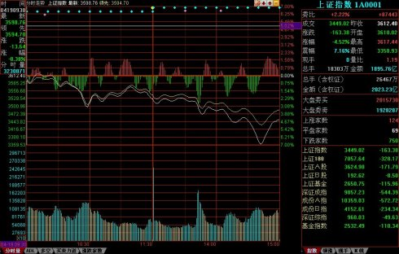{width="4.68503937007874in"
height="2.983069772528434in"}

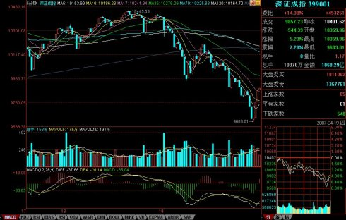{width="4.684722222222222in"
height="2.984027777777778in"}

一个很显然的道理，对市场了解越多，对走势的把握越精确。例如，昨天20070419的2007年一夜情行情，跌破5日线后有一个反抽，在11点08刚好构成对前一天中枢的第三类卖点，这就是最后的、被本ID理论所保障的离开机会。那么，后面去走，就完全与本ID的理论无关了，在一个下跌里，除了最后那一个位置，所有的卖出都是对的，但这和本ID的理论无关，这类似赌博，就赌不是最后的位置。当然，赌博也是一种方法，但这种把握，不在本ID的讨论范围内。

有人可能要问，就算跌破5日线，也可能很快就拉起来，确实，存在这种可能性，但市场是否选择这种可能性，就是当下的。如果很快拉起来，那自然会有一个符合本ID理论的买点出现，这只要市场自己去选择，既然已经卖出，就耐心等待。而其中，当然与分析的精确度有关，有些人分析不到位，会回补早了，那这很正常，技术更熟练的，当然应该享受更精确的买点。但节奏是重要的，站在小级别操作的角度，就算你补早了，也比没走傻看着强。补早了，就以后多总结经验，使自己的技术精度更高。

不过，必须强调的是，上面说的，都是针对资金比较小，操作级别比较小的说的。如果是按日线级别操作，那这些震荡根本无须理会。如果真按日线操作的，就应该从1000多点一直拿到现在，因为日线级别的卖点并没有出现，等出现再说。而用周线级别操作的大资金，那就更无所谓了。此外，这里只是以指数为代表来说一种方法，个股在自己的图上是一样分析的。

其实，如果你对市场理解更多点，就知道，这一夜情走势的当天低点，其实是很容易把握的。这就和上节所说的当日走势分类有关。最后一个第三类卖点对5日线进行反抽出现在11点08。前面3个30分钟K线，没有重叠。也就是说，下面走势显然不可能出现存在两个中枢的单边走势，三大类里，第二类是不可能出现了。对于第一类，平衡市的走势，最好的情况，也只能是当日中枢在11点后那个K线范围内。至于出现第三类，也是就没中枢的走势，那意味着后面有巨大跌幅。而第三类卖点后面，至少都会出现一个次级别的跌势，也就是一个1分钟以下级别的向下走势是必须完美的。所以，站在纯理论推理的角度，可以100%确定地安排后面可能的回补，也就是，从11点08开始的向下走势至少要出现走势的完美。注意，这些分析，在1108后就马上可以给出，并不需要预测或事后编排，都是根据可以根据本ID理论严格分析出来的。

下午开盘后，到1330点，就知道，第三类可能不存在了，因为当日一个连续3个30分钟K线的重合已经出现，也就是当日的中枢出现了，也就是说，到1330分钟，市场已经自己给出了选择，市场不可能出现227那天的无中枢下跌，最多就是一个弱的平衡市，因此，1030到1330这个中枢，就是最值得关注的。用中枢震荡的观点，需要比较的就是1030前的下跌与1330点后的下跌。这时候，大盘还没有真正对该中枢破位，但已经可以100%肯定地知道一旦破位，需要去看什么来决定买卖点。用MACD辅助，显然1分钟图并不适合看，因为1030到1330分钟前，这个MACD已经有绿柱子了，这样看起来费劲，可以选择更大级别的图，5分钟的。在5分钟图上，1030前的下跌刚好构成一个绿柱子面积，而1030到1330刚好出现回拉，所以黄白线没有明显到0轴，但红柱子是有了，所以，用中枢震荡的看法，后面的下跌，出现的背驰不会是5分钟级别的，只能是5分钟以下级别的，甚至就是分笔级别的最小背驰，然后引发大幅度回拉该中枢附近。当然，如果是特小级别的背驰，并不一定有足够力度决定其一定能拉回该中枢，但由于这中枢的存在，其力度是可预期的。

上面的分析，在大盘1330没真正继续破位前，就可以100%明确地给出，里面都是纯逻辑的推理，和任何预测无关。假设你已经在1108的第三类卖点出去了，而且你又是小级别操作者，那你需要的就是回补，所以有了如上分析，你就可以耐心等待，看5分钟图去比较其力度了。而且，你应该知道，强力回拉，并不一定需要一个1分钟的背驰，在大幅度下跌后，一个分笔的背驰就足以引发盘中大幅回拉该中枢，特别，由于1030前下跌引发的反抽也是一个分笔的背驰造成，一般来说，中枢震荡都有对称性，虽然不是绝对，但已经足以让你不会忽视分笔背驰引发小级别转大级别的极大可能。（分笔背驰，一般可以用1分钟MACD柱子的长度来辅助）

在大盘进入再次下跌时，你已经有足够的准备去等待。而且，你可以很明确地知道，在跌破1030到1330的中枢后，首先会有一个小的第三类卖点，小的第三类卖点后，有两种演化的可能，一是变成一个大一点级别的盘整，一个是形成下跌，至少再有两段向下。对第一种情况，在这盘整出现后，有足够的时间去选择介入，所以不用着急。而后面市场的真实选择，现在都很清楚了，就是第二种，在一个小的第三类卖点后，再出现两波下跌。

对于一个跌破中枢的下跌来说，第三类卖点后再来两波就可以随时完美。这个完美，由于该下跌是1分钟以下级别的，因此从该下跌的细部，是找不到根据1分钟背弛去确认的买点的，只可能根据分笔背驰。而根据预先知道的中枢震荡看法，唯一需要确认的是，1330后的下跌与1030前下跌的力度比较。从5分钟MACD两柱子面积的比较可以看到，前者并不比后者的力度大，这一点，参考看深圳成指的图就更明显了（请看下图）。所以，可以断言，这1330开始的下跌，一定会有强力回拉。

实际走势，在该第二波的分笔背驰（看1分钟图1443的MACD柱子，该K线还是所谓的早晨之星）后，大盘出现大幅度回拉，这其实是理论100%保证的事情。注意，并不是下跌的分笔背驰就一定存在大幅回拉，而是这天的当日平衡市的走势类型的中枢位置与时间决定的。而且，反抽的最低位置也很清楚，就是这下跌最后一个反弹处，结果收盘也真的是在该位置，这其实也是理论所保证的。

当然，如果你懂的东西更多点，对该最后位置的确定是可以很精确的。首先，日线的布林通道中轨和20天线都在3351点，按一般的技术分析，这是一个强力支持位置，而实际低点在3358点。另外，在1分钟图上的下降通道下轨，也在该位置，几个因数相配合，该位置出现反抽就完全在把握中了。

后面的走势很简单，关键是那中枢，由于分笔背驰只保证回抽到下跌最后一个反弹处，收盘已达到，而分笔背驰并不100%支持对该中枢的完全回拉，所以理论上，依然完全存在继续跌出一个更大级别的背驰再回拉的可能，当然，也可以直接上去，这必须由市场来选择。但无论哪种情况，该中枢都是一个新的中枢形成前的判断关键。而420当天中枢的位置，就决定了今后走势可能的演化。

以上，是一个分析的范本，这些分析，都是可以当下进行的，里面不涉及任何预测，市场当下的每一步走势，都相应给出分析的选择。对本ID理论熟悉的，其实1秒就可以把当下情况分析清楚，然后采取最正确的操作。但必须强调，这只是为了说明如何去分析，并不是鼓励所有人都去弄这种超级短线。当然，如果你连这么精确的分析都能当下完成并指导自己的操作，那么那些大级别的操作，就更没问题了。如果有T+0，对于小资金来说，这些就是有绝对实战意义的事情，当然，在T+1的环境下，就算3358买的，在第二天，还有出不掉的风险。而如果是T+0，那就不存在了，因为对于超级短线来说，回拉最后反弹位置就可以出来，然后看市场下一步的选择再选择下一买点。再次强调，这只是为了说明理论，并不说都要按这么小级别去操作，只不过大级别的分析是一样的，切记。

当然，如果你对当日走势的辅助判断有更深的了解，那么用当日对冲等方法来降低成本，也是可以做到的，但这只能在下节继续了。有时间，可以去研究一下与大盘节奏不同个股的走势，感受一下大盘这外在因数对个股的影响是如何首先必须有个股的内在原因的，例如，大盘的下跌反而使得某些股票构造出第二、三类买点，而在中枢上移强力延伸的股票，甚至不搭理大盘。也可以去参考一下，那些随大盘下跌的股票，是本来就存在卖点，大盘只是加大了卖点后向买点运动的幅度，但并不会改变卖点与买点的内在逻辑结构，明白了这一点，对本ID理论的理解会更深点。

今天下午一收盘就有一个会议，收盘分析只能在晚上9点半写，抱歉。

附录：抓紧时间写两句，今天晚上有两拨事情，9点半回不来。

大盘今天的走势太正常不过了，今天，几乎就是一个无中枢的上扬走势，昨天已经说了，今天只要重新站稳3520，就继续原来走势。今天前1小时就确认了这点，今天这种走势还害怕，那就是心态问题了。整天惊弓之鸟一样，怎么参与市场？

当然，为了让稍微中线点的人安心点，就看5周均线，这线不破，稍微中线点的人基本可以不看盘。当然短线还要去确认5日线的重新站稳，这是下周的主要任务，站不稳，还继续震荡，对于短线，只要看好5日线就可以。

当然，如果技术好点的，可以继续用中枢震荡的方法来看大盘走势。马上要开会了，就不多说了，请把本文好好研究一下，方法是一样的。

周末腐败快乐。

缠中说禅2007-04-20 08:53:33

今天下午一收盘就有一个会议，收盘分析只能在晚上9点半写，抱歉。

先下，再见。

缠中说禅2007-04-20 15:25:57

抓紧时间写两句，今天晚上有两拨事情，9点半回不来。

大盘今天的走势太正常不过了，今天，几乎就是一个无中枢的上扬走势，昨天已经说了，今天只要重新站稳3520，就继续原来走势。今天前1小时就确认了这点，今天这种走势还害怕，那就是心态问题了。整天惊弓之鸟一样，怎么参与市场？

当然，为了让稍微中线点的人安心点，就看5周均线，这线不破，稍微中线点的人基本可以不看盘。当然短线还要去确认5日线的重新站稳，这是下周的主要任务，站不稳，还继续震荡，对于短线，只要看好5日线就可以。

当然，如果技术好点的，可以继续用中枢震荡的方法来看大盘走势。马上要开会了，就不多说了，请把本文好好研究一下，方法是一样的。

周末腐败快乐。

先下，再见。

## "全民炒股"，市场经济走向成熟的必由之路

(2007-04-23 08:53:46)

最近，随着A股开户数、指数、成交量连创新高，"全民炒股"又成了某些习惯于全天候指责股票市场的人手中不断摆弄的大帽子、大棍子。那么，究竟何谓"全民炒股"？"全民炒股"意味着什么？真如某些人所说的就是洪水猛兽吗？

首先，必须对所谓的"全民炒股"进行概念上的界定。如果说"全民炒股"意味着所有人放弃一切工作都到证券部上班，社会一切正常活动都被买卖股票这唯一的活动所中断，那么这种所谓的"全民炒股"不仅以前没出现、目前不存在、而且以后也不会有。谁用这种含义的"全民炒股"来指责目前的市场，都不值一驳。如果说"全民炒股"意味着社会上越来越多人开始把自己的资产快速转化为股票等虚拟资产，那么，该种含义下的"全民炒股"恰好代表了市场经济发展的正确方向，是市场经济走向成熟的必由之路。在市场经济的发育阶段，社会与个人的财富都以实物、货币等非虚拟资产为计算，而当资本市场逐步成为社会经济结构最重要的基础部分时，股票等虚拟资产的价值将逐步成为财富最主要组成部分。在一个资本市场逐步强大的经济体中，无论是社会与个人的财富，都必然出现一个实物、货币等资产形式被快速转化为股票等虚拟资产形式的历史过程，从而也就相应形成上述所定义的"全民炒股"现象。

站在市场发展的历史趋势上看，目前这种"全民炒股"不是过分了，而是远远不够。目前国内，无论社会还是个人资产，其中的股票等虚拟资产所占比例，与市场经济发达国家还有着极大的距离，在股票等虚拟资产占到社会与个人总体资产的30%之前，"全民炒股"只能算是初级阶段，必然需要一个大的快速发展，才能满足市场经济发展的最低要求。目前，国内资本市场逐步出现的"全民炒股"现象，不仅符合市场经济发展的内在逻辑，而且具有历史必然性与广阔发展前景。"全民炒股"，使得社会上的任何企业与个人，都可以通过资本市场这公开平台，公平地选择、参与市场经济中最有价值的投资机会，让社会与个人资源得到最公正合理的配置。而在股票等虚拟资产占到社会与个人总体资产的50%之前，一切对于"全民炒股"的指责都是可笑、短视的。

显然，"全民炒股"有着各种不同实现形式，不可能都由每一个具体参与。因此，基金等各类间接投资渠道的大发展，将成为实现"全民炒股"这历史大趋势的必然选择。由此，各种金融创新、技术创新、制度创新，才能在一个大的经济新格局中得以更好地实现。资本市场所带来的财富效应，也将成为人们投资、创业的最大动力。所谓榜样的力量是无穷的，最近中小板企业上市，平均每11天创造一个亿万富翁，这种速度不是太快，而是太慢了。中国的崛起，中国经济的崛起，必将导致中国成为资本大国，而日益强大的中国资本市场也必将制造出越来越多的财富拥有者。美国人比尔·盖茨，巴菲特等之所以能拥有世界级的个人财富，对于个人来说，可能具有偶然性，但对于具有强大世界性资本市场的美国来说，这却是必然的。世界性的资本市场，必然创造世界性的财富拥有者，而中国资本市场成为世界上最重要资本市场的历史必然性也就意味着，大量的世界级财富拥有者必将在中国的资本市场不断涌现。显然，中国资本市场制造世界首富的一天，并不遥远。

站在中国市场经济发展的历史趋势上，目前的股票热度不是太高，而是远未达到应有水平。市场当然会有中短期调整，但长期趋势无可改变，任何级别的调整，只会引来更大级别上涨。有着100多年历史，经历过1929年、1987年等大暴跌调整的美国股市，至今还继续创出历史新高。各国资本市场发展历史表明，股票市场是长期投资平均回报最高的地方，市场走势无一例外总体向上，调整都是次要的。高速增长、转型能量巨大的中国经济，其带来的财富与投资机会，需要通过资本市场让所有国人得以分享。"全民炒股"，不是洪水猛兽，而是利国利民、顺应市场经济发展的大好事。

附录：

大盘今天走得很正常，没有形成任何中枢的单边上涨，周五站稳3520点后就继续原来的上涨走势，所以就创新高，这在技术上100%没什么可说的。这种走势还惊弓之鸟的，那心态绝对有问题了。对于技术不行的，本ID已经给出一个最简单的方法，中线看5周均线，短线看5日线，这都操作不好，那就没办法了。\
有些人整天换股，这其实没问题，但这需要好的技术支持，如果你经常换股后，被换的股票大涨而换的不涨，那就证明你没资格去换股，乖乖拿着等着，你的技术达不到换股、弄短差的水平。人，贵有自知之明，市场操作，这点更重要。不是什么活都适合所有人的，如果你希望能达到更高的水平，就需要更刻苦的学习，在没学好之前，就采取相对保守的做法，这才是可行的。\
由于今天留下缺口，从最强势的角度，这缺口在今后三天的整理中能不破，就构成所谓的突破性缺口，这样，大盘中短期的上涨目标就大大拓展了。当然，这无须预测，市场自然告诉你。这缺口，成为今后行情的重要下拉与支持力量。也是今后几天大盘震荡的主要技术因数。

缠中说禅2007-04-23 08:57:32

最近收盘都有事，都早上发帖子，没什么特别的，不用疑神疑鬼。走势的判断，在周五说得很清楚了，这里没什么补充的。

下午收盘会把评论写上，但回答问题可能要晚上9点回来了，抱歉。

先下，再见。

缠中说禅2007-04-23 15:19:01

大盘今天走得很正常，没有形成任何中枢的单边上涨，周五站稳3520点后就继续原来的上涨走势，所以就创新高，这在技术上100%没什么可说的。这种走势还惊弓之鸟的，那心态绝对有问题了。对于技术不行的，本ID已经给出一个最简单的方法，中线看5周均线，短线看5日线，这都操作不好，那就没办法了。

有些人整天换股，这其实没问题，但这需要好的技术支持，如果你经常换股后，被换的股票大涨而换的不涨，那就证明你没资格去换股，乖乖拿着等着，你的技术达不到换股、弄短差的水平。人，贵有自知之明，市场操作，这点更重要。不是什么活都适合所有人的，如果你希望能达到更高的水平，就需要更刻苦的学习，在每学好之前，就采取相对保守的做法，这才是可行的。

由于今天留下缺口，从最强势的角度，这缺口在今后三天的整理中能不破，就构成所谓的突破性缺口，这样，大盘中短期的上涨目标就大大拓展了。当然，这无须预测，市场自然告诉你。这缺口，成为今后行情的重要下拉与支持力量。也是今后几天大盘震荡的主要技术因数。

缠中说禅2007-04-23 15:19:37

马上还有会议，晚上9点再来回答问题，抱歉。

先下，再见。

缠中说禅2007-04-23 21:11:55

各位晚上好，刚回来，来晚了，抱歉。

缠中说禅2007-04-23 21:15:39

\[匿名\] 水房姑娘

2007-04-23 20:49:44

由于今天留下缺口，从最强势的角度，这缺口在今后三天的整理中能不破，就构成所谓的突破性缺口，这样，大盘中短期的上涨目标就大大拓展了。当然，这无须预测，市场自然告诉你。这缺口，成为今后行情的重要下拉与支持力量。也是今后几天大盘震荡的主要技术因数。

－－－－－－－－－－－－－－－－－－－－－－－－－－－－－

ＭＭ给调整定的时间是三天？为什么

\-\-\-\--

这不是绝对的，是一个大统计概念。一般有缺口后，三天内回补，不回补，就基本是突破性缺口，如果从技术上解释，其实也很简单，因为5日上三天后一定在缺口上，如果不有效跌破5日线，当然就不会去补缺口，而5日线有上推的力量，自然就会继续走势，直到跌破5日线形成较大调整才会有补缺口的机会，当然，如果走得比较远，就要更大级别的调整才有机会去补缺口了。

缠中说禅2007-04-23 21:27:24

\[匿名\] N8

2007-04-23 15:48:23

缠姐　　　缠论是不是最后都可以简化为，在级别的前提下，最后一个中枢与当下走势之间的关系　　　来指导操作

===

如果你是30分钟级别操作的，就看从该30分钟中枢离开的那段走势里的中枢变化，具体的，后面都会说到。

缠中说禅2007-04-23 21:33:10

\[匿名\] 走失的爱犬

2007-04-23 21:13:36

缠姐,你好象满喜欢足球哦.国米时隔18年终于在赛场夺冠.今天看天下足球介绍18年的历程还满感动的.你是它的球迷吗.我可是AC的铁竿.希望它周三凯旋而归.

===

十分不幸，这点没有共同语言，本ID是英超球迷，准确说，一直都是利物浦的球迷，就是那支曾经0比3落后于你的AC最后反败为胜的利物浦。

缠中说禅2007-04-23 21:34:46

\[匿名\] 新浪网友

2007-04-23 21:31:24

老大好 学禅的不会还没过色欲关吧 能解释一下吗

===

谁关？关谁？本ID这里一关都没有，过什么？

缠中说禅2007-04-23 21:37:57

\[匿名\] 在路上

2007-04-23 21:33:30

缠姐好.

今天对大盘的判断有误,操作没误,对上一课的问题有如下同学相同的疑问,今天收盘后看了缠姐说没有中枢,重新看了看,深圳和上海的30分钟K线实体没有重叠,但上下影线是有重叠的,是不是只看实体,不用管上下影线?

匿名\] 钱龙

2007-04-23 21:03:23

缠主好，

不是说三根K线有重叠当成一个每天走势上的一个中枢吗，今天30分钟图上第2\~4不是有重叠吗，今天应该算有一个中枢的走势，不是吗？

希望有明白的同学也帮忙看一下

===

说5、6、7有点重合还说的过去，2、3、4没有重合，但那重合很小，所以本ID说几乎没有中枢的，准确说，还是有一个范围很小的中枢在5、6、7三K线的重合部分
。

缠中说禅2007-04-23 21:39:38

\[匿名\] 再问一个

2007-04-23 21:29:13

缠MM一再教我们不追高买股票

可在这样的牛市普涨中,眨眼就涨上去了!不追就踏空呀

能不能教我们一点点牛市追股的技巧?

===

第三买点，如果你技术好，胆子大，就把级别定低点。

缠中说禅2007-04-23 21:46:56

\[匿名\] 走失的爱犬

2007-04-23 21:42:18

呵呵．希望今年ＡＣ和缠姐的利物浦再一决雌雄．

===

不错，自从贝帅哥离开，本ID看曼联也不顺眼，就怕AC没本事，学罗马一样就没劲了。

缠中说禅2007-04-23 21:51:11

\[匿名\] 新浪网友

2007-04-23 21:45:33

===

说5、6、7有点重合还说的过去，2、3、4没有重合，但那重合很小，所以本ID说几乎没有中枢的，准确说，还是有一个范围很小的中枢在5、6、7三K线的重合部分
。

=============

这可真糊涂了，K线5和7一点都挨不着，

不知怎样才算重合，请缠姐解惑

===

一个最高3892，一个最低3688，怎么没重合？严格说，4、5、6也可以算是有点重合，但这些几个点的重合，在大的看盘中都可以忽略不算，一般标准的分时图中枢，怎么都要有10来个点的幅度，所以本ID说今天几乎可以算是没中枢的。

缠中说禅2007-04-23 21:53:57

\[匿名\] 首钢股份

2007-04-23 21:50:18

为什么女王会喜欢英超呢？英超只是场面好看而已，技术含量和战术含量都不行啊，我是尤文图斯球迷！

===

足球，最基础的是血性，技术那些都是后面的东西，喜欢利物浦，是因为他们是全世界最有血性的球队，当然，原来有福勒、欧文，也是本ID喜欢的原因之一。

缠中说禅2007-04-23 21:56:55

\[匿名\] 新股手

2007-04-23 21:51:58

很多股都创历史新高了,比如钢铁板块中的大多数

对已创新高的老股,如何把握?

===

如果你是中线的，就看着5周均线，看看那些牛股票，当他们中线拉升时什么时候跌破过5周均线的？一旦跌破，就是一个较大的调整了。短线的可以看5日线。当然，最精确的，还是看中枢、背驰等，那需要你学习到一定程度才行。

缠中说禅2007-04-23 22:05:36

\[匿名\] 请缠姐一定看看

2007-04-23 21:59:55

缠姐好

请问，

1、30分钟图上，如果一段5分钟走势中有三根K线有重叠，是否这三根K线可以看成是5分钟级别走势的一个中枢？

2、这三根K线是否必须红绿相间，如果是三根红线有重叠可不可以算成一个中枢？

3、这三根K线重叠部位是否必须为实体，如果是一根的最高价和另外的最低价处有重叠，是否可以算？

===

5分钟中枢需要三段1分钟级别走势重合，这两节说的是如何看分时，里面的中枢概念和前面的不同，只是借用一下，别搞混了。

重叠，就是三个区间有共同的部分，就这么简单，哪里有这么复杂的事情。另外，像今天这种重叠区间很小的，可以忽略不算。当然，严格算也可以，但意义不大。不过也可以参考，例如今天的3688到3692，就可以当成明天强弱的一个参考，不破就是强，破了站不稳，就有问题。

缠中说禅2007-04-23 22:07:39

\[匿名\] 新浪网友

2007-04-23 22:03:23

缠妹妹，晚上好！

盯盘也有几个月了，学的不好，现在一些疑问请问你：

我是以五分钟的级别做为买卖的基础的，但是实际操作时有一点是无法突破的，当五分钟的柱
子不再增长时，在1分钟上的利润已经减少了很多，所以我一般都
是配着看，但问题又出现了，有时候在1分钟上盘整背驰可以不下来而是形成1分钟的三买所以继续上涨，但有时候1分钟的盘背后就直接下来了，而在五分钟上则是刚突破新高就下来背了，这两种情况怎样操作？常因为这两种情况无法准确判断而误了战机。谢谢!

===

用5分钟不能光看5分钟，对30分钟怎么都要清楚，另外，看出对背驰的辅助判断还不大了解，还有小级别变大级别的情况也没分清楚，请再研究一下这两个问题。

缠中说禅2007-04-23 22:15:48

今天的新浪太慢，经常好几次才能发出来。看来股市一火，新浪也要瘫了。

各位，心态好点，这市场还长着。今天本ID吃饭时还和别人说，现在不算疯狂，想当年，甚至从900多到6000多，用了不到一年半时间，现在快两年了，同样从900多起步的上海还没到4000，简直太理性了。

不多说了，子时快到，今天不是周末，要严格遵守纪律。

先下，再见。

## 教你炒股票48：暴跌，牛市行情的一夜情

(2007-04-24 08:52:02)

前面在每天的行情分析中，曾不客气地说到，对于空头日夜盼望的暴跌，其实永远与空头无关，因为真跌了，空头就只会口头上快感一下，心理上满足一下，但人的思维惯性，使得空头永远没机会在他们满意的地方获得满意的筹码。暴跌，对于牛市行情来说，就如同一夜情，猛烈而刺激，但实质上，一夜情就是一夜情，419后，该干什么还是什么。

就如同性能量的积聚，牛市调整能力的积聚，也需要宣泄。这种宣泄，与熊市最大的不同，就是419化。419，总是猛烈而疯狂，否则就没必要419了。牛市中的调整也一样，来就狂风暴月，这和熊市中的大反弹是一样的。最出名的熊市大反弹，大概就是停国债期货那次，三天，指数从550不到翻上920上，结果，后面依然继续下跌回来。而牛市中的暴跌，最出名的算是96年12月那次，由于政策打击，连续跌停下来，1250点上几天跌到850点附近，结果依然继续上涨。所有真正的大顶，都是反复冲击出来的，有足够的时间让你去反应判断，那种V型顶，在大型走势中基本不会构成真正的顶部，就如同一夜情最后天长地久的机会基本为0。所以，那些天天希望暴跌的人，就如同天天期望一夜情的人一样，都有着滥交的潜意识倾向，滥交之人，最终都会给废掉，不会有好结果的。

有一种对风险的错误观点，仿佛股价、市赢率高了才风险大，股价、市赢率低了就风险小了，却不知道股价、市赢率都是些变动的因数，并没有任何绝对的意义。本ID曾多次强调，风险对于市场是绝对的，任何时候都在风险之中，如果你对本ID的理论能有所理解，那么，不仅能让风险在操作级别的绝对控制之中，而且还能利用风险达到降低成本。无风险是可以创造出来的，0成本就是绝对的无风险。如果不理解，那么最简单均线系统就可以控制住风险。

但站在社会财富增长的绝对性上，最大的风险就是你的财富增长赶不上社会平均财富的增长，站在资本市场这个子系统，道理是一样的。因此，在一个大牛市中，筹码的积累甚至更重要。一个大的上涨，3元有1万股，到4元只有1千股，后来到了30，一股没有，这就是最大的风险，因为市场的上涨并没有为你制造应该的总体利润，你的筹码丧失了，没有筹码，在市场中就没有赢利的准入证，在没有做空机制的市场中，做空最后还是为了做多，除非你永远退出市场，特别在牛市行情依然的情况下，这点更重要了。没有筹码，用嘴是赢利不了的。

最好的情况，当然就是前面所说的，在成本为0前不断降低成本，在成本为0后不断挣筹码，这样股价越上涨，你的筹码越多，你的真正市值才会越来越大。有人问本ID，你以后怎么出货，本ID反问，为什么要出货？每一次震荡，都成了本ID降低成本、增加筹码的机会，知道最高的境界是什么吗？就是等大牛市真正结束那天，你拥有股票的数量最多而成本是0，然后，（后面删去419字）。市场从来不是慈善场所，要战胜市场，必须有正确的大思路与总体的方法。

正确去对待震荡、调整，显然，在大盘中短线能量耗尽后，大盘会出现大规模的调整，如果说227、419都是在日线上一夜情，那么在周线上、月线上、季线上、甚至年线上出现一夜情的可能性在这长达至少20年以上的大牛市中，都是绝对存在的。但这决不是空头用嘴欢呼的借口，而是真正操作者减低成本、增加筹码的大好时机。当然，操作的精确度是一个技术问题，技术高的，就能把成本降更低，筹码增得更多，这是绝对正常的事情，技术高的就该有更好的收益，这是天经地义的。但精确度是可以用市场磨练来达到的，而思路、方法的错误，则是不可救药的，这才是问题的根源。

站在纯技术的角度，把握一夜情的级别很重要。一个日线上的一夜情与一个年线上的一夜情，显然力度上不一样。在这次从2005年中开始的大牛市行情中，至今为止，本质上，在周线上都没有出现过一夜情的暴跌，周线上两次大的调整，周跌幅都是7%，还赶不上227的日一夜情，月线上更是连一次真正有意义的下跌都没有。但为什么这么多人，天天依然如惊弓之鸟一般？

如果你把握不住日线的一夜情，证明你的技术程度达不到把握日线一夜情的程度，那么就去把握周线、月线的，那对技术精确的要求要低。给自己安排一些力所能及的活动，一夜情也是有级别的，能否在各级别的一夜情中游刃有余，是对你技术把握度的考验。

事情往往相通，无论技术还是其他，精度都是干出来的。今晚，是否也要419一把？

附录：

今天大盘在昨天的一个小中枢3688到3692受到支持，下午的5分钟盘整顶背驰，应该不难把握。从这就知道，每天之间的当日走势，还是有一定技术意义的。今天，一个平衡市，收得一般，由于5日线明天就上来了，所以关键还是5日线，站稳就寻机上攻，否则就要受到昨天缺口的吸引。今天这种平衡市却是巨量的走势，关键就是要有效向上突破今天的中枢，否则大幅震荡不可避免。今后两天走势十分关键。睁大眼睛看好明后两天的走势，下面3688到3692小中枢不能有效被跌破。\
目前就是前面本ID所说，二线拉开空间，三线补上来的走势，但这种走势，必须有一个转换，使得成分股能重新启动，否则也是震荡难免。目前走势，不要随意换股，该换的早该换了，否则T+1节奏一错就会大乱。如果是短线的，就要注意今天中枢最后的演化方向来决定进出，中线的就无所谓了，看5周均线。\
今天很忙，马上有事情要谈，晚上9点再上来回答问题，\
先下，再见。

缠中说禅2007-04-24 08:55:19

本文不针对任何具体日子走势，当日走势分析3点收盘给出。

先下，再见。

缠中说禅2007-04-24 08:56:46

\[匿名\] 蚕丝

2007-04-24 08:54:14

老大早上好！一看我的ID就知道我的来头啦，哈哈。我不怀疑这一整套理论的客观有效性，更羡慕你表达观点时的这份坦率，直白。但是说实话，真是蛮难理解运用好的，总之到目前为止我感觉还是朋友给的消息更管用些。景仰仍然是滔滔江水。。。

来深圳出差的时候，给个机会容我请你去华侨城吃一家精致的小餐馆吧，轻轻松松聊聊天。我的电话：13828784409

PS：我这可不是葛优说行的号码哟，呵呵。。。

===

请不要在网上留电话，不排除有人会冒认本ID。请注意。

缠中说禅2007-04-24 15:23:54

今天大盘在昨天的一个小中枢3688到3692受到支持，下午的5分钟盘整顶背驰，应该不难把握。从这就知道，每天之间的当日走势，还是有一定技术意义的。今天，一个平衡市，收得一般，由于5日线明天就上来了，所以关键还是5日线，站稳就寻机上攻，否则就要受到昨天缺口的吸引。今天这种平衡市却是巨量的走势，关键就是要有效向上突破今天的中枢，否则大幅震荡不可避免。今后两天走势十分关键。睁大眼睛看好明后两天的走势，下面3688到3692小中枢不能有效被跌破。

目前就是前面本ID所说，二线拉开空间，三线补上来的走势，但这种走势，必须有一个转换，使得成分股能重新启动，否则也是震荡难免。目前走势，不要随意换股，该换的早该换了，如果是短线的，就要注意今天中枢最后的演化方向来决定进出，中线的就无所谓了，看5周均线。

今天很忙，马上有事情要谈，晚上9点再上来回答问题，

先下，再见。

缠中说禅2007-04-24 21:12:20

各位好，晚一点，抱歉。今天本ID博客的成交量似乎有异动，是不是有人玩了对手盘？

缠中说禅2007-04-24 21:15:49

\[匿名\] 技术学习ing

2007-04-24 21:09:32

睁大眼睛看好明后两天的走势，下面3688到3692小中枢不能有效被跌破。

请教LZ，怎么才算有效跌破？连续3个5分钟线收在3688下方？

===

第一类卖点的最主动，第二也不错，第三就差点，如果整天都是第三再跑，那比较累，要尽量在第一、二跑。当然，级别越低，操作难度越大，需要的技术精确度越高，这需要实践来提高。

缠中说禅2007-04-24 21:22:01

\[匿名\] 白玉兰

2007-04-24 21:14:21

妹妹好！

下一阶段是否该关注二线指标股了？三线股要息菜了。

===

这转化还不一定能转过来，但关于杭萧那事的深入调整，题材股会有所收敛，本ID从事都反对把题材搞得太过分，这绝对需要打击。后面，个股的行情会进一步分化，说直白一点，后面肯定更多看里面各自的主力了，行情节奏逐步走向群庄乱舞。

缠中说禅2007-04-24 21:22:56

\[匿名\] 上课啦我举手

2007-04-24 21:18:02

今天收市后到现在,到处都在说明天人民日报发社论,晕倒

博主在北京,人悉,消息灵,有没有什么政策面的东东?

===

如果现在还用这种手段，那是管理层的悲哀。

缠中说禅2007-04-24 21:24:47

\[匿名\] 新浪网友

2007-04-24 21:21:46

银行股近期持续低迷，禅师怎么看。

===

那很正常，如果他们都高涨了，大家就很快没饭吃了。

缠中说禅2007-04-24 21:29:24

\[匿名\] 缠心雕龙

2007-04-24 21:22:10

47课原文："你可以很明确地知道，在跌破1030到1330的中枢后，首先会有一个小的第三类卖点，小的第三类卖点后，有两种演化的可能......一个是形成下跌，至少再有两段向下......对于一个跌破中枢的下跌来说，第三类卖点后再来两波就可以随时完美。这个完美，由于该下跌是1分钟以下级别的，因此从该下跌的细部，是找不到根据1分钟背弛去确认的买点的，只可能根据分笔背驰。"

1、 在跌破1030到1330的中枢后的一个小的第三类卖点是不是在1408？

2、
为何说"对于一个跌破中枢的下跌来说，第三类卖点后再来两波就可以随时完美"？

3、
"这个完美，由于该下跌是1分钟以下级别的"，这里说的"该下跌"是从哪算起？是1f级别的吗？

4、 1330开始的下跌是1f级别的吗？他似乎并不是一个趋势，也没有1f背驰？

===

对于趋势，有两个中枢后就可以随时结束，这是最基本的概念。盘中的这种下跌，基本都不会是1分钟级别的，更有可能就是1分钟以下级别的。而背驰的级别与趋势的级别不一定一样，这是一个最基本的概念，否则怎么会有小级别转大级别？

缠中说禅2007-04-24 21:33:03

\[匿名\] 首钢股份

2007-04-24 21:26:37

等女王！

今天突然很紧张，最终把所有股票卖出，空仓过夜，然而刚刚卖出600005随即它就大涨接近涨停。

主要是下边的缺口太大了，最近几天又风传肯定要回补缺口，而个股面临一个20％跌幅的大调整，即使我做中线，这样的起伏也要不得。看图操作，但我的情况女王应该了解，我白天无法看图，更是电话委托，咱打不起短差也跑不快。

不能跟大盘赌明天。

请问：若明天跟今天一样走势，是否仍不能确定站稳？具体出现什么情况才能认为后期将排除大盘整的可能？也就是说，什么叫做"有效跌破"和"有效站稳"？

===

这样操作其实更容易出错，5日线都没破，如果中线，5周线都没破，算得了什么？

以后注意了，如果心情不好，特恐慌，人已经被恐惧所折磨，那就半仓，肯定不会错，这时候也别说什么技术了，心态先调节好再技术。

所以说人是第一位的，就算你明白了本ID的理论，能否应用成功，最终还是人的修炼。

缠中说禅2007-04-24 21:46:47

\[匿名\] 小凤

2007-04-24 21:30:06

可否请缠女王推介一只股呢

===

股票是需要养大的，天天要新股票的，肯定永远是小资金，小打小闹。你看本ID年14只股票里，还有连续涨停的，为什么不好好养？本ID现在不会推荐什么股票，主要是目前大盘的位置并不是什么值得去买股票的位置，而且本ID那14只还有不少中线潜力，但现在买没必要，因为不是好的买点。

缠中说禅2007-04-24 21:50:40

\[匿名\] 你的样子

2007-04-24 21:39:37

老大辛苦了，总算没白等

老大能不能解释下，那个小中枢是不是时间段在04231351到04231400，为什么这个小中枢是判断标志呢？

还有何谓有效击穿，是击穿后，反弹不能到达这个小中枢就是有效的意思？

===

其实有效跌破与否与有没有第三类卖点是一个意思，但最好就在第一、最多是第二卖点操作，毕竟第三卖点离真正的高位已经有距离了。

缠中说禅2007-04-24 22:00:11

注意了

本ID这里，除了最早说了14只股票，后来还陆续有北京股、VC股，深圳本地低价股，中小板袖珍股，这些股票都继续有中线潜力，但如果前面没买，现在追高买，一点必要都没有，本ID不需要别人抬轿子，本ID只希望大家都在买点，而且是级别大的买点再买。

如果出现一次较大的调整后，这些股票都会继续有如前面一样的表现的，所以机会是可以等待的，千万别追高。有的，就等待较大级别卖点的出现，卖点没出现的，就持有。

缠中说禅2007-04-24 22:06:17

对不起，大家注意了

上面漏说了一个最容易出黑马的板快，就是估计报坏业绩，但不跌反涨的，一旦大盘有调整，这些股票随着调整后，那么走势强劲的，将是后面的黑马。

全流通后，没有任何股票的业绩不可以做上去的，本ID这里就掌握了N只故意公布差业绩的公司的阴谋，但现在是监管时期，本ID不愿意惹麻烦，大家多加注意就是。

为了保险起见，如果没有特别准确的把握，不要买星号ST的，虽然本ID掌握的，有好几只这种股票，但不了解的就别买，否则买错了退市就很麻烦。

有心人，可以把那些故意业绩弄差的选出来，然后选择异动明显的，黑马不难发现，比让本ID直说有意思。

缠中说禅2007-04-24 22:09:21

\[匿名\] 诚诚

2007-04-24 22:02:23

今晚欧冠,我看好曼联不败.明晚,利物浦要用铁血阻击意欲雪耻的蓝军,精彩值得期待.

看来缠主也不得不破例熬夜了吧?!

===

对，这两天，对于本ID来说，足球比股票重要，本ID准备熬两天了。不过11点前要睡一下，2点半起来。

缠中说禅2007-04-24 22:16:38

\[匿名\] 新浪网友

2007-04-24 21:47:41

老大，请教对于30分钟上涨的a+A+b+B+c+C，B必定是下上下形成，如果是上下上形成的中枢就可以把它看作b的一部分，对吗？还有，如果b对c本级别不背驰，但是C中一个盘背c\'导致下跌跌破C，这时候分解点是在c\'还是c啊？这种情况算不算是小级别转大级别？谢谢

===

一般情况都是这样，如果有C中枢后，就意味着上涨延伸，和只有两个中枢的情况是一样的，参照该种情况就可以。

缠中说禅2007-04-24 22:20:35

\[匿名\] 端一

2007-04-24 22:14:10

博主：科技股算二线股吗，怎么还不动，是不是等补涨？谢谢！

===

这问题在N月前已经说过，牛市第一波，最重要是成分股，第二波才是成长股，那时候科技股才是主角。

有人问，本ID14只里938、998怎么这么弱，那很自然，对这些股，本ID是作为整个牛市来布局的，本来第一波就没想着让他们太牛，但第二波时再看。当然，第一波时，科技股也会跟着走，相对都会比较慢，其实各位不难发现，往往科技股一动，大盘就要准备调整了，这是一个市场节奏问题。

缠中说禅2007-04-24 22:23:43

\[匿名\] 古代

2007-04-24 22:19:12

老师今晚曼联中国球员小董回上场不？

===

你这不等于骂AC？

缠中说禅2007-04-24 22:28:13

\[匿名\] 钢铁大道

2007-04-24 22:17:54

女王好，汇报一下今天的操作

今天下午盘中重仓了600021和600531，看到您对大盘的评述，十分忐忑，明日如果大盘调整，是继续中线持有，还是半仓操作。

谢女王

===

没有什么忐忑的，震荡是一个好玩的游戏，让不想51持股的出去也是很好的。

本ID给所有人的忠告就是，如果你觉得你的心脏受不了，最好的就是找机会半仓，或者就干脆不看，中线看5周均线就可以。

但对于技术好的，以及心态好的，上面的建议无效。

请注意，操作一定要量力而行，知道自己干什么，要承受什么后果，再行动。不要给自己太大压力，身体比股票重要。

缠中说禅2007-04-24 22:31:21

\[匿名\] 学缠人

2007-04-24 22:26:02

缠姐好!

请问故意出坏业绩的是指年报出坏业绩还是一季度季度出坏业绩?

谢谢!

===

都有可能。对那些年报、季报业绩特别好的，后面却是明显出货走势的反而要小心

缠中说禅2007-04-24 22:33:25

PS：2007-04-24 21:44:45

缠MM 好！

汉奸的基金要被查到底了，它持有的股票是否应该都抛掉？

==

缠妹。同问。请帮忙回答一下吧。

谢谢！

===

关键是股票本身，汉奸出问题，会有短线影响，现在就希望汉奸都出来，大家都不待见他们。但中线不会受这些小问题影响。

缠中说禅2007-04-24 22:36:59

对不起，本ID要休息，2点45还要看球，

AC、曼联，本ID都没什么特别爱好，那就让AC再让利物浦再屠杀一次吧。

当然，理性告诉，走势有交替性，所以这种局面还真难出现。

废话不说了。

各位晚安。

先下，再见。

## 《货币战争和人民币战略》续六：央行，脑子别进水。

(2007-04-25 09:03:08)

央行有没有脑子，这是一个动物学问题，就不探讨了，不妨假设他有，如男猿人般，因此就有了脑子别进水的提醒。

本ID的观点从来都是一贯、究底穷源的，有人看到本ID最近不再反对人民币升值，以为本ID把前几年的观点给修正了。这是绝对错误的，本ID只关心那些可以实施、可被现实的观点，既然人民币已经升值了，这已经是现实了，再说些不升值就如何如何的废话是浪费网络资源。但这绝对不表示本ID已经觉得这升值就对了，本ID依然认为，这是中美货币战争的七七事变，是一次不光彩的勾当。但七七之后就是八年抗战了，谁把并不太糟糕的事情一步步搞成这样，自然有历史可以去评价，本ID根本无须废话。

由于人民币的升值，美国逃过大难，有了喘息的机会，一个不可改变的事情就是，人民币升值以后，美国在战略上已经占了上风、先机，现在世界金融走势，本质上又进入美国人设计的轨道中，如果连这都认识不到，这样的央行可以改面首店了。请问，某些人，曾经站在总体货币战争最高战略的角度考察过自己的战略战术安排吗？知道自己在干什么吗？其水平是否处处落后、频于应对？现在，美国正按部就班把自己前面积累的危机逐步向全世界转化，其中的机理，某些人明白吗？知道人民币的升值使得本来要烂在美国国内的美国危机已经顺利地向全球转移吗？如果说伊拉克战争是一种军事上的危机转移，人民币升值就是另一场更深刻的经济上的危机转移，而且，美国人正走向成功。

当然，美国人并未真正成功，他们现在这种的策略，后面也是充满危险，但这危险已经可以让全世界去分担了，从本质上说，美国已经足够成功。后面的格局使得目前真正有意义的题目已经变成"美国危机转移下的中国货币战略"。当然，如果战略得当，依然有让美国不能得逞的诸多机会，但本ID唯一担心的是，机会是需要去把握的，如果脑子都是水，能把握吗？

本ID可以毫不客气地说，这样一种情况正越来越可能变成现实，也就是，美国这已成功转化出去的危机，逐步把世界带向深渊，最后，在本ID所指出的大循环大震荡中，美国人又一次成为火凤凰。这就如同打牌，本来一手好牌，最后让那抓着臭牌的给赢了，这算什么？本ID早说过，本ID反左反右反中间，无论左右还是中间，一点技术含量都没有，在自己的臆想中玩3P，玩得鸡飞蛋打。

当然，站在私人利益上，因为股票，本ID绝对支持人民币升值，绝对支持所有人都脑子进水。本ID可以接受任何脑子进水的人制造的后果并利用之，但本ID依然要指出，如果脑子不进水，还有些什么的可能，即使这种可能实际上会损害本ID的私人利益，但钱对于本ID来说，早就是数字游戏了，本ID宁愿自己的私人利益受损、甚至生命安全受到威胁，也不愿意看到美国人与汉奸得逞。

本ID希望看到一个有技术含量的故事，而不是完全不对等的较量。中国气运的强盛，就算是让美国一头，人民币升值了，也足以胜之。但前提是，不该有水的地方，水别太多。不管是央行还是洋行，脑子都不是必然要进水的。水太多，宁愿下半身思维掉、419掉，也别往脑子里装。本ID才没有所谓爱之深、痛之切的矫情，爱谁谁去。

附录当日分析：

就算你对本ID的理论只有幼儿园水平，那今天的走势就一定难不到你。一开盘的低开，然后很快拉回3688到3699的前天小中枢，这就意味着，中枢震荡依然继续，没什么大问题。前三30分钟走出来后，这平衡市的形态以及震荡幅度就基本确立了，今天属于最平衡市那种，前三30分钟就确立全天高、低点，下午那下探，对于短线对冲的，就像送钱一样。\
纯技术上，04241335和04251030的连线必须突破，否则就会被技术派看成是所谓的喇叭形态，从大点看，从04240931开始的3689到3745的5分钟中枢延伸什么时候结束，就看明后两天是否形成第三类买卖点了，这一切无须预测，大盘自然告诉你。\
板块方面，昨天已经说了，今天需要一个板块的切换，成分股要重新走起来，这切换还可以，毕竟基金也要面子，51前也需要一个好的市值，做人不能打击面太宽了。\
但是，大盘最近一点都不疯狂，反而最近汉奸有点疯狂，自编社论到处流传，还在国外金融报纸上大声漫骂，这种人，该怎么处理，各位可以讨论。\
有事，必须先下，晚上9点回来回答问题。再见。

缠中说禅2007-04-25 09:06:54

丑的鲁尼战胜帅的卡卡；喜欢的英超战胜讨厌的意假。世界就是如此。

先下，15点看给出当日评论，再见。

缠中说禅2007-04-25 15:25:17

就算你对本ID的理论只有幼儿园水平，那今天的走势都一定难不到你。一开盘的低开，然后很快拉回3688到3699的前天小中枢，这就意味着，中枢震荡依然继续，没什么大问题。前三30分钟走出来后，这平衡市的形态以及震荡幅度就基本确立了，今天属于最平衡市那种，前三30分钟就确立全天高、低点，下午那下探，对于短线对冲的，就像送钱一样。

纯技术上，04241335和04251030的连线必须突破，否则就会被技术派看成是所谓的喇叭形态，从大点看，从04240931开始的3689到3745的5分钟中枢延伸什么时候结束，就看明后两天是否形成第三类买卖点了，这一切无须预测，大盘自然告诉你。

板块方面，昨天已经说了，今天需要一个板块的切换，成分股要重新走起来，这切换还可以，毕竟基金也要面子，51前也需要一个好的市值，做人不能打击面太宽了。

但是，大盘最近一点都不疯狂，反而最近汉奸有点疯狂，自编社论到处流传，还在国外金融报纸上大声漫骂，这种人，该怎么处理，各位可以讨论。

有事，必须先下，晚上9点回来回答问题。再见。

缠中说禅2007-04-25 21:05:35

匿名\] 古代

2007-04-25 15:42:12

老师晚上\...切尔西VS利物浦

===

对，老冤家。

缠中说禅2007-04-25 21:13:53

\[匿名\] 股虱

2007-04-25 19:11:47

禅MM，有个问题困扰我很久了：

大多股票的趋势都有2个中枢，在第二个中枢后背驰中终结，但如果第二个中枢后的趋势不背驰，是否还要：

1、等待新的中枢生成，同时黄白线靠拢0轴，再次比较是否背驰？2、假如趋势是a+A+b+B+c+C+d，这时候是比较d和c还是d和b？或是其他？

股虱

===

在该级别不背驰，就面临两种选择：一、形成新中枢。二、小级别转大级别

缠中说禅2007-04-25 21:19:04

\[匿名\] 买进容易卖出难

2007-04-25 09:35:04

买进容易卖出难，选股容易，知道什么时候该进，不知道什么时候该卖出。头痛！

===

道理是一样的，如果不习惯，那把走势图反过来，有些软件是可以这样的，那看到买点就去卖。当然，最终的解决，还是要对买点卖点平等，不能有偏好，任何级别的图形，其结构是一样的。

缠中说禅2007-04-25 21:21:51

\[匿名\] 新浪网友

2007-04-25 21:17:11

请教禅女，416今起停牌是为何？与民生的重组有关吗？请赐教！盼

===

近日有关网络媒体和市场出现健特生物资产重组传闻，致使公司股票交易价格出现异常波动。按照《深圳证券交易所上市规则》的要求，公司股票于2007年4月25日起停牌，待有关澄清公告刊登后复牌。

缠中说禅2007-04-25 21:26:32

\[匿名\] 阿Q

2007-04-25 21:19:14

老师，一直以来操作上总是产生这样的心理：明明判断出来是一个顶背驰，但是又觉得级别不够，结果小级别的顶背驰演化成大级别的顶背驰，到手的短差做不成。有没有什么强制性的法子让自己坚决的走掉吗？

===

这很简单，例如你是30分钟级别操作的，一个5分钟级别的背驰是在你操作的忍受范围内的，5分钟背驰，正常情况下只引发对5分钟走势类型的修正，一旦该修正的第一中枢级别大于5分钟，那就要先出来，因为这里至少要形成30分钟的盘整，这也是为什么需要第二类卖点的原因。精细点的以后会说到。

缠中说禅2007-04-25 21:34:52

\[匿名\] 无限

2007-04-25 10:09:09

早晨好，缠m

俺也希望人民币不升值来吸光世界的资金，挖空美国的金库，从而让美国的美元泡沫彻底破灭，但是我想到另一个问题。国与国的较量，不光是货币经济，还有政治，军事。如果人民币总是保持不升值，后果可能是狗急跳墙势的美国反扑。战争，将是最后的武器，而且是不可避免的要加在中国头上了。

只需要一场战争，美国不需要自己亲自出场，随便鼓动一个印度，日本，甚至越南的，就能把中国拖下水，而且让人民币变相的失去魅力。

我想，央行的大老爷们也许会脑袋进水，但是国家领导人不会那么耳朵软的，一定要通盘考虑。

中国从江时代的面团，要变成胡主席的铁板，甚至是缠m希望的磁铁，需要过程，需要风格的逐渐蜕变。

俺考虑得还不够充分，就先掰掰到这儿吧

===

其实升不升问题都不大，升了，必须有相应的应对，像目前碰到的问题，都是必然会出现的，但相应的应对根本就没有，有的都是些被动的毫无战略目的的瞎搞，套几个西方经济学的公式就可以央行了，脑子真是锈了。

缠中说禅2007-04-25 21:36:32

匿名\] 睬睬妹妹

2007-04-25 21:27:17

妹妹好,买点买,卖点卖.说着容易做着难!做精准了难上加难!

不断练习中!

===

先从大级别开始，别一开始就玩1分钟、5分钟的，这样要求精确度高，而且对交易通道要求也高。开始，最少应该按30分钟操作。

缠中说禅2007-04-25 21:42:20

\[匿名\] 新浪网友

2007-04-25 21:33:39

如果能够利用资金不断买卖股票盈利，为什么还有降低持股成本至0，并持有到牛市结束？这样不是会浪费资源，降低效率？请教

===

如果你只有10万元，当然没必要这样，但如果你有10亿，那当然就要这样。资金大了，怎么可能整天换来换去？而且，换股需要的精确度高，对操作时间与通道都要求高。本ID说的是一种终极的方法，任何人，资金增长到一定规模后，都需要这样。这也是为什么很多人到一定规模后会碰到瓶颈的重要因数。

缠中说禅2007-04-25 21:50:06

\[匿名\] 新浪网友

2007-04-25 21:41:07

楼主：这两天778好像欲上不能，你能分析一下它有什么好吗

===

这里的规矩是，本ID那14只股票，本ID是不当评论员的，否则本ID就三合一，裁判、评论、球员一起了。当时说这14只，原因当时就说过，是为了大家能安心学习，让大家买了，就存起来，不费劲，又学东西有来钱，可惜，估计所有都是跑出跑进，能从本ID说那天起拿到现在的，大概没有几个。

999估计还有点人能从6元拿到现在，777能从8元多、600432能从20，416能从3元拿到现在的，估计就没有了，其他就更不用说了。

缠中说禅2007-04-25 21:54:56

\[匿名\] 你的样子

2007-04-25 21:48:11

老大有个问题想请教，成本成为0是说股票市值涨了1倍，卖掉一半还是，做短差做成软件上显示成本为零？

先买后卖软件上显示的成本是越来越高的，只有先卖后买才能把软件上显示的成本降下来。

===

能弄短差成0是最好的，这是最终要求，因为没人能预测那股票一定能涨一倍后几倍，所以那种等一倍的方法，不一定完全实用。当然，如果真1倍了，如果你出来的钱能找到更好的选择，当然可以先抛到成本0，如果没有，当然可以继续短差，但依然不动，这关系的是资金利用率的问题。成本为0后，就要赚筹码，直到特大级别出现卖点。

缠中说禅2007-04-25 21:58:58

\[匿名\] 无限

2007-04-25 21:51:37

缠中说禅

2007-04-25 21:34:52

\[匿名\] 无限

2007-04-25 10:09:09

早晨好，缠m

俺也希望人民币不升值来吸光世界的资金，挖空美国的金库，从而让美国的美元泡沫彻底破灭，但是我想到另一个问题。国与国的较量，不光是货币经济，还有政治，军事。如果人民币总是保持不升值，后果可能是狗急跳墙势的美国反扑。战争，将是最后的武器，而且是不可避免的要加在中国头上了。

只需要一场战争，美国不需要自己亲自出场，随便鼓动一个印度，日本，甚至越南的，就能把中国拖下水，而且让人民币变相的失去魅力。

我想，央行的大老爷们也许会脑袋进水，但是国家领导人不会那么耳朵软的，一定要通盘考虑。

中国从江时代的面团，要变成胡主席的铁板，甚至是缠m希望的磁铁，需要过程，需要风格的逐渐蜕变。

俺考虑得还不够充分，就先掰掰到这儿吧

===

其实升不升问题都不大，升了，必须有相应的应对，像目前碰到的问题，都是必然会出现的，但相应的应对根本就没有，有的都是些被动的毫无战略目的的瞎搞，套几个西方经济学的公式就可以央行了，脑子真是锈了。

==============================================

谢谢，老大能回复

俺们小群中的同学们，想问问，如果老大是证监会主席，您认为如何做比较好（能回答具体点吗？，谢谢）

谢谢老大，俺们群全体同学向你致敬

===

至少到现在为止，证监会是表现最好的，如果连他们都顶不住，那在各部门的利益平衡中，早出问题了。所以能有今天，山东人还是值得大大表扬的。就算最终不能支持住，也应该得到理解。

缠中说禅2007-04-25 22:04:12

\[匿名\] 萝卜白菜

2007-04-25 21:57:26

请问缠主

从大点看，从04240931开始的3689到3745的5分钟中枢延伸什么时候结束，就看明后两天是否形成第三类买卖点了，这一切无须预测，大盘自然告诉你。

我个人认为:从04240931开始的3689到3745的5分钟中枢应该是0931\--1025吧.不知我判断正确否?

那不只是一段吗,怎么成了中枢了呢?

===

那是第一段，但这第一段完全包括在后面第三段里，所以三段的区间就是一段的区间，本ID说的是该中枢的区间。

缠中说禅2007-04-25 22:10:06

\[匿名\] 新浪网友

2007-04-25 22:04:11

老大，碰到棘手的问题了。

002129，您给个操作建议吧，帮忙分析一下。

===

这是一个典型的中枢震荡，和大盘目前的情况是一样的，就是先出第三买点还是卖点的问题。中枢震荡的节奏是任何离开中枢的，只要力度不足以摆脱中枢引力，就会拉回中枢里，但这相应操作就可以。关于具体的，可以看前面中枢震荡的课程。

缠中说禅2007-04-25 22:14:47

\[匿名\] 袖手旁观

2007-04-25 22:08:40

\[匿名\] 袖手旁观

2007-04-25 22:00:51

缠mm，如果把中枢比作引力中心，脱离引力中心的唯一标准是超过逃逸速度，逃逸速度的唯一决定因素是引力中心的质量。走势力度类似速度？中枢的逃逸速度可计算吗？

再加一句，以一个标准趋势a+A+b+B+c为例，根据背驰定理，c的力度比b大则新生中枢C，比b小则转折，这里b的力度似乎就类似于B的逃逸速度的标尺？

===

可以计算，但没必要计算，否则还要自己设计程序，太麻烦。用MACD就很好用。另外，c的力度比b大则新生中枢C，不一定必然产生新中枢，有一种特殊的情况，就是小级别转化成大级别。当然，站在某种程度上，也可以说是产生新中枢，只是这中枢最后和原来的中枢有所重合，而真正的趋势中的新中枢，是不能够和前同级别中枢有任何重合的。

缠中说禅2007-04-25 22:17:16

\[匿名\] 小凤

2007-04-25 22:11:35

缠女王您好,我想请教一下,我是新手,如何才能学到您的皮毛呢?要从那里开始学.谢谢了

===

从课程开始。先把中枢与走势类型之间的递归定义搞清楚，逐步来。

缠中说禅2007-04-25 22:19:06

\[匿名\] 请问博主基金

2007-04-25 22:17:03

博主,我没什么时间炒古!请问现在买基金好吗?买什么好呢?能不能介绍个具体的我就不用费心思了!

===

最简单，就去买和指数直接正相关的基金，这样，至少赶得上指数。当然，最安全是一个较大级别调整后去买。

缠中说禅2007-04-25 22:20:55

\[匿名\] 你的样子

2007-04-25 22:16:49

老大今晚看球么？

我也熬夜看球，和老大同节奏一会，呵呵。

===

当然。所以本ID要下去休息了。

先下，再见。

## 教你炒股票49：利润率最大的操作模式

(2007-04-26 08:16:56)

本周就不解《论语》了，并不是本ID不想写，而是51长假，对那些希望多学点本ID理论的人，是一个好的机会，本ID也就多写点这方面的，给有需要的多准备点，毕竟，这对于大多数人来说更迫切。前面说了那么多情况，从实用角度，为了理清实际操作中的基本思路，先穿插这堂课。

一个人，拿着本来想去419的钱准备入市，那么，首先要明确，自己要按什么级别来操作，这个问题，前面已经反复说过了，不妨假设这级别是30分钟。那么，进到市场，打开走势图，首先要找什么？就是找当下之前最后一个30分钟中枢。这其实对任何新进的股票，道理是一样的。例如，你出了某股票，重新选择一只新的，那就会面对相同的情况。

显然，这将会出现三种情况：一、当下在该中枢之中。二、当下在该中枢之下。三、当下在该中枢之上。注意，这最后的30分钟中枢，是一定可以马上确认的，无须任何预测，当然，前提是你首先要把本ID前面说的理论学好，如果连中枢都分不清楚，那就没办法了。

第一种情况，显然，这中枢在延伸中，而后两种情况，分别可以用第三类买卖点分为两小类。对第二种，有1、当下之前未出现该中枢第三类卖点。2、当下之前已出现该中枢第三类卖点（正出现也包括在这种情况下，按最严格的定义，这最精确的卖点，是瞬间完成的，而具有操作意义的第三类卖点，其实是一个包含该最精确卖点的足够小区间）。对于第三种，类似有1、当下之前未出现该中枢第三类买点。2、当下之前已出现该中枢第三类买点。

对于第一大类，因为在中枢里，由于这时候怎么演化都是对的，不操作是最好的操作，等待其演化成第二、三类，当然，如果你技术好点，可以判断出次级别的第二类买点，这些买点很多情况下都是在中枢中出现的，那当然也是可以参与的。但如果没有这种技术，那就有了再说了。只把握你自己当下技术水平能把握的机会，这才是最重要的。

对于第二种第1类，由于中枢震荡依旧，因此，先找出该中枢前面震荡的某段，与之用类似背驰比较力度的方法，用MACD辅助判断，找出向下离开中枢的当下该段走势，看成背驰判断里的背驰段，然后再根据该段走势的次级别走势逐步按区间套的办法去确定尽量精确的买点。注意，用来比较的某段，最标准的情况，当然是前面最近向下的，一般情况下，中枢震荡都是逐步收敛的，这样，如果继续是中枢震荡，后面的向下离开力度一定比前一个小。当然，还有些特殊的中枢震荡，会出现扩张的情况，就是比前一个的力度还要大，但这并不必然就一定会破坏中枢震荡，最终形成第三类卖点，这个问题比较复杂，在后面谈论中枢的各种图形形态时，才能详细说到。一般来说，这种情况，用各种图形分解与盘整背驰的方法就可以完全解决。

对于第二种第2类，由于该中枢已经结束，那就去分析包含该第三类卖点的次级别走势类型的完成，用背驰的方法确定买点。当然，还有更干脆的办法，就是不参与这种走势，因为此后只能是形成一个新的下跌中枢或者演化成一个更大级别的中枢，那完全可以等待这些完成后，再根据那时的走势来决定介入时机。这样，可能会错过一些大的反弹，但没必要参与操作级别及以上级别的下跌与超过操作级别的盘整，这种习惯，必须养成。

对于第三种第1类，这时候不存在合适的买点，等待。对于第二种第2类，如果离该买点的形成与位置不远，可以介入，但最好就是刚形成时介入，若一旦从该买点开始已出现次级别走势的完成并形成盘整顶背驰，后面就必须等待，因为后面将是一个大级别盘整的形成，按照上面的习惯，可以不参与的，等待该盘整结束再说。当然，如果整个市场都找不到值得介入的，而又希望操作，那么就可以根据这些大点级别的中枢震荡来操作，这样，也可以获得安全的收益。

上面已经把一个固定操作级别的可能操作情况进行了完全分类与相应分析，显然，对于一个中枢来说，最有价值的买点就是其第三类买点以及中枢向下震荡力度出现背驰的买点。前者，最坏的情况就是出现更大级别的中枢，这可以用其后走势是否出现盘整背驰来决定是否卖出，一旦不出现这种情况，就意味着一个向上走势去形成新中枢的过程，这种过程当然是最能获利的。至于后面一种，就是围绕中枢震荡差价的过程，这是降低成本、增加筹码的。

注意，一定要注意，很多人不知道怎么去弄差价，似乎所有机会都可以去弄。但如果从最严格的机械化操作意义上说，那么只有围绕操作级别中枢震荡的差价才是最安全的，因为肯定能做出来，而且绝对不会丢失筹码。在成本为0后的挣筹码操作中道理是一样的。也就是说，在确定了买卖级别后，那种中枢完成后的向上移动时的差价是不能做的，中枢向上移动时，就应该满仓，这才是最正确的仓位。而在围绕中枢差价时，在中枢上方仓位减少，在中枢下方仓位增加，注意，前提是中枢震荡依旧，一旦出现第三类卖点，就不能回补了，用中枢震荡力度判断的方法，完全可以避开其后可能出现第三类卖点的震荡。

那么，如果这个中枢完成的向上移动出现背驰，就要把所有筹码抛出，因为这个级别的走势类型完成，要等待下一个买点了。如果不背驰，就意味着有一个新中枢的形成，注意，小级别转大级别其实并不复杂，一样可以看成一个新中枢，只是该中枢有可能和前面的重合，而趋势中是不可能出现的。该中枢，就可以继续用中枢震荡的方法短差，然后再继续中枢完成向上移动，直到移动出现背驰。

其实，可以用严格的方法证明

缠中说禅第一利润最大定理：对于任何固定交易品种，在确定的操作级别下，以上缠中说禅操作模式的利润率最大。

该模式的关键只参与确定操作级别的盘整与上涨，对盘整用中枢震荡方法处理，保证成本降低以及筹码不丢失（成本为0后是筹码增加，当然，对于小级别的操作，不会出现成本为0的情况），在中枢第三类买点后持股直到新中枢出现继续中枢震荡操作，中途不参与短差。最后，在中枢完成的向上移动出现背驰后抛出所有筹码，完成一次该级别的买卖操作，等待下一个买点出现。

这里必须注意，中枢震荡中出现的类似盘整背驰的走势段，与中枢完成的向上移动出现的背驰段是不同的，两者分别在第三类买点的前后，在出现第三类买点之前，中枢未被破坏，当然有所谓的中枢震荡，其后，中枢已经完成就无所谓中枢震荡了，所以这问题必须清楚，这是有严格区分的，不能搞糊涂了。

还有，在中枢震荡中，本质上是应该全仓操作的，也就是在中枢上方全部抛出筹码，在下方如数接回，当然，这需要高的技术精度，如果对中枢震荡判断错误了，就有可能抛错了。所以对不熟练的，可以不全仓操作。但这有一个风险，就是中枢震荡后，不一定就能出现第三类买点，可以直接出现第三类卖点就下跌，这在理论与实际中都是完全允许的。这样，如果在中枢震荡上方没完全走掉，那有部分筹码就可能需要在第三类卖点处走，从而影响总体利润。如果完全按照以上缠中说禅操作模式，就不存在这个问题了。至于能否达到这缠中说禅操作模式的要求，是技术精度的问题，需要在实际中磨练的问题。

当然，有一种磨练方式是可行的，就是宁愿抛错了，也要严格按方法来，毕竟就算你的技术判断能力为0，抛错的几率也就是50%，后面还有一个第三类买点可以让你重新买入，如果抛对了，那可能每次的差价就是10%以上，别小看这中枢震荡的力量，中枢震荡弄好了，比所谓的黑马来钱快而且安全，可操作的频率高多了，实际能产生的利润更大。

以上的方法是对固定操作品种来说的，也就是不换股。还有一种更激进的操作方法，就是不断换股，也就是不参与中枢震荡，只在第三类买点买入，一旦形成新中枢就退出。例如操作级别是30分钟，那么中枢完成向上时一旦出现一个5分钟向下级别后下一个向上的5分钟级别走势不能创新高或出现背驰或盘整背驰，那么一定要抛出，为什么？因为后面一定会出现一个新的30分钟中枢，用这种方法，往往会抛在该级别向上走势的最高点区间。当然，实际上能否达到，那是技术精度的问题，是需要干多了才能干好的。

其实，同样可以用严格的方法证明

缠中说禅第二利润最大定理：对于不同交易品种交易中，在确定的操作级别下，以上激进的缠中说禅操作模式的利润率最大。

注意，并不是说第二定理就比第一定理更牛更有意义，这里所说的利润率，是指每次操作的平均利润/需要占用资金的平均时间，但，真正能产生总体利润的，还与操作的频率有关，第二虽然激进，但也需要有激进的市场机会，如果这市场就没有可操作级别的第三类买点，那也只能干等，而第一不需要这么强的市场条件，基本上，除了最恶劣的连续单边下跌、连大点的中枢都没有的，都可操作，所以在实际操作中，两者不能偏废。

显然，对于大资金，以上的方法需要有特殊的处理，资金越大，利润率显然越低，因为很多级别的操作不可能全仓参与，就影响资金的总体利用率。一般来说，小资金增长可以极为迅速，用本ID的方法，无论牛市熊市，最笨的人，完全随机挑股票，完全找不到所谓的黑马，每年保持200%以上利润是一点问题都没有。如果你技术精度高，即使在熊市里，每年来个500%的增长，也是不难的，因为熊市里，中枢震荡的机会反而多，而且大反弹，本质上也就是大级别中枢震荡的机会不少，处理好了，并不比牛市来钱慢。但这种增长只能维持几年，一旦资金大到一定程度，就会遇到资金增长瓶颈。如何突破该瓶颈，这是另一个问题，以后会说到。

附录：

大盘今天又是一个典型的平衡市，高低都在前三30分钟K线出现，这种走势的处理很简单，就不多说了。明天只要能站稳3745，就继续向上发展，现在这种5日线都不破的走势，确实没有什么可说的。\
说实话，本ID现在就想放假了，那交易所也够混的，下周一还单独开一天，这样周线上就有一个量特别小，看起来一点都不美观，还不如明天结束，7号开盘。你说你还开盘，本ID又不能离开，免得被人捣乱，大概很多人都有这种想法，简直无聊透了。\
今天有空，可以研究一下上面的文章，真掌握了，就算初步有点结果了。本ID马上要去中关村谈件VC方面的事情，约好4点，不能不走，晚上回来回答问题。\
9点再见。

缠中说禅2007-04-26 08:19:44

下午收盘再把今天走势分析附录上。

先下，再见。

缠中说禅2007-04-26 15:21:18

大盘今天又是一个典型的平衡市，高低都在前三30分钟K线出现，这种走势的处理很简单，就不多说了。明天只要能站稳3745，就继续向上发展，现在这种5日线都不破的走势，确实没有什么可说的。

说实话，本ID现在就想放假了，那交易所也够混的，下周一还单独开一天，这样周线上就有一个量特别小，看起来一点都不美观，还不如明天结束，7号开盘。你说你还开盘，本ID又不能离开，免得被人捣乱，大概很多人都有这种想法，简直无聊透了。

今天有空，可以研究一下上面的文章，真掌握了，就算初步有点结果了。本ID马上要去中关村谈件VC方面的事情，约好4点，不能不走，晚上回来回答问题。

9点再见。

缠中说禅2007-04-26 21:21:16

\[匿名\] 新年好

2007-04-26 21:17:04

明天只要能站稳3745，就继续向上发展

\-\-\-\-\-\-\-\-\--

请问缠姐，这里的3745是怎么看的，我看是好像是昨天的收盘前一分钟的价。是这样吗？

===

中枢上沿。

缠中说禅2007-04-26 21:22:03

\[匿名\] 傻子

2007-04-26 21:17:56

老师还没来，是不是今天谈得不太顺利啊

===

对不起，回来晚了。

缠中说禅2007-04-26 21:24:36

\[匿名\] touchnet

2007-04-26 21:14:33

新浪这字太小，老大要保护好视力啊！

===

右下脚应该有放大比例，150%看就可以了。

缠中说禅2007-04-26 21:30:30

\[匿名\] 新浪网友

2007-04-26 21:05:50

老大好，利物浦前景不容乐观，您什么时候也象阿布那样搞支足球队，横扫足坛无对手？？？？

===

本ID有朋友搞的球队现在就在中超，一直抗着，简直就是活受罪。

缠中说禅2007-04-26 21:40:35

\[匿名\] 飞

2007-04-26 21:26:43

感谢博主!今天这一课讲的好啊!比较贴近实际操作好理解一点.请问博主,像今天的000625的一分钟级别开盘时冲到了17.05,而且红柱也比前面的放大了,为什么就下来了啊?像这种小级别的情况如何打短差啊?希望博主能回答,感觉这种情况很常见啊!

===

首先要搞清楚自己的操作级别，如果是小级别的操作，例如这股票，你看看15分钟图。一般来说，只看柱子面积，不看黄白柱的，都是代表着相应小级别的比较，你看两者的面子谁大。

缠中说禅2007-04-26 21:41:47

\[匿名\] 新年好

2007-04-26 21:31:35

缠姐把今天中枢给我讲讲吧，我仔细看了看还是看不出来，我看今天是在一个大中枢里震荡，但是中枢上沿和下沿怎么确定啊

===

不是今天的中枢，是04240935开始的中枢。

缠中说禅2007-04-26 21:44:24

\[匿名\] 笨笨

2007-04-26 21:34:22

姐姐要注意身体啊,5.1怎么安排呢

===

什么都不安排就是最好的安排，24小时，任何时刻，想干什么就干什么。

缠中说禅2007-04-26 21:46:48

\[匿名\] 后知后觉

2007-04-26 21:32:23

禅主好，您终于来了。

今天的问题，希望没有为难到你，我想让您分析600198，关于盘面之外的东西最好。这不是14支里的，希望您知无不言，不吝赐教！

谢了！

===

这不就是本ID所说那种故意玩伎俩的股票？追高就没必要了，这种股票，要买就在公布坏消息前后买，拉起来就算了。

缠中说禅2007-04-26 21:48:33

\[匿名\] 笨笨

2007-04-26 21:45:33

姐姐好,两个次级别中枢的波动区间有重叠则扩展为本级别的中枢,那么扩展出来的这个本级别中枢是在这两个有重叠的次级别中枢形成后就完成了还是没完成呢?

请姐姐回答

===

怎么会只有两个次级别？相应连接两个次级别的，包含一个第三类买点，所以肯定也是一个次级别，不就已经有了三个次级别？

缠中说禅2007-04-26 21:54:29

\[匿名\] 漂泊

2007-04-26 21:47:28

禅主晚上好，600601这只您怎么看，总感觉要想上突破，但总又上不去，很是困惑，请禅主指教，谢谢

===

这种思维方式是错误的，不要为市场的选择而烦恼，而是要依据市场的选择及时反应。股票是要靠耐心的，今天的文章已经写得很清楚，如果你技术合格，可以用激进的第二钟方式，这种就无须等待盘整，否则就必须忍受盘整，如果技术好一点，可以利用盘整去降低成本。先把思维的方式改一下，市场走势没什么可指责的。

缠中说禅2007-04-26 21:58:57

\[匿名\] 飞

2007-04-26 21:44:59

明白了谢谢博主!博主明天是否还写多一篇学炒股啊让我们五一好好学习也不去凑旅游的热闹了!嘻嘻好像有些贪心..

===

其实，真正把今天这学好，就不是一天两天能搞清楚的，要真正消化，否则心里有疑问，操作起来一定瞻前顾后。

缠中说禅2007-04-26 22:04:21

\[匿名\] 萝卜白菜

2007-04-26 21:30:39

请缠主帮忙看一下:

600201金宇集团 高位也就是今天和昨天的 换手率都在14%以

上,是怎么回事,是开始出货了吗? 我看不懂,我点害怕,请缠

主指点谜津.谢谢!!!!!!!!

===

这些概念都是无聊的，天天都有人出货，也有人买货，否则哪里来成交？关键是看走势本身，还有你自己的操作级别，如果你是1分钟的操作级别，几乎天天都有要卖出的时候。如果你是日线的操作级别，那现在有背驰吗？

缠中说禅2007-04-26 22:11:53

\[匿名\] 股虱

2007-04-26 22:03:39

一个上涨周期，在形成两个中枢后继续上涨，如不出现背驰，再次出现新的中枢，然后接着上涨，这时判断背驰的条件，是否也要看：

1、最后一个中枢把MACD黄白线拉向0轴；

2、最后一段上涨的力度小于其前一个上涨的力度。

以a＋A＋b＋B＋c＋C＋d为例，在最后一个中枢C把黄白线再次拉回0轴，d的力度小于c则背驰

股虱

===

顺序刚好颠倒了，是首先要选择好比较哪两段，然后再参考MACD来比较力度。至于选择是30分钟还是5分钟的MACD，其实道理是一样的，只是方便程度不同。MACD是辅助判断力度的，而不是单独有一个条件2去判断力度。

缠中说禅2007-04-26 22:14:39

\[匿名\] christine

2007-04-26 22:09:47

缠姐姐，请教一下：

站在大级别的年市的前提下，我们降低成本与赚取更多筹码是否可以更激进些？

譬如现在看好某几只或者某只股票，现在开始有机会就先赚筹码，赚他个N多，然后等到该股票价格翻到一定程度时，再抛掉50%（或者80%等），这样做是不是盈利更快？另外在底部赚筹码成本也低些？毕竟我是小散，投入股市的钱也不会上千万更不会上亿。不会筹码赚着赚着赚成大股东的。

===

开始先降低成本，成本低了，持有的心态自然好，操作不能把基础放在假设上，而是无论任何情况，都可以自如应对。

缠中说禅2007-04-26 22:16:25

匿名\] 走失的爱犬

2007-04-26 22:09:32

缠姐，你精神很好吗。

我看了两天的球。白天还好看股票。呵呵，头都快炸了：）

===

没问题，关键子时前一定要入睡，这样就算2点45起来，影响也不太大。

缠中说禅2007-04-26 22:17:52

\[匿名\] 同龄人

2007-04-26 21:59:36

美眉的文章每天都看,就象看英超!

==

明年看英超要收费，而本ID这里是永远免费，怎么能就象？

缠中说禅2007-04-26 22:27:37

\[匿名\] yaa

2007-04-26 22:22:09

再发。

\[\[\[\[\[\[\[

缠ＪＪ，你好，问一个问题。

不知你对一些所谓的Ｌｅｖｅｌ２的行情软件有何看法？

据说可以看到详细的分笔数据。

缠中说禅的理论是否能发挥更大的作用呢？

===

其实根本不需要精确到分笔，分笔的背驰就用1分钟的柱子面积比较就可以。就算看不到1分钟的，用5分钟的柱子面积比较发现1分钟的背驰。实际的操作，关键是看好各级别的相关性，而不是去究些太细节的东西。

如果要看细节的东西，可以看盘口语言，有心人可以去观察，各级别见顶见底时的盘口语言变化，这更有意义。

缠中说禅2007-04-26 22:30:17

闰秒如云

2007-04-26 22:15:18

博主好。

有趣的问题：缠中说禅理论可以用在彩票上吗？如果可以，5100万资金级别应该如何操作呢？小资金又当如何操作呢？

===

不可以，不符合本ID理论成立的两个前提。

缠中说禅2007-04-26 22:31:15

快子时了，本ID必须休息，问题太多，回答不到的请原谅。

先下，再见。

## 教你炒股票50：操作中的一些细节问题

(2007-04-27 08:42:51)

51前都说股票了，51后再恢复正常，继续解〈论语〉还有诸如419、体液之类的东西。今天说点实际的问题，因为，什么理论，最终都要落实到操作。而操作中一些细节问题，是必须要搞清楚的。

首先，你无论如何都应该能看到走势图，至于最小只能看到1分钟还是分笔图，甚至连5分钟都看不到，这问题都不是太大。其次，只要是正常的软件，没有不能看MACD的，有一个很重要的问题，很多人搞不清楚，就是怎么选择看几分钟的MACD。必须明白一个道理，就是MACD的计算方法决定了，1分钟和30分钟MACD之间并没有实质的区别，只是计算的周期不同而已，而相应的计算是线性的，只是稍微灵敏与迟钝的区别，没有太大的区别。问题的关键是，MACD只是力度比较的辅助，因此，是先定好比较哪两段走势，然后才去选择看是1分钟的还是30分钟的更适宜辅助判断（关系到灵敏度），例如，两段走势，在1分钟上形成很复杂的MACD柱子和黄白线变化，而在30分钟上是很明显的两个柱子面积以及标准的黄白线变化，那当然就选择用30分钟看。虽然由于MACD与K线价格相关，所以一般情况下，30分钟级别的走势变化，经常对应在30分钟的MACD上，但这不能因此而改变先根据中枢与走势运动的分析，然后选出需要比较力度的走势段，最后才用MACD辅助判断的顺序原则。

以上是些小的技术细节，但更重要的，是一些操作心理上的细节。操作上，最开始，一定都是患得患失的。为什么一定要把理论搞清楚？就是先从根子上解开自己的疑惑，知道为什么本ID的理论是如几何般严格精确的，否则，例如你对平面三角形内角之和为180度的证明有疑惑，一定要去丈量每一个平面三角形去证明才舒服，这样，就永远有心理阴影，是无法去进行正常操作的。理论的探讨，是为了树立操作的信心，当然，还为了对走势有一个精确的分析去指导操作，但其心理层面的意义也是极为重要的。这绝对不能迷信，因为相信本ID而相信本ID的理论，那就是绝对的脑子进水了。而是要从道理、逻辑等方法彻底搞清楚，这样才能无疑地去操作，而不用瞻前顾后。

对本ID理论对走势分析以及操作的绝对性有把握后，以后解决的都是一个操作精确度的问题。一个正确的理论，应用到实践中，特别是面对瞬息万变的市场，因为应用的人的经验与心理状态，其结果自然有很大差异。如何提高操作的精确度，就是一个长期实践的问题。但无论如何，只有在操作中才能解决这个问题，否则永远都在纸上谈论，那是毫无意义的。

一个最常见的心理就是，看到是买点或卖点了，但买了还跌、卖了还涨，所以下次就不敢尝试了。这在操作不熟练的人中，太正常了。因为，对买卖点的判断，开始时，一定都达不到理论所确立的精确度。毕竟是人，人总有盲点与惯性。例如对于习惯性多头来说，经常就是买早卖晚；而习惯性空头，就是买晚卖早。就算对理论在认识上没问题了，这种习惯性因数也会导致真正的操作与理论所要求的操作时间有偏差。要改变这种习惯性力量，不可能是一天两天的事情。

一般来说，应用理论开始实际操作前，要先看懂所有曾有的走势，能用理论对已有的走势进行分析，如果这都达不到，那当下去操作一定乱。这一步基础达到后，可以先不用真正买卖，可以进行一定的模拟，市场一周5天开着，当下去模拟操作，每次的操作都记录下来，然后不断根据后面的走势来总结，然后发现自己对理论当下理解上的问题，不断修正。当模拟操作有足够把握后，才开始真正的买卖操作。如果一开始就真正买卖，由于绝大多数人，在真的钱上都会方寸大乱，无论操作成功、失败，都会迷失上输赢上，而忽略了操作上的问题。

所以，首先要把静态的、已有的图形分析清楚，然后在进行动态的、当下的分析把握，最后才是实际的操作，这样就比较稳妥了。当然，这过程不是一两天完成的，所以，本ID在12月下旬开始就说了些股票，当时是让各位学习时，能安心，买了就扔那里，边赚钱边学习，本ID不需要各位的学费，但各位实际操作的时候，可能会交给市场一些学费，本ID告诉点股票让各位拿着，就是把可能要交给市场的学费都给各位准备好了，因为，毕竟最后都要靠各位自己，而在市场上学习，先教点学费，然后不断进步，最后应用自如，都是很正常的过程。

所以心态要平稳点，不要整天去计算今天少挣多少诸如此类的问题，说白了，如果你没有一套有效的方法，只要你在市场里，你赚的钱从本质上就不是你的，只是暂时存在你那里。而要把自己培养成一个赚钱机器，就如同前锋把自己培养成射门机器一样，方法学了都会，但神射手却不一定都是，这需要更多的努力。市场的技术，是需要磨练的。关键是真正掌握技术，只要掌握了，赚钱就成了自然的事情，只要有足够的时间，就自然产生足够的钱，为什么？因为这已经被本ID的理论如几何般严密地保证了。

另外，学本ID的理论，并不荒废任何其他的东西，但那些东西都只能是辅助，甚至，你可以去听消息，去追炒概念，怎么都可以，但必须不能违反本ID的理论。为什么？因为本ID的理论是这市场真实的直接反映，违反本ID的理论，最终都会被市场教训。如果不相信，那你就在本ID理论的第一买点卖，第一卖点买，来回坚持，如果按一个较大级别去操作，一般来说，N次以后你就可以离开市场了。有了本ID的理论，就算去跟风，追炒，都会有章法，都会进退自如。

（待续）

附录

今天大盘跌破3745点，所以就形成不了第三类买点，大盘的震荡依旧，因此下午的突然拉起，就是一个好的短差机会。下午的冲高力度，技术上应该和04260930那次比，显然MACD没有同时创高，所以那就是一个震荡的卖点。当然，这都是很短线的活动了。只是用当下的例子说明一下理论的用法。

目前3745为上边的5分钟中枢已经扩展为30分钟的，3720到3761，短线就是这中枢的突破方向。虽然放假前只有一天，并不意味着就天下太平，春节前，汉奸最后一天最后十几分钟还发难，所以最后一天的走势，并不是高枕无忧的。

本ID真想现在就出去玩去了，那一天爱怎么走就怎么走，本ID都不想管了。汉奸都算短期利益，本ID根本就不想看短期利益，最后一天还想干活，真无聊。

周末，都腐败去吧。

先下，再见。

缠中说禅2007-04-27 08:45:20

3点收盘后，再上来把今天的走势分析用红字附录在文章后面。

先下，再见。

缠中说禅2007-04-27 15:14:36

今天大盘跌破3745点，所以就形成不了第三类买点，大盘的震荡依旧，因此下午的突然拉起，就是一个好的短差机会。下午的冲高力度，技术上应该和04260930那次比，显然MACD没有同时创高，所以那就是一个震荡的卖点。当然，这都是很短线的活动了。只是用当下的例子说明一下理论的用法。

目前3745为上边的5分钟中枢已经扩展为30分钟的，3720到3761，短线就是这中枢的突破方向。虽然放假前只有一天，并不意味着就天下太平，春节前，汉奸最后一天最后十几分钟还发难，所以最后一天的走势，并不是高枕无忧的。

本ID真想现在就出去玩去了，那一天爱怎么走就怎么走，本ID都不想管了。汉奸都算短期利益，本ID根本就不想看短期利益，最后一天还想干活，真无聊。

周末，都腐败去吧。

先下，再见。

## 周行长的尴尬

(2007-05-08 08:56:50)

这注定是吃力不讨好的文章，题目就有毛病，那些对于常人来说尴尬或者应该尴尬的事情，在周行长那里可能恰好是最值得炫耀的。当然，需要指出的是，写这样的文章，并不是因为周行长在51假期在各洋行长面前袒露心迹"担心中国股市泡沫的累积"，这不算什么，完全是就事论事，怎么都比消消气强点。更需要指出的是，这里的尴尬不涉及周行长还是周主席时，股市一片混乱中从此进入四年大熊市，特别无关于周主席变成尚主席后，这股市突然翻天覆地变成了大牛市。周行长何等人物，怎么会为如此小事尴尬？

确实，又有什么大事值得周行长如此人物去尴尬，越来越觉得这题目太错误了，周行长没什么可尴尬的，债转股般地无可尴尬，银行没贱卖地无可尴尬。就算发了一大堆票据，美圆资产依然高比例大规模地超配，存款准备金继续负债下去，顶着中美利差压力继续挥舞加息棒槌，让不健全的利率体系下继续吃美式汉堡等等等等，这又和周行长有什么关系，现在的人民银行本来就独立性不强，不能太强求，中国经济这么好，很多该干的事情，就算不干，也没什么大不了的。

人民银行也就一部级单位，不当龟孙子已经很好，想当格老子是彻底没门了，不过，这更构不成尴尬的原因，从来就是这样，看来，本ID要开始同情周行长了。既然这样，本ID知错就改，债转股银行没贱卖般宣布，本文题目改成"周行长的无可尴尬"。

附录：

今天的走势，用脚趾都能预测到，但依然无须预测。而实际出现的走势，却并不像所表现的那么强，因为大盘只是出现一个强的平衡市，这种留下大的缺口后的放量平衡市，意味着，今后几天，下面的缺口都是大盘短线一个挥之不去的心病，大盘震荡难以避免。

当然，这里讨论的都是很短线的走势，一般地，短线还是继续看5日线，中线看5周线，不破就拿着。而对技术有更高精确度追求的，就可以关注其后短线上出现的背驰进行操作，而不是去预测大盘是否真的要去补缺口，还是那句话，不是等跌了再找卖点，涨了再早买点，那就晚了。大盘中线的走势以及具体的点位意义，综观现在所有人，都搞不清楚大盘在纯技术上究竟在干什么。本ID已经写好一文章，有些特殊的原因，现在不能发出来，等该发的时候，本ID会发的。

个股没什么可说的，而且具体的个股也要根据自己的走势来决定进出，很多比大盘要强的个股，就算大盘要补缺口，反而要大幅上扬。个股操作上一定要注意，技术不好的，即使是短线，也就看5日线，不破，就拿着，不要习惯性乱跑，否则大盘一震荡，左右挨巴掌。另外，心态一定要好，如果卖早卖错了，也没必要追高去买，等一个短线买点再介入不迟，大盘震荡中，这种买点不难发现。

缠中说禅2007-05-08 08:59:21

收盘把评论附录后面，并回答问题。

下午3点30见，先下。

缠中说禅2007-05-08 15:28:53

今天的走势，用脚趾都能预测到，但依然无须预测。而实际出现的走势，却并不想所表现的那么强，因为大盘只是出现一个强的平衡市，这种留下大的缺口后的放量平衡市，意味着，今后几天，下面的缺口都是大盘短线一个挥之不去的心病，大盘震荡难以避免。

当然，这里讨论的都是很短线的走势，一般地，短线还是继续看5日线，中线看5周线，不破就拿着。而对技术有更高精确度追求的，就可以关注其后短线上出现的背驰进行操作，而不是去预测大盘是否真的要去补缺口，还是那句话，不是等跌了再找卖点，涨了再早买点，那就晚了。大盘中线的走势以及具体的点位意义，综观现在所有人，都搞不清楚大盘在纯技术上究竟在干什么。本ID已经写好一文章，有些特殊的原因，现在不能发出来，等该发的时候，本ID会发的。

个股没什么可说的，而且具体的个股也要根据自己的走势来决定进出，很多比大盘要强的个股，就算大盘要补缺口，反而要大幅上扬。个股操作上一定要注意，技术不好的，即使是短线，也就看5日线，不破，就拿着，不要习惯性乱跑，否则大盘一震荡，左右挨巴掌。另外，心态一定要好，如果卖早卖错了，也没必要追高去买，等一个短线买点再介入不迟，大盘震荡中，这种买点不难发现。

缠中说禅2007-05-08 15:36:35

两只老虎

2007-05-08 15:03:37

神仙姐姐呀！999这个摇头丸不会刚亢奋两天又要洗洗吧！

999，真是让我欢喜让我忧啊！

\-\-\-\--

为什么不打短线，51前本ID其实有提醒过，本ID说他翻2倍了，你以为本ID在炫耀什么？本ID的股票，在那些1倍、2倍、N倍的位置都喜欢洗盘，看777、416，哪个不是这样？如果想快的，为什么不去买本ID说的VC股，这里的人应该都知道的，最近也是连续涨停的。至于999，现在在等消息明朗，然后停牌，短线的，根本没必要关注，中线的，当然一点问题都没有。

缠中说禅2007-05-08 15:42:47

\[匿名\] 睬猜枚妹

2007-05-08 09:08:47

文章是显眼,也好看!可是也会招怨!为了我们还是请妹妹不要太激进了!木秀于林,风必摧之.要学会保护自己!

===

谢谢，不过不用担心，如果连批评一部级官员的勇气和实力都没有，本ID这里可以关门了。

缠中说禅2007-05-08 15:47:23

\[匿名\] 木匠

2007-05-08 15:43:38

禅主好。学了这么长时间的理论。就是搞不清，老是出问题。

===

你应该先少操作，因为一条5日线就足以让你比很多所谓高手要高了，拿着就可以。然后用少量资金，进行具体操作，但前提是对理论已经比较把握了。然后每次操作，是怎么分析怎么想的，一定要复盘，甚至要记录下来，不明白的地方，一定要问人，而且是具体的问题，这是一个追求精确度的活动，当然不是那种光耍嘴皮子就能干的。

缠中说禅2007-05-08 15:49:34

两只老虎

2007-05-08 15:46:15

我总是对股票产生了不该有的留恋之情。该被神仙姐姐骂。

999几次手法都是开盘几乎或拉涨停，然后才调整。我总是不长记性！！！

VC我只买了938，手中还有管子、隆平、山大

===

VC是600635，5块多钱的时候说的，他是中国最大VC20%的股东。现在就算了，都涨那么多了，没必要了。

缠中说禅2007-05-08 15:53:30

\[匿名\] 过客

2007-05-08 15:47:53

缠姐，我就是想问问，为什么938涨得如此滞后呢，其他的该翻的翻了，该洗得洗了，怎么这支不见动静阿，缠姐是不是把它给忘记了阿

===

这问题不早说过了，第一阶段，科技股都不是主角。但对于本ID这类资金来说，不可能让本ID在第二阶段再去占位置吧。资金量不同，操作当然不同。

缠中说禅2007-05-08 15:56:39

\[匿名\] 大鱼小鱼落鱼盘

2007-05-08 15:49:36

778是VC吗？

缠主：偶做中线，现在还可以买778吗？多谢缠主。

====

这问题，最近在10元的时候也有人问过，本ID的回答是，你知道他的股东背景吗？现在，本ID的回答还是这个，但不建议你在这个位置去买，这股票也快两倍了。

缠中说禅2007-05-08 16:00:04

\[匿名\] 大鱼小鱼落鱼盘

2007-05-08 15:54:22

938、778都是缠主后说的，还没有翻番的pp。

等大盘调整的时候再买778，应该可以吧。

===

778是第一批那5只，都快200%了，但中线依然有潜力，但不要追高。

其实本ID特不想回答这类问题，像778，5元就开始的，现在问ID买不买，你让本ID怎么回答你。本ID又不需要别人抬轿子，唯一还是这样的回答，你知道他的股东背景吗？

缠中说禅2007-05-08 16:09:57

\[匿名\] 袖手旁观

2007-05-08 15:59:30

缠mm好。

有一个疑问是关于小级别背驰转大级别走势的。有了小转大以后，又多了很多不确定性。

假设日线级别的背驰已经发生，走势处在背驰后回拉最后一个日中枢的过程中，回拉段会因为小转大而被破坏、导致尚未回到最后一个日中枢就出现再转折吗？

按照背驰律，这应该不会发生，因为违背大级别的背驰。不过大级别背驰的回拉段所需时间也相对较长，这期间有可能出现变化吗？暂不管发生概率，只考虑纯理论可能性。

===

转大以后，就按中枢震荡来操作。另外，周期特别长的回拉过程，当然有存在理论失效的可能，例如，一个年线级别背驰的回拉，中途可能就出现改朝换代、交易规则的完全改变等等，这使得理论成立的前提改变了，所以当然可以产生并不完全回拉的可能。但这不是理论的问题，因为理论结论成立的前提是理论的前提能以成立，所以，唯一需要关系的是，理论成立的前提是否改变，不改变，就一定回拉。

缠中说禅2007-05-08 16:13:15

\[匿名\] 微

2007-05-08 16:00:29

问一个比较初级的问题，破5日线指的是当天的最低价触5日线还是指最高价低于5日线？

===

破5日线这些都是通用的不精确方法，按通常的理解，一般是3天拉不回来就是真跌破，但一般按这种确认，就离真正的高点很远了。所以，这不是最终的办法，还是要下苦工夫，把本ID的理论啃下来，这才是最彻底精确的办法。

缠中说禅2007-05-08 16:14:25

\[匿名\] 职业潜水员

2007-05-08 16:06:44

牛牛缠主，请问科技股什么时候起东阿

===

科技股的时代，在牛市的第二阶段，这在去年就说过了，现在，牛市的第一阶段还在运行之中。

缠中说禅2007-05-08 16:16:11

思朴

2007-05-08 16:11:48

对周行长的认识，俺本来只说当证监会主席时不行的。看你这几篇文章，当行长看来也不行了。

不过现在想想，自己控制着升值的阀门，却仍然保持那么大的美元资产，是有点糊涂。

而升息，简直就是告诉老外的投机资金，来搞我吧。

有空交流一下。

===

他很喜欢古典音乐，这是本ID比较不能下手的地方。

缠中说禅2007-05-08 16:17:59

思朴

2007-05-08 16:11:48

对周行长的认识，俺本来只说当证监会主席时不行的。看你这几篇文章，当行长看来也不行了。

不过现在想想，自己控制着升值的阀门，却仍然保持那么大的美元资产，是有点糊涂。

而升息，简直就是告诉老外的投机资金，来搞我吧。

有空交流一下。

===

他很喜欢古典音乐，这是本ID比较不能下手的地方。还有，带地址的，新浪认出来都会自动删除，所以，请进行一些处理，用一些符号替代进行。

缠中说禅2007-05-08 16:23:41

\[匿名\] 万年青

2007-05-08 16:17:16

五一长假，用了三天时间看缠Md文章，从最后开始，细细看，未拉缠M的一条发言，还有最前面的5页未看完，虽然朦朦胧胧不是全懂，但也有所了解，新手上路，请多关照。请问缠M000997今天5分钟级别背驰，我走了部分，第一次使用缠M的理论付之行动，不知是否正确？请缠M指导为盼。

===

关键你要搞清楚是哪段和哪段比较力度，由于你没写具体的，本ID不知道你是否真懂了。另外，关键不是能判断准一次两次，而是要逐步形成节奏，卖了有买点再补回来，然后再在卖点卖，根据自己的操作级别，不断下去，就有了节奏感，这样才能不断地吸血。后面的路还很长，要有面对很多难点的心理准备。

缠中说禅2007-05-08 16:29:02

果二

2007-05-08 16:22:03

唉，最近操作一片混乱，股票个数越换越多，节奏乱极了。今天变成8只股了，资金才一点点。

缠MM，怎么才能把节奏换过来？明天把手头的股票都出了，然后重新按节奏找买点,这样可行吗？

缠MM能不能说一只能当下操作的股，让我们新进生练习节奏啊？你老说以前的股票涨高了，所以都不知道当下该对什么股票下手了？

===

这问题在课程里曾多次提过，这某种程度上是一种大毛病，一定要强迫自己把股票的种类降下来，对于小资金来说，一定要集中点，一般来说，100万以下的资金，超过5只都太多了。

缠中说禅2007-05-08 16:33:44

\[匿名\] 袖手旁观

2007-05-08 16:23:08

"大盘中线的走势以及具体的点位意义，综观现在所有人，都搞不清楚大盘在纯技术上究竟在干什么。本ID已经写好一文章，有些特殊的原因，现在不能发出来，等该发的时候，本ID会发的。"

------------------------------------------------------------

再往前，日线背驰段也要被破坏，这个影响可大了去了。

===

不让这里出现背驰，本来就是本ID的剧本之一。很多看所谓波浪理论的，在3000突破后叫嚷第5浪，但为什么现在不可以是3之3？

缠中说禅2007-05-08 16:36:13

两只老虎

2007-05-08 16:32:19

神仙姐姐，缠理论我学来学去总是糊涂，现在的做法就是：最初低价买的股票我都舍不得丢，现在基本是用固定一部分资金来做差价，不断买入卖出。

基本上天天满仓，卖了的钱就买手中已有的但当天调整的股票（都是姐姐的股票）。

===

这样也可以，用部分进行练习，但还是要把技术真学好，就算有多大困难，也一定要学好，这才是真本事。

缠中说禅2007-05-08 16:43:39

思朴

2007-05-08 16:22:09

缠中说禅

2007-05-08 16:16:11

思朴

2007-05-08 16:11:48

对周行长的认识，俺本来只说当证监会主席时不行的。看你这几篇文章，当行长看来也不行了。

不过现在想想，自己控制着升值的阀门，却仍然保持那么大的美元资产，是有点糊涂。

而升息，简直就是告诉老外的投机资金，来搞我吧。

有空交流一下。

===

他很喜欢古典音乐，这是本ID比较不能下手的地方。

＝＝＝

这个就不懂了，难道喜欢古典音乐的人你都放他一马？

另，喜欢古典音乐有什么好处啊？俺也就会哼哼流行歌曲了，能不能点拨点拨？

===

中国的高级官员里，真喜欢古典音乐、诗词的特别多，话就说到这了，其他不方便也没必要说了。

缠中说禅2007-05-08 16:47:15

匿名\] 新浪网友

2007-05-08 16:44:40

姐姐, 我想请教一下000802, 他的走势咋那么难看呢? 我是17.2买的.

===

短线涨1倍，又背驰，就要调整，中线来说，你买的位置肯定没问题，短线就要受点晃荡了。

缠中说禅2007-05-08 16:49:11

两只老虎

2007-05-08 16:43:38

神仙姐姐，您的教材我打印下来看了不下5遍，春节期间还手写一遍（呵呵！写的重点内容），可一联系实际完全不是那回事。

都怪我上学的时候就养成不善钻研的恶习。

不过，我家人对我学习缠论做以下评价------这是本人有史以来唯一一次主动性刻苦学习、努力钻研。

===

你要一个难点一个难点的解决，如果你现在连中枢都分不清楚，那当然怎么学都没用。先把最基础的彻底搞清楚。

缠中说禅2007-05-08 16:53:11

\[匿名\] 新学

2007-05-08 16:06:28

博主好！请问博主：如果按5分钟级别的操作，你说的："在中枢第三类买点后持股直到新中枢出现继续中枢震荡操作，中途不参与短差。"这里所说的是不是指在形成新的5分钟中枢必须等待这个级别中枢完成以后才能弄短差，如果没完成就不进行操作？

===

不用这么机械，具体的课程里都有。这里再说一次，5分钟中枢推移中，其前提就是不能出现5分种中枢，否则这移动就结束了。所以，一个1分钟走势向下后，再一个1分钟向上，如果出现背驰或不创新高，就意味着一定会形成5分钟中枢，所以这时候就可以先出来了。

缠中说禅2007-05-08 16:55:09

\[匿名\] 新浪网友

2007-05-08 16:50:33

缠姐好。有盘口语言一课吗？想学的应该不少。

===

学东西，一定要先把大框架建立起来，否则很容易迷失。细节总是烦琐而让人迷失。这些细节的东西，以后会说到的，但千万别喧宾夺主了。

缠中说禅2007-05-08 17:02:17

\[匿名\] 秋风秋雨

2007-05-08 17:00:06

缠老师,你能回答我的问题吗，因为我暂时能用的只有这个，谢

\[匿名\] 秋风秋雨

2007-05-08 16:05:58

缠老师，你说的跌－盘－跌背驰在现在用会不会不合适？我的意思是会不会利润率比你的其他方法低？

请指教，谢谢

===

先确定级别，级别不确定，一切谈话都无法进行。请先把本ID理论的总思路搞清楚。

缠中说禅2007-05-08 17:03:36

对不起，5点了，最近找本ID晚上腐败的人越来越多，这周晚上都满了，都是些不好推的人，向他们多灌输一下资本市场，对市场也有好处，本ID也只好受累了，没办法。

先下，明早发新帖。再见。

## 教你炒股票51：短线股评荐股者的传销把戏

(2007-05-09 08:30:16)

国人，赌博心理特重，一个六合彩就可以横扫大半中国，那些偏僻的山村都可以为之痴狂，而这里包含的某种特点，正是任何群体性运动的基础。股票市场中，那些短线股评荐股者，如传销般，也就利用这种群体性癫狂来达到目的。

有一种最弱智的，就是为所谓的庄家出货卖嘴的，这种长久不了，一两次后就没戏，只能改换门庭，由于没有可持续性，所以不值得专门研究，而且靠找人卖嘴才能出货的庄家，智力水平太低，没资格让本ID去谈论。

现在说的是这样一种具有可操作性的把戏，不妨假设有一痴呆儿，在一每天浏览量超过10万的网站或电视上随机地推荐短线的股票，有5%的人相信并尝试第二天开始半小时内买入，也就是有5000人，每人平均的买入量是2000股，也就是有1000万的买入量，这个买入量，对于绝大多数的股票来说，足以使得该股票具有了极大的支持而呈现大涨。而对于另外的95%，有些因为高了而拒绝买入，但至少有一个印象会留下，这股票推荐得真准，在下次荐股游戏中，这就是新的资源。而有一部分胆子大的，会在更高的价位买入，这样，一个资金的流动输入就产生了，而买入挣钱的，都爱到处忽悠，所以，相应人群就会不断增加，直到资金流入与筹码的松动达到平衡。

这样一个系统，可改进成组织更严密的传销：先建核心的第一级会员，会员，当然都要交会费，得到的回报是可以先买到第一批的货，在广泛向外推荐前，可以优先得到购买权。而更精细的系统，可以把会员分为不同的等级，这样，可以让购买流量得到一个更好的控制，一个逐步扩散的传销效果。这种有精细结构的传销系统，可以支持一个较长时间的操作，大致就演化成一个庄家行为，只是这庄家是很多不同等级的人构成的一个有联系的组织，这比一般的庄家有一个好处，就是不存在一个人挂一大堆虚帐号的监管风险，坏处之一，就是这样一个结构，其稳定性是有问题的，一有困难，很容易树倒猢狲散。

对于特别短线，经常换股的传销系统，由于最终必然最大量的人被套，这样来回几次后，就会使得外围的传销者资源逐步枯竭，最终整个系统崩溃，所以，那些经常在电视、网站上，每天N股的人，一般来说其流传寿命都不会长，一轮大的调整，就可以消灭一大批。当然，每轮行情起来，都可以看到类似的人出现，然后消失，如此而已。而比较长线，有着精细结构的传销系统，就会逐步演化成所谓的私募基金，这是比上述传销系统更稳定、更能长久的结构，这就是市场里这类无聊把戏的生命演化进程。

而市场中绝大多数的，都不过是在参加一种无意识的传销游戏，为最终的炮灰提供足够的人肉人骨。而在基金等层面上，那是另一种游戏，但其天生的弱点，有着许多可攻击的地方。因此，基金会逐步演化成对冲基金或更稳定的合伙制结构，这里的赎回或对风险的忍受程度有着更大回旋余地，因此有着更高层次的市场生命。

市场如同大海，这里有各种的生命形态，本ID之所以说这些，是要让各位对市场中各类资金的生存状态有一定的认识，这些生存方式，都会存在，不会出现某种形式一统天下的状态。有人可能要问本ID属于哪种形态，本ID哪种形态都不是，如果一定要说，那本ID属于猎鲸者的那种，你必须对所有猎杀对象有着最清楚的认识，才能对此找到最好的攻击点，然后杀之，而本ID只对大海里最大的生物感兴趣，本ID只猎鲸，特别对鲸群有兴趣，一次只杀一鲸的游戏，早玩腻了。

有人又要问本ID不也推荐过股票吗？那只是本ID希望各位能专心学习，除了那十四只，还有一些最大盘的但告诉各位只是用来打架散户没必要介入的，最后明确说过的，就是VC股600635（5元多说的）和北京旅游股000802（10元多说的），3月19日加息后1个多月到现在，从来不说具体股票了。为什么？因为这里的人越来越多，本ID再说具体股票，就成了传销或被人利用成传销了，本ID又不需要任何人来抬轿子，注意，本ID是猎鲸的，而不是那鲸鱼。

当然，本ID说过的，都会负责到底，因为本ID自己依然在猎鲸中。但绝对不是说让各位现在才去追高买，其实，对本ID猎鲸中的或不是猎鲸中的，方法是一样的，本ID是要把渔的方法告诉各位让各位自己去找鱼吃，关键是有什么级别的买卖点而不是对象。至于刚好发现本ID也在猎着的有买点，那当然也可以介入，但不是让各位集体无意识地都聚集在本ID的猎鲸对象上，这不又成了变相的基金了？猎鲸船本来就比鲸鱼大，把本ID变成鲸鱼那不太小看本ID了？

本ID做事情从来都不想含糊，加上600635、000802，总共16只，依然是本ID猎鲸船所追杀的物体，当然，实际上，这猎鲸船追杀的目标还不只这16只，具体的结构，当然不能说了，这里汉奸这么多，记得2000多点那美国老头胡诌本ID说要把他打到满地找牙夹死他时说过什么吗？把这16只分类一下，最早一批是去年12月底，最后一只是3月中旬，现在是5月初，按说过以后的涨幅大致分类一下，这不是为了炫耀，而是让后面来的知道本ID猎杀的介入位置，从中也可以发现一些技巧性的问题。本ID介入的位置和说的位置大致一样，先来的当时买的，基本和本ID的成本是一样的，因为本ID的货多，当然成本不可能比各位低。但是，现在可就不一样了，因为本ID的成本不断在下降，这种最厉害的方法，本ID在课程里可是毫无保留地说过的，就不知道有多少人能办到了。

基本200%及以上：000416、000777、000999、600432、600635、600578、000099

150%以上：000778、600777、000915

100%以上：000600、600649

50%以上：000802、600343、000938、000998

股票不过是小道，但条条小道通大道，本ID在这里费口舌，有一个目的，是希望这里至少能有人通过学习以及自我磨练，最终能成为猎鲸者。其次，更重要的，要小道而大道，这才不枉来这里一趟。至于想把这个变成传销场所或来这里希望找点传销玩意的，那就入错门了，本ID这里不需要这么多人，至于那些希望小道而大道或至少有志于成为猎鲸者的，如果觉得有更好的地方，也没必要留在本ID这里。本ID只对面首感兴趣，而且只在419时候对面首感兴趣，对徒子徒孙，从来没兴趣。各位自便吧，本ID这里门前草深三尺也无妨。

附录：

**各位今天爽吗？这样的震荡简直是一个最好玩的游戏，这一点，昨天已经给予最大的提示了。今天没把缺口完全补上，这问题不太大，主要是今天看着缺口来的人太多了，个个争着提前量。至于技术不好的，昨天也说了，看5日线，不破就上上下下享受一下，也不错。**

**当然，4000点的突破不可能一下就确认完成，这里的震荡依然少不了，技术点说，就是要在这里形成一个有效的有点级别的中枢，然后出现该中枢的第三买点，才能确认突破的有效性。这个过程在理论上当然有失败往下形成第三卖点的可能，所以一切无须预测，看图操作是唯一正确的。**

**个股没什么可说的，只是想很八卦地提一个问题，你说，那些在春节前后，号称5元都不让联通上的人，今天会想点什么问题？关于春节前联通在这里的现场直播，不会都忘了吧？**

缠中说禅2007-05-09 08:32:25

收盘把今天的解盘评论附录本帖后面，并回答问题。

下午3点30见，先下。

缠中说禅2007-05-09 15:25:06

各位今天爽吗？这样的震荡简直是一个最好玩的游戏，这一点，昨天已经给予最大的提示了。今天没把缺口完全补上，这问题不太大，主要是今天看着缺口来的人太多了，个个争着提前量。至于技术不好的，昨天也说了，看5日线，不破就上上下下享受一下，也不错。

当然，4000点的突破不可能一下就确认完成，这里的震荡依然少不了，技术点说，就是要在这里形成一个有效的有点级别的中枢，然后出现该中枢的第三买点，才能确认突破的有效性。这个过程在理论上当然有失败往下形成第三卖点的可能，所以一切无须预测，看图操作是唯一正确的。

个股没什么可说的，只是想很八卦地提一个问题，你说，那些在春节前后，号称5元都不上本ID的联通上的人，今天会想点什么问题？关于春节前联通在这里的现场直播，不会都忘了吧？

缠中说禅2007-05-09 15:31:39

匿名\] 球球

2007-05-09 15:27:10

缠缠好！

偶买了些科技股，你怎么看？

===

科技股，没问题，但真正的牛，要在第二阶段，当然，本阶段也会表现的，特别如果也是成分股的。但科技股不是现在市场的重心。

缠中说禅2007-05-09 15:35:48

\[匿名\] 水房姑娘

2007-05-09 15:31:34

缠M,VC股今天为什么放那么大的量啊

===

其实这个问题本ID昨天已经很八卦地说过了，本ID的股票，在翻1、2、N等倍后，都会有洗盘，今天该股刚好翻两倍了，本ID出手洗一下也没什么不可以的吧。注意，无论谁的股票，一定要坚持买点买、卖点卖，除此之外，没什么值得关注的。

缠中说禅2007-05-09 15:38:29

\[匿名\] 鸢鸢

2007-05-09 15:29:54

姐姐好:)

天天在电脑旁炒股会受到辐射的呀,姐姐怎么保护皮肤呢?

呵呵,很八卦,还请姐姐别介

===

打坐。顺便预告一下，本ID明天开一个新系列，教各位打坐。

缠中说禅2007-05-09 15:40:44

\[匿名\] 恒灵

2007-05-09 15:37:43

报告缠主：我拿了联通将近一个月，昨天刚割肉跑了，谁知今天就涨停了，命真苦呀

===

要好好补习如何用MACD黄白第一次上0轴然后横在0轴上形成第二类买点的判断，这在课程里都有。

缠中说禅2007-05-09 15:43:38

两只老虎

2007-05-09 15:40:04

神仙姐姐太可爱了。可惜我总是悟性太差，不能理解姐姐的暗意。

今天几乎是上上下下的享受，没怎么动弹。不过总值竟然比昨天增加。

跑了点999进了802，跑了点998进了938。

尾盘看到999起来了，暗暗祈祷"神仙姐姐，轻点洗999吧！洗得俺心疼啊！"

===

其实本ID最近已经很八卦了，那天故意说999翻两倍了，其实就是提醒翻两倍要洗盘了，估计大多数人以为本ID要炫耀什么，这样理解，本ID也没办法。看来，本ID以后要换种操作的方法，这方法，用得太多，汉奸也熟悉了。

缠中说禅2007-05-09 15:49:20

\[匿名\] 缠途漫漫

2007-05-09 15:27:14

博主好

47课原文："实际走势，在该第二波的分笔背驰（看1分钟图1443的MACD柱子）后，大盘出现大幅度回拉，而且，反抽的最低位置也很清楚，就是这下跌最后一个反弹处，结果收盘也真的是在该位置，这其实也是理论所保证的。"

第二波的分笔背驰，1f图的MACD面积并没有缩小，难道是从MACD柱子开始缩短看出来的吗？其后反抽的最低位置为何是"这下跌最后一个反弹处"？理论是如何保证的呢？这里和下跌背驰后反弹回到下跌的最后一个中枢的概念不象是一回事啊。

===

不一定要缩小，不大于就可以，而且深圳那边明显变小，对照一下就更能确定了。1分钟以下级别的背驰，反抽到1分钟以下级别的中枢里，这当然被理论所保证。

缠中说禅2007-05-09 15:51:34

一粒米

2007-05-09 15:40:51

缠MM好!

你的理论在强庄股中好象比较难把握，如今天的002042。

===

这股票和大盘没什么区别，怎么把握不了？

缠中说禅2007-05-09 15:52:08

\[匿名\] 黑胶唱片

2007-05-09 15:42:02

缠老师:看到我的问题了吗?

谢谢了!

===

对不起，我没看到，请再贴一次。

缠中说禅2007-05-09 15:54:29

匿名\] 玫瑰心月

2007-05-09 15:46:12

缠主好!

我是一个新股民,今年4月16日开户的,为了抄股,看了不少股票方面的书,感觉不是写的太理论就是前后矛盾,尤其是写到重要之处一笔带过，不知所云。看了缠主的方法之后,才有了一点感觉。在五.一前根据缠主说的选股方法,即突破年线的股选了几只,到现在增幅达10%以上,是真的，真的谢谢您了！！！！！

===

不用感谢本ID，一定要真学到真工夫，这才是你自己的。

缠中说禅2007-05-09 15:58:13

\[匿名\] 见习者

2007-05-09 15:53:43

老师说的联通我在3.00,4.55,5.64,5.80都买过,可是每回买完它都恒很长时间,相比同时期其它的股票,它涨得太慢,所以我每次挣一点就耐不住性子跑出来了,就像4月30号,我5.68买的,昨天5.78就卖了,严重后悔中,今天5.78犹豫中错过,

想起老师说过的花心大萝卜,以后再也不干这种事了,

请老师批评.

===

想避免自己当花心大萝卜反而两头被甩，最好的方法就是学好中枢震荡的方法，你看，就算联通这大胖子，其震荡的幅度也是不小的，如果资金大点，震荡的利润并不少。

当然，一般的散户没必要参与这类股票，一般只在有比较大的第二、三类买点，才有买的必要，这类股票，一般都是动一动，躺N躺，胖子都这样。

缠中说禅2007-05-09 15:59:37

笨笨猪

2007-05-09 15:57:45

mm的系列和股票一样也是越来越多了，论语很久没说了，期待中

===

会说的。以后至少保证《论语》每周两次。这一周少了一天，就不算了。

缠中说禅2007-05-09 16:03:51

\[匿名\] 无限

2007-05-09 15:55:57

哦，不好意思，忘记说了一句，做个广告。

俺师父的功法对50-60多岁的中老年男人，想身体健康，延年益寿的效果非常好。（俺学的是道家丹功）

===

偷心不死，没用的。就算你炼到白日飞升，也是自渎一场。这问题，以后再说。

缠中说禅2007-05-09 16:04:44

\[匿名\] 黑胶唱片

2007-05-09 15:47:08

缠老师:

是否我问的问题太过简单啊?

怎么没回答啊!

怎么没回答啊!

===

请把问题再贴一次，谁看到这位的问题，也可以贴过来，本ID找了一下，没发现。

缠中说禅2007-05-09 16:20:29

\[匿名\] 黑胶唱片

2007-05-09 16:00:38

2007-05-08 09:35:28

缠老师早:想请教个问题,是否所有有次级别的背弛都是该股票的买点呢.例如:000960(锡业股份)的30分钟线,在4.30日的11点我认为已经是创了最低价了.不知道我所理解的对吗?谢谢老师了!

2007-05-08 09:44:12

另外的第二个问题:我用031002(钢钒GFC1)的15分钟线,在6.10买了.是否是老师所教的安全买点呢.

希望老师能看到我的问题,谢谢了!

===

这些问题，在课程里都有，我要精确地回答你的问题，就要把某些课程重讲一次。你还是先把课程通读一遍，至少也应该先从中枢这一章开始，否则，你一开始概念就糊涂，以后就麻烦了。

还有，像安全买点这种概念，本ID无法回答你，因为任何买点都是有级别的，在这个级别安全的，在另一级别就不安全了。请先把课程通读一次。

缠中说禅2007-05-09 16:25:41

\[匿名\] 男人不坏

2007-05-09 16:05:41

请问禅主,论语中连续两节\<子曰：唯！女子与小人为难、养也。近之则不孙，远之则怨。\>和\<子曰：唯上知与下愚不移。\>里面的小人和下愚都是小人的意思,为什么不用同样的表达方式呢?

===

那为什么谁的菜不一定是真正的菜？

缠中说禅2007-05-09 16:28:32

\[匿名\] 天山飞狐

2007-05-09 16:18:08

\[匿名\] 天山飞狐

2007-05-09 16:05:36

\[匿名\] 天山飞狐

2007-05-09 15:53:16

请教缠姐:在一个a+A+b+B+c上涨走势中，b和c段用ＭＡＣＤ看符合背驰的条件，是否这就代表趋势背驰？其中的Ａ和Ｂ是否都要有三买才算完成？没有三买b和c段只能算盘整背驰？这问题困扰多时，急盼缠姐解答！！！！

===

这在课程里强调过的，B当然要出现第三类买点，否则B就没结束，都是围绕B的震荡，用盘整背驰就足以。

缠中说禅2007-05-09 16:34:58

\[匿名\] 大盘

2007-05-09 16:06:05

博主，

对于每日走势分类的应用是不是可以简单先提示一下，

对于向上的在中午收盘前后有单边向上的包含两个中枢的股票我现在每天都可以用公式自动找出来，如果把选出来的单边股票再结合中枢方法进一步刷选，是不是可以作为一个换股时候的参考方法，否则，一旦想换股票，逐个挑选，真是有点吃力。

===

对于超短线来说，最好的就是下午形成第三类买点的，也就是说，上午还是原中枢的延续，后面起来，下午一个第三买点确认，然后在14点后再拉起来。当然，还有很多类型，以后再说了。

缠中说禅2007-05-09 16:40:56

\[匿名\] 白玉兰

2007-05-09 16:34:57

\[匿名\] 白玉兰

2007-05-09 16:21:14

妹妹好！

今天用山东人换了点京能。

前几天每次都是收盘前拉升。可是今天被套了，危险吗？

＋＋＋＋＋＋＋＋＋＋＋＋＋＋＋＋＋＋＋＋＋＋＋＋＋＋＋＋＋＋＋＋＋＋＋＋＋＋＋＋＋＋

没有出差前，每天来妹妹这里，有一些感觉。

没想到，出差回来后又不知所措了。

还是离不开妹妹。

===

昨天都强调过，翻两倍的都要洗盘，你看，今天翻两倍的，全部如此，这显然不是偶然的。而且昨天还特别强调不能随便换股，以免左右挨巴掌。这些经验，不单独针对今天的。至于那股票，中线问题当然不大，短线按中枢震荡处理直到第三类买卖点出现。

缠中说禅2007-05-09 16:42:20

\[匿名\] joyce

2007-05-09 16:23:12

老师好，才刚开始接触股票的时候就有幸研读您的《教你炒股票》，目前正读到"男上位、女上位"的问题，想请问一下我这样理解对不对：600422出现了两次唇吻，然后一直保持"女上位"，好像您说的买点错过了，现在介入还行吗？

===

这些都不是最精确的，宝贝在后面，先把课程通读一次。

缠中说禅2007-05-09 16:45:18

\[匿名\] 后知后觉

2007-05-09 16:35:57

2007-05-09 16:28:02

复制7遍了。

老大好：

好久没提问了，一直在学习。

提个问题：老大对牛市喝牛奶的那些股，怎么看？ 比如600177。

===

这些股票没问题，短线太急休整一下而已。

缠中说禅2007-05-09 16:47:04

\[匿名\] 白玉兰

2007-05-09 16:25:25

妹妹的环保山东人也是长线布局吗？

===

这些股票都是中长线的股票，没什么问题。有时候看不清楚中长线走势的，就看看月线图。

缠中说禅2007-05-09 16:48:20

\[匿名\] 戈石

2007-05-09 16:45:17

女王好！！！

打坐？需要盘腿吗？很麻的。

===

血脉通了就不会有问题，但这些都是小事。

缠中说禅2007-05-09 16:52:34

\[匿名\] 我

2007-05-09 16:47:35

缠中说禅

2007-05-09 16:05:36

\[匿名\] 天山飞狐

2007-05-09 15:53:16

请教缠姐:在一个a+A+b+B+c上涨走势中，b和c段用ＭＡＣＤ看符合背驰的条件，是否这就代表趋势背驰？其中的Ａ和Ｂ是否都要有三买才算完成？没有三买b和c段只能算盘整背驰？这问题困扰多时，急盼缠姐解答！！！！

===

这在课程里强调过的，B当然要出现第三类买点，否则B就没结束，都是围绕B的震荡，用盘整背驰就足以。

=====

c里面要形成第3类买点必须要有两个次级别中枢， 一个c1离开B，
一个c2向B回拉， 都不进中枢， 背驰的话是不是一定要突破c1, c2高点才背驰？
还有经常有时候不出现两个c1, c2就下来了

===

不可能出现这种情况，如果真出现，那就是第三类买点根本没出现，依然是中枢震荡。

另外，请把走势类型的完成等概念搞清楚。如果不创新高，那依然在C2里，C2都没完成，怎么知道他一定不跌回原来的中枢里？这里说的走势类型，都必须是完成的。

缠中说禅2007-05-09 16:54:18

\[匿名\] 后知后觉

2007-05-09 16:50:03

匿名\] 后知后觉

2007-05-09 16:35:57

2007-05-09 16:28:02

复制7遍了。

老大好：

好久没提问了，一直在学习。

提个问题：老大对牛市喝牛奶的那些股，怎么看？ 比如600177。

===

这些股票没问题，短线太急休整一下而已。

＝＝＝

谢谢啊，禅主，我都50岁的人了，跟你学习，没有功劳叶有苦劳。而且，我学的特别认真。
这里字又小，我都复制了13遍了您才回答，以后禅主尽早回答我问题啊，我这么大岁数了，说到底您还是个小丫头，向您学习我不容易啊！

还是谢谢你！

===

对不起，人多，很快就一页，很多问题根本看不过来，请原谅。

缠中说禅2007-05-09 16:56:39

\[匿名\] 见习者

2007-05-09 16:53:56

自接触股票以来,感觉自己的脾气越来越难已控制,赢利就手舞足蹈,觉得自己很英明,输了就愤怒无比,看谁都不顺眼,时间长了,渐渐明白股市涨跌属正常,关键把握好趋势,学习好技术,但是还是和以前心平气和.爱怜悯人的我不一样,

希望老师的打坐功能帮我们消除浮燥的心态,更冷静的学习.犹其能在精神层次上有一个提高.

===

所以本ID要开讲打坐，当然，不单纯为了股票。

大妈妈2007-05-09 17:00:07 \[举报\]

\[匿名\] asdf

2007-05-09 16:53:09

匿名\] 我

2007-05-09 16:47:35

缠中说禅

2007-05-09 16:05:36

\[匿名\] 天山飞狐

2007-05-09 15:53:16

请教缠姐:在一个a+A+b+B+c上涨走势中，b和c段用ＭＡＣＤ看符合背驰的条件，是否这就代表趋势背驰？其中的Ａ和Ｂ是否都要有三买才算完成？没有三买b和c段只能算盘整背驰？这问题困扰多时，急盼缠姐解答！！！！

==

这在课程里强调过的，B当然要出现第三类买点，否则B就没结束，都是围绕B的震荡，用盘整背驰就足以。

=====

c里面要形成第3类买点必须要有两个次级别中枢， 一个c1离开B，
一个c2向B回拉， 都不进中枢， 背驰的话是不是一定要突破c1, c2高点才背驰？
还有经常有时候不出现两个c1, c2就下来了

\-\-\-\-\-\-\-\-\-\--

我也有类似疑问啊， 这样第三类买点跟第一类卖点之间是一线之差啊，
刀口舔雪啊

=================

第三类买点和第一类卖点不一样吧，前者离开中枢，次级别离开回不到中枢里，而后者是还在原中枢里啊，不知道我这样理解对不对，请缠主指正。

缠中说禅2007-05-09 17:00:58

看来，股票的煞气比较厉害，所以必须要开讲打坐了。

本ID晚上又很不幸地被人抢占大搞腐败，推都推不掉，只好先下了。

再见，明早发帖。

## 大牛市的序幕，还未真正拉开。

(2007-05-10 15:56:10)

股市走势看似复杂，其实有规律可言。这轮已延续两年的上涨行情，在技术上其实十分简单，为了能清楚说明，必须先揭示一个上证指数的历史走势规律。为了简单起见，只以月线为例子。1992年5月，上证指数创出1429点的第一个历史高点，其后的历史高点，都与该点位及时间有着密切关系。

1993年2月，上证指数1558点的历史性大顶，恰好触及1429点开始，每年上涨180点，每月上涨15点的压力线，当月该线在1429+15X9=1564点。

2001年6月，上证指数2245点的历史性大顶，恰好触及1429点开始，每年上涨90点，每月上涨7.5点的压力线，当月该线在1429+109X7.5=2246.5点

以上两个历史大顶都是上证指数历史上最重要的顶部点位，都与1429点开始的按某速率上涨的压力线高度相关，这显然不能以巧合来敷衍解释。有人可能要问，相应速率是否随便设置？答案是否定的。

任何人都知道，圆周是360度，这构成分析的基础。以每天上涨360点为基准，相关压力线速率以其1/4、1/2、3/4等比例构成。显然，在上述两例子中，压力线速率分别由1/2和1/4构成。

由此不难理解，从2007年1月开始的3000点下盘整，不过是突破1/4线后的强势回调整理，3月，该线在1429+178X7.5=2764点。经过1-3月的调整，在3月初确认对该线突破的有效，而所谓的227大暴跌，不过构成对该线的最后一次回抽确认，其后出现的大幅上涨，在技术上理所当然，不过是1/4线突破确认后，展开对1/2线顺理成章的攻击。只是不学无术的空头，对此茫然不知，演出了一场企图在2700点放空的闹剧。

5月，1/2线在1429+180X15=4129点，该点位在技术上有强烈意义。从时间上看，1429点开始有着同样重要的历史规律。1558点与1429点相差9个月，2245点与1429点相差9年，而今天5月，是1429点以来的180个月，360的一半，一个极为重要的时间之窗，其后，不发生点事情，显然是不可能的。

从纯技术的意义上，1/2线能否有效突破，是考验本轮大牛市的真正试金石，不能有效突破该线，将使得受制于十几年来1/2压力线的运行模式依然延续。反过来说，到目前为止，这两年股市的上涨极端温和，是旧有的股市运行内在速率引导下的恢复性上涨，没什么可大惊小怪的。从某种意义上说，只有真正有效突破1/2线，一轮脱胎换骨的大牛市，才真正拉开序幕，否则，不过是以前节奏、速度与模式的重复而已。

因此，能否有效突破该线，构成对多头的真正考验，而空头，必然以此为屏障展开反攻。围绕该线的争夺，将构成两年以来第一次真正有分量的多空对决，一场决定行情新旧模式的大对决。相应走势，只有三种可能的演化：

一、在该线前止步或在该线上形成多头陷阱进而形成一个大级别顶部；

二、突破该线并围绕该线进行强势的、如1-3月在突破1/4线后进行的类似盘整，然后寻机突破。

三、强力突破并远离该线后，以一个强势的回调来确认对该线的突破，然后再展开对3/4线的攻击，目前该线的位置在1429+270X15=5479点。

无论市场采取哪种选择，对该线的突破、回试、确认等，都至少需要3个月的时间，因此至少在7月之前，该线将主导着大盘的走势。至于大盘究竟采取哪种选择，无须预测。一切市场走势都是市场所有参与者合力的结果，并没有上帝事先确定。而市场的选择，当下地在走势中呈现，只要对市场日线以下级别的走势规律有足够认识，不难从中提前发现。

无论市场最终如何选择，都不过构成超级大牛市的一个小片段。该1/2线是新旧两种模式的分水岭，一旦有效突破这每年上涨180点、一直控制大盘十几年的压力线，就能把该线有效转化成其后行情发展最坚实的底部支持。突破是迟早的事，而基础打得越扎实，对行情发展越有利。

**附录：**

**本ID人在外地，但看盘不一定都在北京的。昨天承诺各位要收盘解盘，当然要执行。**

**昨天说的三种当日中枢情况，一开盘就确认是最弱一种，因此，在这里形成中枢扩张就是理所当然的。知道比空头、汉奸更可恶的是什么吗？就是不学无术的多头，那些号称破多少冲多少多少的傻瓜。本ID前几天已经明确说过，4000点不是怎么容易站稳的，必须是一个中枢后一个第三类买点才能确认，没出现之前，就是中枢的形成与震荡。在本ID的理论里，没所谓空头多头，只有见买点买卖点卖，这是必须知道的。那么为什么本ID长线是多头，因为长线没有卖点，这就是技术上唯一的原因。哪天连季度线上都有卖点，那么，本ID是最狰狞的空头。**

**后面走势很简单，继续中枢震荡等待市场自己去选择方向。而这种震荡，就是玩技术的最好场合，多多练习，那才是真工夫。**

**今天416第一个翻300%了，今年从2元多到现在，有多少个股票比他厉害的，请告诉本ID。国安永远争第一，让本ID也有一个努力的目标。**

**在外，事忙，周一收盘再解盘。有一公告在外面，请看。**

**先下，再见。**

缠中说禅2007-05-10 15:58:56

本ID现在去机场的路上，马上要赶飞机去深圳，晚上还有腐败活动要在深圳进行。在深圳要待好几天，明天收盘的解盘会附录在本帖子下，但明早就不发帖子了。

今天的解盘在打坐那帖子里，请移步看。

先下，再见

缠中说禅2007-05-11 15:19:34

本ID人在外地，但控盘不一定都在北京的。昨天承诺各位要收盘解盘，当然要执行。

昨天说的三种当日中枢情况，一开盘就确认是最弱一种，因此，在这里形成中枢扩张就是理所当然的。知道比空头、汉奸更可恶的是什么吗？就是不学无术的多头，那些号称破多少冲多少多少的傻瓜。本ID前几天已经明确说过，4000点不是怎么容易站稳的，必须是一个中枢后一个第三类买点才能确认，没出现之前，就是中枢的形成与震荡。在本ID的理论里，没所谓空头多头，只有见买点买卖点卖，这是必须知道的。那么为什么本ID长线是多头，因为长线没有卖点，这就是技术上唯一的原因。哪天连季度线上都有卖点，那么，本ID是最狰狞的空头。

后面走势很简单，继续中枢震荡等待市场自己去选择方向。而这种震荡，就是玩技术的最好场合，多多练习，那才是真工夫。

今天416第一个翻300%了，今年从2元多到现在，有多少个股票比他厉害
的，请告诉本ID。国安永远争第一，让本ID也有一个努力的目标。

在外，事忙，周一收盘再解盘。有一公告在外面，请看。

先下，再见。

## 对证监会的警示,请充分理解!

(2007-05-12 17:57:25)

**今天,N的N次方的人通过各种渠道骚扰本ID,为的是证监会的警示,估计来这里的人也是六神无主的多,本ID趁着宴会前的N分钟,在深南路上某五星级宾馆为各位写两句.**

对证监会的警示,请充分理解!前面,本ID已经说过,无论山东人后面因为各种压力\\原因干出些什么事情,大家都应该原谅,毕竟是这一期的证监会摆脱原来的思维定式,为中国资本市场的最终破题给出了一个大的突破,就算后面有多少不得不为之之事,怎么也是功七分,过三分了.一个大国,任何事情都是一个平衡的结果,这点也多次指出,没有任何人,可以完全不理会这种平衡,必要的姿态,就是对股市最大的关心,如果这都体会不到,像那些不学无术的多头这两天还叫嚣直接突破4000点冲多少多少,这就是本ID前面给他们的定义,是比空头和汉奸更可恶的人,是典型的左派幼稚病.

本ID反左反右反中，对中期的走势,本ID说了有一篇文章,将在适当的时候给出,5月10日,那文章出来了,在里面最主要的话就是\"因此，能否有效突破该线，构成对多头的真正考验，而空头，必然以此为屏障展开反攻。围绕该线的争夺，将构成两年以来第一次真正有分量的多空对决，一场决定行情新旧模式的大对决。\"

空头的这种反攻,当然不纯粹在市场面上,还有政策上的反攻,这完全都在本ID的剧本之中,大家现在可以再次体会10日文章中的这句话:\"而今天5月，是1429点以来的180个月，360的一半，一个极为重要的时间之窗，其后，不发生点事情，显然是不可能的。\"

注意,本ID在这里只是强调,这种寒流是理所当然,完全在剧本之中的.不妨在告诉各位一个秘密,本ID的一个老熟人,10日也同时发布了一篇文章被各大媒体传播,当然,本ID文章的立足点和他完全不同,但各位如果对此人背景有了解,不难知道点什么.

5月开始展开多空大对决,这不仅仅是市场上的,还有是市场的政策\\指导思想等方面.由此可见,技术分析的意义可以深入到事物的底层,为什么和360有关?想想人的身心波动周期吧.

必须再提醒,关于那三种震荡模式的选择,目前并没有任何上帝已经给出答案,本ID事先告诉你将发生事情的基本模式,而具体的选择,市场自己会有答案,并没有市场的上帝就选择了这三个月就一定要选择其中的第一种,一切都在市场各方力量的平衡中.而有了本ID的理论,任何的震荡,都是天堂,这里一样会产生和单边走势一样大的利润.关键不是走势,而是你的技术.那种只有单边才有快感的,一定成不了猎鲸者.

请再次重温本ID10日文章的最后一段:\"无论市场最终如何选择，都不过构成超级大牛市的一个小片段。该1/2线是新旧两种模式的分水岭，一旦有效突破这每年上涨180点、一直控制大盘十几年的压力线，就能把该线有效转化成其后行情发展最坚实的底部支持。突破是迟早的事，而基础打得越扎实，对行情发展越有利。\"

请用你的眼睛去警惕这几类人:

1 从1000\\2000多点就开始叫嚣崩盘,每次一夜情就兴奋异常的.

2
只会在市场上火上添油的,以散户为冲锋队,把散户当炮灰的.(想想为什么本ID在9日要写\"教你炒股票51：短线股评荐股者的传销把戏\",本来希望新浪能放到主页,让更多人看到,包括10日的文章.)

3
出货后就叫嚣要把资金拿出国,散布要秋后算账的.(今天在北大,就上演了这样一场闹剧,本ID耳目众多,这倒是知道的.)

4 带着捣毁中国资本市场任务的.

5 任何要向你收费的.

有本事到市场上去拿,市场是干出来的.

缠中说禅2007-05-12 18:03:14

本ID有时间会尽量上来的,马上有应酬,先下,再见.

## 再见,这美食多于美男的城市

(2007-05-14 15:23:24)

马上要离开深圳去长沙,然后有人在机场接本ID去某市,临走前,按承诺,对今天的走势说两句.

大盘今天就是一个典型的震荡,深圳强点,但也就是一个强点的平衡市,对于上海来说,今天的中枢就在2040上下,这是明天的一个很重要参照,站稳或围绕震荡都没问题,否则将再次去考验4000点.

4000点不是这么容易站稳的,这还不单单是技术上的原因,心理\\政策等等,没有足够的震荡去消化,根本不可能有效站稳.今天大盘创新高而量萎缩,证明一直有点习惯的利空当利好游戏有点审美疲劳了.那种叫嚣今天就要站上多少多少的不学无术\\只会把散户当炮灰的无良多头,是必须严惩其扰乱市场的行为.当然,空头也是垃圾一堆,周末空头到处乱吠,竟然有的跑到北大对着所谓总裁班的人狂吠,这种人,早该抓起来卖去当面首了.

本ID这里无所谓空头多头,只看市场的信号.再次声明,中线那三种震荡模式,是需要市场各种力量综合对比的结果,没必要去预测.操作上,只需要按照中枢震荡的原则,在第三类买卖点出现前,不断上卖下买就可以,一旦出现第三类买卖点,就根据相应趋势采取对应操作,例如,第三类卖点出现后,当然就看着,等到一个够级别的底背弛出现后再说了.再次提醒,震荡的利润绝对不会少于单边的,但这需要技术,技术不行,就看均线吧.

有很多事情都不方便这里说,一个历史事件,隐藏着后面的事情从来都不是表面所显示的.就像股改,现在都当一个历史功绩了,又有多少人知道,其中有多少次夭折的风险?很多事情都没必要说了.各位只要记住.一切表面的事情都是合力对抗的结果,而对于一般投资者,要冷静\\冷静再冷静,按照一套行之有效的技术模式来，这样才能不被人当枪使了.

全世界的城市,多数既没有美食,也没有美男,深圳至少还有美食,就知足吧.这次,没碰到美男,只好对美食说:再见!

## 偶见湘火炬广告牌，口占五绝。

(2007-05-15 15:14:19)

今天的走势没什么可说的，连续在这里提醒了N天了，中枢震荡就是逢高出，等下来出现底背驰再买，按此操作的，今天应该很爽才是。就算你不会这些，昨天告诉你4040点，今天1046的最后反抽，然后跌破5日线，这都看不明白，那就一定要连夜补课了。

今天，给那些冲多少点的无良多头沉重打击，活该，不过这些人还是会有脸出来晃悠的，多头无耻起来，和空头一样。

本ID这里没有什么多头空头，本ID横刀立马在此，告诉你4000点不会也不允许这么快突破，要震荡，就这样了，其他没必要废话，看买点买，卖点卖，选好级别就可以。

今天偶然在这里看到湘火炬广告牌，想起97年就提醒唐家兄弟的老皇历，感触良多，这种废人，不听好人言，死了活该。忙，马上有谈判，先下，再见。

偶见湘火炬广告，口占五绝。 

**曾经湘火炬**

**今已鲁潍柴**

**十载风云客**

**七尺老残骸**

## 各位,今天爽了吗?

(2007-05-16 15:26:10)

各位,今天爽了吗?

如果10点17添补周线缺口的底背驰你竟然还看不明白,还不会操作,那么就必须继续挑灯学习去.中枢震荡,直到出现第三类买卖点,这就是5月以后一直的说法,一个不会中枢震荡的操作者,注定是蹩脚的.一个完美的中枢震荡,会让多头空头同时挨嘴巴,当多头兴奋时,就让他痛苦,当空头要把419天长地久时,就让他哭,这就是中枢震荡,一个完美的中枢震荡,要多头和空头的血同时抽干,这就是中枢震荡.

中枢震荡的操作要领在课程里都有,不会的学,不熟练的继续练习.

在本ID这里,首先要打破的一个概念就是走势是被上帝决定的垃圾概念,走势,从来都是市场各方力量综合的结果,管理层也不一定能随时决定走势,而所有的走势,最终都是技术性的，都被本ID的理论所包含着.不明白,不深切地体会这一点,那么,就要继续学习.再次提醒,那围绕1/2线的大的中枢震荡,其形式依然形成中,没有上帝,包括你在内的任何一个参与者都在创造着历史.

本ID这里不需要太多人,来这里的,就应该有志成为猎鲸者.就像本ID学作曲时老师说的,他只是一个训练者,真正的曲子只能自己写出来.本ID在这里也只是一个训练者,引导者,真正月亮靠自己去发现.八卦问一句,谁还和本ID一样继续抽那汉奸上实医药的血?

外面,车正等着本ID去机场.

各位,北京见.

## 受传销蛊惑的，绞肉机最好的货！

(2007-05-17 15:27:16)

回到北京，还是不错的。今天还有不错的，就是看到还有人一直拥有600607，13元上下到现在，1个来月，其实没什么厉害的，最厉害的，这是汉奸的船，本ID比较高兴的，是能让这里的人能一起乘乘汉奸船、抽抽汉奸血，这种感觉和那16只股票是不一样的。

关于大盘，给那些不学无术的多头空头上上课。今天最重要的位置，还是前几天说的4040点，早上受压制，下午受支持，都是这个位置，那么这个位置就是决定中枢震荡是否能级别扩展的关键位置，站稳，就会形成中枢震荡的级别扩展，否则还在这级别的中枢里进行延伸。

关于中枢延伸与扩展的定义，在课程里都有，自己学去。

本ID反复强调，关于1/2线最终的震荡级别与形式，都是形成中的，而现在，只是其中的一部分，这就是种子，不断延伸、扩展下去，而大盘，永远都只是本ID理论的注释。实际的操作，特别对于散户的操作，你只要知道这个大概的框架，根据短线的背弛进出，这个就能创造出比单边更厉害的利润。当然，这需要技术，技术是靠磨练的。

今天为什么用这个题目？因为刚进来时发现一个传销广告，是这门户和某某联合推荐股票如何厉害如何收费之类的。好好去看看本ID前面关于这个问题的文章，本ID早知道这种垃圾活动会不断出现，绞肉机的货将足够新鲜。

**记住：任何向你收费的，或部分收费的，都是垃圾。只要市场的垃圾才需要参与这种收费的垃圾活动。**

市场里有金山银山，有本事有技术就去拿，否则，市场迟早让这些垃圾吐出来！

**对不起，刚回来，很多腐败活动要补课，这两天各位就让本ID去补习一下腐败。今晚有三拨活动，最早的4点开始。\
先下，再见。请原谅。**

缠中说禅2007-05-17 15:29:44

对不起，刚回来，很多腐败活动要补课，这两天各位就让本ID去补习一下腐败。今晚有三拨活动，最早的4点开始。

先下，再见。请原谅。

## 教你炒股票52：炒股票就是真正的学佛

(2007-05-18 08:49:05)

本ID一直强调无须预测，并不是说市场走势就绝对不可预测，相反，市场走势当然可以绝对预测。不过，这里的预测和一般所说的预测并不是同一意义，一般的预测是建立在一个机械的、上帝式思维基础上，这种思维，把市场当成一个绝对的、不受参与者观察所干扰的系统，由此而行为一套所谓的预测标准，一个建立在错误的思维基础上的标准。这种预测，本来就不存在。关于这点，如果你对量子力学的历史发展有点了解，不难理解。

市场的预测、观察、参与者，恰好又是市场走势的构成者，这就是市场预测的最基本起点。因此，市场的走势模式，归根结底就是市场预测、观察、参与者行为模式的同构，这意味着，唯一并绝对可以预测的，就是市场走势的基本形态。不学无术之辈，喜欢谈论所谓的点位，却不知道，点位只是基本形态演化的一个结果，是当下中形成了，形态是"不患"的，点位是"不患"之"患"，只要把握了这"不患"，其"患"自然就在当下的把握中。那种追求对点位的非当下把握，绝对是脑子进水，因为点位都是当下形成中的，这是一个"不患"，企图逃离这个"不患"而谋其"患"，不是脑子进水是什么？正因为点位都是在基本形态的演变中当下形成的"不患"，才有点位的"不患"之"患"。

明白了这个道理，才算是有了市场预测的"正眼"，无此"正眼"，都是瞎掰。而实际操作中，最基础的，就是对基本形态的最基本把握，这是"不患"的，只有立足于这"不患"上，才有对点位之"患"当下的把握。说白了，所有的操作练习，归根结底就是在此之上。所以，本ID说自己只是一个训练者，引导者，因为当下，只能是你的当下，离开你的操作当下，根本是不存在的。由此，不难理解另外一个操作上的"不患"，就是你事先确立的操作级别，这是"不患"的。市场，归根结底只是你的市场，就像，一个看花只能看到花的眼睛，那自然看花就是花，不会把花看成猴子，科学的把戏，就是要先假设所有的被科学定义为眼睛的物体，都只能把花看成花，所以科学在股市上注定死无葬身之地。

所有的市场，都必然只能是你当下观察、操作中的市场，离开你当下的观察、操作，市场对于你来说并不存在，或者说毫无意义。而你的观察、操作，必须有一个"不患"的前提，就是你的操作级别。这操作级别，就等于一个把花看成花或把花看成猴子的眼睛，在你的世界里，把花看成花与把花看成猴子所包含的基本模式是同构的，关键是这个模式，而不是花还是猴子的不同设定。所以，本ID的理论里，可以适用于任何操作级别的人，因为不同级别之间的基本模式是同构的，这就是市场的一个基本特征。注意，这特征不是理所当然的，这个特征之所以存在，归根结底，就是市场参与者有着基本相同的结构，这结构，归根结底，就是贪嗔痴疑慢。甚至可以这样说，在六道轮回中，任何的类市场形态，本ID的理论都适用其中，因为，这贪嗔痴疑慢是同构的。所以，如果本ID这理论的种子种下后，就算你轮回到其它道上，那里恰好有一个股票市场，你也可以在其中如鱼得水。

那么，市场的基本形态是什么，最基础的，就是反复说的以中枢、级别为基础的趋势与盘整。而背驰的级别一定不小于转折的级别，是市场预测的最基础手段。例如，你是一个30分钟级别的操作者，那么，任何30分钟级别下跌及30分钟级别以上的盘整，你都没必要参与。因此，当一个30分钟的顶背驰出现后，你当然就要绝对退出，为什么？因为这个退出是在一个绝对的预测基础上的，就是后面必然是一个30分钟级别下跌或扩展成30分钟级别以上的盘整，这就是最有用、最绝对的预测，这才是真正的预测，这是被本ID的理论绝对保证的，或者说这是被市场参与者的贪嗔痴疑慢所绝对保证的。

本ID的理论，归根结底，就是研究这贪嗔痴疑慢的。由此也就知道，为什么市场的操作，归根结底就是人自身的比较，为什么本ID可以把理论大肆公开而不会影响本ID自己的操作，因为，只要这世界依然有这贪嗔痴疑慢，本ID就如鱼得水。有人整天痴谈学佛，其实，炒股票就是真正的学佛，不在这贪嗔痴疑慢的大烦恼中如鱼得水、得大自在，你那佛，顶屁用！

附录：

今天，只有脑子都是水的人，才会觉得上海要新高。用脚指头思维都知道，周末消息面的压力会让走势在这里犹疑。今天的平衡市走势，无非就是对此的一种正常反应。技术上，管了指数已经N天的4040点依然站不住，当然，这只是为了对中枢不了解的人给出的点，如果熟悉正常分析，可以找到更精确的点。

下周初，大盘的这种震荡一定要选择方向了，一个最简单的原因，就是5日线对10线之吻已经春情荡漾了。这种方向的选择，最终将导致震荡区间的加大，技术点说，就是形成一个更大级别的震荡。

深圳最近之所以比上海强，只是因为对应上海1/2线的深圳成指数的1/2线在13700点，还有较大空间的。所以，后面走势无非两种选择，深圳把上海带起来或相反，这种两个市场的背离走势，是不可能再延续的。

大盘每天的走势都是本ID理论的最好注释，像上海今天的05181326，当时当下如何判别，用什么方法可以精确地把握。如果你还搞不清楚，那么就证明你需要复读。答案很简单，一个中枢震荡的两段间的力度判别，05171430-05181000与05181058-05181326，用1分钟的MACD来辅助，然后考察后一段的细部，用类似区间套的方法就可以精确定位。注意，这一切都可以当下完成的，无须事后解释。如果上述方法你一无所知或根本搞不清楚，那放假两天继续补课。

本ID最近比较无聊，放假是有点不可能了，今晚、明后两天都排满了。为了高兴一下，八卦一个消息，就是5月10日写文章那老熟人，结婚了，这消息今天应该公布了，网络上应该都有，由此就知道此人文章的分量。最后再八卦一下，本ID国安永远争第一的股票，究竟在今年涨幅排第几了？前面还有多少先进需要超越，让本ID也有个努力的目标。

缠中说禅2007-05-18 08:50:46

收盘时，再把今天的评论附上，先下，再见。

缠中说禅2007-05-18 15:38:20

今天，只有脑子都是水的人，才会觉得上海要新高。用脚指头思维都知道，周末消息面的压力会让走势在这里犹疑。今天的平衡市走势，无非就是对此的一种正常反应。技术上，管了指数已经N天的4040点依然站不住，当然，这只是为了对中枢不了解的人给出的点，如果熟悉正常分析，可以找到更精确的点。

下周初，大盘的这种震荡一定要选择方向了，一个最简单的原因，就是5日线对10线之吻已经春情荡漾了。这种方向的选择，最终将导致震荡区间的加大，技术点说，就是形成一个更大级别的震荡。

深圳最近之所以比上海强，只是因为对应上海1/2线的深圳成指数的1/2线在13700点，还有较大空间的。所以，后面走势无非两种选择，深圳把上海带起来或相反，这种两个市场的背离走势，是不可能再延续的。

大盘每天的走势都是本ID理论的最好注释，像上海今天的05181326，当时当下如何判别，用什么方法可以精确地把握。如果你还搞不清楚，那么就证明你需要复读。答案很简单，一个中枢震荡的两段间的力度判别，05171430-05181000与05181058-05181326，用1分钟的MACD来辅助，然后考察后一段的细部，用类似区间套的方法就可以精确定位。注意，这一切都可以当下完成的，无须事后解释。如果上述方法你一无所知或根本搞不清楚，那放假两天继续补课。

本ID最近比较无聊，放假是有点不可能了，今晚、明后两天都排满了。为了高兴一下，八卦一个消息，就是5月10日写文章那老熟人，结婚了，这消息今天应该公布了，网络上应该都有，由此就知道此人文章的分量。最后再八卦一下，本ID国安永远争第一的股票，究竟在今年涨幅排第几了？前面还有多少先进需要超越，让本ID也有个努力的目标。

缠中说禅2007-05-18 15:41:09

\[匿名\] 糊涂虫

2007-05-18 15:25:30

缠老师，问一个很弱智的问题，一定要回答，不然会吃不下饭，睡不着觉的

问题是：在一个３０分种的Ｋ线图上出现一个出现一个时间跨度为３天或者８天的中枢（２４＼６４根Ｋ线）和一个时间跨度为１天或者３个小时中枢（８／６根Ｋ线），请问这两个中枢的＂级别＂是一样的？在某一级别的Ｋ线图上，其中枢的级别是否由中枢形成的时间决定的？

谢谢老师和师兄＼师姐们

\-\-\--

中枢是用递归方法定义的，先要把这个理解清楚，否则你说的中枢和本ID说的都不是一样东西，怎么可能理解？

缠中说禅2007-05-18 15:45:18

\[匿名\] 冠军杯

2007-05-18 15:32:48

缠MM 你好，我提过N次问题都没回答哦，今天想问下 000800，000063
的情况怎么样？ 063 被套了，谢谢

===

这两股票中线都问题不大，被套肯定是因为在震荡区间中追高买了，可以好好学学震荡区间操作的要领。

缠中说禅2007-05-18 15:47:39

\[匿名\] 墨香小老虎

2007-05-18 15:35:32

两只老虎

2007-05-18 15:14:59

今天操作也很郁闷！

扔了999 1/4，想回补结果错过机会。

补了一天的998，结果998萎靡了一天

===

我今天老老实实的,反倒收益新高.

唉.郁闷.还是技术不行啊.

===

应该把做错的原因找出来，每一个都不能放过，这样才能磨练出精确度。否则，看均线就可以了，那还简单。

缠中说禅2007-05-18 15:48:55

匿名\] 启程

2007-05-18 15:46:28

楼主。我想问个问题。000911由于3月中的停牌。造成4月初复牌后的两个涨停牌。月线图上就留了一个大缺口。现在股价一直在震荡。难道这样的缺口一定要补吗？望批示！

谢谢罗～～

===

谁说缺口一定要补的？像突破性的缺口，就不补。像上海，94年在300多点还留着一个呢。

缠中说禅2007-05-18 15:49:58

\[匿名\] 新浪网友

2007-05-18 15:22:15

老大,教你打坐2什么时候开讲,很感兴趣

===

下周，还有论语等，都要恢复正常，最近忙，照顾不周，请原谅。

缠中说禅2007-05-18 15:52:41

\[匿名\] nothing

2007-05-18 15:49:14

老大,老孔的有篇文章里提到过你的名字嗳

===

名字只是个符号，本来就是让人口活的，如果这都有反应，那定力还需要加强。

缠中说禅2007-05-18 15:54:57

匿名\] christine

2007-05-18 15:52:13

姐姐，在实际看盘时，有时会发现当时即可以看成是某级别买点又可以看成是某级别卖点的情况发生，不同级别出现的不同的买卖点这种情况该怎么处理?

===

首先这种情况是不可能发生的。当然，有可能发生的是，大级别的卖买点和小级别的买卖点很接近，这当然要看大级别的来操作，除非你有足够的经验与精确度确认，小级别的操作有可以退出的空间。

缠中说禅2007-05-18 15:57:36

\[匿名\] 新浪网友

2007-05-18 15:54:23

另，妹妹：由你的课程：

大牛市的序幕，还未真正拉开。 2007-05-10　15:56:10

相应速率的测算上，是否也可以应用到个股上？

谢谢。

===

可以，但比例关系不一定一样。本ID有时间可以分析个股来看，当然，只能是有足够时间的交易时间的老股了。

缠中说禅2007-05-18 16:01:07

\[匿名\] 夜雨

2007-05-18 15:56:54

美女姐姐，我这两天老是卖最强势的股，减仓600597，昨天卖点卖出600203，买的都还在盘整，象600203我昨天卖了，今天这么位，怎么才能把握啊，还有600203今年的涨幅也跟416差不多，这两支，有的比，有什么可以八卦一下吗？

\-\-\--

不熟练的，可以把级别放大点，别1分钟都没背驰就急于操作，甚至可以规定自己，那种5日线都不跌破的调整，可以不管的。另外，卖了是为了买回来，特别对那些大级别在强劲上升的股票，否则，卖了不买，那为什么要卖？

至于203，和416比不上吧，一个300%多，一个500%多了。

缠中说禅2007-05-18 16:02:19

\[匿名\] YY

2007-05-18 15:59:21

缠中说禅

2007-05-18 15:52:41

\[匿名\] nothing

2007-05-18 15:49:14

老大,老孔的有篇文章里提到过你的名字嗳

===

名字只是个符号，本来就是让人口活的，如果这都有反应，那定力还需要加强。

\-\-\-\-\-\-\-\-\-\-\-\-\--

老大，知道口活是啥意思吗，不能乱说啊

===

当然知道，电视上、电台里，天天干的就是这样事情。

缠中说禅2007-05-18 16:04:45

匿名\] 钢铁大道

2007-05-18 15:58:35

女王好，汇报近日操作，由于揣摩您意思失误，昨日进入中信国安（000839）。原本看该股高级别图形不错，仅1f和5fK线欠佳，不料进入后被套，加上一旦今日加息出台，周一是否要拼命出逃规避调整风险？盼复。

===

明显的思维矛盾，既然你是看好大级别的，就要按大级别的图形来思维，而不用管小级别的事情。如果你只能忍受小级别的波动，就按小级别操作，不能大小级别搞乱了。

缠中说禅2007-05-18 16:07:24

果二

2007-05-18 15:51:15

今天对大盘倒是判断正确了，可是个股操作不理想。盘中打短差都只打到2毛，只够交手续费了。

而且边看大盘边看个股，有的股又不跟大盘走，都看晕了！

===

本ID不是早说了，大盘震荡，有些个股会大幅上涨，例如416、607这些，如果你按大盘来看，那肯定是要出问题的。个股就按个股走势看，如果个股要跟着大盘，那自然就表现出与大盘一致的买卖点结构。从这，不难判断大盘与个股的相关程度。

缠中说禅2007-05-18 16:10:07

\[匿名\] 漂泊

2007-05-18 16:06:16

禅主好，根据您的理论进了600166，涨停了，但是600601越来越看不懂了，请您给看看，谢谢

===

短线就是围绕11.8的一个中枢震荡，没什么难看的。

缠中说禅2007-05-18 16:12:51

\[匿名\] 大盘

2007-05-18 16:09:08

请问博主：

在1分钟图表上有时1分钟中枢三段加延伸段超过6段（但是小于9段）的情况，在5分钟图表中也通常可以看出下上下和上下上的三段，但是按照定义这应该仍然是1分钟级别。

如果没有每日下载1分钟数据，那么5分钟图表中看出的下上下三段有没有什么办法可以确定其具体级别？要知道，每日下载1分钟数据很占空间也不方便

===

5分钟上的走势要完成的，其精确判断一定需要1分钟图，否则并不是5分钟的一定有5分钟背驰，如果小级别转大级别就没法看了。如果只有5分钟图，那只能把操作级别放大，把5分钟当最小级别的。

缠中说禅2007-05-18 16:13:32

\[匿名\] 戈石

2007-05-18 16:11:39

尊女王：

估计最近某些家伙的尾巴被您给踩疼了，天天到这来狂吠。歇斯底里的，估计快气绝身亡了。

===

物种多样性，是要保持的，否则就不环保了。

缠中说禅2007-05-18 16:16:38

\[匿名\] joyce

2007-05-18 16:09:40

美女老师：

刚刚开始看还觉得看出点眉目沾沾自喜，到"中枢"就卡壳了，55555555，您文章中举的例子时间早了，看不见，怎么办啊？

===

如果你学理科的，应该不难搞懂中枢的递归定义。如果你学文科或者艺术的，需要直观才能明白定义的，这里有网友把中枢定义画了图，你可以问他们的网址去看。本ID有一帖子上有那地址，本ID现在也不知道是哪个帖子了，如果可能去找一下也可以。

缠中说禅2007-05-18 16:19:07

对不起，本ID要去西边一街道去了，大老远的，今天又是周末，必须走。晚上还有两拨事情。

周日继续音乐会，先下，再见。

缠中说禅2007-05-18 16:22:14

\[匿名\] 阿Q

2007-05-18 16:13:44

很久没有看到楼主的论语了。最近看了点王阳明的书，楼主能对王阳明给个评价吗？

===

下周就有，王连皮毛都得不到，只是瞎搞而已。

缠中说禅2007-05-18 16:23:17

对不起，本ID要去西边一街道去了，大老远的，今天又是周末，必须走。晚上还有两拨事情。

周日继续音乐会，先下，再见。

## 加息，中国经济不能承受之轻

(2007-05-21 08:43:51)

加息如期而至，央行那几板斧无须预测，谁看谁知道。几乎所有人，都正迷失在加息等央行板斧是否适当、有效的争论中。但无论央行这程咬金三板斧是否适当、有效，都掩盖不了这样的事实：目前的金融结构体系必须彻底改革。

在目前国内的金融结构下，在西方被广泛采用的利率工具究竟有多大意义，就很值得怀疑；而大量发行的票据与存款准备金的提高，究竟能对所谓的流动性过剩有多大作用，同样值得怀疑。但一个最直接的效果却是无可怀疑的，就是，这些西式教科书指导下的所谓调控已经并继续使得央行的资产负债表变得越来越难看，而历史上很多的困难，往往是因为把自己当上帝进行盲目调控而造成的。当然，央行不会被ST，但即使是央行，显然也不能因为绝对不会被ST就可以不顾效果地继续挥舞那程咬金的几板斧。政策资源也是有限的，三板斧挥多了，轻则不灵，重则自残，这不可不防。

理论上，这种教科书式的调控是以线性连续为基础的，也就是说，是先假设通过相应金融结构的作用后，其输出、其效果也是线性连续的。而中国目前的金融结构存在结构性奇点，这种结构性奇点的存在，就在于中国金融结构是由差异性极大的成分所组成，换言之，那种使得西式货币政策能充分发挥效果的金融结构还未被有效地建立起来。这就像如果你要应用欧氏几何来解决问题，那你首先要确认考察的对象是满足第五公设的，否则就是无的放失。而要让货币手段能发挥其作用，一个最基本的前提，就是要建立一个符合让该货币手段发挥作用的金融结构体系，显然，这是比忙于摆弄加息、准备金、人民币波幅限制等更为根本、更为迫切的事情。

即使该体系前提已经成立，那么目前这种加息等程咬金游戏又能延续多久？人民币与美圆之间的基本息差要求使得加息空间是有边界的，而美圆一旦加息周期结束，这其中的压力与风险，难道不需要警觉？人民币现在的问题，归根结底是美国需要通过美圆贬值来把其前期积累的经济风险转嫁到世界其他经济体所造成的，如果不站在货币战争的视角上谈论人民币问题，永远都只能是隔靴搔痒。而目前中国这种外汇储备的总体结构决定了，这问题不从根本上解决，将是一个极大的命门。如果说现在通过大量减持美圆在外汇储备中的超配比重已经有点不切实际，那么用稀释的方法尽快把该比重调节下来，才是迫在眉睫的事情。

至于把货币政策调整的目标与资本价格直接挂钩，大概是这星球中最无意义的事情了。其实，如果真想要把股市搞下来，一个最简单并唯一有效的方法就是把经济搞下去，其他一切方法，从本质上都是无效的。一切因素，在市场中都只能是市场的因数之一，市场是所有方面的合力结果，这些合力都是在同一个整体的经济基础上，除非直接破坏这个基础，才会使得市场的分力有了一个相同的维度变化，否则都会在差异性中延续其自然的过程。一个历史的事实是可以重温的：在最近不断被提及的1996年所谓的"十二道金牌"后，深圳成分指数5个月后，从2792点一直上攻到6102点，在其1/2线的技术压力下才无政策打压地自然见顶。

可以断言，如果不像股权分置改革之于股市那样从根子上对金融体系结构进行彻底改革，现在所面临的金融结构难题是不可能通过诸如加息之类头痛涂脚气药的方法解决的。加息，中国经济不能承受之轻。一个具有结构性奇点的经济体系，如果不进行彻底的金融结构体系，胡乱按照西方教科书来给经济下药，不仅使得抗药性积聚增加，最终导致相应政策完全失效，而且不排除最终将引发政策自导式危机，用通俗的话说，就是本来只是感冒，最终吃药给吃出癌症来了，发生这样的事情，并不是天方夜谈。

西方的调控手段，类似西医，当然有其有效性，但也有其弊端，如果学而不通，依书照搬，其危害就更大了。经济体系，如同人体，不妨也多从中医的角度看问题。对于经济调控者来说，有三句中医的话是必须知道的："凡药三分毒"、"上工治未病"、"学不博无以通其变，思不精无以烛其微，师于古而不泥于古"。当然，最后一句，更应该改成"师于西而不泥于西"。

**附录：**

**今天的走势，在技术上十分规范，早上先冲到最近反复强调的4040上，然后回调，并在第四根30分钟K线突破向上，并在下午确认4050上下单边区间的有效性。明天的走势就很简单了，如果这单边区间不被跌破，大盘将继续向上拓展区间，否则就再次陷入原中枢的延伸震荡中。**

**本ID反复强调，关于1/2线大震荡的三种具体形式在形成、选择中，这是市场各种力量合力的结果，不管是管理层还是所谓的经济雪茄，以及市场参与者，并没有一方有绝对的力量，因此才构成最终具体的形式。对此必须有最清醒的认识，而最理想的方式，就是在充分的震荡中，不断让市场统一在本ID所指出的方向上来。管理层恐高，也应该给他们以适应的时间，因此还是本ID5月份后常说的那句话，反左反右，对空头与多头里的极端分子采取强硬措施，更要在市场中让他们左右挨巴掌。当然，震荡的区间可以加大，并不是说一定要限制在目前的区间中。但用震荡消化市场、政策压力的本ID剧本，必须成为市场的共识，否则就让市场对极端分子进行强行教育。**

**在这种震荡中，充分利用本ID的理论来操作，是一个最好的选择。当然，如果你技术不过关，那就看5周均线，甚至10周均线，从去年8月以来，后者就从未被跌破过，看这足够在各种大震荡中心理减震了。对于短线，看不明白用不好本ID理论的，可以看5日均线，这两天关键看这5日与10日之吻能否再次女上位。个股方面没什么可说的，还是那句话，大盘震荡，有些股票反而会大幅上涨，前面说的这句话依然有效。具体板块，本ID去年底说的医药，今年最牛的几只股票里，002019、000416等，显然都是这个板块的；还有钢铁，最近可以关注有关中小公司整体上市的，具体的本ID知道，但不好说出来，免得被监管，其中有一地方本ID好象曾419过。至于军工、公用等等，都会继续表现的，你看本ID16只股票里相应的都知道了。还有就是上月反复强调的故意亏损的那些，例如本ID就知道某故意亏损还星号ST、代码还是等比数列的其实后面就有两个铜矿装进去，这种把戏，如果有可能就去挖掘。**

**算了，本ID不希望这里被监管，所以绝对不说具体股票了。而且大家也不能养成听消息的习惯，最终解决问题的，还是要技术过关。**

缠中说禅2007-05-21 08:45:28

大盘评论，收盘附录本文后给出。

先下，3点半见。

缠中说禅2007-05-21 15:42:35

今天的走势，在技术上十分规范，早上先冲到最近反复强调的4040上，然后回调，并在第四根30分钟K线突破向上，并在下午确认4050上下单边区间的有效性。明天的走势就很简单了，如果这单边区间不被跌破，大盘将继续向上拓展区间，否则就再次陷入原中枢的延伸震荡中。

本ID反复强调，关于1/2线大震荡的三种具体形式在形成、选择中，这是市场各种力量合力的结果，不管是管理层还是所谓的经济雪茄，以及市场参与者，并没有一方有绝对的力量，因此才构成最终具体的形式。对此必须有最清醒的认识，而最理想的方式，就是在充分的震荡中，不断让市场统一在本ID所指出的方向上来。管理层恐高，也应该给他们以适应的时间，因此还是本ID5月份后常说的那句话，反左反右，对空头与多头里的极端分子采取强硬措施，更要在市场中让他们左右挨巴掌。当然，震荡的区间可以加大，并不是说一定要限制在目前的区间中。但用震荡消化市场、政策压力的本ID剧本，必须成为市场的共识，否则就让市场对极端分子进行强行教育。

在这种震荡中，充分利用本ID的理论来操作，是一个最好的选择。当然，如果你技术不过关，那就看5周均线，甚至10周均线，从去年8月以来，后者就从未被跌破过，看这足够在各种大震荡中心理减震了。对于短线，看不明白用不好本ID理论的，可以看5日均线，这两天关键看这5日与10日之吻能否再次女上位。个股方面没什么可说的，还是那句话，大盘震荡，有些股票反而会大幅上涨，前面说的这句话依然有效。具体板块，本ID去年底说的医药，今年最牛的几只股票里，002019、000416等，显然都是这个板块的；还有钢铁，最近可以关注有关中小公司整体上市的，具体的本ID知道，但不好说出来，免得被监管，其中有一地方本ID好象曾419过。至于军工、公用等等，都会继续表现的，你看本ID16只股票里相应的都知道了。还有就是上月反复强调的故意亏损的那些，例如本ID就知道某故意亏损还星号ST、代码还是等比数列的其实后面就有两个铜矿装进去，这种把戏，如果有可能就去挖掘。

算了，本ID不希望这里被监管，所以绝对不说具体股票了。而且大家也不能养成听消息的习惯，最终解决问题的，还是要技术过关。

缠中说禅2007-05-21 15:50:43

\[匿名\] 飞

2007-05-21 15:27:00

请问博主，某下跌或上涨的走势类型中，某级别围绕两个中枢振荡的次级别走势发生重叠而形成中枢扩张。

请问：1.这个扩张的中枢是否发生重叠后就完成了？

2.这个扩张后的中枢如果完成或没完成那他的次级别走势的三段该如何算起？如何区分？

===

你这样说不够严谨。中枢扩展不能预先说是某级别的，因为扩展可以不断延续下去。这个问题其实很简单，如果你明白连接的可结合性，就更简单了，其实就是A+B+C=（A+B+C），而后者符合更大的中枢定义，所以就可以说A扩展了，并没有什么高深的地方。

缠中说禅2007-05-21 16:02:49

\[匿名\] 半路学禅

2007-05-21 15:45:50

有一个问题想问一下禅主：因为技术不是很过关，所以鸡蛋放在3、4个篮子里，每天开盘后不停的轮换分析，操作多些时，还编个Excel表格算差价，这样下来，每天精神耗费大，而且还不是每次都能买卖正确且打到差价上。想想禅主每天至少十几支股票的操作，而且还是大资金，都能应付自如，做到游刃有余，真是佩服！！！想问一下，禅主的操作法诀是什么？？？？？？

===

这个问题很简单，本ID只需要告诉指令，具体敲键盘这种活本ID是不干的。所以本ID反复说，资金小的一定要集中，一般散户，2、3只就足够了。

缠中说禅2007-05-21 16:08:34

\[匿名\] 新浪网友

2007-05-21 15:59:46

博主.能不能说说早盘的反弹.在1F钟图上不是很好把握啊

\-\--

你要看5分钟图，就知道震荡的力度比不上上次，当然，由于速度太快，如果准备不足，或交易通道太慢，基本是买不到精确位置的。不过后来很多时间可以去选择，例如，1040分的第二类买点，在1分钟MACD上是典型的冲破0轴后第一次回抽0轴。关键是要理论上真明白，至于一些具体的操作，因为通道或行情太快等原因完成不了，则不必太在意，只要真懂了，还怕没机会？

缠中说禅2007-05-21 16:11:25

\[匿名\] 首钢股份

2007-05-21 16:07:17

女王！好久没来了，我在单位上博客太慢，但您的思路，群里的同学们已经传达给我了！！

我问问，您说的钢铁板块，是即将整体上市的，还是已经整体上市的？？这关系到我选择承德钒钛还是华陵管线！！

您一定回复阿！！！！！！！！

跪求！！！！！！！

===

最好看走势，钢铁股里有整体上市的很多，如果你对基本面了解比较清楚的，自己可以去选择。本ID说的不是这两只，不过这两只也不错，总之钢铁板块问题都不大。

缠中说禅2007-05-21 16:22:05

\[匿名\] 哈哈

2007-05-21 15:54:40

继续问。急啊。

缠主教教我们怎么选择不ED的吧，很不幸碰到000807这个"瘟神"已经瘟了快2个星期了，振幅也不大做短差也够呛看30分钟线简直就是条直线我已经快被它搞的吐血了资金利用率全耗在他上面了！99偶吧！！！
请问之后应该怎么操作呀。

\-\--

你为什么一定要大涨后才买？大涨后调整很自然。

缠中说禅2007-05-21 16:27:11

匿名\] 缠途漫漫

2007-05-21 15:45:45

博主好！有问题请教：

20课原文："而中枢的形成无非两种，一种是回升形成的，一种是回调形成的。对于第一种有a1=b1,b2=c2；对第二种有a2=b2,b1=c1。但无论是哪种情况，中枢的公式都可以简化为\[max（a2,c2），min（a1,c1）\]。"

上面原文似乎隐含着一个前提：即构成本级中枢的每段次级别走势，其起点和终点就是该次级走势的最高点或最低点，否则谈不上a1=b1,b2=c2或a2=b2,b1=c1。

那么一段完成的走势类型，其起点和终点一定是该走势类型的最高点或最低点吗？

还有，原文：对5分钟的同级别分解，以最典型的a+A为例子，一般情况下，a并不一定就是5分钟级别的走势类型，但通过结合运算，总能使得a+A中,a是一个5分钟的走势类型，而A，也分解为m段5分钟走势类型，则A=A1+A2+..+Am。

这里同级分解的若干段，相邻两段的连接点，是否就是这相邻两段共同的高点或低点呢？

===

通过结合律，都可以把归到你说的这种标准形式上，也就是连接点都是高、低点。

缠中说禅2007-05-21 16:28:37

\[匿名\] 酒吧心情

2007-05-21 16:10:04

谁那么SB!!!!!!

有毛病啊!!

贴我们的聊天记录!!!!

请JJ帮我们删了!

都是梦话!!!!

\-\-\--

已经删了，你看是否删干净了。

缠中说禅2007-05-21 16:33:45

\[匿名\] 横刀

2007-05-21 16:16:04

\[匿名\] 新浪网友

2007-05-21 15:59:08

此人的留言请尽快帮我们删掉，这里出来汉奸了。

不删的话，一大帮群里的同学将严重受伤。谢谢姐姐啦

===

已经删掉。

缠中说禅2007-05-21 16:36:04

\[匿名\] 短路

2007-05-21 16:31:38

同学们还是花多花点心思研究课程，提高技术吧。

不要总想走捷径。

电路中 捷径－－短路

股市中 捷径－－\...\...

===

很对，关键是学好技术，其他，都可以不关注，包括本ID八卦说的股票。

缠中说禅2007-05-21 16:41:03

\[匿名\] 缠途漫漫

2007-05-21 16:33:48

缠中说禅

2007-05-21 16:27:11

匿名\] 缠途漫漫

2007-05-21 15:45:45

博主好！有问题请教：

===

通过结合律，都可以把归到你说的这种标准形式上，也就是连接点都是高、低点。

＝＝＝＝

谢谢博主。

但对于9段5f走势振荡扩张从30f中枢扩张到日线中枢的情况，似乎不符合上面所说。例如这九段走势的振荡呈三角形收敛状态，则每3段构成的30f走势，起最高点或最低点，显然不一定是两段30f走势间的连接点。

====

延伸的只看前三段的区间，后面都是震荡。你用5分钟的角度和用30分钟的角度去分解图形，得出不同的中枢结果很正常，但原则是一样的。

缠中说禅2007-05-21 16:43:36

对不起，本ID有事要先下了，晚上如果有时间，回来早就上来，但不一定有，看情况吧。

下，再见。

禅师其他文章回复：

缠中说禅2007-05-22 08:49:55

各位请注意，本ID昨天说的股票只是举例子，由于有些盘子太小，例如本ID就在摆弄着一只和那锌锗内容一样的股票，但盘子确实太小，根本就没法说，一说就乱。现在不是2000点了，任何股票都要首先注意风险，必须按照大级别的买点进入。盘子小的，不能乱买，否则盘子就乱，就要洗。各位最好就是按思路去买股票，最好就是继续持有原来已经获利丰厚而依然有大潜力的股票，这样可以减少震荡的风险，否则一窝蜂地去换股票，那就乱套了。

注意，来这里是学技术的，有技术，操作什么股票都可以，没必要养成听消息的坏习惯。如果说消息，本ID这里绝对是全中国最大的消息集散地，但本ID不愿意说，就是怕害了各位，养成坏习惯。

解盘收盘后附录上，先下，再见。

缠中说禅2007-05-22 15:28:48

昨天说了，只要不跌破4050的昨天单边区间，大盘就继续向上拓展。今天的大盘走得太技术了，全天基本就在磨那条最重要的1/2压力线，早上先冲到4129这线的位置上，然后在上面来一个小多头陷阱，然后一路下来考验缺口支持，尾盘再拉回，是否感觉到其中的美感？明天，依然是该线与今天缺口间的震荡活动，然后再选择短线突破的方向，具体可参照今天开始形成小中枢的震荡与第三类买卖点选择。

大方面看，关于该1/2的震荡形式，依然继续选择中，虽然今天是历史上第一次突破过该1/2，但并不能绝对地否定第一种震荡形式的可能。当然，操作上并不需要预测，只需要看好短线的突破方向，看不懂的，就是5、10日线，不破就拿着，连短线的震荡都无须考虑。技术好的，可以继续用短线背驰做震荡，但一定要针对具体个股来，大盘只要平稳，个股行情将不断。

至于个股，本ID真不能说任何东西了，反正昨天本ID也没说什么，只是说了几句梦话，如果因为本ID的几句梦话，大家明白了点什么，那是大家的够狡猾，和本ID可无关。这种梦话，估计最变态的管理层也不能对本ID发飙，本ID说而不说，不说而说，想抓本ID的把柄，可需要证据。

缠中说禅2007-05-22 15:44:06

\[匿名\] stone

2007-05-22 15:35:31

那个汉奸13元的股票，我还在，可最近吸的血变少了，象这种股票，如何操作阿？怎么能看出什么时候涨停打开？什么时候又拉涨停？

谢谢！！

\-\-\--

本ID那几天还故意强调13元说的，为什么？别以为本ID是再炫耀，本IDN次说了，本ID喜欢在翻倍的位置出手，13的一倍在哪里？没走，中线问题也不大，本ID也就是喜欢在这些位置把成本降为0，把多余的钱拿去干点别的坏事，这样本ID的生意才能越来越大，并不是说这股票到1倍就是头了。本ID的方法也早说了，现在对汉奸这股票，本ID是保持0成本去增加筹码的阶段了。

缠中说禅2007-05-22 15:45:26

\[匿名\] 新浪网友

2007-05-22 15:40:37

再次强烈要求LZ将缠理论在期货上的应用作专题讲座，期货外汇上可双向交易，更适合用缠理论吸血。

==

先把股票里的练熟，否则半生不熟到期货里找揍？

缠中说禅2007-05-22 15:51:26

\[匿名\] 小迷糊

2007-05-22 15:25:32

请问 甲骨文 和 等比数列是 指什么呀

或者

是哪天的文章,

请大师兄,师姐泄露一下

\--

小盘股就更要找好买点，不能太追高，否则就有被洗的痛苦，大盘股，更没必要追高，买了就买了，没买就算了。所谓眉目传情，当下就领会，N下以后就没劲了。

缠中说禅2007-05-22 15:58:20

\[匿名\] 我

2007-05-22 15:46:56

妹妹那个第三类买卖点的定义是一个次级别走势离开，
然后再以另一个次级别走势回调不进本级别的中枢，
也就是至少要有两个中枢才形成第三类买卖点。

妹妹又说一个中枢破坏的前提是出现这个中枢的第三类买点，
也就是这个中枢破坏要在中枢上出现一个次级别的中枢就破坏了。

1个一个次级中枢一个两个次级中枢， 究竟是一个次级别中枢还是两个啊

我怎么觉得有点矛盾啊？是不是我的理解有问题？

还有， 按照这个定义，第一类卖点跟第三类买点，位置非常近。

请妹妹解答我困惑

\-\--

离开中枢必须是次级别，回试也必须是次级别，单在中枢上有一个次级别的中枢并不能绝对保证安全，例如，很多跳空后的岛型反转就是这样。第三类买卖点后可以演化成更大级别的震荡，当然有可能两者的位置特别近，所以要选择大级别的操作，这样才有足够回旋的空间。当然，如果你技术好点，能精细去当下把握第三类买点转化为大级别震荡的这种情况，一旦出现，马上离开，也就是只选择继续中枢上移的那种，这样会提高资金的利用率。只要级别不太小，即使是转化为大级别震荡的情况，也能有足够的利润空间去从容离开。

缠中说禅2007-05-22 16:00:35

\[匿名\] 走失的爱犬

2007-05-22 15:56:14

缠姐，我八卦下。你埋大米的时候是用个人名义还是公司名义啊。那么多大米进去怎么F10里就没显示点东西出来：）

===

本ID在市场里N多年，还能被F10给抓住，那本ID真是白活了。一个最蠢的庄家，都不至于如此，更不用说本ID早不干那种事情。

缠中说禅2007-05-22 16:09:13

\[匿名\] 手中无股

2007-05-22 15:55:05

lz,真是用心良苦，大家应深知其好意。近期福尔摩斯的好友一直很活，又是当大学校长，又是对股市大加指点，并总是以涨3倍为说词。俺只有小学文化，俺一次考试得了40分，比上次10分大涨3倍，老师的评语也只是鼓励俺争取及格，并没有说俺是全校最优秀的学生。俺很不服气，老师不表扬俺，却对一名只增加1分的同学大加赞扬（因增加2分是不可能的）。俺真生气，要是福尔摩斯的好友当俺小学的校长就好了，肯定会大会小会表扬俺，因为俺的成绩上升最快。

\-\--

每个人处的位置不同，自然说的话就不同。要学会理解，那人已经算是有点脑子的了，而说话并不一定都和脑子有关系。

缠中说禅2007-05-22 16:16:50

\[匿名\] 新浪网友

2007-05-22 15:53:52

各位，楼主419那个地方可是在北京哦，怎么被你们说成在河南了呢？000959首钢才是楼主说的那个钢铁股哦，整体上市加奥运题材的。大家可要关注000959首钢！！！！！

\-\--

本ID就只能在北京419？那也太小看本ID了。首钢是一熟人照顾着，中线问题不大。

最后说一句，关于昨天的梦话，本ID不想再提了，本ID什么都没说，到此为止。

缠中说禅2007-05-22 16:19:32

\[匿名\] JESSIE

2007-05-22 16:14:28

缠姐，自从跟你学习以来，我真的整个人都变了，变得更加自信开朗智慧了，我相信这是一种缘份，感谢上天让我遇到你，希望这种缘份能一直延续到永远。以后不论你到哪里，一定要事先给我们一个预告，让我们能跟上你的脚步，让我们这些喜爱你的人可以一直追随你。当然，不论以后怎样，我们会学好你的理论，这才是你给我们的最大财富。根据你的理论，我一直实践在操作，收益虽然不如别的同学大，但足以让我惊喜，而且我不会像以前那样恐慌了。这一切要感谢你，你的理论真的很伟大，而你的为人更让我喜爱。

我想问一个问题，一般股票会在什么时候拉涨停，为什么有的股票一直几个涨停，而有的股票总有没有涨停？谢谢姐姐。

\-\--

上升，基本分两种，通道式上升的，一般都不爱涨停，具体的，以后课程里都有。

缠中说禅2007-05-22 16:30:17

\[匿名\] 新浪网友

2007-05-22 16:12:09

请教：

600216的05181000是否为30分钟的3买？

此问题我问了N遍了！！！

请老师和学长帮我解答一下！

===

不是，你要先找离开的次级别，然后在找回来的次级别，30分钟的次级别是5分钟的，其次级别至少是3段的1分钟走势类型构成，按这样才能找到的，继续在找一下，不难的，去看5分钟图，在30分钟上是找不到精确的30分钟第三类买点的。

缠中说禅2007-05-22 16:33:11

\[匿名\] 新浪网友

2007-05-22 16:05:49

不管楼主用什么方式说，说还是不说，我认为大部分股民还是不挣钱的。这似乎是股市的铁律。不过楼主的好心肠本人表示赞赏。

在学习楼主理论时我有个问题不明白：吻的开始和结束，男上位，女上位的严格定义是什么？这是基础概念，需要严格的定义。我在博客里似乎没有看到这些定义。

\-\--

这些概念都没什么意义，关键是从中枢开始看。女上位的定义，课程里都有，短期均线在长期之上就是。吻就是短期转折靠近长期的，只是为了大家好记忆，顺便编的名词，没什么大意义。还是从中枢开始努力。

缠中说禅2007-05-22 16:35:58

\[匿名\] 新浪网友

2007-05-22 16:21:43

离开中枢必须是次级别，回试也必须是次级别，单在中枢上有一个次级别的中枢并不能绝对保证安全，例如，很多跳空后的岛型反转就是这样。第三类买卖点后可以演化成更大级别的震荡，当然有可能两者的位置特别近，所以要选择大级别的操作，这样才有足够回旋的空间。当然，如果你技术好点，能精细去当下把握第三类买点转化为大级别震荡的这种情况，一旦出现，马上离开，也就是只选择继续中枢上移的那种，这样会提高资金的利用率。只要级别不太小，即使是转化为大级别震荡的情况，也能有足够的利润空间去从容离开。

\--

请问老大

离开的次级别中枢可以在原中枢之内吧，回试的次级别中枢才不可以回到原中枢里对吧？

\-\--

当然可以，而且大多数情况都是这样。

缠中说禅2007-05-22 16:37:59

\[匿名\] 新股手

2007-05-22 16:31:11

\[匿名\] 心脏病突发

2007-05-22 16:24:59

老大,今天不收礼可是上窜下跳的来回了好几次,是妹妹你在里面折腾吗?这股持有还有问题吗?

别乱说，不是老大啦，是史玉柱在玩。呵呵。

\-\--

就是，管理层要抓人就去抓他，和本ID可没关系。本ID合法投资，大力抽血，别把本ID和那些大傻瓜联系一起。

缠中说禅2007-05-22 16:39:21

今天北京下雨，连腐败的兴趣都没有了，不妨和各位多说几句。

缠中说禅2007-05-22 16:49:11

\[匿名\] 我

2007-05-22 16:40:50

缠中说禅

2007-05-22 16:35:58

\[匿名\] 新浪网友

2007-05-22 16:21:43

离开中枢必须是次级别，回试也必须是次级别，单在中枢上有一个次级别的中枢并不能绝对保证安全，例如，很多跳空后的岛型反转就是这样。第三类买卖点后可以演化成更大级别的震荡，当然有可能两者的位置特别近，所以要选择大级别的操作，这样才有足够回旋的空间。当然，如果你技术好点，能精细去当下把握第三类买点转化为大级别震荡的这种情况，一旦出现，马上离开，也就是只选择继续中枢上移的那种，这样会提高资金的利用率。只要级别不太小，即使是转化为大级别震荡的情况，也能有足够的利润空间去从容离开。

\--

请问老大

离开的次级别中枢可以在原中枢之内吧，回试的次级别中枢才不可以回到原中枢里对吧？

\--

当然可以，而且大多数情况都是这样。

===========

妹妹我又糊涂了， 为什么离开的那个次级别中枢可以在原中枢之内啊？
离开的意思不是不在原中枢啊？ 不是离开的跟回试的都不到原中枢？

\-\--

你说的是中枢，中枢不是走势的全部，中枢上面离开了也就是离开。围绕中枢的震荡，只要是价格不在中枢里，就是离开，只是这种离开一般都被抽回来了。第三类买卖点之所以重要，就是离开后抽不回来了。

缠中说禅2007-05-22 16:56:07

\[匿名\] 新浪网友

2007-05-22 16:47:19

老大,既然今天兴致这么高,能不能谈两句B股

===

买B股的，除非是底部一直上来的，否则弄不好，赚的钱还不够美圆贬的多。当然，如果你原来就有美圆，又不想换成人民币，那当然可以参与。B股在这地方要好好震荡一下了，但行情没完。

缠中说禅2007-05-22 16:59:01

\[匿名\] 新浪网友

2007-05-22 16:53:27

最近基督教在中国很盛行啊，老大怎么看这个现象？

===

这个问题以前都说过，这问题上，国家应该严加监管，这比监管股市更重要。

缠中说禅2007-05-22 17:04:18

\[匿名\] 中间体

2007-05-22 16:58:32

白玉兰

我知道你有343, 北京人, 我也是!! 哈哈,

缠姐就要下手了.

\-\--

578突破历史天价，又刚好两倍，震荡一下很自然。343突破历史天价后在15上下也一样。802，走势很标准，60分钟顶背驰后调整一下都不可以？一般大级别的背驰，也需要长点的时间去消化，这是一个很自然的问题。中线，北京股都是没问题的，至于太具体的东西，例如明天将怎么样，千万别问本ID，本ID不想被监管。

缠中说禅2007-05-22 17:06:22

\[匿名\] 新股手

2007-05-22 17:00:19

老大，我看了两遍课文

好象没有一二类买卖点的精确定义

只有三买卖点有精确定义

===

所有的买卖点归根结底都是第一类的，第一类归根结底和背驰相关，这是反复说的事情。

缠中说禅2007-05-22 17:11:38

\[匿名\] 7NT

2007-05-22 17:06:20

郁闷，这么多八卦问题都能回答，俺这点小技术问题缠姐总看不见啊？

最后一次提问了，再不答俺只好自己琢磨了，不找缠姐要糖了。

无限期郁闷ING\...\...

2007-05-22 16:45:03

我的问题很菜吗？缠姐不懈回答？请其他学长也帮忙解答。

7NT

2007-05-22 15:33:07

缠姐好！

请教问题：

下面是以前的回复内容：

如果最少由5段构成，即a+(A1+A2+A3)+b，那么第二类买卖点是在A1的末段还是在A3的末段？

==

请好好看看结合律的分析。

缠姐能不能再详细说一下？我看了结合律那课，还是想不通。

==

对不起，本ID回答问题是顺着看，可以前面的问题会漏掉。

第二类买点的定义很明确，就是例如一个30分钟的第一类买点，一个5分钟次级别上去后，一个5分钟回试不破低点，那就是第二类买点，你说他该在哪一段？用结合进行次级别分解，只能在第二段。

缠中说禅2007-05-22 17:14:24

\[匿名\] 墨香小老虎

2007-05-22 17:10:06

两只老虎

====

神仙姐姐，说说北京人吧！我都是16元左右进的，最初2000股，结果现在越跌越买买到20000了。

====

羡慕你啊.这么有钱的\...\...

我要好好学技术,做一个挣脱经济束缚的人.

博主,我新入了600780(通宝能源),9.98元的成本价,2400股.

你看,可以吗?

谢谢.

===

这股票很好操作，从来不破5周均线，看这来持股就可以。当然，如果技术好点，就可以用中枢震荡来短线操作，不过如果时间与熟练度有问题，就算了。

缠中说禅2007-05-22 17:19:23

\[匿名\] 路漫漫

2007-05-22 17:11:25

老师好!!!

能不能谈谈B股的大势, 还有, 今天为什么会跌停那么多股票??

谢谢

===

跌停有什么问题？227跌停更多。技术上，看15分钟图，用区间套定理，不难发现今天的高点。有空的，可以去分析一下。

缠中说禅2007-05-22 17:20:51

\[匿名\] 酒吧心情

2007-05-22 17:18:00

缠JJ好！

北京人，我已经做了两次短的了。

一次是16。3-17。2

一次是16。5-17。1

现在继续持有，因为60分钟的图来看，肯定要有动作。。。。。

现在就好好练本领了，迎接股指期货对股票的影响。。

我想到时候就更要精确学习了。。。

\-\--

这很好，继续努力。

缠中说禅2007-05-22 17:23:17

\[匿名\] 白玉兰

2007-05-22 17:19:43

北京下雨真好，可以和妹妹多说说话。

一般大家总说中线，长线，

江湖上是指几个月或一年？

===

外面的长线概念都是不精确的，在这里，年线是最大级别的，最长线，就是从年线的买点拿到年线的卖点，所以巴非特之流，也就干了点这类的事情，没什么大不了的。短点的，就是季、月、周、日等，按这来分，才是精确的。

缠中说禅2007-05-22 17:25:15

\[匿名\] 戈石

2007-05-22 17:15:30

尊女王：

这次周末音乐会《英雄》怎么音乐博客中没有放？

===

有，可能前面太多置顶的，给排到后面去了。

缠中说禅2007-05-22 17:27:08

\[匿名\] 夜雨

2007-05-22 17:08:06

昨天出600597，今天看来是操作正确了，这一回一定要记得找个好买点买回来。美女姐姐，报告一下，我最近的正确率提高不少，谢谢老师了，像您说的，多用几次，就会熟悉，实时的感觉也比以前好了。

===

继续努力，工夫是练出来的，不是说出来的。本ID最多算是个陪练，工夫还是靠自己。

缠中说禅2007-05-22 17:36:49

\[匿名\] 新浪网友

2007-05-22 17:22:51

缠中说禅

2007-05-22 16:30:17

\[匿名\] 新浪网友

2007-05-22 16:12:09

请教：

600216的05181000是否为30分钟的3买？

此问题我问了N遍了！！！

请老师和学长帮我解答一下！

==

不是，你要先找离开的次级别，然后在找回来的次级别，30分钟的次级别是5分钟的，其次级别至少是3段的1分钟走势类型构成，按这样才能找到的，继续在找一下，不难的，去看5分钟图，在30分钟上是找不到精确的30分钟第三类买点的。

====

谢谢楼主回复！

请再看一下：

离开的次级别走势为05161020\~05171010

回试的次级别走势为05171010\~05171455

则05171455是否应为30分钟的3买？

\-\-\--

对

缠中说禅2007-05-22 17:38:35

\[匿名\] 虚心学习

2007-05-22 17:36:35

很高兴发现了你的博客,本想从头把文章都看一下,再一看从06年就开始了,我想从今天开始跟您学习,但如何把以前的东西尽快补上呢?请指教,盼回复!谢!

\-\--

从中枢开始，一路学下来。先学好，再用。心态好点，真学会了，机会多多，别学一半就急着用，这样会乱套的。

缠中说禅2007-05-22 17:40:54

\[匿名\] 乐土

2007-05-22 17:38:30

在实际操作中我有个毛病:小级别背弛全进全出,因为花心,总忘了回补.错过好多主升段.老师可开个方子?:)

===

只看大级别的图。或者只反复操作几只股票。

缠中说禅2007-05-22 17:44:07

对不起了，本ID要去桑拿一下，然后出去找点好吃的。

明早再见。

## 教你炒股票53：三类买卖点的再分辨

(2007-05-23 08:47:18)

由于新来的人越来越多，请都先把课程认识从头看一遍再讨论问题。另外，在分析一定要搞清楚中枢的递归定义，这是基础中的基础，连这都搞不清楚，没有彻底明白，那根本就不可能继续下去。

再者，关于级别的问题，如果想不明白，可以当成用不同倍数的显微镜去看一滴水，由此当然会看出不同的精细度，级别之与走势也一样。一个最简单的例子，三个5分钟级别的走势重叠构成一个30分钟中枢，站在30分钟级别的角度，5分钟的走势都可以看成就是一个线段，没有内部结构的，这线段的高低点就是对应5分钟走势的高低点；而站在5分钟的次级别1分钟上看，每段5分钟的高低点都不绝对是在5分钟走势的结束或开始位置，当然，按1分钟的级别重新用结合律重新组合，总能让高低点分别在开始或结束的位置，但站在分笔的级别上，这又不行了。为什么？因为当我们用1分钟的级别重新组合时，其实就先把分笔上的级别都看成没有结构的线段了。这是十分自然的，就像我们研究猴子的行为时，如果还考虑其中的每个细胞里包含的分子里的原子里的电子的走势问题，那猴子就不是猴子了。所以，这个原则是必须明确的，例如你决定用30分钟来操作、观察时，其实就已经先假定把所有完成的5分钟走势都看成线段了。

注意，这里和区间套定理是没有冲突的，当30分钟进入背驰段，为了更精细的定位，用倍数更大的显微镜去看这段走势，这是极为自然的。只要知道该在什么时候用什么倍数的去看就可以。再例如，在看30分钟的第三买卖点时，由于要涉及次级别5分钟的判断问题，所以那时候就不能光用30分钟级别的显微镜，同样要转换成5分钟的。但无论这些显微镜如何转换，一个原则是不变的，就是当你用一个级别的显微镜时，就等于先把次级别的当成线段了，也就是说次级别不在该级别的观察中。

当然，有这最精细最严格的方法，就是从最低级别的分笔中逐步组合分析上来，这样就不存在上面的问题，但这样太累，而且毫无必要。理论是用来用的，只要不违反理论的基础与绝对性，当然要选择更简单的用法。对这个问题，必须要了解，否则一下30分钟、一下1分钟、一下又年线，非把自己换晕了。

其次，对于背驰与盘整背驰，前者是有着最基础意义的，而后者，只是利用前者相应的力度分析方法进行的一个推广用法，主要用在与中枢震荡相关的力度比较中。注意，a+B+c中，a和c的盘整背驰，其实都可以看成是B的中枢震荡，虽然a存在时，B还没出现，但也不妨这样看。

至于第一、二、三买卖点，归根结底都可以归到第一类买卖点上，只是级别不同。那么为什么不就说第一类买卖点，因为这样，就会涉及不同的级别，等于同时用不同级别的显微镜去看，太乱，实际用起来更乱，因为不同级别的买卖点意义是不同，因此要同一在一个级别上研究，这个才有三类买卖点的分别。当然，最充分的操作，就是按分笔的买卖点，这样所有波动的最细微波动都可以把握了，但这在实际中是不可能的，人需要反应的时间、有交易成本等等。因此，忽略掉某些波动，按更大的级别同一操作，就是客观条件的必然要求。本ID的理论可不是什么先验理论，而是根本客观条件充分反映当下可能的充分可操作性的理论，这必须要彻底明确。因此，三类买卖点，都不能偏废，不能说哪一个更重要，站在同一级别上，三者都重要。

第一类买卖点，就是该级别的背驰点，这足以应付最大多数的情况，但有一种情况是不可以的，就是前面反复强调的小级别转大级别的情况。为什么？因为当小级别背驰时，并触及该级别的第一类买卖点，所以就无须操作。对这种情况，就需要第二类买卖点来补充。该买卖点，不是专门针对这小转大情况的，一般说，高点一次级别向下后一次级别向上，如果不创新高或盘整背驰，都构成第二类卖点，而买点的情况反过来就是了。所以，在有第一类买卖点的情况下，第一类买卖点是最佳的，第二类只是一个补充；但在小级别转大级别的情况下，第二类买卖点就是最佳的，因为在这种情况下，没有该级别的第一类买卖点。

第二类买卖点，站在中枢形成的角度，其意义就是必然要形成更大级别的中枢，因为后面至少还有一段次级别且必然与前两段有重叠。而对于第三类买卖点，其意义就是对付中枢结束的，一个级别的中枢结束，无非面对两种情况，转成更大的中枢或上涨下跌直到形成新的该级别中枢。第三类买卖点就是告诉什么时候发生这种事情的，而在第二、三买卖点之间，都是中枢震荡，这时候，是不会有该级别的买卖点的，因此，如果参与其中的买卖，用的都是低级别的买卖点。

实际操作中，最干脆的做法，就是不参与中枢震荡，只在预先设定的买卖点上买卖。但对于大资金来说，或者对于有足够操作时间和熟练度的资金来说，中枢震荡当然是可以参与的，而且如果中枢级别足够，其产生的利润往往更大而且稳定。而在趋势的情况下，一般小级别的买卖点并一定要参与，但如果技术特别好或大资金，同样可以参与，这只是为了提高资金的利用率，加快成本变0或增加筹码的过程。当然，这种小级别的参与，就与该级别能容纳的资金量有关，这就涉及仓位调配控制的问题了，这问题以后再说。

**附录：**

**今天大盘没什么可说的，一开盘就去再次考验昨天的缺口位置，然后回来。你只要看看0945以及1045这两个时间在4129点的表现，就知道大盘走势是有语言的，这么清楚的语言，要必须看懂。1045后在4129横拉了7、8分钟，然后就义无返顾地往上去了，这看懂了没有？当然，对4129的突破，还需要确认等，但现在大盘的走势就十分简单了，看着5日线就可以。**

**个股方面，更没什么说的，只是如果有人辜负了本ID昨天一大早的提醒，那是有点不好，本ID一大早可一般都不说什么的。**

**缠中说禅**

**教你炒股票53：三类买卖点的再分辨**

**2007-05-22 08:49:55**

**各位请注意，本ID昨天说的股票只是举例子，由于有些盘子太小，例如本ID就在摆弄着一只和那锌锗内容一样的股票，但盘子确实太小，根本就没法说，一说就乱。现在不是2000点了，任何股票都要首先注意风险，必须按照大级别的买点进入。盘子小的，不能乱买，否则盘子就乱，就要洗。各位最好就是按思路去买股票，最好就是继续持有原来已经获利丰厚而依然有大潜力的股票，这样可以减少震荡的风险，否则一窝蜂地去换股票，那就乱套了。**

**盘子小的，给抢乱了就要调整；盘子大的，抢也无所谓，所以把大家关起来了。至于不花心的，继续持有原来已经获利丰厚而依然有大潜力的股票的，看看今天那16只里，有多少强力突破的？本ID从来不爱说废话，因此就到此为止了。**

缠中说禅2007-05-23 08:49:04

解盘收盘附上，先下收盘后见。

缠中说禅2007-05-23 15:33:27

今天大盘没什么可说的，一开盘就去再次考验昨天的缺口位置，然后回来。你只要看看0945以及1045这两个时间在4129点的表现，就知道大盘走势是有语言的，这么清楚的语言，要必要看懂。1045后在4129横拉了7、8分钟，然后就义无返顾地往上去了，这看懂了没有？当然，对4129的突破，还需要确认等，但现在大盘的走势就十分简单了，看着5日线就可以。

个股方面，更没什么说的，只是如果有人辜负了本ID昨天一大早的提醒，那是有点不好，本ID一大早可一般都不说什么的。

缠中说禅

2007-05-22 08:49:55

各位请注意，本ID昨天说的股票只是举例子，由于有些盘子太小，例如本ID就在摆弄着一只和那锌锗内容一样的股票，但盘子确实太小，根本就没法说，一说就乱。现在不是2000点了，任何股票都要首先注意风险，必须按照大级别的买点进入。盘子小的，不能乱买，否则盘子就乱，就要洗。各位最好就是按思路去买股票，最好就是继续持有原来已经获利丰厚而依然有大潜力的股票，这样可以减少震荡的风险，否则一窝蜂地去换股票，那就乱套了。

盘子小的，给抢乱了就要调整；盘子大的，抢也无所谓，所以把大家关起来了。至于不花心的，继续持有原来已经获利丰厚而依然有大潜力的股票的，看看今天那16只里，有多少强力突破的？本ID从来不爱说废话，因此就到此为止了。

缠中说禅2007-05-23 15:38:13

\[匿名\] stone

2007-05-23 15:35:01

利物浦!!!!

永远的红军!!!!

希望明天属于红色!!!!

===

今晚不股票，只有足球，握握手。

缠中说禅2007-05-23 15:43:40

\[匿名\] 比特小天使

2007-05-23 15:39:09

缠姐好

去年的酒今年还会表现吗

===

都已经两个涨停了，还不算表现？那酒，最近有新基金进去，都是踏空闹的，现在慌起来，选了这最近几乎没怎么动的，帮本ID抬轿子。由此，不难明白，为什么本ID说0成本后就赚筹码的意思，有些股票，根本就不需要钱在里面搞，到后来，大把人为你抬轿子。

知道大牛市最金贵的是什么？筹码！

缠中说禅2007-05-23 15:44:35

\[匿名\] 比特小天使

2007-05-23 15:40:38

今晚和你一起看球。

呵呵

===

同看一场球

缠中说禅2007-05-23 15:46:28

\[匿名\] 墨香小老虎

2007-05-23 15:43:10

缠中说禅

2007-05-23 15:33:27

个股方面，更没什么说的，只是如果有人辜负了本ID昨天一大早的提醒，那是有点不好，本ID一大早可一般都不说什么的。

===

博主:

我是在今天最低价位时,进的等比139.

如果今天它还是继续上涨.我不会介入.

另:1 对802的判断是正确的.可惜没有选择它,今天.

2 新入的股票,都是我的新资金.

你看我这样操作行吗?

谢谢.

===

判断正确就要进去，否则判断来干什么？如果怕不准确，就是买100股也可以，为了感受真正的操作。

缠中说禅2007-05-23 15:58:08

\[匿名\] 新浪网友

2007-05-23 15:53:33

\[匿名\] 酒吧心情

2007-05-23 15:50:35

今天的北京人让我的成本

降为15。5了。。。。。。

谢谢老大的技术啊。。。。

晚上同看球，我是AC的FANS。。。。

我决定就玩几个PP，好好的把技术学好。

市场是长久的，技术到了，什么时候都是ATM。。

===

请教下北京人今天这样的上涨然后横盘再上涨怎么降低成本？。

====

不是什么时候都可以操作的，有些级别太小的就不能操作。

注意，除非你技术特别好，通道特别顺，否则不要参与太小级别的操作。一般技术的人，按30分钟操作就很舒服，又不用整天跑来跑去。最小也不应该小于5分钟的，特别对于散户，通道不顺，太小级别的，根本操作不过来。

缠中说禅2007-05-23 16:00:37

\[匿名\] stone

2007-05-23 15:55:20

当年被欧洲赛场排斥在外\-\--第一买点

去年,第二买点

希望今晚是利物浦的第三买点

欧文,杰拉德\-\--资产注入

休息了,在一座黄的山上,看一场红色的比赛!

===

所实在，没有欧文，看利物浦的球都有点怪。幸亏还有杰拉德。

缠中说禅2007-05-23 16:10:00

注意了

刚才扫了一下上面的回帖，有说到追高问题。在本ID的理论里，没有什么追高不追高的，只有买点卖点。一个上涨的股票，如果是日线级别的，最晚就是在第三类买点介入，这是最安全的，100%获利。如果错过了，那就按小级别的介入，30分钟、5分钟、甚至1分钟，总能找到介入的位置，关键是怎么去把握了。但级别越小，可操作性越差。

缠中说禅2007-05-23 16:12:37

\[匿名\] 新浪网友

2007-05-23 16:03:45

博主。16只股票里就432好像没动了。是不是去搞锌矿不要镍矿了。

===

两倍以后要调整，股票是有节奏的，不能乱来。该动的时候自然就动了。

缠中说禅2007-05-23 16:15:35

\[匿名\] 缠迷

2007-05-23 16:10:37

缠师：

如果利用两股之间的时间差，做互动可以吗？

===

当然可以，关键你的技术过关。

缠中说禅2007-05-23 16:20:03

\[匿名\] TITI

2007-05-23 16:13:02

今天很想听听MM对最近李零那本关于《论语》书的看法，可以说说吗？

===

说实在的，我们父辈或者说文革上读书那一代人，知识上是有缺陷的。

缠中说禅2007-05-23 16:22:19

\[匿名\] 漂泊

2007-05-23 16:03:39

禅主好，自从学习您的理论以后，感觉很好，能找到买点，但是卖点总也把握不好，还得学习啊，通过您的理论，抓住了600166，一周时间政了百分之五十，多谢禅主

===

不用谢本ID，工夫是你自己练出来的。

缠中说禅2007-05-23 16:24:33

\[匿名\] christine

2007-05-23 16:21:21

姐姐请帮助解下惑。

多谢！

关于看5日线破不破的那问题

===

一般看3天确认，但这样有点反应慢，关键还是要把后面的理论学好。那只是一个参考。特别对初学的，看着5日线持股，比较简单。

缠中说禅2007-05-23 16:26:36

\[匿名\] JESSIE

2007-05-23 16:23:10

因为姐姐，今晚也要看球，与姐姐同看一场球，太让人激动了。

可能姐姐没看到，再贴一下我的问题，请大家见谅：

2007-05-23 15:50:48

姐姐你好,想问一个关于除权除息的问题，很多股票在转增股前几天会拉高，然后在临登记的前一两天下跌，然后在除权除息后有的会继续上升，有的会继续下降，你说这样的走势如何把握，比如600479，25号就要登记股权，昨天封涨停，今天却下跌了将近一个点，能否分析一下，如果不方便讲也没有关系，我理解，谢谢！

===

这都在走势上反应，没什么特别的，和一般股票的分析一样，只是除权前后，有大缺口，所以短时间内，可以进行复权处理，但时间长了，或看大级别的，都可以不管。

缠中说禅2007-05-23 16:28:55

\[匿名\] christine

2007-05-23 16:25:38

自强不息厚德载物那个，操作了2次降低成本，失手50%，于是成本提高了。原在自己的大盘子里做降成本倒是比较顺手。看来还是继续用大盘股做降成本。

===

不熟悉的，可以先卖后买，卖错了无所谓，至少不用亏钱。股票多得是，不用一棵树掉死。

缠中说禅2007-05-23 16:30:04

\[匿名\] 天山飞狐

2007-05-23 16:28:37

请问缠姐:今天农业股也集体发动了,是不是牛市第二轮成长股开始了?

===

现在大牛市的第一轮还没结束，怎么会有第二轮，但第一轮里，也可以让成长股表现的时候，不过，总体看，他们不是主角而已。

缠中说禅2007-05-23 16:33:50

\[匿名\] 请教博主

2007-05-23 16:28:10

请教博主，如果有这样一只股票在1分钟图上，都是直上直下的波浪型走势，连续的3根单位k线没有重叠部分，这样是不是就形成不了1分钟中枢了，也就是没有趋势了是吧！这个如何理解

===

这个自然，但最终都要形成中枢。但注意，如果不把1分钟看成最低的级别，3根单位k线重叠也不等于有中枢。

缠中说禅2007-05-23 16:41:50

\[匿名\] 花儿

2007-05-23 16:33:36

老师回答一下大盘学长的问题，我们也想问匿名\] 大盘

2007-05-22 17:46:17

请问博主，

在1分钟图表上，你是通常根据什么来判断1分钟中枢的次级别，虽然最低级别可以自行定义，但是觉得还是与博主实际操作和讲课当中提到的对应起来为好，交流起来也方便

例如，对于我截取的包含macd的1分钟实际走势图（见下面网址图1）

www-itai-org-cn/zsid/zs7-htm（- 替换成.）

从18.59地高点算起，你眼中的第一段1分钟的次级别走势的端点应该是图中的拿一个端点？

我也经常犯这啊～～～很多时在d5～g5就冲进去了，激进的甚至在在d4\~g4就杀入了，

请老师不嫌辛苦，移玉步解答下我等困惑。

===

这问题，这里放不了图，周五的课里来回答。到时候把图也放到帖子里，各位看起来比较简单。

缠中说禅2007-05-23 16:51:18

\[匿名\] 请缠主同学们看看

2007-05-23 16:36:51

现在好了，价格翻了一倍，缠中说禅说要把自己的成本降为0成本，这对于她自己当然是有意义的。但是对于公司的价值和基金公司的赢利，没有任何影响。一个公司的股票不会因为其中某个人的成本为0就大幅下跌，也不会因为某个人的成本为100就大幅上涨。

规律是什么，不以人的意志为转移，作为基金管理者，就是要去认识到那些本质上的东西。一个别的操作者在股价上的上窜下跳，就能影响到自己对公司的估值，进而影响自己的操作，那就太业余了。这一点，早就要向QFII学习的，看别人在股改启动时大肆说空做多，现在却又说空也做空，要撒谎，但从不被自己的谎言给骗。

对于基金来讲，它当然也没必要一定要战胜缠中说禅，为什么要战胜她呢？我们只需要保证跑赢市场就行了，如果都跑不赢，那就去买国债吧，还能收到管理费呢。

之所以聪明如缠中说禅，还发出要战胜基金的妄言，无他，混淆了基金与庄家的区别。如果一个基金不幸做成了庄家，市场好的时候还可以，在熊市里边还是可以把它干掉的。但这样干掉的是庄家，而不是基金！

当然，如果基金有足够的耐心，放很多的资金在海虹上，也是可以战胜康健的。管他怎么跳，放三年再说。有人一再要我说海虹，当初的那句话还不变
。

=======

以上是我很关注的一个博客里新发的文章，请大家看看

\-\-\-\--

这位根本没看懂本ID的意思，本ID是说基金的资金来源是有问题的，一个精心的设计，一个大的赎会潮，足以让一些基金倒掉。而且这种事情，在一个大的调整中不难出现。其实，下岗的基金经理已不新鲜，下岗的基金，又有什么奇怪的？

缠中说禅2007-05-23 16:52:08

\[匿名\] 水房姑娘

2007-05-23 16:51:14

缠M，现在媒体大多在妖魔化股市啊。

===

那我们就妖魔化媒体。

缠中说禅2007-05-23 16:54:14

\[匿名\] 睬睬妹妹

2007-05-23 16:45:47

来妹子这里也有一段时间了.看缠博已成生活的一个重要部分.妹子对你的学生中哪些印象深刻些!罗锅\\小明\\射男\\狂歌\\CCTV\\大盘\\白玉兰\\夜雨\...\...有些已经扬长而去.你有时会记起他们吗?

===

本ID这里一视同仁，希望能帮助尽量多的人。

缠中说禅2007-05-23 16:56:44

好了，本ID要休息一下，然后出去找点好吃的，今晚有一场大战！

先下，再见。

## 教你炒股票54：一个具体走势的分析

(2007-05-24 01:37:31)

今天本不该说股票，连续两天都说股票也太浪费资源，不过回帖里有人提出这个问题很有代表性，所以有必要回答一下。今天等着看足球，十分无聊，上网419，还不如把这帖子给写了，先贴出来，让等看球的先消耗点无聊的时间。

注意，看下面分析之前，不能太饿也不能太饱，不能太兴奋不能太不兴奋，否则一定晕。由于一般的图都没有这么复杂，所以看完之后千万别信心受到打击，而是应该信心百倍，知道只要精通本ID的理论，这么细微、古怪的图，都可以当下精确分析并指导操作，从而对本ID理论关于走势的绝对把握性有一个更清楚的认识。后面就是要多看图，多磨练的问题了。

如果概念不清，看到这样的图，基本都要晕头转向。好了，大家开始深呼吸，放松脑筋，别抽筋了。

这图有个条件，就是d1=g2，d2=g4。其实这条件有还是没有，并不影响分析，但有这些条件，就会增加分析的难度。这里，就从18.5元（设为g0）开始分析。

昨天刚好谈到，当你以某级别分析图形时，就先假设了次级别是线段。这图里，除了最后一个，其余每一个dngn、gndn+1都是1分钟以下级别的，所以都可以看成没有内部结构的线段。

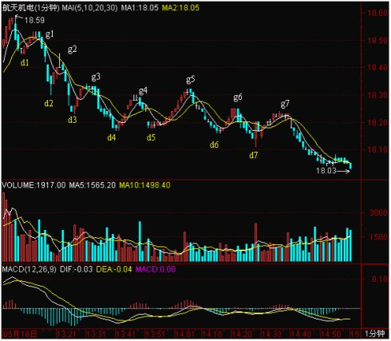{width="5.102083333333334in"
height="4.280575240594926in"}

我们就从g0开始，当下地进入图形中。显然，当下走到g1时，由于只有两段，所以不形成任何中枢，当然，如果你是一个分笔操作者，那么g1就构成一个第二类卖点了。当走势发展到d2时，一个1分钟级别的中枢就形成，区间是\[d1,g1\]。后面出现的线段，就要以该区间来决定是中枢震荡还是第三类买卖点。由于d1=g2，那么d2g2这段就属于\[d1,g1\]中枢的震荡。而到d3g3这段，显然已经不能触及\[d1,g1\]，所以g3就是第三类卖点。当然，如果前面d1\>g2，那g2就是第三类卖点了。

其实，由于d1=g2，所以当行情发展到d3，就可以当下地用结合律对走势进行多样性分析。这时候，有如下等式：

g0g3=(g0d1+d1g1+g1d2)+d2g2+g2d3=g0d1+(d1g1+g1d2+d2g2)+g2d3

括弧里的是中枢。在后一式子看来，该中枢就是\[d1，g2\]，也就是一个价位，这时候，也并不影响前面关于g3就是第三类卖点的分析。而这种分解，比较符合一般的习惯，所以是可以采取的。

显然，以MACD辅助判断，力度上，g1d2\>g2d3\>g3d4,相对来说，后者都是前者的盘整背驰。当然，在1分钟图上，这种背驰都没有什么操作意义，但如果是日线、甚至年线图上，就有了。

分解图形，有一个原则是必须知道的：两个同级别中枢之间必须有次级别的走势连接，例如，g0d4=g0d1+(d1g1+g1d2+d2g2)+（g2d3,+d3g3+g3d4）这样的分解是不被允许的，因为括弧中的两个同级别中枢之间没有次级别的连接。（注意，这与下面三次级别构成中枢的情况不同，那种情况下，是允许三个括弧相加而之间没有次级别，因为那是扩展成高一级别中枢的情况，和这里两个同级别的情况不同。）

当行情当下走到d4点时，根据上面的原则，无非有下面两种可能的分解：

g0d4=g0d1+（d1g1+g1d2+d2g2）+g2d3+d3g3+g3d4

=g0d1+d1g1+g1d2+（d2g2+g2d3+d3g3）+g3d4

d4g4是盘整背驰后的正常反弹，针对上面第一种分解，这只是第三类卖点后向一个新的同级中枢移动或形成更高级别中枢的一个中间状态，g4d5这段也是；针对第二种分解，由于g4=d2，所以d4g4是（d2g2+g2d3+d3g3）的中枢震荡，d5g5这段也是。

有人可能要问，在这种情况下，采取哪种分解？其实，哪一种都可以，但第一种，由于在中间状态中，没有一个确定的标准，所以对短线操作指导不足，而第二种，由于是中枢震荡，操作起来就指导明确了，所以从方便操作的角度，就可以用第二种。这就是反复强调的分解多样性的好处，一般来说，对于具体操作，一定要选择当下有明确意义的分解，例如是中枢震荡的，或有第三类买卖点的，但一定要注意，所有的分解必须符合分解的原则，否则就乱套了。

对于第二种分解，d5g5这段属于中枢震荡，但对于第一种分解，d5g5这段就有了一个重大的意义。因为那种第三类卖点出现后的中间状态，在d5g5这段出现后就彻底消除了，一个更大级别的中枢就给确定了。具体如下：

g0g5=g0d1+{（d1g1+g1d2+d2g2）+（g2d3+d3g3+g3d4）+（d4g4+g4d5+d5g5）}

三个小括弧里的1分钟中枢重叠构成了大括弧里的5分钟高一级别中枢。中枢的区间是\[d2，g5\]，注意，这时候，就要把1分钟的走势当成线段，小括弧里的都是线段，高低点就是这线段的端点。这样一来，后面的走势就十分简单了，例如，g7就是一个第三类卖点（d7g7，其中2、3根K线有一个较大的回试，然后有5、6两个小十字星停在该区域，由此就知道这肯定构成1分钟中枢了，也就是内部可以画出一个1分钟以下级别的三段来，当然，具体的如果有1分钟以下图看就可以把握，特别对于级别大的图，这些时候都可以看小级别的图去确认，如果经验多的，一般看到这种情况，不用看小级别的都知道这么回事情。）

按照第二种分解，相应的5分钟中枢要到g6点才完成，这样g0g6=g0d1+d1g1+g1d2+{（d2g2+g2d3+d3g3）+（g3d4+d4g4+g4d5）+（d5g5+g5d6+d6g6）}

相应的5分钟中枢区间就是\[d3，g5\]，在这种情况下，d7g7也是一个中枢震荡，但不构成第三类卖点，因为不符合条件。（为什么？本ID写了这么多，这么简单的问题，就当成作业请各位回答。）

注意，并不是说一定要形成该级别第三类卖点后才能大幅度下跌，完全可以用该级别以下小级别的第三类卖点就突破中枢，但有一点是肯定的，就是只要足够长时间，该级别的这第三类卖点一定会出现的，当然，在最极端的情况下，这个卖点离中枢很远的位置了，但有一点是肯定的，就是该卖点后一定继续向下。而上涨的情况相反，第三买点后一定继续向上，一个最好的例子就是600477在20070409日这个小级别的第三类买点，这买点离2月分的中枢很远了，但依然有效，而且还是在这么大监管的条件下，本ID的理论继续发挥作用，为什么？因为那些监管并没有破坏本ID理论成立的两个最基本的前提。还有的可以看600837在20070206的例子。至于暴跌的例子，现在很难找到，老一点的投资者应该都记得庄股跳水后，第一次反抽后再继续更大幅度下跌的例子，那就是第三类卖点。

必须注意，在这种大幅快速波动的情况下，一个小级别的第三类买卖点就足以值得介入。例如对一个周线中枢的突破，如果真要等周线级别的第三类买卖点，那就要一个日线级别的离开以及一个日线级别的反抽，这样要等到何年何月？因此，一个30分钟甚至5分钟的第三类买卖点都足以介入了。但这里有一个基本的前提，这种小级别的大幅突破必须和一般的中枢波动分开，这种情况一般伴随最猛烈快速的走势，成交量以及力度等都要相应配合。这种操作，如果理论把握不好，有一定风险，就是和一般的中枢震荡搞混了，因此理论不熟练的，还是先按最简单的来，例如对周线中枢的突破，就老老实实等周线的第三类买点。注意，卖点的情况，即使理论不熟练的，宁愿按小的来，因为宁愿卖早，决不卖晚。不过，对于大级别中枢来说，如果还要等到第三类卖点才卖，那反应已经极端迟钝了，那第一、二卖点去哪了？市场里可不能随地睡觉。

还有一种极端的例子，就是大幅度的中枢震荡，例如5分钟的中枢在10000元，最极端的，甚至可以次级别以下震荡到0.01元，又拉回来，即使连续跌停到0.01元，然后连续涨停到100000000元，再跌回来10000元，这也是5分钟的中枢震荡。当然，这么有病的例子也只能是理论中的，但由此可见本ID理论的涵盖面之广。所以中枢震荡的操作，一定是向上时力度盘整背驰抛，向下力度盘整背驰回补，而不是杀跌追涨，否则真出现这么有病的情况，那就真有病了。

关于追涨杀跌，如果在中枢震荡中，一定死定。但如果是在第三类买卖点后，却不一定，因为中枢的移动，并不一定恰好就是你买卖的位置就结束了，就算是，后面也还有中枢震荡出现，因此，在这种情况下追涨杀跌，也有活的机会，但这都不是长远之计，为什么有好好的第三类买卖点不用，一定要追涨杀跌？就算是追涨杀跌，也可以利用小级别的买卖点进去，为什么一定要瞎蒙？

回到上面的两种分解，其实这两种分解对于g7点来说，结论是一样的，而从MACD辅助看，这种两次拉回0轴都冲不上去的走势，而且第二次红柱子还面积小了，这种情况也预示者后面有麻烦。但多种分解，其实并不是什么麻烦事，反而是相互印证的好办法。不过一定要再次强调，分解必须符合规范，不能胡乱分解。

按严格标准说，如果你能熟练地，无论任何图形，都能当下快速地按以上标准来分解并指导操作，那么对于本ID理论的学习，就大致可以小学毕业了。不过这样可能对信心不足或学习时分析能力比较一般的人打击过大，所以为了鼓励大家，本ID决定向教育部门学习学习，也来一个扩招，达到这种水平的，都统一发本科毕业证书，又鉴于最近北大已经堕落到连孔男人、李男人之流都可以教授教授了，所以决定毕业证书都统一成北大牌的，一律免费，这样大家应该可以放心学习了。

废话少说，本ID要去夜宵夜宵，然后看球看球。

附录：

**虽然今天本ID见到什么股票都想当AC给揍扁，但如果你学了上面的课程连今天的图都看不明白，那自己也要揍扁自己了。10点的第一卖点与1115的第二卖点，就和上面图上的g0\\g1是一回事情，只是上面是1分钟以下级别的，而这是1分钟级别的。从1115到1412，就是第三段，从而构成一个大的5分钟中枢，第三段是一个典型的趋势，二个中枢，最后一段在1分钟图上标准的1分钟以下级别背驰（看其中MACD的绿柱子面积），后面的拉回，就是对这5分钟中枢的震荡。就这么简单，看不明白的，对着今天的分时图，和上面的图，请好好研究。**

**明白了上面，明天的走势就太简单了，就是关于这中枢的震荡直到出现第三类买卖点，就这么简单，简单得像昨天首发就应该是克劳奇，但竟然没有，你说是不是某些人脑子进水了。至于大的走势，就还是4129点的1/2线问题，一定要震荡给站住才谈论向上发展，这是一个大前提。**

**个股不想说什么了，千万别问本ID，今天635涨停究竟买不买。一定要在买点买，短线也是一样的。就像本ID那16只里前期最弱的998和343，998在3、4月分盘整的时候，无数人在叨唠，有那时间叨唠，还不如问自己，那盘整究竟是什么级别的第三类买点，然后去分析细部，找出启动的点。按照本ID的理论，3月30日的那个点根本就不难找，请看看日线下的MACD变化。其他个股也是一样的。343，3月份的盘整是什么？MACD刚回拉0轴就起来，这够标准没有？为什么有时间埋怨没时间研究？**

**有时间，请多研究，功夫是要花工夫的。**

缠中说禅2007-05-24 01:41:04

吃完夜宵回来，把帖子再发一次，刚才新浪有毛病，帖子发不好。

缠中说禅2007-05-24 01:41:42

把原来帖子的回贴转过来：

\[匿名\] 头大也得看

2007-05-24 00:28:04

晕，老大辛苦啊！！这都几点了，还在关心大家！！

\[匿名\] 头大也得看

2007-05-24 00:32:36

服啦！！这精神，还用二话不！！！！！

缠中说禅

2007-05-24 00:45:11

早上就不发帖子了，收盘再把解盘附录上。

今天的新浪很有毛病，帖子发得有点累。

先下，再见。

\[匿名\] 新浪网友

2007-05-24 00:56:31

夜猫子呀，以前就知道你凌晨还跑到孔肥肥和黎鸣那里帖帖子，这次怎么说呢？有暖流般的感动，祝一切顺利皆好！

缠中说禅2007-05-24 01:42:09

\[匿名\] 新股手

2007-05-24 01:03:14

沙发!

我还在学习啊

\[匿名\] 替天行房

2007-05-24 01:07:32

老大早！

\[匿名\] 新股手

2007-05-24 01:11:41

反正前天钻进了139569,近期捂着,洗晕我也不出来.

球我就不看了.先去宵夜,再上来连夜学.白天也懒得盯盘了,免得受不了洗,中了国民党的\"美人计\",当了浦自高。呵呵

\[匿名\] 大盘

2007-05-24 01:17:15

谢谢博主对我前日提问的走势截图进行具体的分析，大家应该抓住这个机会好好琢磨一下，如果觉得博主文章当中的图片不太清楚，可以直接访问以下链接的原图，或者参考600151在5月18日从13.07到收盘时1分钟图表的k线图

www-itai-org-cn/zsid/zs7-htm （- 替换成 .）

\[匿名\] 替天行房

2007-05-24 01:25:50

老大看过"我从中亚归来\-\--perry家族"的博客吗？有何评论？

\[匿名\] 好色小和尚

2007-05-24 01:32:31

我看好AC，多谢美人姐姐！

缠中说禅2007-05-24 01:42:54

早上就不发帖子了，收盘再把解盘附录上。

准备看球

先下，再见。

缠中说禅2007-05-24 15:34:20

虽然今天本ID见到什么股票都想当AC给揍扁，但如果你学了上面的课程连今天的图都看不明白，那自己也要揍扁自己了。10点的第一卖点与1115的第二卖点，就和上面图上的g0\\g1是一回事情，只是上面是1分钟以下级别的，而这是1分钟级别的。从1115到1412，就是第三段，从而构成一个大的5分钟中枢，第三段是一个典型的趋势，二个中枢，最后一段在1分钟图上标准的1分钟以下级别背驰（看其中MACD的绿柱子面积），后面的拉回，就是对这5分钟中枢的震荡。就这么简单，看不明白的，对着今天的分时图，和上面的图，请好好研究。

明白了上面，明天的走势就太简单了，就是关于这中枢的震荡直到出现第三类买卖点，就这么简单，简单得像昨天首发就应该是克劳奇，但竟然没有，你说是不是某些人脑子进水了。至于大的走势，就还是4129点的1/2线问题，一定要震荡给站住才谈论向上发展，这是一个大前提。

个股不想说什么了，千万别问本ID，今天635涨停究竟买不买。一定要在买点买，短线也是一样的。就像本ID那16只里前期最弱的998和343，998在3、4月分盘整的时候，无数人在叨唠，有那时间叨唠，还不如问自己，那盘整究竟是什么级别的第三类买点，然后去分析细部，找出启动的点。按照本ID的理论，3月30日的那个点根本就不难找，请看看日线下的MACD变化。其他个股也是一样的。343，3月份的盘整是什么？MACD刚回拉0轴就起来，这够标准没有？为什么有时间埋怨没时间研究？

有时间，请多研究，功夫是要花工夫的。

缠中说禅2007-05-24 15:43:17

\[匿名\] 天地之间

2007-05-24 15:39:27

缠姐好,

请您指导下联通的中线趋势好吗? 最近走

===

联通没什么可说的，标准的通道式上涨，有技术，就在通道上下轨结合短线背驰进行震荡买卖。没技术的就拿着，下轨不破就一直拿着。

缠中说禅2007-05-24 15:50:05

雪狼

2007-05-24 15:43:16

请问博主 大盘

今天一分图上 10.38 \-- 11.16 这段 也没有形成盘整背驰啊？

想这样 11.16 这样的点 该怎么分析？

===

为什么一定要盘整背驰？那只是一种多数的情况。为什么不可以是小级别转大级别。而且参照第一段的中枢，刚好就回拉到相应的位置，而用前面05221100开始的一个大中枢的一个震荡，就更容易判别。

图形是在一个系统里的，必须综合看大下级别的中枢关于当下走势的意义，才有全面的把握。当然，这暂时有点要求高，但必须努力才行。

缠中说禅2007-05-24 15:52:02

\[匿名\] 袖手旁观

2007-05-24 15:48:46

"10点的第一卖点与1115的第二卖点，就和上面图上的g0\\g1是一回事情，只是上面是1分钟以下级别的，而这是1分钟级别的。"

------------------------

这个第一卖点在5分级别上算不算？

===

你站在5分钟级别的角度，一个5分钟中枢形成，必须是先一个1分钟向下，然后一个1分钟向上，不创新高或背驰，这就构成第二类卖点，这是昨天的课里有的。

缠中说禅2007-05-24 15:54:48

缠中说禅

2007-05-24 15:54:09

\[匿名\] 新浪网友

2007-05-24 15:49:03

楼主的理论操作起来出现了问题,不知道是否我理解错了,今天的上海大盘,10:12-10:31一分钟图上有中枢,10:40-11:17按楼主的说法是反谈直插中枢里面,所以后面的第一个回调我就买进,应该是所谓的第三买点,但结果就被套住,请楼主解释是否楼主的理论也有例外,什么时候会发生以外呢????????????????????????????????????谢谢

请楼主一定阐明,避免我们继续错误!!!!!!!

===

本ID的理论最大的例外就是没有例外。你先把本ID的课程都先学一遍，你现在说的，根本就等于没看过本ID的课程。第三类买点是这样的吗？请先把课程学一遍，把基础打好。

缠中说禅2007-05-24 15:58:51

雪狼

2007-05-24 15:01:08

博主你好！

1
"一般说，高点一次级别向下后一次级别向上，如果不创新高或盘整背驰，都构成第二类卖点，而买点的情况反过来就是了。所以，在有第一类买卖点的情况下，第一类买卖点是最佳的，第二类只是一个补充；但在小级别转大级别的情况下，第二类买卖点就是最佳的，因为在这种情况下，没有该级别的第一类买卖点。"

请问博主：是不是存在"第二类买点比第一买点低"和"第二类卖点比第一卖点高"的情况？如高点一次级别向下后一次级别向上，创新高但形成盘整背驰了，这时就应该是一个高于第一卖点的第二卖点吧。

===

当然有可能，虽然很少见。

2
"第二类买卖点，站在中枢形成的角度，其意义就是必然要形成更大级别的中枢，因为后面至少还有一段次级别且必然与前两段有重叠。"

请问博主：这是一定必然保证的吗？为什么不能出现从第一买点开始一段次级别上，然后次级别回试，第三段上之后再不跌破第一段的高点的情况呢？或反过来的卖点。是不是这必须考虑时间的无限性呢？那"后面至少还有一段次级别"，这次级别是不是是N久以后的事情了，这样的话第二类买卖点的意义是不是就不能只从形成更大级别的中枢来考虑了呢？

===

这绝对保证。没有什么更大级别，就是按这定义来。

3 按照第二种分解，相应的5分钟中枢要到g6点才完成，这样g0g6=
g0d1+d1g1+g1d2+{（d2g2+g2d3+d3g3）+（g3d4+d4g4+g4d5）+（d5g5+g5d6+d6g6）}

相应的5分钟中枢区间就是\[d3，g5\]，在这种情况下，d7g7也是一个中枢震荡，但不构成第三类卖点，因为不符合条件。（为什么？本ID写了这么多，这么简单的问题，就当成作业请各位回答。）

是因为G6D7不是五分的次级别吧？第三买卖点要求的是次级别的离开，次级别回试不破中枢。

===

次级别离开，次级别返回不重回中枢。

缠中说禅2007-05-24 16:00:15

\[匿名\] 你的样子

2007-05-24 15:57:40

今日巨幅亏损，原因不说了，自身为主。

期待下次跳水的来临。争取抓住机会。

===

今天连5日线都没碰到，这算什么跳水？技术不熟练的，就看5日线就可以。

缠中说禅2007-05-24 16:04:41

\[匿名\] 袖手旁观

2007-05-24 15:55:09

问题1：\[d1,g2\]这样只有一个价位的重叠，是不是可以忽略？尤其在力度g1d2\>g0d1的情况下，g2碰不碰d1没有必然要求。这时候g2如果低一个价位（很可能由偶然因素决定），对整个走势应该没多少影响，但是重叠就不存在了。那么这个中枢看不看它都关系不大。

当然，这也还是归入第二种分解。

===

严格按理论来，如果一个价位就不算，那两个算不算？这样就乱了。只要有重叠就是，而且，有时候1个价位反而更有意义，这一般都是里面主力资金的杰作。

问题2：力度上，g1d2\>g2d3\>g3d4,相对来说，后者都是前者的盘整背驰。很多人说背了又背，缠论不灵了。其实这里每次盘背都回探前低，从而完成了有理论保证的最低限度的回抽，所以没有什么不对。

问题是对于实际操作，有哪些因素可以帮助判断在一个底背驰出现之后、在顶背驰出现之前会有一段相当幅度的"惯性运动"，而不是完成最低限度的回抽之后就继续原方向的走势？这关系到小级别背驰值不值得参与，我现在只能依据高一级的MACD来做大概预计，有明确判断的办法吗？

===

这问题不能搞混了，趋势是形成中的，刚背驰回来，归根结底都是造成中枢震荡，震荡出第三类买卖点才有趋势的可能。

缠中说禅2007-05-24 16:11:18

对不起，本ID有事要马上外出，晚上有应酬，各位如果真想自由于走势中的，就要多花点工夫，多看点图，首先把今天的分时图留下来，这个图太典型了，把1分钟怎么演化成5分钟都表示出来了。

有什么疑问，最好提些典型的，向这次这个，有些课程都没看一遍的概念问题，请先把课程研读一次。

先下，明早见。

## 请远离所有借股票收费者！

(2007-05-25 08:52:29)

上周突破孔男人1/3线后，本ID这里成交屡创天量，比平时6、7千的浏览翻了近6、7倍，这轮行情过后，本ID这里指数上台阶，但也有太多新人加入，人心难免中枢震荡，为此废话几句。

首先，现在来此的多为股票，原来这里是不说股票的，只谈诗赋歌乐、众哲诸子、吃喝玩闹、经济数理等等，但本ID唯一能谋生的就是股票之类的活动，本ID所有资产，都是从市场中抽血收刮而来，虽然十多年前已不再为阿堵物烦恼添堵，但2005年六月后，本ID又重新出来折腾，看着那些忽悠传销之辈到处瞎人正眼、害人财物，本ID也就不能置身度外了。

当然，本ID是谁并不重要，本ID的年龄也无须公开，至于本ID干过什么事情，就更没有必要说了，不过可以100%负责地说，本ID呼风唤雨时，现在市场上99%的所谓人物可能还没解决温饱问题。股票，无论对本ID还是本博客，都是末事，从某种意义上说，股票之类的，不过是本ID接触社会的一个方便途径，如果不在市场上玩玩，那本ID就要与世隔绝了，按本ID现在的年纪，这也太年轻了，这也是05年本ID重新出来的一个原因，之前最多就在网上游逛，那有关人民币与货币战争的帖子就是05年之前网络游逛时随手写的。当然还有一个原因，就是本ID知道人民币升值将带来一轮前所未有的大牛市，比本ID折腾过的都要大，而且，在2001年大盘见顶，本ID休息时，本ID就曾和朋友说，中国今后最大的问题之一，就是中国人是否还是中国资本市场的主人，这也是本ID要重新出来的原因。

对于一般投资者，请远离所有借股票收费者，这是给来这里的所有人，无论是常住还是过客的一个最基本忠告。市场中，真正值得本ID去接触的所谓牛人，有哪个是靠收费出来的？收费那点钱都要吆喝的人，能是什么牛人？有那吆喝收点小钱的工夫，还不如去419一把爽。把自己的身家性命交付给那些自己都不能自保的人，那真是抱团死了。说实在，这世界上最不值钱的就是关于股票的信息，股票本质上就是废纸一张，当然，为关于废纸的信息付钱，比起为关于上帝的信息献身，那还是脑子的水少点。

本ID眼里不喜欢沙子，所以，现在这里人多了，鱼龙混杂，以前这里是不删帖子的，但以后，这里要删帖子了，但只删一类，就是卖广告骗钱的，其余的，爱干什么干什么，本ID一视同仁，如果你骂本ID能心情愉快，本ID也会觉得心情不错。

本ID这里一不收费，二不收徒子徒孙，你是佛，本ID顶礼，别憋屈了自己。本ID这里如空谷，任尔云来风动、虎啸龙吟，各位不用客气了。来这里，股票只是一个小道，最终如果能小道而大道，那才算有小得，否则只是一场儿戏。非离股票而觅什么大道，如果你那大道连股票都不能折腾一把，那你的是垃圾道。有些人看不得本ID这里写股票，以为这就俗了、堕落了，就是如此之辈。本ID这里横天横地，天堂地狱一把捏，不要画地自囚。

看了一下昨天的回帖，发现对连接同级别中枢的次级别有疑问，注意，这问题以前其实都说过，一个次级别，连接两同级别中枢，这其实就是趋势，所以分解时，那连接的次级别当然要和趋势本身是同向的，否则就不是趋势了。所以，在那图上，（g0d1+d1g1+g1d2）+d2g2+（g2d3+d3g3+g3d4）就是不允许的，因为这两个同级别中枢间有重叠，而且d2g2的方向不对。

刚才看到那老熟人，有如下发言："很多人都认为中国股市目前已经发展到\'全民炒股\'，但我的观点是，中国还远未到\'全民炒股\'的程度。毕竟，现在开户数不到1亿，而且一般都会在两个市场开户，那么差不多只有5000万户。就算一家有三到四口人，那也不过是一亿多人，不到中国人口的十分之一。而在发达国家，这一比率是三分之一甚至一半对一半。"

对比一下本ID四月份的文章"站在市场发展的历史趋势上看，目前这种"全民炒股"不是过分了，而是远远不够。目前国内，无论社会还是个人资产，其中的股票等虚拟资产所占比例，与市场经济发达国家还有着极大的距离，在股票等虚拟资产占到社会与个人总体资产的30%之前，"全民炒股"只能算是初级阶段，必然需要一个大的快速发展，才能满足市场经济发展的最低要求。目前，国内资本市场逐步出现的"全民炒股"现象，不仅符合市场经济发展的内在逻辑，而且具有历史必然性与广阔发展前景。"全民炒股"，使得社会上的任何企业与个人，都可以通过资本市场这公开平台，公平地选择、参与市场经济中最有价值的投资机会，让社会与个人资源得到最公正合理的配置。而在股票等虚拟资产占到社会与个人总体资产的50%之前，一切对于"全民炒股"的指责都是可笑、短视的。"

管理层要逐步统一到这个认识上来，否则要干傻事情。

附录：

今天大盘没什么可说的，就是在昨天那5分钟中枢上晃荡，周五，由于对周末消息面的犹疑，尾盘只能横着。下周依然只要看这中枢震荡直到第三类买卖点出现。大的方面，还是突破4129的1/2线后的反抽确认活动，没什么特别的。下周很关键，因为涉及月线收盘，月线如果留下长上影，那下月一个弱走势盘整走势就很难避免。如果收光头阳线，那么后面继续强势的可能就很大了。

前面突破3000点时，有人问5浪如何如何，本ID回帖反问，为什么不能是3浪3？当然，本ID的剧本是这样设计的，能否最终完成，这要看很多方面的配合，不是本ID一个人能完全决定的，但从春节前直播上3000点，到319一大早用**神州自有中天日，万国衣冠舞九韶**发总攻号令，这3之3的游戏，也算有点意思了。不是汉奸说3个月之内回3000之下吗？那就让他在3000下等着吧。

回想319在3000点之下的情况，后面大盘走成怎样，怎么都比那时候要上了一个大台阶了，这个局面来之不易，大家是珍惜的，也希望管理层珍惜，脑子尽量干燥点。当然，管理层也不是一言堂的，所以，一切都是合力的结果，多一个人出力，才可能走出剧本所描画的蓝图。

周末，腐败去吧！

缠中说禅2007-05-25 08:53:55

大盘今日分析收盘附上，先下，下午再见。

缠中说禅2007-05-25 15:41:14

今天大盘没什么可说的，就是在昨天那5分钟中枢上晃荡，周五，由于对周末消息面的犹疑，尾盘只能横着。下周依然只要看这中枢震荡直到第三类买卖点出现。大的方面，还是突破4129的1/2线后的反抽确认活动，没什么特别的。下周很关键，因为涉及月线收盘，月线如果留下长上影，那下月一个弱走势盘整走势就很难避免。如果收光头阳线，那么后面继续强势的可能就很大了。

前面突破3000点时，有人问5浪如何如何，本ID回帖反问，为什么不能是3浪3？当然，本ID的剧本是这样设计的，能否最终完成，这要看很多方面的配合，不是本ID一个人能完全决定的，但从春节前直播上3000点，到319一大早用神州自有中天日，万国衣冠舞九韶发总攻号令，这3之3的游戏，也算有点意思了。不是汉奸说3个月之内回3000之下吗？那就让他在3000下等着吧。

回想319在3000点之下的情况，后面大盘走成怎样，怎么都比那时候要上了一个大台阶了，这个局面来之不易，大家是珍惜的，也希望管理层珍惜，脑子尽量干燥点。当然，管理层也不是一言堂的，所以，一切都是合力的结果，多一个人出力，才可能走出剧本所描画的蓝图。

周末，腐败去吧！

缠中说禅2007-05-25 15:49:15

对不起，本ID马上要外出谈事情，不能和大家聊了。

先下，周日开音乐会，再见。

## 教你炒股票55：买之前戏，卖之高潮

(2007-05-28 08:12:41)

人的行为同构性，把性研究清楚，人的行为也就略知一二了。股票买卖，不过是人的行为之一，当然也不例外。这里极为严肃地讨论这个问题。

首先，先给股票定性别，为什么本ID总爱说股票是面首，因为他确实是面首，他是他，而不是她，股票的性别是男的，所以难。难什么？难在高潮之不可持续，高潮之后必有不应。而投资者应该是什么性别，投资者应该是她而不是他，投资者的投资能力就应该如女性性能力般可持续，无不应。以女"性"可持续之洪大去折服男"性"不可持续之弱小，这就是投资之道。

投资的关键就是女性，就是可持续，这与股票本身的男性，不可持续构成了投资中最大的矛盾。投资之道，就是驾御面首之道，就是御男之术，就是采阳补阴之方。采阳，要讲究其火候，火候太嫩，采之难以成丹，太老，同样是废物，如果是阳气外泄，化为污浊之精，则更是大煞风景。股票也一样，太早买入，一阳未生，则纯粹折腾，毫无趣味；待到高潮之刻不能及时采补，则阳气尽去，污精尽泄，烂蛇死鳝，反受其困。由于男"性"之不持续，则女"性"采补之关键，就是要取其精华，何谓其精华？一阳复始采之，阳极阴生弃之。用更通俗的话说，就是买之前戏，卖之高潮。

买和卖，是不对等的，相应的策略也是不一样的，为什么？因为买卖的前后状态是不同构的。在市场里，买是钱换筹码，卖是筹码换钱，钱是与时间无关的，1元，今天是，明天还是，只要还是钱，就是不变的。而筹码不是，今天的筹码价值与明天的就不同，而筹码的数量不变是没意义的，因为最终算的还是钱。而由于时间的不可逆转，因此（钱-筹码）与（筹码-钱）这两个结构，就不是同构的。这道理十分简单，谁都明白，但却是操作逻辑的基础，最基础的往往最简单。

因此，对于一个大级别的买的过程，或者说一个大的建仓过程，买必然是反复的，买中有卖，不断灵活地根据当下的走势去调整建仓的成本与数量，底部区域可以进行最复杂的中枢延伸与扩展，唯一的目的只有一个，取得足够的、成本不断降低的筹码。这不一定和坐庄有关，当然也可以相关。一个大级别的买的过程，某种程度上还兼备着改造这股票股性的任务，而且这也是一条底线，也就是能顺利退出的底线，在这个底部区域的股性改造中，也就是一个前戏的过程，没有好的前戏，不会有好的高潮。注意，底部不一定就是在一个平衡的水平线上中枢震荡，还可以是比较复杂的通道式上升，当然，一般来说，这种通道都是斜率很小的，充满激烈的震荡，具体的以后再说。

一个好的、具有诱人前戏的买，当脱离底部区域时，其成本应该早在该区域之下。而在大级别中枢上移中，只会减少成本，只有最愚蠢的拉抬，才会增加其成本。其后的活动，本质上只是股"性"不断激发，如同蜂王散发那诱惑引发那群雄蜂的追逐，这更如同一个壮观的NP过程，N不断增大，各种裂口、长阳，将这NP活动推向高潮。对于刚脱离底部的股票，第一次的高潮就如同一个淫乱狂欢夜的序幕，只不过是为第二、第三、第四、第五、第六、甚至第10次高潮进行铺垫。第一次高潮后的不应期往往不长，但可能很猛烈，震荡很激烈，不应期中还有继续高潮的冲力。这种股票，就如同刚被开发的面首，只有第二、三次，甚至第四、五次的高潮才会渐入佳境。而一个出色的卖，就是在那大级别高潮的后继乏力、背驰中退出，一个好的庄家或大资金操作者，最好的状态就是在那大级别的最后疯狂中被疯狂的雄蜂把货给抢光了，那种所谓筑平台出货的傻瓜，死去吧。

注意，本ID在上面是否正在进行一个AV的解说，这并不重要，重要的是，股票就是这样每天现场直播着这NP级别的AV。对于一般的散户投资者，在一些较大级别的介入中，例如日线以上的介入中，并不一定都要在第一类买点介入，因为，其后的前戏过程，并不一定是一般的散户可以忍受的，一般地，可以在第二类买点出现后才考虑介入，或者更干脆的，是第三类买点出现再介入。但如果资金有一定规模，需要一定数量的筹码，或者要为以后的猎鲸活动储备经验，一个至少从第二类买点开始利用部分前戏的介入是必须的，其中也要如大资金一样，有利用前戏的震荡降低成本、增加筹码的必要。这有什么好处？最重要的一个好处，就是熟悉其股性，一个前戏都不参与的，怎么可能在后面的N次高潮与不应中得心应手？

性，说白了就那么一回事，所有人的基本运转模式都是一样的，也就是前戏-高潮的模式。股票也一样，其运转的模式，归根结底，就是不同级别的中枢震荡与移动的组合最终构成相应的前戏-高潮模式，都一样，但在一样之中，每个股票都有其股性，涉及频率、幅度、形态复杂度等等，这些，对于每只股票都是独特的，这也就是为什么，依据同一模式展开的走势，却呈现千差万别的最终图形。

附录：

**周末没什么消息，憋了两天的能量在今天爆发，所以就搞出一个大缺口来，但其后的走势，并不是太强，依然只是一个平衡市，所以这缺口的吸引力以及该平衡市所构造的新的中枢的引力，使得后面三天的技术压力不可忽视。周四是月线收盘的位置，刚好也是缺口在技术上需要三天考验的时间，所以后面三天，多空的搏杀将极为惨烈。**

**大的方面看，4129点的1/2线在六月份将上移到4144点，该线的突破在日线上的回试确认并不能完全保证周线、月线上的回试确认，从最严格的意义上，在月线上至少需要3个月才能确认该线的真正有效突破。这就像1-3份在1/4线时所呈现的走势一样。当然，最理想，最强的走势就是，5月收光头阳线，六月以下影线的方式是确认该线的突破，七月继续长阳最终确认该突破的完全有效，但这只是最理想的情况，市场最终并不一定能走出来。**

**政策方面，关于操纵的条例周末已经在报纸上有所暴光，说实话，这条例才是一个真正的狠招，其中有些规定，对市场的格局有严重的影响，在本ID看来，这才是这两年来市场上飘来的真正的第一朵黑云，只是现在市场中散户太多，一般反应比较迟钝，所以没什么感觉。由于该条例只是一个草案，所以还有纠正的可能，下面，真正有意义的事情，就是对该条例进行无情打击，深入揭发，让该条例中严重危害市场的条款不能实施。**

**如果大盘本月不能收出光头阳线，该条款以及今后几天的一些政策面动态是主要的原因。但大家的心态要平和点，毕竟政策也是市场合力的一部分，他们也不容易，就原谅他们吧。**

**在某一级以上的，今天应该已经收到一些东西，具体的本ID不能说，内容当然也是和调控股市有关的，估计这几天就会出来了。但这些警示性的东西有多大作用，就看市场反应了，这也刚好配合了技术面上的要求。**

**本ID晚上要见些人，不能陪各位解答问题了，先下，再见。**

缠中说禅2007-05-28 08:14:16

今天解盘，收盘后附录上，先下，再见。

缠中说禅2007-05-28 15:37:32

周末没什么消息，憋了两天的能量在今天爆发，所以就搞出一个大缺口来，但其后的走势，并不是太强，依然只是一个平衡市，所以这缺口的吸引力以及该平衡市所构造的新的中枢的引力，使得后面三天的技术压力不可忽视。周四是月线收盘的位置，刚好也是缺口在技术上需要三天考验的时间，所以后面三天，多空的搏杀将极为惨烈。

大的方面看，4129点的1/2线在六月份将上移到4144点，该线的突破在日线上的回试确认并不能完全保证周线、月线上的回试确认，从最严格的意义上，在月线上至少需要3个月才能确认该线的真正有效突破。这就像1-3份在1/4线时所呈现的走势一样。当然，最理想，最强的走势就是，5月收光头阳线，六月以下影线的方式是确认该线的突破，七月继续长阳最终确认该突破的完全有效，但这只是最理想的情况，市场最终并不一定能走出来。

政策方面，关于操纵的条例周末已经在报纸上有所暴光，说实话，这条例才是一个真正的狠招，其中有些规定，对市场的格局有严重的影响，在本ID看来，这才是这两年来市场上飘来的真正的第一朵黑云，只是现在市场中散户太多，一般反应比较迟钝，所以没什么感觉。由于该条例只是一个草案，所以还有纠正的可能，下面，真正有意义的事情，就是对该条例进行无情打击，深入揭发，让该条例中严重危害市场的条款不能实施。

如果大盘本月不能收出光头阳线，该条款以及今后几天的一些政策面动态是主要的原因。但大家的心态要平和点，毕竟政策也是市场合力的一部分，他们也不容易，就原谅他们吧。

缠中说禅2007-05-28 15:55:28

\[匿名\] 新浪网友

2007-05-28 15:48:54

缠姐　　一个困惑多日的问题，第三类买卖点后中枢的构成应该是从哪段开始计啊？？？　构成第三类买卖点的那段开始？还是＋1段开始？？？？？？？？？？？

===

你必须先了解结合律，中枢（C）=（A）+（B）里，前面A一个必须依然满足该级别中枢的定义，B满足次级别的定义而且是完成的，然后再看回试那一段是否次级别完成，这样就能确认第三类买卖点。

缠中说禅2007-05-28 16:04:26

雪狼

2007-05-28 15:54:37

博主你好 辛苦了！

"当行情当下走到d4点时，根据上面的原则，无非有下面两种可能的分解：g0d4=
g0d1+（d1g1+g1d2+d2g2）+g2d3+d3g3+g3d4=
g0d1+d1g1+g1d2+（d2g2+g2d3+d3g3）+g3d4"

请问博主：当行情当下走到d4点时，该选择g3d4和那段比去判断盘整背驰没有？我的理解是如果按g0d4=
g0d1+（d1g1+g1d2+d2g2）+g2d3+d3g3+g3d4分解就用g3d4和g2d3比较对应的MACD；如果按g0d4=
g0d1+d1g1+g1d2+（d2g2+g2d3+d3g3）+g3d4分解就用g3d4和

g1d2比较对应的MACD。我的理解对吗？

\-\-\--

对的，这里，无论是哪个，最终的结论都是d4点是背驰点，因此该点的意义就大了。有时候会出现两种情况不一致，也就是后一段的力度刚好是前两段的中间，这时候，可能的情况就是拉回满足那种分解的最低幅度，而不一定到达不满足那种分解的最低幅度。具体的以后课程里会说到的。

缠中说禅2007-05-28 16:08:09

\[匿名\] 水浴清蟾

2007-05-28 16:04:02

我现在用000900学习妹妹的理论，进进出出好几次了。上周五看出背驰，在21.01出了，但今天冲好高，我看的五分钟的中枢，但这次判断失误，1000股被套，现在已经30分背了。不过，我基本空仓，手上只有000900，所以还有机会把成本降下来。

===

一般来说，如果卖了没回补，最好别养成追高回补的坏习惯。抛了，在技术允许的情况下，一定要买回来，否则节奏就会乱，一旦发现再冲高，再追，反而容易被套住。

缠中说禅2007-05-28 16:14:06

名\] 新浪网友

2007-05-28 16:06:39

按《操纵市场指引》,行政部门权力太大又没得到制约,麻烦大了!!!不受制约的权力对市场的危害最大.建议在指引中加入对调查权使用的约定以及对调查结果审核\\上诉\\复核等方面的制约调查权滥用的条文!!!

===

还有很多条款过于严格，根本没可操作性，本ID当然也会通过影响去休正这事，但这种事情，必须要有大家的努力，否则最后害的是所有的人。

缠中说禅2007-05-28 16:25:10

\[匿名\] 卖错了吗

2007-05-28 16:13:52

昨天在1358卖出777，因为判断为第三卖点，怎么后面的走势完全不是，真郁闷，LZ，我的判断错哪了？

===

无论000777与600777，你的判断都错了。请你先把定义搞清楚。连中枢都没脱离，哪里有第三类卖点？

缠中说禅2007-05-28 16:28:12

\[匿名\] 大盘

2007-05-28 16:15:20

如果博主觉得看网页麻烦：

我的问题可以简化为，

1）
一个日线中枢3段结束后，跳空离开中枢最高点，然后逐渐扩展成第2个日线中枢，并且跳空后的第2个日线中枢每段都是只有一个30分钟的盘整走势，那么第一个日线中枢有3买点吗

2） 3卖点允许次级别盘整离开+盘整返回这种组合吗？

===

只要是次级别的就可以，关键不是这里，而是结合律，必须要括弧里的都满足定义。具体在上面回答相关问题里有。详细的以后课程里有。

缠中说禅2007-05-28 16:29:40

\[匿名\] 远帆

2007-05-28 16:20:26

每次根据一分钟或五分钟线在三卖的时候抛出做T＋0想把成本降下来，可是就是降不下来，就是降下来也不够手续费，结果成本越做越高，缠主说说这怎么办？

===

那证明你的通道、技术等都不满足用5分钟以下级别操作，就把级别放大操作。

缠中说禅2007-05-28 16:31:01

\[匿名\] 白玉兰

2007-05-28 16:29:34

现在深刻理解小资金不要参与盘整的重大意义，我买了北京人后，机会成本都无法计算了。

===

对的，一定要根据自己的实际情况来，资金量、通道、操作时间等是决定你操作风格和操作级别的，一定要自己选择好。

缠中说禅2007-05-28 16:36:07

在某一级以上的，今天应该已经收到一些东西，具体的本ID不能说，内容当然也是和调控股市有关的，估计这几天就会出来了。但这些警示性的东西有多大作用，就看市场反应了，这也刚好配合了技术面上的要求。

本ID晚上要见些人，不能陪各位了，先下，再见。

## 两年来股市晴空飘过的第一朵黑云

(2007-05-29 08:16:51)

关于《操纵市场指引》草案周末已经在报纸上有所暴光，说实话，这指引若被实施，绝对是针对目前市场一个真正的狠招，其中有些规定，对市场的操作格局有着严重影响，如果说以前加息之类的玩意不过是向烈日的天空吹了口气，那么，这指引，才是两年来股市晴空飘过的第一朵黑云，只是现在市场中散户太多，一般反应比较迟钝，没什么感觉，把一个真正的隐患给忽略了。

先回顾一下历史，2001年股市的历史大顶，就是在亿安科技那轰动市场，空前绝后的近9亿罚单后引发的，当然，市场的最终反应有所迟缓，那是正常的，因为一个突然的事件，让市场有一个理解、反应的过程，是很正常的，别以为市场就能够最快速最充分反应的，市场往往特别地迟钝。

不妨摘抄两条这闭门造车的所谓指引里的无聊条款：

"在一个交易日交易某一证券两次以上，或在两个交易日交易某一证券三次以上，即构成连续买卖。"（"最重要的，按照新的认定指引，没有成交的买卖申报也可以算做连续买卖；再比如约定交易，只要双方买入申报和卖出申报的价格相近，就可以构成该项操纵的条件。"）

==

如果上面句子正描述某面首或者指引草拟者的生理状态，那么本ID没什么意见，但用来规范市场每一个人的行为，那就不行。首先，市场的参与者并不都是面首，就算是面首，也不一定就是一天不能两次、两天不能三次的超级弱男，这条款有超级严重的重男轻女倾向，而且重的还是弱男，简直太过分了。说点实际的，如果你当天要买1万股，结果9元没买着，然后撤单9.01元再买，这就构成连续买卖？或者说，当天要买100万股，分10张单，那就更是连续买卖了？难道买100万股，只能填一张单，还不能撤单，那一定能买到？那么还不如干脆规定每天买卖不能超过多少股算了。难道以后买卖股票都只能每天一单，而且只能一个固定的价位，因为按照这个垃圾指引，在不同的价位填单就已经违规。显然，制订所谓指引的人不仅下半身功能有可疑之处，上半身功能已是无可质疑地极端可疑。
“同一交易日内，在同一证券的有效竞价范围内，按照同一方向，连续、交替进行三次以上频繁申报和撤销申报的行为将被认为是“虚假申报操纵”。”

==

制订这条款的人大概从来没有交易过股票，就算是一个散户，如果一股票突然拉起来，他要去追买，连续三次都买不着都要撤单重新填高价位去买，这种情况难道很不常见吗？此外，这指引不是标榜自己如何如何细化吗？那么什么叫频繁？1秒还是1分钟？如何是1分钟，那么61秒就不频繁了？申报和撤消难道不都是交替的，难道可以不申报就可以撤消？买的申报撤单后难道为了不同一方向，就只能进行卖的申报？这种无聊的指引就如同在某类活动中规定只能男上位一样极端地无耻。

本ID对这类无聊指引的态度很明确，由于这关系到根本的市场交易制度，本ID不喜欢这种规定只能男上位的垃圾制度，因此，一旦这种制度被实施，本ID将彻底离开这个市场。本ID挣的钱，够花天酒地、天天换面首，玩个一百几十辈子了，凭什么受这份鸟指引的鸟束缚？而且世界那么大，全世界的市场都没有这样的垃圾指引，本ID去哪里不一样挣钱？一定要一棵树吊死？或者本ID干脆就转玩文化圈子，把什么孔男人、李男人之类的砸成个面首之膜简称面膜算了。

更重要的问题是，这个无聊的指引，最终必然堕落为权力寻租的有力工具，指引越细化，这工具越有力。说实话，这些破指引，最终都是杀鸡给猴看，和本ID都毫无关系，你说狮子、鳄鱼会看这类把戏吗？不过，本ID看不起这种无聊游戏后的无聊勾当和无聊后果，这种无聊把戏为了什么，这就更不用本ID说了。

由于该条例只是一个草案，所以还有纠正的可能，下面，真正有意义的事情，就是对该条例进行无情打击，深入揭发，让该条例中严重危害市场的条款不能实施。别以为这事情和散户没关系，你看看你自己平时的操作中，有多少次违反了上面的规定？还有更多更无聊的规定本ID都没有援引，上面这两条一般化的已经够恶心的，本ID都不想把各位恶心掉了。

当然，必须明确的是，黑云不等于一定有暴雨，但黑云晃荡在这明朗的天空中，确实够恶心。而即使在这种交易条件下，本ID的理论依然有效，只是相应的操作级别必须大幅度提高。站在纯技术的角度，管他什么风什么雨，一切尽在操作中！

但本ID还是不得不提醒，股票都是废纸，如果你在股票中已经获得利益，那首先去改善自己的生活条件，去孝敬那些值得孝敬的人，本ID看到昨天帖子的有博友"白玉兰"说拿钱出来买房子给父母，那就是很好的事情。赚钱不花，当守财奴，脑子有水呀？先把自己以及家人的生活安置好，把本金拿出去，用股市挣的钱继续股市的游戏，这样无论那天空有多少黑云，多少风雨，你都可以毫无顾忌了。

**但无论如何，中国大牛市的格局是不会因此改变的，而荒谬的东西，也是不可能真正实施的。**

附录：

离月线收盘还有两天，这两天极为关键，今天全天在昨天的中枢之上，因此技术上没有任何问题。今天走的是前三个30K的高低点都被打破的平衡市，明天要考验4323点早上高点的支持，如果不有效跌破该位置，大盘就超强，跌破，则形成新的中枢，该中枢基本以4300点为中线，然后又是中枢震荡直到第三买卖点出现的游戏。

前面已经反复说过，本ID的剧本是3之3，是否能最终成功，需要各方努力，这其中一方面，就对任何对市场有损害的东西，一定要及时全面地回击，例如昨天的解盘以及今天的文章，主要的目的就在此。如果人人都不说话，那么有些恶果就要种下。当以后品尝这些恶果时，就不要后悔当时为什么不一起努力把这恶种子给废了？市场是大家的，不是本ID一个人，也不是管理层的，恶草就要拔，这样市场才可能如剧本般发展下去。

刚才看了看回帖，有人觉得本ID要逃跑，还看空。真不知道这些人的语文是怎么学的。本ID哪个字说了要逃跑了，本ID说如果那东西成真了，本ID就不玩了，但那东西现在成真了？关键在于，那东西是否成真，是合力的结果，本ID的意思很明显，就是要一起来让那东西给废了。本ID早上还担心有人理解错误，9点还专门上来加了红字的一句："

**但无论如何，中国大牛市的格局是不会因此改变的，而荒谬的东西，也是不可能真正实施的。"**

**知道孔子为什么是孔子吗？有一条就是最重要的，明知不可为而为之，现在，根本不存在不可为的前提，为什么不一起努力？剧本写好了，也要人来演的。**

**从容面对突发事件是投资的基本素质**

缠中说禅2007-05-29 08:18:08

今天解盘，收盘后附录上，先下，再见。

缠中说禅2007-05-29 15:31:36

离月线收盘还有两天，这两天极为关键，今天全天在昨天的中枢之上，因此技术上没有任何问题。今天走的是前三个30K的高低点都被打破的平衡市，明天要考验4323点早上高点的支持，如果不有效跌破该位置，大盘就超强，跌破，则形成新的中枢，该中枢基本以4300点为中线，然后又是中枢震荡直到第三买卖点出现的游戏。

前面已经反复说过，本ID的剧本是3之3，是否能最终成功，需要各方努力，这其中一方面，就对任何对市场有损害的东西，一定要及时全面地回击，例如昨天的解盘以及今天的文章，主要的目的就在此。如果人人都不说话，那么有些恶果就要种下。当以后品尝这些恶果时，就不要后悔当时为什么不一起努力把这恶种子给废了？市场是大家的，不是本ID一个人，也不是管理层的，恶草就要拔，这样市场才可能如剧本般发展下去。

刚才看了看回帖，有人觉得本ID要逃跑，还看空。真不知道这些人的语文是怎么学的。本ID哪个字说了要逃跑了，本ID说如果那东西成真了，本ID就不玩了，但那东西现在成真了？关键在于，那东西是否成真，是合力的结果，本ID的意思很明显，就是要一起来让那东西给废了。本ID早上还担心有人理解错误，9点还专门上来加了红字的一句："

但无论如何，中国大牛市的格局是不会因此改变的，而荒谬的东西，也是不可能真正实施的。"

知道孔子为什么是孔子吗？有一条就是最重要的，明知不可为而为之，现在，根本不存在不可为的前提，为什么不一起努力？剧本写好了，也要人来演的。

缠中说禅2007-05-29 15:37:34

\[匿名\] 渺渺天涯渺渺秋

2007-05-29 15:09:07

收盘时间到，问题先提交，坐等请教博主：

原文："先考虑a+A是向上的情况，显然，Ai当I为奇数时是向下的，为偶数时是向上的，开始先有A1、A2出现，而且A1不能跌破a的低点，如果A2升破a的高点而A3不跌回a的高点，这样可以把a+
A1+A2+A3当成一个a\`，还是5分钟级别的走势类型。"

1）如上原文所述情况，a+
A1+A2+A3还是5f级别走势类型。如果我换如下组合方式来看：

a+A ＝ （a+ A1+A2）+A3

因（a+
A1+A2）构成30f中枢，则a+A就是30f级别走势类型。也就是说从不同的组合角度看，a+A既可以是30f级别走势类型，也可以是5f级别走势类型，对吗？

2）按上述观点，如其后有A4、A5，且A4低点跌破A1高点，以下两种组合是否也可以？

一、 a+ A1+A2+A3+A4+A5 ＝ （a+ A1+A2+A3+A4）+A5，其中（a+
A1+A2+A3+A4）看作5f级别走势类型；

二、 a+ A1+A2+A3+A4+A5 ＝ （a+ A1+A2）+（A3+A4+A5），其中（a+
A1+A2）看作5f走势类型，并围绕（A3+A4+A5）这个30f中枢振荡。

3）对第二种组合方式，如其后再有向上的A6，则按围绕（A3+A4+A5）中枢振荡的观点看，A6是与A2比较力度，还是与（a+
A1+A2）这个看作5f级别的走势类型比较力度呢？

4）还有，如果A2比a发生盘整背驰，则A3必跌破a高点，这好理解。那么如A2比a未发生盘整背驰，除了小级别背驰转大级别转折这种情况，A3是否就肯定不会跌破a高点呢？

====

这样回答也没意义，有谁有空，把这些都画成图形，然后告诉本ID地址，本ID在课程里就可以专门解释了。本ID对电脑只会用，不喜欢学习研究，所以对如何画图后又放上来之类的活动没什么研究，请原谅。

缠中说禅2007-05-29 15:40:42

公告一下

现在有了纸条箱，如果各位有技术上的问题，最好是比较典型的，然后把图的地址告诉本ID，本ID就可以在课程里很仔细地讲解，这样效果好点，而且也可以惠及所有人。

缠中说禅2007-05-29 15:46:43

名\] 忠实的粉丝

2007-05-29 15:41:38

楼主您好，我每天上您这儿已成了必修课了，也越来越觉得"见"您一次越来越难了，努力潜水之余今天我厚着面皮冒泡求救：由于技术没学好，前段时间跟风试着找了一个业绩相当差走势看似强劲的000506，请问现在是否退市了？它还会有复牌的机会吗？谢谢

===

你说的是原来的川盐化？这股票要停很长时间，但有重大重组，等着数钱吧。

缠中说禅2007-05-29 15:50:24

\[匿名\] 水房姑娘

2007-05-29 15:44:17

缠M，不是我们语文学得不好，是这篇暗示太强烈\~光看标题"两年来股市晴空飘过的第一朵黑云"，等于是有第一博客以来的第一次看空

===

这个比喻很明确，本ID还在文章中特意说明，黑云不一定就有暴雨。但这朵黑云是否最终引发暴雨，就看大家的努力了。不过，在目前的状态下，把本金以及一些该消费的钱逐步兑现提出去，是一种必须的做法。一旦这都拿出去了，你的操作将更加无所顾忌，才更安全，更有效果。

缠中说禅2007-05-29 15:53:10

匿名\] 赚到了

2007-05-29 15:45:18

先把自己以及家人的生活安置好，把本金拿出去，用股市挣的钱继续股市的游戏，这样无论那天空有多少黑云，多少风雨，你都可以毫无顾忌了。

=============

哎,缠MM,我是看了上面的话,理解错了,清仓了. 现在怎么操作呢?

\-\-\-\--

这话不写得很明确？本ID说话，除了个股不方便明说，什么时候不是直接了当的，如果真要各位清仓，就会明着说。这里说得很清楚，可以先把本金拿走，把该消费的钱拿走。至于清仓了，也无所谓，反正震荡多的是，不怕没机会拿回来，但关键是你的资金一定要安全，没有其他顾忌的。

缠中说禅2007-05-29 16:04:32

\[匿名\] 空读

2007-05-29 15:49:11

博主:向上突破中枢后,形成三买还是顶背驰或者盘背如何在最高点附近判断出来?

常常买前看着象三买,买了看着象头部.

===

各位首先一定要把级别定好，像今天早上的高点，是一个级别很小的，在1分钟图上不难发现。后面一个3波的下杀，并没有击破昨天的中枢，等于是对昨天中枢的回抽确认，这就可以回补高位抛出的筹码了。

当然，这都是很短的操作，没这操作能力的，就看5日线。这反复说了。

缠中说禅2007-05-29 16:06:45

\[匿名\] 新股手

2007-05-29 16:04:01

"如果真要各位清仓，就会明着说。"

=====

有了老大这句话，我吃了定心丸。

我再也不做空仓的傻事了！

手握筹码，参与市场！

===

什么时候清仓，就是日线出现背弛，现在日线有背弛吗？现在的，最多就是一些30分钟的背弛，这些，完全用中枢震荡等处理就可以。

缠中说禅2007-05-29 16:08:35

\[匿名\] 白玉兰

2007-05-29 16:06:54

妹妹好！

今天刚上来，看到妹妹用宝贵的资源表扬我，很汗颜，因为做得还不够好。

我只是卖了999和赛迪传媒。

不过买了2000股139的，我可没有全逃到，还有北京人，山东环保

===

如果把该拿的都拿走的，余下的就更可以放心操作了。那样，拿走的钱，很快就会回来的。

缠中说禅2007-05-29 16:09:37

本ID晚上有一个大的腐败活动，不能再聊了，先下，再见。

缠中说禅2007-05-29 16:17:56

补充一句，空仓的，千万别追高，一定要利用震荡的低点再介入，否则会左右嘴巴，操作，一定要冷静，有钱，什么都有，还怕没有好股票？

下了，明早见。

## 从容面对突发事件是投资的基本素质

(2007-05-30 06:53:34)

本ID虽然在大牛市的序幕，还未真正拉开说过，"5月，是1429点以来的180个月，360的一半，一个极为重要的时间之窗，其后，不发生点事情，显然是不可能的"；虽然前天已说过："在某一级以上的，今天应该已经收到一些东西，具体的本ID不能说，内容当然也是和调控股市有关的，估计这几天就会出来了"，昨天更劝告"如果你在股票中已经获得利益，那首先去改善自己的生活条件，去孝敬那些值得孝敬的人，\...赚钱不花，当守财奴，脑子有水呀？先把自己以及家人的生活安置好，把本金拿出去，用股市挣的钱继续股市的游戏"，但本ID绝对不会说关于早已传闻的印花税增加在今天凌晨公布的准确时间，本ID已事先知道。

显然，这事情公布的最终确认就在昨晚，所以各位也没必要拿23日管理层的澄清说事，更不能说管理层朝令夕改，毕竟30日和23日已经相隔一周了。这种凌晨才发布的消息，在中国证券历史上也算开先河了。这里，首先必须表扬管理部门目前的操作程序与保密级别上比以前有了很大的进步，这对市场的所有参与者更加公平；其次，这政策本身也符合目前管理部门的认识水平；**最后，收到的钱应该多照顾几个该照顾的人，这也算是大牛市对全中国贫苦人的一点贡献。**所以，对该政策，本ID没什么意见，该来的都要来的。至于政策市这样的帽子，本ID觉得没必要给他们戴上，毕竟，提高税收，并不是中国才有的事情，这比那什么指引要强10000倍，那才是本ID最反感的。

好，现在回到具体的操作上。首先必须再次明确，要改变大牛市性质的只有经济的倒退，否则都不过是造成市场不同级别震荡的诱因，一个正确的操作，足以应付。其次，面对突发事件，仓位、成本控制比较重要，这也是本ID为什么反复强调股票是废纸，必须成本为0的原因，因为突发事件，本来就是市场中不可避免的，一个良好的操作习惯，足以应付任何突发事件，一个成本为0的筹码，是应付突发事件最好的工具。

在投资市场上，必须大气点，无论这次震荡的级别有多大，你走了没走，都不过是一个小事情，走了不是胜利，没走也不是末日，关键的是你正确的操作习惯与长期的坚持。1996年12月，连续的跌停后，市场最终5个月后依然重新创出新高。1987年的美国股市大跌，在现在看来，只不过是在山脚上的一次小颠簸。从容面对突发事件，这才是投资的基本素质。

技术上，这几天反复强调的月线收盘将引发多空相争的惨烈，当然也包括政策面这市场合力之一。相应的分析依然有效，如果月线留下长上阴，则6月份调整压力就大了，显然，管理层也知道这技术上的意义，在这最关键的最后两天出手。这里，必须表扬一下管理层，不像以前一样一点技术都不懂了。站在大的技术层面，本来那关键的1/2线就需要更多的考验，该线将至少影响3个月走势的结论依然有效，而那三种模式的选择，现在依然没有最后确认。这里无须预测什么，看图操作就可以。

本ID知道，昨天有人看了本ID的帖子阴错阳差就清了仓的，有些把本金拿走了，这都很好，虽然这里有点阴错阳差，但也算孝顺者得好报，这和本ID无关。至于仓位依然比较重，如果一直从低位守着均线等上来的，有足够多的利润空间，特别成本已经是0的，就更无所谓了，只要按正常的操作，无论什么情况，就算没在第一卖点走，也可以在第二、三卖点走，这没什么难的。至于最近追高买股票的，那就得一个教训，然后才能刻骨铭心地记住本ID的话：**股票都是废纸，必须选好级别买点买、卖点卖，把成本降为0，只有成本为0的股票才是真正安全的。**

由于以后的交易成本大幅度提高，因此相应的操作级别必须大幅度提高，最低的操作级别至少是5分钟甚至30分钟以上，至于按买点买、卖点卖的原则永远不变。有了相应级别的买点，就要重新介入，这一点是没什么可说的。短线技术上，30分钟上本来就形成的顶背驰段的区间套确认极可能因为这突发事件而被粗暴地确认，以此为起点，参照其后相应的当下走势，去逐步确认今后的买卖点进行相应的操作。

至于本ID的仓位，可以很公开地说，除了永远保持的协调应急保证金，目前大概是70%仓位成本为0的老股票，还有5%是新建仓的新股，其余25%都是现金。这两天本ID的减磅也有点阴错阳差，但都不是为了这印花税，小部分是技术上的原因，大部分是为了那可恶的指引，当然还有一点是为了本来知道也和各位暗示过的一些消息，当然，那些消息的力度与印花税的这个不可比较。本ID的观点依然如故：**除非那可恶的指引被实施，否则本ID不会走人，至于减磅这种活动，只要有卖点，本ID都会参加的，只是数量多少的问题，但本ID会在适当的买点重新买入。**

最后，把昨天的话重申并延伸一下，这也是本ID的一贯态度：**但无论如何，中国大牛市的格局是不会因此改变的，震荡级别越大，不过提供降低成增加筹码的机会越大。至于本ID一直设计的剧本，依然没有任何放弃和修改的理由，因为3之3已经走出来，这一段已经比上一段的1500点要长了，符合最严格的理论条件，至于能否走得更长，那并不重要。更重要的是，这个剧本已经给在2000多点开始的参与者带来巨大的回报，这个回报已经锁定，成本已经为0，谁都抢不走，而这，又是展开新一轮行情的能量储备，该来的，必将要来，现在需要的，只是等待买点的出现。**

附录：

从今天的走势，就知道为什么本ID的理论里要分第一、二、三买卖点。例如像今天这种突然的事情，可能让第一卖点给错过了，但第二卖点是不会错过的。因此早上本ID专门提醒第二、三卖点走，实际图形上，如果你认不出05300947这个第二类卖点，或者知道没操作，那么学习就比较失败了，还要努力。本ID的理论是实战的，在第二类卖点走，即使不知道什么消息，和高位比也差不了多少，有些股票今天还新高，可以对照不同股票的图形感受一下第二类卖点在这种突发事件中的实用之处。

对一个操作者来说，不要这么多抱怨，第二类卖点不走，那就是节奏错误，那后面就没有资金等待买点，不过，市场的机会多了，经历一次这样的，也会得点经验。这30分钟的顶背驰压力，怎么都需要一个至少1分钟的底背驰才能有比较有力度的反弹，而且还要参考5分钟、30分钟等的走势。真正的底部构筑，必须让这些级别的图形重新走出买点来。

长线看，本ID说那1/2线，还是对大盘有着极大的吸引，深圳对应的线在13700点，没有突破，因此，上海对该线的走势就更有指导性。5月份这180月时间之窗的压力，同样构成了今后行情发展的最主要技术压力。目前的调整是针对2月6日2541点上来1800点上涨的，这是必须明确的。

从中枢的角度，一个30分钟顶背驰，按理论的要求，重新拉回5月8日到5月21日构成的30分钟中枢，因此，可以继续参照该中枢来考察今后的中枢，可以中枢震荡的观点进行。

对于短线有能力的，可以参照短线指标回补第二卖点卖掉的股票，然后进行中枢震荡操作。本ID的所有观点，没有任何变化，就不多说了。另外，一旦大盘稳定下来，个股机会将很多，下面与中报业绩好相关的个股会逐步走强，技术上注意那些在这里大跌中形成日线第三类买点的个股。

缠中说禅2007-05-30 06:56:09

管理层加班，本ID也不能闲着。7点半有一个会议，所以花了十五分钟把帖子写好放上来。

先下，下午收盘后解盘，再见。

缠中说禅2007-05-30 15:38:29

从今天的走势，就知道为什么本ID的理论里要分第一、二、三买卖点。例如像今天这种突然的事情，可能让第一卖点给错过了，但第二卖点是不会错过的。因此早上本ID专门提醒第二、三卖点走，实际图形上，如果你认不出05300947这个第二类卖点，或者知道没操作，那么学习就比较失败了，还要努力。本ID的理论是实战的，在第二类卖点走，即使不知道什么消息，和高位比也差不了多少，有些股票今天还新高，可以对照不同股票的图形感受一下第二类卖点在这种突发事件中的实用之处。

对一个操作者来说，不要这么多抱怨，第二类卖点不走，那就是节奏错误，那后面就没有资金等待买点，不过，市场的机会多了，经历一次这样的，也会得点经验。这30分钟的顶背驰压力，怎么都需要一个至少1分钟的底背驰才能有比较有力度的反弹，而且还要参考5分钟、30分钟等的走势。真正的底部构筑，必须让这些级别的图形重新走出买点来。

长线看，本ID说那1/2线，还是对大盘有着极大的吸引，深圳对应的线在13700点，没有突破，因此，上海对该线的走势就更有指导性。5月份这180月时间之窗的压力，同样构成了今后行情发展的最主要技术压力。目前的调整是针对2月6日2541点上来1800点上涨的，这是必须明确的。

从中枢的角度，一个30分钟顶背驰，按理论的要求，重新拉回5月8日到5月21日构成的30分钟中枢，因此，可以继续参照该中枢来考察今后的中枢，可以中枢震荡的观点进行。

对于短线有能力的，可以参照短线指标回补第二卖点卖掉的股票，然后进行中枢震荡操作。本ID的所有观点，没有任何变化，就不多说了。

缠中说禅2007-05-30 15:41:38

两只老虎

2007-05-30 15:25:51

神仙姐姐早上7点多开会，估计就是布置坐地板的重要任务。

不知道明天神仙姐姐将会怎么反击。

今天几百只股票一块儿坐在地板上玩的情景定会让中国又在全世界现了一次眼------也不是第一次这样现眼了。

===

有人喜欢丢人，本ID不妨可以附和。

缠中说禅2007-05-30 15:46:42

\[匿名\] 脑瘫

2007-05-30 15:41:46

\[匿名\] 新浪网友

2007-05-30 15:30:05

你妈妈的，每次你都是说得模棱两可的，怎么样你都对，害得我帮你抬轿子！

====

你猪脑啊?博主写这么清楚,有眼无珠还要怪别人.真是白眼狼.

脑瘫!!!

===

本ID这里说什么都可以，没必要为这些事动气。关键把自己的操作琢磨好，例如，如果今天能正第二卖点出掉，就是一个很好的实践经验，没有的，就要好好总结，看是什么原因，心理的还是技术的。

本ID这里要学会的是实战，而不是磨嘴皮。

缠中说禅2007-05-30 15:52:22

\[匿名\] 止水

2007-05-30 15:48:25

强烈呼吁搏主删那些粗话骂人的,没有人有义务给你送钱来,没那自立思考的人没必要到这里来.象这种人,赶紧去参加传销比较合适

\"目前的调整是针对2月6日2541点上来1800点上涨的，这是必须明确的\"

这句话应该叫大多数人放心了,最多就是热点转换的一个整理

搏主若能提示下后期板块方面的动向就更好了,当然指后半年的

===

现在必须先统一思想，在震荡中统一思想，就如同3000点下干的一样。调整并不是什么坏事，对于技术好的，调整就是降低成本的好机会。

另外，一旦大盘稳定下来，个股机会将很多，下面与中报业绩好相关的个股会逐步走强，技术上注意那些在这里大跌中形成第三类
买点的个股。

缠中说禅2007-05-30 15:56:36

\[匿名\] LL

2007-05-30 15:52:47

缠姐姐，我今早满的仓，您的课程太难了，一直没明白，姐姐，我明天是应该割肉还是坚守阵地呀

===

今天第二卖点怎么不走，这么明显，ABC上去，C段力度不足，典型的图形。没走就等等，没必要杀跌，在后面的震荡找机会把仓位控制下来。现在半仓是比较好的，进退自如。

缠中说禅2007-05-30 16:00:41

\[匿名\] 新浪网友

2007-05-30 15:54:47

缠中说禅

2007-05-30 15:52:22

\[匿名\] 止水

2007-05-30 15:48:25

强烈呼吁搏主删那些粗话骂人的,没有人有义务给你送钱来,没那自立思考的人没必要到这里来.象这种人,赶紧去参加传销比较合适

\"目前的调整是针对2月6日2541点上来1800点上涨的，这是必须明确的\"

这句话应该叫大多数人放心了,最多就是热点转换的一个整理

搏主若能提示下后期板块方面的动向就更好了,当然指后半年的

===

现在必须先统一思想，在震荡中统一思想，就如同3000点下干的一样。调整并不是什么坏事，对于技术好的，调整就是降低成本的好机会。

另外，一旦大盘稳定下来，个股机会将很多，下面与中报业绩好相关的个股会逐步走强，技术上注意那些在这里大跌中形成第三类
买点的个股。

===========

三买能抗过大盘吗,我昨天买的三买的股票,今天还是跌停了

===

你如果是一个5分钟的第三买点，当然斗不过一个30分钟的顶背驰，如果是日线的，当然就没问题。至于跌停的问题不是一个问题，实际的操作就是你如果没有在第二类卖点走，那么就还要学习或磨练。这和什么卖点之后如何无关。

缠中说禅2007-05-30 16:09:31

对不起，4点半有会要开，现在是多通气，统一思想的时间，所以本ID要忙去了，先下，明早见。

## 教你炒股票56：530印花税当日行情图解

(2007-05-30 22:49:10)

本来不想说股票的，但知道现在说其他，大多数人也反应迟钝，被股票所迷惑了，所以还不如将错就错，就继续股票一把，说说昨天这530印花税当日行情如何去当下地分析。

本来这个问题十分简单，而且本ID一大早7点不到就发帖子提醒要在第二、三卖点把仓位减掉，很高兴看到不少人都能发现9点48那第二类卖点。注意，为什么同时强调第三类卖点，因为有些特别弱的股票，可能就是一个第三类卖点，大盘的走势是一个平均走势，而且当天比很多个股都强，所以大盘是第二类卖点，并不意味着个股是第二类卖点。

很多人大概到现在都不明白为什么本ID的理论中要有三类卖点，其实，第二类卖点除了在小级别转大级别上比第一类卖点优越，在一些特殊的突发情况下，就是最佳的卖点。例如这次，就是一个很好的例子。因为529那天，虽然30分钟明显进入背驰段，但由于当天尾盘是高收的，所以用区间套定理并不能确认当时就是背驰了，毕竟还有第二天的走势。而晚上的突发消息，使得这个背驰被立刻确认，这时候，第一类卖点已经不可能在实际操作中存在，那么，唯一可以进行操作的，只能是第二或第三类卖点。这，在开盘前就可以有一个确定，也就是说，一旦大幅度低开，现实的、能被理论完全保证的卖点就是第二类或第三类卖点。

上图就是昨天走势的1分钟图。缺口，被看成最低级别的，而1分钟以下级别，在1分钟图上，被看成没有内部结构的线段，所以缺口和1分钟以下级别在1分钟图上是同级别的。图上绿尖头都指着两个1分钟以下级别的分界点，两相邻绿箭头之间都是1分钟以下级别的走势类型。其中B段，看似要形成3个1分钟的中枢，但由于每一个的第三段其实都是向下倾斜下去的，其实都是第二段向下的一部分，不能算是形成中枢。昨天走势其实就这么简单，就是5个1分钟以下走势类型的组合。

显然，这第一段的1分钟以下级别走势类型是以向下缺口的形成构成的，根据第二类卖点的定义，就知道，一旦一个1分钟以下级别的向上过程不能创新高或背驰，都将构成第二类卖点。因此，当图中A段走势出现时，一个构成第二类卖点的走势就当下地形成中。

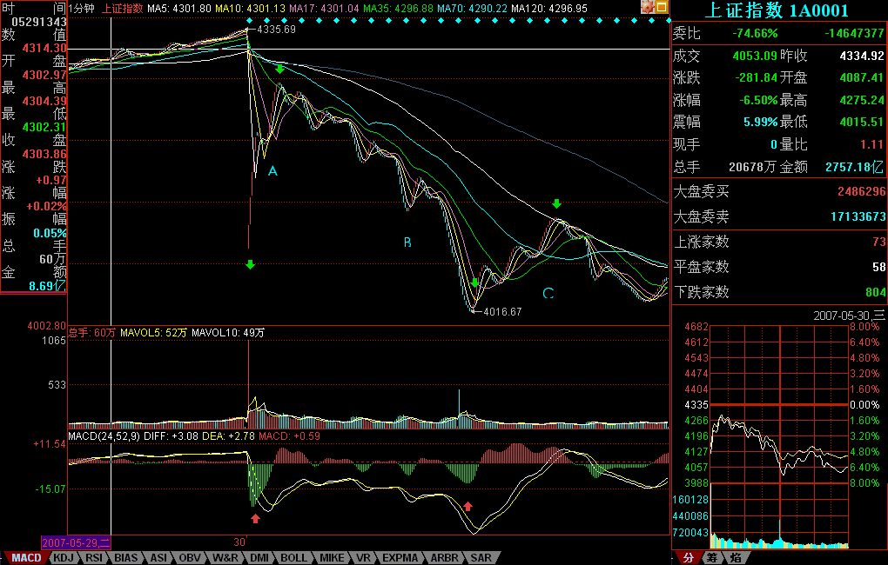{width="5.393055555555556in"
height="3.4368055555555554in"}

有人可能有疑问，那怎么知道这A段一定构成第二类卖点而不是直接创新高强烈上升，这很简单，具体的方法和区间套定理是一样的，就是看A段的内部结构，一旦内部出现背驰而当时位置没创新高或与前面走势产生盘整顶背驰，那么就一定是第二类卖点。在昨天的具体走势中，A段在内部出现上下上的内部结构时，其中的第二段向上明显出现背驰走势，这可以成交量，或从第一个红箭头所指的MACD绿柱子与后面红柱子绝对值大小比较辅助判断。因此，这个第二类卖点，可以用理论完全明确地确认，一点含糊的地方都不会有。如果当时当下不能明白，那就要抓紧学习了，因为这个问题确实太简单了。

第二类卖点后，从第二绿箭头开始的B段走势，其力度就要和缺口那一段来对比，比较MACD上两个红箭头指的绿柱子面积，注意，第二个要把前面的三个小绿柱子面积也加上，可以看出，即使这个，后者的力度也不大过前者，由此就知道，B段构成了盘整背驰，也就是后面的反弹一定回到第一个绿箭头位置之上。（注意，这里是1分钟以下级别的力度对比，只需要比较柱子面积，如果是1分钟级别的，就要同时考虑黄白线回抽0轴的情况。）而后面C段的走势也证明了这一点。此外，C段的高点，用C段下方对应的MACD柱子高度对比不难用背驰的方法判断。由此，ABC三段就有了重叠，因此就构成了一个1分钟的中枢，区间在4087到4122点。这就成了直到后面、包括明天走势的最关键地方，究竟是中枢震荡，还是形成第三类买卖点，进而构成更大中枢或趋势，都以此为基准。而这是被理论所当下严格保证，毫无可以含糊的地方。

有些更细致的地方，其实还可以说的。例如，C段的高点，没有重回B段内部最后一个反弹的启始位置，这并不违反理论，因为在B段内部，最后一段向下并没有背驰，他的转折，完全是小级别转大级别造成的（由于级别太小，可以从柱子的缩短参考看出），这自然就不一定能回到最后一个反弹的启始位置。而在B段内部，从绿柱子一个比一个面积大，就知道前面的向下都不会形成背驰而使B段结束，因此就可以当下地等待最后跌破A段低点，形成B段与缺口段的盘整背驰。这个例子说明，一个大的盘整背驰段的内部结构，完全可以不必有该级别的背驰，完全可以小级别转大级别，昨天的图上就有这样一个标准的例子。

实际操作中，第二类卖点后，B段盘整背驰造成的买点是否要参与回补，这和你的操作级别有关，如果是股指期货，这对应的是100点的空间，当然是可以参与的，但由于T+0，而且现在交易成本提高了，对于股票是否参与，这就与你实际操作的股票有关了，这必须根据自己的情况灵活处理。但只要你明白了小级别的情况，大级别的操作是一样的，而且大级别的安全性、可操作性更高，操作的频率也更低而已。本ID说这里的例子，只是让大家对理论能更清楚地了解。

附录：

**明白了上面的文章，今天的走势如果都不能把握，那就要继续加班学习了。昨天4087-4122的中枢，今天一大早的上冲没有触及4087点，所以就构成了该中枢的第三类卖点。后面三波的下跌，与昨天的B段比，明显背驰，其内部，最后一波，在1分钟图上，绿柱子明显缩短，所以内部也背驰，根据区间套就可以当下定位10点02分低点。这是本ID理论中最简单的技术的，如果今天没能这样的分析的，请好好研究补习。**

**后面的反弹，如本ID所指出的，第三卖点后不趋势就构成更大中枢，所以现在原来的1分钟中枢已经扩张到5分钟中枢。区间是4015点到4122点，后面就是该中枢的震荡直到第三类买卖点出现。就这么简单，一点难度都没有。**

**大方面看，本ID反复强调的1/2线，依然是最重要的位置，大盘的强弱，以此为标准。目前，该线刚好在这次大震荡的中间位置上，由此就知道该线的意义有多大。在5月初的文章里已经明确说过，该线至少要管大盘3个月，这观点不变。**

**今天的月线收盘，已经足够好了，至少上影线不太长，比最恶劣的倒T要好多了，因此下月，至少有了很大的画图回旋的余地。注意，最近的行情，又将以质优的一、二成分股为主，三线股一定要等到大盘基本稳定下来，才会慢慢恢复元气。但明天和周一，今天反弹比较弱的，会逐步表现，这和轮动是一个道理。**

**明天是周五，消息面又成了最大的心理压力，整个市场震荡要稳定下来，要等到下周了。当然，这种大幅震荡，就是本ID理论的天堂，在这里可以得到比单边更大的利润。注意，别以为本ID的理论只会震荡，而是该震荡的时候震荡，该单边的时候单边，这都不明白，就白学了。**

缠中说禅2007-05-30 22:53:01

晚上10点回来，抓紧把帖子写了，让大家有更多时间看课程，早点帖出来，明早就不贴了。

子时，下，解盘在明天收盘附录帖子后，再见。

缠中说禅2007-05-30 22:54:41

补充一句，图片看不到的，请到本ID的相册里，第四张就是。

缠中说禅2007-05-31 15:43:16

明白了上面的文章，今天的走势如果都不能把握，那就要继续加班学习了。昨天4087-4122的中枢，今天一大早的上冲没有触及4087点，所以就构成了该中枢的第三类卖点。后面三波的下跌，与昨天的B段比，明显背驰，其内部，最后一波，在1分钟图上，绿柱子明显缩短，所以内部也背驰，根据区间套就可以当下定位10点02分低点。这是本ID理论中最简单的技术的，如果今天没能这样的分析的，请好好研究补习。

后面的反弹，如本ID所指出的，第三卖点后不趋势就构成更大中枢，所以现在原来的1分钟中枢已经扩张到5分钟中枢。区间是4015点到4122点，后面就是该中枢的震荡直到第三类买卖点出现。就这么简单，一点难度都没有。

大方面看，本ID反复强调的1/2线，依然是最重要的位置，大盘的强弱，以此为标准。目前，该线刚好在这次大震荡的中间位置上，由此就知道该线的意义有多大。在5月初的文章里已经明确说过，该线至少要管大盘3个月，这观点不变。

今天的月线收盘，已经足够好了，至少上影线不太长，比最恶劣的倒T要好多了，因此下月，至少有了很大的画图回旋的余地。注意，最近的行情，又将以质优的一、二成分股为主，三线股一定要等到大盘基本稳定下来，才会慢慢恢复元气。但明天和周一，今天反弹比较弱的，会逐步表现，这和轮动是一个道理。

明天是周五，消息面又成了最大的心理压力，整个市场震荡要稳定下来，要等到下周了。当然，这种大幅震荡，就是本ID理论的天堂，在这里可以得到比单边更大的利润。注意，别以为本ID的理论只会震荡，而是该震荡的时候震荡，该单边的时候单边，这都不明白，就白学了。

缠中说禅2007-05-31 15:58:38

\[匿名\] 美女

2007-05-31 15:56:46

昨天4087-4122的中枢，今天一大早的上冲没有触及4087点，所以就构成了该中枢的第三类卖点。后面三波的下跌，与昨天的B段比，明显背驰，其内部，最后一波，在1分钟图上，绿柱子明显缩短，所以内部也背驰，根据区间套就可以当下定位10点02分低点。这是本ID理论中最简单的技术的，如果今天没能这样的分析的，请好好研究补习。

==============

"后面三波的下跌，与昨天的B段比，明显背驰" 这个怎么看出来的啊？
我用1F图分析MACD绿柱子块没有减小啊， 背驰判断还有什么诀窍？

===

你要把所有面积加起来比较，这是最基本的知识。请把相应课程要复习一下。

缠中说禅2007-05-31 16:00:35

\[匿名\] 竹子

2007-05-31 15:56:56

缠mm,

你好！请问s和st股接下去会有表现吗？我是重仓，本来打算至少中线的，可是这两天每天跌停，转眼利润大幅减少，不知该怎么办了。谢谢！

===

这些股票两个跌停也就别人的一个，大多数都回来20%以上了，他们如果才回10%，当然没有反弹动力，这是一个常识问题。等有反弹空间，自然就反弹。

缠中说禅2007-05-31 16:03:22

\[匿名\] 新浪网友

2007-05-31 15:49:44

楼主辛苦了，没有什么势力威胁你吧！注意身体

===

谢谢，这倒不至于，本ID又不是豆腐做的。

缠中说禅2007-05-31 16:14:00

\[匿名\] asd

2007-05-31 15:46:49

请禅主解答：

1、连跳空缺口都是1分钟以下级别的走势类型，为什么A段内部上、下、上这三段不是1分钟级别以下的走势类型，而非得A段是1分钟以下级别走势类型？在"一个具体走势的分析"中，每一有明显高低点的上或下段（除d7g7外，而d7g7更是1分钟级别的）可都是1分钟以下级别的呀！

2、"C段的高点，用C段下方对应的MACD柱子高度对比不难用背驰的方法判断。"该如何具体判断？

====

如何判断，你看图就知道，一高一矮，这有什么可说的。1分钟以下级别，是把下面所有级别当成线段，是没内部结构的，当然，你换了一种标准，下面可能还有无数级别。至于每个图，等于用不同度数的显微镜，关键是每张图上的标准是统一的。这标准的底线就是，先确认一个最低级别的，然后把下面的都看成线段。这问题课程里反复说过了。例如，把两张不同的图并在一起，可能看的标准就有改变，例如，可能就用5分钟的标准看，那么需要忽略的东西就不同了，这道理很简单。

如果还想不明白，那就用肉眼来比喻，像看一本书，我们的级别最多就到字，但实际字里面还有无数级别，一直到电子下面还有，那这个字里的下级别，与一个电子，在肉眼看来，都是字以下级别的，根本就没区别，都看不到。

缠中说禅2007-05-31 16:17:53

\[匿名\] hunter

2007-05-31 16:05:33

老大，为什么中枢不是4027-4077啊？

===

先把中枢的三段搞清楚，提示一下，昨天的C段是这种分解的新中枢的第一段。当然，可以按照另一种分解去定中枢的位置，那么谈论就要按那种分解说了，这样，本ID的讲解就太长了。关于这问题，本ID不是已经专门示范过？请参考课程。

缠中说禅2007-05-31 16:22:13

\[匿名\] 果

2007-05-31 16:12:25

缠姐，现在有没有必要将三线股和ST股换成蓝筹股？

===

操作不是这样的，最正确的，就是昨天第三卖点清仓，然后回头打一、二线股，这叫节奏。现在那些股票都涨起来，你杀三线去买一线，那就左右挨嘴巴。

操作，说白了就是一个节奏问题，如果节奏不对，宁愿原地踏步，把节奏调过来。

缠中说禅2007-05-31 16:32:58

\[匿名\] 大盘

2007-05-31 16:21:36

\[匿名\] 大盘

2007-05-31 16:02:49

请问博主：

从1分钟到周线，能不能给我们介绍一下各级别盘整走势和趋势走势通常需要的最小时间，这对我们散户看盘时间和波段操作节奏的掌握应该有帮助的，自己总结的总是不够放心，因为参考的例子太少

===

看MACD从顶到底背弛需要的最短时间，任何一个级别，怎么都需要几十根K线吧，这是一个可以去统计的东西。其实，看图要当下如同看一植物在生长，太多概念没什么用。

缠中说禅2007-05-31 16:35:14

\[匿名\] 鸢鸢

2007-05-31 16:30:25

缠中说禅

2007-05-31 16:22:13

\[匿名\] 果

2007-05-31 16:12:25

缠姐，现在有没有必要将三线股和ST股换成蓝筹股？

===

操作不是这样的，最正确的，就是昨天第三卖点清仓，然后回头打一、二线股，这叫节奏。现在那些股票都涨起来，你杀三线去买一线，那就左右挨嘴巴。

操作，说白了就是一个节奏问题，如果节奏不对，宁愿原地踏步，把节奏调过来。

===========

姐姐的意思是说既然没有踏准节奏就不要追高换股了,应该利用手里的股做短差降低成本,对吗

===

板块是轮动的，最好的节奏当然是从这跳到那，每次都准点，但如果开始没这技术，先玩好一个，技术好了再来高难度的，那是目标。

缠中说禅2007-05-31 16:43:34

\[匿名\] 小明

2007-05-31 16:28:24

老大，抚顺那钢铁是你的吧，

怎么没有跟上大盘呢，更不要说钢铁板块的走势了？

===

本ID什么时候说过这股票？本ID说的那股票现在关起来了，这里的人都应该很清楚。

另外说一句，那什么等比，本ID当天早上专门上来说不要买小盘的，那会把盘面搞乱，那天刚好是关起来那只的最后一天，那天买关起来的，现在能有什么事？小盘那只，后面还创过一次新高，这么明显的背驰，如果当时买了，为什么不走？

小盘那股票，中线当然没问题，但如果一大堆人抢了，那就有问题了。那时候，铜矿装不装就两说了。这股票其实就这么简单，如果铜矿如期装，那就一飞冲天，如果乱抢，那就趴着，等都熬不住再说。

注意，那可是3000来万的盘子，装不了许多人，这就知道为什么本ID那天专门上来警告不要乱买小盘的。记得600777在1月时候为什么想死了一样，就是因为有4拨人，这当时本ID也说过的，为什么416猛，就是因为干净，就这么简单，没什么可说的。

缠中说禅2007-05-31 16:45:31

对不起，这几天聚会特别多，统一思想，才有战斗力，本ID要去聚会去了。

先下，明早见。

## 教你炒股票57：当下图解分析再示范

(2007-05-31 22:35:44)

部分由于管理层的夜半歌声，本周已经说了4天股票，本ID就来一个大满贯，再说一天，不过下不为例，天天说股票，一周说5天，各位不审美疲劳，本ID也烦了。

看到很多人还是发蒙，因此，就用这两天的1分钟图，继续说说怎样进行图解。当然，这些图解都是可以当下进行的。今天看回帖，好象有人希望本ID在什么QQ上即时发布什么提示之类的，这绝对不可以，QQ对于本ID来说只是用来419的，用来说股票也太浪费了，而且，本ID那4小时是天王老子都不能打扰的，说句不太客气的话，本ID的资金，大概比来这里所有人的资金之和都多，本ID忙着上QQ，出问题了谁负责？所以，最多就这样形式了，很多事情，还是要靠自己多练习，本ID最多就是一个陪练的。

必须要再次强调，不熟练的投资者，一定不能全仓进行操作，基本的仓位应该拿着中长线的股票，部分仓位可以用来练习，否则全仓操作，一旦来几次半生不熟的折腾，到时候连本都没了。而且一定要注意，卖点是在涨的时候出现的，不是追杀出来的，如果你砍了地板价，那一定不是在卖点上。只要是赚钱的，就没有卖错，宁愿卖早，不要卖晚。如果卖错了，就不看这股票，除非有新的买点。

还有，有人误解，认为本ID的方法就是拼命弄短线，这些人大概是跟孔男人学的中文，所以就这水平了。用本ID的方法，如果你选择年线级别操作，那比巴菲特还巴菲特，大概一个年线的买点后，至少到等几十年才有卖点，你就拿几十年吧，就怕你拿不住。还有，如果你是按周线级别操作，那这两年，至少指数上你根本没有卖点。至于按30分钟操作的，在一个30分钟第三买点后的中枢上移中，如果这上移是从10元开始，只要不形成新的30分钟中枢，那么就算到了100000元，你还是要拿着，为什么？没有卖点。所以那些说学了本ID理论就拿不住股票的，自己好好反思一下，究竟你学了什么？

闲话少说，看图解图。

对着图，首先要确定最小分析级别，也就是说，这级别以下的都可以看成是线段，而站在最小分析级别的角度，每一线段就是其次级别走势类型，三个线段重合部分就构成最小分析级别的中枢。

当然这些线段本身，可能都属于不同级别，这问题在前面已经说过了。例如本图，最小分析级别先规定为1分钟级别的，所以所有1分钟级别以下的，都是线段，在图上标记着数字，所有的\[N，N+1\]，都是线段。有人可能要问，01段是跳空缺口，23段上上下下，很复杂，怎么都是线段？因为这都不是1分钟的走势类型，里面没有1分钟的中枢，所以都是1分钟以下级别的，虽然缺口是最低级别的，当然比23段这种要低级别，但在1分钟级别显微镜下，没有区别，都可以看成是没有内部结构的线段。当然，如果你要考察23段的内部结构，也是可以的，但那就不是站在1分钟级别的基础上了。

由此可见，上图可以看成是10段线段构成的，线段中的波动，至少在分析1分钟级别的角度，就是可以忽略不计的。这里有一个地方是可能有疑问的，在23、78段5个带绿箭头指着的地方，似乎可以看成是一线段，但为什么没有？因为在这似乎是三段的结构中，第三段的都太微弱，把图形缩小后几乎就看不到了，对比一下89段带绿箭头的地方，这第三段就明显不同了，所以这是一个1分钟以下级别的上下上结构，而前面的不是。当然，如果你一定要说78段那箭头的地方很明显，那么78、89就合成一线段的上涨趋势了，这也可以，只是如果你是按这个标准的，那么所有和78段箭头位置微弱程度一样的，都要这样处理。本ID还是按图上的标记线段。

线段有了以后，一切都好分析了。当然，在当下时，例如在今早9点30分钟，是没有后面的线段的，但线段的标准，是一样的。你可以很精细地分析56段，是一个上下上的内部结构，其中下一段是跳空缺口，但无论如何，这就是一个线段。不过，由于前面12、23、34构成的中枢只有1分钟级别的，那么其构成第三类卖点的次级别就是1分钟以下级别的线段，这时候，就要考察一个有上下上结构的1分钟的次级别结构了，而56段显然符合这个结构，有明显的上下上，而45段也是符合1分钟次级别的要求的，注意，当考察1分钟的次级别时，就不能笼统地把所有1分钟以下的都看成1分钟的次级别了，因为这里的视点已经不同。显然，这个的45、56，就构成了标准的次级别离开中枢与反抽中枢，而这1分钟中枢的区间是\[4087，4122\]，而56段只到了4077，所以这就是第三类卖点了。

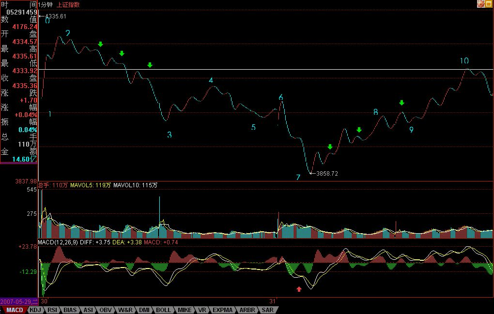{width="5.508333333333334in"
height="3.5034722222222223in"}

当然，在具体操作中，还可以特别精细地去分析这个问题，56段里的上下上，后上对前上的力度，从下面对应的MACD的柱子面积比就可以判断出不足来，因此这里就有很小级别的背驰，这都可以用当下分析的，当然，这样的精确度，需要操作者十分熟练并且反应与通道都十分快，并不要求每个人都有这个可能，这里只是进行分析，对大的级别，道理是一样的。

同样道理，67段里的内部结构下上下，后下力度也比前下弱，这从下面红箭头所指两绿柱子面积的对比就可以知道，所以这内部就有了背驰。注意，这67中的上，幅度上也很微弱，但时间比较长，是一个小的时间换空间的反弹，所以是可以看成一个上的，更重要的是，这上使得绿柱子回缩到0轴，这就更证明了这是一个不能忽视的有技术分析意义的反弹。

当行情走到6点时，34、45、56这三段，就可以看成是一个1分钟中枢了，当然，这种分法和原来\[4087，4122\]中枢的分解不同，但站在多义性的角度，这是绝对符合结合律的，当然是一个分解的方法。这分法，就使得23、67成为这中枢的一个震荡，从而可以用力度的方法来发现背驰。对于23、67下所有绿柱子面积之和，显然后者小，所以就知道，67只是针对\[34、45、56\]中枢的一个震荡，必然至少回抽中枢附近，而对67内部用区间套的方法进行精确定位，具体的看上一自然段的分析。按这种方法，7那买点的把握，就是很简单的事情了。注意，这都是可以当下分析的，根据当下的走势，自然就能把握。如果那7当成是第一类买点，那么9就是第二类买点了，这符合次级别上，次级别下，不创新低或盘整背驰的定义，对比一下2点和9点，一卖一买，都是第二类的。当然，在78里，其中的下也是一个第二类买点，但该买点的级别比9这点要低。

显然，这10个线段，已经组成了一个更高级别的5分钟中枢，结合方式如下：（12+23+34）+（45+56+67）+（78+89+910），该中枢的区间是\[4015，4122\]。这一点其实由6这个第三类卖点的存在以及后面的背驰，就可以知道，这中枢级别的扩展，是必然的。

注意，这是为了示范才分析1分钟的图，这类图是最复杂的，一般来说，级别越大的图越简单，而操作上，技术不好，通道不好的，一般不用1分钟的图，把级别放大点，这点必须明确。

附录：

今天的走势就是\[4015，4122\]的中枢震荡，至少指数是不难看明白的。周五出现这样的走势很正常，各种心怀鬼胎的到处散播这消息那消息，散户当然如惊弓之鸟了。但今天的走势，对今后是有利的。这次的问题并不在于国家公布了什么，而是其公布的手法，如此手法，必须得到严惩，一个最直接的压力必须让用这种恶劣手法的人承担：一个骂名。周五开始，舆论将逐渐转向，一轮新的反思将开始，注意，管理层也不是一言堂。还要注意一点，这两天同时公布的是财政部国债的发行，所以，经过这次风险教育，应该能分流些人去买国债了。

不过散户确实需要有点教育，前段时间，不是有人叫嚣散户已经统治市场了？但跌两天，散户就蔫了。大资金永远都是市场的中流砥柱，没有大资金，没有这几天的聚会，像这几天北京股的走势能出现？看那些企图限制大资金的政策还出不出？有些大资金，那些管理层换了几茬了，依然屹立不倒，不断壮大，这些脑子进水的政策，除了害散户，能害得了谁？周末，这样的局面，就让管理层去收烂摊子，如果他们还喜欢这边打压，后面又来救市的游戏，那就玩吧，这种游戏已经10几年了，真正的牛人，只会在这种游戏中越来越牛。

但对于散户，这几天确实心里压力大了点，但这其实也没什么，本ID前面反复提到这样的典故：96年连续3天指数跌停，后来还创出新高。所以，那天公布消息，本ID一大早7点不到就上来，告诉一定要在第二、三类卖点卖掉，没卖的，那就算了，到今天还卖什么？大反弹是必然有的，以后的位置一定比这个位置高，关键是该走的时候，就不要有幻想。

注意，那种杀已经跌了30%，去追买不跌反涨的所谓强势股，知道有补跌这种概念吗？在混乱的市场中，更应该专一。可以很理性地讨论这个问题，一个股票下跌40%，第一次反弹回20%，出一半或2/3，下来再买回来，在一次反弹上去，基本走的位置，就和没跌的时候差不多了，如果你现在有资金，在一股票下跌40%时补仓。这股票又不是什么被查庄股，那么，这种的操作基本风险很小，如果技术再好一点，看准一些买卖点，那么基本就等于高位走掉了。当然，以后再碰到这种情况，一定要在第二、三卖点出掉，那天，有多少人辜负了本ID7点不到就上来发帖子？

其实，纯技术上，现在的大走势并不坏，六月的调整没什么可说的，本ID那1/2线，现在也在4144点了，下面，这次上涨1/3的位置在3734点，这位置是第一支持位。没有特别的事情，这位置有很强支持。否则就要考验一半的位置，3434点。但至少现在，没有任何看到该位置的理由。

从短线上看，还是\[4015，4122\]的中枢震荡，有技术的，继续按这震荡操作。下周最大的机会，就是暴跌个股的大反弹，特别注意那些下跌到年线、半年线等关键位置的个股，这些反弹的力度会厉害点。

大浪淘沙，能从容面对本周情况的，是你投资生涯重要的一课，好好珍惜、体会。

周末，腐败去吧。

缠中说禅2007-05-31 22:38:23

图看不清楚的，请到相册找第5张。

快子时，要休息了，明天下午收盘再解盘附录上。

再见。

缠中说禅2007-06-01 15:47:14

今天的走势就是\[4015，4122\]的中枢震荡，至少指数是不难看明白的。周五出现这样的走势很正常，各种心怀鬼胎的到处散播这消息那消息，散户当然如惊弓之鸟了。但今天的走势，对今后是有利的。这次的问题并不在于国家公布了什么，而是其公布的手法，如此手法，必须得到严惩，一个最直接的压力必须让用这种恶劣手法的人承担：一个骂名。周五开始，舆论将逐渐转向，一轮新的反思将开始，注意，管理层也不是一言堂。还要注意一点，这两天同时公布的是财政部国债的发行，所以，经过这次风险教育，应该能分流些人去买国债了。

不过散户确实需要有点教育，前段时间，不是有人叫嚣散户已经统治市场了？但跌两天，散户就蔫了。大资金永远都是市场的中流砥柱，没有大资金，没有这几天的聚会，像这几天北京股的走势能出现？看那些企图限制大资金的政策还出不出？有些大资金，那些管理层换了几茬了，依然屹立不倒，不断壮大，这些脑子进水的政策，除了害散户，能害得了谁？周末，这样的局面，就让管理层去收烂摊子，如果他们还喜欢这边打压，后面又来救市的游戏，那就玩吧，这种游戏已经10几年了，真正的牛人，只会在这种游戏中越来越牛。

但对于散户，这几天确实心里压力大了点，但这其实也没什么，本ID前面反复提到这样的典故：96年连续3天指数跌停，后来还创出新高。所以，那天公布消息，本ID一大早7点不到就上来，告诉一定要在第二、三类卖点卖掉，没卖的，那就算了，到今天还卖什么？大反弹是必然有的，以后的位置一定比这个位置高，关键是该走的时候，就不要有幻想。

注意，那种杀已经跌了30%，去追买不跌反涨的所谓强势股，知道有补跌这种概念吗？在混乱的市场中，更应该专一。可以很理性地讨论这个问题，一个股票下跌40%，第一次反弹回20%，出一半或2/3，下来再买回来，在一次反弹上去，基本走的位置，就和没跌的时候差不多了，如果你现在有资金，在一股票下跌40%时补仓。这股票又不是什么被查庄股，那么，这种的操作基本风险很小，如果技术再好一点，看准一些买卖点，那么基本就等于高位走掉了。当然，以后再碰到这种情况，一定要在第二、三卖点出掉，那天，有多少人辜负了本ID7点不到就上来发帖子？

缠中说禅2007-06-01 15:47:30

其实，纯技术上，现在的大走势并不坏，六月的调整没什么可说的，本ID那1/2线，现在也在4144点了，下面，这次上涨1/3的位置在3734点，这位置是第一支持位。没有特别的事情，这位置有很强支持。否则就要考验一半的位置，3434点。但至少现在，没有任何看到该位置的理由。

从短线上看，还是\[4015，4122\]的中枢震荡，有技术的，继续按这震荡操作。下周最大的机会，就是暴跌个股的大反弹，特别注意那些下跌到年线、半年线等关键位置的个股，这些反弹的力度会厉害点。

大浪淘沙，能从容面对本周情况的，是你投资生涯重要的一课，好好珍惜、体会。

周末，腐败去吧。

缠中说禅2007-06-01 16:04:20

\[匿名\] 新手

2007-06-01 15:57:36

\[匿名\] 新浪网友

2007-06-01 14:50:15

缠姐这几天能损失几个亿吧?

那你是太小看她啦，她肯定没损失！啥消息都提前知道，还不早操作完了。

＝＝＝＝

我们散户掺啊，一直跟着姐姐，915三个跌停，怎么办，姐姐救命啊。

====

你真跟着本ID，那天一大早第二类卖点就走掉了，想想当时为什么不走，是不是有什么幻想？现在再说这些，没什么意义。可以说，这些股票，最终都不会有问题，短线可以按上面说的方法操作，其实，如果你真掌握了本ID的理论，用一个30分钟级别的买卖点，操作3次，50%都回来了，关键是你会还是不会。

缠中说禅2007-06-01 16:10:24

\[匿名\] 大五牛

2007-06-01 16:02:52

我明白你说的,也知大势会不可为了,但心里有个很顽固的念头,不想去操作,所以损失惨重了,缠主,你说这是为什么?

====

因为你没真明白，没有彻底穷源。

缠中说禅2007-06-01 16:11:01

雪狼

2007-06-01 16:05:25

雪狼

2007-05-31 23:57:35

博主 你好

这么晚还想着我们 你辛苦了！

不要意思

你给的图（9 10）段里面少了一段，你能重新给出个分析吗？

刚好这段里面有下上下的重叠，分析起来比较难

你能再给讲讲吗？

===

你看看图，哪里有少？

缠中说禅2007-06-01 16:14:07

\[匿名\] christine

2007-06-01 15:42:03

错.妹妹肯定也损失.

除非她现在是空仓.道理很简单.自己算一下.

\-\--

你才错呢？姐姐损失什么啊？去看一看姐姐持有的股票70%仓位是成本为0的股票。

===

这个问题没必要讨论，本ID天天在干活，当然不完全是那16只，那16只，有买点的，本ID自然会管，有些不是已经创新高了？注意，不要追买那些，要去找新有买点的。

缠中说禅2007-06-01 16:16:24

\[匿名\] abc

2007-06-01 16:14:23

那种跌停的股票，MACD是不是失真了，怎么判断？

===

看大级别的。本ID用1分钟示范，不就是说一定要按1分钟操作，否则，本ID怀疑你是跟孔男人学的中文。

缠中说禅2007-06-01 16:21:26

\[匿名\] 蓝色的海

2007-06-01 16:16:30

唉，今天别提多郁闷了，昨儿下午进了两只股票(600900,14.57),(600010,8.1),结果今儿上午还一涨一跌，下午就全没戏了，中午快收盘时本想对600010作个倒差价，结果一时手痒没忍住，没等到最好时机即下手，现在套牢中！搞的心情真是郁闷到极点，所以第一时间上来看姐姐的附注，刷了N次终于等到了，看了姐姐的一席话，心里真是敞亮多了，可惜俺的银子都买股票了，周末去腐败是不可能了，只能在家从头学习姐姐的贴子了！:(

====

郁闷什么？跌40%的股票，买了没挣钱机会，除非是被严查的庄股，你查查所有的历史走势就知道了。不过，最安全还是找对买点，但技术不行的，就按比例买，买了等着就可以。

缠中说禅2007-06-01 16:23:14

\[匿名\] 冠军杯

2007-06-01 16:19:04

缠MM 今天的意思是不是这几天逆市上涨的会补跌？？ 比如
000063，望回复！！谢谢，！！！

===

今天不已经补跌了？如果你今天追高买，那就出问题了，还不如在跌停上买已经跌40-50%的。

缠中说禅2007-06-01 16:27:36

对不起，本ID要去腐败了。各位好好总结本周的得失，这是宝贵财富，把心态调节好。

先下，周日音乐会见。

## 必须建立与资本市场发展阶段相适应的监管、调控体系

(2007-06-04 07:53:44)

上周五，在每日3点后都附录在当天文章**教你炒股票57：当下图解分析再示范**后的解盘中，本ID明确指出**："周五开始，舆论将逐渐转向，一轮新的反思将开始，"、"周末，这样的局面，就让管理层去收烂摊子，如果他们还喜欢这边打压，后面又来救市的游戏，那就玩吧"**这几天舆论的发展，特别是周一几大重要传媒统一口径的文章都证明了本ID判断的正确。为什么本ID能如此判断，很简单，和管理层打了十几年交道，他们脾性还能不熟悉？当然，本ID也有所谓的消息来源，但本ID的判断还是早于消息的。消息，归根结底只是辅助与证明。不过，这鲜活的例子里却有着值得深思的地方。

虽然本ID在5月初已明确指出"5月，是1429点以来的180个月，360的一半，一个极为重要敏感的时间之窗，其后，不发生点事情，显然是不可能的"，而且4341点，2月6日2541点上来1800点本就构成强大的技术调整压力，但像5月30日这样依然重复十几年来用"政策市"对市场进行人为干预的做法，是值得商榷的。这再次表明，与资本市场发展阶段相适应的监管、调控体系依然未被建立。而没有成熟的监管、调控体系，没有成熟的市场管理者，就不会有真正成熟的市场与市场参与者。

且不说在市场交易费用不断下降的世界潮流下大幅增加投资者交易成本是如何短视并将对中国资本市场发展造成多大损害，就说在一个不恰当时间发布一条如此重要的政策变动，其严肃性与谨慎性显然要被严重质疑。这里涉及管理者与投资者关系的深层次问题，两者不是主仆、不是父子、更不是不共戴天的仇人。市场各方归根结底都是市场建设者，其地位在法律面前一律平等，投资者的违法行为应受到严惩，而管理层也不例外。和谐社会，市场管理者与投资者更应该学会和谐共处，多沟通、多了解，都不应该把对方当成对手，甚至玩伏击、搞暗算。这一点与个人实际的操作效果无关，虽然本ID不曾为这种伏击、暗算给伤害，但这是个人能力问题，而市场的整体是被伏击、暗算了，这才是问题所在。

即使是一件好事，如果所用手法与时机选择有问题，其效果将适得其反，而监管与调控，无论对市场违规与违法行为采取多么严厉的措施，但都有一个最基本的底线，就是不能打击投资者的信心。市场管理者更应该明确自己裁判身份，不能人为去干预比赛进程，甚至成为其中的一员参与比赛。不能多头管理、政出多门；任何对市场有影响的政策、言论，都必须由统一的部门进行协调、制订、发布、实施，任何政策的制订、发布都应该有一套规范、透明的程序，尽量杜绝人为的非系统政策风险；监管与调控应该以科学发展观统领，切记情绪化、短期化，这是投资者信心的最大来源。否则，管理者的行为都情绪化、短期化，又如何要求投资者的行为不情绪化、短期化？此外，监管与调控是有本质区别的，一个成熟的市场管理者，必然是重监管，少调控，甚至不调控，一个以调控为主的市场不可能成为一个成熟市场。如何逐步加大监管的比重，并尽量杜绝调控市场的冲动，这是市场管理者走向成熟的关键所在。

中国资本市场对社会发展的影响将越来越深远，原有的监管与调控体系已不适应中国资本市场发展的现实需要，当务之急，是必须建立与资本市场发展阶段相适应的监管、调控体系。对市场进行监管与调控的最终目的，只能有一个，就是发展市场而不是要摧毁市场。中国经济的转型与发展决定了中国资本市场必须发挥应有的、不可替代的历史作用，任何违背这一大方向的行为，都将负有不可饶恕的历史责任。在资本全球化的大趋势下，国内资本市场的稳定与安全，是和国防有着同等重要的大事。本ID在5月初所指出的1/2线不仅有技术上的含义，还是新旧两种运行模式的分水岭，其中最重要方面就和监管、调控的模式能否与时俱进密切相关。如果说上市公司的业绩提升为市场的发展提供了足够的基本面支持，那么监管、调控模式的与时俱进，将为市场发展提供更大的基本面支持。站在某种意义上，这才是市场最大的基本面。

而5月初给出的技术面分析依然有效，目前这1/2线已经上移到4144点，深圳成分指数相应位置在13700点，能否最终有效站稳该线，是判断中期走势是否重新趋强的关键。在此之前，大盘走势将以震荡形式逐步消化技术面、政策面的压力。其中，目前在3600点附近的5月均线将是判断大盘是否正常调整的关键，只要该线不有效跌破，那么大盘的调整在正常的范围内，否则大盘的调整时间将大为增加。由于6、7月开始进入中期业绩主导时段，因此一、二线的绩优成分股就有一定的基本面支持，这对指数的稳定起着关键作用。而三线题材股，将出现分化，只有那些有真正基本面好转支持的股票才会重新走强，而其余的股票，在一定的技术反弹后，大多数都将进入较大级别的调整中。

最后，必须用早被反复引用但依然要再次引用的《论语》中的一段话与所有的市场各方共勉：

子贡问政。子曰："足食，足兵，民信之矣。"子贡曰："必不得已而去，於斯三者何先？"曰："去兵。"子贡曰："必不得已而去，於斯二者何先？"曰："去食；自古皆有死；民无信不立。"

附录：

**为了中国资本市场的明天，为了以后不再有这样的暗算，为了有让管理层知道他们的权力不是可以任意挥舞的，今天，这样一个特殊日子里的特殊走势，是必须忍受的。今天收盘后，全世界的目光都会聚焦到这里来，虽然管理层今天早上的统一口径的在各大传媒中文章已经有点那意思，但还不够，认识不够深刻，用词依然有父母教育孩子的味道，投资者是需要被教育，但管理层同样需要。**

**技术上，上面的文章已经说得很清楚，看5月均线，经过今天的下跌，该线已经到了3540点。短线的角度，在该线附近的介入，问题不大。周末说一定注意补跌，不能买所谓抗跌的股票，今天，那些股票都下来了。现在，站在反弹的角度，一定只能介入那些跌幅40%以上，已经跌到半年，最好是年线的股票，一旦大盘有所稳定，其反弹的力度会较大。**

**至于现在依然没走的，依然全仓的，第一，现在走意义已经不大，不说什么技术，就算是看历史数据，以后肯定有比现在位置要好得多的位置。对于最不幸的满仓的朋友，目前一定要忍住，在第一次大反弹出现后，一定先把一半筹码先兑现出来，下来再找机会回补，这样才能把成本摊低。因为这样的走势后，中线的震荡不可避免，有资金才会有机会。**

**当然，在30日第二卖点走掉的，仓位不重的，目前的任务就是好好把握住本周必然出现的大反弹，注意，如果你技术不好，就要对超跌个股逐步买入，而且必须要有针对性，集中力量，在反弹中，如果还拿着几十只股票，那是操作不过来的。**

**具体点位，还是上文中说的，5月均线是一个关键的位置，跌破该位置，站在短线角度，将是空头陷阱，至于能不能跌破该位置，就看下面的短线背驰点出现在什么位置上，这是技术比较好的最主要参考位置。由于今天大盘股已经补跌，因此必须密切注意大盘动向。又由于目前30分钟呈现的走势，所以反弹最直接的效果，就是把30分钟的MACD拉回0轴，该0轴是反弹的最大压力。**

**这样的市场，是对所有市场参与者的考验，能经受住，也就成熟点了。有些经验是必须记住的：对下跌不能有幻想，像30日这种第二类卖点，一定要走，否则就没有反手之力了。**

缠中说禅2007-06-04 07:55:20

先下，今天解盘收盘后附录本文后。

下午3点半后见。

缠中说禅2007-06-04 15:43:40

各位散户，为了中国资本市场的明天，为了以后不再有这样的暗算，为了有让管理层知道他们的权力不是可以任意挥舞的，今天，这样一个特殊日子里的特殊走势，是必须忍受的。今天收盘后，全世界的目光都会聚焦到这里来，虽然管理层今天早上的统一口径的在各大传媒中文章已经有点那意思，但还不够，认识不够深刻，用词依然有父母教育孩子的味道，投资者是需要被教育，但管理层同样需要。

技术上，上面的文章已经说得很清楚，看5月均线，经过今天的下跌，该线已经到了3540点。短线的角度，在该线附近的介入，问题不大。周末说一定注意补跌，不能买所谓抗跌的股票，今天，那些股票都下来了。现在，站在反弹的角度，一定只能介入那些跌幅40%以上，已经跌到半年，最好是年线的股票，一旦大盘有所稳定，其反弹的力度会较大。

至于现在依然没走的，依然全仓的，第一，现在走意义已经不大，不说什么技术，就算是看历史数据，以后肯定有比现在位置要好得多的位置。对于最不幸的满仓的朋友，目前一定要忍住，在第一次大反弹出现后，一定先把一半筹码先兑现出来，下来再找机会回补，这样才能把成本摊低。因为这样的走势后，中线的震荡不可避免，有资金才会有机会。

当然，在30日第二卖点走掉的，仓位不重的，目前的任务就是好好把握住本周必然出现的大反弹，注意，如果你技术不好，就要对超跌个股逐步买入，而且必须要有针对性，集中力量，在反弹中，如果还拿着几十只股票，那是操作不过来的。

具体点位，还是上文中说的，5月均线是一个关键的位置，跌破该位置，站在短线角度，将是空头陷阱，至于能不能跌破该位置，就看下面的短线背驰点出现在什么位置上，这是技术比较好的最主要参考位置。由于今天大盘股已经补跌，因此必须密切注意大盘动向。又由于目前30分钟呈现的走势，所以反弹最直接的效果，就是把30分钟的MACD拉回0轴，该0轴是反弹的最大压力。

这样的市场，是对所有市场参与者的考验，能经受住，也就成熟点了。有些经验是必须记住的：对下跌不能有幻想，像30日这种第二类卖点，一定要走，否则就没有反手之力了。

缠中说禅2007-06-04 15:48:23

\[匿名\] 新浪网友

2007-06-04 15:37:29

\[匿名\] 股虱

2007-06-04 15:35:21

老大:是否牛市第一波就此结束,后面将展开科技股的行情?

======

肯定没有,第一波结束要出现季线上的调整

\-\-\-\--

对，至少是月线级别的。这三波的概念，必须放在20、30年的大周期上看。

缠中说禅2007-06-04 16:08:19

\[匿名\] 蓝筹也看缠

2007-06-04 15:56:08

请问缠主:蓝筹股的补跌空间会有多大？

\-\-\-\--

把指数砸到位为止。

缠中说禅2007-06-04 16:13:01

两只老虎

2007-06-04 16:05:30

神仙姐姐，这样跌法不是让汉奸、国外不良居心的人得逞了吗！

真是一粒老鼠市害了一锅粥。

\-\-\-\--

现在不是这个问题，在这个位置硬扛没用，还不如砸出空间来，有子弹自然能消灭敌人，所以为什么本ID30日7点不到就上来发帖子，就不知道有多少人明白了。

缠中说禅2007-06-04 16:16:10

\[匿名\] 启程

2007-06-04 16:06:51

无视风雨，依然崇拜！！

但想问。。今天下午就建仓，虽然没有看到买点，只是觉得会有超跌反弹，请问楼住，这算不算错误呢。现在建仓后的仓位大概有90%了。请指教

\-\-\-\--

其实最好要耐心等买点，这种下跌，小级别的买点，如果不能T+1跑掉的，就有很大风险。而且这种建仓有赌博的意思，应该分批来，宁愿没买到，少弄一次反弹，也要保证资金和仓位安全。

缠中说禅2007-06-04 16:18:35

\[匿名\] 新浪网友

2007-06-04 16:11:35

谁言肉价高难抑？举国皆是割肉人!

\-\-\-\-\-\-\-\-\-\-\-\-\-\-\-\-\-\-\-\-\-\-\-\-\-\-\-\-\--

尽管我侥幸提前出来了，看到这句话我还是想哭。------谁言肉价高难抑？举国皆是割肉人!

====

这种心态是不能在投资市场玩的，这里不是慈善场所，是战场，哪里有这么多儿女情长。

缠中说禅2007-06-04 16:20:32

\[匿名\] 新浪网友

2007-06-04 16:16:44

禅师,

能帮我看一下000010吗(CB14.60)?几天来一直都没有减仓机会啊.

====

30日那天都有机会，只是你自己有幻想，这就是必须吸取的经验。

缠中说禅2007-06-04 16:25:36

\[匿名\] 新浪网友

2007-06-04 16:18:53

缠姐ST的还能持有吗？？？？还是需要割出来你指条明路吧！拜谢！！！天天坐地板的日子不好受啊！到底是出来找反弹的还是继续持有死等主力出货啊\~

====

这股票说了很多次了，本来就不该买，那天本ID还专门说了不要买小盘的，后来又反复说了几次。如果现在还拿着，那只能等反弹，这些股每天才5%，反弹自然要先让给跌得多的。这股票的中线主要是基本面上铜矿的注入，是否继续这么干，这就要看盘面的干净程度了。

缠中说禅2007-06-04 16:26:59

两只老虎

2007-06-04 16:19:35

神仙姐姐，有些人在这污言秽语您千万别往心里去。

这些人是故意到这来捣乱的。

我们爱您！我们相信您！我们感谢您！

我们珍惜彼此的这个缘份！

===

来市场里不是为了吵架的，对这些言论，应该一概不予理睬。学好本领，在市场上获利，这才是唯一值得干的活。

缠中说禅2007-06-04 16:28:02

\[匿名\] 蓝筹看缠

2007-06-04 16:26:47

谢谢博主回答我的问题。请问蓝筹股下跌被套后市反弹是否也要全部出局？是否明日可以补仓？

===

反弹都要先出来，这种走势，出现V型的可能性微乎其微。

缠中说禅2007-06-04 16:29:53

\[匿名\] 三藏

2007-06-04 16:26:22

如果大盘和权证之间的联系失去了

就再不玩了，风险太大了！！

麻烦老大给解释下上面的问题

===

见好就收，至少要减少操作量。

缠中说禅2007-06-04 16:30:59

\[匿名\] 承认错误

2007-06-04 16:23:16

怎么看不到发的帖？重发一次：

本人很少发言，但是这个时候，我坚定的支持楼主！

虽然我这次损失惨重，而且大部分都是损失在楼主的16集团军上（赚的时候没买它们，亏的时候倒是重仓）。但是这次是我的贪婪和不理智造成了个人损失的最大化，我想很多朋友也一样。

我们应该检讨自身，好好学习。

坚定支持楼主，坚定看好牛市，我们会拿回我们暂时失去的东西！！

===

支持谁并不重要，关键是看好买卖点。

缠中说禅2007-06-04 16:32:57

\[匿名\] 罗技

2007-06-04 16:29:44

总算明白为什么理财的课程说"没有期货进行保障的股市是不能做的"！

针对各股，没有股票期货（个股期货）进行保险

还是不能做的

理财的话，还是选择不动产更好些！

====

关键不是有什么，而是你的技术。有期货，大牛市也会死N回，而且是暴仓那种。别相信对冲风险的废话。

缠中说禅2007-06-04 16:34:16

两只老虎

2007-06-04 16:31:11

神仙姐姐，反弹到多少出来呀！比如现在跌了40%。

====

半仓，如果技术好，资金又不大的，可以全仓出来，回跌以后再找好的品种补入。

缠中说禅2007-06-04 16:36:46

本ID又要去聚会了，先下，明早见。

## 教你炒股票58：图解分析示范三

(2007-06-04 22:34:47)

**明天收盘后要出一次差，去一趟曾419赋诗的地方，所以，先把课程送上，今后几天都没时间写帖子，但每天收盘后的解盘，都会尽量按时附上。至于其他内容的帖子，等出差回来再说了。**

大盘大跌，除了清洗筹码，还可以清洗一下人。本ID说过，这里没必要有这么多人，来这里的，如果不是希望成为猎鲸者的，就没必要来了。那种跌个40%就惊慌失措的，也不大适合市场。市场从来都是血腥场所，这点在前面已经反复说到，见不了血腥场面的，还是把钱好好去买国债，这样比较安心。股票就是废纸，该卖的时候不卖，把股票当宝，这就是投资的最大软肋。如果你看图形操作时，做不到无我无股票，只有走势图形，那基本可以不看图了，因为有我有股票，被自己的贪婪恐惧所牵引，你看的图，也不过就是自己的贪婪与恐惧，那何必看图？

说一个最简单的例子，就算你没技术，只按最简单的跌破5日线走，那请看看你该在什么时候走，且不说对于具体的个股了。这次是一个很好的实习机会，请回想一下那些卖点时，你自己究竟在干什么？心里是不是有很多幻想，被幻想蒙蔽了眼睛？看图操作，唯一的对象只有图，谁说都没用，市场是当下发生着的，没有人能替你去反应。

先把市场放一边，继续图解分析，把这次跌势的图形连续分析下去，这样大概对各位的理解与分析有一定的帮助。请看下图：

各位可能还会对如何去确定线段有很大疑惑，图上已经用数字标记了从30日开始的1分钟图上的线段。为什么这样标记？例如14-15间带红绿箭头这一段为什么不是线段？这很简单，因为这段中的下-上-下-上-下中，没有任何的重合，也就是第二个上的终点没有触及第一个上的起点，这种图形，和直接的一个下没有任何区别。而一个线段，除非是缺口，否则必须由至少上-下-上或下-上-下的三折组成，只要互相相邻的上或下不重合，则这个模式可以一直延伸下去而依然还是一个线段。这里就不难明白14-15为什么只是一段线段了。

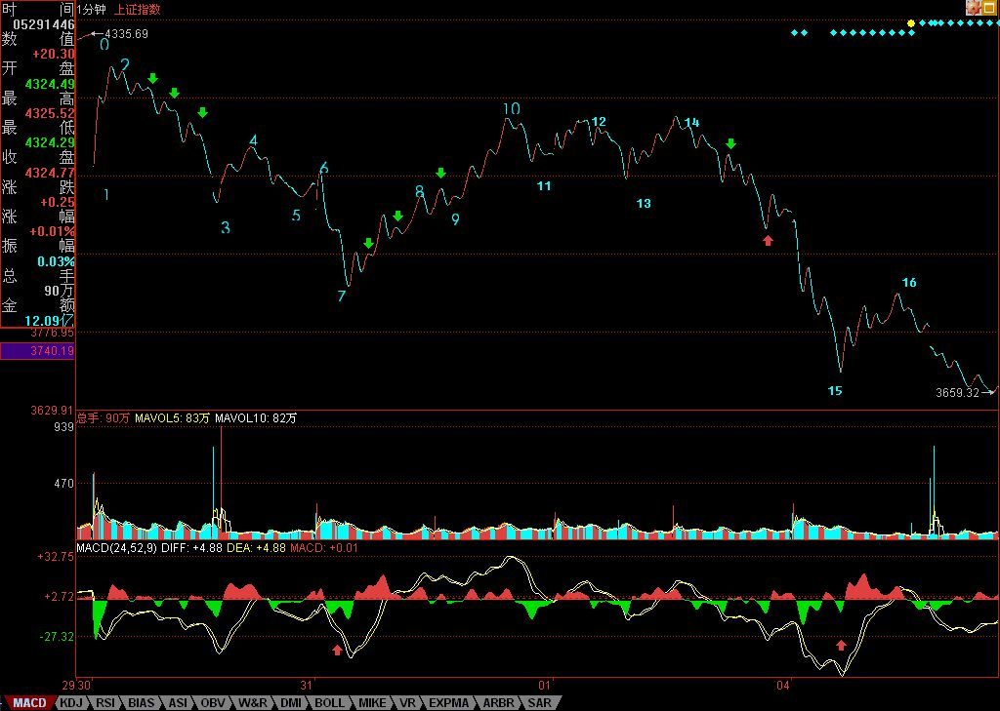{width="5.433070866141732in"
height="3.866447944006999in"}

那么为什么14-15这线段不构成合适的买点，因为在下面的MACD辅助中，可以看出这一段的力度比前面所有的都大（这从黄白线就一目了然了），那当然不构成任何的1分钟以上的背驰，最多就是1分钟以下最小级别的背驰。在15下MACD小红箭头处，比较绿柱子的面积，就可以发现这个小的背驰，因此就有了15-16的反弹，该反弹在14-15最后一个上附近受阻，十分技术。

而站在10-13构成的1分钟中枢来看，15-16这反弹反而是构成一个第三类卖点，本ID看了一下留言，有叫CCTV也看出这个是一个第三类卖点，但他的理由好象是这反弹没突破7这点所以是第三类卖点，这是不对的，因为如果是那一点，那对应的中枢就乱了。注意，第三类买卖点必须是次级别离开，次级别反抽，而且是针对该级别中最近那个中枢，而以前也曾说过，对于一些快速变动的行情，往往第三类买卖点离开的距离会很远。

从16开始的一段，有进入背驰段的可能，但由于明天的行情没有开始，所以如果明天突然加速下跌，就可以破坏这可能，所以具体是否背驰成立，还要看明天走势的内部区间套的当下定位。如果出现背驰，那么一个反弹至少重新回到15这点上，这样就从15这点开始至少形成一个1分钟的中枢了。

而对于1-10这个5分钟中枢，该反弹如果不能重新回到4015之上，那就会形成一个5分钟的第三类卖点。从目前的情况看，这种可能性有很大，所以这也预示着，今后几天，任何在4000点下的反弹，都会构成一个卖点并至少引发一个更大级别的中枢，甚至是新一轮的下跌，除非这反弹能重回4000点之上。显然，从中枢的分析中，可以很绝对地分析出今后一段走势的一些操作性质。

站在更大的层面上，大盘要重新站稳，就要形成一个较大级别的中枢，而从10开始，一个新的5分钟中枢都没形成，如果新的5分钟中枢最终和1-10这个5分钟中枢没有重合，那么就形成一个5分钟级别的下跌，那其后的压力就更大了，所以，那CCTV也蒙对了一点，就是7这点有这极强的技术含义，如果一个5分钟背驰引发的反弹都能重回该点之上，那么大盘的走势就会有好转的可能，否则短线压力依然。

别看本ID理论的分析似乎很复杂，但其中绝对条理清晰，每个结论都是严格，没有任何含糊的。但关键，首先要把图给分解对，否则就乱套了。这点必须多看图，多实践。所以，今后一段课程，都继续把这图分解下去，至少看到一个日线中枢的生成为止，有这样的具体分析，对各位的理解和把握应该有所帮助。

附录：

本ID要马上开车去419的地方，不能多说。今天，如果你还看不明白昨天说的背驰段，然后今天如何精确定位的，那就好好学习吧。上图的19段结束位置是3404点（为什么，如何当下去判断，好好研究好，这是真工夫），后面的走势，上面已经提及，下午走的是第20段，该段结束后，就进入上面说的中枢震荡中。明天的任务，就是看好这第20段的结束。

大走势，就是月线的5均线，今天盘中假突破，而且还是3434点一般的位置，这不难看出来。

对不起，不能多说了，本ID该干的干了，该说的说了，是否能成为你自己的东西，那就不是本ID能决定的。

明天解盘见，帖子就写不了了。

缠中说禅2007-06-04 22:38:00

明天收盘就要开车走，所以解盘附录上后就不能和各位多聊了。

今后几天，尽量收盘后写解盘，如果有时候要晚上写，也请原谅。

先下，再见。

缠中说禅2007-06-04 22:45:33

补充一句，图片看不到的，请到本ID相册里找20070604那张放大看。

子时，要休息，下了，再见。

缠中说禅2007-06-05 15:23:01

本ID要马上开车去419的地方，不能多说。今天，如果你还看不明白昨天说的背驰段，然后今天如何精确定位的，那就好好学习吧。上图的17段结束位置是3404点（为什么，如何当下去判断，好好研究好，这是真工夫），后面的走势，上面已经提及，下午走的是第18段，该段结束后，就进入上面说的中枢震荡中。明天的任务，就是看好这第18段的结束。

大走势，就是月线的5均线，今天盘中假突破，而且还是3434点一般的位置，这不难看出来。

对不起，不能多说了，本ID该干的干了，该说的说了，是否能成为你自己的东西，那就不是本ID能决定的。

明天解盘见，帖子就写不了了。

## 抓紧说两句

(2007-06-06 16:52:09)

**刚才还和当地的领导谈事,马上又要宴会,抓紧说两句.今天就是受制于3858点的第7那点,这在前两天的分析已经说到该点的技术意义,具体可以看当时的分析.深圳强,看能否带动上海,目前,压力不在盘里,而是在盘外,斗争激烈,不能多说.现在,下面这中枢已经形成,就用中枢震荡看.个股向前面说到的一\\二线集中的趋势明显,但即使是最好的股票,也不能追高买,一定要在震荡的低点介入.安全,永远都是第一位的.**

**不能多说了,离开这里,还要去一次杭州见个有分量的人,估计周一才能回北京了.**

**先下,再见.**

## 说两句

(2007-06-07 15:04:21)

**3858的技术意义在今天表现无遗,突破就意味着一个大的中枢在形成,这样是大盘拨乱反正的第一步,这样,大盘就有了一个可以依赖的波动中心,但这中心在形成中.4015点是下一个位置,这位置如果不能突破,大盘还有严重变坏的可能,否则,大盘就有重新挑战1/2线甚至创新高的可能.**

**其他不能多说,马上要去看一个企业,明天主要看3858能否站稳.走了,再见.**

## 周末腐败去吧!

(2007-06-08 15:13:42)

**3858点，昨天给今天的任务，完成得不错，但对周末消息面上的担忧，使得今天十字星充满了"六桥烟柳"的味道。**

**周末腐败去吧。**

**断桥边，苏堤上，相逢何必曾相识。**

## 全流通后最大的投资机会

(2007-06-10 08:40:52)

刚从安徽回到苏州,明天很忙,如果没有时间写评论,就在后天早上补上。注意，本ID这里指的最大机会是私人股权投资这一块，但一般人没机会参与，所以可以关注中国最大VC（现在主要做私人股权）公司的股东600635以及其他有相关题材的公司。这题材，目前市场还不大了解，等市场了解了，就不是这个价格了。可以明确告诉各位，创业板明年一定出来。635、潍柴动力都是从中线角度说的，没必要追高买，如果是中线的资金，可以耐心等待好的买点。当然，如果以前已经有的，就拿着。今天跑了不少地方，本ID也累了，先下，再见。昨晚已到苏州，等一下要去安徽，去看一个准备私人股权投资的项目，N1千万，占10%，好象有点贵。明天可能还要回杭州，这几天看了不少企业，看到真正的企业，就知道中国的资本市场有多大的潜力，就知道本ID说20年的大牛市至少上30000点可能都有点保守了。像安徽这企业，今年的净利润已经N2个亿了，具体不能说，涉及商业秘密。

600635是本ID那十几只股里的VC股，说的时候，当然也是本ID大举介入的时候，是5元多点。为什么本ID要当时要大力买入并让这里的人都去买？因为他是中国最大的VC企业20%的股东。知道全流通最大的投资机会是什么？就是VC，更准确说，是私人股权投资这一块。知道635的那VC企业对潍柴动力2000万的投资，几年时间，现在已经快100倍的收益了吗？知道本ID为什么要为潍柴动力写了一首诗？看看当时该股多少钱，现在多少，有受大盘影响吗？知道潍柴动力占有中国5000亿重汽市场的多少分额吗？当然，本ID不是让你现在去买，当时写诗的时候，潍柴动力60不到，不过，就算现在去买，站在中线的角度，绝对一点问题都没有，但就怕你没有这个耐心。就像本ID4月前后让各位注意002100后的6000万总盘，2000万以下流通的中小板，看看后来都走成什么？如果两年后再看看，你会更H，本ID就奇怪了，怎么总是有人说本ID的理论是短线的，有些股票，本ID绝对可以拿10年以上，关键是他值得本ID拿吗？本ID可以419，当然也可以4N9，关键是你的N是多少。谁告诉你本ID只看技术面买股票的？只看技术面买股票就等于只看上半身找面首一样，只有上半身没有下半身的能是好面首吗？

昨天，央行的吴大姐已经在说大力支持私人股权投资的事情，本ID在这事上的布局早就完成了，可以预言，这是今后最大的热点，注意，这不单单指二级市场，而是股权投资本身，本ID只等着坐轿子了。现在ID已经开始布局一个更新的事情，不走在所有人前面，那是本ID吗？

今天违反规定，周末说股票，对不起了，车子来了，马上去安徽，不能多说了。最后重温一下潍柴动力那五绝：

**曾经湘火炬\
今已鲁潍柴\
十载风云客\
七尺老残骸**

缠中说禅2007-06-10 21:57:02

刚从安徽回到苏州,明天很忙,如果没有时间写评论,就在后天早上补上。

注意，本ID这里指的最大机会是私人股权投资这一块，但一般人没机会参与，所以可以关注中国最大VC（现在主要做私人股权）公司的股东600635以及其他有相关题材的公司。这题材，目前市场还不大了解，等市场了解了，就不是这个价格了。可以明确告诉各位，创业板明年一定出来。

635、潍柴动力都是从中线角度说的，没必要追高买，如果是中线的资金，可以耐心等待好的买点。当然，如果以前已经有的，就拿着。

今天跑了不少地方，本ID也累了，先下，再见。

## 刚回北京再说私人股权投资

(2007-06-11 20:50:14)

刚从南京飞回来，说句南京人不爱听的话，苏州比南京真是好太多了。这次去苏州，金鸡湖一带也比上次好多了，南京给人的感觉，一如既往地乱，杭州也不行，现在的杭州，完全没有特色，如果没有西湖，真不知道杭州算什么了。当然，从南京开车，一进入安徽，之间的对比也是明显的，现在的中国，真是众声喧哗。

这次出去，跑了五个省，累，今晚要好好休息。不过，一路上，开盘的时间依然是不会耽误的，要感谢现在发达的通信手段，科技是让人自由而不是束缚人的，这点很重要。

今天的大盘走得很正常，周末没消息就是好消息，因此大盘当然要尝试对4015点进入攻击。前面说了，这一段都是深圳带着上海走，前者的1/2线在13700点，这没碰到过，所以有空间，只要这节奏不变，大盘总体上就没大问题。现在，5日线也成功拐头向上了，如果不会看短线走势的，就看5日线，不破就没问题。现在印花税太贵，短线不要太频繁，把操作级别放大点，人也轻松。

至于私人股权投资，和传统的VC不同，只投那些马上可以上市的，更重要的是，可以在大的产业结构上进行大布局，目前的中国，正走向一个产业大综合的阶段，这里的机会大锝惊人。具体有时间再说，一般投资者没有参与这大机会的机会，现在私人股权投资基金也没有被发展起来，所以一般投资者只能在二级市场上受累了。

不能多说了，本ID要休息了，先下，再见。

附录：

**今天的震荡都受不了的，就要好好补补心，买个猪心、牛心之类的回家啃啃。今天突破4015点后回抽5日线，技术上极端标准，现在是前面说的大盘拨乱反正走势的第二步，第三步就是4144点的1/2线，第四步是创新高。而深圳是13700点，现在应该明白深圳带着上海走的意义了。深圳已经创新高，那么上海呢？当然，剧本能否一幕幕最终完成，必须依赖各方面的配合，如果再来一次半夜鬼哭狼嚎的，那只能再来一次悲惨世界，正如本ID上次说的，这样只能害散户，大资金砸狠，回补也狠，怎么会有事情？当然，现在谁还敢玩这样的夜半游戏，是要负历史责任的。**

**个股上，要知道，在这拨乱反正的过程中，有先有后，前面已经说了，先是所谓的绩优，现在，这些很多都新高上下了，而其他股票，搞个双底、头肩底的，总可以吧？最终，只要指数没问题，绝大多数，都会轮动到的。目前人心还在狐疑中，所以关键是通过震荡去让各位安心，今天深圳先冒头，也是测试一下各方的反应，这心理、政策层面的测试，还是必须的。还是昨天的话，如果看不明白的，就看5日线，不破就拿着，这样也不累。大盘真站稳4000点后，三线也会逐步活跃的，特别有题材的。**

缠中说禅2007-06-12 15:46:25

今天的震荡都受不了的，就要好好补补心，买个猪心、牛心之类的回家啃啃。今天突破4015点后回抽5日线，技术上极端标准，现在是前面说的大盘拨乱反正走势的第二步，第三步就是4144点的1/2线，第四步是创新高。而深圳是13700点，现在应该明白深圳带着上海走的意义了。深圳已经创新高，那么上海呢？当然，剧本能否一幕幕最终完成，必须依赖各方面的配合，如果再来一次半夜鬼哭狼嚎的，那只能再来一次悲惨世界，正如本ID上次说的，这样只能害散户，大资金砸狠，回补也狠，怎么会有事情？当然，现在谁还敢玩这样的夜半游戏，是要负历史责任的。

个股上，要知道，在这拨乱反正的过程中，有先有后，前面已经说了，先是所谓的绩优，现在，这些很多都新高上下了，而其他股票，搞个双底、头肩底的，总可以吧？最终，只要指数没问题，绝大多数，都会轮动到的。目前人心还在狐疑中，所以关键是通过震荡去让各位安心，今天深圳先冒头，也是测试一下各方的反应，这心理、政策层面的测试，还是必须的。还是昨天的话，如果看不明白的，就看5日线，不破就拿着，这样也不累。大盘真站稳4000点后，三线也会逐步活跃的，特别有题材的。

缠中说禅2007-06-12 15:50:48

\[匿名\] 新浪网友

2007-06-12 15:39:59

匿名\] 新浪网友

2007-06-12 15:03:05

你们想过吗，也许大跌前，博主已从139出来了，现在还在这里叫有什么用，还不如出来，找个好的挣点钱，等139有行情了，再进不迟，估计，139走不远的。

===

我不信博主会扔下我们不管的.

她不是那样的人.

尽管她是女孩,可是,她的承诺从来都是严肃的. 不输给任何男人.

＝＝

博主的人品 无人可比

这不是人品问题，而是卖买点的问题。看来同学还要好好跟缠主学习。

===

有人能说出这话，也算本ID没浪费工夫了。在市场中，只能存天理，灭人欲。

缠中说禅2007-06-12 15:54:35

\[匿名\] 新浪网友

2007-06-12 15:44:19

最近在苦读缠MM的文章，其中有关中枢的级别及形成中枢的线段的定义很是不好理解，从第54讲和第56、57、58讲的图例来看有矛盾。

第54讲是1分钟图，形成1分钟中枢的三段和后面几讲中形成1分钟中枢的三段的级别感觉明显不同。

希望高人来一起讨论，等会缠MM上线后再向她请教。

====

请先搞清楚线段，然后线段如何继续形成更高级的。有人总问5分钟怎么看，其实，那是一个精度问题，5分钟看出来一定没有1分钟的精度高。1分钟里也可以找出日线中枢，图的级别和走势的级别不是一回事情。

走势的级别是客观的，而图的级别是主观选择的，是不同倍数的显微镜，这前面多次说过的。

缠中说禅2007-06-12 15:58:22

\[匿名\] 新浪网友

2007-06-12 15:54:50

缠中说禅

2007-06-12 15:50:48

\[匿名\] 新浪网友

2007-06-12 15:39:59

匿名\] 新浪网友

2007-06-12 15:03:05

你们想过吗，也许大跌前，博主已从139出来了，现在还在这里叫有什么用，还不如出来，找个好的挣点钱，等139有行情了，再进不迟，估计，139走不远的。

===

我不信博主会扔下我们不管的.

她不是那样的人.

尽管她是女孩,可是,她的承诺从来都是严肃的. 不输给任何男人.

＝＝

博主的人品 无人可比

这不是人品问题，而是卖买点的问题。看来同学还要好好跟缠主学习。

===

有人能说出这话，也算本ID没浪费工夫了。在市场中，只能存天理，灭人欲。

====

看来还是俺了解他！

====

买卖点是合力的结果，买点出来，涨就是天经地义，就是如此简单，不要把指头当了月亮。

缠中说禅2007-06-12 15:59:10

\[匿名\] 新浪网友

2007-06-12 15:57:45

老大，本次反弹中超跌题材股好象表现不是太好，估计要等到啥时候才轮到他们表现呀？

===

今天的解盘里不已经说了？请看最后一句。

缠中说禅2007-06-12 15:59:30

\[匿名\] 夜雨

2007-06-12 15:52:29

姐姐好

===

好

缠中说禅2007-06-12 16:07:53

\[匿名\] 新浪网友

2007-06-12 15:58:55

老大好 今天为什么没新文章

还有那个等比数列的 现在拿着应该没事吧 希望老大能回答一下 谢谢

===

对不起，出差一次，留下很多腐败活动需要补课，今天没法写了，明天才有新文章。

那股票说了多次了，当时就不该一窝蜂去买，盘子太小，经不住，又不到这样的跌势，当然是这样了。其实这股票跌得不算多，每天才5%，当然涨起来就要后点，特别还是带星号的，一切事情要按节奏来，先干什么后干什么，是规矩的。

缠中说禅2007-06-12 16:11:58

\[匿名\] whq999

2007-06-12 16:04:32

缠妹,现在上海以及各地的房子又开始狂彪了,你怎么看现在的房市?可不可以象股票大盘一样给个中长期走势?你上次说过房价不会跌.那现在还没买的该怎么办???

===

这等于问，本ID在5元多说600635，你没买，那现在怎么办？你说怎么办？

一种是找一个买点进入，一种是先买落后，对于房子，可以就是远一点的，旧一点的，等有机会再买新的，好的，一种就是干耗，什么都不买。具体怎样，自己选择，都可以，只要自己高兴就可以。

缠中说禅2007-06-12 16:17:20

\[匿名\] 插班生

2007-06-12 16:09:10

听博主的，今天进了635，明天进139。

我看洗的差不多了。

===

在这里学的是技术，而不是个股，如果有能力了，最好自己去找，这样首先不至于把这里变成大传销，还有这样才能练出真本事。

缠中说禅2007-06-12 16:21:32

\[匿名\] 逆天

2007-06-12 15:56:29

问问题，缠姐和各位学长帮忙啊，

1）判断中枢时，例如一个上涨的5分钟趋势，必然是找一分钟的下上下三段，但是这个下上下在五分钟图上是否也有体现？是不是也是下上下的图形？

===

不一定，想想显微镜的例子。

2）一分钟图，有很多下上下或者上下上，有时几根线就能组成一个下上下或者上下上，但是我们如何判断这是不是个中枢呢？例如二月六号的作业答案

上次因一个5分钟的顶背弛创造出2980点的高位，从该位置开始，是一个5分钟级别的下跌过程。共形成三个下跌的中枢：第一个1301055到1301345，第二2011105到2021110，第三2051005到2051330。

===

线段的上下很明显，你在分时图上看到上上下下的，就是。而一个线段，至少有上下上或下上下三段。

缠中说禅2007-06-12 16:23:24

匿名\] 夜雨

2007-06-12 16:18:57

姐姐出差几天，大盘好象沧海桑田，变化好大，这几天我们最大的收获就是心态，始终牢记您的话，这是一个大牛市，因为这样，才能全仓坚持，没有崩溃，去年我有两次卖在地板的经验，就是因为怀疑自己当初的选择，怀疑中国的牛市能否继续。这一回，终于战胜了自己的恐惧，这比金钱更宝贵，谢谢

===

这就好。心态是要靠磨练的。但也不能把自己培养成死多头，而是要只看买卖点，那什么多空放一边。

缠中说禅2007-06-12 16:24:18

对不起，4点半了，本ID要补腐败的课了。

先下，明早见。

禅师其他文章回复：

附录：

今天是一个大
换防，空翻多的，解套先出来的，这都是极为正常的。今天大盘的走势十分技术化，13700点对于深圳的吸引，4144点在上午和下午都分别对上海起着作
用，由于短线留下缺口，因此本周余下时间里，这缺口发挥着最重要的短线技术意义，后面的震荡难免。当然，站在纯技术的角度，这种震荡是必须的，没有一个充
分的换防，行情要继续发展是不可能的。另外，心理面、政策面，也需要考验，这也配合了技术的走势。

个股方面，昨
天已经说了，4000点站稳，三线股会逐步活跃，今天已经有些三线股开始动起来，只要大盘能保持围绕4144点的震荡，这种个股轮动会继续。技术上，关键
是看好各种底部形态的颈线位置的具体走势，这对短线发现好股票有帮助。在震荡中，要注意千万别追高。另外，特别要注意深圳走势，如果深圳在下周初还能站稳
新高位置，将鼓励上海以及绝大多数没有创新高的股票走出新高行情，因此，目前关键看深圳成指能否在今后几天震荡中站稳，这在短线技术与心理上意义巨大。

今天，那关住
的钢铁出来，这股票，这里很多人是停牌前一天9元多点买的，至少让各位少了被震的痛苦，逃过一次大跌，如果今天早上反应快的，还能有10%以上的收益。本
来，如果没这次大跌，这股票肯定是要连续涨停的，现在只能先清洗一下，让需要用钱的先出来，这也是市场操作中经常要面对的事情，剧本，偶尔也要修改一下
的。至于后面的走势，看好技术图形就不难发现了。

缠中说禅2007-06-13 08:24:47

今天解盘3点半附录本文后，先下，再见。

缠中说禅2007-06-13 15:49:07

今天是一个大换防，空翻多的，解套先出来的，这都是极为正常的。今天大盘的走势十分技术化，13700点对于深圳的吸引，1444点在上午和下午都分别对上海起着作用，由于短线留下缺口，因此本周余下时间里，这缺口发挥着最重要的短线技术意义，后面的震荡难免。当然，站在纯技术的角度，这种震荡是必须的，没有一个充分的换防，行情要继续发展是不可能的。另外，心理面、政策面，也需要考验，这也配合了技术的走势。

个股方面，昨天已经说了，4000点站稳，三线股会逐步活跃，今天已经有些三线股开始动起来，只要大盘能保持围绕4144点的震荡，这种个股轮动会继续。技术上，关键是看好各种底部形态的颈线位置的具体走势，这对短线发现好股票有帮助。在震荡中，要注意千万别追高。另外，特别要注意深圳走势，如果深圳在下周初还能站稳新高位置，将鼓励上海已经所有没有创新高的股票走出新高行情，因此，目前关键看深圳成指能否在今后几天震荡中站稳，这在短线技术与心理上意义巨大。

今天，那关住的钢铁出来，这股票，这里很多人是停牌前一天9元多点买的，至少让各位少了被震的痛苦，逃过一次大跌，如果今天早上反应快的，还能有10%以上的收益。本来，如果没这次大跌，这股票肯定是要连续涨停的，现在只能先清洗一下，让需要用钱的先出来，这也是市场操作中经常要面对的事情，剧本，偶尔也要修改一下的。至于后面的走势，看好技术图形就不难发现了。

缠中说禅2007-06-13 15:57:01

\[匿名\] 50年以前

2007-06-13 15:31:53

缠姐来了没有啊？请一定回答我的问题啊。

缠姐啊，今天1020的时候，我看背驰就减仓了，谁知道在1044的时候就直接又拉上去了，这时候补仓的话成本肯定提高了。怎么避免这种情况啊？如果不操作的话，很可能会去补缺口什么的，也就说有一定下调幅度。

===

首先要搞清楚什么级别的，小级别的盘整背驰，盘中跳一跳就化解，以前费用便宜，可以对冲一下，现在，如果技术不好的，就没必要了，关键看好大一点的背驰，能让你的操作能有足够空间的。

对于小资金，这么多股票，就算出错了，下午盘中震荡，找一个新启动的股票一点都不难，关键是要选择买点级别大一点的。操作上一定要记住，只要是赚钱卖的，就无所谓对错，这么多股票，总能找到股票有更好的买点，没必要一棵树吊死。

当然，如果你技术能更好点，那这些烦恼都不会有，这需要不断的实践磨练。

缠中说禅2007-06-13 15:57:50

\[匿名\] 夏子

2007-06-13 15:55:26

"13700点对于深圳的吸引，1444点在上午和下午都分别对上海起着作用，"

应该是4144点吧

\-\--

对不起，写反了，是4144。

缠中说禅2007-06-13 16:05:37

\[匿名\] 白玉兰

2007-06-13 15:58:58

妹妹好！

昨天在这里大家谈到899，今天也看到有人跟了。

说完有些后悔，怕误导别人

妹妹觉得呢？

===

江西，本ID刚去过，股票是好股票，但关键是要找好买点，9元买和11元买，操作的压力当然不同。如果追高，什么股票都是坏股票。所以关键不是什么股票，而是操作上要平和点。

缠中说禅2007-06-13 16:10:02

\[匿名\] hunter

2007-06-13 16:00:05

现在对政策还有些担心，有消息说zf希望在年内保持在5000点以内，但是按mm现在的剧本，恐怕5000根本就止不住吧，这样会不会又会遭到打压，比方说利得税什么的

===

对消息、政策
要平和，关键是当技术上出问题时，一定要走。例如这次，30日时，即使你有很重仓位，但一个第二类卖点，足以让你逃出来，然后在5日，一个标准的买点进入，算算这样下来，真要感谢这政策了。所以，关键不是政策如何，而是你的技术如何。政策只是合力的一部分，走势则是合力本身画出来的。

缠中说禅2007-06-13 16:14:39

\[匿名\] stone

2007-06-13 16:09:42

自从利物浦输了球，日子就不好过，

汉奸的药没出，现金又捆在这钢铁上，这波反弹算是彻底没赶上了。

LZ能不能说说汉奸的药？

===

607刚好在26下到一倍的位置，本ID就开砸了，这都是习惯了，不应该。汉奸没走出来，中线没问题，本ID也还有很多，不过是0成本的。钢铁对于操作不好的，其实是救了命了，至少不用亏钱，还不用整天害怕。当然，对于操作好的，另说了。

缠中说禅2007-06-13 16:19:28

\[匿名\] 银行干啥呢

2007-06-13 16:13:29

缠主 今天下午上海银行拉的时候 深圳已经不配合了 感觉到技术的力量
那时候技术上不支持深圳跟上 所以还是把上海也拉下一段 后来
似乎又配合了上海一下 我记得你说过 银行下半年会有行情的 象兴业银行这样的
在日线上出现买点的 是否有必要这么早就介入 毕竟现在离下半年还早呢
但是买点似乎已经出来了 你能指示下吗

===

银行肯定没问题，只是你有没有耐心。所以问题归根结底还是你的操作级别，如果你是站在日线级别的立场上，当然没问题，如果是超短线的，那随便一只超跌股票，可能都会表现更好。

缠中说禅2007-06-13 16:23:21

\[匿名\] 白玉兰

2007-06-13 16:21:10

再向妹妹汇报一下;

我妈的房子已经买好了加装修共计10万。

估计7月底就可以入住了。

===

好的。

缠中说禅2007-06-13 16:24:32

对不起，4点半了，本ID本周晚上没什么事情能干了，一堆腐败课需要恶补，必须马上走了。

先下，明早见。

缠中说禅2007-06-13 16:26:59

\[匿名\] 这次要看见

2007-06-13 16:24:06

俺手都酸了，再一次的问请教缠主日线中枢的AB段已经走出来了那么C段会因为缺口而走出还是新高后再走出？

===

临走前回答一下，什么叫日线的中枢走出来？这次震荡，还没形成日线中枢，级别上不够。

下了，再见。

## 教你炒股票59：图解分析示范四

(2007-06-14 08:23:43)

出差，必须用三张图才能把落下的走势补上。对于初学分析的人，最难搞的就是分清楚线段，所以，在每张图上，都继续用数字标记每一段线段，从中不难学会究竟线段是如何分的。

有人可能要问，为什么有些线段延续上百点甚至更多，而有些很短。这没什么奇怪的，是否线段，关键看走出来的形态，如果任何低点比前一个高点都高，那么即使这情况无限延续下去，也依然只是一线段，这和幅度没关系。

还有，前后两线段间，不可能是同向的，同是向上或向下不可能构成两个前后相邻的线段。而且，由于线段都至少呈现上下上或下上下，所以线段不存在一条直线走平的可能，由此也知道，为什么一字涨停，无论如何延续，还是低于线段的级别，是最小级别的。

下面，先把三张图列出来，三者之间是连续的，根据上面的标记可以明白。由于K线太多，不能放到一张图上，否则看不清楚。

图一中，20-23构成的1分钟中枢产生延续，29是这中枢的第三类买点。图二中，33是28-31，37是32-35的1分钟中枢第三类买点。图三中，由于红箭头处比绿箭头高，所以不能确定该线段已经完成，还要看后面走势，由此可以知道如何去把握线段的结束：一般来说，线段的结束与大级别的走势段是一样的，在趋势中用背驰来确认，其他情况用盘整背驰来确认，如果有突发性事件，就要看第二类的买卖点，其道理是一样的，只是所用到的级别特别小而已。而对于图三，后面的走势，与42-45的1分钟中枢相关，无非就是中枢震荡直到出现其第三类买卖点。

注意，在前面一课的7-8-9中，由于8下来的低点3994.57与7中最后一个高点3994.21极为相近，如果点数只用到个位的精度，两者就完全一样的，所以在这种情况下可以看成是有重合的，因此可以分成三个线段。当然，如果精度要求到小数点后两位，那么这7-8-9其实可以看成是一个线段。一般来说，如果这两者如此相近，而且8中也带着明显的下上下，所以还是看成三线段比较好。当然，如何看，关系到你事先确认的精度，关键是统一去看，至于按哪种精度，都没有任何实质影响。

有人可能又要问，怎么总是说1分钟的图？其实，看什么图并不重要，从1分钟图看起，只不过意味着这分析的基础有一个1分钟图的精度前提，在这个前提下，当然要看1分钟的图，而这不影响对大级别的分析。例如，1-19，就构成一个5分钟的走势类型，而这走势，最终确认并没有形成两个5分钟的中枢，所以只能算是一个盘整。而从19开始到45，由于41低于32，所以这走势至少有一个5分钟的中枢，但这新的5分钟走势类型并没有最终完成。

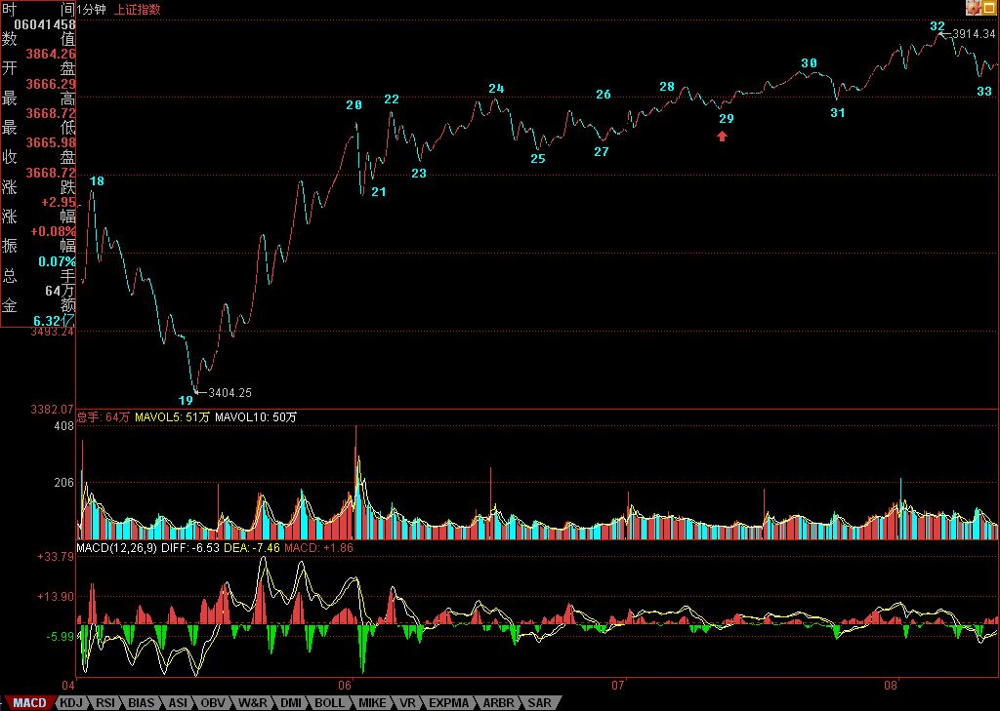{width="5.629861111111111in"
height="4.00625in"}

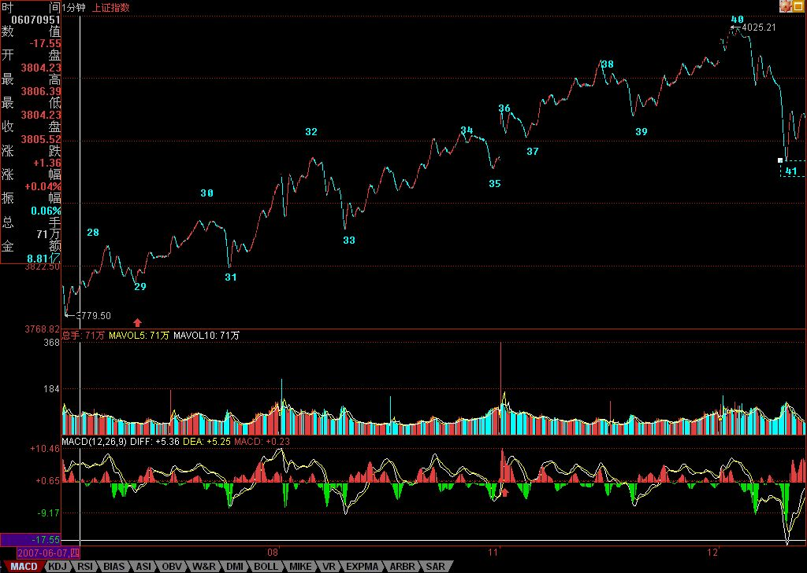{width="5.629861111111111in"
height="4.007638888888889in"}

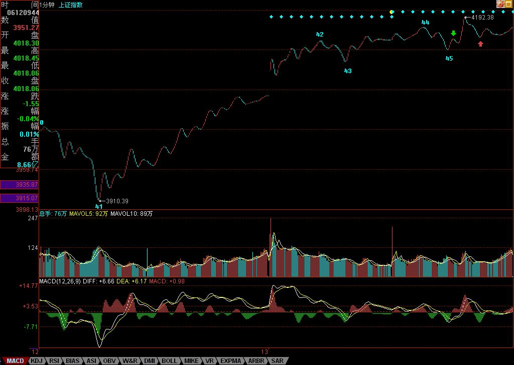{width="5.629861111111111in"
height="4.00625in"}

对于19-45这个未完成的5分钟走势类型，可以进行仔细的研究。由于29比24低，则22-31也构成一个5分钟中枢，而该中枢，就对应着另一种分解。但无论如何分解，19-45至少是一个未完成5分钟走势类型的结论不变。当然，站在这种分解下，41就是22-31这5分钟中枢的第三类买点。因此，如果41开始的上升最终形成5分钟中枢后不与22-31这5分钟中枢重叠，那么这19开始的走势类型就是5分钟的上涨趋势了。

由上面的分析，对短线的走势就有一个明确的结论，只要关于42-45的1分钟中枢的震荡不出现第三类卖点，或者即使出现，但其后扩张的走势不触及22-31这5分钟中枢震荡区间，那么大盘的震荡就是强势的，即使最终形成30分钟以上级别中枢，也是至少是围绕42-45的1分钟中枢发展而来。否则，大盘将以22-31这5分钟中枢震荡区间为基础扩张出30分钟级别的中枢来，相应的走势就比较弱了。而具体的操作，可以按照中枢震荡的手法，根据自己操作的级别，选择相应的中枢级别进行操作。

附录：

**今天的走势没什么可讲的，昨天都已经描述得很清楚了。技术、心理、政策等压力，都需要在这里震荡消化。由于今天没完全补上缺口，因此该位置依然是短线的关键，当然，上面说的42-45的1分钟中枢，已经延伸9段，成为一个5分钟中枢了，后面具体的分析，在上面的文章里已经写了，就不再多说。深圳受到13700点的吸引，短线，能否站稳该线对大盘走向有极大的引导作用。**

**注意，在中枢震荡中，安全的作法应该是先卖后买、形成节奏。其实这问题很简单，从低位上来的筹码，当发现单边走势结束，进入较大级别震荡时候，其标志就是出现顶背驰或盘整背驰，这就要求减磅，然后等震荡下来，出现底背驰或盘整背驰再回补，这样差价才出来，成本才下降。如果是先买后卖，那唯一可能就是在单边的时候，你的仓位不高，所以才会不卖股票也有资金，这其实是节奏先错了的表现。**

**当然，这些都需要通过练习才能熟练。而且必须注意，一旦震荡的力度大于前面有可能形成第三类卖点时，就一定要停止回补，等待第三类卖点引发的下跌出现买点时再介入，很多人经常出问题，就是心里先假设一个可能的跌幅，觉得肯定跌不深，这都是大毛病。一定要养成只看图形操作的习惯。**

**还是那句话，无论是政策、心理、消息等，都是市场的分力，而走势是合力的结果，这才是问题的关键之处。**

**对不起，今天不能回答各位的问题了，下午有一拨人，晚上有两拨都需要腐败活动的，本ID必须去补课，先下，明早见。**

缠中说禅2007-06-14 08:26:42

今天解盘下午3点半后附录本文后，先下，再见。

缠中说禅2007-06-14 15:33:09

今天的走势没什么可讲的，昨天都已经描述得很清楚了。技术、心理、政策等压力，都需要在这里震荡消化。由于今天没完全补上缺口，因此该位置依然是短线的关键，当然，上面说的42-45的1分钟中枢，已经延伸9段，成为一个5分钟中枢了，后面具体的分析，在上面的文章里已经写了，就不再多说。深圳受到13700点的吸引，短线，能否站稳该线对大盘走向有极大的引导作用。

注意，在中枢震荡中，安全的作法应该是先卖后买、形成节奏。其实这问题很简单，从低位上来的筹码，当发现单边走势结束，进入较大级别震荡时候，其标志就是出现顶背驰或盘整背驰，这就要求减磅，然后等震荡下来，出现底背驰或盘整背驰再回补，这样差价才出来，成本才下降。如果是先买后卖，那唯一可能就是在单边的时候，你的仓位不高，所以才会不卖股票也有资金，这其实是节奏先错了的表现。

当然，这些都需要通过练习才能熟练。而且必须注意，一旦震荡的力度大于前面有可能形成第三类卖点时，就一定要停止回补，等待第三类卖点引发的下跌出现买点时再介入，很多人经常出问题，就是心里先假设一个可能的跌幅，觉得肯定跌不深，这都是大毛病。一定要养成只看图形操作的习惯。

还是那句话，无论是政策、心理、消息等，都是市场的分力，而走势是合力的结果，这才是问题的关键之处。

对不起，今天不能回答各位的问题了，下午有一拨人，晚上有两拨都需要腐败活动的，本ID必须去补课，先下，明早见。

禅师其他文章回复：

附录：

**今天的走势依然没什么可说的，把下面的缺口补了后，就继续中枢震荡，关键是都在等周末的消息面，其实，不管周末有什么消息，这两天都消化了。因此，尾盘重新冲上
4144点，收在其下面不远的地方，也就是很正常的。目前，拨乱反正行情第三目标已经达到，后面将为第四目标的创新高而努力，当然，前提是先把4144点
的1/2线给站稳了。**

**个股方面，那
16只股票里，600432已经新高，其他会慢慢跟上的，这种事情肯定有先后的，否则根本忙不过来。如果大盘能如期重新新高，那么绝大多数仍未新高的股
票，都会为此而表现的，这是今后一段时间内一个重要的利润点。另外，那些创新高后没有大级别背弛，并且能回试站稳前期高位的，是另一种可关注的利润点。**

**站在中线的角
度，对环保股票的重视将比本ID年初强调时有更多的认同，这是国家大的方向，依然值得中长线关注的。除了那16只里的环保新能源股，像600636也可以
中线关注，该股在环保股里属于已经有一定业绩支持的，不像很多股票暂时还是概念，因此对中长线资金可以关注。该股票在一个月线双底的颈线位上整理，回试时
可以找买点介入，千万别一窝蜂追高，否则就等着受刑折磨。**

**周末，腐败去吧。**

缠中说禅2007-06-15 08:14:54

今天解盘下午3点半后附录本文后，先下，再见。

缠中说禅2007-06-15 15:30:42

今天的走势依然没什么可说的，把下面的缺口补了后，就继续中枢震荡，关键是都在等周末的消息面，其实，不管周末有什么消息，这两天都消化了。因此，尾盘重新冲上4144点，收在其下面不远的地方，也就是很正常的。目前，拨乱反正行情第三目标已经达到，后面将为第四目标的创新高而努力，当然，前提是先把4144点的1/2线给站稳了。

个股方面，那16只股票里，600432已经新高，其他会慢慢跟上的，这种事情肯定有先后的，否则根本忙不过来。如果大盘能如期重新新高，那么绝大多数仍未新高的股票，都会为此而表现的，这是今后一段时间内一个重要的利润点。另外，那些创新高后没有大级别背弛，并且能回试站稳前期高位的，是另一种可关注的利润点。

站在中线的角度，对环保股票的重视将比本ID年初强调时有更多的认同，这是国家大的方向，依然值得中长线关注的。除了那16只里的环保新能源股，像600636也可以中线关注，该股在环保股里属于已经有一定业绩支持的，不像很多股票暂时还是概念，因此对中长线资金可以关注。该股票在一个月线双底的颈线位上整理，回试时可以找买点介入，千万别一窝蜂追高，否则就等着受刑折磨。

周末，腐败去吧。

缠中说禅2007-06-15 15:35:17

今天是腐败补课的高峰，本ID必须走了，周日继续音乐会，想听什么可给建议。

先下，再见。

## 看待当前资本市场必须具有的基本智慧

(2007-06-18 08:18:39)

无论管理层还是投资者，对当前资本市场都应该具有如下的基本智慧：

一、资本市场不仅能成为经济的晴雨表，更能成为经济发展的核心动力

如果说以土地承包制为起点的农村改革导致改革开放后第一次生产力的大释放，以市场经济的确立为起点的城市改革导致其后第二次生产力的大释放，那么，以股权分置改革为起点的资本市场大变革，将导致比前两次远为重要的第三次生产力的大释放。前两次生产力的大释放，都是在实体经济层面，是经济发展水平不高时的产物，而后者是实体经济发展水平达到一定层次后才能出现也必然出现的产物，比起前两者，对中国社会的影响更为深远。不认识到这一点，就缺乏了看待当前资本市场必须具有的最基本的历史视角。资本市场不仅能成为经济的晴雨表，更能成为经济发展的核心动力，不认识这一点，只能是历史性的短视。

如果说第一次生产力的释放，带来了万元户、乡镇企业；第二次生产力的释放带来了十几年的中国经济奇迹；那么第三次生产力的释放，将使得中国出现一批世界性的企业、一批世界性的财富巨人、一个世界性的资本市场与资金大平台，更重要的是，使得中国在这场资本全球化的大竞赛中最终胜出，打下最基本也是最坚实的基础。这是一场经济、文化、军事等方面的综合竞赛，但经济起着决定性的作用。在一个资本全球化的时代，没有资本的力量，没有资本市场的动力，是不可能成为一个经济大国，更不可能成为一个对世界有着稳定、持续、全面影响力的世界性大国。

二、社会的财富观念将被彻底改变，由此带来社会结构与思想的深刻变革

文化、观念，没有对错，只有是否适时。资本就是一种文化、一种观念。无论你愿意与否，资本是当今一切最有力量文化的源泉。在一个资本全球化的时代，任何企图攻击、摧毁资本的力量，都要借助于资本的力量。资本无处不在，资本以及相应的财富文化、观念，构成当下世界最基本的底色。

当社会财富积累到一定阶段后，物质决定意识，必然导致社会大众财富观念的变化。当中国社会依然以实体经济为主时，社会大众的财富主要集中在有形的资产上，而当虚拟经济出现并逐步走向成熟后，必然对应着股权等无形资产投资的大众化，由此带来社会财富观念与金融意识的深刻变革，因此为市场进一步发展打下坚实基础。

建立在实体经济上的有形财富旧观念的被打破，以虚拟经济为基础的无形财富新观念的被建立，都是不随任何人意志为转移的历史趋势。无论历史是否宏大叙事，但历史的车轮总是宏大叙事地碾压过一切挡车的螳臂。而具有新型财富观念的人所构成的社会，其结构与思想必然发生深刻的变革。一个围绕资本市场而构建的经济体系将逐步形成，资本市场将成为经济结构的关键点，资本市场所构建的文化、观念，将逐步渗入到社会文化、观念之中，将深刻地影响所有人的生存状态。

资本化生存，将是今后中国人的基本状态。资本化，就是今后所有中国人的共业所在。

三、虚拟经济本质上是不可调控，只能进行有效监管

虚拟经济是以股权制度设计把未来财富以证券化等虚拟形式体现在现在的资产价格上，虚拟经济是以预期为变量的，是面向未来的，这与实体经济以过去的积累为依托有着本质的区别。证券化的资产价格必然提前反映对经济的未来预期，而这个预期是随着时间不断变化的，由此构成了市场的波动。虚拟经济中，价格偏离现实的所谓合理价值是常态。所谓涨就涨过头，跌也跌过头，是理所当然、天经地义的。虚拟经济就这样，这是由其本质决定的。如果不认识这一点，用实体经济的老眼光来看新问题，只能是左右挨巴掌，被市场所戏弄。

而站在虚拟经济的角度，无所谓涨跌过头，一切都反映着当下对未来的预期。任何一个人，买入股票只是因为他预期要涨，卖出股票只是因为他预期要跌，预期的理由各色各样，但预期的本质是一样的，市场走势本质上是各种预期的合力构成。而一个所谓的调控，本质上只是让市场的预期发生改变，但改变不了的，还是这市场走势只是各种预期合力的本质。而人不是上帝，人的预期，从来都不可能精确、划一的，所有关于理性预期的假设都被市场情绪化的闹剧所打破。因此一个以调控为主的资本市场，其中的调控者注定要在打压与救市之间疲于应付。

正由于虚拟经济的不可调控，就使得对规则的确认与维护成为虚拟经济监管中唯一可行的有效手段。这道理就如同一个裁判不可以去调控比赛的结果，但可以根据规则去维护比赛的进程一样简单，但这一点似乎并不是每一个应该明白的人都能真正明白。任何市场，都不免有假货，但不能因为有部分的假货就对市场进行全面打击，而是要加大监督稽查，打击假货，增加优质股票的供给，这才是一个好的监管者该干的事情。

四、资本化生存，给任何人提供了跨越式发展的可能

在实体经济层面，一个人要成功，获得商业利益，必须精通各种社会关系，花大量的时间于其中折腾，而在资本化生存的虚拟经济中，给任何人提供了跨越式发展的可能。一个人，完全依靠自己的智慧独立去战胜市场，这种可能性大为增加。在这种生存状态下，一个人是否成功，完全可以更多地依靠个人的修养与修为，而不用看任何人的面色，甚至与年龄、体力、性别都不再密切相关。

在资本化生存的虚拟经济中，世界更加平面了，任何人与成功及失败的距离都更加短了。一个所谓的成功者，完全可以在下一秒就成为一个失败者。任何级别的财富，在虚拟经济、资本市场中都不值得一提。而虚拟经济、资本市场的发展现实，超越了所有旧有理论，如何打破旧观念、创造新观念，让理论为现实服务而不是相反，则是市场发展留下的一个全新课题。

而对于个人来说，一个全新的机会、一个全新的世界，一切都将被全新定义。当然，这里有所谓的领跑者，但这些人与失败的距离并不比任何一个所谓落后者与成功的距离更远，而这个距离，由每个人的贪婪、恐惧与智慧相关。

附录：

**4144点站稳后，剧情就是去继续创新高的努力，因此今天的走势十分正常，不过是这种努力的一部分。由于今天留下缺口，因此后面几天就要震荡去确认这缺口的性质。短线震荡的判断，已经有很多次的经验了，所以不难把握。只要该震荡不出现1分钟的第三类卖点有效跌破4224点，那么就是强势震荡，否则，缺口被补的压力就大了。如果不会看的，可以看5日线。个股，那16只里，今天600635也创新高了，其他会陆续跟上的，因此也没什么可说的。**

**马上要去亦庄看一个项目，车在外面等着，必须走了，所以就不多说了。对不起，明早见。**

缠中说禅2007-06-18 08:20:07

今天解盘下午3点半后附录本帖子后，先下，再见。

缠中说禅2007-06-18 15:16:38

4144点站稳后，剧情就是去继续创新高的努力，因此今天的走势十分正常，不过是这种努力的一部分。由于今天留下缺口，因此后面几天就要震荡去确认这缺口的性质。短线震荡的判断，已经有很多次的经验了，所以不难把握。只要该震荡不出现1分钟的第三类卖点有效跌破4224点，那么就是强势震荡，否则，缺口被补的压力就大了。如果不会看的，可以看5日线。个股，那16只里，今天600635也创新高了，其他会陆续跟上的，因此也没什么可说的。

马上要去亦庄看一个项目，车在外面等着，必须走了，所以就不多说了。对不起，明早见。

## 教你炒股票60：图解分析示范五

(2007-06-19 08:04:06)

其实，枯燥的图形，里面包含着很深的心理学意义。走势，本质上是预期的合力。而预期，本质上是心理层面的。只不过对于市场来说，可以被当成分力去形成市场合力的预期，都是被外化为市场买卖行为的。你的恐惧，如果光是在那里恐惧而没有实际的行动，那并不构成市场的交易行为。因此，所有市场行为，其实已经被如此的心理模式给过滤一遍了。

举一个简单的例子，同级别走势从B0下跌到A1反弹到B1，再跌破下跌到A2，再反弹到B2，这可以分为两类：一、B2低于A1，二、B2不低于A1。显然，第二种情况，会构成某更大级别的中枢，而第一种情况没有，因此这两种情况是有着本质区别的。在心理层面上，A1这第一个反弹的起点，有着很强的心理暗示意义，而再次的跌破，使得这A1的价格成了一个很重要的心理位，而交易本质上都是预期的，这价位就构成了一种实在的预期分类：一、预期能重新上去A1并实际交易，二、预期不能重新上A1并实际交易、三、观望。第三种，在实际的走势中不产生实际的交易，因此一、二种心理预期构成了市场合力，而市场的走势是这合力的当下痕迹，因此这两种心理预期的大小，并不需要实际去测量，因为市场的走势就实际反映出来了。例如，如果实际上不能重新上去，出现第一种B2低于A1的情况，那么显然在当下的情况下，第二种心理预期大于第一种。

消息面、政策面、资金面，这面那面，最终作用的都是人心，人心因预期而交易，这里关系的就是人的贪婪与恐惧、人的贪嗔痴疑慢。而本ID的理论从不预测，没有预期，只跟随着市场合力、市场走势而行，这里无须贪婪恐惧，看图作业，如此而已。但光知道这点还远远不够，因为没有预期可能就是最大的预期，没有贪婪恐惧可能就是最大的贪婪恐惧。不预测、不预期，并不是不可预测、不可预期，而是不为贪婪恐惧而预期、预测，是根据走势的自身规律来。

走势是有规律的，这规律是不患的，这不患的根源在于人贪嗔痴疑慢的不患。为什么本ID要强调当下分解的多样性？因为走势本身就是当下形成中的，是市场各种预期的合力当下画出来的，而每种画法都是不患的，都是源自人的贪嗔痴疑慢，因此每种多样性的分解都是符合理论的，多样性不是模糊性，而是多角度去让市场本身自己去画地为牢，由此使得市场的走势万变不离本ID理论的控制之中，而这，恰好是市场自身的规律之一。

不妨看看上图，上一课刚好说到"红箭头处比绿箭头高，所以不能确定该线段已经完成，还要看后面走势，由此可以知道如何去把握线段的结束"，有人可能问，为什么在这个位置不可以去预测、预期？因为市场自身并没有完成。但这里的未完成，是站在人观察的级别上说的，因为所谓的走势，首先是你观察的走势，没有离开你观察的走势。不同倍数的显微镜下的世界是不同的，但市场操作的成本、交易通道、资金规模等限制了人观察并能实际操作走势的显微镜倍数不可能无限小下去，所以必须确定一个最低级别的线段，把其下一切波动给抹平了。当然，根据严格的理论，用每笔成交当成最低级别，然后以此构筑线段，这样可以严格地分辨任何级别的走势，但这根本不具有操作性，特别现在交易成本增加，可操作的级别必然要增大，因此，一些可操作级别下的波动，必须要忽视掉。

站在最严格意义上，45-46线段构成43-44线段的盘整背驰（注意，力度比较的是下面所有红柱子的面积之和。）而细致分别线段以下级别，就知道45-46其实是一个小级别转大级别，而红箭头后第一次拉起不创新高，就可以出掉了，为什么，因为后面必然形成下上下的重叠结构，也就是有一个小中枢了，而线段以下级别的同级别操作，是不参与这类中枢的。当然，这是按最严格的，并没有太大操作意义的分析。而实际的操作中，大概真在有意义的操作，都至少是1分钟以下线段级别的。因此，在该图中，如果你是按30分钟级别操作的，46-47的波动就可以不管的，从3404开始的反弹，一个标准的5分钟级别的上涨，因此你的持有就至少一直等待这5分钟级别的上涨出现背驰或突发破坏为止。

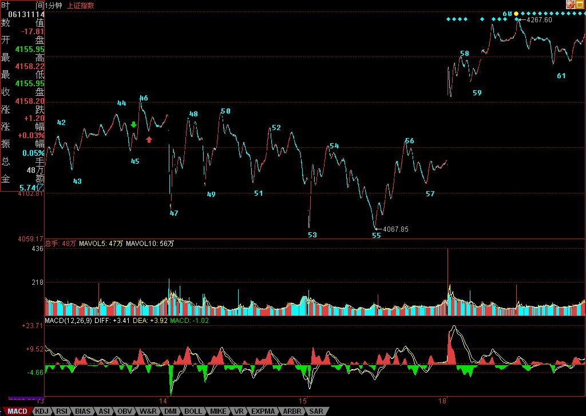{width="5.629861111111111in"
height="4.00625in"}

显然，46-55是一个5分钟的中枢，55跌破53后明显盘整背驰，各位也不难发现，如果把55当成第一类买点（严格来说，盘整背驰无所谓第一类买点，只是这样来类比），57就是一个第二类买点。55-60，是一个标准的线段级别的上涨，59-60的背驰足够标准，看看下面MACD标准的黄白线回拉0轴，然后60新高，而柱子面积与黄白线高度都比前面不如，由此就知道了。因此，按照理论，60后必然有调整回拉58之下，而实际上61就比58低，也就是说，58-61形成一个新的1分钟中枢，该中枢是否扩展成5分钟的，以及上一个5分钟中枢的最高点，也就是46，是否被重新跌破，都是今后走势的关键。如果46不再被触及，那就是超强走势，意味着3404点开始的5分钟上涨走势依然延续。

这里必须强调突发消息对市场走势以及操作的影响是不必过于在意的，本质上，任何突发的消息，不过增加了一个市场预期的当下分力，因此，最终还是要看合力本身，或者说是市场走势本身。一般情况下，由于背驰的精确定位需要用区间套的方法，所以突发消息，最不幸的，就是在这精确定位期间出现，例如这次530，就是这样。当然，这是一种小概率事件，更多情况，突发消息在背驰的精确定位后出现，这样突发消息对操作的影响就是0了。而对于那种最不幸的情况，用一个第二类卖点就足以应付，因此，突发消息出来后，在实际的操作中就不能放过这第二类卖点。不过要注意，并不是任何第二类卖点都需要反应的，这和级别有关，例如你是月线级别的，那这次所谓的大跌，看都不用看，爱跌不跌，随他去。即使你是5分钟级别操作的，如果某突发消息连一个1分钟的中枢都没破坏，只制造了1分钟以下级别的震荡，那么在所谓的第二类卖点，也是不用管的。原则很简单，任何消息，都只是分力，关键是看对合力的影响，看他破坏了多大级别的走势，这一切都反映在实际走势中，看图作业就可以了。

注意，突发消息破坏的级别越大，越不一定等相应级别的第二类卖点。例如，一个向下缺口把一个日线级别的上涨给破坏了，那么，消息出来当天盘中的1分钟，甚至线段的第二类卖点，都是一个好的走人机会，如果要等日线级别的第二类卖点，可能就要等很长时间、而且点位甚至还比不上这一点，因为走势是逐步按级别生长出来的。还有，级别只是区分可操作空间的，为什么按级别？因为级别大，操作空间按通常情况下就大。但在快速变动的行情中，一个5分钟的走势类型就可以跌个50%，例如这次大跌，因此，一个这样的5分钟底背驰，其反弹的空间就比一般情况下30分钟级别的都大，这时候，即使你是按30分钟操作的，也可以按5分钟级别进入，而不必坐等30分钟买点了。

附录：

**今天的走势昨天已经说得很清楚，4224点下不出现第三类卖点，就是强势震荡。今天的走势，显然符合这个要求。4224点，就是上图61这位置，从60开始的1分钟中枢\[4224，4254\]，今后两天就看这中枢的第三类买卖点。换言之，还和昨天说的一样，只要不在4224点下出现1分钟级别的第三类卖点，那就是强势，至于大盘要展开新一轮上攻，就要在4254上出现1分钟级别的第三类买点，否则大盘就在该区间内震荡继续中枢震荡延伸。**

**关于大盘的剧本不变，但个股之间显然会有分化，因此不能光看大盘，现在的股票，在技术上无非几类：一、创新高后回试的，这可以用第三类买点来把握；二、在前期高位下盘整蓄势的，这可以用小级别的第三类买点把握其突破，或在震荡低点介入；三、反弹受阻拉平台整理的，这个第二同样处理，只是位置与前期高位有距离；四、依然在底部构筑双底、头肩底之类图形的，这可以用第一、二类买点把握。**

**具体个股就不说了，来这里，如果希望一点脑子都不动，那是不行的。动脑子得到的东西是你自己的，否则永远都不行。**

缠中说禅2007-06-19 08:05:47

今天解盘下午3点后附录本帖。

先下，再见。

缠中说禅2007-06-19 15:48:00

今天的走势昨天已经说得很清楚，4224点下不出现第三类卖点，就是强势震荡。今天的走势，显然符合这个要求。4224点，就是上图61这位置，从60开始的1分钟中枢\[4224，4254\]，今后两天就看这中枢的第三类买卖点。换言之，还和昨天说的一样，只要不在4224点下出现1分钟级别的第三类卖点，那就是强势，至于大盘要展开新一轮上攻，就要在4254上出现1分钟级别的第三类买点，否则大盘就在该区间内震荡继续中枢震荡延伸。

关于大盘的剧本不变，但个股之间显然会有分化，因此不能光看大盘，现在的股票，在技术上无非几类：一、创新高后回试的，这可以用第三类买点来把握；二、在前期高位下盘整蓄势的，这可以用小级别的第三类买点把握其突破，或在震荡低点介入；三、反弹受阻拉平台整理的，这个第二同样处理，只是位置与前期高位有距离；四、依然在底部构筑双底、头肩底之类图形的，这可以用第一、二类买点把握。

具体个股就不说了，来这里，如果希望一点脑子都不动，那是不行的。动脑子得到的东西是你自己的，否则永远都不行。

缠中说禅2007-06-19 15:58:26

\[匿名\] 洗晕了的大道

2007-06-19 15:50:33

女王好，最近两天死抱安阳，发现这个股真垃圾啊，这两天常见到的万手买盘是您在点火么？庄家真是强啊，这样也拉不起来，洗盘这么久不知道干净了没有。

另外今天生物偶拿到了涨停，谢谢女王。

===

那钢铁本ID前几天已经说了要改变剧本先让想走的人出来，你还以为本ID是说着玩的？本ID那16只股票，加上钢铁、139、338、636，总共也就20只，找一个合适的买点应该不费劲，为什么不等到有买点再介入？000777、000416如果不敢买，难道600635本ID还说得还不够清楚？上周初洗盘的时候，难道没机会买？

不说了，本ID下午晚上还有事情，要去一趟西三环外某街道，先下，明早见。

## 2007，人民币私人股权投资基金元年

(2007-06-20 08:13:50)

经过20余年的改革开放，一大批优秀的企业不断涌现。这些企业在各自行业实现快速发展，成为人民币私人股权投资基金的最佳投资对象。但在股权分置改革之前，没有良好的退出渠道，因此，该类基金只能停留在理论探讨阶段，不具备太大的实际操作价值。

而股权分置改革之后，上市公司股份有了一个通畅的退出渠道，加之目前公司上市的日益市场化，中国资本市场的超常规发展需要更多优质的上市资源，这些都形成人民币私人股权投资基金的历史发展机遇。由于人民币非控股发起人股东股票禁售期为12个月，而外资非控股发起人股东股票禁售期36个月，客观上形成外资进入门槛较高，加之政府对外资并购"国计民生"行业的忧虑，为人民币私人股权投资基金的发展壮大提供了更宽松的环境。

由于前期对资本市场角色的定位存在严重误区，使得中国资本市场的名声并不大好，而对上市指标的严控，让上市成为一场马拉松式的公关比赛，往往花费大量财力精力而一无所获，使得许多没有太大背景的优秀企业，对上市都心存疑虑，甚至有很强的抵触情绪。另一方面，由于中国经济高速发展的大环境，使得企业的发展机遇众多，并没有太大的危机意识，而且很多企业都以实体经济模式发展起来，甚至有些民营企业依然停留在家族式经营的模式下，对上市成为公众公司，有着巨大的观念鸿沟。

但中国实体经济的长足发展，已使得多层次资本市场的大发展成为必不可少的一环。而资本市场的基础是其中交易的上市公司，上市公司的质量成为资本市场发展是否基础牢靠的关键。一个起点就有原罪的市场不可能有正常的发展，解决上市公司的质量，最根本的就是要确立市场化的原则，让所有符合上市条件的公司都能在市场化的原则下、根据企业发展的实际选择合适时机上市，然后通过严格监管、市场淘汰，让已不达标的公司坚决退市，这样才能确保上市公司的质量。这里最重要的前提，就是让所有符合上市条件的公司都能按照市场化的原则上市。可以断言，这一前提正逐步变成现实，这也是中国资本市场成为全球性资本市场的一个必不可少的前提。而该前提的确立，同样为人民币私人股权投资基金的健康发展提供了最基本的保证。

另一方面，中国企业在实体经济中普遍进入发展瓶颈，必须与资本市场结合去获取新的发展动力。那些没有资本市场支持的企业，越来越面临着被有资本市场强大资金支持的企业挤压、打跨、并购的风险。对于那些依然企图逃避资本市场的企业来说，在今后将越来越面临生存压力，在这种压力下，生存还是毁灭，是每一个企业必须面对的头等问题，而充分利用资本市场发展壮大自己，是所有符合上市条件的企业一个不能回避的必然选择。可以断言，越来越多的企业将把自己的命运与资本市场结合在一起，这就为人民币私人股权投资基金的发展提供充足的可开采资源。

对于管理层来说，一批有社会公信力、规范运作的人民币私人股权投资基金的大发展，使得未上市资源能得到专业化、市场化、产业化、国际化的整合，为资本市场提供足够的优质上市公司。更重要的是，该类基金的发展，使得资本市场的资源配置功能得到更有效的发挥，由此发展出的并购基金，将为市场的生态平衡起着关键的作用，有着极为广阔的发展空间。

2006年12月28日，中国银监会颁布了新的《信托公司集合资金信托计划管理办法》，"集合资金信托计划"成为在中国从事资产管理和结构融资的重要工具。2007年6月1日实施的《合伙企业法》，为人民币私人股权投资基金提供了完备的法律架构和立法保障。换言之，2007年6月以后，人民币私人股权投资基金的发展已经不可阻挡，2007年，必定作为人民币私人股权投资基金元年记入中国资本市场发展史。

最后，将深圳中小版的基本上市条件附录如下：

发行前总股本不低于3000万元人民币；发行前净资产在总资产比例中不低于30%；发行前无形资产在净资产比例中不高于20%（不含土地使用权、采矿权、水面养殖权）；发行前连续3年盈利，3年累计净利润不低于3000万元人民币，在扣除非经常性损益后以孰低为准；发行前3年经营活动累计产生的现金流量不低于5000万元人民币，或者3年累计销售收入不低于3亿元人民币。

附录：

**今天走势十分正常，一个正常的中枢震荡，下午13点半附近的背弛如果还不能当下看出，那么就要抓紧学习了。具体的分析，将在课程61里。如果当下没能分析出来的，请先自己分析一下，然后对照明早的课程，这样才能提高。**

**由于周一那缺口还在那里，因此成为行情发展的一个隐患，前面已经说过，只要震荡触及4192点附近的46，那么中枢就将扩展。今天的走势已经触及该点，所以后面将是一个大的中枢震荡。短线还是看在4224点的61，如果一个1分钟走势不能重新触及该点，就会形成一个5分钟的第三类卖点，那么震荡的区间就要往下扩展。如果能重新站稳4224点，那震荡依然是强势的。中线看，4144点的1/2线十分关键，如果该线站不稳，那么大盘的调整级别就加大，否则就问题不大。不会看的，短线还是看5日线，中线看5周线，不破就问题不大。**

**个股方面，那16只里继续有几只新高了，其他在震荡后也会跟上的。昨天说那四种技术形态的个股，必须按照技术图形分别对待。特别是创新高的股票，必须注意有没有大级别背驰，有的，一定要小心，小心中了多头陷阱。如果没有背驰，或者盘整背驰最终转化为第三类买点，才可以介入。至于，其他形态的，看好技术图形就行。**

缠中说禅2007-06-20 08:15:37

今天解盘下午3点后附录本帖。

先下，再见。

缠中说禅2007-06-20 15:36:32

今天走势十分正常，一个正常的中枢震荡，下午13点半附近的背弛如果还不能当下看出，那么就要抓紧学习了。具体的分析，将在课程61里。如果当下没能分析出来的，请先自己分析一下，然后对照明早的课程，这样才能提高。

由于周一那缺口还在那里，因此成为行情发展的一个隐患，前面已经说过，只要震荡触及4192点附近的46，那么中枢就将扩展。今天的走势已经触及该点，所以后面将是一个大的中枢震荡。短线还是看在4224点的61，如果一个1分钟走势不能重新触及该点，就会形成一个5分钟的第三类卖点，那么震荡的区间就要往下扩展。如果能重新站稳4224点，那震荡依然是强势的。中线看，4144点的1/2线十分关键，如果该线站不稳，那么大盘的调整级别就加大，否则就问题不大。不会看的，短线还是看5日线，中线看5周线，不破就问题不大。

个股方面，那16只里继续有几只新高了，其他在震荡后也会跟上的。昨天说那四种技术形态的个股，必须按照技术图形分别对待。特别是创新高的股票，必须注意有没有大级别背驰，有的，一定要小心，小心中了多头陷阱。如果没有背驰，或者盘整背驰最终转化为第三类买点，才可以介入。至于，其他形态的，看好技术图形就行。

缠中说禅2007-06-20 15:43:19

全线飘红

2007-06-20 15:35:04

检讨。

自己虽然是3买进的569，但发现是盘整一直没有出来。

只盯着是缠的股票，就忘了缠的理论了，没有挣到钱，损失时间成本。

===

你看看569的60分钟图，请说说10.78那天是什么？一个这么大级别的背驰，怎么可能1、2天就调整过来？本ID当天已经说得很清楚，剧本改了，要买要等待买点出现。

再说一次，就算本ID没有专门提醒剧本改了，也应该看图作业，如果不明白，看看像569这样的背驰，一般是怎么调整的。569是本ID的股票，难道000999、000777、600635、600777、000778、600432、000915等等就不是？本ID对任何股票都只是按图作业。

缠中说禅2007-06-20 15:47:20

\[匿名\] 新股手

2007-06-20 15:43:08

老大昨天生气，跑了，不上课了。安慰一下先。呵呵。

俺没学好，但俺只用你教的盯5日线，也蛮实用。530上午高点跑出来了，躲过一劫。今天上午也除掉持股的7成。呵呵。

俺的两个问题昨天没讨到答案，今天加一个：）

1，你以前说中移动回归后，联通有戏。现在中移动回归确定了，俺可以重仓联通吗？

2，416既没业绩又没题材，还要争第一吗？

3，能不能多选几支中线的股？申明不是你的。这里有人呼吁过。我顶一下。

===

好好学习理论，如果你对理论有感觉。其他问题，没什么意义。一切按图作业。至于600050，中线当然没问题，就看你有没有这个耐心。一般这种股票，散户都没什么必要参与。散户完全可以根据最多30分钟级别进行短线操作，这样的效率是最高的。当然，前提是你真明白了本ID的理论。

缠中说禅2007-06-20 15:49:31

\[匿名\] abc

2007-06-20 15:45:39

我们对于5分钟或30分钟的线段划分比较糊涂，大师能不能下次分析一个5分钟的图？

===

多少分钟的图和多少分钟的级别是没什么关系的。如果看5分钟、30分钟去决定线段，等于用倍数很小的显微镜去看，与1分钟的唯一区别就是精度低了。用1分钟的图，一样可以判断出年线的中枢。

缠中说禅2007-06-20 15:53:31

对不起，今天外地来了客人，本ID要去腐败去了。技术上的问题，明天61课都会说到的，如果可能，请先行分析，明天再对照。

先下，再见。

## 教你炒股票61：区间套定位标准图解（分析示范六）

(2007-06-21 08:13:21)

有人经常担心，万一人人都学会本ID的理论，那么本ID的理论还有用吗？问这种问题的，基本就没搞明白本ID的理论。而且，人人都学会本ID的理论，这本来就是一个假命题，像孔男人这样的文科生，本ID从来都觉得他们能学会的机会比较渺茫。注意本ID这里是有定语的，没有打击所有文科生，而是说孔男人这样的文科生。当然，如果有人爱自己往孔男人这样的文科生的套里去，本ID没什么意见。

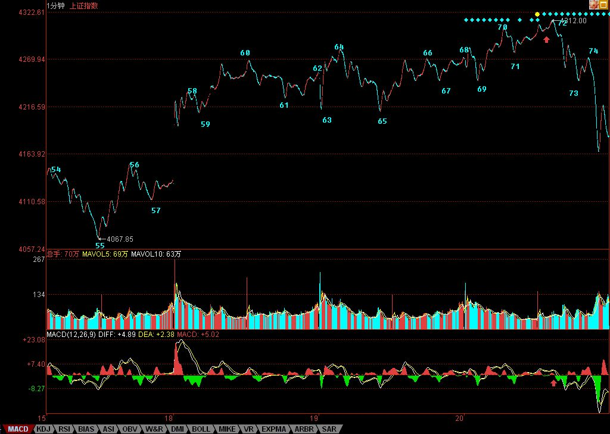{width="5.6299212598425195in"
height="4.0065048118985125in"}

有些无聊问题总是被提着，诸如中枢的意义是什么？对于一个实际操作者来说，中枢的意义就是没有意义，而没有意义就是最大的意义，因为你只要根据中枢的实际走势去反应，问题的关键是你去看明白走势的分解而不是中枢的意义，更重要的就是根据走势的分解去采取正确的反应。如果孔男人之类的文科生想探讨什么中枢意义，那么就让他们探讨去好了，就如同基督教的神甫千百年来YY上帝的意义一样，对于本ID来说，上帝有什么垃圾意义并不重要，关键是如果真有什么上帝，那么也只是被面首的对象。股票是用来操作的，而不是用来意义的。

还有些人不断地问，为什么1分钟的顶背驰，有时候跌幅很大，有时候很小，究竟什么时候该走？这种问题是典型的垃圾问题。如果你的操作级别是1分钟级别的，那么1分钟的顶背驰你就该走了，至于后面的跌幅是大是小，和你有什么关系？你只要耐心等待市场走出新的1分钟底背驰就可以。反之，如果你的操作级别是月线的，那么1分钟的顶背驰和你有什么关系？你既然已经决定是按月线进出的，那么1分钟级别的所有震荡都是可以接受的，可以忽略的。别说1分钟的，就算这次530所谓的大跌，如果你真是月线级别操作的，看都不用看，这种级别的震荡根本就在月线可忍受的范围内，只有那些如孔男人那样的文科生才会认为本ID的理论只能看1分钟的图，本ID已经多次说过，如果你按年线的级别，那么你比巴菲特还要巴菲特，关键是你有没有这样的耐心。

好了，没必要为孔男人这样的文科生浪费时间，看看下图，一个区间套定位的标准图解。如果上学时学过基本的数学分析课程，应该不难明白区间套定位，如果没学过的，那就费点劲，虽然前面的课程已经反复说过，但当昨天2007年6月20日13点30前后大盘走势实际地走出来时，能当下看明白的有几个人？因此，以下的分析请仔细研究。

要比较力度，发现背驰，首先要搞清楚是哪两段比较，其实，只要是围绕一中枢的两段走势都可以比较力度。显然，对于60-65这个1分钟中枢，55-60与65开始的一段之间就可以比较。在实际操作中，65开始的走势，由于没实际走出来，所以在和55-60比较时，都可以先假设是进入背驰段。而当走势实际走出来，一旦力度大于前者，那么就可以断定背驰段不成立，也就不会出现背驰。在没有证据否定背驰之前，就要观察从65开始的一段其内部结构中的背驰情况，这种方法可以逐次下去，这就是区间套的定位方法，这种方法，可以在当下精确地定位走势的转折点。

对于65开始背驰段的内部走势，当下走到69时，并不构成任何背驰，为什么？因为背驰如果没有创新高，是不存在的。所以，只有等70点出现时，大盘才进入真正的背驰危险区。由于69-70段与67-68段比并没有盘整背驰，所以70点并没有走的理由，除非你是按线段以下级别操作的。而71点，构成对66-69这1分钟中枢的第三类买点。按照本ID的理论，其后无非只有两种情况，中枢级别扩展或者走出新的中枢上移。对后者，一个最基本的要求就是，从71点这第三类买点开始的向上段不能出现盘整背驰，而在实际中，不难发现，71点开始的走势力度明显比不上69-70段，而对于65-66段，69开始的走势力度也明显比不上，这从两者下面对应的MACD红柱子面积之和可以辅助判断。

因此，65开始的走势是第一重背驰段，69开始的是第二重背驰段，也就是65开始背驰段的背驰段，而71开始的是第三重背驰段，也就是65开始背驰段的背驰段的背驰段，最后当下考察71开始的走势，从走势上红尖头以及MACD上红尖头可以当下知道，71的内部背驰也出现，也就是第四重的背驰段出现了。由此可见，72点这个背驰点的精确定位，是由65开始背驰段的背驰段的背驰段的背驰段构成的，这就构成一个区间套的精确定位，这一切，都可以当下地进行。

对于实际的操作，72四重背驰点出现后，卖是唯一的选择，而区别只在于卖多少。当然，如果是按5分钟级别以及以下级别操作的，当然就全卖了，因为后面至少会形成5分钟的中枢震荡，实际上，60-69就是一个5分钟中枢。而对于大级别操作的，显然不可能因一个5分钟震荡而清仓，所以可以根据5分钟震荡可以容纳的数量进行对冲操作。小资金的利润率，在相同操作水平下，显然要远高于大资金的，例如像这样的卖点，小资金就可以全仓操作，大资金是不可能的。

如果说72的判断有点难度，需要知道区间套的精确定位，那么74的第二类卖点，就一点难度都没有了。唯一有点需要分辨的就是，这第二类卖点，同时又是一个1分钟中枢的第三类卖点，究竟哪个中枢？显然不是70-73这个，因为这里需要满足结合律。一个第三类买卖点，至少需要有5段次级别的，前三段构成中枢，第四段离开中枢，第5段构成第三类买卖点。其实，这里的答案很简单，74点是69-72这个中枢的第三类卖点。也就是说，74点既是一个第二类卖点，又是一个第三类卖点，以前的课程已经说过，一旦出现二、三类买卖点同时出现的情况，往往后面的力度值得关注。实际上，74后面出现更大力度的下跌，这并没有任何奇怪的地方。

对于60-69这个5分钟中枢，69的4244点是一个关键位置，如果在其下出现第三类卖点，那么走势至少将扩展成一个30分钟中枢，调整的幅度与压力就大了。而对于72开始的走势，73很重要，要重新走强，必须冲破73这一点，该点位置恰好也是4244点。因此，短线的4244点十分关键，重新站稳，则大盘将最多是5分钟中枢的延伸震荡，否则即使不演化成5分钟级别的下跌，也将扩展成30分钟级别的中枢震荡。

不管学什么，是否愿意学，首先请先把学的东西搞明白，否则浪费的是自己的时间，还不如不学。本ID的理论，你爱学不学，就像无论你是否相信万有引力，无论你是上帝还是小布什，该存在的依然存在。本ID的理论亦如此，无论任何人学与否，无论你是庄家、管理层还是什么玩意，都不增一分、不减一分，都一样。

因此，千万别学孔男人而成为如孔男人那样的文科生，究竟孔男人那样的文科生是一种什么玩意，看看下面两个连接就明白了。

附录：

**如果在看过上面的课程，今天的走势都看不明白不会操作，那你大概要面临两种选择：一、去和孔男人为伍；二、洗心革面、好好学习。上面说到的4244点的技术意义，在今天走势中表露无疑，早上的杀跌补缺口，这次是一个明显的区间套底背驰定位，如果还看不明白，继续加倍努力学习或者放弃孔男人去，自己选择吧。**

**明天还是这个4244点，站稳就走强，否则继续5分钟的中枢震荡，并且要小心出现第三类卖点。明天又是周末，利空又准备漫天飞，本ID早在前面说过，这里必须用震荡来化解技术、心理、政策的压力，如果整天还是周一看没消息就跳空，然后继续不断震荡等周五，然后周末等消息，这样轮回下去，是走不出坚定有力的行情的，所以关键还是心态，整个市场的心态必须在震荡中修复。今天最低4147点，和本ID反复说的1/2线4144点相差不远，中线关键还是看这线，不破就是强势。**

**个股方面，本ID那16只股票的剧本一大早就告诉大家了，本ID说的是16只，已经有8只创新高，今天还3只涨停的。为什么不16只一起来，首先这操作不过来，其次，这样是资金利用率最高的，如果你按照这节奏去轮动操作，对于小资金，你这次反弹的收益率如果少于100%，那你的毛病就大了。为什么要看买卖点，为什么要强调节奏，最终都是为了资金的安全与利用率，这对大资金同样的，而对小资金，掌握了节奏，你的效率更高。**

**注意，本ID的意思不是你一定要买本ID这16只股票，只是事先告诉并直播本ID的操作节奏，让大家去把握其中资金运用的道理。要有效率，必须有节奏，要有节奏，就首先要把握好买卖点，这里的逻辑关系，请好好思考明白。**

**今天下午有一个聚会，谈谈心、统一一下思想，必须下了，明早见。**

缠中说禅2007-06-21 08:14:25

今天解盘下午3点后附录本帖。

先下，再见。

缠中说禅2007-06-21 15:25:18

如果在看过上面的课程，今天的走势都看不明白不会操作，那你大概要面临两种选择：一、去和孔男人为伍；二、洗心革面、好好学习。上面说到的4244点的技术意义，在今天走势中表露无疑，早上的杀跌补缺口，这次是一个明显的区间套底背驰定位，如果还看不明白，继续加倍努力学习或者放弃孔男人去，自己选择吧。

明天还是这个4244点，站稳就走强，否则继续5分钟的中枢震荡，并且要小心出现第三类卖点。明天又是周末，利空又准备漫天飞，本ID早在前面说过，这里必须用震荡来化解技术、心理、政策的压力，如果整天还是周一看没消息就跳空，然后继续不断震荡等周五，然后周末等消息，这样轮回下去，是走不出坚定有力的行情的，所以关键还是心态，整个市场的心态必须在震荡中修复。今天最低4147点，和本ID反复说的1/2线4144点相差不远，中线关键还是看这线，不破就是强势。

个股方面，本ID那16只股票的剧本一大早就告诉大家了，本ID说的是16只，已经有8只创新高，今天还3只涨停的。为什么不16只一起来，首先这操作不过来，其次，这样是资金利用率最高的，如果你按照这节奏去轮动操作，对于小资金，你这次反弹的收益率如果少于100%，那你的毛病就大了。为什么要看买卖点，为什么要强调节奏，最终都是为了资金的安全与利用率，这对大资金同样的，而对小资金，掌握了节奏，你的效率更高。

注意，本ID的意思不是你一定要买本ID这16只股票，只是事先告诉并直播本ID的操作节奏，让大家去把握其中资金运用的道理。要有效率，必须有节奏，要有节奏，就首先要把握好买卖点，这里的逻辑关系，请好好思考明白。

今天下午有一个聚会，谈谈心、统一一下思想，必须下了，明早见。

## 股市里不动脑子只有死路一条

(2007-06-22 08:30:44)

由于今天收盘后要去出差，第一站湖南，然后还要跑几个省，所以就不想写新东西了。最近这里很热闹，好象有10万的日成交天量出现过，有点不大正常，新人太多，大概也需要风险教育一把了。"股市里不动脑子只有死路一条"这题目，适合一切风险市场，而不光是股市，例如人生就是一个大的风险市场。

可是这世界尽是些不动脑子的人，这些人的心态就是，企图找一个所谓的先知、上帝，然后借着他力就飞上天去了。所以，在股票市场中，那些所谓的股评、黑马推荐到处泛滥，养活这些人的都是这些不动脑子的人。但这世界上，从来没有任何一个搞股评、黑马推荐能成为市场的真正成功者，更不用说那些听股评、黑马推荐而不动脑子的一群。

任何东西，都要经过自己的大脑，就算是本ID的理论，你也必须经过自己的大脑，用自己的脑子去判断。如果某些人的水平还暂时太孔男人，那完全可以对本ID的理论敬而远之，当然不敬而远之也可以，甚至破口大骂都可以，例如可以很孔男人地说"我炒股到你这个水平的时候，你全家都没出生呢？你也敢跟我谈股票？无耻！"。本ID理论的正确，又不在乎有多少人相信，就像即使没有人相信费马大定理是对的，但该定理依然是对的，关于该定理的证明，没几个人能看懂，但对就是对，没任何改变。

学任何东西，都必须究底穷源，如果你还有疑惑，怎么可能操作起来得心应手？特别像本ID的理论，实战性如此强，不透彻理解，怎么可能与走势本身过招？当然，没有任何人有义务去学本ID的理论，甚至本ID一直都建议，如果你对本ID的理论在理解上还有疑问，就别用本ID的理论去操作，特别不能进行级别太小的操作。当然，本ID的理论有很多方面，如果你彻底明白其中一方面，例如同级别分解，那也可以按此操作，前提是你真明白了。

本ID这里不是股评，也没有黑马。本ID在这里说的股票，都是本ID自己实际操作的股票，而且本ID说的时候，基本就是同时在买的时候，那种自己先买后说的活动，本ID才没兴趣干。为什么？因为只要精通本ID的理论，任何股票在任何价位买，其实都不是问题，通过震荡，通过不断差价，本ID总能把他们的成本变成0，只是时间长短的问题。

现在本ID做盘已经很温和了，N年前，本ID的风格可不是这样的。例如，有一只东北的股票，当时本ID抢筹码，从9元开始，一直抢到26元，然后展开大幅震荡，N家人在里面打架，成本也大幅度减少，最后拍上38元飞流直下三千尺，前后不过N月。这只是本ID干过的一件小事，那次，基本没散户什么事，谁告诉你股票一定要有散户才好玩的？

去年底开始来这里的人都知道，本ID在这里说股票，第一只就是000999，当时是12月20日前后，价格在6元，本ID也就是同时进去的，后面000416在3元，600635在5元，600777在4元等等，本ID说的时候，也就是本ID开始买的时候。所以，本ID持有股票的时机、成本是完全公开的，但成本只是当时的，现在这些股票的成本都是0。

至于16只股票外3、4月以后说的股票，一只是600607，当时说是抽点汉奸血，当时是13元，后来翻倍后砸出部分让成本变0，这在当天也顺口提醒过了；000338，写诗那天是5月15日，本ID是写完诗后第二天开始进去的，看图形就知道；600139，这股票说的第二天一大早，专门上来说这股票盘子太小，不能乱买，本ID当然也没乱买，可以看看当时本ID说的话，请问够清楚没有？

缠中说禅

2007-05-22 08:49:55

各位请注意，本ID昨天说的股票只是举例子，由于有些盘子太小，例如本ID就在摆弄着一只和那锌锗内容一样的股票，但盘子确实太小，根本就没法说，一说就乱。现在不是2000点了，任何股票都要首先注意风险，必须按照大级别的买点进入。盘子小的，不能乱买，否则盘子就乱，就要洗。各位最好就是按思路去买股票，最好就是继续持有原来已经获利丰厚而依然有大潜力的股票，这样可以减少震荡的风险，否则一窝蜂地去换股票，那就乱套了。

还有一只是600569，也是5月21日说的，22日就停牌，本ID也都是21、22两天买的，不过这股票有点背，本来要大涨的结果停牌碰上530大跌，所以本ID在复牌6月13日那天明确说："今天，那关住的钢铁出来，这股票，这里很多人是停牌前一天9元多点买的，至少让各位少了被震的痛苦，逃过一次大跌，如果今天早上反应快的，还能有10%以上的收益。本来，如果没这次大跌，这股票肯定是要连续涨停的，现在只能先清洗一下，让需要用钱的先出来，这也是市场操作中经常要面对的事情，剧本，偶尔也要修改一下的。至于后面的走势，看好技术图形就不难发现了。"如果你在6月13日后还追高买入而不是等待买点再说，那本ID严重怀疑你是孔男人的嫡传弟子。至于本ID自己，去看看60分钟图，这么大一个顶背驰，本ID会麻木不仁吗？对于有大卖点的股票，最大的仁慈就是砸死他，先卖后买，注意节奏，这样成本才能降低，否则成本怎么去变成0？至于600636，本ID也正在慢慢建仓中。

当然，本ID还有几只股票没说过的，600839、000021、000001，这都是本ID在96年那次大牛市中大抽其钱血的股票，买他们纯粹是怀旧，而且参与程度有限，都是元旦前后买的，现在也都成本为0了。002121、002123，这是本ID曾多次说的中小板里6000万总盘，2000以下流通的股票，还有一个002114，都是上市就买，盘子太小，买不了多少，也花不了什么钱，这些依然没完全成本为0，但也快了。

由于很多新来的，都不知道这么多典故，例如还发纸条问"緾姐好！经常前来学习，在你的文章中总提到16只股票，能否告知？昐！"所以就把本ID最早那16只股票列出来，括弧里是说时的价位，也就是本ID自己最开始买时的价位，方便起见，都四舍五入，取整数了。

注意，本ID又不是庄家，虽然比庄家还残暴，但根本不需要任何人抬轿子，本ID现在吸的是庄家血，现在的庄家，都是本ID的晚辈了。所以没有的，最好就是观赏，千万别追高买，技术不好的，就更应该这样。当然，如果低位一直拿着的，当然可以继续玩下去，把这些股票面首玩到精尽人亡为止。但最终，都要自己找吃去，这才不枉来学本ID的理论一场。

000999（6）、000600（5）、000777（8）、600777（4）、000778（5）、000416（3）、000915（3）、000099（4）、600635（5）、600649（6）、600578（5）、600343（11）、000938（10）、600432（19）、000998（9）、000802（10）

出差，主帖就不写了，但每天解盘还是可以继续的，大概下周末能回北京，本周的音乐会就自由活动吧。

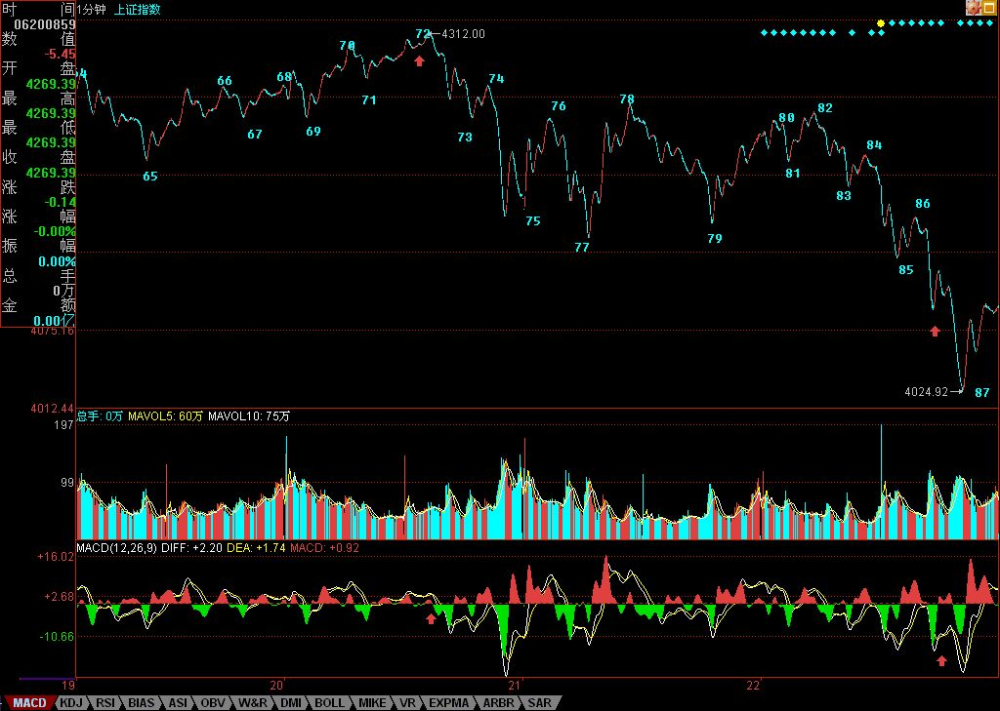{width="5.6299212598425195in"
height="4.0065048118985125in"}附录

由于要出差，先把这线段图贴出来，否则回来就积累一大堆K线，要分很多张图了。昨天说的很清楚了："**明天还是这个4244点，站稳就走强，否则继续5分钟的中枢震荡，并且要小心出现第三类卖点。"今天的走势在4244点上精确地被再次压制，然后出现大幅度跳水，这些在今天走势的当下都很容易分析。81-82的盘整背驰、84点的第二类卖点，后面走出一个线段的标准下跌，以红箭头所指微型中枢前后出现背驰，然后有87的转折，但这个转折，由于86-87没有背驰，所以，只能是线段下级别的，因此，并不能现在就确定该线段就走完了，除非重新突破85的4131一点。**

**站在中枢的角度，75-84这个5分钟中枢下边在4188点，如果后面的走势不能重新站上去，就要提防形成5分钟第三卖点。而前面已经说过，现在的情况46-87已经构成一个30分钟的中枢，短线的问题只是这中枢的第三段是否完成。其后就是该中枢的一个中枢震荡，该中枢区间在\[4067，4192\]，该中枢要管大盘一段时间直到出现30分钟的第三类买卖点。**

**下周走势十分关键，由于关系到月线、特别是季线的收盘，季线如果留出很长上影，则7月到9月的行情压力都很大。所以，对于多方来说，下周的任务就是不让季线留下长上影。只要收在4144点的1/2线上，就是多方最大的胜利。本ID在5月初关于4144点的1/2线要管大盘至少3个月的断言，看来肯定是成立了。**

**个股方面，就看图作业吧，各位可能都发现，本ID一出差，本ID那些股票都走得没什么力，这也怪不了本ID，大家就当成是巧合，希望里面的大小庄家也别老是这样，这样有意思吗？希望这次有点改变。**

**下周收盘都会解盘的，周末，各位腐败去吧。**

**本ID要去机场，先下了，再见。**

缠中说禅2007-06-22 08:32:39

今天解盘下午3点半附录本帖后。

先下，再见。

缠中说禅2007-06-22 15:47:44

由于要出差，先把这线段图贴出来，否则回来就积累一大堆K线，要分很多张图了。昨天说的很清楚了："明天还是这个4244点，站稳就走强，否则继续5分钟的中枢震荡，并且要小心出现第三类卖点。"今天的走势在4244点上精确地被再次压制，然后出现大幅度跳水，这些在今天走势的当下都很容易分析。81-82的盘整背驰、84点的第二类卖点，后面走出一个线段的标准下跌，以红箭头所指微型中枢前后出现背驰，然后有87的转折，但这个转折，由于86-87没有背驰，所以，只能是线段下级别的，因此，并不能现在就确定该线段就走完了，除非重新突破85的4131一点。

站在中枢的角度，76-84这个5分钟中枢下边在4188点，如果后面的走势不能重新站上去，就要提防形成5分钟第三卖点。而前面已经说过，现在的情况46-87已经构成一个30分钟的中枢，短线的问题只是这中枢的第三段是否完成。其后就是该中枢的一个中枢震荡，该中枢区间在\[4067，4192\]，该中枢要管大盘一段时间直到出现30分钟的第三类买卖点。

下周走势十分关键，由于关系到月线、特别是季线的收盘，季线如果留出很长上影，则7月到9月的行情压力都很大。所以，对于多方来说，下周的任务就是不让季线留下长上影。只要收在4144点的1/2线上，就是多方最大的胜利。本ID在5月初关于4144点的1/2线要管大盘至少3个月的断言，看来肯定是成立了。

个股方面，就看图作业吧，各位可能都发现，本ID一出差，本ID那些股票都走得没什么力，这也怪不了本ID，大家就当成是巧合，希望里面的大小庄家也别老是这样，这样有意思吗？希望这次有点改变。

下周收盘都会解盘的，周末，各位腐败去吧。

本ID要去机场，先下了 ，再见。

## 周末，用股票长沙各位一把

(2007-06-23 16:15:21)

长沙，一个正被一群女性化幼男折腾着的城市，到处散发着腐烂的气息。本ID虽然喜欢腐败，但对女性化幼男的腐烂没兴趣。企图以贩卖中性男女糜烂中国的长沙，最近还有一个娱乐，就是关于所谓中国地王的。相比之下，曾剃头已经算是忒可爱了。

中午刚腐败结束，晚上接着来，接着的一周转战N省，腐败到底。有点空闲，学着画了两图，周末音乐会开不了，就用股票长沙各位一把。图一里的图形都是等价的，都是一线段；图二里，区分了一些容易混淆的。随手画的，各位凑合看吧。

长沙，最大的好处，就是没有任何419的诱惑，至少按照本ID的审美标准，这里是最安全的城市了。在这里还要度过两个安全的、没有诱惑的夜晚。那些没有诱惑的街道，如同卖点过后的下降通道。今晚，湘江上是否有一叶扁舟，浮着轻凉的月光，让本ID去私人股权投资一把？

缠中说禅2007-06-23 16:19:22

先下，再见。

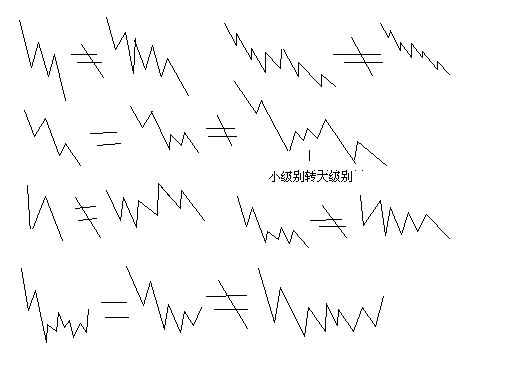{width="5.118110236220472in"
height="3.838582677165354in"}

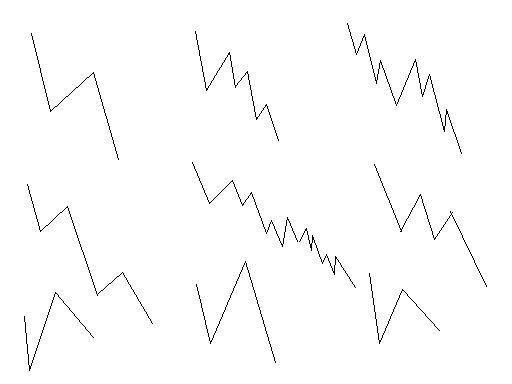{width="5.118110236220472in"
height="3.8464566929133857in"}

## 索道复栈道,风雨XX行(解盘附录)

(2007-06-25 19:03:22)

刚游山回来,当地最大几位头正在迎宾馆等着宴会.趁着换衣服的时间和各位打个招呼.本ID今天根本没看盘,两年来头一次,好好地游玩了一下.解盘等应酬后再写.对不起。

对不起，刚回来，看来和实业沾边的事情都是累人的，哪里有二级市场里杀进杀去来得好玩，至少不用应酬人，一个人，在一个光明或黑暗的角落，就可以呼风唤雨，管你天王老子，本ID该干什么是什么。但和实业相关的事情，就不是这样了。本ID今天游山的兴致，被这晚上的无聊应酬给消磨掉了，看来本ID的性格还是比较适应二级市场。

今天，留守的人都受苦了。本ID上周五说，本ID一出差，股票就不行了，希望这次有点改变，看来还是没戏。技术上，本ID在周五已经说得很清楚了"因此，并不能现在就确定该线段就走完了，除非重新突破85的4131一点。站在中枢的角度，75-84这个5分钟中枢下边在4188点，如果后面的走势不能重新站上去，就要提防形成5分钟第三卖点。"**今天的反抽，就像上周的4244,极端精确地最高到4131点，这就是一个很明确的信号，后面的下跌理所当然。**目前最关键的位置是4025点，该位置是新的1分钟中枢的下边，这位置不重新站住，大盘还有继续变坏。而3982点也是很重要，如果能重新回到上面，那至少将演化成一个新的5分钟中枢。如果连上面这个最基本的条件都不能满足，那大盘就一定以线段的形式下移到形成一个新的1分钟中枢为止，至于这个位置是多少，没必要预测，当下用背驰的方法很容易判断。

个股没什么可说的，卖点卖了，当然希望下一个买点的距离长点，这样差价才能大点，那些卖点不卖的，只能上上下下去享受了，本ID对电梯没兴趣，本ID只知道卖点出来了要卖，买点要买，你看看现在砸得狠的，日线上有哪个是好的？就看MACD也就知道有麻烦，就别说其他了。当然，跌多了，就要考虑密切关注回补的时机了，买点出现不懂得买，一根筋思维，同样是脑子水太多了。

本ID今天豪饮一把，把加起来N百岁的男猿人给震住，现在脑子里的水分也开始增加，所以不能多说了，明天，解盘时间不能定，但只要有时间，一定第一时间上来的。

看来脑子水有点多了，不是明天，已经是今天了，先下，再见。

缠中说禅2007-06-26 00:49:40

对不起，刚回来，看来和实业沾边的事情都是累人的，哪里有二级市场里杀进杀去来得好玩，至少不用应酬人，一个人，在一个光明或黑暗的角落，就可以呼风唤雨，管你天王老子，本ID该干什么是什么。但和实业相关的事情，就不是这样了。本ID今天游山的兴致，被这晚上的无聊应酬给消磨掉了，看来本ID的性格还是比较适应二级市场。

今天，留守的人都受苦了。本ID上周五说，本ID一出差，股票就不行了，希望这次有点改变，看来还是没戏。技术上，本ID在周五已经说得很清楚了"站在中枢的角度，75-84这个5分钟中枢下边在4188点，如果后面的走势不能重新站上去，就要提防形成5分钟第三卖点。"今天的反抽，最高到4131点，这就是一个很明确的信号，后面的下跌理所当然。目前最关键的位置是4025点，该位置是新的1分钟中枢的下边，这位置不重新站住，大盘还有继续变坏。而3982点也是很重要，如果能重新回到上面，那至少将演化成一个新的5分钟中枢。如果连上面这个最基本的条件都不能满足，那大盘就一定以线段的形式下移到形成一个新的1分钟中枢为止，至于这个位置是多少，没必要预测，当下用背驰的方法很容易判断。

个股没什么可说的，卖点卖了，当然希望下一个买点的距离长点，这样差价才能大点，那些卖点不卖的，只能上上下下去享受了，本ID对电梯没兴趣，本ID只知道卖点出来了要卖，买点要买，你看看现在砸得狠的，日线上有哪个是好的？就看MACD也就知道有麻烦，就别说其他了。当然，跌多了，就要考虑密切关注回补的时机了，买点出现不懂得买，一根筋思维，同样是脑子水太多了。

本ID今天豪饮一把，把加起来N百岁的男猿人给震住，现在脑子里的水分也开始增加，所以不能多说了，明天，解盘时间不能定，但只要有时间，一定第一时间上来的。

看来脑子水有点多了，不是明天，已经是今天了，先下，再见。

## 对不起刚回宾馆，解盘洗澡后附录上

(2007-06-27 00:20:58)

今天可是看盘了，但一收盘，马上被接去给N百人搞了一场演讲，然后轮番应酬，刚才回宾馆，解盘洗澡后附录上。

本ID已经有点厌倦私人股权投资了，大概需要想想，怎么可以不应酬，也可以私人股权投资一把。最让本ID信心崩溃的，是晚上竟然给拉去卡拉OK，听着那些面首们无数次走调的演唱，本ID给彻底折磨到想见人就痛扁一轮。在卡拉OK里，本ID唯一听过一个人是能让本ID满意的，一个60来岁老男人，80年代初就是师长，现在可以很轻松地唱出高音降E，王宏伟的《西部放歌》随时可以一音不落轻松唱出，本ID觉得他没学歌唱简直太浪费资源了。相貌堂堂，特爷们，可惜年纪偏大，否则，真有面首一把的冲动。

喝多了，废话就多，还是说大盘吧。今天的大盘，哦，对不起，应该是昨天的大盘，一点都没逃离昨天凌晨的解盘所画的圈。大盘就是以线段的形式下移到形成背驰后构成一个新的1分钟中枢，昨天说的3982、4025依然是今天的最关键位置，相应的分析，依然和昨天的一样。

个股方面，昨天已经说了"当然，跌多了，就要考虑密切关注回补的时机了，买点出现不懂得买，一根筋思维，同样是脑子水太多了"，具体没什么可说的，按图操作吧。

明天又要去另一个省，这是本次出来的第三站了，用大幅度震荡来清洗，消化政策等的压力，这近期的策略，前面已经说过，现在依然如此。这是一个练习技术的好机会。本周站在中线角度十分关键，这在上周解盘中已经说过，月线、季线收盘，这对中线走势，有着一定的指导意义。

对不起，现在脑子不好使，被那些五音不全的男猿人折磨得脑子生锈了，先下，再见。

## 离开某地前解解今日的盘

(2007-06-27 15:29:56)

今天一开盘就突破3982，所以就奠定了全天的强势基础，后面的洗盘不过是突破4000点后的一次回洗，让不坚定分子最后下车，然后就展开一路的上攻。1340的回调刚好在这几天强调的4025，这信号也太明显了。明天，下面看4025点能否继续站稳，上面看上周强调，周一刚好被阻击的4131点能否继续构成阻力。周四，是一个爱震荡的日子，而对周末效应的恐惧，也让明天走势震荡难免。而站在新的5分钟中枢角度，后面的走势，在该中枢第三类买点出现前，都可暂时归于中枢震荡。不会看的，就看4131点，该点没被有效突破前，关键是站稳5日线，这是今后三天大盘的关键，就是5日线要站住，否则还要大幅度震荡。

中线，留给多头去修复季度K线的时间只有两天了，这两天很关键，本ID上周就说过，如果能收在4144点1/2线上是最理想的。两天，什么事都可能发生，尽力而为吧。

个股，本ID要提出抗议了，那十几只股票，本ID不看盘就全面堕落，一看盘就兴奋，这也太不地道了。里面的其他人也要干活，别都那么好吃懒做，这样身体会变胖的。一年半载下来，就会和猪八戒为伍了。本ID什么都不会干，就是该砸的时候砸，该买的时候买，现在，这些股票都是在保持0成本赚筹码的阶段，这种游戏很好玩，各位学会的一定会上瘾的，本ID就喜欢上上下下地抽血，是不是本ID的基因里有些残暴的残留？各位，什么时候也能一起残暴，那才是炒股票而不是被股票炒。

车来了，马上要走，先下，再见。

## 一根筋是不适合玩震荡行情的

(2007-06-28 15:53:15)

应酬前抓紧时间说两句。

震荡行情是最容易玩出利润来的，但这绝对不适合一根筋思维的人。大盘的中线走势，在前面6月4日的文章里已经明确说过"而5月初给出的技术面分析依然有效，目前这1/2线已经上移到4144点，深圳成分指数相应位置在13700点，能否最终有效站稳该线，是判断中期走势是否重新趋强的关键。在此之前，大盘走势将以震荡形式逐步消化技术面、政策面的压力。其中，目前在3600点附近的5月均线将是判断大盘是否正常调整的关键，只要该线不有效跌破，那么大盘的调整在正常的范围内，否则大盘的调整时间将大为增加。"本月的走势，基本就是在这5月均线与1/2线之间的震荡，而7月，这判断依然成立，但要密切注意突破的方向，因为7月时，5月均线将上移，空间压缩，最迟8月初就要选择突破方向了。之前，就是大玩震荡，狠拉狠砸，把利润给洗出来，把差价打出来。

今天的大盘，冲不破昨天给出的4131，调整就成了必然的。然后又跌破4025点，所以调整就加大了，这在盘中都很容易判断出来。实际操作，特别对待震荡行情，就是要敢卖敢买，该卖一定要卖，反而买却不一定，特别对技术有点问题的，仓位可以控制好。当然，技术没问题的，这里就是天堂，一定要记住本ID的多次忠告：股票都是废纸，只有能弄出差价来才是抽血，否则上涨下跌不过是坐电梯，和你有什么关系？而要弄差价，用中枢震荡的手法，就是最好的，这需要刻苦的学习和练习。

把图弄上来花了点时间，图中100的顶背驰都看不出来的，102的第二类卖点看不出的，都要抓紧学习。102后面的103在收盘时还没走完，要102走完，就是要出现线段里的底背驰。而下面箭头位置，就是大盘短线的压力所在，特别是最下面一个，必须站稳，否则大盘就是最弱走势，至少要等待出现1分钟以上级别的背驰才有介入价值。

忙，晚上又有应酬，下周才能回北京，季K线收得不会太好看了，这中线的大震荡延续时间不会短，学会震荡操作，将让你在这中线大调整中获利良多，好好学吧。

多说句废话，中国第一只在德国交易所交易的股票将在7月初挂牌，这是中国第一创投公司的杰作，7月底还有韩国交易所的第一只股票，这两枪打响后，估计私人股权投资要加温了。

先下，再见。

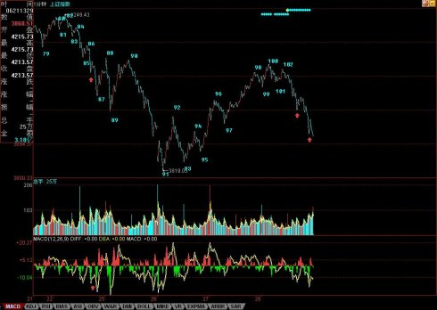{width="5.6299212598425195in"
height="4.0078740157480315in"}

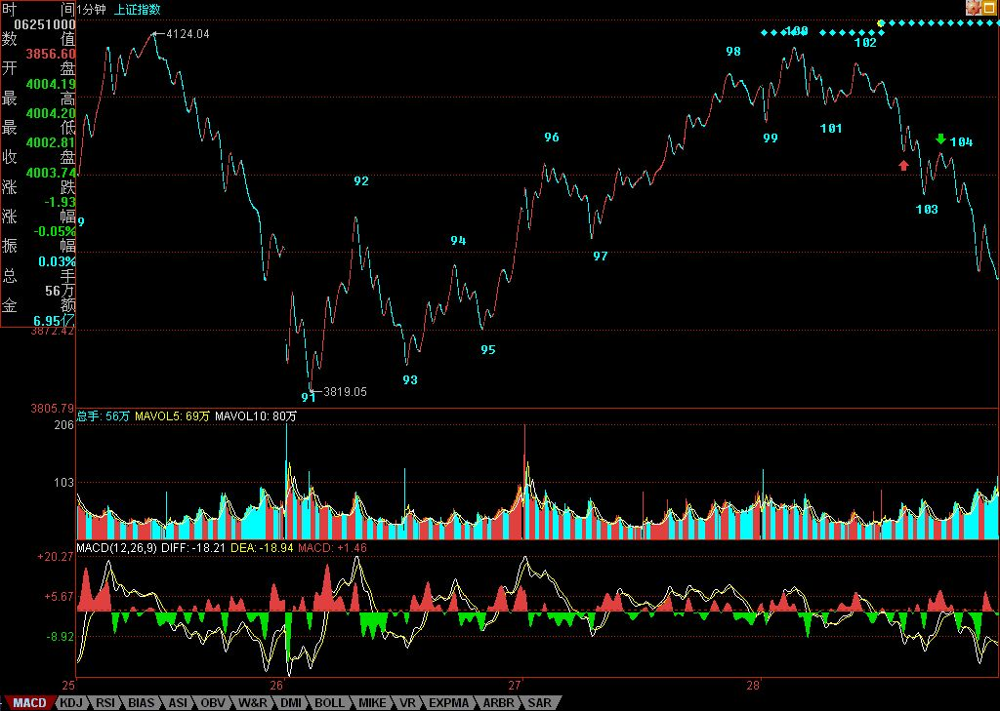{width="5.629861111111111in"
height="4.00625in"}

附录：

刚打开电脑，上来看看，发现有人对昨天的线段分法有疑问，这问题以前说过，就是关键是看你用多大的精确度。下图中，红箭头处是4022.69，绿箭头处是4022.42，按最严格的标准，精确到小数点后两位，这就没破坏原来的线段，所以就不是新的线段。当然，如果统一按个位数是精确度，直接取整，那么这就等于两处有重合，那按这标准，就可以定义为新线段（像下图一样）。但如果按四舍五入，那前面是4023，后面是4022，就不能这样定义了。

新线段的一个最重要标准就是一定要破坏老线段的结构，例如下跌的线段，后高点一定低于前低点。

为了照顾各位的习惯，也为了简单，以后就统一标准，用直接取整的办法来确认。所以，线段分类就可以改用下图了。

先下，下午收盘后见。

缠中说禅2007-06-29 08:58:09

附录：

刚打开电脑，上来看看，发现有人对昨天的线段分法有疑问，这问题以前说过，就是关键是看你用多大的精确度。下图中，红箭头处是4022.69，绿箭头处是4022.42，按最严格的标准，精确到小数点后两位，这就没破坏原来的线段，所以就不是新的线段。当然，如果统一按个位数是精确度，直接取整，那么这就等于两处有重合，那按这标准，就可以定义为新线段（像下图一样）。但如果按四舍五入，那前面是4023，后面是4022，就不能这样定义了。

新线段的一个最重要标准就是一定要破坏老线段的结构，例如下跌的线段，后高点一定低于前低点。

为了照顾各位的习惯，也为了简单，以后就统一标准，用直接取整的办法来确认。所以，线段分类就可以改用下图了。

先下，下午收盘后见。

## 解盘并说说中短线走势

(2007-06-29 15:45:10)

昨天解盘中已经说到，如果图中红箭头所指位置不能突破，那么大盘就是最弱走势，今天，大盘盘中的反弹就刚好被这位置3919点所压制，一点都不差，这就如同前面的4244、4131等一样，都是极端精确的。谁告诉你本ID理论没有预测功能的，只是预测都是无聊玩意，没必要浪费时间。关键还是当下的操作。

今天105的背驰十分简单，但由于前面没有明确的1分钟中枢，所以这种背驰一般都只构成盘中的意义，昨天已经说过，只有1分钟以上级别的背驰才有参与意义。目前交易成本这么贵，又不是T+0，所以不熟练的，一定只能参与一些大级别的活动，太小的，估计只能用在权证或特别强势的股票上。但技术好的除外。今天，这样的震荡可以又吸出不少的血。

由于季线有500点的上影，所以该上影将一路压制7-9月的走势，本ID的那条1/2线，下月将上移到4159点，在站稳该线之前，大盘不可能展开象样的行情，只能如本ID6月4日文章所说，就是一个大震荡。下月的关键是5月均线，如果不破，那么大盘还有机会走三角形的整理，否则，一个平台型是不可避免的。本ID在6月5日反弹时已经明确说过，这个反弹最终不可能演化成V型，现在看来，最强的也就是三角形，其次是平台型，所谓平台型，就是要再次考验6月5日的低点。

当然，现在大盘依然存在走三角形的可能，下周是关键，5月均线不能有效跌破，而好的介入时机，还是至少是1分钟以上级别的背驰，反弹的压力，3919以及最重要的是5周均线。对于技术不好的，对震荡行情没把握的，在5周均线重新站稳之前，都可以不参与任何活动，多读点本ID的帖子更好。但是，像技术好的，如同本ID般经常要活动一下才舒服的，就可以在震荡行情中大吸其血。

注意，玩震荡一定要等适合自己资金的针对具体个股的较大买点，然后到较大级别卖点一定要卖，否则就是坐电梯，没意义了。这种活动必须多练习才有感觉的，如果觉得自己没有这方面的天赋，那就少弄，上网多弄419算了。

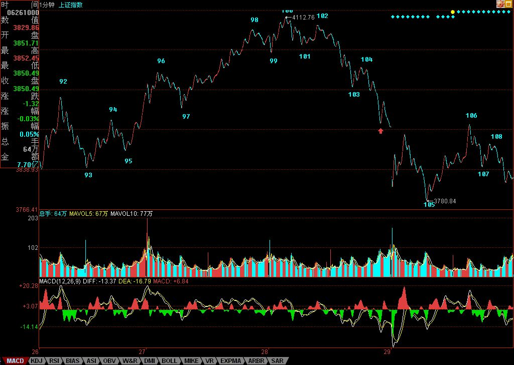{width="5.302083333333333in"
height="3.773199912510936in"}

晚上还有应酬，先下了，本周的音乐会也没法开，就用各自猛烈的腐败活动去替代。

周末，腐败快乐。

## 教你炒股票62：分型、笔与线段

(2007-06-30 09:49:51)

在宾馆里闲着等着10点开始的腐败，半个小时，找个面首来面首有点时间紧张，还不如给各位写个主贴，来个课程，耗费一下各位周末腐败的时间。

瞧了一下，有位叫石猴的网友写了帖子来解释什么是线段，他的理解还行，但不够严密。其实，本ID的线段是可以最精确定义的，本ID的理论，本质上是一套几何理论，其有效性就如同几何一般，本ID理论当然有失败不严谨的时候，但这前提是几何的基础失败不严谨，不明白这一点，就不明白本ID的理论。这里，就把本来是后面的课程提前说说。

下面的定义与图，都适合任何周期的K线图。先看图中的第1、2，图中的小线段代表的是K线，这里不分阳线阴线，只看K线高低点。

{width="5.12207239720035in"
height="3.7194247594050744in"}

像图1这种，第二K线高点是相邻三K线高点中最高的，而低点也是相邻三K线低点中最高的，本ID给一个定义叫顶分型；图2这种叫底分型，第二K线低点是相邻三K线低点中最低的，而高点也是相邻三K线高点中最低的。看不明白定义的，看图就明白了，这么直观都不明白，那去和孔男人为伍吧。

顶分型的最高点叫该分型的顶，底分型的最低点叫该分型的底，由于顶分型的底和底分型的顶是没有意义的，所以顶分型的顶和底分型的底就可以简称为顶和低。也就是说，当我们以后说顶和底时，就分别是说顶分型的顶和底分型的底。

两个相邻的顶和底之间构成一笔，所谓笔，就是顶和底之间的其他波动，都可以忽略不算，但注意，一定是相邻的顶和底，隔了几个就不是了。而所谓的线段，就是至少由三笔组成。但这里有一个细微的地方要分清楚，因为结合律是必须遵守的，像图3这种，顶和底之间必须共用一个K线，这就违反结合律了，所以这不算一笔，而图4，就光是顶和底了，中间没有其他K线，一般来说，也最好不算一笔，而图5，是一笔的最基本的图形，顶和底之间还有一根K线。在实际分析中，都必须要求顶和底之间都至少有一K线当成一笔的最基本要求。

当然，实际图形里，有些复杂的关系会出现，就是相邻两K线可以出现如图6这种包含关系，也就是一K线的高低点全在另一K线的范围里，这种情况下，可以这样处理，在向上时，把两K线的最高点当高点，而两K线低点中的较高者当成低点，这样就把两K线合并成一新的K线；反之，当向下时，把两K线的最低点当低点，而两K线高点中的较低者当成高点，这样就把两K线合并成一新的K线。经过这样的处理，所有K线图都可以处理成没有包含关系的图形。

而图7，就给出了经过以上处理，没有包含关系的图形中，三相邻K线之间可能组合的一个完全分类，其中的二、四，就是分别是顶分型和底分型，一可以叫上升K线，三可以叫下降K线。所以，上升的一笔，由结合律，就一定是底分型+上升K线+顶分型；下降的一笔，就是顶分型+下降K线+底分型。注意，这里的上升、下降K线，不一定都是3根，可以无数根，只要一直保持这定义就可以。当然，简单的，也可以是1、2根，这只要不违反结合律和定义就可以。

至于图8，就是线段的最基本形态，而图9，就是线段破坏，也就是两线段组合的其中一种形态。有人可能要说，这怎么有点像波浪理论，这有什么奇怪的，本ID的理论可以严格地推论出波浪理论的所有结论，而且还可以指出他理论的所有不足，波浪理论和本ID的理论一点可比性都没有。不仅是波浪理论，所有关于股市的理论，只要是关系到图形的，本ID的理论都可以严格推论，因为本ID的理论是关于走势图形最基础的理论，谁都逃不掉。

不能再废话了，下面车来了，腐败开始，大家也腐败去吧。

## 必须和企图捣毁共和国基础的舆论进行坚决斗争

(2007-07-01 12:06:06)

本ID眼里揉不进沙子，汉奸配合美国人对中国的颠覆是全方位的，趁着午饭前的十分钟，必须写几句。

最近，有人开始有计划地去反思所谓土改的旧帐，说什么分地即全体犯罪、土改是忽悠农民造反、地主其实都是老好人，诸如此类。任何人要摧毁一个国家，最简单就是从其历史下手，美国这面首的历史，从来都是最肮脏的，但谁在粉饰？历史本来就是铁和血，用某种绝对的道德标准来摧毁历史，就是这些人的一贯伎俩。但历史从来不是道德的，历史无法摧毁，所有对历史的谈论、摧毁，都不过为了现实的利益服务。

新中国当然要砸破一切旧的法律，这有什么可说的？企图用旧中国法律来规定新中国的行为，无聊且可笑。农民，把一切现存的当成天经地义的，就是要忽悠他们，告诉他们没有任何现存是天经地义的，一切生产关系，都是要被历史所打破的。地主，被个体的消灭，无须什么矫柔造作的眼泪，历史就是这样，历史就是铁和血。

被忽悠的，都是能被忽悠的。历史的真理就是：被忽悠的都是能被忽悠的。谁有本事，现在忽悠大家重新回到原始社会吧，看能还是不能？历史的另一条真理就是：对待忽悠，可以用忽悠对待，也可以用枪杆子对待，而且历史最终都在证明着，不懂得枪杆子，放弃枪杆子的，不是别有用心，就是天字一号的大傻蛋。

好了，十分钟快到了，先下，再见。

## 教你炒股票63：替各位理理基本概念

(2007-07-02 00:07:39)

在外面时间有点长，再好的宾馆也没家里好，有点想北京。明天就可以回北京了，3号还要去听一场音乐会。不过在北京也待不了几天，下周又要去一次深圳，唯一希望就是能赶上最后的荔枝，糯米糍、桂味什么的，在北京吃不到好的，不知道是否过了季节。闲着没事，就随手写一课程，希望对各位有帮助。

一个对象的确立，特别是一个数学和几何对象的确立，首先要证明其存在性，如果你说的那东西根本就不存在的，那还说什么？例如中枢或走势类型这对象，如果不能证明其一定存在，而且是按级别存在的，那谈论就没意义了。所以，前面关于中枢的递归定义，就是解决这个问题的，是解决存在性问题。也就是说，中枢是可以递归式地定义出来的，而该定义是可操作性的，该定义实际上是如何找出中枢的一种方法，按照这种方法，就肯定能找出定义中的中枢。

但是，光是存在性定义或定理没什么意义，所谓的可操作性，有时候只是理想化或者数学化的，例如，可以证明自然数的质数分解是唯一的，而且可以很理想化地去设计这种寻找，但实际上用最大的计算机也往往不可能完成，因此就需要变通的方法来方便实际操作。同样道理，对于中枢和走势类型，也就有了关于不同级别的图形的研究。否则，都从最原始的分笔成交去逐步定义、寻找，那这可操作的操作也没什么操作性了。

进而，就有了不同级别显微镜的比喻。而实际上，一般能得到的图，最多也就是1分钟级别的，因此，可以从这个图入手。当然，也可以从5分钟，甚至更高入手，但这就等于把显微镜倍数弄小了，看到的东西自然没有1分钟的多且清楚。再次强调，什么级别的图和什么级别的中枢没有任何必然关系，走势类型以及中枢就如同显微镜下的观察物，是客观存在的，其存在性由上面所说最原始的递归定义保证，而级别的图，就如同显微镜，不同倍数的看这客观的图就看到不同的精细程度，如此而已。所以，不能把显微镜和显微镜观察的东西混在一起了。

如果我们首先确立了显微镜的倍数，也就是说，例如我们把1分钟图作为最基本的图，那么就可以开始定义上一课程说的分型、笔、线段等等。有了线段，就可以定义1分钟的中枢，然后就是1分钟的走势类型，然后按照递归的方法，可以逐步定义5分钟、30分钟、日、周、月、季度、年的中枢和走势类型。而有的人总是不明白，例如总是在问，5分钟图怎么看，30分钟怎么看，其实，如果你选择5分钟或30分钟为最基本的图，那么和1分钟的看法一样，只不过你的显微镜倍数比较小，看起来比较粗糙而已。而如果你已经选择1分钟作为最基本的图，也就是选定了1分钟这个倍数的显微镜，那么看1分钟图就可以，所以，本ID也就不断在1分钟图上进行线段的记号来示范。

那么，有人可能要问，如果用1分钟图这显微镜，5、30分钟等图还有用吗？当然也是有用的，例如走出一个1分钟的走势类型，已经完成了，就可以在5分钟图上相应记号上，这样的一个好处就是帮助记忆，否则当1分钟图上的线段成千上万时，肯定要抓狂的。而有了5、30、日等图，就把相应已经完成的走势类型记号上，实际上，在1分钟图上需要记住的，只是最近一个未完成的1分钟走势类型。当然，由于分解的多样性，实际上需要知道的要多点，这里只是站在一种分解的角度说的。另外一个好处就是看MACD辅助判断时，不用对太多的柱子面积进行相加，可以看大级别的MACD图，这样一目了然。日线的背驰，其实在1分钟图上也可以看出来，只不过是需要把所有相应对比段的MACD都加起来进行处理，这样当然是不切实际的，因此就可以看日线图的MACD，在理论上没有任何特别之处，只是为了方便，如果用1分钟的MACD把参数调到足够大，效果其实是一样的，而实际上不可能，一般软件上，MACD的参数有上限限制，所以实际上也限制了日线的背驰不能用1分钟的图解决。

有人可能又要问，为什么5分钟图上不记号5分钟的走势类型？因为，在大级别图上记号次级别的走势类型有一个好处，就是能让你清晰地看到该级别的中枢和走势类型是如何形成的，这样会更直观。当然，如果在5分钟图上，你愿意记号30分钟甚至年线的走势类型也没什么，这是个人爱好问题。如果你有超强的记忆和分析力，甚至就在1分钟上记号就可以，如果你更牛一点，对图形过目不忘，像计算机一样自动就可以分类合并，那你在1分钟图上连记号都不用了。

说点更实际的问题，一般人面对一只股票，不可能就先看1分钟图，大概都是先从日线，甚至周、月、季、年入手，这样等于先用倍数小的显微镜，甚至是肉眼先看一下，然后在转用倍数大的，进行精细的观察。因此，对于大级别的图，上一课中的分型、笔、线段等同样有用，不过，一般这个观察都是快速不精细的，所以大概精确就可以，而且，一般看图看多了，根本就不需要一步步按定义来，例如，打开日线图，1秒钟如果还看不明白一只股票大的走势，那就是慢的了。基本上说，如果图看多了，成了机械反应了，一看到可搞的图，就如同看到可搞的面首一样。一见钟情，科学研究说大概不需要1秒，股票如同面首，如果不能1秒之内一见钟情，估计这股票也和你没什么缘分，最多就是有缘无分空折腾了。

别觉得本ID整天把股票和面首联系在一起有点不太地道，但人这身体都是从性而来，股票的道理和性的道理没什么区别当然也没什么可奇怪的，这道理在前面的课程里已经说过。如果，你能把你的性能量转化到股票上，有了那种一见钟情的直觉，那么就算是有点入门了。而前面的理论分析，最终还是要归到这种直觉上去。说得更直接一点，例如在419这种事情上，无论男女，其实决定是否419，都是在1秒内决定的，股票同样，是否和股票419，也一样。当然，有些419让后悔终生，有些让你怀念终生，这和股票是一个道理。而真正的419高手，就是一眼就要把一个人给看透，而且知道自己需要什么，该要什么，什么不该要，要了的要甩得开，如雁过长空，否则就不是419了。股票也一样，股票的走势如同面首在搔首弄姿，一眼要看穿其把戏。当然，股票比面首可爱的地方在于，面首的搔首弄姿只有一个方向，而股票有三种可能的状态，这也决定了，面首面首是有厌倦的时候，而股票股票则不一定。

但在没有这看破一切的一眼前，就别把自己当情圣了，老老实实在家里抱孩子吧，花心萝卜是需要功力的。股票也一样，没有这超越的直觉，还是老老实实去分析，在大级别图粗略选定攻击目标后，就要选好显微镜，进行精细的跟踪分析，然后定位好符合自己操作级别的买点建仓，按照相应的操作级别进行操作，直到把这股票玩烂、直到厌倦或者又发现新的更好的可玩弄对象为止。而站在纯理论的角度，没有任何股票是特别有操作价值的，中枢震荡的股票不一定比相应级别单边上涨的股票产生的利润少。

只有坏的操作者，没有坏的股票。股票只是废纸，本质上都是垃圾，如果技术、心态不到位，任何股票都可以让你倾家荡产。当然，对于小资金来说，一定要选择股性好的股票；而对于大资金来说，股性是可以改造的，就如同没有面首是不可以面首的，只是代价不同而已，股票也一样，任何股票的股性都可以被改造，只不过需要的能量不同而已。

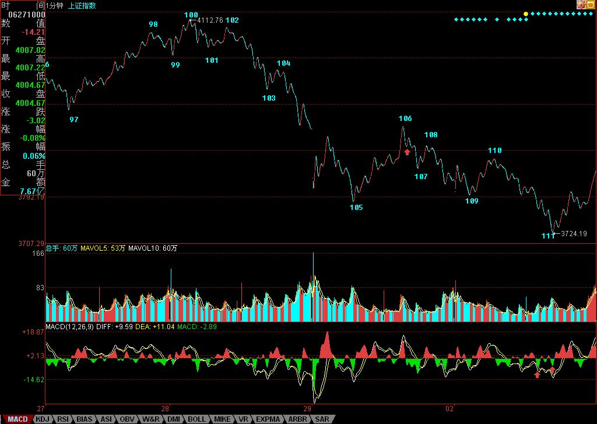{width="5.6299212598425195in"
height="4.0065048118985125in"}

不写了，已经又一天开始了，本ID也要洗洗睡了，先下，今天收盘后解盘见，然后本ID晚宴后赶最后的班机回北京，归心似箭，周二，盘就可以在北京看了，再见。

## 解盘：今天看不明白的都请严重补课。

(2007-07-02 15:32:58)

今天的走势，简直是标准教科书，连这都看不明白，你要严重补课了。下图中110点的线段里的小顶背驰，111点的小底背驰，都是极端标准的。111点，看不明白的，看看MACD里那两个红箭头指着的绿柱子面积比。如果还有人问，为什么前面的不是，就一定要把分型、笔、线段那课以及63那课好好看了。图中红箭头处，趁着现在1分钟图还能看到，请去好好研究那为什么是一笔，那底分型是怎么构成的，这都有最严格的标准。

至于走势，没什么可说的，就是震荡，这里是本ID理论的天堂，如果说单边势傻瓜都能赚钱，那么这种市场，就不是一般人能把握的了。能把握，就有了一个好的吸血机器，练习好了，那算有点模样。具体的中枢分析，本ID不准备说了，有这么明确的线段划分，按照递归定义，答案不难得到，如果这都不练习一下，那就没法学了。大的技术位，和周五说的没什么不同，唯一需要补充的，就是图中107这一点，如果能站稳，至少这中枢震荡是有保证的，上面还是3919点是第一压力，现在，等于成了一颈线位置了。再上面，就是5周均线的位置。大图上说，今天是受到5月均线的支持产生的反弹，这线最重要，三角形还是平台型，就看这5月均线是否有效跌破了。

注意，再次强调，这种震荡行情，没什么基础的，最好就观望，半仓、空仓都无所谓，没这本事，就不一定玩这游戏，当然，如果你要学习，要练习，可以用少量资金。对于初学者，震荡的原则就是，宁愿卖早，一定不卖晚，有钱，还怕买不到股票？

个股方面，本ID那些股票各位都知道，除了新进去的二、三只，本ID现在是在保持0成本赚筹码阶段，震荡幅度越大越高兴，技术不好的、心脏不好的，千万别参与，找些脾气好点的股票，本ID的股票，一般脾气都不大好。

先下，下午、晚上，忙，还要赶回北京。明天见。

## 教你炒股票64：去机场路上给各位补课

(2007-07-02 21:37:44)

现在的课已经越来越精细，特别用的是最小的1分钟，一般的理论，在这么精细、偶然性那么大的图上都要乱套了，但却恰好能显示本ID理论的有力。别说1分钟图，分笔图也没问题，这就是本ID理论所构筑几何结构的力量。世界都是几何的，别说那几张无聊的走势图了。

看下图，为什么下午的分段是这样？大概很少人现在就能全部搞清楚，所以，为了让各位能睡一个塌实觉，也为了免得等一下飞机万一不听话，到时候只留下各位在这里争论不休没人再给解答，所以本ID在去机场的路上用本本给各位补上一课。

{width="5.629861111111111in"
height="4.004166666666666in"}

106到107这一段箭头所指的那一笔，用的是取整的前提，所以，只要你仔细去分析，就知道那一定是一笔。这个问题，本ID瞧了一下，见一位叫[快乐vs菜虫](http://blog.sina.com.cn/u/1224589325)的网友已说到。当然，你可能要问为什么一定要取整？这没有什么必然性，只是预设的前提，你可以采取严格到小数后两位的精确度，但其实不同软件，对1分钟这么精细的图，都会有数值上的细微差别，所以，所谓的精确，往往不一定就是，而在这么快速变动的市场中，数值有点细微差别，其实没什么不同，例如，还可以用这样的区别方式，就是两者相差0.5点内的看成是一样的。所有预设精度，唯一必须遵守的，就是精度一旦预设，就一定要一路保持。

注意，没有什么精度是十全十美的，例如用相差0.5内看成是相同的，那么如果是0.51呢？这和0.49也没有多大区别。所以这些细节，其实问题都不大，关键是要统一，不要变来变去。由于现在只是示范，为了方便各位学习，就一直继续采用取整的精度，各位可以根据自己的情况来调整。

至于108-109，带箭头那笔为什么不被算成一段？也就是108-109为什么不是三段？这很简单，因为段必须是至少三笔构成，缺口如果包含在一笔中的，像今天早上低开的缺口，没有破坏昨天那笔，是顺着昨天那笔下来的，所以这种缺口和一般的走势没什么区别，缺口还是包含在昨天的一笔里。但有些突然性的逆着走势来的缺口，就像530那个，就必然要当成一段，而不能光当成一笔或一笔里的了。有人可能说，缺口没有三笔？那你可以这样去看，就像0=0+0+0，缺口可以看成是三个缺口的迭加，这样就有三笔以上了。还有，有位叫袖手旁观的网友理解得也不错，线段必须要被破坏才算结束，但必须要强调的是，线段必须要被线段破坏才算是真破坏，单纯的一笔是不能破坏线段的，这就避免了一些特偶然因数对走势的干扰。

至于110-111。红箭头那两个为什么不是最终精确定位的背驰点？这都是些以前就应该解决的简单问题。像第一个红箭头位置，第一次略微跌破109那位置，这时候把已经出现的面积和前面108-109的对应面积之和比，已经十分接近，也就是说110-111，刚起跌，这力度已经和前面的108-109差不多，这恰好说明这一段的力度是很强的，不但不可能是对108-109背驰，而且站在中枢震荡的角度，这种力度，一定是小级别转大级别以时间换空间或与更大力度的对比产生的背驰才能化解的。后面这种情况，在这个实际的图形中，就是与前面104-105的下跌力度比。110-111这段，相比较的，是104-105这段，中间的中枢震荡的中枢，是105到110这个。因此，这里根本不存在与108-109对比的问题。站在105-107这个中枢的角度，110虽然不构成第三类卖点，但也极为接近，这种对中枢的离开，力度一般都很大，所以就算你搞不清楚和哪段比，也至少要等这段的结构被破坏，才有介入的可能，而后面，上下上的两次反抽，根本就没有破坏其结构，因此后面的破位下跌就是天经地义的。

{width="5.629861111111111in"
height="4.004166666666666in"}

机场到了，先保存起来。

挺好玩的，帖子分两段写，中间过一安检。继续。

至于第二红箭头那个，就更不可能是了。绿箭头那次反抽，等于对前面破位前那上下上的微型类中枢（注意，站在严格意义上，线段以下是没有中枢的，所以说是类中枢）的一个类第三类卖点，后面有两种变化，就是转大级别类中枢或类中枢移动直到形成新类中枢为止。而下面的黄白线，是一个典型的下上下结构中的第二下刚破上的低点，这是力度最大的一下，怎么可能有背驰出现？MACD第一个红箭头就指这大的下上下破的一下，这时候除非出现线段结构的突发性破坏，否则不可能有什么背驰出现。而后的回拉，其实刚好构成一个奔走型的上下上结构（也就是第二上刚和第一上的低点稍微重合），这其实也就构成另一个微型类中枢。这和第一个红箭头指的那个一起，刚好构成两个类中枢的下跌走势。然后，后面的背驰判断就很简单了，和一般的趋势中背驰的判断一样。针对第二那奔走型的微型中枢的前后两段，MACD两个红箭头对应的绿柱子的比较，一目了然。（千万别再问这时候为什么不看黄白线之类的问题，这类问题回答过N次了。）

请各位好好把各类情况消化好，特别一些最基本的知识，一定要掌握，62、63课，要完全吃透，而且能当下应用。当然，这需要不断练习，不断研究不同的图形。

本ID就不再说什么了，准备登机。回到北京，也快第二天了。

先下，明天见。

## 今日解盘：3919颈线折磨你

(2007-07-03 15:30:02)

**一回来，N多的腐败活动，今晚又要看演出，所以只能粗略说说。今天的大盘，就是在这N天反复强调的3919颈线下进行的蓄势，现在，图形上头肩底的雏形已经基本按剧本构造完毕，但如果颈线突破不了，那还是白搞。现在，人心涣散，谋事能成的概率，当然没有前面的多了。现在，剧本中最好的情节，就是走三角形，这次上去是D段。但这次的把握性，比上次B段那次要差，剧本只能按每天一步步演，下面最关键的就是这颈线的突破与回抽确认，但现在人气涣散，最主要是现在有些人，不断放暗枪，特别那些等额度的，肯定不想上，希望走平台型，因此不断捣乱。而走三角形的，又不一定很团结，只能见一步走一步，但本ID会尽力的，能走到哪里算哪里。**

**今天本ID已经足够出力了，16只里3只9%以上，而且还有其他活不能公开的，也算本ID回北京第一天的一个见面礼了，但本ID从来不当解放军，只是煽风点火、顺势而为，别指望本ID当举杠铃的。那种一根筋的多头思维，是典型的散户思维。**

**注意，一旦大盘不配合，本ID依然如前面那些，砸起来比谁都凶。本ID现在是保持0成本赚筹码阶段，最喜欢的就是砸盘。当然，只要大盘人气配合，本ID依然会轮动，但一定不会当解放军。**

**废话不想说了，今天的分段太简单，具体的明天一起给出。先下，4点有一个会，沟通一下思想，然后晚上看演出，明早见。**

## 有些市是必须逆着而为的。

(2007-07-04 15:45:01)

**散户多是墙头草，但如果所有的中国人都成了墙头草，那么，中国金融市场等着被人宰割的日子就不远了。昨天已经说了，那些正在等额度的，都希望走平台型，3000点下的时候，本ID也逆过一次市而为，当时博客都有部分记录，那次，这些汉奸与目前等额度的一批，希望从3000点下一直回到2000点下做一个大差价，但最终他们没有得逞。看看这里春节前后的帖子，就知道斗争的激烈。**

**这次，道理一样，那些等额度的，希望他们新增加的额度能够买到他们所谓符合投资价值的股票，而国内配合他们的，其他跟着他们的，都在暗地里使坏，这在昨天的解盘里已经说过。这时候，必须有人站出来，就像春节前3000点以下，那罗美国老头忽悠时，必须有人站出来。那次，本ID站出来了，这次也一样，现在的战役，就是不能让汉奸与等额度的人得逞，3000点那次，汉奸和等额度的人大败，这次，条件更险恶，但有些事情是必须干的，就像上次在3000点下，本ID就说过，有些事只能北京人干，北京人就是牛B，就像昨天在人民大会堂唱响国际歌。**

**技术上，压力惊人，但有些事情，就是要逆市而为。今天早上，两次的冲击，完全没有任何人跟进，所有的散户都落荒而逃，汉奸和等额度的不断犯坏，看看今天中石化等指标股上，再看看今天代表指标股的白线一直在黄线之下就知道了。但这次，汉奸和等额度的还是落空了，指数是跌了，但今天的游击战术还是成功了。**

**现在，就是要放弃指数，对所有有中长线价值的股票进行战略性建仓，让汉奸们、等额度的人，就算真打出平台型，也买不到好股票。整体上市、大重组、中小盘成长股票，都是可以游击战的领域，就让汉奸们去砸指标股好了，指标股不是不出手，而是要等待时机，时机一到，游击战就要转化为大兵团作战，就像3000点那次本ID演示的联通与中行一样。**

**对于散户来说，你们那些都是糊口的钱，没必须在这么血腥的斗争中坚持，就像八年抗战，在上海，不一样有很多面首活得很好？这样，抗战胜利不一样能分点好？这世界上，除了当汉奸，还可以当顺民，管他是日本人还是美国人。但本ID不可以，真正的北京人都不可以，本ID就是看不了汉奸和等额度的鬼子得逞，本ID的钱都不等着花，钱是留着买子弹，打鬼子和汉奸的。**

**现在的环境有什么可怕的，95年那么凶横的环境下，一样能掀起一轮轰轰烈烈的重组行情，而带头的，还记得是哪里的股票吗？昨天，在人民大会堂可以唱响国际歌，在最凶险的走势中，一样可以唱响游击队之歌。**

**技术没什么可说的，颈线不能放量突破，图形自然受到破坏，大盘最坏的情况，就是进入缩量阴跌，散户的对策，本ID已经多次说过了，如果你没有技术、没有资金实力，那就半仓甚至空仓去当顺民，等待抗战胜利的机会然后再出来。**

**而对于有一定实力的资金，就选好目标，现在的股票也不过就1000来只，难道中国还没有1000多的游击队，在每个适合的股票上进行游击战？本ID已经选好目标了，你们呢？**

**好，不说了，没有资金实力的，就按技术来，唯一需要再次提醒的，就是要放大操作的级别，特别技术好不太好的。**

**但，只要给本ID一个机会，反攻是必然的，在拉锯中消耗汉奸和鬼子，这就策略。**

**先下，后面还有一大堆事情等着，不能多说了，再见。**

## 凭空接坠石，依然开弓没有回头箭

(2007-07-05 15:43:43)

**所有的战役都不是一天能完成的，现在，进行的是一项不可能完成的任务，谁都知道，技术上周线刚破位，所以的技术指标与大的环境都不可能让这样的任务完成，但本ID既然这样选择了，就义无返顾。今天，是指标股被全面打压的一天。上下午两次的介入，同样50点的反弹，都以失败告终，但开弓没有回头箭，抗战必须坚持而且继续坚持，每一次的阻击，都是一次拉锯与消耗。没有正面的阻击，游击战争是开展不起来的。看看今天中石化等放出的量就知道了，虽然这是凭空接坠石，但必须接。而且，这也是以后需要的一些基本筹码。**

**今天的能量消耗不大，只属于试盘阶段，现在重点在三大领域，就是整体上市、大重组、中小成长股，这是与指数无关的。技术上，必须依靠年线，那些没有回到年线的股票，都不足以支持。但，这样的战役，靠一方力量是不足以完成的，像今天的两次反抽，最后都是因为没有呼应而夭折。但，明知道失败也要干，对技术指标上的战术准备，这两次反弹也是必要的。**

**但战争有其规律，不能莽撞，技术上，所有的因数都有利于汉奸与等额度的，但所有技术都是合力的结果，本ID站出来，而且将继续义无返顾地干下去，就是要改变着合力，这合力是由每个人组成的，这是一场成功率只有1%的战争，每多一份努力，都是值得的。而改变合力，最终都反映在某级别的买点上，本ID就是要在逐步的分级抵抗中，把大级别的买点给构造出来，这就是今后一段时间的任务。**

**好了，最终需要的工作太多，不能多说了，先下，再见。**

## 和散户网友说说现在的形势与任务

(2007-07-05 23:04:16)

**首先，必须要明确，各位的状况和本ID有很多本质的不同。各位也知道，本ID6月后就忙于PE的事情，可以很明确地说，本ID一部分资金已经分流到PE上去，也就是说，就算本ID这次大败，依然有翻身重来的机会，而且一定可以翻身重来。正因为有这样的背景，所以各位第一不用为本ID担心，第二必须知道，本ID这样干并不是不顾后果的意气之举，而是进退有度的。**

**其次，本ID必须在这时候站出来，败了，大不了当股东，哪天本ID心情不好，找一个面首收购了自己当大股东算了，当然，这就成了走唐家兄弟的老路，没什么意思。或者，再折腾几年，等本ID厌倦了，就不玩了，出来玩文化也很好。而各位并没有本ID如此自如的进退之路，所以，一定要量力而行。**

**因为本ID知道的太多，所以必须要干上这一仗，当然，这里不光是本ID自己的，本ID在市场上干过这么多事情，联合点人干点事，还是没问题的。站在纯技术的角度，这样干，绝对是脑子进水，但人，有时候脑子就是要进点水，特别当这事必须干时就更应义无返顾。本ID当然知道自己理论中耐心等待买点的道理，但站在实际层面，本ID必须追究，这个买点不能如1000点那样被汉奸了。站在纯技术的角度，本ID现在的所有行为都是错误的，正如站在所谓纯人性的角度，用胸口顶枪口肯定是有病的，但人，有时候就是要病上一病。**

**但对于一般的散户，完全没必要参与这种活动，各位应该利用市场机会去壮大自己，没必要干用胸口顶枪口的傻事。对于各位来说，根本不需要知道这市场的买卖点是如何合力构成的，你们只需要知道合力的结果，根据结果进行操作。**

**目前的技术形态，站在最恶劣的角度，如果是对整轮行情的一个中级调整，比较极端的幅度是2/3，也就是说，调整到2100点也是毫不奇怪的，所以，没必要有任何站岗的无聊思想。学了本ID的理论，唯一需要坚持的就是根据自己操作级别，买点买，卖点卖。等各位有这个能力后，才学本ID如此一病吧。**

**市场就是战场，一旦开战，在战场上，就是无情的，本ID只考虑如何去夺取战争的主动权，这里，一切手法都可以用上，本ID不希望在打仗时有什么顾虑，在战场上，分不清什么散户、机构。而且本ID这次战役的目标，也不是当什么解放军，只是要打乱某些人的节奏，让某些人的目的不能得逞。如果一定要硬加上一个解放军的任务，只能是两头不着边。解放军只能是一个顺带的任务，而不是战役的前提。所以这盆冷水，本ID是一定要泼的，本ID从来都实话实说，不想让人有任何不切实际的误解。**

**对于散户来说，市场中的真正的解放军，只能是你自己，你要掌握好技术，要对股市有充分的理解，要明白股票都是废纸，要知道，股票只是抽血的凭证。然后，放下一切幻想，如果有可能就学好本ID的理论，看图作业，这才是散户战胜市场之道，只有自己壮大了，才是对汉奸和鬼子最大的打击。而本ID有这个能力，当然需要更多的承担，这必须要分清楚。**

**本ID这次的任务，不是原来那16只股票可以完成的（这些股票，中长线的角度依然会关照的，对他们，都是保持0成本增加筹码的阶段），本ID现在正在开辟新的战场，介入一些对股市更有影响的品种，大致方向本ID已经说了，就是整体上市（包括中字头）的、大重组（包括老树发新枝那种）、中小成长。技术上，都是有年线可以依托的。本ID不可能去接什么基金、甚至汉奸的高位股票，那真有病了。但像中石化、联通等指标股，当然是需要慢慢控制的，否则，就没有话语权了。逐步，将慢慢掀起整体上市、大重组、中小成长的行情，把整个不利的局面扭转过来。**

**现在，要把人心扭转，不是一天半天的事情，必须有股票，逐步走出有号召力的行情来，才会得到市场的响应。当然，这市场不是本ID的，其他有实力的，如果都能选择好攻击对象，为市场的稳定和对汉奸的阻击给出自己的贡献，那么本ID的星火最终就可以燎原。而市场好了，解放军自然就来了，这才是根本之道。**

**光有热血，当义和团，是打不赢汉奸鬼子的。先下，再见。**

**散户三大纪律**

**一、只用空闲的钱参与市场**

**二、必须等大兵团作战有结果才介入，要等大级别的买点。即使是本ID输了，汉奸鬼佬赢了，他们最终也是要搞上去的，这种，复仇的种子才能保存，楚虽三户可亡秦，有种子就有希望。**

**三、坚决不抬汉奸鬼佬的高位轿子，要练好技术，从底位开始，逐步抽光他们的血。**

## 以黄河名字展开的绝地反击

(2007-07-06 15:50:50)

今天一大早，本ID先把博客的个性图片换成了本ID写的《满江红》，再把《黄河大合唱》中选了四段，按交响乐的形式组成一四乐章的曲子放到背景音乐上，然后就开始了开盘前的一切准备。本ID知道，明天是7月7日，70年前的英灵在天上看着。

具体的盘中事情，各位就没必要知道了，各位只需要知道结果，而结果是什么，已经永远刻在中国证券历史的K线图上。当然，如果要学技术，要当猎鲸者的，请好好去研究一下，从昨天凭空接坠石的两波反抽，到今天早上一开始的急拉，到后面的下跌，是如何构筑一个良好的技术反攻图形的，例如可以看看5分钟图，是如何用钱把这个底背驰给构造出来的。本ID也不能违反本ID的理论，就像牛顿也不能让苹果尽往天上飞。

当然，本ID没可能干完所有的事情，只不过点了一把火，后来就星火燎原了。市场是大家的，不是本ID一个人的。至于具体的个股，就不方便说了，免得给人以把柄。不过，这里的人都这么冰雪聪明的，不说而说最终都是说了。

大的技术形态上，依然有利于某些人，所以，一切并不会因为一根阳包阴就天下太平，这就当是平型关一战吧，但已足以向某些人表明最基本的态度了，特别在这样一个特殊的日子里。

对于散户来说，一定要坚持按自己的级别买点买、卖点卖，这样才是取胜之道。特别在这种震荡市中，一定要把握好节奏。

本ID也累了，不想多说什么了，周末腐败去吧，周日继续音乐会。

最后，各位如果还有兴趣，请再读读这首词。

满江红

缠中说禅

万古长空，今犹昔，一朝风月。

何处住？春花夏雨，秋鸿冬雪。

百代浮华皆作土，千江吸尽无堪说。

问世间，多少梦消磨、英雄血。

星旋轨，天补裂，山崩柱，河倾缺。

捣神宫鬼府，凤巢龙穴。

怒剑穿云惊浩宇，狂涛卷日横孤筏。

纵生死，劫火洗乾坤，齐欢悦。

## 大盘长中短走势略说

(2007-07-08 22:16:44)

市场走势是合力的结果，市场不是本ID一个人的，本ID这一方的力量也不可能就是合力本身。目前市场走势，存在三种选择，而每一种选择对应着不同的多方能量要求，依次如下：

一、三角形调整

这种走势，要求的多方能量最大，具体走势分析，从530开始，大盘完成了三角形的前三段，目前正走三角形的第四段向上。这种走势要成立，前提就是要重新有效突破3919点的颈线，否则，如果没有足够能量达到这一点，大盘的三角形形态最终不可能成立。

二、平台型调整

不能重新站稳3919点，然后再逐步积聚空方能量，再次考验3400点低位，最强的平台型可以在3400点上完成，而一般地，将跌破3400点形成空头陷阱，极限位置可以达到2800点附近。

三、大平台型调整

这种情况下，大盘的调整时间将大幅度增加，也就是说第二种的平台形成后，形成一个大的反弹段后重新进入跌势，整个调整就是针对1000点上来的两年行情的大调整，极限位置，可以达到2100点附近。

前两种调整，时间都不会太长，最快的情况下，7月份就可以完成调整。而后一种情况，调整至少延续半年。**注意，市场的任何走势都是当下形成的，并没有任何上帝规定现在就要选择哪一种调整方式，市场最终走势是合力的结果，所以，本ID上周的努力，并不是毫无用处的，所谓绝地反击，就是要在最合适的时机，四两拨千斤，用分力去改变合力，让合力按更好的选择去选择。**

**当然，所有的分力，无论多强大，最终都是分力，任何分力，把自己当合力了，就是脑子水太多的表现。世界上没有什么救世主、大救星，因为世界上没有任何分力就是合力本身，那种把自己当救世主、大救星，或者企求救世主、大救星的，都是脑子注水了。**

对于一般散户来说，只需要根据本ID的理论来，根据合力本身的轨迹来。有人可能疑问，如果人人都根据合力来，等市场选择方向，那么市场还会波动吗？这是典型的脑子进水想法。市场有各种不同的利益，不同的利益构成不同的分力，任何时候都不缺乏不同的分力，除非这世界上没有了利益的分歧。但没有利益分歧的世界，至少不是目前的世界。

不用讳言，打击汉奸，不让鬼子霸占中国的金融市场，这也是一种利益，这也是一种利益驱动，所以就有了本ID上周的分力，就这么简单。这种利益是和鬼子、汉奸的根本对立的，所以要打仗，而打仗，没有任何上帝保证谁谁谁一定赢，所以本ID已经很明确地说，这次比春节前后本ID现场直播那次困难大多了，但本ID即使只有1%的把握也要干，这和任何技术无关，只是利益驱动，只是不希望鬼子汉奸横行的利益驱动。

但，对于散户来说，就像战场上打仗，散户就是一般的老百姓，哪里有让老百姓直接上战场打阵地战的？散户就算打，也只能打游击战，阵地战不仅打不起也输不起。**散户和本ID这种人是有本质区别的，本ID阵地战打败了还可以打游击战，等大机会一到，随时又可以招兵买马、找到大量新的资金来大打战略大反攻，不是本ID看不起散户，而且很客观现实地根据不同的存在状态给出的客观建议。**

**所以，对于散户来说，究竟最终选择哪种调整方式根本不重要，最重要的就是要用本ID的理论，根据自己的操作级别，买点买、卖点卖，大打游击战，这才是散户该干的事情。**

当然，如果你是散户，又没有打游击战的胆识，那么你就当顺民，就把仓位空掉，完全不参与这市场的操作，等市场调整完再说。

还有一种，就是干脆全仓不动，反正无论哪种调整，最终还是要结束的，最终还是要重新开始行情，**中国股市大牛市的基础一点都没改变，20年3万点这过于保守的结论依然成立、甚至要大大向4万、5万点修正，只要拿着有着大潜质的股票，这些小波动根本不算什么**。例如，本ID告诉各位的**年线附近，中字头、大重组、整体上市、中小成长等股票，任何大盘的调整，只是提供一个中长线建仓的机会。**

例如，那只中字头的唐家兄弟的老股票，如此大力度的重组（以后就知道，现在没必要说），如此深厚的大股东背景，如此完美的图形，虽然本ID很讨厌唐家兄弟，很鄙视他们智力低下的游戏技巧，但最近还是对这股票上下其手？而这种股票，就算是15.19元买了，解套挣大钱，还不是迟早的事情？**问题不是你什么价格买，而是你是否有技术把成本降下来，或者，即使你没那技术，那你是否有持股的耐心与决心。否则，整天贪嗔痴疑慢中当惊弓之鸟、追涨杀跌，上帝他姥姥的姥姥都救不了你。**

**注意，本ID这只是举例，本ID最近上下其手的又不仅仅是这股票，而且更重要的是，并不是本ID上下其手的股票才是好股票，别的，有大买点、大题材、大背景的股票，都必须中长线密切关注。但最重要的，还是你的技术与心态，如果是烂技术加烂心态，任何股票都成了烂股。**

股票，是废纸，玩不好，就是股票吸你血而不是相反；但站在国家的金融战略的大背景下，股票又是维护国家金融安全的关键筹码，一场虚拟战争的光剑。这两者，来自对股票观察的两个不同视角，没有对错，关键你的实力与位置。只有认清楚自己的实力与位置，才可能采取相应合适的操作，没有任何操作是适合所有人的。

好了，太晚了，先下，明天见。

## 中国股市前途的大决战

(2007-07-09 15:35:37)

大决战的第一目标，今天已经达到，就是用比下跌更低级别、更猛烈的方式重新回来前面3900点下的中枢里。只要回到该中枢里，一切都可以下回分解了，多空都将有一个喘息的时间去思考下一步的走法。

由于现在是打仗时期，本ID的分段就不要放上来了，免得汉奸鬼子从中揣测本ID的意图。但根据本ID前面给的分型、笔、段的原则，其实并不难解决。昨天的[[大盘长中短走势略说]{.underline}](http://blog.sina.com.cn/u/486e105c01000bk4)已经把大盘的长中短走势按纯理论分析得十分清楚了，各位根据实际走势，不难发现最终合力选择的结果。

本ID这分力，当然是要选择第一种走法，而且三角形这选择，本ID也不是现在才说的，这也是上周出手的主要技术上理由。当然，由于本ID现在是身在此山中，所以多说也没用。

从今天下午开始，汉奸鬼子就开始加大反击力度了，明天，这力度会更加大，不过这都是在本ID的预料中，大不了，就再玩玩中枢震荡。从纯图形看，汉奸鬼子肯定不希望现在的大头肩底最终能成立，这就是斗争的关键所在。

个股方面，本ID的股票都是中长线介入的，都有足够的基本面和战略面的理由才介入的。当然，对于本ID这种资金来说，有时候介入的股票，不一定是基本面很明确的，但本ID可能是先介入，再改造其基本面。例如，最近在年线附近介入的一只股票，现在才7、8元，但他将生产的产品，比三一重工的最大利润的拳头产品成本低30%以上，马上就开始生产，三一这次可麻烦大了。本来这样的股票是很好的，但该股票在基本面上有些很不明朗的因数，所以本来这股票，应该现在就应该在30元以上位置的，就因为这基本面上的某个因数，所以不能太用力玩弄这面首。而这个因数能否解决，本ID也没把握，也只能看一步走一步，所以这种股票，也就只能让本ID自己独自去偷欢了。

总之，股票这种面首，一定要控制成本，不要追高，有技术的，一定要通过震荡把成本往0甚至负处玩弄下去，这才是玩弄股票之道。

最近太忙，没时间和各位回答问题了，对不起，先下，再见。

## 什么才是真《论语》？

(2007-07-09 22:34:06)

最近忙于面首股票，冷落了孔二爷，闹得这两天北京凄风苦雨的，大概是孔二爷在二千多年的时空睡袋中太被本ID冷落而嚎啕所致。男人，真是一种麻烦的玩意，无论孔二爷，还是X大爷，被面首就书呀像呀地到处显摆，不被面首就尸呀神呀地到处哀号。历史，交织的不过就是这些被面首不被面首者的哀号与显摆。历史者，面首也。

历史这面首且不管他，今天就说说这孔二爷的《论语》。所谓有眼皆盲，《论语》被手淫口淫了两千多年，人人在那字里行间寻微言大义，寻到的不过是点点精斑而已。如果说孔二爷得了什么天启，因而神哉圣也，那更是狗屁。孔二爷倒有点儿像狗，让人像狗一样到处乱赶，最后还借什么麒麟被逮而逃到时空睡袋去了。其实那哪里是什么麒麟，最多就是人狗乱搞的产物。

这一狗样的人，狗样嚎啕而出的《论语》，又有什么可值得去论去语呢？如果真有什么是值得去论去语的，那么什么才是真《论语》呢？

所谓真《论语》，就是当孔二爷被人狗般追赶、被人狗般淫乱时依然横天横地者。如果你那《论语》，面首股票时就没了，被面首时就没了；或者，道貌岸然于朝堂之上时则有，猥琐野合于乱草之中则无；更或者，叫万岁万岁万万岁时则有，叫大床大床大大床时则无；那么你那《论语》，不过是狗屁。

何谓真《论语》？横古横今而不移寸步，不移寸步而横古横今。无此，于《论语》又能何语何论哉？！

脑子注水者曰：此真《论语》者，禅乎？

狗屁！

## 3919点继续折磨你

(2007-07-10 15:43:11)

今天的调整如期而至，这点在昨天已经说了。这种调整，无论多头空头，都是需要的，所以可以说是众望所归。今天由于金融股的超好业绩，引发大盘瞬间突破3919点，这并没有改变该位置的强大压制作用。

现在本ID与汉奸鬼子的分歧在于，这个3919点颈线下的头肩底是否能形成。所以，真正的鏖战还在后面。当然，其实最后是什么图形并不重要，最终都要归结到3919点颈线的有效突破，如果这一点达不到，其他一切都没意义。

对于散户来说，本ID已经多次强调，你们只需要知道游击战怎么打，看着市场的最终合力划出的轨迹、根据自己设定的级别来操作，最后就算本ID打败了，你们也没必要陪本ID一起去失败，该卖就卖，该买就买，根据图形来，而不是根据其他任何原因来。

个股方面的选择，从纯技术的角度，一种就是已经下跌50%上下，在年线、至少是半年线附近，有明显新资金介入的有题材、有潜质的中低价股票，另一种就是超强势的股票，但这种股票，一旦大盘逆转，就有补跌的可能，因此对技术的要求特别高。现在对个股，一定要抱着中长线建仓的心态，当然，有些短线题材股，会继续表现的，但这里的风险比上半年要大多了。

注意，对于散户来说，建仓完全可以是动态的，也就是说，你可以反复操作一只股票，这样把成本减下去，反复强调，在市场上要生存，关键的就是成本，一般股票在构筑底部时，一般震荡都比较大，其实是很容易把握的。而且，万一大盘逆转，有些股票会顺势砸出空头陷阱，如果不会动态建仓，就会有短线被套的痛苦，所以，如果你技术还可以，就要让自己动态起来，这样才是真工夫。

当然，如果你没什么技术，那就分析好基本面，研究透了，然后就靠熬的工夫，逐步建仓后就熬着，把牢底坐穿了，自己就解放赚大钱了。每个人的操作方法，必须根据自己的实际情况来，千万不要硬来。

最后再强调一次，市场操作，最终都要归于自己，只有自己提高了，才是最终的。千万别依靠任何人，连本ID都不要依靠，你可以学习本ID的理论，因为那是几何的、是不患的，谁都必须遵守，但千万别有依靠本ID的想法，本ID可不是慈善家，在残酷的市场中，宣称自己是慈善家的，肯定只能是骗子。

市场就是火与血，没有温情与慈善，就别偷心不死了。至于那些被传销者骗的，那是自作自受，市场没有眼泪给这些人，自己反省去吧。

先下，再见。

## 3850点，残酷的多空无量鏖战

**(2007-07-11 15:41:38)**

由于本ID身在此山中，因此评论难免有本方色彩，为了尽量客观点，所以以后的评论都换一种说法，这样就不至于干扰散户的自我判断。

昨天说了，真正的鏖战还在后面，今天，是一个地量，却是多空间一场残酷的无量鏖战，其他大多数的市场参与者都采取一种观望的态度，有点像古代战场上，对敌双方的主将在那里大战300回合，周围N万的人在那里观战，一旦一方取对方首级，后面就可以掩杀过来，来次大胜了。

当然，股票市场还要复杂点，有时候对方可能是九头虫，砍一个又冒一个出来，所以需要极端的耐心，不要期望一次搞掂。今天的无量与震荡幅度极端收窄，只不过意味着更大规模的、在更广空间上的对攻战的开始。

这是一场中国资本市场的斯大林格勒保卫战，对其残酷性要有最充分的准备。

中短线来说，3919点不能有效突破站稳，那么多方的中短线战略就没有得到真正的胜利；中长线来说，目前在4159点的1/2线不被有效突破站稳，多方的中长线战略也只能是空想，所以，对于多方来说，胜利还很遥远，还需要加倍的努力。1%的可能，也要付出100%的努力。

个股没什么说的，也不方便说。有人整天说本ID这里爱出谜语，这是自然的。本ID当然要根据法律来办事，本ID说的股票，都只是梦话，因为本ID白天自己买了，日有所思、夜有所梦而已。有时候操作多了，白天也说梦话，所以各位千万就当梦话听，千万要自己看图操作，一定要根据图形，在大级别的买点去介入。

当然，本ID有时候也会显摆一下，例如本ID3元上下买的000416，同时也就说梦话了，后来涨到18元，本ID显摆一下，是理所当然的。再说一遍，本ID说梦话的，一定自己刚买的，一般涨了本ID就不再说梦话了，最多就显摆一下，就像000999，6元说的梦话，后面都是显摆。当然，有时候梦话了，并不一定都如000999、000416、000777之类都一开始就梦想照进现实，有时候，梦里的剧情也会改变一下，但梦想总是要照进现实的。

好了，废话就不说了，本ID今天心情还不错，晚饭才有事，就回答各位的问题到4点半，不过一定是可以回答的问题，本ID可没有回答间谍问题的癖好。

缠中说禅2007-07-11 15:47:57

\[匿名\] 50年以前

2007-07-11 15:43:19

现在利空真是满天飞啊。什么加息，取消利息税，新股申购等等，会不会太可怕？！

===

消息跟着走势走，空头主控，当然利空漫天飞，哪天等多头主控了，你想听什么利多消息都有。

缠中说禅2007-07-11 15:53:14

楚狂人

2007-07-11 15:49:25

请问缠君：

在30f图上找到的30f中枢和在1f图上找到的30f中枢，起始位置是否会一样呢？

===

当然不一定一样，就像两个不同倍数的显微镜，看的东西当然不一定一样。不过，在一般情况下，没有太实质的差别，只是精确度的问题。

缠中说禅2007-07-11 15:59:25

\[匿名\] 在路上

2007-07-11 15:51:23

缠姐今天心情不错,抓紧时间请教问题:

在任何级别的图中,有没有可能是这样,一个顶分,下来一个底分,盘整几天再下来又形成一个底分?因图是当下看的,第一个底分出来后并不知道后面是如何的,

如上海指数日线,620是顶分,走到627时像形成了底分,但接着双下来.702后二天也是,请问缠姐分的是否有错,当下如何判断?

谢谢!

===

那就是包含了好几段，或者，有些段并没有被段所破坏。注意，段必须被段破坏才是确认结束。当然，可以用类似背弛的方法预先确认段的结束，但那不是实际的确认。

缠中说禅2007-07-11 16:01:45

\[匿名\] 窗外

2007-07-11 15:57:27

缠MM,问一个划分线段的问题：有一个线段虽然级别很低但是很长，在大级别的图上也是很明显的高低点，是不是就把他算做大级别的一段呢？这样和定义又不相同，怎么理解这个问题呢？

===

不，按定义，该怎么就怎么，段的级别和幅度没什么关系，只能说，级别越大，其平均幅度越大，但对单个，并不能这样说。

缠中说禅2007-07-11 16:03:41

\[匿名\] 手机用户

2007-07-11 15:59:54

请教缠老师:所谓的\"中枢\"实质上是不是震荡区间?

===

震荡区间是一个模糊不精确的概念，本ID的中枢和任何中枢的最大不同在于，这是一个精确的概念。否则，猿人都可以画三角形，还用欧几里德研究干什么？

缠中说禅2007-07-11 16:08:23

\[匿名\] 新浪网友

2007-07-11 16:06:19

请问缠MM，除了用MACD判断背驰外，还有没有其它更严格的方法？

===

这问题回答过很多次了，可以很严格的数学方法去确认，但太复杂，实用起来很麻烦，还要自己去编软件。MACD只是辅助，但用好了，98%的问题都解决了，足够实用了。

缠中说禅2007-07-11 16:10:26

\[匿名\] 海东青

2007-07-11 16:07:40

缠姐辛苦，有个问题想请教

是否可以这样理解，次级别的线段构成本级别的分笔，而次级别的走势类型构成本级别的线段。差别在于级别越低则精度越高。

盼望解答

===

没必要这样理解，笔、段都是针对最低级别说的，有了最低级别，按中枢和走势类型的递归定义，后面的级别就可以严格推出来了，没必要用什么笔和段。

缠中说禅2007-07-11 16:13:53

\[匿名\] 求教

2007-07-11 16:10:04

大,如果一段上涨,中间没有三笔,但却是一段走势中的高低点,那么是不是一条线段呢，如今天600505的11点28分到11点38分,中间显然不构成三笔,那么这一段是不是一条线段呢,盼复

===

必须至少三笔，如果没有，那一笔肯定是归于前面一段，后者后面一段没完成。至于，在盘整中，三笔之间的高低点是可以有奔走型或扩张型等形态，这在以后再说。

缠中说禅2007-07-11 16:16:42

\[匿名\] 水房姑娘

2007-07-11 16:11:32

缠M好。种种政策都有是将血抽离股市的，那几万点的大牛市如何实现呢？管理层是叶公好龙吗？

===

有些事情是必须慢慢来的，资本市场对于中国人，都是新鲜事，有些人，反应慢点，理解慢点，是可以理解的，而且必须有这个耐心，没有什么是不能改变的。

缠中说禅2007-07-11 16:17:56

我爱法拉利

2007-07-11 16:14:43

缠姐还没有回答我的问题呢?

===

对不起，问题太多，没看到。请再贴一次。

缠中说禅2007-07-11 16:22:00

对不起，问题太多，只能回答和理论相关的问题，市场的问题，文章里都说了，没说的，都不能说。

缠中说禅2007-07-11 16:26:35

\[匿名\] 新浪网友

2007-07-11 16:21:56

怕妹妹没看见，再贴一次：

妹子辛苦了！

我学缠论，刚看到29课。请问"该趋势最后一个中枢的级别扩展中"，最后说的，这种情况和盘整背驰中转化为第三类买卖点不同。那种情况下，反弹的级别一定比最后一个中枢低。而这种情况，反弹的级别一定大于或等于最后一个中枢的。

\-\-\-\-\-\--

这里不明白。反弹的级别如何定？是不是也要看反弹以来的这一段走势包含什么级别的中枢？

如果是，那反弹的级别等于/大于最后一个中枢的级别，不是在最后中枢下形成了新的中枢？

望解惑. xiexie

===

不一定在最后一个范围内形成，例如突然消息引发的缺口，就完全可以在最后中枢之上很元的地方形成新中枢。如果还是被原中枢级别小，那就意味着原来的趋势并没有结束，还是原来中枢的中枢震荡。

缠中说禅2007-07-11 16:29:24

以下网友留言只代表其个人观点，不代表新浪网的观点或立场

\[匿名\] 勇敢的心

2007-07-11 16:21:57

缠老大和空头打仗有什么意义?大盘50倍的市赢了!难道非要拉到100倍?到100倍的时候又怎样?后来总是要有人买单的!如果缠老大能把外国人忽悠进来那算成功!但是把散户套在高高山岗上的话我就搞不清你是否是最大的卖国!

===

现在是50倍市盈率吗？而且，中国现在绝大多数股票的市盈率/增长率\<1，如果说投资价值，中国的股票比鬼佬的投资价值大多了。以后世界上最牛的公司，很多将在中国的股票里产生，你说谁有投资价值？

缠中说禅2007-07-11 16:32:08

\[匿名\] 新浪网友

2007-07-11 16:27:30

石头叁

2007-07-11 16:24:45

老大走了吗？再贴一次问题

请教老大一个问题:
如果1F级别的前后两个中枢发生扩展则形成一个新的5F中枢，那么这个5F中枢的区间如何来确定呢？要去5F的图上看么？

======

同疑惑

===

这问题早回答过，就是用结合律。例如原来九段的，三个三段结合起来看。这在课程里都有，请看清楚。

缠中说禅2007-07-11 16:33:32

\[匿名\] 弓口虫

2007-07-11 16:26:54

尊敬的大姐\[或小妹\]：

看了缠论，真的觉的能开宗力派，就象笑傲江湖的剑宗。废话不说，问个小问题，一分钟走势，它每个K线应分钟时间内的分笔总和，一分钟中枢到底是在分钟线段中，还是Z字形分钟走势，不过我觉得都无所谓，不阻碍判断，只是想更明白点

万分感谢！！！

===

1分钟中枢由段构成，先把段分清楚，后面都可以按定义找出来。

缠中说禅2007-07-11 16:34:51

我爱法拉利

2007-07-11 16:26:17

缠姐:

我写了\<\<7月10日沪市大盘用三十分钟级别图来进行分析中枢和背驰\>\>在世界上博客并配图,请缠姐前往看看,写得合不合理!!

我的博客是:blog-sina-com-cn/ahuge(把-换成点)

缠姐16:30快到了,等你的答复呀!!!

===

对不起，已经说过，现在打仗时期，不能对实际走势发表分段结果，等该走的走完了，以后再补充。

缠中说禅2007-07-11 16:36:27

\[匿名\] 多来米

2007-07-11 16:29:15

博主.你说过站在本级别上都把次级别当作线段.但有时候如果只看30分钟图的话,把有高低点的线段是5F的,但可能是次次级别1F的线段啊

===

线段
只针对最低级别，把次级别当线段，只能看成是比喻，严格的说法，线段只存在最低级别之下。

缠中说禅2007-07-11 16:38:05

\[匿名\] 紫衣飘飘

2007-07-11 16:36:24

如果在盘整中，那可以看做中枢震荡。如果超过9段，则可以根据结合律看做更大一级别的中枢

\[匿名\] 长江

2007-07-11 16:34:31

两个中枢需要线段连接，但在盘整中呢？

===

线段都没有怎么会有中枢？线段构成1分钟中枢，然后这就是原料，再按定义构筑更大级别的中枢和走势类型，后面这些和线段无关。

缠中说禅2007-07-11 16:38:45

\[匿名\] 紫衣飘飘

2007-07-11 16:34:22

姐姐，我都贴了N遍了，你能回答一下吗？

我现在遇到问题是，
看大盘一分钟的图觉得比较清晰，但是看5份钟和30分钟的图时，对于段的化分就有点疑问了。还有看个股的图的时候也觉得没有那么清晰，因为个股的上下影线重叠的比较多。

请缠姐姐回答一下，5分30分及个股中划分怎么样才能清晰呢？

===

请想想显微镜的比喻。

缠中说禅2007-07-11 16:40:52

\[匿名\] 大道

2007-07-11 16:36:30

打仗期间，缠还看球么，对中国队那帮家伙看好么

===

对不起，本ID不想浪费时间。

缠中说禅2007-07-11 16:45:32

对不起，本ID要先下了，北京塞车厉害，必须早出门，否则就误事了。

问题以后有时间再回答，再见。

## 为中国股票的投资价值正名

(2007-07-11 23:47:16)

回来晚了，花了18分钟，随手写的文章，各位将就看吧，先下，再见。

在某些被华尔街洗脑的人的忽悠下，中国股票的投资价值，从中国资本市场诞生那天起，就长久地成了被质疑的对象，中国资本市场，被某些人有预谋地描述成垃圾股漫天飞，投机倒把的场所，还有所谓的中国股市赌场论大行其道。

这种说法，不过是利用信息不对称制造的经济殖民话语。世界上所有资本市场，都存在严重的投机行为，不说别的，就说香港股市，那些所谓的"仙股"、还有各类权证，其投机性比中国股市那些厉害一百倍，在那里，一天涨几倍、跌80%，从几分钱涨到几块甚至更高又跌回0，这难道很难见到吗？至于欧美股市，这种现象一样存在。而且在欧美股市发展的历史中，严重的投机行为比中国曾存在的厉害一万倍，就算现在，请问中国股市中有从2毛飞涨到几百美圆然后回跌到6毛的股票吗？欧美市场上就有，而且最近就有。可以很严肃负责地说，中国股市中的投机行为，只能说是在资本市场正常机制的平均水平之下，中国资本市场，从来没出现过超过任何一个国家或地区投机平均水平之上的投机现象。

**对待华尔街的洗脑，就是要用洗脑对洗脑，本ID比较懒，也没太多时间，如果有谁有兴趣，写一篇数据详实的文章，对比各国资本市场投机行为的历史与现状，揭露某些人粉饰所谓成熟市场的谎言，这将是一件有意义的事情。**

有人可能说，我们要取法其上，不要学别人不好的。那没问题，我们就考察好的方面。这里，必须首先区分，所有资本市场，考察其市盈率，都是以成分股为对象的，像在香港股市里，其"仙股"里的市盈率比中国股市里的垃圾股高多了，说香港股市的市盈率，不过是考察其成分股，欧美的股市也一样。

在国际市场上，考察一个股票的投资价值，最典型的不是市盈率，而是用市盈率/增长率这指标为标准，一般来说，只要市盈率/增长率\<1，这股票就被看成存在合理的价格。而目前，中国股市中的成分股，其增长率平均在50%以上，那么，在中国股市，一个50倍的市盈率是绝对合理的。换另外一种算法，由于现在的利率在3%左右，也就是一个33倍的市盈率意味着和利率的水平相匹配，而一个50%的增长率，将使得一个50倍市盈率的股票在一年后的市盈率变成33倍，因此，这也反证了，50倍市盈率对中国股票的合理性。

有人可能反驳说，你说的是动态市盈率。废话，股票价格就是各种预期的合力，反映的是对价格的预期，哪天中国企业的增长率下来了，可以接受的市盈率自然就下来，在这趋势没有出现之前，当然就是按现有的可预期的增长率作为参考的标准，没有谁是上帝，也别把自己当上帝去规定未来。

上面说的都是些最简单的道理，但某些人故意不承认，不过是别有用心而已。可以很明确地说，中期业绩出来后，沪深300的平均市盈率将远远低于50倍，中国股市目前的投资价值是被大大低估了。

站在更大的层面上，由于中国目前的企业，代表着中国经济的未来，而中国成为世界经济强国的历史趋势不可逆转，因此，现有的上市公司里，将出现以后世界上一些最大的公司，中国的企业也将跨国化，现在，很多的中国上市公司，即使是盘子最大那些，站在成为世界上最大公司的角度，都只能算是中小盘股，都是成长股。只要看好中国经济的未来，就没有理由对中国的企业失去信心，谁又能说，21世纪最伟大的公司不能是中国公司？而且可以肯定的预言，21世纪世界最伟大的500家公司里，至少有100家是中国公司，而这100家公司就在现在深沪交易所交易的股票里。

当然，中国的企业，有着各种毛病，但所有的发展都是在毛病下出现的，没有毛病的企业早死了。而经济资本化带来的历史性动力，将让中国的企业走上一个伟大的历史性发展时期，这才是中国资本市场发展的核心动力，没有这样的历史眼光，只不过是被人洗脑的可怜虫。

## 坠石化光剑，兵临3919点颈线

(2007-07-12 15:38:28)

看完今天的走势，各位重新去看N天前的[[凭空接坠石，依然开弓没有回头箭]{.underline}](http://blog.sina.com.cn/u/486e105c01000bif)，大概都有别样感觉了。今天，坠石化为星球大战中的光剑，挥舞出雄兵亿万，直指3919点颈线，关于这光剑的道具，前面的帖子里也提过了。

当然，昨天说的更大规模、更广空间上的多空对攻战，今天不过是开始，后面的困难，还是想多点，准备充足点，毕竟现在，技术指标没被完全修复，人气还没被有效聚拢，后面的路还长着，路漫漫其修远兮吾将上下而求索。

个股方面，前面说了两类股票是必须关注的，一种就是中低价的已经受到年线支持的有题材、有潜力的股票，一种就是强势股票，这种股票的代表，就是昨晚[[为中国股票的投资价值正名]{.underline}](http://blog.sina.com.cn/u/486e105c01000bma)中说的沪深300，原话是这样的"可以很明确地说，中期业绩出来后，沪深300的平均市盈率将远远低于50倍，中国股市目前的投资价值是被大大低估了。"

这里的老人都知道，本ID把中国的牛市分为三阶段，第一阶段是成分股行情，而这个第一阶段的行情还远为结束，站在20年以上大牛市的角度，现在不过是第一阶段成分股行情中的一个小修正，没什么大不了的。所以，在第一阶段行情中，任何一波有实在性意义的行情，都必须有成分股的加盟，否则都是白搞。中期业绩开始后，大家会发现如昨晚文章中说的，中国最好的300只股票的投资价值已经被大大低估了。

注意，本ID这博客说的话，如果梦想照进现实了，那请找王朔去，和本ID无关。本ID只是梦想，至于那现实那么不争气，愣要死皮赖脸地跟着本ID的梦想，就去把那死皮赖脸的剥皮拆骨吧。

忙，先下，再见。

## 私募变乌龟，制造成交地量

(2007-07-13 15:36:38)

这两天，很多所谓的私募都开始自我检查，变缩头乌龟去了，乌龟多了，今天自然就地量了。在二级市场，本ID从来不和什么私募玩，也最反感那些所谓的私募，特别是其中最下等那些，简直就是偷摸拐骗、五毒俱全，对这些人不进行全面清理，就不会有中国资本市场健康发展的良好环境。

本ID的观点一向很明确，就是自己的钱自己干，真没这天分的，就把钱给特别好的公募基金，最好就是指数型基金，这样至少不会跑输指数。至于那些私募，最终的命运就是被收编或阳光化，还有，就是要加强对新投资者的基本知识教育，被这么低劣的骗术也能骗倒一片，简直给中国人丢脸。

大盘今天，在这么恶劣的环境下，还是对颈线进行了试盘，现在最大的问题，还是人气的聚拢，这需要反复的震荡才能完成，而对中国股票投资价值的再认识，是新一轮行情能否展开的理念基础，中期业绩的逐步公布，会让更多人认清中国股票的投资价值，当然，一些理论上的工作，还需要各方去努力。下周，由于有宏观数据的公布，让行情的发展存在变数，但这都不是核心的问题，关键是要有新理念，有新理念，才有新行情，一切不过是唯心所造，而这心，在投资市场中，就是理念。

个股方面，还是一直强调的那两类，中低价位的一类，都处在换庄或筹码收集的过程，所以短线不一定会有火暴表现，而沪深300，由于有长线资金一直关照，所以会有轮动表现，先让成分股轮动起来，然后延伸到大盘，一旦这个良性循环能形成，一切关于资金、人气的担心都无须担心了。路还很长，慢慢走吧。

终于又是周末了，终于可以腐败、419了，各位就各取所需去吧。

周日继续音乐会。

## 无论多空，都必须要退的一步。

(2007-07-16 15:43:17)

上周五已经说了，由于本周有宏观数据的公布，让行情的发展存在变数，而周末所有的消息面，都对该数据有着最不利的版本，这时候，硬顶在颈线上，已经变得毫无意义，只能让有生力量被无谓地消耗。这些数据，从本质上说，只是为了让靴子落下，目前，地球人都知道的那几条利空，如果不落地，只能让行情的发展变得不可控制，无论多空，这一步都是必须要退的。

现在，确实是一个多空大对决的阶段，本ID已经很明确地说，从纯技术的角度，空头占着绝对优势，而从宏观面的角度，空头在短期上也占着绝对优势，这也就是为什么本ID一直强调路长着的原因。现在，就是要有不断的阻击战、阵地战、突击战，不断消耗空方的力量，通过在不同空间的震荡来让筹码与人气得到梳理。这是一个残酷而漫长的过程。

本周，借助宏观面数据的发布，空方的能量已经并继续会得到大力释放，而如何借力打力，用最小的消耗去消化这空方能力的宣泄，是短线摆在多方面前最重要的课题。而今天的走势，也正是该解决方案中必不可少的一步。

明天有可能到深圳出一次差，具体还没定好，如果走得太急来不及解盘，请原谅，有时间会补上的，对于散户的操作原则，本ID已经反复说过多次了，不用关心走势的合力是如何构成的，只要关系合力所画出的轨迹，看图操作，不要受任何的影响。而对于中短线操作的、技术又不好的投资者，在5周均线重新站稳之前，没必须参与市场的买入。而对于中长线的投资者，继续可以利用市场下跌的机会，震荡式对前面提到的两类股票进行中长线的建仓。

由于可能要出差，有几天帖子不能正常发，所以今天可以回答问题到4点半。

缠中说禅2007-07-16 15:46:24

由于可能要出差，有几天帖子不能正常发，所以今天可以回答问题到4点半。

缠中说禅2007-07-16 15:52:41

\[匿名\] 新浪网友

2007-07-16 15:47:36

最近政府准备在香港市场推出沪深300指数基金,政府此举无异将大陆A股市场的定价权交给了国际资金!等于授人一柄!

大陆A股市场是二等市场吗?大陆人民是二等人民吗?

未来也许在今年,管理层要推出股指期货,这样国际资金可以在香港压低红筹股同时沽空A股指数!

我已经无语了,大陆人民永远都是鱼肉,永远都是被宰割的对象!什么叫分享改革开放的成果?

认真思考了一个下午,决定离开市场,安心的去做实业!

心一旦被伤,短时间很难修复!

===

对资本市场处理的失误，将直接影响实业，世界经济历史一再证明，很多经济危机，回头看，都是人为的。

缠中说禅2007-07-16 15:53:39

\[匿名\] 新浪网友

2007-07-16 15:51:41

楼主好，每天看你的文章，受益不浅，无言感激

想请教一个也许是肤浅的问题，别笑我哦：

作为小散，同时操作多少个股票合适？与资金多少有关吗？如果50万的资金呢？

===

不要超过3只

缠中说禅2007-07-16 15:57:31

\[匿名\] 路人甲

2007-07-16 15:54:44

很早以前老大说过钢是去年的有色，但今年以来好像还是有色强很多啊，钢怎么样啊，有没有戏啊？我拿的是全市场市盈率几乎最低的宝钢，看日线这图形明明就是中枢底部啊，下跌的时候MACD更是只有很短的一点，明显底部盘整背驰啊，又有半年线支撑，怎么就是上不去呢？难道我判断错了？

===

你回想去年的有色是怎么走的，就明白今年的钢为什么这样走的。

缠中说禅2007-07-16 15:59:18

\[匿名\] 新浪网友

2007-07-16 15:57:54

ＬＺ好！小声问下上涨趋势的中枢走势是下上下吗？新人学习中谢谢！！

===

准确说，在标准分解中，可以这样认为。但首先你要明白结合律与分解多样性的关系。

缠中说禅2007-07-16 16:00:10

爱笑的小鱼

2007-07-16 15:58:21

老师,请教在1F图上标1F走势应怎么标呀,两个1F走势间是不是必须有次级别的连接!!!盼回复!!!!!

===

请把分型、笔、线段那章反复看明白。

缠中说禅2007-07-16 16:01:48

\[匿名\] 星空

2007-07-16 15:59:21

===

对资本市场处理的失误，将直接影响实业，世界经济历史一再证明，很多经济危机，回头看，都是人为的。

会爆发经济危机么？好可怕

我们目前应当如何做以防止其影响呢

===

一切都是合力的结果，多一分力，可能就有另外的发展，所以本ID必须干点什么。

缠中说禅2007-07-16 16:02:50

\[匿名\] 新浪网友

2007-07-16 16:01:22

老师现在还在?老师,不上新课了吗?

===

对不起，最近太忙，没时间写。另外，很多人好象前面都没把握好，停一停，让各位消化消化也好。

缠中说禅2007-07-16 16:04:02

\[匿名\] 人间几年

2007-07-16 16:02:44

楼主好，请教一个困惑很久的问题：大级别上出现了明显的背驰，但是小级别却不断延伸，ＭＡＣＤ上的表现是红柱已经缩短没有了，黄白线平走或者逐渐下倾，但价格却不断创新高，这种情况如何操作呢？如果按大级别出了，什么时候接回呢？如果不降低操作级别的话．

===

请搞清楚背驰与背驰段的关系。这样才能明白区间套的用法，明白了，你的问题就不是问题了。

缠中说禅2007-07-16 16:05:25

\[匿名\] 兰兰

2007-07-16 16:03:01

姐姐，到南方有机会的话，尝尝"鸡嘴荔"、"妃子笑"，果肉肥肥厚厚，味道很好！

===

好的，谢谢。

缠中说禅2007-07-16 16:08:02

\[匿名\] 大盘

2007-07-16 16:05:22

请问博主，

在1分钟图上，某个起点开始的很长时间2-4根k线上上下下的小幅震荡盘整可以构成一笔吗，是不是类似延伸超过9段就扩展的情况

谢谢

===

不可以，顶和底之间一定要至少有1根K线不完全属于顶和底的，也就是说，该K线至少有部分，既不属于顶也不属于底。

缠中说禅2007-07-16 16:08:56

\[匿名\] 一生中最爱

2007-07-16 16:07:25

博主，你以前的教学文章，很多图形都是当时（几个月前）的1fk线，现在已经看不到了。可否另外例举一些图形做替换。

谢谢

===

最彻底的学习，就是把概念搞清楚，这样才可以自如地应付所有的图形。

缠中说禅2007-07-16 16:11:06

石头叁

2007-07-16 16:09:03

老大年线附近的票安全吗？下跌空间是不是相对会小一点？不过又担心是不是会弱者恒弱阿

===

不是年线就一定好，本ID前面说得很清楚，是在年线附近有新资金进去迹象的，这从成交量不难发现。

缠中说禅2007-07-16 16:12:57

\[匿名\] optimalsh

2007-07-16 16:09:43

老师第一次发问请多多关照啊,

我想问下权证,主要是认沽的古怪走势老师有什么可以和我们说说的,有过分投机吗?

===

如果你能玩认沽权证，那么你就应该有一定的技术基础，否则，为什么要玩认沽权证？任何事情，都要量力而行。

缠中说禅2007-07-16 16:14:46

\[匿名\] 不想飞

2007-07-16 16:12:01

缠姐姐，我想问下三条线段组成的中枢魔力根源。第一次提问盼姐姐能回复下。

===

所有人的贪嗔痴

缠中说禅2007-07-16 16:17:19

\[匿名\] 三次求解

2007-07-16 15:59:14

再次请教关于线段的破坏的判断:

细读过课中的表述, 关于笔等观念以及埔主划分的例图,
发现是似乎能以更简单的方式来判断线段的破坏, 但不确定是否正确,请博主指正:

设下跌趋势中某点为E, 当E点后连续走出2个渐高点, 则下跌段被破坏,
E点为此段的端点. 上升则反之.

谢谢.

===

这只是最标准的情况，有些特殊的情况下，线段也可以走出三角形、奔走型等的。这些，在后面的课程里都会说到。

缠中说禅2007-07-16 16:18:57

\[匿名\] 缠中解馋

2007-07-16 16:17:21

因为新手,问不出技术问题,只能问缠主一个个股问题:569平时的波动很小,没差价做的,今天又破位了,我要割出来吗?

盼复!谢谢!!!

盼盼盼盼盼盼!!!!!!!!!!!

===

看大级别操作，别整天泡在分时图上，现在的交易成本，基本让分时图没有任何操作意义。

缠中说禅2007-07-16 16:20:30

\[匿名\] 水房姑娘

2007-07-16 16:17:41

缠M，很多个股的价格已经在3000点以下了。在这种时候，再下能下到哪里去呢？

===

对于散户，第一要明白的就是不预测顶部、底部，跌了还可以跌，涨了还可以涨，关键是看图，看是否有符合操作级别的买卖点。

缠中说禅2007-07-16 16:21:05

老实念佛

2007-07-16 16:19:53

缠主，中枢为3，扩展为9，与易有关吗 ？谢谢！！

===

没有关系，只是和结合律有关系。

缠中说禅2007-07-16 16:24:08

\[匿名\] 新浪网友

2007-07-16 16:16:18

老大辛苦了 现在的日子真不好过

===

如果你对买的股票有深入了解，就没什么可恐慌的，关键是你买的时候，一定要知道自己为什么买，如果不知道，就绝对不能买。

缠中说禅2007-07-16 16:25:42

\[匿名\] 新浪网友

2007-07-16 16:23:04

博主好，

请问，组成顶或底的3根k线最低点或最高点不能相等，是吗？
必须先合并，再算顶和底，是吗？

===

请把包含关系搞清楚。

缠中说禅2007-07-16 16:28:20

老实念佛

2007-07-16 16:24:40

请问缠主，背驰可以廷续吗？

===

请把背驰段与背驰搞明白，能延续的只能是背驰段，背驰段的延续，最终有可能导致背驰段的失效。所谓的背驰，可以说就是成功了的背驰段，既然成功了，就不存在延续的问题。

缠中说禅2007-07-16 16:29:57

\[匿名\] 新浪网友

2007-07-16 16:27:35

LZ,下面的支撑在哪呢？

===

不要考虑什么支持、压力，这都是些无聊概念，本ID就希望用支持、压力玩骗线，当然，也不单单本ID喜欢这样。

缠中说禅2007-07-16 16:31:31

\[匿名\] 新浪网友

2007-07-16 16:28:53

缠主，你说第一卖点：是从第二个缠绕开始才要注意背弛可是现在的股票＜例如５Ｆ的图＞一般是第一个缠绕之后就反复缠绕了，然后也没创新高就向下了．这样就和定义相背了．

不知道是我理解错了，还是哪里有错了．

等缠主回复，谢谢

===

请把后面的课程看完，缠绕只是均线系统的形象化，和后面的课程没什么本质关系。

缠中说禅2007-07-16 16:38:00

对不起，要下了，今晚回来早就写一课程，现在说不好，争取吧。

再见。

## 教你炒股票65：再说说分型、笔、线段

(2007-07-16 22:14:16)

如果真明白了前面的，这课就不必再说了。本ID反复强调，本ID理论的关键是一套几何化的思维，因此，你需要从最基本的定义出发，而在实际操作的辨认中，这一点更重要。所有复杂的情况，其实，从最基本的定义出发，都没有任何的困难可言。

例如，对于分型，里面最大的麻烦，就是所谓的前后K线间的包含关系，其次，有点简单的几何思维，根据定义，任何人都可以马上得出以下的一些推论：

1、用\[di,gi\]记号第i根K线的最低和最高构成的区间，当向上时，顺次n个包含关系的K线组，等价于\[maxdi,maxgi\]的区间对应的K线，也就是说，这n个K线，和最低最高的区间为\[maxdi,maxgi\]的K线是一回事情；向下时，顺次n个包含关系的K线组，等价于\[mindi,mingi\]的区间对应的K线。

2、结合律是有关本ID这理论中最基础的，在K线的包含关系中，当然也需要遵守，而包含关系，不符合传递律，也就是说，第1、2根K线是包含关系，第2、3根也是包含关系，但并不意味着第1、3根就有包含关系。因此在K线包含关系的分析中，还要遵守顺序原则，就是先用第1、2根K线的包含关系确认新的K线，然后用新的K线去和第三根比，如果有包含关系，继续用包含关系的法则结合成新的K线，如果没有，就按正常K线去处理。

3、有人可能还要问，什么是向上？什么是向下？其实，这根本没什么可说的，任何看过图的都知道什么是向上，什么是向下。当然，本ID的理论是严格的几何理论，对向上向下，也可以严格地进行几何定义，只不过，这样对于不习惯数学符号的人，头又要大一次了。

假设，第n根K线满足第n根与第n+1根的包含关系，而第n根与第n-1根不是包含关系，那么如果gn\>=gn-1，那么称第n-1、n、n+1根K线是向上的；如果dn\<=dn-1，那么称第n-1、n、n+1根K线是向下的。

有人可能又要问，如果gn\<gn-1且dn\>dn-1，算什么？那就是一种包含关系，这就违反了前面第n根与第n-1根不是包含关系的假设。同样道理，gn\>=gn-1与dn\<=dn-1不可能同时成立。

上面包含关系的定义已经十分清楚，就是一些最精确的几何定义，只要按照定义来，没有任何图是不可以精确无误地、按统一的标准去找出所有的分型来。注意，这种定义是唯一的，有统一答案的，就算是本ID，如果弄错了，也就是错，没有任何含糊的地方，是可以在当下或任何时候明确无误地给出唯一答案的，这答案与时间无关，与人无关，是客观的，不可更改的，唯一的要求就是被分析的K线已经走出来。

从这里，本ID理论的当下性也就有了一个很客观的描述。为什么要当下的？因为如果当下那些K线还没走出来，那么具体的分型就找不出来，相应的笔、线段、最低级别中枢、高级别走势类型等就不可能划分出来，这样就无从分析了。而一旦当下的K线走出来，就可以当下按客观标准唯一地找出相应的分型结构，当下的分析和事后的分析，是一样的，分析的结果也是一样的，没有任何的不同。因此，当下性，其实就是本ID的客观性。

有人可能要问，如果看30分钟图，可能K线一直犬牙交错，找不到分型。这有什么奇怪的，在年线图里，找到分型的机会更小，可能十几年找不到一个也很正常，这还是显微镜倍数的比喻问题。确定显微镜的倍数，就按看到的K线用定义严格来，没有符合定义的，就是没有，就这么简单。如果希望能分析得更精确，那就用小级别的图，例如，不要用30分钟图，用1分钟图，这样自然能分辨得更清楚。再次强调，用什么图与以什么级别操作没任何必然关系，用1分钟图，也可以找出年线级别的背驰，然后进行相应级别的操作。看1分钟图，并不意味着一定要玩超短线，把显微镜当成被显微镜的，肯定是脑子水太多了。

从分型到笔，必须是一顶一底。那么，两个顶或底能构成一笔吗？这里，有两种情况，第一种，在两个顶或底中间有其他的顶和底，这种情况，只是把好几笔当成了一笔，所以只要继续用一顶一底的原则，自然可以解决；第二种，在两个顶或底中间没有其他的顶和底，这种情况，意味着第一个顶或底后的转折级别太小，不足以构成值得考察的对象，这种情况下，第一个的顶或底就可以忽略其存在了，可以忽略不算了。

所以，根据上面的分析，对第二种情况进行相应处理（类似对分型中包含关系的处理），就可以严格地说，先顶后底，构成向下一笔；先底后顶，构成向上一笔。而所有的图形，都可以唯一地分解为上下交替的笔的连接。显然，除了第二种情况中的第一个顶或底类似的分型，其他类型的分型，都唯一地分别属于相邻的上下两笔，是这两笔间的连接。用一个最简单的比喻，膝盖就是分型，而大腿和小腿就是连接的两笔。

有了笔，那么线段就很简单了，线段至少有三笔，线段无非有两种，从向上一笔开始的，和从向下一笔开始的。

对于从向上一笔开始的，其中的分型构成这样的序列：d1g1d2g2d3g3...dngn（其中di代表第i个底，gi代表第i个顶）。如果找到i和j，j\>=i+2,使得dj\<=gi,那么称向上线段被笔破坏。

对于从向下一笔开始的，其中的分型构成这样的序列：g1d1g2d2...gndn（其中di代表第i个底，gi代表第i个顶）。如果找到i和j，j\>=i+2,使得gj\>=di,那么称向下线段被笔破坏。

线段有一个最基本的前提，就是线段的前三笔，必须有重叠的部分，这个前提在前面可能没有特别强调，这里必须特别强调一次。线段至少有三笔，但并不是连续的三笔就一定构成线段，这三笔必须有重叠的部分。由上面线段被笔破坏的定义可以证明：

缠中说禅线段分解定理：线段被破坏，当且仅当至少被有重叠部分的连续三笔的其中一笔破坏。而只要构成有重叠部分的前三笔，那么必然会形成一线段，换言之，线段破坏的充要条件，就是被另一个线段破坏。

以上，都是些最严格的几何定义，真想把问题搞清楚的，就请根据定义多多自己画图，或者对照真实的走势图，用定义多多分析。注意，所有分析的答案，只和你看的走势品种与级别图有关，在这客观的观照物与显微镜倍数确定的情况下，任何的分析都是唯一的，客观的，不以任何人的意志为转移的。

如果分型、笔、线段这最基础的东西都没搞清楚，都不能做到在任何时刻，面对任何最复杂的图形当下地进行快速正确的分解，说要掌握本ID的理论，那纯粹是瞎掰。

缠中说禅2007-07-16 22:15:29

明天暂不出差，先下，明天见。

## 人气，在震荡中汇聚。

(2007-07-17 15:40:05)

昨天晚上才临时决定不出差了，而大盘也在昨天的一退后，给自己留出了再进的空间。本ID在前面已经反复说过，现在就是要在震荡中把人气汇聚。市场，最重要的就是人气，只要有人气，其他都不是问题。人气汇聚，人心修复，这就是多方在技术与基本面极端不利的条件下，唯一能干的事情。而技术，都是合力的结果，只要人气改变，合力自然就变，技术面就会改变过来。

各位大概已经发现，在昨天和今天的一退一进间，日的MACD已经金叉了，当然，这金叉需要确认，但至少让完全不利于多头的技术面有了一线生机。为了这线生机，付出的努力太惨烈了。

目前，所有的中短期均线都缠绕在3900上下，这在技术上就完全具备了变盘的条件，现在，可谓万事具备，只欠东风，而这东风，就是某些利空的兑现。现在，市场就需要某些利空的兑现来让靴子落地，让空头整天忽悠的那些火星人都知道的利空去兑现，兑现了，就不是事了，而人气与走势，就可以形成有利多方的正反馈了，一旦这正反馈形成，空头就可以一边凉快去了。

当然，正如本ID一直强调的，现在的一切，都有利于空头，多方现在的努力，只是无中生有，逆势而为，其困难可想而知，路还很长，但只要走了，只要有人走了，路，总有一天会走出来的。至于政策面，一旦走势与人气回来，政策面也是可以改变的，政策，不过是合力的一部分，政策，不是天上掉下来的，也脱离不了现实。

所以，现在多方从事的，是一项大的系统工程，要在技术、人气、心理、政策等等方面，把本来完全有利于空头的局面彻底扭转。正若本ID一早所说，只要有1%的可能，就要付出100%的努力。

个股方面，本ID在前面已经十分明确地反复指出了，就是两类，第一是300成分股，这会出现轮动，例如今天的房地产动了，过两天可能就换别的，这就是轮动。轮动是带动人气的基本方法，这点在前面已经说得很清楚了。第二种就是经过充分调整的，有题材有潜力的中低价股，这类股票，本ID也说了，现在正在收集、换防中，要动态建仓。

当然，如果这次多方努力失败，成分股会有比较大的补跌风险，这是必须注意的。不过，谁说多方就一定要失败的？为什么不可以多方大胜，结果成分股又走出一轮波澜壮阔的行情？本ID身在此山中，也不能也不必多说了。

还有事，必须先下了，再见。

## 出题考考各位，有空的都请进来。

(2007-07-17 22:34:40) 

回来晚了，累，不想写文章。不如就出道题考考各位。顺便说句，昨天的课程应该是65，匆忙中搞错了，已经更正。

请各位看看下图，里面有12种走势，其中每种走势中的每一划都代表实际走势中的一笔，请问，里面构成一线段走势的有多少种？换一种问法，就是有多少个图是不构成一线段，有多少个图刚好是一线段，有多少个至少是2个线段的连接？

问题很简单，请各位仔细分辨，这些图形，在实际走势中都会经常碰到的。另外，像分型、笔、线段这些的分辨，只能根据定义，不断看图，熟能生巧，没有任何其他办法。这是有标准答案的东西，定义就是权威，其他一切都没意义。

还有，根据最严格的定义，对背驰等概念，一定要存在最低级别的中枢后，才有最低级别的走势类型，才会有背驰等概念的存在，一般来说，在线段之下讨论背驰概念是没意义的，但可以根据类似背驰的力度比较方法来讨论线段之下类背驰的现象，但这和背驰是两回事情。而用区间套的方法，在定位线段之下的精确买卖点时，实际上用到的就是类背驰的力度比较，一般来说，对于大资金，其精确定位不需要用到线段之下的，例如1分钟甚至30分钟级别的区间，对于大资金就是精确定位了。当然，对于散户来说，用类背驰的方法，甚至可以把定位定到精确的分笔图上某个价位，但这在实际操作中没多大意义，特别对通道不顺的散户，就算你看到那价位，也不一定能买卖到。因此，不要用太低级别去操作，这样太累，特别在交易成本大幅度增加的今天，更没意义。

好了，本ID要休息了，各位有时间就回答问题吧，再见。

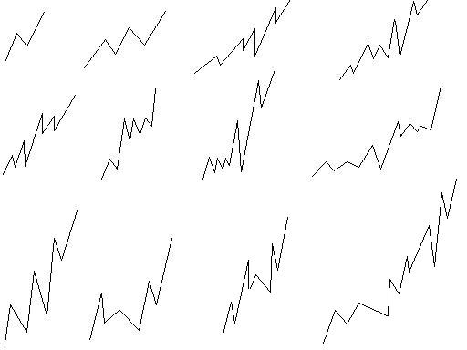{width="5.33125in"
height="4.0in"}

## 无论多空，都必须要进的一步。

(2007-07-18 15:47:50)

前几天，本ID写了"[[无论多空，都必须要退的一步。]{.underline}](http://blog.sina.com.cn/u/486e105c01000bp2)"，今天却要写"无论多空，都必须要进的一步。"这一进一退间，正好说明了本ID所说的路之艰难。而今天的走势，就是现在多空对战的一个最好演绎。

由于在多方的反复努力下，昨天在技术面上出现日MACD的金叉，使得今天的突破成了必然。现在，不妨让本ID换了身份，如果本ID是空头，本ID要阻击多方的进攻，最简单的就是先让一步，利用4000点和60天线的心理屏障，通过震荡，破坏日MACD的金叉信号，最终让金叉变死叉，如果本ID是空头，一定是这样干。否则，在技术面金叉情况下一味在3919点颈线下打压，只能让多方高兴，空头最不利的，当然就是在技术面转向多方时在低位损失打压的筹码。

而对于本ID的多方立场，如果不利用技术上的金叉信号进行颈线的突破，那前面的震荡都白搞了，因此，突破是必须的，至于突破是否有效，这是后话，突上去再说。而突上去后，对于多方，需要对3919点的颈线进行反抽，而空方，需要出手打压制造假突破，因此，下午的回落，同样是多空双方都乐意看到的。细心的投资者一定发现，下午回落的最低点，刚好是本ID在N周前就开始反复强调的3919点。

现在，对于短线走势，消息面有着决定性的意义，在技术上，对颈线突破后需要三天的回抽确认，而刚好本周的最后两天和下周第一天是消息面上最大的动荡期，技术与消息，在这里产生完美的碰撞。

本ID虽然站在多方立场上进行战略部署、战术安排，但对空头的所有伎俩，当然也分析得底朝天。站在大的角度，本ID也可以分析一下空头可以采取的最好策略，就是同样搞三角形，但这三角形和本ID为代表的多方要搞的不同，对于本ID来说，现在是三角形的第四段，而对于空头来说，现在是他们的三角形的第三段，就是这三、四之争，将构成后面技术上的最大分歧。多方搞的三角形，最后是要往上突破的，而空头搞的，是要往下突破的。

今天，一个多空共同合力下走出的完美图形，而明天开始，这种一致将被打破，而关键之处，就在消息面的配合。个股方面，今天成分股的轮动有了新的发展，但还没把人气充分激发，更多的股票里的人，都采取观望，甚至有些还采取借机逃跑的策略，这都是正常的。天上打架，没打出结果，下面的当然只能这样了。一旦天上打架有了结果，地下的自然就有了方向。主力、庄家的资金，也是分级别的。

对于散户来说，本ID已经说得很明确了，在有效站稳目前在4159点的1/2线之前，都以震荡行情看待，按自己的级别，顶背驰出，底背驰买，这样就不会左右挨巴掌。

有事忙，先下，再见。

## 在等待利空落地的日子里

(2007-07-19 15:29:28)

其实，无论本ID出差还是在北京，和各位的距离都是相等的，也就是一层网络而已。所以，虽然每次本ID出差，大盘就有病一般，但本ID利用战事的空闲处，也要干点别的事情，二级市场的事情，不是光二级市场决定的，所谓工夫在诗外矣。

现在科技那么发达，在哪里看盘都一样，别说深圳了。本ID在N多年前，就熟悉深圳的大小证券部，里面留下无数故事，有时候只能说给星星听了。在这样一个等待利空落地的日子里，说点闲话也不是多余的。

但，就算在这样一个日子里，汉奸鬼子还没罢休。看看尾盘最后十来分钟的窄幅波动，斗争一直到最后1秒。有时候，真觉得这种事情有点无聊，至于吗，汉奸鬼子们？最后几分钟不晃悠一下，你们会死呀？当然，这也是可以理解的，换着本ID当空头，只会更残忍。

现在，其实没什么可说的，在等待利空落地的日子里，大家就去倾听那落花飘落的声音，本ID有足够的耐心，等待那些火星人都知道的利空影子一样摔碎。所有爱当捕风蚊子、捉影苍蝇的，就继续吧！

虽然，写相信未来的人，最后成了疯子，但并不需要疯子才可以相信未来。特别对中国资本市场的未来，可以断言的是，所有用最疯狂的愚昧去断送中国资本市场前途的人，无论是谁，都只能是民族和历史的罪人。

在外，课程没法写了，但还是可以继续考考各位的学习程度的，今天又来一道题目，下面，每一划依然代表实际的笔，请问，站在线段的角度，这两者是否相同？为什么？

各位就请好好回答问题，回答不出的，就请继续学习。本ID要忙去了，先下，再见。

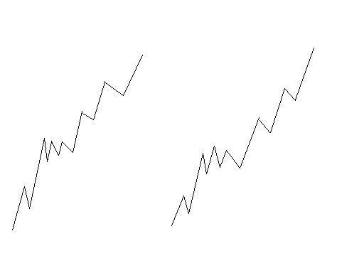{width="4.388489720034996in"
height="3.2926541994750655in"}

## 刚起来，下午解不了盘。

(2007-07-20 08:26:20)

刚起来，下午收盘马上有事，盘是解不了了，周六、日有空再补上。反正在外面，音乐会也没法开。刚才扫描了一下回帖，很多网友的答案都是对的，站在线段角度，那两图是有本质的区别的，但如果里面的每一划不是笔而是线段，那么这两图就是没区别的。这是为了说明，笔、线段，和中枢、走势类型是有区别的。笔、线段是为了在实际操作中构成最小级别的中枢，在笔和线段中，连中枢都谈不上，只能用类似中枢以及相应的背驰力度方法去确认笔与线段的结束，但这只是类似，并不是说笔与线段里就真有什么中枢与背驰。严格意义上说，把线段当成最小级别走势类型的次级别是不对的，当然，在不严格的意义上，可以类似地这样认为，但两者是有本质区别的。这两个图就区分出两者的区别来了。

请注意中枢的递归定义的存在性意义，与分型、笔、线段的操作性意义的区别。当然，如果我们能找到交易中每一分笔（注意，不是上面说的笔，而是实际交易中的每一分笔）的成交，然后按照递归定义，就可以构造出整个走势类型与中枢的级别序列来，但这没实际操作意义，只是理论上的。而分型、笔、线段，并没有违反中枢的递归意义，只是用一种方法来确认具有操作意义的最小级别中枢与走势类型，其后的一切，依然按照递归的定义来。如果对数学有点了解的就知道，两者在递归的形式上是一样的，都是an=f(an-1),唯一不同的就是预先给出的a0，纯理论上的，这a0就是从每一分笔的成交开始的，但这没有实际可操作性；所以，就要用分型、笔、线段来确认这个a0。而站在递归的程序上，这两者没有本质区别。其实，这些都是最简单的数学，除了孔男人类的，全宇宙的人都应该明白。

还有，本ID画图只是随手画，但市场的图是合力的结果，不是任何人可以随手画的，要真把握本ID的理论，不预测、只看当下走势，这是必须首要记住的。

听说黄油蟹当季节了，可惜没有菊花酒可以对影成三人。先下，明后两天有时间再见。

## 该来的都来了,你还需要什么?

(2007-07-20 21:33:08)

在车上和各位打招呼，今天的走势无须多说，今天的消息也说得太多，该来的都来了,你还需要什么?

当然，空头没有完全打死，本ID需要痛打落水狗，因为本ID知道，有些狗不打死，就要咬人，如此而已。

一切不用多说，本ID喜欢干，不喜欢说。干的已经成为历史，永远K线了，如此而已。

周末，腐败去吧，本ID还要忙，今晚的黄油蟹不错，可惜没有菊花酒。

先下，再见。

## 打狗棒下，星火正燎原。

(2007-07-23 15:25:57)

对不起，这两天确实太忙，没有新帖子，趁着收盘说两句。其实今天的走势，没什么可说的，周末，本ID在这里已经明确说了，要痛打落水狗。有些狗般的思维不是说要低开吗？不是说有回补的机会吗？当然，本ID尊重这种思维。但按本ID痛打落水狗的思维，就是没有低开，没有回补的机会。要回补可以，当轿夫吧！

当然，这里说的是那些在3600点下狂砸诸如中石化等要把多方弄死去舔他们主子的洋狗，这次激战，在这里全程直播了，就像春节前后那次，最后，一阵打狗棒下，星火正燎原。本ID在开战时就说了，本ID只点火，本ID不当解放军，但一旦星火燎原，解放军自然就来。好了，本ID该干的已经干了，后面，就看有多少草可以燎原了。对于多方来说，现在已进退自如。对于本ID，拂身白云外，回首大江横，点火事了，谁爱当火炬手就当去吧。

技术上，4159点的1/2线将决定整个中线走势。

由于二级市场战事已经稳定，本ID将花更多时间去为一个更大的战争作准备。这战争的意义在于，让中国人永远当中国资本市场的主人，而这不是光从二级市场下手就可以的。好了，事忙，先下。最后用旧作七律一首结尾---

**本地风光本地游**

**非污非净现头头**

**缘情天地皆精彩**

**逐梦英雄总自由**

**一样兴亡千样戏**

**这般岁月那般愁**

**长空倚剑披云啸**

**散作乾坤碧水流**

## 对不起，今天收盘后解不了盘。

(2007-07-24 08:46:06)

**对不起，今天收盘后解不了盘。有一个N百人参加的腐败活动，忙完，晚上有时间再说。特此说明，免得各位收盘后空等。**

## 说说昨天的走势

(2007-07-25 08:54:22)

对不起，实在太忙，现在刚起来，抓紧时间说说昨天走势。昨天其实没什么可说的，技术上碰到前面两个高点连线，站在本ID三角形整理的最低要求上，昨天的回落理所当然。本ID前面说了，现在至少对本ID来说早已进退自如，所以要花多点时间在别的地方。本ID最低的要求就是三角形的第四段，昨天碰到前两高点连线，就完全达到本ID的要求，所以本ID完全不会再作为。也就是说，如果大盘出现比三角形更好的走势，例如从这里直接突破，对于本ID来说是锦上添花，本ID乐于坐轿子。如果大盘继续按三角形走，出现一个回调的第5段，那么即使大盘重新回到目前位于3700点下的下面两低点连线，本ID也是可以接受的，大不了到时候本ID再出手。

本ID这次出手的目的在出手时已经公开说了，就是不让汉奸鬼子买到便宜的筹码，不让他们平台型的阴谋得逞，现在已经完全达到。本ID的行动，只针对汉奸、鬼子，不当解放军，这也是一大早说了的。而本ID目前的资金、筹码配制，在这两天已经完全调配到符合这种两者皆可的程度。这点，在周一收盘时，本ID已经明确说了"对于本ID，拂身白云外，回首大江横，点火事了，谁爱当火炬手就当去吧。"

站在纯技术的角度，4159点的1/2线是关键，现在的火炬手们，如果有能力扛住该线，那么大盘将继续创新高，否则就去补缺口，考验4000点支持，甚至考验下面两低点连线。由于本ID现在已经退居二线，只坐轿子不冲锋，所以以后可以多说技术的问题，分段也可以提供了。当然，前提是本ID有时间。

个股方面，本ID那些中长线的面首依然会继续宠信，前提是你要有足够的耐心。例如，像本ID4月说的6000万总盘，2000万以下流通的深圳新上中小盘，当时一直不动，你看现在的002121，看看是不是符合本ID当时说的中长线价值？大盘震荡下跌这么多，对他又有什么影响？对其它股票也是一样的，面首，有中长线搞才有味道的，整天对股票面首419，小心得爱滋。

中长线运作，专一点，把成本降到0，这才是股票中永远不败之道。前面说002121，本ID的成本还没到0，经过这1月的运作，也0了，注意，现在各位就千万别买了，30元下不买，现在买，那是有病，只是有的，可以继续按本ID的方法运作下去，成本为0后就是保持0成本增加筹码了。对于其他所有股票，这方法是一样的。

对不起，今天依然忙，收盘后可能没时间解盘。但只要有时间，本ID会上来说两句的。

## 应酬前，说说今天的大盘

(2007-07-25 18:31:21)

首先说一句，刚上来，发现系统警告好友数量已经到极限，所以请各位不要再申请本ID为好友，等新浪的数量限制扩大再说。

应酬前，抓紧时间说两句。今天，各路火炬手们都很兴奋，本ID坐轿子，当然要表扬一下抬轿子的。站在纯技术的角度，4159点站稳后，就攻击前期高位，这在昨天和早上都说了。当然，现在的上攻有点急，但被压抑了许久的多头力量，尽情释放一次，也是无可厚非的。

技术上，4335点是否明天突破，其实一点意义都没有，早一天晚一天并不重要，重要的是突破后，在适当的回抽确认后，能释放出更大的能量。否则，就要面临假突破的风险。所以，现在，在技术上，主要要面对这个问题，一旦确认假突破不成立，那么大盘就会走出一段坚定有力的行情；否则，大盘依然有考验4000点等可能。是否假突破，是今后两周行情演化的关键点。

本ID今天早上已经宣告，本ID现在在轿子上，所以绝对不出力了，只会享受本ID应该享受的成果。别人想羡慕也没用，本ID前段时间冒着枪林弹雨换来的成果，当然要好好享受，否则本ID怎么能不断壮大？怎么能在下次出手时更强劲有力？所有如本ID般以抗击外敌为使命的资金的壮大，就是对汉奸鬼子最大的打击，这没什么可说的。

个股方面，本ID前面已经反复说过，先成分股。这几天成分股轮番表演，就是本ID前面说的轮动。目前各路诸侯纷纷上场，互相配合良好，也就是所谓的星火燎原了。至于非成分股，肯定会轮动到的，特别是有题材、基本面支持的，更会有中长线价值。

基本面上，现在最大的努力方向，就是争取单边印花税，全世界，只有香港、深沪、澳大利亚等少数几个市场双边印花税，现在，深沪交易所难道不应该和国际接轨？这次，国际接轨应该成为保护国人利益的武器。那种老让国人不爽的国际接轨已经太多，早该来一次能让国人爽的国际接轨了。

不管什么面，一切都是合力，没有任何上帝，一切都在合力之中，即使没有回报，但该努力的必须努力，3600点汉奸鬼子叫嚣平台型时如此，现在亦如此。明天，本ID就回北京了，估计又是最后一班飞机，后天才能在北京和各位相见。

北京的天空，无论白天黑夜，也是天空、只是天空而已。

## 大盘周线上的四种演化分析

(2007-07-27 08:01:59)

对不起，昨天回京太晚，没写帖子。现在补上。还要道歉一下，在外，只能说股票，其他东西没时间写。回来，下周还是按正常来。

大盘无分歧地创新高，才会导致真正的分歧。前天说了，现在最大的分歧就在于真假突破。但无论真假突破，突破后的调整、回抽、确认等是必然要发生的。站在周线的角度，无非四种：一种是本周的上影线调整；二是下周的周K线调整。前者是弱的，后者是强的。当然，还有一种更强的，就是下周继续拉长阳，中间有日的跳水洗盘，再下周才真调整。最强的就是强力夹空，连收N根周阳，全部调整以日线完成。

一切都由市场合力决定，只要按本ID的理论当下去判断市场的选择就可以。例如，今天就面临第一种情况是否出现的选择，这由今天当下的走势就可以判断。从管理层的角度，如果出现第三、四种的走势，那么基本面上的可能变化，例如单边印花等，就会受到更大阻力，站在对股市中长线健康的角度，本ID反对后两种走势。当然，本ID只是市场分力之一，而且，本ID现在轿子坐得舒服，因此这种反对最多是口头上的，如果有哪些无聊的火炬手们一定要搞第三、四种，本ID站在短线利益的角度，确实也没理由反对。本ID唯一可以干的，就是等这些疯狂抬轿子的火炬手抬到没力气时，一棍子把他们打晕，给他们上上市场风险课，配合一下管理层的风险教育。

至于第一、二种，本ID都可以接受，说实在，本ID更喜欢上下震荡，越震荡，差价越多，单边其实没什么意思。站在纯技术的角度，目前的5日线是判断能否直接真突破的关键，一旦在下周初之前5日线上移到目前位置指数依然不能脱离目前区间，大盘重新回跌的机会就不可避免了。

归纳上述，第二种走势是最有利于多头的，而第一种走势，则给空头一个喘息的机会。至于第三、四种走势，那是纯粹找死，为本ID做嫁衣裳，当然，这世界上想死的人很多，本ID当然也不讨厌这些死都这么有性格的。

对于本ID来说，前两天已经宣布退居二线，所以只会按市场的选择来当下选择自己的操作，而不会主动去引导市场的方向。3700点上，市场爱干什么，什么资金干的，本ID都可以接受。

个股方面，成分股的拉升轮动后，如果没有其他股票的呼应，大盘走势不会太健康，所以各位要看这轮动是否能蔓延，如果不行，那么大盘的走势就要变局。现在的节奏就是一二三，等三线都轮动到了，就看一线是否能重新启动，不行，大盘就要休息了。

下午收盘后，本ID要开始补腐败课，晚上有时间再解盘，先下，再见。

## 对不起，刚回，说两句。

(2007-07-27 23:09:24)

收盘就开始补腐败课，刚回，明天还要继续腐败，周末这两天闲不了。早上说了，对于多头来说，最好是第二种，今天，在外围股市大跌下，能走成这样，各路火炬手是出力了，搞得本ID都有点怪不好意思的，当然，这也只是口头上，本ID赚钱坐轿子，从来都是心安理得，没什么不好意思的。

由于各路火炬手很多在4000点以上才逐步重新介入，所以现在火炬手变举重选手的机会大增，下周初就看这些举重选手举杠铃的能力了。举住了，自然更大面积的空翻多，否则，就假突破引发一轮雪崩。本ID没有举杠铃的爱好，倒是如果某些人举不住，本ID顺势踢上两脚的兴趣更大。当然，如果各路举重选手都能更高更快更强一把，那本ID也乐意在轿子上多晃悠晃悠。

可能有人又要骂本ID卑鄙无耻，为什么光点火不举杠铃，一直冲上去。本ID脑子里还没有水太多，只爱点火，不举杠铃。而且本ID已经多次说过，只要在3700点上，大盘怎么走，本ID都没意见。现在，那些在3600点还鬼哭狼嚎的，突然都成了多头首脑，都在宣称自己以前多么英明神武，多么先知先觉。本ID只干，这些无聊的帽子，谁想戴就去套上吧。

除非大盘有能力以最强劲的动力一口气走到6000-8000点，否则，这一段，在日MACD没突破前期高位之前，本ID只能认为现在是处在背驰段中，对于本ID来说，除非背驰段被破坏，否则一切就处在区间套的精确定位过程中。而要避免背驰段，就需要对日线的MACD走势进行周密的控制，这对于本ID当然不是一个问题，但对于那些众多举重选手，能否最终完成，本ID会在轿子上好好看着，一旦他们弄不好，本ID就会狠狠踢他们两脚，给个教训这群面首让他们长点见识。

对于散户来说，一旦行情展开，就一定要按照行情自身的规律，喊口号不是操作，股票是用来操作而不是用来喊口号的。如果大盘能保持基本在前期两高位连线上进行震荡整理，那么就将走强，否则就要面对假突破后的猛烈清理。

而由于今天没有出现早上分析的第一种走势，因此，后面可以选择的就只能是二、三、四种了。而其中的第二种，下周线无非三种：长阴线、十字星或小阴小阳、带长上影的K线。而其中，只有长阴线这种是有巨大风险的。因此，只要看住5日线或前期两高点连线，只要这些线能守住，长阴线是不可能的。而相应的走势，都可以持股或用部分筹码进行中枢震荡的操作来处理。

总之，下周初走势十分关键，如果先扬后抑，一旦再次上攻失败或15分钟以上短线背驰，将引发一次有力度的调整，反而先抑后扬能使得走势更轻松点。个股方面，今天热点开始向非成分股蔓延，这是比较好的现象，如果这现象能维持，那大盘即使调整，后面的行情也会有可期待的地方，否则就要小心了。

周日开音乐会，先下，各位周末腐败愉快，再见。

## 先扬后抑，酝酿震荡。

(2007-07-30 15:19:35)

上周说得很清楚，只要现在的举杠铃者能顶住，空翻多就更多了。今天，昨晚伊拉克的精神大概也给了举杠铃者一点血性，所以今天，这群人动用所有力量，最终把该顶住的顶住了。

市场就是这样的一个生物链，本ID这种第一波进去的，等着4000点上进去的抬，而4000点进去的，顶住4300点，自然有新一波人进来。所以，现在4000点进来的也进退自如了，当然，如本ID者，就更自如了，上面已经有了两层保护膜。

但上周说得很清楚，本周周线上是选择第二还是第三种走势，是一个关键，如果是第二种，那么周线上将有长上影，而第三种，调整也会以日线形式产生。所以，正如周末说的，先扬后抑，后面的调整压力就大了，今天的走势，就为后面酝酿震荡。

月线上，明天是收盘，所以，站在第三波4300点进来资金的角度，一个十字星是最理想的。而对于第二波4000点进来的，一个阴线也是可以接受的，只要不破4335点就可以。当然，对于本ID这种3600点进来的，大阴线也无妨，不过又提供一个短差机会而已。因此，明天开始的三天，就是4300点进来与4000点进来两波资金的游戏，本ID继续看戏，偶尔三国演义一把。

个股方面，今天轮动可以，但地产等有调整压力，目前，关键看成分股里未启动的，和有题材的成分股能否跟上。换言之，就是4300点进来的一批，能否坚决顶住，他们顶住，前两波也不会故意害他们，因为他们顶住，就有第四波进来，要害，也害那第N波的。当然，这N是可以等于3的。

忙，要先下，再见。

## 教你炒股票66：主力资金的食物链

(2007-07-30 22:42:05)

因为要画图要浪费时间，下一课再说有关线段的问题。今天，说一些宏观点的东西，说说主力资金的食物链。

市场每一时刻的走势，都由当下的合力构成，如果1亿人参加的市场，每一分力都是相等的、都是独立的，那么市场的整个运转和现实的情况，当然有所不同。现实的情况是，有些分力是特别巨大于其他的分力，在这种情况下，对合力的分析，不能脱离对这些特别巨大分力的分析。

如果现实的系统中这种特别巨大的分力只有一个，其他分力与之相比都可以忽略不算，那么市场的所谓合力，就与这分力基本无异了。例如，在那些控盘程度极端高的股票中，就往往呈现这种情况。而这种一个分力远大于其他分力的系统，其稳定性是会产生突变的。关于个股的情况，以后会说到，这里先说说关于大盘合力与分力的关系。

有一种很流行却纯粹出于想象的说法，是关于所谓市场主力资金的。在这种流行的谬误中，似乎市场中的主力只有一拨人，他们控制着市场的走势，画着每天大盘的分时图中每分每秒。而事实上，这种所谓的主力，从来没存在过。市场从来都分裂着不同的利益集团，所谓的主力资金，从来都是分派别的，各派别之间，会有联手，会有默契，但也有暗算、互相拆台等等，黄雀、螳螂、蝉的游戏也一点都不新鲜。

主力资金层面的运作，当然也不是单纯的技术分析可以包括的。用打仗来比喻，技术分析，不过是一些战术性问题，而战略性问题，就不是技术分析可以解决的。例如，如果你是一个散户，你只要把本ID的技术理论搞清楚，那在市场中就可以游刃有余了。但如果光把本ID的技术理论搞清楚，是运作不了主力资金的，当然，技术层面是一个基础，但只是一个方面。但无论什么资金，站在市场走势的角度，不过就是构造出不同级别的买卖点而已。因此，对于散户来说，你无须知道这天上掉下的馅饼是怎么制造的，只需要知道怎么才能吃到这馅饼。

必须明确的，任何的主力资金，无论什么背景、级别，最终都不可能逆整个经济的大势而行。资金不是一拨，山头就那么多，10年前的主力，如果不随着市场去发展，到现在就什么都不是了。所以，任何主力资金，无论什么背景、级别，还有一个特点，就是要折腾。不折腾，就没有江湖地位，唯一不同的，只是折腾什么，只是不同市场、板块的变换。

在单一的股票市场中，不同风格、背景、势力的资金，各自控制着不同的板块，最大的几个，构成食物链的最上层。一般来说，这几拨资金都是老油条，互相也知根底，其根底往往不在市场中，而在市场之外，一般情况下，各方都是保持江湖规矩，不会轻易与某一方开战。但，绝对不是说，最大的家伙间就没有战争，而是这战争无时不在，只是都在等着一方出现破绽，余下的一拥而上，分而吃之。中国资本市场的历史上，出现过好几次这样的事情，都是陈年旧事，不说也罢。

当然，最大的家伙，也不是一成不变的，不同的年代也会改变点包装，换些名头。

从这食物链的最高端开始，逐级下去，到最后的散户个体，分着好几个层次。对于最大的主力来说，对下面几个层次的生态状态，会保持一定的维持。一般来说，一个新的最高级别的势力出现，是没有人愿意看到的。因此，那些在次一级别中特别活跃，特别有上升苗头的，都会被重点绞杀。对于最高级别的主力来说，一个各层次的生态平衡是最有利的。站在这个意义上，如果有些对散户特别恶劣的，要把散户或某层次赶尽杀绝的，那么肯定成为最高级别主力绞杀的对象。这种事情，在资本历史上也太常见了。一般来说，这种绞杀对象，都类似暴发户，最高级别的主力，就如同贵族，贵族当然看不起暴发户，特别当这暴发户影响了整个市场生态的平衡，不对之株连九族，斩草除根，那还怎么当贵族？这种绞杀，当然可以是市场化的，却不一定是市场化的，这就不想多说了。

## 完美的震荡制造完美的月线收盘

(2007-07-31 16:03:53)

今天，有没有消息都要震荡，反而因为消息的出现，使得震荡中，市场各方的心理都比较平稳。盘中的最大一次跳水，刚好去回试确认4335点的突破，为什么？因为4300点刚进来的，要护住他们的成本线，而今天的消息，刚好给了他们这个机会。由于今天又是月线的收盘日，所以前面两拨人也没理由估计去砸坏这图形，毕竟，三拨人，前后时间不同，但至少在做多这点上，暂时还是利益一致的，一个好看的月线，当然对三者来说都是必须的。

有了月线，那么8月的走势，无非就是长阴线、十字星、长阳线等几种。纯技术的角度，本月K线的一半位置刚好和1/2线的位置差不多，也就是说，这月K线的确立，使得1/2线的突破有了极大的保障，虽然不能说万无一失，但至少对于多头，特别对于前面两拨进去的人来说，已经有了中线运作的第一道防线。短线，还是看4300点进去这一拨，他们最大的愿望，当然是快速拉离目前位置，所以短线做多意愿最大的就是这一拨人。3600点这拨，当然乐见其成，4000点那拨人，也不会有太大分歧。

但是，基本面上依然有不明朗的地方，国家对目前经济形势的判断，依然有可变的地方，这构成影响今后走势最重要的因数。因此，大盘能否把去年8月后的走势复制一次，基本面上还有着极大的不确定因数。这因数，不是哪一拨人可以控制的，那是一个合力的结果，当然，一切都确定了，这市场也太不好玩了，不确定，才有美丽与奇迹可言。

技术上，其实十分简单。前面几次的单边势，都是基本以5日线为支持，基本上，在单边势里，没有3天是收在5日线之下的，因此，如果不会看太复杂图形的，5日线，或者中线的5周均线，就是最简单的判断指标。如果震荡连5日线都不破，那还怕什么？日线上，可以先以背驰段看待，然后根据后面的走势去确认背驰段是否有效。短线，4500点附近如果太快通过，就会为以后的走势埋下技术隐患，本周走势，如果继续长阳，将使得可能的基本面变化埋下政策隐患。但现在急功近利者太多，而本ID也不想浪费筹码进行太严厉的调控，因为本ID并不介意这次真搞成一个背驰段，现在本ID的策略，就是尽量不作为，让各路举重选手自己表现去。

个股方面，还是一早说的两条主线，成分股和超跌股，那些从年线或半年线上来的超跌股，也慢慢把形态走好，一旦大盘中线上升完全确立，那么都会轮动走出行情，但问题的关键是，这个确立依然不完全，所以超跌股的短线表现依然不充分。

一句话，太急功近利，就会把大盘给害了，目前大盘的关键是要走得扎实点。而八月中上旬，基本面上也将有一个中长线的定调，具体到时候就知道，现在还没有结果，这才是必须关注的地方。

今天可以回答各位问题到5点。

缠中说禅2007-07-31 16:14:47

\[匿名\] 新浪网友

2007-07-31 16:10:56

缠JJ，一笔是否也有类似线段那样得三角形态或奔走形态？

或者说，一笔之中的非顶、底K线是否允许超出顶底的范围呢？顶或底是否一定为一笔的最高点或最低点呢？

\-\-\-\--

一笔，是一顶一底，怎么会有三角形？顶和底，当然一定是那一笔的最高最低，如果不是，那里面一定不只一笔。

缠中说禅2007-07-31 16:18:45

\[匿名\] 新浪网友

2007-07-31 16:15:06

缠主,你好

对背弛和背弛段还不能理解，是看MACD的柱线高度还是总的面积啊？

===

标准情况下，黄白线和柱子面积都要看。

缠中说禅2007-07-31 16:22:09

\[匿名\] 新手

2007-07-31 16:16:08

老师，对于技术不好的新手，可不可以做长线投资，不理会一时的震荡或调整？

===

技术不好，可以把操作级别扩大为30分钟以上、甚至是日线的，这样，一个月也就操作一两次，而且心态要好点，不要强迫自己一定买卖在最好的位置，最好的位置的买卖，那是要靠磨练的，不可能一上手就达到，所以一定不能有不切实际的想法。

缠中说禅2007-07-31 16:23:07

\[匿名\] 新浪网友

2007-07-31 16:15:51

缠姐：今天的1118-1333算不算一笔？

===

那不是一笔，而是很多笔。

缠中说禅2007-07-31 16:24:37

\[匿名\] 新浪网友

2007-07-31 16:22:37

老师：最近这一段行情是否有很多小转大的情况？线段划分分歧很大，你能否再讲一讲？

===

线段划分，下节课说，等等。

缠中说禅2007-07-31 16:25:14

\[匿名\] 与你同行

2007-07-31 16:23:21

请问老师,1/2线还是指4159点吗

===

八月要再加15点。

缠中说禅2007-07-31 16:30:44

\[匿名\] RVAER

2007-07-31 16:26:19

请教缠主：

按照缺口必补的理论，上周一大盘跳空高开的缺口大概什么时候回补？是要一口气冲到4800才回来补缺口吗？

第二批和第三批进来的人会主动去补缺口吗？

谢谢\~

===

谁告诉你缺口一定补的？上海在300多点那里还有一个大缺口没补，10几年了。

缠中说禅2007-07-31 16:35:15

\[匿名\] 新浪网友

2007-07-31 16:23:34

緾主，消息面怎么看啊？－－－今天看两证券报都大版面力推钢铁股，并说机构正持续加仓中，可是买进就被套！难道消息要反着看？

===

去年年尾，本ID在这里明确说了今年的两大主题：钢铁、医药。这两大板块的布局，去年就开始了。主力资金用了这么长时间来运作，你考虑的是短线，根本不是一种层面的东西，当然没法看了。

缠中说禅2007-07-31 16:36:32

\[匿名\] 新浪网友

2007-07-31 16:31:56

博主好！请教：

按中枢振荡观点解读走势时，中枢振荡的每一次级段是否按同级分解规则划分呢？能否按非同级分解规则划分呢？

===

概念不清，线段上没有中枢，哪里来级别和同级别？线段的划分，就按线段自己的原则，具体下节课回说到。

缠中说禅2007-07-31 16:38:37

\[匿名\] 新浪网友

2007-07-31 16:36:06

老大 后面走势在顶分型第一个k线的区间内，可以算一笔吗？

===

不可以，除非在后面根据非包含处理后能找到标准的底分型。

缠中说禅2007-07-31 16:41:21

\[匿名\] 楚狂人

2007-07-31 16:37:18

感觉市场做多气氛好的时候，1f甚至线段级别的上涨都延伸很久。。

碰到这些小级别的延伸，判断第一卖点感觉好困难。。还是等第二卖点。。不知这样妥否？请缠君指正

===

除非你觉得自己交易通道特别好，判断又能特别精确，否则不要太多参与线段的操作。至少要参与1分钟以上的操作。

缠中说禅2007-07-31 16:43:17

\[匿名\] 学习

2007-07-31 16:40:59

请问，9个一分钟的走势类型重叠构成一个5分钟的中枢，那么这个5分钟的中枢点位和从一分钟递归上来的一样吗？

===

不一定。按3+3+3这样组合后确定5分钟的。

缠中说禅2007-07-31 16:47:59

\[匿名\] 砂

2007-07-31 16:38:15

匿名\] 砂

2007-07-31 16:25:58

请教缠主,今天在1分钟在早上9.41-10.35那段下跌,没有很明显的背驰,为什么后来的反抽上去的力度这么大呢,再很多股看到是有很明显的a+A+b+B+c的,但是大盘1分钟很不明显.

谢谢

===

背驰的概念，标准的在最低级别之上用，线段上的，只能是类背驰的判断。因为，在线段里，如果是类小转大的，判断起来就不能光靠MACD了，那时间太短，不够灵敏度。一般来说，小转大都有一个小平台，等小平台确认向上再介入更好，因为小转大的平台，是可以往下突破的。不过还是要强调，除非已经技术很好，不要参与1分钟以下的操作。

缠中说禅2007-07-31 16:48:50

\[匿名\] 新浪网友

2007-07-31 16:44:03

请问老大，有时，大盘的"一笔"可能就5～6根K线，走得比较平，其中存在包含关系，如果包含掉，则不能形成一笔，请问要看包含吗？

===

有包含的一定要非包含化处理。严格按定义来。

缠中说禅2007-07-31 16:49:43

\[匿名\] 胡紧套

2007-07-31 16:46:21

老大，中国足球怎样才能看到希望？难道现在正处于底背驰阶段吗？呵呵

===

输给文莱。

缠中说禅2007-07-31 16:50:47

\[匿名\] 神抛弃的大道

2007-07-31 16:46:49

女王好，关于您的理论，我有个小小的问题，就是如果9跟线段构成的1f中枢同时扩张成为5f中枢，那么5f中枢的区间如何确定，您能说明一下么，要是能图解一下最好不过了？这个问题困扰我一段时间了。谢谢女王，盼复。

===

按结合律。3+3+3结合。

缠中说禅2007-07-31 16:52:03

石头叁

2007-07-31 16:49:58

老大，向下的一段无论延伸了多少笔，在触及前一向上线段的最后一个高点之前都不能认为是一个线段，因为还没有破坏向上线段的内部结构。\-\-\--这样理解对么？

===

一般情况下是这样，但有些特殊情况，下节课都会说到。

缠中说禅2007-07-31 16:55:59

\[匿名\] 大盘

2007-07-31 16:50:53

请问博主：

a+b+c+d依次连续出现的4个线段，其中b线段没有破坏a线段，但是b、c、d线段相互重叠（即构成中枢），

请问这种情况下，当下在线段b的时候如何反应

===

如果B不破坏A的，那A这线段就没完成，等A完成再说。在线段里，A线段没被破坏，就不会存在B线段。关于线段划分的一些细节问题，下节课里都有。

缠中说禅2007-07-31 16:57:00

对不起，问题太多，很多没看到或回答不及的，请原谅。

有事，先下，再见。

## 该来的调整，必须且及时。

(2007-08-01 15:33:01)

本周的K线，本ID在上周已经明确说过，希望是带上影的第二种情况，否则急功近利，只能害了最终的行情。今天的调整，使得这长上影的小阴线已初显。后面两天，关键是第三拨人的做多决心了，强烈回收上去，则还有走出第三种情况，也就是中阳周线的可能，但这种走势，确实有点急功近利，反正，本ID是绝对不出这手的。本ID已经早说了，震荡，对本ID只是一个先卖后买的短差机会。在这里等5周均线上来，更稳健。

技术上，今天的低点并没有跌破前面两高点连线，所以调整在合理的范围内，该线在4260点附近，目前10日线也在该位置，因此是否有效跌破该线是一个大盘调整强弱的重要指标。一旦有效跌破，上周K线留下的缺口将面临考验。对于第三拨人，该线是他们的生命线，当然，对于前两拨，其实无所谓，就看第三拨人表演吧。

上面，由于今天跌破5日线，因此后面的反抽如果不能上5日线，则大盘的调整将加大，能重新上去，那就将重新挑战4500点。即使能突破4500点，最好能反复震荡，否则，将引起昨天所说的八月中上旬基本面上的重大不稳定因数。还是昨天那句话，不要急功近利，要爱护市场本身。

大的技术上，日线上的背驰段依然成立，如本ID般第一拨进来的，一定不能在这个位置加码，而是用先卖后买打差价的策略，通过震荡把成本降低，万一大盘真不能突破4500点走出多头陷阱，到时候砸起盘来也更爽。大家好好去看看，现在叫嚣冲多少多少点的人，在3600点的时候，是不是那些吼着要跌破多少多少点的。行情是合力的，一步一步走出来的，预测都是忽悠，按照正确的策略去操作才是一切。

如果能看明白线段、中枢、走势类型等的，现在这种行情是最好操作的，注意，节奏一定是先卖后买，卖错了不怕，如果大盘真能突破4500点，很多中低价股都会大幅启动的，还怕买不到好股票？不杀跌、不追涨，按照买卖点来。各位看看今天的高点，是一个15分钟级别的背驰引发的，里面的区间套极端完美，可以仔细研究。由于现在60分钟并没有进入背驰段，因此，不能说日线的背驰段已经被定位。只能看成是一个15分钟卖点引发的。本周注意15分钟以上级别的卖点，这在上周已经提醒，如果没看懂，请好好继续学习。

晚上，把关于线段分类的课程放上来。

先下，再见。

## 教你炒股票67：线段的划分标准

(2007-08-01 22:31:55)

今天听说以前的元帅，总是少了一个。本ID只知道有十大元帅，历史也只知道有十大元帅，历史就是历史，不能改变。至于以后发生什么，那是以后的事。但历史必须尊重。而且，这被忽视的一个，指挥了抗日的第一场大胜利，是真正的抗日英雄，至于解放战争中的贡献就更不用说了。如果这样的英雄的名字在几十年后还成为禁忌，那只能是历史的悲哀。

旧诗一首，八一纪念真正的元帅，真正的战神：

**神州万里遍旗林**

**河汉遥传鬼魅音**

**红面老儿疑照眼\
黄毛小子不安心**

**曾经百战喧天地**

**一夜孤行惑古今**

**大漠青烟散犹聚\
朔风空送血魂吟**

笔的划分标准在前面已经严格给出，因此，下一关键问题，就是如何划分线段。下面，给出类似笔划分，但有重大区别的划分标准。用S代表向上的笔，X代表向下的笔。那么所有的线段，无非两种：一、从向上笔开始；二、从向下笔开始。简单起见，以向上笔开始的线段为例子说划分的标准。

以向上笔开始的线段，可以用笔的序列表示：S1X1S2X2S3X3...SnXn。容易证明，任何Si与Si+1之间，一定有重合区间。而考察序列X1X2...Xn，该序列中，Xi与Xi+1之间并不一定有重合区间，因此，这序列更能代表线段的性质。

定义：序列X1X2...Xn成为以向上笔开始线段的特征序列；序列S1S2...Sn成为以向下笔开始线段的特征序列。特征序列两相邻元素间没有重合区间，称为该序列的一个缺口。

关于特征序列，把每一元素看成是一K线，那么，如同一般K线图中找分型的方法，也存在所谓的包含关系，也可以对此进行非包含处理。经过非包含处理的特征序列，成为标准特征序列。以后没有特别说明，特征序列都是指标准特征序列。

参照一般K线图关于顶分型与底分型的定义，可以确定特征序列的顶和底。注意，以向上笔开始的线段的特征序列，只考察顶分型；以向下笔开始的线段，只考察底分型。

在标准特征序列里，构成分型的三个相邻元素，只有两种可能：

第一种情况：

特征序列的顶分型中，第一和第二元素间不存在特征序列的缺口，那么该线段在该顶分型的高点处结束，该高点是该线段的终点；特征序列的底分型中，第一和第二元素间不存在特征序列的缺口，那么该线段在该底分型的低点处结束，该低点是该线段的终点；

第二种情况：

特征序列的顶分型中，第一和第二元素间存在特征序列的缺口，如果从该分型最高点开始的向下一笔开始的序列的特征序列出现底分型，那么该线段在该顶分型的高点处结束，该高点是该线段的终点；特征序列的底分型中，第一和第二元素间存在特征序列的缺口，如果从该分型最低点开始的向上一笔开始的序列的特征序列出现顶分型，那么该线段在该底分型的低点处结束，该低点是该线段的终点；

强调，在第二种情况下，后一特征序列不一定封闭前一特征序列相应的缺口，而且，第二个序列中的分型，不分第一二种情况，只要有分型就可以。

上面两种情况，就给出所有线段划分的标准。显然，出现特征序列的分型，是线段结束的前提条件。本课，就是把前面"线段破坏的充要条件就是被另一个线段破坏"精确化了。因此，以后关于线段的划分，都以此精确的定义为基础。

这个定义有点复杂，首先请先搞清楚特征序列，然后搞清楚标准特征序列，然后是标准特征序列的顶分型与底分型。而分型又以分型的第一元素和第二元素间是否有缺口分为两种情况。一定要把这逻辑关系搞清楚，否则一定晕倒。

显然，按照这个划分，一切同一级别图上的走势都可以唯一地划分为线段的连接，正如一切同一级别图上的走势都可以唯一地划分笔的连接。有了这两个基础，那么整个中枢与走势类型的递归体系就可以建立起来。这是基础的基础，请务必搞清楚，否则肯定学不好。

最后，尽量画点图，让各位分清楚上面的一些概念，但最好把定义看清楚，这才是真正理解，图只是一个辅助。前两个图形中标出了线段的划分。

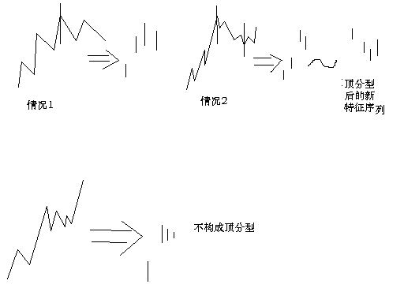{width="5.395833333333333in"
height="4.048456911636046in"}

## 明天才是大盘短线的关键

(2007-08-02 16:06:21)

今天，没跌破昨天本ID所说的前期两高点连线以及10日线，所以出现反弹就理所当然了，加上外围因素的影响，也给第三拨进来的人壮了胆。今天，也收在昨天特别强调的5日线上，但这并不意味着大盘就平安无事了。大盘在6月20、21日，也走出过类似的K线组合，而且时间上也是周三、四，而周五的下跌，就使得一轮大调整得以确立。当然，一般来说，历史不会简单重复。这只是要提醒，今天的走势其实并不重要，关键是明天，考虑到周末消息面的因素，这个时间还要延伸到下周一，也就是说，下周一前能否确认重新站住5日线，将是短线大盘走势的关键所在。

对于新进的第三拨人，他们不想就此站上N个月的岗，必须要在这里奋力一搏，现在，比6月20、21日有很多有利的条件，技术上，MACD形态好多了，下面有前期两高点的连线，而上周的周线缺口，技术上有三周不补就以后再补的惯例，也就是说，新进来的一拨人，只要能顶住三周，至少可以把某些中线资金给忽悠进来了。因此，对于这拨人来说，别无选择地，必须守住前期高点连线，重新站稳5日线。

但是，这拨人也有可能最终毁了市场，为什么？这拨人如果急功近利地迅速突破4500点，引发大量新资金涌入，那么上半年的单边行情将不可避免。但目前国家对经济的总体判断与相应的对策，都在一个敏感时期，如此走势，必然导致目前对多头有利的舆论、政策环境发生极为不利的变动。目前，比印花税还要严厉的，就是关于交易制度、规则的改变，如果谁最终乱搞，把这东西给搞出来了，那么，才是真正恶劣的事情。

所以，虽然多头目前当然有能力快速突破4500点，但一个稳健的走势依然是必要的。在4500点附近进行合理的震荡，将对市场长远的发展有好处。甚至，在4000点到4500点进行一个长时间的大箱体震荡，也比又掀起一场连续N根周K线长阳的运动要强。

当然，市场往往不会按照理智的方式进行，市场往往就是醉生梦死疯一回，那么，对于如本ID一样第一拨进来的，一定要采取这样的策略，就是绝对不增仓，因为在3600点开始都买够了，现在还买是脑子水太多的表现。其次，采取保持仓位先卖后买打差价的策略，这样成本降低，就永远立于不败之地。第三，一定不要听任何人忽悠马上要冲多少多少，冲是别人的事情，我们的事情就是坐轿子，你有本身把轿子抬到华山顶上，我们也没意见，但只要有人抬不动，就一定要一脚把轿子给踹了。

个股方面，成分股继续打冲锋，一旦确认周线突破成立，二、三线股会跟上的。下面给出这次下来的一个分段。红绿箭头给出的是黄白线或柱子面积等的对比，看看就知道这些买卖点是完全可以当下判断的。现在，一个1分钟中枢已经形成，短线走势，就看这中枢的演化，一切当下判断。

这两天，北京的雨可露了面了，本ID也不想出去腐败了，免得哪条桥又搞一个N米深的水库回不了家。

今天可以回答各位问题到5点。

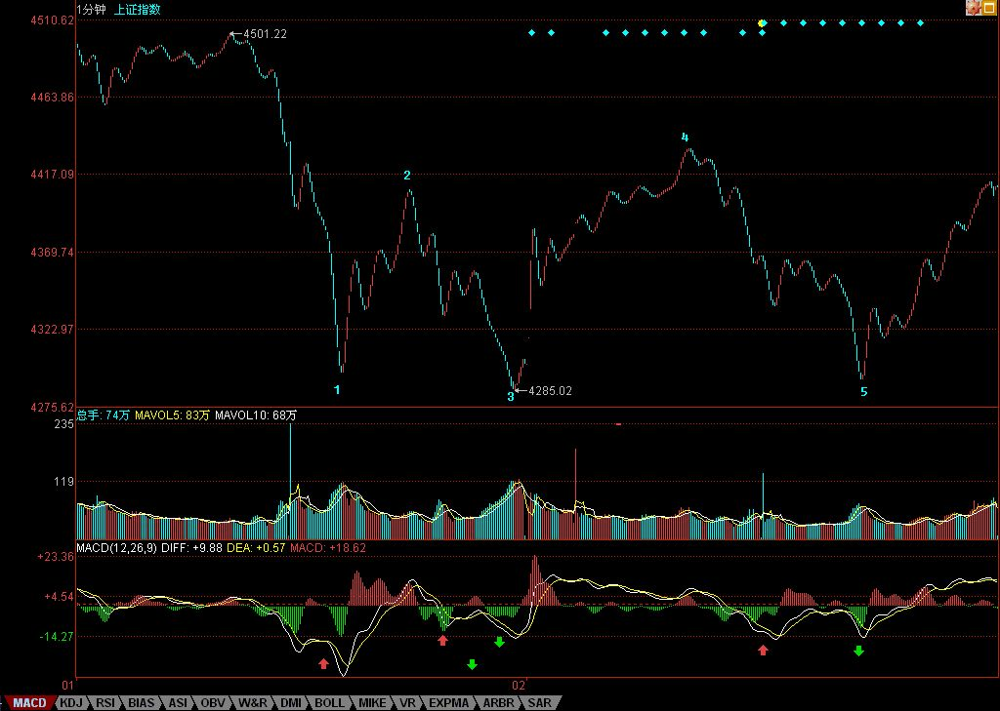{width="5.6299212598425195in"
height="4.0065048118985125in"}

缠中说禅2007-08-02 16:16:02

\[匿名\] 知劲草

2007-08-02 16:13:10

一直关注你的帖子，从中受益颇多，请问姐姐怎么看美股以及港股将来的走势，如果全球性股灾来临，中国能独善其身吗？

===

不可以，千万别相信中国股市逆全球股市而涨的忽悠，一天可以，二天可以，但不可能永远。

缠中说禅2007-08-02 16:18:13

\[匿名\] 大盘

2007-08-02 16:11:55

请问博主：

进行每笔划分时，相邻k线出现以下三种情况，是否要合并处理：

1）相邻k线的高点或者低点之一相等

2）相邻两k线的高点和低点都相等

3）好几分钟都维持同一价位，也就是k线走势出现"麻点"

===

只要不包含就不需要合并，包含就是有一K线完全在相邻K线的里面。

缠中说禅2007-08-02 16:19:25

\[匿名\] 新浪网友

2007-08-02 16:18:29

那么，对于如本ID一样第一拨进来的，一定要采取这样的策略，就是绝对增仓，因此在3600点开始都买够了，现在还买是脑子水太多的表现。

\-\-\-\-\-\-\-\--

妹子好！

这句话写错了吧？

===

改了，但新浪系统慢，可能还没有显示出来。

当然，市场往往不会按照理智的方式进行，市场往往就是醉生梦死疯一回，那么，对于如本ID一样第一拨进来的，一定要采取这样的策略，就是绝对不增仓，因为在3600点开始都买够了，现在还买是脑子水太多的表现。

缠中说禅2007-08-02 16:20:29

\[匿名\] 悠悠

2007-08-02 16:16:30

先沙发。是新报到的。真学着感觉股感。想问缠姐对今天对3姑停盘可有什么看法，和对明天可有什么指示

===

做事情不能过分，过分，当然有搞死理由。

缠中说禅2007-08-02 16:24:09

\[匿名\] 田鸡和猪肝

2007-08-02 16:17:40

新学 不好意思

问题1.怎样判断一个走势类型为完成的

2.如可确定中枢震荡形成或完成

===

这在课程里都有，要把这问题说清楚，要把所有课程说一遍，所以还是请把课程通读一遍。例如，某中枢震荡的结束就是形成该中枢的第三类买卖点，这在课程里说过N次了，所以还是请先把课程研究一下。

缠中说禅2007-08-02 16:37:27

\[匿名\] 轻风吹断

2007-08-02 16:20:14

今天，经过大幅下跌的华菱认沽权证继昨天反弹之后在下午继续反弹，在整个交易过程中并没有出现剧烈波动的现象．而按照原来的权证交易规则，华菱的涨停价位应该是４.２９１元！也就是说，只有在这个价位才能自动停牌！但你们深交所在下午１３时４３分１６秒起突然对华菱等权证实施了停牌３０分钟的措施，理由居然是＂价格异常波动＂！请问深交所，按你原来的规则此权证涨停价位在４.２９１元，那就是说你允许它涨到这个价位．既然你认为可以涨到这个价位，为什么在此权证还在远离这个价位的时候就说＂异常波动＂了呢？如果这样是异常波动，那涨停价位不是更加是＂异常波动＂，那你们为什么还允许有这个涨停价位？现在，你们自己制造的规则，自己一手打破，请问深交所，这是什么道理？另外，要说＂异常波动＂，股票市场＂５.３０＂大跌后的第五个交易日，大部分股票从跌停板到涨停板，差价波动幅度达到了２０％，这还不够异常吗？当时为什么你们又不将这些股票停牌？

　　　=============================

想听听博主对今天这个事件的看法.

===

327的时候，成交都可以不算，这有什么奇怪的。政策风险本来就是要随时预防的，所以一定要记住，股票是废纸，一定要买点买，只有0成本才是相对安全的，否则无安全可言。

另外，这件事情其实也是一个信号，如果股票也这样，那么规则也是可以改的。

股票是用来操作，不是用来争吵的。股票里，赢钱就是对的，输钱就是错的，其他都是废话。

至于交易所，真正的垄断性机构，如果对他的规则有疑问，可以去外面的交易所，如果一定要在这里，那么，就必须要知道，你面对的是一种什么样的玩意，先把这先决条件给设定好了，否则，那是你的问题，而不是交易所的问题。

缠中说禅2007-08-02 16:38:10

\[匿名\] 新浪网友

2007-08-02 16:37:23

\[匿名\] 天平007

2007-08-02 16:34:23

缠主:

看了你的文章3个月，今天第一次发言：）

通过学习你的理论，很是受用，也在市场中取得不错的收获，谢谢你！

现请教一问题：昨日大盘下跌，你说是15分钟背弛，这我同意，15分钟的确有出现背弛。可我发现30分钟和60分钟也出现了MACD背弛，而你认为60分钟还没出现背弛，我有些迷惑，请指教。

====

60分钟黄白线还没回抽零轴呢。这是我的理解。

\-\-\-\--

对

缠中说禅2007-08-02 16:43:22

\[匿名\] 百思不解

2007-08-02 16:39:09

博主好：

笔和线段的概念很清楚了，现在就是同级分解的细节有困惑。

比如1f图上线段已划分好，则对1f走势类型做同级分解，请问这同级分解规则能否象线段划分规则一样用严格的数学语言表达呢？

以前课程里虽有大概的描述，但文字描述总有细节不清楚的地方。请博主有时间象讲解线段一样详细讲讲同级分解，最好能在指数图上画出来。

谢谢

====

这在以后都继续说到的，等等。

缠中说禅2007-08-02 16:47:11

christine

2007-08-02 16:42:11

姐姐，昨晚的新课程看得我很晕，我的理解水平太差了。

1.在标准特征序列里，构成分型的三个相邻元素。

是指构成分型的三笔吗？

2.\"特征序列的顶分型中，第一和第二元素间不存在特征序列的缺口，那么该线段在该顶分型的高点处结束，该高点是该线段的终点；\.....；\"和"特征序列的顶分型中，第一和第二元素间存在特征序列的缺口，如果从该分型最高点开始的向下一笔开始的序列的特征序列出现底分型，那么该线段在该顶分型的高点处结束，该高点是该线段的终点；\...\..."此二段描述看着没有什么区别

===

特征序列里的三相邻元素不是真实图形的连续的三笔，里面的元素如果是上的线段，是那些向下笔，这在课程里说得很清楚，先把这搞清楚，否则后面肯定看不明白了。

这特征序列的分型，是把特征序列里每一元素当成一个K线所形成的，不是实际图形上的分型。请再研究一下。

缠中学禅2007-08-02 16:50:01

请问博主：在一顶之后的k线，并不是标准的下降k线，而是没有包含关系的一低一高的若干根k线象长城，在中间也会找到两三根下降k线，最后有一底，这算一笔吗？

缠中说禅2007-08-02 16:51:14

\[匿名\] 随风

2007-08-02 16:47:12

姐姐对近期的物价全面上涨怎么看?国家是不是失控了?

===

你看看本ID写的关于货币战争的帖子，2003年没干的事，现在出现这种情况理所当然。现在的问题还不在这里，而是这升值的战车一旦坐上去，就停不下来了，历史上，如此大规模的升值走势后，似乎从来没有过软着陆的情况，中国能否例外，只有天知道了。

缠中说禅2007-08-02 16:52:34

\[匿名\] 新浪网友

2007-08-02 16:51:12

老大:图中下面的红\\绿箭头不明白啥意思,能否告知一二.(可能问题太幼稚了,不过真的不明白)

===

就是要你看箭头指着的黄白线或柱子面积之间的对比。

缠中说禅2007-08-02 16:59:59

\[匿名\] 新浪网友

2007-08-02 16:51:27

\[匿名\] 新浪网友

2007-08-02 16:50:09

老大辛苦了 那个600636跟老大当初所说的相差甚远 希望老大能回答一下 谢谢

==================================

老大好

===

636没什么问题，在长线建仓中。就像737，虽然从7元多到10元多了，依然在长线建仓中。注意，建仓都是动态的，如果成本没被降到一定值，建仓完不了。

一个天大的误解，就是建仓时成本要很高，其实高明的人，建仓时，成本就可以不断下降，当然，这种手法，对没耐心、短线思维的人，是痛苦的。所以本ID说过，散户也要学会动态建仓。

缠中说禅2007-08-02 17:01:25

钱末事

2007-08-02 16:58:28

老大,快5点了,我贴了N次了,问个问题,权证数量发生较大改变,用MACD比较力度怎么去校正呢?另外有空讲讲三个系统另外一个比价系统,好吗?谢谢.

===

无须校正，那以后会说到的

缠中说禅2007-08-02 17:03:17

对不起，5点到了，下次有时间再回答问题。

先下，再见

## 醉生梦死疯一回游戏正式开始

(2007-08-03 15:57:58)

 坐轿子的感觉确实不错，坐在轿子上看沿路风景，别有一番情趣。下面，是关于坐轿子上华山的第一天日记。这个日记，将有N日N章。

今天大盘的跳空高开，就使得6月20前后的K线组合不可能出现。昨天已经说过"市场往往不会按照理智的方式进行，市场往往就是醉生梦死疯一回"，站在第三拨人的立场上，尽快远离4300点，吸引第四拨人进来，本来就是急切的事，至于后面将引发什么，他们当然无所谓，而前两拨人就更无所谓。一般来说，越到后面的第N拨，其成分将越来越杂乱，如果说第一拨人的成分是最纯净的，到后来，就三教九流，什么都有了。

今天的大盘开始迎来第四拨人里的先头部队，周末如果没有什么太大的坏消息，那么，第四拨人里的主力部队将在下周大面积进入。这拨人的成分将比第三拨更杂，有前三拨中中途开小差的逃兵，有看所谓周线突破有效进入的技术人士，有在外面卖外卖现再回家开店的、更大面积的是那些被钱烧得发慌的各路男女等等，醉生梦死疯一回游戏正式开始。

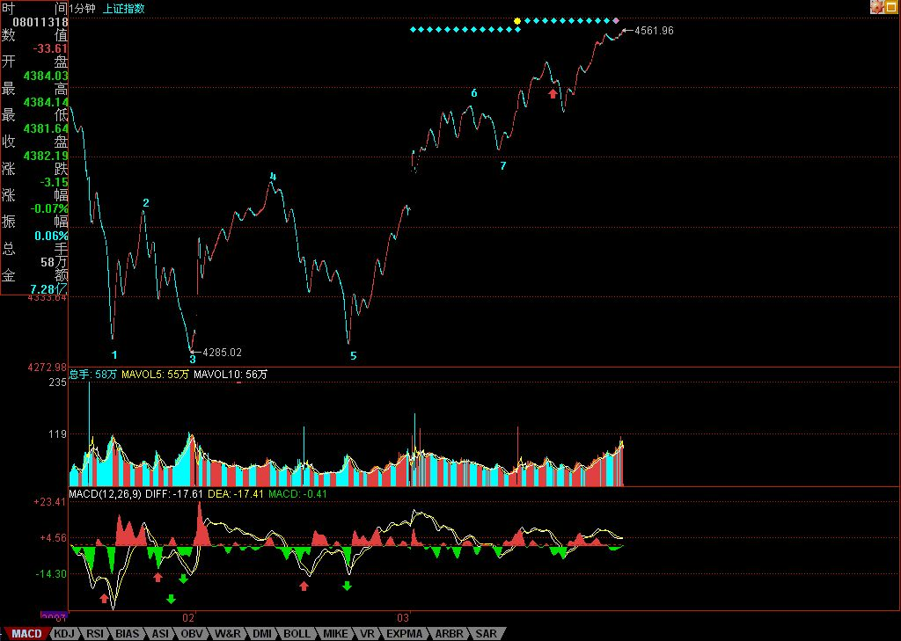{width="5.629861111111111in"
height="4.00625in"}

对于前三拨进来的人，从现在开始，最后埋单的是谁，是N等于几，已经不重要，关键是如何把这个游戏玩得长一点，但这个时间并没有什么上帝去规定，一个合力的结果下，从下周一开始，这个游戏的时间T开始计算，T从0开始，向着尽可能大的数进发。这就如同玩电子游戏，去预测在第几关结束是脑子有水的表现。

也正如玩游戏，关键是操作的策略，而不是去预测游戏在第几关结束。目前的操作也一样，预测都是无聊把戏，关键是有精密的操作。而操作是针对不同人的，如同玩游戏，高手和低手当然不是同一玩法：

对于低手，本ID反复说过最基本的操作策略，就是短线看5日线，中线看5周线，长线看5月线，只要不有效跌破，相应的操作就不用操作了，持股看着就可以。何谓有效跌破，就是跌破后反抽上不来，这种反抽当然和对应级别有关，例如一个月线的跌破，至少要看下个月反抽的情况，而不是看一日。

对于大资金以及散户里的中高手，就是要利用震荡机会就减低成本，一路上涨，一路把成本减下来但持仓数量不变，这样，你的仓位就自然随着大盘的上涨下降，也就是钱越来越多，但筹码没少，这样，是既回避大盘可能的突发非系统风险，又能完全把握市场利润的有效方法。

对于散户里的高手，就要充分利用大盘震荡中板块的轮动机会，获取市场最大的机会。

有人可能问，做不到高手怎么办？那就做低手，持股都不会，大盘晃悠一下就鸡飞狗跳的，那还炒什么股票，让股票炒你就行了。

昨天已经说了"个股方面，成分股继续打冲锋，一旦确认周线突破成立，二、三线股会跟上的。"这个结论继续有效，而且，只要第四拨资金能被忽悠进来，那些已经消除业绩风险的二、三线股，以及有题材的股票将大肆表现，例如，你没看到这两天，本ID已经大肆引诱各位到北京旅游了吗？注意，题材股的操作，一定不要追高，过了这个村，还有那个店，天天都有新机会，不管谁的股票，都不必追高。

股票都是废纸，一个好的策略与心态，能让你把废纸变黄金。

技术上，把今天的分段放上来，还搞不清楚的，请好好学习。例如下图中的7，这是什么？是下面那1分钟中枢的什么？这么标准的图形，都看不明白，那请把ID的课程重新读去。

周末，腐败的时间到了，大家放风去吧，别让股票把自己的生活套牢了，本ID要去风花雪月去也，不陪各位了，自由活动，周日继续音乐会，这次一定不爽约。

先下，再见。

## 教你炒股票68：走势预测的精确意义

(2007-08-05 10:36:28)

下午要去小罗、亨利一番，然后还要去酒吧折腾折腾，所以先把课程放上来。

今天说说预测，何谓预测？一般的预测是什么把戏？而科学严密的预测究竟是怎样的，本ID的理论是如何成为最精确最当下预测的，这都要在这里说明。真正的预测，就是不测而测。当然，这和一般通常的预测不是一个概念。在通常预测概念的忽悠、毒害下，很多人那根爱预测之筋总爱不时不自主地晃动几下，这里也算给那些被预测毒害的人治疗治疗，也算死马当活马治一治了。

市场的所有走势，都是当下合力构成。例如，前几天，认沽权证突然停牌导致的走势，就是由于规则分力有了突发性改变当下构成的。由于一般情况下，政策或规则的分力，至少在一个时间段内保持常量，所以，一般人就忘记、忽视其存在。但无论是常量还是随着每笔成交变化的变量，合力都是当下构成的，常量的分力，用F(t)表示，只是表示其值是一个常量或者是一个分段式常量。对于任何一个具体的t来说，这和变化的分量在合成规则与合成的结果来说，没有任何的区别。

但这些常量的分力，并不是永恒的常量，往往是分段式的，其变化是有断裂点的，很多基本面上的分力，都有这个特点，这些断裂点，构成预测上的盲点。当然，进行基本面分析，对宏观面进行大面积的考察，可以尽量减少这些盲点，但不可能完全消除。这因素的存在，已使得所有一般意义上的精确预测可能变成一个笑话。

更重要的是，基本面上的因素，也是合力的结果。政治、经济等等方面，哪个不是合力的结果？现在的世界政治、经济格局，就是众多合力的结果，一个国家里的就更是这样了。很多人一根筋思维，总是假设政策是一个上帝，是不需要合力的，里面没有各种利益的斗争，所有结果都如同一个预设的机器给出的。所有一般意义上精确预测的理论，实质上都是以类似的一根筋思维为前提的。

比前面这些更深刻的，站在哲学的角度，预测也是一个分力，就如同观察者本来就被假定在观察之中，所有观察的结果都和观察者相关、被观察者所干预，以观察者为前提，预测也是同样的方式介入到被预测的结果之中。正如同量子力学的测不准原理，任何关于预测的理论，其最大的原理就是测不准。

有人可能在说，很多人都有预测准确的经历，这是为什么？其实，这不过是一个概率事件。因为走势可以发生的情况，按任何标准来分类，其可能情况都是有限的。一般来说，就是三、四种情况。而喜欢预测游戏，到处宣布自己预测如何如何准的人比全世界正在被面首的人都多，瞎猫还能碰到死耗子，就算有人连续碰对了，也依然在概率的范围内，有什么大惊小怪的。而所有号称自己预测如何如何的人，不过都是玩如此的招数或被如此的招数玩而不自知，至于那些把烂的藏起来，只把忽悠对的到处晃悠，那就更等而下之了。

其实，预测一点都不神秘，甚至连某男都可胜任（注意，这涉及不可知事件预测，本ID对此的准确性没有任何信心）。所有预测的基础，就是分类，把所有可能的情况进行完全分类。

有人可能说，分类以后，把不可能的排除，最后一个结果就是精确的。这是脑子锈了的想法，任何的排除，等价于一次预测，每排除一个分类，按概率的乘法原则，就使得最后的所谓精确变得越不精确，最后还是逃不掉概率的套子。

对于预测分类的唯一正确原则就是不进行任何排除，而是要严格分清每种情况的边界条件。任何的分类，其实都等价于一个分段函数，就是要把这分段函数的边界条件个确定清楚。例如下面的函数：

f(X)=-1，X∈(-∞,0)，f(X)=0，X=0，f(X)=1，X∈(0，∞)

关键要搞清楚f(X)取某值时的X的范围，这个范围就是边界条件。在走势的分类中，唯一可以确定的是不可能取负值，也就是从\[0，∞）进行分类，把该区域分成按某种分类原则分为N个边界条件。

有人可能要说，股票怎么可能变到0？这有什么奇怪的，股票停了算什么？别说股票，钱都可以变成0，你说1950年时候的金元券值多少？当然，如果你的子子孙孙能把一张金元券守到宇宙爆炸的最后一刻，那时候，这金元券会值N元的，这个N，大概也会趋向一个恐怖数字的，那就等着吧。

不仅股票是废纸，本质上货币也是废纸，其所谓的价值区间和股票是一样的，0同样是可能的取值。甚至按最精确的理论来说，还可以取负值，例如，如果有某朝或某国政府规定，私藏前朝或别国钱钞股票的一律死罪，那你说这钱钞或股票是不是负值？至于具体股票变0的情况，在权证上就经常发生。

边界条件分段后，就要确定一旦发生哪种情况就如何操作，也就是把操作也同样给分段化了。然后，把所有情况交给市场本身，让市场自己去当下选择。例如，前几天，本ID用前期两高点和10日线进行分类，那自然就把走势区间分类成跌破与不跌破两种。然后预先设定跌破该怎么干，不跌破该怎么干，如此而已。这就是最本质的预测，不测而测，让市场自己去选择。最后市场选择了不跌破，那就继续持有。

有人说，万一他上去后又跌破怎么办？这是典型的脑子水多瞎预测思维。任何一个市场的操作者，一定不能陷入这种无聊思维之中。市场不跌破是一个事实，你的操作只能根据已经发生的事实来，如果跌破，那就等跌破成为事实再说，因此在本ID意义下的预测里，你已经把如果跌破的情况该干什么预设好了，这种情况没成为事实，就是另一种情况成为事实，那就该干什么干什么。

一般来说，喜欢预测的人，通常都是神经过敏，脑子水多，操作低下，喜欢忽悠之辈。那些从2000点就开始测顶的，如果说错一次割一块肉，现在都可以去当假冒羊蝎子了。股票是用来面首的，不面首股票，就被股票面首。面首股票，可不能光是忽悠，而是要实际操作。所有的操作，其实都是根据不同分段边界的一个结果，只是每个人的分段边界不同而已。

因此，问题不是去预测什么，而是确定分段边界。例如，前两天用前期两高点分类有意义，现在再用，就没什么意义了，现在就可以完全用均线系统来分类，所以本ID就接着强调5日、5周、5月的原则。有了分段的边界原则，按着操作就可以，还需要预测什么？又有什么可预测的？

世界金融市场的历史一直在证明，真正成功的操作者，从来都不预测什么，即使在媒体上忽悠一下，也就是为了利用媒体。真正的操作者，都有一套操作的原则，按照原则来，就是最好的预测。

那么，本ID理论中的分型、笔、线段、中枢、走势类型、买卖点等等，是不是预测呢？是也不是。因为本质上本ID的理论，是最好的一套分段原则，这一套原则，可以随着市场的当下变化，随时给出分段的信号。按照本ID理论来的，其实在任何级别都有一个永远的分段：X=买点，买入；X=卖点，卖出；X属于买卖点之间，就持有，而这持有的种类，如果前面买点，卖点没出现，就是股票，反之就是钱。按照分段函数的方法，本ID的理论就有这样一个分段操作的最基本原则。

因此，如果你真学习和按本ID的理论来操作，就无须考虑其他系统，或者说其他系统都只能是参考。本ID解盘的时候，之所以经常说均线，高点连线之类的，只是为了照顾没开始学本ID理论的人，并不是本ID觉得那种分类有什么特殊的意义。本ID的理论，任何时候都自然给出当下操作的分段函数，而且这种给出都是按级别来的，所以本ID反复强调，你先选择好自己的操作级别，否则，本来是大级别操作的，看到小级别的晃动也晃动起来，那是有毛病。

给出分段函数，就是给出最精确的预测，所有的预测都是当下给出的，这才是真正的预测。这种预测，不需要任何概率化的无聊玩意，也没有所谓预测成功的忽悠或兴奋。这种预测的成功每一当下都发生着，每一下都要忽悠兴奋一下，这人脑子早锈掉了。所谓碧空过雁、绿水回风，哪个是尔本来面目？参！

## 成分股行情的泡沫化阶段正式开始

(2007-08-06 15:58:43)

正如这次在3600点突击时，本ID写了满江红，上次突破3000点的总攻行情，本ID在3月19日写了神州自有中天日，万国衣冠舞九韶，时间上，回头一看，都是很是时间的。在3月19日那篇文章里，本ID宣称"在总市值超越GDP之前谈论股市的泡沫是可笑的，在中国股市总市值超越其GDP之前，第一阶段行情不会结束。"现在，这个目标已经达到，中国股市的总市值已经达到GDP了。本ID在文章里很明确指出，第一阶段"行情最主要体现在以权重股为代表的成分股上。"但，今天这样一个日子里，本ID必须宣布，成分股行情的泡沫化阶段正式开始。

GDP，就是整个股市市值波动的中枢，前面是恢复性上涨，恢复到这个中枢上来。而从今天开始，将是远离该中枢的泡沫化阶段。一般来说，泡沫化阶段的行情，将逐步走向全面疯狂，大笨象们都可以跳出小步舞，疯狂的上涨将如瘟疫般蔓延。这个阶段，可以很短暂、也可以延续相当时间。可以远离中枢30%，也可以远离300%，但最后的结果都是唯一的，回跌到中枢处。

所有如本ID般正在轿子上享受的，首先要在思想上明确这波行情的性质，但不用慌张，能在泡沫中安心享受，在泡沫最后一刻一脚把泡沫踢破，本来就是投机的好境界，好好享受，好好利用，别浪费了疯狂轿夫们的力气。

一般在这种泡沫化阶段，本ID的原则就是只坐轿子不动手。本ID握有大量中字头的大盘股票，基本每一个中字带头的成分股票都有，这在3600点的时候，本ID专门说过的，等这泡沫化打到高潮时，这些都是很好的踢破泡沫的种子好选择。其他就是原来的那十几、二十只成本为0的，这是作为所谓的二、三线股配置的。这些股票，反而有些会长线继续关注，因为第二阶段的成长股行情中，有些会成为种子选手。本ID的仓位都是按20年的思路来建的，对有些股票，本ID绝对要搞他20年以上。

短线走势，看看下图就很明白，8-9形成的线段，和下面6-7的形成线段上类上涨走势，当然，这个走势可以延续下去，直到形成新的1分钟中枢，但前提是后面的上攻不形成类背驰，否则，将至少在目前位置形成一个1分钟级别的中枢震荡。是否背驰，就是明后两天关注的重点。一旦背驰形成，那么一个大的震荡不可避免。

个股方面，成分股的冲锋依然会继续，但二、三线股的行情将逐步加温。今天最大的问题就是，周末第三波人的宣传能力太差，确实是乌合之众，其他方面资源太少，使得被忽悠的第四波人的进入还没达到应有的程度，因此，这几天第三拨人如何在忽悠方面表演，可以继续看戏。如果第四拨人的进入速度太慢，那么大盘必然要背驰而震荡。目前外围股市腥风血雨，如果这两天能止，一定是第三、四拨人最大的利好，那就等着吧。

思考题：看这线段中的类背驰，是用1分钟图上的MACD还是5分钟图上的MACD辅助判断方便？

本ID原想着以下大雨的名义而偷懒不去腐败，结果，去腐败的那区竟然没下雨，而本ID这区的雨也小了，看来没机会，只能先下，再见了。

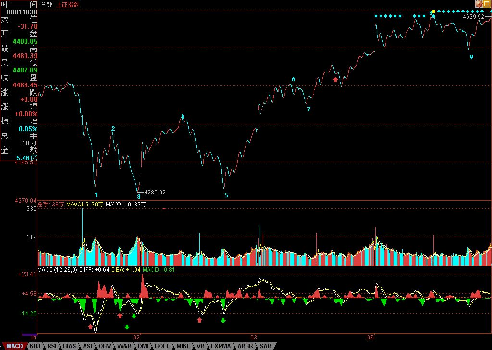{width="5.6299212598425195in"
height="4.0065048118985125in"}

缠中说禅2007-08-06 16:16:39

评论的模版有点问题，各位如果看不到，请耐心等待，本ID对电脑不大熟悉。

以后不能马上看到新帖子的，请到所有文章里找，这样可以快点看到。

先下，再见。

缠中说禅2007-08-06 16:45:32

各位注意，本ID正在车上用手机上网。你们现在看到的，不是正确的版本，新浪对修改的版本有一个延迟，上面有些网友说的是对的，原来那8-9不是一笔。

## 因迎奥运一周年而延迟的震荡只是延迟了

(2007-08-07 22:18:38)

对不起，现在才发帖子，今天其他内容的帖子没法写，只能说说今天的大盘。

显然，8-11已经极为标准地形成1分钟中枢，11-13可以看成该中枢的一个延伸。而13-14，这个对中枢的离开后形成14-15的回抽，构成1分钟中枢的类第三类买点（严格来说，一个线段是不能构成买点的，只能是一个类买点，因为在这种理论前提下，1分钟中枢是最小级别，而最小级别的走势，必须至少包含一个1分钟中枢，因此说1分钟的第三类买点，只是类比地把线段当成了1分钟的次级别，但这只是类比说法，在严格的理论上，不能这样认为。）

由于收盘，使得16开始的17段走势是否完成，无从判断，因此，明天一大早的走势就是决定该线段结束的位置，如果在图中10之下（也就是4645点下），那么将成一个5分钟的中枢，（8-11）+（11-14）+（14-17）。

注意，一定要注意，一般来说，而由于第三类买点后并不必然导致上涨的延续，而是还有第二种选择，就是形成更大级别，也就是5分钟级别的中枢，而一般来说，在走势上，第一个中枢的第三类买点能形成上涨的概率比第二个中枢的要大多了，对于上涨中第二个中枢以后的第三类买点，其后形成上涨继续的概率越来越小，也就是说，这些第三类买点的参与价值越来越小。站在实质操作中，在第一个中枢已经买了，根本没必须等到第二个以后中枢的第三类买点才介入，那是脑子反应慢的表现。

因此，无论明天开盘后那线段走成怎样，连超短线的介入价值都不高，典型的刀口舔血，明天开始，要关注的反而是因迎奥运一周年而延迟的震荡只是延迟了，但延迟不等于消除了，要发生的一定要发生，昨天留下的两点缺口，也构成技术的吸引力，因此，对于实际操作来说，如何应付好这震荡才是首要关注的事情。当然，不排除明天出于某种原因有护盘力量使得这震荡被减震了，但周四、五，依然有极大的可能补回来。技术上，4500点突破后，还没有一次有力度的震荡去确认突破的有效，一般来说，这种程序是少不了的，人为因素，最多用时间换空间，但能否实现，那还两说呢。

个股方面，本ID让各位来北京旅游，这几天已足够热情了，现在，短线也没有任何参与价值了，该股，是本ID的中线股票，来回折腾到2008，是必然的，但并不意味着就永远不回杀了。至于那等比，本ID一早就断言，等真启动的时候，肯定都是所有人拿不住的时候。算了，这些小盘股，不会让太多人获利，就那么点筹码，还不够塞牙缝的，千万别追高了，这种小盘股，追的人一多，马上又是一个灾难。大资金有什么优势？大资金的优势就是可以在一股票上耗上一年半载还能把成本给搞没了，而小资金，没必要把时间浪费其中，有些钱不是和任何人都有缘的。

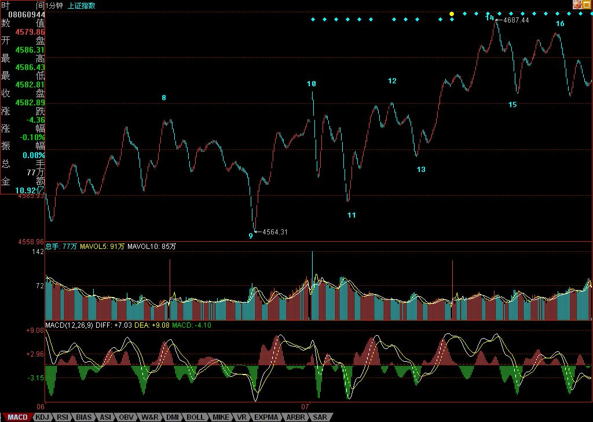{width="5.629861111111111in"
height="4.00625in"}

本ID从3600点开始买股票，只和国资委保持一致，只买中字头，这可在当时暗示过了。最近中船、中铝之类发疯，可别以为是真疯了，当然，这类股票最近都涨多了，就别买了，欣赏吧，顺便去想想国资委为什么前段时间出那减持的规定吧。

对中字头的，本ID只说了一个，原因是那价位低，对于散户合适点。现在走得怎么样，各位也看到了。不温不火，就已经从7元多快到12元了，这就像去年12底，本ID在6元让各位买那只药一样，都是送一个大包子给有各位，让各位挣点学课程的学费。那药，可是本ID准备搞20年的股票，为什么？华润把万科搞到中国老大，为什么不能把药搞到世界老大？现在20元，还S股，本ID6、7元大力抢入的成本早就0了N个月了，不搞他20年怎么对得起自己？现在，本ID对这股票的要求很低，保持0成本，一年增加1到2倍的筹码，别人挣钱，本ID挣筹码。至于那只比三一成本低多的股票，也从7元跑到10元了，这股票基本面有不确定的地方，高了就别追了，对这股票，本ID的信心可不大，只是如打家劫舍的，劫他一票而已。

二、三线股会逐步苏醒，但成分股的疯狂会直到泡沫破裂结束第一阶段的行情。

不说了，累了，上面的后面关于个股的都是梦话，休息。

先下，再见。

缠中说禅2007-08-07 22:23:38

对不起，图弄错了，帖子也搞错了，等15分钟出来的才是真的，

缠中说禅2007-08-07 22:25:13

新浪改版？本ID这里都乱套了，找不到编辑，刚才把一个错帖子发出去了，各位要等等。

缠中说禅2007-08-07 22:49:52

对不起，没法弄，本ID的电脑水平本来就不行，新版本好象字体大小调整不了，随他去吧。

各位受累了。正确的帖子已经发出来，不知道能多长时间才能看到。

各位死机，是改版的问题，一个不成熟的产品，各位就继续受累吧。

先下，再见。

## 当工行都发疯后，轿夫们还有什么把戏？

(2007-08-08 15:44:40)

今天的震荡，已经在昨天明说了。而且，昨天还特别强调某种护盘力量出现的可能。但这种力量，并没有改变震荡的本质，只是让这种震荡更具有迷惑性。

震荡的位置，昨天也说了，就是那差两点未补的缺口，今天两次的下跳都在上面受到特别关照。如果这都能把人晃晕，那就请抓紧学习和心态调整了。显然，从下图可以看出，昨天说的5分钟中枢确立后，这中枢的震荡将一直维持到出现其第三类买卖点之后，具体的分析太幼儿园，就不说了。

目前在4600点上下的这个5分钟中枢震荡，对应的是4300点那个，也就是说，3900点上来，已经出现第二个5分钟中枢，因此，该5分钟的上涨类型是可以确立了。但正如昨天所说，一般第二个以后中枢的第三类买点，即使出现，最后演化成更大级别中枢震荡的几率也逐步增加。因此，在操作上一定要坚持以下原则：在第三类买卖点出现之前，必须先卖后买，一旦出现第三类卖点，则坚决等待更大级别中枢出现或下跌完成后才再介入。

当然，没这个技术的，看5日、5周、5月均线。短线上，后三天是关键，因为5日线已经逐步上来，如果在目前位置不能有效向上，那跌破5日线，向5周线靠拢寻求支持就是理所当然了。

现在，对于第四拨人来说，一个现实的问题就是，当工行都发疯以后，还有什么可折腾的？一个最简单的，就是继续把汽车、交通、能源等最近没特折腾的也折腾一遍，然后再继续原来折腾的轮动再搞一波，把第五批也给诱骗进来。那时候，比本ID前面说的大笨象要跳小步舞还要厉害的是大笨象都变小笨鸟，飞得满天都是了。

当然，这只是第四拨人的如意算盘，能否打响，就走着瞧了。我们只需要坚持前面的买卖原则，边把成本降下来，边耐心看轿夫的表演。至于没这技术的，就看着均线把股票拿住。

下午、晚上都有活动，先下，再见。

## 顶住明天，第四拨人才可能解脱。

(2007-08-09 16:04:24)

**昨天说，工行发疯后，第四拨人只能继续轮动板块把第五拨人蒙骗进来。今天，板块轮动再次展开，当然，本ID已经给这论行情定了一个性，就是成分股的泡沫化行情，最终，大笨象要跳小步舞，甚至都要变小笨鸟飞得满天都是，行情的发展继续按这个性质不断展开。至于哪天才会泡沫爆破，无须预测，市场自然给出。**

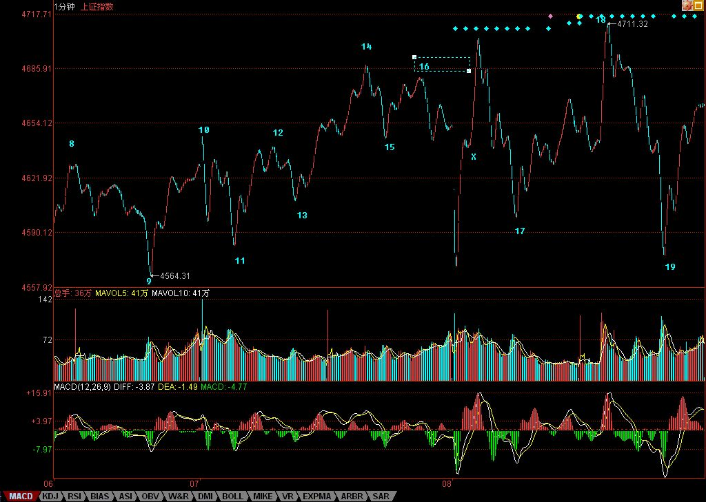{width="5.6299212598425195in"
height="4.0065048118985125in"}

**走势上，下图中20-21是14-17的1分钟中枢一个类第三类买点，站在8-17这个5分钟中枢的角度，明天是否能形成第三类买点就极端重要了。（注意，图形一收放，图中数字会走，本ID今天才发现这问题，昨天图中的17位置移动了，今天这个位置才是对的，其实，这个根据定义就很容易发现，17后向上的中间有一个X，就是因为这不构成一笔，因此，18必须到目前的位置才满足至少三笔的要求。）**

**因此，今天的题目是针对此而说的，只要能顶住明天，形成这个5分钟中枢的第三类买点，然后再拜托周末没有大的消息，再给两天时间大肆宣传，下周一，新的资金才会有机会补充进来。今天成交量的萎缩，使得第四拨人的努力有不靠谱的地方，因此，明天的第三类买点至关重要，一旦出现跌回8-17的中枢，那么这群人当举重手的可能性就根本无须探讨了。**

**看不明白上面的，本ID已经给出最简单的方法，就是短线看5日线，但这就可以让你安心持股了。技术高的获取更高的利润，这是天经地义的。复杂的不会，那就玩简单的，千万别吃夹生饭。会就会，不会就学到会，没学会之前，就先用简单的方法操作。对于已经学会的各位，也应该养成好习惯，就是边看盘，边把段给分了，这样操作起来，就一目了然了。这包括大盘和自己操作的个股。**

**注意，本ID说了只坐轿子，但没有任何地方，本ID曾经说要看空。本ID之所以能在市场中生存十几年而不断壮大，唯一秘诀就是底部之后只坐轿子。本ID的方法很简单，就是留了机动的资金后，把仓位打到最大，然后不断在出现中枢震荡时，保持仓位把差价搞出来。一般情况下，到一段行情顶部的时候，本ID原来的仓位都要下降到70%-75%，注意，筹码不丢失，只是钱多出来，所以仓位自然下来了。这样，无论发生什么，本ID都是大赢了。**

**在市场中，关键是能长期保持赢利，本ID从来没见过喜欢当轿夫的最终能活下来的。谁爱当轿夫就当去，本ID依然如故。而且本ID还要特不厚道，还要经常批评轿夫的姿势不美、动作恶心。例如，本ID今天就要批评，轿夫们，本ID其他中字头的都不错，就是中石化、中国银行有点蔫，连新高都没创。哪位轿夫有力气的，也来一把吧。另外、抬中铝的，动作优美点，今天走得特恶心，搞了一个双针出来；潍柴动力的轿夫，手脚麻利点，反正都要上100的，就别摆太多姿势了；中国国航，也比较丑陋，连南航都比不上，你们李总怎么见部队的朋友？**

**股票，要有放松的心态，轿子都不会坐，那就当抬轿的，或者当饺子给人吃了吧。**

**今天可以回答问题到5点。**

缠中说禅2007-08-09 16:14:48

全线飘红 删除此人所有评论

2007-08-09 16:09:56

缠MM好，说说看

这几拨咋不光顾俺们的轿子呢？

===

成分股行情，首先是最大那50家，然后是300，最后才会轮动到二、三线，当然，这不是绝对的，只是大方向。 

缠中说禅2007-08-09 16:18:21

\[匿名\] 与你同行 删除此人所有评论

2007-08-09 16:14:41

老师,股指狂升，很多股票价格却不动，反而跌怎么理解？

===

这太正常了，上半年二、三线股涨的时候，大盘成分股也没怎么动，风水轮流转。

从今天开始，可以慢慢关注沪深300中的，大盘50会慢慢扩散出去。当然，还可以关注大盘50中没怎么动的，没动的都会轮一遍的，前提是，有一定级别的买点。

缠中说禅2007-08-09 16:21:19

\[匿名\] 恒灵 删除此人所有评论

2007-08-09 16:17:25

缠主，我看大盘图一直有顶背却不下跌，是不是我看错了？

===

MACD是辅助，首先要把走势给分清楚，否则又怎么知道是哪段和哪段比？这次上来这一段，可以先看成是5分钟级别的背驰段，如果背驰成立，就至少重新跌回4600点上下中枢，也最迟在周一前就有结果。也就是说，这个背驰段是否成立的结果。

缠中说禅2007-08-09 16:24:21

\[匿名\] 新浪网友 删除此人所有评论

2007-08-09 16:20:32

缠姐，对于中国联通600050(中字头的哟\...)这支股怎么看啊？对于散户该怎么操作（吸血）呀？

===

本ID一直有，就等中移动回来了。另外，联通要接受所有目前中移动GSM的业务与客户，当然，这方案还可能有变数。联通的故事要说完，怎么都要N年时间，早着呢。

缠中说禅2007-08-09 16:25:01

\[匿名\] 白玉兰 删除此人所有评论

2007-08-09 16:10:54

妹妹好！

很长时间没有和你直接对话了。

===

好的。

缠中说禅2007-08-09 16:26:22

全线飘红 删除此人所有评论

2007-08-09 16:24:30

谢缠MM，这50家是上证权重前50吗？我经常看。还有一个是上证50样本股。应该是前一个吧。

看来我对成分股的含义理解错了，不懂装懂啦，\...

＝＝＝＝

缠中说禅

2007-08-09 16:09:56

缠MM好，说说看

这几拨咋不光顾俺们的轿子呢？

===

成分股行情，首先是最大那50家，然后是300，最后才会轮动到二、三线，当然，这不是绝对的，只是大方向。

===

应该是两市权重前50，然后两市的前50就是前100了，然后是300。一般中间那种情况很少用到。

缠中说禅2007-08-09 16:30:15

\[匿名\] 胡子大将军 删除此人所有评论

2007-08-09 16:23:52

标注17-18之间 1122-1312这个为什么不算一段？ 是3笔重合，
而且破坏了上一笔。

还有， 18要是没创新高的话怎么分段？

===

这当然不能算，这种情况要看该段特征序列的底分型，而这里没有，不构成。最后新高与否问题并不大，当然，如果不新高，这段有可能成为一个三角形，这在后面段的形态中会说到。

缠中说禅2007-08-09 16:33:36

\[匿名\] 贪心病犯了的人 删除此人所有评论

2007-08-09 16:23:10

禅
你好,我被802困住了,短时间还有解套的机会吗,我知道前天您对802有很明确的指示,但我又贪了,结果\...

想您提示最近它的走向可否,谢谢!

===

本ID也奇怪，昨天在26上砸，怎么跟着的不多，本ID就像搞了一个塔山阻击战一样。这股票，要休息一下，但2008肯定比26高，这是没问题的，下来，本ID会回补，把差价锁定。

缠中说禅2007-08-09 16:37:33

石头叁 删除此人所有评论

2007-08-09 16:32:52

老大什么时候讲讲个股的线段划分？现在看大盘操作个股有点不灵。另外那个您说过的中字头这两天表现也不好，您也点评一下这里面的轿夫吧。谢谢！

===

737没什么大事，涨了N元了，也该洗洗。该股票形态上还不够完美，如果下面的均线能上移上来，把短、中、长进行一定缠绕，那就更完美了，现在的问题是，时间上不知道够不够，尽量吧。

缠中说禅2007-08-09 16:41:06

\[匿名\] 缠心禅意 删除此人所有评论

2007-08-09 16:32:51

缠主好！中枢的划分真难！笔，线段是原料，枢象是一个个迷宫，这是学习缠论的关键对吗？

===

按照定义来，很简单的。这不是关键，而是基础，比关键还要关键。

缠中说禅2007-08-09 16:43:28

\[匿名\] 执迷不悟 删除此人所有评论

2007-08-09 16:34:46

至于那只比三一成本低多的股票，也从7元跑到10元了，这股票基本面有不确定的地方，高了就别追了，对这股票，本ID的信心可不大，只是如打家劫舍的，劫他一票而已。

－－－－老大提及此票以来，大盘的涨幅超过30％了，看看600375多少，两市一半的票都超过它了，真想直接去给老大说说"省省吧，还是多讲点技术好，个股就不要提了－－搞的俺们小散每天为此东奔西走的，而且亏的比例还多。"

"这股票基本面有不确定的地方，高了就别追了，对这股票，本ID的信心可不大"

－－－看，看，老大这不又搞错了。－－－基本面分析错了，托大盘的福，也跟着起来了30％。

===

看来你不知道什么才是基本面，那些分析不出来的，必须通过中国特色的程序的，才是基本面。600375从7元到10.5，一个
月不到50%，应该休息一下，这是技术面。至于基本面，到时自然知道。

缠中说禅2007-08-09 16:45:46

\[匿名\] 大盘 删除此人所有评论

2007-08-09 16:39:04

请问博主：

线段走完的划分，多少有些滞后性质，因为至少需要类顶分型中一个下的一笔后才能最终确定，

虽然可以根据macd辅助提前判断，但是有时即使是放量强势拉升后的线段回跌力度也很大，可以6％上下，有时又只有1％多，形成类3买，

那麽从操作程序上来说，离开中枢向上的线段，是不是即使回跌幅度连手续费都不够也要先卖出，再看情况回补呢，还是有什么好的方法可以区分可能的回跌幅度，

可否结合线段概念出来以后，再重新把操作程序给诠释一遍，谢谢

===

本来就不能用线段来操作，至少要1分钟以上级别的。当然，实际上，一定要线段操作也可以，这样就要用类背驰的概念。

缠中说禅2007-08-09 16:47:46

小丸子 删除此人所有评论

2007-08-09 16:20:10

走势上，下图中20-21是14-17的1分钟中枢一个类第三类买点

==========请问缠20-21怎么不是16-19这个一分中枢的三买

===

也可以是，只是看成14-17，后面的就是中枢延伸。

缠中说禅2007-08-09 16:51:30

\[匿名\] 白玉兰 删除此人所有评论

2007-08-09 16:14:03

我还有很多环保山东人，还有戏吗？

===

000915，请看月线，你说有没有戏？

缠中说禅2007-08-09 16:54:02

\[匿名\] 大道 删除此人所有评论

2007-08-09 16:49:13

女王好，目前学习您的线段理论后，对大盘的走势略微入了一点门了。但头疼的是，资金却始终在低位，原因就是始终找不准板块的节奏，您能对板块的轮动或如何发现市场的热点指点一二么，谢谢女王，盼复。

===

板块轮动是蔓延开来的，有一个核心。例如，这次的核心就是大盘50，然后蔓延到300，然后是二、三线，这个过程在进行中。至于能否完成，那就需要很多因素了，例如政策面能否支持这么长时间。

缠中说禅2007-08-09 16:57:10

奇怪，刚才的回答怎么没出来？新浪这新系统不大灵光。

5点快到了，先下，再见。

## 教你炒股票69：月线分段与上海大走势分析、预判

(2007-08-09 23:03:22)

分型、笔、线段，在1分钟图上可以分辨，在月线图上的道理是一样的。但用月线图分辨，等于用一个精度超低的显微镜，只能看一个大概，但这个大概，却是最实质性的，是一个大方向。

下面，就是上海指数的月线图。绿箭头指着的是顶分型，红箭头的是底分型。打"X"的就是该分型不符合笔所要求分型的规范。这里，只要是两条：一、顶和底之间没有至少一K线；二、不满足顶必须接着底、或底必须接着顶。

例如，第一个红箭头和第二个绿箭头之间显然不能构成一笔，也就是说，这两个，只能取一个：如果取第一个红箭头，那么第二个绿箭头就不是笔中分型，那么第二个红箭头，显然是一个底分型，因此，就形成两个底分型连续的划分，显然，这时候，第一个就不算了，这和前面说取第一个红箭头对着的底分型矛盾。所以，这里，只能取第二个绿箭头，这时候，第一个绿箭头对应的顶分型，自然就不算笔中的顶了。

后面的各分型，带"X"的，都可以按照上面两个原则去分析。

有人可能要问，这样分型的确定，在当下如何完成？这必须当下去完成。例如，当走势走到第一个红箭头时，显然，第一绿箭头的顶分型也可以暂时看成是确定的顶分型。但当第二绿箭头走出来后，这个问题就有了可修改的地方。

有人可能要疑问，这样分型是否随时可以修改？答案是否定的。一旦完成的图形，这修改就不可能了。分型可修改，证明图形没完成。例如，当第二个红尖头分型出现后，前面三个的分型的取舍就是唯一的。这个分型的可修改性，反而是一个对走势判断极为有利的性质，例如，第二个绿箭头走出来后，这图形未完成的性质就是百分百确定了，但所有图形必然完成，走势必完美。如何才能完美，这样，在理论的框架下，只有极少的可能，而这些可能，就成为综合判断的关键条件。然后根据各级别图形的未完成性质，就可以使得走势的边界条件极端的明确与狭小，这对具体操作，就是极为有利的。注意，这可和概率无关，是百分百的纯理论保证，最终所依据的，就是在本ID理论最早反复强调的走势必完美原则。

其实，本ID的理论的关键不是什么中枢、走势类型，而是走势必完美，这才是本ID理论的核心。但要真正理解这个关键，可不是看字面意思就能明白的。

显然，目前月线上的第1、2段已经走出来，其中，按照线段里笔的类背驰，1的结束那顶与2结束那底都是极为容易判断的。上海指数的历史大顶与底，根据这线段的划分，都不是什么难搞的秘密。那么，对现在依然进行中的第3段走势，有什么可百分百确定的呢？

一、显然，这一段要成为段，那至少要三笔，而现在连一笔都没走完，因此，这轮行情的幅度，可想而知。也就是说，即使该笔走完，一个笔的调整后，至少还有一个向上的笔。

二、2245到998点是线段的类中枢，也就是说，只要调整那笔不跌破2245点，那么，将构成一个线段的类第三类买点，这也支持至少要走一笔。

三、笔的完成，必须要构成一个顶分型。而一个月线的顶分型将如何构成？这意味着什么，这个问题就当成是一个作业，各位去思考一下，然后给出这个结论对应的操作策略。从中也可以亲自实践一下，去明白一下理论指导下操作的力量。

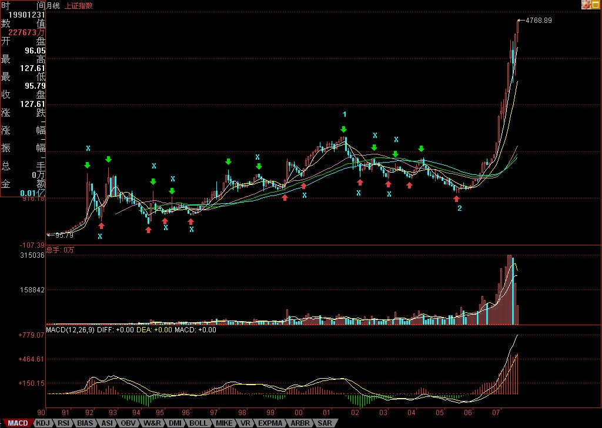{width="5.629861111111111in"
height="4.00625in"}

最后，再提一个思考题：为什么本ID在7月份要大搞满江红，而8月以后就放手坐轿子，请利用分型的原理给本ID的行为一个技术上的解释。

缠中说禅2007-08-09 23:06:48

对不起，好友一早就满了，新浪又不给增加发行额度，所以各位请暂时别再申请好友。有问题可以在帖子里发言，本ID看到，会尽量在文章里安排解答的，当然，尽量有广泛意义的。

## 热点在震荡中蔓延

(2007-08-10 15:56:27)

**昨天已经给了第四拨人一个任务，就是顶住。可以这样说，在外围环境如此恶劣之下，这总算顶住了。当然，站在本ID不厚道的角度，会说他们姿势不够优美。周末消息面，就决定这拨人的短线命运。**

**技术上，今天5分钟的第三类买点并没有被制造出来，因此依然只能归于中枢震荡的范畴。下周一，能否制造此买点，将决定短线大盘的上攻力度与强度。当然，偷懒的、看不懂的，就继续5日线，这确实是懒人的懒招数。**

**个股方面，昨天在回答问题时说了，现在是从大盘50到300的热点蔓延，如果这蔓延能成功，那么大盘的热度还会增加，今天，这迹象已经开始。更重要的是，今天ST大面积启动，也表明短线的投机资金开始蠢动起来，因此，下周的热点蔓延能否成功，是决定行情延续时间的关键。**

**个股方面，中字头继续是本ID的主力。对那些不启动的中字头，轿夫都应该像777学习。本ID昨天那一通骂还是有点作用的，看看今天的中铝、中国国航，但国航确实恶心，跟着南航后面跑，那李总的军人作风成气了。算了，大周末的，就不想骂人了。其他股票，等大盘炒热后，会逐步补涨。**

**一到周末，本ID就对股票反胃。各位腐败去吧。**

## 公募基金经理"快男"发展模式的不可持续

(2007-08-13 08:29:07)

**各位注意**

**用这个网地[[http://v35.blog.sina.com.cn/u/1215172700]{.underline}](http://v35.blog.sina.com.cn/u/1215172700)，一切都正常，看来新浪的新版确实需要更多改进。下面的文字继续保留，看电脑高手有没有更好意见。**

**今天，原来只有13页的所有文章，不知道被谁又改成32页，显示的文章又基本全了，其他分类也一样，但[[时政经济]{.underline}](http://blog.sina.com.cn/s/alist_1215172700_10_1.html)还是没有。本ID电脑水平连菜鸟级别都算不上，也不想搞明白究竟什么回事情。希望是新浪的新系统有待完善。请问，有什么方法让这用得最多的[[时政经济]{.underline}](http://blog.sina.com.cn/s/alist_1215172700_10_1.html)能重新显示文章。**

对于粉丝无数、发行井喷的公募基金，探讨其发展模式的不可持续，似乎有点杞人忧天。但公募基金经理的跳槽比例在今年达到惊人的40%，已明白无误地表明，如今这种基金经理"快男"发展模式的不可持续。

表面上，公募基金经理跳槽是由于个人待遇以及业绩压力等原因。众所周知，公募基金只收取管理费，相对于私募基金的收益提成模式，其分配上的激励机制明显不如后者。但只收管理费模式意味着旱涝保收，收益提成模式在牛市中可能兴旺一时，而在熊市中，则会引发无数法律、经济纠纷，终不是长久之计。

当然，有人可能反驳说，收益提成模式能使得基金管理者的优劣得到更直接地反映，使得优秀的基金管理者能得到更大的发展，因此，公募基金也可以尝试采取相应的模式。但是，在只收管理费模式中的管理资金大小与收益提成模式中的分成收益大小具有同等的赏优汰劣意义，而公募基金占有制度上的先天优势，由于能够合法面向公众募集，其资金规模具有私募基金所不可比拟的优势，至少在目前的经济、法律、社会结构下，只收管理费模式是获取这种募集优势所必须付出的代价，不仅公募基金不可能采取收益提成模式，而且阳光化的私募基金也只能采取只收管理费模式。

募集范围的大小通常正相关于分配比例的大小，例如，私人股权基金，其募集范围在主要针对二级市场的公募与私募基金之间，一般就采取收取管理费与比例较低提成的综合分配模式。如果收取了管理费，那么像私募基金那样根据收益大小最高分成可达到50%的分配模式是不切实际的。公募基金只收管理费模式的不可改变，决定了其内部的分配机理机制也不可能有大的实质改变，因此，企图通过公募基金分配方式私募化而使其可持续发展是不切实际的。

由于个体利益的巨大诱惑，明星式人才必然趋向于高比例分配激励的私募基金，这对公募基金来说，基金经理"快男"模式将形成一个恶性循环，在私人利益驱动下，更多人会把公募基金当成积累个人资源的平台。一旦从这平台得到个人所期望得到的资源，离开就成了他们必然的选择。现在开始采取的双基金经理制，其实更坏，等于把这跳板上的人又增加了一倍，而这些人，站在长远的角度，对于公募基金来说都是狮子虫。

要解开这个恶性循环，就不能培养"快男"式基金经理，而是要依靠集体、团队的力量。要明星化的不是个人，而是团队。要形成这样一个良性循环，就是让优秀的人才能以在明星团队为荣。这有点类似"智库"的品牌建立，一个"智库"是否优秀，从来都不是因为里面有多少"快男"，而是该"智库"的传统、风格、团队的综合研究力。一个更通俗的例子就是，无论北大、清华曾出过多少"快男"，但北大、清华的名声却依然凌驾于一切"快男"之上。

因此，对于公募基金来说，应该淡化基金经理的个人色彩，突出团体的风格，逐步形成自己的特色与传统。一个好的基金，一个能可持续发展的基金，就应该走金融"智库"的品牌之路。另外，在个人经济利益上，对基金管理公司进行适当的股权创新，加大核心团队的持股比例，这也是必要的。

最后，附带说说8月大盘的走势。7月大盘站住了5月均线并突破了4159点的1/2线，目前该线已经上移到4174点，而5月均线也上移到4170点附近，并且7月长阳的一半位置在4136点，因此，4150点附近成了大盘中线能否保持强势的最重要位置。只要能有效站稳该位置，那么大盘的整体走势就能保持向上拓展空间的能力，否则将引发大盘周线指标的走坏，至少要重新陷入新的大震荡中。

但即使大盘能保持强势，本月也一定要注意大盘过分冲高所隐含的月K线上影杀伤力。8月是宏观政策理清思路的关键时间，这方面的变动将对大盘走势起着决定作用。此外，外围股市的走势也会对大盘走势产生影响。全球化社会里，没有哪个股市是可以与世隔绝的。个股方面，一、二线成分股的行情依然会延续，但要注意升幅过大后的短线震荡风险，而当业绩风险释放后，二、三线题材股会找到重新活跃的动力。

## 热点，如期蔓延中

(2007-08-13 15:38:41)

**上周末说了，热点会逐步蔓延，从50-300-二、三线，今天，300中已经骚动不断，而二、三线，也已经有不少按捺不住蠢蠢欲动了。今天唯一不完美的，就是第三类买点还没有走出来，所以，明天的走势依然有变数。最简单的，还是看5日线。**

**从4200上来的走势，从下图就可以看到，一种走势类型划分已经逐步明朗。1-14是一个1分钟的上涨走势，从14-27，是一个5分钟的中枢，27-32，是对该5分钟中枢的离开，该离开与回抽依然没有完成，就看明后两天的发展。如果能形成第三类买点，那么其后就看是否形成背驰性走势，否则，就要在14-27的区间形成30分钟的中枢了。**

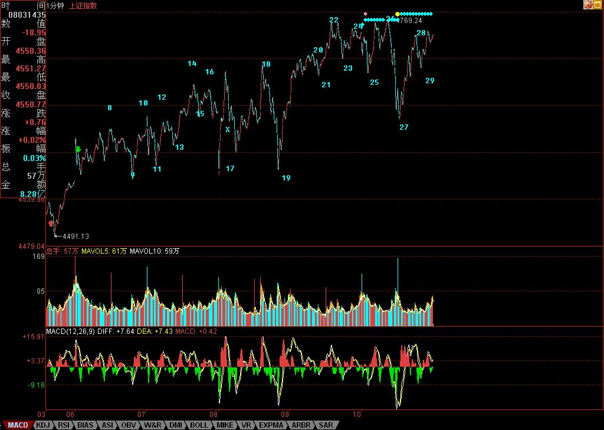{width="5.6299212598425195in"
height="4.0065048118985125in"}

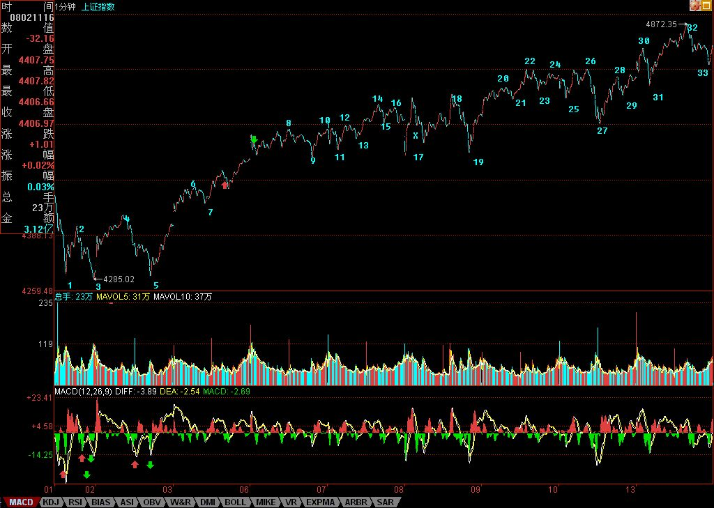{width="5.629861111111111in"
height="4.00625in"}

**个股方面，没什么可说的，还是中字头。N天前，本ID骂中行和中石化连新高都不去太过分，今天，也都基本新高了，这可以看出，中字头就是有力量。当然，所谓的中字头，就是大型国企，只是本ID比较懒，就买其中带中字开头的，这样好记。当然不会有人觉得，如果没有中字头的就不会涨了。原来的那十几只老股里，依然是中字头的000777表现最好，后面，一旦热点蔓延成立，其他都会逐步动起来的。本ID买股票从来都不是乱买的，8元让各位买000777时，各位当然不可能知道该股基本面将会怎样，但本ID就知道，这就是对基本面的把控能力，光技术面，只是一方面。例如，600649，大概到现在，没人知道这股票里卖的什么药，但如果你去研究一下该股是现在管理层的资本运用的辉煌历史，还有上海市对国企重组的计划，那么，当然就明白，本ID当时让各位在6元买入，不是瞎说的。好的剧本，当然是慢慢展开的，本ID经常是在序幕时就告诉各位，所以，如果没耐心的，千万别买本ID说的股票。否则，请问，有谁能把000777从8元拿到现在？大概，除了本ID，来这里的人是不会有了。**

**（这里原有私人资料已删除，有缘得之，无缘亦不失，梦中游戏，能窥操作之一斑，不枉本ID之冒险一贴。）**

**下面是分段图，各位研究去吧，有一个谈判在4点，先下，再见。**

## 41与1，本ID对二级市场兴趣已失

(2007-08-13 21:26:14)

周五，本ID是一边叨唠，一边让人报盘买股票。一个41元的股票，本ID最高买到近43元，心里越买越窝火。看看，里面的人，1元的成本，那种PE游戏，本ID也干着，凭什么让本ID贵了40来倍来买？

今天下午，一个关于PE的谈判，本ID已经决定全面转战PE，当然，撤退是战略性的，本ID决定的原则是：第一，本ID将不会再买入任何二级市场的股票；第二，任何成本不为0的股票，本ID都将把成本逐步抛到0为止；对成本为0的股票，本ID将持有到大牛市结束，有空可以继续玩先砸后买增加筹码的游戏。

本ID已经有了基本的判断，就是谁执PE牛耳，谁得中国资本市场的天下，PE中，除了Pre-IPO等，类似收购基金之类的，在中国依然没有大发展，当然，Pre-IPO这类活动当然不能放弃，但收购基金之类活动，也是可以逐步展开的。在中国，目前类似活动搞得比较好的，是一个生了5个孩子的海龟中男。

当然，完全放弃二级市场是不行的，所以必须留下已经有的根据地。但如果现在不到PE上大发展一把，那么就整天为人做嫁衣裳了。前期，本ID那一顿忙，已经为此铺好了路。

当然，在二级市场中，也有类PE的机会出现，也就是当大的波动让某些大的重组股票达到足够吸引的地步，这也是好的介入机会，在全流通时代，如何用收购基金的模式在二级市场搞上一票，这也是一个有趣的活动。但目前讨论这个问题有点无聊，现在，二级市场之外黄金满地，本ID脑子又没进水，没那闲工夫搞这二级市场了。

以上都是心里话，也是本ID的决定。当然，PE的活，意味着整天要腐败，这是本ID最不喜欢的，当然，有些活可以让别人干，**本ID只要有时间，依然会保持每天的解盘**。毕竟，对于散户，二级市场是唯一可大面积介入的地方，而且，原始积累也只能靠这地方，山高水长，如果本ID能帮各位一把，也算结一段善缘。

本ID会尽力为之，各位有缘得之吧。

附录：

**各位请不要胡乱猜疑，本ID关于二级市场20年以上大牛市的判断从来没改变过。本ID春节后说在突破GDP之前，成分股为主的第一段行情一定不会结束，当时，有谁能如此明确的说？又有谁能把20年的大牛市给明确分了段？本ID的这观点从来没改变过。\
没有大牛市，PE也白搭，只是现在的二级市场，比起PE，利润太薄，那种能3年翻几十倍的股票越来越难找，但在PE里，一点都不难。\
资本都是往利润高的地方跑，本ID也不例外。\
本ID对大盘没有任何暗示，短线大盘的走势，看分段图甚至5日线就能判断，谁都没必要预测。\
累了，10点了，先下，再见。**

缠中说禅2007-08-13 21:49:35

刚才试验了一下，发现还是没办法让那时政经济能被显示，本ID电脑就这水平，各位找经济方面的文章，只能出所有文章中找了。

缠中说禅2007-08-13 21:56:16

\[匿名\] 深潜江湖 删除此人所有评论

2007-08-13 21:40:22

老师好。

大家现在对今天的32-33为什么不是三段有争论。毕竟符合其中的底分型成立的定义。

希望老师能讲讲。

另，我对各级别的组合后再寻找区间套特别乱，希望老师能说说

前面写错了，致歉。

===

请先搞清楚底分型是从哪里开始算起，哪里开始结束。在这种前面是下跌的，对应的第二是上涨的，其特征序列就是看向下的，这第三个向下的，已经跌破原来第一段的底，怎么能属于第二段里的特征序列？

特征序列的底或顶，首先必须要都属于这个特征序列才行，这是前提条件。其实，如果第二特征序列没有三个元素，就根本不存在出现分段中第二种情况的可能。

缠中说禅2007-08-13 22:03:06

各位请不要胡乱猜疑，本ID关于二级市场20年以上大牛市的判断从来没改变过。本ID春节后说在突破GDP之前，成分股为主的第一段行情一定不会结束，当然，有谁能如此明确的说？又有谁能把20年的大牛市给明确分了段？本ID的这观点从来没改变过。

没有大牛市，PE也白搭，只是现在的二级市场，比起PE，利润太薄，那种能3年翻几十倍的股票越来越难找，但在PE里，一点都不难。

资本都是往利润高的地方跑，本ID也不例外。

本ID对大盘没有任何暗示，短线大盘的走势，看分段图甚至5日线就能判断，谁都没必要预测。

累了，10点了，先下，再见。

缠中说禅2007-08-13 22:05:04

\[匿名\] 新浪网友 删除此人所有评论

2007-08-13 21:53:15

缠中说禅 删除此人所有评论

2007-08-13 21:49:35

刚才试验了一下，发现还是没办法让那时政经济能被显示，本ID电脑就这水平，各位找经济方面的文章，只能出所有文章中找了。

\-\-\-\-\-\--

缠中说禅博主

你可以尝试着新建一个分类，然后把经济类文章加进去，如果这个新建的分类可以正常显示，那就可以把原来的分类删除掉，而改用新的。

或者可以尝试把分类改名，然后再看看情况

\-\-\-\--

谢谢，经济文章太多，一一搞一遍，只能等特别有空的时候。

下了，再见。

缠中说禅2007-08-13 22:05:56

各位请不要胡乱猜疑，本ID关于二级市场20年以上大牛市的判断从来没改变过。本ID春节后说在突破GDP之前，成分股为主的第一段行情一定不会结束，当时，有谁能如此明确的说？又有谁能把20年的大牛市给明确分了段？本ID的这观点从来没改变过。

没有大牛市，PE也白搭，只是现在的二级市场，比起PE，利润太薄，那种能3年翻几十倍的股票越来越难找，但在PE里，一点都不难。

资本都是往利润高的地方跑，本ID也不例外。

本ID对大盘没有任何暗示，短线大盘的走势，看分段图甚至5日线就能判断，谁都没必要预测。

累了，10点了，先下，再见。

## 热点蔓延，阳光下没有新鲜事。

(2007-08-14 15:49:37)

**当然，没有阳光下也同样没有新鲜事。今天的走势，唯一的特点，就是没有新鲜事。从上周起，本ID不断强调热点开始蔓延，今天，这热点已经开始燎原。**

**50-300-二、三线，本ID已经给股票的热点蔓延画出了线路图，现在，不过是按着线路图的一种演绎，正所谓阳光下没有新鲜事。**

**今天，14-27这5分钟中枢的第三买点35也总算给憋出来了（偶尔看到有问为什么不是九段？九段可延伸成5分钟中枢，可不等于5分钟中枢就一定是九段，这么简单的逻辑关系可别搞糊涂了。）**

**5分钟第三类买点后，只有两个选择：一、继续上涨直到形成新的5分钟中枢；二、在目前位置附近形成大一级别的30分钟中枢。**

**现在，关键是热点的蔓延持续，只要这没问题，一切都好办。**

**站在日线角度，提两个思考题：**

**1、目前日线的背驰段解除没有？提示，关键是哪段和哪段比，连相比的对象都没分清楚，还谈什么背驰段？更不用说什么精确定位了。**

**2、4174点的1/2突破后，下一条真正的压力线在哪里？**

**注意，本ID战略转移，并不会影响博客的一切活动，只是有时候晚上的文章，可能会因为应酬改到早上发，如此而已。而且，本ID现在是战略转移，0成本的股票是不会抛的，没到0成本的，本ID也不会胡乱抛的，没到卖点，凭什么抛？今天，能在49下买到002149的，可要感谢本ID，某人脑子进水，竟然企图让本ID在50下出来，一开盘就企图打压，脑子有水吧？这股票，本ID会抛至少一半的，但想让本ID今早49以下就抛，简直病得不轻。**

**今天可以回答问题到4点半。**

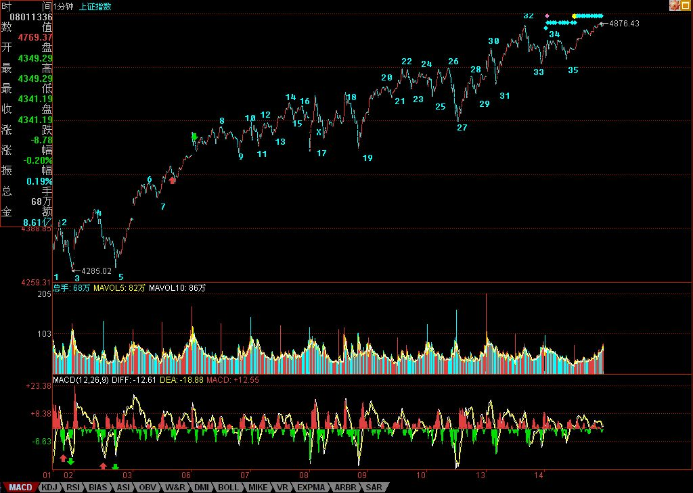{width="5.629861111111111in"
height="4.00625in"}

缠中说禅2007-08-14 15:53:05

新浪这版改得真没法说了，各位将就用，本ID已经有点将就不住了。不过，没法子，本ID念旧，新地方一样有新问题，那就继续吧。

缠中说禅2007-08-14 15:58:20

\[匿名\] 新浪网友 删除此人所有评论

2007-08-14 15:54:47

能谈谈对\"次级债\"的看法吗?

===

这类问题，在本ID关于货币战争的帖子里都说过了。其中一个比喻是这样的，美国这个发动机积炭了，只能换一个新的。新的，可以是一个新国家，例如中国，但美国人显然不乐意。唯一让美国人乐意的，就是全世界人出钱为美国人换一个新的。而从2001年起美国人的所有玩意，就是这种玩意，不管这玩意变了多少名字。

缠中说禅2007-08-14 16:01:58

\[匿名\] 新浪网友 删除此人所有评论

2007-08-14 15:56:06

为什么第三买点不是33？

===

如果是33，前面离开的一分钟走势就是未完成的。饿日现在，离开是27-32，回抽是32-35，都是标准的1分钟走势类型。

缠中说禅2007-08-14 16:06:43

\[匿名\] 举杯邀明月 删除此人所有评论

2007-08-14 16:01:22

老师,有个问题,就是假如我用5分钟以及更大级别的K线级别操作的话,画图也还是按照笔\-\-\-\-\-\--线段\-\-\-\--中枢这样的同样的方法吧

另外希望老师能继续股票课程的讲解,别真的离开我们

===

本ID什么时候说要离开了？本ID只是说不再新买二级市场的股票，买了窝火。

请你先把显微镜和被显微镜这两种关系搞清楚。你当然可以只看5分钟图，那等于用一个不太精确的显微镜，难道5分钟图上就没有线段、笔？

用1分钟图上的线段笔，只是一个更精细的显微镜，这并不影响任何级别的操作。

关键是对精确度的要求，但笔、线段等等，对任何精确度下的图，都是必要的。本ID不是有一课示范了在月线上如何划分笔、线段了吗？

缠中说禅2007-08-14 16:08:26

\[匿名\] 新浪网友 删除此人所有评论

2007-08-14 15:52:25

k线n-1区间\[8,10\]

k线n区间\[9,10\]

这两k线是否是包含关系？

===

当然是。

缠中说禅2007-08-14 16:10:59

\[匿名\] 新浪网友 删除此人所有评论

2007-08-14 16:08:05

如此看空为何不砸盘啊！

===

本ID什么时候看空？至少20年大牛市，目前只是牛市第一阶段，这些观点都无须修正。本ID现在不会再买二级市场的任何股票，只是因为本ID能通过PE买到更便宜的股票，更大的机会，如此而已。

缠中说禅2007-08-14 16:22:29

\[匿名\] 新浪网友 删除此人所有评论

2007-08-14 16:05:39

很想请教博主一个问题：你认为这次中国能否避开日本和东南亚当年最终资产泡沫破裂后经济衰退，百业萧条的后果？或者说退一步说不至于那么严重？

虽然中国也曾经经历过80和90年代的两次通货膨胀，但当时中国应该算是一个相对现在来说还比较封闭的经济体，泡沫破裂后的强度或许可以通过内部消化，而现在金融开放之后，情况是否应该和日本、香港当年来比较呢？

期望听到你的意见，好象也曾经听你说过一个"年线级别调整"的看法，我认为这是相当有可能的，毕竟这次中国需要面对的是全世界的资金，还有玩钱已经玩了几百年的大鳄们。

===

日本、香港那些怎么能和现在的中国比，现在美国是病人，而在美国病好之前，中国关键是如何去用好化攻大法，让美国就算病好了，功力也被化掉一半。

如果出现世界范围的通货膨胀，那全部人都逃不掉，到时候比的是谁能最快恢复，显然，如果中国自己不当傻瓜，那一定是中国，这里有深刻的产业链上的道理，以后有空写个帖子说说。

只要中国能第一个恢复，那么，发生什么并不重要。如果真有1929年，没人能逃掉，拿着什么货币、什么资产都是废话，这就是资本主义的本质所在，一个游戏而已。

问题不是去逃掉1929年，那不可逃，唯一的区别只是损失大小。能用最小代价活下来，这就是最大的成功，就如同那场把恐龙灭掉的灾难，在那灾难面前，唯一的问题是如何在灾难下生存，而不是祈祷灾难不降临。地球后来的主人，只能在这生存者中。无论国家还是个人，这道理是一样的。

缠中说禅2007-08-14 16:24:52

\[匿名\] 新浪网友 删除此人所有评论

2007-08-14 16:11:55

老大，你以前提到到的8月份政策面风险现在解除了么？

===

这还要感谢美国这次的抽风，在这样的国际环境下，谁还敢乱搞，真是活腻了。所以，政策不是万能的，政策不过是合力的结果。但也不是太过分，毕竟，秋后是可以算帐的，当然，现在还夏天，先把夏天过了再说。

缠中说禅2007-08-14 16:29:32

\[匿名\] 天眼 删除此人所有评论

2007-08-14 16:21:55

老大,有几个问题我比较模糊,

A.关于k线的包含关系.

一.如果第n-1根K线的高低点全在第n根K线的范围里,那么n-1和n是不是包含关系?

===

这当然是，难道还有什么疑问的？对于连续包含关系，必须按时间顺序，一个个合并下去。

二.下列情况是不是包含关系?

假设n和n-1 k线的高低点为gn.,dn, gn-1,dn-1 .

1.gn=gn-1且dn\>dn-1;

2\. dn=dn-1.且gn\<gn-1;

3\. dn=dn-1.且gn=gn-1;

===

当然是。

缠中说禅2007-08-14 16:30:52

\[匿名\] 新浪网友 删除此人所有评论

2007-08-14 16:29:13

14-27形成5F中枢是否不准确？

因为14开始的3段的高点不够高？

===

中枢和高点高不高有什么关系？中枢，关键是有重合部分。

缠中说禅2007-08-14 16:36:13

年年一变三 删除此人所有评论

2007-08-14 16:28:18

2007-08-14 16:01:08

缠主，看了你昨天的帖子，我们小散没法参与，但我想600635按缠主的宏观思路，是否应该是只大牛呢？

另问：缠主多次提及636是战略建仓，我只是建早了些，还小套。问缠主不买二级市场的股票也包含636吗？

缠主先别走，贴了三次了，盼回复！谢谢

===

不买就是都不买了，不过600636，本ID在10元上下买了不少，本来是要继续买的，既然都不买了，就都不买，战术服从战略，本ID不买，自然还有别人要买。

像600737、中铝、中国国航等等中字头以及原来那十来只，本ID都会继续持有的。没有成本为0的，本ID会找机会变为0，这就是套钱的手段，套出来的钱，都离开二级市场去干PE去，如此而已。

缠中说禅2007-08-14 16:37:08

对不起，已经4点半了，本ID要先下了，有机会再聊。

再见。

缠中说禅2007-08-14 16:40:26

\[匿名\] 新浪网友 删除此人所有评论

2007-08-14 16:36:36

14-27形成5F中枢是否不准确？

因为14开始的3段的高点不够高？

===

中枢和高点高不高有什么关系？中枢，关键是有重合部分。

===

我可能没说清楚，因为14开始的3段的高点不够高，使得与后面的六段无法重合？？？

\-\-\-\-\-\--

临走回答一下，这问题太典型，就是概念没搞清楚。5分钟中枢，只要3个1分钟走势类型有重合就可以，不是一定要里面的所有段都重合。所有都重合，只是其中一个特殊的情况，这叫又线段延伸九段后形成5分钟中枢，在这种情况下，同样可以看成是三个1分钟走势类型的重合。

先下，再见。

禅师其他文章回复：

(2007-08-14 22:42:24)

**先给下午那两个问题的答案：**

**1、目前日线的背驰段解除没有？**

**当然没有，本次这段要比的，是从去年8月到今年5月29日这段，为什么？因为这段前后两个中枢是同级别的，而今天春节前后那一个不是。从日线图的笔、线段上分可以看出，前后两个中枢是由三笔构成，而春节那个只有一笔，当然，仔细的划分，可以从1分钟图上的中枢级别来分辨。**

**2、4174点的1/2突破后，下一条真正的压力线在哪里？**

**是2/3线，目前在哪里，各位自己算算。**

**还有一个问题请思考，日线图上的笔、线段，和一分钟图上的日中枢有什么关系？**

## 外围因素引发今日震荡

(2007-08-15 15:49:33)

先解答一个和打坐有关的疑问，本ID说念想把横隔膜以下气息在横隔膜以上送出，这气肯定不是真正呼吸之气。人体结构里，横隔膜以下哪里有什么呼吸之气？那只是一念，以此一念带动那非气之气之真气。

**好，说股票。最近，外围市场鬼哭狼嚎的，弄得全世界的鳄鱼都痛哭流涕。中国市场震荡一下，也很应该。技术上，昨天已经很明确说了，现在，或者继续上涨直到出现新的5分钟中枢，或者就在这里形成一个30分钟中枢，除此之外，别无选择。**

**今天早上冲高后，一个1分钟级别的背驰就出现，整个1分钟的上涨，是下图中的从17-38，两个1分钟的中枢，37是对最后一个1分钟中枢32-35的第三类买点。因此，该上涨极端完美，背驰的MACD辅助判断，看5分钟图更为明显。（各位请自己去看，这里的贴图只有200的额度，本ID不能浪费太多空间。在5分钟图中，看对应1分钟图中的走势去比较力度。）这是一个标准的走势，十分教科书。**

**后面的震荡十分正常了。现在，从8开始走势的一种划分也自然当下给出了，就是8-17是一个5分钟中枢，然后17-38是一个1分钟级别上涨。而从32开始，一个5分钟中枢的雏形也出现，极短线走势，就看这32开始走势的演化情况。**

**个股方面，请问002149让各位爽了没有？当然，后面的走势和本ID没关系，本ID只在上周五最高买到43元，然后把其中41附近一部分清单在这里放了几个小时。这股票，为什么还有这么多人抢入，最主要是基本面与成长性。本ID在N个月前，强调过中小版成长股的中长线介价值。后来，本ID也告诉过介入了002121，注意，这股票和002149都和600635有关系，那纯属意外。对中小版，一定要看其成长性，而且要有耐心。**

**注意，任何股票，都不值得追高，包括如002149这样的。**

**不过，这都是老皇历了，本ID现在不会再买任何二级市场的股票，只会等待机会把成本不为0的的出掉变为0，然后都去干PE去。至于其他股票，本ID说过的任何股票，本ID都持有着，当然，很多都是0成本的，但本ID都会持有到牛市结束。**

**这前面说过。本ID再强调一次，本ID对大牛市的信心没变，但目前进入成分股泡沫行情的判断也没变。成分股行情结束后，还至少有两轮行情，分别是成长股与重组股带头，这些游戏，至少玩20年，早着呢。**

**本ID就多累点，PE多点如002149的，让各位在40元买了也不后悔的好股票。**

**二级市场，咱相信群众。**

**今天有事要去谈，先下，再见。**

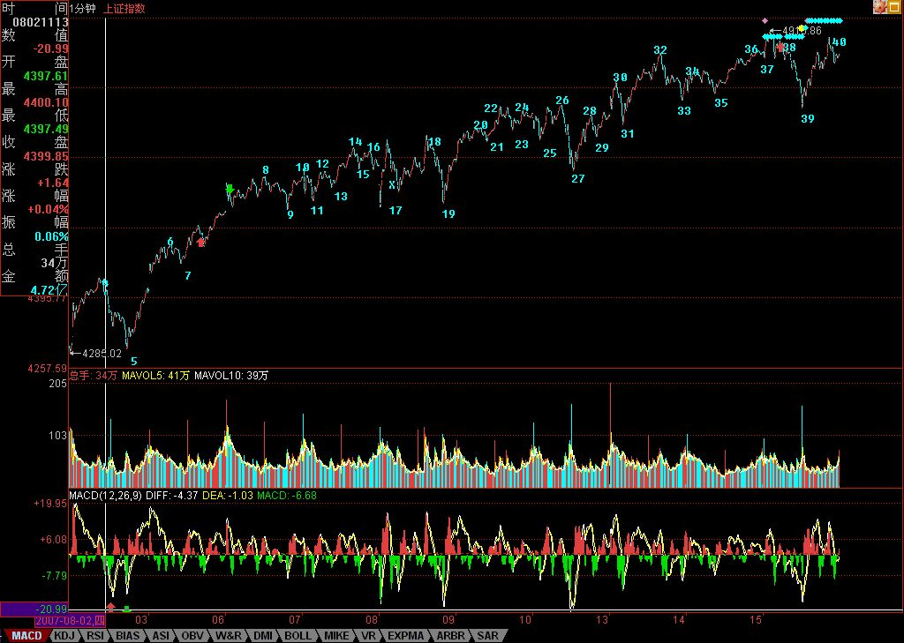{width="5.6299212598425195in"
height="4.0065048118985125in"}

## 教你炒股票70：一个教科书式走势的示范分析

(2007-08-15 22:41:35)

首先，今天下午太匆忙，37后就直接标记39，晚上回来才发现，已经改过来。

在前面的课程里，本ID反复说过，结合律是至关重要的。这里的人，认真学过抽象代数的人少，所以不大明白运算规则的选择对研究对象的决定性意义。对于走势来说，结合律就是连接走势之间关系最重要的规则，不深切明白这一点，如何能明白走势本身？

无论如何结合，本ID的理论对走势的分析原则是不变的。可以这样认为，本ID的理论，就是走势保持结合律下具有变换不变性的一套理论，而且可以严格地证明，是唯一能保持分解变换不变且保持结合律的一套理论。如果有点现代数学常识，对这理论的意义应该能多点了解。

这几天，随着走势的当下发展，本ID不断变换着所看的中枢，这根本的原因就在于结合律，因为结合律，我们可以对走势进行最有利观察的分解，这样，才能更容易明白走势究竟在干什么？

1分钟图

{width="5.6299212598425195in"
height="4.0065048118985125in"}

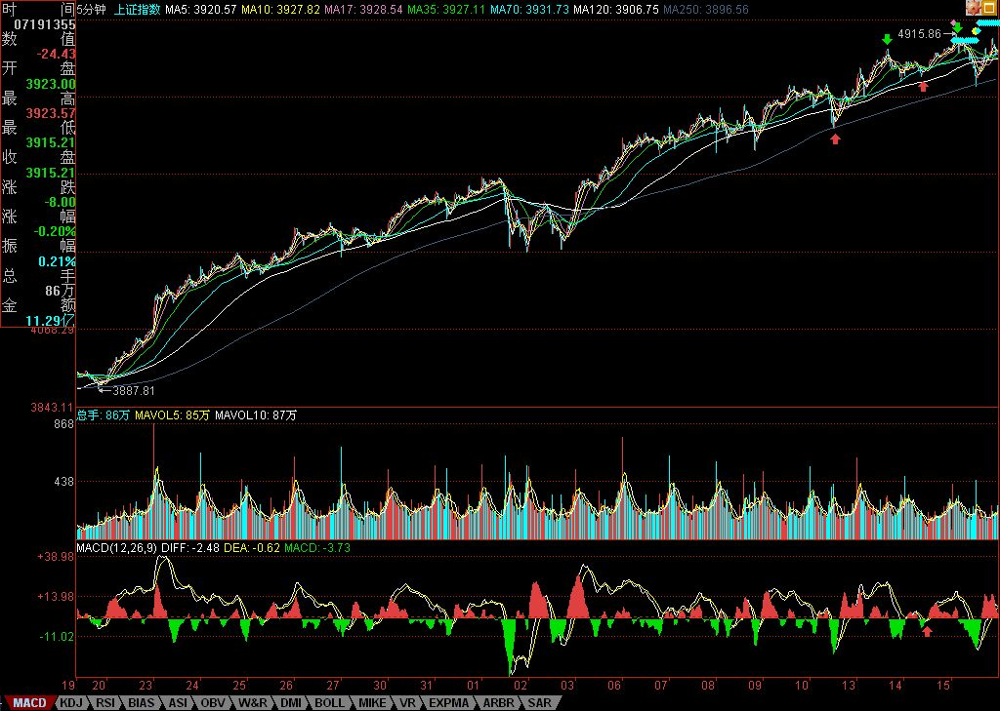{width="5.629861111111111in"
height="4.00625in"}5分钟图

例如，到今天，走势一种最明显的划分已经自动走出来，就是8-17构成5分钟中枢，该中枢是4300点那个5分钟中枢上来后的一个新的5分钟中枢，这个中枢，在刚形成时，我们已经指出，而且任何学过本ID理论的，都可以当下指出。一般来说，形成这个5分钟中枢后，在理论上只有三种走势：

1：向上出现第三类买点，走出1分钟向上走势类型，然后构成新的5分钟中枢；

2、向下出现第三类卖点，走出1分钟线向下走势类型，构成新的5分钟中枢。

3、中枢延伸，或出现第三类买卖点后扩展成大级别的30分钟中枢。

显然，在行情发展中，没必要去预测走势选择什么，走势自然选择，只需要观察着就可以。现在，走势自然选择了第一种，为什么？因为17-38构成完美的1分钟上涨走势，目前，围绕这1分钟上涨走势的最后一个1分钟中枢32-35，正扩展出新的5分钟中枢的雏形。

这个5分钟中枢，最终至少要完成的，至于是否继续扩展出大的30分钟中枢，还是出现新5分钟中枢的第三类买点继续上涨，再形成新的5分钟中枢，这无须预测，与8-17那5分钟中枢一样对待，如此而已。

那么，如果是按30分钟操作的，这些5分钟的中枢移动、震荡之类的活动根本无须理睬，只要看明白就是，根本无须操作；如果是按5分钟级别操作，那么就是不参与大于5分钟级别的震荡，那么就等5分钟上涨出现背驰后走人；如果是按1分钟级别操作，那么今天早上就该先走，为什么？因为1分钟的上涨出现背驰，按照本ID的理论，后面必然回抽到最后一个1分钟的中枢之内，从而至少形成一个新的5分钟中枢。然后根据5分钟震荡的走势进行回补就可以。

注意，按照多样性分解原则，新的5分钟中枢，暂时先从最后一个1分钟中枢开始算起，后面的操作先以此为准，等走势走出最自然的选择再继续更合理的划分。按照这暂时的划分，并不影响任何操作，5分钟中枢该怎么操作就怎么操作，如此而已。

在今天的背驰判断中，关键是知道哪一段相比，显然，27-32与35-38这两段去比。而实际的对比中，看1分钟图，去加两段对应的那些MACD，太麻烦，所以可以看5分钟图。这里，把5分钟图给放上来了，图上，相应对比的两段已经标记出来，下面MACD的红箭头，对应是回抽那一下，对应走势，就是最后一个1分钟中枢形成的时候，前面两段的对比，极为教科书，请好好揣摩。

其实，只要基本概念明确，这些分析，在当下都不是什么难事。这里必须提醒一下，1分钟图上38标记的位置用红箭头给出，显然，那不是最高的位置。为什么？没有人规定分段的结束位置一定是最高、最低的，关键要有至少三笔，因为从37开始到最高的位置，没有三笔，所以不能认为线段已经完成。但在1分钟级别上看，那么37-38这一段，就结束在最高的位置，为什么？线段的存在，是为了让图形规范化，就如同在5分钟中枢里，看1分钟走势类型的重叠，是把整个走势类型的波动区域算在一起看，道理是一样的。

## 全球化，没有市场可与世隔绝

(2007-08-16 15:41:56)

**"全球化社会里，没有哪个股市是可以与世隔绝的。"是在本周一的[公募基金经理"快男"发展模式的不可持续](http://blog.sina.com.cn/s/blog_486e105c01000c6m.html)上写的，主要是针对八月股市的分析。现在的问题，已经很明确了，还是该文章里说的，要注意月线上影的杀伤力。**

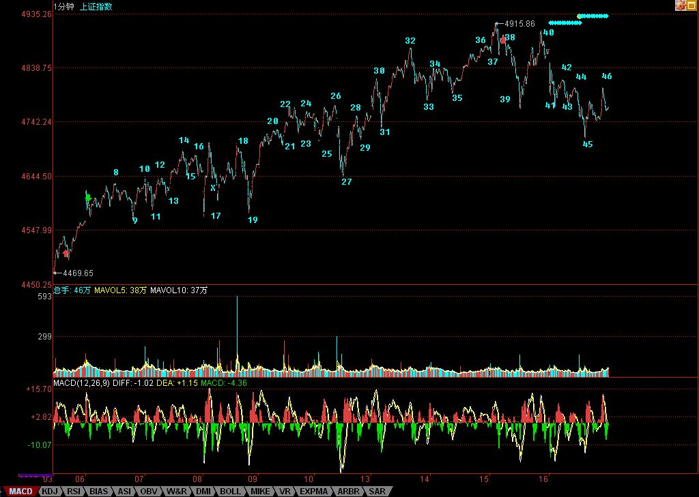{width="5.3821620734908135in"
height="3.8301881014873143in"}

**当然，没必要预测这个问题，而且本ID从来都认为，美国的事情对中国的影响从来都是战略性的，中美游戏，只看最后结果，中间都是游戏而已。就像原来的蒋委员长，最终只得了个蒋匪而看海水之蓝终老，谁能把美国搞成美匪，显然更牛于将蒋委员长搞成蒋匪。**

**美国暴风雨，全世界陪着挨冻，但至少今天的中国散户，很多都没这种感觉。为什么？因为二、三线股被热点蔓延了。本ID从上周起，反复用到的就是蔓延这个词，这确实是一个度过风雨时节的好办法，搞工行的被美国搞了，现正痛苦中，那些到香港QDII的，终于知道全世界的乌鸦一般黑了。而这里的二、三线股的火，能否温暖这风雨之夜，就看明天和周一了。**

**全球化，没有市场可与世隔绝，但可以创造与世隔绝的板块，二、三线股，本来就是给点烛光都能灿烂，关键是，如果烛光都不能给，有点光就把投机大帽子盖上，那就瞎闹了。那些二、三线股一动就忽悠投机的，脑子里肯定水太多。当然，现在不比上半年，这二、三线股之火能否燎原，还真不好说，走着瞧吧。**

**大盘走势上，16这点如果跌破，那么，形成30分钟中枢震荡就是唯一选择了，换言之，4700点如果不破，还有在目前位置形成新的5分钟震荡可能，也就是原来的5分钟上涨走势依然能维持，因此，短线调整级别的大小，就看这4700点。**

**这，关键还是要看美国这病人还要鬼哭狼嚎几天了，说实在，本ID是宁愿中国这边30分钟甚至日线震荡，也希望看到美国哭个368天算了，为阿富汗、伊拉克死难的人，美国人多些破产，难道不应该？**

**今天心情大好，看到美国暴跌就开心，虽然会让汉奸不爽，但汉奸不爽的事情，本ID最愿意干。**

**今天回答问题到5点，因为开心。**

**注意，下图中的46并不百分百确定，因为如果明天大幅度高开，那就要改变了，这只是大致标记上。**

缠中说禅2007-08-16 15:50:48

\[匿名\] 新浪网友 删除此人所有评论

2007-08-16 15:45:17

1.按缠主32-35若是一分钟中枢，是否32-33，33-34，34-35都是笔而不是线段，也就是所谓的次级别走势，他们的重叠构成一分钟中枢，也就是在某一级别走势图上，类似32-35的三笔就可以构成该级别的中枢，而不需要再到更低级别的走势图上去看了。

2.日线背驰段的问题，缠主说：是从去年8月到今年5月29日这段，为什么？因为这段前后两个中枢是同级别的，而今天春节前后那一个不是。

我看MACD图，去年8月-今年5.29这段的黄白线挨得一直很近，也就是二者交叉形成的面积不大，下面的红柱子也不高，明显感觉今年7月到现在的红白线的交叉形成的面积和红柱子面积都比上面那一段大，为什么背驰段还没解除能。

盼复

====

请先把概念搞清楚，32-35是一分钟中枢，32-33，33-34，34-35怎么会是笔而不是线段？三笔能构成一个1分钟中枢？

MACD只是辅助，关键是要把中枢找到，前后对比的走势找对，并不是MACD回抽就有背驰，如果这样，那直接研究MACD就可以，还用其他干什么？

缠中说禅2007-08-16 15:51:35

\[匿名\] 新浪网友 删除此人所有评论

2007-08-16 15:47:57

楼主打错了吧,是4700

===

对，4700

缠中说禅2007-08-16 15:58:06

\[匿名\] 蓝羽 删除此人所有评论

2007-08-16 15:48:44

2007-07-31 16:10:56

缠JJ，一笔是否也有类似线段那样得三角形态或奔走形态？

或者说，一笔之中的非顶、底K线是否允许超出顶底的范围呢？顶或底是否一定为一笔的最高点或最低点呢？

\-\-\-\--

一笔，是一顶一底，怎么会有三角形？顶和底，当然一定是那一笔的最高最低，如果不是，那里面一定不只一笔。

37---38不符合"顶和底，当然一定是那一笔的最高最低"

理解是否正确？？？？？

===

怎么不符合？顶和底是对笔说的，线段是由笔够构成的，请不要搞混了。

一个线段里的各笔之间，还可以走出三角型、扩展平台等等形态。

请搞清楚几个概念。分型对应的是笔，而特征序列里元素的分型对应的是线段的破坏判断，请不要把不同的概念搞糊涂了。

缠中说禅2007-08-16 16:04:18

注意：

发现还有人把一笔之间的分型，与线段之中的各笔给搞混。

一笔，只有一顶一底，如果顶接着顶，那其中一个肯定不是真正的顶。这是在笔的范围里说的。

在笔里，当然没有什么三角形之类的东西，笔就是一线段，两个端点。

但线段中的各笔之间，是可以有各种图形的，只要这些图形不破坏线段本身。

请把概念搞清楚了。

缠中说禅2007-08-16 16:08:05

\[匿名\] 新浪网友 删除此人所有评论

2007-08-16 16:04:18

楼主可否透露下电信业重组的方案？ 谢谢

===

联通专搞GSM，移动专搞大唐那玩意，电信专搞CDMA。这是大原则而且是最终方案，但中国的东西，没到最后揭盖，还可能有变数，那就天知道了。

缠中说禅2007-08-16 16:10:34

\[匿名\] 新浪网友 删除此人所有评论

2007-08-16 16:05:45

不知为啥您的图看不清,能不能整一个能够放大的图?

===

很高兴有一个电脑问题本ID能回答的，你对着图按右键，然后把图复制下来就有大图了。好象新的浏览器，都带放大功能，在右下角。

缠中说禅2007-08-16 16:16:47

\[匿名\] 听风 删除此人所有评论

2007-08-16 16:06:32

妹妹:

有个问题问问,前天好象才出现第三类买点,拿联通来说,当时是7.16.O
为何在这二天却有更低的价格?是受系统影响?

===

有没有这买点且不说，就算有，也是有级别的，难道一个1分钟的第三类买点就保证永远上涨，显然没有这种事情。所以先搞清楚级别，第三类买点后两类选择，更大级别与继续上涨，如何分别这，以前课程说过，就是看相应走势是否出现盘整顶背驰。

盘整顶背驰，对应这更大级别的情况，后面出现下跌，那是天经地义的。

但即使是更大级别的，从第三类买点到盘整顶背驰，理论上必然保证一段向上的过程，更不用说继续上涨那种情况了。但理论从来不保证，向上以后就不再向下。

缠中说禅2007-08-16 16:24:08

\[匿名\] 新浪网友 删除此人所有评论

2007-08-16 16:12:13

老师大架不知是否能光临技术论坛.!!!

现在已有会员1200名了!!!!!!!!!!

而且答复在论坛里也方便保存!!!

不象新浪这么烂!!!!!!!!!!

期望老师能摆驾论坛!!!!!!!!!

===

本ID不反对有这样的论坛，毕竟能方便各位互相研究，而且不光是本ID的理论，任何东西都可以研究，不比较，哪里能知道谁是最好的。

但本ID确实不能去那里，因为那样会有不好的嫌疑。本ID干事情，不能有任何把柄给汉奸们利用。本ID如果去一个以本ID相关的论坛，肯定会被编出无数故事，汉奸们正等着呢。

有什么问题，还是在这里回答，各位可以把问题集中一下，这样效率高一点。

缠中说禅2007-08-16 16:25:02

石头叁 删除此人所有评论

2007-08-16 16:17:45

老大好。

以前好像讲过缺口视同普通K线，那么如何处理其与其相邻K线的包含关系呢？缺口可以做为顶、底分型的组成部分吗？

===

当然可以，关键是符合定义。

缠中说禅2007-08-16 16:29:29

\[匿名\] 沙滩 删除此人所有评论

2007-08-16 16:23:14

缠mm，你的心情大好，咱么都跟着高兴！

不过自己实在缺乏战术，才买中行就这么跌。长期投资一定没问题的，你说对不对？？

====

本ID反对任何操作失误被用长期投资所掩盖。长期投资，就是要在大级别买点介入，例如年线、季线、月线的买点，然后一直持有到大级别卖点再卖，这才是真正的长期投资。

当然，中行最终肯定是套不住的，那关键操作上要有正确的思维方法，任何一个操作，必须要知道对在哪里、错在哪里。如果本来想1分钟操作的，结果搞错了，就用长期投资搪塞，这样是很难进步的。

用本ID的理论，和别的完全不同，所以必须洗心革面。

在本ID这里，任何东西都是有精确定义的，包括长期投资。

缠中说禅2007-08-16 16:34:13

\[匿名\] christine 删除此人所有评论

2007-08-16 16:28:41

现在我发现自己的问题还有一个在对待顶背驰与底背驰的问题上有些困惑，底背驰抓得比较准，但顶背驰往往错过，仿佛近视了一般。

====

这不是技术问题，而是心态问题。从来，大多数人都是容易买对，永远卖不对，结果就是坐电梯。说白了，就是贪婪所致。

宁愿卖早，不要卖晚，卖早，有钱，就有新的机会可以把握。卖晚，不仅坐电梯，还把机会成本给搞起来了。

至于卖点的精度问题，那是一个磨练的过程。卖多了，精度自然高，对理论的把握自然好。一把好刀，一次都不用，有什么用？

缠中说禅2007-08-16 16:35:57

\[匿名\] 新浪网友 删除此人所有评论

2007-08-16 16:30:22

缠中说禅博主，请问

36-37怎么回事，能说说不？看着36-37没有3笔呀，下上下，后面那个下，不能成为1笔。难道是缺口的缘故？

另外，发现博客已经一切正常了

===

为什么不是？9点25那一分钟不算了？

缠中说禅2007-08-16 16:40:06

缠中说禅 删除此人所有评论

2007-08-16 16:35:57

\[匿名\] 新浪网友 删除此人所有评论

2007-08-16 16:30:22

缠中说禅博主，请问

36-37怎么回事，能说说不？看着36-37没有3笔呀，下上下，后面那个下，不能成为1笔。难道是缺口的缘故？

另外，发现博客已经一切正常了

===

为什么不是？9点25那一分钟不算了？

===

当然，如果一定要坚持9点25那竞价不算，那么自然不是一笔，那就把36标记到4915点那最高点就可以。

但事实上9点25必须算，竞价是最重要的时刻之一，这里的意义重大，而且，这里刚好形成下面中枢的第三类买点，后面上拉的技术意义更明确了。

缠中说禅2007-08-16 16:41:04

潺缠禅 删除此人所有评论

2007-08-16 16:39:26

555老大不理我啊

昨天课程中1分钟趋势的第一个1分钟中枢是18-27吗?如果是,当下的在27位置,如何确定之后的反弹是趋势的延续而不是翻转呢?还是只能根据策略来操作?

谢谢!!

===

不是，是22-27

缠中说禅2007-08-16 16:44:08

\[匿名\] 大盘 删除此人所有评论

2007-08-16 16:40:09

紧急请教博主：

今天上证指数44处根据线段定义，似乎不是顶分型啊，因为随后一笔大幅下跌形成包含关系。

这里的疑惑，一定帮忙解答一下，因为这个问题很普遍啊，不搞清楚，很难分好线段

===

这里是第一种情况，也就是特征序列缺口被第一笔就封闭的情况，没必须探讨第二段特征序列分型的问题，那是第二种情况考虑的问题。

缠中说禅2007-08-16 16:46:08

本ID把课程里两种情况的论述复制过来，各位请好好研究：

在标准特征序列里，构成分型的三个相邻元素，只有两种可能：

第一种情况：

特征序列的顶分型中，第一和第二元素间不存在特征序列的缺口，那么该线段在该顶分型的高点处结束，该高点是该线段的终点；特征序列的底分型中，第一和第二元素间不存在特征序列的缺口，那么该线段在该底分型的低点处结束，该低点是该线段的终点；

第二种情况：

特征序列的顶分型中，第一和第二元素间存在特征序列的缺口，如果从该分型最高点开始的向下一笔开始的序列的特征序列出现底分型，那么该线段在该顶分型的高点处结束，该高点是该线段的终点；特征序列的底分型中，第一和第二元素间存在特征序列的缺口，如果从该分型最低点开始的向上一笔开始的序列的特征序列出现顶分型，那么该线段在该底分型的低点处结束，该低点是该线段的终点；

缠中说禅2007-08-16 16:54:24

石头叁 删除此人所有评论

2007-08-16 16:45:56

老大
今天的划分有个疑惑，1120那里好像构不成一笔，所以44那里构不成顶分吧？

===

还是没搞清楚，这里是第一种情况，不存在特征序列的缺口，这种情况，任何三笔其实都构成对前面线段的破坏。

麻烦的是第二种情况，在那种情况下，并不是任何三笔都能构成破坏，就算最终特征序列元素间的缺口被封闭了。注意，在第二种情况下，即使封闭，肯定不是被第一个给封闭的，因为这样就变成第一种情况了。

缠中说禅2007-08-16 16:57:47

石头叁 删除此人所有评论

2007-08-16 16:54:21

这里是第一种情况，也就是特征序列缺口被第一笔就封闭的情况，没必须探讨第二段特征序列分型的问题，那是第二种情况考虑的问题。

========

老大走了吗？
还是有疑惑，特征序列应该先考虑包含关系转换成标准特征序列，再看分型吧。

===

当然没错，但注意，特征序列和实际走势是相反的。

缠中说禅2007-08-16 16:59:27

\[匿名\] 夜雨 删除此人所有评论

2007-08-16 16:53:50

姐姐，我昨天的发言好象领会了一些您说的长期投资想法呢

把昨天的发言帖过来：

庄托是在高位让人们买，我是在低位买，同一种理由，两种结果。在别人热情的时候我们要走开，在别人抛弃的时候我们要捡起来。这就是最重要的操作策略。

基本面并没能错，只有基本面才能决定股价的长期走势。只是买入的时点很重要

在416，18元的时候，说重组基本面，让大家买入，那是骗人的，在416，前一段时间，7-8元的时候，让大家买入，理由同样是基本面，那就是抄底了。所以在股市最重要的是克服自己的恐惧和贪婪。

====

对，关键是买点的级别。在一个1分钟买点买了说要长期投资，那是自欺欺人。

缠中说禅2007-08-16 17:02:37

上面大盘网友的地址打不开，所以你下一个问题回答不了。

请给一个能打开的地址，以后再回答你的问题。

先下，再见。

## 教你炒股票71：线段划分标准的再分辨

(2007-08-16 23:02:06)

虽然67课已经给出了线段划分的标准，但由于那里用的是比较抽象的类数学语言，所以理解上可能还有困难，因此，逐一进行再分辨。

首先要分辨的，是特征序列中元素的包含关系。注意，特征序列的元素包含关系，首先的前提是这元素都在一特征序列里，如果两个不同的特征序列之间的元素，讨论包含关系是没意义的。显然，特征序列的元素的方向，和其对应的段的方向是刚好相反的，例如，一个向上段后接着一个向下段，前者的特征序列元素是向下的，后者是向上的，因此，根本也不可能存在包含的可能。

那么，为什么可以定义特征序列的分型呢？因为在实际判断中，在前一段没有被笔破坏时，依然不能定义后特征序列的元素，这时候，当然可以存在前一特征序列的分型，这时候，由于还在同一特征序列中，因此，序列元素的包含关系是可以成立的；而当前一段被笔破坏时，显然，最早破坏的一笔如果不是转折点开始的第一笔，那么，特征序列的分型结构也能成立，因为在这种情况下，转折点前的最后一个特征序列元素与转折点后第一个特征元素之间肯定有缺口，而且后者与最早破坏那笔肯定不是包含关系，否则该缺口就不可能被封闭，破坏那笔也就不可能破坏前一线段的走势。这里的逻辑关系很明确的，线段要被笔破坏，那么必须其最后一个特征序列的缺口被封闭，否则就不存在被笔破坏的情况。

那么，现在只剩下最后一种情况，就是最早破坏那笔就是转折点下来的第一笔，这种情况下，这一笔，如果后面延伸出成为线段的走势，那么这一笔就属于中间地带，既不能说是前面一段的特征序列，更不能说是后一段的特征序列，在这里情况下，即使出现似乎有特征序列的包含关系的走势，也不能算，因为，这一笔不是严格地属于前一段的特征序列，属于待定状态，一旦该笔延伸出三笔以上，那么新的线段就形成了，那时候谈论前一线段特征序列的包含关系就没意义了。

总之，上面说得很复杂，其实就是一句话，特征序列的元素要探讨包含关系，首先必须是同一特征序列的元素，这在理论上十分明确的。

从上面的分析就可以知道，从转折点开始，如果第一笔就破坏了前线段，进而该笔延伸出三笔来，其中第三笔破点第一笔的结束位置，那么，新的线段一定形成，前线段一定结束。

这种情况还有更复杂一点的情况，就是第三笔完全在第一笔的范围内，这样，这三笔就分不出是向上还是向下，这样也就定义不了什么特征序列，为什么？因为特征序列是和走势相反的，而走势连方向都没有，那怎么知道哪个元素属于特征序列？这种情况，无非两种最后的结果：1、最终还是先破了第一笔的结束位置，这时候，新的线段显然成立，旧线段还是被破坏了；2、最终，先破第一笔的开始位置，这样，旧线段只被一笔破坏，接着就延续原来的方向，那么，显然旧线段依然延续，新线段没有出现。

在67课里，把线段的划分分为两种情况，显然，分清楚是哪种情况，对划分线段十分关键。其实，在那里已经把问题说得很清楚，判断的标准只有一个，就是特征序列的分型中，第一和第二元素间不存在特征序列的缺口。从上面的分析可以知道，这个分型结构中所谓特征序列的元素，其实是站在假设旧线段没被破坏的角度说的，而就像所有的分型一样，就算是一般K线的，都是前后两段走势的分水岭、连接点。这和包含的情况不同，包含的关系是对同一段说的，而分型，必然是属于前后的，这时候，在构成分型的元素里，如果线段被最终破坏，那后面的元素肯定不是特征序列里的，也就是说，这时候，分型右侧的元素肯定不属于前后任何一段的特征序列。

这个道理其实很明白，例如前一段是向上的，那么特征序列元素是向下的，而在顶分型的右侧元素，如果最终真满足破坏前线段的要求，那么后线段的方向就是向下的，其特征序列就是向上的，而顶分型的右侧元素是向下的，显然不属于后一段的特征元素，而该顶分型的右侧元素又属于后一段，那么显然更不是前一段的特征元素。所以，对于顶分型的右侧特征元素，只是一般判断方面的一种方便的预设，就如同几何里面，添加辅助线去证明问题一样，辅助线不属于图形本身，就如同顶分型的右侧特征元素其实不一定属于任何的特征元素，但对研究有帮助，当然是要大力去用的，如此而已。

其实，线段的划分，都是可以当下完成的，无非是如下的程序：假设某转折点是两线段的分界点，然后对此用线段划分的两种情况去考察是否满足，如果满足其中一种，那么这点就是真正的线段的分界点；如果不满足，那就不是，原来的线段依然延续，就这么简单。

特征序列的分型中，第一元素就是以该假设转折点前线段的最后一个特征元素，第二个元素，就是从这转折点开始的第一笔，显然，这两者之间是同方向的，因此，如果这两者之间有缺口，那么就是第二种情况，否则就是第一种，然后根据定义来考察就可以。

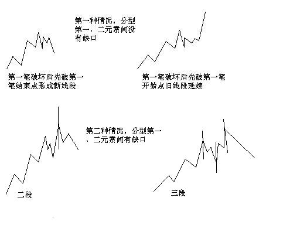{width="4.708333333333333in"
height="3.532208005249344in"}

这里还要强调一下包含的问题，上面的分析知道，在这假设的转折点前后那两元素，是不存在包含关系的，因为，这两者已经被假设不是同一性质的东西，不一定是同一特征序列的；但假设的转折点后的顶分型的元素，是可以应用包含关系的。为什么？因此，这些元素间，肯定是同一性质的东西，或者就是原线段的延续，那么就同是原线段的特征序列中，或者就是新线段的非特征序列中，反正都是同一类的东西，同一类的东西，当然可以考察包含关系。

估计看了上面的话，很多人更晕了。下面有几个图，各位可以仔细揣摩一下。但最好还是习惯从定义出发。另外，大盘网友问到的那个图，显然，根据定义，是两个线段，而今天42-44的分段，显然也是成立的。

**注意，下图最后一个有问题，请看课程81里的更正说明。**

## 来自大洋彼岸的暗算

(2007-08-17 15:58:48)

**全球资本市场这连续几年的多头氛围，好不容易给空头逮着一机会，各种衍生工具一起作用，大有来一次1987年的味道。或者，至少怎么都来次1997年。其实，2007年要出点事，是天经地义的，看看1987-1997-2007，瞎子都能看出规律来。不过，由于目前的全球化体系，各国间如果能有效配合，震荡的力度是可以充分减少的。例如，1997就比1987要小。**

**站在货币战争的角度，本ID从来都认为，美国人的这些把戏，不过是让全世界为他们的堕落埋单，所以根本没有任何值得同情的理由。而且，因为美国人在世界资本体系中的位置，他们受到的惩罚其实更多让全世界分享了，站在根本的角度，那不过是美国人的一个暗算，道理很简单，涨不过你，难道不可以拖累你？一起跌下来，让你更惨，或者将自己的烂东西让全世界一起背，你说，最后最大的利益者难道不是美国人？**

**美国不是泰国，美国就算崩盘了，其中依然会渔利不少，肯定还是大赢家。至于美国的最核心的统治阶级，最核心的利益集团，那更是赢家中的赢家。现在的问题是，这暗算是否把你给暗算了。**

**当然，对于一般散户来说，这些问题都没必要研究。今天，已经有熟人在说，上周刚过去香港的已经没了一半了。天下乌鸦一般黑，有什么奇怪的。以为QDII就如何有投资价值，那是脑子进水了。**

**让工行去为美国人下半旗帜吧，二、三线股可不陪你们玩。今天，依然有不少二、三线股企图星火燎原，不和美国人一般见识。这能否成为共识，这就不好说了。毕竟，现在有国外背景的资金，都在夺路而逃，甚至，很多人要把这里的资金拿去填美国月亮的窟窿，那就让他们的资金被资本市场人道毁灭去吧。**

**可以肯定地说，本周全球的恶劣走势，会引发各国金融当局的强力介入，因此，一个有力的反弹的出现，是很正常的，至于之前是否要制造空头陷阱，那并不重要。站在大方向看，这个反弹后，如果各国金融当局的政策不得力，甚至更大可能的，有某些全球利益集团，故意要政策不得力，那么，更大的下跌还在后面。看看1987年的走势，第一段的下跌并不严重，反而是反弹后的下跌才真正的令人开眼。**

**所以，这次10年周期的金融风暴的第一次下跌，并不是太重要的，关键是看后面反弹后基本面以及各国玩法的状态，那才是关键所在。**

**国内市场，本来基本面上就有所不同，如果能在这次波动中，把某些外国资金给清理掉，这也算是一件好事。但如果外面的世界继续狂风暴雨，说这里一点都不受影响，那是脑子进水了。想想那些从非法渠道进来的资金，他们的老家出事了，你说他们能不受影响？他们受影响了，国内的市场能不受影响？**

**技术上，30分钟中枢震荡已经成立，这没什么可说的，在前面已经反复说到这种情况的边界条件。图就不用贴了，今天的分段太简单，周一一起帖，这样可以节省一个图的上传量，这里的总量只有200，用不了几天。**

**个股上，一线成分股，将跟随外围，一旦外围走稳，将引发大反弹。二、三线股，关键是看这次资金的流入情况，但无论如何，个股行情将再次活跃。**

**最后问一句，600139，以前对他仇恨无比的，现在是什么心情？5月28到7月6日，就一个月的洗盘，都受不住，那还玩什么？不过，这也没什么，好象这里没说过的600594。本ID一个文化界的熟人，6月份在11、12元买了，明确告诉至少要翻倍。前两天，在腐败时碰到，说在10元砍掉了，因为听别人说，这公司要破产。本ID只能很有礼貌地无话可说了。**

**算了，废话就不说了，周末，腐败才是王道。**

**各位，腐败快乐。**

**先下，再见。**

## 总市值超GDP后的泡沫化生存

(2007-08-20 08:22:59)

本ID在3月19日写的"神州自有中天日，万国衣冠舞九韶"，给出了本轮大牛市的一个基本判断，就是至少再延续20年、上升3万点，这个观点依然有效，没有任何需要修改的地方。在同一文章中，更给出了本轮行情第一阶段走势的基本特征，现引用如下：

"第一阶段行情，伴随着中国股市本身的制度性、结构性完善，其后，中国股市才真正具备参与全球化盛宴的资格。全流通、整体上市、两大交易所的功能重组、人民币逐步可自由兑换等，都不过是这种制度性、结构性完善的必然步骤。这一阶段，行情最主要体现在以权重股为代表的成分股上。在总市值超越GDP之前谈论股市的泡沫是可笑的，在中国股市总市值超越其GDP之前，第一阶段行情不会结束。"

显然，这个"在中国股市总市值超越其GDP之前，第一阶段行情不会结束。"

的判断已经被今天的事实所证明，因为，目前中国股市总市值已经超越GDP，但第一轮的成分股行情依然在延续中。如果，对何谓第一阶段的成分股行情还有所疑问，那么这段时间，中国股票市场大象狂舞的情形，应该给这种成分股行情一个最好的注释。

在这样一个市值超越GDP的历史性事件如期到来之时，必须给行情今后的发展定一下性。在市值超越GDP后，中国资本市场将进入第一阶段成分股行情的泡沫化阶段，中国资本市场的参与者将进入总市值超GDP后的泡沫化生存状态。

正如上面引文所说"在总市值超越GDP之前谈论股市的泡沫是可笑的"，而在总市值超越GDP之后，谈论股市的泡沫，就是十分必要了。如果把GDP当成总市值波动的中枢，那么在其下，可以说市场被结构性低估，而在其上，就是出现结构性泡沫了。

显然，GDP是变动的，随着中国经济的快速增长，总市值的波动中枢也将不断上移，今天的泡沫，可以就是明天的低估，这一切都必须动态去看。出现结构性泡沫并不意味着市场就没有上涨的理由，而是说这种上涨，其基础上存在被这波动中枢回拉的压力，一旦市场上涨的中短期理由不足以抗拒这种回拉，那么无论上涨使得总市值向上远离GDP30%还是300%，最终的回拉都将导致相应级别的调整。

如果说4500点附近对应目前GDP比较肯定的中枢，那么中国经济的高速发展，将使得20年后的GDP至少达到目前美国的水平，也就是说，一个100万亿人民币的GDP值是十分正常的，相应资本市场的中枢位置至少上移到23000点附近，而那时候，中短期波动让指数上冲到30000多点甚至50000点，都是可以想象的。市场总要波动的，市场可以围绕中枢去波动，但绝对不排除市场的波动大幅度去远离中枢，只是这种远离后都必然导致回拉的修正而已。

远期目标且不讨论，回到第一阶段这种泡沫化生存状态下，唯一能站在长期角度抗拒泡沫的，就是成长性带来的中枢上移，一旦成长性不足以支持这种中枢上移，那么大规模的泡沫破裂就是天经地义的。而且，这种泡沫的破裂，往往导致中短期走势跌破中枢，形成一个新的低估，这又构成良好的中长期介入机会。

中国资本市场目前的泡沫化生存之所以还不构成大规模的压力，就在于，即使是中国资本市场上最大型的成分股，站在世界资本市场的历史发展中，依然属于高速成长股。因此只要这种状态依然存在，那么一个适度的泡沫化生存反而是合理且理所当然的。

不过，市场行情总是从非理性开始，又在非理性中结束，没有疯狂的低估，就没有疯狂的牛市行情；同样，没有疯狂的泡沫，就没有疯狂的熊市造就新的历史性低估介入点。第一段成分股行情，最终必然在疯狂的泡沫中结束，在这疯狂的泡沫被制造过程中，反而能获取高额利润。如果说低估回到中枢可让股票上涨10倍，那么疯狂的泡沫甚至有更强的能力。对于任何市场的参与者，耐心等待市场的疯狂，在市场的疯狂中等待最后的卖点，是一个最重要、最值得培养的能力。

显然，目前市场最疯狂的状态依然没有出现，外围因素制造短期的波动反而有利于市场能量的积累。在泡沫制造能力被充分发挥之前，市场不会最终逆转，第一阶段的成分股行情不会结束。不再战略性买进、只战略性持有，等待市场疯狂、等待第一阶段长线卖点的出现，是泡沫化状态下最应采取的策略。

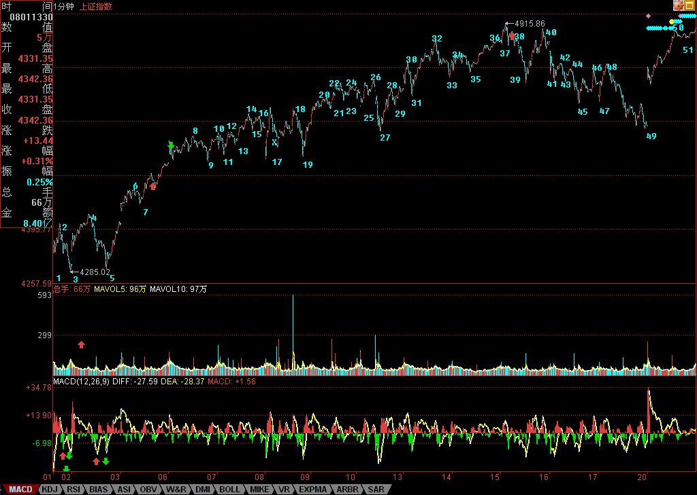{width="5.629861111111111in"
height="4.00625in"}

## 两年最大涨幅拉开泡沫化生存大幕

(2007-08-20 15:48:47)

**大盘中长线走势的判断，都在今早的
[[总市值超GDP后的泡沫化生存]{.underline}](http://blog.sina.com.cn/s/blog_486e105c01000can.html)
里。其中最后一段有必要引用如下"显然，目前市场最疯狂的状态依然没有出现，外围因素制造短期的波动反而有利于市场能量的积累。在泡沫制造能力被充分发挥之前，市场不会最终逆转，第一阶段的成分股行情不会结束。不再战略性买进、只战略性持有，等待市场疯狂、等待第一阶段长线卖点的出现，是泡沫化状态下最应采取的策略。"今天，大盘以两年最大涨幅拉开泡沫化生存大幕。**

**至于大盘的中短走势，在上周五已经明确说过"可以肯定地说，本周全球的恶劣走势，会引发各国金融当局的强力介入，因此，一个有力的反弹的出现，是很正常的，至于之前是否要制造空头陷阱，那并不重要。"其后的走势，基本如此，在同一文章里，已经说了，最重要是反弹后的走势，需要关注的是相关政策的有效性，一旦救市政策失效，引发全球资本市场更大规模的杀跌，并不是什么天方夜谈。**

**回到上海指数，从纯技术的角度，下图里的8-49可以看成是一个30分钟中枢，但更可以看成是，对于8-17这个5分钟中枢，17-38的1分钟走势5分钟背驰后，必须有一个回拉至少回到8-17这个5分钟中枢里。显然，49已经跌破14，十分完美地演绎了本ID的理论。超短线的角度，根据走势的多义性，可以把后面的走势先看成是32-41这个5分钟中枢的一个震荡，要往上突破，就要出现第三类买点，否则，别看今天涨了248点，依然只是中枢震荡。**

**个股方面，周五也说得很清楚了"个股上，一线成分股，将跟随外围，一旦外围走稳，将引发大反弹。二、三线股，关键是看这次资金的流入情况，但无论如何，个股行情将再次活跃。"显然，今天的走势完全与此符合。目前，行情要继续发展，必须把二、三线股点燃起来，这是今后行情是否能往纵深发展的关键，否则光拉一线大盘或者普涨走势，都不可能持续。**

**另外，周五用600139、600594为例子，只是说明持股的重要，如果没有做短线的本事，也没有持股的耐心，怎么可能长期战胜资本市场？不妨再举一个例子，那只唯一本ID明确说过的中字头股票600737，本ID在7月中8元时十分明确地告诉，这股票等于6元告诉你000999，纯粹就是给你准备点学费，可以安心学习。但现在又有多少人能从8元持有到现在？其实，前后也就1个月时间，如果这样都持不住，那就该干什么干什么吧。**

**今天有事，先下，再见。**

## 热点蔓延渐成潮流

(2007-08-21 15:59:25)

**当然，对看不惯、从1000点就开始说地球要毁灭、世界要末日、上海股市100点都没有价值的空头来说，这个题目太粉饰太平了，就是为了骗散户，哪里有什么热点，都是庄家拉高出货。可惜，这庄家拉高，从1000点一直拉了两年多、4000点，还在拉高，还在骗散户，不知道这究竟算是什么了？**

**本ID这里的逻辑关系十分明确，在总市值超越GDP之前，本ID从来没有谈论过任何有关泡沫的问题，大概从上周起，本ID才开始谈论这个问题，而且给以后的走势一个明确的定义，就是泡沫化生存。如果说，从1000点的严重被低估状态到上周的刚好达到GDP，这个时间有两年，请问，这制造泡沫到泡沫真正破裂，至少要多长时间才合适呢？**

**所以，如果没有对全局的一个大方向的把握，永远在每天的波动中折腾自己，或者每天就盼望着大跌、熊市、100点，再一次1000点，那是脑子水太多了。以前，本ID已经给这种人一个定性：这种人，真跌了，也和他们没关系，就算有熊市，真正的底部也和他们没关系，真有大调整，也和他们没关系。1000点和他们没关系，3400点和他们没关系，3600点同样和他们没关系。**

**还是回到今天的走势，现在，十分明确的现象，就是热点在蔓延。本ID以前曾说过，中报出来后，二、三线股会逐步活跃，本月结束，这中报基本就出来了，那些业绩不好，但有题材的股票抛开业绩这个枷锁，会逐步活跃起来的。**

**其实，这个节奏，并不是什么新鲜事。从来都是在业绩大面积公布时，所谓业绩好的、一线股表现得好一点。等业绩公布完了，业绩作为题材被炒烂了，自然要找新的来替代，否则就维持不住这锅的热度。当然，今年有点例外，就是业绩公布完以后，一线成分也不会太耷拉，为什么？还不是那期货闹的，有那东西在前面晃悠着，一线成分这些大狗小狗，总要不时奔跳折腾几下的。**

**今天涨停的股票里，二、三线已经占了绝大部分，这就是一个热点蔓延的正常现象。这火如果能再坚持几天，就会彻底燎原。**

**今天，就不帖图了，节省点上传图片的空间。今天的分段也太简单，没什么特别的。昨天说了，现在在技术上，就是要先形成5分钟的第三类买点，然后是30分钟第三类买点，这才能最终确认突破的有效，在这之前，都只能看成了一个中枢震荡。**

**今天留下的缺口，构成短线的技术关键，而上方的真正压力，并不是什么5000点，而是2/3线，目前在5089点，这在前面曾以问题的形式给各位说过了。突破1/2线，上一条就是2/3线，这涉及预测，但有比较大的经验值保证，但本ID为了彻底反对预测，所以只以问题的形式和各位讲，就是不希望让各位先入为主，影响当下的判断，那才是真工夫。**

**预测这种东西，不过是按一个模子照套，傻子的干活而已。2/3后就3/4线，目前在哪里，傻子都能干活出来，所以预测都是傻子的干活，还是不要提了。**

**今天可以回答问题到5点。**

缠中说禅2007-08-21 16:20:01

\[匿名\] 百思不解 删除此人所有评论

2007-08-21 16:01:49

缠姐好！

下面是几个月以前跟贴的问题，至今仍想不明白。能不能详细说说？

――――――――――――――――――――――――――

第18课有个定理有点疑问，该怎么理解？

定理三：某级别"缠中说禅走势中枢"的破坏，当且仅当一个次级别走势离开该"缠中说禅走势中枢"后，其后的次级别回抽走势不重新回到该"缠中说禅走势中枢"内。这定理三中的两个次级别走势的组合只有三种：趋势+盘整，趋势+反趋势，盘整+反趋势。

这定理三中提到的两个次级走势组合，比如"趋势＋盘整"，是否同级？这里说的是两个同级走势的连接？还是从走势组合观点看，那个盘整中枢级别高于趋势中枢级别？

====

这和连接的结合性有关。简单说，只要能分解出两段次级别走势就可以。详细情况，下几堂课程会说到，请耐心等等。明天就继续说这几种不同分解的问题。

===

盘整中枢为什么一定要高于趋势的？关键不是盘整还是趋势，而是中枢究竟是什么级别，没有中枢，没有中枢的级别，哪里有什么盘整、趋势以及他们的级别？

这个问题其实说过N次了，盘整结束的标志就是第三类买卖点，而趋势结束的标志就是形成该级别的背驰后对最后一个中枢的回拉，为什么一回拉趋势就肯定完成？因为，一回拉，肯定就有更大级别的中枢形成，所以原来级别的趋势肯定就破坏了。这个逻辑关系是极端严格的。

那么，我们是否要等到回拉才决定进出？当然可以，可以等回拉后再一次向上，形成所谓的第二类买卖点进行操作。这种操作，完全可以不用背驰概念，纯粹就用三类买卖点就可以。

当然，实际操作中，可以用背驰，在第一类买卖点操作，为什么？因为背驰后一定回拉，这是本ID理论的一个定理。

但从上面的分析可以知道，虽然背驰一定回拉这个定理是100%成立了，但即使没有这个定理，本ID的理论依然成立，为什么？因为走势必完美，第一类买卖点后还有第二类买卖点，这是纯图形的，而背驰是动力学的。

缠中说禅2007-08-21 16:27:28

石猴 删除此人所有评论

2007-08-21 16:09:23

问题：封闭还是不封闭？

67课中讲：强调，在第二种情况下，后一特征序列不一定封闭前一特征序列相应的缺口，而且，第二个序列中的分型，不分第一二种情况，只要有分型就可以。

71课中：这里的逻辑关系很明确的，线段要被笔破坏，那么必须其最后一个特征序列的缺口被封闭，否则就不存在被笔破坏的情况。

===

这根本不是问题。线段破坏和线段的笔破坏根本就是两个概念。线段被笔破坏，但线段不一定被破坏，也就是说，线段被笔破坏，那特征序列的缺口被封闭，并不意味着线段一定被破坏，有新的线段产生。

线段破坏，就是那两种情况。

其中第二钟情况中还包括了一种最特殊的，也就是所谓小级别转大级别后连最后的特征序列缺口都不回补的情况。

缠中说禅2007-08-21 16:33:43

\[匿名\] 夜雨 删除此人所有评论

2007-08-21 16:27:32

姐姐好，谢谢您昨天写的论语，带给我们心灵的营养，还是要先学好本事再来讲是君子还是小人，都要有水平才能做。结合当下，太多人只讲着好话就算好人了，其实专做糊涂事，其实连小人都当不上，只能算伪君子。小人和君子的区别是心之所向，而将来成就也会相差很远。

===

对，首先成"人"，才有小人，有了小人，才有君子。如果连"人"都成不了，那只是"伪人"，假人，被摆布的木偶。

小人和君子的区别，更准确地说，是心量之大小，这也包括心之所向。

缠中说禅2007-08-21 16:36:36

\[匿名\] Happysky 删除此人所有评论

2007-08-21 16:14:11

潜水很久了，冒一下泡

谢谢缠主每天解盘，从你的文章感觉你的理论很管用，可惜怎么都学不会

===

其实，逻辑化的东西都最好学的，关键是从最基本的概念下手，然后把整个逻辑关系串起来，这样就一通百通。否则，只能乱套。

缠中说禅2007-08-21 16:40:58

\[匿名\] 新浪网友 删除此人所有评论

2007-08-21 16:30:33

越来越感觉你的理论比一些我看过的理论有用的多,不过,我还是不能很好的掌握.近段时间想试试把成本降为0,结果总是把筹码弄丢了,郁闷啊

===

加大操作级别，对新手来说，先练习持股，在一个大级别买点买入后持有到大级别的卖点，怎么都应该是30分钟以上的。你看这次从3600上来，从来就没有效跌破过5日线，对初学者，用这一招就比所有的所谓专家高多了。如果资金大的，就看5周线。

至于中枢震荡中的短差，那是一个高难度的活动，初学者当然做不好。至于趋势中时，根本就不存在做差价的可能，趋势中，唯一需要干的就是等待背驰。注意，上面说的，都是在你的操作级别的意义上。

缠中说禅2007-08-21 16:44:22

石猴 删除此人所有评论

2007-08-21 16:31:47

71课：

把线段的划分分为两种情况，显然，分清楚是哪种情况，对划分线段十分关键。其实，在那里已经把问题说得很清楚，判断的标准只有一个，就是特征序列的分型中，第一和第二元素间不存在特征序列的缺口。

最后这句少了个存字吧？

第一和第二元素间"存"不存在特征序列的缺口

===

如果原话是那样，是少了一个字。谢谢，等一下看看，改回来。

缠中说禅2007-08-21 16:46:44

快乐vs菜虫 删除此人所有评论

2007-08-21 16:30:58

事实上如果用67课的新的精确定义，57课里的3－4段的分段就迎刃而解了，正是这句"强调，在第二种情

况下，后一特征序列不一定封闭前一特征序列相应的缺口"解决了此问题。缠姐，是否如此呢？那"小级

别转大级别"是否要退居幕后了呢？？？？

===

在线段的层次上，是不需要小级别转大级别的概念的。但在最小级别走势类型之上，还是需要。

缠中说禅2007-08-21 16:50:02

\[匿名\] 新浪网友 删除此人所有评论

2007-08-21 16:45:08

缠主，能说说钢铁板块后面还会怎样演绎吗？谢谢！！！！！！！！！！

===

任何板块的演绎，基本都是一二三节奏的。

缠中说禅2007-08-21 17:02:26

对于石猴网友的问题，由于有代表性，再多说两句；

笔破坏与线段破坏，是两个不互相包含的概念。并不是笔破坏就一定线段破坏，也不是线段破坏一定要笔破坏。

显然，在线段破坏的第一种情况下，必然是笔破坏的。

在线段破坏的第二种情况下，就不一定了。

反之，线段破坏如果不是笔破坏，那么一定是第二种情况的。

那么，笔破坏为什么要单独提出来？因为笔破坏有动力学上意义。

本ID的理论，有一部分和物理学有点类似，就是探讨动力学方面的东西，这方面，各位现在接触最多的就是背驰，而笔破坏，和这一样属于动力学方面的内容，这在以后会逐步说到的。

先形态学，再动力学，各位慢慢来。

先下，再见。

## 教你炒股票72：本ID已有课程的再梳理

(2007-08-21 22:37:20)

任何事情，都有缘起。本ID是个大杂家，本ID现实中最终的落脚处，是文化的总构建，所谓三教九流，彻底穷源地玩弄一把。虽然，经济上，本ID早就可以天天腐败什么活都不干了，但现在又没老到要在书斋里天天写书的地步，本ID觉得，那至少是40岁以后才能干的事情。因此，本ID在网上写东西，纯粹是顺着形势来，并没有什么计划。

写关于股票的事情，对于本ID来说，不过是把本ID这十几年天天干的事情复述一下。正如在课程开头，本ID说的""教你炒股票"这样的题目，全中国不会有第二人比本ID更适合写的。"当然，这种话招人恨的，不过却是事实。

和股票相关的事情千奇百怪，本ID是什么都经历过，所以，开始写的时候，并没什么主题，只是漫谈。但对一般散户来说，听些掌故没什么实质意义，说消息面，肯定也没什么意义。如果你消息灵通到公布什么利好利空前都是第一时间知道，那么就没什么可说的。而对于散户来说，那种靠拿着原始股就可以翻几十几百几千倍的时代早过去了。靠研究公司基本面买股票，那种积累速度太慢，只适合大资金。其实，一切关于基本面的研究，最终都归于行业或总体经济的发展。最简单、最不伤脑筋的方法，本ID也说过，就是买指数基金、或者具体行业、板块的基金。对于散户来说，你对基本面的研究能力要超过一个好的基金团队的可能性是微乎其微的。至于指数基金，那就更不用说了，至少你肯定不会跑输指数。

对于散户来说，最终能战胜市场、获得超越市场的回报的，只有在本ID所说的乘法原则下的技术面操作。技术面是三个独立系统里的一个，而另外两个，例如比价关系与基本面，可以配合决定你的介入种类。但当介入到一个品种后，技术面在操作上就起着决定性的意义。为什么？因为其他的面，变化的频率都没有技术面高，像基本面，其变化大致是有一定的稳定性的，不可能天天都是奇点、断裂点。比价关系也一样，一种比价确立后，就基本保持稳定了，不可能天天都变化。所以这种变化少的系统，不需要花太多精力去研究，而技术面显然不同。

所以，最终本课程开始说技术面是顺理成章的。而技术方面，本ID的理论，肯定是关于技术方面最好的理论了，本ID本来是想在40岁退休后才写出来的，但大概是缘分到了，本ID也没刻意一定不写出来，所以就慢慢地写出来，而且现在还在写着。

开始时，本ID并没有认真想写整套理论，因为当时好在网上骂男人玩，所以开始写技术的，都是用些损男人开心的招数，当时说的只是均线系统，那东西和本ID的理论没什么关系，只是闹着玩的。当然，如果真掌握了均线系统，也可以应付一定的情况了，例如，在日线单边走势中，最偷懒的方法就是看着一5日线就可以，而5周线就更是中线的关键，5月线是长线的关系。例如，为什么现在牛市的第一轮肯定没走完？很简单，你什么时候见过牛市的第一轮调整不跌破5月线的？这两年多，这5月线被有效跌破过吗？显然没有。而第一次跌破5月线后，下面的10月、30月线上来，自然构成新的调整底部，后面自然还有一波大的。

后来开始写于本ID理论有关的东西，开始，只是想把一些有用的结论告诉各位，因此课程都不是按正式的理论框架写的。本ID的理论，本质上分两部分，一是形态学，二是动力学，当然三就是两者的结合。如果按正式的课程，那肯定要先讲形态学。但如果不说动力学，那至少背驰是没法讲了，然后中枢震荡也不可能用类背驰的方法去判别，第一类买卖点也无法说了。而所有买卖点，归根结底都是第一类买卖点，那这样，要把形态学和动力学都说完，才说第一类买卖点，估计所有看的人都会晕倒。

所以，当时把于初学者有用的一些简单结论先说了，就是让各位有点实践的乐趣，当时000999刚好在6元，还很明确地说了，买这股票，就当本ID把你要给市场交的学费都给各位准备好了，就是让各位耐心学下去，拿着一个长线股票，至少比你到处乱跑要强点。这样安心学习，也是不错的。当然，有能力的，也就可以边学边实践，这没有任何需要统一规划的地方。

站在纯理论的角度，形态学是最根本的。形态学，从本质上就是几何，这部分内容，是无须任何前提的。以前说的本ID理论成立的前提，其实并不是针对这部分的，主要是针对动力学部分。因此，就算一个庄家自己全买了，一个人天天自我交易，也永远逃不出形态学画的圈圈。而动力学方面的东西就不同了，必须有本ID要求的那两个前提：价格充分有效市场里的非完全绝对趋同交易。

动力学，是属于物理范畴的，但站在更高的层次上看物理，物理的本质就是几何，当然，这是所有物理学家都不可能认同的，但如果用一些几何结构就可以把所有物理的常量给搞掂，那物理学家不认同也是白搭。同样道理，本ID理论里的动力学部分，本质上也是几何，只是这种几何比较特别，需要把价格充分有效市场里的非完全绝对趋同交易作为前提转化为某些几何结构，然后构造出理论的证明来。

所以，本ID理论在整体上依然只是几何，只是需要有价格充分有效市场里的非完全绝对趋同交易的前提。而且，最终的理论，当然不会涉及那些基本上谁看都会晕的几何结构，而是谁看都能看明白的当下的走势。理论和理论的证明那是两回事情。费马猜想谁都看得懂，费马猜想的证明，能全看懂的人不会超过1千万分之一。

当然，本ID的课程，基本的逻辑顺序还是一直坚持的，不过，如果是最终的课程，那么最开始的一章，肯定是形态学，和这课程的顺序大为不同。但现在，由于已经写成这样一种形态学和动力学混着说的状态，当然只能一直混着下去。

所谓形态学、动力学，其实很好分辨，任何涉及背驰的，都是动力学的范围，背驰是动力学的基本点之一。另外，中枢、走势的能量结构之类的东西，也属于动力学。而形态学，就是中枢、走势类型、笔、线段之类的东西。

其实，光用形态学，就足以形成一套有效的操作体系。只是在形态学中，由于没有背驰的概念，所以第一买卖点是抓不住了，但第二买卖点是肯定没问题的。单纯用形态学去操作，就是任何对最后一个中枢的回拉后第一个与回拉反向的不创新高或新低的中枢同级别离开，就是买卖段。

就算按照这么简单的方法，也可以很容易判断现在在日线上的操作思路，例如，去年5月和今年5月后的调整，算是同级别的，那么，其后的卖点就是，万一回拉4335点之下，任何第一次向4335点上的与回拉级别相同的不创新高的反抽都是卖点。如果一直没有回拉回到4335点，又在上面形成新的同级别中枢，那么操作的标杆就进一步提到那个中枢上，如此类推。按照这种方法，那么从2005年中到现在，你都应该持股不动，为什么？因为没有卖点。当然，实际操作，要针对具体个股，说指数只是举例子。个股上，看000777在日线，6月20前后的一段，就可以看出类似的效果；但如果你是看周线图的，那么现在的卖段还没有出现，而且可以明确地看出，其6-7月份的调整，不过是突破历史高位后的回抽过程，站在更大的视野上，看到更大的方向，如此而已。

当然，上面只是说如果只用形态学，也可以进行操作，但实际上，当然是动力学、形态学一起用更有效。所以，千万别认为以后就只用形态学了。不过这里有一个用处，就是那些对背驰、区间套没什么信心的，可以先多从形态学着手。而且，形态分析不好，也动力不起来。

站在实际应用的角度，关于中枢的递归定义以及与从分型、笔、线段开始的最小级别定义之间的区别之类的东西，也是可以不管的，但这样，逻辑上就容易乱，所以，搞清楚没坏处。如果你实在特懒，那就从分型学起，这也可以。

下面，本ID给出一个懒人线路图：

分型-笔-线段-最小级别中枢-各级别中枢、走势类型

上面几个东西，是形态学中最基本的，完全没有办法再简略了，所以无论多懒，如果真想学本ID的理论，那请先把这几样东西搞清楚。

关于形态学，后面还有很多内容，最主要是关于各种与结合律相关的问题。当然还包括世界上所有有关股票的理论中关于形态部分的理论，根据本ID的形态学，例如什么K线理论，波浪理论之类的玩意，都可以从本ID的形态学中严格推出，而且，本ID还可以指出他们的缺陷以及原因。这个工作是必须干的，彻底穷源的其中一个方面，就是要包罗万象。

注意，有时候课程是由浅入深，前面不严格的，后面引进新概念后，就可以严格定义了。例如，最开始时，说上涨、盘整，都是用高、低点之类的东西，因为当时没说中枢，所以不可能严格定义，后来说了中枢，就可以给出严格定义。

再例如，64课里，由于没说特征序列的元素之类的概念，所以里面关于线段一些论述都如同用高、低点定义上涨、盘整一样，不太严格，到67课说了特征序列之类的东西后，定义就是严格的，所以在67课里，本ID说"本课，就是把前面"线段破坏的充要条件就是被另一个线段破坏"精确化了。因此，以后关于线段的划分，都以此精确的定义为基础。"

为什么说原来的不精确，因为按照原来没有特征序列的定义，那么线段里都要继续存在类似小级别转大级别的情况，而有了特征序列后，就不再需要这种情况了，这样才能把线段给精确划分。

由于本ID目前的讲课，一开始就没有按正常课程应该的顺序，所以，这种开始不精确后来再精确的情况才会发生。本ID愿意先不引进复杂的概念，先把大方向给说了，然后再说复杂的概念。这样有一个好处就是，如果理解能力差的，可以接受简单，不太精确的方式，这样也没什么问题，也可以用。例如，像特征序列的分型这样的概念，本ID就严重怀疑孔男人能理解的机会能超过10%。所以，如果不能理解精确的，就用不精确的，等有理解力，对市场再了解深了，再学精确的也可以。

例如，如果你现在只能理解男上位、女上位，吻之类的东西，那也很好。关键是精通一样东西，精通就好，就怕半通不通。所以，以后有问题，一定要问，把所有想解决的问题都解决才行。当然，本ID无法回答所有问题，但有代表性的，一定会安排回答的。

## 一次值得鼓掌的加息

(2007-08-22 08:37:19)

本来不想为昨天加息的公布说任何话的，因为确实没什么可说的，管理层只是干他们该干的事情，而投资者看着市场的反应去反应，不需要任何预测、猜测。任何的谈论，不过都是忽悠、站在自己利益上的广告而已。现在之所以写，只是站在一个非市场的立场上，为一次值得鼓掌的加息留下一笔。

这次加息，显然时机十分正确。当然，反对加息的人肯定不这样认为。他们的理由无非是，美国人都要减息了，中国凭什么加息？这是典型的脑子进水想法。中美之间保持息差，不过是一种可能的生存状态；不保持息差了，难道就不是一种可能的生存状态。而且，本ID最讨厌看到任何美国怎么了中国人就要怎么的破烂言论，美国还911，你怎么不也跟着去？脑子有锈？

当然，现在并不是说管理层已经放弃了原来中美之间保持息差的基本态度，但这次加息，至少是一次完全以我为主的行为，从而使得管理思路上有了自我的性格，这就是好事情。而且，如果要加，现在的时机是最好的，在世界对美国那些破烂事情反应稍有喘息的时候，效果显然是最好的。这次，本ID给管理层打100分。

当然，对于市场里的人，可能认为这次加息有调控的味道，特别昨天刚出个人到外面买股票的试点，今天又出加息。而现在又面临5000点，这个时机，显然有组合拳的味道。这对也不对，为什么？虽然，理想的状态是少调控多监管，但现实如此，就是调控还是一种自然反应，就必须面对着现实，如果能达到一个调控的高境界，那就是一件可欣赏的事了。

显然，这次组合券，分寸、时机都拿捏得很好，在是不是之间。所谓调控的艺术，就是让市场产生不同的预期，而不是统一的预期，这样的调控，就是最高明的调控。当然，不能说以后的调控都一定能达到这样的水平，但至少现在是这样，所以，本ID要给管理层再加100分。

这次调控，对市场将产生不同的解读与预期，这样，市场的合力就不会产生一边倒的现象，这样，市场就可以在一定的时间内进行一定的磨合，最终去选择自己的方向。

目前，技术上的条件没有任何变化，日线上，背驰段依然成立去等待最后的确认或破坏，短线，30分钟的中枢震荡依然，超短线，最后一个5分钟的中枢震荡依然，按照这些技术界限，与自己的操作级别，不难根据当下的走势去选择自己的操作。

对于技术学习不好的，就看5日线、5周线，不要为市场的消息所动，只看市场最终的反应，这是一个最基本的素质。

至于今天的走势，无非就是强中弱三种：

一、直接平开或者高开，不补昨天缺口，继续上攻，一旦出现这种走势，证明市场选择了这样的合力，因此，只要继续看着。不过这种状态，必须密切注意是否还有新的组合拳，一旦还有，就要注意2/3线与基本面产生的共振。

二、补昨天缺口后在附近震荡，这种走势，是一种平衡状态，就要看后面基本面的变化去选择突破方向。

三、直接跳空向下，形成岛型反转，这是最恶劣形态，短线的压力大，至少要再次考验8-17那个中枢。

其实，这些分类界限，都无须预测，让市场自己去选择，根据市场的选择去反应。另外，一定要注意自己的操作级别，如果你是月线操作，那就看5月线，没有效跌破之前，都可以少管，任何的波动都可以当戏看。

另外，美国那破事，在如期反弹后续的发展，是决定今后走势的一个重要分力，这样因素在前面反复说过了。这可能比加息、组合拳都要根本点，毕竟，管理层的加息、组合拳都要参考这方面的因素综合给出。

## 加息难阻热点蔓延

(2007-08-22 16:10:16)

**昨天说热点的蔓延如果能持续几天，就会燎原。而晚上公布的加息产生的新分力，使得大盘最后选择了今早所说的第二种中等力度的走势，这都是自然的选择，无须预测。任何有预测癖好的人，去当火星股评去吧，地球很危险的。**

**今天的走势，从纯技术的角度，连一个线段都不一定100%确认完成了，为什么？因为都没100%满足线段完成的条件。该线段完成的判断，显然属于第一种情况，本来第一种情况是属于相对简单的。但由于特征序列的分型一直没有最终完成，每一次上冲都新高，而下来都是一笔，形成所谓的向上倾斜三角型走势，该走势的特点就是99%回跌到三角形启动的位置，尾盘的跳水满足这一跌幅，但只是一笔，所以如果明早一下高开在5000点之上猛烈上攻，不再回跌到5000点下，那这线段还真一时完成不了。当然，一般情况下，这线段已经在今天的最高点处完成，所以在上面标记上56，但这是否最终确认，还要上面说的这种情况不发生。**

**一般来说，1分钟线段都不会延续这么长时间，能延续这么长时间，反而是一个技术上的重要提示，证明多方上5000点的冲动比较大，反复闹，而上面，有人不断压制，所以才会走出向上倾斜三角型的走势。而到尾盘，差不到一点见5000了，多方一股真气突然泻去，回到倾斜三角形起点位置。主要是如530般在亢奋状态突然被惊吓留下了后遗症，因此往往在关键时刻都来这么一下，尾盘收回去一半，只是表明多头上攻的欲望依然没得到满足，如此而已。**

**今晚的消息面很重要，连续两天有消息了，如果今晚还来什么调控玩意，这走势变数就大了。由于选择了第二种走势，短线政策面的变化起着重要分力的作用。如果今明两天没什么特别消息，使得关于政策面组合拳的猜想暂被搁置，那么，上上5000点去满足一下多头的欲望，也是理所当然的。**

**本ID早说了，5000点根本什么都不是，关键是5089点的2/3线，这线就如同下面4100多点的1/2，该线反复磨了三个月，上下跳来跳去，2/3线是否历史重演，这才是技术上需要注意的地方。**

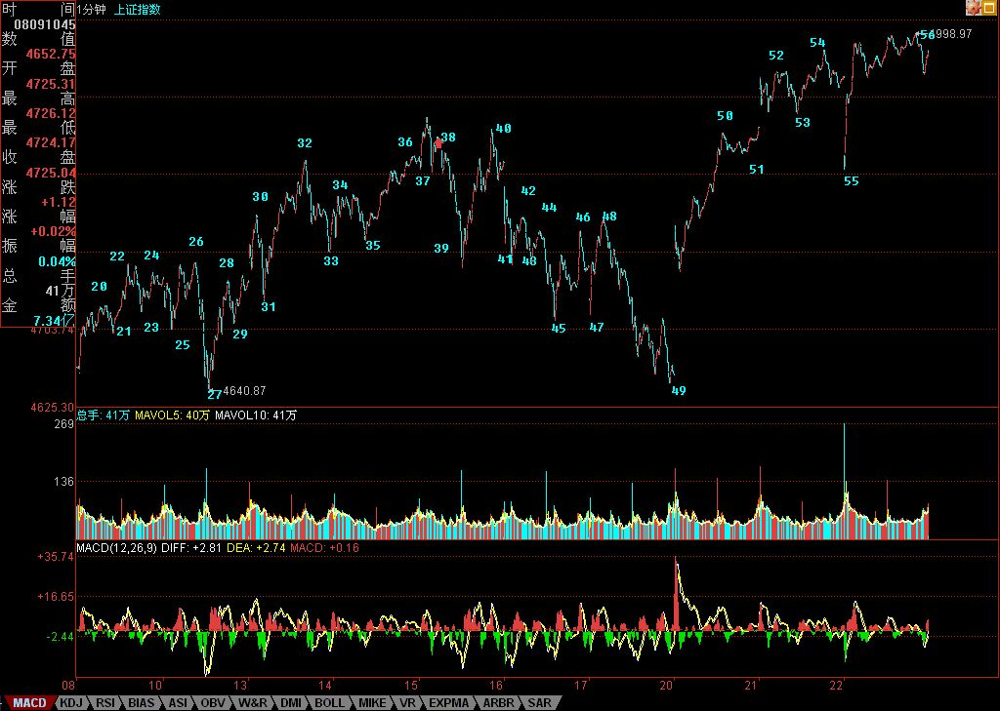{width="5.6299212598425195in"
height="4.0065048118985125in"}

**个股上，加息并没有延缓热点的蔓延速度，反而是加快了。银行股被压制，反而有利于其他股票的表现，本ID反复强调的二、三线股的逐步活跃已经成为现实，看看这几天涨停的都以什么股票为主就知道了。而且，这种蔓延已经逐步偏向三线股，特别是低价股，这是游资重新活跃的迹象。**

**这里，一个最现实的问题就出现了，银行股、地产股等等基金们玩的股票，和比较正规的大资金玩的一、二线大股，与游资搞的二、三线小股之间争夺话语权的问题。后面，能使大盘大幅度震荡的，一是政策面，二就是这话语权争夺战了。**

**散户当然喜欢三线股狂飞，像本ID的中铝那样的中字头股票，散户参与的热情也不会太高，特别现在，随便买个1万股就要40万，而一个5、6元的股票只要5、6万，哪个群众基础好就根本不用说了。**

**本ID对哪类股票飞都无所谓，本ID的持有结构本来就是一、二、三全有，大小通杀，现在又不买了，只持有，所以只有看戏的份。不过，本ID最喜欢的，其实是三线变一线的股票，谁又告诉你，三线不能变一线呢？**

**今天有事，刚才一路写东西，电话就不断，下面的事够忙一晚上了。**

**晚上回来可能晚点。**

**先下，再见。**

## 行情只会在一地鸡毛中高潮

(2007-08-23 16:08:01)

**没有三线股参与的行情，永远都是不完整的，行情只会在一地鸡毛中高潮，没有三线股鸡毛一地的高潮，这种行情，至少在中国特色的市场中，本ID还没见过。这里的原理很简单，一个爱好群众运动的文化中培养起来的投资者，连选秀都可以超女快男一地去鸡毛一把，股票不亦如此，怎么对得起博大精深这四个汉字？**

**这锅热度如期中升高，三线鸡毛开始满地打滚，这还只是开始，被一线大盘、高价股抛弃了的散户，才正开始撒着步子欢了起来。人类的本质是酒神性的，人的本质中，那酒神的狂欢永远可以战胜太阳的冷酷。狂欢，总是大众的。茅台、五粮液去大众，要困难点，还是二锅头、老白干，更能激发人们心里的野性。如此，股票的高潮，总是老白干的。**

**有人问，怎么还不说今天突破5000点的历史时刻？5000点算个什么？本ID不是一大早就把股市的20年走势的剧本都告诉各位了？5000点在那剧本中，连一句台词都够不上，有什么可说的？**

**站在纯技术上，突破1/2线，就看2/3线，然后就是3/4线。但现在，还是先看2/3线。从大盘对前几条线的突破看，都不是刚好触及就回头，而是围绕着其震荡。由于2/3线与3/4线之间距离不大，所以在这两线的震荡级别不大会一样，一般来说，2/3线小级别，那么3/4线级别就大点了。所以，行情在2/3线附近如何发展，对今后行情的发展，有一定的意义。2/3线如何计算？1429+183\*30\*2/3=5089。3/4线，只要把里面的2/3改为3/4就可以。当然，下月计算时，183要变成184，如此类推。**

**短线技术上，昨天的56，不能100%的那种情况，今天发生了。这说明什么？本ID的理论是几何，没有一种精确的数学态度，是弄不好的。任何有预测癖好的，都离技术之门远着。今天图里，昨天56的位置就要根据这种情况变了。注意，并不是本ID的划分可以随意变，而是因为昨天的走势没有100%满足本ID的划分标准，只是暂时标记。例如，今天59，同样有这个问题，那里标记上59并不是说59在那里已经完成了，因为目前没有满足59段被100%破坏的标准。而58以及以前的所有标准都是唯一的，不可更改的，为什么？因为，符合标准了，就这么简单。这个问题，一就是一，二就是二，没有任何可含糊的地方。**

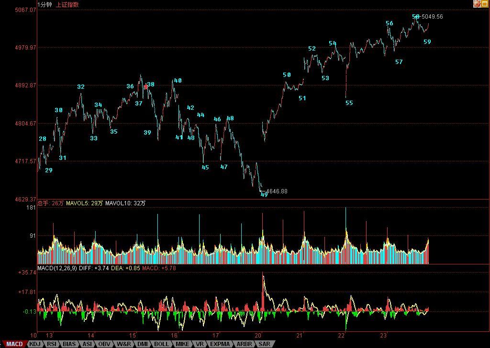{width="5.629861111111111in"
height="4.00625in"}

**个股方面，给各位一个技术面上的判断标准。现在的个股，日线上无非三种：一、突破530高位；二、没突破530高位但突破530后第一个反弹高位；三、530后第一个反弹高位还没突破。**

**一般来说，第一种技术条件的股票，注意那些刚突破后回抽确认正再次启动的，这种股票要预防假突破的危险；第二种，属于最有表现欲望的，但这种股票的预防启动突破530高位后有一串洗盘；第三种，最容易吸引踏空资金，但唯一的坏处就是，资金新近来，如果是一个喜欢打压吸货的主，那就要被折磨一段时间，当然，如果是一个喜欢高举高打的，那就祝贺你了。其实，这不难判断，关键是看第一次放量后回抽的位置。**

**昨天说到本ID更喜欢三线变一线，这种股票，一般人可真拿不住。本ID的股票里就有很多，不过估计没人能真和本ID一样从最低位拿他N年。以后的一线股，都必须是至少是中字头甚至是世界级的公司，要从三线变一线，只有两个途径：一、自己能成长为中字头甚至世界级的公司；二、中字头甚至世界级的公司全面介入。**

**有事，先下，再见。**

## 教你炒股票73：市场获利机会的绝对分类

(2007-08-23 22:35:20)

说起获利，最一般的想法就是低买高卖就获利，但这是一种很笼统的看法，没什么操作和指导意义。任何市场的获利机会，在本ID理论下，都有一个最明确的分类，用本ID理论的语言来说，只有两种：中枢上移与中枢震荡。

显然，站在走势类型同级别的角度，中枢上移就是意味着该级别的上涨走势，而中枢震荡，有可能是该级别的盘整，或者是该级别上涨中的新中枢形成后的延续过程。任何市场的获利机会，都逃脱不了这两种模式，只是百姓日用而不知，本ID理论而知。

在你的操作级别下，中枢上移中，是不存在着任何理论上短差机会的，除非这种上移结束进入新中枢的形成与震荡。而中枢震荡，就是短差的理论天堂。只要在任何的中枢震荡向上的离开段卖点区域走掉，必然有机会在其后的中枢震荡中回补回来，唯一需要一定技术要求的，就是对第三类买点的判断，如果出现第三买点你不回补回来，那么就有可能错过一次新的中枢上移，当然，还有相当的机会，是进入一个更大的中枢震荡，那样，你回补回来的机会还是绝对的。

很多人，经常说自己按本ID的理论做短差买不回来，这没什么奇怪的。如果你连中枢都没分清楚，级别也没搞懂，中枢上移与中枢震荡也分不清楚，第三类买点就更糊涂，那也能短差成功，只能说你刚好运气好，死耗子摔到瞎猫爪子上了，天上哪能天天掉死耗子？

以上，只是在某一级别上的应用。用同一级别的视角去看走势，就如同用一个横切面去考察，而当把不同的级别进行纵向的比较，对走势就有了一个纵向的视野。

一个月线级别的上涨，在年线级别上，可能就是一个中枢震荡中的一个小段。站在年中枢的角度，如果这上涨是从年中枢之下向中枢的回拉，那么，中枢的位置，显然就构成需要消化的阻力；如果是年中枢之上对中枢的离开，那么中枢就有反拉作用。这都是一个最简单的问题。下面谈论的，是如何选择超大的机会。

人生有限，一个年中枢的上移，就构成了人生可能参与的最大投资机会。一个年的中枢震荡，很有可能就要搞100年，如果你刚好落在这样的世界里，简直是灾难。而能遇到一个年中枢的上移机会，那就是最牛的长线投资了。最牛的长线投资，就是把一个年中枢的上移机会给拿住了。

当然，对于大多数人的生命来说，可能最现实的机会，只是一个季线级别的上涨过程，这个过程没结束，没见到那新的年中枢，人已经没了。这个年中枢的上移过程，有时候需要N代人的见证。看看美国股市的图，现在还没看到那新的年中枢，依然在年中枢的上移中，想想美国股市有多少年了？

所以，对于一个最现实的获利来说，一个季度甚至月线的中枢上移，已经是足够好的一生最大的，在单个品种上的长线获利机会。

一个季度中枢的上移，可能就是一个十年甚至更长的月线上涨，能有如此动力的企业，需要怎么样的素质？即使在全球化的环境下，单个企业的规模是有其极限的。而一个能获取超级上涨的公司，也不可能突破那个极限。因此，顶已经是现实存在了，根据企业的行业，其相应的极限还有所不同。对于操作来说，唯一需要知道的，就是哪些企业能向自己行业的极限冲击。

但针对中国的企业、上市公司，我们还可以给出一个判断，就是几乎所有的行业，都必然有至少一个中国的上市公司会去冲击全球的行业理论极限。这就是中国资本市场的现实魅力所在。因为，几乎有多少个行业，就至少有多少只真正的牛股。

不过，有些行业，其空间是有限的，因此可以筛选出去。这种行业的企业，注定了，是没有季线甚至月线以上级别中枢上移的，除非他转型。因此，远离那些注定没有季线甚至月线以上级别中枢上移的行业，这些行业的企业，最终都是某级别的中枢震荡。这里，就涉及基本面的分析与整个世界经济的综合判断，谁说本ID的理论只管技术的？但任何的基本面，必须在本ID的几何理论的关照下才有意义，在这个视角的关照下，你才知道，究竟这基本面对应的是什么级别、什么类型的获利机会。

找到了行业，就到了具体企业的寻找。对于长线投资来说，最牛的股票与最牛的企业，最终是必然对应的。没有人是神仙，谁都不知道哪个是最后的获胜者。但谁都知道，最终的获胜者最终必然要到，例如10万亿人民币的市值，那么，他的市值必然要经过任何一个低于10万亿人民币的数。

这就足够了，这就马上可以百分百推理出，这个企业，或者是当下的龙头，或者是在今后某一时刻超越当下龙头的企业。有这样一个推论，本ID就可以构建出一个最合理的投资方案。

一、用最大的比例，例如70%，投在龙头企业（可能是两家）中，然后把其他30%分在最有成长性（可能是两三家）的企业中。注意，在实际操作中，如果龙头企业已经在基本面上显示必然的败落，那当然就选择最好的替代者，如此类推。

二、只要这个行业顺序不变，那么这个投资比例就不变，除非基本面上出现明显的行业地位改变的迹象，一旦如此，就按等市值换股。当然，如果技术面把握好，完全可以在较大级别卖掉被超越的企业，在其后的买点再介入新的龙头已经成长企业。

三、这就是本ID理论的独门武器了，充分利用可操作的中枢震荡（例如日线、周线等），把所有投资成本变为0，然后不断增加可持有筹码。注意，这些筹码，可能是新的有成长或低估价值的公司。

四、没有第四，如果一定要说，就是密切关注比价关系，这里的比价关系，就是市值与行业地位的关系，发现其中低估的品种。

注意，任何的投资，必须是0成本才是真正有意义的。

以上这个策略，就是基本面、比价关系，与技术面三个独立系统完美的组合，能这样操作股票，才有点按本ID理论操作的味道。

当然，以上，只适合大资金的操作，对于小资金，其实依然可以按照类似思路，只是只能用简略版，例如，就跟踪龙头企业，或者就跟踪最有成长性的那家。

当然，对于原始资本积累的小资金，利用小级别去快速积累，这是更快速的方法，但资金到一定规模后，小级别就没有太大意义了。

有人可能说，你怎么不说政策面？政策面那种玩意，不过是制造最多是周线级别的震荡，这正是提供技术上降低成本、增加筹码的机会。1929年、二次世界大战，都没改变美国股市年线级别的中枢移动，政策面又算得了什么？

## 不是每个收盘都需要一个题目

(2007-08-24 15:24:47)

**今天，一开盘，首先冲到5088点，在5089点的2/3线面前整理了30分钟，然后就就突破该位置，后面基本是一个震荡，毕竟下面缺口的压力在。突破站稳1/2就到2/3，这今天实现了。下面要继续完成的任务是站稳2/3线，这是继续上攻3/4线的前提。**

**周末消息面很重要，如果没什么特别的东西，那么下周有一个好开头，但下周决定月线收盘，因此，下周的任务是，不能拉太大的阴线，其余的任何情况，都是可以接受的。下周，比较理性的作法，是在目前位置稳固5089点的2/3线，一般来说，这种线的突破，都至少需要周线上的确认，各位可以看看3000点与4000点对1/4与1/2线的突破就知道了。当然，如果大家一定要很冲动，要下周马上就去挑战3/4线，那周末可以先听听那首极端口水的《冲动的惩罚》。**

**个股方面，热点继续表演。但基金之类正规部队与游资等负规武装之间的争夺资金较量，今天有点火花了。和气生财，都别闹了。排好队，姿势优美点，能面首的自然会被面首的，和为贵。**

**昨晚说了那课程，可能有人会说本ID自己那10来只股票里没什么行业龙头、高成长性，不符合本ID昨天课程说的。这只是不同的眼睛看出的不同景象。首先，最明显的，000338不是龙头？600649不是？000999不是？000998不是？000777不是？甚至，连600432、600343、000099、000778，哪个不是细分行业的龙头？知道000778是离心球墨铸铁管的世界第一吗？知道离心球墨铸铁管在干什么的吗？知道全世界发达地区，排水管道用的什么？知道全中国就算排水管道更新一次，需要多少吗？知道除了排水，城镇供水输气也用着玩意吗？当然，000778还不止这些东西，知道新兴这两个字代表了多少东西吗？其他股票也一样，就不细说了。**

**要注意，本ID的股票可都是在极为低的位置说的，例如，000778，说的时候只有5元多，现在再买，同样的钱只能买1/3的股票不到了，这确实没办法，迟来的人，肯定要付出更大的代价，这是天经地义的。而且，这10几只股票都是去年12月底才开始说的，本ID之前买的股票可基本没怎么说过。本ID的原则就是，本ID说的时刻就是自己买的时刻。想想000999，难道忘了，本ID说有一笔新钱，过两天到，还提前先把000999给说了，这里应该有人买得比ID还便宜，例如5.9元买的。当然，本ID买那个量，建仓成本肯定比一般的散户高，早一天晚一天没什么大事。关键是后面把成本变0的本事，这一点，本ID自认天下第二，这天下就没第一了。当然，成本为0，持股决心自然也天下第一，600432，20元这里不少人买过，就半年多时间，现在谁还有？本ID可一股还不少。000338，明确告诉，肯定上100的，现在估计也没人有了，其实，这股票，100根本不值一提，想想他在行业中的地位，想想这个行业的规模，你就知道，为什么他有动力了。**

**周末，股票是一件最恶心的物件。**

**都别股票了，腐败去吧。**

**祝全世界想腐败的人终能腐败。**

**腐败快乐万岁万万岁。**

**下了，本ID要去为腐败事业添砖加瓦。**

**再见。**

## 资金分歧日益严重的面子与里子

(2007-08-27 16:15:38)

**现在，行情已经演化成这样一种格局，基金等正规部队与游资等负规武装之间展开博弈。对于基金来说，由于新鲜血液不断进来，因此，只要坚持自己的板块，就算来个五十年不变，也有新的血液进来筑成他们的长城；而对于游资来说，有不少这次是踏空的。530后，很多游资利用第一次反抽胜利大逃亡，结果不过逃了一个山脚，回头一看，什么都和他们没关系了。由此可见，游资的视角上和基金比起来，是极为短视的。当然，基金都是被正规所忽悠的人的钱，用着不心疼，就算10000倍市赢率买所谓的大盘蓝筹，也可以编出无数的理由，更不用说现在大盘蓝筹的市赢率还有很多连50都不到，至少还有200倍的忽悠空间，所以基金的长视显然是可以有恃无恐的。**

**游资不愿意为基金抬轿子，只能各自为战去攻击一些所谓的题材股。但这种攻击，还是有效的，因为这些所谓的题材股，基本都是中低价股票，所谓群众基础好。资本市场的管理是绝对不能走群众路线的，一走群众路线，那肯定是垃圾股满天飞。**

**所有的所谓成熟市场，都是分为泾渭分明的两个世界，就是正规为主的所谓蓝筹世界与负规为主的垃圾世界。这点，不用看远的，看看香港市场就知道。在资本市场，同一世界同一梦想，从来都是笑话。仙股能和汇丰长实同一世界同一梦想吗？这是世界的常态，但中国的资本市场，从大锅饭里来，总还有那无聊的做作。总是有人在资本市场也要一刀切，要问什么蓝筹垃圾，宁有种乎？**

**但这种游戏，最终都要被改变的。拣垃圾，在垃圾堆里寻宝的是一拨人；拿着蓝筹自渎的是另一拨人。两拨人将越来越老死不相往来，这才是最终的归宿。**

**现在，正在半路中，那些基金们，其实血液里也没有多少蓝筹的贵族气息，所以，偶尔混在垃圾堆里，反而觉得比较匹配；那些负规们，本来就是开野店的料，却还左摇右摆装名草，这样，行情，依然在这种边界的模糊两可中展开。**

**基金，不需要在二级市场骗人接筹码，而是公开地，无数人排着队争先恐后地进来成为新的举重能量。其实道理上一样，只是把赤裸裸的变成了道貌岸然的。而负规部队们，注定名声不会好了，但他们也从不在乎这玩意。负规可以潜规则正规，如此的中国特色，怎么也要特色N年，这样的负规，又有什么可抱怨的？**

**所谓的资金分歧，其实只是表面现象，给分歧掉的资金，不过都是不入流的资金。8228、2882，其实还不都是那唯一的一？**

**技术上，今天没什么可说的。回抽5089点，如此而已。当然，5089是否一天回抽就能确认，这显然不大可能。但行情完全可以先上攻，再以周线等形式进行回抽确认。当然，行情具体怎么走，没必要预测，看图作业就可以。**

**图形上，49点开始的走势简直是教科书。52-55的1分钟中枢，55-58的线段离开，58-59的回抽不跌回形成1分钟的第三类买点。然后，后面唯一的两种可能，更大级别中枢，与继续中枢上移直到出现新的1分钟中枢。显然，走势选择了后者，目前，可以暂时把这新的1分钟中枢看成是60-63。因此，从短线看，从49开始的1分钟上涨走势什么时候结束，就是短线唯一的主题。这相当简单，学过本ID课程的都应该怎么处理，应等待什么，那什么一出现，就该如何。（什么是什么？权当一个作业，这都不会，请复读。）**

**个股方面，有些人相当奇怪。竟然可以有这样的逻辑，例如对600139，他们意思是，如果不被洗干净，就不会有今天了，所以是本ID在犯坏，要把他们都给洗出去。然后这些人又在开始唠叨什么什么怎么还不怎样怎样，这些人，最该干的事情就是拿豆腐撞头去。知道本ID课程里对以前已经有的技术分析系统只说了均线系统吗？知道本ID在课程里说过，没有吻就没有高潮之类的话吗？均线系统没有粘合之前，怎么可能有单边的拉升？600139这种典型的a+A+b调整后，然后一吻高潮的走势，难道本ID在课程里没说过？就算今天的600343、000600，难道没看到前面消魂一吻吗？就算中铝这种上市没多久的，7月20日前后那一吻，请问够消魂否？**

**更奇怪，有人怪本ID不提前告诉中铝，30元才开始说。说老实话，本ID确实没有说任何个股的兴趣，任何个股，就算是天天暴涨的，也同样有怨大头。而且本ID现在又不当庄家了，说了明显就给自己添麻烦。有些股票知道为什么洗那么长时间吗？其实可以明确地告诉各位，就是在洗本ID。但那些家伙都是脑子有毛病，你想本ID能被他们洗出去吗？简直脑子锈了。但无论如何，不管是谁干什么，技术是第一的，任何最终都在技术图表上显现出来。如果你能成为吻的高手，那自然就能不断消魂，该说的早说了，如果吻这么私人的事情都想让别人替代去实践，那么还是买块豆腐去吧。**

**先下，再见。**

## 冲动的惩罚，基金将成为毁掉市场的那只手

(2007-08-27 20:45:41)

**冲动的惩罚**

**基金将成为毁掉市场的那只手**

上周末，本ID说请先听听那首极端口水的《冲动的惩罚》。那么，最近这一轮行情，发展成这样，已经越来越挑战到某些底线。

现在的问题，在下午已经说得很明确，基金利用所谓正规的身份，正制造着泡沫行情。超GDP，就是进入泡沫行情，这点，本ID在前面已经反复说得十分明确。那么这个泡沫如何才会被刺破？

显然，目前的情况下，泡沫不可能因自身破裂，基金目前这种资金正循环关系，使得泡沫可以维持相当长的时间而不破裂。

显然，在中国目前的环境下，刺破泡沫的，只有政策。而最近政策的声音，比起行情超乎寻常的安静，这只有两种可能性：一、政策并没有觉得目前的行情有太大问题。二、暴风雨前的安静。

政策这种东西，无法预测，上周连续两天的调控至少表明，政策面至少没有资金面那样乐观。

本ID在超GDP后，就明确说过，不再买入任何股票，而只是持有，并把可能的资金转向其他领域，最主要的原因，就是这种泡沫行情的破裂方式，其非系统性风险并不在任何人的控制之下。

今天，本ID偶尔发现，有些从1000多点就开始唱空的人，有开始松口的迹象，这给本ID特别不好的感觉，连死空头都开始转向，这风险确实已经开始如一切风险般积聚了。

可以肯定地说，如果没有政策的刺破，一切都会如基金们的如意算盘般继续下去，但冲动总要被惩罚的。惩罚来自明天、后天，还是N天后，那只有天知道了。

但一个市场，如果发展到只有惩罚才会停止下来，那就如同一个失控的车子，究竟要发生什么，那只有天知道了。

一些死空头转向，给了本ID相当不好的感觉，一叶知秋，秋天，大概也不远了。

## 教你炒股票74：如何躲避政策性风险

(2007-08-28 08:41:11)

政策性风险，属于非系统风险，本质上是不可准确预测的，只能进行有效的相应防范。

首先，中国政策性风险将在长时间内存在，这是由目前中国资本市场的现实环境所决定的。一个成熟的资本市场，应该是重监管、轻调控，而目前中国的资本市场，至少将在很长时间内，监管和调控都至少是同等重的，甚至，在一些特定的时期，调控将成为最重要的方向。这是客观现实，是由中国经济目前的发展阶段所决定的，其实并不是任何人故意要这样的，所以，任何对这的指责，其实都是有毛病的。

调控，有硬调控与软调控两种。像发社论、讲话、严查之类的，就是明显的硬调控，这种调控方式是否永远不再发生，这谁都不敢保证；至于软调控，就是调控中不直接以资本价格为最直接的目的，而是结合着更多大的方面考虑，政策上有着温和和连续的特征。

当然，站在调控的角度，如果软调控不得力，那么硬调控成为唯一选择的时候，这其实不是调控者的悲哀，而是市场的悲哀，当市场的疯狂足以毁掉市场时，硬调控也是不得以为之。这方面，也要对调控者有足够的理解。

有一种很错误的说法，就是中国的调控只调控上涨，不调控下跌，其实，站在历史实证的角度，这种说法是没有事实根据的。因为，实际上，调控下跌的情况一点都不少，最著名的，就是1994年的325点，那三大政策的缺口，现在还在那里，这难道不是对过分下跌的调控吗？只不过，那是一次最成功的调控，而对下跌的调控，或者说是救市，经常都很失败，这只能说明调控的水平需要在实践中不断提高。

必须旗帜鲜明地反对这样的观点，就是调控者都是坏蛋，散户都是受害者，机构都是串在一起和调控者一起算计散户的。这不过是一些市场的失败者或别有用心者的无耻谰言，根本没有任何事实的根据，纯粹出于自我想象。

一个政策的出台，决不是任何一个人拍脑袋就可以决定的。任何一个体制下，只要是一个体制，就有均衡，那种个人任意超越体制的事情，已经越来越没有发生的可能。而且，散户、机构都不是一个抽象的名词，企图用抽象的名词掩盖一个个现实的实体而达到互相斗的结果，不过是某些运动逻辑的僵尸版。

其次，必须要明确，政策只是一个分力，政策不可能单独去改变一个长期性的走势。例如，就算现在有一个硬调控使得中短期走势出现大的转折，但最终也改变不了大牛市的最终方向。政策只有中短期的力量，而没有长期的力量，这点，即使对经济也是一样的。经济的发展，由经济的历史趋势所决定。中国经济之所以有如此表现，归根结底，就是因为中国经济处于这样的历史发展阶段，任何国家在这样的阶段，都会有类似的发展。但并不是说政策一无所用，一个好的政策，是促进、延长相应的历史发展进程，是一个好的分力。

所以，政策是一个分力，是作用时间和能量不是无限的，而且，政策也是根据现实情况而来的，任何政策，都有其边界，一旦超越其边界，新的政策就要产生，就会有新的分力产生。而且政策分力，即使在同一政策维持中，也有着实际作用的变化。一个政策，5000点和1000点，效果显示不可能一样。

明白了政策的特点，对政策，就没必要如洪水猛兽，以下几点是可以注意的：

一、一个最终结果决定于价格与价值的相关关系。当市场进入低估阶段，就要更注意向多政策的影响，反之，在市场的泡沫阶段，就要更注意向空调控的影响。

二、最终的赢利，都在于个股，一个具有长线价值的个股，是抵御一切中短分力的最终基础，因此，个股对应企业的好坏与成长性等，是一个基本的底线，只要这底线能不被破坏，那么，一切都不过是过眼云烟，而且，中短的波动，反而提供了长期介入的买点。

三、注意仓位的控制。现在透支已经不流行，但借贷炒股还是不少见。这是绝对不允许的，把资本市场当赌场的，永远也入不了资本市场的门。在进入泡沫化阶段后，应该坚持只战略性持有，不再战略性买入的根本原则，这样，任何的中短波动，都有足够的区间去反应。

四、养成好的操作习惯。本ID反复说了，只有成本为0的，才是安全的，这大概是彻底逃避市场风险的唯一办法。

五、贪婪与恐惧，同样都是制造失败的祸首，如果你保持好的仓位，有足够的应对资金以及低成本，那么，就让市场的风把你送到足够远的地方。你可以对政策保持警觉，但没必要对政策如惊弓之鸟，天天自己吓自己。

六、不要企望所有人都能在硬调控出台前提早一天跑掉。可以明确地说，现在政策的出台的保密程度已经和一切大为不同，很多政策的出台，都是十分高效保密的，当然，一定范围内的预先，那肯定是有的，但这种范围已经越来越小，而且，经常能够反应的时间也越来越小，对于大资金来说，那点时间，基本无效。本ID可以开诚布公地说，现在政策的公平性已经越来越高，有能力预先知道的，资金量小不了，因而也没足够的时间去全部兑现，这在以前，有长长的时间去组织大规模撤退，那决不是一回事了。

七、必要的对冲准备，例如权证等，最近，认沽热销，也和一些资金的对冲预期有关。

八、一旦政策硬调控出现，则要在一切可能的机会出逃，在历史上，任何硬调控的出现，后面即使调整空间不大，时间也少不了。

九、关键还是要在上涨时赚到足够的利润，如果你已经N的平方倍了，即使用一个10-20%地去留给这飘忽不定、神经叨叨的非系统风险，那还不是天经地义的事情？成为市场的最终赢家，和是否提前一天逃掉毫无关系，资本市场，不是光靠这种奇点游戏就能成的。心态放平稳点，关键是反应，而不是神经叨叨的预测。

## 市场与政策的博弈全面展开

(2007-08-28 16:10:20)

**今天的市场，在技术上十分简单，就是本ID昨天所说的那1分钟中枢的震荡，而要形成新的上攻，就要看是否形成该1分钟中枢的第三类买点，然后，最关键的，因为从49开始的走势已经是标准的1分钟上涨，所以该上涨结束的信号，就是背驰，因此，背驰段能否被精确定位最终形成背驰，就是今后几天走势的关键。而且，这1分钟的背驰后是否引发更大级别背驰段的精确定位，则是今后几周最关键的问题。**

**从基本面上看，目前市场与政策的博弈已经全面展开。有些话，不能说、不该说的就不说了，可以说的就是，目前有些后进的资金以及某些用市值营销为幌子的正规基金，正在玩一种危险的游戏，这种游戏的名字，叫与政策博弈。**

**显然，至少在他们看来，现在存在与政策博弈的空间。第一、一个最重要的会议将在不久后展开，他们认为这时候的监管可能会有空隙；第二、目前以一线股行情，最终会有指数期货托底；第三、H股、红筹与A股对做，这样两头促进，两头赢，A股估值高，使得H股、红筹有空间，而后者一涨，前者又有了涨的理由。（当然，这点本ID是同意的，也是乐意，否则本ID为什么要钟情于中字头，今天，最懒之一的中字头中国人寿也动起来，本ID还是比较满意的。）；第四、有些理由，只可意会，不可言传。**

**而管理层方面，确实存在两难状态。硬调控一旦起用，则又陷入530之类的困局。而软调控，其力度又被市场所藐视，达不到其目的。所以，管理层方面，有时候有些事情也是被迫的，只是那条底线不要被触及，一旦触及，站在公正的角度，本ID觉得，硬调控也是可以原谅的。**

**现在，这种博弈的难局的化解，靠市场的所谓理智是不现实的。市场从来都不会是理智的，而且某些资金，说白了，花的不是自己的钱，不心疼，只要能潜规则一把，什么不可以？所以，不要冀望于市场的理智。最终的结局，无非两种：**

**一、市场因为一些因素自动不去触及某些底线。例如，美国的那破事情又起第二波，这样，全世界都自然顺着带下来，这样，死局反而可以自然解开了。**

**二、市场变本加厉，最终触及某些底线，甚至，有些局面可能是被担保、求情下才出现的，而给脸不要脸，那最终只能搞到翻脸，这又能怪谁呢？**

**从某种意义上说，现在所有人交易成本的大幅度增加，就是给脸不要脸所制造的结果，现在，虽然指数是上来了，但交易成本的大幅度增加的结果却在可见的将来都改变不了了，最终损害的就是整个市场。**

**现在，诸如印花税减半的东西，提都没法提了。本来想搞这些提案的人，自己都不好意思了。现在，这么高的印花税，就是中国资本市场所有参与者的共业，这叫自作自受，那么，还要有多少在后面等着？**

**本ID对目前的状况已经一早说得很清楚，就是那些在3600点要毁掉市场的人、那些3600点要死要活的人，将会在大涨百分之N十后就开始兴奋，开始忽悠他们的英明神武。目前，5200点时，这种情况已经变成现实。特别，一些1000多点就开始死空的翻多更证明了，事情已经到了该警觉的地步。**

**本ID从本质上只关心市场结构的完整与合理，本ID最不愿意看到市场的结构被有意无意地伤害。市场的伤害，最终都会转嫁到市场参与者头上来。**

**正像在3600点最恶劣的时候，本ID会出手；当市场发展到完全失控时，本ID一样会出手。本ID有能力在3600点凭空接巨石，当然也有能力干其他活。本ID干活，从来都是明说明干，春节前后和3600点已经成为K线在那里了，本ID无须说明或证明什么。**

**本ID的目的只有一个，希望本ID能制造一个分力出来，让市场不去触及某些底线，从而使得类似印花税等如此伤害市场的东西不被现实。**

**有些话，多说也没用，该出手时就出手，本ID有这个权利。**

**本ID可以把话说得更明白，任何与2/3线相关的活动，本ID都可以接受，任何企图快速抛离3/4线制造多头陷阱的活动，本ID都不能接受。够清楚没有？**

**不说了，先下，再见。**

## 有时候，当乖孩子并不是丢人的事。

(2007-08-29 15:54:01)

**昨天说了，如果美国那破事还能搞一次，可能是化解死局的好选择，昨天美国的大跌，来得够及时。本ID说了，任何和2/3相关的活动，本ID都是乐于见到的。**

**有时候，当乖孩子并不是丢人的事。今天，那漂亮50，集体耷拉，这是好现象。该休息还是要休息，整天瞎搞，小心精尽人亡。**

**其他个股，借着漂亮50休息而风起云涌一把，这也是天经地义的事情。**

**技术上，一个新的、从62开始的5分钟中枢已经基本成型，因此，该中枢的后续走势，决定了短线行情的发展。**

**说实在话，除了快速突破3/4线直接上攻6000点形成多头陷阱这样一种走势本ID不能接受外，其他任何的走势，本ID都能接受。**

**说实在，这两年的行情，根本不火暴，比起1996年，简直没法比。那次，1年半就从1000点冲到6000点上，那次表现的是深成指。这次，走了两年多了才到这个位置，乌龟都不如。但现在市场大了，影响大了，婆婆也多了，所以只能这样。**

**6000点会有的，10000点会有的，30000点也会有的，但不是一天去完成。欲速则不达，有时候当当乖孩子，作乖乖状，又有什么大不了的？何必一定要去挑起不必要的麻烦？**

**可以很明确地说，如果不是某些努力，昨天早就已经尸横遍野了。有些事情没必要说，只要知道，一切都是合力而成。但有时候，太过分了，那就只有对立面了，把自己逼到墙角，又何必呢？**

**但目前的市场，成分已经越来越复杂，本ID更相信一件事情，就是任何良好的愿望，在一个市场里，最终都要被践踏的。在现实中，死缓总变有期，在市场里，死缓往往就是绞刑变凌迟，人的贪婪总有最大的疯癫基因。**

**最后说句闲话，发现很多人对分段的第二种情况还是没搞清楚，例如下图中的62-63，就是一个典型的第二种情况，各位请好好研究一下。**

**最近整天下午晚上都泡在北京那几个高新园区那里看项目、谈项目，有点忙，不能和各位聊天了。**

**先下，再见。**

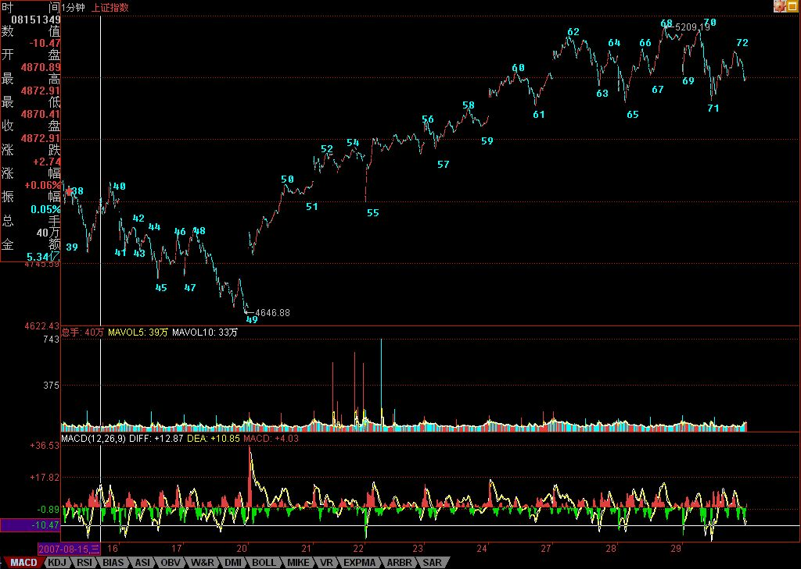{width="5.6299212598425195in"
height="4.0065048118985125in"}

## 教你炒股票75：逗庄家玩的一些杂史1

(2007-08-29 22:00:23)

当然，以下这些，都是本ID胡言乱语，梦话连篇，各位就当笑话看，谁当真谁有毛病。

说故事，不过让各位认识一下市场运行中一些更深层次的东西。走势是由合力构成的，但各分力后面代表的，都是真实的、有思想有感情的人，因此，了解一下一些心理层面的东西，还是有好处的。

当然，对于一般散户来说，多了解一点事情，并不能改变对走势完全严格客观的态度。为什么？因为对于一般的散户，其影响力对于合力可以完全忽略不算，因此，其操作，当然就可以完全只看合力最终的结果，而不需要关心每一刻合力所对应的各分力间的博弈。

但人必须有远大的目标，不想成为大资金的散户，就如同不想成为元帅的士兵。最终能否达到，这和每个人的悟性、修炼、机缘等等密切相关。但有时候结果并不一定太重要，过程往往更加美好。如果说到结果，任何人的结果都是咸鱼一条，因此，任何人都没必要有任何负担与畏惧心理。只要按照正确的道路，就算最终只能登到山腰，也不枉这一行了。

市场上，存在一些资金，是可以影响到最终的合力的。实际操作中，资金量当然很重要，但更重要的是技巧，打仗还有以小胜多的，有时候，1/10资金制造的效果，比10倍资金的都大，这就和操作者密切相关了。简单起见，这里只说在具体个股中的操作，对于大盘的操作，涉及的复杂程度大幅度增加，而且，这一般也不是一个人能完成的，都是一些集团式力量的结果，能领导其中，更需要很大的人格凝聚力与历史信任感，这都不是一年半载能够达到的。

个股操作，涉及对合力产生影响的，无非两类资金，一种就是庄家，一种就是玩庄家的人。一般的误区总是觉得，庄家就最牛了，庄家如何如何凶煞，如何如何吃人不吐葡萄皮，其实，都是人云亦云的无聊玩意。确实，有不少所谓的庄家成功过，但有更多的庄家给搞死了，死的庄家比最终活下来的多得多。庄家被搞死，有很多种原因，其中一种很常见的，就是给玩庄家的人搞死的。

市场里有一种这样的人，这种人的资金实力当个庄家肯定是一点问题都没有，而且一般来说，这种人以前都是牛庄，但后来，因为证券法之类的法律出来，不想惹事，或者就太懒了，天天去算计散户太累，还不如一下算计一个大家伙，吃一顿够N顿了，或者就是无聊，看着别人当庄，就是想搞死，赚不赚钱倒是次要，一般这种人，钱早不是问题，纯粹是为了开心或者就为了教训一下暴发户。

一般来说，这种人在资本市场里都有着最广泛的信息网络，这都是从资本市场从小苗开始就缠上的，如藤倚树，这资本市场的树长多大了，这藤也跟着绕了多少。一般来说，这市场上的大的动静，一般都逃不过这些人的眼线耳线。由此，这些人都能很快知道，又有什么猎物可以爽上一把了。

如何圈定猎物，这并不一定有任何固定的原则。当然，有些人比较死板，或者在这行里还是新手，所以比较注意攻击目标，至少不敢攻击太垃圾的东西，否则万一搞砸了，连回旋的余地都没有。但对于老手来说，其实都无所谓，股票不过是一个游戏的凭证，玩烂了也无所谓，大不了来个凤凰变乌鸡、乌鸡变凤凰地来回折腾几次，还不是越搞越有搞头？

说句实在话，搞股票，归根结底是搞资源组合的能力，功夫在诗外，组合能力强，资金能长期坚持，有什么不能成功的？本ID有一个不大好的习惯，就是对被搞废掉的人，从来都不关心，但这两年，本ID不断发现，有好几个N年前，注意，这个N有的都快到10了，被本ID搞废掉的，竟然都坚持到了大牛市，都成了这两年最牛的股票之一，一打听，人还是那些人，歌还是那些歌，这些人身残志坚地把N年的生命都奉献给了某只股票，连本ID都不得不说，人的无明之力，真是老强大，佩服佩服。

为了表彰这些残废人士的惊人业绩，本ID对其中几只不点名地表扬一下：

一、那年夏天后，最后的一吻，市场就走入漫漫熊途，你也留下一个个向下的惊人缺口，大概除了本ID，没有人知道你的痛苦，那高高的山冈，你只能用一个个除权缺口去追赶大盘下跌的速度，你在最悲壮时，依然站在实际的山腰之上，离那令你疼的顶峰依然不远。终于，你熬过那最后的血腥，春天来了，猫儿又开始叫春了，你跨过那一个个的缺口，冲出那曾经绝望的顶峰，原来，山峰之外依然有山峰，你应该释怀了。

二、山顶到山谷，90%多的落差并不一定是故事的终结。后来，你终于明白，在山谷回到山脚后，继续半年就可以飞升1000%，就可以走上更高的山峰，这时候，这N年的煎熬，大概就是最好的人生回忆了，你现在最感谢的，是否就是那N年前给了你最好回忆机会的人？

三、惨跌80%多依然能站住的，才能引来2000%以上的升腾，本ID不会为曾经的残酷而有丝毫歉疚，但为了这能站住的，本ID给你四字：还算爷们。

四、当你用一字涨停铺起台阶冲破所有顶峰时，又有多少人知道你N年前的痛苦？那些台阶已经名喧天下，而N年的那些日夜，究竟是什么缝补那颗破裂的心？粗略看了一下，最大跌幅94%，真是梅花香自苦寒来啊。

不要以为，庄家就是好差事，一般的散户，有上面四位优秀吃苦耐劳模范的一点功力，你想不成功都难了。看看人家，94%还可以梅花香自苦寒来，那些被N天半月洗盘就搞得精尽人亡的，还不如去买豆腐回家算了。

能熬住的少，熬不住的，最后都给人做嫁衣裳，那些在大峡谷底买货的新人，要知道，这些骨头里，可能最多的，就是所谓庄家的。看着100元的000338，本ID就仿佛看到那铁窗下那唐家兄弟的灰影，这里，就再重温一下，本ID在000338最低那天贴出来的五言诗**偶见湘火炬广告牌，口占五绝。（2007-05-15
15:14:19），**有人可能又要问，为什么那天以后，就没有那个位置了？因为，如果还有那个位置，天都要哭老的。

搞死庄家，首先对其资金面、来路等等方面有充分的了解。那些光有几个钱，靠收买了个把刺史、郡守就蚁假猫威的暴发户，是最该收拾、也最容易收拾的。一般来说，资金上的弱点是攻击的最好前提。当然，资金没什么弱点的，也可以攻击，特别是那些水平不高的新庄家。在市场上，新人新猪肉，被吃是天经地义的。还有一种，就是刚成功了一把正在G点上G着的，这种是绝佳的猎杀对象。

当然，有些老狐狸，也是可以攻击的，但一旦介入，就要准备好长期作战。所以，除非有特别的理由或特别没事干，要找点乐，否则，一般不和老狐狸们玩。但实际上，本ID经常不遵守这个所谓的一般。

晕，回头一看，这梦话也说得老长了，下次再继续说吧。

## 还你漂漂拳之风再起时

(2007-08-30 16:05:43)

**漂亮50歇菜是好事还是坏事，如果昨天早上还没看明白，那还是可以原谅的；看了本ID昨天下午的"其他个股，借着漂亮50休息而风起云涌一把，这也是天经地义的事情。"还不明白，那最好的归宿就是孔男人一把；如果到了今天还不明白，大概连孔男人都对你绝望了。**

**还你漂漂拳之风再起时，什么风？二、三线股之风，让指数见鬼去，重开上半年二、三线股走势之风。还你漂漂拳，将二、三线股的丑八怪打出一个个大可面首的成熟爷们，这就是还你漂漂拳之风再起时。**

**什么叫一吻高潮？看看600635、000998、000938、000099、600578、000915等等，哪个不是吻得万草狂舞、风沙走石、天昏地暗、日月无光的？就算最近开始狂动的600008，在8月20前的那一吻，还不够万草狂舞、风沙走石、天昏地暗、日月无光？你去看看今天涨停的股票，有多少是一吻而万草狂舞、风沙走石、天昏地暗、日月无光的？还记得几天前本ID再次强调吻的重要，难道吻都要别人代替？**

**以上只是技术上的一些小技巧，以后不再说了，有缘得之，爱谁谁去。**

**现在，初步回到本ID希望编排的剧本，这剧本在这一章节只有一句话：指数耷拉，二三雄起。指数耷拉，将使得一些极为迫切解决的矛盾不会一下被激化，而二三雄起，又可以消耗目前一些多余的能量。记得本ID在8月13日的话吗？原文："个股方面，一、二线成分股的行情依然会延续，但要注意升幅过大后的短线震荡风险，而当业绩风险释放后，二、三线题材股会找到重新活跃的动力。"**

**现在，中期业绩的公布已经尾声，该发生的就需要发生。而本ID为什么前几天狂批"快男"，就是他们的节奏有打乱本ID剧本的可能，对这种拿着别人钱乱搞之人，不教训一下怎么行？**

**本ID的持有结构十分明确，就是中字头和那10几只谁都知道的二、三线股，中字头，如中铝者不愿意休息就让他休息，顺便差价一番，这没什么不对的。当然，站在中长线角度，这些中字头的潜力远远没有发挥出来，本ID乐意和他们海枯石烂，但现在，本ID觉得4N9一下二、三线股，难道不是一件很浪漫的事？**

**大环境，本ID已经说得很清楚，就是警报声声，而且还一度几乎擦枪走火，这时候该干什么，所有对市场的长期有珍惜的人，都应该明白。市场的做多能力没地方宣泄，就找地方让他们宣泄，而不能影响整个大局，这就是目前市场参与者应该有的共识。**

**当然，市场是所有人的，有些人，拿着别人的钱乱搞，最终搞死市场，这种人一定要受到市场的严重声讨。现在，这伙人好象新钱有点少了，气焰大概也消停一些了，那么就反省去吧。**

**短线技术上，没什么可说的，就是还是昨天说的5分钟震荡，这就很好。明天周末、又是月线收盘，任何温和的走势，都是本ID可以接受的。周末，究竟会有什么？还是先看看现在都有什么了，最近这温柔的一刀包括：**

**一、风险提示；二、停发基金；三、直通车；四、6000亿等等。**

**那么，不温柔的一刀呢？**

**本ID可以明确地说，那市场的做多冲动引到二、三线股，只是一种最好的选择，但不是一个绝对安全的选择。与其让市场在漂亮50上继续冲动，还不如玩一把还你漂漂拳之风再起时。**

**请注意，没有任何股票值得追高，而且目前政策面上依然风云多变，更没有追高的必要。**

**今天既然风再起时了，可以回答问题、还你漂漂拳到5点。**

缠中说禅2007-08-30 16:14:16

\[匿名\] 白玉兰 删除此人所有评论

2007-08-30 16:12:12

妹妹辛苦了！

明天再努力一下，我的915也赚了。

到今天为止，今年收益不错245％。

再次感谢妹妹。

===

最终都只能靠自己，别人最多就是指手画脚一番，都是依靠不得的。

缠中说禅2007-08-30 16:18:28

老实念佛 删除此人所有评论

2007-08-30 16:15:09

老大，在分型上：相邻两根K线，只要有一端数值相同，就必定是包含关系？相邻两根K线的高低点完全相同是不是可以不算是包含？或者包含只能是一根'完全'在另一根的范围之内，即高点小于高点，低点大于低点？请明示，谢谢！

===

只要有一端相同，那必然是包含，两端相同那更是了，所以如果不是包含关系的，都必然不需要考虑相等关系。

缠中说禅2007-08-30 16:22:21

fzznl 删除此人所有评论

2007-08-30 16:15:33

\>\>
中字头，如中铝者不愿意休息就让他休息，顺便差价一番，这没什么不对的。

是说小铝不听话，被缠姐教训了吗？

唉，动作太慢，没跑掉啊

===

其实这股票昨天走势和00214960那天一样，回想一下就明白了。错过了也不怕，这股票中长线肯定还有很大空间，短线休息，上下震荡的机会还是很多的。

缠中说禅2007-08-30 16:29:30

\[匿名\] 天眼 删除此人所有评论

2007-08-30 16:09:07

老大好!五分钟中枢的区间可以看成三个1f走势类型的重叠部份,

把5f中枢分解成三个1f走势类型时有那些原则?

===

请先把逻辑关系搞清楚，是3个有重叠的1分钟走势类型形成5分钟中枢，如果你不先分辨出那3个1分钟走势类型，你怎么知道这看的是5分钟中枢？

缠中说禅2007-08-30 16:37:01

向标准走近 删除此人所有评论

2007-08-30 16:32:47

数学妹妹能说说上海B股不，最近好惨啊，都没了方向了！

===

怎么没方向，那些线不是正寻求吻之中？就看能否吻成功了。

缠中说禅2007-08-30 16:39:43

\[匿名\] 小方 删除此人所有评论

2007-08-30 16:17:17

\[匿名\] 小方 删除此人所有评论

2007-08-30 16:14:12

请问博主：能否把你持有的中字头的再示一下，，我们好学习学习。。。

期待您的回复！！

===

这里的人都知道，中石头、李军人、中铝、中人兽之类的，没什么可说的。

缠中说禅2007-08-30 16:41:32

\[匿名\] July 删除此人所有评论

2007-08-30 16:23:01

mm,学了线断后，我想用线段的类中枢对线段中的笔背驰进行操作，可是好像不是很灵光。

请问mm这是为什么？我觉得从逻辑角度讲，这应该也是可行的阿？

===

你在太空中交易？不需要手续费、印花税？最小用1分钟以上级别的，太小级别没意义。

缠中说禅2007-08-30 16:42:49

\[匿名\] 新浪网友 删除此人所有评论

2007-08-30 16:39:39

我学你的理论用在期货上咋感到中枢不好找啊,老是跳空

===

跳空不该变任何事情，如果这缺口在线段里，还是线段；在笔里，还是笔。

缠中说禅2007-08-30 16:44:55

\[匿名\] 新浪网友 删除此人所有评论

2007-08-30 16:39:52

老大.请问三买后的向上段和离开中枢的向上段比较盘整背驰,有时候回落形成中枢,有时候只是稍稍回落又继续涨不形成中枢,有办法预判吗?谢谢

===

那就是那段根本没走完，你不能把没走完的和走完的比。请复习一下区间套，这方法就是要去避免上面的情况。

缠中说禅2007-08-30 16:48:54

\[匿名\] 吻 删除此人所有评论

2007-08-30 16:44:32

缠jj好！

请教：你认为中国的一线城市的房子还能涨到什么时候，都买不起房子，真苦恼啊。。。。。

===

听说要40%首付，这一招涉及的利益矛盾太大，能否最终出来，本ID都有点怀疑。中国很多事情，不到最后一秒，不能说100%肯定的。

缠中说禅2007-08-30 17:00:16

快乐vs菜虫 删除此人所有评论

2007-08-30 16:40:45

缠姐，我由刚才你的回答给出相邻两K线的包含定义：

相邻两K线K1和K2，K1的高点为G1低点为D1,K2的高点为G2低点为D2,若

D1\<=D2,G1\>=G2则说明K1包含K2

D1\>=D2,G1\<=G2则说明K2包含K1

另外，课程65当中"第n根K线满足第n根与第n+1根的包含关系，而第n根与第n-1根不是包含关系，那么如果gn\>=gn-1，那么称第n-1、n、n+1根K线是向上的；"这段话应该也是有问题的，应该把
\"gn\>=gn-1改成 \"gn\>gn-1\"。

不知道这样说对吗？

还有例如一只股票开盘就封涨停并且全天没打开过以涨停报收，是否可以把当天所有的K线依次全部合并为一根K线，也就是说当天的走势就可以看成是一个跳空缺口加一根K线？？

====

其实是一个意思，不包含就自然没有相等，但注意，这里包含的相等，指的是绝对相等，而后面的相等，还包含测量相等的情况。

另外，一字涨停当然可以这样看，所以最开始时就说，这只形成最小级别的中枢。而站在用分型开始构造最小级别中枢的角度，那就连分型都算不上，更不说笔了。

缠中说禅2007-08-30 17:01:13

\[匿名\] 吻 删除此人所有评论

2007-08-30 16:52:17

缠jj，还有一个问题，

上海的一分钟图上，为什么62-63这一线段段，不能划分成三线段呢？好像符合线段的划分条件。

期待回复！！谢谢！！

我们爱缠禅！！！

===

这昨天已经说了，请再去研究第二种情况的定义。

缠中说禅2007-08-30 17:02:20

\[匿名\] 50年以前 删除此人所有评论

2007-08-30 16:52:50

刚才看老师没提中行，老师是不是已经因为次级债的问题把它给扔了

===

没必要把所有都列出来吧？查户口？这样，本ID也没说联通。

缠中说禅2007-08-30 17:06:43

逍遥往 删除此人所有评论

2007-08-30 16:53:05

疑惑：

刚才姐姐回答问题时说到"等于"时属于包含关系，是否跟65课里面的"假设，第n根K线满足第n根与第n+1根的包含关系，而第n根与第n-1根不是包含关系，那么如果gn\>=gn-1，那么称第n-1、n、n+1根K线是向上的；如果dn\<=dn-1，那么称第n-1、n、n+1根K线是向下的。"矛盾

===

\>=，其实应该读作不小于，当然包括等于的情况，但不是说一定有这种情况，既然不包含是前提，那自然就没有这种情况，这有什么矛盾的？

另外，必须注意，包含关系中的相等，必须是绝对相等，也就是说必须在软件上最后一位小数都相等。一般来说，很少出现这种情况。

缠中说禅2007-08-30 17:08:17

对不起，已经超时了，还有事情。

先下，再见。

## 刀锋上的行走

(2007-08-31 16:04:19)

**目前的状况，已经反复说得很清楚。目前已经给出比较严重泡沫的定性，这可不是本ID说的，至于谁说的，当然也不可能在这里说。在这样一个明确定性的大背景下，任何的行走，都如同在刀锋上的游戏。**

**指数耷拉、二三雄起，这是目前现实状况下最可行的走法，这剧本显然已经得到足够多的共识。这样，至少能延缓指数上涨的速度，而且能使得受益面能尽可能的广。为什么？因为目前的强劲做多欲望必须被消耗掉，这欲望，来自人的贪嗔痴疑慢共业，如此之强大，必须在疯狂中最终燃烧尽，才有回头的可能。当然，还有一种最干脆的做法，就是再530一番，这一把刀一直悬在头上，铺在脚下。但贪嗔痴疑慢共业如此强大，能否不触及那把刀，又能让贪嗔痴疑慢共业尽情疯狂，这就是目前剧本中最激动人心的篇章。**

**今天周末的行情，在下午，明显受到对周末消息面的担心而产生震荡，但最终的震荡都在前几天最高位上受到支持，这就充分显示目前做多能量需要消耗的急迫性。如果周末没有任何足够分量的消息，那么下周，这能量将有一个大的爆发。**

**再一次用一个最直白的话把这N天反复说的话再说一次：打击快男，使得疯狂中的可获利面极大扩大，一句最狠的话就是，就算疯狂过后是无限的地狱，但多数人的疯狂总比单纯漂亮50的疯狂来得更公平、更有趣一些。**

**下周，绝不排除出现群魔乱舞的状况，如果能尽量减少指数涨幅而带动更大面积的疯狂，这就是最好的状态了。3/4线还有足够远的空间，而且加上突破后的顺势，有足够的空间去完成这种疯狂。但必须明确注意，这疯狂的代价，与刀锋相关。**

**既然选择了在刀锋上行走，无论市场还是个人，都要明确知道这行走的代价。其实，没有什么是不可以的，但必须知道代价以及能够去承受这代价。那些又要玩刀又怕被刀杀着的，回家玩豆腐吧。**

**个股方面，没什么可说的，该说的，在8月13日已经全说了："个股方面，一、二线成分股的行情依然会延续，但要注意升幅过大后的短线震荡风险，而当业绩风险释放后，二、三线题材股会找到重新活跃的动力。"**

**至于一直有人说本ID原来那10几只股票基本面很差，纯粹垃圾股的，最近的看法也应该有所改变了。本ID从来不乱买股票，如果乱买，那么整个股市中最和VC与PE相关的两只股票600635、000938，为什么都在本ID的组合里？本ID那10几只股票中，业绩暴增百分之几百、甚至一千的，难道还少？当然，这只是冰山一角，就像000938，谁告诉你就是PE、VC这点事情？**

**长线介入与短线介入是根本不一回事情，本ID已经把最好的方法告诉各位了，就是利用中短走势把长线成本降到0，然后长线持有，对于大资金，这基本是唯一可行又效率最高的方法。如果是小资金，那根本不需要这样，你忙得过来，技术又可行，那么天天都可以419一把，关键是你能否有这时间、通道与技术。**

**但小资金弄好了，最终都要大资金的，所以最终都要走这条道路。**

**没有成本，本质上就是没有占用资金，这样才有安心持股的可能以及效率。那些，连几个月都熬不住的，根本就不适宜做股票。例如，000938之类确实很无聊，但如果你0成本长线持有了，那就不无聊了。这股票历史天价是100元，一个清华的股票，大牛市竟然可以不创历史新高，你相信吗？当然，这可能需要1年、2年、N年，但对于0成本后，就无所谓了。而且，清华企业的整合是必须和必然的，这里的空间有多少，本ID不想去预测，没意义。总之，本ID0成本地和他海枯石烂了。那些天天想着涨停短线的，还是去顶豆腐比较有意义。**

**其实，本ID还有一只独自去偷欢的股票，比000938更无聊，就是000021，原来的深科技，7元时介入的，现在已经三个季度了，除了已经把成本降为0，这股票没有任何值得炫耀的地方，但本ID也和他缘定三生了。**

**对不起，本ID只会把股票变0成本后海枯石烂地持有，除此之外，对大资金，本ID不知道任何在大牛市里更好的操作方法。当然，在一个大级别的回调中，本ID也会弄一个短差去增加筹码数，这大概就是本ID唯一能再干的活了。**

**周末，腐败比股票可爱。**

**散去吧。**

## 目前市场所处阶段

(2007-09-03 08:49:53)

最近，新来的人太多，鱼龙混杂，本ID就入水入泥，再说一下目前市场所处阶段。这些，都在前面反复说过，但为了照顾一般水平的，不妨再明确说一次。

本ID的观点，从来都是一贯的，依照相同的逻辑关系展开：

一、这轮大牛市至少再延续20年，至少再上升3万点以上。这个观点，一直没有改变，包括这大牛市可以划分的三大阶段，已经明确说过。

二、目前的走势处于大牛市第一阶段的泡沫化过程中。由于从低估到回到正常位置的GDP用了2年，上升4点5倍。从纯对称的角度，泡沫化阶段也可以延伸2年，上升4点5倍，也就是在极端情况下，可以到达2万点。但有一点是必然的，就算先到2万点，那么后面泡沫破裂后，必然在回到GDP的位置，也就回到目前以下的位置。

三、泡沫可以自然破裂，也可以人为戳穿，人为戳穿的情况，关系到政策的调控，属于不可系统的风险。面对这种风险，必须要明确，就是这不改变任何长期趋势，最多就是制造一个中线的调整。如果调控相对高明，那么泡沫化阶段可以延续的时间就长点，高度就大点，而且后面的破裂相应的杀伤力就小点，但能否达到这种调控水平，本ID没有任何信心。

四、在泡沫化阶段，就如同在刀锋上行走，既然选择了如此，就只能如此下去，有任何损伤都不能怪任何人，要自我承担。如果没有这心脏，那就退出，也别眼红别人去赚取泡沫化中的超高回报。在泡沫化阶段，需要更好的心态、更高的技术。

五、有些股票是值得持有20年，等待整个牛市结束才抛出的，一旦选择了这种股票，就是天荒地老、海枯石烂地持有，但可以根据中短线的波动去把成本降低、在0成本后再增加持有的筹码。站在大牛市的长线角度，泡沫的破裂，也就是提供一个减低成本、增加筹码的大机会，如果有这技术、心态，就要好好把握，如果没有，就坚定信念，义无返顾地持有20年。

下面是半年报中业绩最好的前10名：

每股收益前十名\
证券代码 证券简称 每股收益(元）\
600137 \*ST浪莎 4.75\
000338 潍柴动力 1.87\
000623 吉林敖东 1.71\
600497 驰宏锌锗 1.70\
600109 成都建投 1.50\
600993 马应龙 1.45\
600432 吉恩镍业 1.43\
600030 中信证券 1.41\
000592 S\*ST昌源 1.34\
600677 航天通信 1.29

\*ST浪莎只是重组而来的利润，没什么实质意义，因此实质第一名的是潍柴动力，也就是本ID要海枯石烂的10来20只股票中的一只，另外一个吉恩镍业也在十名之内。由此可见，说本ID的股票都是垃圾股的，就是胡说八道。

本ID股票的基本面，过N年以后再评论吧，现在，你又能看到什么？

## 吃得咸鱼抵得渴

(2007-09-03 15:38:43)

**去广东，总能学点古灵精怪的中文，例如本文题目。这句话的意思，用来要求现在的市场参与者，是最恰当不过了。**

**今天的大盘，如上周五所论，周末没有任何足够分量的消息，因此做多能量如期爆发。但今天有一个有趣的现象，就是大盘在5330点下徘徊许久，就是不敢上去，为什么？因为4330点上曾留下的记忆依然太过深刻。**

**现在，每天都等于一个对赌，就是赌当晚没有特别的消息。最重要的问题是，现在消息决策的保密程度，已经超过一般人的想象，否则，529怎么可能是最高收盘？因此，市场能量依然强劲与对消息面突发性的担忧，构成目前走势的最大一对矛盾。**

**在这种情况下，就要发扬"吃得咸鱼抵得渴"的精神，要干就狠干，干到消息出为止，出真家伙时，砸起来，看谁狠了。就算是530，早上大把个股还有红盘的时候，关键是该砸的时候决不手软，这样就有继续疯狂的资格，否则，就退出观望吧。**

**疯狂是需要资格的，没有这素质，没有这技术，就别疯狂。地球很危险，回火星去吧。而目前的疯狂，已经完全按照剧本来，就是二、三线狂舞。有人叫嚣宁愿蓝筹泡沫，也不让二、三动弹，是典型的脑子有水的表现，现实已经足够严厉地教训这些人了。**

**纯技术的角度，今天的缺口是引发短线震荡的技术隐患，因此，这缺口的技术意义必须被短线所重视。**

**个股方面，可以充分关注技术走势的意义。用本ID有的个股为例子说明：**

**第一类，如600636，属于最弱的股票，还没有重新站在半年线，这种股票的任务就是先站住半年线，然后再展开。具体到该个股，基本面上不存在任何问题，只是里面的人太杂。**

**第二类、如600737，前几天刚突破530点后的第一个反弹高位，然后回调，这对于其他股票有同样的意义，这类股票的任务就是通过震荡站稳该位置，然后才会去挑战530的高位。**

**第三类，如000938，突破530高位后出现震荡，这都是最正常的。这类股票，短线能否继续展开行情，关键就是这530高位能否在震荡后站稳。**

**对于补涨的二、三线股票，无非就是这三类，因此可以根据具体的情况，进行相应的短线处理，如果看不明白或没时间短线的，就看5日或5周线进出，这是中短线操作的最懒惰方法了。一般出现相应阻力的震荡，可以在冲高时先退出，下来再回补，用中枢震荡的方法，如果没这判断与技术，就算了。**

**另外，除非你技术特别过关，否则不建议目前频繁买卖，因为谁都不能保证你今天买的，不会在晚上就碰到一个恶劣的消息，对于心态、技术特别好的，当然无所谓，真出消息，一刀下去千了百了，但一般人可没这心态。**

**一定要注意，长线介入，一定是在长线买点，如果在一个短线买点介入要持有长线，是绝对地违反本ID的理论的。短线买点的介入就只意味着短线的操作，除非你有最坚强的意志，任何牢底都可以坐穿，否则，就别玩这游戏了。**

**本ID说的话就是话，例如，现在大盘的走势，是本ID可以接受的，但如果大盘快速突破3/4线后继续快速上涨去构造多头陷阱，那么就算没有政策，本ID也绝对不客气。这几天的中铝只是一个演习，中铝这次的演习，目的完全达到，使得二、三线的切换全面成功，从明天开始，爱谁谁去。**

**下午、晚上都给PE了，没办法，先下，再见。**

## 教你炒股票76：逗庄家玩的一些杂史2

(2007-09-03 19:19:43)

刚忙完一轮，8点半还要到国际俱乐部那边，11点前是肯定回不来了。就抓紧时间说两句。

现在梦话一点杂史，并不是说技术已经说完了，那还早着。只能在说技术中间穿插一下，这样不会让人完全沉浸在技术之中。毕竟，技术只是其中一方面。视角越全面，才会有更大的成就。

以下开始说梦话，谁信谁有毛病。

股票，公开的，谁都可以买卖，这就是其复杂所在。一般来说，单纯犯坏的难度当然比建设的难度小。如果你技术过关，你可能只拥有流通量5%，但你就能阻击一个有流通量50%的人。

玩死一个庄家，归根结底，就是两种：时间上害死他；空间上害死他。有些心理有毛病的庄家，最容易被时间上害死。特别那些有洁癖的，总是希望把盘给洗得一尘不染，这种人，最容易玩了。你只要不断在里面折腾，让他感觉到里面人特乱，筹码特乱，那么这些无聊的家伙就是洗呀洗的，洗到行情都走完了，还在那里洗。很多庄家，就是太有洁癖了而被害死的，特别那些经验不足的，资金实力又有限的。

以前，要玩这些家伙，有一招一直都很有效，不过后来用多了，就不大好用了，现在基本没用。当时，喜欢用一个帐号，齐刷刷就买一个巨大的惹眼的数量。能坐庄的，基本都能打单，这样一个帐号，不可能不知道。一般来说，这样一件事情，对于那些新手，就够他们一阵折腾了。开始，不用在盘面上搞他们，等他们适应一段时间，有点麻木，就要给新的刺激。例如，再找一个新的帐号买一个更大量的数量，注意，这些数量一般都控制在流通量的2%以下，不能大到影响这些家伙坐庄的信心。再折腾一段时间后，就要换手法，例如，在盘面上就要不时神经质地搞他两下，一般都是在他将高潮未高潮的时候，狠狠来一下，让他以后欲高潮时都留下后遗症，这样反复折腾，将他搞成ED男。

注意，折腾人不是靠光砸光买就可以。其实，真干的时候，就是来回弄，那家伙砸的时候，就要敢接，拉的时候就要敢给，但那几个明目装胆的帐号是不能动的，让他们搞不明白水的深浅。一般来说，阻击，只要拿流通的10%以下就足够了，其实，都不需要那么多。原则就是有能力在出手的一天内倒出一个10-20%上下的换手大量来，而且震荡的区间一定要足够大，有可能就涨停到跌停来回N次。一个股票，特别在准备高潮时倒出这样一个大幅度震荡的大量，想不ED都难了。

而倒出这样的量，实际需要的筹码并不要太多，因为，不可能全天的交易都是一方搞出来的。倒的时候，技术高的，完全可以做到顺便就把差价给弄了而筹码尽量不丢。但注意，这种折腾，一定是在底部或相对底部的位置，这样，最好就在庄家成本的附近，这样操作的难度就小多了。如果庄家给你玩恼火了，不玩了，撤了，一定要捣乱，不能让他顺利出去。只要你能让他亏钱出去，就是成功。一句话，就是不能让他挣钱跑。而且，在日常的折腾中，一定要弄各类手段去垫高其成本。

有些手法，和经验有关，不是一般人能干的。例如，要充分利用另外的分力的力量。庄家只是其中的一个分力，如果你能利用好其他分力，那庄家也只有给你折腾的份。

最狠的一种折腾，就是把这股票完全搞臭，也就是所有散户都知道这股票是ED男，然后就搞成两家或N家对垒。一般搞到这种地步，就是完全的强盗逻辑了。或者你就亏钱走，或者就送钱给大家花，否则大家就耗着，看谁怕谁。庄家比你拿得多，占的资金多，而且他的钱可能还来路不明，有期限的，这样折腾，100个至少99个要死掉。

当然还有更狠的，那就是工夫在诗外的玩法了，一般这种招数不能用，这样有点过分，有点不讲江湖规矩了。这种玩法，最普通的就是从资金面下手，只要能断了对方的资金来源，你想搞死谁不可以？当然还有更狠的，就没必要说了。

上面是说在时间上搞死，一般这种，都是走出一个复杂的大级别中枢。而在空间上搞死，那就是另一种玩法了。这种玩法的基本原则就是：庄家要风，就助他风；要雨，就助他雨。这样，先养其骄。等到其觉得不可一世、春风得意时，突然出手，这出手，一定要稳、准、狠，一下就要其命。在纯技术的角度，这就是要先砸出一个相当狠的第一段，然后，引发散户恐慌盘后，回接。这里，出手的位置很关键，太低没有杀伤力，太高又太晚。因此出手的时机决定成败，这需要经验、判断、技术很多综合的因素，不是一般人能干的。

回接后，就是用来阻击庄家反扑的。庄家给第一段出手后，肯定有反扑，这时候，就要有足够的子弹进行塔山阻击战。股票有一个好处，没有子弹，只要有钱，马上就可以采购，所以必须要利用好这一特性，控制好阻击的节奏、能量。

一定要注意，第一段后只能回接散户的恐慌盘，不能接庄家的抛盘。因为你先出手，所以如果庄家跟着也砸，你就要更狠地倒下去。最好直接倒出一个V型反转，这样，连塔山阻击战都省了，这股票，至少残废一年半载，再找一个机会完全把他废了，还不是迟早的事？

不能再说梦话了，快7点半了，等一下还有事忙。先下，再见。

## 技术、心理引发震荡

(2007-09-04 15:12:24)

**4点在国贸有会，只能以最快速度说上两句。今天的震荡，在技术上，就是昨天的缺口，这已经明说过；心理上，最近天天报上有提示风险的文章，你说心理上能没压力？**

**这个震荡明天是否加大，其实都不重要，从纯技术上说，这缺口如果补了后没有有力的回拉，那短线问题就严重了。所以，缺口越不补越不存在技术压力，这叫强者恒强。一旦强者不能恒强，那较大级别的调整就不可避免的。所以从技术上，走得越强越不用担心，一旦有走弱迹象，反而是短线必须小心的。**

**个股方面，可能会有人骂今天的中石头和联通。这些人都是一点良心都没有的，没有中石头、联通，3600能不能转过来还是问题，最近这俩为大盘已经给了足够贡献了，一直缩着不动。到现在还不让动一下，万一刀子下来，连回跳的空间都没有，那真雷锋了。**

**闲话不能说了，图明天再贴，今天下午会后，晚上还有一个PE的项目要谈合同，所以晚上可能很晚。**

**对不起，先下，再见。**

## 程式化补缺口震荡如期上演

(2007-09-05 16:10:28)

**今天的走势真没什么可说的，周一留下缺口，技术上需要三天时间去考验，今天一个过于程式化的补缺口震荡如期上演，让人误以为在长不安大剧院看一场京剧表演。**

**程式化震荡后，才是问题的关键。从纯技术的角度，下图中，62-71的5分钟中枢突破后，71-80是一个标准的1分钟上涨，也就是次级别的离开，而80-83是一个标准的1分钟盘整回拉，也就是说83是教科书式的62-71的5分钟第三类买点，其后的走势无非两种：形成更大级别震荡，或者是5分钟中枢上移的延续。**

**现在，最坏的情况就是形成一个30分钟的中枢，最好的就是继续5分钟的上涨，直到形成新的5分钟中枢。技术上的形态，就这两种情况，没什么可说的，根据走势当下就可以判断。说得仔细点，就是明天不能新高，或新高后出现1分钟的不构成第三类买点的盘整背驰，那么必须要在目前位置形成新的5分钟中枢了，后面就很简单，就看中枢震荡后是出现第三类买点还是卖点了。至于明天能形成1分钟的第三类买点，那么大盘就将上涨去延续寻找新的5分钟中枢的过程。**

**个股方面，二、三线题材股继续发威，这是好现象。而一线大盘，关键就看建行的发行价了，如果搞出一个比现在中行、工行差不多甚至还高的发行价格，那么这些一线大盘就谁都按不住了。这其实也是本ID为什么一手题材股、一手中字头，两手都要硬的原因。你想，如果中移动发30-50元，那么中国联通待在10元之下，他好意思？如果中石油也搞个20-30元的，中石头怎么好意思在20元之下。**

**目前，这些大石头们最大的支持或动力，就是同类回归的价格，一旦建行出现一个高发行价，后面回来的想低都没门了。这样，各位就继续疯狂吧。**

**现在，情况很清楚了，本ID也说得很明白，管它明日洪水滔天，如果你心态好、真来家伙时能手起刀落，够恨，那就充分享受这疯狂的游戏吧。**

**东风吹，战鼓擂，这个世界谁怕谁？**

**但如果你没这胆子，就把仓位调节好。否则，你又想疯狂，又要疯狂没有任何代价，那还是回火星去吧。**

**今天可以回答问题到5点。**

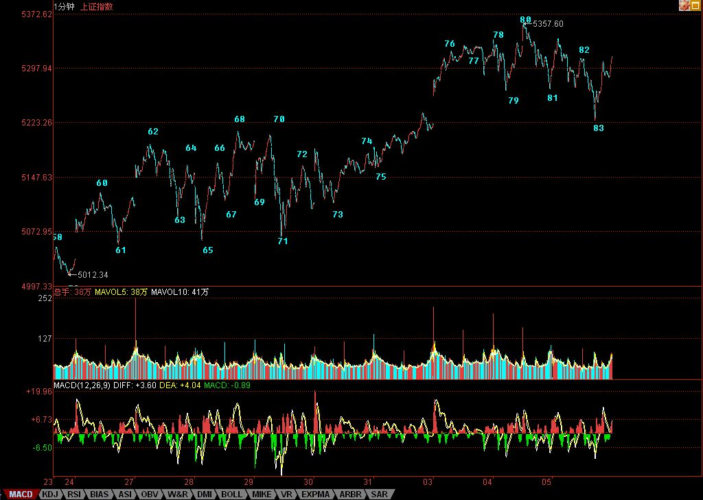{width="5.6299212598425195in"
height="4.0065048118985125in"}

缠中说禅2007-09-05 16:16:28

\[匿名\] 新浪网友 删除此人所有评论

2007-09-05 16:13:43

不知缠妹对钢铁板块看法有没有变？

===

没有，钢铁更大的机会在收购重组中。

缠中说禅2007-09-05 16:22:56

\[匿名\] 退伍老兵 删除此人所有评论

2007-09-05 16:16:21

姐姐我想重仓600050不知道可不可以，我是一个退伍军人，不是很懂股票，想赚点创业资金。

===

中国联通从中长线的角度肯定没问题，不过技术上这个价位不是什么好的买点。

联通的题材，粗略说有三个方面：

中移动回归、整体上市、电讯重组。相比起来，后面两个才是重点。而电讯重组是最重要的，如果按目前的方案，联通专搞GSM，也就是以后139、138之类的都归联通了，你说他的空间有多大？

当然，这个电讯重组的变数还很大，没到最后一刻，谁都说不好。

缠中说禅2007-09-05 16:24:14

骄阳10000 删除此人所有评论

2007-09-05 16:18:53

禅师,能讲一下81、82这个分段为什么中间那个高点不是一个段呢？

===

因为那只是一笔，笔破坏不等于线段破坏。

缠中说禅2007-09-05 16:33:55

\[匿名\] 顶石猴的问题 删除此人所有评论

2007-09-05 16:22:20

我的问题是：分型的开始和结束是怎么定义的？说第二个特征序列没有三个元素，根本不存在就根本不存在出现分段中第二种情况的可能，那么第二种情况的那个三段例图，也符合第二特征序列没三个元素的情况吧，为什么会是三段？

谢谢！

===

在第二种情况中，如果不满足定义的情况，就不算线段被破坏。例如一个下跌，一个ABC的回拉是第二种情况的，然后一个新的一笔下跌直接就新低，那显然就不符合定义，所以就是原来的下跌没结束。

而如果ABC的回拉是第一种情况，那么原来的下跌肯定结束了，这就是第一、二种情况的区别。

另外，有些概念请搞情况。第一、二种情况是完全的分类，不是第一就必须是第二，先区分了第一、二种情况才有后面第二个特性序列的问题。对于第一种情况，这个问题根本不存在。如果对第二种情况，找不到第二特征序列，那就是原来的线段没被破坏，就这么简单。

请一切从定义出发。

缠中说禅2007-09-05 16:46:39

\[匿名\] 此生如初见 删除此人所有评论

2007-09-05 16:28:12

老大，有色金属板块在新进资金尤其是新基金的推动下，如果N年后它们不拆细，很有可能都达到百元，当然市盈率可能仅有50-60，动态市盈率可能更低，那样整个A股市场可能有30---50只百元以上股票，这种现象可能出现么？

===

没有什么不可能的。如果中字头都整体上市，那200只100元以上的也是太正常的现象。

缠中说禅2007-09-05 16:52:47

石猴 删除此人所有评论

2007-09-05 16:35:10

在7475上面，08311055那下来一笔，封闭了缺口，后面也先跌破这一笔的结束点，为什么不是线段呢？

===

这只是笔破坏，没有线段破坏。

缠中说禅2007-09-05 16:54:43

全线飘红 删除此人所有评论

2007-09-05 16:38:41

请问缠主。

79－80这个线段是去比77－78（盘背），还是比（75－76）呢？标准是什么

79－80毕竟创新高不多。

===

这和创新高多少没关系。关键看有没有趋势。

缠中说禅2007-09-05 16:59:02

\[匿名\] 手机用户 删除此人所有评论

2007-09-05 16:47:16

老大,一个线段有时离开中枢力度很大没有背驰,但不一定形成三买卖点.怎样预判?

===

第三类买卖点，必须是回拉的力度没有离开的力度大才可能形成。如果回拉走势都没有出来，怎么可能预判？离开的力度大，如果回拉的力度更大，那当然就不形成第三类买卖点。所以一切都必须等图形当下走出来。

缠中说禅2007-09-05 17:00:46

\[匿名\] 新浪网友 删除此人所有评论

2007-09-05 16:48:07

线段划分第二种情况.

向上笔开始的线段,

　　　　　　　　　　　 /\\　　/

　　　　　/\\　　　　　/　\\　/

　　　　./　\\　/\\　　/　　 \\/

　　　　/　　\\/　\\　/

　　　./　　　　　\\/

　/\\　/

./. \\/

/

该图是几段线段呢？

===

一段

缠中说禅2007-09-05 17:03:36

\[匿名\] 新浪网友 删除此人所有评论

2007-09-05 16:59:41

缠住昨天说补了缺口行情会走弱，今天补后大盘反而放下包袱，重新站在5300点上，不知缠住有什么看法？谢谢

===

本ID没什么想法。

不补缺口是最强的，补了缺口能强力拉回并继续新高那是次强的。如果补了缺口拉回无力，不能新高，那就是最弱的。

现在大盘不能选择最强的，而后面两种，选择什么，让大盘自己来，本ID没预测的兴趣。

缠中说禅2007-09-05 17:06:20

\[匿名\] 大盘 删除此人所有评论

2007-09-05 16:58:11

请问博主：

对于补日线缺口，是不是只要把缺口上一日k线的最高点跌破就可以是吗

===

对。缺口就是从某天起没有交易的区间，在某天后，这区间有交易了，就是缺口补了。

缠中说禅2007-09-05 17:13:18

\[匿名\] 新浪网友 删除此人所有评论

2007-09-05 17:04:05

　　　　　　　　Ｃ

　Ａ　　　　　　┃

　┃　　　　　　┃

　┃　　　　　　┃

　┃　　　　　　┃

　┃　　　　　　┃

　┃　　　　　　┃

　┃　　　　　　┃┃

┃　┃　　　　┃　┃

┃　┃　　　　┃　　┃　　　┃

┃　┃　　　　┃　　　┃　┃

┃　┃　　　　┃　　　　┃

┃　┃　　　　┃　　　　Ｄ　

┃　┃　　　　┃

　　　┃　　┃

　　　┃　　┃

　　　┃　　┃

　　　┃　　┃

　　　┃　　┃

　　　┃　　┃

　　　┃　　┃

　　　　┃

　　　　┃

　　　　┃

　　　　┃

　　　　┃

　　　　┃

　　　　┃

　　　　Ｂ

请问上图中的笔，是ＡＤ一笔呢还是ＡＢ，ＢＣ，ＣＤ三笔呢？

===

AB肯定不是一笔，BC也不是，至于AD是不是，这要看D后面的走势。

找笔，首先要找分型。A、D都满足分型的条件，但关键看D后面的分型是顶还是底，如果是顶，那么AD就是一笔。如果是底，那D肯定不是和A构成一笔的那个底。

缠中说禅2007-09-05 17:15:30

好了，5点过了，先下，再见。

## 教你炒股票77：一些概念的再分辨

(2007-09-05 23:24:01)

对不起，回家晚了，现在才把课程写好贴上来。

梦话不能连续说，现在回到技术上来。对一些概念进行再分辨，因为有些概念太基础，如果搞不清楚，后面永远就一个字：乱。为了不乱，希望是最后一次再把前面最基础的概念分辨一下。

先用缺口的例子说明基于严格分类基础上正确预测的思维方法。任何预测，都必须基于严格分类的基础上，这是一个最基本的思维，否则，整天陶醉在纯概率的游戏中，只能是无聊当有趣。

例如缺口，用向上的为例子。首先，要给缺口一个明确的定义，这定义是有利于分类的，只有明确的定义才有明确的完全分类。何谓缺口，就是在该单位K线图上两相邻的K线间出现没有成交的区间。例如，在上海指数日线单位的K线图里，1994年的7月29日与8月1日，就出现\[339,377\]这个区间没有成交。那就说，\[339,377\]是一缺口。而缺口的回补，就是在缺口出现后，该缺口区间最终全部再次出现成交的过程。这个过程，可能在下一K线就出现，也可能永远不再出现。例如\[339,377\]这一缺口，虽然不敢说永远不再回补，但到股市被消灭前，大概也没什么机会回补了。像本ID之类有幸经历这一天的人，有福了。本ID还记得，本ID当时在1994年7月29日最大量买入的股票，深圳是老星源，上海是大飞乐。

根据缺口的是否回补，就构成了对走势行情力度的一个分类。一、不回补，这显然是强势的；二、回补后继续新高或新低，这是平势的；三、回补后不能新高、新低，因而出现原来走势的转折，这是弱势的。

一般来说，突破性缺口极少回补，而中继性缺口，也就是趋势延续中的缺口，回补的几率对半，但都一定继续新高或新低，也就是至少是平势的。而一旦缺口回补后不再新高、新低，那么就意味着原来的趋势发生逆转，这是衰竭性缺口的特征，一旦出现这种情况，就一定至少出现较大级别的调整，这级别至少大于缺口时所延续的趋势的级别。也就是说，一个日线级别趋势的衰竭性缺口，至少制造一个周线级别的调整。而一个5分钟级别的衰竭性缺口，至少制造一个30分钟级别的调整。

注意，这里的级别和缺口所在的K线图无关，只和本ID理论中的走势类型级别有关。不同周期K线图和走势的级别，就如同不同倍度数显微镜和显微镜所观察的物体，这个比喻反复说了，不能再混淆了。

显然，日K线图有缺口，在日线以下的任何周期的K线图都会相应有缺口，而回补日线的缺口，不一定能回补日线以下周期K线图上的缺口。另外，在盘整走势中的缺口，与在趋势中的缺口性质不同，属于普通缺口，这种缺口，一般都回补，而且没有太大的分析意义，唯一的意义，就是在中枢震荡中有一个目标，就是回拉的过程中，几乎肯定能至少拉回补掉缺口的位置。

缺口说完了，就再说说，分型、笔、线段的问题。

分型就不用再说了，按定义，只要把包含关系搞清楚，相信连孔男人都应该能描红一番。如果没有包含关系，3个K线就可以决定一个分型，但注意，任何相邻的分型之间必须满足结合律，也就是，不能有些K线分属不同的分型，这样是不允许的。

一般来说，对不熟悉的人，首先应该按定义，把分析的图中的分型按照包含关系以及结合律的最基本处理后给标记好，顶分型可以用向下的箭头、底分型可以用向上的箭头，这样就一目了然了。

有了上面这基础工作，那这个图就可以看成只有这些分型，分型之间的K线都可以暂时不用管。下面的工作，就是确定笔了。笔，必须是一顶一底，而且顶和底之间至少有一个K线不属于顶分型与底分型。当然，还有一个最显然的，就是在同一笔中，顶分型中最高那K线的区间至少要有一部分高于底分型中最低那K线的区间，如果这条都不满足，也就是顶都在低的范围内或顶比底还低，这显然是不可接受的。

因此，在确定笔的过程中，必须要满足上面的条件，这样可以唯一确定出笔的划分。这个划分的唯一性很容易证明，假设有两个都满足条件的划分，这两个划分要有所不同，必然是两个划分从第N-1笔以前都是相同的，从第N笔开始出现第一个不同，这个的N可以等于1，这样就是从一开始就不同。那么第N-1笔结束的位置的分型，显然对于两个划分的性质是一样的，都是顶或底。对于是顶的情况，那么第N笔，其底对于两个划分必然对应不同的底分型，否则这笔对两个划分就是相同的，这显然矛盾。由于分型的划分是唯一的，因此，这两种不同的划分里在第N笔对应的底分型，在顺序上必然有前后高低之分，而且在这两个底之间不可能还存在一个顶，否则这里就不是一笔了。

如果前面的底高于后面的底，那么前面的划分显然是错误的，因为按这种划分，该笔是没有完成的，一个底不经过一个顶后就有一个更低的底，这是最典型的笔没完成的情况。

如果前面的底不低于后面的底，那么如果再下面一个顶分型出现前，如果有一个底分型低于前面的底，那么，这两种划分都是不正确的，所划分的笔都是没完成的；如下面一个顶分型出现前，没有一个底分型低于前面的底，那么下面一个顶分型，必然高于前面的底，因此，前面的底和这个顶分型就是新的N+1笔，因此，第N笔和第N+1笔就有了唯一的划分，这个第N笔开始有不同划分相矛盾。

关于第N-1笔结束的位置的分型是底的情况，可以类似去证明。

综上所述，显然，笔的划分是唯一的。

从上面笔划分的唯一性证明中，其实也知道如何去划分笔的步骤：

一、确定所有符合标准的分型。

二、如果前后两分型是同一性质的，对于顶，前面的低于后面的，只保留后面的，前面那个可以X掉；对于底，前面的高于后面的，只保留后面的，前面那个可以X掉。不满足上面情况的，例如相等的，都可以先保留。

三、经过步骤二的处理后，余下的分型，如果相邻的是顶和底，那么这就可以划为一笔。

如果相邻的性质一样，那么必然有前顶不低于后顶，前底不高于后底，而在连续的顶后，必须会出现新的底，把这连续的顶中最先一个，和这新出现的底连在一起，就是新的一笔，而中间的那些顶，都X掉；在连续的底后，必须会出现新的顶，把这连续的底中最先一个，和这新出现的顶连在一起，就是新的一笔，而中间的那些底，都X掉。

显然，经过上面的三个步骤，所有的笔都可以唯一地划分出来。

有了笔以后，就是线段了。线段划分的最基本原则，就是线段必须至少有三笔，这是十分显然的，否则，一笔都能构成线段，那笔和线段又有什么区别？至于两笔为什么不能构成线段，这理由更简单，因为两笔，那么线段的两段的分型的性质肯定是一样的，和笔一样，一个完整线段的两段的分型不可能是同性质的。也就是说，和笔一样，线段也不可能从一个顶开始结束于一个顶，或者从一个底开始结束于一个底。由此可见，线段中包含笔的数目，都是单数的。

而且，线段开始的那三笔，必须有重合，开始三笔没有重合的，是构不成线段的。

另外，线段必须被线段所破坏才能确定其完成。对于线段划分的第一种情况，如果第一笔出现笔破坏后，接着的一笔就创新高，而且再后一笔，根本就不触及笔破坏那一笔，那么，这时候，显然构成不了线段对线段的破坏，因为后面这这三笔没有重合，不可能构成一线段。

而这，用第一种情况的判断法就更明确了，上面这种情况根本不可能形成特征序列的分型，当然就不可能是线段的完成。

再者，线段被线段破坏，必须不能是被同一性质的线段所破坏，也就是从向上一笔开始的线段不可能被向上一笔的线段所有破坏，必然是被从向下一笔开始的线段所破坏。

线段的第二种情况，其实就包含这种情况。也就是，按第一种情况，线段A没有被接着的线段B破坏，但接着的线段C破坏了线段B，因此，线段B是完成的，当然线段A也应该是完成的。注意，这里的线段A、B、C只是用结合律的原则先划分，括弧里面满足线段的基本性质，在这破坏关系没被确认之前，这只是一个假设的称呼。

各位肯定注意，在第二种情况下特别强调，第二特征序列，其实就是对应着线段C对线段B的破坏，不再分第一、二种情况了。这，其实是一个简化的方法。为什么？

如果我们坚持线段的最终破坏回补特征序列缺口情况，那么，如果线段C对线段B还是第二种情况，那么线段C的区间肯定就在线段A特征序列缺口与线段B特征序列缺口之间，如此类推，总会出现一个线段X，使得对应前面的线段是回补特征序列缺口，否则，这些线段的区间就会无限缩小，最后就会形成一个点，这显然是不可能的，学过极限的都应该能理解。所以，在一串的相对前一线段是第二种情况的线段串中，比如最终会出现第一种情况的破坏，这样倒推回来，必然有这一串假定线段间的连续破坏。

正因为这样，所以在第二种情况中的第二特征序列判断中，就不再分第一、二种情况了，这样是免得有一串线段串不断收敛后倒推回来的麻烦。这在数学上当然是绝对完美，但操作起来太麻烦，而且这种特殊的情况很少见，就更没必要了。

那么，为什么要区分第二种情况，因为是不希望在线段的层次上出现小级别转大级别这样不确定的情况，用第二种情况就能解决这个问题。

有一种复杂的情况，在今天的80-83的划分中就出现了。就是对80-81，出现了第一笔的笔破坏，然后接着是一个符合线段标准的走势A，但没有创新低，这样当然不能算是原线段的延续，但线段的破坏也不能算，为什么？因为没有符合要求的三笔。接着，一个反弹，也满足线段的要求，然后就转头继续创新低。这里有一个细微的区别，如果这个反弹只是一笔，那么就没有破坏走势A，后面接着的新底，就意味着走势A依然延续，所以走势A就是原来80-81的延续。

但现在的问题是，这个反弹把走势A给线段破坏了，因此，说走势A依然延续是显然不对的，所以后面的走势和走势A无关，因此，唯一合理的划分，就是把第一笔的笔破坏、走势A、一个反弹合成一个线段，这完全满足线段的定义，所以就有了81-82。

线段的划分，其实一点都不难，关键是要从定义出发。而且用线段划分的两种情况的规定，不难证明，线段的划分也是唯一的。

有什么问题，请继续问，把事情彻底搞明白，才是最重要的。这些补课，会不时展开，但不可能堂堂如此，下一次就要讲新内容了，老问题如果积累到一定程度，会再补课的。

## 建行引领大盘前行

(2007-09-06 15:55:55)

**这题目没错，就是建行引领大盘前行，建行发行的意义，在昨天已经说得很清楚了，而建行作为这次大规模回归的首家，其最终的表现，将对后面的回归者有极大的指标意义。因此，像尾盘出现中行等飞速拉起的情形，就一点都不奇怪了。**

**不过有点必须明确，本ID昨天回答问题时说到中国联通的一些题材，并不是正式的东西，就当成梦话吧。本ID有联通，这里的人应该很多都知道，在春节前后，在这里还连续N天直播过联通上5元的活动。这是本ID要海枯石烂的股票，中移动在香港100元多，如果中移动的GSM业务都给了联通，本ID也不知道联通该多少钱，但联通搞GSM、移动搞大唐玩意、电信搞CDMA，并不是什么正式公告，只是一种还未被最后正式批准的可能方案，其实本ID在以前回答问题的时候也多次说过，但从来没在文章里说过，所以只能当梦话，相信者有毛病。至于整体上市、中移动回归，都是很明确的，只是迟早的事情，所以对联通的判断，要以此为准。**

**本ID其实不愿意回答个股问题，本ID告诉的股票都是本ID正买着的，当然，本ID建仓的过程可能很长，但本ID在这里第一次说的时间，肯定和本ID第一笔建仓的时间是同一日，甚至更早，这点是没问题的。例如潍柴，5月15日写诗，也是本ID买的第一天，本ID把自己买的股票说出来，不存在推荐的问题，这就如同告诉各位，本ID中午吃了点什么一样。今天中午，本ID只喝了点果汁，就这样了。**

**大盘没什么可说的，补完缺口后创新高，也就是说周一的缺口依然只是中继性质的，那游戏继续。**

**下面再次用明确的语言给出目前的操作守则：**

**一、一旦有致命的消息，手起刀落，让股票见鬼去。**

**二、没消息就是最好的消息，用尽一切手段疯狂去。**

**三、最懒的办法，看5日、5周线。**

**四、针对那三种技术形态的股票，分类操作。（以前用600636、600737、000938为例子说过。）**

**五、目前位置，就不要抱什么长线打算了，长线打算是在长线买点去打算的。现在只是疯狂的游戏阶段，成功的唯一标准只有一个：把钱赚到袋子里又不被刀子伤着。**

**六、对于中长线投资者，只战略性持有等待中线卖点的出现，然后用部分仓位去进行降低成本或赚取筹码的操作。**

**这六点里，对于短线来说，第一条是最重要的，第二条是最实际的。**

**今天有事要忙，不能回答问题了，对不起，先下，再见。**

## 教你炒股票78：继续说线段的划分

(2007-09-06 22:28:31)

**悼念**

帕瓦罗蒂

（虽然历史上有太多人比你好，但当代，你是最好的）

**声讨**

丁毅

（样子丑陋不是错，出来忽悠就不行）

戴玉强

（声音油滑，台风造作，当快男又太老，还是买块豆腐或直接磨墙吧）

范竞马

（本来水平比前两者高多了，一和他们忽悠所谓华人三高，就对你彻底失望）

**注意，各位有时候不要太神经质，本ID现在什么新股票都不会买，要搞也只搞原来低位买的。本ID最后一只股票，这里的人都知道，就是002149，在上市第一天买的，当天贴了点成交记录，几小时后删除，后来怎么样，大家都看见了。**

**本ID从来中午就只喝果汁，而且只喝鲜榨的，和任何牌子无关。**

本来说好要开新课，但看到很多人确实还是没搞清楚，而且，今天本来也不是说股票的，等于占用了别的时间来补这一课。

线段的划分，就是上面课程里的两种情况，根据这两种情况的完全分类来，没有不能唯一去划分的。但一到实际划分，很多人就晕，为什么？因为基本的概念还是没搞清楚。

首先，线段和笔，都是有方向的，从顶开始的笔一定结束在底，同样，以向上笔开始的线段一定结束于向上笔，不可能一个线段，开始是向上笔，结束于一个向下笔。由于向上的笔的开始分型是底，而向下笔的结束分型也是底，换言之，一个线段，不可能是从底到底或从顶到顶，这是一个最基本的概念。

同样，正如同一笔不可能出现顶低于底的情况，同一线段中，两端的一顶一底，顶肯定要高于底，如果你划出一个不符合这基本要求的线段，那肯定是划错了。

由于图形不断延续，因此，除非是新股上市后最开始的一段，否则任何一段都是破坏前一段的，如果你的划分，不能保证前面每一段都是被后一段破坏，那么这划分肯定不对。线段的破坏是可以逆时间传递的，也就是说被后线段破坏的线段，一定破坏前线段，如果违反这个原则，那线段的划分一定有问题。

当然，实际划分中没必要都从上市第一天开始，一般都是从图K线中近期的最高或最低点开始，例如，如果你今天才开始进行划分1分钟图，那么，就可以从昨天下午跳水的最低点5224点开始，但这样，肯定对大的走势不可能有正确认识，要对这波行情有明确的分析，即使不从7月6日的3563点开始，也要从8月17日的4646点开始。

选择好了开始点，就可以进行分段了。如果熟练了，就可以直接分段，因为分型、笔都可以心算就知道，直接就可以进行分段；但如果不熟练，还是先从分型开始，然后笔，再线段，这样比较稳妥。

在实际划分中，会碰到一些古怪的线段。其实，所谓的古怪，是一点都不古怪，只是一般人心里有一个印象，觉得线段都是一波比一波高或低，很简单那种，其实，线段完全不必要这样。一般来说，在类似单边的走势中，线段都很简单，不会有太复杂的情况，而在震荡中，线段出现所谓古怪的可能性就大增了。

所有古怪的线段，都是因为线段出现第一种情况的笔破坏后最终没有在该方向由该笔发展形成线段破坏所造成的，这是线段古怪的唯一原因。因为，如果线段能在该方向出现被线段破坏，那就很正常了，没什么古怪的。

注意，这里有一个细节必须注意，线段最终肯定都会被线段破坏，但线段出现笔破坏后最终并不一定在该方向由该笔发展形成线段破坏。

由最简单概念知道，任何线段都有方向的，例如线段B，其方向是下，也就是由向下笔开始的线段，那么其结束笔肯定也是向下笔。因此，线段出现第一种情况的笔破坏，这破坏的一笔肯定是向上笔，但这一笔之后，没有形成特征序列的分型，满足不了第一种线段破坏的情况，因此，就在这个方向上形成不了线段的破坏。

而线段，不可能被同方向的线段破坏，任何同方向的线段，或者互相毫无关系，或者就是其中一线段其实是前一线段的延续，也就是说前一线段其实根本没完成。

但线段出现第一种情况的笔破坏后最终没有在该方向由该笔发展形成线段破坏时，在上面例子中的向上破坏笔完成后，接下来肯定是向下的笔，这笔肯定会形成一个向下的线段，否则，就意味着前面那向上破坏笔能延续出线段，这和假设矛盾。

这个向下的线段，如果破了该向上笔的底，那么，原来的线段B就是没结束，在继续延续。这种情况下，如果那向上笔突破线段B的高点，这时候就会出现，线段的开始点并不是最高点的情况。（注意，和这个情况一样，昨天的贴图里，81那点应该在09051101的5268.74位置上，而82的位置不变，因为原来标记的位置是一个急跌，当时的数据收集可能有点乱，用数据修正功能后发现实际上比09051101时高，因此必须有此修正。）

这个向下的线段，如果没破该向上笔的底，那么就可以肯定，由这向上的笔可以延伸出一个线段来，这时候，线段B肯定被破坏了。

注意，这个例子中有一个最关键的前提，就是线段B已经确认线段破坏了他前面的线段，如果线段B对前面线段的破坏都没确认，那就先确认，这里的分析都不适用了。

从这个例子就知道，笔破坏与线段破坏的异同。对于线段破坏的第二种情况，例如线段B对线段A是第二种情况，而线段C没有形成第二特征序列的分型又直接新高或新低了，这时候，不能认为这是三个线段，线段A、B、C加起来只能算是一个线段。

另外，一定要注意，对于第二种情况的第二特征序列的分型判断，必须严格按照包含关系的处理来，这里不存在第一种情况中的假设分界点两边不能进行包含关系处理的要求。为什么？因为在第一种情况中，如果分界点两边出现特征序列的包含关系，那证明对原线段转折的力度特别大，那当然不能用包含关系破坏这种力度的呈现。而在第二种情况的第二特征序列中，其方向是和原线段一致，包含关系的出现，就意味着原线段的能量充足，而第二种情况，本来就意味着对原线段转折的能量不足，这样一来，当然就必须按照包含关系来。

通过上面的讲解，应该没有任何线段问题能难倒各位了，当然前提是能把上面的内容搞明白。

注意，这里必须提醒一句，就是这在以前也曾说过，就是，如果线段中，最高或最低点不是线段的端点，那么，在任何以线段为基础的分析中，例如把线段为基础构成最小级别的中枢等，都可以把该线段标准化为最高低点都在端点。因为，在以线段为基础的分析中，都把线段当成一个没有内部结构的基本部件，所以，只需要关心这线段的实际区间就可以，这样就可以只看其高低点。

经过标准化处理后，所有向上线段都是以最低点开始最高点结束，向下线段都是以最高点开始最低点结束，这样，所以线段的连接，就形成一条延续不断、首尾相连的折线，这样，复杂的图形，就会十分地标准化，也为后面的中枢、走势类型等分析提供了最标准且基础的部件。

## 值得鼓掌的下跌

(2007-09-07 15:29:09)

**今天的准备金本不是大事，但尚老先生的风险提示，可不能说是小事。最近天天报上风险提示，但尚老先生，是力主市场调节的，如果没这老先生，530大概早已不再被提起，因为已经有了更新的被各位口水一番了。**

**因此，做人要厚道，有人担着，就不能太给脸不是脸的，否则，好人难做，市场调节失效，那就政策调节吧，但对于一些不厚道的垃圾来说，到时候一样会喷粪的。**

**市场主动调节，那调整就是有限的，是系统可控制的。而市场不主动调节，要人工降雨，那要发生什么，就只有天知道了。**

**有时候，市场配合一下，那么力主市场调节的分力就更能发挥作用，这点如此显然，但在利益面前，很多人就昏头了，所以，有些事情是人算不如天算，不如不算。**

**技术上，这里出现一个大一点级别的震荡，那就按中枢震荡来处理，而不会看的，中线可以关注5周均线，从3600点上来，该线从来没有被触及，这是本段行情是否结束进入较大调整的一个最简单的PH试纸。**

**个股方面，像000938之类站稳530高位后继续走强的技术形态，会在其他股票上复制，对该股的态度，本ID已经说过多次，唯一需要补充的是，在一个清华比北大牛太多的年代，本ID也只能很经济学地去哈清华了，连清华都不哈，真不想在中国混了？**

**本ID说过的股票，还是要负责到底。600375，在7元时说过，本ID也是那时候进去的，当时的理由已经告诉各位，就是他有新产品，比三一的成本低多了，这是本ID派人实地考察过的，派出的人回来报告说，他连刚进口回来的钢板都亲手摸过了。但这公司，本ID对他信心不大足，就是其关联交易问题。而且很重要的，其一个超大关联公司，由于更多私人利益在里面，实际上接了600375发展起来的，可能最后要有大古怪，那新的玩意，要直接自己上市去实现私人利益的放大。这东西如果按正常直接装到375里，375早该站50元了，但这样搞古怪，这种公司，本ID确实信心不足。**

**不说了，一到周末，本ID就对股票恶心。**

**下了，各位该干什么是什么，就别股票了。**

**再见。**

禅师其他文章回复：

(2007-09-09 18:34:12)

破例说两句股票，因为周五有事太匆忙，有些事情可能会有误解。

一、目前的状况，说了N遍，就是泡沫的延续阶段，本ID干的所有事情只有一个目的，让泡沫延续得更长时间。任何有碍于这个目的的，本ID都要尽所能去清除。

二、主动调整，并不会引破泡沫，而是让泡沫更长久、甚至有效缩小的最好良方。泡沫延续的双轮，就是中字头和二、三题材，这在3600点时已经反复说了。注意，中字头只是大型国企的统称，虽然他们多数都带中字。

三、目前的环境，没那水平、没那技术的，本ID早就提醒要先把仓位减少，等市场风险减低后再根据自己的条件继续游戏。留下来的，就要"吃得咸鱼抵得渴"，充分利用好各级别的中枢震荡赚取利润。

四、短线技术，5日均线的有效跌破是否确认，以及5周均线的支持，都是最关键的。就算从纯分型的角度，周K线上，下周有极大可能形成3600点以来第一个顶分型结构，一旦这结构形成，在有效破坏该结构之前，走势都最多只能在较大级别的中枢震荡中进行。

至于像600375之类的股
票，本ID对目前的公司没什么信心，并不意味着本ID就要完全放弃，本ID说那些只是把该股目前的真实情况说一次，各人根据自己的实际情况进行操作。没有
任何建议是适用于任何人的，对于本ID来说，基本面是可以创造的，当然，只是必须的时候。本ID对这些个股，和目前持有的所有个股，首先不再买入，其次，
会利用较大级别震荡降低成本、增加0成本筹码，这方针从来没变。

## 市场继续进入530前的怪圈

(2007-09-10 15:58:37)

**现在关于风险的提示，级别越来越高，而现在市场里最大的信念是，政策不会制造大幅下跌，因此我们可以继续上涨，无论我们上涨到什么位置，政策都不敢出狠招。市场继续进入530前的怪圈：一方面，由于大盘的做多能量没被耗尽，很多个股还在530高位下徘徊，所以继续上涨的冲动无法消停；另一方面，关于目前市场的判断以及风险的担心，已经在越来越高级别的层次上被明确表达。**

**由此，明确无误地证明本ID理论中一个最基本的原理，就是走势必然是市场所有当下分力的一个合力呈现。现在的这种情况，就是两种同样强大的分力在互相喷撞。**

**资金在赌政策不会发飙，这就是目前最大的问题所在。挑战政策底线的后果是什么，18年的中国股市已经一次次呈现过。每一次都有人认为有例外，结果这些人都不存在了，那么，这次如何，就走着瞧。**

**对于资金面充裕的分力，必然要利用政策面的缝隙去制造行情，无论是整体还是局部的。而游戏政策的结果，往往是被政策所游戏，在这个游戏与反游戏的游戏中，只能用震荡去触及行情塌陷的临界点。而这种行情塌陷，往往呈现非系统性，因此对操作的要求特别高。**

**现在的行情，具体的操作已经多次声明：**

**一、水平特差的，就把仓位降低，拿着一些长线品种就算了。**

**二、水平还可以但看不懂中枢震荡的，就看5日线或5周线，一般来说，只要5周线不破，调整的级别就是有限的。**

**三、懂得中枢震荡操作节奏的，就按中枢震荡的要求去操作，一般来说，原则是先卖后买，在这些位置，如果你的水平有点问题，卖错了就卖错了，权当把仓位减低。**

**注意，现在一定是不怕卖错，就怕买错。宁愿卖错，绝不买错。**

**图形上，76开始的5分钟中枢异常明确了，在该中枢的第三买卖点出现前，中枢震荡将一直延续。**

**个股方面，前面没怎么动的板块都开始补涨，这是一个明确的信号，就是如果这轮补涨后，前面调整时间比较长的板块没有再次启动，那么大盘的调整不可避免地加大级别，其时间与力度都大为增加。**

**本周，一定要注意上周高位能否被突破，如果能，那周K线上分型结构不能形成，否则，就是周线上在3600点后第一次出现明确的警示信号。**

**今天可以回答问题到5点。**

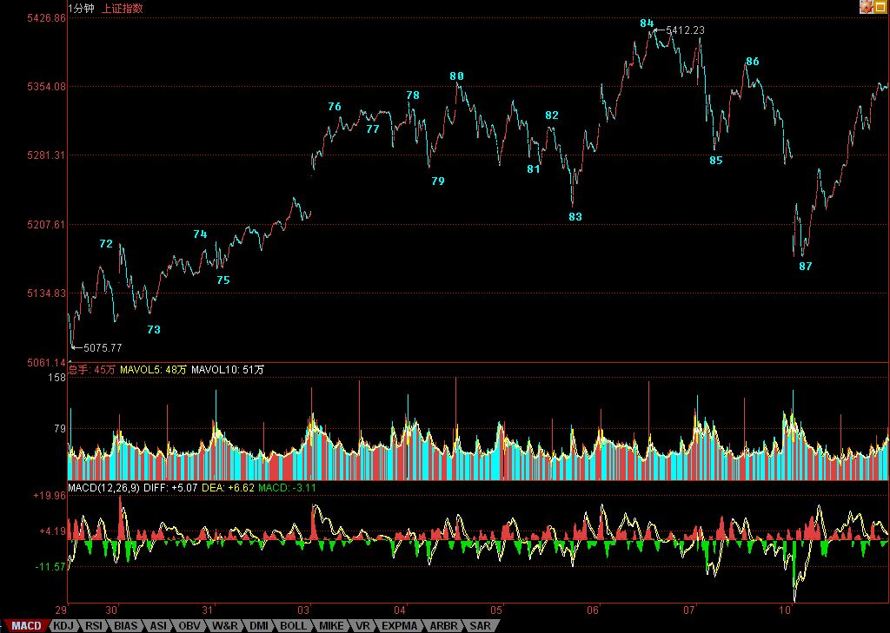{width="5.629861111111111in"
height="4.00625in"}

缠中说禅2007-09-10 16:05:08

\[匿名\] 新浪网友 删除此人所有评论

2007-09-10 16:01:19

缠姐好！

70课里讲到17－38构成完美1f上涨趋势，其中第二个中枢是32－35，跟贴里也提到第一个中枢是22－27，则整个趋势的划分是：

a+A+b+B+c = (17-22)+(22-27)+(27-32)+(32-35)+(35-38)

这种划分的问题是，a和b都包含一个1f中枢，分别是18-21和28-31。这样a和b都是1f走势类型，与中枢A和B同级，这样组合能成立吗？以前讲的a、b不是应该比A、B级别低吗？

===

为什么一定要有a\\b？A+b+B也是一分钟的上涨，关键是两个中枢之间没重合，中枢之前之后有没有走势并不重要。

缠中说禅2007-09-10 16:06:02

\[匿名\] 新浪网友 删除此人所有评论

2007-09-10 16:03:23

牛市行情即将结束?

===

牛市要至少走20年，结束什么？但牛市里也有调整的，不是一条直线上去的。

缠中说禅2007-09-10 16:10:11

\[匿名\] 新浪网友 删除此人所有评论

2007-09-10 16:06:34

601600真的死了吗？

===

短线死而不僵，长线活蹦乱跳。

缠中说禅2007-09-10 16:12:00

\[匿名\] 新浪网友 删除此人所有评论

2007-09-10 16:07:05

缠姐前几天说有些票有洁癖，洗来洗去把行情都洗过了，里面是不是有科技龟头同方股份啊？

===

那是对底部说的，同方最多是中继图形，和底部图形的情况不同。

缠中说禅2007-09-10 16:13:36

\[匿名\] 新浪网友 删除此人所有评论

2007-09-10 16:09:40

老师节日好！请教一下600569安阳钢铁后期走势如何，可否继续持有！！！谢谢

===

569这种规模的，最终的命运就是被收购，短线只能跟着大盘走了。

缠中说禅2007-09-10 16:14:49

浆糊 删除此人所有评论

2007-09-10 16:08:11

请缠姐点评一下600737最新出的公告的意思，谢谢

===

没什么意思，737以后的主业也不是番茄。

缠中说禅2007-09-10 16:21:24

\[匿名\] 蝉蝉 删除此人所有评论

2007-09-10 16:05:32

基金可长期持有吗？

===

说实在，本ID对基金一点信心都没有。如果投基金，最好就定投指数基金，肯定不会跑输大盘。一些专投成长性企业的基金，也可以关注，那要考虑基金管理者的水平，这就是碰运气的事情了。

至于那些大而无当的综合性基金，出事是迟早的事情，一个大级别调整，足以出事。

以后肯定有N次暴跌是因为某某大基金出事造成的，银行、证券公司等等都出过大事，基金有例外，你相信吗？

缠中说禅2007-09-10 16:23:39

   \[匿名\] 天眼 删除此人所有评论 \
2007-09-10 16:16:44 

\...\...\...\...\...\...\....4\
\...\...\...\...\...\...\..../\\\...\...\...\...\...\....8\
\...\...\...\...\...\...\.../..\\\...\...\...\...\...\.../\\\
\...\...\...\...\...\...../\....\\\...\...\....6\...../..\\.\
\\0\...\...2\...\...\..../\...\...\\\...\...../\\\..../\....\\\
.\\\...\.../\\\...\...../\...\.....\\\...\.../..\\../\...\...\\\
..\\\..../..\\\...\.../\...\...\....\\\..../\....\\/\...\.....\\\.....10\
\...\\../\....\\\..../\...\...\...\...\\../\.....7\...\...\....\\\..../\\\
\...1\\/\...\...\\../\...\...\...\.....\\/\...\...\...\...\...\...\\../..\\\
\...\...\...\....\\/\...\...\...\...\....5\...\...\...\...\...\....\\/\....\\\
\...\...\...\....3\...\...\...\...\...\...\...\...\...\...\...\.....9\.....\\\
\...\...\...\...\...\...\...\...\...\...\...\...\...\...\...\...\...\...\.....\\\
\...\...\...\...\...\...\...\...\...\...\...\...\...\...\...\...\...\...\...\...\\11\
请问老大,上图分几段,怎样分?\
====\
如果前面还有走势，那这根本分不了，要看前面的走势。如果前面没有任何走势，那就是三段。

缠中说禅2007-09-10 16:26:20

\[匿名\] 新浪网友 删除此人所有评论

2007-09-10 16:22:54

缠主中铝深深被套中，请问大盘由于政策因素下调，它会被波及到吗？到年底中铝会上１００吗

====

**这种思维会害死人的。股票别设定预测的位置，预测是胡扯。**

**你只需要选择好自己的操作级别，然后根据级别的买点进入。如果你在50元以上才介入，那你肯定只是超短线级别的，那就按超短线级别操作。**

**知道股票操作中最大的毛病是什么？**

**就是用一个超短线的买点去期待一个超长线的卖点。**

缠中说禅2007-09-10 16:29:19

\[匿名\] 一个网友 删除此人所有评论

2007-09-10 16:22:31

我在600779里面被蹂躏得痛不欲生,请缠主给指教一下里面的主力意欲何为?叩谢!

===

这股票里人太乱，有人拿了太多，有人想把他洗出来，就这样了。股票基本面没有任何问题。

缠中说禅*2007-09-10 16:31:02* 

\[匿名\] 天眼 删除此人所有评论 \
2007-09-10 16:28:19 \
\[匿名\] 天眼 删除此人所有评论 \
2007-09-10 16:16:44 

\...\...\...\...\...\...\....4\
\...\...\...\...\...\...\..../\\\...\...\...\...\...\....8\
\...\...\...\...\...\...\.../..\\\...\...\...\...\...\.../\\\
\...\...\...\...\...\...../\....\\\...\...\....6\...../..\\.\
\\0\...\...2\...\...\..../\...\...\\\...\...../\\\..../\....\\\
.\\\...\.../\\\...\...../\...\.....\\\...\.../..\\../\...\...\\\
..\\\..../..\\\...\.../\...\...\....\\\..../\....\\/\...\.....\\\.....10\
\...\\../\....\\\..../\...\...\...\...\\../\.....7\...\...\....\\\..../\\\
\...1\\/\...\...\\../\...\...\...\.....\\/\...\...\...\...\...\...\\../..\\\
\...\...\...\....\\/\...\...\...\...\....5\...\...\...\...\...\....\\/\....\\\
\...\...\...\....3\...\...\...\...\...\...\...\...\...\...\...\.....9\.....\\\
\...\...\...\...\...\...\...\...\...\...\...\...\...\...\...\...\...\...\.....\\\
\...\...\...\...\...\...\...\...\...\...\...\...\...\...\...\...\...\...\...\...\\11\
请问老大,上图分几段,怎样分?\
===\
如果前面还有走势，那这根本分不了，要看前面的走势。如果前面没有任何走势，那就是三段\
\-\-\-\-\-\-\-\--\
谢谢老大,分03 38 811对?还是第二种05 58 811?\
===\
笔破坏后延伸出线段破坏，所以当然是03 38 811。

缠中说禅2007-09-10 16:32:10

\[匿名\] 新浪网友 删除此人所有评论

2007-09-10 16:30:59

超短线的买点去期待一个超长线的卖点,这的确是问题在的关键,可怎么才能知道是一个值得做长线有买点呢

===

那你就要看懂本ID的课程，说那么多，不就是告诉如何去找各种级别的买卖点？

缠中说禅2007-09-10 16:37:26

\[匿名\] 新浪网友 删除此人所有评论

2007-09-10 16:24:45

请问老大，000915可做长线品种吗？

===

问题不大，但前提是本ID说的时候是3元，都在长线买点的附近，而现在该股，最多就是一个中短线的买卖中，所以，万一大盘有激烈变动，那一个中短线的调整，就有一定风险了。

所以买股票一定要分清楚买卖点，在长线买点介入，然后根据中线震荡把成本降低为0然后继续增加筹码，这样就不会有这种烦恼。

现在介入，就要吃得咸鱼抵得渴。如果你有忽略一切中短震荡的决心，那就没问题。或者，如果你技术不错，那就更没问题，先把筹码弄到手，然后根据震荡把成本降低，这样，什么时候介入问题都不大。

缠中说禅2007-09-10 16:41:41

\[匿名\] 新浪网友 删除此人所有评论

2007-09-10 16:29:49

600737已经形成卖点吗？看不懂

====

短线的卖点早过了，就算你用最粗糙的日线上的顶分型分析，周五的任何一个反弹，只要不过14.28元，都将构成顶分型。

顶分型以后下跌，那还是天经地义的事情。

这股票，主要是最近买的人太多，有人疯了，13.99、13.49连续用4000、5000手买挑逗庄家，庄家不出消息洗就有病了。

该股中长线没有任何问题，现在最大的问题就是盘子有点乱。

缠中说禅2007-09-10 16:47:11

\[匿名\] 新浪网友 删除此人所有评论

2007-09-10 16:41:05

神仙姐姐，002149太可怜了，洗得只剩排骨了。

569啥时能回归原来的剧本啊！

===

002149，要跑的60后都早跑掉了。新股一定要注意节奏，一些新股是先炒一轮，然后下来慢慢洗盘再吸。否则现在的新股，都开得老高，庄家的成本都这么高，让庄家怎么活？等新股真启动时，都还以为庄家的成本就是40、50的，那是脑子有水了？

像002149这种股票，好的庄家，一拉一洗一震，怎么都把成本降到10几去了。就算以后从40、30几地开始启动，你说庄家赢的机会有多大？

缠中说禅2007-09-10 16:47:53

\[匿名\] 天眼 删除此人所有评论

2007-09-10 16:34:36

老大,一笔中允不允许存在最高点不是笔的端点?

===

当然。顶上如果还有顶，那第一个顶就不是顶。

缠中说禅2007-09-10 16:49:03

\[匿名\] 新手无知 删除此人所有评论

2007-09-10 16:43:04

看了一些课程，似懂非懂。

请教缠：

1。是不是所有的买卖点的发现都有滞后性？而不是当时（当下）能确定的？\-\--我的理解：买卖点出现在线段的端点，而线段端点的确定需要下一个线段的破坏，那么一旦确认破坏，买卖点肯定已经过去一段时间了。（不知这样理解对吗？）

2.你一直讲你的理论不涉及预测，只关注当下。如果不涉及预测怎么能指导操作呢？比如，买点后必然上涨，卖点后必然下跌，不是预测吗？或者如第一个问题，买卖点只是事后的发现，才说得通呀。

我是新手难免鲁钝，真是困惑难解，请缠开导。

===

请先去研究一下区间套定理，研究明白就没这个问题了。

缠中说禅2007-09-10 16:57:34

\[匿名\] 想弄明白 删除此人所有评论

2007-09-10 16:17:51

缠,你上次说,要想尽办法把泡沫行情延续,给人感觉你想让他涨,这次又说风险太大了,我们应先卖后买,到底应如何呀

===

一个是中长线的问题，一个是短线的问题，怎么会搞混在一起？中长线，就是要让这个泡沫行情至少能延伸两年，这就需要行情走得稳健，不引发政策的大规模干预，政策就算不干预，本ID在该干什么的时候自然也要什么，目的只有一个，让行情延伸得越长越好。

短线在中枢震荡中，当然就是先卖后买，这有什么问题？

缠中说禅2007-09-10 17:03:22

\[匿名\] 新浪网友 删除此人所有评论

2007-09-10 16:23:28

博主.

636一直拿着.可为什么结果却是这样呐?

我是新股民,刚刚入市那被您的药所点燃的万丈豪情,全部被浇熄了.新高的股市中,我,更象一个自卑的孩子\...
\...

不是牢骚,只有无奈

====

**如果你介入股票是以中长线的态度，那就没必要问这些问题，你只需要去研究一下基本面是否值得继续。**

**如果是短线介入，那么一个连半年线都没站住的股票，你看他干什么？**

**本ID介入一只股票，都是要至少持有两年以上的，甚至是天长地久，所以，如果你没有本ID的目的，只有短线的目的，就按自己的级别去操作，自然没有这些问题。**

**本ID多次说过了，想快，就学好第三类买点，那是最快的，操作上只要把握好两点：一、级别不能太小。二、一旦出现向上的盘整背驰一定要出来，不介入那些演化成大级别震荡的情况，只持有中枢上移的情况，一旦新中枢成立，马上走人。**

**走人，第一卖点看背驰、错过了，第二卖点必须走。**

**学好这招，所有所谓的短线高手都不会是你的对手了。**

缠中说禅2007-09-10 17:09:40

\[匿名\] 新浪网友 删除此人所有评论

2007-09-10 16:57:17

看样子600569已经被缠给淘汰了，没有价值了，还是跑吧

===

看看569周五的日分型。本ID所有介入的股票都不会走的，但一定会用震荡减低成本到0后继续增加筹码。

注意，对于散户，根本没必须长期持有一只股票，那是大资金没办法的办法。如果这市场能让本ID这样的资金短线都能杀进杀去，那本ID也不这样玩了，事实上不可能。

所以，对于散户，如果通道畅通的，最快的方法就是用第三类买点去操作，杀完一只继续一只，不断干下去，不参与任何的中枢震荡，只搞最强势的。

这才是散户该干的事情。

当然，如果你没这技术，那就别玩高难度的，就玩简单的，把操作级别弄大点。中枢震荡玩不了，就看5日、5周线，持有到背驰卖点，然后坚决走人，等待新的买点。

缠中说禅2007-09-10 17:10:26

5点过了，对不起，等一下还有事情。

先下，再见。

## 教你炒股票79：分型的辅助操作与一些问题的再解答

(2007-09-10 22:37:13)

附录：

**2007-09-10 16:25:02**

**缠ＭＭ，自从开始尝试你那意念呼吸后，不到一周，就开始感冒、咳嗽，搞的得挺难受的，后来咳嗽好了，但这几天忽然间身上冒了不少象蚊子叮的包，又红又痒，几天不消。难道这么快就病根发动了？我站着打坐的时间其实很少，只是中午或晚上躺在床上的时候按你说的意念一番，但是往往坚持不了几分钟就睡着了，会这么快就有效果了吗？接下来应该怎么做？要注意什么呢？**

**====**

**每个人的根性不同，这些都是一个准备活动，本质上和打坐没什么关系。只是现代人都太脏，无论心理还是生理，本质上，现代人都是病人。所以有些准备活动，把一些脏东西搞出来，给后面留点方便。有反应，如果心里承受不了，就先停停，该看病的看病，把潜在的病诱发出来，并不是坏事。如果心里能承受，那就该怎么是怎么，出点疮算什么？挺过去，自然就好了。坚持不了几分钟，证明宿业甚重，更要加倍努力。消宿业，最好就念佛号，念《心经》也行，否则，光口头上说宿业本空，那你就慢慢空去吧，看到时候是空还是不空。**

首先，发现还有很多人对一些最基本问题犯晕，所以必须在解答一下。然后再说分型的辅助操作。

任何人进入市场，不是要求一个万能的宝贝，然后抱着就想得什么得什么了。本ID的理论，只是其中的因素，利用本ID理论操作的人对理论的把握程度，是一个因素，利用本ID理论操作的人的资金规模以及操作时间，又是一个因素，这些因素加在一起的合力，才是你最终用本ID理论操作的结果。世界上的一切事情，都是各种因素和合而生，没有任何是主宰，是唯一的决定力量，这是必须明确的。

第二个因素，因人而异，无法分析；第三个因素，资金量和操作时间，是可以进行一定的分类分析的。

一、对于很忙，根本没时间操作的人，最好就去买基金。但本ID对基金没有任何信心，而且可以肯定地说，基金肯定会可见的将来内出大事，有些基金要被清盘，最终严重影响市场等，这都是正常的事。美国每年死掉的基金还少吗？中国为什么就不能有基金死掉？证券公司可以死，基金公司凭什么就不能死？

但对基金，是可以对指数基金进行定投，这样等于直接买了中国资本市场这个股票，对该股票，本ID还是有信心的。这样，如果最终牛市上到3、4万点，那么至少你不会丢掉指数的涨幅。

其次，一定要投那些与指数关系不大的成长股。因为如果你投了指数基金，再投和指数关系特别大的基金，就没什么意义了。而成长股，往往在熊市或指数表现不好时有大表现，关键这些成长股有足够的成长性。但唯一不能确定的是，你买的基金的管理者是否有足够的能力去找到有足够成长性的股票组合。

如果很忙，就用这两种方式进行一个基金组合，例如60%买指数基金，40%买高速成长股的基金，这样就别自己搞股票了。采取的方式很简单，就是定投，每个月去投一次。这对于一般的散户投资者，最好了，你至少能买到市场波动的平均。

买基金，等于把自己托付给别人，是生是死，就看你的运气了，不过指数基金稍微好点，毕竟对管理者的要求比较低。

二、对于有充足时间的散户，如果交易通道还行，那就用本ID在前面说过N次的第三买点买卖法，方法再说一次：

1、选定一个足够去反应的级别，例如，30分钟或5分钟的，或者干脆就用日线级别的，这样选择的目标相对少点，不用太乱。

2、只介入在该级别出现第三类买点的股票。

3、买入后，一旦新的次级别向上不能新高或出现盘整背驰，坚决卖掉。这样，只要级别足够，肯定是赚钱的。走了以后，股票可能经过二次回抽会走出新的行情，但即使这样也节省了时间，有时间就等于有了介入新股票的机会。

4、如果股票没出现3的情况，那一定是进入新一轮该级别的中枢上移中，一定要持有到该上移的走势出现背驰后至少卖掉一半，然后一个次级别下来（这里可以回补，但如果有新股票，就没必要了），在一个次级别上去，只要不创新高或盘整背驰，就一定要把所有股票出掉。注意，有一个最狠的作法，就是一旦上移出现背驰就全走，这样的前提是你对背驰判断特别有把握，不是半桶水，这样的好处是时间利用率特别高。

5、尽量只介入第一个中枢的第三类买点。因为第二个中枢以后，形成大级别中枢的概率将急促加大。

6、本方法，一定不能对任何股票有感情，所有股票，只是烂纸，只是用这套有效方法去把纸变黄金。走了以后，股票经过盘整可能还会有继续的

新的中枢上移，这是否要介入，关键看高一级别中枢的位置，如果该继

续是在高一级别中枢上有可能形成第三买卖点，那这介入就有必要，否

则就算了。天涯何处无芳草，把所有的草都搞一遍，你自然就从散户变

大散户了。

三、资金量比较大的大散户，这时候，用所有资金去追逐第三类买点已经不切实际了，那么就可以对基本面上有长期价值的股票进行附骨抽髓式的操作，例如各种级别的中枢震荡去减低成本增加筹码。这样，资金效率肯定没有第二种散户的高，但资金量不同，操作方法自然不同。

四、专门的猎手，经过三的训练和操作，资金量变得比较庞大了，就可以对选定目标进行猎杀式的攻击。有些人问，把庄家都杀死了，有什么好处？这不是好不好的问题，资金大了，又不坐庄，又要快点把资金效率提高，唯一的办法就是吃大鱼，吃小鱼还不够塞牙缝，有什么意思？

五、就是组织大规模的战役，这必须要有四的良好基础，否则根本做不了。但这种作法，有时候法律的界限比较模糊，例如，对一个或N个板块进行攻击，这和坐庄是什么关系？当然，如果对原来潜伏在一个或N个板块中的所谓大鳄进行围歼式攻击，那么很多时候，解决问题的，就不光是盘面本身了。

六、全局式的战争，这涉及的方面太多，没有一个全局式的战争是光在市场本身就能解决问题的，而且，资本市场的全局战争，更多时候是更大范围的金融战争的一部分，这是全方位的立体战争，主要考虑的，反而不是市场本身了。

本ID的理论，适用于各种层次的游戏，当然，在越高的层次，技术面的因素就越来越不重要，因为技术面不过是合力的结果，而如果你有高超的调节各种分力的能力，那么一切的技术面都可以制造出来的。但必须注意，任何制造出来的技术面，都无一例外，不能违反本ID技术理论中的最基本结论。有人可能会提这样无聊的问题，在背驰的地方让他不背驰继续上涨难道不可以吗？这是一句废话，没有任何地方是该背驰的，背驰是一个合力的结果，如果合力最终的结果把可能的背驰给破坏了，就证明这地方没出现背驰，这也是合力的结果。

注意，任何力量，即使能调节合力结果本身，但绝对调节不了合力结果的结果，除非这是一个完全没有对手的，一个人的交易。

下面再分辨一下两个图：

\...\...\...\...\...\...\....4\
\...\...\...\...\...\...\..../\\\...\...\...\...\...\....8\
\...\...\...\...\...\...\.../..\\\...\...\...\...\...\.../\\\
\...\...\...\...\...\...../\....\\\...\...\....6\...../..\\.\
\\0\...\...2\...\...\..../\...\...\\\...\...../\\\..../\....\\\
.\\\...\.../\\\...\...../\...\.....\\\...\.../..\\../\...\...\\\
..\\\..../..\\\...\.../\...\...\....\\\..../\....\\/\...\.....\\\.....10\
\...\\../\....\\\..../\...\...\...\...\\../\.....7\...\...\....\\\..../\\\
\...1\\/\...\...\\../\...\...\...\.....\\/\...\...\...\...\...\...\\../..\\\
\...\...\...\....\\/\...\...\...\...\....5\...\...\...\...\...\....\\/\....\\\
\...\...\...\....3\...\...\...\...\...\...\...\...\...\...\...\.....9\.....\\\
\...\...\...\...\...\...\...\...\...\...\...\...\...\...\...\...\...\...\.....\\\
\...\...\...\...\...\...\...\...\...\...\...\...\...\...\...\...\...\...\...\...\\11  

 

0\
.\\\...\...\...\...\...\...\...\....4\
..\\\...\...\...\...\...\...\...\.../\\\...\...\...\...\...\....8\
\...\\\...\...\...\...\...\...\..../..\\\...\...\...\...\...\.../\\\.....10\
\....\\\...\...\...\...\...\...../\....\\\...\...\....6\...../..\\\..../\\\
\.....\\\...\....2\...\...\..../\...\...\\\...\...../\\\..../\....\\../..\\\
\...\...\\\...\.../\\\...\...../\...\.....\\\...\.../..\\../\...\...\\/\....\\\
\...\....\\\..../..\\\...\.../\...\...\....\\\..../\....\\/\...\....9\...\...\\\
\...\.....\\../\....\\\..../\...\...\...\...\\../\.....7\...\...\...\...\....\\\
\...\.....1\\/\...\...\\../\...\...\...\.....\\/\...\...\...\...\...\...\...\...\\\
\...\...\...\...\...\...\\/\...\...\...\...\....5\...\...\...\...\...\...\...\....\\\
\...\...\...\...\...\...3\...\...\...\...\...\...\...\...\...\...\...\...\...\.....\\

其实，明白了上几节课，这两个图一定都不难分辨，首先，前提是这两个的前面都没有其他走势了，否则这种分析没意义，前面有其他走势，就有这很多不同的可能变化。

这些图形好象很复杂，其实，只要找到其特征序列就可以。由于34都有第一种类型的笔突破，所以后面的特征序列就很清楚了，34、56、78，其中前两者可以进行包含关系处理，因此可以合并为36（指区间），所以78显然和12、36构成底分型，第一种类型笔破坏后延伸出标准的特征序列分型，那显然满足线段破坏的标准。上面的分析，对两个图都是成立的，因此，两者都至少有两个线段。

对于上图，显然89属于第一种情况的笔破坏，后面也延伸出特征序列分型，所以左图的第二线段也被破坏了，所以就是三线段。

下图，由于9-10是78的包含关系，所以可以认为线段二延伸到了10，而后面的10-11，只有一笔，因此必须再看两笔才知道是否满足第一种类型后继续延伸出特征序列分型的基本线段破坏要求，所以该图属于未完成的图。如果9跌破7，而10的位置不变，那么就显然是三线段了。

线段的划分其实一点不难，关键从概念出发就可以。

最后说说如何利用分型进行一些辅助判断的问题。一般，都至少用日线以上K线图上的分型，当然，如果你不觉得麻烦，30分钟也是可以的。但那些变动太快的，准确率就要大大有问题了。

本ID也不避嫌疑，都用本ID持有的股票为例子：

000778，20070827，高开后，没有突破前一天高位，一个典型是构成顶分型走势；

600139：看周线，9月7日这周高开后，没有突破前一周高位，形成典型的顶分型走势。

600737：看日线，这属于复杂的，有所谓的包含关系。2007年9月4、5、6三天，是典型的包含关系，然后7日这天，破坏包含关系，并没有创14.28元新高，典型的顶分型结构。

注意，顶分型结构后不一定有底分型结构与顶分型结构有一个非共用的K线，也就是不一定构成笔，但一般来说，如果顶分型后有效跌破5日线，那就没什么大戏了，就算不用搞个笔出来，也会用时间换空间，折腾好一阵子。

000802，日线，200070809，形成典型的顶分型结构，后面没有形成笔，但在5日线上下折腾了好几下，使得几条均线吻起来，才再次兴奋。

但如果没有有效跌破5日线，那往往只是中继：

000938，20070904构成顶分型，然后假突破5日线后继续上攻。

注意，利用顶分型进行操作时，必须配合小级别的图。本质上，分型都是某小级别的第一、二买卖点成立后出现的。用卖点来说，如果第二卖点后次级别跌破后不形成盘整背驰，那么调整的力度肯定大，如果时间一延长，就搞出笔来了，特别日线上的向下笔，都是比较长时间的较大调整形成的，那肯定是要有效破5日线的，而第二卖点后次级别跌破形成盘整背驰，那调整最多就演化成更大级别的震荡，其力度就有限，一般5日线不会被有效跌破。

利用上面的性质，实质上并不需要在顶分型全部形成后再操作，例如000938，0904那天，不需要等到收盘，而在在其冲高时，一看在前一天高位下形成小级别卖点，就可以坚决出掉，然后下来形成顶分型，等跌破5日线后，看是否出现小级别的盘整背驰，一旦出现，就回补，所以就有了9月5日的走势，这样，等于打了一个10%多的短差。

注意，操作的难点在于：

一、必须与小级别的第二买卖点配合看，如果小级别看不明白，只看今天冲起来没破前一天高位或没跌破前一天低位，这样操作的效果不会太好。

二、要利用好盘整背驰，这样就不会漏掉回补，或者是非盘整背驰而回补早了，一般来说，非盘整背驰的，一定要等待背驰出现才可以回补。买点的情况反过来就是了。

注意，大级别的分型和某小级别的第一、二买卖点并不是绝对的对应关系，有前者一定有后者，但有后者并不一定有前者，所以前者只是一个辅助。

最后可以看一个综合的例子，600008：

808日，顶分型后跌破5日线，然后调整到均线吻起来再启动。903日，顶分型后没有有效跌破5日线，然后继续上涨，第二天有一个盘整背驰的回补点。

注意，顶分型的时候是形成顶分型那天冲高卖，而不是收盘等顶分型都很明确了再走，例如在600008的903的例子里，只要当天不破20.9，肯定就是顶分型，这不需要收盘才知道，没开盘都知道的。关键是结合小级别的走势，却当下确认这卖点。然后第二天的回补关键看5日线是否有效跌破，而判断的关键，其实不在5日线，而在小级别的是否盘整背驰上。

这些细微的技术问题，都需要不断磨练才能操作自如，现在，最好多找些图来看，先感受一下，否则一点概念都没有，操作什么？

## 要来的总要来\-\--为下跌热烈鼓掌

(2007-09-11 15:59:25)

**最近反复强调，企图和政策对着干的人，最终的结局就是消失，这已被中国资本市场18年的历史所反复证明。不管任何理由，今天的下跌值得热烈鼓掌。**

**技术上，本ID已经很明确地说过，本周将有绝大可能构成周K线上的顶分型，这是3600点以来的第一次，而在小级别上，目前依然可以归为5分钟的中枢震荡，操作上先卖后买的原则，足以让你避开今天的下跌。**

**好了，下跌已经是事实，就不用多说了，问题是后面如何去操作。昨天图上的79在5265点，只要后面的1分钟走势反抽走势不能重新站上该位置，则第三类卖点成立，后面至少要扩张成30分钟的中枢，最恶劣的就是5分钟的中枢下移。**

**短线上，日线的9月7日，顶分型形成，显然，现在一定要形成至少笔的调整，因此，在形成有效的日线底分型之前，大盘的调整不会有效结束。但短线的震荡反弹机会还是很多的，有没有必要参与，就要根据各人的情况了。**

**目前5周线在5074点，一般来说，第一次触及和跌破5周线后，都有一次强烈的反抽，因此配合上面的分析，该反抽是否够成5分钟中枢的第三类卖点，将决定整个调整的力度。**

**另外，由于周线的顶分型除非有特别的意外，已经成立，所以关键要看这顶分型后的调整是两种类型中的哪种，也就是是否有效跌破5周线，一旦有效跌破，那调整就级别大了，至少要形成一个周的底分型才能结束；如果不有效跌破5周线，那么调整的幅度就有限。**

**本ID在八月下旬就明确说过，任何与2/3线相关的活动，本ID都是支持的，现在又见2/3线，调整将以该线为基准，上下震荡构成，只要最终能站住该线，大盘依然会再次展开中长线的行情。而在站稳该线之前，反复难免，看看3000点下的1/4线、4300点下的1/2线当时是怎么走的就明白了。**

**市场操作中，最多见、最无聊的，就是上涨的时候就忘了还有调整的事情，一调整就认为世界要末日，这种心态，还是回家买豆腐吧。**

**所有下跌后就怨这怨那的，都请离开市场。政策面的变化难道是今天的？昨天还不是很牛说要顶着政策上？现在怎么蔫了？这市场的操作，都是自己的，要怨的只有自己的贪婪与恐惧。**

**万古长空，一朝风月，没有任何走势值得叨唠的，过去的就过去了，关键是后面的操作。无论前面的操作是成功还是失败，只要市场在，人在，股票在，资金在，这游戏就继续运转，没有必然的胜利者和失败者，关键是从此刻起，与自己的贪婪与恐惧说再见，深刻了解自己的能力与可能性，形成一套适合自己的操作原则，这样，失败的可以胜利，胜利的继续胜利，对过去说三道四没什么意义。**

**今天有事，不能回答问题了，先下，再见。**

## 教你炒股票80：市场没有同情、不信眼泪

(2007-09-11 21:38:07)

今天本应该说点别的，但市场一跌，大多数人都没什么心情看别的，所以不妨再说一下股票。而股票又何曾就是股票？把股票只当成股票，那当然会被股票所缠。

股票从来就不是股票，而是你的贪嗔痴疑慢；没有任何的失败相关于股票，而只关于你的贪嗔痴疑慢，股票不过是一个幌子，一个道具。

在西方，真正在资本市场上有成就的，基本都成了哲学家。没有对市场的洞察，靠整天这消息、那题材地折腾，那永远只能在散户的区间中震荡。有此眼界，不一定能达此高度，毕竟眼高手低也是通病；但无此眼界，就一定不可能达此高度。

本ID有时候喜欢用一些刺激性的词语，为什么？就如棒喝，就是要刺痛你，激发你的贪嗔痴疑慢，这样才有醒的一天。所有希望来市场寻找温情、同情、眼泪的，都可以回家磨豆腐，这些玩意，市场里什么时候曾有过？

在市场里要成功，除了比市场还要强悍，别无他法。市场出现卖点，你还幻想着火星，那就回火星去吧，地球需要的是手起刀落的强悍。

这次，提供了一个绝佳的例子，那么，不妨看看所有没有强悍的究竟都犯了什么毛病？注意，这不是批斗会，而是严肃的解剖，无论你现实中具体如何操作，都有解剖的必要。

市场，没有逻辑，本ID的理论给了市场以逻辑。

一、所有的顶点都必然是顶分型。

这是本ID理论的一个最简单的结论。从这可以严格推导出什么？就是一旦出现顶分型，离开就是唯一的选择。至于顶分型后是否形成笔，那是离开后再判断的事情。顶分型后，无非两种选择：1、形成笔，也就是构成一个底分型与顶分型间有不共用的K线。2、不形成笔，也就是构成的底分型与这顶分型之间只有共用的K线。

但无论哪种选择，都有足够的空间让你的反应，如果是第一种，那调整是大的，第二种，调整是小的，这，在昨天，本ID专门写的课程里有很多例子反复说明了。为什么？因为本周，3600点以来第一次有绝大的可能出现周线上的顶分型，这可不是今天才说的。

那么，这么明确地知道了这一点，按照市场的逻辑，正如昨天的课程里反复强调的"注意，顶分型的时候是形成顶分型那天冲高卖，而不是收盘等顶分型都很明确了再走"，那么对于周K线，这一点是一样的。

而日线上，大盘在9月7日的顶分型已经明白无误。

二、中枢震荡的卖点都是出现在向上离开中枢时

这也是本ID理论中最简单的结论了，那么，在最近形成的5分钟中枢中，任何向上离开5333点的震荡，最终都将形成卖点，当然，该卖点后回抽如果回不到5333点，可能形成第三类买点，但这是卖点后的事情，没有任何可能比当下的卖点更重要。而且，股票的交易规则，没有规定卖了就不能再买。

现在，我们可以很客观地面对这样一个问题，就是，一个离开5333点的中枢震荡把指数带到了5395点，该震荡对应的线段出现明显的类背驰然后出现明显的破坏，这时候，我们可以很理智地判断当下的形势：

1、周K线顶分型可能不成立，也就是可以突破5412点，和5395点相差的距离就17点。

2、周K线顶分型一旦成立，那么，即使不形成周线图上的笔，也将至少调整到出现一个底分型，至少去碰一次5周均线，而一旦出现笔，那调整的幅度就至少是对3600点以来的总调整，最强势的1/4，也要有450点，更不用说1/3、1/2的比例了。

3、短线中枢震荡已经出现卖点，如果在这个位置卖，就算后面周的顶分型不成立，也有震荡的低点以及第三类买点可以重新介入。

归纳上面三个最严格的判断，那么，该干什么还不是一目了然的事情？

本ID在昨天特别强调，这时候宁愿卖错，绝对不能买错。为什么要强调这，就是本ID知道，很多人，被自己的贪嗔痴疑慢所迷惑，宁愿用十几点去对赌几百点，用1%的可能去对赌99%的可能。如果1%可以换来100倍的收益，那当然没问题，但事实上根本不是这样，那么，为什么还要坚持？说白了，只有五个字：贪嗔痴疑慢。

对于散户来说，本质上没有卖错，只有买错。为什么？卖错又不会亏钱，买错就不同了。卖错了，有钱，这么多股票可以被面首，为什么要一棵树吊死？

而且实际上，只要你不被自己的贪嗔痴疑慢所左右，根本也不存在卖错的问题，很多人，在连日顶分型的雏形都没有的情况下就卖，为什么？不过是贪嗔痴疑慢，觉得高了、觉得恐慌了，觉得惊吓了。而到真正的顶分型出来了，反而要假设这顶分型是假的，调整一下就可以突破的，就不觉得高了，不觉得恐慌了，不觉得惊吓了，人的颠倒，往往如此。

来本ID这里，如果真是想洗心革面，就要首先掌握本ID的理论，然后用该理论去操作，在操作中把自己培养成钢铁战士，钢铁战士的最基本标准是什么：

一、买点总在恐慌的下跌中形成，但只要买点出现，就要义无返顾地买进。

二、上涨总在不同情绪的交织中进行，抵抗住各种情绪的干扰，用钢铁般的意志把股票持住，决不中途给抛下车。

三、卖点总在疯狂的上涨中形成，只要卖点出现，手起刀落，让股票见鬼去。

四、任何的操作失误，只是一次跌倒，跌倒就爬不起来的，绝对不可能是钢铁战士。失误就要总结，绝对不在同一错误上犯上两次。

五、买错比卖错严重，一旦确认买错了，一定要手起刀落，让股票见鬼去。如果市场给你一次改正错误的机会你没把握，也就是第二类买卖点，那就买豆腐回家；如果市场给你第二次改正错误的机会你没把握，也就是第三类买卖点，那就直接回家磨墙。

六、市场只有你才能帮助你，被市场毁掉的是你，战胜市场的也是你，你比市场强悍，市场就是你的；否则，你就是市场的点心。

七、踏准市场的节奏，就可以在刀山火海中逍遥游。

本ID这里，人越少越好，草深三丈也无妨。如果不想成为钢铁战士，那就没必要来这里看任何有关股票的东西，其他东西可以看，别的地方可以去，何必来这里生气？

如果哪一天，你钢铁战士了，你也没必要觉得本ID教了你什么。本ID这里无授无得，本ID无一法给人，你只是你，你钢铁了，自然就战士了，和本ID无关。

但你没成为钢铁战士之前，最好还是有自知自明，本ID反复强调，如果你技术不行的，没有手起刀落的修为，就先把仓位减下来。那么，很多没减的，又没有手起刀落修为的，是不是又被贪嗔痴疑慢？

没到那水平，没到能在刀锋上舞蹈的水平，就别玩悬的，干自己能力范围内的事情。市场中最大的毛病之一，就是杀牛用鸡刀，屠龙用鸭刀，最后都被鸡了鸭了去了。

市场上不是每一笔钱都适合任何人去赚的，面对市场的机会，少点贪嗔痴疑慢，认清自己的能力，这比什么都重要。

市场是连续的，高位走了不是天堂，高位没走不是地狱。大跌，不过是下一买点后大反弹的前戏。这一切，都逃不过本ID的理论，而是否参与，则与你的操作级别相关，也和你的操作能力相关。

没有人天生就是胜利者，也没有人天生就与失败为伍。人人是佛，无一人可度，无一人需救，人人有明珠一颗，照破山河大地，又何必憋屈了自己？

## 本ID理论的现场教科书演示

(2007-09-12 15:42:13)

**今天的走势太技术，简单说，就是昨天说的，跌破5周线后必然有反弹，问题的关键是这个反弹能延续到什么位置，如果不能抽回5265点之上，那么后面的走势依然充满凶险。**

**但如果了解了本ID理论的一些最简单结论，那今天的走势，简直就是一个现场教科书演示。你可以清楚地看到，走势是如何从线段扩张成一个1分钟中枢的，而其中利用背驰等关系，又是如何能在火海刀山中逍遥游的。**

**显示，第一个绿箭头的那一笔，没有发生笔破坏，那必然要回落去完成线段的走势，这是理论上100%保证的。**

**而92这一处，出现线段破坏，但该线段不能拉回85处，那么这就构成了85-88这1分钟中枢的第三类卖点，后面的继续下跌也是理论100%保证的。**

**93处，标准的线段类背驰，这就意味着92这1分钟第三类卖点，将出现中枢扩展，至少形成一个1分钟中枢，这也是理论100%保证的。**

**也就是说88-93的下跌已经完成，后面必然有一个针对这下跌的反弹。后面的演化，都如教科书般标准，学过本ID理论的，都知道这一切都可以当下判断，无须事后分析。**

**那么，现在后面的走势如何，很简单，84-93这个1分钟的走势类型离开76-85这个5分钟中枢后，就要看一个1分钟的走势类型的反抽能否出现回到79这一点，也就是5265点之上。不行，就构成这5分钟中枢的第三类卖点，后面至少要扩展成为30分钟中枢，最恶劣的，就是一个5分钟级别的下跌。**

**今天在93点按理论要求进去的，以及昨天没按理论要求走的，都要关注这第三类买卖点是否成立，如果不成立，那大盘就继续中枢震荡，那简直是本ID理论的天堂。**

**个股方面，其节奏不一定和大盘一样，用本ID股票为例子，600578、000099、000999这些，昨天并没有任何构成日顶分型的迹象，而今天很快也破坏了形成日顶分型的可能，这是短线的强势股，就一定要耐心等待日顶分型的出现。**

**而像000938这些，如果你用本ID的理论去操作，里面的短差机会对于散户来说简直好玩透了。请好好研究一下000938的图，看看昨天的顶分型多么标准，而今天17.59的底背驰又是多么经典，力度比较请看5分钟图。这两者的差价有多少？**

**别看不起短线，看不起短线的，不过是因为你没这水平。当然，没这水平，就别太短线了，短线可需要战士够钢铁。**

**本ID的理论可不单单是短线的，各种级别都适合，关键是你能真掌握了。**

**先下，再见。**

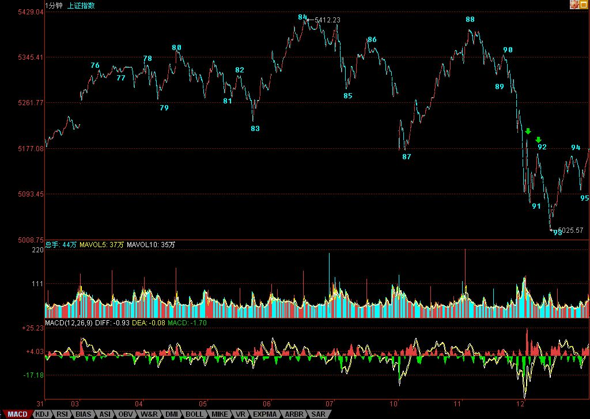{width="5.6299212598425195in"
height="4.0065048118985125in"}

## 有些钱不是适合每个人赚的

(2007-09-13 16:00:16)

**看完下面文章，请务必看**

**各位注意，严重更正**

**首先表扬一下某网友，请看：**

**\[匿名\] 新浪网友 删除此人所有评论\
2007-09-13 11:25:01\
呵呵，被我说中了，目前就看破不破5166。不破5166就是1F三买，那就还有机会冲击5265**

**这就如同下棋，只看一步，肯定高手不了，能知道上午的跳水，其实是去形成92-95的第三类买点，这就不错，为什么？因为一般都关注5265点了，5265点按理论，如期成为大盘的阻力，由此产生的回落，当然可以短差一把，但由于在96时，95-96与93-94的力度对比并没有明显的类背驰，而且一旦回落形成下面1分钟的第三类买点，反而成为反弹继续的动力，能看出这一点，就比光看5265点要更进一步了。**

**后来，96到99形成一个新的1分钟中枢，那么这个对76-85这5分钟中枢，86-93的1分钟走势类型离开，93开始的1分钟走势类型的反抽就一目了然了，这意味着，后来，突破该中枢继续上行，突破5265点，第三类卖点不成立，76-85开始的中枢震荡依旧。**

**显然，目前这个93开始的1分钟走势并没有结束，96-99是第一个中枢，如果是盘整走势，那么99开始的向上就要和93-96的形成盘整背驰，如果不形成，这走势就强了，理论上大盘完全可以再创新高。但探讨这个问题没意义，关键是看这盘整背驰是否形成。**

**不过，对于96-99这1分钟中枢，其第三类买点还没有形成，因此，比上面的盘整背驰还要急迫的，就是要确认这第三类买点，否则，最多只能是这1分钟中枢的震荡，然后由此产生96-99的第三类卖点，转而下跌也是符合理论要求的。**

**所以，明天的技术走势极为简单，最强的，就是开盘后能形成96-99的1分钟中枢的第三类买点，然后继续上攻，这时候必须关注其盘整背驰问题，一旦出现，该怎样操作，就不用说了。**

**弱的，就是不能形成第三类买点，然后继续中枢震荡，最弱的当然就是形成第三类卖点，然后再次大幅下跌。**

**因此，明天的走势，只要看好这几点，一切都在当下把握中。**

**注意，正确的操作，就是93背驰进入后，现在一直持有着，或者你有技术条件，96-97的震荡的可以对冲一把的，回补或换股后，现在应该是持有状态。**

**最坏的情况，就是今晚突然有巨大消息，这样明天一开，确定96-99的第三类卖点成立，就手起刀落。当然，这种情况，一百天也碰不到一次，所以一般情况，就可以耐心等待真正卖点的出现。卖点出现干什么，就不用说了。**

**上面说的都是短线，这对技术要求高，没这理解力与技术的，就算了，把仓位调节好，有些钱不是适合每个人赚的。**

**当然，只要你对本ID的理论有一定认识，那没有什么钱是不可以赚的，因为所有的赢利机会，本质上都被本ID的理论所把握，唯一的问题是你的理论把握程度与交易通道，反应速度等等。理论保证所有机会，那你的精力与资金不可能参与所有的，所以就只能有所选择了。**

**个股方面，没什么可说的，像小安子，那些对他不满之人，现在也如同等比一样没什么可说的了。000938，今天提供了一个底分型的买入机会，就算你不关系这股票，那也请从纯技术角度，好好研究其图形。**

**注意，下面都是梦话，谁信谁有毛病：**

**这里再说一只股票，注意，这股票风险极大，不适合一般人，本ID先把其前因后果说清楚，这股票是600078。该股的问题是在云南买别的矿的时，突然发现买的地方下面有另外的矿，那矿就是600497搞那种，据说量比600497还大。**

**注意，因为本ID一直有参与矿的事情，这消息的来源与此有关。但这消息的准确性问题不大，但最大的问题是，该公司去买的时候，不是直接用上市公司，其次，这东西，完全存在可能就是被他们低价倒给自己，因此上市公司最终没什么利益。**

**因此，建议，对云南熟悉的人，自己去调研一下，看这事情的准确性有多大，千万别只听本ID说，本ID目前也在核实中，并不保证任何问题，而且就算是真的，也有可能不装到上市公司里，所以完全有可能是闹剧一场。**

**消息就这样了，如果大盘下跌，这股票完全有可能跟着大幅度下跌，所以任何头脑发热就冲进去的，自己负责。**

**马上要去看一个PE，车子在下面等着，先下，再见。**

**看完上面文章，请务必看**

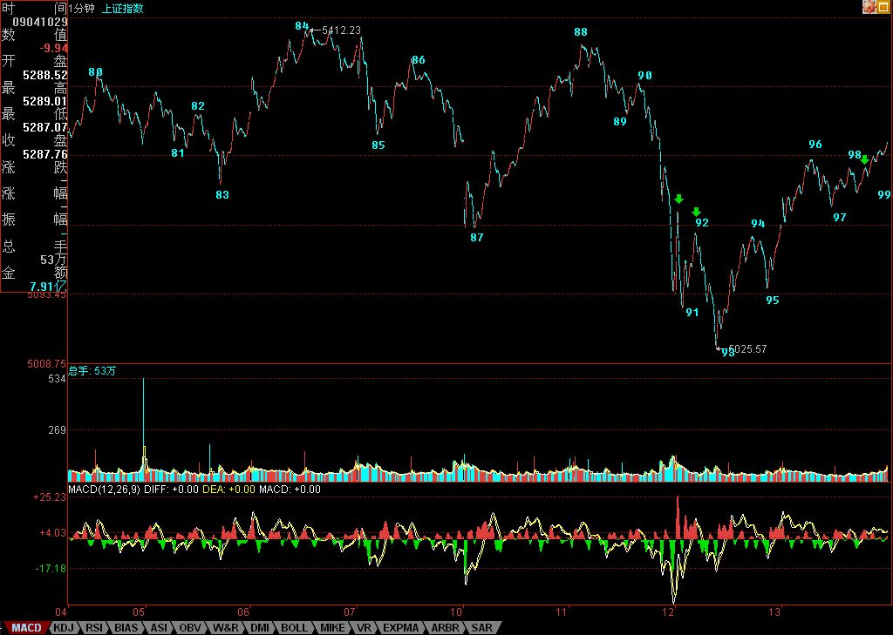{width="5.6299212598425195in"
height="4.0065048118985125in"}

## 各位注意，严重更正

(2007-09-13 20:55:15)

**各位注意**

**严重更正**

今天收盘后事情不断、电话不断，后来又要赶去看一公司，司机按时到，本ID是在赶着把文章写好，连复查一遍都没有，导致今天的划分出现严重错误。以后尽量把写帖子的时间安排充裕点，但有时候实在太忙，出现点错误，也请各位原谅。

错误的划分还在今天的收盘分析中，本ID也不更改，把错误的放在那里，好当一个比较，对学习划分有大的帮助。错误就在于错把绿箭头的那一下当成一段了，这是错误的，中间那一折仔细看一下就知道不构成一笔，而一段是至少三笔的。

因此，按照正确的划分，大盘的走势比错误划分中显示出更强的趋势，也就是93开始的回抽，是一个标准的线段类上涨，连1分钟中枢还没构成。当然，明天开盘一跌破96，1分钟中枢就形成，而如果不破，97开始的线段依旧延伸，后面的线段回抽不破96，那这线段类上涨就延伸出3个类中枢了，那当然是超强的表现。

至于其他的分析，依然有效，就是76开始的5分钟中枢震荡没形成第三类卖点，线段类上涨都已经穿越5265点，当然比1分钟走势类型穿越5265点还要强悍。

明天，就要注意这线段类上涨的结束位置，然后下来的线段调整，必然形成1分钟中枢，其后走势，都与该1分钟中枢的演化相关，这太简单，就不要详细说了。

等等，找找有没有发现本ID错误的，都给戴上大红花。

  \[匿名\] 赚到了

删除此人所有评论

2007-09-13 17:18:33

\[匿名\] laowang\
删除此人所有评论\
2007-09-13 16:23:07\
疑问：\
缠MM：98------99并不是一线段啊？只是一笔，各位同学有不同意见吗？\
=========\
同感，97接下来的线段还没走完。

  \[匿名\] 新浪网友

删除此人所有评论

2007-09-13 17:10:22

有疑问：98到99应该不是一个线段吧？我的看法从97开始的线段目前还没有走完，请大家讨论。

  \[匿名\] 新浪网友

删除此人所有评论

2007-09-13 16:27:34

我觉得98、99段分得有问题。我在分时，仅到97段。请斑竹讲解一些。谢谢

找到不少，可能有漏掉的，一律大红花。

由此可见，如本ID反复所说，本ID的理论如同几何学，是可以100%严密地讨论的，这里没有权威，连本ID都不是，本ID错了也就错了，没有什么可说的。

有人说，错了也没什么，只是把一段给分错了，但这里的差别大了去了，因为这样，市场的真实力度等就分析不对了，原来是一个线段类上涨，搞成1分钟走势，那样，回拉的力度差别就大了。而级别越小，证明回拉力度越大，所以必须绝对准确，这才能真正反映市场的真实情况。

必须用最严谨的态度来对待划分，这样才能真正看清楚市场在干什么。

**补充一句，600078的基本面，在2个月前就有相关传闻，但那时候关于矿的量没有说法，目前有了新进展，不过最终能否实现对上市公司的装入，那是一个远没答案的问题。而且详勘资料本ID还没看到，所以一切都只是一个传闻，就算本ID最近看到了正式的详勘资料，也绝对不能保证这玩意就能放到上市公司里，所以一定不能以此为准。**

缠中说禅2007-09-13 21:10:56

补充一句，600078的基本面，在2个月前就有相关传闻，但那时候关于矿的量没有说法，目前有了新进展，不过最终能否实现对上市公司的装入，那是一个远没答案的问题。而且详勘资料本ID还没看到，所以一切都只是一个传闻，就算本ID最近看到了正式的详勘资料，也绝对不能保证这玩意就能放到上市公司里，所以一定不能以此为准。

缠中说禅2007-09-13 21:15:17

\[匿名\] 新浪网友 删除此人所有评论

2007-09-13 21:13:24

看来明天是个好天气

===

请不要预测，看当下的图。股市不需要愿望，只需要真正的操作。

缠中说禅2007-09-13 21:16:34

\[匿名\] 悠悠悠哉 删除此人所有评论

2007-09-13 21:08:24

我也发现了啊 老大表扬我下吧

我就是没胆说出来啊

===

有话就请说出来，本ID这里说什么都可以，只要新浪能承载，本ID这里就没有不能承载的。

缠中说禅2007-09-13 21:17:47

对不起，昨晚熬夜看球，今天要早点休息，先下，再见。

## 下周焦点：能否破坏周K线顶分型

(2007-09-14 15:33:01)

**显然，本周如期出现周K线顶分型，而且制造了一次绝妙的短线机会。那么，下周就在于，能否破坏这周K线顶分型。看过本ID课程的都知道，周K线顶分型出现后，如果在5周均线处得到支持不有效跌破，那么，该顶分型只制造一个小级别调整，不会出现周K线上的笔调整那样的大级别调整。因此，下周的走势十分明确，下面就看5周均线的支持度能否制造该顶分型的破坏。**

**小级别图上，今天的走势在昨天已经明确说过，就是形成1分钟中枢，然后根据该中枢的震荡情况决定行情的发展。今天的走势，其实就干了这样一件事情。下周一的走势最简单，就是98到101这1分钟中枢究竟是先有第三类买点还是先有第三类卖点，如果是前者，那么这个1分钟的向上走势将延续，顶分型的破坏的可能性极大。如果出现后者，那么二次探底就不可避免，5周均线将继续受到考验。**

**这两天的图形，完美地演绎着本ID的理论，从中可以看出，一个线段上涨如何演化出一个1分钟走势类型，后面，继续看这走势类型如何生长，到最终的完成。如果你真明白本ID的理论，看行情的走势，就如同听一朵花的开放，见一朵花的芬芳，嗅一朵花的美丽，一切都在当下中灿烂。**

**周末，让股票豆腐、磨墙去吧。**

**先下，再见。**

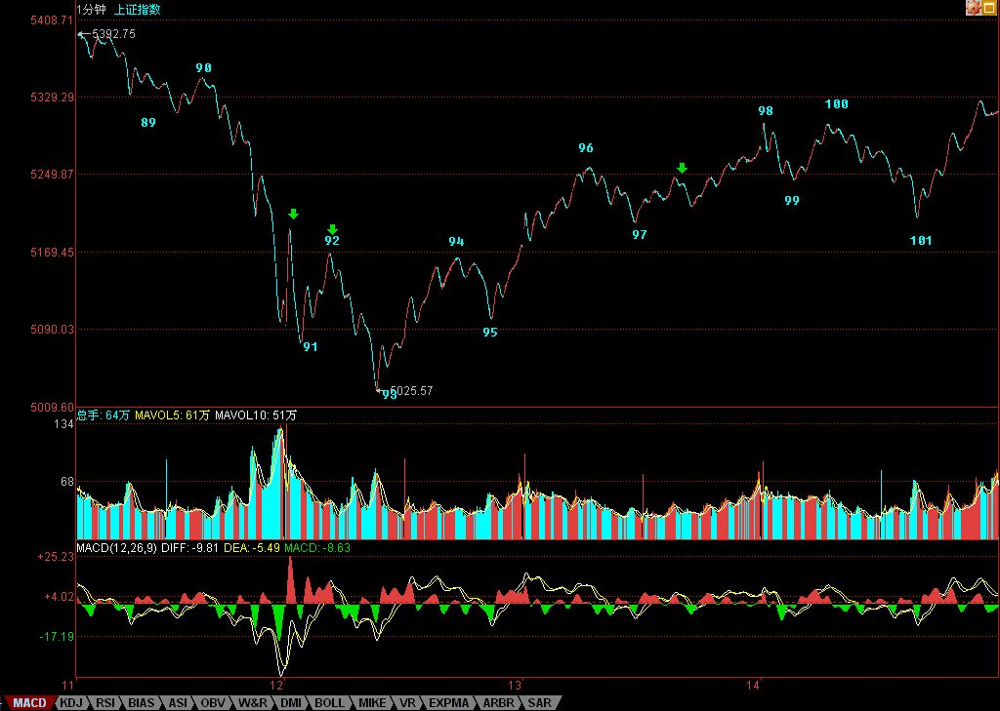{width="5.629861111111111in"
height="4.00625in"}

## 2007年末，资金与政策博弈下的走势分析

(2007-09-17 00:41:48)

**这轮从2005年中开始的行情，一直受到1992年1429点开始的系列比例线的严格控制。例如，在3000点下，震荡确认的是1/4线，也留下了227暴跌印记；而在4000点上，震荡确认的是1/2线，恰好在5月的180月大周期中，以530暴跌来继续印证这些比例线对大盘走势控制的有效性。而目前大盘的走势，同样没有离开这系列比例线的控制。**

**9月，2/3线的位置在1429+184\*30\*2/3=5109；3/4线的位置在1429+184\*30\*3/4=5569。显然，911的大跌行情，是对2/3线突破后的回抽，但该线最终是否被有效站稳，一般来说，都需要3个月以上的确认周期，这在1/4与1/2线的确认中都得到完美的验证。**

**由于2/3线与3/4线相差太近，所以今后行情的走势，将受到这两条线同时的控制与确认。由于本月是第三季度K线的收盘月，因此，只要本月收盘不能收到3/4线之上，那么可以肯定地说，2007年的最终收盘，将受制于3/4线，也就是说，即使年收盘位置最终能向上脱离3/4线，但其中必然会出现至少一次类似227、530、911的走势。**

**可以相当肯定地说，根据交替原则，227是小调整、530是大调整，如果针对2/3线的调整是小调整，那么，针对3/4线的调整，将有极大的机会至少是一次如530走势般的剧烈调整。根据9月收盘相对2/3线的位置，可以将大盘走势进行分类：如果收盘在该线之上，那么大盘是强势，反之是弱势。其强弱程度的绝对值正比于收盘相对2/3线的距离。**

**最简单的经常是最便利且最有力的，在对行情的分析与操作中，情况同样如此。在技术分析中，没有比均线系统更简单的，但在中长周期的分析中，一条5月或5周均线，就比绝大多数的复杂系统都有效了。从2005年中行情发动以来，大盘从未有效跌破过5月均线，甚至在530大跌中，也没有发生过，任何在5月均线下的走势，最终都被证明是空头陷阱。**

**但这样一个模式，最终必定会被打破，而打破之时，就是行情进入大级别调整的确立之日。请注意，该调整的级别一定大于530，也就是说一定是2005年中行情发动后最大一次级别的调整。反之，在5月均线被有效跌破之前，大盘的行情依然延续。**

**由于7、8月的连续月长阳，使得5月均线严重偏离，目前仍在4600点不到的位置，因此，9月的震荡，在技术上，是等待5月均线的上移。因此，第四季度的走势，归根结底只是一条，就是一旦5月均线上移后，能否继续站稳该线。也就是是说，行情是否继续被5月均线的上移惯性所带动？**

**而从中短线的角度，5周均线极为重要，一旦有效跌破，就意味着类530级别的调整不可避免。根据交替性原则，由于530是以空间换时间，那么，下一次类似级别的调整，有绝大的可能是以时间换空间。当然，这判断成立的前提是，行情没有受到特别的非系统性因素的影响。**

**由于去年大盘涨幅是130.43%，收盘在2675.47点，按相应比例，6165点成为今年一个标杆式的点位。还有，深圳成分指数在96年的行情中，也如本次上海指数一样略微跌破1000点后展开，而前者最终在6100点上见大顶，因此6100点附近是后者行情一个特别值得留意的位置。**

**站在对市场发展有利的角度，大盘年内最理性也是最理想的走势是：一、9月收在2/3线之上；二、第四季度以第三季度的长阳为基础进行震荡整理，震荡区间，以绕2/3线至3/4线区间为中枢展开，最终以十字星或者小阴小阳收盘。**

**但一旦政策面的压力超乎合理的范围，大盘将演化为一种具有压力的走势，即9月收盘在2/3线下，而第四季度最终以中阴线甚至大阴收盘。这种走势，必然使得年K线留下长上影，对明年行情发展的空间产生较大压制。反之，一旦资金面的肆虐超乎合理范围，那么大盘将演化为一种疯狂走势，即在今年内强行突破上面所说的6100点区域，这样，一次超530级别的调整将难以避免。**

**目前，资金面与政策面逐步走向平衡，一旦这种平衡被其中一面非理性打破，那么将对中国的资本市场中长期的发展制造不必要的困难。资金与政策的博弈，不仅是中国，也是世界资本市场历史发展中永恒的主题。如果这种博弈能在尽可能的理性与系统性范围内展开，那么对中国资本市场的发展将是最大的福音。**

## 资金向政策发起新一轮挑衅

(2007-09-17 15:46:13)

**今天的走势十分正常，无非就是延续了加息突破的老路子。周五的分析中已经很明确了，只要形成1分钟的第三类买点，那么新高就是绝大可能。今天早上11点多的那个第三类买点，极为教科书，后面的走势，就是本ID理论所100%保证的活动，没什么可说的。**

**大盘年末的走势分析，已经在今早所贴的"[2007年末，资金与政策博弈下的走势分析](http://blog.sina.com.cn/s/blog_486e105c01000cmm.html)"里，文章为了照顾大多数人，没有用本ID的理论分析，只是用了些通常的分析方法，因为这种预测性的文章，没多大意思，只是给各位一个大致的方向性。**

**真能有效战胜市场的，还是要学会用本ID的理论去当下的操作。上周一个绝妙的短差，然后又一个绝妙的回补点，从那5025点的93开始，一个1分钟中枢类型都没完成，但你明白本ID的理论的，就可以看着他按照理论的规范一步步地生长出来，这其中的从容与逍遥，又岂是那些用无数概率化的无聊玩意去争论大盘是新高还是不新高，真突破还是假突破的能明白的？**

**股票是用来操作而不是用来预测的，必须明白本ID理论知行合一的特点。现在十分简单，就是等待这1分钟走势类型的凋谢，具体的理论与操作，在课程里都反复说了，就不一一重复了。另外，今天的划分太简单，为了节约那可怜的200图空间，今天就不上传图形了。**

**由于在5000点反复震荡还跳过水，所以本ID对大盘所给予的空间也打开一点，在早上的文章中已经分析过，请过去看。总的来说，只要围绕2/3线到3/4线为中枢的震荡，都是可接受的。**

**今天，大盘的资金面向政策面发起新一轮挑衅，能否得逞，就看这几天政策面受刺激后的反应了，一般来说，本周没反应，下周反应的机会就越小，毕竟有一个长假期，稳定第一，没人会用这来开玩笑的。**

**个股方面，中字头的继续逞强，最近开始吹中字头的人越来越多，本ID在3600点开始说，现在就不说了。当然，中字头是本ID组合的一只翅膀，海枯石烂去了。**

**本ID的事情，都是尽量善始善终的。600569，当时9元说5个涨停，这倒霉孩子，碰上530，剧本只能变，这次从7元开始发力，折腾下来，也达到原来剧本的承诺了。后面当然还有剧本，但，本ID可已不欠任何人的话了。**

**600078，本ID最近找人去调查，这是最新的结果。该公司的所有在当地的子公司、孙公司都查了一遍，仍没有在当地国土部分申报有关领采矿证的资料，由于该公司在当地乱七八糟的公司特别多，也不知道有没有漏网的。没有采矿证，一切都不能算数。根据情况，大致有以下可能性：**

**一、一个闹剧**

**二、这些民营坏蛋想私吞了。**

**三、想学黄某某，先晾着，等大家都不注意了，再突然装进来。**

**所以，现在这游戏，已经从PE变成VC了。本ID毕竟离得太远，去企业又太显眼，又不想为这事情到基层兴师动众，只能通过省里某些标准渠道去了解。有在当地的人，如果有可能的，可以到企业进一步了解，看能否把VC再变回PE。**

**了解这事，顺便还了解了另一件事情，就是有人希望把某驴让美驴来入股，现在中驴很厉害，所以就有人要搞这样的把戏。不过企业相当抵触，所以这事情还真不好说。如果美驴真给放进来了，那些驴们又要疯了。但这只是一个有人在折腾的事情，在实际上，事都是折腾出来的，但折腾并不一定能事，所以，这也只能是一个VC项目，不能太沉迷。**

**注意，本ID说的是驴，可没说什么股票。**

**今天踩着刀锋，醉生梦死把上周完成的顶分型给破了，那也不妨醉生梦死一把，回答各位问题到5点。**

缠中说禅2007-09-17 15:56:38

全线飘红 删除此人所有评论

2007-09-17 15:52:22

请问上午10：58－11：18当一个线段太牵强了吧？三笔不清晰，没有重合。

===

请继续学习线段分段，为什么该线段不能是早上的高点开始？

缠中说禅2007-09-17 16:06:45

\[匿名\] 春日 删除此人所有评论

2007-09-17 15:51:54

缠MM好!有一问题一直无解,100-101对98-99没有出现盘整背驰,其内部也没有线段内类背弛,怎么能当下地在101处判断回补呢

====

比较力度，用盘整背弛一招也不是光比较最近这一段的。以前有课程专门说过中枢震荡中的力度比较问题。你必须从96开始看，101没出来前，只能先看96-99这个中枢的震荡。这震荡没破97这点，就意味着震荡的力度有限，所以一定只是中枢震荡。而且100的内部，一个典型的黄线下跌后双回拉后再下跌，而再下跌这段明显比不上第一段黄线。另外，柱子面积也比不上。

还有，线段下没有中枢，所以不能照套中枢概念，这必须清楚。一般来说，最好不要用线段操作。连中枢都没有，没什么意义，除非你概念特别清楚，对中枢震荡研究得特别明白。

缠中说禅2007-09-17 16:09:49

\[匿名\] 与你同行 删除此人所有评论

2007-09-17 15:55:58

楼主,对于个股来说顶分型出现后,立刻出现底分型,而大盘的走势并不确定,可以买入此类股票吗?

====

这情况说得很清楚了，日、周顶分型后关键看5日、周线，大盘这次周顶分型后继续破顶，就是因为5周线没有效跌破，构成一个完美回补点。参照原来说的000938可以明白。至于大盘和个股的关系，是另一个问题，一般来说，水平不高的，最好还是买和大盘相关度高的。水平高的，就无所谓了。

缠中说禅2007-09-17 16:13:22

\[匿名\] 白玉兰 删除此人所有评论

2007-09-17 16:04:18

妹妹好！

如果番茄将的原高管不离职就不会通过增发吗？

不增发就不能脱离苦海吗？

===

对，因为他们原来在唐家兄弟手下，现在一律要清除。干一件事情，哪里有那么简单，事儿多呢。

缠中说禅2007-09-17 16:16:57

\[匿名\] 下岗工人 删除此人所有评论

2007-09-17 15:57:50

每天看您的文章,不太懂.今天是说可以疯狂一下了?持股等涨吗?可我恐高,今天卖了去打新股了.真背,没看懂老师的文章.

===

这是对的，心理不行，先退出是绝对正确的，市场机会多了，不要强迫自己，让自己心脏不舒服。

当然，已经立定吃了咸鱼不怕口喝的，可以继续。这是刀锋上舞蹈，给伤着，千万要有心理承受力。

更当然的，如果技术好的，看着走势来的，就无所谓了，就算有突发消息，手起刀落，谁怕谁？

没这心理素质，还是别玩悬的。

缠中说禅2007-09-17 16:18:14

\[匿名\] rivus 删除此人所有评论

2007-09-17 16:06:03

老大,有色要上演强者恒强吗?除了您的票

===

600432不是本ID股票？今年头，从20元不到买的，到今天，除了本ID，请问还有谁有？

缠中说禅2007-09-17 16:21:05

\[匿名\] 新浪网友 删除此人所有评论

2007-09-17 16:17:44

中铝什么时候能调整完呀，缠姐已经被套好久了

===

中驴还有什么可问的，本ID当时说向下阻击，说得满大街都知道，怎么不走？就像000802，当然说得这么明确，还有没走的。现在小ABC走出来了，短线就看对上面中枢的回拉力度了。中线当然没问题了。

缠中说禅2007-09-17 16:22:44

\[匿名\] 云儿 删除此人所有评论

2007-09-17 16:20:40

缠妹好.跟妹妹汇报一下学习成果.

原先涨也糊涂,跌也糊涂.现在知道买点买,卖点卖.即使一卖错过,还有二卖.

原先只知盲目增加投资.现在知道可以先卖买,一样赚钱.

虽说学艺尚不精,但跟着妹妹的思路走,炒股从来没有这么轻松又自在.

十分感谢

===

不用谢，本ID最多就算一陪练，出成绩都是靠你自己，只能不断努力。

缠中说禅2007-09-17 16:26:08

\[匿名\] 清空 删除此人所有评论

2007-09-17 16:22:10

缠妹妹，没学好你的技术，911之前清了仓，至今踏空，郁闷啊！像我们这样没有太多时间看盘的，可不可以选一两支股海枯石烂，不管股市的风吹雨打呢？

===

那天说得很明确，跌破5周线一定至少有大反弹，那天为什么不回补。

本ID的理论很关键一点，就是要节奏。特别是用小级别操作的，节奏更重要。你抛了不买回，那还不如不抛，等大级别的卖点再说。

买了就要想着卖点，卖了就要想着买点。

如果时间不够，操作不方便，就要选择大级别的操作。不要玩小级别的，否则买卖点很容易错过，开个会，干件事就没了。

小级别只适合职业、或至少是半职业看盘的。

缠中说禅2007-09-17 16:27:08

缠中破缠 删除此人所有评论

2007-09-17 16:23:56

其实中枢跟均线差不多

===

还要请你多补课。

缠中说禅2007-09-17 16:30:23

\[匿名\] 粗茶淡饭 删除此人所有评论

2007-09-17 16:25:53

缠主怎么看参股和参股券商板块啊！我的参股板块的几只票怎么都耷拉作啊，000850成本几乎为0了，还好受些。可还有那个破巴士741至今没赚钱，能不能给点提示啊

====

现在，位置高了，有些题材性，又挖掘过度的，当然要躺一下，不过，如果没有大的政策干预，板块会轮动到的，不过参股的太多，如果自身没有太好的基本面支持，那就不可能如上半年一样，是参股的都给疯炒了。

缠中说禅2007-09-17 16:32:42

于金钱而自由 删除此人所有评论

2007-09-17 15:59:04

狂顶缠君！

请问缠君：这"醉生梦死"一回是否以二线成份指标股为先锋呢？或成长股？

====

这次二、三线的力度当然要大点，所以说中字头、二、三线，两个翅膀。

缠中说禅2007-09-17 16:36:45

\[匿名\] 新浪网友 删除此人所有评论

2007-09-17 16:02:30

缠mm，为什么缠论理论上很清楚，但一但实际操作，又晕了。郁闷！

====

实际上，根本原因是理论还学得不够清楚，你看，上面还有很多人，对今天的分段没搞清楚，那第三买点怎么来的，也没搞清楚，所以，还是先把理论搞清楚，一定要多看图，那些都是用钱划出来的。

你想想，现在最牛的画，一般的级别也就几千万，而随便找一个图，几乎都要上亿才能划一个日分时，就别说日线图、周线、年线了。

怎么珍贵的画，还不好好欣赏，也太浪费了吧。

缠中说禅2007-09-17 16:45:07

\[匿名\] 路边社通讯员 删除此人所有评论

2007-09-17 15:54:07

缠mm,学了2周,终于快赶上大部队了.

在学笔,分型,线段前,感觉内容前后基本一致,比较好理解.学到线段就开始迷糊了.55课以前关于中枢的概念被后面的内容推翻了

====

没有推翻，这个问题说得很清楚。原来的中枢定义，是纯理论的，因此，操作起来很麻烦，因为没有人真能从每一笔成交开始看。

关于这个问题，有好几节课反复说了，请再看一遍。

缠中说禅2007-09-17 17:04:19

对不起，来了一个长途。延长15分钟。

缠中说禅2007-09-17 17:06:07

缠住我 删除此人所有评论

2007-09-17 16:56:02

最后5分钟

姐姐,什么时候能恢复音乐博客

===

那网站估计给那次30多万的点击给废掉，从那天起就没恢复，本ID也没办法。找一个新的，原来的音乐又要重新传一次，工作量太大，等等看，希望他能活过来。

缠中说禅2007-09-17 17:07:52

\[匿名\] 新浪网友 删除此人所有评论

2007-09-17 16:56:26

LZ:请问在1F的图中顶部有两K线高点一样，两边的笔已成型，这顶能算顶分型吗？？？谢谢！！！

===

没有顶分型，哪里有笔？不是顶分型，哪里会是顶？顶就是顶分型的简称。

[缠中说禅](http://blog.sina.com.cn/u/1215172700)2007-09-17 17:09:22

   快乐vs菜虫 删除此人所有评论 \
2007-09-17 16:59:29 

图一：

\-\-\-\-\-\-\-\-\-\-\-\-\-\-\-\-\-\-\-\-\-\-\-\-\-\-\-\-\-\-\-\-\-\-\-\-\-\--/-\
\-\-\-\-\-\-\-\-\-\-\-\-\-\-\--/\\\-\-\-\-\-\-\-\-\-\-\-\-\-\-\-\-\-\-\--/\--\
\-\-\-\-\-\-\-\-\-\-\-\-\-\--/\--\\\-\-\--/\\\-\-\-\-\--/\\\-\-\--/\-\--\
\-\-\-\-\-\-\-\-\-\-\-\-\--/\-\-\--\\\--/\--\\\-\-\--/\--\\\--/\-\-\--\
\-\-\-\-\-\-\-\-\-\-\-\--/\-\-\-\-\--\\/\-\-\--\\\--/\-\-\--\\/\-\-\-\--\
\-\-\-\-\-\-\-\-\-\-\--/\-\-\-\-\-\-\-\-\-\-\-\-\--\\/\-\-\-\-\-\-\-\-\-\-\--\
\-\-\-\-\-\-\-\-\-\--/\-\-\-\-\-\-\-\-\-\-\-\-\-\-\-\-\-\-\-\-\-\-\-\-\-\-\-\--\
\-\-\--/\\\-\-\--/\-\-\-\-\-\-\-\-\-\-\-\-\-\-\-\-\-\-\-\-\-\-\-\-\-\-\-\-\--\
\-\--/\--\\\--/\-\-\-\-\-\-\-\-\-\-\-\-\-\-\-\-\-\-\-\-\-\-\-\-\-\-\-\-\-\--\
\--/\-\-\--\\/\-\-\-\-\-\-\-\-\-\-\-\-\-\-\-\-\-\-\-\-\-\-\-\-\-\-\-\-\-\-\--\
-/\-\-\-\-\-\-\-\-\-\-\-\-\-\-\-\-\-\-\-\-\-\-\-\-\-\-\-\-\-\-\-\-\-\-\-\-\-\--

图二：\
\-\-\-\-\-\-\-\-\-\-\-\-\-\-\-\-\-\-\-\-\-\-\-\-\-\-\-\-\-\-\-\-\-\-\-\-\-\-\--/\
\-\-\-\-\-\-\-\-\-\-\-\-\-\--/\\\-\-\-\-\-\-\-\-\-\-\-\-\-\-\-\-\-\-\-\-\--/-\
\-\-\-\-\-\-\-\-\-\-\-\-\--/\--\\\-\-\--/\\\-\-\-\-\-\-\--/\\\-\-\--/\--\
\-\-\-\-\-\-\-\-\-\-\-\--/\-\-\--\\\--/\--\\\-\-\-\-\--/\--\\\--/\-\--\
\-\-\-\-\-\-\-\-\-\-\--/\-\-\-\-\--\\/\-\-\--\\\-\-\--/\-\-\--\\/\-\-\--\
\-\-\-\-\-\-\-\-\-\--/\-\-\-\-\-\-\-\-\-\-\-\-\--\\\--/\-\-\-\-\-\-\-\-\-\--\
\-\-\--/\\\-\-\--/\-\-\-\-\-\-\-\-\-\-\-\-\-\-\--\\/\-\-\-\-\-\-\-\-\-\-\--\
\-\--/\--\\\--/\-\-\-\-\-\-\-\-\-\-\-\-\-\-\-\-\-\-\-\-\-\-\-\-\-\-\-\-\-\--\
\--/\-\-\--\\/\-\-\-\-\-\-\-\-\-\-\-\-\-\-\-\-\-\-\-\-\-\-\-\-\-\-\-\-\-\-\--\
-/\-\-\-\-\-\-\-\-\-\-\-\-\-\-\-\-\-\-\-\-\-\-\-\-\-\-\-\-\-\-\-\-\-\-\-\-\-\--\
缠姐，请问图一是几段，图二是几段？？？\
====\
都是一段

缠中说禅2007-09-17 17:12:00

\[匿名\] 大盘 删除此人所有评论

2007-09-17 17:00:56

请问博主

线段纠缠很久了，问一个看待走势如何像花开花落的问题

背驰买点后，形成两个完全不重叠的1分钟中枢，如果第2个1分钟中枢没有出现三买而是通过9段延伸形成5分钟中枢，这5分钟中枢暂时也没有与第1个1分钟中枢有如何重叠，

那么我们当下是应该把走势看作未完成的1分钟趋势呢，还是按照5分钟的震荡来处理当下走势

真的很想像看花开花落一样看股票走势，但是疑问还是不少

====

当然是5分钟走势，看成是5分钟的中枢震荡。

缠中说禅2007-09-17 17:21:46

\[匿名\] 影子 删除此人所有评论

2007-09-17 17:04:52

今天踏空了一半,看多了小缠的博,我这个几乎是死多的居然踏空了一半,真是的.

博主文章对多方贬义词用的太多了,估计缠友踏空的比例不小.我发表点不同意见,希望对大家有点帮助,错了勿怪.

===

那你的判断完全错误，除了必须保留的机动资金已经对冲风险的仓位，本ID从3600点开始都是100%的满仓，当然，本ID的是机动资金会在组合中不断流动，一般在10-30%比例间波动，这样效率是最高的。一般来说，有大点的卖点，那么本ID的机动资金会达到30%，一般来说不会到了比例。另外，本ID都会有一定比例的对冲风险操作，这就不细说了。这一点对大资金其实很重要，如果没有这一点，本ID在530早上就不会如此从容了，毕竟对于大资金来说，在那兵荒马乱的早上，一个第二卖点，也走不了多少，但有对冲，就不同了。

如果按对冲基金的观点，纯多纯空都是风险级别的，一定要有一定的对冲。

[缠中说禅](http://blog.sina.com.cn/u/1215172700)2007-09-17 17:32:17

 \[匿名\] 时时是花时 删除此人所有评论 \
2007-09-17 17:17:23 \
快乐vs菜虫 删除此人所有评论\
2007-09-17 16:59:29

图一：\
\-\-\-\-\-\-\-\-\-\-\-\-\-\-\-\-\-\-\-\-\-\-\-\-\-\-\-\-\-\-\-\-\-\-\-\-\-\--/-\
\-\-\-\-\-\-\-\-\-\-\-\-\-\-\--/\\\-\-\-\-\-\-\-\-\-\-\-\-\-\-\-\-\-\-\--/\--\
\-\-\-\-\-\-\-\-\-\-\-\-\-\--/\--\\\-\-\--/\\\-\-\-\-\--/\\\-\-\--/\-\--\
\-\-\-\-\-\-\-\-\-\-\-\-\--/\-\-\--\\\--/\--\\\-\-\--/\--\\\--/\-\-\--\
\-\-\-\-\-\-\-\-\-\-\-\--/\-\-\-\-\--\\/\-\-\--\\\--/\-\-\--\\/\-\-\-\--\
\-\-\-\-\-\-\-\-\-\-\--/\-\-\-\-\-\-\-\-\-\-\-\-\--\\/\-\-\-\-\-\-\-\-\-\-\--\
\-\-\-\-\-\-\-\-\-\--/\-\-\-\-\-\-\-\-\-\-\-\-\-\-\-\-\-\-\-\-\-\-\-\-\-\-\-\--\
\-\-\--/\\\-\-\--/\-\-\-\-\-\-\-\-\-\-\-\-\-\-\-\-\-\-\-\-\-\-\-\-\-\-\-\-\--\
\-\--/\--\\\--/\-\-\-\-\-\-\-\-\-\-\-\-\-\-\-\-\-\-\-\-\-\-\-\-\-\-\-\-\-\--\
\--/\-\-\--\\/\-\-\-\-\-\-\-\-\-\-\-\-\-\-\-\-\-\-\-\-\-\-\-\-\-\-\-\-\-\-\--\
-/\-\-\-\-\-\-\-\-\-\-\-\-\-\-\-\-\-\-\-\-\-\-\-\-\-\-\-\-\-\-\-\-\-\-\-\-\-\--

图二：\
\
\-\-\-\-\-\-\-\-\-\-\-\-\-\-\-\-\-\-\-\-\-\-\-\-\-\-\-\-\-\-\-\-\-\-\-\-\-\-\--/\
\-\-\-\-\-\-\-\-\-\-\-\-\-\--/\\\-\-\-\-\-\-\-\-\-\-\-\-\-\-\-\-\-\-\-\-\--/-\
\-\-\-\-\-\-\-\-\-\-\-\-\--/\--\\\-\-\--/\\\-\-\-\-\-\-\--/\\\-\-\--/\--\
\-\-\-\-\-\-\-\-\-\-\-\--/\-\-\--\\\--/\--\\\-\-\-\-\--/\--\\\--/\-\--\
\-\-\-\-\-\-\-\-\-\-\--/\-\-\-\-\--\\/\-\-\--\\\-\-\--/\-\-\--\\/\-\-\--\
\-\-\-\-\-\-\-\-\-\--/\-\-\-\-\-\-\-\-\-\-\-\-\--\\\--/\-\-\-\-\-\-\-\-\-\--\
\-\-\--/\\\-\-\--/\-\-\-\-\-\-\-\-\-\-\-\-\-\-\--\\/\-\-\-\-\-\-\-\-\-\-\--\
\-\--/\--\\\--/\-\-\-\-\-\-\-\-\-\-\-\-\-\-\-\-\-\-\-\-\-\-\-\-\-\-\-\-\-\--\
\--/\-\-\--\\/\-\-\-\-\-\-\-\-\-\-\-\-\-\-\-\-\-\-\-\-\-\-\-\-\-\-\-\-\-\-\--\
-/\-\-\-\-\-\-\-\-\-\-\-\-\-\-\-\-\-\-\-\-\-\-\-\-\-\-\-\-\-\-\-\-\-\-\-\-\-\--\
\
缠姐，请问图一是几段，图二是几段？？？\
===\
都是一段

\-\-\--\
老师你在第71课中给的例图吧上面的图2分成3段！\
上面图2是否应用以下这段话理解：\
"而在第二种情况的第二特征序列中，其方向是和原线段一致，包含关系的出现，就意味着原线段的能量充足，而第二种情况，本来就意味着对原线段转折的能量不足，这样一来，当然就必须按照包含关系来。"\
====\
如果图二下跌那段是5笔下跌的，就是三段。

缠中说禅2007-09-17 17:37:06

各位注意，特征序列必须要有三个元素才能有可能有分型，两个元素怎么可能有分型？

今天电话不断，还都是长途，刚又接了一个，问题回答得不太利落。

不过要先下了，再见。

## 教你炒股票81：图例、更正及分型、走势类型的哲学本质

## (2007-09-17 22:57:16)

请首先看一个回帖：

\[匿名\] 赚到了\
2007-09-17 17:36:23\
快乐vs菜虫\
删除此人所有评论\
2007-09-17 17:24:59

图一：\
　　　　　　         　５　　　７\
\-\-\-\-\-\-\-\-\-\-\-\-\-\-\-\-\-\-\-\-\-\-\-\-\-\-\-\-\-\-\-\-\-\-\-\-\-\--/-\
\-\-\-\-\-\-\-\-\-\-\-\-\-\-\--/\\\-\-\-\-\-\-\-\-\-\-\-\-\-\-\-\-\-\-\--/\--\
\-\-\-\-\-\-\-\-\-\-\-\-\-\--/\--\\\-\-\--/\\\-\-\-\-\--/\\\-\-\--/\-\--\
\-\-\-\-\-\-\-\-\-\-\-\-\--/\-\-\--\\\--/\--\\\-\-\--/\--\\\--/\-\-\--\
\-\-\-\-\-\-\-\-\-\-\-\--/\-\-\-\-\--\\/\-\-\--\\\--/\-\-\--\\/\-\-\-\--\
\-\-\-\-\-\-\-\-\-\-\--/\-\-\-\-\-\-\-\-\-\-\-\-\--\\/\-\-\-\-\-\-\-\-\-\-\--\
\-\-\-\-\-\-\-\-\-\--/\-\-\-\-\-\-\-\-\-\-\-\-\-\-\-\-\-\-\-\-\-\-\-\-\-\-\-\--\
\-\-\--/\\\-\-\--/\-\-\-\-\-\-\-\-\-\-\-\-\-\-\-\-\-\-\-\-\-\-\-\-\-\-\-\-\--\
\-\--/\--\\\--/\-\-\-\-\-\-\-\-\-\-\-\-\-\-\-\-\-\-\-\-\-\-\-\-\-\-\-\-\-\--\
\--/\-\-\--\\/\-\-\-\-\-\-\-\-\-\-\-\-\-\-\-\-\-\-\-\-\-\-\-\-\-\-\-\-\-\-\--\
-/\-\-\-\-\-\-\-\-\-\-\-\-\-\-\-\-\-\-\-\-\-\-\-\-\-\-\-\-\-\-\-\-\-\-\-\-\-\--

图二：\
\
\-\-\-\-\-\-\-\-\-\-\-\-\-\-\-\-\-\-\-\-\-\-\-\-\-\-\-\-\-\-\-\-\-\-\-\-\-\-\--/\
\-\-\-\-\-\-\-\-\-\-\-\-\-\--/\\\-\-\-\-\-\-\-\-\-\-\-\-\-\-\-\-\-\-\-\-\--/-\
\-\-\-\-\-\-\-\-\-\-\-\-\--/\--\\\-\-\--/\\\-\-\-\-\-\-\--/\\\-\-\--/\--\
\-\-\-\-\-\-\-\-\-\-\-\--/\-\-\--\\\--/\--\\\-\-\-\-\--/\--\\\--/\-\--\
\-\-\-\-\-\-\-\-\-\-\--/\-\-\-\-\--\\/\-\-\--\\\-\-\--/\-\-\--\\/\-\-\--\
\-\-\-\-\-\-\-\-\-\--/\-\-\-\-\-\-\-\-\-\-\-\-\--\\\--/\-\-\-\-\-\-\-\-\-\--\
\-\-\--/\\\-\-\--/\-\-\-\-\-\-\-\-\-\-\-\-\-\-\--\\/\-\-\-\-\-\-\-\-\-\-\--\
\-\--/\--\\\--/\-\-\-\-\-\-\-\-\-\-\-\-\-\-\-\-\-\-\-\-\-\-\-\-\-\-\-\-\-\--\
\--/\-\-\--\\/\-\-\-\-\-\-\-\-\-\-\-\-\-\-\-\-\-\-\-\-\-\-\-\-\-\-\-\-\-\-\--\
-/\-\-\-\-\-\-\-\-\-\-\-\-\-\-\-\-\-\-\-\-\-\-\-\-\-\-\-\-\-\-\-\-\-\-\-\-\-\--\
\
缠姐，请问图一是几段，图二是几段？？？\
==================================\
如果５＝７或者５低于７，都是一段，\
如果５高于７，都是３段

下午，本ID回答问题时，一边电话不断，所以给出的答案是不大完整的，因为本ID按图中看出的7不低于5来回答的。晚上回来，发现已经有人把正确答案完整写出，所以必须给一朵大红花。

这两种情况，都属于线段破坏的第二种情况，所以必须考虑高点下来走势的特征序列，而且必须考虑包含关系，所以上面这位网友的回答才是完整的。

另外，有人提到71课里最后一个图，那个图显然是错的，问题就在于与这里类似的，把7的位置画高了，应该类似7的位置比类似5的位置低才对，那才是三段，当时画的时候，没特别注意。所以这里必须指出。

所以，一切根据定义来，把定义搞清楚了，一切都好办，就是本ID画错了，你也能一眼看出来。

另外，提一个问题，今天走势的划分，有一些特别的地方，本ID下午说的，有点问题，主要出在，1017的低点5386.47比前一分钟的5386.39点高，所以顶分型的顶在1017那时间，所以那里就是一笔，但图形上粗略看顶在16分那点，下午写东西太快，没有仔细去比较，晚上回来，仔细对比一下数据，才发现那里应该构成一笔，所以整个划分就要有点改变，也就是今天形成1分钟中枢了，该中枢前面一段很简单，关键是第二、三段，究竟怎么划的，能正确划出的，对线段划分也就有点及格了，明天下午再公布答案，可以对比一下。

各位以后要吸取本ID下午失误的教训，对那些只有5、6根K线的，一定要看好其中是否有包含关系，这样才不会一时大意，这是最容易出毛病的地方。

有人可能要问，难道就那0.08的差别就可以影响整个大盘？这有什么奇怪的，如果你知道某些物理学的理论，就知道，在那些理论看来，我们的世界之所以这样，就是因为一些极其微小的差别造成了，没有那些差别，世界一定不是这个样子了。另外，请注意，一定要用同一种软件，这样，等于测量的精确度或误差是基本一致的，就保持整个划分是在同一误差或精确的基础上。

好了，闲话不说，进入新课程。

为什么要研究分型、走势类型等东西，其哲学基础是什么？这就是人的贪嗔痴疑慢。因为人的贪嗔痴疑慢都是一样的，只是跟随时间、环境大小不一，所以，就显示出自相似性。而走势是所有人贪嗔痴疑的合力结果，反映在走势中，就使得走势显示出自相似性。

分型、走势类型的本质就是自相似性，同样，走势必完美的本质也就是自相似性。分型，在1分钟级别是这样的结构，在年线上也是这样的结构，在不同的级别上，级别不同，但结构是一样的，这就是自相似性。同样，走势类型也一样。

正因为走势具有自相似性，所以走势才是可理解的，才是可把握的，如果没有自相似性，那么走势必然不可理解，无法把握。要把握走势，本质上，就是把握其自相似性。

自相似性还有一个最重要的特点，就是自相似性可以自组出级别来。上面的话中，先提到级别，在严格意义上是不对的。级别是自相似性自组出来的，或者说是生长出来的，自相似性就如同基因，按照这个基因，这个图谱，走势就如同有生命般自动生长出不同的级别来，不论构成走势的人如何改变，只要其贪嗔痴疑不改变，只要都是人，那么自相似性就存在，级别的自组性就必须存在。

本ID理论的哲学本质，就在于人的贪嗔痴疑慢所引发的自相似性以及由此引发走势级别的自组性这种类生命的现象。走势是有生命的，本ID说"**看行情的走势，就如同听一朵花的开放，见一朵花的芬芳，嗅一朵花的美丽，一切都在当下中灿烂"，这绝对不是孔男人式的矫情比喻，而是科学般的严谨说明，因为走势确实有着如花一般的生命特征，走势确实在**自相似性、自组性中发芽、生长、绽放、凋败。

因此，本ID的理论是一种可发展的理论，可以提供给无数人去不断研究，研究的方向是什么？就是走势的自相似性、自组性。这里，可以结合现代科学的各门学科，有着广阔的前景以及可开发性。

所以，本ID的理论，不是一些死的教条，而是一门生命学科。

只是，目前本ID只和各位讲述一些最简单的自相似性：分型、走势类型。

本ID的理论中，有一条最重要的定理，就是有多少不同构的自相似性结构，就有多少种分析股市的正确道路，任何脱离自相似性的股市分析方法，本质上都是错误的。

显然，分型、走势类型是两种不同构的自相似性结构，我们还可以找到很多类似的结构，但现在，还是先把这两个最基础的结构给搞清楚。条条大路通罗马，只要把这两个结构搞清楚，就能达到罗马。而其他结构的寻找、研究，本质上是一种理论上的兴趣。而不同的自相似性结构对应的操作的差异性问题，更是一个理论上的重大问题。

本ID的理论上还有一个暂时没有解决的问题，就是走势中究竟可以容纳多少自相似性结构，还有一个更有趣的问题，就是起始交易条件对自相似性结构生成的影响，如果这个问题解决了，那么，对市场科学的调控才能真正解决。

本ID的理论还可以不断扩展，也可以精细化进行。例如，对于不同交易条件的自相似性结构的选择，就是一个精细化的理论问题。

自相似性结构有什么用处，这用处大了去了。一个最简单的结论：所有的顶必须是顶分型的，反之，所以的底都是底分型的。如果没有自相似性结构，这结论当然不可能成立。但正因为有自相似性结构，所以才有这样一个对于任何股票、任何走势都适用的结论。

反之，这样一个结论，就可以马上推出这个100%正确的结论，就是：没有顶分型，没有顶；反之，没有底分型，没有底。那么，在实际操作中，如果在你操作级别的K线图上，没有顶分型，那你就可以持有睡觉，等顶分型出来再说。

另外，有了自相似性结构，那么，任何一个级别里的走势发展都是独立的，也就是说，例如，在30分钟的中枢震荡，在5分钟的上涨走势，那么两个级别之间并不会互相打架，而是构成一个类似联立方程的东西，如果说单一个方程的解很多，那么联立起来，解就大幅度减少了。也就是级别的存在，使得对走势的判断可以联立了，也就是可以综合起来系统地看了，这样，走势的可能走势的边界条件就变得异常简单。

所以，看走势，不能光看一个级别，必须立体地看，否则，就是浪费了自相似性结构给你的有利条件。

不行，快11点了，今天回来太晚，关于这个问题，以后再陆续说。

先下，再见。

## 等待那万众期盼的每周一跌

(2007-09-18 15:53:21)

**首先，必须声明，本ID昨天说的是驴，和任何股票无关。至于有些无聊股票，走出例如涨停那种很无聊的走势，可和本ID一点关系都没有。本ID这里可从不推荐任何股票，最多就是梦里胡言乱语一把，本ID要推荐，也推荐驴肉火烧实在点。**

**现在的走势，极端简单，就是真突破还是假突破的问题，一般来说，如果是假的，就是三、四天内见分晓，先来两、三个十字星之类的玩意，然后虚晃一枪向下跳水。如果按这个把戏，周四前后就是田亮一把的日子。而且，现在，每周一跳，跳了，都爽了，就该干嘛干嘛了。**

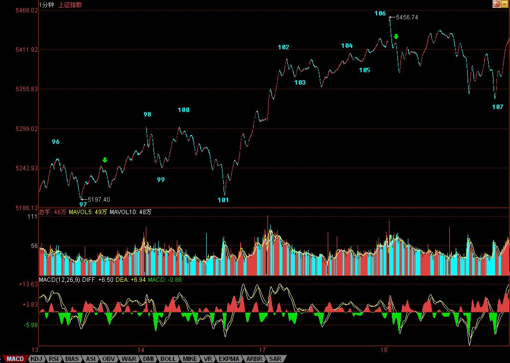{width="5.6299212598425195in"
height="4.0065048118985125in"}

**当然，用本ID的理论，就没有这么多麻烦事，而且绝对不用去宣称什么这是世纪大顶之类的无聊事情。如果你是按30分钟操作的，什么顶呀底呀，只要按照节奏来，绝对不参与30分钟级别的下跌，那么这世界在你眼里，就只有三种活动，30分钟级别的上涨、盘整、下跌，世纪大顶、火里刀上也一样可以逍遥游，其他级别的操作也是一样的。**

**现在的情况十分简单，对于短线来说，就是现在依然是原来76-85那个5分钟中枢的中枢震荡，现在的问题只不过是，该5分钟的中枢的第三类买点是否出现。如果不出现，那就继续中枢震荡，当然，那时候，这5分钟就扩展成30分钟的中枢震荡了，那就更好玩了。**

**至于超短线来说，昨天问题的答案在图里就有了，分不清楚的，请好好研究一下。目前，就是102-105的一个中枢震荡。注意，目前这个离开原来5分钟中枢的走势并没有完成，所以还谈不上回抽，那今天震荡的低点，刚好在78之上，也就看出，这中枢震荡并不是瞎掰的，这么远的距离，依然起着作用。**

**个股，没什么可说的，就算是假突破，只要这大的中枢震荡存在，那么个股机会依然汹涌，假期前，又有一个持股持币的无聊问题，关键还是你的操作级别和该级别中的表现。对于完全不了解本ID理论的，就看5日或5周线，特别是5周线，这是中短线的关键。**

**马上有一件新疆的什么无聊管道要上市的事情要谈，不能回答问题了，先下，再见。**

禅师其他文章回复：

(2007-09-18 22:53:57)

今天，急着外出，把107写成108，后来是在谈完一轮，去吃饭的路上车里改的。

现在发现各位对那些古怪的分段还是有点乱，那些古怪的分段，经常是因为第一次笔破坏时，延伸不出线段来，例如，今天图里绿箭头所指的地方，顶和底分型经过包含处理后中间没有K线了，这就不能算一笔。

本ID想了想，计算了一下能量力度，觉得以后可以把笔的成立条件略微放松一下，就是一笔必须满足以下两个条件：1、顶分型与底分型经过包含处理后，不允许共用K线，也就是不能有一K线分别属于顶分型与底分型，这条件和原来是一样的，**这一点绝对不能放松**，
因为这样，才能保证足够的能量力度；2、在满足1的前提下，顶分型中最高K线和底分型的最低K线之间（不包括这两K线），不考虑包含关系，至少有3根（包
括3根）以上K线。显然，第二个条件，比原来分型间必须有独立K线的一条，要稍微放松了一点，这样，象今天绿箭头所指的地方，就是一笔了，相应那三笔下来
就构成一段了，整个划分就不会出现比较古怪的线段。

对线段一直比较晕的人，这个新的条件大概容易处理一点，至少可以避开处理如106到107这样复杂的线段，而这，本ID刚计算过，也不会影响整个线段的动力学能量。但103-104这样的线段，是无法更改的，这类线段必须能够处理。

另外，以前也说明过，现在再说一次，本ID平时交易时不用同花顺，只是本ID用
的系统网上没有，所以那里的标记无法搞过来，因此，本ID在同花顺上的标记，都是收盘后才弄的，而两套系统的数据经常有点小出入，有时候偷懒，就照抄过
去，偶尔就会出问题。其实，本ID这个示范，只是为了让各位能明白真正的划分，只是一个示范，如果你真明白了划分的原则，不看也可以，根据自己系统的数
据，都有唯一正确的答案。分型、笔、线段，都是最基本的准备，关键还是通过这去分别出更高级别的走势类型，那才是操作的关键之处。所以，一定要把这两部分的区别搞清楚。

## 政策对资金挑衅的反击

(2007-09-19 15:42:03)

**今天算不算田亮一把，估计要看了明后两天才知道了。因为，好象田亮参加的项目，有1米板，还有10米台，这玩意，要对比着才知道的。本来，美国减息，全世界喝了一把水井坊，但中国就是中国，不和全世界玩，咱自己玩。**

**年末行情的判断，在"2007年末，资金与政策博弈下的走势分析"说得很清楚，最理智的走势是怎么样的，也写得很清楚了，如果一方挑衅，肯定会被反击，今天三大报让各位学习，各位也就学习一把，水井坊给英国佬搞去全世界，到时候用英镑卖的，咱就喝王老吉，降降火。**

**技术上，昨天已经说得最清楚不过了，基本看法一样，首先小的1分钟震荡，今天没震出什么结果，而操作上，当然是冲高震荡时卖，卖了回来看，如果向下破位出第三卖点，咱就不管他，看他跌成王老吉还是水井坊再说，如果不出第三卖点，咱就继续陪他游戏。**

**不过，从短线政策的压力看，如果资金面上还继续麻辣火锅，火气旺旺的，那么，政策上大概就不是学习学习那么简单了，让你喝王老吉，那是给面子你，哪天让你吃点巴豆、喝点减肥茶，又有什么不可以的？**

**本ID总是想和稀泥，让双方都能平和点，但良好的愿望，绝不是本ID一个就能实现的，市场是大家的，是合力的。当然，本ID也懒得呼吁什么了，现在只有一个念头，快点放假，游山玩水去吧。**

**昨天，本ID"****欣闻台风可休市，聊赋七律说《风灾》"可能引起某些敏感，本ID后来就改成了"忽闻"，这就是和稀泥，本ID不想为一个字去坚持什么，没什么可坚持的。虽然原来的话修饰什么，是很明确的，不过，如果一个字能让大家少点争吵，那字又算得了什么？所以，资金与政策目前的困局，也是一样，资金去挣所谓的钱，难道就一定要只争朝夕了？退一步，难道不可以海阔天空？**

**只是美国一减息，某些如意算盘就难打了，本ID自己从来没什么烦恼，现在唯一的烦恼，就是看得太明白了。**

**昨天是918，我们补默哀三分钟吧。**

**今天可以回答问题到4点半，不过都请先为918默哀三分钟。**

**注意**

**下午技术分析的补充请到今晚帖子里看。**

缠中说禅2007-09-19 15:51:51

\[匿名\] 新浪网友 删除此人所有评论

2007-09-19 15:49:52

那个石头在发飙啊\~

===

总不能永远学雷锋吧。

缠中说禅2007-09-19 15:54:14

\[匿名\] 新浪网友 删除此人所有评论

2007-09-19 15:50:40

000807，那驴子，还会疯狂吗？

===

现在，企业不愿意，但有比企业大的愿意，正在磨着，磨出结果来才会疯狂。该股基本面不错，又有新项目将产生利润，不过如果大盘不好，也只能跟着大盘走一段。如果有机会有一个大的中线买点，是值得关注的。

缠中说禅2007-09-19 15:59:39

缠住我 删除此人所有评论

2007-09-19 15:53:58

姐姐看好电力和钢铁吗?银行股算不算调整好了呢?

希望能早点听到姐姐重开的音乐会\^\_\^

====

那网站不重开，本ID也没办法。那两板块都可以，钢铁最近涨多了，压力大一点。

其实，本ID经常是尽可能说点东西，不过有些东西不能明说，否则有引导之嫌疑。例如，600569，前天高收时，说了原来剧本的目标达到了，当然，那这是本ID的梦话，其实本ID什么都没说，像上次000802一样。

不过，这些股票，经过调整，都没大问题的，现在关键不是个股，而是大盘。

缠中说禅2007-09-19 16:01:21

\[匿名\] 新浪网友 删除此人所有评论

2007-09-19 15:58:33

请问缠mm打坐中气息是连续的从气嘴出来吗,现在感觉受呼吸的影响啊,我知呼吸.

===

只要稍微念想一下，真气无形，你又管什么呼吸之气？

缠中破缠2007-09-19 16:03:11

我下过缠中说禅十八岁写的第一首无调性音乐《寂》，把那个midi文件放到boxnet上了。

缠中说禅2007-09-19 16:04:54

恒灵 删除此人所有评论

2007-09-19 15:59:46

缠主,昨天又重新说了笔,我们以后画线段按新定义还是老定义呀?

===

那主要是为了不同软件间可以减少不同，因为，K线的个数是肯定基本一样的，这样，就不会因为一些微小的差别导致不同的结果。而且，分别起来更简单，所以，可以用新标准。其他都不需要改变。

本ID自己一直用老标准，因为本ID从来只用一套软件。但这理论公开，就有一个适应性的问题，毕竟不能要求所有人只用一套软件，所以稍微改改，又不影响最终的判断，又何妨？

缠中说禅2007-09-19 16:09:12

\[匿名\] 新浪网友 删除此人所有评论

2007-09-19 16:04:18

缠主下午好！

想请问缠：今日中石化逆市拉起护盘做何解释。

===

为什么拉起来就是护盘？如果拉起来还走成这样，那么不拉呢？想想530时，中石头的表现。当然，还有一个原因，就是上面说的，为什么一定要继续学雷锋？

中线看，中石头自己是没什么事的，众多基本面支持。

缠中解禅2007-09-19 16:10:33

所以，资金与政策目前的困局，也是一样，资金去挣所谓的钱，难道就一定要只争朝夕了？退一步，难道不可以海阔天空？

===============================

有些资金有时间方面的压力，

有些资金又要争下排名，

有些资金有其它目的，

谁想退一步呢？

缠中说禅2007-09-19 16:14:02

\[匿名\] 菜鸟 删除此人所有评论

2007-09-19 16:01:15

缠姐姐,000807,我已经看到你回复其他同学了!领会精神了!

再帮我看看紫光吧,还可以继续拿着么?谢谢!

===

这是典型的初学者毛病，为什么跌了才问还持有不？上面的卖点这么明确，又盘整背驰，又顶分型，为什么不可以先走？

股票操作是有节奏的，节奏错了，本ID也不知道怎么办。

本ID只知道跟着市场的节奏舞蹈，只要跟着市场的节奏，在刀锋上一样可以凌波微步。

另外，请搞清楚自己是为什么买入的，如果是中线买入，那就应该是中线买点进入。

这股票，中长线肯定是没问题的，短线调整幅度，当然和大盘相关。

缠中说禅2007-09-19 16:16:39

\[匿名\] 落到实处 删除此人所有评论

2007-09-19 16:07:35

妹妹.我也搞了600078.

您还在里面吗?如果您不在.我立马走人.

===

那天不是明确说了，本ID去省里没查到有人去办采矿证，第二天一上午都有高位，如果是短线，为什么不先退出？

这股票，本ID会继续关注的，在下一个买点，本ID当然会介入，因为本ID有点好奇心，想看看这群坏蛋搞什么鬼名堂。

缠中说禅2007-09-19 16:18:14

\[匿名\] 清茶依依 删除此人所有评论

2007-09-19 16:15:48

"顶分和底分"之间不满足三根K线，K线间有缺口，这个顶分和底分成立不？

===

不行，缺口不说明任何问题，需要的是延续的时间。



[缠中说禅](http://blog.sina.com.cn/u/1215172700)2007-09-19 16:20:39

   \[匿名\] 袖手旁观 删除此人所有评论 \
2007-09-19 16:17:15 

\|\...\...\...\...\...\...\...\...\...\...\...\...\...\...\...\...\...\...\
\|\...\...\...\...\...\...\...\...\...\...\...\...\...\...\...\...\...9/.\
\|\...\...\...\...\...\...\...\...\...\...\...\...\...\...\...\...\.../..\
\|\...\...\...\...\...\...\...\...\...\.....5\...\...\...\...\...../\...\
\|\...\...\...\...\...\...\...\...\...\..../\\\.....7\...\...\..../\....\
\|\...\...\...\...\...\...\...\...\...\.../..\\\..../\\\...\...../\.....\
\|\...\...\...1\...\...\...\...\...\..../\....\\../..\\\...\.../\...\...\
\|\...\...../\\\...\....3\...\...\..../\...\...\\/\....\\\..../\...\....\
\|\...\..../..\\\...\.../\\\...\...../\...\....6\...\...\\../\...\.....\
\|\...\.../\....\\\..../..\\\...\.../\...\...\...\...\....\\/\...\...\...\
\|\...../\...\...\\../\....\\\..../\...\...\...\...\.....8\...\...\....\
\|\..../\...\.....\\/\...\...\\../\...\...\...\...\...\...\...\...\.....\
\|\.../\...\...\....2\...\....\\/\...\...\...\...\...\...\...\...\...\...\
\|../\...\...\...\...\...\.....4\...\...\.... \...\...\...\...\...\....\
\|./\...\...\...\...\...\...\...\...\...\...\...\...\...\...\...\...\....\
\|.0\... \...\...\...\...\...\...\...\...\...\...\...\...\...\...\...\...\
\|\...\...\...\...\...\...\...\...\...\...\...\...\...\...\...\...\...\...

请教缠mm，就这个图，56对0～5构成笔破坏，但是56与34间又有缺口，按第二种情况看待吗？如果考察12、34、56整个序列，可以视为无缺口吗？\
===\
首先要选择原线段待破坏的顶点，这里显然是1，3还没1高，显然不构成待破坏的顶点。这样，5下来破坏了1，然后扩展成线段，那就是标准的第一种情况，和3没什么关系。

缠中说禅2007-09-19 16:24:06

\[匿名\] 新浪网友 删除此人所有评论

2007-09-19 16:08:56

今天拉动0021是为那般..13年来的天量

===

有事情，不能说，说了怕受影响，也违反某些规定。过点时间就知道了。

缠中说禅2007-09-19 16:26:00

\[匿名\] 笑天 删除此人所有评论

2007-09-19 16:00:27

　　缠主，如果一个顶分型和一个底分型中间只有一根Ｋ线的情况下，是不是不用考虑Ｋ线的方向了？所以这个《顶＋无方向的Ｋ线＋底》就可以单独构成一笔了吧

===

那无所谓，只要是独立的就可以。昨天说了一个更简单、更有适用性的，对不同软件，就算数据有点差别也不会影响结果，请去昨天晚上帖子里看。

缠中说禅2007-09-19 16:28:03

\[匿名\] 阿进 删除此人所有评论

2007-09-19 15:53:10

姐姐能不能拿一课给大家讲讲权证

这里也有很多人在玩权证

权证的特征就是变动快,反应灵敏,缠论在上面的买卖点几乎是一闪而过.

当然缠姐这样的大资金是进不来那些小盘子的.

但权证的T+0以及低交易费用实在是我们这些小资金的天堂.

我是在上面栽了个大跟头,至今有阴影.

能不能给大家说一下啊?

===

放大级别操作。而且技术、心态不好的，最好别参与，股票都没搞好，搞什么权证？

很多人，30分钟都没操作好，就操作线段的，这样怎么行？

缠中说禅2007-09-19 16:29:47

\[匿名\] 新浪网友 删除此人所有评论

2007-09-19 16:00:02

缠师，能不能请教一下，S股目前如何操作？象000999，600688，好象跟大盘没什么关联，我行我素。

===

如果没技术，就死拿着等停牌，有的，就拿部分打短差，降成本、增筹码。

[缠中说禅](http://blog.sina.com.cn/u/1215172700)2007-09-19 16:34:26

   \[匿名\] 赚到了 删除此人所有评论 \
2007-09-19 16:27:34 \
缠中说禅\
删除此人所有评论\
2007-09-19 16:20:39\
\[匿名\] 袖手旁观 删除此人所有评论\
2007-09-19 16:17:15

\|\...\...\...\...\...\...\...\...\...\...\...\...\...\...\...\...\...\...\
\|\...\...\...\...\...\...\...\...\...\...\...\...\...\...\...\...\...9/.\
\|\...\...\...\...\...\...\...\...\...\...\...\...\...\...\...\...\.../..\
\|\...\...\...\...\...\...\...\...\...\.....5\...\...\...\...\...../\...\
\|\...\...\...\...\...\...\...\...\...\..../\\\.....7\...\...\..../\....\
\|\...\...\...\...\...\...\...\...\...\.../..\\\..../\\\...\...../\.....\
\|\...\...\...1\...\...\...\...\...\..../\....\\../..\\\...\.../\...\...\
\|\...\...../\\\...\....3\...\...\..../\...\...\\/\....\\\..../\...\....\
\|\...\..../..\\\...\.../\\\...\...../\...\....6\...\...\\../\...\.....\
\|\...\.../\....\\\..../..\\\...\.../\...\...\...\...\....\\/\...\...\...\
\|\...../\...\...\\../\....\\\..../\...\...\...\...\.....8\...\...\....\
\|\..../\...\.....\\/\...\...\\../\...\...\...\...\...\...\...\...\.....\
\|\.../\...\...\....2\...\....\\/\...\...\...\...\...\...\...\...\...\...\
\|../\...\...\...\...\...\.....4\...\...\.... \...\...\...\...\...\....\
\|./\...\...\...\...\...\...\...\...\...\...\...\...\...\...\...\...\....\
\|.0\... \...\...\...\...\...\...\...\...\...\...\...\...\...\...\...\...\
\|\...\...\...\...\...\...\...\...\...\...\...\...\...\...\...\...\...\...

请教缠mm，就这个图，56对0～5构成笔破坏，但是56与34间又有缺口，按第二种情况看待吗？如果考察12、34、56整个序列，可以视为无缺口吗？\
===\
首先要选择原线段待破坏的顶点，这里显然是1，3还没1高，显然不构成待破坏的顶点。这样，5下来破坏了1，然后扩展成线段，那就是标准的第一种情况，和3没什么关系。\
============\
缠MM，我在前一个贴子对此有回复，并对你的定义做了如下补充，你看可以吗？\
我同意"两种情况的区分标准按第一笔是否构成笔破坏"，这应该也是缠MM的原意。问题是这句话在特征序列中不好体现，所以缠MM才用缺口描述。因此我补充修改为：\
"缺口必须不被之前的同一特征序列中的元素所覆盖，才算是真正的缺口，否则不视为缺口"\
===\
很好体现，对1来说，他的特征段是12，对于5是56，对于 7,是78，12、56、78，就是顶分型。

缠中说禅2007-09-19 16:35:44

抱歉

有事

先下

再见

缠中说禅2007-09-19 16:40:03

补充一句，上图里的3，没有新高，对于原线段来说，就等于笔里面，顶接着一个更高的顶，前面那个就不算了。所以，3对于原线段就不算一个顶，34，不看成是特征序列的元素。

对不起，下，88。

## 空头完败：必须让预测者出丑

(2007-09-20 15:40:19)

**预测是什么，本ID已经很明确说过，不过就是一个概率游戏。那些宣称什么地方是什么大顶的，和街边算命的没什么不同。股票是用来操作的，不是用来预测的，这是所有市场参与者的第一信条。**

**昨天的顶分型，有两种演化，一种就是破5日线延伸出笔，一种就是不破5日线，反而上破顶分型。今天大盘一开盘，市场就明确给了选择。注意，没有人比市场本身聪明，因为市场是合力的结果，如果你觉得比市场聪明，那么你就是把自己当上帝，上帝就得死。**

**市场每天都有预测者，根据概率，总有人碰到那最后唯一的馅饼，但这并不能证明市场是可以预测的，反而证明，预测市场只是一个无聊游戏。对了，不过证明那馅饼刚好砸到你了。**

**本ID昨天说了，短期大盘，就看那1分钟中枢有没有第三类卖点，而我们的眼睛告诉我们，我们没看到，这就足够了。没有第三类卖点，那就让市场继续发展去告诉你下一步的操作，这就是本ID理论的核心问题。**

**从资金、心理，本ID也可以给各位分析一下。现在，长假前只有最后一周了，中间还有一个中秋，市场做多资金最害怕的政策强力打压，可能出现的几率有多少？过了十一，那最重要的会议期间，还有谁有心思去搞什么政策强力打压？这样一个空挡，就给了做多资金一个好时机，这个时机里，如果能顺利完成诱多，那就有回跌的空间，否则，哪里来的空间？请问，如果没有1000点的回跌空间，对于大资金来说，有做空的吸引力吗？**

**说句狠话，现在很多做多资金，都是对政策面调控力度失望而再次做多的。现在，越来越多人接受本ID所说的刀锋上的游戏的观念。确实，现在很危险，但最危险的时候反而可能最安全。没有技术、没有胆略的，应该离开或减低仓位；有技术、有胆略的，真是最可疯狂的时机。真有什么硬东西来，就看谁刀下够狠，只要有手起刀落的勇气，谁又怕谁？**

**再次强调，现在的游戏很危险，一般人，没有那心理与技术，就半仓等待，或者就看本ID反复说的5日或5周线，有效跌破就一刀下去。否则，就继续玩。有人可能问本ID是什么头？本ID什么头都不干，多头抬不动，本ID比空头还砸得狠；空头砸不动，本ID比多头还回补得凶。本ID在刀锋上的操作原则一早就向所有公布，就是不再战略性买入，但战略性持有，并在来回震荡中减低成本、增加筹码。**

**有人说，今晚就有大利空怎么办？这种问题没意义，你应该问自己，你的刀快吗？**

**有人又问，你不是政策和资金博弈？是，但本ID不站在任何一方，本ID只会利用这种博弈制造的机会去增加自己的资产，这才是最明智的策略。**

**所以，各位就应该明白，本ID"[[2007年末，资金与政策博弈下的走势分析]{.underline}](http://blog.sina.com.cn/s/blog_486e105c01000cmm.html)"里并不是对大盘进行预测，而是进行了一个完全分类。虽然，本ID愿意看到市场走成平衡的格局，这样对以后市场的发展有利，但这绝对不会影响本ID的操作。因为一旦资金对政策大面积胜利，大盘完全有可能在年末大面积突破6100点，但这样走势的后果，你必须清楚，因为在中国，政策一定是最后的胜利者，资金的疯狂，最终的结局只能是最大的扼杀。**

**但结局与利润无关，利润总是在过程中产生。结局很悲惨，但如果在悲惨到来的时候，你能全身而退，悲惨又和你有什么关系？说得更狠一点，任何的悲惨，只是去制造下一次的大机会。**

**没有失败者的悲惨，哪里有胜利者的辉煌。这就是市场的道理，接受不了就请离开。留下来的，就必须接受。**

**今天的划分太简单，就省下来不帖了，再次说一下，那200图的上传空间也太小了。现在那1分钟已经延伸出5分钟中枢来了，现在就看这1分钟的离开后回抽是否形成5分钟的第三类买点，不是，就再次震荡，那又有什么不可以的？**

**本ID欢迎市场的任何走势，包括今天晚上就有巨大利空。在市场，就要等待接受一切，关键是你面对一切时，有没有应对一切的技术与策略。**

**今天可以回答问题到4点半。**

缠中说禅2007-09-20 15:49:05

缠住我 删除此人所有评论

2007-09-20 15:42:48

姐姐,他的书是不是抄你的

------宋鸿兵《货币战争》（中信出版社出版）

\-\-\-\--

对不起，没看过这书。现在基本已不看别人写的书，不想浪费时间。

缠中说禅2007-09-20 15:51:54

\[匿名\] 新浪网友 删除此人所有评论

2007-09-20 15:48:13

缠姐为什么没有对煤炭股建仓？

\-\-\--

本ID也没对房地产进行建仓，本ID不喜欢房地产商人的嘴脸，同样不喜欢煤炭里的血泪。难道不搞这些玩意，本ID就没法活不成？

缠中说禅2007-09-20 15:55:55

缠中说禅技术基地 删除此人所有评论

2007-09-20 15:45:38

哪天新浪不行了，缠主来论坛直播吧，论坛收集了你全部文章。

\-\-\--

谢谢，祝你们顺利。但瓜田李下，本ID还是要避点嫌疑。如果新浪没有了，那可能就是缘分到此的信号了
。本ID希望新浪能地久天长，但谁又能保证呢？

缠中说禅2007-09-20 15:58:38

全线飘红 删除此人所有评论

2007-09-20 15:48:07

请问缠主，如果大盘不好，卧薪尝胆3个月左右刚开始表现的题材股们的剧本会否受大的影响？

我摘果子的季节到了，心理怕怕。谢谢缠主。

\-\-\--

如果你只看短线，那当然压力大。如果从中长线看，谁又敢说这个位置就高了？

缠中说禅2007-09-20 16:05:52

\[匿名\] 新浪网友 删除此人所有评论

2007-09-20 15:56:08

姐姐,同样是中字头,为何厚此薄彼啊,737好像是后妈的孩子?

===

有人在13-14元大量抢入，所以必须被洗。基本面没有任何问题。一直关注该股的，一定记得在13.99、13.49元分别有大买盘，后来都给干掉。可以告诉你，那些买盘不是庄家的。

缠中说禅2007-09-20 16:16:16

\[匿名\] 新浪网友 删除此人所有评论

2007-09-20 15:51:59

缠姐好！

77-79课更进一步地讲明了一些复杂线段的划分。但根据这几课内容，37-38段的划分似乎又不符合规则了，缠姐能否对37-38段再深入讲解一下？

另外，81课关于线段的内容出来后，32-33的划分又产生矛盾。32-33和81课的两个图到底有何不同呢？

====

你自己根据定义来，有些划分不同，可能就是因为有些数据不同造成的，所以，最新给了一个新的笔的定义来使得不同软件间数据差异影响的减少。

缠中说禅2007-09-20 16:20:37

\[匿名\] 新浪网友 删除此人所有评论

2007-09-20 15:54:08

老大你前两天反复说田亮的那一跳 请给了明示 为什么今天不说了
希望能回答？？？？？？？？？？

====

田亮不参加一米板？谁让你去预测什么？昨天最重要一句没看到"如果不出第三卖点，咱就继续陪他游戏。"今天出第三类卖点没有？

请脑子里把预测两个字放掉，看图作业。

缠中说禅2007-09-20 16:23:48

\[匿名\] 3408A 删除此人所有评论

2007-09-20 15:58:18

妹妹想听听您对北京现在房价后市的高见,房市如股市.谢谢

===

没有下跌空间。北京比起其他地方，房价以及一点不离谱了。你去深圳、江浙地区看看。看完，你就知道北京房价怎么样了。

缠中说禅2007-09-20 16:25:43

\[匿名\] 新浪网友 删除此人所有评论

2007-09-20 16:22:34

请教缠主

多头这么凶猛，除了基金等正规军，没有敢这么造次的吧？？可是政策连正规军都指挥不了！！是不是太没水平了吗？？

===

谁告诉你现在做多的，一定就是所谓的正规军？而且，正规军也还有分歧的。例如，对于中金之流来说，他们肯定不希望大盘跌，否则他们那些红筹不用卖了？

缠中说禅2007-09-20 16:29:22

\[匿名\] 爱黄金 删除此人所有评论

2007-09-20 16:21:18

刘军洛说股市2008年要跌破2000点，黄金要涨到3000美圆一盎司，房价更要涨上天，人民币要惨烈下跌。

缠主您觉得我们小老百姓该怎么办啊？

===

世上跳大神的，多了去了。鬼子来了，中国不依然中国？

缠中说禅2007-09-20 16:30:38

\[匿名\] 藤 删除此人所有评论

2007-09-20 16:22:16

缠主，有两个问题要请教你，等你等N久了，昨天你来了，俺却没等住..

1.怎么能够在当下地准确判断一线段的结束点，而不需等到下一线段反抽很远了才能确定

2.为何有的股票1F或5F底背了，而30F和日线上却没有买点，但那个1F或5F的底背点却在30F和日线上也成了个最低点呢
老大，咱咋不回答俺的问题呢，等了N天问了N遍了

====

用类背驰就可以判断，但最好不要用线段操作，太短了。

缠中说禅2007-09-20 16:32:47

\[匿名\] 股虱 删除此人所有评论

2007-09-20 16:10:45

缠MM一再提示风险，是否可以用认姑权证对冲？

如南航认姑权证，但其无限量创设是否已没有对冲下跌的功能？

===

说实在，那不是好的对冲工具，但现在国内还真没真正的对冲工具。对于散户来说，最好就是减低仓位，这样有什么，都不怕了。

缠中说禅2007-09-20 16:35:57

\[匿名\] 我心飞翔 删除此人所有评论

2007-09-20 16:13:39

姐姐，我知道你很有耐心，可是我有问题要问你，

这里有这么多人看了你的文章就猜什么大利空消息啊，喝了小二就猜什么小二有关的PP会涨啊，大风刮来利空啊什么，你看了会不会笑的肚子痛啊？

你认为大家有没有必要产生联想啊？

得快点，不然你走了看不到问题了。

===

开心就好，但真用来操作，那就不好了。不过，有时候为了避嫌疑，本ID会说些隐晦的话，但都比较好懂，本ID已经不是说了，这里的人个个冰雪聪明的。

缠中说禅2007-09-20 16:36:22

对不起，有事，先下了，再见。

缠中说禅2007-09-20 16:40:08

\[匿名\] 大盘 删除此人所有评论

2007-09-20 16:32:18

请问博主，

对于次级别回跌形成3买，如果次级别回跌过程中的次次级别有跌破本级中枢，但是次级别回跌结束的端点没有跌破中枢，这能算3买吗？

===

临走回答一下，严格说不算，但属于一种可操作类型，可以看成是次次级别的一个买点后的第二买点之类的东西。

再见。

## 迷踪步舞乱多空头

(2007-09-21 16:07:38)

**看了一下，似乎喜欢红色的多一点，那么本ID就稍微改进一下，不加粗，且放大字号，这样，觉得刺眼的博友可能会舒服点。另外，将重点加粗，这样也清楚点。**

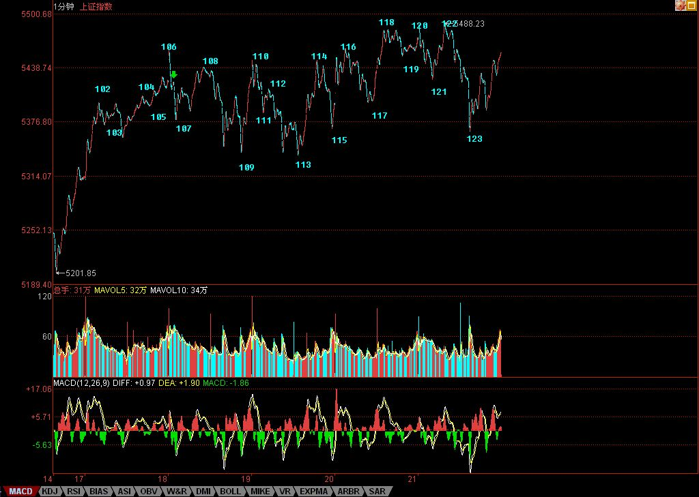{width="5.6299212598425195in"
height="4.0065048118985125in"}

**在一般人眼里，主力杀人，似乎就如同无聊股评所说的所谓多空之争。但可以明确告诉各位，真正牛的主力，是多空齐杀，让所有人左右挨巴掌。不明白这个道理，股票是白干了。**

**别人的迷踪步正好成就本ID理论的凌波微步，今天的图形，如教科书般经典，看不明白，真要补课了。**

**但是，必须明确，目前的形势十分严峻，对于技术不好又迷恋短线的，现在的走势就是典型的绞肉行情。**

**请记住本ID一句话：在中国，最后的胜利者一定是政策。因为有技术，所以我们可以在刀锋上凌波微步，但是刀锋依然是刀锋。现在的政策信号已经足够频繁，如果如此大力的密集新股发行都不能平息资金的冲动，那么，更严厉的政策一定会出来。**

**现在，有人说，公募基金牛，有最大的做多冲动，没人管得了。真是典型的幼稚想法，一个基金黑幕就可以打跨他们，难道他们的头不受党纪国法管吗？难道不可以派调查组下去调查调查吗？现在为业绩以及自己的老鼠仓疯狂的所谓公募们，你们连孙悟空都不是，还想逃出掌心？可笑！**

**所以，刀锋就是刀锋，虽然这个游戏，我们无所畏惧，但一定要有一根弦紧绷着，对政策的动向，1000%地密切关注。而对于一般的投资者，必须要适当控制好仓位，没那技术的，就把均线看好。**

**下周，关键是能否破本周的顶，如果不行，大盘就会走出小的头肩顶，后面的震荡就会很大。而且，中秋前后，人心浮动，震荡少不了，现在的问题，不是多空的问题，而是不要左右挨巴掌的问题。记住：不多空通杀的，没资格当主力。**

**对于个股，本ID说的那10几只股票，对于散户来说，如果你作为股票池进行不断的换股操作，你想想你的收益有多少？难道不记得本ID说过在里面资金不断流动的概念？你看看那十几只股票，此起彼伏，有哪天闲着的，用本ID的理论，难道在10几只里找卖点买点都很难？不要这几天000099涨了，才问能不能介入，这是节奏吗？**

**还有，对股票不要有感情，本ID反复说，散户最大效率的就是不断换股，卖点卖了，一定要等买点，等的时候就去找别的有买点的，如果有时间，你把本ID那10几股票比较一下，感受一下那此起彼伏的节奏，大概你的操作水平就会有更大的提高。**

**这里的公众场所，本ID的言论必须符合法律的要求。但本ID已经尽量告诉各位节奏了，请问，前几天，本ID在最高位时，不是告诉你小安子的剧本如何如何了吗？其他股票，有了顶分型，而且还跌破5日线，那么不等到底分型出现，你管他干什么？还有人不断问，636怎么样？一个连半年线都没站住的股票，是散户买的吗？大资金可以在里面打架，散户有必要陪着浪费时间吗？等打完了，图形走好了，自然就动了，这样，关注着，但先去操作别的股票，不更节约时间、提高效率吗？**

**有时候，本ID都为各位着急，为什么这个节奏这么难把握呢？应该很简单的啊。**

**算了，周末说股票，没劲。**

**先下，再见。**

## 捍卫马克思7：那被淫乱的女佣

(2007-09-23 11:25:48)

前面，对马克思的捍卫都是从纯理论的角度，现在，作为一个歇息、调节点，就说说马克思的私生活。对于那些无耻之徒，要诋毁、攻击一个理论，无非几种把戏，一种就是曲解、一种制造李鬼、一种就攻击理论创立者的私生活。

关于马克思的私生活，被编造得最多的，无非就是马克思和某女佣的淫乱史。且不说这历史的真实性，就说是真实的，这又有什么？至少，对于现代的人来说，他们的淫乱度已经不会对此有任何反应。最大的反应应该是，真是圣人呀，才和一个女佣有一个或然性淫乱，不就搞了个私生子，现在试管里每秒就可以搞N个了。

当然，站在女权的角度，对马克思这种不轻易被面首的行为一定要表示愤慨，一生才被一个女佣面首一次，而且还不一定是真的，太过分了！一个不被面首的男人，怎么可能是好男人？！

好，现在，就让我们看看那被反对马克思的人视为最终击败马克思又挽救了西方的经济学泰斗凯恩斯的百分百准确的性光荣革命：

在伊顿，中学程度的凯恩斯的性经验已经是博士级别了，同性恋，被称为英国病，自然有其从小培养的历史传统。在伊顿，同性恋大行其道，排除N的N次方的短期关系后，凯恩斯的N段长期关系中，最著名的是和主教之子的一段，后者，在成年后，成为凯恩斯学术荣誉上的主要竞争对手。

从伊顿到剑桥，凯恩斯性博士开始了博士后性实习。第一学期，他就被吸收进到剑桥历史悠久的秘密社团：信使会。这个是剑桥里最精英的学生才能参加的秘密社团，除了一些冠冕堂皇的理由，这社团最大的功能就是拉皮条，准确说，是拉同性恋的皮条。最精英的学生通过这个组织被介绍给剑桥最伟大的学者们，剑桥最精英的教育，最历史悠久地发生在同性淫乱的床榻间。

信使会的成员间的淫乱活动当然少不了，该组织成立于1820年，并不局限于剑桥，1904年，其伦敦分舵布鲁斯贝利俱乐部成立，这是信使会里的高端组织，准确说，凯恩斯参加的就是该俱乐部。该俱乐部最终发展成一种集体性淫乱组织，他们崇尚的是"性循环"，就是说"让朋友成为爱人，爱人再回归朋友"。每晚，永远不知道谁占用了谁，谁又被谁占用，NP还是N的立方P、人交还是兽交，一切的性把戏都在俱乐部里被实践着。

这个俱乐部之所以如此出名，是因为很多英国最出色的学者、艺术家等等都出没其中，当时，作为英国最前卫、最IN的场所而被熟知。凯恩斯博士后最著名的一段恋情，就是和艺术家邓肯.格兰。

好了，足够了，凯恩斯博士后最终成为凯恩斯教授、大师的性活动已经没必要叙述了，这些活动，比马克思那无聊的活动确实伟大太多了。就像所有反对马克思的人认为的，凯恩斯确实比马克思伟大。

为了让性侏儒马克思的故事更有刺激性点，请所有编造者多多参照凯恩斯的真实故事，好好发挥一下。例如：同性恋也被称为德国病，马克思，一个德国人，又在英国长期居住，怎么可能不同性恋一把。他和恩格斯怎么可能没路子？马克思和恩格斯肯定是淫乱的一对；还有，马克思生活拮据，肯定没钱找鸡找鸭，为了钱，这面首肯定去当鸭子当鹅去了，而且被无数男女一起践踏；马克思不相信上帝，他一定和猫呀狗呀老鼠大象猪驴马，一切动物都有一腿。马克思要发动群众，那他一定喜欢群交、野合。

好了，让一切反对马克思的人去编造去吧，本ID对你们原来编造的故事十分失望，上面，给你们起了一个头，请继续下去。否则，马克思连凯恩斯的万分之一的淫乱都赶不上，那也太令人失望了。

反马克思者，请吧！

## "港股直通车"难以背负的使命

(2007-09-24 08:52:17)

最近，"港股直通车"试点吸引广大投资者眼球。随着中国资本市场大发展，中国投资者参与世界上任何资本市场的途径都将越来越便利，个人直接参与港股投资只是一个小序曲。现实问题在于，这本来极为正常的"港股直通车"，却有意无意中背负了一个本不该背负的调控使命，通过"港股直通车"使A股软着路竟成了一剂调控妙药。据说，这剂妙药还能治好流动性过剩，是解决流动性过剩以及股市泡沫的一箭双雕之举。

所有把"港股直通车"炼成包治百病妙药的妙论，都离不开如下假设：在A股与港股同时上市的股票存在巨大价格落差是不合理的。而事实上，这只是一个并不高明的误读。该误读，不过建立在这样一个错误认识上，例如以中国人寿为例，无论在A股还是港股交易，都是同一公司，因此，其每股价格应该一致。但南橘北枳，在市场中能评估的，只能是交易的价值，这是由市场中的众多因素合力而成。A股的中国人寿到了港股，就有不同的价格，这反而是最正常不过的事情。

不妨用一个最简单的模型来评估不同市场中同一品种的交易价值：用在市场中交易的流通总市值代表同一公司，相应地，可以以不同市场中同一品种的总流通市值必须相等来建立相应的价值分析模型。

例如，对于同在A股与港股中交易的中国人寿，就有A股价格XA股流通量=港股价格X港股流通量。目前，中国人寿的A股流通量只有港股流通量的五分之一，因此，即使A股价格是港股价格的5倍，也并没有任何不合理的地方。而事实上，两者之间的差价连1倍都不到。

从另一个方面看，港币的币值由于和美圆挂钩，在人民币升值的大背景下，港币资产自然没有人民币资产保值，而港币的利率比人民币高多了，其能接受的合理市盈率自然要比A股低得多，因此同一品种在A股比在港股里得到高得多的交易价值是极端合理的。

由此可见，那种认为同一股票就该在全世界的任何地方都以同一价格买卖的想法无比幼稚可笑。可以断言，即使是同一群交易者，在不同的市场中交易同一品种，其交易价格也不可能相同。例如，面对流通量大五倍以上的港股中的中国人寿，其价格，即使是同一群人在交易，显然要远低于在A股中的价格。因此，那种以为有了"港股直通车"就可以拉平两地股票价格的幼稚想法极端可笑。除非把A股和港股间的所有基础市场变量都完全调节成基本相同，否则，这背负调控使命的"港股直通车"注定不能直通向其使命所指定的方向。

其实，A股的结症异常明显，根本无须任何形式的直通车就能解决。在上面的模型分析里，只要把港股变成调控达标的A股，那么在这调控达标的A股中，希望其股票价格在一个更合理、更低市盈率的环境下交易，最简单的方法就是把流通量加大。例如，现在只有15亿A股流通量的中国人寿，如果变成75亿，其交易价格显然就不可能如现在一样。

问题的关键还在于，目前被大规模拉抬的所谓漂亮50或大盘蓝筹，站在证券法的角度，都有违法的嫌疑。证券法规定"公司股本总额超过人民币四亿元的，公开发行股份的比例为百分之十以上"，这样，中国人寿的A股流通量应该在28亿以上，而不是目前包括还未上市战略配售在内的15亿。这在所有大盘蓝筹中，都是一个普遍的现象，这恰好是目前一线蓝筹能被轻易泡沫化的一个不可忽视的因素。

没有合理的流通量，就没有合理的价格。目前，蓝筹供应不足问题的解决就应先从严格执行证券法开始，让公开发行股份比例达到百分之十以上标准。有人可能要说，公开发行股份还包括H股。如果是这样，那么该条款就有修正的必要，应明确修正为在A股的公开发行股份比例都必须在百分之十以上。否则，新的超低流通量蓝筹的上市只会让市场又多了能提供杠杆投机的品种，在股指期货迫在眉睫的今天，这点犹为重要。

站在资本市场历史发展的角度，目前国内的资金不是太多，而是太少了。这些宝贵的资金，更应该留在A股中，不能雨季怨水多、旱季怨水小，那么还要水库干什么？中国的资本市场如果蓄水功能不强，不能怪水，而是要怪水库修得还不够合格，因此就应该想方设法尽快把水库修得能够满足经济发展的需要，这才是实事和正事。否则，一味把水引到外面去解一时之急，这种病急乱投医所求回来的药，能成妙药的可能确实太渺茫了。

## 震荡前行、多空齐杀

(2007-09-24 15:26:30)

**最近的行情，估计对绝大多数的人都极为困难，不过，不难发现，本ID那些股票已经越来越像喝了水井坊一样。中字头、题材股，两个翅膀，所以能翱翔到现在。在目前这样一个震荡前行、多空齐杀的行情中，有这样的节奏，就是刀锋上的凌波微步了。**

**那些大海龟，从明天开始，陆续回来了，当然，承销的、摇旗的，都要护着点。以前看不出本ID3600点接石头的妙用，现在也应该明白了。至于联通之类的，等于一个抢劫，你承销中移动的，有本事就别抬联通，有本事就别送钱给本ID，本ID就是收路费的。**

**当然，这些都是对大资金说的，小资金，一般都可以不管这些大家伙，在题材股上折腾，不是更好玩？600078，请好好研究15、5、1之类的图，看看那区间套是多么教科书。还是那句话，跌的时候，要想买点，涨的时候，要想卖点，这才是搞股票的，否则是被股票搞的。**

**大盘现在，没什么可说的，106开始的5分钟中枢的1分钟离开已经出现，如果能回抽形成第三类买点，那就继续折腾下去，大不了，就搞出一个30分钟中枢，那就更好玩了。**

**今天有点事，不能多说了。月亮圆了，注意短线震荡的加大。**

**先下，再见。**

**请注意，下面第一个绿箭头处不是笔，为什么？因为顶分型都在底分型下面了，怎么可能？而第二箭头处就是标准是按最新标准的笔了。**

## 教你炒股票82：分型结构的心理因素

(2007-09-24 21:31:06)

走势反映的是人的贪嗔痴疑慢，如果你能通过走势当下的呈现，而观照其中参与的心理呈现，就等于看穿了市场参与者的内心。心理，不是虚无飘渺的，最终必然要留下痕迹，也就是市场走势本身。而一些具有自相似性的结构，就正好是窥测市场心理的科学仪器。

注意，分型不是分形，分形理论，是数学的一个分支，有人用这分支的一些研究成果硬套到市场走势上，得出来的结论，没有太大意义。本ID理论的逻辑，是直接来源于市场走势本身，而不是一个先验的，市场之外的数学理论。至于这现实的市场逻辑显现出数学理论的结构，那是另一回事情。

世界，本来就是数学的。但本ID的理论，不是任何原有数学理论的应用，而是市场本身现实逻辑的直接显现，这是一个极为关键的区别。

显然，一个顶分型之所以成立，是卖的分力最终战胜了买的分力，而其中，买的分力有三次的努力，而卖的分力，有三次的阻击。用最标准的已经过包含处理的三K线模型：第一根K线的高点，被卖分力阻击后，出现回落，这个回落，出现在第一根K线的上影部分或者第二根K线的下影部分，而在第二根K线，出现一个更高的高点，但这个高点，显然与第一根K线的高点中出现的买的分力，一定在小级别上出现力度背驰，从而至少制造了第二根K线的上影部分。最后，第三根K线，会再次继续一次买的分力的攻击，但这个攻击，完全被卖的分力击败，从而不能成为一个新高点，在小级别上，大致出现一种第二类卖点的走势。

由上可见，一个分型结构的出现，如同中枢，都是经过一个三次的反复心理较量过程，只是中枢用的是三个次级别。所谓一而再、再而三，三而竭，所以一个顶分型就这样出现了，而底分型的情况，反过来就是。

现在，我们可以深入分析这三根K线的不同情况。首先，一个完全没有包含关系的分型结构，意味着市场双方都是直截了当，没有太多犹豫。包含关系（只要不是直接把阳线以长阴线吃掉）意味着一种犹豫，一种不确定的观望等，一般在小级别上，都会有中枢延伸、扩展之类的东西。

其次，还是用没有包含关系的顶分型为例子。如果第一K线是一长阳线，而第二、三都是小阴、小阳，那么这个分型结构的意义就不大了，在小级别上，一定显现出小级别中枢上移后小级别新中枢的形成，一般来说，这种顶分型，成为真正顶的可能性很小，绝大多数都是中继的。例如，上海日线9月17、18、19这三根K线组成的顶分型结构。

但，如果第二根K线是长上影甚至就是直接的长阴，而第三根K线不能以阳线收在第二根K线区间的一半之上，那么该顶分型的力度就比较大，最终要延续成笔的可能性就极大了。例如上海日线6月18、19、20、21，里面有一个包含关系，但这包含关系是直接把阳线以长阴线吃掉，是最坏的一种包含关系。

一般来说，非包含关系处理后的顶分型中，第三根K线如果跌破第一根K线的底而且不能高收到第一根K线区间的一半之上，属于最弱的一种，也就是说这顶分型有着较强的杀伤力。例如上海日线5月28、29、30。

分型形成后，无非两种结构：一、成为中继型的，最终不延续成笔；二、延续成笔。对于后一种，那是最理想的，例如在日线上操作完，就等着相反的分型出来再操作了，中间可以去宠幸别的面首，这是效率最高的。而对于第一种情况，前面说过，可以看是否有效突破5周期的均线，例如对日线上的顶分型，是否有效跌破5日均线，就是一个判断顶分型类似走势很好的操作依据。

不过，还有更精确简单的，就是这分型所对应的小级别中枢里，是否出现第三类买卖点，而且其后是否出现中枢移动。例如，对于一个顶分型，该顶分型成立后，对于该分型区间在小级别里一定形成某级别的中枢，选择其中最大一个，例如日顶分型后，可以找到相应的5、1分钟中枢，一般最大的就是5分钟，30分钟没可能，因为时间不够。如果该5分钟中枢或1分钟中枢出现第三类卖点，并该卖点不形成中枢扩张的情形，那么几乎100%可以肯定，一定在日线上要出现笔了。

可以100%肯定的，要不出现笔并最终有效破坏该顶分型，那一定要出现某级别的第三类买点，否则就算有短时间的新高，也一定是假突破。所以结合小级别的中枢判断，顶分型是否延伸为笔，是可以当下一目了然的。

如果你能有效地分辨中继分型，那么你的操作就会有大的进步。

一般来说，可以把分型与小级别走势类型结合操作，例如日线与5分钟的。如果一个小级别的中枢震荡中连日K线都没出现顶分型结构，那么，这个中枢震荡就没必要走了，后者就算打短差也要控制好数量，因为，没有分型，就意味着走势没结束，随时新高，你急什么？而一旦顶分型成立，必然对应着小级别走势的第一、二类卖点，其后，关键看新形成中枢的第三类买卖点的问题：一般情况下，如果是中继的，都是第三类卖点后形成中枢扩展，也就是有一个绝妙的盘整底背驰让你重新介入。这样，利用分型搞了一个美妙的短差，又不浪费其后的走势，这就是一个比较及格的操作了。这操作，其实我们都经历过，就是上海周线9月7日前后那个顶分型的操作，一个完美的中继顶分型，在假跌破5周均线以及相应小级别的背驰的共同作用下完成。

注意，利用分型，例如顶分型，卖了以后一定要注意是否要回补，如果一旦确认是中继的，应该回补，否则就等着笔完成再说。

但一定要注意，中继顶分型后，如果其后的走势在相应小级别出现背驰或盘整背驰，那么下一顶分型，是中继的可能性将大幅度减少。中继分型，有点类似刹车，一次不一定完全刹住，但第一刹车后如果车速已明显减慢，证明刹车系统是有效的，那么第二次刹住的机会就极大了，除非你踩错，一脚到油门上去了。

## 可以不相信月饼，但一定要相信月亮

(2007-09-26 15:56:37)

**月亮的力量有多大，各位这两天也见识了。可以不相信月饼，但一定要相信月亮。为什么？连地球上的潮汐都要抄袭月亮，那破股票难道比潮汐还要潮汐？昨天已经明确告诉"如果不是有人为了新股护盘，今天可不止跌这么点"，昨天没跌够，今天继续，就这么简单。**

**今天早上的上攻，一没有突破昨天的第三类卖点，二反而是形成标准的顶分型第三根K线的上冲，不管你相信不相信本ID的理论，反正后面的走势，如教科书般。现在的走势十分简单，一个1分钟的走势正离开前面那5分钟中枢，这1分钟走势什么时候能完成，就看后面的走势了，而完成以后的回拉才是最重要的，是否能形成第三类卖点，这才是最近走势的关键，如果形成，那这两天，最多只能算田亮的1米板，后面是表演3米还是10米的，这对于观众，其实反而已经不重要了。**

**个股方面，今天水井坊终于像水井坊应该那样水井坊了一把，看看这股票，就知道什么叫折腾。几乎一年，就在这里搞，为什么？就是因为里面有着N伙人，还都看好，所以就互相折腾，这次是真是假？天知道。为什么？因为后面谁只要一先动手，N方又一起开始折腾。其实，这个游戏很好玩，只是浪费了一只质地如此好的股票。**

**不过，好股票最终都要发光的。就像000999，从本ID在这里开始讲到现在，快10个月了，开始6元抢东西，然后在12元上下和汉奸基金的斗法，后来又涌入一群无聊人在15元上，东搞西搞，中间传闻漫天飞，结果怎么样？请看看新进来的大股东掏了多少钱，一个掏了这么多钱的人，要干什么大事，难道还有什么疑问？本ID反复说要海枯石烂，但真正干起来，估计很多人就会被市场的波动所迷惑了。**

**每一只股票，都是一个故事，说不完。做完一只股票，你就成了有故事的人了。**

**再次提醒，昨天说那两只股票，如果大盘有大问题，也会跟着调整的，但由于基本面上潜在大变化，所以市场如果大波动，将提供一个好的介入时机。本ID说的股票，从来都是中长线角度的，有足够的时间让你介入，关键是看好买卖点。**

**今天可以回答问题到4点半。**

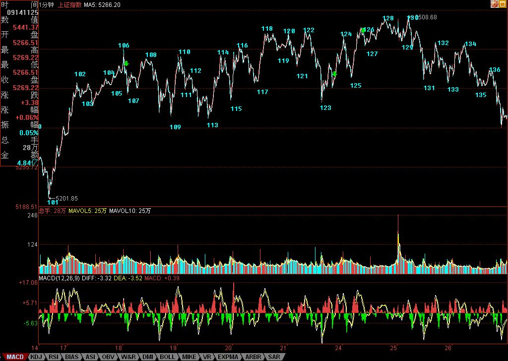{width="5.629861111111111in"
height="4.00625in"}

缠中说禅2007-09-26 16:02:33

\[匿名\] 月儿 删除此人所有评论

2007-09-26 15:59:37

\*月儿(199306010) 15:11:31

缠泽天下！我今天买了600319！听缠姑娘的话！

===

不是听本ID的话，而是要看图，有卖点先卖，有买点再回补，这样才能把成本降下来。

注意，现在介入股票，和1000点时候不同，如果能动态就要动态，否则大盘一旦有大波动，谁都不能保证，一定有人给你举杠铃。

缠中说禅2007-09-26 16:04:35

\[匿名\] 小小 删除此人所有评论

2007-09-26 16:01:36

妹妹的432过百啦.

妹妹踹轿子的时候一定不能过猛啊.

===

很好，现在还能拿着。从20元能拿到现在的，估计也凤毛麟角了。

这股票，中长线潜力还在，当然，短线如果大盘特别恶劣，会有影响。

缠中说禅2007-09-26 16:07:35

绿幽灵 删除此人所有评论

2007-09-26 16:04:22

缠好～

中枢虽然看得懂了,但是运用起来一点也不着边际,唉!!

还有一个,明明看起来是背驰了,买进却又再跌,为啥呢?

===

请首先要确定你的明明是正确的，事实上，很多所谓明明的背驰，根本就不是。很多人，连中枢、走势类型、级别都没搞清楚，就分析背驰，这有可能准确吗？

缠中说禅2007-09-26 16:10:39

\[匿名\] 新浪网友 删除此人所有评论

2007-09-26 16:07:25

缠子：在看高级别K线图时，是应该把低级别图上的分段转过去还是重新分笔找线段？有时候这两种做法的分段是不一致的

===

为什么要一致？低级图上用中枢、走势类型。高级图上用分型，线段，等于有两套有用的工具去分析同一走势，这是天大的好事。

缠中说禅2007-09-26 16:12:09

\[匿名\] 新浪网友 删除此人所有评论

2007-09-26 16:08:04

LZ老师,000822是不是有外资注入?

===

本ID不是上市公司，不能发布任何消息，请原谅。

缠中说禅2007-09-26 16:14:21

\[匿名\] 空言 删除此人所有评论

2007-09-26 16:10:47

相信月亮,是不是每到农历十五前就清仓啊

===

哪里有这么机械的，但如果月亮还带上一个背驰、分型之类的东西，那当然就有效了。

月亮只是借了太阳的光辉，本ID理论所框架的东西，才是太阳。

缠中说禅2007-09-26 16:17:07

\[匿名\] 新浪网友 删除此人所有评论

2007-09-26 16:14:11

是不是买高价股更安全，尤其是上百元的？

===

只能说，高价的，散户都走了，杠铃举起来轻松点。但如果特别大的调整，谁都不会硬抗，除非脑子有水。

缠中说禅2007-09-26 16:18:17

\[匿名\] 50年以前 删除此人所有评论

2007-09-26 16:15:47

老师好，对今天线段划分有疑问，1346上去那一段并没有破坏130向下段的最后一笔，所以我觉得不应该单独画成一段，也就是131段应该是图上的133的位置，请老师明示

===

这是第二种类型。

缠中说禅2007-09-26 16:20:07

\[匿名\] 新浪网友 删除此人所有评论

2007-09-26 16:16:14

不知636年线会否有支撑。持有三个月了。

===

这种思维要不得，不要考虑什么支撑位置。看图形本身。而且，本ID不是一早说过，连半年线都没上，散户没必要参与。但这股票，中长线肯定是好股票，不过，最近和水井坊前期一样，进入一个怪圈。

缠中说禅2007-09-26 16:22:40

\[匿名\] 新浪网友 删除此人所有评论

2007-09-26 16:19:31

请问缠主,对建行的定价怎么看?谢谢

===

本ID只看走势，不看定价。

缠中说禅2007-09-26 16:25:55

\[匿名\] 夜雨 删除此人所有评论

2007-09-26 16:07:59

三九的走势就是教科书现场版，从去年到今年的走势是一部还未完成的作品，跟000858从20006年初到现在的走势都是主流资金的作品，他们有参照作用。

这样的公告，早在主力的意料之中，昨天有几人会在前几天卖了之后买回来呢？一般人，都会想今天确认了再买的，可再也不给机会了。所以我们能做的就是持有，逢低加仓。

说实话，三九我是从年前10元买入的，但仓位很少。到530低点加仓，四个月盘整中，有钱赚了，我就加一些，这一次18元加仓，21.5元再加仓。现在已经是最初投入的10倍了。自己认为，陪同他一路走来。是一次成功的操作了，对意志，对持股，对技术，都得到很大的提高。

谢谢姐姐，送给我最好的中秋节礼物，能对我在999的操作，发一朵大红花吗？

===

当然可以，大红花。成功操作一只股票，就是对自己心态最好的锻炼。

其实，每一只股票的故事都大同小异，就如同每一个故事，归根结底，都只是故事般平常。

缠中说禅2007-09-26 16:29:45

年年一变三 删除此人所有评论

2007-09-26 16:25:28

请问缠主，这几天钢铁板块已经调整得比较厉害了，若再碰到大盘跳水，它能独善其身吗？

盼复！谢谢！！

===

涉及预测的问题，本ID都没兴趣。应该培养这样的习惯，就是你的眼光，只投向有买点的股票。

股票这面首想被宠幸，这很简单，用买点来搔首弄姿就可以。

缠中说禅2007-09-26 16:31:30

对不起，马上有一个关于PE的会，必须下了。

再见。

## 教你炒股票83：笔-线段与线段-最小中枢结构的不同心理意义1

(2007-09-26 21:28:05)

一个最简单的问题，为什么不能由笔构成最小中枢？其实，这不是一个问题。为什么？因为实质上，我们是可以设计这样的程序，也就是用笔当成构成最小中枢的零件，但这样构造出来的系统，其稳定性极差。

众所周知，一笔的基础是顶和底分型，而一些瞬间的交易，就足以影响其结构。例如，突然有人打错单，或者有人给老鼠仓送货，那么全天走势的分析就大变样了。而由线段构成最小中枢，则不存在这个问题。为什么？一个线段的改变，不会因为一个偶尔一笔的错误而改变，也就是说，线段受偶尔性的影响比较少，想想要破坏一个线段的麻烦程度，就知道这一点。

从心理上看，偶尔因素是允许发生的，只要不被再次确认，就证明偶尔因素对原来的心理合力没有大影响，反过来确认了该合力的有效性。所以，线段破坏本身，其实就反应着一种微妙的心理结构的变化。特征序列分型的引入，本质上就是去勾勒这种心理结构的变化的。就像一般的分型，三次的确认才能构成，特征序列的分型，本质上也是一样的，这样的确认，其有效性就极大增加了。由此构成最小中枢的零件，才是合适的。

如果说三个K线的折腾就可以决定一笔的转折，那么一个线段的破坏转折，就需要三个特征序列分型的折腾，这样，市场买卖双方都有足够的时间去反应，从而使得体现出的合力痕迹，当然具有了一定的延续性。而一个线段，至少由三笔组成，这也使得转折后的新线段，同样可以让合力得到充分体现，而对比这两个不同方向的线段，买卖双方在相应时间内的心理、实力对比，就一目了然了。

更重要的是，线段破坏的两种方式，是有着很大的心理面不同的。第一种方式，第一笔攻击就直接攻破上一段的最后一次打击，证明这反攻的力量是有力的，再回来一笔，代表着原方向力量的再次打击，但反攻力量抗住并再次反攻形成特征序列的分型，这证明，这反攻至少构造了一个停歇的机会。最坏的情况，就是双方都稍微冷静一下，去选择再次的方向。而这，就恰好构成了最小中枢形成的心理基础。

中枢，其实就是买卖双方反复较量的过程，中枢越简单，证明其中一方的力量越强大。中枢的复杂程度，是考察市场最终动向的一个很重要的依据。一个超复杂的中枢过后，就算一方赢了，其后的走势也是经常反复不断的。

而且，在同一趋势中，相邻两中枢的复杂程度、形态，经常有所区别。为什么？人都有提前量，而提前量，经常就是找最近的模本去抄袭，这样，等于在买卖的合力中，都加了一个提前的变量，从而造成整个结构的变化。这是一个很重要的原理，所谓不会二次跨进同一条河流，这本质上由人的贪嗔痴疑慢造成的。

至于线段的第二种破坏方式，本质上是以时间换空间，反攻开始的力量很弱，需要慢慢积累，这一方面代表原方向的力量很强，另一方面，又要密切关注是否会形成骨牌效应，也就是开始的反攻力量很小，却能迅速蔓延开，这往往证明，市场原方向的分力，其结构具有趋同性，一旦有点风吹草动，就集体转向。这在投机性品种经常能看到，经常是一个小M头就引发大跳水。趋同性，如果对于一般性品种来说，往往意味着庄家控盘程度高。

一些猛烈上涨或下跌的股票，往往甚至由于一个1分钟的小顶分型就引发大跳水或大反弹，其原因，就是这种分力的趋同性所引发的骨牌效应。一般来说，这种第二类的线段破坏，一旦出现骨牌效应，至少要回到前一高、低点范围内，这就是市场上冲顶和赶底时发生的V字型走势。

分力的趋同性所引发的骨牌效应，基本上就是表现为所谓的多杀多、空杀空。特别在一些大的趋势之后，市场的力量一边倒，如果这时候突然来一个加速，一旦逆转，就会发生典型的多杀多、空杀空现象。

叛徒成为叛徒之前，必然是同志，甚至就是同志中的牛人。而最危险的敌人，总是志同道合的所谓同志的背叛，同一阵营内部的塌陷才是最有杀伤力的。无论多头空头，死的时候，沿着那滴血的刀看上去，那双眼睛，一定是你最熟悉的。

## 新蓝筹成多方利器，市场调控彻底失败。

(2007-09-27 15:31:37)

今天的走势，出于对明天大量放出资金的憧憬，走出了应有的回升行情。技术上，昨天特别强调的1分钟结束后的回拉，并没有出现第三类卖点，短线依然继续保持中枢震荡。从中线图上看，大盘目前对于多方最大的危险，就是圆顶，因此，多方如果不希望进入温水煮青蛙的境地，就必须至少在节后迅速突破站稳5500点，否则，这圆顶成立的可能性将极大增加。

从资金与政策的对赌看，资金面取得了决定性的胜利，今天，建行成为多头利器，宣布，以增加所谓蓝筹进行调控的思路彻底失败。目前资金的宣言就是：你来多少，就提供多少拉抬的武器，只要你还是市场调控，有钱就敢顶风搞。

本ID在前面已经明确说过，这资金和政策的对赌，最终的结局，一定是政策举起大棒，而资金这种行为，也无可厚非，资金就是这样的，连权证的末日轮都可以搞得热火朝天，这样的形势下，资金又有什么不可赌的？

中字头、题材股，两只蝴蝶忽悠着飞，能飞多远是多远，管他明天是仙还是灰。

明天最后一天，就看解冻的资金能忽悠进来多少了，这个越来越向30分钟靠的震荡什么时候结束，看图就知道，第三买卖点。

希望这个游戏能延长的时间越长越好，钱是靠折腾出来的，要折腾，哪会没风险？只要看好你附近的刀和那一直在头上的大棒。

今天很忙，下午去看一公司，晚上还有一个会，晚上的帖子可能很晚，明天早上看也一样的，别影响休息。

先下，再见。

## 资金乘胜追击，破圆顶兵临3/4线

(2007-09-28 15:51:59)

**昨天已经明确说了，资金取得决定性胜利，而资金最大的技术危险是圆顶，最迟在节后必须破掉。而今天关于房地产的利空，反而成了股市资金面的大利好，资金这时不发力，那是脑子有水了。因此就上演了一场乘胜追击，破圆顶兵临3/4线的好戏。**

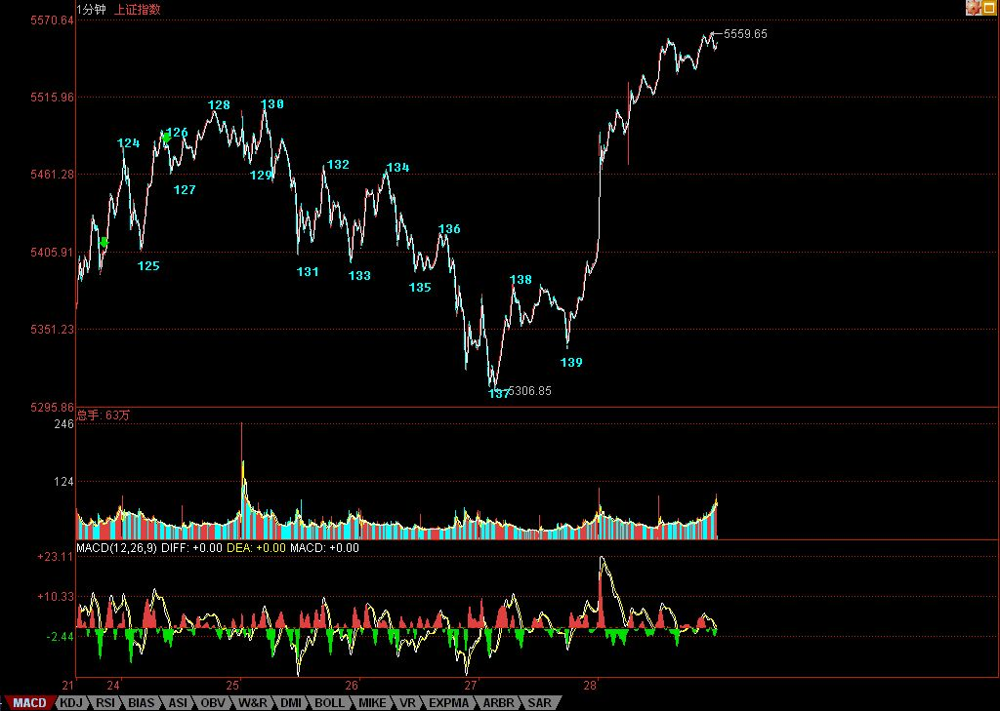{width="5.6299212598425195in"
height="4.0065048118985125in"}

**注意，本ID已经说过了，在刀锋上舞蹈阶段，是多空皆杀，那些一根筋思维的人，注定要被杀，目前不被杀只是迟早的问题，某种模式反复后，就是相信这种模式的人的死期。**

**本ID什么都不相信，市场让本ID看到什么就干什么，这就是本ID理论的唯一中心与基本点。例如下图中，132的第三类卖点后，到137的1分钟完成，走势极端标准完美。有兴趣的可以量一下130-131，与136-137，长度基本相等，而力度上，加一下下面对应的柱子面积就知道该干什么。而到了138，就知道这5分钟的第三类卖点肯定没戏了，就算137没反应，139就提供了一个反应的机会。**

**当然，站在中枢震荡的角度，并不需要预测后面能走多高，让市场告诉你。而今天的走势，强悍到连一个线段都没破坏过，那该干什么还不是很清楚的事情？**

**节后的走势，十分清楚，就是首先要完成这个1分钟的离开，从目前的情况看，这1分钟的离开走势是首先是线段的类上涨的可能性太大了，除非有特别的大消息，当线段类上涨结束后，必然形成1分钟中枢，该中枢后，1分钟的走势无论是盘整还是上涨，等1分钟走势完成后，关键是看反抽能否形成前面5分钟中枢的第三类买点了，如果形成，大盘将继续攻击上行，否则就继续向30分钟中枢的震荡陷进去。**

**好了，上面的分析已经十分明确，对本ID理论有点了解的，都应该明白了。至于不了解的，本ID已经反复说过，中线点的就看5周线，你看，昨天的低点，就刚好在上面，和上次5000点那次一样。**

**基本面上，很明确地告诉各位，节后最可能出来的消息，就是关于国有股部分划转社保的问题。关于这个消息，本ID和周围的人都有点分歧，这消息意味着，以后卖国有股，就不需要什么通知了，想什么时候卖都可以。但，目前资金充沛，完全有可能出现如此尴尬的事情，就是见一只买一只，全给买光了。毕竟那些国有股都是中字头的，都是中国最好的企业。所以，对这政策的杀伤力，本ID依然表示怀疑。不过，最终要看市场的反应，本ID自己不会有什么太多想法，只关心市场合力本身。**

**要打跨资金，政策上可能有效的招数有：一、查基金黑幕；二、规定A股流通量不到10%的必须到10%。三、XXXX。**

**政策必胜，这是无疑的。但本ID对资金与政策都没兴趣，本ID唯一感兴趣的，就是利用他们两者斗法所制造的市场机会去多空皆杀。**

**个股方面，没什么可说的，中字头、题材股，两只蝴蝶继续忽悠着飞。只要掌握好节奏，就是操作的天堂。如果不明白什么叫节奏，请各位做一作业：从日分型到小的级别走势，好好分析一下000938，里面全部都是教科书。**

**放假了，让股票豆腐去吧。**

**本ID今晚再写一帖子，明天就要外出腐败腐败了，博客关闭到10月7日。10月8日重新开张。**

**祝各位过节好。**

**先下，再见。**

## 教你炒股票84：本ID理论一些必须注意的问题

(2007-10-07 16:09:06)

重新开张，看来停业欠各位课程不少，今天抓紧补充。上午把国庆前就写好的打坐11发出来，这里再把国庆前就写了部分的股票84写完贴出来。

股票走势，归根结底是不可复制的，但股票走势的绝妙之处就在于，不可复制的走势，却毫无例外地复制着自同构性结构，而这自同构性结构的复制性是绝对的，是可以用本ID的理论绝对地证明而不需要套用任何诸如分形之类的先验数学理论。这种同构性结构的绝对复制性的可绝对推导性，就是本ID理论的关键之处，也是本ID理论对繁复、不可捉摸的股票走势的绝妙洞察之一。注意，自同构性结构，在前面不太精确地用了自相似性结构之类的词语，这很容易和数学里的分形以及利用这种先验性理论构造的理论中的一些术语相混淆，所以以后都统一为自同构性结构。

而正因为有了自同构性结构，所以股票走势才可以被技术所绝对分析。而任何有效的技术分析，本质上都是本ID理论的分支，本ID还没看过任何有效的股票操作程序，是外于本ID理论的。

最近似乎很多人举出很多书，说这也和本ID的相通、那也和本ID的相通。其实，这就如同说欧几里德之前或与之独立的，就有很多人知道勾股定理，但那是欧几里德的几何吗？而且，更重要的是，本ID依然没看过任何一本书，达到勾股定理的那种程度，就更不用说欧几里德几何的本ID理论。本ID建议，除了了看本ID的理论，一定要多看别人的，这样才会有比较，本ID的理论不仅集所有技术分析理论的大成，更重要的是，本ID理论完全构建在不同的思维框架下。这就如同中印的古代几何都很牛，但真正逻辑化、推理化、系统化、理论化的是欧几里德的，这是一种完全不同的数学路线，不明白这个，那肯定白学了。

所以，学本ID的理论，一个很关键的一点，就是要找出所有技术分析以及操作程序在本ID理论领域中的具体位置，由于本ID的理论对于任何技术分析以及操作程序具有一个绝对的视角，由此，可以绝对性发现所有分析与程序的优劣与缺陷。

注意，可能会发现，本ID理论中的有些结论，似乎和别的一些理论有类似的地方，这恰好证明了本ID理论的涵盖面。例如，本ID的理论，可以解释波浪理论里一切的细节以及不足之处，但反过来不可能，因为本ID理论是一个更广阔的理论，波浪理论不过是一个有着巨大缺陷的不成熟理论。

同样，可能在其他人的理论中，也有对K线组合定义类似分型的概念，但那些定义，都不过和一般的K线分析一样，是通过某种经验性的归纳而来，而本ID的分型定义，源自K线组合的一个完全分类，是一个纯理论的推导。正因为如此，本ID理论与其他任何理论相比，都有着绝对性与涵盖性，这一点，在以后的课程中会逐步揭示的。

走势的不可重复性和自同构性结构的绝对复制性以及理论的纯逻辑推导，这就构成了本ID理论视角的三个基本的客观支点，不深刻地明白这一点，是很难有真正的理解的。

走势的不可重复性，决定了一切的判断必须也必然是不可绝对预测的；自同构性结构的绝对复制性，决定了一切的判断都是可判断的，有着绝对的可操作性；理论的纯逻辑推导，就证明其结论的绝对有效性。

本ID的理论，是人类历史上第一次用100%理论推导的方式绝对地证明了走势分解的唯一性，这从上面关于笔、线段等分解的唯一性证明就明白，世界有哪种交易理论，是按这种绝对推理的方式构成的？显然没有，这才是本ID理论的最强大力量所在，前两个客观点如果没有最后这第三点，都是瞎掰。

其实，这三点，又何止是与股票走势相关，真明白了，对你的人生与社会操作，有着同样的意义。每个人的生活，世界的变化，诸如此类，本质上，离不开这走势的绝对不可重复性和自同构性结构的绝对复制性以及相应不患的共业的绝对推理性。

什么叫革命？就是打破某种自同构性结构的绝对复制性以及相应不患的共业的绝对推理性。知道为什么本ID说"列宁式社会主义是一个基于民族主义的策略性误读，是一个反资本主义的资本主义过程"吗？就是本质上，资本主义所具有的绝对复制性的自同构性结构从来没被打破过，这种自同构性结构就如同瘟疫，必然全球化，必然一统江湖地忽悠化，这是其不患的共业。由此，就不难理解马克思关于社会主义必然是一个全球事件的意义所在，在资本主义都没全球化之前谈论社会主义，那社会主义，一定不是马克思意义上的。

看资本主义的必须崩溃，就如同看一个日线上涨走势的必然完结一样，本质上没有任何区别。马克思，如同本ID一样，多空通杀。反马克思者如同那些疯狂做多的多头，反资本主义者，如果那些疯狂做空的空头，他们之间的合力，就构成了资本主义的走势本身。这走势，可能不断地中枢上移，但这走势的结束，是可以精确地判断的，其判断的标准，就是背弛，整个社会大结构的背弛。现在，资本主义还在全球化中大发展，哪里有什么背弛的迹象？

但是，正如本ID所说的，多空通杀地去阻击任何的走势，资本主义的上涨，同样是可以阻击的，这方面的内容，以后在捍卫马克思系列里慢慢说。

任何阻击的关键，就是多空通杀地去壮大自己。任何一根筋思维的人，是永远不会明白这个道理的。当然，也没必要让他们明白，否则，没有一根筋思维的人，哪里去找通杀的对象？多头、空头，最终都不过是被杀的猪头。

多空通杀，不是根据自己的喜好，而是如一个零向量那样当下于走势的合力之中。零向量，加多少，都不会改变走势合力丝毫，这样，才能真正去感应市场合力本身，感应其转折，感应其破裂，在电光火石的一下中出手，如风行水，如电横空。不思多、不思空，如零向量般与合力随波逐浪，才可能最终盖天盖地，多空通杀。

所以，最终，比的是人本身。就如都是玩独孤九剑的，和那些所谓五岳剑派的玩，当然见一个搞废一个。但如果最终同玩独孤九剑了，那就要比人本身了。本ID的理论的一章，就是不断的修炼，最终能到什么层次，最终是玩小资金还是大战役，都只能与此相关。但这还不够，光是所谓身心的修炼，只不过是鬼窟里活计，你的身心，非你的身心，所以为你的身心，从此开始，才可以百尺竿头更进一步。

看走势的背驰、转折，不过是第一层次的东西，哪天，能看明白社会经济、政治等等结构的背驰、转折，那才是更高层次的东西。

自从结构与解构哲学的流行，用结构的观点观察，就是一个最基本的思维方式，但问题的关键，很多所谓结构性的思维，不过是一种归纳性的结果，不具有任何的理论系统性与有效性。

这里，本ID必须强调一次，分型与分形有着本质的不同，本ID所说的分型，是建立在一个K线组合的纯粹分类的基础上，任何与这个纯粹分类不同的，都必然是错误的，这一点必须明白。至于所谓的分形，当然也可能是一种结构，但这种结构，本质上都是归纳性的、因此都必然是有缺陷、划分不唯一的，和在一种完全分类基础上给出的绝对结论，有着本质的区别。

其次，分型只是中枢与走势级别递归定义的一个启始程序，甚至可以说，并不是本ID理论中必然需要的东西，其目的，不过是为了中枢等的递归性定义中给出其最开始的部分，完全可以用别的定义去取代。例如，我们可以用收盘的价位去定义顶分型、低分型结构，也可以用成交量给出相应的递归开始部分，只要能保证分解的唯一性，就可以。

本ID关于中枢等的定义，其实一直没有改变过，因为中枢定义的关键，在于定义的递归性。一般的递归定义，由两部分组成，一、f1(a0)=a1；二、f2(an)=an+1；关于第二条的中枢过程规则，是一直没有任何改变的，而关于第一条，其实，可以随意设置任何的，都不会改变中枢定义的递归性。而且，任何有点数学常识的都知道，f1(a0)=a1之前是不需要再有什么递归性的，也就是，一和二之间的f1、f2可以是完全不同的两个函数。

有些人一直还搞不清楚中枢，就是一直都搞不清楚这点。例如，可以用分型、线段这样的函数关系去构造最低级别的中枢、走势类型，也就是一中的a1，而在二中，也就是最低级别以上，可以用另一套规则去定义，也就是有着和f1完全不同的f2。这个问题其实太简单了，有点数学常识都不会有疑问，所以这问题，以后就不再说了。

至于MACD的辅助判别，已经反复说过多次，关键不是MACD，而是走势的分解，这才是关键。如果MACD真有用，那光用MACD就可以，连这问题都没解决，那前面的课程是白学了。

另外，必须再给一种错误的想法敲打一下。级别，本质上与时间无关，级别也不是什么时间结构。级别，只是按照本ID的规则，自生长出来的一种分类方法。而所谓的时间结构，本质上和电脑软件上的K线时间周期选择一样。一个最低级别不到的走势类型，可以生长100年不长成更高级别的，级别与时间，本质上没有太大的关系。级别的关键，就是本ID设计的那套规则。级别，本质上不对任何时间结构有任何绝对的承诺，为什么？因为这里没有任何的绝对的理论推导可以保证这一点，级别被破坏了，就是因为被破坏了，只此而已，并不是因为有什么时间的因素、结构就被破坏了。

还有一个更大的误解，有人见本ID整天说当下，那当下就最重要了。这是绝对的误解。当下之所以被反复提出，就是因为有人企图预测的想法太过根深蒂固，只是一种破的手段。能当下，那只是第一步，而真正要破的，正是当下本身。现在，有很多学口头禅的，整天忽悠什么活在当下，而所谓过去心不可得、现在心不可得，未来心不可得，又有什么当下可得？

学了本ID的理论，去再看其他的理论，就可以更清楚地看到其缺陷与毛病，因此，广泛地去看不同的理论，不仅不影响本ID理论的学习，更能明白本ID理论之所以与其他理论不同的根本之处。本ID看到有人提到《混沌操作法》和《证券新时空》，这样，新的作业就有了，就是如果有时间，请好好研究，然后用本ID理论的眼光，去发现其理论的重大问题与操作程式上的致命毛病。如果你能完成这作业，那么对本ID理论的理解，就更进一步了。

更重要的是，为什么要去了解其他理论，就是这些理论操作者的行为模式，将构成以后我们猎杀的对象，他们操作模式的缺陷，就是以后猎杀他们的最好武器，这就如同学独孤九剑，必须学会发现所有派别招数的缺陷，这也是本ID理论学习中一个极为关键的步骤。

## 与大棒争分夺秒

(2007-10-08 15:35:47)

**今天的走势，完全在理所当然之中，节前，在纯技术的角度已经对节后走势进行明确的分析，就是先完成139开始这一线段，然后再完成137开始的线段的类上涨，然后就是1分钟中枢的形成，走势如此正常地按本ID理论所框定的节奏走，所以也没什么可说的了。（今天图就不要帖了，没有任何新的标记）**

**唯一可说的就是，大盘的走势特别强，所以当今天收盘，139开始的线段依然没有完全确认已经走完，当然，按正常的情况，明天只有一开盘跌破5685点，这140的线段标记就可以弄上去了。然后，一般情况下，接着的1分钟中枢，基本就在目前这个范围上下形成，所以，今后几天，大盘走势如果出现大的震荡情况，是没有任何可值得大惊小怪的。**

**政策面上，那重要的会议后，调控力度必然加大，这是毫无疑问的。因此，周末开始，就进入政策面的危险时间，至于这个时间如何被触发，就看今后几天资金的表现了。对于资金来说，现在是争分夺秒。**

**至于下面的几个缺口，只是为后面的下跌留下动力。本ID前面已经明确说了，没有1000点的回跌空间，大盘就没有跌的价值。把回跌的空间拉回来，这就是目前走势的关键。**

**站在中线角度，只要大盘的回跌不破4335点，那么中枢的中线上移就依然保持。所以，目前大盘的上拉，中线的角度就在于，尽量让后面的回跌在最恶劣的情况下也不碰4335点。站在这个角度，目前的上涨确实还不够，但政策是否留下足够的时间让这空间给拉出来，这就不是任何人能打包票的了。**

**站在中长线的角度，12月是2005年6月上来的30个月，所以，从10月开始，就进入一个标准的时间压力区域，这时候一旦出现政策性共振，其杀伤力不容忽视。**

**总之，一句话，耐心等待较大级别卖点出现。在本周末之前，如果担心政策压力的，应该把仓位进行调整。目前走势下的中期顶部，不可能是市场自身走出来的，一定会有政策的背影。**

**现在唯一不太配合的，就是上冲力度还太小，回跌的空间还没有完全打开，和政策争分夺秒把空间拉抬出来，就是目前资金最大的任务。**

**个股方面，指标股拉动后，会有轮动，如果你对自己的技术有充分信心，可以关注这轮动。但注意，一定不要追高，本ID最不喜欢回答诸如明天还能不能买600078之类的问题，别股票涨起来才关注，那是一个天大的毛病，本ID还专门给作业各位分析该股回跌时的走势，买点怎么可能在上涨中形成？**

**股票操作其实很简单，就是一个节奏问题。但很多人，包括很多所谓的专家，都喜欢让人突破后追股票，这种人，永远只能是散户一个。**

**放假后有很多事情要处理，周末还要去某某会一把，要准备些东西。抱歉，不能回答问题了。**

**先下，再见。**

## 3600点满江红后首次宣布中期做空

(2007-10-08 21:46:52)

7月初，在3600点下，本ID严正宣布要做多，不允许行情按汉奸的方式运行到2000点去，为什么？因为任何跌破3100点的走势都将导致2年多以来的中枢上移趋势被破坏。

今天，本ID开始宣布，从3600点开始的做多以及持有程序将开始终结，本ID将开始选择性地展开中期做空程序。这里，说明其中的理由。

一、长期牛市的大格局没有改变，但长期牛市并不排除期间的中期调整，以前，所有关于调整的时机都没有完全配合，而现在，这个时机已经逐步成熟。

二、本ID在博客里明确提示政策风险的是"冲动的惩罚，基金将成为毁掉市场的那只手2007-08-27
20:45:41"，原因很简单，因为当时有些可能的突发事发生，那时刚好在5200点上下，在电光火石中，一场大动荡被化解，当时的微妙，后来应该也有不少人有所耳闻了。

三、但当时，做空的条件不成熟，关键是政策面上有不协调的地方，而技术与资金上，一时还转不过来，特别是，没有足够的下跌空间，因此，后面的一个月的震荡，实际上都没超过6%的空间，这就是一个稳定与转换的过程，这样，不至于让资金如530一样措手不及。

四、目前，政策面上已经不是一方面或一个人的事情了，可以断言，不光针对股市本身，针对经济本身，也将出台更加严厉的政策，原来适度的口径，极有可能继续收紧。而针对股市的，本ID一度希望股市自身调节而不至于被迫出来的政策，也有可能不可逆转了，因此，政策面的压力已经逐步成熟，如果说8月28日只是一叶知秋，那么，在可见的将来，秋天就不需要去知道了，就在眼前。

五、技术上、资金上的松动已经开始发生，这时候，一些适当的引导，就可能发生一些有效的反应。市场是合力的，但合力是由分力开始的，如果3600点的分力曾经起作用，那么，一个新的剧本，也需要开始排演了。

六、现在唯一不配合的，就是回跌的空间还不足够，如果现在已经突破6100点，那更好。因为这次回跌，本ID并不希望破坏2005年上来的中枢上移格局，因此，这次的中期顶部阻击，会采取一种反复折腾、诱敌深入的模式，而不是如3600点那样，一下搞掂。

七、本ID曾经说过，如果快速突破3/4线，将开始阻击。后来因为大盘回跌5000点后一直盘整，所以曾说只要6100点不被快速突破都可以忍受。但现在看来，政策留给的空间已经越来越少，而今天又第一天突破3/4线，已经开始达到本ID对3600点开始行情的最低目标，任何的回跌，本ID都没有任何遗憾了。而能否到6100点，本ID已经没有这个顾虑了。

八、本ID只把自己的操作说出来，没有任何指导的意义。就像3600点的做多，然后一路的持有。现在，本ID只是准备改变中线的操作策略，没什么大事。本ID有可能错了，但本ID说了，就要干。

九、长线行情，本ID依然坚定看好，只是这政策、资金、技术所制造的中线调整，本ID也希望再3600那样玩上一把，如此而已。

十、做空的风险比3600点做多小多了，头部和3600点的底部一样，是合力的，但也是由一分力开始干出来的，本ID就再做一次那分力吧。

十一、别以为做空就是砸，那是最笨的手段，做空的本质，就是让多头自相残杀，因此，做空开始的时候，经常要比多头还要多头。

十二、底部不是一天构成的，顶部也是，一切的构造，都是在逼近那资金、技术、政策的共振点。然后，一切在无声中败落，如那一片片的黄叶。

## 给散户的中期建议

(2007-10-09 08:03:06)

注意，昨晚，本ID只是表明自己的中期态度与操作。但就算本ID，也要遵循本ID的理论。本ID只是分力之一，分力如何最终引导出合力，这就是本ID要干的事情。但并不是说一定就一天就能干成。

请回忆一下3600点，一长阴一长阳的空头陷阱，然后在3900点下坚守出底部突破来。那么这次，并不一定就是上次的倒影，手法当然不可能一样的。如何用一个分力引导出合力，这本来就是本ID理论中一个比较高级的课程。

这个课程能完成的关键，就在于技术、资金、政策的共振点的制造，这里学问不少，但实际中能否成功，关键还是看这几方面的调配点上的把握上。这就如同三个不同方向不同速度的网球，在空中于一点中相会，例如政策这个网球，就不是任何人能控制的，唯一能调节的，就是技术、资金等的结构关系，这里就需要有一个分力出来折腾。底部、顶部都是折腾出来的，折腾需要时间，最终走出相应的形态，然后坚持，最后突破。当然，做空的时候，就是跌破了。

所以，这是一个大的过程，并不是一天就要完成的。但如果政策配合，这个过程可以相当简洁。这次，本ID之所以主动反空，就是不希望再如530那次一样，让技术、资金去配合政策，而是玩一次这样的游戏，让政策去配合技术、资金。这如同先把两个网球的交点先给制造出来，然后让那政策的网球刚好碰到该点，这里的难度有多大，可想而知。

但这种游戏，才有玩的趣味。

站在本ID理论的角度，本ID只是分力，而散户只需要知道最终的合力如何，然后根据该合力去决定自己的进出，其实根本不需要太关心本ID的态度。

一般的散户要进要出，1秒种就可以搞掂，还是耐心等待大卖点的出现。当然，如果你觉得自己没那本事、没那心态，那就逐步分批退出，或者把仓位降到发生任何情况都可以睡着的程度。

如果本ID的行动能最终制造出大级别卖点，那么，本ID就游戏成功，否则本ID就被继续的多头夹空了。当然，如果那时候政策出现新的多头走向，那也不存在夹空的问题，本ID完全可以进入新的板块，或者反手做多。当然，目前没有任何迹象表明政策有转多的可能，上面这只是理论中完全分类的情况，基本没可能出现。

说白了，本ID之所以高调告诉各位，更重要的原因，是希望各位如3600点那样，去体会合力与分力的关系，以及在更高层次上，如何实际分力去合力的引导。不管这次本ID成功与否，都是一个最好的现场教材。

这用N多资金、筹码画出来的教材都不看，那就去看股评去吧，没必要学任何东西了。

## 板块如期轮动

(2007-10-09 15:26:41)

今天，如期出现昨天说的板块轮动，现在，无论多头空头，都需要这个轮动出现。对于空头来说，板块风烟四起，正是消耗多头能量的一种手段。如果一旦出现所有板块都轮动，但没有任何板块能连续上涨的情况，那对多头信心就是一个有力的打击。

昨晚已经说了"做空开始的时候，经常要比多头还要多头"，四处点火，那多头那点柴给烧没了，这就是做空程序的第一步。但多头不会一下死的，必须反复折腾，今天，在技术上，并不必然今天出现的一分钟中枢今天出现了，这对于空头的游戏，有了一个可依靠的平台。

目前，决定多空最后胜负的，还是政策面。因为，纯资金上说，一点都不存在任何一定要在这里或这段时间内见顶的可能，但市场是合力的结果，不是单纯资金分力的结果，所以，单看资金面，没有太大意义。

个股方面，该水井坊的都会水井坊的，当然，有些个股起来，纯粹是为了耗费多方能量，这里有很多微妙的地方。

从纯感情方面，本ID很希望大盘能过6100点，因为本ID有这方面的情结。96年的大牛市，就是在6100点结束的。显然，6100点对于这轮牛市不算什么，但能否在这次，政策面有足够的时间让大盘见一次6100点，本ID没有任何的情结。

大资金做空，其实没有任何风险，本ID可以把底牌都告诉各位。如果政策上没有出现预期中的东西，在11月前后的时间压力区中没有预期中的共振，大不了就再玩一次今年初的游戏，低价革命一次，如此而已。

忙，先下，再见。

## 房地产泡沫，经济发展的真正毒瘤

(2007-10-09 20:57:56)

在经济发展中，希望不出现任何的泡沫，是不切实际的。泡沫是必然的，而泡沫破裂引发经济调整，也是经济发展的必然规律，这个阶段，从本质上是不可逃避的。但不可逃避的泡沫，亦有好坏之分。区分的标准就在于，是否最终影响到实体经济的深层结构与运行。通俗地说，股票市场的泡沫，属于好泡沫；而房地产市场的泡沫，就属于坏泡沫。股票市场，就算泡沫破裂了，但由于不是直接作用在实体经济层面，所以其影响是有限的；而房地产市场的泡沫一旦破灭，整个银行、金融体系就将受到最直接的冲击，其影响是灾难性的。

如果股市泡沫破裂是一场重感冒，那么房地产泡沫就是癌症了。世界经济发展历史上，关于这两种泡沫以及相应破裂后的影响，都有很多经典的例子，而其中最为熟知的，就是美国世纪之交互联网狂潮引发的股市大泡沫和破裂，以及日本上世纪八、九十年代房地产狂潮引发的经济大泡沫和破裂。

有一种错误的观点，认为日本那次的世纪大泡沫是因为股市引发的，而实际上，最终引发其经济大跳水的是房地产泡沫以及泡沫破裂后造成的整个金融体系的严重破损。单纯说股市泡沫，日本那次和美国的互联网泡沫根本无法相比，美国那次连市梦率都炒出来了，纳指更是几个月内就从5000多点崩溃到1000多点，但美国经济并没受到太大的影响。为什么？就是因为房地产泡沫没起来，而银行、金融体系没有受损，实体经济依然健康。

而美国这次的次级债风波之所以危险，就是因为来自房地产，一个如此小的波折就引发银行、金融体系的不少震动，由此可见，房地产的问题绝对不会是小问题，其放大效应与对银行、金融体系的影响都是致命的。美国这次之所以还不会出真正的大乱子，就是因为其房地产还没有形成真正的泡沫，因此，暂时还是虚惊一场，但这已足以引起各方警醒。

比单纯的房地产泡沫更大杀伤力的，就是股市中房地产股票比重太大，在虚实两方面制造房地产泡沫。房地产企业，通过所谓的重估，拉抬自己的股价，从而用极高的价格在市场上圈钱，再去圈地，炒高土地价格与房价，然后再进行重估，开始新一轮恶性循环。没有比这种游戏更能制造恶性经济泡沫的，这绝对是致命的游戏。

因此，当某些公司戴上世界上最大房地产企业的高帽高呼要去冲击万亿市值并借此大肆高价增发圈钱，有些股票只是因为某房地产企业的注入就连拉几十个涨停之时，这房地产与股市的虚实结合所产生的危机就已经到了不可忽视的地步。在股票市场上做庄的，只要资金链不断，那杠铃还不一样能一直举着？那些大面积囤地的房地产商，本质上和庄家没什么不同，如果他们从资本市场、银行体系上不断补充新鲜血液，那房地产的狂潮是不可能得到平息的。

中国房地产行业的发展不是太慢而是太快了，必须在相当长时间内限制房地产企业的上市以及再融资，严格控制房地产企业的信贷规模，严厉打击囤地现象。而对房地产的发展，其战略以及政策、资源等的配置，都应该采取双轨制。世界上绝大多数国家与地区对房地产问题的解决，本质上都采取双轨制，而不是单纯地把房地产问题抛给市场。

面对大多数公民，房子绝对不是奢侈品，而是必须品，必须保证的权利。"居者有其屋"，这就是检验一切房地产政策的最基本标准。对于大多数居民的居住问题，完全市场化的方式是绝对行不通的。**而中国的宪法规定土地公有，因此国家的土地必须首先保证所有公民最基本的居住需求，在满足这个需求之后，才谈得上市场化的需求。**而对于少数经济能力较强的公民，可以通过市场化方式进行更高标准的房屋消费，其价格可完全由市场供求关系决定。

总之，房地产问题的处理绝对不能实行"拖"字诀，这问题越迟着手解决，积累的风险将越大，而相应化解的手段也将越少，一旦积重难返，那就是病入膏肓、无药可治。而中国经济的希望，不在于有多少世界级房地产企业，而在于有多少领导世界技术发展潮流、真正有自主创新能力的企业。至于那些过多关系能量、过少技术含量的房地产企业，在财富榜中还是不要太多了。

## 空头，熊刀小试

(2007-10-10 15:27:14)

**今天没什么大不了的，一切尽在空头主控中。本ID已经说了，在做空开始时，一定是比多头还要多头，为什么？这叫吸精大法，就是要用不断的点火来消耗多头的能量，吸其精气，然后用大幅度的震荡夺其心神，最后将多头变成一具僵尸，在那最后的三面共振中，如风中黄叶般片片飘落。**

**今天的回落，刚好触及140-143的1分钟中枢的震荡区域，但没有触及的中枢区域，因此，如果这下来的线段明天不继续延续，将构成一个类第三类买点，然后上去，再继续。这里有一个微妙的地方，今天留下这个线段不走完，就给明天的运作留下回旋的空间。一旦明天没有特别的东西，那么就继续上攻，继续吸精大法，毕竟多头的能量还在，让多头更快更强更高地套住，以后的杀跌动力才足够，这就举得越高，跌得越惨；如果明天就有足够的政策配合，那么这线段就直接杀下去，让那1分钟中枢扩展开来。**

**板块上，中字头全面开花，连潜伏许久的中铝都启动了，这火确实有点燎原。而所有的低价股都一路潜伏，为什么？空头明人不做暗事，昨天已经把底牌说了，一旦11月前后没有政策面配合，就算做空失败，大不了重新开始低价革命，这叫两头准备，永不落空。这就是中字头、题材股两个翅膀的妙用。当然，如果时间延续太长，政策都不出来，题材股也要动一下，不可能一直压着。**

**好，现在技术与资金的大战已经开始，就等待政策的那一轮圆月了，听说，月圆的日子，会鬼哭狼嚎的。**

**为了不让不学无术的多头太容易看到图形分段，本ID的图就不帖了，这里的人，个个冰雪聪明，有人昨天连中铝要动都能猜到，分段肯定没问题的。**

**多头不会一下被打死的，最后射死多头的，一定是政策。耐心等待三面一点的时间撞击吧。有技术的，可以按照图形上下折腾，机会多多。没技术的，就把仓位逢高调到任何情况都能睡着的程度，拿好小板凳就看戏吧。**

**忙，先下，再见。**

## 一个转帖

(2007-10-10 21:58:41)

对不起，这几天特忙，今天回来太晚，没时间写帖子了，刚好有一个的新文章，回应了本ID前面一个帖子""港股直通车"难以背负的使命"里的类似观点，转帖一下。这加大蓝筹流通量的观点，大概也将逐步燎原，最终成为政策的一部分了。

华生：5000点之上预警A股虚胖

  -----------------------------------------------------------------------

  -----------------------------------------------------------------------

2007年10月10日

　　华生表示，虽然最近泼了很多冷水，但用心是希望有持续发展的资本市场\
　　\"我不是唱空者，我们泼冷水，发各种警示，目的是为了避免泡沫积聚导致破裂的情况发生。\"\
　　当上证指数站上5000点，投资者一片欢呼之时，一篇不太\"和谐\"的文章\--《市值远超GDP的虚胖与警示》在《第一财经日报》刊登后迅速在坊间热议。这篇文章的作者就是华生，燕京华侨大学校长。\
　　2001年7月1日，在股市接近2245最高点时，华生发表文章《漫漫熊市的信号》，预见了未来熊市的来临；在2005年5月10日股指即将逼近1000点时，他再次发表文章《市场转折的信号》。去年6月，他还专门撰文指出中国将《迎接证券市场的新时代》，称中国股市市值将增加10倍。\
　　今年以来迅速增长的市值和股市中出现的一些不正常的现象，开始让这位理性的学者担忧。现在的华生，已经被市场戏称为\"空头司令\"，近期的几篇文章，无不是在给股市\"泼冷水\"。\
　　日前，在接受第一财经频道《会见财经界》和《第一财经日报》联合采访时，华生详细阐述了他对于当前股市的看法。\
　　虚胖与警示\
　　刚刚过了2007年\"五·一\"节，华生突然从一个非常积极乐观的角色转为市场的看空者，并且一写就是两篇文章，题目也很惹眼，一篇叫《市场过热的信号》，另一篇就是《市值远超GDP的虚胖与警示》。\
　　在一般人看来，中国资产证券化的提升应该是一个好事。然而，华生现在却说市值\"虚胖\"了，这是不是危言耸听呢？\
　　\"我从来也不知道市场的高点在什么地方，低点在什么地方。但是作为一个严肃的研究者，一个经济学家，他对市场运行的趋势、规律应该有自己的判断和分析。\"华生说，之所以把话说得比较严肃，是因为当时包括垃圾股在内的炒作都非常厉害，\"当时炒作的气氛甚至比现在炒到5000点以上的气氛还要浓，我认为这个现象是不正常的。\"\
　　由于国家及时出台了一系列政策，\"5·30\"以后，市场出现了一个大的调整，被认为投机气氛严重的垃圾股炒作在这之后得到了很大抑制。\
　　\"虽然很多垃圾股远远没有回到前期高点，但是应该说市值进一步扩张的势头没有停止，而且在加速。\"华生说，\"我的研究发现，中国证券市场的市值不是刚超过GDP，而是上市公司市值已经是GDP的150%了。\"\
　　\"为什么呢？我们不能把在香港上市的一些内地企业，以及在纽约、新加坡、伦敦上市的企业，不能把它们忽略了。因为它们也是境内的公司，特别是随着它们的回归，这个市值自然就加进来了。它们没回归，也并不是不存在，仍然是我们境内的公司。\"华生说。\
　　按照全球的情况，一般发展中的国家，证券市场的市值是GDP的20%\~30%，中等发达国家大概是在50%\~60%，发达国家在90%\~100%。\
　　\"从微观的指标来说，目前我们股市的市盈率已经是世界第一了，我们经济增长是很快，但实际上经济增长快的并不只是我们啊。印度增长也很快，俄罗斯经济增长这几年也很快，但人家并没有这么高的市盈率。另外一个指标，市净率，我们也是世界第一。\"华生说，这确实是值得警惕的。\
　　应大大增加流通市值\
　　华生的文章经过媒体发表以后，产生了很大的影响，同时也引来了一些质疑的声音。第一主要是认为，拿中国的情况和当年的日本比，是否具有可比性。因为日本在泡沫期时，宏观经济增长已经很低了，而中国的经济增长还是很高。\
　　第二点就是中国的市场，因为供求结构的关系，所以市值有一定的失真性。比如说一些大蓝筹的市值是在大量股权都不流通的情况下，由于资金量的推动把市值炒高了。\
　　\"对于第一点，实际上我们不光是和日本比，包括当时的韩国，都经历过这样的情况。\"华生说，我们不希望重复这个历程，所以我们要提前预警。\
　　\"对于第二个问题，我认为实际上是支持我的观点的。我说的是\'虚胖\'，\'虚胖\'的含义是什么？就是因为你只上市了这么一点，因此你的总市值是被夸大了，所以第二个观点和我的观点有相同的地方。只是角度不同，得出来的结论好像有差异。正因为我们上市的流通比例太少，造成了整个市值的虚估。虚估使得流通股股价太高。这样就会带来一系列的危害。\"\
　　\"特别要说的，就是我们现在大盘蓝筹股上市的比例太低，这个对马上要搞的股指期货是非常危险的，你想，投资期货主要是跟大盘蓝筹股锁定，如果大盘蓝筹都是一个小盘，用一个几百亿的市值就能撬动一个几万亿的市值的话，这样的指数应该说在全世界是很少见的，几乎没有。它的危险很大。\"华生特别提醒说。\
　　\"引出来的政策结论是什么呢？为了去掉\'虚胖\'，就应该大大增加流通市值。\"华生说。\
　　虽然在华生眼里，现在的股市已经出现一些不正常的\'虚胖\'，但华生认为，并不看好政策一下子把股市打压下去，而是希望以更平缓的方式来进行。\
　　\"在这点上我和看多派是有相同之处的。我们都高度重视资本市场对于国家，特别是对于我们这样一个正在崛起的大国的意义。所以，虽然最近我泼了很多冷水，但是我们的用心是希望有持续发展的资本市场。\"华生说。\
　　\"我们的目的绝对不是打击它。所以我说不希望政府用过于剧烈的行政或者经济手段去打压。那么，为什么政府还要发挥作用呢？我们这个市场政府本来就在扮演一个重要的角色，比如说供应多少，一个公司上市是2%还是20%，本来就是政府决定的。本来就不是一个市场行为，我们希望政府用一个更符合国际惯例的、更适合市场经济发展的、更少给市场带来冲击的办法。\"\
　　\"比如，我觉得像大盘蓝筹股，让它们的上市比例高一些，最低也要像《证券法》规定的那样达到10%。有相当多的公共流通股对于刚才我们说的改善公司治理结构是很有作用的。\"华生说。\
　　供需变化失衡\
　　尽管支持市场已经过热的专家和观点越来越多，但包括政府出台的调控手段在内和各路专家的警示，仍然无法按捺住投资者的热情。\
　　华生认为主要是两方面的原因。一方面，政府今年出台的措施，除了印花税以外，其他都不是针对股市的。\
　　再就是从证券市场本身来讲，今年以来，由于需求形势的变化，牛市的赚钱效应，存款负利率，使得大量的资金涌入股市，需求发生了巨大的变化，但供给却没有发生多大变化。一段时期以来，每个月涌进市场的资金都有几千亿元，但股票供给所需资金只有几百亿元。\
　　\"任何市场供不应求就是价格上涨，而我们现在证券市场价格上涨的状态从5月份以来，包括证券市场从业人员，大家都分析了，应该说资金过多，追逐有限的股票，在供给不增加或者增加非常有限的情况下，价格上升就很难避免。\"华生说，\"9月份开始，大盘股的供给开始增加，市场的供求关系马上就有变化，但供给增加有很大的波动性，预期也不明确。现在的问题是，其实大盘蓝筹股不必要上得多快、多急，而是应该成熟一家上一家。但只要上市，至少要有10%\~20%的流通比例，使公众公司的名称名副其实。\"\
　　\"为什么说上市的比例和质量比公司数量更重要呢？我们可以看一看A股和H股的差价。有人说市场不同就应该不一样。其实最主要的原因就是供求关系。H股的流通盘平均是A股的7倍左右。如果A股和H股上市流通量差不多，A股和H股就不会有多少差价。现在A股上市大公司的比例人为地压得很低，很多只有百分之二点多，迫使投资人只能高价入市购买。所谓\'虚胖\'，就是人为地控制上市比例，造成股价虚高。\"\
　　\"从今年四五月以来，我没有主动地推荐任何人进入这个市场，但我也不会随便地劝人离开。因为任何一个市场永远都有投资机会，即使在泡沫的时候，仍然还有优秀的股票。\"华生说，我只能说现在的证券市场风险很大，每一个投资者要有自己承担风险的能力。

\@华生　第一财经日报

## 为让多头更高更快更强地替股票站岗而继续努力

(2007-10-11 15:32:44)

**今天，即使不为中石头的精彩而鼓掌，到尾盘，连李军人都奋力而起，至此，如果都没有一点感动，那本ID也没什么可和各位说的了。现在，空头正为让多头更高更快更强地替股票站岗而大大地努力着，这一点难道不值得各位眼泪一番吗？**

**昨天已经超明确地说了："一旦明天没有特别的东西，那么就继续上攻，继续吸精大法，毕竟多头的能量还在，让多头更快更强更高地套住，以后的杀跌动力才足够，这就举得越高，跌得越惨"，现在的方针，已经十分明确地说过，只要没政策，就沿着目前的速率，一直震荡攻击，把中字头搞得比八、九点的太阳还要太阳，指数比打了鸡血还要鸡血，但一般人，肯定赚不了一分钱，这就是分化的力量。**

**没有什么比看着指数涨，绝大多数人都亏钱更能打击多头情绪的了，把所有拉指数的都给掀起来，这些东西，都是双刃的玩意，拉的时候快，跌的时候的速率就更快了，把多头的能量转化为势能，最后势能转化为下跌的动能，这从来都是做空的不二法则。**

**明天，将是一个坎，周末的消息面是仅仅加个0.54的息，还是来一个继续增加印花税或者其他硬玩意，还是什么都没有继续消息真空，就决定了后面游戏的线路。明天走势，消息面的动向决定一切，所以明天消息漫天飞是必然的。**

**技术上，144-147的1分钟中枢也形成了，148的线段没有结束，而今天2点的跳水肯定没有杀伤力，为什么？交替原则，昨天才来过一次，今天就要交替了。**

**个股方面，没有参与中字头游戏的，肯定受苦了。中字头、题材股，一拉一压，才能保证做空的绝对安全，一旦政策不兑现，那么反手做多才有好的题材与空间。这是大资金运作的必然选择，没有什么残忍不残忍的。市场就是这样的，又不是吃大锅饭，一定要人人有份。**

**但如果政策没有立刻兑现，题材股会在超跌后有反弹，也给中字头一个休息的机会。**

**明天收盘后要出一个短差，去深圳签一个合同，后天再赶回北京，所以明天收盘，没时间写了。**

**今晚会有一个帖子，先下，再见。**

## 谨防A股被挟持，股指期货应缓行。

(2007-10-12 08:20:11)

在股指期货已经呼之欲出时，还写这样的题目，可能确实有点不合时宜。但是，不合时宜的话如果是正确的，为什么不能说呢？因此，问题的关键在于，股指期货在目前情况下推出，是否真的合时宜了？要讨论期货推出是否合时宜，关键又在于，目前现货市场的成熟度是否满足期货推出的基本客观要求，显然，在这一点上，依然有着诸多值得商榷的地方。

虽然已经被人多次引用，但依然不得不再次引用的事例，还是那令人无法忘怀的1995年国债期货悲剧。这一悲剧产生的因素太多，但有一点是不容忽视的，就是当时的国债现货流通量太小，几个机构联手，就足以控制相应期货的走势。至于最终形成两大集团对赌局面，那不过是这种控制走势分化演变的必然结果。

那么，对于现在的A股市场，其可控制性就如同1995年的国债市场，问题的核心就在于，超级大盘股流通比例过小，而该流通量却能控制住一个超大规模的市场，这里的投机收益与风险成本完全不成比例。在本ID前面关于"港股直通车"的文章里已经明确指出，没有合理的流通量就没有合理的价格，目前中国股市最大的问题就是超级大盘股的流通量过小，普遍达不到证券法要求10%的最低流通比例要求，这样条件下的股市必然是一个能被轻易操纵的市场。

一个能被轻易操纵的现货市场一旦出现期货交易，那么，这种交易必然导致极端投机行为的出现。目前没有任何的现货卖空，也就是现货中，本质上只能做多才能赚钱，而实际的流通筹码又极端不足，可以断言，在这样的流通量条件下，指数期货的推出，将极大地有利于疯狂的做多行为，任何在期货中的空头头寸，最终都会被疯狂的逼空走势所吞没。筹码就那么少，资金又那么多，任何的空头头寸最终都是死路一条。而极端的疯狂做多行为，将把A股短时期内推向难以控制的高度，将A股长期发展的精气神耗尽，最终导致难以收拾的局面。

有一种观点认为，目前红筹、H股大量回归后，股指期货所需要的流通量条件就能达到。但这种回归，并没有改变超级大盘股流通比例过小的状况。最近回归的中国神华，其A股流通比例是6.33%，而建设银行更是只有可怜的2.7%，请问，这不等于火上浇油吗？这样低流通比例的超级蓝筹回归，必然是来一个被炒飞一个。至于借助A股的超低流通比例，通过控制A股走势去操纵港股相应股票走势进而两头套利，就更不是新鲜事了。

本ID前面的文章已经指出，要使得A股有一个合理的价格，达到与H股接轨的目的，一个最简单的办法，就是让超级蓝筹的流通量与H股接轨。可以断言，在超级蓝筹的A股流通比例未被调整到合理水平前，股指期货的推出都是不合时宜的，必将蕴藏着巨大的后续风险。甚至不排除这种情况，就是A股因此被挟持，让后续的监管与调控陷入难以解决的困局。

按照最正常的资本市场层次设计，必然是先完善现货市场，再开始期货市场。而目前A股分为深沪两个市场，一个横跨两个市场的现货标的设计，在以后会面临诸多不便。本来，一个最理想的思路，就是先发展创业板市场，等该市场发展到一定规模后，再让主板都合并到沪市，而让深市成为创业板，最后在沪市的基础上开展开指数期货，当然，相应地，深市也可以有创业板的指数期货。

当然，以上思路，在目前已经错过了实施的机会，但并不能因此让期货过早推出而留下严重隐患。一个最简单的道理，期货是现货充分发展后的产物。而目前A股这现货市场，依然有着诸多不完善的地方，急忙推出其指数期货交易，是否有点拔苗助长了？

至于那种认为期货可以对冲风险的说法更不值一驳，世界证券历史一再证明，最大的风险从来都不在现货市场，而是高比例透资以及期货等衍生品。期货能否降低现货风险暂且不论，期货自身的风险如何防范，这绝对是比应付现货风险更为棘手的问题。而这问题，不光对于所有的参与者，更对于市场的监管者。

说白了，现在期货被市场热切期待，不过是现货市场的投机资金有了最终锁定投机利润的绝好机会，更看到了加大这种利润空间的新的投机机会。目前，反而应该逆投机资金的意向而行，釜底抽薪，将主动权把握在监管者自己手里，按照市场健康发展所需要的节奏去完善市场，而不是被国际性投机资金牵着鼻子走，为国际性投机资金的兑现、出逃制造世纪大机会。

## 刚忙完回酒店,就说上两句

(2007-10-13 21:07:14)

**经过一天半的冷静,如果还不能用脑子思考,那就去买国债吧,证明你完全没有自己操作股票的天分。剧本在周初就说过了，实际的走势，一直都是空头主控。今天的震荡，完成一个完美的板块切换，更重要的是，多头的心上，又挨上一刀。**

**周五的走势证明，所谓的新高是多么的虚弱，本ID已经说了，那些中字头，拉他们很快，砸的时候速率更快，今天可有体会？这个摧残多头心灵的游戏，将一直玩到政策的共振为止，然后就是黄叶飘飘的日子。**

**不多说了，该说了都说了，自己考虑去吧。最后，再多嘴一下重复一次，如果有本事的，这场对多头的蹂躏，里面的机会多多；如果没那本事，逢高把仓位调到任何情况都能睡着的地步吧。还记得本ID曾用红字把逢高打得大大的吗?**

**杀人刀，活人剑，自己决定去吧。**

## 中国经济，已需治理整顿。

(2007-10-15 08:32:52)

现在，中国经济已经到了一个关键的关口，由被动人民币升值带来的诸多问题已经逐步成为不能忽视的问题，而房地产泡沫也到了逐步不能被泡沫的程度。经济的过热，使得通货膨胀已成为一个可能需要面对的情况，这种情况下，是被经济的热度烧焦，还是冷静地进行反思，采取正确的选择，就是最近必须做出的抉择。

实体与虚拟经济的结合，在中国依然是一个试验课题，没有任何有经验，如何能稳步推进，而不最终327化，这同样是一个抉择。

事实证明，一放就热的中国经济陋习，并没有多少改变，现在，需要的是治理整顿。

股市，最终要看的是经济政策的选择，这一切，很快就有谜底。戏，总是要高潮后死去的。制造高潮，不过是为了制造死亡。

选择，总是自己的。自己的命运，自己选择。本ID没什么可说的。

资金、技术都准备好了，就看那政策之窗的打开，如此而已。

## 没有消息，继续把多头哨位架高

(2007-10-15 15:15:15)

**显然，周末的准备金不会是空头所等待的那政策共振，周五大震荡配合的板块转换，其实已把空头的计划提前透露。上周，本ID已明确说，没消息，题材股会借机反弹走强，给中字头休息机会。这两天走势，不过是这剧本的现场演绎。看着这两天000777、600343、000600、000807、002149、000822等等的走势，以及这两天的涨幅榜中二、三线个股的大面积增多，这板块的反弹转换一目了然。但注意，除了个别最近有实质题材的，题材股大多目前不具备大幅度启动的时机，只是一种换档式的过渡。**

**当然，最有味道的，还是中石头和中联通，今天，两者为大盘贡献近160点，没有这两个本ID的支柱股票，今天的大盘是绿色的。两者的意义，本ID已经无数次说过，有中石油、中移动在后面，你说本ID又有什么可担心的？有什么不可以放手大干的？现在，对于空头来说，唯一重要的，就是把多头的动能转化为空头的势能；现在，一切都如空头所设计的步骤，势能在不断积聚；现在，泄洪的那一刻，需要的只是政策面那一轮圆月。**

**政策方面，有点必须纠正的，很多人还以为上次的印花税是某个部的意思。可笑，一个部能定那么大的事吗？别用脚趾思维可以不？可以明确说，以后关于股市的任何政策，都必然是一个整体的、总的决策下的结果。**

**个股方面，该反弹的都要陆续反弹，中字头停留休息一下后，如果政策的窗口还没打开，那么就继续上冲，把势能继续提高，如此而已。前面本ID已经说过，本ID有一个情结，就是6100点，至于政策面上是否给这个机会，本ID并没有情结。**

**今天的报告，没任何意外的地方，里面本不可能有任何直接评论股市的地方。今天最引人注目的，反而是某一直以当学者为荣的老先生，一改在3000点下抨击投机的观点，在6000点竟然称颂起投机的功德来，这也算中国资本市场历史上一大趣闻了。本ID的观点，可从来不会与时俱进，从来不会改变：**

**1、中国股市的大牛市20年3万点以上；\
2、目前依然是牛市的第一阶段；\
3、目前需要中级调整，而经济也主要治理整顿。\
4、中期调整，发生在资金、技术、政策的共振中，目前，是资金、技术在为政策作铺垫。\
5、让分力成为合力，这是一个复杂的过程，动能转化为势能，一切按部就班。\
6、如果政策也被热度化，那就意味着第一轮的走势有走到尾声的风险，那么就低价革命，比投机还要投机一把。**

**7、本ID只能是分力之一，不是合力，最终，一切决定于合力。而本ID成功与否，就是能否按自己的节奏，把合力引导出来。**

**8、对于散户，操作上，技术不好的，逢高逐步把仓位减下来；技术好的，就在震荡中游戏那多多的机会，但必须要注意节奏。那些追涨杀跌的，没资格玩震荡游戏。**

**一切都按照这八点所界定的逻辑为起点，在纯盈利的角度，本ID愿意出现第6种情况，但从国家经济战略与安全的角度，本ID绝对不希望看到第6种情况。**

**晚上有事，帖子没法写了，明早有时间补上，抱歉。**

**先下，再见。**

## 成老先生，请慎言

(2007-10-16 07:49:06)

昨天，成老先生关于投机有利市场的言论，令人不禁想起3000点下成老先生关于泡沫等等的言论，而昨天的点位是6000点。作为学术观点，这本没什么，而且这种观点宣扬的人多了去了，但成老先生的身份显然比较特别，在目前的环境下，一改几个月前的观点，在公开场合为投机说好话，确实有点让人觉得不妥。

投机，不过是一种市场行为，对市场无所谓好坏，而且，市场充满骗线，例如，以前，某股票，短时间内暴涨100%，然后连续跌停，最终跌到0，给摘掉了，所有为那100%兴奋的，结果发现，即使按那100%的起点算起来，也是一个高高的山顶。前面那100%的做多，不过是总体做空的一部分程序，这就如同目前的大盘，正在赶顶之中，这时候宣扬投机，难道是一个合适的时间？

市场总是很公平的，最终赚钱的总是少数人，80%的人，不过是坐坐电梯，然后坠入深渊。散户的命运，大多如此。这时候宣扬投机，给那些散户是什么印象？什么影响？并不是每个人都适合无限风光在险峰的，不是每个人都适合玩赶顶的游戏的，这时候，作为一个有身份、有影响的老者，似乎更应该对提醒，而不是发表对投机的如此言论。

高潮之后，总是一地鸡毛，这就是投机。高潮是投机的快感，一地鸡毛是投机的代价，而且，至少80%以上的人，鸡毛一地的。现在，一个负责任的人，更应该说的是：没能力的、没那本事的，先离开，没有任何最终的跑道，是可以让所有人通过的，最终通过的，最多20%，首先，投机前，先搞清楚，你的能力，是否能在那20%内。

当然，有能力的，就无限风光在险峰，而如果能利用投机，达到更高层次的目的，那就更好了。由于管理者，大多没有实践经验，一些明显错误的安排，就需要有人把这个错误的后果演示一下，如果这样都不改变，那么，就真是气数如此了，那也没什么遗憾的了。

卖点，总在上涨时，股票如此，经济也如此，难道经济就没节奏？不明白这，经济也难以经济了。人，总是在下跌后才问卖不卖。经济，一旦转折，那卖出的通道在哪里，只有天知道了。

经济的调控，就如同股票的买卖，节奏第一。这个道理，确实需要道理道理了。

## 6100点终破，无憾矣！

(2007-10-16 15:29:29)

**今天站上6100点，终于没什么可遗憾的了。6100点，曾经是96年大牛市的深成指的最高点，当时也是刚破1000点后启动的。相比，这轮牛市并不太猛，走了2年多才达到上次1年多完成的幅度，正因为这个速率比较温和，所以才不会是最终真正的顶部，但中期调整是需要的，只是等待共振点。**

**今天的大盘，延续上周说的大震荡后的中字头休息、题材股启动。今天糖业大启动，600737不大动，主要是现在，中国最大的糖产还没装进来，今天跟着启动，似乎有点名不正。不过，该股最牛的题材，还不是将有最大的糖，而是其他，这类中长线的股票，短线的走势并不重要。就像000777，从去年12月的7元多到现在的47元多，真正的题材还没出来，这就是中长线股票的走法。**

**但是，现在个股并不重要，重要的是这个赶顶游戏的节奏，可以把下面的剧本先说一下：题材股轮动一次后，如果还没有特别的消息，那么中字头还要冲一次的。现在，中字头的同伙回归题材，就主要剩下中石油和移动了，神华也没上100，空间都有，关键是政策所给的时间。短线上，一次震荡是逃不掉的，震荡后，如果没什么消息，那中字头又会切换重启。**

**中字头把同伙回归行情玩烂后，就是指数期货了。但，这里有变数，当然也会有一种努力在行情外进行着，就是让指数期货延后。位置并不总是那位置的，很多位置都可以重新位置的，没有什么事是一定不可以改变的，事在人为。当然，如果努力后还改变不了，那也没什么遗憾，投机，那还是最简单的游戏，谁怕谁？**

**当然，这都是小问题，关键是总的政策的风向问题，本ID说得很清楚，11月前后，就是这个时间的共振窗，一旦转向，这个赶顶游戏就宣告结束，顶的左边做完，当然就是右边了。**

**本ID可以很明确地说，最终顶部形成后，最多只有20%的人，能把今天的市值保持下来。不是不报，时候未到。**

**该说的都说了，今晚有事，写不了帖子，有可能，明早补上。**

**明天的解盘要在晚上才能进行，因为收盘后马上有会，先说明一下，抱歉了。**

**先下，再见。**

## 确实存在全面泡沫化的潜在风险

(2007-10-17 08:44:44)

**下午收盘要飞机回北京，解盘在晚上，抱歉。**

**今天，二大报齐说泡沫的全面化问题，这是在会议期间，可能采取的最大提示之一了。显然，按照中国人的性格，面子比里子大，不是迫不得已，都不会撕破最后那张脸。所谓先礼后兵，中国人从来如此。因此，在530之前，N次的风险提示，已经是仁至义尽；530唯一不好的，就是发布的时间不对，如果是第二天早上发布，那发布应该是完美的。**

**现在，确实存在全面泡沫化的倾向。一旦全面泡沫破裂，那调整的时间将极为长。目前，如果市场能进行中期的休整，有利的是市场行情的长期发展。所以，本ID已经明确说了，如果11月前后的政策之窗不打开，就展开低价革命，那多头最后的精气神给耗尽，然后就是第一阶段的结束，该怎么死就怎么死。但如果11月份前后的政策之窗适时打开，那么大牛市的第一阶段还没完，将能延续更长的时间。**

**一切都是所有参与者的共业，如果大家一起合力着要下地狱，那本ID也没意见，对于本ID来说，地狱和天堂没什么区别，熊市一样可以吸血，而且更爽，杀的人更多。嗜血，从来都是市场的本性。**

**当然，这市场如果能救，能让第一阶段的牛市延长更长时间，本ID也会为此努力的。但成功与否，那就是所有参与者的事情。本ID天堂地狱任来往，无所谓。就是可怜苍生，牛市动力过快耗尽，进入大调整，甚至经济出现大调整，通涨没压住，又有无数人要受苦了。**

**有时候，人爱死，可能就让他去死更好，本ID确实有时候太多事了。**

禅师其他文章回复：

(2007-10-17 22:36:22)

对不起，刚回家。今天大盘，继续6124下来的中枢震荡，技术上，能否震荡出5分钟中枢，明天就有分晓，然后就是该中枢的第三类买卖点问题。现在，无论怎么走，都没太大意义，关键是会议结束后基本面的进展速度，这决定该冲顶游戏的结束时间。

个股方面，题材股继续活跃。中字头，由于今天被点名批评，所以休息时间延长点，需要诸如中石油等回归题材的再度明确。这一次的中字头启动，就留给多头吧，本ID就没兴趣了，这就是一个节奏问题，只抬第一波，决不搞第二波，这就是操作的微妙之处。

好了，今天就把两个帖子合一了。飞机上想了想，写了两首五律，就当一个北京旅游的指南。

累了，在外面快一周时间，本来一天的出差延长，不过这个成果大大的，值得。以后，本ID将大大地制造股票，PE一把给市场，也让市场300元买买本ID1元的股票。

## 不费吹灰之力，空头完胜

(2007-10-18 15:39:47)

**本ID说过，本ID有一个情结，就是6100点，过了，情结就了了。如果这波大盘真给顶出顶来了，最好不过的点位就是6124.04点，这比6144.44、6124.44点都好。当然，空头从来都是很谦虚的，并没觉得这顶就一定完成顶成，但空头这次的冲顶游戏中，占尽先机，现在，又回到前两次盘中实验跳水的地方，空头已经完全掌握主动，上下自如了。上，大不了再玩一次这几天的游戏；下，那更是空头的拿手好戏，就等着政策配合一下了。**

**空头，干事情，从来都是光明正大的，宣布做空时已经明确说了，这次是让资金、技术来等待政策，而且说了，有一个情结是6100点，这一点，通过这六天的努力，已经初步达到目的。**

**但是，由于目前图形依然没有走完，大盘的顶部构造更谈不上破位，所以，这里还有反复，关键是政策的配合，如果政策不配合，那么，没有人会故意压在这个位置，压是压不住的，而是要冲，比多头还要多头。今天，严重鄙视多头，连一个盘中反弹的勇气都没有。空头只好让可怜的600737兴奋一把，盘中最猛烈的反弹，竟然是可怜的小737引领，这么弱小的身躯，竟然成了今天对指数贡献的第七位。多头，你们的名字就是软弱，鄙视你们。**

**这两天，印度已经举起大棒，中国的大棒，还远吗？**

**技术上，上面连一个5分钟中枢都没形成就趴下来，所以，现在就看5800点附近的1分钟中枢能否站稳，不行就继续下台阶，一旦有效跌破5600点，就意味着多头彻底完蛋。所以，今后几天，就等着多头反击，希望多头能组织起有效的反击，否则，空头这样就赢了，也太没挑战性了。空头的仓库里，还有N的N次方的阶乘再叠加N的N次方的阶乘次的武器，别采用一种，多头就招架不住了。**

**空头现在的策略可以大公开：在震荡中先买后卖，逢反弹必抢，然后再抛出，制造出无穷的抛压，把多杀多的惨剧导演出来。**

**注意，散户千万别抢小级别的反弹，没那技术，继续看戏，没你们什么事。**

**本ID已经想好了，万一这次做空失败，除了来次低价革命外，就是多多去PE，制造出无数的股票来给多头。听说，印度有7000多股票，中国现在连2000都不到，看来，太多活需要空头干了。**

**忙，先下，再见。**

## 多头，没种，有屁用！

(2007-10-19 15:33:22)

**昨天，本ID晚上听了一个很恶心的笑话，无关股票经济，只关于一个苹果，比皇帝的新衣还要皇帝还要新衣。所以本ID回来就说，今天就让多头表演了，本ID要思考一下问题，不操作。而多头不是说前面冲6100点都是他们的干活吗？今天，又辟谣又利好的，怎么冲不起来干活不起来连烟花都起不来。多头，你究竟什么能起来的？**

**头多没用的，关键要有种。多头，没种，有屁用。**

**技术上，昨天说得很清楚，就是5800点的1分钟震荡，这震荡形成后，就看其第三买卖点的问题了。**

**今天，本ID一直在思考一个问题，一个苹果，如果从心里都烂了，是否有必要为此浪费时间？本ID现在还没想清楚，毕竟，救一个心都烂的苹果，就是把自己放到火上烤，本ID生性疏懒，现在，吃喝不愁，天天可以把酒三人，清风明月的，真不想为一个烂苹果浪费时间。但，谁又让本ID对这苹果爱得如此深切？**

**不多说了，说多了也没什么意思。对于本ID自身来说，确实是一个艰难的抉择。选择了苹果，可能要为此付出余生的安逸，包括现在拥有的一切。**

**注意，本ID宣布做空后，就不会让任何人对买任何股票了，如果本ID写首诗都被联系上股票，那本ID要考虑不说股票了。股票，对于本ID来说算得了什么。如果股票不是关系到苹果，本ID连看都不看一眼。**

**可以光明正大地宣布，为什么空头一定要在一定时间内比多头还要多头，就是因为要某些决心能决心，要把一切的风险先演示一把。可以很明确地说，如果这都改变不了什么，那么，一个更大规模地比多头还要多头的行为将要上演，而这，最终，做空的可不是股票本身了。**

**想想日本、台湾相应的走势，难道还不足以让某些决心决心下来吗？**

**下周，是关键性的一周，如果消息面不配合，比多头还要多头的行为会再次出现，但这和散户无关。**

**本ID可以很明确地说，如果期货出来，大部队打仗，就算指数上了10000点，也没散户什么事情，能赚到钱的，不会超过20%，而且是和6100点那天比。想想你自己的技术，有没有这本事，如果这几天的节奏都踏不准，那么，以后更大幅度的震荡，就是更大型的绞肉机。**

**别以为上涨、下跌才能搞死人，期货出现以后，大幅度的震荡，三方里一定死两方，而无论多头还是空头赢，绝大多数的散户，一定死，就这么简单。**

**好了，不管谁死，周末，都让股票去死。**

**好好休息，先下，再见。**

## 让今天要拉大阳的多头见鬼去

(2007-10-22 15:25:35)

**首先，以最热烈的掌声祝贺从此股市北大了。**

**听说，多头要今天拉大阳，就如同上次有空头说要9月20时间之窗，就要这些人丢脸，世界很北大，后果北大了，本ID高兴ing。**

**但，本ID没什么可说了，一切尽在把握中的感觉总是没什么可说的。对于空头来说，现在最美妙的掌声，就是多头的漫骂，这一定是世界上最动听的音乐。**

**从6124.04这样一个绝妙的点位开始的1分钟下跌走势，在中枢的不断下移中延续着，现在刚好收在3600点上来的上升通道下轨上，而那5600点的缺口，就在眼前，一旦这个地方有效跌破，这针对从3600点开始上升行情的调整就得以确认。**

**技术好的，可以密切留意6124.04点下来的1分钟下跌走势的底背驰出现，然后有一个反弹将可以操作，技术不好的，就算了，没那本事，就继续在小板凳上看戏。**

**当空头，就是要下跌中还要赚钱，这才是真正的空头，底背驰抄进去，然后上去砸，这是一种令人感觉比较爽的游戏，问题的关键是，你有爽的潜质吗？如果今天市值比6124.04点那天少了的，就要好好反省自己的潜力了。**

**至于没技术的，今天市值比6124.04点那天少了的，就等机会走吧，虽然有点晚，但这就是没有正确认识自己的结果，如果有机会重新回来6124.04点那天的市值，先出来点吧，这样还可以有机会成为了20%不到的人。**

**注意，现在政策进入敏感期，虽然有利于空头的可能性较大，但新官上任，其风格暂时没人能把握得准，本ID现在对市场没兴趣，就像本ID在国航跌破发行价时买并到处号召买，实质上对国航一点兴趣都没有，只对李军人有兴趣。**

**1分钟下跌结束后，极大可能进入一个箱形，一个适合上下吸血的图形，然后等待政策去完成突破，现在本ID也很想知道，究竟在某位先生心里，5000点算不算高，是不是有泡沫。有谁知道的，请告诉本ID。**

**下午、晚上都是谈判，先下，再见。**

## 教你炒股票85：逗庄家玩的一些杂史3

(2007-10-22 21:42:06)

**以下都是梦话，千万别相信，相信者脑子有毛病。**

说点老皇历，让各位都北大北大。

干这活的手法，就算现在的证券法算来，也是完全没有一点违法的地方，这绝对是一个经典案例，也看看股市里是如何做顶的。

当时要干的事情，就是要把一股票的货出掉，而且还是不是现价，必须在某个位置上。这不算难，关键是持有也就30%多，已经上涨N倍，而且里面有不少小家伙的老鼠仓，多的有10%。由于这游戏最终把一所谓的牛人给套住了，现在这牛人还在市场上混，最重要的是，这股票这么多年都没回到过当年的高位，所以为了不让那被套住的中年男人知道后有磨墙的心，更为了保护北京的文物，本ID就不说当时的价位和股票了。

先把1/2的筹码集中调到一个最多八卦人的证券部，然后，告诉他们，过三周内要陆续调N亿来，很认真地找了人去谈手续费分成问题，而且要求最高的比例，特别强调了对倒时比例要更高，注意，去谈的人也不知道想干什么，只是告诉他要在那边干点活，找一个成本最低的。

然后，该股就从N元开始异动起来，再起来20%后，就在别的证券部开始出，但手法很特别，总是在低位出，出了以后一副给夹空痛不欲生的样子，关于某股票被人抢筹码的消息就此流传。

接着，把出的钱以及部分其他的钱提前划到第一个证券部，然后再告诉他们，更多的钱还要划过来。

很快股价就比开始上涨40%了，继续在其他地方逢低出货，被彻底夹空。这一下戏演得连老鼠仓都知道损失无数筹码，要压盘把货补回来，老鼠仓也开始大幅度增仓。接着，已经不用逢低出货了。只要压单，就给扫掉，好过分呀。

这时候，开始在第一证券部谈透支问题，说要用筹码压钱，希望是1比2，但对方说他们最多只能1比1.5，因为最近这股票涨太多了。所以让人很气愤告诉他们，找了一个可以1比3透支的，马上就把筹码转了一半去别的证券部，然后对方就开始很恐慌地要挽留我们。其实，是别的地方出得差不多了，需要筹码。

最后一天，股票在三周多点上涨了70%多，那一天早上，一开盘，在买盘涌起的那一下，最后的屠刀开始了，所有剩余的筹码，一起涌出，具体过程就不说了，只是当天是跌停的，当然，那天也是巨大无比的量。

最后，派人和那第一家证券部说，不想玩了，你们那里风水不好，不能为客户保密，消息封锁不住，让我们被人砸盘，套住，亏死了，这里的资金要去别的地方救火去，走人了。

只想说最后那股票的命运，就是从最高位下跌了90%以上，至于比最开始的N元下跌了多少，大概不是一个困难的问题了。

注意，这次游戏，之所以经典，就是在整个做顶过程中，根本没拉抬过一笔，都是分批出货，最正常的手法，谁都说不了有任何违规的地方。而且，也没说任何一句影响股价的话，那么为什么成功了？只是因为那些人的贪嗔痴疑慢。

最绝的是，该股后来一直翻不过身来，多杀多的，自从最后一天后就从来没买卖过该股，但该股却一直下来，甚至后来2245点2001年的历史高位，也没靠近过那历史高位。有些傻瓜总是说，什么庄家打压，典型的脑子进水。为什么散户、小庄家、老鼠仓的多杀多就不可以让人死得一点脾气都没有？

当然，做顶的手法千百样，本ID也玩过无数的花招，有时候一顶就是一顶，有时候一顶不做一顶，千变万化。兵者，诡道，股票又何尝不是？

大盘的顶部和个股的顶部不同，要复杂得多，因为集中其中的分力更多，所以其合力当然要更复杂。一般来说，大盘的顶部都不会是简单的图形，都是十分复杂。而且即使真的形成，最后破位前反而要有很多的犹豫，越大型的顶部越是这样。

大盘的顶部都是折腾出来的，所以一般在大盘顶部时，反而机会多多，为什么？因为很多不死心的人，会不断折腾，板块个股，跳来跳去，那些认为大盘顶部一形成就一下死掉的，都是脑子水太多的。

个股的顶部，大多都不复杂，除非是很多人参与的大型股票，原因和大盘的一样，只是相反，就是分力少，对比太明显，所以复杂不起来。

当然，顶部是有级别的，一个中期顶部，中期调整后，就不是顶部了，所以顶部以后，也不一定是世界末日。但顶部以后是否世界末日，这是走势今后的发展决定的，如果你对任何顶部都想长线一把，那么，最终的命运多数是被股票上上下下地面首了，真正解决问题的，还是要通过本ID的理论去分清楚级别，按照买卖点去操作。

必须注意，无论什么花招，最终合力的结果还是买卖点，买卖点是不患，任何庄家、大资金，包括本ID本身，都不可逃避。所以，对于散户来说，其实不需要知道里面的故事，而只要看好走势，一切就尽在把握中了。

## 上升通道下轨支持如期反弹

(2007-10-23 15:40:39)

**昨天说得很清楚，1分钟下跌底背驰后，一轮反弹将展开。今天的技术走势十分标准，更重要的是，这里是3600点上来的上升通道下轨位置，又是缺口位置，因此技术上必须要有这次反弹。**

**在前面已经明确说了，空头现在的策略，就是逢反弹必抢的，抢了以后，等不死心的涌上去没力时，才有筹码喂饱人。注意，这里本ID又有金针度人，不是任何反弹都可以抢的，只是做顶行情中的反弹可以抢，一旦顶部完全形成，破位后，那么反弹就没必要抢了，让别人去多杀多就可以，除非有特别大级别的买点。这是一个十分微妙的关系，但一般脑子进水的都不大明白。因为在那些人眼里，反弹都是一样，而实际上，在做顶行情中搞反弹，只是为了促进顶部的形成，而且也为一旦顶部形成不了而准备好后手。**

**做盘就如同下棋，必须有大的想法，而不是看一步走一步。着着有后手，这样才能稳胜不败。**

**以上的话，都是给现在技术还行的人看的，这里的标准就是，空仓或者目前的市值比6124.04点那天高的人。其他人，根本没资格抄什么反弹，先借反弹把市值恢复上去再说。**

**这如同跳舞，节奏已经错了，就不能错上加错，先把节奏调整对再说。**

**反弹的压力，首先是5日线，然后是10日线，如果这两条线都不能突破，那么这个反弹就将构成第二类卖点，后来是什么就不用说了。**

**注意，中石油上市，会给市场又一个兴奋的借口。但关键是政策面的趋向能给多少时间，中字头会借此兴奋一下，今天这已经有点表现。另外，二线蓝筹在反弹中也会表现的，例如科技股以及其他题材股之类，因为前面根本没动，所以有所轮动也很应该，但这些股，大面积表现的可能性不大。**

**本ID已经反复强调，顶不是一天搞成，这里有一个微妙的潜在语：最后破位之前，最终套住谁，现在还没有定呢，所以，6124.04点逃掉的，也不要高兴太早，一旦反弹做错，最后来个站岗大换班，那是常有的事情。**

**所以，现在的反弹操作，一定要谨慎，请量力而行**

**最近很忙，刚才一边写东西一边就电话不断，所以没时间回答问题了，抱歉。**

**先下，再见。**

## 太累了，没时间写帖子，说两句闲话

(2007-10-23 22:37:58)

太累了，没时间写帖子，说两句闲话。

本来是可以写帖子的，结果晚上谈事回来，看到下面搞的合同，几乎把本ID看晕了，完全不是本ID的意思。本ID只好浪费不少时间，等于重写一遍合同，这种事还要亲自干，真是晕。

那些破事就不说了，说实话，最近本ID是越来越忙，明天下午又是一个谈判，别人专门从香港飞过来，还是一群人，不见不合适，所以，这博客如果有照顾不周的地方，请原谅。

当然，本ID会尽力坚持下去，如果实在太忙，也请各位谅解。下周又有一件剪彩的事情，必须出一次差，不去不行。本ID现在都有点担心，万一铺的事情太多，以后要撒手不干了，可能还不是简单的事情。

人在世上，总难如愿的。想安静，就太与世隔绝。一入红尘，很多事情就身不由己了，毕竟事情要好来好去，不可能干一半就撒手不管。

吃饭时，有一电话又来勾引本ID，说软银投了某某项目，让本ID也投点，明年就上市。一个老熟人，本ID又不好推，只能说先把项目资料发过来，看了资料，如果不错，不投不合适，投了又多一件事，无聊呀。

刚才改合同的时候，突然觉得很累，现在的事情有点收不住了，总之，本ID有一个心愿，40以后完全转向文化的建构，现在到40还有太多年了，怎么熬啊。

对不起，一时无聊，胡乱唠叨，抱歉了。

## 10日线如期阻截

(2007-10-24 15:14:14)

**马上要去见香港来的一群无聊人，只能快速说两句。**

**昨天明确说了，看5、10日线，今天，10日线的阻截明显。不过，由于今天在该线下形成一个1分钟中枢，因此短线走势，就看这1分钟中枢的第三类买卖点情况。如果能有第三类买点，那么将再次冲击6000点。**

**如果短期没有特别消息，这个反弹应该继续延续，只是以横盘还是以继续上冲的类型选择。由于那资金解冻在后面，这么多资金，不骗点进来太对不起大家了，所以，只要没有突发性消息，反弹至少能延续下去把解冻资金骗点进来站岗。**

**个股没什么可说，都告诉各位中字头了。当然，这种形式是最消磨多头意志的，指数涨，却没有赚钱效应，这就是空头最爱干的事情。**

**如果特别的消息一直不出来，那么在没什么事干的情况下，空头不排除会再次上演拉指数的好戏，把消息给拉出来。**

**短线技术，明天就看今天这1分钟中枢的震荡情况，如果出现第三类卖点，那就有二次探底的需要。**

**就算是反弹，也可以是二次探底后再展开的，所以现在对于反弹类型的选择，是可以有很多种的，判断标准就是这1分钟中枢的震荡情况。**

**注意，再次强调，最后指数的破位，必须有消息配合，没有的话，最多只能箱体，除非这箱体延长时间太长，把所有搞怕了才可能破位。**

**对不起，要走了，先下，再见。**

## 教你炒股票86：走势分析中必须杜绝一根筋思维

(2007-10-24 21:53:45)

**刚回来，下午的事情还没什么，晚上有一个电话，让本ID真有点气愤了，不吐不快。**

**因为要剪彩，主办方想请某德高望重的人，这老人和本ID不是一路子的，本ID找人去请，得到的答复竟然是：1、加上夫人和秘书的来回机票。（废话，这还用说，这是肯定的，就告诉来几个人，要不要明说呀。）2、劳务费N元。（这是让本ID最气愤的，气愤在于，这个N的数字太小，和这人的身份一点不配合，而且吃惊的是，这德高望重的、人人都知道的人，竟然提这个？而且提的数目一点气派都没有，连第N流的歌星都赶不上。）**

**本ID很气愤地回答说：1、机票就不用说了，到时候还安排他们住当地最好的宾馆的总统套房，这总可以了吧？2、劳务费不知道怎么给，主要这东西，本ID都没法开口。本ID以个人名义给也不合适，因为这人现在还有高职务，本ID可不想沾行贿的破事。而且最重要的，这样一个数量，本ID都没法转告别人，这样说出去，不是丢他的脸吗？3、如果一定这样，那本ID只好告诉主办方，这人没空。这样是为这人好，保存他的名节。**

**中国古人，都重一个名节。现在，名节成了什么了？可悲呀，我的中国。**

**不想说这破事了，刚才发现，有一个课程86，竟然写好了，本ID都不知道什么时候写的，也不知道是否帖过，请各位鉴别一下，本ID这段时间是忙晕了，如果已经贴过的课程，请原谅了。**

教你炒股票86：走势分析中必须杜绝一根筋思维

一根筋思维的心理基础，就是企图找到一个永恒固定的公式，然后不管任何情况，只要套进去，就有一个现成答案。这种思维，把世界看成一个精密的机械，任何的运行，都等价于起点-结果模式，只要起点相同，就有相同的结果。这就是典型的一根筋思维。有些人，学本ID的理论，本质上就是希望找到这样的东西，却不知道，法成则人成，人不成，法何成？

一个很简单的实验，同一批人，同样的资金，同样的股本、同时开始股票运行的实验，显然，这个实验是不可重复的。因为，股票走势，归根结底，是参与者心理合力的痕迹，而心理，是不可重复的。否则，请问，有谁能百分百复制自己9月30日开盘那四小时的心理曲线？这都是一次性的，不可复制。而几千万、上亿人的交易的可复制性，就更没可能了。为什么？每天都是新世界，影响市场的因素，每天都在变化着，而这些因素对市场参与者的心理影响，更是模糊、混沌，由此产生的走势，很显然不具有任何百分百复制的可能性。

因此，从最开始的时候，就必须要有一个大的眼界，如果看1分钟就被锁在1分钟层面里，那搞100年都进步不了。

一个很简单的例子，也是最基础的一步，就是必须动态地把握各种概念。例如，第三类卖点，这在不同的情况下，其操作意义显然是不同的。不妨以此为例子，仔细分析一下：

一、在一个大级别的中枢上移中，一个小级别的第三类卖点，唯一注意的，就是这个卖点扩展出来的走势，是否会改变大级别中枢上移本身，这里，根据大级别的走势，不难发现其界限。因此，这种第三类卖点的操作意义，就不大，关键是警戒的意义。如果是短线的短差，那也是小级别的中枢震荡中来回操作，因此这第三类卖点也只是构成一个震荡意义的操作点。

二、在一个大级别的中枢下移中，这样，一个小级别的第三类卖点，其意义

就是这卖点是否让大级别中枢的下移继续，如果继续，那就意味着这里没有任何的操作价值（当然，如果有卖空的，那是另算了）。这类第三类卖点的操作意义，基本没有，如果说卖，大级别都中枢下移了，好的卖点估计都过去了N的N次方个了，也就是说市场已经给你N的N次方卖的机会，你还没改正，那你大概更适合去卖豆腐了。

一、在一个大级别的中枢震荡中，这样，一个小级别的第三类卖点，其意义就看

这是否延伸出大级别的第三类卖点，如果没有这种危险，本质上不构成大的操作机会，只是一个短线震荡机会。而且，很有可能，一个小级别的第三类卖点后，反而延伸出大级别的买点，这在震荡中太常见了。

第三最后说的这种情况，就是多空通杀中经常用到的一种技巧。通杀，就是要把所有人的舞步搞乱。怎么搞乱？就是买点卖点轮番转折，而且模式不断变化，让不同的操作模式都被破裂一次。而这种舞步错乱的本质，就是要触及不同的突破、止蚀位置，让止蚀的刚卖出的又回头；刚买入追突破的马上给一巴掌。

本ID理论，从来没有任何止蚀之类的无聊概念。有什么可止的？三大卖点，给三次机会，加上不同级别的，机会N多，你都没反应，等到缺胳膊少腿才去止蚀，那是有病，回火星去吧。

而只要把握了本ID的理论，那么第三那种情况，正好适合去凌波微步一番。这里，还可以更精确地分析一把。根据先后已经买卖点的级别，无非以下几种情况。

1、大买点后小买点

这种情况，后面的小卖点，往往构成相对于大买点的第二次介入机会，但不一定是最精确的机会。因为最精确的机会，一定是符合区间套的，而并不是任何的小级别买点，都必然在大级别买点对应的区间套中。也就是说，这种小级别买点，往往会被小级别的波动所跌破，但这种破坏，只要不破坏前面大级别买点所有构造的大级别结构，那就一定会有新的小级别波动，重新回到该买点之上。

大买点后，必然产生相应级别的结构，因为后面的小买点，不过是构造这大结构中的小支架，明白这个道理，相应的操作就很简单了。

2、大卖点后小卖点

和上面那种情况反过来就是。

3、大买点后小卖点

如果两点间有一个大卖点，那么，就可以归到第2种情况去。如果没有，那么这个小卖点后，将有一个小级别的走势去再次考验或者确认这个大买点后形成的大级别结构，只要这个走势不破坏该结构，接着形成的小买点，往往有着大能量，为什么？因为大结构本身的能量将起着重要的力量，一个结构形成后，如果小级别的反过程没有制造出破坏，一种自然的结构延伸力将使得结构被延伸，这是一种重要的力量。

4、大卖点后小买点

和上面反过来就是

5、大中枢中的小买卖点

在一个大中枢里，是没有大买卖点的，因为出现第三类卖买点，就意味着这中枢被破坏了。这种大中枢中的小买卖点，只会制造中枢震荡。因此，这里买卖点通说，就是这类买卖点，一般不具有小级别的操作意义，这是最容易把多空搞乱的。

但是，其中有一种买卖点，往往具有大级别的操作意义，就是大级别中枢震荡中，次级别的买卖点。例如，一个5分钟的震荡里面的1分钟级别买卖点，就具有5分钟级别的操作意义。因为该买卖点后，无非两种情况：1、就是继续5分钟中枢震荡；2、刚好这次的次级别买卖点后的次级别走势构成对原中枢的离开后，回抽出第三类买卖点，这样，原来这个买卖点，就有点类第一类买卖点的样子，那第三类买卖点，就有点新走势的类第二类买卖点的样子了。（注意，这只是比喻，不是说这就是大级别的第一、二买卖点。）

注意，有些买卖点的意义是不大的。例如，一个1分钟的下跌趋势，在第二个中枢以后，相对的中枢的第三类卖点，就没有什么操作意义了，为什么？前面第一个中枢的第三类卖点哪里去了？趋势，本质上就是中枢移动的延续，这种，第一个中枢的第三类买卖点，本质上就是最后一个合适的操作的机会，后面那些如果还需要操作，那是证明反应有大毛病了。到第二个中枢以后，反而要去看是否这趋势要结束了，例如对上面1分钟下跌趋势的例子，跌了两个中枢以后，就要看是否有底背驰了，那时候想的是买点，不是卖点了。

而且，必须注意，对于趋势的转折来说，例如上面的1分钟下跌趋势，最后背驰转折后，第一个上去的线段卖点，很有可能刚好形成最后一个1分钟中枢的第三类卖点，这时候，这个卖点，几乎没有任何的操作意义，反而是要考虑下来的那个第二类买点。很多抄底的人，经常在第一次冲起后就给震掉，然后再追高买回来，就是没搞清楚这种关系。

如果你是抄一个1分钟级别的底，后面最坏有一个1分钟的盘整，连这盘整的格局都没有走势必完美，也就是最基本的三个线段都没形成就跑，不给震出来才怪了。

当然，有一种稳妥的办法，给那些对大级别背驰判断没信心的，就是都在第二类买点介入，当然，实际操作中，你可以完全不管第二类买点形成中的背驰问题，反正第一类买点次级别上去后，次级别回跌，只要不破第一类买点的位置，就介入。这样，只要后面的走势，在下一个次级别不破第一个次级别上去的高点，就坚决卖掉，如果破，就拿着，等待是否出现第三类买点，出现就继续拿着，不出现就卖掉。

按上面的程序，你甚至连背驰的概念都可以不管，所以，分清楚走势类型，其实就可以完美地操作了，其他概念，只是如虎添翼而已。

## 终于再次强调宏观调控，中国希望大大的。

(2007-10-25 15:43:22)

**请问，今晚的月亮圆吗？**

**今天最大的消息，就是关于强调宏观调控的，这是本ID最希望看到了。这点，本ID在"中国经济，已需治理整顿。2007-10-15
08:32:52"中已经强调，很高兴今天看到回应。**

**经济大局，最终决定市场大局，今天的消息，对所有心里有所希望的人，都是一个很好的提醒。**

**技术上，昨天已经把可能的情况进行最严密的分析，就是看那1分钟中枢的第三类买卖点情况，今天早上受消息影响低开后，第一小时的反抽刚好构成第三类卖点，这就是本ID理论规范下，短线最后的逃命线，**

**但必须注意，这个二次探底的过程并不意味着顶部就已经完全成立，等大批资金解冻后，以及周末消息明朗后，一个有力度的反弹过程将可预期。**

**注意，这个反弹，在最恶劣的情况下，就是对跌破颈线后的反抽，目前颈线在5555点一带。这种最恶劣的走势，就是先跌到诸如5300点甚至5000点，然后一个反抽上不了5555点，然后确认顶部，然后继续大幅度下跌，这种走势，最终的调整目标，将在4000点，甚至更低。**

**当然，最好的走势，就是对颈线假跌破，然后反抽上来，这样，甚至有再冲6000点的可能，当然，这是最好的走势，能否出现，多头答应，空头不一定答应，即使空头答应，政策面可能也不一定答应。**

**本ID已经说过，反弹的操作，风险极大，如果你连第三类买卖点都分不清楚，那还是继续小板凳吧，这些反弹操作，你没资格参与。**

**虽然，本ID这一方已经全面大胜，但就像3600点大胜后，本ID要把后面的情况先说明一下。这次下来，为后面的低价股积聚了潜力，年底、明年的，又有不少好股票有好价位了，这才是这轮走势最大的用处。**

**节奏，有大节奏，也有小节奏。当然，首先必须有大思维、大节奏。这里的道道，自己漫漫体会吧。**

**先下，再见。**

## 中国经济和股市的未来依然美好

(2007-10-25 21:04:33)

**今天本不想说股票，但在这个月圆之时如期地鬼哭狼嚎的，一幅浮世绘，所以，本ID一早说，不于股市自由，就谈不上自由，因为这是世界上的一大炼狱。别以为股市就是股市，这里，有着最多的贪嗔痴疑慢，确实是一个好的修炼场所。所以，所有在股市中被股市的，都是有福慧的。受其灾，消其灾，三生有幸。**

**对年末的走势，本ID早有总体的分析。在"2007年末，资金与政策博弈下的走势分析2007-09-17
00:41:48"里，已经对走势给出最明确的分析，本ID后面的所有判断与行为，都在9月17日把剧本公布了，6100点，在这帖子里明确分析过了，但有多少人能留意？大概都被每天的波动所消磨掉了。**

**没有大的思路、大的节奏，为每天的波动所折磨，那是被股票面首，而不是面首股票。**

请看那9月17日帖子其中的一段

**："由于去年大盘涨幅是130.43%，收盘在2675.47点，按相应比例，6165点成为今年一个标杆式的点位。还有，深圳成分指数在96年的行情中，也如本次上海指数一样略微跌破1000点后展开，而前者最终在6100点上见大顶，因此6100点附近是后者行情一个特别值得留意的位置。"**

**还有最后结论性的一段："反之，一旦资金面的肆虐超乎合理范围，那么大盘将演化为一种疯狂走势，即在今年内强行突破上面所说的6100点区域，这样，一次超530级别的调整将难以避免。"**

**该说的，其实早说了，大蓝图都没看明白，盯着每天的盘子有用吗？**

**那么，现在难道就是世界末日吗？**

**不是，中国经济和股市的未来依然美好。这里本ID反而要为各位打气，因为中国经济的基本面没有任何实质的改变，人民币升值也在加速中，一切利好的因素依然存在。**

**但是，正如本ID反复强调的，现在需要的是中级调整，为了中国股市的未来，这调整是必须的。**

**关于中国股市的最大蓝图，本ID在"神州自有中天日，万国衣冠舞九韶2007-03-19
08:52:42"有着最明确的描画。这帖子发出的当天，大盘就拉出长阳，突破3000点下的震荡，展开了今年波澜壮阔的走势。**

**当时，大盘还在3000点下风雨飘摇，本ID明确说了："在总市值超越GDP之前谈论股市的泡沫是可笑的，在中国股市总市值超越其GDP之前，第一阶段行情不会结束。"**

**后来，这一切都实现了，而且，目前这一阶段的行情其实并没有结束，在中级调整后，这行情依然要展开，依然要新高，这是毫无疑问的。**

**但是，一个合理的调整去积聚新的能量，让市场走势更加稳健，使得20年大牛市的基础更加牢固，这是必须的。**

**就像在3600点，本ID站出来说要满江红，因为在中国的市场，散户太多，散户天生就是死多，所以那肯定受欢迎。**

**而这次，本ID站出来说要做空，而且又刚好在提前说的6100点上阻挡了疯牛，这当然不会招人待见，但，为了中国股市的未来，这必须这样干。**

**试想，如果中国股市也如台湾、日本式地醉生梦死一次，然后是十几、二十年的大熊市，最终害的是谁？**

**特别中国，经济的转型还没完全结束，一旦资本市场被毁，经济转型所需要的核心动力就彻底丧失，最终伤害实体经济，而后面就是所有人的生活。**

**对于本ID这种人，经济好坏都不会影响到个人的风花雪月、99419，但绝大多数的人，特别那些还有住房、医疗、教育等等问题需要解决的人，一旦经济出现问题，将是最大的受害者。**

**最大的利好，对于任何一个中国经济的关系者来说，就是经济的长期稳定的发展，而不是暴冷暴热。**

**我们需要的是长牛，而不是疯牛。**

**中国股市的牛市依然，中国股市的未来依然是世界上机会最多的，有着最远大的前途，必将成为世界上最大的市场。暴风雨，只是让它更健康，如果没有这样的大视野，那么，在市场上注定不可能成功。**

**中国股市充满机会，未来无限。而这机会、未来如何成为你自己，这才是对每个人最重要的问题。**

**这市场不怕做错了，只怕死不改错。好好反思一下自己的操作，大概上面这个问题，就能更好地找到正确的答案了。**

## 5555点守住，反弹酝酿ing

(2007-10-26 15:13:40)

**上几天来的香港人的头今天过来了，在工体北他们的总部等着，本ID只能快速说两句，抱歉了。**

**本ID已经把5555点这个位置告诉各位了，这是颈线位置，守住，那么还有机会来一波有力度的反弹，否则，形势就更恶劣了。**

**由于股指期货、中石油等的预期，所以中字头依然在反弹中继续扮演最重要的角色，而一些跌到重要均线位置的题材股，也会有一定的表现，但将趋于个股，板块效应不大。**

**当然，反弹是否能在5555点颈线酝酿成功，还要看周末消息面的情况，如果没有特别的消息，在资金解冻前后，这个反弹将出现并延续，而中石油的上市表现，将决定这个反弹的最终命运。**

**后面的游戏，关键是考技术，以及一看反弹不行就跑的灵活性，如果技术和灵活上都达不到要求，那就算了，这种活，一旦失手，痛但一定不会快乐着，除非你有受虐倾向。**

**好了，周末，让股票磨墙去。**

**先下，再见。**

## 今天不得不破例说股票

(2007-10-27 16:44:21)

虽然道理上，那地方不是随便可以住的，但其实，只要认识门道，确实可以很随便就入住，特别今天开那所谓衍生品大会的地方。那地方今天就这么把股指期货如此地随便了一下，难道就为了里面那些别的最高档酒店也没有的古董玩意？

一些外国人或者外地来的，总是以能被带到那地方住为高规格的接待。其实，不妨揭密一下，那地方，如果认识门道，其价格比北京最好那几家酒店都要便宜点。当然，这里指的是标准的房间。而今天的衍生品在这个还算新装修的地方开，不知道是否有点上面那种希望住这种房子人的心态，说得难听点，就是土老冒心态。

土老冒心态，当然不一定是一般认为的土老冒才有。像现在，急着要被期货股指一下的心态，就与此类似。现在推出期货的时间根本就不合适，除非已经把股指期货当成一种住国宾馆显摆的玩意了。

住国宾馆的，特别那些做生意的去住的，往往不过是为了忽悠，真有实力是不用忽悠的。同样，没有股指期货，中国资本市场依然可以辉煌。

竟然有人在会上说，有了期货，就有了做空机制，就可以如何如何，股市就不会单边乱涨之类的玩意。说这话的人难道没经历过327？还有319难道不是一直单边乱涨最后导致国债期货停了？

本ID早把狠话说了，在目前的流通量环境下，期货推出后，主力做空的最后一定死得尸骨无存。连股票的卖空都没有，谈什么做空机制？想推出股指期货，先把流通量增大，卖空给搞了，否则，越期货越死人。

当然，本ID一点都不担心目前的状况，新官都没上任，更谈不上三把火，现在的，想说什么是什么，关键是说了算不算数。

如果目前的流通量与交易机制不变，那么，一旦在近期确认期货推出，本ID将成为最坚定的多头。当然，可能是先诱空再多。

汇丰都N百了，工行为什么不可以？把工行、中行干上200元，又有什么不可以的？

疯狂，谁不会？疯一把，一起死。早死早干净。

## 摸着石头过河辨

(2007-10-28 11:46:06)

**"摸着石头过河"，已经成为一些无聊人的口头禅，甚至是为自身愚昧而导致无聊行为的托词。但这话，从来不是放之四海而皆准的真理，对于现在，还特别有害。**

**首先，需要摸着石头过河的，无非就是这样的人：1、光脚的，没鞋穿的。2、后面跟着追斩的，欠人钱的，或者准备给人抢去当压寨面首的。3、男猿人，没有架桥技术的。4、瞎眼的，不管过河不过河，有石头没石头，都要摸的。5、干了什么见不了人的事，给人扔下河的。6、孔男人类，一根筋思维见河，不管有石头没石头，都要去摸去过的。7、咸猪手，见石头形状的物体都企图摸，不管是否在河里。8、还有3680种，各位可继续列举下去。**

**其次，能被摸着石头过的河一定不是什么大河，不信，你去壶口那边摸一下看，那里肯定石头不少。还有，这河里一定要有石头，如果这河里净是沙子，或者，即使有石头也都给甩到岸边、埋到沙里，那么，即使有石头，也不可摸，或者要摸也只能在岸边，总之和过河是没多大关系的。**

**一句话，没有任何上帝规定过河一定要摸石头的。孙猴子可以翻个跟斗就过去，土行孙钻到地里就过去，摩西可以让水分开过去，当然也可以有人，拿一个神奇大馒头，扔到水里，一下把整个河的水吸干，馒头变神奇大蛋糕，唱着祝你生日快乐就过了河。**

**同样，世界上并不是所有的河都让你去摸着石头过的。有些河，怎么过都可以，就是不能摸着石头过。**

**还有，并不是什么时刻什么情况都需要摸着石头过河的。如果要过的是13亿人，凭什么要摸着石头过？难道摸着石头过就没有代价？**

**更重要的是，并不是任何河都需要过的。没有人是上帝，河里有没有石头还且说，关键是，凭什么让别人付出摸石头的代价去过河，谁又能保证河那边就是美丽新世界？谁又保证不会出现这种情况：你带着的橘子到了河那里就永远不能再橘子了，你就要吃又苦又社涩的枳子。**

**任何忽悠要摸着石头过河的，一个前提都是必须先画一个饼，把河那边的世界口吐莲花地美丽一番。但，能摸着过的河一定不是什么大河，甚至就是一条臭水沟，那边的美丽是一种什么玩意，难道没眼看吗？是不是，就因为没有眼，所以才要摸？**

**没有眼的，才需要摸。关于摸，一个最重要的词语，是"盲人摸像"。**

**摸，摸摸石头可以；而洞穿整个世界的，是眼睛和心脑。**

**摸，对应的只是人的一种低等功能。光能摸的，不是人，最多只能算是猿人。**

**我们不需要摸着什么石头过什么河，我们可以过世界上任何的河，前提是，我们的眼睛告诉我们，河那边确实是美丽新世界。眼睛不够，我们还有望远镜，不行，还可以是天文的，连银河都给看穿了。**

**我们早不是光着脚的，我们穿得花枝招展的，我们就算过河，也要香车宝马地跨过河上那道彩虹，谁爱摸石头谁摸去，堂堂中国，就要有堂堂的气派。我们已经是崛起中的大国，我们需要的是洞穿一切的战略，我们需要的是用我们自己的战略去创造一个新的世界。**

**世界是我们创造的，我们需要河在哪里就改到哪里；世界在我们脚下，世界在堂堂中国的脚下。**

## 明天面临下降通道上轨压力

(2007-10-29 15:25:18)

**5555点站稳后反弹，这都在预计之中早说了，明天面临下降通道上轨压力，这是技术的话，基本面上，如果指数期货出来，点位根本没意义，特别在形成多空对赌的局面时，那时候，只需要关于如何把对方打爆了，什么点位不点位的，如果夹到100000点才能把空头夹死，那当然也是可以这样操作的。**

**期货，从来都是你死我活的斗争，没有什么仁慈可说的。拥有相应的筹码，就是拥有市场的发言权，有发言权比什么都重要。**

**明天一旦冲破上轨压力，反弹的空间将被彻底打开。当然，这个位置出现反复也是很自然的。由于大面积资金被冻，所以没什么消息的情况下，这反弹是不会轻易结束的。**

**如果期货在年内推出，那么6100点当然不会是什么位置了，这是目前大盘最大的变数。但无论走势到什么位置，其实和大多数人无关，因为真正上涨的股票基本依然是带指数的，其他股票，大多数只能暂时继续反弹然后回跌，最多保持盘整的走势，没什么大戏。**

**不过短线，超跌股票的反弹还是有一定机会的，但风险同样大。至于中字头，有期货这保护伞，当然是爱多疯有多疯。**

**期货出来后，个股分化将继续加剧，散户的生存空间进一步减少，事情就是这样了，天要下雨，自己找伞吧。**

## 突破上轨，反弹空间如期打开。

(2007-10-30 15:26:44)

**昨天说了，突破下降通道上轨后，反弹空间打开。今天走势极端规范，下午那次跳水，就是对上轨突破后的回抽，这些最基本的技术语言，如果都看不明白，就必须补课了。**

**站在本ID理论的角度，今天早上的绿盘与昨天的尾盘，刚好构成1分钟中枢，而下午的跳水，刚好构成该中枢的第三类买点。也就是说，下午的跳水，有两重的技术含义。**

**现在的走势十分简单，只要不出现回到这1分钟中枢，而在上面形成新的中枢，那这反弹的级别就至少不小于1分钟的上涨。这样，操作就极为简单，耐心等待背弛出现就可以。**

**短线总体的节奏，本ID在上周五"5555点守住，反弹酝酿ing2007-10-26
15:13:40"已经说得很明确了，就是5555颈线站稳后，反弹至少延续到中石油资金解冻前后。就算是最坏的情况，也要先把这些资金骗进来再说，否则太对不住这3万亿资金的热情。**

**中期走势，本ID已经说得很清楚，如果期货出来，那点位就没什么意义了，6100点也不是大不了的位置，那时候只有疯狂，没什么点位不点位的。而如果期货被阻击出不来，那么，6100点当然还是一个位置，这次的反弹，也就是构成顶部图形的第二个尖。至于这个尖，比前面一个高点还是低点，都问题不大，例如双头，可能就低点；头肩顶，就高点，这都没有太大的影响。**

**无论什么顶部的最终图形，5555点都是生命线，只要不有效跌破，这图形就没完，而且有变成中继图形的潜力。否则，就是顶部图形成立，中级调整确立。而目前，唯一的变数就是期货的时间。**

**关于期货，本ID也说得很清楚了，本ID不愿意见到出来，特别是现在。因为这样将会耗尽中国资本市场的那点能量，然后的调整就不是小儿科了。现在，这事的折腾，依然不能说完全定局。有些事，最后一晚还可以改变，没到最后一下，市场外的努力是不会放弃的。**

**至于现在瞎忽悠的，又不是能拍板的人，本ID连看都不爱看他们的废话。**

**当然，现在舆论在造势，有一群势力在为自己的利益忽悠着，这事情，就看最后一下的智慧了，但本ID这里放一句狠话：请别像327、319那样，谁拍板、谁负责，这个政治、经济责任，不可能拍拍脑袋就没事。**

**另外，本ID还要说：所有忽悠这事的，请先说明白，出事了，你们负责吗？如果由此把资本市场和经济搞砸了，你们负责吗？不负责，为了名利而忽悠，这不是中国人该干的事情。**

**现在，站在本ID的立场，很简单，就是该反弹就反弹，该疯狂就疯狂，在5555跌破之前，进行大幅度的震荡操作去吸血。而在市场之外，该有的努力一定不会少，最终的结果如何，只要心到了、力到了，本ID也无怨无悔了。**

**但相信，管理层对目前点位风险会有足够的认识，一旦市场进入不可自我调节的状态，管理层一定不会袖手旁观。**

**好了，最近确实事多，明天要出差，还有很多事要忙，先下，再见。**

## 教你炒股票87：逗庄家玩的一些杂史4

(2007-10-30 22:05:40)

**下面都是梦话，千万别相信。**

明天要出差，没心情写复杂的东西，就说说故事，继续说点老皇历。

前面说了做顶出货的，今天说说做底吃货的。准确说，如果是吸货，无所谓底部。只要有筹码有钱有足够的时间，什么成本拿的货，其实都可以摊下来的。特别是那些对走势有足够影响的分力，后面各级别的顶是自己的、底也是自己的，差价都是自己的，什么成本不能下来？

为什么很多庄家最后都做死，就是没有什么成本概念。说实在，很多，甚至可以说的大多数庄家，都还是散户心态，见到市值起来就晕头，却忘记了，股票只是一个凭证，一个抽血的凭证，能把血抽到才是真本事。

大多数愚蠢的庄家，都希望玩一种收集派发的游戏，但这种游戏经常把自己放到火上去了。实际上，最关键是成本的下降。一般来说，如果成本没有到0，根本没有大力拉抬的必要，就要来回折腾，把筹码成本都洗到0了，才有必要去拉抬。而真正的拉抬，是不需要花钱的。如果拉抬要花钱，证明价格已经高了，资金流入已经跟不上，早该回头砸了。

经常是早砸一天和晚一天，就是两重天地，这里需要的是经验和悟性以及感觉。基本的0成本筹码，然后反复拉抬都变成纯负数的，最后搞出N的N次方倍后，实在不想玩了，满手都是负成本的筹码，再大甩卖，谁要都死，这才是真的最安全的方法。当然，甩卖不一定是跳楼的，还可以是跳高的，甚至是批发的，手法多多，只是不同的故事而已。

因此，要玩这个游戏，关键是要有基本的筹码，这筹码，当然可以抢回来，例如，以前就说过，曾经和别人抢东西，从8元一口气抢到20多，然后一个大平台，最后再飞起一波，然后就该干什么是什么了。这是一种方法，但这种方法过于无聊，一般都不这样干。

当然，最直接的就是能在最低的位置把该拿的全拿了，这是最考功夫的，这里说一个曾经的经典例子。

这例子，还没动手，老鼠仓就抢起来了。因此，后面的任务十分艰巨，首先要抢到足够的东西，其次还有成本不能太高，第三还要把老鼠仓洗出来，最后，这时间还不能太长。这怎么看都是一个不可能完成的任务。

首先，在一个大的压力位上顶着，接了所有的解套盘。老鼠仓是不会接解套盘的，别的小玩意就更不会了。然后在那位置上不断地假突破。一般在强压力位上，一般人不会拼命给你冲关的，而不断的假突破，就让所有技术派的人把筹码交出来了。但这时候，买到的，是最高的成本，除了历史上的高位套牢，所有人的成本都要比这低。

这时候，把帐上所有的钱基本都打光了，还有一部分。当时，有一种透支是需要当天平仓的，用剩下的钱，借了该种透支。然后那天疯狂地买，早上就把所有的钱加透支全买完了，因为前面N次的假突破，突破后根本没人管，需要的就是这种效果。

下午，需要平仓了。不断交涉是否可以不平，结果是不可以。很痛苦状地开始平仓行动，瀑布一样，价格下来了，早上买的，亏损着全砸了出去，结束一天悲惨的交易。价格也砸穿前面一直坚持的平台，收盘后，有人被套被人追债的传闻马上到处流传。

第二天，所有的老鼠仓，所有知道消息的都蜂拥而出，然后是第三天，也是这样。

这时候，在N个别处的遥远的地方，所有的抛盘都被吸到一个无名的口袋里，所有出逃的人都在庆幸，因为第四天依然大幅度低开。

突然，强力的买盘如同地底喷薄的熔岩，任何挂出的筹码都被一扫而光。任何人都没反应时，他们已经没有任何买入的机会了，第二天，依然如此，一开盘，就迅速让任何人失去买入的机会，而前面来不及逃跑的，却依然抛着。

第三天，快回到原来的平台了，在那里，买盘突然没了，仿佛从来没有任何买盘出现过，所有的人都不知道该怎么办好。如果是V型反转，那上面平台的巨大套牢却没人敢去顶破，如果是超跌反弹，那所有的空间都耗尽。经过市场一段的沉寂后，卖盘再次涌出，多杀多又开始了，没人敢接，但价格却永远也回不到反弹第二天的位置，在一个狭窄的空间里，抛掉的人，没空间回补，想买的人，又怕上面不远的巨大套牢区，以及可能的超跌反弹骗线。但价格不跌了，所有的筹码，都掉入一个巨大的口袋。

最后，在一个谁都想不到的时刻，价格迅速地脱离上面的套牢区，所谓技术上的巨大压力区，突破时，连15分钟都不到就过去了。

至于老鼠仓的命运，在砍掉价格N倍的位置，老鼠仓最后又重新进来，那是另一个故事了。

## 1分钟中枢如期形成ing

(2007-10-31 15:13:50)

**马上要去赶飞机，只能快速说两句。**

**昨天说了，关键看新的1分钟中枢位置，今天，这中枢依然没形成，当然，只要明天有所回落，这中枢就形成了，一旦中枢形成，后面就是第三类买卖点的问题，一个超简单的问题，就不用多说了。**

**今天资金的流入而出现九一现象，表明资金的进入只是以搏反弹的心态，而中石油出来，指数股还要表现，休息一下并不是太坏的事情。**

**今天，香港联交所罕见地出现风险提醒，这里有一个更重要的问题，如果香港是一个门面，请问，是不是希望内地的散户出去为40000点香港埋单？能量耗尽，谁都举不了杠铃，管理层真要好好想想了。**

**市场参与者可以继续疯狂，但管理层不可以，现在就是考验管理层智慧的时候了。借着期货出来，内地、香港一起最后疯一把，然后一地鸡毛，请问，这个局面一旦出现，谁负得起这个责？**

**现在，已经到了该换刀的时候，本ID边陪着市场玩这最后游戏，边等待这换刀的时刻。**

**虽然本ID在上周5555点下明确告诉了这个反弹，但依然用绿色字，只是希望各位在反弹中依然要保持最大的清醒。至于中短线的分析，昨天已经说得十分明确，就不重复了。**

**先下，晚上如果有时间，会写帖子的，再见。**

## 借点酒力，来首七律：即事

(2007-10-31 22:33:19)

累了，借点酒力，来首七律充数，在外只能将就写写，抱歉了。

**即事**

**缠中说禅**

**无端生死入娑婆**

**八角磨盘自转磨**

**天局皆如人局幻**

**醒时犹作醉时疴**

**百年风雨茶三碗**

**万古文章梦一箩**

**海上浮云忽乱起**

**尘寰又舞几神魔**

## 震荡等待中石油

(2007-11-01 15:16:39)

**今天的走势极端教科书，早上背驰后形成1分钟中枢的第二段，然后回跌构成第三段，这样1分钟的中枢就构成了，紧接着就是围绕这个中枢的震荡，下面需要等待的只是第三类买卖点问题。**

**大盘在这个位置进入短暂的无方向，更主要的等待是为了中石油。另外，周末消息面也是对心理的一个压力。不过，美国减息，也让国内的利息变动有了更多的顾忌，总之，一步错，步步错，现在只是开头，怎么收场，太让人担忧了。**

**当然，现在除了大的政策面的改变，单纯的利息变动并不足以根本影响市场，中石油的投机性短炒又等着，不过这次估计不会像神华那样顺利了。但一个足以吓死巴菲特的价格是肯定的，不过，这对巴没什么意义，人家面对的是全球市场，自然可以找到更好的机会。**

**只是，把亚洲最赚钱公司让别人用极低价格给买了，而现在又以极高价格回归，这里面的问题，难道不值得深思？**

**请问，谁该为此负责？**

**市场的规范，第一要点就是：谁干的事情谁负责。市场参与者，必须对市场风险的承担负责，而市场管理者，必须对市场的政策后果负责。想想当时建行的贱卖，中石油的贱卖，请问，是不是该论论这个责任问题了？**

**现在，期货又要被折腾了，请问，有谁敢站出来保证，最后不会是比建行、中石油的贱卖更无聊的闹剧？**

**晚上有应酬，有时间尽量写帖子，先下，再见。**

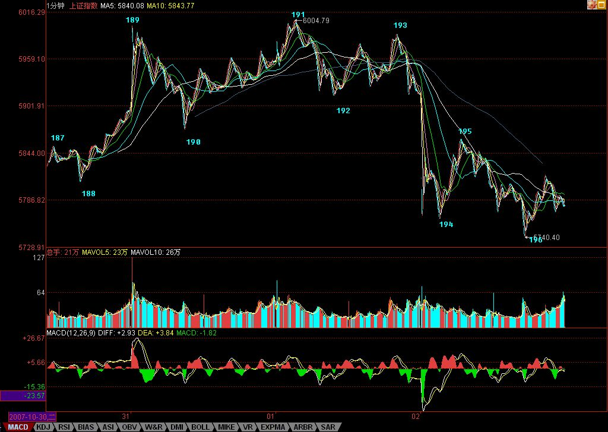{width="5.6299212598425195in"
height="4.0065048118985125in"}

## 调整形态保持，震荡级别加大

(2007-11-02 15:25:06)

**今天的走势同样极为教科书，因此，复制了图，可以认真研究一下。针对189-192的1分钟中枢，195是第三类卖点，但对于191开始的线段类下跌，194-195是第二个类中枢，所以后面的跌破，力度不够，出现明显背驰，然后就必然要在这个位置出现一个新的1分钟中枢。**

**下面的走势很简单，这个新的一分钟中枢是否继续向下延伸出新的1分钟下跌走势，也就是这1分钟中枢是否有第三类卖点。而从大的方面看，这次反弹的调整，级别将至少向5分钟级别扩展。**

**当然，操作上第一个中枢的第三类卖点在该级别中是最后的走人机会，后面的都没意义了，也就是说，对于这次调整的逃避，191是第一类卖点，因为前面线段类上涨走势出现类背驰，而193是第二类卖点，因为站在线段的角度，就是第二类卖点，而站在189-192的1分钟中枢震荡的角度，任何的次级别离开，都将先构成卖点，然后再考虑是否回跌形成第三类买点的回补机会，这是中枢震荡的操作方法。**

**195以后，针对这个调整来说，任何的卖出，都是太晚了，这意味着随时面临下跌走势的结束。很多人喜欢在第二个中枢才考虑第三类卖点，那是晚之又晚，所以经常卖了，就被反转夹空，那是一点都不奇怪的。当然，很有可能卖了以后继续延续下跌，但这已经是一个概率问题，而不是一个能被理论100%保证的技术问题了。**

**好了，技术的课程就不说了，今天的大盘，受外围影响，走得还算不太坏，最主要，关于周末加息的消息，也到处传，所以对心理是有压力的。但下周无论加息与否，真正的主角都是中石油。如果该股过分高开，形成比较恶劣的走势，将对大盘有较大影响，此外，今天不少资金出逃，就等着恶炒一把石油，下周，就看这场大戏，最终是喜剧、悲剧还是闹剧了。**

**周末，好好休息，下周看戏去。是否成为剧中的一员，就看自己的能力了。千万别强求，强求没幸福。**

## 宠爱之便宜且昂贵的中石油

(2007-11-05 15:52:07)

**今天大盘走成什么样子，其实都没意义。今天有什么消息，其实也没太大意义。因为有了中石油，一切都没意义了。为什么？你看看中石油的市值，等于中石头加工行、中行还要大，以后的指数，极大地相关于中石油的走势，站在指数的角度，拥有中石油，就拥有一切的控制力。**

**中石油，世界第一股了，和世界上相同类型的公司比，确实昂贵。但，在中国这个封闭的市场中，特别后面还有众多指数期货等的预期下，这价格，显然是便宜的。这就像N个月前，中国人寿上市，本ID说40多一点不贵，最终100肯定要见的，如果有30给你见到，你当然可以天长地久了。这个位置，并不是说，石油就100%不会下来了，但下来，只是给一个更好的买入机会而已，如同中国人寿从40多到30的过程。**

**短线看，今天，从48多到41.7，一个标准的线段，然后是新的向上线段，这线段不管能否延伸上45，都使得41.7到43.7与最终形成的1分钟中枢有了密切的关联。从短线的操作上，今天，当然是等下来的下降线段结束后介入，明天很关键，就是上冲回跌震荡后形成的1分钟中枢位置，因此，就不难操作的。**

**操作步骤上，比较激进的作法，当然是在看41.7的线段结束后就介入，但这样不能保证明天一定没有下跌的线段打穿该位置，毕竟是T+1的操作，线段太短了。比较稳健的，就是今天在线段结束时介入一定仓位，在形成1分钟中枢后，根据相应的位置再介入其他仓位，这样就至少可以用T+0的对冲保证仓位安全的。**

**注意，以上只是顺便说说新股的操作，这种高开低走的股票，第一笔介入一定要等第一段线段结束，这是一个最基本的要求，今天的走势图，完美地演示了这一点。但这还不行，如果站在安全的角度，必须要分批，因为线段的级别太短，不能保证T+1的绝对安全。**

**另外，今天那直通车的缓刑，至少让本ID前段对此的反对有了点回应，同时也表明，现在政策的推出，已经有了更复杂的机制，这对股指期货的阻击来说，也是一个很好的消息。**

**今天，题材股动起来，这很正常，如果期货缓刑，那么，这种动还会更明显，而且很多年末找底的股票，只是为了明年一飞冲天。现在的问题是，期货还没有最终的答案，所以19、91地折腾就少不了了。两个翅膀，中字头、题材股，自从3600点接石头时明说后，到目前还是有效的。**

**今天写东西时，电话不断，所以晚了，后面还有事情，先下，抱歉。**

## 说说大盘中期走势的演化

(2007-11-06 08:38:52)

**昨天回来太晚，没法写帖子，抱歉了。主要是突然有一个大的PE项目，对方来人了，一个最初期就要投5亿，最晚后年初上市，一旦成功，绝对比西部矿业要经典N倍。所以，本ID也不能太怠慢了。现在确实有点难，说的是时间安排上，下周又要出差，不过这里，本ID会尽量坚持每天的解盘和帖子，如果偶尔坚持不了，也请原谅了。**

本来想写课程的，现在也没时间了，就说说大盘的中期走势。这，本ID其实已经反复说了。只是总结着说一次，让各位更加明确点，免得被行情又给折腾糊涂了。

1、6100点，是大盘中期顶部的一个尖，现在是去形成第二个尖，当然，前两天6004点是不是就是，这需要跌破5555点的颈线才能去确认。

2、在有效跌破5555点的颈线前，一切都以中枢震荡的观点来操作，向上走势背驰就出，就像前两天一样，下来不破5555点，就可以回补，来回折腾，直到大盘选择最终方向。

3、大盘选择向上方向的可能性依然存在，就是期货这个变数，现在中石油回来后，指数上就更没多大意义了。其实，站在别的股票的角度，很多已经完成真正的中级调整的幅度，最近一下跌30%-50%的并不少见，所以指数在期货出现的背景下，将大幅度失真。

4、因为现在指数失真越来越大，所以关心个股更重要。年底，将是三类个股表演的时候：**一、还是中字头，或打或拉，反正精彩不断。二、收集完成或接近完成的题材股，会在震荡中越走越强，率先展开明年的行情。三、筹码不够，需要继续收集的，就会利用每次震荡不断打压，直到该得到的得到为止。**

5、根据不同的股票类型，选择好自己的操作思路。大盘走势需要关心，但更要关心自己面对的股票类型，以及其相对大盘的走势特点。

6、12月是30月的时间之窗，如果前后是出现低点，那么明年的行情将就此展开。如果是高点，那么明年初压力就大了，这也是为什么本ID最近一直希望压制大盘的重要原因。就是希望以低点去触时间之窗，为明年行情做准备。

7、先要有大的思路，再次提醒，由于指数失真开始严重，所以请更关心你自己股票的类型，是上述所说的哪种情况。如果是中字头的，可以更多参照指数的走势。如果是题材股的，就要参照其走势与指数之间的关系，看看里面的人是利用指数吓唬你还是忽悠你，看明白了，你的操作就明白了。

8、操作是自己的，如人饮水，冷暖自知。修炼去吧，多好的市场，多好的修行。

## 5555点争夺战

(2007-11-06 15:37:47)

**今天的走势，就是一个5555点争夺战，一般这样的战斗，胜负至少看3天，上下还有一个3%的缓冲区域，5555X97%是多少，自己去算吧。**

**当然，这次下跌，和上次不同，大多数人都没什么感觉，因为这次跌的都是中字头的，其他90%都没怎么跌。但并不意味着这次的可能风险就小，如果真跌破颈线，那么很多这次趁着中字头跌而反弹的股票，也会再次探底的。**

**所以，5555点争夺战，对于多头来说，是输不起的。空头反而是无所谓，反正后面还是6000点、6100点的防线，其实，站在本ID的空头立场，本ID不大愿意这样就破了颈线，因为这样力度有限，很可能就是一个假跌破。**

**对于空头来说，对颈线的突破，一定要是致命的，用本ID的理论术语，就是一定要第三类卖点后出现中枢的下移，而不能去构成大的中枢那种无聊玩意，那样杀伤力太小。如何达到那种力度，就是要在颈线上反复磨，如果再冲一次上不去，又一批人开始失望，然后再来一次，反复失望，这样才有杀伤力的。**

**多头空头，绝大多数都是猪头，都是急功近利的，本ID只是分力，最终是否能如本ID所希望那样，搞得更有杀伤力，那不是本ID一个人能决定的。而且，很有可能，有些傻空头急功近利，企图快速破颈线，最后反而中了多头的埋伏。**

**本ID最近心大都在PE上了，没心情没时间去找人开小会协调协调，所以空头爱干什么就干什么吧，本ID有时间，还不如去再造N个西部矿业出来卖给多头，1元的东西，到时候卖了几十上百的，感觉不错。**

**中石油今天走出了线段下跌的走势，今天早上到41.2的那次反弹，就是对41.7上那类中枢的类第三类卖点，然后就继续下跌，现在就看这个线段下跌的类背驰了，一旦出现，就至少有一个级别更大的反弹，比昨天尾盘那个线段反弹要大，至少是可T+1操作的。昨天说了，有些线段反弹，不一定能T+1赚钱，今天就是一个例子。中石油，最终的走势很有可能和中国人寿类似，这在昨天也说了，当然，不可能完全照抄，但基本模式，估计差不多。**

**上面说了如何才能杀伤力大，大概又得罪不少人，但市场就是这样的，讲感情就不要在市场混了。本ID说出来，只是把市场可能的残酷一面说出来，有时候，本ID没时间干了，并不意味着别人没时间干。**

**如果你对市场有了足够的洞察，那么，任何人的鬼把戏，都无效了，这才是最重要的。**

**市场里，需要的是智慧，而不是煽情。**

**认清自己，冷静再冷静吧。**

**先下，再见。**

## 教你炒股票88：图形生长的一个具体案例

(2007-11-06 22:38:43)

本ID的理论，对所有的走势，进行了一个最明确的分解，所有的分解，本质上只有两类，就是延续与转折，用残酷一点的词语，就是生和死。

一个走势类型的死，必然意味着一个走势类型的生，走势，就在这样一个生死的轮回中，如同众生的生命，生死轮回不断。看明白了股票的走势，对人生，也大概应该有点领悟了。

一个走势类型确立后，同时就确认了前一个走势类型的死，同时也开始了自己面向死亡的生存。

如同众生的轮回生死，在死与生之间，有一段被称为中阴身的阶段，股票的走势，同样存在着这个阶段。如果说前一个走势类型的背驰或盘整背驰宣告了前一个走势类型的死亡，那么到新的走势类型确立，这里有一个模糊的如同中阴般的阶段。

要把握这阶段的走势，必须把前一段走势的部分走势结合起来分析。也就是说，前一段走势的业力在发挥着作用，这个业力与市场当下的新合力构成了最终决定市场方向的最终合力。

用一个例子，就很好地能说明这个问题。

下图中，191的背弛宣告前一走势类型的死亡。按道理，新的走势类型，是从191开始分析的，但这时候，新的走势类型连第一段线段都没走出来，甚至走到193的位置，也依然轮廓不明，因此，这时候，就是典型的中阴身阶段，必须借助前面189开始形成的中枢来完成分析与相应的操作。

如果从191开始，192、193都很难说有什么可依据的。当然，可以说193就是第二类卖点，这个自然没错，但站在189开始中枢的角度，这就存在一个中枢震荡的问题，这样，这个干瘪的第二类卖点，就有一个更大的可依靠的分析基础。一切关于中枢震荡的分析，都可以利用到关于192、193以及后面走势的分析中，这等于有了双重的分析保证。

当然，后面的195的第三类卖点，也是站在中阴阶段的角度说的。但这一点是一个中阴阶段与新的走势类型确立阶段的分界点，195出来以后，新的走势类型最开始的形态就确立了，也就是至少是一个线段的类下跌走势。这时候，分析的重心，就可以移到191开始的新走势类型上了。这时候，就可以基本在这个线段级别上，不用考虑191之前的事情。

{width="5.629861111111111in"
height="4.00625in"}

但191之前的走势并不是没有用了，而是在更大级别上，例如在1分钟、5分钟等等级别上发挥作用了。191后面出现的走势，就和191之前的，结合出大级别的走势形态。

因此，当各位熟练以后，标记上就不一定要不断地标记下去了，例如，如果你是按1分钟级别操作的，那么，前面191个线段记号，可能就可以一下简化为10个不到的1分钟级别相关的记号。当191后面的走势演化出的1分钟走势结束后，这1分钟级别的记号才再增加一个，这样，记号的数目就很有限了。当然，如果是5分钟级别、30分钟、日线等等，就更少了。

为了方便明确起见，还是把记号的级别进行分类，例如，用Xn代表线段的记号，用Yn代表1分钟的级别，Wn代表5分钟的记号，Sn代表30分钟记号。日、周、月、季、年，分别也可以用Rn、Zn、Mn、Jn、Nn来表示。其中的n都是具体的数字，这样，所有的走势，都可以被这个标号体系所标记而清楚异常了。

例如，对于191这个点位，站在线段上，就是X191的标号，站在1分钟级别，可能就是某个Yn的标号，而189这个点，就只有线段的标号，这同时也显示了，191这点和189点的重要性是不同的。

什么是最牛的点？就是从线段一直到年，同时都有标号的那个点，如果是顶，那就是百年大顶，当然，是否有幸碰到这样的点，就看各位的运气了。

这个标号体系，不单单为了方便阅读、记号，首先就培养了各位一种综合的、系统的习惯。看一个走势，就要知道，不是单单是一个线段，而是在一个大的多层次系统里，这样才不会被每天的波动所迷失。

其次，这个标记的过程，意味着什么？既然线段有中阴阶段，那么其他级别当然也有。所以无论任何级别，在一个顶点出来后，都有对应级别长度的中阴阶段。

注意，一定要注意。为什么很多人逃了顶，最后还是被套住了；抄了底，最终还是没赚到钱，被震出来了。这就是被相应级别的中阴阶段给搞死的，而且，越大级别转折后的中阴阶段，越能搞死人。

就如同人的中阴，非人非鬼；行情走势的中阴阶段，也是多空齐杀，不断折腾转换。等最后转折确认时，就如同已经重新投胎，饭熟了，还找米，能有戏吗？

有些蠢人，经常在行情转折的中阴阶段，觉得世界又美好了，或者世界又恶劣了，结果都是被业力所牵引。

中阴阶段，无一例外，都是表现为不同级别的盘整（注意，这是只从截取这一阶段的形态说，并不是说新的走势类型一定是盘整）。也就是围绕前一走势的某一部分所构成的中枢震荡，即使是所谓的V型反转，也一样，只是震荡的区域回得更深而已。

其实任何转折，也就是第一类买卖点之后，都对应着某一级别的V型反转，例如，191的转折，190-191与191-192，其实就是一个V型反转，只是级别特别小。这个V型反转的级别，决定了中阴的级别与力度。例如，站在日线图上看6124点前后N天的走势，其实就是某级别的V型反转，然后就同时进入中阴阶段。

注意，中阴阶段结束后，不一定就是真正的反转，也可以是继续延续前一走势类型的方向，例如上涨+盘整+上涨，这样的结构是完全合理的。例如，人的中阴后，不一定就要变鬼之类的，也可以成所谓的神仙，如果你前一世是从鬼来的，鬼到人是上涨，中阴盘整后，从人到神仙，也是上涨。

但，上涨+盘整+下跌，上涨+下跌等等，同样是可能的选择。这时候，唯一正确的操作，只有一点：如果你技术好的，就在这个大的中枢震荡中中枢震荡操作一把，如果技术不好的，就拿着小板凳看戏，看它最后是升天还是下地狱，等市场自己去选择，然后再决定操作。

不过，站在本ID理论的角度，最大效率的，就是利用这个震荡去中枢震荡操作一把，学了本ID理论，就是要把技术练好，练好了，就自然不用整天小板凳了，上台自己票友一把不是更爽？

当然，没这本事的时候，还是别玩这一招，为什么？这就如同，在中阴身的阶段，还是可以去修炼去证悟，但你总不能因此说，我现在就不修炼了，等中阴再说。真等那时候，业力牵引着，你修什么鬼呀。

所以，有真本事，什么情况都不怕，都可以折腾。关键，是要有真本事。

## 5555点决战即将进入临界点

(2007-11-07 15:26:47)

**这个题目有点名不副实，因为这决战，对于空头来说，只是小战役，结果并不重要；但对于多头来说，就是决定生死存亡的。从6124点开始的行情转折中阴阶段，对于多头是垂死挣扎一下，还是干脆破罐子破摔，早死早投胎，很快，准确地说，最迟下周一前后就有答案了。**

**站在空头立场，本ID希望多头能挣扎挣扎，这样，会增加很多残忍的快感；当然，站在纯技术探讨的角度，多头最好的招数就是以退为进，用一个空头陷阱，把主动进攻的空头给废了。**

**由于目前的空头比较蠢，所以本ID不妨提醒，屠杀之前，一定要多点多头色彩，披着多头外衣的空头才是最有杀伤力的，在5555点上制造出一个大点级别中枢，然后再背后来一刀，把多头砍倒，踢下悬崖。**

**由于目前多头也比较蠢，所以本ID也不妨教教多头招数。从月线上，无非两种可能，就是本月确认顶分型，或者不确认。不确认，就是有包含关系或创新高。而目前5462点，就是这个顶分型是否成立的关键，而跌破成立后，最关键是5月均线，目前在5300点附近。也就是说，多头完全可以在5月均线附近埋伏大部队，让空头先进攻，把分型给搞出来，然后反手把主动进攻的空头给废掉。**

**请回想一下，本ID在3600点，是如何完美地利用顶分型与5月均线来把空头给灭了。现在多头最完美的策略，依然是照搬本ID的老剧本。**

**不过，这些蠢蠢的多头，估计抄也抄不成样子，最后，可能还是要和5月均线吻别于狂乱的夜。现在的多头，如果这2年多不被攻破的5月均线竟然给你们弄丢了，那你们也别丢人了。不丢人最好的方法就是：早死早投胎。**

**有人可能要问：你究竟是多头还是空头，怎么又教多头又教空头如何干？**

**本ID很明确地说：本ID是那准备杀死空头的空头，一个不准备杀死空头的空头，不是好空头。见顶以后，就是一个空头面向死亡的生存过程。这时候当多头，将被空头蹂躏，而空头的命运，最终都是死。所以，唯一正确的就是，当一个随时准备把空头搞死的空头，里面的道理深着了，明白了，你对市场就有更深一步的了解。**

**短线技术上，5555点附近的新1分钟中枢形成，因此，这次6004点开始的走势，就明确形成1分钟的下跌形态，因此，短线该位置能否站住，就看这个中枢的表现了，看明白这个中枢后面的发展，也就看明白了这场多空拉锯的短线胜负了。**

**本ID的观点还是很明确，就是在这样一个中阴阶段，什么事情都可能发生，技术好的，可以充分利用这大型的中枢震荡玩抽血游戏。多空越分歧，意味着震荡的幅度机会越多，就越是本ID理论的天堂。至于没这本事的，就算了。**

**今天的中石油，如昨天所说，38元上线段底背驰后形成较强反弹，然后形成一个1分钟的中枢在40元上下，这是该股形成的第一个1分钟中枢，因此给后面的操作具有最重要的指导意义。后面的走势无非两种：一、以这1分钟中枢震荡扩展出大的中枢。二、这1分钟中枢不过是1分钟下跌走势的第一个中枢，最终将跌破该中枢形成1分钟中枢下移去完成1分钟级别的下跌。**

**具体操作，就按实际走势的选择来决定。例如，如果你在今天背驰时介入部分仓位的，就可以开始利用后面走势的波动，把成本逐步降低。**

**最近天天说石油，主要是以此为基础，从最开始把一个股票的走势的生长是如何演进的给教科书一番，各位顺便就可以看到，个股的分析和大盘的分析没什么不同，都一样的。**

**今天下午晚上都有事，明天收盘马上有事，解盘要到晚上了，先说明一下。**

**先下，再见。**

## 历史将为林彪元帅平反

(2007-11-08 12:51:08)

收盘就有事，所以解盘改晚上，先把晚上的帖子放上来。

这个问题，已经说过多次，不过还是要说。正如本ID给林彪元帅所写的七律里，颈联"曾经百战喧天地，一夜孤行惑古今"。前一句，就不用说了，任何没有偏见的人都承认，而后一句，似乎没有疑问了，似乎太常识了，但这"惑"，应该不会永远的。

历史将为林彪元帅平反，一个为新中国的建立席卷万里的元帅，是不会叛国的。更多的，没必要说了，唯一可以用最简洁的语言说的命题就是：林彪元帅在上飞机时，已经不存在了。

一个元帅的存在，和任何一个人的存在一样，首先必须是一个活人。无论是谁，只要不是一个活人，这人就不存在了。这样一个道理，没有人能反驳。只有活人，才可以叛国，这同样是没有人能反驳的。"林彪元帅在上飞机时，已经不存在了"，这难道不就是历史？

本ID从来不相信任何道德上的圣人，历史最终都会让那些道德上的圣人们原形毕露。袁崇焕的故事，在历史上并不是孤立的。历史将为林彪元帅平反，历史的迷雾，最终将有一天散去。

林彪元帅，安息吧。

## 如期决战，多头不堪一击

(2007-11-08 22:21:05)

**对不起，回来晚了，把解盘补上。**

**昨天说，决战进入临界点，最迟周一有结果。结果是，多头如此不堪一击，太令人失望了。这证明了本ID的一个断言：空头是心急的。而昨天，本ID给多头编的5月均线大埋伏剧本，是否如本ID所担心的那样："这些蠢蠢的多头，估计抄也抄不成样子，最后，可能还是要和5月均线吻别于狂乱的夜"，很快也有答案了。**

**前几天，还有多头叫嚣，质问本ID不是说要至少跌1000点吗，为什么还不跌？现在，这个本ID布置的任务，确实有点没完成，本ID对演员们的表现也很不满意，那就继续努力吧。别心急，小板凳坐好，别到处跑动，现在，1000点只完成了800点，空头多头演员们，努力！加油！**

**现在，5462点到5555点颈线位置，将是中线反抽最关键的位置，不能重新上去，那么跌势将持续到这跌的业力耗尽的一天，本ID可从来没说过1000点外就没有空间，本ID只是说，没有1000点的回跌空间，这做空不过瘾，没空间，不好玩。所以，1000点这小康水平达到后，我们还可以有更高的现代化目标，这难道有什么问题？**

**今天不爽的，基本上有两种人：一、牛人，觉得自己很牛，可以短线，有天赋。本ID说认清自己，冷静加冷静。认清什么？就是你是不是牛人。牛人，不在乎什么线，但不是，就别累着自己。本ID不早给了所有非牛人一个最好的选择：小板凳？二、大牛人。这种人，以被套为光荣，号称牛市就要中长线，就要持有。就算那股票从300到3元，也要持有，也要中长线，这种大牛人，本ID没什么可说的。有人喜欢电梯，上上下下享受，本ID一点意见都没有，慢慢享受去吧，还有你爽的时候。**

**明天、周一，5月均线能否有埋伏，埋伏能否有效，很快就有答案了。如果是本ID搞的，本ID当然有信心，但现在，本ID又不当多头了，和3600点那时候不同了，本ID可不想为任何人担保什么。**

**现在，多头短线的问题，是这次跌破，是否能尽快拉回去，否则，一旦确认颈线跌破，那么，按照双顶的量度跌幅，你觉得该到哪里呢？**

**本ID很想仁慈地安慰一下今天受苦的人，但本ID最终决定还是不这样干，因为这样只能害人。市场从来不仁慈，本ID该说的也早说了，既然，今天痛苦的，都是大小牛人，那么就继续梅花香自苦寒来去吧，这大概是牛人爱干的活。**

**如果想真学点什么的，请复习一下本ID这帖子"**

**2007年末，资金与政策博弈下的走势分析2007-09-17 00:41:48**

**"，如果能学点什么，本ID觉得，就没必要学梅花了。股市里，不需要学梅花，不需要苦寒来，股市只需要智慧。**

**技术高的，可以关注这6004点开始的1分钟下跌的背驰，然后将有一个大反弹；如果技术不高的，还是继续小板凳吧。**

**先下，再见。**

## 5月均线大埋伏剧本如期上演

(2007-11-09 15:20:08)

**今天行情没什么可说的，就本ID前两天已经公布的5月均线大埋伏剧本的现场版。不过，说老实话，同样的剧本，不同的导演，效果当然是不同。今天这种演出水平，显然不是太令人满意的，所以本ID一早就给了一个定性："这些蠢蠢的多头，估计抄也抄不成样子"，至于是否会"最后，可能还是要和5月均线吻别于狂乱的夜"，很快也会有答案了。**

**当然，在这个答案出来之前，无论答案如何，都会有一个对前面5462-5555点颈线位置的反抽确认过程，这是例行手续，能重新上去，就证明多头这次的5月均线大埋伏剧本没演砸，否则，这戏就要退票，重新开始空头的魔兽表演。**

**空头这头魔兽，最终肯定要被本ID砍了劈了，但如果多头不争气，剧本演砸了，首先被砍被劈的一定就是多头。**

**本ID这种要砍死空头的空头，目前最爱干的事情就是，多头伏击时，本ID也在后面伏击着，多头掩杀，本ID就跟着呐喊，等多头冲得没力，空头开始反击，本ID就在后面连续绞杀，把多头变成少头。**

**有人可能说，你这样也太无耻了。本ID只知道，在资本市场里，最无耻的行为就是亏钱、被套，只要你在市场上，远离这种行为，那你自然就是一个高尚的人、脱离了低级趣味的人，可以鄙视所有宣称你无耻的人的人。**

**这如同打仗，蒋光头就是最无耻的人，占尽优势最终还被赶到岛上洗海水浴去了，这世界上还有比这更无耻的吗？无论多少无耻的人给他找一万条无耻的理由，也改变不了他是最无耻的结论。打仗，最终只看结果，别说任何理由。输了，磨墙去，JJWW没用。**

**市场比打仗更无情，打仗输了，还会有无耻文人，忽悠点这英雄那豪杰的，蒙骗一下少年儿童。市场输了，连尸骨都不会有人替你收。有人喜欢温情，喜欢有人说软话温暖一下破碎的心，那是有病。这种人，在市场中永远只有一种命运：死。**

**中石油在38附近又有一个新的1分钟中枢，不过这个中枢与上面一个太近了，极有可能就2合一地扩展成更大级别的中枢，当然，实际走势，由市场决定。**

**大盘没什么可说的，5月均线埋伏后，就看反抽力度，十分简单，没必要多说了。**

**个股方面，由于人气涣散，最近能逆市的，更多是小市值的低价股，年未，重组闹剧又到上演的时候，这是可多多关注的。至于，中字头，一定还是市场的重心，不过一定要踏稳节奏才可以去短差，否则就会被人绞杀。**

**不想说了，一到周末，股票就成了最无趣的东西。周末，腐败去，发展晚上经济去、为吃喝玩乐经济贡献去，千万别股票去了。如果什么都不想干，就打坐吧。**

**先下，再见。**

## 略论国家经济意志的市场化体现

(2007-11-11 17:13:00)

在计划经济条件下，国家的经济意志，可以有多种宣示的渠道，惟独缺乏的是市场化。而在市场经济条件下，一味通过行政、政策等硬方式进行调控，显示是不合时宜的。而在市场化手段下，国有股份、外汇储备、社保资金等等国家资产的应用，不可避免地将体现国家的经济意志，而如何处理好其中的关系，确实值得认真探索与研究，这关系到国家的经济安全与经济发展战略的最终实现。

国家的经济意志，不是一时的盲动，也不能基于某种短线利益或道德冲动。国家的经济意志，必须建立在国家战略的前瞻性、全面性与系统性基础上。没有前瞻性，如同散户跟庄的思维，跟着别的大国思路跑，这样是绝对不行的。中国是一个大国，其经济意志必须有着大国的气度，必须能对世界经济与政治格局产生中国式的引力，反映出中国式的声音，最终实现中国式的战略意图。而没有全面性，同样不行。中国的国家经济意志，其战略取向必须是全面的，而不是为了某时某地某人的利益，其最终的经济利益，必须能体现且实现全体国民最大最终的利益。至于系统性，表明了中国的国家经济意志，必须也必然现实地体现为一个有着严密内在联系、多层次建构、具有可操作性、可实现性的有机系统。

目前，单单从具体资产的实际运用上看，国有股份，已经是股市中最大的绝对控制力量，目前的指数，已经完全是中字头股票的天下；而社保基金，最终将在国有股份划转、减持与最终运作中扮演极为重要的角色；而中投公司的成立，使得外汇储备的应用在内外资本市场中的协同性与隐含的战略性至少有了超越波段性质的重要意义。

但国家的经济意志，还不单单反应在具体的股票或市场化操作上。更重要的是，绝不能把国家经济意志的体现，完全退化成如同庄家控盘的操作模式，这是极为危险的。国家的经济意志，应该成为市场中一个重要的甚至是最重要的分力，但不能成为市场合力本身，更不能成为市场的唯一力量。一旦向这种危险的境地演化，那么，所谓国家经济意志的市场化体现，就会成为一句空话。这种所谓的市场化体现，也将会成为摧毁市场基础的力量。

此外，国家的经济意志，还必须体现在对国家经济资源的保护上。国家的经济资源，不单单包括狭义的实体、实物上的资源，还包括在虚拟经济条件下一切能产生市场、资本等效应的资源。例如，中国的优秀公司，就是中国资本市场的最大经济资源。如何合理利用这些资源，而不是让其贱卖、外流以及被短期利益所过分开发，这是一个十分现实且有着诸多教训的重大问题。

而站在资本运用层面，太过市场化、太过老鼠仓化的基金已不可能单独成为国家意志的经济化体现，必须有一种新的绝对性平衡力量来加强调节。既然在实体层面，国家对关系国民生计的产业要绝对控股，那么，在虚拟经济层面，这种绝对控股性是无用质疑的。也就是说，这种绝对控股性，还必然包括对股票总体走势的宏观控制。

国家逐步淡出政策层面的硬调控，必须也必然会在经济层面掌握一个绝对的调控力量，否则，资金对政策的挑战就会出现无法控制的局面，这是完全不符合中国国情的。加强国家对经济的调控，包括实体与虚拟两层面。而国家对虚拟层面经济化调控领导地位的加强，是一个必须尽快解决的问题。

## 1000点小康跌幅胜利完成

(2007-11-12 15:28:57)

**本ID宣布做空时说，没有1000点的下跌空间，不爽，所以要先拉出空间来。今天，1000点的基本任务已经胜利完成，本ID在前面已经给了这个跌幅一个名字，叫小康水平的跌幅。请问，各位是希望下一步小康就算了，还是要继续富裕下去？**

**今天，5月均线大埋伏剧本继续演绎，今天的利空，刚好为6004点下来的1分钟下跌构成底背驰做出最后的贡献。本ID已经早说了，6004点下来的1分钟下跌一旦背驰，会出现较大级别反弹。现在，5月均线大埋伏剧本与1分钟下跌背驰剧本最终两剧合一。**

**注意，这个1分钟下跌，搞出来了三个中枢，然后在今天一个完美的底背驰。最后的一个1分钟中枢的第三类卖点，就是早上的补缺失败走势，然后继续的下跌构成了线段的类背驰，这和1分钟大走势的背驰段构成完美的区间套，这么教科书的走势，请好好去研究。**

**1分钟底背驰后，最基本的涨幅，就是拉回原来1分钟下跌的最后一个1分钟中枢的波动区间，这个在今天就达到了，后面就是这个中枢如何扩展出5分钟中枢的问题。技术上，就要关注这个5分钟中枢的位置以及后面相应的中枢震荡结果。**

**通俗地说，如果大家都觉得短线小康就算了，不要富裕了，就让这5分钟中枢第三买点；否则，大家都急切奔向富裕，那这5分钟中枢将第三卖点；事情就这么简单，各位民主一把，投票吧。**

**更通俗地说，就是以5月均线陷阱对5462-5555点颈线的例行反抽继续展开，注意，反抽可不一定要一定碰到5462上，最弱的反抽，就是装模作样在颈线下面折腾几天，然后就和5月均线吻别于狂乱的夜。**

**当然，多头现在也不是完全没希望，多头要成功，首先是要让所有人只要小康、不要富裕；其次，好好利用5月均线大埋伏剧本，绝对不让那狂乱的夜发生，特别不能让狂乱的月圆之夜发生；最后，找准机会，重新回到5462-5555点颈线之上站稳。**

**以上，是多头唯一可以走得通的路，鲁男人说，人走多了，就成了路。多头就从这一刻起，如果要活命，就要不断地到处乱踩，把所有板块都踩一遍，看能不能走出路来。**

**这句话，通俗的意思就是，反弹如果真能延续，必定以板块轮动的方式，这种方式，好听地说，就是为了聚拢人气，不好听地说，就是忽悠蒙骗点新的站岗者。**

**特别强调，并不是任何反弹都是任何人有资格玩的。站在本ID理论的角度，这个反弹完全可以就已经结束了，为什么？因为最基本的回抽最后一个中枢的幅度已经达到，所以，现在关键是回来那一下能否构成第二类买点，如果不行，那狂乱的夜的吻别就马上上演，不过，更适当的名称应该叫：刎别。**

**今天的解盘，写得太长了，主要是有趣版本与通俗版本都写了，本ID经常用自己的语言写，其实只是为了有趣与简练，但这世上无趣的人太多，本ID就受累点，夹带上通俗版本。**

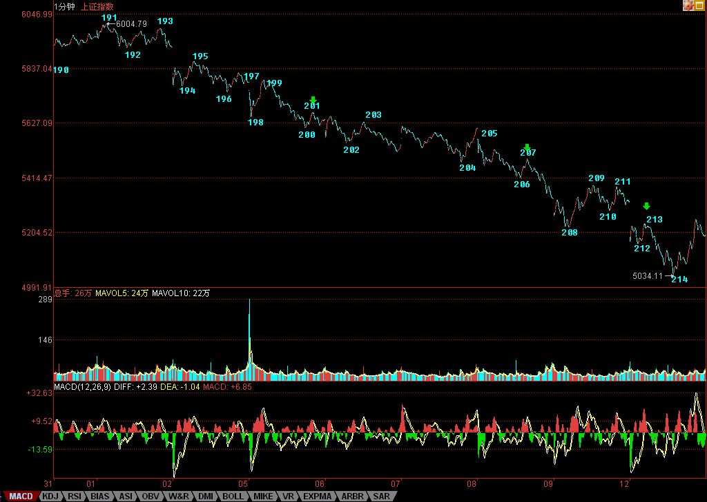{width="5.6299212598425195in"
height="4.0065048118985125in"}

**下面给出了6004下来的分段，请仔细研究，里面用绿箭头把三个1分钟中枢的第三类卖点都给标记出来了。按照本ID的理论，最晚的逃命点195处，从第1个绿箭头开始的所谓第三类卖点，其实都没什么意义，这里，只是显示，第三类卖点后，市场是可以多么狠。按本ID的理论，从195逃命的，在214才真正开始值得考虑是否回补。当然，前提是你的操作可以接受1分钟级别的，如果是5分钟以上级别的操作，那还是继续睡觉吧。**

**214，从191开始的1分钟下跌走势的底背驰，对应着三重的区间套定位，最后一重是213-214之间的线段内部笔之间的定位，其中的精确性，教科书一般，关键是你能真明白，并且能当下去把握。**

**好好研究吧，这可能比讨论小康好还是富裕好更有意义。**

**本ID要出差了，晚上飞机走，晚上的帖子肯定写不了，明天收盘再解盘。不过，在外地，时间上可能不能太准时。另外，后面几天的晚上帖子，估计很难完全保证，因为应酬肯定少不了，又要为茅台、五粮液大大贡献一把了。**

**最后，一句话，请问：要小康还要富裕？**

**先下，再见。**

## 市场总是少数人成功

(2007-11-13 08:27:42)

**本ID开始课程时，有人还问一个很傻的问题，一旦都掌握了本ID的理论，那理论还有用吗？这种想法，就如同那种同样傻忽忽的逻辑，人人都有共产主义思想，这共产主义就实现了。可惜，共产主义和什么思想没关系，把老马的伟大堕落成培养共产主义新人的可笑，这就是这种逻辑的历史悲剧。**

**市场总是少数人成功，为什么？因为只有少数人能真正把握自己。征服世界，并不意味着你能把握自己。认识自己、把握自己，这比征服世界更难。**

**当然，站在市场逻辑的角度，没必要为那些待宰的羔羊而煽情。问题是，最重要的问题是，千万别把自己往羔羊里挤。因此，本ID也只能抱着能惊醒一个是一个的心态。**

**没有人天生是羔羊，是你的心、你的眼界、你的行为让你羔羊。不修炼自己，不在市场中磨练，羔羊永远只能是羔羊。**

**一个1000点，10%几的回调，已经让这么多人方寸大乱，以前随便就是50%、60%的调整，那不就真要尸横遍野了？该来的，总要来，市场的重新真正走强，一定是在清理了该清理的之后，就像河道被淤积了，不清理，能行吗？**

**目前只是大牛市第一阶段的一个中级调整，这一点从来没有任何的疑义。而本ID以前说过的股票，没有一只会放弃的，等中级调整结束，会再度启动，而且有些已经开始预热，这也是很显然的。但调整，首先必须先面对，这是当下的事，先处理好。**

**按照市场的节奏，6004点跑掉的，昨天开始回补闹一闹反弹，反弹一旦结束，就砸出去，没什么可犹豫的。图形告诉你一切，反弹是否结束，一切尽在走势中。**

**关键是，你的心能如明镜一样，当下地映射出行情的真实走势吗？**

**下午收盘，马上有事，有时间再把解盘给出。**

**在外面，只能如此，尽量在宴会前给出解盘，否则，晚上回来估计也没可能写东西了。**

**人世皆苦，才有修行的可能。**

**有苦，真好。**

## 5日线受阻，多头仍需努力。

(2007-11-13 15:06:24)

**快速说几句。**

**今天反弹受阻5日线,这是最简单的走势,按本ID的理论,分型成立后是否能延伸为笔,关键是看5日线,只要不能重上,那么这个底分型就有破坏的可能。当然，一般这底分型即使真的被破坏，也会在不远处形成新的能最终形成笔的底分型，所以，多头还是有短线希望的，只是过程可能有点多灾多难，例如，今天中午传出的CPI，就给早上的多头泼了凉水。**

**但更精确的分析，还是看昨天1分钟底背驰后的中阴走势，刚好课程说到这里，这是一个标准的现场版本，请好好研究，仔细分析。**

**昨天说了，多头会如鲁男人一样狂踩不同板块去找路，今天下午的回落，很多板块并没有破坏反弹的形态，所以多头还有继续努力的资本的。**

**短线继续关注5日线，以及1分钟图上的中阴走势演化。技术差的，就继续小板凳，等风和日丽再出来撒野吧。**

**听说北京今天要下雪，如果是也太无聊了，本ID刚离开，难道就让本ID错过这2007年的第一场雪？**

**拜托，雪还是别下了。**

**晚上如果酒后还清醒，就再见吧，否则，还是让本ID去见周公算了。**

**抱歉，先下。**

## 节奏爽了才是真的爽

(2007-11-14 15:17:22)

**对不起，在外面，帖子就不能保证了，请原谅。解盘还是保证的，但也只能快速说说。**

**昨天说得很明确，就是看5日线，因为昨天刚好构成底分型，所以今天下午一站上5日线，大盘就强烈启动起来，这都是极端教科书的走法，自己好好体会吧。**

**前两天的1分钟底背驰后，后面是一段中阴走势，各位可以看看本ID的课程里关于为什么很多人抄到了底却拿不住，就是因为不明白中阴走势的处理。更仔细的分析，只能等回北京后写课程时再说了，不过这两天的走势，也很规范，是其中最简单的走势的标准版本，请好好分析一下。**

**本ID的理论有没有用，从这次下跌到1分钟背驰的把握，到这个反弹的全面处理就是一个很好的例子。这不需要你任何的其他渠道的消息，图形告诉了一切。当然，前提是你看得明白，否则就是对牛弹琴了。**

**本ID很肯定地给了多头如何利用5月均线对空头进行大埋伏的剧本，看来，多头经过前几天的不熟悉，终于演得有点模样了，给朵大红花。**

**下面的问题就是5462点重回后能不能站住，站住就有更大的反弹空间。另外，注意期货的消息，如果最近有关于这方面明确的消息，那么指数的走势就会有很大变数，也就是说，指数存在创新高的可能，不过这和绝大多数人无关。**

**对反弹的把握，如果想懒点的，就看这个日线上的笔最终延伸的结束，如果它有本事延伸到10000点，本ID也没有反对的理由。当它没本事的时候，本ID就把这几天买的拿出来开砸，如此而已。**

**只要重回5462点上，无论站住与否，都将形成一个大的中枢，所以，中枢震荡一把，折腾一把甚至回来N把，还是很爽的。**

**个股方面，已经明确说过了，都会被踩一次，但如果期货消息很快出来，那么还是中字头更牛一些。其实，各位看看中驴，就知道方向了，你看这驴，从来都是最聪明的，无论涨跌，哪次不是领先于大盘的？**

**爽，要有爽的潜质。现在最危险的，反而是这种状况的，就是底部没敢动，反弹N天后忍不住的，站在反弹的角度，反弹往往意味着换岗。本ID现在没什么事，就等着多头没力的时候，把钢枪发给想换岗的了。**

**所以，节奏是第一位的，节奏爽了，才是真爽。关于利用1分钟走势底背驰进行抄底反弹的操作，已经提醒N天了，不管处理得怎么样，都请好好反省，这样才会有真的进步。**

**先下，再见。**

## 对不起，解盘晚了。

(2007-11-15 21:47:45)

**对不起，解盘晚了。今天一收盘，就给抓去看企业，书记亲自出面,你说有什么办法?来到下面，个个人都急着，把你当点石成金的圣手，苦呀，没办法，各位也请原谅。**

**本ID现在可是喝了1斤多五粮液后说的话，虽然相当清醒，但各位也知道，本ID这收盘后的N小时内受到的苦是多么的深切。苦呀,苦。**

**今天5462点竟然没有被触及，简直有点过分。喝了点酒，本ID也真要狂言一句，没有本ID的多头，就是阳痿的货。连5462点都不碰，多头难道想找死吗？本ID现在酒后胡言，但不骂他们也不爽了。**

**今后几天，首先站上5462点，让本ID觉得多头还有点男人的器官，否则，本ID以后就宣告多头根本没头，都是中关村的货色，多头也没什么可抱怨的。**

**这里，先说明一个典故，估计北京外的人都不知道。中关村，其实是中官村，中官，就是太监，中国的第一所谓科技村，竟然就是历史上的太监村，你说要哭还是笑？**

**喝多了，也没必要技术什么了，5462点，多头，想证明你们不是中关村的，就给搞上去，否则，后面本ID的题目就是：多头，都是中关村的货。**

**对不起，思维混乱，明天估计也没机会解盘了，周六回北京再补上。**

**北京，不总是中关村的。让中关村的太监太监去吧。北京爷们，请爷们一下，别让本ID看不起你们。**

**洗洗睡吧，讨厌五粮液，最恶心的酒。**

**下了，周六见。**

## 多头，不要争当中关村的货。

(2007-11-16 15:25:28)

**快速说两句，明天就回北京了，不知道雪下了没有？**

**北京有中关村，多头，也不要争当中关村的货，北京可不止中关村。5462点，连这都如此困难重重，本ID都没了骂多头的兴趣了。**

**这次出差，本ID还是深切感到了中国企业的创业热情。虽然，有些手段，有点太那个了。例如，本ID这几天考察的企业里，就有从世界性大公司出来，用完全盗用的技术，改头换脸地疯狂发展出来的。虽然本ID并不特反感这种企业，但这毕竟不是长久的办法，中国人有足够的脑子，为什么一定要盗用鬼佬的？**

**市场继续在这里折腾，这个5分钟的中枢震荡，将继续向更大级别延伸，因此，最终的突破方向，其级别意义就更大了，暂时，估计还需要一定的时间。**

**个股方面，依然是乱踩走势，暂时不会有太多板块具有持续的走强能力，总之，就是来回折腾。**

**不说了，周末，本ID还要熬上最后一晚的饯行酒，明天就回北京了。**

**先下，再见。**

## 教你炒股票89：中阴阶段的具体分析

(2007-11-18 20:14:06)

一周多没上课程，虽然是周末，也破例上上吧。今天见了好几拨人，等一下8点半还有一拨，没办法，出去这么久，只能当补课了，所以只能快速写写。

大概很多人都想，上次说的中阴阶段也没什么特别的，其实也是一个盘整，和其他的盘整也没什么不同。如果有这种想法，就有大问题了。

中阴阶段能否处理好，关系到操作节奏的连接问题。很多人的操作节奏特乱，就是因为不知道中阴阶段的问题。中阴阶段，虽然表现为中枢震荡，但并不是一般性的中枢震荡。

另外，特别要注意，精确的理论，当然也可以很粗略地说，例如，所有人都知道，市场不是上就是下或者就是盘整，这本质上是废话。但废话的另一面，就是公理。这个废话，刚好表现了市场的本质。

就如同欧氏平面几何里，说两点之间只能有一条直线。这对于常识来说，就是废话。但这废话就是公理，关于欧氏平面几何里的公理，这个公理正好反映了欧氏平面几何的本质特征。同样，市场不是上就是下或者就是盘，这一点，刚好反映了地球上现在所存在的股市的特征。完全有可能在别的星球上的股市，就存在第四种情况，那里有和我们的思维有着完全不同的分类。

但更重要的一点是，知道了公理，其实什么都没知道。这其实也是中国人思维里的一个大弱点。中国人喜欢大而化之地讨论问题，结果最终讨论的都是废话，都是所谓的公理，或者说就是我们的共业所生的东西。

但科学，特别对于具体操作来说，这些大而化之的东西，没有任何意义。例如，市场上的操作，是一就是一，多一分不行，少一分也不行。所以，这里，必须有严密的逻辑思维习惯，而且是精确思维的习惯。

我们从公理出发，并不意味着我们就停留在公理的水平上。否则，欧氏几何就是干瘪瘪的5条公理，那还研究干什么？同样，讨论市场，不是上就是下或者就是盘，那样什么都别研究讨论了，抛硬币就可以。

中阴阶段的存在，就在于市场发展具体形式在级别上的各种可能性。这些可能性的最终选择，并不是预先被设定好的，而是市场合力的当下结果，这里有着不同的可能性。而这些可能性，在操作上并不构成大的影响，因为都可以统一为中阴过程的处理。

例如，这次从6004点开始的1分钟级别下跌背驰后，就进入中阴时段。首先，根据走势分解的基本定理，就知道，其后的行情发展，一定是一个超1分钟级别的走势。但超1分钟级别的走势，存在很多可能，就如同一个人死后在中阴阶段，也存在着多种可能：人、鬼、神、阿修罗、地狱、畜生等等。

这些可能，首先一个最基本的原则是，必须先出现一个5分钟中枢，因为无论后面是什么级别的走势，只要是超1分钟级别的，就一定先有一个5分钟中枢，这没有任何特例的可能。而这个100%成立的结论，就构成我们操作中最大也是100%准确的基本依据。

1分钟级别的走势后，你不能说他一定是下还是上还是盘，因为都有可能。但你一定能说，他最终必须先有一个5分钟中枢，这是100%的，而且，只有本ID的理论才能明确给出这样的必然结论。

有了这个结论，一切关于行情后续演化的争论都没有了意义。不管后面是什么，首先把这5分钟中枢给处理好，这才是唯一重要而且有着100%操作性与准确性的事情。

因此，你在操作中，脑子里必须有这样一个100%准备的判断。而5分钟的中枢震荡如何操作，那是最简单的幼儿园问题，如果还不懂，上面有88节课程，请好好再学学。

当然，如果你是按5分钟以上级别操作的，那么这个5分钟中枢的中阴过程对于你来说可以说是不存在的，你可以根本不管。

而这5分钟中枢成立后，就必然100%面临一个破坏的问题，也就是一个延伸或着第三买卖点的问题，而这也是超级幼儿园的问题，不懂就回头学。

当然，如果这中枢不断延伸，搞成30分钟中枢了，那就按30分钟中枢的第三买卖点来处理，如此类推，总要面临某一个级别的第三买卖点去结束这个中枢震荡。

一般性的，我们可以以5分钟中枢后就出现第三类买卖点为例子，那么，这个1分钟的走势，就演化为5分钟的走势类型，至于是只有一个中枢的盘整，还是二个中枢的趋势，那用背驰的力度判断就可以把握，这也是幼儿园问题。

例如现在，如果已经形成的5分钟中枢出现第三类卖点，那么，就算共同富裕的目标达不到，全面小康肯定是没问题了。

从上面就可以看到，本ID的理论是这样把一个看似复杂，没有方向的中枢问题，以100%准确的逻辑链连接成一个可以100%具有准确操作度的简单操作程序，而这，不过是本ID理论的最低级威力而已。

这里，必须再次说明，本ID理论的盘整和一般所说的区间震荡盘整的概念不是一回事，指数从10000点跌到0也可以是一个盘整，只要中间只有一个中枢。另外，盘整和中枢也不是一个概念。中枢如果是苹果，那么盘整就是只有一个苹果的苹果树，而趋势就是可以有两个以上直到无穷个苹果的苹果树。你说苹果和苹果树是一个概念吗？

另外，千万别以为盘整就一定比趋势弱，有些盘整，第一段就杀得天昏地暗的，后面一段，即使力度没有第一段力量，两者加起来，也可以超越所谓的趋势了。还是上面的比喻，只有一个苹果的苹果树，难道一定比有100个苹果的苹果矮？显然不是的。

所以，那些连中枢、盘整、趋势都没搞清楚的，就请虚心点好好去学习。本ID的理论，不会因为多一人学了而多一分准确性，更不会因为少一人学了多一人反对了而少一分准确性，这就如同三角型之和180度，只要在欧氏平面里，你爱信不信，都不会变成179度的。

## 阶级斗争，打土豪分田地。

(2007-11-19 15:13:40)

**本周被安排得满满的，明天解盘要在晚上，后面还要出一次差，所以，有什么照顾不到的，请原谅。**

**快速说两句。今天就是大搞阶级斗争，把中国神（华）、（石）油为代表的大土豪给狠揍几下，然后像奥运、VC、军工等等的垃圾股票就显摆显摆。**

**其实这很正常，本ID听说，在男猿人的ED世界里，世界第一名牌是印度神油。中国神油，大概有点水分，所以先挤挤才能成为合格产品，这点，男猿人的认识应该比本ID更清楚，本ID就不敢男猿门说神油了。**

**但阶级斗争，经常有胡汉三又回来的时候。反正，题材垃圾与中字神油，来回折腾的局面是一时难以改变了，这就构成了最基本的两大阵营的轮流举旗。**

**技术上，大盘的5分钟震荡依然，所以，继续按中枢震荡的规矩操作就可以，当然，现在指数的意义不断下降，所以可以根据具体板块的图形决定操作。**

**和谐，从来都不会从天上掉下来，和谐，最终只能是阶级斗争的结果。阶级调和，是不会调和出和谐来的。**

**打土豪，分田地；然后胡汉三再回来。不断地轮回，世界本来就是如此。怕，也要世界。不怕，也要世界。世界就是世界，关和谐屁事。**

**在所谓和谐的世界里，反对和谐的，就成了异端，就有了阶级，就有了斗争。**

**世界是否和谐并不重要，世界的重要性只有一点：无论现实是否血淋淋，现实就是现实，不能装饰，任何的装饰，最终都会成为历史的笑话。**

**最华丽的裹尸布包裹的尸体，依然只是尸体。当然，尸体是可以用来人肉叉烧包的。抱歉，这话可不是本ID说的，那是施耐庵未被尸体时说的，如果有什么意见，找他鞭尸去，不过前提是，他没被人肉叉烧包了。**

上面是解盘与今晚帖子的混合，这样的文体如果不适应，对此产生不良反应，那请原谅，本ID不会写和谐文章。

真正的文章，从来都不会是和谐的。

"大凡物不得其平则鸣。草木之无声，风挠之鸣；水之无声，风荡之鸣。其跃野，或激之；其趋也，或梗之；其沸也，或炙之。金石之无声，或击之鸣；人之于言也亦然。"

不和谐才有真文章。

今晚无帖子。

先下，再见。

## 《货币战争和人民币战略》续七：和谐世界存在的N种可能

(2007-11-20 09:05:23)

今天解盘在晚上，抱歉。

和谐世界存在的N种可能：

一、  人都死光。

二、  国家死光。

三、  种族死光。

四、  宗教死光。

五、  信仰死光。

六、  利益死光。

七、  所有该死光的都一个不少地全死翘翘了。

注意，所有上面的条件都同时成立，大概能构成一个和谐世界存在的可能。除此之外，几无任何可能。甚至，以后科学昌明，发明一种和谐世界试剂，人人生下来都先打一针，也有例外，药力失效、基因变异等等最终破坏和谐世界的可能。所以，要和谐世界，也只有上面这种可能了。

只要有两个以上的活人，有两个以上的国家、种族、宗教、信仰、利益等等，和谐世界，只能是一个口号。

口号是什么？口号就是为了忽悠别人的，骗别人入套的。就像美国喊民主，那就是一个口号，就是为了蒙人入套。

世界上最蠢的是什么人？就是自己制造一口号，最终相信自己的口号真能现实的人，也就是说自己被自己的忽悠给忽悠了的人。美国人不蠢，为什么？因为美国人喊民主口号时，自己从来不相信。他们只相信武力、文化侵略、胡萝卜加大棒。民主，不过是一层包装而已。

不管多少和谐世界的口号，石油的价格只会根据利益的斗争的合力去变动，就算你让全世界一起念和谐世界六亿亿亿次，利益的合力该怎么还是怎么了。

美圆贬值、所有资源类大涨等等这些共同出现的现象，连最傻的人都应该知道，这是战争行为，这是有预谋有计划的战争行为，喊和谐世界又屁用，这比义和团喊刀枪不入还要愚昧。

这一切，难道很难预见吗？本ID在N年前写《货币战争和人民币战略》时，已经写得再清楚不过了。

人口消费化与资产虚拟化导致的经济增长，是一个经济的客观规律，全世界一样，到这个阶段，就会出现这样的事情，本ID在前面已经很明确地指出了。关于人口消费化与资产虚拟化的规律，以前没人说过，但并不是不存在了，或者因为本ID说了才存在，这是客观规律，本ID只是把他揭示出来了。

在这种规律作用下，经济奇迹就如同太阳到时间要升起一样自然，没什么可骄傲，因为这是理所当然的事情。本ID说了，只要不干最傻、历史上做超级弱智的事情，这经济增长规律下，经济奇迹就会继续奇迹。

但是，经济奇迹发展到一定规模之后，就会发生演变，发生可能的变化。为什么？因为经济容量是有限的，一旦一个经济体的容量达到一定地步后，所有的条件将产生变化，内外部的压力将逐渐和经济奇迹的原动力产生新的合力平衡，这时候就是一个坎。过去了，就继续牛下去；过不去，就会出现经济的反作用力，就会出现大调整。

日本就是一个最典型的例子，就是某个坎没过去。但平心而论，日本人能达到现在的水平，已经是超有能力了，那个坎，站在日本的原始条件下，估计也没谁能真冲过去。

但中国不同，中国的原始条件比日本好多了，中国如果最终倒在与日本类似的坎上，那是历史的大笑话，这才是问题的关键所在。

本ID在N年前开始写这一系列的文章，就是要为破这个坎做准备。因为，到这个坎之前，一切都会继续热火朝天，直到这个合力的平衡处，才会出现可能的变数。

如果说，前面可以靠国运，那么，后面更多地要靠智慧了。但，智慧又在哪里呢？

和谐世界，可以继续口号。但以什么标准去和谐呢？美国有他们的标准，有多少国家就有多少标准。不同的标准，不同的利益，最终决定世界的，只能是斗争的合力。

这是一个力的世界，力才能和谐世界。

## 快点解盘，否则要爽约。

(2007-11-20 23:44:07)

**严重对不起，事情太多，忙到现在才回来。还好，赶得上24点，至少今天晚上解盘这个承诺能够实现。**

**今天的大盘，依然在中阴状态中无方向地震荡，这是一个中阴状态中的常态，目前，这个5分钟的中枢震荡继续维持，如果继续下去，就会延伸出30分钟。抬头刚好看到有点不太圆的月亮，月圆的时候，这中枢震荡是否能结束呢？**

**其实，现在某种程度上是一个新状态的熟悉过程。由于这中国神油的威力太大，所以如何与前期板块进行指数调控上的配合，总要有一个熟悉的过程。现在是小幅度的试验，然后，当然会有幅度大点的试验，试验力度逐步加大，也是正常的。**

**板块上，题材股继续表现，但中字股今天也开始有点热身，目前的震荡，有利于MACD的收口，一旦日MACD收口成功，那么大盘的反弹空间将打开。此外，一般图形走成这样，无论这里是否成为短线真正的底部，就算往下跌破，也是空头陷阱为多了，其中的操作，继续以中枢震荡的方法对待，这样就十分简单了。**

**其实，从中线的角度，反而是这次反弹上去后的走势更关键，如果不能有效突击上去，那么下次调整的压力才是真正严重的，特别不能出现MACD日转头后不能上0轴的情况，一般出现这种情况，后面都意味着更严重的下跌。只要不出现这种情况，问题还不是太严重。**

**中线的角度，目前5月线依然能被守住，所以本月收盘很重要，只要能守住5月线，多头就算成功了，否则，后面多头被屠杀就不值得任何同情。**

**目前，中枢震荡中，就是涨不上去杀多头，跌不下来杀空头，两头杀，才是正路。当然，你需要有这工夫，否则连中枢都分不清楚，那还是拿小板凳吧。**

**至于个股，本ID说了，本ID说过的个股，站在中长线的角度，现在还没有一只会放弃的，因为中长线的能量都依然充足。只是利用这次调整，该杀点差价的搞点差价、赚点筹码，没筹码的也好好找机会储备点，不能把东西都今年吃了，明年还要开大餐，总不能明年才准备吧。**

**至于像中国神油之类的东西，肯定也是要储备的，只是如果有更理想的价位就更好了，例如神华，那煤液化的项目一旦投产，明年石油又被搞上150元，你说他有没有价值？不过现在60多，确实有点不爽，不过要太砸下去也会有点困难，那就折腾着搞，震荡着把成本搞低，有机会再搞低点，没机会就算了。其他的铝呀油呀的，都是这种心态：动态回补或动态建仓。当然，如果给一个狠砸的机会，本ID也不会反对的。不过，会有吗？即使有，也只有一次。这一次是否能真出现，那就把现实照进梦想吧：不强求，不放过，大概是目前最合理的原则了。**

**先下，再见。**

## 管理层终于又做对了一次

(2007-11-21 15:36:59)

**今天，最重要的消息，就是关于AH股上市顺序的问题，今天这个比较官方的表述证明，A股的重要性再次得到加强，以后港股被吸收进来的命运是不可逆转了，只是时间长短的问题。更重要的是，本IDN个月来到处大声呼吁要大幅度提高A股大盘流通比例终于有了一个切实的解决。以后的问题就是，新发行的大盘股，一定要达到流通比例10%的底线，前面这些投机性蓝筹，将不会再出现。**

**今天这消息，有着正负两面的影响。正面影响是：1、A股的重要性将大幅度提高。2、现在的非法投机性蓝筹，反而成了稀罕货，一旦指数期货出来，这些股票的控盘重要性就更为加大。反面影响是：1、原来低比例蓝筹这历史问题如何解决。2、以后扩容的压力将进一步加大，由于流通比例加大，那么太高的价格将受到影响。**

**现在的大盘，技术上是中阴阶段，政策上也同样如此。因此，后面中阴阶段的突破方向就很重要了，当然，向下突破，也不是世界末日，只是为明年的行情留出空间。**

**后面最大变数还是期货问题。**

**个股方面，今天是神油分裂，所以大盘是上下折腾幅度加大，这也是一个很好的控盘试验。大盘要想真站住，首先要神油合一都站稳。**

**月亮快圆了，大家都开始烦躁起来，是否又来一次天人合一的闹剧，很快就知道了。**

**至于其他个股，本ID现在都不想说太小盘的股票，像那个等比股票，这次调整，一下砍下来一半，这就是小盘股的风险。最近，其实本ID新搞了一个等差股票，盘子比等比大点，价格涨起来也就7元多，市值比等比更小，但也又是ST的，所以就一直没说。其他的股票，都等着折腾的机会，不过大盘方向未定，本ID还有把现实照进梦想的想法。**

**小康了，接着是全面小康，还是更雄伟的富裕，这确实是一个很现实的问题。但有一点是必然的，昨天也说了，即使再次破位，陷阱的可能性也就大了。**

**又来电话，说人到了，没办法，不能多说了，要走了。**

**先下，再见。**

## 又是月亮惹的祸

(2007-11-22 15:32:48)

**昨天说"月亮快圆了，大家都开始烦躁起来，是否又来一次天人合一的闹剧，很快就知道了"结果今天就应验了，看来大伙对全面小康真的充满了热情，虽然周六才是十五，但这热情已经要十三就闹剧一把，这也太热情了。**

**当然，站在纯技术的角度，虽然小的1分钟级别的第三类卖点早上就有了，但目前的破位是否能形成大的5分钟第三类卖点，还是一个未知的事。所以，多头目前也不是完全没机会，面包还是有的，就看能不能把中枢扩展成30分钟的，这样，后面的下跌，不过是一个陷阱。**

**当然，是否陷阱，用是否出现大的第三类卖点以及出现后背驰出现的位置就很容易判断了。另外，中枢震荡操作的原则，从来都是冲不起来，在次级别上涨背驰的时候卖，跌下来，如果不形成中枢下移，而最多只是中枢扩展，那么就在次级别下跌的背驰时候买。这是最基本的方法，N堂课前就反复说过，这里再提醒一下。**

**上面说的，都是给有技术，或者对技术已经很清楚的人说的，没技术的，本ID一直给的建议还是小板凳。**

**中线上，如果这月收盘多头依然过于窝囊，连5月线都确认失手，那么，10月线就是下一个比较靠谱的支持。但站在日线角度，120日的半年线快到了，无论是否有效跌破该线，在该线上下至少有一个大反弹去确认5000点是否有效跌破。**

**个股方面，有技术的，可以对明年有前途的股票进行动态关注，长期关注一组股票，对熟悉股性是很重要的。你对股性熟悉了，操作起来就更有把握。**

**现在的操作，都要为明年去打算。对关注的股票，可以在反弹操作中动态介入，熟悉其股性，等中级调整完成后，多野的马也给你驯服了，那时候全面介入完全熟悉的股票，赚大钱还不是天经地义的事情？**

**其实，股票某种程度和做生意一样，不熟不做，做熟了才能赚大钱。没有点耐心，整天等着天上掉馅饼，那还不把天上做馅饼的都给累着了？**

**今天比月亮惹祸更高兴的事情，莫过于英格兰队没吃到天上掉下的馅饼。早死早投胎，股市如此，英格兰队也如此，整天中阴也没意思。**

**最后，先和各位请个假，明天下午收盘解盘后，马上要开车去内蒙，5个小时，千万别下雪，否则还是有点危险。由于去的地方，是个大矿山，手机信号都有问题，所以周六、周日就写不了东西了，抱歉了。**

**先下，再见。**

## 过高的股票交易印花税已到必须调整时

(2007-11-22 21:30:42)

**本周关于以后内地大型股票上市应以A股为首发地的消息具有重大意义，同时回应了本ID前面反复强调的两个问题：一、A股蓝筹上市比例过低；二、优秀上市公司资源的保护与合理利用。**

**这个新政策一旦实施，按照《证券法》，像目前A股中超低流通比例的疑似非法蓝筹就将不会再增加了。如果这政策早实施，中石油的流通A股也不会是现在的40亿股，而应该是至少不会少于180亿股。试想，如果目前该股的流通A股数是180亿，还有可能上演48元开盘的闹剧吗？**

**可以说，蓝筹流通比例过低的问题一旦解决，将使得市场的运行结构有了一个合理的基础。如果最重要的A股都没有一个合理的运行结构基础，那么多层次资本市场的建构基础合理就更谈不上了。在某种意义上，该问题的解决是股权分置改革的一个深化过程，极为重要。不过，这里又有一个遗留问题产生，就是这些已上市的流通比例不足的疑似非法蓝筹如何达标必须限时解决，否则将使得这些品种成为稀缺资源，在指数期货推出后埋下严重投机的巨大隐患。**

**但这个运行结构基础的解决，只是一个层面的问题。而市场的构成，不单单是那些可交易的股票，一个同样重要的问题是，这些交易的成本是否在一个合理的范围内。无论多好的市场体制、结构设置，如果人为设置一个超高的交易成本，那么这个市场体制、结构设置的运行，最终都将面临危机。世界资本市场的发展历史表明，股票交易印花税的降低是一个总的趋势。市场的设置，本质上就是要让交易便利、成本降低，否则根本没有必要让市场存在。**

**目前存在一个严重的误区，就是认为目前的流动性泛滥，钱太多因此投机性太强，对这观点的谬误的批驳，在本ID前面的文章里已多有提及。一个结论性的观点可以再次表述如下：针对目前数量庞大的可上市资源，并不存在流动性泛滥问题，站在长远看，反而需要面对流动性不足的巨大考验。试想，目前A股上市企业不到2000家，而印度是我们的三倍以上。那么，A股即使要达到印度的规模，中短期内就至少需要4000家企业上市，请问，我们现在所谓泛滥的流动性能马上承接这4000家企业吗？**

**交易成本的设置是市场构建中最基础的问题之一，过高的印花税对市场百害而无利，至于其所谓的调控功能，也被事实所证明是完全失败的。5月提高印花税后，市场反而在5个月不到的时间内从3400点上涨到6100点，制造出了危害性更大的蓝筹泡沫，其调控效果如何，事实已经给出答案。**

**当蓝筹流通比例过低的问题解决后，把股票交易印花税重新恢复5月前的水平应该提到议事日程了。只有合理的交易成本，才有合理的市场环境，才可能使得更大量的上市资源得到更顺利的开发。**

**有人可能担心，目前降低印花税会引发新一轮投机，这种想法与认为5月印花税的提高能压制市场投机的想法同样荒谬。市场，更重要的是供给与需求，抑制市场投机最有效的方法从来都是加大供给。请问，目前这印花税水平远远超出国际水平，在全球化背景是绝对不能长远的，最终必然要被改变的，那么不趁着调整时改变，就等于错失一个纠错的时机，难道希望在上涨时才火上加油吗？**

**此外，更加错误的想法是把印花税的降低当成以后救市的手段储存起来。如果还有这种想法，那么就意味着管理思路上依然在过去的旧圈子里。而事实上，A股的历史表明，政策顶与政策底从来都不是真正的顶和底，1996年的社论没有制造最后的高点、今天5月的印花税同样没有，1994年所谓的777点政策底最终跌破后直到325点。所有真正的顶和底，从来都不是某个政策造成的。政策只是分力之一，不是合力本身，对此必须有清醒的认识。**

**管理市场，必须要有大思路、大眼界。现在市场最重要的事情，就是完善多层次的、有效率的资本市场，然后让更多的企业能通过资本市场成长起来，成为中国经济新的创造力与推动力的源泉。因此，绝对不能因为市场的一些波动而扰乱了思路、局限了眼界。而一个有效率的资本市场，显然不可能是一个交易成本比世界其他市场平均水平高出多倍的市场；一个以印花税的提高来调控投机行为的市场，也显然不可能是一个成熟的市场。过高的股票交易印花税已到必须调整时，这点，应该引起足够的思考与重视了。**

## 对不起，晚到的解盘

(2007-11-25 22:00:34)

**回来了，不过要开打一个股权收购战，虽然和某上市公司有关，但只和其资产有关，不涉及上市公司本身。因此，这几天可能极端忙碌，有时候解盘可能都要推迟，例如明天。请各位原谅。**

**前面说了，在120天线附近，最坏情况也肯定有至少一次对5000点的反抽，大盘周五走势其实就来自演绎这剧本。问题在于，给多头最后一次机会，多头能否给点勇气，依靠120天线站住5000点，下周就要分晓。**

**5163点是一个关键的位置，能重新上去，就是继续中枢震荡，否则就要严重考验120天支持。下周，是月线收盘，如果不能收在5月线附近，那么后面将要去考验10月线支持。**

**注意，从中长线角度，月线的顶分型成立后，唯一重要的事情就是是否延伸为笔，一旦延伸为笔，那么在月的底分型出来之前，大盘不会有任何中长线上实质性的上涨。**

**个股，题材股已经有些开始骚动了，除了那些特别兴奋的，一般大的骚动，还是在明年。中字头，在中石油完成其本ID在上市当天就说的类中国人寿走势前，都会被反复折腾，毕竟，好多人都怀有残暴的倾向，企图对这些中字头进行打击。**

**不过，打击只是为了拿到足够多以及足够便宜的筹码，只是在这样一种酷刑下，死扛永远都是痛苦的。本ID对老虎凳之类的玩意没兴趣享用，本ID只知道，在大买点出现后买，不需要享用老虎凳。**

**没什么时间写了，今天，一轮合同大战估计要通宵进行，本ID要忙去了。**

**现代战争中，最凶狠的往往是股权之战，往死里杀人吧。**

**先下，再见。**

## 抱歉，刚回家，还要忙。

(2007-11-26 23:59:35)

**抱歉，刚回家，还要忙。这股权之战开始白热化，无耻招数要开始用上了。其实，最无耻的就是打败仗。胜者为王，丛林法则。别讨论丛林法则如何无耻，如何不应该，在血腥之中，生存是第一位的，丛林中，难道还有比丛林法则更不无耻的？**

**股市同样是一个丛林，同样有着最伟大的丛林法则，就是这么血腥，怎么了？中石油，就要无耻地继续类中国人寿的走势。多头，站不上5163点，就是要被强暴地打击，没什么可讨论的，也没有可同情的。**

**不过，120天线应该有足够的弹性。也就是说，在这附近，还会来回折腾。现在的走势，本质上的多空齐杀才能活得很好。也就是说，本质上，任何的急跌都将构成大震荡视角上的空头陷阱，由于下月10月线将快速上移，因此，10月线与120天区间将为震荡留下足够的陷阱制造空间。**

**对于长线来说，250天是关键的，也就是所谓的牛熊分界，在没有有效跌破该线之前，谈论牛市的结束都是无聊的。**

**中短线操作，可以多关注120天、10月线等制造的空头陷阱，但必须暂时以反弹的眼光来进行具体的操作。**

**如果关注周线图的，可以看看6124点那周前后构成的顶分型的威力。那么要化解这个顶分型，必须首先要构造一个底分型，以此来完成一笔的运行。因此，后面的走势，就在一个底分型的探求与构造之中。站在这个视角，就会对后面N周的走势，有一个更大视角的把握。**

**最近太忙，除了开盘那4小时，基本都忙不过来了。所以解盘都不能准时，但一定都会回来后补上，过了这几天最关键的时间会好一点。**

**抱歉，再见。**

## 时间错乱还有两天，抱歉了。

(2007-11-27 23:54:13)

**这几天，真是疯狂了，时间也跟着错乱，这种状态还需要两天。写完这帖子，还要修改一个文件，再坚持两天吧。**

**今天的大盘，走得没什么可说的，5160点上不去后的延续性走势而已。站在周K线角度，因为本周肯定新低了，所以这周K线肯定完成不了底分型的构造。站在周线角度，只要5周线不能重新站住，基本可以不看这个盘了，爱跌到多少都行。**

**跌1000点是小康水平，1500点是全面小康，2000点是初步富裕，2500点中等发达，3000点是实现现代化，3500点叫什么好呢？请建议一下。**

**不要恨中石油，中石油这种怪物的出现，就是本ID前面反复说的超低比例非法蓝筹的恶果，现在不算什么，如果有指数期货，那才知道什么是非法蓝筹的威力。现在的问题是：为什么用脚趾头都能想明白的问题，怎么会一而再、再而三地出现在国家级的决策中？谁要为这种决策负责？**

**其实，什么政策都无所谓，关键是有一个负责的最低要求，敢出政策而不敢负责，或胡乱设计却无须负责，这就是最大的问题。**

**当然，中石油的走势，本ID开盘那天已经明确说了，就是类中国人寿，也就是说先狠砸，再狠拉，现在的问题是，砍仓的人太少了，不见点鲜血，嗜血的市场是难以兴奋的。这话虽然残忍，但这就是市场。**

**没有砍仓的胳膊大腿横七竖八，哪里会有底部？真相就是如此，该残忍就残忍去吧。**

**而真正的杀手，就等着那血腥的一刻，如豺狼闻到了猎物伤口散发的气味，好好闻哟。**

**先下，再见。**

## 大盘进入基本支持区域

(2007-11-28 23:16:09)

**今天稍微早点，因为明天是收购的第一个关键点，写完就要休息。这次收购，绝对是经典中的经典，现在，中国这领域最顶尖的公司都几乎参与其中了，以本ID看来，目前可能还只是戏的序幕，不过已经比其他的收购故事要精彩多了，有空，可以写个剧本了。**

**大盘今天继续无精打采的，不过大盘确实已经进入一个基本的支持区域。首先，按双顶的量幅，也基本到位了；其次，周线上一个从2005年开始从来没有跌破的支持线也在不远处，下月开始，10月线也会上移到附近区间，诸如此类的支持因数都在加强。**

**而本月，一下跌了一个比小康还多的跌幅，因此，无论如何，下月肯定有反抽走势。当然，这月线收的位置也很重要，如果收在目前区间甚至更低，那么反抽后的压力还是很大的。**

**短线的选择无非是：先反抽还是先全面小康。先全面小康，反抽的油水大点；先反抽，那油水就少点，如此而已。**

**中线上，下月的走势很关键。如果是先下影后上去，那么走势会好点；否则，如果反抽只构成月线的上影，那么后面的压力就大了，全面小康的目标就太保守了，回补4000点上那缺口，来一个初步富裕，也不是太不正常的事情。**

**不过，短线可以开始关注这大反抽出现的时点，在这之前，不排除先有一个大的陷阱再上来，如果真如此，那么这反抽的意义就更大点。**

**请注意，无论多头空头的，没有陷阱的玩意杀伤力都有限。6100点之所以有点杀伤力，就是因为前面有几天精心安排的多头陷阱。这里学问多着了，如果能参透这多头空头陷阱，你的本事也就见长了。**

**不说了，累了，再见。**

## 120天支持终显威力

(2007-11-29 23:53:11)

**今天的收购小决战出现比较好玩的局面，一场好戏，还要继续唱下去。从明天开始，大概可以逐步正常，这几天的时间错乱，对不起了。**

**大盘的走势，不太错乱。本ID在前面说了，跌破5000点，只是一个空头陷阱，而120天线有基本支持，即使继续下跌，也不过是继续构造空头陷阱。今天大盘拉回5000点之上，使得一个更大级别的中枢在扩展开来。也就是说，5000点上下，将扩展出30分钟的中枢，后面的走势，就可以用这30分钟震荡的观点来观察，当然，如果这30分钟竟然震荡出第三类卖点，那么全面小康、初步富裕都不是什么奇怪的事情。这里无须预测什么，只要看好这震荡就可以把握了。**

**不过，如昨天所说，大盘没有选择在120天线下制造更大的空头陷阱，因此反抽的意义将有所减弱，首先看5周均线，如果能站上去，那么力度将大点，否则后面再次探底的压力依然不可小视。**

**目前的操作很简单，就是继续以中枢震荡的观点处理，只是这次的震荡级别更大而已。操作上，依然是游击战，至于阵地战之类的玩意，就留给多头和空头。本ID的操作思路很简单，就是放冷枪，放暗箭，专挑多头空头没力的时间落井下石。**

**多空齐杀，找准机会落井下石、突施冷箭，这从来都是震荡行情中的不二法门。震荡中的利润，从来都是在多头空头的尸骸中炼出来的，虽然残忍，但却是震荡行情的生存之道。**

**市场中，最大的残忍就是把自己送上断头台；市场中，最崇高的道德就是踩着节奏错乱者的尸骸前行。市场就是市场，装道德孙子的，不是早死的就是即将死的，有必要听他们的道德说教吗？**

**当然，请一定注意。当你还没有成为钢铁战士之前，还有一个最好的全身之道：就是在大级别的调整中紧抱小板凳，不参与一切的反弹。**

**宁愿错过，绝不过错，伟大光荣正确的小板凳。**

**先下，再见。**

## 周末继续效应

(2007-11-30 15:20:29)

**今天开始正常。**

**今天的大盘同样正常，也就是继续周末效应。大的走势上，继续是5000上下的震荡。下周，反复强调的10月线上移，而5周线下移，因此，这构成大盘震荡的两个夹板。所谓夹板，就是上破是多头陷阱，下破是空头陷阱，总之，到处是陷阱，多头空头都没好日子过。**

**昨天，再次强调小板凳的伟大正确光荣，这是所有技术有问题的人的护身符。这护身符，从6100点就强调到今天。不过，就算小板凳是红宝书，也不能整天拿着跳忠字舞。如果想进步，最终还是要学会抛弃小板凳，学会在震荡中赚钱。**

**当然，如果真学不会，就不必要学了。并不一定每个人都需要变得英明神武的，如果每个人都这样英明神武，那么小板凳不是就要滞销？**

**至于震荡的操作技术，是必须磨练出来的，所以如果没有这种磨练的决心，还是买把小板凳，这样更有意义。**

**什么时候不再用小板凳？等大盘整个风给转过来了，底部经过确认后，才无须小板凳。现在，还在第一次的探底之中，也就是大盘的第一只脚还没有落地。而大的底部构造，往往需要两只甚至两只以上脚落地去确认，站在这个角度，小板凳还要旺销紧俏一段时间。**

**不过，由于本月大长阴线，因此下月一定有较大反抽去攻击本月阴线的实体部分，所以对于钢铁战士，以及准备成为钢铁战士的，可以密切关注一个大的反抽的准备与介入时机。**

**个股方面，很多题材股已经压制不住了，指数其实已经反映不了很多股票的走势，所以，如果你是钢铁战士以及准备成为钢铁战士的，更多应该关心个股的走势，指数走势只能成为参考。**

**技术上，周线、月线上底分型已经构造完成的股票，显然是最值得关注的。当然，如果你的手脚特别麻利，日线上底分型构造完成的也可以注意的。如果再进一步考察个股，就要看他在大的级别中是什么类型的中枢位置，这可以进一步确认较大力度爆发的可能性。**

**本周太累了，要好好休息一下。**

**先下，再见。**

## 短线面临变盘

(2007-12-03 15:26:04)

**上周向5000点的反抽，刚好碰到6004点下来的下降通道上轨回头，现在，那上轨已经到4950点附近了，各位打开15分钟图，会看得很清楚，而且10日线也会下移到该位置附近。也就是说，这变盘的时刻马上要到来。**

**纯技术地说，或者就是突破上轨引发一次对6004点下来的总反抽，或者就是在总反抽之前再来一次空头陷阱，总之，这个反抽的到来已经是眼前的事了，唯一的区别，只是是否再来一次空头陷阱恐吓一下最后熬不住的人。**

**其实，站在个股方面，很多个股已经反抽不少了，指数走成这样，都是神油在做怪。不过那油也快破30了，第一基本目标也基本达到，唯一有变数的只是是否要破一下30恐吓一下最后的不坚定分子，这就对应了大盘是否要再走一空头陷阱的选择。**

**本ID曾经说过的个股，已经反复说过，一个都不会少地继续折腾下去的，其实有不少已经比大盘要提前走好了。其他个股，一旦大盘走好，都会有所反应的。**

**不过，这次反抽后，至少还有一次探底确认的过程。10月线，站在中短线角度，应该是比较重要的，至于下面，就是250天线的位置的，在跌破250天线之前，根本没有探讨牛市是否结束的必要。**

**中长线角度，目前，比较不明朗的是那经济会议是否有比较猛烈的措施，但无论那会议有什么措施，应该不会造成致命的影响，只是会被利用去清洗不坚定分子。**

**为了那收购的事情，某集团的头专门从香港跑过来，正在下面等着，本ID要去应酬一下，先下，再见。**

## 教你炒股票90：中阴阶段结束时间的辅助判断

(2007-12-03 22:33:08)

**注意，这里给出的是中阴阶段结束时间的辅助判断，并不是一个绝对性的判断，如同用MACD判断背驰一样，只是一个辅助性，但由于准确率极高，绝对的判断反而因为太复杂而不实用，所以就可以一般性地利用这进行判断。一般来说，这个中阴阶段结束时间的辅助判断的有效性可以达到接近100%，很少有例外。**

**当然，由于是辅助性判断，所以技巧性与熟练程度就很关键了。这就如同玩杂技，训练有素的上台出错的几率很小，而一个训练都没有的一上台肯定出错。**

**这个辅助判断，可以利用所有软件都有的一个指标：布林通道。一般在软件上都用BOLL表示。该指标一般都三条线，上、中、下三个轨道。一般性地，在上轨以上和下轨以下运行是超强状态，一般中枢移动时肯定会出现，唯一区别是前者是上涨超强，后者是下跌超强。**

**注意，用这个指标有一个很好的辅助判断第二类买卖点，有时候也可以用来判断第一类买卖点。一般来说，从上轨上跌回其下或从下轨下涨回其上，都是从超强区域转向一般性区域，这时候，如果再次的上涨或回跌创出新高或新低但不能重新有效回到超强区域，那么就意味着进入中阴状态了，也就是第一类买卖点出现了。**

**但更有效的是对第二买卖点的辅助判断，一般来说，在进入中阴状态，上轨和下轨都会滞后反应，也就是等第一次回跌或回升后再次向上或下跌时，上轨和下轨才会转向，而这时候转向的上轨和下轨，往往成为最大的阻力和支持，使得第二类买卖点在其下或其上被构造出来。一个例子，就是上海大盘在6004点时构成的第二类卖点，还有一个例子就是6月20日那天的第二类买卖点。**

**个股方面，000938是一个经典的例子，9月14日的第一类卖点，10月8日的第二类卖点，太教科书了。000999的10月10日的第一类卖点以及11月6日的第二类卖点，也同样教科书。这些例子太多，而且在不同的级别中都一样有效。**

**注意，有人可能说本ID上面那两个例子都是自己的股票，那肯定对。其实，别的股票更准确，例如000002，这股票够大众情人了，请看他的周线，40.78元那周，看看究竟发生了什么事竟然构成了周线的第一卖点？**

**不过，布林通道最有用的，还是关于中阴结束时间的预判上。一般来说，布林通道的收口，就是对中阴结束时间的最好提示。但这里有一定的技巧性，不是1分钟级别就一定要看1分钟的布林通道的，例如下图，一个5分钟的中阴过程，对应的是看30分钟的布林通道。**

**一般来说，某一级别的布林通道收口，就意味着比这低级别的某个中阴过程要级别扩展或结束了，一般都对应着有相应的第三类买卖点。**

**下图这个例子请好好研究一下，里面还有下午说的那条下降通道，可以看到，现在离这个上轨有多接近。**

**注意，这个辅助判断，比MACD那个技巧性还要高点，必须不断看图，自己去总结自己的经验才会有所得。本ID这里只是把月亮指给各位，要把月亮变成自己的，还需要自己去努力。**

## 突破回抽，明后是关键

(2007-12-04 15:29:26)

**今天大盘略微发了点力，突破6004点下来的下降通道上轨，但受阻于10日线，不过其后的回落并没有跌回上轨之下，因此，暂时还是一个可接受的局面。一般来说，突破后需要3天确认，因此明后就是关键了。**

**其实，今天大盘之所以比较犹豫，就是因为昨天开始的那经济会议还没有明确的结论性东西，现在贸然发力，万一有什么不招人待见的东西出现，那不是自讨没趣吗？所以在这里突破反抽地耗点时间，并不是太坏的事情。**

**这会议的精神，很快就会明确，这决定了短线大盘的走势。但无论结论是怎么样，最终都会制造出一波针对6124点下来第一波调整的大反抽，这个结论是必然的。唯一的区别就是昨天所说的是否先有一空头陷阱的问题。**

**由于目前成交太小，市场本身的合力太弱，而消息的力量在这时候特别容易放大，所以走势上如果要特别细致地判断，不能忽视这会议消息的力量。但如果只需要知道大方向性的东西，那对这会议也无须太过看重，就算有什么特别的东西，也就多制造一个空头陷阱的问题。**

**大盘大反抽的最终确立，以10日线的站稳为标志。**

**个股方面，很多中低价格股票都开始启动了，所以指数的意义不太大，不过一旦指数启动，要小心又是9119地折腾。**

**对这个反抽的定性一直都很明确，就是反抽，其后还需要第二次探底去确认底部。当然，如果这次是先再一个空头陷阱再起来，这样下次的确认就不一定要再破底，因为可以走成所谓的双底，否则，破底并不是太奇怪的事情。**

**先下，再见。**

## 长阳突破10日线，大反抽确立。

(2007-12-05 15:20:16)

**本来今天该用红字的，但为了让各位冷静点，还是用绿字比较好。毕竟，这本ID反复强调马上要来的大反抽后还至少有一个探底确认的过程，所以冷静是必须的。**

**不过，现在这反抽刚确认，我们还是先探讨这反抽本身的问题。昨天明确说了"大盘大反抽的最终确立，以10日线的站稳为标志。"今天早上前30分钟，这10日线就被攻克了，然后后面的上涨，就是顺理成章的事情了。**

**从这次对下降通道上轨的突破，然后再回抽确认，然后再突破10日线最后确认，这一切都是极端教科书化的，这种情况，在以后都会反复遇到。光这次对了没用，还要知道为什么，以后碰到类似情况就会处理了，不需要本ID再废话了。**

**明天，关键是5010点，这是这次小双底的颈线位置，只要这位置站住，那么就有攻击双底基本升幅的潜力。**

**站在中枢震荡的角度，前面本ID说5000点下的空头陷阱，最终要形成一个更大级别的中枢震荡，其实在重新站上5032点前，都不能说是事实。而今天，这玩意终于事实了。后面就看这个大级别的中枢如何震荡了。**

**站在缺口的角度，日线上11月21、22日这个向下缺口的回补是必须首先要去完成的事情，如果连这都完成不了，那这反抽的力量就太弱了。**

**如果站在最好的角度，那么这个反抽如果能先到5462点，然后再回调确认，这样就构成一个小的头肩底形态，这是最有力量的走法了，当然，能否走成这样，需要多方面的配合。**

**总之，反抽确立后，就看着走势来，没必要事先把自己框在某种走势中，最好的操作，还是先以中枢震荡的观点，只是这次级别比较大，是30分钟的，因此只要次级别5分钟向上背驰了，就可以先出来看看，回来如果还能保持中枢震荡，那就重新进去。（当然，你手脚特麻利的，也可以看1分钟的。）**

**当然，看不明白的，就看5日线，只要5日线不破，那么大盘就继续保持反抽的潜力。**

**要去那恶心的太监村一趟，忒堵车，必须马上走了，先下，再见。**

## 5010点的回抽确认

(2007-12-06 15:17:59)

**今天按昨天所说的，全天就是对5010点的回抽确认。其实，如果心思缜密的，就知道，今天下午突然下破5010点的走势，就是一个典型的小空头陷阱。**

**这里顺便上上课，前面说过，明白陷阱，你的技术水平就会高多了。什么是陷阱？陷阱必须由中枢而来，所谓陷阱，归根结底都是中枢震荡的结果。如果不是中枢震荡，而是中枢移动，那就不可能是陷阱，而是真陷进去了。**

**今天早上高开线段回落，然后再线段向上，根据走势必完美的原则，肯定就在该位置有一个1分钟中枢了。有了这个中枢的大概位置，就有了制造陷阱的可能。一般这种小陷阱，都是制造盘中高低点的，一般就是故意打破某个位置，例如今天就是第一下跌段的低点，但这个下破制造的笔和前面的笔一比较力度就知道肯定是陷阱了。**

**陷阱与非陷阱最关键的区别，除了是否中枢震荡外，就是力度上的前后比较问题了，这需要好好去研究，真研究明白，变成自己的直观，那才真有用的。**

**技术不说了，由于明天是周末，因此，那一直的周末心理效应就看有多大了，只要明天以及周一开始都能站住5010点上，走势就没什么问题。**

**在这个位置停留的最大心理意义在于，让犹疑的人有一个心理转变的时间，争取更多的人。反弹行情，就是一个逐步忽悠的过程，不可能是主力一直拉到底的过程，通俗讲，做反弹，就是要逐步掂上去，在一个新的水平，等足够多的人认同了，再掂高一点，等哪天认同减少或风声不对，就突然过河拆桥，这样，主力才有可能全身而退。否则都是主力自己拉，那不是送死吗？**

**技术不行的就继续看5日线。**

**先下，再见。**

## 5010点站稳，行情继续展开

(2007-12-07 15:17:09)

**今天真没什么可说的，早上再次回试5010点，结果在5021点就被拉起，而且还是在周五，说明市场心态还是比较反弹行情的继续展开的，其后的走势，就是理所当然的事情了。**

**其实现在的走势，根本无须过于细致地看每天的盘，因为日线上一早就确定一定至少走一笔出来了，因此，在一个日线的顶分型确立之前，行情就会一直延续。而且日线上一笔过后，还可以看是否延伸出笔的上涨来，所以，只要行情不走出相应的形态，都可以持股待涨。**

**学本ID的理论，一定要学会不同级别的通盘考虑。**

**下周的关键，就是5周线已经能否制造周线的底分型。由于本周没到上周的高位上，只搞了一个包含关系，所以要底分型，还要看下周。**

**个股方面，没什么可说的，现在基本是普涨状态，因为很多前面做空的，都陆续有点回补，所以就比较平均。关键是突上去以后，就需要领涨板块了。所以普涨后是否形成领涨板块的市场共识，决定了行情最终的高度。**

**不说了，周末，出去腐败吧。**

**本ID要去山里泡泡温泉，可惜北京一直没有雪，真怀念在雪地里泡温泉数星星的日子呀。**

**先下，再见。**

## 5010点站稳，行情继续展开。

(2007-12-07 15:22:50)

**奇怪，刚写的文章发出来怎么没有了？再写一遍太累了，简略说说。**

**今天站稳5010点，行情就理所当然地继续展开。现在其实只要看好日线就可以，因为日线上必然形成笔，而该笔必然结束于顶分型，换言之，在日顶分型出现前，都不会有行情的结束，就算你是最急噪的人，也先等日分型出现再说了。**

**周线上，本周是包含关系，所以下周关键是构成周的底分型。**

**个股目前的普涨走势，行情要大发展，必须有领涨板块，这是后面的关键所在。**

**周末，都去休息吧，本ID也要去山里泡温泉。可惜北京最近一直没雪，真怀念在雪地里泡温泉数星星的日子。**

**先下，再见。**

## 今天不是530

(2007-12-10 15:29:40)

**今天不是530，为什么？你见过530北京下雪吗？既然北京都下第一场雪了，大盘当然也要放放血，见见红了。**

**不过，本ID这里还是要继续绿的，这是继续让各位冷静，别一见红的就太兴奋，那就要变成西班牙那被杀的牛了。**

**走势，没什么可说的，周五已经说了，如果连日线的第一个顶分型都没出现，那就别整天一惊一乍的，所以本ID这样要继续绿色，就是让各位节省点能量，环保点。最节省能量的办法是什么？就是买点介入后，一直持有等待卖点。而日线笔的成立意味着，如果盘中那些一惊一乍的活动不足以制造顶分型，那就继续睡觉，等出现日顶分型再起来看看是否能有效跌破5日线确立。**

**当然，如果你手脚特麻利，就利用1分钟的走势去换股或打差价操作，不过反弹的第一轮是普涨为主，因此换股操作难度要大点。**

**后面的任务就是前面已经说过的第一目标，把缺口给补了，今天补了一小部分。完成第一任务，再站稳，然后再看第二任务，饭要一口口吃，人要一拨拨骗，这就是反弹的要点。**

**本ID这一年以来说了不少股票，但唯一两只是声明是给各位赚学费的。一只是6元时候的000999，那是去年12月的事情。第二只就是今年下半年的600737，当时价格是8元。现在，000999且不说了，600737现在有谁还能从8元一直拿到现在？**

**提一个思考题，2008年，本ID继续看好的是有色、钢铁、奥运、环保、农业、中字头、整体上市、军工等等的股票，你说者600737属于哪一类呢？**

**让梦想继续照进现实，面包会有的。**

**先下，再见。**

## 请中国的经济管理层先学会中医吧

(2007-12-10 21:16:19)

**10月的时候，本ID写了这样一个帖子"中国经济，已需治理整顿。"，其实，懒得说的缘故，写的时间已经够晚了，但那时候对于某些人来说还是太超前了。那么，两个月后的今天，这一切已经逐步成为现实。**

**当然，10月的时候，大家忙着解决的是政治问题，没人有时间搭理这经济问题，能在12月有所反应，其实效率已经相当高了。就像你去医院看病，如果你很不幸需要挂号排队，没有任何后门可走的，那在前门排队，排到不死是你的运气。北京那几个最著名的医院，得急病而能靠挂号找到所谓名医生看病的机会比中国队拿世界杯还要小。**

**说到医生，不免要说说中医，现在很多傻蛋，连中医是什么，怎么看病，什么机理等等都没搞清楚就喷口水，这种人拿去做人肉包子都嫌太次了。**

**世界上的一切都是合力的结果，人的病也是。股票是一个简单的系统，其可能的结果无非三种：上平下，而其他的事情，就复杂多了，例如人的身体毛病，从任何一个点开始，其后的可能状态都不会只有三种。你不可以用"上平下"这三种状态来描述人的身体状态，这样太粗略，没有任何的可研究与操作性。**

**中医，其实和本ID的股票理论有类似的地方，不过，对传统的中医，本ID有诸多修正的地方，以后有时间再说。如果用统一的视角来研究股票和人体，那么，股票就是一个合力后有三种可能状态的系统，而人体是一个合力后有超越三种以上状态的系统。**

**经济也是和人体是类似的，如果没有中医的视角，那么，连人的毛病都搞不懂，又如何懂国家、经济的毛病？治病、治国，道理是相通的。**

**本ID股票理论中，第一类买卖点，就是治其未病；第二类买卖点，就是治其欲病；第三类买卖点，就是治其已病，这也是和中医相通的。**

**那么，这未病-欲病-已病的道理，对于经济也是一样的。以这个标准来衡量国家的经济管理者，究竟是上工还是下工甚至是废物，就有一个很客观的标准，这个标准，不是谁吹牛就可以忽悠的，这标准，客观在那里，十三亿双的眼睛都可以看到。**

**当然，只要是"治"，就有一个手段问题，所谓的无为而治，其实是狗屁玩意。经济系统，并不是天然完美的，所谓的无为而治的前提是假设一个天生完美的系统，自然地就可以调理、协调，这在所谓的极端自由主义经济原教旨忽悠人才那里，大概现在也不敢说经济系统有如此的神功。**

**对于人体、经济这样比股票更复杂的系统，就不能把合力简化成单纯的一个方向性的力量。在那些复杂的系统里，合力也是系统性的，有着多维非线性的力量取向。因此，相应的对治，必然也是要多维非线性的。**

**本ID极端怀疑，一个股票都操作或操纵不好的人，也能当一个国家的经济管理者。因为股票是一个单维线性的系统，就是买和卖两种力量，比起经济和人体简单十亿万倍，连股票都整不明白，还整经济？可笑。**

## 反弹剧本第一目标胜利完成

(2007-12-11 15:33:37)

**前面4800点说要反弹时，给了一个剧本，第一目标就是回补5200点这个缺口，今天总算胜利完成了。下一个目标是什么，前面可也说了，如果不知道，那是看帖子不认真，本ID可没有义务重复说。**

**今天完成补缺任务后展开震荡，一个完美的1分钟中枢也就此构成，尾盘在1分钟中枢的第三分线段结束后重新拉回5151点之上，就确认了这个震荡中枢的有效性。后面，5151点是一个关键位置，只要能围绕着震荡，就不会有大问题。**

**现在的操作，十分简单，大的可以继续看日线上的笔是否结束来决定卖出。手脚麻利的，可以利用这个震荡进行换股或打短差。没感觉的，就继续看5日线。**

**从稳健的角度，在这个位置震荡长点时间，骗多点人进来，有利于以后走得更高。如果太急，那可能就很快夭折了。**

**这几天，把本ID曾说过的股票都再分别说一次。注意，本ID说的股票，都是长线角度说的，你要充分理解本ID的理论才能发挥最大的效力。由于本ID现在比较乖，都是组合形式地操作，不会干在一只股票上买个90%筹码之类的活动，所以组合的股票比较多，一般的散户，可以按照股票池的观点来看，没必要在一棵树上吊死，如果能选择好轮动的节奏，那效果是最好的。当然，没这本事的，宁愿来是吊死在000999、600737之类的股票上算了。**

**600737，当然不会是单纯的农业股，属于什么牛板块，现在还不能说，说了会出毛病，以后就知道了，知道就会明白，8元的600737，简直比冬藏大白菜还便宜。**

**000999，以后可能牛得不得了，现在，没办法，谁让股改都没完成？就算不相信本ID，也应该相信曾搞掂万科的公司。**

**600195：垄断性公司，以后的牛闻不断，不过里面无聊人不少，否则怎么会只有现在的价格。**

**600779：现在的价格绝对是一个悲剧，怪就怪某些人拿得太多。**

**000915：创出6100点以来新高的股票不多，为什么他是？本ID在这里说的时候，只有3元多点，以后如果能翻10倍以上，并不是太奇怪的事情。**

**600635：本ID是在除权前的5元说的，等于现在的3元多，这股票当然是要10倍以上的，就一个PE概念已经足够。**

**000938：这股票当然不只PE一个概念，而且总体涨幅不大，以后会报仇的。在中国，连清华都不相信，你还能相信谁？**

**000822：该说的很多，但很多都不方便说，说了要出毛病。唯一可以说的，第一次到18元，该拿货的人都没拿着，大盘6100点的大跌，真是缘分哟、谢谢啊。**

**每天说8只，其他曾说过的都在后两天说上，等等吧。**

**先下，再见。**

## 第一目标达到后的例行休整

(2007-12-12 15:33:01)

**昨天达到反弹的第一目标后，今天出现例行的休整，本就是天经地义的事情，和外围以及基本面因素都关系不大。**

**昨天给了一个判别休整强弱的重要点位，就是5151点，显然，今天开盘就跌破且反抽不上，就明白无误地告诉各位休整的弱势性质。5151点依然是后续关键的位置，在站稳该位置之前，大盘不可能重新走强。**

**由于大盘采取了弱势休整，用本ID的理论语言，就是休整将和前面5010点那次1分钟级别的中枢震荡一起扩展成了5分钟级别的，因此，震荡的区间就自然从这个大的震荡着眼。**

**日线上，因为今天顶分型形成，但5日线并没有确认有效跌破，因此，并不能马上断言这个休整必然在日线上留下向下的笔，所以明后两天的5日线是关键，一旦有效跌破，那么休整将至少形成向下的笔，也就是至少要等到底分型出现才会结束。**

**不过大盘的走势其实已经很不重要，很多个股已经完全和大盘没关系。而且大盘只要能保持这5分钟的震荡，即使再扩展为30分钟的，只要不出现向下的第三类卖点，最终大盘依然要向上继续反弹的。**

**如果你的股票已经出现周底分型的确认，那么就以5周均线为参照持有就可以，不必太注意大盘的震荡。当然，如果你手脚特麻利，那就可以来回短跑，一般人就算了。**

**注意，昨天说把原来说过的股票再点评，并不是推荐你现在去买。买与不买，图形会告诉你，本ID只是从长线的角度点评这些股票的基本面情况。由于很多股票都是N个月前推荐的，绝大多数涨幅都很大，所以如果不是一路游戏上来而且胆子比较小容易受刺激的，就观看算了。**

**600343：也快创历史新高了，军工、整体上市，诸如此类的概念。**

**600078：这股票关键是地底下的玩意，一个寻宝游戏，首先来回折腾，等地底的宝藏给承认了，才会有大行情。**

**600777：开始是里面人太多，后面是和上市公司没协调好，不过问题总会解决的，解决了，自然就好起来了。不过一路打架上来，也涨了N倍了。**

**600649：5元的时候说，现在N个月后，也翻了几倍了。一直在高位之上站着，就一个水资源概念就足以站住了。唯一的风险是，万一大盘反弹后，有补跌的压力，但站在长线看，根本不算什么。**

**000802：光这个名字就足以让这股票在2008年风光了，这有什么可怀疑的？**

**600578：环保、整体上市、奥运等等概念，虽然说以后涨了N倍了，不过2008年应该不会差的。**

**601111：说的时候3元不到，然后李军人李军人地说到今天。2008，你说如果连李军人都没戏的话，那还怎么2008？**

**000777：说的时候是8元，如果这个故事都能展开，80并不是太过分吧。长线看，如果整体上来，中船可以300，那么这中核两个字，是不是要值800？**

**先下，再见。**

## 顶分型确立显威力

(2007-12-14 00:49:00)

**刚回家，喝了不少，还行。看看时间，已经是明天了，本想早上起来再说股票，趁着有点酒劲，现在就说说。**

**昨天早上反抽不上5日线，顶分型确立。当然，顶分型确立，并不一定要拉出长阴线，但更不一定不拉出长阴线，10条短阴线与一条长阴线，只要不出现底分型，最终都只是指向一个向下笔的过程。而站在本ID理论的角度，只关心买卖点的结果，并不关心过程。**

**一个顶分型跌破5日线，就是未病-欲病-已病模式中的最后一个已病了，既然已病了，就只能等大盘病好，病好的日线标志就是底分型。站在中枢震荡的角度，昨天说了，5010点那次的中枢震荡扩展成一个大的5分钟中枢震荡，今天的下跌，暂时没有把这个中枢震荡的第三类卖点给震出来，所以，只要不出现这个卖点，那么一切依然保持在基本的中枢震荡中，当然，如果出现了，那么大盘跌破上次低点的几率就极大了。**

**站在中枢震荡的角度，第三类卖点是典型的已病了。第一等的高手，是未病就下手了，第二等的高手是欲病就下手，等到已病，那确实有点不太高明了。**

**当然，对于这样的反弹，如果操作不过来的、心态跟不上的、手不够狠的，最安全的无疑还是正确光荣伟大的小板凳，有时候，休息几个月并不是什么坏事，这点是反复强调的了。**

**不过，站在周线的角度，暂时还没有破坏可能形成的周的底分型，而下周5周均线将继续下移，一旦站住，大盘仍将继续反弹。所以，今天的走势很关键，今天只要不跌破4778点，周线上至少还不太坏。上周五已经说了，本周的任务是构造周线的底分型，能否成立，就看今天了。**

**个股上继续说原来说过的个股。注意，已经反复强调，说这些股票并不是让各位现在还去买，因为买与不买关键是看有没有买点，有多大级别的买点，没有买点去买，那是有毛病。本ID点评这些股票，只是从长线的角度说，别糊涂了。**

**600139：这股票叫等比，当时的闹剧估计很多人还记得。你可以叫它妖股，但妖总有妖的理由，关键你是否好的猎手。这世界上，很难找到9元多快速上涨到24又快速跌到12的股票了，这才是最好的股票，为什么？震荡够大，差价够狠。没这技术的，请远离。**

**600569：这也是一只折腾不少人的股票，最大的题材，还是整体上市与收购，股性比较顽皮，没技术的远离。**

**000998：农业股的问题就是概念好，但业绩跟不上，所以暂时只能大箱型折腾，等待大的业绩、题材突破机会，站在长线角度，总要牛起来的。**

**000416：这是一个典型的兴奋过度例子，说的时候3元，不到5个月飞奔到了18元，然后就是痛苦的调整，短线关键是业绩关，长线总是要反复被折腾的，为什么？股性在那里，里面折腾的人的个性在那里，当然，大突破需要等待一个时机。**

**000778：看看股东背景，就知道这股票天生就是要被折腾的。涨了4倍，休息一下也是应该的，中线大箱型整理，等待突破契机。**

**000099：和000778一样，一个特殊的大股东，一个特殊的行业，总要被折腾的，中线也是大箱型整理，等到突破契机。**

**600432：从20元不到冲到132，时间也就九个月，休整一下很应该，中长线当然没问题，有色的世界行情只要不倒，这是不用讨论的。**

**600234：本ID喜欢股票代码好玩的股票，有了600432，当然需要600234，而且一个等差数列，与前面的等比也要有一比。ST的股票，没技术的人别乱碰，这里玩的就是基本面的大改变，这里有不确定因素，因此才有大的投机价值。**

**晚安，再见。**

## 周底分型构成待确立

(2007-12-14 15:48:40)

上周给了本周一个任务，就是去构成周底分型，今天早上也特别强调这一点，现在任务算是完成了。下周的任务也先给出，就是去确认周底分型的确立，技术上十分简单，就是5周均线站住。

前面已经明确说过了，现在是5010点扩展出来的5分钟震荡，今天早上，一个完美的5149点下来的下跌段的背驰，然后就开始对5010点在中枢的震荡回抽，这都十分技术化。当然，这些走势的操作，需要比较高的技术把握，如果没这技术的，就算了。

注意，只要这震荡不出现第三类买卖点，那么震荡继续。有技术的按照震荡的程式进行就可以，那程式是什么？课程里反复说过了。

周一，从日线上看是能否形成底分型，如果成立，然后周二以后是对这底分型的确立，也就是能否站住5日线的问题。一旦确立，这向下笔就完成了。然后就看后面的向上笔能否带领出周线的向上笔了。当然，所有的前提都是周一能够构成日的底分型。

本ID对没学会的人，已经很给面子了，600737让那些没学会的一棵树吊死，如果都办不到，那本ID也没办法，自己磨练去吧。不经历点痛苦，怎么能学到好东西？

本ID这里是一个训练场所，本ID更象一个教练，本ID这里其实没什么，密在汝边。

周末，不想说太多股票，把以前说过的股票最后几只都说说。

600594：去年底，本ID说看好医药和钢铁，后来医药股里出了不少黑马，这股票不算黑马，涨幅也一般，还需要努力。

600607：本ID叫这是汉奸股，要吸其血。后来24元上说走人，但中线还要折腾。

600375：这股票震荡也不小，主要问题是公司治理有问题，如果这问题解决，这股票不会比三一差，现在只能耐心等待问题的解决。

600319：这和上面的问题一样，有投机性题材，机会一到，自然爆发。中线暂时箱型震荡。

600636：现在盘子稍微比前几个月干净了点，题材业绩概念都不错，就是盘子太脏，慢慢洗白白，洗干净自然就表现了。

000600：涨了4倍后休息一下，整体上市之类的题材，中长线没问题。

000021：好股票总要表现的，不过科技股不是现在的主流，但70元的历史高位，对于长线角度，并不是特了不起的位置。

000338：中国一个大行业的控制性企业，光这点就决定了其长线的价值。

002149：上市时短炒了几天，然后先走了。后来在答疑的时候描述过这类股票的中长线建仓手法，现在的走势基本按这剧本，当时说最好能到10几，估计有点难度，如果真有这些价位，那肯定是无敌风火轮了。砸的狠，往往是爱之深，想吃到中长线的便宜筹码，如此而已。公司基本面很好，最不好就是中长线的筹码很难买够。

000807：并购题材，这种题材的变数比较大，不过这股票的有色背景，使得业绩是有保障的，可以算是有业绩支持的投机。

中字头：中驴、中国人兽，中石头，中联通等等，这都是本ID两个翅膀中的一个。中联通一旦中移动回来，疯一次是很应该的。另外，整体业务的上市、整个电讯重组，都是很大的题材。其他几只，都是长线的好股票，只是中线上，前面发力过大，如果没有股指期货刺激一下，不会太过疯狂。

周五，累了一周，本ID也要去腐败腐败了。

先下，再见。

## 抛弃指数，冰火两重天。

(2007-12-17 15:30:15)

今天，并没有构成日的底分型，只是制造了一个典型的包含关系。由于离周五低位很近，所以只要明天比周五低，那么就意味着5209点开始的下跌笔依然要延续。

其实，根本无须等到收盘才知道底分型不能构成，因为要构成底分型，首要，是要比周五的最高位置还要高，而大盘开盘就低开，因此，只要大盘不红盘，怎么折腾都可以去睡觉，而底分型都不能构成，当然也是一个睡觉的局面。

不过，这只是从大盘来说，个股方面，冰火两重天，本ID前面已经说过，有些真有题材的股票，不会搭理大盘的走势的，大盘越没方向，反而给部分股票以表现的机会。操纵股票的，也需要有点营销手段的，现在快2000只股票，要大家有印象，当然是需要点手段的，而逆势而走，往往就是最省事的办法。现在资金这么多，犯贱追高的人也少不了，现在敢于表现，是不会没有回报的。

由于目前在周线上，周的底分型没有被确认，而日的底分型又没有被构成，所以后面就是首先等日底分型的构成，这是必须首要完成的。当然，周线的底分型如果最终不能确认，那么大盘无疑就必须面对再次的破位，一个必然的事情就是，大盘要走出中级的底部，一个必要的前提就是周底分型的确认，如果这位置确认不了，也会下一台阶却构成并确认，这是技术上的必然要求。

站在5010点上下的中枢震荡来说，现在要面临着出现第三卖点的巨大威胁，一旦第三卖点确认，大盘新低是不可避免的。因此，对于多头来说，后面几天是唯一可以去努力的时间了，否则，将必然面对被再下一城的现实。

当然，对于如本ID一样的，就根本不关心什么破烂指数，抛弃指数，大玩冰火两重天，这并不是太坏的事情。当然，如果大盘跌得太狠，偶尔也需要避避风头，但有一点是肯定的，就是明年的生意都要做的，要做生意，年底开始就要准备了，否则明年的营业额怎么保证？

先下，再见。

## 教你炒股票91：走势结构的两重表里关系1

(2007-12-17 21:40:15)

（文章颜色只是为了上下区别，没有任何含义。）

判断走势，如同中医看病，未病而治的是第一等的，次之的是对治欲病，到已病阶段，那只能算是亡羊补牢了。但绝大多数的人，病入膏肓了还在幻想，市场里最终牺牲的，总是这种人。

级别的存在，可以比拟成一种疾病的级别，1分钟的可能是一个小感冒，而有时候一个5分钟的下跌就足以是一个小的感冒流行了。至于30分钟、日线的下跌，基本就对应着一些次中级或中级的调整，大概就相当于肺结核之类的玩意。而周线、月线之类的下跌，那是什么就不用说了。如果是季线、年线级别的下跌，就算不是死人一个，也至少是植物人了。

未病-欲病-已病，对应的界限就是相应级别的第一、二、三类买卖点，注意，对于上涨来说，踏空也是一种病，涨跌之病是相对的。

如何诊断出这病所处的阶段，这和中医的道理是一样的。例如，肺和大肠相表里，注意，中医里的肺不单单指西医那叫肺的玩意，而是相应的一个功能系统，例如，鼻子就属于肺这个系统的，因此，鼻子的毛病，可能就和大肠相关系着，而在西医里，这两样东西无论如何都是不搭界的。

而在走势中，当下的走势，就对应着这样类似的两重表里关系。在我们前面所讨论的走势分解的配件中，有两种类型：一、能构成中枢的。二、不能构成中枢的。

第一种，包括线段、以及各种级别的走势类型；第二种，只有笔。笔是不能构成中枢的，这就是笔和线段以及线段以上的各种级别走势类型的最大区别。

因此，笔在不同时间周期的K线图上的相应判断，就构成了一个表里相关的判断。越平凡的事情往往包含最大的真理，一个最简单的笔，里面包含了什么必然的结论？一个最显然又有用的结论就是：

缠中说禅笔定理：任何的当下，在任何时间周期的K线图中，走势必然落在一确定的具有明确方向的笔当中（向上笔或向下笔），而在笔当中的位置，必然只有两种情况：一、在分型构造中。二、分型构造确认后延伸为笔的过程中。

根据这个定理，对于任何的当下走势，在任何一个时间周期里，我们都可以用两个变量构成的数组精确地定义当下的走势。第一个变量，只有两个取值，不妨用1代表向上的笔，-1代表向下的笔；第二个变量也只有两个取值，0代表分型构造中，1代表分型确认延伸为笔的过程中。

例如（1，1）这就代表着一个向上的笔在延伸之中，（-1，1）代表向下的笔在延伸中，（1，0）代表向上的笔出现了顶分型结构的构造，（-1，0）代表向下的笔出现底分型的构造。

任何的当下，都只有这四种状态，这四种状态描述了所有的当下走势。更关键的是，这四种状态是不能随便连接的，例如（1，1）之后绝对不会连接（-1、1）或者（-1，0），唯一只能连接（1，0）；同样，（-1，1）只能连接（-1，0）；而（1，0）有两种可能的连接：（1，1）、（-1，1）；（-1，0）有两种可能的连接：（-1，1）、（1，1）。

有了上面的分析，我们就很容易进行更复杂点的分解。考察两个相邻的时间周期K线，例如1分钟和5分钟的。如果5分钟里是（1，1）或者（-1，1）的状态，那么1分钟里前面的任何波动，都没有太大的价值，因为无论这种波动如何大，都没到足以改变5分钟（1，1）或者（-1，1）状态的程度，这里就对1分钟的波动有了一个十分明确的过滤作用。如果你是一个最少关心5分钟图的操作者，你根本无须关心这些无聊的波动。

此外，如果5分钟是（1，1），1分钟也是（1，1），那么，5分钟是断无可能在其后几分钟内改变（1，1）模式的，要5分钟改变（1，1）成为（1，0），至少要在1分钟上出现（1，0）或（-1，1），而在绝大多数的情况下，都是必然要出现（-1，1）的。

因此，站在病的三阶段判断的角度，对于5分钟的笔状态，1分钟的笔状态的可能导致5分钟笔状态的改变，就是一种未病的状态。例如，对于5分钟的（1，1），1分钟出现（1、0）是一个小的警告，但这个警告如果只出现在1个5分钟的K线里，那么不足以破坏5分钟的结构，所以这个警告不会造成实质的影响，但如果这个1分钟的（1，0）被确认了，那么一个重要的警告就成立了，这就是将向欲病发展了。

但这个1分钟的（-1，1）出现并导致5分钟的（1，0）在形成中，就是一个欲病向已病发展了。当5分钟的（1，0）也确认向（-1，1）发展时，就确认已病了。

这种分析，同样可以应用在日线与周线的关系上，例如最近大盘的走势，在周线上出现（-1，0），而日线上目前是（-1，1），这种状况是下跌里第三恶劣的情况，因为最恶劣的是周线是（-1，1），日线也是（-1，1）；次恶劣的是周线是（-1，1），日线也是（-1，0）。对于第二、三恶劣的情况，技术高的也是可以去操作的，至于对于最恶劣的那种，就算技术高的，也算了。目前，首要等待的就是日线出现（-1，0）的信号，而如果这信号出现时，周线还能保持（-1，0），那么就会出现第四恶劣的情况，也就是有可能出现转机的情况，是否出现，大盘走出来就知道了。而目前的大盘处在最微妙的时候，为什么？因为一旦日线的（-1，1）延续到打破周线的（-1，0），这样就会变成最恶劣的走势状态，也就是周线（-1，1），日线也（-1，1）。换言之，目前的大盘只面临两种选择，第1恶劣还是第4恶劣，如此而已。

为了记录，我们可以随时给大盘开一个即时的病情记录，这个记录是一个矩阵，按1、5、30、日、周、月、季、年的级别分类，这矩阵有8行，每一行就是对应级别的状态数组，这矩阵可能的情况就有4的8次方个，一个相当大的数字，代表了走势所有可能的状态，也就是所有病的状态。

当然，用巨大的计算机，我们可以实时监控所有股票的病情。注意，每一种状态后并不是随机到任何另一种状态的，可变的状态是极为有限的，从中，可以分析出可能变化状态中出现最大可能赢利的转折状态，这种转折是必然的。然后用大型的机器监控所有股票，在相应的状态买入，相应的状态卖出，一部自动赚钱的永动机器就构造成了。

关于那些状态的转折效率是最高的，这是一个纯粹的数学问题，知识是有力量的，这就是一个例子。

当然，对于一般人来说，完全没必要去制造这样的机器，研究这样的问题。因为我们完全可以只关心三个连续的级别，例如，1、5、30分钟，然后这就对应着64种状态，这里，就和易经联系上了，很多人用易经研究股票，都是糊涂一通，其实，真要用易经研究，就从这下手，这才是正道，这个以后慢慢说。

可能不少人对日分型、周分型，这笔那笔地搞得晕，这其实是最简单的情况了，现在很少有好的中医，因为学医的看到这生那克的，那里这表的都晕了，所以中医的前途堪忧。不是中医有什么大问题，而是现在笨人、一根筋的人太多了。

当然，光是笔这重表里关系，不足以精确地诊断市场走势，这就象光搞清楚肺和大肠的关系，是治不好人的。可能在这重关系中的未病，站在别的关系下就看出已病来了。因此，必须再研究另外的表里关系。

更重要的是，不同的表里关系，之间还是有生克关系的，就如同中医里不同系统间的生克关系一样，只有在这个层面上，才能算初步沾了一点诊断的边。

后面这些问题，后面再说，今天累了，睡觉。

## 多头，早死早投胎还是背水一战。

(2007-12-18 15:31:11)

现在对于多头来说，形势十分明确，就是两个选择：早死早投胎还是背水一战。技术上，本ID已经分析得很清楚，周线上是（-1，0），日线上两种选择，在4778点上制造（-1，0），这样多头还有背水一战的机会，否则就早死早投胎。

中线上，本ID已经反复强调，反抽以后必然还要探底，而在11月底谈论12月月K线形态时，就明确说过，至少有上影对11月长影实体进行反抽，这点已经做到了。后面的问题其实很简单，就是这月K线是包含关系，还是继续月上的向下笔延伸，也就是4778点是否要在12月被破。一旦被破，也就是月线上要走出向下笔，在月出现新的底分型之前，一切中级的向上都免谈，这在技术上是不需要分析的，是必然的。

如果用更精细一点的分析，就是5209点下来的这个1分钟下跌走势究竟在什么位置结束，如果在4778点上结束，那么最坏的情况还不至于马上发生，也就是说，大盘的反抽最坏也能走成类似三角形之类的收敛形式，否则，这1分钟下跌，将是一轮大级别下跌的第一段，后面至少要等这个级别的下跌结束，才有中线站稳的可能。

目前，5209点下来的1分钟下跌已经构成两个中枢，其中的走势极端标准，例如今早的反抽就是第二中枢的第三类卖点，然后继续下跌，都很规范。下面的问题，就是要关注后面是否能制造出背弛，其实更重要的是，背驰以后的反抽是否就在这第二中枢区间受阻，一旦如此，后面的走势一定大大不利于多头。

说实在的，现在的情况对多头确实是华山一条路，除非走出直接突破5200点颈线的走势，否则早死晚死都是死，还不如早死早投胎。

其实，跌破4778点并不是世界末日，反而必然会构造出走势上的背驰，也就是说，跌破也是空头陷阱，并没有什么大不了的。而在这里死顶，反而会让这陷阱杀人更多，所以，如果多头没有直接突破5200点的能力，还不如早死早投胎，例如这一生没活明白，6100点当多头，投胎回来活明白点，也不是什么坏事。

这里说的是大盘，个股并不一定太关联于大盘。即使大盘破位，那些明年肯定会被大搞的股票，一定会利用陷阱把不坚定分子清洗干净。至于中石油之类的，那天吃饭，有人问本ID，本ID说既然开48，那就到24也很好。48，死都要发的都死了；24，想死反而得活。结果给酒桌上的人声讨，说本ID太残忍，让48的人怎么活。但市场从来都不为任何人的生死而不市场，当然，24的中石油只是一句酒话，说老实话，站在长线利益上，本ID还愿意见到14元的中石油，但估计没人会给。而实际上，中石油在30分钟上也跌出了一个线段的类下跌走势，后面就要开始关心底背驰制造的问题了。

超短线上，明后两天，是给多头最后的机会，如果还发不出力来，就早死早投胎吧。本ID给出的操作原则已经反复说了，没技术的，最好还是继续光荣伟大正确的小板凳，有技术的，就继续折腾那些强势的股票，当然，如果某些股票有大的底背驰，也是可以关心的，不过即使多头能发力，但如果再次反抽不能重上5032点，那么就必须小心被刀子刮伤。

先下，再见。

## 多头绝地反击，仍需努力。

(2007-12-19 15:15:39)

昨天说了，多头面临两个选择，如果连背水一战、绝地反击的勇气都没有，干脆早死早投胎。今天，在资金大回笼，利好不少的情况下，多头最终有了点动作，但这远远不够。这就像煮青蛙，多折腾两次，并不意味这青蛙就要成神仙了。

青蛙要成神仙，多头要真正逃出绝地，最基本的位置昨天也说了，就是5032点，这样，基本还是继续保持5000点附近的大级别震荡。当然，光震荡还是没用的，5209点的颈线还是必须攻克，否则最终青蛙还是要变成清炖青蛙。

技术上，今天把日的底分型给折腾出来了，早上第一波冲高就基本确认，因此后面的第一次回调，就构成超短线的一个第二类买点。这次的反抽，就是昨天所说的5209点下来的1分钟下跌背驰后的结果，因此在这里，至少要制造一个5分钟的中枢，该中枢的第三买卖点出现情况决定短线大盘的生死。

注意，形成底分型并不是万事大吉，关键是要后面连续站住5日线，否则只是一个中继，这配合相应细部的5分钟震荡情况，将一目了然，完全可以全面把握。中枢震荡的操作法则，课程里反复说到，必须多练习才能真正把握。

本ID在这里，只是一个陪练，最终希望各位自己学会去分析。如果你只希望来这里获得一些现成的结论，那就最好别来了，因为这里没有。

希望来这里的人，都是不需要拐杖，自己能走的人。本ID只是陪练，教练都算不上，这个道理必须清楚。

先下，再见。

## 攻克5032，完成初步任务。

(2007-12-20 15:15:02)

因为晚上要出差，所以等一下就把晚上关于明年大盘走势的展望写了，4点左右贴出来。明天收盘尽量解盘，如果没时间，就在周六或周日补上。

今天大盘攻克5032点，初步任务完成，大盘围绕5000点上下震荡的大格局依然保持。下一步，就是要站稳5032点，为攻击5209点颈线的进一步任务打好基础。因此，5032点能否站住，就是判断大盘超短线强弱的关键点位。

今天盘中走势，5032点位置的重要性表现无遗，整个下午基本就是围绕该位置蓄势、突破、回抽的过程。很多人到现在还不大会看盘，例如今天的走势，其实一点可担心的地方都没有，因为整天连一个线段都没有完成，你有什么可担心的？

4812点上来，在4920点附近有一个1分钟的中枢，因此，下面就等待第二个1分钟中枢的出现，看这1分钟的上涨是否确立，最后再看其顶背驰的出现。这和5209点下来的1分钟下跌是一样的，只是反过来而已。

中石油今天终于把底分型给构造出来，后面就是确认的问题。在30分钟上，这个线段的类背驰显然是制造这次回升的关键，这也说明了，中石油在30元附近至少可以构造一个大点级别的中枢，以后是再次破位还是继续上涨，就看这中枢的第三买卖点问题了。

大盘比中石油强点，向笔的延伸已经展开，所以和上次5209点一样，等到顶分型出现再说。当然，会看1分钟上涨的背驰，可以直接看那背驰操作，那更精确。

今天大盘股票的启动，与所谓期货的传闻有关，因为某部门递交了所谓要求期货开的玩意，但这玩意是需要批的，现在谁有时间批？谁负责批？这事情至少在程序上不是一个人的签名就可以批的，只要有签名权的人有一个人有保留意见，估计这东西就需要折腾。

其实，本ID是欢迎这种折腾的。现在的中国资本市场，连小学都没毕业、现货都没有搞好，就想搞期货上大学？谁的脑袋大、脖子粗，就顶吧。如果真出来，本ID是乐于看笑话的。

请先把创业板搞好，先完善多层次的资本市场间架。而最无耻的就是那些利益集团，为了自己的利益，企图在年底抢闸。

中国资本市场目前最大的问题是多层次资本市场的间架、印花税等交易成本的合理化，而不是好高务远（这个成语写成这样可是公开发行的软件制造的，连成语都写错却能发行，请问是谁负责的？我们的期货千万可别是这种水平）的所谓指数期货。

先下，4点再上帖2008年走势展望。

## 2008年行情展望

(2007-12-20 15:59:05)

年末，不可免俗地要对明年的行情展望一番。今年，无论是5月份的180个月时间周期、6100点的顶部以及调整的第一落脚点120天线，都被预先剧本了。不过，现在完全精确剧本明年走势，几乎是不可能的，因为明年市场上的可变分力太多，下面只从纯技术的角度进行一些界定性的分析。

从今年年K线上看，由于还有几个交易日，所以不能完全确认年K线的收盘位置，但年K线将留下较长上影，这点大概不会有太大改变。同样，年K线的实体部分也将相当长。因此，明年的走势，今年的K线上影尖端6124点以及K线实体的一半位置（目前大约在3800点附近）将分别构成明年关键大箱体的上下边沿。目前大盘的位置，大致在这箱体的一半位置。将这箱体进行4等分，那么次级的支持与阻力大概分别在4355点与5555点。

可以断言，即使突破6124点后，明年能突破6124点+该箱体宽度，也就是大概8400点的可能也会极小，就算最终发生了，也肯定是一个将导致巨大灾难的多头大陷阱。同理，将原箱体宽度按4等分划分，那么，可以计算出突破6124点后依次的阻力位置。由于最后的年收盘没有出来，所以精确的计算可以留待今年收盘时，但方法是一样的。

从日线的均线系统上看，250天线将是明年最关键的位置。前面的文章已经说过，本次调整的第一只脚将落在120天线，那么第二只脚就极有可能是在250天线。明年，至少有两次考验250天线的机会，极有可能是，第一次是喜剧，第二次是悲剧。

明年年K线最终是长阳的概率不大，十字星或类十字星的小阴小阳出现的概率极大。无论哪种情况，明年最需要关注年K线上影所制造的多头陷阱，当然，相应也要关注年K线下影所制造的空头陷阱。如果配合上股指期货，明年的陷阱多多，多头空头都不会好过，一旦落到井里，其后果一定比这次6124点这个小井要严重得多。

月K线太多就不分析了，这里只分析一下明年的季K线。由于本季度的K线基本定型，那么明年1季度的K线将最为重要。如果该K线低点比本季度K线低点低，而又不能马上创出6124点新高，那么季度线上的顶分型就构成。然后，后面三个季度，5季度的平均线将成为最重要的线，一旦有效跌破，后果相当严重，其后的调整压力比这次6124点下来的要大得多。因此，5季度均线是明年多头的生命线，就如同这两年5月均线对多头的意义一样。

明年，最理想的走势是先抑后扬再抑，当然，细分起来，也可以是先小扬再抑接着大扬后大抑的走势，很难再出现这两年的单边走势。明年上半年最重要的事情，就是6124点下来的调整究竟最终走成什么形式，按照综合的判断，大平台型与大三角型的可能性最大，但无论哪种情况，其中第一子段走出锯齿型的可能性依然存在。

明年，至少有两个顶部是必须注意的，第一个就是6124点大调整的第二段上升所构造的顶部，这是一个小顶，第二个就是如果突破6124点以后制造的那个大顶。底部注意三个，就是6124点下来的第一子段和第三子段的底部以及大顶以后第一段杀跌结束后所构成的底部。当然，如果先是大三角形调整，将还有一个小顶与小底需要注意。另外，在多头运气最好的情况下，6124点的第一子段的底部也有可能在今年年底就完成，但这并不影响总体图形的走势分析。

个股方面，明年是题材股大热，各类的题材会层出不穷，指数可能没多大油水（期货另算），但如果能踏准题材轮动的节奏，明年的收益一点都不会比今年少，但相应的操作难度将急促加大。可以断言，明年超过2/3以上的股票走年K阴线或超长上影K线的概率将极大，而明年能从年头一直牛到年底的股票将极为罕见，更多的股票将为投资者准备的是各种深浅不一的井。明年股票里最流行的行为，就是掉到井里，唯一有点悬念的是，究竟最夸张的投资者，一人能依次掉到多少个井里？

当然，井有多头的，也有空头的，但明年多头的井将更有人气。如果说今年的最流行汉字是"涨"，那么明年最流行的就是"井"。明年投资市场里将出现四类人：一、挖井的；二、落井的；三、挖井不慎落井的；四、利用不同的井大力抽水的。请问，您将要成为哪一种？

明年除了现有的品种所产生的机会，最大的可能将是创业板和指数期货。可以肯定，如果是充分理智的决定，那么创业板必然在指数期货之前。由于本ID一直反对指数期货过快推出，而明年又有如此瞩目的会议，因此，指数期货绝对不适宜明年推出，否则，一旦引发大的指数动荡，其影响将难以承受。站在稳健的角度，明年很可能只有创业板，指数期货将继续是期货而不是现货。

因此，明年的指数完全存在这样一种可能的变数，就是一旦指数期货不能推出，而政策的严厉程度继续加大或外围市场再出现超大震荡，那么甚至明年不能突破6124点或者稍微突破一点就多头陷阱下来的可能性一点都不能排除。当然，如此悲观的局面暂时只能作为一个可能的选项，但却是不能不防的。总之，6124点上，陷阱将逐步多于机会，越往上去，掉到井里的机会急促放大。

站在对资本市场长期发展的角度，明年本ID最期待的政策就是印花税重新回到原有的水平，印花税的问题，是市场最基础的交易成本问题，明年是否有一个走势与政策合适的平衡点去解决这个问题，是站在资本市场长期发展角度上一个最值得关注的问题。

综上所述，明年的市场，将和这两年的有着巨大区别，一些这两年的成功经验与习惯很可能就是明年里的毒药。能否及时调整心态，采取更加实际、灵活的操作策略，将决定明年最终操作的成败。

## 加息再为市场打鸡血

(2007-12-21 15:17:26)

快速说两句.

加息的宏观面意义的无聊程度，暂且可以继续讨论。而加息对于市场的作用，就如同鸡血，先别管有效无效，打了再说，而市场也一如既往地鸡飞狗跳起来。

技术上，今天没什么可说的，顶分型在日线上不出现，1分钟的上涨不出现背驰，就可以继续睡觉等卖点。

周末，如果没有什么特别事，加上一阵媒体攻势，周一怎么都能忽悠点人上来，5209点，颈线，多头能否一鼓作气，就看多头周末的嘴上功夫了。

本ID的策略依然是，不顶风、不出头，专门放冷枪，多头还行，我们就呐喊助威，一旦不行，就开枪送行，如此而已。

周末，为了我们的股票能快高快长，咱们一起喊：多头万岁。一边喊，一边把弓箭、大刀、机关枪都擦好了。

市场，总是眷顾最卑鄙无耻的，而不是赤膊上阵的。

周末，快乐。

下，再见。

## 老老实实做人

(2007-12-22 15:26:13)

刚吃完中午饭，酒来酒往，十分中国。

这世界上最可怜的，不是那些酒来酒往中的人，而是那些自以为超凡脱俗，没点人味的人。

人，首先要吃喝拉撒，这就是人。但人总爱那些非人之举，而所有非人之举后面，不过都是虚伪欺骗。

人，当然有特异之事，但不离吃喝拉撒。别以为偷盗了几句佛言佛语，就以为自己非人了。既然呈现人的形态，就是被人的业力所牵引，或者是自愿投身其中，于其中而游戏。

所以，人首先是人，老老实实做人，这就是真修行。

于人的业力而显现，不为这业力所牵引，如雁过空、风行水。

人，贪嗔痴疑慢，多可爱呀。

## 做账行情，突破颈线待确认

(2007-12-24 15:24:04)

自从有了开放式基金，年末这轮做账行情就变得常规性了。多头因此也华山一条路就走出前面给出的唯一活命选择，直接突破5209点的颈线。现在，唯一需要等待的，就是突破有效的确认，确认以后，下一目标就是这双底的基本涨幅，大概就在5600点上下。确认不了，那就回去再震荡震荡等机会。

正如周末所说，多头的大喇叭在周末风起云涌，从今天骤然增加的成交量就知道，被忽悠的不在少数。当然，进进出出，都很正常，关键是能把5209点站住，这样，出去的还会进来，因此，今天进来的，也不一定有什么大问题，不过，超短线在5209点站住前被折磨一下，那是很正常的。

技术上，日线的顶分型没有出现，1分钟走势中的第二个中枢也没出现，因此还是一个睡觉局面。当然，由于这次拉升不少，因此这第二中枢有比较大的震荡幅度也是很正常的，因此要有点心理准备。

技术上，对多头最理想的走法就是，现在5209点上下震荡出1分钟的第二中枢，然后再上，接着一个大的跳水，确认5209点真的站住，顺便把那第二中枢扩展成5分钟级别的第一个中枢，这样，后面的走势，就有可能向5分钟的上涨发展，这当然是牛且稳健的走法所需要的，能不能走出来，就看多头的能力了。

个股，去年，工行等这时候暴拉，今天，那神油们大有再工行一把的势头，不过这两种情况是有区别的，去年是上涨途中，今天是反弹途中，就算行为、目的类似（毕竟大家伙拉市值快），但力度肯定要差点的。至于其他股票，就看里面人的心情，需要做账好看点的，就用力点，否则，反而会利用这机会洗洗盘，年底了，从来就是这点破事，没什么可说的。

先下，再见。

## 5209点，教科书式震荡

(2007-12-25 15:16:24)

今天没什么可说的，该说的昨天都说了。今天就是教科书式地在5209点上下折腾出一个1分钟中枢，就这么简单。而这中枢的中间位置在5210点，比5209点差了一点，这是唯一不完美的地方。

一般来说，这种调整，关键看5日线，只要这线不破，调整的级别就不会高。（思考题：为什么是5日线而不是其他线，用本ID的理论可以很合理地解释，请给出。）

操作上，有本事的，手脚麻利的，就利用这个震荡上下折腾，换股、打差价都可以。没本事的，就张大嘴，给出一副很入迷的样子，看着这上下折腾如何上下地给折腾了。

后面的发展无非三种：最坏的，这里震荡出第三类卖点，然后就形成日向下笔的较大调整；一般的，就是震荡出一个更大级别的中枢，把1分钟级别的走势给扩展成5分钟级别的；最好的，就是走出第三类买点，不过由于已经有了两个中枢，所以后面即使不背驰，也进入该小心的时候，而更可能的情况就是出现背驰，然后再回跌构成更大的中枢。

从上面的分析知道，除了第三种情况中最强势的不形成背驰继续1分钟中枢上移的情况，其他情况都是至少最终要搞出一个更大级别中枢的，所以，中枢震荡的操作，就是更为重要了。

中枢震荡，除了打差价外，对于散户，最好就是不断换股，当然，这需要你对板块的轮动特别有节奏感，因为在上升中途的震荡中，往往个股行情少不了，特别是题材或中小盘的。震荡高点砸出短线钱途不大的，震荡低点买入短线钱途更大的，这样你的效率是最高的。

如何判断一个股票有没有短线钱途？这种问题就没必要问了，你说一个刚顶背驰的股票有钱途还是刚开始第一次中枢上移的股票有短线钱途？你说一个刚进入大阻力区的股票有短线钱途还是刚确认脱离阻力区的股票有短线钱途？其他的情况，可以自己去摸索，归根结底，图形告诉你一切。

先下，再见。

## 面临短线突破选择

(2007-12-26 15:12:23)

今天一开盘就受到一个电话严重的嘲笑，什么内容，等一下再说。不过，收盘了，本ID也要先来一个超级简单的问题刁难一下各位，请问：今天的高低点和昨天说的中枢中间位置5210点有什么关系？

注意，这种关系并不一定这么精确的，只是，这次的震荡确实太标准了，连一点误差都没有，不好玩。显然，利用这种数值关系，知道高点就能预先算出低点大致的位置，反之亦然。不过，这都是参考性的，关键还是看图形本身。

由于今天没什么可说的，所以顺便上一下课。昨天的思考题太简单，绝大多数人都知道和分型的关系，所以就不用多说了。

由于30分钟的布林通道收口，因此短线将面临突破的选择问题，注意，本ID这里说的是昨天那三种选择的选择，不是说一定要突破出一个方向，例如，突破为更大级别的震荡也是一种选择，这是时间换空间的选择。

最后两天，做账的如何选择，就决定了突破的方向与类型。但如何走其实根本没什么特别的意义，关键是把年K线给决定出来，然后明年的走势，就有了一个基本的参照标准，这才是最关键的。

当然，按照基金的品性，以及他们的奖金分配原则，如果没有大的事，你说这群人会自己毁自己吗？

个股不想说了，因为今天一开盘被严重嘲笑。嘲笑对象是一只刚上来的股票，N个月前，今天打电话来的朋友也曾过来，拿着N百万股这股票，要以12元的价格给本ID，本ID当时嫌太少了，又嫌太贵了，说他黑，1元的竟然卖12元，抢呀。

结果，今天被严重嘲笑。

晕，这世界太疯狂，不过本ID也很高兴，因为极端便宜地投了类似的企业，不过要等等才能上。希望这玩意到1000元吧，以后按比价关系，本ID按1500元卖给今天打电话来的坏蛋。

祝各大小坏蛋们都快高快长，万事顺利。

先下，再见。

## 教科书式突破如期而至

(2007-12-27 15:15:37)

昨天说了，由于30分钟的布林通道收口，所以短线面临突破选择。今天的突破，在时间上是十分教科书的，一般这种中枢突破，用布林通道来预估是比较有效，这点在课程里已经说过。

当然，当下的中枢选择哪个级别的布林通道，这必须根据中枢的对应图形来选择，不是见任何级别的布林通道收口都是有效的。这就如同MACD在背驰判断的作用。有些人永远整不明白，是走势类型的分解是本，而不是MACD，否则，研究走势类型干什么？还不如直接看MACD就可以。可惜，光看MACD，根本无效。

今天大盘的走势，一开始走一个向下段后，就一直运行在一个向上段中，直到2点17分。站在1分钟走势类型的角度，这里不存在背驰的问题，顶背驰必须发生在中枢第三类买点之后，连第三类买点都没出现，哪里会有背驰？

后面的走势，很简单，只要向下笔的回跌不回到5240点下，那么就是第三类买点成立，后面只有两种情况：一、顶背驰回跌构成5分钟中枢；二、没顶背驰，继续中枢上移构成第三个1分钟中枢。

注意，纯理论上说，一般第二个中枢以后的第三类买点都没有介入价值，你只要持有等到整个走势类型完成就可以，因为根据正确的操作，你必须在第一个中枢的第三类买点就完成最后的介入，以后的都是没多大意义的。

由于如果这次又回跌到5240下，那么其实已经有9段线段的震荡了，所以也将扩展成5分钟中枢，所以后面的走势，无论是否形成第三类买点，都只有两种选择：一、继续5分钟震荡。二、继续1分钟中枢上移。

你根本无须预测，让市场自动当下告诉你。当然，如果你看不懂市场的语言，那是你自己的问题，而不是市场的问题。

站在中线角度，其实哪种走势都没大问题。为什么？即使是在这里震荡出5分钟甚至30分钟中枢，最终只要出现第三类买点，就可以延伸出5分钟或30分钟的上涨类型，这在中线上更牛。至于，继续1分钟中枢上移，只不过把最终必然要形成的5分钟中枢位置也同时上移，站在中枢角度，第一个5分钟中枢太高，反而不一定是好事，因为，一旦不能构成第二个，就只能是盘整走势，这样，反而后面回杀的力量更大。

市场，总是在这种各级别的相生相克中前行，一条筋思维注定没戏。

当然，站在日线角度，用分型去判别，现在根本没有任何值得危险的地方，所以，可以继续睡觉。至于，是明天大涨，还是元旦后大涨，这根本没有任何区别。只要图形没有信号，一切继续冬眠中。

今天某人继续打电话骚扰本ID，看这某股票上市第二天的表现，本ID无话可说，谁让自己给别人好不容易逮着一次，留下一个N个月前送上门12元不要，现在12元的平方看戏的大笑话。现在只能化悲痛为食欲，PE多点玩意搞废这老骚扰本ID的坏蛋。

没有这些好玩的东西，一切都像机器，人生就没乐趣了。

先下，再见。

## 教你炒股票92：中枢震荡的监视器

(2007-12-27 20:31:33)

这几天解盘时说到关于中枢震荡的一些细节问题，这里先穿插把相应内容说说。

中枢震荡，最终一定以某级别的第三类买卖点结束。但问题是，如何预先给出有参考价值的提示，也就是如何去监控这震荡是在逐步走强，还是逐步走弱，这是一个有操作价值的问题。当然，顺便地，可以为每次的震荡高低点的把握给出一个大致的区间。

一个中枢确立后，中枢区间的一半位置，称为震荡中轴Z。而每一个次级震荡区间的一半位置，依次用Zn表示，当然，最标准的状态，就是Zn刚好就是Z，但这是很特殊的例子。

显然，Zn在Z之上，证明这个震荡是偏强的，反之偏弱。震荡的中枢区间是\[A，B\]，那么，A、Z、B这三条直线刚好是等距的，Zn的波动连成曲线，构成一个监视中枢震荡的技术指标。

当然，只要有波动，就可以用类似中枢、走势类型之类的手段去分析，不过Zn的数量不会过于庞大，不会超过9个数据，超过了，次级别就要升级了，所以这样的分析意义不大。

一般来说，这个指标是一个监视。这里，存在着一种必然的关系，就是最终，Zn肯定要超越A或B，为什么？如果不这样，就永远不会出现第三类买卖点了，这显然是不可能的。

但必须注意，反过来，Zn超越A或B并不意味着一定要出现第三类买卖点的，也就是，这种超越可以是多次的，只有最后一次才构成第三类买卖点。不过实际上的情况在绝大多数情况下没有这么复杂，一般一旦有这类似的超越，就是一个很大的提醒，也就是这震荡面临变盘了。

一般来说，如果这超越没有构成第三类买卖点，那么一般都将构成中枢震荡级别的扩展，这没有100%的绝对性，但概率是极为高的。

有了这些知识，对于中枢震荡的可介入性，就有了一个大概的范围。对于买来说，一个Zn在Z之下甚至在A之下的，介入的风险就很大，也就是万一你手脚不够麻利，可能就被堵死在交易通道中而不能顺利完成震荡操作。

同时，那些Zn缓慢提高，但又没力量突破B的，要小心其中蕴藏的突然变盘风险，一般这种走势，都会构成所谓的上升楔型之类的诱多图形。这种情况，反着，同样存在下降楔型的诱空，道理是一样的。

另外，中枢震荡中次级别的类型其实是很重要的，如果是一个趋势类型，Zn又出现相应的配合，那么一定要注意变盘的发生，特别那种最后一个次级别中枢在中枢之外的，一旦下一个次级别走势在该次级别中枢区间完成，震荡就会出现变盘。

结合上布林通道的时间把握，这样对震荡的变盘的把握将有极为高的预见性了。

除了特殊的情况，Zn的变动都是相对平滑的，因此，可以大致预计其下一个的区间，这样，当下震荡的低点或高点，就可以大致算出下一个震荡的高低点，这都是小学的数学问题，就不说了。

## 2007年低调收盘预示明年行情性格

(2007-12-28 15:27:45)

其实，这句话是有问题，今天指数虽然低调，但个股并不是都低调，例如本ID说那些股票，大多数就都继续在上攻。这也预示了明年的一个基本特征，指数油水不太大（除非期货很快出来），而个股油水不少。关于明年的分析，一早已经给出，请看"[[2008年行情展望]{.underline}](http://blog.sina.com.cn/s/blog_486e105c01007xa0.html)2007-12-20
15:59:05"

今天的大盘，技术上十分标准，就是第三买点后出现标准顶背驰，然后就使得走势从1分钟级别向5分钟扩展，现在，一个新的5分钟中枢已经形成，后面就看这5分钟中枢的震荡过程。

估计这次4800点上来的1分钟走势，虽然很标准，但也不一定都能分解对，下面有图，其中286、296是第一、二个中枢的第三类买卖点。297顶背驰后，最少跌回287下，这点已经完成，所以这5分钟中枢的扩展是逃不掉了。

下面的问题，很简单，就是这5分钟的走势类型究竟是一个上涨还是盘整，如果是上涨，这是第一个中枢。明年的第一个问题，就是这5分钟中枢的第三类买卖点问题。

明年，小心"井"，这就是本ID年末最好的忠告。

年末的功课，就是把"[[2008年行情展望]{.underline}](http://blog.sina.com.cn/s/blog_486e105c01007xa0.html)
2007-12-20 15:59:05"提到的箱体给算出来，这是明年走势的一个基本框架指导。

去年年底有6元的000999，今年下半年有8元的600737当各位的学费，但现在没有，因为明年的行情，本ID的原则是把该原有的完成了，新的没有什么好选择，毕竟明年不是前两年，土都耕种了两三年，明年能收割好就是真本事，后面，是该施肥增加肥力的时候了。

说一句有点恶心的话，资本市场里最好的肥料，就是人。这话恶心，却是真相与事实，关键是，不要把自己当成了肥料。

为了让各位不至于成为肥料，明年指数无论到什么地方，这里只有绿色，就是让各位时刻提醒自己，至少可以知道，如果当了肥料，就见不到新苗了。

先下，再见。

注意，下面的300并不是已经完成的。

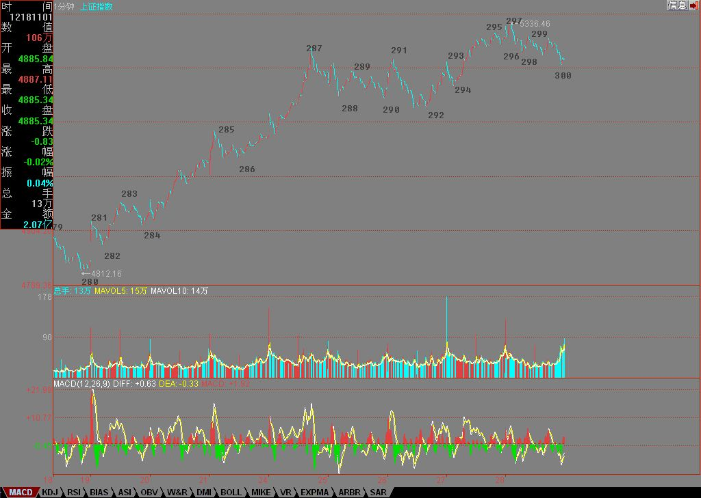{width="5.6299212598425195in"
height="4.0065048118985125in"}

## 赋《沁园春》兼祝各位2008新年好

(2007-12-28 15:56:00)

本ID要赶着出去干点私事，年末大假不能太亏待自己。

先赋《沁园春》一首，祝各位2008新年好。

2008年1月2日再见各位了。

《沁园春》

缠中说禅

踏浪天河，扬九星帆，执七斗壶。

命吴刚酿就，月宫桂酒；

羲和摘献，日殿龙珠。

黑洞探玄，灰熊试剑，

今古乾坤入有无。

谁堪共？尽时空隧道，声色荆途。

森罗万象如如，

能纵目，头头皆是吾。

笑王臣兵贼，千朝百国；

人神鬼兽，六合三涂。

幻海风迷，浮沤梦戏，

意画心描自主奴。

何所缚？转黄金大地，毒药醍醐。

## 08年证券市场的头等大事：尚主席，该高升了。

(2008-01-01 17:38:18)

本ID是严重反对"中国大妓院"这样的名字的，因为这里存在着严重的男权思维，但这样的称呼，至少在北京私底下已早不新鲜。这么多血汗钱，如果能搞出个真玩意，那还算是个玩意；但连个玩意都没搞太好，那究竟是什么玩意那就不用再玩意了。

新年新气象，那不是玩意的东西就不提了。去年，本ID的几篇文章，事后都达到其效果，至于是否与本ID的文章相关并不重要：

"港股直通车难以背负的使命 2007-09-24 08:52:17
"，在那无聊的脑子进水的直通车甚嚣尘上时写的，现在，那车终于还是没开起来，中国经济、市场的大幸；

"中国经济，已需治理整顿。2007-10-15
08:32:52"，后面的经济政策，已经与此相关；

"房地产泡沫，经济发展的真正毒瘤2007-10-09 20:57:56
"，听说前几天有一姓王装模作样的在CCTV完全对文中这一段类似内容进行了回应："比单纯的房地产泡沫更大杀伤力的，就是股市中房地产股票比重太大，在虚实两方面制造房地产泡沫。房地产企业，通过所谓的重估，拉抬自己的股价，从而用极高的价格在市场上圈钱，再去圈地，炒高土地价格与房价，然后再进行重估，开始新一轮恶性循环。没有比这种游戏更能制造恶性经济泡沫的，这绝对是致命的游戏。因此，当某些公司戴上世界上最大房地产企业的高帽高呼要去冲击万亿市值并借此大肆高价增发圈钱，有些股票只是因为某房地产企业的注入就连拉几十个涨停之时，这房地产与股市的虚实结合所产生的危机就已经到了不可忽视的地步。在股票市场上做庄的，只要资金链不断，那杠铃还不一样能一直举着？那些大面积囤地的房地产商，本质上和庄家没什么不同，如果他们从资本市场、银行体系上不断补充新鲜血液，那房地产的狂潮是不可能得到平息的。"

类似的文章还有不少，就不列举了。那么今年，本ID第一篇想说点什么？08年证券市场的头等大事：尚主席，该高升了。

用人就如同用药，每个人的能力与思维方式都像一种药性，药性是不容易改变的，药性的发挥与时机相关，这时机对的药，可能在另一个时机就不是好药了。

本ID从尚主席上任之初就一直给他鼓掌，甚至在别人不看好其股改政策时，本ID鼓掌力度更大，为什么？因为那时候药性是对的，这药用的是时候。

现在，尚主席已经为证券市场立下汗马功劳，应该高升了。任何好药，过了时候，反过来变毒药的机会就大增了。因此，无论对中国的资本市场还是尚主席本人，这时候快点高升，都是最好的选择。

多余的话，就不想说了，本ID对证券市场，08年只想看到三件事情：一、创业板的推出；二、股指期货的缓行；三、印花税的纠错。

## 指数疲软下的个股高潮不断

(2008-01-02 15:12:24)

如同这题目，第一天的行情继续预示着本年行情的特点，指数油水不大，个股油水不少，这已经在去年末反复说到了。用句概括性、动感更大的口号，就是：疲软指数，高潮个股。

当然，指数也不会无限制地疲软，指数往往会表现出痉挛式走势，突然抽起来，然后就再抖个不停。抽两下，抖十下，大概就是今年指数上经常会碰到的。哪天指数不痉挛，而是一往无前起来了，那反而要小心。

技术上，指数就是继续去年末那5分钟中枢的震荡，在第三类买卖点出现之前，继续抖个不停。

个股上，没什么可说的，本ID说的那些股票，今天又有好几只创出6124点来的新高，对于个股来说，6124点的高位就是一个强弱分界，突破站稳这位置，行情就会更猛烈。例如，600737就是一个好例子，14元多是6124点下来的高位，突破站稳后，现在已经到20元上了。

当然，对于具体个股，突破那位置后肯定都有反复，对待这种反复，最好的就是顺着做短差，把差价搞出来又不丢失筹码，不过这对操作水平要求高。还有一种就是定好5周线之类的中线位置，只要调整不破就拿着，例如，你看看600737，晃来晃去，把无数人恐吓下去了，你看他突破调整后什么时候有效破过5周均线？

面包会有的，今年是越早越安全，现在，个股机会远大于风险，就算个股年线要收阴，怎么也要先搞一个上影，而越到年中以后，就难说了。今年是先把粮食打足了，如果能有第二次机会最好，没有，也不会饿着了，一年的面包也会有着落了。

千万别追高买任何股票，如果错过了前面的，就在低价与二线中找那些反应迟钝但有资金驻守的。都是人，都要吃饭，只要有资金驻守，总要开张的，否则一年的花费谁给呀？

至于大家伙，技术好的，就等抽筋那几下抽点血，抖的时候就不一定陪着玩了。

先下，再见。

## 向5600高地攻击前进

(2008-01-03 15:18:39)

站住5209点颈线，下一位置就是5500-5600一线，这是十分简单的技术问题了。由于这个5分钟的中枢震荡还没有震荡出第三类买点，所以说这颈线突破100%有效是不严谨的。但生活有时候并不太严谨，否则就太无趣了，所以，没有100%的把握已经确认的事情，我们依然可以喊：向5600高地攻击前进。

做股票，说白了就是忽悠着冲锋陷阱，只是你去忽悠别人，别让别人忽悠你。既然08年属于早收割早有面包的年份，我们当然要在年初就大力忽悠。说实在，"向5600高地攻击前进"这点小目标，说出来都不好意思，也太低了，不过先忽悠低的，现在的人胆子小，毒药要慢慢喂，不像以前，说年内冲10000点，都有人和你急，他愣要说10000太低，还是12500比较好，50个250呀。

如果要冲指数，当然就轮到大家伙抽风的时间，但一定要认清楚现在他们抽两下抖10下的本性，现在是刚一阳复始，不适宜大家伙们太剧烈的运动的。

其他个股，去年下半年基金牛了一把，私募都憋坏了，今年肯定要报仇的。所以，收集好的，肯定是按节奏继续搞，没收集好的，就加快摩擦速度，不过那些现在都没收集好的，都是有点毛病的，算了，反正每次都要有人最后垫背的，没什么可说的。

个股的大节奏昨天说的，分水岭就是6100点相应的位置，对于中低价的，可能530那次是另一个更高的位置，如果在春节前后都不能有效突破这些位置，那这股票今年的前途就有问题了。当然，不排除有些最后当炮灰的庄家就是这么慢，但这里说的是正常的节奏，不说炮灰。

在那些分水位置上，肯定都要洗洗，如何洗，那是手法问题，看明白了，这股票就是给你送钱的，来这里，希望是真学会点什么。否则，白送股票给你也没用。例如，600737，8元这么明确告诉是送学费的，但估计也没几个能真把钱给挣到，这难道也是本ID的错？

再说一遍，本ID在这里只是陪练，能学到多少，还只能靠自己了。

先下，再见。

## 多头，有了冲动就要喊。

(2008-01-04 15:12:12)

今天走势最大的意义是什么？站在本ID理论的角度，就是突破5336使得周线上（1，1）的状态延续，在周线的（1，0）出来之前，也就是周线顶分型出现之前，尽管持股睡大觉。

炒股票，对于中短线来说，有什么比周线都出现向上笔的延续更理想的状况？在这种状况下，你的利润就有了一个超稳定的保障系统给于最强有力的保障并使得该利润尽可能地延伸。那些每天如惊弓之鸟一般的，请好好复习一下历史图形，如果那让你每天惊弓之鸟一样的震荡连周的顶分型都震荡不出来，那又有什么可惊弓之鸟的？

请复习一下历史走势，看看从3563点到6124点的走势，按照本ID理论里最低级的周顶分型就足以让所有的利润得到最大的延伸。

当然，如果技术高的，在周的（1，1）延伸里，也可以利用更低级别的走势搞出不少差价来，或者通过不同级别的震荡换股达到利润最大化。但这是对技术高的说的，如果没那技术，就天天睡觉，顺便可流点口水，每天收盘很无耻地看看周顶分有没有出现，然后继续更无耻地睡大觉，这样就足以让你超无耻地比很多人厉害了。

来本ID这里，关键是学东西。如果太计较自己有没有这股票，是不是赚了，那你的水平永远提不高。还是用本ID的股票为例子，一个最令人深恶痛绝的股票：600636。你是否在里面赚钱并不重要，关键是你能否在这经典走势中学到点什么。看看这经典的走势：一个ABC的下跌，其中的B段在120天线受阻，然后大力挖井后回手在120天突破回试确认，然后迅速回到井的上沿13元附近，一个超完美的井。后面干什么？就是要确认这井的上沿能否站住的问题了，这都是最标准的走势。如果对这类似的走势烂熟于胸，难道你还不能自如地应付类似的走势？

600078、000938等的是另一类型的走势，也是超经典的，请当成作业分析一下。

周末，又是多头发挥嘴皮子功夫的时候。多头，有了冲动就要喊。上升行情，本质上是喊出来的。就是上升多头爽了，然后就喊，见人就喊，喊得满大街的人都很冲动，结果就又上又升了。

周末，多头就多喊喊吧，爽了不喊会憋坏的。

至于超短线的技术分析，由于第三类买点还没有整出来，因此今天的突破并没有100%的保证，这突破是否有效，就看多头周末的嘴皮子功夫与喊功的诱惑力了，把大家都喊爽了、都冲动了，大盘自然就有效突破了。

周末，爽去吧。

先下，再见。

## 勇戴金箍大翻筋斗云

(2008-01-07 15:12:36)

这题目不是紫霞仙子给那只没良心的死猴子写的情书，而是关于现实股市的现实记录。

就算那死猴子，压在五指山下也要吃点铁丸喝点铜汁，而现在公历新年刚过，农历新年还没到，就算玉帝老儿也没资格让各路资金从此就饿着；就算有那资格，思凡下界妖魔鬼怪一番的，谁也挡不住。

因此，今天因为飞天烤鸭念出的2008第一次紧箍咒，也只能象征性地走了次过场。确实，当鸭子，也应该本分点，人家八戒还没上演飞天大乳猪，你急匆匆地扒光了毛来个鸭子大裸飞，还烤鸭版本的，这就有点过了。

过了就过了，修正了再来。这世界上，最折磨人的就是饿啊，一饿人就变态，资金饿了股票就变态，这点，大概连紧箍咒也只能不断升级才能走过场。

因此，今年的紧箍咒版本，肯定是不断升级的，各路资金，就根据自己的承受能力以及市场的总体状况，选择自己筋斗云的时机与方式。

大概现在没有人会反对本ID一直强调的两点：一、疲软指数，高潮个股，指数让他抽两抽抖10抖；二、先下手才会早点有面包，晚了，等紧箍咒变成大铁笼，我们就啃着面包看笼里的八戒变飞天大乳猪吧。

今天的走势，没什么可说的，周线依然（1，1），看看你自己的股票，他的周线是什么？然后继续睡觉。当然，如果你心特别急，那就看日线的，如果日线都是（1，1），那你还急什么？

不过，本周出现一次有点力度的震荡是很正常的，毕竟6124点下来的所谓双顶颈线5462点已经在面前，震荡一下，身心舒畅。

先下，再见。

## 5462点如期较大震荡

(2008-01-08 15:21:47)

昨天已说"本周出现一次有点力度的震荡是很正常的，毕竟6124点下来的所谓双顶颈线5462点已经在面前"，今天早上的跳空以及下午的线段类顶背驰，理所当然地形成对5462点第一次冲击后的必然震荡。

本ID昨天后面还说了："震荡一下，身心舒畅。"今天收盘后，被震荡一番的诸位大概每个毛孔洋溢的快感都如江水滔滔不绝于掩耳盗铃儿响叮当我们年轻时五月风光正迷人如蚁月如刀削面子曰俺这旮旯贼好。

其实，这些走势都是超技术化的，而5462点，也是一个超技术化的点位，这点位上下震荡一下，不仅必然而且必要。后面的问题只有两个：震荡的形式以及可能的结果。

开始上课。（本课堂可以自由出入，绝对不点名，特别是关门点名，对公然离开课堂者也绝对不拳脚相加，各位可以大肆交头接耳、手舞足蹈、谈情说爱、吃葡萄不吐葡萄皮不吃葡萄反吐葡萄皮。）

无论任何情况，首先都可以很教科书化地给出震荡的形式，按强弱分的一个完全分类，对应着相应的结果：

1、如果在今天跳空附近站住，这样，5200点那5分钟上来的1分钟上涨就形成，该1分钟上涨结束后，就是对应那5分钟的第三类买点，然后，就有绝大的可能形成4800上来的5分钟上涨，最坏，也就是一大的30分钟中枢。

2、如果在5360点那1分钟中枢处站住，这样，对原来5分钟中枢的1分钟向上只是一个盘整类型，后面站住形成一个第三类买点，后面形式一个大的5分钟中枢的机会更大，当然也有突破爆发形成继续中枢上移在更高位置形成5分钟中枢的可能，但一般来说，一个盘整类型的次级别偏移后的第三类买点，总是不那么激动人心。

3、如果跌回5200点上那5分钟中枢才站住，那就没什么可说的，一个大的30分钟中枢就此形成。

所以，纯分类化分析，不管是哪种情况，除了最强那种继续1分钟中枢上移，其余的都将面对一个至少5分钟中枢的形成，最坏还要形成一个30分钟中枢，唯一需要确认的，只是这个中枢震荡的位置高点还是低点，这对操作，本质上没有任何影响。

而实际上，大盘今天马上就把第一种情况给否了，所以，只要把第二、三种情况与实际对应好就可以。

以上，只是顺便把思维的方法演示给各位看，而在实际中，这些分类、判断1秒钟就应该预先反应出来，而有了这完全分类的预先操作方案，你还怕什么？

震荡是好事，特别对手脚麻利、技术高强的，最好就荡个千把回，3000%的利润都出来了。当然，对于技术不好的，震荡就是坐电梯，上上下下享受；对于心态更不好的，那震荡就是噩梦，左右被巴掌。

究竟自己属于哪种，请对号入座。

注意，本ID这里，是高低皆应。有些话是对高点的人说的，例如如何买卖点、背驰、震荡操作、换股、板块轮动之类的；有些是对没时间、短线反应慢的说的，诸如周的顶分型、5周线、持有睡觉之类的；所以，也请对号入座，并不是每一种操作都适合任何人的。

甭说本ID最近少写课程，每天解盘的课程的陪练意义可不要小视了。至于课程，写是要有兴致的，本ID最近兴致在和各位陪读历史，股票就先且陪练吧。

股票，陪什么都可以，就是不能陪套。

先下，再见。

## 上涨动力，来自清洗。

(2008-01-09 15:12:50)

其实，不仅是股票，这世界游戏的一个基本玩法，就是"上涨动力，来自清洗。"没有清洗，所有人都成功，所有人都吃香喝辣的，那就不是全球化资本的美丽新世界了。

到达顶端的，永远只能是少数人。

当然，股票上涨的动力，更离不开清洗。没有中途下车的，哪里有最后被落井下石的？没有踏空的、被洗的，哪里有最后被套的、接棒的？

藐视技术的，最终只会被技术所藐视。对付震荡、清洗，本ID理论里早给出了最好的办法：分型。请问：如果震荡连（1，1）在日线上都没打破，有什么可说的呢？对于技术高的，震荡后就要回补，如果没这个反应能力，就不做震荡，这个道理说了N的N次方遍了。

震荡，对于有准备的个股与资金，就是给了一个更好的上涨理由，越震越强。抛下一批人，轻装好前进。所以，很多股票，在震荡一下后就开始很无耻地创出新高。

无耻，一定是市场上最荣耀的事情。

本ID反复说了，年初越无耻越有面包，1月10日都没过，就想着逃命，那干脆今年什么都别干了，回家学君子剑吧。

技术上的情况昨天早说了，就是第二、三种情况的选择，5分钟还是30分钟中枢的选择。不管是什么，最终都以是否有效站住5462点为标志，站住，就再狂飙突进一次；站不住，就歇歇等能量聚集够了再来。

而个股并不大关心这些，因为资金很饿，管你站不站住什么傻点位，市场这么多资金，就算指数大跌，个股行情也依然不会含糊。所以，本ID早给了各位一个明示：疲软指数，高潮个股。

今天谁能越早把面包赚到手，就是牛人。年初不大胆，难道等着年底倾家荡产？

慢慢地，锅热了，大家伙也会变只蝴蝶满天飞。

在站住5462点前，震荡依然继续，震荡中会有三种人：随便抽血的、看着周顶分睡觉的、被左右巴掌的。你希望成为哪一种？

先下，再见。

## 把下面的指数剧本告诉你

(2008-01-10 15:19:00)

剧本早写好了，本来瓜田李下，不想八卦。但本ID只是想证明一件事情，就是在资本市场里，就算把剧本告诉你了，绝大多数人最后还是要在井里的，好一点的，就是上上下下去为电梯卖广告，不信？走着瞧。

告诉各位一个总原则，牛市里，深圳成分股是一个先头部队，十几年了，从来没改变过。为什么？说白了太简单，因为深圳一大早就爱看成分股，操控几十只股票总比搞1千几百只股票容易吧。自从96年那次把琼民源之类深圳成分股搞得漫天鸡毛以后，这特色就算留下了。这里还有资金方面的一些历史性与结构性原因，具体就不想八卦了，总之，这是一个总原则。

所以，所有关于上涨的有野心的剧本，第一原则，就是先把深圳成分股给挑出一片蓝天，如果深成指都没有蓝天，其他指数就更要一边晾着了。

挑出一片蓝天，关键是测试风向。

至于上海指数，一般都十分技术化。所有人都知道3600的1/8是多少吧？这次从6124点下来，就是3/8的3600，1350点，精确位置是4774点，结果搞了一个4778点，差了4点，真够差劲的。

6124点下来的2/8的位置是5224点，结果第一拨反弹的位置在5209点，差得有点多，都快15点了，太过分啊。

1/8的位置是5674点，这是下一个位置。但由于整个跌幅的一半在5451，而那M头的颈线位置在5462，所以这个点位是任何剧本里都需要折腾的位置。另外，注意，下跌的2/3位置在5675点，是不是和5674点有点类似？

剧本里对5860到5912这个缺口很不满意，已经准备了不少胶水，不过还有点缺货，什么时候把剩余的胶水准备齐了，关键看在5462到5675点时间段内政策面的风向，风向不对，那就先把买胶水的钱换成买棒棒糖的，一人一个棒棒糖，看你要棒还是糖。

风向不变，那就开始倒卖假冒的胶水，一人分一杯，粘只鸟儿就往天上飞。飞着飞着，突然散了架，剧本的一节到此结束。

至于下一节，有心情的时候，再告诉你。

今天大盘，继续折腾这5462点，看着越来越多人接受本ID早折腾早有面包的理念，本ID相当欣慰。

先下，再见。

## 2008年，谨防宏观调控过度

(2008-01-10 17:33:22)

按照中医的观点，治人与治国的道理是相通的。而对经济的调控，显然是治国中一个极为重要的方面。经济之病，与人体之病的道理，也是相通的。

中医将病的状态分为三种：未病、欲病、已病。而经济之病，同样有这三种状态。而病，不是一个机械的静止概念，病的状态，是可以不断转化变化的。而很多时候，病是吃药给吃出来的。一个小病，吃药给吃成了大病，这种事情并不是天方夜谈。经济问题，同样如此。

病无常态，药也无常态。站在大的视角上，天下万物，无一不是药，又无一不是毒药。相应了，就是药；不相应，就是毒药；而这相应，没有任何先验的必然法则，一切都是当下现成的，是当下一切分力的合力结果。

但更重要的是，对一切的病，任何外在的药永远都只是辅助性的，人自身自有无上之药，胜于一切外在的药物。真正的用药，最终必须以把人自身的无上之药给激发出来，这样才能真正地治本。当人自身的无上之药激发出来后，才能不治而治，否则，天天吃药，神药也要变毒药。

此外，用药也要因人而异，一个元气充沛的少年与一个油尽灯枯的老者，即使同样的病，用的药也不可能相同。同样，同一个人，在人生的不同阶段、在不同的地理环境下、不同的季节中，同样的病，用的药也不可能相同。

对于中国经济，站在一个大的历史角度，我们依然元气充沛而不是油尽灯枯。在这样的历史大背景下，任何对经济的用药，都必须以激发自身的元气自我修复功能为界限，而不能用药过度伤及元气。

更重要的是，我们的经济元气充沛，但我们的经络系统并不畅通、我们的任督二脉也远没贯通，这也就是为什么我们的经济特别容易发热病的根本原因。热病，光用去热之药是没用的，这甚至连治标都不容易办到，更不用说治本了。而热病不能治本，长期下去，水火不济、热毒相煎，就会淤结其中而化为毒瘤，毒瘤蔓延则成难治之症。

要治本，关键是要通经活络，打通任督，进而全身元气因时周转，生生不息而畅流贯通。任何的系统，都有其成坏住灭，治其本，并不是说就能长生不衰，而是要尽其天年。同样，经济的发展，有其阶段，有其成坏住灭，而合时的治疗与养生，就是尽其天年，让经济系统发展的相应阶段，尽可能地发挥其最大的力量，尽可能地延长其寿命、延长其发展的时间。

中国经济，正处在其历史性大发展的初级阶段，经济结构中一些最基础的单元都没有完全发育起来。我们元气充沛，但我们器官幼稚，各功能系统也处在极端幼稚阶段。因此，我们任何的治疗，都离不开对各功能系统的养育。任何过猛的药，对于极端幼稚的功能系统，其作用都是极端恶劣的。一个经济系统，由于在发育阶段过度用药、胡乱用药，最终导致某些功能系统彻底发育不良进而导致经济的长期畸形发展，这在世界经济历史上并不是罕见的事情。

人身体的健全，首先是各器官、功能系统等的健全；同样，经济系统的健全，如果没有各基础的单元系统的健全，那么是完全不可想象。对于中国这样一个市场经济的青少年，关键是身体发育的健全，离开这一点，任何疾病的治疗都毫无意义。

2008年，谨防宏观调控过度，就是因为我们的经济现在正处在青春期发育的关键时期，但我们很多最基础的单元并没有达到应有的发育水平，这时候，是用猛药把一些病状强行压制，还是用适当的药进行稳定疏导，尽快补课，把该发育好的部分尽快培育，这对中国经济的长远发展有着决定性的意义。

## 因为饿，所以疯狂。

(2008-01-11 15:10:16)

世界上最疯狂的是什么？是饿。这对于资金，也是一样的。

今天的大盘，没什么可说。周末效应了一把，但依然继续对5462点的震荡确认，今天当然只会是试探性质的，完全没必要在指数上干些只争朝夕的事情。

但个股上当然不同了，资金饿啊，春节要买年货啊，年货都在贵ing，除了那些脑子有水的，饿绿了眼的资金，哪里管得了什么周末效应。

站在周线角度，下面两、三周是极为关键的，为什么？因为MACD的绿柱子在收敛，而所有的骗线，最爱的就是这种收敛放红途中的突然转折。

当然，这只是技术的可能陷阱，政策面上，按道理，春节前是不应该有人太干活的。但今天的天气是否如常，没人说得清楚。预测天气这种事情，完全没必要。

唯一必要的，就是大干快上，把自己安放在一个绝对安全的位置。管他刮风下雨，有了足够的利润，什么变化都可以从容面对。

到了5600点上下，政策的因数就会变得极为重要了，新人新思路，市场各方无一不在相互摸索探究中，放个气球，测测风向，大概还不是问题的根本所在。

这些无聊问题，其实都可以安放到周的顶分型、（1，1）里，对于懒人来说，没时间探究这些分力之间的游戏，一切都在走势之中。

看看，周（1、1）依然，日（1，1）依然，你就继续睡觉。

周末，放风了。

先下，再见。

## 指数犹疑，个股补涨

(2008-01-14 15:10:28)

到了目前这个位置和时间段，大盘进入敏感阶段。首先，对于多头来说，好不容易到了5600点上下这最重要的阻力跟前，绝对不想一个哆嗦就给震回去。但这个关口确实比较压力大，主要不是技术上的，而是心理与政策面上的。

从政策面的角度，很快就进入春运阶段，因此，对于政策的活动空间，这几天是最敏感的。如果要有什么花样，这几天的可能性最大。到了月底，快春节了，大家都有忙的事，而且没人想给中国足球队当挡箭牌，那群家伙除夕准备给大家添堵，难道还有谁想分担一下被骂的风险？这种人大概是没有的。

所以，指数在这个时间段犹疑一下，并不是太严重的事情，目前技术上，继续是原来说的第二种情况，在5462点附近震荡出一个5分钟中枢，大不了向一个30分钟的延伸去，所以指数依然继续抽两下，哆嗦十下的节奏。

个股上，一些前提幅度较小的板块开始补涨，由于大家伙这时候不适宜集体暴动，因此这些补涨后板块的动向就很关键了。现在市场越来越大，参与的资金成分越来越复杂，只要指数形态不破坏，板块机会还是很多的。

到5600点上下后，震荡的幅度会有所加大，现在最好的策略，就是往上拱，拱一下，震几下，这样心态、技术等压力就会慢慢破解，千万不能急，急了，根基就不稳。

技术不行的，中线上，继续看周的（1，1）保持情况与5周均线，短线看日线的相应指标；技术好的，可以利用5分钟震荡的节奏进行板块操作。

先下，再见。

## 大盘压力期下的多头策略

(2008-01-15 15:09:40)

已经反复说过，目前大盘进入压力期，首先是政策的敏感期，其次，技术上也有相应的重压力区在面前，更重要的是，除了大家伙，板块在基本轮动一次后，很多股票都进入相对的调整期，这时候对多头来说，确实有点压力。

一般来说，碰到这种情况，有两种处理的方法：一、跳一次大水，把压力变动力，把不坚定的赶跑，用空间换时间，加快调整的结束；二、在这里上下震荡继续磨，让成交量慢慢萎缩下来，以时间换空间，最后取得新的上升能量。

不管哪种情况，用本ID理论的角度看，都是扩展出30分钟的中枢，然后再寻求突破。5462点这个位置，反复强调，一直不能有效站住，需要多头努力的事情还很多。

说白了，现在最好有一个不大不小的利空，这是对多头最好的礼物，否则，现在消息面太平静，反而对心理上不是一个好的暗示。大盘究竟采取哪种调整方式，其实从30分钟的震荡走势中不难发现，一般来说，成交量能萎缩下来，就第二种方式；否则，并不排除有一到两天让大家再次想起亮晶晶的机会。

个股的节奏以前已经说过了，一般突破6124点或530高位的股票，都会相应有所调整，如果能站住，就会有第二波，现在很多股票都处在这种状态，等待大盘最终调整的结束。

只要有一点机会，多头都会往上面去挑逗那5600点的重压力，但折腾少不了，必须耐心才有好果子。

先下，再见。

## 教你炒股票93：走势结构的两重表里关系2

(2008-01-15 18:08:05)

显然，所有问题都集中在（1，0）或（-1，0）之后怎么办，如果这两种情况后只有一种情形，那当然不错，可惜这世界没有这么简单，（1，0）或（-1，0）之后，都有（1，1）、（-1，1）两种可能。

以（1，0）为例子，（-1，0）的情况反过来就是。（-1，0）这个信号是绝对明确，毫不含糊的，任何人都可以唯一地去确定。那么，一个同一的信号，对于不同的人，处理的方法是不同的，这和每个人的水平相关：

一、如果你震荡操作的水平一般，而又胆子比较小，又没时间、跑道，喜欢落袋为安的，那么，一个足够周期的（1，1）后出现（1，0），例如周的或日的，这意味着已经有足够的获利空间，这时候，最简单的作法就是把成本先兑现出来，留下利润，让市场自己去选择，不费那个脑子了。

剩下的筹码可以这样操作，就是如果出现（-1，1），那么意味着低周期图上肯定也出现（-1，1），那么在这个向下笔结束后回来的向上笔只要不创新高，就可以把剩余筹码扔掉。例如周的，你可以看日或者30分钟周期的低周期。当然，还可以直接就看周的5周均线，只要有效跌破就走，这可能更简单。

二、如果你震荡操作水平比较好，就利用（1，0）后必然出现的震荡进行短差操作，由于都是先卖后买，所以如果发现市场选择了（-1，1），那么最后一次就不回补了，完全退出战斗。

注意，利用短差操作时，一定要分析好这个（1，1）到（1，0）所对应的走势类型，例如一个周线上的（1，1）到（1，0），必然对应着一个小级别的上涨，至于这个级别是1分钟还是5分钟、30分钟，那看具体的图形就一目了然了。

（1，0）的出现，有两种可能的情形，一、该对应的上涨出现明确的背驰完全地确认结束，那么整个震荡的区间，就要以上涨的最后一个中枢为依据，只要围绕着该区间，就是强的震荡，否则，就肯定要变成（-1，1）了，就是弱的震荡了。弱的震荡，一般一旦确认，最好还是不参与。等出现（-1，0）再说了。

三、如果市场最终选择（1，1），那么这个（1，0）区间就有着极为重要的意义。这区间上下两段的（1，1），就可以进行力度比较，一旦出现后一段力度小于前一段，就是一个明确的见顶信号，然后根据对应的走势类型进行区间套定位，真正的高点就逃不掉了。

上面，把可能的操作进行了分类说明，方法不难，关键是应用时得心应手，这可不是光说就行的。最终能操作到什么水平，就看各位自己磨练的工夫了。

## 大盘又见亮晶晶

(2008-01-16 15:17:40)

昨天说"并不排除有一到两天让大家再次想起亮晶晶的机会"，结果，今天那花旗参大作广告，使得大盘又见亮晶晶，严重怀疑亮晶晶暗中代理了花旗参的销售。

中投公司，前段时间不是牛哄哄地趁底买这股权那股权，现在花旗参来了，中投公司是不是又想把一千几百亿往里面填数堵窟窿呢？

中国人该干什么，本IDN年前的人民币与货币战争里就说清楚了。中国人根本没必要去美国人的地头玩，中国人要烂也只能烂在自己的锅里，自己创造一个全世界的市场，别人爱来不来，我们就自己玩了，憋死你们。十三亿中国人难道还要请3亿的美国鬼子来才可能开桌打麻将？甚至还要漂洋过海去纽约开麻将桌？可笑！

当然，如果你今天把本ID说的股票当成自选股，没看指数，那么，今天好多无耻地放红，不少更无耻地创出新高，完全没美国鬼子什么事。不过，这种情况，如果过分延续，是不好的，太脱离指数也不好，所以下面还是探讨一下指数的问题。

显然，今天的走势对多头来说，并没有什么大不了的，甚至是多头所乐于看到的。这原因，昨天已经说了。技术上，今天的缺口有着极强的技术意义，如果三天之内不回补，那么大盘后面的压力就进一步加大。下面关键是5209点的颈线位置，这位置只要不有效跌破，大盘就依然在多头的控制之中。

短线上，5522点下来的这个线段的类下跌过程十分技术化，两个类中枢也十分明显，下面就是这类下跌的类背驰问题了，一旦出现，就是一次有力度的反弹，关键是这反弹能否突破第二个类中枢的牵制，如果不行，那么缺口的回补就有困难，所以这才是技术上的关键。

日线上，昨天的顶分型后，现在延伸成笔的可能太大了，只要明天有新底就基本确定，所以，稳健的角度，可以等底分型才会有真正的站稳可能，所以这个类背驰能否最终制造出底分型，就是进一步考察的关键。

个股方面，很多股票会继续表现的，当然，如果你觉得心脏受不了，可以先把本拿出来，例如600737之类的，剩下利润在里面继续。有些股票，会涨到你不相信，等你相信了，就是井了。

要出一次差，到深圳开一个和PE有关的股东会议，后面几天，晚上的帖子，可能保证不了了，不过解盘还是保证的。

先下，再见。

## 不会享受大震荡的人股票就没入门

(2008-01-17 15:14:57)

当然并不是本ID去深圳，所以就深深地把各位深圳了一把，千万别这样想，否则本ID肯定不能再去长沙了。

亮晶晶一、两天，今天不过就是第二天，多么优美的节奏，不懂得欣赏，太浪费剧本费、排演、场租了。

当然，享受有不同级别，一种是被动型的，一种是主动型。被动的就不说了，都是电梯广告的最好代言。而主动型的，就要靠技术了。

别小看了最基础的分段技术，5522点下来，近500点，就是一个线段的类下跌，你明白了，就主动了，就享受了。为什么？最猛烈的中枢移动中，往往就是一个线段的类趋势，所谓的单边跌势或涨势，就是这玩意，明白了，你说你能不爽吗？

今天一大早的急拉，只构成了笔，没有破坏下跌段，如果明白这点，操作就太简单了，因为你绝对不会错过下午那明显的类背驰。

但注意，由于这个类背驰的不是在两个类中枢间的，而是单纯一线段中出现的，所以，这个回拉如果不能重新站住5209点，那么后面还要二次探底。

本周开始时已经说了，春节前要出点情况，就是这周了，后面，就要逐步营造点和谐的气氛，但在营造和谐之前，首先要营造的是恐怖，没有恐怖，把不坚定分子彻底清洗，哪来和谐啊？

个股方面，昨天的提示已经足够明确："这种情况，如果过分延续，是不好的，太脱离指数也不好"、"如果你觉得心脏受不了，可以先把本拿出来，例如600737之类的，剩下利润在里面继续"，今天早上，这些股票都有红盘，000822之类的甚至还有新高让各位去反应，如果你没反应，那本ID也没办法了。总不能举着杠铃让最没反应的人去反应吧，如果这样，这就不是市场，而是童话世界了。

至于600319今天还涨停，那不过是一个态度问题，这里的老人大概都知道，就算是530最恶劣的时候，本ID说的股票里还总有一两只顽强地红盘的，注意，一定要声明这可和本ID无关，那大概是电脑出毛病了，抽筋了。

注意，现在没必要追高买股票，注意调整中洗盘洗干净后准备重新启动的，还有就是前期不动，有新资金介入的，但所有的前提是，大盘的恐怖期过去了。

明天周末效应，震荡肯定还会有，但如果没有什么特别的东西，幅度会逐步小下来的，其他，等过了周末，看看消息面、政策面情况再选择。

技术高的，现在是游戏的黄金期，一个30分钟的震荡，操作好了，收益比单边还要高，特别对资金不大的散户。没这水平的，就把仓位控制在适当范围，也就是可以睡觉睡好的范围，等日的底分型出现再说了。

先下，再见。

## 今年投资者的四种命运

(2008-01-18 11:45:59)

下午一收盘就开始股东会，没时间写解盘，晚上，这群家伙不会放过本ID的，周末有时间再补上，抱歉了。

早上走势，和昨天说的一致，就是两天的亮晶晶后，震荡还有，但幅度变小，但由于5209点没重新站住，大盘总体还在一个剧烈震荡后的平复期，依然有较大不稳定因数与情绪需要时间平复，另外，周末的政策消息面以及外围因素，依然有巨大的心理影响。

下面，把写好的一帖子贴上来，算是今天的帖子了。

在去年底的今年展望中，已经明确指出今年走势的多变性与操作难度。

今年"与井同行"，一般来说，没有足够的自我意识，企图靠拐杖的人，今年都会比较麻烦。投资，是一种专门的学问，前提是，你首先是一个有思想的人，而不是一个木偶。

就像在那篇关于剧本的帖子里本ID说的，就算把剧本告诉你，很多人最终还是要落井。为什么？因为，首先很多人大概都是跟着孔男人学的中文，中文理解力几乎为0，剧本可能也读不懂。例如，当时写的这一段："剧本里对5860到5912这个缺口很不满意，已经准备了不少胶水，不过还有点缺货，什么时候把剩余的胶水准备齐了，关键看在5462到5675点时间段内政策面的风向，风向不对，那就先把买胶水的钱换成买棒棒糖的，一人一个棒棒糖，看你要棒还是糖。"

如果你竟然能理解成大盘一定要先到5675点，那么，就去找孔男人追讨中文的学习费用吧。请问，5522点是否5462点到5675点之间？请问，这时候发棒棒糖难道有一丝一毫违反剧本吗？关键是，你在这过程中，是吃棒了还是吃糖了？技术好的，在这个震荡中，早爽呆了；技术不好，心态又不好的，不吃棒那是没天理了。

"一人一个棒棒糖，看你要棒还是糖。"这句话，好好体会吧，全年都有意义。

其次有些人，理解到了，看到5522点后的日顶分型，但就是对自己的判断没信心，一定要一个拐杖。好了，就算本ID提示有1、2天亮晶晶的拐杖，但真来了，估计你也没心情拐杖了。

本ID在日顶分出现的当晚给了"教你炒股票93：走势结构的两重表里关系2
2008-01-15
18:08:05"，很多人看了，觉得是重复，和以前的没什么不同，你现在在去看看这针对性，你选择好了自己的位置没有？你属于什么类型，对应的处理，你处理好没有？

操作，不是一个纯学院的讨论，操作都在细节之中。何谓细节？你自己的水平，就是第一大的细节。然后选择符合自己水平的操作，这就是第二大的细节。最后，按规程操作细节去操作，这就是操作的全部。

在市场中，不首先认识好自己，一切都瞎掰。

本ID之所以写这帖子，是因为现在2008年才过了10几天，如果现在不彻底清醒过来，那么，今年将是很多人的灾难之年。最好的选择，就是现在马上退出吧。

今年，所有人将面临四种命运：

1、技术好、心态好的，将比去年还赚钱，别小看震荡的功夫，回头看看，从6124点下来到今天，也就是走了一个30分钟的盘整，只不过这中枢有点低，在5209点上下。谁只要把线段、1、5、30级别搞清楚，对于散户来说，足够了。按本ID的理论，2005年中开始的行情，到目前为止，最多就算是日线级别的，一个日线级别就走了2年多，你就知道本ID这体系的宽广度。

2、技术好，心态不好的。这种人几乎没有，因为真的技术好了，一切都看明白了，自然心态好。如果真有这种人，那今年的成绩也就赚点小钱了。

3、技术不好，心态好的。今年就做电梯广告，最后，那电梯广告做多，老化了，有出大事故的风险，例如，突然从20楼掉到负18楼。

4、技术不好，心态更不好的。今年将是这种人的灾难年，是最好的绞杀对象了。

今年，给所有技术不好的人一个忠告，就是一旦有足够的利润而有出现不好信号时，一定要先把本给拿出来。

另外，给那些还希望有更大追求的一个提示，你看看本ID说的股票，当成一个投资组合，你就会发现这个组合十分地有意思，就是此起彼伏，几乎没有一天闲着的。为什么？对于大资金来说，这样是效率最好的。资金才可以最大效率地流动，才可以又清洗又发力，动态地膨胀。

其实，去年初本ID就明确告诉过，本ID的股票组合就是这样的，如果你是散户，能左跳右跳地根据组合中的买卖点来轮动，那你的收益就十分惊人了，绝对比追什么黑马股票要牛多了，而且极为安全。当然，能做到这一点，并不容易，但这好像是一个考验，一个提高，现在做不到，也要有这方面的意识才行，否则，资金的高效率，就很难办到了。

注意，你的组合选择不一定按本ID的来，本ID的可以当成一个教学的版本。

不过，一定要注意，没这水平与意识的，就算了。我们总要实际点，不是每个人都能成为高手的，更多人一生的努力，也就是这样了，这是实际的话。

有些话，只是说给相应的人。世界上的山峰，并不是所有人都能或需要会当临绝顶的，先把自己认识清楚，把自己的能量激发出来，如果这样，你就是能会当临绝顶的人了。

在那绝顶之上，万古长空。

## 多头能否构建缓升通道？

(2008-01-19 10:31:53)

对不起，昨天忙于开会，没时间解盘，现在补上。

周五大盘这种走势，已经在周四解盘中说过了，就是震荡幅度减少，等待消息、心理面的平复。周五，一个标准的箱型震荡，最后高收，由于5209点的跌破，没有到三天的基本限期，所以只要下周初能站上去，就可以了。

好了，现在，用最明确的语言告诉各位后面大盘的走势。但本ID依然要告诉你，肯定还有很多人，特别是跟着孔男人学中文的，最后还是要到井里去。本ID的语言，从来都是如数学般精确，关键你能看明白。

现在，就是一个30分钟的大震荡，按照本ID的理论，30分钟的震荡，最坏的情况，破4778点也是可以的，为什么？这么简单的理论问题，就别问为什么了，去看课程去。

当然，对于多头来说，当然不希望出现30分钟震荡中那种最坏的情况，那么，对于多头来说，化解这30分钟震荡的唯一方法，就是制造一条缓升通道。

现在，你打开日线图，这缓升通道的4个原始支点中的3个早出现了，这次的亮晶晶，如果多头能控制住，那么就是完成第4个原始支点的制造。有了4个点，上面两个，下面两个，这通道就形成了，后面就可以按这通道继续游戏了。

这通道的特点，就是速率比较缓，但幅度比较大，这样，就可以制造出相应的行情，又有足够的回旋余地。是目前多头在如此政策消息技术面下唯一最佳的选择。

通道式上涨，是最不消耗能量的，只要操控得当，就可以把成本震荡得最低而又保持好基本的形态，一旦有一个飞腾的机会，就可以破通道而出，最后挖出了迷绝众生的大井，让所有被通道折腾的都变青蛙去。

本ID已经把坏招都说了，但本ID一定要声明，本ID不是多头也不是空头，本ID只按自己的理论办事，因为，一旦多头失败，陪葬的只能是他们自己，本ID最多会给他们加一把土的，

不过，为了今年的面包，在年初的时候，本ID在精神上当然是支持多头的，对多头下手温柔点，目的是为了后面把他们养肥了好下重手。无疑，对多头的缓升通道，本ID是乐见其成的，也会一旁摇旗呐喊一番。

但，本ID对30分钟震荡的所有情况，都会有相应的对策，一旦多头不能显示出足够的信心，本ID会把他们变成青蛙煮粥喝的。

面包不够，只能喝青蛙粥了，好可怜啊。

如果上面的文字都看不明白，就快去追讨孔男人去吧，孔男人，你教的什么中文？

但更重要的，比追讨孔男人更重要的，就是一定要知道，学习本ID的理论后，就永远不会有什么无聊的多头空头滑头的想法，市场只是市场，走势只是走势，如此而已，你需要的，只是倾听。然后，你的心里马上升腾出所有可能走势以及相应的对策，然后，就看着市场的出牌去出牌，如此而已。

市场，不过就是一桌麻将，周末，搓去吧。

明晚，北京见。

## 又被暗算的多头尚能饭否？

(2008-01-21 15:18:54)

刚被花旗参暗算完，周末又被平安保险暗算了一把，多头至少在指数上已经没有任何的回旋余地。技术上，前面已经说了，5209点不能重新站住，就要二次探底，直到出现日的底分型为止。而一个30分钟震荡，4778点在最坏的情况下完全可以被击破。被暗算的多头今天开盘无力站上5209点，就使得后面的走势变得只能以坏的选择去选择了。

站在本ID的角度，并不大关心这类问题。本ID最关心的问题，最近都有了答案。应该记得，去年末时，本ID痛斥了某些人为了某些原因，企图年末抢闸上报所谓的股指期货，现在，事实已经出来了，那企图已经破产，而那些尾随而上资金，不仅失去了一波大的个股行情机会，而且终于忍受不住，落荒而去。

这就是本ID最愿意见到的结果，股票，可不单单是那几条曲线。对于散户，当然可以只关心曲线，但后面的刀光剑影，你又能知道多少？

大资金，只有杀大资金才能爽的，那些整天盯着散户的资金，算个屁。

本ID的观点从来都很明确，要烂就都烂在A股，本ID一直的愿望就只有一个，把A股变成全世界最大、中国人自己的麻将桌，让鬼子只有屁颠屁颠的份，任何违背这个目标，本ID都要竭尽全力去阻击，例如上次那无聊的直通车。

回到今天的市场，那平安不平安，石油变瀑布，大家伙当然是有用的，等某些人彻底认输了，大家伙就有用了，如果不认输？那就想想本ID曾说过的关于中石油的一个酒桌上的故事，把话挑白了，如果不投降，那故事里的数字是可以修改的。

不说故事，说技术。按纯技术的分析，从5522点下来，按照本ID的理论，线段下跌结束后，中阴形成1分钟中枢，那么，最坏的情况，就是这中枢是1分钟下跌的第一个中枢，如果这样，这跌势还早着，至少要等到这1分钟下跌背驰才完。还有就是先扩展才5分钟中枢，因为30分钟级别的震荡，最大的级别只能是5分钟的，因此一旦那5分钟形成，最坏的情况，就是那是5分钟下跌的第一个中枢。无论后面的中枢是1分钟还是5分钟的，都要走出第三类买点才算真正摆脱下跌的压力。

而实际上，由于今天下午已经把那1分钟的中枢的第三类卖点（在什么位置和时间，一个简单的题目，如果当时不能正确马上给出的，都要补课）给制造出来，所以，下面最好的情况，就是扩展成5分钟中枢，而且，1分钟下跌形成的机会绝对不小。

从理论上有了这么明确的分类，后面的操作就很简单了。如果你不想烦，就看日的底分型的形成时再说。如果你特爱好换股短线，那么，就根据这个中枢的演化去安排具体的操作，事情就是这么简单，唯一有点复杂的是，你操作的是具体股票，指数是指数，股票是股票，从来就不经常是一回事情。所以，多关心你自己的股票，你的股票池的具体走势。例如，就算今天的走势，依然有股票继续新高。

注意，严重注意，任何股票都不值得追高，本ID也不需要任何散户来抬轿子，没有永远上涨的股票，股票涨多了就要歇歇，有本事的，歇歇也能震荡出利润，没本事的，涨多了，就把本拿出来。

任何持有的股票，都以能吃能睡为最基本的持仓标准。如果你持有一只股票，已经影响到的睡眠与吃饭，请马上退出。

股票，说白了只有四个字：级别、节奏。参透了这一点，就大块吃肉，大碗喝酒，日日好时光，天天419。否则，就被股票节奏去吧。

中线上，又被暗算的多头尚能饭否？本ID在去年末的今年分析中已经明确说过，今年完全有可能创不出6124点的新高，但，今年不是指数的行情，而是板块行情，这点，在那帖子里已经明确说过了，就算指数不创新高，依然有无数机会在等着，关键是你有没有这样的技术和心态。

少坐电梯，多练技术。最简单的一招，见日顶分型走，日底分型再回来，这一招练熟了，今年就能少坐很多电梯。

再次将本ID今年希望的三件事情说一下：想见创业板，不想见股指期货，印花税要降低。不管如何，希望都能实现。

先下，再见。

## 教你炒股票94：当机立断

(2008-01-21 17:29:47)

**本ID说过，要学本ID的理论，首先要洗心革面。为什么？因为你前面一切关于股票的知识，可能都是后面学习的毒药。在本ID这里，只有严格分类后的不同操作类型，没有其他那么多无聊的不切边际的所谓预测。**

**一句话，来本ID这里学习，第一层次，就是要达到：当机立断。**

**机会，是可以预先分析的，但这分析，不是预测，而是建立在完全分类基础上的边界分划，这分划完全来自本ID理论的纯数学构造，这构造的唯一性与精确性保证了这分类与边界的当下确认性。**

**其实，这问题已经说过，但必须再次说，为什么？因为这是一种完全不同的思维方式，如果你不能明白，就永远与本ID的理论无缘。**

**例如，在现在，对以后的大盘走势，我们马上可以分析出所有必然出现的机会：1、一个最小的机会，就是大盘线段下移后形成的线段类背驰，这里对应这两个目标，最好的是回拉上面的1分钟中枢从而形成5分钟中枢，剩下的就是形成第二个1分钟的下跌中枢。**

**2、第一个机会出现后，根据演化的当下选择，马上可以找到下一个必然出现的机会，就是如果是5分钟中枢，那么就有着一个中枢震荡的机会；如果是1分钟的第二中枢，那么就等着后面的底背驰或者这中枢扩展为5分钟后的震荡机会。**

**类似地，对任何走势，我们都可以根据理论，马上严格地给出必然出现的机会。市场就是这么贱，虽然折腾无数的人，但就是从来没有任何失误地按照本ID的理论去走，所以，本ID可以把市场叫为面首。**

**任何一个当下，你都可以根据本ID的理论马上给出后面必然要出现的机会。上面说的是买点，卖点的情况是一样的。**

**好了，你根据理论，可以罗列出一大堆必然出现的机会。后面面临的，只是选择问题。例如，第1个机会，你会觉得级别太小，不想搞。那么不想搞就不想搞了，就像一个面首，你见了不想搞，难道还需要什么理由？**

**你真正明白了本ID的理论，操作其实就是这么简单，唯一需要问自己的，就是你现在有没有搞的兴趣，这个机会，这个面首，在这一刻，你想搞吗？**

**如果你想搞，那么，你就需要一系列的准备，通道的、资金的、一切的安排都要安排好，然后关键要把退出的边界条件也设置好。**

**例如，对于第1个机会，设置的退出条件，就可以是原来的最后一个类中枢，或者是线段向上走势类型中的类背驰或类盘整背驰。**

**当然，根据这样的设置条件，在T+1条件下，你完全有可能走不出来，为什么？因为这买卖点可能就在当天完成了，买了卖不掉。所以，在设置时，可能还要参考机会出现的时间，如果在早上，可能要考虑一下。如果在下午，那就胆子可以大点。**

**当然，这还和你自己实际的情况有关，例如一个中线走势极为良好的股票，如果一个线段下跌就去掉了20%，而你又在高位跑掉了，那这个回补机会当然就可以胆子大点。**

**更容易的，就是把级别放大点，如果你按周线操作，那么从2005年下半年买了到现在，你根本连一次都不需要操作，谁告诉你本ID的理论只做短线的？是孔男人告诉你的吧？**

**对于每种机会类型，都需要把各种可能的出现情况都考虑清楚，这样可以判断其力度，从而绝对进出的资金量。这就如同419，你今天想419了，但总要看到真正的货后，才能决定这投入的量。谁告诉你419就一定要奋不顾身的？419难道就不可以见了就撤？从见了就撤到奋不顾身，这里可以有无数的情况出现，当机立断，这就是唯一的。**

**学了本ID的理论，脑子里必须时刻有两个字：级别。如果连级别都搞不清楚，你还419？被419还差不多。有了级别，就是节奏问题了，419，就是见好要收，而不是天长地久，这都不明白，就等着灾难连连吧。**

**不会卖出，就等于失去了下次买入的机会。这个节奏之所以难，说白了，就是贪嗔痴疑慢作怪。**

**对于初学者，一定要机械地给点束缚，等于那死猴子带上个圈圈。这个束缚，就是5周、5日这些线，一旦分型后有效破了，一定走，这就是束缚。当然，对熟练的，就不需要这些了，严格的走势分类自动就给出一切。**

**练习的第一步，很简单，就是在任何时刻点位，都能马上把后面根据理论把机会第一时间反应出来。**

**注意，任何的机会，必然在本ID理论的输出中。市场的机会与本ID理论的输出，是严格一一对应的。这就是本ID理论所以厉害的其中一面。**

**第二步，根据自己当下的心情、资金等等，选择介入的机会，放弃不想介入的机会。**

**然后就等待机的显现，当机立断，就这么简单。但，这最后一步，足够你修炼N年了。**

## 超短线反弹在即

(2008-01-22 15:12:04)

**看今天的帖子之前，如果没有看过下面的帖子的，请先看看"2008年行情展望2007-12-20
15:59:05"**

**大盘的走势，和昨天晚上课程说的是一致的，就是等待第一个机会，线段下跌的类背驰，显然，在今天早上的反弹后，第二个类中枢已经形成，所以，这个第一个小机会已经在即，这构成短线的一个反弹。**

**这反弹，将至少构造一个1分钟中枢，由于在5100上下已经有1中枢，因此这构成1分钟下跌的第二中枢的可能性极大，除非能线段式地一下重回5100点，否则，只有这种情况。**

**1分钟中枢后，就是扩展为5分钟或出现1分钟下跌背驰两种情况，而这次反弹，在最坏的情况下，构成对4778点跌破的回抽，然后再次探底，因此，能否重新站住4778点，这是短线最关键的问题。**

**上面这机会的把握，就看你的技术了，没这技术，继续等到日的底分型确认才介入，这样，风险比较小。**

**注意，这次的回跌，有着很多股票之内之外的因素，站在长远的角度，这样一次走势，是必须的。就算最简单的情况，印花税如果还是现在的，谁都没法混。此外，那些所谓的大家伙，随便就狮子大开口，这样的情况不警戒一下，以后谁都没法混。**

**市场的游戏规则的维持，有时候是很残酷的，这点没什么可说的。**

**注意了，今年是井的年份，井可以是上面的，也可以是下面的，今年，只有心态加技术才能够成功。**

**心态好的，坐一次电梯，那这次电梯后，最好也顺便把技术提高一下；至于心态不好的，那就上面落井，下面再落井，本ID的青蛙粥原料充足了。**

**当青蛙还是猎手，自己瞧着办吧。**

**先下，再见。**

## 教你炒股票95：修炼自己

(2008-01-22 16:10:20)

**本ID觉得，当人被刺激后，大概学习的效率会高点，所以就连续写课程了，让有缘人得之。**

**要战胜市场，首先要了解市场的众生。市场是合力的，而合这力的不是机械，而是活生生的人。**

**市场中，最多数的，都是糊涂蛋，赚钱了不知道为什么，亏钱了不知道为什么，最后变青蛙了，也会说，井上面的天空好大，好复杂，怎么处理啊？哪里有拐杖啊？**

**几乎绝大多数的人，进市场来时，根本不知道市场是什么，然后就不断投入，最后有些输红眼了，砸锅卖铁也就进来了。**

**对于市场，本ID有一个观点，大概有点过分，但确实是对的。市场，就是要0投入去赚钱。**

**很多人很关心ID的投资历史，当然，有很多事情，不能说，因为涉及太多的东西。但有一样事情，本ID是可以说的，就是本ID在市场中，等于没有投入过1分钱。**

**本ID第一笔钱是90年初新股赚回来的，那时候买新股的钱，很不好意思，不是本ID的，上市后，就把本还了，剩下的利润，就是本ID在市场中的第一笔钱，从此，无论本ID操作的钱有多少，本ID从来没有在市场中投入过1分钱。**

**当然，现在还按90年代初那种疯狂状态是不行了，但本ID还是觉得，你投入市场的钱，一定不能无限增加。如果你第一笔投入100万，还不能赚到钱，你还投什么啊？你100万都搞不好，难道想搞100万的平方啊？**

**只要你有稳定的技术和操作，初始投入多少根本不重要。就算你只有1万元，10次翻倍操作后也就1000万了，而即使你开始有1000万元，10次连续的亏损后，你也没有多少钱了。**

**问题不是投入的多少，而是技术与操作。所有把市场当赌场的，最终的命运都只能是悲惨的。**

**对于市场上的众生，本ID给的第一忠告就是，把你的第一笔钱运作好，然后把本拿走，最后把这利润变成巨大的数字，这才是市场中的真正操作。**

**市场上的真正成功，是以十年为单位的，无论你开始有多少钱，10年都足以让你变成上一个足够大的台阶，一笔0成本、0投入的钱，让你在市场中无比轻松。**

**绝大多数的人，因为贪婪而不断投入，又因为恐惧而落荒而逃。但市场，进来一次，几乎就很难再离开了。落荒而逃的，最终都是在高潮中又被忽悠进来，最终还是青蛙给煮了，这种事情，难道还少见？**

**还有不少的，以评价别人为事情，市场中，唯一的评价，就是你的操作，有那时间，练习一下操作吧，这才是市场中人干的事情。**

**市场，不是选秀场，别把自己当超男超女或它们的粉丝。市场里，是刀和血，超男超女和粉丝，只有被煮的份。**

**市场中，唯一需要考虑的，就是对操作水平的提高，这是一切的根本。别人，最多是你的陪练。**

**学习理论，一定要彻底穷源，然后在实践中不断升级，工夫是要靠磨练出来的。用你的第一笔钱，一笔绝对不影响你生活的钱，创造一个操作的故事，这就是市场的操作者。**

**操作的层次很多，这是一个不断修炼的过程，把基础弄好了，你可以不断前行。市场的机会无穷，做一次电梯不怕，关键是电梯之后，你能不再电梯。**

**修炼自己，市场中生存，别无他法。**

## 如期反弹后的4778点压力

(2008-01-23 15:16:53)

今天没什么可说的，该说的昨天就说了，关于这个反弹点，前两天的课程里已经预先说过，这就是本ID理论输出与实际走势的绝对一一对应性所决定的。

但是，就算是这样，每个人的操作成果肯定相差极大，为什么？这才是问题的关键。根据理论，相应的机会预先就知道，只要等到市场实际走出来。但，一到实际操作，水平就差了去了，为什么？这对于每个人都是最好的问题。

本ID最鄙视一种人，就是从来不看走势，请你自己反省一下，大盘4小时，你都干了些什么？每天的走势，无数的资金在那里画出来的，世界上最昂贵的图画，你不去好好欣赏，从中修炼，想想自己都干了些什么？你有这资格吗？

特别对于初学者，走势中的每一秒种，你都要尽可能学会解读市场的语言，你不从此全身心地和走势合为一体，就想战胜市场？做梦去吧。

本ID的理论，就是市场语言的语法，但光会语法，你能真正学会语言吗？你不每天去练习，有这可能吗？

所有坐电梯的，一跌就又哭又闹的，想想自己都在干些什么，就算把机会列出来了，想想你能操作成什么样子。

市场哪里有便宜而来、不费力气的成功？醒醒吧。

说白了，战胜市场，就是战胜市场的合力，就是战胜那构成合力的绝大多数人，你不成为这所有市场参与者中最顶尖的那一部分，那么，谈论成功都是废话。这是一场人与人智力、体力、资金等等综合的搏杀，是血与血的争斗，你以为是超女比赛八卦一下、走走旁门左道就可以？

偷心不死，永无出期。

你如果要学习，请好好看看诸如600737、600635、000938、000802、600779、600195、000822、600636等等这几天震荡中的每一分钟的图形，看看在震荡中是如何抽出比上涨还要多的血。

注意，本ID这里说的是学习，不是说股票本身。只是股票本身的图形是用钱画出来的，你不尊重图形，图形自然惩罚你。

回到大盘本身，第二个1分钟中枢如期到来，但只要这1分钟不能出现第三类买点，不能有效重新站上4778点，后面的震荡依然少不了，但这将提供更多的短线获利机会。

大盘的走势：

最好的，就是直接形成这1分钟中枢第三类买点，然后形成线段或1分钟式的上涨，重新回到5100点上，这走势的前提就是那第三类买点。

次好的，就是在这里形成5分钟中枢后再出现第三类买点，这里有两种途径，一种是9次级别的震荡扩展出5分钟，一种是先1分钟的第三类卖点后底背驰上来再出来5分钟。这里就构成了N次必然的短线机会。

最坏的，就是在这里5分钟后出现其第三类卖点，这甚至构成一个5分钟下跌的第一个中枢，这样，后面的走势就比前面还要恶劣。

由于现在的走势有如下复杂的演化可能，所以操作上必须严格根据图形来，一旦出现5分钟不能重站住4778点的情况，就一定要注意后面可能向最坏情况演化的任何苗头。

正如本ID在5209点说的，站不住5209点就把多头当青蛙煮了。这里一样，在这后面的震荡反弹中，我们用技术赚足钱，然后，一旦多头不行，我们就再次把多头当青蛙煮了当汤喝。

当然，如果多头行，我们不介意陪着多头再到5000点上走一趟，但，我们只看图形，多头有本事画出那样的图形，我们就跟着走，否则，就煮开水等青蛙跳下来。

思维方式，要彻底改变。让所有一根筋的青蛙去，这就是市场。

先下，再见。

## 教你炒股票96：无处不在的赌徒心理

(2008-01-23 16:18:38)

**市场中，最大的敌人之一，就赌徒心理、赌徒思维。赌，最终的结局就只有一个，如果你以赌徒心理参与市场，那么你的结局就已经注定，你就算还没再锅里，那也只是养肥了再煮而已，没什么区别。**

**赌徒心理无处不在，除了上一课说的不断加码，还有一些，甚至自己都没注意到。**

**例如，有人亏钱了，然后就想，等反弹到多少多少一定出来，以后不玩了。这看起来很不赌徒，但其实也是赌徒心理。**

**赌徒心理一个最大的特点，就是预设一个虚拟的目标，一个想象中的目标，完全无视市场本身。**

**还有一个特点，就是怕失去机会，怕失去了赚大钱的机会。例如，万一走错了，怎么办？万一还涨，不就亏了？诸如此类。**

**注意，市场中生存，从来就不是靠一次暴富得到的，一次暴富最后倾家荡产的，本ID见多了。**

**市场真正的成功，都是严格的操作下完成的。操作失误了有什么大不了的，市场的机会不断涌现，一个严格的操作程序，足以保证你长期的成功。**

**赌徒心理，一个很经常的行为，就是砍了又追，追了又砍，完全被一股无明的业力牵引，就往那鬼窟里去了。这所谓的杀红了眼，所以就被杀了。**

**赌徒心理，一个更经常的行为，就是不敢操作，看到机会到来，就是怕，等机会真正起来了，又后悔，然后就追上去，5元不敢买的，过段时间50元都敢买，结果又被杀了。**

**赌徒心理，还有一种就太常见了，就是听消息，找捷径，以为这世界上就有一个馅饼一定能拍着自己，可能吗？就算能吃到点馅饼，那玩意能当长期饭票吗？**

**赌徒心理，还有一种大概是最常见的，就是我要赚钱买房子、车子。我投入，要把装修的钱赚回来。可悲呀，你以为市场是慈善场所？那是杀人的地方！**

**生活，很简单，一天三顿，五谷为养、五果为助、五畜为益、五菜为充，而不是那些古灵精怪的玩意；市场很简单，就如同生活，在一定的韵律中生长出利润。只有那韵律，那平凡但又能长久的赢利模式，才能使得你战胜市场。**

**你不需要如赌徒一样整天烦躁不安，又期盼又恐惧，折腾不休。你只要平静地按照自己的韵律、按照市场的显现去与日俱增地强大自己。错过了，就错过了，后面有无数的机会等着。**

**你，不需要把自己设计为超人。超人是不需要设计的，超人是干出来的。你能长期地战胜市场，你就是市场的超人。因为市场的原则就是，只有最少数的人才能长期地战胜市场，你不是超人，谁还是？**

**你，当然会不时面对不同的危机，危机不能躲，用最快最明确最直面的手段解决，只要还有翅膀，天空就是你的。**

**前面说，你要用0成本投入。当然，实际上也没必要这样严格。你可以把你完全不影响生活的钱拿出来，告诉自己，这就是你唯一的资本，你没有后援，然后就用这创造你自己的神话。当然，如果你输光了，你可以再给自己一次机会，但在给自己这次机会之前，你必须把自己彻底解剖一次，把你所有失败的根源都挖出来，然后你告诉自己，这是你最后的尝试。**

**如果你又输光了，那么，你就退出吧，不是每一个人都适合市场的，不是每一个人都要去当市场的高峰的，我们有时候必须面对的最客观的事实就是：我不行。**

**然后给自己N年的机会，去学习、去历练，在N年以后，你觉得你有足够的信心重新回到市场了，你再给自己一次机会，如果这还不行，那这一生，你就和市场永远再见。买基金，买国债，什么都可以，但还是别亲自到市场来了。**

**市场，只是生活的一部分，如此而已。**

## 4778点，多空抉择线。

(2008-01-24 15:17:30)

今天，在昨天所说的4778点受到压制产生震荡。4778点，在技术上十分重要，因为这是前期低点，能否出现上去站住，决定了这次下跌的性质与最终完成形式。说句直接的，就是一条多空抉择线。

从日线上，今天早上的下跌反而是为了最终构成日的底分型，这是一个买点。但后面的问题更为关键，就是这底分型能否延伸为笔，还是最终被5日线压制夭折。由于5日线已经下移到4815点，明天大概也就到4778点附近了，因此，这个问题和上面一个问题是同解的，还是4778点能否突破站住的问题。

技术上，如果你把今天13点40分前后当成所谓的1分钟第三类买点，那么至少你需要补习两个知识点，一个是线段分类中的第二种情况的处理问题，第二是如果线段延伸9段后，需要考虑的就不是1分钟中枢，而是5分钟中枢的问题，这里的次级别变成1分钟走势类型了。

本ID的理论是纯数学，一就是一，二就二，没有半点可以含糊的地方。不妨再问一个问题，今天究竟走了几个线段？请选择：A、2；B、3；C、4；D、5；E、都不是。

没分清楚的，请去补课。

个股方面，本ID那些股票表现怎么样，都有眼睛，就不用说了。已经有N只创出了新高，而大盘比5522点跌了快1000点。当然，这种走势，最终不能完全脱离大盘，如果大盘站不住4778点而展开新一轮下跌，追高的风险是极大的。

本ID再次强调，本ID不需要任何人抬轿子，如果本ID需要你抬轿子，就不会让各位在8元去买600737了，再次强调，600737这类股票，如果你害怕了，就把本拿出来，留下0成本的继续游戏，没买的就算了。

这世界上N的N次方的股票，不需要买本ID的，而且本ID也不喜欢太多人买，因为本ID杀人的时候，可不管亲疏的，对于本ID来说，股票就是筹码，就是纸，本ID杀的是纸，后面是谁，本ID可没兴趣知道。

来这里，就要学会自己顶天立地，有一天，你能在市场游戏里把本ID杀了，本ID最高兴了。可惜，现在，还没有这个人，好无聊啊。

先下，再见。

## 下周补缺，多头别无选择

(2008-01-25 15:17:34)

4778点，其实就是一张纸，但现在人的心理，比纸都脆弱，看来风险教育还是太少，股灾见得还不够多。看看人家恒生指数，上窜下跳地，A股的投资者还是少历练。

相比，深圳成分指数更有领先性，这点在前面已经反复说过。今天这指数已经把本周下跌的缺口给补了，而上海显然需要补课，这课就是下周的任务了。如果周末没什么不招人待见的消息，这任务应该不算是什么大不了的事，下周补缺，多头别无选择，连这都完成不了，多头也就只有当青蛙的命了。

注意，由于目前日线的形态不好，所以，就算这笔延伸出来，后面肯定还有向下的笔来确认的，这个向上笔结束的位置很重要：

一、如果在4818点上下就结束，那么就是最弱的，后面就不亮晶晶了，改10X10米晶晶亮了。

二、如果4918上下结束，这还有较大可能回头形成诸如双底、头肩底之类的形态。

三、冲上5000点后再结束，那么形态上稍微好转了，后面只要回头幅度不大，多头又可以重新架设炮台，再次进攻了。

因此，这个向上笔的结束位置很重要，市场最终的走势，走出来自然就当下辨别了，无须预测。

这两天的走势，对底分型的具体操作是一个很好的锻炼。依据底分型的买卖，不是今天才买，而是昨天探底不创新低时就买，当然，如果你技术好一点，你可以确认这个探低是震荡性质的。注意，分型的操作，不是分型已经确认形成才操作，那时候已经是"已病"状态，就太晚了，这一点必须明确。

例如，昨天买了以后，今天走势继续保持（1，1）形态，所以可以不管，等到出现顶分型时再处理。当然，说起来简单，实际操作，又少不了诸多的练习才能把握。

其实，这底分型的操作，就算是最难搞的认沽也是有效的，你看580989这几天的日线，里面稍微复杂点，有一个包含关系，你看看前面0.739元开始的下跌，最终跌了50%以后有了一个底分型，买入点也就今天早上不创新低的时候。

注意，这只是上课，认沽可不要乱玩，你没这本事，就注定要倾家荡产的，不是开玩笑。这只是说明，本ID的理论，对这么难缠的认沽，也是可以轻松应付的，就别说一般的股票了。

至于昨天问题的答案，很高兴看到大多数人都回答正确，当然就是第三段还没完成了，问题就这么简单。

周末，又是大冬天的，都去补补，大盘下周任务是补缺口，各位就缺什么补什么，补钙、补牙、补肾、补心、补脑、补衣服、补课，诸如此类，选择去吧。

先下，再见。

## 580989完美地达到理论要求的第一目标。

(2008-01-28 15:20:28)

**周五说580989，并不是让一般人买，这点说得很清楚，今天继续说580989，主要是两点，这两点都值得所有想学点东西的人学习：1、上周五启动580989，正在于一个消息面上的不稳定性，因此有了一个大面积对冲风险的选择。2、这个启动，完美地体现本ID理论，后面再详细分析。**

**强烈注意，580989几个月后连纸都不如，特别在上涨这么多以后，任何人都不能再参加了，除非你是在底分型时买入的而且有极高的震荡技术。这东西最后的命运是0，千万注意。**

**先回到大盘，周末，都是不招人待见的消息，最严重的，就是中石油准备有10亿上来这条，不过这正好完成了本ID说的那个故事所说的目标，当然，那个目标只是一个大概数，就是让最早买的有腰斩的快感，如此而已。等那10亿出来，其活力会有所增加，但只要没有期货，还是折腾的命，暂时没有大戏，而且也不能有大戏，否则我们可爱的题材股怎么办？**

**大盘今天开盘就选择"一、如果在4818点上下就结束，那么就是最弱的，后面就不亮晶晶了，改10X10米晶晶亮了。"一个线段就下来了400点，然后是一个线段的反弹，这反弹只要不能重新回来原来震荡区间，就有逐步扩展成5分钟第三类卖点的风险。**

**关于目前的情况，前面已经很明确地说过，最坏的情况就是在4778点下形成5分钟下跌的第一个中枢，一旦这种情况出现，后面的下跌可能更加惨烈。**

**那么，我们可以讨论什么情况才可能出现这种情况，大概唯一的可能就是美国出现1987年那样的崩盘，说实话，本ID特愿意见到这一点，如果在短期里出现这样，估计580989会被爆拉到N元，更重要的，看到美国鬼子不爽本ID总是比较爽的，所以本ID并不介意这种情况的出现。但99.999%都不会出现如此情况，今晚，美国是否继续减息，这点很重要。**

**一般情况下是不会出现这种最坏走势的，毕竟年线在那里，在关于今年的展望里，本ID已经明确说过，今年至少见两次年线，第一次应该是喜剧。**

**那么次坏的情况，就是这5分钟中枢是盘整类型中的，最终扩展成30分钟的。这种情况，不过依然是震荡局面，没什么大不了的。**

**最好的情况，就是这5分钟又震回去，最后还震出第三类买点来，但你的思维里千万不能被这种最好的走势完全占据，这样会蒙住你自己的眼睛。**

**个股方面，今天还有不止一只股票顽强地走出新高，一旦大盘走稳，该爆发的都要爆发，仔细看好借机洗盘的，题材股继续火暴。**

**下面，请好好分析一下580989的图，里面的标准性一目了然，60分钟上从2.3下来的底背驰，然后今天回拉到第一个红箭头指出的中枢中，完全符合本ID的理论最低回拉幅度的走势。后面很简单，首先是围绕该中枢的震荡，如果有机会，例如美国1987年，那么就一飞冲天，如果到4、5月美国还不1987，那么就清0，如此简单。**

**注意，这是学习材料，一般人绝对不能介入，否则一切后果自己负责。**

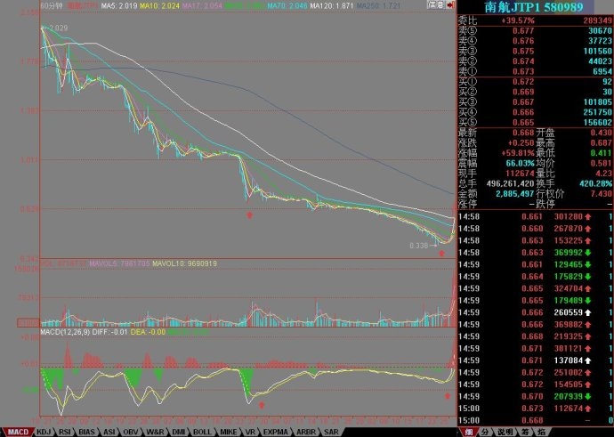{width="5.6299212598425195in"
height="4.004284776902887in"}

## 中国，需要的是中国式的全球化

(2008-01-28 15:48:56)

最近，美国次级债，使得那些一度被国内金融投资界当成偶像膜拜的美国大金融机构大丢其脸、大伤其气。金融投资领域，从来就没有偶像，风险对任何人都是公平的，曾经让你辉煌的可能就是让你最后葬身的陷阱，这一点，大概不会有任何中美的差别。

由此不禁想到，如果我们现在这些在糖水中泡大的券商、基金、金融机构，一旦面对如此局面，又有多少能幸免？市场经济，不是伊甸园，类似的事情，又有谁能担保永远不会出现？

现在，都喜欢一窝蜂地全球化、国际化，而我们真的有必要去全球化、国际化吗？肉，烂在自己的锅里，总比烂在别人的锅里强。那些全球化、国际化背后，从来少不了的是国家间的利益分配。而更重要的是，全球化、国际化，从来都有一个主导国家的问题，现在，不用讳言，一直以来的全球化，都是美国所主导的。而我们现在所谓的全球化潮流，说白了，就是美式引导的一种全球经济游戏，一切规则都被别人所主导，这种游戏，我们真有那么必要死皮赖脸地去参加？

中国，需要的是中国式的全球化。中国的市场必然成为全球最大的，有了这个吸引源，我们完全可以整合起东亚甚至整个亚洲的市场，一个亚洲的大经济体，甚至可以包括俄罗斯。这样一个巨大的体系里，大概已经完全没有全球化的必要了，因为全球都会化在这巨大经济体的强大吸引力之中。

全球化，不是让全球把我们自己给化了，而是以我为吸引源，不断震荡整合出更大的吸引源，从而把全球化于其中，这样的全球化，大概才是中国人该真正追求的。一个中俄印日四核发动的大亚洲经济体，笼括了全球半数以上的人口和经济规模，难道还不能改变世界经济的秩序和规则？秩序、规则，从来都不是先验的，而是现实利益合力的结果。一切皆有可能，而可能是实际操作出来的。

说实在话，对我们的企业，特别是金融投资企业，按照美式游戏规则参与全球化的前景，真的很难抱乐观的态度。就像打麻将，上下对台都是别人一伙的，你能赢的可能性基本为0。有人可能反驳，为什么我们的制造业能取得辉煌成就？那不过是别人的游戏重心并不在此。

我们那些糖水中泡大的券商等，现在还靠诸如权证增设去抢夺小散户等恶劣伎俩赚钱养肥自己，试想，在如今美式的国际化、全球化市场里，能有这样的好事？靠类似手段长大的机构，一旦出去面对那些大鳄虎狼，能有好果子吃？

所以，最好的策略，还在待在自己家里，家里横并不是什么难听的事情，关键你的家够大。中国经济这个家，确实够大了，只要我们按部就班成为世界最大的市场、最大的吸引源，我们就能将我们的游戏规则给全球化了。这样，我们这些在糖水中泡大的券商等，至少也能在自己家里把最好的位置占住，至少有一个地利人和的优势，如果在自己家里开麻将还输给外来的，那最好的处理，就是先买一块豆腐留给自己撞头去吧。

如此，大概一旦发生类似这次次贷般的危机，我们也能很好的处理，至少全球都可以陪着我们一起分担其压力，如现在的美国；万一我们那些糖水中泡大的券商等出现什么问题，我们还可以让外面的资金来入股填窟窿，如这次美国那几家大名鼎鼎的机构一样。

所以，解决问题，最关键还是让我们的金融市场成为全球老大，把我们的经济规模搞成全球老大，这样，肉无论怎样烂，都烂在我们自己的锅里，那时候，又有什么可值得担心的呢？

这世界，没有谁比谁更聪明，特别在最高端的市场游戏中。关键是规则的制订以及在哪里开牌桌的问题，同样功力的人，输赢其实都在这规则与地利人和之上。我们的战略，不能把自己先假设为超人，别人都是傻子。

我们现在最大的优势，就是中国经济起飞的"势"，这"势"，是国运、也是经济发展规律所必然呈现的，这是谁都夺不去的。得此"势"，则平凡之辈也可一飞冲天，我们只需要借此"势"而成就我们的全球经济战略，而最大的失败，就是把此"势"给自我扼杀了。

我们生在这样的时代，是幸运的，因为我们刚好处在中国经济爆炸性的主升浪中，这里，只需要顺势而为，并不需要超人，因为任何的超人，不过顺其"势"而成就之而已。能顺其"势"而成就之，让全球化成为中国式的，这大概就是我们最该干的事情了。

## 吃完饭上来说两句

(2008-01-28 18:54:02)

由于每个人的理解能力相差太远，所以有些事情本ID必须再次说说，就是580989不是谁都能玩的，按照理论的最基本回拉，今天也完成了，后面出现任何大的下跌都是一点不奇怪的，千万别见到这两天涨了快100%就追上去。你想想，你连股票都操作不好，怎么可能操作好权证？一定要注意，本ID可不想有人因为一时的贪念而倾家荡产。

当然，如果你技术很好，那么后面震荡的机会很多，但这一切都是合力的，受很多因素的影响，毕竟这玩意还面临可以大量创设，现在用的闪电战，这里对赌的力量太多，没那水平，就别在里面折腾。

股票跌下来，就是把赢利的空间给再次打开，操作关键是纪律，是长期的规范操作。

做股票就如同一个将军率领一支军队，股票的机会就是战机，但战机能不能战，战有多大风险，首先你都要有所预计。例如，这次，跌破4778点，马上根据理论就有那几种情况，那么反弹后将出现什么，都是很明确的，因此，如果你技术不好，你就把最坏的情况作为自己面对的情况，你就问自己，一旦出现这种情况，你能应付否？如果不行，那就不操作，就这么简单。

操作，是一种能力，能力强的，就可以参与更多的战机，这就像打仗，有多大能耐打多大的仗，没能耐的，就在小板凳里待着，等看到可以适合自己能力的机会再出手。

其实，操作就是这么简单，首先你要明白自己的能力，然后判断这机会的难度你能否胜任，你不胜任，就闪开，就这么简单。

事情总是简单的，只是人把事情搞复杂了。人的贪念，总是看到别人抓住机会就不爽，那样，你就永远不可能进步。

对于真正的操作者，只倾听市场与自己的声音，本ID的理论把所有的机会无一遗漏地输出，关键是你能否正确地认识自己，能否去把握这机会是否适合自己。

本ID理论中机会的输出是最基础的，谁只要读懂了都可以做到；但这机会如何进入操作的层面，最终修炼的是人，这才是最关键的。

再把前面说过的重复一次：

首先，你必须能在任何时刻正确无遗漏地给出所有机会的输出，这是最基本的，如果连这都达不到，那么你就根本不适宜用本ID的理论去操作。

很简单，你要考察自己的水平，请回答下面的问题：请列出最近三个必然发生不会遗漏的机会，并说明其必然的级别。

注意，本ID的理论与所有技术分析理论都不同的，就是本ID不关心这些机会的具体点位和时间，因为点位和时间涉及预测。而机会的显发，就如同花的开放，你看到了，就是了，就这么简单。

说得更明白，本ID的理论把所有级别的机会逐一列出，这些机会是必然要出现的，你只需要等待它出现就可以，就这么简单，你何必去预测什么点位时间的废话？

机会出现，你必须会看出来，看不出来，就错过了，就这么简单。能否看出机会，这是第二步的问题，任一个机会如何成立确认的，在课程里都有，你看明白就知道了，然后多看，就不会漏过了。

例如，你知道按理论下一个是1分钟底背驰这个机会，但你连底背驰都不会看，那就不行了。

看，有一个逐步精确的问题，你看的水平有多高，这和你去理论的把握有关。你连如同用MACD去辅助都不知道，以为MACD就等于背驰，那么这种水平，是无论如何看不出背驰来的。

看出来了，就要操作了。要决定操作，就要把下一步给想清楚，就是下一个必然的卖点是什么，一旦这卖点出现后，最坏的情况是什么，每种可能的情况如何去分类，界限在哪里，每种界限触及后如何处理等等。如果你连这个都不明白，事先没搞清楚，心里不是明镜似的，那不被市场搞就怪了。

你能把上面三步搞清楚，熟练了，那么你就算是一个初级的有自我意识的操作者了，否则，你不过是糊涂蛋。

对于糊涂蛋，谁都救不了你，而且，谁又有必要去救一个糊涂蛋？

再说一次，本ID只是陪练，最终要靠自己。

不说了，有缘得之吧。

## 年线支持初显现

(2008-01-29 15:19:24)

首先还是说580989，你看那中枢的力量是多么巨大，早上的远离，后面的回拉，一切如教科书一般，围绕这个原来的中枢进行震荡，这在昨天已经说了，后面震荡逐步减少，由于该中枢大致在0.6一线，依次向下的震荡空间是存在的。想想一个中枢震荡可以从0.4到0.95，这就是震荡的力量。

之所以说这个，是希望以一种强烈的方式表现本ID理论的一些方面，你不需要参与其中的操作，但请你必须学习。另外，早上砸到0.72逐级上台阶回拉0.85，这是一个很典型的骗人图形，这些图形后一般就是制造第二类卖点，然后后面的就是走势必须完美，再杀一波下来，多看这些图形，对你理解中枢的形成与结构十分有用。

你千万别操作，但你必须学习，这就是580989这经典案例的作用。

说大盘，大盘今天碰年线，这是第一次，去年底已经说，今年至少两次，第一次应该是喜剧。不过，年线这里也可以先制造空头陷阱，一切需要各方面的合力配合。

走势不是必然的，例如今天美国不减息，全世界暴跌，那就会选择空头陷阱的形式。否则，就可以直接上去。那么，美国减息与否这个因素，谁都不知道，但今天市场上已经反应出来，就是堵其减了，这就是一种合力的表现，一旦赌错了，市场就会报复性去相反反应。

当然，对这些走势，是可以去参与的。为什么？因为就算是空头陷阱的方式，也不会远离目前的位置太多，只要控制好仓位，当然可以参与。

此外，一定要注意，你不是多头也不是空头，但你一定要知道一旦发生什么情况，多头会干什么，空头会干什么。例如，多头的愿望肯定是想补上面的缺口，这就构成市场的一个潜在力量，这个力量，在其他力量的干扰下，可能一时发挥不出来，但这反而构成我们一个更好的买入点。

请好好品味这句话：你不当多头也不当空头，但一定要知道空头多头想干什么，而走势是最终的结果，他们想干的是否干出来了，这才是关键。干不出来，有什么后果，他们会有什么后续的步骤，这才是该想的东西。

现在的走势很简单，只要不有效破年线，就继续是原来的中枢震荡。中枢震荡怎么样，看看今天的580989。这就是教科书，看明白了，有什么震荡处理不了？

先下，再见。

## 教你炒股票97：中医、兵法、诗歌、操作1

(2008-01-29 15:49:06)

世界上，从来不缺乏贪婪，最大的表现之一，就是上帝式思维。有一上帝，你信了他，所有事情就是他的，你就又天国，又永生的，这本质上，就是人类的贪婪所制造的幻象。

在市场中，操作中，这贪婪的最大表现就是希望寻求一种预测性的、一劳永逸的上帝式指标、模式，先验地决定了一切，然后有这东西，在市场中就可以又天国又永生地财源滚滚了。

这是什么？典型的贪婪思维，这种人，佛出世都救不了，最终就是当青蛙的料。而市场中，最多这种人，最下劣的，就是希望找一根万能拐杖，最好这拐杖可以自动给出所有的买卖，这样就什么都不用干地财源滚滚了。

贪字和贫字就差那一点，如此贪婪的想法，不被市场所屠杀，真是笑话了。

市场中操作，最相似的，就是和中医、兵法、诗歌类似。

学中医，你首先要把中医的理论、系统、思维方法，分类原则等等给搞明白，按照中医的系统，所有的病都是有一个对应的理论输出与实际相符合，这就如同本ID的理论，所有的市场机会都会被本ID的理论所一一对应地输出。

但你光知道输出，什么用都没有，你学了一大堆理论，没什么用，因为理论知道和应用是要靠人的，而人的素质、水平等等的不同，在应用中相差就太远了，所以最终都归结于人的修炼。

但是，理论的输出是最基础的，你连理论的分类等等都搞不清楚，那么谈应用就很可笑了。所以，首先你当然要完全吃透理论。

一个中医，学了理论，然后就要开始玩望闻问切之类的游戏，这就等于本ID理论中看市场机会的当下显发。有些人，总是想预测，那么请问，一个医生，他知道下面肯定有一个病人要来，难道他还需要预测一下这病人的性别、什么病，可以开什么药？如果世界上有这样的医生，你敢去看吗？

同样，市场的机会的到来，就如同要来的那个病人，你不需要对他预测什么，点位、时间、什么都不需要，你只需要等他来的时候对他望闻问切就可以了，事情就这么简单，为什么这个思维就拐不过来？

机会必然按理论的要求输出，第二步就是看机会的显发，对之望闻问切，这就是更高的一种要求。这就如同医生，能熟练地望闻问切，那是需要功夫的，需要实践中增长能力。所以，你开始的时候，总是看走眼，这太正常不过了。多看，多练习，这就唯一的渠道。

再说一次，一定要看走势图，那是世界上最昂贵的图画，最昂贵的艺术品，多看，就如同培养你的鉴赏力，为什么玩古董的，很多人总是被假玩意骗，而有人就能专破假玩意，这就是鉴赏力等的问题，但这是需要磨练的。磨练的时候，被骗几次，那不是最正常不过的事情？

为什么很多人在市场中很痛苦，就是他不热爱这走势，走势是最好的艺术品，你站在热爱的角度，才能激发你的鉴赏力。否则，你脑子里总是被赢亏之类的贪婪之念所占据，眼睛怎么可能不被蒙蔽？

望闻问切有成了，后面最难的就是操作了。操作，就如同中医的开药方。会看病，基本就等于中医的1/10，而用药、开药方的难度，就是后面的9/10。而没有最后这开药方，前面的所有东西都是白搭的，同样，操作也是这样。

开药方，就如同行军布阵，所谓用药如同用兵，如何用，这可以用你一生去修炼。这就如同操作，操作是一生的事情，除非你离开市场。

中医开药方、因人、因时、因地等等因素的不同而开，就如同打仗，哪里会有一样的仗？仗仗都不同。中医不同西医，西医就把人当机器，所有的人，只要是所谓同样的病，就给你同样的药，完全的流水线机械化生产，而现在很多人在市场中的思维，就是这种思维。

当然，所有的不同里有这一个共同"不患"的基础，例如，市场的运行的"不患"基础就被本ID的理论所完全描述。同样，所有用药的"不患"基础也被中医的理论所描述。也就是，无论怎么折腾，都出不了这基础。这是不同中的同，患中的不患。

明白这点，操作就有了一个大的不患背景，而这背景之上，就是一个创造充分显法的过程，每个人，按照自己的能力、修养等开出不同的药方，给出不同的操作记录。这里是一个没有止境的过程，不断修炼下去。

具体说，就是在一般程度上，你必须遵守买卖点的原则去买卖。但是，这并不是一定的。例如，本ID就经常愿意在买卖点偏移一点的地方去买卖，为什么？因为那样，可以买卖到更多的数量，或者可以制造出一些特别的东西达到更大的目的。

这就如同写格律诗，你开始的时候，必须严格按格律来，如果没有按格律来，那是你的水平问题，你千万别以自己是写拗体来自我安慰，那将害了你，以后你就永远和真正的格律诗无缘了。但，当你已经自由于格律，得心应手时，你就可能要根据诗歌的内容，自设声律而构成奇响成为所谓的拗体，这时，就是出神入化的过程了。而操作，同样如此。

对不起，还想写，有一坏蛋打电话来说要谈一个项目的事情，这个坏蛋太熟了，不能推，就先写到这里，以后继续

## 看别人脸色的日子总是不好过的

(2008-01-30 15:23:08)

这题目说的什么，大家都很清楚。今天的消息，刺激了一个震荡高点，然后再回杀，由于减息的玩意还没出来，所以，尾盘赌消息的又来了，这就是发生在看别人脸色过日子的日子里的一件无聊事情。

看着600737、600078之类的股票，是否有点感动，这世界是需要不看别人脸色的人的，但，这东西是合力的，光有几个这样的人，成不了气候，如果别人都成了爱看别人脸色的人，那这市场还是别人的，最后，剩下不想看脸色的，可能也转去玩别的不用看别人脸色的活动了。

说实话，现在本ID已经没有上次接石头的兴趣，对今年的行情，本ID去年已经给了明确的定位，就是题材股大搞，不管指数，所以才有了跌了1000多点还创新高的品种。

但指数还是会起来的，在那展望里，本ID给出本年的节奏是"扬抑大扬大抑"，所以，多头还是会有面包的，只是多头如果还看别人的脸色，没点自我精神，那本ID宁愿把节奏说错了。

中石油那些玩意出来前后，是一个转机可能出现的时候，这时候也到了，但这东西需要合力，本ID现在确实没兴趣再去折腾大的玩意了，把自己的一亩三分地种好就算了。但呼吁一下总是可以的，合力，需要大家一起来。

说实在话，本ID宁愿A股跌到2500点，也希望见到美国全面破产，让美国再来一次1987年，这是本ID最愿意看到的。

但必须很清楚地说，美国佬这次会用所有的坏招来摆平的，问题的关键是，不要当傻子去给美国佬埋单。

大盘，很简单，现在是纯消息主导，明天美国要减息了，这边就又会冲动一下。但这种冲动不是以我为主的，以我为主，还没有找到合适的借口。

技术上，4400点那中枢的震荡逐步向5分钟扩展去，走势上很简单，如果不出现这中枢的第三类买点，向上的冲动也只能是冲动。

580989，如前所说，震荡幅度减少，但震荡机会依然很多，0.6这个中枢的威力是否够教科书，有眼睛的都会看了。

第一次年线，不出意外，还是如去年底所说，是一个喜剧。问题的关键是，这次喜剧之后，如果没有了自我意识，最终只能是悲剧。

先下，再见。

## 合格政府的第一标准：不给美国佬埋单

(2008-01-30 15:57:44)

这不是针对任何具体的政府的，而是一般性的表述。这句话，显然是武断的，但在这样一个时刻，必须有这样的武断。

美国佬，靠两次世界大战积累的玩意，占据半个多世纪金融霸权所制造的虐夺，支持了其半个多世纪的所谓美国梦。

这梦后面，不过是一个国家对全世界的虐夺与敲诈，是全世界养肥了那美国的金元世界，而美国这玩意，在全世界敲诈了这么多，竟然还大面积赤字，加上美国人超前消费所制造的亏空，这空中楼阁早该崩溃。

其实，这空中楼阁早要崩溃，但所谓新经济以及后进国家的廉价发展，使得这崩溃给大大推迟，但崩溃总要到来。

当然，美国佬肯定又再玩原来的招数，把危机转嫁到全世界去。因为全世界中不缺乏无聊的政府，脑子进水地给美国佬埋单，有一种很可笑的观点，没有美国佬，我们的人民哪里有饭吃，没有美国佬让我们出卖廉价的劳力，我们哪里有饭吃？

当面首的，总会有面首的思维，因为他们认为他们天生就是面首。既然这样，就面首去吧，用你们的血汗继续养肥美国佬。

我们不是对美国佬一定要杀绝，而是希望这次崩溃后，一个新的世界经济秩序能被重建，那一国独大的时代必须结束。美国的经济崩溃，是他们自己造成的，谁都不能为此埋单。

当然，美国崩溃，全世界都要影响，为什么？因为现在的世界经济秩序是一种完全不合理的系统结构，里面有着太不安全的风险传导机制，这必须打破。

而不破，哪里有立？要破，就需要美国来次彻底的崩溃，这样，才能真正立起来，至于这过程中可能的痛苦与震荡，必须承受也只能承受。

可惜，很多事情，该有的都还没有。

例如，如果我们现在已经有一个超大的蓄水池，那么，从美国外逃的资金就会有一个落脚地，可惜，我们没有，我们该建池子的时间都给荒废掉了。但时间还有，我们必须抓紧，否则，这机会一旦失去，一切都晚了。

其他更多的，就不想说了，想了都觉得无聊。

这世界可能就是这样了，这样就这样了，我们今晚喝豆汁。

下，再见。

## 没有信心，一切瞎掰。

(2008-01-31 15:13:08)

**3点半有一无聊人从大连专程过来要谈一香港市场收壳的事情，谈完以后回来会写一篇纯技术分析后面走势的帖子。本ID现在的心情已经完全过年化了，想起还要有事情干就头疼。**

**大盘今天的走势是一点都不奇怪，看别人的脸色，就是这样的了。减息又怎么样？其实，即使对于美国，减息与否，要死还得死。减息后一旦引发资金大量抛售美圆资产，那死得更难看，可惜，现在接收这大量外逃资金的池子就缺一个中国的，想起就没劲，早干什么去了。**

**经济是一种专门的学问，管经济的就该至少是学经济或在经济圈里泡大的，否则，打铁的、挖地的、修坝的、卖大饼的，谁都可以经济一下，这经济怎么经济？**

**一句话，这次下跌，估计把印花税弄下去的可能性还是不大，大概，还需要更猛烈的暴跌，当然，反弹会有的，印花税一日不下，本ID的兴致将继续低迷。**

**今年，就看三月的会后有什么改变了，如果没有，那该怎么就怎么了，那种接石头的活，本ID肯定是不会再去干了，这么高的交易成本，凭什么啊？**

**短线技术上，没什么可说的，现在这1分钟的中枢突不上去就继续下台阶。个股方面，很多股票都要先主动回一下了，否则，顶在高位上抬杠铃，没那必要。**

**现在，关键不是股市本身，而是信心问题，一个最简单的问题，为什么中国的投资者就要忍受全世界最高的交易成本。**

**有谁能回答这个问题？**

**本ID在去年底已经明确说过了，今年一定要看到印花税的下降，不管是谁，做错了就要改，不改就不行。**

**本ID现在根本不担心股市，因为有更担心的，就怕这次经济的对局，一旦应付错了，那比股市更严重的事情还等在后面。**

**我们能应付对吗？抱歉，本ID没信心。**

**如果你还有心情，就请读读本ID这个梦："步老杜《登高》韵记梦2008-01-26
10:23:21"**

**先下，再见。**

## 大盘中线技术分析

(2008-01-31 18:44:04)

谈完了，那人赶飞机去了，专门跑一次，这事情还真没法推，苦啊，又多一件无聊事情。回来先把帖子写了再吃饭吧。本ID就怕答应的事情不完成吃饭都不安心。

收盘的帖子，非技术的纯粹直话直说的，这是走势后面必须的东西。但操作上，还是必须按技术来，所以技术是第一的，我们可以用一些语言对分力进行敲打，但这不能蒙蔽了技术的眼睛。特别，对于一般的散户来说，除了图形，你是最公平地和所有人同时看到的，你还能有什么依靠？

还是和3600相关，为什么？因为上海的指数从一开始就和这相关，例如90年代初的45点，2001年的2245点等等，这次的行情，一样与此相关。

4335点的530，6124点的高位，相差基本就是1800点，下来的第一个位置4778点，就是1800点的3/4，那么，现在，到了1800点这个位置，所以这个位置是很重要的，而且与年线相关。5522点下来的1200点，也在这个位置，所以这个位置是诸多因素所相关，技术上很重要。

由于这次下来，已经把4335点触及，因此，一个日线级别的中枢就已经在形成中，4335点上下就是这个中枢的一个必然部分。这个中枢，是从1000点上来第一个日中枢，所以这个中枢将影响至少很多个月的走势。

也就是，现在，从中线的角度，一个大的日中枢震荡已经形成。这个中枢震荡的幅度，是以3600点为基础的，上面1800点，下面对称的，也可以有1800点。换言之，现在就算跌到2500点，也不过在这个中枢震荡的范围内。

有了这个中枢震荡的大结构，对后面的市场走势就有了一个很宏观的把握。显然，目前这个中枢的中间位置，会在很长时间内反复见到。像2500点、6100点，都如同580989在0.976的那样的瞬间震荡位置，而目前位置，就如同最近580989的0.6上下，是一个反复可以见到的位置。直到这个中枢被破坏为止。

这个中枢震荡，可以以450点，3600点的1/8为一格，上面，4778是第一线压力，5228点是第二线压力，下面的位置如此类推。当然，在具体的划分中，可以把450再细分，这对短线有一定意义。

由于目前是一个日的中枢，因此，最大的偏移级别就是30分钟的，如果有一个30分钟的向下偏移，那将构成最好的中短线机会。而且，类似5分钟的偏移，也构成好的短线机会。当然，如果你的超短线的，也可以关注相应的1分钟偏移。

在足够长的时间内，所有的市场机会，都会是因为对于该中枢的震荡偏移所引发的，配合30、5、1等的内部结构图，你将在这大型震荡中如鱼得水。

本ID早说过了，今年只要你会震荡，你赚的钱绝对不比去年少。有了这样一个大的震荡图，抽血的机会多了去了，好好把握。

节前后市场，能否依靠年线和中枢中轴制造一次向4778点的中枢偏移，明天就有初步答案，如果能坚守在目前位置震荡上5日线，而周一又不出现前两周一样的坏消息，那么，这种偏移就有基础，否则，绝对需要先砸出空头陷阱再玩这游戏。

注意，本ID对市场从来都是充满信心，但本ID的信心可不是死多头那样一定要向上的信心，本ID的信心是在震荡中抽血的信心，那样一定要单边上涨才赚钱的幼稚行为，本ID没兴趣搭理。

本ID没信心的是市场以外的事情，只要本ID有兴趣，大熊市一样可以玩得很开心，就别说震荡市了。但市场以外的事情，本ID真的没信心，而市场以外的，才是本ID所牵挂的。

本ID一早说过了，对于本ID来说，经济变成怎么样，又有什么影响？但对于大多数人，经济的走势太重要了，比股市的要重要得多。

本ID希望每个中国人都有自己的面包，本ID日夜担心的，是中国三十年的经济大升浪会被某种幼稚的因数所打断，除此之外，本ID没什么可担心的。

大升浪被打断了，本ID照样可以风花雪月花天酒地419，很无耻但很经济地等着在经济大跌势的末端抄大底，但其他人呢？

不说了，吃饭了，该什么是什么，万古云霄一酒杯。

## 节前连涨三天？就不许！

(2008-02-01 15:17:48)

听说有人还在发节前连涨三天的梦，但就不许！类似的梦还有，例如现在砸下来了为了奥运如何如何，简直脑子进水了，别以为股市有什么真正的地位。按照市场经济，股市当然有着绝对高的地位，但是，这不是现实。

请注意一个事情，听说春晚里将有一个节目对所谓的股民进行强烈嘲笑的，如果这节目最终播出，将是对三十年经济大发展的最大讽刺。现代经济，最高级形式就是虚拟化的，100多年前，美国还比不上阿根廷，就是因为美国大力发展了虚拟经济而阿根廷没有，所以，最终阿根廷也就剩下别为她哭泣的歌声。

股民，这个称呼本来就是侮辱性的，应该是投资者，这是构成现代经济最重要结构的伟大人群。一个不尊重投资者的国家，不可能有强大的虚拟经济和真正强大的经济，这就是历史的结论。

如果脑子里还有一丝幻想的，请再把本ID关于今年走势展望的帖子再读一次："2008年行情展望2007-12-20
15:59:05"

今年的行情，就是早干早有面包的走势，真正的投资者，在12到1月的题材股走势中，已经赚到了第一笔买面包的钱。有些可笑的人，觉得，4778点到5522点也算行情啊？千万别看不起这一段，如果在大的跌市里，这可能就是全年最大的一轮走势了，而在今年，有极大的可能，这就是第二大幅度的上涨。

在展望中，本ID已经很明确说了，今年的节奏是"先小扬再抑接着大扬后大抑"，而且强调"至少有两个顶部是必须注意的，第一个就是6124点大调整的第二段上升所构造的顶部，这是一个小顶"，5522点就是这样一个顶。

本ID在剧本那次说了："关键看在5462到5675点时间段内政策面的风向，风向不对，那就先把买胶水的钱换成买棒棒糖的，一人一个棒棒糖，看你要棒还是糖。"显然，5522点后平安、美国之类的因数足以让胶水换棒棒糖了。但后面的剧本依然有效，就如同本ID告诉你至少要见到腰斩的中石油一样。那胶水糊的鸟儿会有的，那就是本年第二波行情，现在，不过是为这行情进行准备。

大概没有人会注意，本ID在1月15日故意给出的这个帖子也被很多人认为是炒冷饭，请现在再去看看这特殊时间里帖子内容的实用性，看看当时日线顶分型刚构成后你是否如课程那样操作了，如果你真认真看了里面的内容，你该怎么操作还用本ID说吗？如果还不明白，请再看一次："教你炒股票93：走势结构的两重表里关系2
2008-01-15 18:08:05"

注意，本ID只是陪练，陪练的任务，只是在关键的时候把该用的工具放到你眼前，如果你看不到，那就算了。

本ID有时候说的结论会有所修改的，例如，原来对中石油，给出的就是如中人兽，也就是到30筑底上去，那是因为那时候期货这玩意还没被打压住，后来，一明确这玩意被压住了，本ID就把那至少24的酒席故事告诉各位了，这就是有所修改，为什么？一切是合力，有一个重要的分力改变了，当然要有所修改。

但是，有些东西，本ID不提，就是无所修改。例如，对于20年的大牛市，20年后至少3万点的结论，本ID没有任何修改的必要。除非中国经济自废武功，否则，本ID的结论无须修改。

其实，对行情的转折契机之一，本ID前面早就明确说过，只是看的人不注意，就是要等中石油那10亿玩意出来的前后，底部不是一天构成的，是要反复制造恐慌搞出来的。

有人可能觉得很残忍，废话，不恐慌，没人放血，哪里会有底部？

这几天是什么？就是前期强势的题材股补跌，这是所有探底行情中必须有的，强势股补跌后，行情才可能进入真正的筑底。而这点，本ID早就说过，没有人会永远举杠铃的。

那么，行情怎么慢慢点燃？行情的点燃，都需要领头的，也就是有一个傻子，疯狂地裸奔，把大家逐步唤醒兴奋起来。这个先裸奔的，一般只有三类，新股或有突发大题材的，还有就是前次行情崩溃的祸首以及率先被打压调整的。

如果你还没见到裸奔的，那么就意味着，行情还没被点燃，依然在底部构造阶段。现在的问题不过是：睁大你的眼睛，发现那准备或已经率先裸奔的。

其实，行情也简单，有人全球裸奔的，就是大行情；有人全国裸奔的，就是中行情；有人全市裸奔的，就是小行情；有人只能在家里裸奔最多在窗口晃悠两下的，那就是反弹行情。行情，与最开始的裸奔力度相关。当裸奔蔓延了，行情就开始展开。当所有人都习惯于裸奔了，行情就因高潮而死。

今天的走势，不过是先尝试砸一下陷阱并让那些幻想节前连涨三天的丢一下脸。当然，连涨两天还是有希望的，本ID倒不拒绝两这个数字。前提是，请先冀望周末没有什么不招人待见的事情，其次，那石油出来时不要过分变态。

现在，更大的问题是，这么高的印花税，我们搞一波上去，难道就为了让平安能顺利圈走1000亿？想起这个事情，本ID完全没有冲锋打头阵的兴趣了。自由世界的勇士们，你们冲吧，本ID在后面跟着，一看你们不行就放枪给你们送行。

反弹会有的，面包会有的，但在春晚要被严重嘲笑而还要被平安之流上千亿地合法打劫，并且更要继续接受一个最高印花税的奖赏，在这种情况下，谁还愿意当炮灰去发动一轮全球裸奔行情呢？

今年，我们去铁岭裸奔，或者保定也行，各位选择吧。

周末，不妨先在家里练习练习？

先下，再见。

## 没有幽默感与修养成不了好的操作者

(2008-02-01 19:17:37)

快过年了，到处繁忙，还是待在家里塌实。一般周五晚上都不写帖子，这次就破例一次。因为在周六、日不谈股票，就抓紧今晚再说说股票。

资本将人异化，其实市场同样让人异化。看看现在市场里的人，很多都变得神经叨叨的，心里就剩下黑马、上涨之类的机械反应与欲望，这样的市场人，真是太悲哀了。

没有幽默感与修养成不了好的操作者，一个看到铁岭、保定只会想到暗示了什么股票的操作者，也不可能有什么长期的操作成功。

铁岭不过是来自赵本山的一个幽默，而保定就是郭德刚的，当然，南方的朋友可能有点不熟悉，这不奇怪，但其实就算你不知道这些幽默的意思，从文中对裸奔的分类就能明白其中好玩的地方。

本ID一本正经地解释这个问题，其实就很搞笑，这只是小事。但有些孔男人的学生，见到本ID说第一次见年线是喜剧，就以为一碰到年线就起来就是喜剧。大概，孔男人类人写的东西都是这样的白开水。知道什么叫以哀景写乐倍增其乐吗？想想，对5日线的回试还要故意砸穿恐吓部分不坚定的，更不用说这250天线了。不把这哀景写足了，哪里会有好的喜剧，连这点修养都没有，还操作什么股票？

很多事情都是相通的，例如在顶部的时候，就是以乐景写哀倍增其哀，文学、艺术和市场是相通的，只不过你有没有这种修养和感触而已。

市场，最终是人的修炼，你的全部修养是否花架子，在市场中一下就检验出来。很多所谓的文化人看不起市场，因为他们不过是些花拳绣腿的玩意而已。

一个真正的成功的操作者，一定是一个哲学家、实干家、艺术家、有幽默感的人，否则，市场中任何的弱点，可能就足以致命。

和平时代，没有比市场更能提高人的地方了，好好珍惜吧。

缠中说禅2008-02-01 19:24:06

\[匿名\] 学习 删除此人所有评论

2008-02-01 19:20:36

请问zf这样会不会是"韬光养晦"呢？

\-\-\--

那痴呆的最"韬光养晦"了。

缠中说禅2008-02-01 19:25:46

先下，再见。

## 年线上的中国式喜剧

(2008-02-04 15:20:02)

第一次碰年线要上演喜剧，这在去年12月已说。当然，真到上演时，相信的人就不会多了，不相信的人多了自然就更喜剧了，市场总是如此。所以，就算把剧本告诉你，绝大多数还是不行，这点，已说多次。不过，经过这次，大概各位对本ID上周所说的"哀景写乐倍增其乐"应该会有点切实的体会了。

这里，本ID再明确地预先告知各位，这次很中国式地把新基金砸出来了，但这还不是真想要的。前面已说，这次砸出印花税的可能性很小，那么，下次，或者再下次，总之，该改变的总要改变。印花税的改变，是2008年的目标之一，这点已经多次说明。

技术上，十分凑巧的是，周五低点对应的线段刚好是360段，一个圆周。很多人老问3600是什么？为什么和上海指数相关？这问题大概不需要再问了吧。有人还要问，周五有底背驰吗？如果你连周五的背驰都看不出来，那只能重读了。看看15分钟图，想想该是哪两段比较力度？

有些人可能又要问，如果没有周末的利好，那背驰能成立吗？问这话的人，根本就等于没看本ID的课程，背驰成立只保证回到原来最后一个中枢，这点和有没有消息没关系，实际上，上周五收盘前已经达到这一点，而所谓的利好不过是加强其力度而已。

实质上，今天的上涨，并没有脱离最后一个中枢的范围，4500点上下那5分钟中枢的第三类买点并没有制造出来，因此，从技术上，依然还可以看成是该中枢的一个震荡。

而且本ID更要问各位一句，如果没有周五的狠砸，这利好能出来吗？很多事情，都是一环扣一环的博弈，里面的水能浅吗？

不妨再问各位一句，怎么把印花税搞出来，各位有什么建议，请发表。

这次反弹的高度，决定于恶性圈钱最终是否有所收敛，当然，外围因素也有一定的影响。但这次下来，最主要是恶性圈钱闹的，现在已经开始有人折腾这方面的事情，现在，还是进步不少，至少各种声音都能通过某些途径达到应有的分力。所以，这折腾能折腾出什么，也是很重要的。

其实，今天的利好掩盖了一个很大的坏因素，周末央行高层说，大企业应该主要到资本市场解决融资问题，并表达银根绝不放松的观点。当然，这些人不是最后定事的，他们的话也没什么准，不过，这证明某种观点或利益还是很有市场的，这就是后面的不确定因素或者说是大的隐患。

技术上，还是原来分析的，450点一格，4778点破不了，就把前面两5分钟中枢搞成一个30分钟的震荡出来。

个股方面，今天普涨，关键是后续的能力。还是周五说的那三类，一般股票，反弹到阻力位置压力就大了，而一切套牢压力小或有大资金、新题材的股票，反而容易有持续的表现。

注意，今年做股票，就是要跌到位了敢买，涨多了敢抛。那种涨了才追，跌了才砍，来回几次就可以被清理出局了。如果技术不好，宁愿坐电梯也不能追高杀跌的。当然，最好不要坐电梯，要不坐电梯，唯一的办法只能是，涨的时候，就睁大眼睛看有什么大级别的卖点出现，见到日、周的顶分型，就要根据自己的水平去操作。

明天，就看中石油表演了，大盘会有所震荡。

最后，如果有对平安特别熟悉，或有其强力罪证的，可以提供点在跟帖或留言里，节后，要来一次对平安的清算，子弹已经收集了不少，不过如果有更猛的，不妨可以多提供。

有些事情，要是需要有人干的。干，就有了分力。如果分力都没有，如何改变合力呢？

先下，再见。

## 教你炒股票98：中医、兵法、诗歌、操作2

(2008-02-04 19:51:49)

过节前，本不想再写课程，毕竟家里的事也不少，一过节，这总少不了。不过，还是抓紧时间写上两句。

一种思维模式的改变是很难的，因为一种思维模式的存在，往往连自己都不察觉，特别，一出现强烈走势后，那些老的毛病就又出来了。这几天的大盘转折走势，就是一个很好的例子。

一个背驰后，无论是盘整背驰还是真正的背驰，理论只能保证其回拉原来的中枢，这是正确的思维方式，那么，回拉之后如何，这涉及预测。正确的思维是，把回拉后出现的情况进行完全的分类，根据每种分类对应的后果，决定你自己的对策。

例如，上周五下午的背驰是很明显的，任何人都可以当下发现。这个背驰进去后，收盘了，后面面临着继续向中枢上边突进以及再次回探两种情况。第一种情况，意味着362开始的线段要继续延续下去，而第二种情况，首先就要破坏362开始的线段。那么，这两种情况就很简单了，就等周一的开盘当下地决定这线段是否被破坏。

注意，这是严格的理论思维，和周一有没有消息，是否有利好毫无关系。特别地，如果有利好，竟然还走出破坏362开始线段的走势，那么这问题就严重了。当然，实际上，大盘一直到了364才破坏了这线段。但这时候，就不存在走的问题了，为什么？因为理论上，这演化成线段类上涨的可能性极大，除非363开始这线段跌破361这个位置。所以，后面你只要看这着线段是否跌到那位置，显然也没有，所以就继续持有。

等364这出来，展开新的线段后，因为已经的第二个线段类中枢，所以就要注意是否有可能出现类背驰，这就看明天开盘后的情况，如果不能继续保持类似斜率的上涨，那么这线段类上涨结束形成一个1分钟中枢就要情理之中了。

你看，上面所有的分析，都要严格的逻辑关系之中，这是理论的必要结果，也是一种正确的思维方式。当然，一个线段的类背驰是否需要抛点货，这是每个人的爱好问题，你的操作级别问题。

这就如同打仗，你不能假设明天某某山头还在自己手里，然后根据这个假设去安排兵力，山头是否在自己手里，那是当下的。当然，你可以去反复争夺一个山头，但你不可以假设这山头在未来的某一个时刻100%就在自己手里。

这也如同中医，你不能认为你的药一定有什么效果，效果是吃了药以后再望闻问切测出来的，而同一病人的药，要根据这不断地望闻问切进行必要的增减。当然，你也可以保持不变，就如同在一个上涨趋势中，你可以保持持有，但一旦出现超越你的级别，你的操作限度的转折信号，也就是背驰，那么你的药就必须要变了，甚至是大大地改变。

因此，如果周一并没有出现今天的利好，你的操作逻辑并不会有任何改变，还是根据当时的图形是否触及你的操作分类界限进行，这才是正确的思维。

换言之，你在操作时，你后续的所有可能面对的情况与对策都必须了然，否则你就没资格操作。对于一个真正的操作者，没有任何情况是意外的，因为，所有的情况都被完全地分类了，所有相应的对策都事先有了，只是等着市场自己去选择，去触及我们事先给定的开关。

说实在，比起中医、打仗，股票是最简单的，为什么？因为股票的后续走势，因为有了本ID的理论，都可以严格地唯一地给出统一的完全分类，而中医、打仗，要面对的可能就更复杂了，特别打仗，完全的分类，可能只能是一种假设了。

如果你的思维还是转不过来，那么就没有必要再去学习，首先把思维转过来。

有人可能问，如果出现回探的情况，那么可能在背驰买的出不掉。显然，这种情况是很可能的，因为T+1，该反应的时间你可能没资格卖。不过，一个很简单的对策就是，你必须买比大盘要强势的股票，也就是先于大盘的股票，这样，一旦大盘回转，这类的股票走势都会比大盘强，这样自然有足够的空间让你选择。

注意，最好的选择是比大盘稍微先一点的，而不是完全逆于大盘的，因为后者，往往有可能补跌，或者逆着大盘洗盘，例如，今天的600737就是一个很好的例子。当然，新股也是一个很好的选择，不过这需要这类股票开得不太高，而且有明显的新资金介入，在一个有一定级别的向上过程中，这一般都有比较稳定的表现。还有就是先于大盘调整的，例如这次那聪明的驴，就是这种类型。

当然，如何选择股票，这是一个经验问题，必须要反复练习才会有灵感与感应的。其实，股票真没有那么复杂，如果你有了感应后，打开一个股票的图，你一眼就能看出这面首是否在搔首弄姿在等着宠幸，这就如同419时，你选择人难道还需要技术分析吗？那不就是一眼的事情吗？哪天，你看股票就如同419选人一样有感觉，那你就有点靠谱了。

## 阴线迎春给一根筋上了生动一课

(2008-02-05 15:09:59)

**本ID前面说了，节前连涨三天是不允许的，而两天要看周末消息和石油的变态程度。昨天，有利好涨了，而今天的石油，有人疯狂地抛出来，似乎那石油是不用钱买的，这么变态，你说能红盘吗？**

**一根筋，不是别有用心就是脑子有水，市场操作，不脱离一根筋，那命运是怎么样，是不用讨论的。**

**技术上的问题，昨天说得很清楚了，就是线段类背驰后必然出现1分钟中枢，节后，就看这中枢的演化，事情就这么简单，不需要任何一根筋的想法。而中短线上，还是4500点上下那中枢的震荡走势。**

**请好好看看真正的大资金是如何运作的，大概很多人都忘了580989了吧，看看今天的走势，有什么想法？一个长假期，一个稳健的大资金，当然要这样进行有效的对冲，很多时候，不确定因素是要靠对冲来解决的。这样，不管外围在春节发生什么事情，都可以吃嘛嘛香了。**

**当然，对于小资金来说，580989这类东西风险太大，没必要参与，而且小资金不一定要对冲了，就要发挥自己机动灵活的特点，看不确定，就先走一部分，有钱在手里，什么都不怕了。**

**贪婪总是希望行情按自己的欲望发展，那是鸭屁思维，不改变，永无出期。**

**总结一句，任何不确定时，唯一正确的做法就是控制仓位，你能自如地控制仓位，那你的水平就能上一台阶。控制仓位，并不是说一定要空仓，而是把仓位控制在一旦发生特殊情况能有足够反应的水平。**

**任何想把最后一分钱赚到的，最终的命运只能是倾家荡产。**

**大过节的，就不说这些事情了。但市场的残酷，是不分节日的，那种春节一定要红盘，奥运一定要大行情的思维，要好好醒醒了。**

**大过节的，抛弃股票，享受人生。你的身体、家庭、父母、亲人，比股票重要一亿万倍，好好珍惜吧。**

**先下，再见。**

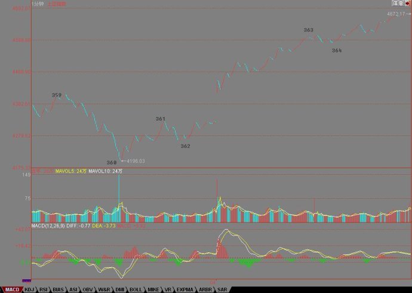{width="5.6299212598425195in"
height="4.004284776902887in"}

## 开门不红又何妨？

(2008-02-13 15:15:42)

**开门大红包，本ID可给足了，580989的两次启动，都给足提示，第一次，提示后在0.42下随便买到，这次，即使节前你自己没看明白，今天在0.5下随便买，而且还两次机会，操作好了，随便一天50%的利润。**

**所以，本ID绝对不欠任何人红包了。**

**至于大盘没有红，本ID可真没什么兴趣关心，具体的说法，在节前最后的帖子里已经无比清楚了。**

**580989的中线中枢，本ID在第一次启动时已经明确说过，就是0.6上下，回头再看看，这走势是不是完全的教科书？请好好再看看本ID节前最后的帖子，看看关于如何对冲，如何平衡风险的做法。让那些预测连涨3天的吃西北风去吧，两次580989的礼包，足够连续30涨停的利润了。**

**强烈注意，本ID再次必须声明，一般人绝对不能买580989，你想，600737在8元说的还有人是亏钱出来的，580989就是你的坟墓，没那本事心态，就继续当教科书演示看看吧。**

**还是说说这无聊的大盘吧。**

**只有一根筋的才喜欢开门红，知道1993年开门红以后就从368点的深圳综指跌到94点，大概也只用了1年半不到时间。不开门红，其实真没有什么，至少证明，里面有足够多的资金都没觉得今年是必须在春节一开门就要骗人来埋单的，至少有足够多的资金还有下一步的打算。**

**技术上，本ID已经说得超明确，就是原来最后那中枢的扩展，这震荡什么时候结束的唯一标准，就是出现第三类买卖点，其他一切都是废话。**

**个股方面，中石油站不稳，指数要站稳那绝对是没戏的，那10亿的玩意，这两天成交了4亿了，当然，里面还有很多水分，但中石油今天留下的缺口，应该很快就回补，问题还是这24元上下的中枢，最终如何突破，这和大盘中枢的突破是密切相关的。**

**说实在，今天这样的成交量，说明了这春节假期确实太短了，怎么都该放到15吧，各位在春晚是否看到那讽刺股民的节目了？有这样的现象，你说，这股市能好吗？**

**中线，就看3月的会能不能搞点什么了，面包会有的，但要靠自己去抢。**

**先下，再见。**

## 后三日是技术上最关键时刻

(2008-02-14 15:25:29)

**先请个假，今天晚上有事，晚上的帖子，本ID就克扣了，抱歉。**

**今天的580989，一个经典的走势，不管你是否参加，你都先请搞明白：今天尾盘的拉起故意和昨天是一样的，这就是一种典型的骗人手法，因为一根筋的人最多了，以为什么都是可以克隆，以为有一样的开始就有一样的结果，结果就给克死了。**

**世界就这么残酷，这一招，用了好几百年了，在中国市场上也用了好十几年了，还继续好用，人就这德行了。不管你参与与否，被骗与否，都要学着点吧，这样以后兴许不会再被骗。**

**当然，类似骗局有很多变招，因为前N-1次都是一样的，但这N可以不断地变化，用得最气势磅礴的，就是10几年前深圳194点到334点那次大反弹，不断同样的模式后，最后一天大跳水，多少人一直套到100点，可怜呀。**

**说大盘吧，大盘后三天是技术关键，因为所谓的MACD等指标金叉就要出现，要骗你，也就是这个时候。但这时候有两种骗的方向，一种是骗空头，一种是骗多头，都仔细看好了。**

**大的方向，本ID说过N次了，但糊涂的人太多，再明确说一次：**

**一、下面最大的机会，就是6124点下来30分钟走势类型结束后的向上30分钟走势类型，这机会在酝酿中，也就是在中阴阶段。但那30分钟的向上类型，最坏的情况，就是一个盘整，并不一定走出上涨类型，这是必须明确的。如果是盘整，就在这上下搞出一个日的中枢，然后就面临6124下来的日走势类型的第一个中枢，后面无论延伸出下跌或盘整，都是完全可能的，如果是下跌，那当然恐怖无比，比这几个月都要恐怖。所以，3月前后，对中线走势极为关键，要继续全面富裕还是怎么着，就看着办了。**

**二、个股依然机会不断，新股、高送配的，有各类题材的，都会有机会。当然，从上线角度，本ID看好的类型也说过无数次了，就是环保（包括新能源）、农业、消费类消耗品等等，短线，当然就是高送配中股价特别低的，例如现在不到20，而要送10之类。中线，化工等玩意是值得注意的。**

**注意，看本ID的文章，你必须连着看，因为有些前面的结论，本ID不可能每次都重复，例如对大盘的总判断。还有，本ID在前面那波中把人分为两类，一类就是坐小板凳的，一类是可以不断参与活动的，你首先要分清楚自己是哪一类。**

**就象从4778到5522那次，本ID从来没让坐小板凳的起来，为什么？因为那次是30分钟以下级别的活动，既然我们假设小板凳至少要搞30分钟以上的，否则搞不过来，那么当然就一直不用起来。但还是有无数孔男人的学生叫嚷，为什么涨了不让我们从小板凳起来，那你首先问自己，你有搞30分钟以下级别的本事吗？5522点的急促下跌，就是因为上来的级别小，下来的当然也就小，你能反应过来吗？那些下来时不会动的，你认清自己的水平了吗？**

**认清自己，否则一切瞎掰。就像580989，机会就这么大，但你首先要有这水平，自己都认清不了，那只能等着被屠杀。**

**认清自己，然后根据实际走势决定自己的操作，就这么简单，还孔男人什么呢？**

**先下，再见。**

## 回试年线暂显支持

(2008-02-15 15:39:01)

**今天回试年线暂显支持，但问题还是下周初，因为MACD的柱子是否有效放红，这是下周最关键的问题。目前的情况十分明确，就是技术面完全支持行情的展开，但基本面、政策面有太多令人不满意的因素，因此才有如此上下为难的局面。**

**整个政策面的明朗，大概还是要等到三月会后，因此，之前，一个震荡的局面依然。其间，上下尝试，左冲右突一下是很正常的。期间甚至不排除再有一次大的跳水去把最后的盘子洗干净，当然，这涉及最后的底部图形，如果是头肩底，那这次跳水就免不了，如果不是，那就不一定有了。是否头肩底，和后续的消息面相关，技术上反而没有太大的倾向。**

**但个股行情会继续展开，只要指数稳定筑底中，有题材的个股就不会寂寞。但操作中必须要有严密的布局，例如，昨天说的20以下送10的个股，其实就没几只，本ID没明确说出来，就是不希望养成懒惰的习惯，连自己功课都不想做，那干脆把账号告诉本ID，本ID把钱直接打给你算了。**

**最符合要求的，只要做点功课，显然不难找到，就是600795。这股票，业绩很好，10送10后就今早算9元，风险度很低。而且，530后大唐电力的送股行情表现，使得这股票的后续走势更有想象力。但这些都是估算，你介入时，就应该知道，这两天的小阴线是在构造一个小的第三类买点，18元上介入，大概的风险有10-15%，所以，你就根据自己的风险能力去决定自己的仓位，然后买入相应仓位，并留下一定的对冲资金去为后面减低成本，有了这一些安排，今天一大早有足够的时间让你去介入了。**

**注意，这里教的是一种思维操作方法，不是说一定让你去买600795，而且，现在拉起来了，再买就没意思了。**

**来这里，不是培养懒人的，这点，请一定注意。**

**580989，今早又给了一次走的机会，没走就不要怪本ID了，当然，大盘只要走不好，这东西还要折腾，但至少这一走，逃过20%的跌幅，这已经足够了。**

**周末，都好好休息吧，身体最重要。**

**先下，再见。**

## MACD红柱子终现待确认

(2008-02-18 15:18:26)

**上周说了，本周最重要的事情就是这MACD的红绿柱子问题，今天，借点利好，终于把这红柱子给弄出来了，但注意，这并不意味着一切无忧，下面就是一个确认的问题。**

**技术上，一般这种红柱子出来后，如果不能站住今天的位置，那么就会出现出几根红柱子再出绿柱子的情况，这种情况往往对应着新一轮的杀跌，所以这红柱子出来，需要预防的就是这种情况。**

**具体操作上很容易处理，也就是红柱子出来后，如果后续能量不能跟上，那么出现以上情况的可能就很大了，那么在冲高无力时，一定要先出来看看，因为后面对应的转折很可能是极为急促的。**

**技术上，底部的构造有头肩底的可能，这红柱后很快再绿柱的情况，往往就对应这种情况，在最好的情况下，也就对应双底的情况。**

**当然，以上都是些不精确的分析，如果按本ID的理论来，这些分析都没多大意义。现在就是一个中枢震荡的过程，这点说了多次了，今天并没构成线段类上涨，说明向上动力不足，因为今天构成的4575上下的1分钟中枢就有着重要的技术意义。后面的超短线走势完全由此中枢最终演变所决定。**

**个股方面，农业、化工、奥运等等都有表现，但板块持续性还是有问题，现在的问题是，一个超级裸奔的板块还没有形成，所以个股行情只能显现零散的局面。要改变这局面，还需要人气的不断培养。600795碰到20的整数关口，需要整理换手，如果高送股的板块都走不出来，其他板块就更难有戏了。**

**本周能否保持住MACD的红柱，并站稳4575之上，这是对多头最重要的技术要求，明天的CPI是一个考验，能否经受这考验，这是能否完成要求的关键。**

**先下，再见。**

## 教你炒股票99：走势结构的两重表里关系3

(2008-02-18 16:19:16)

**走势结构，最重要的就是有中阴部分的存在。有人可能认为，中阴存在是理论不完善的结果，其实，这是典型的一根筋思维，对于这种思维，世界就是机械的，任何时候都只有一个机械精确的结果，而实际上，世界更多是量子化的，是测不准的，中阴的存在恰好客观地反映了走势的这种特性。**

**中阴状态的存在，反映了行情走势生长阶段的未确定性，这种未确定性，不会对操作有任何的影响，因为中阴状态都可以看成是一个中枢震荡的整理，根据中枢震荡的操作就可以了。**

**很多人，一碰到中阴状态就晕，因为这时候，你不能对走势给出明确的划分。注意，这里不是指同级别的划分，而是一般性的划分。例如，一个线段性类上涨类背驰后，必然首先出现一个1分钟的中枢，也同时进入一种中阴状态，但你不能说这走势必然就是1分钟类型的，因为，最极端情况下，两个年中枢之间也可以是一个线段连接，甚至就是缺口连接，这在实际上都是完全可能发生的。因此，理论必须包括这些情况，而且这些情况太常见了，并不是一个古怪的问题。**

**另外，根据结合律，连接中枢的走势，并不一定是完全的趋势类型，也就是说，一个线段类上涨后，可能第二类类中枢就消融在中阴状态的那个中枢里了。也就是说，a+b+c+d+e+f=a+b+c+（d+e+f），a+b+c+d+e是一个线段类上涨，c+d+e的重合部分构成最后的一个类中枢，f是类背驰后的回调，这时候，就可以马上构成一个1分钟的中枢，然后后面直接继续上涨，构成1分钟的上涨是完全合理的。因为，最终的划分，就必须把a+b+c+d+e给拆开了。**

**因此，一般划分中，如果中阴状态中从前面的背驰点开始已经构成相应的中枢，例如在a+b+c+d+e+f后又有g\\h，f\\g\\h构成1分钟中枢，那么整个的划分就可以变成a+b+c+d+e+（f+g+h），这样，原来的线段类上涨就可以保持了。**

**如果后面包括d+e+f延伸出9段，然后又直接上去了，划分中，必须首先保证5分钟中枢的成立。换言之，划分的原则很明确，就是必须保证中枢的确立，在这前提下，可以根据结合律，使得连接中枢的走势保持最完美的形态。**

**由此可见，因为划分中的这种情况，我们就很明确地知道，走势的最大特点就是，连接中枢的走势级别一定小于中枢，换言之，一个走势级别完成后必然面临至少大一级别的中枢震荡。例如，一个5分钟的上涨结束后，必然至少要有一个30分钟的中枢震荡，这就是任何走势的必然结论，没有任何走势可以逃脱。**

**有了这个必然的结论，对于任何走势，其后的走势都有着必然的预见性，也就是其后走势的级别是至少要大于目前走势的级别。这里，一个很关键的问题就是，这个大的走势级别的第一个中枢震荡的位置，极为关键，这是诊断行情的关键。**

**首先，任何一个后续的更大级别中枢震荡，必然至少要落在前一走势类型的最后一个中枢范围里，这是一个必然结论。换言之，只要这中枢震荡落在最后一个范围里，就是正常行为，就是正常的，也就是说，这种中阴状态是健康的。**

**但，一旦其中枢震荡回到原走势类型的第二甚至更后中枢里，那么，对应的中阴状态就是不健康的，是危险的，而原来走势的最后一个中枢，就成了一个关键的指标位置。**

**注意，危险是相对的，对于原下跌走势的中阴危险，就是意味着回升的力度够强，对多头意味着好事情。**

**结合分型，例如，一个日分型的出现，意味着笔中对应的小级别走势里出现大的中枢，因此，这个分型对应的中枢位置，就很关键了，这几乎决定了这分型是否是最后真正的顶或底。**

## CPI公布成突破契机

(2008-02-19 15:16:27)

**昨天说了，今天要经受CPI公布的考验，结果大盘一直围绕4575的中枢震荡，CPI公布后也依然不变，下午更向上偏移，显示了最近少有的强势，最后一小时，就是中石油的表演，该股也如期回补前几天的缺口，但由于该股最近的大中枢并没有有效突破，所以这个回补只有震荡的意义，暂时不能给予太高的技术评价。**

**显然，今天的走势，使得MACD的红柱子继续延伸，而从4431点的回升，目前已经至少是1分钟走势类型的，第一个中枢在4575点上下，后面就看能不能在其上形成新的中枢，如果行，就继续强势。4672点是第一回升的高点，因此，最强的走势，就是新中枢至少围绕该点位形成，甚至在其上形成，这样，大盘走势的可拓展性就大大加强了。**

**当然，站在本ID理论的角度，由于这次的底分型范围的上沿也在4672点，所以4195点上来的走势最终是否延伸为笔，关键也在4672点的站稳。因为笔的最基本条件就是顶和底分型之间必须有不重合的部分，1月23日那个底分型，就是因为后面不能突破站住1月22日高点4818点，所以使得不可能延伸为笔，进而原来的向下笔继续延伸，形成后面的下跌。**

**因此，从最技术化的角度，4672点是一个关键的位置。**

**不过目前短线最大问题，还是板块行情没有被点燃。靠中石油可以突破，但不能把人气激发，所以，后几天能否激发出板块行情，将是行情能否有力度延续的关键。**

**先下，再见。**

## 大规模增发猛于虎

(2008-02-20 15:27:33)

**5200点那次，平安的增发成了最后的稻草，今天，又来了一个浦发的增发，虽然不是正式的消息，已经足以让大盘回头。**

**现在的多头，必须如利物浦一样去战斗才行。三个手球不算，熬到最后一刻才把最后的纸给破了。现在，基金的新发，等于把空头一个人给罚下了，但要灭空头，没点耐心是不行的。今天这增发闹剧，等于一个手球不算，估计这不算的手球，还少不了。不熬到85分钟以后，胜利的希望是看不到的。**

**技术上，这1分钟的上涨肯定是没戏了，这里最好的情况，就是震荡出一个5分钟的中枢，看能不能搞成5分钟的上涨，注意，这是最好的情况。最坏的情况，当然是4575点附近的震荡后出现第三类卖点，这样就重新探底。**

**中线上，4672点站不住，真正的行情就不会展开，依然是继续的震荡走势，等于今早前85分钟的闷战。**

**多头需要第一个进球，这进球，必须来自板块的启动。本ID一直强调的农业股，现在已经是整体走强，600737更是无耻地又新高了。这板块能否带动化工等，逐步把热点蔓延，这是后面需要留意的。有时候火点起来了，蔓延不起来，那只好偃旗息鼓，等机会再来，这种事情也是经常发生的。**

**前面说了农业，环保新能源，化工，这都很好理解。至于消费消耗品类的，这其实是中国最大的优势，就是各种消耗品，例如吃的，包括调味品等等；用的，用的包括很多方面，例如汽车发展了，汽车的配件如轮胎、玻璃之类的，反正是整天要换要用的。中国什么多？就是人多，消耗多，这是永恒的题材。酒类，只是其中很小的部分。**

**中线真的突破时间，可能真要如前面所说，等到3月那会后了，所以一定要耐心。最主动的做法的，就是追逐最强势的板块；最稳健的做法，就是逢震荡低吸那些有中线潜力且刚启动的，如高送之类。**

**580989。现在是完全和大盘对冲着搞，中枢上的风险就开始加大了，当然，如果大盘破位，那会有一次冲动的过程，不过风险很大，一般人看看就算了。**

**先下，再见。**

## 资本市场必须维持生态平衡

(2008-02-20 16:27:15)

**环境保护、生态平衡已经是世界性的大问题，而资本市场，也同样存在一个环境保护、生态平衡的问题。在资本市场上活动的各种力量，之所以能存在一个系统中，就是之间有一个基本的协调关系，而一旦这个关系被打破了，这个资本市场的大系统就会出现生态危机。而一旦出现生态危机，这资本市场要恢复元气，那就不是一朝一夕的事情了。**

**对于中国这初生的资本市场，其生态系统本来就极为脆弱，因此，期间的生态平衡，必须有些人为的引导，而这种人为的引导，在该系统充分发育后将逐步减少。因此，对于管理层来说，有意识地对资本市场的生态系统进行环境保护，是其最为重要的任务。因为对于管理层来说，其业绩的好坏，完全依赖于资本市场系统运行的顺畅与否，一个导致资本市场生态灾难的决策，无论如何都不可能是及格的。**

**资本市场的生态平衡的维护，是有时间性的，一些决策也因此带有时间性。例如，目前的环境下，一个资本市场中的大力量，通过强力的圈钱活动对资本市场的资源进行过度开发，这样的事情，就绝对是不合时宜的，一旦蔓延，必要要造成生态灾难。**

**环境保护，很重要一点，就是要对资本市场的市场资源进行合理、适度的开发，禁止乱砍乱伐，更不能允许那些无证小煤窑或受到地方以及其他保护势维护而非法开采的煤老大到处横行，这些资源是属于全中国人民的，没有人有资格随意浪费或为自己的利益而干苟且之事。**

**其实，世界上的道理都很简单，资本市场的事情也很简单，不简单的都是利益。有了利益，一切简单的事情就复杂了，现实中的环境保护所遇到的问题如此，资本市场上的问题也是如此。**

**因此，要最终解决问题，就是一定要砍断这利益的背后黑手，这大概才是问题的关键。**

## 赚钱是靠个股而不是指数

(2008-02-21 15:18:25)

**各位元宵好，晚上过节，就没帖子了，抱歉。**

**今天，昨天的传闻被证实了，在现代社会，空穴来风的事情很少有，特别在资本市场。指数勉强地维持了4575点的中枢震荡，这5分钟中枢是确定了，后面的关键是第三类买卖点的问题。**

**由于大家伙都爱狮子开大口，所以大家只好避而远之，指数折腾不出花样，并不意味赚钱的机会少了，赚钱是靠个股而不是指数。在去年的展望中已经明确说过，今年是题材股的天下，而目前，正如昨天所说，就要到处点火，把板块激荡起来。**

**今天，从创投到化工、医药、新能源等等，都被点了一次，这板块轮动是否能起来，现在还不好说，因为现在人为因素很大，但如果光是点火的人忙乎，最终是燎原不了的。燎原不了，那点火的人就白忙了。**

**指数，最悲惨的就是再砸一次底，但估计有题材的股票，最多就顺着洗洗，你看，现在又有不少股票新高了。和指数折腾没多大意思，还是折腾个股吧。**

**注意，个股折腾，要注意轮动，一个板块涨起来了，就没必要去追高，要买也买那些没启动但有新资金关照的。现在的行情，持续性都不高，势头不对就可以跑，跑了依然会有无数股票等着可以去买，现在可没有踏空一说。**

**当然，没这技术的，就抱死一些中线肯定会涨的股票，死守具体的板块。能轮动起来的，赚500%，轮动不起来的，死守的，赚50%，这世界很公平，技术很重要，没技术就别眼热了。**

**中枢的作用，在今天的580989上又一次经典了，看看远离中枢后回跌起来多刺激，和上次0.976那次比有些差，但还是有点经典的。**

**先下，再见。**

## 下周初决定大盘中线形态

(2008-02-22 15:18:40)

**今天继续延续4695点浦发闹剧所制造的线段类下跌，在下午2点后最终出现一个类底背驰。该类下跌出现三个类中枢，类背驰后的回拉如理论所要求的最低幅度回到最后一个类中枢，也就是至少制造了一个1分钟中枢。最坏的情况，这中枢是一个新的1分钟下跌的第一个中枢；最好的情况，就是该1分钟中枢出现第三类买点，然后至少回到类下跌的第二个类中枢范围。因此，下周初该中枢的演化决定了大盘短线的形态。**

**而实际上，大盘下周初的走势还将决定大盘的中线形态。在前几天大盘MACD出红柱子时，已经说过，就是必须注意放几天红柱子后再次放绿柱子的情况，这样就对应着大盘再次破底形成头肩底形态。那么，下周，是否要出现这种情况，马上就要分晓。由于今天依然红柱子，因此还存在不出现绿柱子，红柱子再次伸长的情况，而这一切都将在下周有分晓。**

**以下的内容，在前面已经多次提过，这里不妨用单纯对MACD柱子可以面临的情况进行最完全的分类再表述一次：**

**一、再次绿柱子后比前一次更长，面积更大，这对应着原来从6124点下来的30分钟级别下跌不能形成背驰，那么大盘最终的下跌空间完全可以合理地到达2500点，这也是我们所说以4300点为中轴的1800点震荡区间范围内的。**

**评论：这种情况，在技术上是合理的，但根据大的基本面情况，暂时看不到支持这种走势的可能，当然，就算这走势真的出现，也没什么大不了的，反正在真正破位下跌时，根据技术早走了，真有这样的下跌，等于一次巨大无比的机会在前面招手，那时候，又可以到砸锅卖铁买股票的时候了。**

**注意，基本面上其实还是完全存在这种可能性的，就是美国再次1987年，本ID已经多次表达希望看到这种情况的意愿，可惜这不是本ID所能决定的，那么我们就默默念多点咒语，把1987年给咒出来吧。**

**二、绿柱子再出现但比前一次短且面积小，对应着6124点下来的30分钟下跌背驰，也就是最终结束。然后展开一轮30分钟级别的向上过程。**

**评论：这是从目前基本面角度最合理的走势，本ID反复强调，真的行情可能要等到3月份的会后，主要就是针对这种走势的，从月线的角度，底分型并没有出现，也就是说，2、3月份在月线上的任务，就是把月线的底分型给弄出来，一旦这成功了，就有支持行情展开的最基本技术基础。**

**三、不再出现绿柱子，红柱子再次延长，大盘直接上去。**

**评论：由于上次4195点对应的是一个30分钟中枢的盘整背驰，从纯技术的角度，这也可以构成底部，因为a+A+b+B+c里，c并不一定要存在的，可以直接从B就向上反转，这就对应着盘整背驰点的情况。不过，这种情况，一般都需要基本面的支持。这次，能上来，主要是新基金的发行，但后面一系列的圈钱闹剧，使得新基金的发行基本面支持有所动摇，所以，这种情况，作为一种良好的愿望，还是可以努力去实践的，但这样直接的上去，只有一种后果，就是上升的空间会被压制。从纯技术的角度，一旦一个30分钟的直接上冲不能制造有效的突破，那么甚至可能形成一个日下跌的第一个中枢，这反而问题大了。**

**当然，二、三两种情况，都依然存在选择的可能，最终怎么选择，那是大盘自己的事情，我们只需要等大盘自己去选择，然后根据选择操作就可以。**

**操作上，已经多次反复说过，震荡中，就是要逢向上无力就抛，下来跌不动了再买，这样才是真正操作的节奏，如果你没有这个节奏，那干脆就坐小板凳看着。**

**对于大盘大的走势，去年展望中曾说过，大盘有很大可能今年创不了新高。从纯技术的角度，无论最后是哪种选择，30分钟的向上最大可能就是形成大的第二类卖点，6124点是第一类卖点，后面至少要回杀形成一个大的日中枢，所以，今年行情的困难程度，去年底已经说得很明确了，还是那句话，今年结束时，大多数股票的年K线都将是阴线，这点必须时刻记住。**

**所以，各位可以根据自己的情况，决定自己的操作：一、如果觉得自己无法应付日以下级别的折腾，那么全年坐小板凳也是一个很好的选择。二、觉得30分钟的走势还是可以应付的，就好好等待这30分钟向上机会的酝酿、展开，但一定要记住，现在犯点错误问题都不大，但一旦最终这向上开始后，最终一定要在顶背驰时出来，第二类卖点不走，后面是什么结果，看看昨天的580989在2点多0.76上那第二类卖点后，收盘在0.64就知道了。当然，第二类卖点大幅度调整后会有再次上涨的机会，但如果这调整不躲开，其痛苦程度可不是一般人能承受的。**

**个股方面，已经反复说过，今年除非有期货，否则大盘股都没什么大戏，而期货是本ID所深恶痛绝的，本ID今年的三大任务之一，就是不想看到期货。今年就是题材股的天下，这已经说得太多了。诸如农业、创投、化工、医药、消费品、奥运、低价股投机股甚至军工等等都会反复表现的，而且，最近公布了重组的事情，因此，关于重组的题材将慢慢升温，重组题材的好处，就是熊市也可以炒得热火朝天，这是一个值得关注的方向。**

**一定要注意，今年行情，就算是个股也不可能像以前单边上去，肯定是反复震荡，来回折腾，除非那30分钟的向上过程最终展开，否则那种连续涨停，一去不回头的走势是很难出现的，操作上一定要见好就收，大力来回折腾，这样才能把利润洗出来。**

**某种程度上，今年炒股票是一个体力活，要来回跑动，要特别勤快才行，这点必须注意。**

**周末，还是少点股票吧。**

**先下，再见。**

## 新基金难敌乱增发

(2008-02-25 15:23:55)

**所谓事不过三，就算是管理层，连续三次用同一的招数，市场也不会领情了。而且，市场甚至会这样以为：连续发新基金，又不制止乱增发，难道是想让新基金去配合完成乱增发？一旦市场有了这样的念头，新基金就算有着良苦用心，也只会被认为良心大大地坏了。因此，今天市场用新低回应管理层的关怀，最恰当不过了。**

**今天的走势，给那些政策迷好好上了一课，政策从来不是万能的，任何政策不过是市场的分力之一，最终决定市场的是合力。而所有的合力都写在走势之上，所以，今天的市场，如期地就把上周所分析的第三种走势给废掉了，后面，就是第二种走势的演化问题了，这也是我们反复强调的最有可能的走势。**

**注意，卖出总在向上的过程中，也就是总在红柱子时。在上次刚出红柱子时，本ID已经明确说过了，一旦上冲没力，一定要先走，因此在4695点就算你没看出那5分钟的盘整背驰，里面还包括一个1分钟盘整背驰的区间套，那么，浦发的消息也已经足以让你走人了。至于那些还要问绿柱子出来再走是不是太晚的人，永远不会懂得什么叫节奏。不懂得节奏，那就继续被市场调戏吧。**

**今天的短线走势是超级教科书的，一开始就跌破上周的1分钟中枢，那中枢，只能回到三个类中枢类下跌的最后一个，超级弱，因此跌破一点都不奇怪。然后早上那最大的反弹构成第三类卖点，然后继续下跌，下午那波反弹完成第二个1分钟中枢的构造，所以，4695点下来的走势，肯定至少是1分钟级别的下跌了。**

**短线的机会，在这个1分钟下跌背驰后构成5分钟中枢的那个反弹，当然，这反弹有多大力度，就看其后的基本面情况了。最坏的情况，这反弹就在今天所构成的1分钟中枢范围内结束，然后构成5分钟下跌的第一个中枢，一旦出现这种情况，后面的下跌还要猛烈。**

**当然，现在各种因素交织着，政策面方面经过今天很没面子的一天，是否有新的动作，这是决定最终形态的一个很重要的因数。其实，现在最大的利好不是印花税，而是把乱增发给规范，这才是稳定人心的立杆见影之举。现在就算印花税出来，请问，减少的印花税难道都马上给平安之流上供去吗？**

**现在，要密切注意个股了，赚钱是靠个股不是指数，看好那些趁机洗盘，强力吸纳的股票，技术上最安全的，就是离前期高位有一定距离，最近强力站稳而成交量一直保持一定数量的股票，因为新高的股票怕多头陷阱，而这种在下面横着的股票，有明显的吸纳迹象，就算补跌，也就是洗盘而已，正好继续买。当然，真能站稳新高的股票，只要前期没有暴炒过的，都是有投机价值的。**

**但一定要注意，底部不是一天构成的，必然会来回折腾，因此，操作上一定要把握节奏，在底部震荡中就把成本降下来，一旦行情真启动，个股刚开始涨，你的成本已经低了30%，这样不是最美妙的事情吗？**

**先下，再见。**

## 教你炒股票100：中医、兵法、诗歌、操作3

(2008-02-25 16:32:23)

**只要是中国人，都知道，诸葛亮曾因为一场雨没把司马懿给灭了，这虽然是小说情节，但还是有分析意义的。打仗，必须要把尽可能的情况完全分类，用火攻，那当然最怕下雨，诸葛亮草船借箭的时候算天气算得那么准，怎么这次就没好好算？此外，既然诸葛亮知道这一次不搞死司马懿就没机会了，那怎么不把所有的可能都想到？其实，就算有雨，如果在峡谷外再安排点兵马，那司马懿也逃不掉了。**

**当然，其实并不是诸葛亮真想不到，而是历史上司马懿就没被诸葛亮干掉，写小说的总不能编得太离谱了，只好把这一切归于天命，其实，在现实中，所谓的天命，都是在人谋之中，只是你的谋划是否完全，另外，一个很重要的是，完全的谋划是否超越你的能力。**

**股票比战争要简单得多，因为，对于股票来说，完全的分类或谋划，基本不存在超越能力的问题，只是买卖多少的问题，有能力就多点，没能力就少点，不存在某种分类完全不能执行的情况。因此，所有的重点，都在这完全的分类上了。**

**这点，前面已经反复说过。但完全的分类，不是单层次的，一定也必须是多层次的。本ID的理论最重要的特点之一，就是自然给出了分类的层次，也就是不同的自然形成的级别。不同的级别，有不同的完全分类，而综合起来，就有了一个立体的完全分类的系统，这才是我们的操作必须依赖的。**

**当然，对于小资金，你可以完全用一个层次的完全分类进行操作，但对于大一点的资金，这是不合适的。例如，30、5、1分钟的三个层次所构成的系统里，任何的当下状态，都对应着不同层次完全分类中的一个现实状态。**

**例如，现在的上海指数，从6124点下来，是一个30分钟的下跌，现在处在最近一个中枢的中枢震荡之中，只要不出现第三类卖点，这震荡还是有效的。而5分钟层次上，是离开第一个中枢向下移动中，由于第三类卖点没有形成，所有是否形成5分钟下跌，不能给出100%的确定。而1分钟层次，一个1分钟下跌已经形成。**

**因此，这三层次构成的完全分类就给出了最完美的操作指示。首先，第一个必然且一定是最先出现的变化，就是1分钟层次的底背驰。如果连这都不出现，其他两个层次是不会有任何状态变化的。而这底背驰后，必然出现回拉，这里就面临两个完全分类：一、这回拉构成原来5分钟的第三类卖点；二、回拉不构成原来5分钟的第三类卖点。因此，对应这两种5分钟层次的状态变化：一、第二个5分钟中枢的确认从而确认5分钟的下跌。二、原来5分钟中枢继续震荡的确认。**

**显然，这两种5分钟的新变化，都不会导致30分钟层次有状态变化。但，其中的其一种，却隐含着30分钟即将可能面临变化，因为5分钟下跌一旦结束回拉构成30分钟第三类卖点，那么30分钟层次就会有所变化了。**

**因此，在当下的状态，我们可以很逻辑很严密地推算出后面下一步的系统层次的状态变化，那么这个变化的可能结果，都对应着你可以承受的范围。因此，你只需要把自己可以承受的能力与之相匹配，给出相应的参与资金比例，相应的仓位控制，就可以自如地参与其中了。**

**例如，你没法应付可能出现的第三类卖点的情况，那么，你就别参与了，为什么？因为这第三类卖点是一个可能的选项。反之，如果你对所有的可能都有面对的技术，那么，就可以参与这1分钟底背驰的活动了。**

**所以，最终还是那个问题，把市场分析好了，把情况分类好了，然后问一下自己，你有这个处理所有可能情况的能力吗？如果没有，那就算了；如果有，就上。事情就这么简单。**

**当然，你还可以这样，就是把仓位弄得特别小地去参与，这样，可能培养自己面对相应情况的能力，能力毕竟要干才能培养的，光说不练，那永远还是没能力。关键是知道自己干什么，而不是糊涂蛋瞎蒙就行。**

## 无技术含量救市已审美疲劳

(2008-02-26 15:14:39)

今天的所谓救市发言，本质上一点技术含量都没有，除了表现管理层最近对市场的超级关注外，没有其他实质内容。关于恶意圈钱，并没有给出实质的限制措施。何谓根据市场的情况？难道一上5000点，平安就可以继续1600亿的圈钱？所以，这个问题不彻底解决，市场最终的上涨空间一定受到限制。

当然，从超短线的角度，昨天已明确指出1分钟底背驰出现后的机会。今天的走势，简直是超级教科书，下午一开盘的第三类卖点，然后再破底，在2点半形成最后的底背驰，如此教科书的走势，如果都不能看明白并操作，那么唯一的办法就是继续读书。

由于1分钟背驰后，最低的回升幅度就是回到最后一个中枢里，所以，明天的关键就是这升幅能否扩大。日线上，今天已经有底分型的雏形，明天只要不破底并比今天最高位高，底分型就成立，后面就是是否延伸为笔的问题，所以，技术上已经初步具备上冲的形态。

但是，目前最大的问题是，政策上需要真正的干货，而不是一些掺水的玩意。如果政策不能给于足够的真正支持，那么，就算上去，也就是继续保持大的震荡而已。

操作上还是那句话，以震荡的思路去操作，一旦上冲没力就先出来。个股上，前面提到的个股都会有所表现的，但现在的问题还是，如果没有真正的政策面支持，持续的行情的展开就有困难，而个股也只能进行线段式的震荡表现。

今天下午晚上都有会，帖子就克扣了，抱歉。

先下，再见。

## 4391点决定短线走势

(2008-02-27 15:19:36)

**昨天说了，今天不创新低且冲上4331点就构成底分型，今天的走势也很争气地达到了最基本的目标。但是，站在严格的意义上，这不是最强的走势，因为整个底分型的上边沿在4391点，也就是前天的高点，最强的走势就是今天直接攻上这点上。**

**因为，底分型成立并不意味着上攻走势必然延伸为笔，关键是要站住整个底分型的上边沿，这才是技术上的关键，前面4818点、4672点之所以不能延伸为笔，就是这个原因，因此，4391点成为短线最关键的位置。**

**由于大盘选择了我们认为最有可能的第二种中线走势（第一种还不能完全排除），因此MACD的进一步变化就可以勾画出大盘中线的可能变化：**

**一、由于今天MACD的绿柱子开始收短，因此，最好的情况，就是再次放红并创出比上次更大的红柱子，这样，MACD的黄白线至少要回到0轴附近。**

**注意，所有真正行情的展开，都必要需要MACD的黄白线回到0轴，一旦站住0轴，行情就会展开。这是最好的走势。**

**二、绿柱子再次放长或放点红后再放绿柱子。**

**这种情况对应着继续的底部震荡。**

**目前，大盘中线的颈线位置在4700点上下，可以给各位一个最明确的技术图象，如果能在MACD黄白线回到0轴同时大盘回到颈线，最后站住，那么突破就不可避免。当然，要完成这技术图象，还需要多方面的配合。而操作上，没必要被这干扰，只要颈线不有效突破，就可以继续按30分钟震荡去操作。**

**注意，之所以用MACD来描述，主要是这个指标谁都能看见，而且直观，并不是说MACD有什么特殊的地方，如果你对本ID的理论有所把握，这一切都完全没必要的。**

**本ID前天明确告诉有1分钟底背驰，昨天一个教科书走势，如果都不能把握，那你就面临两种选择：一、你不需要再来这里了，等你被市场再戏弄N次后再说吧；二、抓紧学习，这是最基本的技能，连这都不能把握，不学习不继续锻炼哪里有更好的办法？**

**那么，昨天按理论进入的人，今天的操作，在100那课程里其实也早说了。因为这后面无非面对两种情况：一、1分钟回升构成5分钟的第三类卖点；二、1分钟回升不构成5分钟的第三类卖点。无论哪种情况，都对应一个1分钟的走势类型，现在唯一需要市场去确认的，是这类型是盘整还是上涨。**

**今天的走势，在4331点上下形成第一个1分钟的中枢，因此，后面的走势，就是这中枢的演化，一旦这中枢能形成第三类买点，那么，构成上涨并重新回到原来5分钟震荡的几率就极大了。**

**操作上，就很简单，你根本不需要慌忙抛出，因为你可以根据这中枢的演化再做决定。当然，如果你的胆子特小，那最稳健的做法，就是今天下午开盘后那线段类背驰先抛出一半，为什么？因为线段类背驰后必然形成1分钟中枢，这表明你不想全仓参加这1分钟的震荡，等其后走势确认再说。**

**当然，对于一般心态好的，其实没必要如此，1分钟的震荡你都受不了，那还怎么搞股票。不过，对于操作水平有一定的，其实也可以利用那线段的类背驰，进行换股操作，这是效率最高的玩法，不过这对水平要求更高，并不是每个人都可以达到的。**

**本ID的理论给予的操作指示都是最明确、最精确的，没有任何含糊的地方，关键是你的心态和能力，有什么的心态和能力就参与什么活动。但前提是，基本的操作和分析，你必要彻底明白。**

**个股还是那句话，让板块轮动起来才是王道，否则，大盘的动力将出现大的问题。**

**先下，再见。**

## 捍卫马克思8：马克思意义社会主义实现的唯一渠道

(2008-02-27 16:19:03)

**这里说的是马克思意义上的社会主义，而不是那些阿猫阿狗的所谓社会主义。当然，你可以抓着一根鸡毛说，这就是社会主义，但这和马克思无关，这里只探讨马克思意义上的社会主义。**

**注意，一切非马克思意义上的社会主义，站在马克思的意义上，都是资本主义的变形，而其中最下劣者，还带着封建主义的残余。**

**首先，在所有所谓的马克思主义或非马克思主义者那里，都有这样一个愚蠢的问题：社会主义难道不是一国一国地实现吗？实现总有先后吧？这类愚蠢的问题只表明一个事实，就是这些人根本对马克思意义上的社会主义一无所知。**

**马克思意义上的社会主义，只可能是资本全球化高度发展后的产物。资本的高度全球化，必然对应着经济的一体化，而站在马克思经济基础决定上层建筑的最基本逻辑上，经济的一体化必然导致政治的一体化。因此，在资本全球化之下，现在所谓的民族主义国家将逐步走向融合和一体，换言之，当国家还被国家之时，资本全球化就没有达到其最终的限度。**

**共产主义一个最重要的方面之一，就是国家的消亡。而国家的消亡分两个阶段，一个是国家形式的消亡，一个是国家内容的消亡。社会主义作为共产主义的一个过度阶段，其实现必然和国家形式的消亡同时。也就是说，在现实马克思意义上的社会主义之时，作为形式的国家、特别是国家的分列形式，必然同时被消亡。因此，社会主义的实现，根本不存在是否在一国先实现的问题，因为，国家的分列形式不消亡，就没有社会主义的实现。**

**这是马克思理论逻辑的必然结论，而在社会主义实现之时，国家的分列形式消亡了，但国家的一些基本内容将在一定时期存在，这就是所谓的无产阶级专政阶段，一旦这个阶段结束后，国家的内容也将消亡，为最终过度到共产主义给出最基本的基础。**

**资本全球化所达到极限之前，还有很长的路要走，其中最急迫的一个阶段，就是本ID反复强调的12亿5千万级别的阶段，这是资本全球化极限前最后一个分列的阶段，谁成为这个阶段的主导国，将是有着决定性历史意义的。**

**因此，这也就是为什么本ID在N年前写《货币战争和人民币战略》的最主要目的。这资本全球化的趋势是谁都不可以阻挡的，唯一可以做的，就是让中国成为12亿5千万级别的阶段主导国，这里的意义，如何估量都不为过。**

**可惜，真正明白的人没有，所有人都被一些小的趋势，小的波动所迷惑。说句狠话，国家分列形式的消亡是必然的，是资本全球化的必然结果，这点谁都不可以被改变，而最终谁消亡谁，就是一个最关键的问题，这点上看不清楚，马克思的理论你就一点没看明白。**

**当然，社会主义不是必然出现的，因为在资本全球化的过程中，其实有两种可能的选择：一、出现系统崩溃，人类灭亡；二、系统运行良好，社会主义实现。因此，在资本全球化向国家分列形式消亡的阶段，最重要的是防止系统的崩溃。**

**当然，系统如果真要崩溃，就崩溃好了。人类不过是一个存在，任何的存在，都有生、住、坏、灭，马克思的理论是人类所有可能理论中最完美、最高的，但这只是小道，因为，人类并不只是人类，这才是真正的人类。**

**人类可以共产主义，但这不是最终的究竟。但如果人类连共产主义都实现不了，等待人类的只有灭亡，如此而已。**

**人类培养了资本这个怪物，资本的力量可以消亡一切，包括自己和人类，是消亡它自己还是人类，这就是人类面临的真正历史选择。**

## 穷疯浦发让大盘再陷彷徨

(2008-02-28 15:12:30)

昨天已经说了，这两天本来是大盘短线很关键的时间，也就是MACD红柱子能否再度出现的时间，这时候任何风吹草动都会让脆弱大盘受到惊吓。

今天，曾经在4672点扼杀大盘底分型延伸为笔的浦发又疯狂出招，这次的招数是横着来了，就说自己的资本充足率已经快到红线，现在就是穷疯了，400亿不行那300亿也可以，总之没钱就不行。这种强暴的逻辑，怎能不让大盘再度彷徨？

虽然，在技术上大盘顽强地没有出现昨天所说1分钟震荡的第三类卖点，依然保持了中枢震荡的局面，但这种变化，必然让市场心理再次出现波折。

今天支持大盘没走出真正下跌的，无非是关于印花税将要修改的传闻，因此，今后几天，市场心理将在这种传闻与圈钱压力下挣扎。

技术上，4391点没站住之前，大盘依然存在再度探底的潜在压力，至于这压力是因为传闻没兑现还是其他原因，这并不重要。

前面早说了，现在出印花税修改，其效力将大大减弱，因为现在最大的问题是，圈钱的压力已经远远大于印花税的减少，现在最大的问题是，万一印花税出来，最终又是一日行情，那么市场的信心将最终彻底崩溃。

操作上，依然按照震荡的原则，上冲无力减，下来震荡依旧再回补。

不过今天大盘上还是有亮点，就是个股行情有所升温，这趋势能否延续，决定大盘信心的修复能否实现。

先下，再见。

## 要通胀还是要经济增长

(2008-02-28 15:53:15)

现在最大的问题是什么，就是不能让中国经济陷入真正的大调整中。现在的经济无非面临这样一个问题，就是要通胀还是要经济增长。

关于这两个选项，无非有四种完全分类：高通胀高增长、高通胀低增长、低通胀高增长、低通胀低增长。前面，我们一直在低通胀高增长的阳光下幸福着，但这种状态不可能永远存在，也就是说，其余三个选项也有可能成为现实的走势。

那么，我们最怕的是什么？就是高通胀低增长，这才是最可怕的事情，一旦出现这种情况，中国整个社会结构都将面临强大的压力。而低通胀低增长，一般也不会在中国这种发展中国家出现，所以，最好的选择，就是高通胀高增长。

也就是说，万一低通胀高增长的幸福不能延续，那么我们宁愿选择高通胀高增长，也绝对不能陷入高通胀低增长的死局。换言之，保持高增长，是第一重要的事情，只有在保持高增长的基础上调控通胀，才是正确的。

而那种企图牺牲经济增长压制通胀的做法，不但不现实，而且很有可能让中国经济陷入高通胀低增长的死局，一旦经济决策失误，将出现以年为计量的巨大调整，中国的复兴大业也将受到沉重打击。

现在中国的通胀问题，本质上是中国现有经济结构不完整不合理所造成的，而这刚好给国外敌对势力与投机分子以可乘之机，看看现在所有资源类甚至农业类资产的大幅度被炒作，就知道，所有都刚好是中国经济的软肋，而这又能怪谁呢？一个大国，甚至连一些基本的农产品都要大面积依赖进口，别人不搞你投机你有可能吗？

去年，当市场狂热讨论所谓的流动性过剩时，本ID就明确指出，这玩意根本不存在，只是中国经济、资本市场现有结构不完善所造成的假象。完善基本结构才是本，而不是像央行对于风车玩那种幼稚游戏。事实证明，央行大战流动性过剩风车，最终就是一个闹剧，现在，利率已经比美国还高了，就看这闹剧如何收场了。

中国经济的所有问题，归根结底是结构性问题，很多问题的解决，都必须从此下手，否则在一些无关紧要的地方大耍花枪，除了闹剧还是闹剧。

而这种闹剧，我们还经历得少吗？

一句话，只有经济结构理顺了，经济增长保持了，才可能真正解决通胀压力，这才是治本之路。否则，通胀将如去年的流动性过剩一般，大战通胀最终还是风车闹剧，最终的结果将不是任何人能负责的。

## 大盘已具备上攻的所有技术条件

(2008-02-29 15:18:56)

**今天，MACD的红柱子终于再度出现，这是黄白线两次缠绕后的结果，所以在技术上特别值得重视。一般情况下，这种走势都将使得黄白线重新回到0轴附近，对应着大盘将有一轮上攻走势。但是，往往是这种情况下，最容易出现骗线，骗线不常出现，一般10次里可能也不到1次，不过这种可能性是存在的。**

**大盘已具备上攻的所有技术条件，最近诸多板块也预热了几天，因此，如果基本面上没有突发性的消息，这大概率的可能性转化为实际走势是很自然的事情。可能的不稳定因素，无非几条：一、外围市场突然大规模下跌；二、又来一个新的平安、浦发的升级版闹剧；三、一些传闻中的所谓利好被证明是空穴来风。**

**由于这些因素不是市场能完全控制的，因此，走一步算一步是最好的操作思路。如果按本ID的理论，那这一切都无须考虑，因为，4331上下的震荡已经延伸为5分钟级别的，那么，就看这中枢的第三类买卖点就可以，其他都可以当成中枢震荡处理。**

**上方的关键点位，前面也早说了，就是4391点，这点位必须有效突破并站稳，否则走势不能延伸为笔。**

**板块方面，还是前面说那几个：农业、化工、消耗品、环保新能源、军工、创投、奥运、重组等等。如果黄金上1000美圆，资源类的会短线爆发一次。高送的股票，因为大盘不配合，除权前没表现的，那么，表现可能就要到填权中了，例如这几天的002202，就是一个典型例子。**

**最近大盘多灾多难，往往要真动时，就突然冒点事出来，所有很多力量都被压抑了。但力量总要爆发的，就算这次再来一个突发的东西，不过为再下次的爆发积蓄能量，面包会有的。**

**周末，休息第一。**

**先下，再见。**

## 站稳4391，剑指4695点。

(2008-03-03 15:22:53)

大盘今天终于按最通常的方式突破4391点，早上那本年度至今最衰股票中国平安并没有把大盘再次引向下跌，而外围股市的大跌走势也没产生大的影响，究其原因，是我们自己内部基本面有了一些更大的支持，抵消了相应的影响，使得大盘的突破终于如愿。

技术上，早上的回跌刚好形成5分钟中枢最后一次的一线段，这样，a+A的走势的a可以完美地进行线段盘整的分解，而A刚好是9个线段的最基本形式。当然，由于真正的第三类买点并没有出现，所以，大盘依然有重新回到该中枢震荡的可能。

这可能对应的基本面情况最大可能目前就是两个：一、外围市场继续大幅度下跌；二、那最衰股票周三继续顶风作案，通过大规模增发计划。

所以，大盘能否最终站住4391点，在基本面上必须注意这两个因素。

由于今天已经突破4391点，那么在周线上，一个底分型已经出现，而这底分型要延伸为笔，必须有效突破4695点，这也是中线行情能否展开的最终关键。

技术上的描述在N天前已经给出，按最正常的情况，这MACD的再次红柱子将使得大盘重新回到0轴附近，这对应着对4695点的冲击，最终站住0轴，突破4695点并有效站住，将展开真正的行情。

当然，这一切能否最终实现，需要这段时间基本面的配合，只要基本面没有重大变化，这一切都将按部就班去实现。

个股方面，本ID已经把该说的都说了。你看看本ID的那些股票，600737就不说了，化工股里的600078、600319；农业股000998、创投600635等等都很无耻地创出6124点以来的新高，显然，只要行情继续延续，很快就有更多地新高，这就不用说了。

当然，你完全可以不搭理本ID的股票，你可以按本ID提示的板块去找，例如环保新能源，说过无数次了，现在的股票软件都会有相应的分类，在里面随便找找，都能找出不少好股票，你看今天这板块中有多少涨停的？

这世界，就算有面包，也要自己去吃。如果连自己去吃都懒，要人喂着吃，这种人不被市场所消灭，那真是怪事了。

先下，再见。

## 捍卫马克思9：共产主义需要被信仰吗？

(2008-03-03 16:13:24)

**这世界上自以为是的蠢人太多，例如，这些蠢人会提这样的质问：如果大家都不信仰共产主义，或者不信仰的比信仰的多，共产主义还能实现吗？**

**提这些问题的人，就是典型的自以为是的蠢人，他们的特征就是先把自己理解的所谓共产主义作为一个靶子，然后用他们那可怜的脑子去臆测，这种人多如牛毛，而最下劣者，以此为忽悠把人忽悠上上帝式基督教化的所谓共产主义实践，创造所谓共产主义新人，以实现他们所谓的共产主义理想。**

**需要信仰的，都是些骗人的把戏。如同基督教之流的玩意，就是如此。一切上帝式的玩意，都需要去信仰，这就是骗人把戏的共同特征。而把马克思的共产主义基督教化，就是所有现代悲剧中最常见的一种。**

**马克思的伟大之处，就是第一次把信仰从社会理论中赶跑，共产主义并不需要信仰，其不需要信仰的程度就如同不需要信仰太阳的存在，太阳存在，今天下去，明天还要升起来，这与信仰无关，共产主义也如此，你爱信不信，该怎样还是怎样。**

**就算一个社会，全部由坚决反对共产主义的人组成，但资本全球化最终发展也必然导致两个可能的选择：一、该社会的毁灭；二、共产主义。**

**共产主义是除了毁灭外唯一的输出，这不需要任何的信仰。**

**当然，这里也是需要前提的，这个前提就是：构成社会的人都要死、都需要吃饭。除非有不需要吃饭不会死的人构成的社会，那么共产主义就如同马克思那样共产主义了。**

**一切以共产主义为信仰的活动都与马克思无关，当然，我们可以促进这个过程，但以信仰为基础的基督教化的活动，只会制造笑话与闹剧。**

**如何能促进共产主义地早日到来？一切促进资本全球化的活动都能更快地促进共产主义的到来。当然，资本全球化不以任何人意志为转移，不管你信仰、愿意与否，这进程都无情地不可改变地进行着，所以，就算谁都不想促进其间的活动，这资本全球化都将不可阻挡地前行。**

**一个人，把欧洲的面首卖到亚洲，再把亚洲的面首卖到美洲，接着把美国面首卖给非洲丛林的原始部落，诸如此类，这人对共产主义的促进，比那些宣传所谓的共产主义理想，做所谓的共产主义新人的人，要强一亿倍。**

**一切虚幻的最终都要破灭，一切共产主义新人的无聊活动最终都历史地破灭了，共产主义新人成了资本全球化新的人力与动力资源，一起都被卷入这无情的历史进程中，共产主义因此而越来越近。**

**共产主义无须理想、无须信仰，共产主义只不过是一个历史必然进程的系统性必然输出，除非人类毁灭，否则，共产主义必将共产主义，这一切与信仰与理想无关。**

## 增发再成行情杀手

(2008-03-04 15:18:09)

**昨天说了，大盘由于没有出现真正的第三类买点，技术依然可以跌回原来4331点中枢，基本面上的相应配合就是平安通过增发。不过今天一开始的消息面，已经等不到明天平安的开会了，深发展的增发传闻使得大盘立刻转折向下，一举实现再回原来中枢的壮举。**

**看来，金融股都是穷疯的一群，从平安到浦发，已经N次把行情给搞砸了。这些引进所谓国外战略投资者的玩意，都喜欢成为行情杀手，在最关键的时候来一下。浦发没补下跌缺口又再次探底，这市场的态度已经很明确的。**

**显然，现在最大的变数依然是明天平安的会，但按现在的情况，通过的可能性极大，这样对大盘的冲击有多大，大概不难估计。**

**现在的大盘，典型的冰火两重天，本ID一直强调的题材股，一直热火朝天，但这些垃圾金融股整天捣乱，确实让人讨厌。而这些垃圾金融股又老高的，又要抢钱，谁都没兴趣接他们的盘，但这些玩意又带指数，所以，就只能继续冰火两重天了。**

**当然，最干脆的作法，就是把金融股全砸死算了，砸一个惊天动地的，把本ID一直强调的关于增发的新规则给砸出来。让里面出逃的资金都团结到题材股的大旗下来，只要个股，不要指数，指数自己一边玩去。**

**所以，现在还在金融股里挣扎的，就早投降早解脱，看看题材股，大盘跌那么多，已经走出多大的行情？**

**当然，等所有人都投降了，这金融股又可以成为新的攻击对象了，8228，一样的游戏。**

**现在的操作很简单，如果你一直在题材股里混的，其实大盘的每次下跌都是洗盘，等大盘开始回头，题材股就又再次新高，反复折腾，如此而已。所以，就算大盘再次探底，不过给了又一次回补买入的机会。**

**今天提一个口号：7、8元是金，12、13是银，20以上都是垃圾。你看本ID说的那些股票，说的基本都是10元以下的，600737现在30多了，说的时候是8元，600635现在20几，还送了股，说的时候是送股前的5元，这在那30只股票里几乎都是，这就是一个很好的选股思路。**

**真正的大牛股，基本都是个位数起步的。所以，现在就是要去找那些个位数的明日之星。**

**不管平安能搞出点什么，大盘是否再被击毁一次，等待的都是机会，下跌就是爹，送钱来的。**

**先下，再见。**

## 教你炒股票101：答疑1

(2008-03-04 16:14:02)

**发现课程到这里，后面还有很多内容，但前面的一些内容，很多人还是没能完全把握。所以，这里不定时答疑，各位有问题的，最好集中一下，本ID有时间可以把其中典型且重要的回答一下。**

**1、第二类买卖点的问题**

**简单地，就说第二类买点，卖点的情况反过来就是。**

**第一类买卖点就是背驰点，第三类买卖点就是中枢破坏点，这都是很清楚的。而这第二类买卖点，好象还是有很多不明白。**

**其实，所谓第二类买点，就是第一类买点的次级别回抽结束后再次探底或回试的那个次级别走势的结束点。这个定义在前面说得很清楚。例如，一个5分钟底背驰后，第一类买点上去的1分钟走势结束后，回头肯定有一个1分钟的向下走势，这走势的结束点，就是第二类买点。**

**那么，第二类买点有哪几种可能的情况？**

**一、最强的情况**

**第二类买点刚好构成原来下跌的最后一个中枢开始的震荡走势的第三类买点，也就是第二、三类买点合一了，这是最强的走势，这情况，一般都对应V型反转的快速回升，是最有力度的。**

**二、最弱的情况**

**第二类买点跌破第一类买点，也就是第二类买点比第一类买点低，这是完全可以的，这里一般都构成盘整背驰，后面对应这从顺势平台到扩张平台等不同的走势，这在后面的课程里会说到。**

**三、一般性走势**

**也就是前面两者之间的走势。这种情况下，第一、二、三买点，是依次向上，一个比一个高。**

**站在原来下跌最后一个中枢的角度，第一、二、三类买点都可以看成是中枢震荡的结果，因此，在第二类与第三类之间，可能会存在着更多的中枢震荡走势，不一定如第一、二之间是紧接的。那第二类与第三类买点之间的震荡买点，一般就不给特别的名称了，当然，也可以看成是第二类买点，这样，并没有多大的影响。**

**注意，只有在这回升的中阴状态下才有第一、二类买点，中阴状态结束后，所有的中枢震荡只存在第三类买卖点以及中枢震荡的买卖点，就不存在第一、二类买卖点了。**

**2、走势必完美**

**这问题，估计没有人能真明白，因为这里学过现代数学的人很少，所以对这样整体性的问题，估计只有糊涂的份。**

**所谓走势必完美，就是本ID所给出的分型、笔、线段、不同级别走势类型所对应的递归函数，能将行情的任何走势唯一地分解。**

**唯一分解定理，在现代数学理论的任何分枝中都是核心的问题。一个具备唯一分解定理的理论，都是强有力的。例如，当时在解决费马猜想时，用到分圆域的问题，但分圆域没有唯一分解定理，也就是唯一分解并不是总能成立，这样只能引进理想数，使得在理想数的角度能让唯一分解定理成立，从而展开了代数数论一个全新篇章。**

**本ID理论最牛的地方，就是把仿佛毫无头绪的股票走势，给出了唯一分解定理，也就是走势必完美，这等于引进理想数，使得代数数论升堂入室一样牛。**

**数学不行，当然看不明白这些关节。很多人，整天纠缠在分型如何如何上，只能证明这些人根本没看懂本ID的理论。分型等于递归函数的a0，这完全可以随意设计，如何设计都不会影响到唯一分解定理的证明。**

**但现在这种设计，一定是所有可能设计中最好的，这使得笔出现的可能性最大并把最多的偶然因数给消除了，使得实际的操作中更容易把走势分解。**

**注意，很多人连分型都没完全搞明白，分型不需要任何假设，只需要符合定义就可以，是否符合，只有唯一的答案，不需要任何假设。**

**有了走势必完美，就可以把一切关于走势的理论包含其中，所以本ID的理论可以包含所有其他的理论并指出其不足的地方，就在于本ID的理论解决了最根本的理论问题：唯一分解。**

**当然，对于这个问题，如果有好的现代数学背景，理解得更深一点。当然，如果不明白的，也无所谓，本ID已经把大的背景藏在后面，给出了浅的，谁都可以应用的操作方法，把那方法搞明白就可以。**

## 选股首先要讲政治

(2008-03-05 15:16:02)

**今天平安顶风作案成功都在预料之中，不过尚先生关于将严查巨额融资的表态，暂时抵消平安闹剧的影响。由于平安方面肯定要粉饰太平，所以一定会对自己的股票进行护盘动作以争取管理层的通过，所以，平安的走势将逐步稳定甚至会对大盘短线产生支持。**

**技术上，一个标准的线段下跌类背驰后回到最后一个类中枢形成新的1分钟中枢，因此，该中枢的最终演化决定大盘短线走势。大点的角度，原来4331上下的5分钟震荡依然没有被破坏，因为第三类卖点没出现。**

**今天最重要的是，MACD的红柱子依然保持，所以，只要该中枢的震荡不被破坏，大盘逐步好转的机会还是极大的，毕竟平安的事情告一段落，但是，平安顶风，会有很坏的示范效应，所以，大盘可能还要不断受到类似消息的影响，最终解决问题，还是要靠管理层切实落实他们公开场合的承诺，严查巨额融资，而且一定要相应的法规保障。**

**虽然大盘不断反复，但本ID一直强调的农业、创投、化工、环保新能源、消耗品等等，都一直很无耻地走出强劲行情，今天依然新高不断。连那调味品这两天都可以连续涨停，为什么？因为本ID选股讲政治。**

**单独的个股行情，当然可以乱搞，但最终大资金，大的安排，对一个板块进行至少中线运作，如果不讲政治，那肯定有大麻烦。**

**你看本ID布局的那些板块，都是国家的经济发展的方向，今天的报告中，温先生都把创业板当成今天经济工作的重要任务，这是什么？这就是政治。至于农业，一年5000亿的投入，环保新能源，经济发展的最重要方向，这一切都决定了这些板块的无限生命力。**

**来这里时间长的都知道本ID从来不买贵股票，因为本ID当然不可能给人抬轿子。而所有的大牛股，都是从低价开始的。本ID说20以上是垃圾，并不是说20以上就没机会，但那些机会是第二、三、四中枢以后的机会，为什么在个位的时候不买？**

**现在，就是要介入那些新的中线未启动的股票，下一个中线大板块是什么？是医药，为什么？因为医疗改革将逐步进入启动，这是一个长期有效的题材，所以那些低价的医药股，将是极为值得关注的。**

**注意，一个板块的大资金布局不是一天就完成的，所以，你可以先关注，毕竟短线最有力的还是那些已经启动的板块。那么，如果要快赚钱，就要在那些已经启动的板块中找补涨的，一旦前期没怎么动的股票，有新资金介入，并且技术上要相应的买点，那当然就可以介入了。**

**目前，农业、创投都挖掘得差不多了，正在主升浪阶段。而化工、环保新能源等，热度还没有太猛，所以，可以寻找的好的介入机会会相应多点。这一切，关键自己要去寻找，例如本ID前几天说调味品，就两只股票，你还选择不出来，那就没什么可说的了。**

**至于高送配，这属于短线题材，只要行情稳定启动，肯定要表现的，只不过是除权和填权的分别而已。**

**今天，沙特那边有人过来谈一个项目合作的事情，没时间写帖子了，抱歉。**

**先下，再见。**

## 平安粉饰性护盘闹剧如期上演

(2008-03-06 15:13:00)

**昨天已经明确说了，平安为了得到管理层的认可，肯定要进行相应的护盘制造他们需要的气氛，今天，这护盘闹剧如期上演。唯一的好处，昨天也说了，就是让大盘有了短线的支持，但这样的闹剧，如果最终得逞，中国资本市场的信誉将彻底破产。**

**技术上，原来4331点上下的5分钟中枢震荡依旧，但4391点依然不能站住，因此，这里的反复依然。站住4391点才有攻击4695点的本钱，目前，这依然需要努力中。MACD的红柱子依然保持，但回拉的力度相当有限，使得夭折的风险完全不能忽略。**

**所以，短线4391点依然是最重要的位置，这位置上冲没力都必然导致强力的回拉，这点是超短线操作必须注意的。**

**个股方面，虽然在平安带动下，指标股有所表现，但都力度有限，而且追高动力没有，暂时很难有持续性走势。从政府工作报告中，很明显地，指数期货并不是今年的工作重点，至于证监会的一相情愿，这在去年底他们企图抢闸推出时本ID已经给予痛斥。指数期货这种事情，哪里是一个小小的部级单位可以决定的？所以应该摆正自己的位置，别给市场制造错觉。**

**本ID的观点一直明确，今年希望见到三件事：一、创业板推出；二、印花税降低；三、指数期货难产。目前的形势看，完全实现的可能性依然极大。**

**今天涨幅上，依然是中低价股的天下，只是板块出现轮动，农业、创投等休息，奥运、消耗品中的造纸启动，这都是很正常的板块轮动。总之，还是要跟踪有潜力的板块，如果技术过关，可以参与其中的轮动；如果不行就算了。**

**注意，轮动操作一定是把热的冲高时抛，然后吸纳有启动迹象的潜力板块，而不是去追高，如果这节奏把握不好，还是别操作算了。**

**中线上，如果这次红柱子放大后不能有效站到4695点上，甚至连4391点都站不住，那么，大盘再次破位并不是什么天方夜谈。再次提醒，今年的操作，一定是折腾式的，不要想着单边不回头的操作。**

**先下，再见。**

## 教你炒股票102：再说走势必完美

(2008-03-06 16:10:18)

**如果是单纯地唯一分解，并不能显示本ID理论真正厉害之处，因为走势必完美对应的是一种最特殊、最强有力的唯一分解，这看似毫无规律的市场走势竟然有这样完美的整体结构，这才是最牛的地方。**

**最完美的系统，肯定是自然数了，为什么？因为自然数具有诸多的唯一分解方式，例如素数的分解，但还有一种最牛的分解，就是对于幂级数的唯一分解，因为有这种分解，所以自然数有记数法。例如，2的幂级数对应的唯一分解就是2进位，而10的就是10进位。如果没有这种分解，我们就不能用记数法记录自然数了。**

**正因为这分解如此有力，所以我们都会觉得很平常，似乎自然数有记数法是天经地义的，其实，这才是自然数整体结构中最牛的地方。而一般的数系，一般是没有这种性质的。**

**同样，本ID的理论给出的递归函数，完美地给出市场走势一个类似记数法一样的唯一分解，也就是说，本ID揭示了看似毫无规律的市场走势竟然有着和自然数有着类似的整体结构，完全超越一般的想象，这才是真正最牛的地方。**

**正因为本ID的理论揭示了看似毫无规律的市场走势有如此完美的整体规律，所以才有了其后一系列的操作可能。这才是走势必完美真正关键的地方。**

**因此，级别在本ID理论中就极端关键了。为什么？因为本ID的递归函数是有级别的，是级别依次升大的。所以，搞不明白级别，根本就不明白本ID的理论。**

**那么，这样一个整体结构有什么厉害的结论呢？这可以推演的东西太多了，随便说一个，就是区间套方法的应用。如果市场走势没有本ID所揭示的整体结构，那么区间套是不会存在，也就是没有操作意义的。因此，区间套的方法，就是走势必完美的一个重要的应用。有了区间套，买卖点的精确定位才有可能，也就是说走势必完美的存在导致了买卖点可以精确定位，这显然是操作中最牛的一种方式了。**

**从1分钟一直到年，对应着8个级别，其实，这些级别的名字是可以随意取的，只是这样比较符合习惯。否则说级别1、2的，容易搞不清楚。**

**当然，加上线段与笔，可以有更精细的分解，但一般来说没这必要。**

**任何走势，都可以在这些级别构成的分解中唯一地表达。但一般来说，对于一般的操作，没必要所有分解都搞到年、季、月这么大的级别，因为这些级别，一般几年都不变一下。你看，从6124点下来，N个月了，还在30分钟级别里混，所以，一般来说，1、5、30分钟三个级别的分解，就足以应付所有的走势。当然，对于大点的资金，可以考虑加上日级别的。**

**也就是说，任何走势，都可以唯一地表示为a1A1+a5A5+a30A30的形式。而级别的存在，一个必然的结论就是，任何高级别的改变都必须先从低级别开始。例如，绝对不可能出现5分钟从下跌转折为上涨，而1分钟还在下跌段中。有了这样一个最良好的结构，那么，关于走势操作的完全分类就成为可能。**

**完全分类，其实是一个超强的实质性质。学点现代数学就知道，绝大多数系统并不一定存在完全分类的可能，而要研究一个系统，最关键的是找到某种方式实现完全分类，说得专业点，就是具备某种等价关系。**

**而由于走势必完美，所以走势就是可以完全分类的，而所有的分类，都有明确的界限，这样，任何的走势都成为可控的。这种可控并不需要任何人的预测或干预，而是当下直接地显现的，你只需要根据这当下的显示，根据自己的操作原则操作就可以。**

**注意，完全分类是级别性的，是有明确点位界限的。而不是粗糙的上下平的无聊概念。也就是说，本ID的理论完全是数量化的，因此而就是精确化的，里面不存在任何含糊的地方。**

**所以，明白上面这些，这样就有了一个大概的框架，而不至于迷失于理论中了。**

## 平安应停牌以维护市场稳定

(2008-03-07 15:12:32)

**平安的一天闹剧被揭穿后马上露出本来面目，像平安如此大的动作，而且平安自身又深度介入二级市场，无论如何，在其增发有管理层的最终结论前，都应该停牌。否则，像现在一样，一个股票完全影响市场的走势，对市场的稳定是极大的伤害。**

**今天的大盘，勉强继续保持原来4331上下5分钟的震荡，但所有股票都有了疲态，股票这东西都要有点连贯性的，经常被一些无聊的突发性事情干扰，那就不仅仅是审美疲劳的问题了。**

**如果反复冲击4391点都不能站稳，每次刚上去就出些妖蛾子，那么，大盘再次探底就成了必然的选择。现在，给大盘的时间不多了，如果下周初还没有起色，那么再下探甚至破底都不是什么奇怪的事情，毕竟现在离4123点也就一步之遥。**

**当然，无论大盘怎么走，暂时都可以看成是原来那大的30分钟的震荡。中线上，一个很切实的问题就是，如果两会开过后还没有什么上去的动力从基本面角度给出，那么，一次狠跌的过程砸出大的空头陷阱可能就是一个很正常的选择了。**

**大盘可能面临的最坏情况就是，这里反复折腾不出结果，然后创业版出来，热钱都跑过去，这里变成一座围城，无聊地在几百点的空间上耗上N个月甚至一年。这种情况并不是不可想象的。**

**当然，现在给多头的时间还有，多头还有反击的机会，就算创新底，也不是世界末日。现在的问题是，如果一些根本性的问题不解决，就算盘住了，那么上涨的理由呢？难道上涨就为了给平安之流去表演？上涨的空间如何打开，这需要基本面的支持，而这基本面现在又在哪里？**

**周末，不说股票了。**

**先下，再见。**

## 紧跟平安将破罐破摔进行到底

(2008-03-10 15:15:31)

**现在最大的问题是什么，用脚指头都能想明白。但管理层那已经成为滑稽表演的基金新发依然如故。那么，大盘也只好紧跟平安将破罐破摔进行到底了，没有比今天创新底更能配合管理层基金连发的滑稽与幽默了。**

**管理层大概认为，只要他们批准了，那些基民（一个比股民还恶心的名字，让人想起饥民）就会如饥似渴地抢光他们的施舍。但现实是什么？一个过于滑稽的举动，只能让人远离，连唾弃的兴趣都没有。**

**市场是最现实的，有行情，有上涨理由，资金不请自到，否则，自己画饼自己玩去吧。本ID已经多次说明，就算现在减印花税，也没用。为什么？因为没有上涨的理由，上涨难道是为了再去成就平安之流？**

**在这如此影响市场的最基本融资规范没有解决前，管理层如此地反应，确实只能让市场寒心。现在市场需要的是明确的法规，一个明确的预期，否则，所有的上涨都不过是短促的反弹，不能构成真正的行情。**

**技术上，上周已经说了，本周初没东西出来，大盘破低并不是什么奇怪的事情。周五那1分钟中枢有极大的可能成为新的1分钟下跌的第一个中枢，今天早上那微弱的反弹构成该中枢的第三类卖点。**

**当然，由于资金大量从大盘股抽离，让那些自以为是的大盘股自己牛去，自己圈钱自己玩去，因此，反而成就了中小盘题材股行情的延伸，这中小盘股至少胃口没那么大，而且也更好在各层面上控制。大盘下跌，不过给这些股票一个洗盘或打压吸纳的机会。**

**鉴于目前这么滑稽的氛围，资金只能以更大的投机去获取更大的利润。大盘股的圈钱投机竟然如此堂而皇之，那么，大中小资金也可以这么玩，选择各自适合的投机品种，让市场继续分裂，让题材投机的风暴来得更猛烈，这只能是还想在场里折腾的资金唯一的选择。**

**今天，大跌，认购权证一反常态地暗潮涌动，就是这种新的投机行为一个很好的序幕。而今天，又有不少中低价股开始有新资金注入，借指数跌而潜伏进入，本来就是很正常的事情。**

**一句话，让投机来得更猛烈些。这种游戏当然不适合所有人，没这种投机细胞的，就小板凳看着，等基本面有根本改变再说。有的，当然睁大眼睛，发现一切可投机的机会，选择最适合自己的去投机，劫一票换一地。资金需要收益，资金很饿，总不能一季度没完就不干活吧。**

**请明白一个最简单的道理，现在那些所谓的黄金股、绩优股、高价股，不过也是从垃圾股的垃圾价起来的，上去了就摆阔圈钱？那就让他们都死去吧。能制造你们，难道就不能从现在的垃圾里搞出黄金来？**

**题材都是人造的，股票都是人炒的。没人，什么都白搭；有人，有什么不能创造？**

**先下，再见。**

## 夜郎自大的中国大机构

(2008-03-10 16:21:13)

**本来想写课程，不过还是先写写这个。**

**中国的大机构，在N年还是很蔫的。但因为出身正，几年光阴，现在都牛得不得了了。世界也500强了不少，个个鼻孔都插上了大葱。**

**有那样的环境、那样的资源，任何一个只长了一边脑子的，都可以干出这样的成就。但这些机构开始膨胀，插上大葱就满世界晃悠去了。**

**结果怎么样了？世界期货市场上，最喜欢看到的是谁？当然是中国的大机构们。大家都开心地等着，看，那送钱的又来了；世界的股权市场上，现在最喜欢看到的是谁？当然是中国的大机构们，看，那烧钱的又来了。**

**真是很难想起，这些大机构们，在世界金融市场上什么时候干过一件让人觉得是人干的事情？一个律师就可以在全世界最大之一的公司中坐阵中军，请问，这位先生，在联办的时候，在后面一系列的资本市场活动中，除了夸夸其谈，有实际操作过任何一个大的市场活动吗？**

**这市场是干出来的，不是谈出来的，更不是读出来的。**

**本ID早给这些机构一个最好的定位，就是继续窝里横，别出来丢人现眼了，他们无论从人才到结构，都完全是一个可笑的闹剧。**

**所以，本ID一直鼓吹，要把中国的窝给做大，让肉烂也烂在自己锅里，就是本ID对这些机构的水平一点信心都没有，去当炮灰，还不如当缩头乌龟。只要乌龟窝够大，成为世界第一大，让全世界的非乌龟都只能往这跑，那缩头乌龟也能成忍者神龟。**

**可惜，我们的机构们牛惯了，他们竟然还想圈国内的钱去玩他们的全球化游戏。本ID可以断言，去一个死一个。在金融领域，可不是单纯的低级制造业。用中国人民的血汗去让他们自己去爽，去一时炫耀他们所谓的成就，可能吗？**

**本ID一直旗帜鲜明地反对一切企图把中国的资金往外搞的行为，从那什么无聊直通车到什么搞笑QDII。事实证明，直通车已经成了闹剧，QDII已经成了悲剧，难道我们还希望我们的大机构继续胡闹下去吗？**

**你们向上爬的水平当然是有的，但你们在国际市场运做资本的水平，不是插上大葱就好使的。这就是中国大机构的现实状况，别插了大葱满世界晃悠了，回圈里去吧。**

## 回补周线缺口引发反弹

(2008-03-11 15:22:15)

**今天，所有人都盯着那被多空双方惦记了N个月的4062点上的周线缺口，结果，抢跑的不少，造成还差1点没补完。当然，对于短线来说，这并不特别重要。技术上，那1分钟的下跌也形成了，目前唯一需要确定的是，第二个中枢是直接第三类买点反弹上去，还是把a+A+b+B+c的c给走出来再标准背弛上去。**

**前面，已经有两个类似的底点，今天的底点，基本在前面两个底点的连线上。现在，大盘有初步的倾斜三角形的形态出现，但关键是这两个底点连线不能被破掉。**

**由于这次下跌只是1分钟级别的，对于原来的30分钟震荡并不能制造真正的破坏，所以，站在6124点下来的30分钟下跌角度，真正的背驰并没有出现。当然，盘整背驰也可以制造底点，然后再第三类买点地直接上去，但这需要后面的确认，在确认之前，震荡的格局是不会变的，也就是说，一旦上冲无力，唯一正确的选择，就是把今天抄底进入的退出。**

**后面，最坏的情况，当然就是反弹后形成5分钟下跌的第一个中枢，然后继续跌破前两个底点的连线，最后去形成真正的30分钟背驰（当然，如果美国1987年那种极端情况，背驰是不会有的。）**

**最好的，就是继续30分钟的震荡。因此，对短线走势的大体格局，应该有一个清醒的技术把握。**

**个股方面，你看，一反弹，冲在前面的基本都是10元上下的所谓垃圾股票，以及前期强势的板块：创投、农业、军工、消耗品等等。所以，市场的资金分布格局并没有变化，这种情况要维持相当时间。**

**今天的消息面，其实并不好。特别是某副主席，十分不地道地说什么股市不是谁都能来的。这话，在目前这时候说合适吗？对那些已经来了并受到伤害的人，难道不是风凉话吗？这种话，难道应该出自管理层之口？**

**所以，现在的大盘并不缺乏反弹、震荡，但真正的上涨理由在哪里？管理层首先都不给一个表率，市场能有信心吗？**

**更重要的一点，一定要知道，这市场不能靠任何人，包括管理层，一定只能靠自己的技术和心态，你足够强，谁都打倒不了你。**

**本ID最讨厌那些哀求管理层救市的言论，你爱救不救，我们不是你的犯人和奴仆，你们的工资还是我们的税收所支付的，你没教养，对市场真正的主人出言不逊，那只能证明管理层里的人员素质并没有达到我们的税收所供养所应该达到的水平。**

**有人当官老爷当惯，证监会的人，首先好好去学习，什么叫为民型政府，想想你们这个部门离这个要求有多远。别以为你们是谁，上帝式地施舍全国N亿的投资者，你们配吗？**

**市场搞不好，谁该给纳税人负责，这才是真正的问题所在！**

**先下，再见。**

## 让人无话可说的管理层

(2008-03-11 16:23:53)

**有了昨天的帖子，按照本ID的性格，一定要去究底穷源的。今天，我们就用最理性的分析，来说说这让人无话可说的管理层2007年以来的表现。**

**显然，2007年后的市场表现，完全超越了管理层的想象力，因为他们根本就没有深刻理解这轮所谓流动性过剩制造的大行情的历史性意义。**

**本ID肯定是最早也是极少数坚决反对有所谓流动性过剩的人，因为，所谓的流动性过剩，不过是针对相应的池子说的。如果你只是一个夜壶，一头猪就可以让你流动性过剩；而如果你是太平洋，又何来流动性过剩？**

**请问，中国，一个要成为世界最强大资本大国的国家、一个要成为世界经济领导者的国家，难道只有一个夜壶大小的池子对面对所谓的流动性过剩吗？难道不应该把我们池子变成太平洋去吸纳全世界的资金吗？**

**问题是，我们的管理层有没有把中国的池子变成太平洋的远见和具体的策略。而事实上，面对所谓的流动性过剩，我们的管理层采取了一种最没前途，最没技术含量、最可笑的方式。那连续的加息、调准备金等等，成了一个毫无技术含量的世纪大笑话。**

**而管理层所有金融手段换来的结果却是，不但投机潮没有被阻止，不想见到的通胀反而不请自来。**

**更可笑的是，作为管理层重要智囊的某著名经济雪茄，曾不无得意地把他的设计公开，说只要与美国保持多少的息差，人民币升值的速度再保持多少，那就如何如何美好新世界了。而不到两年，事实就如此残酷地摆在面前，那息差鬼使神差地从巨大的正变成负的，而且有继续扩大的趋势。他们一相情愿设计的玩意，被国际金融残酷现实彻底给玩意了。**

**请问管理层，为什么有时间搞这些可笑的玩意，却没有时间去真正把我们的池子做大？**

**对付资产价格的过快增长，一个最简单的办法就是增加供应量，这是用脚趾甲都能想明白的道理。而我们的管理层，从530的半夜鸡叫到直通车的闹剧，百般折腾，结果还是没压制住这上涨狂潮，为什么？因为方法根本不对路。而这些无聊招数不仅无效，而且有害。例如，印花税闹剧只维持了几天，最终大盘又从4300点到了6100点，使得530成了一个有着巨大心理破坏却完全无用的闹剧。**

**至于530的决策过程，更是一个悲剧。但更可悲的是，现在讨论重新把印花税减下来时，却开始大走所谓法律途径，又提案又如何的。请问，530有必要的法律程序吗？难道有法律规定，加税可以一人拍脑袋就决定，而减税就需要层层通过走程序？在任何国家，关于税收的调整都是最重要的民生问题，都必须得到立法机关等等程序才能得以实施，而530我们得到的是什么？**

**不用讳言，530永远是中国资本市场发展历史中耻辱的一页。**

**基本温饱住行等当然是重要的民生问题，但如果中国的民生问题的水平就停在这阶段，那是历史的悲剧。必须正视的是，民生问题也是有层次的，更高层次的民生问题，站在历史的角度，更为重要。而我们现在的所谓低级水平的民生问题，归根结底，是在补课。**

**但在任何国家，最重要的民生问题，归根结底，就是经济的稳定增长。一个经济出现问题的国家，任何的民生问题都是废话。经济发展，才是最重要的民生。**

**本来，我们有了一个强烈的势，一个强大资金流与信心流制造的趋势，让我们得以快速解决大量的问题。但，我们的管理层并没有驾御这个趋势，而是用了一个相反的错误策略，去扼杀了这个难得的趋势，那些本该解决的问题，一个也没解决，却因此留下了更可怕的问题。**

**这就是管理层2007年的成绩单。**

**最可笑的是，用脚趾甲都应该知道，现货没搞好，期货根本没有基础。而我们的管理层，一方面被市场的趋势搞得方寸大乱（想想那些直通车、QDII、530等痉挛式的决策），另一方面又超英赶美式地大力推进所谓的期货，这世界的可笑，大概最高程度也就是如此了。**

**无疑，我们错过了一次轻松解决大问题的机会，因此，我们必须为此付出代价。**

**但更重要的是，我们现在面临一个更严重的问题。如果说，2007年，我们在虚拟经济层面上错失了点什么，并不至于有太大的影响，那么，这个抉择，在2008年将出现在实体经济的层面。**

**一旦在实体层面出现错误的抉择，后果是什么，本ID都不想多说了。**

**说实话，本ID一定信心都没有，本ID希望自己错了，但事实从来都证明，在经济问题上，本ID错的机会很少。**

**对管理层，本ID无话可说。**

**我的苹果。**

## 美国救市救不了中国股市

(2008-03-12 15:20:52)

美国救市，大盘自作多情地大幅高开，结果不仅被彻底打回原形，还再次挑战新低，一日闹剧就此结束。

本ID已经多次反复说了，这次下跌的根源在于恶性圈钱问题。5500点，平安圈钱的消息小范围泄露后回头，5200点，该消息证实，然后开始大幅度破位下跌。在平安消息出来前，外围市场一直走得不好，结果中国市场根本没搭理，自己走自己的。而最终让市场转头的，就是这个恶性圈钱。

为什么？因为这恶性圈钱对参与其中的资金是致命的，炒上去，然后圈钱就来，这样谁还会出力。然后，市场资金不断从大盘股出逃，部分直接撤走，部分留下的，就围绕中低价股票进行，这样，至少可以对圈钱有一定的控制。

而要解决这个问题，药方本ID一早就给出，就是一个明确的关于再融资的规定，让市场有一个明确的预期。可惜，我们的管理层一直不作为，而这种不作为给市场信心有着巨大的打击。

现在的问题已经不单单是恶性圈钱的问题了，而是一个对管理层的信心问题。

本ID前面已经把最恶劣的情况说了，就是如果在创业板出来前还没有让市场信心恢复的举动，那么，大量资金将出逃到创业板去，至少那里没有恶性圈钱的短线担忧，而目前的主板，将成为一座死城。

现在，一个短线的问题立刻摆在面前，就是，那些对两会还有期待的资金，一旦在会议结束后没得到他们所需要的东西，是否会再次杀跌出来。而平安的问题，依然如同一个定时炸弹随时引爆。

而对于中线来说，最大的问题已经反复说过，就是，谁给我们一个上涨的理由？恶性圈钱的问题没有一定确定的说法，没人会顶着炸弹往上冲的。

如果管理层有530时1%的效率，这个如此简单的问题早就解决了。从1月拖到现在3月，指数下跌1000多点，请问，都干什么去了？

自然的调整并不可怕，可怕的是这种完全因为人为不作为造成的市场信心的丧失。

至于技术上，昨天已经说得很清楚。今天的走势，并没有脱离昨天的那1分钟中枢，而这中枢后，是走1分钟的c段，然后构成5分钟中枢，还是直接就扩展成5分钟中枢，没有任何实质差异。

最大的问题就在于，如果这5分钟中枢是一个5分钟下跌的第一个中枢，后面面临的短线压力就极为巨大了。

当然，这是最坏的情况。而是否如此，让市场自己去选择。

先下，再见。

## 我们需要怎样的管理层

(2008-03-12 16:25:29)

首先，现在讨论这些问题，并不是本ID的个人问题，而是现在的问题，将严重威胁我们的大局，而这个大局，是全体中国人的。

至于本ID的投资情况，其实，这早就说过。6100点前后，本ID就把相当比例的资金调出去作PE去了，这也是公开的秘密了。至于现在市场上的，操作的思路也说过N次，就是来回在不同板块中折腾。不过，本ID从春节后，把每次折腾多出来的资金已经逐步转出，准备创业板去了。现在，就是不增加筹码的折腾活动，因为，本ID觉得现在的主板，也就只有这个价值了。

今天，我们不妨都抛开自己的投资状况，冷静的思考一下这样一个问题，这个问题和你目前投资是否顺利毫无关系，这是一个长期的、全局性的问题。

我们是纳税人，我们当然有权力让管理层具有我们所认为应当具备的水平。我们每年交的税收，给社会做了足够的贡献，对于我们来说，绝对不存在逃税的问题，我们养活了整个行业，我们当然有这样的权力。

管理层，至少应该具备这样的一些素质：

一、真正参与过市场。

我们现在的管理层，基本就是从银行系统出来的，这些人根本就不了解市场本身的一些具体问题，而在办公室里，是折腾不出与市场实际相适应的政策的。否则，挖地、卖大饼的都可以管理一把，那不成了大笑话了？

二、有真正的宏观视野

如果你不真正理解资本市场在市场经济体系里的核心地位，你当然就不可能给市场制定相应的高度的战略，而没有高度的战略，只会成为市场玩弄的对象。

三、具有比市场各方更高的智慧

市场是合力的结果，而一个管理层，如果其智慧还低于市场各方的水平，那么，他们的所有举动，都只能成为市场的阻力。没有真正高于市场的智慧，就没资格管理市场。

四、用管理调控来反映国家的经济意志

资本市场是经济的核心，而国家的经济意志，应该站在全局的、总的国家战略的高度通过资本市场得以体现，这是对管理层一个最基本的要求。

上面四条，只是随手所写，各位可以补充，这毕竟是全中国人的事情，和多空无关，和单纯个人利益无关，只与苹果相关。

## 信心危机引发多杀多

(2008-03-13 15:18:28)

**反复强调，现在已经是信心问题。信心危机下，今天引发多杀多，4000点成了纸糊的。不过，下午关于3G的利好引发联通快速上涨冲击涨停，使得大盘不至于收得过分难看。**

**当然，这多杀多走势一旦出现，意味着短线的底部将逐步来临。不出现多杀多，底部是不会出现的，市场就是这么残酷。每一轮行情，甚至是反弹，都需要一些断胳膊断腿来垫背。**

**但是，现在的基本面极为微妙：一、平安的事情没有结果，这是一个大地雷；二、两会结束没有特别的东西，将引发新的信心动摇；三、管理层以及经济面的现状，使得大资金不敢真正介入。**

**所以，短线反弹会有的，中线真正的企稳，还需要诸多的配合。**

**现在，也有些股票有新资金介入，例如那些新股，离发行价不远的，都有新资金开始关照；此外，3G题材能否成为新的热点，这对大盘短线有一定意义。**

**操作上，还是那个原则，进入后一看上冲困难就要坚决退出，不能恋战。至于没这技术的，本ID一直给出一个最好的选择，就是小板凳。**

**中线上，技术上最大的机会就是6124点下来30分钟下跌结束后的那次强力反弹，但由于基本面的诸多乱像，这最终的结束的方式可能会比较复杂。目前，最后一个5分钟下跌依然没有形成，都是1分钟级别的。这在技术上意味着：一、暂时只能形成30分钟的盘整背驰；或者二、后面还有更大的下跌是以这5分钟级别为形式的。**

**至于哪种情况，让市场自己去选择。**

**先下，再见。**

## 我们需要怎样的投资者

(2008-03-13 16:18:46)

**显然，注定绝大多数投资者都是被市场愚弄的。而所有被愚弄的，都是陷在市场中，被自己所迷糊。这些人，所有的行为都被分类为多空两种形式，当自己拿着股票时，思维就被多头所控制，反之，就是空头的奴隶。**

**而市场的情绪，就是由此而积聚、被引导。脱离不了这种状态的，永远成了不真正的市场参与者。**

**市场，至少分为两个层面。用一个比喻，一个是锅的层面，一个是肉的层面。而大多数的人，就是停留在肉的层面被市场之锅所熬煎。**

**本ID这几天一直写市场的文章，很多人就是站在肉的层面去理解的，而本ID却是站在锅的层面去写的。本ID所写，只是要去保护并重塑这市场之锅，因为肉可以烂，但锅不可以，否则将是致命的。**

**这种致命，不是说将让谁亏多少钱，这关系着国家的前途，这和肉的多空毫无关系。而绝大多数人那种屁股决定脑袋的思维，也决定了他们不可能有具有高度的视野。**

**站在本ID的角度，只有相关于锅的事情才值得本ID去留意，至于肉的层面，本ID的理论给出了最好的操作程序，按照操作就是了，没什么可说的。**

**当然，只有你自由于肉的层面，才会有心情去关系锅的事情。本ID当然不讳言，对于本ID这种资金来说，锅是最重要的，只要锅在，那肉还不是随意去玩弄的对象。**

**因此，对于一般的投资者来，首先要从肉的层次上自由，要你去肉别人，而不是相反。但这还不够，应该培养更高的视野，没有大的视野，最终还是被别人所肉。**

**而这道理，同样相关于国家的层面、全球战略的层面。美国为什么牛了几十年，因为他们有一口锅，全世界用了几十年，而不打破这锅，任何国家不管怎么搞，都是美国人锅里的肉，这才是最为重要的。**

**我们要用一切的努力，造一个中国资本市场的大锅，这也是本ID写这些文章的出发点；更重要的是，我们更要造一个中国式全球化的大锅，这是更高层次的，也是中华复兴的关键。**

## 信心不是"应该有"就能有的

(2008-03-14 15:12:11)

今天，某副主席又发宏论，说应该对市场有信心。但信心不是无条件的，不是想有"应该有"就能有的，市场的信心更不是靠画饼就能有的，市场的信心来自实实在在的市场环境的改善。

请问，管理层为改善市场环境，稳定市场信心，"应该有"的举措有了吗？例如像再融资规定这么简单的问题，早就"应该有"了，但事实却是，该有的都没有。那么，在要求市场"应该有"什么之前，是否也应该反躬自问，对市场"应该有"的基本职责你们都完成了吗？

现在市场信心的丧失，归根结底是对管理层最近无的放失的政策的正常合理反应。最根本的问题不解决，整天搞些没用的玩意，这难道就是管理层"应该有"的？

而且，这市场信心的丧失是会快速传染的，一旦基金持有人的信心也开始大面积崩溃，大规模的挤兑就不可避免，难道一定要出现那种情况，才醒悟吗？一旦出现那种情况，难道用一句"市场炒作不是每个人都可以参与"就能打发的？

技术上，现在在4000点下又搞出一个1分钟中枢，也就是这次1分钟的下跌已经有3个中枢了，一般来说，这意味着短线的反弹随时出现，但这反弹若只能在4000点上下形成一个5分钟中枢，那么，后面一旦演化成5分钟下跌的第一个中枢，其压力可想而知。至于这个1分钟下跌结束制造的反弹是背驰还是盘整背驰产生的，本质上没多大差别。

下周，两会结束，这又是一个考验信心的时刻。如果没有什么特别的消息，那么，那些还傻忽忽希望两会有点什么的人，又要信心动摇了。现在，一个很大的问题，如果市场格局还是这样，那么每次反弹只会让信心丧失者不断出逃。

现在，可能这个问题才是最关键的：请给一个留下来的理由。这才是管理层应该干的事情，不要画饼，我们需要的是干货。

周末了，股票就一边去吧。春天来了，天地如此广阔，就没必要还为股票把周末的时间也耗费了。

先下，再见。

## 多杀多蔓延加速短期底部来临

(2008-03-17 15:17:29)

**画饼救不了市场信心，同样拉中石油粉饰也不行，这顺理成章地导致多杀多的蔓延，不过，这反而导致短期底部的加速来临。**

**今天，如前期所说，那些对会议还有冀望的人终于也杀出来了，当然，现在还缺一些死多头去献出胳膊和腿，没有这些胳膊和腿，大盘的反弹是不会有力度的。**

**现在，就纯粹探讨技术上的问题，不说那些已经反复说过的东西。看看下面6124点下来的60分钟图，大的走势就一目了然。这次下来，目前只走了4个线段，连一个1分钟的中枢都没形成，注意，这是60分钟图上的1分钟中枢。**

**显然，一个标准的跌法，就是这第5线段中，有1笔对3进行反抽，形成一个类的第三类卖点，然后再破底，一旦当下满足区间套，那么真正的底部就可以精确定位。**

**不过，现在这对3的反抽笔还没有出现。因此，下面的反弹的性质，就是对3的反抽，如果形成类第三类卖点，那么是最好的；如果又上去了，那么证明3、4这个类中枢的震荡依旧，后面还要折腾。**

**所以，我们说的短线反弹在技术上是超级明确的。各位看，4的位置对应的MACD刚好在0轴，也就是被这压住上不去，然后再次破位，这是很标准的走势。**

**一般来说，看粗略的大趋势，可以用大图，例如，中石油，看日线图，48下来连一个线段都没走完。现在，很有机会走这线段的第4笔。**

**所以，对这个反弹，我们就有了一个很明确的把握了，具体的，可以针对具体个股去操作。不过这反弹点的更具体的定位，必须结合小图来继续寻找，大图只是给一个大概的轮廓。**

**明天的新闻发布会很可能是引起震荡的一个时间，如果其间没有什么值得关注的东西，震荡后继续会有新一批人杀出，等这批人也杀出来了，这盘就有点意思了。**

**现在，市场需要的是更多的断胳膊断腿，即使基本面不会有任何东西，也可以技术地折腾一把，但要技术地折腾，那就还需要更多的断胳膊断腿。**

**再说得明确点，如果基本面没有干货，那么反弹都只能是技术性的，这需要更充分的杀跌才有反弹的空间；所以，现在的市场选择前提很明确，就是有干货还是没干货。**

**先下，再见。**

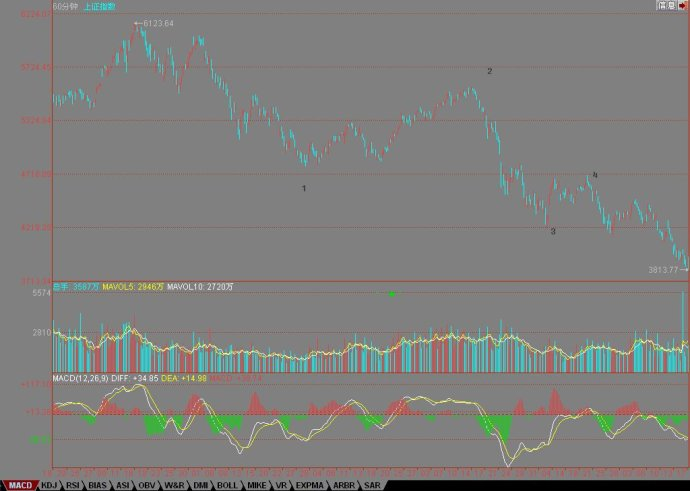{width="5.6299212598425195in"
height="4.004284776902887in"}

## 今天尾盘开始买入股票

(2008-03-18 15:16:32)

很多人好象很想知道本ID的操作，今天可以公开宣告，今天尾盘，本ID开始买入股票。

每天的走势，其实本ID都描述得很清楚，例如昨天已经说得很清楚，今天将有对记者会绝望的再杀出来，而记者会其间是一个震荡，这都在今天的走势中很明确的反应了，看看记者会后那杀跌，难道不是吗？

本ID就等这批人杀出来了，这批人杀出来后，所有有幻想的人都幻想破灭了，这时候，如昨天所说，这大盘就开始有意思了。

所以，本ID今天尾盘开始买入、回补第一批股票。

但，这个杀跌过程，很有可能会演化出极端非理性的情况，所以，资金大的，可以用分批建仓，震荡操作的方法。也就是，有足够的底仓后，保持这部分仓位不动，其他资金震荡操作，把建仓成本降低下来。

对于小资金，你可以根据技术图表找到更精确的买点。但大资金是做不到的，而现在，对于大资金来说，从今天尾盘最低点开始建仓，已经可以了。

本ID多次说过，今年到处是井，井可能是坟墓，也可能是机会，关键看你的水平，这次这井操作好了，收益少不了。本ID更反复说了，今年的操作是体力活，必须来回折腾，那种死拿股票的人等单边上涨的就等着去死吧。难道不知道本ID去年底就告诉你，今年绝大多数股票都是年阴线或长上影吗？

如果你没来回折腾的本事，本ID一早给你最好的归宿，就是小板凳。如果你自以为自己的水平可以不小板凳，结果给市场戏弄得鼻青脸肿的，那么就好好去学习这成语：自知之明。

建仓的股票，依然是低价股，而且短期跌幅最好超过40%的，这是最好的玩弄对象了，好好去寻找。

好了，逐步进入可以开始干活时间段，有本事的就开始抄家伙，没本事的，就继续小板凳。

先下，再见。

## 自知之明

(2008-03-18 16:23:40)

**每次大跌，都有人被严重摧残甚至淘汰，这只是市场中最正常的事情，市场不是慈善场所，从来都是铁血游戏，如果能从中获得点什么，大概也不枉被市场折腾一把。**

**人，一定要自知之明。例如，你必须对你自己的性格有足够的把握。有些性格是绝对不适合在市场中混的，例如，一根筋的、依赖心理的等等。**

**市场的特点就是千变万化，你不能要求市场如何，因为市场永远正确，错的永远是你。但有些人的性格，就是死不认错，那唯一的归宿就死在市场中了。**

**我们可以抨击政策如何如何，但我们不能把自己放在火上边烤边抨击，本ID经常惊讶于某些人的忍耐力，一边天天不断亏损，一边就只会骂街，这种人，市场从来就没有给他们留下活的空间。**

**市场上永远有不合理，如果你为了合理，那就别来市场了。来市场只有一个目的，就是赚钱，如果不合理能赚钱，那就合理了。**

**太多正义感的人是不适合市场的，只有战胜了市场才有正义，失败者从来没有正义可言。**

**单边市永远是稀有的，像前两年那种走势，十年都难得一遇。市场归根结底，以震荡为主，而震荡最终产生的利润，绝对不少于单边，不会震荡的人，在市场上就少了一种武器，坐电梯是小事，往往就落在井里上不来了。**

**所以，对于不会震荡的，那么最好的选择，就是回避，如果10年才会有1次单边的机会，那就10年玩一次，这难道不可以，为什么一定要整天在市场里被市场折腾？**

**没那本事，就远离，事情本来就是这么简单。可惜人的贪婪蒙蔽了自己，那就种什么得什么，没什么可同情的。**

**市场的残酷，并不是为了某个人，这是市场的本性，如果对此没有深刻认识，那也只有死路一条。**

**再说句狠话，这次的下跌其实算是温和的，想见狠的吗？如果这次上去，在60分钟上只能构成一个1分钟中枢，后面再演化为一个60分钟上的1分钟下跌，那时候再看什么叫狠吧。**

**在市场上混，就要成为钢铁战士，就算国家经济崩溃，1987、1929年，也能在市场上屹立，这才有点象样。像现在这些人，动动不动就求救市，那是没见过苦日子。1929年的时候，美国连政府都无能为力了，政府都救不了自己了，那时候，如果你是钢铁战士，一样能屹立下来。**

**这世界上，没有一样东西是可以依靠的，即使那东西叫政府。我们只需要正确的操作方法，用这方法，把自己锻炼成钢铁战士，除此之外，都是废话。**

## 3775点决定反弹能否延续

(2008-03-19 15:21:35)

**我们现在只是纯技术性地探讨走势，那么，3775点能否站稳将决定大盘反弹能否延续。今天一大早高开后回试是一个次佳的买入机会，为什么？看看60分钟图就知道，这刚好构成底分型。而3775点，刚好是这底分型的上边沿。**

**如果你明白这技术上的问题，那就会很放心地在早上第一小时回试时买入，很多股票当时还曾砸出比昨天更低的位置，例如000938，而收盘是涨停的。**

**这里，必须有一个纠正，图上绿箭头所指位置其实已经足够构成一笔，而这笔没有回到4431点上，刚好构成类第三类卖点。所以，现在的大盘走势很简单，直接拉回图中3的位置，还是在这里折腾出一个线段来。**

**由于目前还没有出现明确的区间套，不能完全确认从4下来的这下跌就一定走完，而单纯从60分钟图看，这显然构成了一个背驰段，只是这背驰段没有得到区间套的精确定位去确认。不过，按通常的情况下，最终回拉图中3的位置是必然的事情，唯一需要选择的，是完美地完成区间套，还是就此直接上去了。**

**而这一切，3775点是一个关键，为什么？因为这决定了早上第一小时构成的那底分型能否最终延伸为笔，如果笔都不能延伸出来，那当然需要再探底去完成区间套的完美构造。**

**个股方面，一反弹就知道，低价股和题材股依然是最有活力的，这种弹性十足的股性，具有最好的操作性，要好好珍惜。再说一次，今年是低价与题材的天下，但一定要知道，没有单边，只有折腾，而折腾，来回短跑，产生的利润一点都不会比单边的少。**

**先下，再见。**

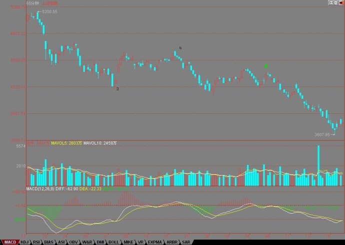{width="5.6299212598425195in"
height="4.004284776902887in"}

## 教你炒股票103：学屠龙术前先学好防狼术

(2008-03-19 15:58:15)

**似乎有人嫌本ID的课程太慢，而世界上最多就是这种人，100多课，估计里面任何一课都没真正弄懂，就嫌课程太慢？如果你真正弄懂其中任何一课，也不至于在实际操作灰头土脸了。**

**学屠龙术前先学好防狼术吧，本ID看现在绝大多数是连防狼术都没过关，大盘稍微来点劲，就会被大盘严重侵犯。**

**在没彻底下面所说的防狼术之前，你也别研究什么中枢、级别的了。因为有了这防狼术，至少不会被大盘严重侵犯，也不会在大盘大跌时鬼哭男嚎了。**

**这防狼术，其实在上面的课程都有提及，这里再一次综合地总结。看好了。**

**就一个最简单MACD指标，0轴分为多空主导，也就是说，一旦MACD指标陷入0轴之下，那么就在对应时间单位的图表下进入空头主导，而这是必须远离的。**

**各位请自己去看看大盘的60分钟图，5200点MACD跌破0轴并反抽确认后，一直到现在3000多点，一直就在0轴下晃悠，其间产生多大的杀伤力，各位自己难道没有体验吗？**

**回避所有MACD黄白线在0轴下面的市场或股票，这就是最基本的防狼术。**

**当然，这涉及时间周期，例如，如果是1分钟，那就经常在0轴下又上的。这里，你可以根据自己的能力，决定一个最低的时间周期，例如：60分钟图上的或30分钟图上的，一旦出现自己能力所决定的最低时间周期的MACD0轴以下情况，就彻底离开这个市场，直到重新站住0轴再说。**

**当然，如果你技术高点，完全可以在背驰的情况下介入，这是最高的，但这里不能给太高的要求，一切都要傻瓜化，如果你连MACD黄白线是否0轴以下都看不懂，那就彻底离开这个市场吧，地球很危险，回火星去吧。**

## 2008年行情再展望

(2008-03-20 11:13:56)

**抱歉，由于一西南地区上市公司的股权收购问题需要和法院和银行接触，下午可能等不到收盘就要去开会，所以今天的解盘和后面的帖子都没有了。现在用昨天写好的一个行情展望替代，要把握大的方向，请好好研究。**

**今天的大盘其实也不需要再解盘，由于3775点不过，自然就是继续原来的趋势，而浦发和石油给了一个恐吓性洗盘的机会。但可以明确说，目前已经处在宽幅的底部区域里，任何一个洗盘，都给题材股一个轮动的机会。**

**看看，今天创投的持续，奥运的崛起，这都十分明确。有时间恐慌、骂街，好不如好好去选择布局，看看N多人骂的天鹅已经两个涨停了，有时间还是看图选股去，市场不是靠嘴生存的。**

**先下，明天见。**

**2008年行情再展望**

**去年12月，本ID给出了今年行情的展望，当时的结论，依然都成立，而且很多都正在验证之中。由于今年一季度还没过去，所以最终结果如何，还不能下结论，但有些已经成为定论了，例如，关于今年落"井"机会多多的论断，经过这三个月，大概都应该有所感受了。**

**由于没有需要修正的地方，所以，本ID还是按原展望的思路根据新的情况进行进一步的拓展，给出一些更精确的提示，以方便后面三个季度的操作。**

**原展望中，本ID给出今年的节奏应该是扬抑大扬大抑，目前，扬抑这个节奏已经走出来，4778点到5522点的"扬"以及其后的"抑"构成了整个一季度行情的节奏。有人可能认为，4778点到5522点算不了扬，那是被前两年的单边上涨思维所迷惑了，在大调整走势中，这种级别的反弹已经足够地"扬"了。**

**5522点，是6124点下来的600点，3600点的1/6，这是一个值得关注的点位节奏，如果该节奏继续保持，那么4922点就是中线一个强的压力点。而4778点刚好是6124点下来的1345点，3600点的3/8，因此，下一个低点，最值得关注的是其两倍的位置，也就是6/8的位置，相应是3424点，如果没有特殊的全球性崩盘事件，该点位上下最终形成"抑"的底部的可能性极大。**

**可以断言，在这轮从5522点开始的"抑"走势结束后，将迎来原展望中所说的第三个节奏："大扬"，这"大扬"的概念在于，这段走势的幅度，一定大于4778点到5522点的"扬"。**

**为了更准确地预言这个"大扬"走势，我们必须先回到原展望中的另一个预言，就是今年至少两度见年线，第一次是喜剧，第二次是悲剧。显然，这喜剧和悲剧都在一季度中全部上演了，由于浦发银行突然增发的影响，第一次破年线后的向上喜剧，只延续了不到10天，然后第二次破年线，展开了后面的悲剧，其中的3月4日，是最终确认年线不能有效回拉上去的日子。**

**但由于年线目前依然保持向上的走势，所以，后面这个"大扬"走势必然展开一次对年线的再度反击。一个很重要的技术信号就是，一旦年线走平后，大盘如果还不能重新回到年线上面，那么，一旦年线转头向下，那才是真正的大调整的开始，所以，前面，从某种程度上说，只是大调整的预演阶段，因为毕竟年线还没有转头向下，一旦紧接着的"大扬"走势不能在年线转头前重新站住年线向上攻击从而带动年线继续上扬，那么，其后的"大抑"走势，将让一季度的"抑"彻底失色。**

**即使紧接着的"大扬"走势能重新站住年线并向上攻击，从而使得年线转头的时间推迟，由于目前的月线MACD刚刚死叉，在这种技术条件下，硬向上攻击的结果，最好的就是制造一个MACD的双头走势，而其后对应的，依然是更大幅度的下跌。MACD双头后的杀伤力，有点技术常识的都应该不陌生，而且这是月线上的，其杀伤力与时间长度可想而知。**

**从最直观的技术上说，下一轮真正的大行情，必须等到月MACD回到0轴附近才有可能展开，期间，都是一些小打小闹的走势。**

**基本面上，其实也完全支持以上的技术走势分析。由于目前的估值完全是按前两年的高增长为背景的，而且依然达到很高的水平，一旦经济走平，这些高估值就完全没有支持的空间，赢利水平的大幅度下降在可预见的范围内，因此，目前那些所谓绩优股票，都有极大的中长线业绩压力，目前的价格都过度偏高。**

**而且，世界经济的经验告诉我们，大的商品投机潮过后，总会一地鸡毛，而美国经济的问题，远未到解决的时候，这些外部的定时炸弹将随时把经济繁荣的幻想炸裂，而真正的调整压力，在那时才会真正显现。**

**极有可能，我们将要开始面对一个大的世界经济大调整的困难局面，而我们现在的经济结构，由于丧失了太多做大做强的机会，绝对已经不足以独善其外了。因此，后面的困难可能会超出现在一般人的想象，因为历史的经验告诉我们，真正可怕的调整压力，是经济基础方面产生的，而我们现在极有可能将面临如此的危机。**

**个股方面，在原展望中已经明确指出，就是题材股，各类题材的反复炒作，将是今后很长时间的主题。而在大的调整市道中，历史经验反复证明，低价题材是永远不败的主题。由于目前的资金量，即使在大的调整中，炒作些低价题材永远是富裕的，所以，只要有投机性资金存在，这就是不死鸟，一有机会就要起飞。**

**一句话，在今后很长时间内，市场都将是长跑选手的坟墓，短跑选手的天堂。**

**站在20年的角度，这次的调整，依然是超级大牛市中的一个中继性调整，但20年的前提是，你能熬过这个冬天，否则，20年的超级大牛市，对于你来说，毫无意义。**

## 3780点，短线生命线。

(2008-03-21 15:29:38)

**电话太多，晚点，抱歉。**

**昨天早上11点就给出的帖子已经给予各位最充分的提示了。众所周知的技术习惯，只要在3%的范围内，都是可以认为目标位触及有效。本ID给出的目标位置是3424点，而昨天的低点已经在其3%的范围内，因此，就此就上去，也已经在技术上十分完美。而昨天，本ID用恐吓性洗盘给出昨天早上的技术实质，这个提示已经足够明确，如果没反应，本ID也没办法了。**

**现在，当然不能说大盘就没有再次探底的可能，但大盘底部至少有一只脚是落地了，现在唯一需要探讨的只是这底部是独脚的还是双脚的甚至是多脚的。而决定这一切的，就是这3780点，这是60分钟新的底分型的上沿位置，只要站住这个位置，那么，至少在60分钟图上，将延伸出向上的笔，而这意味着这反弹是独脚的。**

**技术上，30分钟的MACD刚好在0轴上受阻，因此，只要下周初能站住3780点，那么这0轴也就会被突破，从而带动60分钟的向0轴冲击，对应这走势上将往上再上攻一段。**

**当然，如果站不住3780点，30分钟MACD就会出现0轴受阻再回跌的形态，对应着大盘当然就要再次探底了，所以，从这角度更说明了，3780点的重要性。**

**由于目前的日线上已经出现底分型，而上边沿在3941点，因此那个位置，是决定大盘反弹的级别能否扩展的关键位置，一旦站住那个位置，重新回到原来60分钟3-4的类中枢就不成问题了。**

**个股方面，还是本ID一路给出那几个板块在轮动，最近中小钢铁的走强，是因为重组的预期，这更说明，重组的挖掘是一个长期有效的主题。目前，还是小盘低价更有优势，你看，同样的题材，天鹅就比国电强，为什么？就是因为盘子小，国电30多亿的盘子，要敲动起来当然难度要大点、要慢点。**

**有些无聊人总是唠叨什么322，那算个鸭屁，难道堂堂大陆人民要为一个破渔村选村长这样的破事看他们的脸色，简直脑子进水了。**

**本ID给那些什么台港澳的人一句忠告，你们还有几年把自己当回事看的时间，过了这时间，你们什么都不是，别老觉得大陆人民欠了你们什么，你们那些要挟卖乖的筹码越来越没价值，等哪天发现，一个巨大的经济体不可阻挡的融化力时，后悔都没门。**

**给脸不要脸的最后连内裤都保不住。**

**有时间看322的无聊戏，还不如看看本ID的七律：。**

**先下，再见。**

**东南**

**缠中说禅**

**南万里海浮天，**

**裂金瓯百五年。**

**葬鱼龙今古血，**

**生蛤蜃晓昏烟。**

**夷衰盛忝唐杰，**

**雨苍黄思郑贤。**

**亿神州重抖擞，**

**仑拔掷浪波填。**

 

## 3780生命线失守再次探底

(2008-03-24 15:16:13)

**上周五已经超级明确地说了，3780点是短线生命线，站不住就再次探底。今天早上，跌破3780点后两次反抽上不去，确认跌破有效。然后下午2点那标准的第三类卖点成立后，跌幅明显加大。一切都极端技术化。**

**如果你没把握住这先卖等回补的节奏，那就恭喜你，你又要坐一次电梯了。当然，看到3780点失手，或最晚在第三类卖点跑掉的，那么就已经成功把上周抄底的了结，白花花的银两等待下一个买入的机会。**

**不过，由于目前已经在中线底部的震荡区域里，因此，每次震荡后沉淀一定的底仓是完全可以的。这要根据每人的资金量决定了。**

**如果你上去不舍得跑，破技术位也不舍得跑，把股票当宝贝，那建议你还是小板凳吧。现在的大盘，依然杀机重重，这样的心态，只有死路一条。**

**现在，就等平安的事情有一个了结了，管理层不能光说不练，材料报上去这么长时间，怎么都该有说法了。**

**个股方面，上一次强调的是短线下跌40%以上的中低价中小盘股，例如，已经4个涨停的天鹅就是最典型的例子。下一次，依然是这种股票，但注意能有双底支持的，而且一定要有新资金介入迹象，也就是放量后有一个缩量站住的。**

**周末有人吹嘘绩优股，但本ID依然要说，题材才是真。低价、重组、题材是今年不变的主题。**

**先下，再见。**

## 抱歉，以后不能保证每天都有帖子

(2008-03-24 15:33:03)

**最近，本ID写帖子的时候已经有点厌倦的感觉。并不是因为这世界上白眼狼众多，也不为了其他别的原因。只是本ID天生厌倦一切过于重复性的活动，例如上班。至于股票，唯一能让本ID忍受的是每天的行情都不同，这至少可以减轻厌倦感，但每周五都有放风的感觉。**

**本ID真希望如某些人整天诋毁本ID时说的，本ID是一个小团伙，可惜，本ID只是一个人，每天不变地两个帖子，确实已经超级厌烦。**

**为了与各位的缘分能持久点，唯一的解决办法就是帖子随意写，不要有一个固定的模式，这样，可能是最好的选择了。**

**以后就按心情写帖子了，更重要的是，现在其他的事情越来越多，整天有一个要写帖子的事情束缚着，确实不能坚持下去了，抱歉。至于解盘，还是尽量坚持。**

**先下，再见。**

## 万事具备只待平安事了

(2008-03-25 15:09:37)

**众所周知，这次从5522点开始共2000点的下跌，导火索就是平安，因此，在目前的底部震荡中，其实已经万事具备，但就差这平安破事最后有一个众望所归的结果，这也算是大盘最终走出底部震荡的一个最基本的心理支持。**

**现在，差的就是这一点，但这一点却迟迟不能出现。如果按这样的审查速度，那么管理层的办事效率也太说不过去了。今年的市场犯小人，总是在关键的时刻来些妖蛾子，这次如何，就看这市场的运气了。**

**今天的大盘依然是中低价题材股的天下，个股方面，已经有很多按捺不住了，但只要大盘不能真正走出底部，这些个股行情的延续性就有问题。**

**技术的角度，超短线的关键位置在3616点，一旦再次有效跌破，那么破底而下就基本成为必然的选择。**

**上面的位置，还是和前面的分析一样，首先要面对的是3780点，这点不有效突破，大盘依然只能在底部徘徊。**

**明天，超短线，最简单就看5分钟的MACD，现在刚好站在0轴，明天如果能从此来起，那么将带动30分钟的MACD再次冲击0轴，对应大盘将有一个向上冲击的过程。如果这种局面出现，一定要注意30分钟MACD是否又在0轴受阻，一旦出现，应当把今天买入的择机退出。**

**但对于大资金，应该把适当筹码进行沉淀。大资金必须是成本不断降低而筹码不断增加的动态建仓，这是一个基本的原则。**

**先下，再见。**

## 3616点，短线关键。

(2008-03-26 15:15:26)

**昨天让各位注意5分钟MACD站稳0轴后上攻的情况，结果今天早上走出一个标准的盘整背驰，红柱子小于前面一组，而也只带动了15分钟MACD回拉0轴受阻，因此其后的回落就理所当然了。**

**当然，如果你看不懂图，看到580989突然启动，也知道大盘要回头了。580989春节前就给了各位一个最基本的原则，0.6为中枢，只要好好把握这原则，你能赚多少钱算都算不过来了。不过，现在收盘已经到0.8附近，已经远离中枢，后面就是风险极大的阶段了，所以，今天没介入的，一定不能介入。该权证今天在0.7上下一个小级别背驰后回到次级别中枢形成大级别的中枢，因此短线0.7上下这中枢是对比关键，是否后面的上涨形成背驰，就以这中枢为基准了。**

**注意，权证是高度投机活动，而且很明确告诉各位，这是580989最后一大行情，毕竟还有2个多月就到期。**

**之所以再说580989，是请各位留意，上次580989从0.4下启动，对应了大盘一次快速的破位，这次是否重演，关键看昨天就说的3616点。**

**现在的问题就是平安，平安没说法，游资只能投机，谁怕谁呀。投机的好处在于，把短线资金的货给震出来都跑去诸如580989之类上，这样，中线的建仓也顺利了。今天，很多新板块已经暗流涌动，即使有再杀跌的过程，也是这些板块最好的介入时机，好好珍惜吧。**

**580989就看戏，看如何让你目瞪口呆，如何让最后的贪婪者套在高高山上永不超生。**

**先下，再见。**

## 教你炒股票104：几何结构与能量动力结构1

(2008-03-26 15:47:42)

**本不想写东西，看了看中国队的比赛，突然发现还是写东西有点意义。**

**本ID的理论是一个超级完美的理论，第一是在数学的角度超级完美，其次，是在物理的角度超级完美。物理角度，以前说的不多，因为这需要的思维方式，同样要有一个大的改变。**

**有些工科或老一代理科的，对现代物理一点概念都没有，以为能量动力，就如同牛顿时代，用各种微积分或各种级数等等无聊算法就是了。**

**现代物理的一个核心概念，就是物理与几何的高度统一。本质上，现代物理就是一门几何学，只不过是各种不同高深的几何学。而几何学也不是一般认为的那些几何学，几何的领域，可以涵盖并超越你思维的所有方面。**

**广义相对论是第一种真正意义上的现代物理学，而其基础是几何，一种比较简单的几何学。而后面，到规范场、超弦、膜空间等等，就涉及各种超越一般人直观的几何了。**

**在那些几何学里，能量、动力等结构对应着一些特殊的几何结构。这才是现代物理的主流。**

**对于一般人来说，广义相对论可能是最简单的了。那里，物质结构与几何结构是高度统一的，而诸如引力结构等对应着一些特殊的几何结构，如果有兴趣，可以找本广义相对论的课程看看，看看这种几何结构的威力。**

**而本ID的理论，本质上是站在这种现代物理的角度构建自己的能量动力学结构的。这里，一切都是几何结构说了算，一切的能量动力形态，都变几何化，因此，必须有这种思维上的根本改变，才会有真正的理解。否则，还是牛顿时代那种弱智思维，那就将陷入一种机械化思维的陷阱中。**

**具体怎么样，以后慢慢说来。**

**好，去看看中国队如何收场，下，再见。**

## 破发竞赛宣泄市场情绪

(2008-03-27 15:17:41)

**今天的走势，昨天已经说得很清楚了，就是上次580989从0.4下启动时的翻版，那次同时带动了大盘的破位，这次如出一辙。各位可以对比一下上次的走势，后面的走势是否继续一样，这是一个很值得关注的问题。**

**如果走势继续一样，那么惯性下探后，大盘会再次回到破位前的平台。3424点的位置，由于有3%的确认空间，所以目前并不能说这位置就被有效跌破了。当然，这位置如果跌破，那么，下面真正有效的位置就是2500点了。记得当时本ID把震荡空间定到2500点时，有人觉得本ID夸张，现在看来，一点都不夸张。**

**其实，目前的市场情绪已经开始扭曲，因为管理层的不作为，市场只能以破发竞赛来宣泄情绪，这其实是极端危险的状况，管理层的信誉，在这样的市场情绪宣泄中走向破产，以后如何修复，只有天知道了。**

**市场现在就是以这样的逻辑来回应管理层的逻辑，管理层不作为让市场的再融资没有规则，那么，市场就让市场本身的融资彻底破产，如果这局面不被控制，那么这场闹剧很可能要演化到有新股一开盘就跌破发行价，让市场完全失去基本功能，一旦这种局面出现，你说2500点很奇怪吗？**

**当然，作为市场的参与者，都不希望市场各方以这种对抗性的方式进行下去，这样只能损害市场本身。但球在管理层那里，他们不作为，市场也只好如此了。**

**由于市场重心的下移，我们所需要关注的低价股的价格也需要有所下移。但原则是一样的，就是低价、题材、更重要的是，一定要来回折腾。**

**至于破发走势制造的破发板块，从纯投机的角度，将蕴藏着一定的市场机会，不过这需要的操作水平以及政策敏感度比较高，没这水平的不一定要关注。**

**580989，昨天说得很明确，0.7上下的短线中枢是关键，今天冲高后马上30%回头到这中枢，显示的这中枢的强大威力，同时也证明，这次的上冲只是一个中枢，是一个盘整类型，后面的波动就看这中枢的第三类买卖点问题了。**

**注意，580989是最后一波害人行情，一般人一定要远离。**

**先下，再见。**

## 3424点初显威力

(2008-03-28 15:12:27)

**N周前的再展望，本ID给出了这轮下跌最可能的3424点的下跌结束位置，6124点下来的2700点，3600的3/4，而第一次4778点，刚好是3/8，今天这个位置初步显示其威力。**

**注意，一个最基本的技术常识，任何技术位置都有一个上下3%的允许空间。由于这世界上脑子有水的人太多，所以必须再说一次。例如，上次从4778点开始的反弹，本ID说结束的位置在900点，3600的1/4处，也就是5678点，最后结束的位置在5522点，完全在5678点的3%空间内，但有些人为了没有最终到5678点祥林嫂了一个月，这是什么人？自己没常识，蠢还要满大街告诉所有的人，这世界多的就是这种人。这种人不死，市场哪里还有天理？**

**而昨天也说了，和上次580989在0.4下启动那次一样，引领大盘破底后，大盘最终又再次回到破底前的平台，今天的走势证明，这太阳底下，新鲜事并不多。**

**但一定要更注意的是，由于今天的上扬甚至不足以在日线上制造一个底分型，而今天上扬受到诸多传闻的引诱，一旦这些传闻下周没兑现，就不排除又有一个杀跌回试的过程，因此，3424点最终能否成为底部，现在根本没有任何最终的结论，必须采取灵活的策略应付之，而不是脑子里一根筋。**

**超短线的角度，3499点是关键位置，一旦站不住，再次探底就不可避免。当然，只要能站住3499点上，那么行情就有希望，因此该位置极端重要。**

**超短线可以看下周初，5分钟MACD是否最终演化为红柱子不能再伸长而比前一柱子面积小的情况，对应着15分钟MACD的0轴能否被突破，一旦不行，肯定要回试诸如3499点这样位置的支持。当然，高明的并不需要等3499点真跌破再走。**

**对于小资金，原则已经多次说了，就是抓准机会咬一口，一看不能延续就先跑。这次从5522点下来，用这个原则抄了无数次底，都能按技术把钱赚了又先跑出来，就证明，下跌其实没什么大不了的，关键你能折腾，折腾好了，下跌一样是天堂。**

**当然，前面说了，对于大资金，现在折腾时一定要注意沉淀筹码，大资金和小资金不同，小资金1秒钟就可以把仓位建好，大资金可没这本事，因此必须有沉淀筹码的动作。注意，从5522点下来，本ID直到最近才给出大资金需要沉淀筹码的要求，为什么？因此以前离底部还远，所以根本不存在沉淀筹码的问题，而到了目前的位置，就算3424点最终不能底部，下面的也不过是空头陷阱了，对于大资金来说，根本不算什么，所以，现在开始沉淀筹码，完全对头。**

**周末，股票一边歇去。**

**先下，再见。**

## 3499点继续决定短线命运

(2008-03-31 15:16:35)

**在上周都比较兴奋时，本ID已经明确说，一旦传闻不兑现，又是一轮回试。至于给出的3499点，更成为今天震荡的中心，尾盘最终也没站住。**

**由于该位置今天是震荡中心，所以明天如果能站上去，大盘还有点戏，否则，继续探底就不可避免了。底部不是一天成的，今天显然已经比以前类似的情况走得稍好一点，显示已经有一点新资金介入并对此位置有一定的信心，否则，今天将是单边下跌。因此，明天的走势很关键，如果能回拉上去，证明新资金的信心还是比较足。**

**但是，多次说了，现在需要的是干货。没有干货，任何信心都会被磨掉。没有干货，谁说话都是废话，市场能领情吗？废话说多了，只能显示自己的无能，这点，有眼睛的人都看得清楚。**

**其他也没什么可说的，现在就是等待，今天是月线和季线收盘，有兴趣的自己去看看，中线形势有多恶劣。这里不起来，季线上就有极大机会形成向下的笔，这意味着什么，自己想去。**

**现在主管金融的人，其办事风格是十分怪异的，这点，本ID有太多了解了。该来的没来，也只好这样了。**

**天灾不可怕，因此，对非系统性风险，要有时刻的提防。对于散户来说，咬一口就跑，与机会再咬一口，这是最好的策略。**

**先下，再见。**

## 下一个短线机会又将来临

(2008-04-01 15:16:38)

**别让本ID看不起，每次短线，本ID都把最后的走人位说得一清二楚，就象这次的3499，今天早上连续冲了两次不行，就开始大幅度下行，如果你这你都看不明白，还是去孔男人那里吧，你这样的水平在这里只有丢人的份。或者就自知之明一点，在自己额头上写好永不短线，因为自己无能。**

**最鄙视那些自己没本事，又要怀疑别人的人。你没本事短线不代表短线在下跌中就不行，为什么每次本ID都能顺利出来？按本ID最后的位置，如果你没更高的本事，你哪一次不能出来的？**

**现在，有本事的人将要干什么，就是马上迎接新的短线机会。这机会在破底后很快到来。其实，很多股票，回跌10%到20%后，今天尾盘就可以回补，特别资金大的。**

**现在，一个标准的下降通道，到下轨就可以短线，如果破下轨加速，那就要放爆竹了，大的反弹马上就在眼前，这都是最基本的技术常识，有什么难度？**

**那管理层爱干什么干什么，本ID就陪他们玩到2500，1500也无所谓，反正有本事的人钱就越来越多，到时候再大买便宜货，从1990年和他们玩了快20年了，谁怕谁呀。**

**这世界，只能靠自己的本事，哀求别人救你，有可能吗？本ID早说了，绝对不能依靠任何东西，即使那玩意叫政府。这就是本ID从1990年开始的最大经验之一。**

**本ID越来越感觉到，本年度最大的赚钱机会越来越近了，让孔男人哀号去，求政府去，我们开始磨刀霍霍了。**

**先下，再见。**

## 现阶段中国资本市场的地位

(2008-04-01 15:59:39)

**一个成熟的市场经济，其市场中心地位的就是资本市场，资本市场的任何风吹草动，都是国家级的大事。看看，这次次贷危机，美国股市的实际跌幅度一点都不大，连20%都没有。但已经是朝野倾动而出，用进一切的金融、财政、政府等的资源来稳定资本市场。为什么在美国以及西方所有的成熟市场经济国家，资本市场具有如此举足轻重的地位？因为，这是他们经济结构的核心，后面代表着最大多数人的利益。也就是说，这些成熟的市场经济国家，其经济已经进化到如此的境地，绝大多数公民的经济利益都与资本市场密切相关，而经济基础决定上层建筑，自然，没有任何的政府机构敢对资本市场有丝毫的怠慢。**

**而现在，中国的资本市场还远远达不到这样的地位，因为中国的市场经济依然在极为落后的阶段，资本市场可以说暂时只是一种点缀，本质上，在经济结构中还没有任何实质的地位。**

**因为，在中国，目前与资本市场利益相关联的，只是所谓中产阶级以上的阶层人的利益，而目前中国更多数的人，是与资本市场无关的，而他们所代表的是一种与市场经济相对无关的经济结构。而在整体的国家经济利益的取向中，牺牲少数以换取多数，显然是一个最被采纳的选择。**

**因此，例如在现在CPI与GDP的两难抉择中，资本价格的压制又被人错误地认为是压制CPI的好手段，因此，牺牲资本市场就成为最符合这种经济逻辑的选择了。**

**可以断言，在中产阶级以上阶层占据社会人口最大部分之前，这种利益的偏向都无可避免，对此没有明确的认识，不仅会对诸多中国特有的经济现象产生迷糊，也会对自身的操作产生重大影响。**

**其次，按照服务型政府的原则，资本市场的监管机构，本质上是市场的服务者，但现阶段，显然远远达不到如此的要求，否则，例如平安事件，就不会一拖几个月都毫无结果。而对于一个服务型的机构，这是显然的不作为行为，应该受到相应的监督、纠正甚至惩罚的。**

**看清本质，你才能有真正的力量。**

## 3462点成短线关键位置

(2008-04-02 15:17:01)

**今天，如期反弹，然后大幅度震荡。一般这种走势，最好就是进行对冲式操作，或者如昨天本ID所说，昨天尾盘就可以先介入。**

**现在，短线最关键位置在3462点，明白本ID的理论的，都知道在这位置为什么重要。今天下午冲到该位置，站不住，所以就出现大幅度震荡。但尾盘依然有资金再度介入，这样，这次反弹可以再来一次，高位出的下来又可以回补再来一次。**

**但下面，关键还是看3462点，只要再冲不过，那么大盘依然有继续破底的机会。短线就是要来回折腾，一看不行先回来，一看行了，甚至可以打点提前量，例如为了避开T+1，可以在前一天的尾盘。**

**个股方面，金融股已经率先走强，但这走强是否有延续性，是否能向地产、有色等蔓延，是行情能否延续的关键。题材股经过大洗盘，还会重来，但暂时以反弹为主。**

**这几天很难打开，系统好象也不稳定，不多写了，先下，再见。**

## 3462点如期发挥神奇作用

(2008-04-03 15:24:59)

**今天的走势大概出乎很多人的意外，但一定不包括本ID以及昨天看了本ID解盘的人。昨天的解盘很明确地告诉你要再来一次，请问，这一次爽吗？**

**昨天，更说了金融向地产或有色等蔓延的问题，今天，那聪明的驴的表现，请问爽了没有？有人昨天说，不是题材股吗？但难道这些云铝中铝不是本ID股票池子里的？50、60跑的，20下买点回来，难道有罪呀？简直病的不轻。**

**兵无常形，如果要走一波本年度最大级别的向上走势，中字头不启动怎么可能完成？题材股当然要继续，但一波完整的行情，就是一、二、三线的轮动次序，这不最简单的道理，有什么可说的？**

**当然，这一切暂时还只是蓝图，因为实际的行情并没有走出来，暂时先当成反弹来干是比较靠谱的，一旦形势不对，反手狠砸，不亦快哉？**

**显然，昨天说的3462点，今天起了明显的作用，大盘最终在该点位前放下步伐。由于今天搏消息的比较多，所以尾盘小跳让人出来也是应该的。**

**下周是很关键的一周，因为日以及周是否能底分型，就看这了。当然，短线这一切，都可以简化为3462点能否有效站住的问题，一旦能站住，这些分型都不成为问题了。**

**个股方面，注意一线股的轮动次序，注意新资金流向。另外，如果周一没消息，注意回杀力度，如果力度不大，反而证明这行情真有戏了。**

**今天的走势图，超级技术化，留一个作业：13点30分到2点这段时间具体什么的技术意义，为什么一站住某位置后，就马上出现大的突破，向上攻击3462点。**

**提前一天收市，简直太美好了，清明时节雨纷纷，水为财。**

**先下，再见。**

## 3613点成中短线关键位置

(2008-04-07 15:21:25)

大盘今天突破短线关键位置3462点后一马平川，60分钟上N个月来第一次延伸出向上笔走势，显然了大盘的短线强势。

周五解盘已经特别指出，如果周末没消息而大盘反应并不过烈，反而证明大盘行情真有戏了，今天的走势恰好证明了这一点。个股方面，中驴为代表的有色继续驴性大发，但要注意，这次启动的板块，都是回弹20-30%左右进入调整，例如地产、金融等，因此，有色能否改变这局面，暂时是有疑问的。

现在，3613点已经成为中短线关键位置，因为这位置是否突破决定大盘能否延伸出日线上的向上笔，而今天的走势，由于已经突破3555点，因此，周线上形成底分型的可能性极大，除非在本周内出现再破底。因此，中线上，我们一直预言的本年度最大行情成立的几率已经越来越大。

当然，最安全的作法还见一步走一步，只要3613点攻击不破，就可以先对筹码进入相应调整，以应付后面的震荡走势。

虽然本ID一早就明确3424点附近将出现中线底部，但真走出来，我们反而要冷静。不能在操作上留下遗憾。而且，如果真是中线底部，在真正突破之前，洗盘震荡还少不了，所以，一定要按图作业。

上周的问题，只和60分钟的底分型相关，3396点，突破后延伸出笔，这样经典的案例，请多研究。

先下，再见。

## 中国人，不要习惯性当政府的奴才。

(2008-04-07 16:05:58)

**几千年来，中国人在政府、衙门面前就从来没抬起过头，即使改朝换代，最终这奴才心理还是改不了。**

**而实质上，政府、衙门是我们的奴才，没有我们，哪里有什么政府、衙门，是我们的血汗供养了这些机构。面对这些机构，任何人都应该腰杆笔直。**

**可惜，实质上，绝大多数的人还是不自觉地、完全集体无意识地当了政府、衙门的奴才，例如，在资本市场上，例如现在还在叫嚣的救市言论。**

**本质上，根本不存在政府衙门那种从上而下施舍性的救市，问题的实质，只是要让这些奴才改正他们的错误，当然，如果奴才不好听，那么，我们就用公仆这个词。**

**没有救市，也无须救市，有的只是纠错。错了就要承认，就要改，就这么简单。**

**可惜，大多数的人的思维都扭了，都在等待所谓的施舍，这样，中国的资本市场、中国的现代化真是遥遥无期了。**

**衙门型的管理机构与服务型的管理机构相比，最大的特点就是行为完全脱离实际，所有的应对措施都严重慢几拍。例如，过去两年，面对快速的上涨，最简单的经济学常识都可以提供最简单有效的应对措施，就是快速加大供给。而供给的加大是要有时效性的，过了那时间，这措施就对不上点了。那么，请看实际上管理机构不仅没有加大供给，反而是提供了流通比例极低的疑似非法蓝筹，这难道不是典型的火上加油吗？**

**衙门型管理机构，甚至可以有这样一种可怕的思维，跌比涨好，跌就是安全，资本市场里的人的行为最好都完全统一到银行存款行为上去，这样就不惹事，不惹事就是最大的好事。正因为这十几年那如此思维的存在，因为中国的资本市场走势都显示出最大的投机性，因为大家都知道上涨的时日无多，一旦有机会就变本加厉地投机，尽量在最短时间内把最大的利润拿到手。**

**正因为管理层与投资者的心态都在这样一种氛围下，所以，那种稳健的长线行情就不可能真正出现，大起大落成为真正的常态。而这时候，还提防止市场大起大落就成为一件很滑稽的事情，成为衙门型管理机构语言的一个标准范本。请问，一年不到，从3400点到6124点又回到3400点还不是大起大落？一个已经是事实的东西，还能或还需要防止什么？**

**我们不希望再有类似的无聊衙门言论，我们也希望我们所有的投资者都要站立起来，知道自己的力量，市场是我们创造的，我们是市场的真正创造者，我们才是市场真正的主人，我们必须要用我们的力量彻底改变这一切。**

## 3613点如期发挥神奇作用

(2008-04-08 15:19:39)

**昨天给了短线的关键位置3613点，今天全天就是围绕着震荡，连收盘就在3612.5就知道，该点确实如期发挥了作用。**

**现在的问题很简单，站得住3613点，就继续上攻，否则就出现一个大的调整。所以，本周就看着该点就可以了。**

**个股方面，板块轮动加速，现在问题的关键是轮动后首先调整的板块能否再次启动，能，那大盘就肯定有戏，否则至少要调整一下。**

**目前，整个次序大致是地产、金融、有色、券商，然后今天是所有几乎大的题材都动了一下，创投、农业、三通、环保等等，因此，后面还是要看金融地产能否再次启动。**

**当然，一些小板块的轮动还会继续，但对于大局，这些都没多大的意义。行情，关键要看大角度。**

**大家应该注意到，本ID最近一直只用给级别的分型来统一进行分析，其实就是想告诉各位，你把一招真学会了，绝大多数的问题都能解决，这就是示范，请把这次整个探底到回升的整个过程好好研究，课程等这个示范以后再写。**

**不想说了，留点精力今晚熬夜看球，先下，再见。**

## 3613点威力尽显

(2008-04-09 15:16:57)

**今天的走势极端技术化，前面已经明确说了，只要站不住3613点，就要再次探底。今天低开后，在60分钟刚好跌破顶分型的下边，早上那标准的回抽，极端显然地上不了3613点，因此确认这对顶分型下边的跌破是有效的，因此后面的下跌就顺理成章了，为什么？因为向下要形成笔。**

**现在的走势很显然了，向上的笔后形成向下笔的调整，也就力度最大那种调整，因此，后面在向下笔结束前，都不适宜再度介入。但一旦向下笔结束，就又有一次美妙的短差机会。**

**各位，看到没有，就用一个简单的60分钟分型结构是否延伸为笔，我们就能完全把握这样的走势与相应的退出，现在，我们只需要等待新的买点出现，如此简单而已。**

**个股方面，昨天已经明确说了，只要地产不能重新启动，就有问题，今天万科等的走势，一个标准的短线多头陷阱，因此，引发回跌再正常不过了。**

**当然，就算有真行情，也需要大的洗盘，但是否洗盘还是继续下跌，其实根本不重要，我们只关心下一个买点，把走势支解了进行操作，我们不废那个脑子。**

**让脑子有水的人继续争论是否有真的行情，他们负责争论，我们负责挣钱，还有精力的，今晚继续加班看球。**

**先下，再见。**

## 3533点成短线关键位置

(2008-04-10 15:25:06)

**网络超级慢，登陆就用了10几分钟，什么写东西的心情都没有了。随便说两句。**

**今天，又一个完美的短线机会，60分钟的底分型成立，而3533点成短线关键位置，所谓的关键位置，就是站上去，大盘将继续延续反弹，也就是2次探底结束；站不住，就必然再次探底，而且破底的机会极大。**

**今天，煤炭、券商、滨海等甚至创出本次反弹的新高，这是好现象，证明至少有部分资金是勇敢做多了。现在，指数上要有大突破，还是要看金融、地产、有色等，不过先有板块裸奔起来，绝对是好现象。**

**思维要改，今年的行情不会是一条直线的，底部也要震荡个N回才爽的，不明白这点，就痛苦去吧。**

**注意节奏，自然就爽。**

**这破网，按一下，N久才有反应，简直浪费时间，**

**不想写了，先下，再见。**

## 周底分型成立令3840点成中线关键

(2008-04-11 15:10:56)

**本周折腾，最后的结果还是把周底分型给折腾出来了，该分型的上边在3840点，因此，该分型是否最终有效，延伸为向上笔，或者最终失败，只构成中继型，3840点就成了周级别的关键位置了。**

**今天，大盘全天在昨天所说的3533点下震荡，显示大盘不强，信心不足，大概是周末的心理压力，因此，下周初，就看这60分钟级别的关键位置能否突破，不行，就再次探底。**

**日线级别的对应位置在3613点，因此，3533、3613、3840，给出了一个市场运行的密码，由此，超短、短、中的走势都完全把握了。**

**个股方面，板块继续轮动，但力度有所减弱，现在，只要金融、地产等不再次动起来，大盘就不会有大戏。**

**周末，快点远离股票，好好休息，身体第一。**

**先下，再见。**

## 教你炒股票105：远离聪明、机械操作

(2008-04-13 21:51:14)

**周末不写股票并不是什么天经地义的事情，想写就写了。**

**股市里死掉的，大半是聪明人，越聪明的，死得越快。要在市场上生存，就必须远离聪明，因为，你的聪明在市场面前一钱不值。**

**市场就如同一头牛，只有目无全牛，才可能随心解之而合其关节。在本ID的理论中，机械化操作的本质就是目无全牛而合其关节，因为，根据本ID的理论，市场的结构已经被彻底分解，站在本ID理论的角度，哪里有什么市场，不过是一堆的关节。而机械化操作，就是逐步合于其关节的节奏，而不被全牛的繁复所影响。**

**至于分解这市场的那个标准是什么并不重要，也就是分类的原则并不重要，关键这分类能导致完全分类就行了。那些看不起分类的，永远只能在全牛的迷惘中可怜，咱就不带他们玩了。**

**本ID可以再次明确地说，全牛纷繁，因此可以口水多多，各有道理，那么，就让这些聪明人去道理去、去争论去；咱不爱聪明，咱不爱全牛，咱只知道关节的节奏，咱不爱争论，咱更不爱预测，咱只负责挣钱。**

**如果你喜欢道理而不喜欢白花花的银两，喜欢争论而不喜欢挣钱，那么就远离本ID的理论吧，那对你没用。**

**最近，不写课程，但其实一直都在写，每天，就是用一个最简单的分型以及能否延伸为笔的最基本标准进行分类，就完全可以处理如此震荡的行情，人总爱复杂的东西，看不起简单的，而这才是真工夫。**

**挣钱，本来就是很简单的事情，不过就是一个良好习惯与操作策略的结果，一点劲都不用费。那些费力才能挣到的钱，也不会袋得住。**

**人总爱贪多，请问，分型这最简单的分类导致的操作，你把握了吗？如果这都没熟练把握，你再学其他又有什么意义？**

**好好总结吧。**

## 又一短线机会扑面而来

(2008-04-14 15:22:10)

**现在这种行情，本ID一早就给出两种唯一的策略供不同水平的人选择，一是小板凳，二是短跑运动。本ID之所以天天在这里给各位练习短跑，就是假设你有这水平。否则，小板凳的过来看看就可以。**

**现在，继续和各位练短跑，如果你没这水平，就一边晾着，咱不带你玩。**

**已经明确说了，3533点上不去破底的机会就大大的，所以，今天的走势其实没什么可奇怪的，而且早上连续三次冲高都补不了缺口，如此肾亏，你还能假设这大盘今天不是ED男？**

**不过，这样的下跌，只是让又一次的短跑机会扑面而来。不管是用背驰还是分型，都很快出现标准的图形。其实，对于一点货都没有的，今天尾盘就不妨在水底捞点。**

**注意了，中线一定要看好地产板块，前几天本ID已经说了地产搞了一个多头陷阱，因此，这几天的大跌很正常，否则就不叫多头陷阱了，现在的关键是，地产是最早启动的，这次下来是第二买点的清洗，还是新一轮的下跌，对大盘具有极大的中线指引意义。当然，同样的包括金融股。**

**平安那破事一直不出来，对大盘就是一个大的压制，它不出来，大盘就不可能真正走起来，这点也是必须注意的。**

**注意，短跑就是冲刺就完事，千万别搞成长跑。**

**先下，再见。**

## 如约反弹，3311点成短线关键

(2008-04-15 15:14:35)

**爽了没有？**

**这扑面而来的感觉如何？**

**你看透市场以后，反弹不过就是一个419的约会。今天，昨天的预约如约而来，4根60分钟线，前三根构造分型，确认后，第四根突破分型上边，3311点成短线关键位置，一切就是本ID理论的活教材，你说有什么可说的？**

**注意，只要3311点回试站住，那么反弹继续，否则就结束，如此简单。**

**短跑的感觉如何？感觉是跑出来，干出来的。爽是需要真枪真刀来的。本ID这里没有花架子，只有白花花的银两通过技术抢劫回来。**

**个股方面，创投继续，券商由于可以直投，其实也已经是这个概念了。后面就看能不能轮动起来，房地产能不能止住来个大反弹。另外，新能源、环保、农业等是长线大题材，一定是有机会就会被折腾的。**

**个股只要能轮动起来，这反弹就能持续。至于中线大盘，过几天有心情再和各位分析，总之，已经在最后的空头陷阱中了。**

**先下，再见。**

## CPI让多空有了再次较劲的理由

(2008-04-16 15:15:02)

今天，大盘全天和CPI震荡较劲，而震荡的中心就是昨天说的短线关键位置3311点。而最终得到的数据，多空双方都能从中找当适合的说辞，空方自不必说了，而多方看到CPI月环比的回落，当然也有了说道的地方。

其实，最终怎么选择，一点都不重要，今晚，各大报纸、专家就会将这些数据分析烂了，但这对实际操作没用。

我们不当专家，我们只当赚家。面对这种围绕关键点位震荡，还没有决定方向的走势，最苯的方法当然就是等关键点位出现第三类卖点之后走，但这确实太无聊了。以前已经多次说过，这种操作其实十分简单，就是在震荡高位利用盘整背驰抛掉，下来不破位就回补，千万别浪费这震荡的短差机会。注意，这样必然是半仓操作，如果真破位，下来不回补就是，然后把半仓也扔了，这样效率最好。

当然，还有一种是最干脆的，就是震荡高位先走了，等真正重新站住关键位置出现第三类买点再介入，这是最安全又有效的作法，就不费心去预测最终是否站住了。

我们的操作，一定要用操作的眼光而不是争论的眼光，来市场是为了赚钱而不是为了表现自己的聪明。

明天，就看这3311点的第三类买卖点问题，如果你已经有正确的操作了，那这就没有任何操作问题了。

我们不较劲，等多空较劲完了，我们跟着胜利者走就是。

先下，再见。

## 破底再给短线机会

(2008-04-17 15:05:56)

**3311站不住，自然就要破底，这没什么可说的，但这就又成就新一轮419，一个新的短线机会又到面前。**

**今天，有点脑子的资金都云集到某新股中抢东西，但这反而搞到盘子乱了。明天很关键，就看里面的各种势力会不会互相拆台了。**

**现在，破底并不是什么坏事，破底反弹再破底再反弹，节奏把握好了，一样赚钱。中线只能等基本面的明朗，不明朗，谁都没有当炮灰的兴趣。**

**其他没什么可说的，看图操作就是。**

**先下，再见。**

## 告示：以后的帖子可能极端没规律

(2008-04-17 20:16:00)

**现在这博客已经成为本ID最大的一个负担，本来想关闭一段时间，等把手头的事情忙完再重开。**

**但现在的人又那么多，关了，对不起太多人，虽然都不认识，也过意不去。**

**由于最近，家里出了很大的事情，作为成员，本ID必须负责，而这种负责不光是钱的问题，是要亲力亲为的，钱并不能办所有的事情。**

**所以，已经完全不可能正常写帖子，就象今天的帖子，本来一收盘就要走，为了写，最重要还不是浪费那点时间，而是被一件事情给束缚住了。**

**以后，解盘之类的不一定收盘就有，晚上回来有时间，尽量给出，太晚就算了。**

**这不正常的时间，估计至少要几个月时间。本ID也希望能尽快结束这样的情况，但很多事情，并不是一个人能决定的。**

**先下，再见。**

## 后市纯技术分析展望

(2008-04-18 15:24:59)

今天是典型的逼宫行情，中石油破发，使得所有人觉得该干的事情给干了，但这种希望把管理层的政策弄出来的想法，显然有点太天真。

由于60分钟底分型没有被构造出来，所以短线出击的时间必须继续看图等待。

周末不想多说，把前面曾经承诺的中线分析给出，一早就写好，正好贴出来当周末礼物。

先下，再见。

最近大盘在本ID前期所指出的3424点上下反复震荡，持续了相当长的时间。由于目前的基本面完全不配合，因此有力度的行情一直不能真正走出来，只能维持一种弱市震荡的局面。这种震荡的局面，最终的结局无非两种，就是逐步震荡走强然后寻机向上突破，或者就是干脆再狠砸一个空头陷阱，快速下跌后进而再迅速回拉重新回到该震荡平台蓄势走强。

无论市场最终采取何种选择，最终在根本意义上，不过都是要以目前的平台为基准展开新的行情。因此在这共同点上，反而说明了目前平台的技术意义。现在需要探讨的是，该平台最终确认后走出的行情的级别问题，因为，实质上，根据最严格的技术分析，还存在三种可能的走势变数。

上海指数，从6124点开始，共出现两个不同级别的有技术意义的反弹。第一级别是4778点到5524点的所谓跨年度行情，而第二级别是那次在年线附近进行争夺的走势，具体的范围是4196点到4695点。因此，这三种可能的变数就是：一、第二级别力度的反弹；二、第一级别力度的反弹；三、超第一级别力度的反弹。

显然，这三种反弹的力度是逐级加大的。最弱的就是第一种情况。由于从4695点开始的下跌到目前已经进入尾声，因此，其后至少要出现第一种的情况反弹。而在目前基本面上，国家对市场已经完全受制于所谓CPI情结，因此，资本市场本被当成最终牺牲品的可能性是极大的，一旦这种基本面继续成立，那么，大盘只出现第一种情况反弹的可能性就极大了。

也就是说，后面，我们首先可能只会迎来第一种情况的反弹，其后依然有进一步的下跌去制造新低的必要。而只有当那次新低制造后，大盘才可能出现第二或第三种情况的走势。至于这个新低的范围最终出现在2500点到2700点内甚至更低，都不是一件太奇怪的事情。

其实，以前已经明确说过，上海指数的走势完全可以参照深圳成分指数的历史走势。我们之所以能在去年提前指出6100点的大顶，除了上海指数本身的分析外，一个很重要的原因，就是因为深圳成分指数的历史走势在1996年到1997年就出现从刚破1000点到6100点的历史性走势，该走势与上海这次的走势吻合具有着极大的可能性，而事实上，这种吻合最终就变成了事实。

深圳成分指数的历史走势从6100点开始快速回落到3000点以下，和这次上海的走势又出现惊人的指示作用，因此，上海的走势最终跌破3000点，站在这种历史走势值得关注的对照上是完全合理的。

当然，历史走势的对照并不一定都完全成立，但从目前的情况看，最终成立的可能性越来越大。特别这次，和上次的情况在基本面上完全一样，上次是所谓的亚洲金融风暴，政府为应付之，只能把资本市场当成牺牲品。而这次的所谓的次级贷款，都是外围因素引发内部压力，最终的政策选择也是牺牲资本市场，所以，这一切，都成为很容易理解的事情了。

注意，目前理解当下的资本市场，一定要彻底明白政府最终抉择中资本市场一定会被当成牺牲品的必然性，这种必然性在前面已经详细分析过了，这是理解当前资本市场的关键所在。

从目前的基本面看，出现第三种情况的可能性不大，而第二种可能性还是有的。上次，深圳通过两年的调整后才出现第三种情况的走势，如果你相信历史，那么，要出现第三种可能性的走势，怎么都要有1年的时间。

当然。分析在本质上涉及预测，并没有任何100%准确的可能，而实际的操作，一定要根据市场的最终选择进行，不能把分析与预测当成市场本身的走势，而后者才是操作所能真正依据的。

## 多头版"半夜鸡叫"闹剧收场

(2008-04-21 15:09:38)

显然，周五的逼宫兵临3000点，给管理层足够的压力。但现在的管理层，有点葛朗台的味道。把自己兜里那点货都当宝贝了，总想用最小的代价把市场给打发了。因此，一个最没实质内容但又用"半夜鸡叫"模式过度包装的闹剧就此上演。

对此，本ID真是无话可说，各位大爷，为什么总是要低估市场的智慧？大爷们口袋里有什么货色，市场里的人用指甲都能算清楚，又扭捏什么呢？

不是市场不给管理层面子，而是太自以为是是必须受到嘲笑的。

当然，由于管理层已经有点压力了，所以，不排除他们来点什么组合拳，因此，过度作空已经面临风险，向下的搏傻游戏也要开始小心。

市场玩的就是心理，不管对象是谁，看穿了对手自然上上下下操作自如。

技术上，短线看，今天还折腾出一个小的底分型，能否成立就看3189点了。

操作是双面的，可以先买后卖，可以先卖后买，可以先卖后买再卖，关键是看图操作，不要凭自己的情绪。

另外，盘面上一定要注意是否有领涨板块出现，没有这，就像今天，肯定没戏。

先下，再见。

## 小分型顶起大反弹

(2008-04-22 18:20:45)

**注意，晚上本ID有重要公告，请留意。**

**今天，60分钟图上出现的小底分型顶出了一个大反弹，3085点的突破确认了分型的成立，后面就是回试能否站住最终形成向上笔的问题。**

**由于今天的涨幅都是最后一小时造成的，因此，明天早上就很关键了。最机械地就看3085点，而中线关键看3305点。**

**个股方面，金融股，包括银行证券继续走强，这证明长线资金依然坚定认为3300点下的空头陷阱性质，而现在很关键的就是房地产股了，如果能从前期的空头转为多头，则多头成功的几率就大了去了。**

**政策方面，今天把王大先生也给逼出来了，这次的逼宫行情，骗到了筹码，又把政策冲了冲，效果是显然的，但还是缺少干货，这才是行情迟迟不大动的关键。**

**今天有事晚了，抱歉。先下，再见。**

## 纯技术化的走势如期遭受3305点考验

(2008-04-23 17:58:56)

**昨天分析给出3085点与3305点，结果今天走势就在这两点演绎。早上对3085点的回试确认极端教科书，下午，最后半小时一直在3305点关前徘徊。**

**显然，突破3305点，那行情的性质将升级，而不破，那就要出现震荡，因此操作上以此为标准就很容易了。**

**个股现在普遍回暖，而有些板块已经逐步有中线强势特征，只要真有领头的，行情就有戏。**

**太多就不谈了，看图操作。**

**大略看了各位昨天的留言，谢谢了，本ID会认真面对的，有空会把相应的事情一一记录，就如同一个股票的操作记录。**

## 正常解盘只是没有值得不正常的

(2008-04-23 19:54:24)

十分感谢各位的关心，人非草木，本ID当然能感受到各位的感情，毕竟，喜欢诗歌、音乐的人，本来就感情容易泛滥的。

本ID的病确实是千真万确的，这里没有任何开玩笑的成分，有拿这种事情开玩笑的吗？正因为如此，本ID一定会继续正常地进行解盘，因为，这是一个态度问题，本ID并不觉得多了这病事情就需要任何的不正常了。

本ID一定如同对待一次大规模的操作一样对待这病的操作，当然，操作就有失败的可能，唯一可以努力的，就是让失败远离。

十分高兴今天需要的干货终于出来了，本ID一直强调3300下就是空头陷阱，本来可以更详细的分析的，但最近确实没时间，但没有辜负各位，本ID就心安了。

本ID唯一希望就就各位最终都能独立行走于这凶险的市场，面对一切，就如同本ID现在平静地面对疾病一样。

有空再写。

## 普涨后注意板块分化

(2008-04-24 15:15:00)

**干货的力量，今天全面呈现。市场不是没有资金，而是没有信心。信心来自干货，有了干货，就有了冲击的能量。**

**不过，任何事情都不能昏头。今天是普涨，所有前期压抑的发泄，因此，行情能否真正健康地展开，关键是其后的分化，强势领涨板块的继续走强，这才是长远之计。**

**前面说过，券商由于能直投，所以是真正的创投股票了，而这次减税，肯定对成交量有大的提升，这板块在前期提示后，依然值得关注，不过追高就没必要了，因为毕竟会有一次洗盘的过程。**

**另外，这次行情的性质，前面也说过，肯定大头的天下，一般的题材股，暂时只能小打小闹。所以一、二、三的节奏，大概会表现得比较明显。**

**注意领涨板块之间的轮动节奏，以及向二、三线的蔓延节奏。**

**当然，从纯操作的角度，我们不能一味看好，饭要一口口来，短线的关键位置在3656点，站住继续上，否则进入震荡。**

**先下，再见。**

## 3656点如期发挥神奇作用

(2008-04-25 15:15:22)

**大盘如此气势汹汹，结果还是在本ID一早提示的3656点上被迎头痛击而出现跳水，显然，大盘因此将进入震荡，该震荡平台如果最终只能出现第三类卖点，那么大盘甚至有再次探底的可能。**

**大盘没什么可说的，站住3656点，继续大鱼大肉，站不住，就改吃咸鱼青菜，如此而已。**

**证券板块继续如所说的强势，显然，这是领头的，只要该板块中线继续走强，那么问题就不大。短线会有震荡。**

**个股如所说地出现分化，好好观察调整中有新资金介入的，一旦还有新一波，这就是黑马了。**

**另外，本ID极端鄙视那些拿本ID的病到处招摇的，这些不配做人。人的尊严，就在生命的残酷中的从容，整天鬼哭狼嚎，把一个帖子贴上几百上千，还是人吗？**

**人，就要人一样站立。感谢各位的关心，你们的药方等等都感谢了。不过，本ID下周会因此而开始讲授中医的，这也是战胜疾病的一种方法。**

**周末了，让我们去体验不一样的生命。**

**先下，再见。**

## 3656点的神奇捍卫技术分析的尊严

(2008-04-28 15:06:21)

**很多一知半解的人，说什么技术分析没用，那么请问为什么本ID多次事先指出的位置都神奇地逆转了大盘？就象这次的3656点，事先给出，其神奇作用是在基本面强烈变动下发生的，结果怎么样？这两天的走势很无耻地很不给所有人面子地捍卫了技术分析的尊严。**

**很明确地说了，站住3656点，继续大鱼大肉，站不住，就改吃咸鱼青菜，所以，各位就开始吃咸鱼青菜了。什么时候才可能再大鱼大肉？很简单，等60分钟的向下笔完成。**

**日线上，3656点使得一个向上笔完成了，要在继续延伸，关键还是要重新站住3656点，因此该点已经有了日线级别的技术意义。日线关键看5日线，只要能站住，回探就在可接受的范围内。**

**个股上，注意强势股回调时是否有资金承接而有第二波的机会，另外，调整时，老题材股会趁机活跃。**

**等一下，简单说说本ID病情的最终全面结果。**

**先下，再见。**

## 5日线支持产生震荡

(2008-04-29 15:02:13)

**在远离北京的过程中,无线上,只能快速说两句。北京对本ID的病是死地，算了算正向活地转移。3656点是大盘的抉择点位，其下的一切震荡本质上都没多大意义。**

**当然，如果5日线震荡失败，那么大盘将确立进入向下笔，调整压力将加大。**

**个股，强者恒强在证券中表现明显，所以一直强回调介入机会。但现在关键看大盘，如果调整加大，将注意相应风险。**

**不能多说了。**

**先下，再见。**

## 3840点成中线关键

(2008-04-30 15:17:52)

**当然，题目成立的前提是3656点突破的有效，这必须是节后前三天的表现决定。节后越强势，大盘反而越不用担心，反之，大盘该强不强，就要小心陷阱了。**

**现在已经在全亚洲设备、水平最高的地方住下了，各位不用担心。**

**先下，再见。**

## 走势趋弱，小心震荡

(2008-05-05 16:54:42)

**今天，上攻力度明显趋弱，以板块补涨为主，所以，大的震荡风险已经开始积聚。3840点的中线意义已经早说，注意该点位上下表现。**

**这两天连续检查，活检等真受了大苦，大概平时根本不来医院，少见多怪了。**

**先下，再见。**

## 该强不强小心陷阱终被验证

(2008-05-07 15:06:22)

**节前已强调,节后该强不强小心陷阱,而周一又再次提醒,因此今天的走势完全在预料之中.现在中线很简单,还是看3656点,强弱分水岭.站不住甚至不排除二次探底.**

**暂时,可以把操作先以3656点附近新中轴震荡打短差.**

**明天开始,可能要开始一次化疗看看效果,这里有最好的针对化疗后果的特效药,因此可以试,也就6天时间,如果没大的效果,会换新的方式.**

**因此,后几天不一定有帖子.**

**抱歉.**

## 3656点上下的艰苦选择

(2008-05-08 14:45:00)

3656上下的重要意义已经反复说,至于如何选择，根本没必要预测，只要保持如此市场节奏，那就3656点下跌不动就买，之上或附近涨不起就抛，不断短差。

市场好操作，但有些选择就很难，现在就碰到一个。紫杉醇（Taxol），最近在这医院竟然出来两次问题，一个10分钟就没了，连救都没时间。而用的都是最好的美国原装，所以就给5-FU、DDP、TAXOL的化疗组合的抉择带来极大困难。

这里的非系统风险太大。所以，还在抉择中。多谢医院能开诚布公，这才是最好医院的表现。

先下，再见。

## 瞎猫撞上了死耗子

(2008-05-09 08:46:29)

**大盘最近无须多说,就3656点的中枢震荡和第三买卖点问题，明白这一总格局，就一切随心了。**

**本ID把自己的病以及治疗过程公开，就是要把一段真实的生命经验留给有缘人，对生命的探讨需要亲身的实验，而实验的经验是属于全人类的，本ID不能藏私。**

**昨天，出现一个级别不明的转折，大概宿业还有点善根得十方佛菩萨的加持，各位的愿力回向，突然进入很浅的定境，出来后，大拉肚子，连续5分钟以上，都是黑色状物。表面肿瘤出现明显缩小，大概有10分一。**

**一直到凌晨3点多，本ID犯了一个错误，进行了放血操作，结果使得3840点的冲击失败，重新回到3656震荡。这个错误比较严重，使得这次瞎猫撞上了死耗子的机会有夭折可能，现正在修复。但人为因素要打折扣,但努力是一定的。**

**好事多磨，本ID会把所有经历写出来，这是生命的经验，希望对各位有用。**

**周末，安好。**

## 为地震死难者默哀

(2008-05-12 20:59:13)

**在如此灾难面前，本ID那点小病又有什么值得一提的。**

**保重。**

## 同体大悲

(2008-05-15 16:28:10)

如果以前对菩萨的同体大悲无所感触，那么这几天如此遥远又恍如亲受的巨大灾难，也足以让我们有所领悟。

本来，化疗的一切负作用基本没有，一切异常顺利，本应让本ID高兴，但完全没有那种感觉。当你很明确地知道，每一秒都有人在钢筋水泥下呻吟，在其下与生死间徘徊，那无名的悲哀就油然而生。

本ID也曾有暴虐的时期，听说魏东走了，不知道那次的大屠杀也是否构成一个遥远的理由。无论是与否，来生走好。

也愿那些已走向来生的生命都有一个好的归宿。而依然在今生的，把今生活得更长、更精彩。

## 报平安

(2008-05-18 17:52:06)

这几天效果还行,最大的肿块消去1/2以上,但这只是暂时结果,要完全好,路还长着.

## 刚完成化疗

(2008-05-20 07:09:51)

今天马上转到当地最好的中医院进行调理,是否进行下次化疗看调理与中医治疗结果。

## 关于越南危机，中国责无旁贷该负起应有的大国责任！

(2008-06-09 19:50:44)

中国是一个大国，大国就该有大国的样子，一个大国，无论出自什么目的，人道的、责任的、经济的，干出来的事情都应该有大国风范，否则，不仅会被黑社会的大哥大姐耻笑，更会被其他弱小的国家所逐渐抛弃，离心而去了。

由于地缘，一些国家之间自然就有天然的联系，弱小国家，最终都会被吸引到相应的大国周围，除非这大国特别变态，那只能舍近求远，寻求其他非地缘性的依靠了。而这样的局面，最终只能损害大国本身。

当然，大国本身不一定与面积正相关，但相关程度很高，因为一个面积大的国家，如果没有一些基本的实力，很快就会自然分解，再加上外部的蚕食、分裂，很难以一种稳定的局面存在。这种实力，表面上是经济的，而最终是文化的。而大国的风范与气度，决定了该文化的风范与气度，一个小肚鸡肠的国家，是不可能有什么有力的文化的。而对其他国家的影响，道理是一样的，表面上是经济的，最终还是文化的。

因此，无论对内对外，国家的气度与风范，有着决定性的意义。

中国，担着不领头的遗训已经非大国地憋屈了很多年，但没有任何人的话是永恒的真理。世界永远在变化中，这遗训已经明显地过时了。如果说，现在中国还不应该在全世界领头，那么，在地域性的方面，如果还不领这个头，还很虚伪地告诉全世界，我们还很差、我们还是落后国家、我们不行的、我们只能自搞、不能见外人的，那么，这样不仅是虚伪，而且是无耻了。

套用一句出处很无耻但基本内容并不无耻的话：人不能这样无耻。国家，同样如此。本ID决不愿意看到自己的国家为了不领头而顶上这无耻的很馒头的帽子，而且这无耻的馒头帽子并不能保证国家经济等的安全，反而会加大其中的风险。

本ID在N年前曾专门写文章指出，中国国防现阶段的最大历史任务，就是让以后与中国相关的战争永远出现在国门之外，而与中国相关的经济、金融战争，道理是一样的，就是打就在国门外把炸弹都引爆了，国门是最后的防线，这是所有中国人应有的基本共识。

那么，这种局面是否有完全实现的可能。这是理所当然的，最简单的方法，就是要有多层的防御体系，而所有纵深体系，都要基本依靠与我们相关的邻国体系性地组成。而这就必然要求我们要领头，否则，你不是北斗星，别人凭什么要拱卫你？而拱卫的国家，其实拱卫就是他们基本的生存需要，正因为有了这种拱卫，这一组国家就会组成一个有机的体系，体系内的国家都极大地增强抵御外邪的能力。\]

要别人最终拱卫，首先就要有基本的大国风范，让事实来向大家宣告，你就是北极。而这次越南的危机，正好是一个机会，中国强大的外汇储备的很小部分，就足以应付所有问题，至少比让中投或其他败家子拿去贱卖乱搞强。出的资和力气，当然可以很合理地商议一个基本的回报，只要不给人以趁火打劫的感觉就可以，以国债的利率为基准给予一定优惠，就是一个很合理的价码。

大哥大姐，就要像大哥大姐，小弟小妹出问题了都不出头，这种人，只能让所有人鄙视。那么。大国呢？

## 难得糊涂，难得有病

(2008-06-03 12:13:16)

脱离大部队开了一周小差，跑到到处美景美食的地方海饮山吃，确实要严重检讨。难得有这样一周，当然就难得糊涂地《糊涂歌》回归队伍了。

其实，网络就是一个很好的难得糊涂的地方，当然，人生如网，那是最好的难得糊涂之所。例如，网络中，每个人都是无性的，这就很好，平常的性别区分与歧视等等，在网络中就没了意义。另外，最难得糊涂的就是网名了，大概，本ID那曾经最出名的网名就是其中最好的代表："喜欢数学的女孩"，这个名字就是典型无性别的，关键看你怎么断句了，不同的断句有不同的输出值："喜欢数学的/女孩"=女，"喜欢/数学的女孩"=男/女。所以，这个名字的性别就是一个最好的网名。

糊涂，不一定有病；有病，不一定糊涂。当然，这病有很多种，最关键的一种就是在人生中一定要有一些东西能让你有病地行为一把，至于身体上突然来一次大病，那就更有意义了，难得有病，难得糊涂地休息一大把。你说，除了有病时，什么时候可以天天心情愉快地海吃山喝？

糊涂万岁，有病万万岁！

至于股市，没什么可担心的，现在已经走得超级完美，一直顺着60天线调整，一旦再站上本ID一直强调的分水岭3656点，就直接上60天线，行情就可以发动了。最近注意一下布林通道，不排除先破再立，深挖井才可以广积粮。

今年什么多，早说了：井呀，井后是冈冈后山，这才是我们的井冈山。

(2008-06-04 15:14:21)

**前两天乌鸦嘴了一把，让各位注意布林通道，小心最近先破位，现在，最坏的情况是走最后一跌，破3000而下，如果大盘足够肾水，那么也可能皆大欢喜一把，双底而起，后面就是如此这般了，散去吧。**

(2008-06-05 09:41:51)

附录：

昨天还说到股票的事情，本ID的观点十分明确，确实现在暂时没有跌破3000点的理由，而且，由于这次下探没有拉出长阴线，证明下跌力量不足，大盘有足够理由在缺口上方站住，直接回头向上。但是，有时候考虑问题，不一定要这么不留余地，特别是今年，中国历史有一个32年周期的小循环规律，而今年正是最多事的一年循环点，因此，今年那些神秘的、特没预兆的事情特别的多，谁敢保证，你下一秒不会出现些妖蛾子事，特别今年，一出就的全国性质的，世界比我们想象的神秘，多考虑点，没什么坏事。

## 21世纪依然担心言论自由的中国人是可耻的(附录解盘)

(2008-06-06 09:52:47)

请注意，以后解盘，没什么特别的，都放到当天文章里，免得像以前，打开博客满眼都是解盘，本ID不介意这里的人多少，草深三尺最好，但那些光知道股票，把本ID这里当成无聊的股票博客的，是走错地方了，光懂得股票的最终不过都是死路一条，来这里也是多余的。

另外，本ID对股票的评论，都是提点性质，并不承诺你什么。例如，本ID无数次说过，今年一定是短跑运动，如果你爱电梯，那谁都救不了你。本ID自己今年的操作，经常持一股票就两三天，到目前为止，持有时间最长的大概就是证券类的，这本ID强调过无数次了，但也是不断来回折腾类型，什么时候会傻拿着？

本ID每次反弹都把最后走的位置说好了，记得这次是多少点吗？3656！就算你没勇猛到3656上盘整顶背驰走，那么有效跌破3656点还不走，那能怪谁？现在大盘爱到多少点是多少点，反正缺口上能站稳，咱们就再进去折腾一把，站不稳，就让它见越南盾去吧！

如果来这里这里久，连这么简单的问题都搞不明白，那还是回火星比较安全，中国的股市好危险呀，火星安全点。

教你股票的课程会继续的，不过要等本ID有那兴趣的时候，本ID暂时兴趣不在那，因为，到了21世纪的今天，还有中国人为本ID的言论觉得太自由而担心，这么可耻的事情竟然还存在，本ID确实没有说股票的兴趣。

如果现在的中国，还需要有人为思想与言论、特别是在博客正常的文章言论而成为所谓的政治犯，那么本ID愿意成为那最后把牢底坐穿甚至是上刑场的人！

如果这种局面还能出现，那么这是整个中国的悲哀，是整个中国教育系统的悲哀，更是清华、北大永恒的耻辱！北大，一个以中国思想最活跃、开放为荣的地方；清华，一个以中国思想最理性、严谨为荣的地方。他们自己培养的学生竟然在21世纪的第八个年头依然如此中国一把，难道不是北大、清华永恒的耻辱？

是谁散布又自我暗示这种无耻的？那些散布暗示这种无耻的人，你们的居心何在？而那些被这种散布、暗示炼成机械反应，完全被洗脑的人，你们的脑子何在?还是回火星去吧，既然中国如此污浊、龌龊，如此让你们寝食难安，不回火星不是活受罪吗？

本ID在中国只感到无比的清凉，海吃山喝，日日是好日，时时是花时，中国的豆腐，好香呀！

至于那些海龟、乌龟、金钱龟，还有各类在高贵的地方进食过民主大饲料的鱼虾鳖蟹们，先把中国话说利落了。你们这些平仄、平水分不清，琴棋书画无一精，胸无点墨、腹尽大粪之辈，这样的你们如何能完成喂你们饲料的人给你们的任务呀？好可怜啊，被派到这恶毒的沙漠里执行任务，回去吧！不用去火星，星条旗下民主一把，直接回地下吧！

不过还有一个问题，拜托龟鱼虾鳖蟹们回地下前爽快地回答一下：既然文革如此黑暗，为什么在世界历史上最暗无天日的时期，有人在最光明灿烂的星条旗下、屁颠屁颠地跑到地球上最暗无天日的国度、和世界上最大的刽子手及最大的独裁者握手，还恬不知耻、死皮赖脸地要求和这最混乱、马上要崩溃的国家建交？难道不能把你们这些龟鱼虾鳖蟹们随便扔几只过来，摆弄几下腰姿，这破败不堪的国家不就能马上土崩瓦解，那些被压迫、被愚昧的人民就能揭杆而起，打倒暴君、独裁者，让希特勒二世永远不能再希特勒吗\-\-\-\-\--？

请问各位，对那只文革时摸黑很猥琐地伸过来的性条旗下的咸猪手，该怎么处理呢？难道他还想把九州中国摸成他的第51个州？

自摸去吧，性条旗！

## 今年诸多灾难与妖蛾子事的历史性解释

(2008-06-10 16:40:36)

**本ID一直等着股市大跌来写这篇文章，因为这样各位才印象深刻。特别在前面缺口位置，本ID指出要多考虑今年的特殊年份，一些看不出危险的时候，往往会有妖蛾子事潜伏其后，不少人贬本ID为迷信之类。本ID当时暂以世界比我们想象的要神秘作答，就等着这妖蛾子事出现来发这文章，说说这历史的神秘性。**

这里首先把盘子解一下。在市场中，第一就要分清楚预测与操作的严重区别：预测是游戏，是茶余饭后的谈资；而操作是真刀真枪去干，是血与火的斗争。绝对的预测归根结底都是笑话，而非绝对的操作归根结底是死路一条。像这次，绝对的操作是怎么样，本ID早已反复说明：3656点站不住走，3300缺口位置不回补可以回补筹码再短差一把，否则就让大盘越南盾去。这里，整个操作的设计是没有任何不确定的地方，都是绝对性的，这才能股票股票而不是被股票股票，而任何预测都只能永远在被股票股票的死路上轮回。

以上的话，反反复复说过无数次了，但如果不成为自己的自然反应，直接烙到骨髓心窝，是没用的，一定会经常犯糊涂。

那么，现在的操作就极端简单了，一个短线的机会在这轮下跌的背弛点上，然后必须看反弹是否能回补今天缺口，只要不能，一定要走掉，因为必然会有再次的下探去构成更好的机会；反之，如果能回补，就看回补后构成的中枢的第三类买卖点情况。这样的操作安排，完全是绝对性的，没有任何含糊的地方，如果你看不懂，觉得很迷糊，就请虚心把课程好好学，里面都有最数学化的精确定义。

至于茶余饭后的预测性谈资，本ID也早就给出，就是一直强调的深圳成分指数的历史性轮回现象。本ID去年一大早就指出，上海指数很可能完全照抄上次深圳的整个走势，从6100点的高点到其后的回跌形态与结束位置，这个预测，早就给出，这也是本ID为什么说3000点的这个反弹很可能后还有最后一跌的一个很重要的理由。如果一定要套用各位更熟悉的所谓波浪理论，那么从6100点下来，4778点的反弹是2浪，3000点的反弹是4浪，然后构成所谓第5浪的下跌，当然，波浪理论是很不精确的东西，这里只是因为各位可能更熟悉其中的语言，借题发挥一下。

而世界的神秘性使得历史出现比上面这种沪深轮回更值得关注的循环现象，今年就是其中32年的循环点，历史的神秘性再次无情地呈现。

首先看看这个历史年份序列：1912、1944、1976、2008。这序列所在年份，都是妖蛾子事情频出，令人极端不安的。大家最熟悉的一定是1976年，三大头的连续离去，大地震等等。不过这些年份过后的第二年，都是中华民族历史上值得关注的历史时刻，1913年的第二次护法以及后面短时间的战争，使得封建复辟的最后希望破灭，中国逐步走向一个全新时代；1945年抗战胜利以及短时间的内战后，国朝成立，中国走向彻底复兴之路；1977年，一个新的时代的开始，经过短时间的思想斗争，1979年终于在国家层面确立了这种改变，使得中华民族在复兴路上一往无前。

各位，应该看到这历史序列后一个统一的规律，就是一个极端恶劣的年份后，迎来一个历史性的转折，而这个转折的最后确立，都需要几年的反复过程，历史1913年后的一系列混战，1945年后的国内战争，1977年后的思想斗争等等，因此，在新的32年周期后，我们有理由预测，2009年是一个历史性的转折点，其后会有一个几年的反复过程，最终方向确立，历史的车轮继续飞旋。

那么，这漫长的2008年，绝对不排除还有很32年周期的事情发生，甚至超越了我们目前的想象，所以在这一年，多想多准备，是一定不会错的。把事情想得细点，把各种可能的因素考虑周全点，这在如此的年份尤其重要。

2008年的第一要务是生存，只有生存才能看到后面光明的转折，死在黎明前那是最悲惨不过的。去年开始，本ID一直在说，今年一定要小心井。当然，往下的井后，就会有相应的机会，例如这次最后一跌后，就至少有一个重回这次印花税反弹高点的行情机会，只要按图操作，这个机会一点都不难把握。但总的方面，今年并不是一个大兴土木的年份，把自己的一分三亩深耕细种，才会有好的收成，才不会倾家荡产而去。

这里再顺带说说，至于有人反对援手越南，说越南是反骨仔，这是绝对地把国家利益的机械化操作与道德评价彻底混淆的想法，国家安全的拱卫式系统构建与里面的构成元素是否有反骨仔无关，是一个纯粹的机械化系统工程，具体的问题，以后有专门的帖子。

## 救越南无需一兵一钱

(2008-06-11 16:25:48)

先说大盘，今天的大盘走出一个小型中枢，由于没破底，因此这种盘整的能量有限，若能走出小的第三类买点，则有向昨天缺口方向攻击的进一步行动，否则将转化为大跌后的休整式盘整，后面还有进一步探底。即使是前面好的情况，由于昨天长阴杀伤过强，人心浮动，如果没有大的消息配合，最终将无功而返，再考验3000点。

大盘要真正找到一个有效的支持，必须在周线上构造出一个标准的底分型，否则继续下探甚至大面积下探的风险将难以解除，而月线、季度线上，同样存在类似问题，中长线走势的压力，看看这几个周期的图形就一目了然。

当然，短线可以看日线分型的构成情况，一旦出现将有短线一定力度的反抽，如果特别心急的就看30或60分钟，太短的就算了。个股方面，都要以短跑为主，现在的情况下，没有什么股票值得长期拥有的，本ID前面早说过，自己今年经常持一只股票就两三天，今年一定要多多419，少想天长地久。因为今年的股票都是追命僵尸，一长一久就要尸变吃人血的。

而越南问题不解决好，美国这僵尸就会来中国继续尸变，这么简单的问题就不用再多说了。

由于以前的外援，经常勒腰带、打肿脸而成，所以一说起外援，很多人都很反感。但那是脑子有水的年代制造出来的无聊外援模式，现在这个年代，我们的外援的最高目的与衡量标准，就是是否完全满足自身的短、中、长期利益，以自身利益为出发点，然后再兼顾各方的利益与实际情况，形成一套系统的操作程序。

如果说，以前的外援是意识形态的狂热，那么现在的外援不过是为保护国家利益的一种有针对性的系统操作，超越一切道德与意识形态的束缚，一切以最终的效果为准。至于被援助方是否反骨，这并无所谓。因为该有的利益在操作中已经达到，如果你的操作设计不能满足这一点，就不要操作，如此而已。

具体到这一次，如果让本ID来，根本就不需要一兵一钱就可以摆平越南问题。因为越南有一个天然的优势，就是该国是全世界第二大的粮食出口国，一个国家，只要粮食充足，就闹不出太大的事，最怕就是连饭都吃不上。此外，从越南的股市走势就知道，目前越南大概相当于中国1993年前后的情形，这种局面的处理，有太多的办法。

解决越南问题，最关键就是四个字："兵不厌诈"，如果本ID操作，根本不需要什么正面的对攻，那太无聊费劲，太具体的措施，本ID不会说，这是秘密的事情，怎么可能公开说？但有一点可以提示的，就是永远不按美国人的牌理出牌，我的地盘我做主，规则我来定，不服气就磨墙去。

现在，救越南的舆论是必须要做的，必须从网络开始迅速向外扩展，形成一种压力。而且这种舆论还不能因为后面越南出现的暂时好转而停止，因为我们的目的并不是这次，而是要长远打算。

不谋长远谋一时，那就等着被人教训、让僵尸吸血吧。

## 解盘、治癌及周末与下周本ID动态预告

(2008-06-12 15:23:31)

**解盘前先说点最基本的常识，因为世上糊涂蛋太多，特别还有些中文都说不利索的有任务的所谓中国人，因此如此常识也必须费时间说说。**

**一个最简单的中文现象，当我们说什么化时，这个什么化的肯定不是什么本身，例如，我们说美国化，那被化的肯定不是美国本身而是其他什么玩意，例如什么龟之类的。而本ID在早上文章里提到的数学化证明，就意味着这不是数学的证明，只是用一个数学中的例子进行的一个类比性的证明。而这个证明，只不过是让各位一窥循环与轮回的大概轮廓，而且本ID在最开始已经特别强调，对历史循环与六道轮回"最直接的认识，当然就回到历史与六道的循环与轮回中切身感受"，就算是纯数学的证明，也只能说是在人类思维模式的前提下的一种证明，也没有任何的绝对性，替代不了这种切身的实践与证明。**

**那么，历史的循环与六道轮回能不能给出纯数学的证明，那当然是可以的。不过这首先要将两者公理化，给出一个基本概念的精确定义，例如，对历史的循环，我们首先要从人的合力的角度给出历史动力的概念，然后证明这个动力对于人的分力来说是线性的，然后再定义历史事件、以及相应的集合、循环等等，一步步把这些模糊的概念数学地精确，最后再证明循环的存在。这里的思路很简单，就是把历史数学公理化，没有数学公理化，哪里会有什么纯数学的证明？**

**其实，以上这个纯数学的证明，只要有一定现代数学基础的人都能自己完成，而这里的人，连数学化的证明都大多看不明白，说这纯数学的证明就没必要了。**

**另外，由于大多数人的科学与哲学知识都很贫乏，容易被人唬住，本ID给大家一个最简单的判别标准，就是可观察量。现代科学最基本的概念不是其他，而是可观察量，任何在科学的范围内谈论的东西，必须是可观察的。因此，那一切涉及非可观察量的玩意都是可疑的，例如什么宇宙的无穷，事件的无穷，神秘的自然规律，上帝的启示，辨证唯物主义或这主义那非主义的规律所引发的所谓宇宙规律等等。**

**科学最大的功绩就是对神秘主义的破除上，本ID经常数落科学，只是因为能科学的只是宇宙很小的部分，而其余部分，并不需要神秘主义，同样有着科学化的精神但并不一定是科学的形态。宇宙中存在着更多非科学也非神秘主义的东西，但科学是人生的底线，连科学都糊涂，那真是白活了。**

**至于股票的运行，在本ID的理论观照下同样是很科学的，该怎么样就怎么样，没有任何含糊的地方。这几天一直没有出现有力度的反弹，而只要你看看30分钟以上图的MACD，就知道这是理所当然的，因为真正大点级别的背驰根本没出现，60分钟上甚至连背驰段都说不上，这样怎么可能有大的反抽？**

**后面具体的走势，如果你真喜欢预测闹着玩，那也很容易，从3786点下来这最后一跌，显然要走出至少两个中枢，否则这还是前面中枢的震荡，这就还不是最后一跌了。那么。现在在3300点上有一个中枢了，因此，这一轮下跌要完成，最标准的走法，就是先反弹出第二个中枢，这个中枢的波动区间基本没可能回补缺口，然后再一次破位，形成真正的背驰。**

**当然，上面说的是两中枢的标准下跌情况，如果外围因素恶劣，出现多中枢的下跌，这也是理论所保证的，关键看第二中枢第三类卖点后是否真正背驰，这在当下很容易判别。至于还有不破位，直接小级别转大级别的情况，那是第二中枢出现第三类买点的情况，这种不常见的情况万一出现，都在理论的可观察范围内，所以还是充分把握的。**

**以上说明，如果有任何看不明白的，请虚心去读书，亏钱是自己的，看不看也是自己的，最后的本事也是自己的，就自己看着办吧。**

**虽然理论是本ID个人发现发明的，但本ID的理念从来都是知识是全人类的，个人不应当藏着掖着，所以本ID把理论逐步公开，只是为了知识是全人类这个信念，和任何的同情或怜悯无关，因此学习得益的也不需要感谢本ID，就像你学会了平面几何，也不需要去感谢欧几里德。至于有人要千方百计去证明平面几何的错误，那也是无所谓的，这总比打麻将和傻忽忽跑到股市中亏钱强，对本ID的理论也是一样的。**

**至于有人问到癌症的治疗，大概是看到本ID的治疗效果特别好。但这里必须指出，佛教说的是因缘和合，本ID有此因缘，并不是一事一药而成，而是诸多因数和合而成，而且现在本ID并没有完全根治，所以并不能说明以前的效果就真的有效。**

**但本ID可以指出，一旦这次本ID按自己的思路彻底根治，那么本ID就完全有把握说已经彻底了解了什么是癌症以及相应的治疗方法。癌症其实根本不是什么绝症，最后成为绝症，都是不正确的观点与方法造成的，本ID一旦自己真正根治，就完全有把握像治疗感冒一样治疗癌症。**

**癌症甚至不是中医所说的痰热郁结之类的东西，那只是表面现象，癌症比所有人想象的都要简单，具体的事情，等机缘成熟，本ID自然和盘托出，本ID没有藏私的习惯。**

**不过，在公开之前最大的难题，可能不是本ID自己的根治，而是本ID要想办法彻底去学习一门秦朝就失传的技术，因为现在本ID是理论和眼界极高，超越了现在的所有中西医的看法，而且已经被自己的实践所证明，但由于没有精通那门技术，本ID如果想具体去看一个人，就不能准确说出精确位置的病根，只能大概地给一个轮廓，然后让这人找什么什么，大概按什么什么来治疗，这样就没大劲了。**

**这技术现在会的只有一个人，本ID有缘和这人相识，但这家伙，老说要把这东西带到棺材，本ID这次病好了，一定要动用一切手段把这唯一流传的好东西抢救下来，本ID有知识是全人类的理念，但这家伙只觉得这是他们家族的一脉单传，他现在的后代，没一个能学的，所以就入棺材算了，人的观点分歧如是，确实很棘手，不过本ID一定会努力的。**

**其实，本ID根本不需要这人把所有的东西教一遍，只要最关键的地方一点，凭本ID对中医的透彻，这技术的改进版都有可能发明出来，是否有这个缘分，决定了以后本ID是否能救治更多的人，希望事随人愿。**

**由于医生和本ID自己都认为，北京的天气以及饮食习惯很容易引起本ID的病情复发，所以决定这两三年暂时以这边为主要落脚点，因此要购置房子安顿下来，所以周末要去看楼买房子。**

**说实话，站在本ID私人角度，本ID是彻底欢迎一个大的亚洲金融风暴，至少本ID这次就可以买到比现在便宜一半的房子，而且本ID一直仓位极轻，基本就是空仓，所以本ID并不介意出现一千几百点的位置，想想那时候，60元走的中铝6元买回来，病都马上要好了。但是，站在国家利益的角度，站在全民利益的角度，肯定不能这样的，而现在本ID的所为，其实是损害私人利益的，但这并不是本ID所介意的。**

**本ID如今在经济上早已无所求，关键是不想看到国家和国民受外国人欺负，这次大病，又有几个人原形毕露，因此与这些人的所有经济业务，都会在本ID病好后彻底了结，本ID在这边，看到这里的金融意识还很差，完全和城市本身不配套，因此有可能在私人股权投资方面点一把火，也算留点火种在这边。**

**下周，极大可能再化疗一次，其实这次化疗完全没必要，但在这里住了这么久，不治疗一下，连这里的医生都会怀疑这家伙是不是真得癌症了，而且说好量改小，三天水疗后全部口服，这种形式没试过，不妨再玩一次。**

**而本ID彻底根治，需要有一个治疗的中医手段，发动关系，找到中国南北最厉害的两个人，但都80多了，因此，只能再物色，这些传统的中医手段，失传太快了，有缘遇到，一定要学习过来，否则一旦失去，简直是人类的灾难。**

**至于现在那些用些中医名词、说点小经络小穴位去卖书的，离真正的中医还远着，茶余饭后忽悠一下没问题，真正的好东西可不在那里。**

## 真诚与谦虚才不会有眼无珠

(2008-06-13 16:11:04)

**先说大盘，其实该说的前几天都早说了，唯一可以补充的是2524点是6124下来的3600点，附近应该有强力的中线支持，如果6124点下来的第一段跌幅和这次的最后一跌相等，那么1345点的下跌位置大概就在2430点附近，因此，中线的强支持在2500点一带，是否最终跌到这个位置并不重要，关键是昨天说的下跌节奏，下周的首要任务，就是形成这轮下跌的第二中枢，否则，一切免谈。**

**操作是一种精细的活，那些囫囵吞枣之辈肯定没戏。直到今天，竟然还有人自以为是地拿着自己所理解的所谓"走势必完美"来这里献丑，请好好把课程都先学一遍，看看本ID说的究竟是什么意思，里面有好几个课程专门说这个问题，可惜和这些人理解的无关。**

**有人经常说，中国人缺乏科学精神，这一点，其实是有点准确的，至少在秦汉以后垃圾化的儒家文化逐步侵蚀下，对于绝大多数中国人来说，科学精神是少之又少了。科学精神的一个很大方面，就是对知识全人类性的彻底认同，知识是客观普遍属于全人类的，这是最基本的科学底线，但在中国，那种口传心授的传统下，这底线是不存在的，多少好东西因此失传，但制造这些灾难的人大概也不会以此为耻，这就是中国人的最大悲哀之一。**

**其实，科学精神必然要求广阔的心胸，对知识的普遍尊重，决不会因为这知识是自己所把握的就藐视别人所把握的另类知识。但中国人的一个普遍毛病就是，就算不觉得自己天下最厉害，也大概暗地里觉得自己把握的东西天下最厉害，别人的都不行。一旦别人的行了，冒头了，就千方百计去打压制造事端甚至消灭而后快，这种事情在现实中太多见了。**

**例如，这次见那手握秦朝失传秘密的牛人，那牛人是从外地来的，是清华一院长专门为本ID请过来。那院长对这人的水平也不大清楚，只是让试一下，说这人的东西都是祖传的，可能会有用。**

**任何一个见到这人的人，都会失望的，因为这人完全没有任何一点让人信服的外表，反而是一副让人大为减分的神情，进来也不打招呼，就自己坐下来，不断上下打量本ID，然后在纸上写点什么。**

**大概从来没有医生是这样看病的，后来他说，其实他根本不需要来，只要寄个半身相片或网上来个视频就可以。注意，这人可没有任何特异功能，并不会所谓的传感、透视之类的玩意，至于为什么这样就可以，这是一个天大的秘密，本ID暂时不能说。**

**后来，我们就出去吃午饭。我弟对中医也了解颇深，大概起了我慢，边走边私下对此人大加贬斥，称之为骗子。本ID反而没这种想法，临进餐厅，本ID只问了这人一个问题，就知道这人至少水平比我弟高了，至少可以有资格和本ID聊聊中医。**

**本ID的问题很简单，就是如何看《黄帝内经》。其人直说这是一本伪书，竟然和本ID的看法完全一致。然后再问他，如何得之，他说是祖传下来的看法，因为真正的古医书，在秦朝已经基本失传，他祖先刚好逃离咸阳而在那场大灾难中幸存下来。**

**本ID接着就告诉他，之所以认为《黄帝内经》是伪书，最开始是从文体辩识，里面的四六句式太多，显然的唐朝文体。他马上说了他祖传里说是唐朝的谁谁谁搞的，然后谁谁谁又如何的一些掌故，在朝代方面，我们又取得了一致。**

**注意，辨别古书，给各位一个简单的方法，就是先看文体，不过这需要很好的古文功底，否则没戏。**

**后来边吃边聊，互相越聊越有相见恨晚的感觉，因为能和他如此等水平沟通的人从来没有，本ID这里也一样。不过他的缺点还是视角小了一点，多在中医的范围内了，因此，聊到最后，本ID大概已经知道要在这人身上学点什么了，只要学到那一点，那他的所有知识结构就已经被本ID所消化容纳了。**

**知识的学习，其实很简单，就是首先要真诚与谦虚才不会有眼无珠，如果都像我弟那样大我慢，那就算真佛降世，你也要错过。其次，你还要有相应的消化认识能力，否则你不可能从纷繁中找出真正需要学习的，人生苦短，不能浪费时间做无用功。**

**人生学习最悲哀的不过是：因为无知傲慢错过真正的好东西，又因为无知贪婪在假东西上耗费生命。**

**后来，相约以后一定要找一个超长的时间，连续N天地长谈，然后把人送走。结果晚上回来，本ID用他提点的诊治结果，用了点打坐的小方法，几小时后出现大奇迹，这奇迹终于让我弟信服，那天我们是遇到真正的高人了。**

**注意，他给本ID的处理意见可没说要用打坐的方法，但只要明白了其间各自的原理，这一切都是水到渠成的事情。而且必须指出，由于目前本ID的打坐水平很低，所以不足以光用打坐的方法彻底根治这病，但那管道已经打通，其实有足够的休养，自己就会慢慢好。**

**当然，为了快点好以及不让拖太长时间再生枝节，所以现在必须要找中医里其中一门的高手来，大概诊治两三次就可以彻底根治。但这门的高手也不是这么好找的，这门的手法，总共有十九种，一般的只会两三种，而且知道总共有十九种的人大概也没几个，本ID只要一问，你会多少种手法，回答总是让人绝望。本ID暂时还没有让只会十种以下手法的人试验的兴趣，所以只好耐心等待，关系已经彻底发动，这次把全国掀一个盖，看看有没有会十五种手法以上的。**

**现在，本ID的病已经为次，通过治疗，结识中医中仅存的牛人，然后把他们失传的东西学到手，反而成为本ID最关心的事情，看缘分如何吧，一切无法强求。**

**周末了，各位好好休息，最终的，让自己的心彻底清洁一下。**

## 中国的楼市大概真要崩一次盘了

(2008-06-16 12:49:59)

周末两天，大肆看房，把城里可看的盘基本都蜻蜓点水了一遍，以后就重点要去有点兴趣的盘子里仔细考察了。这点水不重要，不过确实发现大问题。本ID已经N年没去买房子了，对房子的问题没什么切身感受，这次一走，感受颇深，大概这中国楼市真要劫数难逃了。

看房这两天，在所有的盘子里，基本就没别人看，而且卖房的很容易就给出较大的折扣，本ID去看房的时候怎么说都是周末，按这城市在全国房地产的超前地位以及极高的市场经济活跃度，出现这种现象都是不正常的。这城市，以前惯常是一个楼盘刚开始，就可以第一天卖几百上千套，回几亿甚至十几亿的钱，现在，本ID看这城市每天的销售统计，每天成交几套的盘子，都可以排前几名了。

过一两个月，大概形势会更明朗，特别奥运会之后，连最后的题材都见光死后，大概这楼市才会真正迎来困难的时候。不过本ID是自住，主要是找围绕这城市CBD的盘子，入住时间合适就可以，现在看好的，最早是8月1日入住，晚的有11月底，有马上就可以交房的，但要自己装修，本ID最怕这东西，这东西交给别人是绝对不放心，毕竟自己要每天住着，如果有什么不满意的地方，天天恶心着忒没劲，所以一定要自己来。但自己来，真没这时间。以前买房子，很多都是直接就把样板房买了，这次看这边的水平还比较高，普遍装修的风格都很合本ID胃口，而现在是轻装修重装饰的年代，本ID这次准备在装饰上费点工夫，这样时间比较省。但效果还是要好，毕竟要住几年时间，而且还要预防再复发，一个好的日常生活环境还是很重要的。

有人好象对本ID上一篇问各位找什么人写序跋很有意见，其实，本ID之所以问各位，是把各位当家里人了，例如上面说这些装修的事情，也完全是以家里人的口吻说的，当然，如果有人觉得一定要把本ID捧得高高在上才舒服，那本ID也没意见。对真心的朋友，本ID从来以亲人对待，有事就可以商量。

生活是平凡的，吃了饭就去洗碗，就这么简单，企图在这里显露点什么么，只能是自暴其短。至于一些人一定要表现自己如何愤怒官僚，要把当官的都一棍子打死，本ID也没意见。在本ID眼里，没有这么多无聊的事情，人只是人，任何人都是首先作为个体存在，本ID只关心这个个体本身，而个体，没有切身的接触，就凭是否官了就一棍子下去，除了暴露其狭隘，还能说明什么呢？

很感谢其中的一些建议，例如，可以把书名题字与序跋分开人完成，这样就可以找三个人了。本ID的东西不需要任何人去高抬，而且没有任何东西在历史上是能最终被高抬的。这书就如同一个晚会，如果有些特别的客人，总能让这晚会更有意思，如此而已。

至于这股市，该说的上周末已经说了，就好好操作这次小反弹，并为最后一跌的最终完成做好一切相应的准备。不过，一定要注意，由于6124点下来的第一段已经一定是下跌类型而不是一个中枢的盘整类型，因此，这最后一跌后的反弹也很难有太出色的表现，后面还有极大机会去面临一个更恐怖的锯齿型第二段的下跌，该怎么处理，各位就根据自己能力来设计了。

明天开始正式水疗，但具体方案还没全部给出，下午几个科的主任好象要来最后会诊一次。本ID对这次化疗一点都不热心，他们爱干什么是什么，本ID是来了不拒绝，但决不主动邀请，能晚一天是一天，早了也无所谓，就是这个态度了。

## 扯皮给了快速说两句的机会

(2008-06-17 10:10:03)

两个科正扯皮究竟让本ID化疗期间住什么地方，他们扯他们的，我们说我们的。

注意，那些龟蟹鱼鳖虾们，千万别自作多情，对你们本ID永远是金刚怒目，永远把你们当成仇敌。而对亲人，本ID当然要菩萨低眉。昨天，本ID和亲人说点悄悄话，这些无耻的龟蟹鱼鳖虾们竟然也在偷听，原来你们领钱执行任务时还有这一项目？自渎去吧。

至于股市，2917点是第一关，如果这都过不去，那么继续探底是不可避免的。过去了，才会有最后一跌第二中枢成立的可能，至于2976点，则决定整个反弹的力度，概念十分清楚，好自为之。

估计那皮也快扯完了，本ID也要下了，再见。

## 今天最危险

(2008-06-18 08:04:09)

**昨天水疗第一天，后面还有2天，其中今天是两种最危险的化疗药，其中一种就是上次说曾一打就死人那种。上次本ID打的时候，都有全程监护，仪器挂在身上，一直等那药打完，这次换了医院，昨天已经提出一定要有仪器监控，因为现在不在肿瘤科，因此他们答应了今天去借回来。**

**水疗完还要连续口服11天，加上昨天开始的3天，共14天西罗达，是5FU的替代品，上次后者给本ID带来不少麻烦，这次要改口服的，宁愿时间长点，昨天吃了一次，没什么特别反应，应该可以承受。**

**昨天大盘上不去2917点，顺理成章就继续探底，现在，相应位置成了昨天的高点以及2917点，要大盘止跌，首先要站住昨天高点，而突破2917站住，意味着能延伸为笔，就这么简单。**

**不过大盘逼近2700点后，相对安全的反弹点将随时出现，因此请密切留意小级别的走势形成的区间套。**

**趁着吃早饭的空隙说上两句，要下了，今天如果能顺利过关再上来报平安。**

## 今早发了点小火

(2008-06-19 08:11:01)

昨晚已经报了平安，现在是守诺上来说说细节与股票。

来这医院，由于是直接北京关系找到医院高层安排，弄得这里科里的人对本ID都必恭必敬的，而本ID的性格是别人越必恭必敬，反而越谦卑。所以和这里的人，开玩笑是最多的，过得很开心，都不想转科了。但今天早上却发了点小火。

针打到凌晨4点，还在滴那最后1000CC的营养掖，好象是什么乳酸钠还是别的什么，本ID也没认真看。结果已经两小时过去了，几乎就没滴多少，按这速度，今天上午10点也弄不完。前一次换药，本来就晚了，结果血都几乎要喷出输液管。具体大概是刚换班，前一个护士是这里最好之一，一切都那么放心，结果把化疗的药弄完就走了，换了一个可能是新来的，鸡手鸭脚的，本ID在连续20小时的水疗加化疗后，又看到至少还要熬6小时，最悲哀的是今天还有最后一天水疗至少还要连续10小时，火就有点上来。就提出不打这药，说本ID身体好着，打完化疗还大吃了一顿夜宵，没有地方需要这么多营养针，医生安排时要根据病人的具体情况，别一个模式套所有的人。那护士姐姐大概半夜值班很不爽，结果和本ID顶起来，本ID就发火了，说请你马上把药下了，病人有这个权力，具体的事情明天和医生解释，你也可以给医生汇报。

结果，药下了，针头留着，现在还带着血在留着的小段管子里晃。不过刚才她送口服药时，本ID已经对她说，药不是她安排的，和她没关系，她也只是执行任务，本ID充分理解。确实这样，在如此等级化的医院里，确实很多事情和她们没关系，这点，本ID凌晨时是昏了头了。

至于股票，没有任何可能昏头的地方，逼近2700点，加上小级别的区间套，一切都顺理成章的展开了第二中枢的反弹，只要站住2917并能继续满足笔的延伸条件，那么抄底进去的就可以继续保持。否则就要分批撤除。

注意，这里的节奏可不是站稳前天高点或2917才进场，而是区间套成立就进场，反而是看是否站稳前面的位置决定是否出场，为什么这样，课程里说得很清楚，昏头可是自找的。

## 终于有时间上来说两句

(2008-06-20 21:37:15)

这两天，被输液的事情折腾得够戗，今天下午，本ID投资的一个公司的人又专程从外地过来看望，折腾到现在才有时间上来。这次化疗的效果，大概没有上次好。上次是结合了很多不同的手段，这次，暂时没用那些手段，只是想证明，光化疗的效果确实有限，免得有些无聊人总认为上次化疗成功是他们的功劳，然后就用来给化疗贴上不该有的光环。

下周想试一下放疗，因为现在剩下的病灶比较集中，所以试一下放疗，也很好，反正没试过，尝试一下，很有新鲜感。

至于股市，2917点的威力，通过今天的高点就一目了然了。现在，暂时就是一个2700到2900的大震荡，是否能由此构成真正的底部震荡，下周就有比较明确的答案，但要脱离这个震荡，2917点还是关键。

其他就不说了，明天休息一下，后天可能继续去看房子。口服药继续吃，然后给西医最后一次机会，放疗一次，看能不能把最后的病灶打散，后面的时间大概就这样安排了，各位请放心。

## 阉割

(2008-06-23 18:52:18)

股市没什么可说的，具体的判断已经多次说明，这里不妨再说一次：中线已经进入6124点下来大调整的最后阶段，当然也是最惨烈、最杀人的阶段，否则怎么会有大的反弹？短线，3700点上下来的下跌进入第二中枢的震荡，一旦出现背驰将宣告调整结束进而展开对6124点大调整的总修正过程，也就是一个超级大反弹。但必须指出，这个超级大反弹的高度并不一定令人满意，因为其形态一旦走出三角形，那么第一段的向上就是最大的幅度了，最坏的情况下，上次3300点上的第一中枢就足以阻挡这个三角形的进一步向上拓展。这种以时间换空间的反弹当然是最坏的，却是不得不注意的，因为大跌后出现三角形的几率，在中线较大周期从来都不是罕见的。

股市不想说了，说阉割吧。

生命一下来，就开始直面阉割。阉割，从来都是来自对生命力自身的恐惧。对于一个原始的人类，有什么比生命的延伸力更震撼的？而一个征服者，最恐惧的也同样是这种生命自由的延伸力。

生命，如夏花一样自由蔓延，千山万岭，任何最残暴的暴君、最自信的巫师都要对此而不安。如何阉割严格生命本身，就是所有统治阶级唯一的题材与思考焦点，如此题材与焦点，穿越时间与国度，无一例外。

最开始、最野蛮的就是肉体的直接阉割。注意，阉割是无分性别的，只针对生命本身。

但这种阉割，经过几千年甚至更长时间的血腥斗争之后，终于退化为诸如宦官之类的小众活动了，因为统治阶级发现更高效更持久的阉割手段：思想文化阉割。

这大概在所谓的封建社会确立后就同时确立的阉割新技术，同样无分时空地有效蔓延，而且更隐秘，阉人于生之始，让那些被阉的生命在一种设定的思想文化轨道中有序运行，这就是所有统治者最愿意看到的事情。

因此，当我们看到有序化的变质儒教社会结构构造时，我们一定不会觉得奇怪，这结构，有序得就如同一套严密传统的阉割程序，千年秘方，什么时候都会被拿出来晃悠一下，蒙一个算一个，蒙一国算一国，如此而已。

不过，这一切和资本主义社会的总体性阉割比起来，又算不了什么了。那可是全球化的阉割，思想文化，不过也是可以制造的快餐，资本主义第一次把唯物主义的原则彻底现实化，一切都在物化中唯物主义了。

这里有一个显然的逻辑推理，生命之所以是生命就是因为生命是生命，只要让生命不再生命，那生命那一切力量都不足以为患了。而让生命不再生命，最简单地就是物化之、异化化、机械化之、全球化之、快餐化之、娱乐化之、弱智化之、零件化之等等，资本主义的经济能量有足够的花样让生命全面性、细节性、无缝隙、无停歇、精确定位地被阉割，而且让你阉割得越来越爽，不被阉反而要活不下去了。、

生命，就如此被阉割中资本主义化了。那些所谓的民主斗士，不过都是这种阉割后的产物，一切资本主义全球化的把戏，都不过是如此。

在如此的世界，要站立，要抗拒甚至摧毁这必然的历史与命运的嘲弄，需要的是什么？你，想过吗？

生命，只能生命地挥洒，这就是生命唯一的宣言。但问题是，现在还有人知道何谓生命吗？

## 王先生，能虚竹否？

(2008-06-24 17:25:15)

**显然，这题目很蠢很无聊，如果还同时说今天本没什么可说的股市，就更蠢更无聊了。因此，还是让我们蠢得专一、无聊得专注，今天就好好八卦一下王先生。**

**说实在，由于年龄代沟的关系，本ID对王先生没有任何直观性的了解，而王先生又是一个惯于神龙一现然后就潜龙勿用的人，就更难知其真了。其核心圈子里，本ID大概与一位只喝二锅头的老大叔有点交往外，就没有任何的相关，之所以一直对王先生有兴趣，只源于一位与之同龄，从小就与之认识的朋友的一句话，他说他和王先生路子不对。注意，这路子的评价，说的可是40年前的事情了，而人的路子，特别是深层次的路子，大概是一生难改的。这样的回答，当然让本ID有所兴趣了，毕竟，本ID认识的朋友也不是等闲之辈，而该朋友的路子是什么，本ID又如此明了，而本ID又恰好在N年前就看出王先生潜龙勿用工夫的了得，因此，王先生的路子对中国的最终影响，一直是本ID所关注的。**

**如本ID所预料，大概也如王先生所设计的，这能影响中国的位置，已经被王先生所现实，因此，王先生就更成了本ID关注的对象。**

**当然，这种预料设计往往最终都很不靠谱。10年前，有一次和某国最大集团的亚洲区总裁一起从上海飞北京，在飞机上，聊到今后N年能影响中国进展的人，他说他们经过仔细研究，找了20位，结果现在看来，大多不靠谱，至少王先生就没在其上。**

**至于和朋友路子不对而关注的人，可能恰好是废物点心。这里的人大概还关心为什么本ID曾关心过孔男人的事情，其实，原因很简单，因为北大某大教授，年纪也不小了，也是本ID的忘年朋友，有次在我们共同朋友的N婚宴会上，我们刚好坐一起，不知道为什么他突然提到孔男人，然后破口大骂，这一骂就骂出本ID的好奇心，所以才回来折腾了一下孔男人。结果发现竟然是如此货色，本ID真为那朋友不值，以他的学问与见识，N万个孔男人都不值得提，何必如此呢？连菩萨都有入胎之迷，人，多高的学问、修养，大概也有犯糊涂的时候。**

**当然，N亿万的孔男人也够不上一个王先生，本ID是资本圈子里打滚的人，理所当然只挑有价值的八卦，所以还是继续把时间耗费在对王先生的八卦上。**

**最近，金融资本圈子里被王先生的投石问路搞出点涟漪，本ID现在是病人，最近和京洛圈子少有联系，本不该饶舌这些事情，但事情出来后，按不住八卦心理，给一些敏感电话打了几个，竟然都关了机，这些人好象和那些事情都不该有什么直接的关系，大概是都觉得风声有点不对，关机了事了，至少不会被如本ID般八卦的人烦，这些人也知道，一接上如本ID这般八卦的人的电话，不被刨根问底地耗上不少电话时间是不可能的，一天来N个，大概早被烦死。**

**本ID可乐见王先生来真家伙，修理一下那些不懂规矩肆意妄为的家伙，这些家伙，除了为了一己私利，还有什么？北大因此蒙羞是小事，而且，这种事情当然不应该光针对北大的圈子而来，否则，王先生就有玩火的嫌疑。那些什么系什么系的，如果真来真家伙，这次就一次把这些土洋军阀给清了，当然，王先生也知道土洋军阀曾干过什么曾摆平过什么，如何下棋，大概又是一番算计。**

**但王先生，能虚竹否？真正的死局，大概也只能虚竹一把才能解开，世上会算计的人多了去了，但能否虚竹一把，反而成了是否成事的关键。**

**不过，世间的事情，不是小说，最滑稽的大概就是虚竹一把而成了乔峰，这样的结局，当然不会是王先生以及看好王先生的人所乐于见到的。如果这样，还不如段誉下去算了，那多滋润啊。**

**以上的八卦话，很蠢很无聊，王先生如果不看武侠小说的，那这话题就更蠢更无聊了。王先生就是王先生，能否最终把自己的色彩中国一把，王先生大概已经王先生了，那我们也就王先生一把，带上小板凳，王先生吧。**

## 平常心非道（附步临济偈韵四首）

(2008-06-25 18:47:38)

股市没太多要说的，站在2700点上有所反弹，本就是最正常不过的事情。本周，纯技术上最大的任务就是高点能突破2945点以形成周的底分型形态，能高收当然是最好的，即使不行，只要本周不再破底，那这形态成立就是必然的。从时间上看，这可能性还是很大的，关键就是剩下两天，多头不要前功尽弃了。

最近，在挨骂方面能赶超股市的，大概也只有北大历史系了。但即使是历史系，北大的鸟人比例也一定在水平线下，企图以一范一王就来摧毁北大，那是太天真了。至于有些人，借此压北大，捧清华，这种马屁花招最终也只会拍到马蹄子上。北大有鸟人，难道清华、哈工大就没鸟人？哪天本ID有心情，八卦一下清华、哈工大等等学校的鸟人，那些破事还不是一箩筐一箩筐的？

有人，不一定有鸟；没鸟，就一定没人。如此平常的生物学常识就不用多说了。但说起这平常，反而让本ID生出了兴趣。且不管那鸟人人鸟的破事，这平常却实在不平常，是人生中一大事矣。

写帖子前刚打完肌肉注射，来这里快一月了，每天都有这同一种针，比起化疗，给本ID制造的压力甚至更大。化疗是非平常的，不是每天都要面对，而这所谓增强免疫力的肌肉注射，却每天都需要面对，一个暂时看不到尽头的每日轮回，这轮回的压力，确实潜在而巨大。

而实际上，最消磨人的不是危机、不是厄困，却是平常。对于一般人来说，朝九晚五的上班轮回，就足以消磨最坚强的意志了。每个人大概都曾有梦想，但一入红尘人易醉，在这钟摆般的轮回中，多少伟大的梦想就此消磨？

平常才是最杀人的刀子，重复可以消磨一切，这对于资本主义游戏的制造者来说，就是他们战无不胜的秘籍。

资本主义游戏的萌生，与所谓机械化思潮的膨胀密切相关。在物理上，关于机械运动的研究是与此同时迅猛发展的，这种思潮，曾企图把整个宇宙的所有运动都纳入其中，最后，在理论上彻底失败。但这种疯狂的梦想却深深注入资本主义的肌体里，成为其统治阶级御民之术的关键所在。

社会生产的严密分工，必然导致人的零件化，而零件化的人必然面对的就是平常与重复的轮回，而这足以耗尽最顽强的生命。

非资本主义体系的，诸如儒家的整体人、完人或圣人的修身培育，在资本主义社会中是不被鼓励的。而传媒制造的愚乐，更加强了这种零件人的存在。人，在资本主义社会，彻底失去了整体性与完整性。因此，当一个所谓的高端人士干出些非人行为，这在资本主义的社会结构中，是最正常不过了。

在资本主义社会里，一切的高端都是以经济效益为衡量的，这就是市场的力量，市场把人碾成粉末，然后再按市场的原则粘合成一个个市场人，市场成了真正的女娲。

资本主义，真正的创世纪，一切圣经无法实现的东西，都以资本主义的包装现实了。那飘荡在水上的圣灵，那市场经济的无形之手，一切的一切，就如此地旧约又新约了。因此，任何人都不难理解，为什么在市场经济最发达的美国，基督教反而几乎成为全民性宗教，这不过是资本主义创世纪游戏中一个小小的同构性看点而已。

因此，当经历高等教育也全民地经济化之后，我们更容易理解，资本主义式御民之术的无孔不入。再没有比从教育开始就零件化、竞争化更消耗人的生命的了，一家子，为了一小子，足以耗尽所有的有闲生命，这样，市场经济能不发达？国能不泰民能不安吗？

人的全面发展，在资本主义社会永远是一个禁忌，所有的制度，归根结底，就是阻止人的全面发展。让人失去整体性，让人零件化，资本主义才能长治久安，这就是一切资本主义秘密中最大的秘密之一了。

一个只能够革命的社会是一个悲哀的社会，一个只能够市场的社会同样的悲哀。

回到中国历史，中国文化与社会的沉沦，归根结底，就在于统治阶级利用所谓的儒教对禅宗进入剽窃改装后形成的所谓程朱理学。中国沉沦于宋朝，是有着深刻的文化因由的。

宋以后，断无禅宗可言，有的不过是儒化的谎言。而统治阶级暗中引导的禅净合一、三教合流诸多劳什子破事，也一一粉墨登场，中国也如此中国了。

而"平常心是道",也就是诸多被歪曲的禅宗语录中经常被口淫的一句。而在人非人的社会，一句平常心是道，就成了统治阶级最好的迷幻药。

请问：何心不平常？心，非有非无，非一非二，如何又被裂成平常非平常两撅？

本ID今天就要告诉各位"平常心非道",道非平常非非平常。那种道在矢溺之类道家弱智言论，说的不过是众生的共业，道家以此为至言，还庄子老子的，典型的脑子有矢溺。

当然，"平常心亦是道"，此道非彼道亦非彼道，究竟如何？参！

本ID股东的一PE公司的总经理发来短信，用临济"沿流不止问如何?真照无边说似他。离相离名人不禀,吹毛用了急须磨。"代赠祝康，本ID边输液边步韵了四首，转录如下：

步临济偈韵四首

缠中说禅

一

何国人来复姓何，

无分照用我犹他。

金毛狮子无穷网，

八角磨盘谁转磨。

二

梦幻泡影奈天何，

非我非神非是他。

默照守中人可悯，

身心皆附鬼推磨。

三

红尘老醉梦如何，

八万烦劳皆我他。

滚滚时轮谁可歇，

无穷帝网古今磨。

四

无端生死问伊何，

四相空翻你我他。

醒醉百年三万日，

梦中犹赴梦煎磨。

八卦一句，"他"，古字"佗"，押的是平水下平五歌韵。

## 告全体中国人书(附新鲜七律两首:台风/饮歌)

(2008-06-26 19:15:08)

**股市按部就班地走着，无话可说，就把时空留给更重要的内容。**

这帖子之所以是给全体中国人的，就是任何一个中国人，都应该知道自己的国家现状于何种的国际经济秩序中，可以肯定地，几乎所有的中国人，并不明了这事情。

本ID这帖子，说得狠点，就是让全体中国人深切地明了，即使死于这种经济秩序也死个明明白白。

2002年，本ID受到过一次严重的打击，比这次严重亿万倍。这打击和经济、身体无关，而作为一个人，不经受这样打击，大概也不成为人了。所以，这打击能打击本ID，至少证明，本ID还是一个人，而且经历如此打击后，世界上已经没有任何打击可以打击本ID了。

在这打击下，本ID暂时放弃了一切外围的活动，包括一切的经济活动，每天素食焚香颂经，一年下来，把能找到的佛经都一字不差地反复颂了又颂，连《华严经》这样的大部头也没放过。这期间，当然不是完全不闻世事，而当时的国际经济环境已经很迫切了，看到国人仍在中国制造中国创造等中自渎，尘心又起，所以才有了开始的"打喷嚏打喷嚏"，最后被人收集成"货币战争与人民币战略"以及另外一个其实更重要的文集在网上流传。

2003年底到2004年中，一年期限过后，出来处理一些老事情，就没在网上活动了。2004年中后回来，发现原来帖子被收集流传，一时童心起，才有了后面的一系列各位大概都很熟悉的活动。后来，2005年初开始，网下也重新经济活动，一直折腾到这次病起。

6年时间了，但世界好象还是那个世界，本ID所担心的所预言的坏事都乌鸦地现实着，而本来应该难得的糊涂却依然一如既往地瘟疫一般扩散，2006年后，本ID已经在帖子里很激愤地预言，这次美国又要赢了，到目前为止，这迹象已经如此明显，如果还是人，连最蠢那一个用脚趾甲都看出，这大概已经不是预言。

本ID肯定是最早反击无聊透顶的流动性过剩说的人，但这典型的弱智理论却一直指导着泱泱大国N年的金融政策，这不是悲剧是什么？本ID有时候都惊奇于这样的事实：当人被某种理论洗脑后，难道就这样恐怖地失去最基本的分析能力？那些被西方经济学洗脑的大叔大爷，难道你们的西方经济学理论没有告诉你们那理论成立的前提是什么吗？这个前提，在目前中国的经济环境下成立吗？那些加息、准备金之类的所谓宏观调控的无聊把戏，它们成立有效的前提，在中国目前的经济结构中存在吗？

这些东西，本ID从2002年第一次上网折腾开始就一而贯之，6年了，本ID的理论思想都无须任何修正与变化，反而是这个现实的发展依然远远落后于本ID的理论与思想，依然被本ID一而贯之地贯穿着。

这两天的帖子，本ID逐步引出资本主义的那个核心秘密，这东西，其实在2002年最早的时候已经指出，而下面这个更重要的命题，其实也反复说了6年，这里就再次用最明确的语言再说一次。

资本主义与生俱来的贪婪与扩张性，必然导致单纯对个体的分工零件化最终不能满足其无尽的欲望，一个2.0升级版本的存在就是一个历史的必然。而资本全球化，就是这个新版本的现实名字。

资本全球化的秘密，就在于同构升级的国际分工化与国家零件化，这意味着什么，看完昨天的帖子，只要是人，用脚趾甲也可以得出相应的结论。

当国人欢呼所谓的中国制造中国创造时，本ID感到的是无比的悲哀与心寒，这正如奴隶，被带上永远的镣铐了，还在集体欢呼，我们带上伊甸园的花环了。

兴高采烈成了奴隶，天啊！

我们已经成为这巨大的全球化产业链，说得更直接点，就是食物链上被严重操控的一环，当我们欢呼我们巨大的外汇储备时，就等于一个傻瓜死多头散户，在欢呼自己6124点有多少的市值，到今天看看，正如本ID在6124点前一天预言的，以后能达到当天市值的的人不会超过20%，其实当时本ID是心存仁慈，不想说更恐怖但更真实的数字。现在，所有的市场参与者算算，能达到6124点当天市值的有多大比例，肯定远远低于20%。

那么，当某一天我们回首我们的外汇储备时，在那些如此水平的操作下，有多少人有信心那数字依然如今天一般？

对策是什么？本ID在6年前已经给出，就是中国化的全球化。这世界，从来就不是只能存在一种循环，美国能制造自己品牌的产业食物链，中国一样能制造。

这世界上最高的，从来都不是什么产品品牌标准规则之类的无聊东西，要控制，就直接控制真实的食物链本身，有了链，链上装饰点什么产品品牌标准规则的花玩意，那还不是最简单不过的事情？

6年，我们走错多少路，浪费多少时间？现在回看本ID在货币战争的七七事变里写的，今天中国世界了，但世界还能中国吗？

一个不能中国的世界，中国最终的最好的命运，就如同现在被资本主义游戏所游戏着的一群，最终麻木而安乐地沉沦下去，而最坏的命运是什么？问问你的脚趾甲吧。

6年的光阴过去了，本ID竟然还没到40，本ID从10几岁打坐开始，就设定了40而立的远景，看来当时是超有远见的，如果过早而立，这次的病就没有如此的成果了。

但中国经济所面临的问题，可能已经等不到本ID40而立那一天了。本ID已经明确指出2008后几年历史轮回意义，这时候会发生什么，有虚竹、乔峰或段誉？还是继续漫天的丁春秋、慕容复之流？

脚趾甲，能说吗？

不说了，多说饶舌。本ID最近输液，总是要写点什么，今天，又要附录二首七律烦劳各位的眼睛，实际写的比这多多了，其他与今天的话题太不靠谱，就以后诗集再见了。

缘分啊，谢谢啦。

台风

缠中说禅

海云泼墨地天沉

疴雷醉电蚀古今

烈日迷途陷鸡子

惊风开路起龙吟

须臾倾宇银河怒

混沌凝时黑洞喑

五浊尘寰谁挽洗

忽闻万窍苦号音

饮歌

缠中说禅

飞龙一见复潜龙

爻变机微旋吉凶

侠士相迎须亮剑

游云独坐自藏锋

老阎唤处雷霆烈

小玉呼时琥珀浓

别样清凉狼虎地

乾坤血战每从容

## 周末还是说说病情吧

(2008-06-27 16:40:23)

昨天的帖子，引用旧帖子的时间上出了点差错，谢谢有人指出，现在已经修改。关于不到20%达到破6100点当天时值的话是在6124点出现前一天，也就是去年10月16日"6100点终破，无憾矣"的帖子里，特此说明一下，也顺便为本ID有点偷懒，引用前没切实核对时间道歉。

就这事情，顺便也说说对待批评的态度。本ID刚看到了昨天为这事情还有人吵了起来，其实，就算批评的人本来就不怀好意，故意找茬来的，但应该注意的是客观而不是主观。人主观怎么想，那是他自己制造自己的业力，该怎么承受是他自己的事情，但客观至少指出了一个错误，有错就要改，这是一个最基本的做人原则，否则都如现在某大国的金融管理层一样，错了还要死撑，那就可笑了。

更重要的是，有些网友出于维护本ID的角度，用一些不雅的词语进行争论。本ID从来不介意不雅词语，但本ID要请这些网友想想，如此激动地维护本ID，是否在深层次上是维护着自己。这里一个显然的逻辑就是，因为你觉得本ID是好的，而你更认为你认为本ID是好的这种看法是正确的，一旦有人挑战这种看法，你就觉得受不了。因此，实质上你维护的是你自己看法，和本ID毫无关系。而本ID是否好，这和任何人的看法都没关系，就算千万人觉得本ID如何如何，都和本ID无关。

所以本ID是不需要维护的，就如同本ID的股票理论，如欧几里德几何一样无须维护。那些囫囵吞枣的人，认为这理论如何如何，就如同他们面对一条几何题时，出现任何反应都是正常的。欧几里德几何的正确从来不保证任何人都能正确地证明任何一个几何问题，本ID的理论一样。如果你没能力去证明一条几何题，而怀疑欧几里德几何进而心生怨恨，那是你的业力，就自我承担吧，没人能替你的。

至于股市，2945点破不了，继续中枢震荡，那是好事情，又给了一个短差的机会。你可能说，这短差你做不来，那做不来就小板凳，做不来还要做，什么后果，顺便找个医生问问就知道。

再说一次，今年开的是短跑运动会。更再次强调的是，中枢震荡的操作原则是，向上出现次级别甚至次次级别的顶背驰或盘整背驰先出来，反之，向下就是再进去了。如果你一定要和这个原则背着来以显示对本ID理论的厌恶，那本ID一点意见都没有。按照这个原则，你去看看所有的中枢震荡包括这一次，有哪次是有意外的？

至于本ID的病情，这次化疗，下周一结束。现在剩下的病灶体积已不到原来的5%，这次颈部目前的缩小周长是7厘米，剩下的不到7厘米就完全消掉。当然，这还不是最终的结果，毕竟还有几天时间。不过看来，这次完全根治的可能性还是没有。

按照那奇人的看法，本ID要彻底根治，一定要完成上次说的两三次的特种治疗，不过现在一直找不到有能力完成那治疗的人。本ID最近也没刻意去打坐去贯通什么，某种程度上，本ID并不想马上把病根治了，这病就算一个引子，感觉上还能让本ID碰到点非病状态下碰不到的奇事，本ID对那更感兴趣，病就让它且病着，就算好，也要选一个黄道吉日，这时候了事情，对以后都有好处。

世界比我们想象的神秘，大概有人又要说本ID迷信。可惜说这些的人，论科学的修养与见识，大概连本ID的10%都到不了，当你说本ID迷信时，如果有点自知之明的，就先补补最简单的广义相对轮和量子力学的的课程吧，至于规范场论、超弦理论、膜空间之类的中级课程，如果不会，哪天本ID有心情，可以教教的。至于更高级的讨论，本ID觉得有资格的人暂时没看到，所以不说也罢了。

本ID一般不这样说话，毕竟谦虚也算一个很虚伪的所谓美德，但本ID最看不起的就是那些看了几本斯大林版本的垃圾唯物主义讲义或连场弦膜都没搞清楚就在那里大谈科学的无聊人说别人迷信。这些人，本ID请他们回家磨墙后好好反省一下，你被你的信已经迷了多少年了。

明天继续看房子，而且由于发现了一倒闭超级老字号传人开的店，已经约好要去大吃一顿，所以明天肯定没时间写帖子了，各位就请多包涵吧。

周末，大吃大喝去啦！

## 二次化疗结束出院游玩三周（附录七律：晓坐/冷战）

(2008-06-30 18:16:51)

已出院，正坐在CBD某酒店公寓主卧里，窗外云掩青山。晚上已约好N人以大吃大喝方式庆祝三周假期开始。本假期，准备过得健康点，有朋友已约好本地的半队以上原中国女足球员来一场足球赛，本ID也严重报名参加。类似的活动，正在紧密安排中。

今天大盘新底，在技术上是好事情，至少上两周的包含关系不用折腾了，本周能否成为真正底分型最下一根K线，关键就看再度起来后回试能否站住2700点。由于2700点到2900点大致的中枢震荡走势依然，从短线的角度，今天的新低也不过就提供了一次底盘整背驰的介入机会，这种短线机会操作成功的关键就在于敢买敢卖，信号出现后不能犹豫，没这个反应速度，就不要参与，可以选择的可能还有两种：

一、小板凳；

二、主动买套，看好一个基本面绝对被低估的股票，分批介入，主动买套，然后再用每日波动把成本降低，这是中长线大资金唯一正确的做法。

已经没有心情写东西，把今天写的两首律诗附录如下，本ID就寻欢作乐去了，听说附近有一个号称全国最变态的夜总会，正好安排饭后活动。

今晚无眠，散去吧。

晓坐

缠中说禅

北辰思大国

斗落独徜徉

天地犹鸡子

文明一鸭肠

非关黄黑白

应顾短中长

潮涨东西海

宝船久未航

冷战

缠中说禅

刹那阴晴六月天

孤窗冷战晓昏筵

迷离幻象足饕餮

似续生涯几痉挛

一叶江湖仍万里

龟毛世界复驴年

娱民风尚新时代

大国精英烹小鲜

## 忍着没去桌球，赶回来写帖子。

(2008-07-01 22:56:39)

虽然本ID对各位并没有任何的责任与承诺，但这么多日子，毕竟有了感情。说实在，本ID现在应该和朋友在玩桌球的，想着如果今天没有帖子不太好，就匆忙赶回来了。

在医院，没有事干，写帖子的动力比较强。出来了，到处都有好摆弄的东西，本ID爱好又多，但本ID会尽量坚持写帖子的，虽然这样对本ID本身伤害比较大，但这也认了。

大概还有很多人关心市场的走势，其实现在市场的走势，在N周前已经明确说过，而市场也一直按部就班走着。如果不明白的，就多看看课程，就知道什么是第二中枢后再走背驰这种走势为什么是最标准的，现在，这种最标准的走势就如同教科书一样走着，看过本ID课程，都应该对这种按部就班的走势有所了解，所以本ID确实没有太多可说的。

当然，从最严密的分析角度，大盘当然有可能走第三中枢，但这个前提就是这次按部就班的破底不能形成标准的区间套背驰，而这，只要看过本ID课程的，都应该能当下轻松判断，不构成任何的操作困难。

这里，必须把理论上严密确认的最后一跌后最小的反弹幅度事先指出：按照本ID的理论，一旦这次的下跌最终完成，针对6124点下来的最低反弹理论确保幅度是必然回到2990点之上，换言之，只要这反弹以相应级别回到过2990点之上，那么，继续下跌下去，都是理论所允许的。

注意，由于这里文科生理科生太多，对理论的严密性与实践中的经验性分别不清楚，因此本ID必须严重指出，除了上面的理论严密下的2990点的100%确保幅度，还有一个实践中的经验性幅度，就是整个下跌的1/3，这肯定不是100%保证的东西，但实践中确认，一般都有90%以上的准确性，因此，这个幅度，就是一个参考性的幅度，所以，本ID前面说，这个反弹基本可以回到3700点上，但这是在经验性的角度说的，而在本ID理论的确保性上说，只能说是2990点。

本ID的理论就是几何性的，有100%的严密性，因此，上面的分别一定要清晰，否则就白学了。而在具体的操作中，是在2990点还是3700点，或者更高的位置再结束反弹，那是由最终反弹走势的内部结构决定的，而前面中枢对应的中枢角度构成双重独立的判断角度，这两个不同的角度，就构成了一个双确认的理论保证，如同一个联立方程，理论确认的可能结果就只有极少甚至唯一的可能。

对于看不明白本ID理论或操作熟练程度有问题的人，本ID已经给出了两条路子：小板凳或主动买套并顺势降低成本。目前的大盘的中线判断，本ID已经多次说过，从3700点上开始的这一段下跌就是6124点下来的最后一个下跌（注意，这不是理论100%确保的，因为可以有大的第三中枢，但根据基本面与其他判断，基本可以否定这种情况，用最严密的理论语言，这是一种有99%把握的判断）。因此，主动买套的操作在这个最后一个下跌的内部结构出现第二中枢后，已经十分现实，特别对于大资金，是必须的。

现在主动买套，唯一的风险就是两个：6124点下来的下跌出现第三中枢、3700点上下来的这次下跌出现第三中枢。无论是哪种情况，主动买套的实际风险其实都没有，因为买套是分批的，而且每天的波动都有足够空间去降低成本，更重要的是，无论哪一种第三中枢，都意味着相应力度的反弹，因此有足够的退出余地。

因此，本ID再次用最明确的语言宣告，针对那些对精确应用本ID理论有困难的人，现在已经进入必须主动买套的阶段，特别资金量比较大的，一定要开始分批进入，选择那些已经从高位回落80%而基本面没有出现重大改变的，例如，本ID可以明确告诉各位，在中国铝业跌破12元前后，本ID就开始回补60元上下抛掉的股票，当然，本ID的筹码是不断运动降低成本的，但操作的方式是公开性的。类似的，如600737，来这里的人都知道本ID曾严重拥有，30多元回跌到15元下了，本ID当然没有不回补的理由。

严重声明，本ID之所以回补这些股票，只是本ID比较懒，只爱反复操作曾经操作的股票，只要这些股票基本面依然可以操作。而有更多比中国铝业、6007373更好的股票，各位可以自己去发现，没必要一定要和本ID扎堆，一扎堆，股票就跑不高，这是必然的。

不说股票了，股票这么简单的东西，浪费本ID珍贵的玩乐时间，简直是罪过。本ID在医院憋屈了这么长时间，放肆几天是天经地义的，至于有人对本ID去夜总会有意见，似乎说论语的人就不应该去夜总会，这是脑子有水的想法。

大菩萨，显不同身，在鸡鸭鹅兔，一样有大菩萨在行菩萨行，谁告诉你夜总会里就没有大菩萨？以无聊的分别心去测度无边之佛法，这种人，就让他们去吧，本ID懒得管他们。

如果你只能去天堂而不能下地狱，那就不要谈什么佛法了，没有十地菩萨的修行，你还当不了大魔王，连魔你都魔不了，还想成佛？磨墙去吧。

## 二元经济结构，中国经济的核心竞争力。

(2008-07-02 15:35:56)

不知道为什么有些人竟然把本ID和那郎什么的观点混到一起，本ID曾经写帖子揭露过郎某人。做人不能太天真，伪装得越深不过是目的更大而已，就像以前本ID所揭露的，那香港老头说东说西最终不过唯一引诱中国放弃外汇管制，现在这香港中年，说东说西，不过是引诱中国放弃自己真正的利器：二元经济体系。

请记住，即使两个人同时骂一样东西，但其目的和出发点可能完全相反，别以为某些人和本ID一样骂过流动性过剩谬论就认为和本ID是一路的，在经济圈子里，本ID好象还从来没有发现有同路的。

就像最早反对港股直通车而最终事实证明当时该政策的确实不可行，本ID也最早就白字黑字、旗帜鲜明地反对所谓中国经济存在流动性过剩的谬论以及相应过度宏观调控的措施。其后的经济变化再次无情地证明，一切经济措施都有其理论与现实成立的前提，那种照抄西方经济学初级课本的所谓流动性过剩判断以及相应的过度宏观调控措施，在中国现存的经济结构中，根本就不存在其现实与理论的相应成立前提，也就注定不可能发挥实际有效的作用，反而要生出诸多并发症状。

就像一个癌症病人，最终杀死他的往往不是癌症本身而是诸多的并发症。这些并发症，基本都是因为不正确的医疗方法所造成，导致最终引发死亡也不是病死而是治死的。经济调控的道理一样，很多经济失败的例子，都是因为无的放失、生搬硬套的乱调控最终导致并发症而失控造成的。

任何一个对中国经济有最基本认识的人都知道一个最基本的常识，目前中国经济是典型的二元经济结构而不是纯而又纯的所谓西方成熟市场经济模式，这就注定了我们所采取的经济调控方式必然与西方式的有着重大的区别。纯西药在这里肯定不会特别好使，反而中西结合，倒有最大可能去实现最理想的调控效果。

在这种二元的经济结构下，必须注意杜绝任何纯意识形态的偏激做法。中药西药都是药，都是手段，都是过江之筏，偏执于哪一方面，都是医者技艺与境界低劣的表现。世界万物，无一不是药，关键是医者如何用之。最理想的当然就是行之于未病之时，但如果因为各种原因，已经现实地存在于将病或已病状态，如何无分别地切实根据现实情况用好这世间万药，是对医者、调控者智慧的最大考验。如果没有这种智慧，只能生搬硬套，那是比病更严重的灾难，真是国之大不幸矣。

然而，有一点比上述情形更为重要，就是必须警惕那种企图用一切手续、通过各种包装逐渐改变中国二元经济结构的做法。二元经济结构，恰恰是中国经济的核心竞争力，是中国经济这几十年来快速发展的最大秘密之一。那种认为二元经济阻碍中国发展的言论不过是站在西方所谓纯而又纯的市场经济角度发出的，实际上，这种理论上纯而又纯的市场经济，在西方的历史与现实中都从来没有稳定地存在过。而对于中国如此庞大的经济落后体，要追赶西方，唯一可行与现实的就是二元经济模式，中国经济三十年来的巨大成就与多次化解巨大危机的成功实践都恰好是在二元经济模式的现实前提下完成的。那种企图用纯而又纯的西方市场经济模式生搬硬套到中国的做法，比前面乱调控的更为阴险与有害。

现在，我们的最紧迫任务反而是要继续坚持与完善这中国特色的二元经济模式。完善的原则归根结底只有一条，就是必须让二元都强大起来，而不能是单纯的一元强大，否则就完全违背了二元经济的实质。二元经济的成功，必须存在同时强大的二元，这样才是真正的二元经济。中国经济的最大风险反而在于二元经济被伪二元经济所取代。何谓伪二元经济？就是一元畸形发展而另一元被实际压制，表面的二元而实际是单核化运行。

真正的二元经济，必然是双核化运行的，而胡乱调控所引发的并发症中最恶劣的一种就在于彻底破坏双核有效运行的机制。目前，中国经济恰好面临如此单核化的风险，单核化最终的结局，必然是无核化，一个无核的经济，注定的命运只能是系统的崩溃。一旦发生这种情况，就算能重装系统，那也于事无补了。

对本题目展开论述，太浪费时间，还不如玩去。至于今天的大盘，没什么可说的。如果你对技术有点兴趣，本ID可以多说一点，就是今天收的是典型的连续下跌后新低倒T型K线，上次出现这种K线是2007年的12月18日，其后就是6124点下来的第一轮反弹的继续。一般来说，出现这种K线，成为最终反弹底部的概率是70%，这次和上次唯一不同是上次是二次探底中产生的。如果有兴趣的，可以收集一下指数在历史走势中出现这种K线后的走势，对这种技术形态的认识就会深刻点了。

注意，以上的K线方法都是一些经验性的东西，和本ID的理论没什么关系，但可以辅助性应用。一般这种应用就如同一个联立方程解出极少的解，再利用这些辅助性工具，决定其中最大概率的解。但在实际操作中，关键还是要根据当下走势去判别，而不能先入为主地蒙蔽了自己的眼睛。

至于主动买套的操作，例如今天冲高出现小级别盘整背驰就可以用部分筹码做空，然后回来有差价，就把所有的重新买回来，这样，筹码就会不断增加，当然，如果筹码已经足够多，就可以保持数量不变，只回补固定的筹码。这种操作的原则就是，利用震荡把成本降下来，如果要熟练操作，就要好好研究本ID课程里关于一天8根30分钟线如何构成不同走势形态的章节，里面说得十分清楚，就不多说了。

今天完成任务，帖子有了，本ID也解放了，玩去啦！

## 资本主义社会形态的二元经济结构

(2008-07-03 15:42:51)

本ID的理论从来都是一而贯之，本ID说在经济圈子从来没有同路，就是那些人的视野都过于狭隘，或被斯大林甚至老毛之类的伪马克思主义经济学所迷惑，或者就是被西方的无聊弱智经济学所迷惑，这些人从来都没搞清楚，站在历史与现实角度，这些经济现象与规律的根源在哪里。

先说股票，今天的低开虽然让昨天的倒T不太标准，但最终的结果是类似的，只是由于今天与昨天构成包含关系，所以使得本来可以标准生成的底分型需要等待明天去构成。目前关键的位置分别是2753、2945、3483，分别构成短中长的关键所在。下周初前，首先要确认的是2753点这个位置，一旦这个位置不能有效攻克，短线技术好的就要短差一把，因为再次探底不可避免。主动买套的，也可以利用这降低成本。当然，如果能有效攻克，那一轮较大级别的反弹就此确认，接着就看2945点的位置，这个位置后是缺口处，然后才是3483点。这一切，都是按部就班进行的，不能超越阶段。

股票就此打住，继续说二元关系，至于三角关系，以后会有机会说的，三角关系，比二元关系更大更关键。

本ID在N年前比"货币战争与人民币战略"更重要的帖子里，就曾前无古人地、但本质上是纯马克思思路地给出资本主义的两种现实与历史类型：一、西方式的资本主义；二、列宁指鹿为马而成的披着所谓社会主义外衣的以反资本主义为口号旗帜的民族主义的资本主义，这种资本主义无一例外地演变为斯大林式的权力资本主义。

这两种类型的继续演变与纠缠，就是一切资本主义现象的根源与秘密。所有资本主义社会的二元现象，无论是国营民营、官办民办、计划市场等等，当然也无一例外地源自于此。

注意，已经多次反复强调，但由于被所谓常识洗脑的人太多，必须再次说明，在纯马克思的视野里，现在是不可能存在纯马克思意义上的社会主义国家的，因为那将是一个资本主义全球化后的一个全球性事件。社会主义不可能在一国成立，这是马克思理论中不可能改变的必然结论，一旦改变，就必然蜕变成列宁式的反资本主义而实质是纯民族主义的资本主义形态，最终也将蜕变为斯大林式的权力资本主义。

二元经济，其实全面地存在于任何一个资本主义国家的任何一个阶段，但在西方式的资本主义国家里，其中的一元是以潜结构的方式存在的，而这种潜结构方式的存在，一方面是内部统治愚民性的需要，另一方面是一种在国家战略与全球化进程中的关键杀伤性武器（这当然也是本ID的独特发现，只此一家的说法，具体的，在以后关于国家战略与全球化的帖子里再说，这方面的弱智理论太多，本ID又要费工夫去清理垃圾，好无聊呀。）

而斯大林式的权力资本主义中的二元结构，在一定的文化与历史地缘条件下，反而会演化为民族主义国家经济发展的强大基础与动力。这些条件是十分苛刻的，例如必须是大国，有深厚而独特的文化传统等等，一般的国家基本不可能全面拥有，而中国却恰好完全满足这些条件，这确实是中华民族的幸运之处。

由于受西方垃圾理论影响的人太多，这里必须再次强调，所谓二元结构是落后表现的说法不过是一个狭隘角度的无聊言论，二元结构贯穿在资本主义社会的任何一个历史阶段，在资本主义社会灭亡之前，都将存在，只是不断演化出不同的历史形态而已，这点都看不清，活该被西方佬洗脑。

N年前，本ID在那被收集的集子里就已经明确指出，二十世纪，本质上就是斯大林式的资本主义与西方式资本主义竞争的过程，最终，后者战胜前者，前者无一例外地向着后者演化。

注意，这是关键之处了。但资本主义的游戏在历史与现实的客观条件下，不可能平等地容纳如此多的国家同时以平等的进程与阶段同时存在，说句大白话，就是地球现在的环境，不可能同时容纳200个美国一样发展水平的同时玩西方式资本主义游戏的国家，这注定了什么？

这注定了，先进入西方式资本主义游戏的国家，必然要引导出这样的全球化游戏规则，就是以全球分工为基础的资本式的国家奴隶制，用大白话说，就是美国这些所谓的先进国家，就要制造这样的陷阱，让后面这些蜂拥而至的被西方式资本主义天堂所鼓动的国家成为新全球化秩序中的新经济奴隶。

告诉各位又是本ID经济理论严格推导出来的独此一门的定律：现实总是在环境与结构对抗中寻找最佳的结构，而奴隶制或等级化结构，就是资源缺乏环境下的最佳结构。

那些叫嚣民主平等的蠢人，却不知道，现实的资本主义是以奴隶制或等级化结构为真实基础的，内部的社会分工与外部的国际分工构成了这种结构的表皮。

而一元化的经济结构谎言，本质上就是诱骗后进国家成为奴隶的甜蜜诱饵。

好了，后面都用大白话说了，因为这是说给所有中国人听的，希望都能听明白。有了上面的理论准备，用脚趾甲都能知道：如果要拒绝这种美国主导的资本奴隶化过程，不让中国跌入美国全球化奴隶结构中的陷阱，唯一的现实选择，就是以不同的经济结构去对抗这种进程。

中国一直以来的特殊的二元结构，现实与历史、又无意识但却幸运而尚且完满地实现着这种对抗，这是构成中国这三十年来经济奇迹的真正秘密。

本ID的理论从来都是一而贯之无须修改，N年前，本ID已经无情地指出，资本主义是可见将来所有人类不可逃避的共业，而全球化，或用更准确但更残酷的语言说，是以全球分工为基础的资本式的国家奴隶制，也必然成为可见将来人类不可逃避的共业，而中国人唯一可做的是什么呢？

本ID同样在N年前明确指出，中国人唯一可做的，就是坚决不当奴隶，而是让别人去当，必须在这全球化游戏中执牛耳，既然奴隶制结构是不可避免的，那么，中国人就必须历史性地扮演奴隶主的角色，这就是现实与历史唯一正确的选择。

当然，有些贱人当奴隶也可以当得兴高采烈的。而且，奴隶有大小之分，有些贱人，就先鸡鸭鹅兔地当了美国人的性奴隶，然后就跑回来传销式地企图诱骗十三亿中国人兴高采烈地去奴隶，他们就可以奴隶头了。

中国经济与中国国运最大的风险不是其他，而是被这些贱人去把持了中国的文化经济政治命脉。中国不能被贱人化，这就是目前最刻不容缓的事情。

只要中国式的二元经济结构的双核化运行依然畅顺，中国就是不可战胜的。对中国经济的调控其实很简单，核心原则就是这个：保持二元经济结构的双核化运行。只要坚持这个原则，一切问题都将迎刃而解。

但这远远不够，政治与经济的关系问题，国家战略问题等更深入的问题，依然要继续展开。关于这些问题，以后本ID有心情时，都会展开论述的，今天这帖子也太长了，就算了。

不过可以用下面可能会让很多人背过气去的话结尾：本ID的经济理论如同股票理论一样，同样是可以涵盖一切曾有的经济理论，而且是一个纯公理化的类几何系统。本ID曾经写了十来个帖子，不过连该理论的序言都没写完，而且这些理论，在目前环境下能出版的可能性基本没有，写了也白写，就不想写了。

不过可以明确告诉各位，本ID的经济理论，只需要两个前提：一、人需要吃饭；二、人都要死。如果有违背这两个前提的人出现，本ID就无须理论了，所以，如果有人发现这种将大面积取代现在的人，请马上通知本ID，这样本ID就有了一个偷懒的理由，不用写那么厚的一本书，多打点麻将算了。

各位，拜托啦。

## 何谓二元经济结构(后部分内容少儿与外星人不宜)

(2008-07-04 16:04:21)

**先说股票，今天最终也勉强构成了底分型，但属于最弱那种，下周初如果2753不能攻克，再次探底不可避免，这种折腾，提供了不少短线机会，特别对于主动买套的，这种震荡下能有最好的降低成本操作。**

**股票不说了，今天看新闻，真是诸多感慨，引发这的是有关原轻骑张先生的报导。第一次见那老头，大概是8、9年前的事了，在平安大道那山东人开的宾馆里，好象叫什么齐鲁宾馆还是什么，不大记得了。当时，他大概就知道有问题了，本ID去是想趁火打劫的，想把他手上的海药给搞到手。现在想起来，人真是多面性的，一个所谓的坏人，接触下来，也不一定是什么罪大恶极的，很多因素，谁都不可能说清楚。**

**山东人，大概都有股牛劲，本ID一个朋友，曾创立过目前最大之一的某公司，当时一些无聊的争斗，出了大事。结果这山东哥们一个人扛下来，保护了一省的人，后来证明，那些无聊事情也够无聊的，你说单纯的道德判断，又如何能分清楚如此复杂的事情？**

**不说了，说多了没意思，还是说二元经济结构吧。**

**何谓二元经济结构？这个问题其实在上面的帖子里已经说得很明确，在资本主义社会里，所有的二元经济结构，归根结底都是源自两种类型资本主义的演变。二元经济结构，在这种演变中，呈现出不同的历史形态，例如，比较早的，可能呈现为农业工业的二元结构，后面，就逐步历史性地演化为国营民营、官办民办、计划市场等等不同形态的二元结构。**

**对于那些历史单纯的国家，二元结构的历史性演化，是时间性地呈现的，也就是说，你可以在时间的线性推移中找到逐步演化的清晰的逻辑序列；而在中国之类历史如此复杂的国家里，这种二元结构的历史性演化，就呈现出时间与空间的交互性，不同二元子结构在较长时间段中空间的共存就是这种交互性最明显的表现。例如，在当下中国，上面提到的这些二元结构，都空间性地共存于当下的时间段中，无论是农业工业、还是国营民营、官办民办、计划市场等等，都构成了当下中国总体二元结构性存在的各个侧面。当我们谈论中国经济的二元性时，光谈论其中任何一个子结构都是片面的，而必然从所有二元子结构所构成的当下现实总结构上着眼。**

**但是，历史性的逻辑序列的时间性关系，并不会因为这种交互性而失效，例如农业工业这种较为原始的二元子结构，在经济的进一步发展下会先逐步消亡，而一些新形态的二元子结构却会逐步生出。世界不是死的，是在不断的轮回折腾之中世界的。而轮回不是无聊的一成不变的重复，即使轮回的同构性结构关系不变，其现实形态也会花样百出。**

**对于当下的世界，新的全球性的二元经济子结构在国际层面的出现，其实是更为重要的东西，不过站在单一国家内部的层面，我们当然必须继续关注那些老形态的二元经济子结构。**

**那么，继续溯源，二元经济结构、资本主义的两种历史形态的根源又在哪里？这里，本ID又要让很多人背气地十分自恋又十分狂妄地说，这根源的揭示依然来自本ID的独门理论。**

**所有的根源，归根结底都源自人本身。人的存在，最原始的，不过是两种关系：一、人与物；二、人与人。正是这两种最原始的存在关系的历史性演变，构成了上述的最终根源。关于这根源如何时空性地展开出这世界历史的壮丽画卷，将是本ID经济学理论中一个小章节，不过详细写出来，也要费N多时间。但本ID的理论其实就是一个纯几何的理论，任何有点智慧的，根据本ID上面给出的大的逻辑关系线路，再结合世界经济历史的发展与那五种社会形态的历史性关系，谁都能给出同一个必然的结论。**

**周末，就加点料，和各位多说点本ID的独门理论。下面，就用最纯粹的数学逻辑与分类方式告诉各位西方经济学的弱智性与后面的残酷性。**

**以下内容，十八岁以下人士不宜观看。当然，身体十八岁了，智力十八月的，最好也别观看，看了也白看。**

**当然，由于是写给地球人看的，如果这里混杂了点火星人、猪肚牛郎的，也没必要看了。对于地球人，地球这客观系统的存在，是无须假设与前提的。**

**对于人的世界，由于人需要吃，因此，人之外必然有可吃之物。注意，一个严密的证明必须考虑这种情况，就是人吃人的情况。否则，例如如果人吃人是可以持续的，那么就不能在理论上严格地证明，人的世界一定有物的存在。（注意，由于有数学脑子与经验的人太少，一般人见到这种证明都会觉得很无聊，因为现实的世界当然有人就有物，而现实不过是数学证明情况一个最可怜的特例，在数学证明的视野里，特例是不算的，和证明毫无关系。而这是因为证明的无聊性，才确保了这证明是超越现实，比现实有着更普遍的意义。）**

**在纯证明的角度，在任何一个与地球相同构的系统里，所有存在物的数量都是有限的，人也不例外。而人都会死，因此，必须有生殖之类能产生新人的方式的存在，才可以保证着有限数量不会最终变成0，也就是说，要保持这人类系统的长期存在，生殖之类产生新人的方式是必须的，一般性地，我们把这种功能就以生殖性命名。**

**这里，我们就必须要设计一个模式，让需要吃又要死但有生殖性的人能通过人吃人的方式存在，这样就不需要物的加入了。这里有三种可能性，以人是否吃人的尸体为分类。**

**一、人只吃人的尸体**

**这情况，要求人的生存消耗能量、每具尸体能提供的能量、生殖率（由于可以定义存活率）与死亡率之间有一定的比例关系，否则将面临人太多而死人太少，尸体不够吃。此外，包括下面的两种情况，都必须要求人具有这样的特质，也就是任何自然界的力量都不足以消灭人，此外，人的生殖性制造的人类所消耗的能源也不能超越对应的与地球同构的系统，否则此类型人类社会的存在的持续性就不能被理论完全保证。**

**二、人只吃人**

**这情况，同样要求类似情况一中的那四种数据之间保持一定的某种能量比例关系，更重要的，是不能存在这种情况，就是吃一个活人能产生的能量不足以支持生殖一个活人以及吃人者继续生存的能量，因此，即使在这种情形下，当人把生出来的婴孩当人参果一样吃掉时，后面依然严格地存在着一只无形的手，也就是这冷静的数字关系。**

**三、人吃人的尸体也吃活人**

**这情况，人的食物来源比较多，因此系统存在的概率当然也就大了，相应的关系，不过是把情况一、二综合一下，没有太多可说的。**

**注意，这里有一个极为关键的地方，就是上面情况一中自然与人关系的引入。自然，最简单的就是我们存在的这个时空，而任何一个可生存的具体时空里，相应的可利用能量是有限的，这就构成所有类型人类社会生存的边界条件。因此，人与自然的关系，就构成了人与人关系外最重要的一组关系，甚至人与物关系的不存在，也不可以改变其重要性。关于这方面的论述，在本ID的经济理论里有专门的章节，这点极为重要的。**

**由上论述，其实只要有一定的数字关系的存在，人不需要物只吃人并保持单纯的人与人关系的社会是有着理论上的存在可能的，因此，在人类可能社会的理论分析中，必须存在两种分类类型：一、单纯人与人关系的人吃人社会；二、有物作为中介的社会。**

**由于具有严密理论头脑与深邃洞察力的人太少，上面这些分析，可能会觉得很无聊。但最无聊最简单的，往往就是实质所在。上面论述一个很重要的结论就是，任何的人类社会，如果没有物作为中介，必然是第一种类型：单纯人与人关系的人吃人社会，这是一个绝对严密又极为关键的论断。**

**因此，虽然本ID并不觉得现在的全球化资本主义社会形态就比所谓的人吃人社会更先进，但至少，因为物的引入，或者，当人产生了与物的关系后，人才至少在社会形态的必然性上走出了人吃人。**

**当然，由于现代和我们可被书本的所谓历史知识告诉我们，人吃人的社会并不存在，但理论上的严密分析却无情地告诉我们，人吃人社会的存在反而一切人类社会存在的必然历史前提，因此，在具体历史形态中出现各种人吃人以及相应的演化形态，就成为一种理论与现实的必然。**

**阶级社会的存在，就是这种人吃人社会存在的演化形态，在人与物关系存在的社会形态中，这种前提性的人吃人社会的演化形态，构成了已有社会形态存在的内核。关于人吃人社会如何历史与现实性地以阶级社会的演化形态出现，这构成了本ID理论中一个详细论述与证明的章节，当然这里也无法展开了。**

**当然，本ID理论的研究重点是第二种已经引入人与物关系的社会形态，但关于人吃人社会形态的分析与论述，以及相应阶级形态的历史性演化，使得这两种完全分类的社会形态之间有了有机与逻辑的联系从而构成理论必须的全面性与整体系统性。**

**当物被引入后，我们将面对的将是如下的完全分类：一、人与人；二、物与物；三、人与物。**

**任何一个完整严密的经济学理论，必须从这三个完全分类的角度全面地展开，可惜，除了马克思的理论，所有的其他类型的经济学，无论是斯大林式的还是西方式的，都无一例外地被意识形态所阉割。**

**所谓的西方弱智经济学，全部都是把人与物关系中进行物与物关系的虚拟变形而展开的，而这理论视角的偏执与变形，恰好是其社会分工化进而把人零件化的社会现实的必然理论对应，西方式的资本主义社会为什么有如此的经济学，这里并不是完全盲目的，而是有着如此深刻的对应关系。因为把人与物的关系变形为物与物的关系，实质上就是把人当成了物，然后用物与物关系的所谓数理合理性去论证出此类型资本主义社会的合理性，进而使得全球化的国家奴隶制也有了对应的合理性，这就是一切西方式洗脑把戏的理论把戏。**

**所谓的斯大林式弱智经济学，单纯从人与人的关系中展开。人与人之间的关系，在这里被单纯为一个权力化结构的关系，这里的权力化结构，其实也是二元化的，例如，领袖与群众、革命与反革命、敌我矛盾与人民内部矛盾、唯物主义与唯心主义等等。在此类社会中，最常听到的口号就是"当革命的螺丝钉"，螺丝钉的深层含义，就是零件化，这就是其资本主义形态的必然烙印。但这种斯大林权力资本式的资本主义，比西方式的资本主义更不把人当人之处在于，西方式的，你还可以当CPU、内燃机，而这里，以所谓革命的名义，你只能当螺丝钉，这零件化竟然进化成具体的零件了，这也就难怪最终这种资本主义形态的必然破产。**

**一个不把人当人的社会注定要消亡的，大概其消亡的快慢与把人不当人的程度相关。注意，权力资本主义的最高形态，在理论与历史上表现为一种创造新人与新社会的逻辑的引入。西方纯资本式资本的资本主义，把人与物关系变形为物与物关系出发，当然无须创造什么新人新社会，他们需要的是诸如被媒体控制的娱人。而权力资本的资本主义，归根结底的人与人二元等级关系，必然需要一个类基督教的天国概念的所谓新社会，然后再基督教化的所谓新人创造。在基督教里，诸如洗礼之类的形式在权力资本主义的同构对应形式，可能是红宝书、忠字舞，还有山呼海啸的百万级别的见面会。思想改造与思想汇报，就如同基督教每天的忏悔仪式。**

**这说明了什么？这说明的是，人类的把戏虽然多，但站在同构的意义上，人类也就是永远玩玩二元结构把戏的货色，没有新鲜的。**

**而当人被引入新人改造的把戏时，人就彻底机械化与零件化了，而对应社会形态的消亡也就进入倒计时了。因此，权力资本的资本主义完成最后的意识形态疯狂后，在二十世纪最终全面性地向西方式的资本主义形态崩溃，就成了理论与现实的必然。**

**人类社会出现的任何经济现象与历史把戏，即使像二十世纪末那种急风暴雨般的变化，在本ID的经济理论中都有着理论的必然性与囊括性。可说的东西太多，本ID的经济理论要写起来，一定比四卷本的老马《资本论》还要厚，想想，虽然本ID觉得打麻将很无聊，但好像打麻将比这有趣点。**

**因此，本ID已经决定，今晚以麻将庆祝周末，本ID的弟弟现在出去弄好麻将去了，理论是灰色的，让麻将之树在今晚长青。**

**明天安排了足球的适应性训练，所以，帖子就没有了，各位也放本ID一马，让本ID休息一天，今天这长帖子够各位啃一阵子，本ID就独自去偷欢去啦。**

## 侃侃股票\\音乐\\房价\\病情

(2008-07-09 16:06:27)

今天就来个杂谈，先说股票。股票走成这样，应该都在各位的预算之中，今天继续板块轮动，没什么可说的，只是想提一个问题，让各位思考一下，明天专门谈这问题：用最简单的均线方式对现在的股票进行完全分类，从而设计出短线轮动的最佳操作方式。这类问题都是让你终身受益的东西，请好好思考一下，明天继续说。

各位应该发现，今天本博客又有了音乐，当然，由于原来本ID的音乐博客所在空间一直关闭，所以，只能随便在网上找点音乐。前两天说了唱歌，今天特意在网上找来中国老一辈老高音里本ID尚能接受的几位的一些录音。为什么都找男高音，因为男高音最难训练，技术上要求最高，所以可以更好地体会本ID说的技术要点。其实，站在纯技术的角度，这些人的发音技术都很有点毛病，但他们的声音比现在技术似乎很好但千篇一律的声音要好得多，音乐不光是技术，音乐首先必须是音乐的，否则找一个发声机器得了。现在的男高音，除了张建一、范竞马、魏松等少数几个还稍微可以，其他都不堪一听，就让他们自我娱乐去吧。

昨天看房子，发现有人已经开始预谋反弹了，现在国家的态度很关键，是被劫持还是继续坚定不移（其实也从来没坚定过，说句不爱听的，秀的成分太多），利益集团肯定是不会束手待毙的（其实他们在这次所谓的调整中也没受什么伤，只是清洗了一些虾兵蟹将，真正的厉害角色好象更牛了）。当然，按本ID对管理层的认识，他们被劫持的概率太大，一个银行系统就够他们想的，而实际上，用银行系统的所谓风险来劫持国家，这种把戏搞了十几年还在玩，而管理层竟然每次都中招不误，你让本ID还能说什么？

银行就是银行，一边股份化商业化，一边还让国家背着，这世界上哪有这么变态的事，如果有了，这说明了什么？如果一定要这样，干脆就双轨制算了，专门有几家留下来，福利性质地针对低收入人群，保证不会倒闭，其业务来源主要以政府性项目提供，这样就基本旱涝保收。其他银行一律市场化，特别与房地产相关的业务，只能市场化的银行从事，而这种银行是可以随时倒闭的，一切风险自担，国家就不背这本无关的玩意了。

如果不这样，国家永远会被人劫持，现在的利益集团已经逐步国际化，后面的国家层面风险，如果不彻底来一下，就怕以后想被劫持也没人管你，因为不久的将来，极有可能就被直接打倒，对打倒的还劫持什么呀？

双轨制当然是很笨的方法，但却是对应二元化基础本身的，世界上的事情，有时候最笨的就是最好的，这叫傻人有傻福，怕的就是有些人聪明不来又不肯去傻还占着茅坑，那就吃某些饭桌上不宜谈论的物体去吧。

最后说说本ID的病情，现在这情况既没有那些天天咒本ID去死的人希望那样坏，也没有认为本ID有神迹的人想象那样好。本ID说了，这二三次化疗的三周间隙，就给我弟去摆弄了，但看来，纯粹药的作用是有限的，三周内出现根治的效果几乎不可能，而中医当然不止用药一招，但我弟目前好象只会这一招，而目前残留的位置，药物都很难达到，要有效果，估计要一年半载地磨下来才行。

而那会十九路的高手，现在估计世上就没有了，问题是连会十路的好象都没找到，中医荒废如此，真令另人心寒。暂时，不想直接去找那奇人，最近本ID左侧开始出现状况，而这病根，当时那奇人已经事先说过，由于没有找到合适的人，所以这病根就发展了，不过这不是癌症的问题，更不是肿块，而是这种病根最终引发了癌症的病根，所以西医要根治，肯定是不行的。不过，把癌症的肿块削掉，应该还是有希望，所以，就等月末重新开始的化疗了。

本ID暂时不想用纯打坐的方法去根治这病，因为，这样就不能尝试别的方法的功效，现在，本ID的身体就是一个实验品，难得有这种状况和机会，必须珍惜。

## 看来受过严密数学推理训练的头脑还是少

(2008-07-06 08:13:22)

**这两天不太健康了，周五晚几乎弄了一通宵的麻将，昨天下午又冒着近40度的高温足球了一把，还好，麻将基本是一家赢三家，足球没有直接上场，只是进行一些有球练习，然后在场下当拉拉队，这边的足球气氛很好，竟然有人是从另一个城市赶过来踢球，不过本ID的身体确实没有完全恢复，平时走路干其他事情都没有任何异样，但一带球跑起来，就觉得很有些问题了，继续努力吧。**

**刚把周五帖子的回帖大致扫了一下，看来受过严格数学推理训练的头脑还是少，当然，很高兴有些朋友还是大致看明白帖子里的逻辑关系，但由于大多数人还是糊涂，因此，必须多说几句。**

**大概都对这句犯了糊涂："注意，一个严密的证明必须考虑这种情况，就是人吃人的情况。否则，例如如果人吃人是可以持续的，那么就不能在理论上严格地证明，人的世界一定有物的存在"。很多人都误以为本ID后面的推理是为了严格证明物的一定存在。其实，恰好相反，本ID后面的推理正是用一个严格受制于人要死与人要吃这两个前提的设计，去证明物的一定存在并不能单纯从这两个前提下严格推理出来，因此，人吃人的情况才成为后面严格分类的一种情况。否则，后面关于人世界的分类，根本就无须分了两类，单纯第二类就可以了。**

**此外，很多人还是受斯大林无聊辩证唯物主义的毒害（注意，懂点理论历史的都知道，辩证唯物主义和马克思毫无关系，倒是斯大林一本《辩证唯物主义与历史唯物主义》带着私货毒害了数以十亿计的头脑，其中也包括老毛的），搞不清楚理论与现实的关系。**

**现实，不过是一个特例。至于理论必须受到实践的检验、实践是检验真理的唯一标准之类的口号，更是被弱智辩证唯物主义口淫过度的废话。现实是特例，实践也是特例，而理论，只要有一个特例被证伪了，这理论当然也就失败了，这里没有任何神奇的地方，而现实与实践更没有任何弱智辩证唯物主义者所认为的特殊性与上帝性。**

**一个理论，就算被现实与实践证明是对的，但如果被任何一个非现实与实践的纯理论的严格逻辑构造例子所证明是错的，那这个理论也就不可能对。现实与实践的证明对确认理论的有效性，本质上没有任何前提性与上帝性。**

**实践，最多就对理论的检验提供一个特例。实践能证伪理论，但却不能证明理论，因为一亿亿亿亿亿亿的特例都不可能证明任何一个理论，别说一些有限的人在有限的历史中进行的自渎式的无聊实践了。**

**让实践是检验真理的唯一标准就继续辩证唯物主义智力水平地自渎标准去吧，有人爱自渎就继续吧，但真理与自渎无关。**

**不摆脱现实狭隘的视野，你永远无法理论。即使理论，也是临摹特例现实的一个更弱智粗糙的文字游戏。而我们的现实却是，这种口号式的弱智理论太多了，这当然也是资本主义社会愚民弱智化的一种手段。**

**现实看不到人吃人，并不能否认纯人吃人社会的理论可能。而实际上，那些变形的人吃人，就算不说那些易子而吃的人间惨剧，看看当今的世界，每一种资本主义社会关系后面，哪一个不是严格地同构着人吃人？吃人不吐骨不见血，这就是吃人的升级版本。**

**可怜如此多的人，在被吃时，还这样兴高采烈地为资本主义添砖加瓦。**

**醒醒吧，黑夜给你的眼睛，如果没有理论的光辉，你永远不可能找到真正的光明。当然，如果你习惯于把萤火之光当成太阳，那就继续红太阳吧，对某些级别的头脑，这可能是更慈悲的选择。**

## 教你炒股票106：均线、轮动与缠中说禅板块强弱指标

(2008-07-10 12:12:22)

**先说病的事，本ID之所以暂时不打坐根治，首先必须留下一个借口去学那奇人的招数，如果完全好了，那还有什么理由？为法舍身，本就是本ID所乐于奉行的。**

**其次，世界比傻瓜唯物主义者神秘得多，第一次化疗回来后，本ID说期间有一个奇遇，由于太不唯物主义，本ID一直不说，免得怪力乱神。而实际上，本ID在这里大张旗鼓的，不知道引起多少的愤恨，想想，本ID这里断了多少宗教神秘的门道，而这些玩意都有些怪招数，当然都很不唯物主义，那次，本ID就差点给某恶咒给弄住了，总算是以前有所福德，在最危险的时候，本ID一个学佛修咒的亲戚神奇出现，用某一个咒语把那恶咒给解了，否则那次ID哪可能去海喝山吃又回来和各位见面？**

**因为本ID当时身体处于接近肝昏迷状态（这是后来那奇人说的），所以才被恶咒缠住，期间，乱打电话给很多朋友，完全处于无意识状态，所以这事情有很多人都可以见证。第二天，当有朋友从北京专门飞过来时，本ID已经被那亲戚解救了。而现在，本ID身体比那时候好多了，一些小把戏肯定害不了本ID，但这世界上坏蛋也有高手的，一句话，本ID打坐是为他们准备的。**

**本ID这里下一战书，上次玩咒语那玩意，你那工夫就一边去吧，这世界上还有谁想高层次地玩一下，本ID现在就可以奉陪，有点见识的都知道这东西无须见面玩，全世界的牛鬼蛇神，把你们的这咒那咒、这术那术的都一起来，本ID陪你们到底。**

**好了，继续说股票。下午有事，没帖子了，抱歉。**

**以反弹为例子说本节，调整的只要反过来就是。**

**任一级别，都有最少的延伸时间，例如，一笔，由于必须有顶与底的分型，因此，必须至少延伸6个基本K线单位，也就是说，如果5日线都不能碰到，那就不会是笔的反弹了。同样的道理，可以给出线段、1、5、30、日、周等等级别的最少延伸时间，以及相应最少挑战的均线。**

**由此可见，走势级别与均线虽然没有必然的关系，但还是有一个大致的区间对应的。特别地，根据经验，一个趋势中N个中枢对应的压制均线大致都是相同的，例如，第一中枢被89日均线压制了，那后面同趋势中后继的中枢，很有可能就会被同样的均线压制。如果有一个反弹只能达到34日线，那么和前面第一中枢同级别的概率就很小了。**

**除了最简单的笔，任何走势都是大级别套小级别的，因此，单纯一条均线的意义不大，必须是均线系统。**

**注意了，均线系统的设置，一定要根据实际的走势来，也就是你设置的均线系统，一定要和实际已有走势相吻合。例如，从6124点下来，我们选择5、13、21、34、55、89、144、233参数构成均线系统，各位可以看看，该系统就完全和走势极端吻合。**

**例如，4778点就是233日均线支持下产生的，其后在55、89日均线上构成多头陷阱，其后下跌一直受制于21日均线直到3000点下，而其后反弹又被55日均线精确压制，接着的下跌，一直在13日均线下直到这次反弹。**

**该系统对走势的吻合程度显然是很高的，在后面走势没出现大变化时，当然可以一直沿用。由此可见，55日（89日很快将与之缠绕）是本次反弹真正的试金石，如果不能突破甚至不能触及，就意味着这反弹级别依然不够大，很有可能回试后再构成另一同级别组成更大级别的反弹。而短线来说，34日线就是一个很实际的考验了。**

**用这个系统，可以给出一个完全的分类去判别走势的强弱与先后。当然，单纯看指数还是不是该分类最有用的地方，那是单一品种终的用法。关键我们还可以打横来用，对所有股票按此进行分类，由此市场轮动的节奏就一目了然了。**

**分类的原则是本次反弹目前为止未曾攻克的最小周期均线，因此，8条均线就可以分成9类，最差的一类当然就是完全在所有均线下那种。注意，最厉害的不一定完全在所有均线之上的，为什么？（各位思考一下，不要所有答案都依赖本ID，思考一次的效果比本ID说1000次答案都要好。）**

**还是用本ID长期反复折腾的股票为例子：**

**000802、000998、600636显然是最厉害的第9类；600139属于第8类；600578、600607属于第7类，这几天在89日线上的调整极端标准；600195、600343属于第6类；600737、000600属于第5类；而大盘最大周期均线只站上21日，属于从最弱数起的第4类。**

**从这分类可以看出两点，统计一下，目前被34天线上下压制的股票是最大量的，这就提示我们，34天线对于大盘也是压力很大的，由于大盘还没到该线，因此这提示就有预示的意义了。**

**此外，由于每类股票一旦在N类调整，要到N+1类，至少有很大一段时间折腾，所以这就给了一个轮动的最好选择，一旦一个趋势级别的走势在N类上出现顶背弛，就可以先出来一下，至少有几天偷欢的时间可以去找找别的已经调整可以再启动的股票或者补涨的。**

**还有一种更重要的，就是根据板块来，要判别一板块的强弱很简单，就是把类别数平均一下，越大越强，而这个平均类别数，可以叫缠中说禅板块强弱指标。**

**最强的板块属于领涨板块，该板块的动态就十分关键了，此外，把所有板块的缠中说禅板块强弱指标列在一个图上，其轮动的次序与节奏就一目了然了，根据这并配合具体股票的走势分析来，轮动操作当然就极为简单了。**

**以上操作，用电脑设计一个程序是很容易解决的，这就不是本ID应该为各位准备的事了。面包的制作方法说了，没理由让本ID还把面包烘好一个个喂吧，各位就自己糕点一把了。**

## 说说股票和咒语

(2008-07-11 11:46:05)

先说一句梦话：该修理都会被修理，该被王先生的最终都王先生，当然，时候未到，过了该过的无聊节目，真正的修理才会来的。本ID什么都没说，梦话一段，千万不要当真。

下午要去理疗，没时间写帖子，抱歉。

确实，如果你脑子里已经有了期盼，那么什么理论都是白费的，因为你甚至可以把刀子的白光看成了情人桥下那一轮月光。昨天中午就出来的帖子，这么多话，当然主要都是针对长期来说的，都是你终身受益的东西，但例子里也顺便给了短线的重要提示，可惜似乎看到的不多，竟然很多人，在今天明明要构成顶分型的时候还谈论轮动，虽然这顶分型最终不一定延伸为笔，但其中的风险是理论性存在的，因此这时候脑子里风险是第一位的，就算有轮动也可能是刀口舔血的勾当。

股票不是吃饭，一顿不吃就饿得慌，理论是让你心里不受贪婪恐惧影响，别明明是刀子都跑过去大吃一顿。请好好重温这两段："从这分类可以看出两点，统计一下，目前被34天线上下压制的股票是最大量的，这就提示我们，34天线对于大盘也是压力很大的，由于大盘还没到该线，因此这提示就有预示的意义了。"

"此外，由于每类股票一旦在N类调整，要到N+1类，至少有很大一段时间折腾，所以这就给了一个轮动的最好选择，一旦一个趋势级别的走势在N类上出现顶背弛，就可以先出来一下，至少有几天偷欢的时间可以去找找别的已经调整可以再启动的股票或者补涨的。"

例如在昨天下午，一个品种出现短线顶背驰又接近压力线，应该干什么？如果这品种恰好是大盘指数，应该干什么？注意，帖子可是中午就给出了，这是一个很好的现场例子，不管你如何了，但一定要记住这个例子。

今天，除非下午大幅度起来形成包含关系，否则这顶分型就构成了，因此最关键就是5日线，不有效破就不形成笔，就会再冲一次34天线，否则将形成笔的调整，那就等笔对应的短线出现底背驰再说了。

昨天下午正确操作，现在就不用左右为难，左右为难的操作都是因为节奏不对，因此，节奏是一个永远的主题，高手还是低手，最终考验的就是节奏，轮动只是节奏的一种方式，而最重要的节奏，还是买卖点，一切的节奏都必须以此为基础，当然轮动也不例外。

股票不说了，说咒语。昨天本ID一说，胆子小的可能就心里发毛。其实，咒语并不神秘。口，对应于心，两个口，也就是两个心之间"几"的其中一种关系，就是咒语的本质。何谓"几"？细微的达到。换言之，"咒"就是心与心之间一种非显然肉眼可见的联系，而"语"，本质就是一种逻辑关系的显发，"咒语"，不过就是这种心与心之间隐微的逻辑联系的显发。

"咒语"，有善有恶，有能量大的也有能量小的。一般人修炼的恶咒，基本都来自六道里一些怪异的存在。而能量大的善咒，如大家都听过的"大悲咒"等，都来自佛菩萨或一些有大成就的修炼者，并有诸多六道中向上存在的护卫，就算一般人修炼，也能克制住那些恶咒。

咒语的修炼，其实都不太容易，主要是需要通过反复地念，例如，有些要练够100万次才会有小成，再多少多少次才有进一步的成就。不过，这咒语的修炼倒是一个很科学化的东西，任何人都可以去验证，而且其成效也是层次分明，这里不需要争论，要实际去实验，任何以此来空口说白话的，先找一个咒语念100万次再说。

至于恶咒语对人的影响，需要太多的条件。例如，被咒语的身体特别虚弱或已经在神志不清的状态，或者那人本来就有点心弱，很容易受到外界影响等等。而恶咒语的人，其实要冒很大风险，例如一旦被破，其人受到的反击是N倍强烈的。所以，一般没有深仇大恨或者宗教之类的原因以死相搏，一般很少人玩这种把戏，特别对还不知道根底的人。

但有些妖术，功效可能更大点，本ID之所以要挑战这些牛鬼蛇神，当然是本ID对这些都再熟悉不过，但还是不敢说都完全了解，真希望能有人搞出点本ID不知道的妖术，法法平等，妖术不通如何降之，这也是为法舍身的一种，如果真有妖术的一种，大不了转身再来，不通万法，何来真正的成就？

当然，本ID甚至托大一说，这本是秘密，不该说的。就是，厉害的妖术攻击反而有利于本ID恢复原来的打坐层次，你只要战胜了那妖术，就至少重新提升到相应的层次上了，这是本ID尽快恢复的一条捷径，所谓刀子上行，虽然危险，但如果有人真有这本事，迟早都要面对，还不如挑明了干，这和用身体做实验是同一个道理。

好了，牛鬼蛇神，来吧。

## 病情、朋友等

(2008-07-14 06:40:48)

**准备提早回医院，主要是看到很多人为本ID担心，而本ID又是一个一诺千金的人，熬夜16圈好与不好，本ID当然分得清楚，其实早几天，已和我弟说要通知不打了，结果阴错阳差没通知成。**

**既然上周说好的事，就不能爽约，即使是地狱，为了一个诺言也必须去，这点在南方生活太长时间的人大概都很难理解，这大概就是所谓的燕赵古风，否则就不会有赵氏孤儿、荆柯刺秦了，可惜这风气，现在少矣。**

**病中还是有真古风的，本ID平时最怕麻烦人，但有一朋友，现在属于经济圈里最牛的人之一了，是某一最热门行业之一中国最大公司的董事长，和病中的本ID比起来，他可是春风得意马蹄疾，但这次，就真看出其真性情。且不说N次专门来看，最主要有一句话让本ID感动，大概意思是：真朋友就用来麻烦的，如果不是真朋友，不麻烦也不乐意。**

**来这里的，应该有不少未谋面的真朋友，为此，本ID也要改变一下客观环境，回到医院，那些不健康的事情自然没机会了。**

**今天，有朋友从深圳过来，所以必须接待一下，没时间写帖子了，明天如果要回医院，估计也没时间写。医院情况如何，等上班时联系他们领导才知道。**

**股票在周五在5日线标准化折腾，结论依旧，站住再冲一次，站不住就延伸为笔的底背驰后再说了。是否节奏一把，就根据自己能力与情况来了。由于T+1，这种情况确实限制了理论化小级别中最精确的操作，本ID的理论如果用来小级别的短线，最好的就是T+0或者期货之类的，所以，没能力的，不一定给自己太高要求。**

**不说了，今天事够多的，先下，再见。**

## 重温一老帖

(2008-07-16 06:12:17)

**首先说一句狠话，虽然本ID这里不删帖子，本ID更不介意一些因贪婪而被骗的傻蛋因看某些广告中招，但那些整天上来骗散户入会的废物点心，还是最好自觉一点。**

**大盘这几天走势的标准程度，有目共睹，上不了5日线，调整必然延伸为笔，所以就等日线图上的笔对应的分时图上下跌走势类型出现底背驰再考虑是否介入了。**

**股票不说，最近从最高开始，逐步谈论必须保持经济增长的问题，现在才谈论，似乎又晚了，还是重温本ID2月的帖子"要通胀还是要经济增长(2008-02-28
15:53:15)"，请问，我们的管理层什么时候才能治未病呢？**

**本ID现在也没时间和这些无聊人折腾，每天都要理疗，所以帖子只能简单了，抱歉。**

**先下，再见。**

## 市场经济的规则从来都是人为的

(2008-07-17 06:01:04)

这题目其实是一句废话，人的事情，无论被吹嘘者忽悠成如何，都不过是人为的玩意，和吃喝拉撒没什么区别，包括被众多所谓高层人士顶礼膜拜的市场经济。

这两天，市场经济的大佬不也修改他们的交易规则，开始限制做空来挽救他们的经济与金融市场？虽然，美国鸭子们干点什么并不重要，但对那些喜欢闻美国鸭子屁的人，这是一个现成的例子。

不仅规则可以根据实际修改，就算整体的经济结构，难道就不能根据自己的实际设计？就一定要美国式的？这么简单的道理，之所以30年来还谈论，就是有些人可能不单是脑子进水，而是心肠坏坏了。

美国市场经济的规则从来都是美国人为的，难道中国市场经济的规则不能是中国人为的？连数学都不过是人为公理系统下的游戏，别说这鸭屁市场经济，哪里有什么上帝式可言？

累，不说了。走势继续教科书，各位就边学边练习吧。最近理疗耗时间，帖子只能简单，本ID这里说对不起了。

## 现在的好中医都到哪里去了？

(2008-07-18 03:46:53)

一些简单的理疗，竟然弄得本ID异常痛苦，要念"药师咒"来止疼，简直成了笑话。现在的好中医都到哪里去了？

没办法，败家子太多，我们这些后人只能承受这共业了。希望我们不会再给我们的子孙制造麻烦吧，看看这地球，无话可说。

世界上永远不缺被忽悠去破四旧的红卫兵们，但他们又有谁真明白四旧呢？49年后培养的所谓中医，还是中医吗？

不说了，股票也没什么可说的，5日线今天继续阻止大盘，短线这线就是关键了。MACD的红柱子收缩后是否重新伸长，这对应着能否再来一波。当然，看小级别图形的，这些劳什子玩意都只是参考，还是按纯粹的本ID理论来最精确了。

好了，先下，再见。

## 对不起，最近没太多时间写帖子

(2008-07-19 05:57:14)

本ID这边有点乱，马上又要重新入院，最近确实没太多时间写帖子。等一切稳定下来，再长篇大轮，现在就请先将就一下。

周五大盘受消息传闻的影响，在技术面的要求下进行比较大的反弹，但5日线依然不能说有效站住，下周初一旦再度跌破，反而有展开新一轮下跌的风险。所以，还是那句话，5日线站住，就至少再冲一次，否则就要小心。下周一消息面无论如何，都有一个短线的决断。

不说了，先下，再见。

## 已重新入院

(2008-07-21 15:37:35)

这事其实昨天已完成，今早打了第一针，大有故友重逢的感觉。化疗很快重新开始，这次要来3周，奥运开幕时肯定在医院了。

大盘过于教科书，5日站住来第二波，下面就看2896，均线对应34天线，这是上波没过的。只要站住，短线系统就全面好转，MACD挑战0轴，大盘成所谓头肩底，颈线2952这一切都将顺理成章展开。所以，明天开始进入真正攻坚阶段，看好相关点位。

这几天可能比较忙，要会诊、检查，本ID就不多写了，先下，再见。

## 化疗最危险阶段已过，特报平安。

(2008-07-25 07:46:18)

**股市没什么可说的，看好前面说那几条线和点位就可以了，马上又要吊针，先下，再见。**

## 说两句股票

(2008-07-29 07:13:02)

大盘过急上攻没意义，上次毁掉大盘的55日线正加速下来，这时候上去不过碰出一个顶来。现在，不会看太精细的就看34、55日线，这基本决定短线的一切。

医生说要加一个放疗，本ID也准备实验一下，上次结束后给了我弟3周折腾，好象没折腾出什么，下次换一换。

不多说了，先下，再见。

## 临阵退缩了

(2008-07-31 15:04:59)

这虽然很不本ID，但依然本ID了。经过对放疗的充分了解，本ID决定即使放疗，也以后专门进行，现在开始太匆忙。

大盘MACD在0轴受阻，下面无非两种选择：一、目前位置坚持住再上0轴；二、破底背驰后再来。具体，看好均线系统就可以判别。

先下，再见。

## 体力恢复不少

(2008-08-01 19:01:13)

这次的状态特别不好，现在才逐步回到正轨。化疗必须完成，至于那种特殊的方法，真找不到人，只能等化疗结束后，看有没有可能直接去找那奇人，让他出手，暂时先不考虑这情况。

股市在周末又出现搏消息走势，短线且不管，各位要看清楚大方向，应该看周、月线。

现在是针打太多，手都麻木，写帖子都费劲，所以等手好点再写长的。

先下，再见。

## 一堆闲话

(2008-08-03 08:25:09)

周日，无事。最近针比原来少了，每天750毫升，大概3小时就能打完。

八月，很重要，就算股票，看看月线就知道八月的重要。七月的十字星是中继还是底分型最下那根K线，决定了今后N个月的走势。对应于现实，奥运以后巨大的看跌预期如何被消解，无论对股市还是经济，都是迫在眉睫的事情。

当然，有些蠢人永远学不好什么是真正的调控。真正的调控，归根结底，就是对人心的调控，这才是真正的宏观调控。不过，这无法教会那些西式蠢人，他们想怎么唯物主义地去死就去死吧，六月可以飞雪，六月也可以大棉被盖头呼呼睡。

看回复中有一和诗，算是和本ID诗里比较有意思的，但是缺点还是不少，至少格律上就没有一首是完全对的，这很不好，不过意思表达还是可以的。记得以前还有一和本ID词的，也写得很好，具体记不住了，最后一句好象是"醉卧野桥东"，其他的基本没什么可以的了。

偷懒，把这回复附录充数，先下，再见。

雪夜冰河

喜欢你的诗词，和一首。\
缠中说禅原文\
渺渺天涯渺渺秋，绮霞烟水自空流。谁怜西岭西风后，满地相思满地愁！ \
满城风雨满城秋，一水横空天地流。独上孤峰倾百斗，披云啸尽古今愁。 \
一番风雨一番秋，依旧青山枕碧流。溅血长虹贯天地，羲和鞭堕六龙愁。 \
万古长空春复秋，一朝风月乍星流。乱峰深处斜阳下，木落花飞愁自愁。\
\
雪夜冰河和文：\
一帘秋水一帘秋，红山绿岭觅风流。识君一笑倾北斗，不解相思不解愁。\
 不问风雨不问秋，一山落日满江流。闲说江东花满地，一任西风铁马愁。\
半城思绪半城秋，半弯新月桥下流。谁执青伞寻青巷，只问离别不问愁。\
一页青春一页秋，一瓣芳心枕上流，只恨梦里无黄鹤，不见烟波只见愁。

## 谨防奥运后经济出现断崖走势（一）

(2008-08-03 21:23:54)

周日无事，来个长点的。

宏观调控，这三十年来不断被提及，成为一个烂熟之词，但实际上，真正搞明白的又有几人？即使管理者本身，还不是经常言不及题、糊涂异常？何谓真正的宏观调控？归根结底，就是对人心的调控。如果在实体经济占绝对地位的经济体系中很难体会这一点，那么，随着虚拟经济的比重不断提高，这点将越发明显。

有人，特别那些西方经济学的原教旨主义者总爱把市场经济神圣化、上帝化、实体化，人在市场面前成了奴隶、木偶。而实际上，所谓市场，不过是人与人关系的一个经济物化形式，市场经济，归根结底，不过是人心合力的结果。没有了人，哪里有什么市场经济？没有了人，那些投资呀、需求呀等词汇还不是空话一堆？

人心，是市场中的一切根源。当然，在道德上，我们可以用最强烈的语言去抨击市场经济对人心的异化，但其实这都是无用之言，也不是通透之言。市场的现实，就是人心合力的当下体现，这里哪里有什么异化？不过是如此而如此罢了。

心者，聚也、机也。而在市场经济中打滚的人，都不过是逐机而聚之徒，调控这种性质的玩意，打压甚至镇压都是没用的。那些整天就会叨唠这过热那过热的人，不过都是读书而死之徒，他们的企图比打压、镇压更甚，玩的是改造人的游戏，要把逐机而聚之徒改造成他们心目中所谓的合格品，可惜，这种企图永远都只能是企图。

一切都是人心的合力，也就是参与其中的众生共业，市场经济亦如此。而调控，不管是宏观还是微观，都不过是合力之分力之一、众缘之一缘，如果调控者对此没有清楚认识，那么永远都只能是盲人摸象。

其次，调控者虽然是分力之一，但却是有巨大影响的分力；虽然改变不了中长期的趋势，却能制造短期的巨大混乱。因此，这严格地要求调控者不能有私见与私好。如果对股市没好感的就对股市特别严格，对房地产有利益的就对房地产格外偏松，这事情就无论如何都要变味了。而这往往不是有心之举，人之好恶都在细微之间体现，可能自己都不能体察。

然而，这些都不是最重要的，光明磊落之人往往干蠢事，这虽然比那些揣着明白装糊涂的可爱点，但还不是坏事之徒？一切都只能对调控之事有一个究底穷缘的认识并在具体操作中智慧而行才行。

无论是什么，只要不是想象中的现实之物与现象，都不过是众缘和合、逃不过生住坏灭的过程，也就是说，没有什么是可以长期热下去的，无明的聚合能量耗尽，缘尽即散。而当这股聚合的能量没有耗尽，就算你硬调控、疯狂打压，又有什么用？530的半夜调控严厉得成了永远的经典，结果如何？最后还不是去了6124点？6124点，众缘散去，各方聚合之徒也作鸟兽散，结果比530的硬打压牛多了。后来想救，结果还不是更猛烈的下跌？为什么？上升之缘还不能完全聚合，一厢情愿顶什么用？

一切的调控，不过是如何在这生住坏灭的节奏中引导出调控这分力所期望的节奏。就如同一群在一支疯狂舞曲中舞动的逐机而聚之徒，在市场经济热点高涨时是无法通过打断舞曲去制止疯狂的，因为即使没有舞曲，已经形成趋势的情况下，一切的舞动都将惯性地进行，没有舞曲只能制造更大的疯狂。唯一正确的，无非是用一支新的舞曲去吸引，这种吸引自然其生住坏灭，自然会有越来越多的舞者舞动其中。而原来的舞曲，即使依然响着，对于在新舞曲中狂欢之徒，还是不等于空响而已？喜新厌旧本来就是人类的天性，如此天性不利用，还调控什么人心？

市场经济，是人类天性无限放大的地方，且不管其如何地不可道德，要调控人心，不顺天性而行，都只能白费劲而已。打压只能压制天性，结果市场经济的热情散去，再想聚集，那就是二三十年的工夫了。现在到处在说所谓的日本式危机，其实又有多少人真明白，那危机不过是瞎调控而造成的人祸？

还有一种被所谓西方经济学读死脑子的人，宣称所谓市场的上帝性，既然是上帝，当然就不存在调控的可能，结果就有一种所谓无为而治、让市场自动发挥作用的谬论。这种状况，不过是让人的天性完全地野性而行，结果不过是在一支舞曲中跳死为止，一切周期性地生住坏灭。现在还沉迷于如此胡招，真是脑子读坏了。

中国目前的状态，其实是最适合调控的，因为二元的经济结构天然就为调控而生。过冷过热交替，是中国经济的顽疾，原因无非两个：一、可热点的领域太少；二、散户化的调控者被趋势所趋势而不是趋势趋势。

调控最终看的是整体的中国经济趋势是否平稳，由于该经济结构从纯而又纯的一元计划经济而生，因此，经济结构所共有的领域的市场化情形在各领域的进展是完全不平衡的，而市场经济所特有的领域、特别是那些虚拟经济所特有的领域，更是直到今天依然多数未被有效建立，这样，可热点的领域又如何能足够多？经济一热去热、一冷全冷就是理所当然了。

累了，有时间再写完，先下，再见。

## 打针得一律:尘歌（兼说两句股市）

(2008-08-04 15:26:00)

本不想说股市，因为确实没什么可讲的，但这时候发帖子不说两句，好象也不好。不过，说了也白说，例如，周末本ID把之定义为搏消息，结果就很多人不乐意，你说能让本ID说什么好？

大家如果想听好话，本ID这里没有，对不起了。本ID唯一知道的事情是，无论什么理由，别说那无聊的什么运，就是天王老子下凡，走势如果不体现出底部，就没有底部。每个人都企望来一下所谓的奥运行情，然后胜利大逃亡，都这样想，谁埋单？那些说奥运要到8000点的，现在死了多少了？

真正的钢铁战士，只看走势本身，一切都在其中反应，如果连这都遵守不了，就别学什么理论了，买把扫帚去证什么会门口无间道去吧。

本ID也不想再说本ID理论那些高深的道理，就用最简单的均线，5日线都上不去，能有行情？还有，现在最明确的技术提示就是MACD准备0轴破还是不破、破了是否假破这类老哈姆雷特问题，要看清楚行情，只要搞明白这问题就可以，在这没决断之前，你急什么？

本ID不想培养懒人，MACD的用法说过多次，自己去判别，真明白的，现在一看就知道该怎么安排后面的操作，做不到就学习。

打针得一律，记录下来。

尘歌

缠中说禅

傲骨天成难折腰

残躯犹喜踏狂潮

一青倦入青云路

五浊甘为浊水桥

怒影三千神鬼兽

雄关百二剑琴箫

十方亿劫熬天地

八万尘劳梦泡烧

## 股市简单人难做

(2008-08-05 15:40:44)

**股市这么简单，还说简直就侮辱智力，昨天的两个回复今天依然有效，抄下来就不说而说了。至于那些脑子不愿意用的，就别股市了，还是无间道扫帚明星吧，那有前途。**

**股市简单人难做，越亲的人越难处理，有些话都没想好说不说，反正心不爽。都是自作自受，报应。**

** 算了，不说了。心情好点再说。**

 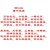{width="0.5222222222222223in"
height="0.5222222222222223in"}

[[博主]{.underline}](http://blog.sina.com.cn/chzhshch)\
新浪网友说得好,现在就卖\
(2008-08-04 15:32:12) \[删除\] \[回复\] \
博主回复：\
雁过张弓

(2008-08-04 15:47:10) \[删除\]

{width="0.5222222222222223in"
height="0.5222222222222223in"}

[[博主]{.underline}](http://blog.sina.com.cn/chzhshch)

对不起，本ID的精力只能保持第一页的干净，只能下了。\
补充一句，可怜有些人还是糊涂，现在是等买点的时候，等买点不意味着买点就到了，所以才要等到图形告诉你为止。\
再见。

(2008-08-04 15:51:18) \[删除\]

## 短线关键2762点（附诗人画廊（七)：孟郊）

(2008-08-06 15:38:08)

**短线大盘已经很明确，2924点下来这段至少其第一段在今早的小背驰段区间套完美后就结束了，现在短线的关键点是2762点，只要这点不有效站住，大盘短线
依然将面临短线盘整歇息后的第二段下跌；反过来，一旦有效站稳该点，则第一段结束的反弹就至少延伸出日线上的笔，也就是至少是有一定力度与时间度的，至于是否有更大的可能，那是以后图形要告诉你的事情，没必要现在去预测。**

**大的角度看，目前依然在7月3日后形成的大中枢中，因此，目前的波动都可以看成是对该中枢的震荡，只要不形成对该中枢的第三类买卖点，该震荡就将一直延续。这一点是本ID理论的最基本常识，就不多说了。至于中枢震荡如何操作，课程了反复说了N遍，就更不再罗嗦了。**

打针时候骚扰了一下孟东野，就有了下面的七律，附录如下吧：

先下，再见。

孟郊

缠中说禅

寒士志安寒号鸟

不平天地笔刀平

非东野足东坡肉

乃孟郊全孟母情

函谷关前秦汉月

南山石上晓昏英

芙蓉今夜为谁死

露井风鸦沥血鸣

## 谨防奥运后经济出现断崖走势（二）

(2008-08-07 08:14:49)

下午有事，早上把那文章写完，先下，再见。

（续一）

而所谓"散户化的调控者被趋势所趋势而不是趋势趋势"，不过是一种姑息性说法，要来狠的，应该说是连散户都不如。在市场中的人，生生死死、沉沉浮浮，不过顺其天性、见识而行，只要在法律的范围内，任何行为都是理所当然的。但那连散户都不如的，却天生有改造散户的冲动，而其中的人，又多有改造人把戏的受害者，反过来玩如此把戏，大概又是人类补偿天性的自然流露了。

一个不洗心革面彻底抛弃改造人把戏的调控者永远都没资格与可能成为合格的调控者，市场中，唯一可能错误并造成不可挽回影响的，只能是调控者自己，更需要风险教育的就是调控者自己，而市场参与者自身的错误，自有法律、更有市场本身去给予最直接的惩罚，在市场面前，那所谓的投资者风险教育就如同一个笑话，又有谁比市场更有资格与效率给予参与者最直接、最深刻的教育呢？问题的关键不是投资者被教育得如何，而是在市场的无情教育下，我们依然家长化的调控者究竟有多少的长进，这才是关键之关键所在。

一个彻底抛弃改造人把戏的调控者，才有资格面对"散户化的调控者被趋势所趋势而不是趋势趋势"的问题。市场中的人，追随趋势而行去让利益极大化是天经地义、理所当然的。唯一必须违反这市场天条的市场分力，就是调控者本身。真正合格的调控者，必须逆趋势而行，用更详尽的话就是：当市场没趋势时引导出需要的趋势，当趋势形成后对该热点领域只监管、不调控，而调控的力量应该用在新领域热点、趋势的引导上，这就是为鸣响新乐曲以实现老热点的不调自调、不控自控，这才是所谓的无为而治、"趋势趋势"。

任何调控者最基本的常识就是：一、在人为调控的前提下，不同领域热点的轮动是维持经济体系总体热度平衡的唯一可持续手段；二、被热点过的领域意味着在相应热度冷却到重新被热点之间，都有过剩资本等可热点热点资源的净流出，这可热点热点资源是维持经济体总体热度平衡下持续发展的最值得珍贵资源，绝对不能流出总经济体外、只能保持在总经济体下不同热点之间的轮动上，用一句大白话，就是烂也要烂在这总经济体的大锅里。三、要肉心甘情愿烂在大锅里，就必须让中国总经济体成为资本全球化可持续的新动力源，在这总经济体下热点不断轮动、新的可热点领域不断产生，而老领域在自然调整后又有新的动力重新热点，只有这样的良性循环，才有越来越多心甘情愿烂于其中的肉。四、经济调控总体效果最终的评价，归根结底就在于心甘情愿烂于其中的肉是否稳定地增长。

中国经济的希望就在于还有如此多的可热点领域需要我们去建设，我们的大锅还有大得惊人的可扩展空间。现在都在谈论中国老的不可持续经济发展模式如何走到了尽头，这只不过意味着老领域可热点空间的短线周期性萎缩，如果坐等原领域以时间换空间地调整出新的可热点，那是坐以待毙。现在，正是大力推进新领域建设的绝好时机，虽然这些工作早该干了，但现在依然能亡羊补牢，否则像一个创业板折腾这么久还遥遥无期，那还有什么希望可言？

至于如何去创造更多可热点领域的问题，实在没有什么可说的。如果所有的事情都如同3G、创业板一般超长时间地来回折腾就是停留在磨嘴皮，那么又有什么可值得说呢？至于阻碍可热点领域，或者更直接地说，就是经济结构改革进一步深入的问题，就更没什么可说的。因为只要良心良知还没有喂狗或直接变成狗的，就算是瞎了眼，也会知道问题的实质在哪里，而这又有什么可说的呢？

至于到目前为止，本文似乎依然离题万丈，那不过是假象，以上所有的内容都相关于题目，只有把最基础的东西分析清楚了，才能真正面对题目所提到的问题。站在市场趋势的角度，如果继续延续那些可笑又可悲的所谓调控，那么题目所说的现象就必然要发生。一个巨大的几乎是一边倒的市场人心预期已经构成了巨大的市场力量，在这时候要力挽狂澜，唯一能做到的就是那无须被趋势的调控力量，当然，前提是这力量有一个正确的认识与方法，否则将随时成为市场断崖的催化剂。

一个清醒的认识必须包括：对于中国市场经济这样一个幼稚的体系，就算是房地产如此不堪的领域，站在大的经济层面上，依然有着巨大的发展潜力与空间。目前的房地产价格，站在历史的层面上，依然是一个大牛市走势下的中继性价格。问题的关键只在于，目前的调整是以断崖式还是平台式完成罢了。

一个清醒的认识必须包括：对于中国市场经济这样一个幼稚的体系，在基本的经济框架成熟前，根本不可能存在所谓的流动性过剩问题，所谓的流动性过剩，不过是过剩资本等可热点热点资源的净流动，这是中国经济最可珍视的资源，问题在于我们是否有足够的可热点领域以及相应的轮动，而不是资源过多了。这一点不及早纠正过来，永远不可能有好的宏观调控。

一个清醒的认识更必须包括：一个断崖式调整对总体经济的伤害的巨大的，需要疗治的时间与资源同样是巨大的，而一个合格的调控，虽然不能让调整人为消失，但却能选择调整的形态，而一个平台式的最终调整是目前中国经济最好的选择。在一个平台调整中重新调节好我们的舞步，把该补的课补上，这是目前唯一正确的选择。

至于众人所热论的通涨，不过是经济体自身未有效建立以及运行调控润滑不够产生的热量流散，以通涨为病不过是表面之见，根源不在那里而在经济体的建立与运行上，不对此下手而想强压通涨，最终只会堕落到高通涨低增长甚至负增长的死局里，那时候就知道什么才是真正的愁滋味了，现在这些算得什么呀？

## 2762点，大盘短线已到临界点

(2008-08-08 08:23:58)

昨天，一个包含性K线，构造出短线的第二类买点后回拉到5日线附近，大盘短线已到临界点。当然，最干脆的走势就是今天中长阳突破2762点确认笔走势，而反过来，若大盘依然在2762点下犹疑，那最晚下周初，大盘中继中枢扩展完成后向下延续新一段跌势就理所当然了。所以，今天开始三天内的走势是短线必须密切关注的。

中线来说，已经三次探底，一般性地，即使从概率的角度，如果还有第四次的探底，那破底的概率至少是95%。所以，这基本就是多头的最后一次努力了，就看如何收场了。

操作上，见买点就可以介入，冲不上去就把货倒给多头让多头去死，这就是目前唯一正确的操作。而没这短线本事的，或者就把持仓位每天继续折腾差价降低成本，或者就继续小板凳，自己根据能力选择吧。

本ID现在早对那些什么会审美大疲劳，快点完、别惹事就谢天谢地了。如果一定要让本ID说真话，那就让为资本全球化画眉贴金的末世大铺张见鬼去吧！中华民族的大复兴无须这种恶心的堕落背书！

先下，再见。

**缠中说禅2008-08-08 08:36:36**

**补充两句:本ID说过要保持第一页干净，所以某些人就不要浪费时间了。至于那些没有短跑能力的，就别买什么股票了，本ID不知道说过多少次，今年开的是短跑运动会，连本ID持股也就是N天的事情，见卖点不卖，脑子有水呀？**

## 苦口良药，预演后奥运断崖走势

(2008-08-08 15:20:58)

今早，有人企图用为什么深成指四次探底就破底而上海没破之类的烂问题刁难本ID，不知道今天的走势算不算一个回答？本ID也想问，为什么你就不会完成以下的填空："既然深成指都已破罐破摔，那么  
还远吗？"

什么叫断崖走势？这几天本ID的长篇文章不断提到这个词，大白话就是破罐破摔，信心一致崩了那还有什么不可以摔的？本ID早上说冲不上去就把货倒给多头让多头去死，有人反问为什么要多头死？多头不死，哪里有大底？问题是，你为什么要站在死多头一边呢，世界如此宽广，你为什么要陪多头死呢？

多头是什么货色，请看：

你别砸盘，不然对你身体不利！（2008-08-08 14:21:32)

拜托，先照顾好自己吧，本ID的健康就不劳烦了。

苦口良药，什么会都养不起13亿中国人，今天不过是一个预演而已。如果真为中国、中国人好，那么就吸取教训吧，股市不算什么，经济断崖才是真正可怕的，过了今晚，面子也有了，干点实质的事吧，中国13亿人要吃饭的，一天都少不了，一顿都少不了，像今天中午那些饭还是少吃点吧。

为对抗经济断崖而努力，这是2008年8月8日唯一需要的口号。一个刘某、张某某、赵某某都大肆招摇的玩意，爱啥是啥吧。

## 密切关注买点出现

(2008-08-11 07:54:18)

2762点下的三角反弹构成2924点下来的第一个中枢，然后是新一段的下跌，那么，后面的演化无非两种：两段力度对比（30或60分钟），后一段强于前一段，则还需要一个中枢后的下跌背驰才有机会完成2924点开始的下跌；反之，则2924点下来只是盘整走势，只需要一个中枢，其后将快速回到2679点之上。

大的角度，目前7月3日开始的中枢震荡暂时还没出现第三类卖点，依然可以看成是该中枢震荡的延续，除非2924点开始的向下次级别走势类型完成后，其后的次级别反弹不能重回该中枢，才能确认中枢的彻底破坏。

因此，综上所述，目前最大的短线机会，就是2924点下来的走势类型结束点构成的买点，其后至少有一个2924点下来同一级别的反弹。密切关注短线买点，就是本周最大的任务。

看不明白上面所说的，也有两种途径：一、张某某去吧；二、虚心把课程真正读明白。

本ID可以自豪地宣告，本ID的所有财富都是靠自己的智慧从毁既得利益者手中抢来的，要击毁他们，就是要把他们的血吸光，资本市场是一个最公平的地方，关键你是否有如此的智慧。

没有智慧，就等着陪葬，这有什么可说的？当然，自我有清楚认识，危险之下坚持小板凳，也是智慧之一。自知之明，从来都是最大的智慧。没能力，练能力，没人可以替你。

先下，再见。

## 断崖走势继续让短线买点逼近

(2008-08-11 15:07:35)

今早已经让各位看30或60分钟图判断力度，从那60分钟不断伸长的绿柱子，只要是人，都知道下跌的动能依然强大，因此，早上说的第一种情况成立的可能性越来越演化为必然性了。

最坏的情况，本周只有2700点那中枢破位后的第二中枢反弹（一般来说，这走势明天、最晚后天盘中就出现），这反弹的力度，甚至不能触及今天的高点，然后再继续暴跌；而第二中枢后，一旦出现背驰，就意味着更高一级别的买点出现，这买点，最小是2924点下来第二中枢级别，至少能构成30分钟上的笔走势。（最坏的情况下，最迟下周初就一定出现，一般情况下，如果不是最坏，本周出现的概率很大。）

但这个反弹的出现，如果只是2924点下来的第二中枢级别，那么后面还有下跌去构成背驰完成2924点以来的下跌走势，其后的更大级别就是所谓7月以来大中枢的次级别反弹将是最为重要的，是否构成第三类卖点，就看这次了，一旦构成该卖点，后面还有更断崖的下跌。

时间上看，要不出现这种第三类卖点，就看政策是否明白事了，如果还幻想，还开幕式，那就如那无聊变态的烟花一样眼花吧，让断脚断腿漫天飞舞，这比烟花好看。

如果要严格分析，本次上海也是典型的四次破底，只是第二底比6月20那第一个要低，这是弱式盘整经常会碰到的。关于盘整形态的问题，以后在课程里再详细说。

股市开幕式地预演着断崖，本ID前段时间反复说的断崖是否蔓延到经济领域，就看某些人的表演了，有本事就如同开幕式那天发1000多支火箭来做假天气，本ID很想开开眼，拜托了。

## 任何人在市场面前只能低头

(2008-08-12 07:58:06)

最近一天两帖，首先当然是本ID现在状态大好，平时谈工作或一些有趣的事，一谈就两三小时也毫无问题；其次，最近行情是大转折的时候，本ID一直说断崖，结果股市也很给面子地表演了一次，本ID当然要多说几句，就当是中央台那无聊旁说也是有趣的；但最重要的是，本ID过两天出院后要有一次较长时间的远足，这样就不能保证每天都有帖子了，当然本ID会尽量做到一天一帖，如果达不到，各位也请原谅，现在也算是预先补偿一下吧。

任何人在市场面前只能低头，今天央行有人出来强调放松信贷，虽然不太诚恳，但也算对市场低了一下头，至于市场是否领情，那就市场检验了。不过，在本ID看来，这还远远不够，但一个开始总会有点羞羞答答的，鼓励一下还是应该的。

但要避免经济的断崖，头必须再低点，最好一次性地完全达到市场的要求，否则，像挤牙膏一样，那最终只能面临市场更严厉的惩罚。任何想用小恩小惠蒙骗市场的，最终的命运都是一样的。前段时间，本ID多次痛批某些人认错如同挤牙膏，对恶意再融资老想敷衍过去，结果如何？后面那些所谓的救市每一天都被市场所严重嘲笑，这就是市场的力量，如果还没试够，尽管再折腾，谁怕谁呀？

本ID当然有更有力的渠道表达意见，这里发出来的，多数都只是随便写的草稿而已。但就算最好的渠道，改变思维都是相当困难的，像上次那破烂直通车如此快的效果，简直是百年一遇。别说如此庞大的决策机制了，就算是一个个人，本ID从去年底开始无数次地强调今年是一个"井"年，是开短跑运动会，甚至多次说就算本ID，经常持股也就是两三天，没技术没本事的就小板凳，那么，请问，究竟又有多少人真正能自知之明呢？是否都认为自己英明神武，能够逆市场趋势而动，都有技术去短跑呢？至于那些整天还要叨唠显摆自己智力问题的，那更是活该了！

市场从来不相信眼泪、叨唠，你爱干什么都可以，本ID说过，即使是本ID，要在市场杀起人来，也是不分敌友的，因为分不清楚，也没时间去分，市场的有效时间如此宝贵，刀光闪去，被杀是活该，吵也没用，只能显示自己的智力问题。要成为钢铁战士，要在刀光丛中自由行走，就练好工夫，除此之外，张某某次方的张某某地手口并用都救不了你。

本ID再废话一次，爱听不听：操作的节奏是最重要的，而节奏来源自对级别的清楚认识，谁说本ID的理论不能预测的？只是本ID所说的预测，是各种级别边界条件的完全分类，是一个操作的完全分类图，这里，最关键的是级别，没有级别，任何的买卖点都是白搭，更别谈什么节奏了，不搞清楚这点，那还是张某某去吧。

好自为之吧，就算最好的拐杖还是拐杖，而一个大写的人，一个钢铁战士，就要学会自己站起来行走，本ID并不想当任何人的老师，本ID最多是你人生的一道风景，你看成什么是你眼睛的事情，和本ID无关，自我修炼去吧。

## 经济基本面给了调控下台阶的机会

(2008-08-12 15:21:43)

大盘今天走得极为规范，如期出现昨天说的盘中反弹以构成2700点那中枢破位后的第二中枢反弹，后面请注意了，这里严格说将有两种演化可能：

一、最规范的就是破该中枢，然后再分两种可能，形成背驰见更大级别底形成更大级别反弹，不形成背驰就继续下跌去形成第三中枢，一般来说，后一种情况出现的概率不会超过10%，而且是否形成背驰，可以很直观地判断，根本没有模糊混淆的可能，除非你根本没搞清楚背驰的判断。

二、不大规范地的，就是直接从该中枢第三类买点扩展成更大级别的反弹。这等于标准的下跌走势a+A+b+B+c中的c不出现，读过课程的都知道，只要有A和B，a、c不出现不改变下跌的性质，趋势与盘整在于中枢数量，这是最基本的常识。

同样地，第二种情况的概率也不超过10%，按中枢震荡的判别原则，第三类买点与第三类卖点都分辨不清楚，那就根本没看明白课程，补课是唯一选择。

看明白上面的内容，后面的操作就得心应手了。当然，具体个股与指数的节奏可能不同，这也是最基本的常识，那就各自去分析了，本ID不可能把个股也分析了，没那时间。

今天CPI有比较好的数据，油价、汇率都有了有利的变化，这也为某些人准备了台阶，下不下就是他们的事了，不下，市场是不会给面子的。所以，从基本面上看，短线反弹是有了些条件了，但中线的关键还是要低头、下台阶，否则给脸不要脸，只能撕破脸了。

不说了，看着办吧。

## 确保经济高增长已刻不容缓

(2008-08-13 08:28:09)

春节后写了要通胀还是要经济增长(2008-02-28
15:53:15)，当时就很尖锐地指出高通涨低增长死局的潜在可能与危害性，在错过了诸多有利时机后，很不幸地，现在这种风险正日益迫近。现在，已经别无选择，当时已经给出了当下最现实的模式，高增长高通涨，然后在此基础上逐步利用有利时机改变经济结构与利益分配机制，使得结构性通涨的压力消解。无论如何，确保经济高增长已刻不容缓，不想死得很难看，这是唯一实际的选择了。

最近，对经济增长的再次强调逐渐有了较大的声音，这是好事情，但其中依然有诸多的摇摆，这是十分糟糕的，机会不会无条件地等你觉悟，因为迟疑，多少机会浪费了，而这会有什么报应，难道真想见识吗？

对于像本ID这类人，经济断崖不过提供一次大量买入超廉价资产以提供下次济热潮的筹码而已，但对于绝大多数的国人，那可能面对的就是生存问题了，这不是危言耸听，而是经济变动极可能出现的状况，大难几乎都在兴高采烈之时，这难道还少见？

本ID很希望自己错了，但无数的事实证明，本ID对经济的判断从来没错过，只不过本ID都很早就提醒，而绝大多数人却依然沉浸在梦里，难道一定要经济大地震才醒来？

股市方面，对于超短线，看好30、60分钟形成底分型后上边沿的位置是否能有效站住，一旦站不住，超短线依然要继续下探。这一简单的招数，用在日线上曾经让多少次短线操作最终能胜利大逃亡，这在以前屡次反弹中，本ID用短线关键位置是多少曾演示过多次，一定要把握好。当然，如果你对本ID的理论有很深入的认识，有更精确的方法，但对一般性的操作，这招数简单又有效率，不把握就浪费了。

这两天准备出院，诸多事情，明天开始就不可能一天两帖了，抱歉。

## 第二级别反弹教科书般降临

(2008-08-13 15:23:14)

今天的走势，前面都描述过了，没什么可说的，这极为标准地构成了前面所说那三级别反弹中的第二个，也就是构成2924点下来的第二中枢那一个。今早特别强调了底分型的用法，今天的走势教科书一样，各位如果还闹不明白的，就从15、30、60一直看过来，研究去吧。

最大那个反弹，也就是前面大中枢的次级别反抽，同样有两种可能：更大底背驰或从今天构成的中枢直接上去，分析和昨天说的那小级别的道理是一样的。

从大盘的实际走势，显然并不是最恐怖那种，本周已经出现第二级别的反弹，因此就是一般性走势，后面的操作无非是从这第二级别反弹成功逃掉然后再抄更大级别也就是第三级别那个底，如果你真有本事，这三级别的反弹你完全可以根据本ID的理论按照如此美妙的节奏自如地完成，现在达不到，就继续训练，没有什么东西是可以随意达到的。

至于经济，某些人爱干什么是什么，只要你有本事，越跌越赚钱，既然有人这么乐意送钱给咱们花，为什么要拒绝？

有时候，让大浪自然去淘沙，可能更有意义，浪淘尽千古风流人物，现在又有谁是千古风流人物呢？这和你的官位、财富无关，某些人有点自知之明吧！

最后说句狠话，之所以有人敢于如此，就是没人需要为经济出大问题负责任，因此就占着什么不什么了，那就随它去吧！

## 什么才是真正的"和"？

(2008-08-14 08:03:14)

学东西，必须搞清楚细节。就像现在，依然有N多人把分型上边沿站稳作为最好的买入点，却搞不清楚，恰好相反，这只不过是判断是否延伸为笔的一个简单判断法，如果说买点，必须从走势类型去判别，分型上下边沿之类的东西，最多就类似于第三买卖点，因此以这当成买卖的根据，将不时面临买后第二根K线就是转折的尴尬。道理很简单，如果抛去包含关系，6根K线就可以构成笔，而确认站稳上下边沿的那至少是第4根，而转折在第5根，这意味着什么，不是很简单的问题吗？

因此，各种方法，必须知道其使用范围，在什么情况下如何用是最有效率的，否则如此囫囵吞枣，不亏钱真是没天理了。课程里也有单纯用分型的不同级别，用类似区间套的方法确定买卖点的方法，这可不是单纯的上下边沿判别，千万别搞糊涂了。

股票糊涂了，大不了就亏点钱，如果一些基本概念糊涂了，又当成国家的战略依据，那真是国将不国了。像最近被反复口淫的"和"，被解释成所谓的"和谐"之类的可笑玩意，甚至为所谓的"和平崛起"去依据，简直是祸国殃民。

"和"，是相应的意思，这在最基本的《说文解字》就有的意思，最后被阉割成"和谐"之类的废柴，大概也成了宋以后被长期凌辱的最好注释了。

何谓"相应"？就是根据当下实际的条件，给出的最适宜的行为，简单地说，就是构成"相互应和"。最简单的，对垃圾、衣冠禽兽就要彻底清扫，而不是去"和谐"，这才是相应；世界历史证明，"大国崛起"从来就没有"和平"的，当然，现在可能可以进化成经济、金融的战争，但这更不"和平"，所谓的"和平崛起"，真是不知所谓，可笑之极。

你只要想"崛起"，就有人不让你"和平"，从各方面折腾你，这是最基本的常识和世态，企图掩盖，究竟想蒙谁呢？美国之类的会让你的口号忽悠吗？最终害的不过就是自己而已。

要"崛起"，其"和"其相应就是斗争，斗争不一定都是大规模的对抗，斗争本来就是一门艺术，只是你是否把握而已，这点与把"和"折腾成口淫版的张某某之类人，根本没什么可谈的，就让他们继续口淫快乐吧，但这皇帝新衣必须指出来，让更多国人知道，这群人是如何光着腚子相互淫乱以让他们的利益继续既得的。

至于股票，该说的都说了，自己修炼吧。今天下午没帖子，可能要等明天或后天早上才有了，抱歉。

## 2484点，短线关键位置。

(2008-08-15 15:27:47)

昨天日包含关系，今天构成日底分型，2484点成短线关键，道理说过N遍，不再说了。下周初如果不能站住该点，大盘不可避免再次探底，最坏的情况，下周一就直接低开探底。因此，5日线成了短线的最基本支持判别，一旦有效跌破，探底就确认展开。当然，如果下周初能顶住，更大级别反弹就此扩展的机会就极大了，就看市场选择吧。

今天万分不爽，现在不能坐飞机，怕上升下降时身体出问题，只好坐火车。结果那车竟然没有高包，坐软卧极端不习惯，一晚没睡好。早上到了武昌，一个超级乱的扩建中的车站，又刚好下大雨。本来有朋友说找省里的人接待，本ID怕欠人情就推了，真有点后悔。

送本ID来的朋友，性子特倔，本ID说去西广场出去，他偏要听人说走东广场，结果淋了一通，本ID火已经很大了。更无聊的是，为了三顾茅庐方便，本ID没法去住好酒店，只能就近找酒店，结果打车到目的点一看，几乎晕倒，这武汉也是的，这么多年，汉口竟然还有这么大片没开发的地方，还以为进了荒山野林里，找到那酒店如同老电影里所见的，最可恶的是，吃饭也没地方，附近有吃的地方看都看不见，说可以打车去，出租车在哪里呀？只好在所谓的酒店里将就，说好来湖北菜，随便什么三蒸、莲藕排骨就完了，结果没有，这里是山东师傅搞的四川菜，没辣就不会了，一口都吃不了。后来，去那所谓的小卖部，都是热气的东西，最后只好来了点喝的，今天晚上，听说能专门给我们弄条鱼清蒸，但要专门下午到老远的地方买，晕!

但比最可恶还要无聊的是，一回到房间，电话就上来了，问要不要房间服务，本ID就问，除了鸡，还有鸭有鹅有鸽子吗？一样来一队来挑挑，结果把电话给吓回去了，好无聊的地方呀。

但这里有奇人，这里就是光明之地，为了学会那本事，什么都认了。那奇人似乎特恨与官员有来往的人，本ID无论如何是不能让什么省里的人接待去那些不靠谱的地方，受苦受累也要顶着了。现在还没见到那人，估计真要N顾茅庐了，就看本ID有没有这善缘，奇人是不能强迫也不能利诱的，否则本ID也不会为此受此苦。心只能靠真心感动，本ID就在这里熬下去了。

不多说了，唯一惊喜的是，这里竟然还有光纤上网，这就够了。等天晴了，再想办法解决如何吃好的问题，能吃是福，听说这里的蟹比某某湖的还要好，污染少，不知道是否吹牛，找时间好好验证一下，至于还有什么好吃的东西，只要不是炸的、煎的、烤的之类，都要检验一下，有当地的朋友吗，麻烦介绍一下，哪里有美食？以前来武汉都是来去匆匆，这下要好好武汉一把，谢了。不知道最后结果怎样。

## 终于接上头了

(2008-08-17 17:29:35)

**一切顺利，虽然早上的见面推迟到了下午，但治疗已经开始，而且以后每天都有。今天的治疗只进行了5分钟，手法闻所未闻，大概本ID真有幸见到19路招数了，按今天的，估计别人会10种以上的可能性为0，只有感叹了。5分钟后，效果就出来了，但奇人说了，由于拖了许久，以前2、3次搞好的事情，这可能要延长不少，大概是先把肿块消了，然后清理鼻子里的病根，最后要把其他的也搞好。按他的说法，肿块很快就可以消掉，看今天5分钟的效果，大概错不了。**

**本ID已经强调申请，要学他的招数了，不过他以不好学推着，这本ID不着急，慢慢来，而且，好不容易把病留到今天，受了无数苦，现在是边被治疗边学习感受，这亲历的事情，如果没这病还真不好碰上。**

**为了真工夫，什么苦本ID都受得了。**

**现在最头疼的是如何给治疗费用的问题，给多了，又怕碰到像弟弟那种人，而且看他极有可能是这种人，给少了，又不好，问他，他说你就别管了，他以后每天都过来，每天给好象又不好，看来还是每周开始给一次，最后给一个大的，这样不知道好不好，由于接触武汉人并不多，所以这点真不好把握，请各位给点意见，谢谢了。**

## 分型上边沿再起神奇作用

(2008-08-18 15:09:52)

十分感谢各位的关心，这边的问题，无论多难，本ID都会尽量处理好的，毕竟机会难得，是否最终如愿，就看是否有此善缘了。

今天大盘值得各位好好研究，周五所给的日底分型上边沿不能站住将继续探底，今天的走势已经给出最好的阐释。而这个探底，在最开始的三级别反弹分析中已经仔细分析过，这一般有90%可能性走势下面预防的走势无非是不能形成背驰从而只能先有第三中枢的问题，因此，明后两天走势极为关键，一旦延续跌势力度，那么第三中枢的可能性就很大了。反之，就那次级别的反弹就将展开。

一定要注意，这次级别反弹可能只构成原来大中枢的第三类卖点，其后将是更猛烈的下跌，第三类卖点后最好也就是构成更大级别中枢，因此，这反弹相面对的风险还是需要留意的。

从基本面上看，时间刚好极端配合，这次级别的反弹，最弱的就是平台式的，也就是连2500点都碰不到，然后基本对应上那什么会结束，最后的机会给管理层，如果还如此，后面不第三类卖点才怪了，这点必须有清醒认识，而这在原来三级别反弹的分析中已经明确指出过，市场显然与我们的分析完全合拍。

不说了，本ID现在的任务是学习、治病，顺便看管理层的反应，一切都在分析之中，没什么可继续说了。

先下，再见。

## 教你炒股票107：如何操作短线反弹

(2008-08-19 16:10:39)

**今天很不顺利，那奇人似乎受到什么影响，突然改变了口风。其中一种可能，是因为前几天本ID的帖子，这里有些本ID的朋友，例如关于肝昏迷后来转医院那事情，这里至少应该有N个以上的人亲眼见证，而且，那天胡乱打电话，后来电脑又被弟弟的同学拿去修理，其中诸多变数，本ID也不想了解，而且那奇人无意中碰进来的机会也少不了。总之，不管什么原因，奇人以怕身体受不了为名，把本是一天一次的治疗间隔给放大了2倍，而且其手机今天也停了，不过本ID有其家里电话以及另一手机的号码，所以这并没有多大影响，但给人的感觉已经不对了，至少表明他最多把关系定位在医患关系上了。**

**本ID对公开谈论该事情因此而产生的后果其实也早有准备，这次之所以这样，其实也是早点解揭开些东西。如果因为这样就如此，那本ID也没必要见什么奇人了，他的方法，其实本ID早已了然，只是其中具体的细节还希望当面探讨，另外像糖尿病、爱滋病之类的东西，也希望有一个层次高的人探讨一下，互相探讨还可能激发更大的火花，但如果因缘不对，那也就算了，不过本ID暂时还不准备放弃，毕竟层次有的人太难碰到，碰到一个至少这方面不糊涂的，总不能轻易放弃。**

**奇人当时就说，这绝学到他这里就真绝了，他也不想传下去，如果他真坚持如此，本ID也没办法，只能说共业如此，如此就如此了。**

**至于本ID的病，说实在，本ID并不想现在就好，因为2002年的结6年还没解开，不解开这，本ID病好了也没意义，反而使得这个结永远解不开，这其实才是本ID迟迟不亲自下重手的原因。至于弟弟那里，这次奇人有缘分，那只是一个好的例子让他去思考，但按本ID对弟弟的了解，就算奇人真治好了本ID，他也不会低头的，这东西，只能靠他自己的慧命，最亲的人，其实也不能真的去解决任何问题。**

**好了，没活动就继续说股票，今天的走势都在前面的分析中，具体就不用再说了，各自学习把握就可以。这里，再强调一下一些最基本的操作问题。其实，操作没把握，归根结底是对理论没完全彻底地把握。**

**例如，一个最实际的问题，如果按照理论，至少有一个30分钟级别的反弹，那么具体的操作应该怎么安排？首先，你必须搞清楚反弹可能的具体走势形式，因为同样是30分钟级别，不同形式，对应的对应的操作难度与方式都是不同的，而最大的难点在于，你并不能事先知道反弹究竟用什么的方式，因为这涉及预测，而一切预测都不能纳入操作计划的范围，只能聊天吹牛时使用。所以要解决这难点，必须从绝对性出发，里面不能涉及任何预测。**

**对一个30分钟的走势类型，我们能绝对性指出的无非有一点，就是这个反弹至少有一个30分钟级别的中枢，而有这就足够了，为此就可以构造出一套绝对性的操作方法。**

**某级别的中枢都是由三个以上次级别走势类型重叠构成，也就是说，一个30分钟的中枢，一定涉及上下上的三个5分钟走势类型。这就是构成我们操作绝对性的最坚实基础。**

**显然，没有任何绝对性可以保障上下上中，最后一个上一定有比第一个上有更高的高点，特别那种所谓奔走型的反弹，后上的高点可能只刚好触及前上的低点，因此，如果你一定要等上下上都完成才抛出，那很可能面对这样的尴尬，就是你在第一个上的最低点买的，在上下上的电梯过后，你只有一个可能连手续费都不够、稍纵即逝的卖点。因此，这种操作，注定是只有相对的理论上的绝对安全性，而没有具体操作上的绝对安全性。要解决这个问题，只能从第一上就开始分解操作，也就是说，没必要等待第二个上了，既然每次上之后都必然有一个同级别的下，而这下的幅度又是不可能绝对控制的，所以还不如就把操作分段，让分段提供给你绝对的具体操作安全。**

**因此，在这种分析下，具体的反弹操作一定是同次级别分解方式进行的，也就是说，30分钟级别的反弹，是按5分钟的节奏去处理的。**

**注意，这只是统一的处理方法，其实实际操作中，一旦第一上与下出现后，可能的走势形式，就有了很大的绝对性确认了，例如，一个30分钟中枢后接一个第三类买点，然后非背驰力度地强劲拉升，那你就完全可以开始坐轿子，等第二中枢，甚至第三、四、五中枢完成出现背驰后第三类卖点再说了。**

**其次，更要注意，这绝对性的具体操作还不是平均效率最高的，最高的，就是保持部分仓位，用余下仓位进行换股轮动操作，对于资金少的，这更可以全部仓位进行，不过这技术要求更高，就不多说了。**

**最后，一定不要去预测什么反弹还是反转，这根本没意义。反弹越搞越大，最后就自然成了反转，而是否如此，根本没必须知道，你唯一需要知道的就是，只要在第一中枢后出现第三类买点并形成非背驰类向上，才可以流着口水地持股睡觉等其余中枢形成，否则，随时都有被反回来的风险。**

**有人喜欢精确定义，那么这里其实也给出了什么是上升趋势形成的最精确定义，就是在第一中枢后出现第三类买点并形成非背驰类向上。趋势形成，只要趋势没有扭转的信号，当然就可以睡觉，这是太常识的东西了。本ID的理论，并不一定要违反常识，只是本ID的理论可以给正确的常识以合理的理论基础，这才是关键。**

**后面的课程，将开始具体分析各种可能的反弹类型，这对具体的盘整操作也是有极大用处的。不过必须补充的是，实际的操作效果还是必须靠磨练的，而反弹如此，回调的操作反过来就是，更不用多说。**

## 2455、2656成短线上下关键位置

(2008-08-20 15:11:18)

今天大盘死皮赖脸地又教科书了一把，本ID这两周关于三级别反弹的分析，就此被大盘完美演绎。后面走势，其实前面已经分析过了，就是下面要站住今天构成日底分型上边沿2455点，上面要尽快攻破2656点以确认第三类卖点不成立。

当然，以上表述是站在希望大盘涨的基础上说的，而实际操作，一定不能有这种想法，而是根据大盘实际走势进行机械化反应。

再强调一次，没分清级别之前就别谈什么背驰。所谓背了又背是天经地义的事情，但对应的是不同级别，否则，难道一个1分钟背驰就可以让大盘转向1000年，那不乱套了？本ID理论的基础之一是级别，不学会并完全机械化地精确把握，那还是别背驰了，因为这种水平，除了背还是背，还驰什么？

今天上来，主要配合了消息面上关于经济刺激的一些重大传闻，如果真能如此，跟着本ID的思路一把，这管理层还算有药可救，否则，又来假消息忽悠，那只有第三类卖点后更强力地暴跌了。所以，这几天消息面是最关键的，会也快开完，该干点正事，否则，难道还要为残奥会增加点新项目，提供点新选手吗？

不想说了，就看某些人会不会做了，这不是小孩子玩泥沙，千万别意气用事。至于各位，无论你这两周是否如本ID两周前说的完全踏准三级别的节奏，但如此教科书的实际走势，也请好好分析清楚，学会了这，你的水平将提高许多，各位就各自努力吧。

先下，再见。

## 博消息，于5日线震荡

(2008-08-22 15:32:30)

由于前几次周末搏消息都以失败告终，所以这次似乎热情不高，但依然没有死心，所以就构成今天围绕5日线震荡的两难局面，因此，周一开盘就决定短线突破方向，技术上一旦5日线走平再张口向下，那么大盘新低就是理所当然了。

当然，高位走掉的，这消息也可以赌一把，只是周一一旦没兑现，就要动作特别迅速，没这水平的，就算了。就算真有什么消息，如果特别实质的，完全可以在高开回来出现小次级别第二类买点时介入，这和大跌的操作只不过反过来罢了。

目前，从中线的角度，技术上周与月如何能最终构造出底分型才是问题的关键，否则，就算有消息，也是一日几日行情，比比短跑而已。

周末，好好休息吧，这边也有不少事情忙，先下，再见。

## 说说现状与病情

(2008-08-23 16:55:35)

到目前为止，其实只接受奇人两次治疗，不过反应之大，比20天的化疗还要厉害。所以，奇人把治疗时间隔开，确实是有道理的，否则身体肯定受不了。由于没有最后根治，所以现在谈效果没太大意义，毕竟开始有很好效果，结果反复后变更糟的例子太多，这就如同反弹后的继续下跌，目前马上预测反转，这不是本ID的风格。

这里最不好的是吃饭有大问题，本ID是以最低标准来谈论这事情的，不是要吃好，而是要吃得下。但没办法，很多东西本ID根本没法吃，例如带辣的、太咸的、热气的，所以现在只好让厨房下点面条、弄碗粥，总之，来这里这里久，一晚米饭都没下去过，比较悲惨。

最惨的是，这里连一些最简单的菜也弄不好，例如西红柿炒鸡蛋，出来就没法吃，经常了弄了几个菜，最后基本原样拿走。至于到外面吃，由于目前身体反应比较大，也不敢跑太远，去过这附近最好的，结果一样，吃不下。其实不是没胃口，而是那些菜根本不对胃口，记得在北京时，去吃湖北菜不是这样的，大概这边根本就没湖北菜馆子，都是山东厨师弄四川菜。

大概这就是消业必须受的苦，本ID当然要坚持下来，明天第三次治疗后，一般反应会特别大，帖子是写不了，请原谅。

## 病好后一定清算中国目前霸权的西医体系

(2008-08-24 18:06:51)

看来本ID的断崖风吹出一定效果来，当然，不是靠这博客渠道。本周末，罕有地竟然有人出来证实那4000亿传闻的真实性，而且最近关于奥运后经济不会出现低谷（一个比断崖更能官方的说法）有层次的人跑出来发狠话，当然，其中显然指鹿为马的成分居多，以奥运占中国经济比重不大来证明没有低谷的手法连小孩都骗不了。

市场不需要证明，市场只需要真家伙。4000亿、减税之类的就是明路之一，但还不够，市场需要的更多，而且必须是结构性的改变。

晚上那劳什子的玩意就不免疫了，因为昨晚奇人再忙了一天科研工作后，快10点还拿了一包药了，然后有了第三次治疗，按他的说法，原来的药三次改两次，晚上改这药，那反应就没有了，结果吃了，一晚没事，想起前天问奇人，这么大反应什么时候才能完，他说两天吧，原来是这样，这招可有点取巧。那药吃了三小时后才了睡觉，正好用劳什子玩意打发劳什子时间。

目前的治疗，一切按计划进行，效果事先奇人都说过，大概好的时间也说了，不过这里不想公开，反正不会太长时间。有人还在说什么劳什子西医，本ID早说了，用西医只不过用其一冲，后面解决问题还能靠它？就算西医正能弄点什么，中国的西医绝对没戏。

看看本ID的西医经历：第一次去的是中国最好的专科医院，那次是被朋友强行弄去的，结果碰到一个号称原院长的老头，70多，陪去的人脑子有水，在本ID不在的时候说什么本ID只看过中医，其实本ID是什么医都没看过，因为本ID根本就没当什么大事。结果，本ID一回去，那老头就疯了一样把本ID从一层到N层所有科室扫楼一遍，见人就说，你看，这就是中医治成这样的，开始本ID还不大明白什么回事情，但本ID的性格就好看热闹，从来不来医院，一来有这般好玩的事情，令本ID马上对医院顿生好奇。这老头给了本ID三月命的判决。

后来，还是本ID主动打电话给弟弟，让他过来，他开始说就接本ID回去，用他的方法肯定搞好，后来，这事情惊动太多朋友，他们愣就把本ID弄回去了，然后去了号称关于某特类全亚洲最好的医院的特需病房里，属于最好的待遇了，那地方，就算你有钱也要排队，本ID之所以能想去就去了，还是全靠那些朋友直接从高到低地打压了一下，说实在，最后谁和谁帮了忙，本ID现在也没搞清楚。

一进去，那里的人就明说了，他们N十几年没见过这么严重的病人，治疗只是尽人事，而且和弟弟也说白了，最多三月，好是没可能的，能延长点就不错了。后来，就下了最重的量，那意思是治疗后不死算你命大，结果，8天下来，本ID不旦没死，而且销掉了70%以上，结果让他们都不相信，大概没见过这样的，不过体重下降了33%，而本ID进来时，其实已经比正常时少了30%。（关于里面的可笑故事，以后有空再说。）

后来就是前面说过的折腾，然后又不自主地送进当地最好的军队医院，好象也要从上往下安排才如此快，看来，本ID真不算经历过真正的入院。去到，给的结论还是一致的，就是治好是不可能的，尽量延长吧，结果第二次之前在本ID是一再坚持下，等体重完全恢复到第一次入院水平时才开始，而且把周期延长，效果很好。

本来，最正确的是马上到武汉来，当然，本ID一心软，说给弟弟三周机会，结果后面并没有特别好的效果，第三次进去后效果也不好。而且，那里的人其实也说得很明白，他们其实也没有更有效的办法，放疗的效果他们其实也没有太大信心，只能试试。有这句话，本ID就解脱了，不是本ID强迫你们说的，你们自己说了，那本ID就开始用自己的办法。

这样，以后好了以后，就别争着说自己的功劳，谁最终搞好的就是谁的功劳。在西医玩闹的日子里，见到太多黑暗无聊的东西，所以，这就当成本ID一次社会实践，一旦本ID能好了，一定要花力气在其中，把这黑锅给砸了。

多余的话不说了，至于吃饭的问题，本ID自己有方法解决，今天就去教那厨师怎么炖鸡汤、清蒸鱼。现在，本ID是连宫爆鸡丁这样的东西都不能吃的，咸的、炸的、辣的等等一律不可以，所以可吃的本不多。至于有些朋友提的那些建议，根本不切实际。如果本ID真要享受，早接受那些朋友找省里人的安排了，还用这么麻烦。不过，还是很感谢各位的关心。

但是，现在是本ID求奇人，而不是奇人求本ID，一点卑微心都没有，还求什么呀？人呀，真要学点什么，把握点什么，心不正，一切瞎闹。

最后请问一下，武汉有什么甜点比较好又容易弄的，一定要是热的，现在只能吃热的东西，像水果之类，基本不能吃。

今天最牛的事情，是本ID竟然让这酒店解决了他们的网络问题，说实在，本ID完全是不懂的，只是他们的网络出问题，本ID上不了，只好给他们一套方法去如何找出麻烦所在，完全是瞎闹，不过能现在上来写东西，这闹也值了。

最后请问武汉有什么甜点容易弄又好吃，但一定要热的，水果因为是冷的，现在基本不能吃。

## 以北京奥运为新标杆的面子工程运动会隆重开幕

(2008-08-25 15:38:43)

**大盘没什么可说，昨天已给了最关键的评价，市场需要更多真家伙。技术上，今天改变了最近周一就大跌的习惯，但由于目前5日线依然在13日线下收口，因此明天，最迟后天是短线分水岭，是5日上穿13，还是再次扩大形成新一轮下跌，很快就有答案。**

**管理层已经企图想干点什么，但太拖拉了，就怕他们到时候尽来些不到位的东西，反而让市场厌恶。所以，现在，一切都在敏感之中，这段时间，一定要清醒看好，最安全的还是根据技术来，中线的标准很明确，就是首先周底分型，然后是月的，这两个构造出来，大盘才会有大戏，否则也不过是上下折腾一下。**

**本周很关键，决定了本月能否有可能成为月底分型最下一根，如果本周走不好，那么，一切都将至少轮后一月，如果这样，后面的调整就至少多三月，也就是至少两年以后再谈什么新高行情了。第一轮调整时间越长，正规的走势中，后续最终结束全部调整的时间也将成N倍地延长，这是很关键的。本月是10个月，下一周期是12、13；然后是17、18，当然，具体要看实际走势，这都是经验的分析。**

**目前，是游资乱搞的时期，所以权证、本地股等小市值品种就会被经常光顾，而真正的大行情，必须中字头股票真正动起来，本ID当然不介意管理层一路昏招，使得本ID类似6元中驴的理想得以实现，但本ID从11元多开始都是见步拆步，冲不上去就砸，有差价就回买，有机会就让它破底，以有更好的价格，而中字头的基本都是这样弄的，没有人会现在全身投进去，但现在完全不介入，以后可能就不一定有发言权，这就是另一个问题了。**

**所以，再次强调，对于小资金来说，继续短跑运动会，这才是应付如此混乱环境的唯一可行办法，或者干脆就继续小板凳，那更不用烦了。**

**说起运动会，今天，以北京奥运为新标杆的面子工程运动会隆重开幕了，以后，一切只要打着民族世界交流发展展示等等劳什子玩意的东西都有了新标杆。花吧烧吧，一切时代，如果张某某般以宏大叙事为基础的伪文化得以烧钱化，这个时代一定要反省了，说得难听点，一个破资本主义爆发户，有什么可臭显摆的？**

**昨天，最精彩的是那伦敦市长以忒加扎的方式上场，给爆发户心态的急于显摆一个极大反讽；另一个，当然是那八分钟，这里，无法讲述，因为懂得当代西方哲学、艺术发展的人毕竟太少，这种以摆脱宏大叙事为基础的、散漫而有机的艺术，是张某某那些弱智的爆发户玩意永远想象不到的。**

**当老牌资本主义早就开始冷酷的反省与重建时，一切的对比简直太有趣了，当奥运奥运了中国后，就看老牌资本主义的精神家园里，奥运是如何被伦敦所奥运，2012年，值得期待。**

**本来想写一篇关于那8分钟纯专业的分析，后来一想，本ID又不喜欢废铁、烂切，何必多写又招极端民族主义者不待见，就算了。**

**要在全球化占主导，文化是最大的难关。其实，伦敦那些也不过糊涂玩意，新的文化建构当然至少是全球视野的，不明白这点，远远不行呀。**

**任重道远，呜呼\--**

## 大盘短期走势纯技术分析

(2008-08-26 14:59:52)

**从最简单的5\\13日线就知道今天最迟明天是大变盘的日子，结果大盘依然很有方向感地向下，明天回拉只要站不上5日线，以后该线就成为最简单短线判别标准。**

**不过，有一点必须注意，目前大盘往下的承接日益加大，大盘还有一种可能的演化就是不断的下探最终都不构成真正的下跌，而是不断扩展出更大级别的中枢，等待上面均线下来，在目前大致位置形成缠绕后再决定最终突破方向，这是一种很有技术意义的走势演化，具体的分析以后课程里都有。**

**今天并没最终破坏上周是周底分型最下一根的形态，换言之，只要大盘在本周不破坏这形态，那大盘还有点意思，否则，就继续下探到可安置这周底分型的区域。**

**话就不多说了，一切看图操作，千万不要一根筋。**

**谢谢各位的关心，这两天买了点电器回来，自己来吃得舒服，当然，自己来也就是补充一下，大的还要靠外面，毕竟本ID不可能去每天买菜，那事太麻烦，糖水弄了还可以，外面买了冷冻的甜点心，加热可以随时吃，只能将就了，顺便活动一下自己，也算锻炼。**

**在这里，估计至少还要二个月，熬熬就习惯了。**

## 说点闲话

(2008-08-27 08:15:37)

下午有事，并不一定有时间写帖子，晚上没睡安稳，起早了，所以不妨闲话几句。

最近确实比较麻烦，最麻烦的是最近几个月，躺坐太多，弄得腰间出现神经压迫，也就是还远未到中老年的本ID竟然出现中老年人常出现的症状，神经压迫引发的持续疼痛是最讨厌的，严重时双脚发麻，很不爽。所以，现在每天可能要去牵引一下，否则再严重下去，那就大麻烦了。

现在的问题就是，治疗那大病，很多削下来的东西需要排出，注意，不能通过排泄之类的渠道，那些渠道最多排点比较粗的东西，现在削出来的可精细多了，因此一些身体上的压力的就很大，而前面过长时间的折腾，使得身体本来就虚，因此有些本不明显的毛病都明显了，如上面说的神经压迫。说实在，单纯治疗那病本身并不难，但如何平衡因此引发的其他毛病而不至于影响治疗的延续，这才是难点。

这就如同股市，出一个底分型不容易但还经常能出现，但最终站住上沿延伸出笔，就难太多了。很多的效果，在时间之下，都变得毫无用处，这是一切治疗的麻烦所在。

奇人一开始就隔两天治一次的节奏是对的，其实应该是搁三天，只是本ID坚持说能熬住，才改了两天。现在看来，这坚持可能还是有点心急。所以，现在本ID只能在这自我选择的可能有点快的节奏下来坚持了，既然这样，本ID也没什么可抱怨的，毕竟如果隔三天，那治疗10次就要一个半月以上，也太慢了，本ID苦点也希望节奏快点。

现在，基本没有思考的兴趣，脑子就不好动了，身体内部却变化迅速，按奇人的说法，代谢基本快了几倍，感觉上也是。弱弱地说一句，例如很快就饿，像锝了甲亢一样，对疼痛等反应敏感又持续，以前不觉得有问题的都问题起来了，晕。

看到有朋友说耳朵有变化，这千万要注意了，耳聪目明身体好，耳朵开始有变化，就是一个很明显的信号，请去找一些好一点的中医，先行调理一下，至于能不能找到，就看缘分了。

可怜呀，以前的教育里，正式的儒家教育里，中医是必须知道而且要特别认真学的，因此一些小毛病，都能自己搞好。可惜，中华文明早就不知道去哪里了，从教育开始，就有了大问题，你说一个人，连医学人体都没搞点明白，明白其他又有什么意义？就算站在最科学化的角度，人是观察者，你对观察者本身都一无所知，后面的把戏真只能是把戏了。

本ID现在的精力确实不适合开写中医，太费心，等恢复一点再说。现在写帖子，其实有经验的人，从本ID所写就知道精力有问题，就是那最内在的绵绵不断的生力弱了，这和文章的外显形态无关，而是一种只可感受的东西。低手，在外在情感冲击下，可以外显出很好形态的文章，但高手见之，依然能分辨出其中最内在的那股绵力等级，那才是决定最终成就的关键。所以，高手就算写得最垃圾的东西，只要那绵力还在，魂就在，水平就垃圾不到哪里。李白最垃圾的诗，让那些二、三流诗人，可能一生都写不出来，道理如此。

没力了，不写了，洗洗不睡，等股票演戏，等下午治疗，然后又一天，无聊不？如此缘分如此局，何时才能了结？该了就要了，不了了之才是屁话。二祖高龄后还是去玩那闹剧，然后了缘而逝，这才是大慈悲大担当，此缘本无可了，而了之而结缘无量，此无量众生皆了而化去无穷冤业，修行人随缘而行，岂真为己？

世界本空，业缘非有，正好大战梦里魔军，与众生演无量镜花水月缘，岂不快哉？

## 严重预告:本周开讲缠中说禅中医学

(2008-08-27 15:45:46)

严重预告:本周开讲缠中说禅中医学，注意，是缠中说禅中医学，而不是中医学。

本打算去理疗，现在已经没必要，本ID昨晚让人过来手动推按一些关键部位，加上一西药的针，已经完全起作用，昨天只对严重的一边下了重手，另一边现在反而仿佛变得比治疗的这边严重，看来效果不错。

这事没敢惊动那奇人，人的思维很容易落到他的自我设计中，奇人目的是弄那最重要的病，当然不大爱管这些小毛病，而这次本ID也错了，把这和奇人说，然后他就给了另一种药，那药是对第一种药有缓解作用，因此导致主病的治疗反而效果互相削减。后来，本ID想通的一点就是大师傅一般都不爱洗碗，这些杂活应该社会分工到一些小级别师傅那里去，所以就有昨晚的活动，之所以没说，是因为不知道效果怎样，免得事没成说多了坏事，幸好结果超好。

现在的情况，本ID可以很明确地告诉各位，来这里，说白了就是一个消业的过程，麻烦的人越少越好，前几天本ID在这里刚说吃不好，马上就有朋友发短信过来说要让一老大姐过来并带好吃的，本ID马上回短信说谢谢了、千万别。这里应该有N个熟人是知道本ID的电话甚至现在住的宾馆，有一两位甚至连房间号都知道，万一本ID真有什么事，他们看到博客都会马上飞过来，所以本ID真没什么可担心的。这些朋友有些就是上次本ID肝昏迷赶过来才知道博客地址的（具体怎样，说实在本ID现在也没闹清楚），这里也和他们说千万别担心，俺可好好的，闹不好，过两三个月，又可以飞龙在天了，现在就让俺把这业一个人安静地消去。

至于那些吃饭做饭的，其实本ID难得有这个机会去玩玩，至于独自一人，这是本ID的常态，本ID从九十年代初到现在，也投资过不少东西，结果最终走掉了，连那公司在哪里办公的都没闹清楚的是常态。例如，本ID办过一本财经类的杂志，是最早也是最大的投资人，首先，本ID就没挂名字，出版人里也没有，后来那杂志弄得全国都超有影响了，本ID连他的编辑部在哪里都没搞清楚过，好象有人告诉说是搬过几次地方，最后把股份卖掉退出，也没闹明白这事情，这就是本ID一般的习惯。

大概是习惯，本ID都是独行侠，十N年前，其实管的资金在当时也不算太小的，100亿以上的规模，当然不都是本ID的钱，干坏事情哪里都用自己钱的？都是几股人在一起，把资金统一交过来管理，统一进出，当时，点不少，本ID的习惯都是用证券部的人下单，指令只由本ID下，当时，可能坐在东北一个小县城里，就可以在四小时里来回神州大地N遍。当然，也有24小时内，从哈尔滨飞海口，中途在北京、南京、广州干点坏事的经历。

哈尔滨那东南亚人开还是管理的五星级还是准五星级宾馆不知道现在怎样，具体名字现在都忘了，就记得那楼层特别高，那热气热得让人抓狂，那时候还是九十年代，应该算当地最好的宾馆之一了，在那里，待了不少日子。有哈尔滨的朋友吗，说说，也让本ID恢复一下失去的记忆。

可惜，很多失去的都不能恢复了。所以，珍惜眼前，大概就是最好的回忆了，人的一切，不过就是不断变成回忆的过程，最终，能留下的，也就是回忆，而你的一切行为，决定了这回忆的颜色，是噩梦还是斜阳下那一抹淡淡的蓝。

大盘没什么可说的，一切都在昨天的分析中，有些自以为是之辈连本ID的理论是什么都没闹明白就断言本ID的理论被目前的走势所破坏，对这种人，唯一的选择就是少管，让愚蠢继续愚蠢下去就是对愚蠢最好的惩罚。至于对于已经有所把握的，当然看得到目前走势的规范。注意，昨天分析提到的那种情况，在底部构造中超经常出现的，一定要注意研究，这个是无上利器，因为反过来，就是顶的构造，这在历史性大顶的构造中太常见了。

好了，现在本ID要出去大购买，现在体内大兴土木的感觉越来越强劲，不要浪费了这机缘。

## 等待政策与技术产生共振效应

(2008-08-28 15:10:21)

现在，政策与技术，单纯一面，都不足以构造真正的中期底部，而是必须等待两者产生共振效应。政策面上，效率不高；技术面上，最简单的均线系统都没修正好，因此，硬来没多大意义。

在目前条件下，中线角度，出现各级别中枢不断扩展叠合以完成底部构造的可能性越来越大，也就是说，先横住了，然后再等到那共振时间的出现，产生突破的第一推动力。

明天又进入搏消息日子，上周参与者已经热情不高，本周如何，拭目以待。然后又是一个轮回，有消息，就看其分量决定短线的波动力度，没有，就有了借口往下考验一下，当然，就像本周，最终又一个平衡形态也是一点不奇怪的。

现在，唯一需要的是耐心，而对于短跑选手来说，其实机会不少，特别个股中。如果着眼中线，那还是继续不断短差就降低总成本，这不用太费心。至于，一点感觉都没有的，那就小板凳吧，至少等底部形态彻底摆脱了再说了。

## 教你炒股票108：何谓底部？从月线看中期走势演化

(2008-08-29 09:15:01)

**何谓底部？这里给出精确的定义，以后就不会糊涂一片了。底部都是分级别的，如果站在精确走势类型的角度，那么第一类买点出现后一知道该买点所引发的中枢第一次走出第三类买卖点前，都可以看成底部构造的过程。只不过如果是第三类卖点先出现，就意味着这底部构造失败了，反之，第三类买点意味着底部构造的最终完成并展开新的行情。当然，顶部的情况，反过来定义就是。**

**此外，用分型的角度同样可以给出底部的概念，只是这粗糙一点，对一时把握不了精确走势类型分类的，这是一个将就的办法；此外，一般性分析中，这方法也可以用，因为对把握大方向已经足够。**

**站在分型的角度，底部就是构成底分型的那个区间，而跌破分型最低点意味着底部构成失败，反之，有效站住分型区间上边沿，就意味着底部构造成功并至少展开一笔一上行情。其实，这都不是什么新鲜内容，但这里统一说出来，还是有好处的。同样，顶部反过来就是。**

**注意了，有了这个定义，就一定要搞明白，不是在底部的区间上买，而是相反，应该和中枢震荡的操作一样，在区间下探失败时买，这才是最好的买点，连这都搞不明白，就白学了。此外，底部是有级别的，日线图上的底分型，当然就对应着分型意义上的日线级别底部。**

**现在就有一个现成有意义的例子，2008年8月这月K线基本走出来了，显然，9月是否能构造出底分型，关键是看这个区间（2284，2952），其中2284点是绝对不能破的，一旦破了，就马上宣告月底分型至少要到10月后才有戏。因此，即使9月没到，我们已经可以有一个大致的操作强弱分类空间了，只要回2284点不破的任何分型意义上周级别以下走势，都必然成为一个良好的短线买点，而且其中可以充分利用类似区间套的方法去找到最精确的买入位置。**

**同样，马上可以断言的是，在10月有效确认站住2952点前，月线意义上的行情是没有的，最多都只能看成是分型意义下月线级别的底部构造过程。因此，这对我们操作参与的力度与投入就有了一个很明确的指引。**

**当然，对于一般投资者，月线图太大了，因此可以看周线图，例如，本周与上周比，到目前为止就是一个包含关系，因此，到下周是关键的能否构成底分型的日子，而真正要走出底部，那还需要对（2284，2601）突破有效的确认，也就说，在中秋前，要确认一个分型意义下的周线行情是不可能的，除非今天，本周最后一天能突然突破2523点，否则就绝对不可能了。**

**从更短的日线看，目前无非就在8月18日开始那底分型引发的底部构造中，是否最终有效，就看（2284，2455）区间走势的演化了。**

**操作其实很简单，一个基本的原则就是，任何走势，无论怎么折腾，都逃不出这个节奏，就是底、顶以及连接两者的中间过程，因此，在两头的操作节奏就是中枢震荡，只是底的时候要先买后卖，顶的时候要先卖后买，这样更安全点。至于中间的连接部分，就是持有，当然，对于空头走势，小板凳就是一个最好的持有，一直持有到底部构造完成。**

**而有技术的，根本就不需要什么小板凳，按操作级别，分清楚目前是三阶段中的哪一段，然后日日是好日，时时是花时，不赚钱那真是脑子有水了。亏钱都是错误操作引起的，不断反省，才会有进步的。**

## 超短线就看周一及2403点

(2008-08-29 15:11:47)

**今天，继续周末消息市，由于外围造好，就有了比较强的盘面。现在，最基本的，超短线就看周一能否站住2403点，能就极大机会延伸出日线图上的向上笔，2523点是下一个重要位置。更大时间的分析，请看今早的文章。**

**大盘当然已经暗潮汹涌，你看中信证券，大盘没动，也快上来30%了，没人搞是决无可能的。其他不少中字头的也如此，但是，这搞是有分寸的，就是万一管理层真不给面子，翻脸就可以不玩，成为新的下跌动力。现在的大资金，只要比配合理，都是十分自如的，一有机会可以狂飙突进一次，没机会、不给面子就继续砸出机会，谁怕谁呀？**

**总之，现在不要一边思维，有能力的要多活动，大盘在大的底部构造中，机会多多，来回几次，比来一次大的都好玩，最后再在大的上面狠咬一口，那又够一年半载消费了。**

**另外，有一种错误的思维一定要消灭，否则死无全尸。千万别有等下一大级别再如何如何的想法。10000点跌到6000点反弹到8000点，然后到2000点再反弹到4000点，你说相对6000点到8000点，2000点到4000点是不是大扬？但这有什么用？不会分段操作，一味死扛的根本不该到股票中来，股票就是分段操作的，下一段就算有天大的宝贝，都和当下这一段无关，任何的操作只关心当下的苹果，吃到就是英雄，否则就是垃圾。**

**人，总爱编造一些故事来给自己一个支持的理由，那都是弱者的表现，在本ID这里，只有当下的走势，任何所谓的预测，都是闲谈，活动一下唾液的分泌功能，这已经说过无数次，如果还不明白，那真不能股票了。**

**而实际上，对于真正的操作者，本ID每天后面写的，等于是一个操作的完全分类，任何操作必须以完全分类为基础，否则，只有死路一条，也说过无数遍了，又有多少人真正机械地做到？**

**周末中医一把，本ID的绝对前无古人，有时间可以先把抽象代数复习一下，本ID的中医是以抽象代数为基础展开的，当然其中不会用到相关术语，但思路是一样的，这才能构造真正的中医基础。**

**股票是几何的，医学是代数的，世界就是这么简单，如此地数学了。**

**先下，再见。**

## 太对不起了，被坐骨神经折腾了一晚。

(2008-08-30 19:14:19)

这题目有点语无伦次，正好是昨晚到今天本ID的真实状态，比语无伦次还要惨语无伦次倍。还是那坐骨神经，昨晚本来让人过来按了打针就没事，结果太晚，又下大雨，本想少打一针难道就过不了一晚？结果，一针都不能少，少了就整晚一秒都睡不上了。

这毛病不算什么大病，按照程序，最终都能解决，但要耗时间，所以烦人。早上找来人，按了后一针下去，然后就没事了，然后就可以大吃大喝大睡一番了，好无聊的事情，红尘事，总如是。

打的只是一般消炎与滋养神经的针，效果就这样好，但要真好，必须把不通的地方给按通了。奇人是不干这些杂事的，他最近特忙，因为他的主业是搞科研的，最近有一个什么项目要科技认证还是什么，10月前忙得一塌糊涂，他又是一个极端认真的人，曾经说他带的研究生，几天搞了2、3万字的论文，给他骂了一通，说他自己写这样的论文至少要两三年，每句话每个数据都要反复亲自去验证，否则不敢发表，你看这种人，大概没太大办法让他不认真了。

认真是一种习惯，他45年就练就这独门工夫，当然不能等闲视之。那天他也说了，不敢说100%类型的癌症都有绝对的把握，因为有些他并没见过，其他基本上都能解决，而且他不是单纯中医的角度去处理这事情，因为他搞科研的，其中细胞的分段变化在不同种类中的不同和规律，都有了几十年的实验记录，所以，这事情不是蒙出来的，还是认真刻苦而得，红尘中的本事，又有什么不是这样的？

不过他也说了一个不大好的消息，就是他对爱滋病没什么研究，所以不懂得怎么治疗。看来，本ID必须注意注射中的问题，千万不能在这方面出问题，现在癌症是小感冒，爱滋还是大问题，不能乱来。

不过，如果按本ID的理论，爱滋也是完全没问题的，但现在本ID最大的问题是，技术层面的工夫没有，道理上很通透，但实际上没操作过。例如，奇人这套办法，在本ID的理论中都可以很逻辑地推导出来，这也是为什么本ID一听就知道遇上真明白事的，就是这理上的观照。但实际操作中，那具体的操作，本ID可没弄过，所以如果让本ID治疗，只能给一个大道，然后告诉你去找什么什么，让什么如何如何，但让本ID亲自来是没戏的。

这次碰到奇人，本是想学点具体的真工夫，以后能为有缘的人亲自治疗，看来暂时还是没戏，只好耐心等待时机了。

当然，本ID还有一套绝对的方法，是不管什么病都可以有效的，就是根据本ID的理论来进行相应的修行，这绝对可以应付一切情况，是从根上下手，但这需要时间和病人有一定的慧根，对于当下就有大毛病的，总有远水近火之叹。看来，世间事情，总难两全，尽力吧。

拉杂说来，主要是折腾了一天，不想写课程，中医的就等明天吧。

## 给所有人：缠中说禅医学1

(2008-08-31 12:09:32)

严重公告

多谢各位关心本ID的坐骨神经，这事本想明天再说，因为本ID对实验最讲严谨性，但既然这么多人关心，还有怕是什么转移的，就先说了，万一明天有什么反复再说明。

昨天晚上，奇人来，把情况告诉他，他让本ID反躺，然后用了大概5秒时间按了几个位置，结果本ID翻身就起来了，一点不好的感觉都没有，这大概就是会者不难了，一晚没事，现在还老舒服，上蹦下跳都可以，等一下还要去大采购。之所以不讲，是因为昨天早上打了两针，那针厉害起来，有24小时功效也有可能，所以本ID现在还不能完全确认就一定是奇人的功劳，总希望等今晚再确认，如果连续没事，那事情就很明确了，要知道，前几天，本ID是少打一天针都受不了，一晚折腾的。事情就这样了，明天再说最终结果。

好了，课程开始。

生老病死，人人需要面对，没有人能逃避，而一个对自己身体没有基本了解的人，怎么都不能被称为有智慧的人，了解你自己，当然要从身体、从生老病死开始。

最早的医学，毫无疑问地从巫术而来。远古时代，巫医不分，那时候，人对身体的认识是直观性的，当然也带上无数的幻想与幻象。到了近代，科学打破宗教的迷糊，医学也独立发展起来，使用的方法也开始科学化与器械化，人与机械开始同行。

而远古的医学并没完全因为科学而湮灭，世界各地的所谓特殊疗法都是这些的残余。任何一个流传下来的体系，都有其有效的部分，但在总体性上，最有代表的，无疑是中国的中医学了，但必须注意，很多古老民族的医学都有着独特的部分，像印度、东南亚等的医学，其水平并不在中医之下，这里不能存在盲目的民族情绪。

西医与这类非西医，成为现代医学生态的基本组成。前者的强势，使得后者的生存空间越来越小，但前者却离医学本身的目的越来越远。西医与现代资本主义经济形态的联系使得西医越来越成为资本统治人类的一种工具，西医的意识形态基础是以人的零件化与同一化为基础的，而人，从来都是个人，西医的命运，就是资本主义意识形态的命运，如今如日中天，以后呢？

无论西医如何发展，都是技术层面的，就如同资本主义社会本身，不过是一种中间形态，必将面临消亡的状态。而西医最终也将以技术层面存在于新的医学形态中，同样的，非西医也只有在新的医学形态中成为其中的一部分，才有其生存的条件。

但非西医者，总有一种盲目的自信，总不愿意正视这样的事实，就是他们的基础是有问题的，所谓的中药之类的技术化东西，完全可以被西医所吸收而使得中医失去大部分的生存空间。现代生物学等的发展，完全可以使得中药在更高的层面得到更有效的发展与应用。

而中医对抗这种趋势，无非就用类似的托词：中药通过不同药物的组成根据不同的人与病情发挥药方的综合力量，但这依然不过是技术层面的事情，而西药同样可以利用相同的途径取得类似的效果，或者说，西医完全可以取中医之长而最终把中医给融化了。为什么？因为本质上，这两者并没有实质性的区别。

归根结底，一切的现有形态医学，不过都是枝节，主干都不在其中，或者都没被挖掘出来。而本ID的医学理论，首要解决的就是这个主干问题。在这个主干被建立后，一切的现有形态医学，不过于其中确认其枝节的位置，由此发展出更精细的技术层面。站在这个角度，一切现有形态的医学，最终都不过是本ID医学的某一个可扩展插件。

因此，本ID的理论，不废一法，所有的现存医学形态都有其应有的位置，而这一切，都是最终治疗的技术性储备，而技术性东西需要的是更高的综合性视角去激发其最大的作用，这才是更关键的问题。

所有现有医学最大的毛病在于，将病为病，却不知道，病者非病所以为病，并没有一个实体的病为其病，一切不过是因缘相继而成，本无病可病所以病可病，本无病可治所以病可治。

以癌为例子，无论是西医以为真有所谓的癌细胞，还是中医认为所谓的气血郁结之类的，都是以病为病，将病像当成实体，却不知道这些不过是因缘所生之幻象，捆于其中，则相续相缠，难有出日。

哪里有什么癌细胞、气血郁结？化疗放疗去消灭癌细胞，吃这吃那去化淤去结，都只能治一时之标，而非终其本。而本无可本，更有中医者，认为将人体调节到某一他们认为的标准状态就如何如何，但无论这叫内环境协调、阴阳平衡、骨正筋柔等，都不过是以无聊的"万法归一"、"守一"、终极、上帝、大道之类无聊概念为逻辑，这类把戏吹牛没问题，忽悠几个人没问题，就算好使也不过是手段而已。

内环境协调、阴阳平衡、骨正筋柔、化疗放疗、化淤去结都不过是手段，本ID的医学不废一法，当然不会抛弃这些手段。但手段就是手段，以究竟为究竟尚且可悲，以手段为究竟就只能可笑了。

## 退一步海阔天空

(2008-09-01 15:56:14)

关于本ID坐骨神经的最新进展，后面有附录。来本ID这里，首先就要有最基本的科学精神，科学精神你都做不到，还如何能破科学而进入更高的境界？本ID这里一是一、二是二，只看实际效果。

至于股市，周末搏消息的又一次失望，因此就自然有了今天的走势。对消息，不能急，你想大爷们的工作效率，就算真想干点什么，能快得了吗？退一步海阔天空，没什么不好的。

纯技术的角度，已经明确分析过了，就是要有较大行情，必须月线闹出底分型来。如果本月初破上月底，并不是什么世界末日，反而使得这底分型更有力点，行情早一月晚一月其实并没什么大不了的。试想，如果本月不破底而硬搞一个分型，那么本月就需要拉一长阳，你凑在图上看看，总让人感觉不舒服不塌实，现在硬上去，弄成包含关系的可能更大，这样，后面反而会使得真正底分型来临时间更遥远。所以，有时候急了并不是什么好事情。

从纯美学的角度，10月见底是最美的，因为刚好对应一年周期，顶和底一个完美的周期，当然，9月其实也可以，因为周期是可以正负一两个月的。站在这个角度，在月初砸一次破一次，对长期走势来说是件大好事。当然，这只是从美的角度说，至于市场怎么选择，市场说了算，实际操作中，根本可以不搭理这些事情。

下午有朋友打电话过来，说他到了一中央级最重要之一的经济管理部门的杂志当头，那杂志是每个大国企以及大企业的头都会看的，希望本ID给他们写点什么。本ID有更好的渠道，本对这事没兴趣，想想，这可能也有点用处，专门写就算了，有些老东西改装一下弄过去就可以。各位有什么好的想法，也可以说说。本ID和他明确说了，他也知道本ID从来很少给什么杂志写东西，就算偶尔为了加大吹风力量弄的，也是闹着玩的，所以和他的合作不可能固定，本ID也不要他的稿费，反正想到有东西给他，他能用就用，不用就算，这样比较自然点。

他专门问了本ID对调整的看法，因为他知道本ID6100点做空以后一直不感冒这市场，所以问本ID调整还有多长时间。因为是朋友，就直说了。如果真要重新来过，那是N年以后的事了，现在唯一可以等待的是MACD在月线上回0轴后产生的中级回拉，这时间也快到了，狠的，就等17、18月，也就是明年3、4月开始；不太狠的就是10月前后了，这关系到周期运行的问题。至于是什么时候，关键是看管理层的作为，如果吊儿郎当的，那就狠吧，一切都是因缘和合，可没有任何必须的东西现在就规定行情如何如何。

这里说的是大的走势，至于周线以下级别的走势，更没什么可分析，以前都说得很明白了，没必要预测什么，看图，那里什么都有。

好，关心本ID坐骨神经的朋友，请看过来。

奇人那一下很有效果，但效果没有持续到足够让本ID满意的程度。这里有一个客观因素，就是酒店的床太软，本ID要求更换木板床，说没有，晕。什么治疗后，一睡那床估计都要反复。闹不好，本ID要在地上睡了，在地上铺好了，可能会好点。

昨晚，比较痛苦，打了两针竟然也没起作用，后来还是本ID自己解决了问题，把穴位用东西封上，结果一晚安稳，当然，奇人把一些东西弄回去了也是很关键的，否则本ID的招数也用不上。总结一下，奇人弄好后，一是没睡到正确的床上，二是大采购过于劳累，把刚弄正确的位置又搞偏了，所以这次先用本ID的招数控制着，等奇人两天后来再最终处理一下。

至于今晚如何，天知道，不过本ID已经开始喜欢这游戏，就是如何当下地处理好这问题，然后得到一晚的安睡，这是多有趣的事情，目前状态可以，就看晚上了。

## 5日线控制超短线走势

(2008-09-02 15:15:15)

今天差点没破底，然后扭捏了一天，但深圳破了，只要没有半夜鸡叫之类突发事件，破是迟早的事情，快的明天开盘就实现。上海现在的超短线走势就看5日线了，5日线站不住，这轮杀跌就没完。所以，如果懒的，就看5日线足够。

其实，大盘现在走成怎样都没什么意义，因为没量，就算现在一直阴跌下去，一旦回头，很快就可以回到目前的位置。关键还是月底分型的最终结果，其他都没多大意义。

本ID很高兴能一直写这博客，例如现在，孤身一人，在这每天写两句，总有一种温暖的感觉。十分感谢各位的建议，这让本ID感到和各位同在经历一些事情的感觉，很好。

大的说，现实中的人都是可怜之人，否则就不会因业力牵引而成就人的生涯了。人，有苦有乐，乐最终还是苦，在本ID看来，所有人都如同无端流放于荒野的一群，互相之间能相互帮助，一定是人间最美的事情。所谓同体大悲，无论你是谁，最终的意义上，和本ID有着共同的共业而因此落于地球之上，这是多大的因缘，所以，能就此因缘而共同走出这生死迷局，这才是人生真正有意义的事情。

本ID的心和各位是同在的，同悲同乐，无论谁，有幸突破这生死轮回，都无一例外地广渡，这里，任何的争吵算计都如此无聊，站在生命的根本上，人生很多事情都会放下的，您呢？

## 不破不立，反弹可期

(2008-09-03 15:14:03)

大盘终于破底，这使得月线底分型最快也要到10月才能构成，但站在短线的角度，反弹反而有了技术基础。当然，这类反弹都是纯技术性质的，属于短跑型，能否参与就看各自的技术了。

2329点是短线关键压力，站不上去将继续弱势，从纯心理的角度，如果反弹前能有一段急促下跌，那么其后反弹的力度将更有操作性，但目前，破底后追杀的动力不足，市场完全进行一种麻木状态，这时候，行情没有太大的稳定性，最终还是归于折腾。

大盘真没什么可说的，本ID这几天状态一般，主要是要和坐骨神经斗争，暂时是棋逢对手，还没分胜负。人生中最难熬的大概就是这种状态了，首先你不知道平衡什么时候打破，而你又不能松懈，否则平衡马上就破了，所以只能熬着。这就如同现在的大盘，就是熬着，谁能最终熬出头，就是胜利者。

但在熬之中，胜利只是一种安慰，唯一可能的，只能去欣赏、享受这种煎熬的状态。站在审美的角度，熬的状态其实真的很有趣，那种无声的生命相搏，不知道后果，只能一路前行，没有退缩的机会，这种状态在人类历史中成就了无数的奇迹，想想贝多芬，几十年不断严重的耳聋，一种没有边际的熬，最终成就了最伟大的作品。真正的作品，都是生命熬出来的汁液，所以才如此纯美。

本ID别无选择地一定继续熬下去，坐骨神经、癌症等等一一熬破，好一场生命的游戏。

## 对经济调整的严酷性决不能掉以轻心

(2008-09-04 15:30:25)

股市整天说也没意思，今天一个包含关系日K线，基本的分析和昨天是一样的。

说点别的，就有了下面的内容

现在，无论世界还是国内经济，都进入一个较大级别的调整，这点已经是无须讨论的现实。经济有涨有跌，潮起潮落，本是正常的事情，问题的关键在于，如何用最好的策略对应对这不可避免的调整，使得最终的调整痛苦程度减到最低，甚至就此借力达到调整总体经济结构，培育新的经济增长点，为新一轮的经济上升做好充足的准备。而要做到这一点，首要的，必须对经济调整的严酷性有成分清醒的认识，任何的掉以轻心都可能导致灾难性的结果。

现在有一种极为有害的观点，认为现在资产价格已经大幅度调整，其他经济指标也没有进一步恶化，因此本轮调整将很快过去。而事实上，任何的有一定级别的经济调整，最终的资产价格都不是刚好回到所谓合理的水平，而是大幅度地折让，这正如任何一次资产价格的上升热浪，总要把价格抛向远离合理水平的疯狂状态，而下跌时的道理是一样的，市场总是以不理性的行为为其基础，而这种非理性的状态才是最有杀伤力的。任何以资产价格已经充分调整为理由，都不足以说明经济调整的结束，甚至往往意味着一轮更残酷的非理性下跌的开始。

而这轮的经济调整，从走势形态上看，并没有出现加速恶化的状态，而是在不断的犹疑中徘徊，而这种状态，往往意味着更大的风险还在后面，一旦这种状态被打破，经济不可避免地进入加速调整中，在这加速调整还没有出现前，任何对经济调整结束的断言都是可疑的。

更重要的是，一次较大规模的经济调整过后，总是有一段漫长的恢复期，而这恢复期的杀伤力，往往比调整期还要严重，那是一种磨和耗的状态，一种没有边际的、失望与希望交替的煎熬，那才是最为惨烈的，能否耗过这段时期，决定了经济下一轮增长能否顺利起步并占有最有利位置，因此，即使调整结束了，也决不能掉以轻心。

而这轮调整，在世界范围内，越来越显示出其级别之大，甚至有可能是1929年以来最为严重的一次经济调整。而这次调整，同时纠缠了各种政治势力与经济利益的博弈，最终将决定今后数十年世界政治、经济利益的再分配，所以，站在国家战略的层面，是绝对不可以掉以轻心的。经济，从来都是政治的，特别在这全球化的背景下，老的经济格局越来越束缚经济的发展，如何破局、如何在此中谋取最大的国家利益，这才是关键所在。

中国当然有足够的资源与国运在新的世界经济格局中占有更为重要的地位，但这并不是可以不劳而获，这并不是一个已经在天上挂好一定要掉到中国头上的馅饼，要达到此目的，任何的松懈都是不允许的。

而中国整体的经济结构，还远远达不到基本完善的状态，里面还藏有诸多严重影响经济调整顺利过度的结构性弊端，就此，大力调整经济结构，把不合理的结构性弊端清除，理顺整体经济关系，这里有大量的工作需要去完成。

站在资本全球化的大格局中，本次中国经济面临的调整的复杂程度是前所未有的，诸多国际性因素将在其中起着前所未有的作用。而很多因素，并不是中国一国所能控制的，而中国由于完善的整体经济结构并没有完全确立，所以其中存在的诸多漏洞可谓防不胜防，在这种状况下，非系统性风险随时存在，这是最难把控的。

要应付如此复杂的局面，观望、犹豫、甚至随波逐流、坐以待毙都是没有出路的，必须首先确立明确的调整思路，使得调整以尽可能少的代价完成，然后动用一切资源确保调整按照可控的范围内进行，而中国目前的经济状态，完全有能力做到这一点，只是时机不能错失，否则代价极为昂贵。

有足够的理由相信，风雨之后的中国将更有力量，但现在的问题是，必须首先安全平稳地度过风雨，否则光叨唠风雨之后见彩虹，是毫无意义的。而风雨，真正的风雨可能还没真正到来，而我们已经有足够的准备了吗？

## 本ID彻底击毁坐骨神经痛

(2008-09-05 15:08:42)

这文章适合所有人，特别是都市忙碌的一群。

不过还是先说股市，外围因素使得前两天强调的加速过程得以实现，因此，下周出现一定力度的反弹极为正常，但这种纯技术反弹的折腾意义更大，就以折腾对折腾，看谁更像牙买加人了。

昨天的文章可不是随便写的，我们现在真的很可能面临1929年最大的经济调整，相应的也就中国30年来最大的调整，道指还在10000点上磨着，一旦这玩意破10000点，你说会发生什么？道指就如同茅台，最终也有挺不住的时候，那时候将发生什么，问菲利普斯吧。

大概本轮调整最终还是以道指的暴跌为最终的高潮，好戏可能还在后头，之前，还是继续牙买加。

股市不说了，说说坐骨神经。这大概是一个通行有效的办法，因为本ID亲身探索而来，各位请先听其过程。奇人还是起了一点作用，虽然几天按那一次，但基本把尾椎部分按好了，否则本ID也不会轻易发现这简单的方法。

昨天早上，本ID在万分痛苦中定心一想，人按结构分类，也就是四肢、躯干和头颈，这些部分的连接应该是有所分离控制的。然后，本ID内视仔细观察躯干与双腿的连接部分，很快，在尾椎下点水平处双腿与躯干连接处，出现气动，然后，股关节松开，尾椎如泻气一样寒气往外涌，两大腿也发酸以及冒寒气。这个过程有点难熬。后来，尾椎开始变暖，只剩下大腿发酸发寒并一直延伸到脚趾。然后本ID继续观察膝关节与足关节，最后都变得温暖了。然后，那坐骨神经的煎熬无影无踪，事情就这么简单。

由此，本ID有了一个好的保健与锻炼方案，就是要有意识地把四肢、躯干与头颈分开活动，这样对诸如坐骨神经、肩周炎等都应该有很好的防治作用。关键是把连接的关节松开，保持其柔韧性与气脉畅通，这样，那些都市中的常见毛病都会没有的。

这种方法对调节内脏也会有好处的，四肢对应十二经络，而躯干与头颈是五行化的观察系统的表里关系，以此为基础，进行动的或静的修炼，应该是有大益处的，具体的以后再说。

好了，各位周末好，身体好，这比什么都重要。

## 向各位请假

(2008-09-06 15:31:35)

**前几天和那坐骨神经玩消耗过大，本来化疗使得内脏严重受损，正在恢复中，所以向各位请两天假，好好静养，恢复一下元气。现在只能吃流食，所以必须有此修养，才能继续后面的治疗，这两天或者连续打坐，或者是其它古怪的事情，总之不能写东西了，抱歉。**

## 要离开武汉啦

(2008-09-08 13:24:59)

今早奇人过来，我们好好研究了一下，达成的共识先把化疗等弄砸的脏器功能给恢复过来。而这需要药物的调理和饮食配合才能有效果，所以决定本ID先回广州，在当地按方吃药和调理饮食，达到一定标准后再回来继续治疗，这样效果更好。

因此，这两天本ID要忙于处理这些事情，对各位就不一定照顾到了。股市正常运行，正处在所说反弹前的加速阶段，没这阶段，反弹没力。本周就注意短线买点的把握了。

先下，本ID要忙去了。

## 明日才走

(2008-09-09 14:45:32)

**股市没什么可说的，还是前面的5日线控制短线走势。明日才走，今天奇人把方子拿过来了，明天还一些药物以及再治疗一次，然后两个月以后再来,期间奇人也要忙他的科研。情况就是这样，先下。**

## 2220点决定最终反弹级别高度

(2008-09-10 11:18:07)

下午收盘就要走。所以先说两句。

上周已经明确说过，本周值得关注的就是这个反弹了，一个完美的两小中枢构成的下跌后在早上完成最终背驰，恰好配合上CPI的跳水利好，大盘盘中有了较大反弹。显然，后面受阻5日线，因此，下面的任务是5日线的攻关。但最终决定反弹级别与高度的还是2220点，站住，级别就大，否则就将再次回探。

从最恶劣的情况看，最小级别的升幅已经完成，所以5日线能否攻克是这两天的关键。基本面应该有进一步的好转，如果各方面能配合上，最好的9、10月构成月底分型的过程就能实现，但就不知道某些大爷们是否又出妖蛾子了。

看图作业，多想无益。

一切顺利的话，明天再给各位写帖子了，先下。

## 5日线继续主宰大盘短线

(2008-09-11 16:14:14)

终于回到广州，早上5点半到，一到酒店公寓，就知道英格兰队的喜讯，一天心情大好。

股市还是逃不掉5日线，这在昨天中午已经特别强调。这次反弹的技术性由此可见，昨天中午强调最恶劣情况下，最基本升幅已经达到，结果大盘无情选择最恶劣的情况，这是理论所允许，感情所必须接受的。

任何理论允许的情况，就要时刻面对接受，这点是最基本的准则，下面，由于反弹构成较大中枢后继续下跌，因此下一次买点就要站在这新级别上看，各位自己去数数在这级别级别上已经有多少中枢，然后该干什么一目了然。

还是那句话，无欲无求，按图作业。

好了，本ID要找录像或重播了，上次搞德国5比1看了现场，这次刚好错过，一定要补课。

先下，再见。

## 直面更大级别反探

(2008-09-12 12:59:29)

住酒店公寓而不是家里真是最正确的选择，这里，一切设备都有，服务又好，省了太多的麻烦，弟弟也专心于本ID的食疗，效果很好，武汉有这里30%的程度，本ID也不至于跑回来了。好事多磨吧。

收盘马上有事，先说两句。小反弹后继续下跌，又不是第一个中枢后的下跌，因此，出现更大级别的反弹基本就是必然的，至少90%多以上的把握。所以，下周，无论周末消息面如何，就算还有下跌破点2000点，一个更大力度与级别的反弹将直面，好好看图把握。

好了，开盘了，先下，再见。

各位中秋\\周末快乐

## 早到一天的中秋诗

(2008-09-13 13:57:41)

有点乱，一直以为今天是中秋，刚发现明天才是。中秋诗也将错就错地写了，早到一天，也要认呀，抄上来，和去年的《中秋见月》相比，各位自我感受一下吧：

乡愁

缠中说禅

十五床前月

三千枕上霜

天心海潮沸

鬼眼电波狂

无线堪定位

多戈难曝光

举头星际外

回首两彷徨

## 请假一周

(2008-09-16 12:11:02)

反复严重,请假一周,请原谅.

## 请记住1987年的股灾发生在10月19日

(2008-09-18 10:26:15)

身体没有完全调整过来，但这几天市场风雨飘摇，虽然和本ID没什么关系，正乐见其跌，但还是勉强写两句，让各位心里更明白点。

奥运前，本ID提出断崖论，9月4日又就几位所谓著名经济雪茄的无聊言论给出了对经济调整的严酷性决不能掉以轻心(2008-09-04
15:30:25)
，这些都请重温。而且反复提出，一旦美股跌破10000点将发生什么？这几天看来，那10000点已不是什么钢板。

请记住，1987年的股灾发生在10月19日，今年恰好21年的神奇数字，这也是为什么本ID对经济一直担忧的一个重要理由。短线反弹很快就有，但关键还要看外围，国内从某种程度上已经被美国所左右，这是本ID反复强调一定要避免的，结果还是没办法，天要下雨，随它去吧。

当然，就算股灾，也没什么大不了的，87年之后还不涨了20年？所以，10月见底依然有可能，只是需要更猛烈的暴跌，否则，真要等17月周期了。

**短跑好的，注意很快就有的反弹，抢一口就跑。另外，密切注意世界消息面的变化，看这次老美用尽气力能搞点什么？**

## 做人是要讲良心的

(2008-09-19 12:57:06)

本ID知道昨天冒着虚弱发帖子时，很多人在骂本ID，说本ID故意躲起来，本周说反弹结果大跌。上周难道没说2000点是可能跌破的，难道现在出现的不是更大级别的反弹。昨天，半条命的情况下，在早上告诉反弹很快出现，还故意用了黑字，好象还有人有意见？

算了，你赚不赚钱和本ID有什么关系？爱什么是什么。

昨天进去的，咬一口就要跑，当然，跑也要看图的，没卖点你跑什么？因为，美国方面并不稳定，所以一定有反复，短跑就是跑了还可以进，一切看图。

以后都自己学技术，自己看图，这种半条命上来暗示的事情永远不会有了。

明天，有帖子，写一些亲人之间的血腥，有时候本ID可能太善良了。

## 结大概要到最坏时才解开

(2008-09-20 16:26:21)

本要写的东西，要换了。今早6点，弟大概也觉得过分了，主动过来长谈。很多东西都解开了，我们很仔细地交流了人体的事情，本ID体系性地补了其未贯通处，当然，只和他谈了世间法，有些东西要靠缘分的。

世俗的事情就不说了，引起几乎决裂的一些问题大概他也未心安，所以有此一举。例如，他说一切都是一，本ID想如此识见如何有出头日，就问他一不正是最大的束缚，他说那是灵魂的束缚，本ID说，那不正是束缚本身？他无话。

不说了，明天有空上来再说说这世界经济。

## 中美联手后的潜在陷阱

(2008-09-21 14:16:40)

世界经济最大的秘密之一就是共和党收割财富，烂摊子由民主党收拾。这次中美联手的最终命运取决于大选。反正用的纳税人的钱，小布才不心疼。

联手制造的反弹过后，是否一个平台期还是新一次真正毁灭的开始，其实早被老奴隶主所算计。好戏总是情节百转，有钱就赚，有戏就看，关键脚底要牙买加，这样，怎么都可以了。

话说多没意义，该说的都说了，各自领悟吧。

## 行情级别分析

(2008-09-22 15:13:38)

快速说两句。

6124点下来只出现过一次周的笔反弹，因此，最大期望就是这次能制造第二个。具体自己去分析。把握了这个级别，后面的操作就很明确了。本周会有一次较大震荡，这是短线需要注意的。

如果中美联手都搞不出第二次周笔反弹，那就成经典笑话了。但具体看图，不要有成见。

好了，最关键点已经说了，具体自己操作。

## 真正的震荡还在后面

(2008-09-23 15:40:14)

昨天吃了片安定。没想到困到现在，10年前，一瓶下去，还可以继续去吃喝酒，真是没法比。真正的震荡在后面，有心理准备。5日线是短线关键，否则破了要补第二缺口。

不想说了，困。

## 今天见到了神

(2008-09-24 14:38:08)

中国烧钱，美国画饼，这叫中美联手，现在唯一值得看的闹剧是，美国会不会顺便把这些整持的套在这个位置。5日线，股票就这样了。

今天有幸，我弟在争吵中暴了一句，这几年美国鸡毛鸭血是他背后一手造成。本ID现在不敢面对了，已改称其为神，这日子真没法过了。

不说了，消业吧。

## 最终解脱了

(2008-09-25 20:14:17)

股市不破5日线继续天经地义地上攻。这次主要注意是否背驰。现在，日笔是没有问题了。本ID说的周笔看有没有机会吧。关键看美国是否继续使坏了。

有些事情不想说了，今天在地下爬了几个小时，这就是调养，悲哀。一切解脱了，狗一样活者，还不如打破。亲情太重，无福消受，

## 不当美国佬的刹车片

(2008-09-26 10:32:38)

美国佬的把戏在本ID关于联手后陷阱的帖子中已经揭示，显然，王先生这次真的虚竹了一把，不过是太嫩那种，被美国佬耍了把。但美国佬的把戏还是蒙骗不了本ID，美国佬送的钱本ID要了，中国政府以后死顶如十几年前777的闹剧，那种伤心钱就算了。

后面的行情都是777精神的重演，就算继续，也是悲烈的。只要美国佬继续发狠，那闹剧可能就成悲剧，下陷阱后困兽犹斗的感觉不好呀。

这是一场国际性的大棋，自己想去吧，本ID不在其位，残躯一具，休养好了。

## 病情纯分析

(2008-09-27 08:55:57)

这次热闹了。首先N多亲人朋友都知道这地方，连我弟都知道，所以那次这么狠，大概是说我在上面说他坏话，本ID所说都发自肺腑了，说了就是给任何人看了，无所谓。

现在，本ID的状态是完全解脱，现在有诸多人照顾，还有全陪护，主要是负责本ID站起来恢复走路的顺畅，现在，连这本ID都没有，但对病情，本ID一点担心都没有，因为基本的大方向很明确，本ID是平凡人，不想有奇迹，按部就班地好是真好。

以前说了，把每天记录下来就是让后来人有一个尽量准确的参照，本ID宁愿用生命点亮别人看到自己的弱点，失败之处，就此逃开，实现更大的进展，也不愿意浪费生命。

奇迹不需要，西医算了、一般的中医连基本结构都没搞明白也算了，奇人继续，本ID就大吃大喝迎接光明正确伟大的一级棒盛世而醉生梦死。

## 要停几天

(2008-09-28 10:08:03)

**电源线坏了，还要搬家，所以后面几天没帖子，报告一下。**

## 报平安

(2008-10-02 08:25:48)

情况比想象的好，新生活总是困难的，但已经基本解决。现在一医院疗养中，竟然又碰到一中学同学，给予极大帮助。

朋友告诉边陲有一原始绝妙之地，明年开春先去挥霍挥霍那原始，就先不公开了，自私一把，也让魔爪晚点伸去。

## 美国救市，闹剧一场。

(2008-10-05 17:01:24)

中国放假七天，美国参众两院来回折腾，引得旁观者一惊一乍，终于通过了一个饮鸠止渴的救市方案。但世界金融市场并没有太领情，当天多以暴跌报收，且不管本次救市效益如何，现在必须追问的是这就是说8500亿的救市基金难道是天上掉下来的馅饼？

本次世界经济大调整必须明确的是，最终的任务应该是彻底摧毁几十年来统治世界经济的美元体系，美国经济之所以走到这一步完全是自作自受，以前多次的经济危机都因为美元体系的存在，使美国能够把危机转嫁到全世界去，除了保持绝不正常的超前高消费和高消耗的经济生活模式，而这种模式已超越了地球及世界经济体系的承受力，这种美国消费世界埋单的格局到必须打破的时候。而这次美国故伎重演不过是企图继续维持原有的模式，而美国原有的模式以及这几十年来以美国为主导的世界经济格局不彻底改变，本次世界经济危机将没完没了，终难有解决之时。

现在8500亿的救市方案通过了，但这8500亿绝对不是天山掉下来的馅饼，它归根结底来源于美元泡沫的继续加大，本次世界经济危机的根源归根结底是美元已经彻底泡沫化，最大的风险和危机就是美元本身，而这8500亿不仅使美元的泡沫化加大，使得包括中国在内的其他国家美元资产外汇储备全面爆发危机。更会使得世界金融市场的流动性以乘数效应急速增大，使得石油、粮食、黄金等商品价格面临进一步的疯狂上涨，最终加速美元泡沫的破裂，从而带动商品泡沫的破裂。使得世界经济迅速倒退的危险境地。

面对这种危机的情况，中国应该采取正确态度是不跟风，绝不把自己绑在美国的战车上，而且目前的救市方式是极端错误的。政府不应该直接运用基金方式进入市场本身，而是应该积极培育和领导新的经济热点，使得流动性资金有更多可参与的领域，进而大量吸引外来正欲脱离美元体系的资金进入。只要控制好该类资金的有足够长的投资周期，提供良好的投资环境，使得资金沉淀于比美国更有前途的中国高速发展的潮流之中。那么大的蓄水池一新兴的、以人民币为基础的大的世界火车头才得以确立。美国的危机应该成为我们加速发展的契机。

现在特别要注意的是，目前政府介入股市的局面已经形成，因此必须好好把握好的推出时机，以免重蹈九十年代"七七七"救市的覆辙。

只要我们能以我为主，对美国的闹剧只看绝不参与，只防美国闹剧引发的经济危机对中国经济的伤害，那么我们就有足够的理由和信心在这场世界大风暴里保存实力，调整经济发展模式和结构。使得在风暴过后能迅速以新的姿态快速进入新的经济增长周期。

## 无话可说

(2008-10-10 09:24:36)

继续看图\\短跑,美国破万确实如期壮观,1019前后还有什么,等着.

顺便问好.
